# CORE: Compact Object-centric REpresentations as a New Paradigm for Token Merging in LVLMs

Jingyu Lei

Zhejiang University

jingyu.22@intl.zju.edu.cn

Gaoang WangB

Zhejiang University

gaoangwang@intl.zju.edu.cn

Der-Horng LeeB

Zhejiang University

dhlee@intl.zju.edu.cn

# Abstract

Large Vision-Language Models (LVLMs) usually suffer from prohibitive computational and memory costs due to the quadratic growth of visual tokens with image resolution. Existing token compression methods, while varied, often lack a high-level semantic understanding, leading to suboptimal merges, information redundancy, or context loss. To address these limitations, we introduce CORE (Compact Object-centric REpresentations), a new paradigm for visual token compression. CORE leverages an efficient segmentation decoder to generate object masks, which serve as a high-level semantic prior to guide the merging of visual tokens into a compact set of object-centric representations. Furthermore, a novel centroid-guided sorting mechanism restores a coherent spatial order to the merged tokens, preserving vital positional information. Extensive experiments show that CORE not only establishes a new state-of-the-art on six authoritative benchmarks for fixed-rate compression, but also achieves dramatic efficiency gains in adaptive-rate settings. Even under extreme compression, after aggressively retaining with only 2.2% of all visual tokens, CORE still maintains 97.4% of baseline performance. Our work demonstrates the superiority of object-centric representations for efficient and effective LVLM processing.

# 1. Introduction

By deeply integrating visual perception with language intelligence, Large Vision-Language Models (LVLMs) [4, 12, 42, 50, 57] represent a milestone step towards Artificial General Intelligence (AGI). However, visual tokens produced by a Vision Transformer (ViT) increase quadratically with the input image resolution [80]. For instance, an image of size 1024×1024 pixels generates 4096 tokens with a 16×16 patch size. This large token count imposes prohibitive computational and memory costs on the downstream Large Language Models (LLMs) [3, 6, 72, 76, 89, 90, 120], as the complexity of self-attention is quadratic (O(N 2)) with respect to the sequence length [52, 92].

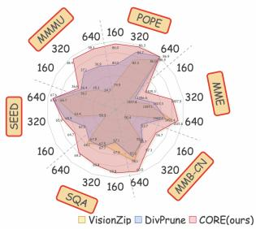

radar

| Category   | VisionZip | DivPrune | CORE(ours) |
| ---------- | --------- | -------- | ---------- |
| MOPE       | 320       | 640      | 640        |
| ROPE       | 320       | 640      | 640        |
| MME        | 320       | 640      | 640        |
| MME-ON     | 320       | 640      | 640        |
| SQA        | 320       | 640      | 640        |
| SEED       | 320       | 640      | 640        |
| MMMU       | 320       | 640      | 640        |

(a) Performance on 6 benchmarks.

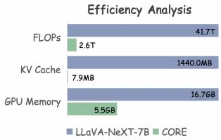

bar

Efficiency Analysis
| Component | LLaVA-NeXT-7B (T) | CORE (T) |
| :--- | :--- | :--- |
| FLOPs | 41.7 | 2.6 |
| KV Cache | 1440.0 | 7.9 |
| GPU Memory | 16.7 | 5.5 |

(b) Efficiency Analysis.   
Figure 1. CORE’s Performance and Efficiency. (a) When retaining with only 160, 320, and 640 tokens, CORE outperforms current state-of-the-art efficient LVLMs, such as VisionZip [103] and DivPrune [1], across six benchmarks. (b) Under its highest compression ratio, CORE reduces FLOPs by 16.0×, KV Cache by 182.3×, and GPU Memory by 2.7×, while still maintaining 97.4% of its baseline performance.

To address this challenge, a variety of visual token compression methods [19, 38, 43, 54, 67, 70, 74, 101, 104, 111] have been proposed. Existing token compression methods are generally based on transformation, similarity [26, 32, 46, 82], attention [31, 41, 51, 106] and query [65, 69, 108]. These methods start from individual tokens and can be categorized as token-centric methods. Some token-centric methods merge tokens with similar features [99, 112], but these tokens are not always redundant. Consequently, tokens with merely similar texture might be merged together, potentially confusing two semantically distinct entities. Other methods concentrate on tokens with high attention scores [24, 81, 87], which cannot guarantee that the retained tokens are compact and not redundant among themselves. Still other methods [115] bind the compression process to specific text queries and retain the more relevant tokens. This approach, however, comes at the cost of the model’s generality, undermining its comprehension of the complete scene context. Despite recent progress, existing token-centric token compression strategies often face a common challenge: operating without a high-level, semantic understanding of the scene.

Motivated by the limitations of prior works, we introduce CORE (Compact Object-centric REpresentations), a new paradigm wherein each distinct object is consolidated into a single and compact token for the LLM. CORE consists of a ConvNeXt-L [64] backbone, a Mask2Former [14] segmentation head and an LLM language head. To be specific, CORE routes features from the ConvNeXt-L visual encoder to the internal Mask2Former segmentation head to generate object masks. These masks then guide an objectcentric merging of the visual tokens. The resulting compact tokens are subsequently spatially sorted and fed into the LLM decoder. This process is highly efficient, as a shared visual encoder provides features for both the segmentation and language decoding pathways, significantly minimizing computational overhead. CORE’s paradigm largely resolves the aforementioned issues by generating an ordered set of compact object-centric representations for the entire scene. By leveraging semantic priors, it effectively prevents the merging of semantically distinct but texturally similar tokens. This compact representation also eliminates the intra-object redundancy common in attention-based methods. Furthermore, unlike query-bound approaches, CORE preserves the complete scene context, providing a more robust foundation for complex tasks. As shown in Fig. 1a, CORE achieves state-of-the-art performance across six authoritative image understanding benchmarks at three compression rates. Fig. 1b shows CORE brings substantial efficiency improvements on the dynamic adaptive compression tasks. Our main contributions are summarized as follows:

• We introduce CORE, a new paradigm for LVLMs that pioneers object-centric token merging, creating compact representations that provide enhanced semantic clarity as well as breakthrough efficiency.   
• CORE leverages an end-to-end architecture built upon a shared visual encoder, which provides features for both the segmentation and the language head, largely mitigating the additional segmentation computational overhead.   
• CORE not only outperforms state-of-the-art efficient LVLMs on fixed-rate compression tasks, but also drastically reduces computational and memory costs in adaptive-rate compression scenarios with negligible performance degradation.

# 2. Related Work

# 2.1. Transformation-based Token Compression

The most straightforward methods [36, 60, 88, 91] compress tokens via mathematical or algorithmic transformations, such as pixel unshuffle, spatial pooling, interpolation and convolution, which preserve the spatial locality of 2D features. While these methods [7, 9, 40, 105] are simple and efficient, their compression mechanism is inherently blind and inflexible, incapable of dynamically identifying and preserving key features.

# 2.2. Similarity-based Token Compression

Similarity-based methods [10, 34, 85, 93] posit that similar tokens contain similar information and cause redundancy. Specifically, this is achieved by calculating the pairwise distances or similarities between visual tokens and merging similar tokens [35, 95] or retaining tokens with the greatest difference [16, 71]. ToMe [5] is a typical method, which proposes the bipartite soft matching algorithm to identify and merge visual tokens inside vision transformers (ViTs). TopV [102] builds an optimization problem that considers a combination of factors, including feature similarity and spatial location, in order to select a visual token subset that is both representative and concise. A problem with such methods is that decisions based purely on local feature affinity are semantically blind and prone to erroneous merges between semantically distinct but texturally similar regions.

# 2.3. Attention-based Token Compression

Attention-based token compression methods [30, 62, 86, 114, 121, 123] use attention scores as a direct proxy for token importance. They operate on the assumption that tokens with low attention scores are redundant and can be pruned with minimal impact on model performance. Such compression can occur either in the vision encoder [2, 62] or the LLM decoder [27, 107, 113]. HiPrune [59] selects an information-rich and diverse subset of visual tokens by hierarchically analyzing the attention scores within the vision encoder. VTW [53] observes that visual tokens in deeper layers garner very little attention and withdraws them beyond a certain predetermined layer to speed up inference. While this strategy ensures that the retained tokens are salient, it does not guarantee they are non-redundant, thus failing to address the problem of information redundancy. A more critical challenge arises with decoder-side pruning: it requires access to attention scores that are never explicitly computed by modern acceleration libraries like FlashAttention [17, 18].

# 2.4. Query-based Token Compression

To enhance computational efficiency, query-based compression methods [83, 110, 119] leverage textual relevance to guide the selective reduction of visual tokens, thereby preserving only the information most relevant to a specific task. This principle is realized in two main ways. Explicit methods use the user’s query as a filter to extract the most pertinent visual tokens [25, 44], while implicit methods distill the visual information into a fixed number of text-relevant tokens [49, 96, 100, 116, 117]. MMTok [20] employs a greedy algorithm to select a subset of visual tokens that simultaneously maximizes coverage of both the text query’s semantics and the entire image’s visual information. CD-Pruner [115] builds upon the deduplication concept from similarity-based methods, but makes the pruning process dynamic and intelligent by incorporating user queries as a decision criterion. However, these explicit approaches risk losing crucial contextual information, a problem exacerbated by ambiguous queries or in conversational contexts. The implicit approach, on the other hand, introduces a fixed information bottleneck, which may be insufficient for representing visually complex scenes.

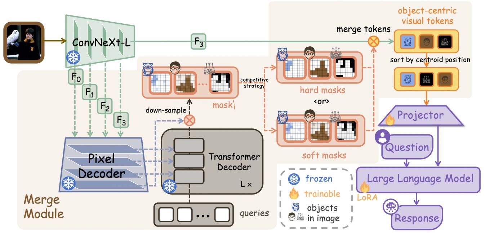

flowchart

```mermaid
graph TD
    A["Input Image"] --> B["ConvNeXt-L"]
    B --> C["F3"]
    C --> D["shifted Mask"]
    D --> E["down-sample"]
    E --> F["Transformer Decoder L×"]
    F --> G["queries"]
    G --> H["Pixel Decoder"]
    H --> I["Merge Module"]
    D --> J["soft masks"]
    J --> K["projector"]
    K --> L["Large Language Model"]
    L --> M["Response"]
    N["object-centric visual tokens"] --> O["sort by centroid position"]
    O --> P["Projector"]
    P --> Q["Question"]
    Q --> R["Large Language Model"]
    R --> S["Response"]
    T["frozen"] --> U["frozen"]
    U --> V["trainable"]
    V --> W["objects in image"]
    W --> X["lower layer"]
    X --> Y["lower layer"]
    Y --> Z["lower layer"]
    Z --> AA["lower layer"]
    AA --> AB["lower layer"]
    AB --> AC["lower layer"]
    AC --> AD["lower layer"]
    AD --> AE["lower layer"]
    AE --> AF["lower layer"]
    AF --> AG["lower layer"]
    AG --> AH["lower layer"]
    AH --> AI["lower layer"]
    AI --> AJ["lower layer"]
    AJ --> AK["lower layer"]
    AK --> AL["lower layer"]
    AL --> AM["lower layer"]
    AM --> AN["lower layer"]
    AN --> AO["lower layer"]
    AO --> AP["lower layer"]
    AP --> AQ["lower layer"]
    AQ --> AR["lower layer"]
    AR --> AS["lower layer"]
    AS --> AT["lower layer"]
    AT --> AU["lower layer"]
    AU --> AV["lower layer"]
    AV --> AW["lower layer"]
    AW --> AX["lower layer"]
    AX --> AY["lower layer"]
    AY --> AZ["lower layer"]
    AZ --> BA["lower layer"]
    BA --> BB["lower layer"]
    BB --> BC["lower layer"]
    BC --> BD["lower layer"]
    BD --> BE["lower layer"]
    BE --> BF["lower layer"]
    BF --> BG["lower layer"]
    BG --> BH["lower layer"]
    BH --> BI["lower layer"]
    BI --> BJ["lower layer"]
    BJ --> BK["lower layer"]
    BK --> BL["lower layer"]
    BL --> BM["lower layer"]
    BM --> BN["lower layer"]
    BN --> BO["lower layer"]
    BO --> BP["lower layer"]
    BP --> BQ["lower layer"]
    BQ --> BR["lower layer"]
    BR --> BS["lower layer"]
    BS --> BT["lower layer"]
    BT --> BU["lower layer"]
    BU --> BV["lower layer"]
    BV --> BW["lower layer"]
    BW --> BX["lower layer"]
    BX --> BY["lower layer"]
    BY --> BZ["lower layer"]
```

Figure 2. Overview of CORE. Our framework consists of two key pathways. The primary data flow, indicated by solid lines, shows how compact object-centric representations are generated and processed by the language decoder. This process is informed by the auxiliary segmentation head, shown with dashed lines, which produces the object masks that guide the token merging. The icon in the top-left corner of each mask denotes a different object in the image.

Some methods [22, 29, 45, 61, 79, 94, 122] further integrate multiple of the above elements. VISA [37] operates by first selecting key visual tokens guided by a text query, subsequently aggregating information from the nonselected tokens into the kept set based on visual similarity. GreedyPrune [73] employs a joint optimization approach to ensure that the selected token subset is both semantically salient and visually diverse.

# 3. Method

Motivation and Overview. To address the prevalent issue of token-centric compression methods for LVLMs, we emulate human perception by adopting an object-centric approach to obtain a more efficient and robust compression paradigm. CORE, as an end-to-end architecture, leverages an intrinsic segmentation prior to decompose the image and merge each individual object, as well as subsequently sorts these merged tokens by a centroid-guided strategy. Fig. 2 shows that we achieve this goal through efficient reuse of a ConvNeXt-L [64] vision encoder and a Mask2Former [14] decoder, which includes a Pixel Decoder and a Transformer Decoder. An image is input to the ConvNeXt-L vision encoder to extract a multi-scale feature pyramid which is utilized by the Mask2Former decoder. These masks are then filtered via a competitive strategy, yielding a set of soft or hard masks, each corresponding to a distinct visual entity. Guided by these masks, the final-layer features from the same ConvNeXt-L encoder are merged on an objectby-object basis. This set of object-centric tokens, spatially sorted by their centroids, forms the visual tokens fed to the language decoder. This shared-encoder design significantly reduces the computational overhead compared to multi-backbone approaches.

# 3.1. Model Architecture

ConvNeXt-L Backbone as Shared Vision Encoder. The overall architecture of CORE follows LLaVA-NeXT [55, 56]. LLaVA-NeXT employs a CLIP ViT-L/14 [77], but its single-scale feature map creates an architectural conflict with our segmentation head, which demands a multiscale pyramid. We resolve this by replacing the ViT with a ConvNeXt-L [64] backbone from OpenCLIP [33]. As a hierarchical CNN, ConvNeXt-L innately provides the required feature pyramid. Besides, we utilize a ConvNeXt-L variant pretrained under the CLIP contrastive objective, ensuring its output features are aligned with the text embedding space and thus fully compatible with the LLaVA-NeXT framework. This strategic selection allows for a single, unified backbone to efficiently serve two heterogeneous downstream tasks. The encoder outputs $F _ { C } =$ $\{ F _ { 0 } , F _ { 1 } , F _ { 2 } , F _ { 3 } \}$ at $1 / 4$ to $1 / 3 2$ resolutions. We route the full pyramid $\{ F _ { 0 } , \ldots , F _ { 3 } \}$ to the segmentation decoder, while the semantically-rich $F _ { 3 }$ map is used as the visual input for the language decoder, as shown in Fig. 2.

Mask2Former as Segmentation Head Decoder. We utilize Mask2Former [14] to generate object masks. Mask2Former’s decoders includes a Pixel Decoder and a Transformer Decoder. The Transformer decoder receives the set of multi-scale features from the Pixel Decoder and N initialized object queries. Through L layers of the Transformer Decoder, each learnable query will gradually lock onto a specific object and finally output a probability mask after applying a sigmoid function. The probability masks are then down-sampled via an interpolation function to match the resolution of $F _ { 3 }$ . Subsequently, we employ a pixel-wise competitive strategy to filter the set of $N$ predicted masks. This approach differs from conventional confidence-based thresholding and non-maximum suppression. Specifically, we identify the mask that exhibits the highest probability score for each pixel location. Only the queries corresponding to masks that are maximal for at least one pixel are retained as valid. From this process, two distinct outputs $\mathcal { P } _ { \mathrm { v a l i d } } = \{ P _ { 1 } , \ldots , P _ { N } \}$ , where each mask $P _ { n }$ corresponds to a specific object, can be derived: 1) a set of filtered, overlapping soft masks, and 2) a set of nonoverlapping hard masks, which is generated by assigning each pixel to the unique query that yielded the highest probability at its location. The outputs will be utilized to guide object-centric token merging in Sec. 3.2.

LLMs as Language Head Decoder. To bridge our object-centric visual representations with the language modality, we employ a projector layer which is designed as a flexible and configurable MLP. Once projected, the sequence of visual tokens is fed into the LLM, along with the embedded input text prompt. The LLM functions as the final language decoder, auto-regressively generating the textual response by attending to both the compact objectcentric visual context and the user’s query.

# 3.2. Object-centric Token Merging

We flatten $F _ { 3 } ,$ which is from $F _ { C } = \{ F _ { 0 } , F _ { 1 } , F _ { 2 } , F _ { 3 } \}$ , into $F \in \mathbb { R } ^ { H W \times \mathcal { C } }$ and let a single token from F be $f _ { i } \in \mathbb { R } ^ { C }$ . We aim to produce a single feature token $t _ { n } ~ \in ~ \mathbb { R } ^ { C }$ for each mask $P _ { n } ~ \in ~ \mathcal { P } _ { \operatorname { v a l i d } }$ by performing a weighted average over the entire visual feature map F . To achieve this, each 2D mask $P _ { n }$ of shape $H \times W$ is first flattened into a weight vector $\Omega _ { n } \in \mathbb { R } ^ { H W }$ , where each element $\omega _ { n , i }$ corresponds to the i-th token. The index i follows the raster scanning sequence. This operation is repeated for every valid mask $P _ { n } ,$ yielding a set of N aggregated object tokens $T ^ { \prime } = \{ t _ { 1 } , t _ { 2 } , . . . , t _ { N } \}$ . To ensure the final token sequence follows an order consistent with the spatial positions in the image, we then calculate the centroid of each mask and sort the tokens accordingly. The centroid position $c _ { n }$ of each mask $P _ { n }$ is similarly computed via the weighted average. The merged object token $t _ { n } \in \mathbb { R } ^ { C }$ and $c _ { n }$ are formulated as follows:

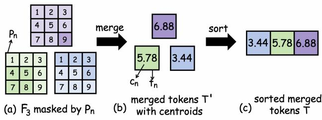

flowchart

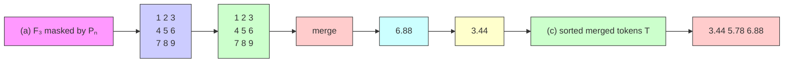

Figure 3. Illustration of Centroid-Guided Sorting. Assume $N \ = \ 3 .$ . In Step (a), the number in a token indicates the i-th token. For simplicity, darker (lighter) tokens represent a 0.9 (0.1) weight in $P _ { n }$ . In Step (b), the number in token tn indicates the centroid position $c _ { n }$ . The tokens are merged without sorting. Step (c) shows the final merged tokens $T$ sorted in ascending order based on their centroid values.

$$
t _ {n} = \frac {\sum_ {i = 1} ^ {H W} \omega_ {n , i} \cdot f _ {i}}{\sum_ {i = 1} ^ {H W} \omega_ {n , i}} \quad c _ {n} = \frac {\sum_ {i = 1} ^ {H W} \omega_ {n , i} \cdot i}{\sum_ {i = 1} ^ {H W} \omega_ {n , i}} \tag {1}
$$

where $\scriptstyle \sum _ { i = 1 } ^ { H W } \omega _ { n , i } \cdot f _ { i }$ is a weighted sum, which iterates over all pixel feature vectors $f _ { i }$ and weights each one according to its value $\omega _ { n , i }$ from the n-th mask. $\textstyle \sum _ { i = 1 } ^ { H W } \omega _ { n , i }$ is the sum of all values in the n-th mask and serves to normalize the weighted sum of features. Subsequently, the set of merged tokens $T ^ { \prime }$ is sorted in ascending order based on their centroid values $\{ c _ { 1 } , \ldots , c _ { N } \}$ , yielding a final and spatiallyordered visual representation T , as shown in Fig. 3. The sorted tokens $T$ are then input into the projector layer. We adopt two merging strategies: merging via soft masks and merging via hard masks.

Merging via Soft Masks. When CORE uses the soft masks to merge, each soft mask $P _ { n } \in [ 0 , 1 ] ^ { H \times W }$ is a probability map and $\omega _ { n , i }$ is the probability of each token. The soft-mask-based method leverages the full probability maps from the segmentation head. Its primary advantage is the preservation of fine-grained information, as it naturally handles ambiguous boundaries and regions of object overlap by assigning partial and probabilistic weights.

Merging via Hard Masks. When hard masks are utilized to merge, each hard mask $P _ { n } \in \{ 0 , 1 \} ^ { H \times W }$ is a binary map and $\omega _ { n , i }$ takes the value 1 when the hard mask includes the i-th feature and 0 when the mask excludes the i-th feature. The merged object token $t _ { n }$ is computed as the arithmetic mean of the selected features. Similar to the soft-mask approach, the resulting set of N object tokens T is then spatially sorted based on the centroids of their corresponding hard mask regions $c _ { n }$ . This method first assigns each visual token to the single query with the highest probability. This process yields a set of discrete and nonoverlapping object regions with crisp boundaries, ensuring unambiguous representations.

# 3.3. Training and Inference Strategy

Training. Our training strategy follows the two-stage paradigm of LLaVA [55], consisting of feature alignment pretraining and visual instruction tuning. During the first stage, the parameters of the vision backbone (ConvNeXt-L), the segmentation head (Mask2Former), and the LLM are all frozen. The vision components operate as a fixed feature extractor to produce compact object-centric tokens. Only the projector layer is trainable. The projector is trained on a large-scale dataset of image-caption pairs using a standard auto-regressive loss $\mathcal { L } _ { \mathrm { t e x t } }$ [55, 75]. During the second stage, in addition to finetuning the visual projector, we use LoRA [28] to finetune the LLM. The loss function is still the auto-regressive loss $\mathcal { L } _ { \mathrm { t e x t } }$ but it is trained with high-quality visual instruction dialogue data.

Inference. During the evaluation phase, our model generates responses in an end-to-end manner for a given imagetext pair. We employ a deterministic decoding strategy to ensure reproducible and optimal results.

# 4. Experiments

# 4.1. Implementation Details

Model Configuration. Our CORE model is built upon the MMDetection [11] framework and we conduct all our experiments on a server equipped with 4 NVIDIA A800 GPUs (80GB). Our visual perception module consists of a ConvNeXt-L [64] and a Mask2Former [14], which we keep frozen. The module is initialized with weights pretrained by OMG-Seg [47]. To accelerate inference, the visual perception module operates in full precision (FP32) during training and is switched to half precision (FP16) for evaluation. The input image is first resized to a resolution of 1024 × 1024. The ConvNeXt-L hierarchical vision backbone processes the input image through four stages, producing a feature pyramid F0, F1, F2, F3 with progressively increasing channel dimensions of 192, 384, 768, and 1536. For Mask2Former’s structure, the number of blank queries is set to 300 and the transformer decoder has L = 9 layers. Based on pretraining, the model can recognize 80 thing and 53 stuff categories. Others are regarded as a single special category. In subsequent processing, we treat these 134 categories equally. The projector is a two-layer MLP with a GELU activation function, mapping the visual features from a dimension of 1536 to the LLM’s hidden dimension of 4096. We choose InternLM2-7B [8] as CORE’s language decoder. For a deep and parameter-efficient fine-tuning of the LLM, we utilize the LoRA [28] methodology. Specifically, we configure the adapter with a high rank (r = 512), apply regularization via a scaling alpha of 256 and a dropout rate of 0.05, and do not train any bias terms.

Training and Evaluation Dataset. Our two-stage training process follows the paradigm established by the LLaVA family [55, 58]. In the first stage, feature alignment pretraining, we train only the projector using the LLaVA 558K Mixture dataset [55], which consists of 558K image-caption pairs. For the second stage, visual instruction tuning, we finetune both the projector and the LLM’s LoRA adapters using the advanced multimodal instruction dataset LLaVA-NeXT data [58]. For evaluation, we evaluate our CORE model on six different multimodal tasks, including POPE [48], MME [21], MMBench-CN [63], ScienceQA-IMG [68], SEEDBench-IMG [39] and MMMU [109].

# 4.2. Main Results

Under specific circumstances, we also need a fixed-rate token merging strategy which could retain a constant number of tokens to be the input of LLMs. This enables batch processing efficiency and fair performance comparison. Based on the hard masks, we design the fixed-rate strategy by merging tokens in the order of objects. We assume that objects with more tokens (larger objects) have more information redundancy and give priority to merging these objects. Specifically, we first sort the objects in descending order based on their area, which is determined by the number of tokens in each corresponding mask. Subsequently, each object is merged according to the sequence of raster scanning (i.e.,from top to bottom and left to right). This process can be represented by pseudo code Algorithm 1 in Sec. B of Supplementary Material. Besides, for ablation study, we also discuss the small-object-first strategy in Sec. A of Supplementary Material.

We compare our CORE model with recent token merging or pruning works based on LLaVA-NeXT in a fixedrate setting, which can handle high-resolution tasks better. For the ToMe baseline, we select a target token count that is both comparable to other methods and corresponds to a simple fractional keep rate. As shown in Table 11, our CORE method achieves state-of-the-art or highly competitive performance across all six tasks. To verify that CORE’s high performance is attributable to our compression strategy itself, not to the change in vision encoder, the values in blue indicate the percentage of performance retained by each compressed model relative to the uncompressed, fulltoken CORE baseline. In some circumstances, our compressed CORE performs better than the full-token baseline. We attribute this to the powerful regularization effect of our object-centric merging strategy. By forcing the model to focus on salient, semantically coherent object representations, it effectively suppresses overfitting to noise and artifacts in the training data, thereby improving the model’s generalization capabilities on downstream tasks.

Table 1. Comparison on Fixed-rate Compression Tasks. For fair comparison, the blue percentage values show the retained performance with fixed tokens, compared with full-token CORE model (ConvNeXt-L backbone) which serves as the 100% baseline. 

<table><tr><td></td><td>tokens</td><td>POPE</td><td>MME</td><td> $MMB^{CN}$ </td><td> $SQA^1$ </td><td> $SEED^1$ </td><td>MMMU</td></tr><tr><td>LLaVA-NeXT-7B</td><td>2880</td><td>86.8</td><td>1511.8</td><td>57.3</td><td>67.5</td><td>70.2</td><td>35.1</td></tr><tr><td rowspan="2">CORE (vanilla)</td><td rowspan="2">1024</td><td>86.4</td><td>1626.7</td><td>61.0</td><td>68.3</td><td>69.6</td><td>36.8</td></tr><tr><td>100.0%</td><td>100.0%</td><td>100.0%</td><td>100.0%</td><td>100.0%</td><td>100.0%</td></tr><tr><td>ToMe [5]</td><td>720</td><td>85.3</td><td>1407.8</td><td>55.6</td><td>67.2</td><td>-</td><td>-</td></tr><tr><td>FastV [13]</td><td>640</td><td>79.5</td><td>1412.6</td><td>53.5</td><td>67.4</td><td>-</td><td>-</td></tr><tr><td>PDrop [98]</td><td>640</td><td>83.8</td><td>1475.9</td><td>55.2</td><td>66.7</td><td>-</td><td>-</td></tr><tr><td>SparseVLM [118]</td><td>640</td><td>85.3</td><td>1456.8</td><td>58.6</td><td>67.6</td><td>-</td><td>34.6</td></tr><tr><td>PruMerge+ [78]</td><td>640</td><td>85.3</td><td>1480.2</td><td>57.3</td><td>67.8</td><td>-</td><td>-</td></tr><tr><td>TRIM [84]</td><td>640</td><td>86.9</td><td>1471.8</td><td>55.8</td><td>66.9</td><td>-</td><td>-</td></tr><tr><td>VisionZip [103]</td><td>640</td><td>86.0</td><td>1493.4</td><td>58.1</td><td>68.1</td><td>66.7</td><td>34.7</td></tr><tr><td>DART [97]</td><td>640</td><td>85.0</td><td>1450.2</td><td>57.1</td><td>68.2</td><td>-</td><td>-</td></tr><tr><td>DivPrune [1]</td><td>640</td><td>86.9</td><td>1469.7</td><td>57.3</td><td>67.8</td><td>67.6</td><td>36.9</td></tr><tr><td rowspan="2">CORE (ours)</td><td rowspan="2">640</td><td>86.9</td><td>1521.6</td><td>60.0</td><td>69.2</td><td>67.6</td><td>38.3</td></tr><tr><td>100.6%</td><td>93.5%</td><td>98.4%</td><td>101.3%</td><td>97.1%</td><td>104.1%</td></tr><tr><td>ToMe [5]</td><td>360</td><td>82.4</td><td>1343.2</td><td>54.6</td><td>67.7</td><td>-</td><td>-</td></tr><tr><td>FastV [13]</td><td>320</td><td>49.5</td><td>1099.0</td><td>42.5</td><td>66.6</td><td>-</td><td>-</td></tr><tr><td>PDrop [98]</td><td>320</td><td>60.8</td><td>1171.5</td><td>44.7</td><td>66.7</td><td>-</td><td>-</td></tr><tr><td>SparseVLM [118]</td><td>320</td><td>76.9</td><td>1386.1</td><td>56.7</td><td>67.2</td><td>-</td><td>34.4</td></tr><tr><td>PruMerge+ [78]</td><td>320</td><td>79.5</td><td>1444.3</td><td>55.6</td><td>68.1</td><td>-</td><td>-</td></tr><tr><td>TRIM [84]</td><td>320</td><td>86.5</td><td>1443.8</td><td>51.0</td><td>66.2</td><td>-</td><td>-</td></tr><tr><td>VisionZip [103]</td><td>320</td><td>82.3</td><td>1397.1</td><td>55.6</td><td>67.5</td><td>63.4</td><td>35.3</td></tr><tr><td>DART [97]</td><td>320</td><td>81.0</td><td>1419.5</td><td>55.7</td><td>67.5</td><td>-</td><td>-</td></tr><tr><td>DivPrune [1]</td><td>320</td><td>84.7</td><td>1423.3</td><td>55.7</td><td>67.7</td><td>65.4</td><td>37.1</td></tr><tr><td rowspan="2">CORE (ours)</td><td rowspan="2">320</td><td>86.3</td><td>1497.9</td><td>57.3</td><td>69.4</td><td>65.9</td><td>38.4</td></tr><tr><td>99.9%</td><td>92.1%</td><td>93.9%</td><td>101.6%</td><td>94.7%</td><td>104.3%</td></tr><tr><td>ToMe [5]</td><td>180</td><td>73.6</td><td>932.9</td><td>34.0</td><td>64.1</td><td>-</td><td>-</td></tr><tr><td>PruMerge+ [78]</td><td>160</td><td>71.1</td><td>1289.6</td><td>48.9</td><td>66.9</td><td>-</td><td>-</td></tr><tr><td>TRIM [84]</td><td>160</td><td>84.8</td><td>1275.8</td><td>45.2</td><td>65.5</td><td>-</td><td>-</td></tr><tr><td>VisionZip [103]</td><td>160</td><td>74.9</td><td>1327.8</td><td>50.4</td><td>67.9</td><td>58.3</td><td>36.1</td></tr><tr><td>DART [97]</td><td>160</td><td>75.3</td><td>1325.4</td><td>53.6</td><td>67.8</td><td>-</td><td>-</td></tr><tr><td>DivPrune [1]</td><td>160</td><td>80.0</td><td>1356.6</td><td>53.7</td><td>67.1</td><td>62.5</td><td>36.4</td></tr><tr><td rowspan="2">CORE (ours)</td><td rowspan="2">160</td><td>86.0</td><td>1405.3</td><td>56.7</td><td>69.8</td><td>64.7</td><td>36.6</td></tr><tr><td>99.5%</td><td>86.4%</td><td>93.0%</td><td>102.2%</td><td>93.0%</td><td>99.5%</td></tr></table>

For dynamic adaptive tasks, Tab. 22provides a comprehensive comparison, benchmarking CORE’s soft-mask and

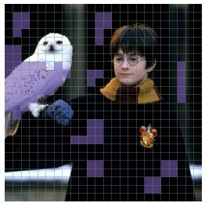

natural_image

Person holding a white owl and purple bird against a pixelated grid background (no text or symbols visible)

(a1) ToMe

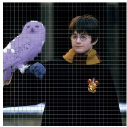

natural_image

Person holding a purple bird and a medal, standing in front of a grid-patterned fence (no visible text or symbols)

(a2) CORE

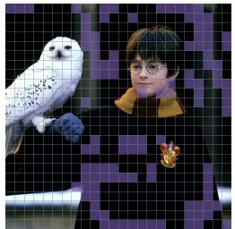

natural_image

Person holding a white owl perched on a bird, with a decorative medal and ribbon badge visible (no text or symbols)

(b1) ToMe

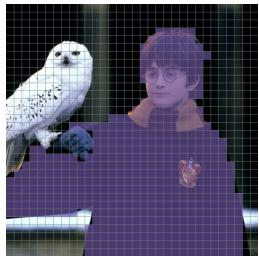

natural_image

Illustration of a person with an owl and bird, standing against a grid background (no text or symbols)

(b2) CORE

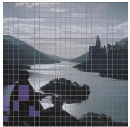

natural_image

Black-and-white landscape photo of a river valley with mountains and a castle in the background, overlaid with a pixelated graphic overlay (no text or symbols)

(c1) ToMe

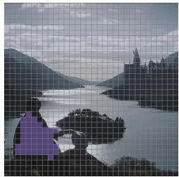

natural_image

Scenic river landscape with a castle silhouette in the background, no visible text or symbols

(c2) CORE

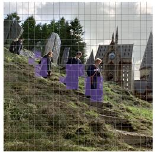

natural_image

Group of people in purple dresses walking on a grassy hillside with a Gothic-style building in the background (no visible text or symbols)

(d1) ToMe

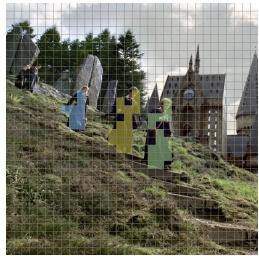

natural_image

Group of people on a grassy hillside with a Gothic-style building in the background (no visible text or symbols)

(d2) CORE   
Figure 4. Visualization Comparison

hard-mask variants against competing object-centric VLMs that utilize methods such as Slot Attention [66]. The experimental results demonstrate that the hard-mask-based variant of CORE consistently outperforms all other methods.

# 4.3. Visualization Comparison

In this section, we compare our merging strategy with ToMe [5], as shown in Fig. 4. We ensure that ToMe and CORE have the same compression ratio in each group of pictures and visualize which tokens are planned to be merged. Besides erroneous merging of semantically distinct objects, layer-by-layer merging based on feature similarity is also susceptible causing the “boundary bleeding” problem. Fig. 4(a1) shows that more of the black background is further integrated, as the boundary of the white owl is mixed with a black background. Besides, as Fig. 4(b1) shows, when the character’s clothing is visually similar to the background, incorrect merging is likely to happen. Our CORE model fundamentally prevents these issues by leveraging segmentation masks, as Fig. $4 ( a _ { 2 } )$ and Fig. 4(b2) demonstrate. By comparing Fig. 4(c1) and (c2), we can see CORE maintains stable segmentation performance in a dim environment. In Fig. $4 ( d _ { 1 } )$ ), similar characters are merged together without distinguishing between them by ToMe. However, CORE can distinguish different objects of the same class. (Different mask colors represent different token groups.) These visualizations provide compelling evidence that by shifting the merging criterion from fragile feature affinity to robust semantic identity, CORE produces qualitatively superior and more reliable object-centric representations.

Table 2. Comparison on Dynamic Adaptive Compression Tasks. Bold indicates the best performance on each dataset. 

<table><tr><td></td><td colspan="3">POPE MME MMB $^{CN}$ </td><td colspan="3">SQA $^{I}$ SEED $^{I}$ </td><td>MMMU</td></tr><tr><td>SEED-LLaMA [23]</td><td>78.0</td><td>1123.9</td><td>-</td><td>-</td><td>48.6</td><td>26.8</td><td></td></tr><tr><td>Slot-MLLM-base [15]</td><td>78.3</td><td>1128.4</td><td>-</td><td>-</td><td>44.7</td><td>29.0</td><td></td></tr><tr><td>Slot-MLLM [15]</td><td>79.8</td><td>1202.6</td><td>-</td><td>-</td><td>47.4</td><td>28.0</td><td></td></tr><tr><td>CORE (soft mask)</td><td>83.6</td><td>1339.1</td><td>53.6</td><td>69.0</td><td>60.3</td><td>37.0</td><td></td></tr><tr><td>CORE (hard mask)</td><td>85.6</td><td>1396.7</td><td>55.3</td><td>69.9</td><td>63.1</td><td>38.7</td><td></td></tr></table>

On the other hand, Tab. 2 demonstrates the superiority of hard-mask-guided merging over its soft-mask alternative. To understand this performance gap, we also visualize the complete soft masks in Sec. C in Supplementary Material, representing their weights with varying color intensities. As shown in Fig. 5, the same owl object is represented by both the 14th and 18th soft masks. This redundancy introduces ambiguity for the LLM, leading to potential errors in tasks such as object counting and understanding spatial relationships. In contrast, hard masks are mutually exclusive, which enforces a strict “one object, one token” mapping and avoids such confusion.

# 4.4. Efficiency Analysis

Our proposed CORE features an enhanced vision module based on LLaVA-NeXT. Tab. 3 compares their computational costs and parameters, showing that our vision module’s burden is comparable to, or even slightly lower than, that of the vision encoder in LLaVA-NeXT. We also benchmark the efficiency of CORE against LLaVA-NeXT-7B and competing token compression methods on fixed-rate tasks by measuring the total time to run inference over the full POPE dataset on a single A800 GPU. The results, summarized in Table 43, demonstrate that CORE simultaneously achieves the highest performance and the lowest runtime.

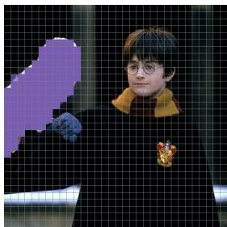

natural_image

Person wearing glasses and a yellow scarf, holding a small object against a dark grid background (no visible text or symbols)

(a) the 14th Soft Mask

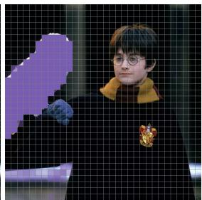

natural_image

Person wearing glasses and a yellow scarf, holding a medal, against a dark grid background (no visible text or symbols)

(b) the 18th Soft Mask   
Figure 5. CORE Visualization (soft mask)

Table 3. Computational Cost and Parameter Comparison of Different Visual Modules. We calculate the total FLOPs and parameter count for the visual module of CORE. 

<table><tr><td></td><td>Visual Module</td><td>FLOPs↓</td><td>Parameters↓</td></tr><tr><td>LLaVA-NeXT</td><td>CLIP ViT-L/14</td><td>1.91T</td><td>303.2 M</td></tr><tr><td rowspan="3">CORE</td><td>ConvNeXt-LBackbone</td><td>1.44T</td><td>199.8 M</td></tr><tr><td>Mask2FormerHead</td><td>0.30T</td><td>37.3 M</td></tr><tr><td>Sum</td><td>1.74T</td><td>237.1M</td></tr></table>

Table 4. Efficiency Analysis on Fixed-rate Compression Tasks 

<table><tr><td></td><td>tokens</td><td>Total Time ↓</td><td>Δ ↑</td><td>Score↑</td></tr><tr><td>LLaVA-NeXT-7B</td><td>2880</td><td>2293s</td><td>-</td><td>86.8</td></tr><tr><td>FastV [13]</td><td>160</td><td>1792s</td><td>1.28×</td><td>66.5</td></tr><tr><td>SparseVLM [118]</td><td>160</td><td>1895s</td><td>1.21×</td><td>76.6</td></tr><tr><td>CORE</td><td>160</td><td>1122s</td><td>2.04×</td><td>86.0</td></tr></table>

In the case of adaptive compression, we evaluate the efficiency of our CORE model on the POPE dataset under two settings: standard half-precision (FP16) inference and a version further optimized with 4-bit quantization, as shown in Tab. 5. CORE’s aggressive token reduction, from 2880 down to an average of 63.1, leads to dramatic savings in FLOPs and KV Cache. However, since the 7B model’s weights constitute a fixed ∼14GB overhead, the reduction in total GPU memory is less substantial. This is addressed by applying 4-bit quantization to the LLM, which cuts the GPU memory by more than one third while incurring only a negligible performance loss.

# 4.5. Analysis of Token Counts on Various Datasets

In order to further analyze our adaptive compression strategy, we quantify its compression ability on a per-dataset basis. Tab. 6 summarizes these statistics, including the average number of tokens CORE generates for each benchmark. To provide a more granular analysis of our adaptive compression, Fig. 6 visualizes the distribution of the number of generated tokens for all images in the POPE dataset using a histogram. Other datasets’ visualization can be found in Sec. D in Supplementary Material.

Table 5. Efficiency Analysis on Adaptive Compression Tasks 

<table><tr><td></td><td>POPE tokens</td><td>FLOPs ↓</td><td>KV Cache ↓</td><td>GPU Memory↓</td><td>POPE Score↑</td></tr><tr><td>LLaVA-NeXT -7B</td><td>2880</td><td>41.7T</td><td>1440.0MB</td><td>16.7GB</td><td>86.8</td></tr><tr><td>CORE -FP16</td><td>63.1</td><td>2.6T</td><td>7.9MB</td><td>15.1GB</td><td>85.9</td></tr><tr><td>CORE -4bit</td><td>63.1</td><td>2.6T</td><td>7.9MB</td><td>5.5 GB</td><td>85.6</td></tr></table>

Table 6. Adaptive Token Counts on Various Datasets 

<table><tr><td>Dataset</td><td>Min</td><td>Max</td><td>Mean</td><td>Median</td><td>SD</td></tr><tr><td>POPE</td><td>7</td><td>155</td><td>63.1</td><td>61</td><td>25.0</td></tr><tr><td>MME</td><td>2</td><td>133</td><td>48.3</td><td>46</td><td>24.1</td></tr><tr><td> $MMB^{CN}$ </td><td>2</td><td>162</td><td>35.9</td><td>31</td><td>23.1</td></tr><tr><td> $SQA^I$ </td><td>3</td><td>104</td><td>25.3</td><td>23</td><td>13.6</td></tr><tr><td> $SEED^I$ </td><td>6</td><td>179</td><td>61.0</td><td>58</td><td>26.7</td></tr><tr><td>MMMU</td><td>1</td><td>140</td><td>22.3</td><td>18</td><td>19.1</td></tr></table>

# 4.6. Discussion on Segmentation Dependency

As Sec. 4.1 mentions, the Mask2Former segmentation head can only recognize 133 predefined categories. This subsection therefore investigates the robustness of CORE when faced with out-of-distribution (OOD) or occluded objects. The principle behind CORE’s object recognition is to use blank queries to actively search for pretrained objects within the image. Fig. 7a displays an OOD category, specifically a mythical creature. While CORE fails to recognize the entire object, it can still partition the unknown object into several parts based on the features of known objects, successfully completing the merging task. In fact, when the segmentation prior fails to recognize an OOD object, CORE tends to avoid erroneous semantic merging and preserve more tokens. This conservative strategy ensures the integrity of critical visual information. Similarly, Fig. 7b demonstrates that when an object encounters occlusion, CORE can still complete the recognition task by segmenting it into two parts. However, even under this conservative tokenretention mechanism, the maximum token count for our adaptive approach stays below 180 on all benchmarks with 30000+ images, as shown in Sec. D. This proves that CORE effectively balances robustness with high efficiency.

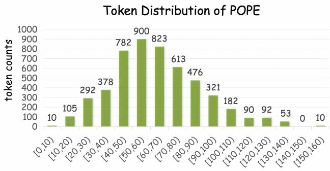

bar

Token Distribution of POPE
| Score Range | Token counts |
|---|---|
| [0, 10) | 10 |
| [10, 20) | 105 |
| [20, 30) | 292 |
| [30, 40) | 378 |
| [40, 50) | 782 |
| [50, 60) | 900 |
| [60, 70) | 823 |
| [70, 80) | 613 |
| [80, 90) | 476 |
| [90, 100) | 321 |
| [100, 110) | 182 |
| [110, 120) | 90 |
| [120, 130) | 92 |
| [130, 140) | 53 |
| [140, 150) | 0 |
| [150, 160) | 10 |

Figure 6. Token Distribution of POPE

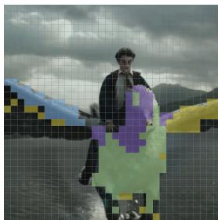

natural_image

Person standing in front of a colorful pixelated object against a cloudy sky and mountain background (no text or symbols visible)

(a) Out-of-Distribution

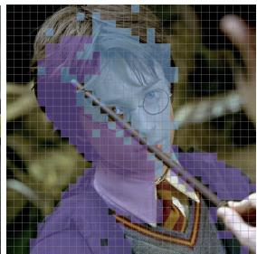

natural_image

Close-up of a person wearing a purple face with glasses and a patterned garment, holding a tool (no visible text or symbols)

(b) Occluded   
Figure 7. Discussion on Segmentation Dependency

# 5. Limitation

While CORE significantly reduces the theoretical computational load (FLOPs), the complex computational flow and data scheduling within its vision module create a memory bandwidth bottleneck, limiting the model from realizing its full potential in terms of practical inference speed. Future work will address this from a low-level systems optimization perspective, employing techniques such as operator fusion, customized CUDA kernels, and I/O-aware scheduling to further unleash CORE’s performance advantages.

# 6. Conclusion

In this paper, we introduced CORE, a new object-centric paradigm for visual token compression to address the high computational overhead of LVLMs. CORE leverages internally generated segmentation masks as a high-level semantic prior to merge tokens into compact object-level representations, preserving crucial spatial information via centroidguided sorting. On both fixed-rate and adaptive-rate compression tasks, CORE achieved SOTA performance across multiple datasets. CORE preserves object-level semantic and spatial information, which gives it immense application potential in various fields. These include intelligent image/video retrieval and moderation, environmental perception for robotics and autonomous systems, as well as large-scale video surveillance analysis.

# References

[1] Saeed Ranjbar Alvar, Gursimran Singh, Mohammad Akbari, and Yong Zhang. Divprune: Diversity-based visual token pruning for large multimodal models. In Proceedings of the Computer Vision and Pattern Recognition Conference, pages 9392–9401, 2025. 1, 6   
[2] Kazi Hasan Ibn Arif, JinYi Yoon, Dimitrios S Nikolopoulos, Hans Vandierendonck, Deepu John, and Bo Ji. Hired: Attention-guided token dropping for efficient inference of high-resolution vision-language models. In Proceedings of the AAAI Conference on Artificial Intelligence, pages 1773– 1781, 2025. 2   
[3] Jinze Bai, Shuai Bai, Yunfei Chu, Zeyu Cui, Kai Dang, Xiaodong Deng, Yang Fan, Wenbin Ge, Yu Han, Fei Huang, Binyuan Hui, Luo Ji, et al. Qwen technical report, 2023. 1   
[4] Jinze Bai, Shuai Bai, Shusheng Yang, Shijie Wang, Sinan Tan, Peng Wang, Junyang Lin, Chang Zhou, and Jingren Zhou. Qwen-vl: A versatile vision-language model for understanding, localization, text reading, and beyond, 2023. 1   
[5] Daniel Bolya, Cheng-Yang Fu, Xiaoliang Dai, Peizhao Zhang, Christoph Feichtenhofer, and Judy Hoffman. Token merging: Your vit but faster. arXiv preprint arXiv:2210.09461, 2022. 2, 6   
[6] Tom Brown, Benjamin Mann, Nick Ryder, Melanie Subbiah, Jared D Kaplan, Prafulla Dhariwal, Arvind Neelakantan, Pranav Shyam, Girish Sastry, Amanda Askell, et al. Language models are few-shot learners. Advances in neural information processing systems, 33:1877–1901, 2020. 1   
[7] Mu Cai, Jianwei Yang, Jianfeng Gao, and Yong Jae Lee. Matryoshka multimodal models, 2024. 2   
[8] Zheng Cai, Maosong Cao, Haojiong Chen, Kai Chen, Keyu Chen, Xin Chen, Xun Chen, Zehui Chen, Zhi Chen, Pei Chu, Xiaoyi Dong, Haodong Duan, Qi Fan, Zhaoye Fei, Yang Gao, Jiaye Ge, Chenya Gu, Yuzhe Gu, Tao Gui, Aijia Guo, Qipeng Guo, et al. Internlm2 technical report, 2024. 5   
[9] Junbum Cha, Wooyoung Kang, Jonghwan Mun, and Byungseok Roh. Honeybee: Locality-enhanced projector for multimodal llm. In Proceedings of the IEEE/CVF Conference on Computer Vision and Pattern Recognition (CVPR), 2024. 2   
[10] Wenhao Chai, Enxin Song, Yilun Du, Chenlin Meng, Vashisht Madhavan, Omer Bar-Tal, Jeng-Neng Hwang, Saining Xie, and Christopher D. Manning. Auroracap: Efficient, performant video detailed captioning and a new benchmark. arXiv preprint arXiv:2410.03051, 2024. 2   
[11] Kai Chen, Jiaqi Wang, Jiangmiao Pang, Yuhang Cao, Yu Xiong, Xiaoxiao Li, Shuyang Sun, Wansen Feng, Ziwei Liu, Jiarui Xu, Zheng Zhang, Dazhi Cheng, Chenchen Zhu, Tianheng Cheng, Qijie Zhao, Buyu Li, Xin Lu, Rui Zhu, Yue Wu, Jifeng Dai, Jingdong Wang, Jianping Shi, Wanli Ouyang, Chen Change Loy, and Dahua Lin. MMDetection: Open mmlab detection toolbox and benchmark. arXiv preprint arXiv:1906.07155, 2019. 5

[12] Lin Chen, Jinsong Li, Xiaoyi Dong, Pan Zhang, Conghui He, Jiaqi Wang, Feng Zhao, and Dahua Lin. Sharegpt4v: Improving large multi-modal models with better captions, 2023. 1   
[13] Liang Chen, Haozhe Zhao, Tianyu Liu, Shuai Bai, Junyang Lin, Chang Zhou, and Baobao Chang. An image is worth 1/2 tokens after layer 2: Plug-and-play inference acceleration for large vision-language models, 2024. 6, 7   
[14] Bowen Cheng, Ishan Misra, Alexander G. Schwing, Alexander Kirillov, and Rohit Girdhar. Masked-attention mask transformer for universal image segmentation. 2022. 2, 3, 4, 5   
[15] Donghwan Chi, Hyomin Kim, Yoonjin Oh, Yongjin Kim, Donghoon Lee, Daejin Jo, Jongmin Kim, Junyeob Baek, Sungjin Ahn, and Sungwoong Kim. Slot-mllm: Objectcentric visual tokenization for multimodal llm, 2025. 7   
[16] Janghoon Cho, Jungsoo Lee, Munawar Hayat, Kyuwoong Hwang, Fatih Porikli, and Sungha Choi. Floc: Facility location-based efficient visual token compression for long video understanding. arXiv preprint arXiv:2511.00141, 2025. 2   
[17] Tri Dao. Flashattention-2: Faster attention with better parallelism and work partitioning. arXiv preprint arXiv:2307.08691, 2023. 2   
[18] Tri Dao, Dan Fu, Stefano Ermon, Atri Rudra, and Christopher Ré. Flashattention: Fast and memory-efficient exact attention with io-awareness. Advances in neural information processing systems, 35:16344–16359, 2022. 2   
[19] Mohamed Dhouib, Davide Buscaldi, Sonia Vanier, and Aymen Shabou. Pact: Pruning and clustering-based token reduction for faster visual language models. In Proceedings of the IEEE/CVF Conference on Computer Vision and Pattern Recognition (CVPR), pages 14582–14592, 2025. 1   
[20] Sixun Dong, Juhua Hu, Mian Zhang, Ming Yin, Yanjie Fu, and Qi Qian. Mmtok: Multimodal coverage maximization for efficient inference of vlms. arXiv preprint arXiv:2508.18264, 2025. 2, 6   
[21] Chaoyou Fu, Peixian Chen, Yunhang Shen, Yulei Qin, Mengdan Zhang, Xu Lin, Jinrui Yang, Xiawu Zheng, Ke Li, Xing Sun, Yunsheng Wu, and Rongrong Ji. Mme: A comprehensive evaluation benchmark for multimodal large language models, 2024. 5   
[22] Tianyu Fu, Tengxuan Liu, Qinghao Han, Guohao Dai, Shengen Yan, Huazhong Yang, Xuefei Ning, and Yu Wang. Framefusion: Combining similarity and importance for video token reduction on large vision language models, 2025. 3   
[23] Yuying Ge, Sijie Zhao, Ziyun Zeng, Yixiao Ge, Chen Li, Xintao Wang, and Ying Shan. Making llama see and draw with seed tokenizer. arXiv preprint arXiv:2310.01218, 2023. 7   
[24] Yanan Guo, Wenhui Dong, Jun Song, Shiding Zhu, Xuan Zhang, Hanqing Yang, Yingbo Wang, Yang Du, Xianing Chen, and Bo Zheng. Fila-video: Spatio-temporal compression for fine-grained long video understanding, 2025. 1

[25] Jiayi Han, Liang Du, Yiwen Wu, Xiangguo Zhou, Hongwei Du, and Weibo Zheng. Adafv: Rethinking of visuallanguage alignment for vlm acceleration, 2025. 2   
[26] Yuhang Han, Xuyang Liu, Zihan Zhang, Pengxiang Ding, Donglin Wang, Honggang Chen, Qingsen Yan, and Siteng Huang. Filter, correlate, compress: Training-free token reduction for mllm acceleration, 2025. 1   
[27] Yefei He, Feng Chen, Jing Liu, Wenqi Shao, Hong Zhou, Kaipeng Zhang, and Bohan Zhuang. Zipvl: Efficient large vision-language models with dynamic token sparsification, 2024. 2   
[28] Edward J Hu, Yelong Shen, Phillip Wallis, Zeyuan Allen-Zhu, Yuanzhi Li, Shean Wang, Lu Wang, and Weizhu Chen. LoRA: Low-rank adaptation of large language models. In International Conference on Learning Representations, 2022. 5   
[29] Lianyu Hu, Fanhua Shang, Liang Wan, and Wei Feng. illava: An image is worth fewer than 1/3 input tokens in large multimodal models, 2024. 3   
[30] Lianyu Hu, Fanhua Shang, Wei Feng, and Liang Wan. Lightvlm: Acceleraing large multimodal models with pyramid token merging and kv cache compression, 2025. 2   
[31] Wenxuan Huang, Zijie Zhai, Yunhang Shen, Shaosheng Cao, Fei Zhao, Xiangfeng Xu, Zheyu Ye, Yao Hu, and Shaohui Lin. Dynamic-llava: Efficient multimodal large language models via dynamic vision-language context sparsification, 2025. 1   
[32] Jeongseok Hyun, Sukjun Hwang, Su Ho Han, Taeoh Kim, Inwoong Lee, Dongyoon Wee, Joon-Young Lee, Seon Joo Kim, and Minho Shim. Multi-granular spatio-temporal token merging for training-free acceleration of video llms. arXiv preprint arXiv:2507.07990, 2025. 1   
[33] Gabriel Ilharco, Mitchell Wortsman, Ross Wightman, Cade Gordon, Nicholas Carlini, Rohan Taori, Achal Dave, Vaishaal Shankar, Hongseok Namkoong, John Miller, et al. Openclip, july 2021. URL https://doi. org/10.5281/zenodo, 5143773(2):29, 2021. 3   
[34] Ahmadreza Jeddi, Negin Baghbanzadeh, Elham Dolatabadi, and Babak Taati. Similarity-aware token pruning: Your vlm but faster. arXiv preprint arXiv:2503.11549, 2025. 2   
[35] Ahmadreza Jeddi, Negin Baghbanzadeh, Elham Dolatabadi, and Babak Taati. Similarity-aware token pruning: Your vlm but faster, 2025. 2   
[36] Jindong Jiang, Xiuyu Li, Zhijian Liu, Muyang Li, Guo Chen, Zhiqi Li, De-An Huang, Guilin Liu, Zhiding Yu, Kurt Keutzer, Sungjin Ahn, Jan Kautz, Hongxu Yin, Yao Lu, Song Han, and Wonmin Byeon. Storm: Token-efficient long video understanding for multimodal llms, 2025. 2   
[37] Pengfei Jiang, Hanjun Li, Linglan Zhao, Fei Chao, Ke Yan, Shouhong Ding, and Rongrong Ji. Visa: Groupwise visual token selection and aggregation via graph summarization for efficient mllms inference. arXiv preprint arXiv:2508.17857, 2025. 3, 6   
[38] Lingyu Kong, Hongzhi Zhang, Jingyuan Zhang, Jianzhao Huang, Kunze Li, Qi Wang, and Fuzheng Zhang. Clapper: Compact learning and video representation in vlms, 2025. 1

[39] Bohao Li, Rui Wang, Guangzhi Wang, Yuying Ge, Yixiao Ge, and Ying Shan. Seed-bench: Benchmarking multimodal llms with generative comprehension. arXiv preprint arXiv:2307.16125, 2023. 5   
[40] Bo Li, Yuanhan Zhang, Dong Guo, Renrui Zhang, Feng Li, Hao Zhang, Kaichen Zhang, Peiyuan Zhang, Yanwei Li, Ziwei Liu, and Chunyuan Li. Llava-onevision: Easy visual task transfer, 2024. 2   
[41] Hongliang Li, Jiaxin Zhang, Wenhui Liao, Dezhi Peng, Kai Ding, and Lianwen Jin. Redundancylens: Revealing and exploiting visual token processing redundancy for efficient decoder-only mllms, 2025. 1   
[42] Junnan Li, Dongxu Li, Silvio Savarese, and Steven Hoi. Blip-2: Bootstrapping language-image pre-training with frozen image encoders and large language models. In International conference on machine learning, pages 19730– 19742. PMLR, 2023. 1   
[43] Jianjian Li, Junquan Fan, Feng Tang, Gang Huang, Shitao Zhu, Songlin Liu, Nian Xie, Wulong Liu, and Yong Liao. Fcot-vl:advancing text-oriented large vision-language models with efficient visual token compression, 2025. 1   
[44] Shuai Li, Jian Xu, Xiao-Hui Li, Chao Deng, and Lin-Lin Huang. Qg-vtc: Question-guided visual token compression in mllms for efficient vqa, 2025. 2   
[45] Wentong Li, Yuqian Yuan, Jian Liu, Dongqi Tang, Song Wang, Jianke Zhu, and Lei Zhang. Tokenpacker: Efficient visual projector for multimodal llm, 2024. 3   
[46] Xinhao Li, Yi Wang, Jiashuo Yu, Xiangyu Zeng, Yuhan Zhu, Haian Huang, Jianfei Gao, Kunchang Li, Yinan He, Chenting Wang, Yu Qiao, Yali Wang, and Limin Wang. Videochat-flash: Hierarchical compression for long-context video modeling. arXiv preprint arXiv:2501.00574, 2024. 1   
[47] Xiangtai Li, Haobo Yuan, Wei Li, Henghui Ding, Size Wu, Wenwei Zhang, Yining Li, Kai Chen, and Chen Change Loy. Omg-seg: Is one model good enough for all segmentation? In CVPR, 2024. 5   
[48] Yifan Li, Yifan Du, Kun Zhou, Jinpeng Wang, Wayne Xin Zhao, and Ji-Rong Wen. Evaluating object hallucination in large vision-language models. arXiv preprint arXiv:2305.10355, 2023. 5   
[49] Yanwei Li, Chengyao Wang, and Jiaya Jia. Llama-vid: An image is worth 2 tokens in large language models, 2023. 2   
[50] Yanwei Li, Yuechen Zhang, Chengyao Wang, Zhisheng Zhong, Yixin Chen, Ruihang Chu, Shaoteng Liu, and Jiaya Jia. Mini-gemini: Mining the potential of multi-modality vision language models, 2024. 1   
[51] Xiaoyu Liang, Chaofeng Guan, Jiaying Lu, Huiyao Chen, Huan Wang, and Haoji Hu. Dynamic token reduction during generation for vision language models, 2025. 1   
[52] Youwei Liang, Chongjian Ge, Zhan Tong, Yibing Song, Jue Wang, and Pengtao Xie. Not all patches are what you need: Expediting vision transformers via token reorganizations. arXiv preprint arXiv:2202.07800, 2022. 1   
[53] Zhihang Lin, Mingbao Lin, Luxi Lin, and Rongrong Ji. Boosting multimodal large language models with visual tokens withdrawal for rapid inference. In Proceedings of the AAAI Conference on Artificial Intelligence, pages 5334– 5342, 2025. 2

[54] Aoming Liu, Reuben Tan, Boqing Gong, and Bryan A. Plummer. Beyond token pruning: Operation pruning in vision-language models, 2025. 1   
[55] Haotian Liu, Chunyuan Li, Qingyang Wu, and Yong Jae Lee. Visual instruction tuning, 2023. 3, 5   
[56] Haotian Liu, Chunyuan Li, Yuheng Li, and Yong Jae Lee. Improved baselines with visual instruction tuning. In Proceedings of the IEEE/CVF conference on computer vision and pattern recognition, pages 26296–26306, 2024. 3   
[57] Haotian Liu, Chunyuan Li, Yuheng Li, and Yong Jae Lee. Improved baselines with visual instruction tuning, 2024. 1   
[58] Haotian Liu, Chunyuan Li, Yuheng Li, Bo Li, Yuanhan Zhang, Sheng Shen, and Yong Jae Lee. Llava-next: Improved reasoning, ocr, and world knowledge, 2024. 5   
[59] Jizhihui Liu, Feiyi Du, Guangdao Zhu, Niu Lian, Jun Li, and Bin Chen. Hiprune: Training-free visual token pruning via hierarchical attention in vision-language models. arXiv preprint arXiv:2508.00553, 2025. 2   
[60] Juntao Liu, Liqiang Niu, Wenchao Chen, Jie Zhou, and Fandong Meng. Laco: Efficient layer-wise compression of visual tokens for multimodal large language models, 2025. 2   
[61] Ting Liu, Liangtao Shi, Richang Hong, Yue Hu, Quanjun Yin, and Linfeng Zhang. Multi-stage vision token dropping: Towards efficient multimodal large language model. arXiv preprint arXiv:2411.10803, 2024. 3   
[62] Xuyang Liu, Ziming Wang, Yuhang Han, Yingyao Wang, Jiale Yuan, Jun Song, Bo Zheng, Linfeng Zhang, Siteng Huang, and Honggang Chen. Compression with global guidance: Towards training-free high-resolution mllms acceleration. arXiv e-prints, pages arXiv–2501, 2025. 2   
[63] Yuan Liu, Haodong Duan, Yuanhan Zhang, Bo Li, Songyang Zhang, Wangbo Zhao, Yike Yuan, Jiaqi Wang, Conghui He, Ziwei Liu, et al. Mmbench: Is your multimodal model an all-around player? In European conference on computer vision, pages 216–233. Springer, 2024. 5   
[64] Zhuang Liu, Hanzi Mao, Chao-Yuan Wu, Christoph Feichtenhofer, Trevor Darrell, and Saining Xie. A convnet for the 2020s. In Proceedings of the IEEE/CVF conference on computer vision and pattern recognition, pages 11976– 11986, 2022. 2, 3, 5   
[65] Zhihang Liu, Chen-Wei Xie, Pandeng Li, Liming Zhao, Longxiang Tang, Yun Zheng, Chuanbin Liu, and Hongtao Xie. Hybrid-level instruction injection for video token compression in multi-modal large language models. In Proceedings of the Computer Vision and Pattern Recognition Conference, pages 8568–8578, 2025. 1   
[66] Francesco Locatello, Dirk Weissenborn, Thomas Unterthiner, Aravindh Mahendran, Georg Heigold, Jakob Uszkoreit, Alexey Dosovitskiy, and Thomas Kipf. Objectcentric learning with slot attention. Advances in neural information processing systems, 33:11525–11538, 2020. 6   
[67] Dongchen Lu, Yuyao Sun, Zilu Zhang, Leping Huang, Jianliang Zeng, Mao Shu, and Huo Cao. Internvl-x: Advancing and accelerating internvl series with efficient visual token compression, 2025. 1   
[68] Pan Lu, Swaroop Mishra, Tony Xia, Liang Qiu, Kai-Wei Chang, Song-Chun Zhu, Oyvind Tafjord, Peter Clark, and

Ashwin Kalyan. Learn to explain: Multimodal reasoning via thought chains for science question answering. In The 36th Conference on Neural Information Processing Systems (NeurIPS), 2022. 5   
[69] Run Luo, Renke Shan, Longze Chen, Ziqiang Liu, Lu Wang, Min Yang, and Xiaobo Xia. Vcm: Vision concept modeling based on implicit contrastive learning with vision-language instruction fine-tuning. arXiv preprint arXiv:2504.19627, 2025. 1   
[70] Ji Ma, Wei Suo, Peng Wang, and Yanning Zhang. Shortlvlm: Compressing and accelerating large vision-language models by pruning redundant layers, 2025. 1   
[71] Junpeng Ma, Qizhe Zhang, Ming Lu, Zhibin Wang, Qiang Zhou, Jun Song, and Shanghang Zhang. Mmg-vid: Maximizing marginal gains at segment-level and token-level for efficient video llms, 2025. 2   
[72] OpenAI, Josh Achiam, Steven Adler, Sandhini Agarwal, Lama Ahmad, Ilge Akkaya, Florencia Leoni Aleman, Diogo Almeida, Janko Altenschmidt, Sam Altman, Shyamal Anadkat, Red Avila, Igor Babuschkin, Suchir Balaji, et al. Gpt-4 technical report, 2024. 1   
[73] Ruiguang Pei, Weiqing Sun, Zhihui Fu, and Jun Wang. Greedyprune: Retenting critical visual token set for large vision language models. arXiv preprint arXiv:2506.13166, 2025. 3   
[74] Ji Qi, Yuan Yao, Yushi Bai, Bin Xu, Juanzi Li, Zhiyuan Liu, and Tat-Seng Chua. An lmm for efficient video understanding via reinforced compression of video cubes, 2025.   
[75] Alec Radford, Karthik Narasimhan, Tim Salimans, Ilya Sutskever, et al. Improving language understanding by generative pre-training. 2018. 5   
[76] Alec Radford, Jeff Wu, Rewon Child, David Luan, Dario Amodei, and Ilya Sutskever. Language models are unsupervised multitask learners. 2019. 1   
[77] Alec Radford, Jong Wook Kim, Chris Hallacy, Aditya Ramesh, Gabriel Goh, Sandhini Agarwal, Girish Sastry, Amanda Askell, Pamela Mishkin, Jack Clark, et al. Learning transferable visual models from natural language supervision. In International conference on machine learning, pages 8748–8763. PmLR, 2021. 3   
[78] Yuzhang Shang, Mu Cai, Bingxin Xu, Yong Jae Lee, and Yan Yan. Llava-prumerge: Adaptive token reduction for efficient large multimodal models. In ICCV, 2025. 6   
[79] Kele Shao, Keda Tao, Can Qin, Haoxuan You, Yang Sui, and Huan Wang. Holitom: Holistic token merging for fast video large language models, 2025. 3   
[80] Kele Shao, Keda Tao, Kejia Zhang, Sicheng Feng, Mu Cai, Yuzhang Shang, Haoxuan You, Can Qin, Yang Sui, and Huan Wang. When tokens talk too much: A survey of multimodal long-context token compression across images, videos, and audios, 2025. 1   
[81] Zhenwei Shao, Mingyang Wang, Zhou Yu, Wenwen Pan, Yan Yang, Tao Wei, Hongyuan Zhang, Ning Mao, Wei Chen, and Jun Yu. Growing a twig to accelerate large vision-language models. 2025. 1   
[82] Leqi Shen, Guoqiang Gong, Tao He, Yifeng Zhang, Pengzhang Liu, Sicheng Zhao, and Guiguang Ding.

Fastvid: Dynamic density pruning for fast video large language models, 2025. 1   
[83] Yumeng Shi, Quanyu Long, and Wenya Wang. Static or dynamic: Towards query-adaptive token selection for video question answering, 2025. 2   
[84] Dingjie Song, Wenjun Wang, Shunian Chen, Xidong Wang, Michael Guan, and Benyou Wang. Less is more: A simple yet effective token reduction method for efficient multimodal llms, 2024. 6   
[85] Boyuan Sun, Jiaxing Zhao, Xihan Wei, and Qibin Hou. Llava-scissor: Token compression with semantic connected components for video llms. arXiv preprint arXiv:2506.21862, 2025. 2   
[86] Fengyuan Sun, Leqi Shen, Hui Chen, Sicheng Zhao, Jungong Han, and Guiguang Ding. Adatp: Attention-debiased token pruning for video large language models. arXiv preprint arXiv:2505.20100, 2025. 2   
[87] Fengyuan Sun, Leqi Shen, Hui Chen, Sicheng Zhao, Jungong Han, and Guiguang Ding. Adatp: Attention-debiased token pruning for video large language models, 2025. 1   
[88] Hao Tang and Chengchao Shen. Learning compact vision tokens for efficient large multimodal models, 2025. 2   
[89] Hugo Touvron, Thibaut Lavril, Gautier Izacard, Xavier Martinet, Marie-Anne Lachaux, Timothée Lacroix, Baptiste Rozière, Naman Goyal, Eric Hambro, Faisal Azhar, Aurelien Rodriguez, Armand Joulin, Edouard Grave, and Guillaume Lample. Llama: Open and efficient foundation language models, 2023. 1   
[90] Hugo Touvron, Louis Martin, Kevin Stone, Peter Albert, Amjad Almahairi, Yasmine Babaei, Nikolay Bashlykov, Soumya Batra, Prajjwal Bhargava, Shruti Bhosale, Dan Bikel, et al. Llama 2: Open foundation and fine-tuned chat models, 2023. 1   
[91] Pavan Kumar Anasosalu Vasu, Fartash Faghri, Chun-Liang Li, Cem Koc, Nate True, Albert Antony, Gokul Santhanam, James Gabriel, Peter Grasch, Oncel Tuzel, and Hadi Pouransari. Fastvlm: Efficient vision encoding for vision language models. In Proceedings of the IEEE/CVF Conference on Computer Vision and Pattern Recognition (CVPR), 2025. 2   
[92] Ashish Vaswani, Noam Shazeer, Niki Parmar, Jakob Uszkoreit, Llion Jones, Aidan N Gomez, Łukasz Kaiser, and Illia Polosukhin. Attention is all you need. Advances in neural information processing systems, 30, 2017. 1   
[93] Haicheng Wang, Zhemeng Yu, Gabriele Spadaro, Chen Ju, Victor Quétu, Shuai Xiao, and Enzo Tartaglione. Folder: Accelerating multi-modal large language models with enhanced performance, 2025. 2   
[94] Xiao Wang, Qingyi Si, Jianlong Wu, Shiyu Zhu, Li Cao, and Liqiang Nie. ReTaKe: Reducing Temporal and Knowledge Redundancy for Long Video Understanding, 2024. arXiv:2412.20504 [cs]. 3   
[95] Zhenhailong Wang, Senthil Purushwalkam, Caiming Xiong, Silvio Savarese, Heng Ji, and Ran Xu. Dymu: Dynamic merging and virtual unmerging for efficient vlms, 2025. 2

[96] Yuxin Wen, Qingqing Cao, Qichen Fu, Sachin Mehta, and Mahyar Najibi. Efficient vision-language models by summarizing visual tokens into compact registers, 2024. 2   
[97] Zichen Wen, Yifeng Gao, Shaobo Wang, Junyuan Zhang, Qintong Zhang, Weijia Li, Conghui He, and Linfeng Zhang. Stop looking for important tokens in multimodal language models: Duplication matters more. arXiv preprint arXiv:2502.11494, 2025. 6   
[98] Long Xing, Qidong Huang, Xiaoyi Dong, Jiajie Lu, Pan Zhang, Yuhang Zang, Yuhang Cao, Conghui He, Jiaqi Wang, Feng Wu, and Dahua Lin. Pyramiddrop: Accelerating your large vision-language models via pyramid visual redundancy reduction, 2025. 6   
[99] Weili Xu, Enxin Song, Wenhao Chai, Xuexiang Wen, Tian Ye, and Gaoang Wang. Auroralong: Bringing rnns back to efficient open-ended video understanding, 2025. 1   
[100] Shilin Yan, Jiaming Han, Joey Tsai, Hongwei Xue, Rongyao Fang, Lingyi Hong, Ziyu Guo, and Ray Zhang. Crosslmm: Decoupling long video sequences from lmms via dual cross-attention mechanisms, 2025. 2   
[101] Chenyu Yang, Xuan Dong, Xizhou Zhu, Weijie Su, Jiahao Wang, Hao Tian, Zhe Chen, Wenhai Wang, Lewei Lu, and Jifeng Dai. Pvc: Progressive visual token compression for unified image and video processing in large visionlanguage models. In Proceedings of the Computer Vision and Pattern Recognition Conference, pages 24939–24949, 2025. 1   
[102] Cheng Yang, Yang Sui, Jinqi Xiao, Lingyi Huang, Yu Gong, Chendi Li, Jinghua Yan, Yu Bai, Ponnuswamy Sadayappan, Xia Hu, et al. Topv: Compatible token pruning with inference time optimization for fast and low-memory multimodal vision language model. In Proceedings of the Computer Vision and Pattern Recognition Conference, pages 19803–19813, 2025. 2   
[103] Senqiao Yang, Yukang Chen, Zhuotao Tian, Chengyao Wang, Jingyao Li, Bei Yu, and Jiaya Jia. Visionzip: Longer is better but not necessary in vision language models. arXiv preprint arXiv:2412.04467, 2024. 1, 6, 7, 5   
[104] Senqiao Yang, Junyi Li, Xin Lai, Bei Yu, Hengshuang Zhao, and Jiaya Jia. Visionthink: Smart and efficient vision language model via reinforcement learning, 2025. 1   
[105] Linli Yao, Lei Li, Shuhuai Ren, Lean Wang, Yuanxin Liu, Xu Sun, and Lu Hou. Deco: Decoupling token compression from semantic abstraction in multimodal large language models, 2024. 2   
[106] Weihao Ye, Qiong Wu, Wenhao Lin, and Yiyi Zhou. Fit and prune: Fast and training-free visual token pruning for multi-modal large language models. In Proceedings of the AAAI Conference on Artificial Intelligence, pages 22128– 22136, 2025. 1   
[107] Xubing Ye, Yukang Gan, Yixiao Ge, Xiao-Ping Zhang, and Yansong Tang. Atp-llava: Adaptive token pruning for large vision language models, 2024. 2   
[108] Xubing Ye, Yukang Gan, Xiaoke Huang, Yixiao Ge, and Yansong Tang. Voco-llama: Towards vision compression with large language models. In Proceedings of the Computer Vision and Pattern Recognition Conference (CVPR), pages 29836–29846, 2025. 1

[109] Xiang Yue, Yuansheng Ni, Kai Zhang, Tianyu Zheng, Ruoqi Liu, Ge Zhang, Samuel Stevens, Dongfu Jiang, Weiming Ren, Yuxuan Sun, Cong Wei, Botao Yu, Ruibin Yuan, Renliang Sun, Ming Yin, Boyuan Zheng, Zhenzhu Yang, Yibo Liu, Wenhao Huang, Huan Sun, Yu Su, and Wenhu Chen. Mmmu: A massive multi-discipline multimodal understanding and reasoning benchmark for expert agi. In Proceedings of CVPR, 2024. 5   
[110] Quan-Sheng Zeng, Yunheng Li, Qilong Wang, Peng-Tao Jiang, Zuxuan Wu, Ming-Ming Cheng, and Qibin Hou. A glimpse to compress: Dynamic visual token pruning for large vision-language models. arXiv preprint arXiv:2508.01548, 2025. 2   
[111] Haichao Zhang and Yun Fu. Vqtoken: Neural discrete token representation learning for extreme token reduction in video large language models, 2025. 1   
[112] Hongzhi Zhang, Jingyuan Zhang, Xingguang Ji, Qi Wang, and Fuzheng Zhang. Dyntok: Dynamic compression of visual tokens for efficient and effective video understanding, 2025. 1   
[113] Jun Zhang, Desen Meng, Ji Qi, Zhenpeng Huang, Tao Wu, and Limin Wang. p-mod: Building mixture-ofdepths mllms via progressive ratio decay. arXiv preprint arXiv:2412.04449, 2024. 2   
[114] Qizhe Zhang, Aosong Cheng, Ming Lu, Renrui Zhang, Zhiyong Zhuo, Jiajun Cao, Shaobo Guo, Qi She, and Shanghang Zhang. Beyond text-visual attention: Exploiting visual cues for effective token pruning in vlms. arXiv preprint arXiv:2412.01818, 2025. 2   
[115] Qizhe Zhang, Mengzhen Liu, Lichen Li, Ming Lu, Yuan Zhang, Junwen Pan, Qi She, and Shanghang Zhang. Beyond attention or similarity: Maximizing conditional diversity for token pruning in mllms. arXiv preprint arXiv:2506.10967, 2025. 1, 3, 6   
[116] Renshan Zhang, Rui Shao, Gongwei Chen, Miao Zhang, Kaiwen Zhou, Weili Guan, and Liqiang Nie. Falcon: Resolving visual redundancy and fragmentation in highresolution multimodal large language models via visual registers. In Proceedings of the IEEE/CVF International Conference on Computer Vision (ICCV), 2025. 2   
[117] Shaolei Zhang, Qingkai Fang, Zhe Yang, and Yang Feng. Llava-mini: Efficient image and video large multimodal models with one vision token, 2025. 2   
[118] Yuan Zhang, Chun-Kai Fan, Junpeng Ma, Wenzhao Zheng, Tao Huang, Kuan Cheng, Denis Gudovskiy, Tomoyuki Okuno, Yohei Nakata, Kurt Keutzer, and Shanghang Zhang. Sparsevlm: Visual token sparsification for efficient visionlanguage model inference, 2025. 6, 7   
[119] Zicheng Zhang, Songhua Liu, Weihao Yu, Xinchao Wang, et al. Top-down compression: Revisit efficient vision token projection for visual instruction tuning. arXiv preprint arXiv:2505.11945, 2025. 2   
[120] Deyao Zhu, Jun Chen, Xiaoqian Shen, Xiang Li, and Mohamed Elhoseiny. Minigpt-4: Enhancing vision-language understanding with advanced large language models, 2023. 1   
[121] Jiaying Zhu, Yurui Zhu, Xin Lu, Wenrui Yan, Dong Li, Kunlin Liu, Xueyang Fu, and Zheng-Jun Zha. Visionse-

lector: End-to-end learnable visual token compression for efficient multimodal llms, 2025. 2   
[122] Yuke Zhu, Chi Xie, Shuang Liang, Bo Zheng, and Sheng Guo. Focusllava: A coarse-to-fine approach for efficient and effective visual token compression, 2024. 3   
[123] Jiedong Zhuang, Lu Lu, Ming Dai, Rui Hu, Jian Chen, Qiang Liu, and Haoji Hu. St3: Accelerating multimodal large language model by spatial-temporal visual token trimming. In Proceedings of the AAAI Conference on Artificial Intelligence, pages 11049–11057, 2025. 2

# CORE: Compact Object-centric REpresentations as a New Paradigm for Token Merging in LVLMs

Supplementary Material

# A. Ablation Study

In Sec. 4.2, we introduce our primary merging heuristic which prioritizes large objects in the case of fixed-rate compression. To investigate the model’s sensitivity to this choice, we conduct an ablation study with an inverted smallobject-first strategy. The results, presented in Tab. S1, show that reversing the order leads to only a minimal drop in average performance. This not only demonstrates CORE’s strong robustness to the merging order but also validates our large-object-first heuristic as a slightly superior choice. For completeness, the pseudo code for this inverted strategy is detailed as Algorithm 2 in Sec. B.

Table S1. Ablation Study of Small-object-first Strategy. Red (Blue) font indicates the performance drop (gain) relative to the large-object-first merging strategy. 

<table><tr><td>tokens</td><td>POPE</td><td>MME</td><td>MMBCN</td><td>SQA $^{I}$ </td><td>SEED $^{I}$ </td><td>MMMU</td><td>Avg.</td></tr><tr><td rowspan="2">640</td><td>85.3</td><td>1509.3</td><td>59.5</td><td>70.5</td><td>66.1</td><td>37.3</td><td>65.7</td></tr><tr><td>-1.6</td><td>-12.3</td><td>-0.5</td><td>+1.3</td><td>-1.5</td><td>-1.0</td><td>-0.7</td></tr><tr><td rowspan="2">320</td><td>86.4</td><td>1486.5</td><td>58.0</td><td>69.8</td><td>64.6</td><td>38.2</td><td>65.2</td></tr><tr><td>+0.1</td><td>-11.4</td><td>+0.7</td><td>+0.4</td><td>-1.3</td><td>-0.2</td><td>-0.2</td></tr><tr><td rowspan="2">160</td><td>85.7</td><td>1378.0</td><td>56.5</td><td>70.2</td><td>63.6</td><td>38.6</td><td>63.9</td></tr><tr><td>-0.3</td><td>-27.3</td><td>-0.2</td><td>+0.4</td><td>-1.1</td><td>+2.0</td><td>-0.1</td></tr></table>

# B. Algorithms

The Algorithm 1 first calculates the area of all segmentation regions (the number of tokens contained) and sorts them in descending order by area. Subsequently, it sets a merging budget $\Delta$ which means the total number of tokens to be reduced, based on the difference between the original token count and the target number. During the merging phase, the algorithm iterates through these regions in descending order of size. As long as the budget $\Delta$ is sufficient, it fuses all tokens within a region into a single token via averaging and deducts the corresponding cost $( A _ { n } - 1 )$ from the budget. If the budget is insufficient to merge the entire current region, the algorithm performs a partial merging to exhaust the remaining budget. Once the budget reaches zero, all tokens from the remaining regions, typically smaller objects are kept intact without merging. Finally, the algorithm returns the token set composed of newly merged tokens and preserved original tokens, totaling $N _ { \mathrm { t a r g e t } }$ . Algorithm 2 is similar to Algorithm 1 but changes the sorting criterion in line 7, prioritizing the merging of small objects.

Algorithm 1 Fixed-rate Token Merging. Larger objects are merged earlier.   
Require: Set of N hard masks $Q_{valid} = \{Q_1, \ldots, Q_N\}$ , Vision features $F \in R^{HW \times C}$ , Target token number $N_{target}$ Ensure: Merged visual tokens $F_{merged} \in R^{N_{target} \times C}$ 1: // 1. Analyze and Prioritize Segments

2: $S \leftarrow EmptyList$ 3: for n = 1 to N do

4: $A_n \leftarrow Area(Q_n)$ 5: Add tuple $(n, A_n, Q_n)$ to S

6: end for

7: Sort segments S primarily by descending area $A_n$ , then by ascending mask ID n

8: // 2. Perform Budgeted Merging

9: $\Delta \leftarrow |F| - N_{target}$ 10: // Initialize merging budget (number of tokens to remove)

11: $F_{merged} \leftarrow EmptyList$ 12: for each segment $(n, A_n, Q_n)$ in sorted S do

13: $F_n \leftarrow SelectFeatures(F, Q_n)$ 14: if $\Delta > 0$ and $(A_n - 1) \leq \Delta$ then

15: // Case 1: Fully merge the mask

16: $\bar{f}_n \leftarrow AverageFeatures(F_n)$ 17: $d_n \leftarrow Centroid(Q_n)$ 18: Add token $(\bar{f}_n, d_n)$ to $F_{merged}$ 19: $\Delta \leftarrow \Delta - (A_n - 1)$ 20: else if $\Delta > 0$ and $(A_n - 1) > \Delta$ then

21: // Case 2: Partially merge the mask

22: $\bar{f} \leftarrow AverageFeatures(the first (\Delta + 1) tokens of F_n)$ 23: $d \leftarrow Centroid(the first (\Delta + 1) tokens of Q_n)$ 24: Add token $(\bar{f}, d)$ to $F_{merged}$ 25: Add the remaining $A_n - (\Delta + 1) tokens from F_n to F_{merged}$ 26: $\Delta \leftarrow 0$ 27: else

28: // Case 3: No budget left, keep all tokens

29: Add all tokens from $F_n$ (with their original positions) to $F_{merged}$ 30: end if

31: end for

32: // 3. Finalize Output

33: Sort $F_{merged}$ by spatial position (original or averaged centroid)

34: $F_{merged} \leftarrow StackFeatures(F_{merged})$ 35: return $F_{merged}$

# Algorithm 2 Fixed-rate Token Merging. Smaller objects are merged earlier.

Require: Set of N hard masks ${ \mathcal { Q } } _ { \mathrm { v a l i d } } = \{ Q _ { 1 } , \ldots , Q _ { N } \}$ , Vision features $F ~ \in ~ \mathbb { R } ^ { H W \times C }$ , Target token number Ntarget $N _ { \mathrm { t a r g e t } }$

Ensure: Merged visual tokens $F _ { \mathrm { m e r g e d } } \in \mathbb { R } ^ { N _ { \mathrm { t a r g e t } } \times C }$

1: // 1. Analyze and Prioritize Segments

2: $s $ EmptyList

3: for $n = 1$ to N do

4: $A _ { n }  \operatorname { A r e a } ( Q _ { n } )$

5: Add tuple $( n , A _ { n } , Q _ { n } )$ to $s$

6: end for

7: Sort segments S primarily by ascending area $A _ { n } ,$ then by ascending mask ID n

8: // 2. Perform Budgeted Merging

9: $\Delta \gets | F | - N _ { \mathrm { t a r g e t } }$

10: // Initialize merging budget (number of tokens to $r e \mathrm { - }$ move)

11: $F _ { \mathrm { { m e r g e d } } } $ EmptyList

12: for each segment $( n , A _ { n } , Q _ { n } )$ in sorted S do

13: Fn ← SelectFeatures $( F , Q _ { n } )$

14: if $\Delta > 0$ and $( A _ { n } - 1 ) \leq \Delta$ then

15: // Case 1: Fully merge the mask

16: $\bar { f } _ { n } \gets \mathrm { A }$ verageFeatures $\left( F _ { n } \right)$

17: $d _ { n }  { \mathrm { C e n t r o i d } } ( Q _ { n } )$

18: Add token $( { \bar { f } } _ { n } , d _ { n } )$ to $F _ { \mathrm { m e r g e d } }$

19: $\Delta  \Delta - ( A _ { n } - 1 )$

20: else if $\Delta > 0$ and $\left( A _ { n } - 1 \right) > \Delta$ then

21: // Case 2: Partially merge the mask

22: ¯f ← AverageFeatures(the first $( \Delta \ +$ 1) tokens of $F _ { n } )$

23: $d $ Centroid(the first $( \Delta + 1 )$ tokens of $Q _ { n } )$

24: Add token $( \bar { f } , \bar { d } )$ to Fmerged

25: Add the remaining $A _ { n } \bar { - } \left( \Delta + 1 \right)$ tokens from $F _ { n }$ to $F _ { \mathrm { n } }$ merged

26: $\Delta  0$

27: else

28: // Case 3: No budget left, keep all tokens

29: Add all tokens from $F _ { n }$ (with their original positions) to $F _ { \mathrm { m e r g e d } }$

30: end if

31: end for

32: // 3. Finalize Output

33: Sort $F _ { \mathrm { m e r g e d } }$ by spatial position (original or averaged centroid)

34: $F _ { \mathrm { { m e r g e d } } } $ StackFeatures $( F _ { \mathrm { m e r g e d } } )$

35: return $F _ { \mathrm { m e r g e d } }$

# C. Soft masks Visualization

Presented below are the complete set of soft masks for the sample image.

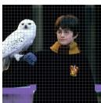  
Soft Mask 0

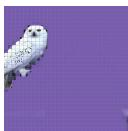  
Soft Mask 1

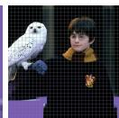  
Soft Mask 2

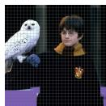  
Soft Mask 3

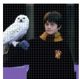  
Soft Mask 4

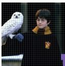  
Soft Mask 5

  
Soft Mask 6

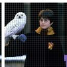  
Soft Mask 7

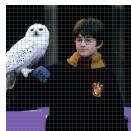  
Soft Mask 8

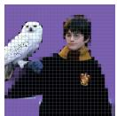  
Soft Mask 9

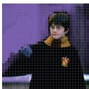  
Soft Mask 10

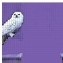  
Soft Mask 11

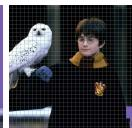  
Soft Mask 12

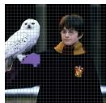  
Soft Mask 13

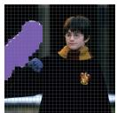  
Soft Mask 14

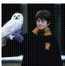  
Soft Mask 15

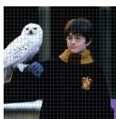  
Soft Mask 16

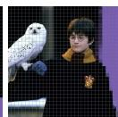  
Soft Mask 17

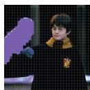  
Soft Mask 18

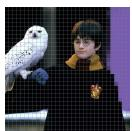  
Soft Mask 19

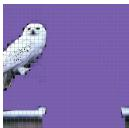  
Soft Mask 20

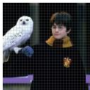  
Soft Mask 21

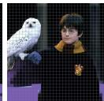  
Soft Mask 22

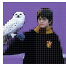  
Soft Mask 23

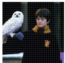  
Soft Mask 24

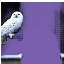  
Soft Mask 25

  
Soft Mask 26

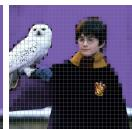  
Soft Mask 27

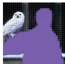  
Soft Mask 28

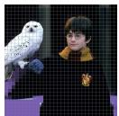  
Soft Mask 29

  
Soft Mask 30

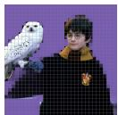  
Soft Mask 31

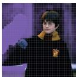  
Soft Mask 32   
Figure S1. All Soft Masks. We can see one object may have multiple soft masks.

# D. Token Distribution of Datasets

This section visually illustrates the detailed distribution of the number of tokens generated by the CORE model across multiple datasets when using its adaptive compression strategy. These plots, which use token count intervals as the xaxis and image frequency as the y-axis, consistently exhibit a clear unimodal distribution. This indicates that the vast majority of images are compressed into a relatively concentrated range. This section demonstrates CORE’s ability to dynamically adjust its compression rate based on the semantic complexity of the image content or the number of objects, rather than relying on a fixed token count.

Token Distribution of POPE   
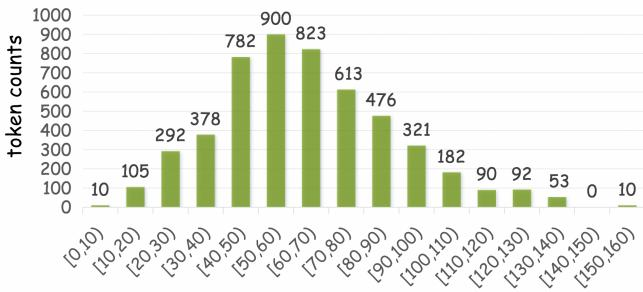

bar

| Range | Token counts |
|---|---|
| [0,10) | 10 |
| [10,20) | 105 |
| [20,30) | 292 |
| [30,40) | 378 |
| [40,50) | 782 |
| [50,60) | 900 |
| [60,70) | 823 |
| [70,80) | 613 |
| [80,90) | 476 |
| [90,100) | 321 |
| [100,110) | 182 |
| [110,120) | 90 |
| [120,130) | 92 |
| [130,140) | 53 |
| [140,150) | 0 |
| [150,160) | 10 |

(a) Token count analysis on the POPE benchmark.

Token Distribution of MME   

bar

| Range | Token counts |
|---|---|
| [0,10) | 110 |
| [10,20) | 92 |
| [20,30) | 314 |
| [30,40) | 430 |
| [40,50) | 430 |
| [50,60) | 318 |
| [60,70) | 238 |
| [70,80) | 170 |
| [80,90) | 114 |
| [90,100) | 90 |
| [100,110) | 34 |
| [110,120) | 18 |
| [120,130) | 12 |
| [130,140) | 4 |

(b) Token count analysis on the MME benchmark.

Token Distribution of MMB-CN   

bar

| Range | Token counts |
|---|---|
| [0,10) | 560 |
| [10,20) | 1166 |
| [20,30) | 1455 |
| [30,40) | 1091 |
| [40,50) | 757 |
| [50,60) | 630 |
| [60,70) | 468 |
| [70,80) | 188 |
| [80,90) | 166 |
| [90,100) | 93 |
| [100,110) | 26 |
| [110,120) | 28 |
| [120,130) | 22 |
| [130,140) | 0 |
| [140,150) | 8 |
| [150,160) | 4 |
| [160,170) | 4 |

(c) Token count analysis on the MMB-CN benchmark.

Token Distribution of SQA-I   

bar

| Range | Token counts |
|---|---|
| [0,10) | 159 |
| [10,20) | 506 |
| [20,30) | 845 |
| [30,40) | 296 |
| [40,50) | 96 |
| [50,60) | 62 |
| [60,70) | 14 |
| [70,80) | 19 |
| [80,90) | 18 |
| [90,100) | 0 |
| [100,110) | 2 |

(d) Token count analysis on the SQA-I benchmark.

Token Distribution of SEED-I   

bar

| Range | Token counts |
|---|---|
| [0,10) | 28 |
| [10,20) | 399 |
| [20,30) | 1070 |
| [30,40) | 1852 |
| [40,50) | 1962 |
| [50,60) | 2122 |
| [60,70) | 1816 |
| [70,80) | 1693 |
| [80,90) | 1161 |
| [90,100) | 893 |
| [100,110) | 509 |
| [110,120) | 349 |
| [120,130) | 198 |
| [130,140) | 99 |
| [140,150) | 42 |
| [150,160) | 26 |
| [160,170) | 8 |
| [170,180) | 5 |

(e) Token count analysis on the SEED-I benchmark.

Token Distribution of MMMU   

bar

| Range | Token counts |
|---|---|
| [0,10) | 225 |
| [10,20) | 370 |
| [20,30) | 249 |
| [30,40) | 91 |
| [40,50) | 38 |
| [50,60) | 28 |
| [60,70) | 13 |
| [70,80) | 9 |
| [80,90) | 6 |
| [90,100) | 6 |
| [100,110) | 5 |
| [110,120) | 7 |
| [120,130) | 1 |
| [130,140) | 1 |
| [140,150) | 1 |

(f) Token count analysis on the MMMU benchmark.   
Figure S2. Detailed token count analysis across the six evaluation benchmarks. Each subfigure shows the results for a specific dataset.

# E. More Token Merging Examples

In this section, we give more token merging examples which include both things and stuff. Each caption briefly describe the corresponding object.

natural_image

Black-and-white photo of a waterfront scene with birds flying over a large purple building under a cloudy sky (no text or symbols visible)

(a) Bridge

natural_image

Interior view of a cozy bedroom with a bed, bookshelves, and a window overlooking greenery (no visible text or symbols)

(b) Mirror

natural_image

Pixelated image of a purple airplane flying near a dark surface, with no visible text or symbols.

(i) Plane

natural_image

Dog lying on a paved street with a large umbrella in the background (no visible text or symbols)

(j) Bicycle

natural_image

Vintage motorcycle parked on a purple carpet with a metal frame and rear gear (no visible text or symbols)

(c) Ground

natural_image

Purple vintage motorcycle parked on a paved lot with a grid overlay, no visible text or symbols

(d) Bicycle

natural_image

Exterior view of a modern building with a large red sculpture in the sky, partially obscured by a grid overlay (no visible text or symbols)

(k) Skateboarder

natural_image

Person mid-air during a jump, viewed through a mesh fence against a clear sky (no text or symbols visible)

(l) Skateboard

natural_image

Two cats sitting on a tiled floor, one purple and one gray, with a person holding a dog in the background (no visible text or symbols)

(e) Two Cats

natural_image

Assorted bread products including a halved bun, sesame-coated buns, and a bowl of bread rolls on a tiled surface (no text or symbols visible)

(f) Hands and Dessert

natural_image

Green pixelated abstract shape against a grid background (no text or symbols)

(m) Cat

natural_image

Black-and-white photo of a cat standing near a window with a grid overlay (no visible text or symbols)

(n) Cat’s Reflection

natural_image

A wine bottle and glass on a tiled surface, with a white pillow partially visible in the background (no text or symbols)

(g) Bottle and Glass

natural_image

Group of small birds perched on a branch against a purple grid background (no text or symbols)

(h) Snowfield

natural_image

Purple fire hydrant statue on a grassy field with trees in the background (no visible text or symbols)

(o) Hydrant

natural_image

Exterior view of a modern skyscraper with glass facades and a distinctive circular emblem on top (no visible text or signage)

(p) Sky   
Figure S3. Token Merging Examples. Tokens with the same color in a image are merged into one. A complex or blocked object may have more than one token after merged. Stuff (e.g., sky, snowfield) is merged equally as things.

# F. Dialogue Comparision

In this section, we compare our CORE model with another token comparison method, VisionZip [103], with the same number of retained tokens. We mainly examine the models’ ability on background object recognition and objects’ positional relationship detection. In Fig. S4 and Fig. S5, we also show the mask CORE generates internally as CORE’s thinking process.

In Fig. S4, the image is that a large and a small cat are watching TV under a yellow light. CORE produces an object-centric representation for each object in the image, including those in the background, which leads to a correct answer (yellow light). In contrast, other methods may aggressively prune necessary tokens, resulting in an incorrect description (blue light). This comparison demonstrates CORE’s comprehensiveness in object recognition, even for background elements.

text_image

What color is the lamp's light?
The lamp's light is blue.
VisonZip
CORE
The lamp's light is yellow.
CORE

Figure S4. Comparison on Background Object Recognition. The red arrow emphasizes the object-centric token of the lamp, which helps CORE arrive at the correct answer.

Fig. S5 gives a comparison of different models’ description on objects’ positional relationship. The scene is from a movie and it shows the character rides a giant bird over the water. VisionZip gives an incorrect answer that the bird is on the character’s shoulder. While based on CORE’s centroid-guide sorting strategy, the character’s tokens is prior to the bird’s. As a result, our model infers that

text_image

Please describe this picture.
The most striking feature is the large, grey bird with a white head perched on the character's shoulder.
The image shows a man riding a large bird.
VisonZip
CORE
CORE

Figure S5. Comparison on Objects’ Positional Relationship Detection. Incorrect and correct model responses are highlighted in red and green, respectively.

the character rides the bird and gives the correct description. The thinking process shows the complete segmentation mask.