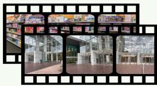
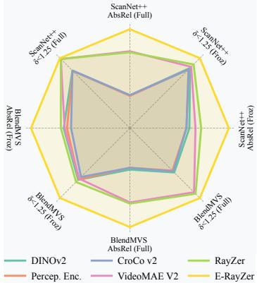
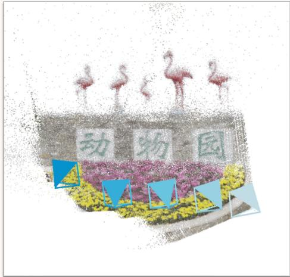
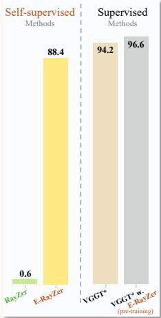
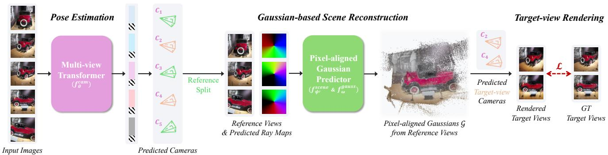
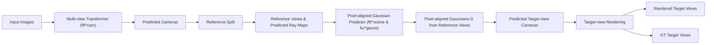
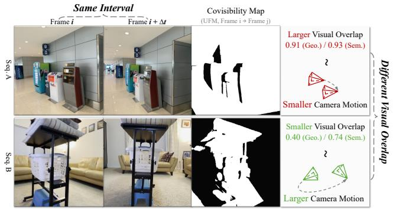
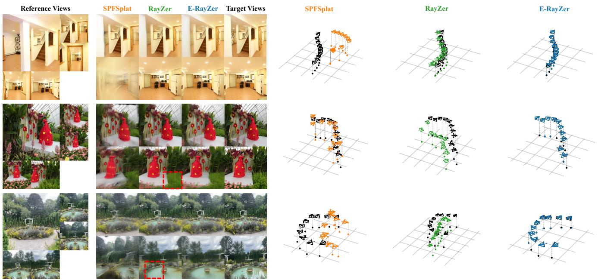
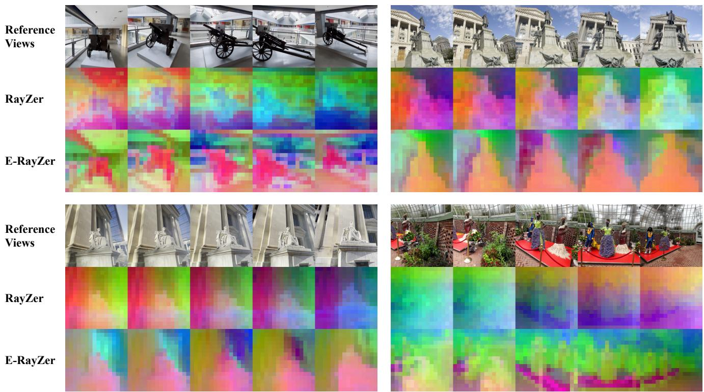
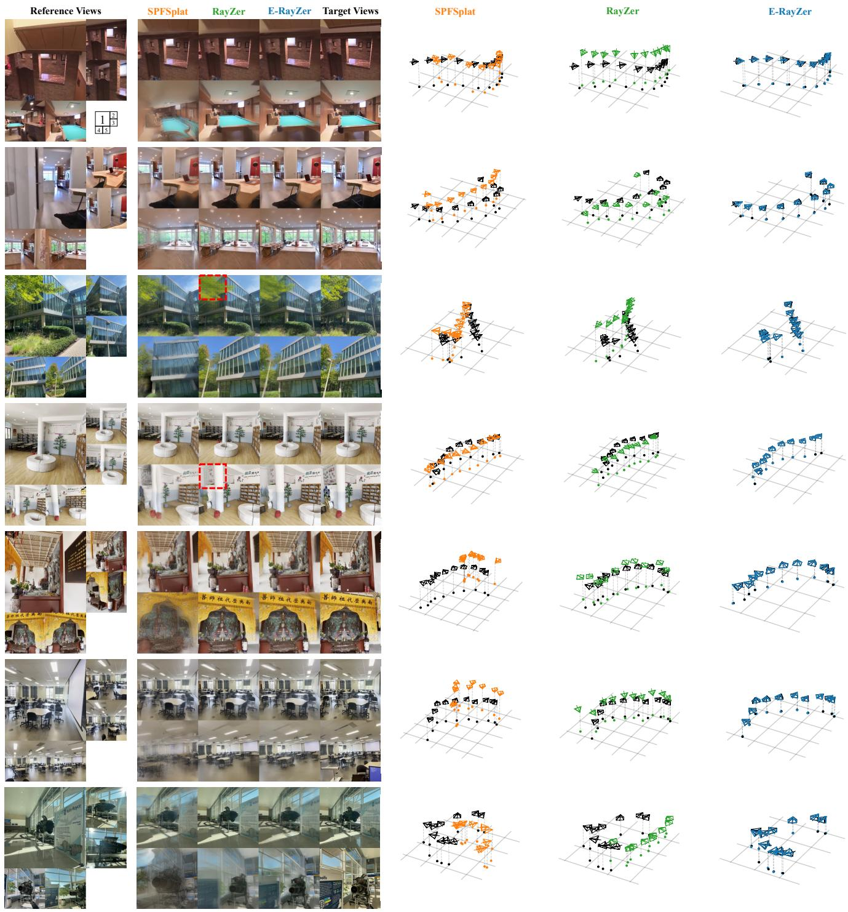

# E-RayZer: Self-supervised 3D Reconstruction as Spatial Visual Pre-training

Qitao Zhao1 Hao Tan2 Qianqian Wang3 Sai Bi2

Kai Zhang2 Kalyan Sunkavalli2 Shubham Tulsiani1∗ Hanwen Jiang2∗

1Carnegie Mellon University 2Adobe Research 3Harvard University ∗Equal advising

Project & Code: qitaozhao.github.io/E-RayZer

Self-supervised Learning   
Data: Unlabeled Video Frames   
  
Supervised Fine-tuning

Downstream Task Example: Depth Estimation   

Task: Feedforward 3D Reconstruction (inference example)   
Inputs: Sparse-view Images   

Outputs: Cameras & 3D Gaussians   

text_image

动物园

Novel-view Rendering   

text_image

动物园

text_image

动物

Raw Output Pose Acc.   

bar

| Method | Self-supervised Methods | Supervised Methods |
| :--- | :--- | :--- |
| RayZr | 0.6 | |
| E-RayZr | 88.4 | |
| VGGT* | 94.2 | 96.6 (pre-training) |
| VGGT* w. E-RayZr | | |

Figure 1. E-RayZer, a self-supervised 3D vision model that predicts camera poses and scene geometry as 3D Gaussians. The use of explicit 3D geometry yields more geometrically grounded poses compared to its implicit counterpart, RayZer [25]: they are comparable to (and sometimes surpass) those from our supervised baseline, VGGT [59]. Furthermore, E-RayZer serves as a self-supervised visual pretraining framework, with learned representations that transfer effectively to downstream tasks requiring 3D understanding, outperforming previous representation learners such as CroCo v2 [66], VideoMAE V2 [61], DINOv3 [51], and Perception Encoder [7].

# Abstract

Self-supervised pre-training has driven rapid progress in foundation models for language, 2D images, and video, yet remains largely unexplored for learning 3D-aware representations from multi-view images. In this paper, we present E-RayZer, a self-supervised 3D vision model that learns geometrically grounded representations directly from unlabeled images. Unlike prior self-supervised methods such as RayZer, which infer 3D indirectly through latent-space view synthesis, E-RayZer operates directly in 3D space, performing self-supervised 3D reconstruction with Explicit geometry. This formulation eliminates shortcut solutions and yields representations that are 3D-aware. To ensure conver-

gence and scalability, we introduce a fine-grained learning curriculum that organizes training from easy to hard samples and harmonizes heterogeneous data sources without any supervision. Experiments show that E-RayZer significantly outperforms RayZer on pose estimation and matches or sometimes surpasses fully supervised reconstruction models such as VGGT1. Furthermore, its learned representations outperform leading visual pre-training models (e.g., DINOv3, CroCo v2, VideoMAE V2, and RayZer) on 3D downstream tasks, establishing E-RayZer as a promising paradigm for spatial visual pre-training.

# 1. Introduction

Pre-training with self-supervision forms the foundation of frontier models, enabling them to learn meaningful representations from vast amounts of unlabeled data. This paradigm has proven effective for text [8, 13], 2D images [19, 39], and video [2, 54], where large models capture language semantics, visual concepts, and temporal dynamics. However, we argue that one essential component is still missing – learning 3D-aware representations from unlabeled multi-view images – as 3D spatial understanding is fundamental for perceiving and interacting with the physical world. Yet current 3D vision models mostly follow a different route: fully supervised learning using 3D pseudolabels estimated by SfM systems (e.g., COLMAP [48]), which is inherently inefficient, imperfect, and ultimately unscalable. To move forward, we need a self-supervised pre-training framework that can learn 3D-aware representations from abundant raw visual observations.

In this paper, we present E-RayZer, the first truly selfsupervised 3D Gaussian splatting reconstruction model that learns 3D-aware representations from unlabeled data, establishing a new paradigm for 3D spatial visual pretraining (Fig. 1). Unlike its predecessor RayZer [25], which exhibits only superficial 3D awareness through the proxy task of self-supervised view synthesis in latent space, E-RayZer operates directly in 3D space, learning selfsupervised 3D reconstruction. Concretely, E-RayZer predicts camera parameters and 3D Gaussians [31] from inputs and renders them back for photometric self-supervision under physical rendering constraints. By grounding representations in explicit scene geometry, E-RayZer learns features that are genuinely 3D-aware and free from RayZer’s shortcut solutions such as frame interpolation (see Sec. 3.1). This design yields both a camera space that is more geometrically grounded and interpretable than RayZer’s, and latent representations that are truly 3D-aware, effectively benefiting downstream 3D vision tasks.

Although explicit 3D Gaussians offer clear advantages, they also introduce substantial training challenges. As reported in RayZer (Tab. 7), training with explicit 3D leads to non-convergence. To address this, we propose a finegrained learning curriculum built on the concept of visual overlap between input views. We begin with samples of high visual overlap, allowing the pose estimator to initialize from near-identity poses, and gradually reduce overlap to promote general 3D understanding. When scaling to heterogeneous training sources, visual overlap provides a natural and unified metric to adaptively align varying camera motion distributions, improving data consistency. Notably, we approximate visual overlap in an unsupervised manner, keeping the framework entirely free from 3D annotations.

We systematically study E-RayZer’s performance across different training data scales. We highlight key conclusions and summarize our contributions as follows:

• E-RayZer is the first truly self-supervised feedforward 3D Gaussian splatting reconstruction model, trained from scratch with zero 3D annotation.   
• E-RayZer outperforms prior visual representation learners, e.g., DINOv3 [51], CroCo v2 [66], VideoMAE V2 [61], and Perception Encoder [7], on downstream 3D tasks (Tab. 3-4), establishing E-RayZer as a strong paradigm for spatial visual pre-training.   
• Compared with previous self-supervised 3D vision models, E-RayZer exhibits stronger 3D understanding, as evidenced by significantly improved unsupervised camera pose estimation (Tab. 1) and the fine-tuning results on downstream 3D tasks (Tab. 3).   
• Compared with state-of-the-art supervised models, e.g., VGGT [59] (reproduced with matched architecture and training setups), E-RayZer achieves comparable or sometimes superior performance (Tab. 2) and exhibits similar scaling behavior (Tab. 5), despite being purely selfsupervised.

# 2. Related Work

Supervised Pose Estimation and 3D Reconstruction. Early learning-based methods estimated relative camera poses from image pairs [3, 4, 9, 45], while later approaches extended this to multi-view reasoning across multiple inputs [23, 24, 34, 52, 58, 78, 79]. Given posed images, 3D representations can be reconstructed either by direct regression [23, 76, 80] or by optimization-based mode seeking with diffusion models [82, 86]. More recently, several methods have unified pose estimation and 3D reconstruction by predicting pixel-aligned pointmaps [14, 59, 62, 64, 83]; these exhibit strong robustness under sparse inputs and generalize well across diverse domains [56]. Nevertheless, training such supervised models still relies on camera pose and dense depth annotations, typically obtained from traditional SfM systems (e.g., COLMAP [48]), which can be inaccurate and ultimately limit performance.

Recent work has also investigated predicting 3D Gaussians [31] using photometric losses as (part of the) supervision. However, these methods remain de facto supervised by 3D annotations, as they rely on ground-truth intrinsics [20, 28, 72] and/or target-view camera poses during training [28, 53, 72], or require initialization and/or regularization from 3D-supervised models [21, 26, 53]. In contrast, E-RayZer requires no 3D supervision and can be trained from scratch, making it truly self-supervised – while achieving even stronger performance.

Self-supervised Novel-view Synthesis. To alleviate the dependence on 3D supervision, another line of research learns scene representations directly from 2D images via novel-view synthesis. Early work predicted scene features from a single viewpoint and rendered target views as supervision [17, 32, 67, 84]. More recently, RUST [46], RayZer [25], and others [38, 57, 63] adopt learning-based latent rendering from multi-view inputs. However, these methods exhibit limited 3D awareness. For instance, RayZer learns view interpolation within an uninterpretable pose space. We build on RayZer but differ in three key respects: we adopt an explicit 3D representation (i.e., 3D Gaussians [31]), a more principled learning curriculum, and larger-scale training. We show that explicit 3D modeling yields more geometrically grounded representations, establishing a promising pre-training framework for downstream tasks that require 3D understanding.

Closely relevant to our work, DBARF [12] explored a NeRF-based [37] framework for self-supervised pose estimation and novel-view synthesis using a multi-stage pipeline. E-RayZer offers a more streamlined and scalable framework, and goes beyond novel-view synthesis by investigating the learned representations for downstream tasks.

Visual Pre-training for Representation Learning. Prior work has made substantial progress in learning global image semantics through image-language association [1, 42, 55], self-distillation [10, 39, 51], contrastive learning [11, 18], masked image modeling [19, 40], and video-level temporal self-supervision [5, 15, 54]. However, learning 3Daware and geometrically grounded representations remains underexplored, despite its potential to benefit 3D-related tasks where supervision is scarce. Recent efforts explore learning 3D awareness through proxy tasks such as latentspace novel-view synthesis [25, 65, 66], but whether they enforce true 3D understanding remains unclear. In this work, E-RayZer addresses this gap with explicit 3D modeling and a learning curriculum that enables effective scaling, yielding 3D-grounded representations.

# 3. Approach

From unlabeled multi-view images, E-RayZer learns to predict camera parameters (poses and intrinsics) and explicit 3D scene geometry under self-supervision. Its learned representations can be further leveraged for downstream tasks, demonstrating E-RayZer’s potential as a 3D-aware visual pre-training framework.

In the following, we first revisit RayZer [25], the implicit predecessor, and discuss its limitations (Sec. 3.1). Building on RayZer’s core design while addressing these issues by leveraging Explicit 3D modeling, we introduce E-RayZer (Sec. 3.2). Finally, we present a sequence-level curriculum learning strategy based on visual overlap between frames to improve performance and scalability (Sec. 3.3).

# 3.1. Preliminaries: RayZer with Implicit 3D

RayZer splits all input images into two non-overlapping subsets: an “observed” reference set $( \mathcal { T } _ { \mathrm { r e f } } )$ for latent scene inference, and a “hidden” target set $( \mathcal { T } _ { \mathrm { t g t } } )$ for providing selfsupervision. RayZer uses predicted cameras of target views $( \mathcal { T } _ { \mathrm { t g t } } )$ to render the scene predicted from the reference views $( \mathcal { T } _ { \mathrm { r e f } } )$ , and applies the photometric loss as self-supervision:

$$
\mathcal {L} = \Sigma_ {(I, \hat {I}) \in (\mathcal {I} _ {\mathrm{tgt}}, \hat {\mathcal {I}} _ {\mathrm{tgt}})} \big (\operatorname{MSE} (I, \hat {I}) + \lambda \cdot \operatorname{Percep} (I, \hat {I}) \big), \tag {1}
$$

where Percep denotes the perceptual loss [27].

RayZer leverages transformers for pose estimation, latent (implicit) scene reconstruction, and rendering. It first predicts camera intrinsics and extrinsics for all input images $\dot { \boldsymbol { \mathcal { T } } } \in \mathbb { R } ^ { V \times H \times W \times 3 }$ using a multi-view transformer $f _ { \theta } ^ { \mathrm { c a m } }$ , as:

$$
(\mathbf {K}, \mathbf {T}) = f _ {\boldsymbol {\theta}} ^ {\mathrm{cam}} (\mathcal {I}), \quad \mathbf {T} _ {i} = [ \mathbf {R} _ {i} | \mathbf {t} _ {i} ] \in S E (3), \tag {2}
$$

where $\mathbf { K } \in \mathbb { R } ^ { 3 \times 3 }$ is the intrinsics shared by all views, $\mathbf { T \in }$ $\mathbb { R } ^ { V \times 4 \times 4 }$ denotes the extrinsics, and $i = 1 , \ldots , V$ indexes the input images. Each camera $( \mathbf { K } , \mathbf { T } _ { i } )$ is then converted into a pixel-aligned Plucker ray map ¨ $\mathbf { R } _ { i } ^ { \mathrm { p l k } }$ [41, 79].

To infer latent scene representations, RayZer tokenizes the concatenation (along the feature dimension) of image and rays for $\mathcal { T } _ { \mathrm { r e f } }$ and updates a set of learnable scene tokens $\mathbf { z } _ { \mathrm { 0 } } ^ { \mathrm { s c e n e } }$ through another transformer $f _ { \psi } ^ { \mathrm { s c e n e } }$ , as:

$$
\mathbf {z} _ {\text { ref }} ^ {\text { scene }} = f _ {\psi} ^ {\text { scene }} \left(\mathbf {z} _ {0} ^ {\text { scene }}, \text { Linear } (\mathcal {I} _ {\text { ref }}, \mathbf {R} _ {\text { ref }} ^ {\text { plk }})\right), \tag {3}
$$

where Linear(·) denotes a patch-wise linear projection for fusing and tokenizing RGB and ray information. The resulting zscenref $\mathbf { z } _ { \mathrm { r e f } } ^ { \mathrm { s c e n e } }$ represents the latent scene features.

For rendering, the self-predicted target-view Plucker ray ¨ maps are likewise tokenized and concatenated with the scene representation $\mathbf { z } _ { \mathrm { r e f } } ^ { \mathrm { s c e n e } }$ (along the token dimension). These target-view ray tokens are refined via transformer $f _ { \phi } ^ { \mathrm { r e n d } }$ and finally decoded to RGB images, as:

$$
\hat {\mathcal {I}} _ {\mathrm{tgt}} = f _ {\phi} ^ {\text {rend}} \left(\mathbf {z} _ {\text {ref}} ^ {\text {scene}}, \operatorname{Linear} \left(\mathbf {R} _ {\mathrm{tgt}} ^ {\text {plk}}\right)\right). \tag {4}
$$

Then RayZer applies photometric self-supervision (Eq. 1). Limitations of RayZer’s Implicit 3D. RayZer achieves high-fidelity novel-view synthesis. However, RayZer is not fully 3D-grounded. Since its camera estimation $( f _ { \theta } ^ { \mathrm { c a m } } )$ latent scene reconstruction $( f _ { \psi } ^ { \mathrm { s c e n e } } )$ , and rendering $( \bar { f } _ { \phi } ^ { \mathrm { r e n d } } )$ modules are jointly learned from scratch, they only need to remain mutually compatible, but are not guaranteed to be physically or spatially meaningful. This issue is further amplified by RayZer’s pure transformer-based architecture, which contains almost no 3D inductive bias and thus possesses excessive flexibility to learn undesirable shortcut solutions. As evidenced by its imperfect camera pose distribution, RayZer relies on a mixture of true 3D understanding and video-interpolation priors to achieve high-quality synthesis. While this design suffices for novel-view synthesis, it limits RayZer’s potential as a spatial pre-training framework for learning genuinely 3D-aware representations.

flowchart

Figure 2. E-RayZer Model & Training. E-RayZer first predicts camera poses and intrinsics for all images. Then it follows RayZer [25] to split images into two sets. E-RayZer predicts explicit 3D Gaussians as scene representation from the reference views $( \mathcal { T } _ { \mathrm { r e f } } )$ , and renders the scene using self-predicted target-view $( \mathcal { T } _ { \mathrm { t g t } } )$ cameras. Finally, E-RayZer is trained with self-supervised photometric losses on target views.

# 3.2. E-RayZer: Explicit 3D with Self-supervision

Our Insights. We argue that 3D inductive biases remain essential for 3D representation learning, but must be introduced in ways that preserve learning scalability.

We therefore inject a lightweight 3D inductive bias through model design while keeping training fully selfsupervised, striking a balance between 3D awareness and scalability. Specifically, E-RayZer replaces RayZer’s latent scene representation with explicit 3D geometry $( i . e . ,$ , 3D Gaussians [31]), providing geometric regularization that yields more grounded pose estimation, scene reconstruction, and latent representations.

Overview. As shown in Fig. 2, E-RayZer first predicts the camera parameters for all images, and then infers pixelaligned 3D Gaussians $\mathcal { G }$ from the reference view subset $( \mathcal { T } _ { \mathrm { r e f } } )$ . Then E-RayZer predicts the target view subset $( \mathcal { T } _ { \mathrm { t g t } } )$ , by rendering the 3D Gaussians predicted from $\mathcal { T } _ { \mathrm { r e f } }$ under self-predicted cameras of ${ \mathcal { T } } _ { \mathrm { t g t } }$ . Since 3D Gaussians support closed-form differentiable rendering, the latent rendering decoder used in RayZer (i.e., $f _ { \phi } ^ { \mathrm { r e n d } }$ in Eq. 4) is no longer required. We now describe our key differences from RayZer while elaborating on details.

Gaussian-based Scene Reconstruction. E-RayZer first predicts the cameras for all views in a similar way with RayZer (besides differences in model architecture that will be detailed later). Then, E-RayZer directly transforms the “posed” reference views to pixel-aligned 3D Gaussians. We first encode posed reference views into latent tokens:

$$
\mathbf {s} _ {\text { ref }} = f _ {\psi^ {\prime}} ^ {\text { scene }} \left(\text { Linear } (\mathcal {I} _ {\text { ref }}, \mathbf {R} _ {\text { ref }} ^ {\text { plk }})\right) \tag {5}
$$

where $\mathbf { s } _ { \mathrm { r e f } } \in \mathbb { R } ^ { K _ { \mathrm { r e f } } h w \times C }$ denotes the updated image tokens of reference views after multi-view aggregation. In detail, $K _ { \mathrm { r e f } }$ is the number of views in $\mathcal { T } _ { \mathrm { r e f } } , h = H / p$ and $w = W / p$ are token number along height and width dimensions using a patch size of $p ,$ , and $C$ is channel dimension of the latent space. Note that the complexity of global attention in Eq. 5 is $\mathcal { O } ( ( K _ { \mathrm { r e f } } h w ) ^ { 2 } )$ , while it is $\mathcal { O } ( ( K _ { \mathrm { r e f } } h w + n _ { \mathbf { z } } ) ^ { 2 } )$ ) for RayZer (Eq. 3), where $n _ { \mathbf { z } }$ is the size for RayZer’s scene token set.

Then, we use a lightweight decoder to transform the updated image tokens $\mathbf { s } _ { \mathrm { r e f } }$ into per-pixel 3D Gaussian parameters along each camera ray across all reference views, as:

$$
\mathcal {G} = f _ {\omega} ^ {\text {gauss}} \left(\mathrm{s} _ {\text {ref}}\right), \quad \text {where} \tag {6}
$$

$$
\mathcal {G} = \left\{g _ {i} = \left(d _ {i}, \mathbf {q} _ {i}, \mathbf {C} _ {i}, \mathbf {s} _ {i}, \alpha_ {i}\right) \right\} _ {i = 1} ^ {K _ {\text { ref }} \times H \times}
$$

These parameters include the distance along the ray $d _ { i } \in \mathbb { R }$ , orientation represented as a quaternion $\mathbf { q } _ { i } \in \mathbb { R } ^ { 4 }$ , spherical harmonic coefficients $\mathbf { C } _ { i } \in \mathbb { R } ^ { ( d _ { \mathrm { S H } } + 1 ) ^ { 2 } \times 3 } ,$ , scale $\mathbf { s } _ { i } ~ \in ~ \mathbb { R } ^ { 3 }$ , and opacity $\alpha _ { i } \in \mathbb { R }$ . The predicted 3D Gaussians collectively represent the scene geometry.

We then use E-RayZer’s self-predicted target views cameras, denoted as $\mathcal { C } _ { \mathrm { t g t } } = \{ ( \mathbf { K } , \mathbf { T } _ { i } ) \ | \ i \in \mathcal { T } _ { \mathrm { t g t } } \}$ , to render the 3D Gaussians $\mathcal { G }$ and get prediction of target views, as:

$$
\hat {\mathcal {I}} _ {\mathrm{tgt}} = \pi (\mathcal {G}, \mathcal {C} _ {\mathrm{tgt}}), \tag {7}
$$

where π denotes the differentiable rendering operations of 3D Gaussians. Note that we modify gsplat [74] to support gradient back-propagation to camera intrinsics K. Compared with RayZer, this design improves both rendering efficiency and 3D-awareness by removing the need to learn a transformer-based renderer. Finally, we apply photometric loss on the rendered target views as Eq. 1.

Avoiding Undesirable View Interpolation. As discussed in Sec. 3.1, RayZer tends to learn undesirable frame interpolation cues as shortcut solutions. We identify a main cause as its use of image index embeddings to associate image tokens with corresponding camera tokens for camera estimation, which provides a strong cue for learning interpolation.

In E-RayZer, we remove the image index embeddings entirely. We adopt a VGGT-style [59] multi-view transformer with alternating local-global attention, where the local attention boundary naturally defines the association relationship. Different from the original VGGT, E-RayZer performs pairwise pose prediction: camera tokens from a canonical view and a target view are concatenated to regress their relative camera pose. Consequently, E-RayZer does not require different camera/register tokens for canonical and non-canonical views. This architectural design is applied to both the transformer used for camera estimation $( f _ { \theta } ^ { \mathrm { c a m } } )$ and that for scene reconstruction $( f _ { \psi ^ { \prime } } ^ { \mathrm { s c e n e } } )$ .

text_image

Same Interval
Frame i
Frame i + Δt
Covisibility Map
(UFM, Frame i → Frame j)
Larger Visual Overlap
0.91 (Geo.) / 0.93 (Sem.)
?
Smaller Camera Motion
Different Visual Overlap
Sag A
Sag B
Smaller Visual Overlap
0.40 (Geo.) / 0.74 (Sem.)
?
Larger Camera Motion

Figure 3. Different Visual Overlaps under the Same Frame Interval. Two sequences from DL3DV [35] share the same frame interval yet exhibit drastically different levels of visual overlap. Our proposed semantic and geometric overlap metrics more accurately capture the true difficulty (or camera motion) of each sequence.

# 3.3. Sequence Curriculum Based on Visual Overlap

As E-RayZer leverages explicit scene representation, it suffers from harder convergence when trained from scratch. To stabilize training, we propose a learning curriculum based on the concept of visual overlap between input views, providing fine-grained control over training data difficulty. This curriculum also adaptively aligns the data distributions across diverse data sources, making E-RayZer more scalable to heterogeneous training resources.

We highlight that E-RayZer’s learning curriculum fundamentally differs from that of RayZer, which is based on fixed frame-index intervals. As illustrated in Fig. 3, RayZer’s interval-based sampling provides only an inaccurate and inflexible approximation of visual overlap, is hardcoded and thus not scalable to heterogeneous resources.

We then describe the two key steps for constructing our learning curriculum: data labeling and sampling. We introduce two variants of visual-overlap labeling tools: a geometric version that computes actual covisibility, and a semantic version as an unsupervised approximation of it.

Labeling. For each training sequence u (from any data resource), we compute a spacing profile by uniformly sampling a small set of frame triplets for each spacing $\Delta t ,$ as $\mathcal { T } _ { u } ( \Delta t ) = \{ ( i , i + \Delta t , i + 2 \Delta t ) \}$ , and averaging the two pairwise overlaps $o ( \cdot , \cdot )$ per triplet:

$$
o _ {\mathrm{tri}} (i, \Delta t) = \frac {1}{2} \left(o (i, i + \Delta t) + o (i + \Delta t, i + 2 \Delta t)\right). \tag {8}
$$

Averaging $o _ { \mathrm { t r i } } ( i , \Delta t )$ over all sampled triplets yields the persequence profile $O _ { u } ( \Delta t )$ , characterizing how overlap (and consequently difficulty) varies with frame index spacing.

Training-time Sampling. Given curriculum progress $s \in [ 0 , 1 ]$ , we use a visual overlap lower limit of $\begin{array} { r l } { o ( s ) } & { { } = } \end{array}$ $\begin{array} { r l r } { s o _ { \mathrm { m i n } } } & { { } + } & { \left( 1 - s \right) o _ { \mathrm { m a x } } } \end{array}$ , so that it decreases over training. We then obtain the sequence-specific spacing $\Delta t _ { u } ( s )$ by looking up the precomputed table $\{ ( \Delta t _ { k } , O _ { u } ( \Delta t _ { k } ) ) \}$ and linearly interpolating between the nearest entries. Finally, the temporal span of the sampled sequence follows $t = ( K _ { \mathrm { r e f } } - 1 ) \Delta t _ { u } ( s )$ .

Instantiations. We instantiate o with two alternatives – geometric overlap (UFM [81] covisibility, which is trained with 3D annotations) and semantic overlap (DINOv2 [39] cosine similarity, which is trained with self-supervision):

$$
\begin{array}{l} \begin{array}{l} o _ {\text {sem}} (i, j) = \cos \left(\phi_ {\text {DINO}} \left(I _ {i}\right), \phi_ {\text {DINO}} \left(I _ {j}\right)\right), \\ (i, j) = C _ {\text {semi}} \left(I _ {i}, I _ {j}\right) \end{array} \tag {9} \\ o _ {\mathrm{geo}} (i, j) = \mathrm{Cov} _ {\mathrm{UFM}} (I _ {i}, I _ {j}). \\ \end{array}
$$

In Sec. 4.4, we show that both the semantic and geometric curricula outperform RayZer’s interval-based curriculum, and that the two variants perform comparably.

# 4. Experiments

We first describe the experimental setups in Sec. 4.1. We then evaluate E-RayZer in two aspects: as a self-supervised model for pose estimation and 3D reconstruction (Sec. 4.2), and as a spatial visual pre-training framework for downstream tasks (Sec. 4.3). Finally, we ablate the key design choices of E-RayZer (Sec. 4.4).

# 4.1. Experimental Setup

Implementation Details. E-RayZer is trained with 10 input images, where 5 are used as reference views and 5 as target views. During training, we follow a linear decay in visualoverlap scores: $1 . 0  0 . 5$ for geometric-overlap scheduling and $1 . 0  0 . 7 5$ for semantic-overlap scheduling. For a fair comparison, we align RayZer with E-RayZer using the better model architecture and the novel training curriculum. For other baselines, we use official checkpoints and provide specific implementation details in the corresponding subsections. See more details in the supplementary material.

Metrics. For pose estimation, we report relative pose accuracy (RPA) at thresholds of $5 ^ { \circ } , 1 5 ^ { \circ }$ , and 30◦, which jointly reflects rotation and translation accuracy. For novel-view synthesis, we use standard PSNR. For depth estimation, we evaluate absolute relative error (AbsRel) and $\delta < 1 . 2 5$ , following Depth Anything [70]. For pairwise flow prediction, we report the average end-point error (EPE) and the proportion of outlier flow predictions under thresholds of 1px, 2px, and 5px, following UFM [81].

Datasets. Training. We present results of E-RayZer trained on both single-dataset and multi-dataset settings. The single-dataset variants are trained exclusively on RealEstate10K [47] or DL3DV [35], while the multi-dataset variant is trained on a mixture of seven datasets: DL3DV [35], CO3Dv2 [44], RealEstate10K [85], MVImgNet [77], ARKitScenes [6], WildRGB-D [68], and ACID [36], covering diverse indoor and outdoor sequences.

Figure 4. Visual Comparison with (Partially) Self-supervised Methods. We include results on both novel-view synthesis (left) and pose estimation (right), where E-RayZer outperforms baselines on pose accuracy, showing its grounded 3D understanding. E-RayZer also outperforms RayZer on low-texture regions (highlighted w/ red box) on NVS, a case where RayZer’s view interpolation cannot handle.   
Table 1. Comparison with (Partially) Self-supervised Methods on Novel-view Synthesis (NVS) and Pose Estimation. We report PSNR for NVS and RPA↑@5°/15°/30° for pose estimation. RayZer [25] and E-RayZer are fully self-supervised methods trained from scratch, while SPFSplat [20] is initialized from MASt3R [14], which itself is trained under dense 3D supervision on 14 datasets. 

<table><tr><td rowspan="2">Method</td><td rowspan="2">Self-supervised?</td><td rowspan="2">Training Data</td><td colspan="4">WildRGB-D [68]</td><td colspan="4">ScanNet++ [75]</td><td colspan="4">DL3DV [35]</td></tr><tr><td> $PSNR_{\uparrow}$ </td><td>@ $5^{\circ}_{\uparrow}$ </td><td>@ $15^{\circ}_{\uparrow}$ </td><td>@ $30^{\circ}_{\uparrow}$ </td><td> $PSNR_{\uparrow}$ </td><td>@ $5^{\circ}_{\uparrow}$ </td><td>@ $15^{\circ}_{\uparrow}$ </td><td>@ $30^{\circ}_{\uparrow}$ </td><td> $PSNR_{\uparrow}$ </td><td>@ $5^{\circ}_{\uparrow}$ </td><td>@ $15^{\circ}_{\uparrow}$ )</td><td>@ $30^{\circ}_{\uparrow}$ </td></tr><tr><td>SPFSplat [21]</td><td>X (MASt3R ini.)</td><td>RE10K [85] (+ extra)</td><td>16.7</td><td>31.5</td><td>58.0</td><td>69.8</td><td>14.0</td><td>2.5</td><td>11.8</td><td>30.3</td><td>15.1</td><td>19.5</td><td>40.6</td><td>50.5</td></tr><tr><td>E-RayZer (ours)</td><td>√</td><td>RE10K [85]</td><td>21.0</td><td>40.3</td><td>89.4</td><td>96.5</td><td>17.5</td><td>1.1</td><td>13.3</td><td>37.3</td><td>17.3</td><td>21.2</td><td>55.0</td><td>72.7</td></tr><tr><td>RayZer [25]</td><td>√</td><td rowspan="2">DL3DV [35]</td><td>25.9</td><td>0.0</td><td>0.2</td><td>6.5</td><td>20.5</td><td>0.0</td><td>0.7</td><td>6.2</td><td>21.4</td><td>0.0</td><td>0.6</td><td>6.2</td></tr><tr><td>E-RayZer (ours)</td><td>√</td><td>24.3</td><td>84.5</td><td>98.4</td><td>99.3</td><td>20.1</td><td>7.7</td><td>33.6</td><td>63.0</td><td>20.3</td><td>72.0</td><td>88.4</td><td>93.5</td></tr><tr><td>RayZer [25]</td><td>√</td><td rowspan="2">7 datasets</td><td>26.7</td><td>0.2</td><td>9.3</td><td>43.6</td><td>21.5</td><td>0.0</td><td>0.9</td><td>9.0</td><td>20.8</td><td>0.0</td><td>1.9</td><td>17.0</td></tr><tr><td>E-RayZer (ours)</td><td>√</td><td>24.9</td><td>90.8</td><td>98.6</td><td>99.3</td><td>20.7</td><td>5.7</td><td>34.8</td><td>63.7</td><td>19.7</td><td>59.9</td><td>82.9</td><td>90.2</td></tr></table>

Evaluation. We primarily evaluate pose estimation and novel-view synthesis on WildRGB-D, DL3DV test set, and the out-of-distribution (OOD) ScanNet++ [75]. To assess the generalization of the learned representations (Sec. 4.3), we evaluate on OOD ScanNet++ and BlendedMVS [71] for pose and depth estimation, and StaticThings3D [49] for pairwise flow prediction.

# 4.2. Pose Estimation and Novel-view Synthesis

Baselines and Setups. We compare against SPFSplat [21] and RayZer [25]. Notably, SPFSplat is initialized from the supervised MASt3R [33] model, and thus is not truly selfsupervised; while E-RayZer and RayZer are trained from scratch under self-supervision. We evaluate pose accuracy on all images and assess novel-view synthesis quality on the target views rendered with predicted camera poses.

Results. As shown in Tab. 1, E-RayZer consistently outperforms SPFSplat [21] on most metrics, despite being truly self-supervised. Moreover, E-RayZer significantly surpasses RayZer [25] in pose estimation across all setups

while achieving comparable novel-view synthesis quality. These results suggest that the explicit 3D modeling in E-RayZer yields more geometrically meaningful pose representations, whereas RayZer’s implicit approach overoptimizes for view synthesis quality without being truly 3Daware, resulting in a less interpretable pose space. Qualitative comparisons in Fig. 4 further support these findings.

# 4.3. E-RayZer as Self-supervised Pre-training

We validate E-RayZer as a self-supervised spatial visual pre-training framework. First, we show that its performance is comparable to the supervised VGGT and that E-RayZer pre-training further enhances VGGT (Sec. 4.3.1). We then probe the learned features on downstream tasks to verify E-RayZer’s representation quality (Sec. 4.3.2).

4.3.1. E-RayZer Initialization Benefits Supervised Model Baselines and Setups. We compare with the state-of-theart supervised model VGGT [59]. Note that we train it using the same data and architecture with E-RayZer for an appleto-apple comparison, denoted as VGGT\*.

Table 2. Comparison with Supervised VGGT [59] on Pose Estimation. E-RayZer’s pre-training improves VGGT performance (last row), forming an effective self-supervised pre-training and supervised post-training paradigm. We report pose accuracy RPA↑@5◦/15◦. Both models are trained on DL3DV [35] and evaluated on DL3DV & eight out-of-domain datasets for zero-shot testing. Models are labeled as self-supervised or supervised. VGGT\* denotes our re-implementation with E-RayZer’s pairwise camera head. Results are color-ranked from red to yellow, and we underline the results that our self-supervised E-RayZer surpasses supervised VGGT\*. 

<table><tr><td rowspan="3">Method</td><td rowspan="2" colspan="2">In-domainDL3DV [44]</td><td rowspan="2" colspan="2">RE10K [85]</td><td rowspan="2" colspan="2">CO3Dv2 [44]</td><td colspan="11">Out-of-domain (Zero-shot Generalization)</td><td></td></tr><tr><td colspan="2">WildRGB-D [68]</td><td colspan="2">7-Scenes [50]</td><td colspan="2">CamLand [29]</td><td colspan="2">BlendedMVS [71]</td><td colspan="2">NAVI [22]</td><td colspan="2">ScanNet++ [75]</td></tr><tr><td>@ $5^{\circ}_{\uparrow}$ </td><td>@ $15^{\circ}_{\uparrow}$ </td><td>@ $5^{\circ}_{\uparrow}$ </td><td>@ $15^{\circ}_{\uparrow}$ </td><td>@ $5^{\circ}_{\uparrow}$ </td><td>@ $15^{\circ}_{\uparrow}$ </td><td>@ $5^{\circ}_{\uparrow}$ </td><td>@ $15^{\circ}_{\uparrow}$ </td><td>@ $5^ {\circ}_{\uparrow}$ </td><td>@ $15^{\circ}_{\uparrow}$ </td><td>@ $5^{\circ}_{\uparrow}$ </td><td>@ $15^{\circ}_{\uparrow}$ </td><td>@ $5^{\circ}_{\uparrow}$ </td><td>@ $15^{\circ}_{\uparrow}$ </td><td>@ $5^{\circ}_{\uparrow} ^{ \uparrow}$ </td><td>@ $15^{\circ}_{\uparrow} ^{ \uparrow}$ </td><td>@ $5^{\circ}_{\uparrow} ^{ \uparrow}$ </td><td>@ $15^{\circ}_{\uparrow} ^{ \uparrow}$ </td></tr><tr><td>E-RayZer (ours)</td><td>72.0</td><td>88.4</td><td>83.0</td><td>96.8</td><td>19.1</td><td>61.8</td><td>51.1</td><td>82.3</td><td>38.8</td><td>78.0</td><td>18.1</td><td>62.9</td><td>22.9</td><td>46.8</td><td>20.7</td><td>57.8</td><td>7.7</td><td>33.6</td></tr><tr><td>VGGT*</td><td>79.6</td><td>94.2</td><td>80.4</td><td>97.9</td><td>16.0</td><td>64.3</td><td>32.5</td><td>76.2</td><td>34.7</td><td>83.6</td><td>11.1</td><td>49.8</td><td>17.0</td><td>42.8</td><td>14.3</td><td>54.5</td><td>6.7</td><td>39.8</td></tr><tr><td>E-RayZer→VGGT*</td><td>87.3</td><td>96.6</td><td>85.3</td><td>98.4</td><td>25.3</td><td>72.2</td><td>56.2</td><td>91.4</td><td>43.8</td><td>82.8</td><td>30.2</td><td>75.6</td><td>29.2</td><td>52.2</td><td>26.9</td><td>64.3</td><td>14.3</td><td>53.8</td></tr></table>

Table 3. Probing 3D Spatial Awareness of Learned Representations on Multi-view Depth and Pose Estimation. We evaluate the learned representations via both frozen-backbone and fully supervised finetuning on ScanNet++ [75] and BlendedMVS [71], which are not included in pre-training for any model. The best results are shown in bold, and the second-best are underlined. The experiments only use the encoders of RayZer [25] and E-RayZer. 

<table><tr><td rowspan="2" colspan="2"></td><td rowspan="2">Method</td><td colspan="2">Depth</td><td colspan="2">Camera Pose</td></tr><tr><td>AbsRel↓</td><td> $\delta < 1.25 \uparrow$ </td><td>RPA@ $5^{\circ}$ ↑</td><td>RPA@ $15^{\circ}$ ↑</td></tr><tr><td rowspan="14">ScanNet++ [75]</td><td rowspan="7">Frozen</td><td>DINOv2 [39]</td><td>0.193</td><td>74.9</td><td>0.8</td><td>9.5</td></tr><tr><td>DINOv3 [51]</td><td>0.201</td><td>73.2</td><td>0.4</td><td>10.0</td></tr><tr><td>Percep. Encoder [7]</td><td>0.203</td><td>73.2</td><td>0.5</td><td>8.5</td></tr><tr><td>CroCo v2 [66]</td><td>0.203</td><td>73.0</td><td>1.4</td><td>15.1</td></tr><tr><td>VideoMAE V2 [61]</td><td>0.175</td><td>76.3</td><td>0.1</td><td>6.6</td></tr><tr><td>RayZer [25]</td><td>0.161</td><td>79.3</td><td>4.7</td><td>27.4</td></tr><tr><td>E-RayZer (ours)</td><td>0.116</td><td>87.1</td><td>13.8</td><td>49.5</td></tr><tr><td rowspan="7">Full-finetune</td><td>DINOv2 [39]</td><td>0.178</td><td>78.2</td><td>3.3</td><td>19.6</td></tr><tr><td>DINOv3 [51]</td><td>0.176</td><td>78.7</td><td>4.0</td><td>22.3</td></tr><tr><td>Percep. Encoder [7]</td><td>0.181</td><td>77.8</td><td>2.9</td><td>20.0</td></tr><tr><td>CroCo v2 [66]</td><td>0.177</td><td>78.2</td><td>3.8</td><td>20.8</td></tr><tr><td>VideoMAE V2 [61]</td><td>0.076</td><td>93.9</td><td>12.8</td><td>51.4</td></tr><tr><td>RayZer [25]</td><td>0.077</td><td>93.9</td><td>21.5</td><td>60.6</td></tr><tr><td>E-RayZer (ours)</td><td>0.059</td><td>95.1</td><td>22.7</td><td>64.3</td></tr><tr><td rowspan="14">BlendedMVS [71]</td><td rowspan="7">Frozen</td><td>DINOv2 [39]</td><td>0.366</td><td>50.5</td><td>1.1</td><td>8.0</td></tr><tr><td>DINOv3 [51]</td><td>0.397</td><td>49.1</td><td>1.2</td><td>6.8</td></tr><tr><td>Percep. Encoder [7]</td><td>0.385</td><td>49.9</td><td>1.2</td><td>6.2</td></tr><tr><td>CroCo v2 [66]</td><td>0.412</td><td>47.7</td><td>1.6</td><td>12.6</td></tr><tr><td>VideoMAE V2 [61]</td><td>0.371</td><td>49.4</td><td>1.0</td><td>6.2</td></tr><tr><td>RayZer [25]</td><td>0.351</td><td>52.6</td><td>16.7</td><td>34.5</td></tr><tr><td>E-RayZer (ours)</td><td>0.245</td><td>68.3</td><td>26.5</td><td>45.8</td></tr><tr><td rowspan="7">Full-finetune</td><td>DINOv2 [39]</td><td>0.353</td><td>52.5</td><td>1.8</td><td>12.8</td></tr><tr><td>DINOv3 [51]</td><td>0.349</td><td>52.1</td><td>1.7</td><td>15.3</td></tr><tr><td>Percep. Encoder [7]</td><td>0.370</td><td>50.3</td><td>2.1</td><td>11.6</td></tr><tr><td>CroCo v2 [66]</td><td>0.369</td><td>51.2</td><td>2.8</td><td>15.9</td></tr><tr><td>VideoMAE V2 [61]</td><td>0.197</td><td>75.9</td><td>17.3</td><td>45.5</td></tr><tr><td>RayZer [25]</td><td>0.194</td><td>77.7</td><td>26.1</td><td>50.2</td></tr><tr><td>E-RayZer (ours)</td><td>0.148</td><td>82.8</td><td>36.2</td><td>58.8</td></tr></table>

Table 4. Probing 2.5D Spatial Awareness of Learned Representations on Pairwise Flow Estimation. We evaluate on Static-Things3D [49], an out-of-distribution synthetic dataset. All models are fully finetuned under flow supervision. The best results are shown in bold, and the second-best are underlined. 

<table><tr><td rowspan="2">Method</td><td>Error</td><td colspan="3">Outlier Ratio</td></tr><tr><td>EPE↓</td><td>@1px↓</td><td>@2px↓</td><td>@5px↓</td></tr><tr><td>CroCo v2 [66]</td><td>1.273</td><td>17.7</td><td>8.7</td><td>3.8</td></tr><tr><td>VideoMAE V2 [61]</td><td>2.028</td><td>42.7</td><td>22.1</td><td>6.9</td></tr><tr><td>RayZer [25]</td><td>1.105</td><td>13.4</td><td>6.6</td><td>2.8</td></tr><tr><td>E-RayZer (ours)</td><td>1.254</td><td>16.9</td><td>7.8</td><td>3.1</td></tr></table>

E-RayZer is Comparable with Supervised VGGT\*. First two rows of Tab. 2 show that E-RayZer outperforms VGGT\* on several out-of-domain datasets (e.g., WildRGB-D [68], CamLand [29], and BlendedMVS [71]). Moreover, E-RayZer almost consistently achieves higher accuracy on RPA@5◦, a stricter metric, suggesting better precision in pose prediction. The results demonstrate the strong performance of E-RayZer as a self-supervised method without using any 3D annotations for training.

Effectiveness of Pre-training. As shown in last two rows of Tab. 2, initializing VGGT\* with E-RayZer weights yields significant improvements over training from scratch, confirming that E-RayZer serves as an effective pre-training framework for visual geometry learning. The results also suggest that the learned knowledge of our self-supervised and supervised methods are highly complementary (they are trained on same data but pre-training still helps), showing the great potential of spatial visual pre-training.

# 4.3.2. Probing Representations on Downstream Tasks

Baselines and Setups. To further assess the spatial awareness, we probe and compare the feature representations of E-RayZer against widely-used vision encoders: DINO series [39, 51], CroCo v2 [66], VideoMAE V2 [61], Perception Encoder [7], and RayZer [25]. We only use the backbones and train the prediction heads from scratch. We compare performance under both frozen-backbone and fullfinetuning settings on downstream tasks, including:

• Multi-view Depth and Pose Estimation (3D Tasks). For depth estimation, we apply a DPT head [43] on top of the backbones. Single-view backbones lack multi-view correspondence and thus reduce to monocular depth estimation. For pose estimation, we attach VGGT’s [59] camera head to each backbone, using either the class token or averaged patch features as camera tokens. These tokens are aggregated across views via transformer layers, enabling even single-view models to reason over multi-view geometry. We note that the camera heads of RayZer and E-RayZer from their pre-training stage are not used for fairness.

• Pairwise Flow Estimation (2.5D Task). We consider backbones that encode binocular geometry, including CroCo v2 [66], VideoMAE V2 [61], RayZer [25], and E-RayZer. We follow the settings of UFM [81].

Results on 3D Downstream Tasks. Tab. 3 shows that E-RayZer achieves the best performance across all datasets and settings, demonstrating strong 3D-awareness in its feature representations. Under the frozen-backbone setting, E-

Table 5. Ablation on Data Mixing and Scaling. We compare our E-RayZer with supervised VGGT\* [59] on varying training data settings. We color-rank the results from red to yellow for each model itself across training data, thus the color distribution reflects their scaling behavior. We also underline the results where self-supervised E-RayZer outperforms supervised VGGT\* (for each training data). 

<table><tr><td rowspan="2">Training Data</td><td rowspan="2">Method</td><td colspan="4">NAVI [22]</td><td colspan="4">CO3Dv2 [44]</td><td colspan="4">ScanNet++ [75]</td><td colspan="4">DL3DV [35]</td></tr><tr><td>PSNR↑</td><td>@5°↑</td><td>@15°↑</td><td>@30°↑</td><td>PSNR↑</td><td>@5°↑</td><td>@15°↑</td><td>@30°↑</td><td>PSNR↑</td><td>@5°↑</td><td>@15°↑</td><td>@30°↑</td><td>PSNR↑</td><td>@5°↑</td><td>@15°↑</td><td>@30°↑</td></tr><tr><td rowspan="2">RE10K [85]</td><td>VGGT*</td><td>/</td><td>0.4</td><td>8.4</td><td>22.5</td><td>/</td><td>0.1</td><td>3.7</td><td>15.5</td><td>/</td><td>0.6</td><td>10.0</td><td>30.7</td><td>/</td><td>17.8</td><td>50.9</td><td>69.4</td></tr><tr><td>E-RayZer</td><td>17.2</td><td>1.8</td><td>16.9</td><td>34.0</td><td>19.1</td><td>0.6</td><td>8.3</td><td>26.0</td><td>17.5</td><td>1.1</td><td>13.3</td><td>37.3</td><td>17.3</td><td>21.2</td><td>55.0</td><td>72.7</td></tr><tr><td rowspan="2">DL3DV [35]</td><td>VGGT*</td><td>/</td><td>14.3</td><td>54.5</td><td>75.7</td><td>/</td><td>16.0</td><td>64.3</td><td>82.1</td><td>/</td><td>6.7</td><td>39.8</td><td>71.5</td><td>/</td><td>79.6</td><td>94.2</td><td>97.1</td></tr><tr><td>E-RayZer</td><td>20.5</td><td>20.7</td><td>57.8</td><td>69.6</td><td>22.9</td><td>19.1</td><td>61.8</td><td>78.8</td><td>20.1</td><td>7.7</td><td>33.6</td><td>63.0</td><td>20.3</td><td>72.0</td><td>88.4</td><td>93.5</td></tr><tr><td rowspan="2">7-dataset Mix</td><td>VGGT*</td><td>/</td><td>28.8</td><td>67.3</td><td>84.4</td><td>/</td><td>43.4</td><td>83.5</td><td>91.8</td><td>/</td><td>13.1</td><td>54.8</td><td>78.5</td><td>/</td><td>66.1</td><td>88.9</td><td>95.6</td></tr><tr><td>E-RayZer</td><td>20.6</td><td>24.6</td><td>56.1</td><td>69.2</td><td>24.3</td><td>30.3</td><td>74.2</td><td>83.7</td><td>20.7</td><td>5.7</td><td>34.8</td><td>63.7</td><td>19.7</td><td>59.9</td><td>82.9</td><td>90.2</td></tr></table>

RayZer notably outperforms all baselines. With full finetuning, E-RayZer further improves across all metrics, surpassing RayZer [25] and VideoMAE V2 [61] by a large margin. The consistently strong results highlight the generalization ability of its geometrically grounded representations, showing its potential as a spatial visual pre-training framework.

Results on Pairwise Flow Estimation. Tab. 4 shows that E-RayZer achieves competitive performance on pairwise flow prediction, closely following RayZer [25], despite not being trained directly for tasks that optimize image correspondences (e.g., masked image modeling in CroCo v2 [66] and VideoMAE V2 [61], or view interpolation in RayZer). Compared to E-RayZer, RayZer holds a slight advantage due to its implicit 3D formulation, naturally suited for lowlevel motion estimation. Nevertheless, E-RayZer outperforms other baselines, demonstrating that its explicit 3D representation learning captures meaningful spatial correspondences even for the 2.5D task.

# 4.4. Ablation Study

Data Mixing / Scaling. We investigate the behavior of selfsupervised E-RayZer and supervised VGGT\* (Sec. 4.3.1) under varying data scales and quality. In Tab. 5, E-RayZer and VGGT\* demonstrate a similar scaling behavior: training on data with broader distributions improves generalization (e.g., models trained on 7 datasets outperform those trained on DL3DV alone). However, reducing the sampling frequency of a particular domain slightly degrades performance on its corresponding test set (e.g., 7-dataset models perform worse on DL3DV than DL3DV-only models), a trend consistently observed in prior work [16, 69, 73]. Besides, data quality also plays a key role, as training on DL3DV yields better results than that on RE10K.

Moreover, again, the self-supervised model (E-RayZer) achieves performance on par with the supervised VGGT\* (while VGGT\* holds advantage when trained on large data), demonstrating that large-scale self-supervision alone can yield geometrically grounded 3D understanding. This result underscores that data diversity and quality, rather than explicit 3D supervision, are the true drivers of scalability in large 3D vision models. Together, these results highlight the great potential of self-supervised 3D learning when scaled to internet-scale data, and provide valuable guidance for future data selection and curation strategies.

Table 6. Ablation on Curriculum Learning. We compare four curriculum strategies when training E-RayZer on DL3DV (top) and a seven-dataset mixture (bottom). The proposed visualoverlap-based curriculum consistently outperforms baselines. 

<table><tr><td></td><td>Curriculum Variant</td><td>PSNR $\uparrow$ </td><td>RPA@5 $^{\circ}$  $\uparrow$ </td><td>RPA@15 $^{\circ}$  $\uparrow$ </td><td>RPA@30 $^{\circ}$  $\uparrow$ </td></tr><tr><td rowspan="4">DL3DV</td><td>No Curriculum</td><td>16.1</td><td>4.0</td><td>27.8</td><td>47.2</td></tr><tr><td>Frame Interval</td><td>19.8</td><td>56.1</td><td>79.3</td><td>86.0</td></tr><tr><td>Semantic Overlap</td><td>20.4</td><td>73.2</td><td>88.7</td><td>93.7</td></tr><tr><td>Geometric Overlap</td><td>20.3</td><td>72.0</td><td>88.4</td><td>93.5</td></tr><tr><td rowspan="4">7-dataset</td><td>No Curriculum</td><td>15.9</td><td>2.1</td><td>21.6</td><td>40.7</td></tr><tr><td>Frame Interval</td><td>19.1</td><td>43.8</td><td>72.1</td><td>82.9</td></tr><tr><td>Semantic Overlap</td><td>19.7</td><td>58.7</td><td>81.0</td><td>89.8</td></tr><tr><td>Geometric Overlap</td><td>19.7</td><td>59.9</td><td>82.9</td><td>90.2</td></tr></table>

Curriculum Learning. In Tab. 6, we compare against two baselines with (1) no curriculum, and (2) a frame-intervalbased curriculum, where frame intervals are specified for each dataset. Across two training regimes (i.e., DL3DVonly and the seven-dataset mixture), the proposed visualoverlap curricula consistently outperform both baselines, with the two variants performing comparably. These results demonstrate that our fine-grained curriculum strategy significantly improves self-supervised pose estimation and reconstruction, while eliminating the need for manual tuning for each training dataset and benefiting scaling.

# 5. Discussion

We propose E-RayZer, a multi-view 3D model that learns geometrically grounded representations via self-supervised 3D reconstruction. While our results are promising, we identify several limitations and directions for future work.

E-RayZer currently operates on static scenes, limiting its training to existing static datasets – high-quality static-scene data remains scarce beyond these benchmarks. Extending it to dynamic scenes would enable learning from generic videos and is a promising direction. Additionally, our learning curriculum generally assumes continuous video frames with fairly uniform camera motion; sparse images or frames with drastic viewpoint changes may reduce its effectiveness.

Despite these limitations, E-RayZer outperforms prior self-supervised methods and is competitive with supervised approaches. Extensive experiments show that E-RayZer pre-training benefits supervised models and other 3D downstream tasks, establishing it as a scalable 3D-aware visual pre-training framework.

Acknowledgements. The work is partially done during Qitao Zhao’s internship at Adobe Research. We thank Zhengqi Li for insightful advice. We also thank Fred´ eric ´ Fortier-Chouinard, Jiashun Wang, Yanbo Xu, Zihan Wang, and members of the Physical Perception Lab for helpful discussions.

This work was also supported by Intelligence Advanced Research Projects Activity (IARPA) via Department of Interior/Interior Business Center (DOI/IBC) contract number 140D0423C0074. The U.S. Government is authorized to reproduce and distribute reprints for Governmental purposes notwithstanding any copyright annotation thereon. Disclaimer: The views and conclusions contained herein are those of the authors and should not be interpreted as necessarily representing the official policies or endorsements, either expressed or implied, of IARPA, DOI/IBC, or the U.S. Government.

# E-RayZer: Self-supervised 3D Reconstruction as Spatial Visual Pre-training Supplementary Material

# Overview

This supplementary material is organized as follows:

• Section A: Additional implementation details.   
• Section B: Details on supervised finetuning.   
• Section C: Additional details on curriculum learning ablations.   
• Section D: Analysis of E-RayZer trained with pose supervision.   
• Section E: Additional results where E-RayZer is used as pre-training for the VGGT\* model, with comparisons to RayZer [25].   
• Section F: Further analysis of the training data.   
• Section G: Extended qualitative comparisons with baseline methods.

# A. Additional Implementation Details

This section includes more implementation details.

Training. E-RayZer is trained on 8 A100 GPUs with a global batch size of 192 (24 per GPU) for 152K iterations, taking approximately 198 hours. During the first 86K iterations, the learning curriculum progresses linearly along different sequence-sampling metrics – geometric (default) and semantic visual overlap, as well as frame interval – as described in Sec. 4.4. The learning rate schedule includes a 3K-iteration linear warm-up to a peak of 4e-4, followed by cosine decay to zero til the end of training. We use the AdamW optimizer $( \beta _ { 1 } { = } 0 . 9 , ~ \beta _ { 2 } { = } 0 . 9 5 )$ with gradient clipping at 1.0, and skip optimization steps when the gradient norm exceeds 5.0 before clipping.

For our 7-dataset model (Sec. 4.1), we train on a mixture of datasets with the following sampling ratios: DL3DV [35]: 1.0, CO3Dv2 [44]: 0.25, RealEstate10K [85]: 0.5, MVImgNet [77]: 0.25, ARKitScenes [6]: 0.5, WildRGB-D [68]: 0.25, and ACID [36]: 0.5. These ratios follow a simple heuristic: we downweight object-centric datasets and assign a slightly larger weight to DL3DV, which offers the most diverse and high-quality samples.

Experiments on supervised finetuning are conducted on 8 A100 GPUs as well, but with a smaller global batch size of 96. The finetuning stage runs for 50K iterations.

Architecture. E-RayZer uses a patch size of 16 and an image resolution of 256. As described in Sec. 3.2, we replace RayZer’s [25] vanilla global attention with VGGT’s [59] local-global alternating transformer layers for both pose estimation $( f _ { \theta } ^ { \mathrm { c a m } } )$ and scene reconstruction $( f _ { \psi ^ { \prime } } ^ { \mathrm { s c e n e } } )$ . Both modules use 8 layers, each composed of one global attention layer and one frame-attention layer. Our feature dimension is 768, and we use 12 attention heads. For image and Plucker ray map tokenization, as well as for the Gaussian ¨ decoder $( f _ { \omega } ^ { \mathrm { g a u s s } } )$ , we simply use a single linear layer.

For a fair comparison with RayZer, all RayZer models used in this paper are trained with our proposed curriculum and the improved architecture.

Evaluation. For pose estimation and novel-view synthesis, we use fixed sequence lengths for the test sequences of each dataset and sample views with equal temporal spacing. Following RayZer, we ensure that the first and last images of each sequence are always included in the reference set. The sequence lengths are as follows: WildRGB-D [68]: 96 (Tab. 1) and 192 (Tab. 2), ScanNet++ [75]: 48, DL3DV [35]: 96, RealEstate10K [85]: 256, CO3Dv2 [44]: 96, 7-Scenes [50]: 256, Cambridge Landmarks [30]: 96, BlendedMVS [71]: 24, and NAVI [22]: 24. For (training and) evaluating pairwise flow prediction on Static-Things3D [49], we adopt the pre-computed image pairs provided by the DUSt3R [64] GitHub repository.

# B. More Details on Supervised Finetuning

Here we provide additional details on the supervised finetuning experiments in Sec. 4.3.

Supervised Finetuning with E-RayZer. E-RayZer’s backbone does not distinguish between the first view and the other views in the input, as it adopts a pairwise pose estimation strategy (see Sec. 3.2). In contrast, supervised pose estimation typically assumes a first-view coordinate frame (e.g., DUSt3R [64] and VGGT [59]). To incorporate this inductive bias into our backbone, we introduce an additional camera token dedicated to the first image (in addition to the existing learned camera token) and train it from scratch. The camera tokens are processed by E-RayZer’s pose estimation module $( f _ { \theta } ^ { \mathrm { c a m } } )$ and subsequently passed to VGGT’s camera head for supervised pose estimation. For depth estimation and pairwise flow prediction, the DPT head takes as input the intermediate feature maps generated by the Gaussian-based scene reconstruction module $( f _ { \psi ^ { \prime } } ^ { \mathrm { s c e n e } } )$ . For E-RayZer and all other baselines, the DPT head uses four feature maps extracted from equally spaced transformer layers. Note that our Gaussian-based scene reconstruction module takes the predicted reference-view Plucker¨ ray maps as input, but only in the pose and depth estimation experiments are the predicted camera poses supervised. For pairwise flow prediction, the predicted poses produced by the pose head remain unsupervised to ensure a fair comparison with other baselines.

Details on Other Baselines. For baselines that use different spatial or temporal patch sizes (e.g., E-RayZer uses a temporal batch size of 1, whereas VideoMAE V2 [61] uses 2), we first resize or repeat the input so that the number of output tokens matches that of our model. For these methods, we generally adopt the “base” model checkpoints provided in their official GitHub repositories, as they roughly match the computational budget of our model.

Table 7. Comparison with a Pose-supervised Baseline on Novel-view Synthesis (NVS) and Pose Estimation. We report PSNR for NVS and RPA↑@5°/15°/30° for pose estimation. While the pose-supervised baseline generally outperforms the self-supervised model on coarse pose accuracy (RPA↑@15°/30°), its novel-view synthesis quality is consistently lower. 

<table><tr><td rowspan="2">Method</td><td rowspan="2">Training Data</td><td colspan="4">NAVI [22]</td><td colspan="4">ScanNet++ [75]</td><td colspan="4">DL3DV [35]</td></tr><tr><td> $PSNR_{\uparrow}$ </td><td>@ $5^{\circ}_{\uparrow}$ </td><td>@ $15^{\circ}_{\uparrow}$ </td><td>@ $30^{\circ}_{\uparrow}$ </td><td> $PSNR_{\uparrow}$ </td><td>@ $5^{\circ}_{\uparrow}$ </td><td>@ $15^{\circ}_{\uparrow}$ </td><td>@ $30^{\circ}_{\uparrow}$ </td><td> $PSNR_{\uparrow}$ </td><td>@ $5^{\circ}_{\uparrow}$ </td><td>@ $15^{\circ}_{\uparrow}$ )</td><td>@ $30^{\circ}_{\uparrow}$ </td></tr><tr><td rowspan="2">Pose-sup. Baseline E-RayZer (ours)</td><td rowspan="2">DL3DV [35]</td><td>13.4</td><td>12.8</td><td>51.1</td><td>72.5</td><td>16.7</td><td>4.4</td><td>33.7</td><td>64.5</td><td>15.0</td><td>78.1</td><td>94.7</td><td>97.8</td></tr><tr><td>20.5</td><td>20.7</td><td>57.8</td><td>69.6</td><td>20.1</td><td>7.7</td><td>33.6</td><td>63.0</td><td>20.3</td><td>72.0</td><td>88.4</td><td>93.5</td></tr><tr><td rowspan="2">Pose-sup. Baseline E-RayZer (ours)</td><td rowspan="2">7 datasets</td><td>13.5</td><td>18.9</td><td>61.6</td><td>80.6</td><td>17.3</td><td>6.4</td><td>35.7</td><td>67.4</td><td>14.9</td><td>53.0</td><td>85.0</td><td>93.2</td></tr><tr><td>20.6</td><td>24.6</td><td>56.1</td><td>69.2</td><td>20.7</td><td>5.7</td><td>34.8</td><td>63.7</td><td>19.7</td><td>59.9</td><td>82.9</td><td>90.2</td></tr></table>

Table 8. Comparison with RayZer [25] as a Pre-trained Backbone. The top block reports results for models trained on DL3DV [35], and the bottom block reports results for models trained on a mixture of seven datasets. Note that pre-training and supervised finetuning are performed on the same data (i.e., DL3DV or the 7-dataset mixture). We report pose accuracy RPA↑@5◦/15◦. Models are labeled as self-supervised or supervised. VGGT\* denotes our re-implementation with E-RayZer’s pairwise camera head. The top-three results are color-ranked from red to yellow. E-RayZer provides stronger pre-training than RayZer. 

<table><tr><td rowspan="2" colspan="2">Method</td><td colspan="2">DL3DV [35]</td><td colspan="2">RE10K [85]</td><td colspan="2">CO3Dv2 [44]</td><td colspan="2">WildRGB-D [68]</td><td colspan="2">7-Scenes [50]</td><td colspan="2">CamLand [29]</td><td colspan="2">BlendedMVS [71]</td><td colspan="2">NAVI [22]</td><td colspan="2">ScanNet++ [75]</td></tr><tr><td>@ $5^{\circ} \uparrow$ </td><td>@ $15^{\circ} \uparrow$ </td><td>@ $5^{\circ} \uparrow$ </td><td>@ $15^{\circ} \uparrow$ </td><td>@ $5^{\circ} \uparrow$ </td><td>@ $15^{\circ} \uparrow$ </td><td>@ $5^{\circ} \uparrow$ </td><td>@ $15^{\circ} \uparrow$ </td><td>@ $5^{\circ} \uparrow }</td><td>@\( 15^{\circ} \uparrow$ </td><td>@ $5^{\circ} \uparrow$ </td><td>@ $15^{\circ} \uparrow$ </td><td>@ $5^{\circ} \uparrow$ </td><td>@ $15^{\circ} \uparrow$ </td><td>@ $5^{\circ} \uparrow$ </td><td>@ $15^{\circ} \upagger$ </td><td>@ $5^{\circ} \uparrow$ </td><td>@ $15^{\circ} \uparrow$ </td></tr><tr><td rowspan="5">DL3DV</td><td>RayZer [25]</td><td>0.0</td><td>0.6</td><td>0.0</td><td>0.2</td><td>0.0</td><td>0.6</td><td>0.0</td><td>0.0</td><td>0.0</td><td>0.2</td><td>0.0</td><td>0.3</td><td>0.0</td><td>0.5</td><td>0.0</td><td>0.6</td><td>0.0</td><td>0.7</td></tr><tr><td>E-RayZer (ours)</td><td>72.0</td><td>88.4</td><td>83.0</td><td>96.8</td><td>19.1</td><td>61.8</td><td>51.1</td><td>82.3</td><td>38.8</td><td>78.0</td><td>18.1</td><td>62.9</td><td>22.9</td><td>46.8</td><td>20.7</td><td>57.8</td><td>7.7</td><td>33.6</td></tr><tr><td>VGGT*</td><td>79.6</td><td>94.2</td><td>80.4</td><td>97.9</td><td>16.0</td><td>64.3</td><td>32.5</td><td>76.2</td><td>34.7</td><td>83.6</td><td>11.1</td><td>49.8</td><td>17.0</td><td>42.8</td><td>14.3</td><td>54.5</td><td>6.7</td><td>39.8</td></tr><tr><td>RayZer→VGGT*</td><td>84.4</td><td>95.3</td><td>85.7</td><td>98.4</td><td>24.9</td><td>71.2</td><td>43.9</td><td>86.4</td><td>38.0</td><td>83.6</td><td>27.3</td><td>73.0</td><td>24.0</td><td>45.8</td><td>25.5</td><td>58.3</td><td>12.2</td><td>49.6</td></tr><tr><td>E-RayZer→VGGT*</td><td>87.3</td><td>96.6</td><td>85.3</td><td>98.4</td><td>25.3</td><td>72.2</td><td>56.2</td><td>91.4</td><td>43.8</td><td>82.8</td><td>30.2</td><td>75.6</td><td>29.2</td><td>52.2</td><td>26.9</td><td>64.3</td><td>14.3</td><td>53.8</td></tr><tr><td rowspan="5">7 datasets</td><td>RayZer [25]</td><td>0.0</td><td>1.9</td><td>0.0</td><td>0.9</td><td>0.0</td><td>1.6</td><td>0.0</td><td>1.1</td><td>0.0</td><td>2.0</td><td>0.0</td><td>0.6</td><td>0.0</td><td>1.6</td><td>0.0</td><td>1.6</td><td>0.0</td><td>0.9</td></tr><tr><td>E-RayZer (ours)</td><td>59.9</td><td>82.9</td><td>84.1</td><td>97.5</td><td>30.3</td><td>74.2</td><td>63.1</td><td>85.3</td><td>26.0</td><td>76.5</td><td>9.8</td><td>47.3</td><td>22.3</td><td>45.5</td><td>24.6</td><td>56.1</td><td>5.7</td><td>34.8</td></tr><tr><td>VGGT*</td><td>66.1</td><td>88.9</td><td>85.2</td><td>98.5</td><td>43.4</td><td>83.5</td><td>76.8</td><td>96.0</td><td>31.1</td><td>78.0</td><td>22.9</td><td>66.3</td><td>19.0</td><td>49.9</td><td>28.8</td><td>67.3</td><td>13.1</td><td>54.8</td></tr><tr><td>RayZer→VGGT*</td><td>72.8</td><td>91.7</td><td>88.1</td><td>98.6</td><td>53.8</td><td>85.1</td><td>81.5</td><td>96.3</td><td>37.7</td><td>84.9</td><td>28.3</td><td>65.7</td><td>24.3</td><td>52.7</td><td>34.6</td><td>70.4</td><td>15.0</td><td>58.7</td></tr><tr><td>E-RayZer→VGGT*</td><td>78.8</td><td>92.8</td><td>91.0</td><td>99.1</td><td>58.9</td><td>86.3</td><td>86.4</td><td>96.7</td><td>42.7</td><td>88.3</td><td>35.2</td><td>64.4</td><td>31.5</td><td>57.7</td><td>41.5</td><td>73.7</td><td>22.0</td><td>65.2</td></tr></table>

# C. Additional Details on Curriculum Ablation

In this section, we provide additional details on the baseline setups used in Tab. 6. We compare our visual-overlap-based curricula to two baseline strategies: (1) Non-curriculum baseline, where we do not progressively increase the difficulty of training samples. Concretely, the geometric visual-overlap score remains fixed within the range [0.5, 1.0] throughout training, without any linear decay. As a result, the model encounters challenging samples (e.g., wide-baseline views) from the very beginning. (2) Frameinterval-based curriculum, where geometric-overlap scores are converted into frame intervals that linearly increase over training. To construct the interval schedule for each dataset, we pre-sample 10K sequences with geometricoverlap scores in [0.5, 1.0] and set the maximum frame interval to the 95th percentile of these sequences. This heuristic implicitly defines dataset-specific hyperparameters that would otherwise need to be manually tuned.

# D. A Pose-supervised Baseline

We introduce a pose-supervised baseline whose pose estimation module is trained using ground-truth camera poses (typically obtained from running Structure-from-Motion systems [48]), following prior supervised methods (e.g., DUSt3R [64] and VGGT [59]). In this baseline, the Gaussian-based scene reconstruction module is still optimized with a photometric loss; however, gradients from this loss are not propagated back to the pose estimation module. The results are shown in Tab. 7.

We observe that while the pose-supervised baseline usually outperforms E-RayZer on coarse pose accuracy (RPA@15°/30°), it consistently achieves lower PSNR for novel-view synthesis. We attribute this weaker NVS performance to a misalignment between the predicted poses and the Gaussian prediction. To supervise pose estimation, the ground-truth camera poses are normalized to a predefined scale (e.g., 1.0), and the pose estimation module learns to predict camera poses at this scale. However, the Gaussian prediction module does not necessarily follow the same scale. In practice, we observe many training instances where the rendered Gaussians fall outside the image plane, providing little or no useful photometric supervision.

In contrast, with our curriculum design, E-RayZer learns pose estimation and Gaussian prediction jointly, allowing both components to automatically align to the same scale. This avoids the scale-misalignment issue and leads to more stable training and stronger novel-view synthesis performance. In short, this experiment further confirms the benefit of our self-supervised 3D reconstruction framework for both camera pose estimation and novel-view synthesis.

Table 9. Additional Results on Data Mixing and Scaling. We train E-RayZer with different combinations of datasets. Compared to Tab. 5, we additionally include SpatialVID [60], a large in-the-wild video dataset. Results are color-ranked from red to yellow. Mixing datasets improves distribution coverage, whereas simply using larger datasets does not necessarily yield better performance – both diversity and data quality play critical roles. 

<table><tr><td rowspan="2">Training Data</td><td rowspan="2"># Seq.</td><td colspan="4"> $\mathbf{{NAV}\mathbf{1}}\left\lbrack {22}\right\rbrack$ </td><td colspan="4"> $\mathbf{{CO3Dv2}}\left\lbrack {44}\right\rbrack$ </td><td colspan="4">ScanNet++ [75]</td><td colspan="4">DL3DV [35]</td></tr><tr><td> $PSNR_{\uparrow }$ </td><td>@ $5^{\circ }\uparrow$ </td><td>@ $15^{\circ }\uparrow$ </td><td>@ $30^{\circ }\uparrow$ </td><td> $PSNR_{\uparrow }$ </td><td>@ $5^{\circ }\uparrow$ </td><td>@ $15^{\circ }\uparrow$ </td><td>@ $30^{\circ }\uparrow$ </td><td> $PSNR_{\uparrow }$ </td><td>@ $5^{\circ }\uparrow$ </td><td>@ $15^{\circ }\uparrow$ </td><td>@ $30^{\circ } \uparrow$ </td><td> $PSNR_{\uparrow }$ </td><td>@ $5^{\circ }\uparrow$ </td><td>@ $15^{\circ }\uparrow$ </td><td>@ $30^{\circ }\uparrow$ </td></tr><tr><td>RE10K [85]</td><td>66K</td><td>17.2</td><td>1.8</td><td>16.9</td><td>34.0</td><td>19.1</td><td>0.6</td><td>8.3</td><td>26.0</td><td>17.5</td><td>1.1</td><td>13.3</td><td>37.3</td><td>17.3</td><td>21.2</td><td>55.0</td><td>72.7</td></tr><tr><td>SpatialVID [60]</td><td>100K</td><td>17.9</td><td>0.7</td><td>11.2</td><td>26.4</td><td>19.9</td><td>0.2</td><td>5.7</td><td>20.9</td><td>18.0</td><td>0.3</td><td>6.7</td><td>26.0</td><td>17.2</td><td>11.4</td><td>36.6</td><td>56.0</td></tr><tr><td>DL3DV [35]</td><td>10K</td><td>20.5</td><td>20.7</td><td>57.8</td><td>69.6</td><td>22.9</td><td>19.1</td><td>61.8</td><td>78.8</td><td>20.1</td><td>7.7</td><td>33.6</td><td>63.0</td><td>20.3</td><td>72.0</td><td>88.4</td><td>93.5</td></tr><tr><td>7-dataset Mix</td><td>352K</td><td>20.6</td><td>24.6</td><td>56.1</td><td>69.2</td><td>24.3</td><td>30.3</td><td>74.2</td><td>83.7</td><td>20.7</td><td>5.7</td><td>34.8</td><td>63.7</td><td>19.7</td><td>59.9</td><td>82.9</td><td>90.2</td></tr></table>

  
Figure 5. Additional Visual Comparison with RayZer [25] on Learned Features. We visualize feature maps using their top-three PCA components. The features produced by E-RayZer exhibit stronger and more spatially consistent patterns that align well with the underlying scene structure, whereas RayZer’s features show noticeable color shifts across frames.

# E. Additional Results on Pre-training

We present additional results where E-RayZer is used as a pre-trained backbone for VGGT\* (our re-implementation of VGGT [59], matched to our architecture and training data). We compare E-RayZer against RayZer [25] as an alternative pre-training approach and evaluate pose accuracy across multiple datasets.

Tab. 8 summarizes results under two training configurations: using only DL3DV [35] and using a mixture of seven datasets. Note that pre-training and supervised finetuning are conducted on the same data (i.e., DL3DV or the

7-dataset mixture). In both settings, VGGT\* initialized with E-RayZer outperforms its RayZer-initialized counterpart on most metrics, indicating that the representations learned by E-RayZer provide stronger and more transferable pretraining for downstream supervised pose estimation.

# F. Further Analysis of Training Data

We further analyze how different training datasets affect model performance.

Compared to Tab. 5, Tab. 9 additionally includes E-RayZer results on a static subset of SpatialVID [60], a large in-the-wild video dataset, and reports the number of training sequences used in each setting. We observe that a larger number of training sequences does not necessarily yield higher performance. For example, the model trained on 100K SpatialVID sequences performs comparably to the

RealEstate10K [85] model (which uses 66K sequences), yet significantly underperforms the DL3DV [35] model (which contains only 10K sequences). We conjecture that this gap stems from the noisy nature of in-the-wild data: SpatialVID sequences originate primarily from internet videos, and our training subsets are selected using their coarse dynamicratio labels. Also, SpatialVID often features simple or nearstatic camera motions. In contrast, DL3DV is carefully curated without moving objects and contains high-quality video sequences with diverse camera trajectories. These results support our earlier observations about data quality and highlight the importance of data curation when scaling selfsupervised learning to large in-the-wild resources.

We also find that mixing datasets improves distribution coverage and leads to better generalization. For instance, models trained with mixed data perform better on the object-centric CO3Dv2 [44] compared to models trained solely on non-object-centric datasets.

Finally, we note that all experiments are conducted under a fixed computation budget (i.e., 152K iterations with a global batch size of 192). Within this controlled setting, our results consistently suggest that diversity and quality of data matter more than quantity for training self-supervised models. We believe that collecting diverse, high-quality data remains both a key challenge and a promising direction for future work.

# G. More Qualitative Comparisons

Learned Feature Representations. In Fig. 5, we provide additional qualitative results comparing the learned feature representations of E-RayZer with those of RayZer [25]. The feature maps produced by E-RayZer exhibit more stable and coherent patterns across views, while RayZer’s feature maps often display noticeable color shifts between frames. These results suggest that E-RayZer learns feature representations that are more geometrically grounded.

Pose Estimation and Novel-view Synthesis. We present additional qualitative comparison with baselines in Fig. 6. Compared to SPFSplat [21], E-RayZer consistently achieves better pose accuracy and higher-quality novelview synthesis, despite being trained entirely from scratch without relying on pretrained priors such as MASt3R [33]. RayZer [25] generally produces high-quality novel views; however, it often exhibits grid-like artifacts in uncertain regions (highlighted with red bounding boxes). Moreover, RayZer’s predicted poses are not physically aligned with the scene, whereas the camera poses learned by E-RayZer are geometrically grounded.

# References

[1] Jean-Baptiste Alayrac, Jeff Donahue, Pauline Luc, Antoine Miech, Iain Barr, Yana Hasson, Karel Lenc, Arthur Mensch,

Katherine Millican, Malcolm Reynolds, et al. Flamingo: a visual language model for few-shot learning. In NeurIPS, 2022. 3   
[2] Mido Assran, Adrien Bardes, David Fan, Quentin Garrido, Russell Howes, Matthew Muckley, Ammar Rizvi, Claire Roberts, Koustuv Sinha, Artem Zholus, et al. V-jepa 2: Selfsupervised video models enable understanding, prediction and planning. arXiv preprint arXiv:2506.09985, 2025. 2   
[3] Vassileios Balntas, Shuda Li, and Victor Prisacariu. Relocnet: Continuous metric learning relocalisation using neural nets. In ECCV, 2018. 2   
[4] Mohamed El Banani, Jason J Corso, and David F Fouhey. Novel object viewpoint estimation through reconstruction alignment. In CVPR, 2020. 2   
[5] Adrien Bardes, Quentin Garrido, Jean Ponce, Xinlei Chen, Michael Rabbat, Yann LeCun, Mahmoud Assran, and Nicolas Ballas. Revisiting feature prediction for learning visual representations from video. arXiv preprint arXiv:2404.08471, 2024. 3   
[6] Gilad Baruch, Zhuoyuan Chen, Afshin Dehghan, Tal Dimry, Yuri Feigin, Peter Fu, Thomas Gebauer, Brandon Joffe, Daniel Kurz, Arik Schwartz, et al. Arkitscenes: A diverse real-world dataset for 3d indoor scene understanding using mobile rgb-d data. In NeurIPS D&B, 2021. 5, 1   
[7] Daniel Bolya, Po-Yao Huang, Peize Sun, Jang Hyun Cho, Andrea Madotto, Chen Wei, Tengyu Ma, Jiale Zhi, Jathushan Rajasegaran, Hanoona Rasheed, et al. Perception encoder: The best visual embeddings are not at the output of the network. In NeurIPS, 2025. 1, 2, 7   
[8] Tom Brown, Benjamin Mann, Nick Ryder, Melanie Subbiah, Jared D Kaplan, Prafulla Dhariwal, Arvind Neelakantan, Pranav Shyam, Girish Sastry, Amanda Askell, et al. Language models are few-shot learners. In NeurIPS, 2020. 2   
[9] Ruojin Cai, Bharath Hariharan, Noah Snavely, and Hadar Averbuch-Elor. Extreme rotation estimation using dense correlation volumes. In CVPR, 2021. 2   
[10] Mathilde Caron, Hugo Touvron, Ishan Misra, Herve J ´ egou, ´ Julien Mairal, Piotr Bojanowski, and Armand Joulin. Emerging properties in self-supervised vision transformers. In ICCV, 2021. 3   
[11] Ting Chen, Simon Kornblith, Mohammad Norouzi, and Geoffrey Hinton. A simple framework for contrastive learning of visual representations. In ICML, 2020. 3   
[12] Yu Chen and Gim Hee Lee. Dbarf: Deep bundle-adjusting generalizable neural radiance fields. In CVPR, 2023. 3   
[13] Jacob Devlin, Ming-Wei Chang, Kenton Lee, and Kristina Toutanova. Bert: Pre-training of deep bidirectional transformers for language understanding. In NAACL, 2019. 2   
[14] Bardienus Duisterhof, Lojze Zust, Philippe Weinzaepfel, Vincent Leroy, Yohann Cabon, and Jerome Revaud. Mast3rsfm: a fully-integrated solution for unconstrained structurefrom-motion. In 3DV, 2025. 2, 6   
[15] Christoph Feichtenhofer, Yanghao Li, Kaiming He, et al. Masked autoencoders as spatiotemporal learners. In NeurIPS, 2022. 3   
[16] Negar Foroutan, Paul Teiletche, Ayush Kumar Tarun, and Antoine Bosselut. Revisiting multilingual data mix-

  
Figure 6. Additional Visual Comparison with (Partially) Self-supervised Methods. We show results for both novel-view synthesis (left) and pose estimation (right). The temporal order of the reference views is shown in the first row. Ground-truth poses are visualized in black, and predicted poses are aligned to the ground truth via an optimal similarity transform. E-RayZer outperforms baselines in pose accuracy, demonstrating its grounded 3D understanding. While RayZer [25] typically produces high-quality novel views, it often exhibits grid-like artifacts in low-texture regions (highlighted with red boxes; best viewed when zoomed in), likely due to its latent-rendering formulation.

tures in language model pretraining. arXiv preprint arXiv:2510.25947, 2025. 8

[17] Yang Fu, Ishan Misra, and Xiaolong Wang. Mononerf:

Learning generalizable nerfs from monocular videos without camera poses. In ICML, 2023. 3

[18] Kaiming He, Haoqi Fan, Yuxin Wu, Saining Xie, and Ross

Girshick. Momentum contrast for unsupervised visual representation learning. In CVPR, 2020. 3   
[19] Kaiming He, Xinlei Chen, Saining Xie, Yanghao Li, Piotr Dollar, and Ross Girshick. Masked autoencoders are scalable´ vision learners. In CVPR, 2022. 2, 3   
[20] Sunghwan Hong, Jaewoo Jung, Heeseong Shin, Jisang Han, Jiaolong Yang, Chong Luo, and Seungryong Kim. Pf3plat: Pose-free feed-forward 3d gaussian splatting for novel view synthesis. In ICML, 2025. 2, 6   
[21] Ranran Huang and Krystian Mikolajczyk. No pose at all: Self-supervised pose-free 3d gaussian splatting from sparse views. In ICCV, 2025. 2, 6, 4   
[22] Varun Jampani, Kevis-Kokitsi Maninis, Andreas Engelhardt, Arjun Karpur, Karen Truong, Kyle Sargent, Stefan Popov, Andre Araujo, Ricardo Martin Brualla, Kaushal Patel, et al.´ Navi: Category-agnostic image collections with high-quality 3d shape and pose annotations. In NeurIPS, 2023. 7, 8, 1, 2, 3   
[23] Hanwen Jiang, Zhenyu Jiang, Kristen Grauman, and Yuke Zhu. Few-view object reconstruction with unknown categories and camera poses. In 3DV, 2024. 2   
[24] Hanwen Jiang, Zhenyu Jiang, Yue Zhao, and Qixing Huang. LEAP: Liberate sparse-view 3d modeling from camera poses. In ICLR, 2024. 2   
[25] Hanwen Jiang, Hao Tan, Peng Wang, Haian Jin, Yue Zhao, Sai Bi, Kai Zhang, Fujun Luan, Kalyan Sunkavalli, Qixing Huang, et al. Rayzer: A self-supervised large view synthesis model. In ICCV, 2025. 1, 2, 3, 4, 6, 7, 8, 5   
[26] Lihan Jiang, Yucheng Mao, Linning Xu, Tao Lu, Kerui Ren, Yichen Jin, Xudong Xu, Mulin Yu, Jiangmiao Pang, Feng Zhao, et al. Anysplat: Feed-forward 3d gaussian splatting from unconstrained views. In ACM SIGGRAPH Asia, 2025. 2   
[27] Justin Johnson, Alexandre Alahi, and Li Fei-Fei. Perceptual losses for real-time style transfer and super-resolution. In ECCV, 2016. 3   
[28] Gyeongjin Kang, Jisang Yoo, Jihyeon Park, Seungtae Nam, Hyeonsoo Im, Sangheon Shin, Sangpil Kim, and Eunbyung Park. Selfsplat: Pose-free and 3d prior-free generalizable 3d gaussian splatting. In CVPR, 2025. 2   
[29] Alex Kendall and Roberto Cipolla. Geometric loss functions for camera pose regression with deep learning. In CVPR, 2017. 7, 2   
[30] Alex Kendall, Matthew Grimes, and Roberto Cipolla. Posenet: A convolutional network for real-time 6-dof camera relocalization. In ICCV, 2015. 1   
[31] Bernhard Kerbl, Georgios Kopanas, Thomas Leimkuhler, ¨ and George Drettakis. 3d gaussian splatting for real-time radiance field rendering. In ACM ToG, 2023. 2, 3, 4   
[32] Zihang Lai, Sifei Liu, Alexei A Efros, and Xiaolong Wang. Video autoencoder: self-supervised disentanglement of static 3d structure and motion. In ICCV, 2021. 3   
[33] Vincent Leroy, Yohann Cabon, and Jer´ ome Revaud. Ground- ˆ ing image matching in 3d with mast3r. In ECCV, 2024. 6, 4   
[34] Amy Lin, Jason Y Zhang, Deva Ramanan, and Shubham Tulsiani. Relpose++: Recovering 6d poses from sparse-view observations. In 3DV, 2024. 2

[35] Lu Ling, Yichen Sheng, Zhi Tu, Wentian Zhao, Cheng Xin, Kun Wan, Lantao Yu, Qianyu Guo, Zixun Yu, Yawen Lu, et al. Dl3dv-10k: A large-scale scene dataset for deep learning-based 3d vision. In CVPR, 2024. 5, 6, 7, 8, 1, 2, 3, 4   
[36] Andrew Liu, Richard Tucker, Varun Jampani, Ameesh Makadia, Noah Snavely, and Angjoo Kanazawa. Infinite nature: Perpetual view generation of natural scenes from a single image. In ICCV, 2021. 5, 1   
[37] Ben Mildenhall, Pratul P Srinivasan, Matthew Tancik, Jonathan T Barron, Ravi Ramamoorthi, and Ren Ng. Nerf: Representing scenes as neural radiance fields for view synthesis. In ECCV, 2020. 3   
[38] Thomas W Mitchel, Hyunwoo Ryu, and Vincent Sitzmann. True self-supervised novel view synthesis is transferable. In ICLR, 2026. 3   
[39] Maxime Oquab, Timothee Darcet, Th ´ eo Moutakanni, Huy ´ Vo, Marc Szafraniec, Vasil Khalidov, Pierre Fernandez, Daniel Haziza, Francisco Massa, Alaaeldin El-Nouby, et al. Dinov2: Learning robust visual features without supervision. In TMLR, 2024. 2, 3, 5, 7   
[40] Deepak Pathak, Philipp Krahenbuhl, Jeff Donahue, Trevor Darrell, and Alexei A Efros. Context encoders: Feature learning by inpainting. In CVPR, 2016. 3   
[41] Julius Plucker. Xvii. on a new geometry of space. In Philosophical Transactions of the Royal Society of London, 1865. 3   
[42] Alec Radford, Jong Wook Kim, Chris Hallacy, Aditya Ramesh, Gabriel Goh, Sandhini Agarwal, Girish Sastry, Amanda Askell, Pamela Mishkin, Jack Clark, et al. Learning transferable visual models from natural language supervision. In ICML, 2021. 3   
[43] Rene Ranftl, Alexey Bochkovskiy, and Vladlen Koltun. Vi- ´ sion transformers for dense prediction. In ICCV, 2021. 7   
[44] Jeremy Reizenstein, Roman Shapovalov, Philipp Henzler, Luca Sbordone, Patrick Labatut, and David Novotny. Common objects in 3d: Large-scale learning and evaluation of real-life 3d category reconstruction. In ICCV, 2021. 5, 7, 8, 1, 2, 3, 4   
[45] Chris Rockwell, Justin Johnson, and David F Fouhey. The 8-point algorithm as an inductive bias for relative pose prediction by vits. In 3DV, 2022. 2   
[46] Mehdi SM Sajjadi, Aravindh Mahendran, Thomas Kipf, Etienne Pot, Daniel Duckworth, Mario Luciˇ c, and Klaus Greff.´ Rust: Latent neural scene representations from unposed imagery. In CVPR, 2023. 3   
[47] Kyle Sargent, Zizhang Li, Tanmay Shah, Charles Herrmann, Hong-Xing Yu, Yunzhi Zhang, Eric Ryan Chan, Dmitry Lagun, Li Fei-Fei, Deqing Sun, et al. Zeronvs: Zero-shot 360- degree view synthesis from a single real image. In CVPR, 2024. 5   
[48] Johannes L Schonberger and Jan-Michael Frahm. Structurefrom-motion revisited. In CVPR, 2016. 2   
[49] Philipp Schroppel, Jan Bechtold, Artemij Amiranashvili, and ¨ Thomas Brox. A benchmark and a baseline for robust multiview depth estimation. In 3DV, 2022. 6, 7, 1

[50] Jamie Shotton, Ben Glocker, Christopher Zach, Shahram Izadi, Antonio Criminisi, and Andrew Fitzgibbon. Scene coordinate regression forests for camera relocalization in rgb-d images. In CVPR, 2013. 7, 1, 2   
[51] Oriane Simeoni, Huy V Vo, Maximilian Seitzer, Federico ´ Baldassarre, Maxime Oquab, Cijo Jose, Vasil Khalidov, Marc Szafraniec, Seungeun Yi, Michael Ramamonjisoa, ¨ et al. Dinov3. arXiv preprint arXiv:2508.10104, 2025. 1, 2, 3, 7   
[52] Samarth Sinha, Jason Y Zhang, Andrea Tagliasacchi, Igor Gilitschenski, and David B Lindell. Sparsepose: Sparseview camera pose regression and refinement. In CVPR, 2023. 2   
[53] Brandon Smart, Chuanxia Zheng, Iro Laina, and Victor Adrian Prisacariu. Splatt3r: Zero-shot gaussian splatting from uncalibrated image pairs, 2024. arXiv preprint arXiv:2408.13912. 2   
[54] Zhan Tong, Yibing Song, Jue Wang, and Limin Wang. Videomae: Masked autoencoders are data-efficient learners for self-supervised video pre-training. In NeurIPS, 2022. 2, 3   
[55] Michael Tschannen, Manoj Kumar, Andreas Steiner, Xiaohua Zhai, Neil Houlsby, and Lucas Beyer. Image captioners are scalable vision learners too. In NeurIPS, 2023. 3   
[56] Khiem Vuong, Anurag Ghosh, Deva Ramanan, Srinivasa Narasimhan, and Shubham Tulsiani. Aerialmegadepth: Learning aerial-ground reconstruction and view synthesis. In CVPR, 2025. 2   
[57] Haoru Wang, Kai Ye, Yangyan Li, Wenzheng Chen, and Baoquan Chen. The less you depend, the more you learn: Synthesizing novel views from sparse, unposed images without any 3d knowledge. In ICLR, 2026. 3   
[58] Jianyuan Wang, Christian Rupprecht, and David Novotny. Posediffusion: Solving pose estimation via diffusion-aided bundle adjustment. In ICCV, 2023. 2   
[59] Jianyuan Wang, Minghao Chen, Nikita Karaev, Andrea Vedaldi, Christian Rupprecht, and David Novotny. Vggt: Visual geometry grounded transformer. In CVPR, 2025. 1, 2, 4, 6, 7, 8, 3   
[60] Jiahao Wang, Yufeng Yuan, Rujie Zheng, Youtian Lin, Jian Gao, Lin-Zhuo Chen, Yajie Bao, Yi Zhang, Chang Zeng, Yanxi Zhou, et al. Spatialvid: A large-scale video dataset with spatial annotations, 2025. arXiv preprint arXiv:2509.09676. 3   
[61] Limin Wang, Bingkun Huang, Zhiyu Zhao, Zhan Tong, Yinan He, Yi Wang, Yali Wang, and Yu Qiao. Videomae v2: Scaling video masked autoencoders with dual masking. In CVPR, 2023. 1, 2, 7, 8   
[62] Qianqian Wang, Yifei Zhang, Aleksander Holynski, Alexei A Efros, and Angjoo Kanazawa. Continuous 3d perception model with persistent state. In CVPR, 2025. 2   
[63] Ruoyu Wang, Yi Ma, and Shenghua Gao. Recollection from pensieve: Novel view synthesis via learning from uncalibrated videos. arXiv preprint arXiv:2505.13440, 2025. 3   
[64] Shuzhe Wang, Vincent Leroy, Yohann Cabon, Boris Chidlovskii, and Jerome Revaud. Dust3r: Geometric 3d vision made easy. In CVPR, 2024. 2, 1

[65] Philippe Weinzaepfel, Vincent Leroy, Thomas Lucas, Romain Bregier, Yohann Cabon, Vaibhav Arora, Leonid Ants- ´ feld, Boris Chidlovskii, Gabriela Csurka, and Jer´ ome Re- ˆ vaud. Croco: Self-supervised pre-training for 3d vision tasks by cross-view completion. In NeurIPS, 2022. 3   
[66] Philippe Weinzaepfel, Thomas Lucas, Vincent Leroy, Yohann Cabon, Vaibhav Arora, Romain Bregier, Gabriela´ Csurka, Leonid Antsfeld, Boris Chidlovskii, and Jer´ ome ˆ Revaud. Croco v2: Improved cross-view completion pretraining for stereo matching and optical flow. In ICCV, 2023. 1, 2, 3, 7, 8   
[67] Olivia Wiles, Georgia Gkioxari, Richard Szeliski, and Justin Johnson. Synsin: End-to-end view synthesis from a single image. In CVPR, 2020. 3   
[68] Hongchi Xia, Yang Fu, Sifei Liu, and Xiaolong Wang. Rgbd objects in the wild: Scaling real-world 3d object learning from rgb-d videos. In CVPR, 2024. 5, 6, 7, 1, 2   
[69] Sang Michael Xie, Hieu Pham, Xuanyi Dong, Nan Du, Hanxiao Liu, Yifeng Lu, Percy S Liang, Quoc V Le, Tengyu Ma, and Adams Wei Yu. Doremi: Optimizing data mixtures speeds up language model pretraining. In NeurIPS, 2023. 8   
[70] Lihe Yang, Bingyi Kang, Zilong Huang, Xiaogang Xu, Jiashi Feng, and Hengshuang Zhao. Depth anything: Unleashing the power of large-scale unlabeled data. In CVPR, 2024. 5   
[71] Yao Yao, Zixin Luo, Shiwei Li, Jingyang Zhang, Yufan Ren, Lei Zhou, Tian Fang, and Long Quan. Blendedmvs: A largescale dataset for generalized multi-view stereo networks. In CVPR, 2020. 6, 7, 1, 2   
[72] Botao Ye, Sifei Liu, Haofei Xu, Xueting Li, Marc Pollefeys, Ming-Hsuan Yang, and Songyou Peng. No pose, no problem: Surprisingly simple 3d gaussian splats from sparse unposed images. In ICLR, 2025. 2   
[73] Jiasheng Ye, Peiju Liu, Tianxiang Sun, Jun Zhan, Yunhua Zhou, and Xipeng Qiu. Data mixing laws: Optimizing data mixtures by predicting language modeling performance. In ICLR, 2025. 8   
[74] Vickie Ye, Ruilong Li, Justin Kerr, Matias Turkulainen, Brent Yi, Zhuoyang Pan, Otto Seiskari, Jianbo Ye, Jeffrey Hu, Matthew Tancik, et al. gsplat: An open-source library for gaussian splatting. In JMLR, 2025. 4   
[75] Chandan Yeshwanth, Yueh-Cheng Liu, Matthias Nießner, and Angela Dai. Scannet++: A high-fidelity dataset of 3d indoor scenes. In ICCV, 2023. 6, 7, 8, 1, 2, 3   
[76] Alex Yu, Vickie Ye, Matthew Tancik, and Angjoo Kanazawa. pixelnerf: Neural radiance fields from one or few images. In CVPR, 2021. 2   
[77] Xianggang Yu, Mutian Xu, Yidan Zhang, Haolin Liu, Chongjie Ye, Yushuang Wu, Zizheng Yan, Chenming Zhu, Zhangyang Xiong, Tianyou Liang, et al. Mvimgnet: A largescale dataset of multi-view images. In CVPR, 2023. 5, 1   
[78] Jason Y Zhang, Deva Ramanan, and Shubham Tulsiani. Relpose: Predicting probabilistic relative rotation for single objects in the wild. In ECCV, 2022. 2   
[79] Jason Y. Zhang, Amy Lin, Moneish Kumar, Tzu-Hsuan Yang, Deva Ramanan, and Shubham Tulsiani. Cameras as rays: Sparse-view pose estimation via ray diffusion. In ICLR, 2024. 2, 3

[80] Kai Zhang, Sai Bi, Hao Tan, Yuanbo Xiangli, Nanxuan Zhao, Kalyan Sunkavalli, and Zexiang Xu. Gs-lrm: Large reconstruction model for 3d gaussian splatting. In ECCV, 2024. 2   
[81] Yuchen Zhang, Nikhil Keetha, Chenwei Lyu, Bhuvan Jhamb, Yutian Chen, Yuheng Qiu, Jay Karhade, Shreyas Jha, Yaoyu Hu, Deva Ramanan, et al. Ufm: A simple path towards unified dense correspondence with flow. In NeurIPS, 2025. 5, 7   
[82] Qitao Zhao and Shubham Tulsiani. Sparse-view pose estimation and reconstruction via analysis by generative synthesis. In NeurIPS, 2024. 2   
[83] Qitao Zhao, Amy Lin, Jeff Tan, Jason Y Zhang, Deva Ramanan, and Shubham Tulsiani. Diffusionsfm: Predicting structure and motion via ray origin and endpoint diffusion. In CVPR, 2025. 2   
[84] Tinghui Zhou, Matthew Brown, Noah Snavely, and David G Lowe. Unsupervised learning of depth and ego-motion from video. In CVPR, 2017. 3   
[85] Tinghui Zhou, Richard Tucker, John Flynn, Graham Fyffe, and Noah Snavely. Stereo magnification: Learning view synthesis using multiplane images. In ACM SIGGRAPH, 2018. 5, 6, 7, 8, 1, 2, 3, 4   
[86] Zhizhuo Zhou and Shubham Tulsiani. Sparsefusion: Distilling view-conditioned diffusion for 3d reconstruction. In CVPR, 2023. 2