# PyraTok: Language-Aligned Pyramidal Tokenizer for Video Understanding and Generation

Onkar Susladkar⧫ Tushar Prakash Adheesh Juvekar Kiet A. Nguyen

Dong-Hwan Jang Inderjit S Dhillon ♠ Ismini Lourentzou

⧫University of Illinois Urbana-Champaign Independent Researcher ♥UTAustin ♠Google

# Video Question Answering

Question: What colors are the cars in the video? Answer: There is one white car and one red car.

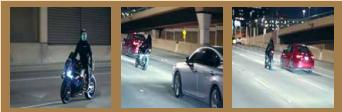

natural_image

Three-panel photo collage showing a person on a blue motorcycle, two cars with red wheels, and a person on a silver car at night (no visible text or symbols)

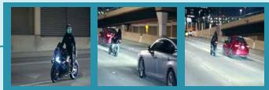

natural_image

Three-panel photo collage showing a motorcyclist, a motorcycle in motion, and a red car parked at night (no visible text or symbols)

Classification label: riding a motorcycle

# Video Classification

# Zero-Shot Video Segmentation

Prompts:

motorcycle person road

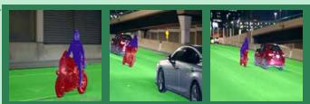

natural_image

Three outdoor scenes: a person riding a red scooter, a motorcycle on a green platform, and a silver car with a person nearby (no visible text or symbols)

Prompt: a motorcyclist and two cars on a highway at night

# PyraTok

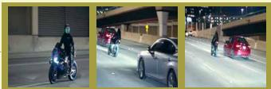

natural_image

Three-panel photo collage showing a person on a motorcycle, a red car with wheels, and a person on a red car at night (no visible text or symbols)

# Text-to-Video Generation

# Video Reconstruction

Input frames (masked, shuffled):

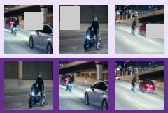

natural_image

Six-panel photo collage showing a motorcyclist on a road at night, with cars and pedestrians in the background (no visible text or symbols)

Prompt: red car driving

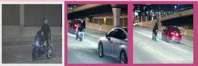

Temporal Action Grounding

Figure 1: Given a video and text prompt, PyraTok encodes compact latents, facilitating high-quality reconstruction and a wide range of video-language understanding tasks.

Abstract. Discrete video VAEs underpin modern text-to-video generation and video understanding systems, yet existing tokenizers typically learn visual codebooks at a single scale with limited vocabularies and shallow language supervision, leading to poor cross-modal alignment and zero-shot transfer. We introduce PyraTok, a language-aligned pyramidal tokenizer that learns semantically structured discrete latents across multiple spatiotemporal resolutions. PyraTok builds on a pretrained video VAE and a novel Language aligned Pyramidal Quantization (LaPQ) module that discretizes encoder features at several depths using a shared large binary codebook, yielding compact yet expressive video token sequences. To tightly couple visual tokens with language, PyraTok jointly optimizes multi-scale text-guided quantization and a global autoregressive objective over the token hierarchy. Across ten benchmarks, PyraTok delivers state-of-the-art (SOTA) video reconstruction, consistently improves text-to-video quality, and sets new SOTA zero-shot performance on video segmentation, temporal action localization, and video understanding, scaling robustly to up to 4K/8K resolutions.

https://plan-lab.github.io/pyratok

PLAN LAB

Perception and LANguage Lab

# 1. Introduction

In recent years, multimodal video generation has gained significant attention [23, 27, 39]. Text-to-video models such as VideoGPT [65], CogVideoX [67], and OmniGen2 [60] are particularly prominent. Most of these models are built on latent diffusion frameworks [4, 8], which generate videos in a compact latent space rather than directly

modeling high-dimensional pixel distributions, improving efficiency and reducing computational cost. Variational Autoencoders (VAEs) are central to this setup. In particular, discrete VAEs [10, 52] have proven especially effective, as their learned codebooks quantize the latent space into discrete tokens, enabling scalable and high-quality video synthesis.

Although discrete VAEs offer strong compression and generation capabilities, their codebooks are typically learned solely from visual data [52, 70]. This limits performance on downstream tasks such as text-to-video generation or video understanding, due to the semantic gap between textual input and visual representation. Bridging this gap during downstream training increases convergence time and resource demands. Recent works have integrated text supervision directly within VAE architectures [13, 28, 37, 46, 71].

However, despite these advances, current methods have few major limitations: (1) They largely capture semantics at a single scale, i.e., only after obtaining latent representations from the encoder, which limits their ability to leverage the hierarchical nature of VAEs that model features from low-level spatial details to high-level semantics [45, 51], leaving potential for more fine-grained text-video alignment. (2) They typically employ small codebooks (4K–8K tokens), which are sufficient for basic visual patterns but limit the representational capacity of both visual and textual modalities [70]. These smaller codebooks hinder effective cross-modal alignment and constrain the expressiveness of text-conditioned video generation models. (3) Shallow, single-site text alignment causes semantic drift. Most existing methods inject language either globally through sequence-level contrastive objectives [13, 28] or locally via token-level codebook distillation [71], during codebook learning only. As a result, the learned representations exhibit semantic drift and temporal inconsistency, where local visual tokens fail to remain aligned with global textual intent.

To address the aforementioned limitations, we introduce PyraTok, a video tokenizer that leverages a novel Language aligned Pyramidal Quantization (LaPQ) to hierarchically encode coarse-to-fine video features using an expressive codebook of large vocabulary. To bridge visual and text semantics, we introduce a dual semantic alignment strategy that jointly aligns text and video representations via multi-scale quantization and autoregressive refinement. Empirically, PyraTok achieves SoTA performance across video generation and various video understanding tasks. PyraTok surpasses the best prior VAE baseline by +5.75 mAP on temporal action localization, +2.82 on videoQA, and up to +9.16 on video classification. Notably, PyraTok is the first VAE to reach SoTA zeroshot video semantic segmentation, outperforming zero-shot and unsupervised methods by up to +10 and +7.0 mAP, respectively. Fig. 2 illustrates Pyra-Tok’s interpretable text-guided cross-modal attention.

# Contributions: In summary, our contributions are:

• We introduce PyraTok, a multi-scale semantically aligned Video VAE that couples spatiotemporal quantization with dual semantic alignment, enabling coarse-to-fine understanding and efficient video generation.   
• PyraTok leverages LaPQ, a novel languagealigned pyramidal quantization framework, designed to hierarchically encode multi-scale video representations through lateral encoder connections at each stage. Our design enables efficient use of a large ∼48K token vocabulary, with up to 95% codebook utilization.   
• We propose a dual semantic alignment strategy that injects text-conditioned priors at every LaPQ level (local alignment) and refines them with an autoregressive objective over the sequence of quantized tokens (global alignment). This jointly enforces token-level grounding and sequencelevel (temporal and relational) coherence, preventing semantic drift across scales and time.   
• We further introduce a hierarchical semantic codebook loss that ties a shared binary codebook to text embeddings and preserves semantic consistency across pyramid levels through stage-wise KL regularization.

PyraTok achieves SoTA reconstruction fidelity and downstream performance across 10 diverse video benchmarks, scaling to 4K and 8K resolutions. For example, PyraTok is, to our knowledge, the first discrete quantized VAE to demonstrate zero-shot text-guided video segmentation, with up to 2× improvement in mAP on OVIS over strong baselines.

# 2. Related Work

Visual Quantized VAEs for Video. VAEs have become a cornerstone in video generation [23, 27, 41] and downstream tasks such as text-to-video [61, 67, 72] and video understanding [3, 29, 56], enabling efficient sampling and scalable generation by learning compact latent spaces. A key advance is discrete latent VAEs, introduced in VQ-VAE [52]. Unlike continuous VAEs, which map inputs to Gaussian spaces, VQ-VAEs tokenize features into a learnable codebook. This yields structured, non-redundant representations suitable for sequence modeling and scalable training. VQ-GAN [10] adds adversarial training to reduce blur, while ViT-VQGAN [68] replaces CNNs with Vision Transformers [9] for long-range modeling.

These models have been adapted to video through spatiotemporal extensions. VideoGPT [65] introduces a 3D VQ-VAE by replacing 2D CNNs with 3D convolutions to maintain temporal coherence. MAGVITv2 [33, 70] further improves fidelity via Lookup-Free Quantization (LFQ), enabling substantially larger codebooks with efficient training. More recent tokenizers extend this direction. For instance, OmniTokenizer [57] unifies image–video tokenization via a spatial–temporal decoupled design, LARP [55] introduces an autoregressivefriendly latent prior, and 3D-MBQ-VAE [44] improves efficiency and temporal consistency with mobile inverted blocks and full-frame masking. However, these approaches remain limited in capturing fine-grained spatial details because quantization is performed at a fixed spatial scale.

Text Quantization in VAEs. While vanilla VQ-VAEs effectively compress visual information, they inherently lack cross-modal alignment, limiting their applicability to tasks requiring semantic consistency, such as text-to-video generation and VideoQA. Early methods like Frozen [50] attempted alignment using frozen language models but required large paired datasets. To address this, several image generation methods such as TokLIP [28], LG-VQ [13], and TokenFlow [37] have proposed unified quantization strategies that embed visual data into language-informed spaces in VAEs.

Despite significant progress in image generation, only a few methods extend such strategies to video VAEs. For example, VideoVAE+ [63] integrates captions into the quantization stage using frozen BERT embeddings to align spatiotemporal latents with language semantics. SweetTok [46] introduces

Text Query:Player in Nike shoes kicking a Football   
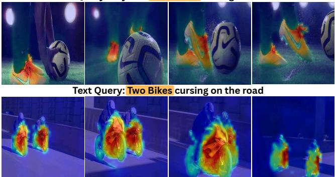

text_image

Text Query: Two Bikes cursing on the road

Figure 2: PyraTok attention maps illustrating fine-grained cross-modal alignment. Highlighted regions indicate language-guided semantic localization (e.g., Nike shoes, bikes).

a motion-aware language codebook with decoupled spatial-temporal tokenization for compact, semantically rich video representations. However, these models typically align semantics at a single resolution, overlooking the hierarchical, coarse-tofine structure of visual understanding. In contrast, we propose PyraTok, a language-enhanced video VAE for video generation and understanding, that introduces multi-scale semantic alignment within discrete latent spaces, enabling joint reasoning over both global context and fine-grained details.

# 3. Method

# 3.1. Problem Definition

Given an input video X ∈ RC×T×H×W $\pmb { X } \in \mathbb { R } ^ { C \times T \times H \times W }$ with T frames, $H \times W$ spatial resolution, and C channels. The goal is to learn a compact latent representation that preserves both spatiotemporal fidelity and semantic correspondence with conditioning text embedding $\mathbf { e _ { t } } .$ . The input video is masked (X˜ ) and encoded by ℰn to produce latent features Z = ℰ n(X˜ ), where Z ∈ RT′×H′×W′×d $\pmb { Z } = \mathcal { E } n \big ( \tilde { \pmb { X } } \big )$ $\mathbf { Z } \in \mathbb { R } ^ { T ^ { s } \setminus H ^ { I } \times W ^ { I } \times d }$ and $T ^ { \prime } { = } T { \big / } f + 1$ , $\boldsymbol { H } ^ { \prime } = \boldsymbol { H } / 2 \boldsymbol { f } , \boldsymbol { W } ^ { \prime } = \boldsymbol { W } / 2 \boldsymbol { f }$ denote compressed temporal and spatial dimensions with compression factor f with d dimensions. Encoded features are discretized through a text-conditioned quantization process $\mathbf { q } = \mathcal { Q } ( \mathbf { Z } , \mathbf { e _ { t } } )$ , and the decoder reconstructs the video as $\hat { \mathbf { X } } = { \mathcal { D } } e ( \mathbf { q } )$ . This yields a text-guided video autoencoding objective that learns compact representations for efficient downstream generative modeling.

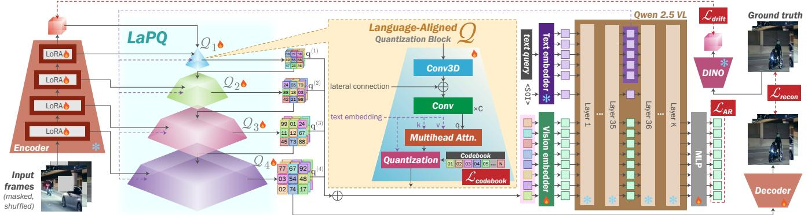

flowchart

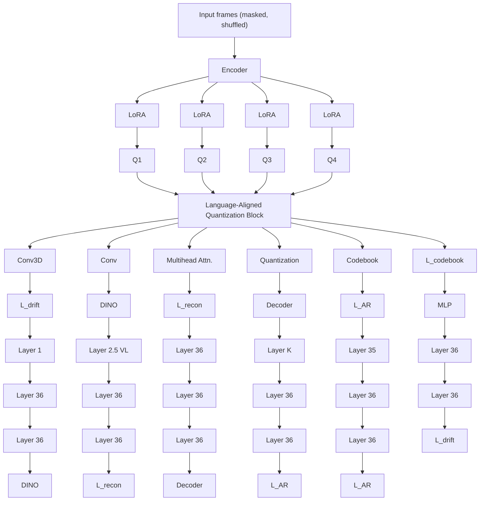

Figure 3: Overview of the proposed PyraTok architecture. Masked video frames are encoded and quantized at multiple scales via Language-aligned Pyramidal Quantization (LaPQ) blocks guided by text embeddings. The resulting multi-scale discrete tokens are aligned through a vision-language model for semantic consistency, enabling high-fidelity and text-aware video reconstruction.

# 3.2. PyraTok Architecture

# 3.2.1. Language-aligned Pyramidal Quantization

Videos exhibit rich structure across multiple spatial and temporal scales, but single-scale quantization methods [10, 52] tend to overfit global patterns or miss fine-grained details. While larger codebooks can improve generation quality [69], they introduce prohibitive memory and compute costs. To address this, we introduce Language-aligned Pyramidal Quantization (LaPQ), a novel framework that discretizes features at multiple encoder depths via lateral connections, capturing global semantics from deeper layers and local details from shallower ones without high-dimensional codebooks.

In addition, LaPQ aligns both the quantization assignments and codewords with text embeddings, ensuring that each discrete token is informative of the associated language description. This language alignment is essential for text-conditioned video generation and zero-shot video understanding, as it produces a discrete video token space that is natively compatible with multimodal models.

Formally, the encoder ℰn processes a masked input video through L hierarchical stages to extract multi-scale spatiotemporal representations $\mathbf { F } ^ { ( l ) } =$ $\mathcal { E } n \big ( \mathbf { F } ^ { ( l - 1 ) } \big )$ , with $\mathbf { F } ^ { ( 0 ) } = \tilde { \mathbf { X } } .$ , where $\mathbf { F } ^ { ( l ) } \in \mathbb { R } ^ { C _ { l } \times T _ { l } \times H _ { l } \times W _ { l } }$ denotes the feature map at the $l ^ { \mathrm { t h } }$ stage of the encoder, with progressive downsampling along spatial and temporal dimensions. To capture both fine and coarse spatiotemporal details, we quantize Z in a pyramidal manner across encoder depths. Specifically, at each stage l, we introduce a Quantization Block $\mathcal { Q } _ { l }$ that receives the current encoder feature $\mathbf { F } ^ { ( l ) }$ , the previous quantized representation $\mathbf { q } ^ { ( l - 1 ) }$ , and the query text embedding $\mathbf { e _ { t } }$ for semantic alignment, producing a new semantically aligned quantized representation $\mathbf { q } ^ { ( l ) }$ at stage l:

$$
\mathbf {q} ^ {(l)} = \mathcal {Q} _ {l} (\mathbf {q} ^ {(l - 1)}, \mathbf {F} ^ {(l)}, \mathbf {e} _ {\mathbf {t}}) \tag {1}
$$

This hierarchical process enables progressive semantic alignment across L stages. Fig. 3 illustrates the whole architecture of PyraTok. The internal architecture of ?? is detailed in the following subsection.

# 3.2.2. Dual Semantic Alignment

We propose a novel alignment strategy to ensure that quantized video tokens remain both locally faithful to visual structure and globally consistent with textual semantics.

❶ Multi-scale Semantic Alignment in Quantization Blocks (local): In each Quantization Block $\mathcal { Q } _ { l }$ of LaPQ, semantic discretization is performed at a specific encoder depth by integrating visual and text information, capturing semantics across multiple scales. Given encoder feature s F(l), $\mathbf { F } ^ { ( l ) }$ we incorporate lateral connections to retain spatial and temporal locality. Semantic context is introduced by attending to the text embedding $\mathbf { e _ { t } } ,$ extracted from a pretrained VLM, via multi-head self-attention, enabling language-guided modulation of visual features. The attended visual–text features are subsequently fused through projection layers, yielding modality-aligned representations suitable for quantization.

To discretize these representations efficiently, we adopt Lookup-Free Quantization (LFQ) [70], which replaces the conventional learned codebook C ∈RK×d $\mathbf { C } \in \mathbb { R } ^ { K \times d }$ with compact binary codewords Cv = {−1, 1}log2 K. ${ \bf C } _ { v } = \left\{ - 1 , 1 \right\} ^ { \mathrm { l o g } _ { 2 } K }$ This eliminates high-dimensional embedding lookups and significantly reduces memory overhead, enabling efficient scaling to a large vocabulary. The binary codebook $\mathbf { C } _ { v }$ is shared across all $\mathcal { Q } _ { l }$ quantization blocks, ensuring consistency across pyramid levels while minimizing parameter growth. The codebook is used only during training to compute alignment losses and guide structure. During inference, quantization operates without lookups, preserving the efficiency of LFQ. To jointly optimize quantization and semantic alignment, we introduce a hierarchical semantic codebook loss:

$$
\mathcal {L} _ {\text {codebook}} = \sum_ {l = 1} ^ {L} \left[ \underbrace {\left\| \mathbf {q} ^ {(l)} - \operatorname{sg} (\mathbf {C} _ {v}) \right\| ^ {2}} _ {\text {vision - commitment}} + \underbrace {\mathbb {E} \left[ - \mathbf {q} ^ {(l)} \log \mathbf {q} ^ {(l)} \right]} _ {\text {entropy regularization}} \right.
$$

$$
+ \underbrace {\mathrm{D} _ {\mathrm{KL}} \left(\mathbf {q} ^ {(l)} \| \mathbf {q} ^ {(l - 1)}\right)} _ {\text { hierarchical   consistency }} + \underbrace {\mathbb {E} _ {\mathbf {q} _ {i} \in \mathbf {q} ^ {(l)}} \left[ \mathrm{D} _ {\mathrm{KL}} \left(\mathbf {q} _ {i} \| \operatorname{sg} \left(\mathbf {e} _ {\mathbf {t}}\right)\right) \right]} _ {\text { text - conditioned   alignment }} \tag {2}
$$

$$
\left. + \underbrace {\mathbb {E} _ {\mathbf {c} \in \mathbf {C} _ {v}} D _ {K L} (\mathbf {c} \| s g (\mathbf {e} _ {t}))} _ {\text { text - codebook   alignment }} \right].
$$

Here, $s g ( \cdot )$ denotes the stop-gradient operator. The first term encourages vision-commitment by pulling $\mathbf { q } ^ { ( l ) }$ toward the binary code vectors $\mathbf { C } _ { v } ,$ , while entropy regularization sharpens the assignments toward near one-hot distributions. The hierarchical KL term enforces hierarchical consistency across quantization levels. The remaining KL terms introduce semantic structure through text-conditioned alignment of assignments and text–codebook alignment of the LFQ codebook. Together, these terms enable stable multi-scale quantization with strong cross-modal coherence. Fig. 4 illustrates this refinement, with deeper stages producing clearer semantic structure. For example, in the first row, later stages reveal

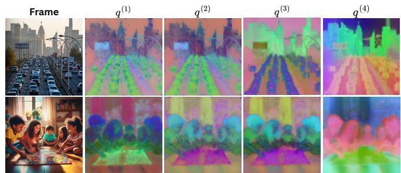

text_image

Frame
q(1)
q(2)
q(3)
q(4)

Figure 4: PCA projections of quantized tokens from each LaPQ’s stage. Columns $( q ^ { ( 1 ) } - q ^ { ( 4 ) } )$ q(4)) show hierarchical outputs capturing progressively refined and semantically aligned regions.

more distinct separation of road lanes, vehicles, and background elements.

❷ Autoregressive Semantic Alignment (global): To enforce global semantic consistency between language and discrete latents, we introduce an autoregressive alignment objective over the quantized token sequence. Given a text query t, we obtain its embedding $\mathbf { e _ { t } } = \mathrm { V L M } ( t )$ and extract discrete tokens from each quantization block using the shared codebook $\mathbf { C } _ { v } .$ . Tokens from all levels are concatenated with separator tokens ⟨Q-SEP⟩ to retain hierarchical structure, and a start-of-image token ⟨SOI⟩ is prepended after the text. The resulting sequence is fed into the VLM decoder, which autoregressively predicts each visual token conditioned on the text and preceding tokens: $\begin{array} { r } { \mathcal { L } _ { \mathrm { A R } } = - \sum _ { l = 1 } ^ { L } \log p \big ( \mathbf { q } ^ { ( l ) } \mid \mathbf { q } ^ { ( < l ) } , \mathbf { e _ { t } } \big ) } \end{array}$ By making visual tokens predictable from the text prefix, this objective encourages the shared codebook to encode globally consistent, language-aligned semantics. The separator tokens retain hierarchical structure while enabling unified sequential modeling, improving both reconstruction quality and latent-space controllability.

# 3.2.3. Pretrained VAE Encoder and LoRA

PyraTok leverages a pretrained video VAE, keeping both encoder ℰn and decoder ??e frozen to preserve high-fidelity reconstruction and focus learning on multi-scale semantic alignment. To enable efficient adaptation to high-resolution inputs, we insert LoRA modules [15] into encoder blocks, enabling lightweight feature modulation without modifying pretrained weights. Text-conditioned supervision can cause latent drift from the pretrained visual manifold. To stabilize adaptation, we add a drift-regularization term that anchors adapted features to a frozen large-scale reference encoder En: $\mathcal { L } _ { \mathrm { d r i f t } } = \mathrm { D } _ { \mathrm { K L } } \left( \mathcal { E } n ( \tilde { \mathbf { X } } ) | | E n ( \tilde { \mathbf { X } } ) \right)$ , This stabilizes training by preserving alignment with the original visual prior while allowing semantically guided updates.

Table 1: Reconstruction quality comparison. Latency measured on 25 frames (256×256) using a single V100 GPU. Best highlighted with bold and second-best underlined. 

<table><tr><td rowspan="2">Methods</td><td rowspan="2">Params</td><td rowspan="2">Latency (ms)</td><td colspan="3">WebVid-10M</td><td colspan="3">COCO-Val</td></tr><tr><td>PSNR (↑)</td><td>SSIM (↑)</td><td>LPIPS (↓)</td><td>PSNR (↑)</td><td>SSIM (↑)</td><td>LPIPS (↓)</td></tr><tr><td>CogVideoX [67]</td><td>288M</td><td>712</td><td>29.92</td><td>0.811</td><td>0.141</td><td>30.11</td><td>0.833</td><td>0.111</td></tr><tr><td>3D-MBQ-VAE [44]</td><td>317M</td><td>650</td><td>33.00</td><td>0.848</td><td>0.092</td><td>32.11</td><td>0.858</td><td>0.108</td></tr><tr><td>WAN 2.2 [53]</td><td>222M</td><td>449</td><td>32.94</td><td>0.841</td><td>0.101</td><td>33.43</td><td>0.861</td><td>0.103</td></tr><tr><td>OmniTokenizer [57]</td><td>82M</td><td>444</td><td>32.03</td><td>0.812</td><td>0.152</td><td>32.09</td><td>0.845</td><td>0.141</td></tr><tr><td>LARP [55]</td><td>183M</td><td>689</td><td>33.03</td><td>0.851</td><td>0.091</td><td>34.26</td><td>0.853</td><td>0.089</td></tr><tr><td>TokenFlow [37]</td><td>176M</td><td>600</td><td>28.21</td><td>0.799</td><td>0.189</td><td>30.11</td><td>0.811</td><td>0.177</td></tr><tr><td>VideoVae+ [63]</td><td>192M</td><td>555</td><td>29.17</td><td>0.812</td><td>0.201</td><td>31.45</td><td>0.832</td><td>0.162</td></tr><tr><td>TexTok [71]</td><td>173M</td><td>661</td><td>27.42</td><td>0.831</td><td>0.222</td><td>29.29</td><td>0.841</td><td>0.181</td></tr><tr><td>LG-VQ [13]</td><td>168M</td><td>598</td><td>30.23</td><td>0.807</td><td>0.173</td><td>31.32</td><td>0.836</td><td>0.152</td></tr><tr><td>TokLIP [28]</td><td>207M</td><td>604</td><td>31.28</td><td>0.837</td><td>0.152</td><td>33.42</td><td>0.849</td><td>0.105</td></tr><tr><td>SweetTok [46]</td><td>128M</td><td>432</td><td>32.32</td><td>0.842</td><td>0.137</td><td>32.78</td><td>0.847</td><td>0.123</td></tr><tr><td>PyraTok (Ours)</td><td>192M</td><td>492</td><td>35.72</td><td>0.879</td><td>0.066</td><td>36.05</td><td>0.885</td><td>0.071</td></tr></table>

# 3.2.4. Total Objective and Regularization.

PyraTok is trained with a composite loss balancing reconstruction quality, semantic alignment, and quantization consistency $\lambda _ { \mathrm { { r e c o n } } } \mathcal { L } _ { \mathrm { { r e c o n } } } + \lambda _ { \mathrm { { c o d e b o o k } } } \mathcal { L } _ { \mathrm { { c o d e b o o k } } } +$ $\lambda _ { \mathrm { A R } } \mathcal { L } _ { \mathrm { A R } } + \lambda _ { \mathrm { d r i f t } } \mathcal { L } _ { \mathrm { d r i f t } }$ , where $\lambda _ { \mathrm { { r e c o n } } } .$ , λcodebook, $\lambda _ { \mathrm { A R : } }$ , and $\lambda _ { \mathrm { d r i f t } }$ coefficients. The reconstruction loss combines pixel-level and perceptual terms, $\scriptstyle { \mathcal { L } } _ { \mathrm { r e c o n } } =$ $\mathcal { L } _ { \mathrm { S S I M } } + \mathcal { L } _ { \mathrm { L 1 } } + \mathcal { L } _ { \mathrm { L P I P S } }$ , while $\mathcal { L } _ { \mathrm { c o d e b o o k } }$ enforces multiscale semantic alignment, ${ \mathcal { L } } _ { \mathrm { d r i f t } }$ ensures that low-rank adapters do not drift using alignment, and $\mathcal { L } _ { \mathrm { A R } }$ promotes autoregressive alignment with the query text.

# Experiments

We comprehensively evaluate PyraTok on frame reconstruction, text-o-video generation, and a diverse set of multimodal understanding tasks, including zero-shot segmentation, temporal action localization, general video understanding, and text-to-video generation. Evaluations are conducted across 10 real-world benchmarks, such as WebVid-10M [2], YouTube-VIS 2021 [66], MVBench [25], etc.

PyraTok is trained on a large-scale subset of Droplet-10M [73] comprising HD videos, augmented with additional HD samples from OpenVid-1M [35] and ultra-high-resolution (4K/8K) videos with reconstructed captions from UltraVideo [64]. Additional implementation and experimental setup details are provided in the supplementary material.

# 4.1. Video Generation Tasks

Frame Reconstruction. As shown in Table 1, Pyra-Tok achieves the best frame reconstruction quality on both WebVid-10M [2] and COCO-Val [31], surpassing all prior semantic and non-semantic video VAEs. Compared to SweetTok [46] and TokLIP [28], which also incorporate semantic alignment, Pyra-Tok achieves 10.51% and 14.19% higher PSNR, and 51.62% and 56.57% lower LPIPS, respectively. Sweet-Tok decouples spatial and temporal tokens but processes them independently, hindering global semantic consistency, while TokLIP enriches visual tokens with CLIP-level [38] semantics but lacks temporal modeling. PyraTok overcomes both limitations by combining fine-grained, text-guided quantization at each LaPQ level with a global autoregressive prior that enforces temporal coherence. Furthermore, SoTA non-semantic VAEs such as 3D-MBQ-VAE [44], CogVideoX [67], and LARP [55] are also outperformed, highlighting PyraTok ’s ability to capture text semantics while maintaining high fidelity.

These trends are clearly reflected in the qualitative results. As shown in Fig. 5, PyraTok reconstructs legible text in the street scene, crisp leaf textures in the ramen and plant examples, and fine facial structures on the polar bear, whereas all baselines exhibit noticeable blurring or distortion. The t-SNE visualization in Fig. 6 further reveals that PyraTok’s latent space forms compact, well-separated clusters corresponding to coherent semantic categories, evidencing effective multi-scale semantic organization.

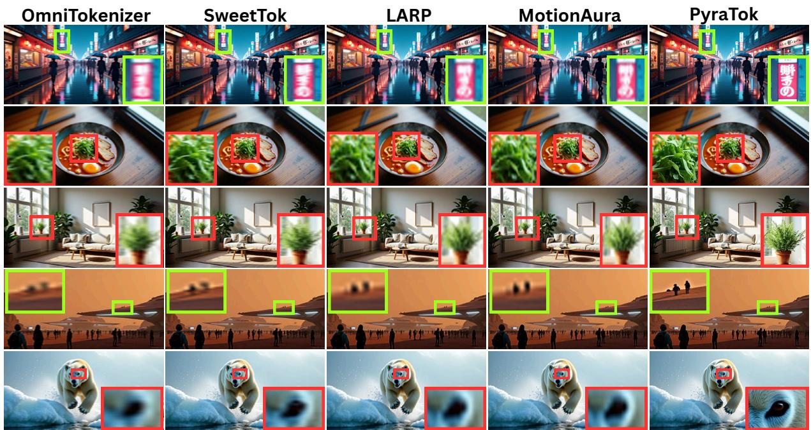

text_image

OmniTokenizer
SweetTok
LARP
MotionAura
PyraTok

Figure 5: Frame reconstruction qualitative comparison. PyraTok generates sharper details, clearer textures, and better spatial structure than baselines, demonstrating better fidelity and semantic consistency.

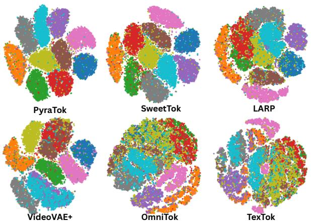  
Figure 6: t-SNE visualization showing PyraTok with more distinct, well-separated clusters, indicating improved semantic organization.

Table 2: T2V performance on WebVid-10M. Incorporating PyraTok (✓) consistently improves perceptual quality and semantic alignment compared to base models without it (✗). 

<table><tr><td rowspan="2">Base Model</td><td rowspan="2">Type</td><td colspan="2">FVD (↓) / TC (↑)</td></tr><tr><td>✗ PyraTok</td><td>✓ PyraTok</td></tr><tr><td>MotionAura [44]</td><td>Discrete Diffusion</td><td>374 / 204</td><td>365 / 246</td></tr><tr><td>Open MAGVITv2 [33]</td><td>AutoRegressive</td><td>433 / 191</td><td>411 / 214</td></tr><tr><td>Omnigenv2 [60]</td><td>AutoRegressive</td><td>398 / 185</td><td>377 / 208</td></tr></table>

Text-2-Video (T2V) Generation. Table 2 and Fig. 7 show that substituting the native VAEs in MotionAura [44], MAGVITv2 [33, 70], and Omni-GenV2 [60] with PyraTok consistently improves perceptual fidelity, texture sharpness, and text–video semantic alignment. Quantitatively, PyraTok reduces FVD by 9–22 points and increases TC by 20–27 points across all backbones. Qualitatively (shown in Fig. 7), PyraTok recovers details such as clearer facial structure, and more coherent structure like robotic hand geometry in the OmniGenV2 example.

# 4.2. Video Understanding Tasks

Video Segmentation. As shown in Table 3, PyraTok demonstrates strong zero-shot performance on YouTube-VIS 2021 [66] and OVIS [36]. Compared to the zero-shot SoTA OmniTokenizer [28], which lacks explicit text-semantic supervision, PyraTok achieves 68.8% and 30.2% relative improvements in mAP and Jaccard on YouTube-VIS 2021, and remarkable gains of 217.9% and 48.6% on OVIS, respectively. These results underscore the effectiveness of our semantically aligned video representation in enabling robust zero-shot generalization. To the best of our knowledge, PyraTok is the first demonstration of zero-shot video semantic segmentation using a language-aligned discrete VAE.

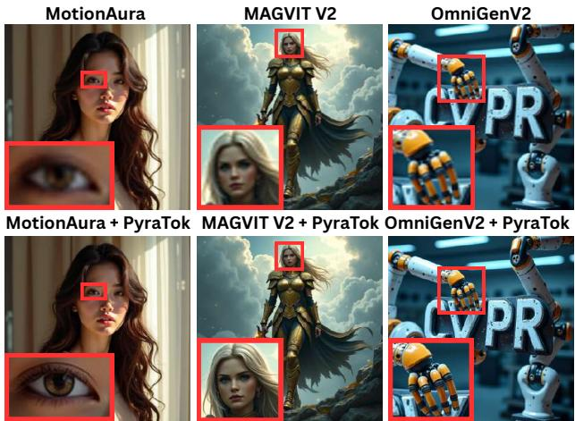

Figure 7: T2V generation across various backbones. Integrating PyraTok enhances detail, sharpness, and spatial consistency.   
Table 3: Video semantic segmentation results on YouTube-VIS 2021 and OVIS. Best highlighted with bold and second-best underlined. ⋆ supervised, Ó unsupervised, Ç zero-shot methods. 

<table><tr><td rowspan="2">Method</td><td rowspan="2">Training</td><td colspan="2">YouTube-VIS 2021</td><td colspan="2">OVIS</td></tr><tr><td>mAP (↑)</td><td>Jaccard (↑)</td><td>mAP (↑)</td><td>Jaccard (↑)</td></tr><tr><td>CLIP-VIS [76]</td><td>★</td><td>44.2</td><td>76.31</td><td>18.6</td><td>60.09</td></tr><tr><td>VideoCutLER [58]</td><td>◇</td><td>17.1</td><td>62.23</td><td>-</td><td>-</td></tr><tr><td>UVIS [16]</td><td>◇</td><td>17.5</td><td>63.11</td><td>3.5</td><td>36.71</td></tr><tr><td>VideoVae+ [63]</td><td>◇</td><td>12.33</td><td>51.21</td><td>2.8</td><td>29.91</td></tr><tr><td>LARP [55]</td><td>◇</td><td>10.52</td><td>49.37</td><td>1.7</td><td>28.45</td></tr><tr><td>OmniTokenizer [57]</td><td>◇</td><td>14.54</td><td>51.12</td><td>2.8</td><td>33.27</td></tr><tr><td>PyraTok (Ours)</td><td>◇</td><td>24.54</td><td>66.56</td><td>8.9</td><td>49.44</td></tr></table>

Compared to unsupervised baselines like VideoCut-LER [58] and UVIS [16], which suffer from motion ambiguity and inconsistent grouping, PyraTok’s multi-scale text-conditioned quantization achieves coherent segmentation with enhanced spatial–temporal consistency. Qualitative results in Fig. 8 further validate these findings. PyraTok accurately segments

Prompt: Players are kicking a soccer ball on the field   
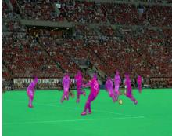

natural_image

Soccer match in progress with players in pink uniforms on a green field, audience visible in background (no signage or text)

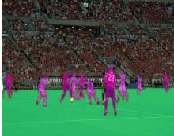

natural_image

Soccer players in pink jerseys on a green field during a match, with spectators in the background (no visible text or symbols)

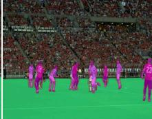

natural_image

Group of soccer players in pink uniforms standing on a green field during a match, with spectators in the background (no visible text or symbols)

en talking and horse is   
grazing under the tree

Prompt: Man and wom   
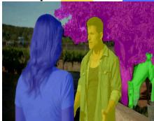

natural_image

Two people in blue and yellow attire standing outdoors with a colorful tree mural in the background (no text or symbols visible)

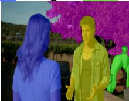

natural_image

Two human figures in a park setting with colorful trees in the background (no visible text or symbols)

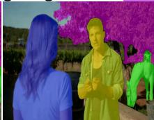

natural_image

Two people in blue and green attire standing outdoors with colorful trees in the background (no visible text or symbols)

Figure 8: Zero-shot segmentation results showing PyraTok’s precise text-guided segmentation of multiple objects in complex scenes.

Table 4: Video action localization under the 50% Seen / 50% Unseen setup. Best highlighted with bold and second-best underlined. ⋆ supervised and Ç zero-shot methods. 

<table><tr><td>Method</td><td>Training</td><td>VAE</td><td>THUMOS14 Avg. mAP (↑)</td><td>ActivityNet v1.3 Avg. mAP (↑)</td></tr><tr><td>STALE [34]</td><td>★</td><td>✕</td><td>22.2</td><td>20.5</td></tr><tr><td>DeTAL [26]</td><td>★</td><td>✕</td><td>24.1</td><td>22.4</td></tr><tr><td>STOV-TAL [18]</td><td>★</td><td>✕</td><td>48.8</td><td>29.6</td></tr><tr><td>STOV-TAL [18]</td><td>✕</td><td>✕</td><td>31.5</td><td>28.0</td></tr><tr><td>VideoVae+ [63]</td><td>✕</td><td>√</td><td>23.12</td><td>21.37</td></tr><tr><td>OmniTokenizer [57]</td><td>✕</td><td>√</td><td>23.47</td><td>22.48</td></tr><tr><td>SweetTok [46]</td><td>✕</td><td>√</td><td>25.32</td><td>24.53</td></tr><tr><td>LARP [55]</td><td>✕</td><td>√</td><td>27.42</td><td>25.53</td></tr><tr><td>PyraTok (Ours)</td><td>✕</td><td>√</td><td>33.17</td><td>29.11</td></tr></table>

complex multi-object scenes (e.g., players, soccer ball, and field) with precise boundaries and strong semantic correspondence between textual and visual cues.

Video Action Localization. As shown in Table 4, PyraTok achieves the best zero-shot performance on THUMOS14 and ActivityNet, outperforming the previous zero-shot SoTA LARP [55] by +5.75 mAP and +3.58 mAP, respectively. Although LARP and SweetTok [46] incorporate semantics, their alignment remains limited. For instance, SweetTok separates spatial and temporal streams, and LARP lacks explicit text-conditioned supervision. In contrast, PyraTok combines multi-scale text-guided quantization with a global autoregressive prior, enabling fine-grained temporal reasoning and stronger cross-modal consistency.

These advantages are evident in Fig. 9, where Pyra-

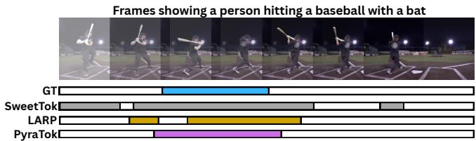

text_image

Frames showing a person hitting a baseball with a bat
GT
SweetTok
LARP
PyraTok

Figure 9: Video action localization results. Pyra-Tok aligns action boundaries more accurately.

Table 5: Accuracy (%) on general video understanding and video classification. Best highlighted with bold and second-best underlined. 

<table><tr><td rowspan="2">Method</td><td rowspan="2">VAE</td><td>MVBench</td><td colspan="3">Kinetics</td></tr><tr><td>Overall</td><td>400</td><td>600</td><td>700</td></tr><tr><td>InternVL3-78B [75]</td><td>✕</td><td>79.2</td><td>-</td><td>-</td><td>-</td></tr><tr><td>Qwen2.5-72B [1]</td><td>✕</td><td>71.3</td><td>-</td><td>-</td><td>-</td></tr><tr><td>InternVL3-38B [75]</td><td>✕</td><td>76.0</td><td>-</td><td>-</td><td>-</td></tr><tr><td>Qwen2.5VL-7B [1]</td><td>✕</td><td>67.2</td><td>-</td><td>-</td><td>-</td></tr><tr><td>Qwen2.5VL-3B [1]</td><td>✕</td><td>67.0</td><td>-</td><td>-</td><td>-</td></tr><tr><td>InternVL [75]</td><td>✕</td><td>-</td><td>69.1</td><td>68.9</td><td>60.6</td></tr><tr><td>InternVideo2 [59]</td><td>✕</td><td>-</td><td>73.1</td><td>72.8</td><td>64.9</td></tr><tr><td>VideoPrism-g [74]</td><td>✕</td><td>-</td><td>76.4</td><td>-</td><td>-</td></tr><tr><td>SigLIP2-g-opt[49]</td><td>✕</td><td>-</td><td>69.8</td><td>67.0</td><td>61.8</td></tr><tr><td>PEcoreG [5]</td><td>✕</td><td>-</td><td>76.9</td><td>76.1</td><td>69.1</td></tr><tr><td>VILA-U [62]</td><td>√</td><td>81.21</td><td>-</td><td>-</td><td>-</td></tr><tr><td>VideoVae+ [63]</td><td>√</td><td>-</td><td>63.32</td><td>61.27</td><td>55.55</td></tr><tr><td>OmniTokenizer [57]</td><td>√</td><td>79.44</td><td>65.03</td><td>62.75</td><td>58.71</td></tr><tr><td>SweetTok [46]</td><td>√</td><td>-</td><td>67.54</td><td>65.01</td><td>61.45</td></tr><tr><td>LARP [55]</td><td>√</td><td>83.21</td><td>69.27</td><td>68.52</td><td>66.89</td></tr><tr><td>PyraTok (Ours)</td><td>√</td><td>86.03</td><td>78.43</td><td>77.11</td><td>74.08</td></tr></table>

Tok more accurately localizes the baseball bat swing action than others. This design also allows PyraTok to surpass supervised approaches such as STALE and DeTAL [26], highlighting the strength of semantically aligned discrete latents for action localization.

General Video Understanding and Classification. As shown in Table 5, PyraTok achieves SoTA performance on both the MVBench [25] and Kinetics benchmarks [22]. Specifically, our model attains an overall accuracy of 86.03% across diverse video understanding tasks on MVBench. Furthermore, it demonstrates substantial improvements of 13.22%, 12.54%, and 10.75% over LARP [55] on the Kinetics-400, -600, and -700 benchmarks, respectively. PyraTok surpass prior VAE-based and large-scale non-VAE foundation models, including InternVL3-78B [75], Qwen2.5-VL-7B [1], and VideoPrism-g [74]. This performance gain stems from PyraTok’s multi-scale text-guided

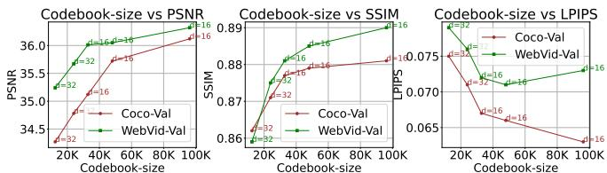

line

| Codebook-size | Cocoa-Val PSNR | WebVid-Val PSNR | Cocoa-Val SSIM | WebVid-Val SSIM | Cocoa-Val LPIPS | WebVid-Val LPIPS |
|---|---|---|---|---|---|---|
| 20K | 34.5 | 35.5 | 0.86 | 0.87 | 0.075 | 0.075 |
| 40K | 35.0 | 36.0 | 0.87 | 0.88 | 0.070 | 0.070 |
| 60K | 35.5 | 36.5 | 0.88 | 0.89 | 0.065 | 0.065 |
| 80K | 36.0 | 37.0 | 0.89 | 0.90 | 0.065 | 0.065 |
| 100K | 36.5 | 37.5 | 0.90 | 0.91 | 0.065 | 0.065 |

Figure 10: Effect of codebook size on reconstruction quality.

quantization, which offers stronger semantic grounding and temporal coherence. By contrast, although SweetTok [46] and LARP [55] incorporate semantic cues, their limited text–video alignment constrains temporal reasoning. Within VAE-based methods, PyraTok further outperforms VILA-U [62], OmniTokenizer [57], and VideoVAE+ [63], demonstrating the effectiveness of language-conditioned quantized representations. The consistent gains across understanding and classification tasks highlight PyraTok’s capability as a unified, semantically grounded video representation model with robust zero-shot generalization.

# 4.3. Ablations

Fig. 10 and Table 6 present ablations on key PyraTok components, including codebook size, loss configuration, the presence of pyramidal and recurrent quantization modules, the number of quantization blocks, and variations in the multimodal encoder or pretrained video VAE.

Codebook Size. As shown in Fig. 10, increasing codebook size and dimensionality consistently improves reconstruction and perceptual quality. Larger and higher-dimensional codebooks provide a richer latent space, enabling finer feature representation and reducing quantization error. However, performance gains saturate beyond 80K vocab size, suggesting a trade-off between model capacity and efficiency.

Component Ablation. Removing LaPQ leads to the largest degradation across all metrics, highlighting the importance of hierarchical language-aligned quantization. Excluding text guidance noticeably weakens semantic grounding, reducing both fidelity and perceptual quality. Dropping the pyramidal-Q design similarly harms performance, confirming the effectiveness of multi-scale quantization.

Table 6: Ablations on PyraTok components. 

<table><tr><td></td><td>COCO-ValPSNR / SSIM / LPIPS</td><td>WebVid-10MPSNR / SSIM / LPIPS</td></tr><tr><td colspan="3">1. Component Ablation</td></tr><tr><td>w/o LaPQ</td><td>31.41 / 0.831 / 0.101</td><td>31.47 / 0.799 / 0.118</td></tr><tr><td>w/o Text Guidance</td><td>33.43 / 0.861 / 0.081</td><td>36.02 / 0.833 / 0.082</td></tr><tr><td>w/o Pyramidal-Q</td><td>34.02 / 0.859 / 0.082</td><td>34.02 / 0.839 / 0.094</td></tr><tr><td colspan="3">2. Quantization(∅)-Blocks Ablation</td></tr><tr><td>2 Blocks</td><td>33.21 / 0.821 / 0.092</td><td>33.98 / 0.844 / 0.101</td></tr><tr><td>3 Blocks</td><td>34.78 / 0.862 / 0.089</td><td>35.14 / 0.867 / 0.085</td></tr><tr><td>4 Blocks (Default)</td><td>35.72 / 0.879 / 0.066</td><td>36.05 / 0.885 / 0.071</td></tr><tr><td colspan="3">3. Loss Function Ablation</td></tr><tr><td>w/o  $\mathcal{L}_{\text{drift}}$ </td><td>33.48 / 0.839 / 0.082</td><td>34.52 / 0.853 / 0.081</td></tr><tr><td>w/o  $\mathcal{L}_{\text{AR}}$ </td><td>33.42 / 0.842 / 0.079</td><td>34.01 / 0.844 / 0.079</td></tr><tr><td>w/o  $\mathcal{L}_{\text{drift}}$  &amp;  $\mathcal{L}_{\text{AR}}$ </td><td>32.17 / 0.832 / 0.093</td><td>32.32 / 0.831 / 0.092</td></tr><tr><td colspan="3">4. Codebook Loss Ablation</td></tr><tr><td>w/o  $\mathcal{L}_{\text{vision-commitment}}$ </td><td>32.88 / 0.819 / 0.097</td><td>33.45 / 0.839 / 0.101</td></tr><tr><td>w/o  $\mathcal{L}_{\text{text-cond. alignment}$ </td><td>33.27 / 0.822 / 0.092</td><td>34.12 / 0.855 / 0.091</td></tr><tr><td>w/o  $\mathcal{L}_{\text{text-codebook alignment}$ </td><td>34.11 / 0.849 / 0.087</td><td>34.78 / 0.872 / 0.083</td></tr><tr><td colspan="3">5. Multi-Modal Models</td></tr><tr><td>Qwen-2.5 VL [1] (Default)</td><td>35.72 / 0.879 / 0.066</td><td>36.05 / 0.885 / 0.071</td></tr><tr><td>LLaMA-3 8B [12]</td><td>35.62 / 0.871 / 0.069</td><td>35.34 / 0.878 / 0.079</td></tr><tr><td>Gemma-3 4B [47]</td><td>35.29 / 0.865 / 0.069</td><td>35.92 / 0.882 / 0.078</td></tr><tr><td colspan="3">6. Pretrained VAEs</td></tr><tr><td>3D-MBQ-VAE [44]</td><td>35.01 / 0.869 / 0.069</td><td>35.33 / 0.878 / 0.075</td></tr><tr><td>CogVideoX-VAE [67]</td><td>34.92 / 0.861 / 0.069</td><td>35.12 / 0.873 / 0.080</td></tr><tr><td>SVD-VAE [4]</td><td>34.18 / 0.859 / 0.074</td><td>34.78 / 0.865 / 0.083</td></tr><tr><td>Mochi-VAE [48]</td><td>34.95 / 0.864 / 0.071</td><td>35.06 / 0.873 / 0.076</td></tr><tr><td>PyraTok</td><td>36.05 / 0.885 / 0.071</td><td>35.72 / 0.879 / 0.066</td></tr></table>

Quantization-Blocks. Performance improves consistently as the number of ?? blocks increases, with four blocks yielding the best results. This shows that deeper quantization hierarchies enhance semantic representation and reconstruction fidelity by capturing both coarse and fine visual details.

Loss Functions. Excluding ${ \mathcal { L } } _ { \mathrm { d r i f t } }$ or $\mathcal { L } _ { \mathrm { A R } }$ weakens semantic coherence and structure preservation, while removing both leads to the largest performance drop. This confirms that feature-level alignment and variance regularization jointly stabilize semantic learning and reconstruction.

Codebook Loss. Without vision-commitment, assignments become unstable, whereas without textconditioned alignment, semantic guidance weakens. Removing text–codebook alignment disrupts global semantic structure, producing the largest degradation. This demonstrates all three terms are crucial for stable and semantically coherent quantization.

Multimodal Models. Using different vision-language encoders demonstrates the generality of PyraTok. Qwen2.5-VL achieves the best overall performance, while LLaMA-3 and Gemma-3 variants maintain competitive results.

Pretrained VAEs. Substituting the pretrained backbone shows that PyraTok maintains consistent improvements across encoders. The Wan 2.2 VAE [53] (default) delivers the best results, but strong performance with 3DMBQ-VAE, CogVideoX, and Mochi-VAE confirms the robustness and transferability of the proposed semantic quantization design.

# 5. Conclusion

We introduce PyraTok, a language-aligned pyramidal video tokenizer that performs multi-scale vector quantization with a shared large binary codebook. Our dual semantic alignment couples text-conditioned, per-level quantization with a global autoregressive objective, producing semantically consistent discrete latents. PyraTok delivers state-of-the-art 4K/8K reconstruction and strong zero-shot transfer on video segmentation, temporal action localization, VideoQA, and video classification. Compatibility studies show consistent gains across vision–language encoders and diverse VAE backbones. Ablations confirm the necessity of the pyramidal path and RVQ, the benefit of four quantization blocks, and the contributions of the autoregressive and drift terms, as well as codebook alignment losses. These results establish PyraTok as a practical, general-purpose tokenizer for modern video–language systems.

# References

[1] Shuai Bai, Keqin Chen, Xuejing Liu, Jialin Wang, Wenbin Ge, Sibo Song, Kai Dang, Peng Wang, Shijie Wang, Jun Tang, et al. Qwen2.5-VL technical report. arXiv:2502.13923, 2025.   
[2] Max Bain, Arsha Nagrani, Gül Varol, and Andrew Zisserman. Frozen in time: A joint video and image encoder for end-to-end retrieval. In International Conference on Computer Vision (ICCV), 2021.   
[3] Gedas Bertasius, Heng Wang, and Lorenzo Tor-

resani. Is space-time attention all you need for video understanding? In International Conference on Machine Learning (ICML), 2021.   
[4] Andreas Blattmann, Tim Dockhorn, Sumith Kulal, Daniel Mendelevitch, Maciej Kilian, Dominik Lorenz, Yam Levi, Zion English, Vikram Voleti, Adam Letts, et al. Stable video diffusion: Scaling latent video diffusion models to large datasets. arXiv preprint arXiv:2311.15127, 2023.   
[5] Daniel Bolya, Po-Yao Huang, Peize Sun, Jang Hyun Cho, Andrea Madotto, Chen Wei, Tengyu Ma, Jiale Zhi, Jathushan Rajasegaran, Hanoona Rasheed, et al. Perception encoder: The best visual embeddings are not at the output of the network. arXiv preprint arXiv:2504.13181, 2025.   
[6] Benjamin Bross, Ye-Kui Wang, Yan Ye, Shan Liu, Jianle Chen, Gary J Sullivan, and Jens-Rainer Ohm. Overview of the versatile video coding (vvc) standard and its applications. IEEE Transactions on Circuits and Systems for Video Technology (TCSVT), 2021.   
[7] Fabian Caba Heilbron, Victor Escorcia, Bernard Ghanem, and Juan Carlos Niebles. ActivityNet: A large-scale video benchmark for human activity understanding. In IEEE Conference on Computer Vision and Pattern Recognition (CVPR), 2015.   
[8] Haoxin Chen, Menghan Xia, Yingqing He, Yong Zhang, Xiaodong Cun, Shaoshu Yang, Jinbo Xing, Yaofang Liu, Qifeng Chen, Xintao Wang, et al. VideoCrafter1: Open diffusion models for high-quality video generation. arXiv preprint arXiv:2310.19512, 2023.   
[9] Alexey Dosovitskiy, Lucas Beyer, Alexander Kolesnikov, Dirk Weissenborn, Xiaohua Zhai, Thomas Unterthiner, Mostafa Dehghani, Matthias Minderer, Georg Heigold, Sylvain Gelly, et al. An image is worth 16x16 words: Transformers for image recognition at scale. International Conference on Learning Representations (ICLR), 2021.

[10] Patrick Esser, Robin Rombach, and Bjorn Ommer. Taming transformers for high-resolution image synthesis. In IEEE Conference on Computer Vision and Pattern Recognition (CVPR), 2021.   
[11] Songwei Ge, Thomas Hayes, Harry Yang, Xi Yin, Guan Pang, David Jacobs, Jia-Bin Huang, and Devi Parikh. Long video generation with timeagnostic VQGAN and time-sensitive transformer. In European Conference on Computer Vision (ECCV), 2022.   
[12] Aaron Grattafiori, Abhimanyu Dubey, Abhinav Jauhri, Abhinav Pandey, Abhishek Kadian, Ahmad Al-Dahle, Aiesha Letman, Akhil Mathur, Alan Schelten, Alex Vaughan, et al. The llama 3 herd of models. arXiv preprint arXiv:2407.21783, 2024.   
[13] Liang Guotao, Baoquan Zhang, Yaowei Wang, Yunming Ye, Xutao Li, and Luo Chuyao. LG-VQ: Language-guided codebook learning. Advances in Neural Information Processing Systems (NeurIPS), 2024.   
[14] Kaiming He, Xinlei Chen, Saining Xie, Yanghao Li, Piotr Dollár, and Ross Girshick. Masked autoencoders are scalable vision learners. In IEEE Conference on Computer Vision and Pattern Recognition (CVPR), 2022.   
[15] Edward J Hu, Yelong Shen, Phillip Wallis, Zeyuan Allen-Zhu, Yuanzhi Li, Shean Wang, Lu Wang, Weizhu Chen, et al. LoRA: Low-rank adaptation of large language models. International Conference on Learning Representations (ICLR), 2022.   
[16] Shuaiyi Huang, Saksham Suri, Kamal Gupta, Sai Saketh Rambhatla, Ser-nam Lim, and Abhinav Shrivastava. UVIS: Unsupervised video instance segmentation. In IEEE Conference on Computer Vision and Pattern Recognition (CVPR), 2024.   
[17] Hugging Face. Text generation inference documentation. https://huggingface. co/docs/text-generation-inference/ en/index, 2025. Accessed: 2025-09-15.

[18] Jeongseok Hyun, Su Ho Han, Hyolim Kang, Joon-Young Lee, and Seon Joo Kim. Exploring scalability of self-training for open-vocabulary temporal action localization. In IEEE/CVF Winter Conference on Applications of Computer Vision (WACV), 2025.   
[19] Haroon Idrees, Amir R Zamir, Yu-Gang Jiang, Alex Gorban, Ivan Laptev, Rahul Sukthankar, and Mubarak Shah. The thumos challenge on action recognition for videos “in the wild”. Computer Vision and Image Understanding, 2017.   
[20] Eric Jang, Shixiang Gu, and Ben Poole. Categorical reparametrization with gumble-softmax. In International Conference on Learning Representations (ICLR), 2017.   
[21] Yang Jin, Zhicheng Sun, Kun Xu, Liwei Chen, Hao Jiang, Quzhe Huang, Chengru Song, Yuliang Liu, Di Zhang, Yang Song, et al. Video-LaVIT: Unified video-language pre-training with decoupled visual-motional tokenization. In International Conference on Machine Learning (ICML), 2024.   
[22] Will Kay, Joao Carreira, Karen Simonyan, Brian Zhang, Chloe Hillier, Sudheendra Vijayanarasimhan, Fabio Viola, Tim Green, Trevor Back, Paul Natsev, et al. The kinetics human action video dataset. arXiv preprint arXiv:1705.06950, 2017.   
[23] Dan Kondratyuk, Lijun Yu, Xiuye Gu, José Lezama, Jonathan Huang, Grant Schindler, Rachel Hornung, Vighnesh Birodkar, Jimmy Yan, Ming-Chang Chiu, et al. VideoPoet: A large language model for zero-shot video generation. International Conference on Machine Learning (ICML), 2023.   
[24] Doyup Lee, Chiheon Kim, Saehoon Kim, Minsu Cho, and Wook-Shin Han. Autoregressive image generation using residual quantization. In IEEE Conference on Computer Vision and Pattern Recognition (CVPR), 2022.   
[25] Kunchang Li, Yali Wang, Yinan He, Yizhuo Li, Yi Wang, Yi Liu, Zun Wang, Jilan Xu, Guo Chen,

Ping Luo, et al. MVBench: A comprehensive multi-modal video understanding benchmark. In IEEE Conference on Computer Vision and Pattern Recognition (CVPR), 2024.   
[26] Zhiheng Li, Yujie Zhong, Ran Song, Tianjiao Li, Lin Ma, and Wei Zhang. DeTAL: Openvocabulary temporal action localization with decoupled networks. IEEE Trans. Pattern Anal. Mach. Intell. (TPAMI), 2024.   
[27] Bin Lin, Yunyang Ge, Xinhua Cheng, Zongjian Li, Bin Zhu, Shaodong Wang, Xianyi He, Yang Ye, Shenghai Yuan, Liuhan Chen, et al. Open-Sora Plan: Open-source large video generation model. arXiv:2412.00131, 2024.   
[28] Haokun Lin, Teng Wang, Yixiao Ge, Yuying Ge, Zhichao Lu, Ying Wei, Qingfu Zhang, Zhenan Sun, and Ying Shan. TokLIP: Marry visual tokens to clip for multimodal comprehension and generation. arXiv:2505.05422, 2025.   
[29] Ji Lin, Chuang Gan, and Song Han. TSM: Temporal shift module for efficient video understanding. In International Conference on Computer Vision (ICCV), 2019.   
[30] Ji Lin, Jiaming Tang, Haotian Tang, Shang Yang, Wei-Ming Chen, Wei-Chen Wang, Guangxuan Xiao, Xingyu Dang, Chuang Gan, and Song Han. AWQ: Activation-aware weight quantization for on-device llm compression and acceleration. Proceedings of Machine Learning and Systems, 2024.   
[31] Tsung-Yi Lin, Michael Maire, Serge Belongie, James Hays, Pietro Perona, Deva Ramanan, Piotr Dollár, and C Lawrence Zitnick. Microsoft COCO: Common objects in context. In European Conference on Computer Vision (ECCV), 2014.   
[32] Ilya Loshchilov and Frank Hutter. Decoupled weight decay regularization. International Conference on Learning Representations (ICLR), 2019.   
[33] Zhuoyan Luo, Fengyuan Shi, Yixiao Ge, Yujiu Yang, Limin Wang, and Ying Shan. Open-MAGVIT2: An open-source project toward de-

mocratizing auto-regressive visual generation. arXiv preprint arXiv:2409.04410, 2024.   
[34] Sauradip Nag, Xiatian Zhu, Yi-Zhe Song, and Tao Xiang. Zero-shot temporal action detection via vision-language prompting. In European Conference on Computer Vision (ECCV), 2022.   
[35] Kepan Nan, Rui Xie, Penghao Zhou, Tiehan Fan, Zhenheng Yang, Zhijie Chen, Xiang Li, Jian Yang, and Ying Tai. Openvid-1m: A large-scale high-quality dataset for text-to-video generation. In International Conference on Learning Representations (ICLR), 2025.   
[36] Jiyang Qi, Yan Gao, Yao Hu, Xinggang Wang, Xiaoyu Liu, Xiang Bai, Serge Belongie, Alan Yuille, Philip HS Torr, and Song Bai. Occluded video instance segmentation: A benchmark. International Journal on Computer Vision (IJCV), 2022.   
[37] Liao Qu, Huichao Zhang, Yiheng Liu, Xu Wang, Yi Jiang, Yiming Gao, Hu Ye, Daniel K Du, Zehuan Yuan, and Xinglong Wu. TokenFlow: Unified image tokenizer for multimodal understanding and generation. In IEEE Conference on Computer Vision and Pattern Recognition (CVPR), 2025.   
[38] Alec Radford, Jong Wook Kim, Chris Hallacy, Aditya Ramesh, Gabriel Goh, Sandhini Agarwal, Girish Sastry, Amanda Askell, Pamela Mishkin, Jack Clark, et al. Learning transferable visual models from natural language supervision. In International Conference on Machine Learning (ICML), 2021.   
[39] Ludan Ruan, Yiyang Ma, Huan Yang, Huiguo He, Bei Liu, Jianlong Fu, Nicholas Jing Yuan, Qin Jin, and Baining Guo. MM-Diffusion: Learning multi-modal diffusion models for joint audio and video generation. In IEEE Conference on Computer Vision and Pattern Recognition (CVPR), 2023.   
[40] Oriane Siméoni, Huy V Vo, Maximilian Seitzer, Federico Baldassarre, Maxime Oquab, Cijo Jose, Vasil Khalidov, Marc Szafraniec, Seungeun Yi,

Michaël Ramamonjisoa, et al. DINOv3. arXiv preprint arXiv:2508.10104, 2025.   
[41] Uriel Singer, Adam Polyak, Thomas Hayes, Xi Yin, Jie An, Songyang Zhang, Qiyuan Hu, Harry Yang, Oron Ashual, Oran Gafni, et al. Make-A-Video: Text-to-video generation without text-video data. arXiv:2209.14792, 2023.   
[42] Khurram Soomro, Amir Roshan Zamir, and Mubarak Shah. Ucf101: A dataset of 101 human actions classes from videos in the wild. arXiv preprint arXiv:1212.0402, 2012.   
[43] Gary J Sullivan, Jens-Rainer Ohm, Woo-Jin Han, and Thomas Wiegand. Overview of the high efficiency video coding (HEVC) standard. IEEE Transactions on Circuits and Systems for Video Technology (TCSVT), 2012.   
[44] Onkar Kishor Susladkar, Jishu Sen Gupta, Chirag Sehgal, Sparsh Mittal, and Rekha Singhal. MotionAura: Generating high-quality and motion consistent videos using discrete diffusion. In International Conference on Learning Representations (ICLR), 2025.   
[45] Yuhta Takida, Yukara Ikemiya, Takashi Shibuya, Kazuki Shimada, Woosung Choi, Chieh-Hsin Lai, Naoki Murata, Toshimitsu Uesaka, Kengo Uchida, Wei-Hsiang Liao, et al. HQ-VAE: Hierarchical discrete representation learning with variational bayes. Transactions on Machine Learning Research (TMLR), 2024.   
[46] Zhentao Tan, Ben Xue, Jian Jia, Junhao Wang, Wencai Ye, Shaoyun Shi, Mingjie Sun, Wenjin Wu, Quan Chen, and Peng Jiang. Sweettok: Semantic-aware spatial-temporal tokenizer for compact video discretization. In International Conference on Computer Vision (ICCV), 2025.   
[47] Gemma Team, Aishwarya Kamath, Johan Ferret, Shreya Pathak, Nino Vieillard, Ramona Merhej, Sarah Perrin, Tatiana Matejovicova, Alexandre Ramé, Morgane Rivière, et al. Gemma 3 technical report. arXiv:2503.19786, 2025.   
[48] Genmo Team. Mochi 1. https://github. com/genmoai/models, 2024. Accessed: 2025-09-15.

[49] Michael Tschannen, Alexey Gritsenko, Xiao Wang, Muhammad Ferjad Naeem, Ibrahim Alabdulmohsin, Nikhil Parthasarathy, Talfan Evans, Lucas Beyer, Ye Xia, Basil Mustafa, et al. SigLIP 2: Multilingual vision-language encoders with improved semantic understanding, localization, and dense features. arXiv:2502.14786, 2025.   
[50] Maria Tsimpoukelli, Jacob L Menick, Serkan Cabi, SM Eslami, Oriol Vinyals, and Felix Hill. Multimodal few-shot learning with frozen language models. Advances in Neural Information Processing Systems (NeurIPS), 2021.   
[51] Arash Vahdat and Jan Kautz. NVAE: A deep hierarchical variational autoencoder. Advances in Neural Information Processing Systems (NeurIPS), 2020.   
[52] Aaron van den Oord, Oriol Vinyals, and Koray Kavukcuoglu. Neural discrete representation learning. In Advances in Neural Information Processing Systems (NeurIPS), 2017.   
[53] Team Wan, Ang Wang, Baole Ai, Bin Wen, Chaojie Mao, Chen-Wei Xie, Di Chen, Feiwu Yu, Haiming Zhao, Jianxiao Yang, et al. Wan: Open and advanced large-scale video generative models. arXiv:2503.20314, 2025.   
[54] Haiqiang Wang, Weihao Gan, Sudeng Hu, Joe Yuchieh Lin, Lina Jin, Longguang Song, Ping Wang, Ioannis Katsavounidis, Anne Aaron, and C-C Jay Kuo. MCL-JCV: a jnd-based h. 264/avc video quality assessment dataset. In IEEE International Conference on Image Processing (ICIP), 2016.   
[55] Hanyu Wang, Saksham Suri, Yixuan Ren, Hao Chen, and Abhinav Shrivastava. Larp: Tokenizing videos with a learned autoregressive generative prior. In International Conference on Learning Representations (ICLR), 2025.   
[56] Junke Wang, Dongdong Chen, Chong Luo, Bo He, Lu Yuan, Zuxuan Wu, and Yu-Gang Jiang. OmniViD: A generative framework for

universal video understanding. In IEEE Conference on Computer Vision and Pattern Recognition (CVPR), 2024.   
[57] Junke Wang, Yi Jiang, Zehuan Yuan, Bingyue Peng, Zuxuan Wu, and Yu-Gang Jiang. Omni-Tokenizer: A joint image-video tokenizer for visual generation. Advances in Neural Information Processing Systems (NeurIPS), 2024.   
[58] Xudong Wang, Ishan Misra, Ziyun Zeng, Rohit Girdhar, and Trevor Darrell. VideoCutLER: Surprisingly simple unsupervised video instance segmentation. In IEEE Conference on Computer Vision and Pattern Recognition (CVPR), 2024.   
[59] Yi Wang, Kunchang Li, Xinhao Li, Jiashuo Yu, Yinan He, Guo Chen, Baoqi Pei, Rongkun Zheng, Zun Wang, Yansong Shi, et al. Intern-Video2: Scaling foundation models for multimodal video understanding. In European Conference on Computer Vision (ECCV), 2024.   
[60] Chenyuan Wu, Pengfei Zheng, Ruiran Yan, Shitao Xiao, Xin Luo, Yueze Wang, Wanli Li, Xiyan Jiang, Yexin Liu, Junjie Zhou, et al. OmniGen2: Exploration to advanced multimodal generation. arXiv:2506.18871, 2025.   
[61] Jay Zhangjie Wu, Yixiao Ge, Xintao Wang, Stan Weixian Lei, Yuchao Gu, Yufei Shi, Wynne Hsu, Ying Shan, Xiaohu Qie, and Mike Zheng Shou. Tune-A-Video: One-shot tuning of image diffusion models for text-to-video generation. In International Conference on Computer Vision (ICCV), 2023.   
[62] Yecheng Wu, Zhuoyang Zhang, Junyu Chen, Haotian Tang, Dacheng Li, Yunhao Fang, Ligeng Zhu, Enze Xie, Hongxu Yin, Li Yi, et al. VILA-U: A unified foundation model integrating visual understanding and generation. In International Conference on Learning Representations (ICLR), 2025.   
[63] Yazhou Xing, Yang Fei, Yingqing He, Jingye Chen, Jiaxin Xie, Xiaowei Chi, and Qifeng Chen. Large motion video autoencoding with crossmodal video vae. arXiv:2412.17805, 2024.

[64] Zhucun Xue, Jiangning Zhang, Teng Hu, Haoyang He, Yinan Chen, Yuxuan Cai, Yabiao Wang, Chengjie Wang, Yong Liu, Xiangtai Li, et al. UltraVideo: High-quality uhd video dataset with comprehensive captions. arXiv preprint arXiv:2506.13691, 2025.   
[65] Wilson Yan, Yunzhi Zhang, Pieter Abbeel, and Aravind Srinivas. VideoGPT: Video generation using vq-vae and transformers. arXiv:2104.10157, 2021.   
[66] Linjie Yang, Yuchen Fan, Yang Fu, and Ning Xu. The 3rd large-scale video object segmentation challenge-video instance segmentation track. In IEEE Conf. on Computer Vision and Pattern Recognition Workshops (CVPRW), 2021.   
[67] Zhuoyi Yang, Jiayan Teng, Wendi Zheng, Ming Ding, Shiyu Huang, Jiazheng Xu, Yuanming Yang, Wenyi Hong, Xiaohan Zhang, Guanyu Feng, et al. Cogvideox: Text-to-video diffusion models with an expert transformer. In International Conference on Learning Representations (ICLR), 2025.   
[68] Jiahui Yu, Xin Li, Jing Yu Koh, Han Zhang, Ruoming Pang, James Qin, Alexander Ku, Yuanzhong Xu, Jason Baldridge, and Yonghui Wu. Vector-quantized image modeling with improved VQGAN. In International Conference on Machine Learning (ICML), 2022.   
[69] Lijun Yu, Yong Cheng, Kihyuk Sohn, José Lezama, Han Zhang, Huiwen Chang, Alexander G Hauptmann, Ming-Hsuan Yang, Yuan Hao, Irfan Essa, et al. MAGVIT: Masked generative video transformer. In IEEE Conference on Computer Vision and Pattern Recognition (CVPR), 2023.   
[70] Lijun Yu, José Lezama, Nitesh B Gundavarapu, Luca Versari, Kihyuk Sohn, David Minnen, Yong Cheng, Vighnesh Birodkar, Agrim Gupta, Xiuye Gu, et al. Language model beats diffusion– tokenizer is key to visual generation. International Conference on Learning Representations (ICLR), 2024.

[71] Kaiwen Zha, Lijun Yu, Alireza Fathi, David A Ross, Cordelia Schmid, Dina Katabi, and Xiuye Gu. Language-guided image tokenization for generation. In IEEE Conference on Computer Vision and Pattern Recognition (CVPR), 2025.   
[72] David Junhao Zhang, Jay Zhangjie Wu, Jia-Wei Liu, Rui Zhao, Lingmin Ran, Yuchao Gu, Difei Gao, and Mike Zheng Shou. Show-1: Marrying pixel and latent diffusion models for textto-video generation. International Journal on Computer Vision (IJCV), 2025.   
[73] Runze Zhang, Guoguang Du, Xiaochuan Li, Qi Jia, Liang Jin, Lu Liu, Jingjing Wang, Cong Xu, Zhenhua Guo, Yaqian Zhao, et al. DropletVideo: A dataset and approach to explore integral spatio-temporal consistent video generation. In International Conference on Computer Vision (ICCV), 2025.   
[74] Long Zhao, Nitesh Bharadwaj Gundavarapu, Liangzhe Yuan, Hao Zhou, Shen Yan, Jennifer J Sun, Luke Friedman, Rui Qian, Tobias Weyand, Yue Zhao, et al. VideoPrism: A foundational visual encoder for video understanding. In International Conference on Machine Learning (ICML), 2024.   
[75] Jinguo Zhu, Weiyun Wang, Zhe Chen, Zhaoyang Liu, Shenglong Ye, Lixin Gu, Hao Tian, Yuchen Duan, Weijie Su, Jie Shao, et al. InternVL3: Exploring advanced training and test-time recipes for open-source multimodal models. arXiv preprint arXiv:2504.10479, 2025.   
[76] Wenqi Zhu, Jiale Cao, Jin Xie, Shuangming Yang, and Yanwei Pang. CLIP-VIS: Adapting clip for open-vocabulary video instance segmentation. IEEE Transactions on Circuits and Systems for Video Technology (TCSVT), 2024.

# A. Theoretical Analysis of Languagealigned Pyramidal Quantization

We analyze the behavior of the Language-aligned Pyramidal Quantization (LaPQ) objective and the conditions under which the model avoids posterior collapse. Let θ denote all trainable parameters. LaPQ is composed of smooth losses (reconstruction, codebook, autoregressive, and drift), each of which is an expectation over the training distribution ?? of video–text pairs (X, t), i.e., $\mathcal { L } _ { \boldsymbol { \theta } } = \mathbf { \bar { \mathbb { E } } } _ { ( \mathbf { X } , t ) \sim \mathcal { D } } \bigl [ \ell \bigl ( \boldsymbol { \theta } ; \mathbf { X } , t \bigr ) \bigr ]$ . All LaPQ modules (LoRA layers, AR head, LFQ quantizers, etc.) use differentiable operations, so $\mathcal { L } _ { \theta }$ is a smooth, lower-bounded deep-network objective.

Why LaPQ Mitigates Posterior Collapse. At LaPQ level $l ,$ let $\mathbf { q } ^ { ( l ) } = \mathcal { Q } _ { l } \big ( \mathbf { q } ^ { ( l - 1 ) } , \mathbf { F } ^ { ( l ) } , \mathbf { e _ { t } } \big )$ be the (soft) assignment distribution, where F(l) $\mathbf { F } ^ { ( l ) }$ are encoder features and $\mathbf { e _ { t } }$ is the text embedding extracted from the text t. LaPQ at level l is collapsed if there exists a fixed distribution q¯ (l) s $\bar { \mathbf { q } } ^ { ( l ) }$ .t. $\mathbf { q } ^ { ( l ) } \equiv \bar { \mathbf { q } } ^ { ( l ) }$ l) ≡ q¯ (l) f or all $\left( \mathbf { X } , t \right) \sim \mathcal { D }$ . A fully collapsed LaPQ posterior satisfies this for all levels $l = 1 , \ldots , L$ . Assume the following conditions:

1. Data non-degeneracy: The data distribution ?? is non-degenerate, i.e., there exist $( { \bf { X } } , t )$ and $( \mathbf { \boldsymbol { x } } ^ { \prime } , t ^ { \prime } )$ s.t. the corresponding optimal reconstruction outputs under reconstruction loss $\mathcal { L } _ { \mathrm { r e c o n } }$ differ.   
2. Decoder injectivity: For any two distinct latent code sequences $\mathbf { q _ { \lambda } } \neq \mathbf { q _ { \lambda } ^ { \prime } }$ the decoder produces distinct reconstructions $\dot { \mathcal { D } } e ( \mathbf { q } ) \neq \mathcal { D } e ( \mathbf { q } ^ { \prime } )$ .   
3. Model expressiveness: For any measurable mapping $( \mathbf { X } , \bar { t ) } \mapsto \mathbf { q } ^ { ( 1 : L ) }$ , realizable via encoder features $\mathbf { F } ^ { ( l ) }$ and text embedding $\mathbf { e _ { t } } ,$ there exists a parameter θ that realizes it to arbitrary precision.

Proposition 1 (Non-optimality of Collapsed LaPQ Posteriors). Any fully collapsed LaPQ posterior $\mathbf { q } ^ { ( l ) } \equiv \bar { \mathbf { q } } ^ { ( l ) }$ ≡ q¯ cannot minimize the LaPQ objective.

Proof. Consider any parameter vector $\theta _ { \mathrm { c } }$ that yields a fully collapsed posterior. Then, by definition, every quantizer output distribution $\mathbf { q } ^ { ( l ) }$ is constant across inputs, hence the decoder input (the discrete code sequence ${ \bf q } _ { c } )$ is also constant. Hence, all reconstructions are equal to $\hat { \mathbf { X } } _ { \mathrm { c } } = \mathcal { D } e ( \mathbf { q } _ { \mathrm { c } } )$ . Then, the reconstruction loss ${ \mathcal { L } } _ { \mathrm { r e c o n } } ( \theta _ { \mathrm { c } } )$ is the expected reconstruction loss under a constant prediction, i.e., ${ \mathcal { L } } _ { \mathrm { r e c o n } } ( \theta _ { \mathrm { c } } ) =$

$\mathbb { E } _ { ( \mathbf { X } , t ) \sim \mathcal { D } } \big [ \ell _ { \mathrm { r e c o n } } \big ( \hat { \mathbf { X } } _ { \mathrm { c } } , \mathbf { X } \big ) \big ]$ . By the non-degeneracy of ?? and standard properties of $L _ { 1 } / { \mathrm { S S I M } } / { \mathrm { L P I P S } }$ reconstructions, there exists a non-constant mapping X ↦ $\hat { \mathbf { X } } ( \mathbf { X } )$ that achieves strictly lower expected reconstruction error than any constant prediction. Using the model expressiveness assumption, we can approximate such a mapping with some parameter vector $\theta _ { \mathrm { n c } }$ that yields non-collapsed assignments $\mathbf { q } ^ { ( l ) }$ and reconstructions $\hat { \mathbf { X } } ( \mathbf { X } )$ . Therefore ${ \mathcal L } _ { \mathrm { r e c o n } } ( \theta _ { \mathrm { n c } } ) < { \mathcal L } _ { \mathrm { r e c o n } } ( \theta _ { \mathrm { c } } )$ . We now inspect the remaining terms in the objective.

(i) Hierarchical KL and entropy terms. For a fully collapsed posterior, the hierarchical KL terms $\mathrm { D } _ { \mathrm { K L } } \big ( \mathbf { q } ^ { ( l ) } \big | \big | \mathbf { \bar { q } } ^ { ( l - 1 ) } \big )$ vanish only if all levels share exactly the same constant distribution; otherwise, they incur a positive penalty. Moreover, the entropy term $\mathbb { E } \left\lceil - \mathbf { q } ^ { ( l ) } \log \mathbf { q } ^ { ( l ) } \right\rceil$ log q is minimized by near one-hot distributions. A fully collapsed solution that is both constant and sharply peaked is incompatible with representing the variability in X and induces suboptimal hierarchical penalties.

(ii) Text-conditioned and AR terms. For a collapsed posterior, assignments $\mathbf { q } ^ { ( l ) }$ are independent of the text embedding $\mathbf { e _ { t } } , i . e .$ , if $\mathbf { q } ^ { ( l ) }$ is constant, it cannot match varying text embeddings. Consequently, the text-conditioned KL terms $\operatorname { D } _ { \mathrm { K L } } ( \mathbf { q } _ { i } \parallel s \mathbf { g } ( \mathbf { e _ { t } } ) )$ for $\mathbf { q } _ { i } \in$ $\mathbf { q } ^ { ( l ) }$ and the global text–codebook alignment terms cannot be minimized across distinct texts. Similarly, the autoregressive loss $\mathcal { L } _ { \mathrm { A R } }$ cannot exploit visual or textual information because the discrete tokens do not depend on $( { \bf { X } } , t )$ . By contrast, a non-collapsed posterior can strictly reduce both.

Combining all pieces, ${ \mathcal L } ( \theta _ { \mathrm { n c } } ) < { \mathcal L } ( \theta _ { \mathrm { c } } )$ since $\mathcal { L } _ { \mathrm { r e c o n } }$ is strictly lower and the remaining terms can be made no worse, and typically strictly better, by making assignments depend on $( { \bf { X } } , t )$ while respecting regularizers. Thus $\theta _ { \mathrm { c } }$ cannot be a global minimizer of ℒ.

Proposition 1 states that any fully collapsed LaPQ posterior is suboptimal under the proposed objective, provided natural structural assumptions on the data and model capacity. Therefore, gradient-based training of LaPQ is driven toward stationary points that preserve dependent discrete representations, thereby mitigating posterior collapse and encouraging high-utilization codebooks.

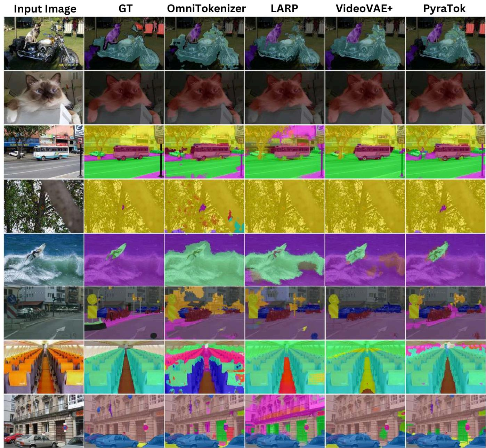

text_image

Input Image
GT
OmniTokenizer
LARP
VideoVAE+
PyraTok

Figure 11: Zero-shot semantic segmentation comparison across various scenes. Results illustrate PyraTok’s ability to recover fine object boundaries, preserve small structures, and produce semantically coherent segmentations across diverse domains. Details in B.1.

# B. Additional Results

# B.1. Zero-shot Video Segmentation

Given an input video and a natural language text t, we leverage the language-aligned discrete representation produced by PyraTok to obtain zero-shot, text-guided spatio-temporal masks. Specifically, we first pass the video through the frozen PyraTok encoder and its Language-aligned Pyramidal Quantization (LaPQ) hierarchy and extract the quantized features from the last quantization block, denoted by $\mathbf { q } ^ { ( L ) } \in \mathbb { R } ^ { T ^ { \prime } \times H ^ { I } \times W ^ { I } \times d }$ ) ∈ RT′ × H′ ×W ′ ×d , which capture high-level, textaligned semantics at a compressed spatio-temporal resolution. We then decompose the input text into a set of semantic units (typically content words or short phrases), $\left\{ w _ { 1 } , \dots , w _ { K } \right\}$ , and obtain a language embedding $\mathbf { e } _ { w _ { k } }$ for each unit using the same vision– language model employed during PyraTok training. For every semantic unit $w _ { k } ,$ we compute a similarity score between $\mathbf { e } _ { w _ { k } }$ and each token in $\mathbf { q } ^ { ( L ) }$ (e.g., via cosine similarity in the shared embedding space), yielding a token-level relevance map ${ \bf S } _ { w _ { k } } ^ { \mathrm { t o k } } ( t ^ { \prime } , \bar { h } ^ { \prime } , w ^ { \prime } )$ This relevance map is then upsampled to the original video resolution, following the encoder downsampling pattern (or via decoder-aligned projection), to produce a dense per-pixel score volume $\mathbf { S } _ { w _ { k } } ( x , y , t )$ for each semantic unit. We treat these volumes as unary potentials in a fully connected 3D Conditional Random Field (CRF) defined over the spatio-temporal lattice $\left( x , y , t \right)$ , with pairwise terms encouraging spatial smoothness aligned to image edges and temporal consistency across adjacent frames. Running mean-field inference in this 3D-CRF refines the raw scores into a binary segmentation mask $\mathbf { M } _ { w _ { k } } ( x , y , t ) \ \in \ \{ 0 , 1 \}$ that assigns each pixel in each frame to semantic unit $w _ { k }$ . Repeating this procedure iteratively over all semantic units in the prompt yields a set of word-level, zero-shot, textguided segmentation masks that are both spatially precise and temporally coherent across the video.

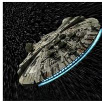

natural_image

Illustration of a futuristic spaceship with a glowing blue arc against a dark, starry background (no text or symbols)

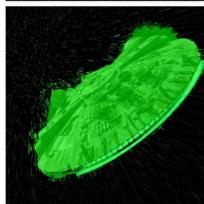

natural_image

Green fluorescent biological structure against black background (no text or symbols)

natural_image

Close-up of a plated dish featuring sliced flaky food garnished with minced meat and a small leaf, served on a white plate (no text or symbols visible)

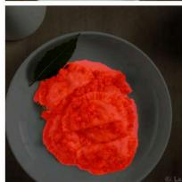

natural_image

Close-up of a red flower-shaped dessert on a gray plate with a black leaf (no text or symbols visible)

tordelli Leaf

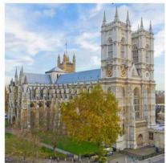

natural_image

Exterior view of a Gothic cathedral with twin spires and a blue-roofed tower, surrounded by autumn trees (no signage or text visible)

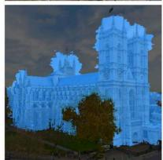

natural_image

Exterior view of a historic stone building with illuminated towers and surrounding trees (no signage or text visible)

westminster abbey

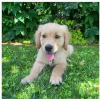

natural_image

A fluffy light brown retriever puppy lying on green grass with lush foliage in the background (no text or symbols visible)

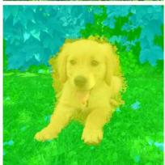

natural_image

Yellow dog sitting on grass with blue foliage in the background (no text or symbols)

vegetation

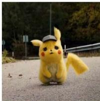

natural_image

Yellow Pikachu character wearing a cap and hat, standing on asphalt surface (no text or symbols visible)

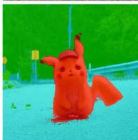

natural_image

Red Pikachu character standing on a blue surface with green background (no text or symbols)

pikachu route

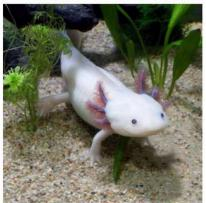

natural_image

White salamander swimming in sandy seabed with green aquatic plants (no text or symbols visible)

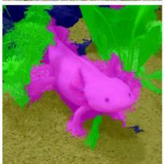

natural_image

Illustration of a pink cartoon tadpole with green foliage in the background (no text or symbols)

axolot1 stones   
Figure 12: Zero-shot semantic segmentation examples produced by PyraTok using only text prompts. Each column shows an input image, the corresponding segmentation mask predicted by PyraTok, and the set of text labels used. Results span diverse object types, demonstrating PyraTok’s ability to segment both rare and common entities without task-specific training. Details in B.1.

We compare our language-guided tokenizer with OmniTokenizer [57], LARP [55], and VideoVAE+ [63], on diverse scenes in Fig. 11 and novel-category ex-

amples in Fig. 12. Existing tokenizers often yield coarse, blob-like masks with strong label confusion: OmniTokenizer and LARP tend to over-smooth object boundaries and merge adjacent instances (e.g., bus and road, trees and background), while VideoVAE+ frequently misses thin structures such as bike frames, surfboards, and traffic signs, or hallucinates spurious regions in uniform areas. These methods also struggle with rare or fine-grained concepts, leading to incomplete segmentation of small objects (e.g., cat ears, surfboard tips) and inconsistent labeling across the image. In contrast, PyraTok produces masks that are both sharper and more semantically aligned with the ground truth, accurately separating foreground from background and preserving thin structures. Fig. 12 further demonstrates strong zero-shot generalization: PyraTok cleanly segments unseen categories such as millennium falcon, tordelli, golden retriever, Pikachu, and axolotl, and simultaneously grounds multiple text queries (e.g., “golden retriever / puppy / grass field / vegetation”) in the correct regions, highlighting that our language-aligned tokens carry richer semantic information than prior VAE-based tokenizers.

# B.2. Video Question Answering

For all question answering results, we adopt Qwen2.5-VL-3B [1] as the default vision–language (VLM) backbone to generate open-ended answers from our video representations. Given an input clip, we first encode the video with our proposed PyraTok VAE and extract the discrete representations from all quantization blocks. These multi-scale features are projected into the language embedding space and prepended to the question tokens, yielding a unified conditioning sequence for the autoregressive decoder. The Qwen2.5-VL-3B model then performs conditional text generation to produce the final answer. All VQA inferences are executed using the Text Generation Inference (TGI) pipeline from HuggingFace [17], which provides a stable and reproducible deployment for our qualitative analysis.

Furthermore, across Fig. 13 to Fig. 15, we compare PyraTok against Qwen2.5-3B, VideoVAE+, Omni-Tokenizer, and LARP on diverse video scenarios, including action sequences (helicopter crash, motorcycle chase, aircraft destruction), transformation events (monster emergence, firetruck-to-robot), and emotional interactions (a surprise proposal). The lower-capacity baselines (Qwen2.5-3B and Video-VAE+) often produce vague or partially incorrect explanations, while OmniTokenizer and LARP capture events more reliably but still miss finer details. PyraTok consistently provides the most accurate, complete, and context-aware interpretations across all scenarios, demonstrating stronger temporal reasoning, causal understanding, and fine-grained visual grounding compared to competing models.

# B.3. Action Localization

We tackle temporal action localization in long, untrimmed videos by directly operating in the discrete latent space of PyraTok. Given a video of N RGB frames and a textual description of the target action, we first encode every frame with our pyramidal tokenizer. Empirically, we observe that $\mathbf { q } ^ { ( 1 ) }$ offers the best trade-off between semantic expressiveness and temporal resolution: it preserves subtle motion cues (e.g., arm swing before an arrow release, the instant of impact in a punch, see Fig. 16) that are strongly smoothed out in deeper levels. We therefore use $q ^ { \mathbf { \bar { ( 1 ) } } }$ as our frame-level features. For each frame t, we spatially pool the tokens $\mathbf { q } _ { t } ^ { ( 1 ) }$ (mean-pooling over space) to obtain a compact frame descriptor $\mathbf { v } _ { t } \in \mathbb { R } ^ { d }$ . The textual query is encoded by the same language backbone used for PyraTok’s cross-modal training, producing a normalized embedding $\mathbf { z } \in \mathbb { R } ^ { d }$ . We compute cosine similarity scores $s _ { t } = \langle \mathbf { v } _ { t } , \mathbf { z } \rangle$ for all frames, which yield a dense text–video alignment signal over time.

To robustly localize an action interval, we evaluate similarities in a sliding-window fashion. The video is partitioned into overlapping chunks $\left( t , t + K - 1 \right)$ of length K=25 frames (with stride 1 in all experiments). For each chunk we aggregate the frame scores, $S _ { t } =$ $\textstyle { \frac { 1 } { K } } \sum _ { i = t } ^ { t + K - 1 } s _ { i } .$ , resulting in a 1D confidence trajectory $\{ S _ { t } \} _ { t = 1 } ^ { N - K + 1 }$ that reflects how strongly the query is grounded in each temporal neighborhood. We then decode this trajectory into contiguous segments using a longest-connected-sequence algorithm: (i) we threshold $S _ { t }$ at a fixed confidence τ to obtain a binary sequence; (ii) identify all maximally connected highconfidence segments; and (iii) select the segment with the highest average score as the predicted action interval. For multi-action queries, we iteratively remove the selected interval and repeat, merging overlapping segments when necessary. The resulting segments define our temporal action predictions.

Fig. 16 and Fig. 17 visualize localized action segments for different tokenizers on several challenging examples. For each text query, the ground-truth (GT) segment is shown in blue, and the predictions obtained from VideoVAE [63],+, SweetTok [46], LARP [55], and PyraTok are displayed as colored bars beneath. The baselines consistently exhibit temporally diffuse and fragmented activations: their similarity signals tend to fire on visually similar but semantically off-target frames, producing multiple short segments or systematically shifted intervals. For instance, in Fig. 16, in the clip “A girl shoots an arrow”, both VideoVAE + and SweetTok activate broadly over the whole sequence and fail to concentrate probability on the actual release moment, while LARP on several disjoint intervals before and after the shot. In contrast, PyraTok yields a single, compact segment that tightly aligns with the GT span around the arrow release. A similar pattern appears for text query “A person fires a shotgun”, where baseline tokenizers localize earlier or later segments, whereas PyraTok localizes correctly.

The advantages of our fine-grained features are even more evident for actions with multiple sub-events. In Fig. 16 example “An MMA fighter knocks down his opponent with a punch to the face” and “. . . with a kick to the face”, the motion unfolds rapidly and is preceded by visually similar feints. VideoVAE + and SweetTok tend to spread confidence over the entire exchange, leading to overly long or misaligned segments, while LARP often localizes only part of the motion (e.g., the wind-up but not the impact). Pyra-Tok, by contrast, localizes a concise window centered around the decisive contact, closely matching the GT. In Fig. 17, for “A person performs two overhead presses”, PyraTok produces two high-confidence video segments that track both overhead press repetitions, whereas baselines either miss the second repetition or merge the two into one coarse interval. For complex, extended actions such as “A man and a woman engage in sword fighting” and “Three missiles are launched from a desert”, baseline tokenizers again show scattered activations, localizing short segments around high-motion frames or transient explosions, and resulting in under-coverage of the GT. In contrast, PyraTok yields more accurate localization.

# B.4. Text-2-Video Generation

To assess the usefulness of our tokens for generative modeling, we couple PyraTok with a conditional video decoder built on Qwen-2.5VL [1]. Concretely, we treat the text encoder of Qwen-2.5VL as a frozen condition network and fine-tune its video decoder to autoregressively predict PyraTok codes. Given a textual prompt, we first encode the prompt into language features, which are injected into a transformer-based decoder that models the joint distribution over all spatio–temporal tokens from our four quantizers. The decoder predicts the next token conditioned on the text and all previously generated tokens, until a full sequence of discrete video codes is obtained. These codes are then passed through the PyraTok VAE decoder to synthesize the final video. Thanks to PyraTok’s compact yet expressive representation, this pipeline can generate videos at 20 FPS with resolutions up to 4K.

Fig. 18 and Fig. 19 show qualitative comparisons on text-to-video generation where we keep the Qwen-2.5VL decoder architecture fixed and only swap the underlying tokenizer. OmniTokenizer and LARP tend to under-utilize fine-grained textual cues, often missing localized attributes such as the “two egg halves” in the ramen bowl or the “motion blur on pedestrians” in the neon street scene, and producing over-smoothed or distorted structures in complex compositions like the tree city and Mars spaceport. SweetTok better preserves global layout but still struggles with high-frequency details and subtle style descriptors (e.g., HDR interior lighting, crisp spray around the polar bear), leading to muted textures and inconsistent object shapes.

In contrast, PyraTok yields samples that more faithfully reflect both global scene descriptions and finegrained phrases in the prompts. The additional objects specified in the text appear at the correct locations, motion-related cues are rendered more plausibly, and material and lighting properties (glossy chocolate surface, bioluminescent foliage, cinematic city glow) are captured with higher fidelity. Fig. 20 further illustrates 4K text-to-video generation for a 3-second clip, where PyraTok renders fine-grained details and maintains sharp structures, demonstrating that our multi-scale quantization supports highresolution, text-aligned video synthesis.

# B.5. High-resolution Frame Reconstruction

We further evaluate PyraTok on 4K frame reconstruction in Fig. 21. At this resolution, prior tokenizers struggle to preserve fine structures and highfrequency textures. VideoVAE+ [63] produces strong over-smoothing: the coral branches, tree leaves, and fur on the buffalo become noticeably blurred, and small objects such as distant boats and fire lamps nearly vanish in the zoomed-in crops. OmniTokenizer [57] improves sharpness but introduces ringing and aliasing along high-contrast boundaries (e.g., the product watch edges and mountain silhouettes), and often exhibits color bleeding in specular regions. SweetTok [46] and LARP [55] retain more detail yet still suffer from blocky artifacts on repetitive textures (grass, foliage, brick walls) and inconsistent reconstruction of tiny highlights, such as reflections on the watch bezel and lights on the night harbor. In contrast, our PyraTok reconstructions remain consistently crisp and coherent. Objects across all scenes—from coral polyps and reef fish to product shots and distant architectural details—retain sharp contours and clean textures without haloing. Finegrained elements such as fur strands, leaf veins, and small fruits are faithfully preserved, demonstrating that our pyramidal tokenization scales effectively to ultra-high resolutions while avoiding the blurring and aliasing present in prior methods.

Table 7: Video compression at 0.034 bitrate. 

<table><tr><td>Methods</td><td>PSNR (↑)</td><td>SSIM (↑)</td><td>LPIPS (↓)</td></tr><tr><td>HEVC [43]</td><td>30.10</td><td>0.943</td><td>0.199</td></tr><tr><td>VCC [6]</td><td>32.65</td><td>0.966</td><td>0.153</td></tr><tr><td>MAGVIT [69]</td><td>23.70</td><td>0.846</td><td>0.144</td></tr><tr><td>MAGVIT-v2 [70]</td><td>26.18</td><td>0.894</td><td>0.104</td></tr><tr><td>3D-MBQ-VAE [44]</td><td>29.09</td><td>0.922</td><td>0.089</td></tr><tr><td>PyraTok (Ours)</td><td>29.82</td><td>0.942</td><td>0.068</td></tr></table>

In qualitative video reconstruction comparisons (Figs. 22–25), existing tokenizers show consistent limitations across diverse scenes. TokenFlow [37] and SweetTok often oversmooth high-frequency content, causing foliage, clothing textures, and facial details to blur, and small or thin structures to distort or disappear; they also introduce blocky artifacts under large motion. LARP better preserves local contrast but frequently produces ringing around boundaries and unstable illumination, leading to flickering highlights and shadows. MotionAura [44] improves temporal smoothness yet still suffers from identity drift in talking-head sequences and ghosting around fast movements, reducing perceptual realism. Moreover, as previous methods were trained on lowresolution data, their high-resolution reconstructions exhibit temporal artifacts such as frame stuttering. In contrast, our 4K-trained PyraTok preserves high-frequency detail and temporal coherence, producing smooth and stable video.

# B.6. Adapting Pretrained T2V Priors with PyraTok

We further study whether PyraTok can serve as a drop-in tokenizer for existing text-to-video priors. To this end, we replace the original VAE/tokenizer in three pretrained models, i.e., Open source version of MAGVIT-V2 [33, 70] and OmniGenV2 [60] (autoregressive priors) and MotionAura [44] (discrete diffusion prior), and fine-tune only the prior on 10k clips from OpenVid-1M [35] so that it models PyraTok codes. Under identical prompts and sampling hyper-parameters, and across all architectures, using the native tokenizer leads to typical failure modes: colors and exposure drift over time, geometry “breathes” (e.g., wobbling backgrounds and object contours), high-frequency details such as dough surface texture or water droplets quickly collapse into smooth blobs, and object semantics are weakly preserved (e.g., inconsistent shape of the claw-machine robot or citrus slices). After swapping in PyraTok, the same priors produce videos that are both more semantically aligned with the prompts and markedly more temporally consistent.

In Figure 26, MAGVITv2+PyraTok maintains stable neon lighting in the arcade, preserves the dough’s volume and hand pose across frames, and keeps the boiling dumplings sharp with coherent bubble motion. In Figure 27, OmniGenV2+PyraTok yields crisp tree trunks and facial details with reduced frame-to-frame jitter, while the splashing juice exhibits smoother, physically plausible trajectories.

Similarly, MotionAura+PyraTok in Figure 28 suppresses diffusion-induced flicker in backgrounds. These improvements indicate that PyraTok’s multiscale discrete representation reduces quantization artifacts and exposes a more structured latent space, making it easier for both autoregressive and diffusion priors to model long-range spatio-temporal dependencies and maintain object identity over time, even with minimal fine-tuning data.

# C. Ablations and Additional Analyses

# C.1. Video Compression

As reported in Table 7, PyraTok attains the lowest LPIPS and competitive PSNR/SSIM on MCL-JCV [54] at a bitrate of 0.034, surpassing traditional codecs like HEVC [43] and VCC [6] in perceptual fidelity (LPIPS) by preserving fine texture and temporal coherence through semantically guided quantization.

Table 8: Class-guided video generation. 

<table><tr><td>Tokenizer</td><td>Type</td><td>#Tokens</td><td>#Params (Gen.)</td><td>gFVD (↓)</td></tr><tr><td>MAGVIT [69]</td><td>AR</td><td>1024</td><td>306M</td><td>265</td></tr><tr><td>MAGVIT-V2 [70]</td><td>AR</td><td>1280</td><td>307M</td><td>109</td></tr><tr><td>MAGVIT [69]</td><td>MLLM</td><td>1024</td><td>306M</td><td>76</td></tr><tr><td>MAGVIT-V2 [70]</td><td>MLLM</td><td>1280</td><td>307M</td><td>58</td></tr><tr><td>LARP-L [55]</td><td>AR</td><td>1024</td><td>632M</td><td>57</td></tr><tr><td>CogVideoX [67]</td><td>AR</td><td>6800</td><td>9.4B</td><td>626</td></tr><tr><td>TATS [11]</td><td>AR</td><td>4096</td><td>321M</td><td>332</td></tr><tr><td>Video-LaVIT [21]</td><td>AR</td><td>512</td><td>7B</td><td>280</td></tr><tr><td>OmniTok [57]</td><td>AR</td><td>5120</td><td>650M</td><td>191</td></tr><tr><td>LARP-L [55]</td><td>AR</td><td>1024</td><td>632M</td><td>99</td></tr><tr><td>SweetTok [46]</td><td>AR</td><td>1280</td><td>1.9B</td><td>65</td></tr><tr><td>PyraTok (Ours)</td><td>AR</td><td>1024</td><td>2.3B</td><td>51</td></tr></table>

# C.2. Video Generation

We evaluate our tokenizer and generator on classguided video generation using the UCF-101 [42] dataset. Given a target action class, the model is conditioned on the class label and asked to synthesize a short video clip from scratch. This setting measures not only low-level visual fidelity (appearance, motion smoothness) but also whether the generated sequence is semantically consistent with the requested action category.

We compare PyraTok against a broad set of video generative models that rely on different tokenizers and generator architectures, including MAGVIT/MAGVIT-V2, LARP-L, CogVideo, TATS, Video-LaVIT, OmniTok, and SweetTok. For all methods, we report the generative Fréchet Video Distance (gFVD), where lower values indicate better alignment with the distribution of real videos. As shown in Table 8, our method achieves the lowest gFVD on UCF-101, improving upon the strongest prior tokenizer by a substantial margin. These results indicate that our representation is better suited for high-quality, temporally coherent video synthesis, and that scaling the generator on top of our tokens directly translates into stronger video generation performance.

# C.3. Ablation on VQ Techniques

Table 9 presents an ablation of the quantization module in PyraTok, where each row corresponds to a different way of discretizing the encoder features, specified by its quantization type, vocabulary size, and embedding dimensionality. The simple single-codebook baseline VQ [52] (4096 / 256), with vocal size of 4096 and a dimension of 256, yields the weakest reconstruction quality on both COCO [31] and WebVid [2], confirming that a single global codebook is insufficient to capture the variability of natural image–video data. Introducing a group structure in GVQ [20] (4096 / 256) slightly improves PSNR and SSIM, and reduces LPIPS; however, the gains are modest because each group still operates with a relatively small shared codebook. The lookupfree single-block variant, LFQ [70] (32800 / 16), increases the effective vocabulary while reducing the per-code dimension, resulting in a clear improvement in PSNR and SSIM, and a lower LPIPS, indicating that finer local code assignment is beneficial.

Residual quantization with a higher-dimensional code space, RVQ [24] (8000 / 512), further reduces distortion over vanilla VQ, and replacing the residual codebook with our latent product quantizer, LaPQ (8000 / 512), yields another consistent improvement, showing that decomposing the latent channels into product codebooks makes better use of the same vocabulary size. When we combine residual modeling with LFQ-style factorization, RVQ (32800 / 16) achieves even better performance, but our full LaPQ (Ours, 48000 / 16) achieves the best performance across all metrics on both validation sets, with the highest PSNR/SSIM and lowest LPIPS, while incurring only a small increase in inference time compared to simpler schemes. Overall, results demonstrate that LaPQ’s combination of lookup-free factorization and product–residual coding provides a significantly more expressive and distortion-resilient discrete representation than standard VQ, GVQ, LFQ, or RVQ under comparable computational budgets.

# C.4. Codebook Utilization vs. Resolution

We further analyze how the effectiveness of our tokenizer scales with input resolution by measuring the percentage of active codewords at different spatial resolutions (see Fig. 29). As the resolution increases from 240p to 4320p, codebook utilization rises monotonically from 55.23% to 97.12%, indicating that higher-resolution inputs naturally excite a richer subset of the learned vocabulary rather than collapsing to a small set of frequently used tokens. In particular, utilization already exceeds 79% at 1080p and surpasses 90% in the 4K regime (2160p and 4320p), suggesting that the proposed pyramidal design can effectively exploit the larger spatial support to express more diverse and fine-grained semantics. This trend confirms that our discrete latent space remains expressive and well-populated as we scale to high-resolution video, which is critical for both faithful reconstruction and downstream video-language understanding tasks.

Table 9: Ablation study of different quantization techniques in PyraTok. Each method is specified by its quantization type, codebook vocabulary size, and embedding dimensionality. 

<table><tr><td rowspan="2">Quantization</td><td rowspan="2">Vocab</td><td rowspan="2">Dim</td><td colspan="3">COCO-Val</td><td colspan="3">WebVid-10M</td><td rowspan="2">Inf. Time</td></tr><tr><td>PSNR (↑)</td><td>SSIM (↑)</td><td>LPIPS (↓)</td><td>PSNR (↑)</td><td>SSIM (↑)</td><td>LPIPS (↓)</td></tr><tr><td>VQ [52]</td><td>4096</td><td>256</td><td>31.45</td><td>0.825</td><td>0.093</td><td>32.91</td><td>0.838</td><td>0.092</td><td>409</td></tr><tr><td>GVQ [20]</td><td>4096</td><td>256</td><td>32.25</td><td>0.836</td><td>0.089</td><td>33.34</td><td>0.842</td><td>0.089</td><td>438</td></tr><tr><td>LFQ [70]</td><td>32800</td><td>16</td><td>34.22</td><td>0.842</td><td>0.084</td><td>33.92</td><td>0.855</td><td>0.085</td><td>419</td></tr><tr><td>RVQ [24]</td><td>8000</td><td>512</td><td>33.92</td><td>0.849</td><td>0.078</td><td>34.22</td><td>0.865</td><td>0.079</td><td>489</td></tr><tr><td>LaPQ</td><td>8000</td><td>512</td><td>34.45</td><td>0.855</td><td>0.073</td><td>34.98</td><td>0.871</td><td>0.076</td><td>503</td></tr><tr><td>RVQ [24]</td><td>32800</td><td>16</td><td>34.78</td><td>0.869</td><td>0.076</td><td>35.27</td><td>0.879</td><td>0.074</td><td>488</td></tr><tr><td>LaPQ (Ours)</td><td>48000</td><td>16</td><td>35.72</td><td>0.879</td><td>0.066</td><td>36.05</td><td>0.885</td><td>0.071</td><td>492</td></tr></table>

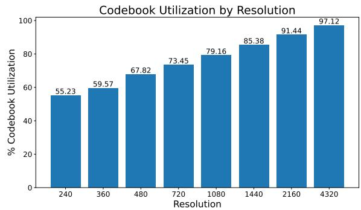

bar

Codebook Utilization by Resolution
| Resolution | % Codebook Utilization |
| :--- | :--- |
| 240 | 55.23 |
| 360 | 59.57 |
| 480 | 67.82 |
| 720 | 73.45 |
| 1080 | 79.16 |
| 1440 | 85.38 |
| 2160 | 91.44 |
| 4320 | 97.12 |

Figure 29: Codebook utilization as a function of input resolution. Higher resolutions activate a larger fraction of the vocabulary, indicating that PyraTok effectively exploits the increased spatial support to encode more diverse semantics.

# C.5. Ablation on Losses for Video Understanding

We ablate each component of the training objective on three video understanding benchmarks: THUMOS14 [19] and ActivityNet v1.3 [7] for

Table 10: Ablation on loss functions. 

<table><tr><td></td><td>THUMOS14</td><td>ActivityNet</td><td>MVBench</td></tr><tr><td> $\times \mathcal{L}_{\text{diff}}$ </td><td>31.27</td><td>27.62</td><td>83.32</td></tr><tr><td> $\times \mathcal{L}_{\text{AR}}$ </td><td>32.45</td><td>27.98</td><td>79.45</td></tr><tr><td> $\times \mathcal{L}_{\text{dino}} \& \mathcal{L}_{\text{AR}}$ </td><td>29.29</td><td>26.78</td><td>81.57</td></tr><tr><td> $\times \mathcal{L}_{\text{text-cond. alignment}$ </td><td>30.22</td><td>27.55</td><td>83.56</td></tr><tr><td> $\times \mathcal{L}_{\text{vision\_commitment}}$ </td><td>32.67</td><td>28.21</td><td>84.23</td></tr><tr><td> $\times \mathcal{L}_{\text{text-codebook alignment}$ </td><td>31.11</td><td>27.07</td><td>83.91</td></tr><tr><td> $\checkmark$  All losses</td><td>33.17</td><td>29.11</td><td>86.03</td></tr></table>

temporal action localization, and MVBench for video question answering (Table 10). With the full objective, PyraTok achieves 33.17/29.11 Avg. mAP on THUMOS14/ActivityNet and 86.03 mAP on MVBench. Removing the drift regularizer ${ \mathcal { L } } _ { \mathrm { d r i f t } } ,$ which anchors the adapted encoder to the pretrained VAE manifold, degrades performance by 1.90/1.49 mAP on THUMOS14/ActivityNet and by 2.71 points on MVBench, indicating that maintaining a stable latent space is important for robust transfer across both localization and QA.

The autoregressive alignment loss $\mathcal { L } _ { \mathrm { A R } }$ has a different effect: dropping it leads to a relatively small drop on temporal localization (0.72/1.13 mAP), but causes a pronounced 6.58-point decline on MVBench. This suggests that sequence-level token modeling is especially critical for high-level video reasoning, where the model must integrate information over longer temporal horizons. When we remove both the DINOguided visual loss and the autoregressive loss $( { \mathcal { L } } _ { \mathrm { d i n o } } +$ ${ \mathcal { L } } _ { \mathrm { A R } } )$ , performance drops most severely on TAL (by 3.88 and 2.33 mAP on THUMOS14 and ActivityNet, respectively) and by 4.46 points on MVBench, highlighting the complementarity between discriminative visual supervision and global token prediction.

We further study the codebook-related objectives, as described in Eq. (2). Ablating the text-conditioned alignment term $\mathcal { L } _ { \mathrm { t e x t - c o n d . } }$ . reduces performance by 2.95/1.56 mAP on THUMOS14/ActivityNet and by 2.47 points on MVBench, while removing the text–codebook alignment $\mathcal { L } _ { \mathrm { t e x t - c o d e b o o k } }$ yields a similar degradation (2.06/2.04 mAP and 2.12 points). These results confirm that both local token–text alignment and global codeword–text alignment are necessary to maintain semantically structured latents that generalize well across detection and QA tasks. In contrast, dropping the vision-comment loss ℒvision\_commitment produces the smallest degradation (at most 0.50/0.90 mAP on THUMOS14/ActivityNet and 1.80 points on MVBench), suggesting that, for downstream understanding, the semantic shaping of the codebook is more critical than the pure vision commitment penalty. Overall, the complete loss formulation is consistently superior, validating our multi-part objective for unified video understanding.

# D. Implementation Details

PyraTok is implemented using the pretrained Wan 2.2L [53] video VAE as the backbone to ensure highfidelity visual reconstruction. We initialize the encoder with pretrained WAN-2.2 weights, while the LaPQ module and decoder are randomly initialized. Both the encoder and decoder of Wan 2.2L are kept frozen to preserve the pretrained visual quality. To encourage the model to capture long-range temporal dependencies and motion continuity, we temporally mask 30% of frames and apply cosine-based spatial masking on each frame following [14].

To enable efficient adaptation to our multi-scale semantic learning objective without full fine-tuning, we incorporate LoRA adapters [15] with rank 16 and alpha 32 into all encoder blocks. These adapters provide lightweight parameterization while preserving the representational capacity of the backbone. For text conditioning, we employ the Qwen2.5-VL (3B) [1], referred as pretrained VLM in main paper, to extract semantically rich textual embeddings that guide both the quantization and the multimodal semantic alignment. Loss weights are set to $\lambda _ { \mathrm { r e c o n } } { = } 2 . 5 , \lambda _ { \mathrm { c o d e b o o k } } { = } 2 . 5 , \lambda _ { \mathrm { A R } } { = } 1 . 5 .$ , and $\lambda _ { \mathrm { d r i f t } } { = } 0 . 6$ . To reduce memory footprint and accelerate training, we apply VAE tiling for latent-space tokenization and quantize the alignment VLM to AWQ INT-4 [30]. In PyraTok, En(⋅) refers to the frozen DINOv3 [40] encoder, which serves as a strong pretrained visual encoder. It is used to provide stable, high-quality visual features that anchor adaptation and prevent drift from the pretrained visual manifold.

All baselines are trained under identical dataset settings to ensure fair comparison. The average prompt length during training is ∼60 tokens. Training is conducted in three progressive stages, each designed to incrementally strengthen multimodal alignment and visual–temporal consistency.

Stage 1 — Self-Supervised Pretraining. In the first stage, we perform self-supervised pretraining focused on language alignment. Input spatial resolutions vary from 512 × 512 up to 2048 × 2048, and we train across multiple aspect ratios, including 1∶1, 4∶3, 3∶2, 16∶9, and 2∶1. For temporal modeling, the number of frames ranges from 16+1 to 96+1, where the additional frame denotes the conditioning key frame. This stage establishes robust cross-modal grounding and spatial-temporal coherence.

Stage 2 — Text–Visual Token Alignment. The second stage incorporates text–visual token alignment through the pretrained Qwen-2.5-VL (3B) backbone. We maintain the same spatial and temporal configurations as Stage 1 for training stability. This stage refines the alignment between linguistic tokens and visual embeddings, enhancing the semantic consistency of multimodal representations.

Stage 3 — Full-Scale Fine-Tuning. In the final stage, the model is exposed to multi-resolution and multi–aspect-ratio inputs, ranging from 128 × 128 to 4096 × 4096, covering the same aspect ratios (1∶1, 4∶3, 3∶2, 16∶9, 2∶1). The number of frames is kept consistent with previous stages. Due to increased resolution and GPU memory demands, the batch size is reduced from 4 → 2 per GPU. This stage optimizes the model with both alignment loss and a frame-level retention loss computed using DINOv3 [40], ensuring long-range temporal retention and fine-grained visual correspondence.

All training stages are optimized using AdamW [32] with an initial learning rate of $1 \times { 1 0 } ^ { - 5 }$ and a cosine annealing scheduler. Gradient accumulation steps are kept constant across stages. We train on a cluster of 128×NVIDIA A100 (80 GB) GPUs. The total number of optimization steps is 30K for Stage 1, 60K for Stage 2, and 180K for Stage 3.

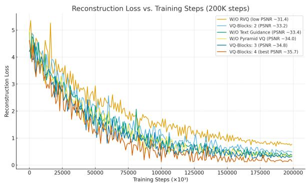

line

| Training Steps (x10³) | W/O RVO (low PSNR -31.4) | VQ-Blocks: 2 (PSNR -33.2) | W/O Pyramid VQ (PSNR -34.0) | VQ-Blocks: 3 (PSNR -34.8) | VQ-Blocks: 4 (best PSNR -35.7) |
| --------------------- | ------------------------ | -------------------------- | ---------------------------- | -------------------------- | ------------------------------ |
| 0                     | ~5.5                     | ~5.0                       | ~5.0                         | ~5.0                       | ~5.0                           |
| 25000                 | ~3.5                     | ~3.0                       | ~3.0                         | ~3.0                       | ~3.0                           |
| 50000                 | ~2.0                     | ~1.5                       | ~1.5                         | ~1.5                       | ~1.5                           |
| 75000                 | ~1.5                     | ~1.0                       | ~1.0                         | ~1.0                       | ~1.0                           |
| 100000                | ~1.0                     | ~0.8                       | ~0.8                         | ~0.8                       | ~0.8                           |
| 125000                | ~0.8                     | ~0.6                       | ~0.6                         | ~0.6                       | ~0.6                           |
| 150000                | ~0.6                     | ~0.5                       | ~0.5                         | ~0.5                       | ~0.5                           |
| 175000                | ~0.5                     | ~0.4                       | ~0.4                         | ~0.4                       | ~0.4                           |
| 200000                | ~0.4                     | ~0.3                       | ~0.3                         | ~0.3                       | ~0.3                           |

Figure 30: Reconstruction loss over 200K training steps. The best PSNR configuration (VQ-Blocks: 4) converges at a loss of 0.12, while other ablation variants stabilize above 0.25.

# E. Datasets

To comprehensively train, validate, and evaluate PyraTok, we employ a diverse collection of large-scale video–text datasets spanning various resolutions, domains, and task-specific settings.

# E.1. Training Datasets

Droplet-10M [73] (Subset). We curate a subset of the Droplet-10M dataset, consisting of approximately 4–5 million HD videos (720p). This subset serves as the foundation for pretraining, providing broad coverage of human activities, natural scenes, and diverse motion patterns, and a dense caption distribution and consistent temporal dynamics, crucial for learning fine-grained video–text alignment. To ensure data quality and maintain high spatial fidelity, only videos at 720p or higher resolution are retained.

OpenVid-1M [35] (300K Subset). We supplement training with 300K high-quality video–caption pairs sampled from OpenVid-1M. Only HD videos are selected to maintain visual consistency. This subset contributes to expanding linguistic diversity and contextual variation, improving open-domain caption understanding and cross-modal reasoning.

UltraVideo [64] (40K with Reconstructed Captions). To enrich representation at extreme resolutions, we incorporate 40K ultra–high-definition videos (4K and 8K) from the UltraVideo dataset. Since many of these videos lack high-quality textual descriptions, we generate captions using a multimodal LLM pipeline. This enables the model to learn from high-fidelity visual data and supports scalability to higher-resolution downstream applications.

# E.2. Testing and Validation Datasets

OpenVid-1M [35] (Test Split). We employ 100K samples from the OpenVid-1M test split for evaluating generalization to unseen open-domain video–text pairs. This ensures consistency with the distribution of the training data while validating model generalization under identical data conditions.

WebVid-10M [2] (Validation) and COCO [31] (Validation). For generative evaluation, we follow the WebVid-10M and COCO-Val validation protocols. For class-guided video generation, we further evaluate on the UCF-101 [42] dataset.

MCL-JCV [54] (Compression Validation). To assess the effectiveness of our video compression and reconstruction, we employ the MCL-JCV benchmark. This dataset provides a controlled setup for evaluating perceptual quality and rate–distortion tradeoffs under varying compression levels.

To evaluate generalization beyond supervised training, we test the model under zero-shot conditions across diverse downstream video understanding tasks. For zero-shot action localization, we evaluate on ActivityNet [7] and THUMOS14 [19], which contain diverse and complex activities. For zero-shot video segmentation, we benchmark on YouTube-VIS 2021 [66] and OVIS [36]. Both datasets present challenging dynamic scenes with multiple interacting objects and frequent occlusions. For video classification, we utilize Kinetics [22], while for VideoQA, we adopt MVBench [25], a comprehensive multi-task benchmark covering spatiotemporal reasoning, action understanding, and commonsense interpretation.

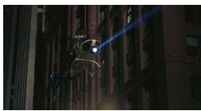

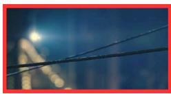

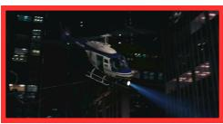

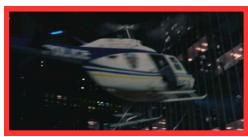

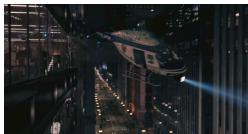

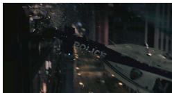

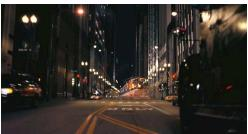

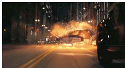  
Question: How does the copter in the video crash?

Qwen2.5-3B : The helicopter seems to lose control after clipping part of a building structure, which sends it spinning before it crashes.

VideoVAE+ : The helicopter hits a wire hanging between the buildings and can ’t stabilize afterward, leading to the crash.

OmniTokenizer : The helicopter crashes after making contact with an overhead line stretched across the street.

LARP : It collides with a tight cable strung between the buildings. The wire snags the helicopter, throwing it off balance and causing it to crash.

PyraTok : The helicopter gets tangled in the steel wire stretched between the buildings, loses control instantly, and crashes onto the street

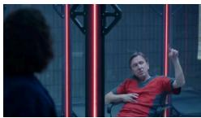

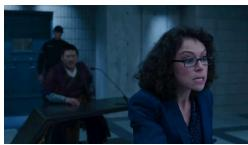

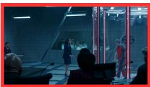

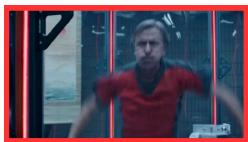

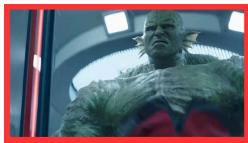

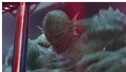

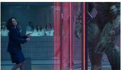

  
Question: From where did the big green monster come into the glass cage?

Qwen2.5-3B : The green monster looks like it arrives from another area of the facility and ends up inside the glass cage during the commotion.

VideoVAE+ : The monster spawns inside the glass chamber after the man disappears completely.

OmniTokenizer : The creature is actually the man in the cell changing form. He turns into the green monster inside the glass cage.

LARP : The monster comes from the man inside the cage. He transforms into the creature while still being held in the glass containment unit.

PyraTok : The big green monster appears after the man inside the cage transforms into his creature form. He morphs from a normal human into the monster while still inside the glass chamber.

Figure 13: Qualitative comparison of video understanding across two challenging temporal-reasoning questions. For each example, we show representative frames from the input video and the corresponding answers produced by different models. Baselines typically provide generic or partially plausible descriptions that miss key causal events. In contrast, PyraTok produces precise, temporally grounded explanations that correctly capture fine-grained interactions, entity tracking, and scene dynamics. These examples demonstrate PyraTok’s ability to support detailed video comprehension and causal reasoning from short video sequences. Discussion in B.2.

natural_image

Close-up of a military aircraft with visible markings and structural details (no readable text or symbols)

natural_image

Desert landscape with a person walking on a dirt path, an airplane flying nearby, and ocean in the background (no visible text or symbols)

natural_image

Silhouette of a person riding a motorcycle in a desert environment with two other animals running nearby (no text or symbols visible)

natural_image

Person riding a bicycle on a snowy, rocky surface (no visible text or symbols)

natural_image

Two people riding motorcycles on a dusty road, one in motion and the other in motion (no visible text or symbols)

natural_image

Dinosaur flying near a large aircraft in a desert environment (no visible text or symbols)

natural_image

Person riding a motorcycle inside a tunnel or enclosure, viewed from above (no visible text or symbols)

natural_image

Silhouette of a person riding a motorcycle through an aircraft fuselage, with no visible text or symbols.

Question: What is happening in the video?

Qwen2.5-3B : A man on a motorcycle is racing across an open area as the plane takes off, and it looks like he ’ s trying to catch up after being left behind.

VideoVAE+ : A man is riding a motorcycle near an aircraft preparing to leave. He appears to be trying to reach the plane while something is chasing him.

OmniTokenizer : The man rides a motorcycle in the desert with dinosaurs chasing him. He heads for a plane that’ s starting to take off and drives into it from the back ramp

LARP : A man on a motorcycle is being chased by dinosaurs. He tries to escape by reaching a transport plane that is lifting off and drives up the rear ramp to get inside.

PyraTok : The man is speeding on a motorcycle while being chased by several dinosaurs. He races toward a military-style plane as it begins taking off and manages to board through the rear ramp while still riding the bike.

natural_image

Two people sitting on pebbles in a gravel field, one holding a rock and the other reading a book (no visible text or symbols)

natural_image

Two people sitting on a pebble beach, one holding a log and the other with a small object nearby (no visible text or symbols)

natural_image

Two people sitting on a pebble beach, one holding a tablet, with distant buildings and a bridge in the background (no visible text or symbols)

natural_image

Two people sitting on a pebble beach, one reading and the other looking at it (no visible text or symbols)

natural_image

Two people sitting on a pebble beach, one holding a book and the other reading (no visible text or symbols)

natural_image

Two people sitting on a pebble beach, one holding a small object, with no visible text or symbols.

natural_image

Two people sitting on a pebble beach, one holding a tablet and the other reading (no visible text or symbols)

Question: Why does the woman in the video seem surprised?

Qwen2.5-3B : The woman seems surprised because the man suddenly shows her something in his hand, catching her off guard.

VideoVAE+ : She appears surprised because the man gives her something unexpected during their beach picnic.

OmniTokenizer : She seems surprised because the man takes out a ring and proposes, which she wasn ’t fully prepared for.

LARP : She looks surprised because the man is proposing to her, and she wasn’t expecting it. His gesture catches her off guard emotionally.

PyraTok : The woman reacts with surprise because the man suddenly proposes, and she’s overwhelmed by the unexpected romantic moment.

Figure 14: Qualitative comparison of video reasoning ability across models. Models describe major actions in two dynamic scenes (a motorcycle escape from dinosaurs and a surprise beach proposal). PyraTok delivers the most precise and context-aware answers across both scenarios. Discussion in B.2.

# Question: Where did the red giant robot come from?

Qwen2.5-3B : The giant robot seems to come from inside the fire truck when the vehicle breaks apart and reveals the machine.

VideoVAE+ : The robot appears to rise out of the fire truck after it opens up and shifts its structure.

OmniTokenizer : It comes from the fire truck, which transforms piece by piece into the robot.

LARP : The robot originates from the fire truck. The vehicle folds and reshapes itself until it becomes the large red robot.

PyraTok : The red giant robot emerges by transforming from the fire truck. The truck’s parts shift and reassemble into the robot form.

# Question: How does the aircraft get destroyed?

Qwen2.5-3B : The plane crashes in flames after something impacts it on the runway as it’ s trying to take off.

VideoVAE+ : The aircraft is blown apart after being struck by an explosive attack from the runway area during its takeoff roll.

OmniTokenizer : It gets destroyed because a missile hits it just as it’ s lifting off, triggering an explosion that breaks the jet apart.

LARP : The jet is destroyed by a missile launched from the portable launcher. The explosion hits it during takeoff and tears the aircraft apart.

PyraTok : The aircraft is destroyed when the person in black fires a missile at it right as it begins to take off. The missile strikes the jet, causing a large explosion that rips it apart

Figure 15: Qualitative comparison of video understanding on two transformation- and action-level reasoning tasks. Baseline methods provide generic or underspecified descriptions (e.g., stating that the robot “comes from the fire truck”), often missing key causal events, responsible agents, and transformation mechanics. In contrast, PyraTok produces precise, temporally grounded explanations that correctly identify object transformations, causal triggers, and scene dynamics, such as the fire truck’s parts reassembling into the robot or the person in black firing the missile that destroys the aircraft. Discussion in B.2.

A girl shoots an arrow.   

text_image

GT
VideoVAE+
SweetTok
LARP
PyraTok

A person fires a shotgun.   

text_image

GT
VideoVAE+
SweetTok
LARP
PyraTok

An MMA fighter knocks down his opponent with a punch to the face.

bar

| Model | Value |
|---|---|
| GT | 0 |
| VideoVAE+ | 1 |
| SweetTok | 0 |
| LARP | 0 |
| PyraTok | 0 |

An MMA fighter knocks down his opponent with a kick to the face.

text_image

GT
VideoVAE+
SweetTok
LARP
PyraTok

Figure 16: Action localization results comparing PyraTok with several baselines. For each prompt, the top row shows sampled video frames, followed by temporal action segments for the ground truth and predictions from each method. PyraTok produces action intervals that align more closely with the ground-truth boundaries, demonstrating improved temporal precision and robustness across diverse actions. Details in B.3.

A person performs two overhead presses   

bar_stacked

| Model     | Black Segment | Blue Segment | Yellow Segment | Purple Segment |
|-----------|---------------|--------------|----------------|----------------|
| GT        | 10            | 20           | 5              | 5              |
| VideoVAE+ | 10            | 20           | 5              | 5              |
| SweetTok  | 10            | 20           | 5              | 5              |
| LARP      | 5             | 10           | 10             | 5              |
| PyraTok   | 5             | 10           | 10             | 10             |

A man and a woman engage in sword fighting.

bar_stacked

| Model     | Segment 1 | Segment 2 | Segment 3 | Segment 4 | Segment 5 | Segment 6 | Segment 7 | Segment 8 |
|-----------|-----------|-----------|-----------|-----------|-----------|-----------|-----------|-----------|
| GT        | Blue      | White     | White     | Blue      | White     | White     | White     | White     |
| VideoVAE+ | Blue      | White     | White     | White     | White     | White     | White     | White     |
| SweetTok  | Gray      | White     | White     | Gray      | White     | White     | White     | White     |
| LARP      | Yellow    | White     | White     | Yellow    | White     | White     | White     | White     |
| PyraTok   | Purple    | White     | White     | Purple    | White     | White     | White     | Purple    |

Three missiles are launched from a desert.   

text_image

GT
VideoVAE+
SweetTok
LARP
PyraTok

Figure 17: Additional action localization comparisons across diverse scenarios. Each example shows sampled frames followed by ground-truth action intervals and model predictions. PyraTok consistently yields temporally aligned and coherent action segments, reducing fragmentation and improving boundary accuracy compared to prior baselines. Details in B.3.

OmniTokenizer   

natural_image

Scenic mountain lake at sunset with clear reflection, no text or symbols visible

LARP   

natural_image

Scenic mountain landscape at sunset with snow-capped peaks, forested slopes, and calm water reflecting the scene (no text or symbols)

SweetTok   

natural_image

Scenic mountain lake with snow-capped peaks and forested slopes, reflecting golden sunrise or sunset (no text or symbols)

PyraTok   

natural_image

Snow-capped mountain range reflected in calm water during golden hour (no text or symbols visible)

Photorealistic alpine lake at sunrise, glassy water reflecting snow-capped peaks, soft golden light, mist rising from the surface, ultra-detailed, 50mm, shallow depth of field.

natural_image

Close-up of a bowl of noodles with green herbs and steam rising (no text or symbols visible)

natural_image

Bowl of noodle soup with boiled eggs and garnish, served on a wooden table (no text or symbols visible)

natural_image

A bowl of steaming noodles topped with boiled eggs and herbs, served on a wooden table (no text or symbols visible)

natural_image

Bowl of ramen with sliced meat and green herbs, accompanied by two boiled eggs (no text or symbols visible)

Top-down food photo of a steaming bowl of ramen, with two egg halfs, on a rustic wooden table, rich broth, perfectly arranged chashu, soft natural window light, artisan ceramic bowl, high-detail"

text_image

Street photo at night with visible illuminated store signboards and pedestrians holding umbrellas

text_image

Night street scene with illuminated Chinese store signboards and pedestrians holding umbrellas

text_image

Night street scene with illuminated Chinese store signboards and pedestrians, featuring visible shop signs and illuminated signage in red and blue.

text_image

Night street scene with illuminated Chinese store signboards and pedestrians holding umbrellas

Rain-soaked neon night market in Tokyo, umbrellas and reflections on glossy pavement, cinematic wide-angle, motion blur on pedestrians, volumetric fog, cyberpunk color palette, highly detailed

natural_image

Illustration of a stylized tree with hanging lantern against a cityscape background (no text or symbols)

natural_image

Fantasy landscape with a giant castle perched on a cliff surrounded by green trees and flying hot air balloons (no text or symbols)

natural_image

Fantasy landscape with a glowing tower and winding paths, surrounded by dark sea and trees (no text or symbols)

natural_image

Fantasy landscape with glowing stone structures and a floating light bulb, no text or symbols present

Massive ancient city built into living trees with hanging gardens and floating lanterns, bioluminescent flora at twilight, painterly concept art, intricate architecture, panoramic, highly detailed

Figure 18: Text-to-video qualitative comparison, showing a representative frame from each generated clip across diverse prompt categories, including photorealistic landscapes, detailed food scenes, night-market environments, and stylized concept art. Although only a single frame per video is shown, the green boxes highlight fine-grained details faithfully produced by PyraTok, such as the correct depiction of “two half eggs” in the ramen scene and realistic motion blur on pedestrians in the night-market prompt, illustrating PyraTok’s ability to accurately interpret and render subtle textual attributes in T2V generation. Discussion in B.4.

OmniTokenizer   

natural_image

Interior view of a modern living room with a large window, curtains, and a table with fruit (no visible text or symbols)

LARP   

natural_image

Interior view of a cozy room with large windows, potted plants, and wooden furniture (no visible text or symbols)

SweetTok   

natural_image

Interior view of a modern living room with large windows, potted plants, and armchairs (no visible text or symbols)

PyraTok   

natural_image

Interior view of a modern living room with sofa, coffee table, and large window (no visible text or symbols)

Sunlit Scandinavian living room with mid-century furniture, textured textiles, abundant plants, airy composition, wide-angle lens, natural morning light, HDR interior photography

natural_image

Dark, low-contrast image with no discernible text, symbols, or identifiable objects.

natural_image

Close-up of a glossy chocolate apple on a dark circular plate (no text or symbols visible)

natural_image

Close-up of a chocolate dessert with golden decorations and chocolate topping, served on a dark surface (no text or symbols visible)

natural_image

Close-up of a small chocolate-topped tartini on a dark, textured surface (no text or symbols visible)

Moody close-up of a glossy chocolate tart topped with edible gold bits on a dark slate plate, low-key lighting, shallow depth of field, pastry photography, mouth-watering detail

natural_image

Silhouette of a futuristic building at sunset with orange sky and distant buildings (no text or symbols visible)

natural_image

Desert landscape at sunset with cranes and distant mountains (no text or symbols)

natural_image

Silhouetted airport tarmac at sunset with aircraft carrier and a domed structure in the background (no visible text or symbols)

natural_image

Silhouette of a futuristic spacecraft at sunset with orange sky and silhouetted figures (no text or symbols visible)

Futuristic Mars spaceport at dusk, orange dusty sky, sleek starships docking, crowds in futuristic attire, holographic signage, cinematic wide shot, highdetail concept art   

natural_image

Polar bear walking on a large ice surface (no text or symbols visible)

natural_image

Polar bear running through deep snow with splashes (no text or symbols visible)

natural_image

Polar bear leaping out of ice with large ice blocks in the background (no text or symbols visible)

natural_image

Polar bear running through icy ice formations (no text or symbols visible)

Action shot of a polar bear leaping between ice floes, frozen spray mid-air, crisp cold-blue color grading, high shutter-speed realism, editorial wildlife photography   
Figure 19: Text-to-video generation comparisons, showing a representative frame from each generated clip across a diverse set of prompts, including interior scenes, food close-ups, sci-fi concept art, and wildlife action. PyraTok consistently captures fine-grained details, accurate lighting, textures, object geometry, and scene composition, demonstrating strong prompt alignment and high-fidelity generation across varied visual domains. Discussion in B.4.

natural_image

Nighttime aerial view of a modern urban skyline with illuminated skyscrapers and highway traffic (no visible text or signage)

A 4k resolution drone video of a futuristic city skyline at night, flying between tall neon-lit skyscrapers with cars moving far below. Aerial shot, high angle, bird’s-eye view. The camera glides steadily across the city, revealing illuminated buildings and busy highways. Long-exposure lighting, cinematic neon glow.

natural_image

Four-panel sequence showing silhouetted figures walking through a misty forest at sunset, with birds flying and trees in the background (no text or symbols)

A 4k resolution cinematic video of a lone traveler wearing a cap walking through a foggy forest at dawn. Captured in a high-angle shot with iridescent lighting, the slow panning camera reveals trees swaying gently and birds gliding across the misty sky.

Figure 20: Text-to-video generation results at 4K resolution using PyraTok, shown as representative frames from two distinct prompts. The first example depicts a futuristic neon-lit city captured by a flying drone, where PyraTok maintains crisp details, stable long-exposure lighting, and smooth camera motion. The second example illustrates a foggy forest at dawn featuring “a lone traveler wearing a cap.” Even though the person occupies only a tiny fraction of the scene, PyraTok accurately renders fine-grained details, such as the cap on the traveler’s head, demonstrating strong text-alignment and high-resolution consistency in large-scale, wide-angle video generation. Discussion in B.4.

  
Figure 21: Qualitative comparison of single-frame reconstruction across diverse scenes, including underwater environments, fantasy landscapes, product renders, food close-ups, urban views, interview settings, night scenes, wildlife, mountain vistas, and natural textures. Each row shows outputs from one method for the same input frame, with red boxes highlighting fine details, such as small objects, textures, reflections, and thin structures, used to compare reconstruction fidelity, sharpness, and color consistency. PyraTok preserves fine details reliably and delivers consistent, high-quality reconstructions across all scene types. Discussion in B.5.

  
Figure 22: Qualitative comparison of video reconstruction methods on a fast-moving dinosaur sequence containing dense foliage, small background animals, and detailed facial motions. Each row shows outputs from one method on the same frames. Red boxes highlight challenging regions such as vegetation, moving creatures, and fine facial details, where differences in sharpness, temporal coherence, and motion fidelity are most apparent. Discussion in B.5.

  
Figure 23: Qualitative comparison of PyraTok with other video reconstruction methods on a dynamic café scene containing multiple people, complex indoor lighting, and detailed textures. Each row shows outputs from one method on the same frames. The scene highlights challenges such as preserving facial details, clothing patterns, reflections, and background structures, allowing visual comparison of reconstruction sharpness and temporal consistency. Details in B.5.

  
Figure 24: Qualitative comparison of PyraTok with other video reconstruction methods on an indoor interview scene featuring expressive hand motions, detailed facial appearance, and complex background textures, revealing differences in preserving facial clarity, hand motion coherence, and fine background details such as books, fabrics, and stone textures. Details in B.5.

  
Figure 25: Qualitative comparison of PyraTok with other video reconstruction methods on a workshop scene involving fast arm movements, reflective machinery, and detailed background clutter, highlighting differences in preserving motion clarity, fine textures on tools and equipment, and the stability of subtle visual details under rapid motion. Details in B.5.

  
Figure 26: Comparison of video reconstruction quality when replacing the default MAGVIT-V2 [70] VAE with our PyraTok VAE. Each pair of rows shows frames generated by the original MAGVIT-V2 (top) and the enhanced MAGVIT-V2 + PyraTok configuration (bottom). Across diverse scenes, including arcade environments with complex lighting, close-up dough preparation, and detailed cooking sequences, PyraTok improves visual sharpness, color consistency, and fine-detail preservation, demonstrating its effectiveness as a drop-in VAE replacement for higher-quality video generation. Discussion in B.6.

  
Figure 27: Comparison of video generation quality when replacing the default VAE of OmniGen-V2 [60] with our PyraTok VAE. For each scene, the top row shows frames produced by the original OmniGen-V2, while the bottom row shows frames from OmniGen-V2 + PyraTok. PyraTok improves texture sharpness, color fidelity, and fine-detail preservation, demonstrating its effectiveness as a universal, high-quality VAE substitute for diverse video generation pipelines. Discussion in B.6.

  
Figure 28: Comparison of video generation quality when substituting the default VAE in MotionAura [44] with our PyraTok VAE. For each example, the top row shows frames produced by the original MotionAura, while the bottom row shows results from MotionAura + PyraTok. Across kitchen scenes, outdoor human activity, and close-up liquid motion, PyraTok enhances sharpness, preserves fine textures, and improves temporal consistency—demonstrating its effectiveness as a high-quality VAE replacement for improving realism and detail in MotionAura-generated videos. Discussion in B.6.