# MUFASA: A Multi-Layer Framework for Slot Attention

Sebastian Bock\* 1,2 Leonie Schußler ¨ \* 1,2

Krishnakant Singh 1 Simone Schaub-Meyer 1,3 Stefan Roth 1,2,3

1TU Darmstadt 2Zuse School ELIZA 3hessian.AI \*equal contribution

## Abstract

Unsupervised object-centric learning (OCL) decomposes visual scenes into distinct entities. Slot attention is a popular approach that represents individual objects as latent vectors, called slots. Current methods obtain these slot representations solely from the last layer of a pre-trained vision transformer (ViT), ignoring valuable, semantically rich information encoded across the other layers. To better utilize this latent semantic information, we introduce MUFASA, a lightweight plug-and-play framework for slot-attentionbased approaches to unsupervised object segmentation. Our model computes slot attention across multiple feature layers of the ViT encoder, fully leveraging their semantic richness. We propose a fusion strategy to aggregate slots obtained on multiple layers into a unified object-centric representation. Integrating MUFASA into existing OCL methods improves their segmentation results across multiple datasets, setting a new state of the art while simultaneously improving training convergence with only minor inference overhead.1

## 1. Introduction

Object-centric learning (OCL) aims to decompose a scene into a set of object-specific representations in an unsupervised manner [10]. This assumption is rooted in principles from human perception, suggesting that our visual system naturally segments a scene into meaningful entities [30]. OCL methods have been used in various domains, ranging from building world models [8, 54], robotics [21, 40], explainability [34], and compositional learning [23, 55] to unsupervised object segmentation (UOS) [26, 47]. Among various OCL approaches [2, 16], slot-attention (SA) methods have seen widespread adoption for their effectiveness in the unsupervised decomposition of scenes into objects [41]. Here, input features are grouped into a set of latent vectors, termed slots, and iteratively refined through an attentionbased mechanism, where slots compete to bind to individual objects. Initially, most applications remained limited to synthetic and constrained datasets [18, 25]. DINOSAUR [47] scaled slot-attention-based methods to real-world datasets by utilizing a pre-trained DINO [4] encoder for feature reconstruction. Subsequent works leveraged teacher-student architectures to guide slot binding [9, 29], including SPOT [26], establishing a new state of the art (SOTA) in UOS.

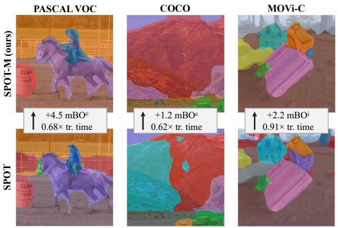  
Figure 1. MUFASA. Our novel framework for slot-based methods leverages multiple feature layers of vision transformers for objectcentric learning. Integrated into the current best model, SPOT [26], we achieve a new state of the art in unsupervised object segmentation on PASCAL VOC, COCO, and MOVi-C, producing high-quality segmentation masks while requiring less time to train.

Both DINOSAUR and SPOT utilize features extracted from a pre-trained DINO ViT [5] for slot attention. As shown by [1], early layers of DINO ViTs capture positional information, while semantic content emerges in middle layers and becomes increasingly rich until the final layer. Thus, semantically meaningful features are not confined to the final layer. Instead, valuable information is present across several layers, which encode complementary semantics. Consequently, restricting the input of slot attention to the last encoder layer does not leverage all semantic information offered by the DINO ViT. To address this limitation, we propose MUFASA, a Multi-Layer Framework for Slot Attention, as a novel and lightweight plug-and-play framework for slot-attention models utilizing DINO features. We leverage the rich semantics encoded across several layers [1, 56] by simultaneously using multiple encoder layers for slot attention. The slots emerging from multiple slot-attention modules are aligned in terms of their object information using Hungarian matching [33]. The matched slots are fed into a fusion module that integrates the slots from different layers into a unified representation before passing them to the decoder. Our multilayer method learns to segment objects across multiple feature representations; utilizing this diversity allows MUFASA to better segment objects (Fig. 1). We integrate MUFASA into DINOSAUR and SPOT, substantially improving their segmentation quality. With this, we set a new SOTA on the VOC, MOVi-C, and COCO datasets (cf . Fig. 1) while simultaneously reducing training times.

In summary, our contributions include: (i) We propose a novel slot-attention framework leveraging the complementary feature representations of multiple DINO layers for unsupervised object segmentation. Our framework includes M-Fusion, a technique to effectively combine multi-layer slots into a unified representation. (ii) MUFASA is plug-andplay, enabling simple integration into slot-attention models utilizing DINO encoders. (iii) Applying MUFASA improves previous OCL methods for unsupervised object segmentation in nearly all settings. (iv) MUFASA is lightweight: With minimal parameter and inference overhead, faster training efficiency is achieved. (v) Integrated into SPOT, we achieve new SOTA results on COCO, PASCAL VOC, and MOVi-C.

## 2. Related Work

Object-centric learning. Early methods for OCL utilized sequential architectures [2, 12, 16, 22, 35, 37, 38]. These methods do not scale well to complex scenes and impose an arbitrary order on the objects in a scene. To resolve these issues, [11] formulated OCL as an instance coloring problem and used a stick-breaking prior. Another line of work, called slot attention (SA), uses a soft k-means clustering approach, wherein object latents are learned iteratively via clustering of similar features [41]. Cluster separation is achieved by applying dot-product attention with softmax over cluster centers, i.e. slots. SA, until recently, only showed promising results on synthetic and constrained datasets [18, 25, 27]. DI-NOSAUR [47] showed that it is possible to scale SA-based methods to complex, real-world scenes [13, 14, 36] by learning in the feature space of a pre-trained self-supervised encoder [4, 43] instead of on raw pixels. Since then, SA methods have seen a resurgence of interest, with many works [15] building upon [47]. In [45], a masking scheme discards background features, and multi-query SA processes the same feature layer with multiple independent SA modules in an ensemble-like fashion. [26] introduced SPOT, which leverages attention-based self-training to distill knowledge from a teacher to a student model via a cross-entropy loss between their attention masks. They further proposed patch-order permutations within autoregressive transformer decoders, altering the reconstruction order of image patches during decoding, achieving new SOTA results in UOS.

Decoders for slot attention. A key component of the SA architecture is the decoder. Early work [12, 32] used a patch decoder. Alternatively, [31, 41] used a spatial-broadcast decoder [53] to predict RGB images and segmentation masks from each slot, which are then combined through alpha masking. However, this per-slot decoding strategy limits the application to synthetic datasets [18, 25, 27]. SLATE [48] and STEVE [49] proposed the use of powerful transformer models [52] as decoders. They use a dVAE [24] to tokenize the input, and train the slot-conditioned transformer decoder to autoregressively reconstruct patch tokens, enabling to segment more complex images. [47] noted that while an MLP decoder separates instances better during reconstruction, a transformer decoder is generally more expressive and produces tighter segmentation masks with cleaner background segmentation. Another line of work focuses on SA for compositional generation [23, 50, 55], and shows that using a pre-trained diffusion decoder can improve compositional generation. However, most of these methods are inferior to feature reconstruction methods such as SPOT in UOS.

Multi-layer approaches. Vision transformers, particularly DINO ViTs [5], have been shown to learn a representational hierarchy across layers [1]. Here, shallow layers mainly contain spatial information, while semantics emerge in intermediate layers and become increasingly rich in deeper layers. This hierarchy is distinct from the scale-based hierarchies in CNNs, which typically follow a coarse-to-fine progression over spatial resolutions [57]. Instead, ViTs exhibit a more uniform representation across all layers [46]. Yet, the individual layers exhibit distinct layer-wise behavior in downstream tasks, indicating semantically complementary encodings [51]. Recently, several methods showed the potential of leveraging features from multiple ViT layers for multi-modal tasks [3, 56], feature forecasting [28], visual correspondence [7, 58], and object discovery [39]. However, the integration of multi-layer ViT representations into slot-attention-based methods remains unexplored to date.

## 3. MUFASA

## 3.1. Preliminaries

Autoencoding slot-attention (SA) architecture. SAbased methods commonly use an encoder-decoder architecture with an SA bottleneck. The encoder extracts N patchwise features h $\mathbf { \Psi } \in \mathbb { R } ^ { N \times d _ { \mathrm { e m b } } }$ of dimensionality $d _ { \mathrm { e m b } }$ from an input image $\mathbf { x } \in \mathbb { R } ^ { H \times W \times C }$ . Typically, a self-supervised, pre-trained ViT is used as encoder, $e . g .$ , DINO [5]. A subsequent SA module groups these features into a set of $K \ll N$ latent vectors ${ \mathcal { S } } = \{ \mathbf { s } _ { k } \in \mathbb { R } ^ { d _ { \mathrm { s l o t } } } \ | \ k = 1 , \dots , K \}$ , where each item ${ \bf s } _ { k } \mathrm { ~ - ~ }$ called a slot – is of dimensionality $d _ { \mathrm { s l o t } }$ . Given these slots, the decoder network reconstructs the input signal from the slots. The whole architecture is trained endto-end using a normalized reconstruction loss between the decoder output and the encoder feature representations [47]:

$$
\mathcal {L} _ {\text { Rec }} = \frac {1}{N \cdot d _ {\text { emb }}} \left\| \mathbf {h} - \operatorname{Decoder} (\mathcal {S}) \right\| _ {2} ^ {2}. \tag {1}
$$

Slot attention performs an iterative refinement that maps the set of input features h to the set S of K output slots. Initially, the slots are independently sampled from a Gaussian distribution. Then, the slots are iteratively updated by computing the dot-product attention [52] between the input features and the slots from the previous iteration. Here, learned linear transformations (LLT), $f _ { \mathrm { K e y } }$ and $f _ { \mathrm { Q u e r y } } ,$ , map the patch-wise input features onto keys and the slots onto queries in a common d-dimensional space. Attention scores are then obtained via a scaled-dot product and softmax normalization [52], yielding a probability distribution over slots for each input feature. This enforces a competition between the slots to bind to meaningful areas in the image. This yields the slot-attention matrix $\bar { \mathcal { A } } ^ { \mathrm { s l o t } } \in \mathbb { R } ^ { N \times K }$ , which denotes the assignment of each image patch (token) to the K slots:

$$
\mathcal {A} ^ {\text { Slot }} = \underset {K} {\text { softmax }} \left(\frac {f _ {\text { Key }} (\mathbf {h}) \cdot f _ {\text { Query }} (\mathcal {S}) ^ {T}}{\sqrt {d}}\right). \tag {2}
$$

The slot updates are computed as a weighted aggregation of input features with $\mathcal { A } ^ { \mathrm { S l o \bar { t } } }$ . Finally, the slots are iteratively updated using a learned recurrent function [6].

Decoder. Following [48], we use an auto-regressive transformer decoder to reconstruct the output sequentially patch by patch based on the slots, predicting each token by conditioning on the previous ones. The decoder includes multiple patch-to-slot cross-attention layers to enable slots to guide reconstruction. Thus, attention masks denoting how slots attend to different image patches can also be obtained from the final self-attention layer of the decoder. For this, the slots $s$ are mapped to keys using an LLT $g _ { \mathrm { K e y } }$ , while the reconstructed image patches $\mathbf { y } _ { \mathrm { p r e v } }$ of the previous attention layer are mapped to queries in the same d-dimensional space utilizing the LLT $g _ { \mathrm { Q u e r y } } .$ . Computing the dot product between the keys and queries with subsequent softmax normalization yields an attention mask at every attention head. Averaging over all J heads produces the final decoder attention mask:

$$
\mathcal {A} ^ {\text { Dec }} = \frac {1}{J} \sum_ {j = 1} ^ {J} \operatorname{softmax} _ {K} \left(\frac {g _ {\text { Query }} (\mathbf {y} _ {\text { prev }}) _ {j} \cdot g _ {\text { Key }} (\mathcal {S}) _ {j} ^ {T}}{\sqrt {d}}\right). \tag {3}
$$

A segmentation mask can be derived from the attention maps of either the slot-attention module or the decoder. By applying an argmax operation across the slot dimension, we assign each image patch to the slot that attended most to it.

## 3.2. Multi-layer slot attention

Existing methods in unsupervised object segmentation using slot attention typically use solely the features from the final layer of a pre-trained encoder, $e . g .$ , DINO [26, 47]. However, semantic information is not confined to the final layer [1]. As shown in Fig. 2 (e), the feature representations obtained at various layers of a DINO encoder – particularly deeper ones – enable a strong segmentation capability when utilized as input and reconstruction target in slot attention. This is further supported by Fig. 2 (a), where PCA decompositions of features from intermediate deep layers reveal semantically meaningful but distinct spatial patterns. These differences manifest in the resulting slot-attention masks, which vary across layers (cf . Fig. 2 (b)). In contrast, early layers (e.g., layer 4) exhibit coarse structures in the PCA, which yield insufficient segmentation masks. By combining slots from those layers that individually yield the best segmentations, we obtain a fused representation that produces more accurate segmentations than any individual layer alone (cf . Fig. 2 (e)). For instance, as shown in Fig. 2 (d), the fused mask more precisely outlines the person and dog and further reduces over-segmentation (e.g., the dogs’ face) and missing details (e.g., the paws) observed in the SPOT model (Fig. 2 (c)). These improvements arise from complementary information encoded across layers: $\mathrm { L _ { 1 0 } }$ merges the dog and the person into one slot, while later layers correctly separate them but introduce background noise, which is mitigated in the fused mask. This suggests that leveraging the semantic richness of intermediate ViT layers can benefit object-centric learning. Accordingly, we propose a multi-layer slot-attention framework, MUFASA (Fig. 3), that integrates features from multiple encoder layers to enhance UOS.

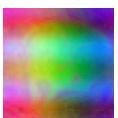

(a) PCA of DINO features at layers 4, 10, 11 and 12  
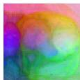

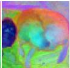

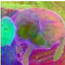

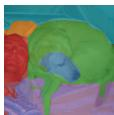  
(c) Single-layer model

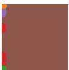

(b) Slot-attention masks per layer  


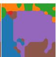

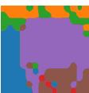

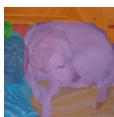  
(d) Fused SA mask

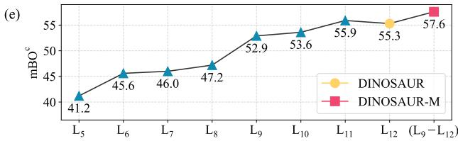

<details>
<summary>line chart</summary>

|        | DINOSAUR | DINOSAUR-M |
| ------ | -------- | ---------- |
| L5     | 41.2     |            |
| L6     | 45.6     |            |
| L7     | 46.0     |            |
| L8     | 47.2     |            |
| L9     | 52.9     |            |
| L10    | 53.6     |            |
| L11    | 55.9     |            |
| L12    | 55.3     |            |
| (L9-L12)| 57.6     |            |
</details>

Figure 2. Complementarity of DINO layers. (a) PCA visualization for features from layers 4 and 10–12, each encoding varying semantics. (b) Corresponding attention masks from slot attention on these layers, showing different segmentations. (c) Segmentation mask of the single-layer SPOT. (d) The fused slot-attention mask of our SPOT-M captures the person and the dog in a single slot each and follows their boundaries more closely. (e) Gain by combining layers. Blue shows the segmentation accuracy of single-layer DINOSAUR models trained on different encoder layers, yellow is the original DINOSAUR using $\mathrm { L } _ { 1 2 }$ . MUFASA on DINOSAUR combines multiple layers, surpassing all individual ones.

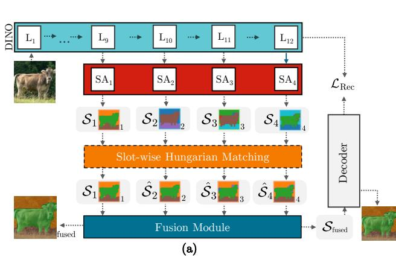

<details>
<summary>flowchart</summary>

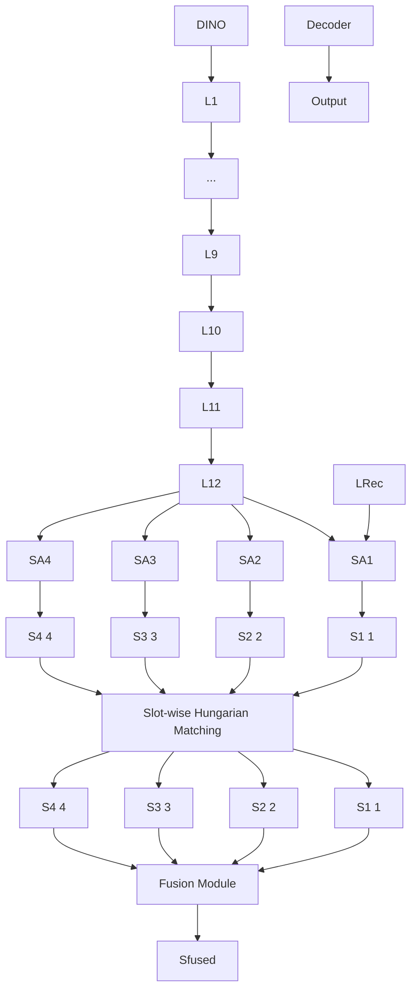
</details>

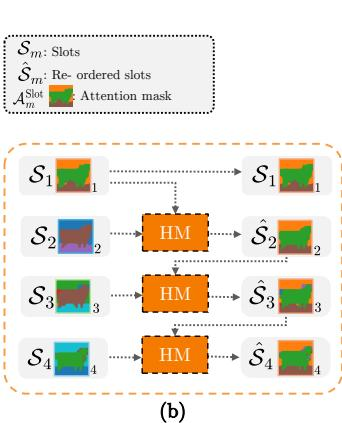

<details>
<summary>flowchart</summary>

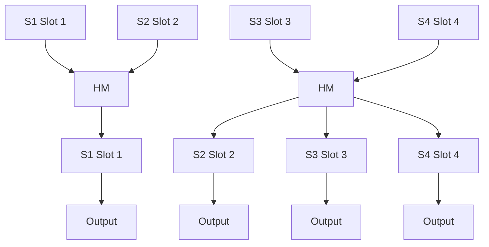
</details>

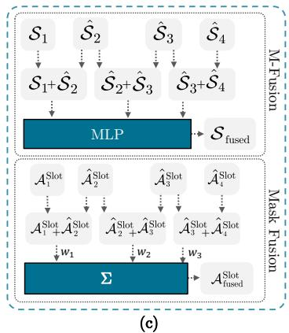

<details>
<summary>flowchart</summary>

```mermaid
graph TD
    subgraph M_Fusion
  S1["S₁"] --> MLP["MLP"]
  S2["Ŝ₂"] --> MLP
  S3["Ŝ₃"] --> MLP
  S4["Ŝ₄"] --> MLP
  S1 --> MLP
  S2 --> MLP
  S3 --> MLP
  S4 --> MLP
    end

    subgraph Mask Fusion
  A1["A₁^Slot"] --> Σ[Σ]
  A2["Â₂^Slot"] --> node["Σ"]
  A3["Â₃^Slot"] --> node
  A4["Â₄^Slot"] --> node
  A1 --> node
  A2 --> node
  A3 --> node
  A4 --> node
  w1["w₁"] --> node
  w2["w₂"] --> node
  w3["w₃"] --> node
    end

  MLP --> S_fused["S_fused"]

    subgraph Mask Fusion
  A1 --> node
  A2 --> node
  A3 --> node
  A4 --> node
  w1 --> node
  w2 --> node
  w3 --> node
  node --> A1
  node --> A2
  node --> A3
  node --> A4
  node --> w1
  node --> w2
  node --> w3
```
</details>

Figure 3. MUFASA architecture. (a) For an input image, features from multiple layers of a DINO encoder are processed by multiple $S _ { m }$ $\mathcal { A } _ { m } ^ { \mathrm { S l o t } }$ merges slots and masks. A ViT decoder reconstructs the last encoder layer’s features from fused slots, yielding the decoder attention mask $\mathcal { A } ^ { \mathrm { D e c } }$ . The reconstruction loss $\mathcal { L } _ { \mathrm { R e c } }$ guides training. (b) Hungarian matching (HM). The set of slots and attention masks are re-ordered for best correspondence across layers. (c) Fusion module. The re-ordered set of slots and masks are summed in adjacent pairs. Slots are $S _ { \mathrm { f u s e d } }$ $\mathcal { A } _ { \mathrm { f u s e d } } ^ { \mathrm { S i o t } }$

Integration of MUFASA. We design MUFASA as a simple plug-and-play component, allowing seamless integration into existing slot-attention-based methods relying on a pretrained DINO encoder. To this end, feature representations are extracted at multiple layers of the encoder and the singlelayer SA bottleneck of the model is replaced with our proposed multi-layer SA module. Integrating our approach into DINOSAUR and SPOT yields DINOSAUR-M and SPOT-M, respectively. MUFASA is trained with no additional losses, solely utilizing training signals of its respective base model.

Multiple feature layers. The pre-trained DINO-ViT encoder produces a set of feature representations $\mathcal { H } =$ $\{ \mathbf { h } _ { 1 } , \mathbf { h } _ { 2 } , . . , \mathbf { h } _ { 1 2 } \}$ across its 12 layers. Instead of extracting only the final representation h12, we define an index set $\mathcal { T } \subseteq \{ 1 , \dots , 1 2 \}$ and use it to select a subset Hˆ of H:

$$
\hat {\mathcal {H}} \subseteq \mathcal {H}, \quad \hat {\mathcal {H}} = \left\{\mathbf {h} _ {i} \in \mathbb {R} ^ {N \times d _ {\mathrm{emb}}} \mid i \in \mathcal {I} \right\}, \tag {4}
$$

where, as above, N denotes the number of tokens and $d _ { \mathrm { e m b } }$ is the feature dimension of the tokens. We restrict the index set size |I| to some value M . Given the subset of feature vectors Hˆ, we perform slot attention on every single $\mathbf { h } _ { i } \in \hat { \mathcal { H } }$ . With this, we obtain a family of M slot sets $\mathcal { U } = \{ S _ { 1 } , S _ { 2 } , . . . , S _ { M } \}$ . Each $S _ { m }$ , with indices $\in \{ 1 , \ldots , M \}$ $\mathbf { s } _ { k } ^ { m }$ with indices $k \in \{ 1 , . . . , K \} , i . e . \ S _ { m } = \{ \mathbf { s } _ { 1 } ^ { m } , . . . , \mathbf { s } _ { K } ^ { m } \}$ . To obtain each $S _ { m } .$ , we initialize an independent slot-attention module $\mathrm { S A } _ { m }$ with its own set of trainable parameters, rather than sharing weights between them, to enable adaptation to layer-specific features and capture more diverse information. Consequently, we obtain a slot-attention mask $\mathcal { A } _ { m } ^ { \mathrm { S l o t } }$ for every $\mathrm { S A } _ { m }$ , which denotes the attendance of image patches within the corresponding feature level to the slots of $S _ { m }$ .

Slot fusion. To enable the decoder to leverage the additional information, the family of slots U is projected onto a single set of slots $S _ { \mathrm { f u s e d } } \in \mathbb { R } ^ { K \times d _ { \mathrm { s l o t } } }$ . This allows the semantic information encoded across layers to be integrated into a slot-based representation that can be utilized by an auto-regressive transformer decoder. We term this process slot fusion. Prior to fusion, we ensure that two sets of slot vectors stemming from subsequent layer indices ${ \cal S } _ { m } = \{ \mathbf { s } _ { 1 } ^ { m } , \ldots , \mathbf { s } _ { K } ^ { m } \}$ and $\mathcal { S } _ { m + 1 } = \{ \mathbf s _ { 1 } ^ { \bar { m + 1 } } , . . . , \mathbf { \bar { s } } _ { K } ^ { m + 1 } \}$ are aligned in the sense that the slots $\mathbf { s } _ { k } ^ { m }$ and $\mathbf { s } _ { k } ^ { m + 1 }$ sk with corresponding indices $k \in \{ 1 , . . . , K \}$ across layers learn to bind to the same object. This is achieved by computing a permutation $\Pi _ { m + 1 }$ via Hungarian matching [33] based on maximizing the mean Intersection-over-Union (mIoU) metric between the corresponding binarized slot-attention masks $\mathcal { A } _ { m } ^ { \mathrm { S l o t } }$ $\mathcal { A } _ { m + 1 } ^ { \mathrm { S l o t } }$ mIoU assignment $\Pi _ { m + 1 }$ allows us to reorder the indices of the set of slots of $\boldsymbol { S } _ { m + 1 }$ , ensuring that the best matching slots are bound to the same indices across layers. We re-$\boldsymbol { S } _ { m + 1 }$ $\mathcal { A } _ { m + } ^ { \mathrm { S l o t } }$ $\Pi _ { m + 1 }$ starting with $m = 1$ . This results in the aligned sets of slots $\hat { \mathcal { U } } = \{ \hat { \mathcal { S } } _ { 1 } , \hat { \mathcal { S } } _ { 2 } , \hat { \mathcal { \times } } \hat { \mathcal { S } } _ { M } \}$ , where $\hat { S } _ { 1 } = S _ { 1 }$ , and corresponding masks $\hat { \mathcal { A } } _ { m } ^ { \mathrm { S l o t } }$ for indices $m \in \{ 1 , \ldots , M \}$ .

We propose a novel approach to slot fusion, termed M-Fusion (Fig. 3 (c)), designed to capture non-linear relations between slots of multiple layers. At its core, the fusion is done via a learned projection of U using a multilayer perceptron (MLP). First, the M aligned slot sets $\hat { \mathcal { U } } = \{ \hat { S _ { 1 } } , \hat { S } _ { 2 } , \hat { \mathcal { \bot } } , \hat { S } _ { M } \}$ have to be concatenated into a single set of slots. Inspired by [56], we take each subsequent pair of slot sets $( \hat { S } _ { m } , \hat { S } _ { m + 1 } )$ in a sliding window-like fashion and sum corresponding slot vectors, effectively encoding an inductive bias of local interactions between adjacent slots. By this, we incorporate multi-layer information as features and obtain M −1 elements $\mathcal { Z } = \{ ( \hat { S } _ { 1 } { + } \hat { S } _ { 2 } ) , \dotsc , ( \hat { S } _ { M - 1 } { + } \hat { S } _ { M } ) \}$ . After that, we concatenate Z along the slot feature dimension. An MLP projects this intermediate representation into a fused set of slots:

$$
\mathcal {S} _ {\text { fused }} = \operatorname{MLP} \left(\operatorname{Concat} (\mathcal {Z}, \text { axis } = \text { features })\right). \tag {5}
$$

The slot-attention masks $\hat { \mathcal { A } } _ { m } ^ { \mathrm { S l o t } }$ , corresponding to the slots $\hat { S } _ { m }$ $\mathcal { A } _ { \mathrm { f u s e d } } ^ { \mathrm { S l o t } }$ (mask fusion). Analogously to slots, we add each successive pair of slot-attention masks together, resulting in $\mathcal { Z } ^ { \mathrm { a t t } } = \mathcal { \hat { \{ } } ( \hat { A } _ { 1 } ^ { \mathrm { S l o t } } + \hat { A } _ { 2 } ^ { \mathrm { S l o t } } ) , . . . , ( \hat { A } _ { M - 1 } ^ { \mathrm { S l o t } } + \hat { A } _ { M } ^ { \mathrm { S l o t } } ) \} $ . The resulting attention masks are then fused using a weighted linear combination

$$
\mathcal {A} _ {\text { fused }} ^ {\text { Slot }} = \sum_ {m = 1} ^ {M - 1} w _ {m} \mathcal {Z} _ {m} ^ {\text { att }}. \tag {6}
$$

If no teacher-student training is employed (DINOSAUR-M), the mask fusion weights $w \in \mathbb { R } ^ { M - 1 }$ are set to a constant uniform value of 1M−1 , giving equal importance to each $\frac { 1 } { M - 1 }$ layer pair. When self-training is used (SPOT-M), the weights are learned during training, with the knowledge distillation from the slot-attention masks of the teacher to the masks of the student as guiding signal. The mask-fusion weights are normalized by applying a softmax over the layer dimension.

## 4. Experiments

Datasets. We conduct experiments on multiple datasets (real and synthetic) to assess the ability of our approach to perform unsupervised object segmentation (UOS). For realworld images, we utilize the PASCAL VOC [13] dataset, which contains one or few salient objects per image. Furthermore, we evaluate on the COCO [36] dataset, as it offers realworld scenes of higher complexity with objects of diverse classes per image. We also leverage the MOVi-C dataset generated by the Kubric simulator [17] for synthetic images of multi-object scenes with realistic variations in appearance and arrangement. Since MOVi-C is originally video-based, the usage for object segmentation is enabled by sampling random frames as done by [47]. These datasets align with previous work on UOS [26, 47], enabling a fair comparison. We refer to the supplementary material for further details.

Metrics. We employ standard metrics for unsupervised object segmentation. Following prior work [26], we compute metrics on segmentation masks derived from both the slotattention module and the decoder; we report the maximum across both in our experiments. The mean Intersection over Union (mIoU) quantifies segmentation accuracy by applying Hungarian matching between ground truth and predicted segmentation masks to maximize the IoU between segments on average. The mean Best Overlap (mBO) [44] assigns each ground-truth mask the predicted segment with the highest IoU, then averages over the assigned pairs. This metric has two variations: While $\mathrm { m B O ^ { c } }$ requires ground-truth masks on the semantic, i.e. class, level, mBOi is computed on instance, i.e. object-level, ground-truth masks. Thus, $\mathrm { m B O ^ { c } }$ is not applicable to the MOVi-C dataset, as the required annotations are not provided. We also report the Foreground Adjusted Rand Index (FG-ARI) to assess segmentation quality, but refer to concerns regarding its reliability [11, 26].

Implementation. For the multi-layer slot attention component, we choose the last four consecutive layers (see Fig. 2 (e)) of the encoder as input and fuse the extracted slot representations via M-Fusion. M-Fusion uses an MLP with one hidden layer of size 768 and GELU activations [20]. The number of slots depends on the dataset, where $K = 6$ for VOC, $K = 7$ for COCO, and $K = 1 1$ for MOVi-C. The encoder utilizes a ViT-B/16 backbone, initialized with pre-trained DINO weights [5]. Contrary to SPOT, we use segmentation masks of the SA module to distill knowledge of the teacher to the student, since we empirically found them to exhibit a higher segmentation quality (see supplement). Consistent with [47], we train for 1120 epochs on VOC, 100 epochs on COCO, and 95 epochs on MOVi-C. More details can be found in the supplementary material.

## 4.1. Unsupervised object segmentation

We integrate the MUFASA framework into state-of-the-art OCL models [26, 47] to highlight the benefit of the proposed multi-layer approach in UOS. As shown in Tab. 1, both SPOT-M and DINOSAUR-M consistently outperform their respective base models and prior methods across all datasets and metrics. With only one marginal exception in mIoU on COCO, this establishes a comprehensive, new state of the art among unsupervised OCL methods on these benchmarks.

The most substantial improvements across datasets are observed in class-level mBO (mBOc). Notably, while SPOT-M achieves the highest results overall on all datasets, even the less complex DINOSAUR-M surpasses the previous state of the art on PASCAL VOC and MOVi-C. This demonstrates the strength of the MUFASA framework without depending on a sophisticated training setup as used in SPOT. On COCO, DINOSAUR-M improves upon DINOSAUR in all metrics, whereas SPOT-M surpasses SPOT in $\mathrm { m B O ^ { c } }$ and mBOi and ranks closely behind it in other metrics. Overall, these results indicate that leveraging multi-layer information enhances overall segmentation quality across most settings. Visually comparing the segmentation results of SPOT-M and DINOSAUR-M against their base models (Fig. 4), we see how our superior metrics correspond to visibly improved segmentations. In multiple cases, SPOT’s and DINOSAUR’s segmentations miss object boundaries (col. 6), split the object (col. 3), or have holes in a segment (col. 1). SPOT-M and DINOSAUR-M produce masks consistent in shape and coverage, following the object boundaries more closely.

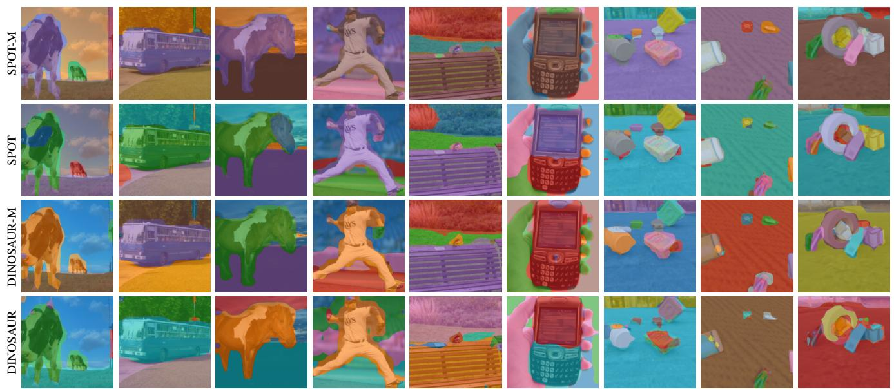

<details>
<summary>natural_image</summary>

Grid of 3D-rendered images showing scenes like a baseball player, basketball court, and a mobile phone, with no visible text or symbols.
</details>

Figure 4. Comparison of segmentations. Exemplary segmentation masks on nine different images for SPOT-M (ours), SPOT, DINOSAUR-M (ours), and DINOSAUR. The first three images are from VOC, the next three from COCO, and the last three from MOVi-C. Integrating MUFASA results in segmentations that follow the object boundaries more closely than the baselines.

In Fig. 5, we present the attention masks from each slotattention module alongside the final fused mask. Each layer contributes distinct information, and their combination produces a refined fused mask that more accurately delineates object boundaries than any individual layer mask. Notably, segmentation noise can appear at any layer and is not particularly confined to earlier or later layers. Nonetheless, the fused mask appears more accurate, suggesting that the complementary nature of layers compensates for each other’s noise, resulting in a more complete segmentation.

## 4.2. Efficiency

Furthermore, we investigate the computational efficiency of our approach. DINOSAUR-M contains 49.6 M trainable parameters, 20.7 % more than DINOSAUR (41.1 M) due to its multi-layer design. SPOT-M consists of 77.8 M trainable parameters, a relative increase of 12.1 % over SPOT (69.5 M). Therefore, we only modestly increase the number of trainable parameters. Nevertheless, our method comprehensively surpasses the results of baseline models, demonstrating its competitiveness in UOS. Even despite DINOSAUR-M having substantially fewer parameters than SPOT, it outperforms it on two out of three datasets. MUFASA marginally increases the average GPU memory usage during training; with DINOSAUR-M requiring 8.1 % and SPOT-M 0.4 % more memory compared to their respective baselines. Additionally, we assess the training efficiency of our model in Tab. 2. We report results at two time instants, the number of epochs at which (i) SPOT-M / DINOSAUR-M first consistently surpass their baselines’ results, and (ii) when the peak results are achieved. Notably, our approach manages to perform on-par with baseline models in substantially fewer epochs, resulting in a 94.4 % reduction in training time for SPOT-M and 90.2 % for DINOSAUR-M on VOC. Moreover, our models converge to a solution earlier on all datasets, suggesting that the multi-layer approach incorporates more information per image. Finally, we demonstrate inference efficiency by measuring throughput during evaluation. When integrating MUFASA, we moderately reduce throughput from 271.1 img/s to 217.3 img/s for DINOSAUR and find a negligible reduction from 86.1 img/s to 84.7 img/s for SPOT. Consequently, MUFASA is a lightweight addition to OCL, reaching SOTA results in UOS with reduced training times and minor computational overhead during inference, thus practically relevant for large-scale training.

Table 1. Comparison of SA methods in UOS. We compare our approach with OCL baselines on PASCAL VOC, COCO, and MOVi-C. The metrics (in %, higher is better) are computed from slotattention and decoder masks; the maximum across both is reported. For MUFASA, we report mean ± std. dev. over three seeds. SA [41] and SLATE [48] results are taken from [26]. Results for SPOT [26] are reported without test-time ensembling (see supplement). Best results are in bold, the 2nd-best underlined.

<table><tr><td>Model</td><td> $mBO^c$ </td><td> $mBO^i$ </td><td>mIoU</td><td>FG-ARI</td></tr><tr><td colspan="5">PASCAL VOC</td></tr><tr><td>SA</td><td>24.9</td><td>24.6</td><td>-</td><td>12.3</td></tr><tr><td>SLATE</td><td>41.5</td><td>35.9</td><td>-</td><td>15.6</td></tr><tr><td>DINOSAUR</td><td>51.2±1.9</td><td>44.0±1.9</td><td>-</td><td>24.8±2.2</td></tr><tr><td>DINOSAUR-M (ours)</td><td>57.6±0.6</td><td>49.2±0.4</td><td>47.2±0.5</td><td>25.2±3.5</td></tr><tr><td>SPOT</td><td>55.3±0.4</td><td>48.1±0.4</td><td>46.5±0.4</td><td>19.7±0.4</td></tr><tr><td>SPOT-M (ours)</td><td>59.8±0.3</td><td>51.3±0.1</td><td>49.4±0.2</td><td>20.6±0.6</td></tr><tr><td colspan="5">COCO</td></tr><tr><td>SA</td><td>19.2</td><td>17.2</td><td>-</td><td>21.4</td></tr><tr><td>SLATE</td><td>33.6</td><td>29.1</td><td>-</td><td>32.5</td></tr><tr><td>DINOSAUR</td><td>39.7</td><td>31.6</td><td>-</td><td>34.1</td></tr><tr><td>DINOSAUR-M (ours)</td><td>43.0±0.7</td><td>32.7±0.4</td><td>30.5±0.3</td><td>33.9±1.1</td></tr><tr><td>SPOT</td><td>44.3±0.3</td><td>34.7±0.1</td><td>32.7±0.1</td><td>37.8±0.5</td></tr><tr><td>SPOT-M (ours)</td><td>45.5±0.4</td><td>34.8±0.2</td><td>32.5±0.2</td><td>35.6±0.9</td></tr><tr><td colspan="5">MOVi-C</td></tr><tr><td>SA</td><td>-</td><td>26.2±1.0</td><td>-</td><td>43.8±0.3</td></tr><tr><td>SLATE</td><td>-</td><td>39.4±0.8</td><td>37.8±0.7</td><td>49.5±1.4</td></tr><tr><td>DINOSAUR</td><td>-</td><td>42.4</td><td>-</td><td>55.7</td></tr><tr><td>DINOSAUR-M (ours)</td><td>-</td><td>49.2±0.5</td><td>48.3±0.5</td><td>66.4±2.1</td></tr><tr><td>SPOT</td><td>-</td><td>47.0±1.2</td><td>46.4±1.2</td><td>57.9±2.0</td></tr><tr><td>SPOT-M (ours)</td><td>-</td><td>49.2±0.3</td><td>48.2±0.3</td><td>67.8±1.7</td></tr></table>

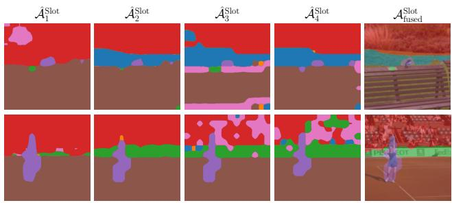  
Figure 5. Segmentation per layer. Layer-wise SA masks and the fused mask on COCO. Each layer contributes complementary information (e.g., row 1: the plaque and bench edges in $\hat { \mathcal { A } } _ { 3 } ^ { \mathrm { S l o t } } \nu \bar { s } .$ coarse segments in $\hat { \mathcal { A } } _ { 2 } ^ { \mathrm { S l o t } } )$ ; the fused masks appear refined.

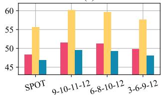

<details>
<summary>bar chart</summary>

| Category | Series 1 | Series 2 |
|---|---|---|
| SPOT | 48.5 | 55.8 |
| 9-10-11-12 | 51.5 | 60.2 |
| 6-8-10-12 | 51.2 | 59.7 |
| 3-6-9-12 | 49.8 | 57.6 |
</details>

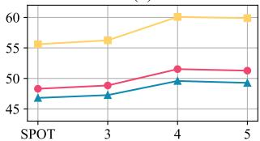

<details>
<summary>line chart</summary>

| SPOT | Series 1 | Series 2 | Series 3 |
|---|---|---|---|
| 3 | 55.5 | 48.5 | 47.0 |
| 4 | 60.0 | 51.5 | 49.5 |
| 5 | 60.0 | 51.5 | 49.5 |
</details>

Figure 6. Ablations on layers. (a) Results of SPOT-M on VOC in terms of mBOi, mBOc, and mIoU for different selections of layers compared to SPOT. (b) Results of SPOT-M on VOC in terms of mBOi, mBOc, and mIoU for an increasing number of the last feature layers compared to the single-layer baseline SPOT [26].

## 4.3. Ablations

Layer choice ablation. A key design choice for MUFASA concerns the selection of feature layers on which to perform SA. Our findings, as shown in Fig. 2, indicate that earlier layers individually provide insufficient feature representations to be leveraged by slot attention. A PCA visualization, cf . supplement, further illustrates this semantic progression in the features. This aligns with [42], which also found that the deepest DINO layers are best suited for semantic tasks. However, to examine whether earlier layers may provide effective complementary information, we investigate layer subsets that vary in terms of continuity, i.e. consecutive vs. non-consecutive, combining different layer positions, including earlier ones. Our ablation in Fig. 6 (a) shows that combining earlier with later layers indeed performs better than the baseline, but not better than using the last consecutive layers. Therefore, in Fig. 6 (b), we show the effect of varying the number of consecutive layers on SPOT-M. We evaluate using the last three, four, and five feature layers. Results peak at four layers, and a further increase in the number of layers slightly deteriorates results, indicating that more layers do not necessarily translate to better segmentation. Further considering the computational overhead each additional layer would entail, we achieve best segmentation results and efficiency through use of the last four consecutive layers for feature aggregation in MUFASA. Yet, even for the other evaluated layer choices, MUFASA consistently outperforms its respective baseline (cf . Fig. 6).

Table 2. Training times. We report the number of epochs to peak $\mathrm { ( E _ { P e a k } ) }$ and baseline-level $\mathrm { ( E _ { B a s e } ) }$ results, defined as the first epoch exceeding baseline metrics $( \mathrm { m B O } ^ { c }$ for VOC / COCO, mBOi for MOVi-C). The elapsed wall times for baseline $\mathrm { ( T _ { B a s e } ) }$ and peak results $\mathrm { ( T _ { P e a k } ) }$ are averaged over 100 epochs $( \mathrm { T _ { E p o c h } } )$ . We outperform the baselines with fewer epochs and saturate faster w.r.t. wall time.

<table><tr><td>Method</td><td> $E_{Base}$ </td><td> $E_{Peak}$ </td><td> $T_{Epoch} (min)$ </td><td> $T_{Base} (h)$ </td><td> $T_{Peak} (h)$ </td></tr><tr><td colspan="6">PASCAL VOC</td></tr><tr><td>DINOSAUR</td><td>644</td><td>644</td><td>2.0 ± 0.4</td><td>21.5</td><td>21.5</td></tr><tr><td>DINOSAUR-M</td><td>42</td><td>271</td><td>3.0 ± 0.1</td><td>2.1</td><td>13.6</td></tr><tr><td>SPOT</td><td>944</td><td>944</td><td>4.6 ± 0.1</td><td>72.4</td><td>72.4</td></tr><tr><td>SPOT-M</td><td>51</td><td>615</td><td>4.8 ± 0.1</td><td>4.1</td><td>49.2</td></tr><tr><td colspan="6">COCO</td></tr><tr><td>DINOSAUR</td><td>82</td><td>82</td><td>80.7 ± 2.3</td><td>110.3</td><td>110.3</td></tr><tr><td>DINOSAUR-M</td><td>5</td><td>9</td><td>81.2 ± 5.8</td><td>6.8</td><td>12.2</td></tr><tr><td>SPOT</td><td>89</td><td>89</td><td>84.6 ± 9.0</td><td>125.5</td><td>125.5</td></tr><tr><td>SPOT-M</td><td>55</td><td>58</td><td>84.9 ± 9.2</td><td>77.8</td><td>82.1</td></tr><tr><td colspan="6">MOVi-C</td></tr><tr><td>DINOSAUR</td><td>63</td><td>63</td><td>22.1 ± 0.2</td><td>23.3</td><td>23.3</td></tr><tr><td>DINOSAUR-M</td><td>7</td><td>29</td><td>25.8 ± 0.5</td><td>3.0</td><td>12.5</td></tr><tr><td>SPOT</td><td>94</td><td>94</td><td>32.9 ± 0.2</td><td>51.5</td><td>51.5</td></tr><tr><td>SPOT-M</td><td>31</td><td>81</td><td>34.5 ± 0.3</td><td>17.8</td><td>46.6</td></tr></table>

Fusion strategy. Within our framework, one main design decision concerns the fusion strategy, which integrates information from slots at multiple layers into a unified representation. In Tab. 3, we investigate alternative fusion strategies beyond M-Fusion. To this end, we first assess whether simply averaging of (matched) slot vectors and attention masks across layers (Avg-Fusion) suffices. We find that Avg-Fusion performs worse compared to learned methods, indicating that non-learned fusion lacks the ability to aggregate multi-layer information sufficiently. We also examine a more complex learned strategy, where the MLP of M-Fusion is replaced with a transformer layer (T-Fusion). While T-Fusion surpasses SPOT, it does not outperform M-Fusion, suggesting that the additional complexity is not beneficial for slot fusion. Finally, we examine a variant of M-Fusion in which the pairwise summation of slot sets of adjacent layers prior to fusion is replaced with a plain concatenation (Concat-Fusion). Attention masks are analogously combined without this technique. We find that this leads to degraded results, demonstrating that the inductive bias of local interactions encoded by this pairwise summation effectively increases the performance of our fusion module.

Table 3. Comparison of fusion strategies. Segmentation metrics (in %, ↑) of SPOT-M on VOC with different fusion methods. Averaging matches SPOT, while M-Fusion performs best.

<table><tr><td>Method</td><td> $mBO^c$ </td><td> $mBO^i$ </td><td>mIoU</td><td>FG-ARI</td></tr><tr><td>SPOT</td><td>55.3</td><td>48.1</td><td>46.5</td><td>19.7</td></tr><tr><td>Avg-Fusion</td><td>55.6</td><td>48.1</td><td>46.5</td><td>19.4</td></tr><tr><td>Concat-Fusion</td><td>59.0</td><td>50.9</td><td>48.9</td><td>20.0</td></tr><tr><td>T-Fusion</td><td>59.0</td><td>50.7</td><td>48.9</td><td>19.7</td></tr><tr><td>M-Fusion (ours)</td><td>59.8</td><td>51.3</td><td>49.4</td><td>20.6</td></tr></table>

Encoder choice. Consistent with our baselines [26, 47], we use a ViT-B/16 as backbone, pre-trained with DINO [5], as the vision encoder to extract image features. Next, we evaluate MUFASA with alternative pre-training schemes and encoder backbones, comprising MAE [19] and DINOv2 [43] features, as well as the ViT-S/8 and ViT-B/14 architectures. We restrict our study to these, since [47] demonstrated that CNN-based encoders like ResNet yield substantially worse results in slot attention. Furthermore, the semantically rich representational hierarchy we leverage is innate to self-supervised ViTs [1]. As shown in Tab. 4, MUFASA consistently performs well across a variety of settings, outperforming its respective baselines in all instances, often by a substantial margin. These results demonstrate that the applicability of our approach is not confined to a specific encoder but generalizes across different architectures and pre-training schemes. Thus, MUFASA is capable of utilizing different feature representations effectively within UOS.

Decoder choice. In Tab. 5, we explore the impact of an MLP decoder on the segmentation accuracy for DINOSAUR and SPOT, both with and without MUFASA, noting that this decoder has weaker reconstruction abilities compared to the transformer decoder. We observe that the results of the baselines deteriorate more noticeably compared to MUFASA. We attribute this robustness to the fact that our approach directly enhances the slot-attention mechanism, making it more agnostic to the choice of decoder. In contrast, SPOT increases its reliance on the decoder through its patch-order permutation strategy. Notably, DINOSAUR-M achieves better results than SPOT despite its simpler and more lightweight design, further demonstrating the strength of MUFASA.

## 4.4. Limitations

Inspecting class-level vs. instance-level segmentation masks, MUFASA inherits some properties of previous slot-attention models as it tends to group instances of the same class into the same slot. This can be observed, e.g., when multiple people are shown in the scene (see supplement). This problem is not innate to MUFASA but rather an issue of OCL models in general. In addition, Hungarian matching aligns slots across layers with a one-to-one mapping. Although effective, this may introduce a constraint, which makes flexible soft matching schemes a promising direction for future work.

Table 4. Comparison of encoder backbones and pre-training schemes. We report segmentation metrics (in %, ↑) for MUFASA and baselines utilizing different encoder backbones and pre-training schemes on VOC. (\*) denotes values obtained from reproduction. We outperform the baselines across various encoder choices.

<table><tr><td>Weights</td><td>Backbone</td><td>Model</td><td> $mBO^c$ </td><td> $mBO^i$ </td><td>mIoU</td></tr><tr><td rowspan="4">DINO</td><td rowspan="4">ViT-B/16</td><td>DINOSAUR</td><td>51.2</td><td>44.0</td><td>-</td></tr><tr><td>DINOSAUR-M</td><td>57.6</td><td>49.2</td><td>47.2</td></tr><tr><td>SPOT</td><td>55.3</td><td>48.1</td><td>46.5</td></tr><tr><td>SPOT-M</td><td>59.8</td><td>51.3</td><td>49.4</td></tr><tr><td rowspan="4">MAE</td><td rowspan="4">ViT-B/16</td><td>DINOSAUR*</td><td>48.8</td><td>44.4</td><td>43.1</td></tr><tr><td>DINOSAUR-M</td><td>55.0</td><td>46.8</td><td>44.1</td></tr><tr><td>SPOT*</td><td>54.5</td><td>47.4</td><td>45.6</td></tr><tr><td>SPOT-M</td><td>55.8</td><td>48.8</td><td>47.1</td></tr><tr><td rowspan="4">DINOv2</td><td rowspan="4">ViT-B/14</td><td>DINOSAUR*</td><td>49.5</td><td>43.1</td><td>41.5</td></tr><tr><td>DINOSAUR-M</td><td>52.1</td><td>44.4</td><td>42.4</td></tr><tr><td>SPOT*</td><td>49.4</td><td>43.0</td><td>41.5</td></tr><tr><td>SPOT-M</td><td>51.0</td><td>44.2</td><td>42.4</td></tr><tr><td rowspan="4">DINO</td><td rowspan="4">ViT-S/8</td><td>DINOSAUR*</td><td>51.2</td><td>45.9</td><td>44.7</td></tr><tr><td>DINOSAUR-M</td><td>55.2</td><td>48.8</td><td>47.5</td></tr><tr><td>SPOT*</td><td>55.3</td><td>48.4</td><td>47.0</td></tr><tr><td>SPOT-M</td><td>60.0</td><td>51.8</td><td>49.7</td></tr></table>

Table 5. Decoder impact. Results (in %, ↑) from MUFASA and baselines on COCO in UOS, using different decoder architectures. A weaker decoder (MLP) causes accuracy to deteriorate sharply; DINOSAUR and SPOT degrade more than our method.

<table><tr><td rowspan="2">Decoder</td><td colspan="3">Transformer</td><td colspan="3">MLP</td></tr><tr><td> $mBO^c$ </td><td> $mBO^i$ </td><td>mIoU</td><td> $mBO^c$ </td><td> $mBO^i$ </td><td>mIoU</td></tr><tr><td>DINOSAUR</td><td>39.7</td><td>31.6</td><td>-</td><td>30.9</td><td>27.7</td><td>-</td></tr><tr><td>DINOSAUR-M</td><td>43.0</td><td>32.7</td><td>30.5</td><td>34.0</td><td>29.2</td><td>27.9</td></tr><tr><td>SPOT</td><td>44.3</td><td>34.7</td><td>32.7</td><td>32.4</td><td>28.4</td><td>27.0</td></tr><tr><td>SPOT-M</td><td>45.5</td><td>34.8</td><td>32.5</td><td>34.7</td><td>30.2</td><td>28.9</td></tr></table>

## 5. Conclusion

We introduce MUFASA, a multi-layer slot-attention mechanism that leverages the yet untapped information encoded within the feature layers of ViTs. As a lightweight, plugand-play module, it can be easily integrated into existing slot-based methods for object-centric learning. MUFASA also includes a novel method for effectively fusing slots from multiple layers into a unified representation. We demonstrate that incorporating MUFASA leads to substantial gains in unsupervised object segmentation while also reducing training time. In this task, SPOT-M sets a new state of the art on multiple benchmarks, highlighting its effectiveness and practical applicability.

Acknowledgments. This project has received funding from the European Research Council (ERC) under the European Union’s Horizon 2020 program (grant agreement No. 866008). The project was also supported by the Deutsche Forschungsgemeinschaft (DFG, German Research Foundation) under Germany’s Excellence Strategy (EXC-3057/1 “Reasonable Artificial Intelligence”, Project No. 533677015). Simone Schaub-Meyer has been funded by the DFG – 529680848. Leonie Schußler and Sebastian Bock are sup- ¨ ported by the Konrad Zuse School of Excellence in Learning and Intelligent Systems (ELIZA) through the DAAD programme Konrad Zuse Schools of Excellence in Artificial Intelligence, sponsored by the German Federal Ministry of Education and Research.

## References

[1] Shir Amir, Yossi Gandelsman, Shai Bagon, and Tali Dekel. On the effectiveness of ViT features as local semantic descriptors. In ECCV Workshops, pages 39–55, 2022. 1, 2, 3, 8, ii  
[2] Christopher P. Burgess, Loic Matthey, Nicholas Watters, Rishabh Kabra, Irina Higgins, Matt Botvinick, and Alexander Lerchner. MONet: Unsupervised scene decomposition and representation. arXiv:1901.11390 [cs.CV], 2019. 1, 2  
[3] Yue Cao, Yangzhou Liu, Zhe Chen, Guangchen Shi, Wenhai Wang, Danhuai Zhao, and Tong Lu. MMFuser: Multimodal multi-layer feature fuser for fine-grained vision-language understanding. arXiv:2410.11829 [cs.CV], 2024. 2  
[4] Mathilde Caron, Ishan Misra, Julien Mairal, Priya Goyal, Piotr Bojanowski, and Armand Joulin. Unsupervised learning of visual features by contrasting cluster assignments. NeurIPS, pages 9912–9924, 2020. 1, 2, ii  
[5] Mathilde Caron, Hugo Touvron, Ishan Misra, Herve J ´ egou, ´ Julien Mairal, Piotr Bojanowski, and Armand Joulin. Emerging properties in self-supervised vision transformers. In ICCV, pages 9650–9660, 2021. 1, 2, 5, 8, iii  
[6] Kyunghyun Cho, Bart van Merrienboer, Caglar Gulcehre, ¨ Dzmitry Bahdanau, Fethi Bougares, Holger Schwenk, and Yoshua Bengio. Learning phrase representations using RNN encoder–decoder for statistical machine translation. In EMNLP, pages 1724–1734, 2014. 3  
[7] Seokju Cho, Sunghwan Hong, Sangryul Jeon, Yunsung Lee, Kwanghoon Sohn, and Seungryong Kim. CATs: Cost aggregation transformers for visual correspondence. In NeurIPS, pages 9011–9023, 2021. 2  
[8] Jonathan Collu, Riccardo Majellaro, Aske Plaat, and Thomas M. Moerland. Slot structured world models. arXiv:2402.03326 [cs.CV], 2024. 1  
[9] Aniket Didolkar, Andrii Zadaianchuk, Anirudh Goyal, Michael Mozer, Yoshua Bengio, Georg Martius, and Maximilian Seitzer. On the transfer of object-centric representation learning. In ICLR, 2025. 1, ii  
[10] Andrea Dittadi, Samuele Papa, Michele De Vita, Bernhard Scholkopf, Ole Winther, and Francesco Locatello. General-¨ ization and robustness implications in object-centric learning. In ICML, pages 5221–5285, 2021. 1  
[11] Martin Engelcke, Adam R. Kosiorek, Oiwi Parker Jones, and Ingmar Posner. GENESIS: Generative scene inference and sampling with object-centric latent representations. In ICLR, 2020. 2, 5  
[12] S.M. Ali Eslami, Nicolas Heess, Theophane Weber, Yuval Tassa, David Szepesvari, Koray Kavukcuoglu, and Geoffrey E. Hinton. Attend, infer, repeat: Fast scene understanding with generative models. NIPS, page 3233–3241, 2016. 2  
[13] Mark Everingham, Luc Van Gool, Christopher K.I. Williams, John Winn, and Andrew Zisserman. The PASCAL visual object classes (VOC) challenge. IJCV, 88:303–338, 2010. 2, 5  
[14] Andreas Geiger, Philip Lenz, Christoph Stiller, and Raquel Urtasun. Vision meets robotics: The KITTI dataset. IJRR, 32 (11):1231–1237, 2013. 2  
[15] Xinrui Gong, Oliver Hahn, Christoph Reich, Krishnakant Singh, Simone Schaub-Meyer, Daniel Cremers, and Stefan Roth. Motion-refined DINOSAUR for unsupervised multiobject discovery. In ICCV Workshops, pages 220–230, 2025. 2  
[16] Klaus Greff, Raphael Lopez Kaufman, Rishabh Kabra, Nick¨ Watters, Christopher Burgess, Daniel Zoran, Loic Matthey, Matthew Botvinick, and Alexander Lerchner. Multi-object representation learning with iterative variational inference. In ICML, pages 2424–2433, 2019. 1, 2  
[17] Klaus Greff, Francois Belletti, Lucas Beyer, Carl Doersch, et al. Kubric: A scalable dataset generator. In CVPR, pages 3749–3761, 2022. 5  
[18] Oliver Groth, Fabian B. Fuchs, Ingmar Posner, and Andrea Vedaldi. ShapeStacks: Learning vision-based physical intuition for generalised object stacking. In ECCV, page 724–739, 2018. 1, 2  
[19] Kaiming He, Xinlei Chen, Saining Xie, Yanghao Li, Piotr Dollar, and Ross Girshick. Masked autoencoders are scalable´ vision learners. In CVPR, pages 16000–16009, 2022. 8, i  
[20] Dan Hendrycks and Kevin Gimpel. Bridging nonlinearities and stochastic regularizers with Gaussian error linear units. arXiv:1606.08415 [cs.LG], 2016. 5, iii  
[21] Negin Heravi, Ayzaan Wahid, Corey Lynch, Pete Florence, Travis Armstrong, Jonathan Tompson, Pierre Sermanet, Jeannette Bohg, and Debidatta Dwibedi. Visuomotor control in multi-object scenes using object-aware representations. In ICRA, pages 9515–9522, 2023. 1  
[22] Jindong Jiang, Sepehr Janghorbani, Gerard De Melo, and Sungjin Ahn. Scalor: Generative world models with scalable object representations. In ICLR, 2019. 2  
[23] Jindong Jiang, Fei Deng, Gautam Singh, and Sungjin Ahn. Object-centric slot diffusion. In NeurIPS, pages 8563–8601, 2023. 1, 2  
[24] Daniel Jiwoong Im, Sungjin Ahn, Roland Memisevic, and Yoshua Bengio. Denoising criterion for variational autoencoding framework. In AAAI, pages 2059–2065, 2017. 2  
[25] Justin Johnson, Bharath Hariharan, Laurens van der Maaten, Li Fei-Fei, C. Lawrence Zitnick, and Ross Girshick. CLEVR: A diagnostic dataset for compositional language and elementary visual reasoning. In CVPR, pages 2901–2910, 2017. 1, 2  
[26] Ioannis Kakogeorgiou, Spyros Gidaris, Konstantinos Karantzalos, and Nikos Komodakis. SPOT: Self-training with patch-order permutation for object-centric learning with autoregressive transformers. In CVPR, pages 22776–22786, 2024. 1, 2, 3, 5, 6, 7, 8, i, ii  
[27] Laurynas Karazija, Iro Laina, and Christian Rupprecht. Clevr-Tex: A texture-rich benchmark for unsupervised multi-object segmentation. In NeurIPS Datasets and Benchmarks Track, 2021. 2  
[28] Efstathios Karypidis, Ioannis Kakogeorgiou, Spyros Gidaris, and Nikos Komodakis. DINO-foresight: Looking into the future with DINO. In NeurIPS, 2025. 2  
[29] Dongwon Kim, Seoyeon Kim, and Suha Kwak. Bootstrapping top-down information for self-modulating slot attention. In NeurIPS, pages 103751–103773, 2024. 1  
[30] Ruth Kimchi. The perception of hierarchical structure. In The Oxford Handbook of Perceptual Organization. Oxford University Press, 2015. 1  
[31] Thomas Kipf, Gamaleldin F. Elsayed, Aravindh Mahendran, Austin Stone, Sara Sabour, Georg Heigold, Rico Jonschkowski, Alexey Dosovitskiy, and Klaus Greff. Conditional object-centric learning from video. In ICLR, 2022. 2  
[32] Adam Kosiorek, Hyunjik Kim, Yee Whye Teh, and Ingmar Posner. Sequential attend, infer, repeat: Generative modelling of moving objects. NeurIPS, 31:8615–8625, 2018. 2  
[33] Harold W. Kuhn. The Hungarian method for the assignment problem. Naval Research Logistics Quarterly, 2(1–2):83–97, 1955. 2, 4  
[34] Liangzhi Li, Bowen Wang, Manisha Verma, Yuta Nakashima, Ryo Kawasaki, and Hajime Nagahara. Scouter: Slot attentionbased classifier for explainable image recognition. In ICCV, pages 1046–1055, 2021. 1  
[35] Nanbo Li, Cian Eastwood, and Robert Fisher. Learning objectcentric representations of multi-object scenes from multiple views. In NeurIPS, pages 5656–5666, 2020. 2  
[36] Tsung-Yi Lin, Michael Maire, Serge Belongie, James Hays, Pietro Perona, Deva Ramanan, Piotr Dollar, and C. Lawrence ´ Zitnick. Microsoft COCO: Common objects in context. In ECCV, pages 740–755, 2014. 2, 5  
[37] Zhixuan Lin, Yi-Fu Wu, Skand Peri, Bofeng Fu, Jindong Jiang, and Sungjin Ahn. Improving generative imagination in object-centric world models. In ICML, pages 6140–6149, 2020. 2  
[38] Zhixuan Lin, Yi-Fu Wu, Skand Vishwanath Peri, Weihao Sun, Gautam Singh, Fei Deng, Jindong Jiang, and Sungjin Ahn. SPACE: Unsupervised object-oriented scene representation via spatial attention and decomposition. In ICLR, 2020. 2  
[39] Zhiwei Lin, Zengyu Yang, and Yongtao Wang. Foreground guidance and multi-layer feature fusion for unsupervised object discovery with transformers. In WACV, pages 4043–4053, 2023. 2  
[40] Weiyu Liu, Yilun Du, Tucker Hermans, Sonia Chernova, and Chris Paxton. StructDiffusion: Language-guided creation of physically-valid structures using unseen objects. In RSS, 2023. 1  
[41] Francesco Locatello, Dirk Weissenborn, Thomas Unterthiner, Aravindh Mahendran, Georg Heigold, Jakob Uszkoreit,  
Alexey Dosovitskiy, and Thomas Kipf. Object-centric learning with slot attention. In NeurIPS, pages 11525–11538, 2020. 1, 2, 6  
[42] Grace Luo, Lisa Dunlap, Dong Huk Park, Aleksander Holynski, and Trevor Darrell. Diffusion hyperfeatures: Searching through time and space for semantic correspondence. In NeurIPS, pages 47500–47510, 2023. 7  
[43] Maxime Oquab, Timothee Darcet, Th ´ eo Moutakanni, Huy Vo, ´ Marc Szafraniec, Vasil Khalidov, Pierre Fernandez, Daniel Haziza, Francisco Massa, Alaaeldin El-Nouby, et al. DI-NOv2: Learning robust visual features without supervision. arXiv:2304.07193 [cs.CV], 2023. 2, 8, i  
[44] Jordi Pont-Tuset, Pablo Arbelaez, Jonathan T. Barron, Ferran Marques, and Jitendra Malik. Multiscale combinatorial grouping for image segmentation and object proposal generation. TPAMI, 39:128–140, 2017. 5  
[45] Rishav Pramanik, Jose-Fabian Villa-V ´ asquez, and Marco ´ Pedersoli. Masked multi-query slot attention for unsupervised object discovery. In IJCNN, pages 1–8, 2024. 2, ii  
[46] Maithra Raghu, Thomas Unterthiner, Simon Kornblith, Chiyuan Zhang, and Alexey Dosovitskiy. Do vision transformers see like convolutional neural networks? In NeurIPS, pages 12116–12128, 2021. 2  
[47] Maximilian Seitzer, Max Horn, Andrii Zadaianchuk, Dominik Zietlow, Tianjun Xiao, Carl-Johann Simon-Gabriel, Tong He, Zheng Zhang, Bernhard Scholkopf, Thomas Brox, and ¨ Francesco Locatello. Bridging the gap to real-world objectcentric learning. In ICLR, 2022. 1, 2, 3, 5, 8, i, ii  
[48] Gautam Singh, Fei Deng, and Sungjin Ahn. Illiterate DALL-E learns to compose. In ICLR, 2021. 2, 3, 6  
[49] Gautam Singh, Yi-Fu Wu, and Sungjin Ahn. Simple unsupervised object-centric learning for complex and naturalistic videos. NeurIPS, pages 18181–18196, 2022. 2  
[50] Krishnakant Singh, Simone Schaub-Meyer, and Stefan Roth. GLASS: Guided latent slot diffusion for object-centric learning. In CVPR, pages 28673–28683, 2025. 2  
[51] Ani Vanyan, Alvard Barseghyan, Hakob Tamazyan, Vahan Huroyan, Hrant Khachatrian, and Martin Danelljan. Analyzing local representations of self-supervised vision transformers. arXiv:2401.00463 [cs.CV], 2023. 2  
[52] Ashish Vaswani, Noam Shazeer, Niki Parmar, Jakob Uszkoreit, Llion Jones, Aidan N. Gomez, Łukasz Kaiser, and Illia Polosukhin. Attention is all you need. NIPS, page 6000–6010, 2017. 2, 3  
[53] Nick Watters, Loic Matthey, Chris P. Burgess, and Alexander Lerchner. Spatial broadcast decoder: A simple architecture for disentangled representations in VAEs. In ICLR Workshop on Learning from Limited Labeled Data, 2019. 2, i  
[54] Ziyi Wu, Nikita Dvornik, Klaus Greff, Thomas Kipf, and Animesh Garg. SlotFormer: Unsupervised visual dynamics simulation with object-centric models. In ICLR, 2023. 1  
[55] Ziyi Wu, Jingyu Hu, Wuyue Lu, Igor Gilitschenski, and Animesh Garg. SlotDiffusion: Object-centric generative modeling with diffusion models. In NeurIPS, pages 50932–50958, 2023. 1, 2  
[56] Huanjin Yao, Wenhao Wu, Taojiannan Yang, YuXin Song, Mengxi Zhang, Haocheng Feng, Yifan Sun, Zhiheng Li,  
Wanli Ouyang, and Jingdong Wang. Dense connector for MLLMs. In NeurIPS, pages 33108–33140, 2024. 1, 2, 4  
[57] Matthew D. Zeiler and Rob Fergus. Visualizing and understanding convolutional networks. In ECCV, pages 818–833, 2014. 2  
[58] Junyi Zhang, Charles Herrmann, Junhwa Hur, Luisa Polania Cabrera, Varun Jampani, Deqing Sun, and Ming-Hsuan Yang. A tale of two features: Stable diffusion complements dino for zero-shot semantic correspondence. In NeurIPS, pages 45533–45547, 2023. 2

# MUFASA: A Multi-Layer Framework for Slot Attention Supplementary Material

Sebastian Bock\* 1,2 Leonie Schußler ¨ \* 1,2

Krishnakant Singh 1 Simone Schaub-Meyer 1,3 Stefan Roth 1,2,3

1TU Darmstadt 2Zuse School ELIZA 3hessian.AI \*equal contribution

## A. Implementation Details

In this section, we provide a more detailed overview of the training and implementation details for DINOSAUR-M and SPOT-M. The relevant hyperparameters for every dataset are summarized in Tab. 8. In general, we train for 1120 epochs on VOC, 100 epochs on COCO, and 95 epochs on MOVi-C. While this remains consistent between DINOSAUR-M and SPOT-M, the total number of epochs is split between the teacher and student model if self-training is employed. For the VOC and COCO datasets, the total number of epochs is evenly distributed between teacher and student, whereas for MOVi-C, the teacher is trained for 65 epochs following SPOT. We utilize the Adam optimizer [62] with $\beta _ { 0 } = 0 . 9 $ , $\beta _ { 1 } = 0 . 9 9 9$ and no weight decay. Learning rate scheduling is employed using a linear warm-up to 10 000 training steps and subsequent cosine annealing. For SPOT-M on COCO, we empirically found the student to perform better with an increased warm-up for 30 000 training steps. The learning rates are defined through a main value $\eta _ { \mathrm { m a i n } }$ and a lower boundary $\eta _ { \mathrm { l o w } } .$ In SPOT-M, the learning rates of the students are set to match the teacher on VOC, whereas the peak value for COCO is reduced to $\eta _ { \mathrm { m a i n } } = 3 \times 1 0 ^ { - 4 }$ and the lower boundary for MOVi-C is set to $\eta _ { \mathrm { l o w } } = 1 . 5 \times 1 0 ^ { - 4 }$ . During self-training (i.e. SPOT-M), the knowledge distillation is incorporated into the reconstruction loss as the cross-entropy loss between aligned slot-attention masks of the teacher and student, weighed by some constant λ. We assign a greater weight to this loss as opposed to [26] with $\lambda = 0 . 0 1$ , which we empirically found to work best for SPOT-M. All experiments are conducted on a single NVIDIA RTX A6000 GPU with 48 GB of memory.

## A.1. MLP decoder

In our ablations, we investigate the use of an MLP decoder for MUFASA. Following previous work [26, 47], we implement it using a spatial broadcast decoder [53]. Here, each of the K slots in the fused slot representation is independently broadcast onto N image patches. These patches correspond to the flattened $H _ { \mathrm { e m b } } \times W _ { \mathrm { e m b } }$ grid of the encoder, requiring the addition of learned positional encodings to convey the notion of order within it. Then, an MLP processes the image patches of each slot independently, converting them into meaningful feature information. This MLP is shared across all slots. In addition to the features that are constructed for every token, the MLP predicts unnormalized alpha values, determining how much a slot contributes to each image patch. This results in an independent feature reconstruction from each slot. To obtain attention masks for the MLP decoder, we normalize these alpha values across the slot dimension using softmax. Finally, the complete reconstruction is generated through a weighted linear combination of the slot features for every image patch, using the alpha masks as weights.

Table 6. Slot-attention and decoder metrics using an MLP decoder. UOS results (in %, higher is better) of MUFASA and baselines on COCO using an MLP decoder. (↓) denotes the relative decrease in comparison to the transformer decoder. (\*) indicates reproduced results. Decoder metrics degrade more substantially than slot-attention metrics when a weaker decoder is used.

<table><tr><td>Model (MLP Dec.)</td><td> $mBO^c$ </td><td> $mBO^i$ </td><td>mIoU</td></tr><tr><td colspan="4">Slot-Attention Metrics</td></tr><tr><td>DINOSAUR</td><td>31.4*(↓17.6%)</td><td>27.7*(↓8.6%)</td><td>26.4*</td></tr><tr><td>DINOSAUR-M (ours)</td><td>34.0(↓20.2%)</td><td>27.1(↓17.2%)</td><td>25.9(↓15.1%)</td></tr><tr><td>SPOT</td><td>32.3*(↓25.1%)</td><td>27.6*(↓18.1%)</td><td>26.3*(↓17.3%)</td></tr><tr><td>SPOT-M (ours)</td><td>34.7(↓23.7%)</td><td>30.2(↓13.0%)</td><td>28.9(↓11.1%)</td></tr><tr><td colspan="4">Decoder Metrics</td></tr><tr><td>DINOSAUR</td><td>30.5*(↓23.2%)</td><td>26.9*(↓14.9%)</td><td>25.7*</td></tr><tr><td>DINOSAUR-M (ours)</td><td>31.0(↓27.9%)</td><td>27.1(↓17.2%)</td><td>25.9(↓15.1%)</td></tr><tr><td>SPOT</td><td>32.4(↓26.9%)</td><td>28.4(↓18.2%)</td><td>27.0(↓17.4%)</td></tr><tr><td>SPOT-M (ours)</td><td>32.0(↓25.4%)</td><td>27.5(↓18.2%)</td><td>26.3(↓16.9%)</td></tr></table>

## A.2. Visualization of segmentation masks

To visualize segmentation masks (e.g., Fig. 8), the fused $\mathcal { A } _ { \mathrm { f u s e d } } ^ { \mathrm { S l o t } }$ is first reshaped to a spatial grid and upsampled to the image size with bilinear interpolation. Each pixel is assigned to the slot that attended most to it, where each slot is represented with a unique color. The resulting segmentation mask is then overlayed onto the image.

## A.3. Training stability for MAE and DINOv2

Naively implementing MAE [19] and DINOv2 [43] as feature encoders leads to training collapse if no self-training is employed (e.g., in DINOSAUR and DINOSAUR-M). We mitigate this issue by using trainable initial slots instead of random initialization along with bi-level optimization (BO-QSA [61]). This strategy was originally introduced by [26] to stabilize training during image encoder fine-tuning.

## B. Discussion on Test-Time Ensembling

In their work, SPOT [26] employ test-time ensembling within the decoder by averaging predictions over nine decoder passes, one for each patch-order permutation. This yields marginal improvements in their reported results at the cost of increased inference time. Given the minimal gains, we consider the additional inference cost unwarranted and therefore do not apply test-time ensembling. To ensure a fair comparison, we do not utilize test-time ensembling in either MUFASA or SPOT in our experiments.

## C. Discussion on Slot vs. Decoder Masks

Empirically, integrating MUFASA yields stronger results when evaluating on segmentation masks derived from the slot attention module. In contrast, in previous models [26, 47], the decoder-produced masks were found more suitable for segmentation tasks. However, metrics computed based on decoder segmentations (decoder metrics) are sensitive to the specific decoder architecture deployed. As shown in Tab. 6, when a weaker MLP decoder is used, the decoder metrics degrade substantially more than metrics computed on slotattention segmentations (slot metrics). This highlights the decoder capacity as a confounding factor. As a consequence, we observe that the decoder metrics do not reliably reflect the quality of the slot-object binding itself. By integrating MUFASA, we reduce this dependence and thereby reliably improve slot representations for UOS. Despite these limitations of decoder metrics, we report the maximum over both slot and decoder metrics in the main paper in accordance with prior work to enable a fair comparison.

## D. Comparison to Additional SOTA Models

We provide further comparisons of MUFASA against additional state-of-the-art models in the task of unsupervised object segmentation in Tab. 7. Notably, [63] relies on additional training signals beyond the reconstruction loss and [59] leverages diffusion models pre-trained on caption-annotated data, while MUFASA does not require any of these. Yet, our method outperforms them over multiple datasets and metrics.

## E. Visualization of ViT Layers

The feature representations at different layers of the DINO ViT [4] serve as the foundation for MUFASA’s multi-layer slot attention. In this section, we analyze how their structural properties and encoding characteristics evolve across layers. To do so, we conduct a principal component analysis (PCA), visualized for all layers that were investigated in our ablations on layer choice. Following [1], we project the high-dimensional feature representations to three principal components, which are then mapped to RGB channels for visualization. In Fig. 7 (a), we observe a grid-like structure at layer 3, devoid of any object-specific shape. This suggests that such early layers are unsuitable as input to slot attention, as they lack object-centric information, visually confirming our ablations in Fig. 6. In the intermediate layers (Fig. 7 (b) – (d)), the object structure gradually emerges, and background textures become distinguishable. These layers provide information about the object localization. At last, the latest layers (Fig. 7 (e) – (g)) exhibit semantic information, such as the stripe in the fur at the penguin’s head (first row) or the small items on the table (third row). At this stage, the characteristics are now semantically meaningful features to form object-centric representations.

Table 7. Comparison to additional SOTA methods in UOS. We compare our approach with current SOTA OCL methods on PASCAL VOC, COCO, and MOVi-C. The metrics (in %, higher is better) are computed from slot-attention and decoder masks; the maximum across both is reported. For MUFASA, we report mean over three seeds. “–” indicates that results were not reported in the respective paper. We evaluate [9] on the same resolution as MUFASA. Best results are in bold, the $2 ^ { \mathrm { n d } } .$ -best underlined.

<table><tr><td rowspan="2">Model</td><td colspan="3">Pascal VOC</td><td colspan="3">COCO</td><td colspan="2">MOVi-C</td></tr><tr><td> $mBO^c$ </td><td> $mBO^i$ </td><td>mIoU</td><td> $mBO^c$ </td><td> $mBO^i$ </td><td>mIoU</td><td> $mBO^i$ </td><td>mIoU</td></tr><tr><td>SlotAdapt [59]</td><td>51.9</td><td>51.5</td><td>-</td><td>39.2</td><td>35.1</td><td>-</td><td>-</td><td>-</td></tr><tr><td>Multi-Query SA [45]</td><td>-</td><td>39.7</td><td>39.4</td><td>-</td><td>-</td><td>-</td><td>-</td><td>-</td></tr><tr><td>FT-DINOSAUR [9]</td><td>-</td><td>-</td><td>-</td><td>-</td><td>32.0</td><td>-</td><td>-</td><td>-</td></tr><tr><td>SPOT-FS-RC [63]</td><td>56.5</td><td>49.3</td><td>-</td><td>45.3</td><td>35.7</td><td>-</td><td>49.0</td><td>47.8</td></tr><tr><td>DINOSAUR-M (ours)</td><td>57.6</td><td>49.2</td><td>47.2</td><td>43.0</td><td>32.7</td><td>30.5</td><td>49.2</td><td>48.3</td></tr><tr><td>SPOT-M (ours)</td><td>59.8</td><td>51.3</td><td>49.4</td><td>45.5</td><td>34.8</td><td>32.5</td><td>49.2</td><td>48.2</td></tr></table>

## F. Additional Visual Examples

We provide further segmentation masks for DINOSAUR-M and SPOT-M compared against their respective baselines, as well as the ground truths for PASCAL VOC in Fig. 8, COCO in Fig. 9, and MOVi-C in Fig. 10. They provide an extended overview over different settings and motives, such as close-up objects, landscapes, or a composition of multiple small objects to emphasize MUFASA’s abilities to decompose various kinds of scenes into meaningful entities.

Table 8. Hyperparameters of MUFASA on the VOC, COCO, and MOVi-C datasets. Learning rates and warmup epochs may differ between teacher and student if self-training is employed; students utilizing a different learning rate and warmup schedule than their teacher are denoted with †. “–/–” denotes identical hyperparameters across datasets.

<table><tr><td colspan="2">Dataset →</td><td>PASCAL VOC</td><td>COCO</td><td>MOVI-C</td></tr><tr><td rowspan="4">Epochs</td><td>Teacher</td><td>560</td><td>50</td><td>65</td></tr><tr><td>Student</td><td>560</td><td>50</td><td>30</td></tr><tr><td>No self-training</td><td>1120</td><td>100</td><td>95</td></tr><tr><td>Warmup</td><td>60</td><td> $5 (\dagger : 15)$ </td><td>7</td></tr><tr><td>Low LR  $\eta_{\text{low}}$ </td><td></td><td> $4 \times 10^{-7}$ </td><td> $4 \times 10^{-7}$ </td><td> $4 \times 10^{-5} (\dagger: 1.5 \times 10^{-4})$ </td></tr><tr><td>Main LR  $\eta_{\text{main}}$ </td><td></td><td> $4 \times 10^{-4}$ </td><td> $4 \times 10^{-4} (\dagger: 3 \times 10^{-4})$ </td><td> $2 \times 10^{-4}$ </td></tr><tr><td>Batch size</td><td></td><td>64</td><td>-/-</td><td>-/-</td></tr><tr><td>Optimizer</td><td></td><td>Adam ( $\beta_0 = 0.9, \beta_1 = 0.999$ )</td><td>-/-</td><td>-/-</td></tr><tr><td>Distillation λ</td><td></td><td>0.01</td><td>-/-</td><td>-/-</td></tr><tr><td rowspan="4">Encoder</td><td>Architecture</td><td>ViT-B [60]</td><td>-/-</td><td>-/-</td></tr><tr><td>Patch size</td><td> $16 \times 16$ </td><td>-/-</td><td>-/-</td></tr><tr><td>Feature dimension  $d_{\text{emb}}$ </td><td>768</td><td>-/-</td><td>-/-</td></tr><tr><td>Weights</td><td>DINO [5]</td><td>-/-</td><td>-/-</td></tr><tr><td rowspan="2">ViT decoder</td><td>Number of layers</td><td>4</td><td>-/-</td><td>-/-</td></tr><tr><td>Heads</td><td>6</td><td>-/-</td><td>-/-</td></tr><tr><td rowspan="2">MLP decoder</td><td>Number of layers</td><td>4</td><td>-/-</td><td>-/-</td></tr><tr><td>Hidden size</td><td>2048</td><td>-/-</td><td>-/-</td></tr><tr><td rowspan="5">Slot fusion</td><td>Strategy</td><td>M-Fusion</td><td>-/-</td><td>-/-</td></tr><tr><td>Layer selection J</td><td>9, 10, 11, 12</td><td>-/-</td><td>-/-</td></tr><tr><td>MLP hidden layers</td><td>1</td><td>-/-</td><td>-/-</td></tr><tr><td>Activation</td><td>GELU [20]</td><td>-/-</td><td>-/-</td></tr><tr><td>MLP hidden size</td><td>768</td><td>-/-</td><td>-/-</td></tr><tr><td rowspan="4">Slot attention</td><td>Iterations</td><td>3</td><td>-/-</td><td>-/-</td></tr><tr><td>MLP hidden size</td><td>1024</td><td>-/-</td><td>-/-</td></tr><tr><td>Slot dimension  $d_{\text{slot}}$ </td><td>256</td><td>-/-</td><td>-/-</td></tr><tr><td>Number of slots</td><td>6</td><td>7</td><td>11</td></tr><tr><td>Training images</td><td></td><td>10 582</td><td>118 287</td><td>87 633</td></tr><tr><td>Evaluation images</td><td></td><td>1449</td><td>5000</td><td>6000</td></tr><tr><td>Crop resolution</td><td></td><td> $224 \times 224$ </td><td>-/-</td><td>-/-</td></tr><tr><td>Evaluation resolution</td><td></td><td> $320 \times 320$ </td><td> $320 \times 320$ </td><td> $128 \times 128$ </td></tr><tr><td>Resize strategy</td><td></td><td>Minor axis to 224</td><td>Minor axis to 224</td><td>-</td></tr><tr><td>Crop strategy</td><td></td><td>Random</td><td>Center</td><td>Full</td></tr><tr><td>Augmentations</td><td></td><td>Random flip ( $p = 0.5$ )</td><td>Random flip ( $p = 0.5$ )</td><td>-</td></tr></table>

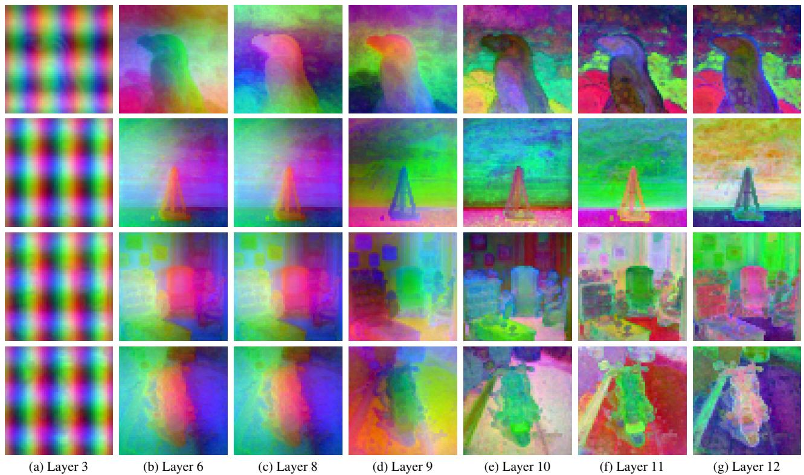  
Figure 7. PCA of DINO ViT features. Layerwise visualization of the DINO ViT features at different layers via principal component analysis (PCA) for four different images. The first three principal components yield red, green, and blue channels. Semantically meaningful information is absent in earlier layers and begins to emerge in intermediate ones, while becoming increasingly rich in deeper layers.

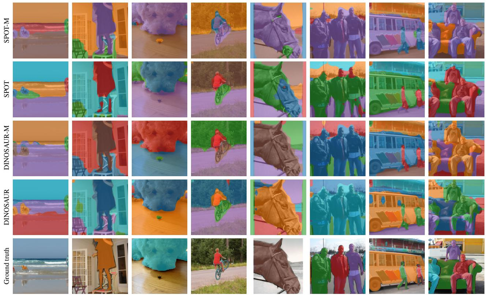  
Figure 8. PASCAL VOC segmentation masks. Images taken from PASCAL VOC, segmented by SPOT-M (top row), SPOT (second row), DINOSAUR-M (third row), and DINOSAUR (fourth row) compared against the ground truth (bottom row). For SPOT and DINOSAUR, segmentation masks derived from the decoder are shown, while for their respective MUFASA variant, segmentation masks from the slot attention module are depicted.

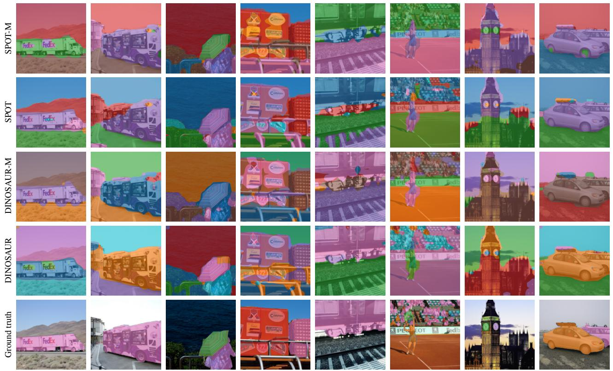  
Figure 9. COCO segmentation masks. Images taken from COCO, segmented by SPOT-M (top row), SPOT (second row), DINOSAUR-M (third row), and DINOSAUR (fourth row) compared against the ground truth (bottom row). For SPOT and DINOSAUR, segmentation masks derived from the decoder are shown, while for their respective MUFASA variant, segmentation masks from the slot attention module are depicted.

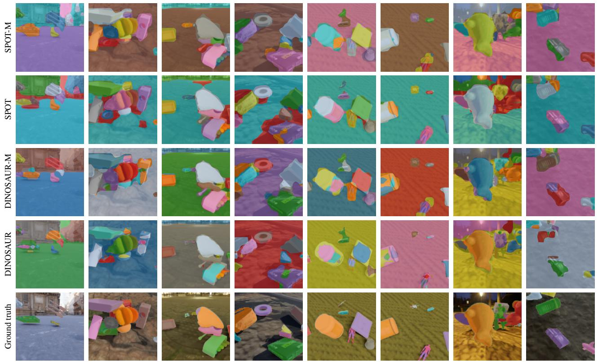  
Figure 10. MOVi-C segmentation masks. Images taken from MOVi-C, segmented by SPOT-M (top row), SPOT (second row), DINOSAUR-M (third row), and DINOSAUR (fourth row) compared against the ground truth (bottom row). For SPOT and DINOSAUR, segmentation masks derived from the decoder are shown, while for their respective MUFASA variant, segmentation masks from the slot attention module are depicted.

## References

[59] Adil Kaan Akan and Yucel Yemez. Slot-guided adaptation of ¨ pre-trained diffusion models for object-centric learning and compositional generation. In ICLR, 2025. ii  
[60] Alexey Dosovitskiy, Lucas Beyer, Alexander Kolesnikov, et al. An image is worth 16x16 words: Transformers for image recognition at scale. In ICLR, 2021. iii  
[61] Baoxiong Jia, Yu Liu, and Siyuan Huang. Improving objectcentric learning with query optimization. In ICLR, 2022. i  
[62] Diederik P. Kingma and Jimmy Ba. Adam: A method for stochastic optimization. In ICLR, 2014. i  
[63] Pinzhuo Tian, Shengjie Yang, Hang Yu, and Alex Kot. Pay attention to the foreground in object-centric learning. In CVPR, pages 30281–30290, 2025. ii