# Scaling Dense Event-Stream Pretraining from Visual Foundation Models

Zhiwen Chen1, Junhui Hou1†, Zhiyu Zhu1, Jinjian Wu2†, and Guangming Shi2 City University of Hong Kong1, Xidian University2

zhiwen.chen@cityu.edu.hk, jh.hou@cityu.edu.hk, jinjian.wu@mail.xidian.edu.cn

https://github.com/zhiwen-xdu/ScaleEvent

Large-scale Cross-modal Dense Distillation   
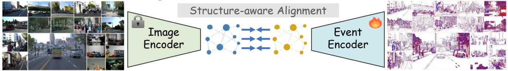

<details>
<summary>flowchart</summary>

```mermaid
graph LR
    A["Image Encoder"] --> B["Structure-aware Alignment"]
    B --> C["Event Encoder"]
    C --> D["Street scenes with vehicles"]
    C --> E["Street scenes with vehicles"]
    C --> F["Street scenes with vehicles"]
    C --> G["Street scenes with vehicles"]
    C --> H["Street scenes with vehicles"]
    C --> I["Street scenes with vehicles"]
    C --> J["Street scenes with vehicles"]
    C --> K["Street scenes with vehicles"]
    C --> L["Street scenes with vehicles"]
    C --> M["Street scenes with vehicles"]
    C --> N["Street scenes with vehicles"]
    C --> O["Street scenes with vehicles"]
    C --> P["Street scenes with vehicles"]
    C --> Q["Street scenes with vehicles"]
    C --> R["Street scenes with vehicles"]
    C --> S["Street scenes with vehicles"]
    C --> T["Street scenes with vehicles"]
    C --> U["Street scenes with vehicles"]
    C --> V["Street scenes with vehicles"]
    C --> W["Street scenes with vehicles"]
    C --> X["Street scenes with vehicles"]
    C --> Y["Street scenes with vehicles"]
    C --> Z["Street scenes with vehicles"]
    C --> AA["Street scenes with vehicles"]
    C --> AB["Street scenes with vehicles"]
    C --> AC["Street scenes with vehicles"]
    C --> AD["Street scenes with vehicles"]
    C --> AE["Street scenes with vehicles"]
    C --> AF["Street scenes with vehicles"]
    C --> AG["Street scenes with vehicles"]
    C --> AH["Street scenes with vehicles"]
    C --> AI["Street scenes with vehicles"]
    C --> AJ["Street scenes with vehicles"]
    C --> AK["Street scenes with vehicles"]
    C --> AL["Street scenes with vehicles"]
    C --> AM["Street scenes with vehicles"]
    C --> AN["Street scenes with vehicles"]
    C --> AO["Street scenes with vehicles"]
    C --> AP["Street scenes with vehicles"]
    C --> AQ["Street scenes with vehicles"]
    C --> AR["Street scenes with vehicles"]
    C --> AS["Street scenes with vehicles"]
    C --> AT["Street scenes with vehicles"]
    C --> AU["Street scenes with vehicles"]
    C --> AV["Street scenes with vehicles"]
    C --> AW["Street scenes with vehicles"]
    C --> AX["Street scenes with vehicles"]
    C --> AY["Street scenes with vehicles"]
    C --> AZ["Street scenes with vehicles"]
    C --> BA["Street scenes with vehicles"]
    C --> BB["Street scenes with vehicles"]
    C --> BC["Street scenes with vehicles"]
    C --> BD["Street scenes with vehicles"]
    C --> BE["Street scenes with vehicles"]
    C --> BF["Street scenes with vehicles"]
    C --> BG["Street scenes with vehicles"]
    C --> BH["Street scenes with vehicles"]
    C --> BI["Street scenes with vehicles"]
    C --> BJ["Street scenes with vehicles"]
    C --> BK["Street scenes with vehicles"]
    C --> BL["Street scenes with vehicles"]
    C --> BM["Street scenes with vehicles"]
    C --> BN["Street scenes with vehicles"]
    C --> BO["Street scenes with vehicles"]
    C --> BP["Street scenes with vehicles"]
    C --> BQ["Street scenes with vehicles"]
    C --> BR["Street scenes with vehicles"]
    C --> BS["Street scenes with vehicles"]
    C --> BT["Street scenes with vehicles"]
    C --> BU["Street scenes with vehicles"]
    C --> BV["Street scenes with vehicles"]
    C --> BW["Street scenes with vehicles"]
    C --> BX["Street scenes with vehicles"]
    C --> BY["Street scenes with vehicles"]
    C --> BZ["Street scenes with vehicles"]
    C --> CA["Street scenes with vehicles"]
    C --> CB["Street scenes with vehicles"]
    C --> CC["Street scenes with vehicles"]
    C --> CD["Street scenes with vehicles"]
    C --> CE["Street scenes with vehicles"]
    C --> CF["Street scenes with vehicles"]
    C --> CG["Street scenes with vehicles"]
    C --> CH["Street scenes with vehicles"]
    C --> CI["Street scenes with vehicles"]
    C --> CJ["Street scenes with vehicles"]
    C --> CK["Street scenes with vehicles"]
    C --> CR["Street scenes with vehicles"]
    C --> CS["Street scenes with vehicles"]
    C --> CT["Street scenes with vehicles"]
    C --> CU["Street scenes with vehicles"]
    C --> CV["Street scenes with vehicles"]
    C --> CW["Street scenes with vehicles"]
    C --> CX["Street scenes with vehicles"]
    C --> CY["Street scenes with vehicles"]
    C --> CZ["Street scenes with vehicles"]
    C --> DA["Street scenes with vehicles"]
    C --> DB["Street scenes with vehicles"]
    C --> DC["Street scenes with vehicles"]
    C --> ED["Street scenes with vehicles"]
    C --> EF["Street scenes with vehicles"]
    C --> GF["Street scenes with vehicles"]
    C --> DG["Street scenes with vehicles"]
    C --> DH["Street scenes with vehicles"]
    C --> DI["Street scenes with vehicles"]
    C --> DJ["Street scenes with vehicles"]
    C --> DK["Street scenes with vehicles"]
    C --> DL["Street scenes with vehicles"]
    C --> DV["Street scenes with vehicles"]
    C --> DVB["Street scenes with vehicles"]
    C --> DVC["Street scenes with vehicles"]
    C --> DVD["Street scenes with vehicles"]
    C --> DVE["Street scenes with vehicles"]
    C --> DVF["Street scenes with vehicles"]
    C --> DVG["Street scenes with vehicles"]
    C --> DVH["Street scenes with vehicles"]
    C --> DVHb["Street scenes with vehicles"]
    C --> DVHc["Street scenes with vehicles"]
    C --> DVHcB["Street scenes with vehicles"]
    C --> DVHcC[Centering traffic from street to road, vehicle traffic from city, road traffic from city, road traffic from city, road traffic from city, road traffic from city, road traffic from city, road traffic from city, road traffic from city, road traffic from city, road traffic from city, road traffic from city, road traffic from city, road traffic from city, road traffic from city, road traffic from city, road traffic from city, road traffic from city, road traffic from city, road traffic from city, road traffic from city, road traffic from city, car traffic from city, car traffic from city, car traffic from city, car traffic from city, car traffic from city, car traffic from city, car traffic from city, car traffic from city, car traffic from city, car traffic from city, car traffic from city, car traffic from city, car traffic from city, car traffic from city, car traffic from city, car traffic from city, car traffic from city, car traffic from city, car traffic from city, car traffic from city, van (car), van (bus), van (train), van (train), van (train), van (train), van (train), van (train), van (train), van (train), van (train), van (train), van (train), van (train), van (train), van (train), van (train), van (train), van (train), van (train), van (train), van (train), van (train), van (train), van (train), van (train), van (train), van (ain) [Figure: 1-3; Figure: 4-5; Figure: 6-7; Figure: 8-9; Figure: 10-11; Figure: 12-13; Figure: 14-15; Figure: 16-17; Figure: 18-18; Figure: 20-19; Figure: 22-23; Figure: 24-24; Figure: 26-25; Figure: 28-26; Figure: 30-27; Figure: 32-27; Figure: 34-28; Figure: 36-29; Figure: 38-30; Figure: 40-31; Figure: 42-32; Figure: 44-33; Figure: 46-34; Figure: 48-35; Figure: 50-36; Figure: 52-37; Figure: 54-38; Figure: 56-39; Figure: 60-40; Figure: 62-41; Figure: 64-42; Figure: 66-43; Figure: 68-44; Figure: 70-45; Figure: 72-46; Figure: 74-47; Figure: 76-48; Figure: 78-49; Figure: 80-50; Figure: 82-51; Figure: 84-52; Figure: 86-53; Figure: 88-54; Figure: 90-55; Figure: 92-56; Figure: 94-57; Figure: 96-58; Figure: 98-59; Figure: 100-60; Figure: 102-61; Figure: 104-62; Figure: 106-63; Figure: 108-64; Figure: 110-65; Figure: 112-66; Figure: 114-67; Figure: 116-68; Figure: 118-69; Figure: 120-70; Figure: 122-71; Figure: 124-72; Figure: 126-73; Figure: 128-74; Figure: 130-75; Figure: 132-76; Figure: 134-77; Figure: 136-78; Figure: 138-79; Figure: 140-80; Figure: 142-81; Figure: 144-82; Figure: 146-83; Figure: 148-84; Figure: 150-85; Figure: 152-86; Figure: 154-87; Figure: 156-88; Figure: 158-89; Figure: 160-90; Figure: 162-91; Figure: 164-92; Figure: 166-93; Figure: 168-94; Figure: 170-95; Figure: 172-96; Figure: 174-97; Figure: 176-98; Figure: 178-99; Figure: 180-100
```
</details>

Fine-grained Event Representation   
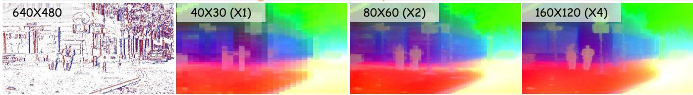

<details>
<summary>text_image</summary>

640X480
40X30 (X1)
80X60 (X2)
160X120 (X4)
</details>

Downstream Tasks   
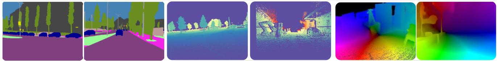

<details>
<summary>natural_image</summary>

Five-panel image showing a street scene with trees, a park, a building, and a color-coded thermal or heat map overlay (no text or symbols)
</details>

Semantic (mIoU ↑8%)

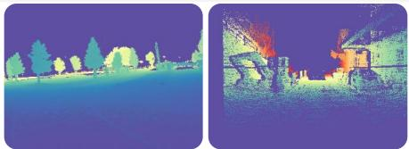

<details>
<summary>natural_image</summary>

Two-panel image showing a night scene with trees and a person near a building, both in purple tones (no text or symbols visible)
</details>

Depth (RMSE ↓58%)

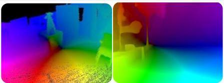

<details>
<summary>natural_image</summary>

Thermal imaging view of a room with heat signatures showing temperature distribution (no text or symbols)
</details>

Motion (EPE ↓3%)   
Figure 1. ScaleEvent: building upon large-scale cross-modal knowledge distillation from visual foundation models, we represent a novel pretraining method to scale up event representations. By anchoring dense cross-modal correspondences with a structure-aware loss, we obtain high-quality, fine-grained event representations that exhibit strong generalization across downstream dense perception tasks.

# Abstract

Learning versatile, fine-grained representations from irregular event streams is pivotal yet nontrivial, primarily due to the heavy annotation that hinders scalability in dataset size, semantic richness, and application scope. To mitigate this dilemma, we launch a novel self-supervised pretraining method that distills visual foundation models (VFMs) to push the boundaries of event representation at scale. Specifically, we curate an extensive synchronized image-event collection to amplify cross-modal alignment. Nevertheless, due to inherent mismatches in sparsity and granularity between image-event domains, existing distillation paradigms are prone to semantic collapse in event representations, particularly at high resolutions. To bridge this gap, we propose to extend the alignment objective to semantic structures provided off-the-shelf by VFMs, indicating a broader receptive

field and stronger supervision. The key ingredient of our method is a structure-aware distillation loss that grounds higher-quality image-event correspondences for alignment, optimizing dense event representations. Extensive experiments demonstrate that our approach takes a great leap in downstream benchmarks, significantly surpassing traditional methods and existing pretraining techniques. This breakthrough manifests in enhanced generalization, superior data efficiency and elevated transferability.

# 1. Introduction

Event cameras, also referred to as bio-inspired vision sensors [16, 19, 51, 62], fundamentally diverge from conventional frame-based cameras, distinguished by their attributes of ultra-low latency, high dynamic range, and minimal power consumption. Although the field of event-based scene understanding remains in its infancy, a rich spectrum of scene-specific applications has flourished [18, 66, 81,

102].

As a prerequisite to comprehensive perception, learning high-quality and fine-grained event representations serves as the essential foundation. The prevalent paradigm relies on fully supervised training with dense event annotations. However, the irregular and labor-intensive nature of dense event labeling [34, 42, 46, 84] severely constrains scalability. To mitigate this heavy annotation burden, several semi-[71, 74, 75] and weakly-supervised [13, 36] approaches have been explored. Despite their promise, these methods remain constrained by limited pseudo-label quality and diversity, as well as ambiguous fine-grained features due to insufficient guidance, ultimately leading to suboptimal generalization in complex scenarios. Another compelling alternative is self-supervised learning, which leverages labelfree pretext objectives to pretrain networks. By transferring established image-domain paradigms [8, 27, 28, 43], event-based self-supervision learning has driven substantial progress. Nevertheless, intrinsic scarcity, discreteness, and sparsity of event data still impede model scaling and finegrained representation quality. In this work, we mitigate these challenges through large-scale cross-modal knowledge distillation from visual foundation models.

Cross-modal knowledge distillation (KD) has recently emerged as a promising approach for unsupervised representation learning. In contrast to event-only selfsupervision methods, which are constrained by intricate pretext task designs to exploit implicit dense patterns, KD furnishes stronger and richer proxy supervision, thereby substantially alleviating dependence on vast unlabeled datasets [52]. By leveraging shared knowledge from pretrained teachers, particularly powerful visual foundation models (VFMs), student models directly inherit strong semantic priors. Building on this insight, we propose a scalable event-based pretraining framework that distills VFMs to advance fine-grained event representations (as Fig. 1). Specifically, we construct an extensive collection of synchronized image-event pairs, spanning diverse conditions, including static versus ego-motion (motions), outdoor versus indoor (scenes), real-world versus simulation (sources), various event cameras (sensors), and multiple resolutions, aggregated from over ten large-scale datasets. This enables comprehensive cross-modal dense distillation, unlocking versatile and transferable event representations.

At its core, cross-modal knowledge distillation hinges on selecting high-quality image-event feature objectives for alignment. Existing methods can be categorized by the granularity at which their losses discriminate representations: pixel-/patch-level [11], or superpixel-/regionlevel [41]. However, due to intrinsic discrepancies in sparsity and granularity between the image and event domains, these distillation losses indicate significant misalignment in representation spaces, leading to semantic collapse in the event domain, particularly at high resolutions. Specifically, pixel-level or patch-level alignment exacerbates mismatches, and superpixel-level methods depend on ambiguous fine-grained groups, amplifying erroneous guidance. To address these mismatches, we eschew meaningless eventimage objectives and extend targets beyond brittle patchand superpixel-level cues to discriminative semantic structures provided off-the-shelf by VFMs. This image-derived semantic structure expands the effective receptive field and delivers stronger and richer supervision, furnishing a comprehensive objective for event-image alignment. Concretely, we introduce a heuristic event-activation mask to regularize distillation toward informative regions, and we propose a structure-aware distillation loss that groups eventimage correspondences over a broader field to suppress spurious matches. To achieve this, our alignment objective imposes structural constraints that steer event features toward image-consistent geometry. We optimize complementary intra- and cross-modal structure losses during pretraining, enabling more reliable representation learning.

Leveraging fine-grained event representations beyond the pretraining phase, our models transfer effectively to diverse dense perception tasks, including semantic segmentation, depth estimation, and optical flow estimation, consistently pushing task accuracy to new heights. Experimentally, this breakthrough significantly enhances performance, fostering improved generalization, superior data efficiency, and greater transferability.

In summary, the main contributions of this work are three-fold:

• we propose a novel self-supervised pretraining method that distills visual foundation models to scale up the boundaries of fine-grained event representations;   
• we revisit event-domian semantic collapse in cross-modal distillation arising from image–event mismatches, and introduce a structure-aware alignment loss to regularize the pretraining process, thereby facilitating more reliable representation learning;   
• we demonstrate state-of-the-art performance across all evaluation settings and downstream dense perception tasks, with consistent gains in generalization, data efficiency, and transferability.

# 2. Related Work

Representation learning underpins visual understanding. Driven by evolving perceptual demands, pretrained models have advanced in scale, versatility, and generalization. From a pretraining perspective, approaches fall into three regimes: fully supervised learning on large-scale data [17, 56], weakly supervised learning with reduced annotation requirements [15, 20, 68], and self-supervised learning that harnesses intrinsic data features without relying on labels [8, 27, 28]. Given the irregular and laborintensive challenges of fine-grained event annotation, we focus our review on recent self-supervised methods across both image and event domains.

# 2.1. Self-Supervised Visual Pre-training

Image Self-Supervision. Self-supervised learning (SSL) has emerged as a powerful paradigm for visual pretraining. By learning directly from raw pixels and exploiting natural co-occurring patterns in images, SSL enables largescale training. Learning without annotations requires auxiliary pretext tasks for surrogate supervision, with the core of SSL being the design of such tasks. Due to the continuous nature of images, early attempts derived supervisory from within the image, such as predicting relative patch position, re-ordering patches, re-colorizing, estimating transformations, or inpainting. Among these, inpainting-based methods gained traction with patch-based vision transformers [17], aiming to reconstruct corrupted regions as denoising autoencoders [28]. Subsequent works [2, 3] extended this idea to latent space, yielding richer representations. Meanwhile, another direction leveraged discriminative signals across images or patches, with advancements in contrastive learning [27], information-theoretic criteria [25], self-distillation [8] and self-clustering [7], all demonstrating strong feature learning. More recently, DINOv3 [67] pushed fine-grained representations and model scale further through extensive data collection and refined regularization.

Event Self-Supervision. By adapting established image pretraining paradigms, such as masked modeling [33, 40], contrastive learning [88], and self-distillation [89], eventbased approaches have substantially advanced the field. Specifically, DMM [33] and MEM [40] employed masked modeling to reconstruct missing event parts. Likewise, ECDDP [89] grouped patch features into discriminative contexts and enforced context alignment. EUDA [35] applied contrastive learning to cluster intra-object features while separating inter-object ones. In parallel, RLI [101] drew inspiration from image denoising to reveal event latents. Moreover, STP [50] improved pretraining efficiency by fusing local-global contexts through prompt strategies. And TESPEC [58] extended temporal modeling techniques from video pretraining to event cameras by exploiting longterm event sequences. Taken together, these advancements have markedly accelerated event representation learning.

Remark. Lessons from image-based self-supervision help event-based methods sidestep many pitfalls. Nevertheless, their fine-grained representation capability remains limited by two unresolved bottlenecks. First, insufficient data scale hinders knowledge emergence. Second, the discrete, sparse nature of event data complicates the design of pretext tasks that reliably exploit intrinsic dense patterns. In this work, we mitigate these challenges via cross-modal knowledge distillation from visual foundation models.

# 2.2. Cross-modal Knowledge Distillation

Knowledge distillation (KD) transfers supervisory signal from a teacher to a student by training the latter to mimic the former’s behavior, such as outputs or intermediate features. Initially applied to compress large networks into smaller ones [31, 52], KD has recently been revisited for semisupervised [4, 86] and unsupervised [53, 55, 65, 82, 93] representation learning.

Image-to-Event Knowledge Distillation. Our work relates to KD from a pre-trained image teacher into an event student network. Early methods, such as E2VID [64], extracted event representations by reconstructing events into grayscale images. This insight inspired later works like Evdistill [75], which bridges unpaired image-event data via bidirectional reconstruction, and ESS [71], which aligns event features to reconstructions to capture pixel-level detail. In parallel, ECDP [88] employed an image-event contrastive objective to learn scene-level context. With the advent of pre-trained vision-language models (e.g., CLIP [63]), subsequent works [12, 44, 49, 83, 85, 90, 96] advanced open-world event understanding through crossmodal distillation, though remaining confined to scene-level perception. More recently, fine-grained image-event distillation has gained traction. For instance, EventSAM [11] distilled SAM [39] to acquire semantic-agnostic, patchlevel representations. DepthAnyEvent [4] and Event-DAM [100] aligned proxy depth from DAv2 [87] to derive stereo-aware features. And OpenESS [41] grouded superpixel-level multi-modal features by combining expert models (SAM + CLIP). Despite substantial progress, several limitations remain, namely, constrained distillation scale, task-specific objectives that impede scalability, and feature degradation arising from event heterogeneity, all of which we address through a unified dense pretraining framework.

Remark. Event-only self-supervision demands vast data with auxiliary pretext tasks to uncover intrinsic patterns. In contrast, cross-modal KD enables the student to inherit strong priors and richer proxy supervision from a pretrained teacher, substantially reducing reliance on large unlabeled datasets [52]. Moreover, the required multi-modal data are readily available from abundant unlabeled cross-modal collections or synthesized via VID2E simulation [22, 32], making cross-modal KD a feasible and scalable paradigm for event representation pretraining.

# 3. Methodology

Our goal is to learn expressive fine-grained event representations through self-supervised distillation from vision foundation models such as DINOv3 [67], leveraging the availability of aligned image and event data, without annotation requirements.

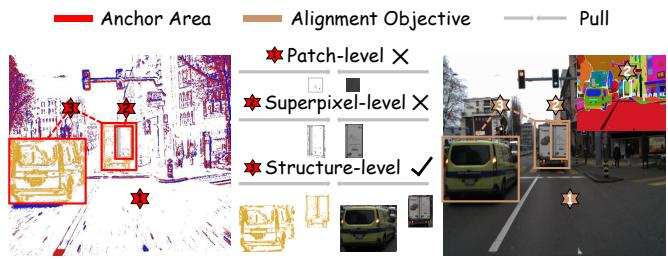

<details>
<summary>text_image</summary>

Anchor Area
Alignment Objective
Pull
Patch-level ×
Superpixel-level ×
Structure-level ✓
</details>

Figure 2. Illustration of event-image feature alignment across granularities. Patch-level alignment exacerbates cross-modal mismatches, superpixel grouping is ambiguous, while semantic structure grounds superior event–image correspondences.

# 3.1. Preliminaries

Synchronized Event-image Data. Let $\mathcal { E } = \{ ( x , y , p , t ) \}$ P $\bar { \mathbb R ^ { N \times 4 } }$ represent a raw event set captured in a scene by an event camera during the time interval $t \to { t + \Delta t }$ . The spatially and temporally synchronized image, denoted as $\pmb { \dot { I } } \in \mathbb { R } ^ { \pmb { \dot { H } } \times W \times 3 }$ , is captured by an RGB camera in the same scene at time t. Notably, the varying distribution of events challenges the stable sampling of edge-preserving event sets that align well with images. To enhance event input, we employ the motion-adaptive sampling algorithm in CrossEI [10]. Furthermore, to make events compatible with the vision foundation models, we aggregate the event set $\mathcal { E }$ into a three-dimensional volume $\pmb { { E } } \in \mathbb { R } ^ { \mathbf { \check { H } } \times W \times B }$ , following the setting in [11, 99]. In our experiment, we set $B = 3$ .

Cross-modal Distilling. To this end, we exploit the aligned and synchronized event and image data. Let $\begin{array} { r l } { \mathbf { K } _ { n } } & { { } = } \end{array}$ $\mathbf { F } _ { \theta _ { e } } \bigl ( \bar { E _ { n } } \bigr ) \ : \ \mathbb { R } ^ { H \times W \times B } \ \longmapsto \ \mathbb { R } ^ { H ^ { \prime } \times \check { W ^ { \prime } } \times D }$ be an event-based feature encoder with trainable parameters $\theta _ { e } ,$ which takes as input an event volume ${ \pmb E } _ { n }$ and outputs D-dimensional tokens ${ \bf K } _ { n }$ of downsampled spatial sizes $H ^ { \prime }$ and $W ^ { \prime }$ . Our goal is to pretrain this event encoder without accessing any annotations. Meanwhile, we integrate pre-trained DINOv3’s image encoder Qn “ Gθ pInq : RHˆWˆ3 ÞÑ RH1ˆW1ˆD $\mathbf { Q } _ { n } = \mathbf { G } _ { \theta _ { i } } ( { \pmb I } _ { n } ) \overset { \smile } { \ } \mathbb { R } ^ { H \times W \times 3 } \mapsto \mathbb { R } ^ { H ^ { \prime } \times W ^ { \prime } \times D }$ into distillation framework and keep the parameters $\theta _ { i }$ fixed. In this context, we train $\mathbf { F } _ { \theta _ { e } } ( \cdot )$ by aligning the event features K with the pre-trained image features $\mathbf { Q } .$ In this work, we adopt a simple L1 loss for distillation:

$$
\mathcal {L} _ {1 _ {1}} (\mathbf {K}, \mathbf {Q}) = \frac {1}{N} \sum_ {n = 1} ^ {N} \| \mathbf {K} _ {n} - \mathbf {Q} _ {n} \| _ {1}, \tag {1}
$$

where N is the number of cross-modal sample pairs in a mini-batch, $\mathbf { K } _ { n } .$ , and $\mathbf { Q } _ { n }$ are sample-wise tokens.

# 3.2. Structure-aware Distillation Loss

Event-domain Semantic Collapse. Fundamentally, crossmodal knowledge distillation depends on well-posed image-event alignment objectives. As discussed in Sec. 2, fine-grained schemes are typically organized by loss granularity: patch-level or superpixel-level. However, the sparsity of event data versus the dense, texture-rich nature of images creates significant mismatches that render rigid correspondence losses prone to over-coupling (as illustrated in Fig. 2). As revealed in Fig. 4, this over-coupling distorts the representational geometry—suppressing local discriminability and precipitates semantic collapse of fine-grained event representations, an effect that intensifies with increasing resolution. To remedy these mismatches, we eschew meaningless image-event alignment objectives and extend the targets beyond patch- and superpixel-level cues to more discriminative semantic structures. Accordingly, we introduce an event-based activation mask that regularizes the distillation loss to favor informative image-event pairings, and we design a structure-aware distillation loss that groups feature correspondences across a broader receptive field, suppressing spurious matches.

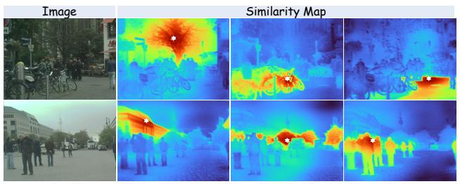

<details>
<summary>text_image</summary>

Image
Similarity Map
</details>

Figure 3. Cosine similarity maps obtained with DINOv3 output features (anchored at the distinct white stars). The image features exhibit coherent grouping induced by a strong off-the-shelf semantic structure.

Activation Mask Constraint. The sparsity of event data undermines fine-grained objectives: many event volume patches contain few or no events, yielding misleading alignment. We therefore concentrate on distilling high-activation event regions, where the signal is concentrated and motion texture is clearer, thereby improving supervision fidelity. Concretely, for each sampled event volume $\textbf { \textit { E } } \in$ $\mathbb { R } ^ { H \times W \times B }$ , we compute an event density map $\boldsymbol { D } \in \mathbb { R } ^ { H ^ { \prime } \times W ^ { \prime } }$ $\begin{array} { r l r } {  { \dot { D } } ( \mu , \nu ) } & { { } = } & { \sum _ { b = 1 } ^ { B } \sum _ { ( i , j ) \in  { \mathcal { P } } ( \mu , \nu ) } \phi \bigl (  { \mathbf { \bar { E } } } ( i , j , b ) \bigr ) } \end{array}$ poral ax, where $\mathcal { P }$ denotes the pixel indices that correspond to the patch at position $( \mu , \nu )$ , and $\phi ( \cdot )$ maps activations to nonnegative counts (e.g., absolute value). We then derive a binary mask $\mathbf { M } \in \{ 0 , 1 \} ^ { H ^ { \prime } \times W ^ { \prime } }$ via applying a threshold τ to the density map:

$$
\mathbf {M} (\mu , \nu) = \left\{ \begin{array}{l l} \mathbf {1}, & \text { if } D (\mu , \nu) \geqslant \tau \\ \mathbf {0}, & \text { otherwise } \end{array} \right. \tag {2}
$$

with τ “ 64 controlling the high-activation area retained. This mask focuses the distillation objective on informative image-event feature pairs while suppressing spurious alignment in empty or low-activity regions.

Structure-aware Alignment Loss. Event data are dominated by dynamic edges. Although the interiors of object regions are sparse and information-poor, a larger receptive field reveals that these edge fragments coalesce into semantically coherent wholes. Treating these coherent structures as distillation objectives provides a principled bridge between discrete, sparse event data and dense, texture-rich images. As depicted in Fig. 3, vision foundation models furnish an off-the-shelf prior, hereafter, semantic structure, that encodes similarity relations among all features (e.g., a pairwise affinity over tokens/features). This structure captures both local affinities and global dependencies, effectively enlarging the receptive field and delivering stronger and more stable supervision. Leveraging image-derived semantic structure thus supplies a comprehensive objective for aligning event and image representations.

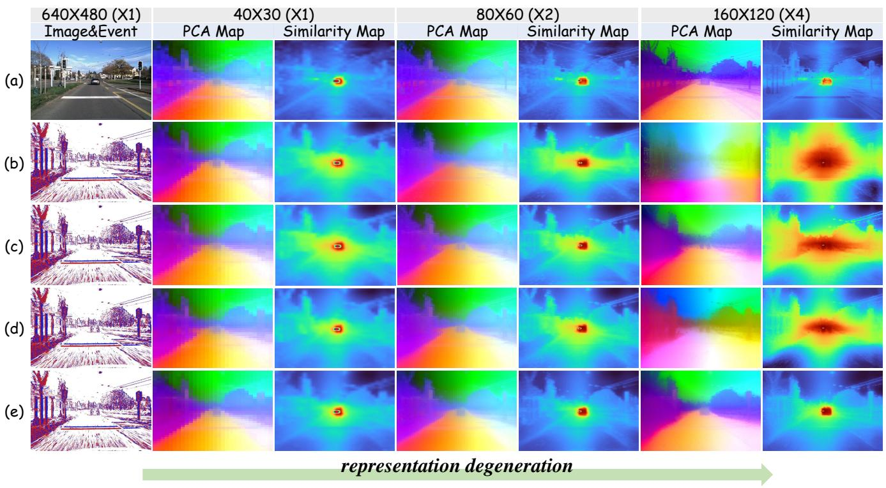

<details>
<summary>heatmap</summary>

| Image&Event | 640X480 (X1) PCA Map | 640X480 (X1) Similarity Map | 40X30 (X1) PCA Map | 40X30 (X1) Similarity Map | 80X60 (X2) PCA Map | 80X60 (X2) Similarity Map | 160X120 (X4) PCA Map | 160X120 (X4) Similarity Map |
| --- | --- | --- | --- | --- | --- | --- | --- | --- |
| (a) | ~0.5 | ~0.5 | ~0.5 | ~0.5 | ~0.5 | ~0.5 | ~0.5 | ~0.5 |
| (b) | ~0.5 | ~0.5 | ~0.5 | ~0.5 | ~0.5 | ~0.5 | ~0.5 | ~0.5 |
| (c) | ~0.5 | ~0.5 | ~0.5 | ~0.5 | ~0.5 | ~0.5 | ~0.5 | ~0.5 |
| (d) | ~0.5 | ~0.5 | ~0.5 | ~0.5 | ~0.5 | ~0.5 | ~0.5 | ~0.5 |
| (e) | ~0.5 | ~0.5 | ~0.5 | ~0.5 | ~0.5 | ~0.5 | ~0.5 | ~0.5 |
representation degeneration
</details>

Comparison of dense event features of 不同的蒸馏策略. 随着深入分辨率的提升，事件表征会出现不同程度的退化： PCA maps become less localized Figure 4. Comparison of dense event features under different distillation strategies. All features are produced by a DINOv3-ViT-B and the similarity maps (marked with a red point) become noisier. 所有的特征由DINOv3-ViTB模型和不参与蒸馏的测试样本输出. From up to down: (a) model. Left to right: as spatial resolution increases, event representations degrade to varying degrees. PCA maps become less localized, image 表征; (b)\~(e)表示由不同蒸馏策略得到的事件表征, (a) patch-level 蒸馏, (b) superpixel-level 蒸馏, (c) patch-level 蒸馏 w/ Event Activation Mask, (d) and similarity maps (anchored at the red dot) become noisier. Top to bottom: (a) image features; (b) patch-level distillation; (c) superpixellevel distillation; (d) patch-level distillation + event activation mask; (e) patch-level distillation + event activation mask + structure-aware regularization (Our method). A more detailed feature analysis is provided in the supplementary materials.

Accordingly, we distill this image-derived semantic structure into the event domain to ameliorate the inherent mismatch between the two modalities. We propose a regularization term that enforces structural consistency between the event and image representation spaces by penalizing discrepancies between their similarity graphs. The similarity graph is a weighted, undirected graph whose nodes are feature anchors (event or image tokens) and whose edges encode intra-modal pairwise affinities. In parallel, we use the event activation mask to select the anchored event feature, which suppresses background noise and strengthens the common semantic structure used for cross-modal alignment. Let ${ \bf K } _ { n }$ and $\mathbf { Q } _ { n }$ denote event and image features of sample n within the same batch, and ${ { \bf { M } } _ { n } }$ the corresponding event activation mask, with masked features denoted as $^ { \ast } .$ Using the shorthand $\mathbf { K } _ { n } ^ { * } = \mathbf { K } _ { n } \odot \mathbf { M } _ { n }$ and $\mathbf { Q } _ { n } ^ { * } = \mathbf { Q } _ { n } \odot \mathbf { M } _ { n }$ , the intra-modal structure loss is defined as

$$
\mathcal {L} _ {\mathrm{is}} (\mathbf {K} ^ {*}, \mathbf {Q} ^ {*}) = \frac {1}{N} \sum_ {n = 1} ^ {N} \| (\mathbf {K} _ {n} ^ {*}) (\mathbf {K} _ {n} ^ {*}) ^ {T} - (\mathbf {Q} _ {n} ^ {*}) (\mathbf {Q} _ {n} ^ {*}) ^ {T} \| _ {1}, \tag {3}
$$

To further reinforce structural consistency, we also penalize discrepancies between interactive similarity graphs that contrast predicted event-to-image affinities with source image-to-image affinities. This formulation compels each event feature’s similarity profile over all image features to mirror that of its paired image anchor, thereby aligning the event–image geometry with the image-domain structure. The cross-modal structure loss is as

$$
\mathcal {L} _ {\mathrm{cs}} (\mathbf {K} ^ {*}, \mathbf {Q} ^ {*}) = \frac {1}{N} \sum_ {n = 1} ^ {N} \| (\mathbf {K} _ {n} ^ {*}) (\mathbf {Q} _ {n} ^ {*}) ^ {T} - (\mathbf {Q} _ {n} ^ {*}) (\mathbf {Q} _ {n} ^ {*}) ^ {T} \| _ {1}, \tag {4}
$$

Combining the masked L1 distillation term with the cross-modal and interactive structure-aware losses, we optimize the event encoder under the following objective:

$$
\mathcal {L} _ {d i s} = \mathcal {L} _ {\mathrm{l} _ {1}} (\mathbf {K} ^ {*}, \mathbf {Q} ^ {*}) + \lambda_ {\mathrm{is}} \mathcal {L} _ {\mathrm{is}} (\mathbf {K} ^ {*}, \mathbf {Q} ^ {*}) + \lambda_ {\mathrm{cs}} \mathcal {L} _ {\mathrm{cs}} (\mathbf {K} ^ {*}, \mathbf {Q} ^ {*}), \tag {5}
$$

where $\lambda _ { \mathrm { i s } } = 1 0$ and $\lambda _ { \mathrm { c s } } = 4$ are the regularization factors.

Table 1. Comparative study of different semantic segmentation methods under the linear probing (LP), few-shot fine-tuning, and full supervision (Full) settings, respectively, on the DDD17-Seg and DSEC-Semantic datasets. All mIoU scores are in percentage (%). The best mIoU scores from each learning configuration are highlighted in bold. 

<table><tr><td rowspan="2">Method</td><td rowspan="2">Backbone</td><td colspan="6">DDD17-Seg</td><td colspan="6">DSEC-Semantic</td></tr><tr><td>LP</td><td>1%</td><td>5%</td><td>10%</td><td>20%</td><td>Full</td><td>LP</td><td>1%</td><td>5%</td><td>10%</td><td>20%</td><td>Full</td></tr><tr><td>MaskCLIP [95]</td><td>ViT-B/16</td><td>31.91</td><td>53.91</td><td>56.27</td><td>59.32</td><td>59.97</td><td>61.27</td><td>33.08</td><td>33.89</td><td>37.03</td><td>38.83</td><td>42.40</td><td>55.01</td></tr><tr><td>FC-CLIP [91]</td><td>ConvNeXt-L</td><td>54.07</td><td>56.38</td><td>58.50</td><td>60.05</td><td>60.85</td><td>62.01</td><td>43.00</td><td>39.12</td><td>43.71</td><td>44.09</td><td>47.77</td><td>55.67</td></tr><tr><td>OpenESS [41]</td><td>E2VID</td><td>55.61</td><td>57.58</td><td>59.07</td><td>61.03</td><td>61.78</td><td>63.00</td><td>44.26</td><td>41.41</td><td>44.97</td><td>46.25</td><td>48.28</td><td>57.21</td></tr><tr><td>Ours</td><td>ViT-B/16</td><td>57.87</td><td>57.23</td><td>59.54</td><td>61.45</td><td>62.06</td><td>62.81</td><td>58.42</td><td>54.37</td><td>62.82</td><td>63.88</td><td>64.15</td><td>64.93</td></tr></table>

# 4. Experiments

# 4.1. Pretraining Setup

Pretraining Datasets. To pretrain a versatile and reliable event-based feature encoder $\mathbf { F } _ { \theta _ { e } }$ and scale up its parameters, we construct an extensive collection of synchronized image-event datasets, categorized by their source. Realworld: DDD17 [47], MVSEC [97], DSEC [23], M3ED [9], VisEvent [78], CoeSot [72], FEVD [38], HighREV [69], SEE-600K [57]. VID2E synthetic [22]: GoPro [59], SDSD [76], DECD [64], KITTI [24], Cityscapes [14], Waymo [70], DAVIS 2017 [61]. Due to the varying spatial resolutions of these datasets, we adopt the following processing strategy: setting the distillation resolution to 640ˆ480, consolidating lower-resolution data and cropping higher-resolution data. After a series of data processing steps, we obtain a data collection of approximately 500K image-event pairs, all containing rich scene details. More dataset details are in the supplementary materials.

Feature Encoders. We harness the state-of-the-art visual foundation model, DINOv3 [67], as the teacher model for distillation. Our pretraings involve the ViT-S, ViT-B, and ViT-L versions, with a patch size of 16. For both the image and event processing branches, we employ identical feature encoders for knowledge distillation, initialized with DINOv3’s pretrained weights.

Implementation Details. Our method is implemented using PyTorch. During pretraining, we fine-tune all parameters of the feature encoder. We utilize AdamW for optimization, setting the initial learning rate at $5 \times 1 0 ^ { - 6 }$ , with a momentum of 0.9 and a weight decay of $1 \times 1 0 ^ { - 4 }$ . The event encoder is pretrained for 10 epochs on four NVIDIA A6000 GPUs, with 100K event-image pairs per epoch. No data augmentation strategies are applied during pretraining.

# 4.2. Evaluation

# 4.2.1. Transfer Protocol

Task Decoders. We evaluate the pretrained event feature encoder across diverse dense perception tasks, including semantic segmentation, monocular depth estimation, and optical flow estimation. By leveraging fine-grained event representations that closely align with image features,

Table 2. Quantitative comparison of semantic segmentation on the DDD17-Seg [1] and DSEC-Semantic dataset [71] datasets. All scores are in percentage (%). The best are marked with bold, and the second best are marked with underline. 

<table><tr><td rowspan="2">Method</td><td rowspan="2">Present at</td><td rowspan="2">Backbone</td><td colspan="2">DDD17</td><td colspan="2">DSEC</td></tr><tr><td>Acc ↑</td><td>mIoU ↑</td><td>Acc ↑</td><td>mIoU ↑</td></tr><tr><td colspan="7">RGB initialization + Fully-Supervised</td></tr><tr><td>Ev-SegNet [1]</td><td>CVPRW&#x27;19</td><td>Xception</td><td>89.76</td><td>54.81</td><td>88.61</td><td>51.76</td></tr><tr><td>E2VID [64]</td><td>TPAMI&#x27;19</td><td>ResNet-18</td><td>85.84</td><td>48.47</td><td>80.06</td><td>44.08</td></tr><tr><td>DTL [74]</td><td>ICCV&#x27;21</td><td>ResNet-50</td><td>-</td><td>58.80</td><td>-</td><td>-</td></tr><tr><td>PVT-FPN [77]</td><td>ICCV&#x27;21</td><td>ResNet-34</td><td>94.28</td><td>53.89</td><td>-</td><td>-</td></tr><tr><td>EVDistill [75]</td><td>CVPR&#x27;21</td><td>ResNet-34</td><td>-</td><td>58.02</td><td>-</td><td>-</td></tr><tr><td>MaskCLIP [95]</td><td>ECCV&#x27;22</td><td>ViT-B/16</td><td>90.50</td><td>61.27</td><td>89.81</td><td>55.01</td></tr><tr><td>ESS [71]</td><td>ECCV&#x27;22</td><td>E2VID</td><td>88.43</td><td>53.09</td><td>84.17</td><td>45.38</td></tr><tr><td>ESS-Sup [71]</td><td>ECCV&#x27;22</td><td>E2VID</td><td>91.08</td><td>61.37</td><td>89.37</td><td>53.29</td></tr><tr><td>HMNet [26]</td><td>CVPR&#x27;23</td><td>HMNet-L1</td><td>-</td><td>-</td><td>89.80</td><td>55.00</td></tr><tr><td>EvSegformer [34]</td><td>TIP&#x27;23</td><td>MiT-B1</td><td>94.72</td><td>54.41</td><td>-</td><td>-</td></tr><tr><td>FC-CLIP [91]</td><td>NeurIPS&#x27;23</td><td>CNeXt-L</td><td>90.68</td><td>62.01</td><td>89.97</td><td>55.67</td></tr><tr><td>HALSIE [6]</td><td>WACV&#x27;24</td><td>SNN-ANN</td><td>92.50</td><td>60.66</td><td>89.01</td><td>52.43</td></tr><tr><td>ESEG [94]</td><td>AAAI&#x27;25</td><td>MiT-B1</td><td>90.68</td><td>59.97</td><td>91.47</td><td>57.55</td></tr><tr><td>KWYAF [48]</td><td>AAAI&#x27;25</td><td>MiT-B0</td><td>91.32</td><td>62.41</td><td>90.87</td><td>57.75</td></tr><tr><td colspan="7">Event Pretraining + Fully-Supervised</td></tr><tr><td>ECDP [88]</td><td>ICCV&#x27;23</td><td>ResNet-50</td><td>-</td><td>59.15</td><td>-</td><td>59.16</td></tr><tr><td>ECDDP [89]</td><td>ECCV&#x27;24</td><td>ViT-S/16</td><td>-</td><td>55.73</td><td>-</td><td>56.38</td></tr><tr><td>ECDDP [89]</td><td>ECCV&#x27;24</td><td>Swin-T/7</td><td>-</td><td>62.56</td><td>-</td><td>61.25</td></tr><tr><td>OpenESS [41]</td><td>CVPR&#x27;24</td><td>ResNet-50</td><td>-</td><td>57.01</td><td>-</td><td>55.01</td></tr><tr><td>OpenESS [41]</td><td>CVPR&#x27;24</td><td>E2VID</td><td>91.05</td><td>63.00</td><td>90.21</td><td>57.21</td></tr><tr><td>STP [50]</td><td>ICCV&#x27;25</td><td>ResNet-50</td><td>-</td><td>62.13</td><td>-</td><td>61.29</td></tr><tr><td>STP [50]</td><td>ICCV&#x27;25</td><td>Swin-T/7</td><td>-</td><td>63.29</td><td>-</td><td>62.05</td></tr><tr><td>Ours</td><td>-</td><td>ViT-S/16</td><td>91.39</td><td>59.64</td><td>90.76</td><td>61.12</td></tr><tr><td>Ours</td><td>-</td><td>ViT-B/16</td><td>92.21</td><td>62.81</td><td>92.00</td><td>64.93</td></tr><tr><td>Ours</td><td>-</td><td>ViT-L/16</td><td>92.62</td><td>65.08</td><td>93.10</td><td>69.65</td></tr></table>

our encoder seamlessly integrates with image-domain decoders, enhancing scene perception. Specifically, we employ EoMT [37] for semantic decoding, DAv2 [87] for depth estimation, and SEA-RAFT [79] for optical flow prediction. During downstream fine-tuning, all decoders are initialized from their released pretrained weights.

Benchmark Setup. To probe data efficiency and transferability of our learned representations, we assess downstream performance. Beyond full supervision, we examine the linear probing (LP) and few-shot fine-tuning protocols tailored to tight parameter and annotation budgets. Under the linear probing setting, we optimize only the added task head and keep the weights of feature encoder frozen. In few-shot fine-tuning, we assume a very limited annotation budget, e.g., only 1%, 5%, 10%, or 20% of the training set, with class-balanced, fixed-interval sampling and consistent optimization across methods. Together, these regimes assess data efficiency, robustness under limited resources, and cross-task transferability. More implementation details are in the supplementary materials.

Table 3. Quantitative comparison of monocular depth estimation on the MVSEC-Depth [97] and DSEC-Depth [23] datasets. The best are marked with bold, and the second best are marked with underline. 

<table><tr><td rowspan="2">Method</td><td rowspan="2">Present at</td><td rowspan="2">Backbone</td><td colspan="6">MVSEC-Depth</td><td colspan="6">DSEC-Depth</td></tr><tr><td> $\delta_1 \uparrow$ </td><td> $\delta_2 \uparrow$ </td><td> $\delta_3 \uparrow$ </td><td>AbsRel↓</td><td>RMSE↓</td><td>RMSE log↓</td><td> $\delta_1 \uparrow$ </td><td> $\delta_2 \uparrow$ </td><td> $\delta_3 \uparrow$ </td><td>AbsRel↓</td><td>RMSE↓</td><td>RMSE log↓</td></tr><tr><td colspan="15">RGB initialization + Fully-Supervised</td></tr><tr><td>E2Depth [30]</td><td>3DV&#x27;20</td><td>ResNet-18</td><td>0.432</td><td>0.717</td><td>0.868</td><td>0.420</td><td>7.268</td><td>0.455</td><td>0.409</td><td>0.719</td><td>0.891</td><td>0.395</td><td>13.258</td><td>0.412</td></tr><tr><td>EReFormer [54]</td><td>TVSVT&#x27;24</td><td>Swin-T</td><td>0.391</td><td>0.652</td><td>0.810</td><td>0.551</td><td>8.373</td><td>0.523</td><td>0.524</td><td>0.824</td><td>0.945</td><td>0.297</td><td>11.608</td><td>0.334</td></tr><tr><td colspan="15">Event Pretraining + Fully-Supervised</td></tr><tr><td>ECDP [88]</td><td>ICCV&#x27;23</td><td>ViT-S/16</td><td>0.476</td><td>0.772</td><td>0.863</td><td>0.496</td><td>7.680</td><td>0.506</td><td>0.528</td><td>0.818</td><td>0.938</td><td>0.324</td><td>11.473</td><td>0.376</td></tr><tr><td>ECDDP [89]</td><td>ECCV&#x27;24</td><td>ViT-S/16</td><td>0.513</td><td>0.762</td><td>0.871</td><td>0.428</td><td>6.957</td><td>0.469</td><td>0.545</td><td>0.857</td><td>0.959</td><td>0.263</td><td>9.477</td><td>0.294</td></tr><tr><td>DepthAnyEvent-R [4]</td><td>ICCV&#x27;25</td><td>ViT-S/16</td><td>0.489</td><td>0.751</td><td>0.878</td><td>0.365</td><td>6.465</td><td>0.483</td><td>0.691</td><td>0.930</td><td>0.981</td><td>0.191</td><td>8.880</td><td>0.266</td></tr><tr><td>Ours</td><td>-</td><td>ViT-S/16</td><td>0.577</td><td>0.800</td><td>0.914</td><td>0.289</td><td>6.145</td><td>0.378</td><td>0.824</td><td>0.965</td><td>0.993</td><td>0.131</td><td>4.564</td><td>0.184</td></tr><tr><td>Ours</td><td>-</td><td>ViT-B/16</td><td>0.594</td><td>0.811</td><td>0.922</td><td>0.280</td><td>5.891</td><td>0.364</td><td>0.872</td><td>0.978</td><td>0.996</td><td>0.109</td><td>4.032</td><td>0.158</td></tr><tr><td>Ours</td><td>-</td><td>ViT-L/16</td><td>0.625</td><td>0.834</td><td>0.934</td><td>0.268</td><td>5.554</td><td>0.343</td><td>0.896</td><td>0.983</td><td>0.997</td><td>0.101</td><td>3.694</td><td>0.144</td></tr></table>

Table 4. Comparative study of different monocular depth estimation methods under the linear probing (LP) and few-shot fine-tuning, and full supervision (Full) settings, respectively, on the MVSEC-Depth and DSEC-Depth datasets. The best RMSE from each learning configuration are highlighted in bold. 

<table><tr><td rowspan="2">Method</td><td rowspan="2">Backbone</td><td colspan="6">MVSEC-Depth</td><td colspan="6">DSEC-Depth</td></tr><tr><td>LP</td><td>1%</td><td>5%</td><td>10%</td><td>20%</td><td>Full</td><td>LP</td><td>1%</td><td>5%</td><td>10%</td><td>20%</td><td>Full</td></tr><tr><td>DepthAnyEvent-R [4]</td><td>ViT-S/16</td><td>7.473</td><td>7.542</td><td>7.261</td><td>6.794</td><td>6.637</td><td>6.465</td><td>10.584</td><td>10.347</td><td>9.898</td><td>9.534</td><td>9.065</td><td>8.880</td></tr><tr><td>Ours</td><td>ViT-S/16</td><td>6.756</td><td>6.930</td><td>6.712</td><td>6.477</td><td>6.352</td><td>6.145</td><td>4.861</td><td>4.983</td><td>4.751</td><td>4.728</td><td>4.694</td><td>4.564</td></tr></table>

# 4.2.2. Semantic Segmentation

Settings. Following the setup of OpenESS [41], we evaluate the DDD17-Seg [1] and DSEC-Semantic [71] datasets for semantic segmentation. Mean interaction over union (mIoU) and average class accuracy (Acc) are used as evaluation metrics.

Results. We perform a thorough comparison of our pretrained model with RGB-based transfer methods and other event-domain pretraining approaches. As shown in Tab. 2, our method achieves the highest mIoU of 65.08%, and 69.65% on the DDD17-Seg and DSEC-Semantic datasets, respectively, surpassing all event-domain segmentation models. Notably, on DSEC-Semantic, we outperform the recent SOTA model STP [50] by 7.6%, advancing the boundaries of event-based semantic representation. In linear probing, our method reaches an mIoU of 58.42%, surpassing the best RGB-transfer method, KWYAF [48] at 57.75% (Tab. 1). For few-shot fine-tuning on DSEC-Semantic, we attain 62.82% mIoU with just 5% of the training data, outperforming OpenESS [41] at 57.21%. This trend persists across other data proportions, with our method consistently leading or closely competing with the best results. Consistent gains over prior art attest to the efficacy and superiority of our pretraining strategy.

# 4.2.3. Depth Estimation

Settings. Following the setup of DepthAnyEvent [4], we evaluate on the MVSEC-Depth [97] and DSEC-Depth datasets [23] for monocular depth estimation. The depth error metrics are absolute relative error (AbsRel), root mean squared error (RMSE), logarithmic RMSE (RMSE log), and accuracy with different thresholds $( \delta ~ < ~ 1 . 2 5 ~ ( \delta _ { 1 } )$ , $\delta < 1 . 2 5 ^ { 2 } ( \delta _ { 2 } )$ , and $\delta < 1 . 2 5 ^ { 3 } ( \delta _ { 3 } )$ ).

Results. As shown in Tab. 3, our method achieves the lowest depth estimation error, significantly outperforming current arts. Notably, on DSEC-Depth, we achieve 99.7% $\delta _ { 3 }$ accuracy and an RMSE of 3.694. Using the same backbone, we reduce the RMSE of DepthAnyEvent-R [4] from 8.880 to 4.564, marking a substantial improvement. As shown in Tab. 4, the linear probing results highlight the pretrained model’s robust event representation capability, with freezing the feature encoder having minimal impact on depth estimation. In the few-shot fine-tuning setting, we achieve an RMSE of 4.983% with only 1% of the annotation data. These consistent improvements over prior work underscore the efficacy of task-agnostic pretraining in capturing richer domain knowledge.

Table 5. Ablative study results of the proposed key components. Distill denotes the knowledge distillation mark; Mask refers to activation mask regularization; IS Loss denotes the intra-modal structure loss; CS Loss denotes the cross-modal structure loss; (a) indicates the use of a image-domain pretrained model; (b) serves as our baselines; (f) denotes our complete cross-modal distillation framework. 

<table><tr><td rowspan="2">Exp.</td><td rowspan="2">Distill</td><td rowspan="2">Mask</td><td rowspan="2">IS Loss</td><td rowspan="2">CS Loss</td><td colspan="2">DDD17-Seg</td><td colspan="2">DSEC-Semantic</td><td colspan="2">MVSEC-Depth</td><td colspan="2">DSEC-Depth</td></tr><tr><td>Acc↑</td><td>mIoU↑</td><td>Acc↑</td><td>mIoU↑</td><td> $\delta_1$  ↑</td><td>RMSE ↓</td><td> $\delta_1$  ↑</td><td>RMSE ↓</td></tr><tr><td>(a)</td><td></td><td></td><td></td><td></td><td>91.39</td><td>59.60</td><td>91.94</td><td>64.31</td><td>0.593</td><td>6.635</td><td>0.846</td><td>4.424</td></tr><tr><td>(b)</td><td>✓</td><td></td><td></td><td></td><td>92.16</td><td>62.41</td><td>92.74</td><td>66.17</td><td>0.609</td><td>6.114</td><td>0.875</td><td>4.063</td></tr><tr><td>(c)</td><td>✓</td><td>✓</td><td></td><td></td><td>92.32</td><td>62.67</td><td>92.82</td><td>66.54</td><td>0.611</td><td>5.922</td><td>0.876</td><td>4.025</td></tr><tr><td>(d)</td><td>✓</td><td>✓</td><td>✓</td><td></td><td>92.60</td><td>64.84</td><td>93.08</td><td>69.20</td><td>0.620</td><td>5.684</td><td>0.889</td><td>3.792</td></tr><tr><td>(e)</td><td>✓</td><td>✓</td><td></td><td>✓</td><td>92.51</td><td>63.62</td><td>93.01</td><td>68.68</td><td>0.614</td><td>5.786</td><td>0.881</td><td>3.870</td></tr><tr><td>(f)</td><td>✓</td><td>✓</td><td>✓</td><td>✓</td><td>92.62</td><td>65.08</td><td>93.10</td><td>69.65</td><td>0.625</td><td>5.554</td><td>0.896</td><td>3.694</td></tr></table>

# 4.2.4. Optical Flow Estimation

Table 6. Quantitative comparison of optical flow estimation on the MVSEC-Flow [97] dataset. The best are marked with bold, and the second best are marked with underline. 

<table><tr><td rowspan="2">Method</td><td rowspan="2">Backbone</td><td colspan="2">indoor flying1</td><td colspan="2">indoor flying2</td><td colspan="2">indoor flying3</td></tr><tr><td>EPE ↓</td><td>Out↓</td><td>EPE ↓</td><td>Out↓</td><td>EPE ↓</td><td>Out↓</td></tr><tr><td colspan="8">RGB initialization + Fully-Supervised</td></tr><tr><td>EST [21]</td><td>ResNet-18</td><td>1.24</td><td>5.09</td><td>2.05</td><td>19.90</td><td>1.71</td><td>11.67</td></tr><tr><td>DCEFlow [73]</td><td>-</td><td>0.75</td><td>0.60</td><td>1.39</td><td>8.01</td><td>1.13</td><td>5.29</td></tr><tr><td colspan="8">Event Pretraining + Fully-Supervised</td></tr><tr><td>ECDP [88]</td><td>ResNet-50</td><td>0.60</td><td>0.35</td><td>1.35</td><td>8.57</td><td>1.12</td><td>5.26</td></tr><tr><td>ECDP [88]</td><td>ViT-S/16</td><td>0.61</td><td>0.05</td><td>1.26</td><td>6.69</td><td>1.00</td><td>3.11</td></tr><tr><td>ECDDP [89]</td><td>Swin-T/7</td><td>0.36</td><td>0.04</td><td>0.45</td><td>0.002</td><td>0.42</td><td>0.001</td></tr><tr><td>ECDDP [89]</td><td>ViT-S/16</td><td>0.51</td><td>0.11</td><td>0.69</td><td>0.29</td><td>0.61</td><td>0.08</td></tr><tr><td>STP [50]</td><td>Swin-T/7</td><td>0.31</td><td>0.03</td><td>0.41</td><td>0.001</td><td>0.43</td><td>0.001</td></tr><tr><td>STP [50]</td><td>ViT-S/16</td><td>0.58</td><td>0.05</td><td>1.22</td><td>6.34</td><td>0.93</td><td>3.03</td></tr><tr><td>Ours</td><td>ViT-S/16</td><td>0.29</td><td>0.03</td><td>0.38</td><td>0.001</td><td>0.40</td><td>0.001</td></tr></table>

Settings. Following the setup of ECDDP [89], we evaluate event-based optical flow estimation on the MVSEC-Flow [97] dataset. The metrics are the average endpoint error (EPE) and the outlier ratio (% Out), where pixels with an EPE above 3 and 5% of the ground truth optical flow magnitudes are considered outliers. All measurements are taken over pixels with valid ground truth and at least one event.

Results. As shown in Tab. 6, our pretrained event encoder achieves the lowest average endpoint error and outlier ratio. Despite the ViT architecture not being inherently optimized for optical flow estimation, we still achieve performance comparable to SOTA. Additionally, we provide extensive optical flow evaluation results in the supplementary materials, further demonstrating the strong generalization capability of our approach.

# 4.2.5. Ablation Studies

Effect of Key Components. We conduct a series of comprehensive experiments to uncover the interplay and effectiveness of the proposed loss items, as summarized in Tab. 5. All ablation experiments are based on our largest

model, ViT-L, unless otherwise specified. Overall, the comparison between (a) and (f) demonstrates the significance of event pretraining, which significantly enhances the eventdomain representation capability. Specifically, the contrast between (a) and (b) underscores that simple large-scale multi-modal alignment can substantially improve representation power, highlighting its effectiveness. After applying the activation mask constraint to the aligned regions ((b) versus (c)), all methods show consistent improvements. However, due to the lack of semantic awareness in the activation mask, this regularization is not fully optimal. The comparison between (c) and (d) (and (c) and (e)) reveals that aligning the feature space with semantic structure significantly enhances the pretrained model’s performance, particularly with the intra-modal structure loss. Notably, the simultaneous application of both intra-modal and crossmodal structure losses results in significantly greater improvements than either method alone, demonstrating their complementary nature. While cross-modal structure loss alone yields only modest improvements, it still contributes to the overall superior performance of our pretrained models.

For additional experimental results and qualitative assessments, please refer to the supplementary materials.

# 5. Conclusion

In this study, we introduced a versatile self-supervised learning framework that enhances fine-grained event representations by promoting large-scale structure-aware imageevent alignment. Additionally, our work revisits the use of visual foundation models (VFMs) to improve event-based scene understanding. Through extensive experimentation across a variety of downstream tasks, we demonstrated the effectiveness and superiority of our framework. We believe this research will serve as a catalyst for further integration of large-scale image and event representation learning, paving the way for the development of more robust, scalable, and annotation-efficient perception models. This approach holds significant promise for advancing the field of cross-modal perception and improving real-world applications in dynamic environments.

# Scaling Dense Event-Stream Pretraining from Visual Foundation Models Supplementary Material

In this appendix, we supplement the following materials to support the findings and observations in the main body of this paper:

• Section 6 elaborates on detailed implementation specifics to facilitate reproduction;   
• Section 7 presents the complete quantitative results of our experiments;   
• Section 8 includes extensive qualitative results to indicate clearer visual comparisons;   
• Section 9 provides a further analysis of the current limitations and discusses potential improvement methods.

# 6. Additional Implementation Detail

# 6.1. Pretraining Datasets

In this work, we assemble an extensive collection of synchronized image-event datasets to pretrain a versatile and reliable event-domain feature encoder. These datasets span diverse sensing conditions, motion patterns, environments, and acquisition pipelines, providing broad coverage for large-scale cross-modal alignment. A summary of the detailed configurations and salient characteristics of these pretrained datasets is shown in Table 7 and Table 8, grouped by real-world and synthetic sources.

# 6.2. Vision Foundation Models

In this work, we adopt the state-of-the-art visual foundation model DINOv3 [67] as the teacher model to distill finegrained representations into our event encoder. Before committing to this choice, we conducted a brief comparative analysis of representative VFMs: CLIP [63], DINOv2 [60], SAM [39], SEEM [103], RADIO2.5 [29], OpenSeeD [92], DINOV [45], GLEE [80], and DINOv3, with emphasis on fine-grained representation fidelity (token-level affinities, boundary sharpness, and global-local coherence). Using a controlled toy example (Figure 5), we probed the quality of the learned semantic structure. DINOv3 consistently exhibited the most coherent long-range grouping and the clearest region boundaries, and is therefore selected as our teacher model. Supporting qualitative results are reported in [67].

# 6.3. Downstream Datasets

Semantic Segmentation. Following prior works [48, 50, 94], we evaluate event-based semantic segmentation on the DDD17-Seg [1] and DSEC-Semantic [71] datasets.

(i) DDD17-Seg: DDD17-Seg [1] is a semantic segmentation extension of the DDD17 [5] dataset. Alonso and Murillo [1] overlay semantic masks on by leveraging coregistered gray-scale frames with event streams to synthe-

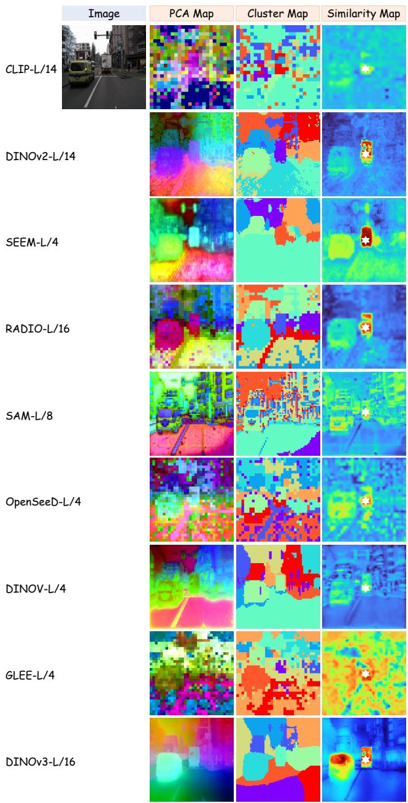

<details>
<summary>heatmap</summary>

| Model       | Image | PCA Map | Cluster Map | Similarity Map |
|-------------|-------|---------|-------------|----------------|
| CLIP-L/14   | 0     | 0       | 0           | 0              |
| DINOv2-L/14 | 0     | 0       | 0           | 0              |
| SEEM-L/4    | 0     | 0       | 0           | 0              |
| RADIO-L/16  | 0     | 0       | 0           | 0              |
| SAM-L/8     | 0     | 0       | 0           | 0              |
| OpenSeeD-L/4| 0     | 0       | 0           | 0              |
| DINOV-L/4   | 0     | 0       | 0           | 0              |
| GLEE-L/4    | 0     | 0       | 0           | 0              |
| DINOv3-L/16 | 0     | 0       | 0           | 0              |
</details>

Figure 5. Comparison of dense image features under different visual foundation models through a toy example.

size approximate labels, which proved effective for training models that segment directly on event data. The dataset provides 15, 950 training and 3, 890 test samples, with semantic maps at 352 ˆ 200 resolution. Each pixel is annotated with one of six classes: flat, background, object, vegetation, human, and vehicle. Download.

(ii) DSEC-Semantic: DSEC-Semantic [71] is a seman-

Table 7. The pretraining dataset configuration and data statistics for the nine real-world event-image datasets used in our experiments. 

<table><tr><td>Dataset</td><td>Illustration</td><td>Resolution</td><td>Statistics</td><td>Source&amp;Type</td></tr><tr><td>DDD17 [5]</td><td>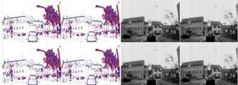</td><td> $346 \times 260$ </td><td>5,000 pairs $\approx 20$  categories36 sequences</td><td>Real-worldDAVIS346BLow-resolutionDriving SceneDownload</td></tr><tr><td>MVSEC [97]</td><td>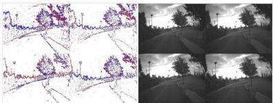</td><td> $346 \times 260$ </td><td>5,000 pairs $\approx 20$  categories9 sequences</td><td>Real-worldDAVIS346BLow-resolutionDriving SceneDownload</td></tr><tr><td>SEE-600K [57]</td><td>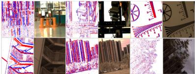</td><td> $346 \times 260$ </td><td>5,000 pairs $\approx 20$  categories16 sequences</td><td>Real-worldDAVIS346CLow-resolutionDaliy SceneDownload</td></tr><tr><td>VisEvent [78]</td><td>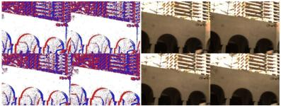</td><td> $346 \times 260$ </td><td>30,000 pairs $\approx 80$  categories820 sequences</td><td>Real-worldDAVIS346CLow-resolutionDaliy SceneDownload</td></tr><tr><td>CoeSot [72]</td><td>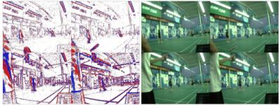</td><td> $346 \times 260$ </td><td>30,000 pairs $\approx 90$  categories1343 sequences</td><td>Real-worldDAVIS346CLow-resolutionDaliy SceneDownload</td></tr><tr><td>DSEC [23]</td><td>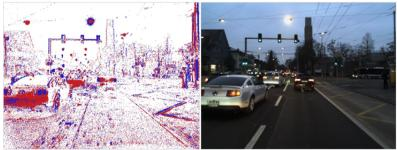</td><td> $640 \times 480$ </td><td>20,000 pairs $\approx 40$  categories53 sequences</td><td>Real-worldProphesee Gen3.1High-resolutionDriving SceneDownload</td></tr><tr><td>FEVD [38]</td><td>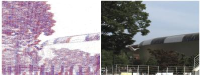</td><td> $1024 \times 768$ </td><td>5,000 pairs $\approx 20$  categories21 sequences</td><td>Real-worldProphesee Gen4High-resolutionDaliy SceneDownload</td></tr><tr><td>M3ED [9]</td><td>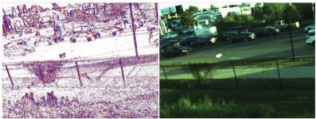</td><td> $1280 \times 720$ </td><td>20,000 pairs $\approx 40$  categories57 sequences</td><td>Real-worldProphesee Gen4High-resolutionMultiple PlatformsDownload</td></tr><tr><td>HighREV [69]</td><td>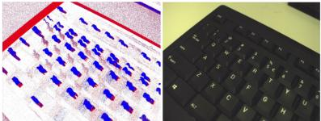</td><td> $1632 \times 1224$ </td><td>10,000 pairs $\approx 20$  categories25 sequences</td><td>Real-worldHigh-resolutionMulti-modalityDaliy SceneDownload</td></tr></table>

Table 8. The pretraining dataset configuration and data statistics for the seven synthetic event-image datasets used in our experiments. 

<table><tr><td>Dataset</td><td>Illustration</td><td>Resolution</td><td>Statistics</td><td>Source&amp;Type</td></tr><tr><td>SDSD [76]</td><td>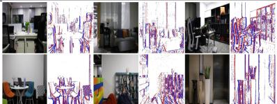</td><td>346 × 260</td><td>20,000 pairs≈ 50 categories150 sequences</td><td>VID2E SimulationLow-resolutionDaliy SceneDownload</td></tr><tr><td>DAVIS17 [61]</td><td>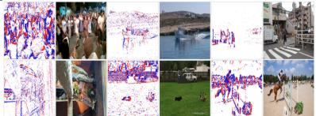</td><td>346 × 260</td><td>20,000 pairs≈ 100 categories90 sequences</td><td>VID2E SimulationLow-resolutionMotion SceneDownload</td></tr><tr><td>DECD [64]</td><td>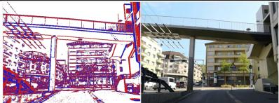</td><td>640 × 480</td><td>40,000 pairs≈ 40 categories120 sequences</td><td>VID2E SimulationHigh-resolutionDriving SceneDownload</td></tr><tr><td>KITTI [24]</td><td>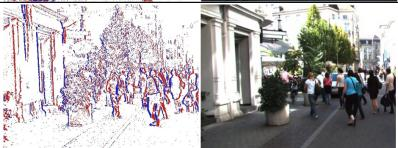</td><td>1242 × 375</td><td>30,000 pairs≈ 40 categories60 sequences</td><td>VID2E SimulationHigh-resolutionDriving SceneDownload</td></tr><tr><td>GoPro [59]</td><td>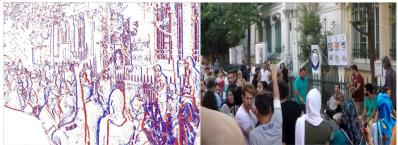</td><td>1280 × 720</td><td>10,000 pairs≈ 30 categories35 sequences</td><td>VID2E SimulationHigh-resolutionDaliy SceneDownload</td></tr><tr><td>Waymo [70]</td><td>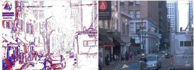</td><td>1920 × 1280</td><td>50,000 pairs≈ 40 categories147 sequences</td><td>VID2E SimulationHigh-resolutionDriving SceneDownload</td></tr><tr><td>Cityscapes [14]</td><td>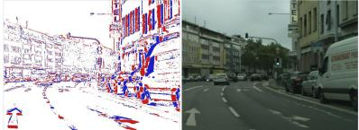</td><td>2048 × 1024</td><td>200,000 pairs≈ 40 categories10000 sequences</td><td>VID2E SimulationHigh-resolutionDriving SceneDownload</td></tr></table>

tic segmentation extension of the DSEC [23] dataset. Leveraging DSEC’s synchronized, high-resolution RGB images and event streams across diverse driving conditions, Sun et al. [71] applied a pseudo-labeling procedure akin to DDD17-Seg[1] to generate semantic masks for eleven sequences (11/53), yielding the DSEC-Semantic benchmark. The dataset provides 8, 082 training and 2, 809 test samples, with semantic maps at 640 ˆ 440 resolution. Each pixel is annotated with one of eleven classes: background, building, fence, person, pole, road, sidewalk, vegetation, car, wall, and traffic-sign. Download.

Depth Estimation. Following the setup of prior works [4, 54], we evaluate on the MVSEC-Depth [97] and DSEC-Depth datasets [23] for event-based monocular depth estimation.

(i) MVSEC-Depth: MVSEC-Depth is a depth estimation variant of the MVSEC [97] dataset. The dataset pro-

vides events at a resolution 346 ˆ 260 pixels from a stereo event camera consisting of two DAVIS346B sensors. The depth ground-truth is derived from a 16-line LiDAR using Lidar Odometry and Mapping (LOAM), yielding a total of 10, 351 training samples and 21, 125 testing samples. The test set is divided into a 5k-sample daytime subset and three night-time subsets, each containing 5k samples. Download.

(ii) DSEC-Depth: DSEC-Depth is a depth estimation variant of the DSEC [23] dataset. DSEC employs two Prophesee Gen3.1 event cameras in a stereo configuration. The disparity ground-truth is obtained using a 32-beam Li-DAR, processed with a Lidar Inertial Odometry algorithm, and further filtered to remove outliers. We convert the disparity ground-truth to depth map based on the stereo setup parameters. The dataset provides 19, 181 training and 7, 157 test samples, with depth maps at 640 ˆ 480 resolution. Download.

Table 9. Experimental setup for fine-tuning downstream tasks. lr denotes learning rate. All configurations are based on the ViT-L encoder. Apart from batch size, which depends on model scale, all other settings remain identical across experiments. 

<table><tr><td rowspan="2">Dataset</td><td colspan="2">Semantic Segmentation</td><td colspan="2">Depth Estimation</td><td>Flow Estimation</td></tr><tr><td>DDD17-Seg</td><td>DSEC-Semantic</td><td>MVSEC-Depth</td><td>DSEC-Depth</td><td>MVSEC-Flow</td></tr><tr><td>optimizer</td><td>AdamW</td><td>AdamW</td><td>AdamW</td><td>AdamW</td><td>AdamW</td></tr><tr><td>encoder lr</td><td> $2 \times 10^{-6}$ </td><td> $2 \times 10^{-6}$ </td><td> $2 \times 10^{-6}$ </td><td> $1 \times 10^{-6}$ </td><td> $1 \times 10^{-6}$ </td></tr><tr><td>decoder lr</td><td> $5 \times 10^{-6}$ </td><td> $4 \times 10^{-6}$ </td><td> $4 \times 10^{-6}$ </td><td> $2 \times 10^{-6}$ </td><td> $2 \times 10^{-6}$ </td></tr><tr><td>weight decay</td><td> $1 \times 10^{-4}$ </td><td> $1 \times 10^{-4}$ </td><td> $1 \times 10^{-4}$ </td><td> $1 \times 10^{-4}$ </td><td> $1 \times 10^{-4}$ </td></tr><tr><td>batch size</td><td>40</td><td>12</td><td>40</td><td>12</td><td>24</td></tr><tr><td>epochs</td><td>20</td><td>30</td><td>30</td><td>30</td><td>20</td></tr><tr><td>lr scheduler</td><td>exponential</td><td>exponential</td><td>exponential</td><td>exponential</td><td>exponential</td></tr><tr><td>scheduler gamma</td><td>0.9</td><td>0.9</td><td>0.9</td><td>0.9</td><td>0.9</td></tr><tr><td>scheduler epoch</td><td>5</td><td>5</td><td>5</td><td>5</td><td>5</td></tr><tr><td>gradient clipping norm</td><td>0.1</td><td>0.1</td><td>0.1</td><td>0.1</td><td>0.1</td></tr></table>

Optical Flow Estimation. Following the setup of prior works [88, 89], we evaluate event-based optical flow estimation on the MVSEC-Flow [98] dataset. MVSEC-Flow is an optical flow estimation variant of the MVSEC [97] dataset. MVSEC employs two DAVIS346B event cameras in a stereo configuration. MVSEC-Flow provides percamera poses and depth maps for each event camera, which were used to generate ground truth optical flow. In this work, we use outdoor day2 sequence for training (26, 677 samples), indoor flying1, indoor flying2, indoor flying3 sequences for testing (7, 775 samples). Download.

# 6.4. Downstream Fine-tuning

• Experimental Setup. The details of the fine-tuning procedure are outlined in Table 9.   
• Data Augmentation. No data augmentation strategies are applied during fine-tuning on downstream tasks.   
• Linear Probing. The pretrained event feature encoder is frozen with a trainable pixel-wise task head which is trained for 20 epochs, setting the initial learning rate at $5 \times 1 0 ^ { - 4 }$ , with a weight decay of $1 \times 1 0 ^ { - 4 }$ .   
• Few-shot Fine-tuning. In few-shot fine-tuning, we subsample the training split of each downstream dataset to obtain 1%, 5%, 10%, or 20% annotated scans, generated via fixed-interval sampling over the full training sequences, such as 100, 20, 10, 5.

# 7. More Quantitative Results

# 7.1. More Detailed Comparisons

We report the complete results (i.e., the class-wise IoU scores, optical flow/depth metrics) for the inear probing and downstream fine-tuning tasks outlined in the main paper. Specifically, the detailed performance metrics on the DDD17-Seg, DSEC-Semantic, MVSEC-Depth, DSEC-Depth, and MVSEC-Flow datasets are shown in Table 10, Table 12, Table 13 and Table 11, respectively. These results comprehensively evaluate the model’s performance across a variety of dense perception tasks.

Table 10. The per-class segmentation results of our methods on the DDD17-Seg dataset. Scores reported are IoUs in percentage. 

<table><tr><td>Event Model</td><td>mIoU</td><td>flat</td><td>background</td><td>object</td><td>vegetation</td><td>human</td><td>vehicle</td><td>Acc</td></tr><tr><td colspan="9">Linear Probing</td></tr><tr><td>ViT-S/16</td><td>55.64</td><td>79.61</td><td>91.18</td><td>15.90</td><td>57.51</td><td>22.02</td><td>67.72</td><td>91.27</td></tr><tr><td>ViT-B/16</td><td>57.87</td><td>79.92</td><td>91.24</td><td>15.87</td><td>58.04</td><td>34.97</td><td>67.05</td><td>91.31</td></tr><tr><td>ViT-L/16</td><td>60.30</td><td>81.03</td><td>91.49</td><td>18.83</td><td>57.21</td><td>44.18</td><td>68.95</td><td>91.83</td></tr><tr><td colspan="9">Fine-Tuning (1%)</td></tr><tr><td>ViT-S/16</td><td>53.87</td><td>78.61</td><td>90.06</td><td>10.03</td><td>54.59</td><td>25.18</td><td>64.63</td><td>90.41</td></tr><tr><td>ViT-B/16</td><td>57.23</td><td>79.51</td><td>91.03</td><td>15.46</td><td>57.53</td><td>34.87</td><td>66.93</td><td>91.12</td></tr><tr><td>ViT-L/16</td><td>59.23</td><td>82.34</td><td>92.24</td><td>18.26</td><td>61.68</td><td>34.01</td><td>69.37</td><td>91.68</td></tr><tr><td colspan="9">Fine-Tuning (5%)</td></tr><tr><td>ViT-S/16</td><td>54.36</td><td>78.96</td><td>90.27</td><td>10.38</td><td>54.92</td><td>27.26</td><td>64.40</td><td>90.62</td></tr><tr><td>ViT-B/16</td><td>59.54</td><td>80.25</td><td>91.65</td><td>15.24</td><td>59.21</td><td>44.38</td><td>65.80</td><td>91.65</td></tr><tr><td>ViT-L/16</td><td>62.52</td><td>81.96</td><td>91.97</td><td>19.31</td><td>61.49</td><td>50.77</td><td>69.63</td><td>92.12</td></tr><tr><td colspan="9">Fine-Tuning (10%)</td></tr><tr><td>ViT-S/16</td><td>57.29</td><td>79.52</td><td>91.16</td><td>12.24</td><td>59.26</td><td>39.77</td><td>64.72</td><td>91.34</td></tr><tr><td>ViT-B/16</td><td>61.45</td><td>82.37</td><td>91.69</td><td>20.14</td><td>60.69</td><td>45.16</td><td>68.46</td><td>91.72</td></tr><tr><td>ViT-L/16</td><td>63.71</td><td>82.23</td><td>92.12</td><td>23.75</td><td>59.84</td><td>51.80</td><td>72.95</td><td>92.13</td></tr><tr><td colspan="9">Fine-Tuning (20%)</td></tr><tr><td>ViT-S/16</td><td>58.37</td><td>79.93</td><td>91.55</td><td>13.02</td><td>58.93</td><td>41.81</td><td>66.27</td><td>91.63</td></tr><tr><td>ViT-B/16</td><td>62.06</td><td>82.74</td><td>92.05</td><td>18.72</td><td>61.65</td><td>49.79</td><td>69.60</td><td>92.24</td></tr><tr><td>ViT-L/16</td><td>64.43</td><td>83.10</td><td>92.23</td><td>23.17</td><td>62.62</td><td>54.13</td><td>71.35</td><td>92.44</td></tr><tr><td colspan="9">Fine-Tuning (100%)</td></tr><tr><td>ViT-S/16</td><td>59.64</td><td>80.68</td><td>91.27</td><td>17.58</td><td>58.88</td><td>43.71</td><td>65.73</td><td>91.39</td></tr><tr><td>ViT-B/16</td><td>62.81</td><td>82.95</td><td>92.00</td><td>18.79</td><td>61.71</td><td>51.43</td><td>69.98</td><td>92.21</td></tr><tr><td>ViT-L/16</td><td>65.09</td><td>83.73</td><td>92.34</td><td>23.10</td><td>62.61</td><td>56.43</td><td>72.26</td><td>92.62</td></tr></table>

Table 11. The optical flow results of our methods on the MVSEC-Flow dataset. 

<table><tr><td rowspan="2">Event Model</td><td colspan="2">indoor flying1</td><td colspan="2">indoor flying2</td><td colspan="2">indoor flying3</td></tr><tr><td>EPE ↓</td><td>Out↓</td><td>EPE ↓</td><td>Out↓</td><td>EPE ↓</td><td>Out↓</td></tr><tr><td>ViT-S/16</td><td>0.29</td><td>0.03</td><td>0.38</td><td>0.001</td><td>0.40</td><td>0.001</td></tr><tr><td>ViT-B/16</td><td>0.28</td><td>0.03</td><td>0.38</td><td>0.001</td><td>0.39</td><td>0.001</td></tr><tr><td>ViT-L/16</td><td>0.27</td><td>0.03</td><td>0.37</td><td>0.001</td><td>0.39</td><td>0.001</td></tr></table>

Table 12. The per-class segmentation results of our methods on the DSEC-Semantic dataset. Scores reported are IoUs in percentage. 

<table><tr><td>Event Model</td><td>mIoU</td><td>background</td><td>building</td><td>fence</td><td>person</td><td>pole</td><td>road</td><td>sidewalk</td><td>vegetation</td><td>car</td><td>wall</td><td>traffic-sign</td><td>Acc</td></tr><tr><td colspan="14">Linear Probing</td></tr><tr><td>ViT-S/16</td><td>55.46</td><td>92.81</td><td>81.88</td><td>17.45</td><td>15.67</td><td>24.98</td><td>93.20</td><td>68.12</td><td>78.83</td><td>77.72</td><td>30.79</td><td>43.86</td><td>90.12</td></tr><tr><td>ViT-B/16</td><td>58.42</td><td>93.46</td><td>83.52</td><td>23.88</td><td>16.69</td><td>27.85</td><td>93.72</td><td>69.27</td><td>80.38</td><td>80.13</td><td>43.06</td><td>43.25</td><td>91.44</td></tr><tr><td>ViT-L/16</td><td>61.29</td><td>93.91</td><td>85.09</td><td>27.66</td><td>27.37</td><td>33.58</td><td>93.34</td><td>70.94</td><td>82.37</td><td>82.27</td><td>41.82</td><td>48.66</td><td>91.69</td></tr><tr><td colspan="14">Fine-Tuning (1%)</td></tr><tr><td>ViT-S/16</td><td>52.97</td><td>92.35</td><td>81.36</td><td>18.04</td><td>7.93</td><td>18.77</td><td>92.55</td><td>60.54</td><td>78.50</td><td>76.22</td><td>22.25</td><td>37.06</td><td>89.56</td></tr><tr><td>ViT-B/16</td><td>54.37</td><td>93.04</td><td>82.55</td><td>14.09</td><td>16.14</td><td>26.06</td><td>93.55</td><td>65.17</td><td>80.79</td><td>79.52</td><td>12.34</td><td>41.40</td><td>90.14</td></tr><tr><td>ViT-L/16</td><td>59.73</td><td>92.96</td><td>82.55</td><td>21.88</td><td>20.30</td><td>27.87</td><td>93.34</td><td>69.36</td><td>80.68</td><td>80.22</td><td>40.60</td><td>47.24</td><td>90.73</td></tr><tr><td colspan="14">Fine-Tuning (5%)</td></tr><tr><td>ViT-S/16</td><td>56.55</td><td>93.01</td><td>82.08</td><td>19.92</td><td>18.34</td><td>19.48</td><td>93.15</td><td>66.34</td><td>79.36</td><td>79.22</td><td>33.71</td><td>46.98</td><td>90.78</td></tr><tr><td>ViT-B/16</td><td>62.87</td><td>93.66</td><td>84.91</td><td>22.14</td><td>33.63</td><td>31.05</td><td>93.91</td><td>71.36</td><td>81.84</td><td>82.27</td><td>44.28</td><td>49.59</td><td>91.52</td></tr><tr><td>ViT-L/16</td><td>68.03</td><td>94.68</td><td>86.68</td><td>31.01</td><td>52.67</td><td>39.86</td><td>94.77</td><td>74.13</td><td>84.08</td><td>83.89</td><td>49.93</td><td>58.39</td><td>92.83</td></tr><tr><td colspan="14">Fine-Tuning (10%)</td></tr><tr><td>ViT-S/16</td><td>58.96</td><td>93.56</td><td>84.73</td><td>21.88</td><td>19.25</td><td>22.50</td><td>93.26</td><td>68.90</td><td>79.52</td><td>78.61</td><td>42.29</td><td>42.48</td><td>91.25</td></tr><tr><td>ViT-B/16</td><td>63.88</td><td>93.59</td><td>85.06</td><td>23.05</td><td>38.58</td><td>31.72</td><td>94.05</td><td>71.48</td><td>81.85</td><td>82.38</td><td>48.44</td><td>49.10</td><td>91.73</td></tr><tr><td>ViT-L/16</td><td>68.51</td><td>94.52</td><td>86.76</td><td>26.70</td><td>51.15</td><td>44.29</td><td>94.85</td><td>75.24</td><td>84.49</td><td>84.92</td><td>47.71</td><td>62.72</td><td>92.92</td></tr><tr><td colspan="14">Fine-Tuning (20%)</td></tr><tr><td>ViT-S/16</td><td>60.20</td><td>93.32</td><td>83.99</td><td>22.61</td><td>27.38</td><td>29.98</td><td>93.07</td><td>69.40</td><td>79.62</td><td>80.29</td><td>33.19</td><td>48.69</td><td>91.62</td></tr><tr><td>ViT-B/16</td><td>64.15</td><td>93.45</td><td>84.93</td><td>24.27</td><td>40.01</td><td>32.64</td><td>93.91</td><td>71.77</td><td>82.13</td><td>82.55</td><td>50.67</td><td>50.30</td><td>91.78</td></tr><tr><td>ViT-L/16</td><td>69.25</td><td>94.63</td><td>86.77</td><td>26.98</td><td>51.24</td><td>44.27</td><td>94.90</td><td>75.45</td><td>84.74</td><td>84.93</td><td>47.90</td><td>62.95</td><td>92.98</td></tr><tr><td colspan="14">Fine-Tuning (100%)</td></tr><tr><td>ViT-S/16</td><td>61.12</td><td>93.16</td><td>83.16</td><td>26.28</td><td>34.11</td><td>30.15</td><td>93.12</td><td>68.21</td><td>80.10</td><td>80.04</td><td>34.89</td><td>49.03</td><td>90.76</td></tr><tr><td>ViT-B/16</td><td>64.93</td><td>93.43</td><td>85.17</td><td>23.69</td><td>42.63</td><td>34.14</td><td>94.08</td><td>72.84</td><td>82.28</td><td>83.13</td><td>51.86</td><td>50.96</td><td>92.00</td></tr><tr><td>ViT-L/16</td><td>69.65</td><td>94.54</td><td>86.71</td><td>26.88</td><td>55.63</td><td>45.53</td><td>95.13</td><td>76.64</td><td>83.94</td><td>86.13</td><td>52.53</td><td>62.44</td><td>93.10</td></tr></table>

Table 13. The depth results of our methods on the MVSEC-Depth and DSEC-Depth datasets. 

<table><tr><td rowspan="2">Event Model</td><td rowspan="2">Metric</td><td colspan="6">MVSEC-Depth</td><td colspan="6">DSEC-Depth</td></tr><tr><td>LP</td><td>1%</td><td>5%</td><td>10%</td><td>20%</td><td>Full</td><td>LP</td><td>1%</td><td>5%</td><td>10%</td><td>20%</td><td>Full</td></tr><tr><td rowspan="2">ViT-S/16</td><td> $\delta_1 \uparrow$ </td><td>0.529</td><td>0.526</td><td>0.531</td><td>0.542</td><td>0.560</td><td>0.577</td><td>0.798</td><td>0.795</td><td>0.804</td><td>0.811</td><td>0.816</td><td>0.824</td></tr><tr><td>RMSE↓</td><td>6.756</td><td>6.930</td><td>6.712</td><td>6.477</td><td>6.352</td><td>6.145</td><td>4.861</td><td>4.983</td><td>4.751</td><td>4.728</td><td>4.694</td><td>4.564</td></tr><tr><td rowspan="2">ViT-B/16</td><td> $\delta_1 \uparrow$ </td><td>0.571</td><td>0.561</td><td>0.574</td><td>0.587</td><td>0.591</td><td>0.594</td><td>0.845</td><td>0.839</td><td>0.856</td><td>0.863</td><td>0.867</td><td>0.872</td></tr><tr><td>RMSE↓</td><td>6.392</td><td>6.546</td><td>6.339</td><td>6.012</td><td>5.908</td><td>5.891</td><td>4.352</td><td>4.471</td><td>4.264</td><td>4.192</td><td>4.154</td><td>4.032</td></tr><tr><td rowspan="2">ViT-L/16</td><td> $\delta_1 \uparrow$ </td><td>0.597</td><td>0.592</td><td>0.601</td><td>0.612</td><td>0.619</td><td>0.625</td><td>0.881</td><td>0.856</td><td>0.883</td><td>0.892</td><td>0.893</td><td>0.896</td></tr><tr><td>RMSE↓</td><td>5.884</td><td>5.975</td><td>5.855</td><td>5.724</td><td>5.673</td><td>5.554</td><td>3.857</td><td>3.984</td><td>3.841</td><td>3.759</td><td>3.723</td><td>3.694</td></tr></table>

# 7.2. More Detailed Ablations

Table 14. Ablative study results of different event aggregation methods. 

<table><tr><td rowspan="2">Event Input</td><td colspan="2">DDD17-Seg</td><td colspan="2">DSEC-Depth</td><td colspan="2">MVSEC-Flow</td></tr><tr><td>Acc↑</td><td>mIoU↑</td><td> $\delta_1$  ↑</td><td>RMSE ↓</td><td>EPE↓</td><td>Out↓</td></tr><tr><td>Color Frame</td><td>90.76</td><td>56.37</td><td>0.784</td><td>5.306</td><td>1.107</td><td>6.720</td></tr><tr><td>E2VID</td><td>89.25</td><td>55.72</td><td>0.809</td><td>4.928</td><td>0.852</td><td>3.294</td></tr><tr><td>Event Volume</td><td>91.39</td><td>59.64</td><td>0.824</td><td>4.564</td><td>0.356</td><td>0.094</td></tr></table>

Event Aggregations. In our main study, we aggregate the event stream as a three-dimensional volume (voxel grid) to interface cleanly with vision foundation models. Here,

we additionally evaluate alternative renderings, including color-like frames [78] and E2VID reconstructions [64]. For a fair comparison, the event representation is held fixed across pretraining and downstream fine-tuning, and all experiments use a ViT-S encoder. As reported in Table 14, the volumetric encoding delivers the strongest overall performance, indicating that explicit spatio-temporal discretization provides a more effective inductive bias for pretraining than image-like aggregations or reconstructed intensities.

Hyper Parameters. To enable cross-modal distillation, we encode event streams as a multi-channel volume/voxel grid compatible with vision foundation models and introduce an activation mask to suppress spurious event–image alignment during pretraining. We ablate two hyperparameters, the number of time bins B for volume aggregation, which controls temporal granularity, and the density threshold τ for the activation mask, which trades coverage for noise suppression. Unless otherwise specified, all comparisons use a ViT-S encoder. Results in Tables 15 and 16 identify the optimal configuration.

Table 15. Ablative study results of different time bins for event volume aggregation. 

<table><tr><td rowspan="2">Time Bin</td><td colspan="2">DDD17-Seg</td><td colspan="2">DSEC-Depth</td><td colspan="2">MVSEC-Flow</td></tr><tr><td>Acc↑</td><td>mIoU↑</td><td> $\delta_1$  ↑</td><td>RMSE ↓</td><td>EPE↓</td><td>Out↓</td></tr><tr><td>B=1</td><td>91.07</td><td>58.43</td><td>0.819</td><td>4.736</td><td>0.365</td><td>0.104</td></tr><tr><td>B=3</td><td>91.39</td><td>59.64</td><td>0.824</td><td>4.564</td><td>0.356</td><td>0.094</td></tr><tr><td>B=5</td><td>91.20</td><td>59.22</td><td>0.822</td><td>4.613</td><td>0.359</td><td>0.095</td></tr></table>

Table 16. Ablative study results of different density thresholds for activation mask constraint. 

<table><tr><td rowspan="2">Density Threshold</td><td colspan="2">DDD17-Seg</td><td colspan="2">DSEC-Depth</td><td colspan="2">MVSEC-Flow</td></tr><tr><td>Acc↑</td><td>mIoU↑</td><td> $\delta_1$  ↑</td><td>RMSE ↓</td><td>EPE↓</td><td>Out↓</td></tr><tr><td>τ = 32</td><td>91.33</td><td>59.51</td><td>0.823</td><td>4.538</td><td>0.362</td><td>0.095</td></tr><tr><td>τ = 64</td><td>91.39</td><td>59.64</td><td>0.824</td><td>4.564</td><td>0.356</td><td>0.094</td></tr><tr><td>τ = 128</td><td>91.25</td><td>59.32</td><td>0.821</td><td>4.640</td><td>0.367</td><td>0.097</td></tr></table>

Table 17. Ablative study results of different distillation objectives across granularities. CL denotes the contrastive loss. 

<table><tr><td rowspan="2">Alignment Objective</td><td colspan="2">DDD17-Seg</td><td colspan="2">DSEC-Depth</td><td colspan="2">MVSEC-Flow</td></tr><tr><td>Acc↑</td><td>mIoU↑</td><td> $\delta_1$  ↑</td><td>RMSE ↓</td><td>EPE↓</td><td>Out↓</td></tr><tr><td>patch-level (L1)</td><td>90.65</td><td>56.06</td><td>0.785</td><td>4.990</td><td>0.367</td><td>0.098</td></tr><tr><td>superpixel-level (L1)</td><td>90.88</td><td>56.36</td><td>0.790</td><td>4.937</td><td>0.384</td><td>0.106</td></tr><tr><td>superpixel-level (CL)</td><td>90.92</td><td>56.72</td><td>0.782</td><td>5.031</td><td>0.435</td><td>0.120</td></tr><tr><td>ours</td><td>91.39</td><td>59.64</td><td>0.824</td><td>4.564</td><td>0.356</td><td>0.094</td></tr></table>

Table 18. Ablative study results of multi-scale distillation. 

<table><tr><td rowspan="2">Alignment Objective</td><td colspan="2">DDD17-Seg</td><td colspan="2">DSEC-Depth</td><td colspan="2">MVSEC-Flow</td></tr><tr><td>Acc↑</td><td>mIoU↑</td><td> $\delta_1$  ↑</td><td>RMSE ↓</td><td>EPE↓</td><td>Out↓</td></tr><tr><td>multi-scale</td><td>91.07</td><td>58.83</td><td>0.816</td><td>4.831</td><td>0.377</td><td>0.102</td></tr><tr><td>single-scale</td><td>91.39</td><td>59.64</td><td>0.824</td><td>4.564</td><td>0.356</td><td>0.094</td></tr></table>

Superpixel Alignment. For cross-modal distillation, we formulate a hierarchical objective comprising patch-level supervision (our baseline) and structure-level supervision (our highlight). Here, we further examine a superpixellevel variant. Following OpenESS [41], we partition each image into 100 SAM-derived [39] superpixels and compare two formulations: (i) an L1 regression loss on superpixelaggregated features, and (ii) a contrastive objective inspired by image-point cloud distillation [65] that enforces intrasuperpixel compactness and inter-superpixel separability. Unless otherwise specified, all comparisons use a ViT-S encoder. Results in Table 17 reveal that superpixel-level alignment underperforms, due to semantically ambiguous groupings (e.g., boundary leakage and region fragmentation) that

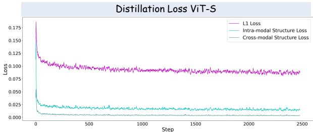

<details>
<summary>line</summary>

| Step | L1 Loss | Intra-modal Structure Loss | Cross-modal Structure Loss |
| ---- | ------- | -------------------------- | -------------------------- |
| 0    | 0.175   | 0.025                      | 0.000                      |
| 500  | 0.100   | 0.020                      | 0.000                      |
| 1000 | 0.095   | 0.018                      | 0.000                      |
| 1500 | 0.092   | 0.017                      | 0.000                      |
| 2000 | 0.090   | 0.016                      | 0.000                      |
| 2500 | 0.088   | 0.015                      | 0.000                      |
</details>

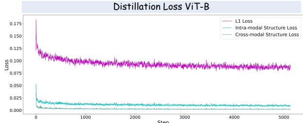

<details>
<summary>line</summary>

| Step | L1 Loss | Intra-modal Structure Loss | Cross-modal Structure Loss |
| ---- | ------- | -------------------------- | -------------------------- |
| 0    | 0.175   | 0.050                      | 0.005                      |
| 500  | 0.100   | 0.025                      | 0.005                      |
| 1000 | 0.100   | 0.025                      | 0.005                      |
| 1500 | 0.100   | 0.025                      | 0.005                      |
| 2000 | 0.100   | 0.025                      | 0.005                      |
| 2500 | 0.100   | 0.025                      | 0.005                      |
| 3000 | 0.100   | 0.025                      | 0.005                      |
| 3500 | 0.100   | 0.025                      | 0.005                      |
| 4000 | 0.100   | 0.025                      | 0.005                      |
| 4500 | 0.100   | 0.025                      | 0.005                      |
| 5000 | 0.100   | 0.025                      | 0.005                      |
</details>

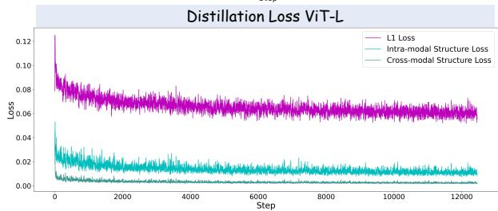

<details>
<summary>line</summary>

| Step | L1 Loss | Intra-modal Structure Loss | Cross-modal Structure Loss |
| ---- | ------- | -------------------------- | -------------------------- |
| 0    | 0.12    | 0.05                       | 0.01                       |
| 2000 | 0.07    | 0.02                       | 0.01                       |
| 4000 | 0.06    | 0.02                       | 0.01                       |
| 6000 | 0.06    | 0.02                       | 0.01                       |
| 8000 | 0.06    | 0.02                       | 0.01                       |
| 10000| 0.06    | 0.02                       | 0.01                       |
| 12000| 0.06    | 0.02                       | 0.01                       |
</details>

Figure 6. Cross-modal distillation loss during pretraining of our event-based ViT-S, ViT-B, and ViT-L feature encoders.

is consistent with our overall analysis.

Multi-scale Distillation. For cross-modal distillation, our main study aligns only the terminal features of the encoder. Here, we additionally assess a multi-scale alignment scheme. All comparisons use a ViT-S encoder. Specifically, we align intermediate activations from layers 3, 6, 9, and 12 to their event counterparts with equal loss weights. Results in Table 18 show that multi-scale alignment underperforms, likely because intermediate representations possess weak and unstable semantics and thus exacerbate the eventimage modality gap.

# 7.3. Pretraining Loss

The pretraining losses are depicted in Figure 6.

# 7.4. Computational Efficiency

The computational efficiency analysis is shown in Table 19.

Table 19. Computational efficiency of our downstream task models, setting an input event volume resolution of 480 ˆ 640. 

<table><tr><td rowspan="2"></td><td colspan="2">Segment Model</td><td colspan="2">Depth Model</td><td colspan="2">Flow Model</td></tr><tr><td>MParams</td><td>GFLOP</td><td>MParams</td><td>GFLOPs</td><td>MParams</td><td>GFLOPs</td></tr><tr><td>ViT-S</td><td>28.23</td><td>243.67</td><td>18.92</td><td>61.23</td><td>40.95</td><td>349.42</td></tr><tr><td>ViT-B</td><td>76.74</td><td>363.82</td><td>74.98</td><td>231.93</td><td>135.62</td><td>962.71</td></tr><tr><td>ViT-L</td><td>239.09</td><td>758.17</td><td>257.29</td><td>853.16</td><td>485.27</td><td>3369.48</td></tr></table>

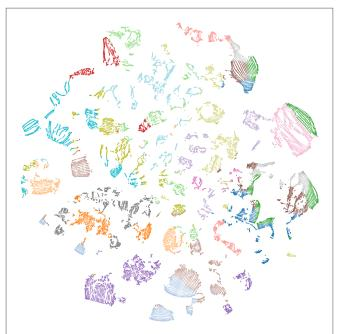

<details>
<summary>natural_image</summary>

Colorful abstract shapes and fragments scattered on white background (no text or symbols)
</details>

(a)

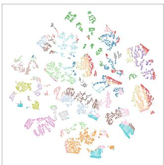

<details>
<summary>natural_image</summary>

Colorful abstract pattern with no text or symbols
</details>

(b)

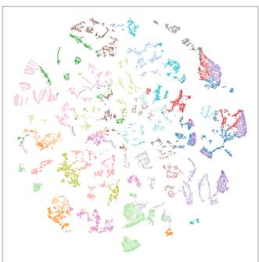

<details>
<summary>pie</summary>

| Category | Value (%) |
|---|---|
| A | 10 |
| B | 25 |
| C | 30 |
| D | 15 |
| E | 20 |
| F | 10 |
</details>

(c)

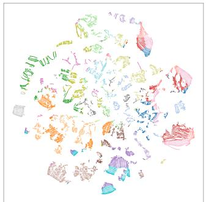

<details>
<summary>natural_image</summary>

Colorful abstract illustration of floating objects resembling ships or ships, with no visible text or symbols.
</details>

(d)   
Figure 7. T-SNE plots of learned event features. We sample 20,000 event feature vectors from the DSEC dataset [23]. We show features from (a) images with pretrained DIVOv3-L; (b) event volume with pretrained DIVOv3-L; (c) event volume with DIVOv3-L after patchlevel distillation; (d) event volume with DIVOv3-L using our distillation method.

# 8. More Qualitative Results

# 8.1. Representation Visualization

Statistical Analysis.As shown in Figure 7, t-SNE plots of feature vectors from the DSEC dataset [23] highlight the performance of various models and distillation methods. The pretrained DINOv3-L on images shows strong clustering with some overlap, indicating effective feature learning but room for finer distinctions. Event volume with pretrained DINOv3-L shows greater dispersion, highlighting challenges in capturing event-specific features and temporal dynamics. Patch-level distillation improves feature separation, resulting in more compact clusters. Our distillation method achieves the most distinct and well-separated clusters, closely matching the pretrained DINOv3-L while better capturing event-specific features.

Exemplary Analysis. As shown in Figure 8 and Figure 9, exemplary learned event features are visualized through cosine similarity maps, with key points marked by white stars. The RGB reference images and corresponding event data are shown on the left, while the cosine similarity maps (scaled by a factor of 4) highlight the areas where the model focuses. These maps emphasize the spatial locations of distinctive event features, demonstrating how the model captures dynamic, fine-grained details. The alignment of the white stars with key features indicates the model’s ability to identify significant event-driven changes. The results highlight the model’s effectiveness in learning and refining event features, benefiting from the cross-modal distillation of pretrained image-based models to better capture these event features.

# 8.2. Downstream Tasks

Representative qualitative results for downstream tasks are provided in Figures 10, 11, and 12.

Semantic Segmentation. As shown in Figure 10, the comparison of event-based semantic segmentation methods on

the DSEC-Semantic dataset highlights the effectiveness of cross-modal distillation for dense event pretraining. Our method significantly improves segmentation quality, particularly in fine-grained object boundaries and dynamic features like persons, cars, and traffic signs. The key advantage lies in leveraging pretrained image models through crossmodal distillation, which enhances spatial feature learning in event data. In contrast, methods like ESS-Sup and OpenESS perform well in general segmentation but fail to capture subtle event-driven features, while KWYAF and 6T show some improvement but struggle in dynamic scenes. Our method outperforms them by maintaining high accuracy.

Monocular Depth Estimation. As shown in Figure 11, the comparison of event-based depth estimation methods on the DSEC-Depth dataset demonstrates the benefits of crossmodal distillation for dense event pretraining. Our method produces the most accurate depth maps, especially in dynamic regions with moving objects or occlusions. In contrast, methods like E2Depth and EReformer show noticeable errors, particularly in complex environments. While DepthAnyEvent performs well in static areas, it struggles with depth variations in motion. Our method, leveraging cross-modal pretraining, improves depth accuracy, particularly in foreground-background transitions, by transferring rich spatial knowledge to the event-based depth task.

Optical Flow Estimation. As shown in Figure 12, the comparison of optical flow estimation results on the MVSEC-Flow dataset highlights the effectiveness of our cross-modal distillation approach. Our method produces the highly accurate and consistent flow predictions, thanks to cross-modal distillation from pretrained models, which enhances flow estimation by leveraging fine-grained correlation knowledge. By transferring knowledge from imagebased foundation model, our method improves robustness, capturing fine details and rapid motion changes effectively in event-based data.

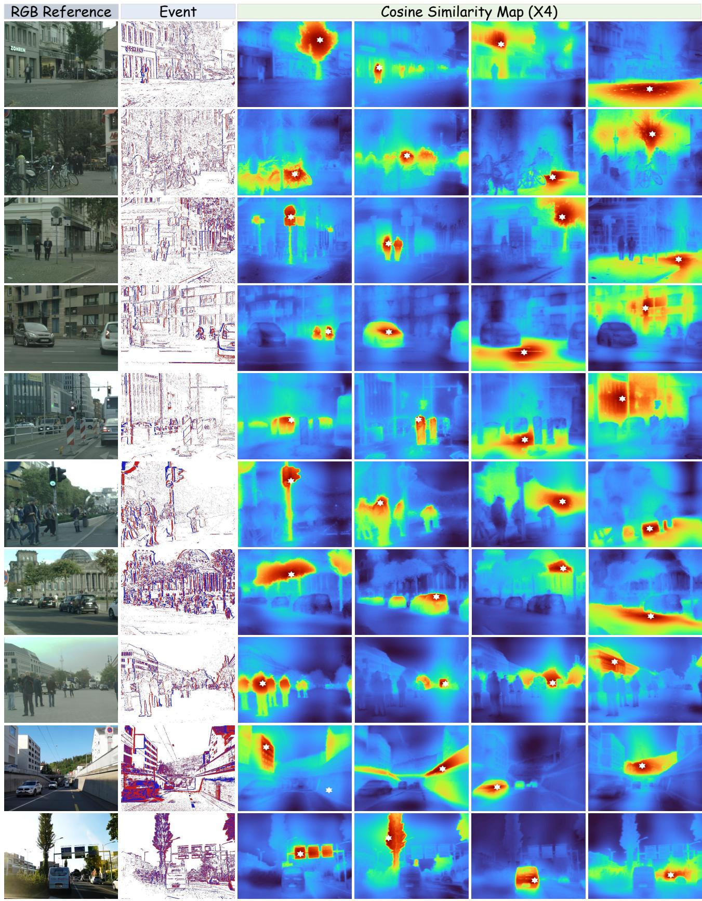  
Figure 8. The learned fine-grained event features (1/2) of our method are primarily presented through cosine similarity maps, with key points anchored at the distinct white stars. Best viewed in color.

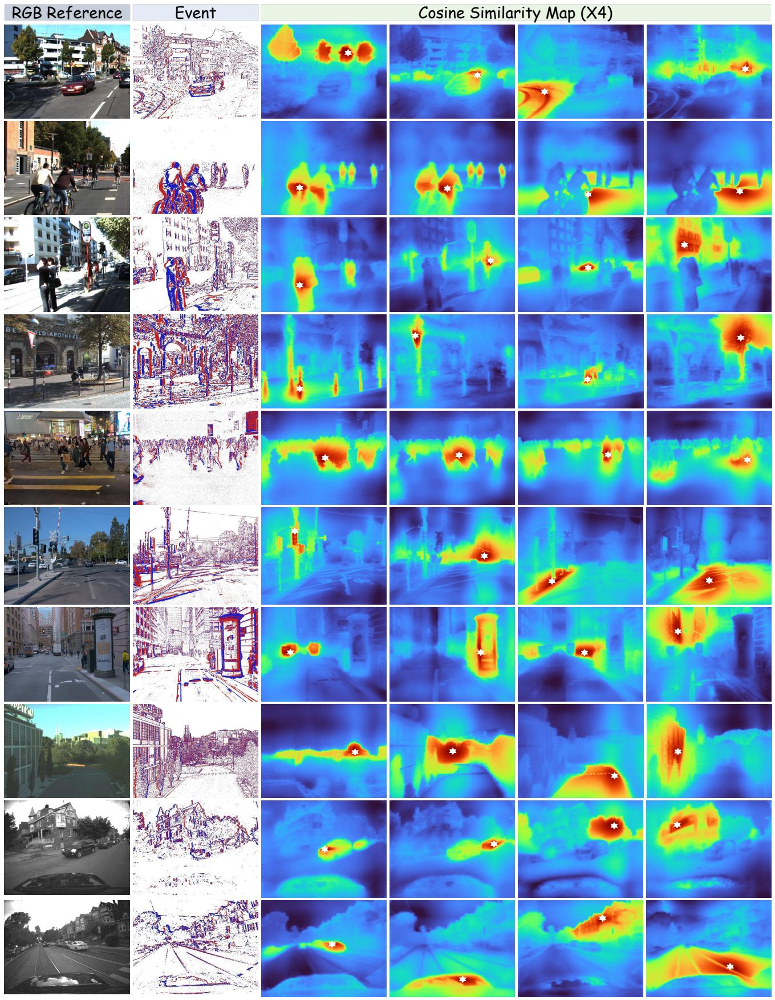  
Figure 9. The learned fine-grained event features (2/2) of our method are primarily presented through cosine similarity maps, with key points anchored at the distinct white stars. Best viewed in color.


<details>
<summary>text_image</summary>

Background
Building
Fence
Person
Pole
Road
Sidewalk
Vegetation
Car
Wall
Traffic Sign
</details>

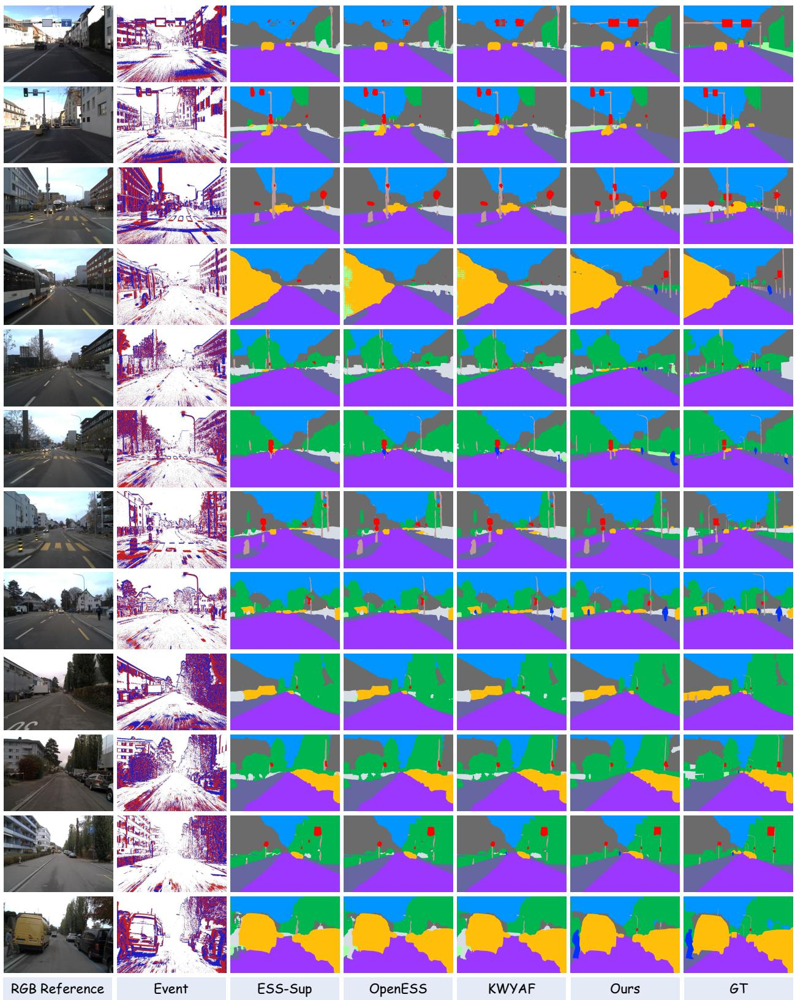

<details>
<summary>text_image</summary>

RGB Reference
Event
ESS-Sup
OpenESS
KWYAF
Ours
GT
</details>

Figure 10. The qualitative comparisons among different event-based semantic segmention approaches on the test set of DSEC-Semantic. Best viewed in color.

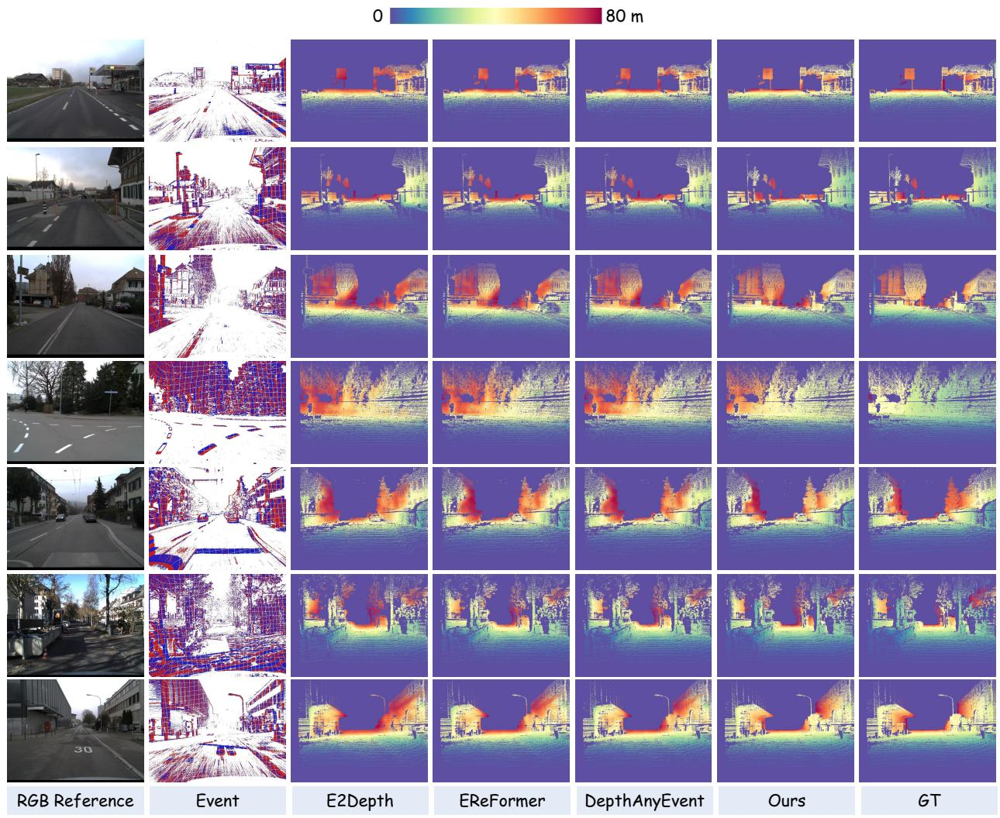

<details>
<summary>heatmap</summary>

| Method       | Event | E2Depth | EReFormer | DepthAnyEvent | Ours | GT   |
| ------------ | ----- | ------- | --------- | ------------- | ---- | ---- |
| RGB Reference| -     | -       | -         | -             | -    | -    |
| Event        | -     | -       | -         | -             | -    | -    |
| E2Depth      | -     | -       | -         | -             | -    | -    |
| EReFormer    | -     | -       | -         | -             | -    | -    |
| DepthAnyEvent| -     | -       | -         | -             | -    | -    |
| Ours         | -     | -       | -         | -             | -    | -    |
| GT           | -     | -       | -         | -             | -    | -    |
</details>

Figure 11. The qualitative comparisons among different event-based depth estimation approaches on the test set of DSEC-Depth. Best viewed in color.   
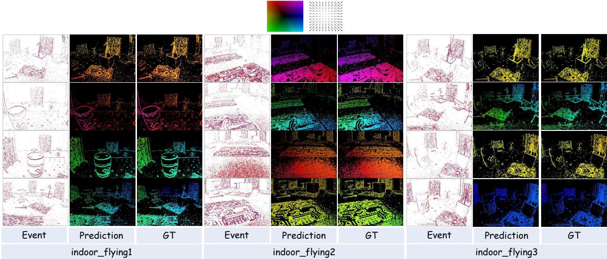

<details>
<summary>text_image</summary>

Event
Prediction
GT
Event
Prediction
GT
Event
Prediction
GT
indoor_flying1
indoor_flying2
indoor_flying3
</details>

Figure 12. The qualitative results of our optical flow estimation approaches on the test set of MVSEC-Flow. Best viewed in color.

# 9. Limitation and Discussion

While our approach significantly advances event-based pretraining, several limitations remain. First, although our structure-aware distillation improves event representation quality, higher resolutions still face some degradation, particularly with patch- and superpixel-level distillation. This suggests that fine-grained alignment methods could be further refined to handle high-resolution event data more effectively. Second, our method relies on large-scale, synchronized image-event datasets, which may not always be feasible to obtain in certain domains. Future work could explore semi-supervised or unsupervised distillation approaches to reduce reliance on these extensive datasets. Additionally, while our model performs well across standard downstream tasks, its ability to generalize to new or rare event-camera configurations remains limited. Addressing this could involve incorporating domain adaptation or metalearning strategies to improve robustness in more dynamic or occluded environments. Lastly, the computational efficiency of our method, particularly with large encoder models, presents a challenge. Optimizing for lighter backbones or reducing redundant parameters could enhance the applicability of our approach in resource-constrained real-world scenarios, such as robotics or autonomous vehicles.

# References

[1] Inigo Alonso and Ana C Murillo. Ev-segnet: Semantic segmentation for event-based cameras. In Proceedings of the IEEE/CVF Conference on Computer Vision and Pattern Recognition Workshops, pages 0–0, 2019. 6, 7, 1, 3   
[2] Mahmoud Assran, Quentin Duval, Ishan Misra, Piotr Bojanowski, Pascal Vincent, Michael Rabbat, Yann LeCun, and Nicolas Ballas. Self-supervised learning from images with a joint-embedding predictive architecture. In Proceedings of the IEEE/CVF Conference on Computer Vision and Pattern Recognition, pages 15619–15629, 2023. 3   
[3] Alexei Baevski, Arun Babu, Wei-Ning Hsu, and Michael Auli. Efficient self-supervised learning with contextualized target representations for vision, speech and language. In International Conference on Machine Learning, pages 1416–1429. PMLR, 2023. 3   
[4] Luca Bartolomei, Enrico Mannocci, Fabio Tosi, Matteo Poggi, and Stefano Mattoccia. Depth anyevent: A crossmodal distillation paradigm for event-based monocular depth estimation. In Proceedings of the IEEE/CVF International Conference on Computer Vision, pages 19669– 19678, 2025. 3, 7   
[5] Jonathan Binas, Daniel Neil, Shih-Chii Liu, and Tobi Delbruck. Ddd17: End-to-end davis driving dataset. arXiv preprint arXiv:1711.01458, 2017. 1, 2   
[6] Shristi Das Biswas, Adarsh Kosta, Chamika M Liyanagedera, Marco Paul E Apolinario, and Kaushik Roy. Halsie: Hybrid approach to learning segmentation by simultaneously exploiting image and event modalities. In WACV, pages 5952–5962, 2024. 6   
[7] Mathilde Caron, Ishan Misra, Julien Mairal, Priya Goyal, Piotr Bojanowski, and Armand Joulin. Unsupervised learning of visual features by contrasting cluster assignments. Advances in neural information processing systems, 33: 9912–9924, 2020. 3   
[8] Mathilde Caron, Hugo Touvron, Ishan Misra, Herve J ´ egou, ´ Julien Mairal, Piotr Bojanowski, and Armand Joulin. Emerging properties in self-supervised vision transformers. In Proceedings of the IEEE/CVF international conference on computer vision, pages 9650–9660, 2021. 2, 3   
[9] Kenneth Chaney, Fernando Cladera, Ziyun Wang, Anthony Bisulco, M. Ani Hsieh, Christopher Korpela, Vijay Kumar, Camillo J. Taylor, and Kostas Daniilidis. M3ed: Multirobot, multi-sensor, multi-environment event dataset. In Proceedings of the IEEE/CVF Conference on Computer Vision and Pattern Recognition (CVPR) Workshops, pages 4015–4022, 2023. 6, 2   
[10] Zhiwen Chen, Jinjian Wu, Weisheng Dong, Leida Li, and Guangming Shi. Crossei: Boosting motion-oriented object tracking with an event camera. IEEE Transactions on Image Processing, 2024. 4   
[11] Zhiwen Chen, Zhiyu Zhu, Yifan Zhang, Junhui Hou, Guangming Shi, and Jinjian Wu. Segment any event streams via weighted adaptation of pivotal tokens. In Proceedings of the IEEE/CVF Conference on Computer Vision and Pattern Recognition, pages 3890–3900, 2024. 2, 3, 4

[12] Hoonhee Cho, Hyeonseong Kim, Yujeong Chae, and Kuk-Jin Yoon. Label-free event-based object recognition via joint learning with image reconstruction from events. In Proceedings of the IEEE/CVF International Conference on Computer Vision, pages 19866–19877, 2023. 3   
[13] Hoonhee Cho, Sung-Hoon Yoon, Hyeokjun Kweon, and Kuk-Jin Yoon. Finding meaning in points: Weakly supervised semantic segmentation for event cameras. In European Conference on Computer Vision, pages 266–286. Springer, 2024. 2   
[14] Marius Cordts, Mohamed Omran, Sebastian Ramos, Timo Rehfeld, Markus Enzweiler, Rodrigo Benenson, Uwe Franke, Stefan Roth, and Bernt Schiele. The cityscapes dataset for semantic urban scene understanding. In Proceedings of the IEEE conference on computer vision and pattern recognition, pages 3213–3223, 2016. 6, 3   
[15] Mostafa Dehghani, Josip Djolonga, Basil Mustafa, Piotr Padlewski, Jonathan Heek, Justin Gilmer, Andreas Peter Steiner, Mathilde Caron, Robert Geirhos, Ibrahim Alabdulmohsin, et al. Scaling vision transformers to 22 billion parameters. In International conference on machine learning, pages 7480–7512. PMLR, 2023. 2   
[16] Tobi Delbruck, Bernabe Linares-Barranco, Eugenio Culur- ¨ ciello, and Christoph Posch. Activity-driven, event-based vision sensors. In Proceedings of 2010 IEEE international symposium on circuits and systems, pages 2426– 2429. IEEE, 2010. 1   
[17] Alexey Dosovitskiy. An image is worth 16x16 words: Transformers for image recognition at scale. arXiv preprint arXiv:2010.11929, 2020. 2, 3   
[18] Peiqi Duan, Boyu Li, Yixin Yang, Hanyue Lou, Minggui Teng, Xinyu Zhou, Yi Ma, and Boxin Shi. Eventaid: Benchmarking event-aided image/video enhancement algorithms with real-captured hybrid dataset. IEEE Transactions on Pattern Analysis and Machine Intelligence, 2025. 1   
[19] Guillermo Gallego, Tobi Delbruck, Garrick Orchard, ¨ Chiara Bartolozzi, Brian Taba, Andrea Censi, Stefan Leutenegger, Andrew J Davison, Jorg Conradt, Kostas ¨ Daniilidis, et al. Event-based vision: A survey. IEEE transactions on pattern analysis and machine intelligence, 44 (1):154–180, 2020. 1   
[20] Yuan Gao, Kunyu Shi, Pengkai Zhu, Edouard Belval, Oren Nuriel, Srikar Appalaraju, Shabnam Ghadar, Zhuowen Tu, Vijay Mahadevan, and Stefano Soatto. Enhancing visionlanguage pre-training with rich supervisions. In Proceedings of the IEEE/CVF conference on computer vision and pattern recognition, pages 13480–13491, 2024. 2   
[21] Daniel Gehrig, Antonio Loquercio, Konstantinos G Derpanis, and Davide Scaramuzza. End-to-end learning of representations for asynchronous event-based data. In Proceedings of the IEEE/CVF international conference on computer vision, pages 5633–5643, 2019. 8   
[22] Daniel Gehrig, Mathias Gehrig, Javier Hidalgo-Carrio,´ and Davide Scaramuzza. Video to events: Recycling video datasets for event cameras. In Proceedings of the IEEE/CVF Conference on Computer Vision and Pattern Recognition, pages 3586–3595, 2020. 3, 6

[23] Mathias Gehrig, Willem Aarents, Daniel Gehrig, and Davide Scaramuzza. Dsec: A stereo event camera dataset for driving scenarios. IEEE Robotics and Automation Letters, 6(3):4947–4954, 2021. 6, 7, 2, 3   
[24] Andreas Geiger, Philip Lenz, Christoph Stiller, and Raquel Urtasun. Vision meets robotics: The kitti dataset. The international journal of robotics research, 32(11):1231–1237, 2013. 6, 3   
[25] Jean-Bastien Grill, Florian Strub, Florent Altche, Corentin´ Tallec, Pierre Richemond, Elena Buchatskaya, Carl Doersch, Bernardo Avila Pires, Zhaohan Guo, Mohammad Gheshlaghi Azar, et al. Bootstrap your own latent-a new approach to self-supervised learning. Advances in neural information processing systems, 33:21271–21284, 2020. 3   
[26] Ryuhei Hamaguchi, Yasutaka Furukawa, Masaki Onishi, and Ken Sakurada. Hierarchical neural memory network for low latency event processing. In Proceedings of the IEEE/CVF Conference on Computer Vision and Pattern Recognition, pages 22867–22876, 2023. 6   
[27] Kaiming He, Haoqi Fan, Yuxin Wu, Saining Xie, and Ross Girshick. Momentum contrast for unsupervised visual representation learning. In Proceedings of the IEEE/CVF conference on computer vision and pattern recognition, pages 9729–9738, 2020. 2, 3   
[28] Kaiming He, Xinlei Chen, Saining Xie, Yanghao Li, Piotr Dollar, and Ross Girshick. Masked autoencoders are scal-´ able vision learners. In Proceedings of the IEEE/CVF conference on computer vision and pattern recognition, pages 16000–16009, 2022. 2, 3   
[29] Greg Heinrich, Mike Ranzinger, Hongxu Yin, Yao Lu, Jan Kautz, Andrew Tao, Bryan Catanzaro, and Pavlo Molchanov. Radiov2. 5: Improved baselines for agglomerative vision foundation models. In Proceedings of the Computer Vision and Pattern Recognition Conference, pages 22487–22497, 2025. 1   
[30] Javier Hidalgo-Carrio, Daniel Gehrig, and Davide Scara- ´ muzza. Learning monocular dense depth from events. In 2020 International Conference on 3D Vision (3DV), pages 534–542. IEEE, 2020. 7   
[31] Geoffrey Hinton, Oriol Vinyals, and Jeff Dean. Distilling the knowledge in a neural network. arXiv preprint arXiv:1503.02531, 2015. 3   
[32] Yuhuang Hu, Shih-Chii Liu, and Tobi Delbruck. v2e: From video frames to realistic dvs events. In Proceedings of the IEEE/CVF conference on computer vision and pattern recognition, pages 1312–1321, 2021. 3   
[33] Zhenpeng Huang, Chao Li, Hao Chen, Yongjian Deng, Yifeng Geng, and Limin Wang. Data-efficient event camera pre-training via disentangled masked modeling. arXiv preprint arXiv:2403.00416, 2024. 3   
[34] Zexi Jia, Kaichao You, Weihua He, Yang Tian, Yongxiang Feng, Yaoyuan Wang, Xu Jia, Yihang Lou, Jingyi Zhang, Guoqi Li, et al. Event-based semantic segmentation with posterior attention. IEEE Transactions on Image Processing, 32:1829–1842, 2023. 2, 6   
[35] Dayuan Jian and Mohammad Rostami. Unsupervised domain adaptation for training event-based networks using

contrastive learning and uncorrelated conditioning. In Proceedings of the IEEE/CVF international conference on computer vision, pages 18721–18731, 2023. 3   
[36] Linglin Jing, Yiming Ding, Yunpeng Gao, Zhigang Wang, Xu Yan, Dong Wang, Gerald Schaefer, Hui Fang, Bin Zhao, and Xuelong Li. Hpl-ess: hybrid pseudo-labeling for unsupervised event-based semantic segmentation. In Proceedings of the IEEE/CVF conference on computer vision and pattern recognition, pages 23128–23137, 2024. 2   
[37] Tommie Kerssies, Niccolo Cavagnero, Alexander Hermans, Narges Norouzi, Giuseppe Averta, Bastian Leibe, Gijs Dubbelman, and Daan de Geus. Your vit is secretly an image segmentation model. In Proceedings of the Computer Vision and Pattern Recognition Conference, pages 25303– 25313, 2025. 6   
[38] Taewoo Kim, Hoonhee Cho, and Kuk-Jin Yoon. Frequencyaware event-based video deblurring for real-world motion blur. In Proceedings of the IEEE/CVF Conference on Computer Vision and Pattern Recognition, pages 24966–24976, 2024. 6, 2   
[39] Alexander Kirillov, Eric Mintun, Nikhila Ravi, Hanzi Mao, Chloe Rolland, Laura Gustafson, Tete Xiao, Spencer Whitehead, Alexander C Berg, Wan-Yen Lo, et al. Segment anything. In Proceedings of the IEEE/CVF international conference on computer vision, pages 4015–4026, 2023. 3, 1, 6   
[40] Simon Klenk, David Bonello, Lukas Koestler, Nikita Araslanov, and Daniel Cremers. Masked event modeling: Self-supervised pretraining for event cameras. In Proceedings of the IEEE/CVF Winter Conference on Applications of Computer Vision, pages 2378–2388, 2024. 3   
[41] Lingdong Kong, Youquan Liu, Lai Xing Ng, Benoit R Cottereau, and Wei Tsang Ooi. Openess: Event-based semantic scene understanding with open vocabularies. In Proceedings of the IEEE/CVF Conference on Computer Vision and Pattern Recognition, pages 15686–15698, 2024. 2, 3, 6, 7   
[42] Lingdong Kong, Dongyue Lu, Xiang Xu, Lai Xing Ng, Wei Tsang Ooi, and Benoit R Cottereau. Eventfly: Event camera perception from ground to the sky. In Proceedings of the Computer Vision and Pattern Recognition Conference, pages 1472–1484, 2025. 2   
[43] Seanie Lee, Minki Kang, Juho Lee, Sung Ju Hwang, and Kenji Kawaguchi. Self-distillation for further pre-training of transformers. In The Eleventh International Conference on Learning Representations, 2023. 2   
[44] Dong Li, Jiandong Jin, Yuhao Zhang, Yanlin Zhong, Yaoyang Wu, Lan Chen, Xiao Wang, and Bin Luo. Semantic-aware frame-event fusion based pattern recognition via large vision–language models. Pattern Recognition, 158:111080, 2025. 3   
[45] Feng Li, Qing Jiang, Hao Zhang, Tianhe Ren, Shilong Liu, Xueyan Zou, Huaizhe Xu, Hongyang Li, Jianwei Yang, Chunyuan Li, et al. Visual in-context prompting. In Proceedings of the IEEE/CVF Conference on Computer Vision and Pattern Recognition, pages 12861–12871, 2024. 1   
[46] Hebei Li, Jin Wang, Jiahui Yuan, Yue Li, Wenming Weng, Yansong Peng, Yueyi Zhang, Zhiwei Xiong, and Xiaoyan

Sun. Event-assisted low-light video object segmentation. In Proceedings of the IEEE/CVF Conference on Computer Vision and Pattern Recognition, pages 3250–3259, 2024. 2   
[47] Jianing Li, Siwei Dong, Zhaofei Yu, Yonghong Tian, and Tiejun Huang. Event-based vision enhanced: A joint detection framework in autonomous driving. In 2019 ieee international conference on multimedia and expo (icme), pages 1396–1401. IEEE, 2019. 6   
[48] Ke Li, Gengyu Lyu, Hao Chen, Bochen Xie, Zhen Yang, Youfu Li, and Yongjian Deng. Know where you are from: Event-based segmentation via spatio-temporal propagation. In Proceedings of the AAAI Conference on Artificial Intelligence, pages 4806–4814, 2025. 6, 7, 1   
[49] Pengteng Li, Yunfan Lu, Pinghao Song, Wuyang Li, Huizai Yao, and Hui Xiong. Eventvl: Understand event streams via multimodal large language model. arXiv preprint arXiv:2501.13707, 2025. 3   
[50] Quanmin Liang, Qiang Li, Shuai Liu, Xinzi Cao, Jinyi Lu, Feidiao Yang, Wei Zhang, Kai Huang, and Yonghong Tian. Efficient event camera data pretraining with adaptive prompt fusion. In Proceedings of the IEEE/CVF International Conference on Computer Vision, pages 8656–8667, 2025. 3, 6, 7, 8, 1   
[51] Patrick Lichtsteiner, Christoph Posch, and Tobi Delbruck. A 128 x 128 120db 30mw asynchronous vision sensor that responds to relative intensity change. In 2006 IEEE International Solid State Circuits Conference-Digest of Technical Papers, pages 2060–2069. IEEE, 2006. 1   
[52] He Liu, Yikai Wang, Huaping Liu, Fuchun Sun, and Anbang Yao. Small scale data-free knowledge distillation. In Proceedings of the IEEE/CVF Conference on Computer Vision and Pattern Recognition, pages 6008–6016, 2024. 2, 3   
[53] Haotian Liu, Guo Yu, Hu Cao, Sanqing Qu, Fan Lu, Yan Zhong, Zhichao Lu, Luziwei Leng, and Guang Chen. I2ekd: Efficient and versatile image-to-event knowledge distillation. IEEE Transactions on Circuits and Systems for Video Technology, 2025. 3   
[54] Xu Liu, Jianing Li, Jinqiao Shi, Xiaopeng Fan, Yonghong Tian, and Debin Zhao. Event-based monocular depth estimation with recurrent transformers. IEEE Transactions on Circuits and Systems for Video Technology, 34(8):7417– 7429, 2024. 7, 3   
[55] Youquan Liu, Lingdong Kong, Jun Cen, Runnan Chen, Wenwei Zhang, Liang Pan, Kai Chen, and Ziwei Liu. Segment any point cloud sequences by distilling vision foundation models. Advances in Neural Information Processing Systems, 36:37193–37229, 2023. 3   
[56] Ze Liu, Yutong Lin, Yue Cao, Han Hu, Yixuan Wei, Zheng Zhang, Stephen Lin, and Baining Guo. Swin transformer: Hierarchical vision transformer using shifted windows. In Proceedings of the IEEE/CVF international conference on computer vision, pages 10012–10022, 2021. 2   
[57] Yunfan Lu, Xiaogang Xu, Hao Lu, Yanlin Qian, Pengteng Li, Huizai Yao, Bin Yang, Junyi Li, Qianyi Cai, Weiyu Guo, et al. See: See everything every time–adaptive brightness adjustment for broad light range images via events. arXiv preprint arXiv:2502.21120, 2025. 6, 2

[58] Mohammad Mohammadi, Ziyi Wu, and Igor Gilitschenski. Tespec: Temporally-enhanced self-supervised pretraining for event cameras. In Proceedings of the IEEE/CVF International Conference on Computer Vision, pages 7782– 7793, 2025. 3   
[59] Seungjun Nah, Sungyong Baik, Seokil Hong, Gyeongsik Moon, Sanghyun Son, Radu Timofte, and Kyoung Mu Lee. Ntire 2019 challenge on video deblurring and superresolution: Dataset and study. In Proceedings of the IEEE/CVF conference on computer vision and pattern recognition workshops, pages 0–0, 2019. 6, 3   
[60] Maxime Oquab, Timothee Darcet, Th ´ eo Moutakanni, Huy ´ Vo, Marc Szafraniec, Vasil Khalidov, Pierre Fernandez, Daniel Haziza, Francisco Massa, Alaaeldin El-Nouby, et al. Dinov2: Learning robust visual features without supervision. arXiv preprint arXiv:2304.07193, 2023. 1   
[61] Jordi Pont-Tuset, Federico Perazzi, Sergi Caelles, Pablo Arbelaez, Alexander Sorkine-Hornung, and Luc Van Gool. ´ The 2017 davis challenge on video object segmentation. arXiv:1704.00675, 2017. 6, 3   
[62] Christoph Posch, Daniel Matolin, and Rainer Wohlgenannt. A qvga 143 db dynamic range frame-free pwm image sensor with lossless pixel-level video compression and timedomain cds. IEEE Journal of Solid-State Circuits, 46(1): 259–275, 2010. 1   
[63] Alec Radford, Jong Wook Kim, Chris Hallacy, Aditya Ramesh, Gabriel Goh, Sandhini Agarwal, Girish Sastry, Amanda Askell, Pamela Mishkin, Jack Clark, et al. Learning transferable visual models from natural language supervision. In International conference on machine learning, pages 8748–8763. PmLR, 2021. 3, 1   
[64] Henri Rebecq, Rene Ranftl, Vladlen Koltun, and Davide ´ Scaramuzza. High speed and high dynamic range video with an event camera. IEEE transactions on pattern analysis and machine intelligence, 43(6):1964–1980, 2019. 3, 6, 5   
[65] Corentin Sautier, Gilles Puy, Spyros Gidaris, Alexandre Boulch, Andrei Bursuc, and Renaud Marlet. Image-to-lidar self-supervised distillation for autonomous driving data. In Proceedings of the IEEE/CVF Conference on Computer Vision and Pattern Recognition, pages 9891–9901, 2022. 3, 6   
[66] Shintaro Shiba, Yannick Klose, Yoshimitsu Aoki, and Guillermo Gallego. Secrets of event-based optical flow, depth and ego-motion estimation by contrast maximization. IEEE Transactions on Pattern Analysis and Machine Intelligence, 46(12):7742–7759, 2024. 1   
[67] Oriane Simeoni, Huy V Vo, Maximilian Seitzer, Federico ´ Baldassarre, Maxime Oquab, Cijo Jose, Vasil Khalidov, Marc Szafraniec, Seungeun Yi, Michael Ramamonjisoa, ¨ et al. Dinov3. arXiv preprint arXiv:2508.10104, 2025. 3, 6, 1   
[68] Mannat Singh, Laura Gustafson, Aaron Adcock, Vinicius de Freitas Reis, Bugra Gedik, Raj Prateek Kosaraju, Dhruv Mahajan, Ross Girshick, Piotr Dollar, and Laurens Van ´ Der Maaten. Revisiting weakly supervised pre-training of visual perception models. In Proceedings of the IEEE/CVF

Conference on Computer Vision and Pattern Recognition, pages 804–814, 2022. 2   
[69] Lei Sun, Christos Sakaridis, Jingyun Liang, Peng Sun, Jiezhang Cao, Kai Zhang, Qi Jiang, Kaiwei Wang, and Luc Van Gool. Event-based frame interpolation with ad-hoc deblurring. In Proceedings of the IEEE/CVF Conference on Computer Vision and Pattern Recognition, pages 18043– 18052, 2023. 6, 2   
[70] Pei Sun, Henrik Kretzschmar, Xerxes Dotiwalla, Aurelien Chouard, Vijaysai Patnaik, Paul Tsui, James Guo, Yin Zhou, Yuning Chai, Benjamin Caine, et al. Scalability in perception for autonomous driving: Waymo open dataset. In Proceedings of the IEEE/CVF conference on computer vision and pattern recognition, pages 2446–2454, 2020. 6, 3   
[71] Zhaoning Sun, Nico Messikommer, Daniel Gehrig, and Davide Scaramuzza. Ess: Learning event-based semantic segmentation from still images. In European Conference on Computer Vision, pages 341–357. Springer, 2022. 2, 3, 6, 7, 1   
[72] Chuanming Tang, Xiao Wang, Ju Huang, Bo Jiang, Lin Zhu, Shifeng Chen, Jianlin Zhang, Yaowei Wang, and Yonghong Tian. Revisiting color-event based tracking: A unified network, dataset, and metric. Pattern Recognition, page 112718, 2025. 6, 2   
[73] Zhexiong Wan, Yuchao Dai, and Yuxin Mao. Learning dense and continuous optical flow from an event camera. IEEE Transactions on Image Processing, 31:7237–7251, 2022. 8   
[74] Lin Wang, Yujeong Chae, and Kuk-Jin Yoon. Dual transfer learning for event-based end-task prediction via pluggable event to image translation. In Proceedings of the IEEE/CVF international conference on computer vision, pages 2135– 2145, 2021. 2, 6   
[75] Lin Wang, Yujeong Chae, Sung-Hoon Yoon, Tae-Kyun Kim, and Kuk-Jin Yoon. Evdistill: Asynchronous events to end-task learning via bidirectional reconstruction-guided cross-modal knowledge distillation. In Proceedings of the IEEE/CVF Conference on Computer Vision and Pattern Recognition, pages 608–619, 2021. 2, 3, 6   
[76] Ruixing Wang, Xiaogang Xu, Chi-Wing Fu, Jiangbo Lu, Bei Yu, and Jiaya Jia. Seeing dynamic scene in the dark: A high-quality video dataset with mechatronic alignment. In Proceedings of the IEEE/CVF international conference on computer vision, pages 9700–9709, 2021. 6, 3   
[77] Wenhai Wang, Enze Xie, Xiang Li, Deng-Ping Fan, Kaitao Song, Ding Liang, Tong Lu, Ping Luo, and Ling Shao. Pyramid vision transformer: A versatile backbone for dense prediction without convolutions. In Proceedings of the IEEE/CVF international conference on computer vision, pages 568–578, 2021. 6   
[78] Xiao Wang, Jianing Li, Lin Zhu, Zhipeng Zhang, Zhe Chen, Xin Li, Yaowei Wang, Yonghong Tian, and Feng Wu. Visevent: Reliable object tracking via collaboration of frame and event flows. IEEE Transactions on Cybernetics, 54(3): 1997–2010, 2023. 6, 2, 5   
[79] Yihan Wang, Lahav Lipson, and Jia Deng. Sea-raft: Simple, efficient, accurate raft for optical flow. In European Con-

ference on Computer Vision, pages 36–54. Springer, 2024. 6   
[80] Junfeng Wu, Yi Jiang, Qihao Liu, Zehuan Yuan, Xiang Bai, and Song Bai. General object foundation model for images and videos at scale. In Proceedings of the IEEE/CVF Conference on Computer Vision and Pattern Recognition, pages 3783–3795, 2024. 1   
[81] Song Wu, Zhiyu Zhu, Junhui Hou, Guangming Shi, and Jinjian Wu. E-motion: Future motion simulation via event sequence diffusion. Advances in Neural Information Processing Systems, 37:105552–105582, 2024. 1   
[82] Wentao Wu, Xiao Wang, Chenglong Li, Bo Jiang, Jin Tang, Bin Luo, and Qi Liu. Cm3ae: A unified rgb frame and event-voxel/-frame pre-training framework. arXiv preprint arXiv:2504.12576, 2025. 3   
[83] Ziyi Wu, Xudong Liu, and Igor Gilitschenski. Eventclip: Adapting clip for event-based object recognition. arXiv preprint arXiv:2306.06354, 2023. 3   
[84] Ruihao Xia, Chaoqiang Zhao, Meng Zheng, Ziyan Wu, Qiyu Sun, and Yang Tang. Cmda: Cross-modality domain adaptation for nighttime semantic segmentation. In Proceedings of the IEEE/CVF International Conference on Computer Vision, pages 21572–21581, 2023. 2   
[85] Wenhao Xu, Wenming Weng, Yueyi Zhang, and Zhiwei Xiong. Ceia: Clip-based event-image alignment for openworld event-based understanding. In European Conference on Computer Vision, pages 1–18. Springer, 2024. 3   
[86] Jing Yang, Xiatian Zhu, Adrian Bulat, Brais Martinez, and Georgios Tzimiropoulos. Knowledge distillation meets open-set semi-supervised learning. International Journal of Computer Vision, 133(1):315–334, 2025. 3   
[87] Lihe Yang, Bingyi Kang, Zilong Huang, Zhen Zhao, Xiaogang Xu, Jiashi Feng, and Hengshuang Zhao. Depth anything v2. Advances in Neural Information Processing Systems, 37:21875–21911, 2024. 3, 6   
[88] Yan Yang, Liyuan Pan, and Liu Liu. Event camera data pre-training. In Proceedings of the IEEE/CVF international conference on computer vision, pages 10699–10709, 2023. 3, 6, 7, 8, 4   
[89] Yan Yang, Liyuan Pan, and Liu Liu. Event camera data dense pre-training. In European Conference on Computer Vision, pages 292–310. Springer, 2024. 3, 6, 7, 8, 4   
[90] Yan Yang, Liyuan Pan, Dongxu Li, and Liu Liu. Ezsr: Event-based zero-shot recognition. In Proceedings of the Computer Vision and Pattern Recognition Conference, pages 4628–4638, 2025. 3   
[91] Qihang Yu, Ju He, Xueqing Deng, Xiaohui Shen, and Liang-Chieh Chen. Convolutions die hard: Openvocabulary segmentation with single frozen convolutional clip. Advances in Neural Information Processing Systems, 36:32215–32234, 2023. 6   
[92] Hao Zhang, Feng Li, Xueyan Zou, Shilong Liu, Chunyuan Li, Jianwei Yang, and Lei Zhang. A simple framework for open-vocabulary segmentation and detection. In Proceedings of the IEEE/CVF International Conference on Computer Vision, pages 1020–1031, 2023. 1   
[93] Yifan Zhang and Junhui Hou. Fine-grained image-tolidar contrastive distillation with visual foundation models.

Advances in Neural Information Processing Systems, 37: 128396–128429, 2024. 3   
[94] Yucheng Zhao, Gengyu Lyu, Ke Li, Zihao Wang, Hao Chen, Zhen Yang, and Yongjian Deng. Eseg: Event-based segmentation boosted by explicit edge-semantic guidance. In Proceedings of the AAAI Conference on Artificial Intelligence, pages 10510–10518, 2025. 6, 1   
[95] Chong Zhou, Chen Change Loy, and Bo Dai. Extract free dense labels from clip. In European conference on computer vision, pages 696–712. Springer, 2022. 6   
[96] Jiazhou Zhou, Xu Zheng, Yuanhuiyi Lyu, and Lin Wang. Eventbind: Learning a unified representation to bind them all for event-based open-world understanding. In European Conference on Computer Vision, pages 477–494. Springer, 2024. 3   
[97] Alex Zihao Zhu, Dinesh Thakur, Tolga Ozaslan, Bernd¨ Pfrommer, Vijay Kumar, and Kostas Daniilidis. The multivehicle stereo event camera dataset: An event camera dataset for 3d perception. IEEE Robotics and Automation Letters, 3(3):2032–2039, 2018. 6, 7, 8, 2, 3, 4   
[98] Alex Zihao Zhu, Liangzhe Yuan, Kenneth Chaney, and Kostas Daniilidis. Ev-flownet: Self-supervised optical flow estimation for event-based cameras. arXiv preprint arXiv:1802.06898, 2018. 4   
[99] Alex Zihao Zhu, Liangzhe Yuan, Kenneth Chaney, and Kostas Daniilidis. Unsupervised event-based learning of optical flow, depth, and egomotion. In Proceedings of the IEEE/CVF conference on computer vision and pattern recognition, pages 989–997, 2019. 4   
[100] Jinjing Zhu, Tianbo Pan, Zidong Cao, Yexin Liu, James T Kwok, and Hui Xiong. Depth any event stream: Enhancing event-based monocular depth estimation via dense-tosparse distillation. In Proceedings of the IEEE/CVF International Conference on Computer Vision, pages 5146– 5155, 2025. 3   
[101] Lin Zhu, Ruonan Liu, Xiao Wang, Lizhi Wang, and Hua Huang. Revealing latent information: A physics-inspired self-supervised pre-training framework for noisy and sparse events. In Proceedings of the 33rd ACM International Conference on Multimedia, pages 7490–7499, 2025. 3   
[102] Zhiyu Zhu, Junhui Hou, and Dapeng Oliver Wu. Crossmodal orthogonal high-rank augmentation for rgb-event transformer-trackers. In Proceedings of the IEEE/CVF International Conference on Computer Vision, pages 22045– 22055, 2023. 2   
[103] Xueyan Zou, Jianwei Yang, Hao Zhang, Feng Li, Linjie Li, Jianfeng Wang, Lijuan Wang, Jianfeng Gao, and Yong Jae Lee. Segment everything everywhere all at once. Advances in neural information processing systems, 36: 19769–19782, 2023. 1