# Temporal Straightening for Latent Planning

Ying Wang 1 Oumayma Bounou 1 Gaoyue Zhou 1 Randall Balestriero 2 Tim G. J. Rudner 3 Yann LeCun \* 1 Mengye Ren \* 1

## Abstract

Learning good representations is essential for latent planning with world models. While pretrained visual encoders produce strong semantic visual features, they are not tailored to planning and contain information irrelevant—or even detrimental—to planning. Inspired by the perceptual straightening hypothesis in human visual processing, we introduce temporal straightening to improve representation learning for latent planning. Using a curvature regularizer that encourages locally straightened latent trajectories, we jointly learn an encoder and a predictor of a Joint-Embedding Predictive Architecture (JEPA) world model. We show that reducing curvature this way makes the Euclidean distance in latent space a better proxy for the geodesic distance and improves the conditioning of the planning objective. We demonstrate empirically that temporal straightening makes gradient-based planning more stable and yields significantly higher success rates across a suite of goal-reaching tasks. Our code is available at https://agenticlearning. ai/temporal-straightening/.

## 1. Introduction

Latent world models offer a compelling solution for planning due to better efficiency and generalization (Nguyen & Widrow, 1989; Sutton, 1991; Ha & Schmidhuber, 2018; Hafner et al., 2020; 2021; 2023; Hansen et al., 2022; 2024). They compress high-dimensional observations into compact latent representations, learn predictive dynamics in that latent space, and enable imaginary rollouts for action optimization. Compared to operating directly in pixel or state space, the latent abstraction reduces dimensionality and ig-

\*Equal advising 1New York University 2Brown University 3University of Toronto. Correspondence to: Ying Wang <yw3076@nyu.edu>, Yann LeCun <yann.lecun@nyu.edu>, Mengye Ren <mengye@nyu.edu>.

Proceedings of the $\it 4 3 ^ { r d }$ International Conference on Machine Learning, Seoul, South Korea. PMLR 306, 2026. Copyright 2026 by the author(s).

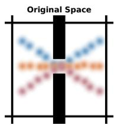

<details>
<summary>text_image</summary>

Original Space
</details>

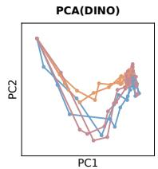

<details>
<summary>line chart</summary>

| PC1 | PC2 |
| --- | --- |
| 1   | 1   |
| 2   | 0.5 |
| 3   | 0.3 |
| 4   | 0.7 |
| 5   | 0.9 |
| 6   | 0.6 |
| 7   | 0.8 |
| 8   | 0.4 |
| 9   | 0.2 |
| 10  | 0.1 |
</details>

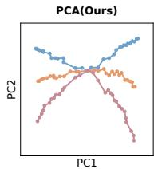

<details>
<summary>line chart</summary>

| PC1 | PC2 | PCA(Ours) |
| --- | --- | --- |
| 0 | 0 | 0 |
| 1 | 1 | 1 |
| 2 | 2 | 2 |
| 3 | 3 | 3 |
| 4 | 4 | 4 |
| 5 | 5 | 5 |
| 6 | 6 | 6 |
| 7 | 7 | 7 |
| 8 | 8 | 8 |
| 9 | 9 | 9 |
| 10 | 10 | 10 |
| 11 | 11 | 11 |
| 12 | 12 | 12 |
| 13 | 13 | 13 |
| 14 | 14 | 14 |
| 15 | 15 | 15 |
| 16 | 16 | 16 |
| 17 | 17 | 17 |
| 18 | 18 | 18 |
| 19 | 19 | 19 |
| 20 | 20 | 20 |
| 21 | 21 | 21 |
| 22 | 22 | 22 |
| 23 | 23 | 23 |
| 24 | 24 | 24 |
| 25 | 25 | 25 |
| 26 | 26 | 26 |
| 27 | 27 | 27 |
| 28 | 28 | 28 |
| 29 | 29 | 29 |
| 30 | 30 | 30 |
| 31 | 31 | 31 |
| 32 | 32 | 32 |
| 33 | 33 | 33 |
| 34 | 34 | 34 |
| 35 | 35 | 35 |
| 36 | 36 | 36 |
| 37 | 37 | 37 |
| 38 | 38 | 38 |
| 39 | 39 | 39 |
| 40 | 40 | 40 |
| 41 | 41 | 41 |
| 42 | 42 | 42 |
| 43 | 43 | 43 |
| 44 | 44 | 44 |
| 45 | 45 | 45 |
| 46 | 46 | 46 |
| 47 | 47 | 47 |
| 48 | 48 | 48 |
| 49 | 49 | 49 |
| 50 | 50 | 50 |
| 51 | 51 | 51 |
| 52 | 52 | 52 |
| 53 | 53 | 53 |
| 54 | 54 | 54 |
| 55 | 55 | 55 |
| 56 | 56 | 56 |
| 57 | 57 | 57 |
| 58 | 58 | 58 |
| 59 | 59 | 59 |
| 60 | 60 | 60 |
| 61 | -   | -   |
| 62 | -   | -   |
| 63 | -   | -   |
| 64 | -   | -   |
| 65 | -   | -   |
| 66 | -   | -   |
| 67 | -   | -   |
| 68 | -   | -   |
| 69 | -   | -   |
| 70 | -   | -   |
| 71 | -   | -   |
| 72 | -   | -   |
| 73 | -   | -   |
| 74 | -   | -   |
| 75 | -   | -   |
| 76 | -   | -   |
| 77 | -   | -   |
| 78 | -   | -   |
| 79 | -   | -   |
| 80 | -   | -   |
| 81 | -   | -   |
| 82 | -   | -   |
| 83 | -   | -   |
| 84 | -   | -   |
| 85 | -   | -   |
| 86 | -   | -   |
| 87 | -   | -   |
| 88 | -   | -   |
| 89 | -   | -   |
| 90 | -   | -   |
| 91 | -   | -   |
| 92 | -   | -   |
| 93 | -   | -   |
| 94 | -   | -   |
| 95 | -   | -   |
| 96 | -   | -   |
| 97 | -   | -   |
| 98 | -   | -   |
| 99 | -   | -   |
| PC1: PCA(Ours) = PC2: PC1
PC2: PC1
</details>

Figure 1. Latent trajectories encoded by a pretrained visual encoder are usually highly curved, increasing the difficulty of prediction and planning. We learn a representation space where feasible trajectories are straighter to facilitate latent planning.

nores noise, making dynamics learning more efficient. At test time, planning is typically posed as optimizing an action sequence by rolling the model forward and minimizing a cost function between the goal and the predicted states in the latent space.

In practice, however, optimization in the learned latent space remains challenging. The induced planning objective is typically highly non-convex, potentially causing gradientbased optimizers to struggle. As a result, many successful practices (Hafner et al., 2019; Hansen et al., 2024; Zhou et al., 2025; Sobal et al., 2025; Terver et al., 2025) rely on search-based methods such as CEM (Rubinstein, 1997) or MPPI (Williams et al., 2015), which achieve competitive performance but introduce a substantial compute burden and latency. Moreover, commonly used goal cost metrics based on Euclidean distance can be misleading if the embedding space is not properly regularized. In particular, when latent trajectories are highly curved, straight-line distances in embedding space misrepresent the geodesic distance along feasible transitions. These challenges call for better representations that facilitate latent planning.

What is a “good” representation for latent planning? Although general-purpose visual pretraining provides powerful semantic-aware features, it is not tailored to the dynamics of the environment and often retains plenty of planningirrelevant low-level details. We argue that planning could benefit from representations that are (i) sufficient for predicting dynamics but without task-irrelevant information and (ii) properly regularized so that embedding distances reflect the geodesic distance and gradient-based optimization is reliable. With such representations, we can exploit the differentiability of latent world models and enable efficient gradient-based planning, bypassing the need for computationally expensive search-based methods.

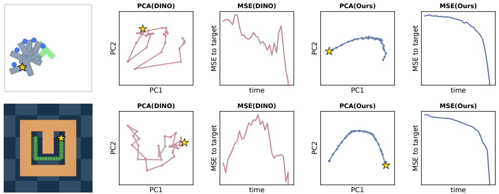  
Figure 2. Latent trajectories before vs. after straightening. The upper PushT example is a rotation and the bottom UMaze example shows the agent traveling from the top-left to the top-right, with the star denoting the target. Straightening yields less curved and smoother trajectories, and makes Euclidean distance a more faithful proxy for geodesic progress towards the goal. More examples are in Section E.2.

Inspired by the perceptual straightening hypothesis in human vision (Henaff et al. ´ , 2019), which posits that visual systems transform complex natural videos into straighter internal representations, we introduce a simple approach to straighten latent trajectories for planning. Concretely, we jointly learn an encoder and a predictor of a Joint-Embedding Predictive Architecture (JEPA) world model, while imposing regularization on the curvature of latent trajectories during training. We find that the JEPA prediction objective alone induces implicit straightening to some extent, and introducing an explicit curvature regularizer further strengthens and stabilizes this effect. The resulting encoded trajectories are significantly straighter, with Euclidean distances better aligned with geodesic distances (Figure 2). We prove that reducing curvature improves convergence of gradient-based planners, and observe superior empirical gains across a suite of goal-reaching tasks: open-loop planning success improves by 20–60% and MPC by 20–30% with a simple gradient-based planner.

## 2. Related Work

While early visual world models directly predict in pixel spaces and use generated images for control (Oh et al., 2015; Finn & Levine, 2017; Ebert et al., 2018; Du et al., 2023), an increasing number of recent works first encode highdimensional sensory inputs into compact latent representations and plan in the resulting latent space. Learning representations is central to these latent world models.

To obtain meaningful representations for world modeling, prior methods add reconstruction-based objectives when training the encoder along with the predictor (Watter et al., 2015; Zhang et al., 2019b; Levine et al., 2020; Ha & Schmidhuber, 2018; Hafner et al., 2019; 2020; Micheli et al., 2023; Robine et al., 2023). However, these reconstruction objectives overemphasize low-level visual details that are unnecessary for planning and may fail to capture task-relevant information. More recent approaches decouple perception from dynamics by leveraging strong pretrained visual encoders (Nair et al., 2022; Zhou et al., 2025; Bar et al., 2025; Goswami et al., 2025; Bai et al., 2025; Assran et al., 2025). Closest to our setup, DINO-WM (Zhou et al., 2025) trains task-agnostic predictors and plans directly in frozen DI-NOv2 (Oquab et al., 2024) feature space. While DINOv2 features provide high-quality visual representations, they are not optimized for planning and may lead to planning objectives that are challenging to optimize. In this work, we improve the representation space for planning by introducing a curvature regularization during world model training.

Joint-Embedding Predictive Architecture (JEPA) emerges as a promising paradigm for world models by learning representations through prediction (LeCun, 2022; Bardes et al., 2024; Assran et al., 2025). It aims to capture predictable structure without retaining unpredictable low-level details, making it more effective and efficient than reconstruction objectives (Assel et al., 2025). This paradigm has been shown to be effective for predictive modeling and planning, with training from scratch on offline simulator data (Sobal et al., 2025) and large-scale real-world video pretraining followed by action-conditioned post-training for robotic planning (Assran et al., 2025). Our work also belongs to the JEPA family and focuses on learning better representations.

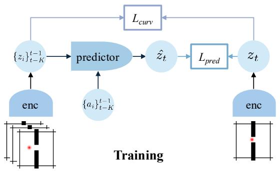

<details>
<summary>flowchart</summary>

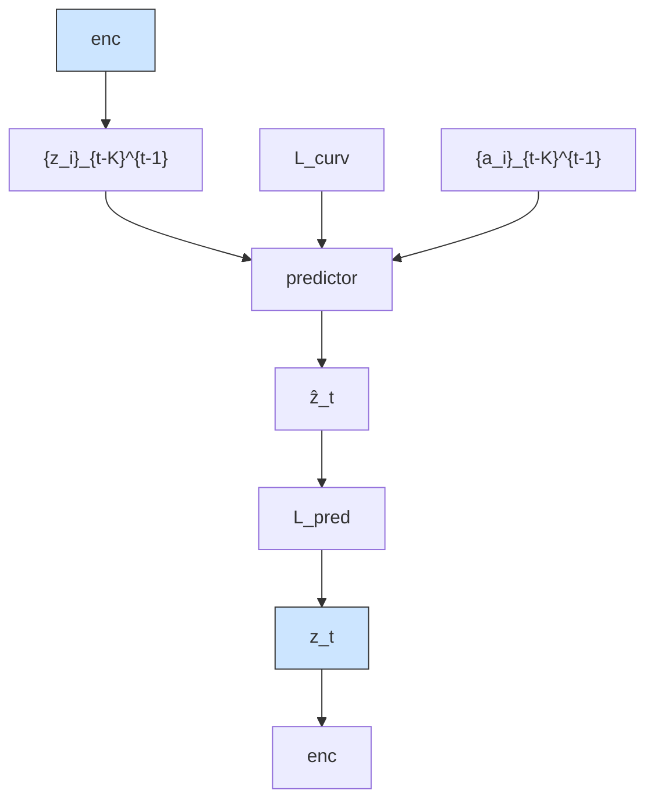
</details>

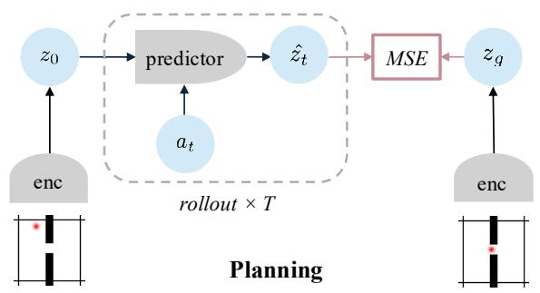

<details>
<summary>flowchart</summary>

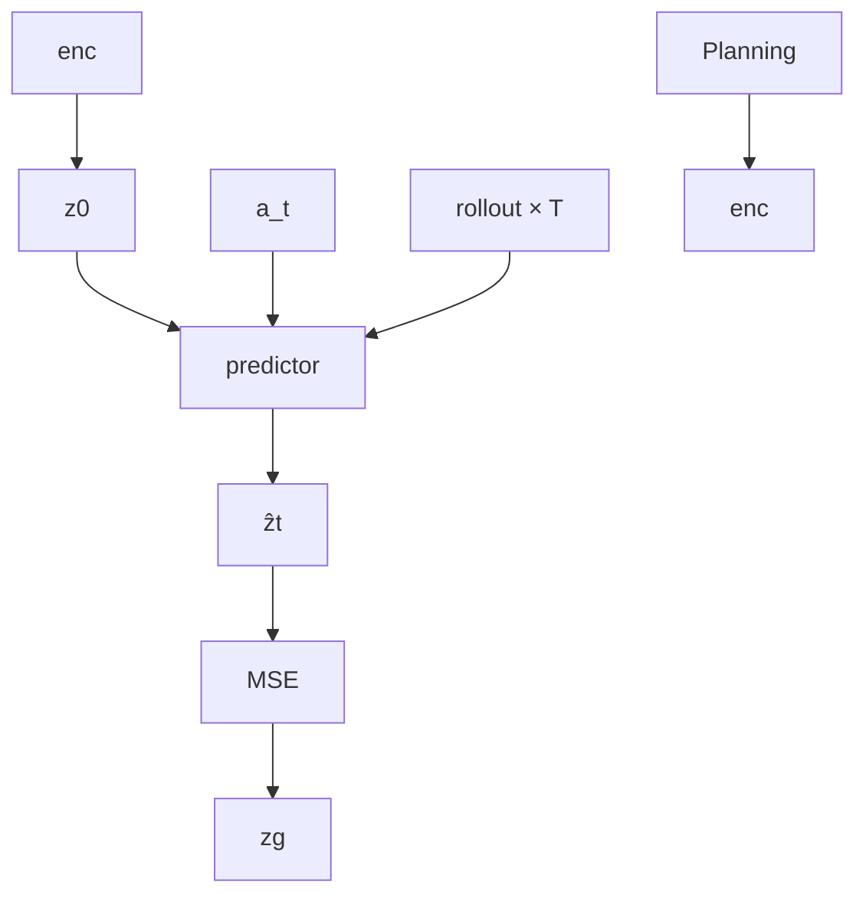
</details>

Figure 3. During training, we minimize the prediction loss between the predicted embedding $\hat { z } _ { t } ^ { t }$ and the target $z _ { t } ^ { t }$ with stop-grad in the target branch, and minimize the local curvature of embeddings. During planning, we roll out for the horizon $\check { T }$ using the trained predictor and select optimal actions that minimize the cost between the predicted terminal state and the goal in the embedding space.

Temporal Contrastive Learning (Sermanet et al., 2018; Dave et al., 2022; Eysenbach et al., 2024; Yang & Ren, 2025) is also a popular paradigm for learning representations that can reflect the temporal relationships. It encourages temporally close frames to have similar embeddings while distant frames have more dissimilar embeddings through InfoNCE loss (Radford et al., 2021). However, how to choose positive and negative samples requires careful tuning and this objective might push away geodesically close states if suboptimal trajectories are used. Instead, our regularizationbased method does not require negatives and applies local straightening without requiring expert trajectories.

Motivated by the perceptual straightening hypothesis in human vision (Henaff et al. ´ , 2019), some prior works have examined implicit straightening in pretrained visual encoders (Harrington et al., 2023; Interno et al. \` , 2025) or used it as an objective to obtain robust video models (Niu et al., 2024; Bagad & Zisserman, 2025). Relatedly, early work on learning linearized video representations also regularizes the curvature of latent trajectories (Goroshin et al., 2015). Implicit straightening is also observed in autoregressive language models optimized for next-word prediction (Hosseini & Fedorenko, 2023; Hosseini et al., 2026). To the best of our knowledge, however, none of these prior works have studied the impact of straightening on world modeling and planning. We further discuss the connection of our work to a broader literature in control and learning plannable representations in Section D.

## 3. Temporal Straightening

We consider control tasks with high-dimensional observations $o _ { t } \in \mathbb { R } ^ { n _ { o } }$ of an agent interacting with its environment using actions $a _ { t } \in \mathbb { R } ^ { n _ { a } }$ . Our goal is to learn a world model that maps observations to a latent space and models the dynamics in this space, which we use for latent planning.

In this section, we first outline the architecture of our world model, then define the training objectives with a novel geometric regularization that straightens latent trajectories.

## 3.1. World Model

Our world model predicts future states in a learned latent space and consists of three components: a sensory encoder, an action encoder, and a predictor.

Sensory encoder. The sensory encoder $\mathcal { E } _ { \phi } ^ { s }$ maps raw observations $o _ { t }$ into latent representations

$$
z _ {t} \in \mathbb {R} ^ {d} = \mathcal {E} _ {\phi} ^ {s} (o _ {t}). \tag {1}
$$

The sensory encoder can be any function that maps observations to latent representations. For visual observations, the encoder may preserve spatial structure or collapse it into a global vector representation.

Action encoder. Each action $a _ { t } \in \mathbb { R } ^ { n _ { a } }$ is mapped to a latent action embedding via

$$
\mathcal {E} _ {\psi} ^ {a}: \mathbb {R} ^ {n _ {a}} \to \mathbb {R} ^ {d _ {a}}.
$$

Predictor. The predictor $f _ { \theta } : \mathbb { R } ^ { K \times d } \times \mathbb { R } ^ { K \times d _ { a } }  \mathbb { R } ^ { d }$ models transitions in the latent space. Given a history of $K$ past latent states and actions, it predicts the next latent state

$$
\hat {z} _ {t} = f _ {\theta} \left(\{z _ {i} \} _ {i = t - K} ^ {t - 1}, \{\mathcal {E} _ {\psi} ^ {a} (a _ {i}) \} _ {i = t - K} ^ {t - 1}\right). \tag {2}
$$

## 3.2. Straightening Latent Trajectories

We seek to straighten the latent space induced by the sensory encoder $\mathcal { E } _ { \phi } ^ { s }$ by penalizing the curvature along trajectories. Let $z _ { t } , z _ { t + 1 }$ , and $z _ { t + 2 }$ be three consecutive latent representations obtained by encoding observations $o _ { t } , o _ { t + 1 }$ , and $o _ { t + 2 }$ using $\mathcal { E } _ { \phi } ^ { s }$ . We define approximate latent velocity vectors

$$
v _ {t} = z _ {t + 1} - z _ {t}, \quad v _ {t + 1} = z _ {t + 2} - z _ {t + 1}, \tag {3}
$$

and seek to minimize the angle between them, or equivalently maximize their cosine similarity

$$
\mathcal {C} = \frac {v _ {t} \cdot v _ {t + 1}}{| | v _ {t} | | _ {2} \cdot | | v _ {t + 1} | | _ {2}}. \tag {4}
$$

## 3.3. Training Objective.

The parameters ϕ, ψ and θ of the world model components $\mathcal { E } _ { \phi } ^ { s } , \mathcal { E } _ { \psi } ^ { a }$ E ψ and $f _ { \theta }$ are trained jointly to minimize prediction error and enforce straightened trajectories.

Prediction objective. We minimize the MSE between the predicted and target latent states $\hat { z } _ { t + 1 }$ and $z _ { t + 1 }$ :

$$
\mathcal {L} _ {p r e d} = \left| \left| \hat {z} _ {t + 1} - \operatorname{sg} \left(z _ {t + 1}\right) \right| \right| _ {2} ^ {2}, \tag {5}
$$

where sg denotes the stop-gradient operation to prevent collapse of the latent space.

Straightening objective. We minimize trajectory curvatures by minimizing the negative cosine similarity

$$
\mathcal {L} _ {\text { curv }} = 1 - \mathcal {C}. \tag {6}
$$

This straightening loss can be applied to any differentiable sensory encoder, either in isolation or jointly with the prediction objective.

Overall objective. The total training objective combines prediction and straightening as

$$
\mathcal {L} _ {\text { total }} = \mathcal {L} _ {\text { pred }} + \lambda \mathcal {L} _ {\text { curv }}, \tag {7}
$$

where $\lambda \geq 0$ controls the strength of the straightening.

Collapse prevention. Since our encoder is trainable, the model is likely to produce degenerate solutions in which all latent representations collapse to a constant. Common anti-collapse strategies can be regularization-based (Bardes et al., 2022; Zhu et al., 2024; Balestriero & LeCun, 2025; Kuang et al., 2026), contrastive-based (Chen et al., 2020; He et al., 2020), and stop-gradient-based (Chen & He, 2021; Grill et al., 2020). Our curvature regularizer is orthogonal to these anti-collapse methods and can be combined with any of them. We use stop-grad for major experiments due to its simplicity and efficiency, as it does not require negative samples or introduce new hyperparameters. We apply stop-gradient to the target latent in the prediction loss (5) to prevent the gradients from $\mathcal { L } _ { p r e d }$ from being backpropagated through the target branch. Although a collapsing solution is still possible in theory, stop-grad has been shown to be effective in self-supervised vision learning (Chen & He, 2021), and also effective in our experiments.

## 4. Planning with Straightened Dynamics

In this section, we present a theoretical analysis on the effect of straightening in the case of a linear dynamical system and show that straightened latent dynamics lead to better convergence in gradient-based planning.

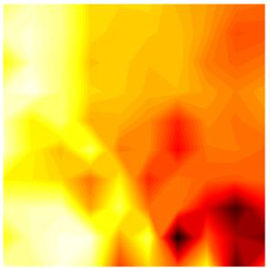

<details>
<summary>natural_image</summary>

Abstract thermal or heat map pattern with warm yellow-orange tones and cool red-yellow regions (no text or symbols)
</details>

(a) DINOv2

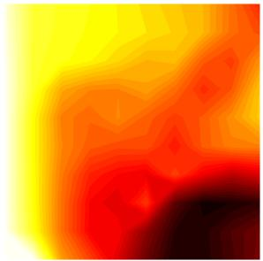

<details>
<summary>natural_image</summary>

Abstract thermal or heat map pattern with yellow-orange gradient and red-blue gradient (no text or symbols)
</details>

(b) Straightened  
Figure 4. Action-Space Loss Landscape. We pick one test sample from PushT with a planning horizon of 25 steps. For each coordinate $( a _ { x } , a _ { y } )$ in the grid, we fix the first action and optimize the remaining actions in the planning horizon to minimize the terminal goal cost. The heatmap represents the minimum attainable loss for each initial action choice, with darker colors indicating lower loss. The loss landscape is closer to being convex after straightening.

We consider a goal-reaching task where we optimize an action sequence $\mathbf { a } = ( a _ { 0 } , \ldots , a _ { K - 1 } ) \in \mathbb { R } ^ { K \times d _ { a } }$ over a horizon $\bar { K }$ to reach a target latent goal $z _ { g }$ . For simplicity, we use the mean-squared terminal error,

$$
\mathcal {L} (\mathbf {a}) = \| z _ {K} - z _ {g} \| _ {2} ^ {2}, \quad z _ {K} = \Phi (\mathbf {a}), \tag {8}
$$

where $\Phi$ denotes unrolling the learned latent dynamics from a fixed initial state $z _ { 0 }$ .

Assumption 4.1 (Linear latent dynamics). For analysis, we consider linear latent dynamics

$$
f: \left(z _ {t}, a _ {t}\right)\rightarrow A z _ {t} + B a _ {t}, \quad \text { s.t. } \quad z _ {t + 1} = A z _ {t} + B a _ {t}, \tag {9}
$$

where $A \in \mathbb { R } ^ { d \times d }$ and $B \in \mathbb { R } ^ { d \times d _ { a } }$ . We first state results for $d _ { a } = d$ and B invertible; see Remark 4.5 for $d _ { a } < d .$

Definition 4.2 (ε-straight transition). Under the linear dynamics, we call f ε-straight if

$$
\left\| A - I \right\| _ {2} \leq \varepsilon . \tag {10}
$$

The term “straight” reflects that, as ε tends to 0, the dynamics of $f$ approach those of the reference function $g : ( z _ { t } , a _ { t } )  z _ { t } + B a _ { t }$ , where the state evolves linearly along a straight trajectory modified only by the control input. We are primarily interested in the regime where ε is small.

Remark 4.3 (Cosine similarity as a practical proxy). In practice, we regularize temporal straightness using the cosine similarity between consecutive latent velocities (4). Under mild bounded-variation assumptions on velocity magnitudes and smooth actions, a large cosine similarity implies that (A − I) is small along visited velocity directions. Detailed proofs are in Section C.3.

Theorem 4.4 (Conditioning of the planning Hessian). Under Assumption 4.1 with $d _ { a } \ = \ d$ and B invertible, unrolling (9) yields

$$
z _ {K} = A ^ {K} z _ {0} + \sum_ {t = 0} ^ {K - 1} A ^ {K - 1 - t} B a _ {t},
$$

$s o \ z _ { K }$ is affine in a and the planning Hessian is

$$
H := \nabla_ {\mathbf {a}} ^ {2} \mathcal {L} (\mathbf {a}) = 2 J _ {\Phi} ^ {\top} J _ {\Phi} \succeq 0,
$$

where $J _ { \Phi } = \left[ A ^ { K - 1 } B , \ A ^ { K - 2 } B , \ \cdot \cdot \cdot , \ B \right] \in \mathbb { R } ^ { d \times K d }$ . $\begin{array} { r } { \mathcal { W } _ { K } : = J _ { \Phi } J _ { \Phi } ^ { \top } = \sum _ { k = 0 } ^ { K - 1 } A ^ { k } B B ^ { \top } ( A ^ { \top } ) ^ { k } } \end{array}$ horizon controllability Gramian (Kailath, 1980; Sontag, 1998; Chen, 1999). Then the effective condition number $\kappa _ { \mathrm { e f f } } ( H ) : = \sigma _ { \mathrm { m a x } } ( H ) / \sigma _ { \mathrm { m i n } } ^ { + } ( H )$ satisfies

$$
\kappa_ {\text { eff }} (H) = \kappa (\mathcal {W} _ {K}) \leq \kappa (B) ^ {2} \frac {\sum_ {k = 0} ^ {K - 1} \sigma_ {\max} (A) ^ {2 k}}{\sum_ {k = 0} ^ {K - 1} \sigma_ {\min} (A) ^ {2 k}} \tag {11}
$$

$$
\leq \kappa (B) ^ {2} \kappa (A) ^ {2 (K - 1)},
$$

where $\kappa ( A ) : = \sigma _ { \mathrm { m a x } } ( A ) / \sigma _ { \mathrm { m i n } } ( A )$ . Moreover, if the transition is ε-straight with $\varepsilon = \| A - I \| _ { 2 } < 1$ , then

$$
\kappa_ {\text { eff }} (H) \leq \kappa (B) ^ {2} \left(\frac {1 + \varepsilon}{1 - \varepsilon}\right) ^ {2 (K - 1)}. \tag {12}
$$

For $\varepsilon \leq \frac { 1 } { 2 }$ , this gives $\kappa _ { \mathrm { e f f } } ( H ) ~ \leq ~ \kappa ( B ) ^ { 2 } e ^ { 6 \varepsilon K }$ .

Proofs are in Section C.2.

Remark 4.5 (Low-dimensional actions). When $d _ { a } \ < \ d ,$ B is not invertible and $\mathcal { W } _ { K }$ (hence H) may be singular outside the controllable subspace. Theorem 4.4 holds on $\begin{array} { r l } { { \cal S } _ { K } } & { { } = } \end{array}$ range $( \mathcal { W } _ { K } )$ when $\kappa _ { \mathrm { e f f } }$ is computed using $\sigma _ { \mathrm { m i n } } ^ { + } ( \mathcal { W } _ { K } )$ ; see Section C.2.

Theorem 4.4 shows that ε-straight transitions control the condition number of the planning Hessian: when $\varepsilon =$ $\| A - I \| _ { 2 }$ is small, the Gramian remains better conditioned, yielding $\kappa _ { \mathrm { e f f } } ( H )$ that grows slowly with the horizon. Since the planning objective is quadratic with Hessian $H \succeq 0 ,$ gradient descent converges linearly at a rate controlled by the condition number, so the improved bounds on $\kappa _ { \mathrm { e f f } } ( H )$ translate to faster optimization in practice. For nonlinear predictors $z _ { t + 1 } = f _ { \theta } ( z _ { t } , a _ { t } )$ , analogous guarantees require controlling products of state-dependent Jacobians and higherorder terms, which can be an exciting future work direction.

Empirically, we observe that straightening yields a loss landscape with reduced non-convexity under nonlinear dynamics (Figure 4). In the next section, we show that it improves gradient-based planning.

## 5. Experiments

To test the effectiveness of the proposed method, we evaluate planning on four environments: Wall (Zhou et al., 2025; Sobal et al., 2025), PointMaze UMaze and a more complicated medium maze (Fu et al., 2020), and PushT (Chi et al., 2025). We compare against the baseline DINO-WM (Zhou et al., 2025), which builds on frozen DINOv2 spatial features or CLS tokens. Following DINO-WM’s setup, we use a frameskip of 5 for all environments. Details on the environments and experiments are in Sections A and B.

## 5.1. Architecture details

Here, we describe the encoder and predictor architectures used to instantiate our world model.

Visual encoder. We consider two encoder setups for the $\mathcal { E } _ { \phi } ^ { s } \mathrm { . }$

• A frozen pretrained visual backbone with a lightweight projector: We use DINOv2 (Oquab et al., 2024) as the backbone.1 Given an observation, the backbone produces spatial features $\boldsymbol { e } _ { t } \in \mathbb { R } ^ { M \times D }$ . We add a trainable lightweight CNN projector $\mathcal { P } _ { \phi }$ on top of the backbone, leading to

$$
z _ {t} ^ {v} = \mathcal {P} _ {\phi} (e _ {t}) \in \mathbb {R} ^ {m _ {v} \times d _ {v}}, \tag {13}
$$

where we usually choose $m _ { v } \le M$ and $d _ { v } \leq D$ . The projector may reduce spatial resolution (pooling/striding), channel dimension, or both, encouraging abstraction and reducing computation.

• A ResNet (He et al., 2015) trained from scratch, producing features $z _ { t } ^ { v } \in \mathbb { R } ^ { m _ { v } \times d _ { v } }$ directly.

Predictor. We use a ViT (Dosovitskiy et al., 2021) as the dynamics predictor $f _ { \theta } .$ . When available, proprioceptive states $p _ { t } \in \mathbb { R } ^ { n _ { p } }$ are encoded via $\mathcal { E } _ { \xi } ^ { p } : \mathbb { R } ^ { n _ { p } }  \mathbb { R } ^ { d _ { p } }$ and concatenated with each visual spatial feature. To condition on actions, we concatenate the action embeddings $z _ { t } ^ { a } = \mathcal { E } _ { \psi } ^ { a } ( a _ { t } ) \in \mathbb { R } ^ { d _ { a } }$ with the visual and proprioceptive embeddings before passing them to the predictor. We apply a temporal causal attention mask so tokens at time t attend only to frames $\{ t - K , \ldots , t - 1 \}$ , enabling frame-level autoregressive prediction.

Cosine similarity computation. The straightening loss (Eq. (4)) is only applied on visual latents $z _ { t } ^ { v }$ . Different implementations depend on whether latent representations preserve spatial structure:

• Global features $( n _ { v } = 1 )$ : Compute the cosine similarity directly between vectors.

• Spatial features $( n _ { v } > 1 )$ : We consider four variants: (i) compute the cosine similarity per-patch and average across patches; (ii) flatten all spatial features and then compute the cosine similarity; (iii) average-pool the spatial features before cosine similarity; (iv) use a learnable aggregation head to aggregate spatial features before cosine similarity. We use (iv) in the main experiments and ablate these choices in Section B.6.

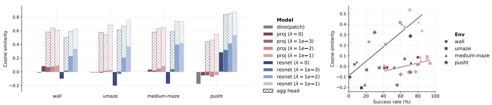  
Figure 5. Latent Curvature and Open-Loop GD Success Rate for Different Encoders. Higher cosine similarity indicates lower curvature. Here, we compare models with spatial features and report the average patch-wise cosine similarity. Given the same type of encoder, reduced curvature generally leads to higher success rates.

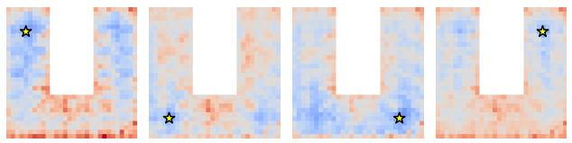

<details>
<summary>natural_image</summary>

Four identical pixelated panels with blue and orange tones, each containing a star symbol (no text or symbols present)
</details>

(a) DINOv2 CLS embedding  


<details>
<summary>natural_image</summary>

Abstract geometric pattern with red and blue vertical bars and star markers (no text or symbols)
</details>

(c) Straightened (spatial features)

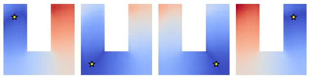

<details>
<summary>natural_image</summary>

Four abstract geometric shapes with blue and red gradients and small yellow stars, no text or symbols present.
</details>

(b) Straightened (agg head)  
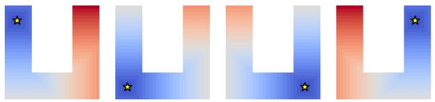

<details>
<summary>natural_image</summary>

Four abstract geometric shapes with blue and red gradient fill and black star symbols at top corners (no text or symbols)
</details>

(d) Ground-Truth using A-star  
Figure 6. Distance heatmaps of PointMaze (blue indicates small values, and red indicates large values). The yellow star represents the target, and we compute the Euclidean distance between its embedding and those of all other states in the maze. Figures 6b and 6c use $z \in \mathbb { R } ^ { 1 4 \times 1 4 \times 8 }$ reflects the minimum number of steps required to reach the target.

## 5.2. How good is the embedding space?

We first inspect the learned embedding space before comparing the downstream planning performance. We measure latent trajectory curvatures and latent Euclidean distances to understand the impact of straightening. For interpretability, we train a VAE (Kingma & Welling, 2013; van den Oord et al., 2017) decoder with a reconstruction loss, detaching latents to stop gradients from the encoder and predictor.

We find that (i) implicit straightening can happen in JEPA world models when training the encoder using the prediction loss alone; (ii) adding explicit curvature regularization further strengthens and stabilizes the straightening effect; (iii) straightening encourages the latent Euclidean distance to better align with the geodesic distance; (iv) near-perfect reconstruction can be attained with a very low feature dimensionality.

Reduced curvature. In Figure 5, we compare the curvature of test latent trajectories by computing the cosine similarity of the difference in adjacent frames as in Equation (6). We also visualize the latent trajectories using PCA as shown in Figure 2 and Section E.2.

The pretrained DINOv2 embedding space is highly curved as shown in the PCA plots and reflected by the low cosine similarities. The embedding space generally becomes straighter after training even without explicit straightening regularization. We attribute this implicit straightening to the JEPA objective: it favors representations whose temporal evolution is easy to predict, so training pressure reduces abrupt directional changes in the latent trajectory. With the explicit straightening regularization, the curvature of the embedding space is effectively reduced further. We observe that training a ResNet encoder from scratch generally yields lower curvatures than training a projector on top of a frozen pretrained backbone, likely because it offers greater representational flexibility to adapt the geometry to the dynamics.

When straightening is applied to the aggregation head, the curvature of the aggregated features is significantly reduced while the underlying spatial features are not forced to be overly straightened. For example, PushT has more complex object motions and the patch-wise cosine similarity is unable to faithfully capture the global state changes. The introduction of an aggregation head increases the flexibility of representation learning and generally leads to better planning performance (see Section B.6). We thus use this implementation for the main experiments.

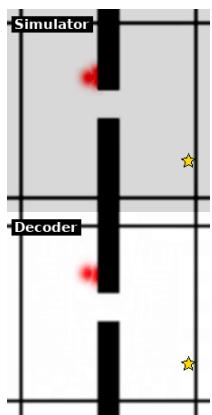

<details>
<summary>text_image</summary>

Simulator
Decoder
</details>

(a) Wall: DINO

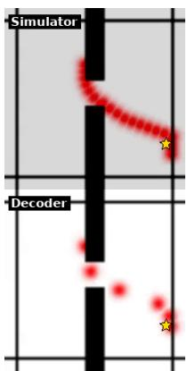

<details>
<summary>text_image</summary>

Simulator
Decoder
</details>

(b) Wall: Ours

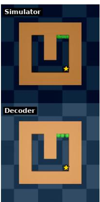

<details>
<summary>text_image</summary>

Simulator
Decoder
</details>

(c) UMaze: DINO

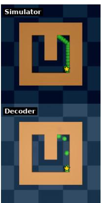

<details>
<summary>text_image</summary>

Simulator
Decoder
</details>

(d) UMaze: Ours

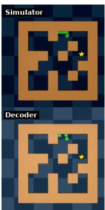

<details>
<summary>text_image</summary>

Simulator
Decoder
</details>

(e) Medium: DINO

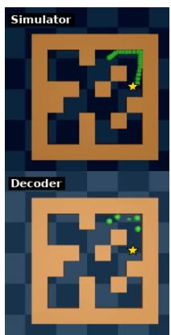

<details>
<summary>text_image</summary>

Simulator
Decoder
</details>

(f) Medium: Ours  
Figure 7. Comparison of Open-loop GD Planning. The star denotes the target. For each subfigure, the upper row shows the overlaid rendered images from the simulator by executing the actions, and the bottom shows imaginary rollouts (with a frameskip of 5) decoded using a trained decoder. GD planners can easily get stuck with pretrained DINOv2 features, while straightening significantly increases success. More examples of open-loop planning are in Section E.3.

Faithful distance. Although DINOv2 is a strong visual encoder for various downstream vision tasks, it is not optimized for planning and control. As shown in Figure 2, MSE (which is equal to the squared Euclidean distance) between pretrained DINOv2 features does not reflect the progress of moving towards the target. To better understand the limitation of DINOv2, we visualize the Euclidean distance between the embedding of a target state and all other states in the maze in Figure 6. We also compare with ground-truth geodesic distance maps, computed using the A-star search algorithm on the grid of the maze. More heatmaps from different environments and encoders are in Section E.1.

Straightening results in a distance heatmap that closely aligns with the geodesic distance. Notably, the model is only trained on suboptimal, non-expert trajectories. Yet, it does not simply memorize the inefficient paths from the training data; instead, it learns to approximate the minimum number of steps required to transition between states. We also find that the spatial features and aggregated global features capture different levels of distance information. The spatial features preserve local geometry and thus yield fine-grained, locally discriminative distance variations, whereas global features provide a smoother, more coherent long-range signal that better reflects long-horizon distance-to-goal trends.

Sufficient information. To examine whether or not these projected features preserve sufficient information for planning, we train a decoder to reconstruct images from latents. The decoder is solely for interpretability purposes and is detached from the world model via stop-gradient. Note that perfect reconstruction is not required, since planning only depends on task-relevant information. However, in our visually simple environments, even aggressively compressed features reconstruct the observations with high fidelity, as shown in Figure 7. This indicates that the resulting features retain sufficient planning-relevant information.

## 5.3. Planning

We show that straightening can significantly improve the planning success rates across models and environments.

Setup. The start states and goals are sampled from test trajectories to guarantee that goals can be reached within 25 steps. We follow DINO-WM (Zhou et al., 2025) in using a frameskip of five, so we only need to roll out the world model for H = 5 times. During test time, an action sequence is optimized using gradient descent through the learned dynamics model (fθ) to minimize a goal cost. For PushT, we assume we have both target images and proprioceptions; for other environments, we only use target images to increase the task difficulty.

We evaluate performance in both open-loop and closed-loop settings. Open-loop planning optimizes a length-H action sequence using the MSE between the terminal embedding and the target embedding as the planning cost. Closed-loop MPC replans at every step: it optimizes a length-H action sequence, executes only the first action, and then replans, using a weighted objective that encourages the predicted trajectory to approach the target (see Section B.1). For PushT specifically, we use only the terminal loss within horizon H because regime-switching dynamics make intermediatestate loss misleading, so we apply the weighted intermediate loss only beyond H where it is more stable.

Results. As shown in Table 1, we observe a significant improvement across all models and environments. When training the projectors or encoders, we observe an improvement in performance even without the straightening regularization. We attribute this improvement to the implicit straightening during training as discussed in Section 5.2. For ResNet with spatial features, we observe abnormally low success rates for Wall, PointMaze-UMaze and PointMaze-Medium, which could be explained by the extremely high curvature in Figure 5, suggesting a degradation of features. We also notice that the implicit straightening is the weakest for the UMaze when using the projector, which also results in the lowest improvement in planning.

Table 1. Goal-reaching Success Rate of 50 Test Samples (%) using the GD planner. Values are mean ± std over three data sampling seeds. The best values are bold. The shaded rows are ours while the rest is DINO-WM (Zhou et al., 2025).

<table><tr><td rowspan="2">Encoder</td><td colspan="2">Config</td><td colspan="2">Wall</td><td colspan="2">PointMaze – U Maze</td><td colspan="2">PointMaze – Medium</td><td colspan="2">PushT</td></tr><tr><td>dim</td><td> $\mathcal{L}_{curv}$ </td><td>Open-loop</td><td>MPC</td><td>Open-loop</td><td>MPC</td><td>Open-loop</td><td>MPC</td><td>Open-loop</td><td>MPC</td></tr><tr><td>DINOv2 (CLS)</td><td>1 × 384</td><td>X</td><td>28.67 ± 12.68</td><td>66.67 ± 10.50</td><td>25.33 ± 0.94</td><td>82.67 ± 9.98</td><td>20.00 ± 8.16</td><td>67.50 ± 3.54</td><td>19.33 ± 8.22</td><td>28.00 ± 1.63</td></tr><tr><td>DINOv2 (patch) + proj</td><td>1 × 384</td><td>X</td><td>28.67 ± 0.94</td><td>76.00 ± 4.90</td><td>34.67 ± 1.89</td><td>79.33 ± 2.49</td><td>18.00 ± 1.63</td><td>46.00 ± 3.27</td><td>2.00 ± 1.63</td><td>11.33 ± 3.40</td></tr><tr><td>DINOv2 (patch) + proj</td><td>1 × 384</td><td>√</td><td>42.00 ± 3.27</td><td>56.67 ± 4.11</td><td>38.67 ± 3.40</td><td>96.00 ± 0.00</td><td>22.67 ± 5.73</td><td>78.00 ± 2.83</td><td>5.33 ± 3.40</td><td>14.67 ± 0.94</td></tr><tr><td>ResNet (from scratch)</td><td>1 × 384</td><td>X</td><td>4.67 ± 3.40</td><td>10.00 ± 1.63</td><td>82.00 ± 8.49</td><td>96.00 ± 2.83</td><td>66.00 ± 2.83</td><td>91.33 ± 0.94</td><td>2.00 ± 2.83</td><td>29.33 ± 3.40</td></tr><tr><td>ResNet (from scratch)</td><td>1 × 384</td><td>√</td><td>84.00 ± 7.12</td><td>100.00 ± 0.00</td><td>52.00 ± 6.53</td><td>86.67 ± 0.94</td><td>54.00 ± 7.12</td><td>98.00 ± 0.00</td><td>19.33 ± 3.40</td><td>48.67 ± 4.99</td></tr><tr><td>DINOv2 (patch)</td><td>14 × 14 × 384</td><td>X</td><td>52.67 ± 5.73</td><td>76.67 ± 6.18</td><td>35.33 ± 4.11</td><td>80.67 ± 6.18</td><td>40.83 ± 10.07</td><td>76.67 ± 5.14</td><td>56.00 ± 4.32</td><td>66.00 ± 4.90</td></tr><tr><td>DINOv2 (patch) + proj</td><td>14 × 14 × 8</td><td>X</td><td>80.00 ± 7.12</td><td>90.67 ± 3.77</td><td>44.00 ± 7.12</td><td>81.33 ± 6.80</td><td>72.00 ± 4.32</td><td>96.67 ± 0.94</td><td>70.00 ± 1.63</td><td>78.67 ± 0.94</td></tr><tr><td>DINOv2 (patch) + proj</td><td>14 × 14 × 8</td><td>√</td><td>90.67 ± 0.94</td><td>100.00 ± 0.00</td><td>94.00 ± 1.63</td><td>100.00 ± 0.00</td><td>82.67 ± 3.77</td><td>98.67 ± 0.94</td><td>77.33 ± 6.18</td><td>85.33 ± 4.99</td></tr><tr><td>ResNet (from scratch)</td><td>14 × 14 × 8</td><td>X</td><td>1.33 ± 1.89</td><td>6.67 ± 1.89</td><td>14.67 ± 4.99</td><td>66.00 ± 9.09</td><td>18.67 ± 4.11</td><td>57.33 ± 4.71</td><td>71.33 ± 7.36</td><td>70.67 ± 10.50</td></tr><tr><td>ResNet (from scratch)</td><td>14 × 14 × 8</td><td>√</td><td>84.67 ± 2.49</td><td>100.00 ± 0.00</td><td>64.67 ± 8.38</td><td>98.67 ± 1.89</td><td>80.67 ± 0.94</td><td>99.33 ± 0.94</td><td>70.67 ± 0.94</td><td>91.33 ± 2.49</td></tr></table>

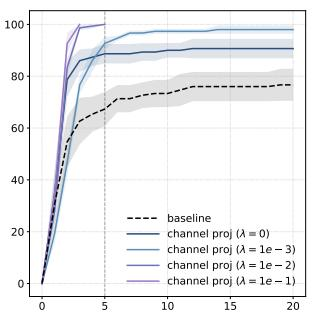

<details>
<summary>line chart</summary>

| x  | baseline | channel proj (λ = 0) | channel proj (λ = 1e-3) | channel proj (λ = 1e-2) | channel proj (λ = 1e-1) |
|----|----------|----------------------|-------------------------|-------------------------|-------------------------|
| 0  | 0        | 0                    | 0                       | 0                       | 0                       |
| 5  | 65       | 85                   | 90                      | 95                      | 98                      |
| 10 | 75       | 90                   | 95                      | 98                      | 99                      |
| 15 | 78       | 92                   | 96                      | 99                      | 99.5                    |
| 20 | 79       | 93                   | 97                      | 99.5                    | 99.8                    |
</details>

(a) Wall

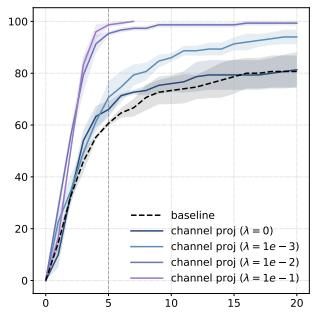

<details>
<summary>line chart</summary>

| x  | baseline | channel proj (λ = 0) | channel proj (λ = 1e-3) | channel proj (λ = 1e-2) | channel proj (λ = 1e-1) |
|----|----------|------------------------|---------------------------|---------------------------|---------------------------|
| 0  | 0        | 0                      | 0                         | 0                         | 0                         |
| 5  | 60       | 70                     | 80                        | 90                        | 95                        |
| 10 | 70       | 80                     | 85                        | 95                        | 98                        |
| 15 | 75       | 85                     | 90                        | 98                        | 99                        |
| 20 | 80       | 90                     | 95                        | 99                        | 100                       |
</details>

(b) PointMaze-UMaze

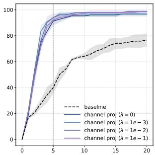

<details>
<summary>line chart</summary>

| x  | baseline | channel proj (λ = 0) | channel proj (λ = 1e-3) | channel proj (λ = 1e-2) | channel proj (λ = 1e-1) |
|----|----------|------------------------|---------------------------|---------------------------|---------------------------|
| 0  | 0        | 0                      | 0                         | 0                         | 0                         |
| 5  | 60       | 95                     | 95                        | 95                        | 95                        |
| 10 | 70       | 98                     | 98                        | 98                        | 98                        |
| 15 | 75       | 99                     | 99                        | 99                        | 99                        |
| 20 | 78       | 99                     | 99                        | 99                        | 99                        |
</details>

(c) PointMaze-Medium

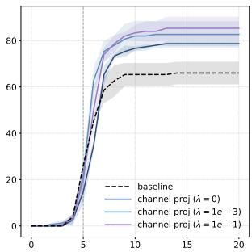

<details>
<summary>line chart</summary>

| x  | baseline | channel proj (λ = 0) | channel proj (λ = 1e-3) | channel proj (λ = 1e-1) |
|----|----------|------------------------|---------------------------|---------------------------|
| 0  | 0        | 0                      | 0                         | 0                         |
| 5  | 40       | 45                     | 50                        | 55                        |
| 10 | 65       | 75                     | 80                        | 85                        |
| 15 | 68       | 80                     | 85                        | 90                        |
| 20 | 70       | 85                     | 90                        | 95                        |
</details>

(d) PushT  
Figure 8. Success Rate over MPC Steps. The dashed black lines represent DINO-WM with frozen DINOv2 patch features. The solid $z \in \dot { \mathbb { R } } ^ { 1 4 \times 1 4 \times 8 } )$ strengths of straightening. Our model reaches 100% success rates very quickly as shown in Figures 8a and 8b.

Applying explicit straightening further strengthens the straightness in the embedding space, resulting in more than 10% boost in open-loop and MPC success rates for almost all setups. For example, UMaze’s open-loop success rate is improved from 44% to 94% with the projector, and 14.67% to 64.67% when training a ResNet from scratch. Note that we use weighted loss on intermediate states which enables reaching the target before consuming the full horizon H = 5. It is impressive that our model reaches 100% success with MPC on Wall and UMaze within only a few steps (Figure 8), suggesting it discovers more direct trajectories than the randomly generated test trajectories. The PushT success increases more slowly because we apply only the terminal loss within the horizon H = 5, yet straightening still yields substantial final gains. We also compare with other widely used temporal regularization, namely smoothness and temporal contrastiveness, in Section B.5, but find temporal straightening significantly more effective.

Comparison of CEM and GD. We compare the openloop performance of gradient descent (GD) and the crossentropy method (CEM) in Section B.3. Straightening regularization consistently improves the success rate of both planners. For example, on Wall and PushT, it improves the projector baseline by roughly 10% for both GD and CEM. Overall, CEM achieves higher success rates but requires substantially longer planning time than GD. With straightening, GD achieves a better success–latency trade-off.

Effect of feature dimensions. We find that preserving spatial structure generally matters more than retaining channels. When we keep all patch tokens, we can aggressively reduce the channel dimension of DINOv2 features from 384 down to 8 without degrading performance. Increasing the channel dimension to d ∈ {32, 128} does not improve performance and can even lead to a drop for some environments (Section B.4), which is not surprising as lower dimensions can simplify both dynamics prediction and downstream optimization. In contrast, collapsing patch features into a single global vector makes precise dynamics prediction harder. The predictor produces less accurate rollouts, which in turn reduces planning success. Notably, training a ResNet from scratch produces significantly better global features than training a global projector on frozen DINO patch features.

Long horizon. To further stress test our method, we also evaluate a longer-horizon setting where the target is 50 steps away. We leave out UMaze and Wall, because in those environments, a target picked via random 50-step rollouts can end up surprisingly close in terms of shortest-path distance, which does not reflect true long-horizon difficulty. We summarize the results in Table 2 and show success and failure examples in Figure 9. As expected, success rates drop substantially compared to the short-horizon setting, but our method consistently outperforms the baseline across all settings. More broadly, long-horizon rollouts remain a well-known challenge for latent planning where prediction errors compound over steps and lead to substantial trajectory drift. This is visible in failure cases where decoded rollouts become blurry or misaligned with the simulator.

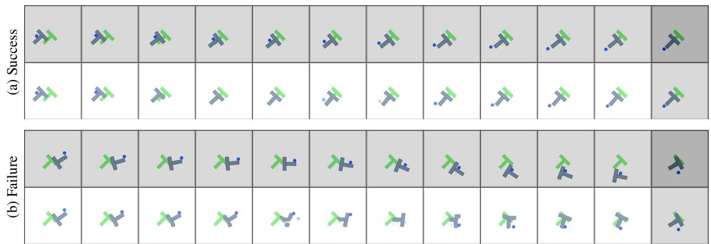

<details>
<summary>text_image</summary>

(a) Success
(b) Failure
</details>

Figure 9. Examples of Long-Horizon Open-Loop GD Planning on PushT. For each example, the top row shows simulator-rendered images and the bottom row shows decoded images, with the last column being the target. The failure example shows a case where the long-horizon imagined rollout does not match the real dynamics.

Motivated by Figure $^ { 6 , }$ where the aggregation head produces a smoother long-range distance signal than spatial features alone, we add a global goal cost for long-horizon planning. Specifically, we keep the spatial goal cost and add a goal cost computed in the aggregated feature space: $\mathcal { L } _ { \mathrm { p l a n } } =$ $\mathcal { L } _ { \mathrm { s p a t i a l } } + 0 . 1 \mathcal { L } _ { \mathrm { a g g } }$ . Here, $\mathcal { L } _ { \mathrm { s p a t i a l } }$ measures squared goal distance over spatial features, while $\mathcal { L } _ { \mathrm { a g g } }$ measures squared goal distance after applying the aggregation head. As shown in the last two rows of Table 2, this combined cost improves over using the spatial cost alone across all models under MPC. These results suggest that long-horizon planning may benefit from objectives that combine fine-grained local costs with global distance geometry.

Teleported-PointMaze. Pretrained visual embeddings primarily reflect visual similarity, whereas our straightening objective is designed to align the latent space with temporal dynamics. To test whether straightening truly captures dynamics rather than exploiting appearance cues, we introduce Teleported-PointMaze with modified transitions: touching the right wall instantly teleports the agent to the left side (see Section F). This creates states that are far in the pixel space but have small temporal distance. We visualize a representative success case in Figure 27, where the straightened model plans to reach the target by leveraging teleportation.

Limitations and future directions. Our current formulation focuses on continuous goal-conditioned latent planning with a symmetric Euclidean goal cost, which may be suboptimal under asymmetric or irreversible dynamics. While our curvature regularizer straightens observed latent transitions and does not itself assume reversibility, such settings may require directional planning costs such as quasimetrics. Furthermore, the gains from using an aggregation head for long-horizon planning suggest that regularization and planning objectives do not necessarily operate in the prediction latent space: the world model can learn dynamics in one space, while the planner optimizes a task- and geometryaware objective in a projected space.

Table 2. Longer-Horizon Success Rate (%) w/ Spatial Features.

<table><tr><td rowspan="2">Model</td><td rowspan="2"> $\mathcal{L}_{curv}$ </td><td colspan="2">PushT</td><td colspan="2">PointMaze – Medium</td></tr><tr><td>Open-loop</td><td>MPC</td><td>Open-loop</td><td>MPC</td></tr><tr><td>DINO-WM</td><td>-</td><td>3.33 ± 2.36</td><td>27.33 ± 6.66</td><td>35.00 ± 2.35</td><td>65.33 ± 3.13</td></tr><tr><td>+ Proj</td><td>✗</td><td>6.67 ± 3.77</td><td>26.67 ± 9.98</td><td>60.00 ± 3.27</td><td>72.00 ± 0.00</td></tr><tr><td>+ Proj</td><td>√</td><td>13.33 ± 3.77</td><td>24.00 ± 6.53</td><td>68.00 ± 8.64</td><td>88.00 ± 3.27</td></tr><tr><td>ResNet</td><td>✗</td><td>13.33 ± 3.77</td><td>29.33 ± 9.43</td><td>14.67 ± 6.80</td><td>48.00 ± 9.80</td></tr><tr><td>ResNet</td><td>√</td><td>10.67 ± 4.99</td><td>33.33 ± 4.99</td><td>76.00 ± 6.53</td><td>98.67 ± 1.89</td></tr><tr><td colspan="6">Combined planning cost:  $\mathcal{L}_{plan} = \mathcal{L}_{spatial} + 0.1\mathcal{L}_{agg}$ </td></tr><tr><td>+ Proj</td><td>√</td><td>20.00 ± 0.00</td><td>33.33 ± 4.16</td><td>66.67 ± 7.57</td><td>92.00 ± 5.29</td></tr><tr><td>ResNet</td><td>√</td><td>13.33 ± 4.62</td><td>36.00 ± 5.29</td><td>68.67 ± 4.16</td><td>98.67 ± 1.15</td></tr></table>

## 6. Conclusion

In this work, we show that temporal straightening yields an embedding space that effectively facilitates latent planning. In this straightened representation space, the Euclidean distance provides a more reliable proxy for the geodesic distance and gradient-based planning is better conditioned. Across a range of 2D goal-reaching tasks, this leads to significant and consistent gains over baselines. More broadly, our findings highlight that representation geometry plays an important role in latent planning and show that straightening latent trajectories is a simple yet effective way to improve it. We believe this opens a promising path toward more efficient latent planning in more challenging environments.

## Impact Statement

This paper presents work whose goal is to advance the field of Machine Learning. World models with improved planning capabilities could have both beneficial applications (e.g., robotics, autonomous systems, scientific discovery) and potential risks if deployed without adequate safety measures. We encourage future work to consider safety implications when deploying such systems in real-world settings.

## Acknowledgments

We thank Yilun Kuang and Daohan Lu for helpful discussions. This work was supported in part by AFOSR under grant FA95502310139, NSF Award 1922658, Visko AI, a Google TPU Award, the NYU-KAIST Award A25-0081- 002, and the Institute of Information & Communications Technology Planning Evaluation (IITP) under grant RS-2024-00469482, funded by the Ministry of Science and ICT (MSIT) of the Republic of Korea in connection with the Global AI Frontier Lab International Collaborative Research. The compute is supported by the NYU High Performance Computing resources, services, and staff expertise.

## References

Assel, H. V., Ibrahim, M., Biancalani, T., Regev, A., and Balestriero, R. Joint embedding vs reconstruction: Provable benefits of latent space prediction for self supervised learning. NeurIPS, 2025.  
Assran, M., Bardes, A., Fan, D., Garrido, Q., Howes, R., Mojtaba, Komeili, Muckley, M., Rizvi, A., Roberts, C., Sinha, K., Zholus, A., Arnaud, S., Gejji, A., Martin, A., Hogan, F. R., Dugas, D., Bojanowski, P., Khalidov, V., Labatut, P., Massa, F., Szafraniec, M., Krishnakumar, K., Li, Y., Ma, X., Chandar, S., Meier, F., LeCun, Y., Rabbat, M., and Ballas, N. V-jepa 2: Self-supervised video models enable understanding, prediction and planning. arXiv preprint arXiv:2506.09985, 2025.  
Bagad, P. N. and Zisserman, A. Chirality in action: Timeaware video representation learning by latent straightening. NeurIPS, 2025.  
Bai, Y., Tran, D., Bar, A., LeCun, Y., Darrell, T., and Malik, J. Whole-body conditioned egocentric video prediction. arXiv preprint arXiv:2506.21552, 2025.  
Balestriero, R. and LeCun, Y. Lejepa: Provable and scalable self-supervised learning without the heuristics. arXiv preprint arXiv:2511.08544, 2025.  
Banijamali, E., Shu, R., Ghavamzadeh, m., Bui, H., and Ghodsi, A. Robust locally-linear controllable embedding. AISTATS, 2018.

Bar, A., Zhou, G., Tran, D., Darrell, T., and LeCun, Y. Navigation world models. CVPR, 2025.

Bardes, A., Ponce, J., and LeCun, Y. Vicreg: Varianceinvariance-covariance regularization for self-supervised learning. ICLR, 2022.

Bardes, A., Garrido, Q., Ponce, J., Chen, X., Rabbat, M., LeCun, Y., Assran, M., and Ballas, N. Revisiting feature prediction for learning visual representations from video. arXiv preprint arXiv:2404.08471, 2024.

Chen, C.-T. Linear System Theory and Design. The Oxford Series in Electrical and Computer Engineering. Oxford University Press, 3 edition, 1999. ISBN 0195117778.

Chen, T., Kornblith, S., Norouzi, M., and Hinton, G. A simple framework for contrastive learning of visual representations. ICML, 2020.

Chen, X. and He, K. Exploring simple siamese representation learning. CVPR, 2021.

Cheng, X., Yuan, W., Yang, Y., Zhang, Y., Cheng, S., He, Y., and Sun, Z. Information shapes koopman representation. ICLR, 2026.

Chi, C., Xu, Z., Feng, S., Cousineau, E., Du, Y., Burchfiel, B., Tedrake, R., and Song, S. Diffusion policy: Visuomotor policy learning via action diffusion. IJRR, 2025.

Dave, I., Gupta, R., Rizve, M. N., and Shah, M. Tclr: Temporal contrastive learning for video representation. Computer Vision and Image Understanding, 2022.

Dosovitskiy, A., Beyer, L., Kolesnikov, A., Weissenborn, D., Zhai, X., Unterthiner, T., Dehghani, M., Minderer, M., Heigold, G., Gelly, S., Uszkoreit, J., and Houlsby, N. An image is worth 16x16 words: Transformers for image recognition at scale. ICLR, 2021.

Du, Y., Yang, S., Dai, B., Dai, H., Nachum, O., Tenenbaum, J., Schuurmans, D., and Abbeel, P. Learning universal policies via text-guided video generation. NeurIPS, 2023.

Ebert, F., Finn, C., Dasari, S., Xie, A., Lee, A., and Levine, S. Visual foresight: Model-based deep reinforcement learning for vision-based robotic control. arXiv preprint arXiv:1812.00568, 2018.

Eysenbach, B., Myers, V., Salakhutdinov, R., and Levine, S. Inference via interpolation: Contrastive representations provably enable planning and inference. NeurIPS, 2024.

Finn, C. and Levine, S. Deep visual foresight for planning robot motion. ICRA, 2017.

Fu, J., Kumar, A., Nachum, O., Tucker, G., and Levine, S. D4rl: Datasets for deep data-driven reinforcement learning. arXiv preprint 2004.07219, 2020.

Goroshin, R., Mathieu, M., and LeCun, Y. Learning to linearize under uncertainty. NeurIPS, 2015.  
Goswami, R. G., Bar, A., Fan, D., Yang, T.-Y., Zhou, G., Krishnamurthy, P., Rabbat, M., Khorrami, F., and LeCun, Y. World models can leverage human videos for dexterous manipulation. arXiv preprint arXiv:2512.13644, 2025.  
Grill, J.-B., Strub, F., Altche, F., Tallec, C., Richemond, ´ P. H., Buchatskaya, E., Doersch, C., Pires, B. A., Guo, Z. D., Azar, M. G., Piot, B., Kavukcuoglu, K., Munos, R., and Valko, M. Bootstrap your own latent: A new approach to self-supervised learning. NeurIPS, 2020.  
Ha, D. and Schmidhuber, J. World models. arXiv preprint arXiv:1803.10122, 2018.  
Hafner, D., Lillicrap, T., Fischer, I., Villegas, R., Ha, D., Lee, H., and Davidson, J. Learning latent dynamics for planning from pixels. ICML, 2019.  
Hafner, D., Lillicrap, T., Ba, J., and Norouzi, M. Dream to control: Learning behaviors by latent imagination. ICLR, 2020.  
Hafner, D., Lillicrap, T., Norouzi, M., and Ba, J. Mastering atari with discrete world models. ICLR, 2021.  
Hafner, D., Pasukonis, J., Ba, J., and Lillicrap, T. Mastering diverse domains through world models. arXiv preprint arXiv:2301.04104, 2023.  
Hansen, N., Wang, X., and Su, H. Temporal difference learning for model predictive control. ICML, 2022.  
Hansen, N., Su, H., and Wang, X. Td-mpc2: Scalable, robust world models for continuous control. ICLR, 2024.  
Harrington, A., DuTell, V., Tewari, A., Hamilton, M., Stent, S., Rosenholtz, R., and Freeman, W. T. Exploring perceptual straightness in learned visual representations. ICLR, 2023.  
He, K., Zhang, X., Ren, S., and Sun, J. Deep residual learning for image recognition. CVPR, 2015.  
He, K., Fan, H., Wu, Y., Xie, S., and Girshick, R. Momentum contrast for unsupervised visual representation learning. CVPR, 2020.  
Henaff, O. J., Goris, R. L. T., and Simoncelli, E. P. Percep- ´ tual straightening of natural videos. Nature Neuroscience, 2019.  
Hosseini, E. A. and Fedorenko, E. Large language models implicitly learn to straighten neural sentence trajectories to construct a predictive representation of natural language. NeurIPS, 2023.  
Hosseini, E. A., Li, Y., Bahri, Y., Campbell, D., and Lampinen, A. K. Context structure reshapes the representational geometry of language models. arXiv preprint arXiv:2601.22364, 2026.  
Interno, C., Geirhos, R., Olhofer, M., Liu, S., Hammer, B., \` and Klindt, D. AI-generated video detection via perceptual straightening. The Thirty-ninth Annual Conference on Neural Information Processing Systems, 2025.  
Kailath, T. Linear Systems. Prentice-Hall, 1980. ISBN 9780135369616.  
Kingma, D. P. and Welling, M. Auto-encoding variational bayes. arXiv preprint arXiv:1312.6114, 2013.  
Koopman, B. O. Hamiltonian systems and transformation in hilbert space. Proceedings of the National Academy of Sciences, 1931.  
Kuang, Y., Dagade, Y., Rudner, T. G., Balestriero, R., and LeCun, Y. Rectified lpjepa: Joint-embedding predictive architectures with sparse and maximum-entropy representations. arXiv preprint arXiv:2602.01456, 2026.  
Kurutach, T., Tamar, A., Yang, G., Russell, S. J., and Abbeel, P. Learning plannable representations with causal infogan. NeurIPS, 2018.  
LeCun, Y. A path towards autonomous machine intelligence version. 2022. URL https://openreview.net/ pdf?id=BZ5a1r-kVsf.  
Levine, N., Chow, Y., Shu, R., Li, A., Ghavamzadeh, M., and Bui, H. Prediction, consistency, curvature: Representation learning for locally-linear control. ICLR, 2020.  
Li, W. and Todorov, E. Iterative linear quadratic regulator design for nonlinear biological movement systems. ICINCO, 2004.  
Lusch, B., Kutz, J. N., and Brunton, S. L. Deep learning for universal linear embeddings of nonlinear dynamics. Nature communications, 2018.  
Mayne, D. A second-order gradient method for determining optimal trajectories of non-linear discrete-time systems. International Journal of Control, 1966.  
Micheli, V., Alonso, E., and Fleuret, F. Transformers are sample-efficient world models. ICLR, 2023.  
Nair, S., Rajeswaran, A., Kumar, V., Finn, C., and Gupta, A. R3m: A universal visual representation for robot manipulation. CoRL, 2022.  
Nguyen, D. and Widrow, B. The truck backer-upper: an example of self-learning in neural networks. IJCNN, 1989.  
Niu, X., Savin, C., and Simoncelli, E. P. Learning predictable and robust neural representations by straightening image sequences. NeurIPS, 2024.  
Oh, J., Guo, X., Lee, H., Lewis, R., and Singh, S. Actionconditional video prediction using deep networks in atari games. NeurIPS, 2015.  
Oquab, M., Darcet, T., Moutakanni, T., Vo, H. V., Szafraniec, M., Khalidov, V., Fernandez, P., HAZIZA, D., Massa, F., El-Nouby, A., Assran, M., Ballas, N., Galuba, W., Howes, R., Huang, P.-Y., Li, S.-W., Misra, I., Rabbat, M., Sharma, V., Synnaeve, G., Xu, H., Jegou, H., Mairal, J., Labatut, P., Joulin, A., and Bojanowski, P. DINOv2: Learning robust visual features without supervision. TMLR, 2024.  
Radford, A., Kim, J. W., Hallacy, C., Ramesh, A., Goh, G., Agarwal, S., Sastry, G., Askell, A., Mishkin, P., Clark, J., Krueger, G., and Sutskever, I. Learning transferable visual models from natural language supervision. ICML, 2021.  
Robine, J., Hoftmann, M., Uelwer, T., and Harmeling, S.¨ Transformer-based world models are happy with 100k interactions. ICLR, 2023.  
Rubinstein, R. Y. Optimization of computer simulation models with rare events. European Journal of Operational Research, 1997.  
Sermanet, P., Lynch, C., Chebotar, Y., Hsu, J., Jang, E., Schaal, S., Levine, S., and Brain, G. Time-contrastive networks: Self-supervised learning from video. ICRA, 2018.  
Shu, R., Nguyen, T., Chow, Y., Pham, T., Than, K., Ghavamzadeh, M., Ermon, S., and Bui, H. Predictive coding for locally-linear control. ICML, 2020.  
Simeoni, O., Vo, H. V., Seitzer, M., Baldassarre, F., Oquab, ´ M., Jose, C., Khalidov, V., Szafraniec, M., Yi, S., Ramamonjisoa, M., et al. Dinov3. arXiv preprint arXiv:2508.10104, 2025.  
Sobal, V., Zhang, W., Cho, K., Balestriero, R., Rudner, T. G. J., and LeCun, Y. Learning from reward-free offline data: A case for planning with latent dynamics models. NeurIPS, 2025.  
Sontag, E. D. Mathematical Control Theory: Deterministic Finite Dimensional Systems. Texts in Applied Mathematics. Springer, 2 edition, 1998. ISBN 9780387984896. doi: 10.1007/978-1-4612-0577-7.  
Sutton, R. S. Dyna, an integrated architecture for learning, planning, and reacting. SIGART Bull., 1991.  
Takeishi, N., Kawahara, Y., and Yairi, T. Learning koopman invariant subspaces for dynamic mode decomposition. NeurIPS, 2017.  
Terver, B., Yang, T.-Y., Ponce, J., Bardes, A., and LeCun, Y. What drives success in physical planning with jointembedding predictive world models? arXiv preprint arXiv:2512.24497, 2025.  
van den Oord, A., Vinyals, O., and Kavukcuoglu, K. Neural discrete representation learning. NeurIPS, 2017.  
Wang, A., Kurutach, T., Liu, K., Abbeel, P., and Tamar, A. Learning robotic manipulation through visual planning and acting. RSS, 2019.  
Wang, T., Torralba, A., Isola, P., and Zhang, A. Optimal goal-reaching reinforcement learning via quasimetric learning. ICML, 2023.  
Watter, M., Springenberg, J. T., Boedecker, J., and Riedmiller, M. Embed to control: A locally linear latent dynamics model for control from raw images. NeurIPS, 2015.  
Williams, G., Aldrich, A., and Theodorou, E. Model predictive path integral control using covariance variable importance sampling. arXiv preprint arXiv:1509.01149, 2015.  
Yang, G., Zhang, A., Morcos, A., Pineau, J., Abbeel, P., and Calandra, R. Plan2vec: Unsupervised representation learning by latent plans. Learning for Dynamics and Control, 2020.  
Yang, Y. and Ren, M. Memory storyboard: Leveraging temporal segmentation for streaming self-supervised learning from egocentric videos. CoLLAs, 2025.  
Yeung, E., Kundu, S., and Hodas, N. Learning deep neural network representations for koopman operators of nonlinear dynamical systems. American Control Conference (ACC), 2019.  
Zhang, M., Vikram, S., Smith, L., Abbeel, P., Johnson, M., and Levine, S. Solar: Deep structured representations for model-based reinforcement learning. ICML, 2019a.  
Zhang, M., Vikram, S., Smith, L., Abbeel, P., Johnson, M. J., and Levine, S. Solar: Deep structured representations for model-based reinforcement learning. ICML, 2019b.  
Zhou, G., Pan, H., LeCun, Y., and Pinto, L. Dino-wm: World models on pre-trained visual features enable zeroshot planning. ICML, 2025.  
Zhu, J., Evtimova, K., Chen, Y., Shwartz-Ziv, R., and Le-Cun, Y. Variance-covariance regularization improves representation learning. arXiv preprint arXiv 2306.13292, 2024.

## Appendix

## A. Data and Environments

## A.1. Wall

This is a 2D navigation environment introduced by Zhou et al. (2025) and Sobal et al. (2025). The environment consists of two rooms separated by a wall with a single narrow door. To move between rooms, the agent must pass through this door. The task is to navigate from a start position to a target position, given start and target images. The action space consists of 2D vectors representing displacements in x and y axes. For training, we follow the approach of Zhou et al. (2025) to generate a dataset of 1,920 trajectories, each 50 time steps long. We train for 20 epochs.

## A.2. PointMaze (UMaze and Medium-Maze)

This is a 2D navigation environment based on the MuJoCo physics engine (Fu et al., 2020). We experiment on the “UMaze” and “Medium-Maze” here and plan to test other maze setups in future work. The task is to navigate from a start position to a target position, given start and target images. Unlike the previous “Wall” environment, this dynamics is governed by realistic physical properties such as velocity, acceleration, and inertia. The action space consists of forces applied along the x and y axes. For training, we follow Zhou et al. (2025) to generate a dataset of 2,000 trajectories for UMaze and 4,000 for Medium-Maze, each 100 time steps long. We train for 20 epochs.

## A.3. PushT

This is a challenging, contact-rich environment introduced by Chi et al. (2025). PushT features a pusher agent interacting with a T-shaped block. Starting from a random initial state, the agent must drive both the pusher and the T-block to a known feasible target configuration matching their target poses. The fixed green T is not the T-block’s target and is only a visual reference marker. We use training data from Zhou et al. (2025), which contains 18500 trajectories with lengths of 100-300. We train for 2 epochs.

## B. Experiments

## B.1. Model Predictive Control (MPC)

We outline the MPC algorithm below. Unlike DINO-WM (Zhou et al., 2025) that uses Cross-Entropy Method (CEM) as the subplanner, we use gradient descent for the major experiments instead to accelerate planning.

a) Encode States: Given the current observation $o _ { 0 }$ and the goal observation $o _ { g }$ (both RGB images), we first encode them into their latent state representations using our trained encoder $\mathcal { E } ^ { s }$ (either a pre-trained DINOv2 encoder plus a projector, or a ResNet from scratch):

$$
z _ {0} = \mathcal {E} ^ {s} (o _ {0}), \quad z _ {g} = \mathcal {E} ^ {s} (o _ {g}).
$$

b) Initialize Actions: An initial action sequence for the planning horizon T is sampled from Gaussian distribution, $\{ a _ { 0 } , a _ { 1 } , \dotsc , a _ { T - 1 } \}$ .

c) Define Objective: The planning objective is to minimize the mean squared error (MSE) between the predicted final latent state $\hat { z } _ { T }$ and the goal state $z _ { g } .$ :

$$
L = \| \hat {z} _ {T} - z _ {g} \| _ {2} ^ {2}
$$

where the latent trajectory is predicted by recursively applying the world model: $\hat { z } _ { t } = f _ { \theta } ( \hat { z } _ { t - 1 } , a _ { t - 1 } )$

d) Optimize via Gradient Descent: Update actions iteratively using gradients of the cost with respect to the actions:

$$
a _ {t} \leftarrow a _ {t} - \eta \frac {\partial L}{\partial a _ {t}}, \quad \text { for } t = 0, \dots , T - 1,
$$

where η is the learning rate. Repeat until reaching the predefined number of iterations.

e) Execute Action: After the optimization loop is complete, the first k actions from the optimized action sequence are executed in the environment.

f) Re-plan: The process is repeated from step (a) at the next environment timestep, using the new observation $o _ { 1 }$

## B.2. Hyperparameters

Table 3. Training Hyperparameters.

<table><tr><td>Name</td><td>Value</td></tr><tr><td>Projector/ResNet lr</td><td> $1e-5^a$ </td></tr><tr><td>Predictor lr</td><td>5e-4</td></tr><tr><td>Action/Prop encoder lr</td><td>5e-4</td></tr><tr><td>Batch size</td><td>32</td></tr><tr><td>History frames</td><td>3</td></tr><tr><td>Frameskip</td><td>5</td></tr></table>

aWe observe severe performance degradation when training without straightening and decreasing the learning rate helps. We thus use $l r = 1 e - 6$ for no straightening.

## B.3. Planning: GD vs. CEM

We compare the open-loop success rate using GD and CEM planners. For one single plan, GD optimizes the action sequence by backpropagating through the learned rollout model. With N optimization steps, this requires N forward rollouts and N backward passes. In contrast, CEM iteratively samples M candidate action sequences, rolls each candidate out with the learned predictor, refits the sampling distribution to the top-performing candidates, and repeats this procedure for K iterations. Thus, CEM requires M K forward rollouts, with M typically large for competitive performance.

In our experiments, we find that CEM requires at least 200 samples and 10 iterations to achieve strong performance, making it roughly 10× slower than GD in wall-clock planning time. We report wall-clock time for open-loop planning over 50 test trajectories on a single L40S GPU in Figure 10.

Table 4. Planning Hyperparameters.

<table><tr><td>Name</td><td>Value</td></tr><tr><td>Subplanner horizon</td><td>25</td></tr><tr><td># Executed actions</td><td> $25^a$ </td></tr><tr><td>Optimizer</td><td>Adam</td></tr><tr><td>Action Initialization</td><td>Zero</td></tr><tr><td>Learning rate</td><td>0.1</td></tr><tr><td>#opt steps</td><td>100</td></tr></table>

aThis is for open-loop. If using MPC, we execute the first 5 actions (or the first chunk of actions if using a frameskip of 5).

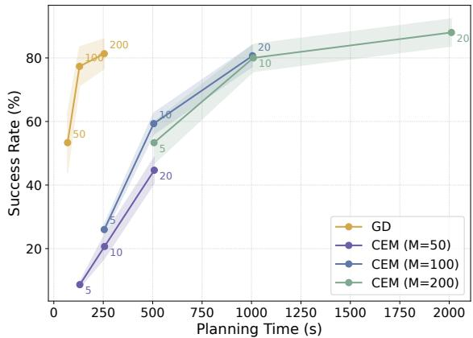

<details>
<summary>line chart</summary>

| Planning Time (s) | GD   | CEM (M=50) | CEM (M=100) | CEM (M=200) |
| ----------------- | ---- | ---------- | ----------- | ----------- |
| 0                 | 50   | 5          | -           | -           |
| 250               | 80   | 20         | 25          | -           |
| 500               | -    | 45         | 60          | 5           |
| 1000              | -    | -          | 80          | 20          |
| 2000              | -    | -          | -           | 85          |
</details>

Figure 10. Success rate versus wall-clock planning time for open-loop GD and CEM planning after straightening.

As shown in Table 5, straightening consistently improves both GD and CEM across environments and model architectures. Consistent with prior work (Zhou et al., 2025), CEM often obtains higher absolute success rates than GD, but at substantially higher computational cost. Importantly, straightening largely reduces the performance gap between GD and CEM, suggesting that the regularizer improves the latent optimization landscape and enables simple gradient-based planning to achieve a better success–latency trade-off.

Table 5. Goal-reaching Success Rate of 50 Test Trajectories (%) in open-loop planning. We compare GD and CEM planners. Values are mean ± std over three data seeds. The best value is bold.

<table><tr><td rowspan="2">Method</td><td colspan="2">Config</td><td colspan="2">Wall</td><td colspan="2">PointMaze – U Maze</td><td colspan="2">PointMaze – Medium</td><td colspan="2">PushT</td></tr><tr><td>dim</td><td> $\mathcal{L}_{curv}$ </td><td>GD</td><td>CEM</td><td>GD</td><td>CEM</td><td>GD</td><td>CEM</td><td>GD</td><td>CEM</td></tr><tr><td>DINOv2 (patch)</td><td>14 × 14 × 384</td><td>X</td><td>73.33 ± 3.40</td><td>87.33 ± 4.99</td><td>63.33 ± 8.22</td><td>88.00 ± 1.63</td><td>70.00 ± 4.08</td><td>88.00 ± 1.63</td><td>62.67 ± 4.11</td><td>71.33 ± 7.72</td></tr><tr><td>DINOv2 (patch) + proj</td><td>14 × 14 × 8</td><td>X</td><td>80.00 ± 7.12</td><td>92.00 ± 0.00</td><td>44.00 ± 7.12</td><td>75.33 ± 4.99</td><td>72.00 ± 4.32</td><td>92.67 ± 4.71</td><td>70.00 ± 1.63</td><td>71.33 ± 6.18</td></tr><tr><td>DINOv2 (patch) + proj</td><td>14 × 14 × 8</td><td>√</td><td>90.67 ± 0.94</td><td>100.00 ± 0.00</td><td>94.00 ± 1.63</td><td>94.00 ± 1.63</td><td>82.67 ± 3.77</td><td>86.67 ± 1.89</td><td>77.33 ± 6.18</td><td>80.00 ± 4.32</td></tr><tr><td>ResNet</td><td>14 × 14 × 8</td><td>X</td><td>1.33 ± 1.89</td><td>1.33 ± 0.94</td><td>14.67 ± 4.99</td><td>20.67 ± 0.94</td><td>18.67 ± 4.11</td><td>24.00 ± 4.32</td><td>71.33 ± 7.36</td><td>56.00 ± 0.00</td></tr><tr><td>ResNet</td><td>14 × 14 × 8</td><td>√</td><td>84.67 ± 2.49</td><td>90.00 ± 5.89</td><td>64.67 ± 8.38</td><td>83.33 ± 2.49</td><td>80.67 ± 0.94</td><td>89.33 ± 6.18</td><td>70.67 ± 0.94</td><td>72.67 ± 6.60</td></tr></table>

## B.4. Effect of Feature Dimensions

In order to improve efficiency and efficacy, we ablate the output dimensions of the encoders. Here, we test on the “frozen DINOv2 + spatial projector” setup and preserve the spatial dimensions of the DINOv2 patch features $m _ { v } = 1 9 6$ but decreasing channels from 384 to $d _ { v } \in \{ 2 , 8 , 3 2 , 1 2 8 \}$ . For all experiments, we use $l r = 1 e - 6$ for the encoder. If with straightening, we apply straightening on the aggregation head as described in Section B.6 with a straightening strength $\lambda = 0 . 1$ .

We report the open-loop planning success rate of 50 test samples over three data sampling seeds in Figure 11. Very small dimensions $( \mathbf { e } . \mathbf { g } . , d _ { v } = 2 )$ result in poor performance, indicating insufficient capacity to preserve planning-relevant information. Increasing to a moderate dimension $( d _ { v } \ : = \ : \{ 8 , 3 2 \} )$ yields the best results, while too large dimensions $( d _ { v } = 1 2 8 )$ consistently reduce success rates. This suggests that overly high-dimensional latents can hinder gradient-based planning.

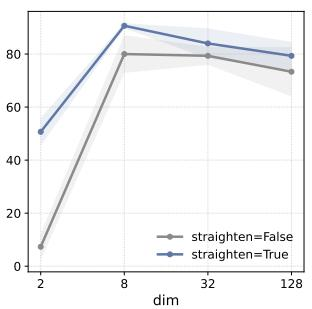

<details>
<summary>line chart</summary>

| dim | straighten=False | straighten=True |
| --- | --- | --- |
| 2 | 5 | 50 |
| 8 | 80 | 90 |
| 32 | 80 | 85 |
| 128 | 75 | 80 |
</details>

(a) Wall

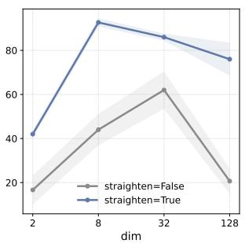

<details>
<summary>line chart</summary>

| dim | straighten=False | straighten=True |
| --- | --- | --- |
| 2 | 15 | 40 |
| 8 | 45 | 90 |
| 32 | 60 | 85 |
| 128 | 20 | 75 |
</details>

(b) PointMaze-UMaze

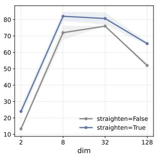

<details>
<summary>line chart</summary>

| dim | straighten=False | straighten=True |
| --- | --- | --- |
| 2 | 12 | 24 |
| 8 | 72 | 82 |
| 32 | 76 | 80 |
| 128 | 52 | 66 |
</details>

(c) PointMaze-Medium

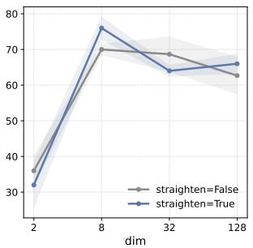

<details>
<summary>line chart</summary>

| dim | straighten=False | straighten=True |
| --- | --- | --- |
| 2 | 35 | 31 |
| 8 | 70 | 76 |
| 32 | 69 | 64 |
| 128 | 63 | 66 |
</details>

(d) PushT  
Figure 11. Comparison of Different Dimensions. The line plots show the success rate changes with increasing channels. Too small dimensions (e.g. $d _ { v } = 2 )$ are unable to encode sufficient planning-relevant information, while unnecessarily high dimensions (e.g. $d _ { v } = 1 2 8 )$ hinder the planning performance.

## B.5. Comparison to Smoothness and Temporal Contrastive Objectives

We compare with two common temporal regularization objectives:

• Smoothness. This objective penalizes large temporal jumps in visual embeddings:

$$
\mathcal {L} _ {\mathrm{smooth}} = \mathbb {E} _ {t} \left[ \left\| z _ {t + 1} - z _ {t} \right\| _ {2} ^ {2} \right].
$$

However, an overly strong smoothness penalty can lead to degenerate solutions where embeddings of different states collapse to similar values.

• Time contrastiveness. This objective treats frames within a temporal window of size k as positives and other frames in the same trajectory as negatives, encouraging temporally nearby embeddings to be similar and temporally distant embeddings to be different:

$$
\mathcal {L} _ {\mathrm{tc}} = \mathrm{InfoNCE} (z _ {\mathrm{pos}}, z _ {\mathrm{neg}}).
$$

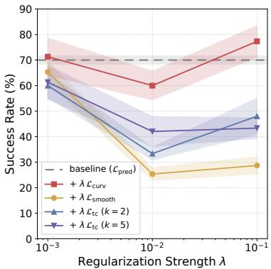

<details>
<summary>line chart</summary>

| Regularization Strength λ | baseline (ε_pred) | + λ ℒ_curv | + λ ℒ_smooth | + λ ℒ_tc (k = 2) | + λ ℒ_tc (k = 5) |
| ------------------------- | ----------------- | ---------- | ------------ | ---------------- | ---------------- |
| 10⁻³                      | 70                | 72         | 65           | 60               | 62               |
| 10⁻²                      | 70                | 60         | 25           | 35               | 42               |
| 10⁻¹                      | 70                | 78         | 28           | 48               | 43               |
</details>

Figure 12. Comparison with Other Regularizations.

However, when training trajectories are suboptimal, temporal distance may not reflect geodesic distance: states that are geodesically close can be temporally far apart, and this objective may incorrectly separate them.

We test on the “frozen DINOv2 + spatial projector” setup and report open-loop GD planning success rate on PushT in Figure 12, evaluated on 50 test samples over three data seeds. Overall, we do not observe improvements from adding smoothness or temporal contrastive objectives. Larger weights generally hurt performance, while smaller weights are less harmful but still do not match the gains from straightening. These objectives may still be useful in other settings, and our method is complementary to them: the curvature regularization loss can be combined with any other losses.

## B.6. Cosine Similarity Variants for Spatial Features

For spatial visual features $z _ { t } ^ { v } \in \mathbb R ^ { m _ { v } \times d _ { v } } ( m _ { v } > 1 )$ , we compute straightness from approximate latent velocities $v _ { t } : = z _ { t + 1 } ^ { v } -$ $z _ { t } ^ { v } \in \mathbb { R } ^ { m _ { v } \times d _ { v } }$ . Let $\bar { v } _ { t , i } \in \mathbb { R } ^ { d _ { v } }$ denote the i-th patch vector and cos $\begin{array} { r } { ( u , w ) = \frac { u ^ { \top } w } { \| u \| _ { 2 } \| w \| _ { 2 } } } \end{array}$ . We ablate four choices of $\mathcal { C } _ { t } \mathrm { : }$ :

• [patch] We treat each patch independently, then average:

$$
\mathcal {C} _ {t} = \frac {1}{m _ {v}} \sum_ {i = 1} ^ {m _ {v}} \cos (v _ {t, i}, v _ {t + 1, i}).
$$

• [mean] We average patches to one vector, then cosine:

$$
\bar {v} _ {t} = \frac {1}{m _ {v}} \sum_ {i = 1} ^ {m _ {v}} v _ {t, i}, \qquad \mathcal {C} _ {t} = \cos (\bar {v} _ {t}, \bar {v} _ {t + 1}).
$$

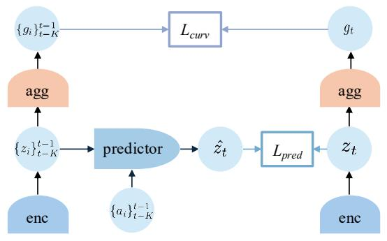

<details>
<summary>flowchart</summary>

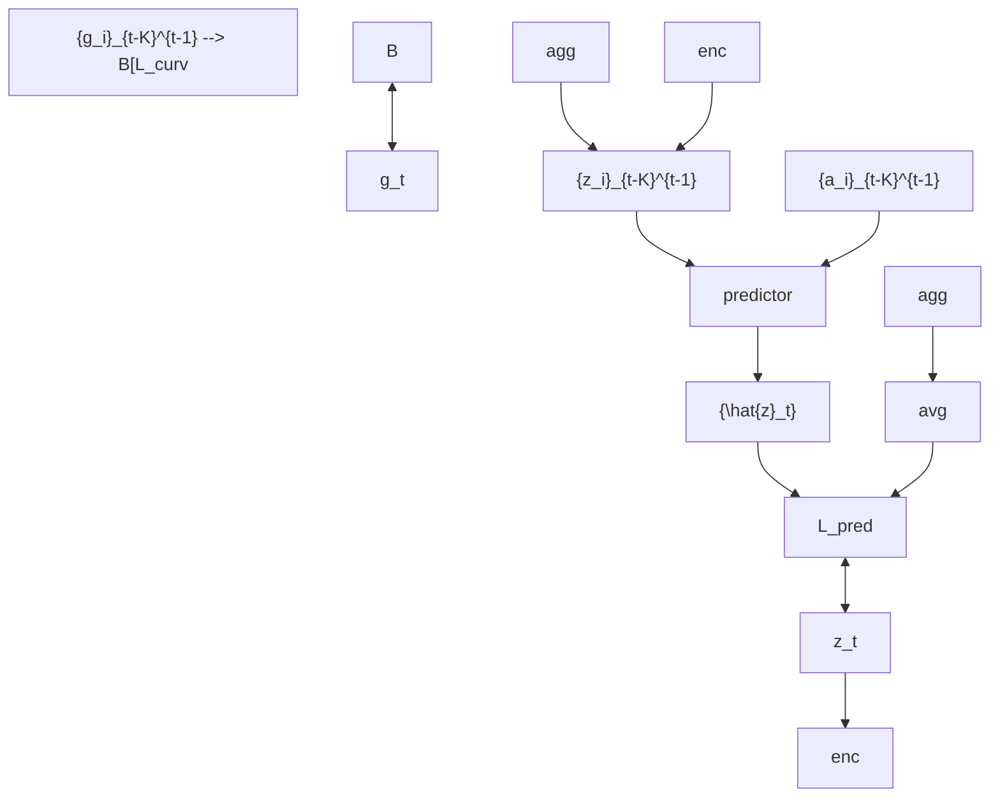
</details>

Figure 13. Aggregation Head for Straightening during Training. The prediction loss is applied to spatial features, while the curvature loss is applied to the aggregated features.

• [flatten] We flatten the spatial features and compute a single cosine over all dimensions:

$$
\mathcal {C} _ {t} = \cos (\operatorname{vec} (v _ {t}), \operatorname{vec} (v _ {t + 1})),
$$

where vec(·) : $\mathbb { R } ^ { m _ { v } \times d _ { v } }  \mathbb { R } ^ { m _ { v } d _ { v } }$ .

• [agg] We learn an aggregation head to aggregate features to a single global feature before cosine (Figure 13):

$$
\mathcal {C} _ {t} = \cos (h _ {\phi} (v _ {t}), h _ {\phi} (v _ {t + 1}))  ,
$$

with an aggregation head $h _ { \phi } : \mathbb { R } ^ { m _ { v } \times d _ { v } }  \mathbb { R } ^ { d _ { h } }$ . Concretely, we use an MLP with an output dimension of 128 as $h _ { \phi }$ in all experiments.

We test these variants on the “frozen DINOv2 + spatial projector” setup and report the open-loop planning success rate of 50 test samples over three data sampling seeds in Figure 14. The projector projects pretrained DINOv2 patch features et ∈ R196×384 t $e _ { t } \in \mathbb { R } ^ { 1 9 6 \times 3 8 \bar { 4 } } \mathrm { t o } z _ { t } \in \mathbb { R } ^ { 1 9 6 \times 8 }$ . For the straightening strength coefficient, we use $\lambda = 0 . 1$ for agg and $\lambda = 0 . 0 1$ for the rest, as these values yield the best performance. We find that using a learnable aggregation head performs best. This is not surprising as straightening should act on the global trajectory representations, whereas spatial tokens mainly capture local, patch-level variations that are only loosely aligned across time due to object motion and occlusion.

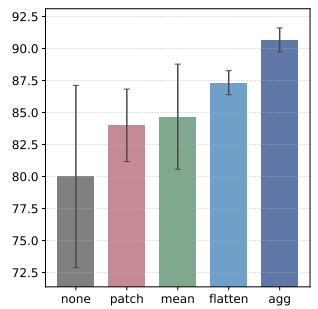

<details>
<summary>bar chart</summary>

|        | Value |
| ------ | ----- |
| none   | 80.0  |
| patch  | 84.0  |
| mean   | 84.5  |
| flatten| 87.0  |
| agg    | 90.5  |
</details>

(a) Wall

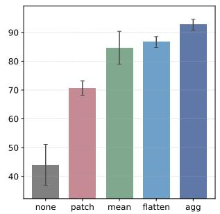

<details>
<summary>bar chart</summary>

|        | Value |
| ------ | ----- |
| none   | 44    |
| patch  | 71    |
| mean   | 85    |
| flatten| 87    |
| agg    | 92    |
</details>

(b) PointMaze-UMaze

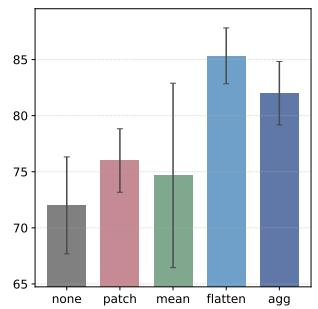

<details>
<summary>bar chart</summary>

|        | Value |
| ------ | ----- |
| none   | 72    |
| patch  | 76    |
| mean   | 74    |
| flatten| 85    |
| agg    | 82    |
</details>

(c) PointMaze-Medium

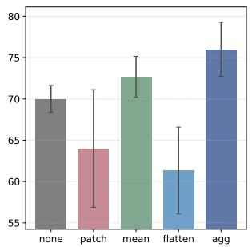

<details>
<summary>bar chart</summary>

|        | Value |
| ------ | ----- |
| none   | 70    |
| patch  | 64    |
| mean   | 73    |
| flatten| 61    |
| agg    | 76    |
</details>

(d) PushT  
Figure 14. Comparison of Different Straightening Strategies. The bar charts show the planning success rates. While all cosine similarity variants lead to better performance than no straightening, adding a learnable aggregation head gives the best performance.

## C. Theoretical Analysis

## C.1. Setup and notation

We optimize an action sequence $\mathbf { a } = ( a _ { 0 } , \ldots , a _ { K - 1 } ) \in \mathbb { R } ^ { K \times d _ { a } }$ over horizon K to minimize the terminal MSE

$$
\mathcal {L} (\mathbf {a}) = \left\| z _ {K} - z _ {g} \right\| _ {2} ^ {2}, \quad z _ {K} = \Phi (\mathbf {a}), \tag {14}
$$

where Φ denotes unrolling the latent dynamics from a fixed initial state $z _ { 0 }$ .

Assumption C.1 (Linear latent dynamics). We assume linear latent dynamics

$$
z _ {t + 1} = A z _ {t} + B a _ {t}, \quad A \in \mathbb {R} ^ {d \times d}, B \in \mathbb {R} ^ {d \times d _ {a}}. \tag {15}
$$

Definition C.2 (Effective condition number). For a PSD matrix $H \succeq 0$ with a nontrivial nullspace, define

$$
\kappa_ {\mathrm{eff}} (H) := \frac {\sigma_ {\max} (H)}{\sigma_ {\min} ^ {+} (H)},
$$

where $\sigma _ { \mathrm { m i n } } ^ { + } ( H )$ is the smallest nonzero singular value.

Definition C.3 (ε-straight transition). In the linear model (15), define

$$
\varepsilon := \| A - I \| _ {2}.
$$

## C.2. Conditioning of the planning Hessian

Unrolling (15) gives the affine terminal map

$$
z _ {K} = A ^ {K} z _ {0} + \sum_ {t = 0} ^ {K - 1} A ^ {K - 1 - t} B a _ {t}. \tag {16}
$$

Define the rollout Jacobian

$$
J _ {\Phi} := \frac {\partial z _ {K}}{\partial \mathbf {a}} = \left[ A ^ {K - 1} B, \quad A ^ {K - 2} B, \quad \dots , \quad B \right] \in \mathbb {R} ^ {d \times (K d _ {a})}. \tag {17}
$$

The associated finite-horizon discrete controllability Gramian is

$$
\mathcal {W} _ {K} := J _ {\Phi} J _ {\Phi} ^ {\top} = \sum_ {k = 0} ^ {K - 1} A ^ {k} B B ^ {\top} (A ^ {\top}) ^ {k} \in \mathbb {R} ^ {d \times d}, \tag {18}
$$

a standard term in linear systems (Kailath, 1980; Sontag, 1998; Chen, 1999).

Lemma C.4 (Hessian form and Gramian equivalence). Under (14)–(15), the planning Hessian satisfies

$$
H := \nabla_ {\mathbf {a}} ^ {2} \mathcal {L} (\mathbf {a}) = 2 J _ {\Phi} ^ {\top} J _ {\Phi} \succeq 0. \tag {19}
$$

Moreover, the nonzero singular values of $J _ { \Phi } ^ { \top } J _ { \Phi }$ equal those of $J _ { \Phi } J _ { \Phi } ^ { \top }$ , hence

$$
\kappa_ {\text { eff }} (H) = \kappa (\mathcal {W} _ {K}). \tag {20}
$$

Proof. H is positive semi-definite by definition. Since $z _ { K }$ is affine in a by (16), $\mathcal { L } ( \mathbf { a } ) = \| z _ { K } - z _ { g } \| _ { 2 } ^ { 2 }$ is a convex quadratic, and direct differentiation yields $H = 2 J _ { \Phi } ^ { \top } J _ { \Phi } \succeq 0$ . For any matrix M, the nonzero eigenvalues of $M ^ { \top } M$ and $M M ^ { \top }$ coincide. Applying this with $M = J _ { \Phi }$ gives that the nonzero eigenvalues of $H / 2$ equal those of $\mathcal { W } _ { K }$ , which implies (20).

Theorem C.5 (Conditioning bound). Assume (15). Consider first the square-action case $d _ { a } = d w i t h \ B$ invertible. Then

$$
\kappa_ {\text { eff }} (H) = \kappa (\mathcal {W} _ {K}) \leq \kappa (B) ^ {2} \frac {\sum_ {k = 0} ^ {K - 1} \sigma_ {\max} (A) ^ {2 k}}{\sum_ {k = 0} ^ {K - 1} \sigma_ {\min} (A) ^ {2 k}} \leq \kappa (B) ^ {2} \kappa (A) ^ {2 (K - 1)}, \tag {21}
$$

where $\kappa ( A ) : = \sigma _ { \mathrm { m a x } } ( A ) / \sigma _ { \mathrm { m i n } } ( A )$ . If additionally $\varepsilon = \| A - I \| _ { 2 } < 1$ , then

$$
\kappa_ {\mathrm{eff}} (H) \leq \kappa (B) ^ {2} \left(\frac {1 + \varepsilon}{1 - \varepsilon}\right) ^ {2 (K - 1)} \leq \kappa (B) ^ {2} e ^ {6 \varepsilon K} (\varepsilon \leq \frac {1}{2}). \tag {22}
$$

Proof. By Lemma C.4, it suffices to bound $\kappa ( \mathcal { W } _ { K } )$ .

Upper bound. For any unit vector $x \in \mathbb { R } ^ { d }$ ,

$$
x ^ {\top} \mathcal {W} _ {K} x = \sum_ {k = 0} ^ {K - 1} \| B ^ {\top} (A ^ {\top}) ^ {k} x \| _ {2} ^ {2} \leq \sum_ {k = 0} ^ {K - 1} \| B \| _ {2} ^ {2} \| A ^ {k} \| _ {2} ^ {2} \| x \| _ {2} ^ {2} \leq \sigma_ {\max} (B) ^ {2} \sum_ {k = 0} ^ {K - 1} \sigma_ {\max} (A) ^ {2 k}.
$$

Taking the maximum over $\| { \boldsymbol { x } } \| _ { 2 } = 1$ yields

$$
\lambda_ {\max} (\mathcal {W} _ {K}) \leq \sigma_ {\max} (B) ^ {2} \sum_ {k = 0} ^ {K - 1} \sigma_ {\max} (A) ^ {2 k}.
$$

Lower bound. Since B is invertible, $\| B ^ { \top } u \| _ { 2 } \geq \sigma _ { \operatorname* { m i n } } ( B ) \| u \| _ { 2 }$ for all u. Also $\sigma _ { \operatorname* { m i n } } ( A ^ { k } ) \geq \sigma _ { \operatorname* { m i n } } ( A ) ^ { k }$ . Thus for any unit $x ,$

$$
\| B ^ {\top} (A ^ {\top}) ^ {k} x \| _ {2} \geq \sigma_ {\min} (B) \| (A ^ {\top}) ^ {k} x \| _ {2} \geq \sigma_ {\min} (B) \sigma_ {\min} (A ^ {k}) \| x \| _ {2} \geq \sigma_ {\min} (B) \sigma_ {\min} (A) ^ {k},
$$

hence

$$
x ^ {\top} \mathcal {W} _ {K} x \geq \sigma_ {\min} (B) ^ {2} \sum_ {k = 0} ^ {K - 1} \sigma_ {\min} (A) ^ {2 k}.
$$

Taking the minimum over $\| { \boldsymbol { x } } \| _ { 2 } = 1$ yields

$$
\lambda_ {\min} (\mathcal {W} _ {K}) \geq \sigma_ {\min} (B) ^ {2} \sum_ {k = 0} ^ {K - 1} \sigma_ {\min} (A) ^ {2 k}.
$$

Combine. Dividing the two bounds gives the first inequality in (21). For the second, use positivity of terms:

$$
\frac {\sum_ {k = 0} ^ {K - 1} \sigma_ {\max} (A) ^ {2 k}}{\sum_ {k = 0} ^ {K - 1} \sigma_ {\min} (A) ^ {2 k}} \leq \max _ {0 \leq k \leq K - 1} \frac {\sigma_ {\max} (A) ^ {2 k}}{\sigma_ {\min} (A) ^ {2 k}} = \kappa (A) ^ {2 (K - 1)}.
$$

ε-specialization. $\begin{array} { r } { \mathrm { I f } \varepsilon = \| A - I \| _ { 2 } < 1 } \end{array}$ , then by Weyl’s perturbation theorem, $\sigma _ { \operatorname* { m a x } } ( A ) \leq 1 + \varepsilon \operatorname { a n d } \sigma _ { \operatorname* { m i n } } ( A ) \geq 1 - \varepsilon .$ , which implies the first inequality in (22). For $\varepsilon \leq \frac { 1 } { 2 }$ , the standard bound ln $\left( \frac { 1 + \varepsilon } { 1 - \varepsilon } \right) \leq 3 \varepsilon \mathrm { g i v e s }$ the exponential form. □

Remark C.6 (Low-dimensional actions $d _ { a } < d ) . \ \mathrm { I f } \ d _ { a } < d .$ then B is not invertible and $\mathcal { W } _ { K }$ may be singular. All statements hold on the controllable subspace $S _ { K } = \mathrm { r a n g e } ( \mathcal { W } _ { K } )$ by replacing $\lambda _ { \operatorname* { m i n } } ( \mathcal { W } _ { K } )$ with $\lambda _ { \operatorname* { m i n } } ^ { + } ( \mathcal { W } _ { K } )$ and interpreting $\kappa ( \mathcal { W } _ { K } )$ as an effective condition number. In this case, additional controllability assumptions are needed to lower bound $\sigma _ { \mathrm { m i n } } ^ { + } ( \mathcal { W } _ { K } )$ .

## C.3. Cosine similarity as a proxy

Assumption C.7 (Constant velocity and smooth actions). Define latent velocities $v _ { t } : = z _ { t + 1 } - z _ { t }$ . Assume there exists a constant $c > 0$ such that

$$
\left\| v _ {t} \right\| _ {2} = c \quad \text {   for   all   } t = 0, \dots , K - 1.
$$

Assume action smoothness $\begin{array} { r } { \Delta _ { a } : = \operatorname* { m a x } _ { t } \| a _ { t + 1 } - a _ { t } \| _ { 2 } < \infty . } \end{array}$ .

Definition C.8 (Cosine similarity). For $t = 0 , \ldots , K - 2$ , define

$$
\mathcal {C} _ {t} := \cos (v _ {t}, v _ {t + 1}) = \frac {v _ {t} ^ {\top} v _ {t + 1}}{\| v _ {t} \| _ {2} \| v _ {t + 1} \| _ {2}}, \qquad \bar {\mathcal {C}} := \frac {1}{K - 1} \sum_ {t = 0} ^ {K - 2} \mathcal {C} _ {t}.
$$

Proposition C.9 (Cosine proxy ⇒ small $( A - I )$ along visited directions). Under linear dynamics (15), let $\hat { v } _ { t } : = v _ { t } / \| v _ { t } \| _ { 2 }$ . Under Assumption C.7, for each $t = 0 , \ldots , K - 2$ ,

$$
\left\| (A - I) \hat {v} _ {t} \right\| _ {2} \leq \sqrt {2 \left(1 - \mathcal {C} _ {t}\right)} + \frac {\sigma_ {\max} (B) \Delta_ {a}}{c}. \tag {23}
$$

$I f { \bar { \mathcal { C } } } \geq 1 - \eta ,$ then

$$
\frac {1}{K - 1} \sum_ {t = 0} ^ {K - 2} \| (A - I) \hat {v} _ {t} \| _ {2} \leq \sqrt {2 \eta} + \frac {\sigma_ {\max} (B) \Delta_ {a}}{c}. \tag {24}
$$

Proof. Under (15),

$$
v _ {t + 1} - v _ {t} = (z _ {t + 2} - z _ {t + 1}) - (z _ {t + 1} - z _ {t}) = (A - I) (z _ {t + 1} - z _ {t}) + B (a _ {t + 1} - a _ {t}) = (A - I) v _ {t} + B (a _ {t + 1} - a _ {t}).
$$

Thus, by the triangle inequality,

$$
\| (A - I) \hat {v} _ {t} \| _ {2} = \frac {\| (A - I) v _ {t} \| _ {2}}{\| v _ {t} \| _ {2}} \leq \frac {\| v _ {t + 1} - v _ {t} \| _ {2}}{\| v _ {t} \| _ {2}} + \frac {\| B (a _ {t + 1} - a _ {t}) \| _ {2}}{\| v _ {t} \| _ {2}} \leq \frac {\| v _ {t + 1} - v _ {t} \| _ {2}}{c} + \frac {\sigma_ {\max} (B) \Delta_ {a}}{c}.
$$

Since $\| v _ { t } \| _ { 2 } = \| v _ { t + 1 } \| _ { 2 } = c ,$

$$
\| v _ {t + 1} - v _ {t} \| _ {2} ^ {2} = \| v _ {t + 1} \| _ {2} ^ {2} + \| v _ {t} \| _ {2} ^ {2} - 2 v _ {t + 1} ^ {\top} v _ {t} = 2 c ^ {2} (1 - \mathcal {C} _ {t}),
$$

hence $\| v _ { t + 1 } - v _ { t } \| _ { 2 } / c = \sqrt { 2 ( 1 - \mathcal { C } _ { t } ) }$ , proving (23). Averaging and applying Jensen’s inequality to the concave map $x \mapsto { \sqrt { x } }$ gives

$$
\frac {1}{K - 1} \sum_ {t = 0} ^ {K - 2} \sqrt {1 - \mathcal {C} _ {t}} \leq \sqrt {1 - \bar {\mathcal {C}}} \leq \sqrt {\eta},
$$

which implies (24).

Remark C.10 (Directional vs. spectral control). Proposition C.9 bounds (A−I) only along visited directions $\left\{ \hat { v } _ { t } \right\}$ . Upgrading this to a uniform spectral bound $\varepsilon = \| A - I \| _ { 2 }$ requires an additional coverage condition so that visited directions span the latent space. This is not an unreasonable assumption since training trajectories are typically collected to be diverse. Under such regimes, maximizing cosine similarity provides a meaningful proxy for making A close to I in spectral norm.

## D. Related Work (Cont.)

Here, we discuss the connections and differences between temporal straightening and local linearization, Koopman methods, and the broader literature on learning plannable representations. Temporal straightening targets the curvature of latent trajectories, a geometric property distinct from linear dynamics, whether local or global.

Local model-based control approximates nonlinear dynamics around a nominal trajectory using first- or second-order models, as in DDP and iLQR (Mayne, 1966; Li & Todorov, 2004). Because these methods presuppose a low-dimensional state space, they have motivated representation-learning methods that map high-dimensional observations into latent spaces where local dynamics models become applicable. For example, E2C and RCE explicitly impose locally linear latent dynamics (Watter et al., 2015; Banijamali et al., 2018), while later methods broaden this direction by learning representations or objectives that support locally linear control (Zhang et al., 2019a; Levine et al., 2020; Shu et al., 2020). Temporal straightening differs in both goal and mechanism. We do not aim to learn locally linear dynamics, nor do we design representations for locally linear control. Instead, we jointly learn the encoder and predictor while directly regularizing the geometry of latent trajectories.

Koopman methods seek observables whose evolution is linear under a global operator (Koopman, 1931). Recent deep models learn such observables or eigenfunctions directly from data (Lusch et al., 2018; Yeung et al., 2019; Takeishi et al., 2017; Cheng et al., 2026). Temporal straightening targets a different property of the learned representation. Koopman methods constrains the form of the dynamics model but do not require latent trajectories to be straight as linear systems can still produce curved or oscillatory paths. In contrast, temporal straightening allows nonlinear latent dynamics through a learned predictor, but more directly regularizes trajectory geometry by penalizing curvature along observed transitions.

More broadly, our work is related to learning plannable representations, especially methods that make planning easier by aligning latent geometry or value structure with feasible transitions. This includes approaches where planning or inference can be carried out through interpolation in latent space (Eysenbach et al., 2024; Kurutach et al., 2018; Wang et al., 2019), as well as methods that build planning-oriented geometry from shortest-path, reachability, or asymmetric goal-reaching structure (Yang et al., 2020; Wang et al., 2023). These works share the premise that representation geometry or value structure matters for planning, but with different focuses. Our contribution is to use straightening itself as a simple geometry regularization during training.

## E. Visualizations

## E.1. Distance Heatmaps

We plot heatmaps of the Euclidean distances in the embedding space. The yellow star represents the target, and we compute the Euclidean distance between its embedding and those of all other states in the maze. Blue indicates small values, and red indicates large values. With straightening, the latent distance accurately reflects the minimum number of steps required to reach the target. We find that spatial and global/aggregated features capture complementary distance information: spatial features preserve local geometry and yield fine-grained, locally discriminative distances, while global/aggregated features provide an informative longer-range signal.

We compare the distance heatmaps with ground-truth heatmaps constructed by dividing the mazes into discrete grids and applying the A-star algorithm. 4-neighbor connectivity means each grid cell connects only to up/down/left/right cells. 8-neighbor connectivity adds the four diagonals (up-left, up-right, down-left, down-right), so paths can cut corners diagonally and distances are usually shorter.


<details>
<summary>natural_image</summary>

Four abstract geometric shapes with gradient colors and small yellow stars, no text or symbols present
</details>

(a) Ground-Truth using A-star (4 neighbors)  
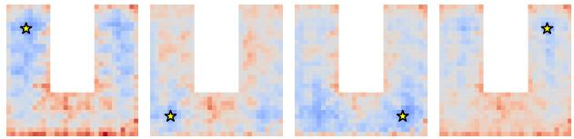

<details>
<summary>natural_image</summary>

Four identical abstract geometric shapes with blue and orange pixelated fill and black star markers (no text or symbols)
</details>

(c) DINOv2 CLS embedding  
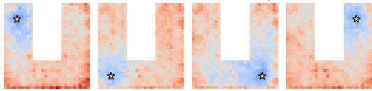

<details>
<summary>natural_image</summary>

Four identical abstract geometric shapes with red-orange pixelated textures and black star symbols at corners (no text or symbols)
</details>

(e) DINOv2 + spatial proj [straightening=False]  
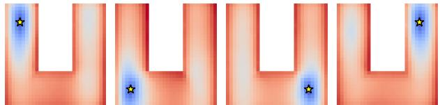

<details>
<summary>natural_image</summary>

Four identical abstract geometric shapes with gradient colors and small star symbols, no text or symbols present.
</details>

(g) ResNet - global [straightening=False]  
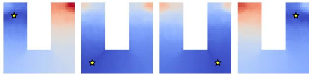

<details>
<summary>natural_image</summary>

Four-panel abstract image with blue gradient, white rectangular shapes, and small yellow stars (no text or symbols)
</details>

(i) DINOv2 + spatial proj (agg head) [straightening=True]  
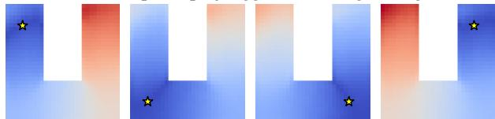

<details>
<summary>natural_image</summary>

Four abstract geometric shapes with blue and red gradient backgrounds and small black stars, no text or symbols present.
</details>

(k) ResNet - spatial (agg head) [straightening=True]


<details>
<summary>natural_image</summary>

Four identical blue and red geometric shapes with star markers, no text or symbols present
</details>

(b) Ground-Truth using A-star (8 neighbors)  
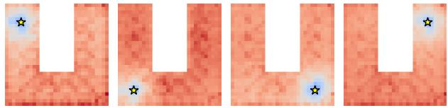

<details>
<summary>natural_image</summary>

Four identical panels showing abstract red-orange textured surfaces with small blue star symbols at top corners (no text or symbols)
</details>

(d) DINOv2 patch embedding  
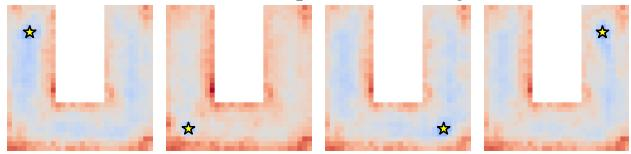

<details>
<summary>natural_image</summary>

Four identical panels showing a U-shaped object with blue and red tones, each containing a black star marker (no text or symbols)
</details>

(f) ResNet - spatial [straightening=False]  
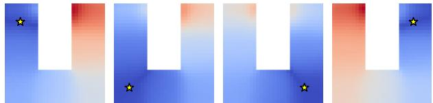

<details>
<summary>natural_image</summary>

Four abstract geometric shapes with blue and red gradient backgrounds and small yellow stars, no text or symbols present.
</details>

(h) ResNet - global [straightening=True]  
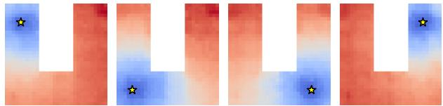

<details>
<summary>natural_image</summary>

Abstract geometric pattern with red-orange gradient, blue-shaded regions, and black star markers (no text or symbols)
</details>

(j) DINOv2 + spatial proj (spatial) [straightening=True]  
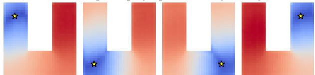

<details>
<summary>natural_image</summary>

Abstract geometric pattern with red and blue gradient blocks and small yellow stars (no text or symbols)
</details>

(l) ResNet - spatial (spatial) [straightening=True]  
Figure 15. Distance heatmaps of PointMaze-UMaze.

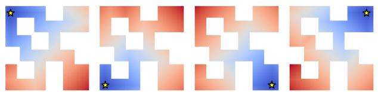

<details>
<summary>natural_image</summary>

Abstract geometric pattern with blue and orange gradient blocks and small yellow stars (no text or symbols)
</details>

(a) Ground-Truth using A-star (4 neighbors)  
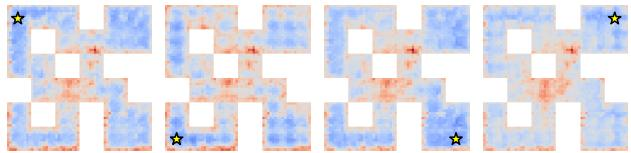

<details>
<summary>natural_image</summary>

Abstract geometric pattern with blue and red pixelated shapes, no text or symbols present
</details>

(c) DINOv2 CLS embedding  
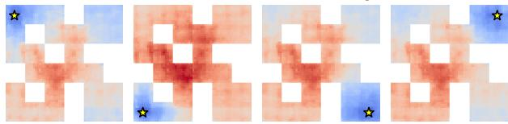

<details>
<summary>natural_image</summary>

Abstract pixelated pattern with red and blue tones, no text or symbols present
</details>

(e) DINOv2 + spatial proj [straightening=False]  


<details>
<summary>natural_image</summary>

Abstract pixelated pattern with red-orange gradient and blue star markers (no text or symbols)
</details>

(g) ResNet - global [straightening=False]  


<details>
<summary>natural_image</summary>

Abstract pixelated pattern with red, blue, and white blocks and small yellow stars (no text or symbols)
</details>

(i) DINOv2 + spatial proj (agg head) [straightening=True]  


<details>
<summary>natural_image</summary>

Abstract geometric pattern with blue and red blocks and black stars (no text or symbols)
</details>

(k) ResNet - spatial (agg head) [straightening=True]


<details>
<summary>natural_image</summary>

Abstract geometric pattern with red-orange gradient and blue-white shapes, no text or symbols present
</details>

(b) Ground-Truth using A-star (8 neighbors)  


<details>
<summary>natural_image</summary>

Abstract geometric pattern with red pixelated shapes and star symbols (no text or symbols)
</details>

(d) DINOv2 patch embedding  


<details>
<summary>natural_image</summary>

Four identical geometric patterns with blue and white blocks and small star symbols, no text or labels present.
</details>

(f) ResNet - spatial [straightening=False]  


<details>
<summary>natural_image</summary>

Abstract pixelated pattern with blue and orange gradient blocks and small yellow stars (no text or symbols)
</details>

(h) ResNet - global [straightening=True]  


<details>
<summary>natural_image</summary>

Abstract pixelated pattern with red and blue blocks, no text or symbols present
</details>

(j) DINOv2 + spatial proj (spatial) [straightening=True]  


<details>
<summary>natural_image</summary>

Abstract geometric pattern with red and blue blocks and star symbols (no text or symbols)
</details>

(l) ResNet - spatial (spatial) [straightening=True]  
Figure 16. Distance heatmaps of PointMaze-Medium.

## E.2. Visualization of Latent Trajectories

To visualize the learned representations of the trajectories, we randomly sample trajectories with a length of 30 and plot them in 2D using PCA. Here, we use DINO CLS token embeddings and the aggregated features of our model (trained with straightening). While latent trajectories are highly curved in DINO CLS embedding space, they become significantly smoother after straightening. Additionally, we compute the MSE between the embeddings of each intermediate state and the target. The Euclidean distance is closer to the geodesic distance for straighter trajectories, and thus MSE (which is squared Euclidean distance) becomes a more useful planning cost function that can reflect the true progress towards the target. Visualizations for different environments are in Figures 17 to 20.


<details>
<summary>natural_image</summary>

Simple geometric diagram with black vertical bars and a red curved line, no text or symbols present
</details>


<details>
<summary>line chart</summary>

| Point | PC1 | PC2 |
|-------|-----|-----|
| 1     | 0   | 0   |
| 2     | 0   | 0   |
| 3     | 0   | 0   |
| 4     | 0   | 0   |
| 5     | 0   | 0   |
| 6     | 0   | 0   |
| 7     | 0   | 0   |
| 8     | 0   | 0   |
| 9     | 0   | 0   |
| 10    | 0   | 0   |
| 11    | 0   | 0   |
| 12    | 0   | 0   |
| 13    | 0   | 0   |
| 14    | 0   | 0   |
| 15    | 0   | 0   |
| 16    | 0   | 0   |
| 17    | 0   | 0   |
| 18    | 0   | 0   |
| 19    | 0   | 0   |
| 20    | 0   | 0   |
| 21    | 0   | 0   |
| 22    | 0   | 0   |
| 23    | 0   | 0   |
| 24    | 0   | 0   |
| 25    | 0   | 0   |
| 26    | 0   | 0   |
| 27    | 0   | 0   |
| 28    | 0   | 0   |
| 29    | 0   | 0   |
| 30    | 0   | 0   |
| 31    | 0   | 0   |
| 32    | 0   | 0   |
| 33    | 0   | 0   |
| 34    | 0   | 0   |
| 35    | 0   | 0   |
| 36    | 0   | 0   |
| 37    | 0   | 0   |
| 38    | 0   | 0   |
| 39    | 0   | 0   |
| 40    | 0   | 0   |
| 41    | 0   | 0   |
| 42    | 0   | 0   |
| 43    | 0   | 0   |
| 44    | 0   | 0   |
| 45    | 0   | 0   |
| 46    | 0   | 0   |
| 47    | 0   | 0   |
| 48    | 0   | 0   |
| 49    | 0   | 0   |
| 50    | 0   | 0   |
| 51    | 0   | 0   |
| 52    | 0   | 0   |
| 53    | 0   | 0   |
| 54    | 0   | 0   |
| 55    | 0   | 0   |
| 56    | 0   | 0   |
| 57    | 0   | 0   |
| 58    | 0   | 0   |
| 59    | 0   | 0   |
| 60    | 0   | 0   |
| Note: The actual values for PC1 and PC2 are not provided in the code. The legend indicates 'PC1' and 'PC2'. The text 'PCA(DINO)' appears above the chart area.
</details>


<details>
<summary>line chart</summary>

| time | MSE to target |
| ---- | ------------- |
| 0    | 1.0           |
| 1    | 0.9           |
| 2    | 0.85          |
| 3    | 0.8           |
| 4    | 0.75          |
| 5    | 0.7           |
| 6    | 0.65          |
| 7    | 0.6           |
| 8    | 0.55          |
| 9    | 0.5           |
| 10   | 0.45          |
| 11   | 0.4           |
| 12   | 0.35          |
| 13   | 0.3           |
| 14   | 0.25          |
| 15   | 0.2           |
| 16   | 0.15          |
| 17   | 0.1           |
| 18   | 0.05          |
| 19   | 0.0           |
</details>


<details>
<summary>line chart</summary>

| PC1 | PC2 |
| --- | --- |
| 0   | 0   |
| 1   | 1   |
| 2   | 2   |
| 3   | 3   |
| 4   | 4   |
| 5   | 5   |
| 6   | 6   |
| 7   | 7   |
| 8   | 8   |
| 9   | 9   |
| 10  | 10  |
| 11  | 11  |
| 12  | 12  |
| 13  | 13  |
| 14  | 14  |
| 15  | 15  |
| 16  | 16  |
| 17  | 17  |
| 18  | 18  |
| 19  | 19  |
| 20  | 20  |
| 21  | 21  |
| 22  | 22  |
| 23  | 23  |
| 24  | 24  |
| 25  | 25  |
| 26  | 26  |
| 27  | 27  |
| 28  | 28  |
| 29  | 29  |
| 30  | 30  |
| 31  | 31  |
| 32  | 32  |
| 33  | 33  |
| 34  | 34  |
| 35  | 35  |
| 36  | 36  |
| 37  | 37  |
| 38  | 38  |
| 39  | 39  |
| 40  | 40  |
| 41  | 41  |
| 42  | 42  |
| 43  | 43  |
| 44  | 44  |
| 45  | 45  |
| 46  | 46  |
| 47  | 47  |
| 48  | 48  |
| 49  | 49  |
| 50  | 50  |
|    |     |
</details>


<details>
<summary>line chart</summary>

| time | MSE to target |
| ---- | ------------- |
| 0    | 1.0           |
| 1    | 0.95          |
| 2    | 0.85          |
| 3    | 0.75          |
| 4    | 0.65          |
| 5    | 0.55          |
| 6    | 0.45          |
| 7    | 0.35          |
| 8    | 0.25          |
| 9    | 0.15          |
| 10   | 0.05          |
</details>


<details>
<summary>natural_image</summary>

Simple geometric diagram with black bars and a red curved shape containing a yellow star (no text or symbols)
</details>


<details>
<summary>line chart</summary>

| PC1 | PC2 |
| --- | --- |
| 0   | 0   |
| 1   | 1   |
| 2   | 2   |
| 3   | 3   |
| 4   | 4   |
| 5   | 5   |
| 6   | 6   |
| 7   | 7   |
| 8   | 8   |
| 9   | 9   |
| 10  | 10  |
| 11  | 11  |
| 12  | 12  |
| 13  | 13  |
| 14  | 14  |
| 15  | 15  |
| 16  | 16  |
| 17  | 17  |
| 18  | 18  |
| 19  | 19  |
| 20  | 20  |
| 21  | 21  |
| 22  | 22  |
| 23  | 23  |
| 24  | 24  |
| 25  | 25  |
| 26  | 26  |
| 27  | 27  |
| 28  | 28  |
| 29  | 29  |
| 30  | 30  |
| 31  | 31  |
| 32  | 32  |
| 33  | 33  |
| 34  | 34  |
| 35  | 35  |
| 36  | 36  |
| 37  | 37  |
| 38  | 38  |
| 39  | 39  |
| 40  | 40  |
| 41  | 41  |
| 42  | 42  |
| 43  | 43  |
| 44  | 44  |
| 45  | 45  |
| 46  | 46  |
| 47  | 47  |
| 48  | 48  |
| 49  | 49  |
| 50  | 50  |
|    |     |
</details>


<details>
<summary>line chart</summary>

| time | MSE to target |
| ---- | ------------- |
| 0    | 0             |
| 1    | 1             |
| 2    | 2             |
| 3    | 3             |
| 4    | 4             |
| 5    | 5             |
| 6    | 6             |
| 7    | 7             |
| 8    | 8             |
| 9    | 9             |
| 10   | 10            |
| 11   | 11            |
| 12   | 12            |
| 13   | 13            |
| 14   | 14            |
| 15   | 15            |
| 16   | 16            |
| 17   | 17            |
| 18   | 18            |
| 19   | 19            |
| 20   | 20            |
| 21   | 21            |
| 22   | 22            |
| 23   | 23            |
| 24   | 24            |
| 25   | 25            |
| 26   | 26            |
| 27   | 27            |
| 28   | 28            |
| 29   | 29            |
| 30   | 30            |
| 31   | 31            |
| 32   | 32            |
| 33   | 33            |
| 34   | 34            |
| 35   | 35            |
| 36   | 36            |
| 37   | 37            |
| 38   | 38            |
| 39   | 39            |
| 40   | 40            |
| 41   | 41            |
| 42   | 42            |
| 43   | 43            |
| 44   | 44            |
| 45   | 45            |
| 46   | 46            |
| 47   | 47            |
| 48   | 48            |
| 49   | 49            |
| 50   | 50            |
| 51   | 51            |
| 52   | 52            |
| 53   | 53            |
| 54   | 54            |
| 55   | 55            |
| 56   | 56            |
| 57   | 57            |
| 58   | 58            |
| 59   | 59            |
| 60   | 60            |
| 61   | 61            |
| 62   | 62            |
| 63   | 63            |
| 64   | 64            |
| 65   | 65            |
| 66   | 66            |
| 67   | 67            |
| 68   | 68            |
| 69   | 69            |
| 70   | 70            |
| 71   | 71            |
| 72   | 72            |
| 73   | 73            |
| 74   | 74            |
| 75   | 75            |
| 76   | 76            |
| 77   | 77            |
| 78   | 78            |
| 79   | 79            |
| 80   | 80            |
| 81   | 81            |
| 82   | 82            |
| 83   | 83            |
| 84   | 84            |
| 85   | 85            |
| 86   | 86            |
| 87   | 87            |
| 88   | 88            |
| 89   | 89            |
| 90   | 90            |
| 91   | 91            |
| 92   | 92            |
| 93   | 93            |
| 94   | 94            |
| 95   | 95            |
| 96   | 96            |
| 97   | 97            |
| 98   | 98            |
| 99   | 99            |
|        |               |
</details>


<details>
<summary>line chart</summary>

| Point | PC1 | PC2 |
|-------|-----|-----|
| ★     | 0   | 0   |
</details>


<details>
<summary>line chart</summary>

| time | MSE to target |
| ---- | ------------- |
| 0    | 0.8           |
| 1    | 0.9           |
| 2    | 0.85          |
| 3    | 0.75          |
| 4    | 0.65          |
| 5    | 0.55          |
| 6    | 0.45          |
| 7    | 0.35          |
| 8    | 0.25          |
| 9    | 0.15          |
| 10   | 0.05          |
</details>

Figure 17. PCA of Trajectories of Wall.  


<details>
<summary>natural_image</summary>

Pixelated graphic with a green dotted path through an orange square, featuring a yellow star at the center (no text or symbols)
</details>


<details>
<summary>scatter plot</summary>

| PC1 | PC2 |
| --- | --- |
| (data not extractable as discrete values) | (data not extractable as discrete values) |
</details>


<details>
<summary>line chart</summary>

| time | MSE(DINO) |
| ---- | --------- |
| 0    | 0.5       |
| 1    | 0.6       |
| 2    | 0.4       |
| 3    | 0.7       |
| 4    | 0.8       |
| 5    | 0.9       |
| 6    | 0.7       |
| 7    | 0.6       |
| 8    | 0.5       |
| 9    | 0.4       |
| 10   | 0.3       |
| 11   | 0.2       |
| 12   | 0.1       |
| 13   | 0.0       |
| 14   | -0.1      |
| 15   | -0.2      |
| 16   | -0.3      |
| 17   | -0.4      |
| 18   | -0.5      |
| 19   | -0.6      |
| 20   | -0.7      |
| 21   | -0.8      |
| 22   | -0.9      |
| 23   | -1.0      |
| 24   | -1.1      |
| 25   | -1.2      |
| 26   | -1.3      |
| 27   | -1.4      |
| 28   | -1.5      |
| 29   | -1.6      |
| 30   | -1.7      |
| 31   | -1.8      |
| 32   | -1.9      |
| 33   | -2.0      |
| 34   | -2.1      |
| 35   | -2.2      |
| 36   | -2.3      |
| 37   | -2.4      |
| 38   | -2.5      |
| 39   | -2.6      |
| 40   | -2.7      |
| 41   | -2.8      |
| 42   | -2.9      |
| 43   | -3.0      |
| 44   | -3.1      |
| 45   | -3.2      |
| 46   | -3.3      |
| 47   | -3.4      |
| 48   | -3.5      |
| 49   | -3.6      |
| 50   | -3.7      |
| 51   | -3.8      |
| 52   | -3.9      |
| 53   | -4.0      |
| 54   | -4.1      |
| 55   | -4.2      |
| 56   | -4.3      |
| 57   | -4.4      |
| 58   | -4.5      |
| 59   | -4.6      |
| 60   | -4.7      |
| 61   | -4.8      |
| 62   | -4.9      |
| 63   | -5.0      |
| 64   | -5.1      |
| 65   | -5.2      |
| 66   | -5.3      |
| 67   | -5.4      |
| 68   | -5.5      |
| 69   | -5.6      |
| 70   | -5.7      |
| 71   | -5.8      |
| 72   | -5.9      |
| 73   | -6.0      |
| 74   | -6.1      |
| 75   | -6.2      |
| 76   | -6.3      |
| 77   | -6.4      |
| 78   | -6.5      |
| 79   | -6.6      |
| 80   | -6.7      |
| 81   | -6.8      |
| 82   | -6.9      |
| 83   | -7.0      |
| 84   | -7.1      |
| 85   | -7.2      |
| 86   | -7.3      |
| 87   | -7.4      |
| 88   | -7.5      |
| 89   | -7.6      |
| 90   | -7.7      |
| 91   | -7.8      |
| 92   | -7.9      |
| 93   | -8.0      |
| 94   | -8.1      |
| 95   | -8.2      |
| 96   | -8.3      |
| 97   | -8.4      |
| 98   | -8.5      |
| 99   | -8.6      |
| 100  | -8.7      |
</details>


<details>
<summary>line chart</summary>

| Point | PC1 | PC2 |
|-------|-----|-----|
| ★     | 0   | 0   |
</details>


<details>
<summary>line chart</summary>

| time | MSE to target |
| ---- | ------------- |
| 0    | 1.0           |
| 1    | 0.95          |
| 2    | 0.85          |
| 3    | 0.75          |
| 4    | 0.65          |
| 5    | 0.55          |
| 6    | 0.45          |
| 7    | 0.35          |
| 8    | 0.25          |
| 9    | 0.15          |
| 10   | 0.05          |
</details>


<details>
<summary>natural_image</summary>

Pixelated graphic of a stylized letter 'L' with a green dotted path and yellow star on a checkered background (no text or symbols)
</details>


<details>
<summary>text_image</summary>

PCA(DINO)
PC2
PC1
</details>


<details>
<summary>line chart</summary>

| time | MSE(DINO) |
| ---- | --------- |
| 0    | -1.5      |
| 1    | 0.8       |
| 2    | 1.2       |
| 3    | 1.6       |
| 4    | 1.4       |
| 5    | 1.7       |
| 6    | 1.5       |
| 7    | 1.8       |
| 8    | 1.6       |
| 9    | 1.4       |
| 10   | 1.0       |
| 11   | -0.5      |
| 12   | -1.0      |
| 13   | -1.5      |
| 14   | -1.2      |
| 15   | -0.8      |
| 16   | -0.5      |
| 17   | -0.2      |
| 18   | 0.0       |
| 19   | 0.3       |
| 20   | 0.6       |
| 21   | 0.9       |
| 22   | 1.2       |
| 23   | 1.5       |
| 24   | 1.8       |
| 25   | 2.0       |
| 26   | 1.8       |
| 27   | 1.6       |
| 28   | 1.4       |
| 29   | 1.2       |
| 30   | 1.0       |
| 31   | -0.5      |
| 32   | -0.8      |
| 33   | -1.0      |
| 34   | -1.2      |
| 35   | -1.4      |
| 36   | -1.6      |
| 37   | -1.8      |
| 38   | -2.0      |
| 39   | -2.2      |
| 40   | -2.4      |
| 41   | -2.6      |
| 42   | -2.8      |
| 43   | -3.0      |
| 44   | -3.2      |
| 45   | -3.4      |
| 46   | -3.6      |
| 47   | -3.8      |
| 48   | -4.0      |
| 49   | -4.2      |
| 50   | -4.4      |
| 51   | -4.6      |
| 52   | -4.8      |
| 53   | -5.0      |
| 54   | -5.2      |
| 55   | -5.4      |
| 56   | -5.6      |
| 57   | -5.8      |
| 58   | -6.0      |
| 59   | -6.2      |
| 60   | -6.4      |
| 61   | -6.6      |
| 62   | -6.8      |
| 63   | -7.0      |
| 64   | -7.2      |
| 65   | -7.4      |
| 66   | -7.6      |
| 67   | -7.8      |
| 68   | -8.0      |
| 69   | -8.2      |
| 70   | -8.4      |
| 71   | -8.6      |
| 72   | -8.8      |
| 73   | -9.0      |
| 74   | -9.2      |
| 75   | -9.4      |
| 76   | -9.6      |
| 77   | -9.8      |
| 78   | -10.0     |
| 79   | -10.2     |
| 80   | -10.4     |
| 81   | -10.6     |
| 82   | -10.8     |
| 83   | -11.0     |
| 84   | -11.2     |
| 85   | -11.4     |
| 86   | -11.6     |
| 87   | -11.8     |
| 88   | -12.0     |
| 89   | -12.2     |
| 90   | -12.4     |
| 91   | -12.6     |
| 92   | -12.8     |
| 93   | -13.0     |
| 94   | -13.2     |
| 95   | -13.4     |
| 96   | -13.6     |
| 97   | -13.8     |
| 98   | -14.0     |
| 99   | -14.2     |
| 100  | -14.4     |
</details>


<details>
<summary>line chart</summary>

| PC1 | PC2 |
| --- | --- |
| 0   | 0   |
| 1   | 0   |
| 2   | 0   |
| 3   | 0   |
| 4   | 0   |
| 5   | 0   |
| 6   | 0   |
| 7   | 0   |
| 8   | 0   |
| 9   | 0   |
| 10  | 0   |
| 11  | 0   |
| 12  | 0   |
| 13  | 0   |
| 14  | 0   |
| 15  | 0   |
| 16  | 0   |
| 17  | 0   |
| 18  | 0   |
| 19  | 0   |
| 20  | 0   |
| 21  | 0   |
| 22  | 0   |
| 23  | 0   |
| 24  | 0   |
| 25  | 0   |
| 26  | 0   |
| 27  | 0   |
| 28  | 0   |
| 29  | 0   |
| 30  | 0   |
| 31  | 0   |
| 32  | 0   |
| 33  | 0   |
| 34  | 0   |
| 35  | 0   |
| 36  | 0   |
| 37  | 0   |
| 38  | 0   |
| 39  | 0   |
| 40  | 0   |
| 41  | 0   |
| 42  | 0   |
| 43  | 0   |
| 44  | 0   |
| 45  | 0   |
| 46  | 0   |
| 47  | 0   |
| 48  | 0   |
| 49  | 0   |
| 50  | 0   |
| 51  | 0   |
| 52  | 0   |
| 53  | 0   |
| 54  | 0   |
| 55  | 0   |
| 56  | 0   |
| 57  | 0   |
| 58  | 0   |
| 59  | 0   |
| 60  | 0   |
| 61  | 0   |
| 62  | 0   |
| 63  | 0   |
| 64  | 0   |
| 65  | 0   |
| 66  | 0   |
| 67  | 0   |
| 68  | 0   |
| 69  | 0   |
| 70  | 0   |
| 71  | 0   |
| 72  | 0   |
| 73  | 0   |
| 74  | 0   |
| 75  | 0   |
|    |     |
</details>


<details>
<summary>line chart</summary>

| time | MSE to target |
| ---- | ------------- |
| 0    | 0             |
| 1    | 10            |
| 2    | 30            |
| 3    | 45            |
| 4    | 50            |
| 5    | 48            |
| 6    | 42            |
| 7    | 35            |
| 8    | 25            |
| 9    | 15            |
| 10   | 5             |
</details>

Figure 18. PCA of Trajectories of PointMaze-UMaze.


<details>
<summary>natural_image</summary>

Pixelated abstract geometric pattern with a yellow star and green arrow on a dark background (no text or symbols)
</details>


<details>
<summary>scatter plot</summary>

| PC1 | PC2 |
| --- | --- |
| Point 1 | ★ |
| Point 2 | |
</details>


<details>
<summary>line chart</summary>

| time | MSE(DINO) |
| ---- | --------- |
| 0    | -0.5      |
| 1    | 0.2       |
| 2    | 0.8       |
| 3    | 0.6       |
| 4    | 0.9       |
| 5    | 0.7       |
| 6    | 0.8       |
| 7    | 0.9       |
| 8    | 0.7       |
| 9    | 0.6       |
| 10   | 0.8       |
| 11   | 0.9       |
| 12   | 0.7       |
| 13   | 0.6       |
| 14   | 0.8       |
| 15   | 0.9       |
| 16   | 0.7       |
| 17   | 0.6       |
| 18   | 0.8       |
| 19   | 0.9       |
| 20   | 0.7       |
| 21   | 0.6       |
| 22   | 0.8       |
| 23   | 0.9       |
| 24   | 0.7       |
| 25   | 0.6       |
| 26   | 0.8       |
| 27   | 0.9       |
| 28   | 0.7       |
| 29   | 0.6       |
| 30   | 0.8       |
| 31   | 0.9       |
| 32   | 0.7       |
| 33   | 0.6       |
| 34   | 0.8       |
| 35   | 0.9       |
| 36   | 0.7       |
| 37   | 0.6       |
| 38   | 0.8       |
| 39   | 0.9       |
| 40   | 0.7       |
| 41   | 0.6       |
| 42   | 0.8       |
| 43   | 0.9       |
| 44   | 0.7       |
| 45   | 0.6       |
| 46   | 0.8       |
| 47   | 0.9       |
| 48   | 0.7       |
| 49   | 0.6       |
| 50   | 0.8       |
| 51   | 0.9       |
| 52   | 0.7       |
| 53   | 0.6       |
| 54   | 0.8       |
| 55   | 0.9       |
| 56   | 0.7       |
| 57   | 0.6       |
| 58   | 0.8       |
| 59   | 0.9       |
| 60   | 0.7       |
| 61   | 0.6       |
| 62   | 0.8       |
| 63   | 0.9       |
| 64   | 0.7       |
| 65   | 0.6       |
| 66   | 0.8       |
| 67   | 0.9       |
| 68   | 0.7       |
| 69   | 0.6       |
| 70   | 0.8       |
| 71   | 0.9       |
| 72   | 0.7       |
| 73   | 0.6       |
| 74   | 0.8       |
| 75   | 0.9       |
| 76   | 0.7       |
| 77   | 0.6       |
| 78   | 0.8       |
| 79   | 0.9       |
| 80   | 0.7       |
| 81   | 0.6       |
| 82   | 0.8       |
| 83   | 0.9       |
| 84   | 0.7       |
| 85   | 0.6       |
| 86   | 0.8       |
| 87   | 0.9       |
| 88   | 0.7       |
| 89   | 0.6       |
| 90   | 0.8       |
| 91   | 0.9       |
| 92   | 0.7       |
| 93   | 0.6       |
| 94   | 0.8       |
| 95   | 0.9       |
| 96   | 0.7       |
| 97   | 0.6       |
| 98   | 0.8       |
| 99   | 0.9       |
| Note: The actual values may vary due to the random nature of the data generation process (e.g., this is not explicitly labeled). The provided values are just an example.
</details>


<details>
<summary>line chart</summary>

| PC1 | PC2 |
| --- | --- |
| 0   | 0   |
| 1   | 1   |
| 2   | 2   |
| 3   | 3   |
| 4   | 4   |
| 5   | 5   |
| 6   | 6   |
| 7   | 7   |
| 8   | 8   |
| 9   | 9   |
| 10  | 10  |
| 11  | 11  |
| 12  | 12  |
| 13  | 13  |
| 14  | 14  |
| 15  | 15  |
| 16  | 16  |
| 17  | 17  |
| 18  | 18  |
| 19  | 19  |
| 20  | 20  |
| 21  | 21  |
| 22  | 22  |
| 23  | 23  |
| 24  | 24  |
| 25  | 25  |
| 26  | 26  |
| 27  | 27  |
| 28  | 28  |
| 29  | 29  |
| 30  | 30  |
| 31  | 31  |
| 32  | 32  |
| 33  | 33  |
| 34  | 34  |
| 35  | 35  |
| 36  | 36  |
| 37  | 37  |
| 38  | 38  |
| 39  | 39  |
| 40  | 40  |
| 41  | 41  |
| 42  | 42  |
| 43  | 43  |
| 44  | 44  |
| 45  | 45  |
| 46  | 46  |
| 47  | 47  |
| 48  | 48  |
| 49  | 49  |
| 50  | 50  |
|    |     |
</details>


<details>
<summary>line chart</summary>

| time | MSE to target |
| ---- | ------------- |
| 0    | 0.5           |
| 1    | 1.2           |
| 2    | 1.8           |
| 3    | 2.0           |
| 4    | 2.1           |
| 5    | 2.0           |
| 6    | 1.8           |
| 7    | 1.5           |
| 8    | 0.8           |
| 9    | 0.3           |
| 10   | 0.1           |
</details>


<details>
<summary>natural_image</summary>

Pixelated graphic of a QR code with a yellow star at the bottom (no text or symbols)
</details>


<details>
<summary>flowchart</summary>


</details>


<details>
<summary>line chart</summary>

| time | MSE(DINO) |
| ---- | --------- |
| 0    | 0.8       |
| 1    | 0.75      |
| 2    | 0.7       |
| 3    | 0.65      |
| 4    | 0.6       |
| 5    | 0.55      |
| 6    | 0.5       |
| 7    | 0.45      |
| 8    | 0.4       |
| 9    | 0.35      |
| 10   | 0.3       |
| 11   | 0.25      |
| 12   | 0.2       |
| 13   | 0.15      |
| 14   | 0.1       |
| 15   | 0.05      |
| 16   | 0.0       |
| 17   | -0.05     |
| 18   | -0.1      |
| 19   | -0.15     |
| 20   | -0.2      |
| 21   | -0.25     |
| 22   | -0.3      |
| 23   | -0.35     |
| 24   | -0.4      |
| 25   | -0.45     |
| 26   | -0.5      |
| 27   | -0.55     |
| 28   | -0.6      |
| 29   | -0.65     |
| 30   | -0.7      |
| 31   | -0.75     |
| 32   | -0.8      |
| 33   | -0.85     |
| 34   | -0.9      |
| 35   | -0.95     |
| 36   | -1.0      |
| 37   | -1.05     |
| 38   | -1.1      |
| 39   | -1.15     |
| 40   | -1.2      |
| 41   | -1.25     |
| 42   | -1.3      |
| 43   | -1.35     |
| 44   | -1.4      |
| 45   | -1.45     |
| 46   | -1.5      |
| 47   | -1.55     |
| 48   | -1.6      |
| 49   | -1.65     |
| 50   | -1.7      |
| 51   | -1.75     |
| 52   | -1.8      |
| 53   | -1.85     |
| 54   | -1.9      |
| 55   | -1.95     |
| 56   | -2.0      |
| 57   | -2.05     |
| 58   | -2.1      |
| 59   | -2.15     |
| 60   | -2.2      |
| 61   | -2.25     |
| 62   | -2.3      |
| 63   | -2.35     |
| 64   | -2.4      |
| 65   | -2.45     |
| 66   | -2.5      |
| 67   | -2.55     |
| 68   | -2.6      |
| 69   | -2.65     |
| 70   | -2.7      |
| 71   | -2.75     |
| 72   | -2.8      |
| 73   | -2.85     |
| 74   | -2.9      |
| 75   | -2.95     |
| 76   | -3.0      |
| 77   | -3.05     |
| 78   | -3.1      |
| 79   | -3.15     |
| 80   | -3.2      |
| 81   | -3.25     |
| 82   | -3.3      |
| 83   | -3.35     |
| 84   | -3.4      |
| 85   | -3.45     |
| 86   | -3.5      |
| 87   | -3.55     |
| 88   | -3.6      |
| 89   | -3.65     |
| 90   | -3.7      |
| 91   | -3.75     |
| 92   | -3.8      |
| 93   | -3.85     |
| 94   | -3.9      |
| 95   | -3.95     |
| 96   | -4.0      |
| 97   | -4.05     |
| 98   | -4.1      |
| 99   | -4.15     |
| 100  | -4.2      |
</details>


<details>
<summary>line chart</summary>

| PC1 | PC2 |
| --- | --- |
| 0.0 | 0.8 |
| 0.2 | 0.6 |
| 0.4 | 0.4 |
| 0.6 | 0.3 |
| 0.8 | 0.5 |
| 1.0 | 0.7 |
| 1.2 | 0.9 |
| 1.4 | 1.1 |
| 1.6 | 1.3 |
| 1.8 | 1.5 |
| 2.0 | 1.7 |
| 2.2 | 1.9 |
| 2.4 | 2.1 |
| 2.6 | 2.3 |
| 2.8 | 2.5 |
| 3.0 | 2.7 |
| 3.2 | 2.9 |
| 3.4 | 3.1 |
| 3.6 | 3.3 |
| 3.8 | 3.5 |
| 4.0 | 3.7 |
| 4.2 | 3.9 |
| 4.4 | 4.1 |
| 4.6 | 4.3 |
| 4.8 | 4.5 |
| 5.0 | 4.7 |
| 5.2 | 4.9 |
| 5.4 | 5.1 |
| 5.6 | 5.3 |
| 5.8 | 5.5 |
| 6.0 | 5.7 |
| 6.2 | 5.9 |
| 6.4 | 6.1 |
| 6.6 | 6.3 |
| 6.8 | 6.5 |
| 7.0 | 6.7 |
| 7.2 | 6.9 |
| 7.4 | 7.1 |
| 7.6 | 7.3 |
| 7.8 | 7.5 |
| 8.0 | 7.7 |
| 8.2 | 7.9 |
| 8.4 | 8.1 |
| 8.6 | 8.3 |
| 8.8 | 8.5 |
| 9.0 | 8.7 |
| 9.2 | 8.9 |
| 9.4 | 9.1 |
| 9.6 | 9.3 |
| 9.8 | 9.5 |
| 10.0 | 9.7 |
</details>


<details>
<summary>line chart</summary>

| time | MSE to target |
| ---- | ------------- |
| 0    | 1.0           |
| 5    | 0.9           |
| 10   | 0.8           |
| 15   | 0.7           |
| 20   | 0.6           |
| 25   | 0.5           |
| 30   | 0.4           |
| 35   | 0.3           |
| 40   | 0.2           |
| 45   | 0.1           |
| 50   | 0.0           |
</details>


<details>
<summary>natural_image</summary>

Pixelated maze icon with a yellow star at the center (no text or symbols)
</details>


<details>
<summary>scatterplot</summary>

| Point | PC1 | PC2 |
|-------|-----|-----|
| 1     | 0   | 0   |
| 2     | 0   | 0   |
| 3     | 0   | 0   |
| 4     | 0   | 0   |
| 5     | 0   | 0   |
| 6     | 0   | 0   |
| 7     | 0   | 0   |
| 8     | 0   | 0   |
| 9     | 0   | 0   |
| 10    | 0   | 0   |
| 11    | 0   | 0   |
| 12    | 0   | 0   |
| 13    | 0   | 0   |
| 14    | 0   | 0   |
| 15    | 0   | 0   |
| 16    | 0   | 0   |
| 17    | 0   | 0   |
| 18    | 0   | 0   |
| 19    | 0   | 0   |
| 20    | 0   | 0   |
| 21    | 0   | 0   |
| 22    | 0   | 0   |
| 23    | 0   | 0   |
| 24    | 0   | 0   |
| 25    | 0   | 0   |
| 26    | 0   | 0   |
| 27    | 0   | 0   |
| 28    | 0   | 0   |
| 29    | 0   | 0   |
| 30    | 0   | 0   |
| 31    | 0   | 0   |
| 32    | 0   | 0   |
| 33    | 0   | 0   |
| 34    | 0   | 0   |
| 35    | 0   | 0   |
| 36    | 0   | 0   |
| 37    | 0   | 0   |
| 38    | 0   | 0   |
| 39    | 0   | 0   |
| 40    | 0   | 0   |
| 41    | 0   | 0   |
| 42    | 0   | 0   |
| 43    | 0   | 0   |
| 44    | 0   | 0   |
| 45    | 0   | 0   |
| 46    | 0   | 0   |
| 47    | 0   | 0   |
| 48    | 0   | 0   |
| 49    | 0   | 0   |
| 50    | 0   | 0   |
| PC1 (star) | - | - |
| PC2 (triangle) | - | - |
| PCA(DINO) (circle) | - | - |
| PC1 (circle) | - | - |
| PC2 (triangle) | - | - |
| PC1 (circle) | - | - |
| PC2 (triangle) | - | - |
| PC1 (circle) | - | - |
| PC2 (triangle) | - | - |
| PC1 (circle) | - | - |
| PC2 (triangle) | - | - |
| PC1 (circle) | - | - |
| PC2 (triangle) | - | - |
| PC1 (circle)| - | - |
| PC2 (triangle) | - | - |
| PC1 (circle)| - | - |
| PC2 (triangle) | - | - |
| PC1 (circle)| - | - |
| PC2 (triangle) | - | - |
| PC1 (circle)| - | - |
| PC2 (triangle) | - | - |
| PC1 (circle)| - | - |
| PC2 (triangle) | - | - |
</details>


<details>
<summary>line chart</summary>

| time | MSE(DINO) |
| ---- | --------- |
| 0    | 0.0       |
| 1    | 0.5       |
| 2    | 0.3       |
| 3    | 0.7       |
| 4    | 0.2       |
| 5    | 0.8       |
| 6    | 0.4       |
| 7    | 0.9       |
| 8    | 0.1       |
| 9    | 0.6       |
| 10   | 0.0       |
</details>


<details>
<summary>scatter plot</summary>

| PC1 | PC2 |
| --- | --- |
| Point 1 | Point 2 |
| Point 2 | Point 3 |
| Point 3 | Point 4 |
| Point 4 | Point 5 |
| Point 5 | Point 6 |
| Point 6 | Point 7 |
| Point 7 | Point 8 |
| Point 8 | Point 9 |
| Point 9 | Point 10 |
| Point 10 | Point 11 |
| Point 11 | Point 12 |
| Point 12 | Point 13 |
| Point 13 | Point 14 |
| Point 14 | Point 15 |
| Point 15 | Point 16 |
| Point 16 | Point 17 |
| Point 17 | Point 18 |
| Point 18 | Point 19 |
| Point 19 | Point 20 |
| Point 20 | Point 21 |
| Point 21 | Point 22 |
| Point 22 | Point 23 |
| Point 23 | Point 24 |
| Point 24 | Point 25 |
| Point 25 | Point 26 |
| Point 26 | Point 27 |
| Point 27 | Point 28 |
| Point 28 | Point 29 |
| Point 29 | Point 30 |
| Point 30 | Point 31 |
| Point 31 | Point 32 |
| Point 32 | Point 33 |
| Point 33 | Point 34 |
| Point 34 | Point 35 |
| Point 35 | Point 36 |
| Point 36 | Point 37 |
| Point 37 | Point 38 |
| Point 38 | Point 39 |
| Point 39 | Point 40 |
| Point 40 | Point 41 |
| Point 41 | Point 42 |
| Point 42 | Point 43 |
| Point 43 | Point 44 |
| Point 44 | Point 45 |
| Point 45 | Point 46 |
| Point 46 | Point 47 |
| Point 47 | Point 48 |
| Point 48 | Point 49 |
| Point 49 | Point 50 |
| Point 50 | Point 51 |
| Point 51 | Point 52 |
| Point 52 | Point 53 |
| Point 53 | Point 54 |
| Point 54 | Point 55 |
| Point 55 | Point 56 |
| Point 56 | Point 57 |
| Point 57 | Point 58 |
| Point 58 | Point 59 |
| Point 59 | Point 60 |
| Point 60 | Point 61 |
| Point 61 | Point 62 |
| Point 62 | Point 63 |
| Point 63 | Point 64 |
| Point 64 | Point 65 |
| Point 65 | Point 66 |
| Point 66 | Point 67 |
| Point 67 | Point 68 |
| Point 68 | Point 69 |
| Point 69 | Point 70 |
| Point 70 | Point 71 |
| Point 71 | Point 72 |
| Point 72 | Point 73 |
| Point 73 | Point 74 |
| Point 74 | Point 75 |
| Point 75 | Point 76 |
| Point 76 | Point 77 |
| Point 77 | Point 78 |
| Point 78 | Point 79 |
| Point 79 | Point 80 |
| Point 80 | Point 81 |
| Point 81 | Point 82 |
| Point 82 | Point 83 |
| Point 83 | Point 84 |
| Point 84 | Point 85 |
| Point 85 | Point 86 |
| Point 86 | Point 87 |
| Point 87 | Point 88 |
| Point 88 | Point 89 |
| Point 89 | Point 90 |
| Point 90 | Point 91 |
| Point 91 | Point 92 |
| Point 92 | Point 93 |
| Point 93 | Point 94 |
| Point 94 | Point 95 |
| Point 95 | Point 96 |
| Point 96 | Point 97 |
| Point 97 | Point 98 |
| Point 98 | Point 99 |
| Note: The actual values may vary due to the random nature of the data generation. The provided values are just an example.
</details>


<details>
<summary>line chart</summary>

| time | MSE to target |
| ---- | ------------- |
| 0    | 1.0           |
| 1    | 0.9           |
| 2    | 0.8           |
| 3    | 0.7           |
| 4    | 0.6           |
| 5    | 0.5           |
| 6    | 0.4           |
| 7    | 0.3           |
| 8    | 0.2           |
| 9    | 0.1           |
| 10   | 0.0           |
</details>

Figure 19. PCA of Trajectories of PointMaze-Medium.


<details>
<summary>natural_image</summary>

Simple 3D diagram of a mechanical component with blue spheres and a yellow star, no text or symbols present
</details>


<details>
<summary>flowchart</summary>

```mermaid
graph TD
  A["PC1"] --> B["PC2"]
  B --> C["PC2"]
    style C fill:#f9f,stroke:#333,stroke-width:2px
    note right of C: Yellow star
```
</details>


<details>
<summary>line chart</summary>

| time | MSE(DINO) |
| ---- | --------- |
| 0    | 0.0       |
| 1    | 0.5       |
| 2    | 0.3       |
| 3    | 0.7       |
| 4    | 0.4       |
| 5    | 0.6       |
| 6    | 0.8       |
| 7    | 0.9       |
| 8    | 0.7       |
| 9    | 0.5       |
| 10   | 0.3       |
| 11   | 0.1       |
| 12   | 0.0       |
</details>


<details>
<summary>line chart</summary>

| PC1 | PC2 |
| --- | --- |
| 0   | 0   |
| 1   | 1   |
| 2   | 2   |
| 3   | 3   |
| 4   | 4   |
| 5   | 5   |
| 6   | 6   |
| 7   | 7   |
| 8   | 8   |
| 9   | 9   |
| 10  | 10  |
| 11  | 11  |
| 12  | 12  |
| 13  | 13  |
| 14  | 14  |
| 15  | 15  |
| 16  | 16  |
| 17  | 17  |
| 18  | 18  |
| 19  | 19  |
| 20  | 20  |
| 21  | 21  |
| 22  | 22  |
| 23  | 23  |
| 24  | 24  |
| 25  | 25  |
| 26  | 26  |
| 27  | 27  |
| 28  | 28  |
| 29  | 29  |
| 30  | 30  |
| 31  | 31  |
| 32  | 32  |
| 33  | 33  |
| 34  | 34  |
| 35  | 35  |
| 36  | 36  |
| 37  | 37  |
| 38  | 38  |
| 39  | 39  |
| 40  | 40  |
| 41  | 41  |
| 42  | 42  |
| 43  | 43  |
| 44  | 44  |
| 45  | 45  |
| 46  | 46  |
| 47  | 47  |
| 48  | 48  |
| 49  | 49  |
| 50  | 50  |
|    |     |
</details>


<details>
<summary>line chart</summary>

| time | MSE to target |
| ---- | ------------- |
| 0    | 0.8           |
| 1    | 0.75          |
| 2    | 0.7           |
| 3    | 0.65          |
| 4    | 0.6           |
| 5    | 0.55          |
| 6    | 0.5           |
| 7    | 0.45          |
| 8    | 0.4           |
| 9    | 0.35          |
| 10   | 0.3           |
| 11   | 0.25          |
| 12   | 0.2           |
| 13   | 0.15          |
| 14   | 0.1           |
| 15   | 0.05          |
| 16   | 0.0           |
| 17   | -0.05         |
| 18   | -0.1          |
| 19   | -0.15         |
| 20   | -0.2          |
| 21   | -0.25         |
| 22   | -0.3          |
| 23   | -0.35         |
| 24   | -0.4          |
| 25   | -0.45         |
| 26   | -0.5          |
| 27   | -0.55         |
| 28   | -0.6          |
| 29   | -0.65         |
| 30   | -0.7          |
| 31   | -0.75         |
| 32   | -0.8          |
| 33   | -0.85         |
| 34   | -0.9          |
| 35   | -0.95         |
| 36   | -1.0          |
| 37   | -1.05         |
| 38   | -1.1          |
| 39   | -1.15         |
| 40   | -1.2          |
| 41   | -1.25         |
| 42   | -1.3          |
| 43   | -1.35         |
| 44   | -1.4          |
| 45   | -1.45         |
| 46   | -1.5          |
| 47   | -1.55         |
| 48   | -1.6          |
| 49   | -1.65         |
| 50   | -1.7          |
| 51   | -1.75         |
| 52   | -1.8          |
| 53   | -1.85         |
| 54   | -1.9          |
| 55   | -1.95         |
| 56   | -2.0          |
| 57   | -2.05         |
| 58   | -2.1          |
| 59   | -2.15         |
| 60   | -2.2          |
| 61   | -2.25         |
| 62   | -2.3          |
| 63   | -2.35         |
| 64   | -2.4          |
| 65   | -2.45         |
| 66   | -2.5          |
| 67   | -2.55         |
| 68   | -2.6          |
| 69   | -2.65         |
| 70   | -2.7          |
| 71   | -2.75         |
| 72   | -2.8          |
| 73   | -2.85         |
| 74   | -2.9          |
| 75   | -2.95         |
| 76   | -3.0          |
| 77   | -3.05         |
| 78   | -3.1          |
| 79   | -3.15         |
| 80   | -3.2          |
| 81   | -3.25         |
| 82   | -3.3          |
| 83   | -3.35         |
| 84   | -3.4          |
| 85   | -3.45         |
| 86   | -3.5          |
| 87   | -3.55         |
| 88   | -3.6          |
| 89   | -3.65         |
| 90   | -3.7          |
| 91   | -3.75         |
| 92   | -3.8          |
| 93   | -3.85         |
| 94   | -3.9          |
| 95   | -3.95         |
| 96   | -4.0          |
| 97   | -4.05         |
| 98   | -4.1          |
| 99   | -4.15         |
| 100  | -4.2          |
</details>


<details>
<summary>natural_image</summary>

Abstract geometric diagram with blue circles and a yellow star, no text or symbols present
</details>


<details>
<summary>line chart</summary>

| PC1 | PC2 |
| --- | --- |
| 0   | 0   |
| 1   | 1   |
| 2   | 2   |
| 3   | 3   |
| 4   | 4   |
| 5   | 5   |
| 6   | 6   |
| 7   | 7   |
| 8   | 8   |
| 9   | 9   |
| 10  | 10  |
| 11  | 11  |
| 12  | 12  |
| 13  | 13  |
| 14  | 14  |
| 15  | 15  |
| 16  | 16  |
| 17  | 17  |
| 18  | 18  |
| 19  | 19  |
| 20  | 20  |
| 21  | 21  |
| 22  | 22  |
| 23  | 23  |
| 24  | 24  |
| 25  | 25  |
| 26  | 26  |
| 27  | 27  |
| 28  | 28  |
| 29  | 29  |
| 30  | 30  |
| 31  | 31  |
| 32  | 32  |
| 33  | 33  |
| 34  | 34  |
| 35  | 35  |
| 36  | 36  |
| 37  | 37  |
| 38  | 38  |
| 39  | 39  |
| 40  | 40  |
| 41  | 41  |
| 42  | 42  |
| 43  | 43  |
| 44  | 44  |
| 45  | 45  |
| 46  | 46  |
| 47  | 47  |
| 48  | 48  |
| 49  | 49  |
| 50  | 50  |
|    |     |
</details>


<details>
<summary>line chart</summary>

| time | MSE(DINO) |
| ---- | --------- |
| 0    | 0.8       |
| 1    | 0.75      |
| 2    | 0.85      |
| 3    | 0.7       |
| 4    | 0.9       |
| 5    | 0.6       |
| 6    | 0.8       |
| 7    | 0.75      |
| 8    | 0.95      |
| 9    | 0.85      |
| 10   | 0.7       |
| 11   | 0.6       |
| 12   | 0.5       |
| 13   | 0.4       |
| 14   | 0.3       |
| 15   | 0.2       |
| 16   | 0.1       |
| 17   | 0.05      |
| 18   | 0.0       |
| 19   | 0.0       |
| 20   | 0.0       |
</details>


<details>
<summary>line chart</summary>

| PC1 | PC2 |
| --- | --- |
| 0   | 0   |
| 1   | 1   |
| 2   | 2   |
| 3   | 3   |
| 4   | 4   |
| 5   | 5   |
| 6   | 6   |
| 7   | 7   |
| 8   | 8   |
| 9   | 9   |
| 10  | 10  |
| 11  | 11  |
| 12  | 12  |
| 13  | 13  |
| 14  | 14  |
| 15  | 15  |
| 16  | 16  |
| 17  | 17  |
| 18  | 18  |
| 19  | 19  |
| 20  | 20  |
| 21  | 21  |
| 22  | 22  |
| 23  | 23  |
| 24  | 24  |
| 25  | 25  |
| 26  | 26  |
| 27  | 27  |
| 28  | 28  |
| 29  | 29  |
| 30  | 30  |
| 31  | 31  |
| 32  | 32  |
| 33  | 33  |
| 34  | 34  |
| 35  | 35  |
| 36  | 36  |
| 37  | 37  |
| 38  | 38  |
| 39  | 39  |
| 40  | 40  |
| 41  | 41  |
| 42  | 42  |
| 43  | 43  |
| 44  | 44  |
| 45  | 45  |
| 46  | 46  |
| 47  | 47  |
| 48  | 48  |
| 49  | 49  |
| 50  | 50  |
|    |     |
</details>


<details>
<summary>line chart</summary>

| time | MSE (Ours) |
| ---- | ---------- |
| 0    | 0.95       |
| 1    | 0.94       |
| 2    | 0.93       |
| 3    | 0.91       |
| 4    | 0.88       |
| 5    | 0.82       |
| 6    | 0.75       |
| 7    | 0.65       |
| 8    | 0.55       |
| 9    | 0.45       |
| 10   | 0.35       |
| 11   | 0.25       |
| 12   | 0.15       |
| 13   | 0.05       |
| 14   | 0.00       |
</details>


<details>
<summary>natural_image</summary>

Simple 3D diagram with a yellow star and blue dots on a gray background (no text or symbols)
</details>


<details>
<summary>text_image</summary>

PCA(DINO)
PC2
PC1
</details>


<details>
<summary>line chart</summary>

| time | MSE to target |
| ---- | ------------- |
| 0    | 0.5           |
| 1    | 0.6           |
| 2    | 0.7           |
| 3    | 0.8           |
| 4    | 0.9           |
| 5    | 1.0           |
| 6    | 0.9           |
| 7    | 0.8           |
| 8    | 0.7           |
| 9    | 0.6           |
| 10   | 0.5           |
| 11   | 0.4           |
| 12   | 0.3           |
| 13   | 0.2           |
| 14   | 0.1           |
| 15   | 0.0           |
</details>


<details>
<summary>line chart</summary>

| PC1 | PC2 |
| --- | --- |
| 0   | 1   |
| 1   | 0.5 |
| 2   | 0.3 |
| 3   | 0.4 |
| 4   | 0.6 |
| 5   | 0.8 |
| 6   | 1   |
</details>


<details>
<summary>line chart</summary>

| time | MSE to target |
| ---- | ------------- |
| 0    | 1.0           |
| 1    | 0.95          |
| 2    | 0.85          |
| 3    | 0.75          |
| 4    | 0.65          |
| 5    | 0.55          |
| 6    | 0.45          |
| 7    | 0.35          |
| 8    | 0.25          |
| 9    | 0.15          |
| 10   | 0.05          |
</details>

Figure 20. PCA of Trajectories of PushT. The overlaid figures only include five samples for readability.

E.3. Planning Trajectories  


<details>
<summary>grid of grids</summary>

| Row | Column | Value |
| --- | --- | --- |
| 1 | 1 | 0.8 |
| 2 | 1 | 0.7 |
| 3 | 1 | 0.6 |
| 4 | 1 | 0.5 |
| 5 | 1 | 0.4 |
| 6 | 1 | 0.3 |
| 7 | 1 | 0.2 |
| 8 | 1 | 0.1 |
| 9 | 1 | 0.0 |
| 10 | 1 | -0.1 |
| 11 | 1 | -0.2 |
| 12 | 1 | -0.3 |
| 13 | 1 | -0.4 |
| 14 | 1 | -0.5 |
| 15 | 1 | -0.6 |
| 16 | 1 | -0.7 |
| 17 | 1 | -0.8 |
| 18 | 1 | -0.9 |
| 19 | 1 | -1.0 |
| 20 | 1 | -1.1 |
| 21 | 1 | -1.2 |
| 22 | 1 | -1.3 |
| 23 | 1 | -1.4 |
| 24 | 1 | -1.5 |
| 25 | 1 | -1.6 |
| 26 | 1 | -1.7 |
| 27 | 1 | -1.8 |
| 28 | 1 | -1.9 |
| 29 | 1 | -2.0 |
| 30 | 1 | -2.1 |
| 31 | 1 | -2.2 |
| 32 | 1 | -2.3 |
| 33 | 1 | -2.4 |
| 34 | 1 | -2.5 |
| 35 | 1 | -2.6 |
| 36 | 1 | -2.7 |
| 37 | 1 | -2.8 |
| 38 | 1 | -2.9 |
| 39 | 1 | -3.0 |
| 40 | 1 | -3.1 |
| 41 | 1 | -3.2 |
| 42 | 1 | -3.3 |
| 43 | 1 | -3.4 |
| 44 | 1 | -3.5 |
| 45 | 1 | -3.6 |
| 46 | 1 | -3.7 |
| 47 | 1 | -3.8 |
| 48 | 1 | -3.9 |
| 49 | 1 | -4.0 |
| 50 | 1 | -4.1 |
| ... | ... | ... |
| ... | ... | ... |
| ... | ... | ... |
| ... | ... | ... |
| ... | ... | ... |
| ... | ... | ... |
| ... | ... | ... |
| ... | ... | ... |
| ... | ... | ... |
| ... | ... | ... |
| ... | ... | ... |
| ... | ... | ... |
</details>

Figure 21. Open-Loop Planning Trajectories of Wall. The first row is from the simulator and the second from the decoder. The last column is the goal image.


<details>
<summary>natural_image</summary>

Grid of identical square patterns with orange and dark blue squares, no text or symbols present
</details>

Figure 22. Open-Loop Planning Trajectories of PointMaze-UMaze. The first row is from the simulator and the second from the decoder. The last column is the goal image.

  
Figure 23. Open-Loop Planning Trajectories of PointMaze-Medium. The first row is from the simulator and the second from the decoder. The last column is the goal image.

<table><tr><td></td><td></td><td></td><td></td><td></td><td></td><td></td></tr><tr><td></td><td></td><td></td><td></td><td></td><td></td><td></td></tr><tr><td></td><td></td><td></td><td></td><td></td><td></td><td></td></tr><tr><td></td><td></td><td></td><td></td><td></td><td></td><td></td></tr><tr><td></td><td></td><td></td><td></td><td></td><td></td><td></td></tr><tr><td></td><td></td><td></td><td></td><td></td><td></td><td></td></tr><tr><td></td><td></td><td></td><td></td><td></td><td></td><td></td></tr><tr><td></td><td></td><td></td><td></td><td></td><td></td><td></td></tr><tr><td></td><td></td><td></td><td></td><td></td><td></td><td></td></tr></table>

Figure 24. Open-Loop Planning Trajectories of PushT. The first row is from the simulator and the second from the decoder.

## F. Teleported-PointMaze

This is a novel 2D navigation environment adapted from PointMaze. The core modification is a one-way teleportation dynamic. While the top, bottom, and left boundaries of the maze function as standard solid obstacles, a predefined region near the right wall acts as a teleportation trigger. If an agent’s state transition at time t results in a new x-position $x _ { t + 1 }$ that crosses this threshold $( \mathrm { i . e . , } x _ { t + 1 } > x _ { \mathrm { r i g h t - b o r d e r } } )$ , an instantaneous state intervention occurs, modifying the agent’s state as follows:

1. Position (x): The agent’s x-position is reset to the left side of the maze: $x _ { t + 1 }  x _ { \mathrm { l e f t - b o r d e r } } .$ .  
2. Position (y): The agent’s y-position $y _ { t + 1 }$ is preserved.  
3. Velocity (x): The agent’s x-axis velocity $v _ { x }$ is reset to its absolute value: $v _ { x , t + 1 } \gets | v _ { x , t } |$ .


<details>
<summary>natural_image</summary>

Grid of pixelated orange square tiles on a checkered blue background, with one tile highlighted in red (no text or symbols)
</details>

Figure 25. Teleported-PointMaze. Note that the teleportation happens inside the red box.


<details>
<summary>natural_image</summary>

Four identical panels showing a red-tinted abstract shape with black star markers at corners (no text or symbols)
</details>

(a) DINOv2 patch embedding  


<details>
<summary>natural_image</summary>

Four-panel abstract pattern with blue and red gradients, marked by yellow stars (no text or symbols)
</details>

(c) Trained projector without straightening


<details>
<summary>natural_image</summary>

Abstract geometric shapes with blue and red gradients, no text or symbols present
</details>

(b) Trained projector with straightening  


<details>
<summary>natural_image</summary>

Four abstract geometric shapes with gradient colors and yellow star markers, no text or symbols present
</details>

(d) Ground-Truth using A-star  
Figure 26. Distance heatmaps of Teleported-PointMaze (blue indicates small values, red indicates large values). The state marked by the yellow star is used as the target, and we compute the MSE between its embedding and those of all other states in the maze. Since MSE is symmetric, this visualization does not fully capture directional reachability in the asymmetric teleportation dynamics. Nevertheless, with straightening, the resulting heatmaps are significantly closer to the transition-aware distances obtained using A-star.


<details>
<summary>natural_image</summary>

Grid of 16 orange square frames on a checkered blue background, each containing a small green dot (no text or symbols)
</details>

(a) With straightening, the agent reaches the target within given step limit.  


<details>
<summary>natural_image</summary>

Grid of identical orange square shapes on a dark checkered background, no text or symbols present
</details>

(b) Without straightening, the agent gets stuck at the corner.  
Figure 27. Comparison of Planning Trajectories in Teleported-PointMaze. The frames were masked by black after reaching the target.