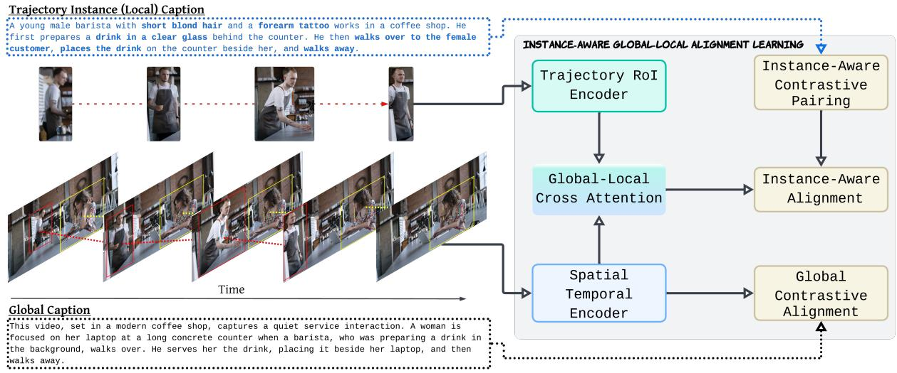
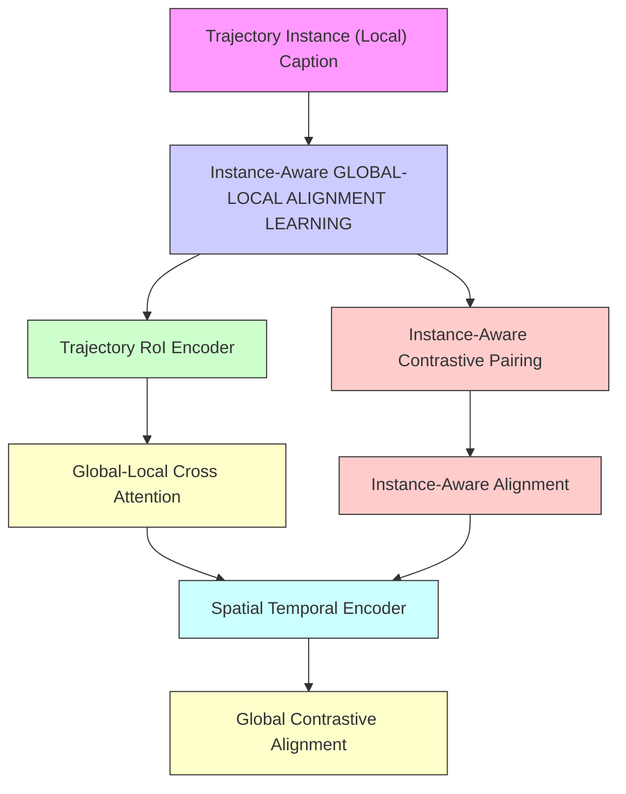
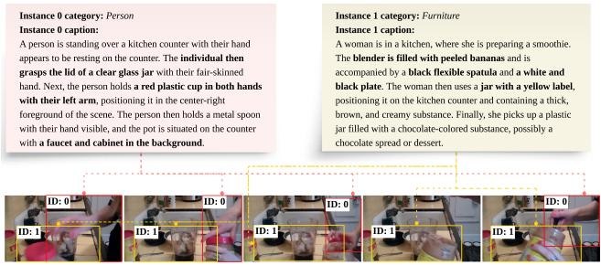
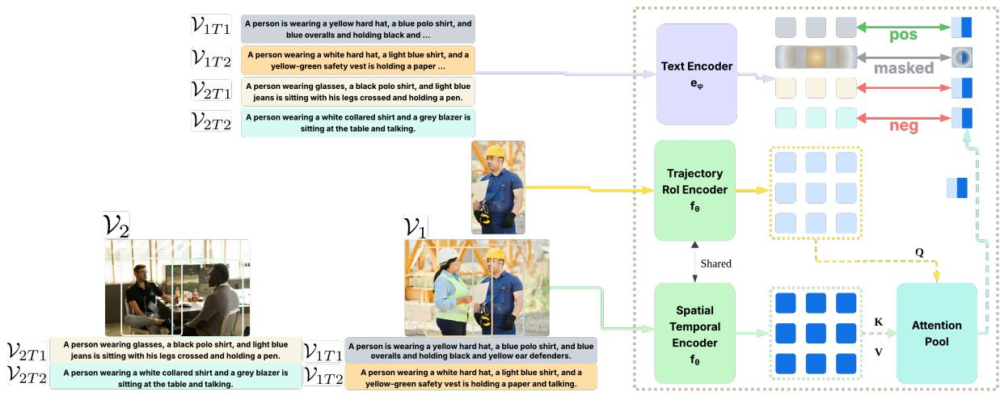
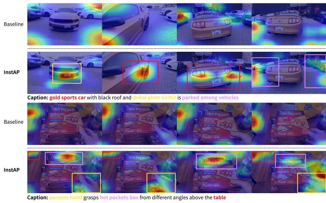
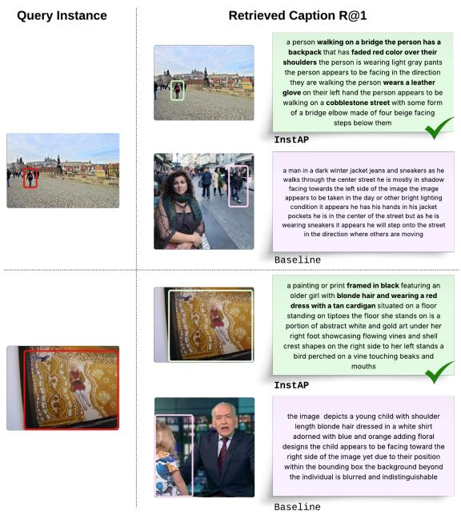

# InstAP: Instance-Aware Vision-Language Pre-Train for Spatial-Temporal Understanding

Ashutosh Kumar, Rajat Saini, Jingjing Pan, Mustafa Erdogan, Mingfang Zhang, Betty Le Dem, Norimasa Kobori, Quan Kong Woven by Toyota

{firstname.lastname}@woven.toyota

INSTVL: REGION/TRAJECTORY INSTANCE VISION-LANGUAGE DATASET   

flowchart

Figure 1. Conceptual overview of the InstAP framework and InstVL dataset. Left: InstVL features dual-granularity video annotations: holistic Global Captions and entity-grounded Trajectory Instance Captions. Right: InstAP fuses global and instance-level features via Global-Local Cross Attention, optimizing through joint Global and Instance-Aware Alignment objectives.

# Abstract

Current vision-language pre-training (VLP) paradigms excel at global scene understanding but struggle with instance-level reasoning due to global-only supervision. We introduce InstAP, an Instance-Aware Pre-training framework that jointly optimizes global vision-text alignment and fine-grained, instance-level contrastive alignment by grounding textual mentions to specific spatial-temporal regions. To support this, we present InstVL, a largescale dataset (2 million images, 50, 000 videos) with dualgranularity annotations: holistic scene captions and dense, grounded instance descriptions. On the InstVL benchmark, InstAP substantially outperforms existing VLP models on instance-level retrieval, and also surpasses a strong VLP baseline trained on the exact same data corpus, isolat-

ing the benefit of our instance-aware objective. Moreover, instance-centric pre-training improves global understanding: InstAP achieves competitive zero-shot performance on multiple video benchmarks, including MSR-VTT and DiDeMo. Qualitative visualizations further show that InstAP localizes textual mentions to the correct instances, while global-only models exhibit more diffuse, scene-level attention.

# 1. Introduction

Vision-Language Pre-training has fundamentally reshaped the landscape of representation learning, moving beyond supervised learning on fixed category datasets. Seminal work in the image domain, notably CLIP [42], demonstrated the power of learning transferable visual representations directly from natural language supervision. By employing contrastive learning objectives on hundreds of millions of image-text pairs harvested from the web, CLIP learned representations capable of impressive zero-shot generalization across diverse visual concepts, significantly broadening the scope compared to traditional classificationbased pre-training. This success spurred intense interest in extending VLP to the video domain, a naturally richer but substantially more complex modality.

Most existing approaches focus on capturing global, coarse-grained correspondences between an entire video and its caption [4, 27, 34, 49, 50, 57, 63, 66], often neglecting fine-grained instance-level semantics. This leaves a critical gap: models struggle to identify and distinguish specific objects or entities mentioned in text. For example, given a caption “a child throws a red ball while a dog jumps”, a model trained only on global alignments might grasp the overall event but fail to localize which visual region corresponds to the “ball” or the “dog”. Such shortcomings in instance-level understanding can limit performance on downstream tasks that require precise grounding of language in video, including fine-grained retrieval, spatial-temporal grounding, and object-centric question answering.

Learning fine-grained, instance-aware representations is non-trivial. On one hand, most large-scale video-text datasets provide only high-level descriptions, lacking the grounded annotations necessary to learn instance-word correspondences. On the other hand, prevailing pre-training objectives reward holistic video-text alignment, providing little incentive for the model to attend to subtle, instancespecific details. While recent works have attempted to address this by grafting instance-level cues onto models posthoc, they often rely on pre-trained object detectors [31, 69] or auxiliary specialization heads [55, 65]. These signals are often treated as auxiliary features rather than being integrated into the core representation learning, inheriting detector errors and failing to achieve true instance-level alignment. Consequently, a general and effective solution for instance-aware video pre-training remains elusive.

In this paper, we propose InstAP, an Instance-Aware vision-language Pre-training framework (Fig. 1) that learns representations capturing both global context and rich instance-level information. Instead of aligning only whole video clips with captions, InstAP introduces an instancecentric training objective that enforces alignment between specific textual mentions and their corresponding objectlevel visual features. This guides the model to ground individual entities, making the learned representations highly discriminative at the instance level while preserving holistic semantic understanding. To enable this training, we introduce InstVL, a large-scale dataset of 2 million images and 50, 000 videos with dual-granularity annotations: a holistic scene caption and dense, grounded instance-level descriptions.

Our experiments demonstrate three key contributions and findings:

• We introduce the InstVL dataset and the InstAP framework, which significantly outperforms existing models. By surpassing a strong VLP baseline trained on the same corpus, we demonstrate that InstAP’s gains stem from our instance-aware alignment framework rather than just data scaling.   
• InstAP achieves competitive generalization on zero-shot benchmarks like MSR-VTT and DiDeMo, proving that fine-grained alignment across instance and global levels actually enhances holistic scene understanding.   
• Qualitative analysis confirms InstAP’s ability to precisely ground textual phrases to visual instances, a capability notably absent in traditional global-only models.

# 2. Related Works

# 2.1. Grounded Vision-Language Datasets

A core bottleneck for instance-aware pre-training has been the lack of appropriate, large-scale training data. While image-domain datasets like Visual Genome [24] and Flickr30k Entities [41] provide region-level annotations, they are limited to grounding structured attributes or short phrases, not the full, free-form sentences needed for generative understanding. This gap is more severe in the video domain. Datasets with rich spatial-temporal trajectories are often highly domain-specific; for example, in autonomous driving [7], efforts to add captions have relied on rule-based, template-generated language [19], which lacks linguistic diversity. Conversely, general-purpose video datasets that provide trajectories, like VidOR [46], are limited to closed-vocabulary, structured predicates (e.g., <subject,chase,object>). Finally, other general datasets like ActivityNet-Entities [72] only ground noun phrases to a single, static frame, failing to capture temporal continuity. The InstVL corpus is developed to fill this critical gap, providing the first large-scale, general-domain resource with free-form sentence annotations for both static regions and full video trajectories.

# 2.2. Image-Language Pre-training

The foundation for modern vision-language understanding was largely established in the image domain. Seminal work, notably CLIP [42], showcased how contrastive pretraining on web-scale image-text data could yield transferable visual representations with remarkable zero-shot performance. Subsequent work refined this paradigm, e.g., with alternative loss functions [52, 68]. Concurrently, other works pushed for richer localization by incorporating region-level objectives [30, 67, 71]. This evolution demonstrates a move from global-only alignment towards capturing finer-grained semantics. Our work builds on this insight, extending the pursuit of fine-grained understanding to the spatial-temporal dynamics of video.

# 2.3. Video-Language Pre-training

Extending VLP to video required addressing temporal modeling and computational complexity. Many models [57, 61] adapted the CLIP paradigm, aligning entire video clip embeddings with text. While successful for global retrieval, these methods inherently average features, suppressing instance-level details. A second branch leverages selfsupervised objectives, such as reconstructing masked portions [51], inspired by BERT [12] and MAE [20]. Recent work like UMT [29] and VideoPrism [70] advanced this by distilling from a CLIP teacher to a video student. While innovations like semantic masking might implicitly focus on salient objects, the alignment target remains the teacher’s global representation, an indirect signal that itself lacks instance-specific grounding. Ultimately, both frameworks learn representations where instance-level cues are, at best, emergent and implicit, not explicitly modeled or aligned with specific textual mentions.

# 2.4. Towards Instance-Level Understanding in Vision-Language

Limitations of global-only models motivated efforts to inject finer-grained information. A dominant strategy is adding locality post-hoc via detector-based methods [30, 31, 69] that feed in region tags, coupling performance to detector quality. A recent variant adds specialized modules, e.g., instance-segmentation heads [55, 65]. While successful, these treat instance understanding as an auxiliary specialization, not a core encoder capability. Detectorfree, region-phrase mining methods [28, 67, 71] have shown promise on images but have not scaled effectively to video pre-training.

A critical gap remains: embedding instance awareness directly into large-scale video pre-training. Our work fundamentally departs from these “grafted-on” solutions. We posit that instance-level comprehension must be a core property of the representation, not an auxiliary task. We therefore introduce InstAP, a framework that embeds instance-awareness directly into the pre-training phase, learning a unified representation for both holistic and instance-level understanding.

# 3. Methodology

# 3.1. InstVL dataset

The InstVL corpus is a new large-scale vision-language dataset, containing 2 million images and 50, 000 video

text_image

Instance 0 category: Person
Instance 0 caption:
A person is standing over a kitchen counter with their hand
appears to be resting on the counter. The individual then
grasps the lid of a clear glass jar with their fair-skinned
hand. Next, the person holds a red plastic cup in both hands
with their left arm, positioning it in the center-right
foreground of the scene. The person then holds a metal spoon
with their hand visible, and the pot is situated on the counter
with a faucet and cabinet in the background.

Instance 1 category: Furniture
Instance 1 caption:
A woman is in a kitchen, where she is preparing a smoothie.
The blender is filled with peeled bananas and is
accompanied by a black flexible spatula and a white and
black plate. The woman then uses a jar with a yellow label,
positioning it on the kitchen counter and containing a thick,
brown, and creamy substance. Finally, she picks up a plastic
jar filled with a chocolate-colored substance, possibly a
chocolate spread or dessert.

Global caption:   
A person stands iien, wearinaanslevelesshirtandblack pants, withteirighthandmvingasevdendbyheburdigeTe kitchenisuteed witselles is otheiunteop,iingadrotaiingauidentiabledarkbosbsae,yot container, alade,ada witeplate.Tepersonenpiksupajarithedifomtheuterecoutertop.Tebenerisfildwithfrozn bananas, choolate, andoutfakes Afteopletig teprepaatio,hepnostaeofolatespreadineirans, ihpin fingernails and a silver ring visible on their left hand.

Figure 2. Illustration of our InstVL dataset. We display sampled frames with color-coded, temporally-consistent instance trajectories (e.g., ID: 0, ID: 1). The top text provides the fine-grained instance captions grounded to these trajectories; the bottom text provides the holistic global caption for the entire scene. clips, designed to facilitate instance-aware pre-training. Its key contribution is the dual-granularity textual annotations provided for each visual sample: (1) a scene caption for holistic context and (2) a collection of instance-level captions grounded in specific visual regions (for images) or spatial-temporal trajectories (for videos), as illustrated in Fig. 2.

# 3.1.1. Data Curation Pipeline

Our main training dataset images are drawn from LAION-400M [45], while the videos are sourced from processed segments of HDVILA [59]. To create our zero-shot test splits, we exclusively used images from COYO [5], ensuring no overlap with the training sources. We first processed videos with AutoShot [73] for scene segmentation. Next, we generated spatial-temporal instance groundings using GroundingDINO [36] as an open-vocabulary detector and SAM2 [43] for instance tracking. To generate the dual-granularity text, we fed these regions and trajectories with visual bounding box prompts to a large visionlanguage model [22], which generated both the holistic scene captions and the fine-grained instance-level descriptions. This pipeline underwent several iterations of manual human checking to refine the prompting techniques and ensure high-quality, descriptive annotations. Each image or video sample contains: (1) a single scene caption and (2) a variable number of instance annotations. For images, an instance is a 2D bounding box. For videos, it is a temporal trajectory of boxes. Each instance annotation is coupled with a free-form sentence describing its specific appearance, attributes, or actions.

# 3.1.2. InstVL Test Suite

To facilitate systematic benchmarking, we curate a heldout test suite with five mutually exclusive subsets:

```mermaid
graph TD
    A["Text Encoder eφ"] --> B["Trajectory Rol Encoder fθ"]
    B --> C["Spatial Temporal Encoder fθ"]
    C --> D["Attention Pool"]
    D --> E["Q"]
    E --> F["Shared"]
    F --> G["Verteak: v1T1, v1T2, v2T1, v2T2"]
    H["V1T1"] --> I["A person wearing glasses, black polo shirt, and light blue jeans is sitting with his legs crossed and holding a pen."]
    I --> J["A person wearing a white collared shirt and a grey blazer is sitting at the table and talking."]
    K["V2T1"] --> L["A person wearing glasses, black polo shirt, and light blue jeans is sitting with his legs crossed and holding a pen."]
    L --> M["A person wearing a white collared shirt and a grey blazer is sitting at the table and talking."]
    N["V2T2"] --> O["A person wearing glasses, black polo shirt, and light blue jeans is sitting with his legs crossed and holding a pen."]
    O --> P["A person wearing a white collared shirt and a grey blazer is sitting at the table and talking."]
    Q["V1T2"] --> R["A person wearing a white collared shirt and a grey blazer is sitting at the table and talking."]
    S["V1T1"] --> T["A person wearing a yellow hard hat, blue polo shirt, and blue overalls and holding black and yellow ear defenders."]
    T --> U["A person wearing a white hard hat, blue polo shirt, and blue overalls and holding black and yellow ear defenders."]
    V["V2T1"] --> W["A person wearing glasses, black polo shirt, and light blue jeans is sitting with his legs crossed and holding a pen."]
    X["V1T2"] --> Y["A person wearing a white hard hat, light blue shirt, and a yellow-green safety vest is holding a paper and talking."]
    Z["V2T1"] --> AA["A person wearing a yellow hard hat, blue polo shirt, and blue overalls and holding black and yellow ear defenders."]
    AB["V2T2"] --> AC["A person wearing a white hard hat, light blue shirt, and a yellow-green safety vest is holding a paper and talking."]
    AD["V1T1"] --> AE["A person wearing a yellow hard hat, blue polo shirt, and blue overalls and holding black and yellow ear defenders."]
    AF["V1T2"] --> AG["A person wearing a white hard hat, light blue shirt, and a yellow-green safety vest is holding a paper and talking."]
    AH["V2T1"] --> AI["A person wearing a yellow hard hat, blue polo shirt, and blue overalls and holding black and yellow ear defenders."]
    AJ["V1T2"] --> AK["A person wearing a white hard hat, light blue shirt, and a yellow-green safety vest is holding a paper and talking."]
    AL["V2T1"] --> AM["A person wearing a yellow hard hat, blue polo shirt, and blue overalls and holding black and yellow ear defenders."]
    AN["V1T2"] --> AO["A person wearing a white hard hat, light blue shirt, and a yellow-green safety vest is holding a paper and talking."]
    AP["V2T1"] --> AQ["A person wearing a yellow hard hat, blue polo shirt, and blue overalls and holding black and yellow ear defenders."]
    AR["V1T2"] --> AS["A person wearing a white hard hat, light blue shirt, and a yellow-green safety vest is holding a paper and talking."]
    AT["V1T1"] --> AU["A person wearing a yellow hard hat, blue polo shirt, and blue overalls and holding black and yellow ear defenders."]
    AV["V1T2"] --> AW["A person wearing a white hard hat, light blue shirt, and a yellow-green safety vest is holding a paper and talking."]
    AX["V2T1"] --> AY["A person wearing a yellow hard hat, blue polo shirt, and blue overalls and holding black and yellow ear defenders."]
    AZ["V1T2"] --> BA["A person wearing a white hard hat, light blue shirt, and a yellow-green safety vest is holding a paper and talking."]
    BB["V2T1"] --> BC["A person wearing a yellow hard hat, blue polo shirt, and blue overalls and holding black and yellow ear defenders."]
    BD["V1T2"] --> BE["A person wearing a white hard hat, light blue shirt, and a yellow-green safety vest is holding a paper and talking."]
    BF["V2T1"] --> BG["A person wearing a yellow hard hat, blue polo shirt, and blue overalls and holding black and yellow ear defenders."]
    BH["V1T2"] --> BI["A person wearing a white hard hat, light blue shirt, and a yellow-green safety vest is holding a paper and talking."]
    BJ["V2T1"] --> BK["A person wearing a yellow hard hat, blue polo shirt, and blue overalls and holding black and yellow ear defenders."]
    BL["V1T2"] --> BM["A person wearing a white hard hat, light blue shirt, and a yellow-green safety vest is holding a paper and talking."]
    BN["V2T1"] --> BO["A person wearing a yellow hard hat, blue polo shirt, and blue overalls and holding black and yellow ear defenders."]
    BO --> BP["A person wearing a white hard hat, light blue shirt, and a yellow-green safety vest is holding a paper and talking."]
    BQ["V2T1"] --> BR["A person wearing a yellow hard hat, blue polo shirt, and blue overalls and holding black and yellow ear defenders."]
    BS["V1T2"] --> BT["A person wearing a white hard hat, light blue shirt, and a yellow-green safety vest is holding a paper and talking."]
    BU["V2T1"] --> BV["A person wearing a yellow hard hat, blue polo shirt, and blue overalls and holding black and yellow ear defenders."]
    BW["V1T2"] --> BX["A person wearing a white hard hat, light blue shirt, and a yellow-green safety vest is holding a paper and talking."]
    BY["V2T1"] --> BZ["A person wearing a yellow hard hat, blue polo shirt, and blue overalls and holding black and yellow ear defenders."]
    CA["V1T2"] --> CB["A person wearing a white hard hat, light blue shirt, and a yellow-green safety vest is holding a paper and talking."]
    CC["V2T1"] --> CD["A person wearing a yellow hard hat, blue polo shirt, and blue overalls and holding black and yellow ear defenders."]
    CE["V1T2"] --> CF["A person wearing a white hard hat, light blue shirt, and a yellow-green safety vest is holding a paper and talking."]
    DG["V2T1"] --> DH["A person wearing a yellow hard hat, blue polo shirt, and blue overalls and holding black and yellow ear defenders."]
    DI["V1T2"] --> DJ["A person wearing a white hard hat, light blue shirt, and a yellow-green safety vest is holding a paper and talking."]
    DK["V2T1"] --> DL["A person wearing a yellow hard hat, blue polo shirt, and blue overalls and holding black and yellow ear defenders."]
    DD["V1T2"] --> DJ["A person wearing a white hard hat, light blue shirt, and a yellow-green safety vest is holding a paper and talking."]
    EVI["V2T1"] --> EV["A person wearing a yellow hard hat, blue polo shirt, and blue overalls and holding black and yellow ear defenders."]
    FX["V1T2"] --> FY["A person wearing a white hard hat, light blue shirt, and a yellow-green safety vest is holding a paper and talking."]
```

flowchart

Figure 3. Our instance-aware alignment mechanism. Instance features (Query Q) from a Trajectory RoI Encoder $\left( f _ { \theta } \right)$ are fused with global context (Key K, Value V ) via an Attention Pool to create an instance-aware embedding. This embedding is contrasted with text features $( e _ { \phi } )$ . The loss forces the model to match positive pairs $\left( V _ { 1 T 1 } \right)$ while contrasting against negatives from different videos $( V _ { 2 T 1 } / V _ { 2 T 2 } )$ and masking potential false-negative pairs from the same video $\left( V _ { 1 T 2 } \right)$ , enforcing fine-grained discrimination (Eq. 8).

InstVL-1K (img) and InstVL-10K (img) for images, InstVL-1K (img-zero) and InstVL-10K (img-zero) for zero-shot images, and InstVL-1K (video) for videos. The InstVL-1K (img-zero)/ InstVL-10K (img-zero) subsets are sourced entirely from COYO, whereas the main training images (and their corresponding test splits) are from LAION. This introduces a distribution shift that lets us confirm that our model’s performance is not merely inherited from the training distribution.

# 3.2. Self-Supervised Masked Video Modeling

Our method adopts a teacher-student framework to build our encoder, learning from semantic representations [29]. While standard masked autoencoding with pixel-level reconstruction is data-efficient [15, 51], this low-level objective can conflict with the high-level alignment needed for language tasks [29, 48]. We therefore use a high-level feature regression on unmasked tokens. This approach is significantly more training-efficient, as it removes the need for a heavy reconstruction decoder and saves considerable GPU memory by processing only the visible tokens [29]. This semantic guidance also leads to faster convergence and produces representations that are better suited for subsequent cross-modal alignment [29].

Consider a video $\mathcal { V } = \{ I _ { 1 } , \ldots , I _ { T } \}$ with T RGB frames. Each frame is divided into N fixed-size patches, producing a token sequence of length $L = T N$ . An attention-guided binary mask $\textbf { M } \in \{ 0 , 1 \} ^ { L }$ is constructed as follows. A frozen vision transformer g first processes all tokens to obtain self-attention maps $\textbf { A } \in \ \mathbb { R } ^ { L \times L }$ . Per-token importance scores are computed by averaging the attention given by each token, $\mathbf { s } ~ = ~ \frac { 1 } { L } \mathbf { A 1 }$ . Given a masking ratio

$\rho ,$ the $L _ { \mathrm { m } } = \lceil \rho L \rceil$ tokens with lowest scores are masked $( \mathbf { M } = 1 )$ while the remaining tokens are kept $( { \bf M } = 0 )$ . Let $\Omega = \{ l \ | \ \mathbf { M } _ { l } = 0 \}$ be the visible index set.

A student video transformer $f _ { \theta }$ receives only the visible tokens and outputs hidden vectors $\mathbf { h } _ { l } ^ { S }$ for $l \in \Omega$ . The teacher features $\mathbf { h } _ { l } ^ { T } = g ( I _ { 1 : T } ) \boldsymbol { { l } }$ , computed on the $f u l l$ token set, serve as regression targets.

The reconstruction loss is

$$
\mathcal {L} _ {\text { rec }} = \frac {1}{| \Omega |} \sum_ {l \in \Omega} \left\| \frac {\mathbf {h} _ {l} ^ {S}}{\| \mathbf {h} _ {l} ^ {S} \| _ {2}} - \frac {\mathbf {h} _ {l} ^ {T}}{\| \mathbf {h} _ {l} ^ {T} \| _ {2}} \right\| _ {2} ^ {2} \tag {1}
$$

This attention-guided masking compels the student to reconstruct the teacher’s full-context representations $( \mathbf { h } _ { l } ^ { T } )$ for the most informative tokens $( l \in \Omega )$ , using only those same visible tokens as input. This challenging regression task strengthens its spatial-temporal representation.

# 3.3. Instance-aware Global-Local Spatial-Temporal Alignment Learning

Let $\{ ( \gamma _ { i } , \mathcal { T } _ { i } ) \} _ { i = 1 } ^ { B }$ be paired video-text samples. The visual encoder $f _ { \theta }$ (initialized from §3.2) yields token sequence $\mathbf { V } _ { i } \in \mathbb { R } ^ { L _ { v } \times d }$ and pooled vector $\begin{array} { r } { \mathbf { v } _ { i } = \frac { 1 } { L _ { v } } \sum _ { l } \mathbf { V } _ { i , l } . } \end{array}$ . A text encoder [12] $e _ { \phi }$ outputs token embeddings $\mathbf { T } _ { i } \in \mathbb { R } ^ { L _ { t } \times d }$ and pooled embedding $\mathbf { t } _ { i } = \mathbf { T } _ { i , 0 }$ , where the first token is the [CLS] representation. Linear projections Wv, Wt ∈ Rd×d′ $W _ { v } , W _ { t } \in \mathbb { R } ^ { d \times d ^ { \prime } }$ map pooled vectors to a shared space: $\tilde { \mathbf { v } } _ { i } = W _ { v } \mathbf { v } _ { i } , \ \tilde { \mathbf { t } } _ { i } =$ $W _ { t } \mathbf { t } _ { i }$ .

# 3.3.1. Global Alignment Losses

With a learnable parameter temperature τ , the bidirectional Video-Text Contrastive (VTC) loss is

$$
\mathcal {L} _ {\mathrm{VTC}} = - \frac {1}{B} \sum_ {i = 1} ^ {B} \log \frac {\exp \left(\tilde {\mathbf {v}} _ {i} ^ {\top} \tilde {\mathbf {t}} _ {i} / \tau\right)}{\sum_ {j = 1} ^ {B} \exp \left(\tilde {\mathbf {v}} _ {i} ^ {\top} \tilde {\mathbf {t}} _ {j} / \tau\right)} \tag {2}
$$

$$
- \frac {1}{B} \sum_ {i = 1} ^ {B} \log \frac {\exp (\widetilde {\mathbf {t}} _ {i} ^ {\top} \widetilde {\mathbf {v}} _ {i} / \tau)}{\sum_ {j = 1} ^ {B} \exp (\widetilde {\mathbf {t}} _ {i} ^ {\top} \widetilde {\mathbf {v}} _ {j} / \tau)}
$$

A fusion transformer $m _ { \psi }$ (implemented as the BERT encoder) jointly processes the visual tokens $\mathbf { V } _ { i }$ and textual tokens $\mathbf { T } _ { i }$ . A matching head h outputs logits from the fused [CLS] vector: $s _ { i } = h \big ( m _ { \psi } ( \mathbf { V } _ { i } , \mathbf { T } _ { i } ) \big ) \in \mathbb { R } ^ { 2 }$ . Let $y _ { i } \in \{ 0 , 1 \}$ indicate whether the pair is positive (1) or a hard negative (0). With the softmax probability $p _ { i } =$ softmax(si)1, the binary cross-entropy Video–Text Matching (VTM) loss is

$$
\mathcal {L} _ {\mathrm{VTM}} = - \frac {1}{B} \sum_ {i = 1} ^ {B} \left[ y _ {i} \log p _ {i} + (1 - y _ {i}) \log (1 - p _ {i}) \right] \tag {3}
$$

For each caption a subset $M _ { i } ~ \subset ~ \{ 1 , \dots , L _ { t } \}$ of token indices is replaced by [MASK]. The Masked Language Modeling (MLM) loss, computed by the same fusion transformer $m _ { \psi } ,$ , is

$$
\mathcal {L} _ {\mathrm{MLM}} = - \frac {1}{B} \sum_ {i = 1} ^ {B} \frac {1}{| M _ {i} |} \sum_ {j \in M _ {i}} \log P (w _ {i, j} \mid \mathbf {V} _ {i}, \mathbf {T} _ {i, \text {visible}}) (4)
$$

where $P$ is the probability assigned by $m _ { \psi }$ to the original word $w _ { i , j }$ .

# 3.3.2. Instance-Aware Alignment Losses

Each video i is accompanied by $K _ { i }$ object instances described by bounding boxes $b _ { i , k }$ and captions $\mathcal { T } _ { i , k }$ . For every box, a crop $\mathcal { C } _ { i , k }$ is passed through the video encoder $f _ { \theta }$ to obtain: (1) raw patch tokens $\mathbf { C } _ { i , k } ^ { \mathsf { ^ { - } } } \in \mathbb { R } ^ { L _ { c } \times d }$ and (2) a raw pooled crop embedding $\begin{array} { r } { \mathbf { c } _ { i , k } = \frac { 1 } { L _ { c } } \sum _ { l } \mathbf { C } _ { i , k , l } } \end{array}$ .

Cross-attending the crop tokens to the full-scene features $\mathbf { V } _ { i }$ injects global context:

$$
\mathbf {Z} _ {i, k} = \mathrm{XAttn} (\mathbf {C} _ {i, k}, \mathbf {V} _ {i}) \tag {5}
$$

$$
\mathbf {z} _ {i, k} = \frac {1}{L _ {c}} \sum_ {l = 1} ^ {L _ {c}} \mathbf {Z} _ {i, k, l} \tag {6}
$$

$$
\tilde {\mathbf {z}} _ {i, k} = W _ {v} \mathbf {z} _ {i, k} \tag {7}
$$

The text encoder returns a sentence embedding $\begin{array} { r l } { \mathbf { s } _ { i , k } } & { { } = } \end{array}$ $e _ { \phi } ( T _ { i , k } ) _ { [ \mathbb { C } \mathrm { L S } ] } , \ : \tilde { \mathbf { s } } _ { i , k } = W _ { t } \mathbf { s } _ { i , k }$ .

Since instance-level captions for objects within the same video/image often overlap (cf., Fig. 2) and can introduce false negatives in contrastive learning, we contrast each crop with all captions while masking non-matching captions from the same video/image, thereby promoting instance-level semantics. With $\begin{array} { r } { N = \sum _ { i } K _ { i } } \end{array}$ and an independent learnable temperature $\tau _ { \mathrm { i n s t } }$ , the instance VTC loss is:

$$
\mathcal {L} _ {\mathrm{VTC}} ^ {\text {inst}} = - \frac {1}{N} \sum_ {n = 1} ^ {N} \log \frac {\exp \left(\tilde {\mathbf {z}} _ {n} ^ {\top} \tilde {\mathbf {s}} _ {n} / \tau_ {\text {inst}}\right)}{\sum_ {m = 1} ^ {N} \alpha_ {n , m} \exp \left(\tilde {\mathbf {z}} _ {n} ^ {\top} \tilde {\mathbf {s}} _ {m} / \tau_ {\text {inst}}\right)} \tag {8}
$$

$$
- \frac {1}{N} \sum_ {n = 1} ^ {N} \log \frac {\exp \left(\tilde {\mathbf {s}} _ {n} ^ {\top} \tilde {\mathbf {z}} _ {n} / \tau_ {\mathrm{inst}}\right)}{\sum_ {m = 1} ^ {N} \alpha_ {n , m} \exp \left(\tilde {\mathbf {s}} _ {n} ^ {\top} \tilde {\mathbf {z}} _ {m} / \tau_ {\mathrm{inst}}\right)}
$$

where $\alpha _ { n , m } = 0$ for m $\neq n$ if m originates from the same video/image as n, and $\alpha _ { n , m } = 1$ otherwise.

The shared fusion transformer $m _ { \psi }$ and matching head h are used for instance VTM. The model jointly encodes the raw pooled crop embedding $\mathbf { c } _ { i , k }$ and the caption tokens of $\mathcal { T } _ { i , k }$ , yielding logits $s _ { i , k } ^ { \mathrm { i n s t } } \in \mathbb { R } ^ { 2 }$ . The instance VTM objective trains the classifier to accept matched pairs and reject hard negatives:

$$
\mathcal {L} _ {\mathrm{VTM}} ^ {\text { inst }} = - \frac {1}{N} \sum_ {i, k} \left[ y _ {i, k} \log p _ {i, k} + (1 - y _ {i, k}) \log (1 - p _ {i, k}) \right] \tag {9}
$$

$$
p _ {i, k} = \mathrm{softmax} \big (s _ {i, k} ^ {\mathrm{inst}} \big) _ {1}
$$

Similar to the global MLM loss, we randomly mask a subset $M _ { i , k }$ of caption tokens and ask the shared fusion transformer $m _ { \psi }$ to recover them, but this time given the cross-attended visual context $\mathbf { Z } _ { i , k } \colon$

$$
\mathcal {L} _ {\mathrm{MLM}} ^ {\text { inst }} = - \frac {1}{N} \sum_ {i, k} \frac {1}{| M _ {i , k} |} \sum_ {j \in M _ {i, k}} \log P (w _ {i, k, j} \mid \mathbf {Z} _ {i, k}, \mathcal {T} _ {i, k, \text { visible }}) \tag {10}
$$

Combining the masked-video alignment with the three pair-level objectives $( \mathcal { L } _ { \mathrm { V T C } } , \mathcal { L } _ { \mathrm { V T M } } , \mathcal { L } _ { \mathrm { M L M } } )$ and their instance-aware counterparts yield our complete training loss. We introduce separate weighting coefficients so that each component can be tuned independently, leading to the following decomposition.

$$
\begin{array}{l} \mathcal {L} _ {\text { global }} = \lambda_ {\text { VTC }} \mathcal {L} _ {\text { VTC }} + \lambda_ {\text { VTM }} \mathcal {L} _ {\text { VTM }} \\ + \lambda_ {\mathrm{MLM}} \mathcal {L} _ {\mathrm{MLM}} \tag {11} \\ \end{array}
$$

$$
\mathcal {L} _ {\mathrm{inst}} = \lambda_ {\mathrm{VTC}} ^ {\mathrm{inst}} \mathcal {L} _ {\mathrm{VTC}} ^ {\mathrm{inst}} + \lambda_ {\mathrm{VTM}} ^ {\mathrm{inst}} \mathcal {L} _ {\mathrm{VTM}} ^ {\mathrm{inst}}
$$

$$
+ \lambda_ {\text { MLM }} ^ {\text { inst }} \mathcal {L} _ {\text { MLM }} ^ {\text { inst }} \tag {12}
$$

The complete loss integrates masked-video reconstruction, global video-text alignment, and the three instance-level objectives:

$$
\mathcal {L} = \mathcal {L} _ {\text { rec }} + \mathcal {L} _ {\text { global }} + \mathcal {L} _ {\text { inst }} \tag {13}
$$

# 4. Experimental Setup

We use a Vision Transformer Large (ViT-L) [13] trained from scratch but guided by a frozen original CLIP-ViT teacher [42]. While several OpenCLIP [11] models have shown strong performance on standard benchmarks, in our experiments we found the original CLIP-ViT-L teacher to provide a stronger signal, as the OpenCLIP variants performed worse even at higher native resolutions (e.g., 378 × 378) [14]. This observation aligns with recent findings in the development of vision encoders for multimodal learning [32]. Following the strategy in [29], the class token is removed and all patch tokens attend jointly in space and time. This preserves the teacher’s spatial semantics while enabling explicit spatial-temporal reasoning in the student.

# 4.1. Self-Supervised Masked Video Modeling

The model was pretrained for 800 epochs on 8-frame 224 × 224 video clips, using only videos from three corpora: K710 (0.6M videos), segmented HDVILA (0.45M videos), and WebVid (0.45M videos). We merge Kinetics-400, -600, and -700 [23] into Kinetics-710; due to YouTube removals, approximately 15% of the videos are missing. We use AdamW [37] optimizer with a learning rate of $1 . 5 \times 1 0 ^ { - 4 }$ and a batch size of 64, alongside an 80% attention-guided masking ratio.

After pretraining, we select a set of checkpoints with the lowest alignment loss between teacher and student. For each checkpoint, we append a linear classifier and fine-tune the entire network on Kinetics-400 for action classification. Among these candidates, we choose the model achieving the highest Top-1 accuracy on Kinetics-400 (87.84% top-1, 97.77% top-5), and use corresponding pre-trained weights for continued instance-aware alignment training. This first pre-training stage was run on 320 NVIDIA H100 GPUs.

# 4.2. Instance-aware Alignment Learning

We use a large collection of image-text pairs including CC3M [47], CC12M [8], SBU Captions [40], Visual Genome [24], COCO [35], and ShareGPT4V [10], alongside 5 million sampled WebVid [3] videos for global alignment. Our InstVL training set of 2 million images and 50, 000 videos is used for both global and instance-aware alignment.

Initializing the vision encoder with weights from masked video modeling, we train on a mixture of image-text and video-text pairs for 15 epochs. We conducted experiments sampling 4, 8, 16, 24, and 32 frames, finding that 16 frames yielded the best performance, while 32 frames showed a slight degradation. Therefore, we sample 16 frames per video at $2 2 4 \times 2 2 4$ , and still images are treated as singleframe videos. Because InstVL captions often exceed the tokenizer’s input length, at each epoch we randomly sample one sentence per caption, cycling through all sentences across epochs so the model eventually sees every part of each description. Ablations in Table 5 analyze the impact of sampling strategy.

Zero-shot retrieval is assessed on MSVD [9], ActivityNet [6], MSR-VTT [58], LSMDC [44], DiDeMo [1], and InstVL test sets without additional fine-tuning. This second alignment stage was trained on 200 NVIDIA B200 GPUs with 180GB of memory per GPU. We use the AdamW optimizer [37] with a cosine learning scheduler.

# 5. Results

Table 1 compares InstAP against state-of-the-art models on InstVL benchmarks. For fair comparison in instance-level tasks, baselines are evaluated using cropped regions/trajectories, which consistently yielded stronger results than fullframe inputs. InstAP achieves superior performance across all image and video splits for both instance and global retrieval. Notably, on InstVL-1K (video) instance retrieval, InstAP reaches 60.63 T2V R@1, significantly exceeding prior work. Strong performance on the unseen img-zero splits further suggests generalization beyond training data memorization.

To isolate the benefits of our framework from the InstVL dataset itself, we compare InstAP against two UMT-L baselines trained on the same corpus: (1) UMT-L (g), using only global captions; and (2) UMT-L (g+i), using both global and instance captions as standard globallevel descriptions. InstAP significantly outperforms UMT-L (g+i) (e.g., 44.05 vs. 34.83 T2V R@1 on InstVL-10K (img)), despite identical training data. This gap confirms that InstAP’s gains are driven by our novel instance-aware alignment framework rather than mere exposure to dense annotations.

Table 2 evaluates InstAP’s generalization across five zero-shot text-to-video retrieval benchmarks. InstAP reaches 41.1 R@1 on MSR-VTT and 54.0 on DiDeMo, setting new state-of-the-art performance levels. Crucially, we observe that naively fine-tuning the UMT-L baseline on InstVL (g or g+i variants) degrades performance compared to the original UMT-L, likely due to task interference or domain shift. In contrast, InstAP not only mitigates this degradation but surpasses the original UMT-L on both MSR-VTT and DiDeMo while remaining competitive elsewhere. This demonstrates that our instance-aware paradigm fosters more robust, dual-granularity representations that benefit both fine-grained grounding and global understanding.

To further validate the instance-awareness of our representations beyond retrieval, we evaluate visual grounding on the InstVL-1K splits. We attach a 3-layer MLP boxregression head to the fused vision-text features of the pretrained encoder and fine-tune using L1 and GIoU losses. As shown in Table 3, InstAP significantly outperforms the UMT-L [29] baseline across all datasets and IoU thresholds. Notably, on the challenging video split, InstAP improves IoU@90 from 14.44 to 25.13, confirming that our pre-training objective effectively encodes precise spatialtemporal coordinates within the visual features.

Table 1. Comparison of SOTA models and our InstAP on the InstVL test set. We report T2V/V2T R@1 on the instance and global splits across InstVL(img), InstVL(img-zero), and InstVL(video). UMT-L (InstVL; g/g+i) baselines use the same full training corpus as InstAP, trained with only InstVL’s global captions (g) or with all InstVL captions treated as global (g+i). 

<table><tr><td rowspan="3">Method</td><td rowspan="3">Split</td><td colspan="4">InstVL(img)</td><td colspan="4">InstVL(img-zero)</td><td colspan="2">InstVL(video)</td></tr><tr><td colspan="2">1K</td><td colspan="2">10K</td><td colspan="2">1K</td><td colspan="2">10K</td><td colspan="2">1K</td></tr><tr><td>T2V R@1</td><td>V2T R@1</td><td>T2V R@1</td><td>V2T R@1</td><td>T2V R@1</td><td>V2T R@1</td><td>T2V R@1</td><td>V2T R@1</td><td>T2V R@1</td><td>V2T R@1</td></tr><tr><td rowspan="2">VideoPrism [70]</td><td>Instance</td><td>28.21</td><td>34.52</td><td>22.75</td><td>29.51</td><td>21.32</td><td>27.39</td><td>13.85</td><td>20.04</td><td>40.86</td><td>39.29</td></tr><tr><td>Global</td><td>97.40</td><td>97.60</td><td>88.19</td><td>89.62</td><td>85.70</td><td>85.80</td><td>73.05</td><td>75.11</td><td>82.71</td><td>83.62</td></tr><tr><td rowspan="2">CLIP4Clip [38]</td><td>Instance</td><td>25.10</td><td>33.21</td><td>18.68</td><td>28.19</td><td>17.82</td><td>25.10</td><td>9.11</td><td>16.30</td><td>17.71</td><td>24.69</td></tr><tr><td>Global</td><td>93.40</td><td>96.00</td><td>79.22</td><td>84.25</td><td>78.20</td><td>81.70</td><td>56.95</td><td>63.96</td><td>67.50</td><td>70.50</td></tr><tr><td rowspan="2">Coca [64]</td><td>Instance</td><td>11.83</td><td>21.79</td><td>7.36</td><td>13.33</td><td>7.08</td><td>13.19</td><td>4.12</td><td>7.26</td><td>14.72</td><td>11.82</td></tr><tr><td>Global</td><td>86.20</td><td>91.50</td><td>70.80</td><td>76.16</td><td>67.40</td><td>70.50</td><td>46.05</td><td>50.64</td><td>46.92</td><td>43.78</td></tr><tr><td rowspan="2">ViCLIP [54]</td><td>Instance</td><td>28.38</td><td>28.91</td><td>19.46</td><td>20.02</td><td>18.25</td><td>20.93</td><td>9.57</td><td>11.21</td><td>21.78</td><td>21.50</td></tr><tr><td>Global</td><td>95.10</td><td>93.50</td><td>81.47</td><td>79.33</td><td>77.80</td><td>77.60</td><td>58.51</td><td>58.21</td><td>62.89</td><td>62.69</td></tr><tr><td rowspan="2">OpenCLIP [11]</td><td>Instance</td><td>37.88</td><td>44.06</td><td>29.21</td><td>37.76</td><td>26.73</td><td>36.19</td><td>17.28</td><td>25.57</td><td>36.63</td><td>33.36</td></tr><tr><td>Global</td><td>94.40</td><td>98.10</td><td>84.98</td><td>92.06</td><td>83.40</td><td>86.90</td><td>70.75</td><td>78.13</td><td>82.00</td><td>77.15</td></tr><tr><td rowspan="2">CLIP-ViP [60]</td><td>Instance</td><td>24.04</td><td>32.06</td><td>14.38</td><td>21.85</td><td>13.81</td><td>22.96</td><td>6.60</td><td>12.11</td><td>16.78</td><td>28.32</td></tr><tr><td>Global</td><td>78.40</td><td>89.20</td><td>54.94</td><td>72.00</td><td>55.60</td><td>73.20</td><td>32.48</td><td>51.30</td><td>35.59</td><td>61.07</td></tr><tr><td rowspan="2">MCQ [17]</td><td>Instance</td><td>19.33</td><td>22.11</td><td>9.63</td><td>11.13</td><td>17.08</td><td>19.61</td><td>7.04</td><td>8.55</td><td>24.41</td><td>23.72</td></tr><tr><td>Global</td><td>58.20</td><td>60.10</td><td>31.45</td><td>34.12</td><td>58.90</td><td>62.70</td><td>34.13</td><td>38.26</td><td>61.48</td><td>60.67</td></tr><tr><td rowspan="2">SigLIP [68]</td><td>Instance</td><td>38.17</td><td>45.17</td><td>29.76</td><td>37.83</td><td>28.25</td><td>35.56</td><td>16.98</td><td>25.19</td><td>36.43</td><td>36.14</td></tr><tr><td>Global</td><td>95.70</td><td>98.20</td><td>87.18</td><td>91.97</td><td>83.90</td><td>86.50</td><td>68.64</td><td>75.66</td><td>74.72</td><td>76.14</td></tr><tr><td rowspan="2">UMT-L [29]</td><td>Instance</td><td>38.44</td><td>35.65</td><td>21.34</td><td>23.08</td><td>29.34</td><td>30.17</td><td>11.09</td><td>16.38</td><td>26.38</td><td>22.43</td></tr><tr><td>Global</td><td>94.70</td><td>95.30</td><td>83.95</td><td>85.41</td><td>83.90</td><td>83.70</td><td>72.60</td><td>72.59</td><td>88.30</td><td>85.50</td></tr><tr><td rowspan="2">UMT-L (InstVL; g) [29]</td><td>Instance</td><td>34.44</td><td>41.24</td><td>22.87</td><td>30.37</td><td>25.97</td><td>31.97</td><td>13.33</td><td>19.21</td><td>41.51</td><td>40.34</td></tr><tr><td>Global</td><td>96.20</td><td>97.10</td><td>85.70</td><td>87.03</td><td>85.30</td><td>86.40</td><td>72.50</td><td>74.18</td><td>84.80</td><td>82.40</td></tr><tr><td rowspan="2">UMT-L (InstVL; g+i) [29]</td><td>Instance</td><td>45.74</td><td>44.27</td><td>34.83</td><td>35.15</td><td>34.68</td><td>34.99</td><td>21.13</td><td>22.82</td><td>40.38</td><td>39.33</td></tr><tr><td>Global</td><td>93.20</td><td>94.30</td><td>80.30</td><td>81.62</td><td>82.40</td><td>84.30</td><td>68.16</td><td>69.76</td><td>79.90</td><td>77.20</td></tr><tr><td rowspan="2">InstAP (Ours)</td><td>Instance</td><td>50.25</td><td>49.26</td><td>44.05</td><td>45.76</td><td>41.94</td><td>42.53</td><td>28.25</td><td>31.87</td><td>60.63</td><td>58.49</td></tr><tr><td>Global</td><td>99.20</td><td>99.10</td><td>95.77</td><td>94.71</td><td>88.70</td><td>88.30</td><td>83.33</td><td>82.21</td><td>94.50</td><td>95.50</td></tr></table>

Table 2. Zero-shot text-to-video retrieval (R@1 / R@5 / R@10) on standard benchmarks. UMT-L (InstVL; g) and UMT-L (InstVL; g+i) are baselines trained on the full corpus as InstAP. 

<table><tr><td>Method</td><td>MSR-VTT</td><td>DiDeMo</td><td>MSVD</td><td>LSMDC</td><td>ActivityNet</td></tr><tr><td>CLIP4Clip [38]</td><td>32.0 / 57.0 / 66.9</td><td>-</td><td>38.5 / 66.9 / 76.8</td><td>15.1 / 28.5 / 36.4</td><td>-</td></tr><tr><td>Frozen in Time [3]</td><td>18.7 / 39.5 / 51.6</td><td>21.1 / 46.0 / 56.2</td><td>38.7 / 70.1 / 80.1</td><td>9.3 / 22.0 / 30.1</td><td>-</td></tr><tr><td>VIOLET [16]</td><td>25.9 / 49.5 / 59.7</td><td>23.5 / 49.8 / 59.8</td><td>-</td><td>-</td><td>-</td></tr><tr><td>ALPRO [26]</td><td>24.1 / 44.7 / 55.4</td><td>23.8 / 47.3 / 57.9</td><td>-</td><td>-</td><td>-</td></tr><tr><td>RAP [56]</td><td>28.9 / 47.5 / 56.8</td><td>29.5 / 55.7 / 65.6</td><td>35.9 / 64.3 / 73.7</td><td>12.8 / 26.6 / 33.4</td><td>-</td></tr><tr><td>Clover [21]</td><td>26.4 / 49.5 / 60.0</td><td>29.5 / 55.2 / 66.3</td><td>-</td><td>14.7 / 29.2 / 38.2</td><td>-</td></tr><tr><td>TW-BERT [62]</td><td>26.4 / 50.1 / 59.6</td><td>28.4 / 52.9 / 64.5</td><td>-</td><td>14.2 / 30.4 / 36.0</td><td>-</td></tr><tr><td>Singularity [25]</td><td>28.4 / 50.2 / 59.5</td><td>36.9 / 52.9 / 64.5</td><td>-</td><td>-</td><td>-</td></tr><tr><td>LaT [2]</td><td>23.4 / 44.1 / 53.3</td><td>22.6 / 45.9 / 58.9</td><td>36.9 / 68.6 / 81.0</td><td>-</td><td>-</td></tr><tr><td>OA-Trans [53]</td><td>23.4 / 47.5 / 55.6</td><td>23.5 / 50.4 / 59.8</td><td>-</td><td>-</td><td>-</td></tr><tr><td>MCQ [17]</td><td>26.0 / 46.4 / 56.4</td><td>25.6 / 50.6 / 61.1</td><td>43.6 / 74.9 / 84.9</td><td>12.2 / 25.9 / 32.2</td><td>-</td></tr><tr><td>MILES [18]</td><td>26.1 / 47.2 / 56.9</td><td>27.2 / 50.3 / 63.6</td><td>44.4 / 76.2 / 87.0</td><td>11.1 / 24.7 / 30.6</td><td>-</td></tr><tr><td>CLIP-ViP [60]</td><td>31.7 / 51.2 / 63.2</td><td>24.6 / 50.7 / 59.7</td><td>-</td><td>12.5 / 26.1 / 33.3</td><td>-</td></tr><tr><td>EA-VTR [39]</td><td>28.0 / 53.1 / 62.3</td><td>32.7 / 58.9 / 68.9</td><td>46.6 / 78.9 / 86.5</td><td>15.7 / 29.6 / 36.0</td><td>-</td></tr><tr><td>UMT-L [29]</td><td>39.7 / 61.8 / 70.9</td><td>47.0 / 71.8 / 78.8</td><td>47.0 / 75.4 / 83.6</td><td>26.0 / 43.1 / 51.6</td><td>44.3 / 72.2 / 84.4</td></tr><tr><td>UMT-L (InstVL; g) [29]</td><td>35.4 / 59.4 / 70.2</td><td>44.1 / 72.3 / 79.1</td><td>43.7 / 73.4 / 82.4</td><td>19.9 / 38.4 / 46.5</td><td>39.8 / 66.5 / 76.5</td></tr><tr><td>UMT-L (InstVL; g+i) [29]</td><td>34.0 / 58.5 / 68.5</td><td>42.7 / 69.0 / 77.0</td><td>41.3 / 71.8 / 81.4</td><td>17.5 / 36.6 / 46.5</td><td>37.1 / 64.5 / 74.7</td></tr><tr><td>InstAP (Ours)</td><td>41.1 / 65.2 / 73.6</td><td>54.0 / 78.2 / 84.5</td><td>49.2 / 77.0 / 85.1</td><td>23.5 / 42.7 / 50.3</td><td>50.7 / 77.2 / 86.6</td></tr></table>

Table 3. Grounding metrics (IoU@{50, 70, 90}) on InstVL-1K. 

<table><tr><td rowspan="2">Method</td><td colspan="3">InstVL(img)</td><td colspan="3">InstVL(img-zero)</td><td colspan="3">InstVL(video)</td></tr><tr><td>IoU@50</td><td>IoU@70</td><td>IoU@90</td><td>IoU@50</td><td>IoU@70</td><td>IoU@90</td><td>IoU@50</td><td>IoU@70</td><td>IoU@90</td></tr><tr><td>UMT-L</td><td>74.53</td><td>63.47</td><td>41.64</td><td>67.12</td><td>54.20</td><td>34.05</td><td>54.25</td><td>40.70</td><td>14.44</td></tr><tr><td>InstAP (Ours)</td><td>76.17</td><td>67.04</td><td>48.20</td><td>68.52</td><td>58.91</td><td>42.14</td><td>60.02</td><td>48.85</td><td>25.13</td></tr></table>

To investigate the individual contribution of our proposed instance-aware alignment loss $( \mathcal { L } _ { \mathrm { i n s t } } )$ , we conduct a detailed ablation study presented in Table 4. We compare our full InstAP model, which utilizes all objectives $( \mathcal { L } _ { \mathrm { r e c } } +$ $\mathcal { L } _ { \mathrm { g l o b a l } } + \mathcal { L } _ { \mathrm { i n s t } } )$ , against a variant trained with only reconstruction and global alignment $( \mathcal { L } _ { \mathrm { r e c } } + \mathcal { L } _ { \mathrm { g l o b a l } } )$ . The results

Table 4. Effect of adding the instance-aware loss $\mathcal { L } _ { \mathrm { { i n s t } } }$ to the base objectives $\mathcal { L } _ { \mathrm { { r e c } } } + \mathcal { L } _ { \mathrm { { g l o b a l } } }$ . We report mean recall (average of R@1, R@5, R@10 over T2V and V2T) on standard and InstVL benchmarks. 

<table><tr><td rowspan="2">Alignment</td><td rowspan="2">DiDeMo</td><td rowspan="2">MSR-VTT</td><td rowspan="2">LSMDC</td><td colspan="2">InstVL-1K (img-zero)</td><td colspan="2">InstVL-1K (video)</td></tr><tr><td>Instance</td><td>Global</td><td>Instance</td><td>Global</td></tr><tr><td> $\mathcal{L}_{\text{rec}} + \mathcal{L}_{\text{global}}$ </td><td>65.98</td><td>54.65</td><td>34.47</td><td>49.98</td><td>88.82</td><td>57.71</td><td>91.55</td></tr><tr><td> $\mathcal{L}_{\text{rec}} + \mathcal{L}_{\text{global}} + \mathcal{L}_{\text{inst}}$ </td><td>70.01</td><td>56.72</td><td>35.75</td><td>63.94</td><td>89.78</td><td>75.32</td><td>97.03</td></tr></table>

are conclusive: the addition of $\mathcal { L } _ { \mathrm { i n s t } }$ is the critical component for fine-grained understanding. It provides a massive boost to instance-level retrieval, improving the mean recall on the InstVL-1K (video) instance split from 57.71 to 75.32 (+17.61) and on the InstVL-1K (img-zero) instance split from 49.98 to 63.94 (+13.96). This demonstrates that global alignment alone is insufficient for this challenging task. Furthermore, this focus on fine-grained details does not come at the cost of global understanding; it significantly enhances it. The full model with $\mathcal { L } _ { \mathrm { i n s t } }$ also achieves the best performance on all global-only benchmarks, including InstVL-1K (video) global (97.03 vs. 91.55) and standard datasets like DiDeMo (70.01 vs. 65.98). This confirms that ${ \mathcal { L } } _ { \mathrm { i n s t } }$ is essential for instancelevel capabilities and simultaneously improves the robustness of the global representations.

Table 5. Ablation of InstAP components on the InstVL instancelevel test sets. We report mean recall, averaged over R@1, R@5, and R@10 for both V2T and T2V retrieval. 

<table><tr><td>Method</td><td>InstVL-1K (img)</td><td>InstVL-1K (img-zero)</td><td>InstVL-1K (video)</td></tr><tr><td>Baseline</td><td>59.10</td><td>46.37</td><td>45.48</td></tr><tr><td>+ Instance temperature</td><td>67.19</td><td>54.90</td><td>55.22</td></tr><tr><td>+ Weighted instance loss</td><td>68.17</td><td>56.00</td><td>58.16</td></tr><tr><td>+ Caption sub-sampling</td><td>71.65</td><td>58.42</td><td>58.97</td></tr><tr><td>+ Instance trajectory</td><td>75.03</td><td>63.94</td><td>75.32</td></tr></table>

text_image

Baseline
InstAP
Caption: gold sports car with black roof and dubai plate 61062 is parked among vehicles
Baseline
InstAP
Caption: persons hand grasps hot pockets box from different angles above the table

Figure 4. InstAP tends to attend more closely to caption-relevant regions (e.g., ‘dubai plate 61062’) than the global-only baseline [29], which often exhibits diffuse or misaligned attention.

We ablate the components of InstAP in Table 5, showing cumulative gains over a baseline that already includes ${ \mathcal { L } } _ { \mathrm { { i n s t } } } .$ First, a learnable instance temperature yields a substantial improvement (e.g., +8.09 on InstVL-1K (img)). Second, weighting the instance loss $( \lambda ^ { \mathrm { i n s t } } ~ = ~ 0 . 1 )$ provides a consistent gain by better balancing the sparse instance data within the large-scale training mixture. Third, caption sub-sampling serves as an effective regularizer for InstVL’s long descriptions and brings further improvement. Finally, adding the 50K video trajectory dataset gives the largest boost (+16.35 on InstVL-1K (video)), highlighting that explicit pre-training on temporal trajectories is critical for spatial-temporal understanding.

Figure 4 visualizes InstAP’s grounding capabilities using gradient-weighted activation mapping with rank-based

text_image

Query Instance
Retrieved Caption R@1
a person walking on a bridge the person has a backpack that has faded red color over their shoulders the person is wearing light gray pants the person appears to be facing in the direction they are walking the person wears a leather glove on their left hand the person appears to be walking on a cobblestone street with some form of a bridge elbow made of four beige facing steps below them
InstAP
a man in a dark winter jacket jeans and sneakers as he walks through the center street he is mostly in shadow facing towards the left side of the image the image appears to be taken in the day or other bright lighting condition it appears he has his hands in his jacket pockets he is in the center of the street but as he is wearing sneakers it appears he will step onto the street in the direction where others are moving
Baseline
a painting or print framed in black featuring an older girl with blonde hair and wearing a red dress with a tan cardigan situated on a floor standing on tiptoes the floor she stands on is a portion of abstract white and gold art under her right foot showcasing flowing vines and shell crest shapes on the right side to her left stands a bird perched on a vine touching beaks and mouths
InstAP
the image depicts a young child with shoulder length blonde hair dressed in a white shirt adorned with blue and orange adding floral designs the child appears to be facing toward the right side of the image yet due to their position within the bounding box the background beyond the individual is blurred and indistinguishable
Baseline

Figure 5. InstAP consistently retrieves correct fine-grained descriptions, whereas the global baseline [29] is confounded by semantic distractors and mismatches the query.

Gaussian filtering [33]. While baseline attention is typically diffuse, InstAP precisely localizes textual phrases to specific spatial-temporal regions. This superior grounding translates to more accurate instance retrieval, as illustrated in Fig. 5.

Our analysis of 1,500 instance-retrieval errors identifies the top three failure modes as multi-instance confusion under heavy occlusion or clutter at 44.6%, limited visual evidence in background-dominant or small-scale crops at 24.6%, and cross-sample semantic matches at 13.1%. Together, these account for 82.3% of all errors, indicating that clutter and sparse visual signals remain key challenges.

# 6. Conclusion

We introduce InstAP, an instance-aware pre-training framework for fine-grained video-language understanding. Built on the large-scale InstVL dataset with dual-granularity annotations, InstAP learns to ground text in specific spatialtemporal trajectories through an instance-aware alignment objective. Experiments show that its gains come from the training paradigm rather than from data alone, as it consistently outperforms strong baselines trained on the same dataset. Importantly, this instance-level pre-training also improves global representations, leading to strong generalization across standard benchmarks. Overall, InstAP advances VLP models toward more robust understanding of complex visual scenes at both holistic and instance levels.

# Acknowledgment

This work was supported by project JPNP20017, which was subsidized by the New Energy and Industrial Technology Development Organization (NEDO).

# References

[1] Lisa Anne Hendricks, Oliver Wang, Eli Shechtman, Josef Sivic, Trevor Darrell, and Bryan Russell. Localizing moments in video with natural language. In Proceedings of the IEEE international conference on computer vision, pages 5803–5812, 2017. 6   
[2] Jinbin Bai, Chunhui Liu, Feiyue Ni, Haofan Wang, Mengying Hu, Xiaofeng Guo, and Lele Cheng. Lat: latent translation with cycle-consistency for video-text retrieval. arXiv preprint arXiv:2207.04858, 2022. 7   
[3] Max Bain, Arsha Nagrani, Gul Varol, and Andrew Zisser-¨ man. Frozen in time: A joint video and image encoder for end-to-end retrieval. In Proceedings of the IEEE/CVF international conference on computer vision, pages 1728–1738, 2021. 6, 7   
[4] Hritik Bansal, Yonatan Bitton, Idan Szpektor, Kai-Wei Chang, and Aditya Grover. Videocon: Robust videolanguage alignment via contrast captions. In Proceedings of the IEEE/CVF Conference on Computer Vision and Pattern Recognition, pages 13927–13937, 2024. 2   
[5] Minwoo Byeon, Beomhee Park, Haecheon Kim, Sungjun Lee, Woonhyuk Baek, and Saehoon Kim. Coyo-700m: Image-text pair dataset. https : / / github . com / kakaobrain/coyo-dataset, 2022. 3   
[6] Fabian Caba Heilbron, Victor Escorcia, Bernard Ghanem, and Juan Carlos Niebles. Activitynet: A large-scale video benchmark for human activity understanding. In Proceedings of the ieee conference on computer vision and pattern recognition, pages 961–970, 2015. 6   
[7] Holger Caesar, Varun Bankiti, Alex H Lang, Sourabh Vora, Venice Erin Liong, Qiang Xu, Anush Krishnan, Yu Pan, Giancarlo Baldan, and Oscar Beijbom. nuscenes: A multimodal dataset for autonomous driving. In Proceedings of the IEEE/CVF conference on computer vision and pattern recognition, pages 11621–11631, 2020. 2   
[8] Soravit Changpinyo, Piyush Sharma, Nan Ding, and Radu Soricut. Conceptual 12m: Pushing web-scale image-text pretraining to recognize long-tail visual concepts. In Proceedings of the IEEE/CVF conference on computer vision and pattern recognition, pages 3558–3568, 2021. 6   
[9] David Chen and William B Dolan. Collecting highly parallel data for paraphrase evaluation. In Proceedings of the 49th annual meeting of the association for computational linguistics: human language technologies, pages 190–200, 2011. 6   
[10] Lin Chen, Jinsong Li, Xiaoyi Dong, Pan Zhang, Conghui He, Jiaqi Wang, Feng Zhao, and Dahua Lin. Sharegpt4v: Improving large multi-modal models with better captions. In European Conference on Computer Vision, pages 370–387. Springer, 2024. 6

[11] Mehdi Cherti, Romain Beaumont, Ross Wightman, Mitchell Wortsman, Gabriel Ilharco, Cade Gordon, Christoph Schuhmann, Ludwig Schmidt, and Jenia Jitsev. Reproducible scaling laws for contrastive language-image learning. In Proceedings of the IEEE/CVF conference on computer vision and pattern recognition, pages 2818–2829, 2023. 6, 7   
[12] Jacob Devlin, Ming-Wei Chang, Kenton Lee, and Kristina Toutanova. Bert: Pre-training of deep bidirectional transformers for language understanding. In Proceedings of the 2019 conference of the North American chapter of the association for computational linguistics: human language technologies, volume 1 (long and short papers), pages 4171– 4186, 2019. 3, 4   
[13] Alexey Dosovitskiy, Lucas Beyer, Alexander Kolesnikov, Dirk Weissenborn, Xiaohua Zhai, Thomas Unterthiner, Mostafa Dehghani, Matthias Minderer, Georg Heigold, Sylvain Gelly, et al. An image is worth 16x16 words: Transformers for image recognition at scale. arXiv preprint arXiv:2010.11929, 2020. 5   
[14] Alex Fang, Albin Madappally Jose, Amit Jain, Ludwig Schmidt, Alexander Toshev, and Vaishaal Shankar. Data filtering networks. arXiv preprint arXiv:2309.17425, 2023. 6   
[15] Christoph Feichtenhofer, Yanghao Li, Kaiming He, et al. Masked autoencoders as spatiotemporal learners. Advances in neural information processing systems, 35:35946–35958, 2022. 4   
[16] Tsu-Jui Fu, Linjie Li, Zhe Gan, Kevin Lin, William Yang Wang, Lijuan Wang, and Zicheng Liu. Violet: End-to-end video-language transformers with masked visual-token modeling. arXiv preprint arXiv:2111.12681, 2021. 7   
[17] Yuying Ge, Yixiao Ge, Xihui Liu, Dian Li, Ying Shan, Xiaohu Qie, and Ping Luo. Bridging video-text retrieval with multiple choice questions. In Proceedings of the IEEE/CVF conference on computer vision and pattern recognition, pages 16167–16176, 2022. 7   
[18] Yuying Ge, Yixiao Ge, Xihui Liu, Jinpeng Wang, Jianping Wu, Ying Shan, Xiaohu Qie, and Ping Luo. Miles: Visual bert pre-training with injected language semantics for videotext retrieval. In European conference on computer vision, pages 691–708. Springer, 2022. 7   
[19] Vignesh Gopinathan, Urs Zimmermann, Michael Arnold, and Matthias Rottmann. Temporal object captioning for street scene videos from lidar tracks. arXiv preprint arXiv:2505.16594, 2025. 2   
[20] Kaiming He, Xinlei Chen, Saining Xie, Yanghao Li, Piotr Dollar, and Ross Girshick. Masked autoencoders are scalable´ vision learners. In Proceedings of the IEEE/CVF conference on computer vision and pattern recognition, pages 16000– 16009, 2022. 3   
[21] Jingjia Huang, Yinan Li, Jiashi Feng, Xinglong Wu, Xiaoshuai Sun, and Rongrong Ji. Clover: Towards a unified video-language alignment and fusion model. In Proceedings of the IEEE/CVF Conference on Computer Vision and Pattern Recognition, pages 14856–14866, 2023. 7   
[22] Aaron Hurst, Adam Lerer, Adam P Goucher, Adam Perelman, Aditya Ramesh, Aidan Clark, AJ Ostrow, Akila Welihinda, Alan Hayes, Alec Radford, et al. Gpt-4o system card. arXiv preprint arXiv:2410.21276, 2024. 3

[23] Will Kay, Joao Carreira, Karen Simonyan, Brian Zhang, Chloe Hillier, Sudheendra Vijayanarasimhan, Fabio Viola, Tim Green, Trevor Back, Paul Natsev, et al. The kinetics human action video dataset. arXiv preprint arXiv:1705.06950, 2017. 6   
[24] Ranjay Krishna, Yuke Zhu, Oliver Groth, Justin Johnson, Kenji Hata, Joshua Kravitz, Stephanie Chen, Yannis Kalantidis, Li-Jia Li, David A Shamma, et al. Visual genome: Connecting language and vision using crowdsourced dense image annotations. International journal of computer vision, 123:32–73, 2017. 2, 6   
[25] Jie Lei, Tamara Berg, and Mohit Bansal. Revealing single frame bias for video-and-language learning. In Proceedings of the 61st Annual Meeting of the Association for Computational Linguistics (Volume 1: Long Papers), pages 487–507, 2023. 7   
[26] Dongxu Li, Junnan Li, Hongdong Li, Juan Carlos Niebles, and Steven CH Hoi. Align and prompt: Video-andlanguage pre-training with entity prompts. In Proceedings of the IEEE/CVF conference on computer vision and pattern recognition, pages 4953–4963, 2022. 7   
[27] Hao Li, Jingkuan Song, Lianli Gao, Xiaosu Zhu, and Hengtao Shen. Prototype-based aleatoric uncertainty quantification for cross-modal retrieval. Advances in Neural Information Processing Systems, 36:24564–24585, 2023. 2   
[28] Juncheng Li, Xin He, Longhui Wei, Long Qian, Linchao Zhu, Lingxi Xie, Yueting Zhuang, Qi Tian, and Siliang Tang. Fine-grained semantically aligned vision-language pre-training. Advances in neural information processing systems, 35:7290–7303, 2022. 3   
[29] Kunchang Li, Yali Wang, Yizhuo Li, Yi Wang, Yinan He, Limin Wang, and Yu Qiao. Unmasked teacher: Towards training-efficient video foundation models. In Proceedings of the IEEE/CVF International Conference on Computer Vision, pages 19948–19960, 2023. 3, 4, 6, 7, 8   
[30] Liunian Harold Li, Pengchuan Zhang, Haotian Zhang, Jianwei Yang, Chunyuan Li, Yiwu Zhong, Lijuan Wang, Lu Yuan, Lei Zhang, Jenq-Neng Hwang, et al. Grounded language-image pre-training. In Proceedings of the IEEE/CVF conference on computer vision and pattern recognition, pages 10965–10975, 2022. 3   
[31] Xiujun Li, Xi Yin, Chunyuan Li, Pengchuan Zhang, Xiaowei Hu, Lei Zhang, Lijuan Wang, Houdong Hu, Li Dong, Furu Wei, et al. Oscar: Object-semantics aligned pre-training for vision-language tasks. In Computer Vision–ECCV 2020: 16th European Conference, Glasgow, UK, August 23–28, 2020, Proceedings, Part XXX 16, pages 121–137. Springer, 2020. 2, 3   
[32] Xianhang Li, Yanqing Liu, Haoqin Tu, and Cihang Xie. Openvision: A fully-open, cost-effective family of advanced vision encoders for multimodal learning. In Proceedings of the IEEE/CVF International Conference on Computer Vision (ICCV), pages 3977–3987, 2025. 6   
[33] Yi Li, Hualiang Wang, Xinpeng Ding, Haonan Wang, and Xiaomeng Li. Token activation map to visually explain multimodal llms. In Proceedings of the IEEE/CVF International Conference on Computer Vision (ICCV), pages 48–58, 2025. 8

[34] Kevin Qinghong Lin, Jinpeng Wang, Mattia Soldan, Michael Wray, Rui Yan, Eric Z Xu, Difei Gao, Rong-Cheng Tu, Wenzhe Zhao, Weijie Kong, et al. Egocentric video-language pretraining. Advances in Neural Information Processing Systems, 35:7575–7586, 2022. 2   
[35] Tsung-Yi Lin, Michael Maire, Serge Belongie, James Hays, Pietro Perona, Deva Ramanan, Piotr Dollar, and C Lawrence ´ Zitnick. Microsoft coco: Common objects in context. In Computer vision–ECCV 2014: 13th European conference, zurich, Switzerland, September 6-12, 2014, proceedings, part v 13, pages 740–755. Springer, 2014. 6   
[36] Shilong Liu, Zhaoyang Zeng, Tianhe Ren, Feng Li, Hao Zhang, Jie Yang, Qing Jiang, Chunyuan Li, Jianwei Yang, Hang Su, et al. Grounding dino: Marrying dino with grounded pre-training for open-set object detection. In European conference on computer vision, pages 38–55. Springer, 2024. 3   
[37] Ilya Loshchilov and Frank Hutter. Decoupled weight decay regularization. arXiv preprint arXiv:1711.05101, 2017. 6   
[38] Huaishao Luo, Lei Ji, Ming Zhong, Yang Chen, Wen Lei, Nan Duan, and Tianrui Li. Clip4clip: An empirical study of clip for end to end video clip retrieval and captioning. Neurocomputing, 508:293–304, 2022. 7   
[39] Zongyang Ma, Ziqi Zhang, Yuxin Chen, Zhongang Qi, Chunfeng Yuan, Bing Li, Yingmin Luo, Xu Li, Xiaojuan Qi, Ying Shan, et al. Ea-vtr: Event-aware video-text retrieval. In European Conference on Computer Vision, pages 76–94. Springer, 2024. 7   
[40] Vicente Ordonez, Girish Kulkarni, and Tamara Berg. Im2text: Describing images using 1 million captioned photographs. Advances in neural information processing systems, 24, 2011. 6   
[41] Bryan A Plummer, Liwei Wang, Chris M Cervantes, Juan C Caicedo, Julia Hockenmaier, and Svetlana Lazebnik. Flickr30k entities: Collecting region-to-phrase correspondences for richer image-to-sentence models. In Proceedings of the IEEE international conference on computer vision, pages 2641–2649, 2015. 2   
[42] Alec Radford, Jong Wook Kim, Chris Hallacy, Aditya Ramesh, Gabriel Goh, Sandhini Agarwal, Girish Sastry, Amanda Askell, Pamela Mishkin, Jack Clark, et al. Learning transferable visual models from natural language supervision. In International conference on machine learning, pages 8748–8763. PmLR, 2021. 1, 2, 6   
[43] Nikhila Ravi, Valentin Gabeur, Yuan-Ting Hu, Ronghang Hu, Chaitanya Ryali, Tengyu Ma, Haitham Khedr, Roman Radle, Chloe Rolland, Laura Gustafson, Eric Mintun, Junt- ¨ ing Pan, Kalyan Vasudev Alwala, Nicolas Carion, Chao-Yuan Wu, Ross Girshick, Piotr Dollar, and Christoph Feicht- ´ enhofer. Sam 2: Segment anything in images and videos, 2024. 3   
[44] Anna Rohrbach, Atousa Torabi, Marcus Rohrbach, Niket Tandon, Christopher Pal, Hugo Larochelle, Aaron Courville, and Bernt Schiele. Movie description. International Journal of Computer Vision, 123(1):94–120, 2017. 6   
[45] Christoph Schuhmann, Richard Vencu, Romain Beaumont, Robert Kaczmarczyk, Clayton Mullis, Aarush Katta, Theo

Coombes, Jenia Jitsev, and Aran Komatsuzaki. Laion-400m: Open dataset of clip-filtered 400 million image-text pairs. arXiv preprint arXiv:2111.02114, 2021. 3   
[46] Xindi Shang, Donglin Di, Junbin Xiao, Yu Cao, Xun Yang, and Tat-Seng Chua. Annotating objects and relations in usergenerated videos. In Proceedings of the 2019 on International Conference on Multimedia Retrieval, pages 279–287, 2019. 2   
[47] Piyush Sharma, Nan Ding, Sebastian Goodman, and Radu Soricut. Conceptual captions: A cleaned, hypernymed, image alt-text dataset for automatic image captioning. In Proceedings of the 56th Annual Meeting of the Association for Computational Linguistics (Volume 1: Long Papers), pages 2556–2565, 2018. 6   
[48] Fangxun Shu, Biaolong Chen, Yue Liao, Shuwen Xiao, Wenyu Sun, Xiaobo Li, Yousong Zhu, Jinqiao Wang, and Si Liu. Masked contrastive pre-training for efficient video-text retrieval. arXiv preprint arXiv:2212.00986, 2022. 4   
[49] Yuchong Sun, Hongwei Xue, Ruihua Song, Bei Liu, Huan Yang, and Jianlong Fu. Long-form video-language pretraining with multimodal temporal contrastive learning. Advances in neural information processing systems, 35:38032– 38045, 2022. 2   
[50] Kaibin Tian, Ruixiang Zhao, Zijie Xin, Bangxiang Lan, and Xirong Li. Holistic features are almost sufficient for text-tovideo retrieval. In Proceedings of the IEEE/CVF conference on computer vision and pattern recognition, pages 17138– 17147, 2024. 2   
[51] Zhan Tong, Yibing Song, Jue Wang, and Limin Wang. Videomae: Masked autoencoders are data-efficient learners for self-supervised video pre-training. Advances in neural information processing systems, 35:10078–10093, 2022. 3, 4   
[52] Michael Tschannen, Alexey Gritsenko, Xiao Wang, Muhammad Ferjad Naeem, Ibrahim Alabdulmohsin, Nikhil Parthasarathy, Talfan Evans, Lucas Beyer, Ye Xia, Basil Mustafa, et al. Siglip 2: Multilingual vision-language encoders with improved semantic understanding, localization, and dense features. arXiv preprint arXiv:2502.14786, 2025. 2   
[53] Jinpeng Wang, Yixiao Ge, Guanyu Cai, Rui Yan, Xudong Lin, Ying Shan, Xiaohu Qie, and Mike Zheng Shou. Objectaware video-language pre-training for retrieval. In Proceedings of the IEEE/CVF conference on computer vision and pattern recognition, pages 3313–3322, 2022. 7   
[54] Yi Wang, Yinan He, Yizhuo Li, Kunchang Li, Jiashuo Yu, Xin Ma, Xinhao Li, Guo Chen, Xinyuan Chen, Yaohui Wang, et al. Internvid: A large-scale video-text dataset for multimodal understanding and generation. arXiv preprint arXiv:2307.06942, 2023. 7   
[55] Yi Wang, Xinhao Li, Ziang Yan, Yinan He, Jiashuo Yu, Xiangyu Zeng, Chenting Wang, Changlian Ma, Haian Huang, Jianfei Gao, et al. Internvideo2. 5: Empowering video mllms with long and rich context modeling. arXiv preprint arXiv:2501.12386, 2025. 2, 3   
[56] Xing Wu, Chaochen Gao, Zijia Lin, Zhongyuan Wang, Jizhong Han, and Songlin Hu. Rap: redundancy-aware

video-language pre-training for text-video retrieval. arXiv preprint arXiv:2210.06881, 2022. 7   
[57] Hu Xu, Gargi Ghosh, Po-Yao Huang, Dmytro Okhonko, Armen Aghajanyan, Florian Metze, Luke Zettlemoyer, and Christoph Feichtenhofer. Videoclip: Contrastive pre-training for zero-shot video-text understanding. arXiv preprint arXiv:2109.14084, 2021. 2, 3   
[58] Jun Xu, Tao Mei, Ting Yao, and Yong Rui. Msr-vtt: A large video description dataset for bridging video and language. In Proceedings of the IEEE conference on computer vision and pattern recognition, pages 5288–5296, 2016. 6   
[59] Hongwei Xue, Tiankai Hang, Yanhong Zeng, Yuchong Sun, Bei Liu, Huan Yang, Jianlong Fu, and Baining Guo. Advancing high-resolution video-language representation with large-scale video transcriptions. In International Conference on Computer Vision and Pattern Recognition (CVPR), 2022. 3   
[60] Hongwei Xue, Yuchong Sun, Bei Liu, Jianlong Fu, Ruihua Song, Houqiang Li, and Jiebo Luo. Clip-vip: Adapting pretrained image-text model to video-language alignment. In The Eleventh International Conference on Learning Representations, 2023. 7   
[61] Shen Yan, Xuehan Xiong, Anurag Arnab, Zhichao Lu, Mi Zhang, Chen Sun, and Cordelia Schmid. Multiview transformers for video recognition. In Proceedings of the IEEE/CVF conference on computer vision and pattern recognition, pages 3333–3343, 2022. 3   
[62] Xu Yang, Zhangzikang Li, Haiyang Xu, Hanwang Zhang, Qinghao Ye, Chenliang Li, Ming Yan, Yu Zhang, Fei Huang, and Songfang Huang. Learning trajectory-word alignments for video-language tasks. In Proceedings of the IEEE/CVF International Conference on Computer Vision, pages 2504– 2514, 2023. 7   
[63] Xiangpeng Yang, Linchao Zhu, Xiaohan Wang, and Yi Yang. Dgl: Dynamic global-local prompt tuning for text-video retrieval. In Proceedings of the AAAI Conference on Artificial Intelligence, pages 6540–6548, 2024. 2   
[64] Jiahui Yu, Zirui Wang, Vijay Vasudevan, Legg Yeung, Mojtaba Seyedhosseini, and Yonghui Wu. Coca: Contrastive captioners are image-text foundation models. arXiv preprint arXiv:2205.01917, 2022. 7   
[65] Yuqian Yuan, Wentong Li, Jian Liu, Dongqi Tang, Xinjie Luo, Chi Qin, Lei Zhang, and Jianke Zhu. Osprey: Pixel understanding with visual instruction tuning. In Proceedings of the IEEE/CVF Conference on Computer Vision and Pattern Recognition, pages 28202–28211, 2024. 2, 3   
[66] Rowan Zellers, Ximing Lu, Jack Hessel, Youngjae Yu, Jae Sung Park, Jize Cao, Ali Farhadi, and Yejin Choi. Merlot: Multimodal neural script knowledge models. Advances in neural information processing systems, 34:23634–23651, 2021. 2   
[67] Yan Zeng, Xinsong Zhang, and Hang Li. Multi-grained vision language pre-training: Aligning texts with visual concepts. arXiv preprint arXiv:2111.08276, 2021. 3   
[68] Xiaohua Zhai, Basil Mustafa, Alexander Kolesnikov, and Lucas Beyer. Sigmoid loss for language image pre-training. In Proceedings of the IEEE/CVF international conference on computer vision, pages 11975–11986, 2023. 2, 7

[69] Pengchuan Zhang, Xiujun Li, Xiaowei Hu, Jianwei Yang, Lei Zhang, Lijuan Wang, Yejin Choi, and Jianfeng Gao. Vinvl: Revisiting visual representations in vision-language models. In Proceedings of the IEEE/CVF conference on computer vision and pattern recognition, pages 5579–5588, 2021. 2, 3   
[70] Long Zhao, Nitesh B Gundavarapu, Liangzhe Yuan, Hao Zhou, Shen Yan, Jennifer J Sun, Luke Friedman, Rui Qian, Tobias Weyand, Yue Zhao, et al. Videoprism: A foundational visual encoder for video understanding. arXiv preprint arXiv:2402.13217, 2024. 3, 7   
[71] Yiwu Zhong, Jianwei Yang, Pengchuan Zhang, Chunyuan Li, Noel Codella, Liunian Harold Li, Luowei Zhou, Xiyang Dai, Lu Yuan, Yin Li, et al. Regionclip: Regionbased language-image pretraining. In Proceedings of the IEEE/CVF conference on computer vision and pattern recognition, pages 16793–16803, 2022. 3   
[72] Luowei Zhou, Yannis Kalantidis, Xinlei Chen, Jason J Corso, and Marcus Rohrbach. Grounded video description. In Proceedings of the IEEE/CVF conference on computer vision and pattern recognition, pages 6578–6587, 2019. 2   
[73] Wentao Zhu, Yufang Huang, Xiufeng Xie, Wenxian Liu, Jincan Deng, Debing Zhang, Zhangyang Wang, and Ji Liu. Autoshot: A short video dataset and state-of-the-art shot boundary detection. In Proceedings of the IEEE/CVF Conference on Computer Vision and Pattern Recognition, pages 2238– 2247, 2023. 3