# Let ViT Speak: Generative Language-Image Pre-training

Yan Fang1,2,∗, Mengcheng Lan2,3,∗, Zilong Huang2,†, Weixian Lei2, Yunqing Zhao2, Yujie Zhong2, Yingchen Yu2, Qi She2, Yao Zhao1, Yunchao Wei1,†

1Beijing Jiaotong University, 2ByteDance, 3Nanyang Technological University

∗Equal contribution, †Corresponding authors

## Abstract

In this paper, we present Generative Language-Image Pre-training (GenLIP), a simple generative pretraining framework for Vision Transformers (ViTs) designed for multimodal large language models (MLLMs). To better align vision encoders with the autoregressive nature of LLMs, GenLIP trains a ViT to predict language tokens directly from visual tokens using a standard language modeling objective, without contrastive batch construction or an additional text decoder. This design offers three key advantages: (1) Simplicity: a single transformer jointly models visual and textual tokens; (2) Scalability: it scales effectively with both data and model size; and (3)

Performance: it achieves competitive or superior results across diverse multimodal benchmarks. Using only one-fifth as many seen samples as SigLIP2 (8B vs. 40B), GenLIP matches or surpasses strong baselines. After continued pretraining on multi-resolution images at native aspect ratios, GenLIP further improves on detail-sensitive tasks such as OCR and chart understanding, making it a strong foundation for vision encoders in MLLMs.

Date: June 10, 2026

Correspondence: zilong.huang2020@gmail.com, and yunchao.wei@bjtu.edu.cn

Code and Models: vitspeak

## 1 Introduction

Multimodal Large Language Models (MLLMs) have emerged as a transformative paradigm in artificial intelligence, demonstrating remarkable capabilities in understanding and reasoning across vision and language modalities [7, 12, 41, 61, 87]. The prevailing architecture of MLLMs comprises three core components: a vision encoder for processing visual information [13, 21, 56, 82], a connector for bridging modalities, and a large language model (LLM) as the reasoning engine [1, 6, 65, 68]. Among these components, the vision encoder serves as the perceptual foundation, responsible for extracting meaningful visual representations that can be effectively consumed by the downstream LLM. Consequently, the quality and design of this vision encoder fundamentally determine the upper bound of an MLLM’s visual understanding capability. As a result, large-scale Vision-Language Pre-training (VLP) on billions of image-text corpora has become the dominant approach for developing strong vision encoders.

Contrastive learning based VLP methods, exemplified by CLIP [56] and SigLIP [82], are among the most widely adopted vision encoders in MLLMs [10, 63, 64]. These methods typically employ a dual-encoder architecture that encodes each modality separately and align them using a contrastive objective. However, contrastive pretraining introduces an objective mismatch with the generative nature of MLLMs: contrastive learning favors discriminative alignment, whereas MLLMs are ultimately optimized for next token prediction. Consistent with this mismatch, the diagnostic evaluation in Figure 1 shows that vision features learned with generative objectives tend to yield lower perplexity after being attached to an LLM, suggesting better compatibility with the LLM’s generative objective.

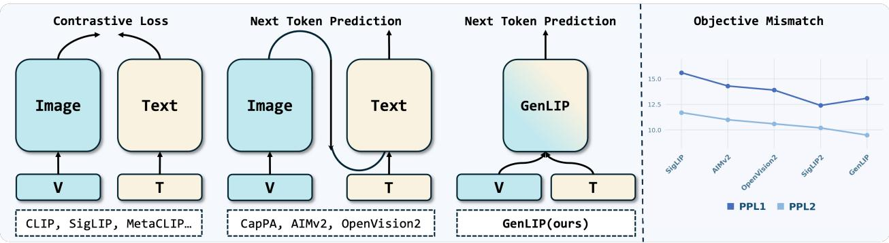

flowchart

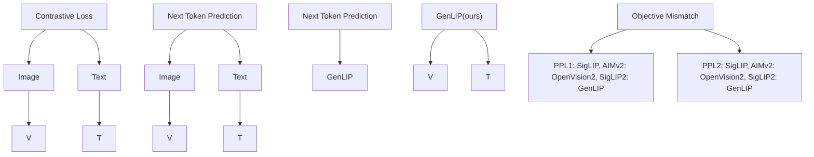

Figure 1 Overview of GenLIP and objective mismatch analysis. Left: Compared with prior vision-language pretraining methods that rely on dual-encoder structures or additional text modules, GenLIP adopts a simplified architecture that directly trains visual tokens with next-token prediction. We use “V” and “T” to denote visual and textual inputs, respectively. Right: To diagnose the objective mismatch, we connect different vision encoders to an LLM through a projector and measure perplexity when tuning only the projector (PPL1) or tuning both the projector and LLM (PPL2). Lower perplexity indicates better compatibility with the LLM’s generative objective.

Another stream of works focuses on generative pretraining, such as CapPa [69], AIMv2 [23], and OpenVision2 [44]. These methods typically couple a vision encoder with a text decoder and train the resulting model with an autoregressive language modeling objective. In this setup, the vision encoder is optimized indirectly through gradients that pass through the text decoder. Related hybrid designs, such as CoCa [80] and SigLIP2 [70], further introduce a text encoder to combine contrastive and generative objectives. While these approaches narrow the gap, their architectural redundancy and indirect optimization complicate training and can limit efficiency when the goal is to learn a scalable vision encoder for MLLMs.

To unleash the full potential of generative vision-language pretraining, we advocate for a simple design philosophy: remove unnecessary modules and train the vision backbone as directly as possible. Following this principle, we propose a simplified framework for generative vision-language pretraining: Generative Language-Image Pretraining (GenLIP), a simple yet scalable framework that departs from the complex designs of prior VLP methods. Instead of introducing novel architectural components, our core insight is elegantly simple: let the Vision Transformer (ViT) speak directly–requiring no contrastive batch construction and no additional text module.

Instead of indirectly optimizing the vision encoder through additional text components, GenLIP directly trains a ViT to predict language tokens that describe visual content using only a standard autoregressive language modeling objective. This simple generative formulation aligns the vision encoder more naturally with the way MLLMs operate, while also simplifying the architecture and improving scalability.

GenLIP’s design philosophy offers three compelling advantages: (1) Simplicity: GenLIP uses a single vision backbone and a standard autoregressive objective, without contrastive losses or additional text modules; (2) Scalability: it scales effectively with both data and model size, yielding consistent gains in our experiments; and (3) Performance: it achieves competitive or superior results as a vision encoder for MLLMs, with particularly strong performance on optical character recognition (OCR) tasks. Across extensive experiments, GenLIP matches or outperforms strong baselines pretrained on much larger corpora while using only 8B pretraining samples, and its second-stage native-aspect-ratio adaptation further improves downstream performance.

In summary, GenLIP provides a direct and efficient formulation of generative vision-language pretraining.

Our results suggest that a simpler and better-aligned pretraining paradigm can serve as a strong foundation for future MLLMs. We believe these findings chart a more direct, efficient, and scalable course for developing powerful vision-language models.

## 2 Related Work

The convergence of computer vision and natural language processing has been driven by large-scale visionlanguage pretraining, which aims to learn robust, generalizable multimodal representations from massive image-text corpora. Typical VLP methods can be grouped into three categories based on architectural design and training objectives: dual-encoder contrastive pretraining, encoder-decoder generative pretraining, and simplified single-transformer pretraining.

Dual-Encoder Contrastive Pretraining. A broad line of research has investigated Contrastive Language-Image Pretraining. CLIP-style architectures [13, 14, 29, 56, 77, 82] are fundamentally based on a dual-encoder (two-tower) design, which learns to align image and text representations within a shared embedding space using an InfoNCE or similar contrastive objective. Subsequent works improve alignment by leveraging high-quality image-text pairs [15, 22, 31, 39, 79, 85] or dense region-level captions [38, 40, 83] for fine-grained representation learning. While effective for discriminative tasks such as classification and retrieval, contrastive pretraining primarily focuses on global alignment and does not facilitate deep cross-modal interaction.

Encoder-Decoder Generative Pretraining. To enable richer cross-modal reasoning, recent works [3, 23, 44, 71, 73] adopt generative pretraining, typically cascading a vision encoder with a text decoder. For example, Aimv2 [23] couples a vision encoder with a multimodal decoder that autoregressively generates raw image patches and text tokens, whereas CapPa [69], GIT [71] and OpenVision 2 [44] stack a text decoder on top of the image encoder and pretrain the model using only a captioning loss. Most recently, some studies [36, 37, 39, 43, 70, 80] form hybrid pretraining schemes that combine a contrastive dual-encoder for image-text alignment with a generative decoder for captioning.

Discussion. Despite their success, existing methods often rely on multiple towers or multiple optimization objectives, which increases model complexity and limits efficiency. Moreover, alignment is often performed at later stages rather than within the image encoder itself, which can constrain early cross-modal interactions. In contrast, we propose a simple generative vision-language pretraining framework with a simplified architecture and training objective–a single transformer and a single language modeling objective.

Single-Transformer Pretraining. Recently, some works also explored vision-language pretraining under a simplified single-Transformer architecture with different objectives. Among them, SuperClass [26] proposes vision transformer pretraining with a single Transformer tower using token-level classification targets. VL-BEiT [9] and OneR [28] aim to unify vision-language representation learning within a single-tower Transformer, but still rely on multiple objectives. Beyond vision transformer pretraining, several recent efforts [11, 18– 20, 32, 62] aim to build native MLLMs with a single transformer and a single language modeling objective.

Discussion. In particular, GenLIP is architecturally close to SAIL [32], as both use a single transformer with a language modeling objective. However, SAIL focuses on building a native MLLM with a simplified architecture based on pretrained LLMs, whereas GenLIP is designed to pretrain a scalable vision encoder from scratch to better serve modular MLLMs [8, 12, 33]. This distinct goal also leads to different design choices. Moreover, our controlled comparison suggests that SAIL’s LLM initialization is not necessarily beneficial when the goal is to obtain a strong standalone vision encoder, further distinguishing GenLIP from these works.

## 3 Approach

This section details GenLIP, our simple implementation for generative vision-language pretraining. We first introduce the core designs of our approach, including the model architecture, data representation, and training objective, all designed for our simplified generative vision-language pretraining. We then provide pretraining details, including pretraining datasets and training schedule.

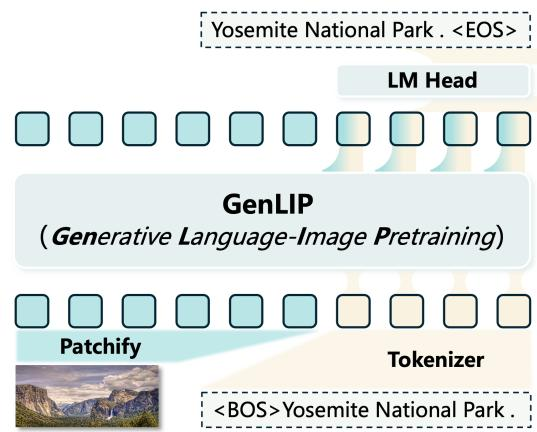

flowchart

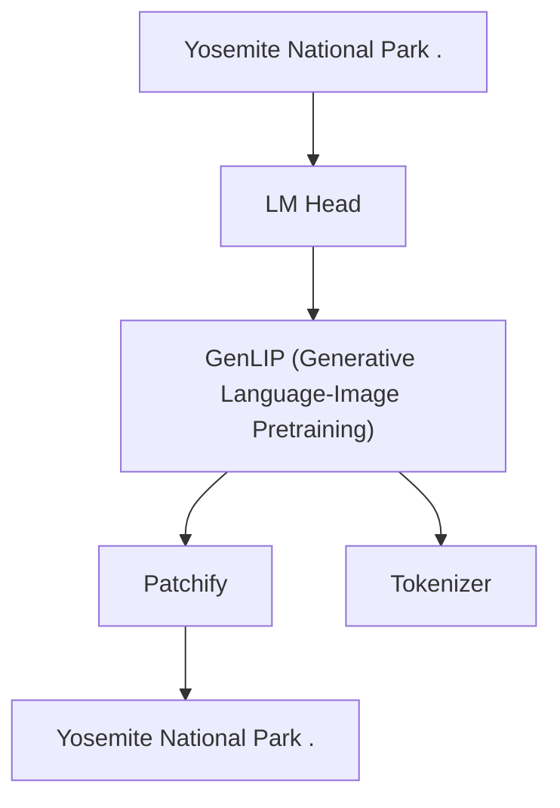

(a) GenLIP Model Architecture

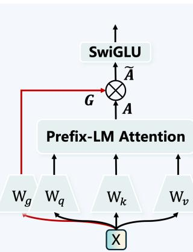

flowchart

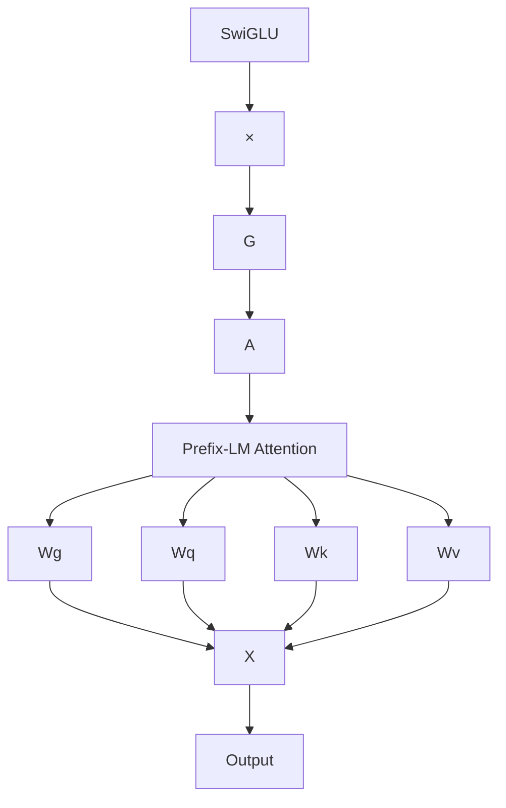

(b) Gated Attention Layer

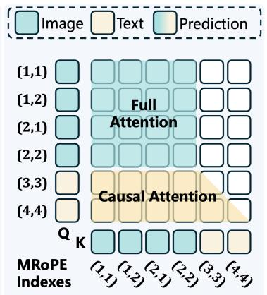

text_image

(1,1)
(1,2)
(2,1)
(2,2)
(3,3)
(4,4)
Q
K
Full
Attention
Causal Attention
Image Text Prediction
MRoPE
Indexes
(1,1) (1,2) (2,1) (2,2) (3,3) (4,4)

(c) Prefix-LM Attention  
Figure 2 An overview of the GenLIP framework for simple generative vision-language pretraining. (a) GenLIP Model Architecture: a single Transformer architecture processes a concatenated visual-prefix sequence. The next token prediction is performed exclusively on text tokens via a language modeling head. (b) Gated Attention Layer: the basic layer of GenLIP. The red line in the figure shows the forward path of the gating signal, which is element-wise multiplied with the attention output to control information flow. (c) Prefix-LM Attention Mechanism: image tokens attend bidirectionally, while text tokens attend causally. Multimodal Rotary Position Encoding (MRoPE) injects position information into the query (Q) and key (K) vectors.

## 3.1 GenLIP Framework

Instead of introducing novel architectural components, GenLIP is built upon a simple unified modeling paradigm for vision encoder pretraining. Specifically, we build GenLIP with a simple transformer architecture in the spirit of letting the ViT speak directly, analogous to how LLMs generate text. We keep the design simple, introducing only minimal but necessary modifications for improving visual representations.

$\{ ( I _ { i } , T _ { i } ) \} _ { i = 1 } ^ { N } ,$ where each image $I _ { i }$ is associated with its caption $T _ { i } .$ . Each image $I _ { i }$ is partitioned into a sequence of non-overlapping patches $\left\{ v _ { 0 } , v _ { 1 } , . . . , v _ { M } \right\}$ using a convolutional patch embedding layer, as in standard ViT models. The corresponding text $T _ { i }$ is tokenized into a sequence of subword tokens $\{ t _ { 0 } , t _ { 1 } , . . . , t _ { L } \}$ using an off-the-shelf text tokenizer (Qwen3 [78]). The resulting image patch embeddings and text token embeddings are concatenated into a single sequence, with the image embeddings preceding the text embeddings. The final input sequence S for a given pair (Ii, Ti) is:

$$
S = \left[ v _ {0}, \dots , v _ {M}, t _ {0}, \dots , t _ {L} \right]. \tag {1}
$$

Architecture. The architecture of GenLIP is centered around a unified Transformer encoder that processes a concatenated sequence of image and text tokens. As illustrated in Figure 2, the model consists of three components: modality-specific embedding layers, a unified Transformer with a prefix-LM attention implementation, a Layer Normalization (LN) layer, and finally a language modeling (LM) head for token prediction.

To enable effective cross-modal interactions and unified modeling of the concatenated visual-prefix multimodal sequence, we make two small but crucial modifications to a standard Transformer. (i) To better encode the position information in a concatenated visual-prefix multimodal sequence, we use multimodal rotary position encoding (MRoPE) [72] and discard the absolute position embeddings for image patches. (ii) We replace the basic full attention with prefix-LM attention [57] in all transformer blocks, where image tokens attend bidirectionally and text tokens attend causally. Based on the above two modifications, we directly apply the GenLIP architecture to process the unified multimodal sequence, without additional modality-specific designs in the network architecture.

Objective. GenLIP adopts a single standard autoregressive language modeling objective, applied exclusively to the textual part of the sequence. The model is trained to predict the next text token conditioned on the preceding image tokens and text tokens, thereby directly modeling the conditional probability distribution $P ( T | I )$ . The objective is to minimize the negative log-likelihood of the text sequence:

$$
\mathcal {L} _ {\mathrm{LM}} = - \sum_ {k = 0} ^ {L} \log P (t _ {k} | \{v _ {j} \} _ {j = 0} ^ {M}, \{t _ {i} \} _ {i = 0} ^ {k - 1}; \theta) \tag {2}
$$

where θ denotes the model parameters to be optimized, and $P ( t _ { k } | \{ v _ { j } \} _ { j = 0 } ^ { M } , \{ t _ { i } \} _ { i = 0 } ^ { k - 1 } )$ is the predicted probability of the k-th text token conditioned on all preceding visual and textual tokens.

Using GenLIP as a Vision Encoder. When employing GenLIP as a visual encoder, we extract vision features from the output of the LN layer following the last Transformer block and feed them into a 2-layer MLP projector to align them with the LLM’s input space. In this process, the language modules of GenLIP (the tokenizer and LM head) are discarded because no text inputs are used, while all other components are retained. The Prefix-LM attention mechanism reduces to standard full attention when $\mathrm { G e n L I P }$ is used as a vision encoder.

## 3.2 Gated Attention

While the above unified architecture is effective for generative vision-language pretraining, we observe a notable side effect: attention becomes overly concentrated on the first token of the input sequence, a phenomenon known as the attention sink. This issue is particularly pronounced in our mixed-modality setting, as shown in Figure 3. Under full attention, certain visual tokens can freely aggregate global information from all patches, effectively becoming image-level summaries. Since text tokens only access visual information through causal attention over this shared visual prefix, the model learns a shortcut: compressing visual information into a few sink tokens for efficient language prediction, at the cost of degrading spatial diversity in visual representations. Consistent with findings in [54], this leads to (i) obvious loss spikes during pretraining, and (ii) attention distributions where the first token absorbs most of the attention mass, reducing the effective utilization of visual tokens. As a result, the pretrained ViT exhibits substantially degraded discriminative performance, such as in ImageNet linear probing, and shows unstable scaling behavior–both undesirable for our target usage as a vision encoder for MLLMs.

Inspired by [54], we introduce a gated attention mechanism to regulate information flow in the mixed-modality modeling space. Given input hidden states $\boldsymbol { X } \in \mathbb { R } ^ { n \times d }$ for a Transformer block, we compute a standard attention output $A = \mathrm { A t t n } ( X )$ and apply a per-head input-dependent gate:

$$
G = \sigma (X W _ {g} + b _ {g}), \quad \widetilde {A} = G \odot A, \tag {3}
$$

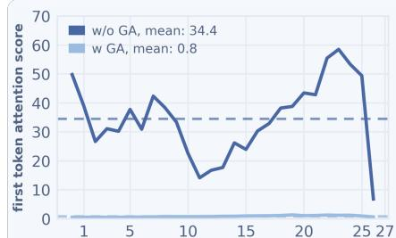

line chart

| x  | w/o GA, mean | w GA, mean |
|----|--------------|----------|
| 1  | 50           | 0        |
| 5  | 30           | 0        |
| 10 | 15           | 0        |
| 15 | 25           | 0        |
| 20 | 40           | 0        |
| 25 | 60           | 0        |
| 27 | 5            | 0        |

(a）Vision-to-first-token attention

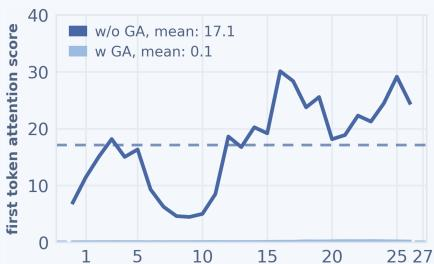

line chart

| x  | w/o GA, mean: 17.1 | w GA, mean: 0.1 |
|----|---------------------|-----------------|
| 1  | 8.0                 | 0.0             |
| 5  | 16.0                | 0.0             |
| 10 | 4.0                 | 0.0             |
| 15 | 30.0                | 0.0             |
| 20 | 20.0                | 0.0             |
| 25 | 30.0                | 0.0             |
| 27 | 25.0                | 0.0             |

(b）Text-to-first-token attention

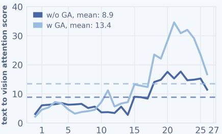

line chart

| x  | w/o GA, mean: 8.9 | w GA, mean: 13.4 |
|----|-------------------|------------------|
| 1  | ~5                | ~5               |
| 5  | ~6                | ~6               |
| 10 | ~5                | ~10              |
| 15 | ~10               | ~12              |
| 20 | ~15               | ~35              |
| 25 | ~14               | ~15              |
| 27 | ~12               | ~10              |

(c）Text-to-vision attention  
Figure 3 Layer-wise attention allocation in controlled So/16 models. We analyze the attention allocation of different source tokens across 27 layers. The X-axis represents the layer index. We report the attention mass from (a) vision tokens to the first sequence token, (b) generated text tokens to the first sequence token, and (c) generated text tokens to vision tokens. Dashed lines denote the layer-averaged attention scores. GA effectively reduces the first-token attention sink in both vision and text streams, while strengthening text-to-vision attention in deeper layers.

where σ(·) is the sigmoid function, $W _ { g }$ and $b _ { g }$ are learnable parameters, and ⊙ denotes element-wise multiplication. The gated attention output $\widetilde { A }$ is then used in the standard residual pathway. By modulating attention outputs on a per-token basis, the gate prevents text tokens from collapsing their attention onto a small subset of visual tokens and encourages the model to leverage spatially distributed visual features. In practice, gated attention alleviates loss spikes, accelerates convergence, and stabilizes scaling behavior.

## 3.3 Pretraining Details

Our pretraining comprises two stages with different datasets and resolutions, progressing from fixed lowresolution inputs to diverse resolutions and native aspect ratios. This setup allows the model to learn foundational visual and linguistic representations while keeping the overall computational cost manageable.

Fixed Resolution Pretraining. We first pretrain GenLIP on Dataset-S1, a curated 1B-scale image-text dataset. During this stage, we use the fixed 224×224 resolution images to reduce computational cost while learning strong foundational visual representations. We train GenLIP for a total of 8 billion samples in this stage, corresponding to 8 epochs over Dataset-S1.

Diverse Resolution Adaptation. We further fine-tune fixed-resolution pretrained GenLIP on Dataset-S2, a curated long-caption training set containing 37 million image-text samples with longer captions and higherresolution images. Different from higher resolution adaptation in previous works [53, 70], we process images in their native aspect ratios, and resize them to keep the number of vision tokens within [16, 1024]. In this adaptation stage, we train GenLIP for only 1 epoch over Dataset-S2. This stage helps the model adapt to variable-resolution inputs and learn finer-grained visual representations from dense text descriptions, which is important for downstream tasks that require detailed visual understanding and precise image-text grounding.

Regularization. We apply two regularization techniques during GenLIP pretraining to effectively train deeper networks: layer scale and drop path. These techniques mainly stabilize training and prevent divergence when training deeper models, although we find that they have limited impact on the final GenLIP performance.

Table 1 Overview of GenLIP configurations and pretraining setup. Left: model configurations. Right: two-stage pretraining details.  
Model configurations.

<table><tr><td>Model</td><td>Params</td><td>Layers</td><td>Dims</td><td>Heads</td><td>FFN-w</td></tr><tr><td>GenLIP-L</td><td>0.3B</td><td>24</td><td>1024</td><td>16</td><td>2816</td></tr><tr><td>GenLIP-So</td><td>0.4B</td><td>27</td><td>1152</td><td>16</td><td>3072</td></tr><tr><td>GenLIP-g</td><td>1.1B</td><td>40</td><td>1536</td><td>24</td><td>4096</td></tr></table>

Two-stage pretraining details.

<table><tr><td>Stage</td><td>Dataset</td><td>Size</td><td>Resolution</td><td>Patches</td><td>Samples</td></tr><tr><td>S1</td><td>Dataset-S1</td><td>1.0B</td><td>224</td><td>196</td><td>8.0B</td></tr><tr><td>S2</td><td>Dataset-S2</td><td>37M</td><td>AnyRes</td><td>[16,1024]</td><td>37M</td></tr></table>

Pretraining Implementation. Table 2 summarizes the main pretraining hyperparameters for the two stages. We use a packing strategy to pack samples of variable lengths into long sequences with a maximum length of 16,384. The packed sequences are then batchified to improve training efficiency and hardware utilization. On top of this packing strategy, we implement exact per-sample Prefix-LM attention using PyTorch FlexAttention, which supports variable sequence lengths and arbitrary attention masks. For image preprocessing, we use only resize and crop operations without additional augmentations on Dataset-S1.

There are three major differences in the second stage: (i) the global batch size is reduced from 32K or 48K to 3.6K because the average sample length

Table 2 Hyperparameters in GenLIP pretraining. “Batch Size” denotes the estimated global sample batch size.

<table><tr><td>Config</td><td>L/16</td><td>So/16</td><td>g/16</td></tr><tr><td>Optimizer</td><td colspan="3">PyTorch AdamW</td></tr><tr><td>Momentum</td><td colspan="3"> $\beta_1 = 0.9, \beta_2 = 0.95$ </td></tr><tr><td>Peak LR</td><td colspan="3">1e-3</td></tr><tr><td>Min LR</td><td colspan="3">1e-6</td></tr><tr><td>LR Decay</td><td colspan="3">cosine decay</td></tr><tr><td>Warmup Ratio</td><td>0.007</td><td>0.007</td><td>0.02</td></tr><tr><td>Gradient Clipping</td><td colspan="3">1.0</td></tr><tr><td>Max Packing Length</td><td colspan="3">16384</td></tr><tr><td>Batch Size</td><td>32K</td><td>32K</td><td>48K</td></tr><tr><td>Layer Scale</td><td colspan="3">0.1</td></tr><tr><td>Drop Path Ratio</td><td>0.1</td><td>0.1</td><td>0.2</td></tr><tr><td>Vocab Size</td><td colspan="3">151936</td></tr><tr><td>RoPE Theta</td><td colspan="3">10000</td></tr></table>

increases from 270 tokens to about 1200 tokens; (ii) the peak learning rate is reduced to 1e− 4; and (iii) images are processed at their native aspect ratios. All other training settings are kept the same as in the first stage.

## 3.4 Discussion

Rather than introducing novel architectural components, GenLIP pursues the simplest possible paradigm for vision encoder pretraining, enabling seamless integration into MLLMs. Here, we summarize the key differences between GenLIP and prior works.

Differences from previous generative works. GenLIP differs from previous generative vision-language pretraining works [9, 23, 44, 69] in several key aspects: (i) Compared with VL-BEIT [9] and AIMv2 [23], GenLIP learns from a single standard autoregressive language modeling objective, without masked image modeling or a pixel reconstruction objective; (ii) Compared with CapPa [69], AIMv2 [23], and OpenVision2 [44], GenLIP discards the additional text decoder and leads to a simplified modeling paradigm with a single unified transformer.

Differences from previous single Transformer pretraining works. GenLIP also differs from previous single Transformer pretraining works [19, 32]: (i) GenLIP focuses on pretraining a scalable vision encoder for modular MLLMs, rather than native MLLMs; (ii) GenLIP is pretrained from scratch on caption datasets, while SAIL [32] and NEO [19] are trained by leveraging pretrained LLMs and large-scale instruction-tuning data; (iii) GenLIP improves the attention implementation with a gated mechanism that better fits visual modeling when the model is used as a vision encoder.

## 4 Experiments

To comprehensively evaluate the visual features learned by GenLIP, we first describe the experimental setup and benchmark suite, then report frozen-representation and standard LLaVA-NeXT evaluations on multimodal understanding tasks. We next analyze scalability with respect to both pretraining data and model size. We further conduct controlled comparisons and ablations on the pretraining method, SAIL-style architecture and initialization, gated attention, and native-aspect-ratio adaptation. Finally, we evaluate the discriminative transferability of the learned features and provide qualitative “Let ViT Speak” analyses through direct caption generation and patch-semantics readout.

## 4.1 Setup

## 4.1.1 Baselines

We compare our method, GenLIP, against a suite of representative vision-language pre-training models under multimodal understanding benchmarks. This includes contrastive methods such as CLIP [56], SigLIP [82], and SigLIP2 [70], as well as generative approaches like AIMv2 [23] and OpenVision2 [44]. For a fair comparison in the frozen evaluation, all vision encoders are configured to produce the same number of visual tokens before the projector: L/14 encoders are evaluated at 336 × 336, while L/16, So/16, and g/16 encoders are evaluated at 384 × 384, yielding a 24 × 24 patch grid for each model. We use strong released model variants for our baselines, such as ViT-L/14 for CLIP and AIMv2, and ViT-So/16 for SigLIP2. These methods are pretrained on substantially larger training corpora (12.0B–40.0B image-text pairs) than GenLIP.

## 4.1.2 Experimental Setup

Following Cambrian [66], we mainly adopt frozen visual representation evaluation, where the vision encoder is kept frozen and the language model is fine-tuned on downstream tasks. This protocol directly measures the quality of visual features learned by different VLP methods without the confounding effect of further fine-tuning the vision encoder. Based on the LLaVA-NeXT framework [42], we replace the original vision encoder with one pretrained by GenLIP or each baseline method, and then fine-tune the language model on an instruction tuning dataset. To better unleash the potential of the vision encoders, we replace the original 780K instruction-tuning set with the comprehensive LLaVA OneVision [33] dataset, which contains more than 3 million supervised fine-tuning (SFT) samples. We consider two LLM backbones of different sizes in our implementation, Qwen2.5-1.5B-Instruct and Qwen2.5-7B-Instruct [55], in place of the original LLM in LLaVA-NeXT. In our implementation, we adopt a standard 2-layer MLP as the projector. For baselines, vision features are extracted from the final block of the ViT and subsequently fed into the LLM via the projector. For GenLIP, we extract vision features from the last LN layer based model architecture.

## 4.1.3 Evaluation Benchmarks

To provide a comprehensive evaluation, we assess our method and all baselines across a diverse set of multimodal understanding benchmarks. These benchmarks are grouped into three categories to probe distinct capabilities: document understanding and optical character recognition (Doc&OCR), general visual understanding (General VQA), and image captioning (Caption). All evaluations are conducted using the LMMS-Eval toolkit [84].

Document and OCR. This category evaluates the model’s ability to recognize and interpret text within images, a critical skill for document analysis and scene text understanding. Following mainstream MLLMs [8, 33], we focus on a wide range of classic benchmarks, including ChartQA [50], OCRBench [46], InfoVQA [52], AI2D [30], TextVQA [60], DocVQA [51] and SEED-Bench-2-Plus [34].

General Visual Understanding. This group of tasks assesses the model’s broader capabilities in comprehending and reasoning about visual content. We employ four widely-used benchmarks, including MME [24], GQA [27], VQAv2 [25], and ScienceQA [47] for general VQA.

Image Captioning. To measure the model’s ability to generate descriptive text from images, we evaluate on NoCaps [2], COCO [49], and TextCaps [58] for evaluation. Performance is reported using the CIDEr metric.

For a holistic comparison, we report an overall average score across all 14 benchmarks (ALL AVG), computed as the mean of the per-benchmark scores. In particular, we rescale MME-P scores to the range [0, 100] based on the original score by 2000 (the maximum score for this subset), ensuring comparability. Besides these benchmarks, we also extend this evaluation suite to the Cambrian-1 style and provide results in following.

## 4.2 Main Results

We provide all frozen visual representation evaluation results on multimodal understanding benchmarks in Table 3 and Table 4. Besides, we also provide results under the standard unfrozen LLaVA-NeXT evaluation setting in Table 6.

Table 3 Frozen visual representation evaluation under LLaVA-NeXT-Qwen2.5-1.5B. We test GenLIP models across three scales against baseline methods. The benchmarks are grouped into Doc&OCR, General VQA, and Caption tasks. “Arch” stands for “Model Architecture”, while “Data” denotes “Pretraining Data Scale”. “OpenVision2” is abbreviated as “OVision2”.

<table><tr><td rowspan="2">Model</td><td rowspan="2">Arch</td><td rowspan="2">Data</td><td colspan="7">Doc&amp;OCR</td><td colspan="4">General VQA</td><td colspan="3">Caption</td><td rowspan="2">ALL AVG</td></tr><tr><td>ChartQA</td><td>OCR-B</td><td>DocVQA</td><td>TextVQA</td><td>A12D</td><td>InfoVQA</td><td>SEED-2</td><td>VQAv2</td><td>GQA</td><td>SQA</td><td>MME-P</td><td>NoCaps</td><td>COCO</td><td>TextCaps</td></tr><tr><td>CLIP [56]</td><td>L/14</td><td>12.8B</td><td>24.8</td><td>23.7</td><td>38.9</td><td>43.9</td><td>64.5</td><td>30.2</td><td>47.8</td><td>46.1</td><td>39.8</td><td>75.3</td><td>1218</td><td>55.5</td><td>72.5</td><td>117.9</td><td>53.1</td></tr><tr><td>AIMv2 [23]</td><td>L/14</td><td>12.0B</td><td>26.3</td><td>25.2</td><td>37.7</td><td>47.2</td><td>64.2</td><td>29.3</td><td>47.3</td><td>48.1</td><td>43.9</td><td>76.2</td><td>1157</td><td>80.1</td><td>73.6</td><td>122.4</td><td>55.7</td></tr><tr><td>OVision2 [44]</td><td>L/16</td><td>12.8B</td><td>30.7</td><td>45.6</td><td>43.3</td><td>49.2</td><td>65.6</td><td>28.1</td><td>47.8</td><td>44.0</td><td>42.7</td><td>75.5</td><td>1230</td><td>84.3</td><td>76.3</td><td>127.4</td><td>58.7</td></tr><tr><td>SigLIP [82]</td><td>L/16</td><td>40.0B</td><td>30.2</td><td>41.0</td><td>47.3</td><td>36.0</td><td>66.4</td><td>27.8</td><td>47.9</td><td>41.3</td><td>41.7</td><td>76.7</td><td>1203</td><td>84.0</td><td>76.1</td><td>120.7</td><td>56.9</td></tr><tr><td>SigLIP2 [70]</td><td>L/16</td><td>40.0B</td><td>33.4</td><td>45.7</td><td>45.1</td><td>50.3</td><td>66.7</td><td>28.2</td><td>45.7</td><td>43.1</td><td>42.6</td><td>76.9</td><td>1165</td><td>82.9</td><td>74.6</td><td>127.8</td><td>58.7</td></tr><tr><td>GenLIP</td><td>L/16</td><td>8.0B</td><td>41.2</td><td>51.1</td><td>51.1</td><td>53.6</td><td>66.6</td><td>30.7</td><td>51.1</td><td>44.4</td><td>41.5</td><td>76.1</td><td>1258</td><td>82.6</td><td>76.0</td><td>131.4</td><td>61.5</td></tr><tr><td>SigLIP2 [70]</td><td>So/16</td><td>40.0B</td><td>35.2</td><td>47.2</td><td>46.4</td><td>53.3</td><td>67.0</td><td>28.0</td><td>50.3</td><td>46.5</td><td>43.5</td><td>77.1</td><td>1220</td><td>84.3</td><td>77.1</td><td>131.5</td><td>60.6</td></tr><tr><td>GenLIP</td><td>So/16</td><td>8.0B</td><td>40.8</td><td>51.5</td><td>51.9</td><td>55.2</td><td>67.2</td><td>31.9</td><td>52.3</td><td>46.5</td><td>44.0</td><td>76.0</td><td>1215</td><td>87.5</td><td>81.5</td><td>129.5</td><td>62.6</td></tr><tr><td>SigLIP2 [70]</td><td>g/16</td><td>40.0B</td><td>35.3</td><td>47.3</td><td>47.6</td><td>54.7</td><td>66.7</td><td>29.7</td><td>49.6</td><td>50.1</td><td>45.2</td><td>76.2</td><td>1284</td><td>84.4</td><td>76.2</td><td>134.5</td><td>61.5</td></tr><tr><td>GenLIP</td><td>g/16</td><td>8.0B</td><td>45.0</td><td>55.6</td><td>57.0</td><td>59.0</td><td>68.9</td><td>33.9</td><td>53.3</td><td>49.1</td><td>45.5</td><td>77.5</td><td>1256</td><td>88.3</td><td>82.0</td><td>135.4</td><td>65.2</td></tr></table>

## 4.2.1 Frozen Feature Analysis

As presented in Table 3, GenLIP demonstrates strong performance across three model scales. Despite using fewer pretraining pairs, GenLIP achieves consistent gains over all baselines, including the 40B-pair pretrained SigLIP2. Under the Qwen2.5-1.5B setting, GenLIP improves the overall average (ALL AVG) over SigLIP2 by 2.5, 2.0, and 3.7 points at the L/16, So/16, and g/16 scales, respectively. The gains are especially pronounced on Doc&OCR benchmarks, which demand fine-grained document understanding and text-centric visual reasoning. Averaging over the seven Doc&OCR tasks in Table 3, GenLIP achieves 49.3, 50.1, and 53.2 at L/16, So/16, and g/16, outperforming SigLIP2 by 4.3, 3.3, and 5.9 points, respectively.

This advantage remains under a larger LLM. As shown in Table 4, scaling the LLM to Qwen2.5-7B yields consistent trends with the Qwen2.5-1.5B setting. Under this setting, GenLIP outperforms SigLIP2 by 2.4 and 4.7 points on average score at the So/16 and g/16 scales, respectively. Similar to the Qwen2.5-1.5B setting, GenLIP consistently performs best on Doc&OCR benchmarks, highlighting its strong visual-text alignment.

Across both frozen settings, GenLIP not only surpasses contrastive VLMs such as CLIP [56] and SigLIP [82], but also outperforms prior encoder-decoder generative VLMs, including AIMv2 [23] and OpenVision2 [44]. These generative baselines use an additional text decoder for language modeling, and OpenVision2 is further pretrained with a stronger large-scale corpus and a longer training schedule. Overall, the results suggest that GenLIP’s minialist architecture and objective can yield stronger visual representations with improved data efficiency.

We also observe that GenLIP scales favorably with model size, while SigLIP2 shows comparatively smaller gains when scaling up. These results support two hypotheses: (i) simplifying both the architecture and the objective can enable more efficient scaling; and (ii) larger model capacity helps GenLIP learn both broad visual knowledge and fine-grained alignment for multimodal understanding.

Table 4 Frozen visual representation evaluation under LLaVA-NeXT-Qwen2.5-7B. Except for the LLM size, all settings are the same as those used in LLaVA-NeXT-Qwen2.5-1.5B.

<table><tr><td rowspan="2">Model</td><td rowspan="2">Arch</td><td rowspan="2">Data</td><td colspan="7">Doc&amp;OCR</td><td colspan="4">General VQA</td><td colspan="3">Caption</td><td rowspan="2">ALL AVG</td></tr><tr><td>ChartQA</td><td>OCR-B</td><td>DocVQA</td><td>TextVQA</td><td>A12D</td><td>InfoVQA</td><td>SEED-2</td><td>VQAv2</td><td>GQA</td><td>SQA</td><td>MME-P</td><td>NoCaps</td><td>COCO</td><td>TextCaps</td></tr><tr><td>CLIP [56]</td><td>L/14</td><td>12.8B</td><td>36.6</td><td>29.6</td><td>48.4</td><td>52.6</td><td>76.3</td><td>39.0</td><td>55.1</td><td>49.4</td><td>39.6</td><td>85.2</td><td>1316</td><td>63.1</td><td>54.4</td><td>127.9</td><td>58.8</td></tr><tr><td>AIMv2 [23]</td><td>L/14</td><td>12.0B</td><td>36.8</td><td>30.9</td><td>46.6</td><td>54.5</td><td>76.9</td><td>37.5</td><td>55.1</td><td>44.0</td><td>37.9</td><td>85.2</td><td>1240</td><td>66.5</td><td>55.9</td><td>130.5</td><td>58.6</td></tr><tr><td>OVision2 [44]</td><td>L/16</td><td>12.8B</td><td>42.5</td><td>49.9</td><td>49.5</td><td>58.8</td><td>78.4</td><td>33.8</td><td>53.8</td><td>60.0</td><td>47.2</td><td>85.9</td><td>1325</td><td>79.4</td><td>69.6</td><td>133.8</td><td>64.9</td></tr><tr><td>SigLIP [82]</td><td>L/16</td><td>40.0B</td><td>41.7</td><td>45.7</td><td>50.5</td><td>56.0</td><td>79.3</td><td>34.8</td><td>55.8</td><td>57.8</td><td>46.2</td><td>86.7</td><td>1275</td><td>81.5</td><td>72.0</td><td>131.1</td><td>64.5</td></tr><tr><td>GenLIP</td><td>L/16</td><td>8.0B</td><td>52.7</td><td>59.2</td><td>61.7</td><td>62.9</td><td>80.4</td><td>38.8</td><td>59.0</td><td>56.4</td><td>51.3</td><td>85.4</td><td>1320</td><td>81.1</td><td>71.3</td><td>139.4</td><td>69.0</td></tr><tr><td>SigLIP2 [70]</td><td>So/16</td><td>40.0B</td><td>46.6</td><td>55.6</td><td>56.3</td><td>63.5</td><td>81.3</td><td>37.2</td><td>56.4</td><td>64.5</td><td>52.2</td><td>87.1</td><td>1422</td><td>84.1</td><td>76.4</td><td>139.3</td><td>69.4</td></tr><tr><td>GenLIP</td><td>So/16</td><td>8.0B</td><td>55.3</td><td>63.5</td><td>66.3</td><td>65.7</td><td>81.0</td><td>41.4</td><td>60.8</td><td>60.5</td><td>52.4</td><td>86.4</td><td>1424</td><td>83.1</td><td>74.8</td><td>142.1</td><td>71.8</td></tr><tr><td>SigLIP2 [70]</td><td>g/16</td><td>40.0B</td><td>47.2</td><td>55.6</td><td>56.3</td><td>63.5</td><td>81.0</td><td>36.4</td><td>56.4</td><td>62.7</td><td>49.3</td><td>87.7</td><td>1422</td><td>82.0</td><td>72.3</td><td>142.7</td><td>68.9</td></tr><tr><td>GenLIP</td><td>g/16</td><td>8.0B</td><td>57.1</td><td>65.9</td><td>69.0</td><td>66.8</td><td>81.0</td><td>43.6</td><td>61.1</td><td>64.4</td><td>54.5</td><td>87.0</td><td>1483</td><td>85.0</td><td>75.5</td><td>144.8</td><td>73.6</td></tr></table>

## 4.2.2 Cambrian-1 Evaluation Suite

Based on the frozen evaluation in Table 3 and Table 4, we also organize our evaluation results in a Cambrian-1-style [66] benchmark suite by adding benchmarks such as MMMU [81], MathVista [48], MMVP [67], and RealWorldQA[74]. Table 5 shows detailed results under LLaVA-NeXT-Qwen2.5-1.5B settings. On this extended evaluation suite, GenLIP still shows its performance advantage against strong baselines on all 3 model sizes. Results under LLaVA-NeXT-Qwen2.5-7B can be found in appendix.

## 4.2.3 Standard LLaVA-NeXT Evaluation

We further evaluate GenLIP under the standard LLaVA-NeXT setting following prior work [76], where the vision encoder is unfrozen and fine-tuned jointly with the language model during instruction tuning. As shown in Table 6, GenLIP performs strongly under two fixed patch budgets and achieves competitive overall results across both Doc&OCR and General VQA tasks. GenLIP shows consistent advantages on Doc&OCR benchmarks.

Table 5 Cambrian-1-style frozen visual representation evaluation under LLaVA-NeXT-Qwen2.5-1.5B. The benchmarks are grouped into General VQA, Doc&OCR, and Perception tasks. “MMB”, “SEED-I”, “MathV”, “RWQA”, “CV-2D”, and “CV-3D” denote MMBench [45], SEED-Image [35], MathVista [48], RealWorldQA[74], CV-Bench2D [66], and CV-Bench3D [66], respectively. We report results on MMBench\_en subset for MMBench, and MathVista testmini subset with format score for MathVista.

<table><tr><td rowspan="2">Model</td><td rowspan="2">Arch</td><td rowspan="2">Data</td><td colspan="4">General VQA</td><td colspan="4">Knowledge</td><td colspan="4">OCR &amp; Chart</td><td colspan="4">Vision-Centric</td><td rowspan="2">AVG</td></tr><tr><td>MME-P</td><td>MMB</td><td>SEED-I</td><td>GQA</td><td>SQA</td><td>MMMU</td><td>MathV</td><td>AIZD</td><td>ChartQA</td><td>OCR-B</td><td>TextVQA</td><td>DocVQA</td><td>MMVP</td><td>RWQA</td><td>CV-2D</td><td>CV-3D</td></tr><tr><td>CLIP [56]</td><td>L/14</td><td>12.8B</td><td>1218</td><td>63.7</td><td>64.1</td><td>39.8</td><td>75.3</td><td>37.9</td><td>36.1</td><td>64.5</td><td>24.8</td><td>23.7</td><td>43.9</td><td>38.9</td><td>31.3</td><td>44.4</td><td>49.6</td><td>48.3</td><td>46.7</td></tr><tr><td>AIMv2 [23]</td><td>L/14</td><td>12.0B</td><td>1157</td><td>66.2</td><td>65.6</td><td>43.9</td><td>76.2</td><td>39.1</td><td>38.6</td><td>64.2</td><td>26.3</td><td>25.2</td><td>47.2</td><td>37.7</td><td>34.0</td><td>50.1</td><td>52.7</td><td>54.8</td><td>48.7</td></tr><tr><td>OVision2 [44]</td><td>L/16</td><td>12.8B</td><td>1230</td><td>66.4</td><td>65.5</td><td>42.7</td><td>75.5</td><td>38.6</td><td>35.9</td><td>65.6</td><td>30.7</td><td>45.6</td><td>49.2</td><td>43.3</td><td>30.7</td><td>52.0</td><td>53.6</td><td>52.8</td><td>50.6</td></tr><tr><td>SigLIP [82]</td><td>L/16</td><td>40.0B</td><td>1203</td><td>67.3</td><td>66.2</td><td>41.7</td><td>76.7</td><td>38.0</td><td>37.4</td><td>66.4</td><td>30.2</td><td>41.0</td><td>36.0</td><td>47.3</td><td>33.3</td><td>47.3</td><td>53.4</td><td>51.4</td><td>49.6</td></tr><tr><td>SigLIP2 [70]</td><td>L/16</td><td>40.0B</td><td>1165</td><td>67.4</td><td>67.0</td><td>42.6</td><td>76.9</td><td>36.9</td><td>39.0</td><td>66.7</td><td>33.4</td><td>45.7</td><td>50.3</td><td>45.1</td><td>37.3</td><td>51.8</td><td>56.2</td><td>54.3</td><td>51.8</td></tr><tr><td>GenLIP</td><td>L/16</td><td>8.0B</td><td>1258</td><td>65.8</td><td>67.0</td><td>41.5</td><td>76.1</td><td>36.3</td><td>40.5</td><td>66.6</td><td>41.2</td><td>51.1</td><td>53.6</td><td>51.1</td><td>38.0</td><td>49.3</td><td>55.8</td><td>54.2</td><td>53.2</td></tr><tr><td>SigLIP2 [70]</td><td>So/16</td><td>40.0B</td><td>1220</td><td>66.8</td><td>66.3</td><td>43.5</td><td>77.1</td><td>38.2</td><td>38.4</td><td>67.0</td><td>35.2</td><td>47.2</td><td>53.3</td><td>46.4</td><td>39.3</td><td>50.3</td><td>53.5</td><td>52.5</td><td>52.2</td></tr><tr><td>GenLIP</td><td>So/16</td><td>8.0B</td><td>1215</td><td>66.1</td><td>67.7</td><td>44.0</td><td>76.0</td><td>40.8</td><td>38.6</td><td>67.2</td><td>40.8</td><td>51.5</td><td>55.2</td><td>51.9</td><td>37.3</td><td>52.0</td><td>55.2</td><td>51.7</td><td>53.5</td></tr><tr><td>SigLIP2 [70]</td><td>g/16</td><td>40.0B</td><td>1284</td><td>68.0</td><td>66.9</td><td>45.2</td><td>76.2</td><td>38.9</td><td>39.9</td><td>66.7</td><td>35.3</td><td>47.3</td><td>54.7</td><td>47.6</td><td>36.7</td><td>52.3</td><td>53.5</td><td>54.2</td><td>53.0</td></tr><tr><td>GenLIP</td><td>g/16</td><td>8.0B</td><td>1256</td><td>67.2</td><td>68.7</td><td>45.5</td><td>77.5</td><td>37.8</td><td>41.0</td><td>68.9</td><td>45.0</td><td>55.6</td><td>59.0</td><td>57.0</td><td>40.0</td><td>55.0</td><td>54.1</td><td>54.8</td><td>55.6</td></tr></table>

Taken together, both the frozen and standard evaluations indicate that GenLIP provides strong and consistent performance across diverse multimodal understanding tasks, including Doc&OCR, General VQA, and captioning. In particular, GenLIP consistently excels on Doc&OCR tasks, which demand fine-grained visual recognition and precise visual-text alignment.

Overall, these results indicate that GenLIP, a simple yet effective generative vision-language pretraining method, can learn rich and versatile visual representations for multimodal understanding with high data efficiency. Compared with more complex alternatives (e.g., SigLIP2 with larger pretraining corpora and more elaborate training recipes), GenLIP exhibits highly competitive and often achieves better downstream performance. This suggests that simple generative vision-language pretraining is a promising direction for learning strong, scalable visual representations for MLLMs.

Table 6 Multimodal understanding results under standard LLaVA-NeXT settings. All models are evaluated using identical configurations: the same data and LLM and anyres image processing configuration [42].

<table><tr><td rowspan="2">Patches</td><td rowspan="2">Model</td><td rowspan="2">Arch</td><td rowspan="2">Data</td><td colspan="6">Doc&amp;OCR</td><td colspan="6">General VQA</td><td rowspan="2">ALL AVG</td></tr><tr><td>ChartQA</td><td>DocVQA</td><td>TextVQA</td><td>OCR-B</td><td>LiveVQA</td><td>AI2D</td><td>MMBench</td><td>MME-C</td><td>MME-P</td><td>POPE</td><td>RWQA</td><td>MMStar</td></tr><tr><td rowspan="5">576</td><td>CLIP [56]</td><td>L/14</td><td>12.8B</td><td>75.2</td><td>66.5</td><td>62.5</td><td>52.5</td><td>47.4</td><td>73.2</td><td>74.6</td><td>48.0</td><td>75.6</td><td>88.8</td><td>63.7</td><td>49.0</td><td>64.8</td></tr><tr><td>MLCD [4]</td><td>L/14</td><td>12.0B</td><td>76.5</td><td>67.8</td><td>61.7</td><td>53.1</td><td>48.4</td><td>77.0</td><td>76.5</td><td>54.1</td><td>79.9</td><td>88.7</td><td>61.1</td><td>51.0</td><td>66.3</td></tr><tr><td>AIMv2 [23]</td><td>L/14</td><td>12.8B</td><td>77.2</td><td>72.7</td><td>65.9</td><td>57.2</td><td>47.3</td><td>75.4</td><td>78.6</td><td>48.3</td><td>75.0</td><td>88.4</td><td>62.2</td><td>50.2</td><td>66.5</td></tr><tr><td>RICE-ViT [76]</td><td>L/14</td><td>13.0B</td><td>79.2</td><td>72.3</td><td>65.9</td><td>57.5</td><td>48.9</td><td>77.9</td><td>76.6</td><td>54.6</td><td>80.7</td><td>88.5</td><td>63.1</td><td>51.8</td><td>68.1</td></tr><tr><td>GenLIP</td><td>So/16</td><td>8.0B</td><td>79.3</td><td>75.2</td><td>68.5</td><td>59.7</td><td>48.4</td><td>78.6</td><td>77.7</td><td>48.6</td><td>78.2</td><td>89.2</td><td>65.9</td><td>53.1</td><td>68.5</td></tr><tr><td rowspan="4">729</td><td>SigLIP [82]</td><td>So/14</td><td>40.0B</td><td>76.7</td><td>69.3</td><td>64.7</td><td>55.4</td><td>48.4</td><td>76.2</td><td>77.0</td><td>46.1</td><td>79.9</td><td>88.8</td><td>63.7</td><td>47.3</td><td>66.1</td></tr><tr><td>SigLIPv2 [70]</td><td>So/14</td><td>40.0B</td><td>79.1</td><td>70.2</td><td>66.2</td><td>58.7</td><td>48.6</td><td>77.0</td><td>77.1</td><td>46.6</td><td>80.4</td><td>89.3</td><td>63.4</td><td>52.8</td><td>67.5</td></tr><tr><td>RICE-ViT [76]</td><td>L/14</td><td>13.0B</td><td>82.6</td><td>75.1</td><td>66.2</td><td>58.8</td><td>49.5</td><td>76.5</td><td>77.6</td><td>54.1</td><td>79.0</td><td>89.1</td><td>62.9</td><td>51.2</td><td>68.6</td></tr><tr><td>GenLIP</td><td>So/16</td><td>8.0B</td><td>83.0</td><td>76.9</td><td>69.6</td><td>64.7</td><td>50.4</td><td>79.1</td><td>78.1</td><td>54.5</td><td>80.1</td><td>89.4</td><td>65.1</td><td>53.2</td><td>70.3</td></tr></table>

## 4.3 Scalability Analysis

To investigate the detailed scaling pattern of GenLIP, we discuss both data and model scalability of GenLIP, which are two key factors for VLP pretraining.

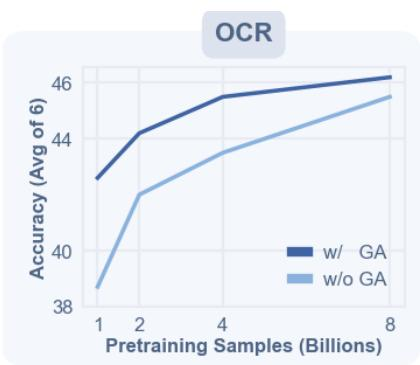

line chart

| Pretraining Samples (Billions) | w/ GA | w/o GA |
| ------------------------------ | ----- | ------ |
| 1                              | 43.0  | 39.0   |
| 2                              | 44.5  | 41.0   |
| 4                              | 45.5  | 43.5   |
| 8                              | 46.0  | 45.5   |

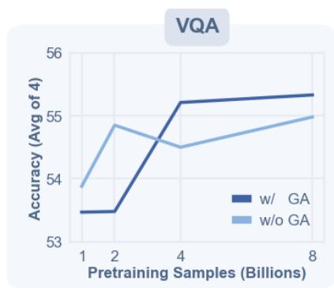

line chart

| Pretraining Samples (Billions) | w/ GA | w/o GA |
| ------------------------------ | ----- | ------ |
| 1                              | 53.5  | 53.8   |
| 2                              | 53.5  | 54.9   |
| 4                              | 55.3  | 54.6   |
| 8                              | 55.4  | 55.0   |

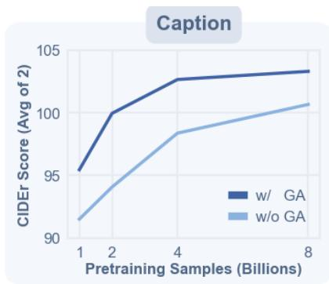

line chart

| Pretraining Samples (Billions) | w/ GA | w/o GA |
| ------------------------------ | ----- | ------ |
| 1                              | 95.5  | 91.5   |
| 2                              | 100.0 | 94.0   |
| 4                              | 102.5 | 98.5   |
| 8                              | 103.0 | 100.5  |

Figure 4 Data Scaling Behavior. Performance on three kinds of tasks as the number of pretraining samples in the first stage is scaled from 1.0B to 8.0B. We report and plot the curve of the average score for Doc&OCR, VQA, and Caption tasks. The x-axis in each subplot corresponds to the pretraining data scale.

## 4.3.1 Data Scaling

We first study data scaling in Fig. 4, where we pretrain GenLIP (with or without gated attention) on Dataset-S1 with different numbers of training samples, ranging from 1.0B to 8.0B. As the data scale increases from 1.0B to 8.0B, GenLIP shows sustained improvements on multimodal understanding benchmarks. We observe steeper gains when scaling from 1.0B to 4.0B, while the improvement curve becomes flatter when further scaling to 8.0B. In particular, the average performance on VQA and caption tasks shows only minor improvements when scaling from 4.0B to 8.0B. Based on this trend, we use 8.0B samples as the default data scale for GenLIP pretraining in our main results.

## 4.3.2 Model Scaling

We also investigate how GenLIP performance changes with model size by pretraining GenLIP at the $\mathrm { L } / 1 6 .$ ${ \mathrm { S o } } / 1 6 ,$ and $\mathrm { g } / 1 6$ scales. Besides the final results after diverse resolution adaptation shown in Table $^ { 3 , }$ we additionally provide results for models pretrained only with fixed low resolution on Dataset-S1 in Table 7. Across both pretraining stages, GenLIP shows consistent performance gains with increasing model size. An important observation is that GenLIP-L/16 lags behind GenLIP-So/16 and GenLIP-g/16 only with fixed low-resolution pretraining, while the gap between $\mathrm { g } / 1 6$ and So/16 is relatively small. This suggests that an appropriate model size is important for GenLIP to learn strong visual representations and better performance on downstream tasks.

Table 7 Frozen visual representation evaluation of GenLIP pretrained at different model scales across two stages. “S1” and “S2” denotes the pretraining stage 1 and 2 respectively.

<table><tr><td rowspan="2">Model</td><td rowspan="2">Arch</td><td colspan="7">Doc&amp;OCR</td><td colspan="4">General VQA</td><td colspan="3">Caption</td><td rowspan="2">ALL AVG</td></tr><tr><td>Chart QA</td><td>OCR-B</td><td>DocVQA</td><td>TextVQA</td><td>AI2D</td><td>InfoVQA</td><td>SEED-2</td><td>VQAv2</td><td>GQA</td><td>SQA</td><td>MME-P</td><td>NoCaps</td><td>COCO</td><td>TextCaps</td></tr><tr><td>SigLIP2</td><td>L/16</td><td>33.4</td><td>45.7</td><td>45.1</td><td>50.3</td><td>66.7</td><td>28.2</td><td>45.7</td><td>43.1</td><td>42.6</td><td>76.9</td><td>1165</td><td>82.9</td><td>74.6</td><td>127.8</td><td>58.7</td></tr><tr><td>GenLIP-S1</td><td>L/16</td><td>34.3</td><td>28.9</td><td>44.5</td><td>43.0</td><td>64.5</td><td>28.5</td><td>49.1</td><td>44.0</td><td>41.9</td><td>75.2</td><td>1136</td><td>77.3</td><td>71.0</td><td>114.1</td><td>55.2</td></tr><tr><td>GenLIP-S2</td><td>L/16</td><td>41.2</td><td>51.1</td><td>51.1</td><td>53.6</td><td>66.6</td><td>30.7</td><td>51.1</td><td>44.4</td><td>41.5</td><td>76.1</td><td>1258</td><td>82.6</td><td>76.0</td><td>131.4</td><td>61.5</td></tr><tr><td>SigLIP2</td><td>So/16</td><td>35.2</td><td>47.2</td><td>46.4</td><td>53.3</td><td>67.0</td><td>28.0</td><td>50.3</td><td>46.5</td><td>43.5</td><td>77.1</td><td>1220</td><td>84.3</td><td>77.1</td><td>131.5</td><td>60.6</td></tr><tr><td>GenLIP-S1</td><td>So/16</td><td>37.6</td><td>39.2</td><td>49.8</td><td>50.5</td><td>65.3</td><td>29.7</td><td>51.3</td><td>45.4</td><td>43.8</td><td>75.2</td><td>1157</td><td>80.9</td><td>73.6</td><td>125.7</td><td>58.9</td></tr><tr><td>GenLIP-S2</td><td>So/16</td><td>40.8</td><td>51.5</td><td>51.9</td><td>55.2</td><td>67.2</td><td>31.9</td><td>52.3</td><td>46.5</td><td>44.0</td><td>76.0</td><td>1215</td><td>87.5</td><td>81.5</td><td>129.5</td><td>62.6</td></tr><tr><td>SigLIP2</td><td>g/16</td><td>35.3</td><td>47.3</td><td>47.6</td><td>54.7</td><td>66.7</td><td>29.7</td><td>49.6</td><td>50.1</td><td>45.2</td><td>76.2</td><td>1284</td><td>84.4</td><td>76.2</td><td>134.5</td><td>61.5</td></tr><tr><td>GenLIP-S1</td><td>g/16</td><td>34.6</td><td>42.5</td><td>53.7</td><td>53.1</td><td>65.5</td><td>29.6</td><td>51.1</td><td>45.3</td><td>43.5</td><td>75.9</td><td>1164</td><td>82.0</td><td>74.0</td><td>132.0</td><td>60.0</td></tr><tr><td>GenLIP-S2</td><td>g/16</td><td>45.0</td><td>55.6</td><td>57.0</td><td>59.0</td><td>68.9</td><td>33.9</td><td>53.3</td><td>49.1</td><td>45.5</td><td>77.5</td><td>1256</td><td>88.3</td><td>82.0</td><td>135.4</td><td>65.2</td></tr></table>

## 4.4 Ablations

## 4.4.1 Comparison with Other VLPs

A key property of GenLIP is data efficiency: as shown above, GenLIP pretrained on 8B pairs can surpass baselines pretrained with substantially larger corpora. To further validate this property, we conduct a controlled comparison among a contrastive method (SigLIP), an encoder–decoder generative method (OpenVision2), and our GenLIP under the same pretraining data budget.

Specifically, we train SigLIP, OpenVision2, and GenLIP on the same 2.0B samples from Dataset-S1. For GenLIP, we run only the first pretraining stage and evaluate directly at a 384 × 384 input resolution. For SigLIP and OpenVision2, we pretrain at 224 × 224 and further conduct a short high-resolution adaptation stage at 384 × 384 for 0.2B samples. For SigLIP, we implement the vanilla sigmoid contrastive loss without additional tricks from SigLIP2 [70].

We evaluate frozen visual representations of these methods under the same protocol in Table 8. Under the same data budget, GenLIP still achieves strong performance on both Doc&OCR and General VQA tasks. While GenLIP outperforms the baselines on most benchmarks, it trails OpenVision2 on OCRBench by 6.3, which is likely related to the absence of high-resolution adaptation in GenLIP under this controlled setting and the known difficulty of dense-text recognition with low-resolution pretraining.

Overall, this controlled comparison supports that our simple generative VLP method can be more data-efficient than both contrastive and prior generative alternatives.

Table 8 Ablation between different pretraining methods.

<table><tr><td rowspan="2">Model</td><td rowspan="2">Arch</td><td rowspan="2">Data</td><td colspan="7">OCR</td><td colspan="4">General VQA</td><td colspan="3">Caption</td><td rowspan="2">ALL AVG</td></tr><tr><td>ChartQA</td><td>OCR-B</td><td>DocVQA</td><td>TextVQA</td><td>AI2D</td><td>InfoVQA</td><td>SEED-2</td><td>VQAv2</td><td>GQA</td><td>SQA</td><td>MME-P</td><td>NoCaps</td><td>COCO</td><td>TextCaps</td></tr><tr><td>SigLIP</td><td>So/16</td><td>2.0B</td><td>26.1</td><td>36.2</td><td>38.6</td><td>44.3</td><td>64.2</td><td>25.8</td><td>46.0</td><td>42.7</td><td>39.8</td><td>75.1</td><td>1132</td><td>76.2</td><td>70.6</td><td>119.2</td><td>54.4</td></tr><tr><td>OVision2</td><td>So/16</td><td>2.0B</td><td>27.8</td><td>43.2</td><td>41.2</td><td>44.7</td><td>64.1</td><td>26.8</td><td>46.3</td><td>44.2</td><td>40.3</td><td>74.8</td><td>1158</td><td>76.3</td><td>71.0</td><td>123.3</td><td>55.9</td></tr><tr><td>GenLIP</td><td>So/16</td><td>2.0B</td><td>35.0</td><td>36.9</td><td>46.0</td><td>47.1</td><td>64.9</td><td>29.3</td><td>50.3</td><td>45.4</td><td>42.0</td><td>75.6</td><td>1156</td><td>78.7</td><td>71.1</td><td>121.1</td><td>57.2</td></tr></table>

## 4.4.2 Comparison with SAIL

GenLIP shares architectural similarities with SAIL [32]. To better understand their differences, we compare SAIL-style Qwen3-0.6B vision encoders with GenLIP under the same 1B-sample pretraining setting in Table 9. Adding gated attention to the Qwen3-initialized SAIL variant brings only a modest overall improvement, while training the same architecture from scratch achieves performance close to GenLIP-So/16. Notably, the parameter count of Qwen3-0.6B is very close to that of GenLIP-So/16, with only minor architectural differences such as group query attention, making it well suited for this comparison. These results suggest that a strong language-model initialization in SAIL is not necessarily beneficial for this vision-encoder pretraining setting; instead, it may bias the model toward language-side shortcuts that are less useful for learning robust visual representations. We further analyze this phenomenon through attention patterns in the appendix.

## 4.4.3 Gated Attention

In Fig. 4, we plot data scaling curves of GenLIP with and without gated attention, showing consistent advantages of gated attention across data scales. Gated attention improves data efficiency, especially in the low-data regime, where the variant with gated attention achieves higher performance than the one without. It also leads to better convergence and improves the final performance by a notable margin.

In Table 10, we compare gated attention with an alternative approaches for mitigating attention sinks: register tokens. Register tokens introduce additional tokens before the visual sequence to absorb sink behavior in stead of vision tokens. But we find it is better to also keep register tokens in VLMs for better performance, which is different from previous works [16, 59]. We also try attention bias method by adding learnable key and value bias terms $k ^ { \prime } , v ^ { \prime } \in \mathbb { R } ^ { d }$ [5] in attention forwarding but find it challenging to figure it out in our GenLIP pretraining. Gated attention achieves the better overall average and performs strongest on most Doc&OCR benchmarks than register method with both 1 or 4 register tokens, suggesting that it provides a more effective and flexible solution in our setting.

Table 9 Comparison with SAIL. We follow SAIL and train vision encoders based on the Qwen3-0.6B architecture. We further evaluate gated attention on this architecture and denote this variant with the suffix $" \mathrm { g } ^ { \prime \prime }$ . “Init” indicates whether the model is initialized from pretrained Qwen3-0.6B weights. Apart from architecture and initialization, all methods use the same settings and are pretrained with 1B samples from Dataset-S1.

<table><tr><td rowspan="2">Method</td><td rowspan="2">Arch</td><td rowspan="2">Init</td><td colspan="7">Doc&amp;OCR</td><td colspan="4">General VQA</td><td colspan="3">Caption</td><td rowspan="2">ALL AVG</td></tr><tr><td>ChartQA</td><td>OCR-B</td><td>DocVQA</td><td>TextVQA</td><td>AI2D</td><td>InfoVQA</td><td>SEED-2</td><td>VQAv2</td><td>GQA</td><td>SQA</td><td>MME-P</td><td>NoCaps</td><td>COCO</td><td>TextCaps</td></tr><tr><td>SAIL</td><td>Qwen3-0.6B</td><td>√</td><td>31.6</td><td>30.2</td><td>39.3</td><td>44.1</td><td>62.5</td><td>25.7</td><td>47.3</td><td>41.1</td><td>40.6</td><td>74.6</td><td>1057</td><td>74.2</td><td>71.9</td><td>114.3</td><td>53.6</td></tr><tr><td>SAIL-g</td><td>Qwen3-0.6B</td><td>√</td><td>30.2</td><td>29.5</td><td>39.4</td><td>43.9</td><td>62.4</td><td>26.2</td><td>47.8</td><td>40.7</td><td>41.3</td><td>74.2</td><td>1141</td><td>81.6</td><td>75.4</td><td>116.9</td><td>54.8</td></tr><tr><td>SAIL-g</td><td>Qwen3-0.6B</td><td>✕</td><td>32.5</td><td>36.0</td><td>43.6</td><td>44.0</td><td>63.7</td><td>27.4</td><td>48.7</td><td>40.5</td><td>40.6</td><td>74.6</td><td>1131</td><td>81.7</td><td>77.2</td><td>116.4</td><td>56.0</td></tr><tr><td>GenLIP</td><td>ViT-So/16</td><td>✕</td><td>34.6</td><td>34.2</td><td>44.1</td><td>44.7</td><td>64.6</td><td>29.1</td><td>51.1</td><td>40.7</td><td>41.5</td><td>74.6</td><td>1144</td><td>79.9</td><td>73.7</td><td>118.4</td><td>56.3</td></tr></table>

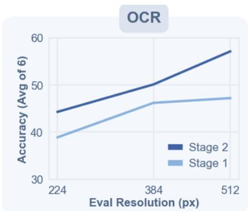

line chart

| Eval Resolution (px) | Stage 1 | Stage 2 |
| -------------------- | ------- | ------- |
| 224                  | 39      | 44      |
| 384                  | 46      | 50      |
| 512                  | 47      | 57      |

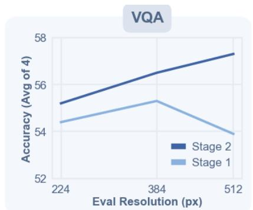

line chart

| Eval Resolution (px) | Stage 1 | Stage 2 |
| -------------------- | ------- | ------- |
| 224                  | 54.5    | 55.2    |
| 384                  | 55.3    | 56.5    |
| 512                  | 53.8    | 57.3    |

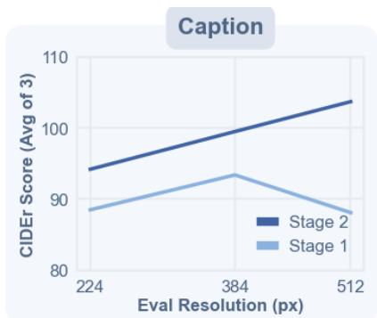

line chart

| Eval Resolution (px) | Stage 1 | Stage 2 |
| -------------------- | ------- | ------- |
| 224                  | 89      | 95      |
| 384                  | 94      | 100     |
| 512                  | 88      | 105     |

Figure 5 Validation of Native Aspect Adaptation. We evaluate the frozen visual representation of GenLIP-So/16 pretrained after two stages on the same setting as shown in Table 3. The x-axis corresponds to the input resolution in evaluation, and the y-axis corresponds to the average score on OCR, VQA and Caption tasks, respectively.

Table 10 Comparison among different solutions to the attention sink problem. We conduct an ablation on GenLIP-So/16 and compare gated attention with register tokens. All methods are trained with 1B samples from Dataset-S1.

<table><tr><td rowspan="2">Method</td><td colspan="7">Doc&amp;OCR</td><td colspan="4">General VQA</td><td colspan="3">Caption</td><td rowspan="2">ALL AVG</td></tr><tr><td>ChartQA</td><td>OCR-B</td><td>DocVQA</td><td>TextVQA</td><td>AI2D</td><td>InfoVQA</td><td>SEED-2</td><td>VQAv2</td><td>GQA</td><td>SQA</td><td>MME-P</td><td>NoCaps</td><td>COCO</td><td>TextCaps</td></tr><tr><td>1 Register</td><td>30.5</td><td>32.5</td><td>37.2</td><td>40.7</td><td>63.6</td><td>27.4</td><td>47.4</td><td>36.4</td><td>35.6</td><td>75.0</td><td>1154</td><td>74.2</td><td>71.9</td><td>114.3</td><td>53.3</td></tr><tr><td>4 Registers</td><td>34.5</td><td>30.8</td><td>41.0</td><td>43.8</td><td>63.8</td><td>27.5</td><td>50.2</td><td>39.7</td><td>37.5</td><td>75.5</td><td>1123</td><td>76.6</td><td>74.1</td><td>116.9</td><td>55.1</td></tr><tr><td>Gated Attention</td><td>34.6</td><td>34.2</td><td>44.1</td><td>44.7</td><td>64.6</td><td>29.1</td><td>51.1</td><td>40.7</td><td>41.5</td><td>74.6</td><td>1144</td><td>79.9</td><td>73.7</td><td>118.4</td><td>56.3</td></tr></table>

## 4.4.4 Native-Aspect-Ratio Adaptation

We evaluate GenLIP pretrained with two stages under different evaluation resolutions, which validates the effectiveness of the native-aspect-ratio adaptation stage. To test the model’s behavior under different input resolutions, we evaluate frozen visual representations of GenLIP (after each stage) across multiple resolutions under the same protocol as in Table 3 (Fig. 5).

## 4.5 Discriminative Ability

To assess the discriminative quality of GenLIP’s visual representations, we adopt the frozen-backbone evaluation protocol from DINOv2 [53] and probe the frozen visual features on ImageNet-1K [17] for classification and ADE20K [86] for semantic segmentation. Because GenLIP has no [CLS] token, we use attentive probing on patch features for classification, and use only a linear layer on patch features for semantic segmentation. We extract patch features from last layer of GenLIP, without fusing features from multiple layers.

As shown in Table 11, GenLIP learns decent transferable discriminative visual features without explicit visual supervision. There are two related findings: (i) gated attention effectively alleviates the degraded discriminative representations due to attention sink, (ii) the discriminative ability scales with GenLIP model sizes. The biggest variant of GenLIP, GenLIP-g/16, achieves 85.2 top-1 accuracy on ImageNet-1K and 44.5 mIoU on ADE20K with frozen representations. Notably, GenLIP outperforms the pure contrastive methods CLIP and SigLIP on ADE20K under the same model sizes, but lags behind SigLIP2 which introduces dense supervision [70]. Overall, this result demonstrates our pretraining method delivers competitive visual

representations for discriminative tasks with an extremely simple pretraining method.

Table 11 Frozen feature evaluation on the ImageNet-1K and ADE20K validation set. We report top-1 accuracy on ImageNet-1K and mIoU on ADE20K. No test-time augmentation used in evaluation. “w/o GA” denotes the variant without introducing gated attention.

<table><tr><td>Method</td><td>Arch</td><td>ImageNet-1K</td><td>ADE20K</td></tr><tr><td>CLIP</td><td>L/14</td><td>85.1</td><td>39.0</td></tr><tr><td>SigLIP</td><td>So/14</td><td>86.7</td><td>40.8</td></tr><tr><td>SigLIP2</td><td>So/14</td><td>88.9</td><td>45.4</td></tr><tr><td>GenLIP w/o GA</td><td>So/16</td><td>76.2</td><td>-</td></tr><tr><td>GenLIP</td><td>L/16</td><td>83.9</td><td>41.0</td></tr><tr><td>GenLIP</td><td>So/16</td><td>84.3</td><td>42.8</td></tr><tr><td>GenLIP</td><td>g/16</td><td>85.2</td><td>44.5</td></tr></table>

## 4.6 Let ViT Speak

## 4.6.1 Direct Caption Generation

We begin with a simple but intuitive test of GenLIP’s generative ability by asking the model to describe an input image directly. We evaluate all three model scales on both common-image examples (Figure 6) and supplementary OCR-heavy examples reported in the appendix (Figure 8). For this test, we use temperature=1e−6, $\mathrm { t o p } _ { p } { = } 1 . 0$ , a maximum of 256 new tokens, and no beam search. Generation stops when the model outputs the end-of-sequence token. We use the simple prompt “Describe the image in details.” throughout.

As shown in Figure 6, GenLIP already produces fluent and semantically grounded descriptions. From stage 1 to stage 2, the responses become longer and more detailed, which is consistent with the finer-grained caption data used in the second pretraining stage. The captioning ability also improves with model scale. In the second example, the two smaller models, GenLIP-L16 and GenLIP-So16, mistake “Bulbasaur” for “Charmander”, whereas the largest model, GenLIP-g16, identifies it correctly and provides richer details.

## 4.6.2 Patch Semantics Readout

Beyond direct caption generation, we also probe what individual image patch features represent by translating them into language tokens with model’s language modeling head. As shown in Figure 7, GenLIP spontaneously aligns some local visual regions with meaningful language concepts, an emergent property learned during pretraining. In the examples shown, both GenLIP-g16-S1 and GenLIP-g16-S2 models associate selected regions with semantically relevant concepts ranging from natural objects to abstract patterns. The GenLIP-g16-S2 model exhibits stronger alignment in both semantic correctness and relevance, likely due to the finer-grained captions and higher-quality images used in the second pretraining stage. Interestingly, this behavior is only observed in the two larger models, GenLIP-So16 and GenLIP-g16, with the latter showing more stable alignment. After stage 2, the readout semantics generally becomes more closely matched to the selected image regions. Although no explicit visual supervision is used, the model still learns to associate image patches with corresponding language concepts through generative pretraining on image-caption data.

Overall, the caption generation and patch-semantics experiments show that GenLIP can jointly model and align visual and linguistic modality, supporting its use as a strong vision encoder for MLLMs.

  
(a)

GenLIP-L16-S1: A sepia-toned vintage photograph of a person in a skiing pose, with a focus on the lower half of the body. The person is wearing a dark jacket and pants, and is holding ski poles. The image has a textured, aged appearance with a vignette effect around the edges.

GenLIP-So16-S1: A black and white photograph of a person skiing with a small dog on their back. The person is wearing a hat and is holding ski poles. The dog appears to be wearing a harness and is looking to the side. The image has a vintage feel with a grainy texture and a sepia tone.

GenLIP-g16-S1: A black and white photograph of a person skiing with a small white dog sitting on their back. The person is wearing a hat and is holding ski poles. The dog appears to be enjoying the ride, looking out over the snowy landscape.

GenLIP-L16-S2: It depicts an elderly man standing on a snowy landscape, equipped with skiing gear. He is wearing a patterned hat, a long-sleeved shirt, and dark pants. On his back, he carries a large backpack, and on his shoulders, he has a small white dog. The man is holding a pair of ski poles in his right hand, which are planted in the snow. His left hand is resting on his hip, and he appears to be looking off into the distance. The dog is sitting comfortably on the man's back, looking directly at the camera. The man's shadow is cast on the snow to his right, indicating that the light source is coming from the left side of the frame. The background is a flat, featureless expanse of snow, suggesting a remote or wilderness setting. There are no other discernible objects or people in the immediate vicinity.

  
(b)

GenLIP-L16-S2: The image depicts a stylized, cartoon-like creature that resembles a Pokémon, specifically Charmander, a popular Pokémon known for its fire-type abilities. The creature is primarily green with darker green spots and lighter green accents. It has a large, rounded body with a slightly flattened back and a rounded head. The creature's eyes are large with red irises and white sclera, giving it a friendly appearance. Its mouth is open, revealing a pink interior, and it has small, white, claw-like teeth. The creature's limbs are short and stubby, ending in three-toed feet. The background of the image is plain white, emphasizing the creature as the sole subject. There are no other objects or text present in the image.

GenLIP-So16-S2: The image depicts a stylized, cartoon-like creature resembling a Pokémon known as Charmander. It has a predominantly green color with darker green spots and lighter green accents on its body. The creature's eyes are large, round, and red with white highlights, giving it a friendly and approachable appearance. Its mouth is open, revealing a pink interior and a row of small, white teeth. The creature's ears are small and triangular, positioned on top of its head. The tail is bushy and green, with a lighter green tip. The creature's limbs are short and sturdy, ending in three-toed feet. The background is plain white, emphasizing the creature as the sole focus of the image.

GenLIP-g16-S2: The image features a stylized, cartoon-like depiction of a Pokémon known as Bulbasaur. Bulbasaur is a large, bipedal plant-like creature with a predominantly green body, featuring darker green spots and lighter green highlights that suggest a glossy texture. Its skin has a smooth appearance with subtle shading that gives a sense of volume and contour. Bulbasaur's eyes are large, round, and red with black pupils, conveying a friendly and approachable demeanor. The creature's mouth is open, revealing a hint of a pink tongue, and it has a wide, toothy grin. Bulbasaur's tail is bushy and green, curving upwards behind its body. The background of the image is plain white, with no additional elements to distract from the character.

Figure 6 Let ViT Speak. We prompt GenLIP with “Describe the image.” and show representative generations. The first case compares three stage-1 models (GenLIP-L16-S1, GenLIP-So16-S1, and GenLIP-g16-S1) with one stage-2 model (GenLIP-L16-S2); the second case shows three stage-2 models. Green and red text indicate correct and incorrect key content, respectively.

Additional qualitative examples, evaluation details, and a detailed discussion of attention sink are provided in the appendix.

## 5 Conclusions

This work presents GenLIP, a simple generative vision-language pretraining method based on a unified transformer architecture and a standard language modeling objective. By jointly modeling visual and textual inputs with a single transformer, GenLIP aligns the two modalities through early fusion and directly optimizes the vision backbone for generative language prediction. Despite its architectural and objective simplicity, GenLIP demonstrates strong data efficiency and scalability for vision-language pretraining, achieving competitive or superior performance across a wide range of multimodal benchmarks with substantially less training data than strong baselines. We hope our exploration of generative vision-language pretraining will inspire future research toward more effective and scalable multimodal learning.

Limitations. Several limitations warrant consideration: (i) our validation experiments are conducted on an academic-scale MLLM setting, LLaVA-NeXT, and the generalizability to cutting-edge MLLMs remains to be verified; (ii) the pretraining dataset is limited to 1.0B scale, the scaling behavior at even larger volumes is yet to be explored; (iii) the reliance on high-quality captions introduces significant data acquisition costs.

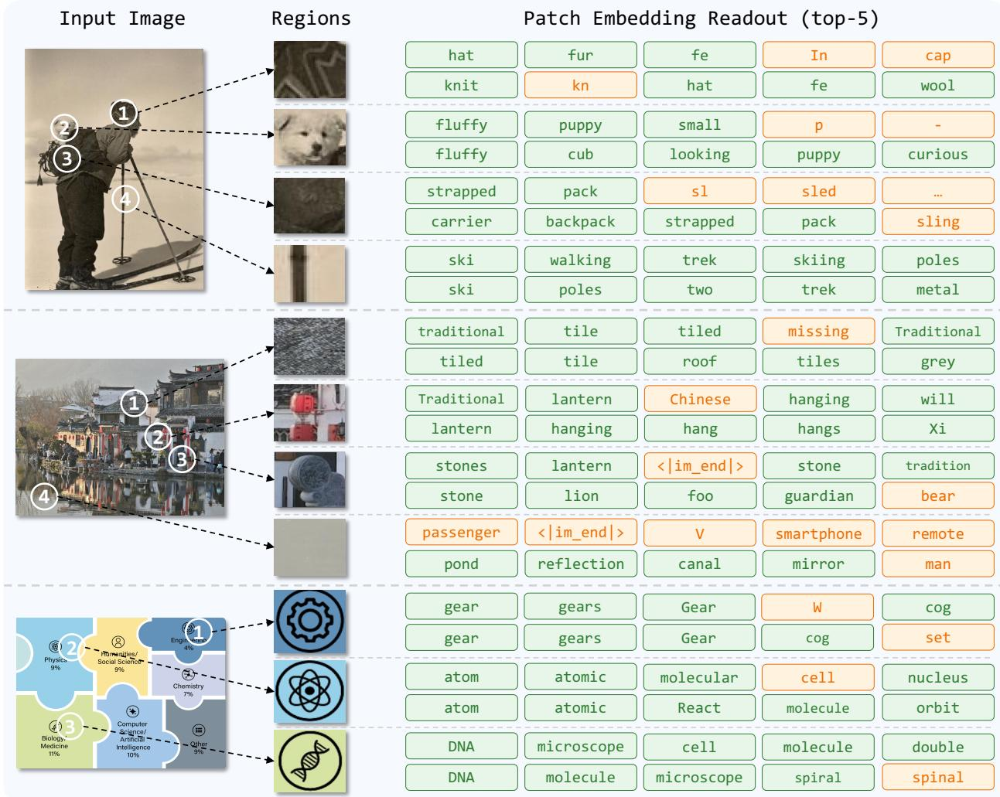

table

| Image | Region | Patch Embedding Readout (top-5) |
| --- | --- | --- |
| 1 | cat | hat |
| 1 | cat | fur |
| 1 | cat | fn |
| 1 | cat | In |
| 1 | cat | cap |
| 1 | cat | knit |
| 1 | cat | kn |
| 2 | French | fluffy |
| 2 | French | puppy |
| 2 | French | small |
| 2 | French | p |
| 2 | French | fluffy |
| 2 | French | cub |
| 2 | French | looking |
| 2 | French | puppy |
| 2 | French | curious |
| 2 | French | strapped |
| 2 | French | pack |
| 2 | French | sl |
| 2 | French | sl |
| 2 | French | sled |
| 2 | French | ... |
| 2 | French | carrier |
| 2 | French | backpack |
| 2 | French | strapped |
| 2 | French | pack |
| 2 | French | sling |
| 3 | Indian | ski |
| 3 | Indian | walking |
| 3 | Indian | trek |
| 3 | Indian | skiing |
| 3 | Indian | poles |
| 3 | Indian | ski |
| 3 | Indian | poles |
| 3 | Indian | two |
| 3 | Indian | trek |
| 3 | Indian | metal |
| 4 | Chinese | traditional |
| 4 | Chinese | tile |
| 4 | Chinese | tiled |
| 4 | Chinese | missing |
| 4 | Chinese | traditional |
| 4 | Chinese | tiled |
| 4 | Chinese | roof |
| 4 | Chinese | tiles |
| 4 | Chinese | grey |
| 4 | Chinese | Traditional |
| 4 | Chinese | lantern |
| 4 | Chinese | hanging |
| 4 | Chinese | hang |
| 4 | Chinese | hangs |
| 4 | Chinese | Hang |
| 4 | Chinese | Xi |
| 4 | English | stones |
| 4 | English | lantern |
| 4 | English | <im_end> |
| 4 | English | stone |
| 4 | English | tradition |
| 4 | English | stone |
| 4 | English | lion |
| 4 | English | foo |
| 4 | English | guardian |
| 4 | English | bear |
| 5 | V | passenger |
| 5 | V | <im_end> |
| 5 | V | V |
| 5 | V | smartphone |
| 5 | V | remote |
| 5 | V | pond |
| 5 | V | reflection |
| 5 | V | canal |
| 5 | V | mirror |
| 5 | V | man |
| 6 | Gear | gear |
| 6 | Gear | gears |
| 6 | Gear | Gear |
| 6 | Gear | W |
| 6 | Gear | cog |
| 6 | Gear | gear |
| 6 | Gear | Gear |
| 6 | Gear | cog |
| 6 | Gear | set |
| 6 | atom | atomic |
| 6 | atom | molecular |
| 6 | atom | cell |
| 6 | atom | molecule |
| 6 | atom | orbit |
| 6 | atom | DNA |
| 6 | atom | microscope |
| 6 | atom | cell |
| 6 | atom | molecule |
| 6 | atom | double |
| 6 | DNA | DNA |
| 6 | DNA | molecule |
| 6 | DNA | spiral |

Figure 7 Patch Semantics Readout. We directly unembed selected image patch features with the language modeling head to inspect the language concepts aligned with local regions. For each case, we show 3–4 regions for GenLIP-g16-S1 (top row) and GenLIP-g16-S2 (bottom row), together with the top-5 predicted tokens from left to right. Green boxes indicate related tokens and yellow boxes indicate unrelated ones.

## 6 Acknowledgments

This work was mainly sponsored by the National Natural Science Foundation of China (No.92470203).

## References

[1] Josh Achiam, Steven Adler, Sandhini Agarwal, Lama Ahmad, Ilge Akkaya, Florencia Leoni Aleman, Diogo Almeida, Janko Altenschmidt, Sam Altman, Shyamal Anadkat, et al. Gpt-4 technical report. arXiv preprint arXiv:2303.08774, 2023.  
[2] Harsh Agrawal, Karan Desai, Yufei Wang, Xinlei Chen, Rishabh Jain, Mark Johnson, Dhruv Batra, Devi Parikh, Stefan Lee, and Peter Anderson. Nocaps: Novel object captioning at scale. In Proceedings of the IEEE/CVF international conference on computer vision, pages 8948–8957, 2019.  
[3] Jean-Baptiste Alayrac, Jeff Donahue, Pauline Luc, Antoine Miech, Iain Barr, Yana Hasson, Karel Lenc, Arthur Mensch, Katherine Millican, Malcolm Reynolds, et al. Flamingo: a visual language model for few-shot learning. Advances in neural information processing systems, 35:23716–23736, 2022.  
[4] Xiang An, Kaicheng Yang, Xiangzi Dai, Ziyong Feng, and Jiankang Deng. Multi-label cluster discrimination for visual representation learning. In ECCV, 2024.  
[5] Yongqi An, Xu Zhao, Tao Yu, Ming Tang, and Jinqiao Wang. Systematic outliers in large language models. arXiv preprint arXiv:2502.06415, 2025.  
[6] Jinze Bai, Shuai Bai, Yunfei Chu, Zeyu Cui, Kai Dang, Xiaodong Deng, Yang Fan, Wenbin Ge, Yu Han, Fei Huang, et al. Qwen technical report. arXiv preprint arXiv:2309.16609, 2023.  
[7] Jinze Bai, Shuai Bai, Shusheng Yang, Shijie Wang, Sinan Tan, Peng Wang, Junyang Lin, Chang Zhou, and Jingren Zhou. Qwen-vl: A versatile vision-language model for understanding, localization, text reading, and beyond. arXiv preprint arXiv:2308.12966, 2023.  
[8] Shuai Bai, Yuxuan Cai, Ruizhe Chen, Keqin Chen, Xionghui Chen, Zesen Cheng, Lianghao Deng, Wei Ding, Chang Gao, Chunjiang Ge, et al. Qwen3-vl technical report. arXiv preprint arXiv:2511.21631, 2025.  
[9] Hangbo Bao, Wenhui Wang, Li Dong, and Furu Wei. Vl-beit: Generative vision-language pretraining. arXiv preprint arXiv:2206.01127, 2022.  
[10] Lucas Beyer, Andreas Steiner, André Susano Pinto, Alexander Kolesnikov, Xiao Wang, Daniel Salz, Maxim Neumann, Ibrahim Alabdulmohsin, Michael Tschannen, Emanuele Bugliarello, et al. Paligemma: A versatile 3b vlm for transfer. arXiv preprint arXiv:2407.07726, 2024.  
[11] Yangyi Chen, Xingyao Wang, Hao Peng, and Heng Ji. A single transformer for scalable vision-language modeling. Transactions on Machine Learning Research, 2024.  
[12] Zhe Chen, Jiannan Wu, Wenhai Wang, Weijie Su, Guo Chen, Sen Xing, Muyan Zhong, Qinglong Zhang, Xizhou Zhu, Lewei Lu, et al. Internvl: Scaling up vision foundation models and aligning for generic visual-linguistic tasks. In Proceedings of the IEEE/CVF conference on computer vision and pattern recognition, pages 24185–24198, 2024.  
[13] Mehdi Cherti, Romain Beaumont, Ross Wightman, Mitchell Wortsman, Gabriel Ilharco, Cade Gordon, Christoph Schuhmann, Ludwig Schmidt, and Jenia Jitsev. Reproducible scaling laws for contrastive language-image learning. In Proceedings of the IEEE/CVF conference on computer vision and pattern recognition, pages 2818–2829, 2023.  
[14] Mehdi Cherti, Romain Beaumont, Ross Wightman, Mitchell Wortsman, Gabriel Ilharco, Cade Gordon, Christoph Schuhmann, Ludwig Schmidt, and Jenia Jitsev. Reproducible scaling laws for contrastive language-image learning. In Proceedings of the IEEE/CVF conference on computer vision and pattern recognition, pages 2818–2829, 2023.  
[15] Yung-Sung Chuang, Yang Li, Dong Wang, Ching-Feng Yeh, Kehan Lyu, Ramya Raghavendra, James R Glass, LIFEI HUANG, Jason E Weston, Luke Zettlemoyer, et al. Meta clip 2: A worldwide scaling recipe. In The Thirty-ninth Annual Conference on Neural Information Processing Systems, 2025.  
[16] Timothée Darcet, Maxime Oquab, Julien Mairal, and Piotr Bojanowski. Vision transformers need registers. arXiv preprint arXiv:2309.16588, 2023.  
[17] Jia Deng, Wei Dong, Richard Socher, Li-Jia Li, Kai Li, and Li Fei-Fei. Imagenet: A large-scale hierarchical image database. In 2009 IEEE conference on computer vision and pattern recognition, pages 248–255. Ieee, 2009.  
[18] Haiwen Diao, Yufeng Cui, Xiaotong Li, Yueze Wang, Huchuan Lu, and Xinlong Wang. Unveiling encoder-free vision-language models. Advances in Neural Information Processing Systems, 37:52545–52567, 2024.  
[19] Haiwen Diao, Mingxuan Li, Silei Wu, Linjun Dai, Xiaohua Wang, Hanming Deng, Lewei Lu, Dahua Lin, and Ziwei Liu. From pixels to words–towards native vision-language primitives at scale. arXiv preprint arXiv:2510.14979, 2025.  
[20] Haiwen Diao, Xiaotong Li, Yufeng Cui, Yueze Wang, Haoge Deng, Ting Pan, Wenxuan Wang, Huchuan Lu, and Xinlong Wang. Evev2: Improved baselines for encoder-free vision-language models. In Proceedings of the IEEE/CVF International Conference on Computer Vision, pages 21014–21025, 2025.  
[21] Alexey Dosovitskiy, Lucas Beyer, Alexander Kolesnikov, Dirk Weissenborn, Xiaohua Zhai, Thomas Unterthiner, Mostafa Dehghani, Matthias Minderer, Georg Heigold, Sylvain Gelly, Jakob Uszkoreit, and Neil Houlsby. An image is worth 16x16 words: Transformers for image recognition at scale. In 9th International Conference on Learning Representations, ICLR 2021. OpenReview.net, 2021.  
[22] Lijie Fan, Dilip Krishnan, Phillip Isola, Dina Katabi, and Yonglong Tian. Improving clip training with language rewrites. Advances in Neural Information Processing Systems, 36:35544–35575, 2023.  
[23] Enrico Fini, Mustafa Shukor, Xiujun Li, Philipp Dufter, Michal Klein, David Haldimann, Sai Aitharaju, Victor G Turrisi da Costa, Louis Béthune, Zhe Gan, et al. Multimodal autoregressive pre-training of large vision encoders. In Proceedings of the Computer Vision and Pattern Recognition Conference, pages 9641–9654, 2025.  
[24] Chaoyou Fu, Peixian Chen, Yunhang Shen, Yulei Qin, Mengdan Zhang, Xu Lin, Jinrui Yang, Xiawu Zheng, Ke Li, Xing Sun, et al. Mme: A comprehensive evaluation benchmark for multimodal large language models. arXiv preprint arXiv:2306.13394, 2023.  
[25] Yash Goyal, Tejas Khot, Douglas Summers-Stay, Dhruv Batra, and Devi Parikh. Making the v in vqa matter: Elevating the role of image understanding in visual question answering. In Proceedings of the IEEE conference on computer vision and pattern recognition, pages 6904–6913, 2017.  
[26] Zilong Huang, Qinghao Ye, Bingyi Kang, Jiashi Feng, and Haoqi Fan. Classification done right for vision-language pre-training. Advances in Neural Information Processing Systems, 37:96483–96504, 2024.  
[27] Drew A Hudson and Christopher D Manning. Gqa: A new dataset for real-world visual reasoning and compositional question answering. In Proceedings of the IEEE/CVF conference on computer vision and pattern recognition, pages 6700–6709, 2019.  
[28] Jiho Jang, Chaerin Kong, Donghyeon Jeon, Seonhoon Kim, and Nojun Kwak. Unifying vision-language representation space with single-tower transformer. In Proceedings of the AAAI conference on artificial intelligence, volume 37, pages 980–988, 2023.  
[29] Chao Jia, Yinfei Yang, Ye Xia, Yi-Ting Chen, Zarana Parekh, Hieu Pham, Quoc Le, Yun-Hsuan Sung, Zhen Li, and Tom Duerig. Scaling up visual and vision-language representation learning with noisy text supervision. In International conference on machine learning, pages 4904–4916. PMLR, 2021.  
[30] Aniruddha Kembhavi, Mike Salvato, Eric Kolve, Minjoon Seo, Hannaneh Hajishirzi, and Ali Farhadi. A diagram is worth a dozen images. In European conference on computer vision, pages 235–251. Springer, 2016.  
[31] Zhengfeng Lai, Haotian Zhang, Bowen Zhang, Wentao Wu, Haoping Bai, Aleksei Timofeev, Xianzhi Du, Zhe Gan, Jiulong Shan, Chen-Nee Chuah, et al. Veclip: Improving clip training via visual-enriched captions. In European Conference on Computer Vision, pages 111–127. Springer, 2024.  
[32] Weixian Lei, Jiacong Wang, Haochen Wang, Xiangtai Li, Jun Hao Liew, Jiashi Feng, and Zilong Huang. The scalability of simplicity: Empirical analysis of vision-language learning with a single transformer. In Proceedings of the IEEE/CVF International Conference on Computer Vision (ICCV), pages 20758–20769, October 2025.  
[33] Bo Li, Yuanhan Zhang, Dong Guo, Renrui Zhang, Feng Li, Hao Zhang, Kaichen Zhang, Yanwei Li, Ziwei Liu, and Chunyuan Li. Llava-onevision: Easy visual task transfer. CoRR, 2024.  
[34] Bohao Li, Yuying Ge, Yi Chen, Yixiao Ge, Ruimao Zhang, and Ying Shan. Seed-bench-2-plus: Benchmarking multimodal large language models with text-rich visual comprehension. CoRR, 2024.  
[35] Bohao Li, Yuying Ge, Yixiao Ge, Guangzhi Wang, Rui Wang, Ruimao Zhang, and Ying Shan. Seed-bench: Benchmarking multimodal large language models. In Proceedings of the IEEE/CVF Conference on Computer Vision and Pattern Recognition, pages 13299–13308, 2024.  
[36] Junnan Li, Ramprasaath Selvaraju, Akhilesh Gotmare, Shafiq Joty, Caiming Xiong, and Steven Chu Hong Hoi. Align before fuse: Vision and language representation learning with momentum distillation. Advances in neural information processing systems, 34:9694–9705, 2021.  
[37] Junnan Li, Dongxu Li, Caiming Xiong, and Steven Hoi. Blip: Bootstrapping language-image pre-training for unified vision-language understanding and generation. In International conference on machine learning, pages 12888–12900. PMLR, 2022.  
[38] Xiangtai Li, Tao Zhang, Yanwei Li, Haobo Yuan, Shihao Chen, Yikang Zhou, Jiahao Meng, Yueyi Sun, Shilin Xu, Lu Qi, et al. Denseworld-1m: Towards detailed dense grounded caption in the real world. arXiv preprint arXiv:2506.24102, 2025.  
[39] Xianhang Li, Yanqing Liu, Haoqin Tu, and Cihang Xie. Openvision: A fully-open, cost-effective family of advanced vision encoders for multimodal learning. In Proceedings of the IEEE/CVF International Conference on Computer Vision, pages 3977–3987, 2025.  
[40] Xiaotong Li, Fan Zhang, Haiwen Diao, Yueze Wang, Xinlong Wang, and Lingyu Duan. Densefusion-1m: Merging vision experts for comprehensive multimodal perception. Advances in Neural Information Processing Systems, 37:18535–18556, 2024.  
[41] Haotian Liu, Chunyuan Li, Qingyang Wu, and Yong Jae Lee. Visual instruction tuning. Advances in neural information processing systems, 36:34892–34916, 2023.  
[42] Haotian Liu, Chunyuan Li, Yuheng Li, Bo Li, Yuanhan Zhang, Sheng Shen, and Yong Jae Lee. Llava-next: Improved reasoning, ocr, and world knowledge, january 2024. URL https://llava-vl. github. io/blog/2024-01-30-llava-next, 1(8), 2024.  
[43] Yanqing Liu, Xianhang Li, Zeyu Wang, Bingchen Zhao, and Cihang Xie. Clips: An enhanced clip framework for learning with synthetic captions. arXiv preprint arXiv:2411.16828, 2024.  
[44] Yanqing Liu, Xianhang Li, Letian Zhang, Zirui Wang, Zeyu Zheng, Yuyin Zhou, and Cihang Xie. Openvision 2: A family of generative pretrained visual encoders for multimodal learning. arXiv preprint arXiv:2509.01644, 2025.  
[45] Yuan Liu, Haodong Duan, Yuanhan Zhang, Bo Li, Songyang Zhang, Wangbo Zhao, Yike Yuan, Jiaqi Wang, Conghui He, Ziwei Liu, et al. Mmbench: Is your multi-modal model an all-around player? In European conference on computer vision, pages 216–233. Springer, 2024.  
[46] Yuliang Liu, Zhang Li, Mingxin Huang, Biao Yang, Wenwen Yu, Chunyuan Li, Xu-Cheng Yin, Cheng-Lin Liu, Lianwen Jin, and Xiang Bai. Ocrbench: on the hidden mystery of ocr in large multimodal models. Science China Information Sciences, 67(12):220102, 2024.  
[47] Pan Lu, Swaroop Mishra, Tony Xia, Liang Qiu, Kai-Wei Chang, Song-Chun Zhu, Oyvind Tafjord, Peter Clark, and Ashwin Kalyan. Learn to explain: Multimodal reasoning via thought chains for science question answering. In The 36th Conference on Neural Information Processing Systems (NeurIPS), 2022.  
[48] Pan Lu, Hritik Bansal, Tony Xia, Jiacheng Liu, Chunyuan Li, Hannaneh Hajishirzi, Hao Cheng, Kai-Wei Chang, Michel Galley, and Jianfeng Gao. Mathvista: Evaluating mathematical reasoning of foundation models in visual contexts. In International Conference on Learning Representations (ICLR), 2024.  
[49] Junhua Mao, Jonathan Huang, Alexander Toshev, Oana Camburu, Alan L Yuille, and Kevin Murphy. Generation and comprehension of unambiguous object descriptions. In Proceedings of the IEEE conference on computer vision and pattern recognition, pages 11–20, 2016.  
[50] Ahmed Masry, Xuan Long Do, Jia Qing Tan, Shafiq Joty, and Enamul Hoque. Chartqa: A benchmark for question answering about charts with visual and logical reasoning. In Findings of the association for computational linguistics: ACL 2022, pages 2263–2279, 2022.  
[51] Minesh Mathew, Dimosthenis Karatzas, and CV Jawahar. Docvqa: A dataset for vqa on document images. In Proceedings of the IEEE/CVF winter conference on applications of computer vision, pages 2200–2209, 2021.  
[52] Minesh Mathew, Viraj Bagal, Rubèn Tito, Dimosthenis Karatzas, Ernest Valveny, and CV Jawahar. Infographicvqa. In Proceedings of the IEEE/CVF Winter Conference on Applications of Computer Vision, pages 1697–1706, 2022.  
[53] Maxime Oquab, Timothée Darcet, Théo Moutakanni, Huy Vo, Marc Szafraniec, Vasil Khalidov, Pierre Fernandez, Daniel Haziza, Francisco Massa, Alaaeldin El-Nouby, et al. Dinov2: Learning robust visual features without supervision. Transactions on Machine Learning Research Journal, 2024.  
[54] Zihan Qiu, Zekun Wang, Bo Zheng, Zeyu Huang, Kaiyue Wen, Songlin Yang, Rui Men, Le Yu, Fei Huang, Suozhi Huang, et al. Gated attention for large language models: Non-linearity, sparsity, and attention-sink-free. arXiv preprint arXiv:2505.06708, 2025.  
[55] Qwen, :, An Yang, Baosong Yang, Beichen Zhang, Binyuan Hui, Bo Zheng, Bowen Yu, Chengyuan Li, Dayiheng Liu, Fei Huang, Haoran Wei, Huan Lin, Jian Yang, Jianhong Tu, Jianwei Zhang, Jianxin Yang, Jiaxi Yang, Jingren Zhou, Junyang Lin, Kai Dang, Keming Lu, Keqin Bao, Kexin Yang, Le Yu, Mei Li, Mingfeng Xue, Pei Zhang, Qin Zhu, Rui Men, Runji Lin, Tianhao Li, Tianyi Tang, Tingyu Xia, Xingzhang Ren, Xuancheng Ren, Yang Fan, Yang Su, Yichang Zhang, Yu Wan, Yuqiong Liu, Zeyu Cui, Zhenru Zhang, and Zihan Qiu. Qwen2.5 technical report, 2025. URL https://arxiv.org/abs/2412.15115.  
[56] Alec Radford, Jong Wook Kim, Chris Hallacy, Aditya Ramesh, Gabriel Goh, Sandhini Agarwal, Girish Sastry, Amanda Askell, Pamela Mishkin, Jack Clark, et al. Learning transferable visual models from natural language supervision. In International conference on machine learning, pages 8748–8763. PMLR, 2021.  
[57] Colin Raffel, Noam Shazeer, Adam Roberts, Katherine Lee, Sharan Narang, Michael Matena, Yanqi Zhou, Wei Li, and Peter J Liu. Exploring the limits of transfer learning with a unified text-to-text transformer. Journal of machine learning research, 21(140):1–67, 2020.  
[58] Oleksii Sidorov, Ronghang Hu, Marcus Rohrbach, and Amanpreet Singh. Textcaps: a dataset for image captioning with reading comprehension. In European conference on computer vision, pages 742–758. Springer, 2020.  
[59] Oriane Siméoni, Huy V. Vo, Maximilian Seitzer, Federico Baldassarre, Maxime Oquab, Cijo Jose, Vasil Khalidov, Marc Szafraniec, Seungeun Yi, Michaël Ramamonjisoa, Francisco Massa, Daniel Haziza, Luca Wehrstedt, Jianyuan Wang, Timothée Darcet, Théo Moutakanni, Leonel Sentana, Claire Roberts, Andrea Vedaldi, Jamie Tolan, John Brandt, Camille Couprie, Julien Mairal, Hervé Jégou, Patrick Labatut, and Piotr Bojanowski. DINOv3, 2025. URL https://arxiv.org/abs/2508.10104.  
[60] Amanpreet Singh, Vivek Natarajan, Meet Shah, Yu Jiang, Xinlei Chen, Dhruv Batra, Devi Parikh, and Marcus Rohrbach. Towards vqa models that can read. In Proceedings of the IEEE/CVF conference on computer vision and pattern recognition, pages 8317–8326, 2019.  
[61] Quan Sun, Yufeng Cui, Xiaosong Zhang, Fan Zhang, Qiying Yu, Yueze Wang, Yongming Rao, Jingjing Liu, Tiejun Huang, and Xinlong Wang. Generative multimodal models are in-context learners. In Proceedings of the IEEE/CVF Conference on Computer Vision and Pattern Recognition, pages 14398–14409, 2024.  
[62] Chameleon Team. Chameleon: Mixed-modal early-fusion foundation models. arXiv preprint arXiv:2405.09818, 2024.  
[63] Kimi Team, Angang Du, Bohong Yin, Bowei Xing, Bowen Qu, Bowen Wang, Cheng Chen, Chenlin Zhang, Chenzhuang Du, Chu Wei, et al. Kimi-vl technical report. arXiv preprint arXiv:2504.07491, 2025.  
[64] Kimi Team, Tongtong Bai, Yifan Bai, Yiping Bao, SH Cai, Yuan Cao, Y Charles, HS Che, Cheng Chen, Guanduo Chen, et al. Kimi k2. 5: Visual agentic intelligence. arXiv preprint arXiv:2602.02276, 2026.  
[65] Qwen Team. Qwen2.5: A party of foundation models, September 2024. URL https://qwenlm.github.io/blog/ qwen2.5/.  
[66] Peter Tong, Ellis Brown, Penghao Wu, Sanghyun Woo, Adithya Jairam Vedagiri Iyer, Sai Charitha Akula, Shusheng Yang, Jihan Yang, Manoj Middepogu, Ziteng Wang, et al. Cambrian-1: A fully open, vision-centric exploration of multimodal llms. Advances in Neural Information Processing Systems, 37:87310–87356, 2024.  
[67] Shengbang Tong, Zhuang Liu, Yuexiang Zhai, Yi Ma, Yann LeCun, and Saining Xie. Eyes wide shut? exploring the visual shortcomings of multimodal llms, 2024.  
[68] Hugo Touvron, Thibaut Lavril, Gautier Izacard, Xavier Martinet, Marie-Anne Lachaux, Timothée Lacroix, Baptiste Rozière, Naman Goyal, Eric Hambro, Faisal Azhar, et al. Llama: Open and efficient foundation language models. arXiv preprint arXiv:2302.13971, 2023.  
[69] Michael Tschannen, Manoj Kumar, Andreas Steiner, Xiaohua Zhai, Neil Houlsby, and Lucas Beyer. Image captioners are scalable vision learners too. Advances in Neural Information Processing Systems, 36:46830–46855, 2023.  
[70] Michael Tschannen, Alexey Gritsenko, Xiao Wang, Muhammad Ferjad Naeem, Ibrahim Alabdulmohsin, Nikhil Parthasarathy, Talfan Evans, Lucas Beyer, Ye Xia, Basil Mustafa, et al. Siglip 2: Multilingual vision-language  
encoders with improved semantic understanding, localization, and dense features. arXiv preprint arXiv:2502.14786, 2025.  
[71] Jianfeng Wang, Zhengyuan Yang, Xiaowei Hu, Linjie Li, Kevin Lin, Zhe Gan, Zicheng Liu, Ce Liu, and Lijuan Wang. Git: A generative image-to-text transformer for vision and language. arXiv preprint arXiv:2205.14100, 2022.  
[72] Peng Wang, Shuai Bai, Sinan Tan, Shijie Wang, Zhihao Fan, Jinze Bai, Keqin Chen, Xuejing Liu, Jialin Wang, Wenbin Ge, et al. Qwen2-vl: Enhancing vision-language model’s perception of the world at any resolution. arXiv preprint arXiv:2409.12191, 2024.  
[73] Zirui Wang, Jiahui Yu, Adams Wei Yu, Zihang Dai, Yulia Tsvetkov, and Yuan Cao. Simvlm: Simple visual language model pretraining with weak supervision. arXiv preprint arXiv:2108.10904, 2021.  
[74] xAI. Realworldqa: A benchmark for real-world spatial understanding. https://huggingface.co/datasets/ xai-org/RealworldQA, 2024. Accessed: 2025-04-26.  
[75] Guangxuan Xiao, Yuandong Tian, Beidi Chen, Song Han, and Mike Lewis. Efficient streaming language models with attention sinks. arXiv preprint arXiv:2309.17453, 2023.  
[76] Yin Xie, Kaicheng Yang, Xiang An, Kun Wu, Yongle Zhao, Weimo Deng, Zimin Ran, Yumeng Wang, Ziyong Feng, Miles Roy, Elezi Ismail, and Jiankang Deng. Region-based cluster discrimination for visual representation learning. In ICCV, 2025.  
[77] Hu Xu, Saining Xie, Xiaoqing Ellen Tan, Po-Yao Huang, Russell Howes, Vasu Sharma, Shang-Wen Li, Gargi Ghosh, Luke Zettlemoyer, and Christoph Feichtenhofer. Demystifying clip data. arXiv preprint arXiv:2309.16671, 2023.  
[78] An Yang, Anfeng Li, Baosong Yang, Beichen Zhang, Binyuan Hui, Bo Zheng, Bowen Yu, Chang Gao, Chengen Huang, Chenxu Lv, et al. Qwen3 technical report. arXiv preprint arXiv:2505.09388, 2025.  
[79] Kaicheng Yang, Jiankang Deng, Xiang An, Jiawei Li, Ziyong Feng, Jia Guo, Jing Yang, and Tongliang Liu. Alip: Adaptive language-image pre-training with synthetic caption. In Proceedings of the IEEE/CVF International Conference on Computer Vision, pages 2922–2931, 2023.  
[80] Jiahui Yu, Zirui Wang, Vijay Vasudevan, Legg Yeung, Mojtaba Seyedhosseini, and Yonghui Wu. Coca: Contrastive captioners are image-text foundation models. arXiv preprint arXiv:2205.01917, 2022.  
[81] Xiang Yue, Yuansheng Ni, Kai Zhang, Tianyu Zheng, Ruoqi Liu, Ge Zhang, Samuel Stevens, Dongfu Jiang, Weiming Ren, Yuxuan Sun, Cong Wei, Botao Yu, Ruibin Yuan, Renliang Sun, Ming Yin, Boyuan Zheng, Zhenzhu Yang, Yibo Liu, Wenhao Huang, Huan Sun, Yu Su, and Wenhu Chen. Mmmu: A massive multi-discipline multimodal understanding and reasoning benchmark for expert agi. In Proceedings of CVPR, 2024.  
[82] Xiaohua Zhai, Basil Mustafa, Alexander Kolesnikov, and Lucas Beyer. Sigmoid loss for language image pre-training. In Proceedings of the IEEE/CVF international conference on computer vision, pages 11975–11986, 2023.  
[83] Haotian Zhang, Pengchuan Zhang, Xiaowei Hu, Yen-Chun Chen, Liunian Harold Li, Xiyang Dai, Lijuan Wang, Lu Yuan, Jenq-Neng Hwang, and Jianfeng Gao. Glipv2: unifying localization and vl understanding. In 36th Conf. Neural Inf. Process. Syst. NeurIPS, 2022.  
[84] Kaichen Zhang, Bo Li, Peiyuan Zhang, Fanyi Pu, Joshua Adrian Cahyono, Kairui Hu, Shuai Liu, Yuanhan Zhang, Jingkang Yang, Chunyuan Li, et al. Lmms-eval: Reality check on the evaluation of large multimodal models. In Findings of the Association for Computational Linguistics: NAACL 2025, pages 881–916, 2025.  
[85] Kecheng Zheng, Yifei Zhang, Wei Wu, Fan Lu, Shuailei Ma, Xin Jin, Wei Chen, and Yujun Shen. Dreamlip: Language-image pre-training with long captions. In European Conference on Computer Vision, pages 73–90. Springer, 2024.  
[86] Bolei Zhou, Hang Zhao, Xavier Puig, Sanja Fidler, Adela Barriuso, and Antonio Torralba. Scene parsing through ade20k dataset. In Proceedings of the IEEE conference on computer vision and pattern recognition, pages 633–641, 2017.  
[87] Deyao Zhu, Jun Chen, Xiaoqian Shen, Xiang Li, and Mohamed Elhoseiny. Minigpt-4: Enhancing vision-language understanding with advanced large language models. In The Twelfth International Conference on Learning Representations, 2024.

## Appendix

## A Cambrian-1 style Evaluation

Based on the frozen evaluation in Table 3 and Table 4, we also organize our evaluation results in a Cambrian-1-style [66] benchmark suite by adding benchmarks such as MMMU [81], MathVista [48], MMVP [67], and RealWorldQA[74]. Detailed results are shown in Table 5 and Table 12. On this extended evaluation suite, GenLIP still shows its performance advantage against strong baselines on all model sizes.

The main experiment section reports the Cambrian-1-style evaluation under the LLaVA-NeXT-Qwen2.5-1.5B setting in Table 5. Here, we provide the complementary Qwen2.5-7B results to examine whether the same trend holds with a stronger language backbone. The benchmark grouping, visual-token budget, SFT data, and evaluation protocol are kept the same as in the main text; only the LLM size changes.

As shown in Table 12, GenLIP remains consistently strong under the larger LLM. At L/16, GenLIP achieves the best overall average among the compared L-scale encoders. At So/16 and g/16, GenLIP improves the average score over SigLIP2 by 1.6 and 3.0 points, respectively. The gains are especially clear on OCR and chart-oriented benchmarks such as ChartQA, OCRBench, TextVQA, and DocVQA, consistent with the main-text observation that GenLIP’s generative pretraining is particularly effective for fine-grained visual-text alignment.

Table 12 Cambrian-1-style frozen visual representation evaluation under LLaVA-NeXT-Qwen2.5-7B. Except for the LLM size, all settings are the same as those used in the Qwen2.5-1.5B setting.

<table><tr><td rowspan="2">Model</td><td rowspan="2">Arch</td><td rowspan="2">Data</td><td colspan="4">General VQA</td><td colspan="4">Knowledge</td><td colspan="4">OCR &amp; Chart</td><td colspan="4">Vision-Centric</td><td rowspan="2">AVG</td></tr><tr><td>MME-P</td><td>MMB</td><td>SEED-I</td><td>GQA</td><td>SQA</td><td>MMMU</td><td>MathV</td><td>AI2D</td><td>ChartQA</td><td>OCR-B</td><td>TextVQA</td><td>DocVQA</td><td>MMVP</td><td>RWQA</td><td>CV-2D</td><td>CV-3D</td></tr><tr><td>CLIP [56]</td><td>L/14</td><td>12.8B</td><td>1316</td><td>73.6</td><td>69.9</td><td>39.6</td><td>85.2</td><td>46.4</td><td>48.3</td><td>76.3</td><td>36.6</td><td>29.6</td><td>52.6</td><td>48.4</td><td>36.0</td><td>58.0</td><td>60.4</td><td>65.3</td><td>55.7</td></tr><tr><td>AIMv2 [23]</td><td>L/14</td><td>12.0B</td><td>1240</td><td>74.2</td><td>70.9</td><td>37.9</td><td>85.2</td><td>45.9</td><td>48.0</td><td>76.9</td><td>36.8</td><td>30.9</td><td>54.5</td><td>46.6</td><td>48.7</td><td>56.9</td><td>63.0</td><td>63.3</td><td>56.4</td></tr><tr><td>OVision2 [44]</td><td>L/16</td><td>12.8B</td><td>1325</td><td>74.5</td><td>71.1</td><td>47.2</td><td>85.9</td><td>45.4</td><td>45.9</td><td>78.4</td><td>42.5</td><td>49.9</td><td>58.8</td><td>49.5</td><td>42.0</td><td>59.1</td><td>62.5</td><td>64.2</td><td>58.9</td></tr><tr><td>SigLIP [82]</td><td>L/16</td><td>40.0B</td><td>1275</td><td>76.2</td><td>71.6</td><td>46.2</td><td>86.7</td><td>48.3</td><td>52.0</td><td>79.3</td><td>41.7</td><td>45.7</td><td>56.0</td><td>50.5</td><td>46.7</td><td>58.7</td><td>63.0</td><td>59.3</td><td>59.1</td></tr><tr><td>GenLIP</td><td>L/16</td><td>8.0B</td><td>1320</td><td>74.3</td><td>73.3</td><td>51.3</td><td>85.4</td><td>44.8</td><td>53.6</td><td>80.4</td><td>52.7</td><td>59.2</td><td>62.9</td><td>61.7</td><td>50.0</td><td>58.0</td><td>67.9</td><td>60.3</td><td>62.6</td></tr><tr><td>SigLIP2 [70]</td><td>So/16</td><td>40.0B</td><td>1422</td><td>77.7</td><td>72.6</td><td>52.2</td><td>87.1</td><td>47.2</td><td>53.7</td><td>81.3</td><td>46.6</td><td>55.6</td><td>63.5</td><td>56.3</td><td>46.0</td><td>60.4</td><td>66.2</td><td>66.3</td><td>62.7</td></tr><tr><td>GenLIP</td><td>So/16</td><td>8.0B</td><td>1424</td><td>76.6</td><td>73.1</td><td>52.4</td><td>86.4</td><td>46.6</td><td>55.2</td><td>81.0</td><td>55.3</td><td>63.5</td><td>65.7</td><td>66.3</td><td>48.0</td><td>59.1</td><td>66.4</td><td>61.8</td><td>64.3</td></tr><tr><td>SigLIP2 [70]</td><td>g/16</td><td>40.0B</td><td>1422</td><td>78.0</td><td>72.8</td><td>49.3</td><td>87.7</td><td>49.0</td><td>53.6</td><td>81.0</td><td>47.2</td><td>55.6</td><td>63.5</td><td>56.3</td><td>50.7</td><td>60.3</td><td>65.8</td><td>65.6</td><td>63.0</td></tr><tr><td>GenLIP</td><td>g/16</td><td>8.0B</td><td>1483</td><td>77.3</td><td>73.6</td><td>54.5</td><td>87.0</td><td>47.6</td><td>55.8</td><td>81.0</td><td>57.1</td><td>65.9</td><td>66.8</td><td>69.0</td><td>52.0</td><td>62.1</td><td>65.4</td><td>67.4</td><td>66.0</td></tr></table>

## B Supplementary Qualitative Results

We provide additional qualitative results that complement the “Let ViT Speak” analysis in Sec. 4.6. Besides illustrating the strengths of GenLIP, these cases also expose its remaining failure modes on challenging detail-sensitive inputs.

In Figure 8, we further evaluate GenLIP on challenging OCR-heavy examples. These three cases test (a) receipt understanding, (b) geometric-shape counting and placement, and (c) recognition of tiny characters and numbers. All three model variants show non-trivial OCR ability, although clear errors remain:

(a) In the first case (Figure 8(a)), GenLIP-L16-S2 recognizes most characters but fails on the long number sequences (Tax Id and IBAN) and the two tables. GenLIP-So16-S2 encounters similar difficulties and produces repeated output. In contrast, GenLIP-g16-S2 recovers the table structure much more accurately, missing only one number and the word “Opener”.  
(b) In the second case (Figure 8(b)), GenLIP-L16-S2 and GenLIP-So16-S2 make mistakes in both the number and placement of geometric shapes. GenLIP-g16-S2 is substantially more accurate, with the main remaining error being that it identifies the acute triangle in the bottom row as a right triangle.

text_image

Invoice no: 40378170
Date of issue: 10/15/2012
Seller:
Patel, Thompson and Montgomery
356 Kyle Vallo
New Jersey, NR 4622B
Tax M: 958-76-3511
IBM: GB/TMMRQ(1965)20414096
Client:
Jackson, Obchod and Jackson
247 John Tracks Suite 641
New Jersey, PA 99881
Tax M: 998-87-7723
ITEMS
No. Description Qty Net price Net worth VAT (%) Gross worth
1. Cash Line Corporate Ratio
Cash Line Company (OR) vs. Inc.
BALANCE SHEET
SUMMARY
VAT ($) Net worth VAT Gross worth
3% 7.58 7.58 39% 8.25
Total $ 7.58 $ 6.75 $ 8.25

(a)

GenLIP-L16-S2: The image is a document titled \"Invoice no: 40378170\" with a date of issue dated 10/15/2012. The invoice is addressed to two individuals: Patek, Thompson, and Montgomery, with addresses in New James, MA 46228. The client is Jackson, Odonnell, and Jackson, with addresses in Jenniferville, PA 98601. The invoice lists items with descriptions, quantities, net prices, and VAT percentages. The items include a Lead's Wine Companion Bottle Corkscrew Opener Gift Box Set with a foil cutter, and a total amount due of \$7.50, \$0.75, and \$0.75 for gross worth, VAT, and gross worth, respectively. The document uses a simple layout with headings, tables, and numerical data to convey the information.

GenLIP-So16-S2: The invoice is structured with a header that includes the invoice number \"40378170,\" the date \"10/15/2012,\" and the name \"Seller: Patell, Thompson and Montgomery.\" The client is listed as \"Jackson, Odomnell and Jackson\" with an address in New Jersey. The tax ID is \"998-74- 3511\" and the tax ID number is \"998-7723.\" The invoice lists items with descriptions, quantities, prices, net prices, VAT (Value Added Tax), and gross worth. Item 1 is \"Lead's Wine Companion Bottle Corkscrew Opener Gift Set with Foil Cutter.\" Item 2 is \"Lead's Wine Companion Bottle Corkscrew Opener Gift Set with Foil Cutter.\"

GenLIP-g16-S2: The image displays an invoice with the following details:\n\n

\*\*Invoice No.: 40378170\*\*\n\n

\*\*Date of issue: 10/15/2012\*\*\n\n

\*\*Seller:\*\*\nPatel, Thompson and Montgomery\n356 Kyle Vista\nNew James, MA 04628\nTax Id: 958-74- 3511\nIBAN: GB77WRBQ31965128414006\n\n

\*\*Client:\*\*\nJackson, Odonnell and Jackson\n267 John Track Suite 841\nJenniferville, PA 98601\nTax Id: 998-87-7723\n\n

\*\*ITEMS:\*\*\n

1. \*\*Lead's Wine Companion Bottle Corkscrew Gift Box Set with Foil Cutter\*\*\n Quantity: 1\n Unit: UM (Unit of Measure)\n - Net price: 7.50\n - Net worth: 7.50\n - VAT (%): 10%\n Gross worth: 8.25\n\n

\*\*Summary:\*\*\n- VAT (%): 10%\n- Net worth: 7.50\n- VAT (Value Added Tax): 0.75\n- Gross worth: 8.25\n\n

\*\*Total:\*\*\n- Total: \$7.50\n- \$0.75 (Net worth of \$7.50)\n- \$0.75 (VAT of \$0.75)\n- \$8.25 (Gross worth of \$8.25)\n\n

\*\*Summary breakdown:\*\*\n- The item is a wine companion bottle corkcrew gift box set with a foil cutter.\n- The total cost is \$7.50, with a net worth of \$7.50, a VAT of 0.75, and a gross worth of \$8.25.

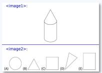  
(b)

GenLIP-L16-S2: The image is divided into two sections, each containing a sequence of geometric shapes and text. The top section features a single, upright pencil with a pointed tip, drawn in black lines against a white background. Above the pencil, there is text in blue that reads "<image1>". The bottom section contains a series of six geometric shapes, each labeled with a letter from (A) to (E) and a number from (B) to (D). The shapes include a circle, a triangle, a square, a rectangle, a parallelogram, and a trapezoid. The shapes are all outlined in black and are placed on a white background. A blue horizontal line separates the two sections. The text "<image1>" and "<image2>" is displayed above the pencil and shapes, respectively. The text and shapes are centered within their respective sections.

GenLIP-So16-S2: The image is divided into two sections by a horizontal blue line. The upper section contains a single line drawing of a cylindrical object with a pointed top, resembling a pencil. The lower section displays six geometric shapes, labeled (A), (B), (C), (D), (E), and (F). Shape (A) is a circle. Shape (B) is a rightangled triangle. Shape (C) is a square. Shape (D) is a right-angled triangle. Shape (E) is a rectangle. Shape (F) is a right-angled triangle. The shapes are arranged in two rows, with three shapes in the top row and three in the bottom row. Each shape is labeled with a letter (A, B, C, D, E, F) in parentheses. Above the drawings, there is a line of text that reads "<image1>".

GenLIP-g16-S2: The image is divided into two sections, with the top section labeled "<image1>" and the bottom section labeled "<image2>". In the top section, there is a simple line drawing of a pencil with a pointed tip and a cylindrical body. The pencil is centered in the image, and there is a horizontal blue line below it. In the bottom section, there are five geometric shapes labeled (A), (B), (C), (D), and (E). Shape (A) is a circle, shape (B) is a triangle, shape (C) is a square, shape (D) is a right-angled triangle, and shape (E) is a rectangle. These shapes are arranged in a row, with shape (A) on the far left and shape (E) on the far right. The background of the image is white.

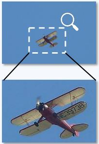

natural_image

Two aircraft images: one with a magnifying glass icon, the other in a biplane (no visible text or symbols)

(c)

GenLIP-L16-S2: A vintage biplane with a red body and white wings is flying against a clear blue sky. The aircraft has a propeller and is equipped with a registration number on the underside of the wings. The plane is captured in mid-flight, with the propeller spinning and the wings angled slightly upwards.

GenLIP-So16-S2: A single-engine, propeller-driven aircraft is captured in mid-flight against a clear blue sky. The aircraft has a red fuselage with a white stripe running along its side, and the registration number \"N3873B\" is visible on the side of the fuselage. The wings are straight and appear to be made of a lightcolored material, possibly aluminum or fiberglass, with a slight curvature at the tips. The propeller is at the front of the aircraft, spinning rapidly, indicating that the plane is in motion. The aircraft's landing gear is retracted, suggesting that it is flying at a moderate altitude. There are no other objects or people visible in the image, and the focus is solely on the aircraft and the sky.

GenLIP-g16-S2: The image depicts a single-engine biplane flying against a clear blue sky. The aircraft is positioned in the center of the frame, slightly tilted to the right, suggesting it is in mid-flight. The plane has a classic design with two main wings stacked one above the other, connected by a series of struts and wires. The upper wing is larger and has a lighter color, possibly white or cream, while the lower wing is smaller and has a darker color, likely red or maroon. Both wings have single propeller at the front, which is spinning, indicating that the plane is in operation. The tail of the aircraft is also visible, featuring a vertical stabilizer and a horizontal stabilizer, both of which are colored in the same dark red or maroon as the lower wing. The registration number \"NC-39738\" is prominently displayed on the underside of the upper wing, just behind the propeller. There are no other objects or people visible in the image, and the background is a solid, unobstructed blue sky, suggesting that the photo was taken on a clear day with no clouds.

Figure 8 Additional OCR Cases. Representative GenLIP generations on three challenging examples that require fine-grained detail recognition.

(c) In the last case (Figure 8(c)), GenLIP-L16-S2 fails to detect the number on the plane, and GenLIP-So16-S2 outputs the wrong number. GenLIP-g16-S2 identifies the number correctly but still makes a spatial error.

Overall, these examples show that GenLIP already acquires meaningful OCR ability even without an OCRspecific pretraining corpus. This ability scales clearly with model size: larger models recognize and describe subtle details more accurately. At the same time, the observed errors show that long number strings, precise spatial layouts, and tiny text remain challenging. These cases help explain both the strong Doc&OCR performance of GenLIP and the residual gaps that remain in detail-sensitive settings.

In Figure 9, we provide four more cases in addition to Figure 7 using the same model configurations.

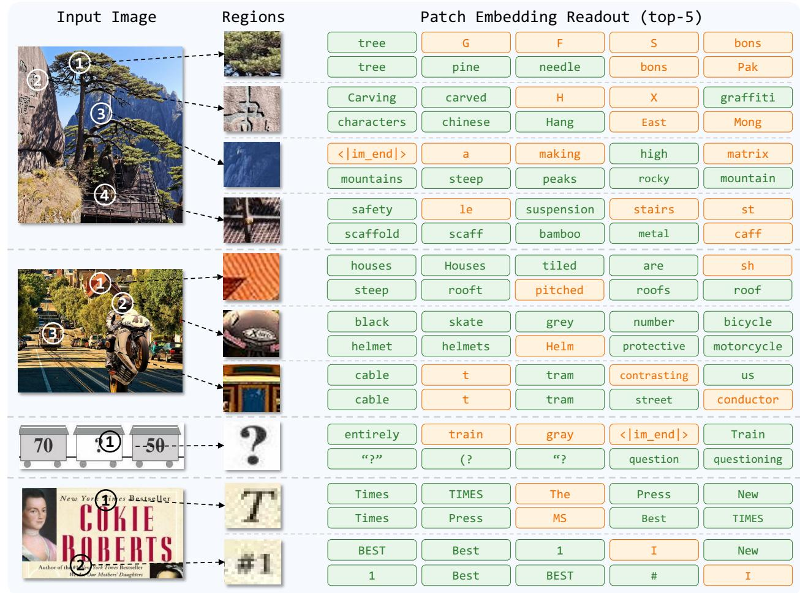  
Figure 9 Additional Patch Semantics Cases. Further examples of direct semantic readout from image patch embeddings for GenLIP-g16-S1 and GenLIP-g16-S2. The stage-2 model generally shows stronger alignment.

## C Additional Implementation Details

Frozen Visual Representation Evaluation. We summarize the training settings for frozen visual representation evaluation. Relative to the default LLaVA-NeXT [42] setup, we make three modifications: (i) we replace the original LLM LLaMA3-8B with Qwen2.5 models; (ii) we replace the original 780K SFT dataset with the 3M SFT dataset from LLaVA-OneVision; and (iii) we use the simplest image preprocessing pipeline, consisting only of resize and crop operations, without “anyres” processing designed for high-resolution images. All other training settings remain unchanged, including the optimization hyperparameters, batch size, iterations, and the 2-layer MLP projector.

Metric Aggregation. For the frozen visual representation results in Sec. 4.1, we report ALL AVG as the unweighted mean over all 14 benchmarks. Because MME-P is reported on a 0–2000 scale, we divide it by 2000 and map it into the range [0, 100] before averaging, so that it is numerically comparable with the other metrics. And the CIDEr scores on caption benchmarks are already in a normal range, so we keep them unchanged in ALL AVG calculation.

Pretraining Implementation. The main hyperparameters of GenLIP pretraining are summarized in Table 2. Stage 1 uses Dataset-S1 with fixed 224 × 224 inputs and trains for 8B samples to learn strong foundational visual representations. Stage 2 then adapts the model on Dataset-S2 with higher-resolution caption data and native aspect ratios, resizing each image so that the number of visual tokens stays within [16, 1024]. For efficiency, we pack variable-length samples into sequences with a maximum length of 16,384 tokens and implement exact per-sample Prefix-LM masking with PyTorch flex-attention. Because the second stage contains much longer sequences on average, its global batch size is reduced accordingly, while the remaining optimization settings follow Stage 1.

## D Discussion: Attention Sink and Gated Attention

In GenLIP, we observe the “attention sink” phenomenon, which has also been reported in prior transformer studies in both vision [16] and language [54, 75]. At a high level, attention sink arises from the sum-to-one normalization of softmax attention: for each query token, the model must distribute a fixed unit mass over all keys. In practice, this often encourages the network to allocate a disproportionate amount of attention to a small subset of tokens that behave like persistent “registers” and absorb information from many other positions.

The manifestation of attention sink depends on the attention pattern of the modality. In vision transformers with bidirectional self-attention, sink behavior often appears as a small number of tokens in low-semantic regions that attract attention from many other visual tokens [16] and exhibit unusually high norm. In contrast, in autoregressive language models the phenomenon is typically more structured: early tokens, especially the first token, tend to receive disproportionately large attention weights from subsequent positions regardless of content. As discussed in StreamingLLM [75], such sink tokens may preserve useful global context information and can even be exploited for efficient long-context inference. This difference is largely explained by the underlying attention mechanism: full attention in vision does not privilege a fixed position a priori, whereas causal attention in language naturally makes early tokens accessible to all later tokens and therefore encourages early ones to serve as shared context carriers.

The Prefix-LM attention used in GenLIP combines bidirectional attention over the visual prefix with causal attention over the text suffix, making its sink behavior closer to that of autoregressive language models. The input sequence follows the organization $\left[ v _ { 0 } , \ldots , v _ { M } , t _ { 0 } , \ldots , t _ { L } \right]$ , positioning visual tokens as the prefix for text generation. Because the loss is backpropagated only through text tokens, the model tends to compress information useful for generation into a few preceding visual tokens that are broadly accessible to the text tokens. Under this structure, the first visual token v0 becomes a particularly favorable sink candidate, since it can be attended by all subsequent text tokens and thus can act as a compact carrier of global visual context.

Empirically, we find that this behavior can partially degrade the discriminative quality of the visual representation, as reflected by the degraded linear-probing results of the “w/o GA” variant in Table 11. This observation motivates the introduction of gated attention in GenLIP, which alleviates overly concentrated sink behavior and improves the quality of the learned visual features. We also note that many encoder-decoder generative VLP architectures are less affected by this issue. Because the visual encoder and text decoder are separated, sink behavior is largely confined to the decoder side and therefore has much weaker direct impact on the quality of the visual encoder representations.

## E Discussion: GenLIP Meets Language Priors

We observe a counterintuitive result in Table 9: initializing the single-transformer vision encoder from a pretrained Qwen3-0.6B language model does not lead to stronger frozen visual representations in our setting.

Adding gated attention to the Qwen-initialized SAIL variant improves the overall average only modestly, from 53.6 to 54.8, whereas training the same SAIL-style architecture from scratch reaches 56.0, close to GenLIP-So/16 at 56.3. Since these variants use the same 1B-sample pretraining data and similar model scale, this result suggests that the gap is unlikely to be explained by model capacity or the single-transformer architecture itself.

A plausible explanation is that strong LLM initialization changes the optimization path of caption-based vision-language pretraining. With a pretrained language model, the model already has substantial next-token prediction ability on the language side. As a result, the captioning objective can be partially satisfied by adapting this strong language prior with relatively weak visual conditioning, rather than by establishing sufficiently dense vision-to-text information transfer. In other words, the training process may become closer to adapting a language model into a visually conditioned model, instead of learning a unified multimodal representation from scratch. This bias can be undesirable for our goal, because the final model is used as a standalone vision encoder whose quality depends on distributed and grounded visual representations.

This interpretation is consistent with the attention patterns in Figures 11 and 10. After modeling both vision and text modalities in early layers, the Qwen-initialized SAIL variants allocate much of the generated-text attention to language-side anchors, including the first two prompt token (sink tokens) and all prompt tokens, while assigning limited attention mass to the visual prefix. Gated attention reduces this concentration but does not fully remove the inherited language-side dependency under LLM initialization. In contrast, when the same SAIL architecture is trained from scratch, the model no longer has a strong language shortcut and relies more directly on visual evidence to predict captions. Consequently, the SAIL-g-Scratch variant shifts much more attention toward visual tokens, and its modeling pattern becomes close to that of GenLIP-So16.

The attention patterns in Figures 11 and 10 suggest that removing language initialization substantially increases the pressure to ground language prediction in the visual prefix. In this controlled vision-encoder pretraining setting, strong language initialization appears to introduce an initialization-induced attention allocation bias: it preserves strong language modeling ability, but can reduce the optimization pressure to learn distributed visual grounding from image-caption data. For pretraining a modular vision encoder within a single-transformer vision-language pretraining framework, training from scratch therefore better aligns the captioning objective with the goal of learning grounded visual representations.

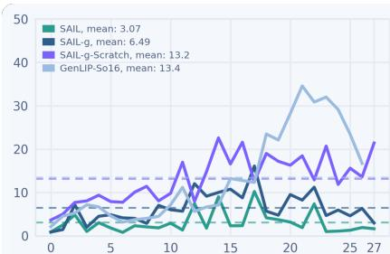

line chart

| x  | SAIL, mean | SAIL-g, mean | SAIL-g-Scratch, mean | GenLIP-So16, mean |
|----|------------|--------------|----------------------|-------------------|
| 0  | 3.07       | 6.49         | 13.2                 | 13.4              |
| 5  | 3.07       | 6.49         | 13.2                 | 13.4              |
| 10 | 3.07       | 6.49         | 13.2                 | 13.4              |
| 15 | 3.07       | 6.49         | 13.2                 | 13.4              |
| 20 | 3.07       | 6.49         | 13.2                 | 13.4              |
| 25 | 3.07       | 6.49         | 13.2                 | 13.4              |
| 27 | 3.07       | 6.49         | 13.2                 | 13.4              |

(a） Text-to-vision attention density

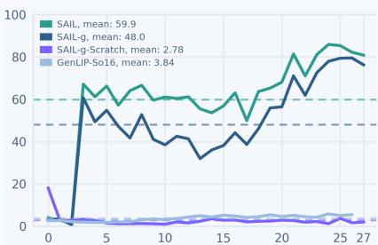

line chart

| x  | SAIL, mean | SAIL-g, mean | SAIL-g-Scratch, mean | GenLIP-So16, mean |
|----|------------|--------------|----------------------|-------------------|
| 0  | 59.9       | 48.0         | 2.78                 | 3.84              |

(b） Text-to-sink attention density

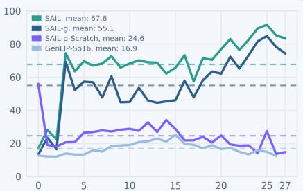

line chart

| Step | SAIL, mean | SAIL-g, mean | SAIL-g-Scratch, mean | GenLIP-So16, mean |
| ---- | ---------- | ------------ | ------------------- | ----------------- |
| 0    | 67.6       | 55.1         | 24.6                | 16.9              |

(c） Text-to-prompt attention density  
Figure 10 Layer-wise attention allocation across token groups. We analyze the attention allocation of generated text tokens over different target token groups with models in Table 9. We report the attention density from generated text tokens to (a) vision tokens, (b) sink tokens (the first two prompt tokens), and (c) prompt tokens. Dashed lines denote the layer-averaged attention densities. The X-axis corresponds to the layer index. Unlike the original SAIL implementation, our implementation does not insert the special tokens ‘<vision>’ and $\scriptstyle \cdot < / { \mathrm { v i s i o n } } > ^ { \prime }$ around the visual patch tokens.

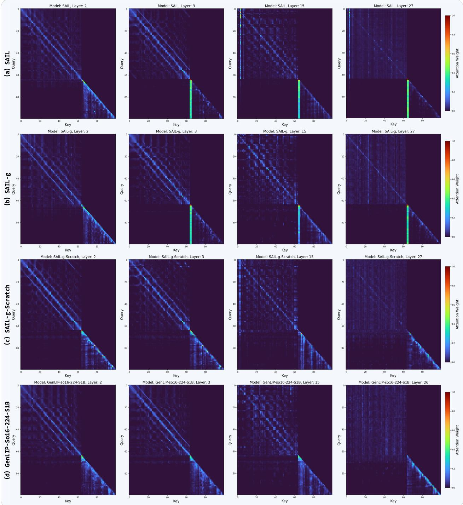  
Figure 11 Layer-wise attention maps of controlled SAIL-style model variants. We visualize the head-averaged attention maps of four model variants in Table 9: (a) SAIL with Qwen-0.6B initialization, (b) SAIL with gated attention, (c) SAIL with gated attention trained from scratch, and (d) a controlled GenLIP-So16 model. From left to right, we show the attention maps from the 2nd, 3rd, 15th, and final layers of each model. Each map is averaged over all attention heads in the corresponding layer, with rows denoting query tokens and columns denoting key tokens. The input image is resized to 128×128, yielding the first 64 visual tokens, followed by 6 prompt tokens and the first 30 generated text tokens. The two Qwen-initialized SAIL variants, (a) and (b), exhibit clear attention-sink behavior in the text tokens, where generated text tokens assign disproportionately high attention to the first two prompt tokens.