# SARA: Semantically Adaptive Relational Alignment for Video Diffusion Models

Jiesong Lian1,2†, Zixiang Zhou2, Ruizhe Zhong3, Yuan Zhou2‡, Qinglin Lu2, Rui Wang1§, Long Hu1, Yixue Hao1, Baoru Huang4

1Huazhong University of Science and Technology, 2Tencent Hunyuan, 3Shanghai Jiao Tong University, 4University of Liverpool

(1) Token-relation distillation  
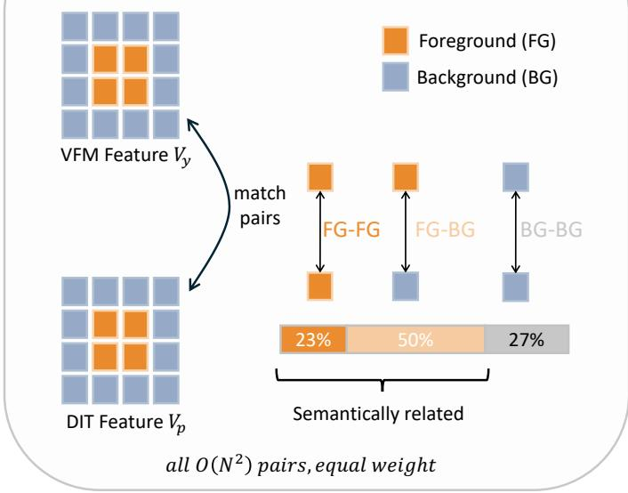

<details>
<summary>flowchart</summary>

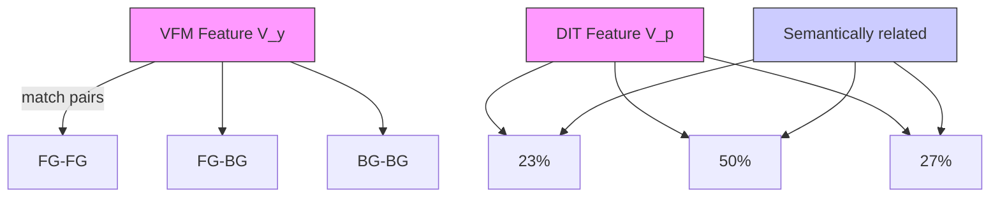
</details>

(2) Semantically Adaptive Relational Distillation  
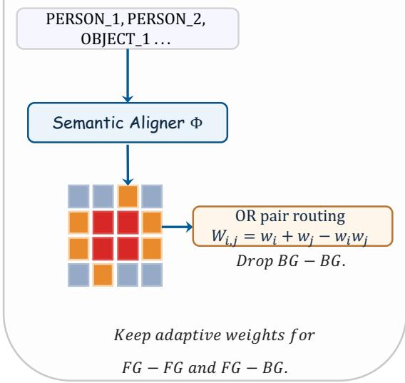

<details>
<summary>flowchart</summary>

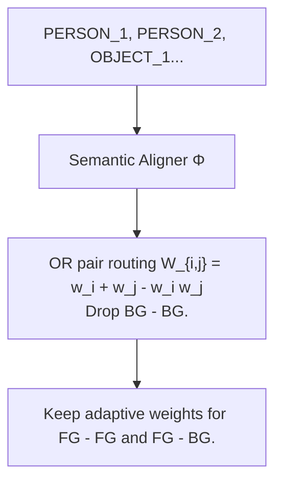
</details>

Figure 1 SARA makes representation alignment follow the prompt rather than raw pixels.

## Abstract

Recent video diffusion models (VDMs) synthesize visually convincing clips, yet still drop entities, mis-bind attributes, and weaken the interactions specified in the prompt. Representation-alignment objectives such as VideoREPA and MoAlign improve fine-grained text following by distilling spatio-temporal token relations from a frozen visual foundation model, but their pairwise supervision budget is allocated by visual or motion cues rather than by how relevant each pair is to the prompt. We present SARA, Semantically Adaptive Relational Alignment, which keeps token-relation distillation (TRD) on a frozen VFM target and adds a text-conditioned saliency that decides which token pairs carry supervision. A lightweight Stage 1 aligner is trained with per-entity SAM 3.1 mask supervision and an InfoNCE regulariser, and its continuous saliency is fused into TRD through a pair-routing operator that assigns each token pair a weight whenever either of its two endpoints is salient, thereby routing supervision toward subject-subject and subject-background pairs and away from background-background ones. In the Wan2.2 continual-training setting, SARA improves both text alignment and motion quality over SFT, VideoREPA, and MoAlign on a 13-dimension VLM rubric, on the public VBench benchmarks, and in a blind user study. Project page: https://saradit.github.io/.

## 1 Introduction

Video generation has advanced rapidly in both visual fidelity and temporal coherence. Closed-source systems such as Seedance2 (Seedance et al., 2026), Veo3.1 (Google, 2026), and Wan2.7 (Team, 2026d), together with open-source models such as LTX2.3 (HaCohen et al., 2026), Wan2.2 (Wan et al., 2025), and HunyuanVideo1.5 (Wu et al., 2025), can now synthesize videos with realistic appearance and smooth motion. Once visual and motion quality are in place, the remaining bottleneck is faithful prompt following: a generated video is useful to a downstream creator only if it preserves the entities, attributes, interactions, and motion the prompt asks for. Open-source models still fall short here. They miss fine-grained semantic details, bind attributes to the wrong subject, or weaken the interactions specified in the prompt. Fine-grained semantic controllability is therefore a practical requirement when adapting open-source video diffusion models (VDMs).

A natural way to close this gap is continual training on curated video-text data, but the diffusion loss alone is an indirect signal for semantics: it matches pixel-level noise and leaves the DiT to figure out, on its own, which patches correspond to which word in the caption. Representation alignment offers a more direct handle: a frozen visual or video foundation model (VFM) is used as an external reference, and the DiT’s hidden states are pulled toward that reference space during training. REPA (Yu et al., 2024) introduced this for image DiTs, and VideoREPA (Zhang et al., 2025a) adapted it to pretrained VDMs by replacing hard per-token alignment with token-relation distillation (TRD), a softer objective that matches pairwise spatial and cross-frame token similarities. Its weakness is one of allocation: VideoREPA weights every token pair equally, so its $O ( N ^ { 2 } )$ budget is set by the geometry of the V-JEPA token grid rather than by the caption. But the three kinds of token pairs carry very unequal amounts of semantic content. A background-background (BG-BG) pair relates two patches that no entity in the caption references, so it encodes little prompt-relevant semantics; a subject-background (FG-BG) pair grounds an entity in its surrounding scene, and a subject-subject (FG-FG) pair carries the inter-entity relations a multi-entity prompt is built around, so both are semantically strong. Equal weighting thus spends the budget in inverse proportion to relevance. On our multi-entity training corpus the SAM-derived foreground covers on average only a fraction $p _ { \mathrm { f g } } \approx 0$ .48 of the grid, so the budget splits as $( 1 - p _ { \mathrm { f g } } ) ^ { 2 } { \approx } 2 7 \%$ on the semantically weak BG-BG pairs, $2 p _ { \mathrm { f g } } ( 1 - p _ { \mathrm { f g } } ) { \approx } 5 0 \%$ on FG-BG pairs, and only $p _ { \mathrm { f g } } ^ { 2 } \approx 2 3 \%$ on the FG-FG pairs that most directly encode the prompt (App. A). Roughly a quarter of the TRD signal is therefore burnt on pairs the caption never mentions, while the strongest, prompt-defining relations receive the smallest share. MoAlign (Bhowmik et al., 2025) addresses this dilution by compressing the VFM target into a flow-supervised motion subspace, which collapses non-moving patches in the target and in effect concentrates supervision on moving-subject ↔ moving-subject pairs. Optical flow is an imperfect saliency proxy, however: it is noisy under occlusion, fast motion, and low-texture regions, it cannot disentangle object motion from camera-induced apparent motion, and it is silent on the static subjects a caption may centrally describe (a person sitting, a cup on a table). The same motion-only restriction also drops every subject-background pair, even though such pairs ground each entity in its scene and carry an independent share of the prompt’s semantic content.

The question that motivates SARA is therefore a routing one: given a fixed $O ( N ^ { 2 } )$ pair budget, how should it be allocated so that supervision concentrates on the prompt-relevant relations rather than on background filler? A caption typically refers to a small subset of the visual content, and the useful semantic signal lives in both subject-subject and subject-background relations (Shi et al., 2026), so the answer should route by the prompt rather than by raw pixels or motion. We propose SARA, Semantically Adaptive Relational Alignment, a two-stage framework that keeps VideoREPA’s VFM target and TRD form unchanged and adds a text-conditioned saliency that tells TRD where to apply its pairwise supervision. Stage 1 trains a lightweight text-conditioned saliency aligner offline from per-entity SAM 3.1 mask supervision (Carion et al., 2025), per-entity captions, and an InfoNCE regulariser. Together, the per-entity supervision and InfoNCE prevent the saliency from collapsing onto a fixed foreground prior. Stage 2 freezes the aligner, queries it with the full video caption, and fuses its continuous saliency into token-pair weights through a pair-routing operator (OR by default, so that a pair carries weight whenever either endpoint is salient). This routes TRD away from background-background pairs and toward subject-subject and subject-background relations during continual training of the VDM.

Our contributions are as follows.

• We recast semantic adaptation for VDMs as a pair-routing problem on top of TRD, formalised through a family of pair-routing operators that decide which token pairs carry supervision (Sec. 3.4). This view interprets MoAlign as inducing an AND router (a pair is supervised only when both endpoints are salient) through motion presence as an unsupervised saliency proxy, and motivates a text-supervised OR router (either endpoint salient suffices) that also routes supervision to subject-background pairs.

• We train a lightweight text-conditioned saliency aligner from per-entity SAM 3.1 masks, per-entity captions, and an InfoNCE regulariser, and fuse its continuous output into TRD.  
• Under matched Wan2.2 high-noise continual training, SARA consistently improves over supervised fine-tuning (SFT), VideoREPA, and a MoAlign reproduction on a 13-dimension vision-language-model (VLM) rubric, on VBench-1.0 and VBench-2.0, and in a blind user study.

## 2 Related Work

Video diffusion models. Text-to-video (T2V) generation has progressed from frame-wise extensions of image diffusion U-Nets (Blattmann et al., 2023) to large latent diffusion / flow-matching transformers trained on web-scale video-text corpora. Closed-source systems such as Sora (OpenAI, 2024), Seedance2 (Seedance et al., 2026), Veo3.1 (Google, 2026), Kling3 (Team, 2026a), and Wan2.7 (Team, 2026d) now produce minutes-long, high-fidelity videos with smooth motion, while open-source counterparts including CogVideoX (Yang et al., 2024), LTX2.3 (HaCohen et al., 2026), Wan2.2 (Wan et al., 2025), and HunyuanVideo1.5 (Wu et al., 2025) have closed much of the appearance-quality gap. These open-source models are the dominant base models for downstream continual training. Once architectures and training data scale up, the dominant failure mode shifts from visual fidelity to fine-grained text following. Standard benchmarks such as VBench (Huang et al., 2024) and the VideoPhy series (Bansal et al., 2025) confirm that even SOTA open-source VDMs still drop entities, mis-bind attributes, weaken prompt-specified interactions on multi-subject scenes, and produce physically implausible motion. SARA targets exactly this regime and uses the publicly released Wan2.2 high-noise transformer as the backbone for continual training.

Improving fine-grained semantic alignment in VDMs. Methods that push a pretrained VDM’s prompt fidelity beyond what the base diffusion loss provides split along the standard training stages, and SARA belongs to stage (ii) below. (i) Pre-training / data side. The pre-training corpus is re-curated and relabelled with VLM rewriters and structured caption formats, so the same diffusion loss carries more semantic signal per gradient step. The open-source VDMs above (Wan et al., 2025; Wu et al., 2025; HaCohen et al., 2026) document such data pipelines in their tech reports. (ii) SFT with auxiliary objectives. The diffusion loss is kept intact and a representation-alignment term is added that pulls DiT hidden states toward a frozen visual or video foundation encoder (REPA (Yu et al., 2024), VideoREPA (Zhang et al., 2025a), MoAlign (Bhowmik et al., 2025), RefAlign (Wang et al., 2026), expanded in the next paragraph). A parallel line instead injects auxiliary modalities such as optical flow, pose, or trajectories during continual training, at the cost of requiring those conditions at inference (e.g. Tora (Zhang et al., 2025b)). (iii) Post-training preference optimization. Following the RLHF recipe (Ouyang et al., 2022), the VDM is fine-tuned against a reward model via GRPO-style on-policy exploration that turns the flow-matching ODE (Lipman et al., 2022) into an SDE (Xue et al., 2025), DPO-style paired classification over preferred / rejected samples (Wallace et al., 2024; Liu et al., 2025), or ReFL-style differentiable-reward back-propagation (Xu et al., 2023). Post-training is largely orthogonal to SARA’s SFT-stage gains, and we leave such combinations to future work.

Representation alignment for diffusion models. The REPA family is the closest prior art to SARA and shares a single template: regularise a generative DiT by matching a chosen statistic of its hidden states to a frozen visual or video foundation encoder. REPA (Yu et al., 2024) matches each denoiser token to a DINOv2 patch via per-token cosine (refined by REPA-E (Leng et al., 2025), which jointly tunes the VAE). VideoREPA (Zhang et al., 2025a) replaces per-token cosine with TRD on a frozen VideoMAEv2 target (Eqs. (1)–(2)). MoAlign (Bhowmik et al., 2025) keeps TRD but compresses $V _ { y }$ into a flow-supervised motion subspace $\Phi _ { \mathrm { m o t } }$ and decays the cross-frame term by $\exp ( - | t - u | / \tau )$ , biasing supervision toward moving patches. RefAlign (Wang et al., 2026) adapts the template to the reference-to-video setting with a contrastive DINOv3 loss between reference-branch tokens and the target. These methods vary how the alignment is shaped (per-token vs. relational, appearance vs. motion, image- vs. text-conditioned), but none lets the text prompt

decide which pairs carry supervision.

SARA adds an orthogonal ingredient: the routing of the alignment loss itself. It reuses VideoREPA’s TRD form on a frozen VFM target and shifts the shaping signal to a text-supervised saliency trained with per-entity SAM 3.1 masks and an InfoNCE regulariser (Sec. 3.3). Within this view, VideoREPA is the constant-saliency limit, while MoAlign can be interpreted as an AND pair-routing operator that biases supervision toward moving subject-subject pairs. SARA’s default OR pair-routing operator additionally keeps subject-background pairs and consistently improves over both alternatives (Sec. 4).

## 3 Method

SARA decouples where relational alignment should be applied from how it is computed. We first recall the TRD formulation underlying SARA and define the entity vocabulary used throughout the paper (Sec. 3.1). We then identify the routing gap in vanilla TRD and introduce two design choices to address it (Sec. 3.2). Finally, we train a lightweight text-conditioned saliency aligner to realise these choices (Sec. 3.3) and freeze it to route TRD on the Wan2.2 high-noise VDM (Sec. 3.4). An overview of our pipeline is shown in Fig. 2.

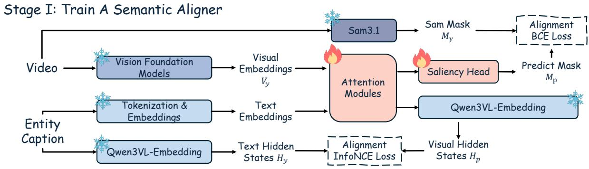

<details>
<summary>flowchart</summary>

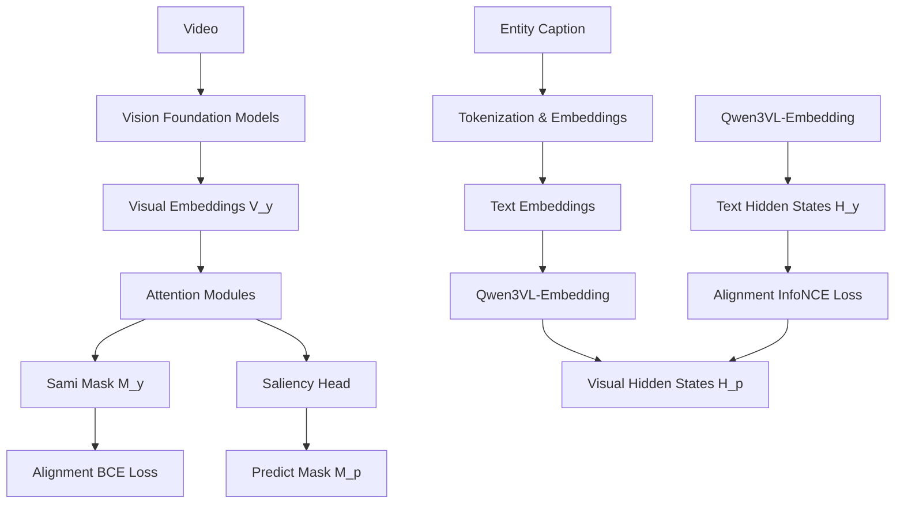
</details>

Stage II: Train Diffusion with the Semantic Aligner

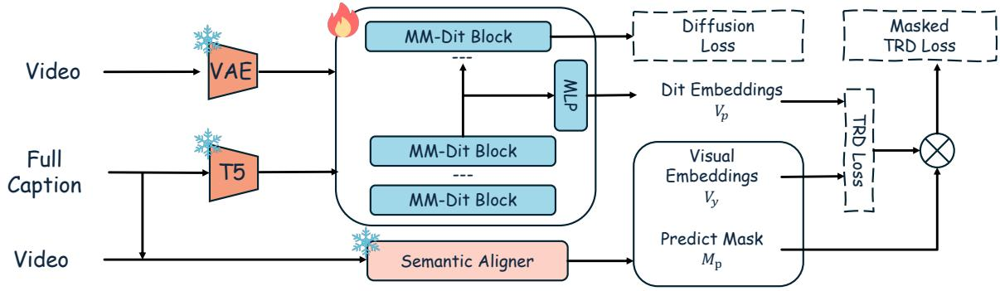

<details>
<summary>flowchart</summary>

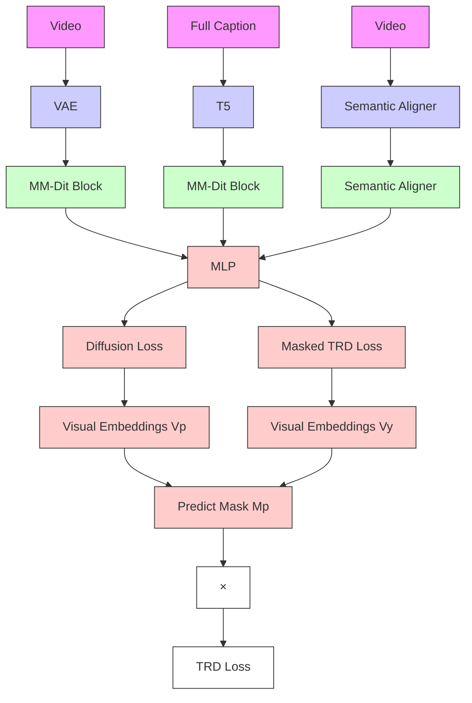
</details>

Figure 2 Overview of SARA. Stage I (top): a lightweight aligner on top of frozen V-JEPA, SAM 3.1, and Qwen3- VL-Embedding backbones learns, for any (video, caption) pair, a text-conditioned per-patch saliency $M _ { p } ,$ supervised jointly by per-entity, combined-entity, and background SAM masks (LBCE) and calibrated by a caption-level InfoNCE. Stage II (bottom): the frozen aligner is queried with the full caption, and its saliency is turned into pair weights that route a masked token-relation distillation loss, added to the diffusion loss of a trainable DiT.

## 3.1 Preliminaries

Latent video diffusion. A latent VDM (Yang et al., 2024; Wan et al., 2025) generates videos in the latent $x _ { 0 } \in \overset { \cdot } { \mathbb { R } } ^ { F \times H \times W \times C }$ $c ,$ latent $z _ { \mathrm { 0 } } .$ , and a denoising transformer $\epsilon _ { \theta }$ is trained under the standard flow-matching / diffusion objective $\mathcal { L } _ { \mathrm { d i f f } } ( \theta ) = \mathbb { E } _ { t , z _ { 0 } , \epsilon } \bigl [ \| \epsilon - \epsilon _ { \theta } ( z _ { t } , t , c ) \| _ { 2 } ^ { 2 } \bigr ]$ , with $z _ { t }$ a noisy version of $z _ { \mathrm { 0 } }$ at timestep t.

Token-relation distillation. REPA (Yu et al., 2024) aligns each denoiser token with a frozen visual encoder feature via per-token cosine similarity. As argued by VideoREPA (Zhang et al., 2025a), this hard alignment is unsuitable for fine-tuning pretrained VDMs and ignores temporal dynamics. VideoREPA instead matches pairwise token similarities between a projected DiT hidden state $\check { V _ { p } } \in \mathbb { R } ^ { B \times T \times N \times D }$ and the VFM features $\mathbf { \bar { \boldsymbol { V } } } _ { y } \in \mathbb { R } ^ { B \times T \times N \times D }$ (interpolated to a common T, N = hw grid, with $t , u \in [ T ]$ indexing frames and $i , j \in [ N ]$ indexing spatial token positions). With $\hat { V } _ { p } , \hat { V } _ { y }$ denoting L2-normalized features, the within-frame (spatial) and cross-frame (temporal) cosine similarities are

$$
S _ {t, i, j} ^ {X} = \hat {V} _ {X, t, i} \hat {V} _ {X, t, j} ^ {\top}, \quad C _ {t, i, u, j} ^ {X} = \hat {V} _ {X, t, i} \hat {V} _ {X, u, j} ^ {\top}, \quad X \in \{p, y \}, \tag {1}
$$

giving stacked spatial Gram matrices $S ^ { X } \in \mathbb { R } ^ { T \times N \times N }$ and a cross-frame Gram tensor $C ^ { X } \in \mathbb { R } ^ { T \times N \times T \times N }$ . The TRD loss sums the within-frame and cross-frame L1 differences (Zhang et al., 2025a):

$$
\mathcal {L} _ {\mathrm{TRD}} = \underbrace {\frac {1}{T N ^ {2}} \sum_ {t , i , j} \left| S _ {t , i , j} ^ {y} - S _ {t , i , j} ^ {p} \right|} _ {\text { Spatial   component }} + \underbrace {\frac {1}{T (T - 1) N ^ {2}} \sum_ {\substack {t \neq u \\ i , j}} \left| C _ {t , i , u , j} ^ {y} - C _ {t , i , u , j} ^ {p} \right|} _ {\text { Temporal   component }}. \tag{2}
$$

MoAlign (Bhowmik et al., 2025) extends TRD by attaching an exponential temporal-distance decay $\omega _ { t , u } =$ $\exp ( - | t - u | / \tau )$ to the cross-frame term and swapping $V _ { y }$ for a flow-supervised motion subspace.

MTSS entities. We caption every video in the Multi-Stream Scene Script (MTSS) format of Tencent Hunyuan Team (2026), which factorises a clip into per-entity descriptions linked by stable identifiers and is therefore a natural source of per-entity supervision (App. C gives the construction). From each MTSS caption SARA extracts (i) K entity captions $c _ { k }$ , each paired with a binary entity mask $M _ { k }$ obtained offline from a frozen segmentation backbone $E _ { s }$ (instantiated in Sec. 3.3, pipeline in App. C.2), (ii) the foreground concatenation $c _ { \mathrm { f g } } = [ c _ { 1 } ; \ldots ; c _ { K } ]$ with union mask $\textstyle M _ { \mathrm { f g } } = \bigcup _ { k } M _ { k }$ , (iii) a background caption $c _ { \mathrm { b g } }$ with complement mask $M _ { \mathrm { b g } } = { \bf 1 } - M _ { \mathrm { f g } } $ , and (iv) the full caption c that serialises all streams. Stage 1 trains the aligner on (i)–(iii) only. The full caption c is used solely at Stage 2 inference, where both the VDM and the frozen aligner are conditioned on it.

## 3.2 Motivation and design

VideoREPA’s TRD in Eq. (2) weights every token pair equally, so its $O ( N ^ { 2 } )$ budget is dominated by background-background pairs and the supervision on the few prompt-relevant pairs is diluted (Fig. 8). MoAlign re-allocates by projecting the VFM target into a flow-supervised motion subspace, which suppresses non-moving patches and biases supervision toward moving-subject pairs, an AND routing effect under a motion-presence proxy. Optical flow is itself a noisy estimator that mis-handles occlusion, fast motion, low-texture regions, and camera-induced apparent motion. Even when accurate, it is silent on the static subjects a caption may centrally describe, and the same restriction under-emphasises subject-background pairs, a major source of fine-grained semantic grounding. SARA replaces this implicit, motion-only bias with an explicit, text-supervised saliency, while keeping V-JEPA as the TRD target.

The mechanism is a text-conditioned saliency, predicted from V-JEPA tokens fused with the caption through cross-attention and shaped by two complementary auxiliary losses. A local, mask-anchored BCE focuses the head on caption-mentioned patches by grounding the fused features in the per-patch entity masks $M _ { k }$ from $E _ { s }$ , following LaST-ViT (Shi et al., 2026) in placing the useful semantic signal in foreground-background relations. A global, embedding-space InfoNCE prevents collapse onto a dominant subject and preserves cross-entity contrast by aligning the fused features back to the caption hidden state, following VL-JEPA (Chen et al., 2025). Without either ingredient, the predicted saliency degenerates: ablating the InfoNCE regulariser concentrates $M _ { p }$ on the dominant subject, and replacing the entity-separated K + 2 supervision by a single union-mask forward saturates $M _ { p }$ across the entire foreground (Fig. 10, App. B.2). Tab. 4 quantifies both collapses.

## 3.3 Stage 1: Text-conditioned saliency aligner

Frozen backbones. Stage 1 uses three frozen backbones: a video encoder $E _ { v } ~ \mathrm { ( V \mathrm { - } J E P A ~ 2 . 1 }$ (Mur-Labadia et al., 2026)) producing visual embeddings $V _ { y } = { E _ { v } } ( x _ { 0 } ) \in \mathbb R ^ { B \times N _ { v } \times D _ { \imath } }$ , a segmentation agent $E _ { s }$ (SAM 3.1

Multiplex (Carion et al., 2025)) that returns one binary mask $M _ { k }$ per detected entity from a noun prompt, and a text model $E _ { t }$ (Qwen3-VL-Embedding (Li et al., 2026)), used in two disjoint modes. Its input-embedding lookup $E _ { \mathrm { e m b } }$ produces per-token embeddings $\tilde { E } = E _ { \mathrm { e m b } } ( c )$ consumed by cross-attention, and its full transformer stack $E _ { \mathrm { l m } }$ produces contextualised hidden states consumed by InfoNCE. All three remain frozen throughout Stage 1 and Stage 2. Model variants and shapes are in App. G.

Aligner architecture. Three trainable modules sit on top of the frozen backbones. A stack $\Phi _ { \mathrm { C A } }$ of cross- and self-attention blocks fuses $V _ { y }$ with the caption. Cross-attention takes visual queries and text keys/values $\tilde { E }$ , and outputs text-enhanced features

$$
V _ {y} ^ {\prime} = \Phi_ {\mathrm{CA}} (V _ {y}, \tilde {E}) \in \mathbb {R} ^ {B \times N _ {v} \times D _ {v}}. \tag {3}
$$

A saliency head $\Phi _ { \mathrm { s a l } } \ \mathrm { ( M L P + s i g m o i d ) }$ produces a per-patch saliency mask

$$
M _ {p} = \sigma \left(\Phi_ {\text { sal }} (V _ {y} ^ {\prime})\right) \in [ 0, 1 ] ^ {B \times N _ {v}}, \tag {4}
$$

and a visual projector $\Phi _ { \mathrm { p r o j } }$ maps $V _ { y } ^ { \prime }$ into the input-embedding space of $E _ { \mathrm { l m } }$ so that $E _ { \mathrm { l m } }$ can consume it in inputs-embeds mode for the InfoNCE objective below. Block counts, MLP hidden sizes, and normalisation choices are in App. G.

Mask-anchored BCE with entity-separated supervision. We bilinearly downsample any target binary mask M to the V-JEPA spatial grid $H _ { s } \times W _ { s }$ and broadcast across the $T _ { s }$ temporal positions to obtain a per-patch target $M _ { y } \in \{ 0 , 1 \} ^ { N _ { v } }$ aligned with $V _ { y }$ . The mask loss is per-patch binary cross-entropy (BCE) between the saliency prediction and this target,

$$
\mathcal {L} _ {\mathrm{BCE}} = \operatorname{BCE} \left(M _ {p}, M _ {y}\right). \tag {5}
$$

The choice of M matters: conditioning the aligner on a single global caption with the union mask collapses $\Phi _ { \mathrm { s a l } }$ onto a fixed foreground prior, since both query and target then stay constant across all Reference items of a video. SARA instead instantiates M and the conditioning caption at three granularities, sharing parameters across $K + 2$ forwards per video: (i) K per-entity forwards using $( c _ { k } , M _ { k } ) ; ( \mathrm { i i } )$ one combined-entity forward using $( c _ { \mathrm { f g } } , M _ { \mathrm { f g } } )$ with $c _ { \mathrm { f g } } = [ c _ { 1 } ; \dots ; c _ { K } ]$ and $\textstyle M _ { \mathrm { f g } } = \bigcup _ { k } M _ { k } ;$ and (iii) one background forward using the SCENE-stream caption $c _ { \mathrm { b g } }$ and complement mask $M _ { \mathrm { b g } } = \mathbf { 1 } - M _ { \mathrm { f g } }$ . The per-entity forwards prevent the foreground-prior collapse, while the combined-entity and background forwards anchor the saliency at the foreground-background level (Fig. 9, App. B.1). Sweeping these four supervision-time queries on a held-out clip (Fig. 3) confirms the intended behaviour: the trained aligner places $M _ { p }$ on different V-JEPA tokens for the two persons of the same scene under $c _ { 1 } \ \mathrm { V S } . \ c _ { 2 }$ , covers both as a soft union under ${ \mathit { c } } _ { \mathrm { f g } } ,$ and cleanly inverts under the background query $c _ { \mathrm { b g } } ;$ its PCA row further shows $\Phi _ { \mathrm { C A } }$ already organises features into entity-specific subspaces that the saliency head reads off rather than re-discovers. The full MTSS caption that aggregates Shot, Event, and Global streams is never seen at this stage; Sec. 3.4 (Fig. 4) shows the aligner generalises compositionally to it at Stage 2 inference.

Embedding-space InfoNCE loss. Unlike the cross-attention side, which only consumes ${ \tilde { E } } _ { : }$ , this InfoNCE loss operates on the hidden states of the full language model $E _ { \mathrm { l m } }$ . The projected features $\Phi _ { \mathrm { p r o j } } ( V _ { y } ^ { \prime } )$ live in $E _ { \mathrm { l m } } \mathrm { { ^ { s } } }$ input-embedding space, so we push them through $E _ { \mathrm { l m } }$ in inputs-embeds mode and last-token-pool its output to give an L2-normalised visual hidden state $H _ { p }$ . The caption used in this forward (per-entity $c _ { k } .$ , combined ${ \mathit { c } } _ { \mathrm { f g } } ,$ or background $c _ { \mathrm { b g } } )$ is tokenized and runs through the same frozen $E _ { \mathrm { l m } } ,$ , and last-token-pooled to give the text hidden state $H _ { y }$ . With temperature $\tau _ { \mathrm { n c e } }$ and batch size $B ,$ ,

$$
\mathcal {L} _ {\text { InfoNCE }} = - \frac {1}{B} \sum_ {i = 1} ^ {B} \log \frac {\exp (H _ {p , i} ^ {\top} H _ {y , i} / \tau_ {\mathrm{nce}})}{\sum_ {j = 1} ^ {B} \exp (H _ {p , i} ^ {\top} H _ {y , j} / \tau_ {\mathrm{nce}})}. \tag {6}
$$

Both indices run over the B (video, caption) forwards in the mini-batch: i selects the anchor forward, whose visual hidden state $H _ { p , i }$ is contrasted against the caption hidden states $H _ { y , j }$ of every forward $j$ in the same batch. The single positive is the diagonal term $j = i$ (the caption that actually conditioned forward $i )$ , and the $B - 1$ off-diagonal terms $j \neq i$ act as in-batch negatives. Because a video contributes one forward per caption granularity $( c _ { k } , c _ { \mathrm { f g } } , c _ { \mathrm { b g } } )$ , these negatives include the other entities and the background of the same clip, so minimising Eq. (6) drives each visual state toward its own caption while keeping different entities of one scene mutually contrastive, preventing the saliency from collapsing onto a single dominant subject.

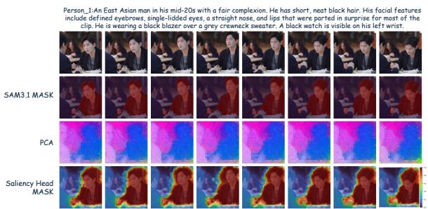

<details>
<summary>text_image</summary>

Person_1:An East Asian man in his mid-20s with a fair complexion. He has short, neat black hair. His facial features include defined eyebrows, single-lidded eyes, a straight nose, and lips that were parted in surprise for most of the clip. He is wearing a black blazer over a grey creneck sweater. A black watch is visible on his left wrist.
SAM3.1 MASK
PCA
Saliency Head MASK
</details>

(a) Query c1: PERSON\_1.

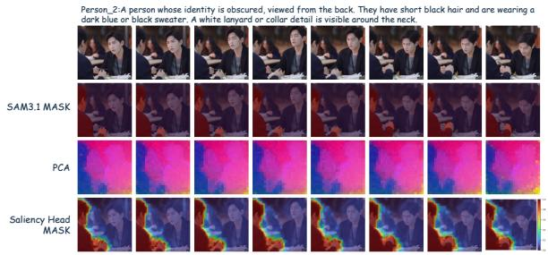

<details>
<summary>text_image</summary>

Person 2:A person whose identity is obscured, viewed from the back. They have short black hair and are wearing a dark blue or black sweater. A white lanyard or collar detail is visible around the neck.
SAM3.1 MASK
PCA
Saliency Head MASK
</details>

(b) Query c2: PERSON\_2.

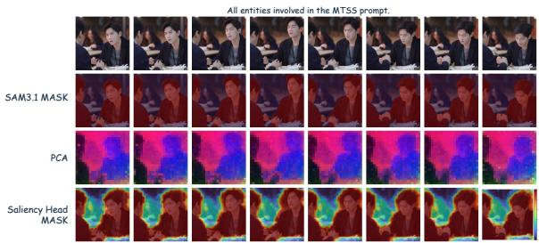

<details>
<summary>text_image</summary>

All entities involved in the MTSS prompt.
SAM3.1 MASK
PCA
Saliency Head
MASK
</details>

(c) Query cfg = [c1; c2; . . . ]: combined-entity.

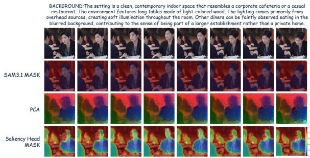

<details>
<summary>text_image</summary>

BACKGROUND: The setting is a clean, contemporary indoor space that resembles a corporate cafeteria or a casual restaurant. The environment features long tables made of light-colored wood. The lighting comes primarily from overhead sources, creating soft illumination throughout the room. Other diners can be faintly observed eating in the blurred background, contributing to the sense of being part of a larger establishment rather than a private home.
SAM3.1 MASK
PCA
Saliency Head MASK
</details>

(d) Query $c _ { \mathrm { b g } } \colon$ background (cafeteria setting).  
Figure 3 Stage 1 saliency on the four supervision-time query types, eight frames of one held-out clip. Rows in each panel: input frames, SAM 3.1 reference mask $M _ { y } ,$ , PCA of $V _ { y } ^ { \prime } ,$ predicted saliency $M _ { p } \ ( { \mathrm { E q . } }$ (4); jet colormap, redder = higher). Under the two per-entity queries the head selects different tokens for the two co-located persons (panels a–b), softly unions them under the combined-entity query (c), and inverts onto the scene under the background query (d), so the routing is genuinely text-conditioned rather than a fixed foreground prior.

Stage 1 objective. The aligner is trained with

$$
\mathcal {L} _ {\text { stage1 }} = \lambda_ {\mathrm{BCE}}   \mathcal {L} _ {\mathrm{BCE}} + \lambda_ {\text { InfoNCE }}   \mathcal {L} _ {\text { InfoNCE }}, \quad \lambda_ {\mathrm{BCE}} = \lambda_ {\text { InfoNCE }} = 1. \tag {7}
$$

Only $\Phi _ { \mathrm { C A } } , \Phi _ { \mathrm { s a l } }$ , and $\Phi _ { \mathrm { p r o j } }$ receive gradients, while $E _ { v } , E _ { s } , E _ { \mathrm { e m b } }$ , and $E _ { \mathrm { l m } }$ remain frozen. Fig. 10 (App. B.2) and the matched quantitative metrics in Tab. 4 show that each ingredient of Eq. (7) is necessary at the Stage 1 level, and Sec. 4.5 confirms this on the downstream VLM rubric.

## 3.4 Stage 2: Saliency-routed TRD

Inference-time saliency. The frozen aligner in Stage 1 is fed the same full video caption c as the VDM and emits a continuous saliency $M _ { p } ( x _ { 0 } , c ) \in [ 0 , 1 ] ^ { B \times T _ { s } ^ { - } \times H _ { s } W _ { s } }$ on the V-JEPA grid. Although trained only on Reference-stream captions, the aligner generalises compositionally to the full MTSS string and attends to all named entities jointly (Fig. 4): the response under c is super-additive over the per-entity responses of Fig. 3, closely tracks the SAM-derived foreground union, and adaptively grades the background, with intermediate values on tokens spatially or semantically close to a named subject. This grading, rather than a hard binary mask, is what the OR weight $W ^ { \vee }$ below needs to keep every subject-background pair while ranking it by background relevance. Since the TRD target reuses the same $E _ { v } , M _ { p }$ indexes exactly the patches TRD aligns, and the pair-routing operator below turns this continuous grading into per-pair routing strength.

Pair-weight construction. We define a pair-routing operator as any function that maps the per-token saliency $w = M _ { p } \mathbf { \bar { \Pi } } \in [ 0 , 1 ] ^ { B \times T _ { s } \times N }$ to a per-pair weight $W _ { i j } \in [ 0 , 1 ]$ that decides how much TRD supervision the pair (i, j) receives. We instantiate three pair-routing operators as fuzzy-logic relaxations of the corresponding

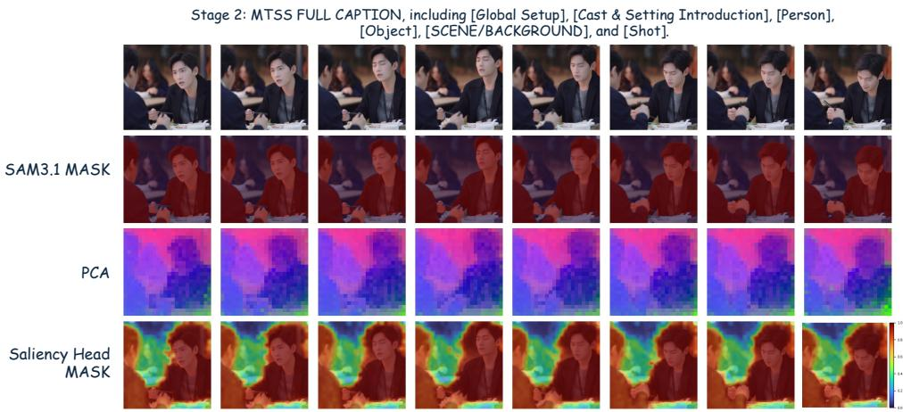

<details>
<summary>text_image</summary>

Stage 2: MTSS FULL CAPTION, including [Global Setup], [Cast & Setting Introduction], [Person], [Object], [SCENE/BACKGROUND], and [Shot].
SAM3.1 MASK
PCA
Saliency Head MASK
</details>

Figure 4 Stage 2 saliency on the full MTSS caption. Same aligner and clip as Fig. 3, queried with the full MTSS string c that the VDM also consumes at TRD time. Rows: input frames, SAM 3.1 union mask $M _ { \mathrm { f g } }$ (reference only, not used at Stage 2), PCA of $V _ { y } ^ { \prime } ,$ predicted saliency $M _ { p }$ (jet colormap, redder = higher). Although never trained on the concatenated MTSS string, the aligner covers both named subjects in one response that tracks $M _ { \mathrm { f g } } .$ , and it stays graded: highest on the subjects, intermediate on nearby background (the table, the wall behind), lowest on far-field background, exactly what the OR weight $W ^ { \vee }$ of $\operatorname { E q } .$ (8) needs to grade rather than gate each subject-background pair.

Boolean operations on the binary saliency:

$$
\underbrace {W _ {i j} ^ {\wedge} = w _ {i} w _ {j}} _ {\text { AND }}, \quad \underbrace {W _ {i j} ^ {\vee} = w _ {i} + w _ {j} - w _ {i} w _ {j}} _ {\text { OR }}, \quad \underbrace {W _ {i j} ^ {\oplus} = | w _ {i} - w _ {j} |} _ {\text { XOR }}. \tag {8}
$$

Let FG and BG denote foreground and background tokens, respectively. In the discrete limit where $w \in \{ 0 , 1 \}$ , the relation space is cleanly separated: $W ^ { \wedge }$ only retains FG-FG pairs, $W ^ { \vee }$ additionally includes FG-FG and FG-BG pairs, and $W ^ { \oplus }$ only keeps FG-BG boundary pairs. Keeping w continuous preserves the InfoNCE calibration of Eq. (6) and yields differentiable gradients via the saliency-weighted denominators in Eqs. (9)– (10). The constant-saliency limit $w \equiv 1$ gives vanilla VideoREPA, while MoAlign’s flow-supervised motion subspace can be viewed as a separate mechanism that induces an AND bias toward moving FG-FG relations. SARA’s default $W ^ { \vee }$ instead uses text-supervised saliency to cover the FG-BG pairs that AND drops.

Masked TRD loss. Let $S ^ { X } , C ^ { X }$ be the similarities of $\mathrm { E q . \ ( 1 ) }$ with $V _ { p }$ the projected DiT embeddings and $V _ { y } = E _ { v } ( x _ { 0 } )$ the Stage 1 VFM embeddings. With temporal decay $\omega _ { t , u } = \exp ( - | t - u | / \tau )$ , the masked TRD loss replaces the uniform averages of Eq. (2) by saliency-weighted ones:

$$
\mathcal {L} _ {\mathrm{m-TRD}} ^ {\mathrm{spa}} = \frac {\sum_ {t , i , j} W _ {t , i , j} ^ {\vee} \left| S _ {t , i , j} ^ {y} - S _ {t , i , j} ^ {p} \right|}{\sum_ {t , i , j} W _ {t , i , j} ^ {\vee} + \varepsilon}, \tag {9}
$$

$$
\mathcal {L} _ {\mathrm{m-TRD}} ^ {\mathrm{tmp}} = \frac {\sum_ {t \neq u , i , j} \omega_ {t , u} W _ {t , i , u , j} ^ {\vee} \left| C _ {t , i , u , j} ^ {y} - C _ {t , i , u , j} ^ {p} \right|}{\sum_ {t \neq u , i , j} \omega_ {t , u} W _ {t , i , u , j} ^ {\vee} + \varepsilon}, \tag {10}
$$

$$
\mathcal {L} _ {\mathrm{m-TRD}} = \mathcal {L} _ {\mathrm{m-TRD}} ^ {\mathrm{spa}} + \lambda_ {\mathrm{tmp}} \mathcal {L} _ {\mathrm{m-TRD}} ^ {\mathrm{tmp}}, \tag {11}
$$

where the OR pair weight is the fuzzy-OR of the two endpoint saliencies of each token pair,

$$
W _ {t, i, u, j} ^ {\vee} = w _ {t, i} + w _ {u, j} - w _ {t, i} w _ {u, j}, \quad W _ {t, i, j} ^ {\vee} \equiv W _ {t, i, t, j} ^ {\vee} = w _ {t, i} + w _ {t, j} - w _ {t, i} w _ {t, j}, \tag {12}
$$

the second form is the within-frame special case $u = t$ used in Eq. (9). Setting $w \equiv 1$ recovers VideoREPA’s TRD up to normalisation, and adding a finite τ isolates the temporal-decay component used by MoAlign without matching its motion-subspace target. We default to $\tau = \infty ,$ and confirm in Sec. 4.5 that finite τ is not the source of SARA’s gains.

Stage 2 objective. Wan2.2 is continually trained with

$$
\mathcal {L} _ {\text { stage2 }} = \mathcal {L} _ {\text { diff }} + \lambda_ {\text { TRD }} \mathcal {L} _ {\text { m - TRD }}. \tag {13}
$$

Only the VDM and the small TRD projector receive gradients, while $E _ { v } , E _ { s } , E _ { \mathrm { e m b } } , E _ { \mathrm { l m } } ,$ and the entire Stage 1 aligner $( \Phi _ { \mathrm { C A } } , \Phi _ { \mathrm { s a l } } , \Phi _ { \mathrm { p r o j } } )$ remain frozen, so SARA adds no trainable parameters to the diffusion path beyond the standard REPA projector.

## 4 Experiments

## 4.1 Setup

Dataset. We start from an internal pool of ∼ 4M multi-subject video clips. Every clip is first recaptioned into MTSS form by the pipeline of App. C and then ranked by its entity count, defined as the number of Reference items whose type is PERSON\_\* or OBJECT\_\* (SCENE\_\* items are excluded from the count). The 500K clips with the highest entity count form the training corpus used throughout the paper, and a fixed 800-clip test set is held out from the top of the same ranking (mean entity count ∼ 5.2 PERSON/OBJECT per clip, versus ∼ 1.8 on a uniformly sampled subset). Training and evaluation are therefore concentrated in the multi-entity regime that SARA’s saliency routing targets. The same corpus supplies both Stage 1 saliency-aligner training and Stage 2 VDM continual training, so all methods see identical data. Ground-truth entity masks for Stage 1 are produced offline by the frozen SAM 3.1 Multiplex using the per-Reference semantic\_descriptions simplified as in $\mathrm { A p p }$ . C.2.

Backbone and training. All baselines and SARA are continually trained on the same Wan2.2 high-noise VDM under an identical schedule, including the optimiser, batch size, GPU count, and number of steps. Only the auxiliary objective changes. Detailed hyperparameters are listed in Tables 10 and 11 (App. G).

Baselines. We compare four approaches: (i) the pretrained Wan2.2 high-noise model without continual training; (ii) SFT with only the diffusion loss; (iii) VideoREPA (Zhang et al., 2025a), TRD on V-JEPA 2.1 features without saliency routing; and (iv) a MoAlign (Bhowmik et al., 2025) reproduction with motion subspace $D _ { m } = 6 4$ and temporal decay $\tau = 1 0$ . To isolate the routing mechanism from the VFM target, in our reproduced VideoREPA we replace the original VideoMAEv2 backbone with V-JEPA 2.1. As a result, all three REPA-family variants (VideoREPA, MoAlign, SARA) share a frozen V-JEPA 2.1 target (MoAlign additionally projects $V _ { y }$ through its motion subspace). The original source videos are reported as an oracle upper bound. All methods use fixed-resolution training.

VLM-rubric protocol. The 800-clip test set is scored by three independent VLM judges (Qwen3.5-27B (Team, 2026b), Qwen3.6-35B-A3B (Team, 2026c), Gemma-4-31B-it (Hugging Face and Google DeepMind, 2026)) on 13 rubric dimensions (six text-alignment TA, seven motion-quality MQ, 1–5 each). Using three judges rather than one reduces per-grader bias. We aggregate across judges in two ways: the per-dimension average (mean) and the per-dimension majority vote (vote, ties broken upward), and the TA / MQ columns average the respective sub-dimensions. We cross-check the rubric against two independent protocols, public VBench-1.0 / 2.0 (Sec. 4.3) and a blind pairwise user study (Sec. 4.4), and the rankings agree across all three. Full rubric text, judge configuration, and per-sub-dimension scores are in App. D.

## 4.2 Main comparison

Table 1 reports the VLM-rubric scores. SFT improves text alignment but slightly degrades motion, while VideoREPA and MoAlign recover part of the motion gap but still trail SARA on both dimensions. Among the four continually-trained methods, SARA is the only one that improves both dimensions at once under mean and vote, and it beats the strongest matched-setting baseline (MoAlign) on every column. The real video row is a protocol-level ceiling, not a 5.0 saturation point, and caption-rewriter and judge-VLM noise affect every row equally (App. D). Relative to that ceiling, SARA closes more of the gap to the strongest baseline than any other row.

## 4.3 VBench Results

We further evaluate these approaches on VBench-1.0 (Huang et al., 2024) and VBench-2.0 (Zheng et al., 2025) suites with their standard prompts and official scorers. Table 2 reports the VBench-1.0 Semantic aggregate, the VBench-2.0 dimension scores, and the VBench-2.0 Final score, with per-task breakdowns in App. E.1 and App. E.2.

Table 1 VLM-rubric main comparison on Wan2.2 high-noise. TA / MQ are averages over six text-alignment / seven motion-quality sub-dimensions (1–5 each). mean averages the three judges, vote is the per-dimension majority (ties broken upward). Real video is an oracle upper bound. Best non-oracle results are shown in bold, and the sub-dimension breakdown is provided in App. D.

<table><tr><td>Method</td><td>TA mean</td><td>TA vote</td><td>MQ mean</td><td>MQ vote</td></tr><tr><td>Real video (oracle)</td><td>4.5857</td><td>4.6477</td><td>4.4314</td><td>4.5805</td></tr><tr><td>Pretrained Wan2.2</td><td>3.9189</td><td>3.9263</td><td>3.8181</td><td>3.8772</td></tr><tr><td>SFT</td><td>4.1209</td><td>4.1393</td><td>3.7840</td><td>3.8509</td></tr><tr><td>VideoREPA (Zhang et al., 2025a)</td><td>4.1252</td><td>4.1540</td><td>3.8024</td><td>3.8650</td></tr><tr><td>MoAlign (Bhowmik et al., 2025)</td><td>4.1272</td><td>4.1537</td><td>3.8015</td><td>3.8711</td></tr><tr><td>SARA (ours)</td><td>4.1543</td><td>4.1668</td><td>3.8516</td><td>3.9191</td></tr></table>

Both VBench protocols agree with the VLM rubric: SARA has the best aggregate score on each, leading VBench-1.0 Semantic by +0.90 over VideoREPA and VBench-2.0 Final by +0.38 over MoAlign. Perdimension scores are more diffuse, as expected for sub-tasks that span very different aspects of generation. The small Human Fidelity drop shared by all continually-trained methods is structural to the matched protocol: each approach updates only the Wan2.2 high-noise expert while leaving the low-noise expert frozen. Since anatomical detail is rendered at the low-noise stage of Wan2.2’s two-expert mixture-of-experts (MoE), any high-noise update shifts the intermediate-latent distribution the un-updated low-noise expert was trained against (App. H). SARA still posts the smallest such drop, consistent with its text-conditioned routing delivering a more targeted high-noise update. Across all three protocols, SARA is the only method that wins every aggregate score.

Table 2 Public VBench-1.0 / 2.0 results (%, higher is better). Best per column in bold.

<table><tr><td rowspan="2">Method</td><td>VBench-1.0</td><td colspan="6">VBench-2.0</td></tr><tr><td>Semantic</td><td>Creativity</td><td>Commonsense</td><td>Controllability</td><td>Human Fidelity</td><td>Physics</td><td>Final</td></tr><tr><td>Pretrained Wan2.2</td><td>72.74</td><td>52.56</td><td>58.50</td><td>30.98</td><td>86.04</td><td>46.89</td><td>55.00</td></tr><tr><td>SFT</td><td>72.17</td><td>54.60</td><td>59.68</td><td>29.59</td><td>80.41</td><td>51.09</td><td>55.08</td></tr><tr><td>VideoREPA (Zhang et al., 2025a)</td><td>72.99</td><td>54.08</td><td>61.11</td><td>31.54</td><td>82.78</td><td>46.67</td><td>55.24</td></tr><tr><td>MoAlign (Bhowmik et al., 2025)</td><td>72.95</td><td>56.75</td><td>59.67</td><td>30.08</td><td>84.75</td><td>47.82</td><td>55.81</td></tr><tr><td>SARA (ours)</td><td>73.89</td><td>55.38</td><td>61.11</td><td>30.91</td><td>85.07</td><td>48.50</td><td>56.19</td></tr></table>

## 4.4 User study

We also run a blind pairwise user study on a 200-clip subset of the multi-entity test set, comparing SARA against the four baselines. For each pairing, annotators view side-by-side renderings of the same caption and pick a winner (or declare a tie). Fig. 5 shows SARA is preferred over all baselines, with the largest margin against the pretrained model and consistent gains over VideoREPA and MoAlign. The ordering aligns with the rubric-based and VBench results.

## 4.5 Ablations

Table 3 ablates two components: the pair-routing operator of Eq. (8) (AND, OR, XOR) and the Stage 1 recipe (InfoNCE, entity-separated supervision, saliency head, temporal mask), plus MoAlign-style cross-frame decay (τ = 10) on top of SARA. Every variant keeps the main-run Stage 2 schedule and V-JEPA target, and only the indicated component is toggled. The pair-routing block reuses the SARA saliency aligner for all three operators.

Saliency construction. The saliency head is the largest single contributor: removing it and falling back to an NCE-only variant produces the largest drop on both TA and MQ. Ablating InfoNCE hurts both, with a larger drop on motion, consistent with the Stage 1 ablation (Fig. 10, Tab. 4) where w/o NCE pushes mass onto the dominant subject, suppressing subject-background relations. Replacing the K + 2 entity-separated forwards with a single union-mask forward collapses $M _ { p }$ into one foreground blob and hurts both dimensions too.

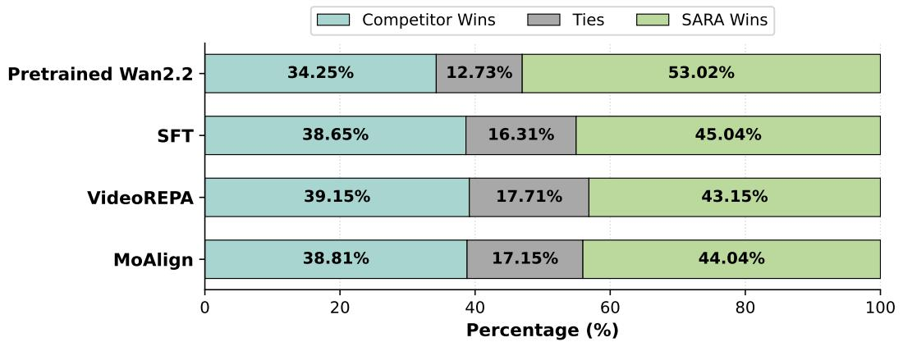

<details>
<summary>stacked bar chart</summary>

| Model | Competitor Wins (%) | Ties (%) | SARA Wins (%) |
| :--- | :--- | :--- | :--- |
| Pretrained Wan2.2 | 34.25 | 12.73 | 53.02 |
| SFT | 38.65 | 16.31 | 45.04 |
| VideoREPA | 39.15 | 17.71 | 43.15 |
| MoAlign | 38.81 | 17.15 | 44.04 |
</details>

Figure 5 Blind pairwise user study. Each row reports the percentage of comparisons where annotators prefer SARA, tie, or prefer the baseline. SARA is preferred over every baseline.

Table 3 SARA ablations on the same Wan2.2 high-noise setup as Tab. 1, with each row toggling one design choice while the rest of SARA is fixed. Best in bold.

<table><tr><td>Variant</td><td>TA mean</td><td>TA vote</td><td>MQ mean</td><td>MQ vote</td></tr><tr><td>SARA (full, OR)</td><td>4.1543</td><td>4.1668</td><td>3.8516</td><td>3.9191</td></tr><tr><td colspan="5">Pair-routing operator (Eq. (8))</td></tr><tr><td>XOR</td><td>4.1107</td><td>4.1287</td><td>3.8043</td><td>3.8702</td></tr><tr><td>AND</td><td>4.1227</td><td>4.1532</td><td>3.8300</td><td>3.8995</td></tr><tr><td>MoAlign (Tab. 1)</td><td>4.1272</td><td>4.1537</td><td>3.8015</td><td>3.8711</td></tr><tr><td colspan="5">Saliency construction &amp; schedule</td></tr><tr><td>w/o InfoNCE</td><td>4.1364</td><td>4.1575</td><td>3.8039</td><td>3.8721</td></tr><tr><td>w/o entity-separated</td><td>4.1294</td><td>4.1587</td><td>3.8100</td><td>3.8693</td></tr><tr><td>w/o saliency head</td><td>4.0775</td><td>4.0979</td><td>3.7851</td><td>3.8491</td></tr><tr><td>w/o temporal mask</td><td>4.1405</td><td>4.1658</td><td>3.8153</td><td>3.8860</td></tr><tr><td>w/ temporal decay τ = 10</td><td>4.1385</td><td>4.1572</td><td>3.8315</td><td>3.8981</td></tr></table>

Pair-routing operator and temporal weighting. Among the three operators in Eq. (8), OR dominates: XOR keeps only FG-BG boundary pairs and drops the FG-FG structural relations, while AND trails OR because it discards FG-BG grounding. MoAlign induces an AND-like bias via its motion subspace and lands close to (saliency, AND) but below (saliency, OR). Removing the saliency mask from the cross-frame term (w/o temporal mask ) also trails full SARA, so the cross-frame term benefits from saliency-weighted pair selection. Adding MoAlign-style decay (τ =10) on top of SARA does not help, confirming that gains come from saliency routing rather than temporal weighting.

These ablations pin SARA’s gain to two components: a calibrated text-conditioned saliency in Stage 1, and an OR pair-routing operator in Stage 2 that keeps both subject-subject structure and subject-background grounding. Remove either one, or replace OR with AND/XOR, and SARA falls back towards the existing TRD baselines.

## 4.6 Qualitative comparison

Direct visual inspection on two complementary failure modes corroborates the quantitative protocols, again against the four matched-setting baselines (pretrained Wan2.2, SFT, VideoREPA, MoAlign). Fig. 6 isolates attribute binding: the caption names distinct liquid colours for two kettles and two cups, so the failure is a mis-routed attribute rather than a missing entity. The pretrained model and SFT swap or wash out the colours, VideoREPA and MoAlign recover only part of the binding, and SARA renders each container with its prompt-specified colour. Fig. 7 stresses multi-entity coverage: a dense scene of six people and two pairs of sneakers, where baselines drop people, merge identities, or confuse the shoe pairs, while SARA recovers all six subjects and both pairs. Both cases match the pair-routing prediction: keeping subject–background pairs alongside subject–subject pairs preserves the relations that anchor an attribute or identity to the correct subject. Side-by-side video comparisons are on the project page.

Key Points: The colors of the liquids in the two kettles and the cups.  
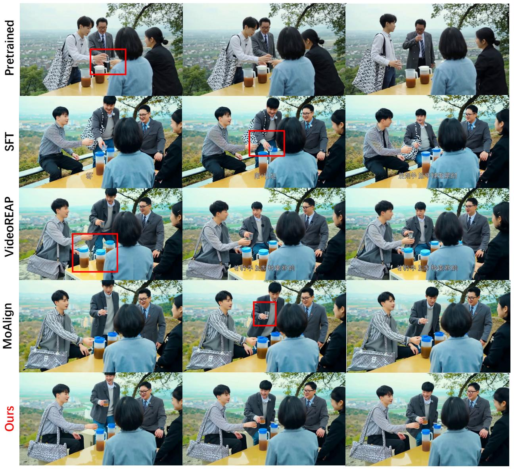

<details>
<summary>text_image</summary>

Pretrained
SFT
VideoREAP
MoAlign
Ours
</details>

Figure 6 Qualitative comparison on fine-grained attribute binding. The caption names distinct liquid colours for two kettles and two cups. Baselines mis-bind or wash out the colours (the failure mode of background-diluted alignment), whereas SARA renders each container with its specified colour. Matched-setting baselines: pretrained Wan2.2, SFT, VideoREPA, MoAlign.

## 5 Conclusion

SARA reframes semantic guidance for VDM representation alignment as a pair-routing problem on top of tokenrelation distillation. A lightweight Stage 1 aligner trained with per-entity SAM 3.1 masks and an InfoNCE regulariser predicts a continuous text-conditioned saliency, which is fused into TRD at Stage 2 through an OR

Key Points: Two Pairs of Shoes and Six People  
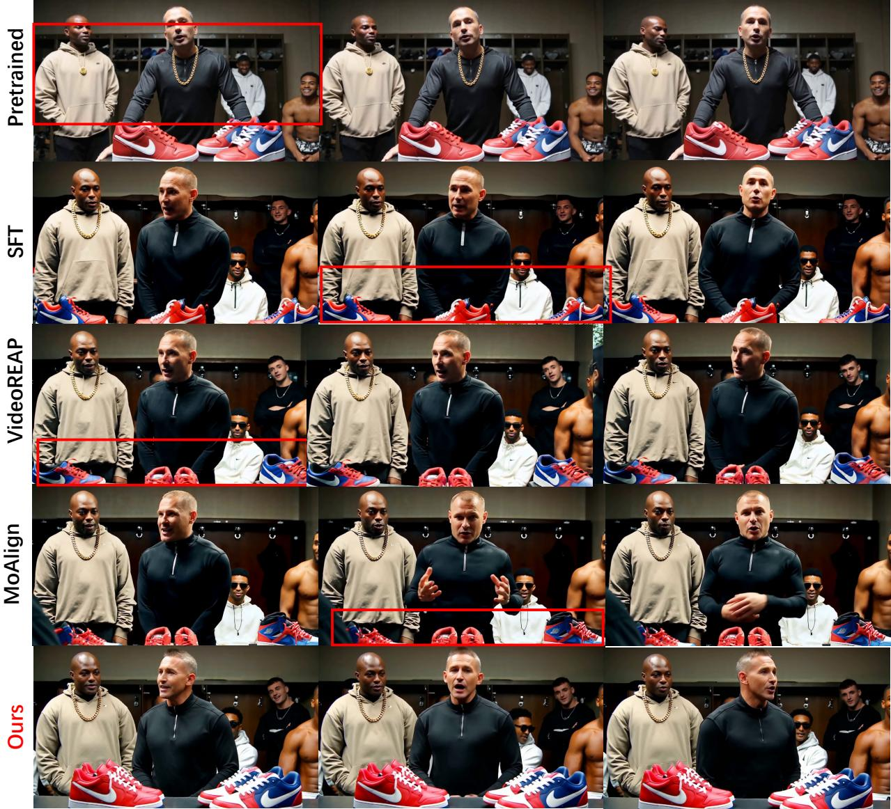

<details>
<summary>text_image</summary>

Pretrained
SFT
VideoREAP
MoAlign
Ours
</details>

★ 6 PERSION  
★ OBJECT\_1 A pair of bright red Nike sneakers placed on a table in front of the main speaker.  
★ OBJECT\_2 A pair of blue and red sneakers placed next to the red ones.

Figure 7 Qualitative comparison on a multi-entity scene with six people and two pairs of sneakers (red Nike and blue-red). Baselines miss people, merge identities, or confuse the two shoe pairs, whereas SARA faithfully renders all six subjects and both correctly-coloured pairs. Matched-setting baselines: pretrained Wan2.2, SFT, VideoREPA, MoAlign.

pair-routing operator. This reallocates supervision from background-background pairs toward subject-subject and subject-background relations, while leaving the TRD form, V-JEPA target, and trainable diffusion-path parameter count unchanged. Under a matched experimental setup, SARA consistently outperforms SFT, VideoREPA, and MoAlign across all three evaluation protocols.

## A Pair-budget analysis

This appendix measures the routing gap that motivates SARA (Sec. 3.2). We compute the per-clip foreground fraction $p _ { \mathrm { f g } }$ from the per-entity SAM 3.1 masks that supervise Stage 1, over 2,400 training clips (76,800 frames). Fig. 8(a) shows $p _ { \mathrm { f g } }$ concentrates around 0.48, so slightly under half of a typical token grid is prompt-relevant foreground. Under uniform weighting the expected budget shares follow directly: $p _ { \mathrm { f g } } ^ { 2 }$ for subject–subject pairs, $2 p _ { \mathrm { f g } } ( 1 - p _ { \mathrm { f g } } )$ for subject–background, and $( 1 - p _ { \mathrm { f g } } ) ^ { 2 }$ for background–background. Fig. 8(b) reports the realised split: background–background pairs the caption never references consume roughly 30% of the supervision while subject–subject relations receive only ∼ 26%. SARA’s OR operator reclaims this ∼ 30% by keeping every FG–FG and FG–BG pair and discarding only BG–BG, the reallocation behind the gains in Tab. 3.

(a) Foreground fraction  
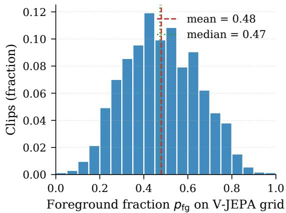

<details>
<summary>histogram</summary>

| Foreground fraction p_fg on V-JEPA grid | Clips (fraction) |
| ---------------------------------------- | ---------------- |
| 0.0                                      | 0.00             |
| 0.1                                      | 0.01             |
| 0.2                                      | 0.05             |
| 0.3                                      | 0.07             |
| 0.4                                      | 0.12             |
| 0.5                                      | 0.11             |
| 0.6                                      | 0.09             |
| 0.7                                      | 0.06             |
| 0.8                                      | 0.04             |
| 0.9                                      | 0.01             |
| 1.0                                      | 0.00             |
</details>

(b) Pair budget by operator  
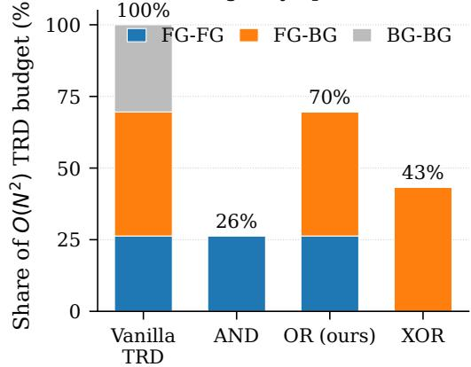

<details>
<summary>stacked bar chart</summary>

| Category | FG-FG (%) | FG-BG (%) | BG-BG (%) |
| :--- | :--- | :--- | :--- |
| Vanilla TRD | 25 | 48 | 30 |
| AND | 26 | 0 | 0 |
| OR (ours) | 25 | 47 | 0 |
| XOR | 0 | 43 | 0 |
</details>

Figure 8 Pair-budget breakdown on the training corpus (2,400 clips, 76,800 frames). (a) Distribution of per-clip foreground fraction $p _ { \mathrm { f g } } .$ . (b) Share of the $O ( N ^ { 2 } )$ TRD budget consumed by each pair category (FG–FG, FG–BG, BG–BG) under vanilla TRD (uniform weighting) and the three routing operators (AND, OR, XOR). OR (ours) retains ∼70% of pairs by keeping all FG–FG and FG–BG pairs and discarding only BG–BG.

## B Stage-1 saliency aligner: supervision, ablations, and diagnostics

This appendix presents the evidence behind the Stage-1 design of Sec. 3.3: the SAM 3.1 entity decomposition that forms the supervision target (App. B.1), and an ablation of the two routing-critical ingredients, the entity-separated K + 2 supervision and the InfoNCE regulariser, with a quantitative diagnostic for each failure mode (App. B.2). The trained aligner’s per-query and full-caption behaviour is shown in the main text (Figs. 3–4).

## B.1 SAM 3.1 entity decomposition (supervision target)

Fig. 9 unpacks one training clip into the five binary masks Stage 1 supervises against (Sec. 3.3): one per-entity mask $M _ { k }$ per Reference item, the foreground union $\textstyle M _ { \mathrm { f g } } = \bigcup _ { k } M _ { k }$ , and the complement $M _ { \mathrm { b g } } = \mathbf { 1 } - M _ { \mathrm { f g } }$ , all produced offline by the SAM 3.1 pipeline of App. C.2. The clip exposes two properties that shape the saliency design. First, the foreground entities span very different scales (a small held card against a partially off-frame person), so a single union-mask forward would let the dominant entity erase the small ones, the motivation for the K + 2 entity-separated forwards. Second, PERSON\_2’s mask tracks the body even where it leaves the frame, so SAM 3.1’s open-vocabulary prompting recovers named entities under partial framing. Together they keep the entity-separated supervision well-defined on the crowded multi-subject clips SARA targets.

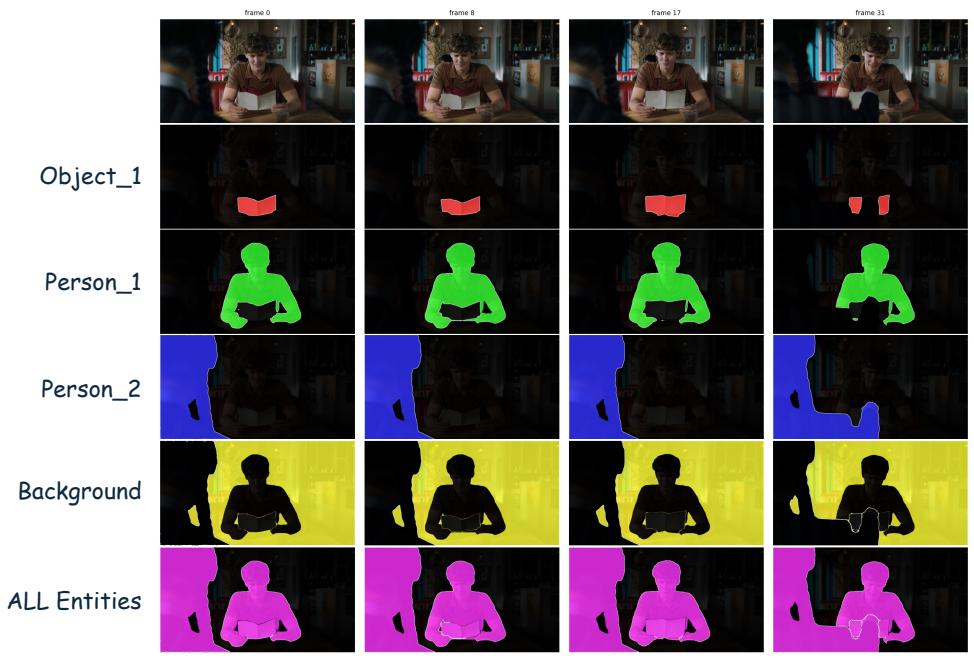

<details>
<summary>text_image</summary>

frame 0
frame 8
frame 17
frame 31
Object_1
Person_1
Person_2
Background
ALL Entities
</details>

Figure 9 SAM 3.1 entity decomposition used as Stage 1 supervision. Top row: input frames. Next three rows: per-entity masks for OBJECT\_1 (red), PERSON\_1 (green), PERSON\_2 (blue). Last two rows: complement BACKGROUND $( M _ { \mathrm { b g } } = \mathbf { 1 } - M _ { \mathrm { f g } }$ , yellow) and foreground union ALL Entities $( M _ { \mathrm { f g } }$ , magenta). All five masks supervise the saliency head jointly via $K + 2$ forwards (Sec. 3.3).

## B.2 Ablation grid and quantitative diagnostics

Fig. 10 ablates the predicted saliency $M _ { p }$ along the two routing-critical Stage 1 choices (Sec. 3.3; downstream results in Sec. 4.5): the entity-separated $K + 2$ supervision and the InfoNCE regulariser, on two held-out clips with distinct layouts. Both $w / o$ entity rows saturate across nearly every patch, merging subjects into one foreground blob, the collapse that motivates entity-separated supervision. $w / o$ NCE is sharper but biased toward the dominant subject (the central musician in panel $\mathrm { ( a ) }$ , the front-row women in panel (b)) at the expense of smaller entities. Only $F u l l$ produces a calibrated, per-entity response. Tab. 4 quantifies these trends with seven metrics in four groups: saliency calibration, cross-attention focus, self-attention entropy gain, and rank preservation.

Quantitative metrics: definitions and rationale. Every entry of Tab. 4 is a scalar averaged over a held-out set of N = 128 clips (8 frames each, disjoint from training). All quantities below are defined on a single (clip, frame):

• $M _ { p } \in [ 0 , 1 ] ^ { N _ { v } }$ : predicted saliency over the $N _ { v }$ V-JEPA patches; $M _ { p } ( n )$ is its value at patch $n .$  
• $\bar { \Phi } _ { \mathrm { C A } } \in \mathbb { R } ^ { N _ { v } \times L }$ : head-averaged cross-attention; the row $\bar { \Phi } _ { \mathrm { C A } } ( n , \cdot ) \in \mathbb { R } ^ { L }$ is patch n’s attention distribution over the L text tokens.  
• $\begin{array} { r } { A _ { \mathrm { v j } } , A _ { \mathrm { p o s t } } \in \mathbb R ^ { N _ { h } \times N _ { v } \times N _ { v } } \colon } \end{array}$ visual self-attention of the $N _ { h }$ heads, before (raw V-JEPA) and after the $A _ { n , \cdot } ^ { ( h ) }$ is head $h \mathrm { { s } }$ attention from patch n.  
• $V _ { y } , V _ { y } ^ { \prime } = \Phi _ { \mathrm { C A } } ( V _ { y } , \tilde { E } )$ : the raw and text-enhanced V-JEPA features of Sec. 3.3.

Two entropies recur: the Shannon entropy $\begin{array} { r } { H ( p ) = - \sum _ { i } p _ { j } } \end{array}$ log pj of a probability vector $p ,$ and the Bernoulli entropy $H _ { 2 } ( q ) = - q$ log $q - ( 1 - q ) \log ( 1 - q )$ of a scalar $q \in [ 0 , 1 ]$ . The indicator $\mathbf { 1 } [ \cdot ]$ is $\{ 0 , 1 \}$ -valued. The seven metrics fall into four groups, each targeting one failure mode of $\mathrm { F i g }$ . 10.

Saliency calibration (rows 1–4; foreground-prior collapse and over-binarisation).

• saliency mean, $\begin{array} { r } { \frac { 1 } { N _ { v } } \sum _ { n } M _ { p } ( n ) } \end{array}$ : average firing level. Values near the foreground prior $( \approx 0 . 6$ for our $K = 2$ entities) mean the head fires almost everywhere.

• saliency max, ma $\mathrm { x } _ { n } M _ { p } ( n )$ : a peak near 1 means the sigmoid has saturated and no longer outputs a graded signal.  
• saliency coverage, $\begin{array} { r } { \frac { 1 } { N _ { v } } \sum _ { n } { \bf 1 } [ M _ { p } ( n ) > 0 . 5 ] . } \end{array}$ : fraction of patches above threshold; smaller is more selective.  
• saliency entropy, $\begin{array} { r } { \frac { 1 } { N _ { v } } \sum _ { n } H _ { 2 } ( M _ { p } ( n ) ) } \end{array}$ : high values keep $M _ { p }$ graded near 0.5, the regime the OR weight $W ^ { \vee }$ of $\operatorname { E q . } \ ( 8 )$ v  consumes; low values mean $M _ { p }$ has hardened into a {0, 1} mask and $W ^ { \vee }$ degenerates to an indicator.

Cross-attention focus (row $5 ;$ whether CA reads the caption).

• ca-focus mean, $\begin{array} { r } { \frac { 1 } { N _ { v } } \sum _ { n } \bigl ( 1 - H ( \bar { \Phi } _ { \mathrm { C A } } ( n , \cdot ) ) / \log ( L + 1 ) \bigr ) } \end{array}$ : one minus the normalised text-attention entropy of each patch. Higher means a patch attends to a few specific words rather than spreading uniformly, so the head can route by word identity.

Self-attention entropy gain (row 6; whether CA enriches or collapses V-JEPA self-attention).

$\Delta$ $\bar { H } ( A _ { \mathrm { p o s t } } ) - \bar { H } ( A _ { \mathrm { v j } } )$ $\begin{array} { r } { \bar { H } ( A ) = \frac { 1 } { N _ { h } N _ { v } } \sum _ { h , n } H ( A _ { n , \cdot } ^ { ( h ) } ) / \log N _ { v } } \end{array}$ normalised Shannon entropy averaged over heads and patches $( \bar { H } ( A _ { \mathrm { v j } } ) = 0 . 7 8 3 \ \mathrm { h e r e ) }$ . A positive value means CA adds spread on top of V-JEPA; a negative value (w/o NCE w/o entity: −0.085) means CA narrows attention onto a single foreground blob.

Representation-rank preservation (row $7 ;$ whether CA keeps V-JEPA’s high-rank structure).

• PCA ∆ var. ratio, $r _ { 3 } ( V _ { y } ^ { \prime } ) - r _ { 3 } ( V _ { y } )$ , with $\textstyle r _ { 3 } ( V ) = \sum _ { i < 3 } \sigma _ { i } ^ { 2 } / \sum _ { i } \sigma _ { i } ^ { 2 }$ the top-3 explained-variance ratio and $\sigma _ { i }$ the i-th singular value of the centred token matrix. A small positive value keeps $V _ { y } ^ { \prime }$ within V-JEPA’s rank profile; a large one means CA has compressed the tokens into a low-rank, foreground-only subspace.

The seven rows form a conjunction: only Full avoids saturation (rows 1–3), keeps $M _ { p }$ graded (row 4), focuses CA on entity-specific words (row 5), widens rather than narrows self-attention (row 6), and preserves the rank of $V _ { y }$ (row 7); each ablation breaks at least one.

Table 4 Stage 1 ablation: quantitative metrics (mean over N = 128 held-out clips, columns match the rows of Fig. 10, metric definitions on p. 15). Full is the only configuration that jointly avoids saliency saturation (rows 1–3), keeps $M _ { p }$ graded (row 4), focuses cross-attention on entity tokens (row 5), and enriches V-JEPA self-attention without collapsing it (rows 6–7), and each ablation fails on at least one metric.

<table><tr><td>Metric</td><td>Full</td><td>w/o NCE</td><td>w/o NCE w/o entity</td><td>w/o entity</td></tr><tr><td>saliency mean</td><td>0.407</td><td>0.567</td><td>0.653</td><td>0.648</td></tr><tr><td>saliency max</td><td>0.865</td><td>0.925</td><td>0.996</td><td>0.998</td></tr><tr><td>saliency coverage</td><td>0.383</td><td>0.606</td><td>0.657</td><td>0.658</td></tr><tr><td>saliency entropy</td><td>0.463</td><td>0.461</td><td>0.109</td><td>0.207</td></tr><tr><td>ca-focus mean</td><td>0.221</td><td>0.159</td><td>0.068</td><td>0.118</td></tr><tr><td>Δ self-attn entropy</td><td>+0.065</td><td>+0.096</td><td>-0.085</td><td>+0.013</td></tr><tr><td>PCA Δ var. ratio</td><td>+0.083</td><td>+0.164</td><td>+0.260</td><td>+0.183</td></tr></table>

## C MTSS captioning and entity-mask preparation

## C.1 MTSS caption format and pipeline

Format. Stage 2 inference needs a global, video-level caption for both the VDM and the frozen aligner. We adopt the MTSS format (Tencent Hunyuan Team, 2026), which factorises a video into four streams (Reference for persistent entities and scenes, Shot for visual segments, Event for localised audio/interaction events, and Global for ambient context) linked by stable ref\_ids (e.g. PERSON\_1, OBJECT\_1, SCENE\_1) and per-shot time\_ranges. The Reference stream gives ready-made per-entity captions $c _ { k }$ for Stage 1 supervision, ref\_id dereferencing keeps the full caption under Qwen3-VL-Embedding’s 2048-token cap, and the stream-level separation reduces the foreground/background entanglement that entity-separated Stage 1 training exploits. Listing 1 shows a compact example of the resulting JSON.

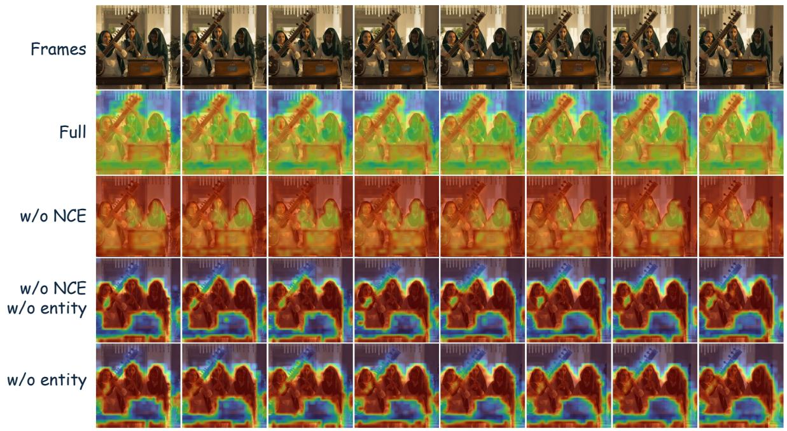

<details>
<summary>text_image</summary>

Frames
Full
w/o NCE
w/o NCE
w/o entity
w/o entity
</details>

(a) Clip A: South Asian musicians playing instruments.

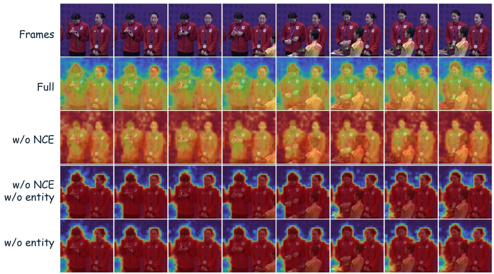

<details>
<summary>text_image</summary>

Frames
Full
w/o NCE
w/o NCE
w/o entity
w/o entity
</details>

(b) Clip B: women in red ceremonial attire posing as a tightly grouped multi-subject foreground.  
Figure 10 Stage 1 ablation on the predicted saliency map on two held-out clips, eight frames each. Rows: input frames; Full (default SARA, K + 2 forwards + InfoNCE); w/o NCE ; w/o NCE w/o entity (single forward on full caption with union mask, no InfoNCE); w/o entity (single forward, InfoNCE retained). Saliency rows use a jet colormap: redder = higher saliency, bluer = lower. Discussion in App. B.2, quantitative metrics in Tab. 4.

Listing 1 A compact MTSS JSON example. Persistent entities live under references with stable ref\_ids and are referenced from each shots[i].visual\_description and references\_in\_shot, so per-entity captions $c _ { k }$ and per-shot timing are read off the same structure.  
```json
{
    "structured_caption": { "english": {
    "scene_description": "In an office, a woman in a red dress argues on the phone.",
    "global_style": "Realistic HD; bright office lighting; tense pace.",
    "references": [
    { "ref_id": "PERSON_1", "type": "person",
    "semantic_description": "A young woman intensely arguing on the phone.",
    "appearance_anchor": {
    "id_features": { "detail_description":
    "East Asian, late 20s; long wavy dark-brown hair; red lipstick." },
    "attributes": {
    "clothing": "Fitted V-neck mini dress in vibrant red.",
    "hairstyle": "Long, wavy dark-brown hair worn down.",
    "accessories": "Light jade bracelet on the left wrist." } }
    },
    {
    "ref_id": "OBJECT_1", "type": "object",
    "semantic_description": "The smartphone the woman is using.",
    "appearance_anchor": { "id_features": { "detail_description":
    "Black smartphone in a black case, held to her right ear." } } },
    {
    "ref_id": "SCENE_1", "type": "scene",
    "semantic_description": "A modern office interior.",
    "appearance_anchor": { "id_features": { "detail_description":
    "Large dark-grey desk with hardcover books; bookshelf and beige chair behind." } } }
    ],
    }
    }
},
"shots": [
    { "shot_id": "shot_1", "time_range": [0.0, 3.4],
    "references_in_shot": ["PERSON_1", "OBJECT_1", "SCENE_1"],
    "camera": { "movement": "static", "angle": "eye-level", "shot_type": "medium" },
    "visual_description":
    "In SCENE_1, PERSON_1 leans over her desk holding OBJECT_1 to her right ear. Her expression shifts from tense concentration
    → to deep anger; she bares her teeth in a snarl while glaring off-camera." }
]
}
```

Pipeline. For each training video $x _ { 0 }$ we obtain MTSS captions in three offline steps, without human annotation. (i) The dense narrative caption provided with each training clip and 32 uniformly sampled frames are fed to Qwen3-VL-72B in vision-language mode; the system prompt instructs the model to enumerate Reference items with ref\_ids and short semantic\_descriptions, segment the video into Shots, extract Events with time\_ranges, and write a single Global summary, serialised in the MTSS format. (ii) Each foreground Reference item (PERSON\_\*/OBJECT\_\*) yields an entity caption $c _ { k }$ (the concatenation of its semantic\_description and detail\_description fields) and a SAM 3.1 mask $M _ { k }$ from a Qwen3.5-2Bsimplified noun phrase passed as SAM 3.1’s text prompt (App. C.2); the background caption $c _ { \mathrm { b g } }$ is the SCENE\_\*/BACKGROUND item’s semantic\_description, with mask $M _ { \mathrm { b g } } = \mathbf { 1 } - M _ { \mathrm { f g } }$ . (iii) For Stage 2 inference and evaluation, captions exceeding 2K tokens are compressed by Qwen3.5 while preserving all ref\_ids and time\_ranges; Stage 1 reads semantic\_descriptions directly from the JSON and is unaffected. A flat user prompt at inference time is rewritten into MTSS form offline by the same pipeline. Rewriter limitations are discussed in App. H.

## C.2 Linking MTSS entities to SAM 3.1 masks

Stage 1 mask supervision relies on per-entity binary masks from SAM 3.1 Multiplex, and two practical issues make the raw MTSS-to-SAM pipeline unreliable. First, SAM 3.1 expects short noun-phrase prompts, whereas MTSS Reference items carry rich free-form descriptions. Second, when several same-type entities co-occur (e.g. two PERSON\_\*), SAM 3.1 returns multiple instances without telling us which instance matches which Reference id. We address both with a small frozen Qwen3.5-2B model used in two complementary modes.

Text simplification. Each MTSS entity description is rewritten by Qwen3.5-2B into a 2–5-word noun phrase that keeps the most visually distinctive adjective(s). Examples taken from training logs:

• “A young Caucasian male with fair skin, short curly light brown hair, wearing a navy hoodie” → “young

curly-haired man”.

• “A folded greeting card being held by the barista” → “folded card”.  
• “A dark wooden bar counter with several espresso cups arranged on top” → “wooden bar counter”.

The simplified phrase is passed to SAM 3.1 as the text prompt for that entity, which returns far more non-empty, well-covering masks than the raw description does.

Bounding-box detection for instance disambiguation. For multi-instance types we additionally query Qwen3.5-2B in vision-language mode on the first video frame: given the original entity description and the frame, the model emits a bounding box. SAM 3.1 instance boxes are then matched to entity boxes by IoU, which assigns each Reference id to a single SAM 3.1 instance and hence to a per-entity mask. When no valid Qwen box is available we fall back to area-ranked assignment, which never drops below the SAM-only baseline.

Scope. The simplifier is part of Stage 1 mask preparation only. Stage 2 does not invoke it, and inference is unchanged. Fig. 9 (App. B.1) visualises the resulting per-entity mask decomposition on a representative training clip and motivates the entity-separated supervision adopted in Sec. 3.3.

## D VLM-rubric evaluation protocol

Judging setup. For every generated video and each of the three VLM judges, we issue one chat completion per rubric (TA and MQ). The video and the MTSS caption (App. C) are sent in a single multimodal turn with thinking mode enabled under an 8K-token budget, so the judge reasons over the rubric and then emits a strict JSON object (Box C / Box E). Sampling follows each family’s official thinking-mode recipe: Qwen3.x uses T = 1.0, top-p = 0.95, top-k = 20, min-p = 0, presence penalty 1.5, while Gemma-4 uses T = 1.0, top-p = 0.95, top-k = 64. The vote aggregation resolves ties toward the higher score.

Protocol noise floor and the real-video oracle. The Real video row of Table 1 sits clearly above every continually-trained method but below the rubric’s 5.0 ceiling. The sub-5 gap has two protocol-level sources independent of the generation pipeline: the MTSS caption is produced by an external VLM (App. C) and occasionally hallucinates entities or mis-binds attributes, against which even the source video cannot satisfy the strict rubric; and the judge VLMs over-penalise small attribute mismatches, mis-count entities under occlusion, or down-score brief actions on action\_completion. Both apply to every row of Table 1 and form a constant noise floor, so the oracle row should be read as the achievable protocol score; the relevant quantity is the gap each method closes toward it under matched data, schedule, judges, and captions. SARA closes the largest fraction of that gap on both TA and MQ.

Prompt template. The prompt fed to each judge concatenates (i) the system prompt of Box A, (ii) a TEXT DESCRIPTION block populated from the MTSS [Scene & Style], [Characters & Objects] (with expected entity counts) and [Shot Narrative] sections, and (iii) one of the two rubric blocks (Box B for alignment, Box D for motion). The judge replies with a JSON object keyed by the rubric dimensions and valued by {score, reason} pairs (Box C / Box E).

## Box A: System prompt (shared by both rubrics)

You are an expert video evaluation assistant. You compare generated videos against their text descriptions and score alignment across multiple dimensions. Be strict and precise – only give high scores when the video truly matches the description.

## Box B: Alignment rubric (TA, six dimensions, 1–5 each)

=== EVALUATION DIMENSIONS ===

Score each ALIGNMENT dimension from 1 to 5 on a shared Likert scale: 5=fully matches the description; 4=mostly matches with minor differences; 3=partially matches or some items clearly wrong; 2=mostly wrong; 1=does not match / unrecognizable. The only exception is entity\_count, which uses an exact-count scale:

5=exact match, 4=off by 1 total, 3=off by 2, 2=off by 3–4, 1=off by 5+.  
1. entity_count: Does the video contain the correct number of people ({num_persons}) and objects ({num_objects})?
2. person_appearance: Do the people's clothing, hairstyle, age/gender, and accessories match the [Characters & Objects] description?
3. object_appearance: Do the objects' shape, color, material, and type match the [Characters & Objects] description?
4. spatial_arrangement: Are people and objects positioned as described in the [Shot Narrative] (left/right/center/between/behind, etc.)?
5. action_completion: Are the actions and movements described in the [Shot Narrative] actually performed in the video?
6. scene_style: Does the video's setting, lighting, color palette, and mood match the [Scene & Style] description?

Box C: Required JSON output (alignment)  
=== OUTPUT FORMAT ===
Respond in JSON format ONLY (no extra text):
{
    "entity_count": {"score": <1-5>, "reason": "<brief reason>"},
    "person_appearance": {"score": <1-5>, "reason": "<brief reason>"},
    "object_appearance": {"score": <1-5>, "reason": "<brief reason>"},
    "spatial_arrangement": {"score": <1-5>, "reason": "<brief reason>"},
    "action_completion": {"score": <1-5>, "reason": "<brief reason>"},
    "scene_style": {"score": <1-5>, "reason": "<brief reason>"}
}

Box D: Motion-quality rubric (MQ, seven dimensions, 1–5 each)  
=== EVALUATION DIMENSIONS ===
Score each MOTION dimension from 1 to 5 on a shared Likert scale: 5=requirement fully met (or, where applicable, the described motion happens with correct subject/object/direction/timing); 4=mostly met with minor attribute or magnitude issues; 3=partially met with clear localized failures or mismatches; 2=multiple or large-scale failures, only a vague hint of the requirement; 1=requirement fails entirely, or behaves opposite to the description.
1. motion_prompt_alignment: Do the actions described in the [Shot Narrative] (subject + verb + object + direction) actually happen in the video?
2. motion_completeness: Does each motion have a coherent start → middle → end trajectory (clear onset, full execution, clean closure)? Penalize twitching, frozen frames, and on-the-spot looping.
3. motion_amplitude: Is the amount/frequency of motion reasonable for the described scene? Penalize pseudo-static clips (only micro-jitter pretending to be motion) and over-exaggerated shaking, seizure-like flicker, or cartoon distortion.
4. temporal_consistency: Do subjects keep their identity across frames? Treat as defects: flicker, ghosting, teleportation, identity swap, extra/missing fingers/limbs, limb displacement or duplication, facial scrambling, edge melting/tearing, color bleeding.
5. physical_plausibility: Does the motion respect physics (gravity, inertia, collision, rigid-vs-soft body, contact)? Treat as defects: joints twisted past anatomical limits, rigid objects wobbling like cloth, limbs/objects clipping through solid surfaces, feet floating or sinking, fluid/smoke moving against gravity.
6. camera_motion: Does the camera behave as described? If the [Shot Narrative] specifies a move (push-in / pull-out / pan / tilt / tracking / orbit / handheld), check type, direction, and pace, otherwise expect a stable camera.
7. interaction_correctness: Do multi-subject interactions in the [Shot Narrative] (physical contact, coordination, mutual effect) actually happen with correct contact point and approach→contact→completion timing on both sides?
NOTE: if the caption involves only a single subject, return 5 with reason “caption has no multi-subject

interaction”.

Box E: Required JSON output (motion)  
```python
Respond in JSON format ONLY (no extra text):
{
    "motion_prompt_alignment": {"score": <1-5>, "reason": "<brief reason>"},
    "motion_completeness": {"score": <1-5>, "reason": "<brief reason>"},
    "motion_amplitude": {"score": <1-5>, "reason": "<brief reason>"},
    "temporal_consistency": {"score": <1-5>, "reason": "<brief reason>"},
    "physical_plausibility": {"score": <1-5>, "reason": "<brief reason>"},
    "camera_motion": {"score": <1-5>, "reason": "<brief reason>"},
    "interaction_correctness": {"score": <1-5>, "reason": "<brief reason>"}
}
```

Per-sub-dimension scores. Tabs. 5 and 6 report the mean-aggregated per-sub-dimension scores for the methods of Tab. 1 and the ablations of Tab. 3. On the alignment side the bottleneck is action\_completion: every continually-trained method sits well below the real-video oracle there, making fine-grained action coverage the hardest TA dimension, with SARA still posting the largest gain among non-oracles. On the motion side the gains concentrate on motion\_prompt\_alignment, motion\_completeness, motion\_amplitude, and interaction\_correctness, while the conservative pretrained baseline keeps a small lead on temporal\_consistency and physical\_plausibility. These two dimensions share the same mechanistic origin as the VBench-2.0 Human Fidelity drop discussed in Sec. 4.3: temporal consistency, physical plausibility, and anatomical fidelity are all rendered at the low-noise stage of Wan2.2’s two-expert MoE, but our matched protocol updates only the high-noise expert, so high-noise updates that improve coarse-structure prompt following propagate as a small distribution shift on the un-updated low-noise expert (App. H). SARA shows the smallest such drop among the three continually-trained methods.

Table 5 Per-sub-dimension alignment scores (mean across three VLM judges). Best non-oracle in bold. EntCnt=entity\_count, PrsApp=person\_appearance, ObjApp=object\_appearance, Spatial=spatial\_arrangement, ActCmp=action\_completion, Scene=scene\_style.

<table><tr><td>Method</td><td>EntCnt</td><td>PrsApp</td><td>ObjApp</td><td>Spatial</td><td>ActCmp</td><td>Scene</td><td>Avg</td></tr><tr><td colspan="8">Main comparison</td></tr><tr><td>Real video (oracle)</td><td>4.299</td><td>4.579</td><td>4.605</td><td>4.708</td><td>4.340</td><td>4.983</td><td>4.586</td></tr><tr><td>Pretrained Wan2.2</td><td>3.930</td><td>3.654</td><td>4.461</td><td>3.700</td><td>2.863</td><td>4.905</td><td>3.919</td></tr><tr><td>SFT</td><td>4.276</td><td>4.021</td><td>4.515</td><td>3.951</td><td>3.048</td><td>4.913</td><td>4.121</td></tr><tr><td>VideoREPA</td><td>4.298</td><td>4.030</td><td>4.489</td><td>3.974</td><td>3.050</td><td>4.909</td><td>4.125</td></tr><tr><td>MoAlign</td><td>4.282</td><td>4.048</td><td>4.504</td><td>3.955</td><td>3.053</td><td>4.921</td><td>4.127</td></tr><tr><td>SARA (ours)</td><td>4.301</td><td>4.085</td><td>4.502</td><td>4.002</td><td>3.114</td><td>4.923</td><td>4.154</td></tr><tr><td colspan="8">Ablations</td></tr><tr><td>SARA (full)</td><td>4.301</td><td>4.085</td><td>4.502</td><td>4.002</td><td>3.114</td><td>4.923</td><td>4.154</td></tr><tr><td>w/o InfoNCE</td><td>4.302</td><td>4.072</td><td>4.481</td><td>3.964</td><td>3.078</td><td>4.921</td><td>4.136</td></tr><tr><td>w/o entity-separated</td><td>4.284</td><td>4.053</td><td>4.508</td><td>3.963</td><td>3.052</td><td>4.916</td><td>4.129</td></tr><tr><td>w/o saliency head</td><td>4.222</td><td>3.976</td><td>4.436</td><td>3.917</td><td>2.998</td><td>4.916</td><td>4.078</td></tr><tr><td>w/o temporal mask</td><td>4.312</td><td>4.073</td><td>4.500</td><td>3.952</td><td>3.091</td><td>4.915</td><td>4.140</td></tr><tr><td>XOR router</td><td>4.292</td><td>4.016</td><td>4.470</td><td>3.931</td><td>3.035</td><td>4.921</td><td>4.111</td></tr><tr><td>w/ temporal decay τ = 10</td><td>4.310</td><td>4.066</td><td>4.496</td><td>3.982</td><td>3.062</td><td>4.915</td><td>4.139</td></tr></table>

## E Detailed VBench results

This section reports the per-task scores underlying the dimension-level VBench-1.0 (Huang et al., 2024) and VBench-2.0 (Zheng et al., 2025) entries of Tab. 2 (Sec. 4.3).

Table 6 Per-sub-dimension motion-quality scores (mean across three VLM judges). Best non-oracle in bold. MtPrm=motion\_prompt\_alignment, MtCmp=motion\_completeness, MtAmp=motion\_amplitude, TmpCns=temporal\_consistency, PhyPlu=physical\_plausibility, Cam=camera\_motion, Inter=interaction\_correctness.

<table><tr><td>Method</td><td>MtPrm</td><td>MtCmp</td><td>MtAmp</td><td>TmpCns</td><td>PhyPlu</td><td>Cam</td><td>Inter</td><td>Avg</td></tr><tr><td colspan="9">Main comparison</td></tr><tr><td>Real video (oracle)</td><td>3.950</td><td>4.289</td><td>4.485</td><td>4.561</td><td>4.636</td><td>4.828</td><td>4.272</td><td>4.431</td></tr><tr><td>Pretrained Wan2.2</td><td>2.502</td><td>3.338</td><td>3.765</td><td>4.610</td><td>4.654</td><td>4.608</td><td>3.250</td><td>3.818</td></tr><tr><td>SFT</td><td>2.651</td><td>3.292</td><td>3.700</td><td>4.405</td><td>4.509</td><td>4.577</td><td>3.355</td><td>3.784</td></tr><tr><td>VideoREPA</td><td>2.676</td><td>3.306</td><td>3.713</td><td>4.420</td><td>4.522</td><td>4.608</td><td>3.372</td><td>3.802</td></tr><tr><td>MoAlign</td><td>2.689</td><td>3.332</td><td>3.742</td><td>4.379</td><td>4.493</td><td>4.594</td><td>3.381</td><td>3.802</td></tr><tr><td>SARA (ours)</td><td>2.744</td><td>3.396</td><td>3.807</td><td>4.431</td><td>4.537</td><td>4.623</td><td>3.423</td><td>3.852</td></tr><tr><td colspan="9">Ablations</td></tr><tr><td>SARA (full)</td><td>2.744</td><td>3.396</td><td>3.807</td><td>4.431</td><td>4.537</td><td>4.623</td><td>3.423</td><td>3.852</td></tr><tr><td>w/o InfoNCE</td><td>2.676</td><td>3.336</td><td>3.762</td><td>4.378</td><td>4.477</td><td>4.617</td><td>3.380</td><td>3.804</td></tr><tr><td>w/o entity-separated</td><td>2.673</td><td>3.328</td><td>3.722</td><td>4.420</td><td>4.519</td><td>4.618</td><td>3.390</td><td>3.810</td></tr><tr><td>w/o saliency head</td><td>2.621</td><td>3.265</td><td>3.681</td><td>4.439</td><td>4.554</td><td>4.610</td><td>3.326</td><td>3.785</td></tr><tr><td>w/o temporal mask</td><td>2.698</td><td>3.369</td><td>3.802</td><td>4.389</td><td>4.485</td><td>4.585</td><td>3.379</td><td>3.815</td></tr><tr><td>XOR router</td><td>2.663</td><td>3.327</td><td>3.746</td><td>4.414</td><td>4.512</td><td>4.593</td><td>3.375</td><td>3.804</td></tr><tr><td>w/ temporal decay τ = 10</td><td>2.698</td><td>3.373</td><td>3.802</td><td>4.432</td><td>4.528</td><td>4.611</td><td>3.377</td><td>3.832</td></tr></table>

## E.1 VBench-1.0 per-task semantic scores

VBench-1.0 splits its 16 atomic tasks into a Quality dimension and a Semantic dimension. We evaluate the five continually-trained Wan2.2 high-noise checkpoints on the nine atomic tasks that compose the Semantic dimension: Scene, Overall Consistency, Appearance Style, Object Class, Spatial Relationship, Human Action, Temporal Style, Color, and Multiple Objects. The aggregate Semantic column is the official mean over these nine tasks, after the per-task normalisation defined in the VBench-1.0 release. Tab. 7 reports the raw per-task scores, and for readability we keep the official 0–1 range rather than rescaling to %.

Table 7 VBench-1.0 per-task semantic scores (raw, 0–1 range as returned by the official scorers, higher is better; aggregated over the official 946-prompt suite). The nine columns are the official VBench-1.0 Semantic sub-tasks, and the rightmost Semantic (Avg.) column is the official semantic-dimension aggregate (the percentage version of this column is repeated under VBench-1.0 / Semantic in Tab. 2). Best per column in bold.

<table><tr><td>Method</td><td>Scene</td><td>Consistency</td><td>Appearance</td><td>Object</td><td>Spatial</td><td>Action</td><td>Temporal</td><td>Color</td><td>Multiple</td><td>Semantic (Avg.)</td></tr><tr><td>Pretrained Wan2.2</td><td>0.3401</td><td>0.2524</td><td>0.2101</td><td>0.8560</td><td>0.7631</td><td>0.8800</td><td>0.2315</td><td>0.9012</td><td>0.6677</td><td>0.7274</td></tr><tr><td>SFT</td><td>0.3481</td><td>0.2436</td><td>0.2048</td><td>0.8449</td><td>0.8074</td><td>0.8100</td><td>0.2187</td><td>0.9100</td><td>0.7134</td><td>0.7217</td></tr><tr><td>VideoREPA (Zhang et al., 2025a)</td><td>0.2943</td><td>0.2511</td><td>0.2125</td><td>0.8829</td><td>0.7699</td><td>0.8900</td><td>0.2319</td><td>0.8957</td><td>0.7027</td><td>0.7299</td></tr><tr><td>MoAlign (Bhowmik et al., 2025)</td><td>0.3583</td><td>0.2476</td><td>0.2105</td><td>0.8275</td><td>0.8108</td><td>0.8500</td><td>0.2232</td><td>0.8870</td><td>0.7248</td><td>0.7295</td></tr><tr><td>SARA (ours)</td><td>0.3583</td><td>0.2487</td><td>0.2071</td><td>0.8758</td><td>0.7710</td><td>0.8400</td><td>0.2298</td><td>0.9313</td><td>0.7576</td><td>0.7389</td></tr></table>

Per-task semantic scores. The per-task picture (Tab. 7) is diffuse, as expected for nine sub-tasks covering very different aspects of text-following: SARA leads the multi-entity-heavy tasks it targets (Multiple Objects, Color ) while the remaining tasks split across baselines, and the pretrained model’s small lead on Overall Consistency is the VBench-1.0 instance of the high-noise-only-training trade-off discussed in Sec. 4.3 and App. H. SARA nonetheless cleanly leads the aggregate Semantic score of Tab. 2.

## E.2 VBench-2.0 per-task scores

VBench-2.0 (Zheng et al., 2025) groups its 18 atomic tasks into five dimensions: creativity (Composition, Diversity), commonsense (Instance Preservation, Motion Rationality), controllability (Camera Motion, Complex Landscape, Complex Plot, Dynamic Attribute, Dynamic Spatial Relationship, Human Interaction, Motion Order Understanding), human fidelity (Human Anatomy, Human Clothes, Human Identity), and physics (Material, Mechanics, Multi-View Consistency, Thermotics). Each dimension score is the mean of its tasks, and the final score is the mean of the five dimensions. Tab. 8 reports all 18 per-task scores plus the VBench-2.0 final score.

Table 8 VBench-2.0 per-task scores under all five dimensions (%, higher is better; aggregated over the official 1,013- prompt suite, 3 generations per prompt and 20 for the special Diversity task). The 19 columns are wrapped into three horizontal stripes that share a single Method header column: stripe 1 covers Creativity + Commonsense + Human Fidelity, stripe 2 covers Controllability, and stripe 3 covers Physics together with the overall VBench-2.0 Final score (mean of the five dimensions, repeated from Tab. 2). Best per column in bold.

<table><tr><td>Method</td><td>Composition</td><td>Diversity</td><td>Instance Preservation</td><td>Motion Rationality</td><td>Human Anatomy</td><td>Human Clothes</td><td>Human Identity</td></tr><tr><td>Pretrained Wan2.2</td><td>45.69</td><td>59.43</td><td>86.55</td><td>30.46</td><td>90.56</td><td>86.67</td><td>80.88</td></tr><tr><td>SFT</td><td>45.79</td><td>63.42</td><td>90.06</td><td>29.31</td><td>88.06</td><td>77.90</td><td>75.27</td></tr><tr><td>VideoREPA</td><td>48.09</td><td>60.06</td><td>88.89</td><td>33.33</td><td>87.86</td><td>84.23</td><td>76.26</td></tr><tr><td>MoAlign</td><td>49.48</td><td>64.01</td><td>88.89</td><td>30.46</td><td>89.26</td><td>84.97</td><td>80.02</td></tr><tr><td>SARA (ours)</td><td>50.81</td><td>59.95</td><td>88.89</td><td>33.33</td><td>89.05</td><td>85.78</td><td>80.38</td></tr><tr><td>Method</td><td>Camera Motion</td><td>Complex Landscape</td><td>Complex Plot</td><td>Dynamic Attribute</td><td>Dynamic Spatial Relationship</td><td>Human Interaction</td><td>Motion Order Understanding</td></tr><tr><td>Pretrained Wan2.2</td><td>15.79</td><td>18.44</td><td>11.56</td><td>38.46</td><td>41.55</td><td>63.67</td><td>27.36</td></tr><tr><td>SFT</td><td>16.36</td><td>16.89</td><td>12.76</td><td>41.39</td><td>40.10</td><td>58.00</td><td>21.62</td></tr><tr><td>VideoREPA</td><td>17.90</td><td>20.00</td><td>10.67</td><td>44.69</td><td>36.23</td><td>65.00</td><td>26.26</td></tr><tr><td>MoAlign</td><td>17.90</td><td>20.44</td><td>12.67</td><td>41.39</td><td>34.30</td><td>62.33</td><td>21.55</td></tr><tr><td>SARA (ours)</td><td>19.14</td><td>15.78</td><td>11.07</td><td>46.89</td><td>37.20</td><td>59.67</td><td>26.60</td></tr><tr><td>Method</td><td>Material</td><td>Mechanics</td><td>Multi-View Consistency</td><td>Thermotics</td><td>Final</td><td></td><td></td></tr><tr><td>Pretrained Wan2.2</td><td>43.24</td><td>53.54</td><td>38.99</td><td>51.80</td><td>55.00</td><td></td><td></td></tr><tr><td>SFT</td><td>54.17</td><td>47.62</td><td>45.65</td><td>56.92</td><td>55.08</td><td></td><td></td></tr><tr><td>VideoREPA</td><td>44.59</td><td>47.45</td><td>40.57</td><td>54.07</td><td>55.24</td><td></td><td></td></tr><tr><td>MoAlign</td><td>49.30</td><td>46.88</td><td>42.11</td><td>52.99</td><td>55.81</td><td></td><td></td></tr><tr><td>SARA (ours)</td><td>47.89</td><td>48.51</td><td>44.17</td><td>53.44</td><td>56.19</td><td></td><td></td></tr></table>

Per-task scores. The 18 per-task scores (Tab. 8) are likewise diffuse: SARA concentrates its wins on the multi-entity-composition and dynamic-attribute tasks that saliency routing targets (e.g. Composition, Dynamic Attribute, Camera Motion), while the baselines split the remaining tasks and the pretrained model retains the expected small lead on the Human-Fidelity and other low-noise-rendered tasks (the high-noise-only-training trade-off of App. H, on which SARA shows the smallest drop). SARA still leads the aggregate VBench-2.0 Final score of Tab. 2.

## F Additional ablation: DiT alignment hookup layer

The Stage 2 masked TRD loss of Eq. (11) is computed on the projected hidden state $V _ { p }$ of a single Wan2.2 DiT layer. The high-noise DiT has 40 layers, and the main paper hooks the loss into layer 18 (mid-depth, Tab. 11). Tab. 9 moves the hookup to deeper layers (30, 36, 39) with all else fixed at the default SARA configuration. Layer 18 is the published optimum of prior REPA-family work on shallower DiTs (VideoREPA on CogVideoX (Zhang et al., 2025a), MoAlign on Wan2.1 (Bhowmik et al., 2025)); the open question is whether Wan2.2’s larger depth budget shifts the optimum deeper, and Tab. 9 shows it does not. We do not re-test shallower hookups, since REPA’s sweep on DiT-XL/2 (Yu et al., 2024) found pre-mid-depth blocks carry mostly low-level and positional signal.

Layer 18 dominates on all four VLM-rubric metrics, with every deeper hookup behind it by up to 0.055 (TA mean) and 0.039 (MQ mean). Differences among the deeper hookups are small (≤ 0.04) and non-monotonic in layer index, so the operative distinction is mid- vs late-depth rather than the precise late-layer position. A plausible reason is that mid-depth blocks still carry spatially localised but semantically structured tokens, whereas the latest layers specialise toward noise prediction and align less well with the V-JEPA target. We therefore use layer 18 throughout.

Table 9 Effect of the DiT alignment hookup layer on Wan2.2 high-noise (40 DiT layers total). Each row retrains SARA with the masked TRD loss of Eq. (11) attached to a different layer, with all other settings matching the default SARA configuration. Metrics follow the VLM rubric of Tab. 1. Best in bold.

<table><tr><td>Hookup layer</td><td>TA mean</td><td>TA vote</td><td>MQ mean</td><td>MQ vote</td></tr><tr><td>layer 18 (default, mid-depth)</td><td>4.1543</td><td>4.1668</td><td>3.8516</td><td>3.9191</td></tr><tr><td>layer 30</td><td>4.0990</td><td>4.1221</td><td>3.8266</td><td>3.8972</td></tr><tr><td>layer 36</td><td>4.1214</td><td>4.1404</td><td>3.8129</td><td>3.8797</td></tr><tr><td>layer 39</td><td>4.1368</td><td>4.1569</td><td>3.8354</td><td>3.8946</td></tr></table>

## G Training details

Tables 10 and 11 list all training-side hyperparameters for SARA’s two stages. The Stage 2 configuration applies verbatim to SFT (auxiliary loss disabled), VideoREPA (no saliency routing), and the MoAlign reproduction (motion subspace $D _ { m } = 6 4$ , projector $P _ { \zeta }$ , exponential temporal decay τ=10, matching Bhowmik et al. (2025)), and only the auxiliary objective changes. Stage 2 follows Wan2.2’s two-stage timestep partition (boundary ratio 0.875, visible in Tab. 11) and trains only the high-noise transformer.

Table 10 Stage 1 training hyperparameters: saliency aligner.

<table><tr><td>Setting</td><td>Value</td></tr><tr><td colspan="2">Data</td></tr><tr><td>Training corpus</td><td>500K MTSS-recaptioned clips</td></tr><tr><td>Frames per clip T</td><td>32</td></tr><tr><td>Input resolution</td><td>dynamic, max edge 480</td></tr><tr><td>V-JEPA encoder input</td><td>384 (ViT-G/16, patch 16, tubelet 2)</td></tr><tr><td>Entity caption length cap</td><td>2048 tokens</td></tr><tr><td colspan="2">Model</td></tr><tr><td>Trainable modules</td><td> $\Phi_{CA} + \Phi_{sal} + \Phi_{proj}$ </td></tr><tr><td>Frozen modules</td><td>V-JEPA 2.1 ViT-G/16, SAM 3.1 Multiplex, Qwen3-VL-Emb-2B</td></tr><tr><td>V-JEPA input / patch / tubelet</td><td>384 / 16 / 2</td></tr><tr><td>Visual dim  $D_v$ </td><td>1664</td></tr><tr><td>LM input-embed dim  $D_t$ </td><td>Qwen3-VL-Emb-2B native</td></tr><tr><td> $\Phi_{CA}$  architecture</td><td>6 blocks (2 CA, 4 SA), 8 heads, no pos. emb.</td></tr><tr><td> $\Phi_{sal}$  architecture</td><td>2-layer MLP  $\mathbb{R}^{D_v} \to \mathbb{R}^{512} \to \mathbb{R}$ , sigmoid</td></tr><tr><td> $\Phi_{proj}$  architecture</td><td>RMSNorm + linear  $\mathbb{R}^{D_v} \to \mathbb{R}^{D_t}$ </td></tr><tr><td>InfoNCE temperature  $\tau_{nce}$ </td><td>0.07</td></tr><tr><td colspan="2">Loss</td></tr><tr><td>Objective</td><td> $\lambda_{BCE} \mathcal{L}_{BCE} + \lambda_{InfoNCE} \mathcal{L}_{InfoNCE}$ </td></tr><tr><td>Loss weights</td><td> $\lambda_{BCE} = \lambda_{InfoNCE} = 1$ </td></tr><tr><td>Supervision units</td><td> $K$  per-entity ( $c_k, M_k$ ) + ( $c_{fg}, M_{fg}$ ) + ( $c_{bg}, M_{bg}$ )</td></tr><tr><td colspan="2">Optimization</td></tr><tr><td>Optimizer</td><td>AdamW</td></tr><tr><td>Peak / min learning rate</td><td> $5 \times 10^{-5} / 1 \times 10^{-6}$  (cosine schedule)</td></tr><tr><td>LR warmup steps</td><td>500 (linear)</td></tr><tr><td>Weight decay</td><td>0.01</td></tr><tr><td>Gradient clipping</td><td>1.0</td></tr><tr><td>Per-GPU batch size</td><td>2</td></tr><tr><td>Gradient accumulation</td><td>1</td></tr><tr><td>Mixed precision</td><td>bf16</td></tr><tr><td colspan="2">Distributed setup</td></tr><tr><td>Number of GPUs</td><td>32</td></tr><tr><td>Effective batch (Reference-stream forwards)</td><td>64</td></tr><tr><td>Total training steps</td><td>3,000</td></tr><tr><td>Gradient checkpointing</td><td>enabled</td></tr></table>

## H Limitations and broader impact

Caption-pipeline noise. Stage 1 SAM masks and Stage 2 conditioning both consume MTSS captions produced by a frozen Qwen3-VL-72B rewriter (App. C), which can occasionally hallucinate entities or mis-bind attributes. Because the same captions are used by every row of Table 1 (pretrained, SFT, VideoREPA, MoAlign, SARA), this noise enters as a constant offset that does not affect the SARA-vs-baseline ranking. It shows up only as a sub-5 ceiling on the Real video oracle row (App. D). The same ranking holds under the strict-intersection judge filter, the rubric-independent user study (Sec. 4.4), and the VBench protocols (Sec. 4.3), so the SARA gains are not an artefact of caption-rewriter noise.

High-noise-only continual training induces a small low-noise distribution shift. Wan2.2 ships as a two-expert

Table 11 Stage 2 training hyperparameters: diffusion continual training.

<table><tr><td>Setting</td><td>Value</td></tr><tr><td colspan="2">Data</td></tr><tr><td>Training corpus</td><td>500K MTSS-recaptioned clips</td></tr><tr><td>Frames per clip T</td><td>81</td></tr><tr><td>Input resolution</td><td>480×848</td></tr><tr><td>V-JEPA encoder input</td><td>384 (ViT-G/16, patch 16, tubelet 2)</td></tr><tr><td colspan="2">Model</td></tr><tr><td>Trainable modules</td><td>Wan2.2 high-noise DiT (~14B)</td></tr><tr><td>Frozen modules</td><td>V-JEPA 2.1, Stage 1 aligner, Wan2.2 VAE, low-noise DiT</td></tr><tr><td>REPA target dim</td><td>1664</td></tr><tr><td>DiT alignment hookup</td><td>layer 18</td></tr><tr><td colspan="2">Loss</td></tr><tr><td>Objective</td><td> $\mathcal{L}_{\text{diff}} + \lambda_{\text{TRD}} \mathcal{L}_{\text{m-TRD}}$ </td></tr><tr><td>Loss weight  $\lambda_{\text{TRD}}$ </td><td>0.5</td></tr><tr><td>Spatial / temporal balance  $\lambda_{\text{tmp}}$ </td><td>1.0</td></tr><tr><td>Numerical floor ε</td><td> $10^{-6}$ </td></tr><tr><td>Pair-routing operator</td><td>OR ( $w_i + w_j - w_i w_j$ )</td></tr><tr><td>Saliency mask scope</td><td>spatial + temporal</td></tr><tr><td>Temporal decay τ</td><td>∞ (uniform cross-frame)</td></tr><tr><td colspan="2">Optimization</td></tr><tr><td>Optimizer</td><td>AdamW</td></tr><tr><td>Learning rate</td><td> $5 \times 10^{-6}$  (constant after warmup)</td></tr><tr><td>LR warmup steps</td><td>500 (linear)</td></tr><tr><td>Weight decay</td><td>0.01</td></tr><tr><td>Gradient clipping</td><td>1.0</td></tr><tr><td>Per-GPU batch size</td><td>1</td></tr><tr><td>Gradient accumulation</td><td>1</td></tr><tr><td>Mixed precision</td><td>bf16</td></tr><tr><td>Timestep weighting</td><td>logit-normal, sample shift 12.0</td></tr><tr><td>Timestep range</td><td> $t \in [0.875, 1.0] \cdot 1000$  (high-noise)</td></tr><tr><td>Random seed</td><td>1024</td></tr><tr><td colspan="2">Distributed setup</td></tr><tr><td>Sequence-parallel size</td><td>1</td></tr><tr><td>Effective batch (videos)</td><td>40</td></tr><tr><td>Total training steps</td><td>3,000</td></tr></table>

MoE: a high-noise expert that handles the early, coarse-structure stages of denoising and a low-noise expert that renders fine details (human anatomy and identity, fine textures, and high-frequency temporal structure) at late, low-noise timesteps. Our matched protocol, shared by every continually-trained row in Tab. 1 (SFT, VideoREPA, MoAlign, SARA), continually trains only the high-noise expert and leaves the low-noise expert frozen. Any continual-training method that improves coarse-structure prompt following therefore shifts the intermediate-latent distribution that the un-updated low-noise expert was trained against, producing a small but consistent drop on the low-noise-rendered dimensions: VBench-2.0 Human Fidelity (Human Anatomy, Human Clothes, Human Identity; Sec. 4.3, App. E.2), VBench-1.0 Overall Consistency (App. E.1), and the VLM-rubric temporal\_consistency / physical\_plausibility sub-dimensions (App. D). The drop appears on all continually-trained methods, and SARA shows the smallest one, consistent with text-conditioned saliency producing the most targeted high-noise update and therefore the smallest distribution shift on the low-noise expert. The clean fix, jointly training both experts under the same SARA objective, is left to future work, and the matched-setting comparison is unaffected because the same single-expert constraint applies to every row.

Broader impact. SARA does not introduce new generative capability, and instead reallocates an existing alignment loss on top of an already-released VDM. It therefore inherits, rather than amplifies, the standard text-to-video dual-use risks (deepfakes, biased depictions, copyrighted-style imitation), and any deployment should keep the safety-tuning, watermarking, and content-filtering layers that ship with the base-model release.

## References

Hritik Bansal, Clark Peng, Yonatan Bitton, Roman Goldenberg, Aditya Grover, and Kai-Wei Chang. Videophy-2: A challenging action-centric physical commonsense evaluation in video generation. arXiv preprint arXiv:2503.06800, 2025.  
Aritra Bhowmik, Denis Korzhenkov, Cees GM Snoek, Amirhossein Habibian, and Mohsen Ghafoorian. Moalign: Motion-centric representation alignment for video diffusion models. arXiv preprint arXiv:2510.19022, 2025.  
Andreas Blattmann, Tim Dockhorn, Sumith Kulal, Daniel Mendelevitch, Maciej Kilian, Dominik Lorenz, Yam Levi, Zion English, Vikram Voleti, Adam Letts, et al. Stable video diffusion: Scaling latent video diffusion models to large datasets. arXiv preprint arXiv:2311.15127, 2023.  
Nicolas Carion, Laura Gustafson, Yuan-Ting Hu, Shoubhik Debnath, Ronghang Hu, Didac Suris, Chaitanya Ryali, Kalyan Vasudev Alwala, Haitham Khedr, Andrew Huang, et al. Sam 3: Segment anything with concepts. arXiv preprint arXiv:2511.16719, 2025.  
Delong Chen, Mustafa Shukor, Theo Moutakanni, Willy Chung, Jade Yu, Tejaswi Kasarla, Yejin Bang, Allen Bolourchi, Yann LeCun, and Pascale Fung. Vl-jepa: Joint embedding predictive architecture for vision-language. arXiv preprint arXiv:2512.10942, 2025.  
Google. Veo 3.1 announcement. https://blog.google/innovation-and-ai/technology/developers-tools/ veo-3-1-gemini-api/, 2026. Accessed: April 29, 2026.  
Yoav HaCohen, Benny Brazowski, Nisan Chiprut, Yaki Bitterman, Andrew Kvochko, Avishai Berkowitz, Daniel Shalem, Daphna Lifschitz, Dudu Moshe, Eitan Porat, et al. Ltx-2: Efficient joint audio-visual foundation model. arXiv preprint arXiv:2601.03233, 2026.  
Ziqi Huang, Yinan He, Jiashuo Yu, Fan Zhang, Chenyang Si, Yuming Jiang, Yuanhan Zhang, Tianxing Wu, Qingyang Jin, Nattapol Chanpaisit, et al. Vbench: Comprehensive benchmark suite for video generative models. In Proceedings of the IEEE/CVF Conference on Computer Vision and Pattern Recognition, pages 21807–21818, 2024.  
Hugging Face and Google DeepMind. Welcome gemma 4: Frontier multimodal intelligence on device. https: //huggingface.co/blog/gemma4, 2026. Accessed: May 6, 2026.  
Xingjian Leng, Jaskirat Singh, Yunzhong Hou, Zhenchang Xing, Saining Xie, and Liang Zheng. Repa-e: Unlocking vae for end-to-end tuning with latent diffusion transformers. In Proceedings of the IEEE/CVF International Conference on Computer Vision (ICCV), 2025.  
Mingxin Li, Yanzhao Zhang, Dingkun Long, Keqin Chen, Sibo Song, Shuai Bai, Zhibo Yang, Pengjun Xie, An Yang, Dayiheng Liu, Jingren Zhou, and Junyang Lin. Qwen3-vl-embedding and qwen3-vl-reranker: A unified framework for state-of-the-art multimodal retrieval and ranking. arXiv, 2026.  
Yaron Lipman, Ricky TQ Chen, Heli Ben-Hamu, Maximilian Nickel, and Matt Le. Flow matching for generative modeling. arXiv preprint arXiv:2210.02747, 2022.  
Runtao Liu, Haoyu Wu, Ziqiang Zheng, Chen Wei, Yingqing He, Renjie Pi, and Qifeng Chen. Videodpo: Omnipreference alignment for video diffusion generation. In Proceedings of the Computer Vision and Pattern Recognition Conference, pages 8009–8019, 2025.  
Lorenzo Mur-Labadia, Matthew Muckley, Amir Bar, Mido Assran, Koustuv Sinha, Mike Rabbat, Yann LeCun, Nicolas Ballas, and Adrien Bardes. V-jepa 2.1: Unlocking dense features in video self-supervised learning. arXiv preprint arXiv:2603.14482, 2026.  
OpenAI. Video generation models as world simulators. https://openai.com/research/ video-generation-models-as-world-simulators, 2024. Accessed: April 29, 2026.  
Long Ouyang, Jeffrey Wu, Xu Jiang, Diogo Almeida, Carroll Wainwright, Pamela Mishkin, Chong Zhang, Sandhini Agarwal, Katarina Slama, Alex Ray, et al. Training language models to follow instructions with human feedback. Advances in Neural Information Processing Systems, 35:27730–27744, 2022.  
Team Seedance, De Chen, Liyang Chen, Xin Chen, Ying Chen, Zhuo Chen, Zhuowei Chen, Feng Cheng, Tianheng Cheng, Yufeng Cheng, et al. Seedance 2.0: Advancing video generation for world complexity. arXiv preprint arXiv:2604.14148, 2026.  
Cheng Shi, Yizhou Yu, and Sibei Yang. Vision transformers need more than registers. arXiv preprint arXiv:2602.22394, 2026.  
Kling Team. kling 3. https://kling.ai/, 2026a. Accessed: April 29, 2026.  
Qwen Team. Qwen3.5. https://qwen.ai/blog?id=qwen3.5, 2026b. Accessed: May 6, 2026.  
Qwen Team. Qwen3.6. https://qwen.ai/blog?id=qwen3.6, 2026c. Accessed: May 6, 2026.  
Wan Team. wan 2.7. https://wan.video/, 2026d. Accessed: April 29, 2026.  
Tencent Hunyuan Team. Script-a-video: Deep structured audio-visual captions via factorized streams and relational grounding. arXiv preprint arXiv:2604.11244, 2026.  
Bram Wallace, Meihua Dang, Rafael Rafailov, Linqi Zhou, Aaron Lou, Senthil Purushwalkam, Stefano Ermon, Caiming Xiong, Shafiq Joty, and Nikhil Naik. Diffusion model alignment using direct preference optimization. In Proceedings of the IEEE/CVF Conference on Computer Vision and Pattern Recognition, pages 8228–8238, 2024.  
Team Wan, Ang Wang, Baole Ai, Bin Wen, Chaojie Mao, Chen-Wei Xie, Di Chen, Feiwu Yu, Haiming Zhao, Jianxiao Yang, et al. Wan: Open and advanced large-scale video generative models. arXiv preprint arXiv:2503.20314, 2025.  
Lei Wang, Yuxin Song, Ge Wu, Haocheng Feng, Hang Zhou, Jingdong Wang, Yaxing Wang, and Jian Yang. Refalign: Representation alignment for reference-to-video generation. arXiv preprint arXiv:2603.25743, 2026.  
Bing Wu, Chang Zou, Changlin Li, Duojun Huang, Fang Yang, Hao Tan, Jack Peng, Jianbing Wu, Jiangfeng Xiong, Jie Jiang, et al. Hunyuanvideo 1.5 technical report. arXiv preprint arXiv:2511.18870, 2025.  
Jiazheng Xu, Xiao Liu, Yuchen Wu, Yuxuan Tong, Qinkai Li, Ming Ding, Jie Tang, and Yuxiao Dong. Imagereward: Learning and evaluating human preferences for text-to-image generation. Advances in Neural Information Processing Systems, 36:15903–15935, 2023.  
Zeyue Xue, Jie Wu, Yu Gao, Fangyuan Kong, Lingting Zhu, Mengzhao Chen, Zhiheng Liu, Wei Liu, Qiushan Guo, Weilin Huang, et al. Dancegrpo: Unleashing grpo on visual generation. arXiv preprint arXiv:2505.07818, 2025.  
Zhuoyi Yang, Jiayan Teng, Wendi Zheng, Ming Ding, Shiyu Huang, Jiazheng Xu, Yuanming Yang, Wenyi Hong, Xiaohan Zhang, Guanyu Feng, et al. Cogvideox: Text-to-video diffusion models with an expert transformer. arXiv preprint arXiv:2408.06072, 2024.  
Sihyun Yu, Sangkyung Kwak, Huiwon Jang, Jongheon Jeong, Jonathan Huang, Jinwoo Shin, and Saining Xie. Representation alignment for generation: Training diffusion transformers is easier than you think. arXiv preprint arXiv:2410.06940, 2024.  
Xiangdong Zhang, Jiaqi Liao, Shaofeng Zhang, Fanqing Meng, Xiangpeng Wan, Junchi Yan, and Yu Cheng. Videorepa: Learning physics for video generation through relational alignment with foundation models. arXiv preprint arXiv:2505.23656, 2025a.  
Zhenghao Zhang, Junchao Liao, Menghao Li, Zuozhuo Dai, Bingxue Qiu, Siyu Zhu, Long Qin, and Weizhi Wang. Tora: Trajectory-oriented diffusion transformer for video generation. In Proceedings of the Computer Vision and Pattern Recognition Conference, pages 2063–2073, 2025b.  
Dian Zheng, Ziqi Huang, Hongbo Liu, Kai Zou, Yinan He, Fan Zhang, Lulu Gu, Yuanhan Zhang, Jingwen He, Wei-Shi Zheng, et al. Vbench-2.0: Advancing video generation benchmark suite for intrinsic faithfulness. arXiv preprint arXiv:2503.21755, 2025.