# Rethinking Cross-Layer Information Routing in Diffusion Transformers

Chao Xu∗,2, Maohua Li∗,1,2,♯, Qirui Li2,3,♯, Yixuan Xu2, Yanke Zhou1,2,♯, Yunhe Li2,4,♯ Cuifeng Shen2, Hanlin Tang†,2, Kan Liu2, Tao Lan2, Lin Qu2, Shao-Qun Zhang§,1

1Nanjing University 2Alibaba Group 3Zhejiang University 4City University of Hong Kong

## Abstract

Diffusion Transformers (DiTs) have become a de facto backbone of modern visual generation, and nearly every major axis of their design — tokenization, attention, conditioning, objectives, and latent autoencoders — has been extensively revisited. The residual stream that governs how information accumulates across layers, however, has been directly inherited from the original Transformer. In this paper, we present a systematic empirical analysis of cross-layer information flow in DiTs, jointly along depth and denoising timestep, and identify three concrete symptoms of traditional residual addition, namely monotonic forward magnitude inflation, sharp backward gradient decay, and pronounced block-wise redundancy. Motivated by this diagnosis, we propose Diffusion-Adaptive Routing (DAR), a drop-in residual replacement that performs learnable, timestep-adaptive, and non-incremental aggregation over the history of sublayer outputs. Moreover, the proposed DAR is compatible with many modern Transformer enhancement methods, such as REPA. On ImageNet 256 × 256, DAR improves SiT-XL/2 by 2.11 FID (7.56 vs. 9.67) and matches the baseline’s converged quality with 8.75× fewer training iterations. Stacked on top of REPA, it yields a 2× training acceleration in the early stage, suggesting cross-layer information routing as an underexplored design axis in diffusion modeling, one that operates orthogonally to existing representation-alignment objectives. Beyond pretraining, DAR can also be applied during the fine-tuning stage of large-scale T2I models and preserves high-frequency details during Distribution Matching Distillation.

E-mail: wanghaisheng.whs@alibaba-inc.com, zhangsq@lamda.nju.edu.cn

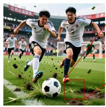

natural_image

Two soccer players in action on a field, kicking up the ball with a red dashed box highlighting the goal (no visible text or symbols)

Baseline

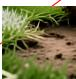

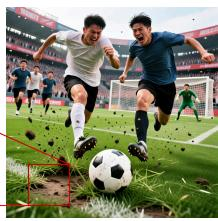

natural_image

Two young men kicking a soccer ball on a grass field during a match (no visible text or symbols)

DAR  
(a) DMD visual comparison

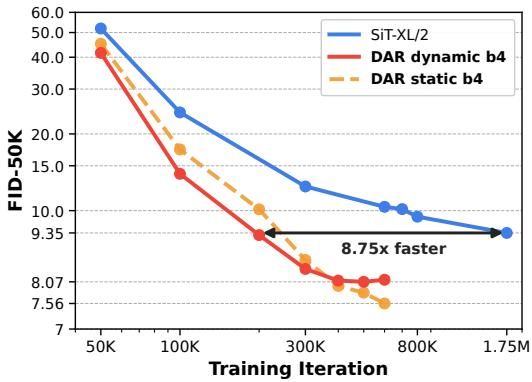

line chart

| Training Iteration | SiT-XL/2 | DAR dynamic b4 | DAR static b4 |
| ------------------ | -------- | -------------- | ------------- |
| 50K                | 50.0     | 42.0           | 43.0          |
| 100K               | 25.0     | 15.0           | 18.0          |
| 300K               | 12.0     | 8.07           | 9.35          |
| 800K               | 10.0     | 8.07           | 7.56          |
| 1.75M              | 9.35     | 8.07           | 7.56          |

(b) Training FID curves  
Figure 1 Overview of the main empirical results. (a) Our method preserves high-frequency details during DMD. (b) Training FID curves on ImageNet 256 × 256.

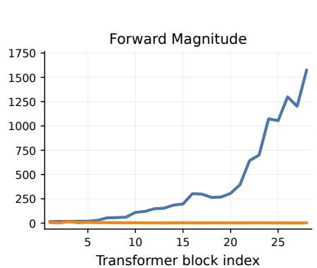

line chart

| Transformer block index | Forward Magnitude |
| ----------------------- | ----------------- |
| 0                       | 0                 |
| 5                       | 50                |
| 10                      | 100               |
| 15                      | 250               |
| 20                      | 300               |
| 25                      | 1250              |
| 27.5                    | 1600              |

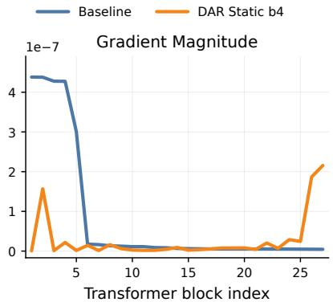

line chart

| Transformer block index | Baseline       | DAR Static b4  |
| ----------------------- | -------------- | -------------- |
| 0                       | 4.5e-7         | 0.0            |
| 5                       | 3.0e-7         | 0.0            |
| 10                      | 0.0            | 0.0            |
| 15                      | 0.0            | 0.0            |
| 20                      | 0.0            | 0.0            |
| 25                      | 0.0            | 0.0            |
| 26                      | 0.0            | 2.0e-7         |

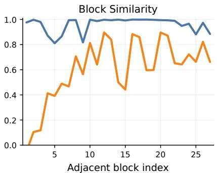

line chart

| Adjacent block index | Blue Line | Orange Line |
| -------------------- | --------- | ----------- |
| 0                    | 1.0       | 0.0         |
| 5                    | 0.8       | 0.4         |
| 10                   | 1.0       | 0.8         |
| 15                   | 1.0       | 0.4         |
| 20                   | 1.0       | 0.9         |
| 25                   | 0.9       | 0.7         |
| 27                   | 0.9       | 0.6         |

Figure 2 Three diagnostic symptoms of standard residual routing in DiTs across depth: forward magnitude inflation, backward gradient decay, and block-wise redundancy. Measured at t=1.0.

## 1 Introduction

Advances in the design and optimization of Diffusion Transformers (DiTs) that replace convolutional U-Nets with token-based Transformer denoisers [41] have led to significant breakthroughs in modern visual generation tasks [3, 15, 25, 27, 46, 58]. A central challenge for modern visual generation with DiTs is to capture the time-varying dynamics of the denoising process by developing architectural innovations. Recent years have seen extensive efforts devoted to key components of DiTs, including macro structure design [2, 13, 31, 41], attention mechanisms [6, 41, 59], conditioning mechanisms [52, 68], learning objectives [29, 66], latent autoencoders [9, 63, 69], and causal and autoregressive DiTs [10, 12, 21]. However, the pre-normalized residual stream in DiTs and its variants — a fundamental design inherited from standard NLP practice — has remained largely unchanged, leaving open the question of its role in governing cross-layer information accumulation during the time-varying denoising process.

This work starts with an in-depth investigation of cross-layer information routing in DiTs, jointly along depth and denoising timestep. On the one hand, our analysis suggests that this seemingly innocuous default residual addition in DiTs gives rise to three symptoms that emerge in lockstep with depth: hidden-state magnitudes inflate monotonically, backward gradients decay sharply, and adjacent transformer blocks become increasingly redundant, as shown in Fig. 2. Strikingly, these symptoms collectively echo the PreNorm dilution phenomenon [61] recently characterized in Large Language Models (LLMs) [30, 53]. On the other hand, cross-layer information flow within DiTs is inherently time-varying: as denoising progresses across a continuum of noise levels, the intermediate representations that matter most should shift from coarse-structure features in high-noise regimes to fine-detail features in low-noise regimes [19, 45]. Thus, the fixed, time-agnostic, and uniform-weighted aggregation, as in conventional LLMs, is poorly suited to DiTs.

Several works have revisited the depth-wise structure of DiTs. A representative line of research [2, 4, 31, 54] grafts U-Net-style long skip connections onto DiTs to bridge shallow and deep layers, with the goal of restoring the fixed hierarchical inductive bias of U-Nets, rather than enabling dynamic and timestep-aware aggregation across layers. Our key insight is that the denoising timestep — the very dimension that distinguishes DiTs from a standard Transformer — should play a vital role in adaptive routing. This motivates depth-wise aggregation mechanisms in DiTs to be learnable, timestep-adaptive, and non-incremental, so as to capture time-varying dynamics.

Building on the above insights, this work elevates cross-layer information routing in DiTs from an inherited convention to an explicit design axis, with contributions on two complementary fronts.

On the diagnostic side, we conduct, to the best of our knowledge, the first systematic study of cross-layer information flow in DiTs, decomposed jointly by depth and denoising timestep. We reveal that the three symptoms identified above and illustrated in Fig. 2 persist throughout training and vary systematically with the noise level, thereby suggesting that the role of the pre-normalized residual stream extends beyond stabilizing deep training, and exposing a spatiotemporal structure of PreNorm dilution that is invisible to

LLM-side analyses.

On the methodological side, we propose Diffusion-Adaptive Routing (DAR), a drop-in residual replacement that performs learnable, timestep-adaptive, and non-incremental aggregation. Inspired by [53], we replace the running residual at each sublayer with a softmax attention over preceding sublayer outputs, where the query is computed from the current adaLN-modulated hidden state, allowing the routing mechanism to inherit both content and timestep dependence from DiT’s existing conditioning pathway. This preserves the isotropic and homogeneous Transformer stack without introducing manually specified layer pairing, and remains compatible with modern Transformer enhancement methods, such as REPA [66].

Empirically, on ImageNet 256×256, DAR consistently outperforms vanilla SiT in our experiments, achieving 7.56 FID with SiT-XL/2 (2.11 ↓ over the baseline) while matching the baseline’s converged quality in roughly 8.75× fewer training iterations. Critically, the gains of DAR are orthogonal to representation-alignment objectives: combining DAR with REPA [66] yields a 2× training acceleration in the early stage over REPA alone. This suggests that cross-layer information routing is a promising and underexplored direction for improving diffusion models, complementary to existing learning objectives. Quantitatively, the three dilution symptoms identified by our diagnosis tighten in lockstep with these FID gains, linking the diagnostic findings to the observed performance gains.

Overall, the main contributions of this paper are summarized as follows

• We conduct, to the best of our knowledge, the first comprehensive investigation of the cross-layer information flow in DiTs along both depth and denoising timestep and identify three concrete symptoms of the prevailing residual structure in DiTs, that is, forward magnitude inflation, backward gradient decay, and block-wise redundancy.  
• We propose DAR, a drop-in residual replacement for DiTs that performs learnable, timestep-adaptive, and non-incremental aggregation. The design operates purely along the depth dimension, preserving the isotropic and homogeneous Transformer stack, and remains compatible with many modern Transformer enhancement methods, such as REPA.  
• Our method improves both convergence speed and final quality of diffusion transformers: on SiT, we achieve 8.75× faster training and a 2.11 FID improvement over the baseline. Stacked on top of REPA [66], it yields a 2× training acceleration in the early stage over REPA alone, demonstrating that depth-wise routing operates synergistically with existing representation-alignment objectives.

The rest of this paper is organized as follows. Section 2 reviews previous studies related to this work. Section 3 presents an in-depth investigation of cross-layer information flow in DiTs. Section 4 introduces DAR. Section 5 conducts experiments to demonstrate the effectiveness of our proposed DAR. Section 6 concludes this work.

## 2 Related Work

This section reviews seminal studies on cross-layer information routing and DiT architectures. An extended discussion is provided in Appendix A.

Evolution of Cross-Layer Information Routing. Cross-layer information routing in deep networks begins with standard residual connections, where layers communicate through fixed additive recursion [16, 51]. Subsequent work mainly improves this residual pathway for optimization stability, including gated or scaled variants such as ReZero [1], LayerScale [55], and DeepNorm [57], which adjust residual strength without fundamentally changing the routing topology. Beyond single-stream propagation, Hyper-Connections [70] introduces multi-stream recurrence with learned mixing, which mHC [60] subsequently refines by imposing doubly stochastic constraints on the mixing for more stable signal propagation at scale. In parallel, another line of work grants layers more direct access to earlier representations, from dense connectivity in DenseNet [20] to learned depth aggregation in DenseFormer [40] and explicit depth-wise softmax attention in Attention Residuals [53]. Overall, prior studies show a clear transition from fixed residual recursion toward learned, selective, and increasingly dynamic routing across depth. Despite the rapid architectural evolution of generative Transformers, the depth-wise routing dimension remains far less explored than these architectural developments.

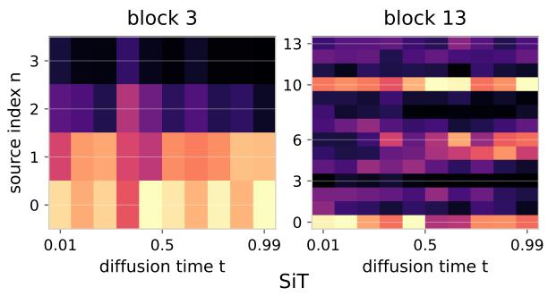

heatmap

| source index n | diffusion time t | block |
| --- | --- | --- |
| 0 | 0.01 | block 3 |
| 0 | 0.5 | block 3 |
| 0 | 0.99 | block 3 |
| 1 | 0.01 | block 3 |
| 1 | 0.5 | block 3 |
| 1 | 0.99 | block 3 |
| 2 | 0.01 | block 3 |
| 2 | 0.5 | block 3 |
| 2 | 0.99 | block 3 |
| 3 | 0.01 | block 3 |
| 3 | 0.5 | block 3 |
| 3 | 0.99 | block 3 |
| 0 | 0.01 | block 13 |
| 0 | 0.5 | block 13 |
| 0 | 0.99 | block 13 |
| 1 | 0.01 | block 13 |
| 1 | 0.5 | block 13 |
| 1 | 0.99 | block 13 |
| 2 | 0.01 | block 13 |
| 2 | 0.5 | block 13 |
| 2 | 0.99 | block 13 |
| 3 | 0.01 | block 13 |
| 3 | 0.5 | block 13 |
| 3 | 0.99 | block 13 |
| 4 | 0.01 | block 13 |
| 4 | 0.5 | block 13 |
| 4 | 0.99 | block 13 |
| ... | ... | ... |
| ... | ... | ... |
| ... | ... | ... |
| ... | ... | ... |
| ... | ... | ... |
| ... | ... | ... |
| ... | ... | ... |
| ... | ... | ... |
| ... | ... | ... |
| ... | ... | ... |
| ... | ... | ... |
| ... | ... | ... |
| ... | ... | ... |
| ... | ... | ... |
| ... | ... | ... |
| ... | ... | ... |
| ... | ... | ... |
| ... | ... | ... |
| ... | ... | ... |
| ... | ... | ... |
| ... | ... | ... nan |
| ... | ... | ... nan |
| ... | ... | ... nan |
| ... | ... | ... nan |
| ... | ... | ... nan |
| ... | ... | ... nan |
| ... | ... | ... nan |
| ... | ... | ... nan |
| ... | ... | ... nan |
| ... | ... | ... nan |
| ... | ... | ... nan |
| ... | ... | ... nan |
| ... | ... | ... nan |
| ... | ... | ... nan |
| ... | ... | ... nan |
| ... | ... | ... nan |
| ... | ... | ... nan |
| ... | ... | ... nan |
| ... | ... | ... nan |
| ... | ... | ... nan |
| ... | ... | ... nan |
| ... | ... | ... nan |
| ... | ... | ... nan |
| ... | ... | ... nan |
| ... | ... | ... nan |
| ... | ... | ... nan |
| ... | ... | ... nan |
| ... | ... | ... nan |
| ... | ... | ... nan |
| ... | ... | ... nan |
| ... | ... | ... nan |
| ... | ... | ... nan |
| ... | ... | ... nan |
| ... | ... | ... nan |
| ... | ... | ... nan |
| ... | ... | ... nan |
| ... | ... | ... nan |
| ..., .. | .. | .. |
| .. | .. | .. |
| .. | .. | .. |
| .. | .. | .. |
| .. | .. | .. |
| .. | .. | .. |
| .. | .. | .. |
| .. | .. | .. |
| .. | .. | .. |
| .. | .. | .. |
| .. | .. | .. |
| .. | .. | .. |
| .. | .. | .. |
| .. | .. | .. |
| .. | .. | .. |
| .. | .. | .. |
| .. | .. | .. |
| .. | .. | .. |
| .. | .. | .. |
| .. | .. | .. |
| .. | .. | .. |

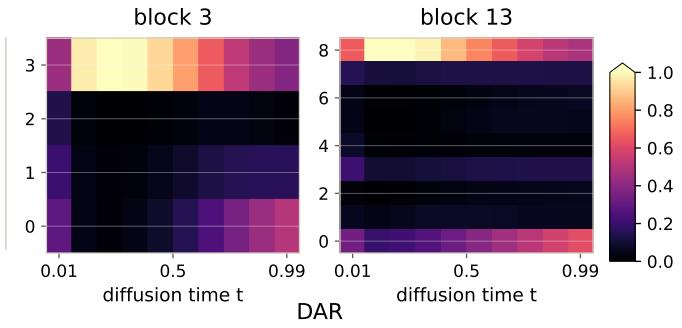

heatmap

| Block | Diffusion Time t | Value |
|-------|------------------|-------|
| block 3 | 0.01             | ~0.2  |
| block 3 | 0.5              | ~0.8  |
| block 3 | 0.99             | ~0.4  |
| block 3 | 0.01             | ~0.6  |
| block 3 | 0.5              | ~0.9  |
| block 3 | 0.99             | ~0.7  |
| block 13 | 0.01             | ~0.4  |
| block 13 | 0.5              | ~0.7  |
| block 13 | 0.99             | ~0.5  |

Figure 3 Source-mixing patterns across denoising timesteps. For the SiT model with standard residual routing, we add measurement-only scalar gates initialized to 1 on historical residual sources, keep the forward pass unchanged, and plot loss gradients with respect to the gates as counterfactual source importance; for DAR, we plot the learned softmax routing weights.

Evolution of Diffusion Transformers. DiTs have evolved from ViT-style U-Net replacements to specialized architectures for scalable generation. U-ViT shows that noisy image patches, timesteps, and conditions can be treated as tokens in a Transformer denoiser while retaining long skip connections [2]. DiTs further simplify this design into a pure latent-space Transformer and establish clear scaling behavior [41]. Subsequent work has mainly progressed along two directions. One improves multimodal fusion and conditioning. For example, PixArt [6–8] retains conventional cross-attention, whereas MM-DiT [13] shifts to a unified self-attention framework. This trend also accompanies the adoption of stronger language models as condition encoders: Lumina-T2X [14], Playground v3 [33], and Sana [59] use decoder-only LLMs as text encoders, while Qwen-Image [58] further extends this design with a vision-language encoder. The other direction advances generative formulations and training objectives. SiT [35] unifies diffusion- and flow-based objectives, while Stable Diffusion 3 [13] stresses rectified-flow training at scale. Notably, REPA [66] accelerates DiT training by introducing a representation-alignment objective that aligns hidden states of DiTs with pretrained visual representations. Overall, the recent evolution of DiTs has focused heavily on backbone scaling, conditioning pathways, and training objectives, whereas the residual pathway itself has remained largely unchanged.

## 3 Diagnosing Cross-Layer Information Flow in DiTs

In this section, we provide an empirical investigation of cross-layer information routing in DiTs, jointly along depth and denoising timestep. We analyze two models: a vanilla $\mathrm { S i T - X L / 2 }$ baseline and a static variant of DAR with chunk size $S = 4$ . Both models are checkpointed after 600K training iterations, and diagnostics are computed on 4096 ImageNet samples. For each transformer block $k \in \{ 1 , \ldots , 2 8 \}$ , we record three statistics of its output hidden state $z _ { k }$ . The first is the forward magnitude $\mathrm { R M S } ( z _ { k } )$ (root-mean-square of the feature values, averaged over batch and tokens). The second is the backward gradient magnitude $\mathrm { R M S } ( \partial \mathcal { L } / \partial z _ { k } )$ , where L is the velocity-prediction MSE used for SiT training. The third is the block similarity $\cos ( z _ { k } , z _ { k + 1 } )$ , defined as the per-token cosine similarity between consecutive block outputs averaged over batch and tokens. For DAR, we use $z _ { k }$ to denote the aggregated state passed to block $k + 1 ;$ when $k = 2 8 , z _ { k }$ denotes the final aggregated state fed to the prediction head.

Fig. 2 plots the forward hidden-state magnitude, backward gradient magnitude, and block-wise similarity as functions of the Transformer block index. The blue curves, corresponding to the standard residual baseline, reveal three diagnostic symptoms that all intensify with depth. The forward hidden-state magnitude grows monotonically from ∼ 15.5 at block 1 to ∼ 1576 at block 28, corresponding to roughly 100× inflation. Combined with the unit-RMS normalization applied at each block input, this growth forces deeper blocks to produce ever-larger raw outputs in order to retain influence over the residual stream, echoing the PreNorm dilution phenomenon characterized in LLMs [30, 53, 61]. The backward gradient magnitude drops sharply after the first five blocks. Early blocks receive substantial signal $( \sim 5 \times 1 0 ^ { - 7 } )$ , whereas later blocks are lower by more than an order of magnitude and remain close to zero throughout the deep stack. This pattern suggests that the standard residual pathway provides limited control over gradient flow, leaving deeper layers with substantially weaker optimization signals. The per-token cosine similarity between consecutive block outputs stays above 0.9 throughout the deep stack, indicating that neighboring deep blocks produce highly similar representations. This high similarity suggests substantial representational redundancy under the standard residual routing.

We next probe the timestep dimension, the key axis that distinguishes DiTs from standard Transformers. For DAR, the softmax weights $\alpha _ { i \to l } ( t )$ are directly observable; for the SiT baseline, which exposes no router by construction, we attach a scalar gate initialized to 1 on each historical residual source and read out the gradient of the denoising loss with respect to that gate as a counterfactual importance of how a baseline-equivalent router would reweight each source if one existed, while keeping the forward pass numerically identical to the unmodified baseline. Fig. 3 visualizes both quantities at a shallow and a deep location, and two observations stand out. Although the baseline never sees a router during training, its counterfactual importance map already varies systematically along t at both depths, with the preferred sources at high noise differing visibly from those at low noise — the standard residual stack exhibits timestep-dependent source preferences, suggesting the value of timestep-conditioned aggregation. DAR’s learned weights provide the missing degree of freedom suggested by this diagnostic: the softmax concentrates sharply on a small subset of historical sources, and this selection itself shifts smoothly with t at both shallow and deep blocks, confirming that timestep-adaptive cross-layer routing is not an externally imposed inductive bias but a latent need of the DiT residual pathway that DAR directly meets.

Taken together, these findings point to an inherent rigidity in standard residual routing, which is associated with three issues: PreNorm dilution driven by residual-stream magnitude growth [30, 38, 53, 61], imbalanced gradient propagation across depth [53, 60, 70], and high feature similarity and redundancy [5, 22, 36, 49]. These observations suggest that standard residuals provide cross-layer propagation, but lack adaptive control over which previous representations should be emphasized or suppressed.

## 4 Exploring Cross-Layer Interaction Spaces in DiTs

## 4.1 Cross-layer Routing in DiTs

Motivated by the diagnostic results, we revisit how existing DiT architectures route information. Rather than viewing cross-layer information routing as a post-hoc architectural add-on, we treat it as a fundamental design dimension that is already implicitly instantiated in DiTs.

Standard residual routing in DiTs. Standard DiTs inherit the residual routing of the original Transformer. For clarity, we treat each self-attention or MLP sublayer as an individual transformation:

$$
h _ {l + 1} = h _ {l} + f _ {l} (h _ {l}; t), \tag {1}
$$

where $h _ { l } \in \mathbb { R } ^ { T \times d }$ denotes the hidden token sequence entering sublayer l, t is the diffusion or flow timestep, and $f _ { l }$ is the corresponding attention or MLP transformation. We omit the conditioning signal for simplicity. Unrolling the recurrence gives

$$
h _ {l} = h _ {0} + \sum_ {i = 0} ^ {l - 1} f _ {i} (h _ {i}; t). \tag {2}
$$

Standard DiTs already perform a form of cross-layer information routing. However, this routing pattern is fixed,

since all previous outputs enter the residual stream with unit coefficients. Thus, standard DiTs cannot explicitly decide which earlier representations should be retrieved or suppressed at a given depth or denoising stage.

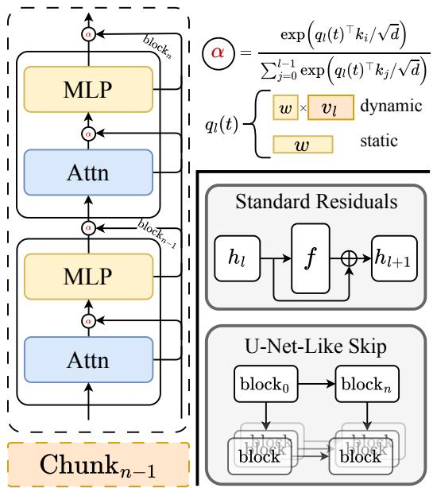

flowchart

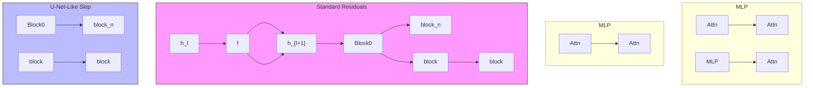

Figure 4 Overview of the proposed Diffusion-Adaptive Routing (DAR) and previous methods.

U-Net-like skip routing. Previous works [2, 4, 31, 54] introduce a U-Net-like routing pattern for diffusion models. Abstractly, for a deep layer l, U-Net-like long skip routing augments its input with a paired shallow representation

$$
\tilde {h} _ {l} = \psi_ {l} \left(h _ {l}, h _ {\pi (l)}\right), \tag {3}
$$

where $\pi ( l ) < l$ indexes the corresponding shallow layer and $\psi _ { l }$ denotes the skip-fusion operation. The layer update can then be written as

$$
h _ {l + 1} = \tilde {h} _ {l} + f _ {l} (\tilde {h} _ {l}; t). \tag {4}
$$

From a routing perspective, U-Net-like skip routing shows that diffusion Transformers can benefit from multi-level feature fusion. Nevertheless, the routing topology in U-Net-like skip routing remains manually specified, and this connection pattern weakens the homogeneity that makes Transformers naturally scalable.

## 4.2 Diffusion-Adaptive Routing

Drawing on the recently proposed Attention Residuals (AttnRes) framework [53], which replaces fixed residual accumulation with softmax attention over depth, we instantiate Diffusion-Adaptive Routing (DAR) for DiTs with several design choices tailored to the diffusion setting. Let $v _ { i } = f _ { i } ( h _ { i } ; t )$ denote the output of the i-th sublayer with $v _ { 0 } = h _ { 0 }$ the input embedding. In contrast to the standard residual routing that accumulates these sources into a single running stream $\begin{array} { r } { h _ { l } = h _ { 0 } + \sum _ { i < l } v _ { i } } \end{array}$ with unit weights, the proposed DAR replaces the unweighted sum with a softmax-weighted aggregation

$$
h _ {l} = \sum_ {i = 0} ^ {l - 1} \alpha_ {i \rightarrow l} (t) v _ {i} \quad \text { with } \quad \alpha_ {i \rightarrow l} (t) = \frac {\exp \left(q _ {l} (t) ^ {\top} k _ {i} / \sqrt {d}\right)}{\sum_ {j = 0} ^ {l - 1} \exp \left(q _ {l} (t) ^ {\top} k _ {j} / \sqrt {d}\right)}, \tag {5}
$$

where $k _ { i } = \mathrm { R M S N o r m } ( v _ { i } )$ is the key associated with source $v _ { i } .$ , and the softmax is computed over the source set ${ \cal S } _ { l } = \{ v _ { 0 } , v _ { 1 } , \dots , v _ { l - 1 } \}$ . The aggregated $h _ { l }$ then enters the sublayer transformation following $v _ { l } = f _ { l } ( h _ { l } ; t )$ .

Query parameterization. The per-layer query $q _ { l } ( t )$ admits two natural choices

$$
q _ {l} (t) = \left\{ \begin{array}{l l} w _ {l}, & (\text { static }) \\ W _ {q} ^ {(l)} v _ {l - 1}, & (\text { dynamic }) \end{array} \right. \tag {6}
$$

where $\boldsymbol { w } _ { l } \in \mathbb { R } ^ { d }$ is a layer-specific learnable vector and $W _ { q } ^ { ( l ) } \in \mathbb { R } ^ { d \times d }$ is a layer-specific projection. Notably, this is a sharp departure from the LLM-side observation in AttnRes, where the dynamic variant improves only marginally over the static one. We attribute this departure to the diffusion timestep dimension unique to DiTs, which is a structural feature absent in the LLM setting and fundamentally reshapes how the per-layer query should be conditioned. We elaborate on this point below.

Timestep injection. Concretely, the main difference between static and dynamic query parameterization lies in how t enters the per-layer query. The former keeps wl time-independent by construction, whereas the latter injects t implicitly since the network input $x _ { t }$ is itself a noised latent and further amplified at each sublayer through DiT’s adaLN-Zero conditioning pathway. Additionally, we consider an explicit injection variant that augments wl with the timestep embedding e(t) reused from DiT’s existing t-embedder, i.e., $q _ { l } ( t ) = w _ { l } + e ( t )$ at no additional parameter cost. The final layer of the t-embedder is zero-initialized, so that $e ( t ) = 0$ at initialization and the model exactly recovers the pure static variant at the start of training. Overall, this yields three query variants of timestep injection: pure static, explicit timestep injection, and dynamic. A more detailed comparison that disentangles timestep awareness from input dependence is provided in Section 5.3.

Chunked aggregation. Retaining all L source vectors increases the activation footprint linearly with depth. To reduce this cost, we support a chunked variant that partitions the L sublayers into N chunks of size

<table><tr><td rowspan="2">Method</td><td rowspan="2">Iters.</td><td rowspan="2">Params</td><td colspan="5">w/o guidance</td><td colspan="5">w/ guidance</td></tr><tr><td>FID↓</td><td>sFID↓</td><td>IS↑</td><td>Prec.↑</td><td>Rec.↑</td><td>FID↓</td><td>sFID↓</td><td>IS↑</td><td>Prec.↑</td><td>Rec.↑</td></tr><tr><td colspan="13">Standard Residuals</td></tr><tr><td>DiTODE</td><td rowspan="2">1.75M</td><td rowspan="2">675M</td><td>10.58</td><td>5.64</td><td>114.2</td><td>0.65</td><td>0.67</td><td>2.25</td><td>4.56</td><td>239.2</td><td>0.80</td><td>0.59</td></tr><tr><td>DiTSDE</td><td>9.62</td><td>-</td><td>121.5</td><td>0.67</td><td>0.67</td><td>2.27</td><td>-</td><td>278.2</td><td>0.83</td><td>0.57</td></tr><tr><td>SiTODE</td><td rowspan="2">1.75M</td><td rowspan="2">675M</td><td>9.67</td><td>6.40</td><td>124.1</td><td>0.66</td><td>0.68</td><td>2.15</td><td>4.60</td><td>258.1</td><td>0.81</td><td>0.60</td></tr><tr><td>SiTSDE</td><td>8.61</td><td>6.32</td><td>131.7</td><td>0.68</td><td>0.67</td><td>2.06</td><td>4.49</td><td>270.3</td><td>0.82</td><td>0.59</td></tr><tr><td>SiT-PlusODE</td><td rowspan="2">1M</td><td rowspan="2">752M</td><td>10.85</td><td>5.57</td><td>115.2</td><td>0.66</td><td>0.67</td><td>2.36</td><td>4.40</td><td>244.6</td><td>0.80</td><td>0.58</td></tr><tr><td>SiT-PlusSDE</td><td>10.02</td><td>5.18</td><td>119.9</td><td>0.68</td><td>0.66</td><td>2.34</td><td>4.56</td><td>254.1</td><td>0.82</td><td>0.57</td></tr><tr><td colspan="13">U-Net-Like Routing</td></tr><tr><td>U-ViT-H/2ODE</td><td>500K</td><td>585M</td><td>-</td><td>-</td><td>-</td><td>-</td><td>-</td><td>2.29</td><td>5.68</td><td>263.9</td><td>0.82</td><td>0.57</td></tr><tr><td>U-DiT-LSDE</td><td>250K</td><td>810M</td><td>7.54</td><td>5.27</td><td>135.5</td><td>0.70</td><td>0.66</td><td>3.00</td><td>4.40</td><td>286.6</td><td>0.86</td><td>0.52</td></tr><tr><td colspan="13">Our Method</td></tr><tr><td>Static c4ODE</td><td rowspan="2">600K</td><td rowspan="2">675M</td><td>7.56</td><td>5.18</td><td>131.1</td><td>0.69</td><td>0.68</td><td>2.08</td><td>4.42</td><td>272.9</td><td>0.83</td><td>0.61</td></tr><tr><td>Static c4SDE</td><td>6.92</td><td>5.27</td><td>138.8</td><td>0.70</td><td>0.67</td><td>2.23</td><td>4.49</td><td>287.0</td><td>0.84</td><td>0.57</td></tr><tr><td>Dynamic c4ODE</td><td rowspan="2">500K</td><td rowspan="2">751M</td><td>8.07</td><td>5.07</td><td>129.0</td><td>0.68</td><td>0.69</td><td>2.05</td><td>4.39</td><td>270.1</td><td>0.82</td><td>0.60</td></tr><tr><td>Dynamic c4SDE</td><td>7.39</td><td>5.20</td><td>134.7</td><td>0.71</td><td>0.67</td><td>2.17</td><td>4.49</td><td>284.8</td><td>0.83</td><td>0.57</td></tr></table>

Table 1 System-level comparison on ImageNet $2 5 6 \times 2 5 6$ generation, with and without classifier-free guidance [18], with the best results marked in bold. We use CFG with $w = 1 . 5$ . Here, c4 denotes a chunk size of 4.

$S = L / N$ . Each chunk n is summarized by a single representation $c _ { n } : = v _ { n S }$ , i.e., the output of its last sublayer. For any sublayer l in chunk n, the source set is replaced by

$$
\mathcal {S} _ {l} = \underbrace {\left\{c _ {0} , c _ {1} , \dots , c _ {n - 1} \right\}} _ {\text { prior   chunk   summaries }} \cup \underbrace {\left\{v _ {(n - 1) S + 1} , \dots , v _ {l - 1} \right\}} _ {\text { current   intra - chunk   sources }}, \tag {7}
$$

which consists of summaries from previous chunks together with the full set of sources within the current chunk. The softmax aggregation therefore runs over $| S _ { l } | \le S + N$ sources, reducing source memory from $O ( L d )$ to $O ( ( S + N ) d )$ . Our chunked design differs from the LLM-side instantiation of AttnRes in both the choice of chunk summary and the chunk size. We analyze this gap and its dependence on depth in Appendix C.3 and Section 5.5.

## 5 Experiments

## 5.1 Setup

Implementation details. Unless otherwise specified, we follow the setup of SiT [35]. We train on ImageNet-1K [43] at $2 5 6 \times 2 5 6$ resolution, with the same data preprocessing as SiT. To ensure a fair comparison, we retrain $\mathrm { { S i T - X L / 2 } }$ from scratch under the identical training recipe. For experiments combining DAR with REPA [66], we follow the original REPA configuration. We do not use any additional training tricks beyond those in the original SiT recipe. Full hyperparameters and experimental details are provided in Appendix C.

Evaluation. We report Fréchet Inception Distance (FID; [17]), Inception Score (IS; [44]), spatial Fréchet Inception Distance (sFID; [37]), precision and recall (Pre. and Rec. [26]), computed using 50,000 samples. We use both ODE and SDE samplers as in SiT, with 250 function evaluations by default; unless otherwise specified, we report ODE results.

<table><tr><td>Method</td><td>100K</td><td>200K</td><td>400K</td></tr><tr><td>Static w/o t-injection</td><td>22.36</td><td>15.47</td><td>11.51</td></tr><tr><td>Dynamic</td><td>13.95</td><td>9.29</td><td>8.10</td></tr><tr><td>Static w/ t-injection</td><td>17.39</td><td>10.12</td><td>7.97</td></tr></table>

Table 2 Ablation on timestep awareness in DAR. We report FID↓ at different training iterations.

<table><tr><td>Method</td><td>100K</td><td>200K</td><td>300K</td></tr><tr><td>SiT + REPA</td><td>9.89</td><td>6.89</td><td>6.29</td></tr><tr><td>DAR + REPA</td><td>7.09</td><td>5.92</td><td>5.68</td></tr></table>

Table 3 Compatibility with REPA. We report FID↓ at different training iterations.

## 5.2 Better Quality and Faster Convergence

We first show in Tab. 1 that DAR improves both final quality and convergence speed. Compared to the vanilla $\mathrm { { S i T - X L / 2 } }$ baseline trained for 1.75M iterations, the static variant of DAR achieves a substantially better FID of 6.92 (SDE) without CFG, while training for only 600K iterations. The dynamic variant attains the best ODE FID with CFG (2.05), again outperforming the SiT baseline with far fewer training iterations. To rule out the possibility that these gains arise simply from increased model size, we further train SiT-Plus, a widened $_ { \mathrm { S i T - X L / 2 } }$ matched to the 752M parameter count of dynamic c4. Despite using 2× the training budget, SiT-Plus still trails DAR by a wide margin, confirming that the gains of DAR cannot be explained simply by parameter scaling.

A natural follow-up question is whether the gains of DAR merely reproduce what can already be achieved by equipping DiTs with U-Net-like skip pathways. We therefore compare against two representative models from this family in Tab. 1: U-ViT-H/2 [2] and U-DiT-L [54]. Under SDE with CFG, DAR static c4 outperforms U-DiT-L by 0.77 FID while using only 0.83× as many parameters. Under ODE, DAR dynamic c4 further improves over U-ViT-H/2 by 0.24 FID. The gap is informative: hand-designed skip topologies wire shallow and deep layers together at predetermined depths and with fixed, time-invariant fusion weights, whereas DAR replaces these manual choices with learned and timestep-adaptive aggregation. Most importantly, DAR preserves the isotropic, homogeneous Transformer stack that underlies modern scaling.

## 5.3 Timestep Awareness Is Crucial for Routing in DiTs

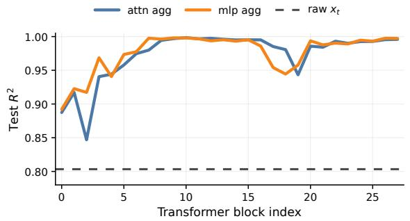

line chart

| Transformer block index | attn agg | mlp agg | raw x_t |
| ----------------------- | -------- | ------- | ------- |
| 0                       | 0.89     | 0.89    | 0.80    |
| 5                       | 0.94     | 0.97    | 0.80    |
| 10                      | 0.99     | 0.99    | 0.80    |
| 15                      | 0.99     | 0.99    | 0.80    |
| 20                      | 0.98     | 0.99    | 0.80    |
| 25                      | 0.99     | 0.99    | 0.80    |

Figure 5 Linear-probe test $R ^ { 2 }$ for decoding the scalar denoising timestep t from the aggregated hidden states that feed the router at each depth in DAR-Dynamic.

Cross-layer information routing in DiTs differs fundamentally from its LLM counterpart in one key respect: the denoising timestep t is a first-class control signal that modulates every layer’s computation, and the very motivation for adaptive routing, that different noise levels demand different mixtures of shallow and deep features, presupposes that the router itself is aware of t. The three query parameterizations of §4.2 differ precisely in how this awareness is introduced. The pure static variant, $q _ { l } = w _ { l } .$ , leaves the router blind to the $q _ { l } ( t ) = W _ { q } ^ { ( l ) } v _ { l - 1 }$ rives its query from the most recent sublayer output, so any timestep information already encoded in $v _ { l - 1 }$ is naturally inherited by the routing weights. We refer to this as implicit timestep injection. The explicit-injection

variant, $q _ { l } ( t ) = w _ { l } + e ( t )$ , instead reuses DiT’s existing timestep embedding to add a direct timestep signal to an otherwise time-invariant query, at no additional parameter cost. As shown in Tab. 2, both timestep-aware variants substantially outperform the timestep-blind baseline at matched compute. This supports the view that timestep awareness—regardless of how it is injected—is the key ingredient.

The effectiveness of the dynamic variant rests on a non-trivial premise: the input to the dynamic query, $v _ { l - 1 }$ , actually retains sufficient timestep information for $W _ { q } ^ { ( l ) }$ to extract. We test this premise directly with a linear-probe diagnostic. For a frozen DAR-Dynamic checkpoint, we sweep t over a uniform grid while holding the underlying $( x _ { 0 } , x _ { 1 } )$ image-noise pairs fixed, collect the aggregated hidden state $h _ { l }$ that feeds each sublayer’s router, and fit a ridge regressor that maps the pooled feature back to the scalar t on disjoint pair-level train/test splits. Fig. 5 reports the resulting test $R ^ { 2 }$ across all 28 blocks. Both the attention and MLP aggregator inputs sit well above the raw input latents $x _ { t }$ baseline $( R ^ { 2 } \approx 0 . 8 0 )$ at every depth, exceed 0.95 within the first five blocks, and remain close to 1.0 throughout the deep stack. Thus the timestep is not merely present but linearly decodable from the very tensors the dynamic query consumes, confirming that $q _ { l } ( t ) \stackrel { - } { = } \bar { W } _ { q } ^ { ( l ) } v _ { l - 1 }$ with the mechanism underlying the early-training advantage of the dynamic variant.

## 5.4 DAR Is Orthogonal to REPA

REPA [66] accelerates DiT training by aligning intermediate hidden states with a pretrained visual encoder, an objective-level intervention that leaves the residual pathway untouched. DAR, in contrast, restructures how those hidden states are aggregated across depth, a purely architectural change that is agnostic to the training loss. The two interventions therefore act along orthogonal axes, and a natural question is whether their gains compound or merely overlap. Tab. 3 answers this directly: stacking DAR on top of REPA improves FID from 9.89 to 7.09 at 100K iterations and from 6.89 to 5.92 at 200K iterations. Notably, DAR+REPA at 100K already matches REPA alone at 200K, a roughly $2 \times$ early-stage speedup, while DAR+REPA at 200K surpasses even the 300K FID of REPA alone, indicating that the routing-level and representation-level accelerations compound rather than offset each other.

## 5.5 Chunk Size Choices

The chunked aggregation in §4.2 exposes a single knob, the chunk size $S ,$ that interpolates between two extremes: $S =$ 1 degenerates to the dense, all-source variant where every sublayer output enters the routing softmax, while large S collapses each chunk to a single summary $c _ { n }$ and aggressively compresses the source set. Tab. 4 reports a sweep of $S \in$ {1, 4, 8} on DAR under matched compute (300K iterations) and reveals a clear U-shaped pattern with $S = 4$ at the bottom. We now show that this U-shaped pattern is not coincidental:

<table><tr><td>Chunk size</td><td>1</td><td>4</td><td>8</td></tr><tr><td>FID↓</td><td>10.41</td><td>8.39</td><td>11.14</td></tr><tr><td>IS↑</td><td>107.2</td><td>121.7</td><td>103.51</td></tr></table>

Table 4 Effects of chunk size S in chunked aggregation on SiT- $. { \mathrm { X L } } / 2 ,$ , ImageNet 256×256, no classifier-free guidance.

the cost can be decomposed into two competing terms whose unique minimum lies precisely in the $S \approx 4$ regime predicted for DAR.

Under a mild rate-distortion model, the per-aggregator cost of chunked aggregation decomposes additively as

$$
\mathcal {L} (S) = \log (L / S + S) + \alpha \log S \text {   with   } \alpha \in (0, 1), \tag {8}
$$

where L is the total number of sublayers and $S \in ( 0 , L ]$ denotes the chunk size. The first term is the maximum-entropy lower bound on a softmax over |S| slots and caps the routing precision attainable by a bounded-norm query; the second is the rate-distortion cost of compressing S sublayer outputs into a single d-dimensional summary, with α discounting the loss to reflect partial recoverability through vertical attention over earlier summaries.

Proposition 1 (U-shaped cost of chunked aggregation). Let $L > 0$ and $\alpha \in ( 0 , 1 )$ . Then $\mathcal { L } ( S )$ in $E q$ . (8) is strictly decreasing on $( 0 , S ^ { \star } )$ and strictly increasing on $( S ^ { \star } , \infty )$ , where

$$
S ^ {\star} = \sqrt {L \cdot \frac {1 - \alpha}{1 + \alpha}}. \tag {9}
$$

Consequently, L(S) is U-shaped and has a unique global minimizer at $S ^ { \star }$ .

A detailed proof and further analysis are provided in Appendix B.

## 5.6 Large-Scale T2I Model Post-Training

Beyond ImageNet, we apply Distribution Matching Distillation [64, 65] to Qwen-Image [58] equipped with DAR. We find that adaptive cross-layer information routing helps the distilled model preserve high-frequency details, including sharp edges and fine textures, which are easily attenuated during aggressive few-step distillation. Full setup and samples are deferred to Appendix D.

## 6 Conclusion

In this paper, we conducted a systematic investigation of cross-layer information routing in DiTs, jointly along depth and denoising timestep, identified three symptoms of the pre-normalized residual stream inherited from the original Transformer—forward magnitude inflation, backward gradient decay, and block-wise redundancy— and accordingly proposed DAR, a drop-in residual replacement that performs learnable, timestep-adaptive, and non-incremental aggregation. On ImageNet 256×256, DAR attains a best FID of 6.92 on SiT-XL/2, matches the baseline with 8.75× fewer iterations, and further delivers a 2× early-stage speedup over REPA. These results identify cross-layer routing as an underexplored design axis that complements prevailing advances in diffusion modeling. Further discussion of limitations and future work is provided in Appendix F.

## References

[1] Thomas Bachlechner, Bodhisattwa Prasad Majumder, Henry Mao, Gary Cottrell, and Julian McAuley. Rezero is all you need: Fast convergence at large depth. In Uncertainty in artificial intelligence, pages 1352–1361. PMLR, 2021.  
[2] Fan Bao, Shen Nie, Kaiwen Xue, Yue Cao, Chongxuan Li, Hang Su, and Jun Zhu. All are worth words: A vit backbone for diffusion models. In Proceedings of the IEEE/CVF conference on computer vision and pattern recognition, pages 22669–22679, 2023.  
[3] Huanqia Cai, Sihan Cao, Ruoyi Du, Peng Gao, Steven Hoi, Zhaohui Hou, Shijie Huang, Dengyang Jiang, Xin Jin, Liangchen Li, et al. Z-image: An efficient image generation foundation model with single-stream diffusion transformer. arXiv preprint arXiv:2511.22699, 2025.  
[4] Guanjie Chen, Xinyu Zhao, Yucheng Zhou, Xiaoye Qu, Tianlong Chen, and Yu Cheng. Towards stabilized and efficient diffusion transformers through long-skip-connections with spectral constraints. In Proceedings of the IEEE/CVF International Conference on Computer Vision, pages 17708–17718, 2025.  
[5] Hanqi Chen, Xu Zhang, Xiaoliu Guan, Lielin Jiang, Guanzhong Wang, Zeyu Chen, and Yi Liu. Sortblock: Similarity-aware feature reuse for diffusion model. In Proceedings of the AAAI Conference on Artificial Intelligence, volume 40, pages 2859–2867, 2026.  
[6] Junsong Chen, Jincheng Yu, Chongjian Ge, Lewei Yao, Enze Xie, Yue Wu, Zhongdao Wang, James Kwok, Ping Luo, Huchuan Lu, et al. PixArt-α: Fast training of diffusion transformer for photorealistic text-to-image synthesis. arXiv preprint arXiv:2310.00426, 2023.  
[7] Junsong Chen, Chongjian Ge, Enze Xie, Yue Wu, Lewei Yao, Xiaozhe Ren, Zhongdao Wang, Ping Luo, Huchuan Lu, and Zhenguo Li. Pixart-σ: Weak-to-strong training of diffusion transformer for 4k text-to-image generation. In European Conference on Computer Vision, pages 74–91. Springer, 2024.  
[8] Junsong Chen, Yue Wu, Simian Luo, Enze Xie, Sayak Paul, Ping Luo, Hang Zhao, and Zhenguo Li. Pixart-{\delta}: Fast and controllable image generation with latent consistency models. arXiv preprint arXiv:2401.05252, 2024.  
[9] Junyu Chen, Han Cai, Junsong Chen, Enze Xie, Shang Yang, Haotian Tang, Muyang Li, Yao Lu, and Song Han. Deep compression autoencoder for efficient high-resolution diffusion models. arXiv preprint arXiv:2410.10733, 2024.  
[10] Xinle Cheng, Tianyu He, Jiayi Xu, Junliang Guo, Di He, and Jiang Bian. Playing with transformer at 30+ fps via next-frame diffusion. arXiv preprint arXiv:2506.01380, 2025.  
[11] En Ci, Shanyan Guan, Yanhao Ge, Yilin Zhang, Wei Li, Zhenyu Zhang, Jian Yang, and Ying Tai. Describe, don’t dictate: Semantic image editing with natural language intent. In Proceedings of the IEEE/CVF International Conference on Computer Vision, pages 19185–19194, 2025.  
[12] Chaorui Deng, Deyao Zhu, Kunchang Li, Shi Guang, and Haoqi Fan. Causal diffusion transformers for generative modeling. arXiv preprint arXiv:2412.12095, 2024.  
[13] Patrick Esser, Sumith Kulal, Andreas Blattmann, Rahim Entezari, Jonas Müller, Harry Saini, Yam Levi, Dominik Lorenz, Axel Sauer, Frederic Boesel, et al. Scaling rectified flow transformers for high-resolution image synthesis. In Forty-first international conference on machine learning, 2024.  
[14] Peng Gao, Le Zhuo, Dongyang Liu, Ruoyi Du, Xu Luo, Longtian Qiu, Yuhang Zhang, Chen Lin, Rongjie Huang, Shijie Geng, et al. Lumina-t2x: Transforming text into any modality, resolution, and duration via flow-based large diffusion transformers. arXiv preprint arXiv:2405.05945, 2024.  
[15] Yoav HaCohen, Benny Brazowski, Nisan Chiprut, Yaki Bitterman, Andrew Kvochko, Avishai Berkowitz, Daniel Shalem, Daphna Lifschitz, Dudu Moshe, Eitan Porat, et al. Ltx-2: Efficient joint audio-visual foundation model. arXiv preprint arXiv:2601.03233, 2026.  
[16] Kaiming He, Xiangyu Zhang, Shaoqing Ren, and Jian Sun. Deep residual learning for image recognition. In Proceedings of the IEEE conference on computer vision and pattern recognition, pages 770–778, 2016.  
[17] Martin Heusel, Hubert Ramsauer, Thomas Unterthiner, Bernhard Nessler, and Sepp Hochreiter. Gans trained by a two time-scale update rule converge to a local nash equilibrium. Advances in neural information processing systems, 30, 2017.  
[18] Jonathan Ho and Tim Salimans. Classifier-free diffusion guidance. arXiv preprint arXiv:2207.12598, 2022.  
[19] Jonathan Ho, Ajay Jain, and Pieter Abbeel. Denoising diffusion probabilistic models. Advances in neural information processing systems, 33:6840–6851, 2020.  
[20] Gao Huang, Zhuang Liu, Laurens Van Der Maaten, and Kilian Q Weinberger. Densely connected convolutional networks. In Proceedings of the IEEE conference on computer vision and pattern recognition, pages 4700–4708, 2017.  
[21] Xun Huang, Zhengqi Li, Guande He, Mingyuan Zhou, and Eli Shechtman. Self forcing: Bridging the train-test gap in autoregressive video diffusion. arXiv preprint arXiv:2506.08009, 2025.  
[22] Jiachen Jiang, Jinxin Zhou, and Zhihui Zhu. Tracing representation progression: Analyzing and enhancing layer-wise similarity. arXiv preprint arXiv:2406.14479, 2024.  
[23] Tero Karras, Miika Aittala, Timo Aila, and Samuli Laine. Elucidating the design space of diffusion-based generative models. Advances in neural information processing systems, 35:26565–26577, 2022.  
[24] Diederik Kingma, Tim Salimans, Ben Poole, and Jonathan Ho. Variational diffusion models. Advances in neural information processing systems, 34:21696–21707, 2021.  
[25] Weijie Kong, Qi Tian, Zijian Zhang, Rox Min, Zuozhuo Dai, Jin Zhou, Jiangfeng Xiong, Xin Li, Bo Wu, Jianwei Zhang, et al. Hunyuanvideo: A systematic framework for large video generative models. arXiv preprint arXiv:2412.03603, 2024.  
[26] Tuomas Kynkäänniemi, Tero Karras, Samuli Laine, Jaakko Lehtinen, and Timo Aila. Improved precision and recall metric for assessing generative models. Advances in neural information processing systems, 32, 2019.  
[27] Black Forest Labs. Flux. https://github.com/black-forest-labs/flux, 2024.  
[28] Black Forest Labs, Stephen Batifol, Andreas Blattmann, Frederic Boesel, Saksham Consul, Cyril Diagne, Tim Dockhorn, Jack English, Zion English, Patrick Esser, et al. Flux. 1 kontext: Flow matching for in-context image generation and editing in latent space. arXiv preprint arXiv:2506.15742, 2025.  
[29] Xingjian Leng, Jaskirat Singh, Yunzhong Hou, Zhenchang Xing, Saining Xie, and Liang Zheng. Repa-e: Unlocking vae for end-to-end tuning with latent diffusion transformers. arXiv preprint arXiv:2504.10483, 2025.  
[30] Tianyu Li, Dongchen Han, Zixuan Cao, Haofeng Huang, Mengyu Zhou, Ming Chen, Erchao Zhao, Xiaoxi Jiang, Guanjun Jiang, and Gao Huang. Siamesenorm: Breaking the barrier to reconciling pre/post-norm. arXiv preprint arXiv:2602.08064, 2026.  
[31] Zhimin Li, Jianwei Zhang, Qin Lin, Jiangfeng Xiong, Yanxin Long, Xinchi Deng, Yingfang Zhang, Xingchao Liu, Minbin Huang, Zedong Xiao, Dayou Chen, Jiajun He, Jiahao Li, Wenyue Li, Chen Zhang, Rongwei Quan, Jianxiang Lu, Jiabin Huang, Xiaoyan Yuan, Xiaoxiao Zheng, Yixuan Li, Jihong Zhang, Chao Zhang, Meng Chen, Jie Liu, Zheng Fang, Weiyan Wang, Jinbao Xue, Yangyu Tao, Jianchen Zhu, Kai Liu, Sihuan Lin, Yifu Sun, Yun Li, Dongdong Wang, Mingtao Chen, Zhichao Hu, Xiao Xiao, Yan Chen, Yuhong Liu, Wei Liu, Di Wang, Yong Yang, Jie Jiang, and Qinglin Lu. Hunyuan-dit: A powerful multi-resolution diffusion transformer with fine-grained chinese understanding, 2024.  
[32] Yaron Lipman, Ricky TQ Chen, Heli Ben-Hamu, Maximilian Nickel, and Matt Le. Flow matching for generative modeling. arXiv preprint arXiv:2210.02747, 2022.  
[33] Bingchen Liu, Ehsan Akhgari, Alexander Visheratin, Aleks Kamko, Linmiao Xu, Shivam Shrirao, João Pedro Gandarela de Souza, Suhail Doshi, and Daiqing Li. Playground v3: Improving text-to-image alignment with deepfusion large language models. ArXiv, abs/2409.10695, 2024. URL https://api.semanticscholar.org/CorpusID: 272694430.  
[34] Xingchao Liu, Chengyue Gong, and Qiang Liu. Flow straight and fast: Learning to generate and transfer data with rectified flow. arXiv preprint arXiv:2209.03003, 2022.  
[35] Nanye Ma, Mark Goldstein, Michael S Albergo, Nicholas M Boffi, Eric Vanden-Eijnden, and Saining Xie. Sit: Exploring flow and diffusion-based generative models with scalable interpolant transformers. In European Conference on Computer Vision, pages 23–40. Springer, 2024.  
[36] Xin Men, Mingyu Xu, Qingyu Zhang, Qianhao Yuan, Bingning Wang, Hongyu Lin, Yaojie Lu, Xianpei Han, and Weipeng Chen. Shortgpt: Layers in large language models are more redundant than you expect. In Findings of the Association for Computational Linguistics: ACL 2025, pages 20192–20204, 2025.  
[37] Charlie Nash, Jacob Menick, Sander Dieleman, and Peter Battaglia. Generating images with sparse representations. In International Conference on Machine Learning, pages 7958–7968. PMLR, 2021.  
[38] Toan Q Nguyen and Julian Salazar. Transformers without tears: Improving the normalization of self-attention. In Proceedings of the 16th international conference on spoken language translation, 2019.  
[39] Alexander Quinn Nichol and Prafulla Dhariwal. Improved denoising diffusion probabilistic models. In International conference on machine learning, pages 8162–8171. PMLR, 2021.  
[40] Matteo Pagliardini, Amirkeivan Mohtashami, Francois Fleuret, and Martin Jaggi. Denseformer: Enhancing information flow in transformers via depth weighted averaging. Advances in neural information processing systems, 37:136479–136508, 2024.  
[41] William Peebles and Saining Xie. Scalable diffusion models with transformers. In Proceedings of the IEEE/CVF international conference on computer vision, pages 4195–4205, 2023.  
[42] Robin Rombach, Andreas Blattmann, Dominik Lorenz, Patrick Esser, and Björn Ommer. High-resolution image synthesis with latent diffusion models. In Proceedings of the IEEE/CVF conference on computer vision and pattern recognition, pages 10684–10695, 2022.  
[43] Olga Russakovsky, Jia Deng, Hao Su, Jonathan Krause, Sanjeev Satheesh, Sean Ma, Zhiheng Huang, Andrej Karpathy, Aditya Khosla, Michael Bernstein, et al. Imagenet large scale visual recognition challenge. International journal of computer vision, 115(3):211–252, 2015.  
[44] Tim Salimans, Ian Goodfellow, Wojciech Zaremba, Vicki Cheung, Alec Radford, and Xi Chen. Improved techniques for training gans. Advances in neural information processing systems, 29, 2016.  
[45] Antonio Sclocchi, Alessandro Favero, and Matthieu Wyart. A phase transition in diffusion models reveals the hierarchical nature of data. Proceedings of the National Academy of Sciences, 122(1):e2408799121, 2025.  
[46] Team Seedream, Yunpeng Chen, Yu Gao, Lixue Gong, Meng Guo, Qiushan Guo, Zhiyao Guo, Xiaoxia Hou, Weilin Huang, Yixuan Huang, et al. Seedream 4.0: Toward next-generation multimodal image generation. arXiv preprint arXiv:2509.20427, 2025.  
[47] Jascha Sohl-Dickstein, Eric Weiss, Niru Maheswaranathan, and Surya Ganguli. Deep unsupervised learning using nonequilibrium thermodynamics. In International conference on machine learning, pages 2256–2265. pmlr, 2015.  
[48] Jiaming Song, Chenlin Meng, and Stefano Ermon. Denoising diffusion implicit models. arXiv preprint arXiv:2010.02502, 2020.  
[49] Jiwon Song, Kyungseok Oh, Taesu Kim, Hyungjun Kim, Yulhwa Kim, and Jae-Joon Kim. Sleb: Streamlining llms through redundancy verification and elimination of transformer blocks. In International Conference on Machine Learning, pages 46136–46155. PMLR, 2024.  
[50] Yang Song, Jascha Sohl-Dickstein, Diederik P Kingma, Abhishek Kumar, Stefano Ermon, and Ben Poole. Score-based generative modeling through stochastic differential equations. arXiv preprint arXiv:2011.13456, 2020.  
[51] Rupesh Kumar Srivastava, Klaus Greff, and Jürgen Schmidhuber. Highway networks. arXiv preprint arXiv:1505.00387, 2015.  
[52] Zhenxiong Tan, Songhua Liu, Xingyi Yang, Qiaochu Xue, and Xinchao Wang. Ominicontrol: Minimal and universal control for diffusion transformer. In Proceedings of the IEEE/CVF International Conference on Computer Vision, pages 14940–14950, 2025.  
[53] Kimi Team, Guangyu Chen, Yu Zhang, Jianlin Su, Weixin Xu, Siyuan Pan, Yaoyu Wang, Yucheng Wang, Guanduo Chen, Bohong Yin, et al. Attention residuals. arXiv preprint arXiv:2603.15031, 2026.  
[54] Yuchuan Tian, Zhijun Tu, Hanting Chen, Jie Hu, Chao Xu, and Yunhe Wang. U-dits: Downsample tokens in u-shaped diffusion transformers. Advances in Neural Information Processing Systems, 37:51994–52013, 2024.  
[55] Hugo Touvron, Matthieu Cord, Alexandre Sablayrolles, Gabriel Synnaeve, and Hervé Jégou. Going deeper with image transformers. In Proceedings of the IEEE/CVF international conference on computer vision, pages 32–42, 2021.  
[56] Team Wan, Ang Wang, Baole Ai, Bin Wen, Chaojie Mao, Chen-Wei Xie, Di Chen, Feiwu Yu, Haiming Zhao, Jianxiao Yang, et al. Wan: Open and advanced large-scale video generative models. arXiv preprint arXiv:2503.20314, 2025.  
[57] Hongyu Wang, Shuming Ma, Li Dong, Shaohan Huang, Dongdong Zhang, and Furu Wei. Deepnet: Scaling transformers to 1,000 layers. IEEE Transactions on Pattern Analysis and Machine Intelligence, 46(10):6761–6774, 2024.  
[58] Chenfei Wu, Jiahao Li, Jingren Zhou, Junyang Lin, Kaiyuan Gao, Kun Yan, Sheng-ming Yin, Shuai Bai, Xiao Xu, Yilei Chen, et al. Qwen-image technical report. arXiv preprint arXiv:2508.02324, 2025.  
[59] Enze Xie, Junsong Chen, Junyu Chen, Han Cai, Haotian Tang, Yujun Lin, Zhekai Zhang, Muyang Li, Ligeng Zhu, Yao Lu, et al. Sana: Efficient high-resolution image synthesis with linear diffusion transformers. arXiv preprint arXiv:2410.10629, 2024.  
[60] Zhenda Xie, Yixuan Wei, Huanqi Cao, Chenggang Zhao, Chengqi Deng, Jiashi Li, Damai Dai, Huazuo Gao, Jiang Chang, Kuai Yu, et al. mhc: Manifold-constrained hyper-connections. arXiv preprint arXiv:2512.24880, 2025.  
[61] Ruibin Xiong, Yunchang Yang, Di He, Kai Zheng, Shuxin Zheng, Chen Xing, Huishuai Zhang, Yanyan Lan, Liwei Wang, and Tieyan Liu. On layer normalization in the transformer architecture. In International conference on machine learning, pages 10524–10533. PMLR, 2020.  
[62] Zhuoyi Yang, Jiayan Teng, Wendi Zheng, Ming Ding, Shiyu Huang, Jiazheng Xu, Yuanming Yang, Wenyi Hong, Xiaohan Zhang, Guanyu Feng, et al. Cogvideox: Text-to-video diffusion models with an expert transformer. arXiv preprint arXiv:2408.06072, 2024.  
[63] Jingfeng Yao, Bin Yang, and Xinggang Wang. Reconstruction vs. generation: Taming optimization dilemma in latent diffusion models. In Proceedings of the Computer Vision and Pattern Recognition Conference, pages 15703–15712, 2025.  
[64] Tianwei Yin, Michaël Gharbi, Taesung Park, Richard Zhang, Eli Shechtman, Fredo Durand, and William T Freeman. Improved distribution matching distillation for fast image synthesis. Advances in neural information processing systems, 37:47455–47487, 2024.  
[65] Tianwei Yin, Michaël Gharbi, Richard Zhang, Eli Shechtman, Fredo Durand, William T Freeman, and Taesung Park. One-step diffusion with distribution matching distillation. In Proceedings of the IEEE/CVF conference on computer vision and pattern recognition, pages 6613–6623, 2024.  
[66] Sihyun Yu, Sangkyung Kwak, Huiwon Jang, Jongheon Jeong, Jonathan Huang, Jinwoo Shin, and Saining Xie. Representation alignment for generation: Training diffusion transformers is easier than you think. In International Conference on Learning Representations, 2025.  
[67] Tianyuan Zhang, Sai Bi, Yicong Hong, Kai Zhang, Fujun Luan, Songlin Yang, Kalyan Sunkavalli, William T Freeman, and Hao Tan. Test-time training done right. arXiv preprint arXiv:2505.23884, 2025.  
[68] Yuxuan Zhang, Yirui Yuan, Yiren Song, Haofan Wang, and Jiaming Liu. Easycontrol: Adding efficient and flexible control for diffusion transformer. In Proceedings of the IEEE/CVF International Conference on Computer Vision, pages 19513–19524, 2025.  
[69] Boyang Zheng, Nanye Ma, Shengbang Tong, and Saining Xie. Diffusion transformers with representation autoencoders. arXiv preprint arXiv:2510.11690, 2025.

[70] Defa Zhu, Hongzhi Huang, Zihao Huang, Yutao Zeng, Yunyao Mao, Banggu Wu, Qiyang Min, and Xun Zhou. Hyper-connections. arXiv preprint arXiv:2409.19606, 2024.

In the Appendix, we provide supplementary materials for our work “Rethinking Cross-Layer Information Routing in Diffusion Transformers”, organized according to the corresponding sections in the main paper.

## A More Discussion on Related Work

## A.1 Diffusion Models

Diffusion models were originally formulated as a finite-step Markov chain that progressively corrupts data with Gaussian noise and learns to reverse the process via a variational bound [19, 47], and Song et al. [50] unified this view with score matching by recasting the forward and reverse processes as a continuous-time SDE with an equivalent probability-flow ODE. Subsequent work refined the noise schedule and parameterization [23, 24, 39, 48]. To avoid pixel-space cost, latent diffusion performs denoising in the compressed latent space of a pretrained autoencoder [42]. A parallel line reformulated generation as learning a deterministic velocity field that transports noise to data, with Flow Matching [32] regressing onto the conditional velocity along a prescribed probability path and Rectified Flow [34] favoring straight transport for few-step inference; SiT [35] casts diffusion- and flow-based objectives under a single interpolant framework, and Stable Diffusion 3 [13] scales rectified-flow training to large text-to-image models. Diffusion models have since become a dominant generative paradigm, achieving remarkable success in image generation [27, 58, 59], image editing [11, 28, 67], video generation [56, 62], and related visual synthesis tasks.

## B Proof of Proposition and Empirical Verification

For convenience, we restate the proposition.

Proposition 1 (U-shaped cost of chunked aggregation). Let $L > 0$ and $\alpha \in ( 0 , 1 )$ . Then $\mathcal { L } ( S )$ in $E q . \ ( 8 )$ is strictly decreasing on $( 0 , S ^ { \star } )$ and strictly increasing on $( S ^ { \star } , \infty )$ , where

$$
S ^ {\star} = \sqrt {L \cdot \frac {1 - \alpha}{1 + \alpha}}. \tag {10}
$$

Consequently, $\mathcal { L } ( S )$ is U-shaped and has a unique global minimizer at $S ^ { \star }$ .

Proof. Differentiating Eq. (8) yields

$$
\mathcal {L} ^ {\prime} (S) = \frac {S ^ {2} - L}{S (S ^ {2} + L)} + \frac {\alpha}{S} = \frac {(1 + \alpha) S ^ {2} - (1 - \alpha) L}{S (S ^ {2} + L)}.
$$

Since $S ( S ^ { 2 } + L ) > 0$ for all $S > 0$ , the sign of ${ \mathcal { L } } ^ { \prime } ( S )$ is determined by

$$
(1 + \alpha) S ^ {2} - (1 - \alpha) L.
$$

Thus,

$$
\mathcal {L} ^ {\prime} (S) <   0 \quad \mathrm{for} \quad S <   S ^ {\star}, \qquad \mathcal {L} ^ {\prime} (S) = 0 \quad \mathrm{for} \quad S = S ^ {\star}, \qquad \mathcal {L} ^ {\prime} (S) > 0 \quad \mathrm{for} \quad S > S ^ {\star},
$$

where

$$
S ^ {\star} = \sqrt {L \cdot \frac {1 - \alpha}{1 + \alpha}}.
$$

Therefore, $\mathcal { L } ( S )$ is strictly decreasing on $( 0 , S ^ { \star } )$ and strictly increasing on $( S ^ { \star } , \infty )$ , which proves that $S ^ { \star }$ is the unique global minimizer. □

Empirical agreement. For $\mathrm { { S i T - X L / 2 } }$ (depth 28, two sublayers per chunk, hence $L = 5 6 )$ , Eq. (9) predicts $S ^ { \star } \in [ 3 . 7 , 4 . 9 ]$ over the realistic range $\alpha \in [ 0 . 4 , 0 . 6 ]$ , identifying $S = 4$ as the model-predicted optimum. This agrees quantitatively with Tab. 4: $S = 4$ improves on both the under-compressed extreme $S = 1$ (no chunking, $| S | = L ,$ , dominated by the routing-entropy term) and the over-compressed $S = 8$ (small $| S |$ but large per-summary distortion). We therefore use √ $S = 4$ throughout the main experiments. Since Eq. (9) predicts $S ^ { \star }$ to scale as ${ \sqrt { L } } .$ , we further conjecture that scaling DiTs to substantially deeper backbones will require a proportionally larger chunk size.

## C Additional Implementation Details

## C.1 Experimental Configuration

Unless otherwise specified, all ImageNet experiments follow the training recipe of SiT [35]. We train models with a global batch size of 1024, a learning rate of $1 \times 1 0 ^ { - 4 }$ , and bfloat16 mixed precision. All compared models are trained under the same optimization and data-processing settings unless explicitly stated otherwise. For experiments involving REPA [66], we adopt the original REPA configuration. Specifically, we use DINOv2-B as the pretrained visual encoder, set the representation-alignment coefficient to 0.5, and apply the alignment loss to the hidden representation at the eighth layer. No additional modifications are introduced beyond replacing the residual routing mechanism with the proposed DAR. To ensure a fair comparison, we rerun the SiT and REPA baselines under our experimental setting rather than directly copying numbers from prior work.

## C.2 Compute Resources

Experiments were conducted on NVIDIA H20 GPUs with 192 CPU cores and 1024 GB of system memory. For the DAR-static-c4 configuration, each training step takes approximately 0.59 seconds.

## C.3 Additional Implementation Details for DAR

Dedicated final aggregator. In our design, the final aggregator that produces the input to the prediction layer has access not only to the prior chunk summaries but also to all raw sublayer outputs of the last chunk

$$
\mathcal {S} _ {\text { final }} = \underbrace {\left\{c _ {0} , c _ {1} , \dots , c _ {N - 1} \right\}} _ {\text { prior   chunk   summaries }} \cup \underbrace {\left\{v _ {(N - 1) S + 1} , v _ {(N - 1) S + 2} , \dots , v _ {L} \right\}} _ {\text { raw   last - chunk   sublayer   outputs }}. \tag {11}
$$

This is in contrast to AttnRes, whose final layer aggregates strictly over the N chunk summaries. The intuition is that the most recent sublayer outputs carry the most task-specific signal; thus, exposing them in raw form, rather than compressed into a single summary, lets the final layer recover fine-grained information that the chunk-level summary would otherwise discard. This yields about a 2-point FID gain after 200K training iterations.

REPA-specific implementation. For experiments that combine DAR with REPA, we depart from the dedicated final aggregator described above and instead let the last chunk reuse its own MLP aggregator parameters — the static/dynamic query (wl or ${ W } _ { q } ^ { ( l ) } )$ and the per-source RMSNorm — to perform the final aggregation. This is an empirically motivated design that improves performance.

## D Details of Large-Scale T2I Model Post-Training

For large-scale T2I post-training, we apply DMD to Qwen-Image [58] with DAR inserted into the MM-DiT backbone. We use LoRA fine-tuning with rank 64, and train the student branch with a learning rate of $5 \times 1 0 ^ { - 6 }$ together with a fake branch learning rate of $2 \times 1 0 ^ { - 6 }$ . Distillation is performed with 4 denoising steps and guidance scale 4.0. We train at $1 0 2 4 ^ { 2 }$ resolution using bfloat16 mixed precision and a per-GPU batch size of 1. More visualizations are provided in the supplementary materials.

## E Infrastructure

A naive implementation of DAR’s vertical aggregation $\begin{array} { r } { h _ { l } = \sum _ { i < l } \alpha _ { i  l } ( t ) v _ { i } } \end{array}$ decomposes into separate kernels for per-source RMSNorm, query–key dot product, softmax, and weighted sum, each launching its own CUDA kernel, materializing [N, B, T, D]-shaped intermediates in HBM, and reading the source tensor four times per forward pass; since N scales with depth, this baseline is both memory- and bandwidth-bound. We collapse the entire forward path into a single Triton kernel that uses an online-softmax recurrence to fuse the normalization constant with the weighted accumulator in one streaming loop over the N sources, so that $\{ v _ { i } \} _ { i < l }$ is read from HBM exactly once and all per-source intermediates $\begin{array} { r l } { - \operatorname { R M S } ( v _ { i } ) , k _ { i } , q ^ { \top } k _ { i } , \exp ( \cdot ) \enspace - } \end{array}$ live entirely in registers.

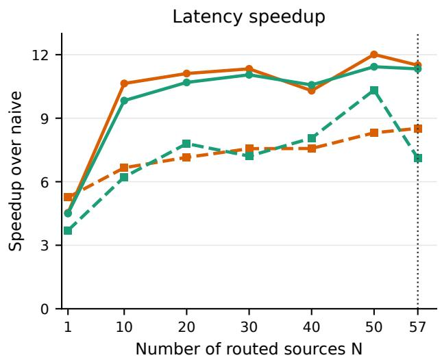

line chart

| Number of routed sources N | Speedup over naive (Solid Line) | Speedup over naive (Dashed Line) |
| -------------------------- | -------------------------------- | --------------------------------- |
| 1                          | 5.0                              | 3.5                               |
| 10                         | 10.5                             | 6.0                               |
| 20                         | 11.0                             | 7.5                               |
| 30                         | 11.5                             | 7.0                               |
| 40                         | 10.5                             | 7.5                               |
| 50                         | 12.0                             | 9.0                               |
| 57                         | 11.5                             | 8.0                               |

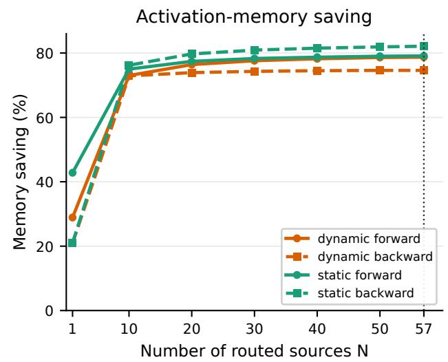

line chart

| Number of routed sources N | dynamic forward | dynamic backward | static forward | static backward |
| -------------------------- | --------------- | ---------------- | -------------- | --------------- |
| 1                          | 30              | 20               | 43             | 22              |
| 10                         | 75              | 75               | 76             | 77              |
| 20                         | 77              | 74               | 78             | 80              |
| 30                         | 78              | 74               | 80             | 81              |
| 40                         | 79              | 74               | 80             | 82              |
| 50                         | 79              | 74               | 80             | 82              |
| 57                         | 79              | 74               | 80             | 82              |

Figure 6 Infrastructure benchmark of the fused Triton implementation for DAR. Left: latency speedup over a naive implementation as a function of the number of routed sources N. Right: activation-memory saving, shown for the dynamic/static variants and the forward/backward passes.

The backward kernel applies the same idea in two passes: it first streams the sources to recover the softmax statistics $( m , Z , s )$ , then streams them again to recompute the RMSNorm intermediates on the fly and emit $\partial \mathcal { L } / \partial v _ { i } , \partial \mathcal { L } / \partial q$ , and $\partial \mathcal { L } / \partial w _ { \mathrm { N O R M } }$ in two HBM reads instead of four to five; we further fuse the downstream LayerNorm and adaLN modulate into the same kernel. Microbenchmarks at the $\mathrm { { S i T - X L / 2 } }$ working point $( N = 5 7 )$ in Fig. 6 show the fused kernel reducing forward latency from 22.5 ms to 1.96 ms (11.5×) and backward from 115.8 ms to 13.6 ms (8.5×) for the dynamic variant, with peak activation memory dropping by 78.7% in the forward and 74.6% in the backward pass (and up to 82.1% for the static variant); the savings grow monotonically with N, keeping the chunked aggregator viable as DiTs scale to deeper backbones. The fused kernel is numerically equivalent to the reference PyTorch path up to floating-point reordering and serves as a drop-in replacement used throughout the main paper.

## F Limitations and Future Work

We view the most compelling next step as pushing DAR along the two scale axes that dominate modern generative Transformers: large-scale pretraining and large-scale post-training. On the pretraining side, stateof-the-art T2I and T2V backbones such as MM-DiT [13], Qwen-Image [58], FLUX [27], and HunyuanVideo [25] routinely scale to several billion parameters with substantially deeper Transformer stacks, where the PreNormdilution symptoms diagnosed in Section 3 should manifest more severely than in√ $\mathrm { { S i T - X L } / 2 ; }$ Eq. (9) further predicts that the optimal chunk size grows as $\sqrt { L }$ , hinting that the headroom for DAR may widen rather than saturate with depth, which makes a systematic scaling study on multi-billion-parameter MM-DiT and video-DiT pretraining the most natural and informative follow-up direction we envision. On the post-training side, our preliminary DMD [64, 65] experiment on Qwen-Image equipped with DAR (Appendix D) suggests that the better-conditioned gradient flow afforded by adaptive routing has a detail-preserving effect on otherwise brittle distillation procedures where the vanilla counterpart diverges, and we plan to extend this observation to a broader family of post-training objectives—including supervised fine-tuning, RL-style preference optimization, and few-step distillation—across multiple large-scale T2I and T2V backbones, to assess whether DAR can serve as a general-purpose technique for the increasingly diverse landscape of diffusion post-training.