# TextTeacher: What Can Language Teach About Images?

# Tobias Christian Nauen

tobias\_christian.nauen@dfki.de

RPTU University Kaiserslautern-Landau

German Research Center for Artificial Intelligence (DFKI)

# Stanislav Frolov

stanislav.frolov@dfki.de

German Research Center for Artificial Intelligence (DFKI)

# Brian B. Moser

brian.moser@dfki.de

German Research Center for Artificial Intelligence (DFKI)

# Federico Raue

federico.raue@dfki.de

German Research Center for Artificial Intelligence (DFKI)

# Ahmed Anwar

ahmed.anwar@dfki.de

German Research Center for Artificial Intelligence (DFKI)

RPTU University Kaiserslautern-Landau

# Andreas Dengel

andreas.dengel@dfki.de

German Research Center for Artificial Intelligence (DFKI)

RPTU University Kaiserslautern-Landau

Reviewed on OpenReview: https: // openreview. net/ forum? id= Xwb0aEUwKh

# Abstract

The platonic representation hypothesis suggests that sufficiently large models converge to a shared representation geometry, even across modalities. Motivated by this, we ask: Can the semantic knowledge of a language model efficiently improve a vision model? As an answer, we introduce TextTeacher, a simple auxiliary objective that injects text embeddings as additional information into image classification training. TextTeacher uses readily available image captions, a pre-trained and frozen text encoder, and a lightweight projection to produce semantic anchors that efficiently guide representations during training while leaving the inference-time model unchanged. On ImageNet with standard ViT backbones, TextTeacher improves accuracy by up to +2.7 percentage points (p.p.) and yields consistent transfer gains (on average +1.0 p.p.) under the same recipe and compute. It outperforms vision knowledge distillation, yielding more accuracy at a constant compute budget or similar accuracy, but 33% faster. Our analysis indicates that TextTeacher acts as a feature-space preconditioner, shaping deeper layers in the first stages of training, and aiding generalization by supplying complementary semantic cues. TextTeacher adds negligible overhead, requires no costly multimodal training of the target model and preserves the simplicity and latency of pure vision models.

Project page with code and captions: https://nauen-it.de/publications/text-teacher

# 1 Introduction

Image classification is a canonical problem in computer vision, powering medical decision support (Sanderson & Matuszewski, 2022; Vezakis et al., 2024), autonomous driving (Wang et al., 2023) and object-centric perception (Girshick et al., 2014; He et al., 2017; Carion et al., 2020). Over the last few years, the Transformer (Vaswani et al., 2017) has emerged as a unifying architecture across modalities, with Large

Language Models (LLMs) advancing natural language processing (Radford et al., 2018; Devlin et al., 2019; Radford et al., 2019; Raffel et al., 2020; Touvron et al., 2023) and Vision Transformers (ViT) pushing visual recognition (Dosovitskiy et al., 2021; Touvron et al., 2021; Caron et al., 2021; Touvron et al., 2022; Oquab et al., 2024). In parallel, multimodal models such as VLMs and contrastively trained image–text encoders have demonstrated impressive zero-shot and transfer capabilities (Radford et al., 2021; Jia et al., 2021; Liu et al., 2023; Grattafiori et al., 2024), but rely on massive web-scale pretraining on tightly coupled image–text pairs.

We draw inspiration from the platonic representation hypothesis (PRH) (Huh et al., 2024), which proposes that sufficiently large models tend to converge to a shared representation geometry even when trained on different modalities. While the PRH is formally expected to hold only for large models and datasets, we treat it as a motivating hypothesis suggesting that representations learned by a large model can be used to guide a significantly smaller model, even if the student uses a different modality and would be too small to “discover” the platonic representation independently. This leads us to the central question: Can we leverage the semantic knowledge learned by a language model to efficiently train a vision model? In particular, without resorting to compute expensive contrastive multimodal training of our target model.

This question is relevant in settings where collecting large image–text corpora is infeasible or where budget constraints preclude web-scale multimodal training; be it due to hardware cost, power consumption, or CO2 footprint (Xu et al., 2023). In particular, these costs can multiply during scientific discovery, where models may be re-trained multiple times (Wang & Zhu, 2024). It is also relevant for real-time, on-device, or safety-critical and regulated environments, where models must remain lightweight during inference or adhere to strict design constraints (Rabe et al., 2021; Myllyaho et al., 2021; Burton & Herd, 2023). If the answer is yes, we could tap into the rich conceptual structure already distilled in language models, leveraging the insight that large models can learn a shared geometry in a co-learning setting to guide visual learning during training, yet deploy an unimodal vision model at test time.

However, enabling language to help vision in this decoupled regime is not straightforward. The two modalities differ in inductive biases, and noise characteristics: Low-level sensor noise for vision (Tian et al., 2020) and semantic and lexicographical ambiguity for language (Abeysiriwardana & Sumanathilaka, 2024; Haber & Poesio, 2024). Naively forcing alignment can distort useful visual invariances, and aggressively coupling objectives risks overfitting to textual idiosyncrasies rather than robust features. Moreover, any auxiliary signal should be lightweight, easy to integrate with common ViT backbones, and ideally removable at inference time.

To address these challenges, we introduce TextTeacher, a drop-in auxiliary training objective that injects textual semantics into a vision-only model. To instantiate our approach at scale, we use pretrained captioning models to generate captions for ImageNet, which lacks textual annotations. We find that concise descriptions containing additional information to the label work best. Concretely, TextTeacher uses these image captions and extracts high-level semantic embeddings by processing them with a frozen, pretrained text encoder. A lightweight projection aligns the vision backbone’s representation space with these embeddings and an auxiliary loss nudges image features toward their corresponding textual anchors. Crucially, the text encoder and projection are used only during training; the resulting model remains a standard, pure vision network at inference, incurring no additional latency or parameters.

This design yields three practical benefits: First, language-derived structure shapes the loss landscape and accelerates the emergence of semantically organized features, thus guiding model convergence to a better optimum and reducing overfitting. Second, TextTeacher provides additional yet semantically aligned information, mitigating the impact of noisy or ambiguous labels. Third, by relying on frozen text encoders and small adapters, we benefit from the shared representation geometry without the cost and complexity of multimodal training of the target model.

We validate these claims empirically on ImageNet and downstream benchmarks. With the same training recipe and budget, TextTeacher boosts accuracy by up to +2.7 p.p. on ImageNet (+8.4 p.p. under noisy labels) and improves transfer performance by +1.0 p.p. on average for transformers on diverse fine-grained tasks, all with negligible overhead. We find that TextTeacher is most effective when injecting information that is complementary to both pixels and labels. When comparing to knowledge distillation from unimodal or multimodal pretrained models, TextTeacher is significantly more efficient, outperforming baselines at a fixed compute budget or alternatively reaching the same or better accuracy at only 66% the compute time. Our ablations indicate that TextTeacher functions as a feature-space preconditioner in the early stages of training, which acts mostly at deeper model layers.

# Contributions:

• We pose and investigate a fundamental question:

Can the semantic knowledge of a language model efficiently improve a vision model? We operationalize this question in a co-learning setting via a decoupled auxiliary signal derived from a frozen text encoder.

• We introduce TextTeacher, a general approach that efficiently injects textual knowledge into standard vision backbones using an auxiliary alignment loss. TextTeacher avoids multimodal pretraining of the target vision model and requires no text components at inference.   
• We provide extensive experiments showing that TextTeacher improves accuracy and transfer, especially under label noise, and acts as a feature-space preconditioner that shapes early training dynamics. We see that our language-based auxiliary guidance outperforms visual guidance and knowledge distillation.

Overall, TextTeacher offers a low-cost, modality-decoupled and PRH-inspired route for importing semantic priors from language into vision, and narrowing the gap between unimodal training pipelines and the semantic richness typically associated with multimodal training while preserving the simplicity and efficiency of pure vision inference.

# 2 Related Work

Contrastive Multimodal Pretraining. CLIP (Radford et al., 2021) popularized dual-encoder contrastive pretraining over web-scale image–text pairs (400M), enabling zero-shot transfer from text. ALIGN (Jia et al., 2021) scales up the dataset size to 1.8 billion noisy pairs. Subsequent work refines the textual signal or augments objectives: A Fistful of Words (Tejankar et al., 2022) uses bag-of-words targets. SLIP (Mu et al., 2022) couples contrastive learning with SimCLR’s (Chen et al., 2020) self-supervision. TIPS (kokitsi Maninis et al., 2025) integrates masked image modeling into CLIP-style training, while AVSE (Liu et al., 2025) injects locality via sub-image/sub-text embeddings. In contrast, we forego web-scale pretraining altogether and train ImageNet classifiers directly, using text as an auxiliary signal for classification.

Captioning as a Training Task. In another line of work, language generation has been used to imbue visual features with semantic structure. VirTex (Desai & Johnson, 2021) pretrains a ConvNet for captioning before finetuning for recognition tasks. CoCa (Yu et al., 2022) unifies caption generation with a CLIP-like image-text contrastive loss. The task-specific DIC-Transformer (Zeng et al., 2024) adds captioning as an auxilliary task to increase interpretability of plant disease classification. While effective, captioning setups require heavy text decoders and learning to generate. Our approach aligns image features to frozen text embeddings, avoiding a generative head.

Multimodal Knowledge Distillation. A complementary direction distills supervision across modalities to compress powerful VLM teachers into compact students. Fang et al. (2021) distill from one VLM to another via on hidden embeddings and attention distributions. VL2Lite (Jang et al., 2025) compresses CLIP into a lightweight image encoder for small-scale image classification task using prompt templates as text input. Guo et al. (2025) replace fixed prompts with learnable text embeddings initialized from WordNet hypernyms. MILAN (Hou & Kung, 2025) pretrains a masked autoencoder while using CLIP image features to weigh patch importance. In comparison, TextTeacher differs by dispensing with a multimodal teacher entirely: We rely on a unimodal language model and off-the-shelf captions, reducing compute and the risk of test-image leakage through massive web corpora.

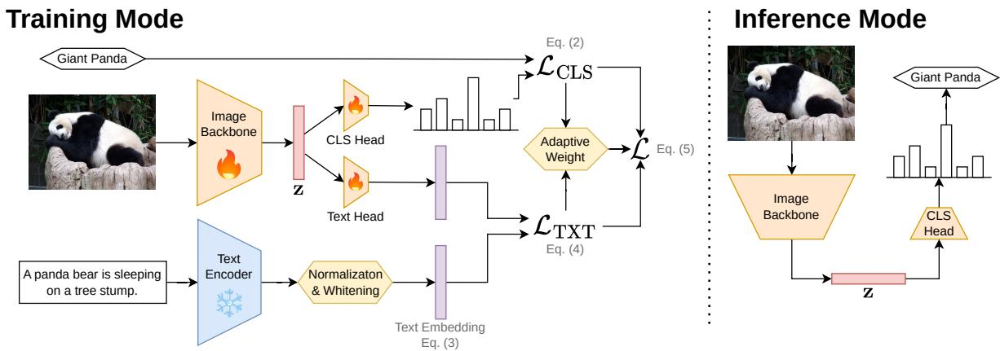

flowchart

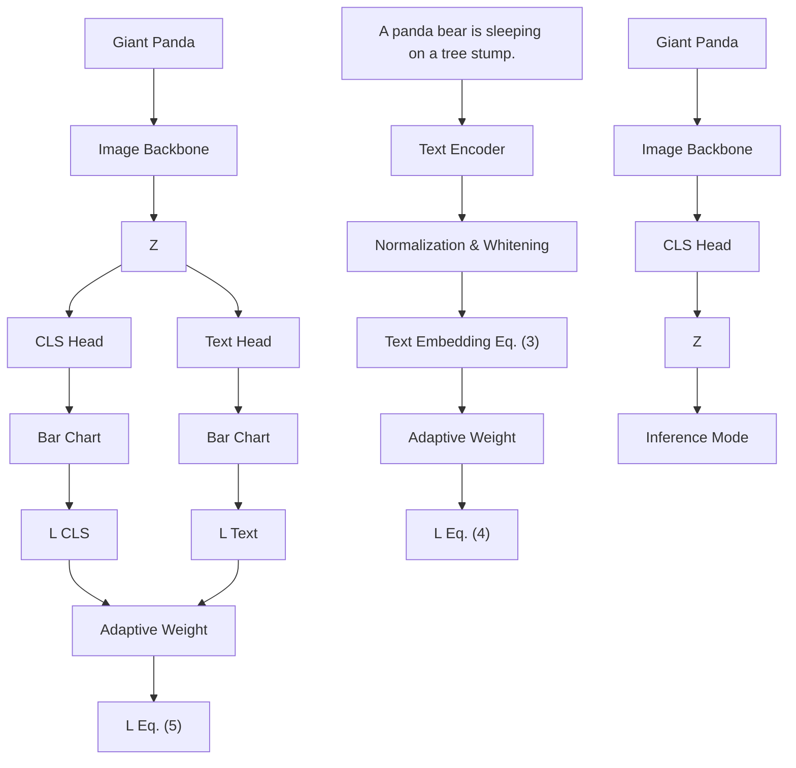

Figure 1: Setup of text-guided image-classification using TextTeacher: During training, we use a frozen text encoder on image captions to inject with semantic knowledge into an image classifier. At inference time, we deploy a standard, unimodal vision model.

Text-Guided Image Classification Training. Closer to our setting, several works add semantically informed signals during classification training. DeViSE (Frome et al., 2013) maps images into a Word2Vec label space and related methods additionally exploit class attributes (Akata et al., 2015). Feuer et al. (2022) extract classification labels from captions, increasing robustness. Most similar to TextTeacher, BorLan (Ma et al., 2023) uses prompt templates to build Gaussian targets in BERT-L’s (Devlin et al., 2019) output space to align image embeddings to. In contrast, TextTeacher utilizes per-image captions to not only re-encode the label information but include additional instance-level information.

Across prior work, multimodal text supervision consistently shapes strong visual features. We study a complementary point: Direct ImageNet training where captions act only as a lightweight training-time preconditioner, improving semantics without changing test-time cost.

# 3 TextTeacher

Our goal is to use a pure text model as a training-time teacher to improve a vanilla vision model, with no text used at inference. We first recap ViT classification, then describe how we extract and normalize language targets, and finally introduce TextTeacher: a dual-head training objective with adaptive loss weighting.

# 3.1 Image Classification with Transformers

We adopt a standard ViT (Dosovitskiy et al., 2021) classifier setup that models the image domain as a sequence-encodpatches of size oblem. First, an input image . Each flattened patch is then $\mathbf { \bar { x } } \in \mathbb { R } ^ { H \times W \times 3 }$ is split into d ∈ N dimen $\begin{array} { r } { N = \frac { H W } { P ^ { 2 } } } \end{array}$ non-overlapping learnable matrix $P \times P$ $\mathbf { \hat { W } } _ { p } \in \mathbb { R } ^ { 3 P ^ { 2 } \times d }$ . After prepending a learnable class token [CLS] and adding positional embeddings, we obtain the input sequence $\bar { \mathbf { X } _ { 0 } } \in \mathbb { R } ^ { ( N + \bar { 1 } ) \times d }$ , which is processed by an L-layer Transformer encoder $T _ { \mathrm { e n c } } ( \cdot ; \theta )$ with trainable parameters θ. Each encoder layer consists of multi-head self-attention followed by an MLP block. The final image embedding z is the encoding of the [CLS] token:

$$
\mathbf {z} = T _ {\text { enc }} (\mathbf {X} _ {0}; \theta) [ \text { CLS } ] \in \mathbb {R} ^ {d}. \tag {1}
$$

A linear head $H _ { \mathrm { c l s } } \in \mathbb { R } ^ { d \times C }$ produces output probabilities $\mathbf { p } _ { \mathrm { c l s } } = \mathrm { s o f t m a x } ( \mathbf { z } H _ { \mathrm { c l s } } )$ over C classes. For classification, we optimize over the standard cross-entropy loss:

$$
\mathcal {L} _ {\mathrm{cls}} = C E \left(\mathbf {p} _ {\mathrm{cls}}, y\right), \tag {2}
$$

where y is the image’s ground-truth label. All trainable parameters $( \theta , \mathbf { W } _ { p } , H _ { \mathrm { c l s } } )$ are updated end-to-end using backpropagation.

# 3.2 Text as a Knowledge Source

We treat language as a structured prior over visual concepts. Concretely, each training image is paired with a caption that we embed with a frozen text encoder to obtain a semantic target. We then normalize these targets to expose a well-behaved “knowledge manifold” that regularizes the visual representation during training.

Curating large human-annotated image–text corpora is costly and misaligned with our goal of both lightweight training and having captions for the class-labeled images we need for image classification. Instead, we require only that each labeled training image x be associated with one caption cap[x]. In practice, we obtain cap[x] from off-the-shelf captioners (e.g., BLIP-L (Li et al., 2023), CoCa (Yu et al., 2022), Dragonfly (Thapa et al., 2024), PaliGemma (Beyer et al., 2024)) and, when desired, treat caption length as a controlled variable by extracting keyword-style summaries using a language model (Yang et al., 2025). This yields, for every image, both a human-annotated label y, which is used by the classifier, and a text description cap[x] for the language encoder.

We evaluate encoder families with different inductive biases, including the encoder-only BERT (Devlin et al., 2019) and the decoder-based Qwen3-Embedding (Zhang et al., 2025) and NV-Embed (Lee et al., 2025). For completeness, we also test the contrastively image-text pre-trained CLIP text encoder (Radford et al., 2021). Given the caption cap[x], we obtain the raw x-aligned text embedding $g _ { t } \left( \mathrm { c a p } [ \mathbf { x } ] \right) \in \mathbb { R } ^ { d _ { \mathrm { t x t } } }$ .

Off-the-shelf embedding spaces often exhibit anisotropy, where variance is concentrated in a few directions, leading to biased similarity structures (Cai et al., 2021; Razzhigaev et al., 2024). To mitigate this, we apply corpus-level whitening. Let $\mu _ { g _ { t } }$ and $\Sigma _ { g _ { t } }$ be the empirical mean and covariance of $\{ g _ { t } ( \exp [ \mathbf { x } ] ) \} _ { \mathbf { x } }$ over the training set. We define the normalized text target t for an image x as

$$
\mathbf {t} = \Sigma_ {g _ {t}} ^ {- \frac {1}{2}} (g _ {t} (\mathrm{cap} [ \mathbf {x} ]) - \mu_ {g _ {t}}) \in \mathbb {R} ^ {d _ {\mathrm{txt}}}. \tag {3}
$$

This transformation equalizes marginal variances and reduces dominant-direction effects. We conceptualize these embeddings as samples from a semantic manifold $\mathcal { M } \subset \mathbb { R } ^ { d _ { \mathrm { t x t } } }$ . Points on M correspond to coherent linguistic concepts like objects, attributes, and relations, while local neighborhoods capture fine-grained semantics. During training, the visual representation z (Equation (1)) is encouraged to align with M, shaping the geometry of vision features.

We freeze gt, precompute $\mu _ { g _ { t } }$ and $\Sigma _ { g _ { t } }$ , and cache the text embedding t for all images. This eliminates text-encoder overhead from the training loop and ensures that gradients flow only through the vision model.

# 3.3 Text to Guide Vision Training

After constructing knowledge-rich text embeddings $\textbf { t } \in \mathcal { M }$ we leverage them to condition the space of vision-embeddings and guide the learning of vision features through a lightweight dual-head design. The setup of TextTeacher is visualized in Figure 1. Alongside the classification head $\mathbf { \bar { \boldsymbol { H } } } _ { \mathrm { c l s } } \in \mathbb { R } ^ { d \times C }$ , we attach a text head $H _ { \mathrm { t x t } } \in \mathbb { R } ^ { d \times d _ { \mathrm { t x t } } }$ to the image representation z (Equation (1)). Both heads work in tandem to produce two predictions: A classification prediction $\mathbf { p } _ { \mathrm { c l s } } = \mathrm { s o f t m a x } ( \mathbf { z } H _ { \mathrm { c l s } } ) \in \mathbb { R } ^ { C }$ and a text alignment prediction $\mathbf { p } _ { \mathrm { t x t } } = \mathbf { z } H _ { \mathrm { t x t } } \in \mathbb { R } ^ { d _ { \mathrm { t x t } } }$ . We train the classifier with standard cross-entropy on the classification prediction (see Equation (2)) and use an auxiliary CLIP-style contrastive loss to align the predicted text vectors $\mathbf { p } _ { \mathrm { t x t } }$ with the semantic targets t. The text loss over one batch of size $B \in \mathbb N$ is:

$$
\begin{array}{l} \mathcal {L} _ {\mathrm{txt}} = \mathcal {L} _ {\text {CLIP}} \left(\left[ \mathbf {p} _ {\mathrm{txt}} ^ {(1)},..., \mathbf {p} _ {\mathrm{txt}} ^ {(B)} \right], \left[ \mathbf {t} ^ {(1)},..., \mathbf {t} ^ {(B)} \right]\right) \\ = - \frac {1}{B} \sum_ {j = 1} ^ {B} \log \frac {\exp \left\langle \mathbf {p} _ {\mathrm{txt}} ^ {(j)} , \mathbf {t} ^ {(j)} \right\rangle}{\sum_ {k = 1} ^ {B} \exp \left\langle \mathbf {p} _ {\mathrm{txt}} ^ {(j)} , \mathbf {t} ^ {(k)} \right\rangle} - \frac {1}{B} \sum_ {j = 1} ^ {B} \log \frac {\exp \left\langle \mathbf {p} _ {\mathrm{txt}} ^ {(j)} , \mathbf {t} ^ {(j)} \right\rangle}{\sum_ {k = 1} ^ {B} \exp \left\langle \mathbf {p} _ {\mathrm{txt}} ^ {(k)} , \mathbf {t} ^ {(j)} \right\rangle}. \tag {4} \\ \end{array}
$$

This objective pulls each prediction toward its corresponding text target while repelling it from others. To balance classification and alignment, we form the total loss

$$
\mathcal {L} = \lambda_ {t} \alpha_ {\mathrm{adapt}} \mathcal {L} _ {\mathrm{text}} + (1 - \lambda_ {t}) \mathcal {L} _ {\mathrm{cls}}, \tag {5}
$$

where $\lambda _ { t } \in [ 0 , 1 ]$ trades off the two terms and $\alpha _ { \mathrm { a d a p t } }$ is an adaptive weight to equalize gradient magnitudes from both losses similar to Yao et al. (2025). For computational reasons, we approximate the fraction of gradient magnitudes at the model weights by the magnitudes at the shared representation z:

$$
\alpha_ {\mathrm{adapt}} := \frac {\left\| \frac {\partial \mathcal {L} _ {\mathrm{cls}}}{\partial \mathbf {z}} \right\|}{\left\| \frac {\partial \mathcal {L} _ {\mathrm{txt}}}{\partial \mathbf {z}} \right\|} \sim \frac {\left\| \nabla_ {\theta} \mathcal {L} _ {\mathrm{cls}} \right\|}{\left\| \nabla_ {\theta} \mathcal {L} _ {\mathrm{txt}} \right\|}, \tag {6}
$$

so that, for a fixed $\lambda _ { t } .$ , the two contributions have a comparable scale. We consider different $\lambda _ { t }$ schedules over time: (i) constant $\lambda _ { t } \equiv \lambda .$ , (ii) linear or cosine annealing, and (iii) stepping down from λ to 0 (over 10 epochs) at a predefined point during training. All three fit seamlessly into Equation (5).

Intuitively, the text head provides a semantic scaffold: It projects the image features into the semantic manifold M, encouraging neighborhoods in vision-space to respect neighborhoods in text-space. The classifier continues to optimize separability for the task labels. By sharing the same backbone, improvements in local geometry induced by the text-alignment loss can transfer to the classification decision boundary. At inference time, the text head can be discarded (see Figure 1; right).

# 4 Experiments

We evaluate TextTeacher on ImageNet and downstream classification, quantify gains across architectures, and compare against other guiding and distillation methods. Full hyperparameter ablations (e.g., λt, knowledge source, text encoder) appear in Sections 4.3 and 4.5. We analyze TextTeacher’s effect on model weights in Section 4.6 and use TextTeacher to mitigate label noise in Section 4.7.

# 4.1 Experimental Setup

We train our models from scratch on ImageNet (Deng et al., 2009) and report top-1 accuracy on the standard validation set. Following Touvron et al. (2022) and Nauen et al. (2025), we use AdamW with a learning rate of 0.003 with cosine decay and linear warmup and a batch size of 2048 for 100 or 300 epochs. DeiT uses the data augmentation and hyperparameters of Touvron et al. (2021). Experiments are performed on 4 NVIDIA A100s/H100s. For details see Section A. Unless specified, we extract per-image tags using Qwen3 from CoCa captions and encode them with a frozen BERT-Large text encoder. We always report mean ± standard deviation over 3 independent seeds.

# 4.2 Image Classification Results

This experiment tests whether TextTeacher improves accuracy for different model architectures. Table 1 shows consistent gains across ViT (Dosovitskiy et al., 2021) and DeiT (Touvron et al., 2021) with patch size 16, Swin (Liu et al., 2021) with patch size 4 and window size 7, Next-ViT (Li et al., 2022), XCiT (El-Nouby et al., 2021) and ResNet (He et al., 2016) when using a constant $\lambda _ { t } \equiv 0 . 5$ for 300 epochs. TextTeacher consistently boosts accuracy across these 15 models; typically between +0.6 p.p. and +1.5 p.p. and up to +2.7 p.p. for DeiT-L. These results highlight the architecture-agnostic benefit of integrating TextTeacher during training, demonstrating robust enhancements over strong baselines.

We ask whether preconditioning with TextTeacher on ImageNet transfers to fine-grained recognition without using text at finetuning as the representation space has already been conditioned in pretraining. We finetune on FGVC-Aircraft (Maji et al., 2013), Caltech-UCSD Birds (Wah et al., 2011) Stanford Cars (Krause et al., 2013), Oxford Flowers (Nilsback & Zisserman, 2008), Food-101 (Kaur et al., 2017), and Oxford-IIIT Pets (Parkhi et al., 2012). Table 3 shows that gains on ImageNet carry over for transformer backbones (mean +0.9 p.p.), while ResNets exhibit smaller or occasionally negative changes depending on their size. We hypothesize that because of their larger capacity (Chen et al., 2022) and [CLS]-token, a natural anchor to align to text, transformers benefit more from the additional guiding signal, while ResNets need to adjust their pixel representations.

Table 2 presents a compute-matched comparison of TextTeacher to various baselines grouped by how the auxiliary signal is used. Note that we only include model training compute (in time per epoch) but not preprocessing compute in Table 2. Offline guidance methods are all trained for 100 epochs, while online knowledge distillation in the compute-matched setting is trained for ${ \frac { 2 } { 3 } } \times 1 0 0$ epochs, since the time per epoch is 50% higher on an H100 for ViT-B. TextTeacher outperforms all methods that use an auxiliary offline text- or vision-based signal with image classification for both ViT-S and ViT-B. Online distillation methods are less efficient due to running the teacher model alongside the student during training. Thus, in a compute-matched setting, they underperform text guided methods like BorLan and TextTeacher. When utilizing the full training time, online distillation with DINOv2-L becomes our strongest baseline, which reaches the same performance as TextTeacher, but is ≈ 50% slower. Even when adding the preprocessing compute (captioning and embedding the captions) for TextTeacher to the runtime, it is still faster by ≈ 6 GPU-hours when training ViT-B for 300 epochs compared to online knowledge distillation. These results underscore that our sample-level language signals provide more effective and compute-efficient supervisory signals than distribution-level or even sample-level vision-based guidance or knowledge distillation.

Table 1: ImageNet results with and without TextTeacher for different architectures. Constant $\lambda _ { t } \equiv 0 . 5$ for 300 epochs. TextTeacher shows consistent improvements for all models. 

<table><tr><td>Model</td><td>Baseline</td><td>+TextTeacher</td><td>Delta</td></tr><tr><td>ViT-S</td><td>79.1 ± 0.1</td><td>80.5 ± 0.2</td><td>+1.4</td></tr><tr><td>ViT-B</td><td>77.6 ± 0.2</td><td>79.3 ± 0.4</td><td>+1.7</td></tr><tr><td>ViT-L</td><td>75.3 ± 0.4</td><td>76.8 ± 0.2</td><td>+1.5</td></tr><tr><td>DeiT-S</td><td>80.1 ± 0.1</td><td>80.2 ± 0.2</td><td>+0.1</td></tr><tr><td>DeiT-B</td><td>81.9 ± 0.3</td><td>82.3 ± 0.2</td><td>+0.4</td></tr><tr><td>DeiT-L</td><td>79.3 ± 2.3</td><td>82.0 ± 0.6</td><td>+2.7</td></tr><tr><td>Swin-Ti</td><td>77.9 ± 0.2</td><td>79.3 ± 0.1</td><td>+1.4</td></tr><tr><td>Swin-S</td><td>79.4 ± 0.1</td><td>80.6 ± 0.1</td><td>+1.2</td></tr><tr><td>XCiT-Ti</td><td>80.6 ± 0.1</td><td>80.8 ± 0.1</td><td>+0.2</td></tr><tr><td>XCiT-S</td><td>80.8 ± 0.1</td><td>81.6 ± 0.1</td><td>+0.8</td></tr><tr><td>XCiT-M</td><td>78.8 ± 0.1</td><td>79.8 ± 0.1</td><td>+1.0</td></tr><tr><td>NextViT-S</td><td>81.2 ± 0.1</td><td>81.8 ± 0.1</td><td>+0.6</td></tr><tr><td>NextViT-B</td><td>81.5 ± 0.1</td><td>82.1 ± 0.1</td><td>+0.6</td></tr><tr><td>ResNet50</td><td>78.3 ± 0.1</td><td>79.1 ± 0.1</td><td>+0.8</td></tr><tr><td>ResNet101</td><td>79.4 ± 0.1</td><td>80.4 ± 0.1</td><td>+1.0</td></tr></table>

Table 2: ImageNet accuracy (100 epochs) of TextTeacher compared to various methods. We report the training time for ViT-B in GPU-minutes on 4 NVIDIA H100s. Bold: best per block. Underlined: best overall. For Implementation details see Section B. 

<table><tr><td rowspan="2">Method</td><td colspan="2">Accuracy [%] with</td><td> $\frac{\text{time}}{\text{epoch}}$  [min]</td></tr><tr><td>ViT-S</td><td>ViT-B</td><td>ViT-B</td></tr><tr><td colspan="4">Classification Only</td></tr><tr><td>Baseline</td><td>77.6 ± 0.2</td><td>76.5 ± 0.4</td><td>30.7 ± 2.3</td></tr><tr><td colspan="4">Knowledge distillation (online; full training; ≈ 150% compute)</td></tr><tr><td>CLIP-ViT-L</td><td>77.6 ± 0.2</td><td>78.6 ± 0.1</td><td>48.2 ± 1.0</td></tr><tr><td>CoCa</td><td>77.8 ± 0.1</td><td>78.7 ± 0.1</td><td>50.3 ± 6.8</td></tr><tr><td>DINOv2-L</td><td>78.4 ± 0.1</td><td>79.1 ± 0.3</td><td>47.8 ± 0.4</td></tr><tr><td>VL2Lite</td><td>75.7 ± 0.2</td><td>76.2 ± 0.4</td><td>47.8 ± 0.4</td></tr><tr><td colspan="4">Knowledge distillation (online; compute matched)</td></tr><tr><td>CLIP-ViT-L</td><td>73.8 ± 0.2</td><td>78.1 ± 0.1</td><td>48.2 ± 1.0</td></tr><tr><td>CoCa</td><td>73.5 ± 0.4</td><td>77.6 ± 0.3</td><td>50.3 ± 6.8</td></tr><tr><td>DINOv2-L</td><td>74.3 ± 0.2</td><td>78.9 ± 0.2</td><td>47.8 ± 0.4</td></tr><tr><td>VL2Lite</td><td>68.4 ± 0.4</td><td>75.2 ± 0.3</td><td>47.8 ± 0.4</td></tr><tr><td colspan="4">Vision Guided (offline)</td></tr><tr><td>CLIP-ViT-B</td><td>77.9 ± 0.1</td><td>78.6 ± 0.2</td><td>33.1 ± 0.2</td></tr><tr><td>CLIP-ViT-L</td><td>77.8 ± 0.2</td><td>78.8 ± 0.2</td><td>32.8 ± 1.2</td></tr><tr><td>CoCa</td><td>78.0 ± 0.1</td><td>78.5 ± 0.1</td><td>31.9 ± 3.0</td></tr><tr><td>DINOv2-B</td><td>77.9 ± 0.2</td><td>78.4 ± 0.4</td><td>30.6 ± 2.8</td></tr><tr><td>DINOv2-L</td><td>77.8 ± 0.1</td><td>78.6 ± 0.6</td><td>31.2 ± 2.9</td></tr><tr><td colspan="4">Text Guided (offline)</td></tr><tr><td>VL2Lite (text only)</td><td>77.0 ± 0.5</td><td>75.5 ± 0.3</td><td>31.4 ± 2.5</td></tr><tr><td>BorLan (distribution)</td><td>76.7 ± 0.5</td><td>79.0 ± 0.4</td><td>32.9 ± 0.1</td></tr><tr><td>BorLan + adaptive weight</td><td>77.7 ± 0.3</td><td>78.2 ± 0.1</td><td>31.1 ± 2.5</td></tr><tr><td>Text Teacher (sample)</td><td>78.4 ± 0.1</td><td>79.1 ± 0.6</td><td>32.1 ± 1.6</td></tr></table>

# 4.3 How to Handle Text for Vision

What textual signal and representation best guide a vision backbone during training with TextTeacher? In this section, we ablate the knowledge source and text embedding model used for TextTeacher. We utilize three sources of textual knowledge with varying granularity: (i) Labels, (ii) synthetic captions, (iii) tags extracted from these captions, representing a shortened, condensed form of the captions, and (iv) a naive mix of labels and captions. Table 4 shows that Qwen3’s Tags from CoCa captions (CoCa→Qwen3 Tags) yield the best accuracy (78.4%) despite being the shortest text (3.30 words on average). Generally, extracting tags from captions slightly increases the accuracy compared to the original captions, suggesting that TextTeacher benefits from attribute-dense encoded tags that align with decision-relevant directions, rather than verbose descriptions. However, this gain comes at the cost of additional preprocessing with a large language model. For practical deployments, especially when training only a few models, we recommend using captions directly to minimize preprocessing overhead. Notably, a naive label+caption mix (77.9%) underperforms just the captions (78.3%). Just the labels alone (77.4%) do not outperform the text-free baseline (77.5%), indicating that TextTeacher works best when providing additional information to the vision model. Fixing our knowledge source to CoCa→Qwen3 Tags, we investigate different embedding models in Table 5. Surprisingly, most encoders are very close in performance when used with their best whitening configuration and even the already image-aligned CLIP-Text does not outperform the unimodal models. Whitening improves both mean and variance for BERT and CLIP, consistent with reducing embedding anisotropy, leading to a more robust alignment target.

Table 3: Downstream finetuning results of models from Table 1. The TextTeacher-column indicates if TextTeacher has been used during ImageNet pretraining. No text is used during finetuning. 

<table><tr><td>Model</td><td>TextTeacher</td><td>Aircraft</td><td>Birds</td><td>Cars</td><td>Flowers</td><td>Food</td><td>Pets</td><td>Mean</td></tr><tr><td rowspan="3">ViT-S</td><td>✘</td><td> $72.4 \pm 1.0$ </td><td> $78.4 \pm 0.6$ </td><td> $89.8 \pm 0.3$ </td><td> $94.5 \pm 0.2$ </td><td> $89.1 \pm 0.1$ </td><td> $93.8 \pm 0.2$ </td><td></td></tr><tr><td>✓</td><td> $74.2 \pm 0.3$ </td><td> $79.4 \pm 0.1$ </td><td> $90.4 \pm 0.2$ </td><td> $95.1 \pm 0.3$ </td><td> $89.3 \pm 0.1$ </td><td> $94.1 \pm 0.1$ </td><td></td></tr><tr><td>Delta</td><td>+1.8</td><td>+1.0</td><td>+0.6</td><td>+0.6</td><td>+0.2</td><td>+0.3</td><td>+0.8</td></tr><tr><td rowspan="3">ViT-B</td><td>✘</td><td> $71.7 \pm 0.5$ </td><td> $78.2 \pm 0.7$ </td><td> $90.0 \pm 0.2$ </td><td> $94.8 \pm 0.4$ </td><td> $89.8 \pm 0.2$ </td><td> $94.1 \pm 0.4$ </td><td></td></tr><tr><td>✓</td><td> $73.3 \pm 0.5$ </td><td> $80.2 \pm 0.3$ </td><td> $91.1 \pm 0.3$ </td><td> $95.6 \pm 0.4$ </td><td> $90.3 \pm 0.2$ </td><td> $94.3 \pm 0.2$ </td><td></td></tr><tr><td>Delta</td><td>+1.6</td><td>+2.0</td><td>+1.1</td><td>+0.8</td><td>+0.5</td><td>+0.2</td><td>+1.0</td></tr><tr><td rowspan="3">ViT-L</td><td>✘</td><td> $72.1 \pm 1.0$ </td><td> $78.3 \pm 0.2$ </td><td> $88.8 \pm 0.3$ </td><td> $94.4 \pm 0.3$ </td><td> $90.1 \pm 0.2$ </td><td> $94.2 \pm 0.4$ </td><td></td></tr><tr><td>✓</td><td> $72.2 \pm 0.9$ </td><td> $80.4 \pm 1.4$ </td><td> $89.9 \pm 0.5$ </td><td> $95.3 \pm 0.4$ </td><td> $90.5 \pm 0.2$ </td><td> $94.8 \pm 0.3$ </td><td></td></tr><tr><td>Delta</td><td>+0.1</td><td>+2.1</td><td>+1.1</td><td>+0.9</td><td>+0.4</td><td>+0.6</td><td>+0.9</td></tr><tr><td rowspan="3">Swin-Ti</td><td>✘</td><td> $77.0 \pm 0.1$ </td><td> $81.5 \pm 0.4$ </td><td> $91.3 \pm 0.6$ </td><td> $95.9 \pm 0.1$ </td><td> $90.0 \pm 0.2$ </td><td> $94.2 \pm 0.1$ </td><td></td></tr><tr><td>✓</td><td> $79.6 \pm 0.9$ </td><td> $82.8 \pm 0.9$ </td><td> $92.1 \pm 0.4$ </td><td> $96.0 \pm 0.1$ </td><td> $90.4 \pm 0.2$ </td><td> $94.1 \pm 0.1$ </td><td></td></tr><tr><td>Delta</td><td>+2.6</td><td>+1.3</td><td>+0.8</td><td>+0.1</td><td>+0.4</td><td>-0.1</td><td>+0.9</td></tr><tr><td rowspan="3">Swin-S</td><td>✘</td><td> $75.7 \pm 1.4$ </td><td> $82.9 \pm 0.8$ </td><td> $91.0 \pm 0.3$ </td><td> $95.9 \pm 0.5$ </td><td> $91.1 \pm 0.2$ </td><td> $94.4 \pm 0.1$ </td><td></td></tr><tr><td>✓</td><td> $78.5 \pm 0.8$ </td><td> $83.8 \pm 0.5$ </td><td> $92.2 \pm 0.3$ </td><td> $96.2 \pm 0.1$ </td><td> $91.2 \pm 0.1$ </td><td> $94.5 \pm 0.2$ </td><td></td></tr><tr><td>Delta</td><td>+2.8</td><td>+0.9</td><td>+1.2</td><td>+0.3</td><td>+0.1</td><td>+0.1</td><td>+0.9</td></tr><tr><td rowspan="3">ResNet50</td><td>✘</td><td> $78.2 \pm 0.5$ </td><td> $79.5 \pm 0.1$ </td><td> $89.8 \pm 0.2$ </td><td> $91.7 \pm 0.4$ </td><td> $84.4 \pm 0.2$ </td><td> $93.7 \pm 0.3$ </td><td></td></tr><tr><td>✓</td><td> $78.0 \pm 0.3$ </td><td> $79.3 \pm 0.4$ </td><td> $89.1 \pm 0.3$ </td><td> $90.9 \pm 0.2$ </td><td> $84.3 \pm 0.1$ </td><td> $93.3 \pm 0.3$ </td><td></td></tr><tr><td>Delta</td><td>-0.2</td><td>-0.2</td><td>-0.7</td><td>-0.8</td><td>-0.1</td><td>-0.2</td><td>-0.4</td></tr><tr><td rowspan="3">ResNet101</td><td>✘</td><td> $78.4 \pm 0.6$ </td><td> $79.8 \pm 0.2$ </td><td> $90.3 \pm 0.1$ </td><td> $91.2 \pm 0.5$ </td><td> $86.0 \pm 0.2$ </td><td> $94.3 \pm 0.2$ </td><td></td></tr><tr><td>✓</td><td> $78.7 \pm 0.6$ </td><td> $79.9 \pm 0.1$ </td><td> $90.1 \pm 0.1$ </td><td> $91.2 \pm 0.4$ </td><td> $86.1 \pm 0.1$ </td><td> $94.1 \pm 0.2$ </td><td></td></tr><tr><td>Delta</td><td>+0.3</td><td>+0.1</td><td>-0.2</td><td>±0.0</td><td>+0.1</td><td>-0.2</td><td>±0.0</td></tr></table>

Table 4: Knowledge source ablation of ViT-S for 100 epochs on ImageNet with $\lambda _ { t } \equiv 0 . 5$ and BERT-L text encoder. Short, attribute-dense tags extracted from strong captioners perform best. 

<table><tr><td>Knowledge Source</td><td>Mean Length [w]</td><td>Synth.</td><td>Accuracy [%]</td></tr><tr><td>Dragonfly</td><td>81.87</td><td>√</td><td>77.8 ± 0.3</td></tr><tr><td>PaliGemma</td><td>31.94</td><td>√</td><td>78.0 ± 0.1</td></tr><tr><td>CoCa</td><td>12.58</td><td>√</td><td>78.3 ± 0.1</td></tr><tr><td>BLIP-L</td><td>11.64</td><td>√</td><td>78.1 ± 0.4</td></tr><tr><td>Dragonfly→Qwen3 Tags</td><td>5.69</td><td>√</td><td>78.0 ± 0.3</td></tr><tr><td>CoCa→Qwen3 Tags</td><td>3.30</td><td>√</td><td>78.4 ± 0.1</td></tr><tr><td>Labels + CoCa</td><td>14.31</td><td>~</td><td>77.9 ± 0.1</td></tr><tr><td>Labels</td><td>5.50</td><td>✗</td><td>77.4 ± 0.2</td></tr></table>

Table 5: Text encoder ablation for ViT-S on ImageNet for 100 epochs with CoCa→Qwen3 Tags. Encoders are closely matched when properly whitened. Removing whitening hurts both mean accuracy and stability for BERT and CLIP. 

<table><tr><td>Embedding Model</td><td> $d_{embed}$ </td><td>Whitening</td><td>Accuracy [%]</td></tr><tr><td>BERT-B</td><td>768</td><td>√</td><td>78.4 ± 0.1</td></tr><tr><td>BERT-L</td><td>1024</td><td>√</td><td>78.4 ± 0.1</td></tr><tr><td>BERT-L</td><td>1024</td><td>✗</td><td>77.8 ± 0.5</td></tr><tr><td>Qwen3-Embedding</td><td>4096</td><td>√</td><td>77.8 ± 0.3</td></tr><tr><td>Qwen3-Embedding</td><td>4096</td><td>✗</td><td>78.0 ± 0.1</td></tr><tr><td>NV-Embed</td><td>4096</td><td>√</td><td>77.4 ± 0.1</td></tr><tr><td>NV-Embed</td><td>4096</td><td>✗</td><td>77.9 ± 0.4</td></tr><tr><td>CLIP-Text-B</td><td>512</td><td>√</td><td>78.1 ± 0.1</td></tr><tr><td>CLIP-Text-L</td><td>768</td><td>√</td><td>78.3 ± 0.1</td></tr><tr><td>CLIP-Text-L</td><td>768</td><td>✗</td><td>78.0 ± 0.5</td></tr></table>

Interestingly, while the knowledge source has a larger impact on TextTeacher, the text embedding model does not make much of a difference. We adopt CoCa→Qwen3 Tags encoded by BERT-L with whitening as our default setting for all other experiments.

Table 6: Classifying images based on their text encoding. Accuracy is lower than when using TextTeacher and, importantly, is not improved by using whitening. 

<table><tr><td>Captions</td><td>Encoder</td><td>MeanNormalize</td><td>Std.Normalize</td><td>Accuracy</td></tr><tr><td>CoCa</td><td>BERT-B</td><td>✗</td><td>✗</td><td>52.8</td></tr><tr><td>CoCa</td><td>BERT-B</td><td>✗</td><td>mean</td><td>52.6</td></tr><tr><td>CoCa</td><td>BERT-B</td><td>✗</td><td>full</td><td>52.5</td></tr><tr><td>CoCa</td><td>BERT-B</td><td>√</td><td>✗</td><td>53.1</td></tr><tr><td>CoCa</td><td>BERT-B</td><td>√</td><td>mean</td><td>52.5</td></tr><tr><td>CoCa</td><td>BERT-B</td><td>√</td><td>full</td><td>52.4</td></tr></table>

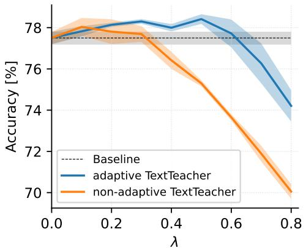

line

| λ    | Baseline | adaptive TextTeacher | non-adaptive TextTeacher |
| ---- | -------- | -------------------- | ------------------------ |
| 0.0  | 77.5     | 77.5                 | 77.5                     |
| 0.2  | 77.5     | 78.0                 | 77.8                     |
| 0.4  | 77.5     | 78.2                 | 76.5                     |
| 0.6  | 77.5     | 78.0                 | 73.5                     |
| 0.8  | 77.5     | 74.0                 | 70.0                     |

Figure 2: λ sweep for ViT-S on ImageNet (100 epochs) with $\lambda _ { t } \equiv \lambda \in [ 0 . 0 , 0 . 8 ]$ . TextTeacher improves over the baseline especially at $\lambda = 0 . 5$ with $\alpha _ { \mathrm { a d a p t } }$ . Without adaption, accuracy drops sharply for $\lambda > 0 . 3 ;$ with adaption it is stable up to $\lambda = 0 . 6$ .

Table 7: Schedule ablation at fixed peak $\lambda = 0 . 5$ (ViT-S, 100 epochs, $\alpha _ { \mathrm { a d a p t } }$ enabled). Schedules are ordered by their early-time mass (value $\lambda _ { \epsilon }$ at small $\epsilon > 0 )$ . Higher early mass correlates with higher accuracy. 

<table><tr><td>Schedule</td><td></td><td> $\lambda$ </td><td>Accuracy [%]</td><td>Delta</td></tr><tr><td>-</td><td></td><td>0.0</td><td>77.5 ± 0.3</td><td></td></tr><tr><td>const</td><td>□</td><td>0.5</td><td>78.4 ± 0.1</td><td>+0.9</td></tr><tr><td>halfcos</td><td>△</td><td>0.5</td><td>78.3 ± 0.1</td><td>+0.8</td></tr><tr><td>cos</td><td>△</td><td>0.5</td><td>78.2 ± 0.1</td><td>+0.7</td></tr><tr><td>linear</td><td>△</td><td>0.5</td><td>77.9 ± 0.3</td><td>+0.4</td></tr></table>

# 4.4 Text Encoders as Image Classifiers

To better understand the contribution of the language branch in our training-only pipeline, we evaluate how much image-classification signal is recoverable from captions alone. This experiment isolates the text side of the system: We use $\mathrm { C o C a }$ captions encoded with BERT-B, and train a single linear layer as a classifier on top of the resulting embeddings. As shown in Table $6 ,$ the resulting accuracies cluster tightly around 52–53%, with mean-only normalization yielding the strongest performance (53.1%), and full whitening providing no consistent benefit. This is in contrast to the full TextTeacher setup, where whitening provides a noticeable accuracy boost when using BERT (see Table 5). These results indicate that while captions contain moderately informative cues about object identity, they lack the granularity required for high-accuracy recognition, reinforcing that our method relies on alignment rather than blindly adhering to text-based signals.

# 4.5 λ and $\lambda _ { t ^ { - } }$ -Schedules

We study the guidance weight $\lambda _ { t }$ in two parts: First, a scalar sweep with $\lambda _ { t } \equiv \lambda \in [ 0 . 0 , 0 . 8 ]$ with and without adaptive weight $\alpha _ { \mathrm { a d a p t } }$ (Equation (6)); and second, schedule shapes at a fixed peak $\lambda = 0 . 5$ . For this experiment, we train ViT-S on ImageNet for 100 epochs. Figure 2 shows that TextTeacher is effective at small λ even without adaptation, but becomes brittle as λ grows. Adaptation not only increases accuracy, but also widens the stable range to $\lambda = 0 . 6$ with a peak at $\lambda = 0 . 5$ .

At this fixed peak value of $\lambda = 0 . 5$ , Table 7 shows that schedule shapes that retain higher value in early training (const, half-cos) perform best, while the linear schedule that quickly reduces guidance underperforms.

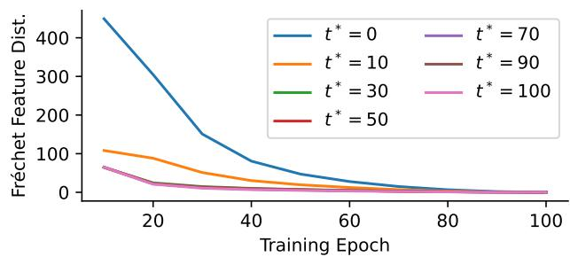

line

| Training Epoch | t* = 0 | t* = 10 | t* = 30 | t* = 50 | t* = 70 | t* = 90 | t* = 100 |
| -------------- | ------ | ------- | ------- | ------- | ------- | ------- | -------- |
| 0              | 450    | 110     | 80      | 70      | 60      | 50      | 40       |
| 20             | 250    | 80      | 50      | 40      | 30      | 20      | 15       |
| 40             | 100    | 40      | 25      | 20      | 15      | 10      | 5        |
| 60             | 50     | 20      | 10      | 10      | 5       | 5       | 2        |
| 80             | 25     | 10      | 5       | 5       | 2       | 2       | 1        |
| 100            | 10     | 5       | 2       | 2       | 1       | 1       | 1        |

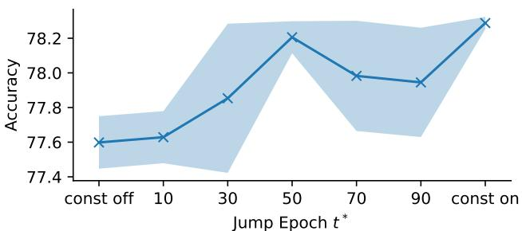

line

| Jump Epoch t* | Accuracy |
| ------------- | -------- |
| const off     | 77.6     |
| 10            | 77.6     |
| 30            | 77.8     |
| 50            | 78.2     |
| 70            | 78.0     |
| 90            | 77.9     |
| const on      | 78.3     |

Figure 3: Jump schedules for ViT-S on ImageNet. At epoch $t ^ { * } , \lambda _ { t }$ decays linearly from 0.5 to 0.0 over 10 epochs. Thus separating the effects of TextTeacher over the course of training. Left: Fréchet feature distance (FFD) at current training epoch to the final trained model. For $t ^ { * } > 3 0$ the FFD plots coincide. Right: Final ImageNet accuracy when jumping at $t ^ { * }$ . TextTeacher accelerates convergence of the feature representation. It reduces the FFD to the final training state early on from 450 to 65 at epoch 10. These gains saturate at epoch $t ^ { * } = 5 0$ , while late drops $( t ^ { * } \in [ 7 0 , 9 0 ] )$ harm stability.

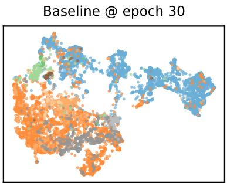

scatter

| x | y | cluster |
| --- | --- | --- |
| (various) | (various) | (colored dots) |

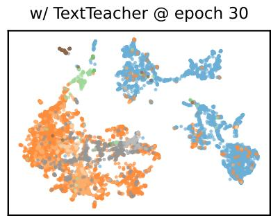

scatter

| x | y | cluster |
| --- | --- | --- |
| (various) | (various) | orange, blue, gray, green, brown, and white clusters |

animal

plant

plant part

fungus

： instrumentality

commodity

fabric

. structure

geological formation

Figure 4: 2D-umap of the embedding space of ViT-S after training without and with TextTeacher for 30 (out of 100) epochs. We plot embeddings of 10 000 random validation images with colors marking high-level hypernyms of image classes. Utilizing TextTeacher leads to a clearer separability early on in training, especially between the two large groups of animal and instrumentality and for the clusters of plant and fungus.

This pattern supports the view of TextTeacher as an early-phase regularizer. For all main experiments, we thus choose the constant schedule $\lambda _ { t } \equiv 0 . 5$ with $\alpha _ { \mathrm { a d a p t } }$ .

# 4.6 Effect on Model Weights

How does TextTeacher affect a model during training? We begin by analyzing the time effect in training by employing jump schedules that hold $\lambda _ { t } = 0 . 5$ and then drop it linearly to 0 over 10 epochs at a chosen epoch $t ^ { * }$ . Additionally, we quantify the embedding similarity by computing the per-class Fréchet feature distance (FFD) between the embeddings z of the current model and the final model at epoch 100. The jump-schedule study in Figure 3 reveals a pronounced early-phase effect. When TextTeacher is active during the first 10 epochs, the representation is already much closer to its final semantic configuration (FFD 65 at epoch 10) than the baseline without guidance (FFD 450 at the same epoch), and the gap persists as training proceeds (left in Figure 3). These results are very stable, such that the standard deviation range is too small to be visible in Figure 3 (left). Extending guidance through the first 30–50 epochs largely saturates the benefit. When dropping $\lambda _ { t }$ at epoch $t ^ { * } = 5 0$ , the accuracy is very close to the best setting: constant $\lambda _ { t } \equiv 0 . 5$ . In contrast, dropping $\lambda _ { t }$ very late $( t ^ { * } \in [ 7 0 , 9 0 ] )$ degrades both the mean and stability of final accuracy (right in Figure 3), plausibly because the objective switch leaves insufficient time for the classifier to readapt to pure label supervision. We hypothesize that while the main benefit of TextTeacher is realized early on, removing the additional objective introduces noise by making the classifier adapt to a new objective function. This can be seen in the jump at epoch $t ^ { * } = 5 0$ , which shows high accuracy but larger variance than the constant $\lambda _ { t } \equiv 0 . 5$ schedule $( 0 . 1 \ \mathrm { p . p . \ v s . \ 0 . 0 3 \ p . p . ) }$ . We qualitatively validate these findings in Figure 4 where we find that TextTeacher conditions the model towards class separability even early on in training (at epoch 30).

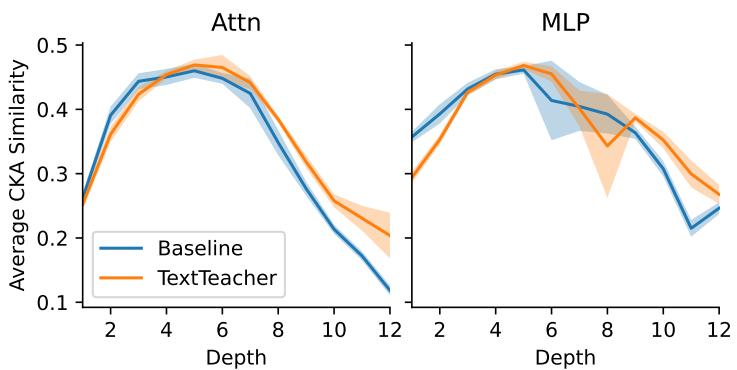

line

| Depth | Attn Baseline | Attn TextTeacher | MLP Baseline | MLP TextTeacher |
|-------|---------------|------------------|--------------|-----------------|
| 2     | 0.25          | 0.27             | 0.35         | 0.30            |
| 4     | 0.45          | 0.44             | 0.42         | 0.41            |
| 6     | 0.48          | 0.47             | 0.46         | 0.45            |
| 8     | 0.42          | 0.41             | 0.38         | 0.36            |
| 10    | 0.28          | 0.27             | 0.30         | 0.29            |
| 12    | 0.12          | 0.11             | 0.25         | 0.24            |

Figure 5: Layer-wise CKA similarity over independent training runs at attention and MLP layers. With TextTeacher deeper layers exhibit higher similarity, especially at attention layers.

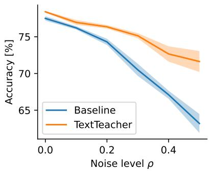

line

| Noise level ρ | Baseline Accuracy [%] | TextTeacher Accuracy [%] |
| ------------- | --------------------- | ------------------------ |
| 0.0           | 78.0                  | 79.0                     |
| 0.2           | 74.0                  | 76.0                     |
| 0.4           | 68.0                  | 72.0                     |
| 0.5           | 63.0                  | 71.0                     |

Figure 6: Label-noise robustness for ViT-S. Accuracy declines with higher noise level $\rho$ for both methods, but TextTeacher enlarges its margin over the baseline as $\rho$ increases.

To locate TextTeacher’s impact in a trained model, we study how guidance changes representational geometry across random initializations using centered kernel alignment (Kornblith et al., 2019) (CKA) at different depths. Visualizing the layerwise trends, Figure 5 shows that TextTeacher increases similarity among deeper representations, while slightly decreasing similarity at earlier layers (direct CKA visualization in Section D.2). This effect is stronger at the output of attention, compared to the output of the MLP layers. Thus, TextTeacher primarily organizes higher-level semantic subspaces, while allowing lower-level feature extractors to remain flexible. Together, these results imply that TextTeacher is an early-phase, depth-localized regularizer that accelerates convergence toward the shared semantic manifold M across random seeds.

# 4.7 Robustness under Label Noise

As TextTeacher provides an additional training signal, it can inject additional information to counteract noisy labels. We train ViT-S on ImageNet while randomly perturbing labels to a uniform random incorrect class with probability $\rho \in [ 0 . 0 , 0 . 5 ]$ . Figure 6 shows that accuracy declines monotonically with $\rho$ for both methods, but the margin of TextTeacher widens with higher corruption. At $\rho = 0 . 5$ the baseline obtains only $6 3 . 2 \pm 1 . 3 \%$ while TextTeacher reaches $7 1 . 6 \pm 1 . 4 \%$ , an improvement of $8 . 4 \ \mathrm { p . p }$ . Thus, TextTeacher stabilizes training and significantly reduces the adverse impact of even high levels of corrupted labels.

# 5 Limitations

While TextTeacher assists in classification training, it also has several limitations: First, our preconditioning benefits only realize when training a model from scratch. TextTeacher does not assist or may actively harm a model that is finetuned from pretrained (already conditioned) weights by either adding no sizable benefit if the pretrained state aligns with our language guidance or actively harming convergence by pushing towards another non-aligned conditioning (see Section C.3). Second, our method depends on the existence of high-quality, reliable image captions. While neural captioning models continue to improve, they might still reflect biases or may not generalize well to specific domains, like medical images or earth observation. These problems would then be passed on to a model trained with TextTeacher on this data. While we hypothesize that concise, human annotated captions would be optimal, we can still profit from ongoing captioner and text-encoder development. And third, TextTeacher requires the one-time computational overhead of generating captions for new images if none are available. Captioning the full ImageNet training set (1.3M images) with CoCa (Yu et al., 2022) takes 69 hours on a single NVIDIA H100, which for this paper comes out to 26 minutes per training run with TextTeacher where these captions are used – or less than the time for training ViT-B for one more epoch. Tag extraction with Qwen3-32B processes approximately 20 tags/min, requiring ≈ 1000 GPU-hours for the full ImageNet training set. However, this step is optional and provides only marginal improvements (see Table 4), serving primarily as an analytical tool to understand effective text representations. To assist practitioners, we release our precomputed captions and embeddings1. Future work could explore lightweight extraction methods using smaller language models or rule-based approaches to reduce this preprocessing cost.

# 6 Conclusion

This paper revisits a fundamental question: Can the semantic knowledge of a language model efficiently improve vision training? We answer this through TextTeacher, a minimal, training-only mechanism that injects textual semantics into standard vision backbones. By using a frozen text encoder to produce semantic anchors and an auxiliary alignment loss to nudge image features, TextTeacher improves accuracy and transfer on ImageNet and downstream tasks while keeping the deployed model purely visual. We show that TextTeacher acts as a feature-space preconditioner with effects concentrated early in training and at deeper model layers. By utilizing textual cues, TextTeacher shapes the loss landscape to guide image embeddings towards a semantic alignment optimum, thus producing more accurate models and preventing overfitting. Looking forward, promising directions include domain-aware text distillation for specialized vocabularies, adaptive schedules that detect when preconditioning has saturated, and extensions to detection and segmentation, where dense regional text could shape fine-grained visual representations. In short, TextTeacher offers a lightweight path to import linguistic priors into visual learning: A small change to training that leaves a fast, unimodal model at test time.

# Broader Impact Statement

As already discussed in Section 5, captions generated by neural models trained on web data may contain gender, racial, or cultural biases (Birhane et al., 2021), which could propagate through text embeddings into the vision model’s representation space. This indirect transfer from captioner training data, through captions, into visual features may be difficult to detect and audit. Additionally, in specialized domains such as medical imaging or earth observation, general-purpose captioning models may produce inaccurate descriptions, potentially introducing systematic errors. We caution against applying TextTeacher in safety-critical settings without domain-appropriate captions and thorough downstream validation across relevant subgroups. We also encourage practitioners to inspect generated captions for systematic biases in sensitive applications and evaluate trained models for fairness. As captioning models improve and are increasingly audited for bias, TextTeacher would directly benefit from these advances.

# Acknowledgments

This work was funded by the Carl-Zeiss Foundation under the Sustainable Embedded AI project (P2021-02- 009) and by the BMFTR project Albatross (funding code 16IW24002). All compute was done thanks to the Pegasus cluster at DFKI Kaiserslautern. We also thank the anonymous reviewers for their constructive feedback, which helped us improve this paper.

# References

Miuru Abeysiriwardana and Deshan Sumanathilaka. A survey on lexical ambiguity detection and word sense disambiguation. 2024. doi: 10.48550/ARXIV.2403.16129.

Zeynep Akata, Florent Perronnin, Zaid Harchaoui, and Cordelia Schmid. Label-embedding for image classification. IEEE Transactions on Pattern Analysis and Machine Intelligence, 38(7):1425–1438, 2015. ISSN 2160-9292. doi: 10.1109/tpami.2015.2487986.

Lucas Beyer, Andreas Steiner, André Susano Pinto, Alexander Kolesnikov, Xiao Wang, Daniel Salz, Maxim Neumann, Ibrahim Alabdulmohsin, Michael Tschannen, Emanuele Bugliarello, Thomas Unterthiner, Daniel Keysers, Skanda Koppula, Fangyu Liu, Adam Grycner, Alexey Gritsenko, Neil Houlsby, Manoj Kumar, Keran Rong, Julian Eisenschlos, Rishabh Kabra, Matthias Bauer, Matko Bošnjak, Xi Chen, Matthias

Minderer, Paul Voigtlaender, Ioana Bica, Ivana Balazevic, Joan Puigcerver, Pinelopi Papalampidi, Olivier Henaff, Xi Xiong, Radu Soricut, Jeremiah Harmsen, and Xiaohua Zhai. Paligemma: A versatile 3b vlm for transfer. 2024. doi: 10.48550/ARXIV.2407.07726.   
Abeba Birhane, Vinay Uday Prabhu, and Emmanuel Kahembwe. Multimodal datasets: misogyny, pornography, and malignant stereotypes. October 2021. doi: 10.48550/ARXIV.2110.01963.   
Simon Burton and Benjamin Herd. Addressing uncertainty in the safety assurance of machine-learning. Frontiers in Computer Science, 5, 2023. ISSN 2624-9898. doi: 10.3389/fcomp.2023.1132580.   
Xingyu Cai, Jiaji Huang, Yuchen Bian, and Kenneth Church. Isotropy in the contextual embedding space: Clusters and manifolds. In International Conference on Learning Representations, 2021. URL https://openreview.net/forum?id=xYGNO86OWDH.   
Nicolas Carion, Francisco Massa, Gabriel Synnaeve, Nicolas Usunier, Alexander Kirillov, and Sergey Zagoruyko. End-to-end object detection with transformers. In Andrea Vedaldi, Horst Bischof, Thomas Brox, and Jan-Michael Frahm (eds.), Computer Vision – ECCV 2020, pp. 213–229, Cham, 2020. Springer International Publishing. ISBN 978-3-030-58452-8.   
Mathilde Caron, Hugo Touvron, Ishan Misra, Hervé Jégou, Julien Mairal, Piotr Bojanowski, and Armand Joulin. Emerging properties in self-supervised vision transformers. In Proceedings of the International Conference on Computer Vision (ICCV). arXiv, 2021. doi: 10.48550/ARXIV.2104.14294.   
Ting Chen, Simon Kornblith, Mohammad Norouzi, and Geoffrey E. Hinton. A simple framework for contrastive learning of visual representations. In Proceedings of the 37th International Conference on Machine Learning, ICML 2020, 13-18 July 2020, Virtual Event, Proceedings of Machine Learning Research, pp. 1597–1607. PMLR, 2020. URL http://proceedings.mlr.press/v119/chen20j.html.   
Xiangning Chen, Cho-Jui Hsieh, and Boqing Gong. When vision transformers outperform resnets without pre-training or strong data augmentations. In International Conference on Learning Representations, 2022.   
Ekin Dogus Cubuk, Barret Zoph, Dandelion Mané, Vijay Vasudevan, and Quoc V. Le. Autoaugment: Learning augmentation strategies from data. 2019 IEEE/CVF Conference on Computer Vision and Pattern Recognition (CVPR), pp. 113–123, 2019.   
Jia Deng, Wei Dong, Richard Socher, Li-Jia Li, Kai Li, and Li Fei-Fei. ImageNet: A large-scale hierarchical image database. In 2009 IEEE Conference on Computer Vision and Pattern Recognition. IEEE, 2009. doi: 10.1109/cvpr.2009.5206848.   
Karan Desai and Justin Johnson. Virtex: Learning visual representations from textual annotations. In 2021 IEEE/CVF Conference on Computer Vision and Pattern Recognition (CVPR), pp. 11157–11168, 2021. doi: 10.1109/CVPR46437.2021.01101.   
Jacob Devlin, Ming-Wei Chang, Kenton Lee, and Kristina Toutanova. Bert: Pre-training of deep bidirectional transformers for language understanding. In Jill Burstein, Christy Doran, and Thamar Solorio (eds.), Proceedings of the 2019 Conference of the North American Chapter of the Association for Computational Linguistics: Human Language Technologies, Volume 1 (Long and Short Papers), pp. 4171–4186, Minneapolis, Minnesota, June 2019. Association for Computational Linguistics. doi: 10.18653/v1/N19-1423.   
Alexey Dosovitskiy, Lucas Beyer, Alexander Kolesnikov, Dirk Weissenborn, Xiaohua Zhai, Thomas Unterthiner, Mostafa Dehghani, Matthias Minderer, Georg Heigold, Sylvain Gelly, Jakob Uszkoreit, and Neil Houlsby. An image is worth 16x16 words: Transformers for image recognition at scale. In 9th International Conference on Learning Representations, ICLR 2021, Virtual Event, Austria, May 3-7, 2021. OpenReview.net, 2021.   
Alaaeldin El-Nouby, Hugo Touvron, Mathilde Caron, Piotr Bojanowski, Matthijs Douze, Armand Joulin, Ivan Laptev, Natalia Neverova, Gabriel Synnaeve, Jakob Verbeek, and Hervé Jegou. Xcit: Cross-covariance image transformers. In A. Beygelzimer, Y. Dauphin, P. Liang, and J. Wortman Vaughan (eds.), Advances in Neural Information Processing Systems, 2021. doi: 10.48550/arxiv.2106.09681.

Zhiyuan Fang, Jianfeng Wang, Xiaowei Hu, Lijuan Wang, Yezhou Yang, and Zicheng Liu. Compressing visuallinguistic model via knowledge distillation. In 2021 IEEE/CVF International Conference on Computer Vision (ICCV), pp. 1408–1418, 2021. doi: 10.1109/ICCV48922.2021.00146.   
Benjamin Feuer, Ameya Joshi, and Chinmay Hegde. Caption supervision enables robust learners. 2022. doi: 10.48550/ARXIV.2210.07396.   
Andrea Frome, Greg S Corrado, Jon Shlens, Samy Bengio, Jeff Dean, Marc' Aurelio Ranzato, and Tomas Mikolov. Devise: A deep visual-semantic embedding model. In C.J. Burges, L. Bottou, M. Welling, Z. Ghahramani, and K.Q. Weinberger (eds.), Advances in Neural Information Processing Systems, volume 26. Curran Associates, Inc., 2013. URL https://proceedings.neurips.cc/paper\_files/paper/ 2013/file/7cce53cf90577442771720a370c3c723-Paper.pdf.   
Ross B. Girshick, Jeff Donahue, Trevor Darrell, and Jitendra Malik. Rich feature hierarchies for accurate object detection and semantic segmentation. 2014 IEEE Conference on Computer Vision and Pattern Recognition, pp. 580–587, 2014.   
Aaron Grattafiori, Abhimanyu Dubey, Abhinav Jauhri, Abhinav Pandey, Abhishek Kadian, Ahmad Al-Dahle, Aiesha Letman, Akhil Mathur, Alan Schelten, Alex Vaughan, Amy Yang, Angela Fan, Anirudh Goyal, Anthony Hartshorn, Aobo Yang, Archi Mitra, Archie Sravankumar, Artem Korenev, Arthur Hinsvark, Arun Rao, Aston Zhang, Aurelien Rodriguez, Austen Gregerson, and Ava Spataru. The llama 3 herd of models. 2024. doi: 10.48550/ARXIV.2407.21783.   
Chenqi Guo, Mengshuo Rong, Qianli Feng, Rongfan Feng, and Yinglong Ma. Crossmodal knowledge distillation with wordnet-relaxed text embeddings for robust image classification. 2025. doi: 10.48550/ ARXIV.2503.24017.   
Janosch Haber and Massimo Poesio. Polysemy—evidence from linguistics, behavioral science, and contextualized language models. Computational Linguistics, 50(1):351–417, 2024. ISSN 1530-9312. doi: 10.1162/coli\_a\_00500.   
Kaiming He, Xiangyu Zhang, Shaoqing Ren, and Jian Sun. Deep residual learning for image recognition. In Proceedings of the IEEE conference on computer vision and pattern recognition, pp. 770–778, 2016.   
Kaiming He, Georgia Gkioxari, Piotr Dollár, and Ross Girshick. Mask r-cnn. In ICCV, pp. 2980–2988. arXiv, 2017. ISBN 978-1-5386-1032-9. doi: 10.48550/ARXIV.1703.06870.   
Zejiang Hou and Sun-Yuan Kung. Masked image pretraining on language assisted representation. In ICASSP 2025 - 2025 IEEE International Conference on Acoustics, Speech and Signal Processing (ICASSP), 2025. doi: 10.1109/ICASSP49660.2025.10888259.   
Minyoung Huh, Brian Cheung, Tongzhou Wang, and Phillip Isola. Position: The platonic representation hypothesis. In Ruslan Salakhutdinov, Zico Kolter, Katherine Heller, Adrian Weller, Nuria Oliver, Jonathan Scarlett, and Felix Berkenkamp (eds.), Proceedings of the 41st International Conference on Machine Learning, volume 235 of Proceedings of Machine Learning Research, pp. 20617–20642. PMLR, 21–27 Jul 2024. URL https://proceedings.mlr.press/v235/huh24a.html.   
Jinseong Jang, Chunfei Ma, and Byeongwon Lee. Vl2lite: Task-specific knowledge distillation from large vision-language models to lightweight networks, 2025.   
Chao Jia, Yinfei Yang, Ye Xia, Yi-Ting Chen, Zarana Parekh, Hieu Pham, Quoc Le, Yun-Hsuan Sung, Zhen Li, and Tom Duerig. Scaling up visual and vision-language representation learning with noisy text supervision. In Marina Meila and Tong Zhang (eds.), Proceedings of the 38th International Conference on Machine Learning, volume 139 of Proceedings of Machine Learning Research, pp. 4904–4916. PMLR, 18–24 Jul 2021. URL https://proceedings.mlr.press/v139/jia21b.html.   
Parneet Kaur, Karan Sikka, and Ajay Divakaran. Combining weakly and webly supervised learning for classifying food images. 2017. doi: 10.48550/ARXIV.1712.08730.

Kevis kokitsi Maninis, Kaifeng Chen, Soham Ghosh, Arjun Karpur, Koert Chen, Ye Xia, Bingyi Cao, Daniel Salz, Guangxing Han, Jan Dlabal, Dan Gnanapragasam, Mojtaba Seyedhosseini, Howard Zhou, and Andre Araujo. TIPS: Text-image pretraining with spatial awareness. In The Thirteenth International Conference on Learning Representations, 2025.   
Simon Kornblith, Mohammad Norouzi, Honglak Lee, and Geoffrey Hinton. Similarity of neural network representations revisited. In Kamalika Chaudhuri and Ruslan Salakhutdinov (eds.), Proceedings of the 36th International Conference on Machine Learning, volume 97 of Proceedings of Machine Learning Research, pp. 3519–3529. PMLR, 09–15 Jun 2019. URL http://proceedings.mlr.press/v97/kornblith19a.html.   
Jonathan Krause, Michael Stark, Jia Deng, and Li Fei-Fei. 3d object representations for fine-grained categorization. In 4th International IEEE Workshop on 3D Representation and Recognition (3dRR-13), Sydney, Australia, 2013.   
Chankyu Lee, Rajarshi Roy, Mengyao Xu, Jonathan Raiman, Mohammad Shoeybi, Bryan Catanzaro, and Wei Ping. Nv-embed: Improved techniques for training llms as generalist embedding models. In Y. Yue, A. Garg, N. Peng, F. Sha, and R. Yu (eds.), International Conference on Learning Representations, volume 2025, pp. 79310–79333. arXiv, 2025.   
Jiashi Li, Xin Xia, Wei Li, Huixia Li, Xing Wang, Xuefeng Xiao, Rui Wang, Min Zheng, and Xin Pan. Next-vit: Next generation vision transformer for efficient deployment in realistic industrial scenarios. 2022. doi: 10.48550/ARXIV.2207.05501.   
Junnan Li, Dongxu Li, Silvio Savarese, and Steven Hoi. Blip-2: bootstrapping language-image pre-training with frozen image encoders and large language models. In Proceedings of the 40th International Conference on Machine Learning, ICML’23, 2023.   
Haotian Liu, Chunyuan Li, Qingyang Wu, and Yong Jae Lee. Visual instruction tuning. In A. Oh, T. Naumann, A. Globerson, K. Saenko, M. Hardt, and S. Levine (eds.), Advances in Neural Information Processing Systems, volume 36, pp. 34892–34916. Curran Associates, Inc., 2023. URL https://proceedings.neurips. cc/paper\_files/paper/2023/file/6dcf277ea32ce3288914faf369fe6de0-Paper-Conference.pdf.   
Yang Liu, Mengyuan Liu, Shudong Huang, and Jiancheng Lv. Asymmetric visual semantic embedding framework for efficient vision-language alignment. Proceedings of the AAAI Conference on Artificial Intelligence, 39(6):5676–5684, April 2025. ISSN 2159-5399. doi: 10.1609/aaai.v39i6.32605.   
Ze Liu, Yutong Lin, Yue Cao, Han Hu, Yixuan Wei, Zheng Zhang, Stephen Lin, and Baining Guo. Swin transformer: Hierarchical vision transformer using shifted windows. In 2021 IEEE/CVF International Conference on Computer Vision (ICCV), pp. 9992–10002, Los Alamitos, CA, USA, 10 2021. IEEE Computer Society. doi: 10.1109/ICCV48922.2021.00986.   
Wenxuan Ma, Shuang Li, JinMing Zhang, Chi Harold Liu, Jingxuan Kang, Yulin Wang, and Gao Huang. Borrowing knowledge from pre-trained language model: A new data-efficient visual learning paradigm. In Proceedings of the IEEE/CVF International Conference on Computer Vision (ICCV), pp. 18786–18797, October 2023.   
S. Maji, J. Kannala, E. Rahtu, M. Blaschko, and A. Vedaldi. Fine-grained visual classification of aircraft. Technical report, 2013.   
Norman Mu, Alexander Kirillov, David Wagner, and Saining Xie. Slip: Self-supervision meets language-image pre-training. In Shai Avidan, Gabriel Brostow, Moustapha Cissé, Giovanni Maria Farinella, and Tal Hassner (eds.), Computer Vision – ECCV 2022, pp. 529–544, Cham, 2022. Springer Nature Switzerland. ISBN 978-3-031-19809-0.   
Lalli Myllyaho, Mikko Raatikainen, Tomi Männistö, Tommi Mikkonen, and Jukka K. Nurminen. Systematic literature review of validation methods for ai systems. Journal of Systems and Software, 181:111050, 2021. ISSN 0164-1212. doi: 10.1016/j.jss.2021.111050.

Lakshmi Nair. Clip-embed-kd: Computationally efficient knowledge distillation using embeddings as teachers. Extended abstract: 28th IEEE High Performance Extreme Computing Conference (HPEC) 2024 - Outstanding short paper award, 2024.   
Tobias Christian Nauen, Sebastian Palacio, Federico Raue, and Andreas Dengel. Which transformer to favor: A comparative analysis of efficiency in vision transformers. In Proceedings of the Winter Conference on Applications of Computer Vision (WACV), pp. 6955–6966, February 2025.   
Maria-Elena Nilsback and Andrew Zisserman. Automated flower classification over a large number of classes. In Indian Conference on Computer Vision, Graphics and Image Processing, Dec 2008.   
Maxime Oquab, Timothée Darcet, Théo Moutakanni, Huy V. Vo, Marc Szafraniec, Vasil Khalidov, Pierre Fernandez, Daniel HAZIZA, Francisco Massa, Alaaeldin El-Nouby, Mido Assran, Nicolas Ballas, Wojciech Galuba, Russell Howes, Po-Yao Huang, Shang-Wen Li, Ishan Misra, Michael Rabbat, Vasu Sharma, Gabriel Synnaeve, Hu Xu, Herve Jegou, Julien Mairal, Patrick Labatut, Armand Joulin, and Piotr Bojanowski. DINOv2: Learning robust visual features without supervision. Transactions on Machine Learning Research, 2024. ISSN 2835-8856. URL https://openreview.net/forum?id=a68SUt6zFt. Featured Certification.   
Omkar M. Parkhi, Andrea Vedaldi, Andrew Zisserman, and C. V. Jawahar. Cats and dogs. In IEEE Conference on Computer Vision and Pattern Recognition, 2012.   
Martin Rabe, Stefan Milz, and Patrick Mader. Development methodologies for safety critical machine learning applications in the automotive domain: A survey. In Proceedings of the IEEE/CVF Conference on Computer Vision and Pattern Recognition (CVPR) Workshops, pp. 129–141, June 2021.   
Alec Radford, Karthik Narasimhan, Tim Salimans, and Ilya Sutskever. Improving language understanding by generative pre-training. 2018.   
Alec Radford, Jeff Wu, Rewon Child, David Luan, Dario Amodei, and Ilya Sutskever. Language models are unsupervised multitask learners. 2019. URL https://openai.com/blog/better-language-models/.   
Alec Radford, Jong Wook Kim, Chris Hallacy, Aditya Ramesh, Gabriel Goh, Sandhini Agarwal, Girish Sastry, Amanda Askell, Pamela Mishkin, Jack Clark, Gretchen Krueger, and Ilya Sutskever. Learning transferable visual models from natural language supervision. In Marina Meila and Tong Zhang (eds.), Proceedings of the 38th International Conference on Machine Learning, volume 139 of Proceedings of Machine Learning Research, pp. 8748–8763. PMLR, 18–24 Jul 2021.   
Colin Raffel, Noam Shazeer, Adam Roberts, Katherine Lee, Sharan Narang, Michael Matena, Yanqi Zhou, Wei Li, and Peter J. Liu. Exploring the limits of transfer learning with a unified text-to-text transformer. Journal of Machine Learning Research, 21(140):1–67, 2020.   
Anton Razzhigaev, Matvey Mikhalchuk, Elizaveta Goncharova, Ivan Oseledets, Denis Dimitrov, and Andrey Kuznetsov. The shape of learning: Anisotropy and intrinsic dimensions in transformer-based models. In Yvette Graham and Matthew Purver (eds.), Findings of the Association for Computational Linguistics: EACL 2024, pp. 868–874, St. Julian’s, Malta, March 2024. Association for Computational Linguistics. doi: 10.18653/v1/2024.findings-eacl.58. URL https://aclanthology.org/2024.findings-eacl.58/.   
Edward Sanderson and Bogdan J. Matuszewski. FCN-Transformer Feature Fusion for Polyp Segmentation, pp. 892–907. Springer International Publishing, 2022. ISBN 9783031120534. doi: 10.1007/978-3-031-12053-4\_ 65.   
Ajinkya Tejankar, Maziar Sanjabi, Bichen Wu, Saining Xie, Madian Khabsa, Hamed Pirsiavash, and Hamed Firooz. A fistful of words: Learning transferable visual models from bag-of-words supervision, 2022. URL https://arxiv.org/abs/2112.13884.   
Rahul Thapa, Kezhen Chen, Ian Covert, Rahul Chalamala, Ben Athiwaratkun, Shuaiwen Leon Song, and James Zou. Dragonfly: Multi-resolution zoom-in encoding enhances vision-language models. 2024. doi: 10.48550/ARXIV.2406.00977.

Yonglong Tian, Chen Sun, Ben Poole, Dilip Krishnan, Cordelia Schmid, and Phillip Isola. What makes for good views for contrastive learning? In H. Larochelle, M. Ranzato, R. Hadsell, M.F. Balcan, and H. Lin (eds.), Advances in Neural Information Processing Systems, volume 33, pp. 6827–6839. Curran Associates, Inc., 2020.   
Hugo Touvron, Matthieu Cord, Matthijs Douze, Francisco Massa, Alexandre Sablayrolles, and Herve Jegou. Training data-efficient image transformers & distillation through attention. In Marina Meila and Tong Zhang (eds.), Proceedings of the 38th International Conference on Machine Learning, volume 139 of Proceedings of Machine Learning Research, pp. 10347–10357. PMLR, 7 2021. URL https://proceedings. mlr.press/v139/touvron21a.html.   
Hugo Touvron, Matthieu Cord, and Hervé Jégou. Deit iii: Revenge of the vit. In Shai Avidan, Gabriel Brostow, Moustapha Cissé, Giovanni Maria Farinella, and Tal Hassner (eds.), Computer Vision – ECCV 2022, pp. 516–533, Cham, 2022. Springer Nature Switzerland.   
Hugo Touvron, Thibaut Lavril, Gautier Izacard, Xavier Martinet, Marie-Anne Lachaux, Timothée Lacroix, Baptiste Rozière, Naman Goyal, Eric Hambro, Faisal Azhar, Aurelien Rodriguez, Armand Joulin, Edouard Grave, and Guillaume Lample. Llama: Open and efficient foundation language models. 2023. doi: 10.48550/ARXIV.2302.13971.   
Ashish Vaswani, Noam Shazeer, Niki Parmar, Jakob Uszkoreit, Llion Jones, Aidan N Gomez, Lukasz Kaiser, and Illia Polosukhin. Attention is all you need. In I. Guyon, U. Von Luxburg, S. Bengio, H. Wallach, R. Fergus, S. Vishwanathan, and R. Garnett (eds.), Advances in Neural Information Processing Systems, volume 30. Curran Associates, Inc., 2017.   
Ioannis Vezakis, Konstantinos Georgas, Dimitrios Fotiadis, and George Matsopoulos. Effisegnet: Gastrointestinal polyp segmentation through a pre-trained efficientnet-based network with a simplified decoder. In 2024 46th Annual International Conference of the IEEE Engineering in Medicine and Biology Society (EMBC), pp. 1–4, 07 2024. doi: 10.1109/EMBC53108.2024.10782015.   
C. Wah, S. Branson, P. Welinder, P. Perona, and S. Belongie. Caltech-ucsd birds 200. Technical Report CNS-TR-2011-001, California Institute of Technology, 2011.   
Wenhai Wang, Jifeng Dai, Zhe Chen, Zhenhang Huang, Zhiqi Li, Xizhou Zhu, Xiaowei Hu, Tong Lu, Lewei Lu, Hongsheng Li, Xiaogang Wang, and Yu Qiao. Internimage: Exploring large-scale vision foundation models with deformable convolutions. In Proceedings of the IEEE/CVF conference on computer vision and pattern recognition, pp. 14408–14419, 2023.   
Xin Wang and Wenwu Zhu. Advances in neural architecture search. National Science Review, 11(8), 2024. ISSN 2053-714X. doi: 10.1093/nsr/nwae282.   
Yinlena Xu, Silverio Martínez-Fernández, Matias Martinez, and Xavier Franch. Energy efficiency of training neural network architectures: An empirical study. In Proceedings of the 56th Hawaii International Conference on System Sciences, HICSS. Hawaii International Conference on System Sciences, 2023. doi: 10.24251/hicss.2023.098.   
An Yang, Anfeng Li, Baosong Yang, Beichen Zhang, Binyuan Hui, Bo Zheng, Bowen Yu, Chang Gao, Chengen Huang, Chenxu Lv, Chujie Zheng, Dayiheng Liu, Fan Zhou, Fei Huang, Feng Hu, Hao Ge, Haoran Wei, Huan Lin, Jialong Tang, Jian Yang, Jianhong Tu, Jianwei Zhang, Jianxin Yang, Jiaxi Yang, Jing Zhou, Jingren Zhou, Junyang Lin, Kai Dang, Keqin Bao, Kexin Yang, Le Yu, Lianghao Deng, Mei Li, Mingfeng Xue, Mingze Li, Pei Zhang, Peng Wang, Qin Zhu, Rui Men, Ruize Gao, Shixuan Liu, Shuang Luo, Tianhao Li, Tianyi Tang, Wenbiao Yin, Xingzhang Ren, Xinyu Wang, Xinyu Zhang, Xuancheng Ren, Yang Fan, Yang Su, Yichang Zhang, Yinger Zhang, Yu Wan, Yuqiong Liu, Zekun Wang, Zeyu Cui, Zhenru Zhang, Zhipeng Zhou, and Zihan Qiu. Qwen3 technical report. 2025. doi: 10.48550/ARXIV.2505.09388.   
Chuanguang Yang, Zhulin An, Libo Huang, Junyu Bi, Xinqiang Yu, Han Yang, Boyu Diao, and Yongjun Xu. Clip-kd: An empirical study of clip model distillation. In Proceedings of the IEEE/CVF Conference on Computer Vision and Pattern Recognition, 2024.

Jingfeng Yao, Bin Yang, and Xinggang Wang. Reconstruction vs. generation: Taming optimization dilemma in latent diffusion models. In Proceedings of the IEEE/CVF Conference on Computer Vision and Pattern Recognition, 2025.   
Yang You, Jing Li, Sashank Reddi, Jonathan Hseu, Sanjiv Kumar, Srinadh Bhojanapalli, Xiaodan Song, James Demmel, Kurt Keutzer, and Cho-Jui Hsieh. Large batch optimization for deep learning: Training bert in 76 minutes. In International Conference on Learning Representations, 2020. doi: 10.48550/arxiv.1904.00962. URL https://openreview.net/forum?id=Syx4wnEtvH.   
Jiahui Yu, Zirui Wang, Vijay Vasudevan, Legg Yeung, Mojtaba Seyedhosseini, and Yonghui Wu. Coca: Contrastive captioners are image-text foundation models. Transactions on Machine Learning Research, 2022. ISSN 2835-8856. doi: 10.48550/arxiv.2205.01917. URL https://openreview.net/forum?id=Ee277P3AYC.   
Sangdoo Yun, Dongyoon Han, Sanghyuk Chun, Seong Joon Oh, Youngjoon Yoo, and Junsuk Choe. CutMix: Regularization strategy to train strong classifiers with localizable features. In 2019 IEEE/CVF International Conference on Computer Vision (ICCV). IEEE, 2019. doi: 10.1109/iccv.2019.00612.   
Qingtian Zeng, Jian Sun, and Shansong Wang. Dic-transformer: interpretation of plant disease classification results using image caption generation technology. Frontiers in Plant Science, 14, 2024. ISSN 1664-462X. doi: 10.3389/fpls.2023.1273029.   
Hongyi Zhang, Moustapha Cisse, Yann N. Dauphin, and David Lopez-Paz. mixup: Beyond empirical risk minimization. In International Conference on Learning Representations, 2018. URL https://openreview. net/forum?id=r1Ddp1-Rb.   
Yanzhao Zhang, Mingxin Li, Dingkun Long, Xin Zhang, Huan Lin, Baosong Yang, Pengjun Xie, An Yang, Dayiheng Liu, Junyang Lin, Fei Huang, and Jingren Zhou. Qwen3 embedding: Advancing text embedding and reranking through foundation models. 2025. doi: 10.48550/ARXIV.2506.05176.   
Zhun Zhong, Liang Zheng, Guoliang Kang, Shaozi Li, and Yi Yang. Random erasing data augmentation. In Proceedings of the AAAI Conference on Artificial Intelligence (AAAI), 2020.

# A Training Hyperparameters

Table 8: Training setup and hyperparameters for our ImageNet training. 

<table><tr><td>Parameter</td><td>ViT &amp; others</td><td>DeiT</td></tr><tr><td>Image Resolution</td><td>224 × 224</td><td>224 × 224</td></tr><tr><td>Epochs</td><td>300</td><td>300</td></tr><tr><td>Learning Rate</td><td>3e-3</td><td>S/B: 1e-3, L: 5e-4</td></tr><tr><td>Learning Rate Schedule</td><td>cosine decay</td><td>cosine decay</td></tr><tr><td>Batch Size</td><td>2048</td><td>1024</td></tr><tr><td>GPUs</td><td>4× NVIDIA A100/H100/H200</td><td>4× NVIDIA A100/H100/H200</td></tr><tr><td>Warmup Schedule</td><td>linear</td><td>linear</td></tr><tr><td>Warmup Epochs</td><td>3</td><td>3</td></tr><tr><td>Weight Decay</td><td>0.02</td><td>0.05</td></tr><tr><td>Label Smoothing</td><td>0.1</td><td>0.1</td></tr><tr><td>Optimizer</td><td>Lamb (You et al., 2020)</td><td>AdamW</td></tr><tr><td rowspan="5">Data Augmentation Policy</td><td>3-Augment (Touvron et al., 2022)</td><td>DeiT (Touvron et al., 2021)</td></tr><tr><td>Resize</td><td></td></tr><tr><td>RandomCrop</td><td>RandomResizedCrop</td></tr><tr><td>HorizontalFlip</td><td>HorizontalFlip</td></tr><tr><td>Grayscale</td><td>RandomErase (Zhong et al., 2020)</td></tr><tr><td rowspan="4">Augmentations</td><td>Solarize</td><td>RandAugment (Cubuk et al., 2019)</td></tr><tr><td>GaussianBlur</td><td>ColorJitter</td></tr><tr><td>ColorJitter</td><td>Mixup (Zhang et al., 2018)</td></tr><tr><td>CutMix (Yun et al., 2019)</td><td>CutMix (Yun et al., 2019)</td></tr></table>

Table 9: Training setup for finetuning on different downstream datasets. Other settings are the same as in our ImageNet setup. For finetuning, we always utilize 3-Augment and the related parameters from the ViT & others column of Table 8. 

<table><tr><td>Dataset</td><td>Training Images</td><td>Batch Size</td><td>Epochs</td><td>Learning Rate</td><td>Num. GPUs</td></tr><tr><td>Aircraft</td><td>3334</td><td>512</td><td>500</td><td>3e-4</td><td>2</td></tr><tr><td>Birds</td><td>5994</td><td>512</td><td>500</td><td>3e-4</td><td>2</td></tr><tr><td>Cars</td><td>8144</td><td>1024</td><td>500</td><td>3e-4</td><td>4</td></tr><tr><td>Flowers</td><td>1020</td><td>256</td><td>500</td><td>3e-4</td><td>1</td></tr><tr><td>Food</td><td>75750</td><td>2048</td><td>100</td><td>3e-4</td><td>4</td></tr><tr><td>Pets</td><td>3680</td><td>512</td><td>500</td><td>3e-4</td><td>2</td></tr></table>

For completeness and reproducibility, we list all hyperparameters used in our ImageNet training and downstream evaluations. Unless otherwise noted, models follow the standard ViT (from Touvron et al. (2022); Nauen et al. (2025)) or DeiT (from Touvron et al. (2021)) configurations summarized in Table 8 for ImageNet training and Table 9 listing the differences on downstream datasets. We include optimizer settings, augmentation policies, hardware resources, and dataset-specific finetuning parameters.

# B Baseline Implementation Details

To ensure a fair and controlled comparison, we re-implement all baselines within the same training framework and architectural template used for our method. This allows us to isolate the effect of each baseline’s learning signal without confounding differences in optimization, augmentations, or backbone configuration.

Importantly, all baseline methods are implemented faithfully; we do not modify their formulations. The only differences from the original publications are the training scale and backbone: we train on ImageNet rather than on the smaller fine-grained datasets used in the original papers, and we use standard ViT backbones. All general training hyperparameters (learning rate, schedule, augmentations, etc.) follow the DeiT/DeiT-III recipes (Touvron et al., 2021; 2022; Nauen et al., 2025), while all method-specific hyperparameters, including loss weights λ and schedules, are taken directly from the respective original papers.

Table 10: Ablation of CLIP distillation setups. We copare our setup to CLIP-Embed-KD (Nair, 2024) and a setting using MSE loss as suggested by Yang et al. (2024). 

<table><tr><td>Teacher</td><td>Adaptive</td><td>Loss</td><td>ViT-S Accuracy</td></tr><tr><td>Online CLIP-L</td><td>✗</td><td>CLIP</td><td>77.7 ± 0.1</td></tr><tr><td>Online CLIP-L</td><td>√</td><td>CLIP</td><td>77.6 ± 0.2</td></tr><tr><td>Online CLIP-L</td><td>√</td><td>MSE</td><td>77.7 ± 0.2</td></tr></table>

# B.1 Knowledge Distillation Baselines

For knowledge-distillation baselines from CLIP and DINOv2, we adopt both offline guidance and online distillation, inserting the teacher supervision into the auxiliary path of our setup so that the additional signal is injected at the same interface point as in TextTeacher: Vision guidance (offline) precomputes embeddings for each training image using the frozen teacher (CLIP or DINOv2) with minimal augmentation and caches them before training begins. These fixed embeddings are then used in place of TextTeacher’s text embeddings during training, keeping the per-epoch cost identical to TextTeacher. Knowledge distillation (online) computes teacher embeddings on-the-fly by forward-passing the same augmented image views that the student receives through the frozen teacher network. This follows standard knowledge-distillation practice, where the teacher provides view-specific guidance, but incurs approximately 50% additional per-epoch compute cost on an H100 for ViT-B, which we account for in our compute-matched comparison (Table 1). These setups closely follow CLIP-Embed-KD (Nair, 2024), but our setup also adopts our adaptive weighting scheme (Equation (6)). Table 10 compares our setting to CLIP-Embed-KD and to using MSE loss, as suggested in CLIP-KD (Yang et al., 2024). The consistency across loss functions and weighting strategies suggests our vision KD baseline is not disadvantaged by the choice of distillation mechanism.

# B.2 Text-guided Baselines

For VL2Lite, the original formulation projects text embeddings into the image-feature dimension, whereas our framework projects image features into the text-embedding dimension. These two implementations are mathematically equivalent after transposing the projection matrix, since the bilinear inner product is invariant to which side carries the projection:

$$
\left<   e _ {\mathrm{img}} \times W, e _ {\mathrm{txt}} \right> = \left(e _ {\mathrm{img}} \times W\right) \times e _ {\mathrm{txt}} ^ {\top} = e _ {\mathrm{img}} \times \left(e _ {\mathrm{txt}} \times W ^ {\top}\right) ^ {\top} = \left<   e _ {\mathrm{img}}, e _ {\mathrm{txt}} \times W ^ {\top} \right > .
$$

For BorLan, whose formulation does not rely on explicit text embeddings but instead produces an auxiliary class-probability distribution derived from language supervision, we integrate its loss in its original form and attach the predicted distribution to the classification head in our framework. Since BorLan and VL2Lite were not originally evaluated on ImageNet but only on smaller fine-grained datasets, standardizing their implementations within our pipeline ensures that any differences in performance stem from the training signal itself rather than from different experimental setups.

# C Additional Experiments

# C.1 Comparison to BorLan Under Different Augmentation Strength

We further compare our method to BorLan (Ma et al., 2023) under different augmentation regimes to understand how robustness and performance scale with increasingly strong visual perturbations. This analysis tests whether language-based guidance provides complementary regularization that remains effective even when heavy augmentations already diversify the visual input. We evaluate three settings: BorLan’s default augmentations, BorLan’s augmentation with CutMix added, and the strong 3-augment pipeline (Touvron et al., 2022). As shown in Table 11, BorLan improves moderately with augmentation, and adding our adaptive weighting to BorLan yields a small average gain of +0.5 p.p. In contrast, TextTeacher consistently outperforms all BorLan variants, achieving higher accuracy in every regime and delivering a mean improvement of +1.1 p.p. on BorLan with adaptive weighting. These results indicate that our method complements strong augmentations rather than competing with them, and that semantic guidance from text continues to provide meaningful signal even when visual transformations are aggressive.

Table 11: ImageNet comparison of TextTeacher and BorLan under increasing augmentation strength. Mean Delta is the average improvement over the previous line. 

<table><tr><td rowspan="2">Method</td><td colspan="3">Accuracy with Augmentation</td><td rowspan="2">Mean Delta</td></tr><tr><td>BorLan</td><td>BorLan + CutMix</td><td>3-augment</td></tr><tr><td>BorLan (distribution)</td><td>68.3 ± 0.4</td><td>75.3 ± 0.6</td><td>76.7 ± 0.5</td><td></td></tr><tr><td>+ adaptive weight</td><td>69.1 ± 0.4</td><td>74.9 ± 0.5</td><td>77.7 ± 0.3</td><td>+0.5</td></tr><tr><td>TextTeacher (sample)</td><td>71.2 ± 0.5</td><td>75.4 ± 0.1</td><td>78.4 ± 0.1</td><td>+1.1</td></tr></table>

# C.2 Effects of Small Dataset

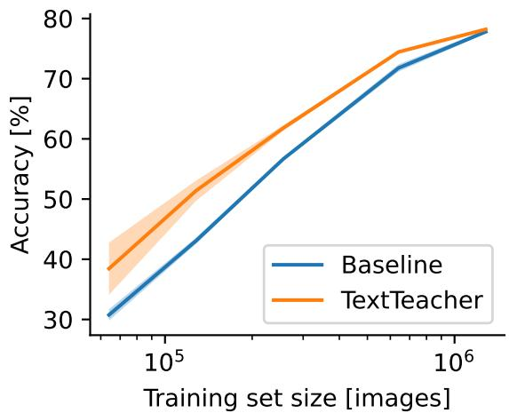

line

| Training set size [images] | Baseline Accuracy [%] | TextTeacher Accuracy [%] |
| --------------------------- | --------------------- | ------------------------ |
| 10^4                        | 30                    | 38                       |
| 10^5                        | 45                    | 52                       |
| 10^6                        | 78                    | 79                       |

Figure 7: Limited data results for ViT-S with a fixed number of update steps. TextTeacher consistently improves accuracy over the vision-only baseline.

To more precisely characterize how our method behaves under varying levels of data scarcity, we measure performance when training on progressively smaller subsets of ImageNet while keeping the total number of optimization steps fixed. This setup isolates the effect of reduced diversity in the training signal rather than reduced compute, allowing us to probe how well each method forms generalizable representations when examples are limited. As shown in Figure 7, accuracy decreases smoothly for both models as the number of training images shrinks, but the relative gap between the baseline and our approach grows consistently in the low-data regime. At moderate subset sizes (e.g., 20–30% of ImageNet), TextTeacher already provides several points of improvement, and at the extreme 5% subset it increases accuracy by $7 . 7 \ \mathrm { p . p . }$ . These results highlight that the auxiliary semantic targets supplied by TextTeacher remain informative even when supervision from class labels becomes sparse. In particular, language-derived attributes appear to guide the model toward more structured feature formation and reduce overfitting, yielding stronger representations exactly where conventional supervised training struggles most.

# C.3 TextTeacher at Pretraining and Finetuning

Table 12: Using TextTeacher at pretraining time helps (more for larger models) to order the embedding space. During finetuning TextTeacher does not improve accuracy and might even harm the resulting state if the pretrained model was not aligned with the language guided embedding space. 

<table><tr><td>Pretrain ImageNet-21k</td><td>Finetune ImageNet-1k</td><td>ViT-S Accuracy [%]</td><td>Delta</td></tr><tr><td>No Guidance</td><td>No Guidance</td><td>82.0</td><td></td></tr><tr><td>No Guidance</td><td> $\lambda = 0.5$  const</td><td>77.6</td><td>-4.4</td></tr><tr><td> $\lambda = 0.5$  const</td><td>No Guidance</td><td>82.3</td><td>+0.3</td></tr><tr><td> $\lambda = 0.5$  const</td><td> $\lambda = 0.5$  const</td><td>82.3</td><td>+0.3</td></tr></table>

To understand when our language-based guidance is most beneficial, we evaluate its effect when applied during large-scale pretraining on ImageNet-21k and when applied later during finetuning on ImageNet-1k. This experiment probes whether the guidance term serves as a helpful regularizer throughout training or whether its utility depends on the stage at which it is introduced. We run four combinations: guidance enabled or disabled during pretraining, and guidance enabled or disabled during finetuning. For this experiment, we pretrain for 90 epochs on ImageNet-21k and finetune for 30 epochs on ImageNet-1k using the ViT & others settings from Table 8, in accordance with Touvron et al. (2022). As shown in Table 12, adding guidance only during finetuning significantly degrades performance (77.6%, −4.4 p.p.), while introducing guidance during pretraining yields a small but consistent improvement (+0.3 p.p.) regardless of whether it is used again during finetuning. This suggests that language guidance is most effective early, when representations are still forming, but can interfere with later specialization. Given that ViT-S is a relatively small model that may already be near capacity under strong supervised pretraining on ImageNet-21k, we expect larger or less saturated models to benefit more substantially from guidance at scale.

# D Further Analysis

D.1 Distribution of Caption Length   
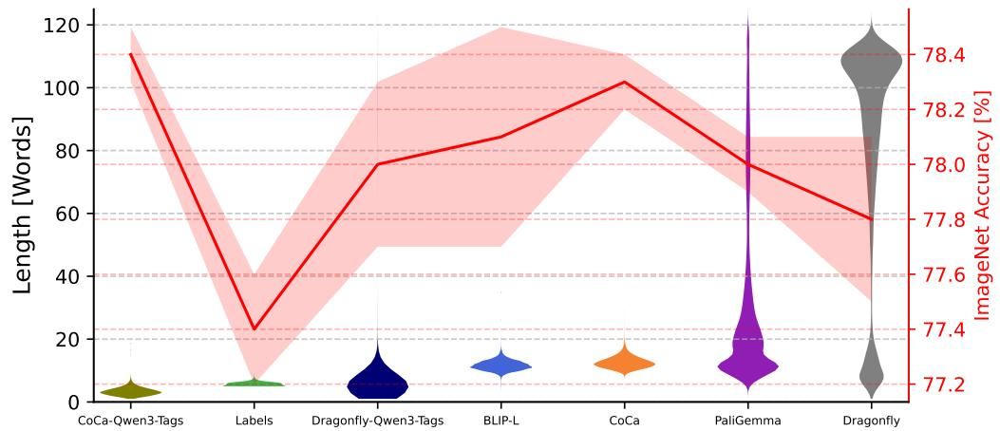

bar_line

| Model               | Length [Words] | ImageNet Accuracy [%] |
| ------------------- | -------------- | --------------------- |
| CoCa-Qwen3-Tags     | ~110           | ~78.4                 |
| Labels              | ~25            | ~77.2                 |
| Dragonfly-Qwen3-Tags | ~75            | ~78.0                 |
| BLIP-L              | ~85            | ~78.0                 |
| CoCa                | ~100           | ~78.2                 |
| PaliGemma           | ~75            | ~78.4                 |
| Dragonfly           | ~60            | ~78.4                 |

Figure 8: Distribution of the length of image captions for different image captioners compared to ImageNet accuracy when used as text signal in TextTeacher with BERT-L as a text encoder.

We analyze whether the amount of textual content provided by different captioners influences the effectiveness of TextTeacher. Intuitively, longer captions might supply richer semantic context, but they can also introduce irrelevant details or noise; conversely, very short captions may underspecify the scene. To study this trade-off, we compare the diverse set of captioners from Table 4 and plot their caption-length (in number of words) distributions against the resulting ImageNet accuracy in Figure 8. Captioners are sorted by average length to reveal systematic trends. Note that the reported length for “Labels” includes the prompt template “a photo of <label>”. Despite dramatic variation in length, there is no clear trend observable. While the shortest captions (CoCa + Qwen3 tags) are the best and the longest ones (Dragonfly) are the worst, intermediate lengths vary a lot. Overall, the results suggest that caption quality and semantic relevance (which can be increased by using tags instead of sentences) matter more than raw length, and that our method is robust to large differences in caption verbosity. The language signal need not be long, only consistent and semantically aligned with the visual content.

# D.2 CKA Visualization

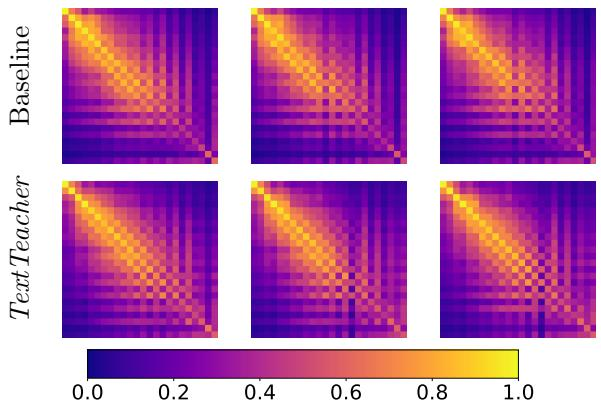

heatmap

| Test       | Baseline | TextTeacher |
| ---------- | -------- | ----------- |
| 1          | 0.8      | 0.7         |
| 2          | 0.6      | 0.5         |
| 3          | 0.4      | 0.3         |
| 4          | 0.2      | 0.1         |
| 5          | 0.0      | 0.0         |

Figure 9: Across run CKA similarity for ViT-S. While different runs are similar in the early layers, TextTeacher increases similarity in deeper laters.

To better understand how TextTeacher influences model weights, we compute Centered Kernel Alignment (CKA) similarity across independently trained models and visualize the full layer-wise similarity matrices. For each method (Baseline and TextTeacher) we train three models with different random seeds and compute CKA for all three pairwise combinations, yielding three matrices per method (Figure 9). These visualizations allow us to inspect the structure and variability of learned representations that are aggregated in Figure 5. Consistent with the trends summarized in Figure 5 of the main text, the Baseline models show substantial variation in deeper layers, whereas TextTeacher produces more consistently aligned representations, especially in the later blocks. The higher cross-run similarity visible in the TextTeacher matrices indicates that our language-guided auxiliary objectives act as an additional structural prior, encouraging models to converge to more stable representational trajectories.

# D.3 Text Embedding Inversion

To better understand how the classification head and the text head interact in TextTeacher, we analyze their alignment by exploring how text-derived embeddings relate to class-discriminative features. Since both heads operate on the same backbone representation via linear maps, the transformation between text-embedding space and class-logit space is analytically tractable. The embedding z is passed through two linear layers: the class head and the text head.

class head: $\mathbf { z } \mapsto \mathrm { s o f t m a x } ( A _ { \mathrm { C L S } } \ \mathbf { z } + b _ { \mathrm { C L S } } ) = : \mathbb { P } ( \cdot | \mathbf { z } )$

text head: $\mathbf { z } \mapsto A _ { \mathrm { T X T } } \ \mathbf { z } + b _ { \mathrm { T X T } } = : \mathbf { e } _ { \mathrm { T X T } }$

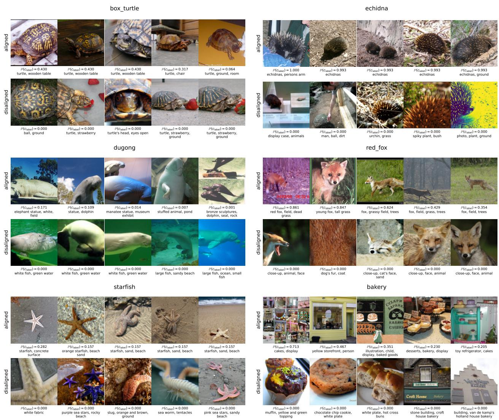  
Figure 10: Most aligned and disaligned images for 6 random classes using ViT-B trained with TextTeacher for 300 epochs. An aligned image is one where the text captions will output a large signal for a specific class. A disaligned image is an image of a class where the text caption produces a low signal for that class.

We can then compute the left-inverse of $A _ { \mathrm { T X T } } \in \mathbb { R } ^ { d _ { \mathrm { t x t } } \times d _ { \mathrm { e m b } } }$ for $d _ { \mathrm { e m b } } \leq d _ { \mathrm { t x t } } .$

$$
A _ {\mathrm{TXT}} ^ {- 1} := \left(A _ {\mathrm{TXT}} ^ {\top} A _ {\mathrm{TXT}}\right) ^ {- 1} A _ {\mathrm{TXT}} ^ {\top}
$$

$$
\Rightarrow A _ {\mathrm{TXT}} ^ {- 1} A _ {\mathrm{TXT}} = \mathbf {1}
$$

Then we can invert the text embeddings to arrive at a class probability distribution:

$$
A _ {\mathrm{TXT}} ^ {- 1} \left(\mathbf {e} _ {\mathrm{TXT}} - b _ {\mathrm{TXT}}\right) = \mathbf {z}
$$

$$
\Rightarrow \operatorname{softmax} \left(A _ {\mathrm{CLS}} A _ {\mathrm{TXT}} ^ {- 1} \left(\mathbf {e} _ {\mathrm{TXT}} - b _ {\mathrm{TXT}}\right) + b _ {\mathrm{CLS}}\right) = \mathbb {P} (\cdot | \mathbf {e} _ {\mathrm{TXT}})
$$

Using this closed-form inverse of the text-head projection, we can map any text embedding back into the shared representation space and evaluate how strongly it activates the classification head. Leveraging this relationship, we conduct a qualitative retrieval experiment: for six randomly selected ImageNet classes, we identify (i) images whose text embeddings are maximally aligned with their target class (maximizing $\mathbb { P } \big ( c _ { \mathrm { l a b e l } } \mid { \mathbf e } _ { \mathrm { T X T } } \big ) \big )$ ), and (ii) images from that class whose text embeddings are minimally aligned (minimizing $\mathbb { P } \big ( c _ { \mathrm { l a b e l } } \mid { \mathbf e } _ { \mathrm { T X T } } \big ) ,$ ). The resulting collections in Figure 10 reveal different patterns. In many cases having the class name in the caption usually results in good alignment (see echidna, red fox, starfish). In other cases, alignment appears driven by broader contextual cues, like bakery being aligned with the the concept of baked goods being on display, but not with just baked goods or the word “bakery”. Similarly, starfish is aligned with the word “starfish”, but not with its synonym “sea star”. Additionally, the box turtle seems to be aligned with the concept of a turtle being inside. Many disaligned examples stem from captions not representing the image or the class object in an image or being too granular.