# Cambrian-P: Pose-Grounded Video Understanding

Jihan Yang1∗ Zifan Zhao1∗ Xichen Pan1 Shusheng Yang1 Junyi Zhang2 Bingyi Kang1 Hu Xu3 Saining Xie1

1 New York University 2 UC Berkeley 3 Meta FAIR

# Abstract

Camera pose matters. The position and orientation of each viewpoint define a shared spatial coordinate frame that relates observations across video frames. Yet this signal is largely absent from multimodal LLMs (MLLMs) for video understanding, which process frames as isolated 2D snapshots, instead of the persistent scene humans perceive. We revisit pose as a lightweight supervisory signal and introduce Cambrian-P, a video MLLM augmented with per-frame learnable camera tokens and a pose regression head. With a carefully designed sampling scheme, the model achieves substantial gains of 4.5–6.5% on spatial reasoning benchmarks such as VSI-Bench, generalizes across eight additional spatial and general video QA benchmarks, and, as a byproduct, achieves state of the art streaming pose estimation on ScanNet. Surprisingly, training on pseudo-annotated poses from in-the-wild video further improves general video QA benchmarks, showing pose helps beyond spatial reasoning. Together, these results position camera pose as a fundamental signal for video models that reason about the physical world.

<table><tr><td>Website</td><td>https://cambrian-mllm.github.io</td></tr><tr><td>Code</td><td>https://github.com/cambrian-mllm/cambrian-p</td></tr><tr><td>Cambrian-P Models</td><td>https://hf.co/collections/nyu-visionx/cambrian-p</td></tr><tr><td>Data</td><td>https://huggingface.co/datasets/nyu-visionx/Cambrian-P-Data</td></tr></table>

# Contents

1 Introduction 3

2 Related Work 4

3 Cambrian-P 5

3.1 Architecture 6   
3.2 Training Objective . . 6   
3.3 Improving Training Dynamics . . . 7

4 Improved VQA with Cambrian-P 8

4.1 Experiment Setups . . 8   
4.2 Results 9   
4.3 Improving General Video QA with Pseudo-Annotated Pose 9

5 Camera Pose Estimation with Cambrian-P 10

5.1 Experiment Setups 10   
5.2 Results . 10

6 Scaling Cambrian-P with Model, Data, and Training Steps 10

7 Analysis 12

7.1 Ablation Studies . . 12   
7.2 How Does Camera Pose Help Video QA? 12   
7.3 Can Video QA Help Camera Pose Estimation? 14   
7.4 Qualitative Results . . 14   
7.5 Latency Analysis . . 15

8 Conclusion 15

References 17

A Implementation Details 25

A.1 Frame Sampling . . . 25   
A.2 MapAnything Training Setup . . 25   
A.3 Pseudo-Pose Annotation Pipeline . . . 26   
A.4 Additional Latency Details . . . 26

B Additional Ablations 27

B.1 Evaluation on ReVSI 27   
B.2 Depth-Baseline Fairness 28   
B.3 Pose-Data Scalability 28

C Visualizations 29

C.1 Additional Camera Pose Trajectory Visualizations . . 29   
C.2 OOD Pose Trajectories on EgoSchema . 29   
C.3 VQA Qualitative Examples . . 29

# 1. Introduction

Video is the projection of a dynamic 3D scene from a coherent sequence of viewpoints. Each viewpoint is defined by the observer’s pose, i.e., its 3D position (R3) and orientation (????(3)), specifying how the camera is embedded in the physical world [34, 61]. Pose provides the link between pixels and geometry, serving as a global anchor that relates distinct views to a shared coordinate frame [34, 78]. With pose, a video is no longer a collection of ambiguous image projections, but a coherent 3D scene [78, 85].

Recovering camera poses from visual observations has therefore been a cornerstone of 3D vision and robotics for decades. Structure from Motion (SfM) emerged in the 1980s precisely for this purpose [59, 78], and remains a prerequisite for a wide array of downstream tasks: multi-view stereo [80], 3D reconstruction, and neural rendering with NeRF [64] or 3D Gaussian Splatting [45]. In parallel, robotics and augmented-reality systems depend on SLAM [16] and visual odometry [67] to localize themselves and reason about their own motion. More recently, the community has recognized that jointly predicting pose and depth with feed-forward transformers can recover dense 3D structure in a single pass [53, 96], further underscoring the centrality of pose as a geometric primitive.

Yet, the role of pose has remained confined to 3D vision. We argue that its value extends far beyond. Multimodal large language models (MLLMs) [1, 5, 13, 32, 57, 89, 91, 92] now excel at semantic video understanding—recognizing actions, summarizing narratives, and answering questions—but consistently struggle when tasks demand spatial reasoning [46, 88, 108, 109]. We contend that this failure is not incidental. Without explicit grounding in 3D geometry, each frame is processed as an independent 2D snapshot, disconnected from the spatial structure across views. Our key insight is that pose naturally closes this gap. It is the lightest 3D signal, compactly encoding how views relate geometrically; it enforces global consistency through rigid-body (SE(3)) constraints; and it disentangles camera motion from scene dynamics, collapsing the space of plausible spatial interpretations. These properties also underpin human vision: viewers naturally separate their own motion from motion in the scene, and maintain a coherent 3D world across viewpoints. Together, they make pose not merely a useful auxiliary cue but a foundational inductive bias for video understanding.

In this work, we present Cambrian-P, which grounds pixels with camera poses by introducing pose supervision into MLLMs, calling for a new paradigm for video understanding. Cambrian-P introduces minimal architectural overhead: a single learnable camera token is appended to each frame’s visual features, and a lightweight projector and head regress pose parameters from the LLM’s hidden states. However, naively adding a pose regression loss does not work out of the box. Through careful investigation, we find that pose estimation and video question answering rely on fundamentally different frame sampling and data augmentation strategies. Uniform temporal sampling common in video understanding provides a shortcut for memorizing poses, while the heavy augmentation typical in pose estimation distracts from semantic comprehension. To reconcile these tensions, we design an interleaved training strategy that incorporates pose-only training data processed and augmented following its preferred practices, along with a random-jitter frame sampling strategy that introduces controlled perturbation to the conventional uniform sampling used for VQA.

With this lightweight design and optimized joint training, Cambrian-P achieves state-of-the-art spatial VQA performance and competitive streaming camera pose estimation. On VSI-Bench [109] and VSTemporalI-Bench [29], Cambrian-P obtains 4.5%∼6.5% gains over its no-pose counterpart, and demonstrates strong out-of-distribution generalization across eight spatial and general VQA benchmarks, including MindCube [117], MVBench [50], and EgoSchema [62]. Scaling pose supervision to in-the-wild videos with pseudo annotations further improves general video QA benchmarks, positioning pose as a promising signal for video understanding beyond spatial reasoning. For pose estimation, Cambrian-P delivers state-of-the-art streaming camera pose accuracy on ScanNet ATE, outperforming specialist reconstruction models such as StreamVGGT [130], CUT3R [98], and Point3R [103]. We further observe consistent scaling with model size, data size, and training iterations for both tasks. Finally, our analysis reveals two additional insights: (i) while adding depth supervision may seem intuitive for injecting 3D priors, it proves suboptimal for VQA compared to learning from camera pose; and (ii) camera pose enables MLLMs to think more globally across video frames, evidenced by the significant improvement of Cambrian-P when answering questions about spatially distant objects.

Imagine you are a robot standing by the window, facing the waste bin. Your goal is to navigate to the bathroom. Fill in the blank with the correct action to complete the route:

1. Go forward until the waste bin 2. \_. 3. Go forward until the bathroom.

A. Turn Back.

B. Turn Left.

C. Turn Right.

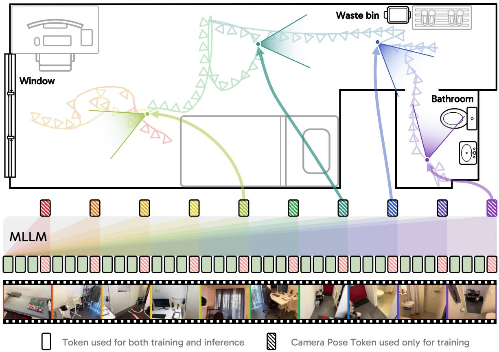

flowchart

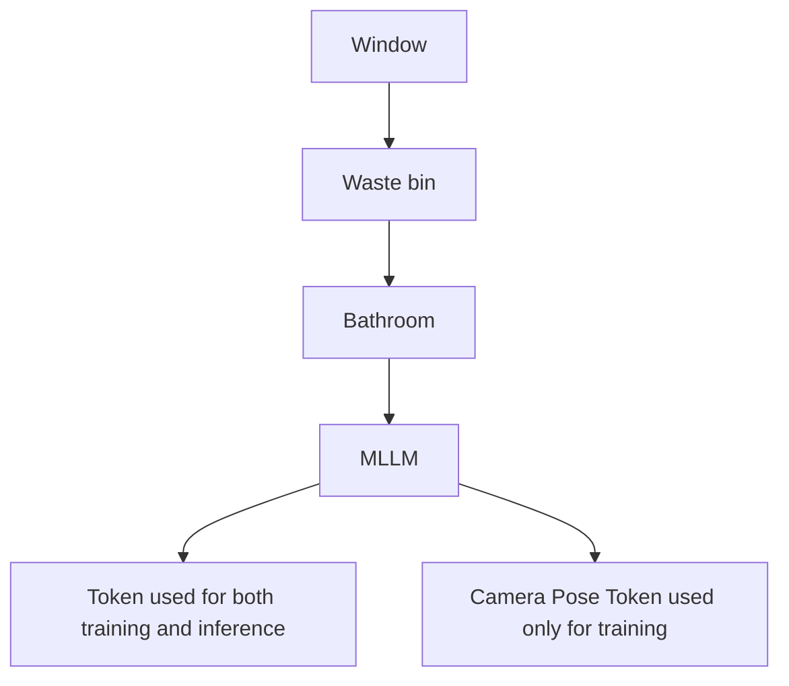

Figure 1 | Cambrian-P illustration in video QA. Cambrian-P equips the current video understanding paradigm with native camera pose prediction using an extra camera token per frame. Cambrian-P positions video frames into a shared spatial coordinate frame, then effectively models the underlying 3D world projected in video. Note that Cambrian-P only requires extra learnable pose tokens during training.

# 2. Related Work

Multimodal Large Language Models Driven by the tremendous success of Large Language Models (LLMs) [1, 5, 13, 32, 91, 92] in linguistic understanding and reasoning, alongside powerful pretrained visual representations [35, 68, 72, 93, 120], Multimodal Large Language Models (MLLMs) [6, 47, 49] extend LLMs beyond language-only corpora and have achieved impressive progress in understanding visual media such as images [22, 24, 47, 52, 56, 86, 89] and videos [7, 74, 83, 97, 111, 126]. However, despite their remarkable success in semantic parsing [2, 23], world knowledge acquisition [36, 77, 118], and general reasoning [60, 119], MLLMs are still far from achieving human-level embodied intelligence capable of perceiving, reasoning, and acting within the 3D real world [46, 88, 108]. Recent studies [12, 73, 109, 115, 117] pinpoint that a fundamental deficit hindering existing MLLMs from this goal is their unsatisfactory visual spatial intelligence, which serves as one of the foundational elements for humans to understand the 3D outside world but remains largely absent in modern MLLMs. This paper aims to bridge this gap.

Visual Spatial Intelligence The growing interest in grounding MLLMs in the real 3D world has created an urgent need to improve their visual spatial intelligence: the ability to understand underlying spatial geometry from visual inputs. Motivated by this, recent works have proposed various benchmarks to evaluate this capability using single-image [73], multi-image [117], or video inputs [109] (which is the primary focus of our work). Their results suggest that even frontier MLLMs still fall significantly behind human performance in spatial understanding. To bridge this gap, several studies [11, 20, 29, 110, 111] curate spatial-oriented data by repurposing existing 3D-related datasets [4, 10, 26, 75, 116], applying pseudo-labeling, or designing synthetic data generation pipelines [28]. These efforts not only improve models’ spatial understanding but also provide foundational datasets for future exploration. [58, 69, 110] propose to finetune MLLMs on spatial data using reinforcement learning to improve their spatial reasoning capability. Another line of research [29, 48, 128] introduces 3D features from off-the-shelf 3D encoders [96]. While this significantly improves MLLMs’ spatial awareness, the approach remains inflexible as it is largely constrained by the quality of the pre-trained features. Recent work [37] unifies 3D reconstruction with spatial understanding with a dual-encoder and mixture-of-transformers design, which is heavy and yields suboptimal results.

Camera Pose Estimation Camera pose estimation serves as a pillar of 3D vision. It is not merely an isolated task, but the prerequisite for a wide spectrum of downstream applications, ranging from dense multi-view reconstruction [30, 78, 113] to modern neural rendering [45, 64] and robotic navigation [16, 71]. Traditionally, recovering camera extrinsics relies on SfM and SLAM systems [34, 65, 78]. While mathematically elegant, these heuristic-based pipelines frequently struggle in ill-posed scenarios characterized by textureless regions, repetitive patterns, or dynamic environments. Recently, a paradigm shift toward data-driven, feed-forward 3D estimation has emerged, with methods like DUSt3R [99] and MASt3R [66] bypassing fragile heuristics via direct dense pointmap regression, giving rise to a broad family of followup works. Among them, offline models [44, 53, 96, 102] jointly process multiple views and typically offer stronger bidirectional reasoning over the full observation set, while streaming approaches [95, 98, 130] process frames incrementally, making them better suited for arbitrary-length videos.

In this work, we contextualize the data-driven learning of 3D geometry within the broader paradigm of MLLM spatial reasoning. Rather than relying on specialized vision architectures or heavy dual-encoder designs, we highlight the camera pose as a lightweight signal that connects isolated frames into a continuous 3D space. By unifying continuous camera pose estimation and video understanding within a single MLLM, our proposed Cambrian-P not only yields competitive streaming pose estimation but fundamentally endows the MLLM with a coherent, global understanding of the 3D physical world.

# 3. Cambrian-P

We introduce Cambrian-P, a new video understanding paradigm for multimodal large language models by equipping it with native camera pose estimation capability. We start by introducing our framework in Sec. 3.1, followed by the training objective and dynamics in Sec. 3.2 and Sec. 3.3, respectively.

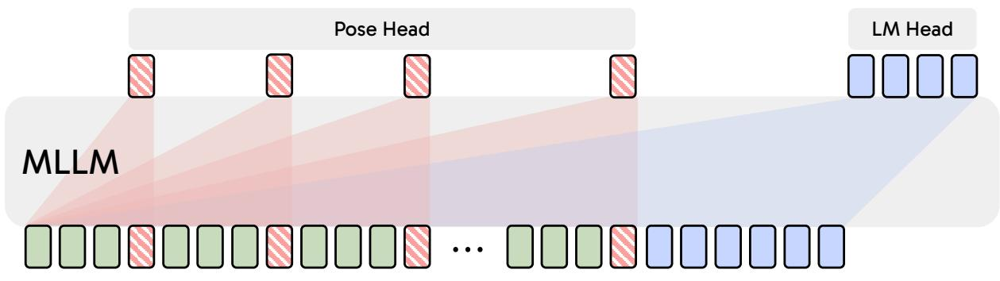

flowchart

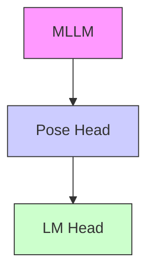

Figure 2 | Cambrian-P Architecture Overview. Cambrian-P imposes minimal modifications to current MLLM architectures, introducing only learnable pose tokens and a lightweight pose head. These tokens are marked with stripes, which indicate they are only included in training. The pose tokens are appended to visual tokens, while positioned before text embeddings.

# 3.1. Architecture

As illustrated in Fig. 2, our overall architecture introduces minimal additional components and overhead during both training and inference to enable camera pose estimation in the current MLLMs paradigm.

MLLM. We build Cambrian-P upon the Cambrian-S [111] architecture, a pretrained MLLM that pairs a SigLIP2-SO400m [93] vision encoder with a Qwen2.5 [105] LM connected via an MLP projector.

Camera Pose Tokens. To enable camera pose estimation within the LLM’s feature space, we introduce a small set of learnable camera pose tokens that are appended to each frame’s visual tokens before they enter the LLM, inspired by the practice of VGGT [96]. Specifically, we define two learnable queries $\mathbf { c } _ { \mathrm { f i r s t } } , \mathbf { c } _ { \mathrm { r e s t } } \in \mathbb { R } ^ { H }$ , where ?? is the LLM’s hidden dimension. For a sequence of ?? frames, we assign cfirst to the first frame and $\pmb { \mathrm { c } } _ { \mathrm { r e s t } }$ to all remaining frames. This allows the model to distinguish the first frame from the rest, and to represent all poses in the coordinate system of the first camera. The per-frame token sequence fed to the LLM is:

$$
[ \mathbf {v} _ {i} ^ {(1)}, \dots , \mathbf {v} _ {i} ^ {(K)}; \mathbf {c} _ {i} ], \quad i = 1, \dots , N, \tag {1}
$$

where $\mathbf { v } _ { i } ^ { ( j ) }$ denotes the ?? projected visual tokens, and $\mathbf { c } _ { i } = \mathbf { c } _ { \mathrm { f i r s t } }$ for $i = 1 , \mathbf { c } _ { i } = \mathbf { c } _ { \mathrm { { r e s t } } }$ for $i > 1$ . Note that $\mathbf { c } _ { i }$ is placed after the vision tokens of each frame due to the causal attention mechanism of the LLM. After the LLM forwarding, we extract and slice out the pose token hidden state $\mathbf { h } _ { i } \in \mathbb { R } ^ { H }$ for each frame from its final layer hidden states.

Camera Pose Projector and Head. We bridge the LLM and the camera prediction head with a linear camera pose projector that maps LLM’s hidden representation $\mathbf { h } _ { i }$ to the required camera pose feature dimension as $\mathbf { \bar { h } } _ { i } = \mathbf { W } _ { p } \mathbf { h } _ { i }$ . To regress the camera parameters for each frame from $\{ \tilde { \mathbf { h } } _ { i } \} _ { - }$ , we adopt the camera head design of VGGT [96], which includes four self-attention layers followed by a linear prediction layer.

# 3.2. Training Objective

Our training objective combines the next-token prediction loss for vision-language understanding with a camera pose estimation loss. The total loss is:

$$
\mathcal {L} = \mathcal {L} _ {\mathrm{NTP}} + \lambda_ {\mathrm{pose}} \cdot \mathcal {L} _ {\mathrm{pose}}, \tag {2}
$$

where ${ \mathcal { L } } _ { \mathrm { N T P } }$ is the standard cross-entropy loss over response text tokens, $\mathcal { L } _ { \mathrm { p o s e } }$ is the camera pose estimation loss, and $\lambda _ { \mathrm { p o s e } }$ is a weighting coefficient.

Camera Pose Estimation Loss. Following VGGT [96], we represent each camera as a pose encoding ${ \bf g } _ { i } = [ { \bf t } _ { i } , { \bf q } _ { i } , f _ { i } ^ { h } , f _ { i } ^ { w } ] \in \mathbb { R } ^ { 9 } .$ , where $\mathbf { t } _ { i } \in \mathbb { R } ^ { 3 }$ is the absolute translation, $\mathbf { q } _ { i } \in \mathbb { R } ^ { 4 }$ is the rotation quaternion, and $f _ { i } ^ { h } , f _ { i } ^ { w } \in \mathbb { R }$ encode the horizontal and vertical field-of-view. The camera pose loss supervises predicted pose encodings gˆ ?? against ground truth g?? using a weighted L1 loss:

$$
\mathcal {L} _ {\mathrm{pose}} = \frac {1}{N} \sum_ {i = 1} ^ {N} \left(\frac {w _ {T}}{\overline {{d}}} \| s ^ {*} \hat {\mathbf {t}} _ {i} - \mathbf {t} _ {i} \| _ {1} + w _ {R} \| \hat {\mathbf {q}} _ {i} - \mathbf {q} _ {i} \| _ {1} + w _ {f} \| [ \hat {f} _ {i} ^ {h}, \hat {f} _ {i} ^ {w} ] - [ f _ {i} ^ {h}, f _ {i} ^ {w} ] \| _ {1}\right), \tag {3}
$$

where $w _ { T } , w _ { R }$ , and $\boldsymbol { w _ { f } }$ are component weights and ??¯ is the trajectory-length normalization factor.

Following VGGT [96], we canonicalize every ground-truth quaternion to the $w { \ge } 0$ hemisphere before computing the loss, resolving the sign ambiguity that q and −q represent the same rotation. We do not explicitly normalize the predicted quaternion qˆ inside the L1 loss; supervision against the unit-norm ground truth implicitly encourages $\lVert \hat { \mathbf { q } } \rVert \to 1$ . For evaluation, the standard ${ \bf q } \to R$ conversion is scaleinvariant and includes a $1 / \| \hat { \mathbf { q } } \| ^ { 2 }$ factor, so any non-zero predicted quaternion maps to a valid rotation matrix regardless of its magnitude. As training data can span a wide range of physical scales from indoor scenes to large outdoor driving sequences, the magnitude of translation errors can vary by orders of magnitude. Furthermore, non-metric datasets inherently possess arbitrary numerical scales, which would otherwise lead to unpredictable gradient magnitudes. To prevent large-scale scenes or arbitrarily scaled non-metric data from dominating the gradient, we normalize the translation loss term by the sequence-averaged consecutive frame distance of the ground-truth trajectory:

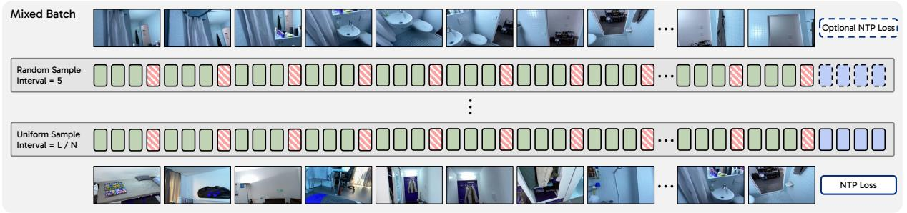

flowchart

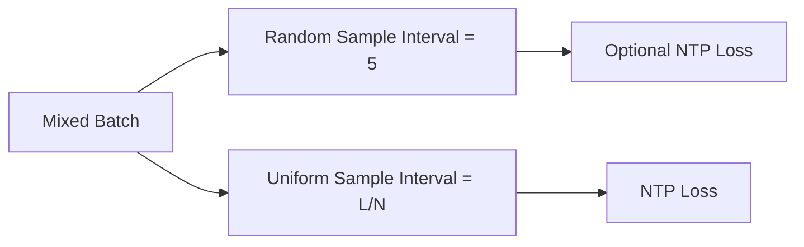

Figure 3 | Interleaved training of Cambrian-P. Top: augmented pose-only samples using dynamic frame sampling and only pose supervision. Bottom: samples using uniform frame sampling with both VQA and pose supervision. ?? is the total number of frames of the video.

$$
\bar {d} = \frac {1}{N - 1} \sum_ {i = 2} ^ {N} \| \mathbf {t} _ {i} - \mathbf {t} _ {i - 1} \| _ {2}, \tag {4}
$$

which ensures that indoor and outdoor scenes contribute comparable gradients during training.

To include both metric-scale and non-metric-scale datasets [51, 55] in training, we resolve the scale ambiguity inherent to non-metric data. Since the same camera trajectory can be encoded with any constant multiplier on all translations, its absolute scale is not physically meaningful. For non-metric samples, we compute a closed-form least-squares scale factor $\begin{array} { r } { s ^ { * } = { \mathrm { s t o p } } _ { - \mathrm { g r a d } } \left( \frac { \sum _ { i } \hat { \mathbf { t } } _ { i } \cdot \mathbf { t } _ { i } } { \sum _ { i } \hat { \mathbf { t } } _ { i } \cdot \hat { \mathbf { t } } _ { i } } \right) } \end{array}$  Í?? ˆt?? ·t??  , which rescales the predicted translations to the ground truth before the L1 loss, so the model is supervised on trajectory shape rather than arbitrary dataset scale. The stop-gradient on $s ^ { * }$ treats it as a constant during backpropagation; otherwise, the model could reduce the loss by collapsing ˆt → 0 and letting $s ^ { * }$ absorb the trajectory scale. For metric-scale samples, we set $s ^ { * } = 1$ , so the absolute translation scale is directly supervised.

# 3.3. Improving Training Dynamics

While the architecture and training objective of Cambrian-P are straightforward, the training dynamics present the most significant challenge when jointly optimizing VQA and camera pose estimation.

Training Dynamics Gaps between VQA and Camera Pose Estimation. The challenges primarily arise from three conflicts between their training paradigms. First, a video frame sampling gap exists: MLLMs typically sample frames at fixed intervals regardless of the query. This yields repeated groundtruth poses across iterations, encouraging memorization of video-pose correspondences rather than genuine pose learning. In contrast, robust camera pose estimation requires random starting frames and dynamic temporal intervals in frame sampling [44, 96, 98]. Second, there is a gap in training duration. Advanced MLLMs typically train for only a single epoch, whereas pose estimation models require tens of epochs with diverse frame sampling to converge [96, 98]. Third, the data augmentation gap complicates joint training. While VQA training generally omits augmentations to preserve the factual correctness of answers, camera pose estimation relies on augmentations like color jittering, Gaussian blur, and grayscale [96]. We empirically observe that applying these data augmentations to pose estimation samples is crucial for pose estimation and simultaneously benefits VQA performance.

Interleaved Training between VQA and Pose. To overcome the aforementioned gaps, we introduce an interleaved training strategy with dedicated pose estimation samples that use their preferred sampling and augmentation strategy, and are supervised only by the pose loss. Specifically, given $\hat { M }$ training samples with pose supervision, we augment them by a ratio of $\beta .$ The resulting ⌊????ˆ ⌋ augmented samples follow the standard sampling and augmentation strategies used in camera pose estimation and are trained with only the camera pose loss $\mathcal { L } _ { \mathrm { p o s e } }$ . We omit the VQA loss here, as the limited temporal coverage of these samples lacks sufficient context for question answering (see Fig. 3). Applying the VQA objective on incomplete visual information could encourage hallucination. Furthermore, the augmentation of pose-only samples enables us to arbitrarily scale training iterations for pose estimation, fully decoupled from the VQA objective. As shown in Fig. 3, in our implementation, our batches are fully mixed, including samples with VQA-only, pose-only, or joint supervision.

Table 1 | VSI-Bench Results Comparison. † indicates this Cambrian-S is fine-tuned only on VSI-590K. 

<table><tr><td rowspan="2">Model</td><td rowspan="2">LM</td><td rowspan="2">Avg.</td><td colspan="4">Numerical Answer</td><td colspan="4">Multiple-Choice Answer</td></tr><tr><td>Obj. Count</td><td>Abs. Dist.</td><td>Obj. Size</td><td>Room Size</td><td>Rel. Dist.</td><td>Rel. Dir.</td><td>Route Plan</td><td>Appr. Order</td></tr><tr><td colspan="11">Baselines</td></tr><tr><td>Chance Level (Random)</td><td>-</td><td>-</td><td>-</td><td>-</td><td>-</td><td>-</td><td>25.0</td><td>36.1</td><td>28.3</td><td>25.0</td></tr><tr><td>Chance Level (Frequency)</td><td>-</td><td>34.0</td><td>62.1</td><td>32.0</td><td>29.9</td><td>33.1</td><td>25.1</td><td>47.9</td><td>28.4</td><td>25.2</td></tr><tr><td colspan="11">General-purpose Models</td></tr><tr><td>GPT-4o [41]</td><td>Unk.</td><td>34.0</td><td>46.2</td><td>5.3</td><td>43.8</td><td>38.2</td><td>37.0</td><td>41.3</td><td>31.5</td><td>28.5</td></tr><tr><td>Gemini-2.5 Pro [25]</td><td>Unk.</td><td>51.5</td><td>43.8</td><td>34.9</td><td>64.3</td><td>42.8</td><td>61.1</td><td>47.8</td><td>45.9</td><td>71.3</td></tr><tr><td>Qwen2.5VL-7B [8]</td><td>Qwen2.5-7B</td><td>29.3</td><td>25.2</td><td>10.5</td><td>36.4</td><td>29.6</td><td>38.4</td><td>38.0</td><td>29.8</td><td>26.8</td></tr><tr><td>InternVL-3 8B [129]</td><td>Qwen2.5-7B</td><td>42.1</td><td>68.1</td><td>39.0</td><td>48.4</td><td>33.6</td><td>48.3</td><td>36.4</td><td>27.3</td><td>35.4</td></tr><tr><td>InternVL-3.5 8B [129]</td><td>Qwen3-8B</td><td>56.3</td><td>-</td><td>-</td><td>-</td><td>-</td><td>-</td><td>-</td><td>-</td><td>-</td></tr><tr><td>Qwen3-VL 8B [7]</td><td>Qwen3-8B</td><td>56.6</td><td>-</td><td>-</td><td>-</td><td>-</td><td>-</td><td>-</td><td>-</td><td>-</td></tr><tr><td colspan="11">Spatial-specialist Models</td></tr><tr><td>VST 7B [110]</td><td>Qwen2.5-7B</td><td>61.2</td><td>71.6</td><td>43.8</td><td>75.5</td><td>69.2</td><td>60.0</td><td>55.6</td><td>44.3</td><td>69.2</td></tr><tr><td>VLM-3R 7B [29]</td><td>Qwen2-7B</td><td>60.9</td><td>70.2</td><td>49.4</td><td>69.2</td><td>67.1</td><td>65.4</td><td>80.5</td><td>45.4</td><td>40.1</td></tr><tr><td>VG-LLM 8B [128]</td><td>Qwen2.5-7B</td><td>50.7</td><td>67.9</td><td>37.7</td><td>58.6</td><td>62.0</td><td>46.6</td><td>40.7</td><td>32.4</td><td>59.2</td></tr><tr><td>Cambrian-S 7B [111]</td><td>Qwen2.5-7B</td><td>67.5</td><td>73.2</td><td>50.5</td><td>74.9</td><td>72.2</td><td>71.1</td><td>76.2</td><td>41.8</td><td>80.1</td></tr><tr><td>SenseNova-SI 8B [17]</td><td>Qwen2.5-7B</td><td>68.7</td><td>-</td><td>-</td><td>-</td><td>-</td><td>-</td><td>-</td><td>-</td><td>-</td></tr><tr><td>GeoThinker 7B [48]</td><td>Qwen2.5-7B</td><td>68.5</td><td>-</td><td>-</td><td>-</td><td>-</td><td>-</td><td>-</td><td>-</td><td>-</td></tr><tr><td>GeoThinker 8B [48]</td><td>Qwen3-8B</td><td>72.6</td><td>-</td><td>-</td><td>-</td><td>-</td><td>-</td><td>-</td><td>-</td><td>-</td></tr><tr><td>Cambrian-S-7B $^{\dagger}$ [111]</td><td>Qwen2.5-7B</td><td>69.2</td><td>73.6</td><td>53.7</td><td>75.2</td><td>74.7</td><td>71.5</td><td>82.0</td><td>38.7</td><td>84.3</td></tr><tr><td>Cambrian-P</td><td>Qwen2.5-7B</td><td>73.7</td><td>74.9</td><td>60.1</td><td>76.0</td><td>76.9</td><td>74.8</td><td>89.5</td><td>52.6</td><td>85.0</td></tr></table>

Random Jitter Frame Sampling. In addition, we apply a jitter augmentation to the uniformly sampled frame indices in VQA. Specifically, given a set of uniformly sampled frame indices $\left\{ u _ { i } \right\}$ from a video of ?? total frames, we perturb each index $u _ { i }$ by a random offset $\bar { \delta } _ { i } \sim \bar { \mathcal { U } } ( - \Delta , \Delta )$ , where $\Delta = \lfloor N \cdot \alpha \rfloor$ and ?? is a jitter ratio controlling the perturbation magnitude. To maintain sequence validity, the jittered index is clipped to $[ 0 , u _ { i + 1 } - 1 ]$ for intermediate frames and [0, ?? − 1] for the last frame, and monotonicity is enforced to ensure $u _ { i } \geq u _ { i - 1 }$ after perturbation. This simple strategy introduces temporal variability, alleviating memorization of fixed frame-pose correspondences in the uniform frame sampling.

Implementation Details. We finetune Cambrian-P from Cambrian-S-7B stage 3 [111] following its stage 4 training recipe. We perform end-to-end finetuning with AdamW optimizer with learning rates of 1 $\cdot \times \mathrm { i } 0 ^ { - 5 }$ for the LLM and vision projector, $2 \times 1 0 ^ { - 6 }$ for the vision encoder, and $1 \times 1 0 ^ { - 4 }$ for the pose projector and head. The pose projector and head are randomly initialized and trained from scratch. By default, we set the interleaved training augmentation ratio ?? to 1, the random jitter ratio ?? to 0.005, and the loss trade-off factor $\lambda _ { \mathrm { p o s e } }$ to 0.2. We train Cambrian-P on 64 H200 GPUs with a 256 batch size. For training data, we use VSI-590K [111] and data from MapAnything [44]. When only partial labels are available, Cambrian-P activates only the corresponding loss, i.e., VQA loss or camera pose loss.

# 4. Improved VQA with Cambrian-P

# 4.1. Experiment Setups

Training Setups. For fair comparison with Cambrian-S and existing MLLMs, we train Cambrian-P with only data from VSI-590K unless otherwise specified.

Benchmarks. We evaluate on a comprehensive suite of spatial reasoning and video understanding benchmarks, including VSI-Bench [109], VSTIBench [29], SparBench [121], MMSIBench [112], MMSIVideo [54], MindCube [117], Tomato [82], MVBench [50], EgoSchema [62], and Perception Test [70].

Baselines. We compare Cambrian-P against three categories of models: (1) general-purpose MLLMs including GPT-4o [41], Gemini-2.5 Pro [25], Qwen2.5VL-7B [8], InternVL-3/3.5 [129], and Qwen3-VL [7]; (2) spatial-specialist models including VST [110], VLM-3R [29], VG-LLM [128], SenseNoVA-SI [17], Cambrian-S [111], and GeoThinker [48]; and (3) chance-level baselines (random and frequency).

# 4.2. Results

VSI-Bench. As shown in Tab. 1, Cambrian-P yields state-of-the-art spatial reasoning capability in VSI-Bench. In particular, compared to existing spatial-specialist models with the same LM like Cambrian-S-7B, SenseNova-SI-8B, and GeoThinker-7B, Cambrian-P achieves more than a 5% gain. Moreover, Cambrian-P outperforms Cambrian-S †, its counterpart without camera pose estimation, by 4.5%, highlighting the effectiveness of incorporating camera pose prediction in spatial reasoning. For per-subtask improvement, Cambrian-P shows the most prominent improvement on absolute distance, relative direction, and route plan – tasks that demand a more global understanding of the space. It is also noteworthy that Cambrian-P shows superior out-of-distribution generalization capability in the route plan task, which is not included in the VSI-590K training set, suggesting that Cambrian-P learns beyond the exact task distribution.

Table 2 | VSTemporalI-Bench Result. We finetune Cambrian-P on VSI-590K and VLM-3R [29] data for this experiment. Cambrian-P shows 20% improvement on the camera movement direction subtask. 

<table><tr><td>Methods</td><td>Avg.</td><td>Cam-Obj Abs. Dist.</td><td>Cam. Displace.</td><td>Cam. Mov. Dir.</td><td>Obj-Obj Rel. Pos.</td><td>Cam-Obj Rel. Dist.</td></tr><tr><td>GPT-4o [41]</td><td>38.2</td><td>29.5</td><td>23.4</td><td>37.3</td><td>58.1</td><td>42.5</td></tr><tr><td>Gemini-1.5 Flash [87]</td><td>32.1</td><td>28.5</td><td>20.9</td><td>24.4</td><td>52.6</td><td>33.9</td></tr><tr><td>LLaVA-NeXT-Video-72B [57]</td><td>44.0</td><td>32.3</td><td>10.5</td><td>48.1</td><td>78.3</td><td>50.9</td></tr><tr><td>VLM-3R-7B [29]</td><td>58.8</td><td>39.4</td><td>39.6</td><td>60.6</td><td>86.5</td><td>68.6</td></tr><tr><td>GeoThinker 8B [48]</td><td>67.4</td><td>38.4</td><td>45.8</td><td>84.2</td><td>93.6</td><td>75.2</td></tr><tr><td>Cambrian-P (w/o Pose)</td><td>62.4</td><td>39.4</td><td>40.6</td><td>67.7</td><td>92.2</td><td>72.0</td></tr><tr><td>Cambrian-P</td><td>68.9</td><td>42.5</td><td>46.6</td><td>87.7</td><td>94.3</td><td>73.2</td></tr></table>

Significant Improvement in Understanding Camera Movement. To further evaluate how well Cambrian-P captures camera movement, we finetune it on VSI-590K [111] and VLM-3R [29] data and evaluate on VSTI-Bench [29], which includes questions about camera motion. As shown in Tab. 2, Cambrian-P achieves state-of-the-art results on VSTI-Bench. More importantly, it obtains a 20% improvement on the camera movement subtask over the no-pose baseline, demonstrating that the camera pose estimation objective directly enhances the model’s understanding of camera dynamics.

Table 3 | Out-of-Distribution Generalization for Spatial and General VQA Benchmarks. Cambrian-P is fine-tuned only on VSI-590K, without any in-distribution training data for benchmarks here. 

<table><tr><td>Model</td><td>SparBench</td><td>MMSIBench</td><td>MMSIVideo</td><td>MindCube</td><td>MVBench</td><td>EgoSchema</td><td>Perception Test</td><td>Tomato</td></tr><tr><td>Cambrian-P (w/o Pose)</td><td>32.7</td><td>26.2</td><td>20.1</td><td>34.3</td><td>51.9</td><td>49.6</td><td>56.4</td><td>20.4</td></tr><tr><td>Cambrian-P</td><td>35.9</td><td>28.0</td><td>22.9</td><td>38.4</td><td>53.5</td><td>52.5</td><td>58.4</td><td>26.7</td></tr></table>

OOD Improvement on Spatial and General VQA Benchmarks. As shown in Tab. 3, although Cambrian-P is finetuned solely on VSI-590K, which is in-distribution with respect to VSI-Bench, it also demonstrates improvements on out-of-distribution spatial and general VQA benchmarks. This suggests that the local-to-global video understanding capability acquired through camera pose prediction is a general and fundamental skill transferable to broader video QA tasks.

# 4.3. Improving General Video QA with Pseudo-Annotated Pose

Cambrian-P shows promising improvements on both spatial VQA and general VQA benchmarks when ground-truth pose supervision is available. However, GT camera poses are available only for limited data sources in VSI-590K (e.g., ScanNet, ScanNet++, and ARKitScenes). To scale pose supervision to general-domain videos, we pseudo-annotate videos corresponding to the subsampled 590K samples from Cambrian-S-3M [111]. We curate pseudo poses using VIPE [39]. Video clips first pass a scene-cut detector and a quality filter based on Qwen3-VL [7]. Remaining clips are processed by VIPE and post-filtered; see Sec. A.3 for details. The resulting pseudo poses are used as GT poses in the interleaved training recipe.

As shown in Tab. 4, adding general VQA data substantially improves general video QA performance on MVBench, Perception Test, and EgoSchema, but slightly degrades VSI-Bench. Introducing GT pose supervision reverses this spatial degradation, improving VSI-Bench while preserving the gains on general VQA. Adding pseudo-pose supervision from general-domain videos further boosts all four benchmarks, yielding additional gains on VSI-Bench as well as substantial improvements on MVBench and EgoSchema.

These results suggest that pseudo poses, even when derived from noisy in-the-wild videos, provide a scalable supervision signal for video understanding.

Table 4 | Cambrian-P with general VQA training data and pseudo pose supervision. We report Cambrian-P 128 frames results on VSIBench, MVBench, Perception Test, and EgoSchema. 

<table><tr><td>Training Data</td><td>Pose Sup.</td><td>% Pose Sup.</td><td>VSIBench</td><td>MVBench</td><td>Perception Test</td><td>EgoSchema</td></tr><tr><td colspan="7">Spatial VQA Data Only</td></tr><tr><td>VSI-590K</td><td>-</td><td>0%</td><td>71.2</td><td>51.7</td><td>56.7</td><td>48.5</td></tr><tr><td>VSI-590K</td><td>GT</td><td>49%</td><td>73.7</td><td>53.8</td><td>58.1</td><td>51.3</td></tr><tr><td colspan="7">Spatial VQA + General VQA Data</td></tr><tr><td>VSI-590K + CamS-590K</td><td>-</td><td>0%</td><td>70.9</td><td>68.0</td><td>66.9</td><td>71.2</td></tr><tr><td>VSI-590K + CamS-590K</td><td>GT</td><td>25%</td><td>73.7</td><td>67.9</td><td>67.8</td><td>71.7</td></tr><tr><td>VSI-590K + CamS-590K</td><td>GT + Pseudo</td><td>48%</td><td>73.9</td><td>69.3</td><td>67.9</td><td>73.6</td></tr></table>

# 5. Camera Pose Estimation with Cambrian-P

# 5.1. Experiment Setups

Training Setups. To further push the camera pose estimation capability, we train Cambrian-P on data with pose annotation from VSI-590K (i.e., ScanNet [26], ScanNet++ [116], and ARKitScenes [10]) and datasets from MapAnything [44], which include metric-scale datasets (ParallelDomain4D [94], TartanAir-v2 [101, 127], MVS-Synth [40], Spring [63], SailVOS3D [38], ETH3D [79], Dynamic Replica [42], MPSD [3], and UnrealStereo4K [90]) and non-metric-scale datasets (MegaDepth [51], DL3DV [55], and BlendedMVS [114]). To further boost the performance on camera pose estimation, we set the interleaved training augmentation ratio ?? to 20 and the loss trade-off factor ??pose to 0.5.

Benchmarks. We evaluate camera pose estimation on three benchmarks: ScanNet [26], TUM-dynamic [84], and Sintel [14], covering indoor scenes, handheld sequences, and synthetic movies with camera motions. Following MonST3R [122], for TUM-dynamic and ScanNet, we sample the first 90 frames with a temporal stride of 3, and for Sintel, we exclude static scenes or sequences with near-straight camera motion. We report three metrics: Absolute Trajectory Error (ATE), Relative Pose Error in translation (RPE trans), and Relative Pose Error in rotation (RPE rot). All metrics are computed with Sim(3) alignment.

Baselines. We compare Cambrian-P against two categories of methods. Offline methods that require access to all frames simultaneously include VGGT [96], DUSt3R [99], MASt3R [66], MonST3R [122], Fast3R [107], FLARE [124], ??3 [102], and MapAnything [44], all evaluated with global alignment (GA) where applicable. Streaming methods that process frames incrementally include StreamVGGT [130], CUT3R [98], Point3R [103], Spann3R [95], and G2VLM [37].

# 5.2. Results

As shown in Tab. 5, Cambrian-P achieves the minimal ATE on ScanNet [26] among streaming camera pose estimation models and delivers competitive performance on TUM [84], and Sintel [14], without relying on specialized designs like DINOv2 encoder [68] or bidirectional transformer [96, 98]. This highlights that standard MLLMs can predict accurate camera pose with only an additional pose head and two learnable pose queries. In addition, benefiting from the compact representation of the SigLIP encoder [93], the lower FLOPs of the causal transformer, and the optimized inference infrastructure of the LLM ecosystem, Cambrian-P shows competitive latency despite its large model size; see Sec. A.4 for additional analysis.

# 6. Scaling Cambrian-P with Model, Data, and Training Steps

The remarkable success of LLMs and the next-token prediction paradigm can be largely attributed to their scalability. We investigate whether the camera pose estimation objective exhibits similar scaling behavior within the MLLM paradigm, across model size, data size, and training iterations.

Table 5 | Camera pose estimation results on ScanNet, TUM, and Sintel. Cambrian-P is trained on VSI-590K and MapAnything data to improve camera pose estimation capability. 

<table><tr><td rowspan="2">Model</td><td colspan="3">ScanNet</td><td colspan="3">TUM-dynamic</td><td colspan="3">Sintel</td></tr><tr><td>ATE ↓</td><td>RPE trans ↓</td><td>RPE rot ↓</td><td>ATE ↓</td><td>RPE trans ↓</td><td>RPE rot ↓</td><td>ATE ↓</td><td>RPE trans ↓</td><td>RPE rot ↓</td></tr><tr><td>Offline Models</td><td></td><td></td><td></td><td></td><td></td><td></td><td></td><td></td><td></td></tr><tr><td>VGGT [96]</td><td>0.035</td><td>0.015</td><td>0.380</td><td>0.009</td><td>0.008</td><td>0.350</td><td>0.172</td><td>0.061</td><td>0.470</td></tr><tr><td>DUSt3R-GA [99]</td><td>0.081</td><td>0.028</td><td>0.784</td><td>0.083</td><td>0.017</td><td>3.567</td><td>0.417</td><td>0.250</td><td>5.796</td></tr><tr><td>MASt3R-GA [66]</td><td>0.078</td><td>0.020</td><td>0.475</td><td>0.038</td><td>0.012</td><td>0.448</td><td>0.185</td><td>0.060</td><td>1.496</td></tr><tr><td>MonST3R-GA [122]</td><td>0.077</td><td>0.018</td><td>0.529</td><td>0.098</td><td>0.019</td><td>0.935</td><td>0.111</td><td>0.044</td><td>0.869</td></tr><tr><td>Fast3R [107]</td><td>0.155</td><td>0.123</td><td>3.491</td><td>0.090</td><td>0.101</td><td>1.425</td><td>0.371</td><td>0.298</td><td>13.750</td></tr><tr><td>FLARE [124]</td><td>0.064</td><td>0.023</td><td>0.971</td><td>0.026</td><td>0.013</td><td>0.475</td><td>0.207</td><td>0.090</td><td>3.015</td></tr><tr><td> $\pi^3$  [102]</td><td>0.031</td><td>0.013</td><td>0.347</td><td>0.014</td><td>0.009</td><td>0.312</td><td>0.074</td><td>0.040</td><td>0.282</td></tr><tr><td>MapAnything [44]</td><td>0.052</td><td>0.025</td><td>0.720</td><td>0.029</td><td>0.023</td><td>0.370</td><td>0.226</td><td>0.077</td><td>0.640</td></tr><tr><td>Streaming Models</td><td></td><td></td><td></td><td></td><td></td><td></td><td></td><td></td><td></td></tr><tr><td>StreamVGGT [130]</td><td>0.127</td><td>0.041</td><td>1.880</td><td>0.062</td><td>0.030</td><td>0.690</td><td>0.273</td><td>0.109</td><td>0.850</td></tr><tr><td>CUT3R [98]</td><td>0.096</td><td>0.022</td><td>0.590</td><td>0.045</td><td>0.015</td><td>0.440</td><td>0.215</td><td>0.070</td><td>0.630</td></tr><tr><td>Point3R [103]</td><td>0.097</td><td>0.035</td><td>2.791</td><td>0.058</td><td>0.031</td><td>0.758</td><td>0.442</td><td>0.154</td><td>1.897</td></tr><tr><td>Spann3R [95]</td><td>0.096</td><td>0.023</td><td>0.661</td><td>0.056</td><td>0.021</td><td>0.591</td><td>0.329</td><td>0.110</td><td>4.471</td></tr><tr><td>G2VLM [37]</td><td>0.148</td><td>0.048</td><td>1.220</td><td>0.129</td><td>0.044</td><td>0.700</td><td>0.301</td><td>0.135</td><td>1.450</td></tr><tr><td>Cambrian-P</td><td>0.078</td><td>0.023</td><td>0.880</td><td>0.046</td><td>0.020</td><td>0.580</td><td>0.239</td><td>0.081</td><td>2.440</td></tr></table>

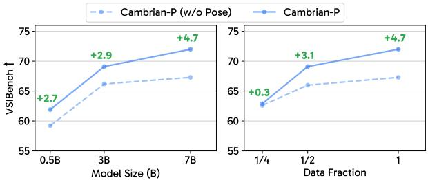

line

| Model Size (B) | Cambrian-P (w/o Pose) | Cambrian-P |
| -------------- | --------------------- | ---------- |
| 0.5B           | 60.0                  | 62.0       |
| 3B             | 66.0                  | 69.0       |
| 7B             | 67.0                  | 72.0       |
| 1/4            | 63.0                  | 68.0       |
| 1/2            | 66.0                  | 70.0       |
| 1              | 67.0                  | 72.0       |

(a) VQA acc. with various models and data sizes.

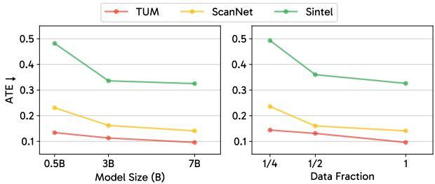

line

| Model Size (B) | TUM   | ScanNet | Sintel |
| -------------- | ----- | ------- | ------ |
| 0.5B           | 0.13  | 0.23    | 0.48   |
| 3B             | 0.11  | 0.16    | 0.34   |
| 7B             | 0.10  | 0.14    | 0.33   |
| Data Fraction   | 0.14  | 0.24    | 0.49   |
| 1/4            | 0.13  | 0.16    | 0.36   |
| 1/2            | 0.12  | 0.15    | 0.33   |
| 1              | 0.10  | 0.14    | 0.32   |

(b) Pose ATE with various models and data sizes.   
Figure 4 | Comparison of Cambrian-P regarding different model size and data size. Larger models or more data both yield higher VSI-Bench scores and lower pose estimation error across all benchmarks.

Model Size Scaling. To investigate the effect of model size, we finetune Cambrian-P from Cambrian-S variants with different LLM sizes. As shown in Fig. 4a, scaling up the model not only improves VSI-Bench performance but also widens the gap over the no-pose baseline. We attribute this trend to the inherent demands of multi-task learning, where larger model capacity better accommodates the additional complexity. As shown in Fig. 4b, the ATE of camera pose decreases as the model size increases.

Data Size Scaling. As shown in Fig. 4a, scaling up data size improves VSI-Bench performance while widening the gap over the no-pose baseline in the 7B model. Note that Cambrian-P yields only marginal improvement with 14 data, likely because the pose head is trained from scratch and struggles to converge with limited supervision. We empirically find that pretraining the pose head can alleviate this issue. Also, as shown in Fig. 4b, the translation error of the camera pose consistently decreases with larger data size.

Training Iteration Scaling. As shown in Tab. 6, scaling the augmented pose iterations in interleaved training is more efficient and scalable than increasing VQA iterations for improving VQA performance. Even without extra pose training iterations from interleaved training, adding pose supervision still yields a 2% improvement. For scaling training iterations to improve camera pose estimation, we adopt the experimental setup described in Sec. 3. As shown in Tab. 7, increasing the pose iterations leads to consistent decreases in ATE across all three pose benchmarks, demonstrating good scalability of MLLMs for camera pose estimation. Moreover, even when trained on a large amount of out-of-distribution data and with the pose estimation objective dominating, Cambrian-P still achieves improved VQA performance on VSI-Bench, highlighting the synergy between spatial VQA and camera pose estimation.

Table 6 | Scaling training iterations to improve VQA. We compare the performance of Cambrian-P with and without pose supervision among different training iterations. 

<table><tr><td>Model</td><td>VQA Iteration</td><td>Pose Iteration</td><td>VSI-Bench ↑</td><td>ScanNet ATE↓</td><td>TUM ATE ↓</td><td>Sintel ATE ↓</td></tr><tr><td rowspan="3">Cambrian-P (w/o Pose)</td><td>2K</td><td>0</td><td>67.3</td><td>-</td><td>-</td><td>-</td></tr><tr><td>4K</td><td>0</td><td>69.3</td><td>-</td><td>-</td><td>-</td></tr><tr><td>6K</td><td>0</td><td>69.3</td><td>-</td><td>-</td><td>-</td></tr><tr><td rowspan="5">Cambrian-P</td><td>2K</td><td>0</td><td>69.4</td><td>0.259</td><td>0.132</td><td>0.521</td></tr><tr><td>0</td><td>2K</td><td>25.2</td><td>0.163</td><td>0.115</td><td>0.374</td></tr><tr><td>2K</td><td>1K</td><td>72.0</td><td>0.141</td><td>0.096</td><td>0.325</td></tr><tr><td>2K</td><td>2K</td><td>72.2</td><td>0.149</td><td>0.112</td><td>0.329</td></tr><tr><td>4K</td><td>2K</td><td>72.7</td><td>0.143</td><td>0.106</td><td>0.406</td></tr></table>

Table 7 | Scaling pose iterations with MapAnything data. Cambrian-P is trained with both VSI-590K and MapAnything data. 

<table><tr><td>Model</td><td>VQA Iteration</td><td>Pose Iteration</td><td>VSI-Bench ↑</td><td>ScanNet ATE↓</td><td>TUM ATE ↓</td><td>Sintel ATE ↓</td></tr><tr><td rowspan="5">Cambrian-P</td><td>2K</td><td>0</td><td>67.3</td><td>-</td><td>-</td><td>-</td></tr><tr><td>2K</td><td>1K</td><td>71.6</td><td>0.145</td><td>0.105</td><td>0.361</td></tr><tr><td>2K</td><td>3K</td><td>70.9</td><td>0.106</td><td>0.073</td><td>0.297</td></tr><tr><td>2K</td><td>5K</td><td>69.8</td><td>0.094</td><td>0.071</td><td>0.289</td></tr><tr><td>2K</td><td>20K</td><td>69.3</td><td>0.077</td><td>0.048</td><td>0.278</td></tr></table>

# 7. Analysis

To better understand the property of Cambrian-P, we analyze its behavior through extensive experiments covering component ablations, frame scaling, loss design, and qualitative trends. Without other specifications, all Cambrian-P variants are trained with VSI-590K in 32 frames and 196 tokens per frame.

# 7.1. Ablation Studies

Table 8 | Components ablation study of Cambrian-P. 

<table><tr><td>Camera Loss</td><td>Interleaved Training</td><td>Random Jitter</td><td>VSI-Bench ↑</td><td>ScanNet ATE↓</td><td>TUM ATE ↓</td><td>Sintel ATE ↓</td></tr><tr><td></td><td></td><td></td><td>67.3</td><td>-</td><td>-</td><td>-</td></tr><tr><td>✓</td><td>✓</td><td></td><td>71.2</td><td>0.144</td><td>0.106</td><td>0.366</td></tr><tr><td>✓</td><td></td><td>✓</td><td>69.4</td><td>0.259</td><td>0.132</td><td>0.521</td></tr><tr><td>✓</td><td>✓</td><td>✓</td><td>72.0</td><td>0.141</td><td>0.096</td><td>0.325</td></tr></table>

Component Ablation As shown in Tab. 8, pose loss and interleaved training yield approximately 3% improvement on VSI-Bench while substantially reducing the ATE of camera pose estimation. Incorporating random jitter further brings 0.8% gains on VQA, along with better pose accuracy. These results suggest that both interleaved training and random jitter significantly mitigate the training dynamics gaps between the VQA and camera pose objectives.

Number of Frames Ablation. As shown in Tab. 9, Cambrian-P achieves higher VQA performance on VSI-Bench as the number of input frames increases, while the gap over the baseline shrinks accordingly. We attribute this trend to VQA benefiting more from additional frames than pose estimation does: more frames provide richer visual context for answering questions, while pose estimation learns better with lower inter-frame overlap and is typically trained on sequences of only 12∼24 frames [96]. This is further supported by the ATE results on pose benchmarks, which slightly degrade as the frame count increases.

# 7.2. How Does Camera Pose Help Video QA?

Here, to understand how camera pose supervision helps, we investigate individual loss components and analyze VQA accuracy across varying spatial distances.

Table 9 | Ablation on the number of input frames during training. 

<table><tr><td>Model</td><td># frames / # tok</td><td>VSI-Bench↑</td><td>ScanNet ATE ↓</td><td>TUM ATE ↓</td><td>Sintel ATE ↓</td></tr><tr><td>Cambrian-P (w/o Pose)</td><td rowspan="2">32 / 196</td><td>67.3</td><td>-</td><td>-</td><td>-</td></tr><tr><td>Cambrian-P</td><td>72.0 (+4.7)</td><td>0.141</td><td>0.096</td><td>0.325</td></tr><tr><td>Cambrian-P (w/o Pose)</td><td rowspan="2">64 / 64</td><td>70.3</td><td>-</td><td>-</td><td>-</td></tr><tr><td>Cambrian-P</td><td>73.1 (+2.8)</td><td>0.140</td><td>0.104</td><td>0.272</td></tr><tr><td>Cambrian-P (w/o Pose)</td><td rowspan="2">128 / 64</td><td>71.2</td><td>-</td><td>-</td><td>-</td></tr><tr><td>Cambrian-P</td><td>73.7 (+2.5)</td><td>0.141</td><td>0.111</td><td>0.322</td></tr></table>

Table 10 | Effect of pose tokens during training and inference in Cambrian-P. Cambrian-P’s improvements are driven by pose supervision during training, not by pose-token conditioning at inference. 

<table><tr><td colspan="2">Pose Token Training Inference</td><td>VSI-Bench</td><td>VSTIBench</td><td>MVBench</td><td>EgoSchema</td><td>Perception Test</td><td>Tomato</td></tr><tr><td>X</td><td>X</td><td>67.3</td><td>55.1</td><td>51.9</td><td>49.6</td><td>56.4</td><td>20.4</td></tr><tr><td>√</td><td>√</td><td>72.0</td><td>56.5</td><td>53.5</td><td>52.5</td><td>58.4</td><td>26.7</td></tr><tr><td>√</td><td>X</td><td>72.0</td><td>56.6</td><td>53.2</td><td>52.5</td><td>58.8</td><td>26.7</td></tr></table>

Camera Pose Helps MLLMs Learn. Starting from a standard MLLM, Cambrian-P introduces pose tokens to leverage pose supervision during training and conditions on these tokens at inference. A natural question is whether the improvement on Video QA stems from the estimated pose trajectory provided at inference time, or from learning better representations through pose supervision during training. As shown in Tab. 10, pose tokens and supervision during training yield significant gains across various video benchmarks, whereas conditioning on pose tokens at inference time provides no additional benefit. This indicates that Cambrian-P’s improvements stem from the stronger representations learned under pose supervision during training, rather than from pose conditioning at inference.

Table 11 | Loss ablation study results. T, R, and FV indicate translation, rotation, and field-of-view loss. 

<table><tr><td>Pose Loss</td><td>Depth Loss</td><td>VSI-Bench ↑</td><td>ScanNet ATE↓</td><td>TUM ATE ↓</td><td>Sintel ATE ↓</td></tr><tr><td>✕</td><td>✕</td><td>67.3</td><td>-</td><td>-</td><td>-</td></tr><tr><td>✓</td><td>✕</td><td>72.0</td><td>0.141</td><td>0.096</td><td>0.325</td></tr><tr><td>✓</td><td>✓</td><td>71.7</td><td>0.156</td><td>0.118</td><td>0.318</td></tr><tr><td>✕</td><td>✓</td><td>69.4</td><td>0.371</td><td>0.194</td><td>0.537</td></tr><tr><td>T only</td><td>✕</td><td>70.7</td><td>0.205</td><td>0.128</td><td>0.357</td></tr><tr><td>R only</td><td>✕</td><td>69.7</td><td>0.287</td><td>0.092</td><td>0.353</td></tr><tr><td>FV only</td><td>✕</td><td>69.4</td><td>0.408</td><td>0.196</td><td>0.670</td></tr><tr><td>T + R</td><td>✕</td><td>71.5</td><td>0.165</td><td>0.130</td><td>0.386</td></tr></table>

Camera Pose Helps VQA More than Depth. To study the effect of depth supervision, we attach a modified VGGT depth head that incorporates RMSNorm layers. We adopt the weighting factor from VGGT to balance the depth and pose losses. As shown in Tab. 11, adding pose loss alone improves VSI-Bench accuracy by 2.6% over depth loss. Combining both losses leads to a slight degradation in both VQA and camera pose estimation over the pose loss alone baseline. This indicates that camera pose estimation has greater synergy with video understanding as probed by VQA. We attribute the underperformance of depth supervision to two factors: (i) predicting dense per-pixel depth from only 196 or 64 visual tokens makes multi-task optimization difficult; (ii) VGGT’s depth supervision is local and, unlike pose, provides no global scene understanding. Breaking down the pose loss into its components, we find that both translation and rotation losses effectively improve VQA performance, while field-of-view loss yields gains comparable to those from depth loss. We provide detailed setup ablation studies for incorporating depth supervision in Sec. B.2.

Camera Pose Enables More Global Spatial Reasoning. VSI-Bench [109] observes that MLLMs fall short in spatial intelligence as they tend to see locally rather than globally. Here, we investigate whether enabling the MLLM to be aware of camera movement facilitates more global spatial reasoning. As shown in Fig. 5, we group samples based on normalized ground-truth distance relative to room size into near, medium, and far categories for the relative distance and relative direction question types in VSI-Bench. We find that without pose supervision, model performance degrades as objects become farther apart, while Cambrian-P exhibits larger gains for distant objects compared to nearby ones. This indicates that camera pose supervision enables MLLMs to develop more global spatial reasoning capabilities.

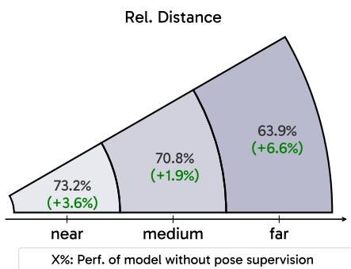

area

Rel. Distance
| Category | Relative Distance (%) | Performance (%) |
| :--- | :--- | :--- |
| near | 73.2 | +3.6 |
| medium | 70.8 | +1.9 |
| far | 63.9 | +6.6 |
X%: Perf. of model without pose supervision

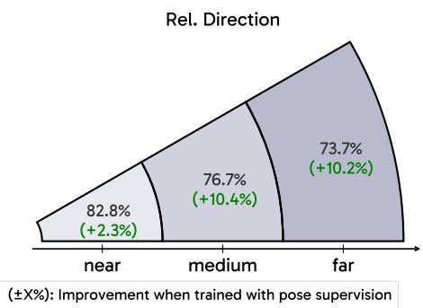

area

Rel. Direction
| Rel. Direction | Value (%) | Improvement (±X%) |
| :--- | :--- | :--- |
| near | 82.8 | +2.3 |
| medium | 76.7 | +10.4 |
| far | 73.7 | +10.2 |

Figure 5 | Camera pose improves global spatial reasoning. We first normalize the ground-truth distance by room size, and then use np.geomspace to group the samples into 3 groups (near, medium, and far), which are equally spaced on the log scale. The near/medium/far sample proportions are 15.8%/66.9%/17.3% for Rel. Dist. and 9.1%/64.3%/26.6% for Rel. Dir., respectively.

Table 12 | Cambrian-P results finetuned from different Cambrian-S variants. CamS-S1, S2, S3 represent checkpoints from increasing training stages of Cambrian-S. 

<table><tr><td>Model</td><td>VSI-Bench ↑</td><td>EgoSchema ↑</td><td>Percept. Test ↑</td><td>MVBench ↑</td><td>ScanNet ATE ↓</td><td>TUM ATE ↓</td><td>Sintel ATE ↓</td></tr><tr><td>CamS-S1</td><td>21.4</td><td>42.9</td><td>44.4</td><td>43.9</td><td>-</td><td>-</td><td>-</td></tr><tr><td>Cambrian-P (FT CamS-S1)</td><td>68.1</td><td>-</td><td>-</td><td>-</td><td>0.130</td><td>0.085</td><td>0.366</td></tr><tr><td>CamS-S2</td><td>24.6</td><td>47.5</td><td>53.5</td><td>49.2</td><td>-</td><td>-</td><td>-</td></tr><tr><td>Cambrian-P (FT CamS-S2)</td><td>69.6</td><td>-</td><td>-</td><td>-</td><td>0.105</td><td>0.073</td><td>0.285</td></tr><tr><td>CamS-S3</td><td>35.7</td><td>76.9</td><td>70.8</td><td>66.3</td><td>-</td><td>-</td><td>-</td></tr><tr><td>Cambrian-P (FT CamS-S3)</td><td>69.8</td><td>-</td><td>-</td><td>-</td><td>0.094</td><td>0.071</td><td>0.289</td></tr></table>

# 7.3. Can Video QA Help Camera Pose Estimation?

We have extensively discussed how the 3D prior from camera pose estimation benefits video QA. But does the reverse also hold—can VQA improve camera pose estimation? As shown in Tab. 12, when the pretrained MLLM is more grounded in video QA in terms of better VSI-Bench [109], EgoSchema [62], Perception Test [70], and MVBench [50] performance, the model finetuned on MapAnything [44] data predicts more accurate camera poses. We attribute this to the better video-language alignment via VQA pretraining, which provides a more effective foundation for the post-LLM camera pose head.

# 7.4. Qualitative Results

We show qualitative camera pose trajectory comparisons on ScanNet. For each scene, we plot the ground-truth trajectory (gray dashed) alongside predictions (blue solid) from Cambrian-P, CUT3R [98], StreamVGGT [130], and G2VLM [37]. All predicted trajectories are aligned to the ground truth via Sim(3) alignment and projected onto the two axes of greatest spatial extent for visualization. Fig. 6 shows five scenes from the ScanNet test split. Cambrian-P generalizes well to these unseen indoor environments, maintaining accurate trajectory shapes across diverse room layouts and camera motions.

Additional qualitative results on ScanNet validation scenes are provided in Sec. C.1. We further visualize OOD predicted trajectories on EgoSchema clips in Sec. C.2, where Cambrian-P is compared against specialist pose models using VIPE pseudo-GT trajectories. Qualitative examples in Sec. C.3 illustrate how pose supervision helps Cambrian-P answer spatial questions.

# 7.5. Latency Analysis

Although Cambrian-P contains more parameters than specialist 3D reconstruction models, it remains efficient for camera pose estimation due to its compact visual representation, causal transformer backbone, and optimized LLM inference stack. We benchmark latency against recent specialist models [96, 98, 130] on the ScanNet [26] test set with a single NVIDIA L40S GPU, excluding data loading and post-processing.

Table 13 | Inference latency comparison on the ScanNet test set. We report the wall-clock time averaged across all test scenes to process a full 90-frame sequence (Per-sequence) and the amortized per-frame cost (Per-frame). All times measure model forward-pass latency only, excluding data loading and postprocessing. Offline: all frames are available upfront and processed jointly. Streaming: frames arrive one at a time; each frame is processed incrementally using cached states. † Offline per-frame latency is amortized: total time# total frames in one sequence. 

<table><tr><td rowspan="2">Method</td><td rowspan="2">#Params</td><td colspan="2">Offline</td><td colspan="2">Streaming</td></tr><tr><td>Per-sequence (s)</td><td>Per-frame (s) $^{\dagger}$ </td><td>Per-sequence (s)</td><td>Per-frame (s)</td></tr><tr><td>VGGT [96]</td><td>1.26B</td><td>9.90</td><td>0.11</td><td>—</td><td>—</td></tr><tr><td>CUT3R [98]</td><td>0.80B</td><td>5.22</td><td>0.06</td><td>6.03</td><td>0.07</td></tr><tr><td>StreamVGGT [130]</td><td>1.26B</td><td>—</td><td>—</td><td>9.00</td><td>0.10</td></tr><tr><td>Cambrian- $P$  (Ours)</td><td>8.20B</td><td>2.16</td><td>0.02</td><td>5.76</td><td>0.06</td></tr></table>

As shown in Tab. 13, Cambrian-P achieves the lowest latency in both offline and streaming settings despite having substantially more parameters. In offline mode, it reduces amortized per-frame latency to 0.02s, compared with 0.06s for CUT3R [98] and 0.11s for VGGT [96]. In streaming mode, it processes each frame in 0.06s, slightly faster than CUT3R and clearly faster than StreamVGGT. We attribute this efficiency to three factors: (1) fewer visual tokens per frame from the SigLIP encoder [93], (2) the lower-cost causal attention backbone, and (3) KV-cache reuse for incremental inference. More discussion of the inference setup and efficiency analysis is provided in Sec. A.4.

# 8. Conclusion

We introduce Cambrian-P, a pose-grounded video understanding model that equips standard MLLMs with the capability to connect individual frames in a shared space. With a simple yet scalable architectural design and tailored training dynamics, Cambrian-P improves spatial and general video QA, and achieves competitive streaming pose estimation performance against state-of-the-art methods. Our results position camera pose as an important missing signal for video MLLMs: it grounds frames in a globally consistent 3D space and encourages learning cross-frame correspondences. Cambrian-P advances MLLMs toward real-world grounded video understanding.

# Acknowledgments

We thank Oscar Michel, Baiqiao Yin, Jianyuan Wang, Anjali Gupta, Ellis Brown, Peter Tong, and Pinzhi Huang for reviewing this manuscript and providing constructive feedback. This work is supported by a grant from the Meta FAIR team. S.X. acknowledges support from the MSIT IITP grant (RS-2024-00457882) and the NSF award IIS-2443404.

Camera Trajectory Comparison ScanNet Test   

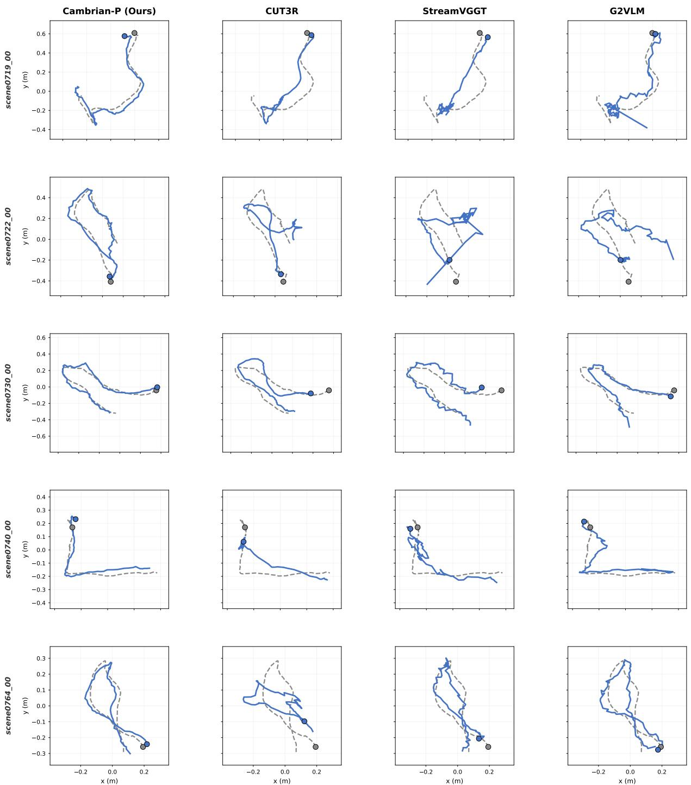  
Figure 6 | Camera pose trajectory visualization on ScanNet test scenes. These scenes are disjoint from the VSI-Bench evaluation sequences. Cambrian-P generalizes well to unseen indoor environments.

# References

[1] Josh Achiam, Steven Adler, Sandhini Agarwal, Lama Ahmad, Ilge Akkaya, Florencia Leoni Aleman, Diogo Almeida, Janko Altenschmidt, Sam Altman, Shyamal Anadkat, et al. Gpt-4 technical report. arXiv preprint arXiv:2303.08774, 2023.   
[2] Harsh Agrawal, Karan Desai, Yufei Wang, Xinlei Chen, Rishabh Jain, Mark Johnson, Dhruv Batra, Devi Parikh, Stefan Lee, and Peter Anderson. Nocaps: Novel object captioning at scale. In ICCV, 2019.   
[3] Manuel López Antequera, Pau Gargallo, Markus Hofinger, Samuel Rota Bulo, Yubin Kuang, and Peter Kontschieder. Mapillary planet-scale depth dataset. In ECCV, 2020.   
[4] Iro Armeni, Ozan Sener, Amir R Zamir, Helen Jiang, Ioannis Brilakis, Martin Fischer, and Silvio Savarese. 3d semantic parsing of large-scale indoor spaces. In CVPR, 2016.   
[5] Jinze Bai, Shuai Bai, Yunfei Chu, Zeyu Cui, Kai Dang, Xiaodong Deng, Yang Fan, Wenbin Ge, Yu Han, Fei Huang, et al. Qwen technical report. arXiv preprint arXiv:2309.16609, 2023.   
[6] Jinze Bai, Shuai Bai, Shusheng Yang, Shijie Wang, Sinan Tan, Peng Wang, Junyang Lin, Chang Zhou, and Jingren Zhou. Qwen-vl: A frontier large vision-language model with versatile abilities. arXiv preprint arXiv:2308.12966, 2023.   
[7] Shuai Bai, Yuxuan Cai, Ruizhe Chen, Keqin Chen, Xionghui Chen, Zesen Cheng, Lianghao Deng, Wei Ding, Chang Gao, Chunjiang Ge, Wenbin Ge, Zhifang Guo, Qidong Huang, Jie Huang, Fei Huang, Binyuan Hui, Shutong Jiang, Zhaohai Li, Mingsheng Li, Mei Li, Kaixin Li, Zicheng Lin, Junyang Lin, Xuejing Liu, Jiawei Liu, Chenglong Liu, Yang Liu, Dayiheng Liu, Shixuan Liu, Dunjie Lu, Ruilin Luo, Chenxu Lv, Rui Men, Lingchen Meng, Xuancheng Ren, Xingzhang Ren, Sibo Song, Yuchong Sun, Jun Tang, Jianhong Tu, Jianqiang Wan, Peng Wang, Pengfei Wang, Qiuyue Wang, Yuxuan Wang, Tianbao Xie, Yiheng Xu, Haiyang Xu, Jin Xu, Zhibo Yang, Mingkun Yang, Jianxin Yang, An Yang, Bowen Yu, Fei Zhang, Hang Zhang, Xi Zhang, Bo Zheng, Humen Zhong, Jingren Zhou, Fan Zhou, Jing Zhou, Yuanzhi Zhu, and Ke Zhu. Qwen3-vl technical report. arXiv preprint arXiv:2511.21631, 2025.   
[8] Shuai Bai, Keqin Chen, Xuejing Liu, Jialin Wang, Wenbin Ge, Sibo Song, Kai Dang, Peng Wang, Shijie Wang, Jun Tang, et al. Qwen2.5-vl technical report. arXiv preprint arXiv:2502.13923, 2025.   
[9] Max Bain, Arsha Nagrani, Gül Varol, and Andrew Zisserman. Frozen in time: A joint video and image encoder for end-to-end retrieval. In ICCV, 2021.   
[10] Gilad Baruch, Zhuoyuan Chen, Afshin Dehghan, Tal Dimry, Yuri Feigin, Peter Fu, Thomas Gebauer, Brandon Joffe, Daniel Kurz, Arik Schwartz, and Elad Shulman. ARKitscenes - a diverse real-world dataset for 3d indoor scene understanding using mobile RGB-d data. In NeurIPS, 2021.   
[11] Ellis Brown, Arijit Ray, Ranjay Krishna, Ross Girshick, Rob Fergus, and Saining Xie. SIMS-V: Simulated instruction-tuning for spatial video understanding. arXiv preprint arXiv:2511.04668, 2025.   
[12] Ellis Brown, Jihan Yang, Shusheng Yang, Rob Fergus, and Saining Xie. Benchmark designers should “train on the test set” to expose exploitable non-visual shortcuts. arXiv preprint arXiv:2511.04655, 2025.   
[13] Tom Brown, Benjamin Mann, Nick Ryder, Melanie Subbiah, Jared D Kaplan, Prafulla Dhariwal, Arvind Neelakantan, Pranav Shyam, Girish Sastry, Amanda Askell, et al. Language models are few-shot learners. In NeurIPS, 2020.   
[14] Daniel J Butler, Jonas Wulff, Garrett B Stanley, and Michael J Black. A naturalistic open source movie for optical flow evaluation. In ECCV, 2012.   
[15] Fabian Caba Heilbron, Victor Escorcia, Bernard Ghanem, and Juan Carlos Niebles. Activitynet: A large-scale video benchmark for human activity understanding. In CVPR, 2015.

[16] Cesar Cadena, Luca Carlone, Henry Carrillo, Yasir Latif, Davide Scaramuzza, José Neira, Ian Reid, and John J Leonard. Past, present, and future of simultaneous localization and mapping: Toward the robust-perception age. T-RO, 2017.   
[17] Zhongang Cai, Ruisi Wang, Chenyang Gu, Fanyi Pu, Junxiang Xu, Yubo Wang, Wanqi Yin, Zhitao Yang, Chen Wei, Qingping Sun, et al. Scaling spatial intelligence with multimodal foundation models. arXiv preprint arXiv:2511.13719, 2025.   
[18] Joao Carreira, Eric Noland, Andras Banki-Horvath, Chloe Hillier, and Andrew Zisserman. A short note about kinetics-600. arXiv preprint arXiv:1808.01340, 2018.   
[19] Joao Carreira, Eric Noland, Chloe Hillier, and Andrew Zisserman. A short note on the kinetics-700 human action dataset. arXiv preprint arXiv:1907.06987, 2019.   
[20] Boyuan Chen, Zhuo Xu, Sean Kirmani, Brain Ichter, Dorsa Sadigh, Leonidas Guibas, and Fei Xia. Spatialvlm: Endowing vision-language models with spatial reasoning capabilities. In CVPR, 2024.   
[21] Dongping Chen, Yue Huang, Siyuan Wu, Jingyu Tang, Liuyi Chen, Yilin Bai, Zhigang He, Chenlong Wang, Huichi Zhou, Yiqiang Li, et al. Gui-world: A video benchmark and dataset for multimodal gui-oriented understanding. In ICLR, 2025.   
[22] Guo Chen, Zhiqi Li, Shihao Wang, Jindong Jiang, Yicheng Liu, Lidong Lu, De-An Huang, Wonmin Byeon, Matthieu Le, Tuomas Rintamaki, et al. Eagle 2.5: Boosting long-context post-training for frontier vision-language models. In NeurIPS, 2025.   
[23] Xinlei Chen, Hao Fang, Tsung-Yi Lin, Ramakrishna Vedantam, Saurabh Gupta, Piotr Dollár, and C Lawrence Zitnick. Microsoft coco captions: Data collection and evaluation server. arXiv preprint arXiv:1504.00325, 2015.   
[24] Zhe Chen, Jiannan Wu, Wenhai Wang, Weijie Su, Guo Chen, Sen Xing, Muyan Zhong, Qinglong Zhang, Xizhou Zhu, Lewei Lu, et al. Internvl: Scaling up vision foundation models and aligning for generic visual-linguistic tasks. In CVPR, 2024.   
[25] Gheorghe Comanici, Eric Bieber, Mike Schaekermann, Ice Pasupat, Noveen Sachdeva, Inderjit Dhillon, Marcel Blistein, Ori Ram, Dan Zhang, Evan Rosen, et al. Gemini 2.5: Pushing the frontier with advanced reasoning, multimodality, long context, and next generation agentic capabilities. arXiv preprint arXiv:2507.06261, 2025.   
[26] Angela Dai, Angel X Chang, Manolis Savva, Maciej Halber, Thomas Funkhouser, and Matthias Nießner. Scannet: Richly-annotated 3d reconstructions of indoor scenes. In CVPR, 2017.   
[27] Dima Damen, Hazel Doughty, Giovanni Maria Farinella, Sanja Fidler, Antonino Furnari, Evangelos Kazakos, Davide Moltisanti, Jonathan Munro, Toby Perrett, Will Price, and Michael Wray. Scaling egocentric vision: The EPIC-KITCHENS dataset. In ECCV, 2018.   
[28] Matt Deitke, Eli VanderBilt, Alvaro Herrasti, Luca Weihs, Kiana Ehsani, Jordi Salvador, Winson Han, Eric Kolve, Aniruddha Kembhavi, and Roozbeh Mottaghi. Procthor: Large-scale embodied ai using procedural generation. In NeurIPS, 2022.   
[29] Zhiwen Fan, Jian Zhang, Renjie Li, Junge Zhang, Runjin Chen, Hezhen Hu, Kevin Wang, Huaizhi Qu, Dilin Wang, Zhicheng Yan, et al. Vlm-3r: Vision-language models augmented with instructionaligned 3d reconstruction. In CVPR, 2026.   
[30] Yasutaka Furukawa and Jean Ponce. Accurate, dense, and robust multiview stereopsis. TPAMI, 2009.   
[31] Raghav Goyal, Samira Ebrahimi Kahou, Vincent Michalski, Joanna Materzynska, Susanne Westphal, Heuna Kim, Valentin Haenel, Ingo Fründ, Peter Yianilos, Moritz Mueller-Freitag, Florian Hoppe, Christian Thurau, Ingo Bax, and Roland Memisevic. The “something something” video database for learning and evaluating visual common sense. In ICCV, 2017.

[32] Aaron Grattafiori, Abhimanyu Dubey, Abhinav Jauhri, Abhinav Pandey, Abhishek Kadian, Ahmad Al-Dahle, Aiesha Letman, Akhil Mathur, Alan Schelten, Alex Vaughan, et al. The llama 3 herd of models. arXiv preprint arXiv:2407.21783, 2024.   
[33] Kristen Grauman, Andrew Westbury, Eugene Byrne, Zachary Chavis, Antonino Furnari, Rohit Girdhar, Jackson Hamburger, Hao Jiang, Miao Liu, Xingyu Liu, et al. Ego4d: Around the world in 3,000 hours of egocentric video. In CVPR, 2022.   
[34] Richard Hartley and Andrew Zisserman. Multiple view geometry in computer vision. Cambridge university press, 2003.   
[35] Kaiming He, Xinlei Chen, Saining Xie, Yanghao Li, Piotr Dollár, and Ross Girshick. Masked autoencoders are scalable vision learners. In CVPR, 2022.   
[36] Kairui Hu, Penghao Wu, Fanyi Pu, Wang Xiao, Yuanhan Zhang, Xiang Yue, Bo Li, and Ziwei Liu. Video-MMMU: Evaluating knowledge acquisition from multi-discipline professional videos. arXiv preprint arXiv:2501.13826, 2025.   
[37] Wenbo Hu, Jingli Lin, Yilin Long, Yunlong Ran, Lihan Jiang, Yifan Wang, Chenming Zhu, Runsen Xu, Tai Wang, and Jiangmiao Pang. G2vlm: Geometry grounded vision language model with unified 3d reconstruction and spatial reasoning. arXiv preprint arXiv:2511.21688, 2025.   
[38] Yuan-Ting Hu, Jiahong Wang, Raymond A Yeh, and Alexander G Schwing. Sail-vos 3d: A synthetic dataset and baselines for object detection and 3d mesh reconstruction from video data. In CVPR, 2021.   
[39] Jiahui Huang, Qunjie Zhou, Hesam Rabeti, Aleksandr Korovko, Huan Ling, Xuanchi Ren, Tianchang Shen, Jun Gao, Dmitry Slepichev, Chen-Hsuan Lin, et al. Vipe: Video pose engine for 3d geometric perception. arXiv preprint arXiv:2508.10934, 2025.   
[40] Po-Han Huang, Kevin Matzen, Johannes Kopf, Narendra Ahuja, and Jia-Bin Huang. Deepmvs: Learning multi-view stereopsis. In CVPR, 2018.   
[41] Aaron Hurst, Adam Lerer, Adam P Goucher, Adam Perelman, Aditya Ramesh, Aidan Clark, AJ Ostrow, Akila Welihinda, Alan Hayes, Alec Radford, et al. Gpt-4o system card. arXiv preprint arXiv:2410.21276, 2024.   
[42] Nikita Karaev, Ignacio Rocco, Benjamin Graham, Natalia Neverova, Andrea Vedaldi, and Christian Rupprecht. Dynamicstereo: Consistent dynamic depth from stereo videos. In CVPR, 2023.   
[43] Will Kay, Joao Carreira, Karen Simonyan, Brian Zhang, Chloe Hillier, Sudheendra Vijayanarasimhan, Fabio Viola, Tim Green, Trevor Back, Paul Natsev, Mustafa Suleyman, and Andrew Zisserman. The kinetics human action video dataset. arXiv preprint arXiv:1705.06950, 2017.   
[44] Nikhil Keetha, Norman Müller, Johannes Schönberger, Lorenzo Porzi, Yuchen Zhang, Tobias Fischer, Arno Knapitsch, Duncan Zauss, Ethan Weber, Nelson Antunes, et al. Mapanything: Universal feed-forward metric 3d reconstruction. arXiv preprint arXiv:2509.13414, 2025.   
[45] Bernhard Kerbl, Georgios Kopanas, Thomas Leimkühler, George Drettakis, et al. 3d gaussian splatting for real-time radiance field rendering. ACM Trans. Graph., 2023.   
[46] Moo Jin Kim, Karl Pertsch, Siddharth Karamcheti, Ted Xiao, Ashwin Balakrishna, Suraj Nair, Rafael Rafailov, Ethan Foster, Grace Lam, Pannag Sanketi, et al. Openvla: An open-source vision-languageaction model. arXiv preprint arXiv:2406.09246, 2024.   
[47] Bo Li, Yuanhan Zhang, Dong Guo, Renrui Zhang, Feng Li, Hao Zhang, Kaichen Zhang, Peiyuan Zhang, Yanwei Li, Ziwei Liu, et al. Llava-onevision: Easy visual task transfer. TMLR, 2025.   
[48] Haoyuan Li, Qihang Cao, Tao Tang, Kun Xiang, Zihan Guo, Jianhua Han, Hang Xu, and Xiaodan Liang. Thinking with geometry: Active geometry integration for spatial reasoning. arXiv preprint arXiv:2602.06037, 2026.

[49] Junnan Li, Dongxu Li, Silvio Savarese, and Steven Hoi. Blip-2: Bootstrapping language-image pre-training with frozen image encoders and large language models. In ICML, 2023.   
[50] Kunchang Li, Yali Wang, Yinan He, Yizhuo Li, Yi Wang, Yi Liu, Zun Wang, Jilan Xu, Guo Chen, Ping Luo, et al. MVbench: A comprehensive multi-modal video understanding benchmark. In CVPR, 2024.   
[51] Zhengqi Li and Noah Snavely. Megadepth: Learning single-view depth prediction from internet photos. In CVPR, 2018.   
[52] Zhiqi Li, Guo Chen, Shilong Liu, Shihao Wang, Vibashan VS, Yishen Ji, Shiyi Lan, Hao Zhang, Yilin Zhao, Subhashree Radhakrishnan, et al. Eagle 2: Building post-training data strategies from scratch for frontier vision-language models. arXiv preprint arXiv:2501.14818, 2025.   
[53] Haotong Lin, Sili Chen, Junhao Liew, Donny Y Chen, Zhenyu Li, Guang Shi, Jiashi Feng, and Bingyi Kang. Depth anything 3: Recovering the visual space from any views. arXiv preprint arXiv:2511.10647, 2025.   
[54] Jingli Lin, Runsen Xu, Shaohao Zhu, Sihan Yang, Peizhou Cao, Yunlong Ran, Miao Hu, Chenming Zhu, Yiman Xie, Yilin Long, et al. Mmsi-video-bench: A holistic benchmark for video-based spatial intelligence. arXiv preprint arXiv:2512.10863, 2025.   
[55] Lu Ling, Yichen Sheng, Zhi Tu, Wentian Zhao, Cheng Xin, Kun Wan, Lantao Yu, Qianyu Guo, Zixun Yu, Yawen Lu, et al. Dl3dv-10k: A large-scale scene dataset for deep learning-based 3d vision. In CVPR, 2024.   
[56] Haotian Liu, Chunyuan Li, Yuheng Li, and Yong Jae Lee. Improved baselines with visual instruction tuning. In CVPR, 2024.   
[57] Haotian Liu, Chunyuan Li, Qingyang Wu, and Yong Jae Lee. Visual instruction tuning. In NeurIPS, 2023.   
[58] Yuhong Liu, Beichen Zhang, Yuhang Zang, Yuhang Cao, Long Xing, Xiaoyi Dong, Haodong Duan, Dahua Lin, and Jiaqi Wang. Spatial-ssrl: Enhancing spatial understanding via self-supervised reinforcement learning. arXiv preprint arXiv:2510.27606, 2025.   
[59] H Christopher Longuet-Higgins. A computer algorithm for reconstructing a scene from two projections. Nature, 1981.   
[60] Pan Lu, Hritik Bansal, Tony Xia, Jiacheng Liu, Chunyuan Li, Hannaneh Hajishirzi, Hao Cheng, Kai-Wei Chang, Michel Galley, and Jianfeng Gao. Mathvista: Evaluating mathematical reasoning of foundation models in visual contexts. In ICLR, 2024.   
[61] Yi Ma, Stefano Soatto, Jana Kosecka, and S Shankar Sastry. An Invitation to 3-D Vision: From Images to Geometric Models. Springer Science & Business Media, 2005.   
[62] Karttikeya Mangalam, Raiymbek Akshulakov, and Jitendra Malik. Egoschema: A diagnostic benchmark for very long-form video language understanding. In NeurIPS, 2023.   
[63] Lukas Mehl, Jenny Schmalfuss, Azin Jahedi, Yaroslava Nalivayko, and Andrés Bruhn. Spring: A high-resolution high-detail dataset and benchmark for scene flow, optical flow and stereo. In CVPR, 2023.   
[64] Ben Mildenhall, Pratul P Srinivasan, Matthew Tancik, Jonathan T Barron, Ravi Ramamoorthi, and Ren Ng. Nerf: Representing scenes as neural radiance fields for view synthesis. Communications of the ACM, 2021.   
[65] Raul Mur-Artal, Jose Maria Martinez Montiel, and Juan D Tardos. Orb-slam: A versatile and accurate monocular slam system. T-RO, 2015.   
[66] Riku Murai, Eric Dexheimer, and Andrew J Davison. Mast3r-slam: Real-time dense slam with 3d reconstruction priors. In CVPR, 2025.

[67] David Nistér, Oleg Naroditsky, and James Bergen. Visual odometry. In CVPR, 2004.   
[68] Maxime Oquab, Timothée Darcet, Théo Moutakanni, Huy Vo, Marc Szafraniec, Vasil Khalidov, Pierre Fernandez, Daniel Haziza, Francisco Massa, Alaaeldin El-Nouby, et al. Dinov2: Learning robust visual features without supervision. arXiv preprint arXiv:2304.07193, 2023.   
[69] Kun Ouyang, Yuanxin Liu, Haoning Wu, Yi Liu, Hao Zhou, Jie Zhou, Fandong Meng, and Xu Sun. Spacer: Reinforcing mllms in video spatial reasoning. arXiv preprint arXiv:2504.01805, 2025.   
[70] Viorica Patraucean, Lucas Smaira, Ankush Gupta, Adria Recasens, Larisa Markeeva, Dylan Banarse, Skanda Koppula, Mateusz Malinowski, Yi Yang, Carl Doersch, et al. Perception test: A diagnostic benchmark for multimodal video models. In NeurIPS, 2023.   
[71] Tong Qin, Peiliang Li, and Shaojie Shen. Vins-mono: A robust and versatile monocular visualinertial state estimator. T-RO, 2018.   
[72] Alec Radford, Jong Wook Kim, Chris Hallacy, Aditya Ramesh, Gabriel Goh, Sandhini Agarwal, Girish Sastry, Amanda Askell, Pamela Mishkin, Jack Clark, et al. Learning transferable visual models from natural language supervision. In ICML, 2021.   
[73] Santhosh Kumar Ramakrishnan, Erik Wijmans, Philipp Kraehenbuehl, and Vladlen Koltun. Does spatial cognition emerge in frontier models? In ICLR, 2025.   
[74] Shuhuai Ren, Linli Yao, Shicheng Li, Xu Sun, and Lu Hou. Timechat: A time-sensitive multimodal large language model for long video understanding. In CVPR, 2024.   
[75] Mike Roberts, Jason Ramapuram, Anurag Ranjan, Atulit Kumar, Miguel Angel Bautista, Nathan Paczan, Russ Webb, and Joshua M Susskind. Hypersim: A photorealistic synthetic dataset for holistic indoor scene understanding. In ICCV, 2021.   
[76] Anna Rohrbach, Marcus Rohrbach, Niket Tandon, and Bernt Schiele. A dataset for movie description. In CVPR, 2015.   
[77] Tanik Saikh, Tirthankar Ghosal, Amish Mittal, Asif Ekbal, and Pushpak Bhattacharyya. Scienceqa: A novel resource for question answering on scholarly articles. IJDL, 2022.   
[78] Johannes L Schonberger and Jan-Michael Frahm. Structure-from-motion revisited. In CVPR, 2016.   
[79] Thomas Schops, Johannes L Schonberger, Silvano Galliani, Torsten Sattler, Konrad Schindler, Marc Pollefeys, and Andreas Geiger. A multi-view stereo benchmark with high-resolution images and multi-camera videos. In CVPR, 2017.   
[80] Steven M Seitz, Brian Curless, James Diebel, Daniel Scharstein, and Richard Szeliski. A comparison and evaluation of multi-view stereo reconstruction algorithms. In CVPR, 2006.   
[81] Amir Shahroudy, Jun Liu, Tian-Tsong Ng, and Gang Wang. NTU RGB+D: A large scale dataset for 3D human activity analysis. In CVPR, 2016.   
[82] Ziyao Shangguan, Chuhan Li, Yuxuan Ding, Yanan Zheng, Yilun Zhao, Tesca Fitzgerald, and Arman Cohan. Tomato: Assessing visual temporal reasoning capabilities in multimodal foundation models. In ICLR, 2025.   
[83] Enxin Song, Wenhao Chai, Guanhong Wang, Yucheng Zhang, Haoyang Zhou, Feiyang Wu, Haozhe Chi, Xun Guo, Tian Ye, Yanting Zhang, et al. Moviechat: From dense token to sparse memory for long video understanding. In CVPR, 2024.   
[84] Jürgen Sturm, Nikolas Engelhard, Felix Endres, Wolfram Burgard, and Daniel Cremers. A benchmark for the evaluation of rgb-d slam systems. In IROS, 2012.   
[85] Richard Szeliski. Computer vision: algorithms and applications. Springer Nature, 2022.

[86] Gemini Team, Rohan Anil, Sebastian Borgeaud, Jean-Baptiste Alayrac, Jiahui Yu, Radu Soricut, Johan Schalkwyk, Andrew M Dai, Anja Hauth, Katie Millican, et al. Gemini: a family of highly capable multimodal models. arXiv preprint arXiv:2312.11805, 2023.   
[87] Gemini Team, Petko Georgiev, Ving Ian Lei, Ryan Burnell, Libin Bai, Anmol Gulati, Garrett Tanzer, Damien Vincent, Zhufeng Pan, Shibo Wang, et al. Gemini 1.5: Unlocking multimodal understanding across millions of tokens of context. arXiv preprint arXiv:2403.05530, 2024.   
[88] Gemini Robotics Team, Saminda Abeyruwan, Joshua Ainslie, Jean-Baptiste Alayrac, Montserrat Gonzalez Arenas, Travis Armstrong, Ashwin Balakrishna, Robert Baruch, Maria Bauza, Michiel Blokzijl, et al. Gemini robotics: Bringing ai into the physical world. arXiv preprint arXiv:2503.20020, 2025.   
[89] Peter Tong, Ellis Brown, Penghao Wu, Sanghyun Woo, Adithya Jairam Vedagiri Iyer, Sai Charitha Akula, Shusheng Yang, Jihan Yang, Manoj Middepogu, Ziteng Wang, Xichen Pan, Ziteng Wang, Rob Fergus, Yann LeCun, and Saining Xie. Cambrian-1: A Fully Open, Vision-Centric Exploration of Multimodal LLMs. In NeurIPS, 2024.   
[90] Fabio Tosi, Yiyi Liao, Carolin Schmitt, and Andreas Geiger. Smd-nets: Stereo mixture density networks. In CVPR, 2021.   
[91] Hugo Touvron, Thibaut Lavril, Gautier Izacard, Xavier Martinet, Marie-Anne Lachaux, Timothée Lacroix, Baptiste Rozière, Naman Goyal, Eric Hambro, Faisal Azhar, et al. Llama: Open and efficient foundation language models. arXiv preprint arXiv:2302.13971, 2023.   
[92] Hugo Touvron, Louis Martin, Kevin Stone, Peter Albert, Amjad Almahairi, Yasmine Babaei, Nikolay Bashlykov, Soumya Batra, Prajjwal Bhargava, Shruti Bhosale, et al. Llama 2: Open foundation and fine-tuned chat models. arXiv preprint arXiv:2307.09288, 2023.   
[93] Michael Tschannen, Alexey Gritsenko, Xiao Wang, Muhammad Ferjad Naeem, Ibrahim Alabdulmohsin, Nikhil Parthasarathy, Talfan Evans, Lucas Beyer, Ye Xia, Basil Mustafa, et al. Siglip 2: Multilingual vision-language encoders with improved semantic understanding, localization, and dense features. arXiv preprint arXiv:2502.14786, 2025.   
[94] Basile Van Hoorick, Rundi Wu, Ege Ozguroglu, Kyle Sargent, Ruoshi Liu, Pavel Tokmakov, Achal Dave, Changxi Zheng, and Carl Vondrick. Generative camera dolly: Extreme monocular dynamic novel view synthesis. In ECCV, 2024.   
[95] Hengyi Wang and Lourdes Agapito. 3d reconstruction with spatial memory. In 3DV, 2025.   
[96] Jianyuan Wang, Minghao Chen, Nikita Karaev, Andrea Vedaldi, Christian Rupprecht, and David Novotny. Vggt: Visual geometry grounded transformer. In CVPR, 2025.   
[97] Peng Wang, Shuai Bai, Sinan Tan, Shijie Wang, Zhihao Fan, Jinze Bai, Keqin Chen, Xuejing Liu, Jialin Wang, Wenbin Ge, et al. Qwen2-vl: Enhancing vision-language model’s perception of the world at any resolution. arXiv preprint arXiv:2409.12191, 2024.   
[98] Qianqian Wang, Yifei Zhang, Aleksander Holynski, Alexei A Efros, and Angjoo Kanazawa. Continuous 3d perception model with persistent state. In CVPR, 2025.   
[99] Shuzhe Wang, Vincent Leroy, Yohann Cabon, Boris Chidlovskii, and Jerome Revaud. Dust3r: Geometric 3d vision made easy. In CVPR, 2024.   
[100] Weiyun Wang, Zhangwei Gao, Lixin Gu, Hengjun Pu, Long Cui, Xingguang Wei, Zhaoyang Liu, Linglin Jing, Shenglong Ye, Jie Shao, et al. Internvl3. 5: Advancing open-source multimodal models in versatility, reasoning, and efficiency. arXiv preprint arXiv:2508.18265, 2025.   
[101] Wenshan Wang, Delong Zhu, Xiangwei Wang, Yaoyu Hu, Yuheng Qiu, Chen Wang, Yafei Hu, Ashish Kapoor, and Sebastian Scherer. Tartanair: A dataset to push the limits of visual slam. In IROS, 2020.

[102] Yifan Wang, Jianjun Zhou, Haoyi Zhu, Wenzheng Chang, Yang Zhou, Zizun Li, Junyi Chen, Jiangmiao Pang, Chunhua Shen, and Tong He. \$\pi^3\$: Permutation-equivariant visual geometry learning. In ICLR, 2026.   
[103] Yuqi Wu, Wenzhao Zheng, Jie Zhou, and Jiwen Lu. Point3r: Streaming 3d reconstruction with explicit spatial pointer memory. arXiv preprint arXiv:2507.02863, 2025.   
[104] Junbin Xiao, Xindi Shang, Angela Yao, and Tat-Seng Chua. NExT-QA: Next phase of questionanswering to explaining temporal actions. In CVPR, 2021.   
[105] An Yang, Baosong Yang, Beichen Zhang, Binyuan Hui, Bo Zheng, Bowen Yu, Chengyuan Li, Dayiheng Liu, Fei Huang, et al. Qwen2.5 technical report. arXiv preprint arXiv:2412.15115, 2024.   
[106] Dongjie Yang, Suyuan Huang, Chengqiang Lu, Xiaodong Han, Haoxin Zhang, Yan Gao, Yao Hu, and Hai Zhao. Vript: A video is worth thousands of words. In NeurIPS, 2024.   
[107] Jianing Yang, Alexander Sax, Kevin J Liang, Mikael Henaff, Hao Tang, Ang Cao, Joyce Chai, Franziska Meier, and Matt Feiszli. Fast3r: Towards 3d reconstruction of 1000+ images in one forward pass. In CVPR, 2025.   
[108] Jihan Yang, Runyu Ding, Ellis Brown, Xiaojuan Qi, and Saining Xie. V-IRL: Grounding virtual intelligence in real life. In ECCV, 2024.   
[109] Jihan Yang, Shusheng Yang, Anjali Gupta, Rilyn Han, Li Fei-Fei, and Saining Xie. Thinking in Space: How Multimodal Large Language Models See, Remember and Recall Spaces. In CVPR, 2024.   
[110] Rui Yang, Ziyu Zhu, Yanwei Li, Jingjia Huang, Shen Yan, Siyuan Zhou, Zhe Liu, Xiangtai Li, Shuangye Li, Wenqian Wang, et al. Visual spatial tuning. arXiv preprint arXiv:2511.05491, 2025.   
[111] Shusheng Yang, Jihan Yang, Pinzhi Huang, Ellis L Brown II, Zihao Yang, Yue Yu, Shengbang Tong, Zihan Zheng, Yifan Xu, Muhan Wang, Rob Fergus, Yann LeCun, Li Fei-Fei, and Saining Xie. Towards spatial supersensing in video. In ICLR, 2026.   
[112] Sihan Yang, Runsen Xu, Yiman Xie, Sizhe Yang, Mo Li, Jingli Lin, Chenming Zhu, Xiaochen Chen, Haodong Duan, Xiangyu Yue, et al. Mmsi-bench: A benchmark for multi-image spatial intelligence. arXiv preprint arXiv:2505.23764, 2025.   
[113] Yao Yao, Zixin Luo, Shiwei Li, Tian Fang, and Long Quan. Mvsnet: Depth inference for unstructured multi-view stereo. In ECCV, 2018.   
[114] Yao Yao, Zixin Luo, Shiwei Li, Jingyang Zhang, Yufan Ren, Lei Zhou, Tian Fang, and Long Quan. Blendedmvs: A large-scale dataset for generalized multi-view stereo networks. In CVPR, 2020.   
[115] Chun-Hsiao Yeh, Chenyu Wang, Shengbang Tong, Ta-Ying Cheng, Ruoyu Wang, Tianzhe Chu, Yuexiang Zhai, Yubei Chen, Shenghua Gao, and Yi Ma. Seeing from another perspective: Evaluating multi-view understanding in mllms. arXiv preprint arXiv:2504.15280, 2025.   
[116] Chandan Yeshwanth, Yueh-Cheng Liu, Matthias Nießner, and Angela Dai. Scannet++: A highfidelity dataset of 3d indoor scenes. In ICCV, 2023.   
[117] Baiqiao Yin, Qineng Wang, Pingyue Zhang, Jianshu Zhang, Kangrui Wang, Zihan Wang, Jieyu Zhang, Keshigeyan Chandrasegaran, Han Liu, Ranjay Krishna, et al. Spatial mental modeling from limited views. In ICLR, 2026.   
[118] Xiang Yue, Yuansheng Ni, Kai Zhang, Tianyu Zheng, Ruoqi Liu, Ge Zhang, Samuel Stevens, Dongfu Jiang, Weiming Ren, Yuxuan Sun, et al. Mmmu: A massive multi-discipline multimodal understanding and reasoning benchmark for expert agi. In CVPR, 2024.   
[119] Xiang Yue, Tianyu Zheng, Yuansheng Ni, Yubo Wang, Kai Zhang, Shengbang Tong, Yuxuan Sun, Botao Yu, Ge Zhang, Huan Sun, et al. Mmmu-pro: A more robust multi-discipline multimodal understanding benchmark. In ACL, 2025.

[120] Xiaohua Zhai, Basil Mustafa, Alexander Kolesnikov, and Lucas Beyer. Sigmoid loss for language image pre-training. In ICCV, 2023.   
[121] Jiahui Zhang, Yurui Chen, Yanpeng Zhou, Yueming Xu, Ze Huang, Jilin Mei, Junhui Chen, Yu-Jie Yuan, Xinyue Cai, Guowei Huang, et al. From flatland to space: Teaching vision-language models to perceive and reason in 3d. arXiv preprint arXiv:2503.22976, 2025.   
[122] Junyi Zhang, Charles Herrmann, Junhwa Hur, Varun Jampani, Trevor Darrell, Forrester Cole, Deqing Sun, and Ming-Hsuan Yang. MonST3r: A simple approach for estimating geometry in the presence of motion. In ICLR, 2025.   
[123] Ruohong Zhang, Liangke Gui, Zhiqing Sun, Yihao Feng, Keyang Xu, Mingda Wu, Yuanhan Zhang, Di Fu, Chunyuan Li, Alexander Hauptmann, Yonatan Bisk, and Yiming Yang. Direct preference optimization of video large language models from language model reward. arXiv preprint arXiv:2404.01258, 2024.   
[124] Shangzhan Zhang, Jianyuan Wang, Yinghao Xu, Nan Xue, Christian Rupprecht, Xiaowei Zhou, Yujun Shen, and Gordon Wetzstein. Flare: Feed-forward geometry, appearance and camera estimation from uncalibrated sparse views. In CVPR, 2025.   
[125] Yiming Zhang, Jiacheng Chen, Jiaqi Tan, Yongsen Mao, Wenhu Chen, and Angel X Chang. Revsi: Rebuilding visual spatial intelligence evaluation for accurate assessment of vlm 3d reasoning. arXiv preprint arXiv:2604.24300, 2026.   
[126] Yuanhan Zhang, Jinming Wu, Wei Li, Bo Li, Zejun Ma, Ziwei Liu, and Chunyuan Li. Video instruction tuning with synthetic data. TMLR, 2025.   
[127] Yuchen Zhang, Nikhil Keetha, Chenwei Lyu, Bhuvan Jhamb, Yutian Chen, Yuheng Qiu, Jay Karhade, Shreyas Jha, Yaoyu Hu, Deva Ramanan, et al. Ufm: A simple path towards unified dense correspondence with flow. arXiv preprint arXiv:2506.09278, 2025.   
[128] Duo Zheng, Shijia Huang, Yanyang Li, and Liwei Wang. Learning from videos for 3d world: Enhancing MLLMs with 3d vision geometry priors. In NeurIPS, 2025.   
[129] Jinguo Zhu, Weiyun Wang, Zhe Chen, Zhaoyang Liu, Shenglong Ye, Lixin Gu, Yuchen Duan, Hao Tian, Weijie Su, Jie Shao, et al. Internvl3: Exploring advanced training and test-time recipes for open-source multimodal models. arXiv preprint arXiv:2504.10479, 2025.   
[130] Dong Zhuo, Wenzhao Zheng, Jiahe Guo, Yuqi Wu, Jie Zhou, and Jiwen Lu. Streaming visual geometry transformer. In ICLR, 2026.

# Appendix

# A. Implementation Details

# A.1. Frame Sampling

A key finding of Cambrian-P is that camera pose estimation and video QA place fundamentally different demands on frame sampling. For video QA, we uniformly sample ?? frame indices across the full video length ??:

$$
u _ {i} = \left\lfloor (i - 1) \cdot \frac {L - 1}{N - 1} \right\rfloor , \quad i = 1, \dots , N. \tag {5}
$$

This ensures broad temporal coverage of the video content, which is essential for answering questions that may reference events at any point in the video. To mitigate memorization of fixed pose targets, we apply a random jitter augmentation: each index ???? is perturbed by $\quad \delta _ { i } \sim { \mathcal { U } } ( - \Delta , \Delta )$ where $\Delta = \lfloor L \cdot \alpha \rfloor$ and jitter ratio $\alpha = 0 . 0 0 5$ . After perturbation, indices are clipped and monotonicity is enforced.

Dynamic temporal sampling. For dedicated pose-only samples during interleaved training, we adopt a two-mode sampling strategy following CUT3R [98]. With probability $p _ { \mathrm { v i d e o } } ,$ we sample in video mode: a random starting frame is selected, and subsequent frames are drawn using either a fixed interval (with probability $p _ { \mathrm { f i x } } )$ or variable intervals uniformly sampled from $[ I _ { \mathrm { m i n } } , I _ { \mathrm { m a x } } ]$ . With probability $1 - p _ { \mathrm { { v i d e o } } } ,$ we sample in collection mode: frames are randomly drawn from the entire sequence. The sampling parameters are dataset-specific to account for different frame rates and scene dynamics (see Tab. 14). The large interval ranges ensure diverse temporal baselines across training iterations, which is critical for robust pose estimation.

Table 14 | Dataset-specific sampling parameters for dynamic temporal sampling. 

<table><tr><td>Dataset</td><td> $p_{video}$ </td><td> $p_{fix}$ </td><td> $I_{min}$ </td><td> $I_{max}$ </td></tr><tr><td>ScanNet [26]</td><td>0.6</td><td>0.6</td><td>30</td><td>100</td></tr><tr><td>ScanNet++ [116]</td><td>0.8</td><td>0.5</td><td>30</td><td>100</td></tr><tr><td>ARKitScenes [10]</td><td>0.8</td><td>0.5</td><td>30</td><td>100</td></tr></table>

# A.2. MapAnything Training Setup

For datasets from MapAnything [44], we follow MapAnything’s official sampling strategy to use covisibility-guided random walk sampling. Specifically, given a pre-computed pairwise covisibility matrix for each scene, we perform a random walk on the covisibility graph: starting from a random frame, at each step we move to a random unvisited neighbor whose normalized covisibility exceeds a threshold ?? (dataset-specific, typically 0.15 ∼ 0.30). If no unvisited neighbor is available, we backtrack. This ensures that sampled frame sets form connected subgraphs with sufficient visual overlap for pose estimation, while maintaining diversity. If the desired number of frames cannot be reached, we attempt up to four restarts, excluding previously visited components.

For the camera pose estimation experiments presented in Sec. 5, we utilize a mixture of pose-annotated data from VSI-590K $( i . e . ,$ ScanNet [26], ScanNet++ [116], and ARKitScenes [10]) alongside datasets from MapAnything [44]. The latter includes metric-scale datasets (ParallelDomain4D [94], TartanAirv2 [101, 127], MVS-Synth [40], Spring [63], SailVOS3D [38], ETH3D [79], Dynamic Replica [42], MPSD [3], and UnrealStereo4K [90]) as well as non-metric-scale datasets (MegaDepth [51], DL3DV [55], and BlendedMVS [114]). Since we have VQA annotations for the ScanNet, ScanNet++, and ARKitScenes subsets of VSI-590K, we keep enforcing the NTP loss on these datasets using an interleaved training approach. For the VSI-590K subsets, we follow the frame sampling strategy (i.e., dynamic temporal sampling) following CUT3R [98], while employing covisibility-based sampling [44] for all other datasets.

# A.3. Pseudo-Pose Annotation Pipeline

To extend pose supervision beyond VSI-590K’s GT-pose subset, we annotate Cambrian-S-3M [111], the open-source video instruction-tuning corpus used in the Stage 3 general-video training of Cambrian-S. Cambrian-S-3M aggregates LLaVA-Video-178K [126], LLaVA-Hound / ShareGPTVideo [123], and an additional NYU-curated portion, drawing from ∼30 underlying open-domain video sources including Kinetics-400/600/700 [18, 19, 43], NTU-RGBD [81], ActivityNet [15], Ego4D [33], EpicKitchens [27], LSMDC [76], Something-Something-V2 [31], WebVid [9], NextQA [104], Vript [106], GUI-World [21], and others. Each retained clip is annotated with per-frame camera extrinsics (translation t and rotation quaternion q) and intrinsics (FoV), matching the 9-D pose encoding consumed by $\mathcal { L } _ { \mathrm { p o s e } }$ in Sec. 3.2. The pipeline runs three filtering stages followed by a trajectory-quality pass.

Stage 1: Scene-cut detection. Pose estimation assumes a single continuous camera trajectory, so clips containing scene cuts are excluded up front. We run PySceneDetect’s ContentDetector (HSV-histogram content threshold 45.0) augmented with a frame-level histogram-Bhattacharyya check (threshold 0.65), retaining only single-scene clips of at least 3 seconds.

Stage 2: Pose-aware VLM filtering. Surviving clips are screened by Qwen3-VL [7] using the prompt shown in the box below. The prompt asks the VLM nine yes/no questions, including seven hard rejection criteria—synthetic or animated content, large text overlays, screen recordings, severe blur or focus loss, heavy compression, extreme exposure, and shot-through-glass reflections—and two metadata-only flags for downstream analysis: dynamic-scene-only and low-parallax. A clip is discarded if any hard rejection criterion is triggered.

# Stage 2 VLM filtering prompt

Analyze this video frame for suitability in a camera pose estimation dataset. Be conservative: only flag if you are HIGHLY confident (> 90%).

Answer the following questions:

1. SYNTHETIC: CGI, animation, video game, or computer-generated? (not real camera footage)   
2. TEXT\_OVERLAY: subtitles, captions, large watermarks, or title cards?   
3. SCREEN\_RECORDING: a recording of a screen / monitor / TV?   
4. BLUR: severely blurry or out-of-focus such that edges / landmarks are not usable for pose estimation? (Do not flag mild motion blur.)   
5. COMPRESSION: heavily pixelated / blocky / very low resolution such that details are lost?   
6. LIGHTING: extremely dark or severely overexposed such that scene structure is not visible?   
7. REFLECTION/THROUGH-GLASS: mostly shot through glass (windshield / window) with strong reflections / glare obscuring the scene?   
8. DYNAMIC\_SCENE (metadata only): mostly moving objects (crowd / traffic) with few static landmarks?   
9. LOW\_PARALLAX (metadata only): near-zero parallax (rotation-only or tiny motion) making geometry-based pose estimation unreliable?

Return a JSON object with boolean fields for each question and set suitable\_for\_pose=FALSE if any of (1)–(7) is true.

Stage 3: ViPE pose annotation. Filtered clips are processed by VIPE [39], a recent feed-forward streaming video pose engine, which produces per-frame extrinsics and intrinsics. We retain only the pose track and discard auxiliary outputs (dense depth, point clouds) since downstream training consumes only $\left[ \mathbf { t } _ { i } , \mathbf { q } _ { i } , f _ { i } \right]$ . Clips that failed on the VIPE pipeline (e.g., numerical instability on very short or content-poor sequences) are discarded.

Incorporating into training. Pseudo-pose samples are routed through the same training dynamics as GT-pose samples: pose-only augmented samples carry only $\mathcal { L } _ { \mathrm { p o s e } } ,$ , and joint VQA+pose samples carry both losses. Since pseudo-pose quality varies across video sources, we apply source-level filtering during training and retain only sources that produce stable VIPE trajectories under our annotation pipeline. We do not introduce any architecture change or special loss weighting for pseudo poses. The improvement reported in Tab. 4 therefore reflects the benefit of additional pose-supervised data.

# A.4. Additional Latency Details

Although Cambrian-P contains significantly more parameters than previous specialist 3D reconstruction models, it achieves strong inference efficiency for camera pose estimation due to its compact visual representation, causal transformer backbone, and the highly optimized inference infrastructure of the underlying LLM. Here we provide additional details complementing the main-text results in Tab. 13. All latency measurements are conducted on the ScanNet [26] test set using a single NVIDIA L40s GPU, excluding data loading and post-processing.

Offline mode. When all frames are available upfront, Cambrian-P processes them in a single LLM forward pass with full KV-cache prefill, achieving an amortized per-frame cost of only 0.02s. This is approximately 3× faster than CUT3R [98] at 0.06s per frame and 5.5× faster than VGGT [96] at 0.11s per frame. In this setting, the model benefits from jointly processing the full sequence while still using a compact token budget per frame.

Streaming mode. When frames arrive sequentially, Cambrian-P processes each new frame at 0.06s per frame, slightly faster than CUT3R [98] at 0.07s and clearly faster than StreamVGGT [130] at 0.10s. In this setting, each new frame’s visual and pose tokens attend to the cached KV states of previously processed frames, avoiding recomputation over the full history. CUT3R achieves comparable speed through a recurrent state mechanism that carries a fixed-size memory forward, while VGGT does not support streaming because its bidirectional attention requires access to all frames simultaneously.

Method-specific remarks. VGGT [96] uses bidirectional attention over all frames and therefore only supports offline inference. StreamVGGT [130] is streaming-native and does not support offline joint processing. CUT3R [98] supports both modes: in offline mode, it batch-encodes all frames through its ViT encoder and then sequentially steps through its recurrent decoder; in streaming mode, it processes each incoming frame with a single encode-decode update.

Efficiency analysis. We attribute the practical efficiency of Cambrian-P to three factors. First, compact visual representation: Cambrian-P uses substantially fewer visual tokens per frame than the DINOv2- based [68] encoders adopted by VGGT [96] and CUT3R [98], directly reducing attention cost. Second, causal transformer architecture: the causal attention mask yields lower computation than bidirectional attention over the same sequence length. Third, KV-cache reuse: standard causal LLM inference avoids recomputing attention over previous frames, which is especially beneficial in the streaming setting.

Overall, these results show that Cambrian-P can combine strong spatial reasoning, competitive streaming pose estimation, and favorable inference speed despite its substantially larger parameter count.

# B. Additional Ablations

# B.1. Evaluation on ReVSI

We further evaluate Cambrian-P and its no-pose counterpart on ReVSI [125] and compare against representative proprietary, general-purpose open-source, and spatial-specialist open-source models. ReVSI rebuilds visual spatial intelligence evaluation with expert annotations and frame-adaptive groundtruth answers, addressing annotation noise in the original VSI-Bench. Notice that Cambrian-P evaluation happens only on ReVSI-All, as we believe the benchmark should measure whether an MLLM can correctly answer questions about the video, independent of how the evaluation inputs are concretely configured.

As shown in Tab. 15, Cambrian-P achieves the best performance among open-source models of comparable size. Pose supervision also continues to provide substantial gains over the no-pose baseline. However, Cambrian-P exhibits smaller gains on ReVSI than on VSI-Bench. We attribute this to two factors. First, there is a frame-sampling mismatch. ReVSI provides frame-adaptive ground-truth answers for specific frame budgets, whereas our strongest VSI-Bench setting uses 128 frames, for which ReVSI does not provide directly corresponding frame-adaptive ground-truth. As a result, the 128-frame comparison is less well aligned with the ReVSI evaluation protocol. Second, Cambrian-P is trained on in-distribution VSI-Bench data, i.e.VSI-590K, so its prediction distribution is naturally better matched to VSI-Bench. Although ReVSI evaluates the same videos, it uses a different annotation protocol. Models fine-tuned on VSI-Bench in-distribution data may therefore experience a distribution shift when evaluated on ReVSI. This behavior is expected and intuitive.

Table 15 | ReVSI Results Comparison. We report ReVSI average and per-subcategory results. ReVSI uses frame-adaptive ground-truth answers under each model’s inference frame setting. Cambrian-P here is trained with VSI-590K and a 590K subset of Cambrian-S-3M. 

<table><tr><td rowspan="2">Model</td><td rowspan="2">Frames</td><td rowspan="2">Avg.</td><td colspan="4">Numerical Answer</td><td colspan="3">Multiple-Choice Answer</td></tr><tr><td>Obj. Count</td><td>Abs. Dist.</td><td>Obj. Size</td><td>Room Size</td><td>Rel. Dist.</td><td>Rel. Dir.</td><td>Route Plan</td></tr><tr><td colspan="10">Proprietary Models</td></tr><tr><td>GPT-5.2</td><td>64</td><td>50.9</td><td>56.2</td><td>41.5</td><td>73.9</td><td>63.0</td><td>48.4</td><td>34.9</td><td>38.2</td></tr><tr><td>Gemini 3 Flash</td><td>1 FPS</td><td>57.6</td><td>65.7</td><td>53.1</td><td>77.6</td><td>52.8</td><td>64.6</td><td>47.9</td><td>41.8</td></tr><tr><td>Gemini 3 Pro</td><td>1 FPS</td><td>60.9</td><td>60.1</td><td>54.7</td><td>79.3</td><td>51.9</td><td>68.1</td><td>56.0</td><td>56.4</td></tr><tr><td colspan="10">Open-source Models</td></tr><tr><td>Qwen3-VL-8B-Instruct [7]</td><td>64</td><td>49.1</td><td>40.4</td><td>52.3</td><td>69.0</td><td>45.1</td><td>57.1</td><td>39.5</td><td>40.5</td></tr><tr><td>Qwen2.5-VL-7B-Instruct [8]</td><td>4 FPS</td><td>32.6</td><td>36.9</td><td>15.0</td><td>49.7</td><td>29.0</td><td>31.5</td><td>29.5</td><td>36.7</td></tr><tr><td>InternVL3.5-8B [100]</td><td>64</td><td>47.9</td><td>43.3</td><td>54.6</td><td>64.2</td><td>47.6</td><td>45.0</td><td>36.3</td><td>44.4</td></tr><tr><td>LLaVA-Video-7B-Qwen2 [126]</td><td>64</td><td>30.3</td><td>31.3</td><td>1.4</td><td>52.5</td><td>16.7</td><td>38.3</td><td>33.3</td><td>38.4</td></tr><tr><td>Cambrian-S-7B [111]</td><td>128</td><td>49.1</td><td>48.4</td><td>60.5</td><td>65.5</td><td>46.7</td><td>37.1</td><td>48.5</td><td>37.0</td></tr><tr><td>VST-7B-SFT [110]</td><td>4 FPS</td><td>46.4</td><td>35.4</td><td>52.6</td><td>67.9</td><td>47.2</td><td>49.2</td><td>36.9</td><td>35.4</td></tr><tr><td>Cambrian-P (w/o Pose)</td><td>128</td><td>50.1</td><td>42.3</td><td>64.6</td><td>64.5</td><td>47.4</td><td>38.1</td><td>48.3</td><td>45.3</td></tr><tr><td>Cambrian-P</td><td>128</td><td>52.0</td><td>41.4</td><td>68.3</td><td>66.7</td><td>45.9</td><td>40.2</td><td>48.7</td><td>53.1</td></tr></table>

# B.2. Depth-Baseline Fairness

The loss ablation in Tab. 11 compares pose and depth supervision under the same training recipe: interleaved training with CUT3R-style augmentation [98]. To verify that the pose-vs-depth gap is not caused by an under-tuned depth baseline, we further sweep the key recipe choices for depth supervision: whether to use interleaved training, whether to apply augmentation used in CUT3R [98], and the depth-loss weighting factor $\lambda _ { d }$ .

Table 16 | Depth-baseline fairness ablation on VSI-Bench. All experiments use VSI-590K with 32 frames and 196 visual tokens per frame. (a) Fixing $\lambda _ { d } { = } 1 . 0$ , we ablate interleaved training and data augmentation. (b) With interleaved training and data augmentation enabled, we sweep the depth-loss weight $\lambda _ { d }$ under both depth-only and depth+pose supervision setups. 

<table><tr><td colspan="3">(a) Recipe sweep, depth-only</td></tr><tr><td></td><td>Aug ON</td><td>Aug OFF</td></tr><tr><td>Interleaved ON</td><td>69.4</td><td>69.6</td></tr><tr><td>Interleaved OFF</td><td>69.0</td><td>70.1</td></tr></table>

<table><tr><td colspan="4">(b)  $\lambda_{d}$  sweep</td></tr><tr><td> $\lambda_{d}$ </td><td>0.2</td><td>1.0</td><td>5.0</td></tr><tr><td>Depth</td><td>70.6</td><td>69.4</td><td>67.0</td></tr><tr><td>Depth+Pose</td><td>71.4</td><td>71.7</td><td>69.9</td></tr></table>

As shown in Tab. 16(a), we ablate two recipe choices for the depth-only experiments: interleaved training and pose-style augmentation, while fixing the depth-loss weight to $\lambda _ { d } { = } 1 . 0$ . The results have only subtle changes across these settings, suggesting that the depth-only underperformance is not caused by these two design choices. Tab. 16(b) then tests whether the depth objective is under- or over-weighted, sweeping $\lambda _ { d }$ for both depth-only and depth+pose supervision under the default recipe. Reducing the depth weight improves the depth-only baseline. However, all depth-only variants remain below the pose-only result of 72.0 reported in Tab. 11. Adding depth supervision on top of pose also fails to close the gap: the best depth+pose variant is still slightly below the pose-only supervision baseline.

These results suggest that the advantage of pose supervision is not merely due to insufficient depth tuning, but reflects a better alignment between the camera pose estimation and the video understanding. We attribute the suboptimal performance of depth supervision to two factors. First, depth is a dense, perpixel prediction target, which introduces optimization challenges for a video LLM that represents each frame with only 64 ∼ 196 visual tokens. Second, following VGGT, we use per-frame depth supervision, which primarily captures local scene geometry within each individual frame. In contrast, camera pose directly specifies how different views relate to one another in a shared coordinate frame, which therefore provides a compact global signal for cross-frame video reasoning.

# B.3. Pose-Data Scalability

How does Cambrian-P scale with the amount of pose-annotated data? Within VSI-590K, approximately 49% of the training pairs carry pose annotations. We sweep the pose-annotated fraction from 0% to 49% in five steps (corresponding to 0%, 25%, 50%, 75%, and 100% of the available pose pairs) and measure both VSI-Bench accuracy and ScanNet ATE at two number of frames setups.

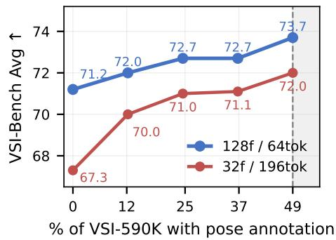

line

| % of VSI-590K with pose annotation | 128f / 64tok | 32f / 196tok |
| ---------------------------------- | ------------ | ------------ |
| 0                                  | 71.2         | 67.3         |
| 12                                 | 72.0         | 70.0         |
| 25                                 | 72.7         | 71.0         |
| 37                                 | 72.7         | 71.1         |
| 49                                 | 73.7         | 72.0         |

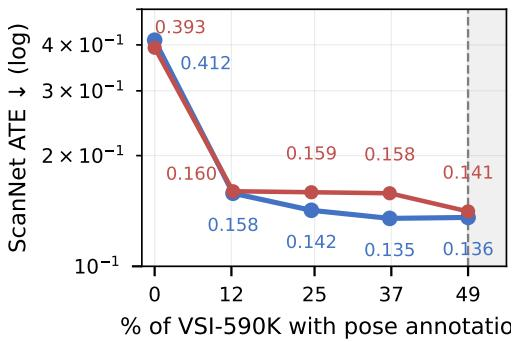

line

| % of VSI-590K with pose annotation | ScanNet ATE (log) |
| ---------------------------------- | ----------------- |
| 0                                  | 0.393             |
| 12                                 | 0.160             |
| 25                                 | 0.159             |
| 37                                 | 0.158             |
| 49                                 | 0.141             |

Figure 7 | Pose-data scalability. VSI-Bench Avg (left) and ScanNet ATE (right) as the pose-annotated fraction of VSI-590K varies from 0% (pure VQA) to 49% (the cap, since the remaining VSI-590K samples are image-only). Curves are shown for two frame settings: 128f / 64tok and 32f / 196tok. Both VQA and pose accuracy improve as more pose-annotated data is added.

Fig. 7 shows that both VSI-Bench accuracy and ScanNet ATE improve as the pose-annotated fraction grows, with the largest jump occurring between 0% and the first non-zero point and gains continuing through 49%. The 128f / 64tok curve dominates the 32f / 196tok curve at every fraction, consistent with the frame-count scaling reported in Tab. 9. These trends suggest Cambrian-P can take advantage of additional pose data well beyond what VSI-590K currently provides, motivating both the pseudo-pose training in Tab. 4 and the MapAnything-scale training in Sec. 5.

# C. Visualizations

# C.1. Additional Camera Pose Trajectory Visualizations

We provide additional qualitative camera pose trajectory comparisons on ScanNet validation scenes in Figs. 8 and 9. These scenes overlap with the subset used in VSI-Bench [109]. For each scene, we plot the ground-truth trajectory (gray dashed) and the aligned predicted trajectories (blue solid) from Cambrian-P, CUT3R [98], StreamVGGT [130], and G2VLM [37]. Consistent with the main-text results on the ScanNet test set, Cambrian-P recovers trajectory shapes that closely match the ground truth across diverse scenes.

# C.2. OOD Pose Trajectories on EgoSchema

To understand how Cambrian-P’s pose head generalizes outside its training distribution, we visualize trajectories predicted by Cambrian-P trained on VSI-590K on EgoSchema [62] clips. EgoSchema contains long-form egocentric videos that are disjoint from the indoor / synthetic scenes used in VSI-590K and MapAnything [44] training, and has no metric pose ground truth. We use VIPE [39] pseudo-GT trajectories as the reference for comparison.

Fig. 10 shows eight scenes. Across all scenes, Cambrian-P’s predicted trajectory better tracks the overall shape and scale of the VIPE pseudo-GT than the specialist baselines, despite Cambrian-P being trained only on VSI-590K and MapAnything data. This complements the in-distribution ScanNet results in Fig. 6 and indicates that pose supervision within an MLLM yields a generalization-ready geometric prior rather than a domain-specific pose regressor.

# C.3. VQA Qualitative Examples

We show qualitative examples comparing Cambrian-P with its no-pose counterpart (Cambrian-P w/o pose) on spatial reasoning questions from VSI-Bench [109] in Fig. 11 and Fig. 12. Each example shows a sequence of video frames, the question, and the answers from both models. The examples span all eight

VSI-Bench subtasks: object relative direction (hard and medium difficulty), absolute distance estimation, room size estimation, object counting, object size estimation, appearance order, and route planning.

Camera Trajectory Comparison ScanNet Val

Ground Truth Predicted

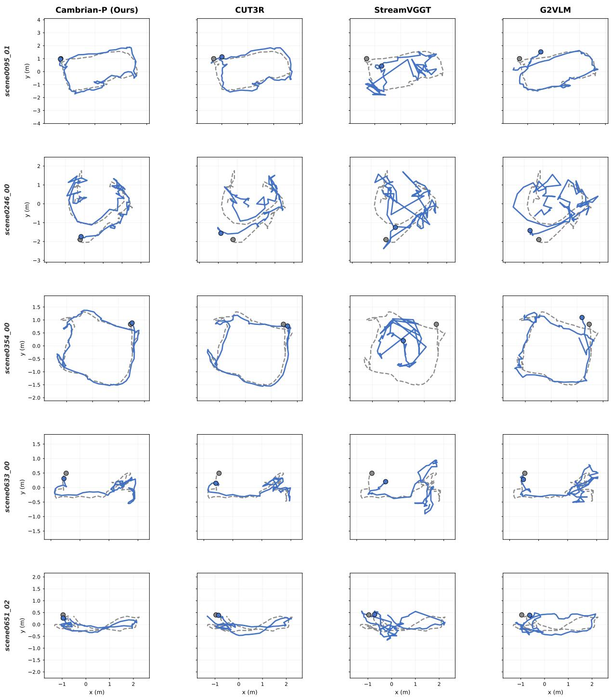  
Figure 8 | Camera pose trajectory visualization on ScanNet validation scenes (1/2). Ground-truth trajectories are shown in gray dashed lines and predicted trajectories in blue solid lines. Each column corresponds to a different method. These scenes overlap with VSI-Bench [109] evaluation scenes.

Camera Trajectory Comparison ScanNet Val   

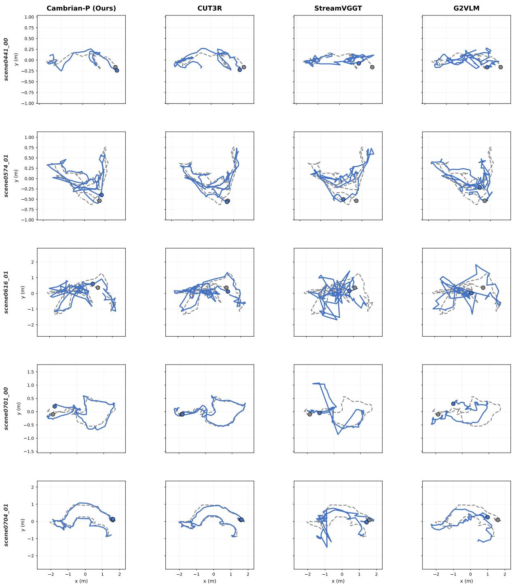  
Figure 9 | Camera pose trajectory visualization on ScanNet validation scenes (2/2). Continued from   
Fig. 8.

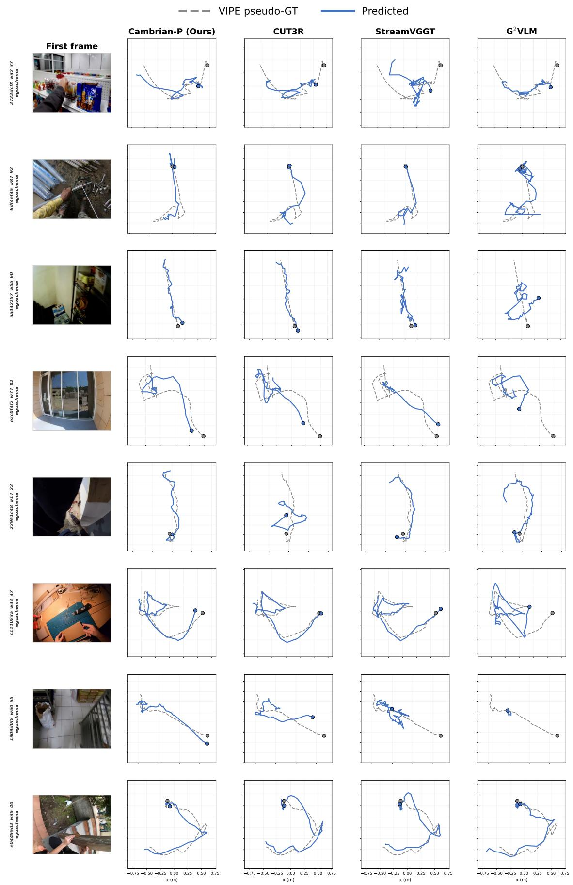  
Figure 10 | OOD pose trajectories on EgoSchema. Pseudo-GT trajectories annotated by VIPE [39] are shown in gray dashed lines and predicted trajectories in blue solid lines.

# Object Rel Direction (Hard)

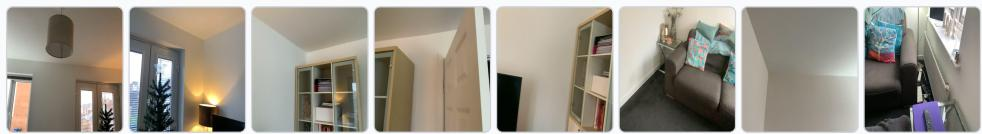

If I am standing by the sofa and facing the table, is the tv to my front-left, front-right, backleft, or back-right? The directions refer to the quadrants of a Cartesian plane (if I am standing at the origin and facing along the positive y-axis).

A. front-right B. front-left C. back-right D. back-left

Cambrian-P A. front-right ✓

Cambrian-P (w/o pose) D. back-left ✗

# Object Rel Direction (Medium)

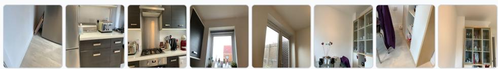

If I am standing by the washer and facing the dishwasher, is the table to my left, right, or back? An object is to my back if I would have to turn at least 135 degrees in order to face it.

A. left B. right C. back

Cambrian-P A. left ✓

Cambrian-P (w/o pose) C. back ✗

# Object Abs Distance

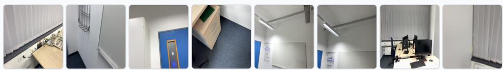

Measuring from the closest point of each object, what is the distance between the door and the heater (in meters)?

Cambrian-P 4.5 ✓

Cambrian-P (w/o pose) 2.8 ✗

# Room Size Estimation

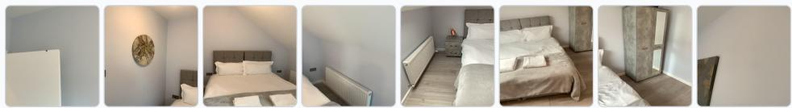

What is the size of this room (in square meters)? If multiple rooms are shown, estimate the size of the combined space.

Cambrian-P 23.0 ✓

Cambrian-P (w/o pose) 17.9 ✗

Figure 11 | Qualitative VQA comparison (1/2). We compare Cambrian-P and Cambrian-P (w/o pose) on VSI-Bench spatial reasoning questions.

Object Counting   
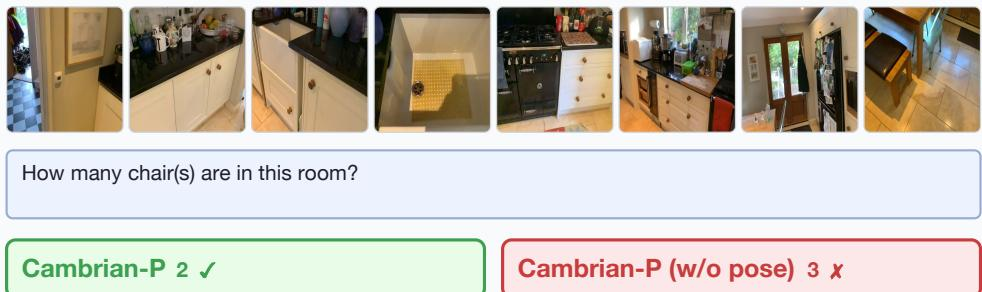  
How many chair(s) are in this room?   
Cambrian-P 2 ✓   
Cambrian-P (w/o pose) 3 ✗

Object Size Estimation   
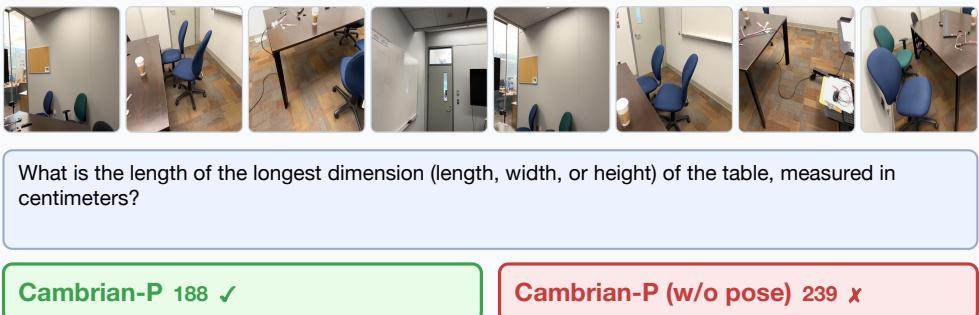  
What is the length of the longest dimension (length, width, or height) of the table, measured in centimeters?   
Cambrian-P 188 ✓   
Cambrian-P (w/o pose) 239 ✗

Object Appearance Order   
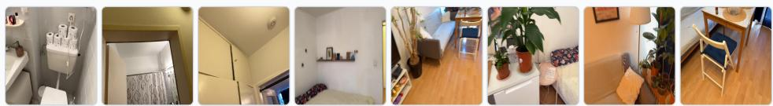  
What will be the first-time appearance order of the following categories in the video: toilet, bed, basket, table?

A. basket, table, bed, toilet

C. toilet, bed, basket, table

D. toilet, basket, table, bed

Cambrian-P B. ✓

Cambrian-P (w/o pose) D. ✗

Route Planning   
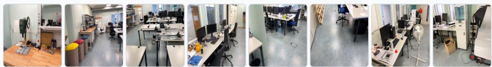  
If I want to go from the bed to the door, which direction should I go? Choose from: left, right, forward, backward.   
A. left   
B. right   
C. forward   
D. backward   
Cambrian-P c. forward √   
Cambrian-P (w/o pose) A. left ✗

Figure 12 | Qualitative VQA comparison (2/2). Continued from Fig. 11.