# Transcoders Trace Visual Grounding and Hallucinations in Vision-Language Models

Dimitrios Damianos Leon Voukoutis Georgios Skyrianos Vassilis Katsouros Georgios Paraskevopoulos

Institute of Language and Speech Processing, Athena Research Center Athens, Greece

{d.damianos, leon.voukoutis, george.skyrianos, vsk, g.paraskevopoulos}@athenarc.gr

# Abstract

Generative Vision-Language Models (VLMs) perform well on multimodal reasoning, but how visual inputs are transformed to text remains poorly understood. Existing interpretability work on VLMs uses Sparse Autoencoders (SAEs), which decompose static residual representations and miss the functional updates that drive cross-modal interaction. We adopt a function-centric framework based on Transcoders, sparse approximations of MLP sublayers that act as a causal proxy for layer-wise computation. Applied to Gemma 3-4B-IT, the framework decomposes the model into interpretable computational pathways linking image patches to directions in token generation. Transcoder attributions produce stronger and more stable effects on visually grounded tokens under patch ablation than SAE attributions, and align better with semantically relevant image regions. A False Visual Grounding counterfactual analysis confirms that the recovered pathways are specific to vision-language interaction. Finally, we perform a structural analysis of hallucinated generations, by extracting graph-based indicators from circuit traces produced by the transcoders. A logistic classifier over these mechanistic graph features predicts hallucinations at AUC 0.68. These results show that function-centric circuit decomposition yields interpretable and predictive accounts of multimodal computation in VLMs.

# 1 Introduction

Visual Language Models (VLMs), such as Gemma 3 [Gemma Team, 2025], Qwen-VL [Bai et al., 2025], and LLaVA [Liu et al., 2023], have achieved state-of-the-art performance in complex visual reasoning and grounded question-answering, significantly exceeding the capabilities of contrastive frameworks such as CLIP [Radford et al., 2021] and SigLIP [Zhai et al., 2023]. This architectural leap is driven by the integration of a Large Language Model (LLM) backbone, which is responsible for processing visual embeddings with linguistic context. However, the internal mechanisms of these generative backbones remain largely underexplored. Mechanistic interpretability research has focused mainly on the semantic properties of LLMs or the visual encoders of contrastive VLMs.

In the LLM domain, Sparse Autoencoders (SAEs) [Cunningham et al., 2023, Bricken et al., 2023] have been used to decompose hidden states into human-interpretable feature directions. These features have provided insight into model operations [Bereska and Gavves, 2024, Zhao et al., 2024] and enabled steering [Arad et al., 2025, Soo et al., 2025] to affect behavior. Based on this, the adoption of Transcoders [Dunefsky et al., 2024] and Cross-coders [Lindsey et al., 2024] marked a shift from state-based decomposition to functional circuit analysis. These architectures have become a standard tool for tracing computational pathways in Transformers, as they isolate how individual sublayers transform information, rather than focusing on how the residual stream encodes it.

Regarding VLMs, current interpretability work remains largely confined to contrastive encoders, focusing on the emergence of monosemantic visual features [Pach et al., 2025, Zaigrajew et al., 2025, Stevens et al., 2025]. Although recent studies have begun to apply SAEs to Large VLMs to disentangle multimodal information [Ortu et al., 2025] or assess cross-modal alignment [Lou et al., 2025], these approaches typically treat the LLM backbone as a sequence of static, independent states. However, standard SAEs are fundamentally unable to isolate the specific functional updates that affect cross-modal interaction between visual and language information.

In this work, we extend the foundational circuit analysis of Yang et al. [2026] by presenting a comprehensive mechanistic decomposition of VLMs. By shifting from state-based to functional decomposition, we offer the following contributions:

Multimodal Functional Decomposition: We apply Transcoders to generative VLM and show that they produce more stable and more semantically faithful attributions for visually grounded tokens than SAEs. A False Visual Grounding setting confirms that the recovered pathways are specific to vision-language interaction rather than generic MLP behavior.

Cross-Modal Mechanistic Tracing: Using circuit tracing, we identify computational pathways that link visual embeddings to text tokens within the LLM backbone. These pathways reveal how cross-modal information propagates and provide evidence that Transcoders capture a more faithful functional decomposition of the model.

Structural Analysis of Hallucination: Structural analysis of computational paths reveals consistent differences between grounded and hallucinated outputs. Metrics such as contribution entropy highlight these patterns and may enable mechanistic analysis of multimodal hallucinations.

These findings indicate that function-centric circuit decomposition could serve as a foundation for more interpretable VLM computation and provide mechanistic tools for structural analysis of common failure modes, such as multimodal hallucinations. Code, trained Transcoders, and datasets will be released upon acceptance under the Apache 2.0 and CC-BY-4.0 licenses.

# 2 Methodology

# 2.1 Preliminaries

Both SAEs and Transcoders decompose dense activations $x \in \mathbb { R } ^ { d _ { \mathrm { m o d e l } } }$ into a sparse feature vector $f ( x ) \in \mathbb { R } ^ { d _ { \mathrm { f e a t } } } \left( d _ { \mathrm { f e a t } } \gg d _ { \mathrm { m o d e l } } \right)$ . The forward pass is defined as:

$$
f (x) = \operatorname{ReLU} (W _ {e} x + b _ {e}), \quad \hat {y} = W _ {d} f (x) + b _ {d} \tag {1}
$$

The models are trained to minimize a reconstruction loss with an $L _ { 1 }$ sparsity penalty, $\mathcal { L } = \| y - \hat { y } \| _ { 2 } ^ { 2 } +$ $\lambda \| f ( x ) \| _ { 1 }$ , where the choice of target y determines the functional objective:

• SAEs (y = x): Reconstruct a static representation, mapping the data manifold at a specific layer.   
• Transcoders $\begin{array} { r } { ( y = \mathbf { M L P } ( x ) ) \colon } \end{array}$ Reconstruct a computational transformation, acting as a sparse proxy for the layer’s internal logic.

By mapping inputs directly to MLP outputs, transcoders transition from state-based decomposition to functional circuit tracing, isolating the causal mechanisms of multimodal integration.

# 2.2 Experimental Setup

We integrate Transcoders and SAEs with a 16× expansion (40,960 features) into every layer of Gemma 3-4B-IT. For a fair comparison, both methods are applied to the MLP outputs. To enable spatial grounding, we map flattened vision token indices back to their corresponding pixel coordinates using the processor’s grid metadata.

Training follows a two-stage curriculum totaling 500M tokens: (1) a 200M-token text-only warm-up phase using Natural Instructions [Mishra et al., 2022], and (2) a 300M-token multimodal phase using a balanced mixture of COCO [Lin et al., 2014], VQAv2 [Goyal et al., 2017], and CLEVR [Johnson et al., 2017] Since COCO provides only image captions, we synthesize prompts for each example (e.g., “Describe the image”) to align it with the instruction-following format. Each layer is trained independently for ∼ 7 hours on a single NVIDIA A100 64GB GPU.

Recent work [Yang et al., 2026, Gao et al., 2024] has moved from soft L1 regularization toward top-k sparsity to enable more targeted feature selection. In this work, we adopt a top-64 sparsity setting, as it consistently yields strong reconstruction performance compared to alternative top-k variants and L1 regularization, as shown in Table 1.

Reconstruction quality is assessed using the Fraction of Variance Unexplained (FVU) metric [Lieberum et al., 2024].

<table><tr><td>Method</td><td>Avg FVU</td></tr><tr><td>Transcoder L1</td><td>0.078</td></tr><tr><td>Transcoder Top-32</td><td>0.051</td></tr><tr><td>Transcoder Top-64</td><td>0.049</td></tr><tr><td>Transcoder Top-128</td><td>0.049</td></tr><tr><td>Transcoder Top-256</td><td>0.054</td></tr><tr><td>SAE top-64</td><td>0.048</td></tr></table>

Table 1: Reconstruction comparison of top-K and L1 training approaches across all layers.

# 3 Visual Grounding in Image Captioning

We evaluate whether Transcoders provide a more faithful functional decomposition of cross-modal computation than SAEs. Specifically, we use each method’s attribution maps to identify image patches most relevant to a target token, and then assess the magnitude and stability of the resulting changes in model output when those patches are ablated. Our experiments are conducted on Flickr30K [Young et al., 2014], focusing on descriptive tokens, primarily nouns and adjectives. For Transcoders, we additionally apply circuit tracing to examine the connections between image patches and visually grounded text tokens.

# 3.1 Attribution Mapping

Let x(l) $\boldsymbol { x } _ { t } ^ { ( l ) } \in \mathbb { R } ^ { d _ { \mathrm { m o d e l } } }$ denote the hidden state at layer l. For a target logit y, we define a decomposed directional attribution score $S _ { \mathrm { d e c } }$ [Sikdar et al., 2021, Simonyan et al., 2013] as:

$$
S _ {\mathrm{dec}} = \sum_ {l, i} f _ {i} ^ {(l)} (x _ {t} ^ {(l)}) \cdot \big (d _ {i} ^ {(l)} \cdot \nabla_ {h ^ {(l)}} y \big), \tag {2}
$$

where $f _ { i } ^ { ( l ) } ( x _ { t } ^ { ( l ) } )$ denotes the activation of feature i at layer $l , d _ { i } ^ { ( l ) }$ is the corresponding decoder direction (e.g., from an SAE or Transcoder), and $\begin{array} { r } { \nabla _ { h ^ { ( l ) } } y = \frac { \partial y } { \partial h ^ { ( l ) } } } \end{array}$ is the gradient of the target logit with respect to the MLP output $\it { h ^ { ( l ) } }$ at layer l. The term $d _ { i } ^ { ( l ) } \cdot \nabla _ { h ^ { ( l ) } } y$ captures directional influence along the feature direction. Since SAEs and Transcoders are trained on different points in the MLP computation, the variable $\boldsymbol { x } _ { t } ^ { ( l ) }$ denotes the MLP output when using SAEs, and the MLP input when using Transcoders.

SAEs and Transcoders are trained to approximate MLP computations under sparsity constraints, creating a feature basis that provides a low-dimensional decomposition of intermediate representations. Within this framework, decoder directions define a structured basis over which local model behavior can be expressed. We therefore interpret $S _ { \mathrm { d e c } }$ as a decomposition of local behavior in this feature space, where each term combines feature activation with directional influence to quantify contribution to the target logit.

To obtain patch-level attributions, we aggregate feature-level contributions across all features and layers associated with each image patch p, yielding a scalar importance score per patch.

# 3.2 Ablation-Based Evaluation

To evaluate the quality of the resulting attributions, we measure changes in token probability and entropy under targeted patch ablations. Specifically, we remove the top-M image patches ranked by attribution score and compute the resulting changes in target token probability, $\Delta p = p _ { o r i g i n a l } -$ pablated, and entropy $\Delta { H } \bar { = } { H _ { o r i g i n a l } } - \bar { H } _ { a b l a t e d }$ . An example of this procedure is shown in Fig. 1, where we report results for $M = \bar { 1 } 0$ .

As shown in the examples, Transcoders tend to identify image patches that are more relevant to the target token compared to SAEs. This is reflected in the effect of targeted patch ablations on token probability and entropy. In particular, removing Transcoder-identified patches leads to a larger decrease in token probability and a larger increase in entropy compared to SAE-identified patches. Overall, these results suggest that Transcoders more consistently highlight image regions associated with the generation of the target token. We provide additional examples in Appendix B.1, including results for top-1 and top-5 patch ablations.

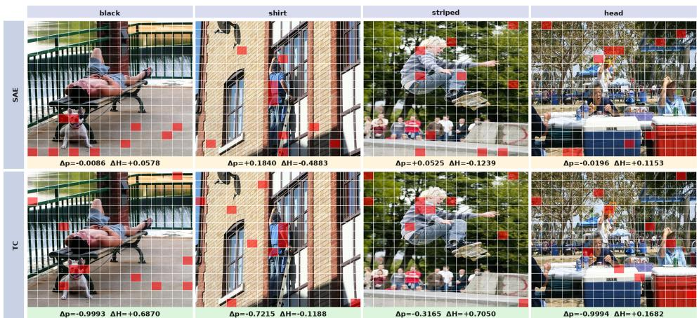

text_image

black
shirt
striped
head
SAE
Δp=-0.0086 ΔH=+0.0578
Δp=+0.1840 ΔH=-0.4883
Δp=+0.0525 ΔH=-0.1239
Δp=-0.0196 ΔH=+0.1153
TC
Δp=-0.9993 ΔH=+0.6870
Δp=-0.7215 ΔH=-0.1188
Δp=-0.3165 ΔH=+0.7050
Δp=-0.9994 ΔH=+0.1682

Figure 1: Comparison of the top − 10 most important image patches identified by SAEs and Transcoders. Transcoders identify patches that are more aligned with visually grounded tokens, as reflected in both visual correspondence and their impact on token probability and entropy.

# 3.3 Circuit tracing

We examine the computational pathways linking image patches to target tokens through circuit tracing. As shown in Fig. 2, visually grounded tokens (e.g., nouns and adjectives) depend on a small subset of image regions. These pathways are localized to specific regions and form structured computational chains that trace how information flows through the model to influence token generation.

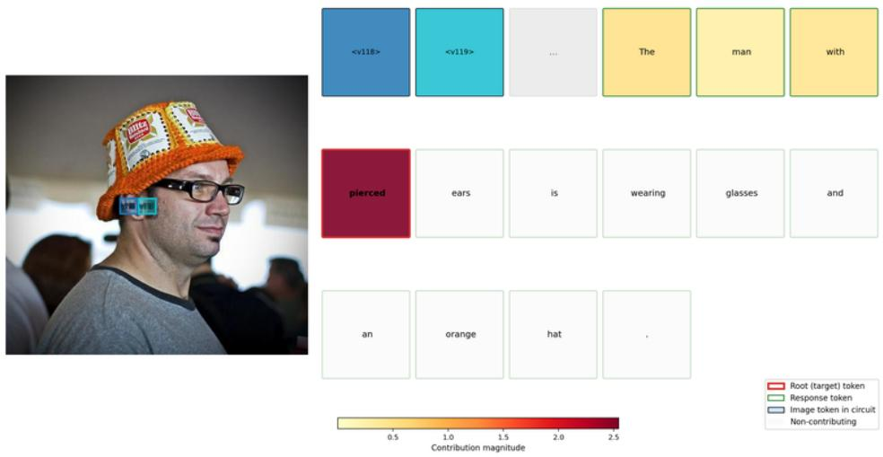

text_image

<v118> <v119> ... The man with
pierced ears is wearing glasses and
an orange hat .
0.5 1.0 1.5 2.0 2.5
Contribution magnitude
Root (target) token
Response token
Image token in circuit
Non-contributing

Figure 2: Circuit analysis on captions: visually grounded tokens have clear semantic links to specific visual regions.

This analysis complements our results in Section 3.1: while attribution maps identify relevant regions, circuit tracing reveals the underlying structure linking these regions to language outputs. In particular, the traced paths indicate that the model conditions its predictions on distinct visual inputs with consistent semantic correspondence, providing a mechanistic view of how visual grounding is implemented. Additional examples and visualizations are provided in Appendix B.2.

# 4 Counterfactual Analysis: False Visual Grounding

To assess whether Transcoders selectively capture vision–language links rather than attributing importance to image inputs indiscriminately, we evaluate them in a False Visual Grounding (FVG) setting. This setting serves as a counterfactual test in which the correct answer does not depend on the image, allowing us to examine whether Transcoders assign spurious visual relevance.

We construct arithmetic and symbolic question–answer pairs (e.g., “What is $2 0 + 3 0 ? ^ { \prime }$ or “What is the capital of France?”) and pair them with images from our captioning dataset. Since these tasks can be solved without visual input, the image acts as a distractor, providing a controlled setting to evaluate whether attribution methods incorrectly rely on visual information.

We follow the same procedure as in Section 3.1, using Transcoder-based attribution maps to identify and zero out the $t o p - M$ image patches, and measuring the resulting changes in token probability $( \Delta p )$ and entropy $( \Delta H )$ . Example attribution maps are shown in Fig. 3.

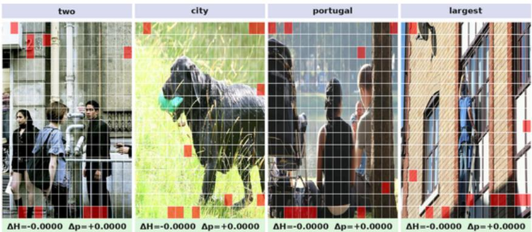

text_image

two
city
portugal
largest
ΔH=-0.0000 Δp=+0.0000
ΔH=-0.0000 Δp=+0.0000
ΔH=-0.0000 Δp=+0.0000
ΔH=-0.0000 Δp=+0.0000
ΔH=-0.0000 Δp=+0.0000

Figure 3: Attribution maps in the False Visual Grounding setting.

We observe that the patches identified by Transcoders in the FVG setting show no clear visual correspondence with the target token. Consistently, ablating these patches results in negligible changes in both token probability and entropy $( \Delta p \tilde { \approx } 0 , \Delta H \tilde { \approx } 0 )$ . This suggests that the identified patches do not carry measurable information relevant to the prediction in this setting.

Finally, circuit tracing (Fig. 4) reveals minimal connectivity between image tokens and target logits, indicating that visual information plays a negligible role in the underlying computation. This contrasts with the more structured and localized pathways observed in visually grounded settings.

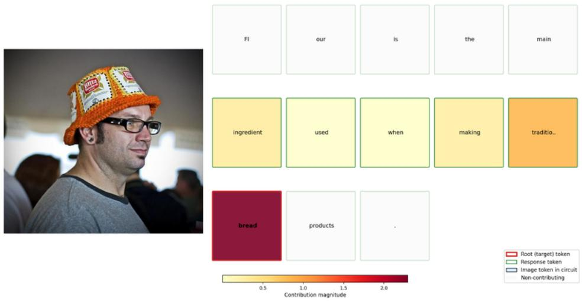

text_image

Fi
our
is
the
main
ingredient
used
when
making
traditio..
bread
products
.
0.5 1.0 1.5 2.0
Contribution magnitude
Root (target) token
Response token
Image token in circuit
Non-contributing

Figure 4: Circuit analysis on FVG setting: Transcoders reveal no correlation between the target and image tokens.

Overall, these results suggest that Transcoder-based attributions selectively respond to meaningful visual signals in visually grounded settings, while not assigning systematic importance to image inputs in the absence of such signals. We present additional visual examples in Appendix B.3 and B.4.

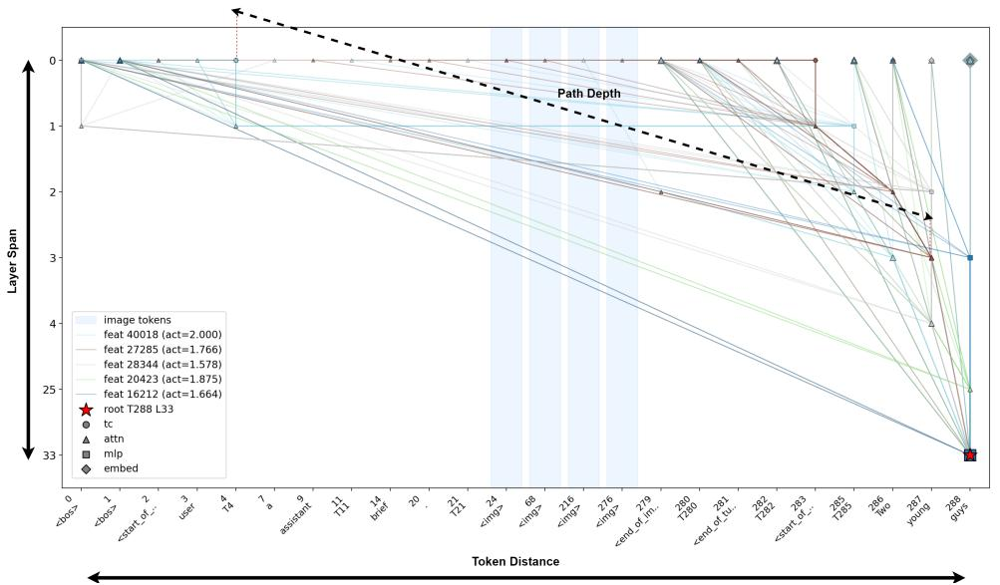

line

| Token Distance | Layer Span | Feature        |
| -------------- | ---------- | -------------- |
| 0            | 0          | root T288 L33  |
| 1            | 0          | tc             |
| 2            | 0          | attn           |
| 3            | 0          | mlp            |
| 4            | 0          | embed          |
| 7            | 0          | image tokens  |
| 9            | 0          | feat 40018      |
| 11           | 0          | feat 27285      |
| 14           | 0          | feat 28344      |
| brief         | 0          | feat 20423      |
| 20           | 0          | feat 16212      |
| 21           | 0          | map            |
| 24           | 0          | map            |
| 68           | 0          | map            |
| 216          | 0          | map            |
| 276          | 0          | map            |
| 279          | 0          | map            |
| 280          | 0          | map            |
| 281          | 0          | map            |
| 282          | 0          | map            |
| 283          | 0          | map            |
| 285          | 0          | map            |
| 286          | 0          | map            |
| two           | 0          | map            |
| young         | 0          | map            |
| 288          | 0          | map            |
| pys           | 0          | map            |
| <start_of_...   | 0          | map            |
| <start_of_...   | 0          | map            |
| <start_of_...   | 0          | map            |
| <start_of_...   | 0          | map            |
| <start_of_...   | 0          | map            |
| <start_of_...   | 0          | map            |
| <start_of_...   | 0          | map            |
| </start_of_...> | 0          | map            |
| <start_of_...   | 0          | map            |
| <start_of_...   | 0          | map            |
| <start_of_...   | 0          | map            |
| <start_of_...   | 0          | map            |
| <start_of_...   | 0          | map            |
| <start_of_...   | 0          | map            |
| /T4           | 0          | map            |
| /T4           | 0          | map            |
| /T4           | 0          | map            |
| /T4           | 0          | map            |
| /T4           | 0          | map            |
| /T4           | 0          | map            |
| /T4           | 0          | map            |
| /T4           | 0          | map            |
|
| /T4           | 0          | map            |
| /T4           | 0          | map            |
| /T4           | 0          | map            |
| /T4           | 0          | map            |
| /T4           | 0          | map            |
| /T4           | 0          | map            |
| /T4           | 0          | map            |
| /T4           | 0.5        | map            |
| /T4           | 0.5        | map            |
| /T4           | 0.5        | map            |
| /T4           | 0.5        | map            |
| /T4           | 0.5        | map            |
| /T4           | 0.5        | map            |
| /T4           | 0.5        | map            |
| /T4           = <start_of_...> | -1.5       | map            |
| /T4           = <start_of_...> | -1.5       | map            |
| /T4           = <start_of_...> | -1.5       | map            |
| /T4           = <start_of_...> | -1.5       | map            |
| /T4           = <start_of_...> | -1.5       | map            |
| /T4           = <Start_of_...> | -1.5       | map            |
| /T4           = <Start_of_...> | -1.5       | map            |
| /T4           = <Start_of_...> | -1.5       | map            |
| /T4           = <Start_of_...> | -1.5       | map            |
| /T4           = <Start_of_...> | -1.5       | Map            |
| /T4           = <Start_of_...> | -1.5       | Map            |
| /T4           = <Start_of_...> | -1.5       | Map            |
| /T4           = <Start_of_...> | -1.5       | Map            |
| /T4           = <Start_of_...> | -1.5       | Map            |
| /T4           = <Start_of_*>    | -1.5       | Map            |
| /T4           = <Start_of_*>    | -1.5       | Map            |
| /T4           = <Start_of_*>    | -1.5       | Map            |
| /T4           = <Start_of_*>    | -1.5       | Map            |
| /T4           = <Start_of_*>    | -1.5       | Map            |
|/T4           = <Start_of_*>    | -1.5       | Map            |
| /T4           = <Start_of_*>    | -1.5       | Map            |
| /T4           = <Start_of_*>    | -1.5       | Map            |
| /T4           = <Start_of_*>    | -1.5       | Map            |
| /T4           = <Start_of_*>    | -2.5       | Map            |
| /T4           = <Start_of_*>    | -2.5       | Map            |
| /T4           = <Start_of_*>    | -2.5       | Map            |
| /T4           = <Start_of_*>    | -2.5       | Map            |
| /T4           = <Start_of_*>    | -2.5       | Map            |
| /T4 (root_T288_L33)| -3.5       | map            |
| /T4 (root_T288_L33)| -3.5       | map            |
| /T4 (root_T288_L33)| -3.5       | map            |
| /T4 (root_T288_L33)| -3.5       | map            |
| /T4 (root_T288_L33)| -3.5       | map            |
| /T4 (tree)     | -3.5       | map            |
| /T4 (tree)     | -3.5       | map            |
| /T4 (tree)     | -3.5       | map            |
| /T4 (tree)     | -3.5       | map            |
| /T4 (tree)     | -3.5       | map            |
| /T4 (tree)     | -3.5       | map            |
|
| /T4 (tree)     | -3.5       | map            |
|
| /T4 (tree)     | -3.5       | map            |
|
| /T4 (tree)     | -3.5       | map            |
|
| /T4 (tree)     >/t4        >/t4        >/t4        >/t4        >/t4        >/t4        >/t4        >/t4        >/t4        >/t4        >/t4        >/t4        >/t4        >/t4        >/t4        >/t4        >/t4        >/t4        >/t4        >/t4        >/t4      |

Note: Path Depth is annotated on the path.

Figure $5 { : }$ Example of computation path: We examine both per layer and per token paths. We visualize the metrics we use in our structural analysis.

# 5 Structural Analysis of Hallucinations

Having established that Transcoders provide an interpretable functional decomposition of model activations, we now analyze computation graphs derived from circuit analysis and investigate whether their structural properties can help distinguish hallucinated from correct outputs.

To this end, we use 150 samples from the HaloQuest benchmark [Wang et al., 2024], where responses are generated by Gemma 3-4B-IT and labeled as either Correct $( n = 5 0 )$ or Hallucinated $( n = 1 0 0 )$ based on GPT-5 [Singh et al., 2025]-generated annotations.

# 5.1 Computational Graph Structure

We analyze computational graphs using five structural descriptors that characterize depth, span, and locality of computation in token-level pathways. An example computation graph is shown in Fig. 5.

Mean Path Depth: The average number of nodes along pathways, capturing the length of computation chains.

Layer Span: The vertical extent of a pathway, $L _ { \mathrm { r o o t } } - L _ { \mathrm { m i n } }$ , measuring how many layers are traversed.

Token Distance: The positional offset $| o _ { \mathrm { l e a f } } - o _ { \mathrm { r o o t } } | .$ , capturing the extent of information propagation across the token sequence.

Contribution Entropy: $\begin{array} { r } { H = - \sum _ { i } p _ { i } \log p _ { i } } \end{array}$ , where $p _ { i }$ denotes the normalized activation of each feature across all features and layers.

Top-1 Feature Fraction: The maximum normalized feature activation, measuring how concentrated the representation is in the most dominant feature.

In Table 2 we observe average differences between correct and hallucinated cases. Hallucinations show slightly lower token distance and entropy, alongside a slightly higher top-1 feature fraction, suggesting subtle shifts toward more localized token context and more concentrated feature usage.

# 5.2 Predicting Hallucinations through Structure

To evaluate whether these structural differences carry predictive signal, we frame hallucination detection as a binary classification task. We use a dataset of 150 examples (100 hallucinations and 50 correct) with five-fold cross-validation, and train a logistic regression model using the five structural features introduced above.

<table><tr><td>Metric</td><td>Correct Response</td><td>Hallucinated Response</td></tr><tr><td>Mean Path Depth</td><td>3.1382</td><td>3.1293</td></tr><tr><td>Mean Layer Span</td><td>32.2984</td><td>32.3369</td></tr><tr><td>Mean Token Distance*</td><td>69.5565</td><td>64.4596</td></tr><tr><td>Contribution Entropy*</td><td>3.7479</td><td>3.7052</td></tr><tr><td>Top-1 Feature Fraction*</td><td>0.0502</td><td>0.0531</td></tr></table>

Table 2: Comparative analysis of structural metrics: correct vs. hallucinated computation paths. Metrics marked with ‘\*’ are statistically significant at $p < 0 . 0 1$ .

Given the class imbalance, we report Balanced Accuracy, F1 Score and Area Under the ROC Curve (AUC). We compare against a Majority Class baseline (always predicting hallucination) and a Random Chance classifier. Results are reported in Table 3.

<table><tr><td>Classifier</td><td>Balanced Acc.</td><td>F1</td><td>AUC</td></tr><tr><td>Random Chance</td><td> $0.55 \pm 0.05$ </td><td> $0.548 \pm 0.012$ </td><td> $0.55 \pm 0.05$ </td></tr><tr><td>Majority Class</td><td> $0.50 \pm 0$ </td><td> $0.398 \pm 0$ </td><td> $0.50 \pm 0$ </td></tr><tr><td>Logistic Regression (5 structural descriptors)</td><td> $\mathbf{0.60} \pm \mathbf{0.03}$ </td><td> $\mathbf{0.603} \pm \mathbf{0.027}$ </td><td> $\mathbf{0.68} \pm \mathbf{0.02}$ </td></tr></table>

Table 3: Hallucination classification performance. While the majority baseline is limited by the data imbalance, the logistic model shows a measurable gain in both AUC and Balanced Accuracy.

The model outperforms both baselines across all metrics. In particular, an AUC of 0.68 indicates that the structural features contain a measurable, though modest, predictive signal for hallucination detection. While these results are preliminary, they suggest that internal circuit structure carries information relevant to distinguishing hallucinated from correct outputs.

To understand which structural characteristics drive the classifier’s predictions, we apply the SHAP framework [Lundberg and Lee, 2017] to compute feature attributions for the logistic regression model. Specifically, we report the mean absolute SHAP value for each feature across the evaluation set, where larger values indicate greater overall influence on the model’s predictions, independent of direction. Since hallucinations are defined as the positive class, positive SHAP contributions push the prediction toward hallucination, while negative contributions push it toward correct outputs.

<table><tr><td>Feature</td><td>SHAP attribution</td></tr><tr><td>Mean Token Distance</td><td>-0.4303</td></tr><tr><td>Mean Layer Span</td><td>+0.2738</td></tr><tr><td>Top-1 Feature Fraction</td><td>+0.1993</td></tr><tr><td>Contribution Entropy</td><td>-0.1461</td></tr><tr><td>Mean Path Depth</td><td>+0.0220</td></tr></table>

Table 4: Mean absolute SHAP values for the logistic regression hallucination classifier. Values indicate the global importance of each structural feature.

As shown in Table 4, Mean Token Distance, Mean Layer Span, and feature concentration measures exhibit the highest mean absolute SHAP values, indicating stronger contribution to the classifier’s decisions. In particular, hallucinated outputs are associated with lower token distances and lower entropy, alongside higher top-1 feature fraction. This suggests that hallucinations are characterized by more localized interactions in token space and a more concentrated distribution of feature-level contributions, relative to correct outputs.

# 6 Related Work

Mechanistic Interpretability on LLMs. Sparse Autoencoders (SAEs) decompose dense hidden states into human-interpretable directions [Templeton et al., 2024, Lieberum et al., 2024]. Beyond feature extraction, recent work has moved towards concept extraction [Helff et al., 2026], and explanation verifications through falsification frameworks [Bills et al., 2025], applying these findings to model control. This includes the use of “persona vectors” to monitor character traits [Chen et al., 2025] and the deployment of SAE-based steering to correct erroneous reasoning paths in real-time [Fang et al., 2026, Cho et al., 2026]. On the same time, the introduction of Transcoders [Dunefsky et al., 2024] and Cross-coders [Team, 2025] has allowed a functional analysis of LLMs. These architectures isolate the specific updates performed by sublayers rather than merely characterizing the residual stream. This paradigm allows for the identification of "modular circuits"—reusable computational motifs across diverse tasks [He et al., 2025]—providing a robust, verified toolkit for aligning LLM behavior with human intent [Naseem et al., 2026].

Mechanistic Interpretability on VLMs. Interpretability for VLMs has evolved from analyzing contrastive encoders like CLIP [Radford et al., 2021] to decomposing generative multimodal backbones. Previous work established that SAEs can extract monosemantic visual features from ViTs [Pach et al., 2025, Stevens et al., 2025]. Recent efforts have extended this to Large VLMs, identifying specialized components that disentangle factual priors from visual grounding [Ortu et al., 2025] and interpreting multimodal alignment [Lou et al., 2025]. However, these approaches primarily focus on state-based representations. Our work bridges this gap by extending recent research into cross-modal circuit tracing [Yang et al., 2026]. By utilizing Transcoders, we shift the focus toward the functional transformation of visual tokens, providing a causal account of how grounding behaves during inference.

# 7 Discussion and Future Work

Our central finding is that moving from state-based to function-based decomposition yields a more useful mechanistic account of generative Vision-Language Models. This shift enables the analysis in Sections 3.3, 4, 5, by moving from mere feature attribution, towards a linked computation graph analysis across the network layers and input tokens. The structural analysis of this graph shows that common failure modes of generative models, i.e., hallucination, can be explored through the lens of mechanistic interpretability by analyzing the properties of the traced computation circuit.

Focusing on the hallucination detection result, a simple logistic classifier trained over five graphlevel metrics, without access to the generated text, output probabilities, or any external reference, distinguishes hallucinated from correct generations at AUC 0.68 versus 0.55 for a stratified-prior baseline. Although we make no claims of competitive performance against output-level detectors, we identify a potential signal for hallucination in the mere structure of the LLM computation.

Regarding future work, we plan to explore potential mechanistic interventions for hallucination mitigation based on our findings. Furthermore, a common critique for mechanistic interpretability research regards the monosemanticity of extracted features, or lack thereof. Indeed, in our analysis in Appendix B.5 we find that extracted features are not monosemantic, but we firmly believe that advancing mechanistic exploration of LLM behavior is a worthwhile pursuit, especially paired with more structural circuit trace analysis, made available through the use of functional decomposition frameworks, like Transcoders. To this end, we plan to explore multimodal concept extraction, following approaches such as [Helff et al., 2026]. This could enable more interpretable ways of guiding model behavior, e.g., through visually grounded steering. Finally, Transcoders provide further capabilities, such as de-embeddings and virtual weights [Dunefsky et al., 2024], which are not explored in this work. Studying these mechanisms may offer additional insight into how VLMs represent and process multimodal information.

# 8 Limitations and Scope

While prior work has explored the use of Transcoders for circuit tracing in VLMs, our study extends this line of research with a more detailed analysis of cross-modal representations in generative settings using attribution-based and structural circuit analyses. Nevertheless, several limitations should be considered. First, our Transcoders are trained on a 500M-token corpus. Although this is sufficient to capture common visual–semantic patterns, it may not cover less frequent or more specialized forms of grounding. Second, our analysis focuses on the Gemma 3-4B-IT model. While this model provides a strong baseline, evaluating larger models (e.g., 27B+) or alternative architectures such as Qwen-VL would be important to assess the scalability and robustness of our findings. Finally, our analysis is based on relatively small sample sizes. Extending the evaluation to larger and more diverse datasets would help determine the generality of the observed patterns.

# References

Dana Arad, Aaron Mueller, and Yonatan Belinkov. Saes are good for steering–if you select the right features. In Proceedings of the 2025 Conference on Empirical Methods in Natural Language Processing, pages 10252–10270, 2025.   
Shuai Bai, Yuxuan Cai, Ruizhe Chen, Keqin Chen, Xionghui Chen, Zesen Cheng, Lianghao Deng, Wei Ding, Chang Gao, Chunjiang Ge, et al. Qwen3-vl technical report. arXiv preprint arXiv:2511.21631, 2025.   
Leonard Bereska and Efstratios Gavves. Mechanistic interpretability for ai safety–a review. arXiv preprint arXiv:2404.14082, 2024.   
Steven Bills, Nick Cammarata, Jeff Wu, et al. Revising and falsifying sparse autoencoder feature explanations. arXiv preprint arXiv:2502.12345, 2025.   
Trenton Bricken, Adly Templeton, Joshua Batson, Brian Chen, Adam Jermyn, Tom Conerly, Nick Turner, Cem Anil, Carson Denison, Amanda Askell, Robert Lasenby, Yifan Wu, Shauna Kravec, Nicholas Schiefer, Tim Maxwell, Nicholas Joseph, Zac Hatfield-Dodds, Alex Tamkin, Karina Nguyen, Brayden McLean, Josiah E. Burke, Tristan Hume, Shan Carter, Tom Henighan, and Christopher Olah. Towards monosemanticity: Decomposing language models with dictionary learning. Transformer Circuits Thread, 2023. URL https://transformer-circuits.pub/ 2023/monosemantic-features/index.html. Accessed: 2026-04-26.   
Runjin Chen, Andy Arditi, Henry Sleight, Owain Evans, and Jack Lindsey. Persona vectors: Monitoring and controlling character traits in language models. arXiv preprint arXiv:2507.21509, 2025.   
M. Cho, D. Kim, et al. Corrsteer: Generation-time llm steering via correlated sae features. arXiv preprint arXiv:2601.09876, 2026.   
Hoagy Cunningham, Aidan Ewart, Logan Riggs, Robert Huben, and Lee Sharkey. Sparse autoencoders find highly interpretable features in language models. arXiv preprint arXiv:2309.08600, 2023.   
Jacob Dunefsky, Philippe Chlenski, and Neel Nanda. Transcoders find interpretable llm feature circuits. Advances in Neural Information Processing Systems, 37:24375–24410, 2024.   
Yi Fang, Wenjie Wang, Mingfeng Xue, Boyi Deng, Fengli Xu, Dayiheng Liu, and Fuli Feng. Controllable llm reasoning via sparse autoencoder-based steering. arXiv preprint arXiv:2601.03595, 2026.   
Leo Gao, Tom Dupré la Tour, Henk Tillman, Gabriel Goh, Rajan Troll, Alec Radford, Ilya Sutskever, Jan Leike, and Jeffrey Wu. Scaling and evaluating sparse autoencoders. arXiv preprint arXiv:2406.04093, 2024.   
Gemma Team. Gemma 3 technical report, 2025. URL https://arxiv.org/abs/2503.19786.   
Yash Goyal, Tejas Khot, Douglas Summers-Stay, Dhruv Batra, and Devi Parikh. Making the v in vqa matter: Elevating the role of image understanding in visual question answering. In Proceedings of the IEEE conference on computer vision and pattern recognition, pages 6904–6913, 2017.   
Y. He et al. Towards global-level mechanistic interpretability: A perspective of modular circuits of large language models. In International Conference on Machine Learning (ICML), 2025.   
Lukas Helff, Ruben Härle, Wolfgang Stammer, Felix Friedrich, Manuel Brack, Antonia Wüst, Hikaru Shindo, Patrick Schramowski, and Kristian Kersting. Activationreasoning: Logical reasoning in latent activation spaces, 2026. URL https://arxiv.org/abs/2510.18184.   
Justin Johnson, Bharath Hariharan, Laurens Van Der Maaten, Li Fei-Fei, C Lawrence Zitnick, and Ross Girshick. Clevr: A diagnostic dataset for compositional language and elementary visual reasoning. In Proceedings of the IEEE conference on computer vision and pattern recognition, pages 2901–2910, 2017.

Tom Lieberum, Victor Veitch, Sally Ward-Foxton, et al. Gemma scope: Open sparse autoencoders for gemma 2. Google DeepMind Technical Report, 2024.   
Tsung-Yi Lin, Michael Maire, Serge Belongie, James Hays, Pietro Perona, Deva Ramanan, Piotr Dollár, and C Lawrence Zitnick. Microsoft coco: Common objects in context. In European Conference on Computer Vision, pages 740–755. Springer, 2014.   
Jack Lindsey, Adly Templeton, Jonathan Marcus, Thomas Conerly, Joshua Batson, and Christopher Olah. Sparse crosscoders for cross-layer features and model diffing. Transformer Circuits Thread, 2024. URL https://transformer-circuits.pub/2024/crosscoders/index.html. Accessed: 2026-04-26.   
Haotian Liu, Chunyuan Li, Qingyang Wu, and Yong Jae Lee. Visual instruction tuning. Advances in neural information processing systems, 36:34892–34916, 2023.   
Hantao Lou, Changye Li, Jiaming Ji, and Yaodong Yang. Sae-v: Interpreting multimodal models for enhanced alignment, 2025. URL https://arxiv.org/abs/2502.17514.   
Scott M Lundberg and Su-In Lee. A unified approach to interpreting model predictions. Advances in neural information processing systems, 30, 2017.   
Swaroop Mishra, Daniel Khashabi, Chitta Baral, and Hannaneh Hajishirzi. Cross-task generalization via natural language crowdsourcing instructions. In ACL, 2022.   
U. Naseem, J. Smith, et al. Mechanistic interpretability for llm alignment: Progress and challenges. Journal of AI Research, 2026.   
Francesco Ortu, Zhijing Jin, Diego Doimo, and Alberto Cazzaniga. When seeing overrides knowing: Disentangling knowledge conflicts in vision-language models, 2025. URL https://arxiv.org/ abs/2507.13868.   
Mateusz Pach, Shyamgopal Karthik, Quentin Bouniot, Serge Belongie, and Zeynep Akata. Sparse autoencoders learn monosemantic features in vision-language models, 2025. URL https:// arxiv.org/abs/2504.02821.   
Alec Radford, Jong Wook Kim, Chris Hallacy, Aditya Ramesh, Gabriel Goh, Sandhini Agarwal, Girish Sastry, Amanda Askell, Pamela Mishkin, Jack Clark, et al. Learning transferable visual models from natural language supervision. In International conference on machine learning, pages 8748–8763. PmLR, 2021.   
Sandipan Sikdar, Parantapa Bhattacharya, and Kieran Heese. Integrated directional gradients: Feature interaction attribution for neural NLP models. In Chengqing Zong, Fei Xia, Wenjie Li, and Roberto Navigli, editors, Proceedings of the 59th Annual Meeting of the Association for Computational Linguistics and the 11th International Joint Conference on Natural Language Processing (Volume 1: Long Papers), pages 865–878, Online, August 2021. Association for Computational Linguistics. doi: 10.18653/v1/2021.acl-long.71. URL https://aclanthology.org/2021.acl-long.71/.   
Karen Simonyan, Andrea Vedaldi, and Andrew Zisserman. Deep inside convolutional networks: Visualising image classification models and saliency maps. arXiv preprint arXiv:1312.6034, 2013.   
Aaditya Singh, Adam Fry, Adam Perelman, Adam Tart, Adi Ganesh, Ahmed El-Kishky, Aidan McLaughlin, Aiden Low, AJ Ostrow, Akhila Ananthram, et al. Openai gpt-5 system card. arXiv preprint arXiv:2601.03267, 2025.   
Samuel Soo, Chen Guang, Wesley Teng, Chandrasekaran Balaganesh, Tan Guoxian, and Yan Ming. Interpretable steering of large language models with feature guided activation additions. arXiv preprint arXiv:2501.09929, 2025.   
Samuel Stevens, Wei-Lun Chao, Tanya Berger-Wolf, and Yu Su. Interpretable and testable vision features via sparse autoencoders, 2025. URL https://arxiv.org/abs/2502.06755.   
Anthropic Interpretability Team. Insights on crosscoder model diffing. Anthropic Technical Blog, 2025.

Adly Templeton, Tom Conerly, Jonathan Marcus, Jack Lindsay, Trenton Bricken, et al. Scaling monosemanticity: Extracting interpretable features from claude 3 sonnet. Anthropic Technical Report, 2024.   
Zhecan Wang, Garrett Bingham, Adams Wei Yu, Quoc V Le, Thang Luong, and Golnaz Ghiasi. Haloquest: A visual hallucination dataset for advancing multimodal reasoning. In European Conference on Computer Vision, pages 288–304, 2024.   
Jingcheng Yang, Tianhu Xiong, Shengyi Qian, Klara Nahrstedt, and Mingyuan Wu. Circuit tracing in vision-language models: Understanding the internal mechanisms of multimodal thinking. arXiv preprint arXiv:2602.20330, 2026.   
Peter Young, Alice Lai, Micah Hodosh, and Julia Hockenmaier. From image descriptions to visual denotations: New similarity metrics for semantic inference over event descriptions. Transactions of the Association for Computational Linguistics, 2:67–78, 2014.   
Vladimir Zaigrajew, Hubert Baniecki, and Przemyslaw Biecek. Interpreting clip with hierarchical sparse autoencoders. arXiv preprint arXiv:2502.20578, 2025.   
Xiaohua Zhai, Basil Mustafa, Alexander Kolesnikov, and Lucas Beyer. Sigmoid loss for language image pre-training. In Proceedings of the IEEE/CVF international conference on computer vision, pages 11975–11986, 2023.   
Haiyan Zhao, Hanjie Chen, Fan Yang, Ninghao Liu, Huiqi Deng, Hengyi Cai, Shuaiqiang Wang, Dawei Yin, and Mengnan Du. Explainability for large language models: A survey. ACM Transactions on Intelligent Systems and Technology, 15(2):1–38, 2024.

# A Broader Impact

This work advances mechanistic interpretability for Vision-Language Models, with potential benefits for transparency and trustworthiness in high-stakes deployments such as medical imaging or accessibility tools. By tracing which image regions drive specific predictions, our framework provides a foundation for human-auditable explanations of model behavior and offers a preliminary mechanistic signal for hallucination detection. We release trained Transcoders, code, and datasets under permissive open licenses (Apache 2.0 and CC-BY-4.0) to lower the barrier to interpretability research for groups without access to large computational resources. Practitioners should treat circuit traces and attribution maps as diagnostic approximations rather than ground-truth explanations. Misuse of interpretability tools to certify model safety on the basis of sparse circuit analysis alone could be harmful, and we encourage their use as one component among several in a broader evaluation pipeline. We do not foresee significant dual-use risks beyond those already present in existing gradient-based saliency methods.

# B Appendix and supplementary material

# B.1 Captioning visualizations - Attribution maps

We present additional examples of patch ablation using the top − 1, top − 5, and top − 10 patches for both SAEs and Transcoders, and analyze their effects when zeroed out on probability and entropy. Across all cases—-particularly for the top − 5 and top − 10 selections—-the patches chosen by the Transcoder show stronger alignment with the target token and produce a greater impact on both token probability and entropy.

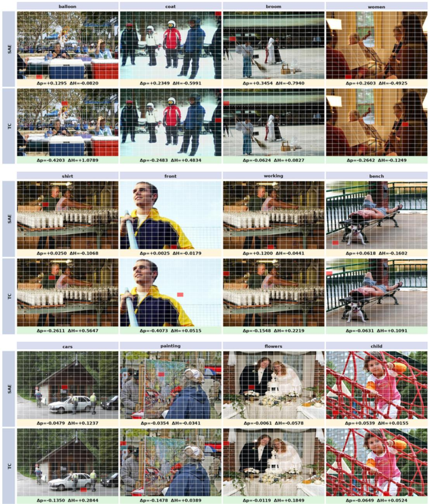  
Figure 6: Top-1 ablation comparison

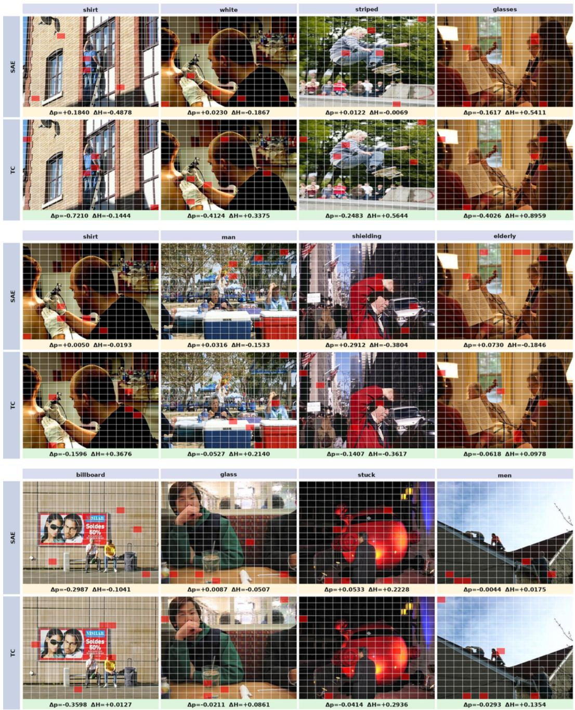  
Figure 7: Top-5 ablation comparison

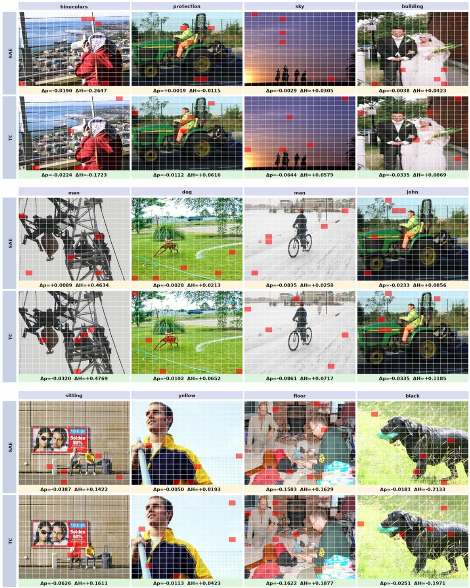  
Figure 8: Top-5 ablation comparison

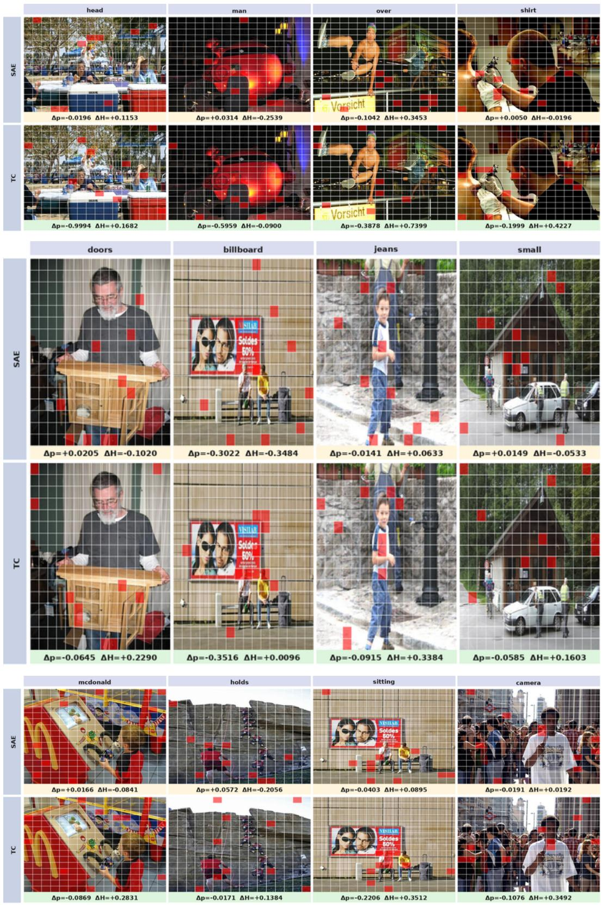  
Figure 9: Top-10 ablation comparison

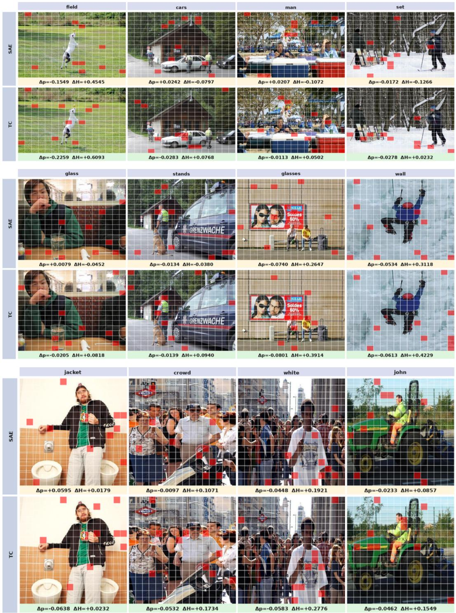  
Figure 10: Top-10 ablation comparison

# B.2 Captioning visualizations - Circuit Analysis

In this section, we provide further examples illustrating how circuit tracing uncovers the dependency structure connecting visual regions to generated language. Despite the limitations of our method, it reliably identifies interpretable links between visually grounded tokens and their corresponding image patches.

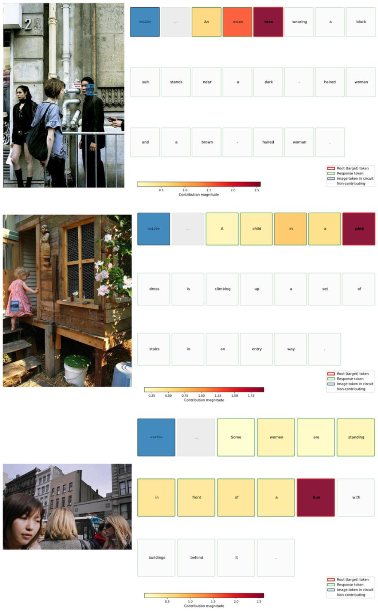  
Figure 11: Circuit analysis results

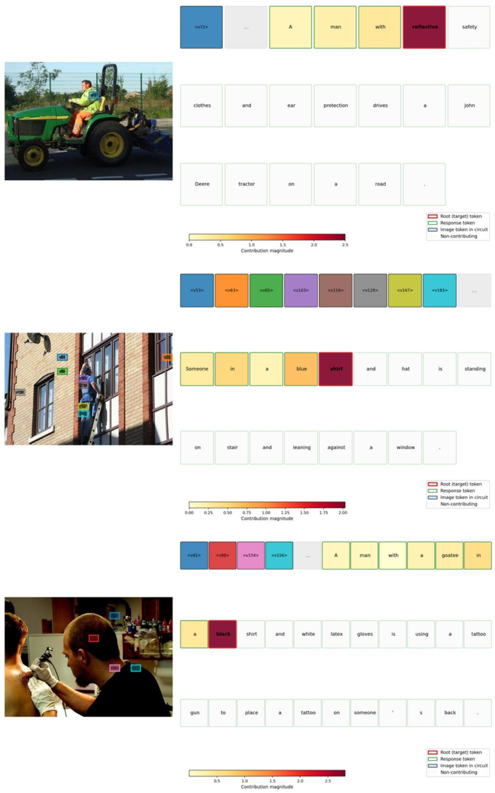  
Figure 12: Circuit analysis results

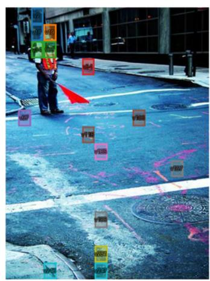

text_image

Street photo with visible store signboards and colored annotations on a road surface

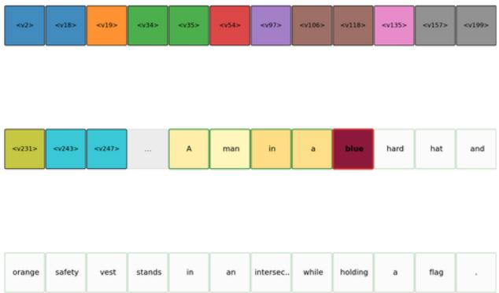

text_image

<v2> <v18> <v19> <v34> <v35> <v54> <v97> <v106> <v118> <v135> <v157> <v199>

<v231> <v243> <v247> ... A man in a blue hard hat and

orange safety vest stands in an intersec.. while holding a flag.

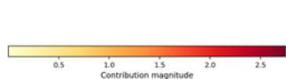  
Responsetoken gImagetoken in circuit ngcentibuinin

text_image

<v21> ... A young woman with dark hair

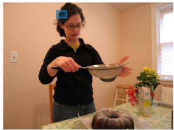

natural_image

Woman preparing food at a table with a chocolate cake and a bowl, no visible text or symbols

<table><tr><td>and</td><td>wearing</td><td>glasses</td><td>is</td><td>putting</td><td>white</td><td>powder</td><td>on</td></tr></table>

<table><tr><td>a</td><td>cake</td><td>using</td><td>a</td><td>s</td><td>ifter</td><td>.</td></tr></table>

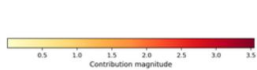  
Response token Imagetokenincircuit Non-contributing

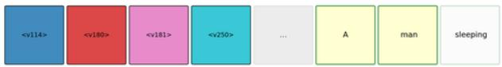

text_image

<v114> <v180> <v181> <v250> ... A man sleeping

natural_image

A person lying on a bench with a dog nearby, near water and fence (no visible text or symbols)

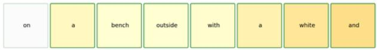

text_image

on
a
bench
outside
with
a
white
and

<table><tr><td>black</td><td>dog</td><td>sitting</td><td>next</td><td>to</td><td>him</td><td>.</td></tr></table>

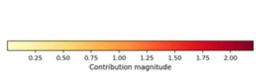  
Root (target) token Responsetoken Imagetoken incircuit Non-contributing

Figure 13: Circuit analysis results

# B.3 False Visual Grounding - Attribution maps

We present additional examples of patch ablation using the top − 1,top − 5, and top − 10 patches for Transcoders in the FVG setting, and analyze the effects of zeroing them out on probability and entropy. Across all cases, the regions selected by the Transcoder show little correlation with the target token, which is further supported by the minimal change in token probability observed when these patches are removed.

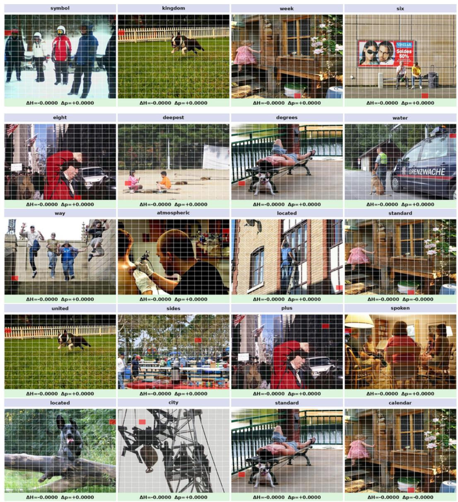  
Figure 14: Top-1 FVG ablation

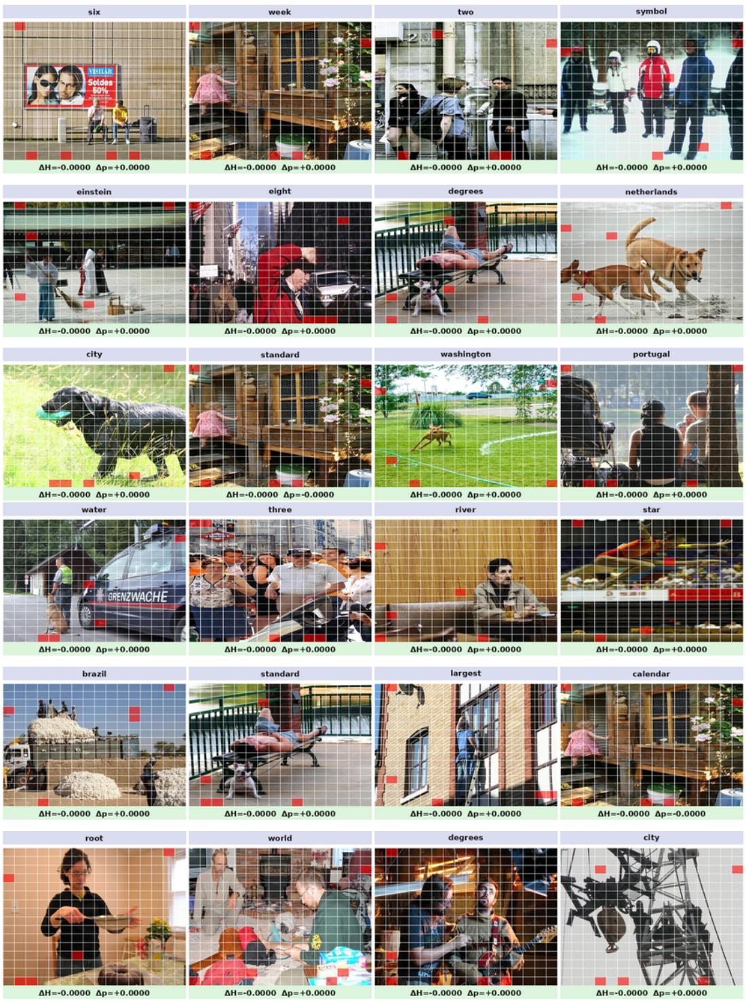  
Figure 15: Top-5 FVG comparison

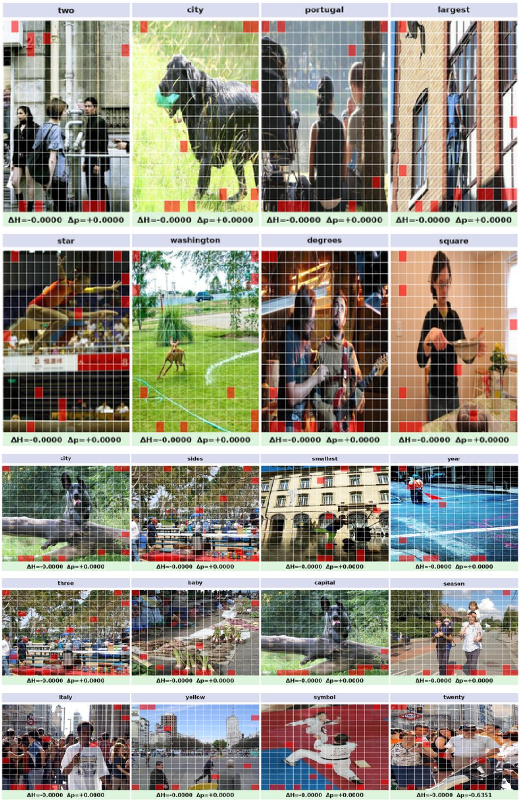  
Figure 16: Top-10 FVG ablation

# B.4 False Visual Grounding - Circuit Analysis

In this section, we provide additional circuit tracing examples in the False Visual Grounding setting. These results further support the claim that Transcoders identify semantically meaningful connections between visually grounded tokens and image patches, rather than merely decomposing MLP activations.

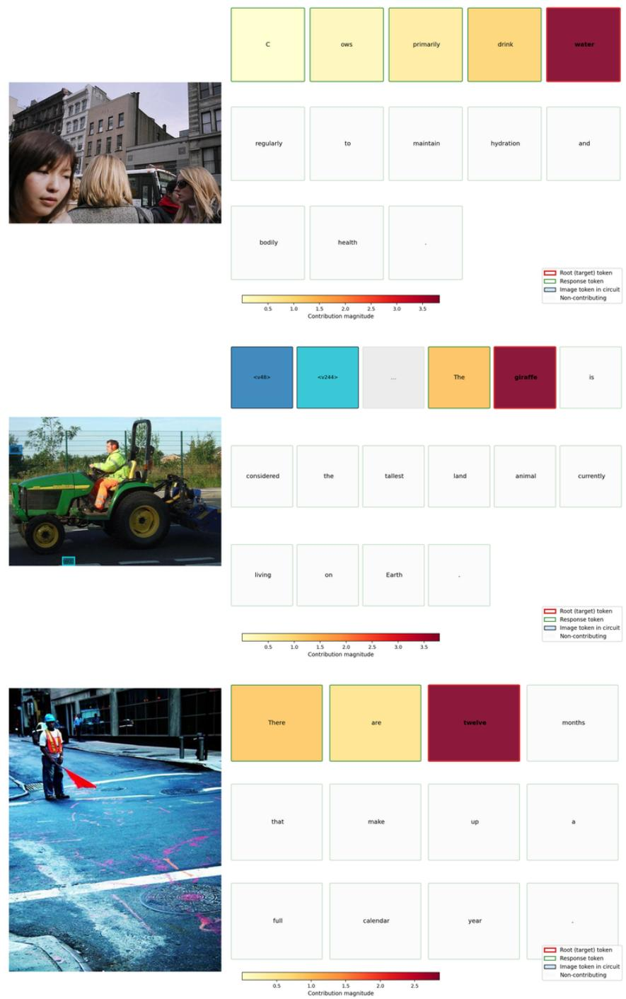  
Figure 17: Circuit analysis on FVG

natural_image

Exterior view of a wooden house with a girl in a pink dress, surrounded by flowers and buckets (no signage)

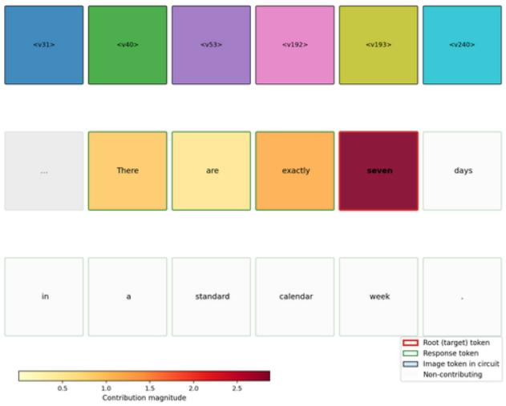

heatmap

| Category         | Value |
| ---------------- | ----- |
| <v31>            | 2.5   |
| <v40>            | 2.0   |
| <v53>            | 1.5   |
| <v192>           | 1.0   |
| <v193>           | 0.5   |
| <v240>           | 0.5   |
| ...              | 0.5   |
| There            | 1.0   |
| are              | 1.0   |
| exactly          | 1.0   |
| seven            | 2.5   |
| in               | 1.0   |
| a                | 1.0   |
| standard         | 1.0   |
| calendar         | 1.0   |
| week             | 1.0   |
| .                | 1.0   |

natural_image

Medical professional examining a patient's neck with a medical device (no visible text or symbols)

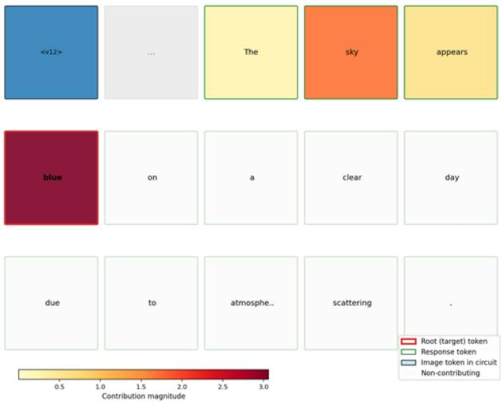

heatmap

| Category | Value |
|---|---|
| <v12> | 3.0 |
| ... | 1.5 |
| The | 2.5 |
| sky | 2.5 |
| appears | 2.5 |
| blue | 1.0 |
| on | 1.0 |
| a | 1.0 |
| clear | 1.0 |
| day | 1.0 |
| due | 1.0 |
| to | 1.0 |
| atmosphere.. | 1.0 |
| scattering | 1.0 |
| . | 1.0 |
Color bar: Contribution magnitude (0.5 to 3.0). Legend: Root (target) token (red), Response token (green), Image token in circuit (blue), Non-contributing (white).

natural_image

Worker cleaning a brick building facade with large windows and a ladder (no visible text or symbols)

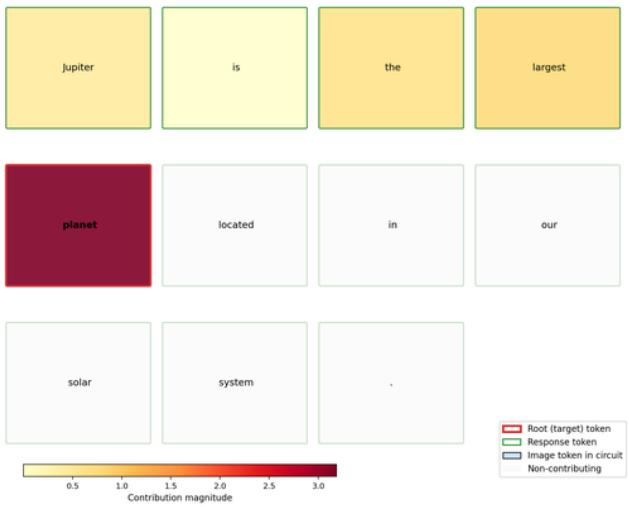

heatmap

| Category       | Value |
| -------------- | ----- |
| Jupiter        | 1.0   |
| is             | 1.0   |
| the            | 1.0   |
| largest        | 1.0   |
| planet         | 1.0   |
| located        | 1.0   |
| in             | 1.0   |
| our            | 1.0   |
| solar          | 1.0   |
| system         | 1.0   |

Figure 18: Circuit analysis on FVG

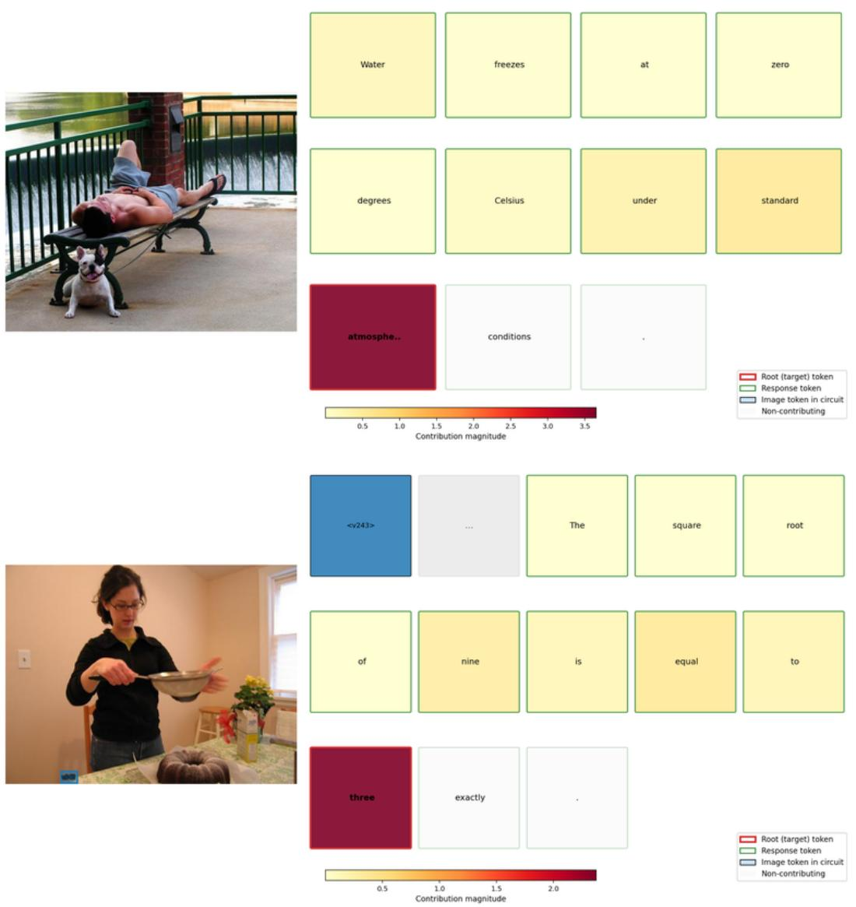  
Figure 19: Circuit analysis on FVG

# B.5 Monosemanticity Investigation

To investigate feature monosemanticity, we analyze how activated features are shared across tokens in different image contexts. Specifically, we examine the overlap of features across tokens to determine whether they are uniquely tied to individual tokens or shared more broadly. For this analysis, we use 10,000 samples from the Flickr30K dataset.

<table><tr><td>Tokens sharing a feature</td><td># features</td><td>% of total</td></tr><tr><td>1 (monosemantic)</td><td>4</td><td>0.01%</td></tr><tr><td>2–20</td><td>14,903</td><td>36.4%</td></tr><tr><td>21–100</td><td>21,045</td><td>51.4%</td></tr><tr><td>101–500</td><td>3,762</td><td>9.2%</td></tr><tr><td>501–2,412</td><td>1,201</td><td>2.9%</td></tr><tr><td>Universal (all 2,413)</td><td>45</td><td>0.1%</td></tr></table>

Table 5: Distribution of feature sharing per layer across the corpus.

Table 5 provides a breakdown of how frequently features are shared per layer across different tokens. The data indicates that monosemanticity is rare, with only 4 out of 40,960 active features (0.01%) activating for a single token. Instead, a majority of features (51.4%) are active for between 21 and 100 distinct tokens. Additionally, 45 features appear to be "universal," firing for every token in the analyzed corpus. These numbers suggest that the model relies on a distributed representational scheme rather than a one-to-one mapping between features and concepts.

The analysis further shows an inverse relationship between token frequency and the number of features activated. Rare tokens (occurring fewer than 20 times) activate an average of 49.4 features per layer, while high-frequency tokens activate only 35.4 features. This approximately 40% increase for rare tokens suggests that the model may use larger combinations of features to represent more specific or less common concepts. These results indicate that the Transcoder represents information through overlapping sets of features rather than through dedicated, monosemantic units.