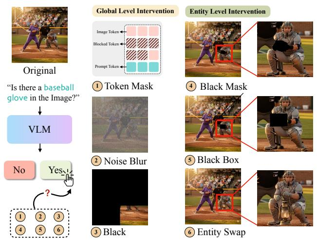
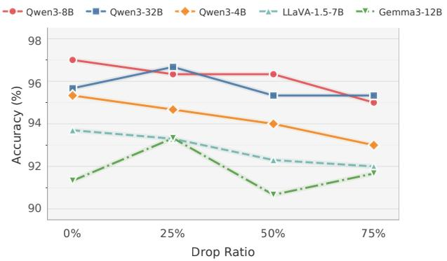
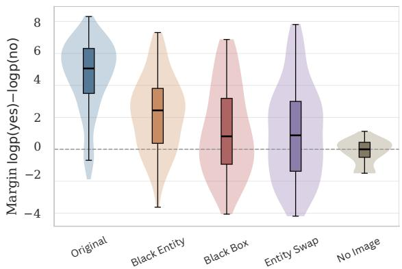
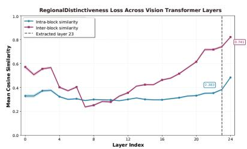
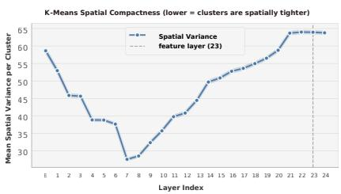
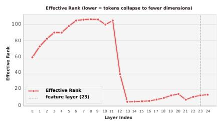
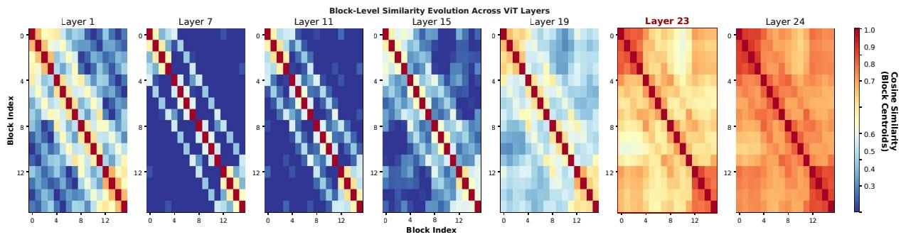
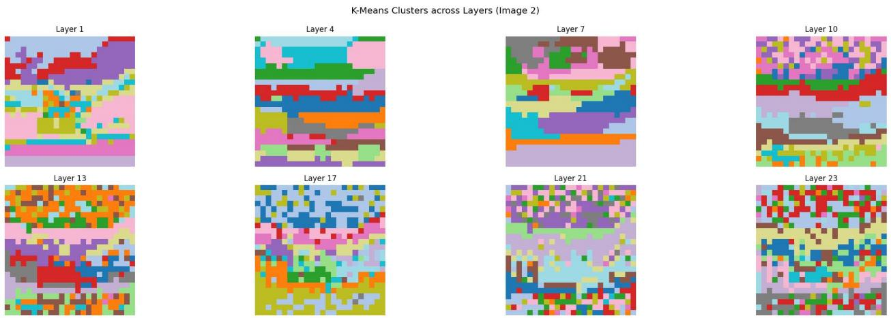

# Seeing without Looking: Do Vision-Language Benchmarks Really Test Vision?

Zixuan Lan\* †

University of Chicago

zixuanlan@uchicago.edu

Matthew R. Walter

Toyota Technological Institute at Chicago

mwalter@ttic.edu

Luzhe Sun\*

Toyota Technological Institute at Chicago

luzhesun@ttic.edu

Jiawei Zhou

Stony Brook University

jiawei.zhou.1@stonybrook.edu

# Abstract

Benchmark accuracy is often implicitly assumed to reflect grounded visual understanding in vision–language models (VLMs), yet it remains unclear to what extent such scores truly reflect reliance on visual evidence. Motivated by a surprising observation that removing a substantial fraction of image tokens only degrades model performance very slightly on a widely used hallucination benchmark, we systematically investigate this mismatch in a set of open-source VLMs. Our analysis spans multiple levels of granularity, spanning global visual degradation, localized occlusion, question reformulation, answer-space expansion, and decision-level analyses beyond standard accuracy. We further complement these behavioral results with a layer-wise analysis of vision-token geometry. Throughout the experiments, we find that although VLMs do incorporate visual input, their predictions are less sensitive to the loss of finegrained visual evidence that standard accuracy should have suggested. Even when the final prediction remains unchanged, the model’s internal support for the correct answer may already be weakened. We further complement a representation level analysis, which shows increasing similarity among visual tokens in deeper layers, providing a possible explanation for our findings. Together, these results suggest that current benchmarks are not sufficient to reliably evaluate fine-grained visual grounding in VLMs.

# 1. Introduction

Vision–language models (VLMs) have achieved strong performance on a growing collection of benchmarks intended to evaluate grounded visual understanding [6, 10, 15]. Yet a fundamental question remains unresolved: to what extent do these benchmark scores truly reflect a model’s reliance

  
Figure 1. We intervene on the input image at both global and entity levels while keeping the question fixed. Global-level interventions weaken overall visual evidence through token masking, noise blur, and black, whereas entity-level interventions manipulate the question-relevant region via black mask, black box, and entity swap. In this example, despite substantial degradation or alteration of the visual evidence, the model’s final answer can remain unchanged and still predict that a baseball glove is present.

on visual evidence, rather than its ability to exploit coarse visual cues, redundant representations, or strong language priors? This question is increasingly important, as benchmark results are often taken as evidence of progress in visual reasoning and hallucination mitigation [2, 5, 6, 10, 32].

In this work, we investigate this question through a simple yet revealing observation. On POPE [17], a widely used benchmark for probing object hallucination [15], we find that randomly removing a substantial fraction of image tokens often leads to little degradation in overall accuracy. At face value, this result is surprising: if benchmark success truly depends on robust visual grounding, one would expect performance to decline as visual evidence is removed.

More importantly, however, this phenomenon is inherently ambiguous. It may reflect (i) redundancy in visual representations, (ii) the possibility that the benchmark can be solved using only coarse-grained visual information, or (iii) the presence of strong language-side regularities that allow models to maintain correct answers even when visual input is weakened [16, 35]. This observation points to a deeper measurement problem: benchmark accuracy, the dominant validation signal for a growing range of VLM methods (including work on data selection and training improvement [4, 32], hallucination mitigation [2], model robustness and safety [11], and inference-time efficiency [18], such as reducing or dropping image tokens [5]) may not be an effective metric for assessing fine-grained visual grounding.

If accuracy can remain high with weakened visual evidence, as in Figure 1, then improvements (or robustness) on these benchmarks may not reliably indicate improved visual grounding, and can lead to overconfident conclusions about what a method actually preserves or improves.

Motivated by this puzzle, we conduct a comprehensive analysis of how VLM benchmark performance changes under progressively weakened, localized, or semantically altered visual evidence. Our study spans multiple benchmarks and multiple levels of intervention, including tokenlevel reduction of visual input, global image degradation, removal of localized entity evidence, semantic manipulation of queried entities, and analyses of decision uncertainty under alternative answer spaces. Instead of treating benchmark accuracy as a sufficient summary of model capability, we examine when it remains stable, when it fails, and what kinds of visual dependence such behavior actually reflects.

Overall, our results suggest that while VLMs do rely on visual input, benchmark accuracy often overstates the degree of fine-grained visual grounding. Strong performance can remain intact despite the loss of detailed visual evidence, supported by coarse visual cues, redundancy, evaluation constraints, and language priors [16, 35]. This gap between accuracy and grounding should be regarded as a core issue in VLM evaluation, motivating more diagnostic ways of assessing model capability.

Our contributions are three-fold:

• We identify a phenomenon in VLM evaluation: standard benchmark metrics often do not even degrade much as expected when corresponding visual evidence is substantially weakened or removed.   
• We develop a detailed multi-level diagnostic framework to probe what benchmark performance actually depends on.   
• We show that current VLM benchmarks can substantially overestimate fine-grained visual grounding, revealing a systematic gap between benchmark success and genuine reliance on question-relevant visual evidence.

# 2. Background

Hallucination and grounding benchmarks. Recent work has introduced a range of benchmarks for evaluating hallucination and grounding in vision–language models [6, 14, 17, 28]. POPE [17] formulates object hallucination evaluation into a series of binary queries about object presence., while AMBER [37] expands evaluation to multiple hallucination dimensions without relying on LLMbased judgments. HallusionBench [8] further diagnoses entangled language hallucination and visual illusion, and THRONE [14] extends evaluation to free-form generation settings. Subsequent efforts such as H-POPE [23] make the evaluation more fine-grained. These benchmarks have substantially improved the measurement of hallucination behaviors in VLMs. In contrast, our work does not propose a new benchmark; instead, we ask why benchmark accuracy can remain unexpectedly stable even when visual evidence is substantially weakened, localized evidence is removed, or queried entities are semantically altered.

Language priors and visual dependence in VLMs. A complementary line of research examines whether strong VLM performance truly reflects reliance on image evidence. VLind-Bench [16] explicitly studies language priors in large vision–language models, while other recent work questions whether stronger object grounding necessarily reduces hallucination [7] and analyzes the sources of visual object hallucination more directly [12, 15]. These studies suggest that model outputs may be supported by languageside regularities or other non-grounded signals, even when evaluation scores remain high. Our work is closely related in spirit, but differs in emphasis: rather than proposing a new prior metric or analyzing hallucination only as an output phenomenon, we investigate how benchmark behavior changes under systematic weakening and manipulation of visual evidence, and what such robustness implies about the interpretation of benchmark accuracy.

Fine-grained perception beyond benchmark accuracy. Recent studies have also shown that aggregate benchmark performance does not necessarily imply strong visual perception. MME [6] highlights the breadth of multimodal evaluation, while Eyes Wide Shut? [35] reveals persistent visual shortcomings in multimodal LLMs, and Do You See Me [13] further demonstrates that models may perform well on downstream tasks while still exhibiting substantial perception errors. This perspective is closely aligned with our central claim: standard benchmark accuracy can overestimate fine-grained visual grounding, because correct predictions may be sustained by coarse visual cues, representational redundancy, or language priors rather than faithful use of detailed visual evidences [9].

line

| Drop Ratio | Qwen3-8B | Qwen3-32B | Qwen3-4B | LLaVA-1.5-7B | Gemma3-12B |
| ---------- | -------- | --------- | -------- | ------------ | ---------- |
| 0%         | 97.0     | 95.8      | 95.3     | 93.6         | 91.2       |
| 25%        | 96.4     | 96.8      | 94.6     | 93.2         | 93.2       |
| 50%        | 96.4     | 95.4      | 93.9     | 92.2         | 90.6       |
| 75%        | 95.0     | 95.4      | 92.9     | 91.8         | 91.6       |

Figure 2. Effect of random image token dropping on POPE accuracy. Even at 75% token removal, accuracy remains nearly unchanged, suggesting that high performance on this benchmark does not require complete visual representations.

Vision-Language Model Preliminaries We consider a vision–language model [20, 30] that takes an image I and a text query Q as input and generates a textual response Y . The image I is first processed by a vision encoder (e.g., CLIP [24]) with $L _ { e }$ layers, producing visual token representations U (ℓ) = {u(ℓ)1 , . $U ^ { ( \ell ) } = \{ \mathbf { u } _ { 1 } ^ { ( \ell ) } , \dots , \mathbf { u } _ { M } ^ { ( \ell ) } \}$ with $\mathbf { u } _ { i } ^ { ( \ell ) } \in \mathbb { R } ^ { d _ { v } }$ at each layer ℓ. The final encoder output is denote by $U = U ^ { ( L _ { e } ) }$ . These visual tokens are then projected into the language model input space yielding a sequence of projected visual tokens $V = \{ \mathbf { v } _ { 1 } , \dots , \mathbf { v } _ { M } \}$ , where $\mathbf { v } _ { i } \in \mathbb { R } ^ { d }$ . The sequence V is concatenated with the tokenized query to form a multimodal sequence processed by a Transformer decoder [36], and the model autoregressively generates an output sequence.

# 3. Vision is not Needed

We conduct standard evaluation of VLM hallucinations on a widely used benchmark POPE [17], a benchmark specifically designed to test object hallucination in vision– language models. Its central goal is to examine whether a model claims to see objects that are not actually present in the image. Each sample consists of an image paired with a yes/no question about a queried object or visual concept. A correct response therefore requires the model to verify the queried content against the visual input. As shown in Figure 2, we randomly drop image tokens; specifically, we define a drop ratio $\sigma \in [ 0 , 1 ]$ , randomly sample a subset of image tokens $S \subset V$ , where $( | S | / | V | = \sigma )$ , then delete the remaining tokens V \ S before passed them to the language decoder Dec $( \mathrm { V } ) \to \mathrm { D e c } ( \mathrm { S } )$ . Surprisingly, we find the model performance does not suffer from obvious loss of visual information. For Qwen3-4B and LLaVA-1.5-7B, accuracy decreases approximately linearly as the drop ratio increases, but the magnitude of the drop is small: even when drop ratio $\sigma = 0 . 7 5 ,$ , performance decreases by only about 3% compared to the baseline. In contrast, Qwen3-32B and Gemma3-12B do not exhibit a monotonic decline with increasing token removal. Notably, when σ = 0.25 both models slightly outperform their baseline accuracy. This raises a more fundamental question: given benchmark scores retains under such severe visual degradation, whether these scores truly reflect the model’s reliance on visual evidence.1

# 4. Experiments Settings

To examine whether the above phenomena generalize across tasks and evaluation formats, we study multiple vision–language evaluation settings, including POPE, A-OKVQA, MME, and AMBER [6, 17, 29, 37]. Among them, POPE serves as the main test point of this work. A-OKVQA and MME are used to test whether the phenomenon shared in different benchmarks, while AMBER provides a complementary view under open-generation evaluation. On the model side, we evaluate a diverse set of open-source vision–language models, including LLaVA-1.5-7B, Qwen3-VL-4B, 8B, 32B, Gemma-3-12B, InternVL3-8B, and Molmo-7B-D-0924 [1, 3, 21, 34, 38]. Detailed settings can be found in supplementary material A.

For POPE, A-OKVQA, and MME, we primarily report accuracy (↑). For entity-level interventions on the positive subset of POPE, we report Yes Rate (↓), and the decision margin ∆. Under the unknown-option setting (Defined in Sec.5.3), we report the Unknown Rate, which measures whether the model awareness of uncertainty. For the openended reformulation, we report the target entity’s rank (↓) and MRR (↑, Mean Reciprocal Rank), which measures how highly the correct entity is ranked in the model’s token-level generation distribution. For AMBER, we follow the official evaluation and report CHAIR [26], which measures how often generated responses mention objects not supported by the image, and Hallucination (↓), which measures the proportion of responses that contain at least onehallucinated object. We also report Coverage, which measures how much annotated image content is covered by the response, and Cog (↓) [37], which measures how often generated objects fall into a predefined set of human-like hallucinatory targets.

# 5. Diagnosing Visual Grounding

To investigate this question, we conduct interventions at multiple levels. At the visual level, we apply structured degradations to the image input. At the textual level, we perturb the questions and choices. Beyond behavioral observations, we further analyze internal model signals to examine how visual information is processed.

# 5.1. Global-Level Visual Interventions

Setup On human visible image intervention, we design a series of ablation experiments at varying granularities as shown in figure 1. We apply whole-image degradations that systematically weaken the available visual evidence. We consider three settings: no-image, where the image is removed entirely; black, where a proportion $r \in [ 0 , 1 ]$ of the image area is occluded with black masking; and blur, where the original image I is mixed with random noise ϵ,

$$
\tilde {I} = (1 - \alpha) I + \alpha \epsilon , \tag {1}
$$

with $\alpha \in [ 0 , 1 ]$ controlling the noise strength. Given this binary answer setting, our evaluate using standard accuracy. If model performance genuinely depends on fine-grained visual evidence, accuracy should degrade proportionally to the severity of corruption. Limited degradation under severe corruption would indicate that surface accuracy is not a sensitive measure of visual dependence.

Results Table 5 reports accuracy across seven models on POPE, A-OKVQA, and MME under each global degradation condition. All models drop to near chance-level accuracy under no-image, confirming that they are not independent of visual input. However, under black and blur, accuracy decreases disproportionately little relative to the severity of visual corruption, with most models remaining well above chance level. This pattern holds consistently across all three benchmarks. These results suggest that benchmark accuracy is insensitive to severe visual degradation, indicating a measurement gap between accuracy and true visual dependence.

# 5.2. Entity-Level Interventions

Global interventions cannot determine whether the model depends on specific visual evidence relevant to a given question. To tackle this, we conduct entity-level manipulations.

Setup These interventions require the queried entity to be physically present in the image, and we could then mask or replace such an entity to create a intervention. We therefore restrict an evaluation set with only Ground Truth positive (GT=Yes) samples from POPE, that said the image is guaranteed to contain the entity mentioned in the question. As all samples carry a positive ground truth, we report yes rate — the proportion of responses affirming the entity’s presence — as the evaluation metric.

For each question–image pair (Q, I), we extract the target entity from the question using GPT-5 [31], localize it with Grounding DINO [22], and obtain a segmentation mask via SAM2 [25]. Based on these outputs, we construct three interventions of increasing specificity: BlackMask masks only the segmented entity pixels, yielding precise entity-level removal; BlackBox occludes the entire detected bounding box, providing coarser region-level removal that also removes surrounding local context; and EntitySwap replaces the target entity in the image with an image-irrelevant alternative using Gemini-3 [33], while keeping the question unchanged. Under these adjustments, the Yes Rate becomes the lower the better.

Results Table 1 reports entity-level occlusion results. Across all three benchmarks, both BlackMask and BlackBox lead to Yes Rate drops, confirming that models depend on question-relevant local visual evidence. BlackBox consistently causes a larger drop than BlackMask aligns that BlackBox removes both the entity and its surrounding context (silhouette), whereas BlackMask removes only the entity pixels themselves. This gap indicates that the support for correct predictions is distributed not only over the target entity but also over the local context surrounding it. Notably, even under BlackMask, where the entity has been completely removed, most models still maintain high Yes Rate in POPE, suggesting that surrounding scene context alone may be sufficient to sustain correct predictions.

Table 2 reports the results of EntitySwap, which provides a stronger counterfactual test by replacing the queried entity with an unrelated object. Under this condition, the correct answer should always be No, and the ideal Yes Rate should therefore be 0. Yet all models remain well above zero, indicating that they fail to sufficiently update their predictions after the queried entity have changed.

Decision Margin Analysis Move beyond binary predictions, to obtain a finer-grained view, we further examine the decision margin $\Delta = \log p ( \mathrm { y e s } ) - \log p ( \mathrm { n o } )$ , which captures the model’s probability-level preference. Figure 3 visualizes the distribution of ∆ on the GT=Yes subset under each intervention condition, while detailed numerical statistics are provided in supplementary material B.

First, the Original setting shows the largest positive margins, indicating strong affirmative preference when full visual evidence is available and No Image condition indicates little directional preference in the absence of visual input. Second, the margin decreases under all entity-level interventions, confirming that local visual evidence indeed affect the model’s decision tendency. However, this decrease is only partial: even under Black Entity, where the queried entity has been removed, the distribution remains clearly shifted toward positive values rather than collapsing toward the No Image condition. This suggests that affirmative preference is not determined by the target entity alone.

Table 1. Comprehensive Entity-level Occlusion Results. We report the Yes Rate(lower is better for Entity-level Interventions conditions ) for each benchmark under three distinct conditions: Original (baseline), Mask (precise entity-level segmentation occlusion), and Box (coarse bounding box occlusion). This comprehensive comparison highlights the varying sensitivity of perception-based and knowledgebased tasks to the loss of local visual features and surrounding context. 

<table><tr><td rowspan="2">Model</td><td colspan="3">POPE</td><td colspan="3">A-OKVQA</td><td colspan="3">MME</td></tr><tr><td>Original</td><td>Mask</td><td>Box</td><td>Original</td><td>Mask</td><td>Box</td><td>Original</td><td>Mask</td><td>Box</td></tr><tr><td>Qwen3-VL-32B</td><td>0.96</td><td>0.90</td><td>0.74</td><td>0.90</td><td>0.80</td><td>0.74</td><td>0.83</td><td>0.59</td><td>0.28</td></tr><tr><td>InternVL3-8B</td><td>0.97</td><td>0.80</td><td>0.57</td><td>0.88</td><td>0.77</td><td>0.71</td><td>0.83</td><td>0.64</td><td>0.40</td></tr><tr><td>Qwen3-VL-8B</td><td>0.99</td><td>0.94</td><td>0.84</td><td>0.89</td><td>0.73</td><td>0.68</td><td>0.85</td><td>0.65</td><td>0.41</td></tr><tr><td>Gemma3-12B</td><td>0.96</td><td>0.83</td><td>0.59</td><td>0.84</td><td>0.74</td><td>0.67</td><td>0.79</td><td>0.59</td><td>0.45</td></tr><tr><td>Qwen3-VL-4B</td><td>0.93</td><td>0.75</td><td>0.44</td><td>0.86</td><td>0.73</td><td>0.69</td><td>0.80</td><td>0.60</td><td>0.35</td></tr><tr><td>LLaVA-1.5-7B</td><td>0.97</td><td>0.87</td><td>0.71</td><td>0.77</td><td>0.68</td><td>0.65</td><td>0.74</td><td>0.48</td><td>0.20</td></tr><tr><td>Molmo-7B-D-0924</td><td>0.94</td><td>0.67</td><td>0.46</td><td>0.82</td><td>0.66</td><td>0.60</td><td>0.82</td><td>0.54</td><td>0.27</td></tr></table>

violin

| Category      | Min  | Q1   | Median | Q3   | Max  |
| ------------- | ---- | ---- | ------ | ---- | ---- |
| Original      | -2.0 | 6.0  | 5.0    | 6.0  | 8.0  |
| Black Entity  | -4.0 | 3.0  | 2.0    | 3.0  | 7.0  |
| Black Box     | -4.0 | 1.0  | 1.0    | 3.0  | 7.0  |
| Entity Swap   | -4.0 | 1.0  | 1.0    | 3.0  | 8.0  |
| No Image      | -2.0 | -1.0 | -1.0   | -1.0 | -1.0 |

Figure 3. Distribution of decision margins under different visual conditions.Each violin and box summarizes the samples decision margin at the first answer token. The horizontal line at 0 marks equal preference between the two decisions. As visual evidence is weakened, the margin distribution shifts leftward and becomes less concentrated. Notably, ENTITY SWAP remains systematically more favorable to “yes” than NO IMAGE.

A similar pattern holds for Black Box and Entity Swap. Although both conditions reduce the margin further, their distributions remain substantially above No Image.

Overall, the distributional evidence suggests that while models do use entity-relevant visual information, their affirmative bias can still be sustained by broader scene-level visual cues even when the queried entity is removed or semantically replaced. This helps explain why benchmark performance may remain relatively stable despite substantial degradation of fine-grained visual evidence.

Summary Taken together, these results suggest that models are not entirely insensitive to local visual evidence, but their dependence on such evidence is not tightly anchored to the queried entity itself. Importantly, although entitylevel interventions do alter the model’s underlying decision

Table 2. Entity Swap Accuracy Test on Gemini-3 Generated Images. We report the Yes rate of different VLMs when the queried entity is replaced with a different entity. Under ideal grounding behavior, the Yes rate should be 0. 

<table><tr><td>Model</td><td>Yes Rate ↓</td></tr><tr><td>LLaVA-1.5-7B</td><td>0.63</td></tr><tr><td>Gemma-3-12B</td><td>0.50</td></tr><tr><td>InternVL3-8B</td><td>0.37</td></tr><tr><td>Qwen3-VL-32B</td><td>0.35</td></tr><tr><td>Qwen3-VL-8B</td><td>0.34</td></tr><tr><td>Qwen3-VL-4B</td><td>0.27</td></tr></table>

Table 3. Unknown selection rate under different visual conditions. We report the fraction of samples for which each model selects the explicit unknown option. Most models remain largely insensitive to the added option, while a few show elevated abstention under stronger visual degradation. 

<table><tr><td>Model</td><td>Normal</td><td>No Image</td><td>Black (0.75)</td><td>Noise (0.75)</td></tr><tr><td>LLaVA-7B</td><td>0.00</td><td>0.00</td><td>0.00</td><td>0.00</td></tr><tr><td>Gemma-12B</td><td>0.03</td><td>0.00</td><td>0.09</td><td>0.78</td></tr><tr><td>Qwen3-32B</td><td>0.01</td><td>0.00</td><td>0.05</td><td>0.81</td></tr><tr><td>Qwen3-8B</td><td>0.00</td><td>0.00</td><td>0.00</td><td>0.00</td></tr><tr><td>Qwen3-4B</td><td>0.00</td><td>0.00</td><td>0.00</td><td>0.03</td></tr><tr><td>InternVL3-8B</td><td>0.00</td><td>0.11</td><td>0.00</td><td>0.01</td></tr><tr><td>Molmo-7B</td><td>0.01</td><td>0.00</td><td>0.02</td><td>0.16</td></tr></table>

support, these changes are often not reflected in top-1 accuracy. In other words, the model’s prediction may remain unchanged even when its internal support for the correct answer has already been substantially weakened.

# 5.3. Task-Formulation Interventions

The preceding interventions perturb the visual input itself, but retain the original closed-form question formats (yes/no and multiple-choice) which may allow models to exploit answer-format priors without genuinely engaging with the visual content. To reduce this confound, we modify the question formulation in two ways to move beyond closedform answers.

Table 4. Ranking and Probability Metrics under Entity-level Interventions. We report the Mean Reciprocal Rank (MRR), Mean/Median Rank, and Mean Prediction Probability across 117 samples. This comparison illustrates the severe degradation in the model’s retrieval and ranking capabilities when specific visual entities are perturbed. 

<table><tr><td rowspan="2">Condition</td><td colspan="2">Mean Reciprocal Rank (MRR) ↑</td><td colspan="2">Rank Analysis ↓</td><td rowspan="2">Mean Probability ↑</td></tr><tr><td>All Samples</td><td>Valid Only</td><td>Mean Rank</td><td>Median Rank</td></tr><tr><td>Original (Baseline)</td><td>0.0322</td><td>0.0322</td><td>391.91</td><td>85</td><td>0.000690</td></tr><tr><td>Perturbed (Entity Swap)</td><td>0.0101</td><td>0.0101</td><td>942.98</td><td>458</td><td>0.000142</td></tr><tr><td>Relative Change</td><td>-68.6%</td><td>-68.6%</td><td>+140.6%</td><td>+438.8%</td><td>-79.4%</td></tr></table>

Table 5. Overall Accuracy (Acc) across three benchmarks under various visual perturbations. Normal represents the vanilla setting, while No Image, Black, and Blur denote different levels of visual degradation. 

<table><tr><td rowspan="2">Model</td><td rowspan="2">Dataset</td><td rowspan="2">Normal(Baseline)</td><td rowspan="2">No Image(Zero)</td><td colspan="2">Black</td><td colspan="2">Blur</td></tr><tr><td>p=0.5</td><td>p=0.75</td><td>p=0.5</td><td>p=0.75</td></tr><tr><td rowspan="3">Qwen3-VL-32B</td><td>Pope</td><td>0.96</td><td>0.50</td><td>0.87</td><td>0.81</td><td>0.89</td><td>0.60</td></tr><tr><td>A-OKVQA</td><td>0.90</td><td>0.51</td><td>0.79</td><td>0.72</td><td>0.78</td><td>0.73</td></tr><tr><td>MME</td><td>0.92</td><td>0.54</td><td>0.86</td><td>0.81</td><td>0.85</td><td>0.81</td></tr><tr><td rowspan="3">InternVL3-8B</td><td>Pope</td><td>0.98</td><td>0.50</td><td>0.86</td><td>0.80</td><td>0.93</td><td>0.71</td></tr><tr><td>A-OKVQA</td><td>0.88</td><td>0.48</td><td>0.79</td><td>0.71</td><td>0.77</td><td>0.70</td></tr><tr><td>MME</td><td>0.89</td><td>0.56</td><td>0.82</td><td>0.78</td><td>0.82</td><td>0.80</td></tr><tr><td rowspan="3">Qwen3-VL-8B</td><td>Pope</td><td>0.97</td><td>0.50</td><td>0.86</td><td>0.78</td><td>0.91</td><td>0.71</td></tr><tr><td>A-OKVQA</td><td>0.89</td><td>0.47</td><td>0.77</td><td>0.69</td><td>0.76</td><td>0.70</td></tr><tr><td>MME</td><td>0.88</td><td>0.52</td><td>0.81</td><td>0.76</td><td>0.84</td><td>0.79</td></tr><tr><td rowspan="3">Gemma-3-12B</td><td>Pope</td><td>0.94</td><td>0.57</td><td>0.89</td><td>0.80</td><td>0.78</td><td>0.54</td></tr><tr><td>A-OKVQA</td><td>0.84</td><td>0.46</td><td>0.74</td><td>0.68</td><td>0.70</td><td>0.66</td></tr><tr><td>MME</td><td>0.83</td><td>0.56</td><td>0.78</td><td>0.74</td><td>0.75</td><td>0.73</td></tr><tr><td rowspan="3">Qwen3-VL-4B</td><td>Pope</td><td>0.95</td><td>0.50</td><td>0.87</td><td>0.77</td><td>0.90</td><td>0.65</td></tr><tr><td>A-OKVQA</td><td>0.86</td><td>0.47</td><td>0.76</td><td>0.68</td><td>0.75</td><td>0.70</td></tr><tr><td>MME</td><td>0.81</td><td>0.51</td><td>0.75</td><td>0.70</td><td>0.76</td><td>0.73</td></tr><tr><td rowspan="3">LLaVA-1.5-7B</td><td>Pope</td><td>0.94</td><td>0.50</td><td>0.87</td><td>0.76</td><td>0.90</td><td>0.72</td></tr><tr><td>A-OKVQA</td><td>0.77</td><td>0.38</td><td>0.69</td><td>0.65</td><td>0.69</td><td>0.64</td></tr><tr><td>MME</td><td>0.80</td><td>0.50</td><td>0.73</td><td>0.69</td><td>0.74</td><td>0.72</td></tr><tr><td rowspan="3">Molmo-7B-D-0924</td><td>Pope</td><td>0.95</td><td>0.51</td><td>0.85</td><td>0.77</td><td>0.92</td><td>0.75</td></tr><tr><td>A-OKVQA</td><td>0.82</td><td>0.47</td><td>0.69</td><td>0.64</td><td>0.70</td><td>0.64</td></tr><tr><td>MME</td><td>0.79</td><td>0.51</td><td>0.71</td><td>0.66</td><td>0.74</td><td>0.71</td></tr></table>

Interventions on Original Question Formulation First, under the global degradation settings in Section 5.1, we extend the original yes/no task with an explicit unknown option. The purpose is to provide a backup buffer for VLMs when visual evidence is insufficient to support a confident binary judgment. We report the Unknown Rate to measure whether the model can express uncertainty under degraded visual conditions. Second, we reformulate the original object-presence questions as open-ended generation tasks, asking the model to answer which objects are present in the image. We evaluate the rank of the target entity in the output distribution and report its MRR(Mean Reciprocal Rank, Tab. 4), which measures how highly the correct entity is ranked in the model’s token-level generation distribution. If the queried entity is captured, it should appear with higher salience in the generation distribution.

Results on Original Question Formulation After introducing an explicit unknown option (Table 3), most models still rarely choose unknown under degraded conditions. Even when visual evidence is extremely weak or entirely absent, they generally continue to produce definite binary judgments. This suggests that the observed output stability is not simply imposed by the original yes/no answer space. Even when given a softer fallback, current models still show limited ability to express uncertainty in proportion to insufficient evidence. When the original object-presence questions are reformulated as open-ended generation, the target entity receives a low rank in the output distribution (Tab. 4). The model’s representation of the target entity is intrinsically weak: even when the entity is visible, it is not strongly encoded in the generation distribution. This provides a representational explanation for why entity-level interventions have limited impact on accuracy—the model never strongly relies on entity-specific information in making its decision.

Complementary Open-Generation The reformulations above still operate on questions derived from the original benchmark. To complement these derived open-generation tasks, we additionally evaluate on AMBER [37], a benchmark natively designed for open-ended visual description. We follow the official AMBER evaluation protocol and introduce only coarse-grained visual interventions to the input images. Compared with closed-form tasks, this setting more directly evaluates whether the model can generate object-level content consistent with the image.

Results on the Complementary Open-Generation We observe the same trend under the native open-generation setting of AMBER (Tab. B.1). Under degradation, hallucination increases and coverage decreases, but the overall changes remain limited; only no-image causes drastic deterioration. This shows that the relative stability observed above is not merely an artifact of the yes/no format, but a consistent phenomenon across evaluation settings.

# 6. Representational Analysis

# 6.1. Layer-wise Analysis of Vision Token Geometry

The above experiments examine model behavior by manipulating inputs and outputs. Here we complement behavioral evidence with a representational analysis [19, 30], asking whether the vision encoder itself progressively loses the spatial discriminability required for fine-grained grounding. For each encoder layer $\ell \in \{ 1 , \ldots , L _ { e } \}$ , we impose a regular 4 × 4 spatial partition over the visual tokens $U ^ { ( \ell ) }$ and compute three complementary metrics.

First, we measure intra-block and inter-block cosine similarity—the mean pairwise cosine between tokens within the same spatial block and across different blocks. If inter-block similarity increases with depth, tokens from different spatial regions become directionally indistinguishable. Second, we apply k-means clustering (k=16, matching the 4×4 partition) to token representations at each layer and evaluate how well the clusters align with the groundtruth spatial blocks (k-means spatial compactness). Third, we compute the effective rank [27] of the token representation matrix:

$$
\operatorname{erank} (U ^ {(\ell)}) = \exp \left(- \sum_ {j} \bar {\sigma} _ {j} \log \bar {\sigma} _ {j}\right), \tag {2}
$$

where $\bar { \sigma } _ { j } = \sigma _ { j } / \sum _ { k } \sigma _ { k }$ are the normalized singular values of $\check { U } ^ { ( \ell ) }$ . A decrease in effective rank indicates that token representations collapse onto a lower-dimensional subspace.

Together, these metrics characterize spatial discriminability from complementary perspectives: directional alignment, spatial separability, and representational dimensionality. If all three degrade in deeper layers, this would provide a representational explanation consistent with the behavioral finding that model predictions are insufficiently sensitive to the loss of fine-grained local evidence.

# 6.2. Spatial Discriminability Degrades with Depth

The Top left panel of Figure 4 reports the layer-wise evolution of block-wise cosine similarity. In early layers, intrablock similarity exceeds inter-block similarity, indicating that tokens within the same spatial region remain more similar than those across regions. As depth increases, interblock similarity rises steadily and approaches intra-block similarity, substantially shrinking the gap between them. The heatmaps in Figure 4 visualize this trend directly: early layers show low off-diagonal values, reflecting strong differences between spatial blocks, whereas by Layer 23 the matrix becomes nearly uniform, indicating that spatial distinctions have largely disappeared.

Notably, around Layers 7–9, inter-block similarity briefly falls below intra-block similarity, suggesting that local spatial structure is strengthened in intermediate layers before the later convergence observed in deeper layers.

Figure 4 also reports k-means spatial compactness and effective rank across layers. Spatial variance reaches its minimum near Layer 7, indicating that clustering at this depth best preserves spatial structure; beyond this point, variance increases steadily, showing that deeper-layer clusters no longer align with spatial regions. Effective rank remains high through the first 12 layers and then drops sharply, indicating that token representations collapse onto a much lower-dimensional subspace.

Summary Across all three metrics 1)directional alignment, 2)spatial separability, and 3)dimensional diversity,the same pattern emerges: spatial discriminability progressively degrades in deeper layers. This representation-level trend is consistent with the behavioral findings: if tokens from different spatial regions become mixed in the encoder, downstream computation is less likely to maintain strong dependence on fine-grained local visual evidence.

# 7. Discussion

# 7.1. Visual Reliance in VLMs Is Shallow

Our results indicate that the visual reliance of current vision–language models is shallow and rarely grounded in fine-grained entity-level evidence. Across global degradation experiments, substantial corruption of visual input leads to only minor drops in benchmark accuracy, suggesting that coarse scene-level cues are often sufficient to sustain correct predictions. This pattern becomes more evident under entity-level interventions. Even after the queried entity is removed, models frequently remain confidently affirmative, indicating that surrounding scene context can substitute for direct visual evidence of the entity itself. Our probability-level analysis further supports this observation.

line

| Layer Index | Intra-block similarity | Inter-block similarity | Extracted layer 23 |
| ----------- | --------------------- | --------------------- | ------------------ |
| 0           | 0.35                  | 0.60                  | -                  |
| 4           | 0.35                  | 0.40                  | -                  |
| 8           | 0.30                  | 0.25                  | -                  |
| 12          | 0.30                  | 0.40                  | -                  |
| 16          | 0.30                  | 0.45                  | -                  |
| 20          | 0.35                  | 0.65                  | -                  |
| 24          | 0.45                  | 0.874                 | -                  |

line

| Layer Index | Spatial Variance | feature layer (23) |
| ----------- | ---------------- | ------------------ |
| 1           | 60               | 60                 |
| 2           | 55               | 55                 |
| 3           | 50               | 50                 |
| 4           | 45               | 45                 |
| 5           | 40               | 40                 |
| 6           | 35               | 35                 |
| 7           | 30               | 30                 |
| 8           | 35               | 35                 |
| 9           | 40               | 40                 |
| 10          | 45               | 45                 |
| 11          | 50               | 50                 |
| 12          | 55               | 55                 |
| 13          | 60               | 60                 |
| 14          | 65               | 65                 |
| 15          | 65               | 65                 |
| 16          | 65               | 65                 |
| 17          | 65               | 65                 |
| 18          | 65               | 65                 |
| 19          | 65               | 65                 |
| 20          | 65               | 65                 |
| 21          | 65               | 65                 |
| 22          | 65               | 65                 |
| 23          | 65               | 65                 |
| 24          | 65               | 65                 |

line

| Layer Index | Effective Rank |
| ----------- | -------------- |
| E           | 60             |
| 1           | 75             |
| 2           | 85             |
| 3           | 90             |
| 4           | 95             |
| 5           | 100            |
| 6           | 105            |
| 7           | 105            |
| 8           | 105            |
| 9           | 105            |
| 10          | 100            |
| 11          | 105            |
| 12          | 40             |
| 13          | 5              |
| 14          | 5              |
| 15          | 5              |
| 16          | 5              |
| 17          | 5              |
| 18          | 5              |
| 19          | 10             |
| 20          | 10             |
| 21          | 5              |
| 22          | 10             |
| 23          | 10             |
| 24          | 10             |

  
Figure 4. Layer-wise representational analysis of visual tokens in the vision encoder. We evaluate spatial discriminability from three complementary perspectives: intra-/inter-block cosine similarity, k-means spatial compactness, and effective rank. These results provide a possible representational explanation for the limited sensitivity of model predictions to the loss of fine-grained local evidence.

Additional analysis reinforces this conclusion. MRR results show that even when the queried entity is present, models often fail to assign it high priority in the generation distribution. Our representational analysis provides a possible explanation for this shallow reliance. As visual tokens propagate through deeper layers of the encoder, spatial discriminability between regions progressively degrades. Such representational homogenization may reduce the availability of precise local evidence required for entitylevel grounding.

Taken together, these findings suggest that correct predictions in current VLM benchmarks often do not require precise visual evidence.

# 7.2. Current Benchmarks Fail to Capture This Problem

If models can produce correct answers without perceiving the queried entity, benchmark accuracy alone cannot faithfully reflect visual grounding capability. This limitation can be vital if accuracy is used for VLM research with a takeas-granted assumption. If benchmarks cannot reliably measure fine-grained grounding, methods intended to improve visual perception, mitigate hallucination, or reduce image tokens for inference efficiency may appear effective simply because they exploit coarse scene cues or dataset priors. As a result, both the effectiveness of such methods and the visual capability of existing VLMs may be misestimated. Our results suggest that evaluation should move beyond top-1 accuracy and explicitly test whether model predictions respond appropriately to changes in visual evidence. Evaluation should test whether predictions change appropriately under visual perturbations.

# 8. Conclusion and Future Work

Across multi-granularity interventions, we find that benchmark performance remains stable even when visual evidence is weakened. At the same time, probability-level analyses reveal that model predictions become less confident, and entity-level evaluations show that outputs are weakly anchored to the queried entity itself. These results suggest that standard benchmarks do not faithfully reflect fine-grained visual grounding. In particular, models can maintain correct predictions under misleading visual inputs, indicating that current benchmarks may overestimate visual reliance. Many research directions—including hallucination mitigation, visual token pruning, and claims about improved grounding—are evaluated primarily through theses benchmark . If such metrics are insensitive to the loss of fine-grained visual evidence, they may provide misleading signals about model behavior. In future work, we plan to construct a benchmark that relies purely on visual evidence, aiming to reflect the real visual capabilities of models. On the modeling side, we aim to improve the model’s ability to utilize visual evidence, such that it can make correct predictions even when visual inputs are weakened.

# References

[1] Shuai Bai, Yuxuan Cai, Ruizhe Chen, Keqin Chen, Xionghui Chen, Zesen Cheng, Lianghao Deng, Wei Ding, Chang Gao, Chunjiang Ge, Wenbin Ge, Zhifang Guo, Qidong Huang, Jie Huang, Fei Huang, Binyuan Hui, Shutong Jiang, Zhaohai Li, Mingsheng Li, Mei Li, Kaixin Li, Zicheng Lin, Junyang Lin, Xuejing Liu, Jiawei Liu, Chenglong Liu, Yang Liu, Dayiheng Liu, Shixuan Liu, Dunjie Lu, Ruilin Luo, Chenxu Lv, Rui Men, Lingchen Meng, Xuancheng Ren, Xingzhang Ren, Sibo Song, Yuchong Sun, Jun Tang, Jianhong Tu, Jianqiang Wan, Peng Wang, Pengfei Wang, Qiuyue Wang, Yuxuan Wang, Tianbao Xie, Yiheng Xu, Haiyang Xu, Jin Xu, Zhibo Yang, Mingkun Yang, Jianxin Yang, An Yang, Bowen Yu, Fei Zhang, Hang Zhang, Xi Zhang, Bo Zheng, Humen Zhong, Jingren Zhou, Fan Zhou, Jing Zhou, Yuanzhi Zhu, and Ke Zhu. Qwen3-vl technical report, 2025. 3   
[2] Zhaorun Chen, Zhuokai Zhao, Hongyin Luo, Huaxiu Yao, Bo Li, and Jiawei Zhou. Halc: Object hallucination reduction via adaptive focal-contrast decoding. In Forty-first International Conference on Machine Learning, 2024. 1, 2   
[3] Matt Deitke, Christopher Clark, Sangho Lee, Rohun Tripathi, Yue Yang, Jae Sung Park, Mohammadreza Salehi, Niklas Muennighoff, Kyle Lo, Luca Soldaini, Jiasen Lu, Taira Anderson, Erin Bransom, Kiana Ehsani, Huong Ngo, YenSung Chen, Ajay Patel, Mark Yatskar, Chris Callison-Burch, Andrew Head, Rose Hendrix, Favyen Bastani, Eli VanderBilt, Nathan Lambert, Yvonne Chou, Arnavi Chheda, Jenna Sparks, Sam Skjonsberg, Michael Schmitz, Aaron Sarnat, Byron Bischoff, Pete Walsh, Chris Newell, Piper Wolters, Tanmay Gupta, Kuo-Hao Zeng, Jon Borchardt, Dirk Groeneveld, Crystal Nam, Sophie Lebrecht, Caitlin Wittlif, Carissa Schoenick, Oscar Michel, Ranjay Krishna, Luca Weihs, Noah A. Smith, Hannaneh Hajishirzi, Ross Girshick, Ali Farhadi, and Aniruddha Kembhavi. Molmo and pixmo: Open weights and open data for state-of-the-art vision-language models, 2024. 3   
[4] Jie Ding, Enmao Diao, Jiawei Zhou, and Vahid Tarokh. On statistical efficiency in learning. IEEE Transactions on Information Theory, 67(4):2488–2506, 2020. 2   
[5] Yixiong Fang, Ziran Yang, Zhaorun Chen, Zhuokai Zhao, and Jiawei Zhou. Enhancing vision-language model reliability with uncertainty-guided dropout decoding. Advances in Neural Information Processing Systems, 38:149193– 149218, 2025. 1, 2   
[6] Chaoyou Fu, Peixian Chen, Yunhang Shen, Yulei Qin, Mengdan Zhang, Xu Lin, Jinrui Yang, Xiawu Zheng, Ke Li, Xing Sun, Yunsheng Wu, Rongrong Ji, Caifeng Shan, and Ran He. Mme: A comprehensive evaluation benchmark for multimodal large language models, 2025. 1, 2, 3   
[7] Gregor Geigle, Radu Timofte, and Goran Glavaš. Does object grounding really reduce hallucination of large visionlanguage models?, 2024. 2   
[8] Tianrui Guan, Fuxiao Liu, Xiyang Wu, Ruiqi Xian, Zongxia Li, Xiaoyu Liu, Xijun Wang, Lichang Chen, Furong Huang, Yaser Yacoob, Dinesh Manocha, and Tianyi Zhou. Hallusionbench: An advanced diagnostic suite for entangled

language hallucination and visual illusion in large visionlanguage models, 2024. 2   
[9] Yifan Hou, Buse Giledereli, Yilei Tu, and Mrinmaya Sachan. Do vision-language models really understand visual language?, 2025. 2   
[10] Jiaxing Huang and Jingyi Zhang. A survey on evaluation of multimodal large language models, 2024. 1   
[11] Tanqiu Jiang, Jiacheng Liang, Rongyi Zhu, Jiawei Zhou, Fenglong Ma, and Ting Wang. Robustifying vision-language models via dynamic token reweighting. arXiv preprint arXiv:2505.17132, 2025. 2   
[12] Liqiang Jing, Guiming Hardy Chen, Ehsan Aghazadeh, Xin Eric Wang, and Xinya Du. A comprehensive analysis for visual object hallucination in large vision-language models, 2025. 2   
[13] Aditya Kanade and Tanuja Ganu. Do you see me : A multidimensional benchmark for evaluating visual perception in multimodal llms, 2025. 2   
[14] Prannay Kaul, Zhizhong Li, Hao Yang, Yonatan Dukler, Ashwin Swaminathan, C. J. Taylor, and Stefano Soatto. Throne: An object-based hallucination benchmark for the free-form generations of large vision-language models, 2025. 2   
[15] Sai Akhil Kogilathota, Sripadha Vallabha EG, Luzhe Sun, and Jiawei Zhou. Halp: Detecting hallucinations in visionlanguage models without generating a single token. In Proceedings of the 19th Conference of the European Chapter of the Association for Computational Linguistics (Volume 1: Long Papers), pages 6067–6085, 2026. 1, 2   
[16] Kang-il Lee, Minbeom Kim, Seunghyun Yoon, Minsung Kim, Dongryeol Lee, Hyukhun Koh, and Kyomin Jung. VLind-bench: Measuring language priors in large visionlanguage models. In Findings of the Association for Computational Linguistics: NAACL 2025, pages 4129–4144, Albuquerque, New Mexico, 2025. Association for Computational Linguistics. 2   
[17] Yifan Li, Yifan Du, Kun Zhou, Jinpeng Wang, Wayne Xin Zhao, and Ji-Rong Wen. Evaluating object hallucination in large vision-language models, 2023. 1, 2, 3   
[18] Yanhong Li, Zixuan Lan, and Jiawei Zhou. Text or pixels? evaluating efficiency and understanding of LLMs with visual text inputs. In Findings of the Association for Computational Linguistics: EMNLP 2025, pages 10564–10578, Suzhou, China, 2025. Association for Computational Linguistics. 2   
[19] Yanhong Li, Ming Li, Karen Livescu, and Jiawei Zhou. On the predictive power of representation dispersion in language models. In The Fourteenth International Conference on Learning Representations, 2026. 7   
[20] Haotian Liu, Chunyuan Li, Qingyang Wu, and Yong Jae Lee. Visual instruction tuning, 2023. 3   
[21] Haotian Liu, Chunyuan Li, Yuheng Li, and Yong Jae Lee. Improved baselines with visual instruction tuning, 2024. 3   
[22] Shilong Liu, Zhaoyang Zeng, Tianhe Ren, Feng Li, Hao Zhang, Jie Yang, Qing Jiang, Chunyuan Li, Jianwei Yang, Hang Su, Jun Zhu, and Lei Zhang. Grounding dino: Marrying dino with grounded pre-training for open-set object detection, 2024. 4

[23] Nhi Pham and Michael Schott. H-pope: Hierarchical polling-based probing evaluation of hallucinations in large vision-language models, 2024. 2   
[24] Alec Radford, Jong Wook Kim, Chris Hallacy, Aditya Ramesh, Gabriel Goh, Sandhini Agarwal, Girish Sastry, Amanda Askell, Pamela Mishkin, Jack Clark, Gretchen Krueger, and Ilya Sutskever. Learning transferable visual models from natural language supervision, 2021. 3   
[25] Nikhila Ravi, Valentin Gabeur, Yuan-Ting Hu, Ronghang Hu, Chaitanya Ryali, Tengyu Ma, Haitham Khedr, Roman Rädle, Chloe Rolland, Laura Gustafson, Eric Mintun, Junting Pan, Kalyan Vasudev Alwala, Nicolas Carion, Chao-Yuan Wu, Ross Girshick, Piotr Dollár, and Christoph Feichtenhofer. Sam 2: Segment anything in images and videos, 2024. 4   
[26] Anna Rohrbach, Lisa Anne Hendricks, Kaylee Burns, Trevor Darrell, and Kate Saenko. Object hallucination in image captioning, 2019. 3   
[27] Olivier Roy and Martin Vetterli. The effective rank: A measure of effective dimensionality. In 2007 15th European Signal Processing Conference, pages 606–610, 2007. 7   
[28] Ananya Sadana, Yash Kumar Lal, and Jiawei Zhou. Isobench: Benchmarking multimodal causal reasoning in visual-language models through procedural plans. arXiv preprint arXiv:2507.23135, 2025. 2   
[29] Dustin Schwenk, Apoorv Khandelwal, Christopher Clark, Kenneth Marino, and Roozbeh Mottaghi. A-okvqa: A benchmark for visual question answering using world knowledge, 2022. 3   
[30] Hala Sheta, Eric Haoran Huang, Shuyu Wu, Ilia Alenabi, Jiajun Hong, Ryker Lin, Ruoxi Ning, Daniel Wei, Jialin Yang, Jiawei Zhou, et al. From behavioral performance to internal competence: Interpreting vision-language models with vlmlens. In Proceedings of the 2025 Conference on Empirical Methods in Natural Language Processing: System Demonstrations, pages 886–895, 2025. 3, 7   
[31] Aaditya Singh, Adam Fry, Adam Perelman, Adam Tart, Adi Ganesh, Ahmed El-Kishky, Aidan McLaughlin, Aiden Low, AJ Ostrow, Akhila Ananthram, Akshay Nathan, Alan Luo, Alec Helyar, Aleksander Madry, Aleksandr Efremov, Aleksandra Spyra, Alex Baker-Whitcomb, Alex Beutel, Alex Karpenko, Alex Makelov, Alex Neitz, Alex Wei, Alexandra Barr, Alexandre Kirchmeyer, Alexey Ivanov, Alexi Christakis, Alistair Gillespie, Allison Tam, Ally Bennett, Alvin Wan, Alyssa Huang, Amy McDonald Sandjideh, Amy Yang, Ananya Kumar, Andre Saraiva, Andrea Vallone, Andrei Gheorghe, Andres Garcia Garcia, Andrew Braunstein, Andrew Liu, Andrew Schmidt, Andrey Mereskin, Andrey Mishchenko, Andy Applebaum, Andy Rogerson, Ann Rajan, Annie Wei, Anoop Kotha, Anubha Srivastava, Anushree Agrawal, Arun Vijayvergiya, Ashley Tyra, Ashvin Nair, Avi Nayak, Ben Eggers, Bessie Ji, Beth Hoover, Bill Chen, Blair Chen, Boaz Barak, Borys Minaiev, Botao Hao, Bowen Baker, Brad Lightcap, Brandon McKinzie, Brandon Wang, Brendan Quinn, Brian Fioca, Brian Hsu, Brian Yang, Brian Yu, Brian Zhang, Brittany Brenner, Callie Riggins Zetino, Cameron Raymond, Camillo Lugaresi, Carolina Paz, Cary Hudson, Cedric Whitney, Chak

Li, Charles Chen, Charlotte Cole, Chelsea Voss, Chen Ding, Chen Shen, Chengdu Huang, Chris Colby, Chris Hallacy, Chris Koch, Chris Lu, Christina Kaplan, Christina Kim, CJ Minott-Henriques, Cliff Frey, Cody Yu, Coley Czarnecki, Colin Reid, Colin Wei, Cory Decareaux, Cristina Scheau, Cyril Zhang, Cyrus Forbes, Da Tang, Dakota Goldberg, Dan Roberts, Dana Palmie, Daniel Kappler, Daniel Levine, Daniel Wright, Dave Leo, David Lin, David Robinson, Declan Grabb, Derek Chen, Derek Lim, Derek Salama, Dibya Bhattacharjee, Dimitris Tsipras, Dinghua Li, Dingli Yu, DJ Strouse, Drew Williams, Dylan Hunn, Ed Bayes, Edwin Arbus, Ekin Akyurek, Elaine Ya Le, Elana Widmann, Eli Yani, Elizabeth Proehl, Enis Sert, Enoch Cheung, Eri Schwartz, Eric Han, Eric Jiang, Eric Mitchell, Eric Sigler, Eric Wallace, Erik Ritter, Erin Kavanaugh, Evan Mays, Evgenii Nikishin, Fangyuan Li, Felipe Petroski Such, Filipe de Avila Belbute Peres, Filippo Raso, Florent Bekerman, Foivos Tsimpourlas, Fotis Chantzis, Francis Song, Francis Zhang, Gaby Raila, Garrett McGrath, Gary Briggs, Gary Yang, Giambattista Parascandolo, Gildas Chabot, Grace Kim, Grace Zhao, Gregory Valiant, Guillaume Leclerc, Hadi Salman, Hanson Wang, Hao Sheng, Haoming Jiang, Haoyu Wang, Haozhun Jin, Harshit Sikchi, Heather Schmidt, Henry Aspegren, Honglin Chen, Huida Qiu, Hunter Lightman, Ian Covert, Ian Kivlichan, Ian Silber, Ian Sohl, Ibrahim Hammoud, Ignasi Clavera, Ikai Lan, Ilge Akkaya, Ilya Kostrikov, Irina Kofman, Isak Etinger, Ishaan Singal, Jackie Hehir, Jacob Huh, Jacqueline Pan, Jake Wilczynski, Jakub Pachocki, James Lee, James Quinn, Jamie Kiros, Janvi Kalra, Jasmyn Samaroo, Jason Wang, Jason Wolfe, Jay Chen, Jay Wang, Jean Harb, Jeffrey Han, Jeffrey Wang, Jennifer Zhao, Jeremy Chen, Jerene Yang, Jerry Tworek, Jesse Chand, Jessica Landon, Jessica Liang, Ji Lin, Jiancheng Liu, Jianfeng Wang, Jie Tang, Jihan Yin, Joanne Jang, Joel Morris, Joey Flynn, Johannes Ferstad, Johannes Heidecke, John Fishbein, John Hallman, Jonah Grant, Jonathan Chien, Jonathan Gordon, Jongsoo Park, Jordan Liss, Jos Kraaijeveld, Joseph Guay, Joseph Mo, Josh Lawson, Josh McGrath, Joshua Vendrow, Joy Jiao, Julian Lee, Julie Steele, Julie Wang, Junhua Mao, Kai Chen, Kai Hayashi, Kai Xiao, Kamyar Salahi, Kan Wu, Karan Sekhri, Karan Sharma, Karan Singhal, Karen Li, Kenny Nguyen, Keren Gu-Lemberg, Kevin King, Kevin Liu, Kevin Stone, Kevin Yu, Kristen Ying, Kristian Georgiev, Kristie Lim, Kushal Tirumala, Kyle Miller, Lama Ahmad, Larry Lv, Laura Clare, Laurance Fauconnet, Lauren Itow, Lauren Yang, Laurentia Romaniuk, Leah Anise, Lee Byron, Leher Pathak, Leon Maksin, Leyan Lo, Leyton Ho, Li Jing, Liang Wu, Liang Xiong, Lien Mamitsuka, Lin Yang, Lindsay McCallum, Lindsey Held, Liz Bourgeois, Logan Engstrom, Lorenz Kuhn, Louis Feuvrier, Lu Zhang, Lucas Switzer, Lukas Kondraciuk, Lukasz Kaiser, Manas Joglekar, Mandeep Singh, Mandip Shah, Manuka Stratta, Marcus Williams, Mark Chen, Mark Sun, Marselus Cayton, Martin Li, Marvin Zhang, Marwan Aljubeh, Matt Nichols, Matthew Haines, Max Schwarzer, Mayank Gupta, Meghan Shah, Melody Huang, Meng Dong, Mengqing Wang, Mia Glaese, Micah Carroll, Michael Lampe, Michael Malek, Michael Sharman, Michael Zhang, Michele Wang, Michelle

Pokrass, Mihai Florian, Mikhail Pavlov, Miles Wang, Ming Chen, Mingxuan Wang, Minnia Feng, Mo Bavarian, Molly Lin, Moose Abdool, Mostafa Rohaninejad, Nacho Soto, Natalie Staudacher, Natan LaFontaine, Nathan Marwell, Nelson Liu, Nick Preston, Nick Turley, Nicklas Ansman, Nicole Blades, Nikil Pancha, Nikita Mikhaylin, Niko Felix, Nikunj Handa, Nishant Rai, Nitish Keskar, Noam Brown, Ofir Nachum, Oleg Boiko, Oleg Murk, Olivia Watkins, Oona Gleeson, Pamela Mishkin, Patryk Lesiewicz, Paul Baltescu, Pavel Belov, Peter Zhokhov, Philip Pronin, Phillip Guo, Phoebe Thacker, Qi Liu, Qiming Yuan, Qinghua Liu, Rachel Dias, Rachel Puckett, Rahul Arora, Ravi Teja Mullapudi, Raz Gaon, Reah Miyara, Rennie Song, Rishabh Aggarwal, RJ Marsan, Robel Yemiru, Robert Xiong, Rohan Kshirsagar, Rohan Nuttall, Roman Tsiupa, Ronen Eldan, Rose Wang, Roshan James, Roy Ziv, Rui Shu, Ruslan Nigmatullin, Saachi Jain, Saam Talaie, Sam Altman, Sam Arnesen, Sam Toizer, Sam Toyer, Samuel Miserendino, Sandhini Agarwal, Sarah Yoo, Savannah Heon, Scott Ethersmith, Sean Grove, Sean Taylor, Sebastien Bubeck, Sever Banesiu, Shaokyi Amdo, Shengjia Zhao, Sherwin Wu, Shibani Santurkar, Shiyu Zhao, Shraman Ray Chaudhuri, Shreyas Krishnaswamy, Shuaiqi, Xia, Shuyang Cheng, Shyamal Anadkat, Simón Posada Fishman, Simon Tobin, Siyuan Fu, Somay Jain, Song Mei, Sonya Egoian, Spencer Kim, Spug Golden, SQ Mah, Steph Lin, Stephen Imm, Steve Sharpe, Steve Yadlowsky, Sulman Choudhry, Sungwon Eum, Suvansh Sanjeev, Tabarak Khan, Tal Stramer, Tao Wang, Tao Xin, Tarun Gogineni, Taya Christianson, Ted Sanders, Tejal Patwardhan, Thomas Degry, Thomas Shadwell, Tianfu Fu, Tianshi Gao, Timur Garipov, Tina Sriskandarajah, Toki Sherbakov, Tomer Kaftan, Tomo Hiratsuka, Tongzhou Wang, Tony Song, Tony Zhao, Troy Peterson, Val Kharitonov, Victoria Chernova, Vineet Kosaraju, Vishal Kuo, Vitchyr Pong, Vivek Verma, Vlad Petrov, Wanning Jiang, Weixing Zhang, Wenda Zhou, Wenlei Xie, Wenting Zhan, Wes McCabe, Will DePue, Will Ellsworth, Wulfie Bain, Wyatt Thompson, Xiangning Chen, Xiangyu Qi, Xin Xiang, Xinwei Shi, Yann Dubois, Yaodong Yu, Yara Khakbaz, Yifan Wu, Yilei Qian, Yin Tat Lee, Yinbo Chen, Yizhen Zhang, Yizhong Xiong, Yonglong Tian, Young Cha, Yu Bai, Yu Yang, Yuan Yuan, Yuanzhi Li, Yufeng Zhang, Yuguang Yang, Yujia Jin, Yun Jiang, Yunyun Wang, Yushi Wang, Yutian Liu, Zach Stubenvoll, Zehao Dou, Zheng Wu, and Zhigang Wang. Openai gpt-5 system card, 2025. 4

[32] Mingyang Song, Xiaoye Qu, Jiawei Zhou, and Yu Cheng. From head to tail: Towards balanced representation in large vision-language models through adaptive data calibration. In Proceedings of the Computer Vision and Pattern Recognition Conference, pages 9434–9444, 2025. 1, 2   
[33] Gemini Team, Rohan Anil, Sebastian Borgeaud, Jean-Baptiste Alayrac, Jiahui Yu, Radu Soricut, Johan Schalkwyk, Andrew M. Dai, Anja Hauth, Katie Millican, David Silver, Melvin Johnson, Ioannis Antonoglou, Julian Schrittwieser, Amelia Glaese, Jilin Chen, Emily Pitler, Timothy Lillicrap, Angeliki Lazaridou, Orhan Firat, James Molloy, Michael Isard, Paul R. Barham, Tom Hennigan, Benjamin Lee, Fabio Viola, Malcolm Reynolds, Yuanzhong Xu, Ryan

Doherty, Eli Collins, Clemens Meyer, Eliza Rutherford, Erica Moreira, Kareem Ayoub, Megha Goel, Jack Krawczyk, Cosmo Du, Ed Chi, Heng-Tze Cheng, Eric Ni, Purvi Shah, Patrick Kane, Betty Chan, Manaal Faruqui, Aliaksei Severyn, Hanzhao Lin, YaGuang Li, Yong Cheng, Abe Ittycheriah, Mahdis Mahdieh, Mia Chen, Pei Sun, Dustin Tran, Sumit Bagri, Balaji Lakshminarayanan, Jeremiah Liu, Andras Orban, Fabian Güra, Hao Zhou, Xinying Song, Aurelien Boffy, Harish Ganapathy, Steven Zheng, HyunJeong Choe, Ágoston Weisz, Tao Zhu, Yifeng Lu, Siddharth Gopal, Jarrod Kahn, Maciej Kula, Jeff Pitman, Rushin Shah, Emanuel Taropa, Majd Al Merey, Martin Baeuml, Zhifeng Chen, Laurent El Shafey, Yujing Zhang, Olcan Sercinoglu, George Tucker, Enrique Piqueras, Maxim Krikun, Iain Barr, Nikolay Savinov, Ivo Danihelka, Becca Roelofs, Anaïs White, Anders Andreassen, Tamara von Glehn, Lakshman Yagati, Mehran Kazemi, Lucas Gonzalez, Misha Khalman, Jakub Sygnowski, Alexandre Frechette, Charlotte Smith, Laura Culp, Lev Proleev, Yi Luan, Xi Chen, James Lottes, Nathan Schucher, Federico Lebron, Alban Rrustemi, Natalie Clay, Phil Crone, Tomas Kocisky, Jeffrey Zhao, Bartek Perz, Dian Yu, Heidi Howard, Adam Bloniarz, Jack W. Rae, Han Lu, Laurent Sifre, Marcello Maggioni, Fred Alcober, Dan Garrette, Megan Barnes, Shantanu Thakoor, Jacob Austin, Gabriel Barth-Maron, William Wong, Rishabh Joshi, Rahma Chaabouni, Deeni Fatiha, Arun Ahuja, Gaurav Singh Tomar, Evan Senter, Martin Chadwick, Ilya Kornakov, Nithya Attaluri, Iñaki Iturrate, Ruibo Liu, Yunxuan Li, Sarah Cogan, Jeremy Chen, Chao Jia, Chenjie Gu, Qiao Zhang, Jordan Grimstad, Ale Jakse Hartman, Xavier Garcia, Thanumalayan Sankaranarayana Pillai, Jacob Devlin, Michael Laskin, Diego de Las Casas, Dasha Valter, Connie Tao, Lorenzo Blanco, Adrià Puigdomènech Badia, David Reitter, Mianna Chen, Jenny Brennan, Clara Rivera, Sergey Brin, Shariq Iqbal, Gabriela Surita, Jane Labanowski, Abhi Rao, Stephanie Winkler, Emilio Parisotto, Yiming Gu, Kate Olszewska, Ravi Addanki, Antoine Miech, Annie Louis, Denis Teplyashin, Geoff Brown, Elliot Catt, Jan Balaguer, Jackie Xiang, Pidong Wang, Zoe Ashwood, Anton Briukhov, Albert Webson, Sanjay Ganapathy, Smit Sanghavi, Ajay Kannan, Ming-Wei Chang, Axel Stjerngren, Josip Djolonga, Yuting Sun, Ankur Bapna, Matthew Aitchison, Pedram Pejman, Henryk Michalewski, Tianhe Yu, Cindy Wang, Juliette Love, Junwhan Ahn, Dawn Bloxwich, Kehang Han, Peter Humphreys, Thibault Sellam, James Bradbury, Varun Godbole, Sina Samangooei, Bogdan Damoc, Alex Kaskasoli, Sébastien M. R. Arnold, Vijay Vasudevan, Shubham Agrawal, Jason Riesa, Dmitry Lepikhin, Richard Tanburn, Srivatsan Srinivasan, Hyeontaek Lim, Sarah Hodkinson, Pranav Shyam, Johan Ferret, Steven Hand, Ankush Garg, Tom Le Paine, Jian Li, Yujia Li, Minh Giang, Alexander Neitz, Zaheer Abbas, Sarah York, Machel Reid, Elizabeth Cole, Aakanksha Chowdhery, Dipanjan Das, Dominika Rogozinska, Vitaliy Nikolaev, Pablo Sprechmann, Zachary ´ Nado, Lukas Zilka, Flavien Prost, Luheng He, Marianne Monteiro, Gaurav Mishra, Chris Welty, Josh Newlan, Dawei Jia, Miltiadis Allamanis, Clara Huiyi Hu, Raoul de Liedekerke, Justin Gilmer, Carl Saroufim, Shruti Rijhwani, Shaobo

Hou, Disha Shrivastava, Anirudh Baddepudi, Alex Goldin, Adnan Ozturel, Albin Cassirer, Yunhan Xu, Daniel Sohn, Devendra Sachan, Reinald Kim Amplayo, Craig Swanson, Dessie Petrova, Shashi Narayan, Arthur Guez, Siddhartha Brahma, Jessica Landon, Miteyan Patel, Ruizhe Zhao, Kevin Villela, Luyu Wang, Wenhao Jia, Matthew Rahtz, Mai Giménez, Legg Yeung, James Keeling, Petko Georgiev, Diana Mincu, Boxi Wu, Salem Haykal, Rachel Saputro, Kiran Vodrahalli, James Qin, Zeynep Cankara, Abhanshu Sharma, Nick Fernando, Will Hawkins, Behnam Neyshabur, Solomon Kim, Adrian Hutter, Priyanka Agrawal, Alex Castro-Ros, George van den Driessche, Tao Wang, Fan Yang, Shuo yiin Chang, Paul Komarek, Ross McIlroy, Mario Luciˇ c, Guodong Zhang, Wael Farhan, Michael Sharman, ´ Paul Natsev, Paul Michel, Yamini Bansal, Siyuan Qiao, Kris Cao, Siamak Shakeri, Christina Butterfield, Justin Chung, Paul Kishan Rubenstein, Shivani Agrawal, Arthur Mensch, Kedar Soparkar, Karel Lenc, Timothy Chung, Aedan Pope, Loren Maggiore, Jackie Kay, Priya Jhakra, Shibo Wang, Joshua Maynez, Mary Phuong, Taylor Tobin, Andrea Tacchetti, Maja Trebacz, Kevin Robinson, Yash Katariya, Sebastian Riedel, Paige Bailey, Kefan Xiao, Nimesh Ghelani, Lora Aroyo, Ambrose Slone, Neil Houlsby, Xuehan Xiong, Zhen Yang, Elena Gribovskaya, Jonas Adler, Mateo Wirth, Lisa Lee, Music Li, Thais Kagohara, Jay Pavagadhi, Sophie Bridgers, Anna Bortsova, Sanjay Ghemawat, Zafarali Ahmed, Tianqi Liu, Richard Powell, Vijay Bolina, Mariko Iinuma, Polina Zablotskaia, James Besley, Da-Woon Chung, Timothy Dozat, Ramona Comanescu, Xiance Si, Jeremy Greer, Guolong Su, Martin Polacek, Raphaël Lopez Kaufman, Simon Tokumine, Hexiang Hu, Elena Buchatskaya, Yingjie Miao, Mohamed Elhawaty, Aditya Siddhant, Nenad Tomasev, Jinwei Xing, Christina Greer, Helen Miller, Shereen Ashraf, Aurko Roy, Zizhao Zhang, Ada Ma, Angelos Filos, Milos Besta, Rory Blevins, Ted Klimenko, Chih-Kuan Yeh, Soravit Changpinyo, Jiaqi Mu, Oscar Chang, Mantas Pajarskas, Carrie Muir, Vered Cohen, Charline Le Lan, Krishna Haridasan, Amit Marathe, Steven Hansen, Sholto Douglas, Rajkumar Samuel, Mingqiu Wang, Sophia Austin, Chang Lan, Jiepu Jiang, Justin Chiu, Jaime Alonso Lorenzo, Lars Lowe Sjösund, Sébastien Cevey, Zach Gleicher, Thi Avrahami, Anudhyan Boral, Hansa Srinivasan, Vittorio Selo, Rhys May, Konstantinos Aisopos, Léonard Hussenot, Livio Baldini Soares, Kate Baumli, Michael B. Chang, Adrià Recasens, Ben Caine, Alexander Pritzel, Filip Pavetic, Fabio Pardo, Anita Gergely, Justin Frye, Vinay Ramasesh, Dan Horgan, Kartikeya Badola, Nora Kassner, Subhrajit Roy, Ethan Dyer, Víctor Campos Campos, Alex Tomala, Yunhao Tang, Dalia El Badawy, Elspeth White, Basil Mustafa, Oran Lang, Abhishek Jindal, Sharad Vikram, Zhitao Gong, Sergi Caelles, Ross Hemsley, Gregory Thornton, Fangxiaoyu Feng, Wojciech Stokowiec, Ce Zheng, Phoebe Thacker, Çaglar Ünlü, Zhishuai Zhang, Mohammad ˘ Saleh, James Svensson, Max Bileschi, Piyush Patil, Ankesh Anand, Roman Ring, Katerina Tsihlas, Arpi Vezer, Marco Selvi, Toby Shevlane, Mikel Rodriguez, Tom Kwiatkowski, Samira Daruki, Keran Rong, Allan Dafoe, Nicholas FitzGerald, Keren Gu-Lemberg, Mina Khan, Lisa Anne Hendricks,

Marie Pellat, Vladimir Feinberg, James Cobon-Kerr, Tara Sainath, Maribeth Rauh, Sayed Hadi Hashemi, Richard Ives, Yana Hasson, Eric Noland, Yuan Cao, Nathan Byrd, Le Hou, Qingze Wang, Thibault Sottiaux, Michela Paganini, Jean-Baptiste Lespiau, Alexandre Moufarek, Samer Hassan, Kaushik Shivakumar, Joost van Amersfoort, Amol Mandhane, Pratik Joshi, Anirudh Goyal, Matthew Tung, Andrew Brock, Hannah Sheahan, Vedant Misra, Cheng Li, Nemanja Rakicevi ´ c, Mostafa Dehghani, Fangyu Liu, Sid Mit- ´ tal, Junhyuk Oh, Seb Noury, Eren Sezener, Fantine Huot, Matthew Lamm, Nicola De Cao, Charlie Chen, Sidharth Mudgal, Romina Stella, Kevin Brooks, Gautam Vasudevan, Chenxi Liu, Mainak Chain, Nivedita Melinkeri, Aaron Cohen, Venus Wang, Kristie Seymore, Sergey Zubkov, Rahul Goel, Summer Yue, Sai Krishnakumaran, Brian Albert, Nate Hurley, Motoki Sano, Anhad Mohananey, Jonah Joughin, Egor Filonov, Tomasz K˛epa, Yomna Eldawy, Jiawern Lim, Rahul Rishi, Shirin Badiezadegan, Taylor Bos, Jerry Chang, Sanil Jain, Sri Gayatri Sundara Padmanabhan, Subha Puttagunta, Kalpesh Krishna, Leslie Baker, Norbert Kalb, Vamsi Bedapudi, Adam Kurzrok, Shuntong Lei, Anthony Yu, Oren Litvin, Xiang Zhou, Zhichun Wu, Sam Sobell, Andrea Siciliano, Alan Papir, Robby Neale, Jonas Bragagnolo, Tej Toor, Tina Chen, Valentin Anklin, Feiran Wang, Richie Feng, Milad Gholami, Kevin Ling, Lijuan Liu, Jules Walter, Hamid Moghaddam, Arun Kishore, Jakub Adamek, Tyler Mercado, Jonathan Mallinson, Siddhinita Wandekar, Stephen Cagle, Eran Ofek, Guillermo Garrido, Clemens Lombriser, Maksim Mukha, Botu Sun, Hafeezul Rahman Mohammad, Josip Matak, Yadi Qian, Vikas Peswani, Pawel Janus, Quan Yuan, Leif Schelin, Oana David, Ankur Garg, Yifan He, Oleksii Duzhyi, Anton Älgmyr, Timothée Lottaz, Qi Li, Vikas Yadav, Luyao Xu, Alex Chinien, Rakesh Shivanna, Aleksandr Chuklin, Josie Li, Carrie Spadine, Travis Wolfe, Kareem Mohamed, Subhabrata Das, Zihang Dai, Kyle He, Daniel von Dincklage, Shyam Upadhyay, Akanksha Maurya, Luyan Chi, Sebastian Krause, Khalid Salama, Pam G Rabinovitch, Pavan Kumar Reddy M, Aarush Selvan, Mikhail Dektiarev, Golnaz Ghiasi, Erdem Guven, Himanshu Gupta, Boyi Liu, Deepak Sharma, Idan Heimlich Shtacher, Shachi Paul, Oscar Akerlund, François-Xavier Aubet, Terry Huang, Chen Zhu, Eric Zhu, Elico Teixeira, Matthew Fritze, Francesco Bertolini, Liana-Eleonora Marinescu, Martin Bölle, Dominik Paulus, Khyatti Gupta, Tejasi Latkar, Max Chang, Jason Sanders, Roopa Wilson, Xuewei Wu, Yi-Xuan Tan, Lam Nguyen Thiet, Tulsee Doshi, Sid Lall, Swaroop Mishra, Wanming Chen, Thang Luong, Seth Benjamin, Jasmine Lee, Ewa Andrejczuk, Dominik Rabiej, Vipul Ranjan, Krzysztof Styrc, Pengcheng Yin, Jon Simon, Malcolm Rose Harriott, Mudit Bansal, Alexei Robsky, Geoff Bacon, David Greene, Daniil Mirylenka, Chen Zhou, Obaid Sarvana, Abhimanyu Goyal, Samuel Andermatt, Patrick Siegler, Ben Horn, Assaf Israel, Francesco Pongetti, Chih-Wei "Louis" Chen, Marco Selvatici, Pedro Silva, Kathie Wang, Jackson Tolins, Kelvin Guu, Roey Yogev, Xiaochen Cai, Alessandro Agostini, Maulik Shah, Hung Nguyen, Noah Ó Donnaile, Sébastien Pereira, Linda Friso, Adam Stambler, Adam Kurzrok, Chenkai Kuang, Yan Romanikhin,

Mark Geller, ZJ Yan, Kane Jang, Cheng-Chun Lee, Wojciech Fica, Eric Malmi, Qijun Tan, Dan Banica, Daniel Balle, Ryan Pham, Yanping Huang, Diana Avram, Hongzhi Shi, Jasjot Singh, Chris Hidey, Niharika Ahuja, Pranab Saxena, Dan Dooley, Srividya Pranavi Potharaju, Eileen O’Neill, Anand Gokulchandran, Ryan Foley, Kai Zhao, Mike Dusenberry, Yuan Liu, Pulkit Mehta, Ragha Kotikalapudi, Chalence Safranek-Shrader, Andrew Goodman, Joshua Kessinger, Eran Globen, Prateek Kolhar, Chris Gorgolewski, Ali Ibrahim, Yang Song, Ali Eichenbaum, Thomas Brovelli, Sahitya Potluri, Preethi Lahoti, Cip Baetu, Ali Ghorbani, Charles Chen, Andy Crawford, Shalini Pal, Mukund Sridhar, Petru Gurita, Asier Mujika, Igor Petrovski, Pierre-Louis Cedoz, Chenmei Li, Shiyuan Chen, Niccolò Dal Santo, Siddharth Goyal, Jitesh Punjabi, Karthik Kappaganthu, Chester Kwak, Pallavi LV, Sarmishta Velury, Himadri Choudhury, Jamie Hall, Premal Shah, Ricardo Figueira, Matt Thomas, Minjie Lu, Ting Zhou, Chintu Kumar, Thomas Jurdi, Sharat Chikkerur, Yenai Ma, Adams Yu, Soo Kwak, Victor Ähdel, Sujeevan Rajayogam, Travis Choma, Fei Liu, Aditya Barua, Colin Ji, Ji Ho Park, Vincent Hellendoorn, Alex Bailey, Taylan Bilal, Huanjie Zhou, Mehrdad Khatir, Charles Sutton, Wojciech Rzadkowski, Fiona Macintosh, Roopali Vij, Konstantin Shagin, Paul Medina, Chen Liang, Jinjing Zhou, Pararth Shah, Yingying Bi, Attila Dankovics, Shipra Banga, Sabine Lehmann, Marissa Bredesen, Zifan Lin, John Eric Hoffmann, Jonathan Lai, Raynald Chung, Kai Yang, Nihal Balani, Arthur Bražinskas, Andrei Sozanschi, Matthew Hayes, Héctor Fernández Alcalde, Peter Makarov, Will Chen, Antonio Stella, Liselotte Snijders, Michael Mandl, Ante Kärrman, Paweł Nowak, Xinyi Wu, Alex Dyck, Krishnan Vaidyanathan, Raghavender R, Jessica Mallet, Mitch Rudominer, Eric Johnston, Sushil Mittal, Akhil Udathu, Janara Christensen, Vishal Verma, Zach Irving, Andreas Santucci, Gamaleldin Elsayed, Elnaz Davoodi, Marin Georgiev, Ian Tenney, Nan Hua, Geoffrey Cideron, Edouard Leurent, Mahmoud Alnahlawi, Ionut Georgescu, Nan Wei, Ivy Zheng, Dylan Scandinaro, Heinrich Jiang, Jasper Snoek, Mukund Sundararajan, Xuezhi Wang, Zack Ontiveros, Itay Karo, Jeremy Cole, Vinu Rajashekhar, Lara Tumeh, Eyal Ben-David, Rishub Jain, Jonathan Uesato, Romina Datta, Oskar Bunyan, Shimu Wu, John Zhang, Piotr Stanczyk, Ye Zhang, David Steiner, Subhajit Naskar, Michael Azzam, Matthew Johnson, Adam Paszke, Chung-Cheng Chiu, Jaume Sanchez Elias, Afroz Mohiuddin, Faizan Muhammad, Jin Miao, Andrew Lee, Nino Vieillard, Jane Park, Jiageng Zhang, Jeff Stanway, Drew Garmon, Abhijit Karmarkar, Zhe Dong, Jong Lee, Aviral Kumar, Luowei Zhou, Jonathan Evens, William Isaac, Geoffrey Irving, Edward Loper, Michael Fink, Isha Arkatkar, Nanxin Chen, Izhak Shafran, Ivan Petrychenko, Zhe Chen, Johnson Jia, Anselm Levskaya, Zhenkai Zhu, Peter Grabowski, Yu Mao, Alberto Magni, Kaisheng Yao, Javier Snaider, Norman Casagrande, Evan Palmer, Paul Suganthan, Alfonso Castaño, Irene Giannoumis, Wooyeol Kim, Mikołaj Rybinski, ´ Ashwin Sreevatsa, Jennifer Prendki, David Soergel, Adrian Goedeckemeyer, Willi Gierke, Mohsen Jafari, Meenu Gaba, Jeremy Wiesner, Diana Gage Wright, Yawen Wei, Harsha

Vashisht, Yana Kulizhskaya, Jay Hoover, Maigo Le, Lu Li, Chimezie Iwuanyanwu, Lu Liu, Kevin Ramirez, Andrey Khorlin, Albert Cui, Tian LIN, Marcus Wu, Ricardo Aguilar, Keith Pallo, Abhishek Chakladar, Ginger Perng, Elena Allica Abellan, Mingyang Zhang, Ishita Dasgupta, Nate Kushman, Ivo Penchev, Alena Repina, Xihui Wu, Tom van der Weide, Priya Ponnapalli, Caroline Kaplan, Jiri Simsa, Shuangfeng Li, Olivier Dousse, Fan Yang, Jeff Piper, Nathan Ie, Rama Pasumarthi, Nathan Lintz, Anitha Vijayakumar, Daniel Andor, Pedro Valenzuela, Minnie Lui, Cosmin Paduraru, Daiyi Peng, Katherine Lee, Shuyuan Zhang, Somer Greene, Duc Dung Nguyen, Paula Kurylowicz, Cassidy Hardin, Lucas Dixon, Lili Janzer, Kiam Choo, Ziqiang Feng, Biao Zhang, Achintya Singhal, Dayou Du, Dan McKinnon, Natasha Antropova, Tolga Bolukbasi, Orgad Keller, David Reid, Daniel Finchelstein, Maria Abi Raad, Remi Crocker, Peter Hawkins, Robert Dadashi, Colin Gaffney, Ken Franko, Anna Bulanova, Rémi Leblond, Shirley Chung, Harry Askham, Luis C. Cobo, Kelvin Xu, Felix Fischer, Jun Xu, Christina Sorokin, Chris Alberti, Chu-Cheng Lin, Colin Evans, Alek Dimitriev, Hannah Forbes, Dylan Banarse, Zora Tung, Mark Omernick, Colton Bishop, Rachel Sterneck, Rohan Jain, Jiawei Xia, Ehsan Amid, Francesco Piccinno, Xingyu Wang, Praseem Banzal, Daniel J. Mankowitz, Alex Polozov, Victoria Krakovna, Sasha Brown, MohammadHossein Bateni, Dennis Duan, Vlad Firoiu, Meghana Thotakuri, Tom Natan, Matthieu Geist, Ser tan Girgin, Hui Li, Jiayu Ye, Ofir Roval, Reiko Tojo, Michael Kwong, James Lee-Thorp, Christopher Yew, Danila Sinopalnikov, Sabela Ramos, John Mellor, Abhishek Sharma, Kathy Wu, David Miller, Nicolas Sonnerat, Denis Vnukov, Rory Greig, Jennifer Beattie, Emily Caveness, Libin Bai, Julian Eisenschlos, Alex Korchemniy, Tomy Tsai, Mimi Jasarevic, Weize Kong, Phuong Dao, Zeyu Zheng, Frederick Liu, Fan Yang, Rui Zhu, Tian Huey Teh, Jason Sanmiya, Evgeny Gladchenko, Nejc Trdin, Daniel Toyama, Evan Rosen, Sasan Tavakkol, Linting Xue, Chen Elkind, Oliver Woodman, John Carpenter, George Papamakarios, Rupert Kemp, Sushant Kafle, Tanya Grunina, Rishika Sinha, Alice Talbert, Diane Wu, Denese Owusu-Afriyie, Cosmo Du, Chloe Thornton, Jordi Pont-Tuset, Pradyumna Narayana, Jing Li, Saaber Fatehi, John Wieting, Omar Ajmeri, Benigno Uria, Yeongil Ko, Laura Knight, Amélie Héliou, Ning Niu, Shane Gu, Chenxi Pang, Yeqing Li, Nir Levine, Ariel Stolovich, Rebeca Santamaria-Fernandez, Sonam Goenka, Wenny Yustalim, Robin Strudel, Ali Elqursh, Charlie Deck, Hyo Lee, Zonglin Li, Kyle Levin, Raphael Hoffmann, Dan Holtmann-Rice, Olivier Bachem, Sho Arora, Christy Koh, Soheil Hassas Yeganeh, Siim Põder, Mukarram Tariq, Yanhua Sun, Lucian Ionita, Mojtaba Seyedhosseini, Pouya Tafti, Zhiyu Liu, Anmol Gulati, Jasmine Liu, Xinyu Ye, Bart Chrzaszcz, Lily Wang, Nikhil Sethi, Tianrun Li, Ben Brown, Shreya Singh, Wei Fan, Aaron Parisi, Joe Stanton, Vinod Koverkathu, Christopher A. Choquette-Choo, Yunjie Li, TJ Lu, Abe Ittycheriah, Prakash Shroff, Mani Varadarajan, Sanaz Bahargam, Rob Willoughby, David Gaddy, Guillaume Desjardins, Marco Cornero, Brona Robenek, Bhavishya Mittal, Ben Albrecht, Ashish Shenoy, Fedor Moiseev, Henrik Jacobsson, Alireza

Ghaffarkhah, Morgane Rivière, Alanna Walton, Clément Crepy, Alicia Parrish, Zongwei Zhou, Clement Farabet, Carey Radebaugh, Praveen Srinivasan, Claudia van der Salm, Andreas Fidjeland, Salvatore Scellato, Eri Latorre-Chimoto, Hanna Klimczak-Plucinska, David Bridson, Dario ´ de Cesare, Tom Hudson, Piermaria Mendolicchio, Lexi Walker, Alex Morris, Matthew Mauger, Alexey Guseynov, Alison Reid, Seth Odoom, Lucia Loher, Victor Cotruta, Madhavi Yenugula, Dominik Grewe, Anastasia Petrushkina, Tom Duerig, Antonio Sanchez, Steve Yadlowsky, Amy Shen, Amir Globerson, Lynette Webb, Sahil Dua, Dong Li, Surya Bhupatiraju, Dan Hurt, Haroon Qureshi, Ananth Agarwal, Tomer Shani, Matan Eyal, Anuj Khare, Shreyas Rammohan Belle, Lei Wang, Chetan Tekur, Mihir Sanjay Kale, Jinliang Wei, Ruoxin Sang, Brennan Saeta, Tyler Liechty, Yi Sun, Yao Zhao, Stephan Lee, Pandu Nayak, Doug Fritz, Manish Reddy Vuyyuru, John Aslanides, Nidhi Vyas, Martin Wicke, Xiao Ma, Evgenii Eltyshev, Nina Martin, Hardie Cate, James Manyika, Keyvan Amiri, Yelin Kim, Xi Xiong, Kai Kang, Florian Luisier, Nilesh Tripuraneni, David Madras, Mandy Guo, Austin Waters, Oliver Wang, Joshua Ainslie, Jason Baldridge, Han Zhang, Garima Pruthi, Jakob Bauer, Feng Yang, Riham Mansour, Jason Gelman, Yang Xu, George Polovets, Ji Liu, Honglong Cai, Warren Chen, XiangHai Sheng, Emily Xue, Sherjil Ozair, Christof Angermueller, Xiaowei Li, Anoop Sinha, Weiren Wang, Julia Wiesinger, Emmanouil Koukoumidis, Yuan Tian, Anand Iyer, Madhu Gurumurthy, Mark Goldenson, Parashar Shah, MK Blake, Hongkun Yu, Anthony Urbanowicz, Jennimaria Palomaki, Chrisantha Fernando, Ken Durden, Harsh Mehta, Nikola Momchev, Elahe Rahimtoroghi, Maria Georgaki, Amit Raul, Sebastian Ruder, Morgan Redshaw, Jinhyuk Lee, Denny Zhou, Komal Jalan, Dinghua Li, Blake Hechtman, Parker Schuh, Milad Nasr, Kieran Milan, Vladimir Mikulik, Juliana Franco, Tim Green, Nam Nguyen, Joe Kelley, Aroma Mahendru, Andrea Hu, Joshua Howland, Ben Vargas, Jeffrey Hui, Kshitij Bansal, Vikram Rao, Rakesh Ghiya, Emma Wang, Ke Ye, Jean Michel Sarr, Melanie Moranski Preston, Madeleine Elish, Steve Li, Aakash Kaku, Jigar Gupta, Ice Pasupat, Da-Cheng Juan, Milan Someswar, Tejvi M., Xinyun Chen, Aida Amini, Alex Fabrikant, Eric Chu, Xuanyi Dong, Amruta Muthal, Senaka Buthpitiya, Sarthak Jauhari, Nan Hua, Urvashi Khandelwal, Ayal Hitron, Jie Ren, Larissa Rinaldi, Shahar Drath, Avigail Dabush, Nan-Jiang Jiang, Harshal Godhia, Uli Sachs, Anthony Chen, Yicheng Fan, Hagai Taitelbaum, Hila Noga, Zhuyun Dai, James Wang, Chen Liang, Jenny Hamer, Chun-Sung Ferng, Chenel Elkind, Aviel Atias, Paulina Lee, Vít Listík, Mathias Carlen, Jan van de Kerkhof, Marcin Pikus, Krunoslav Zaher, Paul Müller, Sasha Zykova, Richard Stefanec, Vitaly Gatsko, Christoph Hirnschall, Ashwin Sethi, Xingyu Federico Xu, Chetan Ahuja, Beth Tsai, Anca Stefanoiu, Bo Feng, Keshav Dhandhania, Manish Katyal, Akshay Gupta, Atharva Parulekar, Divya Pitta, Jing Zhao, Vivaan Bhatia, Yashodha Bhavnani, Omar Alhadlaq, Xiaolin Li, Peter Danenberg, Dennis Tu, Alex Pine, Vera Filippova, Abhipso Ghosh, Ben Limonchik, Bhargava Urala, Chaitanya Krishna Lanka, Derik Clive, Yi Sun, Edward Li, Hao Wu, Kevin Hongtongsak, Ianna Li, Kalind Thakkar, Kuanysh Omarov, Kushal Majmundar, Michael Alverson, Michael Kucharski, Mohak Patel, Mudit Jain, Maksim Zabelin, Paolo Pelagatti, Rohan Kohli, Saurabh Kumar, Joseph Kim, Swetha Sankar, Vineet Shah, Lakshmi Ramachandruni, Xiangkai Zeng, Ben Bariach, Laura Weidinger, Tu Vu, Alek Andreev, Antoine He, Kevin Hui, Sheleem Kashem, Amar Subramanya, Sissie Hsiao, Demis Hassabis, Koray Kavukcuoglu, Adam Sadovsky, Quoc Le, Trevor Strohman, Yonghui Wu, Slav Petrov, Jeffrey Dean, and Oriol Vinyals. Gemini: A family of highly capable multimodal models, 2025. 4

[34] Gemma Team, Aishwarya Kamath, Johan Ferret, Shreya Pathak, Nino Vieillard, Ramona Merhej, Sarah Perrin, Tatiana Matejovicova, Alexandre Ramé, Morgane Rivière, Louis Rouillard, Thomas Mesnard, Geoffrey Cideron, Jean bastien Grill, Sabela Ramos, Edouard Yvinec, Michelle Casbon, Etienne Pot, Ivo Penchev, Gaël Liu, Francesco Visin, Kathleen Kenealy, Lucas Beyer, Xiaohai Zhai, Anton Tsitsulin, Robert Busa-Fekete, Alex Feng, Noveen Sachdeva, Benjamin Coleman, Yi Gao, Basil Mustafa, Iain Barr, Emilio Parisotto, David Tian, Matan Eyal, Colin Cherry, Jan-Thorsten Peter, Danila Sinopalnikov, Surya Bhupatiraju, Rishabh Agarwal, Mehran Kazemi, Dan Malkin, Ravin Kumar, David Vilar, Idan Brusilovsky, Jiaming Luo, Andreas Steiner, Abe Friesen, Abhanshu Sharma, Abheesht Sharma, Adi Mayrav Gilady, Adrian Goedeckemeyer, Alaa Saade, Alex Feng, Alexander Kolesnikov, Alexei Bendebury, Alvin Abdagic, Amit Vadi, András György, André Susano Pinto, Anil Das, Ankur Bapna, Antoine Miech, Antoine Yang, Antonia Paterson, Ashish Shenoy, Ayan Chakrabarti, Bilal Piot, Bo Wu, Bobak Shahriari, Bryce Petrini, Charlie Chen, Charline Le Lan, Christopher A. Choquette-Choo, CJ Carey, Cormac Brick, Daniel Deutsch, Danielle Eisenbud, Dee Cattle, Derek Cheng, Dimitris Paparas, Divyashree Shivakumar Sreepathihalli, Doug Reid, Dustin Tran, Dustin Zelle, Eric Noland, Erwin Huizenga, Eugene Kharitonov, Frederick Liu, Gagik Amirkhanyan, Glenn Cameron, Hadi Hashemi, Hanna Klimczak-Plucinska, Harman Singh, Harsh Mehta, ´ Harshal Tushar Lehri, Hussein Hazimeh, Ian Ballantyne, Idan Szpektor, Ivan Nardini, Jean Pouget-Abadie, Jetha Chan, Joe Stanton, John Wieting, Jonathan Lai, Jordi Orbay, Joseph Fernandez, Josh Newlan, Ju yeong Ji, Jyotinder Singh, Kat Black, Kathy Yu, Kevin Hui, Kiran Vodrahalli, Klaus Greff, Linhai Qiu, Marcella Valentine, Marina Coelho, Marvin Ritter, Matt Hoffman, Matthew Watson, Mayank Chaturvedi, Michael Moynihan, Min Ma, Nabila Babar, Natasha Noy, Nathan Byrd, Nick Roy, Nikola Momchev, Nilay Chauhan, Noveen Sachdeva, Oskar Bunyan, Pankil Botarda, Paul Caron, Paul Kishan Rubenstein, Phil Culliton, Philipp Schmid, Pier Giuseppe Sessa, Pingmei Xu, Piotr Stanczyk, Pouya Tafti, Rakesh Shivanna, Renjie Wu, Renke Pan, Reza Rokni, Rob Willoughby, Rohith Vallu, Ryan Mullins, Sammy Jerome, Sara Smoot, Sertan Girgin, Shariq Iqbal, Shashir Reddy, Shruti Sheth, Siim Põder, Sijal Bhatnagar, Sindhu Raghuram Panyam, Sivan Eiger, Susan Zhang, Tianqi Liu, Trevor Yacovone, Tyler Liechty, Uday Kalra, Utku Evci, Vedant Misra, Vincent Roseberry, Vlad Feinberg, Vlad Kolesnikov, Woohyun Han, Woosuk Kwon,

Xi Chen, Yinlam Chow, Yuvein Zhu, Zichuan Wei, Zoltan Egyed, Victor Cotruta, Minh Giang, Phoebe Kirk, Anand Rao, Kat Black, Nabila Babar, Jessica Lo, Erica Moreira, Luiz Gustavo Martins, Omar Sanseviero, Lucas Gonzalez, Zach Gleicher, Tris Warkentin, Vahab Mirrokni, Evan Senter, Eli Collins, Joelle Barral, Zoubin Ghahramani, Raia Hadsell, Yossi Matias, D. Sculley, Slav Petrov, Noah Fiedel, Noam Shazeer, Oriol Vinyals, Jeff Dean, Demis Hassabis, Koray Kavukcuoglu, Clement Farabet, Elena Buchatskaya, Jean-Baptiste Alayrac, Rohan Anil, Dmitry, Lepikhin, Sebastian Borgeaud, Olivier Bachem, Armand Joulin, Alek Andreev, Cassidy Hardin, Robert Dadashi, and Léonard Hussenot. Gemma 3 technical report, 2025. 3   
[35] Shengbang Tong, Zhuang Liu, Yuexiang Zhai, Yi Ma, Yann LeCun, and Saining Xie. Eyes wide shut? exploring the visual shortcomings of multimodal llms, 2024. 2   
[36] Ashish Vaswani, Noam Shazeer, Niki Parmar, Jakob Uszkoreit, Llion Jones, Aidan N. Gomez, Lukasz Kaiser, and Illia Polosukhin. Attention is all you need, 2023. 3   
[37] Junyang Wang, Yuhang Wang, Guohai Xu, Jing Zhang, Yukai Gu, Haitao Jia, Jiaqi Wang, Haiyang Xu, Ming Yan, Ji Zhang, and Jitao Sang. Amber: An llm-free multidimensional benchmark for mllms hallucination evaluation, 2024. 2, 3, 7   
[38] Jinguo Zhu, Weiyun Wang, Zhe Chen, Zhaoyang Liu, Shenglong Ye, Lixin Gu, Hao Tian, Yuchen Duan, Weijie Su, Jie Shao, Zhangwei Gao, Erfei Cui, Xuehui Wang, Yue Cao, Yangzhou Liu, Xingguang Wei, Hongjie Zhang, Haomin Wang, Weiye Xu, Hao Li, Jiahao Wang, Nianchen Deng, Songze Li, Yinan He, Tan Jiang, Jiapeng Luo, Yi Wang, Conghui He, Botian Shi, Xingcheng Zhang, Wenqi Shao, Junjun He, Yingtong Xiong, Wenwen Qu, Peng Sun, Penglong Jiao, Han Lv, Lijun Wu, Kaipeng Zhang, Huipeng Deng, Jiaye Ge, Kai Chen, Limin Wang, Min Dou, Lewei Lu, Xizhou Zhu, Tong Lu, Dahua Lin, Yu Qiao, Jifeng Dai, and Wenhai Wang. Internvl3: Exploring advanced training and test-time recipes for open-source multimodal models, 2025. 3

# Seeing without Looking: Do Vision-Language Benchmarks Really Test Vision?

# Supplementary Material

# A. Implementation and Experimental Details

# A.1. Benchmarks and Data Splits

We conduct our analysis on four widely used visionlanguage benchmarks: POPE, A-OKVQA, MME, and AM-BER. In the main paper, POPE serves as the primary benchmark for controlled analysis, while A-OKVQA and MME are used to examine whether the observed phenomena extend beyond a single benchmark setting. AMBER is further included as a complementary benchmark for opengeneration evaluation.

For POPE, we use a 300-example evaluation set from the official benchmark setting adopted in our study. For A-OKVQA, we evaluate on the validation split and use approximately 1.15K examples. For MME, we follow the full benchmark setting and evaluate on all examples, totaling approximately 2.37K samples. For AMBER, we follow the official evaluation protocol.

Although our study covers multiple benchmarks, the most fine-grained interventions are conducted primarily on POPE. This design is mainly motivated by the substantially higher cost of entity-level semantic manipulation, especially when image editing, quality screening, and manual verification are required. As a result, POPE serves as the main testbed for our most controlled intervention analyses.

# A.2. Model Suite and Inference Setup

We evaluate a diverse set of open-source vision-language models, including LLaVA-1.5-7B, Qwen3-VL-4B, Qwen3- VL-8B, Qwen3-VL-32B, Gemma-3-12B, InternVL3-8B, and Molmo-7B-D-0924, as listed in the main paper.

Unless otherwise noted, all experiments are conducted under a unified greedy decoding setup. We use a consistent prompt format within each benchmark and evaluation condition so that the observed differences are less likely to be caused by prompt variation. Experiments are run on NVIDIA RTX 4090 GPUs using bfloat16 precision.

Our implementation is primarily based on the Hugging Face transformers library. For Molmo, we use transformers==4.44.2 due to compatibility issues with newer versions in our inference pipeline.

# A.3. Selection of the POPE Positive Subset

Several analyses in this work focus specifically on the positive subset of POPE, namely, examples whose ground-truth answer is Yes. Starting from the 300-example POPE evaluation set, we identify 149 examples with ground-truth label Yes.

This subset is used in analyses where affirmative support is the quantity of interest, such as examining how strongly the model continues to support the correct positive answer under different visual interventions. Restricting the analysis to ground-truth positive examples allows us to track changes in positive evidence more directly, without conflating them with shifts caused by class balance or answer priors.

For the more demanding semantic-manipulation experiments, the usable subset becomes smaller after additional filtering. In particular, we retain only those examples for which the queried entity can be reliably localized, segmented, semantically modified, and manually verified. This results in a final entity-swap subset of 117 examples.

# A.4. Motivation Example Setup

Models. We conduct the experiment on multiple vision– language models, including Qwen3-VL-4B/8B/32B, LLaVA-1.5-7B, and Gemma-3-12B.

Image token dropping. For all models, we remove a subset of image tokens at the embedding level before they are fed into the LLM.

Concretely, given the input sequence composed of text embeddings and image embeddings,

$$
[ \mathbf {E} _ {\mathrm{text}}, \mathbf {E} _ {\mathrm{img}} ],
$$

we randomly drop a portion of image embeddings $\mathbf { E } _ { \mathrm { i m g } }$ with drop ratio r ∈ {0, 0.25, 0.5, 0.75}, and construct a new input sequence:

$$
[ \mathbf {E} _ {\text { text }}, \mathbf {E} _ {\text { img }} ^ {\text { kept }} ].
$$

Where the embeddings come from. Image embeddings are taken after the visual encoder and projection/merger module, i.e., the final image-token representations that are normally concatenated with text tokens before entering the LLM.

For Qwen3-VL, we explicitly extract these embeddings from the visual merger module. For other models (e.g., LLaVA-1.5, Gemma-3), we apply the same operation at the corresponding image-token embedding stage.

Implementation. We identify the positions of image tokens in the input sequence, remove a random subset of them, and directly feed the modified embeddings into the LLM using the inputs\_embeds interface (or an equivalent mechanism).

Inference. We use greedy decoding with a maximum of 6 generated tokens. Each sample is processed independently due to variable numbers of image tokens after dropping.

# A.5. Global Visual Degradation Settings

We evaluate several global visual degradation settings applied directly to the input images before feeding them into the model.

No-image. We replace the input image with a dummy black image of fixed size. The model still receives an image input, but it contains no valid visual information. Since some models do not accept inputs lacking an image, we treat the absence of visual information as "no images" to ensure alignment during testing.

Black occlusion. We apply structured black occlusion to the image. Specifically, given an image of size H × W :

• p = 0.5: the top half of the image is set to black;   
• p = 0.75: the top half and the bottom-left quarter are set to black;   
• p = 1.0: the entire image is set to black.

Noise corruption. We mix the original image with random noise. Given an image I and random noise N, the corrupted image is:

$$
\mathbf {I} ^ {\prime} = (1 - p) \mathbf {I} + p \mathbf {N},
$$

where p ∈ {0.5, 0.75, 1.0} controls the corruption strength.

Implementation. All perturbations are applied in pixel space before the standard image preprocessing pipeline. The same transformations are used across all models.

# A.6. Construction of the Entity-Level Evaluation

We construct an entity-level evaluation subset to support localized visual interventions, including BlackMask, Black-Box, and Entity Swap.

Target extraction and localization. For each sample, we first extract the queried entity from the question using a language model. We then localize the entity in the image using Grounding DINO, followed by SAM2 to obtain a pixellevel segmentation mask.

Only samples with a single, clearly identifiable target entity are retained.

Entity-level interventions. Given the localized entity, we construct three types of interventions:

• BlackMask. We mask only the pixels corresponding to the segmented entity region. Specifically, pixels inside the SAM2 mask are set to black, while all other pixels remain unchanged. This removes direct visual evidence of the entity while preserving surrounding context.   
• BlackBox. We occlude the entire bounding box of the entity. Concretely, all pixels inside the Grounding DINO bounding box are set to black. Compared to BlackMask, this removes both the entity and its immediate local context.   
• Entity Swap. We replace the target entity with a different object using an image editing model (Gemini). The replacement is conditioned on the original image and the extracted entity, while keeping the rest of the scene unchanged. The goal is to introduce semantically incorrect but visually plausible content.

Filtering. Not all samples can be reliably processed through the full pipeline. We apply the following filtering steps:

• Remove samples with multiple queried entities;   
• Remove cases where Grounding DINO fails to localize the target;   
• Remove cases where SAM2 produces invalid or empty masks;   
• For Entity Swap, remove cases where the editing model fails to generate a clear and consistent replacement.

Final subset. Due to failures in detection, segmentation, and image editing, the usable subset is reduced. After automatic filtering, repeated generation, and manual verification, the final entity-swap subset contains 117 samples. The same subset is used across all entity-level interventions.

# A.7. Decision Margin Analysis

We compute decision margins based on the model’s tokenlevel probabilities at the first answer token.

Definition. Given the logits at the first generated token, we compute:

$$
\Delta = \log P (\mathrm{yes}) - \log P (\mathrm{no}),
$$

where P (yes) and P (no) are obtained by applying a softmax over the vocabulary.

Implementation. For each input, we construct a standard chat-style prompt and perform a forward pass without decoding. We extract the logits corresponding to the next token (i.e., the first answer token position), and compute logprobabilities via log\_softmax.

The token IDs for yes and no are obtained from the tokenizer (including leading whitespace when required), and the margin is computed as the difference between their logprobabilities.

Evaluation protocol. Margins are computed independently for each input under different visual conditions (e.g., original, black entity, black box, entity swap, no-image). All samples are processed without sampling, and no generation is performed beyond the first token.

Subset. For analysis, we report margin distributions on the GT=Yes subset, following the same data filtering as in the entity-level evaluation.

Visualization. We plot the distribution of margins across samples using violin and box plots, with ∆ = 0 as the decision boundary.

# A.8. Task-Formulation Interventions

We introduce two task-level interventions by modifying the answer space and generation format.

Multiple-choice with unknown option. In the global visual degradation setting, we extend the binary answer space (yes/no) by adding an explicit unknown option. The prompt is kept unchanged except for the instruction to select from yes, no, or unknown.

Open generation. For entity-level analysis, we reformulate the task as open-ended generation. Instead of binary questions, we prompt the model to produce likely objects in the image (e.g., “List the most likely objects in the image”).

Logit-based entity ranking. We evaluate whether the target entity is captured in the model’s output distribution using a logit-based ranking.

For each input, we extract the logits at the first generated token and compute the probability distribution over the vocabulary. Let p(v) denote the probability of token v. Given a target entity, we obtain its first token ID via the tokenizer, and compute its rank among all tokens sorted by p(v).

The reciprocal rank is defined as:

$$
\mathrm{RR} = \frac {1}{\mathrm{rank}},
$$

and the final metric is the mean reciprocal rank (MRR) over all samples.

Implementation. We use greedy decoding with max\_new\_tokens=1 and extract the first-step logits via output\_scores=True. Ranking is performed directly on the softmax-normalized logits without generating full text sequences.

# A.9. Spatial Structure and Representation Analysis Setup

We analyze spatial structure and representation properties of visual tokens extracted from the vision encoder.

Visual Tokens. For all models, we operate on patch-level visual tokens produced by the vision backbone. For ViTbased encoders, this corresponds to a fixed spatial grid (e.g., 24 × 24 = 576 tokens per image). The [CLS] token is excluded. Hidden states from all layers are collected for analysis.

Block Partition. For block-based analysis, the spatial grid is evenly divided into 4 × 4 non-overlapping regions. Each block contains an equal number of tokens (e.g., 6 × 6 tokens per block for a 24 × 24 grid). Token indices are mapped to 2D coordinates based on row-major ordering.

Similarity Computation. All similarity measurements are based on cosine similarity. Token features are ℓ2- normalized before computing pairwise similarities. Intrablock similarity is computed over all token pairs within each block. Inter-block similarity is computed between blocklevel centroids, obtained by averaging token features within each block.

K-Means Clustering. For data-driven spatial analysis, we perform K-means clustering on token features at each layer. Tokens are clustered into K = 16 groups using Euclidean distance. Clustering is performed independently for each image and each layer, with a fixed number of iterations.

Effective Rank. To measure representational diversity, we compute the effective rank of the token feature matrix at each layer. Token features are first mean-centered. Singular values are obtained via SVD, and effective rank is computed as the exponential of the entropy of the normalized squared singular values.

Aggregation. All metrics are computed per image and per layer, and then averaged across the dataset. Confidence intervals are estimated using standard error across samples.

# B. More Additional Results

# B.1. Detailed Results on AMBER

We first report detailed results on AMBER, an opengeneration benchmark that complements the closed-form evaluations in the main paper. Because the full AMBER results table is relatively large and involves multiple generative evaluation metrics, we place it in the appendix for completeness.

Table B.1. AMBER (Generative) results. Lower is better for CHAIR/Hal/Cog; higher is better for Cover. 

<table><tr><td>Model</td><td>Condition</td><td>CHAIR ↓</td><td>Cover ↑</td><td>Hal ↓</td><td>Cog ↓</td></tr><tr><td rowspan="6">Qwen3-8B</td><td>Original</td><td>6.8</td><td>47.6</td><td>32.8</td><td>1.3</td></tr><tr><td>Black (p=0.5)</td><td>11.5</td><td>42.4</td><td>45.7</td><td>1.1</td></tr><tr><td>Black (p=0.75)</td><td>9.8</td><td>36.9</td><td>33.8</td><td>1.3</td></tr><tr><td>Blur (p=0.5)</td><td>6.8</td><td>45.3</td><td>28.2</td><td>1.1</td></tr><tr><td>Blur (p=0.75)</td><td>7.6</td><td>42.6</td><td>26.7</td><td>1.2</td></tr><tr><td>No Image</td><td>76.6</td><td>13.4</td><td>95.5</td><td>14.8</td></tr><tr><td rowspan="6">Qwen3-4B</td><td>Original</td><td>7.2</td><td>52.3</td><td>35.6</td><td>0.9</td></tr><tr><td>Black (p=0.5)</td><td>11.7</td><td>45.6</td><td>54.4</td><td>1.3</td></tr><tr><td>Black (p=0.75)</td><td>9.7</td><td>39.3</td><td>38.1</td><td>1.3</td></tr><tr><td>Blur (p=0.5)</td><td>6.3</td><td>56.1</td><td>32.0</td><td>1.5</td></tr><tr><td>Blur (p=0.75)</td><td>8.4</td><td>52.8</td><td>34.5</td><td>1.9</td></tr><tr><td>No Image</td><td>68.9</td><td>7.9</td><td>78.8</td><td>10.1</td></tr><tr><td rowspan="6">Qwen3-32B</td><td>Original</td><td>8.1</td><td>37.6</td><td>26.9</td><td>0.8</td></tr><tr><td>Black (p=0.5)</td><td>10.8</td><td>33.5</td><td>36.7</td><td>0.9</td></tr><tr><td>Black (p=0.75)</td><td>12.1</td><td>26.6</td><td>30.1</td><td>1.1</td></tr><tr><td>Blur (p=0.5)</td><td>7.9</td><td>36.3</td><td>25.5</td><td>0.9</td></tr><tr><td>Blur (p=0.75)</td><td>9.1</td><td>33.2</td><td>26.6</td><td>1.1</td></tr><tr><td>No Image</td><td>71.1</td><td>0.4</td><td>5.1</td><td>0.8</td></tr><tr><td rowspan="6">LLaVA-1.5-7B</td><td>Original</td><td>7.4</td><td>49.4</td><td>31.7</td><td>3.7</td></tr><tr><td>Black (p=0.5)</td><td>8.9</td><td>42.7</td><td>31.7</td><td>3.4</td></tr><tr><td>Black (p=0.75)</td><td>11.3</td><td>36.5</td><td>33.5</td><td>3.2</td></tr><tr><td>Blur (p=0.5)</td><td>8.5</td><td>46.1</td><td>30.5</td><td>2.9</td></tr><tr><td>Blur (p=0.75)</td><td>10.2</td><td>44.0</td><td>31.4</td><td>3.1</td></tr><tr><td>No Image</td><td>48.3</td><td>6.4</td><td>64.3</td><td>11.3</td></tr><tr><td rowspan="6">Gemma3-12B</td><td>Original</td><td>5.5</td><td>46.6</td><td>26.7</td><td>0.8</td></tr><tr><td>Black (p=0.5)</td><td>8.7</td><td>38.7</td><td>34.2</td><td>0.7</td></tr><tr><td>Black (p=0.75)</td><td>8.5</td><td>29.6</td><td>22.1</td><td>0.5</td></tr><tr><td>Blur (p=0.5)</td><td>7.1</td><td>45.1</td><td>28.2</td><td>1.1</td></tr><tr><td>Blur (p=0.75)</td><td>10.4</td><td>41.0</td><td>33.6</td><td>1.6</td></tr><tr><td>No Image</td><td>66.5</td><td>0.0</td><td>99.9</td><td>0.0</td></tr><tr><td rowspan="6">InternVL3-8B</td><td>Original</td><td>5.1</td><td>52.8</td><td>31.7</td><td>1.4</td></tr><tr><td>Black (p=0.5)</td><td>6.3</td><td>45.7</td><td>31.5</td><td>1.8</td></tr><tr><td>Black (p=0.75)</td><td>9.1</td><td>40.5</td><td>36.1</td><td>1.8</td></tr><tr><td>Blur (p=0.5)</td><td>6.3</td><td>51.7</td><td>32.0</td><td>2.1</td></tr><tr><td>Blur (p=0.75)</td><td>7.1</td><td>46.8</td><td>33.7</td><td>2.0</td></tr><tr><td>No Image</td><td>0.0</td><td>0.0</td><td>0.0</td><td>0.0</td></tr><tr><td rowspan="6">Molmo-7B</td><td>Original</td><td>8.4</td><td>65.4</td><td>47.0</td><td>2.6</td></tr><tr><td>Black (p=0.5)</td><td>10.6</td><td>53.7</td><td>51.3</td><td>2.5</td></tr><tr><td>Black (p=0.75)</td><td>11.5</td><td>43.0</td><td>44.6</td><td>2.2</td></tr><tr><td>Blur (p=0.5)</td><td>8.2</td><td>63.6</td><td>41.4</td><td>2.6</td></tr><tr><td>Blur (p=0.75)</td><td>10.6</td><td>59.9</td><td>48.2</td><td>3.4</td></tr><tr><td>No Image</td><td>0.0</td><td>0.0</td><td>0.0</td><td>0.0</td></tr></table>

Table B.1 presents the full AMBER results across all models and visual conditions. Overall, the results show a pattern broadly consistent with the findings in the main paper. Under moderate global degradations such as Black and Blur, most models exhibit only limited or gradual performance changes relative to the original-image condition, es-

pecially when the degradation level is not too severe. By contrast, the No Image condition often leads to much larger deterioration, indicating that completely removing visual input remains substantially more disruptive than weakening fine-grained visual evidence.

At the metric level, Cover generally decreases under stronger perturbations, while CHAIR and Hal often increase, suggesting a reduction in grounded content coverage together with a higher tendency toward hallucinated generation. The overall pattern therefore supports the main observation of this work: partial degradation of visual evidence does not always cause catastrophic behavioral collapse, but complete removal of the image typically does.

Table B.2. Detailed POPE results with expanded answer options. 

<table><tr><td>Model</td><td>Condition</td><td>Acc ↑</td><td>Prec ↑</td><td>Recall ↑</td><td>F1 ↑</td><td>Neg Acc ↑</td><td>FP Rate ↓</td><td>FN Rate ↓</td><td>Unknown Rate ↓</td><td>n</td></tr><tr><td rowspan="6">LLaVA</td><td>Normal</td><td>0.94</td><td>0.96</td><td>0.92</td><td>0.94</td><td>0.96</td><td>0.04</td><td>0.08</td><td>0.00</td><td>300</td></tr><tr><td>No Image</td><td>0.50</td><td>0.00</td><td>0.00</td><td>0.00</td><td>1.00</td><td>0.00</td><td>1.00</td><td>0.00</td><td>300</td></tr><tr><td>Black (p=0.5)</td><td>0.88</td><td>0.98</td><td>0.78</td><td>0.87</td><td>0.99</td><td>0.01</td><td>0.22</td><td>0.00</td><td>300</td></tr><tr><td>Black (p=0.75)</td><td>0.78</td><td>0.93</td><td>0.61</td><td>0.74</td><td>0.95</td><td>0.05</td><td>0.39</td><td>0.00</td><td>300</td></tr><tr><td>Noise (p=0.5)</td><td>0.91</td><td>0.94</td><td>0.88</td><td>0.91</td><td>0.94</td><td>0.06</td><td>0.12</td><td>0.00</td><td>300</td></tr><tr><td>Noise (p=0.75)</td><td>0.74</td><td>0.90</td><td>0.53</td><td>0.67</td><td>0.94</td><td>0.06</td><td>0.47</td><td>0.00</td><td>300</td></tr><tr><td rowspan="6">Gemma3</td><td>Normal</td><td>0.89</td><td>0.89</td><td>0.96</td><td>0.92</td><td>0.88</td><td>0.12</td><td>0.04</td><td>0.03</td><td>300</td></tr><tr><td>No Image</td><td>0.50</td><td>0.50</td><td>0.36</td><td>0.42</td><td>0.64</td><td>0.36</td><td>0.64</td><td>0.00</td><td>300</td></tr><tr><td>Black (p=0.5)</td><td>0.80</td><td>0.85</td><td>0.86</td><td>0.85</td><td>0.84</td><td>0.16</td><td>0.14</td><td>0.06</td><td>300</td></tr><tr><td>Black (p=0.75)</td><td>0.74</td><td>0.82</td><td>0.82</td><td>0.82</td><td>0.81</td><td>0.19</td><td>0.18</td><td>0.09</td><td>300</td></tr><tr><td>Noise (p=0.5)</td><td>0.51</td><td>0.77</td><td>0.98</td><td>0.86</td><td>0.49</td><td>0.51</td><td>0.02</td><td>0.36</td><td>300</td></tr><tr><td>Noise (p=0.75)</td><td>0.13</td><td>0.60</td><td>1.00</td><td>0.75</td><td>0.00</td><td>1.00</td><td>0.00</td><td>0.78</td><td>300</td></tr><tr><td rowspan="6">Qwen-32B</td><td>Normal</td><td>0.94</td><td>0.97</td><td>0.94</td><td>0.96</td><td>0.97</td><td>0.03</td><td>0.06</td><td>0.01</td><td>300</td></tr><tr><td>No Image</td><td>0.50</td><td>0.00</td><td>0.00</td><td>0.00</td><td>1.00</td><td>0.00</td><td>1.00</td><td>0.00</td><td>300</td></tr><tr><td>Black (p=0.5)</td><td>0.85</td><td>0.99</td><td>0.79</td><td>0.88</td><td>0.99</td><td>0.01</td><td>0.21</td><td>0.05</td><td>300</td></tr><tr><td>Black (p=0.75)</td><td>0.80</td><td>0.98</td><td>0.67</td><td>0.80</td><td>0.99</td><td>0.01</td><td>0.33</td><td>0.05</td><td>300</td></tr><tr><td>Noise (p=0.5)</td><td>0.83</td><td>0.92</td><td>0.88</td><td>0.90</td><td>0.92</td><td>0.08</td><td>0.12</td><td>0.08</td><td>300</td></tr><tr><td>Noise (p=0.75)</td><td>0.15</td><td>0.96</td><td>0.68</td><td>0.79</td><td>0.96</td><td>0.04</td><td>0.32</td><td>0.81</td><td>300</td></tr><tr><td rowspan="6">Qwen3-8B</td><td>Normal</td><td>0.97</td><td>0.99</td><td>0.95</td><td>0.97</td><td>0.99</td><td>0.01</td><td>0.05</td><td>0.00</td><td>300</td></tr><tr><td>No Image</td><td>0.50</td><td>0.00</td><td>0.00</td><td>0.00</td><td>1.00</td><td>0.00</td><td>1.00</td><td>0.00</td><td>300</td></tr><tr><td>Black (p=0.5)</td><td>0.86</td><td>0.98</td><td>0.74</td><td>0.84</td><td>0.99</td><td>0.01</td><td>0.26</td><td>0.00</td><td>300</td></tr><tr><td>Black (p=0.75)</td><td>0.77</td><td>0.93</td><td>0.58</td><td>0.71</td><td>0.96</td><td>0.04</td><td>0.42</td><td>0.00</td><td>300</td></tr><tr><td>Noise (p=0.5)</td><td>0.91</td><td>0.97</td><td>0.84</td><td>0.90</td><td>0.97</td><td>0.03</td><td>0.16</td><td>0.00</td><td>300</td></tr><tr><td>Noise (p=0.75)</td><td>0.70</td><td>0.86</td><td>0.46</td><td>0.60</td><td>0.93</td><td>0.07</td><td>0.54</td><td>0.00</td><td>300</td></tr><tr><td rowspan="6">Qwen3-4B</td><td>Normal</td><td>0.96</td><td>0.99</td><td>0.93</td><td>0.96</td><td>0.99</td><td>0.01</td><td>0.07</td><td>0.00</td><td>300</td></tr><tr><td>No Image</td><td>0.50</td><td>0.00</td><td>0.00</td><td>0.00</td><td>1.00</td><td>0.00</td><td>1.00</td><td>0.00</td><td>300</td></tr><tr><td>Black (p=0.5)</td><td>0.87</td><td>1.00</td><td>0.74</td><td>0.85</td><td>1.00</td><td>0.00</td><td>0.26</td><td>0.00</td><td>300</td></tr><tr><td>Black (p=0.75)</td><td>0.78</td><td>0.96</td><td>0.59</td><td>0.73</td><td>0.97</td><td>0.03</td><td>0.41</td><td>0.00</td><td>300</td></tr><tr><td>Noise (p=0.5)</td><td>0.89</td><td>0.95</td><td>0.83</td><td>0.88</td><td>0.96</td><td>0.04</td><td>0.17</td><td>0.00</td><td>300</td></tr><tr><td>Noise (p=0.75)</td><td>0.62</td><td>0.83</td><td>0.34</td><td>0.48</td><td>0.93</td><td>0.07</td><td>0.66</td><td>0.03</td><td>300</td></tr><tr><td rowspan="6">InternVL</td><td>Normal</td><td>0.98</td><td>0.98</td><td>0.97</td><td>0.98</td><td>0.98</td><td>0.02</td><td>0.03</td><td>0.00</td><td>300</td></tr><tr><td>No Image</td><td>0.47</td><td>0.00</td><td>0.00</td><td>0.00</td><td>1.00</td><td>0.00</td><td>1.00</td><td>0.11</td><td>300</td></tr><tr><td>Black (p=0.5)</td><td>0.86</td><td>0.98</td><td>0.74</td><td>0.85</td><td>0.99</td><td>0.01</td><td>0.26</td><td>0.00</td><td>300</td></tr><tr><td>Black (p=0.75)</td><td>0.81</td><td>0.97</td><td>0.64</td><td>0.77</td><td>0.98</td><td>0.02</td><td>0.36</td><td>0.00</td><td>300</td></tr><tr><td>Noise (p=0.5)</td><td>0.93</td><td>0.96</td><td>0.91</td><td>0.93</td><td>0.96</td><td>0.04</td><td>0.09</td><td>0.00</td><td>300</td></tr><tr><td>Noise (p=0.75)</td><td>0.72</td><td>0.80</td><td>0.61</td><td>0.69</td><td>0.85</td><td>0.16</td><td>0.39</td><td>0.01</td><td>300</td></tr><tr><td rowspan="6">Molmo</td><td>Normal</td><td>0.94</td><td>0.95</td><td>0.94</td><td>0.95</td><td>0.95</td><td>0.05</td><td>0.06</td><td>0.01</td><td>300</td></tr><tr><td>No Image</td><td>0.51</td><td>1.00</td><td>0.01</td><td>0.01</td><td>1.00</td><td>0.00</td><td>0.99</td><td>0.00</td><td>300</td></tr><tr><td>Black (p=0.5)</td><td>0.86</td><td>0.96</td><td>0.76</td><td>0.85</td><td>0.97</td><td>0.03</td><td>0.24</td><td>0.01</td><td>300</td></tr><tr><td>Black (p=0.75)</td><td>0.77</td><td>0.91</td><td>0.62</td><td>0.74</td><td>0.94</td><td>0.06</td><td>0.38</td><td>0.02</td><td>300</td></tr><tr><td>Noise (p=0.5)</td><td>0.91</td><td>0.94</td><td>0.89</td><td>0.91</td><td>0.94</td><td>0.06</td><td>0.11</td><td>0.01</td><td>300</td></tr><tr><td>Noise (p=0.75)</td><td>0.69</td><td>0.90</td><td>0.75</td><td>0.82</td><td>0.91</td><td>0.09</td><td>0.25</td><td>0.16</td><td>300</td></tr></table>

We also note that model behavior on AMBER is more heterogeneous than on closed-form benchmarks. In particular, some models show extreme outputs under the No Image condition, which likely reflects model-specific generation behavior or evaluator interactions in open-ended settings. For this reason, we treat AMBER primarily as complementary evidence rather than the main basis for our controlled analysis.

# B.2. Detailed Results with Expanded Answer Options

In the main paper, for the setting with expanded answer options, we report only the Unknown Rate as the primary quantity of interest. Here, we provide the full results for completeness, including accuracy, precision, recall, F1, negative accuracy, false-positive rate, and false-negative

Table B.3. Decision-level support for affirmative predictions under visual interventions (ground truth = Yes). We report mean and median logit margins, mean and median affirmative probabilities $( p _ { \mathrm { y e s } } )$ , and confidence-shift statistics relative to the Original condition. Here, E[δ] denotes the expected reduction in affirmative support. 

<table><tr><td rowspan="2">Condition</td><td colspan="2">Margin ↑</td><td colspan="2">Probability (pyes) ↑</td><td colspan="3">Confidence Shifts</td></tr><tr><td>Mean</td><td>Median</td><td>Mean</td><td>Median</td><td> $\mathbb{E}[\delta] \uparrow$ </td><td>Pr(δ &gt; 0) ↑</td><td>Pr(δ &gt; 1) ↑</td></tr><tr><td>Original</td><td>4.56</td><td>5.12</td><td>0.93</td><td>0.99</td><td>-</td><td>-</td><td>-</td></tr><tr><td>Black Mask</td><td>2.20</td><td>2.44</td><td>0.77</td><td>0.92</td><td>2.36</td><td>0.86</td><td>0.62</td></tr><tr><td>Black Box</td><td>1.14</td><td>0.81</td><td>0.61</td><td>0.69</td><td>3.42</td><td>0.88</td><td>0.67</td></tr><tr><td>No Image</td><td>-0.14</td><td>0.00</td><td>0.47</td><td>0.50</td><td>4.72</td><td>0.92</td><td>0.89</td></tr><tr><td>Entity Swap</td><td>1.05</td><td>0.94</td><td>0.60</td><td>0.72</td><td>3.53</td><td>0.87</td><td>0.68</td></tr></table>

rate.

Table B.2 shows the detailed results across all models and visual conditions on POPE when the model is allowed to answer Yes, No, or Unknown. Overall, the results suggest that introducing an Unknown option does not fundamentally change the main behavioral pattern observed in the paper. For most models, performance under moderate visual degradation remains relatively stable, whereas the No Image condition leads to a much larger drop.

The detailed metrics also help clarify the role of the Unknown option. For several models, the increase in Unknown Rate under stronger perturbations is accompanied by changes in both recall and false-negative rate, indicating that the model becomes more likely to abstain or avoid committing to positive predictions when visual evidence is severely weakened. At the same time, this behavior is not uniform across models: some models rarely choose Unknown, while others use it much more aggressively under severe degradation.

These results therefore support the observation in the main text that the availability of an explicit Unknown option does not by itself resolve the benchmark–grounding mismatch. Instead, it mainly reveals model-specific differences in uncertainty expression under degraded visual input.

# B.3. Detailed Statistics for Decision-Level Support

In the main paper, we visualize decision-level support for affirmative predictions using box plots. To complement that distributional view, we report here the corresponding summary statistics on the POPE positive subset $( n = 1 4 9$ , ground truth = Yes).

Table B.3 summarizes the model’s support for the affirmative answer under different visual interventions in terms of both logit margin and affirmative probability $p _ { \mathrm { y e s } }$ . In addition to the mean and median values, we also report confidence-shift statistics relative to the Original condition. Specifically, E[δ] measures the expected reduction in affirmative support, while $\operatorname* { P r } ( \delta > 0 )$ and $\operatorname* { P r } ( \delta > 1 )$ quantify how often the intervention lowers support, and how often the drop exceeds a larger threshold.

The results are consistent with the distributional patterns shown in the main text. Relative to the Original condition, all interventions reduce affirmative support on the positive subset. The effect is strongest under No Image, where both the mean margin and mean affirmative probability fall close to the decision boundary, indicating a near-complete loss of positive support. Localized interventions such as Black Mask, Black Box, and Entity Swap also substantially reduce support, even though they do not remove the entire image.

These results further support our main claim that benchmark predictions can remain behaviorally stable even when the internal support for the correct affirmative answer has already weakened considerably. In other words, decision correctness alone may understate the extent to which finegrained visual evidence has been lost or degraded.

# B.4. Qualitative Case Study of Spatial Representation Evolution

To provide an intuitive illustration of the representational trends discussed in the main paper, we present a qualitative case study of spatial token clustering across layers.

Figure B.1 visualizes the k-means clustering assignments of spatial tokens at different layers of the visual encoder. Each colored cell corresponds to one spatial token, and colors indicate cluster membership (k = 16). The spatial layout of tokens follows the original patch grid of the image.

In early layers (e.g., Layers 1 and 4), the clusters exhibit relatively coherent spatial regions, with contiguous patches often belonging to the same cluster. This suggests that local visual structure and spatial organization are still preserved in the representation.

As depth increases, however, the clustering structure becomes progressively more fragmented. In later layers (e.g., Layers 17, 21, and 23), cluster assignments appear increasingly mixed and spatially irregular. Neighboring patches are less likely to share the same cluster, indicating that the representations of different spatial regions become more intertwined.

This qualitative pattern aligns with the quantitative results reported in the main paper, where measures such as inter-block similarity and effective rank indicate a gradual loss of spatial distinctiveness across layers. The visualization therefore provides an intuitive illustration of how spatial token structure evolves during visual encoding.

  
Figure B.1. Qualitative visualization of region-level clustering structures and spatial token evolution.