# The TIME Machine: On The Power of Motion for Efficient Perception

Mantas Skackauskas∗ Xinyue Hao Laura Sevilla-Lara

School of Informatics

University of Edinburgh

# Abstract

Video representation learning has seen tremendous progress in recent years. This has been driven by many factors, including the scale of training and the success of visual models trained contrastively with language. While these factors have pushed the boundaries of what video models can do, they also introduce their own set of limitations: first, scaling video models can reach prohibitive costs and second, learning from language restricts the range of concepts that can be learned to those in captions. As a result, video models still struggle with temporal understanding. In this paper we propose a novel approach that uses motion as the central modality for video representation. In particular, given the motion in a video in the form of point-tracks, we use a masked-autoencoder to mask some of the tracks and train the autoencoder to reconstruct the missing tracks. This allows us to learn a representation in a self-supervised manner. We show that using motion to represent videos actually addresses both of the core limitations of video technology. First, it allows us to massively reduce the scale of training data, as motion is inherently appearance-independent and hence needs fewer examples to generalize well. Second, motion allows us to bypass the language-dependent training paradigm, learning better fine-grained concepts. The result is an embedding that we call TIME (Temporally Informed Motion Embedding), a representation trained exclusively on synthetic motion data. We test this embedding on a wide set of tasks in a zero-shot manner. We observe that without bells and whistles, performance is on par with state-of-the-art models using up to 4 orders of magnitude less training data. This is a stepping stone towards a new paradigm of video models that are both more temporally aware as well as more scalable.

# 1 Introduction

Video Understanding has seen great progress in the last several years. Some tasks, such as coarse action recognition (e.g., Kinetics [9]) or general question-answering (e.g., NExT-QA [44]) can be performed extraordinarily well by current video models.

This impressive progress has been possible thanks to several factors. One of the key factors is clearly the scale of training data. Similar to other areas in vision, the transition from pre-training on a large dataset (e.g., Sports1M [28]) to training on vast amounts of data [2] has brought the capabilities of video models to a new level. However, scaling video training presents its own limitations in the trade-off between cost and accuracy. For example, recent examples of models [2] show that increasing the training data by millions of videos may only improve accuracy by 1-2%.

Another key factor for progress in recent years has been the success of models trained using language as supervision in a contrastive manner, such as the seminal CLIP [36]. These models in combination with large language models (LLMs) have had a big impact in tasks such as video question-answering. The disadvantage of such models is that their learning is limited to what can be described with words. This is particularly detrimental to video understanding as most events that happen over time are notoriously hard to describe. The exact motion of people and objects, their deformation, their changes in structure such as breaking, etc. are all examples of properties hard to describe with words, and hence, hard to capture by these models.

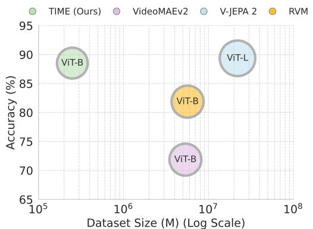

bubble

| Model | Dataset Size (M) (Log Scale) | Accuracy (%) |
| :--- | :--- | :--- |
| TIME (Ours) | 10^5 | 89 |
| VideoMAEv2 | 10^6 | 72 |
| V-JEPA 2 | 10^7 | 89 |
| RVM | 10^7 | 82 |
| ViT-B | 10^6 | 89 |

Figure 1: Model performance on SSv2 “Arrow of Time” task performance. Our TIME model achieves “appearance-free” action classification performance on-par with state-of-theart V-JEPA2 model despite using several magnitudes less pre-training data.

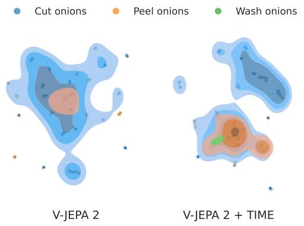

text_image

Cut onions
Peel onions
Wash onions
V-JEPA 2
V-JEPA 2 + TIME

Figure 2: UMAP plot (n\_components = 2) showing class separation for V-JEPA2 vs. concatenating V-JEPA2 and TIME, on frozen features of videos from the Ego-Exo4D dataset. Using TIME greatly improves the separation of similar fine-grained actions.

As a result, video models often struggle with a wide variety of temporal tasks (MotionBench [25], TempCompass [31], VideoMME [18], VLM4D [47]). In addition, recent work[6] suggests a performance plateau despite the use of larger and more diverse datasets and scaling laws.

In this paper we make the observation that these two issues in video can be addressed with a key tool: learning video representations from motion. In particular, we use the motion of a video, in the form of point-tracks (sparsely sampled) and use it as the only input modality to a masked-autencoder. The input tracks are masked, and the training objective is to reconstruct the missing tracks. Crucially, the model is trained exclusively on synthetic point trajectories from rigid-body physics simulations from Kubric [21], and has not seen any real-world video. The learned representation, which we call TIME (Temporally Informed Motion Embedding), can then be used for a variety of tasks in a zero-shot manner. In addition, it can be used as a complementary modality for appearance-based video models (e.g., VideoMAE [41], V-JEPA2 [2]). The benefits of TIME are twofold.

First, on temporal reasoning benchmarks (e.g., collision timing in CLEVRER, or recognition of temporal states in SSv2), TIME matches or outperforms state-of-the-art(e.g., V-JEPA2 [2], RVM [48], VideoMAEv2 [41]. In general video understanding benchmarks we also discover that the TIME representation is highly complementary to state-of-the-art video models as well as image models (e.g., DINOv3 [8]). When used together, the TIME features improve state-of-the-artperformance across the board, on several benchmarks (e.g., SSv2, Ego-Exo4D). This is particularly striking in fine-grained tasks within Ego-Exo4D, where the use of TIME improves performance up to 18%.

Second and crucially, learning from motion reduces the amount of data needed to train the model by up to 4 orders of magnitude (measured in hours of video training data), compared to the same state-of-the-artappearance-based video models. This reduction stems from several facts: 1) Motion can be learned from synthetic data as the domain gap between natural and synthetic motion is surprisingly small [14]. In other words, noise-less synthetic data allow models to converge faster than noisy real-world data. 2) Low-dimensional motion is more discriminative than low-dimensional images [12, 5]. This implies that motion can be represented as a sparser set of points (e.g., a 32 × 32 point trajectory grid) instead of a high-resolution equivalent $( \mathrm { e . g . , 2 5 6 \times 2 5 6 }$ pixel image) enabling more efficient training. 3) Learning strong temporal information within an appearance-based model is hard, as most training tasks can be solved relying heavily on appearance information, even when trained on extremely large amounts of data. Hence, separating the learning process of temporal information guarantees that the model cannot “cheat” by looking at pixel values or other appearance representations.

In summary, the proposed TIME video representation provides a novel, highly scalable and computeefficient paradigm for future research in video understanding.

# 2 Related Work

Self-Supervised Video Models. The first video models trained with large-scale datasets [28, 9] used classification supervision for training. While these models [9, 4] have worked well, they require large amounts of labeled training data, which is expensive to produce. In addition, the rise of “foundation models” in other domains such as language or image [8], that are designed to be used in a “zero-shot” fashion, without the need to fine-tune, has created increasing interest in self-supervised video models. Research in this area has led to a wide variety of pre-text tasks. Some works ( [39, 37]) have explored the use of spatial and temporal transformations, in combination with a contrastive learning paradigm where a video and a transformed copy should be represented as similar as possible. While this works well, the contrastive paradigm can be sensitive to the choice of negative pairs. In the search of more efficient video model pre-training, the notion of masked autoencoders (MAE) [23] in image domain have been adopted for self-supervised video model pre-training tasks as well. More precisely, works such as VideoMAE [41, 43] propose models that learn effective spatiotemporal representations by reconstructing masked portions of raw frame spatio-temporal patch tubes as their primary training objective. While such models achieve state-of-the-art results in some video understanding tasks, the very nature of such data modelling inherently biases the network to memorize high-frequency spatial details (textures, colors) rather than abstract motion. To address this issue, research works on learning efficient video representations include joint-embedding predictive architectures (JEPA) that forecast missing latent spatiotemporal regions [2]. Authors reason that such a model is no longer forced to to reconstruct exact pixels, therefore it is forced to learn high-level semantic and kinematic abstractions instead. However, despite pre-training on 114 years-equivalent of curated video data, such models severely underperform in physical understanding tasks [6] with evaluation performance being close to a random chance. While latest self-supervised learning works introduce an explicit sparse motion signal during full model pre-training as an effective way to encode temporal dynamics in the learned representations, the sparsity of the signal and the requirement to retrain the entire model from scratch hinders its applications further.

Challenges in Temporal Understanding. Learning temporal information has been a long-standing challenge for video research. Historically, video models have tended to have stronger image understanding than temporal understanding capabilities. There are potentially several reasons for this, one of which is the challenge of designing tasks that force models to learn temporal information, without resorting to image information alone [40]. Even designing benchmarks that allow us to measure temporal capabilities alone is not trivial. Several datasets [19, 30, 11] have tried to focus on actions where appearance carries limited information. Others have explored tasks that are action independent such as counting [17], skill determination [15], adverb prediction[16, 33], for tasks that are fairly object-independent such as the reasoning benchmark CLEVRER [45]. Overall, solving these remains an open problem, as for example the accuracy of top models on the rather “temporal” Somethingsomething dataset published in 2017, still only achieves values around 75%, while accuracy on the rather “appearance-based” Kinetics published the same year achieves around 90%.

In the new era of Multi-Modal Language Models (MLLMs), new challenges in temporal understanding have arisen. The key obstacles might be different now, and relate to the reliance of language in the learning objective, or to token dilution. Still, it has been noted that MLLMs notoriously struggle with understanding temporal concepts [42], and there have been a large variety of multi-modal benchmarks (TempCompass [31], MotionBench [24], TemporalBench [7], VideoMME [18], VLM4D [18]). All these efforts point out that temporal understanding is very much a one of the main challenges in video research today, across different technology paradigms.

Learning Motion Models from Synthetic Data. While learning from synthetic data might seem like a limiting choice due to sim-to-real domain gap, such limitation is significantly less restrictive for for temporal kinematics than it is for spatial appearance. In fact, there is a long history of learning motion from synthetic data that shows surprisingly good results. One of the first success stories was

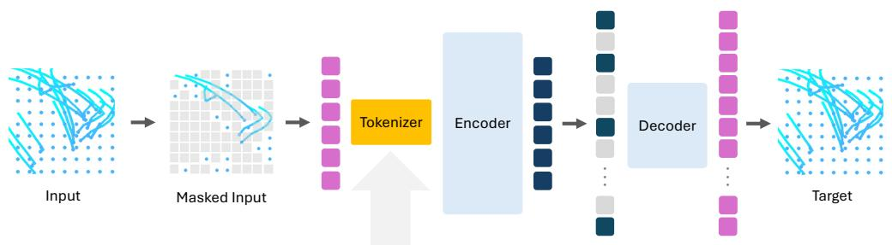

flowchart

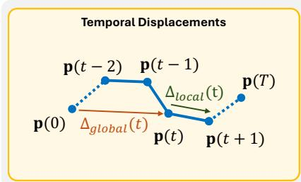

flowchart

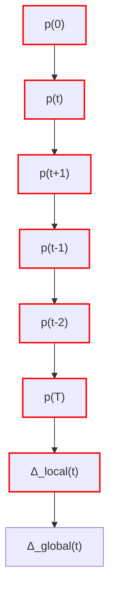

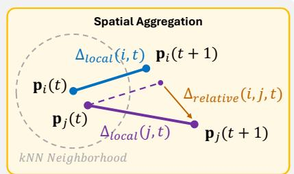

text_image

Spatial Aggregation
Δ_local(i,t) p_i(t+1)
p_i(t) Δ_local(j,t) p_j(t+1)
Δ_relative(i,j,t)
Δ_local(j,t) p_j(t+1)
kNN Neighborhood

Figure 3: TIME Architecture. Given a set of point trajectories, the model groups them into tubelets and encodes them into trajectory tokens using a tokenizer. During training, we mask 75% of the tokens and only the visible ones are passed through the encoder. A decoder then attempts to reconstruct the masked trajectory tokens from the encoder output. The training loss is computed only on the masked trajectories.

FlowNet [14], where an optical flow model was learned from a dataset called FlyingChairs, of 3D models of chairs moving around with an image background. Despite its lack of realism, training on this dataset was a breakthrough on what could be learned from purely synthetic data, which led to other work leveraging this insight [26]. In a different domain, point-tracking systems have also leveraged this. For example, state-of-the-art dense point tracker model CoTracker [27] is also primarily trained using synthetic data from a simulated environment [21] without loss of real-world generality. More recently, works in generative video modelling argue that current video model inability to model physics correctly arises from the overhead of generating pixels instead of motion, therefore, they rely on the very same synthetic Kubric environments and point tracking modules to obtain quasi-dense trajectories for the task of forecasting the future trajectories [5] from a single input image. Remarkably, coupled with a single-frame spatial context signal from DINO [8], such models surpass expensive generative video models.

However, these prior methods exclusively use synthetic data to solve low-level vision tasks (e.g., pixel displacement or point tracking). In this work, we go one step beyond to demonstrate that purely synthetic simulations can be used to learn high-level semantic video representations that are generalizable and directly transferable to real-world scenarios. While we initially presumed a realworld fine-tuning stage would be necessary to bridge the gap to complex human actions, surprisingly, our synthetic kinematic model transfers entirely zero-shot to real-world videos (e.g., SSv2 [19]). Operating out-of-the-box, it not only matches, but frequently outperforms and complements massively scaled, foundation video models.

# 3 Methods

Architecture Overview. We now describe the details of the proposed TIME architecture, which is illustrated in Fig. 3. Recall that the goal of this architecture is to learn a video representation that will capture the temporal content of the video. For this, we use a self-supervised training paradigm, which allows us to bypass the restrictions of learning from video captions. In particular, given the point tracks of a scene, sampled sparsely but in a grid, we mask a large set of them spatially (i.e., we mask the full point track, not just a portion or segment in time). We convert these point tracks to tokens, using a tokenization process to capture both spatial context of the tracks as well as local and global temporal information (details described below). These tokens are input to a masked-autoencoder, similar to previous work such as VideoMAE, composed by an encoder and decoder. This autoencoder is trained using the full set point tracks as target for the reconstruction. At inference time, given a video, we compute the point tracks over the entire scene using point tracking methods [27], and use them as input to the tokenizer, and in turn to the encoder. The resulting output from the encoder is a feature vector with strong capabilities to capture the temporal information of the scene. We now describe each of these components in detail.

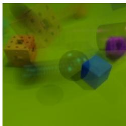

natural_image

Close-up of colorful 3D geometric shapes and spheres on a green background (no text or symbols)

Overlayed Frame Sequence

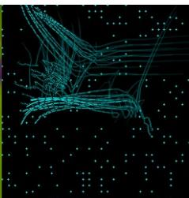

natural_image

Abstract wireframe illustration of a robotic arm with glowing nodes and connecting lines against a dark background (no text or symbols)

Masked Input Tracks

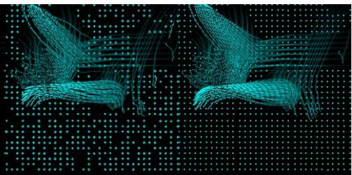

natural_image

Two stylized blue wireframe creatures on a black dotted grid background, no text or symbols present.

Estimated Tracks   
Ground Truth   
Figure 4: Sample Training Scene. Given the input tracks of a scene created with Kubric [21], the proposed architecture is able to fill in the gaps and estimates the masked tracks using a maskedautoencoder, with high fidelity.

From Point Tracks to Tokens. Our model operates over a grid of point tracks sampled uniformly. In our experiments, we use a grid of $3 2 \times 3 2$ point tracks, over a length of 24 frames. Therefore the input to our model is $N = \overline { { 1 0 2 4 } }$ points. Let $p _ { i } ( t ) = ( x , y )$ be the location in image coordinates of each of these points $p _ { i }$ at time t. For every point $p _ { i }$ we compute its corresponding token $s _ { i }$ (for segment) to include essential information that may be useful for reconstruction. First, we compute the local displacement of the point to the next time step, $\Delta _ { \mathrm { l o c a l } } ( i , t ) = p _ { i } ( t + 1 ) - p _ { i } ( t )$ . Note this is essential, as using as input absolute point locations instead of relative displacements leads to collapse during training. Another failure mode could be for the network to accumulate small errors over a point track, in the end leading to a poor estimate. To prevent this, we incorporate information in the tokens about the global displacement $\Delta _ { \mathrm { g l o b a l } } ( i , t ) = p _ { i } ( t ) - p _ { i } ( 0 )$ . This process is described in Fig. 3 in the “Temporal Displacements” box. Capturing spatial structure and geometry is also helpful for point track reconstruction, for example for establishing motion boundaries. To incorporate this information, we take inspiration from the literature in point cloud self-supervised learning [34]. In particular, for a given point in time $p _ { i } ( t )$ and its given local displacement $\Delta _ { \mathrm { l o c a l } } ( i , t )$ , we compute how much the displacements of the spatial neighborhood around $p _ { i }$ deviate from its local displacement. This process is described in Fig. 3, in the box “Spatial $\mathrm { \bf A g g r e g a t i o n ^ { \mathrm { * } } }$ . Specifically, given the K nearest neighbors $p _ { j } ( t )$ of anchor point $p _ { i } ( t )$ , we compute the relative displacement between each pair as $\Delta _ { \mathrm { r e l a t i v e } } ( i , \dot { j } , \dot { t } ) = p _ { j } ( t + 1 ) \dot { - } p _ { i } ( \dot { t } + \dot { 1 } )$ . We do max-pooling over the relative displacements, to obtain the maximum deviation ∆max-deviation(i, t), which will also be part of the token. In our experiments we use K = 16. Finally, we include an occlusion bit $o _ { i } ( t )$ , with information of whether point $p _ { i }$ is occluded or not. In summary, for point $p _ { i } ( t )$ , its corresponding token $s _ { i } ( t )$ is computed as:

$$
s _ {i} (t) = \left[ \Delta_ {\text { local }} (i, t), \Delta_ {\text { global }} (i, t), \Delta_ {\text { max - deviation }} (i, t), o _ {i} (t) \right]. \tag {1}
$$

Factorized Spatiotemporal Attention Backbone. Following the tokenization steps, we feed the resulting tokens into a model largely based on VideoMAE [41]. Our encoder and decoder contains 12 and 4 layers respectively. In addition, we factorize the attention to improve computational efficiency. More specifically, as the original ViT relies on full spatio-temporal attention, its time complexity is expensive at ${ \dot { O } } ( ( T \cdot S ) ^ { 2 } )$ . We leverage successful applications of factorized attention for point tracking [27] and image-to-trajectory forecasting [5], and factorize the attention mechanism as well. First, we compute spatial attention across all unmasked trajectory tokens within the same pair of frames. Next, we compute temporal attention across the time dimension for each individual trajectory. The resulting separation of spatial and temporal components reduces attention time complexity to $O ( T \cdot S ^ { 2 } + { \bf \breve { { S } } } \cdot { \bf \dot { { T } } } ^ { 2 } )$ leading to a five-fold reduction in training time.

Training Objective. The proposed model is trained to reconstruct masked trajectory tokens from visible context (Fig. 3). During training, we mask 75% of the spatial trajectory tokens and apply this mask across the entire temporal dimension. The encoder processes only the visible tokens and produces a representation of the video. The decoder then inserts learnable mask tokens for the missing trajectory positions and reconstructs the full sequence.

Loss Function. We employ the Huber loss ${ \mathcal { L } } _ { \mathrm { H u b e r } }$ (Smooth $L _ { 1 } )$ over masked tokens. We compute the loss of local and global displacements separately as they naturally have very different numerical values, and need to be weighted differently. We use a hyperameter $\lambda _ { \mathrm { g l o b a l } }$ to weight down the values of the global displacements $( \lambda = 0 . 5 )$ . The resulting loss target ensures a balance between local high-frequency kinematics and full temporal length-wide global motion:

$$
\mathcal {L} _ {\text { target }} (i) = \mathcal {L} _ {\text { Huber }} \left(\hat {\Delta} _ {\text { local }} (i), \Delta_ {\text { local }} (i)\right) + \lambda_ {\text { global }} \mathcal {L} _ {\text { Huber }} \left(\hat {\Delta} _ {\text { global }} (i), \Delta_ {\text { global }} (i)\right). \tag {2}
$$

The natural distribution of displacements is also highly imbalanced. Since most points (over 80% in the training data) are static, there is a risk that the model might predict everything as static. Hence, we also weigh non-static points with a higher weight ω, computed as:

$$
\omega (i) = \left\{ \begin{array}{l l} \gamma & \text { if } \| \Delta_ {\text { global }} (i) \| _ {2} > \tau \\ 1. 0 & \text { otherwise } \end{array} \right. \tag {3}
$$

where τ is a pre-defined static motion threshold $( \tau = 0 . 0 0 2 )$ , and $\gamma = 7 . 0$ represents the motion boost hyperparameter. The final reconstruction loss is calculated as the weighted average across all masked trajectory tokens:

$$
\mathcal {L} = \frac {1}{\sum_ {i} \omega^ {(i)}} \sum_ {i} \omega^ {(i)} \mathcal {L} _ {\text { target }} ^ {(i)}. \tag {4}
$$

Training Data. To train our model, we modify the Kubric simulation environment [21] to obtain a uniform grid of point trajectories. This choice has several advantages. First, it generates perfectly accurate and clean data, without noise from occlusions, or other errors that we would observe in real-world estimated point tracks. This helps the training procedure making it more stable and faster to converge. Second, using generated data allows us to speed up the generation of point tracks, as instead of estimated they are directly computed. We produce 250K videos using MOVi-B dataset generation pipeline consisting of scenes with static camera and a random number of geometric primitives and simple shapes colliding in the middle of the scene.

Training Details. Our largest TIME model is trained on 250k synthetic samples for 100 epochs, using 3 warm-up epochs with an effective batch size of 40. We set the learning rate to 1.5e-4 and use the AdamW optimizer with cosine annealing learning rate scheduling technique with a weight decay of 0.05. Training using 4 NVIDIA A100 80GB GPUs takes around 120 hours (≈ 5 days). Full training details can be found in the Appendix A.

# 4 Experimental Results

We evaluate the proposed representation to answer several questions. First, we test whether in fact TIME is able to capture temporal information that is general enough to succeed in a zero-shot task. To this end we re-purpose standard video datasets (SSv2 [19], CLEVRER [45]) to create tasks where appearance is not necessary, and motion carries all the information needed for the task. Section 4.2 describes the details of these experiments.

Second, for general visual tasks, we explore how well the TIME embedding complements other video models. For this we experiment on standard benchmarks (such as SSv2 [19], Ego-Exo4D [20], Diving48 [30]) using state-of-the-artvideo models and combining TIME features with them. Details are shown in Sec. 4.3.

Finally, in Sec. 4.4 we perform ablation studies to understand the behavior of TIME and what factors (such as dataset size, masking ratio, etc) affect results most.

# 4.1 Experimental Details

Datasets. We use a suite of standard, diverse datasets to evaluate TIME. We require these datasets to contain a good amount of temporal information, such that we are able to evaluate the capabilities † Denotes models whose pre-training data explicitly includes the SSv2 dataset.

Table 1: Temporal Tasks. Comparison of temporal directionality reasoning. Our purely kinematic model (TIME), trained exclusively on 140 hours of synthetic simulations, dramatically outperforms a size-matched RGB model (VideoMAEv2) and maintains high competitiveness against V-JEPA2, an architecture pre-trained on over 12, 000 times the real-world pre-training data. 

<table><tr><td></td><td>VideoMAEv2 $^{\dagger}$ [43]</td><td>RVM $^{\dagger}$ [48]</td><td>V-JEPA 2 $^{\dagger}$ [2]</td><td>TIME (Ours)</td></tr><tr><td>SSv2 (AoT)</td><td>71.87</td><td>81.88</td><td>89.36</td><td>88.53</td></tr><tr><td>CLEVRER (T1*)</td><td>77.73 ± 0.00</td><td>86.56 ± 1.17</td><td>92.64 ± 0.25</td><td>93.84 ± 0.37</td></tr><tr><td>CLEVRER (T2*)</td><td>33.33 ± 0.00</td><td>58.17 ± 2.57</td><td>58.92 ± 3.40</td><td>74.95 ± 7.06</td></tr><tr><td>CLEVRER (T3*)</td><td>36.69 ± 0.06</td><td>59.10 ± 0.68</td><td>77.84 ± 1.84</td><td>61.35 ± 3.33</td></tr><tr><td>Modality</td><td>224×224 Video</td><td>224×224 Video</td><td>256×256 Video</td><td>32×32 Tracks</td></tr><tr><td>Size</td><td>ViT-B</td><td>ViT-B</td><td>ViT-L</td><td>ViT-B</td></tr><tr><td>Dataset</td><td>Real-World</td><td>Real-World</td><td>Real-World</td><td>Synthetic</td></tr><tr><td>Training Samples</td><td>5.36M (27×)</td><td>5.68M (23×)</td><td>22M (88×)</td><td>0.25M (1×)</td></tr><tr><td>Video Hours Eq.</td><td>≈7,500 (54×)</td><td>≈0.25M (1,785×)</td><td>≈1.73M (12,357×)</td><td>140 (1×)</td></tr></table>

∗ T1: Does a collision happen? T2: When does the first collision happen? T3: Number of collisions

of different models. In particular we use: Something-Something-V2 (SSv2) [19], CLEVRER [45], Diving48 [30] and Ego-Exo4D [20], but only use the Exo part as we train exclusively on data with static camera. We report average accuracy as well as the standard deviation of 5 separate runs.

Baselines. As baseline comparisons we choose several video representations. We use VideoMAEv2 [41] as the architecture that the proposed embedding is most closely related. This allows us to make comparisons across modalities for comparable architectures. We also use V-JEPA2 [2] and RVM [48] as representatives of state-of-the-art in self-supervised video representations.

# 4.2 TIME for Temporal Reasoning

Description of Temporal Tasks. Standard video understanding benchmarks often combine spatial and temporal information. Hence, it is difficult to strictly test the temporal capabilities of a model. Here we re-purpose 2 existing benchmarks (SSv2 [19] and CLEVRER [45]) to design tasks that can be solved with temporal information alone. This will allow us to directly compare the temporal capabilities of video models.

We use the Something-Something dataset (SSv2 [19]). While this dataset was originally created to focus on temporal information, there are many classes that indeed require appearance information to be identified, such as “Moving something up” vs. “Moving something down”. Thus, we select 14 pairs of classes that have directional labels, such as “Moving something up” vs. “Moving something down”. This subset of a total of 28 classes, consists of 43,583 videos from the training set and 5,859 videos from the validation set. The task is to classify each pair using frozen features and a linear classifier. We average the accuracy across the 14 binary classifiers. We refer to this task as “Arrow of Time” borrowing the name from previous work [35]. Results are shown in Table 1, in the row “SSv2 (AoT)”.

We also use the CLEVRER [45] dataset. This dataset is also designed to focus on temporal reasoning, but its question-answering would potentially involve the use of a multi-modal model, which could complicate the process of strictly measuring temporal abilities. Instead, we use the meta-data present in the videos to design three tasks: Task 1, Classification (“Does a collision happen?”); Task 2, Detection (“When does the first collision happen?”); Task 3, Counting (“What is the number of collisions?”). Each task is evaluated on the full dataset containing 10,000 training and 5,000 validation videos. The task is similar to before, to use frozen features to train a linear classifier or regressor. Results are shown in Table 1.

Results. The experiments show a surprising finding. TIME has been trained only on synthetic data and on orders of magnitude less data than state-of-the-artmodels, while those models have been trained on real data, which includes for example the SSv2 dataset. Concretely, compared to the

Table 2: Results on SSv2 of combining TIME with other video representations. We concatenate frozen features of TIME and standard video and image representations, and use a linear classifier on the full SSv2 dataset. Standalone model performance is available in appendix C. 

<table><tr><td>Model Strategy</td><td>Top-1 Acc (%)</td><td>Top-5 Acc (%)</td><td> $\Delta$  Top-1 w/ TIME</td></tr><tr><td>TIME + CLIP (4f)</td><td>31.56  $\pm$  0.05</td><td>58.90  $\pm$  0.07</td><td>+13.00</td></tr><tr><td>TIME + DINOv3 (4f)</td><td>34.60  $\pm$  0.10</td><td>62.94  $\pm$  0.11</td><td>+12.65</td></tr><tr><td>TIME + VideoMAEv2 $^{\dagger}$ </td><td>38.74  $\pm$  0.09</td><td>68.57  $\pm$  0.08</td><td>+5.69</td></tr><tr><td>TIME + RVM $^{\dagger}$ </td><td>41.92  $\pm$  0.06</td><td>71.26  $\pm$  0.14</td><td>+1.84</td></tr><tr><td>TIME + V-JEPA 2 $^{\dagger}$ </td><td>50.00  $\pm$  0.10</td><td>78.42  $\pm$  0.16</td><td>+0.22</td></tr></table>

† Denotes models whose pre-training data explicitly includes the SSv2 dataset.

V-JEPA2 model which is the most expensive to train, the comparison is remarkable, 140 hours of simulations vs. 200 years of real-world video respectively. Yet, TIME performs on par or even surpasses the other self-supervised video models in temporal understanding. For the detection task in particular, the proposed TIME has a gap of over 15% over V-JEPA2. This is an interesting finding that suggests that despite training scale, current video model training paradigms might overly rely on visual appearance cues, hindering them from learning temporal structure. Instead, TIME is forced to learn a strong kinematic representation, which shows excellent generalization abilities, even to unseen tasks, and real-world data.

# 4.3 TIME for General Visual Understanding

Description of General Visual Tasks. We now explore the use of the proposed embedding for general visual tasks, that require both spatial and temporal information. Our goal here is to test the ability of the proposed embedding to provide additional information to standard, appearance-based, video models. To this end, we use linear probing of the features as follows: given the frozen features of two models, the task is to do classification using the two feature vectors concatenated and a linear classifier.

We test on the SSv2 dataset in the standard form with all the 174 classes/ Results are shown in Table 2. We also use two other standard benchmarks: Diving48 [30] and Ego-Exo4D [20]. For Diving48, we employ the full dataset (16,997 videos) split into 15,027 training and 1,970 validation videos. For Ego-Exo4D, we take two distinct subsets of data from “Bike Repair” and “Cooking” scenes. We extract all action snippets from the aforementioned scenes containing the best ‘Exo’ camera view as labeled in the metadata. We include all actions between 0.5s and 5.0s in length. If an action snippet is longer than 5.0s, we center crop these action snippets temporally to capture the most representative portion of the video. The resulting “Bike Repair” set contains 1,735 training and 433 validation samples across 80 classes. The “Cooking” subset contains 18,661 training and 4,665 validation videos across 483 action labels. Results are shown in Table 3.

Results. We observe that TIME provides performance gains across datasets and models, showing that it is very much providing complementary information. These gains are particularly impressive in the Cooking section of Ego-Exo4D, where TIME improves the performance of V-JEPA2 close to 14%. This suggest that TIME might be particularly useful for smaller, non-rigid motions. This is a particularly remarkable result because TIME has been trained on orders of magnitude less data than the other models and because it was solely trained on synthetic data. This result suggests that training image representations and temporal representations independently may be an interesting solution to prevent models from overly relying on appearance information to solve the training tasks.

# 4.4 Ablation Study of TIME

We now measure the effect of different aspects of the model on the performance and show the results in Fig. 5. For this we use the “Arrow of Time” task on SSv2 from Sec. 4.2. We observe that the results are rather stable with respect to most parameters. These include: varying the masking ratio during training time; augmenting data using synthetic camera motion (this is, not using the full Kubric pipeline, but simply adding panning to the point tracks); and fine-tuning on 50K videos of SSv2 on the self-supervised task. We observe that the masking ratio and data augmentation have a slight negative effect, while the pre-training on SSv2 have a slight positive effect. We also explore the effect of scaling data and observe that by far it has the strongest effect on performance. Multiplying the amount of training data by 5 yields a 5.4% improvement, which is quite significant and suggests we have not yet exhausted the potential of the proposed architecture, and hence future work would benefit from exploring scaling training data even further.

Table 3: Results of Combining TIME with other video representations on Diving48 and the Exo section of Ego-Exo4D. Standalone model performance is available in appendix D. 

<table><tr><td rowspan="2">Model Strategy</td><td colspan="2">Cooking (Ego-Exo4D)</td><td colspan="2">Bike Repair (Ego-Exo4D)</td><td colspan="2">Diving48</td></tr><tr><td>Top-1 (± Std %)</td><td>Δ</td><td>Top-1 (± Std %)</td><td>Δ</td><td>Top-1 (± Std %)</td><td>Δ</td></tr><tr><td>TIME + CLIP (4f)</td><td>43.27 ± 0.29</td><td>+17.28</td><td>19.31 ± 0.34</td><td>+3.46</td><td>16.11 ± 0.28</td><td>+2.14</td></tr><tr><td>TIME + DINOv3 (4f)</td><td>43.27 ± 0.28</td><td>+18.01</td><td>20.69 ± 0.31</td><td>+5.07</td><td>18.08 ± 0.21</td><td>+1.73</td></tr><tr><td>TIME + VideoMAEv2</td><td>55.74 ± 0.29</td><td>+12.78</td><td>29.03 ± 0.78</td><td>+1.33</td><td>24.97 ± 0.24</td><td>+0.73</td></tr><tr><td>TIME + RVM</td><td>39.66 ± 0.19</td><td>+14.56</td><td>23.04 ± 0.58</td><td>+0.28</td><td>11.74 ± 0.11</td><td>+2.53</td></tr><tr><td>TIME + V-JEPA 2</td><td>48.52 ± 0.14</td><td>+13.96</td><td>26.68 ± 0.27</td><td>-2.17</td><td>30.04 ± 0.15</td><td>-0.04</td></tr></table>

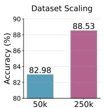

bar

| Dataset Scaling | Accuracy (%) |
| --------------- | ------------ |
| 50k             | 82.98        |
| 250k            | 88.53        |

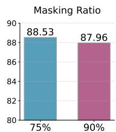

bar

Masking Ratio
| Category | Masking Ratio |
| :--- | :--- |
| 75% | 88.53 |
| 90% | 87.96 |

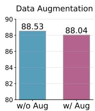

bar

| Group    | Value  |
| -------- | ------ |
| w/o Aug  | 88.53  |
| w/ Aug   | 88.04  |

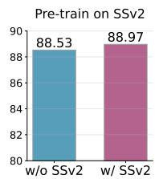

bar

| Group     | Pre-train |
| --------- | --------- |
| w/o SSv2  | 88.53     |
| w/ SSv2   | 88.97     |

Figure 5: Ablation study of TIME on the “Arrow of Time” task. We find that scaling the model from 50k to 250k Kubric samples leads to significant performance gains. Very high masking ratios (e.g., 90% masking used in pixel-based video models) lead to worse performance likely due to point trajectories containing less redundant information than pixels. Simple data augmentation techniques (e.g., simulated camera zoom or panning effect via matrix operations on trajectory grids) do not lead to improved performance. We also experiment with a second stage pre-training on SSv2 (i.e., trajectories extracted using CoTracker3) for 30 epochs leading to a minor performance improvement.

# 5 Limitations

In this paper we have shown the surprising power of training on motion information to learn video representations efficiently. We consider this work a stepping stone for several lines of future work that include the following. First, this model focuses on temporal information alone, and the integrations we have done with other appearance-based models are straightforward (e.g., in the form of concatenation). Fully integrating the TIME representation into an appearance-based model, while maintaining the temporal separation that has proved so advantageous will be a promising area of research. Second, this model at inference time relies on point-tracking techniques. While recent research [27] has made them faster and more accurate, they might still introduce errors in fast-moving or blurry regions. Integrating this embedding with a point-tracking system or using other motion representations will also be a very promising direction.

# 6 Conclusion

We have presented a self-supervised model called TIME to learn video representations, based purely on temporal information in the form of point tracks. We have shown that learning video representation from motion alone has two core benefits. First, the model can learn to solve temporal tasks extremely well, on par or even surpassing state-of-the-art models trained on up to 4 orders of magnitude more data. Indeed, learning motion patterns proves to be extremely data-efficient, even compared to a very similar pixel-based architecture. Second, we have shown that this temporal model can be combined with appearance features, providing considerable improvements over using appearance alone on a wide range of tasks. We hope this model can be useful to the video research community either on its own for purely temporal tasks or as an add-on, easy to train model, that provides fundamental temporal information for perception.

# Acknowledgments and Disclosure of Funding

This work was supported by the Edinburgh International Data Facility (EIDF) and the Data-Driven Innovation Programme at the University of Edinburgh and the Engineering and Physical Sciences Research Council and a UK government partner [EP/Y013859/1].

# References

[1] Sami Abu-El-Haija, Nisarg Kothari, Joonseok Lee, Paul Natsev, George Toderici, Balakrishnan Varadarajan, and Sudheendra Vijayanarasimhan. Youtube-8m: A large-scale video classification benchmark, 2016. URL https://arxiv.org/abs/1609.08675.   
[2] Mahmoud Assran et al. V-jepa 2: Self-supervised video models enable understanding, prediction and planning. arXiv preprint arXiv:2506.09985, 2025.   
[3] Max Bain, Arsha Nagrani, Gül Varol, and Andrew Zisserman. Frozen in time: A joint video and image encoder for end-to-end retrieval. In Proceedings of the IEEE/CVF International Conference on Computer Vision (ICCV), pages 1728–1738, October 2021.   
[4] Gedas Bertasius, Heng Wang, and Lorenzo Torresani. Is space-time attention all you need for video understanding? In ICML, 2021.   
[5] Gabrijel Boduljak, Laurynas Karazija, Iro Laina, Christian Rupprecht, and Andrea Vedaldi. What happens next? anticipating future motion by generating point trajectories. arXiv preprint arXiv:2509.21592, 2025.   
[6] Florian Bordes, Quentin Garrido, Justine T Kao, Adina Williams, Michael Rabbat, and Emmanuel Dupoux. Intphys 2: Benchmarking intuitive physics understanding in complex synthetic environments, 2025. URL https://arxiv.org/abs/2506.09849.   
[7] Mu Cai, Reuben Tan, Jianrui Zhang, Bocheng Zou, Kai Zhang, Feng Yao, Fangrui Zhu, Jing Gu, Yiwu Zhong, Yuzhang Shang, Yao Dou, Jaden Park, Jianfeng Gao, Yong Jae Lee, and Jianwei Yang. Temporalbench: Benchmarking fine-grained temporal understanding for multimodal video models, 2024. URL https://arxiv.org/abs/2410.10818.   
[8] Mathilde Caron, Hugo Touvron, Ishan Misra, Hervé Jégou, Julien Mairal, Piotr Bojanowski, and Armand Joulin. Emerging properties in self-supervised vision transformers. In Proceedings of the International Conference on Computer Vision (ICCV), 2021.   
[9] Joao Carreira and Andrew Zisserman. Quo vadis, action recognition? a new model and the kinetics dataset. In Proceedings of the IEEE Conference on Computer Vision and Pattern Recognition (CVPR), pages 6299–6308, 2017.   
[10] Joao Carreira, Eric Noland, Chloe Hillier, and Andrew Zisserman. A short note on the kinetics-700 human action dataset, 2022. URL https://arxiv.org/abs/1907.06987.   
[11] Wei-Yi Chen, Yi-Ling Lin, Yu-An Su, Wei-Hsin Yeh, and Lun-Wei Ku. Yourskatingcoach: A figure skating video benchmark for fine-grained element analysis. ArXiv, abs/2410.20427, 2024. URL https://api.semanticscholar.org/CorpusID:273654721.   
[12] Willem Davison, Xinyue Hao, and Laura Sevilla-Lara. It’s a matter of time: Three lessons on long-term motion for perception, 2026. URL https://arxiv.org/abs/2602.14705.   
[13] Jia Deng, Wei Dong, Richard Socher, Li-Jia Li, Kai Li, and Li Fei-Fei. Imagenet: A largescale hierarchical image database. In 2009 IEEE conference on computer vision and pattern recognition, pages 248–255. Ieee, 2009.   
[14] Alexey Dosovitskiy, Philipp Fischer, Eddy Ilg, Philip Hausser, Caner Hazirbas, Vladimir Golkov, Patrick van der Smagt, Daniel Cremers, and Thomas Brox. Flownet: Learning optical flow with convolutional networks. In Proceedings of the IEEE International Conference on Computer Vision (ICCV), December 2015.

[15] Hazel Doughty, Dima Damen, and Walterio Mayol-Cuevas. Who’s better? who’s best? pairwise deep ranking for skill determination. In Proceedings of the IEEE conference on computer vision and pattern recognition, pages 6057–6066, 2018.   
[16] Hazel Doughty, Ivan Laptev, Walterio Mayol-Cuevas, and Dima Damen. Action modifiers: Learning from adverbs in instructional videos. In Proceedings of the IEEE/CVF Conference on Computer Vision and Pattern Recognition, pages 868–878, 2020.   
[17] Debidatta Dwibedi, Yusuf Aytar, Jonathan Tompson, and Andrew Zisserman. Ovr: A dataset for open vocabulary temporal repetition counting in videos, 2024. URL https://arxiv.org/ abs/2407.17085.   
[18] Kunchang Fu, Zhenjiang Dai, Jianwei Guo, Yinan He, Yuqi Zuo, Chao Chen, Ziyue Yu, Yuxia Li, Zhe Chen, Zhaoyang Liu, Hao Wang, Yang Fang, Jianing Liu, Jiaming Hao, Bingkun Jiang, Dapeng Chen, Yucheng Zhao, Zhenyu Wang, Siyu Chen, Rui Qian, Ruihang Xie, Yiming Chen, Shunqi Yao, Yongting Sun, Zhiyi Deng, Mingjie Wang, Liangyu Chen, Tingyu Qu, Sizhe Wang, Shuailei Ma, Tiantian Liang, Shuo Liu, Zhaoguang Wang, Kairui Hu, Yichun Li, Binjie Luo, Zining Gao, Falin Gao, Liang Qin, Rui Wang, Chunlei Liu, Chuang Liu, Yuluo Li, Yongqi Wang, Jinsheng Zhang, Fugen Zhou, Yunan Li, Zhiyi Li, Pengju Li, Heeseung Bang, Hojun Park, Kwanghyun Kim, Rujie Liu, Jiyun Liu, Shengwei Zhao, Zheyi Shen, Zhaoyang Guo, Chaoqi Wang, Guoqiang Liang, Jiansheng Wei, Lei Yang, Tianlong Ye, Lichao Sun, Hao Feng, Jiahao Fan, Shuangrui Wang, Zhen Wang, Kuan Wei, Guohao Li, Yian Zhao, Yuyuan Wang, Chao Li, Bo Li, Qinglong Tang, Mengda Gao, Shuo Wu, Fuxin Yang, Zixian Ma, Rongxin Zhang, Zhiqiang Shen, Hengshuang Zhao, Shengju Qian, Yangyang Zhao, Keda Lin, Yue Wang, Sheng Guo, Tengfei Zuo, Jie Yang, Kaisheng Ma, Junjie Hu, Yuzhe Gu, Yuxuan Liang, Chenghua Lin, Wenyu Sun, Bowei He, Xingyi Li, Zixuan Wang, Ziyan Gao, Jianzhuang Liu, Yinpeng Chen, Xiaogang Wang, Yu Qiao, and Jing Shao. Video-mme: The first-ever comprehensive evaluation benchmark of multi-modal LLMs in video analysis. In CVPR. Computer Vision Foundation / IEEE, 2025. URL https://openaccess.thecvf.com/content/CVPR2025/ html/Fu\_Video-MME\_The\_First-Ever\_Comprehensive\_Evaluation\_Benchmark\_of\_ Multi-modal\_LLMs\_in\_CVPR\_2025\_paper.html.   
[19] Raghav Goyal, Samira Ebrahimi Kahou, Vincent Michalski, Joanna Materzynska, Susanne Westphal, Heuna Kim, Valentin Haenel, Ingo Frund, Peter Yianilos, Moritz Mueller-Freitag, et al. The "something something" video database for learning and evaluating visual common sense. In Proceedings of the IEEE international conference on computer vision, pages 5842–5850, 2017.   
[20] Kristen Grauman, Andrew Westbury, Lorenzo Torresani, Kris Kitani, Jitendra Malik, Triantafyllos Afouras, Kumar Ashutosh, Vijay Baiyya, Siddhant Bansal, Bikram Boote, Eugene Byrne, Zach Chavis, Joya Chen, Feng Cheng, Fu-Jen Chu, Sean Crane, Avijit Dasgupta, Jing Dong, Maria Escobar, Cristhian Forigua, Abrham Gebreselasie, Sanjay Haresh, Jing Huang, Md Mohaiminul Islam, Suyog Jain, Rawal Khirodkar, Devansh Kukreja, Kevin J Liang, Jia-Wei Liu, Sagnik Majumder, Yongsen Mao, Miguel Martin, Effrosyni Mavroudi, Tushar Nagarajan, Francesco Ragusa, Santhosh Kumar Ramakrishnan, Luigi Seminara, Arjun Somayazulu, Yale Song, Shan Su, Zihui Xue, Edward Zhang, Jinxu Zhang, Angela Castillo, Changan Chen, Xinzhu Fu, Ryosuke Furuta, Cristina Gonzalez, Prince Gupta, Jiabo Hu, Yifei Huang, Yiming Huang, Weslie Khoo, Anush Kumar, Robert Kuo, Sach Lakhavani, Miao Liu, Mi Luo, Zhengyi Luo, Brighid Meredith, Austin Miller, Oluwatumininu Oguntola, Xiaqing Pan, Penny Peng, Shraman Pramanick, Merey Ramazanova, Fiona Ryan, Wei Shan, Kiran Somasundaram, Chenan Song, Audrey Southerland, Masatoshi Tateno, Huiyu Wang, Yuchen Wang, Takuma Yagi, Mingfei Yan, Xitong Yang, Zecheng Yu, Shengxin Cindy Zha, Chen Zhao, Ziwei Zhao, Zhifan Zhu, Jeff Zhuo, Pablo Arbelaez, Gedas Bertasius, David Crandall, Dima Damen, Jakob Engel, Giovanni Maria Farinella, Antonino Furnari, Bernard Ghanem, Judy Hoffman, C. V. Jawahar, Richard Newcombe, Hyun Soo Park, James M. Rehg, Yoichi Sato, Manolis Savva, Jianbo Shi, Mike Zheng Shou, and Michael Wray. Ego-exo4d: Understanding skilled human activity from first- and third-person perspectives, 2024. URL https://arxiv.org/abs/2311.18259.   
[21] Klaus Greff, Francois Belletti, Lucas Beyer, Carl Doersch, Yilun Du, Daniel Duckworth, David J Fleet, Dan Gnanapragasam, Florian Golemo, Charles Herrmann, Thomas Kipf, Abhijit Kundu, Dmitry Lagun, Issam Laradji, Hsueh-Ti (Derek) Liu, Henning Meyer, Yishu Miao, Derek

Nowrouzezahrai, Cengiz Oztireli, Etienne Pot, Noha Radwan, Daniel Rebain, Sara Sabour, Mehdi S. M. Sajjadi, Matan Sela, Vincent Sitzmann, Austin Stone, Deqing Sun, Suhani Vora, Ziyu Wang, Tianhao Wu, Kwang Moo Yi, Fangcheng Zhong, and Andrea Tagliasacchi. Kubric: a scalable dataset generator. 2022.   
[22] Chunhui Gu, Chen Sun, David A. Ross, Carl Vondrick, Caroline Pantofaru, Yeqing Li, Sudheendra Vijayanarasimhan, George Toderici, Susanna Ricco, Rahul Sukthankar, Cordelia Schmid, and Jitendra Malik. Ava: A video dataset of spatio-temporally localized atomic visual actions, 2018. URL https://arxiv.org/abs/1705.08421.   
[23] Kaiming He, Xinlei Chen, Saining Xie, Yanghao Li, Piotr Dollár, and Ross Girshick. Masked autoencoders are scalable vision learners, 2021. URL https://arxiv.org/abs/2111.06377.   
[24] Wenyi Hong, Yean Cheng, Zhuoyi Yang, Weihan Wang, Lefan Wang, Xiaotao Gu, Shiyu Huang, Yuxiao Dong, and Jie Tang. Motionbench: Benchmarking and improving fine-grained video motion understanding for vision language models. In Proceedings of the IEEE/CVF Conference on Computer Vision and Pattern Recognition (CVPR), pages 8450–8460, June 2025.   
[25] Wenyi Hong, Yean Cheng, Zhuoyi Yang, Weihan Wang, Lefan Wang, Xiaotao Gu, Shiyu Huang, Yuxiao Dong, and Jie Tang. Motionbench: Benchmarking and improving fine-grained video motion understanding for vision language models. In Proceedings of the IEEE/CVF Conference on Computer Vision and Pattern Recognition (CVPR), pages 8450–8460, June 2025.   
[26] Hsin-Ping Huang, Charles Herrmann, Junhwa Hur, Erika Lu, Kyle Sargent, Austin Stone, Ming-Hsuan Yang, and Deqing Sun. Self-supervised autoflow. In CVPR, 2023.   
[27] Nikita Karaev, Iurii Makarov, Jianyuan Wang, Natalia Neverova, Andrea Vedaldi, and Christian Rupprecht. Cotracker3: Simpler and better point tracking by pseudo-labelling real videos. In Proc. arXiv:2410.11831, 2024.   
[28] Andrej Karpathy, George Toderici, Sanketh Shetty, Thomas Leung, Rahul Sukthankar, and Li Fei-Fei. Large-scale video classification with convolutional neural networks. In Proceedings of the IEEE Conference on Computer Vision and Pattern Recognition (CVPR), pages 1725–1732, 2014.   
[29] Kunchang Li, Yali Wang, Yinan He, Yizhuo Li, Yi Wang, Limin Wang, and Yu Qiao. Uniformerv2: Spatiotemporal learning by arming image vits with video uniformer, 2022.   
[30] Yansong Li, Jie Song, Yong Li, Min Liu, Xiaojie Guo, and Zheng-Jun Zha. Diving-48: A large-scale fine-grained video dataset for fine-grained action recognition. In Proceedings of the IEEE/CVF Conference on Computer Vision and Pattern Recognition (CVPR), pages 5574–5583, 2021.   
[31] Yuanxin Liu, Shicheng Li, Yi Liu, Yuxiang Wang, Shuhuai Ren, Lei Li, Sishuo Chen, Xu Sun, and Lu Hou. Tempcompass: Do video llms really understand videos? arXiv preprint arXiv: 2403.00476, 2024.   
[32] Antoine Miech, Dimitri Zhukov, Jean-Baptiste Alayrac, Makarand Tapaswi, Ivan Laptev, and Josef Sivic. Howto100m: Learning a text-video embedding by watching hundred million narrated video clips, 2019. URL https://arxiv.org/abs/1906.03327.   
[33] Davide Moltisanti, Frank Keller, Hakan Bilen, and Laura Sevilla-Lara. Learning action changes by measuring verb-adverb textual relationships. In Proceedings of the IEEE/CVF Conference on Computer Vision and Pattern Recognition (CVPR), pages 23110–23118, June 2023.   
[34] Yatian Pang, Wenxiao Wang, Francis E. H. Tay, Wei Liu, Yonghong Tian, and Li Yuan. Masked autoencoders for point cloud self-supervised learning, 2022. URL https://arxiv.org/abs/ 2203.06604.   
[35] Lyndsey Pickup, Zheng Pan, Donglai Wei, Yichang Shih, Andrew Zisserman, William T Freeman, and Bernhard Schölkopf. Seeing the arrow of time. In Proceedings of the IEEE Conference on Computer Vision and Pattern Recognition (CVPR), pages 2035–2042, 2014.

[36] Alec Radford, Jong Wook Kim, Chris Hallacy, Aditya Ramesh, Gabriel Goh, Sandhini Agarwal, Girish Sastry, Amanda Askell, Pamela Mishkin, Jack Clark, Gretchen Krueger, and Ilya Sutskever. Learning transferable visual models from natural language supervision. In Marina Meila and Tong Zhang, editors, Proceedings of the 38th International Conference on Machine Learning, volume 139 of Proceedings of Machine Learning Research, pages 8748–8763. PMLR, 18–24 Jul 2021. URL https://proceedings.mlr.press/v139/radford21a.html.   
[37] Kanchana Ranasinghe, Muzammal Naseer, Salman Khan, Fahad Shahbaz Khan, and Michael S. Ryoo. Self-supervised video transformer. In Proceedings of the IEEE/CVF Conference on Computer Vision and Pattern Recognition (CVPR), pages 2874–2884, June 2022.   
[38] Esteban Real, Jonathon Shlens, Stefano Mazzocchi, Xin Pan, and Vincent Vanhoucke. Youtubeboundingboxes: A large high-precision human-annotated data set for object detection in video, 2017. URL https://arxiv.org/abs/1702.00824.   
[39] Adrià Recasens, Pauline Luc, Jean-Baptiste Alayrac, Luyu Wang, Florian Strub, Corentin Tallec, Mateusz Malinowski, Viorica Patr ˘ aucean, Florent Altché, Michal Valko, Jean-Bastien ˘ Grill, Aäron van den Oord, and Andrew Zisserman. Broaden your views for self-supervised video learning. In Proceedings of the IEEE/CVF International Conference on Computer Vision (ICCV), pages 1255–1265, October 2021.   
[40] Laura Sevilla-Lara, Shengxin Zha, Zhicheng Yan, Vedanuj Goswami, Matt Feiszli, and Lorenzo Torresani. Only time can tell: Discovering temporal data for temporal modeling. In Proceedings of the IEEE/CVF Winter Conference on Applications of Computer Vision (WACV), pages 535–544, January 2021.   
[41] Zhan Tong, Yibing Song, Jue Wang, and Limin Wang. Videomae: Masked autoencoders are data-efficient learners for self-supervised video pre-training. In Advances in Neural Information Processing Systems (NeurIPS), 2022.   
[42] Ujjwal Upadhyay, Mukul Ranjan, Zhiqiang Shen, and Mohamed Elhoseiny. Time blindness: Why video-language models can’t see what humans can?, 2025. URL https://arxiv.org/ abs/2505.24867.   
[43] Limin Wang, Bingkun Huang, Zhiyu Zhao, Zhan Tong, Yinan He, Yi Wang, Yali Wang, and Yu Qiao. Videomae v2: Scaling video masked autoencoders with dual masking, 2023. URL https://arxiv.org/abs/2303.16727.   
[44] Junbin Xiao, Xindi Shang, Angela Yao, and Tat-Seng Chua. Next-qa: Next phase of questionanswering to explaining temporal actions. In Proceedings of the IEEE/CVF conference on computer vision and pattern recognition, pages 9777–9786, 2021.   
[45] Kexin Yi, Chuang Gan, Yunzhu Li, Pushmeet Kohli, Jiajun Wu, Joshua Tenenbaum, and Antonio Torralba. Clevrer: Collision events for video representation and reasoning. In International Conference on Learning Representations (ICLR), 2020.   
[46] Rowan Zellers, Jiasen Lu, Ximing Lu, Youngjae Yu, Yanpeng Zhao, Mohammadreza Salehi, Aditya Kusupati, Jack Hessel, Ali Farhadi, and Yejin Choi. Merlot reserve: Multimodal neural script knowledge through vision and language and sound. In CVPR, 2022.   
[47] Shijie Zhou, Alexander Vilesov, Xuehai He, Ziyu Wan, Shuwang Zhang, Aditya Nagachandra, Di Chang, Dongdong Chen, Xin Eric Wang, and Achuta Kadambi. Vlm4d: Towards spatiotemporal awareness in vision language models. arXiv preprint arXiv:2508.02095, 2025.   
[48] Daniel Zoran, Nikhil Parthasarathy, Yi Yang, Drew A Hudson, Joao Carreira, and Andrew Zisserman. Recurrent video masked autoencoders, 2025. URL https://arxiv.org/abs/ 2512.13684.

# A TIME Model Training

In this section we provide more extensive details of our model training. We report the numbers that were used to train the TIME model on 250, 000 synthetic Kubric MOVi-B samples. More information regarding hyperparameters can be found in Table 4.

To repeat all the evaluation experiments (including feature extraction from pre-trained video model baselines and use of tracking software) in this paper, we estimate it would take <100 GPU hours.

Table 4: TIME Pre-training Hyperparameters. Our 250K model is trained for 100 epochs. Training on 4×A100 80GB GPUs lasts ≈ 5 days (≈700 GPU hours). 

<table><tr><td>Parameter</td><td>Value</td></tr><tr><td>Number of frames</td><td>24</td></tr><tr><td>Frames per Second</td><td>12.0</td></tr><tr><td>Crop Size</td><td>256</td></tr><tr><td>Sampling Rate</td><td>1</td></tr><tr><td>Grid Size (track points)</td><td>32 × 32</td></tr><tr><td>Number of Track Points</td><td>1024</td></tr><tr><td>Tubelet Size</td><td>2</td></tr><tr><td>Token Count per Sample</td><td>12,288</td></tr><tr><td>Mask Ratio</td><td>0.75</td></tr><tr><td>Visible Tokens</td><td>~1,230 (25%)</td></tr><tr><td>Encoder Depth</td><td>12</td></tr><tr><td>Decoder Depth</td><td>4</td></tr><tr><td>k-Nearest Neighbors</td><td>16</td></tr><tr><td>Loss Type</td><td>Huber ( $\beta = 0.5$ )</td></tr><tr><td>Motion Loss Boost</td><td>7.0</td></tr><tr><td>Epochs</td><td>100</td></tr><tr><td>Warmup Epochs</td><td>3</td></tr><tr><td>Batch Size (per GPU)</td><td>10</td></tr><tr><td>Batch Size (global, 4×GPUs)</td><td>40</td></tr><tr><td>Starting Learning Rate</td><td> $1.5 \times 10^{-4}$ </td></tr><tr><td>Final Learning Rate</td><td> $1.0 \times 10^{-6}$ </td></tr><tr><td>Weight Decay</td><td>0.05</td></tr><tr><td>Drop Path</td><td>0.1</td></tr><tr><td>Clip Gradient</td><td>0.02</td></tr><tr><td>Optimizer</td><td>AdamW</td></tr><tr><td>Precision</td><td>AMP (Automatic Mixed Precision)</td></tr><tr><td>Data Augmentation</td><td>None</td></tr><tr><td>Coordinate Range</td><td>[-256, 512]</td></tr><tr><td>Visibility Mask</td><td>Enabled</td></tr></table>

# B Full Baseline Model Pre-training Details

# B.1 VideoMAEv2 Pre-training Details

We use the official VideoMAEv2-Base model checkpoint pre-trained for 800 epochs in a selfsupervised way on UnlabeldHybrid-1M dataset. The pre-training dataset details can be seen in table 5.

# B.2 V-JEPA 2 Pre-training Details

We use the official pre-trained V-JEPA 2 ViT-L model checkpoint. The pre-training dataset details can be seen in table 6.

Table 5: Dataset Overview 

<table><tr><td>Dataset</td><td>Size</td><td>Source</td></tr><tr><td>K710 [29]</td><td>658k</td><td>YouTube</td></tr><tr><td>SSv2 [19]</td><td>169k</td><td>Shot from Scripts</td></tr><tr><td>AVA [22]</td><td>21k</td><td>Movie</td></tr><tr><td>WebVid2M [3]</td><td>250k</td><td>Internet</td></tr><tr><td>self-collected</td><td>250k</td><td>Instagram</td></tr><tr><td>UnlabeledHybrid</td><td>1.348M</td><td>Multi-Source</td></tr></table>

Table 6: VideoMix22M (VM22M) Pretraining Dataset. 

<table><tr><td>Source</td><td>Samples</td><td>Type</td><td>Total Hours</td><td>Apply Curation</td><td>Weight</td></tr><tr><td>SSv2 [19]</td><td>168K</td><td>EgoVideo</td><td>168</td><td>No</td><td>0.056</td></tr><tr><td>Kinetics [10]</td><td>733K</td><td>ExoVideo</td><td>614</td><td>No</td><td>0.188</td></tr><tr><td>Howto100M [32]</td><td>1.1M</td><td>ExoVideo</td><td>134K</td><td>No</td><td>0.318</td></tr><tr><td>YT-Temporal-1B [46]</td><td>19M</td><td>ExoVideo</td><td>1.6M</td><td>Yes</td><td>0.188</td></tr><tr><td>ImageNet [13]</td><td>1M</td><td>Images</td><td>n/a</td><td>No</td><td>0.250</td></tr></table>

# B.3 RVM Pre-training Details

We use the official RVM ViT-B pre-trained checkpoint from Google DeepMind public repository. The pre-training dataset details can be seen in table 7.

Table 7: Pretraining Dataset Composition 

<table><tr><td>Source</td><td>Samples</td><td>Type</td><td>FPS</td><td>Apply Curation</td><td>Weight</td></tr><tr><td>SSv2 [19]</td><td>168K</td><td>EgoVideo</td><td>25</td><td>No</td><td>0.056</td></tr><tr><td>Kinetics-700 [10]</td><td>733K</td><td>ExoVideo</td><td>25</td><td>No</td><td>0.188</td></tr><tr><td>Howto100M [32]</td><td>1.1M</td><td>ExoVideo</td><td>10</td><td>No</td><td>0.318</td></tr><tr><td>YT8M [1]</td><td>3.3M</td><td>ExoVideo</td><td>10</td><td>No</td><td>0.188</td></tr><tr><td>YT-BoundingBoxes [38]</td><td>380K</td><td>ExoVideo</td><td>10</td><td>No</td><td>0.250</td></tr></table>

# C Full SSv2 Linear Probing Results

Full SSv2 linear probing results including standalone model performance can be found in Table 8.

# D "In-The-Wild" Standalone Model Performance

Full Diving48 and Ego-Exo4D linear probing results including standalone model performance can be found in table 9.

# E Additional Visualizations

We include a more extensive visualization of our model trajectory reconstruction progression in Figure 6. We also provide a similar visualization where objects are also segmented by colors in Figure 7.

Table 8: Full SSv2 Linear Probing Results. We compare frozen feautres on the full Something-Something V2 benchmark. 

<table><tr><td>Model Strategy</td><td>Top-1 Acc (%)</td><td>Top-5 Acc (%)</td><td> $\Delta$  Top-1 w/ TIME</td></tr><tr><td>CLIP (1f) [36]</td><td> $13.34 \pm 0.05$ </td><td> $34.61 \pm 0.07$ </td><td>-</td></tr><tr><td>CLIP (4f) [36]</td><td> $18.56 \pm 0.04$ </td><td> $43.52 \pm 0.07$ </td><td>-</td></tr><tr><td>DINOv3 (1f) [8]</td><td> $16.08 \pm 0.05$ </td><td> $39.09 \pm 0.11$ </td><td>-</td></tr><tr><td>DINOv3 (4f) [8]</td><td> $21.95 \pm 0.06$ </td><td> $48.76 \pm 0.12$ </td><td>-</td></tr><tr><td>TIME (Ours)</td><td> $19.42 \pm 0.04$ </td><td> $40.34 \pm 0.18$ </td><td>-</td></tr><tr><td>VideoMAEv2 $^{\dagger}$  [43]</td><td> $33.05 \pm 0.07$ </td><td> $63.70 \pm 0.07$ </td><td>-</td></tr><tr><td>V-JEPA 2 $^{\dagger}$  [2]</td><td> $\underline{49.78 \pm 0.05}$ </td><td> $\underline{78.35 \pm 0.12}$ </td><td>-</td></tr><tr><td>RVM $^{\dagger}$  [48]</td><td> $40.08 \pm 0.07$ </td><td> $69.35 \pm 0.08$ </td><td>-</td></tr><tr><td>TIME + CLIP (4f)</td><td> $31.56 \pm 0.05$ </td><td> $58.90 \pm 0.07$ </td><td>+13.00</td></tr><tr><td>TIME + DINOv3 (4f)</td><td> $34.60 \pm 0.10$ </td><td> $62.94 \pm 0.11$ </td><td>+12.65</td></tr><tr><td>TIME + RVM $^{\dagger}$ </td><td> $41.92 \pm 0.06$ </td><td> $71.26 \pm 0.14$ </td><td>+1.84</td></tr><tr><td>TIME + VideoMAEv2 $^{\dagger}$ </td><td> $38.74 \pm 0.09$ </td><td> $68.57 \pm 0.08$ </td><td>+5.69</td></tr><tr><td>TIME + V-JEPA 2 $^{\dagger}$ </td><td> $50.00 \pm 0.10$ </td><td> $78.42 \pm 0.16$ </td><td>+0.22</td></tr></table>

† Denotes models whose pre-training data explicitly includes the SSv2 dataset.

Table 9: "In-The-Wild" Video Probing Performance (Top-1 Accuracy) across Diving48 and Ego-Exo4D. We report the mean Top-1 accuracy (± standard deviation). 

<table><tr><td rowspan="2">Model Strategy</td><td colspan="2">Diving48</td><td colspan="2">Cooking (Ego-Exo4D)</td><td colspan="2">Bike Repair (Ego-Exo4D)</td></tr><tr><td>Top-1 (± Std %)</td><td>Δ</td><td>Top-1 (± Std %)</td><td>Δ</td><td>Top-1 (± Std %)</td><td>Δ</td></tr><tr><td>CLIP (4f) [36]</td><td>13.97 ± 0.25</td><td>-</td><td>25.99 ± 0.23</td><td>-</td><td>15.85 ± 0.75</td><td>-</td></tr><tr><td>DINOv3 (4f) [8]</td><td>16.35 ± 0.19</td><td>-</td><td>25.26 ± 0.12</td><td>-</td><td>15.62 ± 0.75</td><td>-</td></tr><tr><td>TIME (Ours)</td><td>8.37 ± 0.15</td><td>-</td><td>17.13 ± 0.14</td><td>-</td><td>14.88 ± 0.52</td><td>-</td></tr><tr><td>RVM [48]</td><td>9.21 ± 0.16</td><td>-</td><td>25.10 ± 0.18</td><td>-</td><td>22.76 ± 1.26</td><td>-</td></tr><tr><td>VideoMAEv2 [43]</td><td>24.24 ± 0.42</td><td>-</td><td>42.96 ± 0.19</td><td>-</td><td>27.70 ± 0.40</td><td>-</td></tr><tr><td>V-JEPA 2 [2]</td><td>30.08 ± 0.30</td><td>-</td><td>34.56 ± 0.30</td><td>-</td><td>28.85 ± 0.76</td><td>-</td></tr><tr><td>TIME + CLIP (4f)</td><td>16.11 ± 0.28</td><td>+2.14</td><td>43.27 ± 0.29</td><td>+17.28</td><td>19.31 ± 0.34</td><td>+3.46</td></tr><tr><td>TIME + DINOv3 (4f)</td><td>18.08 ± 0.21</td><td>+1.73</td><td>43.27 ± 0.28</td><td>+18.01</td><td>20.69 ± 0.31</td><td>+5.07</td></tr><tr><td>TIME + RVM</td><td>11.74 ± 0.11</td><td>+2.53</td><td>39.66 ± 0.19</td><td>+14.56</td><td>23.04 ± 0.58</td><td>+0.28</td></tr><tr><td>TIME + VideoMAEv2</td><td>24.97 ± 0.24</td><td>+0.73</td><td>55.74 ± 0.29</td><td>+12.78</td><td>29.03 ± 0.78</td><td>+1.33</td></tr><tr><td>TIME + V-JEPA 2</td><td>30.04 ± 0.15</td><td>-0.04</td><td>48.52 ± 0.14</td><td>+13.96</td><td>26.68 ± 0.27</td><td>-2.17</td></tr></table>

Figure 6: TIME visualization. Our model reconstructs missing trajectories which closely align with the ground truth.   
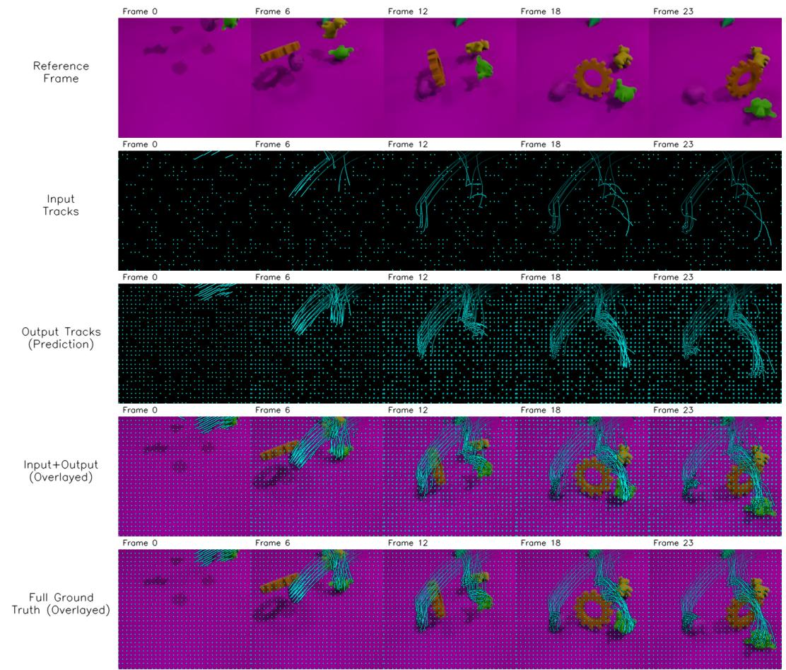

text_image

Reference Frame
Frame 0	Frame 6	Frame 12	Frame 18	Frame 23
Input Tracks
Frame 0	Frame 6	Frame 12	Frame 18	Frame 23
Output Tracks (Prediction)
Frame 0	Frame 6	Frame 12	Frame 18	Frame 23
Input+Output (Overlayed)
Frame 0	Frame 6	Frame 12	Frame 18	Frame 23
Full Ground Truth (Overlayed)

Figure 7: TIME visualization (objects segmented by colors). Our model reconstructs missing trajectories which closely align with the ground truth.   
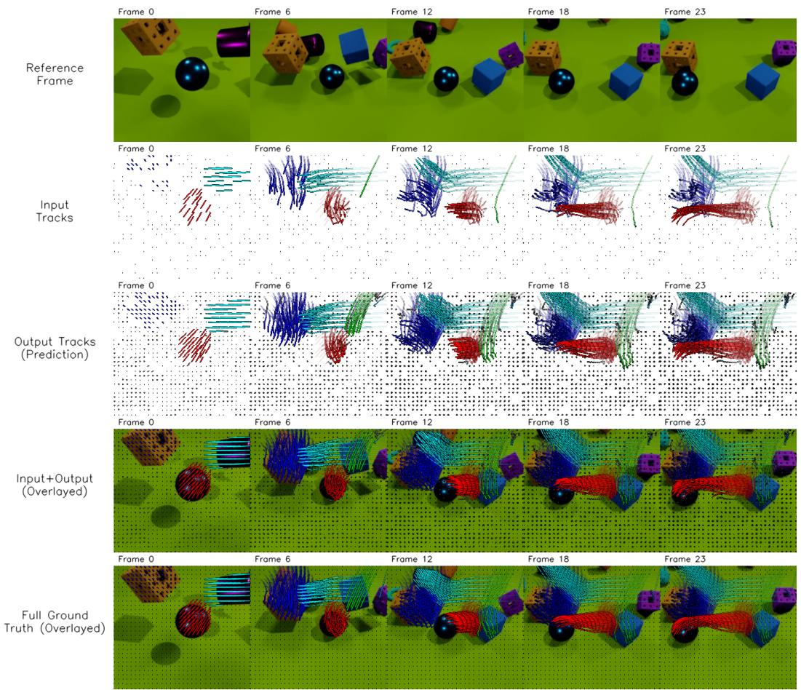

text_image

Reference Frame
Input Tracks
Output Tracks (Prediction)
Input+Output (Overlayed)
Full Ground Truth (Overlayed)

