# Multimodal Distribution Matching for Vision-Language Dataset Distillation

Jongoh Jeong\* Hoyong Kwon\* Minseok Kim\* Kuk-Jin Yoon Visual Intelligence Lab., KAIST

{jeong2, kwonhoyong3, alstjrx1x1, kjyoon}@kaist.ac.kr ‡ Project Page

# Abstract

Dataset distillation compresses large training sets into compact synthetic datasets while preserving downstream performance. As modern systems increasingly operate on paired vision–language inputs, multimodal distillation must preserve representation quality and cross-modal alignment under tight compute and memory budgets, yet prior methods often require heavy computes and overlook their correlations. To address this, we present Multimodal Distribution Matching (MDM), a geometry-aware framework for efficient and generalizable multimodal distillation. Specifically, MDM integrates complementary components at the data, model, and loss levels. At the data level, it initializes synthetic image–text pairs by sampling from clusters in the joint embedding space. At the model level, it forms a mixed teacher by interpolating independently fine-tuned models in weight space according to their angular deviation from the pretrained anchor. At the loss level, it matches joint distributions on the unit hypersphere using a geometry-aware matching objective that exploits the joint features in the cross-modal agreement and discrepancy directions along with symmetric contrastive learning. Across image–text retrieval benchmarks with crossarchitecture evaluation, MDM yields compact synthetic sets that preserve multimodal semantics, substantially reduce distillation cost, and remain robust across architectures.

# 1. Introduction

The rapid expansion of multimodal datasets [7, 23, 35, 55, 61, 72] has exposed a persistent scalability barrier in modern machine learning. As modern vision–language models [1, 3, 4, 34, 37, 60, 74] scale to hundreds of millions of paired samples, training over such collections increasingly strains compute, storage, and iteration speed for both research and deployment. This challenge is amplified in multi-modal settings, where each modality introduces its own statistical complexity and where maintaining crossmodal alignment imposes additional computational overhead.

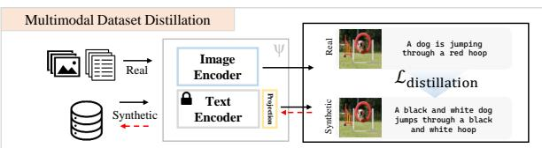

flowchart

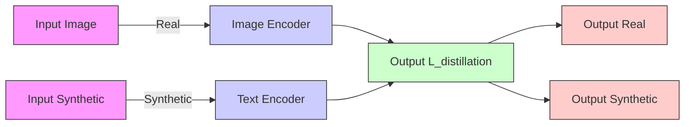

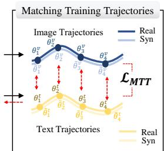

flowchart

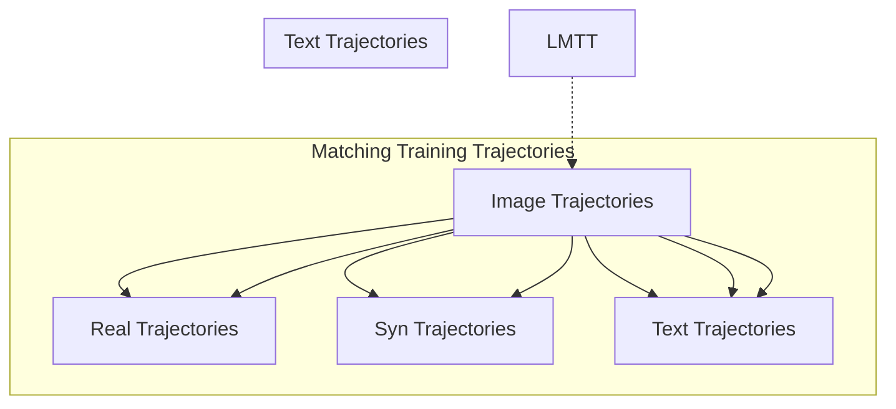

MTT: Compute Generalization

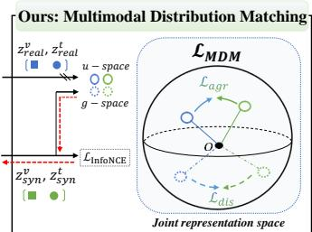

flowchart

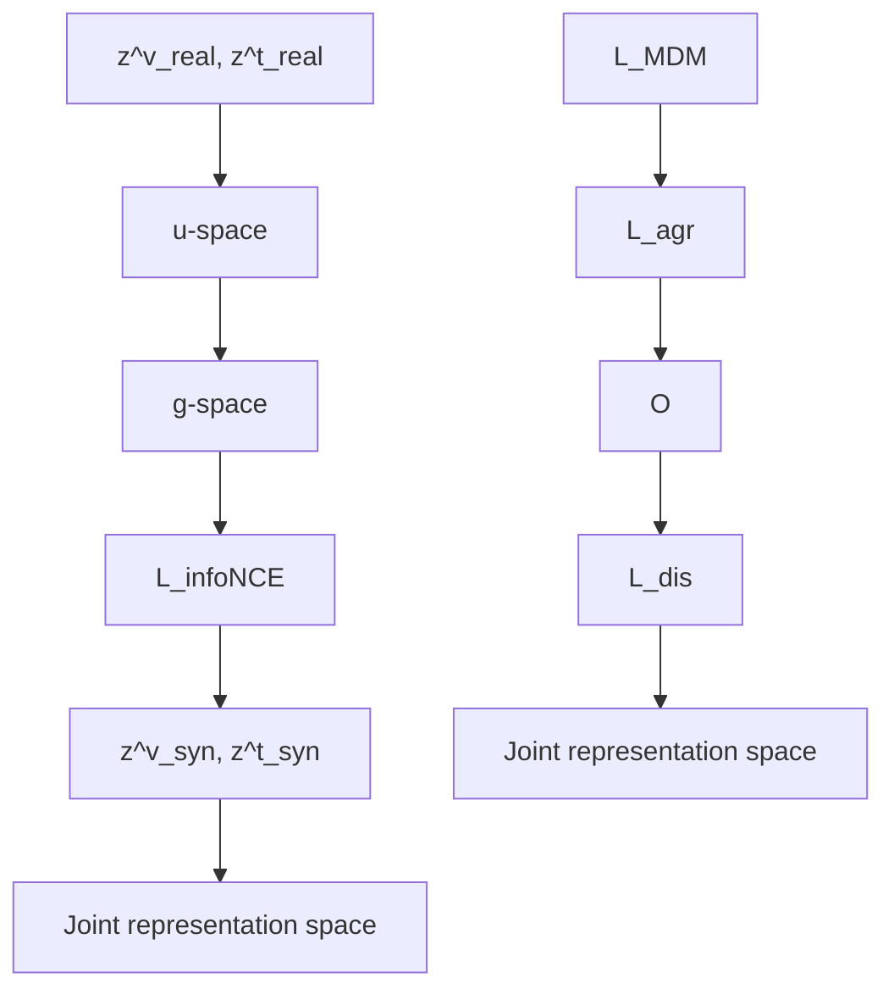

MDM: Compute Generalization   
Figure 1. Comparison between prior multimodal dataset distillation based on matching training trajectories (MTT, left) and our Multimodal Distribution Matching (MDM, right). While MTT replays image–text trajectories at high compute and storage cost, MDM directly matches the joint image–text distribution in the joint embedding space, yielding compact synthetic data with strong cross-architecture generalization under much lower distillation cost. The red arrow indicates the direction of gradient backpropagation.

These trends underscore the growing need for compact yet informative surrogates that can preserve multi-modal semantics without incurring the full cost of large-scale training.

Dataset distillation (DD) [5, 13, 14, 33, 38, 57–59, 64, 66, 76, 86] offers a principled countermeasure by synthesizing small, representative datasets that preserve essential learning signals while cutting storage and training costs by orders of magnitude. Beyond efficiency, distillation improves reproducibility, strengthens privacy and governance by abstracting sensitive data into shareable surrogates, accelerates experimentation through faster ablations and hyperparameter sweeps, and enables edge deployment under tight memory and energy budgets. In vision domain, progress has advanced from gradient and feature matching to trajectory matching and generative synthesis, steadily increasing fidelity while shrinking data footprints [32, 39, 73].

Practical systems now widely operate on paired vision and language inputs rather than images alone, making multimodal distillation (MDD) essential. A compact synthetic set in this regime must preserve intra-modal statistics for images and text while maintaining inter-modal semantic correspondences. However, compared to unimodal distillation, MDD is substantially more challenging as multimodal datasets exhibit broader semantic diversity, and the joint embedding space must simultaneously capture modality-shared and -specific information.

Existing multimodal approaches [68, 69] often replay resource-intensive training trajectories or restrict optimization to narrow projection subspaces. Trajectory-based methods [8, 17, 36, 84] repeatedly perform bi-level optimization, generating teacher and student trajectories from real and synthetic data and using them to update the synthetic set, which leads to substantial computational and memory overhead. Moreover, optimizing synthetic data to match the training dynamics specific to the training architecture leads to architectural bias, hampering cross-architecture generalization.

These trends motivate an efficient, geometry-aware formulation that directly matches distributions in a space aligned with modern encoders. Distribution matching (DM) [75, 80, 82] avoids trajectory replay and instead focuses on aligning real and synthetic feature distributions, offering advantages in scalability, stability, and generalization. Extending this idea to multi-modal learning allows us to preserve representation quality and cross-modal alignment, enabling synthetic data that better represent the underlying multi-modal distribution while remaining less sensitive to any single model’s structural bias and reducing computational load.

In this light, we present Multimodal Distribution Matching (MDM), a geometry-aware distribution matching framework for MDD that performs competitively with previous methods while requiring significantly less compute. Our MDD framework, as shown in Fig. 1, effectively leverages alignment across images and text, thereby reducing sensitivity to a single set of encoder architectures. To this end, MDM integrates three complementary components across data, model, and distillation loss. Firstly, synthetic data are initialized with a broad coverage of diverse semantic modes in the image-text joint embedding space, rather than random sampling or relying on a single modality. Further, MDM utilizes an image-text model whose weights are adaptively interpolated with multiple finetuned experts, operating in a more architecture-agnostic representation space to enhance cross-architecture generalization. Finally, MDM optimizes synthetic data by aligning real and synthetic distributions via geodesic kernel energies over cross-modal agreement and discrepancy directions, while preserving image–text alignment within synthetic pairs via a contrastive objective.

We summarize our key contributions as follows:

• We introduce a geometry-aware MDD framework that matches real and synthetic distributions in the joint image–text embedding space, significantly reducing the distillation cost compared to previous trajectory-based methods.

• We highlight the importance of initialization at both the data and model levels, employing joint-space data seeding and adaptive weight-space interpolation to obtain synthetic data that generalizes across architectures.   
• We design a multi-modal objective that aligns real and synthetic data by matching agreement and discrepancy directions via geodesic kernel energies, while contrastively preserving image–text alignment within synthetic pairs.

# 2. Related Work

Coreset selection aims to construct a compact subset of real training examples to retain downstream utility by emphasizing coverage or influence. Geometry-based methods promote diversity in the representation space, including herding [67] and k-center [19], and facility-location objectives. At the same time, dynamics-driven approaches leverage learning signals such as example forgetting [63]. Probabilistic formulations construct Bayesian pseudo-coresets using variational or divergence-based criteria [28, 45, 62]. While these strategies perform reasonably well under moderate budgets, they operate purely by reweighting or selecting existing samples and thus are ill-suited for capturing cross-modal structures. Our approach, by contrast, synthesizes paired samples and aligns their distributions in an encoder-aligned hyperspherical feature space, enabling stronger compression while explicitly maintaining multimodal alignment.

Dataset distillation synthesizes compact training sets that reproduce optimization signals and generalization, and has diversified into several families. Early approaches match gradients or features between real and synthetic data [43, 78, 81, 85], while trajectory matching methods align full parameterupdate paths with improved scalability [8, 12]. Distribution matching aligns statistics of learned features via maximum mean discrepancy, moment matching, optimal transport, HSIC, or covariance alignment, and has shown strong cross-architecture generalization [65, 75, 80, 82]. Other lines compress supervision into compact parameter or memory representations [15, 29, 31, 40], or frame distillation through kernels, meta-learning, implicit gradients [44, 49, 50]. Generative approaches directly synthesize informative samples [9, 79], and recent scaling studies improve robustness and efficiency via model augmentation, slimmable architectures, pruning–recovery mechanisms, frequency cues, and representative matching [22, 41, 42, 57, 71, 77]. In this lineage, our method contributes a compute-efficient, geometryaware MDM scheme, leveraging joint representations as alignment and discrepancy components, and cluster-based data seeding along with angle-guided model weight interpolation for strong generalization ability of the distilled data.

Vision–language dataset distillation adapts these ideas to paired image–text data, where labels are implicit and the evaluation emphasizes cross-modal alignment. The first multimodal formulation [68] extends trajectory matching to contrastive retrieval training, establishing protocols on Flickr30K [72] and COCO [35]. LoRS [69] later preserves image–text similarity structure by distilling a ground-truth similarity matrix via low-rank factorization, improving efficiency in correspondence learning. While both approaches improve fidelity through dynamics-aware replay or similarity preservation, they require heavy computation and tend to bias optimization toward projection subspaces tied to specific encoder architectures, limiting cross-architecture generalization. In contrast, our method replaces trajectory and similarity-matrix supervision with distribution matching, operating on the unit hypersphere to match joint agreement and discrepancy features between real and synthetic data, thereby addressing scalability and generalization with a significantly lower computational budget.

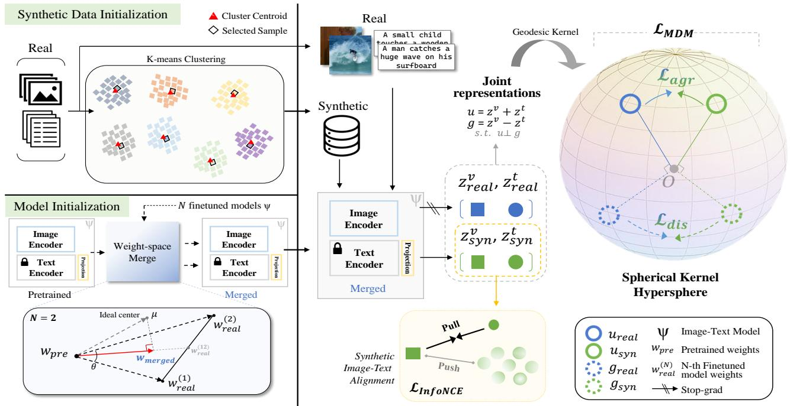

flowchart

```mermaid
graph TD
    A["Real"] --> B["K-means Clustering"]
    B --> C["Real"]
    D["Model Initialization"] --> E["Weight-space Merge"]
    E --> F["Image Encoder"]
    F --> G["Text Encoder"]
    G --> H["Pretrained"]
    H --> I["Merged"]
    I --> J["Image Encoder"]
    J --> K["Text Encoder"]
    K --> L["Weight-space Merge"]
    L --> M["Image Encoder"]
    M --> N["Text Encoder"]
    N --> O["Pretrained"]
    O --> P["Weight-space Merge"]
    P --> Q["Image Encoder"]
    Q --> R["Text Encoder"]
    R --> S["Pretrained"]
    S --> T["Weight-space Merge"]
    T --> U["Image Encoder"]
    U --> V["Text Encoder"]
    V --> W["Pretrained"]
    W --> X["Weight-space Merge"]
    X --> Y["Image Encoder"]
    Y --> Z["Text Encoder"]
    Z --> AA["Pretrained"]
    AA --> AB["Weight-space Merge"]
    AB --> AC["Image Encoder"]
    AC --> AD["Text Encoder"]
    AD --> AE["Pretrained"]
    AE --> AF["Weight-space Merge"]
    AF --> AG["Image Encoder"]
    AG --> AH["Text Encoder"]
    AH --> AI["Pretrained"]
    AI --> AJ["Weight-space Merge"]
    AJ --> AK["Image Encoder"]
    AK --> AL["Text Encoder"]
    AL --> AM["Pretrained"]
    AM --> AN["Weight-space Merge"]
    AN --> AO["Image Encoder"]
    AO --> AP["Text Encoder"]
    AP --> AQ["Pretrained"]
    AQ --> AR["Weight-space Merge"]
    AR --> AS["Image Encoder"]
    AS --> AT["Text Encoder"]
    AT --> AU["Pretrained"]
    AU --> AV["Weight-space Merge"]
    AV --> AW["Image Encoder"]
    AW --> AX["Text Encoder"]
    AX --> AY["Pretrained"]
    AY --> AZ["Weight-space Merge"]
    AZ --> BA["Image Encoder"]
    BA --> BB["Text Encoder"]
    BB --> BC["Pretrained"]
    BC --> BD["Weight-space Merge"]
    BD --> BE["Image Encoder"]
    BE --> BF["Text Encoder"]
    BF --> BG["Pretrained"]
    BG --> BH["Weight-space Merge"]
    BH --> BI["Image Encoder"]
    BI --> BJ["Text Encoder"]
    BJ --> BK["Pretrained"]
    BK --> BL["Weight-space Merge"]
    BL --> BM["Image Encoder"]
    BM --> BN["Text Encoder"]
    BN --> BO["Pretrained"]
    BO --> BP["Weight-space Merge"]
    BP --> BQ["Image Encoder"]
    BQ --> BR["Text Encoder"]
    BR --> BS["Pretrained"]
    BS --> BT["Weight-space Merge"]
    BT --> BU["Image Encoder"]
    BU --> BV["Text Encoder"]
    BV --> BW["Pretrained"]
    BW --> BX["Weight-space Merge"]
    BX --> BY["Image Encoder"]
    BY --> BZ["Text Encoder"]
    BZ --> CA["Pretrained"]
    CA --> CB["Weight-space Merge"]
    CB --> CC["Image Encoder"]
    CC --> CD["Text Encoder"]
    CD --> CE["Pretrained"]
    CE --> CF["Weight-space Merge"]
    CF --> CG["Image Encoder"]
    CG --> CH["Text Encoder"]
    CH --> CI["Pretrained"]
    CI --> CJ["Weight-space Merge"]
    CJ --> CK["Image Encoder"]
    CK --> CL["Text Encoder"]
    CL --> CM["Pretrained"]
    CM --> CN["Weight-space Merge"]
    CN --> CO["Image Encoder"]
    CO --> CP["Text Encoder"]
    CP --> CQ["Pretrained"]
    CQ --> CR["Weight-space Merge"]
    CR --> CS["Image Encoder"]
    CS --> CT["Text Encoder"]
    CT --> CU["Pretrained"]
    CU --> CV["Weight-space Merge"]
    CV --> CW["Image Encoder"]
    CW --> CX["Text Encoder"]
    CX --> CY["Pretrained"]
    CY --> CZ["Weight-space Merge"]
```

Figure 2. Overview of MDM. Our MDM method consists of (i) synthetic data initialization using k-means clustering, (ii) image-text model initialization using weight-space interpolation between a pretrained and N finetuned models, and (iii) multimodal distribution matching that minimizes geodesic kernel energy between real and synthetic pairs on the unit hypersphere.

# 3. Proposed Method

# 3.1. Preliminaries

Problem Definition. Let $\mathcal { D } _ { \mathrm { r e a l } } = \{ ( x _ { i } , t _ { i } ) \} _ { i = 1 } ^ { B }$ 1 denote a real multimodal dataset of images x and texts t. Our goal is to construct a much smaller synthetic dataset $\mathcal { D } _ { \mathrm { s y n } } ~ =$ $\{ ( \tilde { x } _ { j } , \tilde { t } _ { j } ) \} _ { j = 1 } ^ { \tilde { B } }$ with $| { \mathcal D } _ { s y n } | \ll | { \mathcal D } _ { r e a l } |$ such that models trained on $\mathcal { D } _ { \mathrm { s y n } }$ closely mimic the behavior of models trained on $\mathcal { D } _ { \mathrm { r e a l } }$ when evaluated on the real data distribution. In the vision domain, previous optimization-oriented work has sought to update $\mathcal { D } _ { { s y n } }$ using a meta-learning framework or matching model parameter weights or gradients derived from $\mathcal { D } _ { s y n }$ and $\mathcal { D } _ { r e a l }$ . Extending to vision and language, [68] and [69] build on this matching trajectory regime to distill image-text data. However, the requirement of intensive computations induced by nested gradient calculations remains as a significant challenge. Distribution Matching (DM) [80, 82] addresses this distillation efficiency issue by directly aligning feature distributions of $\mathcal { D } _ { { s y n } }$ and $\mathcal { D } _ { r e a l } ,$ , optimizing the following given network parameters $\theta _ { 0 } { \mathrm { : } }$ :

$$
\mathcal {D} _ {\text {syn}} ^ {\star} = \underset {\mathbb {E} _ {\theta_ {0} \sim P _ {\theta_ {0}}}} {\arg \min} \left\| \frac {\sum_ {i = 1} ^ {B} \theta_ {0} (x _ {i})}{| \mathcal {D} _ {\text {real}} |} - \frac {\sum_ {j = 1} ^ {\tilde {B}} \theta_ {0} (\tilde {x} _ {j})}{| \mathcal {D} _ {\text {syn}} |} \right\| ^ {2}. \tag {1}
$$

In the same vein for efficient distillation, we extend DM to a multimodal setting to optimize $\mathcal { D } _ { s y n } ^ { \star }$ by explicitly aligning joint image-text representations in a shared latent space as:

$$
\mathcal {D} _ {\text { syn }} ^ {\star} = \underset {\mathcal {D} _ {\text { syn }}} {\arg \min} \phi \left(\underbrace {\mathbb {E} _ {(X , T) \sim \mathcal {D} _ {\text { real }}} [ \Psi (X , T) ]} _ {\text { real   joint }}, \underbrace {\mathbb {E} _ {(\tilde {X} , \tilde {T}) \sim \mathcal {D} _ {\text { syn }}} [ \Psi (\tilde {X} , \tilde {T}) ]} _ {\text { synthetic   joint }}\right), \tag {2}
$$

where $\Psi ( \cdot , \cdot )$ denotes a joint feature extractor comprising an image $\theta ^ { v }$ and a text $\theta ^ { t }$ encoder with projection, and $\phi ( \cdot , \cdot )$ is a distance function. See Supp. for detailed formulation.

Image-Text Matching. Image-text retrieval is a central probe for vision–language understanding, and we thus adopt the commonly used bidirectional InfoNCE objective [52] as the base pairwise alignment loss for the synthetic data. Given a minibatch $\{ ( \tilde { x } _ { j } , \tilde { t } _ { j } ) \} _ { j = 1 } ^ { \tilde { B } } \subset \mathcal { D } _ { \mathrm { s y n } } .$ , we obtain image features $z _ { j } ^ { v }$ and text features $z _ { j } ^ { t }$ from the image and text branches of the unified image-text model Ψ. We then define similarity logits $\tilde { Z } _ { j k } = \mathbf { s } ( \bar { z } _ { j } ^ { v } , \tilde { z } _ { k } ^ { t } ) / \tau$ using a chosen similarity function $\mathbf { s } ( \cdot , \cdot )$ (e.g., cosine or dot product) and temperature $\tau > 0$ . The InfoNCE loss averages the image→text and text→image cross-entropy terms with identity targets, instantiated for the synthetic image-text features $( \tilde { z } ^ { v } , \tilde { z } ^ { t } )$ as:

$$
\mathcal {L} _ {\text { InfoNCE }} := \frac {1}{2 \tilde {B}} \sum_ {j = 1} ^ {\tilde {B}} \left[ \underbrace {- \log \frac {\exp \left(\tilde {Z} _ {j j}\right)}{\sum_ {k = 1} ^ {\tilde {B}} \exp \left(\tilde {Z} _ {j k}\right)}} _ {v \rightarrow t} + \underbrace {- \log \frac {\exp \left(\tilde {Z} _ {j j}\right)}{\sum_ {k = 1} ^ {\tilde {B}} \exp \left(\tilde {Z} _ {k j}\right)}} _ {t \rightarrow v} \right], \tag {3}
$$

which encourages each synthetic image $\tilde { x } _ { j }$ to rank its paired synthetic caption $\tilde { t } _ { j }$ above all others in the batch, and symmetrically, each caption to rank its paired image above all others. In our MDM formulation in Eq. 2, this contrastive objective acts as the alignment component operating on the synthetic pairs, while the distribution matching term aligns their joint representations with those of the real data.

# 3.2. Synthetic Data Initialization

We first initialize the synthetic dataset $\mathcal { D } _ { \mathrm { s y n } }$ by selecting representative real samples in the joint embedding space of the encoder Ψ. Let $f _ { n }$ denote the joint embedding of the n-th real pair, obtained by concatenating the image and text features after projection. We embed all real pairs, run $K \cdot$ means clustering [21] with $K = | \mathcal D _ { \mathrm { s y n } } |$ , and obtain cluster centroids $\{ c _ { k } \} _ { k = 1 } ^ { K }$ and indices $\{ \mathcal { C } _ { k } \} _ { k = 1 } ^ { K }$ . For each cluster, we initialize each synthetic pair with a real sample whose joint feature is closest to its centroid in cosine distance:

$$
\mathcal {D} _ {\text { syn }} ^ {(0)} = \left\{\left(x _ {j _ {k}}, t _ {j _ {k}}\right) \right\} _ {k = 1} ^ {K}, \quad \text { with } j _ {k} = \arg \max _ {n \in \mathcal {C} _ {k}} \frac {f _ {n} ^ {\top} c _ {k}}{\| f _ {n} \| _ {2} \| c _ {k} \| _ {2}}. \tag {4}
$$

This cluster-based seeding induces synthetic data to be composed of representative samples with a broad coverage of joint semantic modes in the joint space while avoiding redundancy. Because $f _ { n }$ is constructed from concatenated image and text features, the clustering reflects a multimodal structure rather than either modality alone—providing a significantly stronger initialization for distillation. Since the synthetic pairs are later optimized as continuous parameters, this initialization offers a stable starting point aligned with the real-data manifold. Importantly, seeding is performed entirely in the feature space but is instantiated as concrete image-text pairs, enabling architecture-agnostic initialization that complements our model initialization.

# 3.3. Image-Text Model Initialization

Beyond data initialization, the image–text model’s initialization is crucial for distilling multimodal data, as it largely determines the geometry of the joint embedding space. If the model remains too close to the pretrained anchor $\theta _ { 0 } ^ { \mathrm { v / t } }$ , the resulting teacher may underfit the real multimodal structure, weakening the signal from the real set that synthetic data must eventually mimic. Conversely, leaning too heavily on a single finetuned expert causes the synthetic data to inherit that expert’s model-specific representation geometry rather than the full real-data distribution. This leads to degraded distillation performance and diminished cross-architecture generalization. We therefore shift our image-text model towards the real only to the extent that N finetuned models agree in direction, using their agreement to retain the initial model. In the process, we exploit the finetuned experts used in prior work [68, 69].

Concretely, inspired by the geometric perspective that the center-close weight approximation of finetuned models yields a significant improvement in classification robustness [25], we adapt its weight-space interpolation to our image encoder and text projection modules. For the pretrained anchor parameters $\theta _ { 0 } ^ { v }$ and $\theta _ { 0 } ^ { t }$ as image encoder and text projector, respectively, and $\textit { N } ( e . g . , 2 )$ independent finetuned experts $( \theta _ { ( 1 ) } ^ { v } , \theta _ { ( 1 ) } ^ { t } )$ and $( \theta _ { ( 2 ) } ^ { v } , \theta _ { ( 2 ) } ^ { t } )$ trained on real data, we merge layer-wise (ℓ) weights as follows:

$$
\theta_ {*, \ell} ^ {m} = \theta_ {0, \ell} ^ {m} + \alpha   t _ {\ell} ^ {m} \cdot \frac {1}{2} \big (\Delta_ {1, \ell} ^ {m} + \Delta_ {2, \ell} ^ {m} \big), \text { for } m \in \{v, t \},
$$

$\mathrm { w i t h } t _ { \ell } ^ { m } = \frac { 2 \left. \Delta _ { 1 , \ell } ^ { m } , \Delta _ { 2 , \ell } ^ { m } \right. } { \left\| \Delta _ { 1 , \ell } ^ { m } \right\| _ { 2 } \left\| \Delta _ { 2 , \ell } ^ { m } \right\| _ { 2 } + \left. \Delta _ { 1 , \ell } ^ { m } , \Delta _ { 2 , \ell } ^ { m } \right. }$ (5)

where $\langle \cdot , \cdot \rangle$ denotes the inner product. $\Delta _ { i , \ell } ^ { m } : = \theta _ { ( i ) , \ell } ^ { m } - \theta _ { 0 , \ell } ^ { m }$ θm (i),ℓ denotes the displacement of the expert $i \in \{ 1 , \cdots , \overset { } { N } \}$ from the pretrained anchor in layer ℓ for the modality m, and $t _ { \ell } ^ { m }$ is the merging ratio determined by the mutual angle between the displacement vectors. Here, the larger angle deviation between the finetuned experts, the greater the reliance of the merged weight on the pretrained anchor, and vise versa. We further finely tune the level of weight shift with $\alpha < 1$ as we target architectural robustness, which may be more sensitive in the weight space. This layer-wise weight interpolation step adapts only when the directions of displacements align and defaults to the anchor when they conflict, thereby yielding merged weights with strong architectural generalization.

At each distillation iteration, we apply this step after selecting N checkpoints of a random expert at a random epoch from its training trajectory. As each expert follows distinct per-epoch training dynamics, refreshing the merge with a randomly sampled expert checkpoint at each iteration implicitly mimics the real-distribution dynamics at the model level rather than the parameter level, as practiced explicitly in MTT [8, 68, 69]. This encourages and stabilizes the supervision signal for $\mathcal { D } _ { { s y n } } .$ , and empirically strengthens cross-architecture generalization.

# 3.4. Multimodal Distribution Matching

In this section, we describe our MDM approach, which exploits the geometry of joint image-text features on a geodesic kernel [30, 47], illustrated in Fig. 2. See Supp. for details.

Notation and Joint Feature Space. Given a pair of imagetext $( x , t )$ and its embeddings after projection $( z ^ { v } , z ^ { t } ) , i . e .$ , the output of $\Psi ( x , t )$ , we utilize the normalized embeddings so that they lie on the unit hypersphere $\in \mathbb { S } ^ { d - 1 }$ . Then, for each pair $( z ^ { v } , z ^ { t } )$ , we construct cross-modal features in the agreement and discrepancy directions on $\mathbb { S } ^ { d - 1 }$ , s.t.:

$$
u = \text { normalize } (z ^ {v} + z ^ {t}), g = \text { normalize } (z ^ {v} - z ^ {t}), \tag {6}
$$

where normalize $( \cdot ) : = \frac { \cdot } { \| \cdot \| _ { 2 } }$ . For each mini-batch, we construct batch sets: $\mathcal { U } ^ { r } = \{ u _ { i } ^ { r } \} _ { i = 1 } ^ { B ^ { r } } , \mathcal { U } ^ { s } = \{ u _ { j } ^ { s } \} _ { j = 1 } ^ { B ^ { s } } , \mathcal { G } ^ { r } =$ $\{ g _ { i } ^ { r } \} _ { i = 1 } ^ { B ^ { r } } , \mathcal { G } ^ { s } = \{ g _ { j } ^ { s } \} _ { j = 1 } ^ { B ^ { s } }$ , where r denotes real set and s denotes synthetic set.

Geodesic Kernel Energy. With the modality embeddings $( z ^ { v } , z ^ { t } )$ and $( u , g )$ lying on the unit hypersphere $\mathbb { S } ^ { d - 1 }$ , We compute the angular similarity between each real-synthetic pair of u’s and $g \mathrm { ^ s }$ as follows:

$$
\phi (a, b) = \arccos (\langle a, b \rangle) \in [ 0, \pi ], \quad a, b \in \mathbb {S} ^ {d - 1}. \tag {7}
$$

With the similarity angles, we kernelize the features with a geodesic Gaussian kernel to map to a hyperspherical affinity:

$$
k _ {\mathrm{geo}} (a, b) = \exp \left(- \frac {\phi (a , b) ^ {2}}{2 \sigma^ {2}}\right), \quad \sigma > 0. \tag {8}
$$

The kernel defines a pairwise energy on $\mathbb { S } ^ { d - 1 }$ that compares affinities under the same intrinsic metric, yielding a common scale for relating intra- and inter-set alignment. For two finite sets $\mathcal { A } = \{ a _ { i } \} _ { i = 1 } ^ { m }$ and $\pmb { { \cal B } } = \{ b _ { j } \} _ { j = 1 } ^ { n }$ on $\mathbb { S } ^ { d - 1 }$ , we define the geodesic kernel energy with intra-set affinity on both sets along with inter-set affinity:

$$
\operatorname{GKE} (\mathcal {A}, \mathcal {B}) = \left[ \underbrace {\frac {1}{m ^ {2}} \sum_ {i = 1} ^ {m} \sum_ {j ^ {\prime} = 1} ^ {m} k _ {\text {geo}} (a _ {i} , a _ {i ^ {\prime}})} _ {\text {intra-} \mathcal {A}} + \underbrace {\frac {1}{n ^ {2}} \sum_ {j = 1} ^ {n} \sum_ {j ^ {\prime} = 1} ^ {n} k _ {\text {geo}} (b _ {j} , b _ {j ^ {\prime}})} _ {\text {intra-} \mathcal {B}} - \underbrace {\frac {2}{m n} \sum_ {i = 1} ^ {m} \sum_ {j = 1} ^ {n} k _ {\text {geo}} (a _ {i} , b _ {j})} _ {\text {inter-set affinity}} \right] ^ {1 / 2}, \tag {9}
$$

where the square root term moderates the scale relative to the angular magnitudes and produces smoother gradients. Minimization increases inter-set affinity while calibrating the internal affinity patterns of the two input sets under the same geodesic kernel. We refer to Supp. for detailed formulation. Given these cross-modal agreement and discrepancy vectors from the real and synthetic mini-batches, we define the geodesic kernel energy in Eq. 10 as a distribution on the hyperspherical kernel to match between real and synthetic data.

$$
\mathcal {L} _ {\mathrm{agr}} = \operatorname{GKE} \left(\mathcal {U} ^ {r}, \mathcal {U} ^ {s}\right), \quad \mathcal {L} _ {\mathrm{dis}} = \operatorname{GKE} \left(\mathcal {G} ^ {r}, \mathcal {G} ^ {s}\right). \tag {10}
$$

Total Distillation Objective. We combine the geodesic kernel energies with a bidirectional InfoNCE term at temperature τ over a batch of B paired examples to formulate our total loss as follows:

$$
\mathcal {L} _ {\mathrm{MDM}} = \mathcal {L} _ {\text { InfoNCE }} + \lambda_ {\mathrm{agr}} \cdot \mathcal {L} _ {\mathrm{agr}} + \lambda_ {\mathrm{dis}} \cdot \mathcal {L} _ {\mathrm{dis}}, \tag {11}
$$

where $\lambda _ { a g r }$ and $\lambda _ { d i s }$ denote tuning factors for the crossmodal agreement and discrepancy losses, respectively.

# 4. Experiments

# 4.1. Experimental Details

Datasets, Tasks, and Baselines. We evaluate on three captioning datasets commonly used for image–text retrieval: Flickr8k [23] (a total of 8,000 images, each paired with five human-written captions), Flickr30k [72] (≈31k images, five captions per image), and MS COCO [35] (≈123k images with five captions per image). Following standard practice on the Karpathy splits, we report retrieval performance for both text-to-image (T→I) and image-to-text (I→T) using Recall at $K \in \{ 1 , 5 , 1 0 \}$ (i.e., R@1/5/10). For instance, IR@5 denotes text-to-image recall at K=5, while TR@1 denotes image-to-text recall at K=1. Unless otherwise noted, COCO evaluation uses the 5k-image test set. For comparison, we include two families of strong baselines: (i) Coreset selection: Random sampling, Herding [67], K-Center [19], and Forgetting [63], and (ii) dataset distillation: MTT-VL [68], TESLA [12], and LoRS [69]. We adopt the publicly available configurations to re-implement the baselines for fair comparisons (see details in Supp.).

Architectures. Following MTT-VL [68] and LoRS [69], we employ Normalizer-Free Network (NFNet) [6] as the vision encoder backbone that dispenses with batch normalization in favor of normalization-free residual blocks stabilized by scaled weight standardization and careful initialization. The final convolutional features are global-average pooled and passed through a lightweight projection head to a d-dimensional embedding, then ℓ2-normalized. For the text side, we use BERT [16]. The text embedding is then linearly projected onto the same d-dimensional space and $\ell _ { 2 } { \mathrm { - n o r m a l i z e d } }$ . Image and text embeddings are trained under a contrastive alignment objective. In inference, retrieval uses cosine similarity in the joint space.

Implementation Details. We distill synthetic image–text queries of size $N \in \{ 1 0 0 , 2 0 0 , 5 0 0 \}$ using pretrained vision and text encoders assembled via parameter interpolation of per-epoch buffered checkpoints. At each distillation iteration, the frozen encoder is re-initialized using an interpolation factor $\alpha = 0 . 5$ . Following prior work [68, 69], we distill text embeddings rather than raw captions, jointly optimizing N synthetic images of size $3 \times 2 2 4 \times 2 2 4$ and 768-dimensional text embeddings. Distillation is performed for up to 3,000 iterations using SGD with a fixed learning rate, momentum 0.5, and gradient clipping 1.0, where convergence typically occurs much earlier in practice. We use temperature τ = 0.07 and weighting coefficients $\lambda _ { a g r } = 0 . 8 , \lambda _ { d i s } = 0 . 8 .$ . After distillation, each initialization model is trained for 100 epochs on the synthetic pairs and evaluated on the real test set; all reported retrieval scores are averaged over five independently initialized models. See Supp. for additional implementation details.

Table 1. Image-text retrieval results for 100, 200, and 500 synthetic pairs using the coreset methods and distillation method. The condensation rate for {Flickr8k, Flickr30k, and COCO} datasets are approximately {1.7%, 0.3%, 0.8‰}, {3.3%, 0.7%, 1.7‰}, {8.3%, 1.7%, 4.4‰} for 100, 200, and 500 pairs. Best and runner-up results are indicated in boldface and underline, respectively. 

<table><tr><td rowspan="2"># Pairs</td><td>Dataset</td><td colspan="7">Flickr8k [23]</td><td colspan="7">Flickr30k [72]</td><td colspan="7">COCO [35]</td></tr><tr><td>Method</td><td>IR@1</td><td>IR@5</td><td>IR@10</td><td>TR@1</td><td>TR@5</td><td>TR@10</td><td>Mean</td><td>IR@1</td><td>IR@5</td><td>IR@10</td><td>TR@1</td><td>TR@5</td><td>TR@10</td><td>Mean</td><td>IR@1</td><td>IR@5</td><td>IR@10</td><td>TR@1</td><td>TR@5</td><td>TR@10</td><td>Mean</td></tr><tr><td rowspan="8">100</td><td>Random</td><td>1.2</td><td>5.6</td><td>9.6</td><td>2.7</td><td>8.0</td><td>12.6</td><td>6.6</td><td>0.9</td><td>4.2</td><td>7.3</td><td>2.0</td><td>7.9</td><td>12.1</td><td>5.7</td><td>0.4</td><td>1.7</td><td>3.0</td><td>0.8</td><td>3.2</td><td>5.4</td><td>2.4</td></tr><tr><td>Herding [67]</td><td>1.2</td><td>4.4</td><td>8.5</td><td>2.2</td><td>8.5</td><td>14.2</td><td>6.5</td><td>0.9</td><td>3.5</td><td>6.5</td><td>2.0</td><td>6.9</td><td>11.1</td><td>5.1</td><td>0.3</td><td>1.4</td><td>2.6</td><td>0.8</td><td>3.0</td><td>5.5</td><td>2.4</td></tr><tr><td>K-Center [19]</td><td>1.2</td><td>4.9</td><td>9.0</td><td>2.7</td><td>9.3</td><td>13.9</td><td>6.8</td><td>1.1</td><td>4.9</td><td>8.7</td><td>3.0</td><td>9.1</td><td>14.3</td><td>6.8</td><td>0.5</td><td>1.9</td><td>3.6</td><td>1.1</td><td>4.2</td><td>7.6</td><td>3.2</td></tr><tr><td>Forgetting [63]</td><td>1.2</td><td>4.0</td><td>7.1</td><td>1.5</td><td>4.8</td><td>8.4</td><td>4.5</td><td>0.8</td><td>3.6</td><td>6.2</td><td>1.2</td><td>5.4</td><td>9.1</td><td>4.4</td><td>0.2</td><td>1.0</td><td>1.9</td><td>0.2</td><td>1.2</td><td>2.6</td><td>1.2</td></tr><tr><td>MTT-VL [68]</td><td>0.8</td><td>4.0</td><td>7.0</td><td>1.5</td><td>6.4</td><td>10.8</td><td>5.1</td><td>4.7</td><td>15.7</td><td>24.6</td><td>9.9</td><td>28.3</td><td>39.1</td><td>20.4</td><td>1.3</td><td>5.4</td><td>9.5</td><td>2.5</td><td>10.0</td><td>15.7</td><td>7.4</td></tr><tr><td>TESLAWBCE [12]</td><td>0.8</td><td>3.8</td><td>7.0</td><td>4.7</td><td>16.1</td><td>25.9</td><td>9.7</td><td>0.5</td><td>2.3</td><td>4.7</td><td>5.5</td><td>19.5</td><td>28.9</td><td>10.2</td><td>0.3</td><td>1.0</td><td>1.8</td><td>2.0</td><td>7.7</td><td>13.5</td><td>4.4</td></tr><tr><td>LoRS [69]</td><td>4.9</td><td>18.0</td><td>29.0</td><td>7.0</td><td>22.8</td><td>34.8</td><td>19.4</td><td>8.3</td><td>24.1</td><td>35.1</td><td>11.8</td><td>35.8</td><td>49.2</td><td>27.4</td><td>1.8</td><td>7.1</td><td>12.2</td><td>3.3</td><td>12.2</td><td>19.6</td><td>9.4</td></tr><tr><td>Ours</td><td>6.0</td><td>20.8</td><td>32.4</td><td>7.9</td><td>26.5</td><td>38.1</td><td>21.9</td><td>8.1</td><td>24.7</td><td>36.2</td><td>11.5</td><td>32.6</td><td>45.0</td><td>26.4</td><td>1.9</td><td>7.6</td><td>13.2</td><td>3.6</td><td>13.7</td><td>21.6</td><td>10.3</td></tr><tr><td rowspan="8">200</td><td>Random</td><td>2.0</td><td>7.8</td><td>13.7</td><td>3.3</td><td>12.5</td><td>19.5</td><td>9.8</td><td>1.9</td><td>7.1</td><td>12.3</td><td>1.9</td><td>10.3</td><td>18.2</td><td>8.6</td><td>0.6</td><td>2.7</td><td>4.9</td><td>1.3</td><td>5.3</td><td>9.0</td><td>4.0</td></tr><tr><td>Herding [67]</td><td>2.0</td><td>7.6</td><td>14.0</td><td>3.2</td><td>12.5</td><td>19.9</td><td>9.9</td><td>1.4</td><td>5.9</td><td>10.5</td><td>3.1</td><td>9.4</td><td>15.5</td><td>7.6</td><td>0.6</td><td>2.5</td><td>4.6</td><td>1.1</td><td>4.6</td><td>8.4</td><td>3.6</td></tr><tr><td>K-Center [19]</td><td>2.3</td><td>9.1</td><td>15.0</td><td>3.8</td><td>13.7</td><td>20.9</td><td>10.8</td><td>2.2</td><td>8.1</td><td>13.3</td><td>4.2</td><td>13.1</td><td>21.2</td><td>10.3</td><td>0.9</td><td>3.4</td><td>5.9</td><td>2.1</td><td>7.0</td><td>11.6</td><td>5.1</td></tr><tr><td>Forgetting [63]</td><td>1.7</td><td>6.5</td><td>11.5</td><td>3.1</td><td>9.7</td><td>15.4</td><td>8.0</td><td>1.6</td><td>6.6</td><td>10.8</td><td>2.5</td><td>9..0</td><td>14.9</td><td>7.6</td><td>0.4</td><td>1.6</td><td>3.0</td><td>0.7</td><td>2.8</td><td>5.1</td><td>2.3</td></tr><tr><td>MTT-VL [68]</td><td>1.8</td><td>7.0</td><td>12.2</td><td>2.8</td><td>10.3</td><td>17.3</td><td>8.6</td><td>4.6</td><td>16.0</td><td>25.5</td><td>10.2</td><td>28.7</td><td>41.9</td><td>21.2</td><td>1.7</td><td>6.5</td><td>12.3</td><td>3.3</td><td>11.9</td><td>19.4</td><td>9.2</td></tr><tr><td>TESLAWBCE [12]</td><td>1.2</td><td>4.7</td><td>8.4</td><td>6.6</td><td>19.5</td><td>29.5</td><td>11.7</td><td>0.2</td><td>1.3</td><td>2.5</td><td>2.8</td><td>10.4</td><td>17.4</td><td>5.8</td><td>0.1</td><td>0.2</td><td>0.5</td><td>0.7</td><td>3.1</td><td>5.3</td><td>1.7</td></tr><tr><td>LoRS [69]</td><td>6.3</td><td>20.5</td><td>31.6</td><td>9.5</td><td>26.3</td><td>38.2</td><td>22.1</td><td>8.6</td><td>25.3</td><td>36.6</td><td>14.5</td><td>38.7</td><td>53.4</td><td>29.5</td><td>2.4</td><td>9.3</td><td>15.5</td><td>4.3</td><td>14.2</td><td>22.6</td><td>11.4</td></tr><tr><td>Ours</td><td>7.1</td><td>23.2</td><td>35.1</td><td>9.9</td><td>29.0</td><td>41.6</td><td>24.3</td><td>9.1</td><td>26.7</td><td>39.1</td><td>13.0</td><td>33.7</td><td>47.4</td><td>28.2</td><td>2.9</td><td>11.1</td><td>18.4</td><td>4.9</td><td>16.2</td><td>25.3</td><td>13.1</td></tr><tr><td rowspan="8">500</td><td>Random</td><td>3.7</td><td>13.0</td><td>21.2</td><td>6.0</td><td>19.4</td><td>28.8</td><td>15.3</td><td>3.2</td><td>11.5</td><td>18.9</td><td>5.2</td><td>18.3</td><td>27.4</td><td>14.1</td><td>1.2</td><td>5.2</td><td>9.2</td><td>2.5</td><td>8.7</td><td>14.9</td><td>7.0</td></tr><tr><td>Herding [67]</td><td>3.7</td><td>12.5</td><td>19.8</td><td>4.9</td><td>17.5</td><td>26.4</td><td>14.1</td><td>2.7</td><td>10.6</td><td>17.0</td><td>4.1</td><td>14.9</td><td>24.0</td><td>12.1</td><td>1.3</td><td>5.0</td><td>8.8</td><td>2.0</td><td>7.9</td><td>13.6</td><td>6.4</td></tr><tr><td>K-Center [19]</td><td>4.0</td><td>13.4</td><td>21.1</td><td>5.9</td><td>18.9</td><td>29.0</td><td>15.4</td><td>3.4</td><td>11.8</td><td>18.7</td><td>6.7</td><td>18.0</td><td>30.6</td><td>14.9</td><td>1.5</td><td>5.7</td><td>9.7</td><td>3.0</td><td>9.9</td><td>16.2</td><td>7.7</td></tr><tr><td>Forgetting [63]</td><td>4.6</td><td>16.2</td><td>24.5</td><td>5.8</td><td>21.7</td><td>31.7</td><td>17.4</td><td>3.6</td><td>12.7</td><td>20.6</td><td>6.1</td><td>18.7</td><td>29.5</td><td>15.2</td><td>1.1</td><td>4.3</td><td>7.6</td><td>2.0</td><td>7.3</td><td>11.3</td><td>5.6</td></tr><tr><td>MTT-VL [68]</td><td>3.8</td><td>13.3</td><td>21.2</td><td>5.7</td><td>18.6</td><td>27.7</td><td>15.1</td><td>6.6</td><td>20.2</td><td>30.0</td><td>13.3</td><td>32.8</td><td>46.8</td><td>25.0</td><td>2.5</td><td>8.9</td><td>15.8</td><td>5.0</td><td>17.2</td><td>26.0</td><td>12.6</td></tr><tr><td>TESLAWBCE [12]</td><td>2.5</td><td>8.8</td><td>14.1</td><td>6.9</td><td>19.6</td><td>29.0</td><td>13.5</td><td>1.1</td><td>7.3</td><td>12.6</td><td>5.1</td><td>15.3</td><td>23.8</td><td>10.9</td><td>0.8</td><td>3.6</td><td>6.7</td><td>1.7</td><td>5.9</td><td>10.2</td><td>4.8</td></tr><tr><td>LoRS [69]</td><td>6.9</td><td>22.0</td><td>33.1</td><td>10.9</td><td>31.0</td><td>45.8</td><td>25.0</td><td>10.0</td><td>28.9</td><td>41.6</td><td>15.5</td><td>29.8</td><td>53.7</td><td>31.6</td><td>2.8</td><td>9.9</td><td>16.5</td><td>5.3</td><td>18.3</td><td>27.9</td><td>13.5</td></tr><tr><td>Ours</td><td>7.4</td><td>25.0</td><td>37.1</td><td>11.2</td><td>32.4</td><td>44.2</td><td>26.2</td><td>10.0</td><td>29.3</td><td>42.0</td><td>13.7</td><td>37.0</td><td>51.5</td><td>30.6</td><td>3.7</td><td>13.6</td><td>22.2</td><td>5.6</td><td>18.4</td><td>28.2</td><td>15.3</td></tr><tr><td></td><td>Full Dataset</td><td>25.5</td><td>56.1</td><td>69.2</td><td>32.7</td><td>64.5</td><td>74.5</td><td>53.8</td><td>28.1</td><td>57.9</td><td>70.3</td><td>34.9</td><td>65.4</td><td>77.6</td><td>55.7</td><td>17.3</td><td>42.8</td><td>56.7</td><td>20.4</td><td>47.7</td><td>62.1</td><td>41.2</td></tr></table>

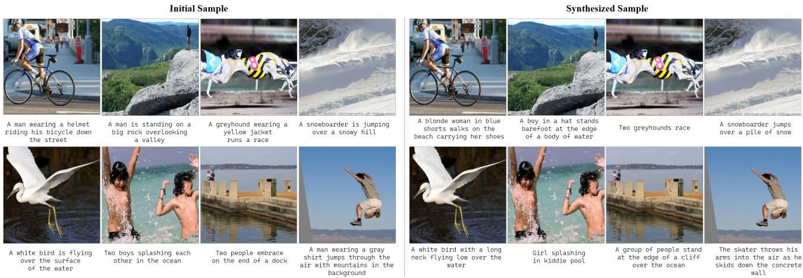  
Figure 3. Qualitative results of synthesized data. We compare the initial (left) and distilled samples (right).

# 4.2. Main Results

Image-Text Retrieval. We report in Table 1 the image–text retrieval performance in all three datasets of different scales—Flickr8k [23], Flickr30k [72], and COCO (123k) [35]—given distillation budgets of 100, 200 and 500 synthetic pairs. We distill synthetic data using NFNet as thet vision encoder and BERT as the text encoder to ensure a fair comparison with the baselines [68, 69]. Across all datasets and budget regimes, our method consistently outperforms the trajectory-matching baselines MTT-VL [68] and TESLAWBCE [12], achieving superior scores over all retrieval metrics. Compared to the current MTT-based state-

of-the-art, LoRS [69], our MDM achieves competitive performance across the board. Notably, in the largest and most challenging COCO dataset, our method outperforms LoRS by a noticeable margin, demonstrating that MDM maintains robustness even with a minimal distillation budget (condensation rate). Overall, these results demonstrate the effectiveness and scalability of our MDM framework, even for challenging low-budget distillation scenarios.

Qualitative Analysis. Fig. 3 presents a qualitative comparison of initial samples and our distilled data under the Flickr8k 100 pair setting. Since our method distills 768- dimensional text embeddings rather than raw captions, we visualize the text by retrieving the dataset caption whose embedding is closest to the distilled text vector. Although the distilled images visually appear to resemble the initial images, we observe an interesting pattern of noise-like highfrequency patches found in Fig. 3, also observed from prior works [68, 69]. We posit that this artifact difference in the image, coupled with the text embedding changes, jointly demonstrate the distillation effect from condensing largescale real data into a smaller set.

Table 2. Cross-architecture generalization. We report the averaged results over retrieval metrics including IR/TR@K={1,5,10}. Note that the source model results denoted with ‘∗’ are not averaged, and the best results are in boldface. (a)–(c): NFNet, NF-ResNet, NF-RegNet. 

<table><tr><td rowspan="3"># Pairs</td><td rowspan="3">Text Image</td><td colspan="7">Flickr8k [23]</td><td colspan="7">Flickr30k [72]</td><td colspan="7">COCO [35]</td></tr><tr><td colspan="3">BERT [16]</td><td colspan="3">DistilBERT [54]</td><td></td><td colspan="3">BERT [16]</td><td colspan="3">DistilBERT [54]</td><td></td><td colspan="3">BERT [16]</td><td colspan="3">DistilBERT [54]</td><td></td></tr><tr><td>(a)</td><td>(b)</td><td>(c)</td><td>(a)</td><td>(b)</td><td>(c)</td><td>Mean</td><td>(a)</td><td>(b)</td><td>(c)</td><td>(a)</td><td>(b)</td><td>(c)</td><td>Mean</td><td>(a)</td><td>(b)</td><td>(c)</td><td>(a)</td><td>(b)</td><td>(c)</td><td>Mean</td></tr><tr><td rowspan="2">100</td><td>LoRS [69]</td><td>19.4*</td><td>10.0</td><td>9.2</td><td>15.6</td><td>8.7</td><td>8.2</td><td>10.3</td><td>27.4*</td><td>6.5</td><td>7.1</td><td>24.0</td><td>5.8</td><td>6.1</td><td>9.9</td><td>9.4*</td><td>1.8</td><td>1.6</td><td>6.8</td><td>1.2</td><td>1.2</td><td>2.5</td></tr><tr><td>Ours</td><td>21.9*</td><td>13.6</td><td>15.3</td><td>17.3</td><td>11.0</td><td>12.4</td><td>13.9</td><td>26.4*</td><td>13.7</td><td>18.9</td><td>20.8</td><td>11.6</td><td>15.3</td><td>16.1</td><td>10.3*</td><td>6.4</td><td>7.2</td><td>7.0</td><td>4.6</td><td>5.2</td><td>6.1</td></tr><tr><td rowspan="2">200</td><td>LoRS [69]</td><td>22.1*</td><td>11.7</td><td>10.8</td><td>18.3</td><td>8.5</td><td>8.8</td><td>11.6</td><td>29.5*</td><td>10.0</td><td>10.9</td><td>22.7</td><td>8.3</td><td>8.9</td><td>12.2</td><td>11.4*</td><td>1.6</td><td>3.2</td><td>7.7</td><td>1.0</td><td>2.1</td><td>3.1</td></tr><tr><td>Ours</td><td>24.3*</td><td>14.7</td><td>18.9</td><td>19.4</td><td>10.8</td><td>14.2</td><td>15.6</td><td>28.2*</td><td>15.0</td><td>20.8</td><td>23.3</td><td>11.7</td><td>16.3</td><td>17.4</td><td>13.1*</td><td>9.2</td><td>10.2</td><td>9.9</td><td>6.9</td><td>7.7</td><td>8.7</td></tr><tr><td rowspan="2">500</td><td>LoRS [69]</td><td>25.0*</td><td>9.9</td><td>9.5</td><td>19.3</td><td>6.3</td><td>6.2</td><td>10.2</td><td>31.6*</td><td>15.3</td><td>13.4</td><td>22.1</td><td>10.8</td><td>10.7</td><td>14.5</td><td>13.5*</td><td>1.4</td><td>1.3</td><td>7.5</td><td>0.8</td><td>0.9</td><td>2.4</td></tr><tr><td>Ours</td><td>26.2*</td><td>13.8</td><td>20.5</td><td>20.5</td><td>10.0</td><td>16.2</td><td>16.2</td><td>30.6*</td><td>17.4</td><td>23.3</td><td>23.9</td><td>13.5</td><td>18.5</td><td>19.3</td><td>15.3*</td><td>9.8</td><td>11.3</td><td>11.4</td><td>7.6</td><td>8.9</td><td>9.8</td></tr></table>

Table 3. Compute statistics for different # of data pairs. 

<table><tr><td colspan="2">Flickr8k</td><td colspan="3">Distillation</td></tr><tr><td>Method</td><td># Pairs</td><td>Time/iter (sec)</td><td># iter till best</td><td>Total (min)</td></tr><tr><td>LoRS [69]</td><td rowspan="2">100</td><td>5.43</td><td>850</td><td>76.93</td></tr><tr><td>Ours</td><td>1.72</td><td>200</td><td>5.73 (↓ 93%)</td></tr><tr><td>LoRS [69]</td><td rowspan="2">200</td><td>6.60</td><td>1,250</td><td>137.50</td></tr><tr><td>Ours</td><td>2.39</td><td>200</td><td>7.97 (↓ 94%)</td></tr><tr><td>LoRS [69]</td><td rowspan="2">500</td><td>5.27</td><td>2,350</td><td>206.41</td></tr><tr><td>Ours</td><td>4.41</td><td>50</td><td>3.68 (↓ 98%)</td></tr></table>

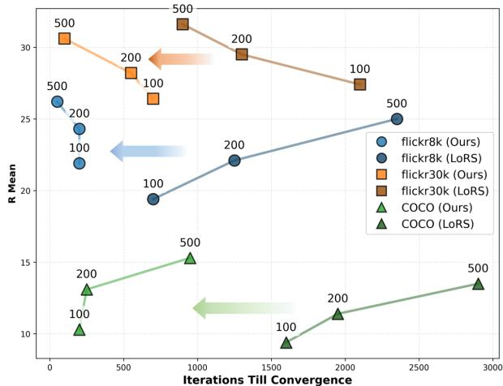

line

| Iterations Till Convergence | flickr8k (Ours) | flickr8k (LoRS) | flickr30k (Ours) | flickr30k (LoRS) | COCO (Ours) | COCO (LoRS) |
| --------------------------- | --------------- | --------------- | ---------------- | ---------------- | ----------- | ----------- |
| 0                           | 500             | 26              | 31               | 31               | 10          | 10          |
| 200                         | 200             | 24              | 28               | 28               | 13          | 13          |
| 500                         | 100             | 19              | 26               | 26               | 15          | 15          |
| 1000                        | -               | -               | -                | -                | 15          | -           |
| 1500                        | -               | -               | -                | -                | -           | -           |
| 2000                        | -               | -               | -                | -                | 11          | -           |
| 2500                        | -               | -               | -                | -                | -           | -           |
| 3000                        | -               | -               | -                | -                | 14          | -           |

Figure 4. Performance curve across datasets and data pairs. Ours consistently achieves higher performance at remarkably smaller iterations than the baseline [69].

# 4.3. Cross-Architecture Generalization

To assess the generalizability of our MDM framework, we performed cross-architecture experiments in all three datasets under all budgets, and report them in Table 2. All synthetic datasets are distilled using the NFNet+BERT configuration. We then train five different image–text encoder combinations using the distilled data and evaluate them on real test sets, reporting the averaged retrieval performance over IR/TR@K=1,5,10. The "Mean" column corresponds to the average performance across the five cross-architecture settings.

Across all datasets and budget settings, our method consistently achieves higher mean performance than LoRS, indicating stronger robustness to architecture changes. This improvement stems from the distinction between the two distillation paradigms: trajectory-matching methods, such as LoRS, inherit architecture-dependent biases from the source model’s optimization path, limiting their transferability. In contrast, our distribution-matching formulation distills the underlying dataset-level multimodal distribution itself, producing synthetic samples that are less tied to a specific architecture and therefore generalize more reliably across different encoder combinations.

# 4.4. Compute Efficiency

We compare the computational cost of our method with LoRS during the distillation process in Table 3 and Fig. 4. The LoRS requires approximately 5.4 sec/iteration, whereas our method requires only 1.7 sec for each distillation update including per-iteration model initialization, nearly a 3× improvement in naïve per-iteration efficiency. This gap arises from the fundamental difference in computational structure. The MTT-based baseline repeatedly trains the student model to generate trajectories that match those of the real, and also performs bi-level optimization to update the synthetic data, resulting in substantial overhead. In contrast, our MDM framework performs a single-level optimization that directly updates the synthetic samples without trajectory reconstruction, making it considerably more lightweight.

Furthermore, as shown in Fig. 4, our method attains strong retrieval performance with dramatically fewer optimization iterations than LoRS; for example, in the Flickr8k–500 pair setting, convergence is achieved within only 50 iterations. As a result, the overall distillation process under MDM incurs dramatically lower computational cost than LoRS, highlighting the strong efficiency advantage of our method.

# 4.5. Ablation Study and Further Discussion

Synthetic Data Initialization. We analyze the impact of synthetic data initialization in Table 4(a). Including this experiment, all ablation studies are conducted under the Flickr8k 100-pair setting. In contrast to observations in classificationoriented dataset distillation [11, 53, 66, 70], initializing synthetic samples from Gaussian noise fails to produce meaningful retrieval performance, likely due to the higher complexity of Flickr8k/30k and COCO and the fine-grained alignment required by image–text retrieval.

Compared to random real-sample initialization, kmeans–based initialization offers a clear advantage by selecting representative samples that better capture the dataset’s global structure. Moreover, clustering with joint features achieves the best results, insinuating the advantage of initialization reflecting the joint image-text structures more faithfully approximates the underlying multimodal distribution. In particular, even random sample initialization surpasses LoRS in the Flickr8k–100 pair setting, highlighting the effectiveness and robustness of our MDM framework.

Model Initialization. Table 4(b) analyzes how the initialization of the frozen model—used to encode real and synthetic samples during distillation—affects performance. Initializing from the original pre-trained checkpoint yields performance comparable to random-sample initialization, indicating that the synthetic data cannot effectively capture the target-domain structure. In contrast, initializing from a model fine-tuned on the target real dataset yields clear improvements, highlighting the importance of distillation in an embedding space that reflects target-domain characteristics.

In addition, using at each distillation step a model formed by a random weighted sum of the pre-trained and fine-tuned checkpoints yields further improvements over using the finetuned model alone. This indicates that distillation benefits from both the final embedding space and the intermediate states between pre-trained and fine-tuned models, allowing synthetic data to leverage a wider range of representations. This observation is consistent with prior distributionmatching methods for classification [75, 82], which similarly utilize models from different training stages to better capture evolving training dynamics.

Our proposed strategy achieves the best performance: by interpolating across multiple fine-tuned experts in weight space, it avoids overfitting to any single representation configuration. It exposes synthetic data to a more diverse, balanced joint embedding space, suggesting that our MDM is most effective when the frozen model provides a broad yet target-relevant representation landscape.

Component Analysis. Table 5 summarizes the ablation study on the loss components of MDM. The alignment loss $\mathcal { L } _ { \mathrm { { I n f o N C E } } }$ provides the basic pairing consistency between synthetic images and texts. Adding the agreement loss ${ \mathcal { L } } _ { \mathrm { a g r } }$ encourages the image–text agreement of synthetic pairs to match that of real data, thereby improving cross-modal structural consistency slightly. On the other hand, adding the discrepancy loss solely boosts even further, implying that modeling the cross-modal gap bears more significance than the shared component. Together, each complements by matching the image–text discrepancy between real and synthetic data, allowing the synthetic distribution to better capture the modality-specific separation present in real samples. Going beyond simple combination of data and model initializations, we remark that our MDM loss altogether act in synergy to achieve the state-of-the-art image-text retrieval performance.

Table 4. Ablations across synthetic data and model initializations.   
(a) Synthetic Data Initialization 

<table><tr><td rowspan="2">Syn. Data Init.</td><td rowspan="2">Noise</td><td rowspan="2">Random</td><td colspan="3">K-means Clustering</td></tr><tr><td>Image</td><td>Text</td><td>Ours</td></tr><tr><td>IR</td><td>0.6</td><td>18.6</td><td>18.9</td><td>18.6</td><td>19.7</td></tr><tr><td>TR</td><td>0.5</td><td>22.6</td><td>22.7</td><td>22.8</td><td>24.2</td></tr><tr><td>Mean</td><td>0.5</td><td>20.6</td><td>20.8</td><td>20.7</td><td>21.9</td></tr></table>

(b) Model Initialization 

<table><tr><td>Model Init.</td><td>Pre-trained</td><td>Fine-tuned</td><td>Weighted Sum</td><td>Ours</td></tr><tr><td>IR</td><td>5.1</td><td>14.3</td><td>17.6</td><td>19.7</td></tr><tr><td>TR</td><td>8.4</td><td>21.3</td><td>21.7</td><td>24.2</td></tr><tr><td>Mean</td><td>6.8</td><td>17.8</td><td>19.6</td><td>21.9</td></tr></table>

Table 5. Ablation study on the loss components. We report the average retrieval scores over K={1,5,10}. 

<table><tr><td>No.</td><td> $\mathcal{L}_{\text{InfoNCE}}$ </td><td> $\mathcal{L}_{\text{agr}}$ </td><td> $\mathcal{L}_{\text{dis}}$ </td><td>IR</td><td>TR</td><td>Mean</td></tr><tr><td>1</td><td>√</td><td>✗</td><td>✗</td><td>18.81</td><td>23.15</td><td>20.98</td></tr><tr><td>2</td><td>√</td><td>√</td><td>✗</td><td>18.82</td><td>23.23</td><td>21.02</td></tr><tr><td>3</td><td>√</td><td>✗</td><td>√</td><td>19.22</td><td>23.84</td><td>21.53</td></tr><tr><td>4</td><td>√</td><td>√</td><td>√</td><td>19.73</td><td>24.15</td><td>21.94</td></tr></table>

# 5. Conclusion

In this paper, we present an extension of distribution matching to multimodal settings. Our proposed MDM is a lightweight, generalizable algorithm that effectively exploits the cross-modal alignment between vision and language features by operating directly in the joint embedding space and by leveraging geometry-aware objectives tailored to multi-modal representations. Through this formulation, MDM avoids the heavy bi-level optimization and architecture-dependent biases, leading to strong improvements on cross-modal retrieval tasks across multiple datasets and substantial gains in cross-architecture generalization.

Limitations and LLM Usage. We assume access to pretrained image and text encoders. While MDM leverages distribution matching to enhance cross-architecture generalization, it remains limited by this reliance on pretrained encoders. We note that large language models (LLMs) have been used solely to assist with improving editing (e.g., grammar, spelling), formatting, and styling, without intervening in the development of original ideas.

# Acknowledgments

This work was supported by the National Research Foundation of Korea(NRF) grant funded by the Korea government(MSIT) (RS-2026-25473963) and the Institute of Information & communications Technology Planning & Evaluation (IITP) grant funded by the Korea government(MSIT) (No. RS-2024-00457882, AI Research Hub Project).

# References

[1] Josh Achiam, Steven Adler, Sandhini Agarwal, Lama Ahmad, Ilge Akkaya, Florencia Leoni Aleman, Diogo Almeida, Janko Altenschmidt, Sam Altman, Shyamal Anadkat, et al. Gpt-4 technical report. arXiv preprint arXiv:2303.08774, 2023. 1   
[2] Sharat Agarwal, Himanshu Arora, Saket Anand, and Chetan Arora. Contextual diversity for active learning. In European Conference on Computer Vision, pages 137–153. Springer, 2020. 5   
[3] Jean-Baptiste Alayrac, Jeff Donahue, Pauline Luc, Antoine Miech, Iain Barr, Yana Hasson, Karel Lenc, Arthur Mensch, Katherine Millican, Malcolm Reynolds, et al. Flamingo: a visual language model for few-shot learning. Advances in neural information processing systems, 35:23716–23736, 2022. 1   
[4] Jinze Bai, Shuai Bai, Yunfei Chu, Zeyu Cui, Kai Dang, Xiaodong Deng, Yang Fan, Wenbin Ge, Yu Han, Fei Huang, et al. Qwen technical report. arXiv preprint arXiv:2309.16609, 2023. 1   
[5] Youneng Bao, Yiping Liu, Zhuo Chen, Yongsheng Liang, Mu Li, and Kede Ma. Dataset distillation as data compression: A rate-utility perspective. In Proceedings of the IEEE/CVF International Conference on Computer Vision, pages 519– 529, 2025. 1   
[6] Andy Brock, Soham De, Samuel L Smith, and Karen Simonyan. High-performance large-scale image recognition without normalization. In International conference on machine learning, pages 1059–1071. PMLR, 2021. 5   
[7] Minwoo Byeon, Beomhee Park, Haecheon Kim, Sungjun Lee, Woonhyuk Baek, and Saehoon Kim. Coyo-700m: Image-text pair dataset. https://github.com/kakaobrain/ coyo-dataset, 2022. 1   
[8] George Cazenavette, Tongzhou Wang, Antonio Torralba, Alexei A Efros, and Jun-Yan Zhu. Dataset distillation by matching training trajectories. In CVPR, 2022. 2, 4   
[9] George Cazenavette, Tongzhou Wang, Antonio Torralba, Alexei A Efros, and Jun-Yan Zhu. Generalizing dataset distillation via deep generative prior. In Proceedings of the IEEE/CVF Conference on Computer Vision and Pattern Recognition, pages 3739–3748, 2023. 2   
[10] Cody Coleman, Christopher Yeh, Stephen Mussmann, Baharan Mirzasoleiman, Peter Bailis, Percy Liang, Jure Leskovec, and Matei Zaharia. Selection via proxy: Efficient data selection for deep learning. arXiv preprint arXiv:1906.11829, 2019. 5   
[11] Justin Cui, Ruochen Wang, Si Si, and Cho-Jui Hsieh. Dcbench: Dataset condensation benchmark. Advances in Neural Information Processing Systems, 35:810–822, 2022. 8

[12] Justin Cui, Ruochen Wang, Si Si, and Cho-Jui Hsieh. Scaling up dataset distillation to imagenet-1k with constant memory. In International Conference on Machine Learning, pages 6565–6590. PMLR, 2023. 2, 5, 6   
[13] Xiao Cui, Yulei Qin, Wengang Zhou, Hongsheng Li, and Houqiang Li. Optical: Leveraging optimal transport for contribution allocation in dataset distillation. In Proceedings of the Computer Vision and Pattern Recognition Conference, pages 15245–15254, 2025. 1   
[14] Wenxiao Deng, Wenbin Li, Tianyu Ding, Lei Wang, Hongguang Zhang, Kuihua Huang, Jing Huo, and Yang Gao. Exploiting inter-sample and inter-feature relations in dataset distillation. In Proceedings of the IEEE/CVF Conference on Computer Vision and Pattern Recognition, pages 17057– 17066, 2024. 1   
[15] Zhiwei Deng and Olga Russakovsky. Remember the past: Distilling datasets into addressable memories for neural networks. In NeurIPS, 2022. 2   
[16] Jacob Devlin, Ming-Wei Chang, Kenton Lee, and Kristina Toutanova. Bert: Pre-training of deep bidirectional transformers for language understanding. arXiv preprint arXiv:1810.04805, 2018. 5, 7   
[17] Jiawei Du, Yidi Jiang, Vincent YF Tan, Joey Tianyi Zhou, and Haizhou Li. Minimizing the accumulated trajectory error to improve dataset distillation. In Proceedings of the IEEE/CVF conference on computer vision and pattern recognition, pages 3749–3758, 2023. 2   
[18] Melanie Ducoffe and Frederic Precioso. Adversarial active learning for deep networks: a margin based approach. arXiv preprint arXiv:1802.09841, 2018. 5   
[19] Reza Zanjirani Farahani and Masoud Hekmatfar. Facility location: concepts, models, algorithms and case studies. Springer Science & Business Media, 2009. 2, 5, 6, 7   
[20] Chengcheng Guo, Bo Zhao, and Yanbing Bai. Deepcore: A comprehensive library for coreset selection in deep learning. In International Conference on Database and Expert Systems Applications, pages 181–195. Springer, 2022. 5   
[21] John A Hartigan and Manchek A Wong. Algorithm as 136: A k-means clustering algorithm. Journal of the royal statistical society. series c (applied statistics), 28(1):100–108, 1979. 4   
[22] Yang He, Lingao Xiao, and Joey Tianyi Zhou. You only condense once: Two rules for pruning condensed datasets. arXiv preprint arXiv:2310.14019, 2023. 2   
[23] Micah Hodosh, Peter Young, and Julia Hockenmaier. Framing image description as a ranking task: Data, models and evaluation metrics. Journal of Artificial Intelligence Research, 47:853–899, 2013. 1, 5, 6, 7, 3, 4   
[24] Rishabh Iyer, Ninad Khargoankar, Jeff Bilmes, and Himanshu Asanani. Submodular combinatorial information measures with applications in machine learning. In Algorithmic Learning Theory, pages 722–754. PMLR, 2021. 5   
[25] Dong-Hwan Jang, Sangdoo Yun, and Dongyoon Han. Model stock: All we need is just a few fine-tuned models. In European Conference on Computer Vision, pages 207–223. Springer, 2024. 4, 2, 6   
[26] Krishnateja Killamsetty, Sivasubramanian Durga, Ganesh Ramakrishnan, Abir De, and Rishabh Iyer. Grad-match: Gradient matching based data subset selection for efficient deep

model training. In International Conference on Machine Learning, pages 5464–5474. PMLR, 2021. 5   
[27] Krishnateja Killamsetty, Durga Sivasubramanian, Ganesh Ramakrishnan, and Rishabh Iyer. Glister: Generalization based data subset selection for efficient and robust learning. In Proceedings of the AAAI conference on artificial intelligence, pages 8110–8118, 2021. 5   
[28] Balhae Kim, Jungwon Choi, Seanie Lee, Yoonho Lee, Jung-Woo Ha, and Juho Lee. On divergence measures for bayesian pseudocoresets. arXiv preprint arXiv:2210.06205, 2022. 2   
[29] Jang-Hyun Kim, Jinuk Kim, Seong Joon Oh, Sangdoo Yun, Hwanjun Song, Joonhyun Jeong, Jung-Woo Ha, and Hyun Oh Song. Dataset condensation via efficient synthetic-data parameterization. In ICML, 2022. 2   
[30] Ron Kimmel and James A Sethian. Computing geodesic paths on manifolds. Proceedings of the national academy of Sciences, 95(15):8431–8435, 1998. 4   
[31] Hae Beom Lee, Dong Bok Lee, and Sung Ju Hwang. Dataset condensation with latent space knowledge factorization and sharing. arXiv preprint arXiv:2208.10494, 2022. 2   
[32] Shiye Lei and Dacheng Tao. A comprehensive survey of dataset distillation. IEEE Transactions on Pattern Analysis and Machine Intelligence, 46(1):17–32, 2023. 1   
[33] Hongcheng Li, Yucan Zhou, Xiaoyan Gu, Bo Li, and Weiping Wang. Diversity-enhanced distribution alignment for dataset distillation. In Proceedings of the IEEE/CVF International Conference on Computer Vision, pages 3747–3756, 2025. 1   
[34] Junnan Li, Dongxu Li, Caiming Xiong, and Steven Hoi. Blip: Bootstrapping language-image pre-training for unified visionlanguage understanding and generation. In International Conference on Machine Learning, pages 12888–12900. PMLR, 2022. 1   
[35] Tsung-Yi Lin, Michael Maire, Serge Belongie, James Hays, Pietro Perona, Deva Ramanan, Piotr Dollár, and C Lawrence Zitnick. Microsoft coco: Common objects in context. In Computer Vision–ECCV 2014: 13th European Conference, Zurich, Switzerland, September 6-12, 2014, Proceedings, Part V 13, pages 740–755. Springer, 2014. 1, 3, 5, 6, 7   
[36] Dai Liu, Jindong Gu, Hu Cao, Carsten Trinitis, and Martin Schulz. Dataset distillation by automatic training trajectories. In European Conference on Computer Vision, pages 334–351. Springer, 2024. 2   
[37] Haotian Liu, Chunyuan Li, Qingyang Wu, and Yong Jae Lee. Visual instruction tuning. Advances in neural information processing systems, 36:34892–34916, 2023. 1   
[38] Haoyang Liu, Yijiang Li, Tiancheng Xing, Peiran Wang, Vibhu Dalal, Luwei Li, Jingrui He, and Haohan Wang. Dataset distillation via the wasserstein metric. In Proceedings of the IEEE/CVF International Conference on Computer Vision, pages 1205–1215, 2025. 1   
[39] Ping Liu and Jiawei Du. The evolution of dataset distillation: Toward scalable and generalizable solutions. arXiv preprint arXiv:2502.05673, 2025. 1   
[40] Songhua Liu, Kai Wang, Xingyi Yang, Jingwen Ye, and Xinchao Wang. Dataset distillation via factorization. In NeurIPS, 2022. 2

[41] Songhua Liu, Jingwen Ye, Runpeng Yu, and Xinchao Wang. Slimmable dataset condensation. In Proceedings of the IEEE/CVF Conference on Computer Vision and Pattern Recognition, pages 3759–3768, 2023. 2   
[42] Yanqing Liu, Jianyang Gu, Kai Wang, Zheng Zhu, Wei Jiang, and Yang You. Dream: Efficient dataset distillation by representative matching. arXiv preprint arXiv:2302.14416, 2023. 2   
[43] Noel Loo, Ramin Hasani, Alexander Amini, and Daniela Rus. Efficient dataset distillation using random feature approximation. In NeurIPS, 2022. 2   
[44] Noel Loo, Ramin Hasani, Mathias Lechner, and Daniela Rus. Dataset distillation with convexified implicit gradients. arXiv preprint arXiv:2302.06755, 2023. 2   
[45] Dionysis Manousakas, Zuheng Xu, Cecilia Mascolo, and Trevor Campbell. Bayesian pseudocoresets. In NeurIPS, 2020. 2   
[46] Katerina Margatina, Giorgos Vernikos, Loïc Barrault, and Nikolaos Aletras. Active learning by acquiring contrastive examples. arXiv preprint arXiv:2109.03764, 2021. 5   
[47] Shibin Mei, Hang Wang, and Bingbing Ni. Geomm: On geodesic perspective for multi-modal learning. In Proceedings of the Computer Vision and Pattern Recognition Conference, pages 4776–4786, 2025. 4, 2   
[48] Baharan Mirzasoleiman, Jeff Bilmes, and Jure Leskovec. Coresets for data-efficient training of machine learning models. In International Conference on Machine Learning, pages 6950–6960. PMLR, 2020. 5   
[49] Timothy Nguyen, Zhourong Chen, and Jaehoon Lee. Dataset meta-learning from kernel ridge-regression. arXiv preprint arXiv:2011.00050, 2020. 2   
[50] Timothy Nguyen, Roman Novak, Lechao Xiao, and Jaehoon Lee. Dataset distillation with infinitely wide convolutional networks. In NeurIPS, 2021. 2   
[51] Mansheej Paul, Surya Ganguli, and Gintare Karolina Dziugaite. Deep learning on a data diet: Finding important examples early in training. Advances in neural information processing systems, 34:20596–20607, 2021. 5   
[52] Alec Radford, Jong Wook Kim, Chris Hallacy, Aditya Ramesh, Gabriel Goh, Sandhini Agarwal, Girish Sastry, Amanda Askell, Pamela Mishkin, Jack Clark, et al. Learning transferable visual models from natural language supervision. In International conference on machine learning, pages 8748–8763. PmLR, 2021. 3   
[53] Ahmad Sajedi, Samir Khaki, Ehsan Amjadian, Lucy Z Liu, Yuri A Lawryshyn, and Konstantinos N Plataniotis. Datadam: Efficient dataset distillation with attention matching. In Proceedings of the IEEE/CVF International Conference on Computer Vision, pages 17097–17107, 2023. 8   
[54] Victor Sanh, Lysandre Debut, Julien Chaumond, and Thomas Wolf. Distilbert, a distilled version of bert: smaller, faster, cheaper and lighter. arXiv preprint arXiv:1910.01108, 2019.   
[55] Christoph Schuhmann, Romain Beaumont, Richard Vencu, Cade Gordon, Ross Wightman, Mehdi Cherti, Theo Coombes, Aarush Katta, Clayton Mullis, Mitchell Wortsman, et al.

Laion-5b: An open large-scale dataset for training next generation image-text models. Advances in Neural Information Processing Systems, 35:25278–25294, 2022. 1   
[56] Ozan Sener and Silvio Savarese. Active learning for convolutional neural networks: A core-set approach. arXiv preprint arXiv:1708.00489, 2017. 5   
[57] Donghyeok Shin, Seungjae Shin, and Il-Chul Moon. Frequency domain-based dataset distillation. Advances in Neural Information Processing Systems, 36:70033–70044, 2023. 1, 2   
[58] Byunggwan Son, Youngmin Oh, Donghyeon Baek, and Bumsub Ham. Fyi: Flip your images for dataset distillation. In European Conference on Computer Vision, pages 214–230. Springer, 2024.   
[59] Duo Su, Junjie Hou, Weizhi Gao, Yingjie Tian, and Bowen Tang. D^4m: Dataset distillation via disentangled diffusion model. In Proceedings of the IEEE/CVF Conference on Computer Vision and Pattern Recognition, pages 5809–5818, 2024. 1   
[60] Gemini Team, Petko Georgiev, Ving Ian Lei, Ryan Burnell, Libin Bai, Anmol Gulati, Garrett Tanzer, Damien Vincent, Zhufeng Pan, Shibo Wang, et al. Gemini 1.5: Unlocking multimodal understanding across millions of tokens of context. arXiv preprint arXiv:2403.05530, 2024. 1   
[61] Bart Thomee, David A Shamma, Gerald Friedland, Benjamin Elizalde, Karl Ni, Douglas Poland, Damian Borth, and Li-Jia Li. Yfcc100m: The new data in multimedia research. Communications of the ACM, 59(2):64–73, 2016. 1   
[62] Piyush Tiwary, Kumar Shubham, Vivek Kashyap, et al. Constructing bayesian pseudo-coresets using contrastive divergence. arXiv preprint arXiv:2303.11278, 2023. 2   
[63] Mariya Toneva, Alessandro Sordoni, Remi Tachet des Combes, Adam Trischler, Yoshua Bengio, and Geoffrey J Gordon. An empirical study of example forgetting during deep neural network learning. arXiv preprint arXiv:1812.05159, 2018. 2, 5, 6, 7   
[64] Haoxuan Wang, Zhenghao Zhao, Junyi Wu, Yuzhang Shang, Gaowen Liu, and Yan Yan. Cao2: Rectifying inconsistencies in diffusion-based dataset distillation, 2025. 1   
[65] Kai Wang, Bo Zhao, Xiangyu Peng, Zheng Zhu, Shuo Yang, Shuo Wang, Guan Huang, Hakan Bilen, Xinchao Wang, and Yang You. Cafe: Learning to condense dataset by aligning features. In CVPR, 2022. 2   
[66] Tongzhou Wang, Jun-Yan Zhu, Antonio Torralba, and Alexei A Efros. Dataset distillation. arXiv preprint arXiv:1811.10959, 2018. 1, 8   
[67] Max Welling. Herding dynamical weights to learn. In Proceedings of the 26th Annual International Conference on Machine Learning, pages 1121–1128, 2009. 2, 5, 6, 7   
[68] Xindi Wu, Byron Zhang, Zhiwei Deng, and Olga Russakovsky. Vision-language dataset distillation, 2024. TMLR 2024. 2, 3, 4, 5, 6, 7   
[69] Yue Xu, Zhilin Lin, Yusong Qiu, Cewu Lu, and Yong-Lu Li. Low-rank similarity mining for multimodal dataset distillation. In Proceedings of the 41st International Conference on Machine Learning, pages 55144–55161. PMLR, 2024. 2, 3, 4, 5, 6, 7

[70] Zeyuan Yin and Zhiqiang Shen. Dataset distillation via curriculum data synthesis in large data era. Transactions on Machine Learning Research, 2024. 8   
[71] Zeyuan Yin, Eric Xing, and Zhiqiang Shen. Squeeze, recover and relabel: Dataset condensation at imagenet scale from a new perspective. arXiv preprint arXiv:2306.13092, 2023. 2   
[72] Peter Young, Alice Lai, Micah Hodosh, and Julia Hockenmaier. From image descriptions to visual denotations: New similarity metrics for semantic inference over event descriptions. Transactions of the association for computational linguistics, 2:67–78, 2014. 1, 3, 5, 6, 7   
[73] Ruonan Yu, Songhua Liu, and Xinchao Wang. Dataset distillation: A comprehensive review. IEEE transactions on pattern analysis and machine intelligence, 46(1):150–170, 2023. 1   
[74] Xiaohua Zhai, Basil Mustafa, Alexander Kolesnikov, and Lucas Beyer. Sigmoid loss for language image pre-training. In Proceedings of the IEEE/CVF international conference on computer vision, pages 11975–11986, 2023. 1   
[75] Hansong Zhang, Shikun Li, Fanzhao Lin, Weiping Wang, Zhenxing Qian, and Shiming Ge. Dance: Dual-view distribution alignment for dataset condensation. arXiv preprint arXiv:2406.01063, 2024. 2, 8   
[76] Hansong Zhang, Shikun Li, Pengju Wang, Dan Zeng, and Shiming Ge. M3d: Dataset condensation by minimizing maximum mean discrepancy. In Proceedings of the AAAI Conference on Artificial Intelligence, pages 9314–9322, 2024. 1   
[77] Lei Zhang, Jie Zhang, Bowen Lei, Subhabrata Mukherjee, Xiang Pan, Bo Zhao, Caiwen Ding, Yao Li, and Dongkuan Xu. Accelerating dataset distillation via model augmentation. In Proceedings of the IEEE/CVF Conference on Computer Vision and Pattern Recognition, pages 11950–11959, 2023. 2   
[78] Bo Zhao and Hakan Bilen. Dataset condensation with differentiable siamese augmentation. In ICML, 2021. 2   
[79] Bo Zhao and Hakan Bilen. Synthesizing informative training samples with gan. arXiv preprint arXiv:2204.07513, 2022. 2   
[80] Bo Zhao and Hakan Bilen. Dataset condensation with distribution matching. In WACV, 2023. 2, 3   
[81] Bo Zhao, Konda Reddy Mopuri, and Hakan Bilen. Dataset condensation with gradient matching. arXiv preprint arXiv:2006.05929, 2020. 2   
[82] Ganlong Zhao, Guanbin Li, Yipeng Qin, and Yizhou Yu. Improved distribution matching for dataset condensation. In Proceedings of the IEEE/CVF Conference on Computer Vision and Pattern Recognition, pages 7856–7865, 2023. 2, 3, 8   
[83] Zhenghao Zhao, Haoxuan Wang, Junyi Wu, Yuzhang Shang, Gaowen Liu, and Yan Yan. Efficient multimodal dataset distillation via generative models. arXiv preprint arXiv:2509.15472, 2025. 6, 7   
[84] Wenliang Zhong, Haoyu Tang, Qinghai Zheng, Mingzhu Xu, Yupeng Hu, and Weili Guan. Towards stable and storageefficient dataset distillation: Matching convexified trajectory. In Proceedings of the Computer Vision and Pattern Recognition Conference, pages 25581–25589, 2025. 2   
[85] Yongchao Zhou, Ehsan Nezhadarya, and Jimmy Ba. Dataset distillation using neural feature regression. arXiv preprint arXiv:2206.00719, 2022. 2

[86] Yawen Zou, Guang Li, Duo Su, Zi Wang, Jun Yu, and Chao Zhang. Dataset distillation via vision-language category prototype. In Proceedings of the IEEE/CVF International Conference on Computer Vision (ICCV), 2025. 1

# Multimodal Distribution Matching for Vision-Language Dataset Distillation Supplementary Material

In this supplementary material, we elaborate on the details of our method and experiments and provide additional results with further analyses. We remark that throughout the manuscript, we intend to work with features denoted as $z ^ { v }$ for the image and $z ^ { t }$ for the text, the angle between the two displacement vectors as $ _ { \angle \phi } ( \cdot , \cdot )$ , and the distance (discrepancy) function as $\phi ( \cdot , \cdot )$ . The list of contents is as follows:

1. Generalizing Unimodal DM to Multimodal (Sec. S1)   
2. Distinctions of Our Method (Sec. S2)   
3. Experimental Details (Sec. S3)

- Selection of datasets of various scales (Sec. S3.1)   
- Reasons for underperformance on Flickr30k (Sec. S3.2)   
- Limitations of the baseline (Sec. S3.3)   
- Further analysis on initialization (Sec. S3.4)   
- Implementation details (Sec. S3.5)   
- Sensitivity analysis (Sec. S3.6)   
- Full retrieval results over multiple runs (Sec. S3.7)   
- Full algorithm (Sec. S3.8)

# S1. MDM Formulation

Generalizing Unimodal DM to Multimodal. In our approach, we consider a multimodal dataset $\mathcal { D } _ { \mathrm { r e a l } } \ =$ $\{ ( x _ { i } , t _ { i } ) \} _ { i = 1 } ^ { B }$ 1 of image-text pairs and a much smaller synthetic dataset $\mathcal { D } _ { \mathrm { s y n } } = \{ ( \tilde { x } _ { j } , \tilde { t } _ { j } ) \} _ { j = 1 } ^ { \tilde { B } }$ with $| \mathcal { D } _ { \mathrm { s y n } } | \ll | \mathcal { D } _ { \mathrm { r e a l } } |$ A unified image-text model $\Psi ( \cdot , \cdot )$ maps an image-text pair $( x , t )$ into a joint feature space and is composed of a pretrained image encoder $\theta ^ { v }$ , and a pretrained text encoder $\theta ^ { t }$ with a projection layer.

Our goal is to acquire an optimal set of distilled set $\mathcal { D } _ { \mathrm { s y n } } ^ { \star }$ via the multimodal distribution matching (MDM) objective (Eq. 2):

$$
\mathcal {D} _ {\text {syn}} ^ {\star} = \underset {\mathcal {D} _ {\text {syn}}} {\arg \min} \phi \Big (\underbrace {\mathbb {E} _ {(X , T) \sim \mathcal {D} _ {\text {real}}} [ \Psi (X , T) ]} _ {\text {real joint}}, \underbrace {\mathbb {E} _ {(\tilde {X} , \tilde {T}) \sim \mathcal {D} _ {\text {syn}}} [ \Psi (\tilde {X} , \tilde {T}) ]} _ {\text {synthetic joint}} \Big),
$$

where $\phi : \mathbb { R } ^ { d } \times \mathbb { R } ^ { d }  [ 0 , \infty )$ is a nonnegative discrepancy function measuring the distance between two mean joint feature vectors. Below, we justify this objective as a natural multimodal extension of the standard unimodal distribution matching formulation.

We first interpret the real and synthetic datasets as empirical distributions to ease the understanding of their distributions. The real data $\mathcal { D } _ { \mathrm { r e a l } }$ induces the empirical distribution:

$$
\widehat {P} _ {X T} ^ {\text { real }} = \frac {1}{B} \sum_ {i = 1} ^ {B} \delta_ {(x _ {i}, t _ {i})}, \tag {S1}
$$

where $\delta _ { ( x _ { i } , t _ { i } ) }$ is the Dirac measure at the pair $( x _ { i } , t _ { i } )$ . Similarly, the synthetic dataset $\mathcal { D } _ { \mathrm { s y n } }$ induces

$$
\widehat {Q} _ {X T} ^ {\text { syn }} = \frac {1}{\tilde {B}} \sum_ {j = 1} ^ {\tilde {B}} \delta_ {(\tilde {x} _ {j}, \tilde {t} _ {j})}. \tag {S2}
$$

For any fixed joint feature extractor Ψ, the expectations of Ψ under these empirical distributions are simply empirical means:

$$
\mathbb {E} _ {(X, T) \sim \hat {P} _ {X T} ^ {\text { real }}} [ \Psi (X, T) ] = \frac {1}{B} \sum_ {i = 1} ^ {B} \Psi (x _ {i}, t _ {i}), \tag {S3}
$$

$$
\mathbb {E} _ {(\tilde {X}, \tilde {T}) \sim \widehat {Q} _ {X T} ^ {\mathrm{syn}}} [ \Psi (\tilde {X}, \tilde {T}) ] = \frac {1}{\tilde {B}} \sum_ {j = 1} ^ {\tilde {B}} \Psi (\tilde {x} _ {j}, \tilde {t} _ {j}). \tag {S4}
$$

Thus, the expectations appearing in Eq.2 can be interpreted as dataset-wise averages of joint features produced by Ψ over the real and synthetic datasets, respectively. We can then define the real and synthetic mean joint features as

$$
\mu_ {\text { real }} := \mathbb {E} _ {(X, T) \sim P _ {X T} ^ {\text { real }}} \big [ \Psi (X, T) \big ], \tag {S5}
$$

$$
\mu_ {\mathrm{syn}} (\mathcal {D} _ {\mathrm{syn}}) := \mathbb {E} _ {(\tilde {X}, \tilde {T}) \sim Q _ {X T} ^ {\mathrm{syn}}} \big [ \Psi (\tilde {X}, \tilde {T}) \big ], \qquad (\mathrm{S6})
$$

where we denote the true data distribution over image-text pairs (X, T ) as P realXT $( X , T )$ $P _ { X T } ^ { \mathrm { r e a l } }$ , and the distribution represented by $\mathcal { D } _ { \mathrm { s y n } }$ as $Q _ { X T } ^ { \mathrm { s y n } }$ . The goal of multimodal DM is then to find a synthetic dataset $\mathcal { D } _ { { s y n } }$ whose induced distribution $Q _ { X T } ^ { \mathrm { s y n } }$ yields a mean feature vector $\mu _ { \mathrm { s y n } } ( \mathcal { D } _ { \mathrm { s y n } } )$ that is as close to the real mean $\mu _ { \mathrm { r e a l } }$ under some discrepancy function $\phi ( \cdot , \cdot ) \colon$ :

$$
\mathcal {D} _ {\text { syn }} ^ {\star} \in \underset {\mathcal {D} _ {\text { syn }}} {\arg \min} \phi \big (\mu_ {\text { real }}, \mu_ {\text { syn }} (\mathcal {D} _ {\text { syn }}) \big). \tag {S7}
$$

Replacing the population expectations by their empirical counterparts real $\widehat { P } _ { X T } ^ { \mathrm { r e a l } }$ and $\widehat { Q } _ { X T } ^ { \mathrm { s y n } }$ QbsynXT we obtain ,

$$
\mathbb {E} _ {(X, T) \sim \mathcal {D} _ {\mathrm{real}}} [ \Psi (X, T) ] \approx \mu_ {\mathrm{real}}, \tag {S8}
$$

$$
\mathbb {E} _ {(\tilde {X}, \tilde {T}) \sim \mathcal {D} _ {\mathrm{syn}}} [ \Psi (\tilde {X}, \tilde {T}) ] \approx \mu_ {\mathrm{syn}} (\mathcal {D} _ {\mathrm{syn}}). \tag {S9}
$$

For fixed Ψ and $\mathcal { D } _ { \mathrm { r e a l } }$ , the real mean $\mu _ { \mathrm { r e a l } }$ is constant and serves as the target, while the synthetic mean $\mu _ { \mathrm { s y n } } ( \mathcal { D } _ { \mathrm { s y n } } )$ depends on the content of $\mathcal { D } _ { \mathrm { s y n } }$ and is optimized by updating the synthetic pairs. We remark that this is equivalent to the unimodal DM formulation if we replace the joint image-text feature $\Psi ( x , t )$ with a unimodal encoder $\theta _ { 0 } ( x )$ as:

$$
\mathcal {D} _ {\text { syn }} ^ {\star} = \underset {\mathcal {D} _ {\text { syn }}} {\arg \min} \phi \left(\mathbb {E} _ {X \sim \mathcal {D} _ {\text { real }}} [ \theta_ {0} (X) ], \mathbb {E} _ {\tilde {X} \sim \mathcal {D} _ {\text { syn }}} [ \theta_ {0} (\tilde {X}) ]\right), \tag {S10}
$$

for some distance function $\phi ( \cdot , \cdot )$ for unimodal distributions.

Under these choices, the random variable (X, T ) effectively reduces to X, and the mean joint features become mean image features. Hence, the proposed multimodal DM objective strictly generalizes the standard image-only DM objective by extending the feature space from $\theta _ { 0 } ( x )$ to the joint representation $\Psi ( x , t )$ and by allowing a general discrepancy function.

# S2. Distinctions of Our Method

Our MDM method first seeds synthetic image–text pairs by running K-means clustering on the concatenated joint features $[ z ^ { v } ; z ^ { t } ]$ . It then optimizes these synthetic pairs so that the spherical distributions of an agreement vector u and a discrepancy vector g match those of the real data. The agreement u captures shared image–text content and is obtained from a normalized combination of $z ^ { v }$ and $z ^ { t }$ on the unit hypersphere. The discrepancy $g$ encodes the modality gap between image and text and is obtained from a normalized difference of $z ^ { v }$ and $z ^ { t }$ on the same hypersphere. Matching the real and synthetic distributions in both u and g encourages the synthetic set to capture architecture-agnostic joint semantics rather than reproducing individual training trajectories. Here, interestingly, we observe from the ablation study in Table 5 that matching the distribution of g improves retrieval performance by a larger gap than that from matching u. This indicates that MDM primarily encourages the learning of how captions deviate from images through the global structure of the gap distribution, rather than focusing on shared semantics.

# S2.1. Synthetic Data Initialization

Coreset-based initializations such as K-center and herding select real image–text pairs that approximately cover the encoder feature space under max–min radius or greedy moment-matching criteria, and then reuse these as seeds for optimization under the same MDM objective. However, these heuristics neglect the structure of the image-text agreement and discrepancy, and encourage only marginal coverage, rather than explicitly targeting the joint semantic modes that are crucial for effective cross-modal retrieval. In contrast, our initialization performs K-means clustering directly in the joint feature space and assigns the sample nearest the cluster centroid to each synthetic pair, anchoring the synthetic parameters near representative joint centroids. This jointfeature-aware seeding reduces the burden on MDM to relocate poorly placed seeds and instead focuses optimization on fine-grained refinement around already well-positioned prototypes, yielding synthetic datasets that more faithfully approximate the real joint distribution. Empirically, this leads to consistently higher image-text retrieval performance than coreset-seeded variants, shown in Table S1.

Table S1. Performance comparison on Ours seeded with different synthetic data initialization strategies. 

<table><tr><td></td><td>K-center</td><td>Herding</td><td>Joint-feature K-Means Clustering (Ours)</td></tr><tr><td>IR</td><td>19.5</td><td>19.2</td><td>19.7</td></tr><tr><td>TR</td><td>22.1</td><td>23.9</td><td>24.2</td></tr><tr><td>Mean</td><td>20.8</td><td>21.5</td><td>21.9</td></tr></table>

# S2.2. Model Initialization

Our method employs a dynamic multimodal weightinitialization scheme that merges a pretrained image encoder–text projector pair with N finetuned counterparts randomly sampled from a pool of experts, each updated at every training iteration as with vision-only DM methods [75, 80, 82]. Inspired by the angular, layer-wise interpolation strategy of Model Stock [25] (originally proposed for robust unimodal classification), we compute layer-wise interpolation coefficients from the angles between the displacement vectors of each finetuned expert anchored on the model composed of a pretrained image encoder and a randomly initialized text projector. Using these coefficients, we then merge them in the weight space, with the goal of shifting the pretrained anchor towards real data distribution, implicitly guided by these experts. To this, we add an additional global weighting factor, α, to further modulate these layer-wise ratios, effectively controlling the trade-off between expertspecific bias and generic structure in a fine-grained manner. Unlike the static, one-shot merge in Model Stock that is used as the final predictor, the merged multimodal encoder in our framework serves as a stochastic, expert-pool–aware initialization that is refreshed at every distillation step and then optimized under the MDM objective. This construction extends [25] from unimodal to multimodal (image encoder and text projector) weight fusion and allows synthetic data to be optimized in a more diverse region of the joint image–text weight space, effectively stabilizing and improving the optimization process.

# S2.3. Geodesic Kernel Formulation

Geodesic distance on the sphere measures the shortest path along the sphere with respect to the manifold’s curvature, hence yielding the intrinsic distance. Our intuition to employ the geodesic distance stems from [47], which highlighted its advantage for understanding the complex geometric structure of multimodal data. Since typical InfoNCE loss and retrieval tasks are primarily driven by angular similarity (e.g., cosine), our geodesic perspective using the geodesic kernel energy as formulated in Eq. 9 aligns well with the angular distributions of multimodal data.

Kernel variants. For two d-dim feature vectors $a , b \in \mathbb { R } ^ { d }$ and a bandwidth $\sigma > 0 ,$ we consider the following radial basis function (RBF) kernels with different angular distance functions that induce the same topology on $\mathbb { S } ^ { d - 1 }$ , where we demonstrate that the geodesic kernel performs the best in Table S2. Although the image retrieval score improvements appear incremental, our geodesic kernel dramatically increases text retrieval scores.

Table S2. Performance by different types of RBF Kernel. 

<table><tr><td>k(·,·)</td><td>Laplacian</td><td>Chordal</td><td>Geodesic (Ours)</td></tr><tr><td>IR</td><td>18.3</td><td>19.5</td><td>19.7</td></tr><tr><td>TR</td><td>22.4</td><td>23.5</td><td>24.2</td></tr><tr><td>Mean</td><td>20.3</td><td>21.5</td><td>21.9</td></tr></table>

• Laplacian RBF kernel. We also consider a Laplacian RBF kernel based on the L1-distance in the ambient space:

$$
k _ {\text { laplacian }} (a, b) = \exp \left(- \frac {\| a - b \| _ {1}}{\sigma}\right). \tag {S11}
$$

• Chordal RBF kernel on the unit hypersphere. Similar to the well-established Euclidean distance, the chordal distance measures the straight-line chord distance between the two unit-normalized points, but restricted to points on a sphere. To force the features onto the sphere, we first L2-normalize the features to lie on the unit hypersphere, $\hat { a } = a / \lVert a \rVert _ { 2 } , \hat { b } = b / \lVert b \rVert _ { 2 }$ , and define the chordal distance between aˆ and ˆb as

$$
d _ {\mathrm{chord}} (\hat {a}, \hat {b}) = \| \hat {a} - \hat {b} \| _ {2} = \sqrt {2 - 2 \langle \hat {a} , \hat {b} \rangle}, \tag {S12}
$$

where ⟨·, ·⟩ denotes inner product. The corresponding chordal RBF kernel is then:

$$
k _ {\text { chord }} (a, b) = \exp \left(- \frac {d _ {\text { chord }} (\hat {a} , \hat {b}) ^ {2}}{2 \sigma^ {2}}\right) = \exp \left(- \frac {2 - 2 \langle \hat {a} , \hat {b} \rangle}{2 \sigma^ {2}}\right). \tag {S13}
$$

Intuitively, chordal distance measures the Euclidean length of the straight-line chord in the ambient space connecting two points on the sphere.

• Geodesic RBF kernel on the unit hypersphere. The intrinsic (geodesic) distance on the unit hypersphere is given by the angular distance along the arc on the surface of the sphere as:

$$
d _ {\text { geo }} (\hat {a}, \hat {b}) = \arccos \bigl (\langle \hat {a}, \hat {b} \rangle \bigr) \in [ 0, \pi ]. \tag {S14}
$$

Using this intrinsic distance, we define the geodesic Gaussian kernel

$$
k _ {\text { geo }} (a, b) = \exp \left(- \frac {d _ {\text { geo }} (\hat {a} , \hat {b}) ^ {2}}{2 \sigma^ {2}}\right). \tag {S15}
$$

Although this kernel is not guaranteed to be positive definite on $\bar { \mathbb { S } } ^ { d - 1 }$ in general, we use the resulting quantity as a geodesic kernel energy to encourage the alignment of real and synthetic feature distributions in the unit hypersphere.

# S2.4. Cross-Modal Agreement and Discrepancy

To better capture the structure of multimodal representations, we construct the joint image-text features as a cross-modal agreement vector u and a cross-modal discrepancy vector g. The agreement component encodes modality-shared semantics (objects, actions, coarse scene layout), whereas the discrepancy component models modality-specific information, i.e., the inherent “modality gap”. This gap is nonnegligible in image-text data: a single image can be paired with multiple, diverse captions (as in Flickr8k, Flickr30k, MS-COCO datasets), and the same visual concept can be expressed in many textual forms, leading to a structured one-to-many relationship between the two modalities. As reported in Fig. S1, reducing geodesic kernel energy on each modality independently (“singles”) or on navely concate-¨ nated joint features (“concat”) fails to fully account for this structure. In contrast, our joint optimization over u and g (“joint”) explicitly matches both modality-shared semantics and modality-specific gaps, yielding better preservation of joint image-text relationships and consistently higher retrieval performance.

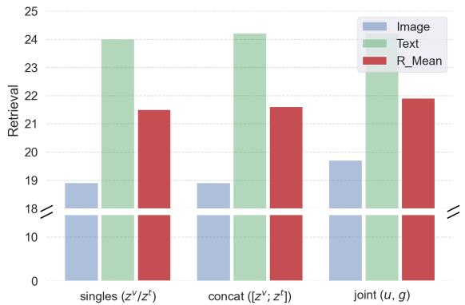

bar

| Category           | Image | Text | R_Mean |
| ------------------ | ----- | ---- | ------ |
| singles (z^v / z^t) | 19    | 24   | 21.5   |
| concat ([z^v; z^t])  | 19    | 24.5 | 21.5   |
| joint (u, g)       | 19.5  | 24.5 | 22     |

Figure S1. Comparison of matching geodesic kernel energy on (i) each image and text features separately, (ii) concatenated imagetext features only, and (iii) our joint cross-modal agreement and discrepancy features.

# S3. Experimental Details

# S3.1. Deliberate Selection of Datasets

To study how our multimodal dataset distillation behaves as the training corpus grows, we deliberately choose three image–text benchmark datasets as exemplified in Fig. S2 that particularly differ in scale: Flickr8k [23] (≈8k pairs), Flickr30k [72] (≈30k pairs) and MS-COCO [35] (≈123k pairs). These datasets of increasing scale allow us to probe whether the same distillation procedure continues to yield meaningful compression and retrieval performance as we move from a small to a substantially larger dataset, while keeping the task and evaluation protocol comparable. Across this entire scale range, our method remains highly competitive, effectively condensing real data into compact synthetic subsets at substantially lower computational resource cost than existing baselines.

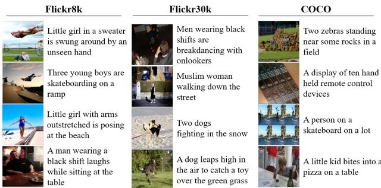

text_image

Flickr8k
Little girl in a sweater
is swung around by an
unseen hand
Three young boys are
skateboarding on a
ramp
Little girl with arms
outstretched is posing
at the beach
A man wearing a
black shift laughs
while sitting at the
table
Flickr30k
Men wearing black
shifts are
breakdancing with
onlookers
Muslim woman
walking down the
street
Two dogs
fighting in the snow
A dog leaps high in
the air to catch a toy
over the green grass
COCO
Two zebras standing
near some rocks in a
field
A display of ten hand
held remote control
devices
A person on a
skateboard on a lot
A little kid bites into a
pizza on a table

Figure S2. Examples of image-text datasets consisting of natural scene images and corresponding captions.

# S3.2. Reasons for Underperformance on Flickr30k

In Table 1 of the main paper, we observe that on Flickr30k, a mid-scale dataset with relatively low redundancy, our text retrieval (TR) performance slightly underperforms the LoRS baseline. Each image in Flickr30k has multiple locally diverse captions, and many images are visually similar while differing only in subtle relational or attribute-level details. Under MDM, the real gap vectors {gi} associated with such visually and semantically related image–caption pairs are pulled toward a small number of synthetic gap prototypes. This averaging of gap modes reduces the margin between the ground-truth captions and near-duplicate but different captions for a given image. Caption-level discrimination in text retrieval on Flickr30k, therefore, becomes harder than for LoRS [69], which preserves more instance-level detail via low-rank similarity and maintains sharper caption margins.

In contrast, the Flickr8k dataset is about 4× smaller and has a sparser caption space, with fewer near-duplicate captions per image and fewer confusing alternatives at evaluation time. In this low-data regime, the same smoothing of the gap distribution acts mainly as regularization. It suppresses unstable or idiosyncratic gaps instead of collapsing many truly distinct modes, which improves generalization relative to LoRS. On COCO, the largest and most redundant dataset in our evaluation, many caption patterns and gap structures repeat across a large number of images. In this setting, MDM compresses these repeated gap patterns into a compact set of prototypes and achieves more efficient coverage of typical multimodal relations than LoRS. This explains why our method outperforms the baseline on COCO despite operating at a stronger effective compression rate.

# S3.3. Limitations of the Baseline [69]

The LoRS baseline constructs synthetic data by enforcing low-rank similarity between the behavior of real and synthetic examples on a fixed source architecture. This ties the distilled set closely to the geometry and inductive biases of a particular architecture and favors instance-level reproduction of that model’s gradients and feature updates. LoRS does not explicitly model the multimodal feature distribution. Instead, it approximates the real data distributions through a low-rank subspace of parameter updates. As a result, LoRS can preserve fine caption-level distinctions that benefit samearchitecture text retrieval on Flickr30k. Yet, the synthetic data often remains specialized to the source model’s decision boundaries and transfers poorly to different encoders. In contrast, our MDM approach operates directly in a joint feature space and matches distributions over both agreement and discrepancy between real and synthetic pairs. This induces the synthetic set to capture architecture-agnostic structure in the joint image-text manifold rather than reproducing lowrank gradient behavior tailored to a single architecture. The resulting synthetic data provide a more faithful distributionlevel approximation of multimodal semantics and modality gaps, which accounts for the superior cross-architecture generalization, even though LoRS retains a small advantage in same-architecture text retrieval on Flickr30k.

# S3.4. Further Analysis on Initialization

In Fig. S3, we further inspect how different choices of data and model initialization affect the distilled (synthesized) samples. Across all three settings, the synthesized captions change locally relative to their initial counterparts, making the semantic effect of distillation more apparent on the text side. With random data and a pretrained model (left), the generated captions are often clearly misleading. For instance, they hallucinate or misidentify people and scene context, indicating poor image–text alignment. When we keep the model pretrained but initialize the synthetic set using our clustering-based joint-feature seeding (middle), the captions become slightly more faithful: core objects such as people are better captured, yet high-level scene understanding (e.g., “mountain” vs. “lake”) is still inaccurate. In contrast, using randomly sampled real data together with our mixed model initialization (right) yields captions that more reliably track the local objects and actions in the image, although some residual mismatches remain. These qualitative trends align with the quantitative ablation studies reported in Table 4 of the main paper, where combining both our data initialization and model initialization gives the strongest overall image–text matching performance. We refer to Fig. 3 of our main paper for the qualitative results of Ours altogether.

# S3.5. Implementation Details

Unless otherwise noted, we conducted all ablation studies on the Flickr8k [23] dataset using 100 pairs for uniformity.

# S3.5.1. System Configuration

We carried out all the experiments on a Linux Machine equipped with an Intel Xeon(R) Silver 4210R CPU and a single NVIDIA RTX A6000 GPU, following the hyperparameter settings listed in Table S3. The software stack includes Python 3.10, PyTorch 2.6.0, and Torchvision 0.21.0, with support for CUDA 11.8 and cuDNN 9.1.0.

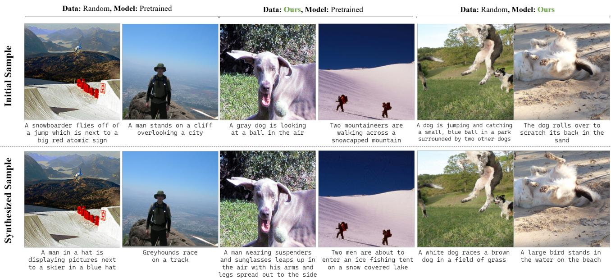

text_image

Data: Random, Model: Pretrained
Data: Ours, Model: Pretrained
Data: Random, Model: Ours
Initial Sample
A snowboarder flies off of a jump which is next to a big red atomic sign
A man stands on a cliff overlooking a city
A gray dog is looking at a ball in the air
Two mountaineers are walking across a snowcapped mountain
A dog is jumping and catching a small, blue ball in a park surrounded by two other dogs
The dog rolls over to scratch its back in the sand
Synthesized Sample
A man in a hat is displaying pictures next to a skier in a blue hat
Greyhounds race on a track
A man wearing suspenders and sunglasses leaps up in the air with his arms and legs spread out to the side
Two men are about to enter an ice fishing tent on a snow covered lake
A white dog races a brown dog in a field of grass
A large bird stands in the water on the beach

Figure S3. Qualitative comparisons for the ablation studies with different data and model initializations.

Table S3. Hyperparameters for different experiments. 

<table><tr><td>Hyperparam.</td><td colspan="3">Flickr8k [23]</td><td colspan="3">Flickr30k [72]</td><td colspan="3">COCO [35]</td></tr><tr><td># Pairs</td><td>100</td><td>200</td><td>500</td><td>100</td><td>200</td><td>500</td><td>100</td><td>200</td><td>500</td></tr><tr><td>Batch size</td><td>64</td><td>64</td><td>64</td><td>64</td><td>64</td><td>64</td><td>64</td><td>64</td><td>64</td></tr><tr><td>LRimg</td><td>100</td><td>100</td><td>1000</td><td>100</td><td>1000</td><td>1000</td><td>1000</td><td>1000</td><td>5000</td></tr><tr><td>LRtxt</td><td>100</td><td>100</td><td>1000</td><td>100</td><td>1000</td><td>1000</td><td>1000</td><td>1000</td><td>5000</td></tr><tr><td> $\lambda_{agr}$ </td><td colspan="3">____</td><td colspan="3">0.8</td><td colspan="3">____</td></tr><tr><td> $\sigma_{agr}$ </td><td colspan="3">____</td><td colspan="3">0.5</td><td colspan="3">____</td></tr><tr><td> $\lambda_{dis}$ </td><td colspan="3">____</td><td colspan="3">0.8</td><td colspan="3">____</td></tr><tr><td> $\sigma_{dis}$ </td><td colspan="3">____</td><td colspan="3">0.5</td><td colspan="3">____</td></tr><tr><td> $\alpha$ </td><td colspan="3">____</td><td colspan="3">0.5</td><td colspan="3">____</td></tr><tr><td>min expert epoch</td><td colspan="3">____</td><td colspan="3">1</td><td colspan="3">____</td></tr><tr><td>max expert epoch</td><td colspan="3">____</td><td colspan="3">10</td><td colspan="3">____</td></tr></table>

# S3.5.2. Coreset Selection

To compare the image-text retrieval performance of our distilled data with traditional coreset selection methods [2, 10, 18, 19, 24, 26, 27, 46, 48, 51, 56, 63, 67], we selected several benchmarked methods as practiced in [68, 69]. Specifically, we reproduced the results using DeepCore [20] for Herding [67], K-center [19], and Forgetting [63] in Table 1 of our main paper.

Herding [67]. We adapt DeepCore [20]’s herding strategy to the image–text retrieval setting using a CLIP-style encoder. We first warm up the image encoder and text projection for 5 epochs on the full training set with InfoNCE loss, using SGD (learning rate 0.1, batch size 64). After warmup epochs, we extract a joint representation for each pair by concatenating the ℓ2-normalized image and text features, and compute the global mean feature over all training pairs. Herding then greedily selects pairs whose features make the cumulative sum of selected features closest to (t + 1) times the global mean at step t, yielding an ordered coreset of all training pairs. For each budget $\tilde { B } \in \{ 1 0 0 , 2 0 0 , 5 0 0 \}$ , we take the

first $\tilde { B }$ pairs in this ordering.

K-center [19]. For K-center, we again use the same 5- epoch CLIP warmup (SGD optimizer, learning rate 0.1, batch size 64) and extract pairwise joint sum features. We then run greedy K-center on these embeddings: the first center is chosen uniformly at random, and subsequent centers are added by iteratively selecting the pair with the maximum Euclidean distance to the current selected set (farthest-first traversal) until we reach the maximum budget.

Forgetting [63]. For forgetting-based selection, we train the initial model on the full training set for 10 epochs with InfoNCE loss, using an SGD optimizer. At each training epoch, we compute the CLIP similarity logits for every batch and evaluate whether each image–text pair is correctly retrieved. A pair is marked as “correct" only when its image retrieves its own caption at rank-1 and, simultaneously, the caption retrieves its corresponding image at rank-1. For every pair, we maintain its correctness state over epochs and increment a forgetting counter whenever the pair transitions from correct to incorrect. We also track whether the pair was ever learned (i.e., correct at least once) and whether it remains correct in the final epoch. After 10 epochs of training, we assign each pair a ranking score composed of its number of forgetting events and an additional penalty for pairs that were never learned. Sorting all pairs by this score in ascending order produces a forgetting-based coreset ordering, from which the first $\tilde { B }$ pairs define the selected subset.

# S3.6. Performance Sensitivity

# S3.6.1. Expert Pool Size

We further investigate how the size of the finetuned expert pool used for model initialization affects image–text retrieval. Specifically, we vary the number of available finetuned experts from which models are randomly sampled (non-overlapping N experts), and report retrieval performance across different pool sizes in Fig. S4. The results indicate that performance remains consistently strong, with a slight improvement as the expert pool grows. We attribute this behavior to increased stability in random expert sampling when more experts are available, which in turn raises the likelihood of selecting a more diverse set of experts.

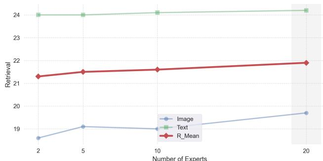

line

| Number of Experts | Image | Text | R_Mean |
| ----------------- | ----- | ---- | ------ |
| 2                 | 18.5  | 24.0 | 21.3   |
| 5                 | 19.1  | 24.0 | 21.5   |
| 10                | 19.0  | 24.1 | 21.6   |
| 20                | 19.7  | 24.2 | 21.8   |

Figure S4. Retrieval performance on Flickr8k with 100 pairs as a function of the number of experts in the randomly sampled pool. Performance remains largely stable, with a slight improvement as the pool size increases.

# S3.6.2. Weighting Factors

On hyperparameters $\lambda _ { \mathrm { a g r } }$ and $\lambda _ { \mathrm { d i s } } .$ . We tested the sensitivity of the hyperparameter to the weighting factors for the loss of agreement and discrepancy, $i . e . , \lambda _ { a g r } ,$ and $\lambda _ { d i s }$ by sweeping the range [0, 1]. As shown in Fig. S5, we choose the weighting factors $\lambda _ { \mathrm { a g r } }$ and $\lambda _ { \mathrm { d i s } }$ that yield the highest retrieval scores, at (0.8, 0.8). We observe that $\lambda _ { \mathrm { d i s } }$ contributes more to performance than $\lambda _ { \mathrm { a g r } }$ as there is more variation in performance with higher $\lambda _ { \mathrm { d i s } }$ relative to $\lambda _ { \mathrm { a g r } } .$ . Performance improvement is relatively marginal with $\lambda _ { \mathrm { a g r } }$ in all sweep values, which is consistent with the results of a slightly incremental improvement shown in Table 5 (ablation study).

On hyperparameter α. The hyperparameter α in Eq. 5 of the main paper acts as a global scaling factor on the layer-wise mixing coefficient $t _ { \ell } ^ { m }$ , which determines how strongly each layer of the pretrained anchor $\theta _ { 0 , \ell } ^ { m }$ is nudged toward the averaged finetuned updates $\begin{array} { l } { \frac { 1 } { 2 } \big ( \Delta _ { 1 , \ell } ^ { m } + \Delta _ { 2 , \ell } ^ { m } \big ) } \end{array}$ . When $\alpha = 0$ , the initialization collapses to the original pretrained model, whereas larger α values increasingly inject real-data finetuning information along the direction prescribed by $t _ { \ell } ^ { m }$ . As shown in Fig. S6, retrieval performance rapidly improves as we move away from $\alpha = 0$ , peaks in an intermediate range, and then slightly degrades when α approaches 1.0, where the model becomes overly biased toward the finetuned solutions. This behavior suggests that too small α underexploits the benefits of real-data finetuning, while too large α over-specializes the distilled initialization. A mid-range value of $\alpha = 0 . 5 ,$ , as adopted in ours, provides a balanced compromise and yields the best mean recall across image-totext and text-to-image retrieval.

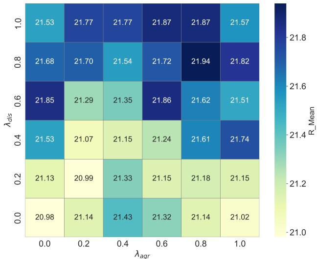

heatmap

| | 0.0 | 0.2 | 0.4 | 0.6 | 0.8 | 1.0 |
|---|---|---|---|---|---|---|
| 1.0 | 21.53 | 21.77 | 21.77 | 21.87 | 21.87 | 21.57 |
| 0.8 | 21.68 | 21.70 | 21.54 | 21.72 | 21.94 | 21.82 |
| 0.6 | 21.85 | 21.29 | 21.35 | 21.86 | 21.62 | 21.51 |
| 0.4 | 21.53 | 21.07 | 21.15 | 21.24 | 21.61 | 21.74 |
| 0.2 | 21.13 | 20.99 | 21.33 | 21.15 | 21.18 | 21.15 |
| 0.0 | 20.98 | 21.14 | 21.43 | 21.32 | 21.14 | 21.02 |

Figure S5. Hyperparameter sensitivity. While all choices of $\lambda _ { a g r }$ and $\lambda _ { d i s }$ consistently perform high, our selected values return the highest mean recall in image-text retrieval tasks.

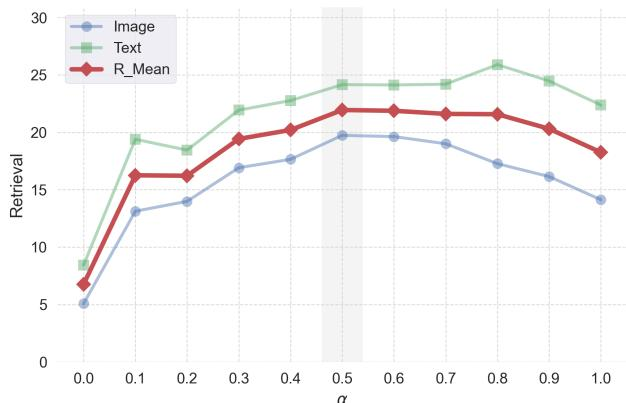

line

| α    | Image | Text | R_Mean |
| ---- | ----- | ---- | ------ |
| 0.0  | 5.0   | 8.0  | 7.0    |
| 0.1  | 13.0  | 19.0 | 16.0   |
| 0.2  | 14.0  | 18.0 | 16.0   |
| 0.3  | 17.0  | 22.0 | 19.0   |
| 0.4  | 18.0  | 23.0 | 20.0   |
| 0.5  | 20.0  | 24.0 | 22.0   |
| 0.6  | 19.5  | 24.0 | 21.5   |
| 0.7  | 19.0  | 24.0 | 21.5   |
| 0.8  | 17.5  | 26.0 | 21.5   |
| 0.9  | 16.0  | 24.5 | 20.5   |
| 1.0  | 14.0  | 22.5 | 18.5   |

Figure S6. Hyperparameter sensitivity. While all choices of $\lambda _ { a g r }$ and $\lambda _ { d i s }$ consistently perform high, our selected values return the highest mean recall in image-text retrieval tasks.

# S3.6.3. Additional Insights

Weight mixing for large heterogeneous encoders. We agree weight-space update-agreement should be scale-robust. [25] provides encouraging evidence in CLIP-scale models that fine-tuning updates exhibit highly structured, layer-wise regularities: displacement magnitudes and directions remain consistent across a wide range of fine-tuning conditions, and similar patterns are observed across backbone families (e.g., ViT, ResNet, ConvNeXt). Given these coherent patterns, using directional agreement as a conservative mixing criterion is well-motivated, since it explicitly checks the compatibility of updates rather than relying on unstructured averaging, which can introduce interference.

Comparison to a concurrent work. In comparison to a concurrent work, EDGE [83], on the total cost, our pipeline includes a one-time expert training (∼91.7h), whereas EDGE trains SDv1.5 (∼49.0h) with additional caption generation time (e.g., ∼248.14s for 100 pairs); ∗denotes measurement on an RTX A5000 [83], otherwise on an RTX A6000. Our end-to-end GPUh is slightly lower on Flickr30k but becomes higher on COCO as scale increases due to expert training, highlighting the limitation of expert-based methods.

Table S4. Full Image-text retrieval results for 100, 200, and 500 synthetic pairs using the coreset methods and distillation method, including standard deviation over five random evaluations. The condensation rate for {Flickr8k, Flickr30k, and COCO} datasets are approximately {1.7%, 0.3%, 0.8‰}, {3.3%, 0.7%, 1.7‰}, {8.3%, 1.7%, 4.4‰} for 100, 200, and 500 pairs. Best and runner-up results are indicated in boldface and underline, respectively. 

<table><tr><td>Dataset</td><td colspan="7">Flickr8k [23]</td><td colspan="7">Flickr30k [72]</td><td colspan="7">COCO [35]</td></tr><tr><td>#Pairs Method</td><td>IR@1</td><td>IR@5</td><td>IR@10</td><td>TR@1</td><td>TR@5</td><td>TR@10</td><td>Mean</td><td>IR@1</td><td>IR@5</td><td>IR@10</td><td>TR@1</td><td>TR@5</td><td>TR@10</td><td>Mean</td><td>IR@1</td><td>IR@5</td><td>IR@10</td><td>TR@1</td><td>TR@5</td><td>TR@10</td><td>Mean</td></tr><tr><td>Random</td><td>1.2</td><td>5.6</td><td>9.6</td><td>2.7</td><td>8.0</td><td>12.6</td><td>6.6</td><td>0.9</td><td>4.2</td><td>7.3</td><td>2.0</td><td>7.9</td><td>12.1</td><td>5.7</td><td>0.4</td><td>1.7</td><td>3.0</td><td>0.8</td><td>3.2</td><td>5.4</td><td>2.4</td></tr><tr><td>Herding [67]</td><td>1.2</td><td>4.4</td><td>8.5</td><td>2.2</td><td>8.5</td><td>14.2</td><td>6.5</td><td>0.9</td><td>3.5</td><td>6.5</td><td>2.0</td><td>6.9</td><td>11.1</td><td>5.1</td><td>0.3</td><td>1.4</td><td>2.6</td><td>0.8</td><td>3.0</td><td>5.5</td><td>2.3</td></tr><tr><td>K-Center [19]</td><td>1.2</td><td>4.9</td><td>9.0</td><td>2.7</td><td>9.3</td><td>13.9</td><td>6.8</td><td>1.1</td><td>4.9</td><td>8.7</td><td>3.0</td><td>9.1</td><td>14.3</td><td>6.8</td><td>0.5</td><td>1.9</td><td>3.6</td><td>1.1</td><td>4.2</td><td>7.6</td><td>3.2</td></tr><tr><td>Forgetting [63]</td><td>1.2</td><td>4.1</td><td>7.1</td><td>1.5</td><td>4.8</td><td>8.4</td><td>4.5</td><td>0.8</td><td>3.6</td><td>6.2</td><td>1.2</td><td>5.4</td><td>9.1</td><td>4.4</td><td>0.2</td><td>1.0</td><td>1.9</td><td>0.2</td><td>1.2</td><td>2.6</td><td>1.2</td></tr><tr><td>MTT-VL [68]</td><td>0.8</td><td>4.1</td><td>7.0</td><td>1.2</td><td>6.4</td><td>11.5</td><td>5.1</td><td>4.7</td><td>15.7</td><td>24.6</td><td>9.9</td><td>28.3</td><td>39.1</td><td>20.4</td><td>1.3</td><td>5.4</td><td>9.5</td><td>2.5</td><td>10.0</td><td>15.7</td><td>7.4</td></tr><tr><td>±0.0</td><td>±0.2</td><td>±0.3</td><td>±0.2</td><td>±0.6</td><td>±0.9</td><td>±0.3</td><td>±0.2</td><td>±0.5</td><td>±1.0</td><td>±0.3</td><td>±0.5</td><td>±0.7</td><td>±0.5</td><td>±0.1</td><td>±0.3</td><td>±0.5</td><td>±0.3</td><td>±0.5</td><td>±0.4</td><td>±0.4</td><td></td></tr><tr><td>TESLAWBCE</td><td>0.8</td><td>3.8</td><td>7.0</td><td>4.7</td><td>16.1</td><td>25.9</td><td>9.7</td><td>0.5</td><td>2.3</td><td>4.7</td><td>5.5</td><td>19.5</td><td>28.9</td><td>10.2</td><td>0.3</td><td>1.0</td><td>1.8</td><td>2.0</td><td>7.7</td><td>13.5</td><td>4.4</td></tr><tr><td>±0.1</td><td>±0.4</td><td>±0.3</td><td>±0.3</td><td>±0.6</td><td>±0.8</td><td>±0.3</td><td>±0.2</td><td>±0.2</td><td>±0.4</td><td>±0.5</td><td>±0.9</td><td>±1.0</td><td>±0.5</td><td>±0.2</td><td>±0.4</td><td>±0.5</td><td>±0.2</td><td>±0.3</td><td>±0.3</td><td>±0.4</td><td></td></tr><tr><td>LoRS [69]</td><td>4.9</td><td>18.0</td><td>29.0</td><td>7.0</td><td>22.8</td><td>34.8</td><td>19.4</td><td>8.3</td><td>24.1</td><td>35.1</td><td>11.8</td><td>35.8</td><td>49.2</td><td>27.4</td><td>1.8</td><td>7.1</td><td>12.2</td><td>3.3</td><td>12.2</td><td>19.6</td><td>9.4</td></tr><tr><td>±0.3</td><td>±0.8</td><td>±1.2</td><td>±0.3</td><td>±0.4</td><td>±0.8</td><td>±0.5</td><td>±0.2</td><td>±0.2</td><td>±0.3</td><td>±0.2</td><td>±0.6</td><td>±0.5</td><td>±0.3</td><td>±0.1</td><td>±0.2</td><td>±2.0</td><td>±0.2</td><td>±0.3</td><td>±0.3</td><td>±0.5</td><td></td></tr><tr><td>Ours</td><td>6.0</td><td>20.8</td><td>32.4</td><td>7.9</td><td>26.5</td><td>38.1</td><td>21.9</td><td>8.1</td><td>24.7</td><td>36.2</td><td>11.5</td><td>32.6</td><td>45.0</td><td>26.4</td><td>1.9</td><td>7.6</td><td>13.2</td><td>3.6</td><td>13.7</td><td>21.6</td><td>10.3</td></tr><tr><td>±0.4</td><td>±0.4</td><td>±0.7</td><td>±0.3</td><td>±0.5</td><td>±0.6</td><td>±0.3</td><td>±0.3</td><td>±0.8</td><td>±0.7</td><td>±0.7</td><td>±0.9</td><td>±1.0</td><td>±0.3</td><td>±0.1</td><td>±0.1</td><td>±0.2</td><td>±0.2</td><td>±0.3</td><td>±0.4</td><td>±0.2</td><td></td></tr><tr><td>Random</td><td>2.0</td><td>7.8</td><td>13.7</td><td>3.3</td><td>12.5</td><td>19.5</td><td>9.8</td><td>1.9</td><td>7.1</td><td>12.3</td><td>1.9</td><td>10.3</td><td>18.2</td><td>8.6</td><td>0.6</td><td>2.7</td><td>4.9</td><td>1.3</td><td>5.3</td><td>9.0</td><td>4.0</td></tr><tr><td>Herding [67]</td><td>2.0</td><td>7.6</td><td>14.0</td><td>3.2</td><td>12.5</td><td>19.9</td><td>9.9</td><td>1.4</td><td>5.9</td><td>10.5</td><td>3.1</td><td>9.4</td><td>15.5</td><td>7.6</td><td>0.6</td><td>2.5</td><td>4.6</td><td>1.1</td><td>4.6</td><td>8.4</td><td>3.6</td></tr><tr><td>K-Center [19]</td><td>2.3</td><td>9.1</td><td>15.0</td><td>3.8</td><td>13.7</td><td>20.9</td><td>10.8</td><td>2.2</td><td>8.1</td><td>13.3</td><td>4.2</td><td>13.1</td><td>21.2</td><td>10.3</td><td>0.9</td><td>3.4</td><td>5.9</td><td>2.1</td><td>7.0</td><td>11.6</td><td>5.1</td></tr><tr><td>Forgetting [63]</td><td>1.7</td><td>6.5</td><td>11.5</td><td>3.1</td><td>9.7</td><td>15.4</td><td>8.0</td><td>1.6</td><td>6.6</td><td>10.8</td><td>2.5</td><td>9.0</td><td>14.9</td><td>7.6</td><td>0.4</td><td>1.6</td><td>3.0</td><td>0.7</td><td>2.8</td><td>5.1</td><td>2.3</td></tr><tr><td>MTT-VL [68]</td><td>1.8</td><td>7.0</td><td>12.2</td><td>2.8</td><td>10.3</td><td>17.3</td><td>8.6</td><td>4.6</td><td>16.0</td><td>25.5</td><td>10.2</td><td>28.7</td><td>41.9</td><td>21.2</td><td>1.7</td><td>6.5</td><td>12.3</td><td>3.3</td><td>11.9</td><td>19.4</td><td>9.2</td></tr><tr><td>±0.2</td><td>±0.2</td><td>±0.2</td><td>±0.3</td><td>±0.7</td><td>±0.7</td><td>±0.3</td><td>±0.9</td><td>±1.6</td><td>±2.6</td><td>±0.8</td><td>±1.0</td><td>±1.9</td><td>±1.5</td><td>±0.1</td><td>±0.4</td><td>±0.8</td><td>±0.2</td><td>±0.6</td><td>±1.2</td><td>±0.6</td><td></td></tr><tr><td>TESLAWBCE</td><td>1.2</td><td>4.7</td><td>8.4</td><td>6.6</td><td>19.5</td><td>29.5</td><td>11.7</td><td>0.2</td><td>1.3</td><td>2.5</td><td>2.8</td><td>10.4</td><td>17.4</td><td>5.8</td><td>0.1</td><td>0.2</td><td>0.5</td><td>0.7</td><td>3.1</td><td>5.3</td><td>1.7</td></tr><tr><td>±0.2</td><td>±0.5</td><td>±0.6</td><td>±0.3</td><td>±1.1</td><td>±1.5</td><td>±0.6</td><td>±0.1</td><td>±0.2</td><td>±0.2</td><td>±0.5</td><td>±1.5</td><td>±1.6</td><td>±0.7</td><td>±0.1</td><td>±0.1</td><td>±0.1</td><td>±0.2</td><td>±0.5</td><td>±0.8</td><td>±0.3</td><td></td></tr><tr><td>LoRS [69]</td><td>6.3</td><td>20.5</td><td>31.6</td><td>9.5</td><td>26.3</td><td>38.2</td><td>22.1</td><td>8.6</td><td>25.3</td><td>36.6</td><td>14.5</td><td>38.7</td><td>53.4</td><td>29.5</td><td>2.4</td><td>9.3</td><td>15.5</td><td>4.3</td><td>14.2</td><td>22.6</td><td>11.4</td></tr><tr><td>±0.4</td><td>±0.7</td><td>±0.7</td><td>±0.4</td><td>±0.4</td><td>±0.9</td><td>±0.4</td><td>±0.3</td><td>±0.2</td><td>±0.3</td><td>±0.5</td><td>±0.5</td><td>±0.5</td><td>±0.4</td><td>±0.1</td><td>±0.2</td><td>±0.2</td><td>±0.1</td><td>±0.3</td><td>±0.2</td><td>±0.2</td><td></td></tr><tr><td>Ours</td><td>7.1</td><td>23.2</td><td>35.1</td><td>9.9</td><td>29.0</td><td>41.6</td><td>24.3</td><td>9.1</td><td>26.7</td><td>39.1</td><td>13.0</td><td>33.7</td><td>47.4</td><td>28.2</td><td>2.9</td><td>11.1</td><td>18.4</td><td>4.9</td><td>16.2</td><td>25.3</td><td>13.1</td></tr><tr><td>±0.2</td><td>±0.4</td><td>±0.6</td><td>±0.2</td><td>±0.7</td><td>±0.6</td><td>±0.3</td><td>±0.2</td><td>±0.4</td><td>±0.4</td><td>±0.5</td><td>±0.9</td><td>±0.5</td><td>±0.2</td><td>±0.1</td><td>±0.2</td><td>±0.3</td><td>±0.1</td><td>±0.3</td><td>±0.3</td><td>±0.1</td><td></td></tr><tr><td>Random</td><td>3.7</td><td>13.0</td><td>21.2</td><td>6.0</td><td>19.4</td><td>28.8</td><td>15.3</td><td>3.2</td><td>11.5</td><td>18.9</td><td>5.2</td><td>18.3</td><td>27.4</td><td>14.1</td><td>1.2</td><td>5.2</td><td>9.2</td><td>2.5</td><td>8.7</td><td>14.9</td><td>7.0</td></tr><tr><td>Herding [67]</td><td>3.7</td><td>12.5</td><td>19.8</td><td>4.9</td><td>17.5</td><td>26.4</td><td>14.1</td><td>2.7</td><td>10.6</td><td>17.0</td><td>4.1</td><td>14.9</td><td>24.0</td><td>12.2</td><td>1.3</td><td>5.0</td><td>8.8</td><td>2.0</td><td>7.9</td><td>13.6</td><td>6.4</td></tr><tr><td>K-Center [19]</td><td>4.0</td><td>13.4</td><td>21.1</td><td>5.9</td><td>18.9</td><td>29.0</td><td>15.4</td><td>3.4</td><td>11.8</td><td>18.7</td><td>6.7</td><td>18.0</td><td>30.6</td><td>14.9</td><td>1.5</td><td>5.7</td><td>9.7</td><td>3.0</td><td>9.9</td><td>16.2</td><td>7.7</td></tr><tr><td>Forgetting [63]</td><td>4.6</td><td>16.2</td><td>24.5</td><td>5.8</td><td>21.7</td><td>31.7</td><td>17.4</td><td>3.6</td><td>12.7</td><td>20.6</td><td>6.1</td><td>18.7</td><td>29.5</td><td>15.2</td><td>1.1</td><td>4.3</td><td>7.6</td><td>2.0</td><td>7.3</td><td>11.3</td><td>5.6</td></tr><tr><td>MTT-VL [68]</td><td>3.7</td><td>13.3</td><td>21.3</td><td>5.8</td><td>18.0</td><td>28.2</td><td>15.1</td><td>6.6</td><td>20.2</td><td>30.0</td><td>13.3</td><td>32.8</td><td>46.8</td><td>25.0</td><td>2.5</td><td>8.9</td><td>15.8</td><td>5.0</td><td>17.2</td><td>26.0</td><td>12.6</td></tr><tr><td>±0.0</td><td>±0.3</td><td>±0.5</td><td>±0.3</td><td>±0.6</td><td>±0.7</td><td>±0.3</td><td>±0.3</td><td>±1.2</td><td>±2.1</td><td>±0.6</td><td>±1.8</td><td>±0.8</td><td>±1.1</td><td>±0.5</td><td>±0.7</td><td>±1.5</td><td>±0.4</td><td>±1.3</td><td>±1.9</td><td>±1.1</td><td></td></tr><tr><td>TESLAWBCE</td><td>2.5</td><td>8.8</td><td>14.1</td><td>6.9</td><td>19.6</td><td>29.0</td><td>13.5</td><td>1.1</td><td>7.3</td><td>12.6</td><td>5.1</td><td>15.3</td><td>23.8</td><td>10.9</td><td>0.8</td><td>3.6</td><td>6.7</td><td>1.7</td><td>5.9</td><td>10.2</td><td>4.8</td></tr><tr><td>±0.2</td><td>±0.3</td><td>±0.2</td><td>±0.4</td><td>±0.6</td><td>±0.6</td><td>±0.2</td><td>±0.2</td><td>±0.4</td><td>±0.5</td><td>±0.2</td><td>±0.5</td><td>±0.3</td><td>±0.4</td><td>±0.2</td><td>±0.6</td><td>±0.9</td><td>±0.4</td><td>±0.8</td><td>±1.0</td><td>±0.7</td><td></td></tr><tr><td>LoRS [69]</td><td>6.9</td><td>22.0</td><td>33.1</td><td>10.9</td><td>31.0</td><td>45.8</td><td>25.0</td><td>10.0</td><td>28.9</td><td>41.6</td><td>15.5</td><td>29.8</td><td>53.7</td><td>31.6</td><td>2.8</td><td>9.9</td><td>16.5</td><td>5.3</td><td>18.3</td><td>27.9</td><td>13.5</td></tr><tr><td>±0.4</td><td>±1.2</td><td>±1.6</td><td>±0.3</td><td>±1.0</td><td>±1.2</td><td>±0.7</td><td>±0.2</td><td>±0.7</td><td>±0.6</td><td>±0.7</td><td>±0.4</td><td>±0.3</td><td>±0.5</td><td>±0.2</td><td>±0.5</td><td>±0.7</td><td>±0.5</td><td>±1.5</td><td>±1.4</td><td>±0.8</td><td></td></tr><tr><td>Ours</td><td>7.4</td><td>25.0</td><td>37.1</td><td>11.2</td><td>32.4</td><td>44.2</td><td>26.2</td><td>10.0</td><td>29.3</td><td>42.0</td><td>13.7</td><td>37.0</td><td>51.5</td><td>30.6</td><td>3.7</td><td>13.6</td><td>22.2</td><td>5.6</td><td>18.4</td><td>28.2</td><td>15.3</td></tr><tr><td>±0.4</td><td>±0.4</td><td>±0.7</td><td>±0.7</td><td>±0.7</td><td>±0.5</td><td>±0.3</td><td>±0.5</td><td>±0.5</td><td>±0.7</td><td>±0.5</td><td>±0.6</td><td>±0.9</td><td>±0.4</td><td>±0.1</td><td>±0.2</td><td>±0.5</td><td>±0.3</td><td>±0.2</td><td>±0.4</td><td>±0.2</td><td></td></tr><tr><td>Full Dataset</td><td>25.5</td><td>56.1</td><td>69.2</td><td>32.7</td><td>64.5</td><td>74.5</td><td>53.8</td><td>28.1</td><td>57.9</td><td>70.3</td><td>34.9</td><td>65.4</td><td>77.6</td><td>55.7</td><td>17.3</td><td>42.8</td><td>56.7</td><td>20.4</td><td>47.7</td><td>62.1</td><td>41.2</td></tr></table>

<table><tr><td>500 Pairs</td><td>Method</td><td>V-L Model (GB)</td><td>Expert train (h)</td><td>Data init (s)</td><td>Distillation (s)</td><td colspan="2">Total GPUh Perf.</td></tr><tr><td rowspan="2">F30k</td><td>[83]</td><td>2.58</td><td>12.5 (1 SD expert)</td><td>-</td><td>48,960*</td><td>26.1</td><td>25.8</td></tr><tr><td>MDM</td><td>0.60</td><td>25.7 (20 experts)</td><td>219</td><td>291</td><td>25.8</td><td>30.6</td></tr><tr><td rowspan="2">COCO</td><td>[83]</td><td>2.58</td><td>49.0 (1 SD expert)</td><td>-</td><td>27,720*</td><td>56.7</td><td>7.9</td></tr><tr><td>MDM</td><td>0.60</td><td>91.7 (20 experts)</td><td>953</td><td>2,765</td><td>92.7</td><td>15.3</td></tr></table>

# S3.7. Full Retrieval Results

We provide complete image-text retrieval results with standard deviations in five random evaluations in Table S4.

# S3.8. Full Algorithm

We outline our multimodal distribution matching algorithm in Alg. 1.

Algorithm 1 Multimodal Distribution Matching   
Input: Real image-text dataset $\mathcal{D}_{\mathrm{real}} = \{(x_i, t_i)\}_{i=1}^B$ ;
Unified pretrained image-text model $\Psi_0 := \{\theta_0^v, \theta_0^t\}$ with frozen text encoder;
Buffer of finetuned experts $\mathcal{B} = \{(\theta_{real}^{v,(i)}, \theta_{real}^{t,(i)})\}_{i}^{N_{\mathrm{experts}}}$ ;
Number of synthetic pairs $\tilde{B}$ ; Maximum distillation iterations $T_{max}$ ;
Output: Optimized synthetic set $\mathcal{D}_{\mathrm{syn}}^\star = \{(\tilde{x}_j, \tilde{t}_j)\}_{j=1}^{\tilde{B}}$ .
1: Synthetic data initialization
2: Compute joint real embeddings with $\Psi_0: (z_i^v, z_i^t) = \Psi_0(x_i, t_i) \in \mathbb{R}^d$ for $i = 1, \ldots, B$ 3: Run k-means clustering on joint embeddings with $K = \tilde{B}: \{c_k\}_{k=1}^{\tilde{B}} \leftarrow \text{KMeans}(\{z_i^v; z_i^t\})_i^B)$ ,
4: For each cluster c, select the real index $i_c$ whose joint feature $\{z^v; z^t\}_{i_c}$ is closest to the centroid
5: Initialize the synthetic dataset by selecting at these indices from the real dataset: $\mathcal{D}_{\mathrm{syn}} \leftarrow \{(x_{i_c}, \theta_0^t(t_{i_c}))\}_{c=1}^{\tilde{B}}$ ,
6: while $t < T_{max}$ do
7: Model initialization
8: Sample N expert checkpoints: $\{\theta_{real}^{v,(1,\cdots,N)}, \theta_{real}^{t,(1,\cdots,N)}\} \subset B.$ 9: For each trainable layer $\ell$ of image encoder and text projector, merge weights using Eq. 5 (for N = 2): $\theta_{*,\ell}^m = \theta_{0,\ell}^m + \alpha t_\ell^m \cdot \frac{1}{2}\big(\Delta_{1,\ell}^m + \Delta_{2,\ell}^m\big)$ , for $m \in \{v, t\}$ ,
10: Instantiate trainable image-text model $\Psi_t \leftarrow (\theta_*^v, \theta_*^t)$ with text encoder kept frozen
11: Optimize synthetic data
12: Sample a real minibatch: $\{(x_i, t_i)\}_{i=1}^{B_r} \subset D_{real}$ 13: Encode joint features for real and synthetic: $(z_{r,i}^v, z_{r,i}^t) \leftarrow \text{stop\_grad}(\Psi_t(x_i, \theta_t^t(t_i)))$ , $(z_{s,i}^v, z_{s,i}^t) \leftarrow \Psi_t(\mathcal{D}_{\mathrm{syn}})$ 14: Construct cross-modal agreement and discrepancy vectors after $\ell_2$ normalization: $u_{r,i} = \text{norm}(z_{r,i}^v + z_{r,i}^t)$ , $g_{r,i} = \text{norm}(z_{r,i}^v - z_{r,i}^t)$ , $u_{s,i} = \text{norm}(z_{s,i}^v + z_{s,i}^t)$ , $g_{s,i} = \text{norm}(z_{s,i}^v - z_{s,i}^t)$ 15: Compute bidirectional InfoNCE loss on synthetic embeddings using Eq. 3: $L_{InfoNCE} = \frac{1}{2}\{\mathcal{L}_{i2t}(z_s^v, z_s^t) + \mathcal{L}_{t2i}(z_s^t, z_s^v)\}$ 16: Compute geodesic kernel energies on u and g using Eq. 9: $L_{agr} = GKE\big(\{u_{r,i}\}_{i=1}^{B_r}, \{u_{s,i}\}_{i=1}^{\tilde{B}}\big), L_{dis} = GKE\big(\{g_{r,i}\}_{i=1}^{B_r}, \{g_{s,i}\}_{i=1}^{\tilde{B}}\big),$ 17: Update synthetic data by the total loss objective using Eq. 11: $L_{MDM} = L_{InfoNCE} + \lambda_{agr} \cdot L_{agr} + \lambda_{dis} \cdot L_{dis}.$ 18: Update only the synthetic parameters by gradient descent: $D_{syn} \leftarrow D_{syn} - \eta \nabla_{D_{syn}} L_{MDM}$ 19: $t \leftarrow t + 1$ 20: end while
21: return $D_{syn}^\star$