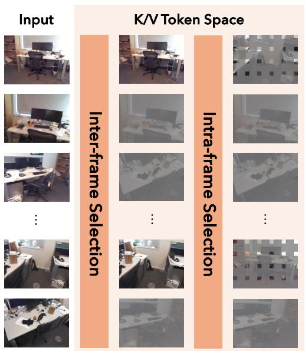
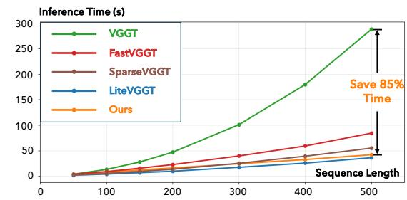
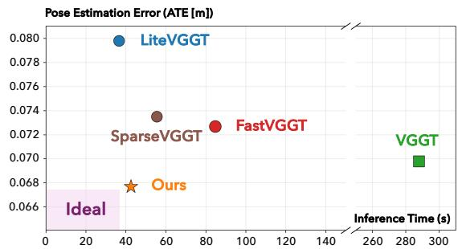
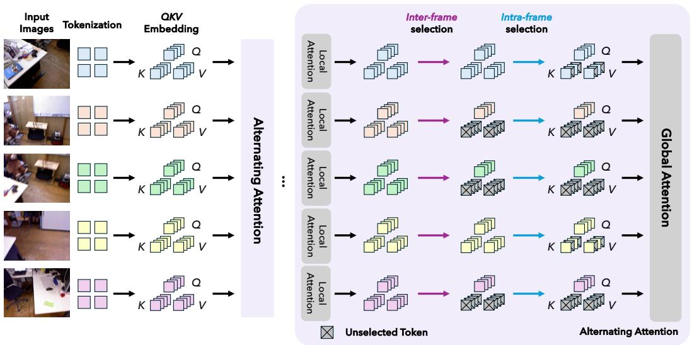
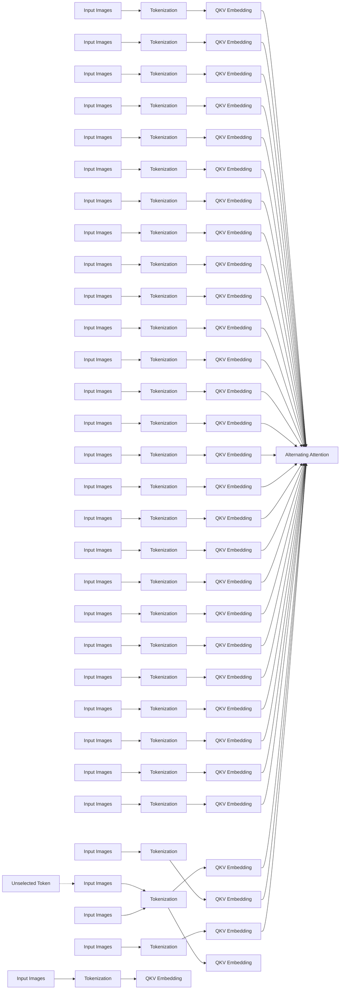
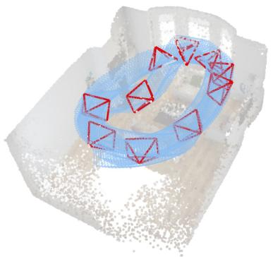
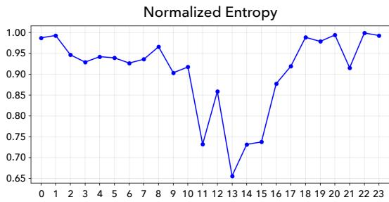
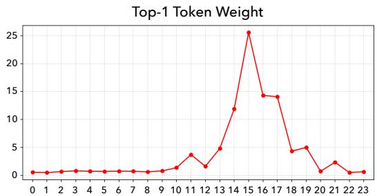

# Good Token Hunting: A Hitchhiker’s Guide to Token Selection for Visual Geometry Transformers

Shuhong Zheng1

Michael Oechsle2

Erik Sandström2

Marie-Julie Rakotosaona2

Federico Tombari2,3†

Igor Gilitschenski1†

1University of Toronto & Vector Institute 2Google 3Technical University of Munich

{shuhong, gilitschenski}@cs.toronto.edu

{michaeloechsle, sandstrom, mrakotosaona, tombari}@google.com

# Abstract

Visual geometry transformers have become powerful architectures for multi-view 3D reconstruction, enabling joint prediction of multiple 3D attributes in a feedforward manner. However, their computational cost grows quadratically with the input sequence length due to the global attention layers inside these models. This limits both their scalability and efficiency. In this work, we address this challenge with a simple yet general strategy: restricting the number of key/value tokens that each query interacts with during global attention. To achieve effective token selection, we introduce a two-stage framework. First, an inter-frame selection step operates at the frame level to identify frames that should be preserved. Second, an intra-frame selection step further discards more redundant tokens within the selected frames. Our analysis highlights the advantage of a diversity-based strategy for inter-frame selection, which ensures broad coverage of the scene. For intraframe selection, we show that layer-aware sparsification is necessary, with the selection process guided by the entropy of the global attention pattern. Our approach offers a superior speed-accuracy trade-off compared to existing solutions. Extensive experiments show that it accelerates visual geometry transformers by over 85% for scenes with 500 images while maintaining, or even improving, baseline performance, which hints that how our token selection strategy can play a crucial role in future applications of visual geometry transformers. Our project website is available at https://zsh2000.github.io/good-token-hunting.github.io/.

# 1 Introduction

Visual geometry transformers [41, 52, 83, 87] are models capable of predicting key 3D attributes (e.g., camera parameters, point maps, depth maps) from multiple views of a scene in a single forward pass. Although these models serve as substantially faster solutions than previous alternatives [68], they still suffer from prohibitively long inference time when increasing the number of processed frames. This limitation stems from the global attention layers inside these models. While these global attention layers enable effective information aggregation across views, they also exhibit quadratic computational complexity $\mathcal { O } ( N ^ { 2 } L ^ { 2 } )$ in the number of input frames N and per-frame tokens L. As a result, global attention becomes the dominant bottleneck, causing inference cost to grow rapidly with the number of input images, and ultimately constraining the efficiency of visual geometry transformers, as illustrated in Figure 1.

text_image

Input
K/V Token Space
Inter-frame Selection
Intra-frame Selection

line

| Sequence Length | VGGT  | FastVGGT | SparseVGGT | LiteVGGT | Ours  |
| --------------- | ----- | -------- | ---------- | -------- | ----- |
| 0               | 0     | 0        | 0          | 0        | 0     |
| 100             | 20    | 10       | 5          | 5        | 5     |
| 200             | 50    | 25       | 15         | 10       | 10    |
| 300             | 100   | 40       | 30         | 20       | 20    |
| 400             | 180   | 60       | 45         | 30       | 30    |
| 500             | 300   | 90       | 60         | 45       | 45    |

scatter

| Model      | Inference Time (s) | Pose Estimation Error (ATE [m]) |
|------------|--------------------|---------------------------------|
| LiteVGGT   | 35                 | 0.079                           |
| SparseVGGT | 55                 | 0.073                           |
| FastVGGT   | 85                 | 0.072                           |
| Ours       | 40                 | 0.068                           |
| VGGT       | 290                | 0.070                           |

Figure 1: We accelerate visual geometry transformers via a two-stage hierarchical token selection scheme: inter-frame selection followed by intra-frame selection. Our training-free method scales nearlinearly with the number of input frames, substantially improving the efficiency of visual geometry transformers with a comparable acceleration ratio with LiteVGGT [72], which requires costly full model training. Overall, our method achieves a superior trade-off between efficiency and accuracy.

To address this challenge in a principled and generalizable manner, we formulate our problem as follows: in the global attention layers of visual geometry transformers, given a limited budget of key/value tokens with which each query can interact, how should these tokens be selected? Our study, Good Token Hunting (GoToHunt), investigates this question by exploring and analyzing various token selection strategies. Existing solutions [70] directly select tokens from the full set across all frames and require computationally heavy inspection of all tokens. In contrast, we leverage a two-stage hierarchical token selection scheme. The first stage performs inter-frame selection at the frame level, determining key/value tokens from which frames should be retained. This is a non-trivial task because several intuitive strategies, including similarity-based or activation-based criteria, incur significant performance degradation. Instead, inspired by keyframe-based SLAM [40, 48] systems, we propose selecting a collection of frames that are as diverse as possible to ensure broad scene coverage. Empirically, this diversity-driven approach proves to be an effective inter-frame selection strategy under tight token budgets, largely preserving the performance from base models while significantly reducing computational cost.

After completing token selection on the frame level, we perform intra-frame selection to further improve efficiency by discarding more key/value tokens within each selected frame. We first discover that uniformly downsampling across all global attention layers induces a non-negligible performance drop. To mitigate this issue, we conduct an analysis on the global attention patterns within each layer. We find that early layers exhibit heavily diluted attention, which is a phenomenon also found in language models [15, 102, 111], while middle and late layers tend to display spiking values in the attention map. These observations motivate a layer-adaptive intra-frame selection strategy, in which different levels of token pruning are applied across different layers. In particular, in layers with highly activated tokens, we adopt more conservative strategies to avoid discarding important tokens before the actual attention scores are calculated. Combined with the preceding inter-frame selection stage, this two-stage hierarchical design, as demonstrated in Figure 1, substantially improves efficiency of visual geometry transformers. For example, on scenes with 500 input frames, our method reduces the inference time of the base VGGT [83] model by over 85%, while achieving a more favorable trade-off between inference speed and performance compared to existing acceleration approaches [70, 72, 80].

In summary, our work makes four contributions. (1) First, we cast the speedup of visual geometry transformers into a straightforward yet general formulation by constraining the number of key/value tokens each query interacts with in global attention layers. (2) Second, to solve this problem, we introduce a novel hierarchical token selection strategy consisting of inter-frame and intra-frame selection for global attention layers. (3) Third, we provide a systematic exploration of token selection strategies, showing that diversity-based solutions are well-suited for inter-frame selection, while layeradaptive strategies with different levels of token pruning is critical for intra-frame selection. These findings offer practical guidance for improving both efficiency and performance of visual geometry transformers. (4) Finally, comprehensive experimental results demonstrate that our training-free GoToHunt solution achieves superior trade-off between efficiency and performance for accelerating visual geometry transformers compared to existing methods, delivering competitive inference speed improvement with minimal performance compromise.

# 2 Related Works

Feed-forward 3D Reconstruction. Multi-view 3D reconstruction tasks, like Structure-from-Motion (SfM) and Multi-view Stereo (MVS), are traditionally solved using complex pipelines involving optimization [68]. While these methods achieve high accuracy under favorable conditions, they rely on iterative non-linear optimization steps like bundle adjustment [1]. Recent emergence of feedforward 3D reconstruction models mark a fundamental departure from solving for geometry through optimization. DUSt3R [85] and its follow-up works [5, 22, 34, 47, 56, 78, 106, 110] pioneered this paradigm by predicting pairwise 3D point maps from image pairs using neural networks [90, 91]. More recently, Visual Geometry Transformers such as VGGT [83] further broadened this paradigm to jointly predict key 3D attributes like cameras, depth, or point maps from multiple images. This formulation inspired subsequent works [28, 31, 64, 81, 89], including π3 [87], MapAnything [41], and Depth Anything 3 [52], which explore alternative architectural design choices. This line of work has already been applied in multiple areas [2, 12, 26, 50, 55, 58, 92, 94, 104], largely focusing on streaming reconstruction [6, 8, 11, 13, 21, 25, 29, 38, 42, 44, 51, 53, 54, 57, 66, 84, 99, 100, 105, 113, 115], 4D reconstruction for dynamic scenes [7, 19, 24, 32, 33, 36, 39, 65, 69, 74, 75, 82, 93, 96, 97, 107, 109, 114], human-centric reconstruction [9, 112], autonomous driving [35, 103, 116], visual relocalization [18, 20, 60, 98], and odometry [16, 62]. This breadth of applications demonstrates the growing importance and versatility of visual geometry transformers. The substantial computational cost when using a large number of input images is one of the main obstacles towards even broader impact for these models.

Efficiency Improvement on Visual Geometry Transformers. To address this challenge, a growing body of research [43, 46, 49, 59, 72, 86, 101] aims at improving efficiency to make visual geometry transformers practical at scale. For example, FastVGGT [70] introduced a training-free token merging scheme that preserves reference and salient tokens while merging the rest. Other approaches such as SparseVGGT [76] inspect the behavior of global attention and introduce specific attention calculation and token pruning mechanisms to speed up inference. Compression-based approaches reduce the inference cost through low-bit compression, including quantized VGGT [27] and tailaware quantization [63]. In contrast, methods [88] like LiteVGGT [72] and Speed3R [67] improve efficiency by retraining the model with additional priors or architectural constraints, so that the global attention layers operate on fewer tokens. Unlike these works, we adopt a training-free approach that allows for selecting a few key/value tokens within a limited budget that each query can interact with.

# 3 GoToHunt: Token Selection for Global Attention

# 3.1 Preliminaries and Problem Formulation

Visual Geometry Transformers take in N images predicts geometric properties for each frame such $\mathcal { I } = \{ I _ { n } \} _ { i = 1 } ^ { N }$ a scene as i, point maps , andetc., $\left[ \mathbf { R } _ { i } | \mathbf { t } _ { i } \right]$ $\mathbf { \bar { P } } _ { i } ,$ depending on the model design. Specifically, each image is first patchified into L spatial tokens, optionally concatenated with special tokens (e.g., camera tokens). These tokens are then processed by a stack of frame-wise attention layers, which operate independently within each frame, and global attention layers, which jointly operate across all tokens from all frames. After cross-view information aggregation, dedicated task-specific heads decode each geometric property from the processed representations.

Computational Bottleneck. As also illustrated in prior work [70, 72], the inference efficiency of visual geometry transformers is primarily constrained by the global attention layers, which compute attention over the entire set of $N \times L$ tokens (N is the number of input frames, and L is the number of tokens per frame), along with any additional special tokens. This results in a quadratic computational complexity of $\mathcal { O } ( N ^ { 2 } L ^ { \frac { \cdot } { 2 } } )$ , which is the central bottleneck addressed in this work.

flowchart

Figure 2: Pipeline of GoToHunt. Token selection is performed in the K/V space prior to the global attention layers, to determine which key/value tokens each query token interacts with. Our approach follows a two-stage hierarchical design: inter-frame selection first conducts frame-level selection, while intra-frame selection subsequently discard more tokens within each selected frame.

Problem Formulation. To address this challenge in a general and principled manner, we adopt the following simple formulation: restricting the number of key/value tokens that each query attends to within each global attention layer. Rather than directly selecting tokens from the entire set across all frames, which is inefficient and suboptimal as it requires computationally heavy scan on all tokens, we employ a hierarchical selection strategy. We first perform inter-frame selection (Section 3.2) to select a set of frames. Then, we apply intra-frame selection (Section 3.3) within each selected frame to further discard more tokens. This two-stage design enables efficient token selection under the budget constraint while preserving essential information.

Preliminary Experiment Setting. In Sections 3.2 and 3.3, we conduct preliminary experiments to systematically analyze inter-frame and intra-frame token selection strategies. We evaluate camera pose estimation on the 7-Scenes [71] dataset. We sample every 2 frames of the image sequences, resulting in 500 frames per scene (with the exception of two scenes containing 250 frames). We follow previous works [70, 87] and adopt the metrics of Absolute Trajectory Error (ATE), Relative Pose Error in rotation (RPE-rot) and translation (RPE-trans).

# 3.2 Inter-frame Selection: Hunting for Good Frames

Intuitive Strategies. The first stage in token selection is inter-frame selection, to determine what frames to keep for further processing. First, we evaluate several intuitive strategies: (1) selecting temporally adjacent frames (only applicable to ordered sequences); (2) selecting frames based on co-visibility, with variants of (2a) selecting frames that are most co-visible with the current frame; (2b) selecting frames that are least co-visible with the current frame; and (3) selecting frames based on attention activation, split into (3a) selecting based on the maximum attention score and (3b) selecting based on the mean attention score. For co-visibility approximation, we utilize the place recognition model [4] to extract features for each input image. The similarity between features serves as the proxy for the frame overlap, indicating the co-visibility between image pairs. For this preliminary analysis, we set the budget of selected frames to be K = 25 from the 7-Scenes sequences of 250/500 frames, meaning that we allow each query to only interact with key/value tokens from 25 frames in the global attention layers. At this level of sparsification, maintaining decent performance after frame selection is non-trivial. As reported in Table 1, all of these intuitive strategies lead to substantial performance degradation.

Table 1: Comparison of intuitive inter-frame selection strategies on 7-Scenes [71] for camera pose estimation. The budget restricts each query to attend to key/value tokens from K = 25 frames. 

<table><tr><td>Strategy</td><td>ATE (↓)</td><td>RPE-rot (↓)</td><td>RPE-trans (↓)</td></tr><tr><td colspan="4">(1) Temporal proximity</td></tr><tr><td>Nearest</td><td>0.7588</td><td>1.8485</td><td>0.0563</td></tr><tr><td colspan="4">(2) Co-visibility-based selection</td></tr><tr><td>(2a) High co-visibility</td><td>0.3813</td><td>2.9934</td><td>0.1197</td></tr><tr><td>(2b) Low co-visibility</td><td>0.1840</td><td>2.4761</td><td>0.1038</td></tr><tr><td colspan="4">(3) Attention-based selection</td></tr><tr><td>(3a) Max pooling</td><td>0.3879</td><td>7.2494</td><td>0.1257</td></tr><tr><td>(3b) Mean pooling</td><td>0.3627</td><td>7.2988</td><td>0.0988</td></tr><tr><td>Diversity-based (Ours)</td><td>0.0676</td><td>0.4421</td><td>0.0167</td></tr><tr><td>VGGT (Base Model)</td><td>0.0698</td><td>0.4953</td><td>0.0178</td></tr></table>

natural_image

3D rendered object with red geometric shapes and a blue ring, surrounded by scattered particles (no text or symbols)

Figure 3: Illustration of inter-frame selection with $K = 1 0$ : the selected views (red) form a diverse subset of the full set of views (blue), maximizing view-space coverage under a limited budget.

Diversity-based Frame Selection. In contrast to the above strategies, our intuition is to select a set of frames, within a given budget, that can maximize view-space coverage. Formally, given N images with d-dimensional features $\mathbf { \bar { \{ f } }  _ { i } \mathbf  \} _ { i = 1 } ^ { N }$ extracted by the aforementioned place recognition model, we define the cosine distance between two images as

$$
d (i, j) = 1 - \frac {\langle f _ {i} , f _ {j} \rangle}{\| f _ {i} \| _ {2} \| f _ {j} \| _ {2}}. \tag {1}
$$

Under a budget that allows each query to attend to tokens from K frames, we seek the subset $S ^ { \star } \subseteq \{ 1 , \ldots \cdot \mathrm { } ^ { \mathbf { \bar { \cal { N } } } } \}$ with $| S ^ { \star } | = K$ that minimizes the largest distance from any frame to its nearest selected frame:

$$
S ^ {\star} = \underset {S \subseteq \{1, \dots , N \}, | S | = K} {\arg \min} \max _ {i \in \{1, \dots , N \}} \underset {j \in S} {\min} d (i, j). \tag {2}
$$

Since Equation 2 is the classical NP-hard “K-center” objective, we adopt the similar greedy farthest point sampling (FPS) heuristic [30], widely used in point cloud processing, which iteratively selects the frame farthest from the current selected set. For details, we refer to Algorithm A in the Appendix.

From the results in Table 1, we can observe that our inter-frame selection strategy greatly outperforms the intuitive alternatives. These selected frames serve as “anchors”, as illustrated in Figure 3, providing broad view-space coverage of the scene with a set of views within a limited budget. Moreover, these “anchors” supporting the whole scene are expected to be consistent across different queries, suggesting that a common set of reference views across all tokens is beneficial for cross-view representation processing within visual geometry transformers.

# 3.3 Intra-frame Token Selection: Preserving Necessary Tokens

Performance Drop with Intra-frame Downsampling. Having determined which frames to retain, we turn to the second stage of token selection: identifying which tokens within each selected frame can be further discarded. Existing work [76] suggests that we can apply intra-frame downsampling within all global attention layers by subsampling token maps. Concretely, tokens are downsampled by a factor of σ along both the height and width dimensions, reducing a feature

Table 2: Experimental results with the uniform intra-frame token selection strategy across all global attention layers following AVGGT [72]. 

<table><tr><td>K</td><td>σ</td><td>ATE (↓)</td><td>RPE-rot (↓)</td><td>RPE-trans (↓)</td></tr><tr><td>10</td><td>2</td><td>0.1031</td><td>1.4347</td><td>0.0295</td></tr><tr><td>10</td><td>3</td><td>0.2414</td><td>3.7025</td><td>0.0564</td></tr><tr><td>25</td><td>2</td><td>0.0831</td><td>0.6630</td><td>0.0213</td></tr><tr><td>25</td><td>3</td><td>0.1393</td><td>1.8891</td><td>0.0434</td></tr><tr><td colspan="2">VGGT (Base Model)</td><td>0.0698</td><td>0.4953</td><td>0.0178</td></tr></table>

map with the original size h × w to $\textstyle \lfloor { \frac { h } { \sigma } } \times { \frac { w } { \sigma } } \rfloor$ . Following their approach, we perform downsampling across all global attention layers. However, we observe a noticeable performance drop, as reported in Table 2. Even a modest downsampling factor of $\sigma = 2$ leads to measurable performance degradation.

Attention Pattern Analysis. To understand the reason behind the performance degradation after intraframe downsampling, we inspect the attention patterns within the global attention layers. Specifically, we report two statistics in Figure 4: normalized entropy $\mathcal { H } _ { \mathrm { n o r m } } \in [ 0 , 1 ]$ and top-1 token weight, computed over a set of sampled query tokens and attention heads for each layer. The normalized entropy is formalized as

line

| x  | Normalized Entropy |
|----|---------------------|
| 0  | 0.99                |
| 1  | 0.99                |
| 2  | 0.94                |
| 3  | 0.93                |
| 4  | 0.94                |
| 5  | 0.94                |
| 6  | 0.93                |
| 7  | 0.94                |
| 8  | 0.96                |
| 9  | 0.90                |
| 10 | 0.92                |
| 11 | 0.73                |
| 12 | 0.86                |
| 13 | 0.66                |
| 14 | 0.73                |
| 15 | 0.74                |
| 16 | 0.88                |
| 17 | 0.92                |
| 18 | 0.98                |
| 19 | 0.97                |
| 20 | 0.99                |
| 21 | 0.91                |
| 22 | 1.00                |
| 23 | 0.99                |

line

| Index | Top-1 Token Weight |
| ----- | ------------------ |
| 0     | 0                  |
| 1     | 0                  |
| 2     | 0                  |
| 3     | 0                  |
| 4     | 0                  |
| 5     | 0                  |
| 6     | 0                  |
| 7     | 0                  |
| 8     | 0                  |
| 9     | 0                  |
| 10    | 1                  |
| 11    | 3                  |
| 12    | 1                  |
| 13    | 5                  |
| 14    | 12                 |
| 15    | 25                 |
| 16    | 14                 |
| 17    | 14                 |
| 18    | 4                  |
| 19    | 5                  |
| 20    | 1                  |
| 21    | 2                  |
| 22    | 0                  |
| 23    | 0                  |

Figure 4: Attention pattern analysis of global attention layers (0-23) within VGGT [83]. Early layers show diluted, near-uniform attention distributions, whereas middle layers have spiking values.

$$
\mathcal {H} _ {\text { norm }} = \frac {\sum_ {0 \leqslant h <   H , 0 \leqslant q <   Q} \mathcal {H} (h , q)}{H \cdot Q \cdot \mathcal {H} _ {\max}}, \tag {3}
$$

where $\mathcal { H } _ { \mathrm { m a x } } = \log \left( N L \right)$ is the maximum possible entropy over all key tokens, with N being the number of frames and L the number of tokens per frame. $\mathcal { H } ( h , q )$ represents the entropy of the attention scores on attention head h and query q. H = 4 and $Q = 5 0$ are the number of sampled attention heads and query tokens for calculating these statistics.

As shown in Figure 4, early global attention layers exhibit a diluted, near-uniform attention pattern, whereas middle and later layers showcase a sharp attention pattern with spiking attention values. This observation suggests that, if the token downsampling in the middle and late layers discard tokens that are highly activated, their attention pattern will be severely disrupted, resulting in a performance degradation. This hypothesis is also supported by the comparison between the Standard and Activation strategies in Table 3, where the Activation preserves the same fraction of tokens $\textstyle { \binom { 1 } { 4 } }$ for $\sigma = 2 , \textstyle { \frac { 1 } { 9 } }$ for $\sigma = 3 )$ by selecting tokens with the highest attention activations, while Standard uniformly drops tokens in both height and width dimensions. The substantially reduced performance compromise of Activation for the middle layers indicates that token selection in layers with spiking attention values needs to be carefully designed. However, since identifying highly activated tokens requires computing attention scores in advance, which is time-consuming, Activation can only serve as a validation for our hypothesis, instead of a practical and efficient solution. In contrast, since the attention is diluted in the early layers without highly activated tokens, more aggressive intra-frame downsampling can be safely applied in these layers while still largely preserving the performance, as supported by the results in Table 3.

Table 3: Performance analysis on different intra-frame strategies applied on different sets of VGGT [83] layers, with ${ \bar { K } } = 2 { \bar { 5 } }$ . 

<table><tr><td>σ</td><td>Strategy</td><td>Layers</td><td>ATE (↓)</td><td>RPE rot (↓)</td><td>RPE trans (↓)</td></tr><tr><td>2</td><td>Standard</td><td>0-8</td><td>0.0676</td><td>0.4427</td><td>0.0168</td></tr><tr><td>2</td><td>Standard</td><td>9-16</td><td>0.0792</td><td>0.9539</td><td>0.0239</td></tr><tr><td>2</td><td>Activation</td><td>9-16</td><td>0.0687</td><td>0.4664</td><td>0.0172</td></tr><tr><td>2</td><td>Standard</td><td>17-23</td><td>0.0715</td><td>0.4463</td><td>0.0168</td></tr><tr><td>3</td><td>Standard</td><td>0-8</td><td>0.0679</td><td>0.4486</td><td>0.0168</td></tr><tr><td>3</td><td>Standard</td><td>9-16</td><td>0.1234</td><td>1.6722</td><td>0.0416</td></tr><tr><td>3</td><td>Activation</td><td>9-16</td><td>0.0711</td><td>0.9163</td><td>0.0207</td></tr><tr><td>3</td><td>Standard</td><td>17-23</td><td>0.0743</td><td>0.4527</td><td>0.0172</td></tr><tr><td colspan="3">VGGT [83] (Base Model)</td><td>0.0698</td><td>0.4953</td><td>0.0178</td></tr></table>

Layer-adaptive Intra-frame Strategy. The attention patterns in Figure 4 reveal that early layers of visual geometry transformers tend to have diluted attention patterns, where we can safely perform intra-frame downsampling without concerning about dropping highly activated tokens. Furthermore, we observe that the very first few layers have normalized entropy values close to 1, indicating that global attention in these layers can barely function for cross-view interaction. Following [76], we can replace these global attention layers with local attention operating within each frame to further save compute. Therefore, to formalize this design, we introduce two thresholds, $l _ { \mathrm { l o c a l } }$ and $l _ { \mathrm { s a m p l e } }$ , to determine the intra-frame strategies applied to each layer. For layers with index $l < l _ { \mathrm { l o c a l } }$ , we replace global attention with local attention, which is the more aggressive intra-frame strategy to speed up the inference. For layers with index $l _ { \mathrm { l o c a l } } \leqslant l < l _ { \mathrm { s a m p l e } }$ , we apply intra-frame downsampling with a selected factor. This layer-adaptive strategy balances efficiency and accuracy by aligning the levels of token pruning with the underlying attention characteristics for different global attention layers.

Table 4: Quantitative comparisons on camera pose estimation. Best is bold and the second best is underlined, excluding the base model row. 

<table><tr><td rowspan="2">Method</td><td colspan="3">7-Scenes</td><td colspan="3">Neural RGB-D</td><td colspan="3">TUM-Dynamics</td></tr><tr><td>ATE (↓)</td><td>RPE-rot (↓)</td><td>RPE-trans (↓)</td><td>ATE (↓)</td><td>RPE-rot (↓)</td><td>RPE-trans (↓)</td><td>ATE (↓)</td><td>RPE-rot (↓)</td><td>RPE-trans (↓)</td></tr><tr><td>VGGT [83] (Base Model)</td><td>0.0698</td><td>0.4953</td><td>0.0178</td><td>0.0374</td><td>0.2934</td><td>0.0186</td><td>0.0118</td><td>0.3083</td><td>0.0098</td></tr><tr><td>FastVGGT [70]</td><td>0.0727</td><td>0.4254</td><td>0.0159</td><td>0.0377</td><td>0.1985</td><td>0.0168</td><td>0.0127</td><td>0.3154</td><td>0.0108</td></tr><tr><td>SparseVGGT [80] (SR: 50%)</td><td>0.0723</td><td>0.4608</td><td>0.0167</td><td>0.0402</td><td>0.2946</td><td>0.0202</td><td>0.0125</td><td>0.3114</td><td>0.0102</td></tr><tr><td>SparseVGGT [80] (SR: 75%)</td><td>0.0735</td><td>0.4583</td><td>0.0169</td><td>0.0462</td><td>0.2717</td><td>0.0192</td><td>0.0127</td><td>0.3120</td><td>0.0103</td></tr><tr><td>Co-Me [10]</td><td>0.0870</td><td>0.8105</td><td>0.0340</td><td>0.0626</td><td>0.4567</td><td>0.0336</td><td>0.0156</td><td>0.3438</td><td>0.0146</td></tr><tr><td>LiteVGGT [72]</td><td>0.0798</td><td>0.6888</td><td>0.0238</td><td>0.0531</td><td>0.3311</td><td>0.0247</td><td>0.0145</td><td>0.3250</td><td>0.0119</td></tr><tr><td>GoToHunt (Ours) (σ = 2)</td><td>0.0673</td><td>0.4471</td><td>0.0165</td><td>0.0267</td><td>0.1794</td><td>0.0162</td><td>0.0115</td><td>0.3087</td><td>0.0101</td></tr><tr><td>GoToHunt (Ours) (σ = 3)</td><td>0.0677</td><td>0.4495</td><td>0.0166</td><td>0.0270</td><td>0.2409</td><td>0.0176</td><td>0.0119</td><td>0.3075</td><td>0.0102</td></tr><tr><td>π3 [87] (Base Model)</td><td>0.0573</td><td>0.3389</td><td>0.0105</td><td>0.0251</td><td>0.1031</td><td>0.0098</td><td>0.0140</td><td>0.3073</td><td>0.0088</td></tr><tr><td>Sparse-π3 [80] (SR: 50%)</td><td>0.0580</td><td>0.3369</td><td>0.0106</td><td>0.0313</td><td>0.1182</td><td>0.0115</td><td>0.0140</td><td>0.3068</td><td>0.0090</td></tr><tr><td>Sparse-π3 [80] (SR: 75%)</td><td>0.0594</td><td>0.3387</td><td>0.0108</td><td>0.0478</td><td>0.1250</td><td>0.0124</td><td>0.0141</td><td>0.3094</td><td>0.0092</td></tr><tr><td>Speed3R [67]</td><td>0.0591</td><td>0.3800</td><td>0.0133</td><td>0.0391</td><td>0.1735</td><td>0.0145</td><td>0.0193</td><td>0.3152</td><td>0.0103</td></tr><tr><td>GoToHunt (Ours) (σ = 2)</td><td>0.0579</td><td>0.3445</td><td>0.0113</td><td>0.0292</td><td>0.1190</td><td>0.0123</td><td>0.0142</td><td>0.3075</td><td>0.0089</td></tr><tr><td>GoToHunt (Ours) (σ = 3)</td><td>0.0570</td><td>0.3428</td><td>0.0112</td><td>0.0292</td><td>0.1192</td><td>0.0123</td><td>0.0144</td><td>0.3083</td><td>0.0089</td></tr></table>

# 4 Experiments

# 4.1 Experimental Setup

Implementation Details. We choose two representative visual geometry transformers VGGT [83] and $\pi ^ { 3 } \ [ 8 7 ]$ as base models for evaluation. For comparisons with other methods in Section 4.2, we choose $K = 2 5$ and $\sigma \in \{ 2 , 3 \}$ for a relatively fixed budget of selected tokens. In the analysis in Section 4.3, we further show the model performance under different budgets. Unless otherwise specified, we set the layer thresholds to $l _ { \mathrm { l o c a l } } = 2$ and $l _ { \mathrm { s a m p l e } } = 9$ , but also demonstrate in Section 4.3 that the performance is robust to these thresholds. All experiments are conducted on a single NVIDIA L40S GPU with 48GB CUDA memory.

Tasks, Metrics, and Datasets. Beyond the camera pose estimation task already introduced in Section 3.1, we also evaluate our method on 3D point cloud reconstruction and video depth estimation. Following previous works [87], we adopt the mean and median values of Accuracy (Acc), Completion (Comp), and Normal Consistency (NC) as evaluation metrics for 3D reconstruction, and Absolute Relative Error (Abs Rel), Root Mean Squared Error (RMSE), Log RMSE, Squared Relative Error (Sq Rel), and prediction accuracy at the threshold of $\delta < 1 . 2 5$ for video depth estimation. Detailed explanations on the metrics of all three tasks can be referred in Section D in the Appendix. Experiments are conducted on a diverse set of benchmarks, including 7-Scenes [71], Neural RGB-D [3], TUM-Dynamics [73], and Bonn [61].

Baseline Methods. We compare against the state-of-the-arts for accelerating visual geometry transformers, including FastVGGT [70], SparseVGGT [80], Co-Me [10], LiteVGGT [72], and Speed3R [67]. We follow the default sparsification settings adopted in these methods. For SparseVGGT, we report results with sparsity ratio (SR) of 50% and 75% using a CDF threshold of 0.9. Among these methods, LiteVGGT and Speed3R require full model retraining, typically taking several days on a multi-GPU setup (8 high-performance GPUs). Co-Me involves lightweight training under 1 hour on an NVIDIA A100 GPU. In contrast, FastVGGT, SparseVGGT, and our method are training-free. SparseVGGT can also be applied to $\pi ^ { 3 }$ (denoted as ${ \bar { \operatorname { S p a r s e } } } - \pi ^ { 3 } )$ , whereas Speed3R is only available with the $\pi ^ { 3 }$ checkpoint.

# 4.2 Comparisons with Existing Methods

Camera Pose Estimation. We evaluate our method on 7-Scenes, Neural RGB-D, and TUM-Dynamics. Following [14], sequences in 7-Scenes are sampled every two frames, resulting in each scene containing 500 frames except for two scenes with 250 frames, while Neural RGB-D is sampled every five frames. As shown in Table 4, our method achieves an overall superior performance compared to existing approaches across all datasets, both on the long-sequence 7-Scenes and Neural RGB-D and the standard TUM-Dynamics benchmark, in several cases even improving upon the base model. These results highlight the effectiveness of our proposed token selection strategy, particularly as a training-free approach, which can serve as a flexible plug-in that can be applied to general types of visual geometry transformers.

Table 5: Quantitative comparisons on point map estimation. Best is bold and the second best is underlined, excluding the base model row. 

<table><tr><td rowspan="3">Method</td><td colspan="6">7-Scenes</td><td colspan="6">Neural RGB-D</td></tr><tr><td colspan="2">Acc (↓)</td><td colspan="2">Comp (↓)</td><td colspan="2">NC (↑)</td><td colspan="2">Acc (↓)</td><td colspan="2">Comp (↓)</td><td colspan="2">NC (↑)</td></tr><tr><td>Mean</td><td>Med.</td><td>Mean</td><td>Med.</td><td>Mean</td><td>Med.</td><td>Mean</td><td>Med.</td><td>Mean</td><td>Med.</td><td>Mean</td><td>Med.</td></tr><tr><td>VGGT [83] (Base Model)</td><td>0.0171</td><td>0.0038</td><td>0.0184</td><td>0.0043</td><td>0.5568</td><td>0.5851</td><td>0.0160</td><td>0.0099</td><td>0.0112</td><td>0.0028</td><td>0.7508</td><td>0.8917</td></tr><tr><td>FastVGGT [70]</td><td>0.0166</td><td>0.0042</td><td>0.0182</td><td>0.0034</td><td>0.5554</td><td>0.5830</td><td>0.0181</td><td>0.0131</td><td>0.0115</td><td>0.0031</td><td>0.7196</td><td>0.8640</td></tr><tr><td>SparseVGGT [80] (SR: 50%)</td><td>0.0172</td><td>0.0039</td><td>0.0191</td><td>0.0042</td><td>0.5563</td><td>0.5846</td><td>0.0160</td><td>0.0099</td><td>0.0112</td><td>0.0027</td><td>0.7384</td><td>0.8787</td></tr><tr><td>SparseVGGT [80] (SR: 75%)</td><td>0.0174</td><td>0.0040</td><td>0.0189</td><td>0.0042</td><td>0.5561</td><td>0.5842</td><td>0.0363</td><td>0.0258</td><td>0.0169</td><td>0.0041</td><td>0.6907</td><td>0.8353</td></tr><tr><td>Co-Me [10]</td><td>0.0147</td><td>0.0061</td><td>0.0234</td><td>0.0060</td><td>0.5826</td><td>0.6271</td><td>0.0167</td><td>0.0091</td><td>0.0115</td><td>0.0033</td><td>0.7716</td><td>0.9104</td></tr><tr><td>LiteVGGT [72]</td><td>0.0185</td><td>0.0059</td><td>0.0232</td><td>0.0033</td><td>0.5542</td><td>0.5815</td><td>0.0264</td><td>0.0154</td><td>0.0152</td><td>0.0030</td><td>0.6833</td><td>0.8009</td></tr><tr><td>GoToHunt (Ours) (σ = 2)</td><td>0.0152</td><td>0.0036</td><td>0.0188</td><td>0.0043</td><td>0.5567</td><td>0.5850</td><td>0.0127</td><td>0.0075</td><td>0.0112</td><td>0.0027</td><td>0.7552</td><td>0.8946</td></tr><tr><td>GoToHunt (Ours) (σ = 3)</td><td>0.0152</td><td>0.0036</td><td>0.0189</td><td>0.0043</td><td>0.5568</td><td>0.5854</td><td>0.0126</td><td>0.0074</td><td>0.0113</td><td>0.0028</td><td>0.7582</td><td>0.8973</td></tr><tr><td> $π^3$ [87] (Base Model)</td><td>0.0105</td><td>0.0034</td><td>0.0141</td><td>0.0054</td><td>0.5677</td><td>0.6027</td><td>0.0128</td><td>0.0057</td><td>0.0101</td><td>0.0024</td><td>0.7503</td><td>0.8806</td></tr><tr><td>Sparse- $π^3$ [80] (SR: 50%)</td><td>0.0109</td><td>0.0036</td><td>0.0142</td><td>0.0053</td><td>0.5664</td><td>0.6006</td><td>0.0150</td><td>0.0078</td><td>0.0112</td><td>0.0027</td><td>0.7361</td><td>0.8672</td></tr><tr><td>Sparse- $π^3$ [80] (SR: 75%)</td><td>0.0117</td><td>0.0038</td><td>0.0152</td><td>0.0055</td><td>0.5659</td><td>0.5997</td><td>0.0189</td><td>0.0100</td><td>0.0149</td><td>0.0040</td><td>0.7350</td><td>0.8663</td></tr><tr><td>Speed3R [67]</td><td>0.0120</td><td>0.0040</td><td>0.0137</td><td>0.0044</td><td>0.5661</td><td>0.6006</td><td>0.0208</td><td>0.0137</td><td>0.0149</td><td>0.0040</td><td>0.7256</td><td>0.8617</td></tr><tr><td>GoToHunt (Ours) (σ = 2)</td><td>0.0105</td><td>0.0034</td><td>0.0142</td><td>0.0052</td><td>0.5666</td><td>0.6009</td><td>0.0148</td><td>0.0074</td><td>0.0107</td><td>0.0027</td><td>0.7463</td><td>0.8781</td></tr><tr><td>GoToHunt (Ours) (σ = 3)</td><td>0.0104</td><td>0.0033</td><td>0.0139</td><td>0.0050</td><td>0.5666</td><td>0.6008</td><td>0.0149</td><td>0.0073</td><td>0.0107</td><td>0.0027</td><td>0.7461</td><td>0.8778</td></tr></table>

Table 6: Quantitative comparisons on video depth estimation. The best accelerated model is highlighted in bold. Our method outperforms the base model even in terms of quality. 

<table><tr><td rowspan="2">Method</td><td colspan="5">Bonn</td></tr><tr><td>Abs Rel (↓)</td><td>Log RMSE (↓)</td><td>RMSE (↓)</td><td>Sq Rel (↓)</td><td> $\delta < 1.25$ (↑)</td></tr><tr><td> $\pi^3$ (Base Model)</td><td>0.0333</td><td>0.0746</td><td>0.1623</td><td>0.0123</td><td>0.9886</td></tr><tr><td>Sparse- $\pi^3$ [80](SR: 50%)</td><td>OOM</td><td>OOM</td><td>OOM</td><td>OOM</td><td>OOM</td></tr><tr><td>Sparse- $\pi^3$ [80](SR: 75%)</td><td>OOM</td><td>OOM</td><td>OOM</td><td>OOM</td><td>OOM</td></tr><tr><td>Speed3R [67]</td><td>0.0314</td><td>0.0680</td><td>0.1525</td><td>0.0103</td><td>0.9909</td></tr><tr><td>GoToHunt(Ours)( $\sigma = 3$ )</td><td>0.0288</td><td>0.0668</td><td>0.1501</td><td>0.0100</td><td>0.9893</td></tr></table>

Table 7: Inference time comparison on an NVIDIA L40S GPU. As above, we use K = 25 and σ = 3. The fastest result is in bold and the second fastest is underlined. 

<table><tr><td>Input Sequence Length</td><td>100</td><td>200</td><td>300</td><td>400</td><td>500</td></tr><tr><td>VGGT [83] (Base Model)</td><td>13.6s</td><td>47.4s</td><td>101.3s</td><td>179.8s</td><td>288.0s</td></tr><tr><td>FastVGGT [70]</td><td>9.4s</td><td>23.1s</td><td>40.0s</td><td>59.5s</td><td>84.6s</td></tr><tr><td>Sparse- $\pi^{3}$  [80] (SR: 50%)</td><td>6.8s</td><td>18.3s</td><td>35.0s</td><td>56.2s</td><td>80.3s</td></tr><tr><td>Sparse- $\pi^{3}$  [80] (SR: 75%)</td><td>5.7s</td><td> $\underline{14.0}$ s</td><td>25.6s</td><td>39.5s</td><td>55.4s</td></tr><tr><td>LiteVGGT [72]</td><td>4.5s</td><td>10.1s</td><td>17.8s</td><td>26.0s</td><td>36.5s</td></tr><tr><td>Co-Me [10]</td><td>5.5s</td><td>16.4s</td><td>32.2s</td><td>53.3s</td><td>84.2s</td></tr><tr><td>GoToHunt (Ours)</td><td>7.8s</td><td>15.9s</td><td> $\underline{23.8}$ s</td><td> $\underline{31.7}$ s</td><td>41.2s</td></tr></table>

3D Point Cloud Reconstruction. Unlike prior evaluations that often focus on sparse reconstruction from only 3-5 views per scene, we evaluate on dense multi-view settings to better assess the overall behavior on both performance and computational efficiency. Specifically, we follow the same protocol as in camera pose estimation and evaluate 3D point cloud reconstruction on 7-Scenes and Neural RGB-D with up to 500 frames per scene. As reported in Table 5, our method achieves superior overall performance compared to existing solutions, demonstrating its effectiveness and robustness in large-scale reconstruction scenarios.

Video Depth Estimation. To further evaluate performance on more tasks with long sequences, we conduct video depth estimation experiments on the full-length Bonn dataset [61], where sequences range from 332 to 895 frames per scene. We adopt $\pi ^ { 3 }$ as the base model so that the baseline method can also operate within the 48GB memory. As shown in Table 6, SparseVGGT encounters CUDA out-of-memory issues on these long sequences within 48GB memory, even with a high sparsification rate of 75%. In contrast, our method scales reliably to sequences exceeding 800 frames, and even outperforms the base model. Moreover, compared to Speed3R which requires costly model retraining, our training-free approach still achieves superior performance on most metrics.

Inference Efficiency. We present the inference speed comparison across different methods in Table 7. We can observe that our approach shows near-linear inference time scaling with respect to the number of input images, resulting in an improved efficiency for long sequences, as we select a constant budget of key/value tokens for the global attention layers. Although our method remains slightly slower than LiteVGGT, which achieves superior efficiency from expensive model retraining, our method consistently has smaller performance compromise. Combined with the comparisons on various tasks above, it demonstrates that our method achieves an overall better trade-off between efficiency and performance compared to existing approaches.

# 4.3 Ablation Study and Sensitivity Analysis

Beyond the ablations already presented in Sections 3.2 and 3.3 about the methodology design of both inter-frame and intra-frame strategies, we provide additional analysis below for the key parameters to offer practical guidance for applying our method.

Table 8: Analysis on the impact of the inter-frame selection budget K with $\sigma = 3$ for the pose estimation task on 7-Scenes. Increasing K initially improves performance, indicating that a moderate expansion of the selected frame set enhances scene coverage. However, the trend is not monotonic: beyond a certain range, further increasing K occasionally leads to an eventual performance degradation, with the performance approaching the results of the full model. Inference time is measured on an NVIDIA L40S GPU with 500 frames.

<table><tr><td>K</td><td>ATE (↓)</td><td>RPE-rot (↓)</td><td>RPE-trans (↓)</td><td>Inference Time (↓)</td></tr><tr><td>VGGT (Base Model)</td><td>0.0698</td><td>0.4953</td><td>0.0178</td><td>288.0s</td></tr><tr><td>10</td><td>0.0722</td><td>0.7614</td><td>0.0198</td><td>32.3s</td></tr><tr><td>25</td><td>0.0677</td><td>0.4495</td><td>0.0166</td><td>41.2s</td></tr><tr><td>40</td><td>0.0674</td><td>0.4204</td><td>0.0155</td><td>51.9s</td></tr><tr><td>60</td><td>0.0677</td><td>0.4203</td><td>0.0153</td><td>63.7s</td></tr><tr><td>80</td><td>0.0684</td><td>0.4211</td><td>0.0152</td><td>77.8s</td></tr><tr><td>100</td><td>0.0685</td><td>0.4229</td><td>0.0153</td><td>89.3s</td></tr><tr><td> $\pi^3$ (Base Model)</td><td>0.0573</td><td>0.3389</td><td>0.0105</td><td>110.1s</td></tr><tr><td>10</td><td>0.0575</td><td>0.3652</td><td>0.0126</td><td>21.9s</td></tr><tr><td>25</td><td>0.0570</td><td>0.3428</td><td>0.0112</td><td>26.1s</td></tr><tr><td>40</td><td>0.0563</td><td>0.3384</td><td>0.0108</td><td>30.5s</td></tr><tr><td>60</td><td>0.0561</td><td>0.3379</td><td>0.0107</td><td>36.1s</td></tr><tr><td>80</td><td>0.0567</td><td>0.3348</td><td>0.0105</td><td>42.2s</td></tr><tr><td>100</td><td>0.0566</td><td>0.3359</td><td>0.0106</td><td>47.8s</td></tr></table>

Table 9: Sensitivity analysis on the layer partition thresholds $l _ { \mathrm { l o c a l } }$ and $l _ { \mathrm { s a m p l e } }$ for intra-frame selection with $K = 2 5$ , with the blue row indicating our current parameter choice. Performance remains stable across a wide range of threshold choices, demonstrating that our method is robust to these hyperparameter choices, as long as they are consistent with the observed layerwise attention patterns.

<table><tr><td> $l_{local}$ </td><td> $l_{sample}$ </td><td>ATE (↓)</td><td>RPE-rot (↓)</td><td>RPE-trans (↓)</td></tr><tr><td colspan="2"> $\pi^3$ (Base Model)</td><td>0.0573</td><td>0.3389</td><td>0.0105</td></tr><tr><td>1</td><td>8</td><td>0.0567</td><td>0.3425</td><td>0.0112</td></tr><tr><td>1</td><td>9</td><td>0.0568</td><td>0.3425</td><td>0.0112</td></tr><tr><td>1</td><td>10</td><td>0.0569</td><td>0.3406</td><td>0.0111</td></tr><tr><td>2</td><td>8</td><td>0.0569</td><td>0.3432</td><td>0.0112</td></tr><tr><td>2</td><td>9</td><td>0.0570</td><td>0.3428</td><td>0.0112</td></tr><tr><td>2</td><td>10</td><td>0.0570</td><td>0.3409</td><td>0.0112</td></tr><tr><td>3</td><td>8</td><td>0.0570</td><td>0.3415</td><td>0.0112</td></tr><tr><td>3</td><td>9</td><td>0.0571</td><td>0.3418</td><td>0.0112</td></tr><tr><td>3</td><td>10</td><td>0.0571</td><td>0.3396</td><td>0.0112</td></tr><tr><td>4</td><td>8</td><td>0.0577</td><td>0.3442</td><td>0.0113</td></tr><tr><td>4</td><td>9</td><td>0.0578</td><td>0.3446</td><td>0.0113</td></tr><tr><td>4</td><td>10</td><td>0.0578</td><td>0.3425</td><td>0.0113</td></tr></table>

Budget for Inter-frame Selection. In our default experimental setting, we use a fixed inter-frame budget of K = 25 for scenes containing hundreds of frames. A natural concern is that using as few as 25 frames would be inevitably struggle to cover the full scene. To investigate this, we vary the budget K allocated for inter-frame selection, and report the results in Table 8. We observe that when the budget increases to 40-60 frames, which is rougly 10% of the total frames, the performance gets further boosted compared to our default choice of $K = 2 5$ . What is more interesting is that the performance does not monotonically increase with larger budgets. On one hand, this is expected as when K approaches the total number of input frames, the results should converge to the performance of the base model, which can be outperformed by many of our variants. On the other hand, it is still counterintuitive, as attending to more frames should, in principle, make the model visible to more information. We leave this as an interesting future investigation to better understand the mechanisms of visual geometry transformers.

Layer Thresholds for Intra-frame Selection. In Section 3.3, we set the thresholds $l _ { \mathrm { l o c a l } }$ and $l _ { \mathrm { s a m p l e } }$ to determine the layer-adaptive strategies with different levels of token pruning across all the global attention layers. We vary these thresholds in Table 9 and find that the performance remains stable across a broad range of configurations, which is consistent with the observed global attention patterns for each layer. This indicates that our method is robust to these hyperparameter choices, which further enhances the soundness and reliability of our method.

# 5 Discussions

Although our approach is introduced as a training-free acceleration method, the analysis and findings in our paper point to a more fundamental observation: the improved performance after token selection indicates that current visual geometry transformers are not yet perfectly trained with the optimal architecture. Our solution thus provides guidelines for future research on how to improve the network design and training strategies of visual geometry transformers. For example, our study on inter-frame selection points toward the potential of routing-based mechanisms for attention layers inside these models, while our intra-frame analysis suggests that global attention layers at early stages which suffer from attention dilution may be skipped even in the training process.

# 6 Conclusions

We present GoToHunt, a study that formulates the efficiency improvement of visual geometry transformers as a token selection problem. To enable effective selection, we introduce a two-stage hierarchical framework consisting of inter-frame and intra-frame selection. Through comprehensive analysis, we show that diversity-based strategies are well-suited for inter-frame selection, while layer-adaptive strategies with different levels of token pruning are needed for intra-frame selection. Extensive experiments demonstrate that our method achieves a superior trade-off between inference efficiency and reconstruction quality compared to existing approaches, even occasionally outperforming the base models. We believe that our training-free solution can serve as a general and easy-to-use algorithm for accelerating various visual geometry transformers.

# References

[1] Sameer Agarwal, Noah Snavely, Steven M. Seitz, and Richard Szeliski. Bundle adjustment in the large. In ECCV, 2010. 3   
[2] Vivek Alumootil and Tuan-Anh Vu. DePT3R: Joint dense point tracking and 3D reconstruction of dynamic scenes in a single forward pass. arXiv preprint arXiv:2512.13122, 2025. 3   
[3] Dejan Azinovic, Ricardo Martin-Brualla, Dan B. Goldman, Matthias Nießner, and Justus Thies. Neural´ RGB-D surface reconstruction. In CVPR, 2022. 7, 18, 19, 20, 21, 23   
[4] Gabriele Berton and Carlo Masone. MegaLoc: One retrieval to place them all. In CVPR Workshops, 2025. 4, 16   
[5] Yohann Cabon, Lucas Stoffl, Leonid Antsfeld, Gabriela Csurka, Boris Chidlovskii, Jerome Revaud, and Vincent Leroy. MUSt3R: Multi-view network for stereo 3D reconstruction. In CVPR, 2025. 3   
[6] Lin-Zhuo Chen, Jian Gao, Yihang Chen, Ka Leong Cheng, Yipengjing Sun, Liangxiao Hu, Nan Xue, Xing Zhu, Yujun Shen, Yao Yao, and Yinghao Xu. Geometric context transformer for streaming 3D reconstruction. arXiv preprint arXiv:2604.14141, 2026. 3   
[7] Xingyu Chen, Yue Chen, Yuliang Xiu, Andreas Geiger, and Anpei Chen. Easi3R: Estimating disentangled motion from DUSt3R without training. In ICCV, 2025. 3   
[8] Xingyu Chen, Yue Chen, Yuliang Xiu, Andreas Geiger, and Anpei Chen. TTT3R: 3D reconstruction as test-time training. In ICLR, 2026. 3   
[9] Yue Chen, Xingyu Chen, Yuxuan Xue, Anpei Chen, Yuliang Xiu, and Gerard Pons-Moll. Human3R: Everyone everywhere all at once. In ICLR, 2026. 3   
[10] Yutian Chen, Yuheng Qiu, Ruogu Li, Ali Agha, Shayegan Omidshafiei, Jay Patrikar, and Sebastian Scherer. Co-Me: Confidence-guided token merging for visual geometric transformers. In CVPR, 2026. 7, 8   
[11] Zhuoguang Chen, Minghui Qin, Tianyuan Yuan, Zhe Liu, and Hang Zhao. LONG3R: Long sequence streaming 3D reconstruction. In ICCV, 2025. 3   
[12] Ziyang Chen, Yansong Qu, You Shen, Xuan Cheng, and Liujuan Cao. StereoVGGT: A training-free visual geometry transformer for stereo vision. arXiv preprint arXiv:2603.29368, 2026. 3   
[13] Chong Cheng, Xianda Chen, Tao Xie, Wei Yin, Weiqiang Ren, Qian Zhang, Xiaoyang Guo, and Hao Wang. LongStream: Long-sequence streaming autoregressive visual geometry. In CVPR, 2026. 3   
[14] Leo Kaixuan Cheng, Abdus Shaikh, Ruofan Liang, Zhijie Wu, Yushi Guan, and Nandita Vijaykumar. MERG3R: A divide-and-conquer approach to large-scale neural visual geometry. In CVPR, 2026. 7   
[15] Ta-Chung Chi, Ting-Han Fan, and Alexander Rudnicky. Attention alignment and flexible positional embeddings improve transformer length extrapolation. In NAACL Findings, 2024. 2   
[16] Weichen Dai, Wenhan Su, Da Kong, Yuhang Ming, and Wanzeng Kong. Keyframe-based feed-forward visual odometry. arXiv preprint arXiv:2601.16020, 2026. 3   
[17] Kai Deng, Zexin Ti, Jiawei Xu, Jian Yang, and Jin Xie. VGGT-Long: Chunk it, Loop it, Align it – Pushing VGGT’s limits on kilometer-scale long RGB sequences. In ICRA, 2026. 24   
[18] Tianchen Deng, Wenhua Wu, Kunzhen Wu, Guangming Wang, Siting Zhu, Shenghai Yuan, Xun Chen, Guole Shen, Zhe Liu, and Hesheng Wang. Reloc-VGGT: Visual re-localization with geometry grounded transformer. arXiv preprint arXiv:2512.21883, 2025. 3

[19] Tianye Ding, Yiming Xie, Yiqing Liang, Moitreya Chatterjee, Pedro Miraldo, and Huaizu Jiang. LASER: Layer-wise scale alignment for training-free streaming 4D reconstruction. In CVPR, 2026. 3   
[20] Gergely Dinya, Péter Halász, András Lorincz, Kristóf Karacs, and Anna Gelencsér-Horváth. Build- ˝ ing temporally coherent 3D maps with VGGT for memory-efficient semantic SLAM. arXiv preprint arXiv:2511.16282, 2025. 3   
[21] Jiacheng Dong, Huan Li, Sicheng Zhou, Wenhao Hu, Weili Xu, and Yan Wang. MeMix: Writing less, remembering more for streaming 3D reconstruction. arXiv preprint arXiv:2603.15330, 2026. 3   
[22] Bardienus Pieter Duisterhof, Lojze Zust, Philippe Weinzaepfel, Vincent Leroy, Yohann Cabon, and Jerome Revaud. MASt3R-SfM: A fully-integrated solution for unconstrained structure-from-motion. In 3DV, 2025. 3   
[23] Sven Elflein, Ruilong Li, Sérgio Agostinho, Zan Gojcic, Laura Leal-Taixé, Qunjie Zhou, and Aljosa Osep. VGG-T3: Offline feed-forward 3D reconstruction at scale. In CVPR, 2026. 24   
[24] Juntong Fang, Zequn Chen, Weiqi Zhang, Donglin Di, Xuancheng Zhang, Chengmin Yang, and Yu-Shen Liu. MoRe: Motion-aware feed-forward 4D reconstruction transformer. In CVPR, 2026. 3   
[25] Keyu Fang, Changchun Zhou, Yuzhe Fu, Hai Helen Li, and Yiran Chen. IncVGGT: Incremental VGGT for memory-bounded long-range 3D reconstruction. In ICLR, 2026. 3   
[26] Xianze Fang, Jingnan Gao, Zhe Wang, Zhuo Chen, Xingyu Ren, Jiangjing Lyu, Qiao-Mu Ren, Zhonglei Yang, Xiaokang Yang, Yichao Yan, and Chengfei Lv. Dens3R: A foundation model for 3D geometry prediction. In ICLR, 2026. 3   
[27] Weilun Feng, Haotong Qin, Mingqiang Wu, Chuanguang Yang, Yuqi Li, Xiangqi Li, Zhulin An, Libo Huang, Yulun Zhang, Michele Magno, and Yongjun Xu. Quantized visual geometry grounded transformer. In ICLR, 2026. 3   
[28] Jingnan Gao, Zhe Wang, Xianze Fang, Xingyu Ren, Zhuo Chen, Shengqi Liu, Yuhao Cheng, Jiangjing Lyu, Xiaokang Yang, and Yichao Yan. MoRE: 3D visual geometry reconstruction meets mixture-of-experts. In CVPR, 2026. 3   
[29] Anna Gelencsér-Horváth, Gergely Dinya, Dorka Boglárka Eros, Péter Halász, Islam Muhammad Muqsit, ˝ and Kristóf Karacs. SceneVGGT: VGGT-based online 3D semantic SLAM for indoor scene understanding and navigation. arXiv preprint arXiv:2602.15899, 2026. 3   
[30] Teofilo F. Gonzalez. Clustering to minimize the maximum intercluster distance. Theoretical Computer Science, 38:293–306, 1985. 5   
[31] Jisang Han, Sunghwan Hong, Jaewoo Jung, Wooseok Jang, Honggyu An, Qianqian Wang, Seungryong Kim, and Chen Feng. Emergent outlier view rejection in visual geometry grounded transformers. In CVPR, 2026. 3   
[32] Zhuolin He, Jing Li, Guanghao Li, Xiaolei Chen, Jiacheng Tang, Siyang Zhang, Zhounan Jin, Feipeng Cai, Bin Li, Jian Pu, Jia Cai, and Xiangyang Xue. DynamicVGGT: Learning dynamic point maps for 4D scene reconstruction in autonomous driving. arXiv preprint arXiv:2603.08254, 2026. 3   
[33] Yu Hu, Chong Cheng, Sicheng Yu, Xiaoyang Guo, and Hao Wang. VGGT4D: Mining motion cues in visual geometry transformers for 4D scene reconstruction. arXiv preprint arXiv:2511.19971, 2025. 3   
[34] Wonbong Jang, Philippe Weinzaepfel, Vincent Leroy, Lourdes Agapito, and Jerome Revaud. Pow3R: Empowering unconstrained 3d reconstruction with camera and scene priors. In CVPR, 2025. 3   
[35] Xiaosong Jia, Yanhao Liu, Junqi You, Renqiu Xia, Yu Hong, and Junchi Yan. DriveVGGT: Visual geometry transformer for autonomous driving. arXiv preprint arXiv:2511.22264, 2025. 3   
[36] Zeren Jiang, Chuanxia Zheng, Iro Laina, Diane Larlus, and Andrea Vedaldi. Geo4D: Leveraging video generators for geometric 4D scene reconstruction. In ICCV, 2025. 3   
[37] Haian Jin, Rundi Wu, Tianyuan Zhang, Ruiqi Gao, Jonathan T. Barron, Noah Snavely, and Aleksander Holynski. ZipMap: Linear-time stateful 3D reconstruction via test-time training. In CVPR, 2026. 24   
[38] Seonghyun Jin and Jong Chul Ye. FILT3R: Latent state adaptive Kalman filter for streaming 3D reconstruction. arXiv preprint arXiv:2603.18493, 2026. 3   
[39] Jay Karhade, Nikhil Keetha, Yuchen Zhang, Tanisha Gupta, Akash Sharma, Sebastian Scherer, and Deva Ramanan. Any4D: Unified feed-forward metric 4D reconstruction. In CVPR, 2026. 3

[40] Anton Kasyanov, Francis Engelmann, Jörg Stückler, and Bastian Leibe. Keyframe-based visual-inertial online SLAM with relocalization. In IROS, 2017. 2   
[41] Nikhil Keetha, Norman Müller, Johannes Schönberger, Lorenzo Porzi, Yuchen Zhang, Tobias Fischer, Arno Knapitsch, Duncan Zauss, Ethan Weber, Nelson Antunes, Jonathon Luiten, Manuel Lopez-Antequera, Samuel Rota Bulò, Christian Richardt, Deva Ramanan, Sebastian Scherer, and Peter Kontschieder. MapAnything: Universal feed-forward metric 3D reconstruction. In 3DV, 2026. 1, 3   
[42] Ramil Khafizov, Artem Komarichev, Ruslan Rakhimov, Peter Wonka, and Evgeny Burnaev. G-CUT3R: Guided 3D reconstruction with camera and depth prior integration. arXiv preprint arXiv:2508.11379, 2025. 3   
[43] Yongsung Kim, Wooseok Song, Jaihyun Lew, Hun Hwangbo, Jaehoon Lee, and Sungroh Yoon. HeSS: Head sensitivity score for sparsity redistribution in VGGT. In CVPR, 2026. 3   
[44] Yushi Lan, Yihang Luo, Fangzhou Hong, Shangchen Zhou, Honghua Chen, Zhaoyang Lyu, Shuai Yang, Bo Dai, Chen Change Loy, and Xingang Pan. STream3R: Scalable sequential 3D reconstruction with causal transformer. In ICLR, 2026. 3   
[45] Brandon Leblanc and Charalambos Poullis. Distill3R: A pipeline for democratizing 3D foundation models on commodity hardware. arXiv preprint arXiv:2602.00865, 2026. 24   
[46] Jungho Lee, Minhyeok Lee, Sunghun Yang, Minseok Kang, and Sangyoun Lee. SwiftVGGT: A scalable visual geometry grounded transformer for large-scale scenes. In CVPR Findings, 2026. 3   
[47] Vincent Leroy, Yohann Cabon, and Jerome Revaud. Grounding image matching in 3D with MASt3R. In ECCV, 2024. 3   
[48] Stefan Leutenegger, Simon Lynen, Michael Bosse, Roland Siegwart, and Paul Furgale. Keyframe-based visual-inertial odometry using nonlinear optimization. IJRR, 2015. 2   
[49] Huan Li, Longjun Luo, Yuling Shi, and Xiaodong Gu. Analyzing the mechanism of attention collapse in VGGT from a dynamics perspective. arXiv preprint arXiv:2512.21691, 2025. 3   
[50] Hao Li, Zhengyu Zou, Fangfu Liu, Xuanyang Zhang, Fangzhou Hong, Yukang Cao, Yushi Lan, Manyuan Zhang, Gang Yu, Dingwen Zhang, and Ziwei Liu. IGGT: Instance-grounded geometry transformer for semantic 3D reconstruction. In ICLR, 2026. 3   
[51] Zizun Li, Jianjun Zhou, Yifan Wang, Haoyu Guo, Wenzheng Chang, Yang Zhou, Haoyi Zhu, Junyi Chen, Chunhua Shen, and Tong He. WinT3R: Window-based streaming reconstruction with camera token pool. In ICLR, 2026. 3   
[52] Haotong Lin, Sili Chen, Jun Hao Liew, Donny Y. Chen, Zhenyu Li, Yang Zhao, Sida Peng, Hengkai Guo, Xiaowei Zhou, Guang Shi, Jiashi Feng, and Bingyi Kang. Depth Anything 3: Recovering the visual space from any views. In ICLR, 2026. 1, 3   
[53] Changkun Liu, Jiezhi Yang, Zeman Li, Yuan Deng, Jiancong Guo, and Luca Ballan. Mem3R: Streaming 3D reconstruction with hybrid memory via test-time training. arXiv preprint arXiv:2604.07279, 2026. 3   
[54] Xuanyi Liu, Chunan Yu, Deyi Ji, Qi Zhu, Lingyun Sun, Xuanfu Li, Jin Ma, Tianrun Chen, and Lanyun Zhu. StreamCacheVGGT: Streaming visual geometry transformers with robust scoring and hybrid cache compression. arXiv preprint arXiv:2604.15237, 2026. 3   
[55] Yang Liu, Chuanchen Luo, Zimo Tang, Junran Peng, and Zhaoxiang Zhang. VGGT-X: When VGGT meets dense novel view synthesis. arXiv preprint arXiv:2509.25191, 2025. 3   
[56] Jiahao Lu, Tianyu Huang, Peng Li, Zhiyang Dou, Cheng Lin, Zhiming Cui, Zhen Dong, Sai-Kit Yeung, Wenping Wang, and Yuan Liu. Align3R: Aligned monocular depth estimation for dynamic videos. In CVPR, 2025. 3   
[57] Si-Yu Lu, Po-Ting Chen, Hui-Che Hsu, Sin-Ye Jhong, Wen-Huang Cheng, and Yung-Yao Chen. OVGGT: O(1) constant-cost streaming visual geometry transformer. arXiv preprint arXiv:2603.05959, 2026. 3   
[58] Mohammad Mahdavian, Gordon Tan, Binbin Xu, Yuan Ren, Dongfeng Bai, and Bingbing Liu. UniScale: Unified scale-aware 3D reconstruction for multi-view understanding via prior injection for robotic perception. arXiv preprint arXiv:2602.23224, 2026. 3

[59] Soroush Mahdi, Fardin Ayar, Ehsan Javanmardi, Manabu Tsukada, and Mahdi Javanmardi. Evict3R: Training-free token eviction for memory-bounded streaming visual geometry transformers. arXiv preprint arXiv:2509.17650, 2025. 3   
[60] Xingyu Miao, Weiguang Zhao, Tao Lu, Linning Xu, Mulin Yu, Yang Long, Jiangmiao Pang, and Junting Dong. TrajVG: 3D trajectory-coupled visual geometry learning. arXiv preprint arXiv:2602.04439, 2026. 3   
[61] Emanuele Palazzolo, Jens Behley, Philipp Lottes, Philippe Giguère, and Cyrill Stachniss. ReFusion: 3D reconstruction in dynamic environments for RGB-D cameras exploiting residuals. In IROS, 2019. 7, 8, 17, 23   
[62] Junxiang Pan, Lipu Zhou, and Baojie Chen. HyVGGT-VO: Tightly coupled hybrid dense visual odometry with feed-forward models. arXiv preprint arXiv:2604.02107, 2026. 3   
[63] Sicheng Pan, Chen Tang, Shuzhao Xie, Ke Yang, Weixiang Zhang, Jiawei Li, Bin Chen, Shu-Tao Xia, and Zhi Wang. Tail-aware post-training quantization for 3D geometry models. arXiv preprint arXiv:2602.01741, 2026. 3   
[64] Haosong Peng, Hao Li, Yalun Dai, Yushi Lan, Yihang Luo, Tianyu Qi, Zhengshen Zhang, Yufeng Zhan, Junfei Zhang, Wenchao Xu, and Ziwei Liu. OmniVGGT: Omni-modality driven visual geometry grounded transformer. In CVPR, 2026. 3   
[65] Shenhan Qian, Ganlin Zhang, Shangzhe Wu, and Daniel Cremers. Flow4R: Unifying 4D reconstruction and tracking with scene flow. arXiv preprint arXiv:2602.14021, 2026. 3   
[66] Zhicheng Qiu, Jiarui Meng, Tong an Luo, Yican Huang, Xuan Feng, Xuanfu Li, and Zhan Xu. SLARM: Streaming and language-aligned reconstruction model for dynamic scenes. arXiv preprint arXiv:2603.22893, 2026. 3   
[67] Weining Ren, Xiao Tan, and Kai Han. Speed3R: Sparse feed-forward 3D reconstruction models. In CVPR Findings, 2026. 3, 7, 8   
[68] Johannes L. Schönberger and Jan-Michael Frahm. Structure-from-motion revisited. In CVPR, 2016. 1, 3   
[69] Guole Shen, Tianchen Deng, Xingrui Qin, Nailin Wang, Jianyu Wang, Yanbo Wang, Yongtao Chen, Hesheng Wang, and Jingchuan Wang. MUT3R: Motion-aware updating transformer for dynamic 3D reconstruction. arXiv preprint arXiv:2512.03939, 2025. 3   
[70] You Shen, Zhipeng Zhang, Yansong Qu, Xiawu Zheng, Jiayi Ji, Shengchuan Zhang, and Liujuan Cao. FastVGGT: Fast visual geometry transformer. In ICLR, 2026. 2, 3, 4, 7, 8   
[71] Jamie Shotton, Ben Glocker, Christopher Zach, Shahram Izadi, Antonio Criminisi, and Andrew Fitzgibbon. Scene coordinate regression forests for camera relocalization in RGB-D images. In CVPR, 2013. 4, 5, 7, 18, 20, 21, 22, 23   
[72] Zhijian Shu, Cheng Lin, Tao Xie, Wei Yin, Ben Li, Zhiyuan Pu, Weize Li, Yao Yao, Xun Cao, Xiaoyang Guo, and Xiao-Xiao Long. LiteVGGT: Boosting vanilla VGGT via geometry-aware cached token merging. In CVPR, 2026. 2, 3, 5, 7, 8   
[73] Jürgen Sturm, Nikolas Engelhard, Felix Endres, Wolfram Burgard, and Daniel Cremers. A benchmark for the evaluation of RGB-D SLAM systems. In IROS, 2012. 7, 23   
[74] Edgar Sucar, Zihang Lai, Eldar Insafutdinov, and Andrea Vedaldi. Dynamic point maps: A versatile representation for dynamic 3D reconstruction. In ICCV, 2025. 3   
[75] Shuo Sun, Unal Artan, Malcolm Mielle, Achim J. Lilienthaland, and Martin Magnusson. Dense dynamic scene reconstruction and camera pose estimation from multi-view videos. arXiv preprint arXiv:2603.12064, 2026. 3   
[76] Xianbing Sun, Zhikai Zhu, Zhengyu Lou, Bo Yang, Jinyang Tang, Liqing Zhang, He Wang, and Jianfu Zhang. AVGGT: Rethinking global attention for accelerating VGGT. In CVPR, 2026. 3, 5, 6   
[77] Yu Sun, Xinhao Li, Karan Dalal, Jiarui Xu, Arjun Vikram, Genghan Zhang, Yann Dubois, Xinlei Chen, Xiaolong Wang, Sanmi Koyejo, Tatsunori Hashimoto, and Carlos Guestrin. Learning to (learn at test time): RNNs with expressive hidden states. In ICML, 2025. 24   
[78] Zhenggang Tang, Yuchen Fan, Dilin Wang, Hongyu Xu, Rakesh Ranjan, Alexander Schwing, and Zhicheng Yan. MV-DUSt3R+: Single-stage scene reconstruction from sparse views in 2 seconds. In CVPR, 2025. 3

[79] Chen Wang, Hao Tan, Wang Yifan, Zhiqin Chen, Yuheng Liu, Kalyan Sunkavalli, Sai Bi, Lingjie Liu, and Yiwei Hu. tttLRM: Test-time training for long context and autoregressive 3D reconstruction. In CVPR, 2026. 24   
[80] Chung-Shien Brian Wang, Christian Schmidt, Jens Piekenbrinck, and Bastian Leibe. Block-sparse global attention for efficient multi-view geometry transformers. In CVPR, 2026. 2, 7, 8   
[81] Hengyi Wang and Lourdes Agapito. AMB3R: Accurate feed-forward metric-scale 3D reconstruction with backend. In CVPR, 2026. 3   
[82] Haonan Wang, Hanyu Zhou, Haoyue Liu, and Luxin Yan. 4D-VGGT: A general foundation model with spatiotemporal awareness for dynamic scene geometry estimation. arXiv preprint arXiv:2511.18416, 2025. 3   
[83] Jianyuan Wang, Minghao Chen, Nikita Karaev, Andrea Vedaldi, Christian Rupprecht, and David Novotny. VGGT: Visual geometry grounded transformer. In CVPR, 2025. 1, 2, 3, 6, 7, 8, 23   
[84] Runze Wang, Yuxuan Song, Youcheng Cai, and Ligang Liu. STAC: Plug-and-play spatio-temporal aware cache compression for streaming 3D reconstruction. In CVPR, 2026. 3   
[85] Shuzhe Wang, Vincent Leroy, Yohann Cabon, Boris Chidlovskii, and Jerome Revaud. DUSt3R: Geometric 3D vision made easy. In CVPR, 2024. 3   
[86] Weitian Wang, Lukas Meiner, Rai Shubham, Cecilia De La Parra, and Akash Kumar. HTTM: Head-wise temporal token merging for faster VGGT. In CVPR, 2026. 3   
[87] Yifan Wang, Jianjun Zhou, Haoyi Zhu, Wenzheng Chang, Yang Zhou, Zizun Li, Junyi Chen, Jiangmiao Pang, Chunhua Shen, and Tong He. π3: Permutation-equivariant visual geometry learning. In ICLR, 2026. 1, 3, 4, 7, 8, 23   
[88] Zipeng Wang and Dan Xu. FlashVGGT: Efficient and scalable visual geometry transformers with compressed descriptor attention. In CVPR, 2026. 3   
[89] Zichen Wang, Ang Cao, Liam J. Wang, and Jeong Joon Park. MoE3D: A mixture-of-experts module for 3D reconstruction. arXiv preprint arXiv:2601.05208, 2026. 3   
[90] Philippe Weinzaepfel, Vincent Leroy, Thomas Lucas, Romain Brégier, Yohann Cabon, Vaibhav Arora, Leonid Antsfeld, Boris Chidlovskii, Gabriela Csurka, and Jérôme Revaud. CroCo: Self-supervised pre-training for 3D vision tasks by cross-view completion. In NeurIPS, 2022. 3   
[91] Philippe Weinzaepfel, Thomas Lucas, Vincent Leroy, Yohann Cabon, Vaibhav Arora, Romain Brégier, Gabriela Csurka, Leonid Antsfeld, Boris Chidlovskii, and Jérôme Revaud. CroCo v2: Improved crossview completion pre-training for stereo matching and optical flow. In ICCV, 2023. 3   
[92] Changli Wu, Haodong Wang, Jiayi Ji, Yutian Yao, Chunsai Du, Jihua Kang, Yanwei Fu, and Liujuan Cao. MVGGT: Multimodal visual geometry grounded transformer for multiview 3D referring expression segmentation. In CVPR, 2026. 3   
[93] Xianfeng Wu, Yajing Bai, Minghan Li, Xianzu Wu, Xueqi Zhao, Zhongyuan Lai, Wenyu Liu, and Xinggang Wang. 4DLangVGGT: 4D language-visual geometry grounded transformer. arXiv preprint arXiv:2512.05060, 2025. 3   
[94] Mochu Xiang, Zhelun Shen, Xuesong Li, Jiahui Ren, Jing Zhang, Chen Zhao, Shanshan Liu, Haocheng Feng, Jingdong Wang, and Yuchao Dai. RnG: A unified transformer for complete 3D modeling from partial observations. In CVPR, 2026. 3   
[95] Tao Xie, Peishan Yang, Yudong Jin, Yingfeng Cai, Wei Yin, Weiqiang Ren, Qian Zhang, Wei Hua, Sida Peng, Xiaoyang Guo, and Xiaowei Zhou. Scal3R: Scalable test-time training for large-scale 3D reconstruction. In CVPR, 2026. 24   
[96] Zhuang Xiong, Chen Zhang, Qingshan Xu, and Wenbing Tao. VGGT-Motion: Motion-aware calibrationfree monocular SLAM for long-range consistency. arXiv preprint arXiv:2602.05508, 2026. 3   
[97] Kai Xu, Tze Ho Elden Tse, Jizong Peng, and Angela Yao. DAS3R: Dynamics-aware gaussian splatting for static scene reconstruction. arXiv preprint arXiv:2412.19584, 2024. 3   
[98] Yangfan Xu, Lilian Zhang, Xiaofeng He, Pengdong Wu, Wenqi Wu, and Jun Mao. GPA-VGGT: Adapting VGGT to large scale localization by self-supervised learning with geometry and physics aware loss. arXiv preprint arXiv:2601.16885, 2026. 3

[99] Zhisong Xu and Takeshi Oishi. FrameVGGT: Frame evidence rolling memory for streaming VGGT. arXiv preprint arXiv:2603.07690, 2026. 3   
[100] Yibin Yan, Jilan Xu, Shangzhe Di, Haoning Wu, and Weidi Xie. OmniStream: Mastering perception, reconstruction and action in continuous streams. arXiv preprint arXiv:2603.12265, 2026. 3   
[101] Jianing Yang, Alexander Sax, Kevin J. Liang, Mikael Henaff, Hao Tang, Ang Cao, Joyce Chai, Franziska Meier, and Matt Feiszli. Fast3R: Towards 3D reconstruction of 1000+ images in one forward pass. In CVPR, 2025. 3   
[102] Shunyu Yao, Binghui Peng, Christos Papadimitriou, and Karthik Narasimhan. Self-attention networks can process bounded hierarchical languages. In ACL, 2021. 2   
[103] Haibao Yu, Kuntao Xiao, Jiahang Wang, Ruiyang Hao, Yuxin Huang, Guoran Hu, Haifang Qin, Bowen Jing, Yuntian Bo, and Ping Luo. ReconDrive: Fast feed-forward 4D gaussian splatting for autonomous driving scene reconstruction. arXiv preprint arXiv:2603.07552, 2026. 3   
[104] Jiayi Yuan, Haobo Jiang, De Wen Soh, and Na Zhao. VGGT-360: Geometry-consistent zero-shot panoramic depth estimation. arXiv preprint arXiv:2603.18943, 2026. 3   
[105] Shuai Yuan, Yantai Yang, Xiaotian Yang, Xupeng Zhang, Zhonghao Zhao, Lingming Zhang, and Zhipeng Zhang. InfiniteVGGT: Visual geometry grounded transformer for endless streams. arXiv preprint arXiv:2601.02281, 2026. 3   
[106] Yuheng Yuan, Qiuhong Shen, Shizun Wang, Xingyi Yang, and Xinchao Wang. Test3R: Learning to reconstruct 3D at test time. In NeurIPS, 2025. 3   
[107] Ying Zang, Yidong Han, Chaotao Ding, Yuanqi Hu, Deyi Ji, Qi Zhu, Xuanfu Li, Jin Ma, Lingyun Sun, Tianrun Chen, and Lanyun Zhu. Robust 4D visual geometry transformer with uncertainty-aware priors. arXiv preprint arXiv:2604.09366, 2026. 3   
[108] Junyi Zhang, Charles Herrmann, Junhwa Hur, Chen Sun, Ming-Hsuan Yang, Forrester Cole, Trevor Darrell, and Deqing Sun. LoGeR: Long-context geometric reconstruction with hybrid memory. arXiv preprint arXiv:2603.03269, 2026. 24   
[109] Songyan Zhang, Yongtao Ge, Jinyuan Tian, Guangkai Xu, Hao Chen, Chen Lv, and Chunhua Shen. POMATO: Marrying pointmap matching with temporal motions for dynamic 3D reconstruction. In ICCV, 2025. 3   
[110] Shangzhan Zhang, Jianyuan Wang, Yinghao Xu, Nan Xue, Christian Rupprecht, Xiaowei Zhou, Yujun Shen, and Gordon Wetzstein. FLARE: Feed-forward geometry, appearance and camera estimation from uncalibrated sparse views. In CVPR, 2025. 3   
[111] Xuechen Zhang, Xiangyu Chang, Mingchen Li, Amit Roy-Chowdhury, Jiasi Chen, and Samet Oymak. Selective attention: Enhancing transformer through principled context control. In NeurIPS, 2024. 2   
[112] Zetong Zhang, Manuel Kaufmann, Lixin Xue, Jie Song, and Martin R. Oswald. ODHSR: Online dense 3D reconstruction of humans and scenes from monocular videos. In CVPR, 2025. 3   
[113] Zhijie Zheng, Xinhao Xiang, and Jiawei Zhang. TTSA3R: Training-free temporal-spatial adaptive persistent state for streaming 3D reconstruction. arXiv preprint arXiv:2601.22615, 2026. 3   
[114] Kaichen Zhou, Yuhan Wang, Grace Chen, Xinhai Chang, Gaspard Beaudouin, Fangneng Zhan, Paul Pu Liang, and Mengyu Wang. PAGE-4D: Disentangled pose and geometry estimation for VGGT-4D perception. In ICLR, 2026. 3   
[115] Dong Zhuo, Wenzhao Zheng, Jiahe Guo, Yuqi Wu, Jie Zhou, and Jiwen Lu. Streaming visual geometry transformer. In ICLR, 2026. 3   
[116] Sicheng Zuo, Zixun Xie, Wenzhao Zheng, Shaoqing Xu, Fang Li, Shengyin Jiang, Long Chen, Zhi-Xin Yang, and Jiwen Lu. DVGT: Driving visual geometry transformer. In CVPR, 2026. 3

# Good Token Hunting: A Hitchhiker’s Guide to Token Selection for Visual Geometry Transformers

Technical Appendices and Supplementary Material

In the appendix, we provide additional clarfication, analyses and experiments to further validate the effectiveness and provide guidelines of our method along with more discussions. First, in Section A, we illustrate the details of the proposed diversity-based inter-frame selection algorithm. Section B displays the exploration of several intra-frame strategies that we attempted during our research, but ultimately chose not to be applied on our final method, in order to provide more guidelines for future research. Then, in Section C, we provide additional experiments on the sensitivity analysis of the hyperparameters used in our method, demonstrating the robustness of our method to parameter choices. Afterwards, in Section D, we elaborate the evaluation metrics used in the tasks. Section E include the license and terms of use for the models and data used in the paper. Finally, Section F to Section H provide additional discussions, limitations, and societal impact of our work.

# A Algorithm Details for Inter-frame Selection

In Section 3.2, we propose the diversity-based inter-frame selection solution. We demonstrate the algorithm details in Algorithm A. Given image-level features extracted by a place recognition model [4], we first construct a pairwise similarity matrix using cosine similarity, serving as approximation for co-visibility between frames, which is then converted into a distance metric for the following sampling process. The selection problem is formulated as a "K-center" objective, aiming to choose a subset of frames that maximizes coverage of the scene. To efficiently approximate this objective, we adopt the greedy farthest point sampling (FPS) algorithm. Starting from a randomly initialized frame, FPS iteratively selects the frame that is farthest from the current selected set, thereby encouraging diversity among selected frames. The resulting subset is shared across all query tokens and serves as the inter-frame support "anchor" set for global attention. In practice, this procedure is computationally efficient, requiring only a single N × N similarity computation and K iterative updates.

# B Additional Analysis on Intra-frame Strategy

# B.1 Token-level Diversity-based Selection

In Section 3.3, we adopt an intra-frame strategy to downsample the token map along the two spatial dimensions, which is independent to the token content. One intuitive consideration is that, what if we adopt a similar diversity-based strategy as inter-frame selection, in the current intra-frame stage, leading to a diversity-based intra-frame selection strategy. However, the total number of tokens across frames can be prohibitively large for directly applying such a method even after inter-frame selection. To address this, we design an approximate solution. Specifically, for each selected frame, we first over-select twice the target budget using FPS. Then, we compute a redundancy score for each token, which is its maximum cosine similarity to the mean feature of every other frame. Finally, we retain the least redundant tokens from the selected tokens. This procedure directly guarantees diversity within each frame and, to some extent, promotes token diversity across frames. We refer to this Token-level Diversity-based strategy as TLD.

We observe that TLD performs well in certain scenarios, such as video depth estimation in Table A, where it consistently outperforms the standard strategy in nearly all configurations. However, in other tasks, including pose estimation in Table B and 3D reconstruction in Table C, its performance is comparable to or sometimes worse than the standard approach.

In addition, unlike diversity-based inter-frame sampling, which is performed only once in the image space, TLD requires FPS within each selected frame even before advancing to the second selection stage, resulting in non-negligible computational overhead. It typically takes roughly 5 seconds for a scene with 500 frames. Therefore, this strategy is not applied in our official solution, but we report it here to potentially inspire future research.

# Algorithm A Diversity-based Inter-frame Selection

Input: Feature map $F \in \mathbb { R } ^ { N \times d }$ (row $f _ { i }$ is the d-dim feature of image i); number of neighbors K; random seed σ

Output: Selected index set $S$ with $| S | = K$ (shared by all query frames)

1: // Step 1: build the covisibility matrix from features (cosine similarity).

2: $\tilde { f } _ { i } \gets \bar { f } _ { i } / \| f _ { i } \| _ { 2 } , \quad \forall i \in \{ 0 , \ldots , N - 1 \}$ ▷ $\mathcal { L } _ { 2 } .$ -normalized each row   
3: $\tilde { F } \gets [ \tilde { f } _ { 0 } ; \tilde { f } _ { 1 } ; \ldots ; \tilde { f } _ { N - 1 } ] \in \mathbb { R } ^ { N \times }$ d ▷ stack normalized rows   
4: $C \gets \tilde { F } \tilde { F } ^ { \top } , \quad C _ { i , j } \in [ - 1 , 1 ]$ ▷ covisibility matrix with cosine similarity between features

5: // Step 2: Convert covisibility to a distance.

6: $D _ { i , j } \bar {  } \operatorname* { m a x } ( C ) - C _ { i , j } ,$ ∀ i, j ▷ larger covisibility ⇒ closer distance

7: // Step 3: FPS starts from a random first pick.

8: $b _ { 1 } \sim \mathrm { { \bar { U n i f o r m } } } \{ 0 , \dots , N - 1 \}$ ▷ random selection with seed σ   
9: $S \gets \{ b _ { 1 } \}$ ▷ add frame to the selected set   
10: $d _ { \operatorname* { m i n } }  D _ { b _ { 1 } , : }$ ▷ $d _ { \operatorname* { m i n } } \in \mathbb { R } ^ { N }$ stores the distance of each frame to the selected set   
11: $d _ { \operatorname* { m i n } } [ b _ { 1 } ] \gets - \infty$ ▷ prevent re-selecting the already selected frame

12: // Step 4: FPS for the remaining K − 1 picks.

13: for $k  2$ to K do

14: $b \gets \arg \operatorname* { m a x } _ { j } d _ { \operatorname* { m i n } } [ j ]$ ▷ select the farthest frame from the currently selected set   
15: $S  S \cup \{ b \}$ ▷ add frame to the selected set   
16: $d _ { \operatorname* { m i n } } [ b ] \gets - \infty$ ▷ prevent re-selecting the already selected frame   
17: $d _ { \operatorname* { m i n } } $ min $\left( d _ { \mathrm { m i n } } \right.$ , $D _ { b , : } )$ ▷ update the distance change due to the newly added frame   
18: end for

19: return S

Table A: Quantitative comparison on the token-level diversity-based (TLD) selection strategy for intra-frame downsampling with video depth prediction on the full length Bonn [61] dataset. 

<table><tr><td>K</td><td>σ</td><td>Strategy</td><td>Layers</td><td>Abs Rel (↓)</td><td>Log RMSE (↓)</td><td>RMSE (↓)</td><td>δ &lt; 1.25 (↑)</td></tr><tr><td>10</td><td>2</td><td>TLD</td><td>0-10</td><td>0.0305</td><td>0.0686</td><td>0.1512</td><td>0.9889</td></tr><tr><td>10</td><td>2</td><td>Standard</td><td>0-10</td><td>0.0352</td><td>0.0748</td><td>0.1593</td><td>0.9882</td></tr><tr><td>10</td><td>3</td><td>TLD</td><td>0-10</td><td>0.0292</td><td>0.0666</td><td>0.1480</td><td>0.9892</td></tr><tr><td>10</td><td>3</td><td>Standard</td><td>0-10</td><td>0.0346</td><td>0.0717</td><td>0.1553</td><td>0.9892</td></tr><tr><td>10</td><td>3</td><td>TLD</td><td>11-17</td><td>0.0416</td><td>0.0779</td><td>0.1653</td><td>0.9841</td></tr><tr><td>10</td><td>3</td><td>Standard</td><td>11-17</td><td>0.0436</td><td>0.0815</td><td>0.1675</td><td>0.9824</td></tr><tr><td>25</td><td>2</td><td>TLD</td><td>0-10</td><td>0.0290</td><td>0.0667</td><td>0.1484</td><td>0.9892</td></tr><tr><td>25</td><td>2</td><td>Standard</td><td>0-10</td><td>0.0340</td><td>0.0729</td><td>0.1565</td><td>0.9887</td></tr><tr><td>25</td><td>3</td><td>TLD</td><td>0-10</td><td>0.0290</td><td>0.0651</td><td>0.1457</td><td>0.9896</td></tr><tr><td>25</td><td>3</td><td>Standard</td><td>0-10</td><td>0.0303</td><td>0.0664</td><td>0.1481</td><td>0.9897</td></tr><tr><td>100</td><td>2</td><td>TLD</td><td>0-10</td><td>0.0283</td><td>0.0666</td><td>0.1495</td><td>0.9895</td></tr><tr><td>100</td><td>2</td><td>Standard</td><td>0-10</td><td>0.0336</td><td>0.0729</td><td>0.1568</td><td>0.9889</td></tr><tr><td>100</td><td>3</td><td>TLD</td><td>0-10</td><td>0.0275</td><td>0.0648</td><td>0.1605</td><td>0.9901</td></tr><tr><td>100</td><td>3</td><td>Standard</td><td>0-10</td><td>0.0291</td><td>0.0653</td><td>0.1702</td><td>0.9901</td></tr><tr><td colspan="4"> $\pi^3$ (Base Model)</td><td>0.0346</td><td>0.0763</td><td>0.1642</td><td>0.9880</td></tr></table>

# B.2 Replacing Global Attention with Mean Pooling

Replacing global attention with local attention adopted in the main paper is already a fairly radical strategy. An even more aggressive alternative is to skip the attention mechanism entirely and replace it with mean pooling over all value tokens. The justification of this simplification comes from the attention formulation, where the attention output for each query $q _ { i }$ is $o _ { i } = \textstyle \sum _ { j }$ softmax $\left( \frac { q _ { i } \cdot k _ { j } } { \sqrt { d } } \right) v _ { j }$ . If the attention activations $q _ { i } \cdot k _ { j }$ are nearly identical across all $j ,$ then the softmax weights approach $\textstyle { \frac { 1 } { N } }$ , where N is the number of total K/V tokens. In this regime, the attention calculation collapse to a simple averaging of the all value tokens.

Table B: Quantitative comparison on the token-level diversity-based (TLD) selection strategy for intra-frame downsampling with camera pose estimation on 7-Scenes [71] dataset. 

<table><tr><td>K</td><td>σ</td><td>Strategy</td><td>Layers</td><td>ATE (↓)</td><td>RPE-rot (↓)</td><td>RPE-trans (↓)</td></tr><tr><td>10</td><td>2</td><td>TLD</td><td>0-10</td><td>0.0578</td><td>0.3602</td><td>0.0123</td></tr><tr><td>10</td><td>2</td><td>Standard</td><td>0-10</td><td>0.0589</td><td>0.3675</td><td>0.0125</td></tr><tr><td>10</td><td>3</td><td>TLD</td><td>0-10</td><td>0.0581</td><td>0.3584</td><td>0.0122</td></tr><tr><td>10</td><td>3</td><td>Standard</td><td>0-10</td><td>0.0587</td><td>0.3747</td><td>0.0130</td></tr><tr><td>25</td><td>2</td><td>TLD</td><td>0-10</td><td>0.0576</td><td>0.3423</td><td>0.0111</td></tr><tr><td>25</td><td>2</td><td>Standard</td><td>0-10</td><td>0.0580</td><td>0.3430</td><td>0.0112</td></tr><tr><td>25</td><td>3</td><td>TLD</td><td>0-10</td><td>0.0570</td><td>0.3415</td><td>0.0111</td></tr><tr><td>25</td><td>3</td><td>Standard</td><td>0-10</td><td>0.0568</td><td>0.3415</td><td>0.0112</td></tr><tr><td>100</td><td>2</td><td>TLD</td><td>0-10</td><td>0.0573</td><td>0.3363</td><td>0.0105</td></tr><tr><td>100</td><td>2</td><td>Standard</td><td>0-10</td><td>0.0577</td><td>0.3369</td><td>0.0106</td></tr><tr><td>100</td><td>3</td><td>TLD</td><td>0-10</td><td>0.0571</td><td>0.3384</td><td>0.0106</td></tr><tr><td>100</td><td>3</td><td>Standard</td><td>0-10</td><td>0.0566</td><td>0.3384</td><td>0.0106</td></tr><tr><td colspan="4"> $\pi^3$ (Base Model)</td><td>0.0573</td><td>0.3389</td><td>0.0105</td></tr></table>

Table C: Quantitative comparison on the token-level diversity-based (TLD) selection strategy for intra-frame downsampling with point map estimation on Neural RGB-D [3] dataset. 

<table><tr><td>K</td><td>σ</td><td>Strategy</td><td>Layers</td><td>Acc (↓)</td><td>Comp (↓)</td><td>NC (↑)</td></tr><tr><td>10</td><td>2</td><td>TLD</td><td>0-8</td><td>0.0158</td><td>0.0119</td><td>0.7486</td></tr><tr><td>10</td><td>2</td><td>Standard</td><td>0-8</td><td>0.0153</td><td>0.0114</td><td>0.7477</td></tr><tr><td>10</td><td>3</td><td>TLD</td><td>0-8</td><td>0.0161</td><td>0.0119</td><td>0.7485</td></tr><tr><td>10</td><td>3</td><td>Standard</td><td>0-8</td><td>0.0145</td><td>0.0112</td><td>0.7470</td></tr><tr><td>25</td><td>2</td><td>TLD</td><td>0-8</td><td>0.0126</td><td>0.0112</td><td>0.7588</td></tr><tr><td>25</td><td>2</td><td>Standard</td><td>0-8</td><td>0.0126</td><td>0.0110</td><td>0.7561</td></tr><tr><td>25</td><td>3</td><td>TLD</td><td>0-8</td><td>0.0127</td><td>0.0111</td><td>0.7571</td></tr><tr><td>25</td><td>3</td><td>Standard</td><td>0-8</td><td>0.0126</td><td>0.0111</td><td>0.7564</td></tr><tr><td>100</td><td>2</td><td>TLD</td><td>0-8</td><td>0.0128</td><td>0.0113</td><td>0.7609</td></tr><tr><td>100</td><td>2</td><td>Standard</td><td>0-8</td><td>0.0130</td><td>0.0111</td><td>0.7596</td></tr><tr><td>100</td><td>3</td><td>TLD</td><td>0-8</td><td>0.0130</td><td>0.0113</td><td>0.7602</td></tr><tr><td>100</td><td>3</td><td>Standard</td><td>0-8</td><td>0.0129</td><td>0.0112</td><td>0.7626</td></tr><tr><td colspan="4">VGGT (Base Model)</td><td>0.0160</td><td>0.0112</td><td>0.7508</td></tr></table>

We implement this variant with the results reported in Table D. The performance degradation is noticeable across many configurations, suggesting that this approximation is too crude and is not robust enough for accelerating visual geometry transformers.

# B.3 Layer Partitioning with Entropy Thresholds

To determine the thresholds for intra-frame selection strategies, we introduce two layer indices, $l _ { \mathrm { l o c a l } }$ and $l _ { \mathrm { s a m p l e } } .$ , which partition the global attention layers of visual geometry transformers into groups adopting different intra-frame strategies. A natural question to ask is that, can these partitioning rules can be made adaptive to the input sequence?

Since the choice of $l _ { \mathrm { l o c a l } }$ and $l _ { \mathrm { s a m p l e } }$ is motivated by observations of the entropy of global attention patterns, a straightforward extension is to use entropy on each layer to adaptively group layers for different intra-frame strategy. Concretely, we define two entropy thresholds, $\tau _ { 1 }$ and $\tau _ { 2 }$ . Starting from the first layer, we apply the most aggressive strategy, which is to replace global attention with local attention, until reaching the first layer where $\mathcal { H } < \tau _ { 1 }$ . From that point, we switch to the

Table D: Quantitative comparison on the more extreme approximation to replace global attention layers with mean pooling. The experiments are conducted with K = 25 and $\sigma = 2$ on the camera pose estimation on Neural RGB-D [3]. Essentially, we replace the local attention (Local) in $l \leqslant l _ { \mathrm { l o c a l } }$ with mean pooling (Pool) layers. The inferior performance with the Pool strategy demonstrates that it is not robust enough to be instantiated in our method.

<table><tr><td> $l_{local}$ </td><td> $l_{global}$ </td><td>Strategy</td><td>ATE (↓)</td><td>RPE-rot (↓)</td><td>RPE-trans (↓)</td></tr><tr><td>1</td><td>7</td><td>Local</td><td>0.0268</td><td>0.2118</td><td>0.0170</td></tr><tr><td>1</td><td>7</td><td>Pool</td><td>0.0288</td><td>0.3353</td><td>0.0198</td></tr><tr><td>1</td><td>8</td><td>Local</td><td>0.0264</td><td>0.1946</td><td>0.0165</td></tr><tr><td>1</td><td>8</td><td>Pool</td><td>0.0286</td><td>0.3235</td><td>0.0195</td></tr><tr><td>1</td><td>9</td><td>Local</td><td>0.0266</td><td>0.1907</td><td>0.0164</td></tr><tr><td>1</td><td>9</td><td>Pool</td><td>0.0286</td><td>0.3163</td><td>0.0193</td></tr><tr><td>1</td><td>10</td><td>Local</td><td>0.0266</td><td>0.1659</td><td>0.0158</td></tr><tr><td>1</td><td>10</td><td>Pool</td><td>0.0280</td><td>0.2809</td><td>0.0184</td></tr><tr><td>2</td><td>7</td><td>Local</td><td>0.0269</td><td>0.2000</td><td>0.0169</td></tr><tr><td>2</td><td>7</td><td>Pool</td><td>0.0324</td><td>0.4391</td><td>0.0242</td></tr><tr><td>2</td><td>8</td><td>Local</td><td>0.0266</td><td>0.1847</td><td>0.0163</td></tr><tr><td>2</td><td>8</td><td>Pool</td><td>0.0316</td><td>0.4261</td><td>0.0236</td></tr><tr><td>2</td><td>9</td><td>Local</td><td>0.0267</td><td>0.1794</td><td>0.0162</td></tr><tr><td>2</td><td>9</td><td>Pool</td><td>0.0318</td><td>0.4248</td><td>0.0235</td></tr><tr><td>2</td><td>10</td><td>Local</td><td>0.0267</td><td>0.1615</td><td>0.0158</td></tr><tr><td>2</td><td>10</td><td>Pool</td><td>0.0310</td><td>0.3936</td><td>0.0223</td></tr><tr><td>3</td><td>7</td><td>Local</td><td>0.0268</td><td>0.1652</td><td>0.0160</td></tr><tr><td>3</td><td>7</td><td>Pool</td><td>0.0335</td><td>0.4444</td><td>0.0247</td></tr><tr><td>3</td><td>8</td><td>Local</td><td>0.0266</td><td>0.1548</td><td>0.0158</td></tr><tr><td>3</td><td>8</td><td>Pool</td><td>0.0328</td><td>0.4336</td><td>0.0240</td></tr><tr><td>3</td><td>9</td><td>Local</td><td>0.0267</td><td>0.1538</td><td>0.0156</td></tr><tr><td>3</td><td>9</td><td>Pool</td><td>0.0330</td><td>0.4348</td><td>0.0242</td></tr><tr><td>3</td><td>10</td><td>Local</td><td>0.0267</td><td>0.1492</td><td>0.0153</td></tr><tr><td>3</td><td>10</td><td>Pool</td><td>0.0322</td><td>0.4089</td><td>0.0229</td></tr><tr><td colspan="3">VGGT (Base Model)</td><td>0.0374</td><td>0.2934</td><td>0.0186</td></tr></table>

Standard intra-frame downsampling strategy, and continue until encountering the first layer where the inter-frame entropy drops to $\mathcal { H } < \tau _ { 2 }$ .

The results are reported in Table E and Table F. While this adaptive scheme achieves competitive performance and serves as a viable alternative for determining layer-wise strategies, we do not adopt it in our final model for reasons similar to the TLD strategy in Section B.1. Specifically, computing attention entropy on-the-fly during the global attention pass introduces significant overhead, adding approximately 7 seconds for a 500-frame scene. Therefore, although promising, we present this approach as a reference to motivate future work on more efficient ways of leveraging entropy to inform intra-frame strategy selection.

# B.4 Intra-frame Strategy for Late Layers

Observing from the attention pattern analysis in Figure 4, we notice that several of the latest layers also have the diluted attention patterns, which motivates us to consider: can intra-frame selection be applied on these final layers as well? To investigate on this question, we introduce another threshold $l _ { \mathrm { l a t e } }$ , such that intra-frame downsampling is also applied to layers with indices $l \geqslant l _ { \mathrm { l a t e } }$ . Results are presented in Table G and Table H. While performance can improve in certain cases, it is generally more sensitive to the choice of $l _ { \mathrm { l a t e } } ,$ not as robust as to $l _ { \mathrm { l o c a l } }$ and $l _ { \mathrm { s a m p l e } }$ as shown in Table 9 and Table I. We attribute this sensitivity to the proximity of these layers to the final output, where small changes can have a large impact on the final performance.

Table E: Quantitative results of using entropy thresholds to determine the intra-frame strategies for each layer. Experiments are conducted on camera pose estimation with $K = 2 5$ and $\sigma = 3$ on Neural RGB-D [3]. 

<table><tr><td> $\tau_1$ </td><td> $\tau_2$ </td><td>ATE (↓)</td><td>RPE-rot (↓)</td><td>RPE-trans (↓)</td></tr><tr><td>0.99</td><td>0.95</td><td>0.0278</td><td>0.2948</td><td>0.0185</td></tr><tr><td>0.99</td><td>0.92</td><td>0.0279</td><td>0.3455</td><td>0.0198</td></tr><tr><td>0.97</td><td>0.95</td><td>0.0271</td><td>0.1871</td><td>0.0165</td></tr><tr><td>0.97</td><td>0.92</td><td>0.0270</td><td>0.2405</td><td>0.0176</td></tr><tr><td>0.97</td><td>0.90</td><td>0.0263</td><td>0.1523</td><td>0.0155</td></tr><tr><td>0.95</td><td>0.92</td><td>0.0264</td><td>0.1911</td><td>0.0164</td></tr><tr><td>0.95</td><td>0.90</td><td>0.0262</td><td>0.1469</td><td>0.0153</td></tr><tr><td>0.95</td><td>0.88</td><td>0.0261</td><td>0.1455</td><td>0.0153</td></tr><tr><td>0.93</td><td>0.90</td><td>0.0273</td><td>0.1497</td><td>0.0156</td></tr><tr><td>0.93</td><td>0.88</td><td>0.0271</td><td>0.1491</td><td>0.0155</td></tr><tr><td>0.91</td><td>0.88</td><td>0.0444</td><td>0.2820</td><td>0.0223</td></tr><tr><td colspan="2">GoToHunt (Ours)</td><td>0.0270</td><td>0.2409</td><td>0.0176</td></tr><tr><td colspan="2">VGGT (Base Model)</td><td>0.0374</td><td>0.2934</td><td>0.0186</td></tr></table>

Table F: Quantitative results of using entropy thresholds to determine the intra-frame strategies for each layer. Experiments are conducted on camera pose estimation with $K = 2 5$ and $\sigma = 2$ on 7-Scenes [71]. 

<table><tr><td> $\tau_1$ </td><td> $\tau_2$ </td><td>ATE (↓)</td><td>RPE-rot (↓)</td><td>RPE-trans (↓)</td></tr><tr><td>0.99</td><td>0.95</td><td>0.0675</td><td>0.4446</td><td>0.0168</td></tr><tr><td>0.99</td><td>0.92</td><td>0.0675</td><td>0.4428</td><td>0.0167</td></tr><tr><td>0.97</td><td>0.95</td><td>0.0672</td><td>0.4471</td><td>0.0164</td></tr><tr><td>0.97</td><td>0.92</td><td>0.0671</td><td>0.4454</td><td>0.0164</td></tr><tr><td>0.97</td><td>0.90</td><td>0.0673</td><td>0.4471</td><td>0.0165</td></tr><tr><td>0.95</td><td>0.92</td><td>0.0672</td><td>0.4454</td><td>0.0164</td></tr><tr><td>0.95</td><td>0.90</td><td>0.0673</td><td>0.4471</td><td>0.0165</td></tr><tr><td>0.95</td><td>0.88</td><td>0.0682</td><td>0.4461</td><td>0.0161</td></tr><tr><td>0.93</td><td>0.90</td><td>0.0673</td><td>0.4517</td><td>0.0165</td></tr><tr><td>0.93</td><td>0.88</td><td>0.0682</td><td>0.4506</td><td>0.0161</td></tr><tr><td>0.91</td><td>0.88</td><td>0.0715</td><td>0.4880</td><td>0.0176</td></tr><tr><td colspan="2">GoToHunt (Ours)</td><td>0.0673</td><td>0.4471</td><td>0.0165</td></tr><tr><td colspan="2">VGGT (Base Model)</td><td>0.0698</td><td>0.4953</td><td>0.0178</td></tr></table>

# C Additional Experimental Results for Sensitivity Analysis

In Section 4.3, we demonstrate that the threshold hyperparameters $l _ { \mathrm { l o c a l } }$ and $l _ { \mathrm { s a m p l e } }$ are robust when with $\pi ^ { 3 }$ as the base model. We further verify this robustness with VGGT as the base model in Table I, further enhancing the reliability and soundness of our method.

# D Detailed Explanation on Evaluation Metrics

We provide detailed explanations of the evaluation metrics in the three tasks: camera pose estimation, 3D reconstruction, and video depth estimation as below.

# D.1 Camera Pose Estimation

Absolute Trajectory Error (ATE). ATE measures the global error between the estimated trajectory and the ground truth trajectory. Given estimated poses $\{ \hat { T } _ { i } \}$ and ground truth poses $\{ T _ { i } \}$ , we compute the Root Mean Square Error (RMSE) between aligned camera positions:

Table G: Quantitative results on applying intra-frame downsampling on selected late layers determined by $l _ { \mathrm { l a t e } }$ . The experiments are conducted with $K = 2 5$ on the camera pose estimation on 7-Scenes [71]. $l _ { \mathrm { l a t e } }$ demonstrates inferior robustness than the choices of $l _ { \mathrm { l o c a l } }$ and $\bar { l } _ { \mathrm { s a m p l e } }$ . 

<table><tr><td>σ</td><td> $l_{\text{late}}$ </td><td>ATE (↓)</td><td>RPE-rot (↓)</td><td>RPE-trans (↓)</td></tr><tr><td colspan="2">VGGT (Base Model)</td><td>0.0698</td><td>0.4953</td><td>0.0178</td></tr><tr><td>2</td><td>18</td><td>0.0718</td><td>0.4496</td><td>0.0166</td></tr><tr><td>2</td><td>19</td><td>0.0687</td><td>0.4448</td><td>0.0165</td></tr><tr><td>2</td><td>20</td><td>0.0686</td><td>0.4460</td><td>0.0165</td></tr><tr><td>2</td><td>21</td><td>0.0681</td><td>0.4453</td><td>0.0165</td></tr><tr><td>2</td><td>22</td><td>0.0683</td><td>0.4458</td><td>0.0165</td></tr><tr><td>2</td><td>23</td><td>0.0683</td><td>0.4462</td><td>0.0165</td></tr><tr><td>3</td><td>18</td><td>0.0758</td><td>0.4585</td><td>0.0171</td></tr><tr><td>3</td><td>19</td><td>0.0702</td><td>0.4481</td><td>0.0167</td></tr><tr><td>3</td><td>20</td><td>0.0710</td><td>0.4494</td><td>0.0167</td></tr><tr><td>3</td><td>21</td><td>0.0699</td><td>0.4471</td><td>0.0167</td></tr><tr><td>3</td><td>22</td><td>0.0699</td><td>0.4473</td><td>0.0167</td></tr><tr><td>3</td><td>23</td><td>0.0698</td><td>0.4478</td><td>0.0166</td></tr></table>

Table H: Quantitative results on applying intra-frame downsampling on selected late layers determined by $l _ { \mathrm { l a t e } } .$ The experiments are conducted with $K = 2 5$ on the camera pose estimation on Neural RGB-D [3]. $l _ { \mathrm { l a t e } }$ demonstrates inferior robustness than the choices of $l _ { \mathrm { l o c a l } }$ and $l _ { \mathrm { s a m p l e } } .$ . 

<table><tr><td>σ</td><td> $l_{\text{late}}$ </td><td>ATE (↓)</td><td>RPE-rot (↓)</td><td>RPE-trans (↓)</td></tr><tr><td colspan="2">VGGT (Base Model)</td><td>0.0374</td><td>0.2934</td><td>0.0186</td></tr><tr><td>2</td><td>18</td><td>0.0315</td><td>0.2008</td><td>0.0170</td></tr><tr><td>2</td><td>19</td><td>0.0286</td><td>0.1842</td><td>0.0162</td></tr><tr><td>2</td><td>20</td><td>0.0277</td><td>0.1823</td><td>0.0163</td></tr><tr><td>2</td><td>21</td><td>0.0274</td><td>0.1818</td><td>0.0163</td></tr><tr><td>2</td><td>22</td><td>0.0273</td><td>0.1816</td><td>0.0163</td></tr><tr><td>2</td><td>23</td><td>0.0271</td><td>0.1820</td><td>0.0163</td></tr><tr><td>3</td><td>18</td><td>0.0412</td><td>0.3229</td><td>0.0236</td></tr><tr><td>3</td><td>19</td><td>0.0321</td><td>0.2540</td><td>0.0180</td></tr><tr><td>3</td><td>20</td><td>0.0311</td><td>0.2519</td><td>0.0181</td></tr><tr><td>3</td><td>21</td><td>0.0300</td><td>0.2463</td><td>0.0180</td></tr><tr><td>3</td><td>22</td><td>0.0297</td><td>0.2457</td><td>0.0179</td></tr><tr><td>3</td><td>23</td><td>0.0293</td><td>0.2451</td><td>0.0179</td></tr></table>

$$
\mathrm{ATE} = \sqrt {\frac {1}{N} \sum_ {i = 1} ^ {N} \| \mathbf {p} _ {i} - \hat {\mathbf {p}} _ {i} \| ^ {2}}, \tag {A}
$$

where $\mathbf { p } _ { i }$ and $\hat { \mathbf { p } } _ { i }$ denote the ground truth and estimated camera centers after alignment. ATE captures long-term drift over the trajectory.

Relative Pose Error (RPE). RPE evaluates local motion consistency over a fixed interval $\Delta .$ In evaluation, we use interval $\Delta = 1$ , indicating that we report the relative pose error between adjacent frames. Let $T _ { i , i + \Delta } = T _ { i } ^ { - 1 } T _ { i + \Delta }$ and $\hat { T } _ { i , i + \Delta } = \hat { T } _ { i } ^ { - 1 } \hat { T } _ { i + \Delta }$ . Each relative transformation $T _ { i , i + \Delta } \in$ $\operatorname { S E } ( 3 )$ can be decomposed as:

$$
T _ {i, i + \Delta} = \left[ \begin{array}{c c} R _ {i, i + \Delta} & \mathbf {t} _ {i, i + \Delta} \\ 0 & 1 \end{array} \right], \tag {B}
$$

Table I: Sensitivity analysis on the layer partition thresholds $l _ { \mathrm { l o c a l } }$ and $l _ { \mathrm { s a m p l e } }$ for intra-frame selection with $K = 2 5$ on 7-Scenes [71] using VGGT, with the blue row indicating our current parameter choice. Performance remains stable across a wide range of threshold choices, demonstrating that our method is robust to these hyperparameter choices, as long as they are consistent with the observed layer-wise attention patterns.

<table><tr><td> $l_{local}$ </td><td> $l_{sample}$ </td><td>ATE (↓)</td><td>RPE-rot (↓)</td><td>RPE-trans (↓)</td></tr><tr><td colspan="2">VGGT (Base Model)</td><td>0.0698</td><td>0.4953</td><td>0.0178</td></tr><tr><td>1</td><td>8</td><td>0.0670</td><td>0.4433</td><td>0.0165</td></tr><tr><td>1</td><td>9</td><td>0.0676</td><td>0.4476</td><td>0.0167</td></tr><tr><td>1</td><td>10</td><td>0.0675</td><td>0.4494</td><td>0.0166</td></tr><tr><td>2</td><td>8</td><td>0.0671</td><td>0.4454</td><td>0.0164</td></tr><tr><td>2</td><td>9</td><td>0.0677</td><td>0.4495</td><td>0.0166</td></tr><tr><td>2</td><td>10</td><td>0.0677</td><td>0.4518</td><td>0.0165</td></tr><tr><td>3</td><td>8</td><td>0.0672</td><td>0.4501</td><td>0.0164</td></tr><tr><td>3</td><td>9</td><td>0.0678</td><td>0.4532</td><td>0.0166</td></tr><tr><td>3</td><td>10</td><td>0.0680</td><td>0.4539</td><td>0.0166</td></tr><tr><td>4</td><td>8</td><td>0.0674</td><td>0.4555</td><td>0.0167</td></tr><tr><td>4</td><td>9</td><td>0.0680</td><td>0.4589</td><td>0.0169</td></tr><tr><td>4</td><td>10</td><td>0.0681</td><td>0.4581</td><td>0.0167</td></tr></table>

where $R _ { i , i + \Delta } \in \mathrm { S O } ( 3 )$ denotes the relative rotation matrix and $\mathbf { t } _ { i , i + \Delta } \in \mathbb { R } ^ { 3 }$ denotes the relative translation vector. RPE-rot captures the rotation error of the relative pose:

$$
\mathrm{RPE-rot} = \frac {1}{N} \sum_ {i} \angle \left(R _ {i, i + \Delta} ^ {- 1} \hat {R} _ {i, i + \Delta}\right), \tag {C}
$$

where $\angle ( \cdot )$ computes the rotation angle. RPE-trans captures the translation error of the relative pose:

$$
\text { RPE - trans } = \frac {1}{N} \sum_ {i} \| \mathbf {t} _ {i, i + \Delta} - \hat {\mathbf {t}} _ {i, i + \Delta} \|. \tag {D}
$$

# D.2 3D Reconstruction

Accuracy (Acc). Accuracy measures how close the predicted point cloud $\hat { P }$ is to the ground truth point cloud $P \colon$

$$
\operatorname{Acc} = \frac {1}{| \hat {P} |} \sum_ {\hat {p} \in \hat {P}} \min _ {p \in P} \| \hat {p} - p \|. \tag {E}
$$

Completeness (Comp). On the contrary to accuracy, completeness evaluates how well the ground truth geometry is covered by the prediction:

$$
\text { Comp } = \frac {1}{| P |} \sum_ {p \in P} \min _ {\hat {p} \in \hat {P}} \| p - \hat {p} \|. \tag {F}
$$

Normal Consistency (NC). Normal consistency measures the alignment between predicted and ground-truth surface normals. For each predicted point $\hat { p } \in \hat { P }$ , we find its nearest neighbor $p \in P$ in the ground truth point cloud, and compute the cosine similarity between their normals:

$$
\mathrm{NC} = \frac {1}{| \hat {P} |} \sum_ {\hat {p} \in \hat {P}} \left\langle \mathbf {n} (p), \mathbf {n} (\hat {p}) \right\rangle , \tag {G}
$$

where $\mathbf { n } ( \hat { p } )$ and $\mathbf { n } ( p )$ denote the predicted and ground truth normals at $\hat { p }$ and its nearest neighbor $p ,$ respectively.

# D.3 Video Depth Estimation

Let $d _ { i }$ and $\hat { d } _ { i }$ denote the ground-truth and predicted depths at pixel $i ,$ respectively, and $N$ be the number of valid pixels.

Absolute Relative Error (Abs Rel). Abs Rel measures the absolute error normalized by the groundtruth depth. It emphasizes relative accuracy, assigning larger penalties to errors at closer depths where precision is typically more important:

$$
\text { Abs   Rel } = \frac {1}{N} \sum_ {i} \frac {\left| d _ {i} - \hat {d} _ {i} \right|}{d _ {i}}. \tag {H}
$$

Squared Relative Error (Sq Rel). Sq Rel penalizes large errors more heavily due to the squared term. This makes it more sensitive to outliers and particularly useful for evaluating robustness when large depth errors occur:

$$
\text { Sq   Rel } = \frac {1}{N} \sum_ {i} \frac {(d _ {i} - \hat {d} _ {i}) ^ {2}}{d _ {i}}. \tag {I}
$$

Root Mean Square Error (RMSE). RMSE measures the absolute discrepancy in depth values and strongly penalizes large deviations. It reflects overall reconstruction fidelity in the original depth scale, but can be dominated by errors in distant regions where depth values are larger:

$$
\mathrm{RMSE} = \sqrt {\frac {1}{N} \sum_ {i} (d _ {i} - \hat {d} _ {i}) ^ {2}}. \tag {J}
$$

Log RMSE. By operating in log space, Log RMSE reduces sensitivity to absolute scale and instead emphasizes relative differences. It is particularly suitable when the depth range is large, as it balances errors across near and far regions and better reflects perceptual quality:

$$
\text { Log   RMSE } = \sqrt {\frac {1}{N} \sum_ {i} (\log d _ {i} - \log \hat {d} _ {i}) ^ {2}}. \tag {K}
$$

Threshold Accuracy (δ < 1.25). This accuracy metric is the percentage of pixels satisfying δi < 1.25, where

$$
\delta_ {i} = \max \left(\frac {d _ {i}}{\hat {d} _ {i}}, \frac {\hat {d} _ {i}}{d _ {i}}\right). \tag {L}
$$

This metric evaluates the fraction of predictions that fall within a multiplicative error bound of the ground truth. It provides an intuitive measure of reliability, indicating how many predictions are sufficiently accurate rather than averaging errors.

# E Licenses for Existing Assets

The following list contains licenses for data and model used in the paper:

• VGGT [83]: View the link for details https://github.com/facebookresearch/vggt   
• π3 [87]: BSD-3-Clause License https://github.com/yyfz/Pi3   
• 7-Scenes [71]: View the link for details https://www.microsoft.com/en-us/research/project/ rgb-d-dataset-7-scenes/   
• Neural RGB-D [3]: View the link for details https://github.com/dazinovic/neural-rgbd-surface-reconstruction   
• Bonn [61]: Creative Commons Attribution-NonCommercial-ShareAlike 3.0 Unported License https://www.ipb.uni-bonn.de/data/rgbd-dynamic-dataset/index.html   
• TUM-Dynamics [73]: CC-BY-4.0 License https://cvg.cit.tum.de/data/datasets/rgbd-dataset

The license names can also be found in the above links. As some datasets contain different licenses for different scenes, we do not list them here one by one to save space.

# F Additional Discussions

Recently, concurrent works [23, 37, 79, 95, 108] have explored replacing the quadratic-time attention with test-time training (TTT) [77] layers to achieve linear-time scaling in visual geometry transformers. While these approaches substantially improve inference efficiency, they typically incur a performance compromise compared to standard attention-based architectures and require considerable computational resources to train the TTT layers. In contrast, our method is fully training-free and can be readily applied as a plug-in to a wide range of existing models. Therefore, our approach is complementary to these methods and can potentially be integrated with them for further efficiency improvements, and we leave this as an interesting future work.

# G Limitations

Our inter-frame selection strategy relies on features extracted by a place recognition model, which may become less reliable in challenging scenarios such as object-centric scenes or environments with highly symmetric and ambiguous structures. However, these settings are inherently difficult for visual geometry transformers in general, and remain challenging even for conventional optimization-based structure-from-motion and multi-view stereo pipelines. In addition, the capability of our approach may get bounded by the capacity of the underlying base model. While our method substantially improves efficiency through hierarchical token selection, it does not alter the overall inference paradigm of visual geometry transformers. Consequently, it still faces difficulties on extremely largescale environments, such as kilometer-scale scenes considered in VGGT-Long [17], where additional techniques such as chunk-based processing or recurrent inference are required. Nevertheless, our method is orthogonal and complementary to these approaches, and can still potentially be integrated with them to further improve their efficiency.

# H Societal Impact

We expect our work to have an overall positive societal impact. By accelerating visual geometry transformers, our method improves the accessibility of advanced 3D reconstruction technologies, enabling individual researchers and smaller organizations with limited computational resources to utilize these visual geometry transformers more effectively. In this sense, improving efficiency can contribute to a more equitable and democratized AI ecosystem [45], where high-quality 3D reconstruction systems are not exclusively accessible to institutions with extensive computational infrastructure.

More efficient visual geometry transformers may also benefit a broad range of downstream applications with positive societal value, such as digital cultural heritage preservation. In particular, reducing inference cost facilitates deployment on resource-constrained platforms and edge devices, enabling efficient deployment that were previously impractical due to computational limitations.

Potential negative societal impact. We do not identify obvious negative societal impact from our work. Potential risks may include misuse for malicious purposes such as unlawful surveillance that harms individual privacy.