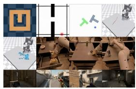
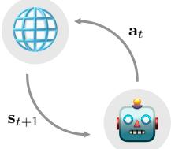
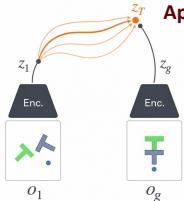
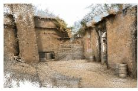
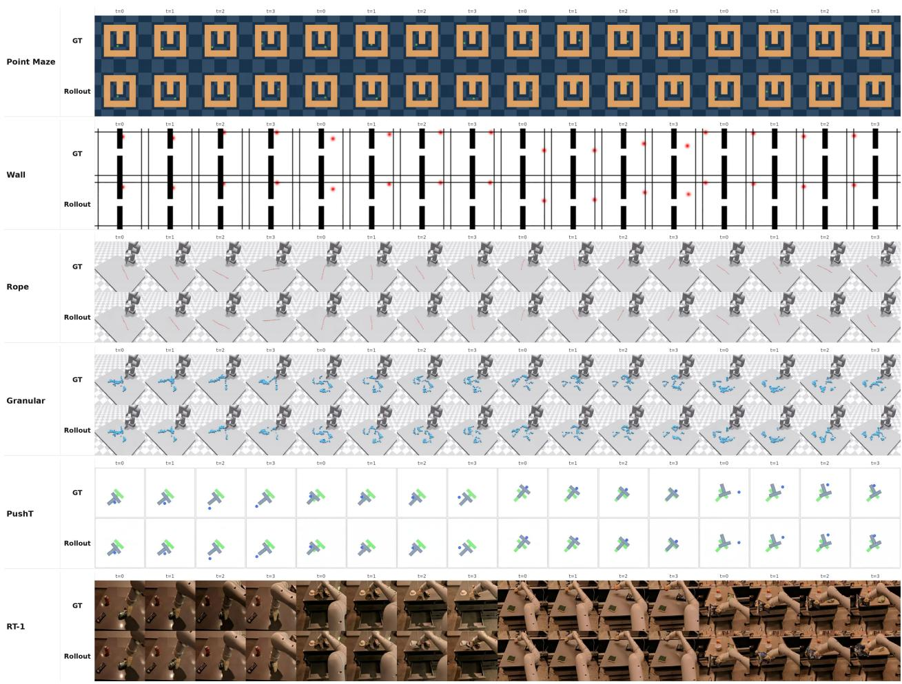
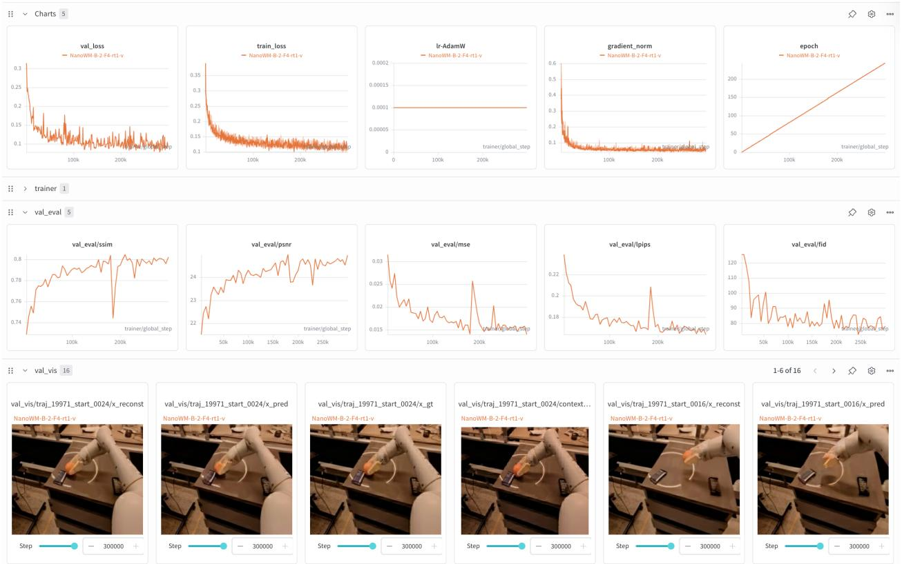
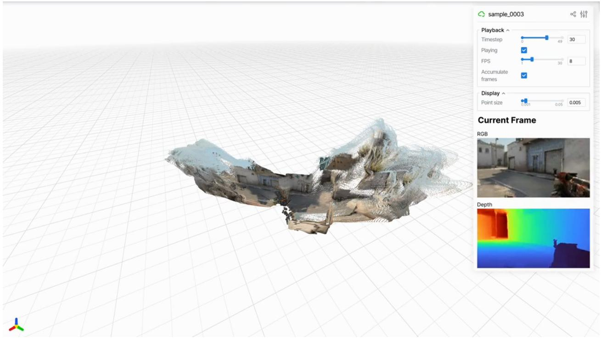
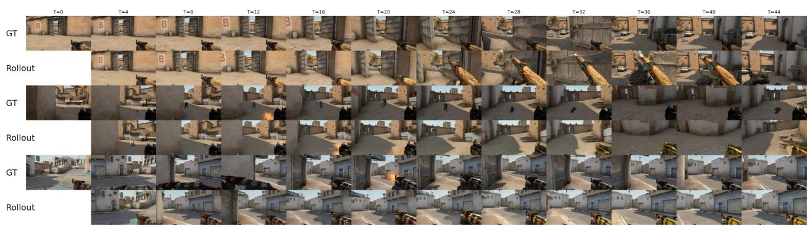
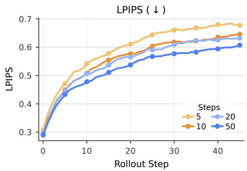

# Nano World Models: A Minimalist Implementation of Future Video Prediction

Siqiao Huanga,† Partha Kaushikb Michael Chenb Hengkai Panb Omar Chehabb Fernando Moreno-Pinoc, d Max Simchowitzb,e

aTsinghua University bCarnegie Mellon University   
cUniversity of Bristol d University of Oxford eAmazon FAR   
†Project Lead

Diverse Environments & Training Data   


<details>
<summary>natural_image</summary>

Composite image showing industrial machinery and a grid of UI elements (no readable text or symbols)
</details>

# NanoWM

Modular, Minimalist World Models

Next State Prediction w/ Actions:


Predictive Backbone

Enc.

Streaming Diffusion


Realtime Simulation   
NanoWM   


<details>
<summary>flowchart</summary>

```mermaid
graph TD
    A[" globe"] -->|a_t| B[" robot"]
    B -->|s_{t+1}| A
```
</details>

User/Agent   
Design Choices & Applications

# Design Choices

. Prediction Objectives: Diffusion/Flow, x/?/v-pred   
Latent Spaces: SD-VAE, DINO, V-JEPA   
Action Injection: FiLM, AdaLN, Cross-Attn…   
Model Sizes: S (40M), B (160M), L (600M), XL (830M)

  
Test-time Planning   
pplications

  
Video to 3D

Fully   
Open-Source   
  
Code

  
Weights

  
Data   
Figure 1: Overview. Nano World Models is a minimalist and modular framework for future video prediction and world modeling. It supports diverse environments and training data, encodes observations into latent spaces, and predicts future observations with a shared diffusion-forcing interface that can accommodate different objectives, model sizes, and action-conditioning mechanisms. The same model interface enables realtime simulation, test-time planning, and video-to-3D applications, while the project fully opensources code, model weights, and data to support reproducible study of world-model design choices.

Code: https://github.com/simchowitzlabpublic/nano-world-model

Blog: https://simchowitzlabpublic.github.io/nano-world-model

Models: https://huggingface.co/collections/knightnemo/nano-world-model

Date: May 26, 2026

# Abstract

World models have become a central paradigm for learning predictive simulators that support generation, planning, and decision-making. Yet, despite rapid progress in industry-scale interactive video generation, the broader research community still lacks compact, reproducible, and easily extensible implementations for studying the design choices underlying modern world models. We introduce Nano World Models, a minimalist codebase for future video prediction centered around diffusion forcing. Nano World Models provides a unified interface for generative objectives, model scales, action-conditioning mechanisms, latent observation spaces, datasets, evaluation protocols, and long-horizon rollout procedures. This design enables controlled studies of world-modeling components that are often entangled across separate implementations. Through experiments across simple control environments, game simulation, and real-robot data, we examine how prediction parameterization, architecture scale, action injection, sampling budget, and domain complexity affect video prediction quality and autoregressive rollout behavior. By releasing code, configurations, evaluation scripts, and pretrained checkpoints, Nano World Models aims to provide a compact yet extensible experimental substrate for open, reproducible, and scientific world-model research.

# 1 Introduction

World Models [Ha and Schmidhuber, 2018, Dawid and LeCun, 2023] have emerged as a cornerstone of spatial intelligence [Yang et al., 2025b, Wang et al., 2026] and real-world decision-making [Richens et al., 2025, Guo et al., 2025], generating high-fidelity futures by conditioning on the agent’s history and actions. Especially in the past few months predating the release of this manuscript, we have witnessed significant advances in industry-scale World Models [Google, 2025, Team et al., 2026]. Yet, for the broader community, the gap between reading about these models and deploying them remains disappointingly wide.

This manuscript accompanies Nano World Models: a minimalist, batteries-included repository for advancing a careful and scientific approach to world-model design. The motivation for this project is simple: while industry-scale world models achieve stunning visual effects, they are built around a handful of simple, well-established techniques: video diffusion [Ho et al., 2022b, Blattmann et al., 2023], diffusion forcing [Chen et al., 2024], consistency distillation [Song et al., 2023] etc.

We posit that as world model algorithm stabilizes, a shift in research focus lies from inventing new techniques to developing a more nuanced understanding of subtler scientific design decisions, including architectural choices, training objectives, and, of course, data composition and scaling behavior. However, one cannot truly understand the science behind a model without being able to easily experiment with it. Especially with the current fragmented landscape of world modeling research, diverse datasets [Brohan et al., 2022, Pearce and Zhu, 2022, Zhou et al., 2024], training recipes [Yang et al., 2023, Lipman et al., 2024, Li and He, 2025], evaluation protocols [Vafa et al., 2024, Zhang et al., 2026] and downstream tasks [Alonso et al., 2024, Quevedo et al., 2026, Guo et al., 2025] scattered across numerous sources makes rigorous scientific studies extremely hard.

# 1.1 Contributions.

We introduce Nano World Models, a minimalist, batteries-included implementation of world models, as a usable starting point admist the aforementioned fragmented landscape. Our repo is built around specializing the diffusion-forcing [Chen et al., 2024] model. We enable hydra-based configurations [Yadan, 2019], modular code for data loading, model design, training, evaluation, and downstream tasks, as well as well-curated docs. In greater detail, we support the following features:

Generative Modeling Objectives. Centered around Diffusion Forcing [Chen et al., 2024], Nano World Models supports a variety of generative modeling and prediction objectives. It supports Diffusion [Rombach et al., 2022, Peebles and Xie, 2023] and Flow-Matching [Lipman et al., 2022, 2024], with x, ε and v prediction objectives [Li and He, 2025].   
• Architectural Sizes and Design. Nano World Models is built for support of architectures of varying sizes. Following naming conventions from the image generation community [Ma et al.,

2024a, Peebles and Xie, 2023], we include four variants of varying sizes: NanoWM-S (40M), NanoWM-B (160M), NanoWM-L (600M) and NanoWM-XL (830M). For action injection methods, Nano World Models supports element-wise addition, AdaLN [Huang and Belongie, 2017], AdaLN fused with timestep injection, FiLM [Perez et al., 2018] and cross-attention.

• Environments. Nano World Models supports diverse environments, ranging from simple simulation environments to game simulation and robot manipulation. For simple simulation environments, Nano World Models currently supports environments drawn from standard robotics benchmarks, namely D4RL [Fu et al., 2020] and DeepMind Control Suite [Tassa et al., 2018]. These environments include maze navigation (Maze, Wall), fine-grained control for tabletop pushing (PushT) and deformable object manipulation with an XArm (Rope, Granular). For game simulation, we support the well-celebrated CS:GO dataset [Pearce and Zhu, 2022] and for robot manipulation, we support the widely used RT-1 [Brohan et al., 2022] dataset.   
• Logging and Evaluations. Nano World Models supports both Tensorboard [Abadi et al., 2016] and Wandb [Biewald, 2020] logging systems. Loggings include callback-style validation, reliable per-step checkpointing and system utilization informations. Evaluations are fixed-seed reproducible.   
• Long-Horizon Generation. Nano World Models goes beyond the training context. Empowering by the auto-regressive capability of diffusion forcing, as well as sliding window approaches, Nano World Models can produce temporally consistent long video generations with 4x the training horizon.

# 1.2 World-Modeling as Tool-Use

Nano World Models goes beyond next state prediction, supporting multiple applications where world modeling serves as a tool for downstream tasks.

• 3D Scene Generation. Beyond serving as a video predictor, a world model can also act as a generative prior for constructing 3D-consistent scenes. Nano World Models supports exporting generated video rollouts into downstream 3D pipelines [Lin et al., 2025, Chen et al., 2026], where multi-view or temporally adjacent predictions can be lifted into scene representations such as point clouds, Gaussian splats, or neural fields. This provides a lightweight bridge between 2D video generation and 3D scene synthesis, extracting generations from video world models to persistent 3D scenes.   
• Goal-Conditioned Planning. Nano World Models further supports goal-conditioned planning, where the world model is used as a simulator for evaluating candidate action sequences before execution. Given an initial observation and a desired goal state, the model can roll out possible futures under different action proposals, enabling planning by trajectory optimization. This turns the learned dynamics model into a tool for decision-making: rather than directly learning a policy for every task, users can query the model to imagine, compare, and select action sequences that are most likely to reach the goal.

# 1.3 Mission Statement

Thanks to its modular design, Nano World Models makes experimentation a matter of changing modular configs rather than rewriting pipelines. Datasets, tasks, model sizes, prediction objectives and overriding any specific configuration, can be swapped from a single command line. In addition, we release everything: code, data and more than a dozen pretrained model checkpoints of all sizes. World

Models need the World. Our hope is to build a Babel tower for world model research: datasets, objectives, architectures, and tasks all speaking the same language. We invite the global community to join us, contribute, and build this future together. Learn more:

Blog: https://simchowitzlabpublic.github.io/nano-world-model   
Models: https://huggingface.co/collections/knightnemo/nano-world-model   
Code: https://github.com/simchowitzlabpublic/nano-world-model

# 2 Preliminaries

We define world-modeling as the problem of modeling posterior distributions over sequences of high dimensional observations. Specifically, we are given a sequence $\mathbf { o } _ { 1 } , \ldots , \mathbf { o } _ { T }$ of previous observations (e.g. future video frames), as well as a conditioning variable c (e.g. a text-description) and our goal is to produce a completion $\mathbf { o } _ { T + 1 } , \hdots , \mathbf { o } _ { T + H }$ of future observations. In many cases, we do not predict observations directly, but instead predict encodings $\mathbf { x } _ { t } : = \mathrm { e n c } _ { \psi } ( \mathbf { o } _ { t } )$ , where $\mathrm { e n c } _ { \psi }$ is a learned or pretrained encoder (e.g. VAE [Kingma and Welling, 2013], DINO [Caron et al., 2021] or V-JEPA [Bardes et al., 2024]). Our aim is to predict the conditional distribution of sequences of the conditional variable. We view this task as a generative model problem, where we assume there is some true distribution $p ^ { \star } ( \mathbf { x } _ { T + 1 : T + H } \mid \mathbf { x } _ { 1 : T } , c )$ , and we learn a probabilistic model $p _ { \theta } ( \cdot \mid \cdot )$ over these conditionals. We denote samples from this model as $\hat { \mathbf { x } } _ { T + 1 : T + H } \sim p _ { \theta } ( \cdot | \mathbf { x } _ { 1 : T } , c )$ .

Planning with World Models Given a sequence of candidate actions $\mathbf { a } _ { T : T + H - 1 }$ , and the world model can be used as a simulator for evaluating their likely consequences. Given a task-specific utility or reward function $R ( \mathbf { x } _ { T + 1 : T + H } , \mathbf { a } _ { T : T + H - 1 } )$ , planning amounts to searching for an action sequence whose predicted rollout has high expected return under the learned model:

$$
\mathbf {a} _ {T: T + H - 1} ^ {\star} \in \arg \max _ {\mathbf {a} _ {T: T + H - 1} \in \mathcal {A} ^ {H}} \mathbb {E} _ {\hat {\mathbf {x}} _ {T + 1: T + H} \sim p _ {\theta} (\cdot | \mathbf {x} _ {1: T}, c, \mathbf {a} _ {T: T + H - 1})} \left[ R (\hat {\mathbf {x}} _ {T + 1: T + H}, \mathbf {a} _ {T: T + H - 1}) \right].
$$

In practice, this optimization is typically performed approximately, for example by sampling or optimizing a population of candidate action sequences using model predictive control (MPC). At each decision step, the planner rolls out the world model over a finite horizon, selects the best candidate sequence according to the predicted return, executes only the first action, observes the next state, and replans.

# 3 Methods Supported: Unification through Diffusion Forcing

Having defined world modeling as conditional sequence generation in Section 2, we now describe the modeling and software abstractions powering Nano World Models. The central design principle is to treat diffusion forcing as a unified interface: prediction objectives, architectures, action-conditioning mechanisms, latent spaces, environments, and rollout procedures can be exchanged while preserving the same training and sampling pipeline.

# 3.1 Diffusion Forcing as a Unified Interface

Popular generative models produce samples through iterative computation. Diffusion models iteratively denoise corrupted samples, while flow-matching models learn a vector field that transports a simple base distribution to the data distribution. Diffusion forcing extends this view to sequence modeling by allowing different frames in the same trajectory to occupy different stages of the generation process.

We introduce a noise index set $\mathbb { K } \subset \mathbb { R }$ . For an encoded trajectory $\mathbf { x } _ { 1 : T + H }$ , diffusion forcing assigns each frame $\mathbf { x } _ { t }$ a noise index $k _ { t } \in \mathbb { K } .$ . The model is trained on noised trajectories together with their noise-index schedule $\mathbf { k } = ( k _ { 1 } , \dots , k _ { T + H } )$ . Context frames may be kept clean or nearly clean, while future frames may be assigned higher-noise indices. By changing only this schedule, Nano World Models can express teacher-forced prediction, masked future prediction, and autoregressive rollout using the same model interface.

# 3.2 Generative Objectives

Nano World Models supports multiple generative objectives under the same diffusion-forcing interface. For diffusion objectives, the model can be trained with x-prediction, ε-prediction, or v-prediction targets [Li and He, 2025]. For flow-matching objectives, the model predicts the velocity field induced by a chosen interpolant, such as the linear interpolant between data and noise.

Importantly, these objectives differ only in how the noised input and training target are constructed. The backbone architecture, conditioning interface, dataset loader, and sampling code remain shared. This allows objective choices to be studied as a controlled experimental axis rather than as separate implementations.

# 3.3 Nano World Models Architecture

NanoWM uses a transformer backbone over latent video tokens. For VAE-style encodings, each frame is divided into spatial patches, and projected into a hidden dimension, and processed by transformer blocks that apply interleaved spatial-temporal attention [Ho et al., 2022a, Ma et al., 2024b]. We follow the naming convention used in image and video diffusion models: the letter denotes the model family, while the suffix denotes the latent patch size. For example, NanoWM-B/2 is the base model with patch size 2, whereas NanoWM-B/4 and NanoWM-B/8 use coarser latent patches. Nano World Models supports four architecture families: NanoWM-S, NanoWM-B, NanoWM-L, and NanoWM-XL. These provide a scaling axis from small models for fast iteration to larger models for higher-capacity prediction.

Action Conditioning. For action-conditioned world modeling, NanoWM conditions predictions on action sequences $\mathbf { a } _ { T : T + H - 1 }$ . The repository supports several action-injection mechanisms. The simplest embeds actions into the transformer hidden dimension and adds them to the corresponding frame tokens. More expressive variants inject actions through adaptive layer normalization, fuse action and timestep conditioning, apply FiLM-style modulation, or use cross-attention from video tokens to action tokens. These mechanisms expose a spectrum of conditioning strategies, from lightweight element-wise injection to higher-capacity interactions between actions and visual dynamics.

# 3.4 Latent Observation Spaces

Following recent practice in video generation and robotic world modeling, Nano World Models predicts encoded observations rather than raw observations directly [Huang et al., 2025, Zhou et al., 2024, Maes et al., 2026b]. The choice of encoding is not merely an implementation detail: recent work suggests that reconstruction-oriented and semantics-oriented latent spaces can lead to different tradeoffs in visual fidelity, planning performance, and representation quality [Jha et al., 2026]. This makes the latent representation itself an experimental axis.

Supported Latent Spaces. Nano World Models support three types of latent spaces: VAE [Rombach et al., 2022], Web-DINO [Fan et al., 2025] and V-JEPA 2.1 [Mur-Labadia et al., 2026]. VAE latents provide a reconstruction-oriented space that can be decoded back into RGB frames, making them natural for video generation and perceptual evaluation. DINO features provide a self-supervised representation space that emphasizes semantic and geometric information useful for downstream prediction and planning. V-JEPA features provide a video-pretrained representation space designed around predictive visual features. Supporting these latent spaces under the same training interface allows Nano World Models to compare reconstruction-oriented and representation-oriented world modeling without changing the rest of the pipeline.



<details>
<summary>bar</summary>

| Task       | Method  | Timeframe 1 | Timeframe 2 | Timeframe 3 |
|------------|---------|-------------|-------------|-------------|
| Point Maze | GT      | Grid        | Grid        | Grid        |
| Point Maze | Rollout | Grid        | Grid        | Grid        |
| Wall       | GT      | Grid        | Grid        | Grid        |
| Wall       | Rollout | Grid        | Grid        | Grid        |
| Rope       | GT      | Grid        | Grid        | Grid        |
| Rope       | Rollout | Grid        | Grid        | Grid        |
| Granular   | GT      | Grid        | Grid        | Grid        |
| Granular   | Rollout | Grid        | Grid        | Grid        |
| PushT      | GT      | Grid        | Grid        | Grid        |
| PushT      | Rollout | Grid        | Grid        | Grid        |
| RT-1       | GT      | Grid        | Grid        | Grid        |
| RT-1       | Rollout | Grid        | Grid        | Grid        |
</details>

Figure 2: Qualitative rollouts across domains. Representative ground-truth (GT) sequences and Nano World Models rollouts from Point Maze, Wall, Rope, Granular, PushT, and RT-1. The same dataset and environment interface exposes these domains to the training and sampling code, allowing grid-world navigation, simulated control, and robot-video prediction to be compared under a shared rollout format.

# 3.5 Datasets and Environment Interface

Nano World Models uses a shared dataset and environment interface for diverse sources of sequential data. Each dataset exposes observation sequences, optional action sequences, frame windows, and metadata through the same loader abstraction. This allows simulation environments [Tassa et al., 2018, Fu et al., 2020], gaming datasets [Pearce and Zhu, 2022] and robot manipulation datasets [Brohan et al., 2022] to share the same modeling code.

  
Figure 3: Logging and fixed-seed evaluation. Nano World Models logs training curves, validation metrics, and qualitative prediction panels through Weights & Biases. The same callback-style evaluation pipeline records PSNR, SSIM, LPIPS, FID, reconstruction videos, predicted rollouts, and ground-truth clips under a shared run.

# 3.6 Long-Horizon Rollouts

Although models are trained on finite windows, diffusion forcing naturally supports generation beyond the training horizon. Nano World Models enables long-horizon generation via sliding window and auto-regressive generation: generated frames are treated as context for generation of new future frames, and the perceptive field for attention on the temporal axis follows a sliding window procedure. This enables temporally extended rollouts while preserving the same local denoising interface used during short-horizon sampling.

# 3.7 Logging, Evaluation and Reproducibility

Nano World Models includes fixed-seed validation, checkpointing, logging, and standardized evaluation scripts. For logging, we support both both Tensorboard [Abadi et al., 2016] and Wandb [Biewald, 2020] logging systems. To further ensure reproducibility, Nano World Models open-sources all final checkpoints for supported environments, and ablated design choices.

# 3.8 World-Modeling as Tool-Use

Exporting Video Rollouts to 3D Scene Assets. To use generated futures as inputs to 3D reconstruction tools, Nano World Models provides a rollout export interface that saves predicted frames together with the metadata needed by downstream reconstruction pipelines. A generated trajectory is first decoded into RGB frames at the model’s training resolution. When the source domain has a different native aspect ratio, frames can be remapped to the native resolution before reconstruction. The exported video or frame sequence can then be passed to off-the-shelf multi-view depth and camera estimation systems [Lin et al., 2025, Chen et al., 2026], whose outputs are converted into persistent 3D representations such as point clouds. This design keeps the world model independent of any particular 3D backend: Nano World Models supplies temporally coherent visual rollouts, while the reconstruction module handles geometry estimation and visualization.



<details>
<summary>text_image</summary>

sample_0003
Playback
Timestep 0 49 30
Playing ✓
FPS 1 30 8
Accumulate frames ✓
Display ↑
Point size 0.001 0.05 0.005
Current Frame
RGB
Depth
</details>

Figure 4: Exporting rollouts to 3D scene assets. A generated CSGO rollout is decoded to RGB frames and passed to a downstream depth and camera estimation pipeline. The resulting geometry can be visualized as a persistent point cloud together with the source RGB frame and estimated depth map.

MPC Interface for Goal-Conditioned Planning. For planning, Nano World Models exposes the world model as a batched rollout function. At each replanning step, the planner receives the current observation context, a goal specification, and a population of candidate action sequences. The world model predicts a future trajectory for each candidate in parallel, and an objective module assigns a scalar score to each rollout, such as distance to a goal state, task progress, or environment-specific reward. The planner updates the candidate distribution, selects the best sequence, executes its first action, and then repeats the procedure with the newly observed context. This separates the learned dynamics model from the planning algorithm and reward definition, allowing the same checkpoint to be reused across different goal specifications and trajectory optimizers.

# 4 Findings

# 4.1 How to measure performance?

Evaluation Setup. Unless otherwise stated, we evaluate on 256 fixed validation clips with seed 42, and auto-regressive sequential scheduling. For the standard 256-resolution models, each validation clip contains four frames: the model conditions on the first frame and generates the remaining three frames. Metrics are computed only on generated frames, excluding the context frame, while saved visualization videos include both context and generated frames. For CSGO-specific models, the model context is four frames out of a 16-frame window; long-horizon rollouts use a sliding four-frame history window. For diffusion models, we use 250 DDIM sampling steps if not explicitly stated.

Measuring Visual Fidelity. One important, though not all-encompassing factor of video world models is it’s generation fidelity. We report four reconstruction and perceptual metrics. PSNR and SSIM measure pixel-level fidelity, LPIPS [Zhang et al., 2018] measures perceptual distance, and FID [Heusel et al., 2017] measures distributional similarity of generated frames to ground-truth validation frames. For longer videos with sufficient temporal extent, FVD [Unterthiner et al., 2018] is also computed.

Measuring Decision-Making Capabilities. For goal-conditioned planning, we evaluate Nano World Models through a CEM-style MPC loop. We report decision-making performance over a fixed number of evaluation episodes, using Success Rate, i.e. the fraction of episodes in which the final state satisfies the environment-specific goal condition as the primary metric.

# 4.2 Which objective function performs best?

We first ablate the prediction target on RT-1 fractal [Brohan et al., 2022]. All runs use NanoWM-B/2 for model configuration, element-wise addition for action injection, and the Stable Diffusion VAE (stabilityai/sd-vae-ft-mse1) as encoder. Each run is trained for 50K steps on 8 GPUs with per-GPU batch size 8, giving effective batch size 64. All runs condition on one frame and generate three future frames during evaluation.

We pair each prediction target with the schedule commonly used in the implementation. For x- and v-prediction, we use a squared-cosine noise schedule with zero-terminal SNR (ZTSNR [Lin et al., 2024]), following the common practice of enforcing the final diffusion state to contain no residual signal. For ε-prediction, we use a linear schedule without ZTSNR, since the cosine + ZTSNR parameterization is numerically degenerate for ε-prediction at the terminal timestep. Thus, the comparison reflects the best supported schedule for each target rather than forcing all targets into an unstable shared schedule.

Table 1: Prediction target ablation on RT-1 fractal. 

<table><tr><td>Target</td><td>Schedule</td><td>PSNR ↑</td><td>SSIM ↑</td><td>LPIPS ↓</td><td>FID ↓</td></tr><tr><td>v</td><td>cosine + ZTSNR</td><td>23.07</td><td>0.760</td><td>0.207</td><td>42.27</td></tr><tr><td>x</td><td>cosine + ZTSNR</td><td>23.37</td><td>0.783</td><td>0.184</td><td>42.99</td></tr><tr><td>€</td><td>linear</td><td>21.89</td><td>0.739</td><td>0.225</td><td>48.86</td></tr></table>

# Finding #1

ε-prediction underperforms x and v-prediction. x-prediction gives the best reconstruction metrics, while v-prediction gives the best FID and is the default setting in Nano World Models. Both substantially outperform ε-prediction under the tested schedules.

# 4.3 Which architecture and action-injection?

Model scale. We next ablate model scale on RT-1 under the same 50K-step ablation protocol: 8 GPUs, per-GPU batch size 8, effective batch size 64, one context frame, and three generated frames at evaluation time. The comparison varies the NanoWM architecture while keeping the objective and actioninjection setting fixed.

Table 2: Model scale ablation on RT-1 fractal. 

<table><tr><td>Architecture</td><td>Params</td><td>PSNR ↑</td><td>SSIM ↑</td><td>LPIPS ↓</td><td>FID ↓</td></tr><tr><td>NanoWM-S/2</td><td>39.8M</td><td>22.30</td><td>0.739</td><td>0.230</td><td>54.95</td></tr><tr><td>NanoWM-B/2</td><td>158.6M</td><td>23.07</td><td>0.760</td><td>0.207</td><td>42.27</td></tr><tr><td>NanoWM-L/2</td><td>~460M</td><td>23.62</td><td>0.777</td><td>0.186</td><td>36.31</td></tr></table>

# Finding #2

Larger Models give Better Performance. Scaling from NanoWM-S/2 to NanoWM-B/2 to NanoWM-L/2 improves PSNR, SSIM, LPIPS, and FID monotonically on RT-1.

Action injection. We compare five action-injection mechanisms: Element-wise Addition (additive), Adaptive Layer Norm (adaLN), Adaptive Layer Norm fused with timestep injection (adaLN-fuse), FiLM (FiLM) and cross-attention (cross-attention). On RT-1, each run uses the same 50K-step ablation protocol as above. We also report a PushT sweep with NanoWM-B/2 trained for 30K steps and evaluated on 256 fixed validation samples with seed 42.

Table 3: Action-injection ablations on RT-1 and PushT. 

<table><tr><td>RT-1 method</td><td>PSNR</td><td>SSIM</td><td>LPIPS</td><td>FID</td><td>Params</td></tr><tr><td>additive</td><td>23.07</td><td>0.760</td><td>0.207</td><td>42.27</td><td>158.6M</td></tr><tr><td>adaLN</td><td>23.19</td><td>0.762</td><td>0.206</td><td>43.62</td><td>158.6M</td></tr><tr><td>adaLN-fuse</td><td>23.10</td><td>0.762</td><td>0.206</td><td>43.03</td><td>158.6M</td></tr><tr><td>FiLM</td><td>23.20</td><td>0.763</td><td>0.203</td><td>40.62</td><td>172.8M</td></tr><tr><td>cross-attention</td><td>20.82</td><td>0.721</td><td>0.242</td><td>51.12</td><td>187.0M</td></tr></table>

<table><tr><td>PushT method</td><td>PSNR</td><td>SSIM</td><td>LPIPS</td><td>FID</td><td>Extra params</td></tr><tr><td>additive</td><td>26.20</td><td>0.962</td><td>0.053</td><td>23.89</td><td>0</td></tr><tr><td>adaLN-fuse</td><td>26.17</td><td>0.961</td><td>0.051</td><td>30.28</td><td>0</td></tr><tr><td>adaLN</td><td>26.09</td><td>0.960</td><td>0.053</td><td>26.32</td><td>~42.5M</td></tr><tr><td>cross-attention</td><td>25.95</td><td>0.959</td><td>0.055</td><td>28.64</td><td>~28.3M</td></tr><tr><td>FiLM</td><td>25.88</td><td>0.960</td><td>0.056</td><td>25.45</td><td>~14.4M</td></tr></table>

# Finding #3

Action injection is task-dependent. FiLM gives the best visual fidelity on RT-1, but the simple additive baseline is strongest on PushT and has the best quality-parameter tradeoff.

# 4.4 Which latent space?

Nano World Models supports multiple latent observation spaces, including reconstruction-oriented VAE latents and semantic representation latents such as Web-DINO [Fan et al., 2025] and V-JEPA 2.1 [Mur-Labadia et al., 2026]. Unlike VAE latents, Web-DINO and V-JEPA features are not naturally decoded back to RGB observations, and therefore visual fidelity metrics such as PSNR, SSIM, LPIPS, and FID are not directly comparable across latent spaces. We instead evaluate whether each latent space can support model-based control through goal-conditioned planning.

Environment Setup. We evaluate on PushT goal reaching using the DINO-WM PushT dataset with a frame interval of 5 and a four-frame prediction window consisting of one context frame and three future frames. Actions are represented as relative actions, and flattened from a 5-step chunk of 2D actions into a 10-dimensional action vector. All models are trained for 100K steps with diffusion forcing, v-prediction, a squared-cosine noise schedule with zero-terminal SNR, AdamW with learning rate 10−4 and weight decay 0.01, causal masking, and additive action injection.

Model Setup. For fair comparison with respect to token numbers, we compare three checkpoints with the following configuration. The VAE model uses Stable Diffusion VAE latents with shape [4, 32, 32] and a NanoWM-B/2 backbone. The Web-DINO and V-JEPA 2.1 models use dense semantic latents with shape [1024, 16, 16] and NanoWM-B/1 backbones. Web-DINO is applied frame-wise with 224- resolution inputs and patch size 14, while V-JEPA 2.1 uses the EMA encoder, with the input resolution set to 256 to align the latent grid and patch size 16.

Table 4: Goal-conditioned planning on PushT across latent spaces. Success is measured by the environment’s state-based PushT success criterion. Although all models are trained under the same diffusion-forcing interface, only the reconstruction-oriented VAE latent checkpoint produces non-zero planning success. 

<table><tr><td>Latent space</td><td>Backbone</td><td>Latent shape</td><td>Success rate</td></tr><tr><td>SD-VAE</td><td>NanoWM-B/2</td><td>[4, 32, 32]</td><td>25.0%</td></tr><tr><td>Web-DINO</td><td>NanoWM-B/1</td><td>[1024, 16, 16]</td><td>0.0%</td></tr><tr><td>V-JEPA 2.1</td><td>NanoWM-B/1</td><td>[1024, 16, 16]</td><td>0.0%</td></tr></table>

Table 5: Ground-truth action rollout diagnostic on PushT. We report the distance between the final predicted latent and the goal latent over 32 goal-reaching episodes, using goal horizon H = 3 and 20 DDIM sampling steps. A controllable dynamics model should make ground-truth actions substantially closer to the goal than zero or random actions. SD-VAE shows a clear action-conditioned improvement, while Web-DINO and V-JEPA 2.1 remain nearly unchanged across ground-truth, zero, and random actions. 

<table><tr><td rowspan="2">Latent space</td><td colspan="4">Latent MSE ↓</td><td colspan="4">Cosine distance ↓</td></tr><tr><td>Init</td><td>GT action</td><td>Zero action</td><td>Random action</td><td>Init</td><td>GT action</td><td>Zero action</td><td>Random action</td></tr><tr><td>SD-VAE</td><td>0.077714</td><td>0.014015</td><td>0.074830</td><td>0.081412</td><td>0.038073</td><td>0.008885</td><td>0.037322</td><td>0.042239</td></tr><tr><td>Web-DINO</td><td>0.311649</td><td>0.834037</td><td>0.834044</td><td>0.834066</td><td>0.111740</td><td>0.280007</td><td>0.280011</td><td>0.280025</td></tr><tr><td>V-JEPA 2.1</td><td>0.206433</td><td>0.584029</td><td>0.584056</td><td>0.584150</td><td>0.047607</td><td>0.138866</td><td>0.138872</td><td>0.138893</td></tr></table>

Evaluation. For planning, we use a CEM-style MPC loop. At each replanning step, the planner samples candidate action sequences, rolls out the world model for one autoregressive chunk, and scores the final predicted latent frame against a replayed dataset goal. We use goal horizon H = 3, so the model generates three future frames and the last predicted frame is matched to the goal. We evaluate each model using 64 CEM samples and 5 CEM iterations.

Results. As shown in Table 4, the SD-VAE checkpoint reaches the goal in 25% of episodes, while both Web-DINO and V-JEPA 2.1 fail to obtain non-zero success. Internally, we also tried increasing sampling and planning budget, yet semantic-latent checkpoints still yields zero successful episodes. This suggests that the failure is not primarily caused by an insufficient trajectory optimizer or a weak sampling budget.

Table 6: Action embedding magnitude across latent spaces. The semantic-latent checkpoints learn action embeddings with near-zero RMS, indicating that the additive action-conditioning pathway is effectively unused.

<table><tr><td>Latent space</td><td>Action embedding RMS</td></tr><tr><td>SD-VAE</td><td>0.1119</td></tr><tr><td>Web-DINO</td><td>0.00214</td></tr><tr><td>V-JEPA 2.1</td><td>0.00129</td></tr></table>

Analysis. To understand why semantic-latent planning fails, we test whether the trained dynamics models actually use the action input. We first compare rollouts under ground-truth actions against rollouts under zero or random actions. For each evaluation goal, we measure the distance between the predicted final latent and the goal latent after a 3-frame rollout with 20 DDIM steps. We also compare against the initial observation latent, which measures whether the model predicts progress toward the goal beyond simply staying near the current state.



<details>
<summary>text_image</summary>

T=0
T=4
T=8
T=12
T=16
T=20
T=24
T=28
T=32
T=36
T=40
T=44
GT
Rollout
GT
Rollout
GT
Rollout
</details>

Figure 5: Long-Horizon Rollout Samples of Nano World Models.

As shown in Table 5, the SD-VAE checkpoint is strongly sensitive to ground-truth actions; in contrast, Web-DINO and V-JEPA 2.1 show almost identical distances under ground-truth, zero, and random actions. This indicates that the semantic-latent checkpoints do not meaningfully condition their predictions on the action input. The same conclusion is supported by the magnitude of the learned action branch, as shown in Table 6. The action embedding Root Mean Square (RMS) is much larger for SD-VAE compared to Web-DINO and V-JEPA 2.1. Together, these results indicate that the reason behind semantic encoders’ incompetence in aiding planning comes from inability to learn counterfactual action-conditioned predictions.

# Finding #4

Semantic latent spaces do not automatically yield better world models for planning. On PushT, the SD-VAE checkpoint learns action-conditioned dynamics and achieves non-zero goal-reaching success, whereas the Web-DINO and V-JEPA 2.1 checkpoints become nearly action-agnostic under the same training interface and fails completely. Their planning failure is caused by the semantic-latent diffusion objective not sufficiently forcing the model to use actions for controllable dynamics.

# 4.5 What happens during long-horizon rollouts?

For long-horizon qualitative evaluation, the CSGO checkpoint uses the CSGO-specific NanoWM-L/2 configuration with 16-frame training windows and four context frames. The long-rollout script generates 50-frame videos by initializing from four ground-truth history frames and then autoregressively generating the remaining 46 frames one at a time. Each generation step uses a sliding four-frame context window, sequential scheduling, and 50 DDIM sampling steps per predicted frame.

As shown in Fig. 5, Nano World Models preserves the coarse scene geometry and camera motion over long autoregressive rollouts, while gradually accumulating perceptual errors in fine-grained visual details such as weapon appearance and local textures. This behavior is consistent with the LPIPS curves in Fig. 6: prediction error increases gradually during self-generated rollouts. Increasing the number of DDIM sampling steps consistently reduces LPIPS across the rollout horizon, suggesting that more accurate per-frame denoising mitigates compounding errors during autoregressive generation.



<details>
<summary>line</summary>

| Rollout Step | Steps 5 | Steps 10 | Steps 20 | Steps 50 |
| ------------ | ------- | -------- | -------- | -------- |
| 0            | 0.3     | 0.3      | 0.3      | 0.3      |
| 5            | 0.48    | 0.45     | 0.44     | 0.43     |
| 10           | 0.55    | 0.52     | 0.50     | 0.48     |
| 15           | 0.58    | 0.56     | 0.54     | 0.51     |
| 20           | 0.61    | 0.59     | 0.57     | 0.54     |
| 25           | 0.63    | 0.61     | 0.59     | 0.56     |
| 30           | 0.65    | 0.62     | 0.61     | 0.58     |
| 35           | 0.66    | 0.63     | 0.62     | 0.59     |
| 40           | 0.67    | 0.64     | 0.63     | 0.60     |
| 45           | 0.68    | 0.65     | 0.64     | 0.61     |
</details>

Figure 6: Error Accumulation.

# Finding #5

Nano World Models can produce plausible long-horizon rollouts, but autoregressive generation inevitably accumulates perceptual errors over time. Increasing the DDIM sampling budget consistently improves rollout fidelity, suggesting that stronger per-frame denoising can partially mitigate compounding errors.

# 4.6 How do findings vary across task and environment?

Finally, we evaluate the shipped checkpoints across domains. DINO-WM Point Maze, Wall, Rope, and Granular use 2 GPUs with per-GPU batch size 8. DINO-WM PushT uses 8 GPUs with per-GPU batch size 8. RT-1 uses 8 GPUs with per-GPU batch size 8 and trains for 300K steps. All rows below use the standardized evaluation protocol: 256 fixed validation clips with seed 42, 250 DDIM sampling steps, sequential scheduling, one context frame, and three generated frames.

Table 7: Results on shipped checkpoints under the standardized evaluation protocol. 

<table><tr><td>Dataset</td><td>Steps</td><td>PSNR ↑</td><td>SSIM ↑</td><td>LPIPS ↓</td><td>FID ↓</td></tr><tr><td>Point Maze</td><td>30K</td><td>36.74</td><td>0.984</td><td>0.019</td><td>9.66</td></tr><tr><td>Wall</td><td>15K</td><td>34.05</td><td>0.994</td><td>0.010</td><td>2.64</td></tr><tr><td>Rope</td><td>15K</td><td>31.63</td><td>0.953</td><td>0.056</td><td>35.20</td></tr><tr><td>Granular</td><td>15K</td><td>26.08</td><td>0.917</td><td>0.073</td><td>40.05</td></tr><tr><td>PushT</td><td>100K</td><td>33.19</td><td>0.982</td><td>0.016</td><td>13.63</td></tr><tr><td>RT-1</td><td>300K</td><td>24.36</td><td>0.787</td><td>0.180</td><td>35.08</td></tr></table>

# Finding #6

The same training and evaluation recipe works across navigation, tabletop pushing, deformable manipulation, and real-robot data. Performance is strongest on simpler simulated domains and decreases on visually or dynamically more complex domains such as Granular and RT-1.

# 5 Related Works

Representative Modern World-Modeling Paradigms. World models aim to learn predictive representations of the environment that can support generation, planning, and decision-making. One line of works [Ha and Schmidhuber, 2018, Dawid and LeCun, 2023] focuses on learning representation spaces that facilitate decision-making, with the notable example of the JEPA family of models [Bardes et al., 2024, Balestriero and LeCun, 2025, Mur-Labadia et al., 2026, Maes et al., 2026b], which jointly learns encoder and predictor in a self-supervised fashion. A second line of work focuses on generations in 3D space, using 3D structures as representation. While they start from static 3D asset generation [World Labs, 2025, Shen et al., 2026], recent works have included temporal evolutions and next state predictions given interactive actions [Zhen et al., 2025, Huang et al., 2026a]. The thrid line of work leverages video generation models [Huang et al., 2025], focusing on generating plausible future observations in the form of RGB images. This line of work have shown promising results in game simulation (i.e. neural game engines) [Alonso et al., 2024, Hafner et al., 2025, Savva et al., 2026], aiding navigation [Bar et al.,

2025] as well as robot manipulation [Guo et al., 2025, Chi et al., 2025]. Nano World Models primarily follows this video-generative view, but supports the latent observation space as a design axis.

Streaming Video Diffusion. Standard video diffusion models [Ho et al., 2022b, Blattmann et al., 2023] are usually trained to generate fixed-length clips in a full-sequence manner, which makes them poorly matched to online interaction, long-horizon rollout, and real-time control. Recent work on streaming and autoregressive video diffusion addresses this limitation by generating videos progressively [Chen et al., 2024, Kodaira et al., 2025, Yang et al., 2025a, Huang et al., 2026b]. These models highlight a central challenge for video world modeling: a finite-window generator must be converted into a persistent simulator without losing temporal consistency or accumulating excessive visual drift. Nano World Models studies this problem in a compact and controllable setting. Through diffusion forcing, sequential sampling schedules, and sliding-window autoregressive rollouts, NanoWM uses a single diffusion-based interface for short-horizon prediction and extended future generation, while making the effects of sampling budget and compounding error directly measurable.

Advancing Open-Source World Modeling. Several recent efforts have begun to close the gap between closed, industry-scale world simulators and reproducible academic research infrastructure. StableWM [Maes et al., 2026a] provides an open platform for world-model research, covering data collection, training, evaluation, and planning-oriented workflows, however mostly limited to simple simulation environment. Jasmine [Mahajan et al., 2025] emphasizes highly efficient world-model training infrastructure, based on JAX [Bradbury et al., 2018] implementations, however supporting mostly outdated algorithms such as Genie [Bruce et al., 2024]. LingBot-World [Team et al., 2026] advances open-source interactive world simulation from video generation, releasing industry-scale models and code for longhorizon, real-time, action-controllable environments, yet posing forbidding costs to train or even inference. These efforts share the goal of democratizing world-model research, but differ in scope and emphasis. Nano World Models is complementary: rather than targeting the largest possible simulator, it provides a minimalist PyTorch implementation centered on diffusion-forcing future video prediction, with modular support for objectives, architecture sizes, action-injection mechanisms, latent spaces, datasets, evaluations, long-horizon rollout, and released checkpoints, aiming to make careful and scientific understanding of design choices possible.

# 6 Conclusion

We introduce Nano World Models, a minimalist and reproducible framework for advancing scientific understanding of world models. Nano World Models treats diffusion forcing [Chen et al., 2024] as a unifying abstraction, allowing objectives, architectures, action-conditioning mechanisms, latent spaces, datasets, and rollout procedures to be varied within a shared training and evaluation pipeline. Our empirical results show that these design choices have measurable and often domain-dependent effects: prediction parameterization changes reconstruction and distributional quality, scaling improves performance consistently, action injection interacts with task structure, and long-horizon autoregressive rollout remains limited by compounding perceptual error. Together, these findings highlight the need for world-model research to move beyond isolated demonstrations toward controlled studies of the modeling decisions that govern prediction, interaction, and planning. Nano World Models provides an open substrate for this direction, making it easier to compare design choices, reproduce results, and build future world models on common experimental ground.

# References

Martín Abadi, Ashish Agarwal, Paul Barham, Eugene Brevdo, Zhifeng Chen, Craig Citro, Greg S Corrado, Andy Davis, Jeffrey Dean, Matthieu Devin, et al. Tensorflow: Large-scale machine learning on heterogeneous distributed systems. arXiv preprint arXiv:1603.04467, 2016.   
Eloi Alonso, Adam Jelley, Vincent Micheli, Anssi Kanervisto, Amos Storkey, Tim Pearce, and François Fleuret. Diffusion for world modeling: Visual details matter in atari. Advances in Neural Information Processing Systems, 37:58757–58791, 2024.   
Randall Balestriero and Yann LeCun. Lejepa: Provable and scalable self-supervised learning without the heuristics, 2025. URL https://arxiv.org/abs/2511.08544.   
Amir Bar, Gaoyue Zhou, Danny Tran, Trevor Darrell, and Yann LeCun. Navigation world models. In Proceedings of the Computer Vision and Pattern Recognition Conference, pages 15791–15801, 2025.   
Adrien Bardes, Quentin Garrido, Jean Ponce, Michael Rabbat, Yann LeCun, Mahmoud Assran, and Nicolas Ballas. Revisiting feature prediction for learning visual representations from video. arXiv:2404.08471, 2024.   
Lukas Biewald. Experiment tracking with weights and biases, 2020. URL https://www.wandb. com/. Software available from wandb.com.   
Andreas Blattmann, Tim Dockhorn, Sumith Kulal, Daniel Mendelevitch, Maciej Kilian, Dominik Lorenz, Yam Levi, Zion English, Vikram Voleti, Adam Letts, Varun Jampani, and Robin Rombach. Stable video diffusion: Scaling latent video diffusion models to large datasets. arXiv preprint arXiv: 2311.15127, 2023.   
James Bradbury, Roy Frostig, Peter Hawkins, Matthew James Johnson, Yash Katariya, Chris Leary, Dougal Maclaurin, George Necula, Adam Paszke, Jake VanderPlas, Skye Wanderman-Milne, and Qiao Zhang. JAX: composable transformations of Python+NumPy programs, 2018. URL http: //github.com/jax-ml/jax.   
Anthony Brohan, Noah Brown, Justice Carbajal, Yevgen Chebotar, Joseph Dabis, Chelsea Finn, Keerthana Gopalakrishnan, Karol Hausman, Alex Herzog, Jasmine Hsu, et al. Rt-1: Robotics transformer for real-world control at scale. arXiv preprint arXiv:2212.06817, 2022.   
Jake Bruce, Michael D Dennis, Ashley Edwards, Jack Parker-Holder, Yuge Shi, Edward Hughes, Matthew Lai, Aditi Mavalankar, Richie Steigerwald, Chris Apps, Yusuf Aytar, Sarah Maria Elisabeth Bechtle, Feryal Behbahani, Stephanie C.Y. Chan, Nicolas Heess, Lucy Gonzalez, Simon Osindero, Sherjil Ozair, Scott Reed, Jingwei Zhang, Konrad Zolna, Jeff Clune, Nando de Freitas, Satinder Singh, and Tim Rocktäschel. Genie: Generative interactive environments. In Forty-first International Conference on Machine Learning, 2024. URL https://openreview.net/forum?id=bJbSbJskOS.   
Mathilde Caron, Hugo Touvron, Ishan Misra, Hervé Jégou, Julien Mairal, Piotr Bojanowski, and Armand Joulin. Emerging properties in self-supervised vision transformers. In Proceedings of the IEEE/CVF international conference on computer vision, pages 9650–9660, 2021.   
Boyuan Chen, Diego Martí Monsó, Yilun Du, Max Simchowitz, Russ Tedrake, and Vincent Sitzmann. Diffusion forcing: Next-token prediction meets full-sequence diffusion. Advances in Neural Information Processing Systems, 37:24081–24125, 2024.

Lin-Zhuo Chen, Jian Gao, Yihang Chen, Ka Leong Cheng, Yipengjing Sun, Liangxiao Hu, Nan Xue, Xing Zhu, Yujun Shen, Yao Yao, and Yinghao Xu. Geometric context transformer for streaming 3d reconstruction. arXiv preprint arXiv:2604.14141, 2026.   
Xiaowei Chi, Peidong Jia, Chun-Kai Fan, Xiaozhu Ju, Weishi Mi, Kevin Zhang, Zhiyuan Qin, Wanxin Tian, Kuangzhi Ge, Hao Li, et al. Wow: Towards a world omniscient world model through embodied interaction. arXiv preprint arXiv:2509.22642, 2025.   
Anna Dawid and Yann LeCun. Introduction to latent variable energy-based models: A path towards autonomous machine intelligence. Journal of Statistical Mechanics: Theory and Experiment, 2023. doi: 10.1088/1742-5468/ad292b.   
David Fan, Shengbang Tong, Jiachen Zhu, Koustuv Sinha, Zhuang Liu, Xinlei Chen, Michael Rabbat, Nicolas Ballas, Yann LeCun, Amir Bar, et al. Scaling language-free visual representation learning. In Proceedings of the IEEE/CVF International Conference on Computer Vision, pages 370–382, 2025.   
Justin Fu, Aviral Kumar, Ofir Nachum, George Tucker, and Sergey Levine. D4rl: Datasets for deep data-driven reinforcement learning. arXiv preprint arXiv:2004.07219, 2020.   
Google. Genie 3: A new frontier for world models. https://deepmind.google/blog/ genie-3-a-new-frontier-for-world-models/, August 2025. Google DeepMind Blog.   
Yanjiang Guo, Lucy Xiaoyang Shi, Jianyu Chen, and Chelsea Finn. Ctrl-world: A controllable generative world model for robot manipulation. arXiv preprint arXiv:2510.10125, 2025.   
David Ha and Jürgen Schmidhuber. Recurrent world models facilitate policy evolution. Advances in neural information processing systems, 31, 2018.   
Danijar Hafner, Wilson Yan, and Timothy Lillicrap. Training agents inside of scalable world models. arXiv preprint arXiv:2509.24527, 2025.   
Martin Heusel, Hubert Ramsauer, Thomas Unterthiner, Bernhard Nessler, and Sepp Hochreiter. Gans trained by a two time-scale update rule converge to a local nash equilibrium. Advances in neural information processing systems, 30, 2017.   
Jonathan Ho, William Chan, Chitwan Saharia, Jay Whang, Ruiqi Gao, Alexey Gritsenko, Diederik P Kingma, Ben Poole, Mohammad Norouzi, David J Fleet, et al. Imagen video: High definition video generation with diffusion models. arXiv preprint arXiv:2210.02303, 2022a.   
Jonathan Ho, Tim Salimans, Alexey Gritsenko, William Chan, Mohammad Norouzi, and David J Fleet. Video diffusion models. Advances in neural information processing systems, 35:8633–8646, 2022b.   
Siqiao Huang, Jialong Wu, Qixing Zhou, Shangchen Miao, and Mingsheng Long. Vid2world: Crafting video diffusion models to interactive world models. arXiv preprint arXiv:2505.14357, 2025.   
Wenlong Huang, Yu-Wei Chao, Arsalan Mousavian, Ming-Yu Liu, Dieter Fox, Kaichun Mo, and Li Fei-Fei. Pointworld: Scaling 3d world models for in-the-wild robotic manipulation. arXiv preprint arXiv:2601.03782, 2026a.   
Xun Huang and Serge Belongie. Arbitrary style transfer in real-time with adaptive instance normalization. In Proceedings of the IEEE international conference on computer vision, pages 1501–1510, 2017.

Xun Huang, Zhengqi Li, Guande He, Mingyuan Zhou, and Eli Shechtman. Self forcing: Bridging the train-test gap in autoregressive video diffusion. Advances in Neural Information Processing Systems, 38:167283–167308, 2026b.   
Saurav Jha, Artem Zholus, Sarath Chandar, et al. Reconstruction or semantics? what makes a latent space useful for robotic world models. arXiv preprint arXiv:2605.06388, 2026.   
Diederik P Kingma and Max Welling. Auto-encoding variational bayes. arXiv preprint arXiv:1312.6114, 2013.   
Akio Kodaira, Chenfeng Xu, Toshiki Hazama, Takanori Yoshimoto, Kohei Ohno, Shogo Mitsuhori, Soichi Sugano, Hanying Cho, Zhijian Liu, Masayoshi Tomizuka, et al. Streamdiffusion: A pipeline-level solution for real-time interactive generation. In Proceedings of the IEEE/CVF International Conference on Computer Vision, pages 12371–12380, 2025.   
Tianhong Li and Kaiming He. Back to basics: Let denoising generative models denoise. arXiv preprint arXiv:2511.13720, 2025.   
Haotong Lin, Sili Chen, Jun Hao Liew, Donny Y. Chen, Zhenyu Li, Guang Shi, Jiashi Feng, and Bingyi Kang. Depth anything 3: Recovering the visual space from any views. arXiv preprint arXiv:2511.10647, 2025.   
Shanchuan Lin, Bingchen Liu, Jiashi Li, and Xiao Yang. Common diffusion noise schedules and sample steps are flawed. In Proceedings of the IEEE/CVF winter conference on applications of computer vision, pages 5404–5411, 2024.   
Yaron Lipman, Ricky TQ Chen, Heli Ben-Hamu, Maximilian Nickel, and Matt Le. Flow matching for generative modeling. arXiv preprint arXiv:2210.02747, 2022.   
Yaron Lipman, Marton Havasi, Peter Holderrieth, Neta Shaul, Matt Le, Brian Karrer, Ricky TQ Chen, David Lopez-Paz, Heli Ben-Hamu, and Itai Gat. Flow matching guide and code. arXiv preprint arXiv:2412.06264, 2024.   
Nanye Ma, Mark Goldstein, Michael S Albergo, Nicholas M Boffi, Eric Vanden-Eijnden, and Saining Xie. Sit: Exploring flow and diffusion-based generative models with scalable interpolant transformers. In European Conference on Computer Vision, pages 23–40. Springer, 2024a.   
Xin Ma, Yaohui Wang, Xinyuan Chen, Gengyun Jia, Ziwei Liu, Yuan-Fang Li, Cunjian Chen, and Yu Qiao. Latte: Latent diffusion transformer for video generation. arXiv preprint arXiv:2401.03048, 2024b.   
Lucas Maes, Quentin Le Lidec, Dan Haramati, Nassim Massaudi, Damien Scieur, Yann LeCun, and Randall Balestriero. stable-worldmodel-v1: Reproducible world modeling research and evaluation, 2026a. URL https://arxiv.org/abs/2602.08968.   
Lucas Maes, Quentin Le Lidec, Damien Scieur, Yann LeCun, and Randall Balestriero. Leworldmodel: Stable end-to-end joint-embedding predictive architecture from pixels. arXiv preprint arXiv:2603.19312, 2026b.   
Mihir Mahajan, Alfred Nguyen, Franz Srambical, and Stefan Bauer. Jasmine: A simple, performant and scalable jax-based world modeling codebase. p(doom) blog, 2025. URL https://pdoom.org/ jasmine.html. https://pdoom.org/blog.html.   
Lorenzo Mur-Labadia, Matthew Muckley, Amir Bar, Mido Assran, Koustuv Sinha, Mike Rabbat, Yann Le-Cun, Nicolas Ballas, and Adrien Bardes. V-jepa 2.1: Unlocking dense features in video self-supervised learning. arXiv preprint arXiv:2603.14482, 2026.

Tim Pearce and Jun Zhu. Counter-strike deathmatch with large-scale behavioural cloning. In 2022 IEEE Conference on Games (CoG), pages 104–111. IEEE, 2022.   
William Peebles and Saining Xie. Scalable diffusion models with transformers. In 2023 IEEE/CVF International Conference on Computer Vision (ICCV), pages 4172–4182. IEEE, 2023.   
Ethan Perez, Florian Strub, Harm De Vries, Vincent Dumoulin, and Aaron Courville. Film: Visual reasoning with a general conditioning layer. In Proceedings of the AAAI conference on artificial intelligence, volume 32, 2018.   
Julian Hector Quevedo, Ansh Kumar Sharma, Yixiang Sun, Varad Suryavanshi, Percy Liang, and Sherry Yang. Worldgym: World model as an environment for policy evaluation. In The Fourteenth International Conference on Learning Representations, 2026. URL https://openreview.net/ forum?id=hidBHy1CAw.   
Jonathan Richens, David Abel, Alexis Bellot, and Tom Everitt. General agents contain world models. arXiv preprint arXiv:2506.01622, 2025.   
Robin Rombach, Andreas Blattmann, Dominik Lorenz, Patrick Esser, and Björn Ommer. High-resolution image synthesis with latent diffusion models. In Proceedings of the IEEE/CVF conference on computer vision and pattern recognition, pages 10684–10695, 2022.   
Georgy Savva, Oscar Michel, Daohan Lu, Suppakit Waiwitlikhit, Timothy Meehan, Dhairya Mishra, Srivats Poddar, Jack Lu, and Saining Xie. Solaris: Building a multiplayer video world model in minecraft. arXiv preprint arXiv:2602.22208, 2026.   
Tianchang Shen, Sherwin Bahmani, Kai He, Sangeetha Grama Srinivasan, Tianshi Cao, Jiawei Ren, Ruilong Li, Zian Wang, Nicholas Sharp, Zan Gojcic, et al. Lyra 2.0: Explorable generative 3d worlds. arXiv preprint arXiv:2604.13036, 2026.   
Yang Song, Prafulla Dhariwal, Mark Chen, and Ilya Sutskever. Consistency models. 2023.   
Yuval Tassa, Yotam Doron, Alistair Muldal, Tom Erez, Yazhe Li, Diego de Las Casas, David Budden, Abbas Abdolmaleki, Josh Merel, Andrew Lefrancq, et al. Deepmind control suite. arXiv preprint arXiv:1801.00690, 2018.   
Robbyant Team, Zelin Gao, Qiuyu Wang, Yanhong Zeng, Jiapeng Zhu, Ka Leong Cheng, Yixuan Li, Hanlin Wang, Yinghao Xu, Shuailei Ma, Yihang Chen, Jie Liu, Yansong Cheng, Yao Yao, Jiayi Zhu, Yihao Meng, Kecheng Zheng, Qingyan Bai, Jingye Chen, Zehong Shen, Yue Yu, Xing Zhu, Yujun Shen, and Hao Ouyang. Advancing open-source world models. arXiv preprint arXiv:2601.20540, 2026.   
Thomas Unterthiner, Sjoerd Van Steenkiste, Karol Kurach, Raphael Marinier, Marcin Michalski, and Sylvain Gelly. Towards accurate generative models of video: A new metric & challenges. arXiv preprint arXiv:1812.01717, 2018.   
Keyon Vafa, Justin Y Chen, Ashesh Rambachan, Jon Kleinberg, and Sendhil Mullainathan. Evaluating the world model implicit in a generative model. In Neural Information Processing Systems, 2024.   
Kangrui Wang, Pingyue Zhang, Zihan Wang, Yaning Gao, Linjie Li, Qineng Wang, Hanyang Chen, Yiping Lu, Zhengyuan Yang, Lijuan Wang, et al. Vagen: Reinforcing world model reasoning for multi-turn vlm agents. Advances in Neural Information Processing Systems, 38:172871–172933, 2026.   
World Labs. Marble: A multimodal world model. https://www.worldlabs.ai/blog/ marble-world-model, November 2025.

Omry Yadan. Hydra - a framework for elegantly configuring complex applications. Github, 2019. URL https://github.com/facebookresearch/hydra.   
Ling Yang, Zhilong Zhang, Yang Song, Shenda Hong, Runsheng Xu, Yue Zhao, Wentao Zhang, Bin Cui, and Ming-Hsuan Yang. Diffusion models: A comprehensive survey of methods and applications. ACM computing surveys, 56(4):1–39, 2023.   
Shuai Yang, Wei Huang, Ruihang Chu, Yicheng Xiao, Yuyang Zhao, Xianbang Wang, Muyang Li, Enze Xie, Yingcong Chen, Yao Lu, et al. Longlive: Real-time interactive long video generation. arXiv preprint arXiv:2509.22622, 2025a.   
Shusheng Yang, Jihan Yang, Pinzhi Huang, Ellis L Brown II, Zihao Yang, Yue Yu, Shengbang Tong, Zihan Zheng, Yifan Xu, Muhan Wang, et al. Cambrian-s: Towards spatial supersensing in video. In The Fourteenth International Conference on Learning Representations, 2025b.   
Jiahan Zhang, Muqing Jiang, Nanru Dai, TaiMing Lu, Arda Uzunoglu, Shunchi Zhang, Yana Wei, Jiahao Wang, Vishal M. Patel, Paul Pu Liang, Daniel Khashabi, Cheng Peng, Rama Chellappa, Tianmin Shu, Alan Yuille, Yilun Du, and Jieneng Chen. World-in-world: World models in a closedloop world. In The Fourteenth International Conference on Learning Representations, 2026. URL https://openreview.net/forum?id=yDmb7xAfeb.   
Richard Zhang, Phillip Isola, Alexei A Efros, Eli Shechtman, and Oliver Wang. The unreasonable effectiveness of deep features as a perceptual metric. In Proceedings of the IEEE conference on computer vision and pattern recognition, pages 586–595, 2018.   
Haoyu Zhen, Qiao Sun, Hongxin Zhang, Junyan Li, Siyuan Zhou, Yilun Du, and Chuang Gan. Tesseract: learning 4d embodied world models. arXiv preprint arXiv:2504.20995, 2025.   
Gaoyue Zhou, Hengkai Pan, Yann LeCun, and Lerrel Pinto. Dino-wm: World models on pre-trained visual features enable zero-shot planning. arXiv preprint arXiv:2411.04983, 2024.