# Correcting Visual Blur Induced by Attention Distraction to Reduce Hallucinations: Algorithm and Theory

Quanjiang Li \* 1 Zhiming Liu \* 2 Wei Luo 3 Tingjin Luo 1 Chenping Hou 1

# Abstract

Multimodal large language models (MLLMs) frequently suffer from object hallucinations, yet the visual perceptual mechanism underlying this failure remains poorly understood. In this work, we reveal that hallucinations are strongly associated with a human-like attention distraction phenomenon, where humans under divided focus experience degraded visual clarity and produce inaccurate descriptions, while in models the same mechanism manifests as spatial inconsistency in multi-head attention and temporal fading of attention to image tokens during decoding. We further provide theoretical insights that attention dispersion increases model complexity and degrades classification generalization. Motivated by these findings, we propose an Attention-Focused Approach for Improved Image Perception (AFIP), which corrects attention distraction via cross-head attention enrichment and reinforces visual grounding through dynamic historical attention enhancement. Extensive experiments on multiple benchmarks and models validate the effectiveness of AFIP without additional training.

# 1. Introduction

MLLMs have recently made substantial progress and have been applied to a wide range of tasks, including medical analysis (Lin et al., 2025; Yang et al.; Li et al.), creative content generation (Wang et al., 2024a; Huang et al., 2023) and autonomous driving (Sima et al., 2024; Guo et al., 2024). Such progress is enabled by joint modeling of visual and textual information, which facilitates integrated multimodal

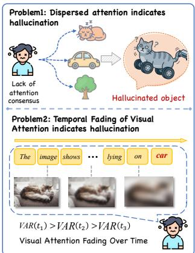

flowchart

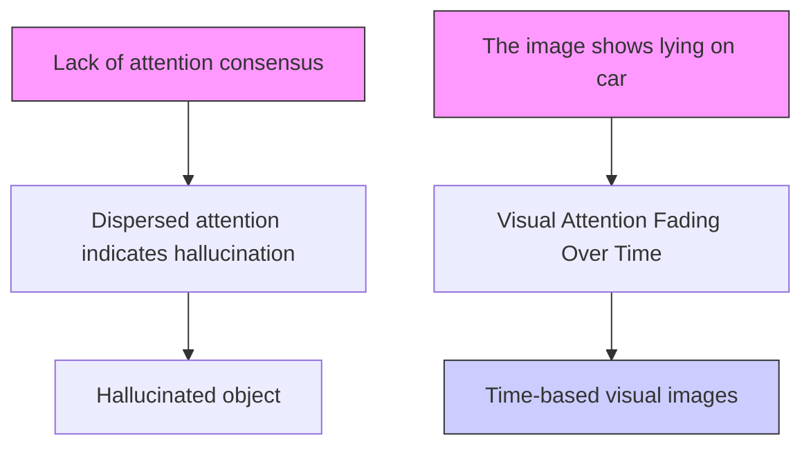

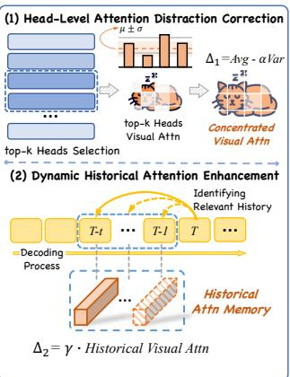

flowchart

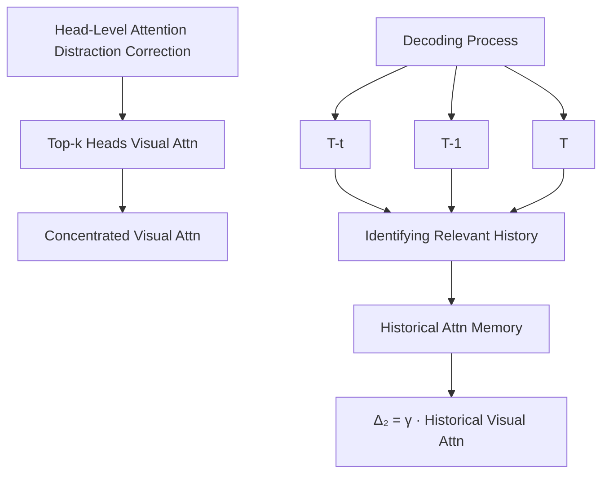

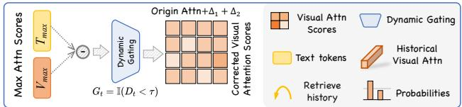

flowchart

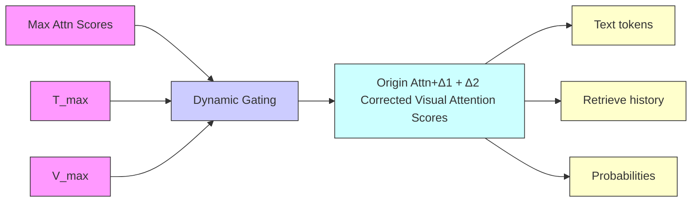

Figure 1. Motivation illustration and overview of AFIP.

understanding and reasoning across diverse real-world scenarios. Despite this impressive versatility, modern MLLMs still suffer from a critical limitation, as they may generate outputs that are insufficiently grounded in the actual visual input. In particular, models can produce confident yet erroneous descriptions, such as attributing nonexistent objects or incorrectly specifying visual attributes (e.g., color, number, or spatial relations). This phenomenon is commonly referred to as hallucination and poses a substantial obstacle to the reliable deployment of MLLMs in risk-sensitive and high-precision applications (Huang et al., 2025).

To address the hallucination issue in MLLMs, recent researches have explored a diverse set of mitigation strategies that can be summarized into four paradigms. The first line of work exploits external knowledge sources through the incorporation of auxiliary databases or retrieval modules into the generation process, thereby supplying explicit factual or visual cues (Qu et al., 2024). The second direction prioritizes model fine-tuning and aims to improve generation reliability via parameter updating driven by task-specific or consistency-oriented supervision (Yu et al., 2024b). The third category concentrates on attention adjustment mechanisms, which modifies attention distributions across different tokens during inference to reduce spurious correlations(Huang et al., 2024). The fourth stream builds upon contrastive learning principles, which compares alternative responses or representations so that outputs with stronger visual support are preferred (Leng et al., 2024). The fifth paradigm focuses on hidden-state intervention, which modifies the internal representations of the model during inference so that the generated outputs better align with true visual perception. (Zou et al., 2025)

Despite the proposal of a wide range of methods aimed at mitigating hallucinations, they still exhibit the following major limitations. (i) Existing methods often entail a reliance on supplementary resources or extended processing time. In particular, approaches based on external knowledge incorporation or model fine-tuning require auxiliary components, such as large-scale instruction-oriented datasets, to correct hallucinated outputs in a post-hoc manner (Yang et al., 2024; Liu et al., 2023). Although attention adjustment methods avoid dependence on external data, they often involve complex inference-time procedures, such as retrospection-based decoding or multi-step attention reallocation, which inevitably increase memory consumption (Tu et al., 2026). (ii) The visual perceptual mechanism underlying hallucinations remains insufficiently explored. Compared with text, images carry denser information and exhibit richer structural patterns, which makes it difficult for MLLMs to faithfully encode, maintain, and exploit visual evidence (Liu et al., 2024b). Therefore, hallucinations should not be explained solely by language-side biases, since distortions introduced during visual interpretation can also play a crucial role. Although prior studies mainly associate hallucinations with language-related factors, such as text inertia (Liu et al., 2024b), the influence of visual perception has not been sufficiently examined. In practice, failures in visual information processing can directly weaken the grounding of generated tokens and trigger hallucinated descriptions. (iii) Existing explanations of hallucination causes remain limited from both spatiotemporal and theoretical perspectives. The generation process of MLLMs involves spatial grounding over image regions as well as temporal reasoning during decoding. Errors arising from incorrect spatial attention may be progressively amplified in subsequent decoding steps. However, few studies have jointly examined hallucinations from the perspective of spatial attention dynamics and temporal degradation of visual grounding. Moreover, the analogy between model hallucination and human perceptual phenomena has rarely been investigated, despite its potential to provide intuitive insights into model behavior. From a theoretical standpoint, hallucinations are still insufficiently characterized. Since the final decoding stage can be viewed as a token classification process, the factors that impair token discrimination deserve further investigation.

To address these challenges, we begin by establishing a strong correspondence between hallucination phenomena in MLLMs and human physiological behavior under dispersed attention, supported by extensive statistical validation. As illustrated in Fig. 1, when humans describe visual content under divided focus, frequent shifts in attention render the cognitive representation of the target image increasingly indistinct and less salient, leading to confabulated descriptions. A comparable pattern emerges in MLLMs, manifested as inconsistent multi-head attention distributions across spatial positions and a progressive decline of visual focus during autoregressive reasoning. These spatiotemporal misalignments impair the integration of visual information and compromise the fidelity of image perception. Besides, theoretical analyses of the multi-head attention architecture, together with the view that attention heads act as independent information sources whose fusion governs generalization, suggest that cross-head attention inconsistency increases model complexity and weakens generalization capability. Motivated by these insights, we propose the Attention Focused Approach for Improved Image Perception (AFIP), a training-free framework that imposes no additional inference overhead. AFIP calibrates high-confidence focused regions by aggregating multi-head information, while penalizing and eliminating irrelevant areas with a varianceinduced regularization term. Furthermore, reliable visual focus derived from prior decoding steps is adaptively fused into the current state to mitigate temporal decay in perception. A dynamic gating mechanism, guided by the difference between peak visual and textual attention, prevents excessive adjustment and ensures response stability. Together, these designs enable robust visual grounding and substantially reduce hallucination. The primary contributions of this paper are summarized as follows:

• For the first time, we reveal a strong analogy between the underlying causes of machine hallucinations in MLLMs and human visual blur resulting from attention distraction. This physiological phenomenon is further decomposed into two factors intrinsic to the MLLMs, i.e., spatial inconsistency of multi-head attention and temporal attenuation of visual attention.   
• Through analyzing the architecture of the multi-head attention mechanism and the information aggregation capabilities it enables, we theoretically establish that discrepancies across attention heads increase model complexity and impair token-level discrimination, thereby reducing the overall generalization performance.   
We propose AFIP, a plug-and-play module that incurs no additional cost to mitigate object hallucinations. Extensive experiments demonstrate that AFIP surpasses mainstream baselines and attains SOTA status.

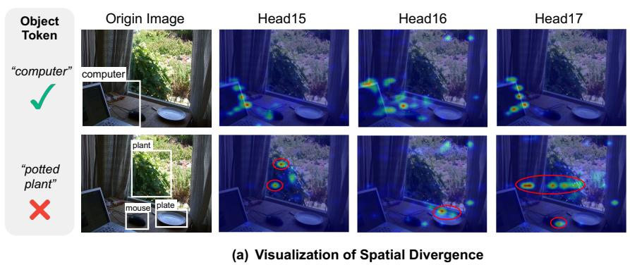

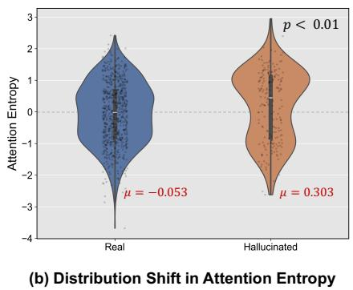

violin

| Group        | Mean   | p-value |
| ------------ | ------ | ------- |
| Real         | -0.053 |         |
| Hallucinated | 0.303  |         |

Figure 2. Correspondence between spatial attention inconsistency and object hallucination. (a) Attention maps for the correct token computer” and the hallucinated token potted plant”. Attention linked to the hallucinated token is broadly dispersed across the image, whereas attention for the correct token remains sharply concentrated on the target object. Additional examples are provided in Appendix D.6. (b) Distribution shift in attention entropy. Tokens are categorized as Real or Hallucinated. Real tokens predominantly exhibit low entropy, while hallucinated tokens correspond to substantially higher entropy values. The result $p < 0 . 0 1$ indicates a statistically significant difference in mean entropy between the two groups.

# 2. Related work

# 2.1. Vision Language models

In recent years, vision-language modeling has undergone a significant paradigm shift. Early vision-language models primarily relied on BERT-style language decoders (Devlin et al., 2019; Koroteev, 2021) to integrate visual representations with text, enabling unified representation learning but offering limited generative flexibility. (Li et al., 2020; Sun et al., 2019). The emergence of large language models (LLMs) (Brown et al., 2020; Achiam et al., 2023; Bai et al., 2023a) significantly enhanced the expressive power of language backbones and spurred the development of MLLMs (Alayrac et al., 2022; Wang et al., 2024b; Driess et al., 2023). Leveraging end-to-end training and joint decoding over visual and textual tokens, MLLMs exhibit substantially improved adaptability. Contemporary MLLMs generally follow a unified processing pipeline in which images are first encoded by powerful vision backbones such as CLIP (Radford et al., 2021) or EVA (Fang et al., 2023), aligned through lightweight projection modules, and decoded by pretrained LLMs. Nevertheless, the specific design of projection modules differs substantially across models. LLaVA-1.5 (Liu et al., 2024a) adopts a linear projection for modality alignment, while MiniGPT-4 (Zhu et al., 2023b) utilizes a querying transformer to compress visual representations. More recent MLLMs, including Qwen-VL (Bai et al., 2023b), InternVL (Chen et al., 2024a), and LLaVA-NeXT (Li et al., 2024), further improve multimodal reasoning through enhanced alignment and high-resolution visual instruction tuning.

# 2.2. Object Hallucination in MLLMs

Hallucination remains a persistent and consequential challenge in modern MLLMs. Such inaccuracies are particularly concerning in high-stakes domains, including medical imaging (Kraljevic et al., 2021; Zheng et al., 2025; He et al., 2023) and autonomous driving (Cui et al., 2024), where unreliable outputs may lead to severe downstream consequences. In the vision-language setting, hallucination often manifests as object hallucination, where models generate plausible descriptions that mention objects missing from the image (Li et al., 2023; Rohrbach et al., 2018). A wide range of mitigation strategies has emerged in recent years. Early studies mainly relied on representation-level techniques, including contrastive learning, ROI-level feature fusion (Biten et al., 2021), and data augmentation for reducing spurious cross-modal correlations (Kim et al., 2023). Later efforts introduced visual instruction tuning (Jiang et al., 2024; Yu et al., 2024a; Zhu et al., 2023a) and external expert modules for auxiliary verification and logical constraints during generation (Chen et al., 2024b; Wu et al., 2024; Zhao et al., 2024). Meanwhile, substantial progress has also been made in hallucination evaluation and detection, with finegrained benchmarks and diagnostic datasets proposed to assess object-level faithfulness and relational consistency (Li et al., 2023; Wang et al., 2023). Building on these advances, an increasing number of training-free methods have been proposed to mitigate hallucination in real-time deployments. Representative directions included decoding-time interventions for improving reasoning fidelity (Huang et al., 2024), attention modulation (Tu et al., 2026) for restoring proper token-level correlations, and hidden-layer adjustments for enhancing visual encoding (Zou et al., 2025). Although these approaches have shown promising results, the visual mechanisms underlying hallucination remain insufficiently understood. In particular, it is still unclear how MLLMs perceive visual content and where visual evidence becomes distorted during generation. This gap motivates us to investigate hallucination from the perspective of visual information processing and develop lightweight interventions that improve visual grounding at the root level.

# 3. Uncover The Core Reasons Behind Hallucinations

In this section, we begin by delineating the fundamental operational mechanisms of MLLMs and introduce two pivotal metrics, i.e., Attention Entropy and Visual Attention Ratio, which are employed to probe internal signals and characterize model behavior. Utilizing these metrics, we conduct a comprehensive set of empirical analyses and identify two principal factors that drive hallucinations, including spatial inconsistency across multi-head attention and temporal attenuation of visual attention. Our case studies are based on a randomly sampled subset of the COCO validation split (Lin et al., 2014), primarily focusing on LLaVA-1.5-7B (Liu et al., 2024a), with other models evaluated as well.

# 3.1. Preliminary

Notation. We consider a multimodal large language model $\mathcal { F } _ { \theta }$ parameterized by θ, whose architecture is composed of a text embedding component, a vision encoder, a crossmodal alignment module, and a Transformer-based decoder. Given a sequence of input image tokens $\{ v _ { 1 } , \ldots , v _ { n } \}$ , together with prompt tokens $\{ t _ { 1 } , \ldots , t _ { m } \}$ , followed by the $t - 1$ previously generated tokens $\{ y _ { 1 } , \dotsc , y _ { t - 1 } \}$ , the model produces the current output token $y _ { t }$ in an autoregressive manner. Define $L$ as the total number of Transformer layers, each comprising H attention heads. At layer $l \in [ L ]$ , the attention weights in head $h \in [ H ]$ are represented as $A _ { t } ^ { ( l , h ) } \in \mathbb { R } ^ { a _ { t } \times a _ { t } }$ , where $a _ { t } = n + m + t - 1$ . Besides, let s and e denote the start and end indices of the image tokens.

Attention Entropy. At layer l, we obtain the head-averaged attention distribution over the n visual patches for the currently generated token by $\begin{array} { r } { \mathbf { A } _ { t } ^ { l } = \frac { 1 } { H } \sum _ { h = 1 } ^ { H ^ { * } } A _ { t } ^ { ( l , h ) } } \end{array}$ ) Then, we . define the attention entropy as below:

$$
\mathcal {D} _ {t} ^ {l} = - \sum_ {i = 1} ^ {n} \boldsymbol {A} _ {t} ^ {l} (a _ {t}, i) \log (\boldsymbol {A} _ {t} ^ {l} (a _ {t}, i) + \epsilon), \tag {1}
$$

where $A _ { t } ^ { l } ( a _ { t } , i )$ denotes the head-averaged attention weight from the current decoding position $a _ { t }$ to the i-th visual token, and $\epsilon > 0$ is a small constant for numerical stability. The entropy $\mathcal { D } _ { t } ^ { l }$ captures the dispersion of attention across image patches. A smaller $\mathcal { D } _ { t } ^ { l }$ corresponds to a concentrated attention distribution over a limited subset of visual patches, indicating a focused and selective visual association for the current token. Conversely, a larger entropy value reflects a spatially dispersed attention pattern, suggesting diffuse and uncertain visual grounding.

Visual Attention Ratio. Regarding the t-th output token $y _ { t }$ at layer l and head h, we quantify its reliance on visual information by measuring the total attention mass assigned to the visual prefix:

$$
\mathrm{VAR} _ {t} ^ {(l, h)} \triangleq \sum_ {i = 1} ^ {n} \boldsymbol {A} _ {t} ^ {(l, h)} (a _ {t}, i). \tag {2}
$$

VAR(l,h)t re presents the proportion of attention devoted to visual tokens during the generation of $y _ { t } .$ . A larger value indicates stronger dependence on image information, whereas a smaller value suggests that the token is generated predominantly from textual context.

# 3.2. Finding 1: Spatial Inconsistency in Multi-head Attention indicates Hallucination

Inspired by humans’ stable visual fixation on salient regions, visually grounded tokens in MLLMs are expected to elicit concentrated attention with strong cross-head spatial consistency. In contrast, hallucinated tokens tend to be associated with diffuse visual attention and spatial misalignment across heads. To empirically examine this distinction, we extract the attention entropy $\mathcal { D } _ { t } ^ { l }$ at each decoding step. Following the CHAIR criteria (Rohrbach et al., 2018), tokens are categorized into Real and Hallucinated groups, and their entropy distributions are compared through statistical significance testing. As illustrated in Fig. 3.2, grounded tokens, such as computer, exhibit sharply localized attention and strong spatial alignment across heads, whereas hallucinated tokens display dispersed attention patterns and pronounced head-wise divergence. Quantitatively, hallucinated tokens consistently yield higher $H _ { t } ^ { l }$ than real tokens. Moreover, the entropy distribution of real tokens is unimodal, whereas hallucinated tokens exhibit a bimodal, long-tailed distribution, indicating diffuse and unstable visual perception.

Building on prior observations that hallucinated tokens are often accompanied by heightened cross-head disagreement, we further characterize the role of head-wise inconsistency by examining its statistical association with the confidence of token prediction. During decoding, we normalize $A _ { t } ^ { ( l , h ) } ( a _ { t } , i )$ to a probability vector $P _ { t } ^ { ( l , h ) }$ with $\textstyle \sum _ { i = 1 } ^ { n } P _ { t } ^ { ( l , h ) } ( a _ { t } , i ) \ = \ 1$ . Then, we compute the headi=1 t taveraged probability distribution as $\begin{array} { r } { P _ { t } ^ { l } = \frac { 1 } { H } \sum _ { h = 1 } ^ { H } P _ { t } ^ { ( l , h ) } } \end{array}$ . From an information-theoretic perspective, head-wise inconsistency is quantified using the Kullback–Leibler divergence between each individual distribution and $P _ { t } ^ { l }$ :

$$
D _ {k l} = \frac {1}{H} \sum_ {h = 1} ^ {H} P _ {t} ^ {(l, h)} \left(\log P _ {t} ^ {(l, h)} - \log P _ {t} ^ {l}\right), \tag {3}
$$

where $D _ { k l } ^ { l }$ provides a principled measure of the extent to which individual attention heads deviate from the collective attention pattern, with larger values indicating weaker crosshead agreement. As for quantifying token-level uncertainty, we compute the following entropy of the output distribution:

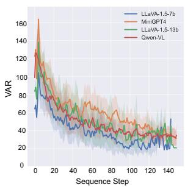

line

| Sequence Step | LLaVA-1.5-7b | MiniGPT4 | LLaVA-1.5-13b | Qwen-VL |
| ------------- | ------------ | -------- | ------------- | ------- |
| 0             | 160          | 160      | 160           | 160     |
| 20            | 80           | 90       | 95            | 85      |
| 40            | 60           | 70       | 75            | 65      |
| 60            | 40           | 50       | 55            | 45      |
| 80            | 30           | 40       | 45            | 35      |
| 100           | 25           | 35       | 40            | 30      |
| 120           | 20           | 30       | 35            | 25      |
| 140           | 15           | 25       | 30            | 20      |

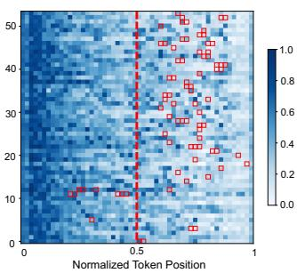

heatmap

| Normalized Token Position | 0    | 0.5  | 1    |
| ------------------------- | ---- | ---- | ---- |
| 0                         | 0.0  | 0.0  | 0.0  |
| 1                         | 0.0  | 0.0  | 0.0  |
| 2                         | 0.0  | 0.0  | 0.0  |
| 3                         | 0.0  | 0.0  | 0.0  |
| 4                         | 0.0  | 0.0  | 0.0  |
| 5                         | 0.0  | 0.0  | 0.0  |
| 6                         | 0.0  | 0.0  | 0.0  |
| 7                         | 0.0  | 0.0  | 0.0  |
| 8                         | 0.0  | 0.0  | 0.0  |
| 9                         | 0.0  | 0.0  | 0.0  |
| 10                        | 0.0  | 0.0  | 0.0  |
| 11                        | 0.0  | 0.0  | 0.0  |
| 12                        | 0.0  | 0.0  | 0.0  |
| 13                        | 0.0  | 0.0  | 0.0  |
| 14                        | 0.0  | 0.0  | 0.0  |
| 15                        | 0.0  | 0.0  | 0.0  |
| 16                        | 0.0  | 0.0  | 0.0  |
| 17                        | 0.0  | 0.0  | 0.0  |
| 18                        | 0.0  | 0.0  | 0.0  |
| 19                        | 0.0  | 0.0  | 0.0  |
| 20                        | 0.0  | 0.0  | 0.0  |
| Note: The heatmap values are estimated based on the color scale from the 'Blue' to 'Red' legend, but they are not explicitly provided in the code snippet for this example. The 'Red' label appears in the heatmap cells, not corresponding to the data series.

Figure 3. Temporal Fading of Visual Attention. (Left) VAR decreases as generation proceeds across multiple MLLMs, indicating progressive weakening of visual grounding in long-form responses. The shaded area represents the standard deviation band, evaluated on the COCO dataset. (Right) Heatmap shows VAR over normalized token position, with red boxes denoting hallucinated tokens.

$$
E _ {t o k} = - \sum_ {e} p (e) \log p (e), \tag {4}
$$

where $p ( e )$ denotes the predicted probability of each candidate word e. Then, we sort tokens tokens according to the layer-averaged cross-head divergence $\begin{array} { r } { D _ { k l } = \frac { 1 } { L } \sum _ { l = 1 } ^ { L } D _ { k l } ^ { l } } \end{array}$ kl. The ranked tokens are subsequently $D _ { k l } ^ { l }$ , where divided into quantile-based groups. For each group, we compute the mean token-level predictive entropy $E _ { t o k }$ separately for real and hallucinated tokens, with bootstrap confidence intervals estimated from 2,000 resampling trials. As illustrated in Fig. 4 (Left), increasing values of $D _ { k l }$ tends to coincide with higher $E _ { t o k }$ for both hallucinated and real tokens. Moreover, correlation tests are conducted to indicate a positive correlation between cross-head divergence and predictive entropy, with small p-values supporting its statistical reliability. These results indicate that stronger head-wise inconsistency is consistently accompanied by lower token prediction confidence and reduced reasoning accuracy.

# 3.3. Finding 2: Temporal Fading of Visual Attention indicates Hallucination

Human’s long-horizon reasoning relies on sustained attention to maintain coherent progress. However, in longsequence visual question answering tasks performed by MLLMs, attention directed to visual regions typically diminishes as decoding advances (Tu et al., 2026). To quantify this effect, we prompt the model to generate long-form responses while recording layer-wise attention distributions at each decoding step for VAR computation. These values are then averaged across layers to produce a VAR profile that tracks visual attention throughout the sequence of yielded tokens. As illustrated in Fig. 3 (Left), the resulting mean VAR exhibits a consistent downward trajectory during generation across all model backbones, which reflects a progressively reduced reliance on visual evidence as decoding proceeds. Building on the preceding exploration, we further investigate the interplay between the attenuation of visual attention and hallucination during long-form generation. As decoding unfolds, the model gradually shifts focus away from visual inputs and increasingly relies on linguistic priors, increasing the likelihood of generating hallucinated tokens. To quantitatively reveal this inherent association, we track the occurrence of real and hallucinated tokens during decoding, linking each token to its corresponding VAR value. Outputs are normalized by total length to account for varying response lengths, and tokens are positioned according to their relative location along the normalized trajectory. The resulting patterns are visualized in Fig. 3 (Right), with color intensity representing VAR magnitude, which shows that hallucinated tokens predominantly cluster in low-VAR regions and emerge in the later stages of generation. In particular, tokens falling within the lowest 30% of VAR values exhibit a markedly higher incidence of hallucination compared to the remainder. Taken together, these observations uncover a clear statistical association between visual blur and hallucination, suggesting that sustained reduction of visual grounding during extended responses coincides with increased hallucination risk.

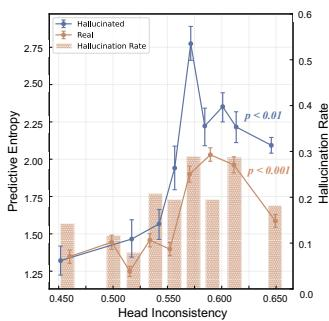

bar_line

| Head Inconsistency | Predictive Entropy (Hallucinated) | Predictive Entropy (Real) | Predictive Entropy (Hallucination Rate) | Hallucination Rate (Hallucinated) | Hallucination Rate (Real) | Hallucination Rate (Hallucination Rate) |
|---|---|---|---|---|---|---|
| 0.450 | 1.35 | 1.35 | 1.6 | 0.2 | 0.2 | 0.2 |
| 0.500 | 1.45 | 1.45 | 1.5 | 0.25 | 0.25 | 0.25 |
| 0.550 | 1.75 | 1.75 | 1.8 | 0.35 | 0.35 | 0.35 |
| 0.600 | 2.75 | 2.75 | 2.0 | 0.4 | 0.4 | 0.4 |
| 0.650 | 2.25 | 2.25 | 1.75 | 0.35 | 0.35 | 0.35 |
p < 0.01 indicates statistical significance for the two series.

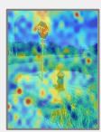

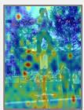

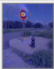

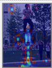  
Figure 4. (Left) Predictive entopy under varying head inconsistency. Increasing head inconsistency is associated with elevated uncertainty in token prediction, with hallucinated tokens consistently displaying higher entropy than real tokens. The bars denote the hallucination rate, which also increases as head inconsistency grows. (Right) Case study for attention correction. Attention maps before (top) and after (bottom) correction during the generation of sign and platform reveal that the correction enhances visual focus on the relevant regions. More cases are shown in Appendix D.7.

# 4. Object Hallucination Mitigation

# 4.1. Head-Level Attention Distraction Correction

As established in the Section 3.2, the emergence of hallucinations primarily arises from attention distraction, characterized by diffuse attention allocation to irrelevant regions. Consequently, accurate grounding of target tokens requires a highly concentrated attention distribution over salient positions, with multiple heads jointly focusing on genuine visual objects. Therefore, the attention weights $\{ A _ { t } ^ { ( \bar { l } , h ) } ( a _ { t } , i ) \} _ { i = 1 } ^ { n }$ assigned to image tokens should exhibit both high confidence and cross-head consistency. To this end, we aggregate strong attention signals from multiple heads to identify reliable perceptual cues. Specifically, the attention score matrix $\hat { B _ { t } ^ { ( l , h ) } }$ ) before softmax operation is extracted by

$$
\boldsymbol {B} _ {t} ^ {(l, h)} = \left(\frac {\boldsymbol {Q} _ {l , h} \boldsymbol {K} _ {l , h} ^ {\top}}{\sqrt {d _ {t}}}\right) _ {t}, \tag {5}
$$

where $Q _ { l , h }$ and $\pmb { K } _ { l , h } \in \mathbb { R } ^ { a _ { t } \times d _ { t } }$ represent the query and key matrices of dimension $d _ { t } ,$ respectively. To mitigate visual divergence caused by human-like attention shift, the cross-head mean attention is used as the criterion for identifying faithful image tokens, and the corresponding variance is adopted as a regularization term to penalize insufficient concentration. Moreover, attention heads that manifest pronounced responses to image tokens can offer valuable cues for calibrating attention distributions, where such response intensity is measured by the magnitude of $\vert B _ { t } ^ { ( l , h ) } ( a _ { t } , i )$ |. Then, the top-k heads in each layer are selected based on the maximum absolute response each head exhibits across all image tokens, forming $\mathcal { H } _ { k } ^ { ( l ) } \subseteq \{ 1 , 2 , \dots , H \}$ with $\lvert \mathcal { H } _ { k } ^ { ( l ) } \rvert = k .$ . For image token i, the head-wise mean and variance formulations of the attention scores are given as follows:

$$
\left\{ \begin{array}{l} A v g ^ {(l)} = \frac {1}{H} \sum_ {h \in \mathcal {H} _ {k} ^ {(l)}} \left| \boldsymbol {B} _ {t} ^ {(l, h)} (a _ {t}, i) \right| \\ V a r ^ {(l)} = \frac {1}{H} \sum_ {h \in \mathcal {H} _ {k} ^ {(l)}} (\left| \boldsymbol {B} _ {t} ^ {(l, h)} (a _ {t}, i) \right| - A v g ^ {(l)}) ^ {2}. \end{array} \right. \tag {6}
$$

Formally, we adjust the visual attention scores by enriching beneficial information across multiple heads and suppressing inconsistent attention responses:

$$
\hat {\boldsymbol {B}} _ {t} ^ {(l, h)} (a _ {t}, i) = \boldsymbol {B} _ {t} ^ {(l, h)} (a _ {t}, i) + A v g ^ {(l)} - \alpha V a r ^ {(l)}, \tag {7}
$$

where the incremental term $A v g ^ { ( l ) } - \alpha V a r ^ { ( l ) }$ is abbreviated as $\Delta _ { 1 } ^ { ( l ) }$ . As illustrated in Fig. 4 (Right), regulating visual attention by Eq. (7) leads to a concentrated head-level attention distribution, which facilitates the model in aligning visual content with textual semantics and identifying the correct generated words.

# 4.2. Dynamic Historical Attention Enhancement

The progressive degradation of visual perception accompanied by attention distraction, as discussed in the Section 3.3, underscores the importance of reintegrating historical visual attention into the decoding process to correct visual blur and prevent the loss of image content. Accordingly, historical visual attention scores are first stored within a fixed-length history window as below:

$$
\mathcal {C} _ {t} = \{\boldsymbol {C} _ {t - i} ^ {(l, h)} \} _ {i = 1} ^ {\mathcal {W} _ {t}}, \quad \boldsymbol {C} _ {t - i} ^ {(l, h)} = \{\boldsymbol {B} _ {t - i} ^ {(l, h)} (a _ {t}, j) \} _ {j = s} ^ {e}, \tag {8}
$$

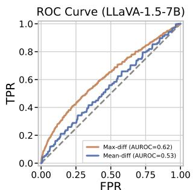

line

| FPR  | TPR Max-diff | TPR Mean-diff |
|------|--------------|---------------|
| 0.00 | 0.00         | 0.00          |
| 0.25 | 0.40         | 0.30          |
| 0.50 | 0.70         | 0.60          |
| 0.75 | 0.85         | 0.80          |
| 1.00 | 1.00         | 1.00          |

(a) LLaVA-1.5-7b

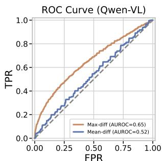

line

| FPR  | TPR (Max-diff) | TPR (Mean-diff) |
|------|----------------|-----------------|
| 0.00 | 0.00           | 0.00            |
| 0.25 | 0.40           | 0.30            |
| 0.50 | 0.70           | 0.60            |
| 0.75 | 0.90           | 0.80            |
| 1.00 | 1.00           | 1.00            |

(b) Qwen-VL   
Figure 5. Hallucination occurrence with different attention-based measures. The ROC (Receiver Operating Characteristic) curves of two models are presented for hallucination detection.

where ${ \ w } _ { t }$ denotes the size of the history window, fixed at 8 to constitute a sufficiently extended temporal context. Subsequently, the historical text token exerting the greatest influence on the decoding process is identified by

$$
r _ {t} ^ {(l, h)} = \arg \max _ {j \in \mathcal {W} _ {t}} \boldsymbol {B} _ {t} ^ {(l, h)} (a _ {t}, a _ {t} - 1 - j). \tag {9}
$$

Subsequently, the attention over the visual content conditioned on the most relevant historical text is fused into the current attention score to strengthen the comprehension of the visual information:

$$
\tilde {\boldsymbol {B}} _ {t} ^ {(l, h)} (a _ {t}, j) = \hat {\boldsymbol {B}} _ {t} ^ {(l, h)} (a _ {t}, j) + \gamma \boldsymbol {C} _ {t - 1 - r _ {t} ^ {(l, h)}} ^ {(l, h)} (s + j), \tag {10}
$$

where the incremental term γC(l,h) $\gamma C _ { t - 1 - r _ { t } ^ { ( l , h ) } } ^ { ( l , h ) } ( s + j )$ t−1−r(l,h) ( is denoted as ${ \Delta } _ { 2 } ^ { ( l , h ) }$ ∆(l,h)2 . As shown in Appendix D.1, the incorporation of 2 ${ \Delta } _ { 2 } ^ { ( l , h ) }$ effectively strengthens visual attention and mitigates the temporal perceptual decay, which ensures that visual representations remain accurately interpreted over time.

Although the application of Eq. (10) substantially strengthens the model’s sensitivity to image tokens, it is crucial to mitigate abnormal generation behaviors caused by excessive visual retracing, while maintaining awareness to necessary textual context. To this end, we propose a $\mathrm { d y } .$ - namic gating mechanism that controls the activation conditions of attention adjustment. Specifically, we compute the maximum attention score over the visual contents as V (l,h)t $V _ { t } ^ { ( l , h ) } = \operatorname* { m a x } _ { j \in ( s , e ) } B _ { t } ^ { ( l , h ) } ( a _ { t } , j )$ B(t . Similarly, the maximum attention score over the textual regions can be obtained by

$$
T _ {t} ^ {(l, h)} = \max \left(\max _ {j \in (0, s)} \boldsymbol {B} _ {t} ^ {(l, h)} (a _ {t}, j), \max _ {j \in [ e, a _ {t})} \boldsymbol {B} _ {t} ^ {(l, h)} (a _ {t}, j)\right). \tag {11}
$$

Based on V (l,t $V _ { t } ^ { ( l , h ) }$ h) and T (l,h)t , $T _ { t } ^ { ( l , h ) }$ we define the text–visual dominance gap as D(l,h)t $D _ { t } ^ { ( l , h ) } \stackrel { \cdot } { = } T _ { t } ^ { ( l , h ) } - V _ { t } ^ { ( l , h ) }$ = T (l,h)t − V (l,h)t . A larger $D _ { t } ^ { ( l , h ) }$ indicates stronger reliance on textual context and may correspond to a decoding regime where subsequent token generation is tightly constrained by the existing texts, as manifested by structural markers or end-of-sequence tokens. As shown in Fig. 5, we investigate the relationship between hallucination occurrence and two attention-based measures, namely the disparity between peak attention over visual and textual regions and the corresponding gap in their average attention. The results indicate that the peak-level measure possesses greater discriminative capability for identifying hallucinations. Consequently, selecting $D _ { t }$ as the gating criterion is well motivated, as it provides an accurate indicator of hallucinations induced by textual inertia. Then, we introduce a gating function G(l,h)t $G _ { t } ^ { ( l , \bar { h } ) } = \mathbb { I } ( D _ { t } ^ { ( l , h ) } < \tau )$ < τ ) to selectively regulate attention adjustment. Accordingly, in regimes where textual attention outweighs visual perception, reinforcing visual attention helps alleviate hallucination risks arising from textual inertia. However, when textual attention becomes overly dominant, i.e., $D _ { t } ^ { ( l , h ) } \geq \tau$ , the decoding process should proceed freely to ensure fluent generation while avoiding repetitive outputs. After incorporating the dynamic gating mechanism, the attention modulation scheme for each image token can be expressed as

$$
\tilde {\boldsymbol {B}} _ {t} ^ {(l, h)} (a _ {t}, j) = \boldsymbol {B} _ {t} ^ {(l, h)} (a _ {t}, j) + G _ {t} ^ {(l, h)} (\Delta_ {1} ^ {(l)} + \Delta_ {2} ^ {(l, h)}). \tag {12}
$$

It is noteworthy that we only perform the correction operation in Eq. (12) at the textual compilation layers, i.e., $l \in [ l _ { e } , L ]$ . Prior work has shown that earlier layers primarily function as modality fusion stages, which facilitates cross-modal alignment rather than supports high-level semantic reasoning (Yin et al., 2025; Chen et al., 2025). Guided by this insight, our approach operates attention adjustment only on the intermediate and deeper layers. This design preserves the intrinsic modality alignment established in the shallow layers while calibrating the attention patterns in the reasoning-dominant layers. We further conduct a layer-wise ablation study in Appendix D.3, which confirms that AFIP attains its optimal performance when applied to layers with $l \in [ l _ { e } , L ]$ . In summary, the procedure of our proposed AFIP is presented in Algorithm 1.

# 5. The Theoretical Discovery of Hallucination

In this section, we offer a theoretical explanation for the emergence of hallucinations. By examining the structural properties of the attention layers and interpreting multi-head attention as diverse information from multiple sources, we demonstrate that inconsistencies in attention distributions across different heads can impair the model’s generalization capability, thereby increasing its vulnerability to hallucination behaviors. The following conclusion encapsulates our central theoretical insights:

Theorem 5.1. Let F denote the function class induced by a Transformer architecture with self-attention as its core mechanism. The input sequence is $\bar { \mathbf { X } } = \left[ \pmb { x } _ { 1 } , \pmb { x } _ { 2 } , \dots , \pmb { x } _ { t } \right] ^ { \top } \in$ $\mathbb { R } ^ { t \times d }$ , augmented with a classification token $\pmb { x } _ { c l s } \in \mathbb { R } ^ { d }$ to Algorithm 1 Attention-Focused Approach for Improved Image Perception (AFIP)

Require: MLLM ${ \mathcal { F } } _ { \theta } .$ input image tokens $\{ v _ { 1 } , \ldots , v _ { n } \}$ , prompt tokens $\{ t _ { 1 } , \ldots , t _ { m } \}$ .

Output: Model response $y _ { t }$ at the decoding step t.

Store historical visual attention scores in the window $\mathcal { C } _ { t }$

foreach l in $[ l _ { e } , L ]$ do

Identify the the top-k attention heads $\mathcal { H } _ { k } ^ { ( l ) }$

Compute the mean and variance value of the attention scores by Eq. (6);

Compute the term $\Delta _ { 1 } ^ { ( l ) }$ by $A v g ^ { ( l ) } - \alpha V a r ^ { ( l ) } ;$

Determine the most reliant text by Eq. (9);

Compute the term ∆(l,h)2 by γC(l,h) $\Delta _ { 2 } ^ { ( l , h ) }$ $\gamma C _ { t - 1 - r _ { t } ^ { ( l , h ) } } ^ { ( \bar { l } , h ) } ( s + j )$ t−1−r(l,h) (s + j);

Obtain the maximum attention score over the visual and textual region a s V (l,ht $V _ { t } ^ { ( l , h ) }$ ) and T (l,h)t , $\boldsymbol { T } _ { t } ^ { ( l , h ) }$ respectively;

$T _ { t } ^ { ( l , h ) } - V _ { t } ^ { ( l , h ) } < \tau$

Conduct attention modulation for each layer and attention head by Eq. (12)

end

end

MLLM $\mathcal { F } _ { \theta }$ decoding, obtain the current token $y _ { t } .$

produce a scalar output. For the h-th head, the value and query–key projections are represented by $W _ { V } ^ { ( h ) } \in \mathbb { R } ^ { d \times d _ { \tau } }$ and W (Q $W _ { Q K } ^ { ( h ) } \in \mathbb { R } ^ { d \times d }$ . The scalar output is given by

$$
g (\boldsymbol {X}) = \boldsymbol {w} ^ {\top} \boldsymbol {W} _ {C} ^ {\top} \sigma \left(\boldsymbol {W} _ {O} ^ {\top} \operatorname{concat} \left(z ^ {(1)} (\boldsymbol {X}), \dots , z ^ {(H)} (\boldsymbol {X})\right)\right), \tag {13}
$$

where the updated representation of the h-th head is $z ^ { ( h ) } ( X ) = W _ { V } ^ { ( h ) ^ { \top } } X ^ { \top } \alpha ^ { ( h ) } ( X )$ , with attention weights defined by $\alpha ^ { ( h ) } ( X )$ = softmax $\left( \boldsymbol { X } \boldsymbol { W } _ { Q K } ^ { ( h ) ^ { \top } } \boldsymbol { x } _ { c l s } \right)$ . Assume the parameter norms satisfy $\| \dot { \boldsymbol { w } } \| _ { 2 } \ \leq \ B _ { w } , \ \| \boldsymbol { W } _ { C } \| _ { F } \ \leq$ $B _ { W C } , \| W _ { O } \| _ { F } \leq B _ { O }$ , $\| \boldsymbol { W } _ { V } ^ { ( h ) } \| _ { F } ~ \le ~ B _ { W V } ^ { ( h ) }$ F , and $\| \mathbf { W } _ { Q K } ^ { ( h ) } \| _ { F } \le B _ { W Q K } ^ { ( h ) } ,$ (h)QK ∥ F ≤ B(h)W QK , which aligns with standard regularization practices to ensure stable training. Suppose the activation function σ is $L _ { \sigma ^ { - L } }$ ipschitz and all input tokens are bound as $\left\| { \pmb x } _ { t } \right\| _ { 2 } \le R .$ . Then, the upper bound of the Rademacher complexity $\hat { \Re } _ { D } ( \mathcal { F } )$ can be expressed as

$$
\hat {\Re} _ {D} (\mathcal {F}) \leq \frac {4 B _ {w} B _ {W C} B _ {O} L _ {\sigma} R ^ {3}}{\sqrt {n}} \sqrt {H \bar {a} ^ {2} + \sum_ {h = 1} ^ {H} (a _ {h} - \bar {a}) ^ {2}}, \tag {14}
$$

where $a _ { h } = B _ { W V } ^ { ( h ) } B _ { W Q K } ^ { ( h ) }$ and $\begin{array} { r } { \bar { a } = \frac { 1 } { H } \sum _ { h = 1 } ^ { H } { a _ { h } } } \end{array}$ bound attains its minimum if and only $i f a _ { 1 } = \cdot \cdot \cdot = a _ { H } =$ a¯, corresponding to uniform contributions from all attention heads. Any deviation from this regime introduces additional dispersion, enlarges the complexity and weakens generalization guarantees. This finding formalizes the principle that maintaining homogeneity across multi-head attention supports optimal generalization performance.

Table 1. CHAIR hallucination evaluation on five models with max new token set to 512. † denotes using the greedy decoding strategy. ∆% denotes the relative performance improvement with respect to the second-best method. 

<table><tr><td rowspan="2">Methods</td><td colspan="3">LLaVA-1.5-7B</td><td colspan="3">LLaVA-1.5-13B</td><td colspan="3">Shikra-7B</td><td colspan="3">MiniGPT-4-7B</td><td colspan="3">Qwen-VL</td><td colspan="2">Avg.</td></tr><tr><td> $C_S \downarrow$ </td><td> $C_I \downarrow$ </td><td>Precision ↑</td><td> $C_S \downarrow$ </td><td> $C_I \downarrow$ </td><td>Precision ↑</td><td> $C_S \downarrow$ </td><td> $C_I \downarrow$ </td><td>Precision ↑</td><td> $C_S \downarrow$ </td><td> $C_I \downarrow$ </td><td>Precision ↑</td><td> $C_S \downarrow$ </td><td> $C_I \downarrow$ </td><td>Precision ↑</td><td> $C_S \downarrow$ </td><td> $C_I \downarrow$ </td></tr><tr><td colspan="18">Decoding Strategy</td></tr><tr><td>Greedy</td><td>55.4</td><td>14.4</td><td>74.0</td><td>49.7</td><td>14.7</td><td>71.0</td><td>62.0</td><td>17.5</td><td>70.9</td><td>39.4</td><td>11.0</td><td>80.5</td><td>28.2</td><td>8.9</td><td>84.9</td><td>46.9</td><td>13.3</td></tr><tr><td>Beam</td><td>56.2</td><td>15.1</td><td>74.0</td><td>50.4</td><td>15.2</td><td>76.3</td><td>59.2</td><td>16.2</td><td>74.2</td><td>39.2</td><td>12.2</td><td>81.7</td><td>30.0</td><td>10.7</td><td>83.8</td><td>47.0</td><td>13.9</td></tr><tr><td>OPERA</td><td>48.2</td><td>13.1</td><td>76.9</td><td>41.3</td><td>14.1</td><td>77.2</td><td>41.9</td><td>13.8</td><td>72.1</td><td>30.9</td><td>11.2</td><td>77.5</td><td>29.6</td><td>9.5</td><td>79.4</td><td>38.4</td><td>12.3</td></tr><tr><td colspan="18">Contrastive Decoding</td></tr><tr><td>VCD†</td><td>54.6</td><td>17.3</td><td>70.1</td><td>57.2</td><td>16.1</td><td>71.3</td><td>56.4</td><td>15.5</td><td>75.2</td><td>41.4</td><td>12.6</td><td>68.2</td><td>45.4</td><td>18.1</td><td>70.0</td><td>51.0</td><td>15.9</td></tr><tr><td colspan="18">Hidden states-intervention</td></tr><tr><td>MemVR</td><td>50.4</td><td>14.3</td><td>74.2</td><td>53.2</td><td>13.5</td><td>75.6</td><td>48.8</td><td>16.5</td><td>70.9</td><td>33.6</td><td>9.7</td><td>83.5</td><td>38.2</td><td>13.6</td><td>74.9</td><td>44.8</td><td>13.5</td></tr><tr><td colspan="18">Attention-intervention</td></tr><tr><td>HGAI†</td><td>24.6</td><td>6.4</td><td>86.8</td><td>27.1</td><td>7.9</td><td>85.1</td><td>32.8</td><td>10.4</td><td>81.0</td><td>28.0</td><td>7.5</td><td>85.1</td><td>20.9</td><td>5.2</td><td>89.1</td><td>26.7</td><td>7.5</td></tr><tr><td>Ours†</td><td>16.8</td><td>4.4</td><td>91.3</td><td>18.4</td><td>6.4</td><td>89.2</td><td>18.0</td><td>6.6</td><td>89.8</td><td>17.8</td><td>7.3</td><td>89.5</td><td>16.6</td><td>5.0</td><td>91.1</td><td>17.5</td><td>5.9</td></tr><tr><td>Δ%</td><td>↓7.8%</td><td>↓2.0%</td><td>↑4.5%</td><td>↓8.7%</td><td>↓1.5%</td><td>↑4.1%</td><td>↓14.8%</td><td>↓3.8%</td><td>↑8.8%</td><td>↓10.2%</td><td>↓0.2%</td><td>↑4.4%</td><td>↓4.3%</td><td>↓0.2%</td><td>↑2.0%</td><td>↓9.2%</td><td>↓1.6%</td></tr></table>

Theorem 5.2. From a generalization analysis perspective, the representation captured at the h-th attention head is $z ^ { ( h ) } ( \bar { \boldsymbol { X } } ) \in \mathbb { R } ^ { d _ { v } }$ , and the target token to be predicted is denoted as Y . After concatenating the representations from all attention heads, the model produces a scalar output through the subsequent network $\psi : \mathbb { R } ^ { H d _ { v } }  \mathbb { R }$ , yielding $f ( X ) = \psi ( z ( X ) )$ . The training dataset $D = \{ ( X _ { i } , Y _ { i } )$ : $i \in [ n ] \}$ is drawn from a distribution over $\mathcal { X } \times \mathcal { V } _ { ; }$ , where Y denotes the corpus of C words. Besides, the expected risk and empirical risk w.r.t. the training dataset D can be denoted as $R ( f ) ~ = ~ \mathbb { E } _ { ( X , Y ) \sim \mathcal { X } \times \mathcal { Y } } [ l ( f ( X ) , Y ) ]$ and $\begin{array} { r } { \widehat { R } _ { D } ( f ) = \frac { 1 } { N } \sum _ { i = 1 } ^ { N } l ( f ( X _ { i } ) , Y _ { i } ) } \end{array}$ , respectively. With probability at least $1 - \delta ,$ we have the following generalization error bound:

$$
\begin{array}{l} R (f) - \widehat {R} _ {D} (f) \leq \frac {\widetilde {\mathcal {K}} _ {1}}{n ^ {1 / 2} H ^ {- 1 / 2}} + \frac {\widetilde {\mathcal {K}} _ {2}}{n ^ {3 / 4} H ^ {- 1 / 4}} \\ + \widetilde {\mathcal {K}} _ {3} \sqrt {\frac {\left(- \sum_ {h = 1} ^ {H} I (z ^ {(h)} (\boldsymbol {X}) ; \boldsymbol {Y}) + \widetilde {\mathcal {K}} _ {4}\right)}{n H}}, \\ \end{array}
$$

where $\widetilde { \mathcal { K } } _ { 1 } = \mathcal { O } ( H ) , \widetilde { \mathcal { K } } _ { 2 } = \mathcal { O } ( \sqrt { C \log C } ) , \widetilde { \mathcal { K } } _ { 3 } = \mathcal { O } ( \sqrt { C } H )$ , ${ \widetilde { \kappa } } _ { 4 }$ is constant of order $\widetilde { \mathcal { O } } ( 1 )$ as $n , H \to \infty$ . Moreover, the generalization error bound becomes tighter as the visual evidence captured by each attention head aligns more closely with the target token. This conclusion suggests that strong generalization emerges when multiple heads maintain highly consistent semantic focus.

# 6. Experiment

# 6.1. Experimental Setup

Model Backbones. We assess the efficacy of our approach on four representative MLLMs, i.e., LLaVA-1.5 (Liu et al., 2024a), Shikra (Chen et al., 2023), MiniGPT-4 (Zhu et al., 2023b), and Qwen-VL (Bai et al., 2023b). To probe the influence of model scale, we evaluate both the 7B and 13B variants of LLaVA-1.5. Furthermore, by encompassing models with diverse alignment mechanisms, such as Q-Formerbased designs and encoder-based approaches, we can further demonstrate the robustness of our method.

Table 2. POPE hallucination evaluation on five models with max new token set to 512. † denotes using the greedy decoding strategy. 

<table><tr><td rowspan="2">Methods</td><td colspan="2">Random</td><td colspan="2">Popular</td><td colspan="2">Adversarial</td><td colspan="2">Average</td></tr><tr><td>Accuracy ↑</td><td>F1 ↑</td><td>Accuracy ↑</td><td>F1 ↑</td><td>Accuracy ↑</td><td>F1 ↑</td><td>Accuracy ↑</td><td>F1 ↑</td></tr><tr><td colspan="9">LLaVA-1.5-7B</td></tr><tr><td>Greedy</td><td>89.20</td><td>89.12</td><td>85.77</td><td>84.33</td><td>79.63</td><td>81.26</td><td>84.87</td><td>84.90</td></tr><tr><td>Beam</td><td>87.40</td><td>87.13</td><td>86.27</td><td>86.55</td><td>81.70</td><td>81.86</td><td>85.12</td><td>85.18</td></tr><tr><td> $VCD^†$ </td><td>87.73</td><td>87.16</td><td>85.38</td><td>85.06</td><td>80.88</td><td>81.33</td><td>84.66</td><td>84.52</td></tr><tr><td>MemVR</td><td>89.37</td><td>89.56</td><td>86.33</td><td>86.88</td><td>79.83</td><td>81.78</td><td>85.18</td><td>86.07</td></tr><tr><td> $HGAI^†$ </td><td>89.70</td><td>89.42</td><td>86.97</td><td>86.98</td><td>80.50</td><td>81.63</td><td>85.72</td><td>86.01</td></tr><tr><td> $Ours^†$ </td><td>90.77</td><td>90.90</td><td>87.70</td><td>88.24</td><td>82.87</td><td>84.33</td><td>87.11</td><td>87.82</td></tr><tr><td colspan="9">LLaVA-1.5-13B</td></tr><tr><td>Greedy</td><td>89.93</td><td>90.16</td><td>85.97</td><td>86.80</td><td>81.23</td><td>83.29</td><td>85.71</td><td>86.75</td></tr><tr><td>Beam</td><td>89.13</td><td>89.08</td><td>84.80</td><td>85.37</td><td>82.40</td><td>83.80</td><td>85.44</td><td>86.08</td></tr><tr><td> $VCD^†$ </td><td>87.39</td><td>86.55</td><td>85.74</td><td>85.06</td><td>81.92</td><td>81.78</td><td>85.02</td><td>84.46</td></tr><tr><td>MemVR</td><td>88.20</td><td>88.53</td><td>87.10</td><td>85.33</td><td>81.23</td><td>82.40</td><td>85.51</td><td>85.42</td></tr><tr><td> $HGAI^†$ </td><td>89.93</td><td>90.10</td><td>84.87</td><td>85.82</td><td>80.67</td><td>82.57</td><td>85.16</td><td>86.16</td></tr><tr><td> $Ours^†$ </td><td>91.20</td><td>91.29</td><td>87.97</td><td>88.46</td><td>83.57</td><td>84.87</td><td>87.80</td><td>86.90</td></tr><tr><td colspan="9">Shikra-7B</td></tr><tr><td>Greedy</td><td>84.50</td><td>84.76</td><td>83.53</td><td>83.96</td><td>79.67</td><td>80.87</td><td>82.57</td><td>83.20</td></tr><tr><td>Beam</td><td>84.90</td><td>82.75</td><td>83.46</td><td>84.26</td><td>79.93</td><td>80.94</td><td>82.76</td><td>82.65</td></tr><tr><td> $VCD^†$ </td><td>84.50</td><td>84.76</td><td>83.53</td><td>83.96</td><td>79.67</td><td>80.87</td><td>82.79</td><td>83.20</td></tr><tr><td>MemVR</td><td>84.76</td><td>85.04</td><td>83.86</td><td>84.30</td><td>79.76</td><td>81.01</td><td>82.79</td><td>83.45</td></tr><tr><td> $HGAI^†$ </td><td>87.06</td><td>86.36</td><td>84.13</td><td>83.77</td><td>82.43</td><td>82.32</td><td>84.54</td><td>84.15</td></tr><tr><td> $Ours^†$ </td><td>87.47</td><td>87.08</td><td>86.17</td><td>85.93</td><td>87.07</td><td>86.36</td><td>86.90</td><td>86.46</td></tr><tr><td colspan="9">MiniGPT-4-7B</td></tr><tr><td>Greedy</td><td>81.73</td><td>79.36</td><td>75.50</td><td>72.14</td><td>74.20</td><td>73.27</td><td>77.14</td><td>74.92</td></tr><tr><td>Beam</td><td>80.63</td><td>77.36</td><td>76.40</td><td>74.86</td><td>72.00</td><td>68.84</td><td>76.34</td><td>73.69</td></tr><tr><td> $VCD^†$ </td><td>83.33</td><td>83.30</td><td>72.80</td><td>75.35</td><td>69.87</td><td>73.43</td><td>75.33</td><td>77.36</td></tr><tr><td>MemVR</td><td>83.00</td><td>81.25</td><td>75.40</td><td>74.97</td><td>72.13</td><td>72.61</td><td>76.84</td><td>76.28</td></tr><tr><td> $HGAI^†$ </td><td>80.27</td><td>80.87</td><td>71.23</td><td>74.35</td><td>69.20</td><td>73.09</td><td>73.57</td><td>76.10</td></tr><tr><td> $Ours^†$ </td><td>82.17</td><td>79.73</td><td>76.30</td><td>74.74</td><td>74.23</td><td>73.24</td><td>77.57</td><td>75.90</td></tr></table>

Baselines. Our method is compared with baselines covering different categories of hallucination mitigation strategies. Greedy decoding and beam search serve as standard decoding methods (Sutskever et al., 2014). Additional baselines include OPERA (Huang et al., 2024), a beam-search-based method, HGAI (Jiang et al., 2025), an attention intervention approach, VCD (Leng et al., 2024), a contrastive decoding strategy, and MemVR (Zou et al., 2025), which performs hidden-state intervention. Beam search and OPERA employ a beam size of 5, while VCD, MemVR and HGAI are applied at inference with default hyperparameters.

Benchmark Following (Huang et al., 2024; Jiang et al., 2025), we evaluate our method on complementary benchmarks with distinct task types. We adopt POPE (Li et al., 2023), a standardized protocol for short-horizon binary question answering. For long-form generation, we employ CHAIR (Rohrbach et al., 2018), which measures hallucination severity based on the proportion of generated objects absent from ground-truth annotations. Additional details are provided in Appendix C.

# 6.2. Comparative Experiment

We conduct hallucination evaluations on the CHAIR and POPE benchmarks, and present the corresponding results in Tables 1 and 2. Besides, to evaluate the impact of generated token length, experiments are performed by varying the max new token among {64, 128, 256}, with outcomes reported in Table 3. From these comparative results, we can derive the following observations: (i) Our method substantially reduces hallucination compared with original model responses. As shown in Table 1, relative to the vanilla decoding strategies Greedy and Beam, our approach achieves over 50% improvements on both $C _ { I }$ and $C _ { S }$ metrics across LLaVA-1.5 and Qwen-VL. (ii) Under diverse evaluation criteria, AFIP demonstrates consistently superior performance. It ranks first across all metrics and models on the CHAIR benchmark, and attains leading results on POPE under the Random, Popular, and Adversarial settings for all models except MiniGPT-4. (iii) As reported in Table 3, AFIP remains robust across varying generation lengths. Besides, it achieves more pronounced gains in long-sequence tasks. This finding shows that continuously reinforcing visual perception during long-form generation is essential for achieving stronger resistance to hallucination. (iv) Compared with different baselines, our approach exhibits clear advantages, reflecting its comprehensive consideration of hallucination causes across both spatial and temporal dimensions. Unlike VCD and HGAI, which focus on contrastive decoding and attention control, our method reinjects historical visual information to counteract temporal degradation and maintain sustained visual grounding. Compared with OPERA and MemVR, AFIP corrects attention inconsistencies across multiple heads to enhance visual reliability.

# 6.3. Parameter Sensitivity Analysis

In our proposed AFIP, there are four hyperparameters in total, i.e., the coefficient α for the variance regularization term, the coefficient $\gamma$ for the historical attention enhancement term, the Top-k head selection and the threshold τ for the dynamic gating mechanism. As evidenced by the parameter analysis results in Appendix D.5, AFIP is largely insensitive to α and $\gamma .$ . Consequently, we focus on investigating the joint effect of k and τ on the effectiveness of hallucination mitigation. Specifically, k is evaluated over the discrete set {3.5, 4.5, 5.5, 6.5, 7.5, 8.5, 9.5}, while τ is varied across {0.2, 0.3, 0.4, 0.5, 0.6, 0.7, 0.8}. The results under different parameter combinations are summarized in the heatmap, as shown in Fig. 6. Analysis of these results indicates that optimal performance is generally obtained when k falls within [5.5, 7.5] and τ lies in the range [0.4, 0.6]. Careful tuning of k and τ is crucial, as the confidence levels of the top-ranked attention heads and the corresponding threshold estimates can vary substantially across different models.

Table 3. CHAIR hallucination evaluation on LLaVA-1.5-7B and Qwen-VL with varying max new token in {64, 128, 256}. † denotes using the greedy decoding strategy. 

<table><tr><td rowspan="2">Method</td><td colspan="3">max new token 64</td><td colspan="3">max new token 128</td><td colspan="3">max new token 256</td><td colspan="2">Avg.</td></tr><tr><td> $C_S \downarrow$ </td><td> $C_I \downarrow$ </td><td>Precision↑</td><td> $C_S \downarrow$ </td><td> $C_I \downarrow$ </td><td>Precision↑</td><td> $C_S \downarrow$ </td><td> $C_I \downarrow$ </td><td>Precision↑</td><td> $C_S \downarrow$ </td><td> $C_I \downarrow$ </td></tr><tr><td colspan="12">LLaVA-1.5-7B</td></tr><tr><td>Greedy</td><td>22.4</td><td>6.4</td><td>88.9</td><td>49.4</td><td>13.1</td><td>76.4</td><td>50.0</td><td>13.1</td><td>76.2</td><td>40.6</td><td>10.9</td></tr><tr><td>Beam</td><td>19.2</td><td>5.9</td><td>90.4</td><td>51.6</td><td>13.8</td><td>75.0</td><td>52.4</td><td>14.5</td><td>73.8</td><td>41.1</td><td>11.4</td></tr><tr><td>VCD $^{\dagger}$ </td><td>29.2</td><td>9.7</td><td>84.5</td><td>58.8</td><td>17.5</td><td>70.1</td><td>54.6</td><td>17.3</td><td>71.3</td><td>47.5</td><td>14.8</td></tr><tr><td>MemVR</td><td>24.0</td><td>7.3</td><td>87.4</td><td>42.6</td><td>14.2</td><td>74.7</td><td>43.4</td><td>14.3</td><td>77.2</td><td>36.7</td><td>11.9</td></tr><tr><td>HGAI $^{\dagger}$ </td><td>18.6</td><td>5.3</td><td>90.5</td><td>25.2</td><td>6.9</td><td>70.1</td><td>26.6</td><td>7.4</td><td>86.2</td><td>23.5</td><td>6.5</td></tr><tr><td>Ours $^{\dagger}$ </td><td>13.0</td><td>4.0</td><td>92.6</td><td>21.6</td><td>4.9</td><td>89.3</td><td>15.0</td><td>3.6</td><td>92.0</td><td>16.5</td><td>4.2</td></tr><tr><td colspan="12">Qwen-VL</td></tr><tr><td>Greedy</td><td>19.6</td><td>10.6</td><td>86.0</td><td>21.8</td><td>11.7</td><td>84.1</td><td>28.2</td><td>14.7</td><td>79.4</td><td>23.2</td><td>12.3</td></tr><tr><td>Beam</td><td>20.2</td><td>7.2</td><td>88.9</td><td>23.2</td><td>7.5</td><td>85.5</td><td>27.2</td><td>8.5</td><td>82.5</td><td>23.5</td><td>7.7</td></tr><tr><td>VCD $^{\dagger}$ </td><td>19.2</td><td>9.8</td><td>83.6</td><td>39.0</td><td>15.8</td><td>76.5</td><td>41.4</td><td>15.6</td><td>73.8</td><td>33.2</td><td>13.7</td></tr><tr><td>MemVR</td><td>25.0</td><td>7.7</td><td>87.1</td><td>27.4</td><td>13.2</td><td>75.5</td><td>32.3</td><td>11.6</td><td>75.7</td><td>28.2</td><td>10.8</td></tr><tr><td>HGAI $^{\dagger}$ </td><td>20.8</td><td>10.7</td><td>85.8</td><td>16.4</td><td>7.4</td><td>90.2</td><td>15.4</td><td>6.7</td><td>90.6</td><td>17.5</td><td>8.3</td></tr><tr><td>Ours $^{\dagger}$ </td><td>14.4</td><td>6.6</td><td>90.0</td><td>15.6</td><td>7.2</td><td>89.7</td><td>12.2</td><td>6.0</td><td>91.7</td><td>14.1</td><td>6.6</td></tr></table>

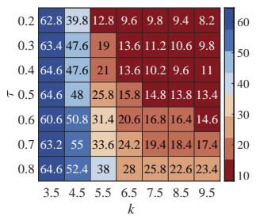

heatmap

| | 3.5 | 4.5 | 5.5 | 6.5 | 7.5 | 8.5 | 9.5 |
|---|---|---|---|---|---|---|---|
| 0.2 | 62.8 | 39.8 | 12.8 | 9.6 | 9.8 | 9.4 | 8.2 |
| 0.3 | 63.4 | 47.6 | 19 | 13.6 | 11.2 | 10.6 | 9.8 |
| 0.4 | 64.6 | 47.6 | 21 | 13.6 | 10.2 | 9.6 | 11 |
| 0.5 | 64.6 | 48 | 25.8 | 15.8 | 14.8 | 13.8 | 13.4 |
| 0.6 | 60.6 | 50.8 | 31.4 | 20.6 | 16.8 | 16.4 | 14.6 |
| 0.7 | 63.2 | 55 | 33.6 | 24.2 | 19.4 | 18.4 | 17.4 |
| 0.8 | 64.6 | 52.4 | 38 | 28 | 25.8 | 22.6 | 23.4 |

(a) LLaVA-1.5-7b

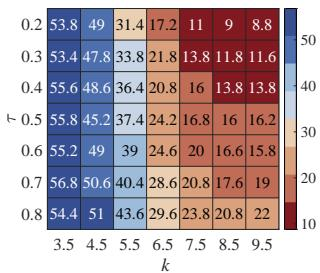

heatmap

| | 3.5 | 4.5 | 5.5 | 6.5 | 7.5 | 8.5 | 9.5 |
|---|---|---|---|---|---|---|---|
| 0.2 | 53.8 | 49 | 31.4 | 17.2 | 11 | 9 | 8.8 |
| 0.3 | 53.4 | 47.8 | 33.8 | 21.8 | 13.8 | 11.8 | 11.6 |
| 0.4 | 55.6 | 48.6 | 36.4 | 20.8 | 16 | 13.8 | 13.8 |
| 0.5 | 55.8 | 45.2 | 37.4 | 24.2 | 16.8 | 16 | 16.2 |
| 0.6 | 55.2 | 49 | 39 | 24.6 | 20 | 16.6 | 15.8 |
| 0.7 | 56.8 | 50.6 | 40.4 | 28.6 | 20.8 | 17.6 | 19 |
| 0.8 | 54.4 | 51 | 43.6 | 29.6 | 23.8 | 20.8 | 22 |

(b) LLaVA-1.5-13b  
Figure 6. Parameter sensitivity analysis of k and τ .

# 7. Conclusion

This paper proposes an Attention-Focused Approach for Improved Image Perception named AFIP to mitigate hallucinations in MLLMs. Extensive statistical analyses reveal that model hallucinations mainly arise from spatial inconsistencies in multi-head visual attention and temporal degradation in image perception, a pattern analogous to visual blur induced by attention distraction in human perception. We further theoretically demonstrate that attention distraction undermines the model’s discriminative capacity during vocabulary selection. Moreover, AFIP is introduced as a plug-and-play module that incurs no additional inference latency, while extensive experiments demonstrate its effectiveness in correcting head-level attention deviations and alleviating the temporal decay of visual attention.

# Acknowledgments

This work was partially supported by the NSF for Distinguished Young Scholars under Grant No. 62425607, the Key NSF of China under Grant No. 62136005, Hunan Provincial Natural Science Outstanding Youth Fund under Grant No. 2026JJ20066 and the National Natural Science Foundation of China Grant No. 62376281.

# Impact Statement

This paper aims to advance the field of machine learning. As our work focuses on mitigating hallucination in Multimodal large language models (MLLMs), it may give rise to a range of societal implications. Overall, the primary impact of this research is to promote the safer and more reliable deployment of MLLMs across diverse application domains. We do not anticipate that the proposed method introduces additional ethical concerns or poses risks related to privacy.

# References

Achiam, J., Adler, S., Agarwal, S., Ahmad, L., Akkaya, I., Aleman, F. L., Almeida, D., Altenschmidt, J., Altman, S., Anadkat, S., et al. Gpt-4 technical report. arXiv preprint arXiv:2303.08774, 2023.   
Alayrac, J.-B., Donahue, J., Luc, P., Miech, A., Barr, I., Hasson, Y., Lenc, K., Mensch, A., Millican, K., Reynolds, M., et al. Flamingo: a visual language model for few-shot learning. NIPS, 2022.   
Bai, J., Bai, S., Chu, Y., Cui, Z., Dang, K., Deng, X., Fan, Y., Ge, W., Han, Y., Huang, F., et al. Qwen technical report. arXiv preprint arXiv:2309.16609, 2023a.   
Bai, J., Bai, S., Yang, S., Wang, S., Tan, S., Wang, P., Lin, J., Zhou, C., and Zhou, J. Qwen-vl: A versatile vision-language model for understanding, localization, text reading, and beyond, 2023b.   
Biten, A. F., Gomez, L., and Karatzas, D. Let there be a clock on the beach: Reducing object hallucination in image captioning, 2021. URL https://arxiv.org/ abs/2110.01705.   
Brown, T., Mann, B., Ryder, N., Subbiah, M., Kaplan, J. D., Dhariwal, P., Neelakantan, A., Shyam, P., Sastry, G., Askell, A., et al. Language models are few-shot learners. NIPS, 2020.   
Chen, H., Lin, J., Chen, X., Fan, Y., Dong, J., Jin, X., Su, H., Fu, J., and Shen, X. Multimodal language models see better when they look shallower. In EMNLP, 2025.   
Chen, K., Zhang, Z., Zeng, W., Zhang, R., Zhu, F., and Zhao, R. Shikra: Unleashing multimodal llm’s referential dialogue magic. arXiv preprint arXiv:2306.15195, 2023.

Chen, Z., Wu, J., Wang, W., Su, W., Chen, G., Xing, S., Zhong, M., Zhang, Q., Zhu, X., Lu, L., et al. Internvl: Scaling up vision foundation models and aligning for generic visual-linguistic tasks. In CVPR, pp. 24185– 24198, 2024a.

Chen, Z., Zhao, Z., Luo, H., Yao, H., Li, B., and Zhou, J. Halc: Object hallucination reduction via adaptive focalcontrast decoding. arXiv preprint arXiv:2403.00425, 2024b.

Cui, C., Ma, Y., Cao, X., Ye, W., Zhou, Y., Liang, K., Chen, J., Lu, J., Yang, Z., Liao, K.-D., et al. A survey on multimodal large language models for autonomous driving. In WACV, 2024.

Devlin, J., Chang, M.-W., Lee, K., and Toutanova, K. Bert: Pre-training of deep bidirectional transformers for language understanding. In NAACL, 2019.

Driess, D., Xia, F., Sajjadi, M. S., Lynch, C., Chowdhery, A., Wahid, A., Tompson, J., Vuong, Q., Yu, T., Huang, W., et al. Palm-e: An embodied multimodal language model. 2023.

Edelman, B. L., Goel, S., Kakade, S., and Zhang, C. Inductive biases and variable creation in self-attention mechanisms. In ICML, 2022.

Fang, Y., Wang, W., Xie, B., Sun, Q., Wu, L., Wang, X., Huang, T., Wang, X., and Cao, Y. Eva: Exploring the limits of masked visual representation learning at scale. In CVPR, 2023.

Guo, Z., Yagudin, Z., Lykov, A., Konenkov, M., and Tsetserukou, D. Vlm-auto: Vlm-based autonomous driving assistant with human-like behavior and understanding for complex road scenes. In 2nd International Conference on Foundation and Large Language Models,FLLM, 2024.

He, Y., Yang, G., Ge, R., Chen, Y., Coatrieux, J.-L., Wang, B., and Li, S. Geometric visual similarity learning in 3d medical image self-supervised pre-training. In CVPR, 2023.

Huang, L., Yu, W., Ma, W., Zhong, W., Feng, Z., Wang, H., Chen, Q., Peng, W., Feng, X., Qin, B., et al. A survey on hallucination in large language models: Principles, taxonomy, challenges, and open questions. ACM Transactions on Information Systems, 2025.

Huang, Q., Dong, X., Zhang, P., Wang, B., He, C., Wang, J., Lin, D., Zhang, W., and Yu, N. Opera: Alleviating hallucination in multi-modal large language models via over-trust penalty and retrospection-allocation. In CVPR, 2024.

Huang, S., Dong, L., Wang, W., Hao, Y., Singhal, S., Ma, S., Lv, T., Cui, L., Mohammed, O. K., Patra, B., Liu, Q., Aggarwal, K., Chi, Z., Bjorck, N. J. B., Chaudhary, V., Som, S., Song, X., and Wei, F. Language is not all you need: Aligning perception with language models. In NIPS, 2023.   
Jiang, C., Xu, H., Dong, M., Chen, J., Ye, W., Yan, M., Ye, Q., Zhang, J., Huang, F., and Zhang, S. Hallucination augmented contrastive learning for multimodal large language model. In CVPR, 2024.   
Jiang, Z., Chen, J., Zhu, B., Luo, T., Shen, Y., and Yang, X. Devils in middle layers of large vision-language models: Interpreting, detecting and mitigating object hallucinations via attention lens. In CVPR, 2025.   
Kawaguchi, K., Deng, Z., Luh, K., and Huang, J. Robustness implies generalization via data-dependent generalization bounds. In ICML, 2022.   
Kim, J. M., Koepke, A., Schmid, C., and Akata, Z. Exposing and mitigating spurious correlations for cross-modal retrieval. In CVPR, 2023.   
Koroteev, M. V. Bert: a review of applications in natural language processing and understanding. arXiv preprint arXiv:2103.11943, 2021.   
Kraljevic, Z., Shek, A., Bean, D., Bendayan, R., Teo, J., and Dobson, R. Medgpt: Medical concept prediction from clinical narratives. arXiv preprint arXiv:2107.03134, 2021.   
Leng, S., Zhang, H., Chen, G., Li, X., Lu, S., Miao, C., and Bing, L. Mitigating object hallucinations in large visionlanguage models through visual contrastive decoding. In CVPR, 2024.   
Li, C., Wong, C., Zhang, S., Usuyama, N., Liu, H., Yang, J., Naumann, T., Poon, H., and Gao, J. Llava-med: Training a large language-and-vision assistant for biomedicine in one day. In NIPS 2023.   
Li, F., Zhang, R., Zhang, H., Zhang, Y., Li, B., Li, W., Ma, Z., and Li, C. Llava-next-interleave: Tackling multiimage, video, and 3d in large multimodal models. arXiv preprint arXiv:2407.07895, 2024.   
Li, L. H., Yatskar, M., Yin, D., Hsieh, C.-J., and Chang, K.-W. Visualbert: A simple and performant baseline for vision and language. ACL, 2020.   
Li, Y., Du, Y., Zhou, K., Wang, J., Zhao, W. X., and Wen, J.-R. Evaluating object hallucination in large visionlanguage models. arXiv preprint arXiv:2305.10355, 2023.

Lin, T., Zhang, W., Li, S., Yuan, Y., Yu, B., Li, H., He, W., Jiang, H., Li, M., Song, X., Tang, S., Xiao, J., Lin, H., Zhuang, Y., and Ooi, B. C. Healthgpt: A medical large vision-language model for unifying comprehension and generation via heterogeneous knowledge adaptation. CoRR, 2025.   
Lin, T.-Y., Maire, M., Belongie, S., Hays, J., Perona, P., Ramanan, D., Dollar, P., and Zitnick, C. L. Microsoft´ coco: Common objects in context. In ECCV, 2014.   
Liu, F., Lin, K., Li, L., Wang, J., Yacoob, Y., and Wang, L. Mitigating hallucination in large multi-modal models via robust instruction tuning. arXiv preprint arXiv:2306.14565, 2023.   
Liu, H., Li, C., Li, Y., and Lee, Y. J. Improved baselines with visual instruction tuning. In CVPR, 2024a.   
Liu, S., Zheng, K., and Chen, W. Paying more attention to image: A training-free method for alleviating hallucination in lvlms. In ECCV, 2024b.   
Lust-Piquard, F. and Pisier, G. Non commutative khintchine and paley inequalities. Arkiv for matematik ¨ , 1991.   
Qu, X., Chen, Q., Wei, W., Sun, J., Liu, D., and Dong, J. Alleviating hallucination in large vision-language models with active retrieval augmentation. ACM Transactions on Multimedia Computing, Communications and Applications, 2024.   
Radford, A., Kim, J. W., Hallacy, C., Ramesh, A., Goh, G., Agarwal, S., Sastry, G., Askell, A., Mishkin, P., Clark, J., et al. Learning transferable visual models from natural language supervision. In ICML, 2021.   
Rohrbach, A., Hendricks, L. A., Burns, K., Darrell, T., and Saenko, K. Object hallucination in image captioning. EMNLP, 2018.   
Sima, C., Renz, K., Chitta, K., Chen, L., Zhang, H., Xie, C., Beißwenger, J., Luo, P., Geiger, A., and Li, H. Drivelm: Driving with graph visual question answering. In ECCV, 2024.   
Sun, C., Myers, A., Vondrick, C., Murphy, K., and Schmid, C. Videobert: A joint model for video and language representation learning. In ICCV, 2019.   
Sutskever, I., Vinyals, O., and Le, Q. V. Sequence to sequence learning with neural networks. NIPS, 2014.   
Tu, C., Ye, P., Zhou, D., Bai, L., Yu, G., Chen, T., and Ouyang, W. Attention reallocation: Towards zero-cost and controllable hallucination mitigation of mllms. ICCV, 2026.

Wang, D., Raman, N., Sibue, M., Ma, Z., Babkin, P., Kaur, S., Pei, Y., Nourbakhsh, A., and Liu, X. Docllm: A layout-aware generative language model for multimodal document understanding. In ACL, 2024a.   
Wang, J., Zhou, Y., Xu, G., Shi, P., Zhao, C., Xu, H., Ye, Q., Yan, M., Zhang, J., Zhu, J., et al. Evaluation and analysis of hallucination in large vision-language models. arXiv preprint arXiv:2308.15126, 2023.   
Wang, P., Bai, S., Tan, S., Wang, S., Fan, Z., Bai, J., Chen, K., Liu, X., Wang, J., Ge, W., et al. Qwen2-vl: Enhancing vision-language model’s perception of the world at any resolution. arXiv preprint arXiv:2409.12191, 2024b.   
Wen, W., Gong, T., Dong, Y., Yu, S., and Zhang, W. Towards the generalization of multi-view learning: An information-theoretical analysis. arXiv preprint arXiv:2501.16768, 2025.   
Wu, J., Liu, Q., Wang, D., Zhang, J., Wu, S., Wang, L., and Tan, T. Logical closed loop: Uncovering object hallucinations in large vision-language models. arXiv preprint arXiv:2402.11622, 2024.   
Yang, D., Rao, J., Chen, K., Guo, X., Zhang, Y., Yang, J., and Zhang, Y. Im-rag: Multi-round retrieval-augmented generation through learning inner monologues. In SIGIR, 2024.   
Yang, X., Miao, J., Yuan, Y., Wang, J., Dou, Q., Li, J., and Heng, P. Medical large vision language models with multi-image visual ability. In Medical Image Computing and Computer Assisted Intervention - MICCAI 2025.   
Yin, H., Si, G., and Wang, Z. Lifting the veil on visual information flow in mllms: Unlocking pathways to faster inference. In CVPR, 2025.   
Yu, Q., Li, J., Wei, L., Pang, L., Ye, W., Qin, B., Tang, S., Tian, Q., and Zhuang, Y. Hallucidoctor: Mitigating hallucinatory toxicity in visual instruction data. In CVPR, 2024a.   
Yu, T., Yao, Y., Zhang, H., He, T., Han, Y., Cui, G., Hu, J., Liu, Z., Zheng, H.-T., Sun, M., et al. Rlhf-v: Towards trustworthy mllms via behavior alignment from fine-grained correctional human feedback. In CVPR, 2024b.   
Zhao, L., Deng, Y., Zhang, W., and Gu, Q. Mitigating object hallucination in large vision-language models via classifier-free guidance. arXiv e-prints, 2024.   
Zheng, Y., Gan, W., Chen, Z., Qi, Z., Liang, Q., and Yu, P. S. Large language models for medicine: a survey. International Journal of Machine Learning and Cybernetics, 2025.

Zhu, B., Niu, Y., Lee, S., Hur, M., and Zhang, H. Debiased fine-tuning for vision-language models by prompt regularization. In AAAI, 2023a.   
Zhu, D., Chen, J., Shen, X., Li, X., and Elhoseiny, M. Minigpt-4: Enhancing vision-language understanding with advanced large language models. arXiv preprint arXiv:2304.10592, 2023b.   
Zou, X., Wang, Y., Yan, Y., Lyu, Y., Zheng, K., Huang, S., Chen, J., Jiang, P., Liu, J., Tang, C., et al. Look twice before you answer: Memory-space visual retracing for hallucination mitigation in multimodal large language models. ICML, 2025.

# A. Proof of The Theorem 5.1

We begin the proof of Theorem 5.1 by introducing the following lemmas:

Lemma A.1 ((Edelman et al., 2022)). For vectors $\theta _ { 1 } , \theta _ { 2 } \in \mathbb { R } ^ { p }$ , we have

$$
\left\| \operatorname{softmax} \left(\theta_ {1}\right) - \operatorname{softmax} \left(\theta_ {2}\right) \right\| _ {1} \leq 2 \left\| \theta_ {1} - \theta_ {2} \right\| _ {\infty}. \tag {15}
$$

Lemma A.2 ((Lust-Piquard & Pisier, 1991)). Consider vectors $\begin{array} { r } { { \pmb v } _ { 1 } , \ldots , { \pmb v } _ { n } \in \mathcal { H } , } \end{array}$ , where H is a Hilbert space with ∥ · ∥ being the associated p-th norm. Let $\epsilon _ { 1 } , \ldots , \epsilon _ { n }$ be a sequence of independent Rademacher variables. $\pmb { v } _ { 1 } , \ldots , \pmb { v } _ { n } \in \mathcal { H } ,$ , where H is a Hilbert space with ∥ · ∥ being the associated p-th norm. Let $\epsilon _ { 1 } , \ldots , \epsilon _ { n }$ be a sequence of independent Rademacher variables. Then, for any $p \geq 1$ , we have

$$
\min (\sqrt {p - 1}, 1) \left[ \sum_ {i = 1} ^ {n} \| \boldsymbol {v} _ {i} \| ^ {2} \right] ^ {\frac {1}{2}} \leq \left[ \mathbb {E} _ {\boldsymbol {\epsilon}} \left\| \sum_ {i = 1} ^ {n} \epsilon_ {i} \boldsymbol {v} _ {i} \right\| ^ {p} \right] ^ {\frac {1}{p}} \leq \max (\sqrt {p - 1}, 1) \left[ \sum_ {i = 1} ^ {n} \| \boldsymbol {v} _ {i} \| ^ {2} \right] ^ {\frac {1}{2}}, \tag {16}
$$

and

$$
\mathbb {E} _ {\boldsymbol {\epsilon}} \left\| \sum_ {i = 1} ^ {n} \epsilon_ {i} \boldsymbol {v} _ {i} \right\| \geq 2 ^ {- \frac {1}{2}} \left[ \sum_ {i = 1} ^ {n} \| \boldsymbol {v} _ {i} \| ^ {2} \right]. \tag {17}
$$

We adopt the definitions and notation for self-attention and Transformers introduced in (Edelman et al., 2022). Accordingly, we disregard other architectural components of the Transformer, such as normalization and feed-forward networks, and concentrate solely on the role of the attention layer in shaping generalization behavior. The input sequence is denoted as $\pmb { X } = \left[ \pmb { x } _ { 1 } , \pmb { x } _ { 2 } , \ldots , \pmb { x } _ { t } \right] ^ { \top } \in \mathbb { R } ^ { t \times d }$ , which contains t d-dimensional tokens. Additionally, for notational convenience, the t-th token of the i-th sample is denoted by $\mathbf { \Delta } \mathbf { x } _ { t } ^ { i } .$ . Suppose there are H attention heads, For the h-th head, the query, key, and value are denoted as $\pmb { W } _ { Q } ^ { ( h ) } \in \mathbb { R } ^ { d \times d _ { v } } , \pmb { W } _ { K } ^ { ( h ) } \in \mathbb { R } ^ { d \times d _ { v } } , \pmb { W } _ { V } ^ { ( h ) } \in \mathbb { R } ^ { d \times d _ { v } }$ , respectively. Moreover, we combine the query and key and write them as $W _ { Q K } ^ { ( h ) } \in \mathbb { R } ^ { d \times d }$ . To enable a principled generalization analysis, we further adopt the standard classification-token (CLS) construction. Specifically, we prepend a special token $\pmb { x } _ { c l s } \in \mathbb { R } ^ { d }$ to the input sequence and define the model output solely based on the representation associated with this token. Concretely, the CLS token serves as a global query that attends to all input tokens through the self-attention mechanism, thereby aggregating sequence-level information into a single vector. As a consequence, the norm of the aggregated representation can be controlled independently of the sequence length. From a functional perspective, introducing the CLS token does not reduce the expressive power of the model for sequence-level tasks. Any attention-based pooling or global aggregation over tokens can be equivalently implemented by an appropriately parameterized CLS query. Instead, the CLS construction internalizes the pooling operation into the attention layer itself, yielding a single vector representation that naturally supports scalar-valued prediction. This scalar-output formulation is crucial for complexity analysis, as it allows the Transformer to be viewed as a real-valued function class, enabling the application of Rademacher complexity and related generalization bounds. Such a setup is standard in practice and is employed in BERT (Devlin et al., 2019). Then, we can obtain the attention weights for the h-th head as

$$
\alpha^ {(h)} (\boldsymbol {X}) = \operatorname{softmax} \left(\boldsymbol {X} \boldsymbol {W} _ {Q K} ^ {(h) ^ {\top}} \boldsymbol {x} _ {c l s}\right) \in \mathbb {R} ^ {t}, \tag {18}
$$

where the softmax function is applied row-wise, which ensures that $\alpha _ { t } ^ { ( h ) } ( X ) \geq 0$ and $\begin{array} { r } { \sum _ { t = 1 } ^ { T } \alpha _ { t } ^ { ( h ) } ( X ) = 1 } \end{array}$ . Hence, the output corresponding to the h-th head can be expressed as

$$
z ^ {(h)} (\boldsymbol {X}) = \boldsymbol {W} _ {V} ^ {(h) ^ {\top}} \boldsymbol {X} ^ {\top} \alpha^ {(h)} (\boldsymbol {X}) \in \mathbb {R} ^ {d _ {v}}. \tag {19}
$$

By concatenating the outputs of all heads, we can obtain

$$
z (\boldsymbol {X}) = \operatorname{concat} \left(z ^ {(1)} (\boldsymbol {X}), \dots , z ^ {(H)} (\boldsymbol {X})\right) \in \mathbb {R} ^ {H d _ {v}}. \tag {20}
$$

Subsequently, applying the projection matrix of the multi-head output layer yields the following output:

$$
u (\boldsymbol {X}) = \boldsymbol {W} _ {O} ^ {\top} z (\boldsymbol {X}) \in \mathbb {R} ^ {d}, \tag {21}
$$

where $W _ { O } \in \mathbb R ^ { H d _ { v } \times d }$ . Finally, through the combined effect of the activation function and the classification head, the following scalar output is obtained:

$$
g (\boldsymbol {X}) = \boldsymbol {w} ^ {\top} \boldsymbol {W} _ {C} ^ {\top} \sigma (u (\boldsymbol {X})), \tag {22}
$$

where $\pmb { w } \in \mathbb { R } ^ { d }$ and $W _ { C } \in \mathbb { R } ^ { d \times d }$ . Besides, σ denotes an element-wise activation function.

Next, we impose appropriate bounds on the input magnitude and the norms of the model parameters:

Assumption A.3. There exists a constant $R > 0$ , such that, for all input tokens, the embeddings satisfy

$$
\left\| \boldsymbol {x} _ {t} \right\| _ {2} \leq R, \quad \left\| \boldsymbol {x} _ {c l s} \right\| _ {2} \leq R. \tag {23}
$$

Assumption A.4. There exist positive constants $B _ { w } , B _ { W C }$ , and $B _ { O } ,$ as well as head-specific constants $B _ { W V } ^ { ( h ) }$ and $B _ { W Q K } ^ { ( h ) }$

$$
\left\{ \begin{array}{l} \| \boldsymbol {w} \| _ {2} \leq B _ {w}, \quad \| \boldsymbol {W} _ {C} \| _ {F} \leq B _ {W C}, \quad \| \boldsymbol {W} _ {O} \| _ {F} \leq B _ {O}, \\ \| \boldsymbol {W} _ {V} ^ {(h)} \| _ {F} \leq B _ {W V} ^ {(h)}, \quad \| \boldsymbol {W} _ {Q K} ^ {(h)} \| _ {F} \leq B _ {W Q K} ^ {(h)}, \quad h = 1, \dots , H. \end{array} \right. \tag {24}
$$

Assumption A.5. The activation function $\sigma : \mathbb { R }  \mathbb { R }$ is Lσ-Lipschitz and $\sigma ( 0 ) = 0$ .

Let $\mathcal { F }$ denote the real-valued function class induced by a Transformer architecture with self-attention as its core mechanism. Then, we can get the Rademacher complexity of the scalar one layer Transformer as below:

$$
\hat {\mathfrak {R}} _ {D} (\mathcal {F}) = \mathbb {E} _ {\boldsymbol {\epsilon}} \left[ \sup _ {f (\boldsymbol {X} _ {i}) \in \mathcal {F}} \frac {1}{n} \sum_ {i = 1} ^ {n} \epsilon_ {i} \boldsymbol {w} ^ {\top} W _ {C} ^ {\top} \sigma \left(\boldsymbol {W} _ {O} ^ {\top} \operatorname{concat} \left(z ^ {(1)} (\boldsymbol {X} _ {i}), \dots , z ^ {(H)} (\boldsymbol {X} _ {i})\right)\right) \right]. \tag {25}
$$

According to the Assumption A.4 and the Cauchy–Schwarz inequality, we can upper bound $\hat { \Re } _ { D } ( \mathcal { F } )$ :

$$
\begin{array}{l} \hat {\mathfrak {R}} _ {D} (\mathcal {F}) = \mathbb {E} _ {\boldsymbol {\epsilon}} \left[ \sup _ {\| \boldsymbol {w} \| _ {2} \leq B _ {\boldsymbol {w}}, \sigma} \frac {1}{n} \sum_ {i = 1} ^ {n} \epsilon_ {i} \left\langle \boldsymbol {w}, \boldsymbol {W} _ {C} ^ {\top} \sigma \left(\boldsymbol {W} _ {O} ^ {\top} \operatorname{concat} \left(z ^ {(1)} (\boldsymbol {X} _ {i}), \dots , z ^ {(H)} (\boldsymbol {X} _ {i})\right)\right) \right\rangle \right] \\ \leq B _ {\boldsymbol {w}} \mathbb {E} _ {\boldsymbol {\epsilon}} \left[ \sup _ {\| \boldsymbol {W} _ {C} \| _ {F} \leq B _ {W C}, \sigma} \frac {1}{n} \left\| \sum_ {i = 1} ^ {n} \epsilon_ {i} \boldsymbol {W} _ {C} ^ {\top} \sigma \left(\boldsymbol {W} _ {O} ^ {\top} \operatorname{concat} \left(z ^ {(1)} (\boldsymbol {X} _ {i}), \dots , z ^ {(H)} (\boldsymbol {X} _ {i})\right)\right) \right\| _ {2} \right] \tag {26} \\ \leq \frac {B _ {\boldsymbol {w}} B _ {W _ {C}}}{n} \mathbb {E} _ {\boldsymbol {\epsilon}} \left[ \sup _ {\sigma} \left\| \sum_ {i = 1} ^ {n} \epsilon_ {i} \sigma \left(\boldsymbol {W} _ {O} ^ {\top} \operatorname{concat} \left(z ^ {(1)} (\boldsymbol {X} _ {i}), \ldots , z ^ {(H)} (\boldsymbol {X} _ {i})\right)\right) \right\| _ {2} \right]. \\ \end{array}
$$

According to the Assumption A.5, we can further get

$$
\begin{array}{l} \hat {\Re} _ {D} (\mathcal {F}) \leq \frac {2 B _ {\boldsymbol {w}} B _ {W _ {C}} L _ {\sigma}}{n} \mathbb {E} _ {\boldsymbol {\epsilon}} \left[ \sup _ {\| \boldsymbol {W} _ {O} \| _ {F} \leq B _ {O}} \left\| \sum_ {i = 1} ^ {n} \epsilon_ {i} \boldsymbol {W} _ {O} ^ {\top} \operatorname{concat} \left(z ^ {(1)} \left(\boldsymbol {X} _ {i}\right), \dots , z ^ {(H)} \left(\boldsymbol {X} _ {i}\right)\right) \right\| _ {2} \right] \tag {27} \\ \leq \frac {2 B _ {\boldsymbol {w}} B _ {W _ {C}} B _ {O} L _ {\sigma}}{n} \mathbb {E} _ {\boldsymbol {\epsilon}} \left[ \sup \left\| \sum_ {i = 1} ^ {n} \epsilon_ {i} \operatorname{concat} \left(z ^ {(1)} (\boldsymbol {X} _ {i}), \ldots , z ^ {(H)} (\boldsymbol {X} _ {i})\right) \right\| _ {2} \right]. \\ \end{array}
$$

Then, we define $S _ { h }$ as the aggregate sum over all samples at the h-th head, with respect to the function $z ^ { h } , \mathrm { i } , { \bf e } . , S _ { h } =$ $\begin{array} { r } { \sum _ { i = 1 } ^ { n } \varepsilon _ { i } z ^ { ( h ) } \left( { X } _ { i } \right) \in { \mathbb R } ^ { d _ { v } } } \end{array}$ . Since $z ( X _ { i } )$ = concat $\big ( z ^ { ( 1 ) } ( \mathbf { \bar { \boldsymbol { X } } } _ { i } ) , \dots , z ^ { ( H ) } ( \mathbf { \boldsymbol { X } } _ { i } ) \big )$ , we have

$$
\left\| \sum_ {i = 1} ^ {n} \varepsilon_ {i} z \left(\boldsymbol {X} _ {i}\right) \right\| _ {2} ^ {2} = \sum_ {h = 1} ^ {H} \| S _ {h} \| _ {2} ^ {2}. \tag {28}
$$

Based on Eq. (27), we arrive at the following inequality:

$$
\sup \left\| \sum_ {i = 1} ^ {n} \varepsilon_ {i} z (X _ {i}) \right\| _ {2} \leq \left(\sum_ {h = 1} ^ {H} \left(\sup \| S _ {h} \| _ {2} ^ {2}\right)\right) ^ {1 / 2}. \tag {29}
$$

Consequently, we further obtain the following bound on $\hat { \Re } _ { D } ( \mathcal { F } )$ :

$$
\hat {\Re} _ {D} (\mathcal {F}) \leq \frac {2 B _ {w} B _ {W C} B _ {O} L _ {\sigma}}{n} \mathbb {E} _ {\varepsilon} \left(\sum_ {h = 1} ^ {H} \left(\sup \| S _ {h} \| _ {2} ^ {2}\right)\right) ^ {1 / 2}. \tag {30}
$$

Regarding the head-specific term $S _ { h }$ , we obtain the following estimate:

$$
\begin{array}{l} \mathbb {E} _ {\boldsymbol {\epsilon}} \left[ \sup \left\| S _ {h} \right\| _ {2} \right] = \mathbb {E} _ {\boldsymbol {\epsilon}} \left[ \sup \left\| \sum_ {i = 1} ^ {n} \varepsilon_ {i} z ^ {(h)} \left(\boldsymbol {X} _ {i}\right) \right\| _ {2} \right] \\ = \mathbb {E} _ {\boldsymbol {\epsilon}} \left[ \sup \left\| \sum_ {i = 1} ^ {n} \varepsilon_ {i} \boldsymbol {W} _ {V} ^ {(h) ^ {\top}} \boldsymbol {X} _ {i} ^ {\top} \alpha^ {(h)} (\boldsymbol {X} _ {i}) \right\| _ {2} \right] (31) \\ = \mathbb {E} _ {\boldsymbol {\epsilon}} \left[ \sup \left\| \sum_ {i = 1} ^ {n} \varepsilon_ {i} \boldsymbol {W} _ {V} ^ {(h) ^ {\top}} \boldsymbol {X} _ {i} ^ {\top} \text { softmax } \left(\boldsymbol {X} _ {i} \boldsymbol {W} _ {Q K} ^ {(h) ^ {\top}} \boldsymbol {x} _ {c l s}\right) \right\| _ {2} \right] (31) \\ \leq B _ {W V} ^ {(h)} \mathbb {E} _ {\boldsymbol {\epsilon}} \left[ \sup _ {\| \boldsymbol {W} _ {Q K} ^ {(h)} \| _ {F} \leq B _ {W Q K} ^ {(h)}} \left\| \sum_ {i = 1} ^ {n} \varepsilon_ {i} \boldsymbol {X} _ {i} ^ {\top} \operatorname{softmax} \left(\boldsymbol {X} _ {i} \boldsymbol {W} _ {Q K} ^ {(h) ^ {\top}} \boldsymbol {x} _ {c l s}\right) \right\| _ {2} \right] \\ \end{array}
$$

Using the inequality $\begin{array} { r } { \| Q x \| \leq \| Q \| _ { 2 , \infty } \| x \| . } \end{array}$ 1, we can get

$$
\begin{array}{l} \mathbb {E} _ {\boldsymbol {\epsilon}} \left[ \sup \| S _ {h} \| _ {2} \right] \leq B _ {W V} ^ {(h)} \mathbb {E} _ {\boldsymbol {\epsilon}} \left[ \sup _ {\boldsymbol {W} _ {Q K} ^ {(h)} \leq B _ {W Q K} ^ {(h)}} \left\| \sum_ {i = 1} ^ {n} \epsilon_ {i} \boldsymbol {X} _ {i} ^ {\top} \right\| _ {2, \infty} \left\| \operatorname{softmax} \left(\boldsymbol {X} _ {i} \boldsymbol {W} _ {Q K} ^ {(h) ^ {\top}} \boldsymbol {x} _ {c l s}\right) \right\| _ {1} \right] \tag {32} \\ \leq B _ {W V} ^ {(h)} \sup _ {\boldsymbol {W} _ {Q K} ^ {(h)} \leq B _ {W Q K} ^ {(h)}} \left\| \text {softmax} \left(\boldsymbol {X} _ {i} \boldsymbol {W} _ {Q K} ^ {(h) ^ {\top}} \boldsymbol {x} _ {c l s}\right) \right\| _ {1} \mathbb {E} _ {\boldsymbol {\epsilon}} \left[ \left\| \sum_ {i = 1} ^ {n} \epsilon_ {i} \boldsymbol {X} _ {i} ^ {\top} \right\| _ {2, \infty} \right]. \\ \end{array}
$$

By applying the Lemma A.2, the following result is derived:

$$
\begin{array}{l} \mathbb {E} _ {\boldsymbol {\epsilon}} \left[ \sup \| S _ {h} \| _ {2} \right] \leq 2 B _ {W V} ^ {(h)} \sup _ {\boldsymbol {W} _ {Q K} ^ {(h)} \leq B _ {W Q K} ^ {(h)}} \left\| \boldsymbol {X} _ {i} \boldsymbol {W} _ {Q K} ^ {(h) ^ {\top}} \boldsymbol {x} _ {c l s} \right\| _ {\infty} \mathbb {E} _ {\boldsymbol {\epsilon}} \left[ \left\| \sum_ {i = 1} ^ {n} \epsilon_ {i} \boldsymbol {X} _ {i} ^ {\top} \right\| _ {2, \infty} \right] \\ = 2 B _ {W V} ^ {(h)} \sup _ {\boldsymbol {W} _ {Q K} ^ {(h)} \leq B _ {W Q K} ^ {(h)}} \max _ {t} \left\| \boldsymbol {x} _ {t} ^ {i ^ {\top}} W _ {Q K} ^ {(h) ^ {\top}} \boldsymbol {x} _ {c l s} \right\| _ {2} \mathbb {E} _ {\epsilon} \left[ \left\| \sum_ {i = 1} ^ {n} \epsilon_ {i} \boldsymbol {X} _ {i} ^ {\top} \right\| _ {2, \infty} \right] \tag {33} \\ \leq 2 B _ {W V} ^ {(h)} \sup _ {\pmb {W} _ {Q K} ^ {(h)} \leq B _ {W Q K} ^ {(h)}} \max _ {t} \left\| W _ {Q K} ^ {(h)} \pmb {x} _ {t} ^ {i} \right\| _ {2} \| \pmb {x} _ {c l s} \| _ {2} \mathbb {E} _ {\epsilon} \left[ \left\| \sum_ {i = 1} ^ {n} \epsilon_ {i} \pmb {X} _ {i} ^ {\top} \right\| _ {2, \infty} \right] \\ \leq 2 B _ {W V} ^ {(h)} B _ {W Q K} ^ {(h)} \max _ {t} \left\| \pmb {x} _ {t} ^ {i} \right\| _ {2} \| \pmb {x} _ {c l s} \| _ {2} \mathbb {E} _ {\pmb {\epsilon}} \left[ \left\| \sum_ {i = 1} ^ {n} \epsilon_ {i} \pmb {X} _ {i} ^ {\top} \right\| _ {2, \infty} \right]. \\ \end{array}
$$

According to the Assumption A.5, the result of Eq. (33) can be further scaled to

$$
\begin{array}{l} \mathbb {E} _ {\boldsymbol {\epsilon}} \left[ \sup \| S _ {h} \| _ {2} \right] \leq 2 B _ {W V} ^ {(h)} B _ {W Q K} ^ {(h)} R ^ {2} \max _ {t} \mathbb {E} _ {\boldsymbol {\epsilon}} \left[ \left\| \sum_ {i = 1} ^ {n} \epsilon_ {i} \boldsymbol {X} _ {i} ^ {\top} \right\| _ {2, \infty} \right] \tag {34} \\ = 2 B _ {W V} ^ {(h)} B _ {W Q K} ^ {(h)} R ^ {2} \max _ {t} \mathbb {E} _ {\boldsymbol {\epsilon}} \left\| \sum_ {i = 1} ^ {n} \epsilon_ {i} \boldsymbol {x} _ {t} ^ {i} \right\| _ {2}. \\ \end{array}
$$

By leveraging the Jensen’s Inequality and Lemma A.2, we obtain the following bound on $S _ { h }$ for a single head:

$$
\begin{array}{l} \mathbb {E} _ {\epsilon} \left[ \sup \| S _ {h} \| _ {2} \right] \leq 2 B _ {W V} ^ {(h)} B _ {W Q K} ^ {(h)} R ^ {2} \max _ {t} \left[ \mathbb {E} _ {\epsilon} \left\| \sum_ {i = 1} ^ {n} \epsilon_ {i} \pmb {x} _ {t} ^ {i} \right\| _ {2} ^ {2} \right] ^ {\frac {1}{2}} \\ \leq 2 B _ {W V} ^ {(h)} B _ {W Q K} ^ {(h)} R ^ {2} \max _ {t} \left[ \sum_ {i = 1} ^ {n} \left\| \boldsymbol {x} _ {t} ^ {i} \right\| _ {2} ^ {2} \right] ^ {\frac {1}{2}} \tag {35} \\ \leq 2 B _ {W V} ^ {(h)} B _ {W Q K} ^ {(h)} R ^ {3} \sqrt {n}. \\ \end{array}
$$

Since the square root function is concave, we have

$$
\mathbb {E} _ {\varepsilon} \left(\sum_ {h = 1} ^ {H} \left(\sup \| S _ {h} \| _ {2} ^ {2}\right)\right) ^ {1 / 2} \leq \left(\mathbb {E} _ {\varepsilon} \sum_ {h = 1} ^ {H} \left(\sup \| S _ {h} \| _ {2} ^ {2}\right)\right) ^ {1 / 2} = \left(\sum_ {h = 1} ^ {H} \mathbb {E} _ {\varepsilon} \left(\sup \| S _ {h} \| _ {2} ^ {2}\right)\right) ^ {1 / 2}. \tag {36}
$$

Based on Eqs. (30) and (36), we have the following bound on $\hat { \Re } _ { D } ( \mathcal { F } )$ :

$$
\begin{array}{l} \hat {\mathfrak {R}} _ {D} (\mathcal {F}) \leq \frac {2 B _ {w} B _ {W C} B _ {O} L _ {\sigma}}{n} \left(\sum_ {h = 1} ^ {H} \mathbb {E} _ {\varepsilon} \left(\sup \| S _ {h} \| _ {2} ^ {2}\right)\right) ^ {1 / 2} \\ \leq \frac {2 B _ {w} B _ {W C} B _ {O} L _ {\sigma}}{n} \left(\sum_ {h = 1} ^ {H} \left(2 B _ {W V} ^ {(h)} B _ {W Q K} ^ {(h)} R ^ {3} \sqrt {n}\right) ^ {2}\right) ^ {1 / 2} \tag {37} \\ \leq \frac {4 B _ {w} B _ {W C} B _ {O} L _ {\sigma} R ^ {3}}{\sqrt {n}} \left(\sum_ {h = 1} ^ {H} \left(B _ {W V} ^ {(h)} B _ {W Q K} ^ {(h)}\right) ^ {2}\right) ^ {1 / 2}. \\ \end{array}
$$

Since grfinite up ent explosion does not occur during normal training, the norms of the model bounds, while not simultaneously collapsing to zero. Therefore, we denote $a _ { h } = B _ { W V } ^ { ( h ) } B _ { W Q K } ^ { ( h ) }$ ded and admit, and the mean value of $a _ { h }$ necessarily lies between the minimum value and the maximum value. Then, we can obtain the following equality:

$$
\sum_ {h = 1} ^ {H} a _ {h} ^ {2} = \sum_ {h = 1} ^ {H} (a _ {h} - \bar {a}) ^ {2} + H \bar {a} ^ {2}, \quad \bar {a} = \frac {1}{H} \sum_ {h = 1} ^ {H} a _ {h}. \tag {38}
$$

Thus, the following result holds:

$$
\left(\sum_ {h = 1} ^ {H} a _ {h} ^ {2}\right) ^ {1 / 2} \geq \sqrt {H} \bar {a}, \tag {39}
$$

where the condition for the equality to hold is that $a _ { 1 } = \cdots = a _ { H } = { \bar { a } }$ . Therefore, we can get the final bound on $\hat { \mathfrak { R } } _ { D } ( { \mathcal { F } } )$ :

$$
\hat {\Re} _ {D} (\mathcal {F}) \leq \frac {4 B _ {w} B _ {W C} B _ {O} L _ {\sigma} R ^ {3}}{\sqrt {n}} \sqrt {H \bar {a} ^ {2} + \sum_ {h = 1} ^ {H} (a _ {h} - \bar {a}) ^ {2}}. \tag {40}
$$

Eq. (40) shows that the upper bound of $\hat { \mathfrak { R } } _ { D } ( { \mathcal { F } } )$ attains its minimum if and only if $a _ { 1 } = \cdot \cdot \cdot = a _ { H } = \bar { a }$ , which corresponds to a high degree of alignment in the parameter scales of the query, key and value projection matrices across different heads. Consequently, increased heterogeneity in the attention distributions among heads leads to a looser complexity upper bound, which in turn is associated with weaker generalization performance and reduced accuracy in predicting the next token.

# B. Proof of The Theorem 5.2

We begin the proof of Theorem 5.2 by introducing the following lemmas:

Lemma B.1. (Kawaguchi et al., 2022) The vector $X = ( X _ { 1 } , \ldots , X _ { k } )$ is defined to follow the multinomial distribution with parameters $p = ( p _ { 1 } , \dotsc , p _ { k } )$ . Let ${ \bar { a } } _ { 1 } , \dots , { \bar { a } } _ { k } \geq 0$ be fixed such that $\textstyle \sum _ { i = 1 } ^ { k } { \bar { a } } _ { i } p _ { i } \neq 0 .$ . Then, for any $\epsilon > 0 ,$ , the following inequality holds:

$$
\mathbb {P} \left(\sum_ {i = 1} ^ {k} \bar {a} _ {i} \left(p _ {i} - \frac {X _ {i}}{m}\right) > \epsilon\right) \leq \exp \left(- \frac {m \epsilon^ {2}}{\beta}\right),
$$

where $\begin{array} { r } { \beta = 2 \sum _ { i = 1 } ^ { k } \bar { a } _ { i } ^ { 2 } p _ { i } . } \end{array}$

Lemma B.2. For any $y \in \mathcal { V } ,$ , if the loss function $l ( \cdot , y )$ is Ll-Lipschitz, the following inequality exists:

$$
\left| l (u, y) - l (v, y) \right| \leq L _ {l} \| u - v \| _ {2}, \quad \forall u, v \in \mathbb {R}. \tag {41}
$$

Lemma B.3. If the function ψ is Ll-Lipschitz, with respect to the Euclidean norm $\| \cdot \| _ { 2 } ,$ , the following inequality exists:

$$
| \psi (a) - \psi (b) | \leq L _ {\psi} \| a - b \| _ {2}, \quad \forall a, b \in \mathbb {R} ^ {d _ {v}}. \tag {42}
$$

We consider a Transformer model with multi-head self-attention and a single prediction target. Let X denote the input sequence and Y the target token to be predicted. For each head $h \in \{ 1 , \ldots , H \}$ }, we define a feature extraction mapping $\phi ^ { ( \bar { h } ) } : \mathcal { X } \xrightarrow { } \mathbb { R } ^ { d _ { v } }$ . The output representation of the h-th head is defined as $z ^ { ( h ) } ( \pmb { X } ) = \phi ^ { ( h ) } ( \pmb { X } ) \in \mathbb { R } ^ { d _ { v } } . ~ z ^ { ( h ) } ( \pmb { X } )$ summarizes information extracted from X through the h-th attention mechanism. Since the Transformer fuses the multi-head representations by concatenation, the resulting concatenated representation is denoted by $z ( X )$ = concat $\bigl ( z ^ { ( 1 ) } ( X ) , \ldots , z ^ { ( H ) } ( X ) \bigr ) \in$ $\mathbb { R } ^ { H d _ { \tau } }$ . By defining the subsequent networks (a composition of linear layers and activation functions) as $\psi : \mathbb { R } ^ { H d _ { v } } $ R, the model’s scalar output is then given by $f ( X ) = \psi ( z ( X ) ) \in \mathbb { R }$ . Next, from the perspective of model training, we define the training dataset $D = \{ ( X _ { i } , Y _ { i } ) : i \in [ n ] \}$ drawn from the distribution over $\mathcal { X } \times \mathcal { V }$ , where Y denotes the training corpus of the model, consisting of C words. The goal of learning is to find a hypothesis $f \in { \mathcal { F } }$ with good generalization performance by minimizinbe denoted as $R ( f ) = \mathbb { E } _ { ( X , Y ) \sim { \mathcal { X } } \times { \mathcal { Y } } } [ l ( f ( X ) , Y ) ]$ , the ] and $\begin{array} { r } { \widehat { R _ { D } } ( f ) = \frac { 1 } { N } \sum _ { i = 1 } ^ { N } l ( \overline { { f } } ( { X } _ { i } ) , { Y } _ { i } ) } \end{array}$ w.r.t. the training dataset D can, respectively. The generalization error can be written as

$$
\operatorname{Gen} (f) = R (f) - \hat {R} _ {D} (f) = \mathbb {E} _ {(\boldsymbol {X}, \boldsymbol {Y}) \sim \mathcal {X} \times \mathcal {Y}} [ l (f (\boldsymbol {X}), \boldsymbol {Y}) ] - \frac {1}{N} \sum_ {i = 1} ^ {N} l (f (\boldsymbol {X} _ {i}), \boldsymbol {Y} _ {i}). \tag {43}
$$

Eq. (43) can be expanded as

$$
\begin{array}{l} \operatorname{Gen} (f) = \mathbb {E} _ {(\boldsymbol {X}, \boldsymbol {Y}) \sim \mathcal {X} \times \mathcal {Y}} \left[ l \left(\psi \left(\operatorname{concat} \left(z ^ {(1)} (\boldsymbol {X}), \dots , z ^ {(H)} (\boldsymbol {X})\right)\right), \boldsymbol {Y}\right) \right] \\ - \frac {1}{n} \sum^ {n} l \left(\psi (\text { concat } (z ^ {(1)} ((\boldsymbol {X} _ {i})), \dots , z ^ {(H)} (\boldsymbol {X} _ {i}))\right), \boldsymbol {Y} _ {i}\left. \right). \tag {44} \\ \end{array}
$$

According to Lemma B.2 and in view of the Lipschitz continuity of $l ( \cdot ; Y )$ , it follows that

$$
l (\psi (z (\boldsymbol {X})), \boldsymbol {Y}) \leq l (\psi (0), \boldsymbol {Y}) + L _ {l} | \psi (z (\boldsymbol {X})) - \psi (0) |. \tag {45}
$$

Since the activation function in ψ is Lipschitz continuous, it follows that ψ is also Lipschitz continuous. Moreover, applying Lemma B.3 yields that

$$
\left| \psi (z (\boldsymbol {X})) - \psi (0) \right| \leq L _ {\psi} \| z (\boldsymbol {X}) \| _ {2}. \tag {46}
$$

Furthermore, noting that $z ( \pmb { X } ) = \mathrm { c o n c a t } \left( z ^ { ( 1 ) } ( \pmb { X } ) , \ldots , z ^ { ( H ) } ( \pmb { X } ) \right)$ , we obtain the following norm relation induced by concatenation:

$$
\left\| z (\boldsymbol {X}) \right\| _ {2} = \left(\sum_ {h = 1} ^ {H} \left\| z ^ {(h)} (\boldsymbol {X}) \right\| _ {2} ^ {2}\right) ^ {1 / 2} \leq \sum_ {h = 1} ^ {H} \left\| z ^ {(h)} (\boldsymbol {X}) \right\| _ {2}. \tag {47}
$$

Combining Eqs. (45), (46) and (47), we can obtain the following result:

$$
l (\psi (z (\boldsymbol {X})), \boldsymbol {Y}) \leq l (\psi (0), \boldsymbol {Y}) + L _ {l} L _ {\psi} \sum_ {h = 1} ^ {H} \left\| z ^ {(h)} (\boldsymbol {X}) \right\| _ {2}. \tag {48}
$$

Then, the head-wise surrogate loss is denoted as follows:

$$
\hat {l} (\psi \circ \phi^ {(h)} (\boldsymbol {X}), \boldsymbol {Y}) = \frac {1}{H} l (\psi (0), \boldsymbol {Y}) + L _ {l} L _ {\psi} \| z ^ {(h)} (\boldsymbol {X}) \| _ {2}, \quad \phi^ {(h)} (\boldsymbol {X}) = z ^ {(h)} (\boldsymbol {X}). \tag {49}
$$

Besides, the mean surrogate loss across multiple heads is given by

$$
\hat {l} _ {\text { avg }} ((\boldsymbol {X}, \boldsymbol {Y}); \psi , \phi) = \frac {1}{H} \sum_ {h = 1} ^ {H} \hat {l} (\psi \circ \phi^ {(h)} (\boldsymbol {X}), \boldsymbol {Y}). \tag {50}
$$

Based on Eqs. (49) and (50), we can get the following equality:

$$
H \hat {l} _ {\text { avg }} ((\boldsymbol {X}, \boldsymbol {Y}); \psi , \phi) = l (\psi (0), \boldsymbol {Y}) + L _ {l} L _ {\psi} \sum_ {h = 1} ^ {H} \left\| z ^ {(h)} (\boldsymbol {X}) \right\| _ {2}. \tag {51}
$$

Consequently, we can obtain the following relation:

$$
l (\psi (z (\boldsymbol {X})), \boldsymbol {Y}) \leq H \hat {l} _ {\text { avg }} ((\boldsymbol {X}, \boldsymbol {Y}); \psi , \phi). \tag {52}
$$

From Eq. (52), we can get the following bound of the expected risk $R ( f )$ :

$$
R (f) = \mathbb {E} _ {(\boldsymbol {X}, \boldsymbol {Y}) \sim \mathcal {X} \times \mathcal {Y}} [ l (\psi (z (\boldsymbol {X})), \boldsymbol {Y}) ] \leq H \cdot \mathbb {E} _ {(\boldsymbol {X}, \boldsymbol {Y}) \sim \mathcal {X} \times \mathcal {Y}} \left[ \hat {l} _ {\text { avg }} ((\boldsymbol {X}, \boldsymbol {Y}); \psi , \phi) \right]. \tag {53}
$$

Substituting the upper bound in Eq. (53) back into (43), we can obtain:

$$
\operatorname{Gen} (f) \leq H \mathbb {E} _ {(\boldsymbol {X}, \boldsymbol {Y}) \sim \mathcal {X} \times \mathcal {Y}} \left[ \hat {l} _ {\text { avg }} ((\boldsymbol {X}, \boldsymbol {Y}); \psi , \phi) \right] - \hat {R} _ {D} (f). \tag {54}
$$

Next, we add and subtract the same term $\begin{array} { r } { H \cdot \frac { 1 } { n } \sum _ { i = 1 } ^ { n } \hat { l } _ { \mathrm { a v g } } ( X _ { i } , Y _ { i } ) } \end{array}$ on the right-hand side of Eq. (54), and obtain the following expression via algebraic manipulation:

$$
\begin{array}{l} H \mathbb {E} _ {(\boldsymbol {X}, \boldsymbol {Y}) \sim \mathcal {X} \times \mathcal {Y}} \left[ \hat {l} _ {\mathrm{avg}} ((\boldsymbol {X}, \boldsymbol {Y}); \psi , \phi) \right] - \hat {R} _ {D} (f) \\ = H \left(\mathbb {E} _ {(\boldsymbol {X}, \boldsymbol {Y}) \sim \mathcal {X} \times \mathcal {Y}} \left[ \hat {l} _ {\text {avg}} ((\boldsymbol {X}, \boldsymbol {Y}); \psi , \phi) \right] - \frac {1}{n} \sum_ {i = 1} ^ {n} \hat {l} _ {\text {avg}} (\boldsymbol {X} _ {i}, \boldsymbol {Y} _ {i})\right) + \underbrace {\left(H \frac {1}{n} \sum_ {i = 1} ^ {n} \hat {l} _ {\text {avg}} (\boldsymbol {X} _ {i} , \boldsymbol {Y} _ {i}) - \hat {R} _ {D} (f)\right)} _ {\Delta_ {D} (f)}. \tag {55} \\ \end{array}
$$

Based on the inequality (52), we can obtain the result $H \hat { l } _ { \mathrm { a v g } } \ ( X _ { i } , Y _ { i } ) \geq l ( f ( X _ { i } ) , Y _ { i } )$ for each sample point. Therefore, the conclusion $\hat { R } _ { D } ( f ) \geq 0$ holds. Then, the upper bound of Gen(f) can be reformulated as

$$
\operatorname{Gen} (f) \leq H \left(\mathbb {E} _ {(\boldsymbol {X}, \boldsymbol {Y}) \sim \mathcal {X} \times \mathcal {Y}} \left[ \hat {l} _ {\text {avg}} ((\boldsymbol {X}, \boldsymbol {Y}); \psi , \phi) \right] - \frac {1}{n} \sum_ {i = 1} ^ {n} \hat {l} _ {\text {avg}} (\boldsymbol {X} _ {i}, \boldsymbol {Y} _ {i})\right) \tag {56}
$$

$$
= H \left(\mathbb {E} _ {(\boldsymbol {X}, \boldsymbol {Y}) \sim \mathcal {X} \times \mathcal {Y}} \left[ \hat {l} _ {\mathrm{avg}} ((\boldsymbol {X} _ {i}, \boldsymbol {Y} _ {i}); \psi , \phi) \right] - \frac {1}{n} \sum_ {i = 1} ^ {n} \frac {1}{H} \sum_ {h = 1} ^ {H} \hat {l} \left(\psi \circ \phi^ {(h)} (\boldsymbol {X} _ {i}), \boldsymbol {Y} _ {i}\right)\right).
$$

The representation extracted via the multi-head attention mechanism can be expressed as $\pmb { S } = \phi ( \pmb { X } ) = ( \pmb { S } ^ { ( 1 ) } , \dots , \pmb { S } ^ { ( H ) } ) =$ $( \phi ^ { ( 1 ) } ( { \bf \hat { X } } ) , \ldots , \phi ^ { ( H ) } ( { \pmb X } ) ) = ( z ^ { ( 1 ) } ( { \pmb X } ) , \ldots , z ^ { ( H ) } ( { \pmb X } ) )$ . Let the row input data X be generated with a hidden categoryspecific function θc by $\pmb { { \cal X } } = \theta ^ { c } ( { \pmb y } ^ { c } , { \pmb V } )$ , where $\mathbf { \boldsymbol { y } } ^ { c } \in \mathcal { V }$ denotes the c-th word in training corpus, and $V = \{ V ^ { ( h ) } = $ (V 1 $( \boldsymbol { V } _ { 1 } ^ { ( h ) } , \ldots , \boldsymbol { V } _ { d } ^ { ( h ) } ) \} _ { h = 1 } ^ { H } \in \mathbb { R } ^ { H \times d }$ (h), . . . , V (h)d )}Hh=1 are nuisance variables. The conditional random variables of X and S given the category $\mathbf { y } ^ { c } = \mathbf { y } ^ { c }$ are denoted as $X _ { y ^ { c } }$ and $S _ { y ^ { c } }$ , respectively. For any $\pmb { y } ^ { c } \in \mathcal { D }$ , we define the sensitivity $c _ { \phi } ^ { { \bf y } ^ { c } }$ of the mapping $\phi = \{ \phi ^ { ( h ) } \} _ { h = 1 } ^ { H }$ with respect to the nuisance variable $V _ { i } ^ { ( h ) }$ is defined as

$$
c _ {\phi} ^ {\boldsymbol {y} ^ {c}} = \sup _ {h \in [ H ]} \sup _ {\boldsymbol {v} _ {1} ^ {(h)}, \dots , \hat {\boldsymbol {v}} _ {i} ^ {(h)}, \dots , \boldsymbol {v} _ {d} ^ {(h)}} | \log (p _ {\boldsymbol {s}} (\phi^ {(h)} \circ \theta_ {\boldsymbol {y} _ {c}} (\boldsymbol {v} _ {1} ^ {(h)}, \dots , \boldsymbol {v} _ {i} ^ {(h)}, \dots , \boldsymbol {v} _ {d} ^ {(h)}))) \tag {57}
$$

$$
- \log (p _ {\boldsymbol {s}} (\phi^ {(h)} \circ \theta_ {\boldsymbol {y} _ {c}} \left(\boldsymbol {v} _ {1} ^ {(h)}, \dots , \hat {\boldsymbol {v}} _ {i} ^ {(h)}, \dots , \boldsymbol {v} _ {d} ^ {(h)}\right))) |,
$$

where $\theta _ { \pmb { y } ^ { c } } ( \pmb { v } ^ { ( h ) } ) = \theta ( \pmb { y } ^ { c } , \pmb { v } ^ { ( h ) } )$ and $p _ { s } ( s ) = \mathbb { P } ( S = s )$ . Following Eq. (57), the global sensitivity of ϕ is defined as the supremum of its class-wise sensitivities, i.e., $c _ { \phi } = \operatorname* { s u p } _ { c \in [ C ] } c _ { \phi } ^ { \pmb { y } ^ { c } }$ . Let $S _ { c } ^ { x } = \{ \theta _ { y ^ { c } } ( \pmb { v } ) , \phi \circ \theta _ { y ^ { c } } ( \pmb { v } ) : \pmb { v } \in \mathcal { V } , \pmb { y } ^ { c } \in \mathcal { V } \}$ denote the complete set of row data and its corresponding head-wise representations. For any $\gamma > 0$ , we construct the following category-specific typical representation subset (Wen et al., 2025):

$$
\mathcal {S} _ {c, \gamma} ^ {x} = \left\{\boldsymbol {X}, \boldsymbol {S} \in \mathcal {S} _ {c} ^ {x}: - \log p _ {\boldsymbol {s} | \boldsymbol {y} ^ {c}} (\boldsymbol {s}) - H (\boldsymbol {S} _ {\boldsymbol {y} ^ {c}}) \leq c _ {\phi} \sqrt {\frac {d \log (\sqrt {n h} / \gamma)}{2}} \right\}. \tag {58}
$$

Define the function $h _ { y ^ { c } } ^ { \prime } ( v ) = - \log p _ { s | y ^ { c } } ( h _ { y ^ { c } } ^ { \prime \prime } ( v ) )$ , where $h _ { \pmb { y } ^ { c } } ^ { \prime \prime } ( \pmb { v } ) \ : = \ : \phi \circ ( \theta _ { \pmb { y } ^ { c } } ( \pmb { v } ) )$ ). Let $p _ { v } ( v ) \ = \ P ( V \ = \ v )$ and $h _ { \pmb { y } ^ { c } } ^ { - 1 } ( \pmb { s } ) = \{ \pmb { v } \in \mathscr { V } : h _ { \pmb { y } ^ { c } } ( \pmb { v } ) = \pmb { s } \}$ , we can get

$$
\begin{array}{l} \mathbb {E} _ {\boldsymbol {V}} \left[ h _ {\boldsymbol {y} ^ {c}} ^ {\prime} (\boldsymbol {V}) \right] = - \sum_ {\boldsymbol {v} \in \mathcal {V}} p _ {\boldsymbol {v}} (\boldsymbol {v}) \log p _ {\boldsymbol {s} | \boldsymbol {y} ^ {c}} \left(h _ {\boldsymbol {y} ^ {c}} ^ {\prime \prime} (\boldsymbol {v})\right) \\ = - \sum_ {\boldsymbol {s} \in \mathcal {S} _ {c} ^ {x}} \sum_ {\boldsymbol {v} \in h _ {\boldsymbol {y} ^ {c}} ^ {- 1} (\boldsymbol {s})} p _ {\boldsymbol {v}} (\boldsymbol {v}) \log p _ {\boldsymbol {s} | \boldsymbol {y} ^ {c}} \left(h _ {\boldsymbol {y} ^ {c}} ^ {\prime \prime} (\boldsymbol {v})\right) \\ = - \sum_ {\boldsymbol {s} \in \mathcal {S} _ {c} ^ {x}} \left(\sum_ {v \in h _ {\boldsymbol {y} ^ {c}} ^ {- 1} (\boldsymbol {s})} p _ {\boldsymbol {v}} (\boldsymbol {v})\right) \log p _ {\boldsymbol {s} | \boldsymbol {y} ^ {c}} (\boldsymbol {s}) \\ = - \sum_ {\boldsymbol {s} \in \mathcal {R} _ {c} ^ {x}} p _ {\boldsymbol {s} | \boldsymbol {y} ^ {c}} (\boldsymbol {s}) \log p _ {\boldsymbol {s} | \boldsymbol {y} ^ {c}} (\boldsymbol {s}) \\ = H \left(S _ {\boldsymbol {y} ^ {c}}\right). \\ \end{array}
$$

Using McDiarmid’s inequality for the function $h _ { { \pmb y } ^ { c } } ^ { \prime } ( { \pmb V } )$ , we derive

$$
\mathbb {P} \left(- \log p _ {\boldsymbol {s} | \boldsymbol {y} ^ {c}} (\boldsymbol {s}) - H (\boldsymbol {S _ {y ^ {c}}}) \geq \epsilon\right) \leq \exp \left(- \frac {2 \epsilon^ {2}}{d (c _ {\phi}) ^ {2}}\right).
$$

Taking $\begin{array} { r } { \delta = \exp \left( - \frac { 2 \epsilon ^ { 2 } } { d ( c _ { \phi } ) ^ { 2 } } \right) } \end{array}$ , we have $\begin{array} { r } { \epsilon = c _ { \phi } \sqrt { \frac { d \log ( 1 / \delta ) } { 2 } } } \end{array}$ . By setting $\delta = \gamma / \sqrt { n H }$ , we can obtain P $( X , S \notin { \mathcal { S } } _ { c , \gamma } ^ { x } ) \leq \delta =$ ϕ  √γnH . Since exp(−H(Syc ) − ϵ) ≤ ps|yc (s) , we can further derive the following transformation: $\frac { \gamma } { \sqrt { n H } }$ $\exp ( - H ( S _ { y ^ { c } } ) - \epsilon ) \leq p _ { s | y ^ { c } } ( s )$

$$
\left| \mathcal {S} _ {c, \gamma} ^ {x} \right| \exp (- H (\boldsymbol {S} _ {\boldsymbol {Y} ^ {c}}) - \epsilon) = \sum_ {\boldsymbol {s} \in \mathcal {S} _ {c, \gamma} ^ {x}} \exp (- H (\boldsymbol {S} _ {\boldsymbol {y} ^ {c}}) - \epsilon) \leq \sum_ {r \in \mathcal {S} _ {c, \gamma} ^ {x}} p _ {\boldsymbol {s}} (\boldsymbol {s}) = 1. \tag {59}
$$

From Eq. (59), we have the following result:

$$
\left| \mathcal {S} _ {c, \gamma} ^ {x} \right| \leq \exp \left(H (\boldsymbol {S} _ {\boldsymbol {y} ^ {c}}) + c _ {\phi} \sqrt {\frac {d \log (\sqrt {n H} / \gamma)}{2}}\right). \tag {60}
$$

We further define $T ^ { \mathbf { y } ^ { c } } = | S _ { c , \gamma } ^ { x } |$ , where the typical subset $S _ { c , \gamma } ^ { x }$ is given by $\mathcal { S } _ { c , \gamma } ^ { x } = \{ ( a _ { c , 1 } ^ { x } , a _ { c , 1 } ^ { s } ) , \ldots , \left( a _ { c , T } ^ { x } , a _ { c , T } ^ { s } \right) \}$ . To facilitate the subsequent derivations, we denote ${ \pmb x } _ { i } ^ { ( h ) } { = } { \pmb X } _ { i }$ . Based on this notation, we introduce the following categoryspecific sets:

$$
\mathcal {U} ^ {\boldsymbol {y} ^ {c}} = \left\{i \in [ N ], h \in [ H ]: \boldsymbol {x} _ {i} ^ {(h)}, \phi^ {(h)} \left(\boldsymbol {x} _ {i} ^ {(h)}\right) \notin \mathcal {S} _ {c, \gamma} ^ {x}, \boldsymbol {Y} _ {i} = \boldsymbol {y} ^ {c} \right\}, \tag {61}
$$

$$
\mathcal {U} _ {k} ^ {\boldsymbol {y} ^ {c}} = \left\{i \in [ N ], h \in [ H ]: \boldsymbol {x} _ {i} ^ {(h)} = a _ {k} ^ {c, x}, \phi^ {(h)} (\boldsymbol {x} _ {i} ^ {(h)}) = a _ {k} ^ {c, s}, \boldsymbol {Y} _ {i} = \boldsymbol {y} ^ {c} \right\}.
$$

Then, we conduct an analysis of the cumulative loss for individual heads:

$$
\begin{array}{l} \frac {1}{n H} \sum_ {i = 1} ^ {n} \sum_ {h = 1} ^ {H} \hat {l} (\psi \circ \phi^ {(h)} (\boldsymbol {X} _ {i}), \boldsymbol {Y} _ {i}) \\ = \frac {1}{n H} \sum_ {\boldsymbol {y} ^ {c} \in \mathcal {Y}} \left(\sum_ {i, h \in \mathcal {U} \boldsymbol {y} ^ {c}} \hat {l} (\psi \circ \phi^ {(h)} \left(\boldsymbol {x} _ {i} ^ {(h)}\right), \boldsymbol {y} ^ {c}) + \sum_ {k = 1} ^ {T ^ {\boldsymbol {y} ^ {c}}} \sum_ {i, v \in \mathcal {U} _ {k} ^ {\boldsymbol {y} ^ {c}}} \hat {l} (\psi \circ \phi^ {(h)} \left(\boldsymbol {x} _ {i} ^ {(h)}\right), \boldsymbol {y} ^ {c})\right) \tag {62} \\ = \frac {1}{n H} \sum_ {\boldsymbol {y} ^ {c} \in \mathcal {Y}} \sum_ {i, h \in \mathcal {U} ^ {\boldsymbol {y} ^ {c}}} \hat {l} (\psi \circ \phi^ {(h)} (\boldsymbol {x} _ {i} ^ {(h)}), \boldsymbol {y} ^ {c}) + \frac {1}{n H} \sum_ {\boldsymbol {y} ^ {c} \in \mathcal {Y}} \sum_ {k = 1} ^ {T ^ {\boldsymbol {y} ^ {c}}} \sum_ {i, v \in \mathcal {U} _ {k} ^ {\boldsymbol {y} ^ {c}}} \hat {l} (\psi (a _ {k} ^ {c, s}), \boldsymbol {y} ^ {c}) \\ = \frac {1}{n H} \sum_ {\boldsymbol {y} ^ {c} \in \mathcal {Y}} \sum_ {i, h \in \mathcal {U} ^ {\boldsymbol {y} ^ {c}}} \hat {l} (\psi \circ \phi^ {(h)} (\boldsymbol {x} _ {i} ^ {(h)}), \boldsymbol {y} ^ {c}) + \frac {\left| \mathcal {U} _ {k} ^ {y ^ {c}} \right|}{n H} \sum_ {\boldsymbol {y} ^ {c} \in \mathcal {Y}} \sum_ {k = 1} ^ {T ^ {\boldsymbol {y} ^ {c}}} \hat {l} (\psi (a _ {k} ^ {c, s}), \boldsymbol {y} ^ {c}). \\ \end{array}
$$

Similarly, the population risk $\mathbb { E } _ { ( X , Y ) \sim \mathcal { X } \times \mathcal { Y } } \left[ \hat { l } _ { \mathrm { a v g } } ( ( X , Y ) ; \psi , \phi ) \right]$ can be decomposed into the following components:

$$
\begin{array}{l} \mathbb {E} _ {(\boldsymbol {X}, \boldsymbol {Y}) \sim \mathcal {X} \times \mathcal {Y}} \left[ \hat {l} _ {\mathrm{avg}} ((\boldsymbol {X}, \boldsymbol {Y}); \psi , \phi) \right] \\ = \sum_ {\boldsymbol {y} ^ {c} \in \mathcal {Y}} \mathbb {P} (\boldsymbol {Y} = y ^ {c}) \mathbb {E} _ {(\boldsymbol {X}, \boldsymbol {Y} ^ {c}) \sim \mathcal {X} \times \mathcal {Y}} [ \hat {l} _ {\text { avg }} ((\boldsymbol {X}, \boldsymbol {Y}); \psi , \phi) | \boldsymbol {Y} = y ^ {c} ] \\ = \sum_ {\boldsymbol {y} ^ {c} \in \mathcal {Y}} \mathbb {P} (\boldsymbol {Y} = y ^ {c}, (\boldsymbol {X}, \boldsymbol {S}) \notin \mathcal {S} _ {c, \gamma} ^ {x}) \mathbb {E} _ {(\boldsymbol {X}, \boldsymbol {Y}) \sim \mathcal {X} \times \mathcal {Y}} [ \hat {l} _ {\text {avg}} ((\boldsymbol {X}, \boldsymbol {Y}); \psi , \phi) | \boldsymbol {Y} = y ^ {c}, (\boldsymbol {X}, \boldsymbol {S}) \notin \mathcal {S} _ {c, \gamma} ^ {x} ] \\ + \sum_ {\boldsymbol {y} ^ {c} \in \mathcal {Y}} \mathbb {P} (\boldsymbol {Y} = y ^ {c}, (\boldsymbol {X}, \boldsymbol {S}) \in \mathcal {S} _ {c, \gamma} ^ {x}) \mathbb {E} _ {(\boldsymbol {X}, \boldsymbol {Y}) \sim \mathcal {X} \times \mathcal {Y}} [ \hat {l} _ {\text {avg}} ((\boldsymbol {X}, \boldsymbol {Y}); \psi , \phi) | \boldsymbol {Y} = y ^ {c}, (\boldsymbol {X}, \boldsymbol {S}) \in \mathcal {S} _ {c, \gamma} ^ {x} ] \tag {63} \\ = \sum_ {\boldsymbol {y} ^ {c} \in \mathcal {Y}} \mathbb {P} (\boldsymbol {Y} = y ^ {c}, (\boldsymbol {X} ^ {(j)}, \phi^ {j} (\boldsymbol {X} ^ {(j)})) \notin \mathcal {S} _ {c, \gamma} ^ {x}) \mathbb {E} _ {(\boldsymbol {X}, \boldsymbol {Y}) \sim \mathcal {X} \times \mathcal {Y}, \boldsymbol {X} ^ {j} \sim \boldsymbol {X}} [ \hat {l} (\psi \circ \phi^ {j} (\boldsymbol {X} ^ {j}), y ^ {c}) | \boldsymbol {Y} = y ^ {c}, (\boldsymbol {X} ^ {(j)}, \phi^ {j}) ] \\ \end{array}
$$

$$
\phi^ {j} (\boldsymbol {X} ^ {(j)})) \notin \mathcal {S} _ {c, \gamma} ^ {x} ] + \sum_ {\boldsymbol {y} ^ {c} \in \mathcal {Y}} \sum_ {k = 1} ^ {T ^ {\boldsymbol {y} ^ {c}}} \mathbb {P} (\boldsymbol {Y} = y ^ {c}, \boldsymbol {X} ^ {(j)} = a _ {k} ^ {c, x}, \phi^ {j} (\boldsymbol {X} ^ {(j)}) = a _ {k} ^ {c, s}) \hat {l} (\psi a _ {k} ^ {c, s}, y ^ {c})).
$$

Putting Eqs. (62) and (63) back into Eq. (56), we can obtain

$$
\begin{array}{l} \mathbb {E} _ {(\boldsymbol {X}, \boldsymbol {Y}) \sim \mathcal {X} \times \mathcal {Y}} \left[ \hat {l} _ {\text {avg}} ((\boldsymbol {X} _ {i}, \boldsymbol {Y} _ {i}); \psi , \phi) \right] - \frac {1}{n} \sum_ {i = 1} ^ {n} \frac {1}{H} \sum_ {h = 1} ^ {H} \hat {l} \left(\psi \circ \phi^ {(h)} (\boldsymbol {X} _ {i}), \boldsymbol {Y} _ {i}\right) \\ \leq \sum_ {\boldsymbol {y} ^ {c} \in \mathcal {Y}} \mathbb {P} (\boldsymbol {Y} = y ^ {c}, (\boldsymbol {X} ^ {(j)}, \phi^ {j} (\boldsymbol {X} ^ {(j)})) \notin \mathcal {S} _ {c, \gamma} ^ {x}) \mathbb {E} _ {(\boldsymbol {X}, \boldsymbol {Y} ^ {c}) \sim \mathcal {X} \times \mathcal {Y}, \boldsymbol {X} ^ {j} \sim \boldsymbol {X}} [ \hat {l} (\psi \circ \phi^ {j} (\boldsymbol {X} ^ {j}), y ^ {c}) | \boldsymbol {Y} = y ^ {c}, (\boldsymbol {X} ^ {(j)}, \phi^ {j}) ] \\ \phi^ {j} (\boldsymbol {X} ^ {(j)})) \notin \mathcal {S} _ {c, \gamma} ^ {x} ] - \sum_ {\boldsymbol {y} ^ {c} \in \mathcal {Y}} \mathbb {P} (\boldsymbol {Y} = y ^ {c}, (\boldsymbol {X} ^ {(j)}, \phi^ {j} (\boldsymbol {X} ^ {(j)})) \notin \mathcal {S} _ {c, \gamma} ^ {x}) \frac {1}{| \mathcal {U} ^ {\boldsymbol {y} ^ {c}} |} \sum_ {i, h \in \mathcal {U} ^ {\boldsymbol {y} ^ {c}}} \hat {l} (\psi \circ \phi^ {(h)} (\boldsymbol {x} _ {i} ^ {(h)}), \boldsymbol {y} ^ {c}) \\ + \sum_ {\boldsymbol {y} ^ {c} \in \mathcal {Y}} \mathbb {P} (\boldsymbol {Y} = y ^ {c}, \left(\boldsymbol {X} ^ {(j)}, \phi^ {j} \left(\boldsymbol {X} ^ {(j)}\right)\right) \notin \mathcal {S} _ {c, \gamma} ^ {x}) \frac {1}{| \mathcal {U} ^ {\boldsymbol {y} ^ {c}} |} \sum_ {i, h \in \mathcal {U} ^ {\boldsymbol {y} ^ {c}}} \hat {l} (\psi \circ \phi^ {(h)} \left(\boldsymbol {x} _ {i} ^ {(h)}\right), \boldsymbol {y} ^ {c}) \tag {64} \\ - \frac {1}{n H} \sum_ {\boldsymbol {y} ^ {c} \in \mathcal {Y}} \sum_ {i, h \in \mathcal {U y} ^ {c}} \hat {l} (\psi \circ \phi^ {(h)} (\boldsymbol {x} _ {i} ^ {(h)}), \boldsymbol {y} ^ {c}) \\ + \sum_ {\boldsymbol {y} ^ {c} \in \mathcal {Y}} \sum_ {k = 1} ^ {T ^ {\boldsymbol {y} ^ {c}}} \mathbb {P} (\boldsymbol {Y} = y ^ {c}, \boldsymbol {X} ^ {(j)} = a _ {k} ^ {c, x}, \phi^ {j} (\boldsymbol {X} ^ {(j)}) = a _ {k} ^ {c, s}) \hat {l} (\psi (a _ {k} ^ {c, s}), y ^ {c})) \\ - \sum_ {\boldsymbol {y} ^ {c} \in \mathcal {Y}} \sum_ {k = 1} ^ {T ^ {\boldsymbol {y} ^ {c}}} \frac {\left| \mathcal {U} _ {k} ^ {y ^ {c}} \right|}{n H} \hat {l} (\psi (a _ {k} ^ {c, s}), \boldsymbol {y} ^ {c}) \\ \end{array}
$$

Let $\begin{array} { r l r } { M _ { x , y } } & { = } & { \operatorname* { s u p } _ { ( X , \pmb { Y } ) \in \mathcal { X } \times \mathcal { Y } } \sum _ { h = 1 } ^ { H } \hat { l } \left( f \left( \pmb { X } ^ { ( h ) } \right) , \pmb { Y } \right) } \end{array}$ represent the maximum attainable loss and $\begin{array} { r l } { M _ { x , y } ^ { s } } & { { } = } \end{array}$ $\begin{array} { r } { \operatorname* { s u p } _ { i \in [ n ] } \sum _ { h = 1 } ^ { H } \hat { l } \left( f ( { X } _ { i } ^ { ( h ) } ) , { Y } _ { i } \right) } \end{array}$ denote the maximum instance-level loss. The expression in Eq. (64) can be partitioned into three distinct terms. The upper bound corresponding to the first term is derived as follows:

$$
\mathcal {P} _ {1} = \sum_ {\boldsymbol {y} ^ {c} \in \mathcal {Y}} \mathbb {P} (\boldsymbol {Y} = y ^ {c}, (\boldsymbol {X} ^ {(j)}, \phi^ {j} (\boldsymbol {X} ^ {(j)})) \notin \mathcal {S} _ {c, \gamma} ^ {x}) (\mathbb {E} _ {(\boldsymbol {X}, \boldsymbol {Y} ^ {c}) \sim \mathcal {X} \times \mathcal {Y}, \boldsymbol {X} ^ {j} \sim \boldsymbol {X}} [ \hat {l} (\psi \circ \phi^ {j} (\boldsymbol {X} ^ {j}), y ^ {c}) | \boldsymbol {Y} = y ^ {c},
$$

$$
\left. \left(\boldsymbol {X} ^ {(j)}, \phi^ {j} \left(\boldsymbol {X} ^ {(j)}\right)\right) \notin \mathcal {S} _ {c, \gamma} ^ {x} \right] - \frac {1}{\left| \mathcal {U} ^ {\boldsymbol {y} ^ {c}} \right|} \sum_ {i, h \in \mathcal {U} ^ {\boldsymbol {y} ^ {c}}} \hat {l} \left(\psi \circ \phi^ {(h)} \left(\boldsymbol {x} _ {i} ^ {(h)}\right), \boldsymbol {y} ^ {c}\right)) \tag {65}
$$

$$
\leq \sum_ {\boldsymbol {y} ^ {c} \in \mathcal {Y}} \mathbb {P} (\boldsymbol {Y} = y ^ {c}, (\boldsymbol {X}, \boldsymbol {S}) \notin \mathcal {S} _ {c, \gamma} ^ {x}) \mathbb {E} _ {(\boldsymbol {X}, \boldsymbol {Y} ^ {c}) \sim \mathcal {X} \times \mathcal {Y}, \boldsymbol {X} ^ {j} \sim \boldsymbol {X}} [ \sum_ {h = 1} ^ {H} \hat {l} (f (\boldsymbol {X} ^ {(h)}, \boldsymbol {Y} | \boldsymbol {Y} = y ^ {c}, (\boldsymbol {X}, \boldsymbol {S}) \notin \mathcal {S} _ {c, \gamma} ^ {x} ] \tag {65}
$$

$$
\leq \sum_ {\boldsymbol {y} ^ {c} \in \mathcal {Y}} \mathbb {P} (\boldsymbol {Y} = y ^ {c}) \frac {\gamma}{\sqrt {n H}} \mathcal {M} _ {x, y} = \frac {\gamma}{\sqrt {n H}} \mathcal {M} _ {x, y}.
$$

Define $p _ { k } ^ { c } = \mathbb { P } ( \pmb { Y } = y ^ { c } , \pmb { X } ^ { ( j ) } = a _ { k } ^ { c , x } , \phi ^ { j } ( \pmb { X } ^ { ( j ) } ) = a _ { k } ^ { c , s } )$ for $k \in [ T ^ { \mathbf { y } ^ { c } } ]$ and $p _ { T ^ { y ^ { c } } + 1 } ^ { c } = \mathbb { P } ( \mathbf { Y } = y ^ { c } , ( X ^ { ( j ) } , \phi ^ { j } ( X ^ { ( j ) } ) ) \ \notin$ $S _ { c , \gamma } ^ { x } )$ . Moreover, the associated losses are denoted as $b _ { k } ^ { c } = \hat { l } ( \psi ( a _ { k } ^ { c , s } ) , y ^ { c } )$ , where $k \in [ T ^ { \pmb { y } ^ { c } } + 1 ]$ . Then, we can get the following term:

$$
\mathcal {P} _ {3, k} ^ {c} = \sum_ {t = 1} ^ {T ^ {\boldsymbol {y} ^ {c}}} (p _ {t} ^ {c} - \frac {| \mathcal {U} _ {t} ^ {\boldsymbol {y} ^ {c}} |}{n H}) b _ {t} ^ {c} - (p _ {k} ^ {c} - \frac {| \mathcal {U} _ {k} ^ {\boldsymbol {y} ^ {c}} |}{n H}) b _ {k} ^ {c}. \tag {66}
$$

By applying Lemma A.2, we have the following result for any $\epsilon > 0$ and $k \in \lceil T ^ { y ^ { c } } \rceil$ :

$$
\mathbb {P} \left(\mathcal {P} _ {3, k} ^ {c} \geq \epsilon\right) \leq \exp \left(- \frac {n H \epsilon^ {2}}{2 \left(\sum_ {t = 1} ^ {T y ^ {c}} p _ {t} ^ {c} \left(b _ {t} ^ {c}\right) ^ {2} - p _ {k} ^ {c} \left(b _ {k} ^ {c}\right) ^ {2}\right)}\right). \tag {67}
$$

Besides, we can get the following inequality regarding $k = T ^ { \mathbf { \boldsymbol { y } } ^ { c } } + 1$ :

$$
\mathbb {P} \left(p _ {T \boldsymbol {y} ^ {c} + 1} ^ {c} - \frac {\left| \mathcal {U} ^ {\boldsymbol {y} ^ {c}} \right|}{n H} \geq \epsilon\right) \leq \exp \left(- \frac {n H \epsilon^ {2}}{2 p _ {T \boldsymbol {y} ^ {c} + 1} ^ {c}}\right). \tag {68}
$$

Upon assigning δ to the right-hand sides of Eqs. (67) and (68), respectively, the following variants emerge:

$$
\left\{ \begin{array}{l} \mathbb {P} \left(\mathcal {P} _ {3, k} ^ {c} \geq \sqrt {\sum_ {t = 1} ^ {T \boldsymbol {y} ^ {c}} p _ {t} ^ {c} \left(b _ {t} ^ {c}\right) ^ {2} - p _ {k} ^ {c} \left(b _ {k} ^ {c}\right) ^ {2}} \sqrt {\frac {2 \log (1 / \delta)}{n H}}\right) \leq \delta , \forall k \in [ T ^ {\boldsymbol {y} ^ {c}} ] \\ \mathbb {P} \left(p _ {T ^ {\boldsymbol {y} ^ {c}} + 1} ^ {c} - \frac {| \mathcal {U} ^ {\boldsymbol {y} ^ {c}} |}{n H} \geq \sqrt {\frac {2 p _ {T ^ {\boldsymbol {y} ^ {c}} + 1} ^ {c} \log (1 / \delta)}{n H}}\right) \leq \delta . \end{array} \right. \tag {69}
$$

By taking union bounds over all $\pmb { y } ^ { c } \in \mathcal { y } \left( | \mathcal { V } | = C \right)$ and $k \in [ T ^ { \mathbf { y } ^ { c } } ]$ , we can get

$$
\left\{ \begin{array}{c} \mathbb {P} \left(\mathcal {P} _ {3, k} ^ {c} \geq \sqrt {\sum_ {t = 1} ^ {T \mathbf {y} ^ {c}} p _ {t} ^ {c} \left(b _ {t} ^ {c}\right) ^ {2} - p _ {k} ^ {c} \left(b _ {k} ^ {c}\right) ^ {2}} \sqrt {\frac {2 \log (C T \mathbf {y} ^ {c} / \delta)}{n H}}\right) \leq \delta , \forall k \in [ T \mathbf {y} ^ {c} ] \\ \mathbb {P} \left(p _ {T \mathbf {y} ^ {c} + 1} ^ {c} - \frac {| \mathcal {U} ^ {\mathbf {y} ^ {c}} |}{n H} \geq \sqrt {\frac {2 p _ {T \mathbf {y} ^ {c} + 1} ^ {c} \log (C / \delta)}{n H}}\right) \leq \delta . \end{array} \right. \tag {70}
$$

Then, for any $\delta > 0$ , with probability at least $1 - \delta ,$ the second term in Eq. (64) admits the following scaling, as a

consequence of Jensen’s inequality:

$$
\begin{array}{l} \mathcal {P} _ {2} = \frac {1}{| \mathcal {U} \boldsymbol {y} ^ {c} |} \sum_ {y ^ {c} \in \mathcal {Y}} \left(\mathbb {P} \left(\boldsymbol {Y} = y ^ {c}, (\boldsymbol {X} ^ {(j)}, \phi^ {j} (\boldsymbol {X} ^ {(j)})) \notin \mathcal {S} _ {c, \gamma} ^ {x}\right) - \frac {| \mathcal {U} \boldsymbol {y} ^ {c} |}{n H}\right) \sum_ {i, h \in \mathcal {U} \boldsymbol {y} ^ {c}} \hat {l} (\psi \circ \phi^ {(h)} (\boldsymbol {x} _ {i} ^ {(h)}), \boldsymbol {y} ^ {c}) \\ \leq \sum_ {\boldsymbol {y} ^ {c} \in \mathcal {Y}} \sqrt {\mathbb {P} (\boldsymbol {Y} = y ^ {c} , (\boldsymbol {X} ^ {(j)} , \phi^ {j} (\boldsymbol {X} ^ {(j)})) \notin \mathcal {S} _ {c , \gamma} ^ {x})} \frac {\sum_ {i , j \in \mathcal {U} \boldsymbol {y} ^ {c}} \hat {l} (\psi \circ \phi^ {(h)} (\boldsymbol {x} _ {i} ^ {(h)}) , \boldsymbol {y} ^ {c})}{| \mathcal {U} ^ {\boldsymbol {y} ^ {c}} |} \sqrt {\frac {2 \log (C / \delta)}{n H}} \\ = \sum_ {y ^ {c} \in \mathcal {Y}} \sqrt {\mathbb {P} (\boldsymbol {Y} = y ^ {c})} \sqrt {\mathbb {P} (\boldsymbol {X} ^ {(j)} , \phi^ {j} (\boldsymbol {X} ^ {(j)})) \notin \mathcal {S} _ {c , \gamma} ^ {x})} \frac {\sum_ {i , j \in \mathcal {U} ^ {\boldsymbol {y} ^ {c}}} \hat {l} (\psi \circ \phi^ {(h)} (\boldsymbol {x} _ {i} ^ {(h)}) , \boldsymbol {y} ^ {c})}{| \mathcal {U} ^ {\boldsymbol {y} ^ {c}} |} \sqrt {\frac {2 \log (C / \delta)}{n H}} \tag {71} \\ \leq \frac {\sqrt {\gamma}}{(n H) ^ {1 / 4}} \frac {\sum_ {i , j \in \mathcal {U} \boldsymbol {y} ^ {c}} \hat {l} (\psi \circ \phi^ {(h)} (\boldsymbol {x} _ {i} ^ {(h)}) , \boldsymbol {y} ^ {c})}{| \mathcal {U} \boldsymbol {y} ^ {c} |} \sqrt {| \mathcal {Y} |} \sqrt {\sum_ {y ^ {c} \in \mathcal {Y}} \mathbb {P} (\boldsymbol {Y} = y ^ {c})} \sqrt {\frac {2 \log (C / \delta)}{n H}} \\ \leq M _ {x, y} ^ {s} \frac {\sqrt {\gamma}}{(n H) ^ {1 / 4}} \sqrt {\frac {2 C \log (C / \delta)}{n H}}. \\ \end{array}
$$

Similarly, with probability at least $1 - \delta ,$ we have the following comparison for $\mathcal { P } _ { 3 , k } ^ { c }$

$$
\begin{array}{l} \mathcal {P} _ {3, k} ^ {c} \leq \sqrt {\sum_ {t = 1} ^ {T \pmb {y} ^ {c}} p _ {t} ^ {y} (b _ {t} ^ {y}) ^ {2} - p _ {k} ^ {c} (b _ {k} ^ {y}) ^ {2}} \sqrt {\frac {2 \log (C T ^ {\pmb {y} ^ {c}} / \delta)}{n H}} \\ \leq M _ {x, y} \sqrt {\sum_ {t = 1} ^ {T \boldsymbol {y} ^ {c}} p _ {t} ^ {y} - p _ {k} ^ {c}} \sqrt {\frac {2 \log (C T \boldsymbol {y} ^ {c} / \delta)}{n H}} \tag {72} \\ = M _ {x, y} \sqrt {\mathbb {P} \left(\boldsymbol {Y} ^ {c} = \boldsymbol {y} ^ {c} \bigcap (\boldsymbol {X} , \boldsymbol {S}) \in \mathcal {S} _ {c , \gamma} ^ {x} \bigcap \left(\boldsymbol {X} ^ {(j)} , \phi^ {(j)} \left(\boldsymbol {X} ^ {(j)}\right)\right) \neq (a _ {k} ^ {c , x} , a _ {k} ^ {c , s})\right)} \sqrt {\frac {2 \log (C T ^ {\boldsymbol {y} ^ {c}} / \delta)}{n H}} \\ \leq M _ {x, y} \sqrt {\mathbb {P} (\boldsymbol {Y} ^ {c} = \boldsymbol {y} ^ {c})} \sqrt {\frac {2 \log (C T ^ {\boldsymbol {y} ^ {c}} / \delta)}{n H}}. \\ \end{array}
$$

Next, we can derive the scaling result for the third term:

$$
\begin{array}{l} \mathcal {P} _ {3} = \sum_ {\boldsymbol {y} ^ {c} \in \mathcal {Y}} \sum_ {k = 1} ^ {T ^ {\boldsymbol {y} ^ {c}}} \left(\mathbb {P} (\boldsymbol {Y} = y ^ {c}, \boldsymbol {X} ^ {(j)} = a _ {k} ^ {c, x}, \phi^ {j} (\boldsymbol {X} ^ {(j)}) = a _ {k} ^ {c, s}) - \frac {| \mathcal {U} _ {k} ^ {\boldsymbol {y} ^ {c}} |}{N C}\right) \hat {l} (\psi (a _ {k} ^ {c, s}), \boldsymbol {y} ^ {c}) \\ = \sum_ {\boldsymbol {y} ^ {c} \in \mathcal {Y}} \frac {1}{T \boldsymbol {y} ^ {c} - 1} \sum_ {k = 1} ^ {T ^ {\boldsymbol {y} ^ {c}}} \mathcal {P} _ {3, k} ^ {c} \tag {73} \\ \leq \sum_ {\boldsymbol {y} ^ {c} \in \mathcal {Y}} \frac {T ^ {\boldsymbol {y} ^ {c}}}{T ^ {\boldsymbol {y} ^ {c}} - 1} M _ {x, y} \sqrt {\mathbb {P} (\boldsymbol {Y} ^ {c} = \boldsymbol {y} ^ {c})} \sqrt {\frac {2 \log (C T ^ {\boldsymbol {y} ^ {c}} / \delta)}{n H}} \\ \leq 2 \sum_ {\boldsymbol {y} ^ {c} \in \mathcal {Y}} M _ {x, y} \sqrt {\mathbb {P} (\boldsymbol {Y} ^ {c} = \boldsymbol {y} ^ {c})} \sqrt {\frac {2 \log (C T \boldsymbol {y} ^ {c} / \delta)}{n H}}. \\ \end{array}
$$

Based on Eq. (60), the property of $T ^ { \pmb { y } ^ { c } }$ can be expressed as

$$
T ^ {\boldsymbol {y} ^ {c}} = \left| \mathcal {S} _ {c, \gamma} ^ {x} \right| \leq \exp \left(H \left(\boldsymbol {S} _ {\boldsymbol {Y} ^ {c}}\right) + c _ {\phi} \sqrt {\frac {d \log (\sqrt {n H} / \gamma)}{2}}\right). \tag {74}
$$

Combining Eqs. (73) and (74), we can get the following result by applying Jensen’s inequality:

$$
\begin{array}{l} \mathcal {P} _ {3} \leq 2 \mathcal {M} _ {x, y} \sum_ {\boldsymbol {y} ^ {c} \in \mathcal {Y}} \sqrt {\mathbb {P} (\boldsymbol {Y} = \boldsymbol {y} ^ {c})} \sqrt {\frac {2 \left(H (\boldsymbol {S} _ {\boldsymbol {Y} ^ {c}}) + c _ {\phi} \sqrt {\frac {d \log (\sqrt {n H} / \gamma)}{2}}\right) + 2 \log (C / \delta)}{n H}} \\ \leq 2 \mathcal {M} _ {x, y} \sqrt {| \mathcal {Y} |} \sqrt {\sum_ {y ^ {c} \in \mathcal {Y}} \mathbb {P} (\boldsymbol {Y} = y ^ {c})} \sqrt {\frac {2 \left(H (\boldsymbol {S} _ {\boldsymbol {Y} ^ {c}}) + c _ {\phi} \sqrt {\frac {d \log (\sqrt {n H} / \gamma)}{2}}\right) + 2 \log (C / \delta)}{n H}} \\ = 2 \sqrt {2 C} \mathcal {M} _ {x, y} \sqrt {\frac {H (\boldsymbol {S} _ {\boldsymbol {Y} ^ {c}}) + c _ {\phi} \sqrt {\frac {d \log (\sqrt {n H} / \gamma)}{2}} + \log (C / \delta)}{n H}} \tag {75} \\ \leq 2 \sqrt {2 C} \mathcal {M} _ {x, y} \sqrt {\frac {H (\boldsymbol {S} | \boldsymbol {Y} ^ {c}) + c _ {\phi} \sqrt {\frac {d \log (\sqrt {n H} / \gamma)}{2}} + \log (C / \delta)}{n H}}. \\ \leq 2 \sqrt {2 C} \mathcal {M} _ {x, y} \sqrt {\frac {H (\boldsymbol {S}) - I (\boldsymbol {S} ; \boldsymbol {Y}) + c _ {\phi} \sqrt {\frac {d \log (\sqrt {n H} / \gamma)}{2}} + \log (C / \delta)}{n H}}. \\ \end{array}
$$

Therefore, with probability at least $1 - \delta ,$ the generalization error bound of our model is

$$
\begin{array}{l} \mathrm{Gen} (f) = R (f) - \hat {R} _ {D} (f) = \mathbb {E} _ {(\boldsymbol {X}, \boldsymbol {Y}) \sim \mathcal {X} \times \mathcal {Y}} [ l (f (\boldsymbol {X}), \boldsymbol {Y}) ] - \frac {1}{N} \sum_ {i = 1} ^ {N} l (f (\boldsymbol {X} _ {i}), \boldsymbol {Y} _ {i}) \\ \leq = H \left(\mathbb {E} _ {(\boldsymbol {X}, \boldsymbol {Y}) \sim \mathcal {X} \times \mathcal {Y}} \left[ \hat {l} _ {\mathrm{avg}} ((\boldsymbol {X} _ {i}, \boldsymbol {Y} _ {i}); \psi , \phi) \right] - \frac {1}{n} \sum_ {i = 1} ^ {n} \frac {1}{H} \sum_ {h = 1} ^ {H} \hat {l} \left(\psi \circ \phi^ {(h)} (\boldsymbol {X} _ {i}), \boldsymbol {Y} _ {i}\right)\right) \\ \leq \frac {H \gamma}{\sqrt {n H}} \mathcal {M} _ {x, y} + M _ {x, y} ^ {s} \frac {H \sqrt {\gamma}}{(n H) ^ {1 / 4}} \sqrt {\frac {2 C \log (C / \delta)}{n H}} \tag {76} \\ + 2 \sqrt {2 C} H \mathcal {M} _ {x, y} \sqrt {\frac {H (\boldsymbol {S}) - I (\boldsymbol {S} ; \boldsymbol {Y}) + c _ {\phi} \sqrt {\frac {d \log (\sqrt {n H} / \gamma)}{2}} + \log (C / \delta)}{n H}} \\ = \frac {\widetilde {\mathcal {K}} _ {1}}{n ^ {1 / 2} H ^ {- 1 / 2}} + \frac {\widetilde {\mathcal {K}} _ {2}}{n ^ {3 / 4} H ^ {- 1 / 4}} + \widetilde {\mathcal {K}} _ {3} \sqrt {\frac {\left(- \sum_ {h = 1} ^ {H} I (\boldsymbol {S} ^ {(h)} ; \boldsymbol {Y}) + \widetilde {\mathcal {K}} _ {4}\right)}{n H}}, \\ \end{array}
$$

where

$$
\begin{array}{l} \widetilde {\mathcal {K}} _ {1} = H \gamma \mathcal {M} _ {x, y} \\ \widetilde {\mathcal {K}} _ {2} = M _ {x, y} ^ {s} \sqrt {2 \gamma C \log (C / \delta)} \\ \widetilde {\mathcal {K}} _ {3} = 2 \sqrt {2 C} H \mathcal {M} _ {x, y} \tag {77} \\ \end{array}
$$

$$
\widetilde {\mathcal {K}} _ {4} = H (\pmb {S}) + c _ {\phi} \sqrt {\frac {d \log (\sqrt {n H} / \gamma)}{2}} + \log (C / \delta).
$$

Based on the term sentation extracted $- \textstyle \sum _ { h = 1 } ^ { H } I ( S ^ { ( h ) }$ in Eq. (76), it follows that constraining the mutual information between each repre-ad attention mechanism and the target Y leads to lower generalization error. Under this condition, the model attains greater precision in retrieving the correct lexical roots from the vocabulary. In other words, greater consistency in the image information attended to by different heads leads to stronger overall classification generalization and facilitates the selection of correct descriptive terms, thereby suppressing hallucination.

# C. Details of benchmarks

To supplement the main text, we provide the evaluation details for the two hallucination benchmarks used in our captioning study. We follow the standard setup and evaluate on 500 images randomly sampled from the MSCOCO 2014 validation split, which provides ground-truth annotations for 80 object categories. For CHAIR (Rohrbach et al., 2018), we obtain captions by prompting the MLLM with “Please describe this image in detail” and compute both sentence-level and object-level hallucination rates as

$$
C _ {I} = \frac {\left| \left\{\text {hallucinated   objects } \right\} \right|}{\left| \left\{\text {all mentioned   objects } \right\} \right|}, C _ {S} = \frac {\left| \left\{\text {captions with   hallucinated   objects } \right\} \right|}{\left| \left\{\text {all   captions} \right\} \right|}
$$

For POPE (Li et al., 2023), we probe object existence using binary VQA queries of the form “Is [object] in this image?” and append “Please answer yes or no.” to enforce binary outputs. Following the protocol, the queried objects are constructed under three sampling strategies (random, popular, and adversarial), and we report results across all sampling options.

# D. Additional Results

# D.1. Functionality of Dynamic Historical Attention Enhancement

Fig. 7 illustrates the impact of dynamic historical attention enhancement on visual attention retention during long-form generation. In the left panel, we plot VAR on LLaVA-1.5-7B as a function of token position and compare the standard forward propagation with the enhanced variant. Throughout the decoding process, the enhancement mechanism consistently yields higher VAR values, indicating that the model maintains a greater proportion of attention on visual tokens.

On the right, we report VAR across multiple models (LLaVA-1.5-13B, MiniGPT-4, and Qwen-VL) under the same experimental setting. Solid bars represent the original attention mechanism, while the lighter segments denote the VAR gains introduced by the enhancement strategy. The results demonstrate that the proposed method leads to consistent improvements across diverse MLLMs and model scales.

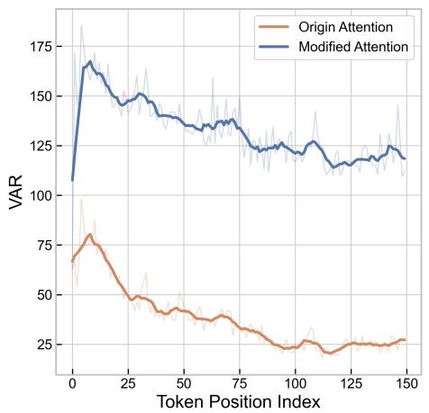

line

| Token Position Index | Origin Attention | Modified Attention |
| -------------------- | ---------------- | ------------------ |
| 0                    | 70               | 180                |
| 25                   | 50               | 150                |
| 50                   | 40               | 140                |
| 75                   | 35               | 130                |
| 100                  | 25               | 120                |
| 125                  | 25               | 115                |
| 150                  | 25               | 120                |

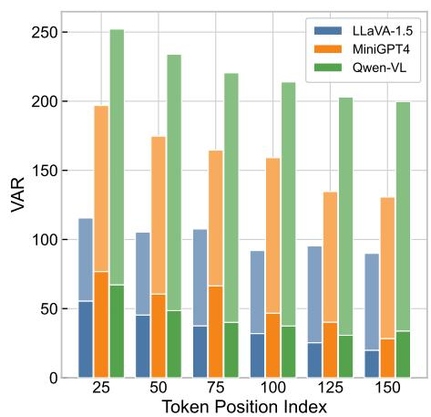

bar_stacked

| Token Position Index | LLaVA-1.5 | MiniGPT4 | Qwen-VL |
|---|---|---|---|
| 25 | 115 | 78 | 68 |
| 50 | 105 | 62 | 49 |
| 75 | 108 | 67 | 42 |
| 100 | 92 | 48 | 38 |
| 125 | 95 | 41 | 32 |
| 150 | 90 | 32 | 33 |
The chart displays the VAR values for each model at each Token Position Index. The Y-axis represents the VAR value, and the X-axis represents the Token Position Index. There is no label for the data series. The legend indicates that LLaVA-1.5 (blue), MiniGPT4 (orange), and Qwen-VL (green). The chart is saved as a PNG file named "token_position_index.png".

Figure 7. Visualization of visual attention retention with dynamic historical attention enhancement.

# D.2. Ablation Studies

The ablation experiments are conducted to deeply investigate the effect of the three crucial modules of AFIP, i.e.,a dynamic gating mechanism driven by the discrepancy between attention allocated to visual and textual content $( S _ { 1 } )$ , the integration of historical visual attention information $( S _ { 2 } )$ , and a head-level attention distraction correction strategy (S3). Based on the ablation results reported in Table 4, we observe that removing any individual component consistently leads to performance degradation, thereby validating the effectiveness and careful design of the proposed AFIP. Moreover, the attention distraction correction strategy plays a pivotal role in boosting performance, as it mitigates inconsistencies in attention distributions across multiple heads and reinforces the model’s ability to focus on the salient visual content. In addition, the dynamic gating mechanism and the integration of historical visual attention further enhance performance by strengthening the model’s visual perception capability while preventing excessive attention intervention.

Table 4. Ablation study on components across different MLLMs. 

<table><tr><td rowspan="2">S1</td><td rowspan="2">S2</td><td rowspan="2">S3</td><td colspan="2">LLaVA-7b</td><td colspan="2">Shikra</td><td colspan="2">Qwen-VL</td><td colspan="2">LLaVA-13b</td><td colspan="2">MiniGPT-4</td></tr><tr><td> $C_S$ </td><td> $C_I$ </td><td> $C_S$ </td><td> $C_I$ </td><td> $C_S$ </td><td> $C_I$ </td><td> $C_S$ </td><td> $C_I$ </td><td> $C_S$ </td><td> $C_I$ </td></tr><tr><td>X</td><td>√</td><td>√</td><td>22.6</td><td>8.8</td><td>27.4</td><td>11.4</td><td>22.8</td><td>7.6</td><td>26.4</td><td>11.6</td><td>27.3</td><td>9.5</td></tr><tr><td>√</td><td>X</td><td>√</td><td>19.3</td><td>7.2</td><td>22.6</td><td>9.3</td><td>19.1</td><td>6.9</td><td>22.5</td><td>10.2</td><td>21.6</td><td>8.4</td></tr><tr><td>√</td><td>√</td><td>X</td><td>49.6</td><td>13.2</td><td>46.8</td><td>14.3</td><td>25.8</td><td>8.2</td><td>45.3</td><td>13.8</td><td>32.4</td><td>10.2</td></tr><tr><td>√</td><td>√</td><td>√</td><td>16.8</td><td>4.4</td><td>18.0</td><td>6.6</td><td>16.6</td><td>5.0</td><td>18.4</td><td>6.4</td><td>17.8</td><td>7.3</td></tr><tr><td colspan="3">Beam</td><td>56.2</td><td>15.1</td><td>59.2</td><td>16.2</td><td>30.0</td><td>10.7</td><td>50.4</td><td>15.2</td><td>39.2</td><td>12.2</td></tr><tr><td colspan="3">Greedy</td><td>55.4</td><td>14.4</td><td>62.0</td><td>17.5</td><td>28.2</td><td>8.9</td><td>49.7</td><td>14.7</td><td>39.4</td><td>11.0</td></tr></table>

# D.3. Layer Selection for Our Method

We apply our method to multiple candidate layer ranges (0–32, 5–18, 18–32, 0–5and5–32) across five models under a unified experimental setting, and report the corresponding CHAIR results in Table 5. From the results, we observe that the 5–32 configuration (Ours) consistently achieves the lowest $\mathcal { C } _ { S }$ and $\mathcal { C } _ { I } .$ , and demonstrates a substantial improvement over the Greedy selection strategy. Notably, intervening in the early layers (0–5) clearly degrades performance, which is consistent with our analysis. Specifically, the early layers of MLLMs primarily perform modality aggregation and alignment, as discussed in the main text. These ablation results further validate the practicality of our layer-selection strategy, showing that it can reliably identify the layers that require attention modulation and effectively reduce hallucinations.

Table 5. CHAIR hallucination evaluation across different layer ranges on various models. 

<table><tr><td>Models</td><td>Layers</td><td>0–32</td><td>5–18</td><td>18–32</td><td>0–5</td><td>Greedy</td><td>5–32 (Ours)</td></tr><tr><td rowspan="2">LLaVA-7B</td><td> $\mathcal{C}_{S} \downarrow$ </td><td>28.9</td><td>23.7</td><td>36.7</td><td>53.2</td><td>55.4</td><td>16.8</td></tr><tr><td> $\mathcal{C}_{I} \downarrow$ </td><td>8.8</td><td>7.2</td><td>10.9</td><td>13.7</td><td>14.4</td><td>4.4</td></tr><tr><td rowspan="2">Shikra</td><td> $\mathcal{C}_{S} \downarrow$ </td><td>26.1</td><td>21.5</td><td>42.8</td><td>58.6</td><td>62.0</td><td>18.0</td></tr><tr><td> $\mathcal{C}_{I} \downarrow$ </td><td>10.9</td><td>8.9</td><td>13.7</td><td>15.9</td><td>17.5</td><td>6.6</td></tr><tr><td rowspan="2">MiniGPT</td><td> $\mathcal{C}_{S} \downarrow$ </td><td>25.3</td><td>20.5</td><td>29.4</td><td>37.5</td><td>39.4</td><td>17.8</td></tr><tr><td> $\mathcal{C}_{I} \downarrow$ </td><td>8.5</td><td>7.9</td><td>9.9</td><td>10.6</td><td>11.0</td><td>7.3</td></tr><tr><td rowspan="2">Qwen</td><td> $\mathcal{C}_{S} \downarrow$ </td><td>21.8</td><td>19.5</td><td>23.6</td><td>26.3</td><td>28.2</td><td>16.6</td></tr><tr><td> $\mathcal{C}_{I} \downarrow$ </td><td>6.9</td><td>6.3</td><td>7.7</td><td>8.4</td><td>8.9</td><td>5.0</td></tr></table>

# D.4. Case study of Temporal Fading of Visual Attention

The Fig. 8 provides a qualitative case study of temporal fading of visual attention. As the generation process unfolds, the proportion of visual attention assigned to successive tokens exhibits a clear overall downward trend. Notably, hallucinated tokens predominantly emerge in regions where visual attention attains local minima, revealing a strong correlation between diminished visual grounding and the onset of hallucinations.

: Please help me describe the image in detail   

natural_image

Office desk setup with computer monitors and electronic devices (no visible text or symbols)

LLAVA-1.5-7b ：  
The image features a computer desk with a laptop and a desktop computer set up… A keyboard is situated in front of the laptop, and a mouse is located near the right edge of the desk. ... A cell phone and a coffee mug can also be seen on the left side of the desk. A notebook are spread across the desk surface. The desk is situated in a corner of the room, creating a cozy workspace.

Correspondence between Visual Attention Collapse and Hallucinations   
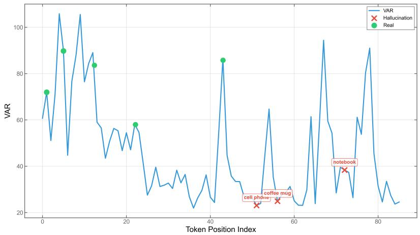

line

| Token Position Index | VAR  |
| -------------------- | ---- |
| 0                    | 60   |
| 5                    | 105  |
| 10                   | 85   |
| 15                   | 80   |
| 20                   | 55   |
| 25                   | 58   |
| 30                   | 30   |
| 35                   | 35   |
| 40                   | 25   |
| 45                   | 85   |
| 50                   | 25   |
| 55                   | 65   |
| 60                   | 30   |
| 65                   | 60   |
| 70                   | 95   |
| 75                   | 35   |
| 80                   | 90   |
| 85                   | 25   |

Figure 8. Case study of temporal fading of visual attention.

# D.5. Parameter studies on α and γ

We present the parameter studies on α and γ here. From the result, we can observe that our AFIP is not sensitive to α and γ, and adjusting α and γ does not lead to significant improvements in performance.

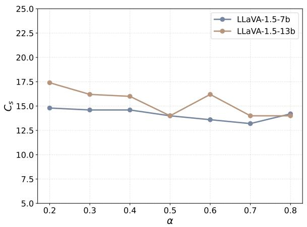

line

| α    | LLaVA-1.5-7b | LLaVA-1.5-13b |
| ---- | ------------ | ------------- |
| 0.2  | 14.8         | 17.5          |
| 0.3  | 14.7         | 16.2          |
| 0.4  | 14.7         | 16.0          |
| 0.5  | 14.0         | 14.0          |
| 0.6  | 13.7         | 16.2          |
| 0.7  | 13.2         | 14.0          |
| 0.8  | 14.2         | 14.0          |

(a) Performance change across different α

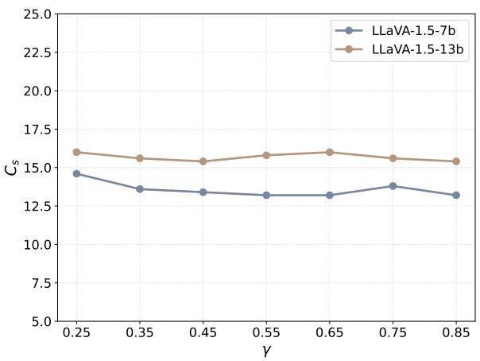

line

| γ    | LLaVA-1.5-7b | LLaVA-1.5-13b |
| ---- | ------------ | ------------- |
| 0.25 | 14.5         | 16.0          |
| 0.35 | 13.5         | 15.5          |
| 0.45 | 13.2         | 15.3          |
| 0.55 | 13.0         | 15.8          |
| 0.65 | 13.0         | 16.0          |
| 0.75 | 13.8         | 15.5          |
| 0.85 | 13.2         | 15.3          |

(b) Performance change across different γ   
Figure 9. Parameter sensitivity analysis of α and γ.

# D.6. Visualization of Attention Spatial Inconsistency

We present additional visualization examples of LLaVA-1.5-7B to demonstrate that attention spatial inconsistency contributes to the generation of hallucinated object tokens.

natural_image

Exterior view of a classical-style building with a central tower and a reflective pond, surrounded by greenery (no signage or text visible)

User: Please help me describe the image in detail.

# LLaVA-1.5-7b:

The image features a person standing in a garden, holding a red umbrella. The person is positioned near a pond, which is surrounded by a beautiful garden setting. The umbrella is open, providing shelter from the elements. In the background, there is a building with a clock tower, adding to the picturesque atmosphere of the scene. The garden is filled with various potted plants, some of which are placed near the pond, while others are scattered throughout the area. The combination of the person, the umbrella, the pond, and the garden creates a serene and inviting environment.

Object Token   
“person”   

Origin Image   
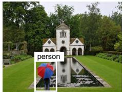

text_image

person

Head24   
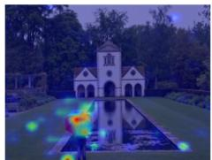

natural_image

Exterior view of a classical-style building with a central fountain and surrounding greenery (no signage or text visible)

Head25   
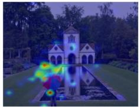

natural_image

Exterior view of a classical-style building with illuminated windows and a reflective water feature, surrounded by trees (no signage or text visible)

Head26   
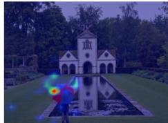

natural_image

Exterior view of a classical-style building with a central clock tower and a reflective water feature, surrounded by trees (no signage or text visible)

“clock”   

text_image

building

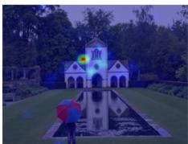

natural_image

Exterior view of a classical-style building with a fountain and umbrella in front, surrounded by trees (no visible text or symbols)

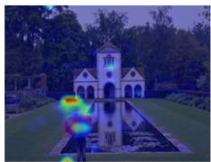

natural_image

Exterior view of a historic building with a central fountain and reflection in the water, surrounded by trees (no visible text or signage)

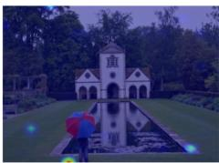

natural_image

Exterior view of a classical-style building with a reflective water feature, surrounded by trees and a person holding an umbrella in the foreground (no signage or text visible)

natural_image

Interior view of a dining table with patrons and dishes (no visible text or signage)

User: Please help me describe the image in detail.

# LLaVA-1.5-7b:

The image features a dining table with a person sitting at it, enjoying a meal. The person is eating a pizza, which is placed on a plate in front of them. There are also a few carrots on the table, adding a healthy touch to the meal. Various utensils and items are present on the table, including a fork, a knife, and a spoon. There are also two cups, one near the person and another further away. A bottle can be seen on the left side of the table. Another person is partially visible in the background, possibly waiting for their turn to eat or simply observing the scene.

Object Token   
“pizza”   

Origin Image   
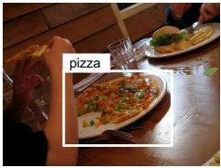

text_image

pizza

Head20   
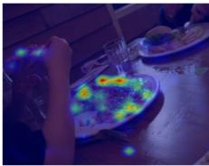

natural_image

Person holding a glass with colorful thermal imaging overlay on a lab table (no visible text or symbols)

Head23   
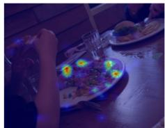

natural_image

Interior scene with a person seated at a table, illuminated by a colorful thermal or heat map overlay (no visible text or symbols)

Head27   
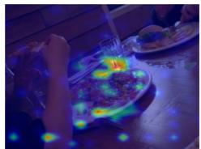

natural_image

Child's hands interacting with a colorful, glowing object on a table (no visible text or symbols)

“carrot”   

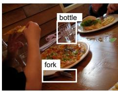

text_image

bottle
fork

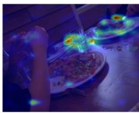

natural_image

Person interacting with a food item under blue light, illuminated by glowing particles (no text or symbols visible)

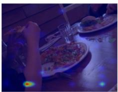

natural_image

Interior scene of a dimly lit restaurant with illuminated tableware and a person seated at the table (no visible text or signage)

natural_image

Interior view of a dimly lit restaurant with patrons dining at a table (no visible text or signage)

Figure 10. Visualization of attention maps over image for real and hallucinated object tokens.

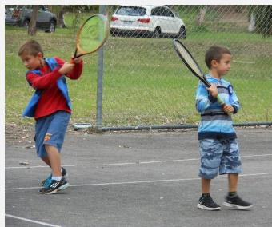

natural_image

Two boys playing badminton on a paved court, one holding a racket and the other holding a baton, with a car and fence in the background (no visible text or symbols)

User: Please help me describe the image in detail.

# LLaVA-1.5-7b:

The image features two young boys playing tennis on a court. One boy is holding a tennis racket, while the other is holding a tennis ball. They are both standing on the court, ready to play. In the background, there are two cars parked, one on the left side and the other on the right side of the court. Additionally, there is a bench located near the right side of the court, providing a place for spectators to sit and watch the game.

Object Token   
“racket”   

Origin Image   
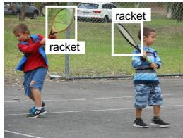

text_image

racket
racket

Head18   
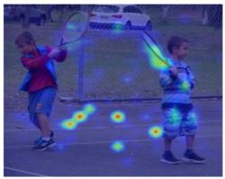

natural_image

Two children playing badminton on a field with a goalpost and vehicle in the background (no visible text or symbols)

Head20   
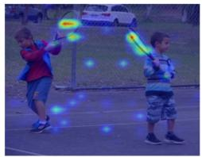

natural_image

Two children playing with light bulbs outdoors, one holding a glowing bulb (no text or symbols visible)

Head21   
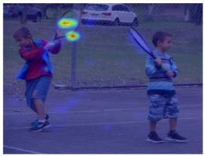

natural_image

Two children playing outdoors on a paved court, one holding a baton with a glowing blue light (no text or symbols visible)

“bench”   

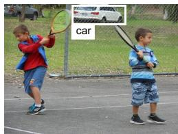

natural_image

Two children playing badminton on a track, one holding a baton and the other aiming a racket (no text or symbols visible)

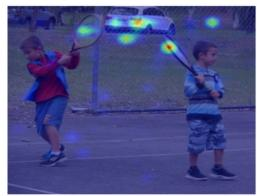

natural_image

Two children playing badminton on a track, one holding a racket and the other holding a baton with a glowing green light (no text or symbols visible)

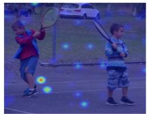

natural_image

Two children playing badminton on a court with a car in the background (no visible text or symbols)

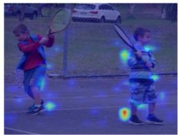

natural_image

Two children playing badminton on a court, one holding a racket and the other aiming a baton; no visible text or symbols.

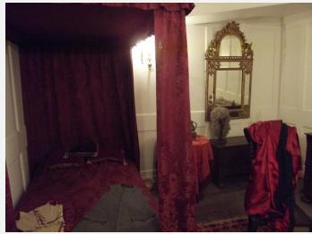

natural_image

Interior view of a bedroom with red curtains, a framed mirror, and patterned bedding (no visible text or symbols)

User: Please help me describe the image in detail.

# LLaVA-1.5-7b:

The image depicts a bedroom with a bed situated in the center of the room. The bed is covered with a red blanket, and there is a red curtain hanging over the bed. The room also features a chair and a dresser. In addition to the bedroom furniture, there are two dogs in the room. One dog is located near the left side of the bed, while the other dog is positioned closer to the right side. A vase can be seen on the dresser, and a clock is mounted on the wall. The room appears to be a cozy and comfortable space for relaxation and rest.

Object Token   
“chair”   

Origin Image   
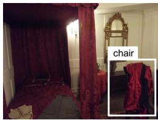

natural_image

Interior view of a bedroom with red curtains and a framed chair (no visible text or symbols)

Head23   
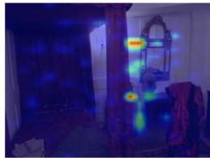

natural_image

Interior scene with a window, wall-mounted mirror, and a person in a suit (no visible text or symbols)

Head26   

natural_image

Interior scene with dark curtains, a framed mirror, and a hanging chair (no visible text or symbols)

Head30   

natural_image

Interior scene with a dark curtain, arched mirror, and warm lighting (no visible text or symbols)

“vase”   

natural_image

Interior view of a bedroom with red curtains, a wall-mounted mirror, and a bed (no visible text or symbols)

natural_image

Interior scene with dark room, hanging lantern, and illuminated green light (no visible text or symbols)

natural_image

Interior scene with a window, curtains, and a person in a suit, under blue lighting (no visible text or symbols)

natural_image

Interior view of a dimly lit bedroom with curtains, a mirror, and a bed (no visible text or symbols)

Figure 11. Visualization of attention maps over image for real and hallucinated object tokens.

natural_image

Exterior view of a bus and parked motorcycles in front (no visible text or symbols)

User: Please help me describe the image in detail.

# LLaVA-1.5-7b:

The image features a young girl standing in front of a row of motorcycles parked on a dirt road. There are five motorcycles in total, with some of them being parked closer to the girl and others further away. The girl appears to be posing for a picture, possibly with the motorcycles as the main subject. In the background, there is a bus parked on the left side of the scene, and a truck can be seen further back on the right side. The scene seems to be a gathering or event involving motorcycles and vehicles.

Object Token   
“girl”   

Origin Image   

natural_image

Exterior view of a bus with parked motorcycles and a person standing nearby (no signage)

Head12   

natural_image

Exterior view of a bus with parked motorcycles and a person in safety gear nearby (no visible text or symbols)

Head14   

natural_image

Exterior view of a bus at night with parked motorcycles and a person standing nearby (no visible text or signage)

Head16   

natural_image

Exterior view of a bus at night with parked motorcycles and a person standing nearby (no visible text or symbols)

“truck”   

text_image

bus
roadblock

natural_image

Exterior view of a bus at night with parked motorcycles and a person standing nearby (no visible text or symbols)

natural_image

Exterior view of a bus with parked motorcycles under blue-lit lighting (no visible text or symbols)

natural_image

Night scene with parked motorcycles and a bus, no visible text or symbols

natural_image

Silhouette of a horse and a person on a grassy field with a bicycle in the background (no text or symbols visible)

User: Please help me describe the image in detail.

# LLaVA-1.5-7b:

The image features a person riding a horse in a park, with the horse standing next to a fence. The person on the horse appears to be watching a group of children playing baseball on the other side of the fence. There are several children in the scene, with some of them holding baseball bats and a sports ball. In addition to the horse and the children, there is a bicycle parked near the fence, and a backpack can be seen placed on the ground. The scene captures a lively atmosphere with people enjoying outdoor activities in the park.

Object Token   
“bicycle”   

Origin Image   

text_image

bicycle

Head24   

natural_image

Silhouette of a horse with a bicycle in the foreground at night, no visible text or symbols

Head25   

natural_image

Silhouette of a horse with a bicycle and person riding, under a night sky with colorful light effects (no text or symbols visible)

Head26   

natural_image

Silhouette of a horse and a person riding a bicycle at night, with colorful light effects on the ground (no text or symbols visible)

“sports ball”   

text_image

horse
player

natural_image

Silhouette of a horse and a bicycle in an outdoor park setting (no text or symbols visible)

natural_image

Silhouette of a horse and a bicycle in an outdoor park setting with people and a gate (no visible text or symbols)

natural_image

Silhouette of a horse and a bicycle in an outdoor setting at night, with people standing near a fence (no visible text or symbols)

Figure 12. Visualization of attention maps over image for real and hallucinated object tokens.

# D.7. Case study for Attention Distraction Correction

We present visualizations of the model’s visual attention before and after applying our head-level attention distraction correction method on LLaVA-1.5-7B. All figures depict attention scores from the 20-th layer, which demonstrates that our approach effectively refines the model’s focus toward semantically relevant visual regions.

Before   

natural_image

Illustration of a car with thermal imaging overlays showing heat signatures (no text or symbols)

natural_image

Black car parked in front of a brick building with orange flame-like graphics (no visible text or symbols)

LLaVA-1.5-7b visual attention visualization while generating “dog”

Before   

natural_image

Thermal imaging view of a biological sample showing heat distribution (no text or symbols visible)

natural_image

Person wearing a cat with colorful thermal or heatmap overlays on the skin (no text or symbols visible)

LLaVA-1.5-7b visual attention visualization while generating “cat”

Before   

natural_image

Abstract digital artwork featuring a person reading under an archway with a glowing blue background (no text or symbols)

natural_image

Interior scene with a person standing near a table, illuminated by colorful thermal or heat overlays (no text or symbols visible)

LLaVA-1.5-7b visual attention visualization while generating “table”

Before   

natural_image

Interior bathroom scene with rings, mirror, and decorative elements (no visible text or symbols)

natural_image

Interior bathroom scene with a mirror, lamp, and tiled counter (no visible text or symbols)

LLaVA-1.5-7b visual attention visualization while generating “mirror”   
Figure 13. Qualitative comparison of visual attention maps before and after applying Head-Level Attention Distraction Correction.

Before   

natural_image

Thermal or heat map visualization of a biological structure with color gradients (no text or symbols)

natural_image

Illustration of a person on a beach with surfboards and ocean waves, no visible text or symbols

LLaVA-1.5-7b visual attention visualization while generating “boy”

natural_image

Thermal image showing heat distribution with blue and yellow gradients, no text or symbols visible

natural_image

Person observing a large illuminated display with blue and yellow patterns (no text or symbols visible)

LLaVA-1.5-7b visual attention visualization while generating “kite”

natural_image

Illustration of a white cow standing in a mountainous landscape with colorful foliage (no text or symbols)

natural_image

A cow standing in a mountainous landscape with colorful heatmaps overlaying its body (no text or symbols visible)

LLaVA-1.5-7b visual attention visualization while generating “cow”

natural_image

Thermal image of a person working at a desk with computer monitors and equipment, no visible text or symbols

natural_image

Man working at a desk with thermal imaging overlays showing heat signatures (no text or symbols visible)

LLaVA-1.5-7b visual attention visualization while generating “wine”

Before   

natural_image

Thermal image of a skier on a snowy slope with car and trees in background (no text or symbols)

natural_image

Person skiing on a snowy slope at dusk, with thermal imaging overlays showing heat distribution (no text or symbols)

LLaVA-1.5-7b visual attention visualization while generating “board”

Before   

natural_image

Glass pitcher with water-filled interior, surrounded by other beverage containers and a blurred background (no visible text or symbols)

natural_image

Color-tinted photo of a blender with visible heat map overlay, surrounded by kitchen utensils and beverages (no text or symbols)

LLaVA-1.5-7b visual attention visualization while generating “blender”   
Figure 14. Qualitative comparison of visual attention maps before and after applying head-level attention distraction correction.

# D.8. Qualitative Results of Hallucination Mitigation

We further present sample results from our hallucination mitigation method, as detailed in Section 4. Our prompt is “Please help me describe the image in detail” for all samples. The real and hallucinated object words are marked in blue and red, respectively.

natural_image

A person sitting on a bench outdoors, reading a book while wearing a blue cap and casual wear, with greenery and distant buildings in the background (no visible text or symbols).

Greedy: The image shows an elderly man sitting on a blue bench in a quiet park, holding a book and looking down as if reading. He wears a blue cap, a pair of glasses, and a light blue jacket, sitting calmly with a relaxed posture. A wooden cane leans against the bench close to his leg, suggesting it is used for support. The bench stands on a smooth paved path, surrounded by greenery. Nearby, a brown leather bag rests on the ground, and a small radio plays quietly beside the bench.   
Ours: The image shows an elderly man sitting quietly on a blue wooden bench in a park, holding a book in his hands and looking. He is wearing a blue cap, glasses, and a light blue. A wooden cane rests against the bench near his leg. The bench is placed on a paved walkway. In the background, there is an open grassy area and distant trees, and above them a clear blue sky with a few light clouds can be seen, giving the scene a calm and peaceful outdoor atmosphere.

natural_image

Three women in hats and coats gathered around a birthday cake, one holding a candle (no visible text or symbols)

Greedy: The image feature a group of woman gather around a dining table , celebrate a special occasion . They be all wear hat and be in the process of cut a cake together . There be three cake visible on the table , with one be the main focus of the group . The woman be use a knife to cut the cake , and they be all smile and enjoy the moment . The table be set with a few cup and a bowl , indicate that they might be share the cake with others or enjoy some additional treat . The scene be warm and inviting , showcasing the camaraderie among the woman .   
Ours: The image shows a group of women gathered around a table, enjoying a festive celebration with cake and candles. Two of the women are wearing hats. The third woman is dressed in a patterned blouse and wears a pink hat. All three appear joyful and engaged as they prepare to cut into a large white cake decorated with colorful flowers and a single tall candle. The warm atmosphere suggests a special occasion, possibly a birthday or anniversary, marked by elegance and camaraderie. A smaller decorative cake is also visible on the table, adding to the celebratory display.

natural_image

Exterior view of a train station platform with a yellow locomotive and storage silo, no visible text or symbols on the main subjects.

Greedy: The image feature a train travel down the track , passing by a train station . The train be position in the middle of the scene , with it yellow engine pull several car behind it . The train appear to be a freight train , a it be carry a variety of cargo . There be several people visible in the scene , likely wait for the train or working at the station . One person be stand near the train , while others be scatter around the platform . A backpack can be see place on the ground , possibly belong to one of the individual wait for the train .   
Ours: The image shows a blue and yellow train traveling along the tracks, approaching a small station platform where a man in an orange safety vest is standing. The train is moving steadily through a rural. The overcast sky adds a calm, muted tone to the scene, suggesting a quiet moment in a suburban or semi-rural railway setting. A second set of tracks runs parallel, hinting at possible freight or additional passenger services in the area.

natural_image

Scenic outdoor scene with a large elephant, cable cars, and traditional architecture under a clear blue sky (no visible text or symbols)

Greedy: The image feature a zoo enclosure with a large elephant standing on a dirt field . The elephant be position in the middle of the enclosure , surround by a few rock and a body of water . There be two bench in the scene , one locate near the left side of the enclosure and the other closer to the right side . In addition to the elephant , there be two people visible in the enclosure , likely zookeepers or visitor observe the animal . They be stand near the left side of the enclosure , close to the elephant .   
Ours: The image shows a large elephant standing in a zoo enclosure, surrounded by a body of water and landscaping. The elephant is near a tree and several large rocks, with a small waterway running through the habitat. Although it is not currently in the water, the setting suggests it may be cooling off or preparing to enter. In the background, a cable car glides overhead, indicating the location is part of a larger park or wildlife sanctuary. The enclosure is designed to mimic a natural environment, providing shade, open space, and opportunities for enrichment.

Figure 15. Qualitative results of hallucination mitigation on LLaVA-1.5-7B

natural_image

Close-up of pale yellow dahlia flowers in a clear glass vase, placed on a wooden surface (no text or symbols visible)

Greedy: The image feature a clear glass vase fill with water and place on a table . the vase contain a beautiful arrangement of white flower , include daisy and baby 's breath . the flower be arrange in such a way that they create a visually appealing display . the glass vase allow the viewer to see the water and the stem of the flower , add to the overall aesthetic of the scene .

Ours: The image feature a beautiful glass vase fill with water , which be place on a table . the vase contain a few yellow flower , and the sunlight shine through the glass , create a warm and invite atmosphere. The vase be make of glass , and it be fill with water , which help to keep the flower fresh and hydrate .

natural_image

Interior living room scene with black leather sofa, wooden furniture, and 3D screen (no visible text or symbols)

Greedy: The image depict a cozy living room with a large flat-screen tv mount on the wall . the room be furnish with a brown leather couch and a chair , both place in front of the tv. A coffee table be situate between the couch and the chair , provide a comfortable space for place item. In addition to the main furniture , there be several book scatter around the room , some on the coffee table and others on the floor . a remote control can be see on the couch , likely for operate the tv. A potted plant be also present in the room , add a touch of greenery to the space .

Ours: The image showcases a living room with a cozy and comfortable atmosphere. The room feature a large leather couch , a television , and a coffee table . the living room be furnish with a television, and a coffee table . the room be decorate with a green carpet , a brown rug. The living room also includes a wooden entertainment unit with built-in shelves, providing both storage and display space for decorative items and media devices.

natural_image

Plate of sandwich with lettuce, tomato, and cheese on a wooden table (no visible text or symbols)

Greedy: The image feature a large , delicious sandwich cut in half and place on a wooden cut board . the sandwich be fill with various ingredient , include lettuce , tomato , and cheese . the cut board be position on a dining table , which occupy most of the scene . In the background , there be a computer keyboard and a computer mouse , indicate that the table be likely use for work or leisure activity . the presence of these electronic device suggest that the person enjoy the sandwich might be take a break from their computerrelated task to have a meal .

Ours: The image features a delicious sandwich on a wooden plate, which is placed on a wooden cutting board. The cut board be position on a dining table. The sandwich is a large stack of sandwiches, with a variety of ingredients, including tomatoes, lettuce, and cheese. The sandwich is served on a wooden platter, and it is accompanied by a side of chips.

natural_image

Interior view of a bathroom with a white sink, a double door, and a fan mounted on a stand (no visible text or symbols)

Greedy: The image depicts a bathroom interior centered around a sink and a mirror. The sink occupies the foreground and is situated slightly left of the image’s center; it features two decorative silver faucets. Mounted above the sink, in the upper-left quadrant of the frame, is a mirrored medicine cabinet framed in white with visible metal hinges. To the right of the sink stands a black oscillating fan, plugged into a wall outlet, its blades exposed and motionless. In the mirror, a toothbrush rests beside the sink, though only one is visible in the actual room. The walls are uniformly painted white, and on the far right edge of the composition, a narrow, floor-to-ceiling door can be seen.

Ours: The image features a bathroom scene with a sink and a mirror. The sink is located in the foreground of the image, and it is positioned in the middle of the scene. The mirror is situated in the upper left part of the image, and the sink is situated in the middle of the image. The sink is white and is positioned in the middle of the image. The bathroom is equipped with a sink, a mirror, and a fan.

Figure 16. Qualitative results of hallucination mitigation on LLaVA-1.5-13B

natural_image

Outdoor wooden utility shed with open door, situated in grassy field with trees and distant mountains (no text or symbols visible)

Greedy: Asmall wooden outhouse sits alone in a grassy field, with its door partly open to reveal a simple toilet seat inside. Wild plants and a few flowers grow around it, and trees and distant hills line the background under a cloudy sky. A red bicycle leans against the wall, and a dog rests in the grass nearby.   
Ours: The image shows a small wooden outhouse standing alone in the middle of a field. The outhouse looks simple and slightly weathered, with rough wooden panels and a large wooden door that is swung open to the side. The ground around it is uneven and covered with dry-looking vegetation, giving the scene a rural and isolated feeling. In the background, there are several trees and thick green bushes, and farther away there are low hills or mountains.

natural_image

Baby sitting on a bed using a laptop, no visible text or symbols

Greedy: Ababy sit on a bed , reach out to touch a laptop computer. The baby be position in the center of the scene , with the laptop place on the bed in front of them . the baby appear to be curious and interested in the laptop , possibly try to interact with it. In the background , there be a couch visible , and a teddy bear be place on the right side of the bed . The scene capture a moment of curiosity and exploration for the baby a they engage with the laptop .   
Ours: The image show a small baby sit on a bed , hold a laptop computer on the bed . The baby be wear yellow pajama and be sit on top of a laptop computer on the bed . the bed be cover in white sheet and there be a white teddy bear on the bed next to the laptop computer . The baby appears to be curiously exploring the laptop, reaching out toward the keyboard with one hand while sitting upright on the bed. The soft lighting and cozy bedroom setting create a warm and intimate atmosphere, capturing a tender moment of early childhood discovery.

natural_image

A young girl in a white robe holding a teddy bear, with another adult partially visible in the background (no text or symbols)

Greedy: A young girl sit on a chair , hold a brown teddy bear in her lap . she appear to be enjoy her time with the stuffed animal , possibly even lick her finger . the girl be wear a white sweater , which add to the cozy atmosphere of the scene . in the background , there be a din table with a few item on it , include a cup and a bowl . another chair can be see place near the table . the overall setting suggest a comfortable and playful environment for the young girl and her teddy bear.   
Ours: The image show a young girl sit in front of a Christmas tree , hold a stuffed animal toy in her hand, which is a brown teddy bear. The girl be wear a white sweater and have brown hair and brown eye . the background be a room with a Christmas tree in the corner and a pink wall in the background. The girl appears to be engaged in a moment of quiet contemplation or play, gently touching her face as she looks at the teddy bear. The warm lighting and festive surroundings suggest a cozy holiday atmosphere, likely during a Christmas celebration.

natural_image

A small dog standing on a brick pavement next to a fire extinguisher and green railings, with a brick wall in the background (no visible text or symbols).

Greedy: A small white dog stands on a red brick sidewalk beside a green metal post and a red fire hydrant. Its thin, fluffy fur is slightly lifted by the breeze, making the dog look alert and energetic. Bright sunlight illuminates the area, casting clear, sharp shadows of the dog and nearby posts onto the ground. Behind it is a red brick wall with a visible metal pipe, reinforcing the urban street setting. The surroundings look empty and peaceful, suggesting a quiet afternoon, while a yellow skateboard rests against the wall and a paper coffee cup sits near the hydrant.   
Ours: The image shows a small white dog standing on a red brick sidewalk near a green metal post and a red fire hydrant. The dog’s long, wispy fur is being blown by the wind, giving it a slightly messy but lively look. Sunlight falls directly onto the scene, creating sharp shadows from the posts and the dog on the ground. The background features a red brick building wall, adding an urban touch to the setting. The street appears quiet and clean, with no people or cars visible nearby, giving the impression of a calm, sunny afternoon.

Figure 17. Qualitative results of hallucination mitigation on MiniGPT-4

natural_image

Person lying on a red hospital bed in front of a building with visible signage (no readable text)

Greedy: The image shows a woman is shown relaxing on a red bed set up outdoors in front of a large public building. She lies across it in a playful pose, lifting one leg and raising an arm while smiling broadly toward the camera. The bed is covered with a red blanket and matching pillow and is supported by a wheeled base, giving it the appearance of a mobile bed. In the background, brick walls mark the building entrance, with a few people nearby adding to the everyday public atmosphere. A small bedside lamb sits near the pillow, and a cat is curled up at the foot of the bed.

Ours: The image shows a woman lying on a red bed placed outside in front of a large building. She is stretched out playfully on the bed, with one leg raised in the air and one arm lifted, smiling widely. The bed has a red blanket and a red pillow, and it appears to be mounted on a wheeled frame, making it look like a movable bed. Behind her, the building has glass doors and brick walls, and a few people can be seen walking or standing near the entrance, giving the scene a casual public setting.

natural_image

Exterior view of a modern building with a large clock face mounted on the facade, overlooking a cityscape under clear sky (no signage or text visible)

Greedy: The image feature a large clock mount on the side of a tall building . the clock be prominently display , take up a significant portion of the building 's facade . the building itself appear to be a hotel , a indicate by the presence of a clock on the exterior . in the background , there be several car park or drive along the street , add to the urban atmosphere of the scene . the combination of the clock and the car create a sense of a bustling city environment .

Ours: The image feature a very large , gold-colored clock , which appear to be an oversized , mount to the side of a tall building . the clock be quite prominent against the sky , make it an eye-catching feature in the city skyline. The clock is mounted vertically on the building's facade, with an ornate design and a long pendulum-like extension below the face, giving it a distinctive and decorative appearance.

natural_image

Outdoor food stall with a red basket of sandwiches and paper cutlery, placed on a green tablecloth with people in the background (no visible text or symbols)

Greedy: The image shows a cutting board with a sandwich and chips placed in front of a computer desk. The sandwich is made with various ingredients, and it is cut in half, making it easier to eat. The sandwich is made with a variety of ingredients, including meat, lettuce, and tomato. The sandwich is placed on a plate, which is sitting on the desk next to the computer. The sandwich is made with various ingredients, including meat, lettuce, and tomato. The sandwich is sitting on a plate, which is placed on the desk next to the computer. The sandwich is cut in half, making it easier to eat

Ours: The image shows a sandwich placed on a table in an outdoor setting, sitting inside a red plastic basket lined with white paper. The sandwich is cut in half and filled with several ingredients, including sliced meat, lettuce, and other fillings that are visible from the side. It is positioned on a green tabletop, with a folded napkin and a small wrapped item placed next to it. In the background, there is another basket with food on a nearby table, along with chairs and parts of the sidewalk, suggesting a casual outdoor café or street dining area. The overall scene looks informal and ready to eat, with the sandwich clearly prepared for convenience.

natural_image

Black-and-white photo of two people conversing in a crowded indoor setting (no visible text or symbols)

Greedy: The image depict a man and a woman stand next to each other in a hallway . The man be look at his cell phone , while the woman appear to be look at him . They seem to be engage in a conversation or share information on the phone . There be a few other people in the scene , with one person stand further back and another person closer to the right side of the image . The hallway appear to be a public space , possibly a subway or a train station , a there be a clock visible on the wall .

Ours: The image be a black and white photo of a man and woman walk down a busy subway platform . The man be check his cell phone while the woman walk ahead of him . The black and white photo capture the man and woman a they walk down the subway . In the image , there be multiple people in the subway station , indicate a busy and bustling environment . the people be engage in various activity while they navigate through the subway station .

Figure 18. Qualitative results of hallucination mitigation on Shikra

natural_image

Colorful fruit display with apples, grapes, oranges, and a pineapple on a wooden crate (no visible text or symbols)

Greedy: A bunch of fruits and vegetables are stacked on top of each other in wooden crates and on display at a sunny marketplace. There are oranges, pineapples, lemons, tangerines, apples, grapes, mangoes, and other fruits and vegetables neatly arranged under an open awning.

Ours: A bunch of fruits and vegetables are stacked on top of each other in boxes and on display at a market place. there are apples, oranges, pineapples, limes, tangerines, and other fruits and vegetables at the market place.

natural_image

Woman sitting on a sofa in a living room with a decorative wall and lamp (no visible text or symbols)

Greedy: A woman sit on a couch in a living room , hold a controller in her hand . She appear to be surprise or excite about something , possibly relate to the video game she be play . The living room be furnish with a chair and a dining table , and there be a clock on the wall . A remote control can be see on the couch , and a bottle be place nearby . The woman be the main focus of the scene , and her expression conveys her engagement with the video game .

Ours: A woman is sitting on a couch in a cozy living room, holding a remote in her hand, her face showing a look of surprise or excitement. The room is warmly lit by a table lamp, and decorative elements like a patterned wall mirror and a soft blanket add to the homely atmosphere. She appears fully engaged in a video game, reacting with animated expression as she plays.

text_image

South Rd

Greedy: A street corner with a traffic light and a street sign . The traffic light be position on the left side of the scene , while the street sign be locate above the traffic light . the sign be blue and read south. There be a backpack hang on the pole of the traffic light , possibly belong to a pedestrian or a commuter . the backpack be situate near the center of the scene , and it presence add a sense of everyday life to the urban setting .

Ours: A street sign reading "South Rd" is mounted on a metal pole, accompanied by a streetlight and surrounded by trees in the background. A pair of shoes is hanging from the pole, adding an unusual touch to the scene. At the corner of South Road, a streetlight stands near the sign, with lush green foliage visible behind it.

text_image

Indoor scene with person presenting in front of large screen displaying cartoon graphics and text, surrounded by wall art and furniture

Greedy: A person stand in a room with a large screen tv mount on the wall . the person be hold a remote , likely play a video game on the tv . the room appear to be a living area with a couch and several chair scatter around . There be two din table in the room , one near the center and another towards the right side . A handbag can be see place on the floor , close to the person . the room also feature a few bottle , with one on the left side and another on the right side of the room .

Ours: A woman play a video game on a projector screen in a graffitied room with graffiti cover wall and chair and couch in front of a large screen . The woman appears focused on the game, standing near a retro-style orange couch that adds a pop of color to the space, while wooden tables and chairs are arranged around the area for casual seating.

Figure 19. Qualitative results of hallucination mitigation on Qwen-VL