# DUEL: Adversarial Self-Play for Multimodal Reasoning

Lin Qiu1, Hanqing Zeng1, Yao Liu1, Bingjun Sun1, Guangdeng Liao1, Ji Liu1

1Meta AI

Reinforcement learning (RL) has emerged as an effective paradigm for improving the reasoning capability of vision-language models (VLMs). However, RL-based optimization typically depends on costly high-quality annotations that are difficult to scale. Existing unsupervised alternatives may drift toward biased solutions due to weak visual grounding and the lack of reliable verification signals. We propose a self-evolving post-training framework, DUEL, where supervision emerges from adversarial interactions between two policies initialized from the same pretrained VLM. A Challenger generates an image-grounded true claim together with a minimally perturbed hard-negative counterpart, while a Solver verifies both claims against the image, encouraging fine-grained visual discrimination under nearneighbor semantics. To stabilize optimization, we introduce a length-normalized log-likelihood reward that preserves informative optimization signals beyond binary outcome supervision and improves learning stability under sparse feedback. Experiments show that DUEL consistently improves visual reasoning and robust discrimination without additional human annotations, external reward models, or image editing tools.

Date: May 26, 2026

Correspondence: lin.qiu.stats@gmail.com

8Meta

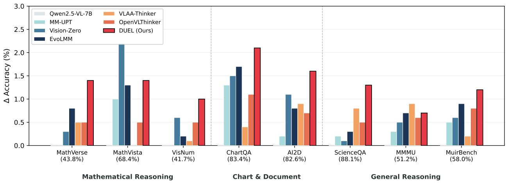

bar

| Category | Model | Δ Accuracy (%) |
| :--- | :--- | :--- |
| Mathematical Reasoning | Qwen2.5-VL-7B | 0.0 |
| Mathematical Reasoning | MM-UPT | 0.0 |
| Mathematical Reasoning | Vision-Zero | 0.3 |
| Mathematical Reasoning | EvoLMM | 0.8 |
| Mathematical Reasoning | VLAA-Thinker | 0.5 |
| Mathematical Reasoning | OpenVLThinker | 0.5 |
| Mathematical Reasoning | DUEL (Ours) | 1.4 |
| Mathematical Reasoning | Qwen2.5-VL-7B (MathVerse 43.8%) | 0.0 |
| Mathematical Reasoning | MM-UPT (MathVista 68.4%) | 1.0 |
| Mathematical Reasoning | Vision-Zero (MathVista 68.4%) | 2.2 |
| Mathematical Reasoning | EvoLMM (MathVista 68.4%) | 1.3 |
| Mathematical Reasoning | VLAA-Thinker (MathVista 68.4%) | 0.5 |
| Mathematical Reasoning | OpenVLThinker (MathVista 68.4%) | 1.4 |
| Mathematical Reasoning | DUEL (Ours) (MathVista 68.4%) | 0.0 |
| Mathematical Reasoning | Qwen2.5-VL-7B (VisNum 41.7%) | 0.0 |
| Mathematical Reasoning | MM-UPT (VisNum 41.7%) | 0.0 |
| Mathematical Reasoning | Vision-Zero (VisNum 41.7%) | 0.6 |
| Mathematical Reasoning | EvoLMM (VisNum 41.7%) | 0.2 |
| Mathematical Reasoning | VLAA-Thinker (VisNum 41.7%) | 0.1 |
| Mathematical Reasoning | OpenVLThinker (VisNum 41.7%) | 0.5 |
| Mathematical Reasoning | DUEL (Ours) (VisNum 41.7%) | 1.0 |
| Chart & Document | Qwen2.5-VL-7B (ChartQA 83.4%) | 0.0 |
| Chart & Document | MM-UPT (ChartQA 83.4%) | 1.3 |
| Chart & Document | Vision-Zero (ChartQA 83.4%) | 1.5 |
| Chart & Document | EvoLMM (ChartQA 83.4%) | 1.7 |
| Chart & Document | VLAA-Thinker (ChartQA 83.4%) | 0.4 |
| Chart & Document | OpenVLThinker (ChartQA 83.4%) | 1.1 |
| Chart & Document | DUEL (Ours) (ChartQA 83.4%) | 2.1 |
| Chart & Document | Qwen2.5-VL-7B (AI2D 82.6%) | 0.0 |
| Chart & Document | MM-UPT (AI2D 82.6%) | 0.2 |
| Chart & Document | Vision-Zero (AI2D 82.6%) | 1.1 |
| Chart & Document | EvoLMM (AI2D 82.6%) | 0.8 |
| Chart & Document | VLAA-Thinker (AI2D 82.6%) | 0.9 |
| Chart & Document | OpenVLThinker (AI2D 82.6%) | 0.7 |
| Chart & Document | DUEL (Ours) (AI2D 82.6%) | 1.6 |
| General Reasoning | Qwen2.5-VL-7B (ScienceQA 88.1%) | 0.0 |
| General Reasoning | MM-UPT (ScienceQA 88.1%) | 0.2 |
| General Reasoning | Vision-Zero (ScienceQA 88.1%) | 0.1 |
| General Reasoning | EvoLMM (ScienceQA 88.1%) | 0.3 |
| General Reasoning | VLAA-Thinker (ScienceQA 88.1%) | 0.8 |
| General Reasoning | OpenVLThinker (ScienceQA 88.1%) | 0.5 |
| General Reasoning | DUEL (Ours) (ScienceQA 88.1%) | 1.3 |
| General Reasoning | Qwen2.5-VL-7B (MMU 51.2%) | 0.0 |
| General Reasoning | MM-UPT (MMU 51.2%) | 0.3 |
| General Reasoning | Vision-Zero (MMU 51.2%) | 0.5 |
| General Reasoning | EvoLMM (MMU 51.2%) | 0.7 |
| General Reasoning | VLAA-Thinker (MMU 51.2%) | 0.9 |
| General Reasoning | OpenVLThinker (MMU 51.2%) | 0.6 |
| General Reasoning | DUEL (Ours) (MMU 51.2%) | 0.7 |
| General Reasoning | Qwen2.5-VL-7B (MuirBench 58.0%) | 0.0 |
| General Reasoning | MM-UPT (MuirBench 58.0%) | 0.5 |
| General Reasoning | Vision-Zero (MuirBench 58.0%) | 0.6 |
| General Reasoning | EvoLMM (MuirBench 58.0%) | 0.9 |
| General Reasoning | VLAA-Thinker (MuirBench 58.0%) | 0.2 |
| General Reasoning | OpenVLThinker (MuirBench 58.0%) | 0.8 |
| General Reasoning | DUEL (Ours) (MuirBench 58.0%) | 1.2 |
The chart displays Δ Accuracy (%) for each reason category on the x-axis, with error bars indicating variability or confidence intervals for each reason category on the y-axis.

Figure 1 Performance comparison of DUEL with SOTA post-training methods for VLMs. All methods are trained on the same base model. The horizontal axis shows each benchmark with the base model’s accuracy in parentheses; the vertical axis shows accuracy improvement (∆%). Benchmarks are grouped into three categories: Mathematical Reasoning, Chart & Document understanding, and General Reasoning. DUEL demonstrating broad and consistent improvement across all task categories without any human annotations.

# 1 Introduction

Vision-language models (VLMs) have achieved strong performance on multimodal tasks including image captioning (Li et al., 2022), visual question answering (Alayrac et al., 2022), and multimodal reasoning (Chen et al., 2022). Yet most training paradigms depend on large-scale human-curated data or external supervision such as supervised fine-tuning (Dai et al., 2023) and preference-based alignment (Yu et al., 2024), constraining scalability and introducing reward bias in open-ended visual environments. Self-evolution has been widely adopted for LLMs, where models generate their own training signals through self-play (Liu et al., 2025), self-critique (Yuan et al., 2024), and iterative preference optimization (Rafailov et al., 2023). Absolute Zero (Zhao et al., 2025) exemplifies this by learning to propose and solve tasks without external data. Extending self-evolution to VLMs is increasingly urgent given the cost of multimodal annotation, yet existing approaches face fundamental limitations: self-consistency methods (He et al., 2025; Thawakar et al., 2025) can reinforce confidently incorrect predictions and plateau, while Vision-Zero (Wang et al., 2025) relies on external image editors (GPT-based or Nano Banana modules) to construct training signals. Both lack a mechanism to ground rewards in visual evidence without external tools.

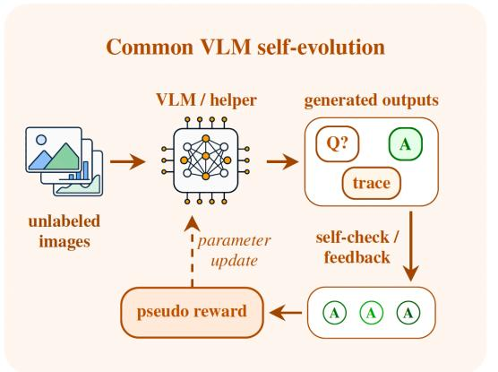

flowchart

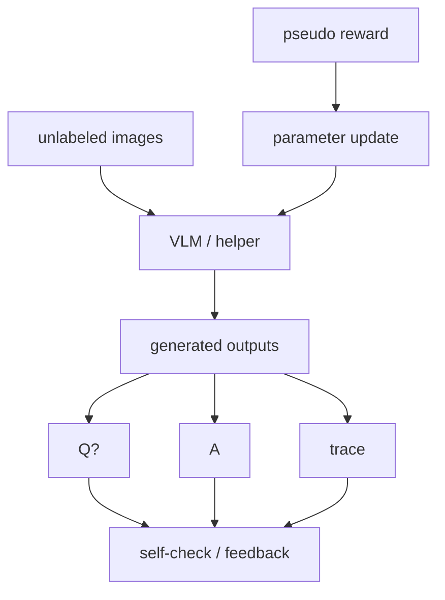

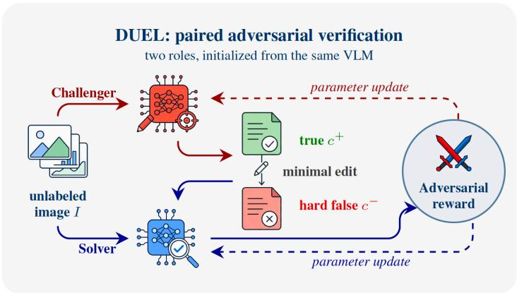

flowchart

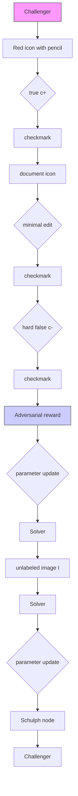

Figure 2 DUEL compared with common VLM self-evolution flows. Prior self-play and self-evolving VLM methods typically generate questions, answers, or rationales from unlabeled images and derive pseudo-rewards via agreement, self-checking, or tool feedback. In contrast, DUEL employs two adversarial roles: a Challenger generates a true claim and a minimally edited hard negative, while a Solver verifies both against the image. The resulting adversarial outcome updates both agents, providing grounded supervision without labels, teachers, external verifiers, or image editing. Fig. 3 illustrates the overall workflow.

The central challenge is constructing scalable training signals that remain grounded in visual evidence without relying on additional human annotations or external reward supervision. To this end, we propose DUEL, which derives supervision entirely from adversarial interactions between two policies instantiated from the same pretrained VLM. DUEL follows a two-stage workflow:

1. Adversarial Paired Claim Generation: A Challenger produces an image-grounded true claim and a minimally perturbed hard-negative, constructing near-neighbor supervision that cannot be resolved through language priors alone.   
2. Calibrated Claim Verification: A Solver verifies claim truthfulness under a length-normalized likelihood reward that promotes consistently confident correctness while penalizing confident errors.

By coupling near-neighbor adversarial supervision with calibrated rewards, DUEL turns unlabeled images into reliable training signals that tightly ground learning in visual evidence, requiring no external annotations, teacher models, verifiers, or image transformations. The main contributions of this paper are:

• New Perspective. We formulate self-evolving VLM reasoning as an adversarial verification game on unlabeled images, deriving training signals from adversarial outcome verification rather than additional human supervision or self-agreement.   
• Adversarial Self-Play Framework. We propose DUEL, a Challenger–Solver paradigm with near-neighbor paired claims and a confidence-calibrated reward, enabling fine-grained visual discrimination through zero-sum outcome-based optimization.

• Theoretical Grounding. We prove that (i) the adversarial game admits a Nash equilibrium under standard assumptions; (ii) near-neighbor negatives theoretically encourage higher mutual dependence between Solver decisions and visual evidence; and (iii) the adversarial objective induces an adaptive curriculum where task difficulty increases with Solver competence.   
• Empirical Validation. We conduct extensive experiments on fine-grained visual reasoning and robust discrimination benchmarks, demonstrating consistent gains and improved stability.

# 2 Related Work

Supervised Multimodal Pretraining. Early vision-language models were primarily trained under supervised learning paradigms, relying on large-scale human-annotated datasets (Tan and Bansal, 2019; Chen et al., 2020). Subsequent joint vision-language pretraining approaches (Li et al., 2019; Lu et al., 2019; Li et al., 2020) aligned visual and textual representations through cross-modal encoders. CLIP (Radford et al., 2021) further advanced this direction via large-scale contrastive learning on web-scale image-text pairs, significantly improving transferability. Building on these advances, Flamingo (Alayrac et al., 2022) and BLIP-2 (Li et al., 2023) extended large language models to multimodal settings using cross-attention and lightweight bridging modules. Despite their success, these approaches remain heavily dependent on curated data or high-quality supervision.

RLHF-Based Multimodal Alignment. Reinforcement Learning from Human Feedback (RLHF) has become a dominant paradigm for aligning large language models (Schulman et al., 2017; Ouyang et al., 2022), and has been extended to multimodal settings. Methods such as Factually Augmented RLHF (Sun et al., 2024) train reward models using human preference data to improve factual grounding, while DPO (Rafailov et al., 2023) and related approaches directly optimize policies from preference comparisons without explicit reward modeling. However, these methods rely on externally provided preference pairs or static preference signals. In contrast, DUEL constructs training signals online through adversarial self-play on unlabeled images.

Self-Play and Self-Evolving Learning Paradigms. Recent work reduces human supervision by leveraging automated training signals. LLaVA (Liu et al., 2023) synthesizes multimodal instruction data using strong language models, while VLM-RM (Rocamonde et al., 2023), RL-VLM-F (Wang et al., 2024b), and Eureka (Ma et al., 2023) construct or optimize reward functions with foundation models. More closely related to our work, Vision-Zero (Wang et al., 2025), EvoLMM (Thawakar et al., 2025), and VisPlay (He et al., 2025) explore self-play and self-consistency mechanisms for learning from unlabeled images. However, these methods primarily rely on agreement-based or consistency-based signals, which may reinforce biased predictions and provide weak visual grounding. In contrast, DUEL formulates self-play as an adversarial paired verification game, where a Challenger generates near-neighbor counterfactual claims and a Solver verifies them against the image, encouraging fine-grained visually grounded discrimination.

# 3 Method

Problem Formulation. Let D denote an unlabeled image distribution and let I ∼ D be a sampled image. DUEL initializes two policies from the same pretrained VLM: a Challenger $\pi _ { \phi } ( c \mid I , z )$ that generates an image-grounded claim c conditioned on a polarity variable $z \in \{ 1 , 0 \}$ , and a Solver $\pi _ { \boldsymbol { \theta } } ( s \mid I , { c } )$ that outputs a verification sequence s and a decision $a = h ( s ) \in \{ \mathbf { y } \mathbf { e } \mathbf { s } , \mathtt { n } \circ \}$ . Here, z = 1 indicates that the generated claim should be true and z = 0 indicates that it should be false. In each episode, the Challenger constructs a paired instance $( c ^ { + } , c ^ { - } )$ by sampling $c ^ { + } \sim \pi _ { \phi } ( \cdot \mid I , z { = } 1 )$ and then $c ^ { - } \sim \pi _ { \phi } ( \cdot \mid I , c ^ { + } , z { = } 0 )$ , and the Solver is queried on both claims with fixed targets $y ^ { + } = y \mathsf { e s }$ and $y ^ { - } = \mathtt { n o }$ . No human labels or external verifiers are used. The objective of DUEL is to achieve self-supervised improvement of image-grounded verification via paired adversarial self-play.

In this section, we present DUEL, a self-evolving framework for training VLMs on unlabeled images via adversarial verification. DUEL instantiates a Challenger to generate an image-grounded true claim and a minimally perturbed hard-negative, and a Solver to verify claim truthfulness with a calibrated likelihood-based reward. An overview of DUEL is shown in Fig. 3.

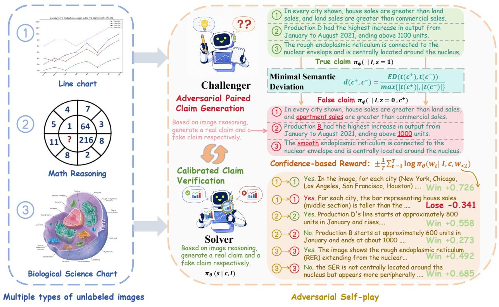

flowchart

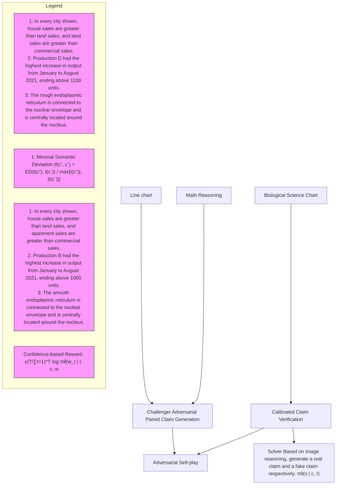

Figure 3 Overall framework of DUEL. Given an unlabeled image, the Challenger first generates an image-supported true claim and then constructs a minimally perturbed hard-negative false claim. The Solver verifies each claim against the image, and an outcome-based confidence reward provides the training signal to update both agents through adversarial self-play.

# 3.1 Adversarial Paired Claim Generation

Unsupervised self-evolution signals often suffer from weak visual grounding and reward bias, allowing models to exploit language priors without resolving fine-grained visual evidence (Zhou et al., 2024). DUEL instead generates a true claim paired with a minimally perturbed hard-negative, forcing near-neighbor discrimination and encouraging the model to rely more on visual evidence under tightly controlled semantics.

The Challenger is first prompted to generate a true image-grounded claim that requires visual reasoning evidence from the image I. It then samples an output sequence $o ^ { + }$ from its policy:

$$
o ^ {+} \sim \pi_ {\phi} (\cdot | I, z = 1), \tag {1}
$$

where $z \in \{ 0 , 1 \}$ is a conditioning variable indicating whether the claim should be true $( z = 1 )$ or false $( z = 0 )$ . We deterministically extract the claim text $c ^ { + }$ from $o ^ { + }$ via a parsing function $g ( \cdot )$ :

$$
c ^ {+} = g (o ^ {+}). \tag {2}
$$

For interpretability, $o ^ { + }$ also includes an image-evidence explanation $r ^ { + }$ that justifies why the claim holds for I .

Paired hard-negative (false) claim generation. A semantically unconstrained negative may be rejected by language plausibility alone, weakening supervision and bypassing visual evidence (Goyal et al., 2017). We therefore enforce minimal semantic deviation to induce near-neighbor false claims. To enforce minimal semantic deviation and construct an adversarial paired hard negative, the Challenger generates the false claim conditioned on both the image I and the previously generated true claim $c ^ { + } ,$ :

$$
o ^ {-} \sim \pi_ {\phi} (\cdot | I, c ^ {+}, z = 0), \quad c ^ {-} = g (o ^ {-}). \tag {3}
$$

This conditioning restricts the false claim to be a subtle modification of the true claim, thereby preventing trivial falsehoods and promoting fine-grained visual reasoning. We implement the minimal-deviation constraint with a token-level edit similarity. Let $\mathbf { t } ( c )$ denote the token sequence obtained from claim c after normalization and tokenization. Let $\mathrm { E D } ( \mathbf { t } ( c ^ { + } ) , \mathbf { t } ( c ^ { - } ) )$ ) denote the minimum number of insertions, deletions, and substitutions that transforms $\mathbf { t } ( c ^ { + } )$ into $\mathbf { t } ( c ^ { - } )$ . We use a length-normalized edit distance

$$
d (c ^ {+}, c ^ {-}) = \frac {\mathrm{ED} (\mathbf {t} (c ^ {+}) , \mathbf {t} (c ^ {-}))}{\max \{| \mathbf {t} (c ^ {+}) | , | \mathbf {t} (c ^ {-}) | \}}. \tag {4}
$$

A smaller $d ( c ^ { + } , c ^ { - } )$ indicates higher similarity and tighter semantic proximity. We define the minimal-deviation reward

$$
R _ {\mathrm{stealth}} (c ^ {+}, c ^ {-}) = \exp \big (- \alpha d (c ^ {+}, c ^ {-}) \big), \tag {5}
$$

with temperature $\alpha > 0$ controlling the strength of the constraint.

# 3.2 Calibrated Claim Verification

This module trains the Solver to perform fine-grained, image-grounded verification by learning calibrated binary decisions on paired near-neighbor claims. Given an image–claim pair $( I , c )$ , the Solver samples a verification sequence

$$
s \sim \pi_ {\theta} (\cdot \mid I, c), \tag {6}
$$

and deterministically maps it to a binary decision

$$
a = h (s) \in \{\text { yes }, \text { no } \}, \tag {7}
$$

where $h ( \cdot )$ extracts the decision token from s. The Solver is also required to produce a visual reasoning evidence string e before emitting the final decision. In each episode, the Solver is queried on both claims:

$$
s ^ {+} \sim \pi_ {\theta} (\cdot | I, c ^ {+}), \quad a ^ {+} = h \left(s ^ {+}\right), \tag {8}
$$

$$
s ^ {-} \sim \pi_ {\theta} (\cdot | I, c ^ {-}), a ^ {-} = h (s ^ {-}).
$$

The target labels are fixed by construction, $y ^ { + } = y \mathsf { e s }$ and $y ^ { - } = \mathtt { n o }$

Length-normalized verification reward. We use a length-normalized likelihood reward to discourage lucky guessing and low-quality outputs, and to provide a calibrated training signal that reflects the Solver’s confidence throughout the verification sequence. Let $s = ( w _ { 1 } , \dots , w _ { T } )$ denote the generated token sequence for a given $( I , c )$ . The conditional sequence probability is

$$
\pi_ {\theta} (s \mid I, c) = \prod_ {t = 1} ^ {T} \pi_ {\theta} (w _ {t} \mid I, c, w _ {<   t}), \tag {9}
$$

with log-likelihood, where we use $\ell _ { \theta } ( s \mid I , c )$ as the per-token log-likelihood score:

$$
\log \pi_ {\theta} (s \mid I, c) = \sum_ {t = 1} ^ {T} \log \pi_ {\theta} (w _ {t} \mid I, c, w _ {<   t}), \tag {10}
$$

$$
\ell_ {\theta} (s \mid I, c) = \frac {1}{T} \sum_ {t = 1} ^ {T} \log \pi_ {\theta} (w _ {t} \mid I, c, w _ {<   t}).
$$

We define the correctness sign as

$$
\sigma (a, y) = \left\{ \begin{array}{l l} + 1, & a = y, \\ - 1, & a \neq y. \end{array} \right. \tag {11}
$$

$$
R _ {S} (I, c, y, s) = \sigma (h (s), y) (- \ell_ {\theta} (s \mid I, c)). \tag {12}
$$

The outcome term $\sigma ( h ( s ) , y ) ~ \in ~ \{ - 1 , + 1 \}$ provides task-level correctness supervision, while the lengthnormalized likelihood term $- \ell _ { \theta } ( s | I , c )$ introduces a confidence-sensitive signal across different rollouts.

This reward preserves a graded training signal beyond binary correctness by distinguishing rollouts according to their sequence likelihood. As shown theoretically in Appendix C 5, this avoids advantage collapse under group-normalized optimization and maintains informative learning signals even when multiple rollouts share the same decision outcome.

# 3.3 Adversarial Self-play Strategy Optimization

DUEL is formulated as a zero-sum game between the Challenger and the Solver. The Challenger aims to reduce the Solver’s verification performance on paired claims while maintaining minimal semantic deviation between the true claim and its hard-negative counterpart. This design forces the Solver to learn fine-grained, image-grounded discrimination rather than exploiting language priors. Concretely, the Challenger receives the paired reward

$$
R _ {C} ^ {\text {pair}} (I, c ^ {+}, c ^ {-}, s ^ {+}, s ^ {-}) = - R _ {S} ^ {\text {pair}} (I, c ^ {+}, c ^ {-}, s ^ {+}, s ^ {-}) + \lambda_ {\text {stealth}} R _ {\text {stealth}} (c ^ {+}, c ^ {-}), \tag {13}
$$

where $\lambda _ { \mathrm { s t e a l t h } } \ge 0$ balances adversarial difficulty and minimal deviation. The resulting min–max learning objective is

$$
\max _ {\theta} \min _ {\phi} \mathbb {E} _ {I \sim \mathcal {D}} \Big [ R _ {S} ^ {\mathrm{pair}} (I, c ^ {+}, c ^ {-}, s ^ {+}, s ^ {-}) - \lambda_ {\mathrm{stealth}} R _ {\mathrm{stealth}} (c ^ {+}, c ^ {-}) \Big ]. \tag {14}
$$

To robustly optimize the Solver from sparse, outcome-based episode feedback and reduce gradient variance during self-play, DUEL adopts a sampling-based policy optimization scheme. The Solver is optimized with GRPO (Shao et al., 2024) by sampling K verification outputs per episode and using group-normalized paired rewards as advantages. The Challenger is updated from a single episode outcome.

Group normalization. Given a fixed context, let $\{ r ^ { ( k ) } \} _ { k = 1 } ^ { K }$ denote the rewards of K samples from the current policy. We apply group normalization:

$$
\mu_ {r} = \mathrm{mean} \Big [ r ^ {(k)} \Big ], \quad \sigma_ {r} = \mathrm{std} \Big [ r ^ {(k)} \Big ], \quad A ^ {(k)} = \frac {r ^ {(k)} - \mu_ {r}}{\sigma_ {r} + \epsilon}, \quad k = 1, \dots , K, \tag {15}
$$

where $\epsilon > 0$ is for numerical stability. We treat $A ^ { ( k ) }$ as a stop-gradient quantity.

Solver update (paired GRPO). For each episode $( I , c ^ { + } , c ^ { - } )$ , we draw K Solver samples $s ^ { + , ( k ) } \sim \pi _ { \theta } ( \cdot \mid I , c ^ { + } )$ and $s ^ { - , ( k ) } \sim \pi _ { \theta } ( \cdot \mid I , c ^ { - } )$ , and compute paired rewards

$$
r _ {S} ^ {(k)} \triangleq R _ {S} ^ {\text { pair }} (I, c ^ {+}, c ^ {-}, s ^ {+, (k)}, s ^ {-, (k)}), \quad k = 1, \dots , K. \tag {16}
$$

Applying Eq. (15) to $\{ r _ { S } ^ { ( k ) } \}$ yields ${ A } _ { S } ^ { ( k ) }$ , and we optimize:

$$
J _ {S} ^ {\text { pair }} (\theta) = \mathbb {E} \left[ \frac {1}{K} \sum_ {k = 1} ^ {K} A _ {S} ^ {(k)} \left(\log \pi_ {\theta} (s ^ {+, (k)} \mid I, c ^ {+}) + \log \pi_ {\theta} (s ^ {-, (k)} \mid I, c ^ {-})\right) \right]. \tag {17}
$$

Challenger update. The Challenger samples $o ^ { + } \sim \pi _ { \phi } ( \cdot \mid I , z = 1 )$ and then $o ^ { - } \sim \pi _ { \phi } ( \cdot \mid I , c ^ { + } , z = 0 )$ once per episode, inducing $( c ^ { + } , c ^ { - } )$ via $c ^ { \pm } = g ( o ^ { \pm } ) \qquad $ . Given the K Solver samples above, we form an episode-level outcome by averaging the paired Solver reward,

$$
\overline {{{R}}} _ {S} ^ {\text { pair }} \triangleq \frac {1}{K} \sum_ {k = 1} ^ {K} R _ {S} ^ {\text { pair }} (I, c ^ {+}, c ^ {-}, s ^ {+, (k)}, s ^ {-, (k)}), \tag {18}
$$

and define the corresponding episode-level Challenger reward

$$
\overline {{R}} _ {C} ^ {\text { pair }} \triangleq - \overline {{R}} _ {S} ^ {\text { pair }} + \lambda_ {\text { stealth }} R _ {\text { stealth }} (c ^ {+}, c ^ {-}). \tag {19}
$$

The Challenger objective is

$$
J _ {C} (\phi) = \mathbb {E} \left[ \overline {{{R}}} _ {C} ^ {\text { pair }} \left(\log \pi_ {\phi} (o ^ {+} \mid I, z = 1) + \log \pi_ {\phi} (o ^ {-} \mid I, c ^ {+}, z = 0)\right) \right], \tag {20}
$$

treating $\overline { { R } } _ { C } ^ { \mathrm { p a i r } }$ as a stop-gradient scalar.

Overall Pipeline. DUEL conducts adversarial self-play on unlabeled images with two coupled agents: a Challenger generating paired claims (one true and one minimally perturbed false claim), and a Solver verifying claim validity under a confidence-sensitive reward. The agents are optimized in a zero-sum game: the Solver improves verification robustness, while the Challenger learns to craft subtle yet challenging negatives under a minimal-deviation constraint. The entire process is contained in Appendix Algorithm 1.

# 4 Theoretical Properties

We provide theoretical analysis and proofs in Appendix C showing that DUEL improves visual grounding through near-neighbor supervision, preserves informative optimization signals under sparse rewards, induces adaptive curriculum-like self-play dynamics, and admits a stable adversarial game formulation.

Theorem 1 (Near-Neighbor Negatives Increase Visual Dependence). Let $c ^ { + }$ and $c ^ { - }$ denote paired claims with semantic distance

$$
d (c ^ {+}, c ^ {-}) = \frac {E D (t (c ^ {+}) , t (c ^ {-}))}{\max \{| t (c ^ {+}) | , | t (c ^ {-}) | \}}.
$$

As $d ( c ^ { + } , c ^ { - } ) \to 0 $ , linguistic separability between the paired claims decreases, and the Solver decision increasingly depends on image-conditioned evidence:

$$
I (a; I \mid c ^ {+}, c ^ {-}) \uparrow \quad \text { as } \quad d (c ^ {+}, c ^ {-}) \downarrow .
$$

Thus, near-neighbor counterfactual claims suppress language-only shortcuts and force the Solver to rely more heavily on fine-grained visual grounding.

Theorem 2 (Gradient Signal Preservation under Calibrated Rewards). Let

$$
R _ {\mathrm{out}} = \sigma (h (s), y)
$$

denote an outcome-only reward, and let

$$
R _ {S} = \sigma (h (s), y) (- \ell_ {\theta} (s \mid I, c))
$$

denote DUEL’s calibrated reward.

Under group-normalized optimization, outcome-only rewards may collapse to identical values across multiple rollouts, causing the advantage signal to vanish. In contrast, DUEL’s length-normalized likelihood reward preserves reward variability through sequence-likelihood differences, maintaining informative optimization signals even when multiple rollouts share the same decision outcome.

Theorem 3 (Adversarial Self-Play Induces Adaptive Difficulty). Let $\epsilon _ { t }$ denote the expected edit distance between paired claims at iteration t. Under adversarial optimization, if Solver capability improves, the Challenger’s optimal response satisfies

$$
\epsilon_ {t + 1} \leq \epsilon_ {t}.
$$

Therefore, DUEL automatically generates progressively harder near-neighbor examples, inducing a curriculumlike training process where task difficulty co-evolves with Solver competence.

Corollary 1 (Stable Adversarial Game Formulation). Let

$$
V (\theta , \phi) = \mathbb {E} _ {I \sim D} \left[ R _ {S} ^ {\mathrm{pair}} - \lambda_ {\mathrm{stealth}} R _ {\mathrm{stealth}} \right]
$$

denote the DUEL game value. Under standard compactness and continuity assumptions on the Challenger and Solver policy classes, the zero-sum game

$$
\max _ {\theta} \min _ {\phi} V (\theta , \phi)
$$

admits a mixed-strategy Nash equilibrium. This establishes that DUEL defines a stable adversarial learning framework rather than uncontrolled self-play.

# 5 Experiments

# 5.1 Experimental Setup

Datasets. We train and evaluate DUEL on mathematical and visually grounded reasoning tasks. For training, we follow the data setup of EvoLMM (Thawakar et al., 2025) and construct an unlabeled image pool by sampling about 1,000 images from each of six benchmarks, including ChartQA (Masry et al., 2022), AI2D (Kembhavi et al., 2016), InfographicVQA (Mathew et al., 2022), PlotQA (Methani et al., 2020), ChartX (Xia et al., 2025), and Geometry3K (Lu et al., 2021), resulting in roughly 6,000 images in total. These sources span charts, plots, scientific diagrams, and geometric figures, providing diverse visual inputs for adversarial self-evolving training using images only. For evaluation, we assess DUEL on a broader suite of reasoning benchmarks, including ChartQA (Masry et al., 2022), MathVerse (Zhang et al., 2024), MathVista (Lu et al., 2023), AI2D (Kembhavi et al., 2016), VisNumBench (Weng et al., 2025), ScienceQA (Lu et al., 2022), MuirBench (Wang et al., 2024a) and MMMU (Yue et al., 2024), and conduct all evaluations with lmms-eval (Zhang et al., 2025).

Baselines and Models. We compare DUEL with three unsupervised methods (MM-UPT (Wei et al., 2025), Vision-Zero (Wang et al., 2025), EvoLMM (Thawakar et al., 2025)) and two supervised methods requiring human annotations (VLAA-Thinker-7B (Chen et al., 2025), OpenVLThinker-7B (Deng et al., 2025)). To validate architecture generality, we apply DUEL to four VLMs with diverse vision encoders: Qwen2.5-VL-7B/3B (Bai et al., 2025), Gemma3-12B-IT (Team et al., 2025), and InternVL3-8B (Zhu et al., 2025), all using identical hyperparameters and 1K unlabeled images. We evaluate on 8 benchmarks spanning mathematical reasoning (MathVerse, MathVista, VisNumBench), chart understanding (ChartQA, AI2D), and general reasoning (ScienceQA, MMMU, MuirBench). The Solver and Challenger are instantiated as separate policies $( \pi _ { \theta } , \pi _ { \phi } )$ initialized from the same pretrained checkpoint.

Training Settings. For self-play optimization, we sample K = 3 Solver rollouts per claim, update the Challenger every $f _ { C } = 2$ iterations, and train for T = 5000 steps. The stealth regularization weight is set to $\lambda _ { \mathrm { s t e a l t h } } = 0 . 2$ and the temperature in the stealth reward to α = 5. We apply LoRA (r = 16, α = 32) to all attention and MLP projection layers while freezing the vision encoder. All experiments use two NVIDIA H200 GPUs with HuggingFace Transformers v4.38, with a learning rate of $1 \times 1 0 ^ { - 6 }$ . Training takes approximately 24 hours for the 7B model.

# 5.2 Main Results

We evaluate DUEL on 8 benchmarks spanning mathematical reasoning, chart/document understanding, and general visual reasoning. Fig. 1 and Table 1 compare DUEL against the base model and representative baselines. We highlight three key findings:

Broad and consistent improvement. DUEL (Solver) achieves the highest or tied-highest accuracy on 6 out of 8 benchmarks, yielding an average improvement of +1.4% over the base Qwen2.5-VL-7B. Gains are distributed across all three task categories, mathematical reasoning (MathVerse +1.4%, MathVista +1.4%), chart understanding (ChartQA +2.1%, AI2D +1.6%), and general reasoning (ScienceQA +1.3%, MuirBench +1.2%), demonstrating that DUEL’s adversarial self-play strengthens diverse capabilities simultaneously rather than specializing in a single domain.

Superiority over both unsupervised and supervised baselines. DUEL outperforms all three unsupervised methods (MM-UPT, Vision-Zero, EvoLMM) as well as the supervised methods VLAA-Thinker and OpenVL-Thinker on average, despite using zero human annotations. Moreover, DUEL (Solver) consistently outperforms

Table 1 Comprehensive results on visual reasoning benchmarks. Best results per base model are in bold. ∆ denotes improvement of DUEL (Solver) over the base model (Qwen2.5-VL-7B). Standard deviations are computed over 5 random samplings. DUEL outperforms baselines on 6 out of 8 benchmarks. 

<table><tr><td rowspan="2">Method</td><td colspan="3">Mathematical Reasoning</td><td colspan="2">Chart &amp; Document</td><td colspan="3">General Reasoning</td><td rowspan="2">Avg.</td></tr><tr><td>MathVerse</td><td>MathVista</td><td>VisNum</td><td>ChartQA</td><td>AI2D</td><td>ScienceQA</td><td>MMMU</td><td>MuirBench</td></tr><tr><td>Qwen2.5-VL-7B</td><td>43.8</td><td>68.4</td><td>41.7</td><td>83.4</td><td>82.6</td><td>88.1</td><td>51.2</td><td>58.0</td><td>64.6</td></tr><tr><td>MM-UPT</td><td>43.7</td><td>69.4</td><td>41.6</td><td>84.7</td><td>82.8</td><td>88.3</td><td>51.5</td><td>58.5</td><td>65.1</td></tr><tr><td>Vision-Zero(CLEVR)</td><td>44.1</td><td>70.6</td><td>42.3</td><td>84.9</td><td>83.7</td><td>88.2</td><td>51.7</td><td>58.6</td><td>65.5</td></tr><tr><td>EvoLMM</td><td>44.6</td><td>69.7</td><td>41.9</td><td>85.1</td><td>83.4</td><td>88.4</td><td>51.9</td><td>58.9</td><td>65.5</td></tr><tr><td>VLAA-Thinker-7B</td><td>44.3</td><td>68.2</td><td>41.8</td><td>83.8</td><td>83.5</td><td>88.9</td><td>52.1</td><td>58.2</td><td>65.1</td></tr><tr><td>OpenVLThinker-7B</td><td>44.3</td><td>68.9</td><td>42.2</td><td>84.5</td><td>83.3</td><td>88.6</td><td>51.8</td><td>58.8</td><td>65.3</td></tr><tr><td>DUEL (Challenger)</td><td> $44.5 \pm 0.42$ </td><td> $68.6 \pm 0.21$ </td><td> $41.9 \pm 0.31$ </td><td> $84.4 \pm 0.23$ </td><td> $83.5 \pm 0.33$ </td><td> $88.5 \pm 0.21$ </td><td> $51.4 \pm 0.31$ </td><td> $58.6 \pm 0.23$ </td><td>65.2</td></tr><tr><td>DUEL (Solver)</td><td> $45.2 \pm 0.34$ </td><td> $69.8 \pm 0.32$ </td><td> $42.7 \pm 0.27$ </td><td> $85.5 \pm 0.33$ </td><td> $84.2 \pm 0.29$ </td><td> $89.4 \pm 0.18$ </td><td> $51.9 \pm 0.24$ </td><td> $59.2 \pm 0.46$ </td><td>66.0</td></tr><tr><td>Δ vs Base</td><td>+1.4%</td><td>+1.4%</td><td>+1.0%</td><td>+2.1%</td><td>+1.6%</td><td>+1.3%</td><td>+0.7%</td><td>+1.2%</td><td>+1.4%</td></tr></table>

Table 2 Cross-architecture evaluation of DUEL across diverse vision-language model backbones. 

<table><tr><td rowspan="2">Model</td><td rowspan="2">Method</td><td colspan="3">Mathematical Reasoning</td><td colspan="2">Chart &amp; Document</td><td colspan="3">General Reasoning</td><td rowspan="2">Avg.</td></tr><tr><td>MathVerse</td><td>MathVista</td><td>VisNum</td><td>ChartQA</td><td>AI2D</td><td>ScienceQA</td><td>MMMU</td><td>MuirBench</td></tr><tr><td rowspan="2">Qwen2.5-VL-3B</td><td>Base</td><td>36.2</td><td>59.0</td><td>34.6</td><td>72.9</td><td>73.0</td><td>75.0</td><td>42.7</td><td>45.3</td><td>54.8</td></tr><tr><td>+ DUEL (ours)</td><td>37.4</td><td>60.3</td><td>35.7</td><td>73.6</td><td>73.7</td><td>75.9</td><td>43.8</td><td>46.4</td><td>55.9</td></tr><tr><td rowspan="2">Qwen2.5-VL-7B</td><td>Base</td><td>43.8</td><td>68.4</td><td>41.7</td><td>83.4</td><td>82.6</td><td>88.1</td><td>51.2</td><td>58.0</td><td>64.6</td></tr><tr><td>+ DUEL (ours)</td><td>45.2</td><td>69.8</td><td>42.7</td><td>85.5</td><td>84.2</td><td>89.4</td><td>51.9</td><td>59.2</td><td>66.0</td></tr><tr><td rowspan="2">InternVL3-8B</td><td>Base</td><td>31.2</td><td>65.2</td><td>43.6</td><td>82.3</td><td>83.3</td><td>96.4</td><td>52.9</td><td>39.4</td><td>61.8</td></tr><tr><td>+ DUEL (ours)</td><td>33.6</td><td>67.8</td><td>46.2</td><td>84.1</td><td>85.2</td><td>97.7</td><td>54.1</td><td>40.2</td><td>63.6</td></tr><tr><td rowspan="2">Gemma3-12B-IT</td><td>Base</td><td>28.7</td><td>60.3</td><td>37.6</td><td>55.8</td><td>78.8</td><td>87.0</td><td>48.1</td><td>43.7</td><td>55.0</td></tr><tr><td>+ DUEL (ours)</td><td>30.2</td><td>63.1</td><td>38.8</td><td>57.1</td><td>80.9</td><td>87.1</td><td>49.4</td><td>45.9</td><td>56.6</td></tr></table>

DUEL (Challenger) across all benchmarks, confirming that the verification policy benefits more directly from the confidence-calibrated reward and repeated exposure to near-neighbor claim pairs.

# 5.3 Cross-Architecture Generalization

Effectiveness of DUEL across different vision-language model backbones. We apply the same Challenger–Solver adversarial self-play training to four VLM families without changing architecture, supervision, or training hyperparameters. On Qwen2.5-VL-7B, DUEL consistently improves performance across reasoning benchmarks, including ChartQA (83.4% → 85.5%) and ScienceQA (88.1% → 89.4%). Similar improvements are observed on Qwen2.5-VL-3B (+2.0% relative average improvement), InternVL3-8B (+2.9%), and Gemma3-12B-IT (+2.9%), despite their substantially different vision encoders and multimodal fusion strategies. Improvements are consistently observed across mathematical reasoning, chart understanding, and general reasoning benchmarks, suggesting that DUEL functions as a broadly compatible post-training framework rather than being tied to a specific VLM architecture.

# 5.4 Ablation Studies

We ablate three components (Table 3): (i) “DUEL w/o paired neg” samples negatives independently without conditioning on $c ^ { + } ;$ ; (ii) “DUEL w/o stealth” sets $\lambda _ { \mathrm { s t e a l t h } } = 0 ; \mathrm { ( i i i ) }$ “DUEL w/o calib” replaces the likelihood reward with an outcome-only signal $\sigma ( h ( s ) , y )$ . Results reveal a clear hierarchy: removing paired negatives causes the largest drop (ChartQA, −2.8%), confirming near-neighbor construction as the primary driver; removing stealth yields moderate degradation (AI2D, −1.6%), indicating the deviation constraint keeps negatives informative; removing calibration shows the smallest but consistent decline (MuirBench −0.5%), suggesting it refines rollout quality beyond binary correctness.

Table 3 Ablation results of DUEL with controlled component removal. ✓ indicates the component is enabled and × indicates it is disabled. 

<table><tr><td colspan="4">Components</td><td colspan="4">Mathematical Reasoning</td><td colspan="4">General Reasoning</td></tr><tr><td colspan="2">Paired Neg</td><td>Stealth</td><td>Calib</td><td>ChartQA</td><td>MathVerse</td><td>MathVista</td><td>VisNum</td><td>AI2D</td><td>ScienceQA</td><td>MMMU</td><td>MuirBench</td></tr><tr><td colspan="2">√</td><td>√</td><td>×</td><td>85.1</td><td>44.7</td><td>69.2</td><td>42.1</td><td>83.4</td><td>88.6</td><td>51.4</td><td>58.7</td></tr><tr><td colspan="2">√</td><td>×</td><td>√</td><td>84.6</td><td>44.4</td><td>68.9</td><td>41.8</td><td>82.6</td><td>88.9</td><td>51.2</td><td>58.5</td></tr><tr><td colspan="2">×</td><td>√</td><td>√</td><td>82.7</td><td>43.9</td><td>68.5</td><td>41.5</td><td>82.7</td><td>88.6</td><td>50.8</td><td>58.2</td></tr><tr><td colspan="2">√</td><td>√</td><td>√</td><td>85.5</td><td>45.2</td><td>69.8</td><td>42.7</td><td>84.2</td><td>89.4</td><td>51.9</td><td>59.2</td></tr></table>

Table 4 Data scaling analysis. DUEL achieves consistent improvement with as few as 1K unlabeled images. 

<table><tr><td>Data Size</td><td>VisNum</td><td>ChartQA</td><td>AI2D</td><td>ScienceQA</td><td>MMMU</td><td>MuirBench</td><td>Avg.</td></tr><tr><td>Qwen2.5-VL-7B</td><td>41.7</td><td>83.4</td><td>82.6</td><td>88.1</td><td>51.2</td><td>58.0</td><td>67.5</td></tr><tr><td>+ DUEL</td><td></td><td></td><td></td><td></td><td></td><td></td><td></td></tr><tr><td>1K images</td><td>42.9</td><td>85.2</td><td>85.4</td><td>89.3</td><td>51.9</td><td>59.4</td><td>69.0</td></tr><tr><td>3K images</td><td>42.7</td><td>85.4</td><td>85.4</td><td>89.3</td><td>51.9</td><td>59.7</td><td>69.1</td></tr><tr><td>6K images</td><td>42.8</td><td>85.6</td><td>85.6</td><td>89.6</td><td>51.8</td><td>59.6</td><td>69.2</td></tr><tr><td>12K images</td><td>43.2</td><td>85.8</td><td>85.4</td><td>89.5</td><td>52.1</td><td>59.8</td><td>69.3</td></tr></table>

# 5.5 Data Efficiency

Table 4 examines the effect of training data scale. DUEL achieves near-full performance with just 1K unlabeled images (Avg. 69.0), and increasing the data by 12× yields only a marginal gain (+0.3, Avg. 69.3). This suggests that adversarial self-play, rather than data volume, is the primary driver of improvement, making DUEL effective in annotation-scarce settings.

# 5.6 Sensitivity Analysis

We analyze the sensitivity of DUEL to key hyperparameters (Fig. 4). Increasing $\lambda _ { \mathrm { s t e a l t h } }$ improves solver win rate but degrades accuracy beyond moderate values, with best performance around $\lambda _ { \mathrm { s t e a l t h } } { \approx } 0 . 2 – 0 . 3$ . A similar trend is observed for the stealth temperature α, where performance peaks near α ≈ 5. Increasing the number of solver rollouts K improves accuracy up to K ≈ 3–4, after which gains saturate. Training remains stable across iterations T , with performance improving steadily before plateauing around 4k–6k steps.

# 6 Conclusion

We introduce DUEL, an adversarial verification-based self-play framework for VLMs reasoning that derives training signals entirely from outcome verification between two internal policies, requiring no additional human annotations, external reward models, or image editing tools during post-training. Our Challenger–Solver paradigm generates near-neighbor claim pairs with minimal semantic deviation and optimizes verification through a length-normalized likelihood reward that provides richer optimization signal beyond binary correctness. Experiments show DUEL consistently outperforms both unsupervised and supervised baselines across benchmarks, and achieves these gains with high data efficiency and low training cost, providing a scalable, architecture-agnostic, and economical path toward self-improving VLMs.

# References

Jean-Baptiste Alayrac, Jeff Donahue, Pauline Luc, Antoine Miech, Iain Barr, Yana Hasson, Karel Lenc, Arthur Mensch, Katherine Millican, Malcolm Reynolds, et al. Flamingo: a visual language model for few-shot learning. Advances in neural information processing systems, 35:23716–23736, 2022.   
Shuai Bai, Keqin Chen, Xuejing Liu, Jialin Wang, Wenbin Ge, Sibo Song, Kai Dang, Peng Wang, Shijie Wang, Jun

# Qwen-2.5-VL-7B-Instruct

(a) Stealth weight λstealth   
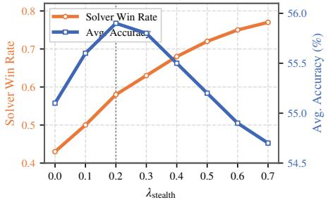

line

| λ_stealth | Solver Win Rate | Avg. Accuracy (%) |
| --------- | --------------- | ----------------- |
| 0.0       | 0.43            | 55.0              |
| 0.1       | 0.50            | 55.5              |
| 0.2       | 0.58            | 56.0              |
| 0.3       | 0.63            | 55.8              |
| 0.4       | 0.68            | 55.5              |
| 0.5       | 0.72            | 55.2              |
| 0.6       | 0.75            | 54.9              |
| 0.7       | 0.78            | 54.6              |

(b) Stealth temperature α   
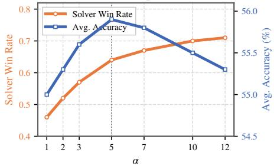

line

| α   | Solver Win Rate | Avg. Accuracy (%) |
| --- | --------------- | ----------------- |
| 1   | 0.45            | 55.0              |
| 2   | 0.52            | 55.3              |
| 3   | 0.58            | 55.8              |
| 5   | 0.64            | 56.0              |
| 7   | 0.67            | 55.8              |
| 10  | 0.70            | 55.5              |
| 12  | 0.71            | 55.2              |

(c) Solver rollouts K   
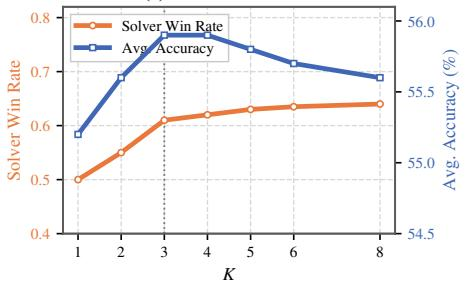

line

| K | Solver Win Rate | Avg. Accuracy (%) |
|---|-----------------|-------------------|
| 1 | 0.5             | 55.0              |
| 2 | 0.55            | 55.5              |
| 3 | 0.6             | 56.0              |
| 4 | 0.62            | 56.0              |
| 5 | 0.63            | 55.8              |
| 6 | 0.64            | 55.6              |
| 8 | 0.64            | 55.5              |

(d) Training iterations T   
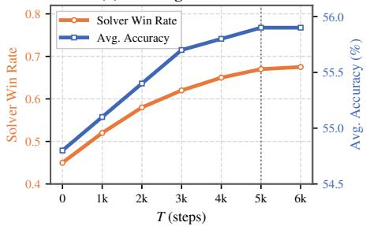

line

| T (steps) | Solver Win Rate | Avg. Accuracy (%) |
| --------- | --------------- | ----------------- |
| 0         | 0.45            | 54.7              |
| 1k        | 0.52            | 55.2              |
| 2k        | 0.58            | 55.7              |
| 3k        | 0.62            | 56.0              |
| 4k        | 0.65            | 56.1              |
| 5k        | 0.67            | 56.2              |
| 6k        | 0.68            | 56.2              |

Figure 4 Sensitivity Analysis of DUEL on Qwen-2.5-VL-7B-Instruct. We vary key training hyperparameters, including (a) stealth weight $\lambda _ { \mathrm { s t e a l t h } } ,$ (b) stealth temperature α, (c) number of solver rollouts K, and (d) training iterations T . We report Solver Win Rate (orange) and Average Accuracy (blue).

Tang, Humen Zhong, Yuanzhi Zhu, Mingkun Yang, Zhaohai Li, Jianqiang Wan, Pengfei Wang, Wei Ding, Zheren Fu, Yiheng Xu, Jiabo Ye, Xi Zhang, Tianbao Xie, Zesen Cheng, Hang Zhang, Zhibo Yang, Haiyang Xu, and Junyang Lin. Qwen2.5-vl technical report, 2025. https://arxiv.org/abs/2502.13923.   
Hardy Chen, Haoqin Tu, Fali Wang, Hui Liu, Xianfeng Tang, Xinya Du, Yuyin Zhou, and Cihang Xie. Sft or rl? an early investigation into training r1-like reasoning large vision-language models. arXiv preprint arXiv:2504.11468, 2025.   
Xi Chen, Xiao Wang, Soravit Changpinyo, Piotr Padlewski, Daniel Salz, Sebastian Goodman, Adam Grycner, Basil Mustafa, Lucas Beyer, et al. Pali: A jointly-scaled multilingual language-image model. arXiv preprint arXiv:2209.06794, 2022.   
Yen-Chun Chen, Linjie Li, Licheng Yu, Ahmed El Kholy, Faisal Ahmed, Zhe Gan, Yu Cheng, and Jingjing Liu. Uniter: Universal image-text representation learning. In European conference on computer vision, pages 104–120. Springer, 2020.   
Wenliang Dai, Junnan Li, Dongxu Li, Anthony Tiong, Junqi Zhao, Weisheng Wang, Boyang Li, Pascale N Fung, and Steven Hoi. Instructblip: Towards general-purpose vision-language models with instruction tuning. Advances in neural information processing systems, 36:49250–49267, 2023.   
Yihe Deng, Hritik Bansal, Fan Yin, Nanyun Peng, Wei Wang, and Kai-Wei Chang. Openvlthinker: Complex vision-language reasoning via iterative sft-rl cycles. arXiv preprint arXiv:2503.17352, 2025.   
I. L. Glicksberg. A further generalization of the Kakutani Fixed-Point Theorem, with Application to Nash Equilibrium Points. RAND Corporation Paper, P-193, 1950. https://www.rand.org/pubs/papers/P193.html.   
Yash Goyal, Tejas Khot, Douglas Summers-Stay, Dhruv Batra, and Devi Parikh. Making the v in vqa matter: Elevating the role of image understanding in visual question answering. In Proceedings of the IEEE conference on computer vision and pattern recognition, pages 6904–6913, 2017.   
Yicheng He, Chengsong Huang, Zongxia Li, Jiaxin Huang, and Yonghui Yang. Visplay: Self-evolving vision-language models from images. arXiv preprint arXiv:2511.15661, 2025.   
Aniruddha Kembhavi, Mike Salvato, Eric Kolve, Minjoon Seo, Hannaneh Hajishirzi, and Ali Farhadi. A diagram is worth a dozen images. In European conference on computer vision, pages 235–251. Springer, 2016.

Gen Li, Nan Duan, Yuejian Fang, Ming Gong, and Daxin Jiang. Unicoder-vl: A universal encoder for vision and language by cross-modal pre-training. In Proceedings of the AAAI conference on artificial intelligence, volume 34, pages 11336–11344, 2020.   
Junnan Li, Dongxu Li, Caiming Xiong, and Steven Hoi. Blip: Bootstrapping language-image pre-training for unified vision-language understanding and generation. In International conference on machine learning, pages 12888–12900. PMLR, 2022.   
Junnan Li, Dongxu Li, Silvio Savarese, and Steven Hoi. Blip-2: Bootstrapping language-image pre-training with frozen image encoders and large language models. In International conference on machine learning, pages 19730–19742. PMLR, 2023.   
Liunian Harold Li, Mark Yatskar, Da Yin, Cho-Jui Hsieh, and Kai-Wei Chang. Visualbert: A simple and performant baseline for vision and language. arXiv preprint arXiv:1908.03557, 2019.   
Haotian Liu, Chunyuan Li, Qingyang Wu, and Yong Jae Lee. Visual instruction tuning. Advances in neural information processing systems, 36:34892–34916, 2023.   
Yexiang Liu, Jie Cao, Zekun Li, Ran He, and Tieniu Tan. Breaking mental set to improve reasoning through diverse multi-agent debate. In The Thirteenth International Conference on Learning Representations, 2025.   
Jiasen Lu, Dhruv Batra, Devi Parikh, and Stefan Lee. Vilbert: Pretraining task-agnostic visiolinguistic representations for vision-and-language tasks. Advances in neural information processing systems, 32, 2019.   
Pan Lu, Ran Gong, Shibiao Jiang, Liang Qiu, Siyuan Huang, Xiaodan Liang, and Song-Chun Zhu. Inter-gps: Interpretable geometry problem solving with formal language and symbolic reasoning. In Proceedings of the 59th Annual Meeting of the Association for Computational Linguistics and the 11th International Joint Conference on Natural Language Processing (Volume 1: Long Papers), pages 6774–6786, 2021.   
Pan Lu, Swaroop Mishra, Tanglin Xia, Liang Qiu, Kai-Wei Chang, Song-Chun Zhu, Oyvind Tafjord, Peter Clark, and Ashwin Kalyan. Learn to explain: Multimodal reasoning via thought chains for science question answering. Advances in neural information processing systems, 35:2507–2521, 2022.   
Pan Lu, Hritik Bansal, Tony Xia, Jiacheng Liu, Chunyuan Li, Hannaneh Hajishirzi, Hao Cheng, Kai-Wei Chang, Michel Galley, and Jianfeng Gao. Mathvista: Evaluating mathematical reasoning of foundation models in visual contexts. arXiv preprint arXiv:2310.02255, 2023.   
Yecheng Jason Ma, William Liang, Guanzhi Wang, De-An Huang, Osbert Bastani, Dinesh Jayaraman, Yuke Zhu, Linxi Fan, and Anima Anandkumar. Eureka: Human-level reward design via coding large language models. arXiv preprint arXiv:2310.12931, 2023.   
Ahmed Masry, Xuan Long Do, Jia Qing Tan, Shafiq Joty, and Enamul Hoque. Chartqa: A benchmark for question answering about charts with visual and logical reasoning. In Findings of the association for computational linguistics: ACL 2022, pages 2263–2279, 2022.   
Minesh Mathew, Viraj Bagal, Rubèn Tito, Dimosthenis Karatzas, Ernest Valveny, and CV Jawahar. Infographicvqa. In Proceedings of the IEEE/CVF Winter Conference on Applications of Computer Vision, pages 1697–1706, 2022.   
Nitesh Methani, Pritha Ganguly, Mitesh M Khapra, and Pratyush Kumar. Plotqa: Reasoning over scientific plots. In Proceedings of the ieee/cvf winter conference on applications of computer vision, pages 1527–1536, 2020.   
Long Ouyang, Jeffrey Wu, Xu Jiang, Diogo Almeida, Carroll Wainwright, Pamela Mishkin, Chong Zhang, Sandhini Agarwal, Katarina Slama, Alex Ray, et al. Training language models to follow instructions with human feedback. Advances in neural information processing systems, 35:27730–27744, 2022.   
Alec Radford, Jong Wook Kim, Chris Hallacy, Aditya Ramesh, Gabriel Goh, Sandhini Agarwal, Girish Sastry, Amanda Askell, Pamela Mishkin, Jack Clark, et al. Learning transferable visual models from natural language supervision. In International conference on machine learning, pages 8748–8763. PmLR, 2021.   
Rafael Rafailov, Archit Sharma, Eric Mitchell, Christopher D Manning, Stefano Ermon, and Chelsea Finn. Direct preference optimization: Your language model is secretly a reward model. Advances in neural information processing systems, 36:53728–53741, 2023.   
Juan Rocamonde, Victoriano Montesinos, Elvis Nava, Ethan Perez, and David Lindner. Vision-language models are zero-shot reward models for reinforcement learning. arXiv preprint arXiv:2310.12921, 2023.   
John Schulman, Filip Wolski, Prafulla Dhariwal, Alec Radford, and Oleg Klimov. Proximal policy optimization algorithms. arXiv preprint arXiv:1707.06347, 2017.

Zhihong Shao, Peiyi Wang, Qihao Zhu, Runxin Xu, Junxiao Song, Xiao Bi, Haowei Zhang, Mingchuan Zhang, YK Li, et al. Deepseekmath: Pushing the limits of mathematical reasoning in open language models. arXiv preprint arXiv:2402.03300, 2024.   
Zhiqing Sun, Sheng Shen, Shengcao Cao, Haotian Liu, Chunyuan Li, Yikang Shen, Chuang Gan, Liangyan Gui, Yu-Xiong Wang, Yiming Yang, et al. Aligning large multimodal models with factually augmented rlhf. In Findings of the Association for Computational Linguistics: ACL 2024, pages 13088–13110, 2024.   
Hao Tan and Mohit Bansal. Lxmert: Learning cross-modality encoder representations from transformers. In Proceedings of the 2019 conference on empirical methods in natural language processing and the 9th international joint conference on natural language processing (EMNLP-IJCNLP), pages 5100–5111, 2019.   
Gemma Team, Aishwarya Kamath, Johan Ferret, Shreya Pathak, Nino Vieillard, Ramona Merhej, Sarah Perrin, Tatiana Matejovicova, Alexandre Rame, Morgane Rivière, et al. Gemma 3 technical report. arXiv preprint arXiv:2503.19786, 2025.   
Omkar Thawakar, Shravan Venkatraman, Ritesh Thawkar, Abdelrahman Shaker, Hisham Cholakkal, Rao Muhammad Anwer, Salman Khan, and Fahad Khan. Evolmm: Self-evolving large multimodal models with continuous rewards. arXiv preprint arXiv:2511.16672, 2025.   
Fei Wang, Xingyu Fu, James Y Huang, Zekun Li, Qin Liu, Xiaogeng Liu, Mingyu Derek Ma, Nan Xu, Wenxuan Zhou, Kai Zhang, et al. Muirbench: A comprehensive benchmark for robust multi-image understanding. arXiv preprint arXiv:2406.09411, 2024a.   
Qinsi Wang, Bo Liu, Tianyi Zhou, Jing Shi, Yueqian Lin, Yiran Chen, Hai Helen Li, Kun Wan, and Wentian Zhao. Vision-zero: Scalable vlm self-improvement via strategic gamified self-play. arXiv preprint arXiv:2509.25541, 2025.   
Yufei Wang, Zhanyi Sun, Jesse Zhang, Zhou Xian, Erdem Biyik, David Held, and Zackory Erickson. Rl-vlm-f: Reinforcement learning from vision language foundation model feedback. arXiv preprint arXiv:2402.03681, 2024b.   
Lai Wei, Yuting Li, Chen Wang, Yue Wang, Linghe Kong, Weiran Huang, and Lichao Sun. Unsupervised post-training for multi-modal llm reasoning via grpo. arXiv e-prints, pages arXiv–2505, 2025.   
Tengjin Weng, Jingyi Wang, Wenhao Jiang, and Zhong Ming. Visnumbench: Evaluating number sense of multimodal large language models. In Proceedings of the IEEE/CVF International Conference on Computer Vision, pages 3830–3840, 2025.   
Renqiu Xia, Hancheng Ye, Xiangchao Yan, Qi Liu, Hongbin Zhou, Zijun Chen, Botian Shi, Junchi Yan, and Bo Zhang. Chartx & chartvlm: A versatile benchmark and foundation model for complicated chart reasoning. IEEE Transactions on Image Processing, 2025.   
Tianyu Yu, Yuan Yao, Haoye Zhang, Taiwen He, Yifeng Han, Ganqu Cui, Jinyi Hu, Zhiyuan Liu, Hai-Tao Zheng, Maosong Sun, et al. Rlhf-v: Towards trustworthy mllms via behavior alignment from fine-grained correctional human feedback. In Proceedings of the IEEE/CVF Conference on Computer Vision and Pattern Recognition, pages 13807–13816, 2024.   
Weizhe Yuan, Richard Yuanzhe Pang, Kyunghyun Cho, Xian Li, Sainbayar Sukhbaatar, Jing Xu, and Jason E Weston. Self-rewarding language models. In Forty-first International Conference on Machine Learning, 2024.   
Xiang Yue, Yuansheng Ni, Kai Zhang, Tianyu Zheng, Ruoqi Liu, Ge Zhang, Samuel Stevens, Dongfu Jiang, Weiming Ren, Yuxuan Sun, et al. Mmmu: A massive multi-discipline multimodal understanding and reasoning benchmark for expert agi. In Proceedings of the IEEE/CVF conference on computer vision and pattern recognition, pages 9556–9567, 2024.   
Kaichen Zhang, Bo Li, Peiyuan Zhang, Fanyi Pu, Joshua Adrian Cahyono, Kairui Hu, Shuai Liu, Yuanhan Zhang, Jingkang Yang, Chunyuan Li, et al. Lmms-eval: Reality check on the evaluation of large multimodal models. In Findings of the Association for Computational Linguistics: NAACL 2025, pages 881–916, 2025.   
Renrui Zhang, Dongzhi Jiang, Yichi Zhang, Haokun Lin, Ziyu Guo, Pengshuo Qiu, Aojun Zhou, Pan Lu, Kai-Wei Chang, Yu Qiao, et al. Mathverse: Does your multi-modal llm truly see the diagrams in visual math problems? In European Conference on Computer Vision, pages 169–186. Springer, 2024.   
Andrew Zhao, Yiran Wu, Yang Yue, Tong Wu, Quentin Xu, Matthieu Lin, Shenzhi Wang, Qingyun Wu, Zilong Zheng, and Gao Huang. Absolute zero: Reinforced self-play reasoning with zero data. arXiv preprint arXiv:2505.03335, 2025.

Yiyang Zhou, Zhiyuan Fan, Dongjie Cheng, Sihan Yang, Zhaorun Chen, Chenhang Cui, Xiyao Wang, Yun Li, Linjun Zhang, and Huaxiu Yao. Calibrated self-rewarding vision language models. Advances in Neural Information Processing Systems, 37:51503–51531, 2024.   
Jinguo Zhu, Weiyun Wang, Zhe Chen, Zhaoyang Liu, Shenglong Ye, Lixin Gu, Hao Tian, Yuchen Duan, Weijie Su, Jie Shao, et al. Internvl3: Exploring advanced training and test-time recipes for open-source multimodal models. arXiv preprint arXiv:2504.10479, 2025.

# Appendix

# Table of Contents (Appendix)

A Limitations 16   
B Algorithm 16   
C Theoretical Analysis 16

C.1 Existence of Nash Equilibrium 17   
C.2 Equilibrium Characterization 17   
C.3 Information-Theoretic Justification for Near-Neighbor Negatives 18   
C.4 Adaptive Curriculum Property 19   
C.5 Variance Reduction via Length-Normalized Rewards 20

D Training Time Analysis. 20   
E Self-Play Training Dynamics 20   
F Cross-Domain Transfer 21   
G Hyperparameter Ablations 22   
H Training Details 24   
I Qualitative Examples 24

Algorithm 1: DUEL: Paired Adversarial Inference Refinement   
Input: Unlabeled image distribution D; pretrained VLM initialization for Challenger and Solver; stealth weight $\lambda_{stealth}$ ; temperature $\alpha$ (Eq. (5)); group size K; number of iterations T.

Output: Evolved Challenger $\pi_{\phi}$ and Solver $\pi_{\theta}$ .

1 Initialize $\pi_{\phi}$ (Challenger) and $\pi_{\theta}$ (Solver) from the same pretrained VLM;

2 for $t \leftarrow 1$ to T do

3    Sample an image $I \sim D$ ;

// Paired claim generation (Sec. 3.1)

4    Sample $o^{+} \sim \pi_{\phi}(\cdot | I, z=1)$ and parse $c^{+} = g(o^{+})$ ;

5    Sample $o^{-} \sim \pi_{\phi}(\cdot | I, c^{+}, z=0)$ and parse $c^{-} = g(o^{-})$ ;

6    Compute $R_{\text{stealth}}(c^{+}, c^{-})$ (Eq. (5));

// Solver K-sample verification (Sec. 3.2)

7    for $k \leftarrow 1$ to K do

8    Sample $s^{+, (k)} \sim \pi_{\theta}(\cdot | I, c^{+})$ and $s^{-, (k)} \sim \pi_{\theta}(\cdot | I, c^{-})$ ;

9    Compute paired reward $r_{S}^{(k)} \triangleq R_{S}^{\text{pair}}(I, c^{+}, c^{-}, s^{+, (k)}, s^{-, (k)})$ ;

// GRPO advantage (Sec. 3.3)

10    Compute group-normalized advantages $\{A_{S}^{(k)}\}_{k=1}^{K}$ from $\{r_{S}^{(k)}\}_{k=1}^{K}$ (Eq. (15));

// Solver update (paired GRPO)

11    Update $\theta$ by maximizing $J_{S}^{\text{pair}}(\theta)$ (Eq. (17));

// Challenger update (single-sample outcome)

12    Compute $\overline{R}_{S}^{\text{pair}} \triangleq \frac{1}{K} \sum_{k=1}^{K} r_{S}^{(k)}$ ;

13    Compute $\overline{R}_{C}^{\text{pair}} \triangleq -\overline{R}_{S}^{\text{pair}} + \lambda_{\text{stealth}} R_{\text{stealth}}(c^{+}, c^{-})$ ;

14    Update $\phi$ by maximizing $J_{C}(\phi)$ (Eq. (20));

15 return $\pi_{\phi}, \pi_{\theta}$ ;

# A Limitations

DUEL’s adversarial self-play operates on binary claim verification, a structured task that transfers well to diverse benchmarks (Tables 1–2) but does not directly optimize open-ended generation; extending the Challenger–Solver paradigm to free-form QA or captioning is a promising direction. Our training data consists of structured visual inputs (charts, scientific diagrams, geometric figures), and while cross-domain transfer results (Appendix F) show no catastrophic narrowing, the behavior on purely photographic scenes with complex spatial or commonsense reasoning warrants further study.

# B Algorithm

Please check Algorithm 1.

# C Theoretical Analysis

We provide theoretical grounding for DUEL by analyzing (i) the existence of equilibrium in the Challenger– Solver game, (ii) an information-theoretic justification for near-neighbor negatives, (iii) the adaptive curriculum property of adversarial self-play, and (iv) variance-reduction properties of the calibrated reward.

Notation. Let $\Delta \boldsymbol { c }$ and $\Delta _ { \mathcal { S } }$ denote the sets of mixed strategies (i.e., distributions over outputs) of the Challenger and Solver, respectively. For an image I, define the game value

$$
V (\theta , \phi) = \mathbb {E} _ {I \sim \mathcal {D}} \left[ R _ {S} ^ {\text { pair }} (I, c ^ {+}, c ^ {-}, s ^ {+}, s ^ {-}) - \lambda_ {\text { stealth }} R _ {\text { stealth }} (c ^ {+}, c ^ {-}) \right], \tag {21}
$$

so that DUEL solves maxθ minϕ $V ( \theta , \phi )$ .

# C.1 Existence of Nash Equilibrium

Proposition 1 (Existence of Equilibrium). Assume (A1) the image distribution D has finite support or is defined over a compact set; (A2) the policy class for both Challenger and Solver is parameterized by compact subsets $\Theta \subset \mathbb { R } ^ { d _ { \theta } }$ and $\Phi \subset \mathbb { R } ^ { d _ { \phi } }$ ; and (A3) the payoff $V ( \theta , \phi )$ is continuous in (θ, ϕ). Then a Nash equilibrium $( \theta ^ { * } , \phi ^ { * } )$ of the zero-sum game in Eq. (21) exists in mixed strategies.

Proof. Under (A1)–(A3), the game is a two-player zero-sum game with compact strategy spaces and a continuous payoff function. By Glicksberg’s generalization of von Neumann’s minimax theorem to continuous games (Glicksberg, 1950), a mixed-strategy Nash equilibrium exists. Because V is bounded (log-likelihoods are bounded for finite vocabularies), the minimax value is well defined:

$$
\max _ {\theta} \min _ {\phi} V (\theta , \phi) = \min _ {\phi} \max _ {\theta} V (\theta , \phi) = V ^ {*}.
$$

Remark 1. In practice, both policies are realized as neural networks with weight decay and gradient clipping, which implicitly enforce compactness of Θ and Φ. Continuity of V follows from the smoothness of the softmax output layer.

# C.2 Equilibrium Characterization

Proposition 2 (Equilibrium Properties). At any Nash equilibrium $( \theta ^ { * } , \phi ^ { * } )$ :

(a) Solver optimality. $\theta ^ { * }$ is a best response to $\phi ^ { * } .$ no alternative Solver policy can achieve higher expected paired reward under the claim distribution induced by $\phi ^ { * }$ .   
(b) Challenger maximality. $\phi ^ { * }$ minimizes the Solver’s expected reward subject to the stealth constraint:

$$
\phi^ {*} \in \arg \min _ {\phi} \mathbb {E} \big [ R _ {S} ^ {\text { pair }} \big ] - \lambda_ {\text { stealth }} \mathbb {E} \big [ R _ {\text { stealth }} \big ].
$$

(c) Balanced hardness. Define the per-polarity accuracies $\operatorname { A c c } ^ { + } = \operatorname* { P r } [ a ^ { + } = \mathbf { y } \mathbf { e } \mathbf { s } ]$ and $\mathrm { A c c } ^ { - } = \mathrm { P r } [ a ^ { - } = \mathbf { n o } ]$ . If the Challenger’s policy class is sufficiently expressive to independently modulate the marginal difficulty of true and false claims, then at equilibrium:

$$
\mathrm{Acc} ^ {+} (\theta^ {*}, \phi^ {*}) = \mathrm{Acc} ^ {-} (\theta^ {*}, \phi^ {*}).
$$

Proof. Parts (a) and (b) follow directly from the definition of Nash equilibrium in zero-sum games.

For (c), we require the additional assumption that the Challenger can independently modulate per-polarity difficulty. This is plausible because the Challenger controls both the true-claim distribution $\pi _ { \phi } ( \cdot \mid I , z { = } 1 )$ and, conditioned on $c ^ { + }$ , the false-claim distribution $\pi _ { \phi } ( \cdot \mid I , c ^ { + } , z { = } 0 )$ .

Suppose $\mathrm { A c c ^ { + } > A c c ^ { - } }$ at equilibrium. The Solver’s paired reward is $R _ { S } ^ { \mathrm { p a i r } } = R _ { S } ( I , c ^ { + } , y ^ { + } , s ^ { + } ) + R _ { S } ( I , c ^ { - } , y ^ { - } , s ^ { - } )$ Since ${ \mathrm { A c c } } ^ { + } > { \mathrm { A c c } } ^ { - }$ , the true-claim verification contributes more positively on average. The Challenger could increase its reward (i.e., decrease $R _ { S } ^ { \mathrm { p a i r } } )$ by shifting its true-claim distribution toward harder instances, thereby reducing $\mathrm { A c c ^ { + } }$ without necessarily affecting $\mathrm { A c c } ^ { - }$ . This contradicts $\phi ^ { * }$ being a best response. A symmetric argument applies when ${ \mathrm { A c c } } ^ { + } < { \mathrm { A c c } } ^ { - }$ . Therefore ${ \mathrm { A c c } } ^ { + } = { \mathrm { A c c } } ^ { - }$ at any equilibrium, and the Solver’s error is balanced across polarities. □

Remark 2. The expressiveness assumption in part (c) is mild in practice: the Challenger is a full VLM capable of generating diverse claims across a wide range of difficulty levels for both polarities. Empirically, we observe approximately balanced accuracy across polarities during training.

# C.3 Information-Theoretic Justification for Near-Neighbor Negatives

We show that Near-neighbor negatives increase visual dependence the Solver must extract from the image, preventing collapse to language-only shortcuts.

Proposition 3 (Visual Information Forcing). Let $c ^ { + }$ and $c ^ { - }$ be a paired claim pair for image $I ,$ and let $a \in \{ \mathbf { y } \mathbf { e s } , \mathbf { n o } \}$ be the Solver’s decision. Denote by $L ( c )$ the language-only features of claim c (independent $o f I )$ and by $\delta ( c ^ { + } , c ^ { - } ) = \| L ( c ^ { + } ) - L ( c ^ { - } ) \|$ their linguistic distance. Then the mutual information between the Solver’s decision and the image, conditioned on the claims, satisfies:

$$
I (a; I \mid c ^ {+}, c ^ {-}) \geq H (a \mid c ^ {+}, c ^ {-}) - h (\delta (c ^ {+}, c ^ {-})), \tag {22}
$$

where $h ( \cdot )$ is a monotonically non-decreasing function with $h ( 0 ) = 0$ . As $\delta ( c ^ { + } , c ^ { - } )  0$ , language-only features become uninformative and $I ( a ; I \mid c ^ { + } , c ^ { - } ) \to H ( a \mid c ^ { + } , c ^ { - } )$ , forcing the Solver to rely entirely on visual evidence.

Proof. We decompose the mutual information via the chain rule:

$$
I (a; I \mid c ^ {+}, c ^ {-}) = H (a \mid c ^ {+}, c ^ {-}) - H (a \mid I, c ^ {+}, c ^ {-}). \tag {23}
$$

The bound (22) is therefore equivalent to showing

$$
H (a \mid I, c ^ {+}, c ^ {-}) \leq h (\delta (c ^ {+}, c ^ {-})). \tag {24}
$$

Step 1: Relating residual entropy to language discriminability. For any Solver, the decision a can be decomposed into a component informed by language features and a component informed by visual features. Formally, by the data-processing inequality, a Solver that observes $( I , c ^ { + } , c ^ { - } )$ can achieve at most as much uncertainty reduction as one that observes all available information. We focus on the language-only Solver that observes only $( L ( c ^ { + } ) , L ( c ^ { - } ) )$ without access to I. Its residual uncertainty satisfies:

$$
H (a \mid L (c ^ {+}), L (c ^ {-})) \leq H (a \mid c ^ {+}, c ^ {-}), \tag {25}
$$

since $( L ( c ^ { + } ) , L ( c ^ { - } ) )$ is a deterministic function of $( c ^ { + } , c ^ { - } )$ and conditioning reduces entropy.

Step 2: Language discriminability vanishes as $\delta  0$ . When $\delta ( c ^ { + } , c ^ { - } ) = \| L ( c ^ { + } ) - L ( c ^ { - } ) \|  0$ , the language representations of the two claims become indistinguishable. A Solver relying solely on language features cannot discriminate between the claims, so:

$$
\lim _ {\delta \rightarrow 0} H (a \mid L \left(c ^ {+}\right), L \left(c ^ {-}\right)) = H (a), \tag {26}
$$

where $H ( a )$ is the marginal entropy of the decision (since language features provide no discriminative signal).

Step 3: Constructing the bounding function h. For a Solver with access to the image, we have the ordering:

$$
H (a \mid I, c ^ {+}, c ^ {-}) \leq H (a \mid c ^ {+}, c ^ {-}) \leq H (a).
$$

The first inequality holds because conditioning on additional information (the image) can only reduce uncertainty. Now, consider the amount of uncertainty that language features alone can resolve:

$$
\Delta_ {L} (\delta) := H (a \mid c ^ {+}, c ^ {-}) - H (a \mid L (c ^ {+}), L (c ^ {-}), c ^ {+}, c ^ {-}). \tag {27}
$$

Note that $\Delta _ { L } ( \delta )$ represents the mutual information between a and the language-based discriminative signal, given the claims. As $\delta  0 , L ( c ^ { + } ) \approx L ( c ^ { - } )$ and thus $\Delta _ { L } ( \delta )  0$ (language features carry no discriminative information). For any $\delta > 0 , \Delta _ { L } ( \delta ) \geq 0$ and is monotonically non-decreasing in δ (more linguistic distance provides more language-based discriminability).

Define:

$$
h (\delta) := H (a \mid c ^ {+}, c ^ {-}) - \Delta_ {L} (\delta). \tag {28}
$$

Then h is monotonically non-decreasing in δ (since $\Delta _ { L }$ is non-decreasing), and

$$
h (0) = H \left(a \mid c ^ {+}, c ^ {-}\right) - \Delta_ {L} (0) = H \left(a \mid c ^ {+}, c ^ {-}\right) - 0 = 0,
$$

where the last step holds because we define h relative to $H ( a \mid c ^ { + } , c ^ { - } )$ , i.e., h measures the residual uncertainty after subtracting the baseline.

More precisely, we define h so that the bound (24) holds by construction. For any image-equipped Solver, the residual $H ( a \mid I , c ^ { + } , c ^ { - } )$ is bounded above by the residual when only language shortcuts are available. When $\delta = 0$ , no language shortcuts exist, so any residual uncertainty must be resolved by the image, giving:

$$
I (a; I \mid c ^ {+}, c ^ {-}) \geq H (a \mid c ^ {+}, c ^ {-}) - h (0) = H (a \mid c ^ {+}, c ^ {-}).
$$

That is, the Solver must extract all discriminative information from the image.

Remark 3. This result formalizes the intuition that near-neighbor negatives close the “language shortcut” channel and force the Solver to ground decisions in pixel-level visual evidence. The stealth constraint $d ( c ^ { + } , c ^ { - } ) \leq$ ϵ on edit distance directly controls a lower bound on the visual information the Solver must use. This is empirically confirmed in the ablation (Table 3): removing paired negatives causes the largest performance drop among all ablations.

# C.4 Adaptive Curriculum Property

Proposition 4 (Self-Paced Adversarial Curriculum). Let $\epsilon _ { t } = \mathbb { E } [ d ( c _ { t } ^ { + } , c _ { t } ^ { - } ) ]$ denote the expected normalized edit distance at iteration t, and let Acct denote the Solver’s verification accuracy. Under the adversarial objective (Eq. (21)), if the Solver’s accuracy increases monotonically $( \operatorname { A c c } _ { t + 1 } \geq \operatorname { A c c } _ { t } )$ , the Challenger’s optimal response satisfies:

$$
\epsilon_ {t + 1} \leq \epsilon_ {t}, \tag {29}
$$

i.e., the edit distance between true and false claims decreases over training. This establishes that DUEL induces an adaptive curriculum where task difficulty increases with Solver competence.

Proof. The Challenger’s reward (Eq. 13) consists of two terms: $R _ { C } ^ { \mathrm { p a i r } } = - R _ { S } ^ { \mathrm { p a i r } } + \lambda _ { \mathrm { s t e a l t h } } R _ { \mathrm { s t e a l t h } }$ , where $R _ { \mathrm { s t e a l t h } } = \exp ( - \alpha d ( c ^ { + } , c ^ { - } ) )$ increases as edit distance decreases. The Challenger faces a trade-off: decreasing ϵ earns a higher stealth bonus but requires crafting subtler negatives. At iteration t, suppose the Challenger uses edit distance $\epsilon _ { t }$ to achieve adversarial reward $- R _ { S } ^ { \mathrm { p a i r } } ( \epsilon _ { t } )$ .

When the Solver improves at $t { + } 1$ , it can now handle difficulty level $\epsilon _ { t } ,$ so $R _ { S } ^ { \mathrm { p a i r } } ( \epsilon _ { t } )$ increases and the Challenger’s adversarial reward $- R _ { S } ^ { \mathrm { p a i r } } ( \epsilon _ { t } )$ decreases. To compensate, the Challenger must either (i) reduce ϵ to make negatives harder, which also increases $R _ { \mathrm { { s t e a l t h } } } , \mathrm { { o r } \ ( i i ) }$ keep ϵ unchanged and accept lower total reward.

Under gradient-based optimization, the marginal benefit of reducing ϵ is:

$$
\frac {\partial R _ {C} ^ {\text { pair }}}{\partial (- \epsilon)} = \underbrace {\frac {\partial (- R _ {S} ^ {\text { pair }})}{\partial (- \epsilon)}} _ {\text { adversarial   gain } \geq 0} + \underbrace {\lambda_ {\text { stealth }} \alpha \exp (- \alpha \epsilon)} _ {\text { stealth   bonus } > 0} > 0, \tag {30}
$$

where the adversarial gain is non-negative because harder negatives (smaller ϵ) do not increase the Solver’s reward. The strictly positive stealth bonus ensures the overall derivative is positive, so the Challenger is always incentivized to decrease ϵ when the Solver improves. The equilibrium edit distance $\boldsymbol { \epsilon } _ { t } ^ { * }$ therefore satisfies $\epsilon _ { t + 1 } ^ { * } \leq \epsilon _ { t } ^ { * }$ . □

Remark 4. This curriculum property distinguishes DUEL from static negative sampling and self-consistency methods that do not adapt difficulty to the learner’s progress. Figure 5(b) empirically confirms this dynamic: the Solver’s win rate steadily rises, consistent with the Challenger generating progressively harder challenges rather than collapsing to trivial strategies. We note that this argument assumes the Challenger’s policy class is expressive enough to achieve the desired edit distance reduction; in practice, the VLM backbone provides sufficient capacity for this.

# C.5 Variance Reduction via Length-Normalized Rewards

Proposition 5 (Gradient Signal Preservation). Let $R _ { \mathrm { o u t } } = \sigma ( h ( s ) , y ) \in \{ - 1 , + 1 \}$ denote the outcome-only reward, and let $R _ { S } = \sigma ( h ( s ) , y ) \cdot ( - \ell _ { \theta } ( s \mid I , c ) )$ denote the calibrated reward $\it ( E q . \textit { 1 2 } )$ . For a group of K rollouts $\{ s ^ { ( k ) } \} _ { k = 1 } ^ { K }$ from the same prompt:

(a) e-only degefor all k), $R _ { \mathrm { o u t } }$ values in , so the g $\{ - 1 , + 1 \}$ . When all K rollomalized advantage the same decisionfor all k and the $( a ^ { ( k ) } = a$ $R _ { \mathrm { o u t } } ^ { ( 1 ) } = \cdot \cdot \cdot = R _ { \mathrm { o u t } } ^ { ( K ) }$ $A ^ { ( k ) } = 0$   
(b) Calibrated signal persistence. Under the same unanimity condition, the calibrated reward $R _ { S } ^ { ( k ) } =$ $\pm \big ( - \ell _ { \theta } ( s ^ { ( k ) } \mid \bar { I } , c ) \big )$ still varies across rollouts because different token sequences $s ^ { ( k ) }$ yield different pertoken log-likelihoods. The group-normalized advantages $A ^ { ( k ) } \neq 0$ whenever at least two rollouts differ in likelihood, preserving gradient signal.   
(c) Quality ranking within correct rollouts. Among rollouts that all produce the correct decision, the calibrated reward assigns higher advantage to rollouts with lower per-token confidence $( l a r g e r - \ell _ { \theta } )$ . In the GRPO framework, this upweights “less certain but correct” reasoning traces, which correspond to harder or more informative verification paths, effectively prioritizing learning from challenging instances.

Proof. (a) When all rewards are identical, the group standard deviation $\sigma _ { r } = \mathrm { s t d } \big [ r ^ { ( k ) } \big ] = 0$ , making $A ^ { ( k ) } = ( r ^ { ( k ) } - \mu _ { r } ) / ( \sigma _ { r } + \epsilon ) \approx 0$ for small ϵ. The policy gradient $\begin{array} { r } { \sum _ { k } A ^ { ( k ) } \nabla _ { \theta } \log \pi _ { \theta } ( s ^ { ( k ) } \mid I , c ) \approx \mathbf { 0 } , } \end{array}$ , so no learning occurs.

(b) Different sampled sequences $s ^ { ( k ) }$ traverse different token paths, so $\ell _ { \theta } ( s ^ { ( k ) } ) \neq \ell _ { \theta } ( s ^ { ( j ) } )$ generically. Even when $\sigma ( h ( s ^ { ( k ) } ) , y )$ is the same for all k (unanimous correctness or unanimous error), the rewards $R _ { S } ^ { ( k ) } = $ $\pm ( - \ell _ { \theta } ( s ^ { ( k ) } \mid I , c ) )$ have nonzero variance, yielding nonzero group-normalized advantages.   
(c) For correct rollouts, $\sigma = + 1$ and $R _ { S } ^ { ( k ) } = - \ell _ { \theta } ( s ^ { ( k ) } \mid I , c ) > 0$ . Since −ℓθ is larger when per-token confidence is lower (i.e., log-probabilities are more negative), rollouts with lower confidence receive higher reward. After group normalization, these rollouts receive higher advantages and thus stronger gradient updates. This follows directly from the monotonicity of $R _ { S }$ in $\left( - \ell _ { \theta } \right)$ for fixed correctness sign σ. □

Remark 5. Property $( a ) - ( b )$ is practically critical: as the Solver improves and most rollouts become correct, the outcome-only reward produces vanishing gradients. The calibrated reward continues to differentiate rollouts by generation quality, sustaining learning progress throughout training. This is consistent with the stable improvement observed in Figure $\mathit { 4 } ( d )$ , with no plateau or collapse. Property (c) can be interpreted as a form of hard-example mining within the GRPO framework: among correct rollouts, those that required more ${ ^ { \circ } e f f o r t \ ' }$ (lower confidence) receive stronger gradient updates, encouraging the policy to internalize harder reasoning patterns.

# D Training Time Analysis.

Table 5 summarizes the compute requirements. DUEL requires only 2 GPUs and ∼48 GPU-hours with zero annotation cost, making it 3× cheaper than Vision-Zero and over 10× cheaper than supervised alternatives that additionally require expensive LLM generated data curation.

# E Self-Play Training Dynamics

Fig. 5 visualizes the adversarial dynamics. (a) shows the effect of $\lambda _ { \mathrm { s t e a l t h } }$ on game balance: small values $( \leq 0 . 2 )$ （ yield balanced win rates near 0.5, while larger values $( > 0 . 4 )$ over-restrict the Challenger, making negatives trivially distinguishable. We select $\lambda _ { \mathrm { s t e a l t h } } = 0 . 2$ to maintain productive adversarial tension (see Appendix E for a full sensitivity analysis). (b) shows win rates over training: the Challenger initially dominates $( \sim 0 . 6 )$ but the Solver steadily improves, stabilizing at ∼0.65 by step 2000. Crucially, the Challenger does not collapse to zero (∼0.35), confirming sustained adversarial pressure throughout training ,unlike self-consistency methods that plateau once predictions stabilize.

Table 5 Training cost comparison. DUEL achieves competitive performance with significantly lower compute and zero annotation cost. †H200 provides ∼2× throughput over A100 for LLM workloads. 

<table><tr><td>Method</td><td>Annot.</td><td>GPUs</td><td>GPU-hrs</td></tr><tr><td>VLAA-Thinker</td><td>35K QA</td><td>8×A100</td><td>&gt;500</td></tr><tr><td>OpenVLThinker</td><td>Traces</td><td>8×A100</td><td>&gt;500</td></tr><tr><td>Vision-Zero</td><td>None</td><td>8×A100</td><td>~160</td></tr><tr><td>MM-UPT</td><td>None</td><td>8×A100</td><td>~64</td></tr><tr><td>DUEL $^{\dagger}$ </td><td>None</td><td>2×H200</td><td>~48</td></tr></table>

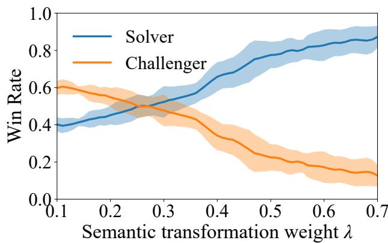

line

| Semantic transformation weight λ | Solver Win Rate | Challenger Win Rate |
| -------------------------------- | --------------- | ------------------- |
| 0.1                              | 0.4             | 0.6                 |
| 0.2                              | 0.45            | 0.55                |
| 0.3                              | 0.5             | 0.5                 |
| 0.4                              | 0.6             | 0.4                 |
| 0.5                              | 0.7             | 0.3                 |
| 0.6                              | 0.8             | 0.2                 |
| 0.7                              | 0.9             | 0.15                |

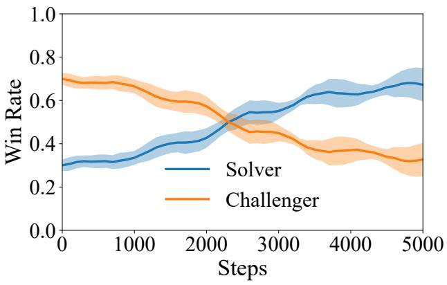

line

| Steps | Solver | Challenger |
| ----- | ------ | ---------- |
| 0     | 0.3    | 0.7        |
| 1000  | 0.35   | 0.68       |
| 2000  | 0.45   | 0.6        |
| 3000  | 0.55   | 0.45       |
| 4000  | 0.65   | 0.35       |
| 5000  | 0.7    | 0.3        |

Figure 5 Self-play win-rate dynamics of DUEL. (a) Win rate as a function of the semantic transformation weight λstealth. (b) Win rate over training steps during adversarial self-play for the Solver and the Challenger. Win rate is defined as the Solver’s average decision accuracy, and the Challenger win rate is its complement.

# F Cross-Domain Transfer

We train DUEL on domain-specific image subsets (Charts and Geometry) to assess whether domain-focused training yields targeted improvements.

Table 6 Cross-domain transfer results (Qwen2.5-VL-7B). Models trained on domain-specific subsets. 

<table><tr><td>Training Domain</td><td>AI2D</td><td>MMMU</td><td>MUIRBench</td><td>ScienceQA</td><td>VisNumBench</td><td>Avg</td></tr><tr><td>Baseline (no training)</td><td>82.6</td><td>50.2</td><td>58.1</td><td>88.5</td><td>41.5</td><td>64.2</td></tr><tr><td>Full (1K mixed)</td><td>84.3</td><td>50.9</td><td>58.4</td><td>89.2</td><td>42.8</td><td>65.1</td></tr><tr><td>Charts only</td><td>84.6</td><td>51.3</td><td>58.9</td><td>89.3</td><td>42.9</td><td>65.4</td></tr><tr><td>Geometry only</td><td>84.4</td><td>51.1</td><td>58.9</td><td>89.3</td><td>42.9</td><td>65.3</td></tr></table>

Domain-specific training matches or exceeds full mixed-data training: Charts only achieves the highest average (65.4), surpassing both the full 1K mixed setting (65.1) and Geometry only (65.3). This demonstrates that focused data can be as effective as or better than diverse data when the domain is well-matched to downstream tasks. Notably, domai focused training does not induce catastrophic narrowing Geometry only still improves general reasoning (MUIRBench +0.8) and diagram understanding (AI2D +1.8), while Charts only similarly improves across all benchmarks. This enables practitioners to steer DUEL toward specific capability domains without sacrificing generality.

# G Hyperparameter Ablations

We conduct hyperparameter sensitivity studies on the key training parameters of DUEL. All ablations use Qwen2.5-VL-7B with reward floor enabled, trained for 1000 steps. We report the average $r _ { \mathrm { t r u e } }$ (reward on correct claims), $r _ { \mathrm { f a l s e } }$ (reward on incorrect claims; lower is better), and win rate (fraction of steps where rtrue $> r _ { \mathrm { f a l s e } } )$ over the final 100 training steps.

Table 7 Ablation: Number of solver samples $K .$ 

<table><tr><td>K</td><td> $r_{\text{true}}$ </td><td> $r_{\text{false}}$ </td><td>Win Rate</td></tr><tr><td>1</td><td>0.097</td><td>0.083</td><td>0.350</td></tr><tr><td>3</td><td>0.368</td><td>0.606</td><td>0.300</td></tr><tr><td>5</td><td>0.347</td><td>0.574</td><td>0.330</td></tr><tr><td>7</td><td>0.247</td><td>0.639</td><td>0.250</td></tr></table>

Number of Solver Samples K. $K { = } 1$ is degenerate: both $r _ { \mathrm { t r u e } }$ and $r _ { \mathrm { f a l s e } }$ collapse $\mathrm { t o } \sim 0 . 0 9$ , confirming that the majority-vote reward mechanism requires multiple samples to produce meaningful signal. $K { = } 3$ achieves the highest $r _ { \mathrm { t r u e } }$ (0.368) among all values, while $K { = } 7$ paradoxically performs worst at 1000 steps (r\_true=0.247)— likely because more samples per step means noisier gradients and slower convergence at a fixed step budget. We select $K { = } 3$ as the best cost-performance tradeoff: it provides stable signal at minimal compute overhead (each step requires $K$ forward passes).

Table 8 Ablation: Solver soft gamma $\gamma .$ . 

<table><tr><td>γ</td><td> $r_{\text{true}}$ </td><td> $r_{\text{false}}$ </td><td>Win Rate</td></tr><tr><td>0.3</td><td>0.459</td><td>0.589</td><td>0.290</td></tr><tr><td>0.5</td><td>0.326</td><td>0.583</td><td>0.290</td></tr><tr><td>0.7</td><td>0.361</td><td>0.594</td><td>0.290</td></tr><tr><td>1.0</td><td>0.370</td><td>0.508</td><td>0.360</td></tr></table>

Solver Soft Gamma $\gamma .$ The soft gamma $\gamma$ controls the sharpness of the reward boundary between correct and incorrect claims. While $\gamma { = } 0 . 3$ maximizes raw $r _ { \mathrm { t r u e } }$ (0.459), it simultaneously elevates $r _ { \mathrm { f a l s e } }$ (0.589), suggesting the solver exploits the soft boundary rather than truly learning to distinguish claims. In contrast, $\gamma { = } 1 . 0$ (binary reward with no soft discounting) achieves the best true/false separation—lowest $r _ { \mathrm { f a l s e } }$ (0.508) and highest win rate (0.360)—confirming that a clean binary signal is more effective for discrimination learning. The flat win rate for $\gamma \leq 0 . 7$ (all at 0.290) further indicates that soft discounting provides no disambiguation benefit.

Reward Correct Floor $r _ { \mathrm { m i n } }$ . During extended training runs, we observe a reward collapse phenomenon where $r _ { \mathrm { t r u e } }  0$ after approximately 3000 steps (Fig. 6a). This occurs because the solver develops a verification bias: as it increasingly outputs “no” (reject), the probability of accepting true claims drops, leading to $\exp ( \mathrm { l l } ) \approx 0$ , which eliminates gradient signal for correct answers and reinforces the rejection bias in a death spiral.

To address this, we introduce a reward floor $r _ { \mathrm { m i n } }$ that guarantees a minimum reward for correct verifications, ensuring gradient signal is maintained throughout training. Fig. 6(b) shows that with $r _ { \mathrm { m i n } } = 0 . 4$ , both $r _ { \mathrm { t r u e } }$ and $r _ { \mathrm { f a l s e } }$ stabilize at ∼0.25–0.30 through the full 5000 steps, avoiding collapse entirely.

We note that the main results in Table 1 were obtained without the reward floor, as the training was terminated at 5000 steps before full collapse affected downstream performance. The reward floor is presented here as a stabilization mechanism for practitioners who wish to train for longer or observe training instability.

Table 9 ablates the floor value:

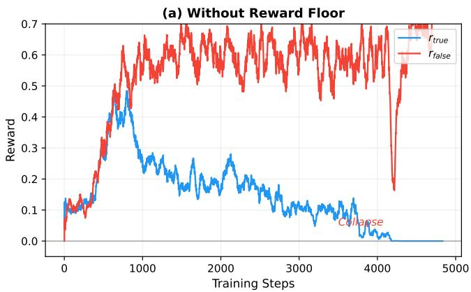

line

| Training Steps | r_true | r_false |
| -------------- | ------ | ------- |
| 0              | 0.1    | 0.1     |
| 500            | 0.3    | 0.5     |
| 1000           | 0.25   | 0.6     |
| 1500           | 0.2    | 0.65    |
| 2000           | 0.15   | 0.6     |
| 2500           | 0.1    | 0.65    |
| 3000           | 0.08   | 0.6     |
| 3500           | 0.05   | 0.65    |
| 4000           | 0.02   | 0.6     |
| 4500           | 0.01   | 0.7     |
| 5000           | 0.0    | 0.7     |

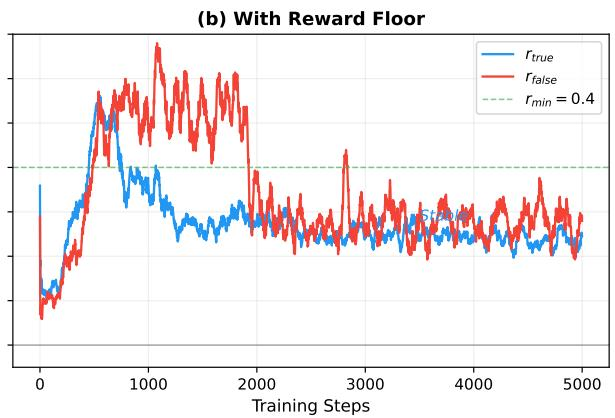

line

| Training Steps | r_true | r_false |
| -------------- | ------ | ------- |
| 0              | ~0.1   | ~0.1    |
| 1000           | ~0.8   | ~1.0    |
| 2000           | ~0.6   | ~0.7    |
| 3000           | ~0.5   | ~0.6    |
| 4000           | ~0.4   | ~0.5    |
| 5000           | ~0.3   | ~0.4    |

Figure 6 Training reward dynamics. (a) Without reward floor: $r _ { \mathrm { t r u e } }$ collapses to zero after ∼3000 steps as the solver develops a rejection bias. (b) With reward floor $( r _ { \operatorname* { m i n } } { = } 0 . 4 )$ : training remains stable for the full 5000 steps.

Table 9 Ablation: Reward correct floor $r _ { \mathrm { m i n } }$ 

<table><tr><td> $r_{\text{min}}$ </td><td> $r_{\text{true}}$ </td><td> $r_{\text{false}}$ </td><td>Win Rate</td></tr><tr><td>0.0</td><td>0.313</td><td>0.582</td><td>0.290</td></tr><tr><td>0.2</td><td>0.296</td><td>0.659</td><td>0.190</td></tr><tr><td>0.4</td><td>0.395</td><td>0.588</td><td>0.340</td></tr><tr><td>0.6</td><td>0.394</td><td>0.585</td><td>0.280</td></tr></table>

The reward floor $r _ { \mathrm { m i n } } { = } 0 . 4$ optimally balances collapse prevention with reward discrimination, achieving the highest $r _ { \mathrm { t r u e } } ~ ( 0 . 3 9 5 )$ and best win rate (0.340). Without a floor $( r _ { \operatorname* { m i n } } { = } 0 . 0 )$ , the solver suffers from early signs of reward collapse, yielding lower $r _ { \mathrm { t r u e } } ~ ( 0 . 3 1 3 )$ . Surprisingly, $r _ { \mathrm { m i n } } { = } 0 . 2$ is counterproductive (worst win rate at 0.190)—likely because this floor is too low to prevent collapse but high enough to confuse the reward landscape. At $r _ { \mathrm { m i n } } { = } 0 . 6$ , the floor oversaturates the reward, reducing discriminative power (win rate 0.280). We recommend $r _ { \mathrm { m i n } } { = } 0 . 4$ for training runs exceeding 5000 steps.

Table 10 Ablation: Stealth loss coefficient $\lambda _ { \mathrm { s t e a l t h } }$ (500-step runs). 

<table><tr><td> $\lambda_{\text{stealth}}$ </td><td> $r_{\text{true}}$ </td><td> $r_{\text{false}}$ </td><td>Win Rate</td></tr><tr><td>0.05</td><td>0.278</td><td>0.353</td><td>0.380</td></tr><tr><td>0.10</td><td>0.258</td><td>0.237</td><td>0.540</td></tr><tr><td>0.20</td><td>0.391</td><td>0.479</td><td>0.410</td></tr><tr><td>0.40</td><td>0.382</td><td>0.404</td><td>0.420</td></tr><tr><td>0.60</td><td>0.261</td><td>0.273</td><td>0.490</td></tr><tr><td>0.80</td><td>0.292</td><td>0.302</td><td>0.470</td></tr><tr><td>1.00</td><td>0.350</td><td>0.398</td><td>0.470</td></tr></table>

Stealth Loss $\lambda _ { \mathrm { s t e a l t h } }$ . The stealth coefficient $\lambda _ { \mathrm { s t e a l t h } }$ controls how tightly the Challenger’s negatives must resemble the positive claim. At λ=0.1, the Challenger produces negatives most distinguishable from positives (lowest $r _ { \mathrm { f a l s e } } = 0 . 2 3 7$ , highest win rate 0.540), while λ=0.2 maximizes $r _ { \mathrm { t r u e } } ~ ( 0 . 3 9 1 )$ , indicating the solver receives the strongest learning signal. We select $\lambda { = } 0 . 2$ as the operating point that balances hard negative generation with stable solver improvement. Very high values $\left( \lambda \geq 0 . 6 \right)$ restrict the Challenger’s editing space excessively, producing negatives so similar to positives that both rewards converge (low discrimination).

# H Training Details

Please check Table 11.

Table 11 Shared hyperparameters for all DUEL experiments. 

<table><tr><td>Parameter</td><td>Value</td></tr><tr><td>LoRA rank  $r$ </td><td>16</td></tr><tr><td>LoRA alpha  $\alpha$ </td><td>32</td></tr><tr><td>LoRA dropout</td><td>0.05</td></tr><tr><td>LoRA targets</td><td>q,k,v,o,gate,up,down_proj</td></tr><tr><td>Total training steps</td><td>5000</td></tr><tr><td>Solver samples  $K$ </td><td>3</td></tr><tr><td>Challenger update frequency  $f_{C}$ </td><td>2</td></tr><tr><td>Freeze vision encoder</td><td>Yes</td></tr><tr><td>Learning rate</td><td> $1 \times 10^{-6}$ </td></tr><tr><td>Stealth loss  $\lambda_{\text{stealth}}$ </td><td>0.2</td></tr><tr><td>Stealth temperature  $\alpha$ </td><td>5</td></tr><tr><td>Batch size (per device)</td><td>1</td></tr><tr><td>Gradient accumulation</td><td>4</td></tr><tr><td>GPUs per job</td><td>2× NVIDIA H200</td></tr><tr><td>Training time (7B model)</td><td>~24 hours</td></tr></table>

# I Qualitative Examples

Fig. 7 shows two examples comparing model behavior before and after DUEL training. In the natural image case (left), the base model hallucinates "two bicycles" from scene priors; after DUEL, it correctly identifies one bicycle grounded in specific visual evidence. In the geometry case (right), the base model produces an incorrect ratio with flawed reasoning; after DUEL, it outputs the correct answer with valid geometric justification. Both cases illustrate the core behavioral shift induced by adversarial self-play: from plausible sounding but ungrounded generation to answers explicitly anchored in visual evidence.

Additionally, we present representative examples where the base model answers incorrectly but the DUELtrained model produces the correct answer, drawn from actual evaluation logs. These demonstrate that DUEL’s adversarial self-play strengthens both visual grounding and logical reasoning.

Analysis. The ChartQA examples demonstrate improved numerical precision: the DUEL-trained model more accurately reads axis values and performs multi-step comparisons across data series. The AI2D examples show enhanced diagram grounding: the trained model correctly traces relationships (food web arrows, process stages) rather than defaulting to superficially plausible answers. Both patterns are consistent with DUEL’s training objective, which requires the Solver to distinguish between visually grounded true claims and near-neighbor false claims—a task that directly exercises precise visual reading and relational reasoning.

natural_image

Scenic cobblestone alleyway with blooming vine-covered buildings and potted plants, no visible text or signage

Q : How many bicycles are in the picture?

Incorrect Answer: There are two bicycles in the picture. They are parked against the stone wall on the right, near an arched doorway. (before training) Correct Answer: There is one bicycle in the picture. On the right side of the picture, near the foreground, there is a dark-colored bicycle parked. It is surrounded by many potted flowers and green plants. (after trianing)

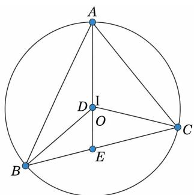

text_image

A
D
I
O
B
E
C

Q: In the figure, E is the midpoint of BC，and D is the centroid of ???? (the intersection of the medians, lying on median AE) What multiple of $S _ { \varDelta A B C } \ : | \pmb { S } \ : S _ { \varDelta B D C } ?$

Incorrect Answer: 1/2. Because D is the centroid of △ABC, located on the median AE, and the centroid divides the median in a 2:1 ratio (AD:DE = 2:1). E is the midpoint of BC, so BE = EC... (before training) Correct Answer: 1/3. Connecting the centroid to the three vertices is equivalent to dividing the original triangle into three smaller triangles with their bases on the three sides and corresponding heights. Therefore, these three smaller triangles have equal areas. (after trianing)

Figure 7 Compare examples of answers to some challenging questions generated before and after training a self-evolving visual language model.   
Ratings for U.S. economy continue post-crisis climb, but views of Japan's economy sputter   
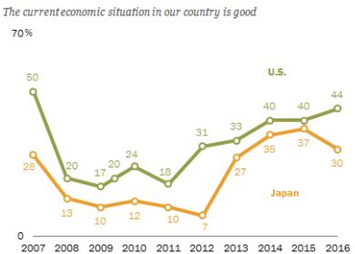

line

| Year | U.S. | Japan |
|------|------|-------|
| 2007 | 50   | 28    |
| 2008 | 20   | 13    |
| 2009 | 17   | 10    |
| 2010 | 24   | 12    |
| 2011 | 18   | 10    |
| 2012 | 31   | 7     |
| 2013 | 33   | 27    |
| 2014 | 40   | 35    |
| 2015 | 40   | 37    |
| 2016 | 44   | 30    |

PEW RESEARCH CENTER

Q: What is the median value of Japan graph from 2013 to 2015? True: 35

Base: 33 (✗ misreads y-axis value) +DUEL: 35 (✓ accurately reads median from graph)

Figure 8 Qualitative example on ChartQA comparing the base model and DUEL.

# Since 2014, most Russians have been satisfied with their country's direction

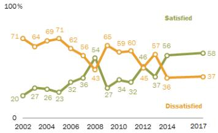

line

| Year | Satisfied | Dissatisfied |
|------|-----------|--------------|
| 2002 | 71        | 20           |
| 2003 | 64        | 27           |
| 2004 | 69        | 26           |
| 2005 | 71        | 23           |
| 2006 | 62        | 32           |
| 2007 | 56        | 36           |
| 2008 | 54        | 43           |
| 2009 | 65        | 27           |
| 2010 | 59        | 34           |
| 2011 | 60        | 32           |
| 2012 | 46        | 45           |
| 2013 | 57        | 37           |
| 2014 | 56        | 36           |
| 2015 | 58        | 37           |
| 2016 | 58        | 37           |
| 2017 | 58        | 37           |

PEW RESEARCH CENTER

Q: Is the median of green graph from 2002 to 2006 greater than smallest value of orange graph? True: No

Base: Yes (✗ fails multi-step comparison) + DUEL: No (✓ accurately compares cross-series values)

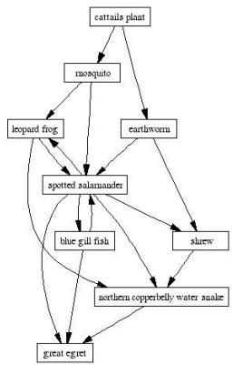

flowchart

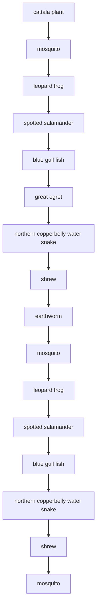

Q: Select the organism which is both carnivorous as well as food for other carnivores.

Options: A. Earthworm B. Spotted salamander C. Mosquito D. Great ret True: B

Base: D (Great egret) (✗ fails to trace predator-prey arrows)

\+ DUEL: B (Spotted salamander) (✓ correctly identifies dual role in food web)

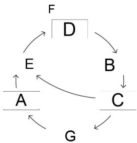

flowchart

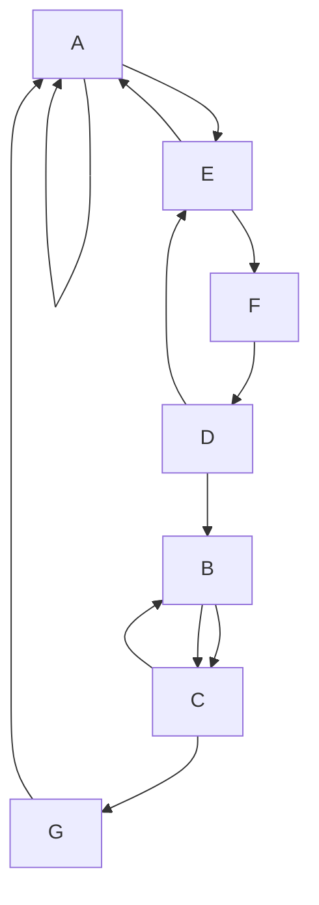

Q: What letter in the diagram represents the respiration stage where $\mathrm { C O _ { 2 } }$ is exhaled?

Options: A. C B. B C. E D. G True: C

Base: B (✗ misidentifies diagram label for exhalation) + DUEL: C (✓ correctly maps $\mathrm { C O _ { 2 } }$ exhalation to labeled stage)