# HCL-FF: Hierarchical and Contrastive Learning for Forward-Forward Algorithm

Jie-En Yao Hong-En Chen C.-C. Jay Kuo

University of Southern California

{jieenyao,hongench,jckuo}@usc.edu

# Abstract

Deep neural networks trained with backpropagation have achieved outstanding performance in vision tasks but remain biologically implausible, computationally demanding, and difficult to interpret. The Forward-Forward (FF) algorithm offers a promising alternative by training each layer independently through local goodness objectives. However, its purely local optimization lacks hierarchical coordination across layers, and the decoupling of goodness from features leaves the representations unconstrained and semantically ambiguous. We propose a Hierarchical and Contrastive Learning FF framework (HCL-FF) to address these limitations. HCL-FF introduces (1) a coarse-to-fine hierarchical learning strategy that guides representations from lowlevel cues to high-level semantics, and (2) a supervised contrastive objective that enforces class-discriminative alignment after goodness decoupling. Experiments on CIFAR-10, CIFAR-100, and Tiny-ImageNet demonstrate that HCL-FF achieves new state-of-the-art performance among FFbased methods, with notable accuracy gains of +5.46%, +17.00%, and +12.51%, respectively.

# 1. Introduction

Backpropagation (BP) [49] has long been the foundation of modern deep learning. Despite its empirical success, BP remains biologically implausible [9, 16, 20, 31], as there is no evidence that the brain propagates error signals backward or stores neural activations for future updates. It is also computationally demanding, requiring gradients and activations to be stored and propagated across all layers. Moreover, it often yields opaque internal representations, limiting interpretability and transparency.

These limitations have motivated growing interest in non-backpropagation learning paradigms [5, 13, 20, 22, 43, 52]. Among them, the Forward-Forward (FF) algorithm [18] has emerged as a promising bottom-up alternative that trains each layer independently to maximize or minimize its goodness, defined as the magnitude of the layer’s activations. The layer-wise training scheme enables biologically plausible learning without gradient propagation across layers. It also improves both parallelism [19, 53] and memory efficiency [46], as layers update without storing activations or waiting for global gradients, making it attractive for lightweight and edge settings [4]. Finally, FF offers enhanced interpretability through direct visualization of layer-wise goodness responses [45].

Despite these appealing properties, the FF algorithm faces two key limitations. First, its greedy layer-wise learning lacks hierarchical coordination. While CNNs trained with backpropagation naturally learn a progression from low-level cues to high-level semantics, FF forces shallow layers to infer high-level semantic concepts directly, often leading to suboptimal early-layer representations. Second, multi-layer learning remains ineffective due to the goodness decoupling problem. Specifically, FF decouples the goodness information from the layer output via vector-length normalization [18] or layer normalization [53], which removes magnitude information and preserves only relative activation patterns, preventing subsequent layers from trivially inheriting the previous goodness signal. However, the local goodness objective optimizes only the goodness score, i.e., the activation magnitude, leaving the goodnessdecoupled features unconstrained and semantically ambiguous once the goodness is removed.

Recent studies attempt to mitigate the resulting information loss by relaxing strict decoupling, using batch normalization [12, 45] or triangle activation function [7]. Although these modifications accelerate learning, they leak goodness information across layers, allowing deeper layers to exploit it rather than learn new patterns. As a result, these methods tend to overfit and are limited to relatively shallow networks. This reveals a fundamental decoupling dilemma in FF learning: Strict goodness decoupling prevents deeper layers from overfitting on previous goodness signals, yet it inevitably discards valuable semantic information encoded in activation magnitudes, the only part of the representation directly optimized by the goodness objective.

To address these limitations and resolve the decoupling dilemma, we propose a Hierarchical and Contrastive Learning FF framework (HCL-FF) that preserves the layer-wise nature of FF while introducing two key innovations. First, we introduce a coarse-to-fine hierarchical learning strategy: shallow layers are supervised using coarse super-class targets, and deeper layers are progressively assigned finergrained labels. This curriculum reduces early-layer complexity, improves gradient-free coordination across depth, and encourages representations to evolve from broad semantic structure to fine-grained discrimination. Second, we incorporate supervised contrastive learning [21] on the goodness-decoupled features. This explicitly constrains their relational geometry, aligning samples from the same class and separating different classes, thereby restoring the semantic structure that is lost when magnitude (goodness) is removed. Extensive experiments show that HCL-FF sets a new state-of-the-art among FF-based methods, delivering higher accuracy, stronger feature separability, and stable semantics after goodness decoupling. Notably, HCL-FF achieves improvements of +5.46% on CIFAR-10, +17.00% on CIFAR-100, and +12.51% on Tiny-ImageNet, demonstrating the effectiveness of hierarchical coordination and contrastive grounding in overcoming long-standing challenges of FF learning.

# 2. Related Work

# 2.1. Learning Without Backpropagation

Recent studies [41] have explored alternatives to backpropagation, pursuing biologically plausible learning mechanisms. Feedback alignment and its variants [3, 14, 25, 30, 39] replace the transposed forward weights used in backpropagation with random or learned feedback matrices to relax the weight-symmetry/transport constraint. Target Propagation methods [5, 6, 13, 28] approximate local targets through learned inverse mappings, allowing updates without backpropagated gradients. Hebbian-based methods [20, 24, 35, 38] define weight updates from correlations between pre- and post-synaptic activity, often with competitive learning dynamics [16, 48, 51]. Local representation alignment methods [42, 43] compute the local alignment targets with error units and error weights. The forwardonly framework PEPITA [10, 52] replaces the backward pass with a second forward pass that perturbs inputs using error information, yielding Hebbian-like local updates. Signal propagation [22] treats the target as part of the forward input, propagating both input and target jointly through the network to achieve single-pass learning.

# 2.2. Forward-Forward Algorithm

The Forward-Forward (FF) algorithm [18] replaces backpropagation with a layer-wise local goodness objective. Formally, given an input x, each layer computes

$$
y ^ {(1)} = \phi (W ^ {(1)} x), \tag {1}
$$

$$
y ^ {(\ell)} = \phi (W ^ {(\ell)} z ^ {(\ell - 1)}), \quad \text { for } \quad 2 \leq \ell \leq L, \tag {2}
$$

$$
g ^ {(\ell)} = \sum_ {i = 1} ^ {N ^ {(\ell)}} (y _ {i} ^ {(\ell)}) ^ {2}, \quad z ^ {(\ell)} = \frac {y ^ {(\ell)}}{\sqrt {\frac {1}{N ^ {(\ell)}} g ^ {(\ell)} + \epsilon}}, \tag {3}
$$

where $\phi$ denotes the activation function, $W ^ { ( \ell ) }$ is the weight matrix of layer $\ell , \ z ^ { ( \ell - 1 ) }$ is the feature from the previous layer, and $\dot { N } ^ { ( \ell ) }$ is the number of neurons. The term $g ^ { ( \ell ) }$ represents the goodness, defined as the squared sum of activations. To prevent deeper layers from trivially inheriting the goodness signal, each layer normalizes its activations to produce a unit-length feature vector $z ^ { ( \ell ) }$ , thereby decoupling goodness from the representation. During training, FF maximizes $g ^ { ( \ell ) }$ for positive samples (e.g., correct image–label pairs) and minimizes it for negative samples, encouraging layers to produce stronger activations for correct labels and suppress responses for incorrect ones.

Since its introduction, the FF algorithm has inspired many extensions [15, 29, 40, 44, 47, 50, 58]. However, existing variants largely remain limited by two core issues: (1) the lack of hierarchical coordination and (2) the decoupling dilemma. CwComp [45] leverages the CIFAR-100 superclasses but uses them merely as a heuristic to handle larger label spaces. To address coordination, Trifecta [12] introduces block-wise backpropagation, but this violates FF’s layer-wise independence. Collaborative FF [33] adds a global goodness objective but sacrifices FF’s inherent parallelism, as layers must wait for a global signal before updating. To address the decoupling issue, CwComp [45] and Trifecta [12] replace strict goodness decoupling with batch normalization, while SCFF [7] employs a triangle activation function [8]. These modifications ease optimization but leak goodness signal across layers, leading to overfitting and limiting scalability to deeper networks. Recent contrastive FF variants [1, 2, 7] apply contrastive objectives to raw activations rather than to goodness-decoupled features, leaving the semantic collapse after decoupling unresolved. Most recently, DeeperForward [53] successfully trained a 17-layer CNN by redefining goodness as the mean of activations to mitigate neuron deactivation and applying layer normalization to strictly decouple goodness information, as shown in Eq. 4, where σ denotes the standard deviation.

$$
g ^ {(\ell)} = \frac {1}{N ^ {(\ell)}} \sum_ {i = 1} ^ {N ^ {(\ell)}} y _ {i} ^ {(\ell)}, \quad z ^ {(\ell)} = \frac {y ^ {(\ell)} - g ^ {(\ell)}}{\sqrt {\left(\sigma^ {(\ell)}\right) ^ {2} + \epsilon}}, \tag {4}
$$

While this restores strict decoupling and improves depth scalability, it still suffers from the loss of semantic meaning in the representations after goodness decoupling.

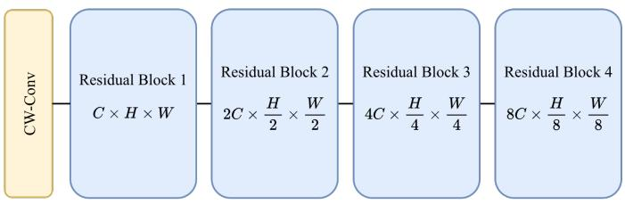

flowchart

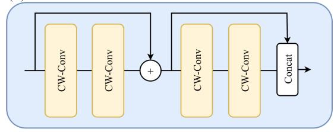

flowchart

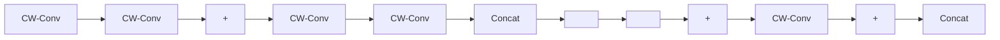

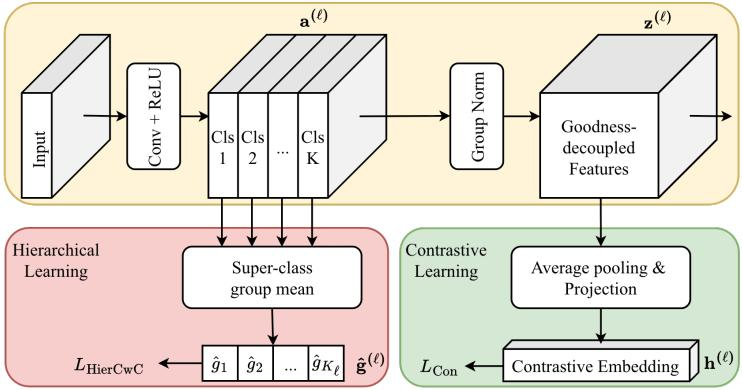

flowchart

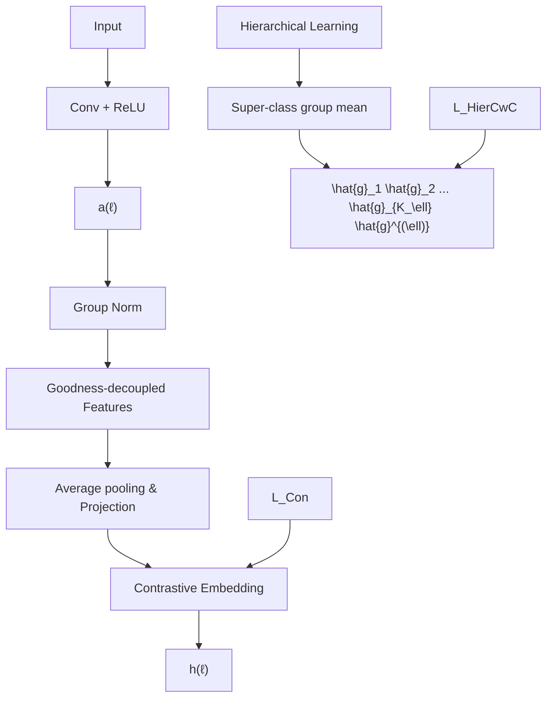

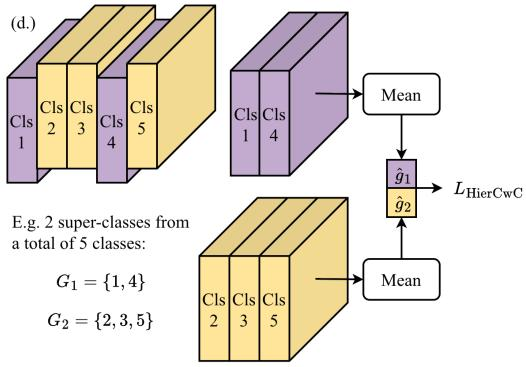

flowchart

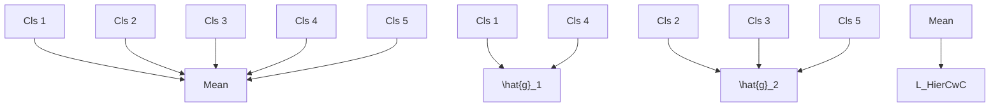

Figure 1. (a) Overall architecture. (b) Structure of a residual block. (c) CW-Conv layer. Channels are partitioned into K class-specific subsets, which are further grouped into super-classes for computing super-class mean-goodness. Subset-wise normalization decouples the goodness signal, and a supervised contrastive loss on the goodness-decoupled features provides semantic grounding. (d) Illustration of hierarchical learning. Super-class goodness gˆ is obtained by averaging the per-class goodness within each super-class group.

# 3. Methodology

In this section, we first describe the baseline Forward-Forward architecture inherited from DeeperForward [53], which serves as the foundation of our method. We then introduce our two key contributions: Hierarchical Learning and Contrastive Learning. Finally, we present the overall HCL-FF framework that integrates both objectives.

# 3.1. Baseline Forward-Forward Architecture

We adopt the FF backbone from DeeperForward [53] and briefly summarize it here for completeness. The architecture is built upon Channel-Wise Convolution (CW-Conv) layers. As illustrated in Fig. 1(a), the network begins with a CW-Conv stem and proceeds through four residual blocks, each containing four CW-Conv layers connected by residual shortcuts to enhance representational richness.

Each CW-Conv layer operates as a standard convolution followed by ReLU activation and is trained independently without gradient propagation across layers. Following the Channel-wise Competitive (CwC) formulation [45], the output activations are partitioned into K subsets along the channel dimension, where K denotes the number of classes. Formally, an activation tensor a(ℓ) ∈ RC×H×W $a ^ { ( \ell ) } ~ \in ~ \mathbb { R } ^ { C \times H \times W }$ at layer ℓ is reshaped into a(ℓ)′ $\boldsymbol { a } ^ { ( \ell ) ^ { \prime } } \in \mathbb { R } ^ { K \times C ^ { \prime } \times H \times W }$ where $C ^ { \prime } ~ = ~ C / K$ . In practice, we ensure that C is divisible by K. Each subset a(ℓ)′k $a ^ { ( \ell ) } { } _ { k } ^ { \prime } \in \mathbb { R } ^ { C ^ { \prime } \times H \times W }$ represents the activation responses associated with class k. Following the mean-goodness formulation in Eq. 4, the per-class meangoodness is computed by averaging activations within each subset, yielding goodness $g ^ { ( \ell ) } \in \mathbb { R } ^ { K }$ . The CwC loss is then defined as the softmax cross-entropy over the per-class mean-goodness values, which maximizes the goodness of the ground-truth class while suppressing others:

$$
L _ {\mathrm{CwC}} ^ {(\ell)} (g ^ {(\ell)}, y) = - \sum_ {i = 1} ^ {K} y _ {i} \log \frac {\exp (g _ {i} ^ {(\ell)})}{\sum_ {j = 1} ^ {K} \exp (g _ {j} ^ {(\ell)})} \tag {5}
$$

To obtain the goodness-decoupled feature $z ^ { ( \ell ) }$ following Eq. 4, GroupNorm is applied to activation tensor $a ^ { ( \ell ) }$ with the number of groups set to K, which is equivalent to normalizing independently within each subset $a ^ { ( \ell ) } { } _ { k } ^ { \prime } \in$ $\mathbb { R } ^ { C ^ { \prime } \times H \times W }$ . This per-group normalization removes the global magnitude component used as the goodness signal while preserving relative activation patterns within each class group. The goodness-decoupled feature $z ^ { ( \ell ) }$ is then forwarded to the next layer, ensuring that subsequent layers cannot trivially exploit the goodness information from previous layers. At inference time, the Signal Integrating and Pruning Module [53] is applied to select the optimal layer interval $[ s , e ]$ on the validation set. The goodness scores within this interval are averaged as $\begin{array} { r } { \tilde { g } = \frac { 1 } { e - s + 1 } \sum _ { \ell = s } ^ { e } g ^ { ( \ell ) } } \end{array}$ , and the final class prediction is obtained by taking the arg max over the ensembled goodness scores g˜.

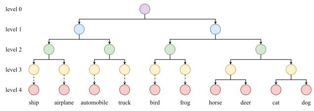

flowchart

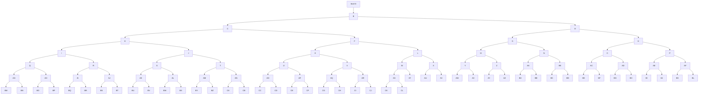

Figure 2. Hierarchy of CIFAR-10 classes constructed via clustering on class prototypes derived from a pre-trained classifier. Each level represents a different granularity of super-class grouping.

# 3.2. Hierarchical Learning

The design above completes the layer-wise FF learning pipeline. However, this purely local optimization lacks coordination across layers. Moreover, shallow layers are forced to discriminate among all K classes directly, imposing an overly complex objective that destabilizes early learning and yields suboptimal representations.

To address this limitation, we introduce a Hierarchical Learning paradigm that organizes supervision in a coarseto-fine manner. Shallow layers focus on distinguishing broad semantic groups, while deeper layers progressively refine their representations toward fine-grained distinctions. Formally, let $\mathcal { Y } = \{ 1 , \ldots , K \}$ denote the set of fine-grained classes. For layer ℓ, we define a set of super-classes as $\{ G _ { 1 } ^ { ( \ell ) } , \ldots , G _ { K _ { \ell } } ^ { ( \ell ) } \}$ , where $K _ { \ell }$ denotes the number of superclasses at level ℓ and $\{ G _ { 1 } ^ { ( \ell ) } , \ldots , G _ { K _ { \ell } } ^ { ( \ell ) } \}$ forms a partition of Y. We set $K _ { 1 } \stackrel { } { \le } \bar { K _ { 2 } } ^ { - } \le \cdots \stackrel { } { \le } \bar { K } _ { L } = K$ to establish a coarse-to-fine curriculum. Given the per-class goodness responses $g ^ { ( \ell ) } = ( g _ { 1 } ^ { ( \ell ) } , \dots , g _ { K } ^ { ( \ell ) } ) ~$ (ℓ) ), the super-class-level goodness is obtained by averaging the goodness within each super-class, as illustrated in Fig. 1(d):

$$
\hat {g} _ {j} ^ {(\ell)} = \frac {1}{| G _ {j} ^ {(\ell)} |} \sum_ {i \in G _ {j} ^ {(\ell)}} g _ {i} ^ {(\ell)}, \quad j = 1, 2, \dots , K _ {\ell} \tag {6}
$$

By substituting the fine-grained labels and goodness in Eq. 5 with the super-class counterparts $\hat { y } ^ { ( \ell ) }$ and $\hat { g } ^ { ( \ell ) }$ , we derive the Hierarchical Channel-Wise Competitive (Hier-CwC) loss, which enables hierarchical learning while preserving the layer-wise independence of FF training:

$$
L _ {\mathrm{HierCwC}} ^ {(\ell)} (\hat {g} ^ {(\ell)}, \hat {y} ^ {(\ell)}) = - \sum_ {i = 1} ^ {K _ {\ell}} \hat {y} _ {i} ^ {(\ell)} \log \frac {\exp (\hat {g} _ {i} ^ {(\ell)})}{\sum_ {j = 1} ^ {K _ {\ell}} \exp (\hat {g} _ {j} ^ {(\ell)})} (7)
$$

To compute the super-class partition s G(ℓ), $G _ { j } ^ { ( \ell ) }$ we require a class hierarchy that defines semantic relationships among fine-grained labels. The class hierarchy can be constructed in various ways, such as using external taxonomies [11, 37], semantic word embeddings [36], or data-driven clustering [54]. In this work, we adopt the data-driven approach [54]. Specifically, we first pre-train the model without hierarchical supervision using the CwC objective in Eq. 5. Then, we freeze the model and train a linear classifier on the global-average-pooled feature of the final layer. Each row of the trained classifier weight matrix serves as a class prototype in the learned feature space. We then $\ell _ { 2 } \cdot$ -normalize these prototypes and perform hierarchical agglomerative clustering to construct a tree that captures semantic similarity among classes.

An example of the resulting hierarchy for CIFAR-10 is shown in Fig. 2, where each internal node represents a super-class. Once constructed, network layers are mapped to selected tree depths to define the super-class groupings. The mapping between layers and tree depths defines the learning curriculum, following two principles: (1) the supervision depths increase monotonically with network depth, ensuring a coarse-to-fine learning process, and (2) the final layer corresponds to the leaf level, enabling finegrained classification. To maintain a valid partition of the class set Y at every level, each node that terminates before the maximum tree depth is extended by duplicating itself as its own descendant, illustrated by the dashed lines in Fig. 2, thereby preserving coverage and non-overlap of Y.

# 3.3. Contrastive Learning

A second major limitation of FF algorithms is the decoupling dilemma. On one hand, without goodness decoupling, deeper layers can trivially inherit the goodness signal from preceding layers, preventing new feature learning and leading to overfitting. On the other hand, once goodness is removed, the learned features lose their semantic meaning. Because the standard FF optimizes only the goodness score, the training objective constrains the activation magnitude but leaves relative activation patterns unconstrained. As a result, goodness-decoupled features become semantically ambiguous, undermining interpretability and weakening learning across layers.

To resolve this dilemma, we introduce a contrastive objective applied directly to the goodness-decoupled features, explicitly constraining their representation and preserving semantic meaning. Specifically, at each CW-Conv layer, the goodness-decoupled feature $\dot { z } ^ { ( \ell ) }$ is global-average-pooled and projected to a latent embedding $\mathbf { \hat { h } } ^ { ( \ell ) }$ through a linear projection head. We then apply a supervised contrastive loss [21] that encourages embeddings from the same class to cluster together while pushing those from different classes apart. Formally, given a mini-batch of N samples with embeddings $\{ \mathbf { h } _ { i } ^ { ( \ell ) } \} _ { i = 1 } ^ { N }$ and labels $\{ y _ { i } \} _ { i = 1 } ^ { N }$ N , the contrastive loss }i=1 at layer ℓ is defined as

$$
L _ {\text { Con }} ^ {(\ell)} = \sum_ {i = 1} ^ {N} \frac {- 1}{| \mathcal {P} (i) |} \sum_ {p \in \mathcal {P} (i)} \log \frac {\exp (\text { sim } (\mathbf {h} _ {i} ^ {(\ell)} , \mathbf {h} _ {p} ^ {(\ell)}) / \tau)}{\sum_ {a \in A (i)} \exp (\text { sim } (\mathbf {h} _ {i} ^ {(\ell)} , \mathbf {h} _ {a} ^ {(\ell)}) / \tau)} \tag {8}
$$

where $A ( i ) = \{ 1 , \dots , N \} \backslash \{ i \}$ denotes all indices except i, ${ \mathcal { P } } ( i ) = \{ a \in A ( i ) : y _ { a } = y _ { i } \}$ represents the set of samples sharing the same class as sample i, sim(·, ·) denotes cosine similarity, and τ is a temperature parameter.

We emphasize that the proposed contrastive objective is applied directly to the goodness-decoupled representation $\bar { z } ^ { ( \ell ) }$ , rather than to the raw activations or the goodness scores. By operating explicitly in this goodness-decoupled feature space, the contrastive objective preserves the semantic meaning of $z ^ { ( \ell ) }$ , thereby addressing the decoupling dilemma. Intuitively, goodness governs the scale of activations, while contrastive learning constrains their relative direction, ensuring that goodness-decoupled features remain semantically meaningful and discriminative.

# 3.4. HCL-FF Framework

The overall objective integrates the hierarchical objective from Eq. 7 and the contrastive objective from Eq. 8:

$$
L _ {\text { total }} ^ {(\ell)} = L _ {\text { HierCwC }} ^ {(\ell)} + \lambda L _ {\text { Con }} ^ {(\ell)}, \tag {9}
$$

where λ is a weighting coefficient set to 1 in all experiments. The two objectives play complementary roles: the hierarchical loss provides structured coarse-to-fine supervision across depth, while the contrastive loss preserves the semantic geometry of the goodness-decoupled features. Importantly, contrastive learning always uses fine-grained labels, as replacing them with super-class labels would collapse meaningful intra-group distinctions.

To realize hierarchical supervision in practice, we map the 17 layers in our architecture to hierarchy levels according to the following rule:

$$
\operatorname{level} (0) = 1, \quad \operatorname{level} (i) = \left\lceil \frac {i (D - 1)}{1 6} \right\rceil , \quad i = 1, \dots , 1 6, \tag {10}
$$

where D is the maximum tree depth. This mapping ensures that early layers receive coarse supervision, while deeper layers progressively transition to fine-grained targets.

The hierarchical curriculum also enhances the effectiveness of data augmentation. In prior FF methods, shallow layers faced overly complex fine-grained discrimination, diminishing the benefits of augmentation. By assigning coarse objectives to early layers, our hierarchical formulation reduces this burden, allowing augmentation to meaningfully enrich feature diversity and improve robustness. This enables the use of strong data augmentation in practice, including random cropping, horizontal flipping, color jittering, and random grayscale conversion.

Together, these components form an effective FF framework that addresses two core limitations of existing FF methods: the lack of hierarchical coordination and the decoupling dilemma, leading to the consistent performance improvements demonstrated in Sec. 4.

# 4. Experiments

# 4.1. Experimental Setting

We conduct experiments on five standard benchmarks: CIFAR-10, CIFAR-100 [23], MNIST [27], Fashion-MNIST [57], and Tiny-ImageNet [26]. Tiny-ImageNet (64×64, 200 classes) provides a higher-resolution and more challenging setting, while the remaining datasets cover diverse visual domains and class granularities. Models are trained for 1000 epochs on Tiny-ImageNet, CIFAR-100, and CIFAR-10, and for 150 epochs on Fashion-MNIST and MNIST. We use a batch size of 512 for Tiny-ImageNet and CIFAR-100, and 128 for the remaining datasets. We use the Adam optimizer with weight decay $1 \times 1 0 ^ { - 4 }$ , and a cosineannealing learning rate schedule decaying from $8 \times 1 0 ^ { - 2 }$ to $2 \times 1 0 ^ { - 4 }$ . All experiments are conducted on a single NVIDIA RTX A6000 GPU. Detailed network configurations, optimization hyperparameters, and data augmentation parameters are provided in the Appendix.

# 4.2. General Benchmarks

We compare against representative non-backpropagation (non-BP) methods [10, 13, 20, 22, 43], standard backpropagation (BP) approaches [17], and Forward-Forward (FF) baselines [7, 12, 18, 29, 45, 53, 58]. To ensure a fair comparison with BP-based models, we implement a wider ResNet-20 whose parameter count matches that of our FF architecture. Table 1 reports results on CIFAR-10, CIFAR-100, MNIST, and Fashion-MNIST. HCL-FF achieves state-of-the-art performance among all FF-based models. Compared to DeeperForward [53], our method provides substantial gains of +5.46% on CIFAR-10 and +17.00% on CIFAR-100, highlighting the effectiveness of hierarchical coordination and contrastive grounding, particularly on datasets with larger class spaces. Notably, HCL-FF reaches 91.68% on CIFAR-10 and 70.09% on CIFAR-100, surpassing the standard BP-trained ResNet-20 [17] and narrowing the gap to the matched-parameter BP variant. On simpler datasets such as MNIST and Fashion-MNIST, HCL-FF achieves 99.65% and 93.87%, confirming strong generalization across visual complexity levels. In comparison to other non-BP approaches, HCL-FF consistently achieves superior or comparable accuracy, reinforcing the viability of FF-based learning as an effective and biologically plausible training paradigm.

To further assess scalability, we extend our experiments to the more challenging Tiny-ImageNet dataset. As shown in Table 2, HCL-FF significantly outperforms prior FF methods by 12.51%, demonstrating improved capacity to handle higher-resolution images and larger label spaces under strict layer-wise training. Overall, these results show that hierarchical supervision and contrastive grounding jointly address long-standing limitations of FF learning, delivering substantial performance gains while preserving fully layer-local training.

Table 1. Classification performance on CIFAR-10, CIFAR-100, MNIST, and Fashion-MNIST (F-MNIST). Mean and standard deviation of five runs are reported. The best accuracy for each type is highlighted in bold. †: Reproduced results. 

<table><tr><td>Type</td><td>Method</td><td>Arch.</td><td>CIFAR-10</td><td>CIFAR-100</td><td>MNIST</td><td>F-MNIST</td></tr><tr><td rowspan="5">non-BP</td><td>PEPITA [10]</td><td>CNN</td><td>56.33 ± 1.35</td><td>27.56 ± 0.60</td><td>98.29 ± 0.13</td><td>-</td></tr><tr><td>DTP [13]</td><td>CNN</td><td>89.38 ± 0.20</td><td>-</td><td>98.93 ± 0.04</td><td>90.91 ± 0.17</td></tr><tr><td>rec-LRA [43]</td><td>CNN</td><td>93.88</td><td>-</td><td>98.18</td><td>88.13</td></tr><tr><td>SoftHebb [20]</td><td>SoftHebb</td><td>80.31 ± 0.14</td><td>56.0</td><td>99.35 ± 0.03</td><td>-</td></tr><tr><td>SigProp [22]</td><td>CNN</td><td>91.66</td><td>65.7</td><td>-</td><td>-</td></tr><tr><td rowspan="2">BP</td><td>ResNet20† [17]</td><td>CNN</td><td>91.25</td><td>67.20</td><td>99.64</td><td>93.34</td></tr><tr><td>ResNet20-Wide† [17]</td><td>CNN</td><td>93.98</td><td>76.72</td><td>99.63</td><td>93.89</td></tr><tr><td rowspan="8">FF</td><td>FF [18]</td><td>MLP</td><td>59.00</td><td>18.15</td><td>98.69</td><td>-</td></tr><tr><td>SymBa [29]</td><td>MLP</td><td>59.09</td><td>29.28</td><td>98.58</td><td>-</td></tr><tr><td>CaFo [58]</td><td>CNN</td><td>67.43</td><td>40.76</td><td>98.80</td><td>-</td></tr><tr><td>CwComp [45]</td><td>CNN</td><td>78.11 ± 0.44</td><td>51.23</td><td>99.42 ± 0.08</td><td>92.31 ± 0.32</td></tr><tr><td>Trifecta [12]</td><td>CNN</td><td>83.51 ± 0.78</td><td>35.26 ± 0.23</td><td>99.58 ± 0.06</td><td>91.44 ± 0.49</td></tr><tr><td>SCFF [7]</td><td>CNN</td><td>80.75 ± 0.12</td><td>-</td><td>99.37 ± 0.06</td><td>-</td></tr><tr><td>DeeperForward [53]</td><td>CNN</td><td>86.22 ± 0.17</td><td>53.09 ± 0.79</td><td>99.63 ± 0.04</td><td>93.13 ± 0.13</td></tr><tr><td>Ours</td><td>CNN</td><td>91.68 ± 0.19</td><td>70.09 ± 0.15</td><td>99.65 ± 0.04</td><td>93.87 ± 0.24</td></tr></table>

Table 2. Top-1 accuracy (%) on Tiny-ImageNet. †: Reproduced results. 

<table><tr><td>Method</td><td>ResNet-BP $^{\dagger}$ </td><td>SCFF</td><td>DeeperForward $^{\dagger}$ </td><td>Ours</td></tr><tr><td>Accuracy</td><td>64.40</td><td>35.67</td><td>35.95</td><td>48.46</td></tr></table>

Table 3. Ablation study. ”Hier.” denotes hierarchical learning, ”Con.” denotes contrastive learning, and ”Aug.” denotes strong data augmentation. 

<table><tr><td></td><td>Hier.</td><td>Con.</td><td>Aug.</td><td>CIFAR-10 Acc.</td><td>CIFAR-100 Acc.</td></tr><tr><td>V1</td><td>×</td><td>×</td><td>×</td><td>86.22</td><td>53.09</td></tr><tr><td>V2</td><td>×</td><td>×</td><td>√</td><td>88.80</td><td>54.65</td></tr><tr><td>V3</td><td>×</td><td>√</td><td>√</td><td>91.05</td><td>63.77</td></tr><tr><td>V4</td><td>√</td><td>×</td><td>√</td><td>88.20</td><td>61.61</td></tr><tr><td>V5</td><td>√</td><td>√</td><td>×</td><td>88.44</td><td>65.22</td></tr><tr><td>V6</td><td>√</td><td>√</td><td>√</td><td>91.83</td><td>70.76</td></tr></table>

# 4.3. Ablation Studies

To evaluate the contribution of each component in HCL-FF, we evaluate six model variants on CIFAR-10 and CIFAR-100; results are summarized in Table 3.

Introducing the contrastive objective alone (V2→V3) yields notable improvements of +2.25% on CIFAR-10 and +9.12% on CIFAR-100. This confirms that contrastive supervision stabilizes goodness-decoupled features and prevents semantic drift by explicitly constraining their relational geometry. The much larger gain on CIFAR-100 reflects its higher class granularity, where unconstrained features collapse more severely after goodness removal.

Adding the hierarchical objective alone (V2→V4) provides a substantial gain on CIFAR-100 (+6.96%), while slightly reducing CIFAR-10 accuracy (−0.60%). This suggests that the benefit of coarse-to-fine supervision is more pronounced in larger label spaces.

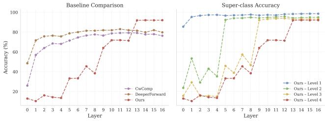  
Figure 3. Layer-wise classification accuracy on CIFAR-10. The left panel compares our HCL-FF with prior FF-based models using per-class goodness at each layer. The right panel reports the superclass accuracy of HCL-FF at each hierarchy level defined in Fig. 2. Predictions are obtained by taking the arg max over the class-wise or super-class-wise goodness responses at each layer.

Data augmentation alone brings only modest gains (V1→V2), indicating that without hierarchical structure, shallow layers remain overburdened by fine-grained discrimination and cannot fully leverage augmented variability. However, when hierarchical supervision is present (V5→V6), augmentation yields significantly larger gains (+3.39% and +5.54%). This shows that simplifying early objectives enables augmented samples to meaningfully enrich feature diversity and improve robustness.

Finally, combining all components (V6) achieves the strongest overall performance. These results highlight the complementary nature of hierarchical coordination, contrastive grounding, and strong data augmentation in overcoming the limitations of layer-wise FF training.

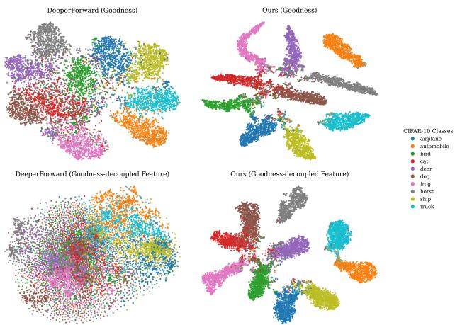

scatter

| Method | Class | Shape | Count |
| --- | --- | --- | --- |
| DeeperForward (Goodness) | airplane | Circle | 25 |
| DeeperForward (Goodness) | automobile | Circle | 25 |
| DeeperForward (Goodness) | bird | Circle | 25 |
| DeeperForward (Goodness) | cat | Circle | 25 |
| DeeperForward (Goodness) | deer | Circle | 25 |
| DeeperForward (Goodness) | dog | Circle | 25 |
| DeeperForward (Goodness) | frog | Circle | 25 |
| DeeperForward (Goodness) | horse | Circle | 25 |
| DeeperForward (Goodness) | ship | Circle | 25 |
| DeeperForward (Goodness) | truck | Circle | 25 |
| Ours (Goodness) | airplane | Circle | 30 |
| Ours (Goodness) | automobile | Circle | 30 |
| Ours (Goodness) | bird | Circle | 30 |
| Ours (Goodness) | cat | Circle | 30 |
| Ours (Goodness) | deer | Circle | 30 |
| Ours (Goodness) | dog | Circle | 30 |
| Ours (Goodness) | frog | Circle | 30 |
| Ours (Goodness) | horse | Circle | 30 |
| Ours (Goodness) | ship | Circle | 30 |
| Ours (Goodness) | truck | Circle | 30 |
| Ours (Goodness)-decoupled Feature | airplane | Circle | 28 |
| Ours (Goodness)-decoupled Feature | automobile | Circle | 28 |
| Ours (Goodness)-decoupled Feature | bird | Circle | 28 |
| Ours (Goodness)-decoupled Feature | cat | Circle | 28 |
| Ours (Goodness)-decoupled Feature | deer | Circle | 28 |
| Ours (Goodness)-decoupled Feature | dog | Circle | 28 |
| Ours (Goodness)-decoupled Feature | frog | Circle | 28 |
| Ours (Goodness)-decoupled Feature | horse | Circle | 28 |
| Ours (Goodness)-decoupled Feature | ship | Circle | 28 |
| Ours (Goodness)-decoupled Feature | truck | Circle | 28 |
| DeeperForward (Goodness-decoupled Feature) | airplane | Circle | 26 |
| DeeperForward (Goodness-decoupled Feature) | automobile | Circle | 26 |
| DeeperForward (Goodness-decoupled Feature) | bird | Circle | 26 |
| DeeperForward (Goodness-decoupled Feature) | cat | Circle | 26 |
| DeeperForward (Goodness-decoupled Feature) | deer | Circle | 26 |
| DeeperForward (Goodness-decoupled Feature) | dog | Circle | 26 |
| DeeperForward (Goodness-decoupled Feature) | frog | Circle | 26 |
| DeeperForward (Goodness-decoupled Feature) | horse | Circle | 26 |
| DeeperForward (Goodness-decoupled Feature) | ship | Circle | 26 |
| DeeperForward (Goodness-decoupled Feature) | truck | Circle | 26 |
| Ours (Goodness-decoupled Feature) | airplane | Circle | 32 |
| Ours (Goodness-decoupled Feature) | automobile | Circle | 32 |
| Ours (Goodness-decoupled Feature) | bird | Circle | 32 |
| Ours (Goodness-decoupled Feature) | cat | Circle | 32 |
| Ours (Goodness-decoupled Feature) | deer | Circle | 32 |
| Ours (Goodness-decoupled Feature) | dog | Circle | 32 |
| Ours (Goodness-decoupled Feature) | frog | Circle | 32 |
| Ours (Goodness-decoupled Feature) | horse | Circle | 32 |
| Ours (Goodness-decoupled Feature) | ship | Circle | 32 |
| Ours (Goodness-decoupled Feature) | truck | Circle | 32 |
CIPAR-10 Classes: Airplane, automobile, bird, cat, deer, dog, frog, horse, ship, truck

Figure 4. t-SNE visualization of goodness and goodnessdecoupled features on CIFAR-10.

Table 4. Comparison of different hierarchy construction methods. 

<table><tr><td>Method</td><td>WordNet</td><td>Word2Vec</td><td>Data-driven</td></tr><tr><td>CIFAR-100 Acc.</td><td>71.01</td><td>69.59</td><td>70.76</td></tr></table>

# 4.4. Effect of Different Hierarchies

To examine the sensitivity of HCL-FF to the choice of hierarchical structures, we compare three ways of constructing the class hierarchies: (1) WordNet-based hierarchy derived from human semantic taxonomies [37], (2) Word2Vec-based hierarchy obtained by hierarchical agglomerative clustering of class-name embeddings [36], and (3) Data-driven hierarchy induced from classifier weights as described in Sec. 3.2.

As shown in Table 4, the WordNet hierarchy achieves the highest accuracy, likely because its groupings closely reflect human-defined visual semantics. The data-driven hierarchy performs comparably without relying on external priors, demonstrating strong adaptability for datasets lacking predefined taxonomies. The Word2Vec-based clustering slightly underperforms, suggesting that linguistic similarity does not always align with visual similarity in finegrained recognition. Together, these results show that HCL-FF is robust to the hierarchy construction method and can effectively leverage both semantic and data-driven structures, making it broadly applicable across datasets with or without existing taxonomies.

# 4.5. Analysis of Decoupling Dilemma

The FF algorithm inherently faces a decoupling dilemma: while removing the goodness signal is essential to prevent goodness leakage across layers, it also risks removing semantic meaning from the decoupled features. We investigate this dilemma through three complementary analyses. Per-layer classification accuracy. Fig. 3 reports layerwise classification accuracy. The left panel computes predictions via the arg max over per-class goodness at each layer, while the right panel reports super-class accuracy following the hierarchy in Fig. 2. CwComp saturates after layer 8, indicating that goodness signal leaks across layers and allows deeper layers to overfit rather than learn new discriminative structure. DeeperForward alleviates this issue through strict goodness decoupling, yet its accuracy still plateaus early. This suggests that while leakage is prevented, the goodness-decoupled features become unconstrained and drift semantically, offering limited discriminative improvement with depth. In contrast, HCL-FF maintains steady accuracy gains across layers, demonstrating that hierarchical and contrastive supervision jointly enable meaningful feature refinement throughout the network. The right panel further reveals a clear coarse-to-fine pattern: shallow layers reliably capture broad super-class distinctions, while deeper layers progressively specialize toward fine-grained categories.

Table 5. Linear-probe evaluation on the last layer’s features before/after normalization. 

<table><tr><td>Method</td><td>CwComp</td><td>DeeperForward</td><td>Ours</td></tr><tr><td>CIFAR-10 Acc.</td><td>76.29 / 76.64</td><td>84.46 / 76.93</td><td>91.93 / 91.91</td></tr><tr><td>CIFAR-100 Acc.</td><td>41.98 / 36.41</td><td>48.38 / 35.47</td><td>67.42 / 65.85</td></tr></table>

Linear-probe evaluation. To quantitatively assess feature semantics, we freeze the model and train a linear classifier on the global-average-pooled final-layer features, both before and after normalization. As shown in Table 5, DeeperForward, which strictly removes goodness following Eq. 4, suffers a pronounced accuracy drop after normalization, indicating that a large portion of its discriminative power is carried by the magnitude component. Once removed, the remaining feature collapses. CwComp shows a minor change after normalization, but its absolute accuracy is lower than DeeperForward. This reflects its weaker decoupling: batch normalization leaks goodness across layers, allowing the model to retain magnitude information. However, this leakage ultimately harms learning by encouraging overfitting rather than meaningful feature development. In contrast, HCL-FF maintains nearly identical accuracy before and after normalization while achieving the highest performance. This shows that HCL-FF both enforces strict goodness decoupling and preserves the semantic structure of the goodness-decoupled features via contrastive regularization, effectively resolving the decoupling dilemma.

t-SNE visualization. Figure 4 visualizes the learned embeddings on CIFAR-10 using t-SNE [34], with points colored by class. We plot both the ten-dimensional goodness response and the corresponding goodness-decoupled representations from the final layer, i.e., g(16) and z(16). In DeeperForward, the goodness representations are well-separated across classes, indicating that the model effectively learns to encode discriminative magnitude information. However, after normalization, the goodness-decoupled features collapse and lose inter-class structure, suggesting that once the magnitude is removed, the remaining relative patterns are unconstrained and prone to semantic drift. In contrast, HCL-FF preserves clear class separation in both g(16) and z(16), indicating that the combined hierarchical and contrastive objectives constrain both the goodness magnitudes and the geometry of goodness-decoupled features.

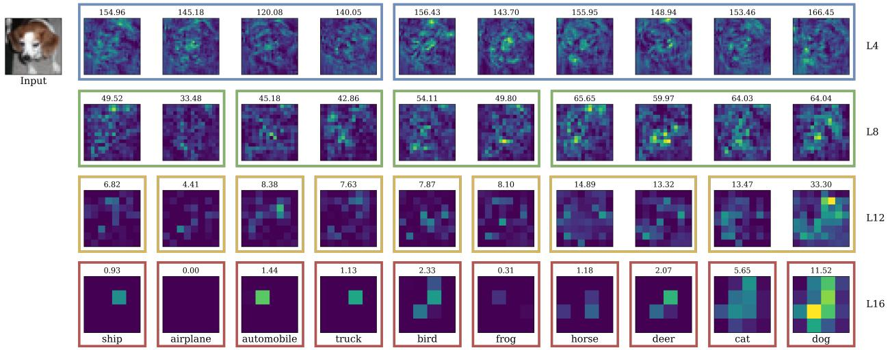

heatmap

| Category | Input | L4 | L8 | L12 | L16 |
| :--- | :--- | :--- | :--- | :--- | :--- |
| ship | 0.93 | 154.96 | 49.52 | 6.82 | 0.93 |
| airplane | 0.00 | 145.18 | 33.48 | 4.41 | 0.00 |
| automobile | 1.44 | 120.08 | 45.18 | 8.38 | 1.44 |
| truck | 1.13 | 140.05 | 42.86 | 7.63 | 1.13 |
| bird | 2.33 | 156.43 | 54.11 | 7.87 | 2.33 |
| frog | 0.31 | 143.70 | 49.80 | 8.10 | 0.31 |
| horse | 1.18 | 155.95 | 65.65 | 14.89 | 1.18 |
| deer | 2.07 | 148.94 | 59.97 | 13.32 | 2.07 |
| cat | 5.65 | 153.46 | 64.03 | 13.47 | 5.65 |
| dog | 11.52 | 166.45 | 64.04 | 33.30 | 11.52 |

Figure 5. Visualization of class-wise goodness responses from the final layer of each residual block on the CIFAR-10 dataset. Each column corresponds to the mean goodness map of the channel subset associated with a given class, with the mean goodness value displayed above each map. Color frames correspond to the super-class grouping in Fig. 2. As depth increases, responses become semantically aligned with the target class. The classes within the same super-class generally have higher goodness responses, showing a coarse-to-fine progression.

# 4.6. Qualitative Results

Unlike standard deep networks that typically require posthoc interpretability tools, the FF framework naturally exposes class-wise goodness responses at every layer, providing built-in transparency into how evidence evolves with depth. Figure 5 visualizes the class-wise goodness responses from the final layer of each residual block for an example image from CIFAR-10. Each column corresponds to the mean goodness map of the channel subset associated with a given class, while frame colors indicate the superclass groupings defined by the hierarchy in Fig. 2. The mean goodness value is displayed above each map.

At shallow layers (e.g., L4 and L8), the responses are spatially diffuse and semantically coarse, activating for multiple classes that share similar low-level features such as colors and edges. As depth increases (L12 and L16), the responses become more localized and strongly biased toward the target class, reflecting the emergence of fine-grained semantic selectivity. Within each layer, classes belonging to the same super-class exhibit higher relative goodness, consistent with the hierarchical grouping and the coarse-to-fine curriculum used during training. These qualitative trends visually corroborate our quantitative findings, confirming that HCL-FF exhibits a clear coarse-to-fine progression of semantic refinement across layers.

# 5. Discussion and Conclusion

Limitations. While HCL-FF advances FF learning, it still inherits certain constraints. In our experiments, layer-wise optimization still converges more slowly and generalizes less effectively than end-to-end backpropagation. Moreover, the CwC loss requires allocating channel subsets per class, causing channel count to scale with the number of classes. Our HierCwC loss alleviates this by allowing shared channels in shallow layers, yet scaling to datasets with extremely large label spaces remains challenging.

Conclusion. We presented HCL-FF, a Hierarchical and Contrastive Learning FF framework that addresses two central challenges of FF learning: the lack of hierarchical coordination and the decoupling dilemma. By integrating hierarchical supervision with contrastive grounding, HCL-FF learns semantically structured and progressively refined representations while maintaining fully layer-wise independence. Our experiments across five benchmarks show state-of-the-art FF performance. These results highlight the potential of HCL-FF as a step toward more scalable, effective, and biologically plausible learning paradigms.

# References

[1] Hossein Aghagolzadeh and Mehdi Ezoji. Marginal contrastive loss: A step forward for forward-forward. In 2024 13th Iranian/3rd International Machine Vision and Image Processing Conference (MVIP), pages 1–6. IEEE, 2024. 2   
[2] Md Atik Ahamed, Jin Chen, and Abdullah-Al-Zubaer Imran. Forward-forward contrastive learning. arXiv preprint arXiv:2305.02927, 2023. 2   
[3] Mohamed Akrout, Collin Wilson, Peter Humphreys, Timothy Lillicrap, and Douglas B Tweed. Deep learning without weight transport. Advances in neural information processing systems, 32, 2019. 2   
[4] Saleh Baghersalimi, Alireza Amirshahi, Tomas Teijeiro, Amir Aminifar, and David Atienza. Layer-wise learning framework for efficient dnn deployment in biomedical wearable systems. In 2023 IEEE 19th International Conference On Body Sensor Networks (BSN), pages 1–4. IEEE, 2023. 1   
[5] Sergey Bartunov, Adam Santoro, Blake Richards, Luke Marris, Geoffrey E Hinton, and Timothy Lillicrap. Assessing the scalability of biologically-motivated deep learning algorithms and architectures. Advances in neural information processing systems, 31, 2018. 1, 2   
[6] Yoshua Bengio. How auto-encoders could provide credit assignment in deep networks via target propagation. arXiv preprint arXiv:1407.7906, 2014. 2   
[7] Xing Chen, Dongshu Liu, Jer´ emie Laydevant, and Julie ´ Grollier. Self-contrastive forward-forward algorithm. Nature Communications, 16(1):5978, 2025. 1, 2, 5, 6   
[8] Adam Coates, Andrew Ng, and Honglak Lee. An analysis of single-layer networks in unsupervised feature learning. In Proceedings of the fourteenth international conference on artificial intelligence and statistics, pages 215–223. JMLR Workshop and Conference Proceedings, 2011. 2   
[9] Francis Crick. The recent excitement about neural networks. Nature, 337(6203):129–132, 1989. 1   
[10] Giorgia Dellaferrera and Gabriel Kreiman. Error-driven input modulation: solving the credit assignment problem without a backward pass. In International Conference on Machine Learning, pages 4937–4955. PMLR, 2022. 2, 5, 6   
[11] Jia Deng, Wei Dong, Richard Socher, Li-Jia Li, Kai Li, and Li Fei-Fei. Imagenet: A large-scale hierarchical image database. In 2009 IEEE conference on computer vision and pattern recognition, pages 248–255. Ieee, 2009. 4   
[12] Thomas Dooms, Ing Jyh Tsang, and Jose Oramas. The trifecta: Three simple techniques for training deeper forwardforward networks. arXiv preprint arXiv:2311.18130, 2023. 1, 2, 5, 6   
[13] Maxence M Ernoult, Fabrice Normandin, Abhinav Moudgil, Sean Spinney, Eugene Belilovsky, Irina Rish, Blake Richards, and Yoshua Bengio. Towards scaling difference target propagation by learning backprop targets. In International Conference on Machine Learning, pages 5968–5987. PMLR, 2022. 1, 2, 5, 6   
[14] Charlotte Frenkel, Martin Lefebvre, and David Bol. Learning without feedback: Fixed random learning signals allow for feedforward training of deep neural networks. Frontiers in neuroscience, 15:629892, 2021. 2

[15] Fabio Giampaolo, Stefano Izzo, Edoardo Prezioso, and Francesco Piccialli. Investigating random variations of the forward-forward algorithm for training neural networks. In 2023 International Joint Conference on Neural Networks (IJCNN), pages 1–7. IEEE, 2023. 2   
[16] Stephen Grossberg. Competitive learning: From interactive activation to adaptive resonance. Cognitive science, 11(1): 23–63, 1987. 1, 2   
[17] Kaiming He, Xiangyu Zhang, Shaoqing Ren, and Jian Sun. Deep residual learning for image recognition. In Proceedings of the IEEE conference on computer vision and pattern recognition, pages 770–778, 2016. 5, 6, 11   
[18] Geoffrey Hinton. The forward-forward algorithm: Some preliminary investigations. arXiv preprint arXiv:2212.13345, 2 (3):5, 2022. 1, 2, 5, 6   
[19] Max Jaderberg, Wojciech Marian Czarnecki, Simon Osindero, Oriol Vinyals, Alex Graves, David Silver, and Koray Kavukcuoglu. Decoupled neural interfaces using synthetic gradients. In International conference on machine learning, pages 1627–1635. PMLR, 2017. 1   
[20] Adrien Journe, Hector Garcia Rodriguez, Qinghai Guo, and ´ Timoleon Moraitis. Hebbian deep learning without feedback. arXiv preprint arXiv:2209.11883, 2022. 1, 2, 5, 6   
[21] Prannay Khosla, Piotr Teterwak, Chen Wang, Aaron Sarna, Yonglong Tian, Phillip Isola, Aaron Maschinot, Ce Liu, and Dilip Krishnan. Supervised contrastive learning. Advances in neural information processing systems, 33:18661–18673, 2020. 2, 4   
[22] Adam Kohan, Edward A Rietman, and Hava T Siegelmann. Signal propagation: The framework for learning and inference in a forward pass. IEEE Transactions on Neural Networks and Learning Systems, 35(6):8585–8596, 2023. 1, 2, 5, 6   
[23] Alex Krizhevsky, Geoffrey Hinton, et al. Learning multiple layers of features from tiny images. 2009. 5   
[24] Gabriele Lagani, Fabrizio Falchi, Claudio Gennaro, and Giuseppe Amato. Hebbian semi-supervised learning in a sample efficiency setting. Neural Networks, 143:719–731, 2021. 2   
[25] Julien Launay, Iacopo Poli, and Florent Krzakala. Principled training of neural networks with direct feedback alignment. arXiv preprint arXiv:1906.04554, 2019. 2   
[26] Ya Le and Xuan S. Yang. Tiny imagenet visual recognition challenge. 2015. 5   
[27] Yann LeCun, Leon Bottou, Yoshua Bengio, and Patrick ´ Haffner. Gradient-based learning applied to document recognition. Proceedings of the IEEE, 86(11):2278–2324, 2002. 5   
[28] Dong-Hyun Lee, Saizheng Zhang, Asja Fischer, and Yoshua Bengio. Difference target propagation. In Joint european conference on machine learning and knowledge discovery in databases, pages 498–515. Springer, 2015. 2   
[29] Heung-Chang Lee and Jeonggeun Song. Symba: Symmetric backpropagation-free contrastive learning with forwardforward algorithm for optimizing convergence. arXiv preprint arXiv:2303.08418, 2023. 2, 5, 6

[30] Timothy P Lillicrap, Daniel Cownden, Douglas B Tweed, and Colin J Akerman. Random synaptic feedback weights support error backpropagation for deep learning. Nature communications, 7(1):13276, 2016. 2   
[31] Timothy P Lillicrap, Adam Santoro, Luke Marris, Colin J Akerman, and Geoffrey Hinton. Backpropagation and the brain. Nature Reviews Neuroscience, 21(6):335–346, 2020. 1   
[32] Weiyang Liu, Yandong Wen, Zhiding Yu, Ming Li, Bhiksha Raj, and Le Song. Sphereface: Deep hypersphere embedding for face recognition. In Proceedings of the IEEE conference on computer vision and pattern recognition, pages 212–220, 2017. 13   
[33] Guy Lorberbom, Itai Gat, Yossi Adi, Alexander Schwing, and Tamir Hazan. Layer collaboration in the forwardforward algorithm. In Proceedings of the AAAI Conference on Artificial Intelligence, pages 14141–14148, 2024. 2   
[34] Laurens van der Maaten and Geoffrey Hinton. Visualizing data using t-sne. Journal of machine learning research, 9 (Nov):2579–2605, 2008. 7   
[35] Thomas Miconi. Hebbian learning with gradients: Hebbian convolutional neural networks with modern deep learning frameworks. arXiv preprint arXiv:2107.01729, 2021. 2   
[36] Tomas Mikolov, Kai Chen, Greg Corrado, and Jeffrey Dean. Efficient estimation of word representations in vector space. arXiv preprint arXiv:1301.3781, 2013. 4, 7   
[37] George A Miller. Wordnet: a lexical database for english. Communications of the ACM, 38(11):39–41, 1995. 4, 7   
[38] Timoleon Moraitis, Dmitry Toichkin, Adrien Journe, Yan- ´ song Chua, and Qinghai Guo. Softhebb: Bayesian inference in unsupervised hebbian soft winner-take-all networks. Neuromorphic Computing and Engineering, 2(4):044017, 2022. 2   
[39] Arild Nøkland. Direct feedback alignment provides learning in deep neural networks. Advances in neural information processing systems, 29, 2016. 2   
[40] Alexander Ororbia and Ankur Mali. The predictive forwardforward algorithm. arXiv preprint arXiv:2301.01452, 2023. 2   
[41] Alexander G Ororbia. Brain-inspired machine intelligence: A survey of neurobiologically-plausible credit assignment. arXiv preprint arXiv:2312.09257, 2023. 2   
[42] Alexander G Ororbia and Ankur Mali. Biologically motivated algorithms for propagating local target representations. In Proceedings of the aaai conference on artificial intelligence, pages 4651–4658, 2019. 2   
[43] Alexander G Ororbia, Ankur Mali, Daniel Kifer, and C Lee Giles. Backpropagation-free deep learning with recursive local representation alignment. In Proceedings of the AAAI conference on artificial intelligence, pages 9327–9335, 2023. 1, 2, 5, 6   
[44] Daniele Paliotta, Mathieu Alain, Balint M ´ at´ e, and Franc¸ois ´ Fleuret. Graph neural networks go forward-forward. arXiv preprint arXiv:2302.05282, 2023. 2   
[45] Andreas Papachristodoulou, Christos Kyrkou, Stelios Timotheou, and Theocharis Theocharides. Convolutional channelwise competitive learning for the forward-forward algorithm.

In Proceedings of the AAAI Conference on Artificial Intelligence, pages 14536–14544, 2024. 1, 2, 3, 5, 6, 13   
[46] Danilo Pietro Pau and Fabrizio Maria Aymone. Suitability of forward-forward and pepita learning to mlcommonstiny benchmarks. In 2023 IEEE International Conference on Omni-layer Intelligent Systems (COINS), pages 1–6. IEEE, 2023. 1   
[47] Abel A Reyes-Angulo and Sidike Paheding. Forwardforward algorithm for hyperspectral image classification. In Proceedings of the IEEE/CVF Conference on Computer Vision and Pattern Recognition, pages 3153–3161, 2024. 2   
[48] David E Rumelhart and David Zipser. Feature discovery by competitive learning. Cognitive science, 9(1):75–112, 1985. 2   
[49] David E Rumelhart, Geoffrey E Hinton, and Ronald J Williams. Learning representations by back-propagating errors. nature, 323(6088):533–536, 1986. 1   
[50] Riccardo Scodellaro, Ajinkya Kulkarni, Frauke Alves, and Matthias Schroter. Training convolutional neural net- ¨ works with the forward-forward algorithm. arXiv preprint arXiv:2312.14924, 2023. 2   
[51] Sen Song, Kenneth D Miller, and Larry F Abbott. Competitive hebbian learning through spike-timing-dependent synaptic plasticity. Nature neuroscience, 3(9):919–926, 2000. 2   
[52] Ravi Srinivasan, Francesca Mignacco, Martino Sorbaro, Maria Refinetti, Avi Cooper, Gabriel Kreiman, and Giorgia Dellaferrera. Forward learning with top-down feedback: Empirical and analytical characterization. arXiv preprint arXiv:2302.05440, 2023. 1, 2   
[53] Liang Sun, Yang Zhang, Jiajun Wen, Linlin Shen, Weicheng Xie, and Weizhao He. Deeperforward: Enhanced forwardforward training for deeper and better performance. In International Conference on Learning Representations, 2025. 1, 2, 3, 5, 6, 11, 12, 13   
[54] Alvin Wan, Lisa Dunlap, Daniel Ho, Jihan Yin, Scott Lee, Henry Jin, Suzanne Petryk, Sarah Adel Bargal, and Joseph E Gonzalez. Nbdt: Neural-backed decision trees. arXiv preprint arXiv:2004.00221, 2020. 4, 13   
[55] Feng Wang, Xiang Xiang, Jian Cheng, and Alan Loddon Yuille. Normface: L2 hypersphere embedding for face verification. In Proceedings of the 25th ACM international conference on Multimedia, pages 1041–1049, 2017.   
[56] Hao Wang, Yitong Wang, Zheng Zhou, Xing Ji, Dihong Gong, Jingchao Zhou, Zhifeng Li, and Wei Liu. Cosface: Large margin cosine loss for deep face recognition. In Proceedings of the IEEE conference on computer vision and pattern recognition, pages 5265–5274, 2018. 13   
[57] Han Xiao, Kashif Rasul, and Roland Vollgraf. Fashionmnist: a novel image dataset for benchmarking machine learning algorithms. arXiv preprint arXiv:1708.07747, 2017. 5   
[58] Gongpei Zhao, Tao Wang, Yi Jin, Congyan Lang, Yidong Li, and Haibin Ling. The cascaded forward algorithm for neural network training. Pattern Recognition, 161:111292, 2025. 2, 5, 6

Table 6. Architectural configurations and training hyperparameters for all datasets. 

<table><tr><td></td><td>CIFAR-10</td><td>CIFAR-100</td><td>MNIST</td><td>F-MNIST</td><td>Tiny-ImageNet</td></tr><tr><td>Channels per residual block</td><td>[100, 200, 400, 800]</td><td>[100, 200, 400, 800]</td><td>[40, 80, 160, 320]</td><td>[40, 80, 160, 320]</td><td>[200, 400, 800, 1600]</td></tr><tr><td>Batch size</td><td>128</td><td>512</td><td>128</td><td>128</td><td>512</td></tr><tr><td>Optimizer</td><td>Adam</td><td>Adam</td><td>Adam</td><td>Adam</td><td>Adam</td></tr><tr><td>Weight decay</td><td>1e-4</td><td>1e-4</td><td>1e-4</td><td>1e-4</td><td>1e-4</td></tr><tr><td>Initial learning rate</td><td>8e-2</td><td>8e-2</td><td>8e-2</td><td>8e-2</td><td>8e-2</td></tr><tr><td>Minimum learning rate</td><td>2e-4</td><td>2e-4</td><td>2e-4</td><td>2e-4</td><td>2e-4</td></tr><tr><td>Epochs</td><td>1000</td><td>1000</td><td>150</td><td>150</td><td>1000</td></tr></table>

# 6. Implementation Details

For all experiments, we adopt a residual Forward-Forward (FF) architecture [53] consisting of four residual blocks. Table 6 summarizes the full architectural configurations and training hyperparameters. CIFAR-10 and CIFAR-100 use channel widths of [100, 200, 400, 800] across the four residual blocks; MNIST and F-MNIST use lighter widths of [40, 80, 160, 320]; and Tiny-ImageNet employs a larger configuration of [200, 400, 800, 1600]. The channel width of the very first layer of the network is set equal to the width of the first residual block. Note that the channel dimension must be greater than or equal to the number of classes. Therefore, for Tiny-ImageNet, which contains 200 classes, the model begins with 200 channels. For contrastive learning, we employ a projection head implemented by a single linear layer that maps features into a 128-dimensional embedding space.

All models are trained using the Adam optimizer with a weight decay of $1 \times 1 0 ^ { - 4 }$ . For datasets with larger label spaces, such as CIFAR-100 and Tiny-ImageNet, we use a batch size of 512, while a batch size of 128 is used for CIFAR-10, MNIST, and F-MNIST. Models are trained for 1000 epochs on CIFAR-10/100 and Tiny-ImageNet, and for 150 epochs on MNIST and F-MNIST due to their simpler visual complexity. We employ cosine annealing from an initial learning rate of $8 \times 1 \bar { 0 } ^ { - \bar { 2 } }$ down to $2 \times 1 0 ^ { - 4 }$ .

To stabilize the early stages of contrastive learning and progressively tighten semantic alignment, we schedule the contrastive temperature τ throughout training. Specifically, τ is linearly warmed up from 0.8 to 0.2 over the first 100 epochs, followed by cosine decay to 0.08 for the remainder of training. This schedule mitigates unstable gradients at initialization and encourages increasingly fine-grained feature separation as training progresses.

For natural-image datasets (CIFAR-10, CIFAR-100, and Tiny-ImageNet), we apply strong augmentations to increase intra-class variability. The augmentation pipeline consists of RandomResizedCrop with a scale range of (0.6, 1.0), RandomHorizontalFlip with probability 0.5, ColorJitter (brightness/contrast/saturation = 0.2 and hue = 0.1) with probability 0.8, and

Table 7. Effect of residual shortcuts on accuracy. 

<table><tr><td>Dataset</td><td>w/o residual</td><td>w/ residual</td></tr><tr><td>CIFAR-10 Accuracy</td><td>90.85</td><td>91.83</td></tr><tr><td>CIFAR-100 Accuracy</td><td>65.43</td><td>70.76</td></tr></table>

RandomGrayscale with probability 0.2. For MNIST and F-MNIST, we adopt lightweight geometric augmentations to avoid distorting digit or clothing structures. The augmentation pipeline includes RandomRotation within $\pm 1 0 ^ { \circ }$ and RandomAffine with up to 10% translation in both spatial directions and a scaling factor in the range [0.9, 1.1].

All HCL-FF experiments follow a two-stage training procedure. In the first stage, we pretrain a model without hierarchical learning. The resulting pretrained model is then used to construct the data-driven hierarchy. In the second stage, we train the full HCL-FF model from scratch with both hierarchical and contrastive learning.

For comparison, the BP-trained ResNet-20 baseline is reproduced using the exact configuration described in the original ResNet paper [17]. We also train a matchingparameter variant by increasing all channel widths of the original configuration by a factor of ten to closely match the parameter count of our HCL-FF models.

# 7. Residual Shortcuts

Residual structures are commonly used in backpropagationbased (BP) networks to ease optimization by providing gradient shortcut pathways [17]. In the FF setting, where gradients are not propagated across layers, residual shortcuts instead serve to fuse information across depths. Following DeeperForward [53], we adopt parameter-free shortcuts that adapt spatial and channel dimensions without introducing any learnable projection layers. For completeness, we describe the residual mechanism in detail in this section.

Spatial alignment. Let z(ℓ)r $\mathbf { z } _ { r } ^ { ( \ell ) } \in \mathbb { R } ^ { C \times H _ { r } \times W _ { r } }$ denote the shortcut feature for layer $\ell ,$ and let the goodness-decoupled feature of the current layer be $\mathbf { z } ^ { ( \ell ) } \in \mathbb { R } ^ { C \times H \times W }$ . When transitioning between residual blocks, the spatial resolution is downsampled by a factor of two, causing $( H _ { r } , W _ { r } ) \neq$ $( H , W )$ . We therefore apply $\mathbf { a \ 2 \times 2 }$ average-pooling operation with stride 2 when a resolution mismatch occurs:

$$
\tilde {\mathbf {z}} _ {r} ^ {(\ell)} = \left\{ \begin{array}{l l} \operatorname{AvgPool} _ {2 \times 2} \left(\mathbf {z} _ {r} ^ {(\ell)}\right), & (H _ {r}, W _ {r}) \neq (H, W), \\ \mathbf {z} _ {r} ^ {(\ell)}, & (H _ {r}, W _ {r}) = (H, W). \end{array} \right. \tag {11}
$$

Channel alignment across residual blocks. At the transition between residual blocks, the main branch doubles its channel width. Let $\mathbf { z } ^ { ( \ell ) } ~ \in ~ \mathbb { R } ^ { C \times H \times W }$ be the goodnessdecoupled feature at the end of one residual block, and let the shortcut feature be $\tilde { \mathbf { z } } _ { r } ^ { ( \ell ) } \in \mathbb { R } ^ { C \times H \times W }$ . To construct the input to the next residual block, which expects 2C channels, the two tensors are concatenated along the channel dimension:

$$
\mathbf {z} _ {\text { merge }} ^ {(\ell)} = \operatorname{Concat} _ {\text { channel }} \left(\mathbf {z} ^ {(\ell)}, \tilde {\mathbf {z}} _ {r} ^ {(\ell)}\right) \in \mathbb {R} ^ {(2 C) \times H \times W}. \tag {12}
$$

This yields a channel-aligned shortcut without any learned projection.

Residual fusion within a residual block. Within the same residual block, the main branch and shortcut share the same spatial and channel dimensions. Thus, we perform simple additive fusion:

$$
\mathbf {z} _ {\text { merge }} ^ {(\ell)} = \mathbf {z} ^ {(\ell)} + \tilde {\mathbf {z}} _ {r} ^ {(\ell)} \in \mathbb {R} ^ {C \times H \times W}. \tag {13}
$$

Discussion. The shortcut path participates in neither gradient flow nor weight updates, preserving the locality of FF training. However, these lightweight residuals substantially improve representational quality by propagating useful features across depth. As shown in Table 7, removing residual shortcuts causes significant accuracy degradation on CIFAR-10 and CIFAR-100, highlighting their importance for stable and effective layer-wise FF training.

# 8. Signal Integrating and Pruning Module

In this section, we elaborate on the Signal Integrating and Pruning (SIP) module introduced in DeeperForward [53]. Unlike BP-based models, which rely solely on the final layer’s logits, FF networks produce a goodness score at every layer. Each layer-wise goodness vector $\mathbf { g } ^ { ( \ell ) }$ already encodes partial class evidence at depth ℓ, providing an opportunity to aggregate predictions across the entire network hierarchy.

Formulation. Given a model with L layers, each layer produces a class-wise goodness vector $\mathbf { g } ^ { ( \bar { \ell } ) } \in \mathbb { R } ^ { K }$ , where K is the number of classes. Instead of relying exclusively on the deepest layer, SIP forms an aggregated prediction by averaging goodness scores over a selected contiguous interval of layers:

Table 8. Accuracy under different prediction strategies. ”All lay-$\mathrm { e r s } ^ { \mathbf { \gamma } }$ averages goodness scores from all layers, ”Last layer” uses only the deepest layer, and $\mathrm { \ " { s m } }$ reports the accuracy and the selected interval [s, e] found on the validation set. 

<table><tr><td>Method</td><td>All layers</td><td>Last layer</td><td>SIP [s, e]</td></tr><tr><td colspan="4">MNIST</td></tr><tr><td>DeeperForward</td><td>99.61</td><td>99.50</td><td>99.67 [4, 8]</td></tr><tr><td>Ours</td><td>99.51</td><td>99.62</td><td>99.70 [13, 16]</td></tr><tr><td colspan="4">F-MNIST</td></tr><tr><td>DeeperForward</td><td>93.01</td><td>91.73</td><td>92.97 [1, 13]</td></tr><tr><td>Ours</td><td>89.15</td><td>93.75</td><td>93.97 [13, 16]</td></tr><tr><td colspan="4">CIFAR-10</td></tr><tr><td>DeeperForward</td><td>86.16</td><td>79.77</td><td>86.24 [1, 16]</td></tr><tr><td>Ours</td><td>80.39</td><td>92.00</td><td>91.83 [10, 16]</td></tr><tr><td colspan="4">CIFAR-100</td></tr><tr><td>DeeperForward</td><td>52.63</td><td>26.56</td><td>52.43 [0, 12]</td></tr><tr><td>Ours</td><td>49.23</td><td>67.42</td><td>70.76 [7, 16]</td></tr><tr><td colspan="4">Tiny-ImageNet</td></tr><tr><td>DeeperForward</td><td>33.96</td><td>3.05</td><td>35.95 [1, 12]</td></tr><tr><td>Ours</td><td>33.39</td><td>48.46</td><td>48.46 [16, 16]</td></tr></table>

$$
\tilde {\mathbf {g}} = \frac {1}{e - s + 1} \sum_ {\ell = s} ^ {e} \mathbf {g} ^ {(\ell)}, \quad 0 \leq s \leq e \leq L - 1. \tag {14}
$$

The final class label is obtained by taking the arg max over $\tilde { \bf { g } } .$ The interval $[ s , e ]$ is chosen on a validation set and kept fixed during inference.

Analysis. Table 8 reveals distinct SIP behaviors for DeeperForward and HCL-FF. For HCL-FF, SIP consistently selects deeper intervals, e.g., [13, 16] on MNIST and F-MNIST, [10, 16] on CIFAR-10, [7, 16] on CIFAR-100, and [16, 16] on Tiny-ImageNet. This pattern aligns with our hierarchical design: early layers focus on coarse distinctions, while deeper layers progressively refine semantics, making them more informative for final prediction. In contrast, DeeperForward frequently selects shallow or mid-level layers, indicating that deeper layers contribute weaker or noisier predictions. This supports our analysis that goodness decoupling, without hierarchical or contrastive grounding, leads to semantic drift in deeper representations, preventing meaningful development across depth.

We additionally consider two baselines: averaging goodness across all layers and using only the final layer. For HCL-FF, all-layer averaging reduces performance because early layers produce coarse super-class signals that hinder fine-grained classification. However, our last-layer accuracy substantially exceeds that of DeeperForward, demonstrating that HCL-FF maintains discriminative structure even at the deepest layers and benefits from a meaningful depth-wise learning trajectory.

# 9. Building Hierarchies

In this section, we describe how we construct the class hierarchy used for hierarchical supervision in detail and clarify the rationale behind this design. Following the Neural-Backed Decision Tree (NBDT) framework [54], we employ a data-driven procedure that derives a semantic hierarchy directly from a trained classifier. This approach eliminates the need for manual specification of coarse and fine semantic groups, offering a systematic method to construct a hierarchy for any dataset.

Classifier weights as class prototypes. As outlined in Sec. 3.2 of the main paper, we begin by training a linear classifier on top of the frozen backbone. Let $W \in \mathbb { R } ^ { K \times D }$ denote the weight matrix of a trained linear classifier over K classes, where each row $W _ { k } \in \mathbb { R } ^ { D }$ corresponds to class k. For an input feature z, the classifier logit for class k is

$$
\operatorname{logit} _ {k} (\mathbf {z}) = W _ {k} ^ {\top} \mathbf {z} + b _ {k}. \tag {15}
$$

Because the dot product $W _ { k } ^ { \top } { \mathbf z }$ is maximized when z aligns with $W _ { k } ,$ , each row vector $W _ { k }$ implicitly acts as the prototype or anchor direction defining the region of feature space associated with class k. This interpretation is well supported by prior work [32, 54–56].

From prototypes to semantic hierarchy. Before computing inter-class similarity, each prototype is L2- normalized, $\begin{array} { r } { \hat { W } _ { k } = \frac { W _ { k } } { \parallel W _ { k } \parallel _ { 2 } } } \end{array}$ = . We then compute pairwise cosine distances,

$$
d (k, k ^ {\prime}) = 1 - \hat {W} _ {k} ^ {\top} \hat {W} _ {k ^ {\prime}}, \tag {16}
$$

and apply hierarchical agglomerative clustering with Ward linkage to recursively merge the most similar classes. This produces a full binary hierarchy that reflects the semantic relationships encoded by the classifier. Intuitively, classes with similar prototype directions are more confusable and therefore merge earlier in the hierarchy, yielding a semantically meaningful tree structure.

# 10. Super-class Accuracy

To complement the per-layer analysis presented in Fig. 3 of the main paper, we further examine layer-wise accuracy at each hierarchy level, comparing against CwComp [45] and DeeperForward [53]. Figure 7 reports Level 1, Level 2, and Level 3 super-class accuracy, as well as overall fine-grained accuracy. The hierarchy levels correspond to those defined in Fig. 6.

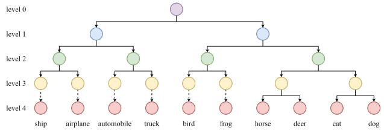

flowchart

Figure 6. Hierarchy of CIFAR-10 classes constructed via clustering on class prototypes derived from a pre-trained classifier. Each level represents a different granularity of super-class grouping.

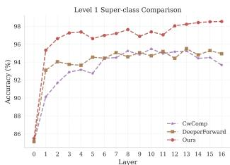

line

| Layer | CwComp | DeeperForward | Ours |
|-------|--------|---------------|------|
| 0     | 86.0   | 86.0          | 86.0 |
| 1     | 90.0   | 93.0          | 95.0 |
| 2     | 91.0   | 93.5          | 96.0 |
| 3     | 92.0   | 93.5          | 97.0 |
| 4     | 92.5   | 93.5          | 97.5 |
| 5     | 93.0   | 93.5          | 97.5 |
| 6     | 93.5   | 94.0          | 97.5 |
| 7     | 94.0   | 94.0          | 97.5 |
| 8     | 94.5   | 94.0          | 97.5 |
| 9     | 94.5   | 94.0          | 97.5 |
| 10    | 94.5   | 94.0          | 97.5 |
| 11    | 94.5   | 94.0          | 97.5 |
| 12    | 94.5   | 94.0          | 97.5 |
| 13    | 94.5   | 94.0          | 97.5 |
| 14    | 94.5   | 94.0          | 97.5 |
| 15    | 94.5   | 94.0          | 97.5 |
| 16    | 94.5   | 94.0          | 97.5 |

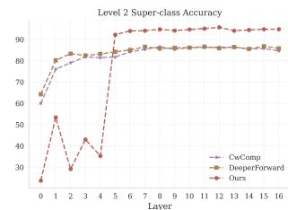

line

| Layer | CecComp | DeeperForward | Ours |
|-------|---------|---------------|------|
| 0     | 65      | 65            | 25   |
| 1     | 70      | 80            | 55   |
| 2     | 75      | 80            | 30   |
| 3     | 80      | 80            | 45   |
| 4     | 80      | 80            | 30   |
| 5     | 80      | 80            | 90   |
| 6     | 85      | 85            | 90   |
| 7     | 85      | 85            | 90   |
| 8     | 85      | 85            | 90   |
| 9     | 85      | 85            | 90   |
| 10    | 85      | 85            | 90   |
| 11    | 85      | 85            | 90   |
| 12    | 85      | 85            | 90   |
| 13    | 85      | 85            | 90   |
| 14    | 85      | 85            | 90   |
| 15    | 85      | 85            | 90   |
| 16    | 85      | 85            | 90   |

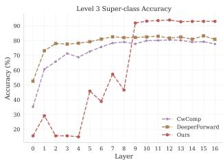

line

| Layer | CwComp | DeeperForward | Ours |
|-------|--------|---------------|------|
| 0     | 30     | 50            | 20   |
| 1     | 40     | 70            | 30   |
| 2     | 50     | 75            | 20   |
| 3     | 60     | 75            | 20   |
| 4     | 70     | 75            | 45   |
| 5     | 75     | 75            | 35   |
| 6     | 75     | 75            | 55   |
| 7     | 75     | 75            | 45   |
| 8     | 75     | 75            | 90   |
| 9     | 75     | 75            | 90   |
| 10    | 75     | 75            | 90   |
| 11    | 75     | 75            | 90   |
| 12    | 75     | 75            | 90   |
| 13    | 75     | 75            | 90   |
| 14    | 75     | 75            | 90   |
| 15    | 75     | 75            | 90   |
| 16    | 75     | 75            | 90   |

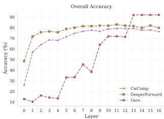

line

| Layer | CwComp | DeeperForward | Ours |
|-------|--------|---------------|------|
| 0     | 25     | 45            | 10   |
| 1     | 55     | 70            | 15   |
| 2     | 65     | 75            | 15   |
| 3     | 70     | 78            | 15   |
| 4     | 72     | 78            | 30   |
| 5     | 75     | 78            | 35   |
| 6     | 78     | 78            | 40   |
| 7     | 78     | 78            | 45   |
| 8     | 78     | 78            | 50   |
| 9     | 78     | 78            | 60   |
| 10    | 78     | 78            | 70   |
| 11    | 78     | 78            | 75   |
| 12    | 78     | 78            | 80   |
| 13    | 78     | 78            | 90   |
| 14    | 78     | 78            | 90   |
| 15    | 78     | 78            | 90   |
| 16    | 78     | 78            | 90   |

Figure 7. Layer-wise super-class accuracy at different hierarchy levels and overall fine-grained accuracy.

Our model exhibits a clear and structured progression across depth. In the shallow network from layer 0 to layer 4, HCL-FF achieves strong performance on Level 1 superclasses while showing limited ability to discriminate finegrained categories, which is precisely the behavior encouraged by hierarchical supervision. As depth increases, the model receives finer-grained targets and correspondingly improves its performance on deeper hierarchy levels and on fine-grained classification. This demonstrates that hierarchical supervision successfully guides the network to develop increasingly specialized semantic representations.

In contrast, both CwComp and DeeperForward require the shallow layers to immediately solve the full fine-grained classification problem. Although this can yield higher finegrained accuracy in the early layers, it comes at the expense of poorer performance on coarse super-class distinctions. This pattern suggests that these methods prematurely force early layers toward high-level abstraction, reducing the stability and generality of their representations.

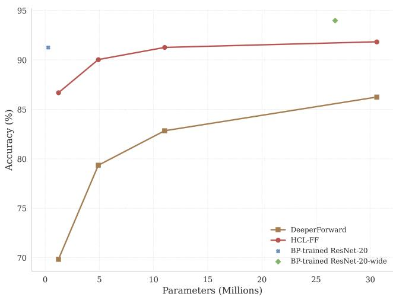

line

| Parameters (Millions) | DeeperForward | HCL-FF | BP-trained ResNet-20 | BP-trained ResNet-20-wide |
| --------------------- | ------------- | ------ | -------------------- | ------------------------- |
| 0                     | 70            | 86.5   | 91.0                 | -                         |
| 5                     | 79.5          | 90.0   | -                    | -                         |
| 10                    | 82.5          | 91.0   | -                    | -                         |
| 30                    | 86.0          | 91.5   | -                    | 94.0                      |

Figure 8. CIFAR-10 accuracy versus parameter count for Deeper-Forward, HCL-FF, and BP-trained ResNet baselines.

# 11. Model Efficiency

To evaluate parameter efficiency, we compare HCL-FF with DeeperForward, along with BP-trained ResNet-20 and the parameter-matched ResNet-20-wide baseline. Figure 8 reports CIFAR-10 accuracy as a function of total parameter count. We evaluate four model capacities for both HCL-FF and DeeperForward, where the channel widths of the four residual blocks are set as follows:

• Tiny: [20, 40, 80, 160] channels,   
• Small: [40, 80, 160, 320] channels,   
• Medium: [60, 120, 240, 480] channels,   
• Large: [100, 200, 400, 800] channels (as in Sec. 6).

Across all model sizes, HCL-FF achieves substantially higher accuracy than DeeperForward. The HCL-FF curve consistently lies above that of DeeperForward, demonstrating a markedly more favorable accuracy-capacity tradeoff. Moreover, the tiny configuration (1.225M parameters) of our HCL-FF model attains 86.68% accuracy, exceeding DeeperForward’s large model (30.603M parameters, 86.24%) while using less than 5% of its parameters.

Nevertheless, we acknowledge that a performance gap remains between layer-wise training and full end-to-end BP optimization. Our medium configuration (11.018M parameters) achieves a comparable accuracy of 91.26% to BPtrained ResNet-20 (91.25%). However, it requires more parameters to achieve this level of accuracy. Moreover, our large HCL-FF model still falls short of the parametermatched ResNet-20-wide by a few percentage points. This suggests that while hierarchical and contrastive guidance greatly enhance FF-based training, further advances in local learning objectives are needed to close the remaining gap to BP.

Overall, the results in Figure 8 show that HCL-FF delivers significantly improved parameter efficiency over prior FF-based methods, bringing FF training meaningfully closer to BP-trained networks while maintaining its fully local training paradigm.

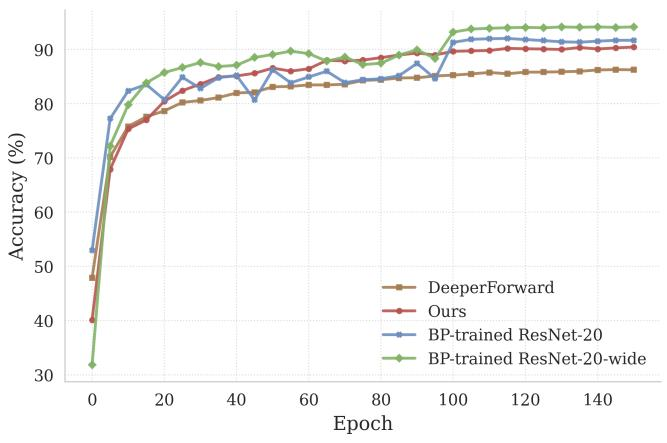

line

| Epoch | DeeperForward | Ours | BP-trained ResNet-20 | BP-trained ResNet-20-wide |
|-------|---------------|------|----------------------|----------------------------|
| 0     | 48            | 40   | 53                   | 32                         |
| 10    | 75            | 78   | 82                   | 80                         |
| 20    | 78            | 82   | 85                   | 86                         |
| 30    | 80            | 84   | 86                   | 88                         |
| 40    | 81            | 85   | 87                   | 89                         |
| 50    | 82            | 86   | 88                   | 90                         |
| 60    | 83            | 87   | 89                   | 91                         |
| 70    | 84            | 88   | 90                   | 92                         |
| 80    | 85            | 89   | 91                   | 93                         |
| 90    | 86            | 90   | 92                   | 94                         |
| 100   | 87            | 91   | 93                   | 95                         |
| 110   | 87            | 91   | 93                   | 95                         |
| 120   | 87            | 91   | 93                   | 95                         |
| 130   | 87            | 91   | 93                   | 95                         |
| 140   | 87            | 91   | 93                   | 95                         |
| 150   | 87            | 91   | 93                   | 95                         |

Figure 9. CIFAR-10 training curves under a matched 150-epoch schedule. HCL-FF converges faster and reaches higher accuracy than DeeperForward.

# 12. Learning Dynamics

To further compare the convergence behavior of HCL-FF, DeeperForward, and standard backpropagation, we examine their CIFAR-10 learning curves under a matched training schedule. All models are trained for 150 epochs for a fair comparison. Figure 9 reports test accuracy across training epochs.

HCL-FF converges noticeably faster and to a higher accuracy than DeeperForward. By epoch 20, HCL-FF already surpasses DeeperForward and maintains this advantage throughout training, indicating that hierarchical supervision and contrastive grounding provide stronger and more stable learning signals.

BP-trained ResNet-20 exhibits larger fluctuations during the early and mid stages of training, reflecting the dynamics of joint gradient updates across all layers. Despite this instability, it eventually achieves higher final accuracy, highlighting the remaining challenges of purely layer-wise optimization compared to end-to-end backpropagation.

Overall, the learning curves confirm that HCL-FF delivers both faster and smoother convergence than prior FFbased approaches, while narrowing the gap to BP-trained networks under identical training conditions.

# 13. Hierarchy Mapping

In addition to the hierarchy mapping method described in Eq. 10 of the main paper, we evaluate two alternative strategies for assigning hierarchy levels across layers.

Table 9. Effect of alternative hierarchy mapping strategies. 

<table><tr><td>Dataset</td><td>Incremental</td><td>Decremental</td><td>Balanced</td></tr><tr><td>CIFAR-100 Accuracy</td><td>70.30</td><td>68.40</td><td>70.76</td></tr></table>

Table 10. Effect of batch size. 

<table><tr><td>Batch size</td><td>32</td><td>64</td><td>128</td><td>256</td><td>512</td></tr><tr><td>CIFAR-10 Accuracy</td><td>92.10</td><td>92.22</td><td>91.83</td><td>91.73</td><td>91.96</td></tr></table>

(1) Incremental mapping. This strategy assigns coarse supervision to the earliest layers and gradually increases granularity with depth. Specifically, for a network with L layers and a hierarchy of depth D, we define:

$$
\operatorname{level} (i) = \min (1 + i, D), \quad i = 0, \dots , L - 1, \tag {17}
$$

Thus, layer 0 receives Level 1 supervision, layer 1 receives Level 2, and so forth, until the maximum depth D is reached, after which all deeper layers are supervised at Level D. This mapping encourages early layers to transition quickly toward finer semantic resolutions.

(2) Decremental mapping. Conversely, this strategy assigns fine-grained supervision to the deepest layers and progressively coarser supervision toward the input:

$$
\operatorname{level} (i) = \max (D - (L - 1 - i), 1), \quad i = 0, \dots , L - 1, \tag {18}
$$

Here, shallow and mid-level layers are trained on very coarse super-classes, and only the final few layers receive fine-grained targets.

Results. Table 9 compares the performance of these mapping strategies. For clarity, we refer to the hierarchy assignment defined in Eq. 10 of the main paper as the balanced mapping, since it distributes hierarchy levels more evenly across depth. The incremental mapping performs similarly to the balanced strategy, while the decremental mapping results in a clear performance drop. This outcome reflects the importance of assigning sufficiently fine supervision to the middle layers. Although these layers have substantial representational capacity, the decremental mapping constrains them to overly coarse tasks, preventing the model from developing nuanced intermediate features. As a result, finegrained supervision is concentrated only at the very end of the network, and the deeper hierarchy levels are not effectively leveraged across depth.

# 14. Effect of Batch Size

Table 10 shows the effect of batch size on CIFAR-10 performance. HCL-FF demonstrates stable performance across a broad range, with accuracy varying by less than 0.5% between batch sizes of 32 and 512. This indicates that the contrastive component of HCL-FF does not rely on extremely large batches, in contrast to many contrastive learning frameworks that require thousands of samples per batch for stable gradients. Two factors may contribute to this robustness. First, layer-wise training restricts each update to a smaller subset of parameters, which stabilizes optimization and reduces the need for large batch sizes. Second, hierarchical supervision provides a strong coarse-to-fine semantic structure that helps maintain stable training dynamics even at smaller batch scales.

Finally, we observe slightly higher accuracy at smaller batch sizes. Because the number of epochs is fixed, smaller batches yield more update steps. Since layer-wise learning is less sample-efficient than end-to-end backpropagation, these additional updates give deeper layers more opportunities to refine their representations using information propagated from earlier layers.

# 15. Computational Cost

To demonstrate the computational aspect of HCL-FF, we compare HCL-FF against a BP-trained ResNet variant and DeeperForward under matched training conditions. All models have comparable numbers of parameters and are trained for 200 epochs with a batch size of 512, ensuring fair model size and equal numbers of weight updates.

For HCL-FF, we report the computational cost of its two training stages separately. The first stage (Ourspretraining) trains the model without hierarchical learning and is used to construct the data-driven hierarchy. The second stage (Ours) trains the full model from scratch with both hierarchical and contrastive objectives. To further contextualize the computational overhead, we additionally include an extended DeeperForward baseline trained for 750 epochs (DeeperForward-extend), which approximately matches the total GPU hours consumed by our two-stage pipeline.

Table 11 summarizes classification accuracy, total GPU hours, and GPU memory usage. Several observations can be made. First, FF-based methods are substantially more memory-efficient than BP-based training. ResNet20-Wide requires 9916 MiB of GPU memory, whereas all FF-based variants require between 3552 and 3848 MiB. This reduction stems from the layer-wise local learning paradigm, which avoids storing full-network activations for backpropagation.

Second, incorporating contrastive learning introduces only a modest increase in memory usage compared to DeeperForward (3848 MiB vs. 3552 MiB), while providing a significant improvement in accuracy (63.63% vs. 53.57%). Although the contrastive objective increases total GPU hours, the computational overhead remains moderate relative to

<table><tr><td>Method</td><td>ResNet20-Wide</td><td>DeeperForward</td><td>Ours-pretraining</td><td>Ours</td><td>DeeperForward-extend</td></tr><tr><td>CIFAR-100 Acc.</td><td>74.91</td><td>53.57</td><td>63.63</td><td>69.03</td><td>55.01</td></tr><tr><td>Training GPU Hours (NVIDIA RTX A6000)</td><td>2.21</td><td>0.79</td><td>1.32</td><td>1.36</td><td>3.02</td></tr><tr><td>Training GPU Memory Usage (MiB)</td><td>9916</td><td>3552</td><td>3848</td><td>3848</td><td>3552</td></tr></table>

Table 11. Comparison of computational cost and performance on CIFAR-100.

the accuracy gains.

Third, the additional cost of hierarchical learning is minimal. The final HCL-FF model (Ours) exhibits nearly identical GPU memory usage and training time to the pretraining stage (Ours-pretraining), while achieving a further improvement in accuracy (69.03% vs. 63.63%). This indicates that hierarchical learning introduces negligible computational overhead while achieving substantial accuracy gains.

Finally, increasing computation alone does not bridge the performance gap. The extended DeeperForward baseline consumes more GPU hours (3.02 hours) than our complete two-stage pipeline (1.32 + 1.36 hours), yet achieves substantially lower accuracy (55.01% vs. 69.03%). This demonstrates that the performance gains of HCL-FF arise from the proposed hierarchical and contrastive learning mechanisms rather than from increased computational budget.

Overall, HCL-FF achieves significant accuracy improvements over prior FF-based methods with only modest additional training time and minimal memory overhead, while retaining the memory efficiency advantages of fully local learning.