# Learning from Semantic Dictionaries: Discriminative Codebook Contrastive Learning for Unified Visual Representation and Generation

Imanol G. Estepa1 Jesus M. Rodr ´ ´ıguez-de-Vera1 Bhalaji Nagarajan2 Petia Radeva1 1Universitat de Barcelona, Barcelona, Spain

2Barcelona Supercomputing Center (BSC), Barcelona, Spain

estepa.gonzalez@ub.edu, j.molina.rdv@ub.edu, bhalaji.nagarajan@bsc.es, petia.radeva@ub.edu

# Abstract

Discriminative and generative vision models excel in their respective domains but remain semantically misaligned, hindering progress toward unified visual learning. We introduce LEASE (LEArning from SEmantic Dictionaries), a self-supervised framework that bridges this gap using a paired generative–discriminative codebook design. LEASE operates entirely in a discrete token space produced through a one-time precomputation step, enabling efficient training without data augmentations, teacher models, or online tokenizers. LEASE integrates two complementary objectives: a masked token reconstruction loss that captures fine-grained generative detail, and a codebook contrast loss that aligns encoder features with discriminative semantics via adaptive centroid weighting. This dual supervision yields a unified latent space that supports both high-quality generation and strong representation learning. On ImageNet-1K, LEASE achieves state-of-the-art unified performance, outperforming prior VQGAN-based methods such as MAGE and Sorcen across linear probing, unconditional generation, few-shot learning, transfer, and robustness benchmarks. It also competes favorably with domainspecialized contrastive and generative models while surpassing previous MIM methods. The unsupervised LEASE model can also be extended to conditional generation by building upon its learned representations, proving competitive with specialized baselines. Overall, LEASE provides an efficient and effective step toward general-purpose vision models that jointly understand and generate visual content. Code available at https://github.com/ ImaGonEs/LEASE.

# 1. Introduction

Vision Foundation Models (VFM) have emerged as one of the most successful computer vision architectures [37, 39,

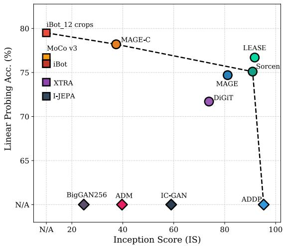

scatter

| Model | Inception Score (IS) | Linear Probing Acc. (%) |
| :--- | :--- | :--- |
| iBot_12 crops | N/A | 79.5 |
| MoCo v3 | N/A | 76.8 |
| iBot | N/A | 79.0 |
| MAGE-C | 38 | 78.2 |
| iGAN256 | 25 | 60.0 |
| ADM | 40 | 60.0 |
| DiGiT | 74 | 71.8 |
| IC-GAN | 60 | 60.0 |
| MAGE | 82 | 74.8 |
| LEASE | 92 | 76.8 |
| Sorcen | 92 | 75.2 |
| ADDP | 96 | 60.0 |

Figure 1. Linear probing and class-unconditional generation performance. Our approach, LEASE, advances the Unified SSL SoTA and defines a new Pareto-front for unified models.

45, 60]. Trained largely on self-supervised or weakly supervised objectives [6, 41], they learn rich latent representations that support a wide range of discriminative tasks. However, these representations cannot be directly translated into high-fidelity visual generation [32, 33, 47]. Even Masked Image Modeling (MIM) methods such as SimMIM [53] and MAE [23], that are explicitly optimized for reconstruction, often fail to produce detailed, realistic images when decoded from their learned latent representations.

In contrast, generative models including diffusion [43], GAN-based architectures [4] and Vector Quantization tokenizers [18, 54] capture rich low-level and mid-level visual details of training images to synthesize high-fidelity images, often guided by text or multimodal conditioning. However, when their generative representations are applied for discriminative tasks, their performance drops significantly, mirroring the limitations observed in VFMs [12, 36, 51]. These features, while useful for image generation, lack global discriminative semantics common in VFMs. Although both paradigms aim at strong feature learning capabilities, they appear to “speak” fundamentally different semantic languages.

Although trained with different objectives, semantic spaces of both models contain complementary information. Integrating them within a single model yields stronger performance than relying on either paradigm independently. Recent unified and hybrid approaches leverage VFM features to guide generative models, improving generation while revealing emergent discriminative abilities [32, 55, 61]. Similarly, vector-quantization tokenizers like VQGAN [18] have enabled masked-token reconstruction frameworks that pretrain SSL models directly in token space, yielding strong performance in both discrimination and generation [20, 33]. Other strategies including initializing generative models from pretrained VFM weights or distilling features from discriminative models, have shown promising unified behavior [32, 55, 58]. However, these methods treat unified performance as a byproduct of distillation or initialization and do not address the underlying issue: the semantic misalignment between generative and discriminative representations. In this work, we directly target this misalignment and show that explicitly learning over both semantic spaces allows a single model to excel in both visual generation and discriminative representation learning.

LEArning from SEmantic Dictionaries (LEASE) introduces a unified framework that bridges generative and discriminative semantics through paired codebooks (referred as “dictionaries”). Each dictionary discretely encodes latent representations under a specific paradigm, either generation or discrimination, while providing complementary views of visual semantics. Instead of following VFM distillation strategies, LEASE jointly learns generative and discriminative perspectives by combining two objectives: a masked token reconstruction loss based on a generative dictionary and a codebook contrastive loss derived from a discriminative dictionary. The generative dictionary transforms images into sequences of discrete tokens, allowing LEASE to learn detailed visual information relevant for generative tasks just by reconstructing the masked input tokens. In parallel, the contrastive objective regularizes the latent space by aligning the features with the semantics encoded in the discriminative dictionary. Through this dual learning process, LEASE natively unites both “languages” within a shared latent space, yielding strong performance in both paradigms (Figure 1). Unlike previous unified approaches, LEASE requires neither image augmentations nor additional frozen models, as it learns directly from the semantic differences encoded in its dictionaries. All input tokens are precomputed once before training, resulting in an efficient, fully self-contained learning framework.

We evaluate LEASE across a diverse set of discrimina-

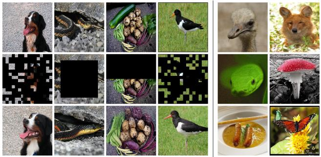  
Figure 2. (Left) Reconstruction Samples with original images (Left-Top Row) and Masks (Left-Middle Row). (Right) Conditional (Col# 1) and Unconditional (Col# 2) generated samples.

tive and generative benchmarks, demonstrating strong performance in both paradigms. LEASE consistently outperforms prior unified Self-supervised Learning (SSL) frameworks and achieves competitive or superior results compared to domain-specific and VFM-distillation-based models. Our extensive evaluation establishes LEASE as the new SoTA unified SSL framework, introducing dual codebook learning strategies for the efficient unification of discriminative and generative representations. Our main contributions are summarized as follows:

1. We introduce Learning from Semantic Dictionaries (LEASE), the first SSL framework that explicitly targets the semantic misalignment between generative and discriminative representations by jointly learning from paired generative–discriminative codebooks.   
2. We propose a codebook contrast objective constructed entirely from discriminative centroids. Combined with token reconstruction, this dual supervision encourages a single encoder to reconcile both semantic paradigms within a unified latent space.   
3. LEASE operates entirely on precomputed discrete tokens, requiring no online tokenizer, data augmentations, or dual encoder architectures, yielding significantly faster training, reaching 48.7% and 8.75% speedup over MAGE and Sorcen respectively.   
4. Extensive experiments show that LEASE outperforms prior unified frameworks (e.g., MAGE, Sorcen), MIM methods and competes with specialized discriminative, generative, and VFM-distillation methods, often surpassing them. LEASE also demonstrates strong robustness, transferability, and competitive conditional generation without additional pretraining.

# 2. Related Works

Self-Supervised Representation Learning. Contrastive learning frameworks have emerged as highly effective unsupervised pretraining methods [5, 9, 22]. SimCLR [9] established a strong baseline using dual-view augmentations to form positive pairs and an InfoNCE-based objective [38] that attracts these pairs together while repelling all remaining representations in the batch. MoCo [6, 10] improved this paradigm through momentum encoders and feature queues, although it still suffered from limited sample diversity. This motivated the creation of multiple neighborbased contrastive frameworks [17, 19, 28]. NNCLR [17] replaces one member of the positive pair by its nearest neighbor, improving overall semantic diversity. While contrastive methods capture strong global semantics, they fall short on complex downstream tasks, such as full finetuning. Reconstruction-based SSL methods address this gap. SimMIM [53] and MAE [23] introduced masked image modeling (MIM). MAE avoids encoding masked patches, thereby improving training efficiency while obtaining competitive performance. The widespread adoption of Transformer architectures [48] accelerated the development of new MIM architectures. U-MAE [56] and Ge2-AE [34] address feature collapse and over-smoothing in MAE [23]. A2MIM [31] explores model-agnostic MIM strategies that can also be applied to CNNs. I-JEPA [2] and XTRA [1] push state-of-the-art with more predictive and efficient SSL architectures. CAE [11], CMAE [27] and iBot [60] combine MIM, contrastive objectives and distillation, improving representation quality. Different from existing representation learning approaches, LEASE works entirely in a compact, precomputed token space, eliminating the need for augmentations. Its codebook contrast objective extracts both positive and negative pairs from a discriminative codebook, eliminating batch-dependent negatives and the associated sampling noise, while providing required diversity.

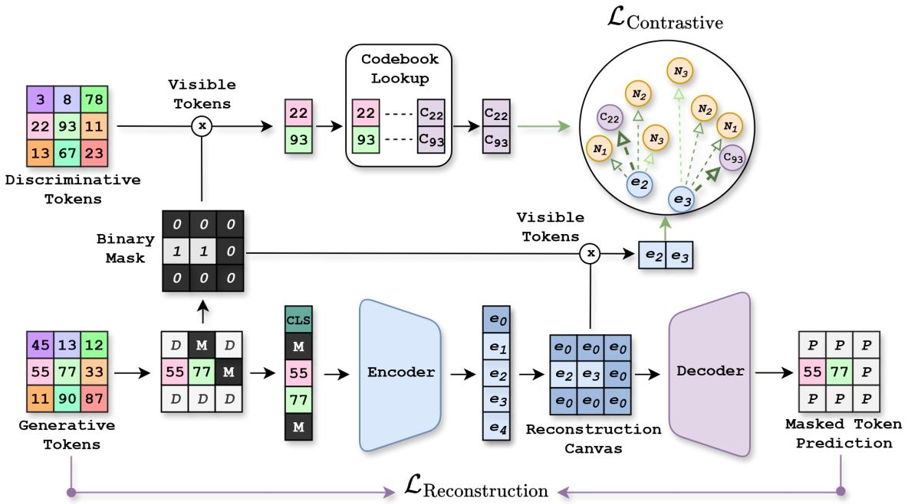

flowchart

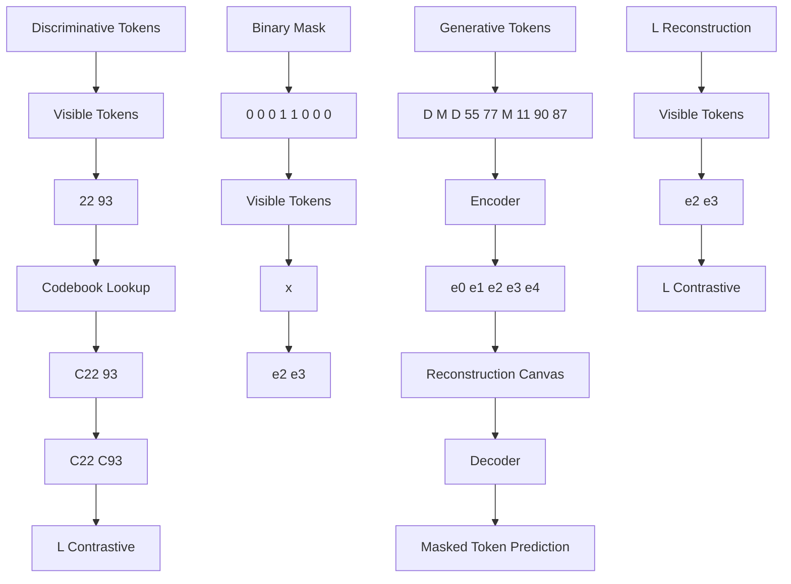

Figure 3. Overview of LEASE. Visible generative tokens are encoded and placed into a reconstruction canvas for masked token prediction, forming the reconstruction objective. Parallelly, visible discriminative tokens are mapped to their codebook centroids, providing positives and neighbors for the codebook contrastive loss, where visible token embeddings and centroids are pulled together.

Unified Visual Representation Learning. While some MIM models exhibit limited generative ability, their performance is insufficient for true unified modeling [12, 36, 47]. Generative models such as Generative Adversarial Networks (GANs) or diffusion-based models produce highfidelity images in both unconditional and conditional settings. Works such as BigGAN [4], IC-GAN [7] and HiT [57] focus on improving generative quality, while DiT [40] introduced the Transformer architecture [48] to diffusion models with strong results. l-DAE [12] explored whether diffusion models can also support discriminative tasks. Big-BiGAN [16], MaskGIT [8] and more recently ADDP [47], demonstrate that generation-oriented models can also yield competitive discriminative representations. MAGE [33] and Sorcen [20], the current unified SSL SoTA, leverage generative tokenizers such as VQGAN [18] to reconstruct tokenized input images, enhancing both discrimination and generation. DiGIT [61] discretizes features from VFMs and trains next-token prediction models on top, achieving strong unified performance. However, most of these approaches require an online tokenizer during training, significantly increasing computational cost. Sorcen [20] partially alleviates this through precomputation but relies on a dual-encoder architecture, which introduces an additional forward pass per training step. Recent methods such as REPA [55], VFMTok [58], MergeVQ [32] and SVG [44] use pretrained VFMs as teachers to distill discriminative features into generative frameworks, obtaining SoTA performance. While effective, these approaches rely on frozen VFMs during training, reducing the efficiency. Although multimodal LLMs can exhibit strong unified capabilities, their scale makes experimentation costly [30, 35]. Our work targets the root cause of unification, the semantic misalignment between generative and discriminative representations. LEASE leverages a paired generative–discriminative codebook to train a standalone encoder–decoder model that jointly learns both semantic types. Its token reconstruction objective works over precomputed tokens, eliminating the need for online tokenizers and enabling efficient generative training. Simultaneously, the codebook contrast objective regularizes the model using a discriminative codebook, without requiring dual encoders or distillation from frozen VFMs. This design maximizes unified learning while minimizing computational overhead, yielding improvements over prior unified SSL frameworks such as MAGE [33] and Sorcen [20] while being significantly more efficient.

# 3. Method

Our Self-supervised Learning Framework, LEArning from SEmantic Dictionaries (LEASE), leverages encoded information from a paired set of generative and discriminative codebooks to train a unified encoder capable of both representation learning and visual generation. The generative codebook provides input tokens and enables capturing subtle visual details through a masked token reconstruction objective, while the discriminative codebook enriches each patch embedding with strong semantic information via a multi-target contrastive learning objective. Together, these objectives enable the encoder to reconcile generative and discriminative semantics within the same latent space, providing representations that are simultaneously semantically meaningful and rich enough for visual generation and discriminative tasks.

Architecture Overview. LEASE (see Figure 3) consists of a Transformer Encoder E that projects input semantic tokens into a unified latent space, and a Transformer Decoder G that transforms the unified latent representations back into semantic tokens. Unlike popular MIM architectures, LEASE operates directly on quantized tokens instead of raw image pixels, making them computationally cheaper and enabling faster pretraining. This efficiency is further enhanced through codebook-based dataset precomputation, where the entire dataset is tokenized just once before training, eliminating any on-the-fly tokenization overhead.

Codebooks. LEASE leverages two complementary codebooks during training: a generative codebook and a discriminative codebook. The generative codebook acts as the tokenizer, transforming the original input image into a discrete sequence of N tokens, each token represented by integer indices. Previously trained for image reconstruction, it encodes the image into detailed semantics useful for generation. On the other hand, the discriminative codebook, which is derived from a self-supervised VFM, provides strong discriminative semantics for the model to learn and align with input generative tokens. Rather than being trained, this codebook is created by clustering the embedding space into K centroids, each representing a distinct semantic concept. For every image patch, the two codebooks produce complementary information that together form the foundation of LEASE’s unified modeling framework.

Input Preparation. We precompute the discrete token sequences of the target dataset D using both the generative and discriminative codebooks. For each image, I, we encode every image patch into a sequence of generative semantic tokens, $t = ( t _ { 1 } , \dots , t _ { S S } )$ , where SS denotes the sequence length (number of patches). Each value in t is represented by an integer in the range $[ 0 , v _ { m a x } ]$ , where $v _ { m a x }$ denotes the vocabulary size of the generative tokenizer. In parallel, we also extract a sequence of discriminative semantic tokens, t′, using the discriminative codebook in an identical fashion. After preprocessing, each image is associated with a pair of token sequences. While t serves as the input to LEASE, t′ links each generative token to its corresponding discriminative semantic, forming a position-aligned positive pair. Concretely, the i-th element of t and the i-th element of t′ correspond to the same image patch, allowing a direct lookup in the discriminative codebook to retrieve the discriminative semantic associated with $t _ { i } ^ { \prime } .$ . This establishes a simple but effective correspondence chain that provides the required positive pairs for the codebook contrast objective. To maintain a completely unsupervised learning scheme, we use an “unsupervised” VQGAN as our generative codebook following previous works [20, 33].

# 3.1. Generative Objective

The first objective enhances LEASE’s generative capacity by leveraging the generative semantic tokens through two steps: the Masking step and the Reconstruction step.

Masking Step. While high masking ratios benefit generative modelling, lower ratios increase the representation learning capacity of the model [33]. LEASE leverages a variable masking ratio strategy that enables learning from both low and high masking ratios, balancing these two objectives. On average, 69% of the input sequence is masked, ranging between 50% and 100%. At each training step, masked tokens are replaced with an integer outside the vocabulary range $v _ { m a x } .$ , denoted as mask token [MASK]. Then, a special token [CLS] is prepended to the sequence.

Finally, to reduce memory footprint, LEASE drops masked tokens retaining only half of the original sequence size. This dropping strategy follows prior works [23, 33]. After this drop, ≈ 19% of the final sequence size is kept masked.

Reconstruction Step. The reconstruction process is formulated as a token prediction problem applied to each masked patch in the input sequence $t _ { m a s k e d }$ . First, the LEASE encoder E projects the $t _ { m a s k e d }$ into its unified latent space, obtaining $\mathcal { E } ( t _ { m a s k e d } ) = ( e _ { 0 } , e _ { 1 } , . . . , e _ { L } )$ , where L is the length of $t _ { m a s k e d }$ and half of the original input sequence length. To reconstruct the original input sequence t, we create a template ”canvas”, cv, of size 2 · L using the [CLS] latent $e _ { 0 }$ . Then, the corresponding positions in the canvas are replaced with their latent embeddings from $t _ { m a s k e d }$ . Finally, the canvas is passed through the LEASE decoder G to predict the original input sequence t.

The token reconstruction objective is defined as:

$$
\mathcal {L} _ {\mathrm{R}} = - \mathbb {E} _ {t \sim \mathcal {D}} \left(\sum_ {i = 1} ^ {C S} m _ {i} \log p (t _ {i} \mid c v _ {i})\right). \tag {1}
$$

where p represents the output of the decoder $\mathcal { G }$ and CS the canvas size. Note that this objective is exclusively applied to tokens represented as masked, $m _ { i } ,$ in the canvas.

# 3.2. Discriminative Objective

This objective leverages the discriminative codebook to enhance the semantic understanding capacity of LEASE and consists of two stages: centroid gathering and codebook contrast.

Centroid Gathering. For each token in the input sequence $t ,$ there exists a corresponding discriminative token in sequence $t ^ { \prime } .$ . This alignment correspondence enables an efficient lookup over the selected discriminative codebook to obtain its centroid $\mathcal { C } _ { t _ { i } ^ { \prime } }$ , represented as a semantic latent. In practice, for each latent $e _ { i }$ in LEASE space representing a token $t _ { i } ,$ the centroid $\mathcal { C } _ { t _ { i } ^ { \prime } }$ is obtained through the mapping $e _ { i } \to t _ { i } \to t _ { i } ^ { \prime } \to { \mathcal { C } } _ { t _ { i } ^ { \prime } }$ . To enrich semantic information, $K _ { s e l }$ most similar centroids to $\mathcal { C } _ { t _ { i } ^ { \prime } }$ are retrieved from the entire set of K centroids, forming the set of neighbor centroids $\mathcal { N } _ { t _ { i } ^ { \prime } }$ . The retrieval is computed for all tokens as follows:

$$
\mathcal {N} _ {i} = \mathrm{TopK} \big (\{s _ {i k} \} _ {k = 1} ^ {K}, K _ {\mathrm{sel}} \big). \tag {2}
$$

where $s i m _ { i k }$ denotes the cosine similarity between centroids, $s _ { i k } = \mathbf { C } _ { t _ { i } } ^ { \top } \mathbf { C } _ { k }$ . Each token in the batch thus obtains $1 + \mathcal { N } _ { t _ { \ast } ^ { \prime } }$ positive pairs, enabling our novel codebook based contrastive objective.

Codebook Contrast. While the centroid $\mathcal { C } _ { t _ { i } ^ { \prime } }$ and its neighbors $\mathcal { N } _ { t _ { i } ^ { \prime } }$ are considered positive samples, the semantic similarity between the original $\mathcal { C } _ { t _ { i } ^ { \prime } }$ and its neighbors may vary significantly. For this reason, our codebook contrast objective adaptively weighs the relevance of each neighbor based on their similarity to the query centroid $\mathcal { C } _ { t _ { i } ^ { \prime } }$ . For every neighbor $j$ in $\mathcal { N } _ { t _ { i } ^ { \prime } }$ we obtain a weight based on the previously computed similarity:

$$
w _ {i j} = \frac {\exp \left(s i m _ {i j} / \tau\right)}{\sum_ {k \in \mathcal {C} _ {t _ {i} ^ {\prime}} \cup \mathcal {N} _ {t _ {i} ^ {\prime}}} \exp \left(s i m _ {i k} / \tau\right)} \tag {3}
$$

where τ controls the smoothness of the weighting distribution. It is set to 0.1 to keep the target sharp while preserving meaningful weights for close centroids.

Given these weights, the final Codebook Contrast is computed over the unmasked tokens:

$$
\mathcal {L} _ {\mathrm{C}} = - \frac {1}{N _ {u}} \sum_ {i \in \mathcal {U}} \sum_ {j \in \mathcal {C} _ {t _ {i} ^ {\prime}} \cup \mathcal {N} _ {t _ {i} ^ {\prime}}} w _ {i j} \log \frac {\exp \left(z _ {i} ^ {\top} \mathcal {C} _ {j} / \alpha\right)}{\sum_ {k = 1} ^ {K} \exp \left(z _ {i} ^ {\top} \mathcal {C} _ {k} / \alpha\right)} (4)
$$

where $N _ { u }$ is the number of unmasked tokens and α is the contrastive temperature. This objective pulls together the unified semantics produced by the LEASE encoder and those encoded in the discriminative codebook, encouraging the model to produce highly semantic embeddings. Unlike standard contrastive objectives, Codebook Contrast does not rely on batch samples to form negative pairs. Instead, it uses all remaining centroids in the codebook, those not selected as neighbors or as $\mathcal { C } _ { t _ { i } ^ { \prime } }$ , as negatives. This removes the noise and instability of batch-dependent negatives, yielding more stable and meaningful representations.

# 3.3. Final Objective

The overall LEASE objective is defined as the weighted sum of its Reconstruction and Contrast losses:

$$
L _ {L E A S E} = L _ {R} + \lambda \cdot L _ {C}, \tag {5}
$$

where λ controls the contribution of the discriminative signal during training. This unified objective effectively integrates representation learning and visual generation, resulting in a model that excels in both paradigms, ultimately demonstrating strong SoTA results across both.

# 4. Experiments

Implementation Details. All experiments use ViT-Base architecture following the configuration reported in MAGE [33]. The generative codebook is obtained from an unsupervised VQGAN [18], while the discriminative codebook is constructed by applying k-means clustering to DINOv2 [39] features, following the procedure introduced in DiGIT [61]. Unless otherwise stated, all models are pretrained on IN-1K [15] for 1600 epochs and evaluated on its validation set. For unconditional generation, we adopt the evaluation protocols used in MAGE [33] and MaskGIT [8]. Additional implementation details and hyperparameters are provided in the supplementary material.

# 4.1. Unified Evaluation

We evaluate LEASE on IN-1K [15] using linear probing and unconditional image generation, and compare it against SoTA generative, discriminative, and unified SSL methods (See Table 1). When compared against generative methods, LEASE achieves competitive or superior performance in both FID and IS. It outperforms all generative baselines except ADDP [47], while LEASE substantially outperforms it in discriminative accuracy. This highlights that models optimized primarily for generation struggle to match LEASE’s balanced unified capability. Compared to SSL contrastive methods, LEASE ranks among the top. Only MAGE-C achieves higher linear probing accuracy, but LEASE outperforms it in generation quality. MAGE-C introduces a contrastive objective that prioritizes discriminative performance at the expense of generation, reducing its unified effectiveness. LEASE consistently outperforms all MIM methods while being unified. Among VQGANbased unified models, LEASE performs on par with Sorcen [20] and MAGE [33] in unconditional generation. However, LEASE’s latent space provides stronger discriminative features and a higher linear-probe accuracy. Sorcen matches LEASE in generation but is consistently outperformed on discriminative evaluation. Overall, LEASE displays solid performance in both discriminative and generative tasks, outperforming prior unified VQGAN-based models and MIMs while remaining competitive with specialized single-domain methods.

# 4.2. VQGAN-based Model Comparison

We further compare LEASE with VQGAN [18] based unified methods, MAGE [33] and Sorcen [20] across four axes: (1) performance in low-data regimes, (2) full finetuning task on IN-1K, (3) robustness to out-of-distribution and corrupted data, and (4) transferability across datasets.

Low-data Regimes (Table 2). We linear probe every model for 10 epochs (5, 10, 13 & 25 shots per class), while keeping the rest of hyperparameters fixed. LEASE demonstrates superior performance in few-shot settings, achieving an average improvement of 2.32% over MAGE and 0.56% over Sorcen. The dual nature of its training objectives provides a richer and more informative latent space, enabling the model to make better use of limited labeled samples and improving its effectiveness in low-data regimes.

Fine tuning Performance (Table 3). We finetune LEASE on IN-1K following MAGE [33]. All three frameworks achieve comparable results under full fine-tuning. Nevertheless, LEASE slightly outperforms the others, achieving a 0.2% gain over MAGE [33], the strongest baseline.

Transferability (Table 4). We evaluate cross-dataset transferability on Caltech-101 [21], UCF-101 [46], Sun397 [52], DTD [13], CIFAR-10 [29], CIFAR-100 [29], and Places365 [59]. LEASE outperforms other baselines on 5/7 datasets, yielding an average improvement of 0.75% over MAGE [33] and 0.89% over Sorcen [20]. These results indicate that LEASE learns more generalizable representations that transfer effectively beyond the pretraining domain.

<table><tr><td>Method</td><td>Models</td><td>LP%</td><td>FID</td><td>IS</td></tr><tr><td colspan="5">(Generative models)</td></tr><tr><td>BigGAN</td><td></td><td>-</td><td>38.6</td><td>24.70</td></tr><tr><td>BigGAN+ Clust</td><td></td><td>-</td><td>22.0</td><td>23.50</td></tr><tr><td>HiT</td><td></td><td>-</td><td>30.8</td><td>21.64</td></tr><tr><td>ADM</td><td></td><td>-</td><td>26.2</td><td>39.70</td></tr><tr><td>MaskGIT</td><td></td><td>57.4</td><td>20.7</td><td>42.08</td></tr><tr><td>BigBiGAN</td><td></td><td>56.6</td><td>21.6</td><td>27.94</td></tr><tr><td>IC-GAN</td><td></td><td>-</td><td>15.6</td><td>59.00</td></tr><tr><td>ADDP</td><td></td><td>11.5</td><td>8.9</td><td>95.32</td></tr><tr><td>DiT</td><td></td><td>62.5</td><td>30.9</td><td>-</td></tr><tr><td>l-DAE</td><td></td><td>69.6</td><td>-</td><td>-</td></tr><tr><td colspan="5">(Contrastive Models)</td></tr><tr><td>SimCLRv2</td><td>R50-w2</td><td>75.6</td><td>-</td><td>-</td></tr><tr><td>MoCov3</td><td>ViT-B</td><td>76.7</td><td>-</td><td>-</td></tr><tr><td>NNCLR</td><td>ViT-B</td><td>76.5</td><td>-</td><td>-</td></tr><tr><td>DINO</td><td>ViT-B</td><td>72.8</td><td>-</td><td>-</td></tr><tr><td>iBot</td><td>ViT-B</td><td>76.0</td><td>-</td><td>-</td></tr><tr><td>MAGE-C</td><td>ViT-B</td><td>78.2</td><td>31.8</td><td>37.40</td></tr><tr><td>CMAE</td><td>ViT-B</td><td>73.9</td><td>-</td><td>-</td></tr><tr><td colspan="5">(MIM models)</td></tr><tr><td>MAE</td><td>ViT-B</td><td>68.0</td><td>-</td><td>-</td></tr><tr><td>SimMIM</td><td>ViT-B</td><td>57.8</td><td>-</td><td>-</td></tr><tr><td>U-MAE</td><td>ViT-L</td><td>65.8</td><td>-</td><td>-</td></tr><tr><td>BeiT</td><td>ViT-B</td><td>56.7</td><td>-</td><td>-</td></tr><tr><td>CAE</td><td>ViT-B</td><td>70.4</td><td>-</td><td>-</td></tr><tr><td>I-JEPA</td><td>ViT-B</td><td>72.9</td><td>-</td><td>-</td></tr><tr><td>Ge2-AE</td><td>ViT-B</td><td>75.3</td><td>-</td><td>-</td></tr><tr><td>A2MIM</td><td>ViT-B</td><td>68.8</td><td>-</td><td>-</td></tr><tr><td>XTRA</td><td>ViT-B</td><td>70.2</td><td>-</td><td>-</td></tr><tr><td>Sorcen</td><td>ViT-B</td><td>75.1</td><td>9.61</td><td>90.96</td></tr><tr><td>MAGE</td><td>ViT-B</td><td>74.7</td><td>11.1</td><td>81.17</td></tr><tr><td> $\text{MAGE} \dagger$ </td><td>ViT-B</td><td>75.0</td><td>10.88</td><td>81.59</td></tr><tr><td>LEASE (Ours)</td><td>ViT-B</td><td>76.7</td><td>9.62</td><td>91.78</td></tr></table>

Table 1. Unified evaluation using linear probing (LP%) and unconditional generation (FID/IS). † - reproduced results.

<table><tr><td rowspan="2">Method</td><td colspan="5">Shots per IN-1K Class</td></tr><tr><td>5</td><td>10</td><td>13</td><td>25</td><td>Avg.</td></tr><tr><td>MAGE</td><td>48.44</td><td>57.37</td><td>59.84</td><td>63.66</td><td>57.33</td></tr><tr><td>Sorcen</td><td>50.30</td><td>59.21</td><td>61.73</td><td>65.13</td><td>59.09</td></tr><tr><td>LEASE</td><td>51.00</td><td>59.39</td><td>62.00</td><td>66.19</td><td>59.65</td></tr></table>

Table 2. Top-1 Accuracy (%) for few-shot on IN-1K.

<table><tr><td>Method</td><td>Top-1</td><td>Top-5</td></tr><tr><td>MAGE</td><td>82.5</td><td>-</td></tr><tr><td>Sorcen</td><td>82.4</td><td>96.0</td></tr><tr><td>LEASE</td><td>82.7</td><td>96.1</td></tr></table>

Table 3. Accuracy (%) for fine-tuning on IN-1K.

<table><tr><td></td><td>Caltech</td><td>UCF101</td><td>Sun</td><td>DTD</td><td>C100</td><td>C10</td><td>Places</td><td>Avg.</td></tr><tr><td>MAGE</td><td>88.97</td><td>59.66</td><td>52.36</td><td>53.90</td><td>61.39</td><td>83.60</td><td>32.35</td><td>61.75</td></tr><tr><td>Sorcen</td><td>89.61</td><td>62.44</td><td>53.26</td><td>53.84</td><td>59.00</td><td>80.27</td><td>32.82</td><td>61.61</td></tr><tr><td>LEASE</td><td>89.82</td><td>62.23</td><td>54.71</td><td>50.53</td><td>63.61</td><td>81.21</td><td>35.36</td><td>62.50</td></tr></table>

Table 4. Transfer learning results (Top-1 accuracy (%)) for different datasets under 16-shot settings.

<table><tr><td></td><td>Val.</td><td>v2</td><td>IN-S</td><td>IN-R</td><td>IN-A</td><td>ObjN.</td><td>S4</td><td>S5</td></tr><tr><td>MAGE</td><td>60.65</td><td>45.94</td><td>14.09</td><td>22.32</td><td>4.19</td><td>10.31</td><td>21.96</td><td>13.69</td></tr><tr><td>Sorcen</td><td>62.23</td><td>48.35</td><td>14.62</td><td>25.27</td><td>5.47</td><td>13.52</td><td>22.15</td><td>14.42</td></tr><tr><td>LEASE</td><td>62.60</td><td>49.14</td><td>19.48</td><td>28.04</td><td>8.51</td><td>21.61</td><td>30.24</td><td>20.39</td></tr></table>

Table 5. K-NN Top-1 accuracy (%) in IN-1K robustness variants.

Model Robustness (Table 5). We assess model robustness by evaluating the learned representations using k-NN on six robustness benchmarks [3, 24–26, 42, 50]. For ImageNet-C [24], we report results at corruption severities 4 and 5, which represent the most difficult settings. Additional dataset details are provided in the supplementary material. For reference, we also include the k-NN performance on the IN-1K validation set. Across all robustness evaluations, LEASE clearly outperforms the baselines, demonstrating its ability to produce more stable and resilient features.

Framework Efficiency (Figure 4). We evaluate the training time of each unified model under an identical setup using a single H100 GPU, a batch size of 128, IN-1K [15] for pretraining and FlashAttentionv2 [14] for optimized operations. MAGE [33] relies on an online tokenizer (highlighted in purple), which significantly increases its computational overhead and leads to substantially longer training times. Sorcen [20] removes the need for online tokenization by precomputing its inputs but still requires an additional forward pass to compute its contrastive objective, resulting in slower training compared to a single-pass design. In contrast, LEASE requires only one forward pass per iteration, and both of its objectives operate solely on lightweight codebooks, obtaining a more efficient training process. Under this shared setup, LEASE trains 48.7% faster than MAGE [33] and 8.75% faster than Sorcen [20].

# 4.3. DINOv2-based Model Comparison

Since LEASE leverages a discriminative codebook derived from DINOv2 [39], we further compare (Table 6) it to models that incorporate DINOv2 knowledge through different learning strategies. We evaluate all methods on both unconditional generation (FID/IS) and discriminative performance (linear probing and fine-tuning). Among approaches that directly distill features from a DINOv2 encoder, LEASE’s codebook contrast provides a stronger alternative, outperforming REPA [55], SVG [44], and VFM-Tok [58] across both discriminative and generative metrics. MergeVQ [32], in its unified (G+R) configuration that also distills from DINOv2, achieves higher linear probing accuracy but underperforms in fine-tuning. DiGIT [61], which also uses a discriminative codebook to construct input sequences, lags behind LEASE in linear probing and IS. Although DiGIT reports a lower FID, LEASE’s codebook contrast objective offers a superior balance of performance and efficiency, as it does not need a VFM during training.

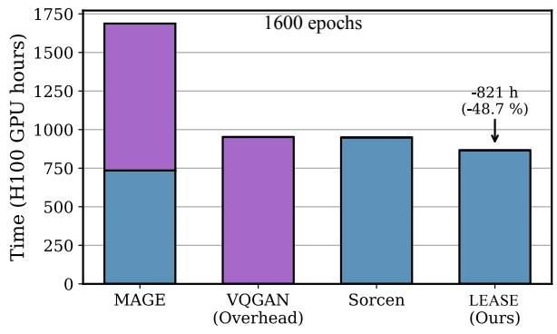

bar

| Model           | Time (H100 GPU hours) |
| --------------- | --------------------- |
| MAGE            | 750                   |
| VQGAN (Overhead)| 950                   |
| Sorcen          | 950                   |
| LEASE (Ours)    | 850                   |

Figure 4. Training time for VQGAN-based unified methods. 

<table><tr><td>Method</td><td>Learning type</td><td>FID</td><td>IS</td><td>LP%</td><td>FT%</td></tr><tr><td>DINOv2</td><td>ViT-B</td><td>-</td><td>-</td><td>84.5</td><td>85.7</td></tr><tr><td>REPA</td><td>Distillation</td><td>-</td><td>-</td><td>68.2</td><td>-</td></tr><tr><td>DiGIT</td><td>Codebook Input</td><td>9.13</td><td>73.85</td><td>71.7</td><td>-</td></tr><tr><td>SVG</td><td>Init/Distill</td><td>-</td><td>-</td><td>-</td><td>81.8</td></tr><tr><td>VFMTok</td><td>Distillation</td><td>-</td><td>-</td><td>69.4</td><td>-</td></tr><tr><td>MergeVQ (G+R)</td><td>Distillation</td><td>-</td><td>-</td><td>77.9</td><td>82.0</td></tr><tr><td>LEASE (Ours)</td><td>Codebook Contrast</td><td>9.62</td><td>91.78</td><td>76.7</td><td>82.7</td></tr></table>

Table 6. Unified evaluation against frameworks based on DINOv2.

# 4.4. Conditional Generation

Although LEASE is primarily designed for unsupervised pretraining, it can be adapted for conditional generation. Using the same architecture, we finetune the decoder using an additional class embedding token extracted from CLIP [41] and a sequence tail formed by all centroids extracted from the discriminative codebook. This finetuning phase is optimized by the reconstruction loss exclusively, as the encoder is kept completely frozen. More setup details can be found in the supplement. Despite this constrained setup, LEASE achieves competitive conditional generation performance (Table 7). Notably, it outperforms MAGE [33] on FID while keeping the IS competitive without any fromscratch pretraining and a smaller decoder. It also performs better than DiGIT [61] and REPA [55], two models that also leverage DINOv2 during training. While MergeVQ [32] reports the strongest results, LEASE attains a similar

<table><tr><td>Type</td><td>Tokenizer</td><td>Generator</td><td>Parameters</td><td>FID</td><td>IS</td></tr><tr><td>Mask.</td><td>VQGAN</td><td>MaskGIT</td><td>177M</td><td>6.18</td><td>182.1</td></tr><tr><td>Mask.</td><td>VQGAN</td><td>MAGE</td><td>117M+113M</td><td>6.93</td><td>195.8</td></tr><tr><td>AR</td><td>VQGAN</td><td>DiGIT</td><td>219M</td><td>4.79</td><td>142.87</td></tr><tr><td>Diff.</td><td>-</td><td>REPA (SiT-L/2)</td><td>458M</td><td>9.90</td><td>111.9</td></tr><tr><td>AR</td><td>MergeVQ</td><td>MergeAR</td><td>343M</td><td>3.25</td><td>253.8</td></tr><tr><td>Mask.</td><td>VQGAN</td><td>LEASE</td><td>117M+79M</td><td>3.72</td><td>179.09</td></tr></table>

Table 7. Results on Conditional Generation (FID and IS).

<table><tr><td></td><td>Rec.</td><td>DC</td><td>EC</td><td>LP%</td><td>FID</td><td>IS</td></tr><tr><td></td><td>√</td><td></td><td></td><td>73.62</td><td>10.62</td><td>79.59</td></tr><tr><td></td><td>√</td><td>√</td><td></td><td>74.20</td><td>10.97</td><td>78.73</td></tr><tr><td></td><td>√</td><td>√</td><td>√</td><td>76.07</td><td>10.36</td><td>84.33</td></tr><tr><td>LEASE</td><td>√</td><td></td><td>√</td><td>76.11</td><td>10.35</td><td>86.71</td></tr></table>

Table 8. Ablation results reported on linear probing accuracy, FID and IS. Rec. = Reconstruction Objective, DC = Decoder Contrast, EC = Encoder Contrast.

FID with fewer parameters. These findings indicate that LEASE’s encoder produces strong semantic representations even when trained entirely without supervision.

# 4.5. Ablations and Codebook Analysis

General Ablations (Table 8). Compared to pure reconstruction baseline without the codebook contrast objective, we observe consistent improvements across all metrics, demonstrating that the proposed contrastive objective enhances both generative and discriminative performance. We further analyze where the contrastive supervision should be applied. Applying the codebook contrast on the decoder features improves discriminative accuracy but hinders generative quality (second row of Table 8), indicating that unification must occur within the encoder’s latent space. Finally, combining contrastive supervision on both encoder and decoder does not provide additional discriminative gains beyond encoder-only contrast, while slightly degrading generation performance. Thus LEASE is conformed by the reconstruction loss and the codebook contrast on the encoder’s feature space. Additional hyperparameter ablations are provided in the supplement.

Codebook Size (Table 9 (left)). Given the number of images on IN-1K, reducing the number of available semantics by half translates into a decreased performance for both discrimination and generation. More detailed patch semantics benefit LEASE by providing a more fine-grained contrast.

Codebook Origin (Table 9 (right)). We analyze the behavior of LEASE using different discriminative codebooks. All codebooks are created by extracting patch-level features from the ImageNet-200 subset and clustering them using kmeans with k = 16,000. For consistency, all variants are pretrained on IN200 for 200 epochs. As a reference, the first row reports the results obtained with the main DINOv2 codebook obtained from IN-1K. Overall, DINOv2 [39] provides the strongest codebook among all tested VFMs, with the IN200-based variant even outperforming its counterpart created from IN-1K. DINOv3 [45] ranks second, followed by CLIP [41] and FRANCA [49].

<table><tr><td rowspan="2"></td><td colspan="2">Codebook Size</td><td rowspan="6"></td><td>Origin</td><td>LP%.</td><td>FID</td><td>IS</td></tr><tr><td>8K</td><td>16K</td><td>DINOv2†</td><td>85.47</td><td>16.33</td><td>58.11</td></tr><tr><td>LP</td><td>75.20</td><td>76.70</td><td>FRANCA</td><td>78.91</td><td>25.36</td><td>40.88</td></tr><tr><td>FID</td><td>10.13</td><td>9.62</td><td>CLIP</td><td>79.17</td><td>25.30</td><td>41.21</td></tr><tr><td>IS</td><td>85.87</td><td>91.78</td><td>DINOv2</td><td>85.86</td><td>16.15</td><td>59.28</td></tr><tr><td></td><td></td><td></td><td>DINOv3</td><td>79.98</td><td>24.07</td><td>43.34</td></tr></table>

Table 9. (Left) Comparison between different size codebooks, evaluated in IN-1K. (Right) Comparison between multiple codebook origins. † indicates generated from IN-1K. Otherwise, IN200 was used. Results shown in IN200.

# 4.6. Limitations and Future Lines

While LEASE achieves strong unified performance, several limitations remain. The current framework is fully unsupervised; incorporating weak supervision (text guidance) could improve conditional generation but would compromise the self-supervised setting. The codebook-contrast hyperparameters (number of neighbors, temperature τ ) are tuned for general datasets and may require adjustment for specific domains. Although token precomputation reduces training cost, downstream tasks still require online tokenization. Future work may explore architectures that bypass the tokenizer entirely to further improve inference efficiency.

# 5. Conclusions

We presented LEArning from SEmantic Dictionaries (LEASE), a unified SSL framework that addresses the semantic gap between discriminative and generative learning using paired codebook learning. By combining masked token reconstruction with a novel codebook contrast objective, LEASE learns a shared latent space that captures both fine-grained generative detail and high-level discriminative semantics without data augmentations, online tokenizers, or frozen teachers. Extensive experiments show that LEASE achieves strong performance across both representation learning and visual generation tasks, outperforming prior MIM and VQGAN-based unified SSL methods while competing with, or even surpassing, discriminative and generative specialized models. Its conditional generation results further highlight the versatility of the learned representations. LEASE demonstrates the value of jointly learning from generative and discriminative semantic dictionaries, offering a promising foundation for future general-purpose unified vision models.

# Acknowledgments

This work was partially funded by the 2021-SGR-01094 (AGAUR), Icrea Academia’2022 (Generalitat de Catalunya), EXPLORA-SCALE (AIA2025-163919-C51 funded by MICIU/AEI/10.13039/501100011033), and IDEATE (PID2022-141566NB-I00, AEI-MICINN). J. M. Rodr´ıguez-de-Vera and Imanol G. Estepa acknowledge the support of FPU Becas with code FPU22/03116 and FPU23/02822 respectively, Ministry of Universities, Spain. B. Nagarajan acknowledges AI4S fellowship within the “Generacion D” initiative by Red.es, Ministerio para la ´ Transformacion Digital y de la Funci ´ on P ´ ublica, for tal- ´ ent attraction (C005/24-ED CV1), funded by NextGenerationEU through PRTR. The authors thankfully acknowledge EuroHPC Joint Undertaking (EHPC-AIF-2025SC01-047) and Spanish Supercomputing Network (RES) (IM-2025-1- 0023, IM-2025-2-0045, IM-2025-3-0037) for awarding us access to MareNostrum5 at BSC, Spain.

# References

[1] Elad Amrani, Leonid Karlinsky, and Alex Bronstein. Sample- and Parameter-Efficient Auto-Regressive Image Models, 2024. arXiv:2411.15648 [cs]. 3   
[2] Mahmoud Assran, Quentin Duval, Ishan Misra, Piotr Bojanowski, Pascal Vincent, Michael Rabbat, Yann LeCun, and Nicolas Ballas. Self-Supervised Learning from Images with a Joint-Embedding Predictive Architecture, 2023. arXiv:2301.08243 [cs]. 3   
[3] Andrei Barbu, David Mayo, Julian Alverio, William Luo, Christopher Wang, Dan Gutfreund, Josh Tenenbaum, and Boris Katz. ObjectNet: A large-scale bias-controlled dataset for pushing the limits of object recognition models. In Advances in Neural Information Processing Systems. Curran Associates, Inc., 2019. 7   
[4] Andrew Brock, Jeff Donahue, and Karen Simonyan. Large Scale GAN Training for High Fidelity Natural Image Synthesis. 2018. 1, 3   
[5] Mathilde Caron, Piotr Bojanowski, Armand Joulin, and Matthijs Douze. Deep Clustering for Unsupervised Learning of Visual Features. pages 132–149, 2018. 2   
[6] Mathilde Caron, Hugo Touvron, Ishan Misra, Herve J ´ egou, ´ Julien Mairal, Piotr Bojanowski, and Armand Joulin. Emerging Properties in Self-Supervised Vision Transformers, 2021. arXiv:2104.14294 [cs]. 1, 3   
[7] Arantxa Casanova, Marlene Careil, Jakob Verbeek, Michal Drozdzal, and Adriana Romero Soriano. Instanceconditioned gan. Advances in Neural Information Processing Systems, 34:27517–27529, 2021. 3   
[8] Huiwen Chang, Han Zhang, Lu Jiang, Ce Liu, and William T. Freeman. MaskGIT: Masked Generative Image Transformer. pages 11315–11325, 2022. 3, 5, i   
[9] Ting Chen, Simon Kornblith, Mohammad Norouzi, and Geoffrey Hinton. A Simple Framework for Contrastive Learning of Visual Representations. In Proceedings of the 37th In-

ternational Conference on Machine Learning, pages 1597– 1607. PMLR, 2020. ISSN: 2640-3498. 2   
[10] Xinlei Chen, Saining Xie, and Kaiming He. An Empirical Study of Training Self-Supervised Vision Transformers. pages 9640–9649, 2021. 3   
[11] Xiaokang Chen, Mingyu Ding, Xiaodi Wang, Ying Xin, Shentong Mo, Yunhao Wang, Shumin Han, Ping Luo, Gang Zeng, and Jingdong Wang. Context Autoencoder for Selfsupervised Representation Learning. International Journal of Computer Vision, 132(1):208–223, 2024. 3   
[12] Xinlei Chen, Zhuang Liu, Saining Xie, and Kaiming He. Deconstructing Denoising Diffusion Models for Self-Supervised Learning. CoRR, 2024. 1, 3   
[13] Mircea Cimpoi, Subhransu Maji, Iasonas Kokkinos, Sammy Mohamed, and Andrea Vedaldi. Describing textures in the wild. In Proceedings of the IEEE Conference on Computer Vision and Pattern Recognition (CVPR), 2014. 6   
[14] Tri Dao. FlashAttention-2: Faster Attention with Better Parallelism and Work Partitioning. 2023. 7   
[15] Jia Deng, Wei Dong, Richard Socher, Li-Jia Li, Kai Li, and Li Fei-Fei. ImageNet: A large-scale hierarchical image database. In 2009 IEEE Conference on Computer Vision and Pattern Recognition, pages 248–255, 2009. ISSN: 1063- 6919. 5, 6, 7   
[16] Jeff Donahue and Karen Simonyan. Large Scale Adversarial Representation Learning. In Advances in Neural Information Processing Systems. Curran Associates, Inc., 2019. 3   
[17] Debidatta Dwibedi, Yusuf Aytar, Jonathan Tompson, Pierre Sermanet, and Andrew Zisserman. With a Little Help From My Friends: Nearest-Neighbor Contrastive Learning of Visual Representations. pages 9588–9597, 2021. 3   
[18] Patrick Esser, Robin Rombach, and Bjorn Ommer. Taming ¨ Transformers for High-Resolution Image Synthesis, 2021. arXiv:2012.09841 [cs]. 1, 2, 3, 5, 6   
[19] Imanol G. Estepa, Ignacio Sarasua, Bhalaji Nagarajan, and Petia Radeva. All4One: Symbiotic Neighbour Contrastive Learning via Self-Attention and Redundancy Reduction. pages 16243–16253, 2023. 3, i   
[20] Imanol G. Estepa, Jesus M. Rodr ´ ´ıguez-de Vera, Ignacio Sarasua, Bhalaji Nagarajan, and Petia Radeva. Conjur- ´ ing Positive Pairs for Efficient Unification of Representation Learning and Image Synthesis, 2025. arXiv:2503.15060 [cs]. 2, 3, 4, 6, 7, i, iii, iv   
[21] Li Fei-Fei, Rob Fergus, and Pietro Perona. Learning generative visual models from few training examples: An incremental bayesian approach tested on 101 object categories. Computer Vision and Image Understanding, 106(1):59–70, 2007. 6   
[22] Jean-Bastien Grill, Florian Strub, Florent Altche, Corentin´ Tallec, Pierre Richemond, Elena Buchatskaya, Carl Doersch, Bernardo Avila Pires, Zhaohan Guo, Mohammad Gheshlaghi Azar, Bilal Piot, koray kavukcuoglu, Remi Munos, and Michal Valko. Bootstrap Your Own Latent - A New Approach to Self-Supervised Learning. In Advances in Neural Information Processing Systems, pages 21271–21284. Curran Associates, Inc., 2020. 2

[23] Kaiming He, Xinlei Chen, Saining Xie, Yanghao Li, Piotr Dollar, and Ross Girshick. Masked Autoencoders Are Scal- ´ able Vision Learners. pages 16000–16009, 2022. 1, 3, 5, i   
[24] Dan Hendrycks and Thomas Dietterich. Benchmarking Neural Network Robustness to Common Corruptions and Perturbations. 2018. 7   
[25] Dan Hendrycks, Steven Basart, Norman Mu, Saurav Kadavath, Frank Wang, Evan Dorundo, Rahul Desai, Tyler Zhu, Samyak Parajuli, Mike Guo, Dawn Song, Jacob Steinhardt, and Justin Gilmer. The Many Faces of Robustness: A Critical Analysis of Out-of-Distribution Generalization. pages 8340–8349, 2021.   
[26] Dan Hendrycks, Kevin Zhao, Steven Basart, Jacob Steinhardt, and Dawn Song. Natural Adversarial Examples, 2021. arXiv:1907.07174 [cs]. 7   
[27] Zhicheng Huang, Xiaojie Jin, Chengze Lu, Qibin Hou, Ming-Ming Cheng, Dongmei Fu, Xiaohui Shen, and Jiashi Feng. Contrastive Masked Autoencoders are Stronger Vision Learners. IEEE Transactions on Pattern Analysis and Machine Intelligence, 46(4):2506–2517, 2024. Conference Name: IEEE Transactions on Pattern Analysis and Machine Intelligence. 3, i   
[28] Soroush Abbasi Koohpayegani, Ajinkya Tejankar, and Hamed Pirsiavash. Mean Shift for Self-Supervised Learning. pages 10326–10335, 2021. 3, i   
[29] Alex Krizhevsky. Learning multiple layers of features from tiny images. Technical report, University of Toronto, 2009. 6   
[30] Hao Li, Changyao Tian, Jie Shao, Xizhou Zhu, Zhaokai Wang, Jinguo Zhu, Wenhan Dou, Xiaogang Wang, Hongsheng Li, Lewei Lu, and Jifeng Dai. SynerGen-VL: Towards Synergistic Image Understanding and Generation with Vision Experts and Token Folding. 4   
[31] Siyuan Li, Di Wu, Fang Wu, Zelin Zang, and Stan Z. Li. Architecture-Agnostic Masked Image Modeling – From ViT back to CNN. In Proceedings of the 40th International Conference on Machine Learning, pages 20149–20167. PMLR, 2023. ISSN: 2640-3498. 3   
[32] Siyuan Li, Luyuan Zhang, Zedong Wang, Juanxi Tian, Cheng Tan, Zicheng Liu, Chang Yu, Qingsong Xie, Haonan Lu, Haoqian Wang, and Zhen Lei. MergeVQ: A Unified Framework for Visual Generation and Representation with Disentangled Token Merging and Quantization, 2025. arXiv:2504.00999 [cs]. 1, 2, 4, 7   
[33] Tianhong Li, Huiwen Chang, Shlok Mishra, Han Zhang, Dina Katabi, and Dilip Krishnan. MAGE: MAsked Generative Encoder To Unify Representation Learning and Image Synthesis. pages 2142–2152, 2023. 1, 2, 3, 4, 5, 6, 7, i, iii, iv   
[34] Hao Liu, Xinghua Jiang, Xin Li, Antai Guo, Yiqing Hu, Deqiang Jiang, and Bo Ren. The Devil Is in the Frequency: Geminated Gestalt Autoencoder for Self-Supervised Visual Pre-training. Proceedings of the AAAI Conference on Artificial Intelligence, 37(2):1649–1656, 2023. 3   
[35] Chuofan Ma, Yi Jiang, Junfeng Wu, Jihan Yang, Xin Yu, Zehuan Yuan, Bingyue Peng, and Xiaojuan Qi. UniTok: A

Unified Tokenizer for Visual Generation and Understanding, 2025. arXiv:2502.20321 [cs]. 4   
[36] Soumik Mukhopadhyay, Matthew Gwilliam, Yosuke Yamaguchi, Vatsal Agarwal, Namitha Padmanabhan, Archana Swaminathan, Tianyi Zhou, and Abhinav Shrivastava. Do text-free diffusion models learn discriminative visual representations?, 2023. arXiv:2311.17921 [cs]. 1, 3   
[37] Ivona Najdenkoska, Mohammad Mahdi Derakhshani, Yuki M. Asano, Nanne van Noord, Marcel Worring, and Cees G. M. Snoek. TULIP: Token-length Upgraded CLIP, 2025. arXiv:2410.10034 [cs]. 1   
[38] Aaron van den Oord, Yazhe Li, and Oriol Vinyals. Representation Learning with Contrastive Predictive Coding, 2019. arXiv:1807.03748 [cs]. 3   
[39] Maxime Oquab, Timothee Darcet, Th ´ eo Moutakanni, Huy ´ Vo, Marc Szafraniec, Vasil Khalidov, Pierre Fernandez, Daniel Haziza, Francisco Massa, Alaaeldin El-Nouby, Mahmoud Assran, Nicolas Ballas, Wojciech Galuba, Russell Howes, Po-Yao Huang, Shang-Wen Li, Ishan Misra, Michael Rabbat, Vasu Sharma, Gabriel Synnaeve, Hu Xu, Herve Je- ´ gou, Julien Mairal, Patrick Labatut, Armand Joulin, and Piotr Bojanowski. DINOv2: Learning Robust Visual Features without Supervision, 2024. arXiv:2304.07193 [cs]. 1, 5, 7, 8   
[40] William Peebles and Saining Xie. Scalable Diffusion Models with Transformers. pages 4195–4205, 2023. 3   
[41] Alec Radford, Jong Wook Kim, Chris Hallacy, Aditya Ramesh, Gabriel Goh, Sandhini Agarwal, Girish Sastry, Amanda Askell, Pamela Mishkin, Jack Clark, Gretchen Krueger, and Ilya Sutskever. Learning Transferable Visual Models From Natural Language Supervision. In Proceedings of the 38th International Conference on Machine Learning, pages 8748–8763. PMLR, 2021. ISSN: 2640-3498. 1, 7, 8   
[42] Benjamin Recht, Rebecca Roelofs, Ludwig Schmidt, and Vaishaal Shankar. Do ImageNet Classifiers Generalize to ImageNet? 2021. 7   
[43] Robin Rombach, Andreas Blattmann, Dominik Lorenz, Patrick Esser, and Bjorn Ommer. High-Resolution Image ¨ Synthesis With Latent Diffusion Models. pages 10684– 10695, 2022. 1   
[44] Minglei Shi, Haolin Wang, Wenzhao Zheng, Ziyang Yuan, Xiaoshi Wu, Xintao Wang, Pengfei Wan, Jie Zhou, and Jiwen Lu. Latent Diffusion Model without Variational Autoencoder, 2025. arXiv:2510.15301 [cs]. 4, 7   
[45] Oriane Simeoni, Huy V. Vo, Maximilian Seitzer, Fed- ´ erico Baldassarre, Maxime Oquab, Cijo Jose, Vasil Khalidov, Marc Szafraniec, Seungeun Yi, Michael Ramamon- ¨ jisoa, Francisco Massa, Daniel Haziza, Luca Wehrstedt, Jianyuan Wang, Timothee Darcet, Th ´ eo Moutakanni, Leonel ´ Sentana, Claire Roberts, Andrea Vedaldi, Jamie Tolan, John Brandt, Camille Couprie, Julien Mairal, Herve J ´ egou, ´ Patrick Labatut, and Piotr Bojanowski. DINOv3, 2025. arXiv:2508.10104 [cs]. 1, 8   
[46] Khurram Soomro, Amir Roshan Zamir, and Mubarak Shah. Ucf101: A dataset of 101 human actions classes from videos in the wild, 2012. 6   
[47] Changyao Tian, Chenxin Tao, Jifeng Dai, Hao Li, Ziheng Li, Lewei Lu, Xiaogang Wang, Hongsheng Li, Gao Huang, and

Xizhou Zhu. ADDP: Learning General Representations for Image Recognition and Generation with Alternating Denoising Diffusion Process, 2024. arXiv:2306.05423 [cs]. 1, 3, 6, iv   
[48] Ashish Vaswani, Noam Shazeer, Niki Parmar, Jakob Uszkoreit, Llion Jones, Aidan N Gomez, Łukasz Kaiser, and Illia Polosukhin. Attention is All you Need. In Advances in Neural Information Processing Systems. Curran Associates, Inc., 2017. 3   
[49] Shashanka Venkataramanan, Valentinos Pariza, Mohammadreza Salehi, Lukas Knobel, Spyros Gidaris, Elias Ramzi, Andrei Bursuc, and Yuki M. Asano. Franca: Nested Matryoshka Clustering for Scalable Visual Representation Learning, 2025. arXiv:2507.14137 [cs]. 8   
[50] Haohan Wang, Songwei Ge, Zachary Lipton, and Eric P Xing. Learning Robust Global Representations by Penalizing Local Predictive Power. In Advances in Neural Information Processing Systems. Curran Associates, Inc., 2019. 7   
[51] Weilai Xiang, Hongyu Yang, Di Huang, and Yunhong Wang. Denoising Diffusion Autoencoders are Unified Selfsupervised Learners, 2023. arXiv:2303.09769 [cs]. 1   
[52] Jianxiong Xiao, James Hays, Krista A. Ehinger, Aude Oliva, and Antonio Torralba. Sun database: Large-scale scene recognition from abbey to zoo. In 2010 IEEE Computer Society Conference on Computer Vision and Pattern Recognition, pages 3485–3492, 2010. 6   
[53] Zhenda Xie, Zheng Zhang, Yue Cao, Yutong Lin, Jianmin Bao, Zhuliang Yao, Qi Dai, and Han Hu. SimMIM: a Simple Framework for Masked Image Modeling. In 2022 IEEE/CVF Conference on Computer Vision and Pattern Recognition (CVPR), pages 9643–9653, New Orleans, LA, USA, 2022. IEEE. 1, 3   
[54] Jiahui Yu, Xin Li, Jing Yu Koh, Han Zhang, Ruoming Pang, James Qin, Alexander Ku, Yuanzhong Xu, Jason Baldridge, and Yonghui Wu. Vector-quantized Image Modeling with Improved VQGAN. 2021. 1   
[55] Sihyun Yu, Sangkyung Kwak, Huiwon Jang, Jongheon Jeong, Jonathan Huang, Jinwoo Shin, and Saining Xie. Representation Alignment for Generation: Training Diffusion Transformers Is Easier Than You Think. 2024. 2, 4, 7   
[56] Qi Zhang, Yifei Wang, and Yisen Wang. How Mask Matters: Towards Theoretical Understandings of Masked Autoencoders. Advances in Neural Information Processing Systems, 35:27127–27139, 2022. 3   
[57] Long Zhao, Zizhao Zhang, Ting Chen, Dimitris Metaxas, and Han Zhang. Improved Transformer for High-Resolution GANs. In Advances in Neural Information Processing Systems, pages 18367–18380. Curran Associates, Inc., 2021. 3   
[58] Anlin Zheng, Xin Wen, Xuanyang Zhang, Chuofan Ma, Tiancai Wang, Gang Yu, Xiangyu Zhang, and Xiaojuan Qi. Vision Foundation Models as Effective Visual Tokenizers for Autoregressive Image Generation, 2025. arXiv:2507.08441 [cs]. 2, 4, 7   
[59] Bolei Zhou, Agata Lapedriza, Aditya Khosla, Aude Oliva, and Antonio Torralba. Places: A 10 million image database for scene recognition. IEEE Transactions on Pattern Analysis and Machine Intelligence, 40(6):1452–1464, 2018. 6

[60] Jinghao Zhou, Chen Wei, Huiyu Wang, Wei Shen, Cihang Xie, Alan Yuille, and Tao Kong. iBOT: Image BERT Pre-Training with Online Tokenizer, 2022. arXiv:2111.07832 [cs]. 1, 3   
[61] Yongxin Zhu, Bocheng Li, Hang Zhang, Xin Li, Linli Xu, and Li Bing. Stabilize the Latent Space for Image Autoregressive Modeling: A Unified Perspective, 2024. 2, 3, 5, 7, iii

# Learning from Semantic Dictionaries: Discriminative Codebook Contrastive Learning for Unified Visual Representation and Generation

Supplementary Material

The supplementary material provides additional setup and hyperparameter details, extended transfer learning results, deeper analyses of the generative and discriminative codebooks, dense-task evaluations, and qualitative generation results.

# A. Experiment setup

For both generative and discriminative tasks, we follow the experimental setup as in MaskGIT [8], MAGE [33] and Sorcen [20]. In tables A.1 to A.5, we show the most relevant hyperparameters for all experiments. We provide the robustness dataset details in Table A.6. Note that, for conditional generation setup (Table A.5), we do not retrain the decoder, but fine-tune it exclusively on masked token reconstruction tasks. For guidance, we concatenate the extracted discriminative centroids of every patch and the CLIP class embedding to the main reconstruction canvas that is later fed to the decoder. The encoder and rest of the elements in the architecture is kept frozen during this process. For all pretraining, the training dataset is precomputed before the training. This process can be done in ∼7 hours on a single H100, including the k-Means computation required for the discriminative codebook creation. Note that this computation is done only once and can be considered negligible when compared against the ∼951 hours introduced by the online VQGAN tokenizer used in MAGE [23].

# B. Hyperparameter Ablations

We ablate the two main hyperparameters of the codebook contrast objective: the weighting factor λ and the number of neighbor centroids. These ablations are performed on IN200 subsample dataset and trained for 200 epochs. As shown in Table B.7a λ = 0.1 yields the best results, concurring with previous works [20, 27, 33]. For the number of neighbor centroids, we observe that using 5 or 30 neighbors yields the strongest generative performance. However, the larger set of 30 neighbors reduces the model’s discriminative capacity. Overall, LEASE remains robust across a broad range of neighbor counts, with 5 neighbors offering the best balance, consistent with findings from prior neighbor-based contrastive frameworks [19, 28].

# C. Extended Transfer Learning Results

In Table C.8 and Table C.9, we extend transfer learning experimentation to 8-shot and 4-shot regimes. In the 8-shot

<table><tr><td>config</td><td>value</td></tr><tr><td>optimizer</td><td>AdamW</td></tr><tr><td>base learning rate</td><td>1.5e-4</td></tr><tr><td>weight decay</td><td>0.05</td></tr><tr><td>optimizer momentum</td><td> $\beta_1, \beta_2 = 0.9, 0.95$ </td></tr><tr><td>batch size</td><td>4096</td></tr><tr><td>learning rate schedule</td><td>cosine decay</td></tr><tr><td>warmup epochs</td><td>40</td></tr><tr><td>training epochs</td><td>1600</td></tr><tr><td>gradient clip</td><td>3.0</td></tr><tr><td>label smoothing</td><td>0.1</td></tr><tr><td>dropout</td><td>0.5</td></tr><tr><td>masking ratio min</td><td>0.5</td></tr><tr><td>masking ratio max</td><td>1.0</td></tr><tr><td>masking ratio mode</td><td>0.55</td></tr><tr><td>masking ratio std</td><td>0.25</td></tr><tr><td> $\lambda$ </td><td>0.1</td></tr><tr><td>NN number</td><td>5</td></tr><tr><td> $\tau$ </td><td>0.1</td></tr><tr><td> $\alpha$ </td><td>0.1</td></tr></table>

Table A.1. Pre-training Settings.

<table><tr><td>config</td><td>value</td></tr><tr><td>optimizer</td><td>LARS</td></tr><tr><td>base learning rate</td><td>0.1</td></tr><tr><td>weight decay</td><td>0</td></tr><tr><td>optimizer momentum</td><td>0.9</td></tr><tr><td>batch size</td><td>4096</td></tr><tr><td>learning rate schedule</td><td>cosine decay</td></tr><tr><td>warmup epochs</td><td>0</td></tr><tr><td>training epochs</td><td>90</td></tr><tr><td>augmentation</td><td>RandomResizedCrop</td></tr></table>

Table A.2. Linear Probing Settings.

scenario, LEASE demonstrates the strongest overall performance, achieving the highest average accuracy across datasets and outperforming previous VQGAN-based methods [20, 33] in 6 out of 7 datasets. In the 4-shot setting LEASE maintains a clear advantage, showing the highest average accuracy among the three methods and outperforms both competitors on all datasets. As shown in 16-shot setting (Refer Table 4 from the main manuscript), LEASE consistently shows superior few-shot transfer performance, while 8-shot and 4-shot settings prove that this margin increases as the number of shots decreases.

<table><tr><td>config</td><td>value</td></tr><tr><td>optimizer</td><td>AdamW</td></tr><tr><td>base learning rate</td><td>2.5e-4</td></tr><tr><td>weight decay</td><td>0.05</td></tr><tr><td>optimizer momentum</td><td> $\beta_1, \beta_2 = 0.9, 0.999$ </td></tr><tr><td>layer-wise lr decay</td><td>0.65</td></tr><tr><td>batch size</td><td>1024</td></tr><tr><td>learning rate schedule</td><td>cosine decay</td></tr><tr><td>warmup epochs</td><td>5</td></tr><tr><td>training epochs</td><td>100</td></tr><tr><td>label smoothing</td><td>0.1</td></tr><tr><td>augmentation</td><td>RandAug (9, 0.5)</td></tr><tr><td>mixup</td><td>0.8</td></tr><tr><td>cutmix</td><td>1.0</td></tr><tr><td>random erase</td><td>0</td></tr><tr><td>drop path</td><td>0.1</td></tr></table>

Table A.3. End-to-End Finetuning Settings.

<table><tr><td>config</td><td>value</td></tr><tr><td>optimizer</td><td>LARS</td></tr><tr><td>base learning rate</td><td>1.0</td></tr><tr><td>weight decay</td><td>0.0</td></tr><tr><td>optimizer momentum</td><td>0.9</td></tr><tr><td>batch size</td><td>16</td></tr><tr><td>learning rate schedule</td><td>cosine decay</td></tr><tr><td>warmup epochs</td><td>0</td></tr><tr><td>training epochs</td><td>10</td></tr><tr><td>augmentation</td><td>RandomResizedCrop</td></tr></table>

Table A.4. Few-shot Settings.

<table><tr><td>config</td><td>value</td></tr><tr><td>optimizer</td><td>AdamW</td></tr><tr><td>base learning rate</td><td>1.5e-4</td></tr><tr><td>weight decay</td><td>0.05</td></tr><tr><td>optimizer momentum</td><td> $\beta_1, \beta_2 = 0.9, 0.95$ </td></tr><tr><td>batch size</td><td>4096</td></tr><tr><td>learning rate schedule</td><td>cosine decay</td></tr><tr><td>warmup epochs</td><td>5</td></tr><tr><td>training epochs</td><td>300</td></tr><tr><td>gradient clip</td><td>3.0</td></tr><tr><td>label smoothing</td><td>0.1</td></tr><tr><td>dropout</td><td>0.5</td></tr><tr><td>masking ratio min</td><td>0.5</td></tr><tr><td>masking ratio max</td><td>1.0</td></tr><tr><td>masking ratio mode</td><td>0.55</td></tr><tr><td>masking ratio std</td><td>0.25</td></tr></table>

Table A.5. Conditional Finetuning Settings. Note that only the decoder is finetuned.

<table><tr><td>dataset</td><td>corruption / specialty</td></tr><tr><td>ImageNet-1k (val)</td><td>clean validation</td></tr><tr><td>ImageNet-V2 (INv2)</td><td>matched-frequency test</td></tr><tr><td>ImageNet-Sketch (IN-S)</td><td>sketch-based domain shift</td></tr><tr><td>ImageNet-Rend. (IN-R)</td><td>artistic renditions</td></tr><tr><td>ImageNet-A (IN-A)</td><td>adversarial examples</td></tr><tr><td>ObjectNet (ObjN.)</td><td>object distribution shift</td></tr><tr><td>ImageNet-C</td><td>multi-corruption</td></tr></table>

Table A.6. Datasets and their corresponding corruption types or domain specializations.

<table><tr><td>λ value</td><td>LP</td><td>FID</td><td>IS</td></tr><tr><td>0.1</td><td>85.47</td><td>16.33</td><td>58.11</td></tr><tr><td>0.5</td><td>85.43</td><td>17.31</td><td>56.31</td></tr><tr><td>1.0</td><td>84.93</td><td>17.56</td><td>56.21</td></tr></table>

(a) Contrastive objective weight.

<table><tr><td># NN</td><td>LP</td><td>FID</td><td>IS</td></tr><tr><td>5</td><td>85.47</td><td>16.33</td><td>58.11</td></tr><tr><td>15</td><td>85.50</td><td>16.80</td><td>57.25</td></tr><tr><td>30</td><td>85.36</td><td>16.31</td><td>58.29</td></tr></table>

(b) Number of neighbors ablation.

Table B.7. Ablation results for linear probing accuracy (LP), FID and IS. 

<table><tr><td></td><td>Caltech</td><td>UCF101</td><td>Sun</td><td>DTD</td><td>C100</td><td>C10</td><td>Places</td><td>Avg.</td></tr><tr><td>MAGE</td><td>83.94</td><td>46.37</td><td>43.38</td><td>40.13</td><td>53.08</td><td>75.02</td><td>27.00</td><td>52.70</td></tr><tr><td>Sorcen</td><td>85.31</td><td>50.70</td><td>44.65</td><td>39.60</td><td>49.73</td><td>65.02</td><td>27.32</td><td>51.76</td></tr><tr><td>LEASE</td><td>87.06</td><td>50.91</td><td>47.86</td><td>42.02</td><td>56.60</td><td>72.99</td><td>31.12</td><td>55.51</td></tr></table>

Table C.8. Transfer learning results (Top-1 accuracy (%)) for different datasets under 8-shot settings.

<table><tr><td></td><td>Caltech</td><td>UCF101</td><td>Sun</td><td>DTD</td><td>C100</td><td>C10</td><td>Places</td><td>Avg.</td></tr><tr><td>MAGE</td><td>71.72</td><td>29.71</td><td>31.36</td><td>19.92</td><td>40.03</td><td>35.06</td><td>19.81</td><td>35.37</td></tr><tr><td>Sorcen</td><td>69.20</td><td>36.35</td><td>33.48</td><td>21.99</td><td>35.58</td><td>34.44</td><td>20.32</td><td>35.91</td></tr><tr><td>LEASE</td><td>78.22</td><td>39.62</td><td>36.77</td><td>27.01</td><td>47.42</td><td>44.04</td><td>24.72</td><td>42.54</td></tr></table>

Table C.9. Transfer learning results (Top-1 accuracy (%)) for different datasets under 4-shot settings.

# D. Generative vs. Discriminative Codebook

Relationship between Codebook Pairs. We analyse how generative (GEN) and discriminative (DISC) codebooks relate by computing the conditional entropies H(GEN|DISC) and H(DISC|GEN) from the patchaligned token co-occurrence matrix. This conditional entropy H(X|Y ) measures how uncertain the value of a random variable X remains when another variable Y is known. In practice, it quantifies the average amount of information required to describe X after knowing Y . Low conditional entropy means knowing Y makes X highly predictable. Figure D.1 shows the distribution of these entropies across all tokens (measured in nats), and reveals a strong asymmetry between the two directions.

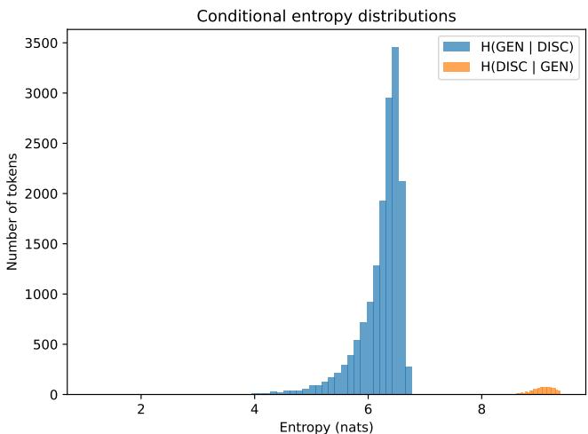  
Figure D.1. Conditional entropy distributions for discriminative and generative codebooks.

A subset of discriminative tokens leads to low H(GEN|DISC), meaning that these discriminative tokens consistently co-occur with a small set of generative tokens. In contrast, H(DISC|GEN ) is uniformly high, indicating that generative tokens provide almost no information about the corresponding discriminative tokens. This reflects the fundamental difference between the two codebooks: the generative codebook, based on VQGAN, is texture-based and largely class-agnostic, whereas the discriminative codebook, made by the features of DINOv2, encodes semantic distinctions learned through local appearance signals. Consequently, even if discriminative tokens do not explicitly encode textures, their semantic prototypes are tied to characteristic visual patterns that allow generative tokens to be predicted in some cases. This observation is consistent with prior work such as DiGIT [61], which is able to train a generative model solely from a codebook based on DI-NOv2. Still, the low-entropy behaviour only occurs for a small amount of discriminative tokens (∼500 out of 16K), while the majority produce entropies above 6 nats. This indicates that the semantic overlap between the two codebooks is limited: most discriminative tokens correspond to a broad set of VQGAN textures, and generative tokens do not encode the semantic distinctions present in the discriminative codebook.

Class-average Token Distributions. We display the semantical contrast between the generative and discriminative codebooks used to train LEASE by computing the top-k token probabilities for each ImageNet class and averaging them across all 1000 classes. In practice, we extract the frequency of every encoded patch token on all ImageNet classes for both codebooks. Most frequent tokens for a given class are assumed to contain more discriminative information about that specific class. At the same time, the higher the frequency the higher the discriminative information, as it would mean that an specific class is better represented by the token. These frequencies are represented as a probabilities for every class on ImageNet and averaged. In Figure D.2, we can see the average probability of the top 20 most probable tokens per class.

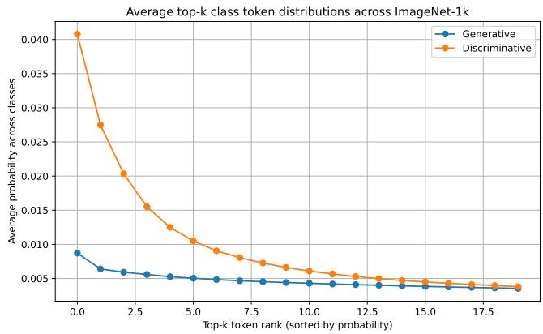

line

| Top-k token rank (sorted by probability) | Generative | Discriminative |
| ---------------------------------------- | ---------- | -------------- |
| 0.0                                      | 0.009      | 0.040          |
| 1.0                                      | 0.006      | 0.028          |
| 2.0                                      | 0.005      | 0.020          |
| 3.0                                      | 0.005      | 0.015          |
| 4.0                                      | 0.005      | 0.012          |
| 5.0                                      | 0.005      | 0.010          |
| 6.0                                      | 0.005      | 0.009          |
| 7.0                                      | 0.005      | 0.008          |
| 8.0                                      | 0.005      | 0.007          |
| 9.0                                      | 0.005      | 0.006          |
| 10.0                                     | 0.005      | 0.006          |
| 11.0                                     | 0.005      | 0.005          |
| 12.0                                     | 0.005      | 0.005          |
| 13.0                                     | 0.005      | 0.005          |
| 14.0                                     | 0.005      | 0.005          |
| 15.0                                     | 0.005      | 0.005          |
| 16.0                                     | 0.005      | 0.005          |
| 17.0                                     | 0.005      | 0.005          |
| 18.0                                     | 0.005      | 0.005          |

Figure D.2. Average top-k token distributions across all ImageNet classes.

The discriminative codebook exhibits a sharp, heavytailed distribution, where a small number of tokens dominate the class representation. This indicates strong classspecific semantics. In contrast, the generative codebook produces an almost flat curve, with top tokens only marginally more probable than lower ones. This marginality, combined with the masked token reconstruction strategies, could explain the discriminative capacity of works such as MAGE [33] and Sorcen [20], which leverage a generative codebook exclusively. Still, this behavior confirms that generative tokens carry little class-specific information and mainly encode generic textures. The aggregation over all classes demonstrates that this behavior is global rather than class-specific. The discriminative codebook, even if it comes from a self-supervised model, consistently organizes patches into semantically meaningful groups, while the generative codebook remains largely class-agnostic.

Token-level Shared Structure. Finally, to visualize the overlap between the two codebooks, we compute the pointwise mutual information (PMI) between every generative and discriminative token and display a heatmap for the pairs with highest PMIs (40 tokens per axis in total) in Figure D.3. Each column corresponds to one discriminative token and each row to one generative token. We observe only a few isolated bright cells per column, indicating that a small number of discriminative tokens consistently cooccur with some specific generative tokens. The majority of entries are close to zero PMI, even in this top-PMI subset, and we do not see large block structures that would indicate a shared latent organization. This confirms that the overlap between the generative and discriminative codebooks is sparse. Individually, both codebooks contain useful information for their respective domains, either generation or discrimination. However, these semantics are not shared among both. The limited overlap is not simply an effect of vocabulary size, but rather reflects a fundamental difference in what the two codebooks represent: the discriminative codebook organizes patches according to semantic object structure, while the generative codebook captures texturebased, class-agnostic appearance.

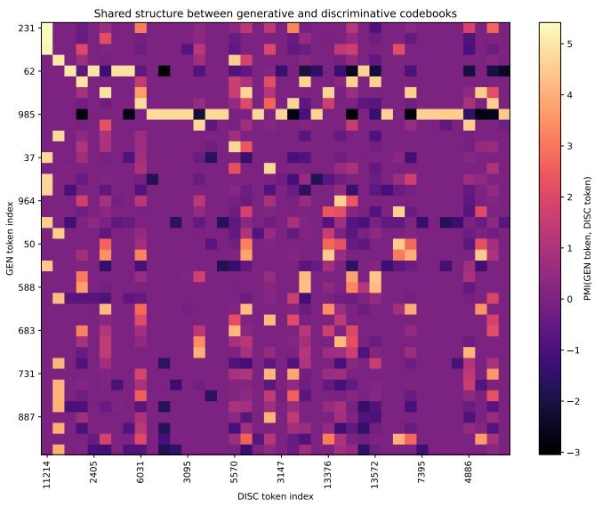

heatmap

| GEN token index | DISC token index | PMI(GEN token, DISC token) |
| --------------- | ---------------- | -------------------------- |
| 231             | 11214            | -3                         |
| 62              | 2405             | -1                         |
| 985             | 6031             | 0                          |
| 37              | 3095             | 1                          |
| 964             | 5570             | 2                          |
| 50              | 3147             | 3                          |
| 683             | 13376            | 4                          |
| 731             | 13572            | 5                          |
| 887             | 7395             | -2                         |
| 4886            | 4886             | -1                         |

Figure D.3. PMI heatmap between the generative and discriminative codebooks.

# E. Dense Task Evaluation

Token-based approaches, including MAGE [33] and Sorcen [20], continue to face limitations on dense prediction tasks due to the loss of fine-grained spatial information [47] caused by the quantized input tokens. As shown in Table E.10, all methods achieve comparable performance on MSCOCO, with Sorcen and LEASE slightly improving over MAGE. On FoodSeg, a more specific dataset, Sorcen stands as the best while LEASE matches the performance obtained by MAGE.

<table><tr><td></td><td>MSCOCO</td><td>FoodSeg</td></tr><tr><td>MAGE</td><td>15.80</td><td>15.88</td></tr><tr><td>Sorcen</td><td>15.90</td><td>16.82</td></tr><tr><td>LEASE</td><td>15.92</td><td>15.85</td></tr></table>

Table E.10. Extended evaluation on Instance Segmentation downstream task. mAP metric is reported.

# F. Generation Visualization

To further illustrate the generative capabilities of LEASE, we present qualitative samples under both unconditional and class-conditional settings in Figure F.4 and Figure F.5. Additionally, we also visualize the reconstruction, inpainting and outpainting capacity of LEASE in Figure F.6 and Figure F.7.

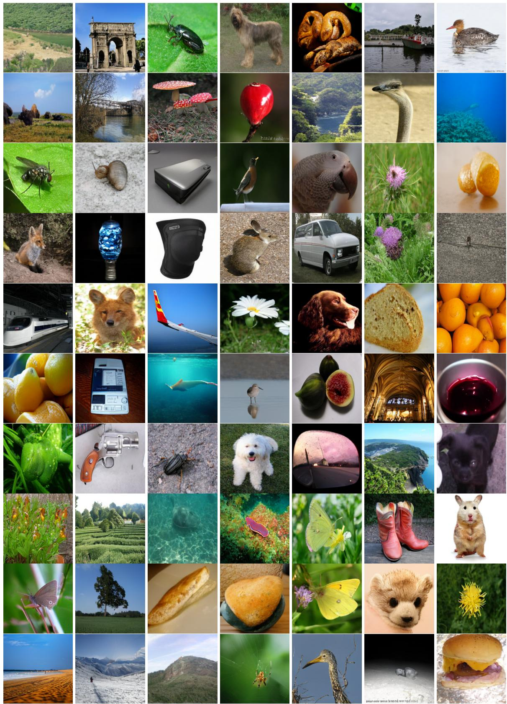  
Figure F.4. Unconditional generation examples of LEASE using ViT-B.

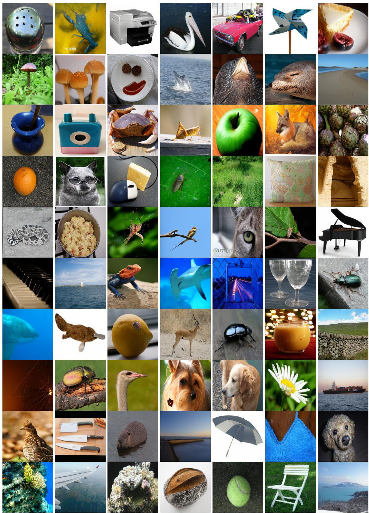  
Figure F.5. Conditional generation examples of LEASE using ViT-B.

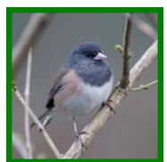

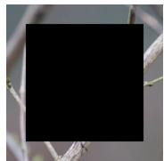

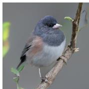

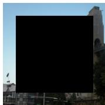

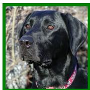

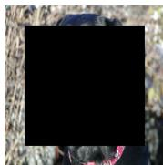

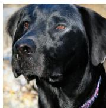

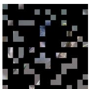

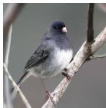

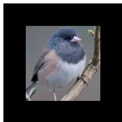

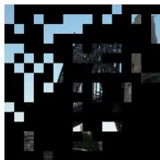

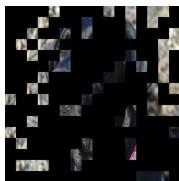

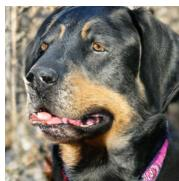

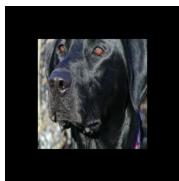

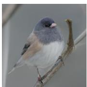

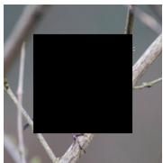

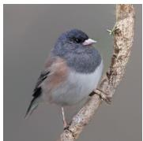

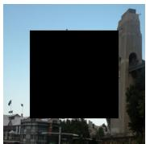

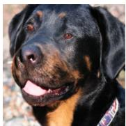

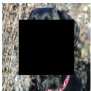

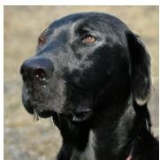

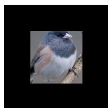

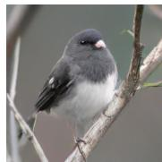

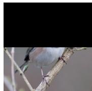

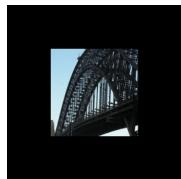

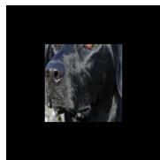

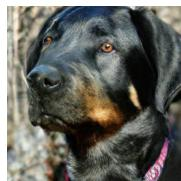

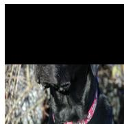

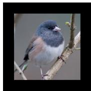

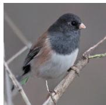

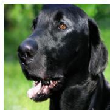

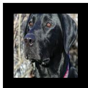

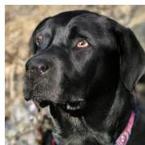  
Figure F.6. Examples of image reconstruction, inpainting and outpainting for LEASE using ViT-B. Original image is marked in green.

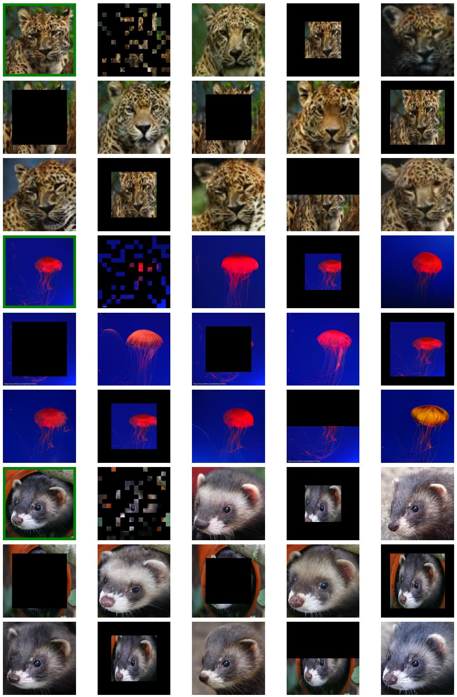  
Figure F.7. Examples of image reconstruction, inpainting and outpainting for LEASE using ViT-B. Original image is marked in green.