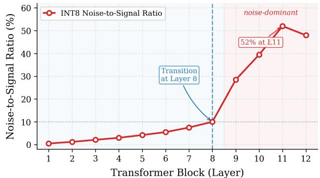
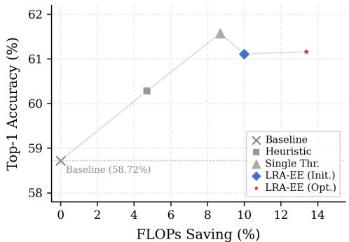
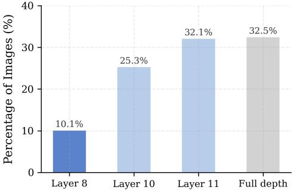
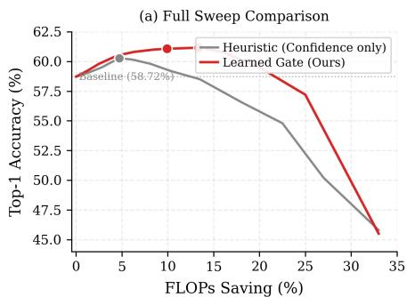
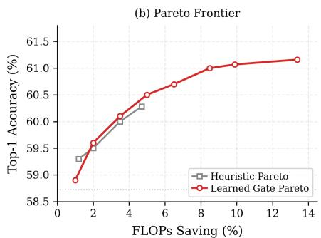
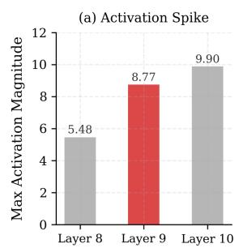
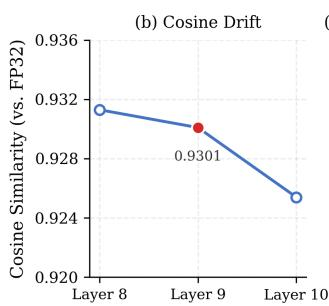
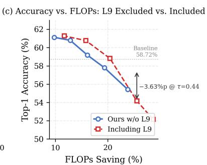

# The Rescue Effect: Spatio-Semantic Early Exit Bypasses Quantization Collapse in CLIP

Kahyeon Nam Hyesong Choi∗

Soongsil University

Seoul, Republic of Korea

chloenam33@gmail.com hyesong@ssu.ac.kr

# Abstract

Deploying Vision–Language Models on resource-constrained hardware typically requires INT8 quantization, but in joint-embedding architectures such as CLIP this introduces a failure mode distinct from quantized CNN classifiers: activation noise accumulated across transformer blocks perturbs the direction of the multimodal embedding, eroding the cosine alignment on which zero-shot retrieval depends. We characterize this as Quantization-Induced Representation Collapse (QIRC) and quantify it on INT8 CLIP ViT-B/32, where the layer-wise noise-to-signal ratio grows from below 10% in shallow blocks to 52% at Layer 11. We propose LRA-EE (Layer-wise Representation-Aware Early Exit), which bypasses noisesaturated deep layers via Spatio-Semantic Aggregation (replacing the immature shallow [CLS] with a global patch-token average), a learned multi-feature gate (confidence, top-2 margin, spatial-activation variance), and Layer-adaptive Confidence Thresholding calibrated to each layer’s Information-to-Noise Ratio. On ImageNet-1K zero-shot classification, LRA-EE reduces FLOPs by 13.4% and improves Top-1 accuracy by +2.44%p (58.72% → 61.16%) over the INT8 baseline. A four-quadrant decomposition isolates the Rescue Effect: 9.5% of samples are correctly classified at shallow exits but lost to noise at full depth, against only 7.1% suffering the inverse. A controlled factorial ablation confirms that depth-adaptive routing—not FP32 distillation—is the dominant source of the gain.

# 1 Introduction

Vision–Language Models (VLMs) such as CLIP [18], ALIGN [5], Florence [30], and EVA-CLIP [20] have catalyzed a paradigm shift in zero-shot recognition by aligning visual and textual modalities in a shared latent manifold. Their generalization, expanded by recent foundation models [8, 2, 32], comes at a prohibitive computational cost that exceeds the envelopes of edge accelerators such as NPUs and FPGAs. INT8 post-training quantization has emerged as the de facto compression strategy [26, 11, 31, 4, 29], compressing model weights by up to 4× while leveraging integer SIMD pipelines for substantial latency gains [19, 9, 25, 17]. Yet, the union of CLIP and aggressive quantization manifests a failure mode qualitatively distinct from quantized CNN classifiers. Whereas a quantized CNN merely confuses semantic categories—mistaking a canine for a feline—CLIP’s joint-embedding architecture is structurally more brittle: quantization noise stochastically perturbs the directionality of multimodal vectors, eroding the cosine alignment that underlies zero-shot retrieval. Layer-wise inspection on 10,000 ImageNet validation images reveals that the noise-to-signal ratio in INT8 ViT-B/32 grows monotonically from below 10% in early blocks to 52% by Layer 11— more than half of the late-stage representation contaminated by accumulated quantization residuals. We formalize this as Quantization-Induced Representation Collapse (QIRC) and contend that mitigating it requires not refinement of the deep layers, but their strategic evasion.

Conventional Early Exit (EE) frameworks [21, 24, 7], inherited from NLP architectures [27, 33, 23, 6], route inference based on the [CLS] token aggregated at intermediate depth. In a Vision Transformer [3, 22, 14, 16, 12], the [CLS] at shallow strata has yet to attend across the global spatial manifold; its semantic capacity is impoverished. Our measurements corroborate this: at Layer 8, a [CLS]-based head attains a meager 21.73% accuracy—37.0%p below the INT8 full-depth baseline— rendering naive shallow exits infeasible. The path forward demands a representation strategy that recovers semantic density at shallow depth while remaining robust under quantization.

We address this gap with LRA-EE (Layer-wise Representation-Aware Early Exit), comprising (i) Spatio-Semantic Aggregation (SSA), which substitutes the [CLS] singleton with a global average over all 196 patch tokens; (ii) a Multi-Feature Learned Gate fusing confidence, top-2 margin, and Spatial-Activation Variance (SAV); and (iii) Layer-adaptive Confidence Thresholding (LCT) calibrated to each block’s empirical Information-to-Noise Ratio. On ImageNet-1K, LRA-EE simultaneously trims FLOPs by 13.38% and lifts Top-1 accuracy by 2.44%p over the INT8 baseline— contradicting the conventional accuracy–efficiency trade-off. We trace this paradox to the Rescue Effect: shallow exits recover 9.5% of samples that would otherwise be misclassified at full depth, against only 7.1% lost to premature termination, yielding a +2.37%p net rescue.

# Contributions. Our principal contributions are:

• We identify and quantify Quantization-Induced Representation Collapse (QIRC) in CLIP, with layer-wise evidence that quantization noise accumulates rapidly with depth and dominates the semantic signal in late blocks (§3).   
• We propose LRA-EE, an Early Exit framework for quantized VLMs integrating SSA, multifeature learned gating, LCT, and a Pathological Layer Pruning rule that excludes layers with anomalous outlier-induced noise spikes (§4).   
• We disentangle the gain’s source through a controlled factorial ablation separating head architecture, FP32 distillation, and adaptive routing (§6.1), establishing that adaptive routing alone—without FP32 supervision—accounts for the majority of the improvement, ruling out a distillation artifact.   
• We formalize and mechanistically dissect the Rescue Effect via four-quadrant outcome decomposition and cosine-direction drift, showing that depth-adaptive inference under quantization yields simultaneous improvements in efficiency and accuracy (§7).

# 2 Related Work

Vision–Language Models and CLIP. CLIP [18] and its descendants [5, 8, 30] established jointembedding models as the backbone of zero-shot recognition by aligning visual and textual modalities in a shared latent manifold. Unlike CNN classifiers, CLIP’s zero-shot fidelity depends critically on the direction of multimodal embeddings in cosine space—a geometric property that, as we show, is particularly vulnerable to quantization noise accumulation across transformer depth.

Transformer Quantization. PTQ for transformers has progressed from layer-wise static schemes [17, 10] to per-channel and learned-step variants [15, 31]. Existing CLIP compression works such as TinyCLIP [25] reduce model cost, but leave depth-wise compute fixed and do not characterize quantization-induced drift in multimodal embedding geometry. We provide a systematic layer-wise account of this interaction, identifying a structural failure mode—QIRC—that prior quantization methods neither characterize nor address.

Early Exit Mechanisms. Early Exit was pioneered in NLP [27, 13, 33, 28] and extended to ViTs [24, 1], predominantly leveraging [CLS] entropy or confidence. However, this principle is misaligned with two properties of quantized VLMs: (i) shallow [CLS] tokens in ViTs are semantically impoverished, and (ii) quantization noise accumulates with depth, making full-depth inference harmful for a non-trivial fraction of samples. Prior EE-only methods (BranchyNet [21], DeeBERT [27], DVT [24]) target full-precision models and do not address this failure mode, while quantization-only methods leave depth-wise routing fixed. LRA-EE explicitly targets this intersection and, unlike prior methods, improves accuracy above the compressed full-depth baseline.

line

| Transformer Block (Layer) | Noise-to-Signal Ratio (%) |
| ------------------------- | ------------------------- |
| 1                         | ~1                        |
| 2                         | ~2                        |
| 3                         | ~3                        |
| 4                         | ~4                        |
| 5                         | ~5                        |
| 6                         | ~6                        |
| 7                         | ~8                        |
| 8                         | 10                        |
| 9                         | 30                        |
| 10                        | 40                        |
| 11                        | 52                        |
| 12                        | 48                        |

Figure 1: Layer-wise noise dynamics in INT8 ViT-B/32 CLIP. The noise-to-signal ratio remains low in early layers and rises sharply after Layer 8, reaching 52% at Layer 11. This transition motivates Layer 8 as the earliest reliable exit point, beyond which quantization noise begins to dominate the semantic signal.

# 3 Motivation: Quantization-Induced Representation Collapse

# 3.1 Layer-wise Quantization Noise Profile

To empirically substantiate the existence of QIRC, we conducted a layer-wise dissection of an INT8-quantized ViT-B/32 CLIP encoder over 10,000 ImageNet validation images. Although only Linear-layer weights are quantized, the resulting weight perturbations introduce residual errors into the activation stream at each block, which accumulate across depth. For each transformer block $L \in \{ 1 , \ldots , 1 2 \}$ , we compute

$$
\Delta_ {\mathrm{nat}} (L) = \left\| z _ {L} ^ {\mathrm{FP32}} - z _ {L - 1} ^ {\mathrm{FP32}} \right\| _ {2}, \quad \Delta_ {\text {quant}} (L) = \left\| z _ {L} ^ {\mathrm{INT8}} - z _ {L} ^ {\mathrm{FP32}} \right\| _ {2}, \tag {1}
$$

where $\Delta _ { \mathrm { n { a t } } }$ captures the natural representational evolution and $\Delta _ { \mathrm { q u a n t } }$ t isolates the residual incurred by precision reduction.

Figure 1 suggests super-linear noise growth: the relative ratio $\Delta _ { \mathrm { q u a n t } } / \Delta _ { \mathrm { n a t } }$ remains under 10% through shallow and mid-depth blocks, reaches the transition point around Layer 8, and rises sharply thereafter, peaking at 52% at Layer 11—with an anomalous spike at Layer $\mathrm { \bar { 9 } ~ ( M S E = 0 . 0 0 7 5 \bar { 3 } \bar { 2 } , \sim 2 \times }$ its neighbors) attributable to outlier-sensitive weight kurtosis. Cosine similarity between INT8 and FP32 embeddings degrades from 0.589 at the input to 0.421 at the final layer, a 28.5% relative drop that translates directly into compromised zero-shot fidelity. These findings establish QIRC as a structural pathology: beyond a sample-dependent critical depth L⋆, additional computation actively degrades the representation, motivating depth-adaptive inference that halts before noise dominance.

Scope. Measurements use CLIP ViT-B/32 under dynamic INT8 post-training quantization. We expect the qualitative trend to hold on related backbones (ViT-L/14, SigLIP, EVA-CLIP), but a comprehensive cross-backbone sweep is left to future work.

# 3.2 [CLS] Immaturity and the Case for Spatial Aggregation

A naive remedy—grafting a [CLS]-based head onto an intermediate layer—is untenable: at Layer 8, a [CLS] head attains a mere 21.73% Top-1 accuracy, 37.0%p below the full-depth baseline. The cause is structural: in a ViT, the [CLS] token aggregates global context only after multi-block self-attention propagates patch-level information, leaving its shallow-depth embedding semantically impoverished. The remedy lies in harvesting the spatial manifold the [CLS] has yet to traverse: the 196 patch tokens at Layer 8, although individually local, collectively encode a dense semantic description whose aggregate—which we term Spatio-Semantic Aggregation—rivals late-layer [CLS] fidelity while remaining shielded from late-stage quantization noise. The dimensional uniformity of ViT (constant 197 × 768 across all 12 blocks) further makes it structurally amenable to layer-wise noise analysis and uniform exit-head deployment, while aligning with the systolic execution patterns of NPU and FPGA Early Exit logic; this contrasts with CNN backbones, whose spatial resolution and channel dimensionality vary across depth.

# 4 Method: Layer-wise Representation-Aware Early Exit

# 4.1 Guiding Principle: Depth–Quality Trade-off

We characterize each transformer depth L via a representation-quality model:

$$
\mathcal {Q} (L) = \mathcal {R} (L) - \beta \mathcal {N} (L), \tag {2}
$$

where $\mathcal { R } ( L )$ denotes representation richness (concave, non-decreasing) and $\mathcal { N } ( L )$ accumulated quantization noise; $\beta \geq 0$ encodes the precision regime $( \beta \to 0 ; \mathrm { { \small ~ F P 3 2 } } ; \beta$ large: INT8). When N grows super-linearly with depth (§3.1), Q admits a sample-dependent interior maximum $L ^ { \star } \in$ $\{ 1 , \ldots , L _ { \mathrm { m a x } } - 1 \}$ . Eq. (2) serves as a conceptual organizer for three testable predictions:

(P1) Full-depth inference is suboptimal under aggressive quantization (§5.2, Table 1).   
(P2) Optimal exit depth varies across samples; static truncation underperforms learned routing (§6.3, Figure 3).   
(P3) Layers with anomalous $\mathcal { N } ( L )$ should be excluded even if standalone-accurate (§6.4, Figure 4).

# 4.2 Spatio-Semantic Aggregation (SSA)

Let $Z _ { L } \in \mathbb { R } ^ { ( N + 1 ) \times d }$ be the layer-L activation tensor with N = 196 patch tokens, $d = 7 6 8$ , and [CLS] as $z _ { L , 0 }$ . SSA replaces the singleton [CLS] with a spatial aggregate:

$$
\mathcal {F} _ {\mathrm{SSA}} (Z _ {L}) = \text { LayerNorm } \left(\frac {1}{N} \sum_ {i = 1} ^ {N} z _ {L, i}\right) \in \mathbb {R} ^ {d}. \tag {3}
$$

Under i.i.d. residual assumptions on $z _ { L , i }$ as noisy estimates of the latent class centroid, $\mathcal { F } _ { \mathrm { S S A } } \mathrm { ^ { * } }$ variance shrinks as $\Theta ( 1 / N ) { \mathrm { - a } } ~ \sqrt { N } \mathrm { - f o l d }$ noise concentration that the singleton [CLS] cannot achieve, the architectural origin of the $+ 2 3 . 8 7 \% \mathrm { p }$ shallow-layer gain in §6.2. Each candidate $L \in \mathcal { L } _ { \mathrm { e x i t } } \subseteq \{ 1 , \dots , 1 1 \}$ instantiates an MLP projection $\phi _ { L } : \bar { \mathbb { R } ^ { d } } \to \mathbb { R } ^ { 5 1 \bar { 2 } }$ , followed by cosine similarity against the $K \stackrel { \cdot } { = } 1 , 0 0 0$ text prompt embeddings to obtain $\hat { p } _ { L }$ .

# 4.3 Multi-Feature Learned Gating

A learned gate $\mathcal { G } _ { L } : \mathbb { R } ^ { 3 }  [ 0 , 1 ]$ takes three scalar features: Confidence $c _ { L } =$ maxk $\hat { p } _ { L , k } ;$ Top-2 Margin $m _ { L } = \hat { p } _ { L , ( 1 ) } - \hat { p } _ { L , ( 2 ) }$ , discriminating sharp from flat distributions; and Spatial-Activation Variance $\begin{array} { r } { \mathrm { S A V } ( Z _ { L } ) = \frac { 1 } { N } \sum _ { i } \| z _ { L , i } - \bar { z } _ { L } \| _ { 2 } ^ { 2 } } \end{array}$ with $\begin{array} { r } { \bar { z } _ { L } = \frac { 1 } { N } \sum _ { i } z _ { L , i } } \end{array}$ , which empirically correlates inversely with quantization-robust samples. The gate is

$$
\mathcal {G} _ {L} = \sigma \left(w _ {1} ^ {(L)} c _ {L} + w _ {2} ^ {(L)} m _ {L} + w _ {3} ^ {(L)} \mathrm{SAV} _ {L} + b ^ {(L)}\right), \tag {4}
$$

trained via BCE on a held-out gating split (label = 1 iff the layer-L exit is correct).

# 4.4 Layer-adaptive Confidence Thresholding (LCT)

Define the Information-to-Noise Ratio

$$
\operatorname{INR} (L) = \frac {\left\| \mathbb {E} _ {x} \left[ z _ {L} (x) \right] \right\| _ {2} ^ {2}}{\operatorname{Var} _ {x} \left[ \epsilon_ {L} ^ {\text { quant }} (x) \right]}, \quad \epsilon_ {L} ^ {\text { quant }} (x) = z _ {L} ^ {\text { INT8 }} (x) - z _ {L} ^ {\text { FP32 }} (x). \tag {5}
$$

LCT assigns each layer a distinct threshold $\tau _ { L }$ , jointly optimized for accuracy under a FLOPs budget: high-INR layers tolerate lower thresholds, low-INR layers demand stricter gating. A sample passing $\tau _ { 8 } = 0$ .44 at the high-INR Layer 8 exits, while the same sample at the low-INR Layer 9 (§4.5) is held.

# 4.5 Pathological Layer Pruning

Quantization noise grows non-uniformly: outlier-sensitive weight distributions cause anomalous spikes at certain layers. In our INT8 ViT-B/32, Layer 9’s quantization MSE (0.007532) is nearly 2× Layer 8’s (0.003638), and despite Layer 9’s higher standalone GAP-head accuracy (53.00% vs. Layer 8’s 47.20%), its elevated noise variance destabilizes exit decisions—degrading end-to-end accuracy by up to 3.63%p across τ ∈ [0.40, 0.48] (§6.4). We therefore exclude any candidate with

$$
\mathrm{INR} (L) <   \kappa \cdot \overline {{\mathrm{INR}}} _ {\mathcal {L} _ {\text { exit }}}, \quad \kappa = 0. 5, \tag {6}
$$

generalizing Layer 9’s exclusion to a principled INR-driven rule. We further apply LRA-EE exclusively to the vision encoder (>90% of FLOPs), retaining the text encoder in FP16 to preserve the cross-modal semantic anchor.

# 5 Experiments

# 5.1 Experimental Setup

Dataset and Backbone. We evaluate on the ImageNet-1K validation set (50,000 images, 1,000 classes); layer-wise analyses use the canonical 10,000-image subset [24]. Zero-shot inference adopts a 5-template prompt ensemble (e.g., “a photo of a {}”, “a clear photo of a {}”). The base model is CLIP ViT-B/32 (12 transformer blocks). Quantization uses dynamic INT8 post-training quantization on Linear-layer weights of the vision encoder via torch.ao.quantization.quantize\_dynamic; the text encoder is retained in FP16 to preserve textual semantic anchors.

LRA-EE Configuration. The exit candidate set $\mathcal { L } _ { \mathrm { e x i t } } = \{ 8 , 1 0 , 1 1 \}$ is determined by the Pathological Layer Pruning rule of §4.5. The SSA head is a two-layer MLP (768 → 768 → 512, GELU), trained for 3 epochs on a 10% subset of the ImageNet-1K training split (128,117 images) with Adam $( \mathrm { l r } = 5 \times 1 0 ^ { - 4 }$ , batch size 64). Supervision combines cross-entropy on ground-truth labels with a cosine-embedding loss against the FP32 model’s text-aligned embedding—an objective we call FP32-distilled supervision. Because this introduces a potential confound between distillation and routing as sources of accuracy gain, we explicitly disentangle the two in §6.1. The learned gate is a single linear projection (3 → 1) followed by a sigmoid, trained via BCE $( \mathrm { l r } = 1 0 ^ { - 2 } )$ on a held-out 5,000-image gating split disjoint from the evaluation set. Layer-specific thresholds $\tau _ { L }$ are selected via a 25-point grid sweep over $\tau \in [ 0 . 2 0 , 0 . 9 2 ]$ ]. All experiments run on a single RTX 3090.

Reporting. Top-1 accuracy and FLOPs saving are our principal metrics, with FLOPs reduction computed as $1 \dot { - } \mathbb { E } _ { x } [ L _ { \mathrm { e x i t } } ( \dot { x } ) ] / L _ { \mathrm { m a x } }$ weighted by the per-block compute proportion of the ViT-B/32 vision encoder. We report mean ± standard deviation across three independent runs with unconstrained seeds.

# 5.2 Main Results

Table 1: Main Results on ImageNet-1K Validation Set. The Optimized configuration is reported as mean ± std across 3 independent runs with unconstrained seeds. 

<table><tr><td>Method</td><td>FLOPs Saving (%)</td><td>Top-1 Acc. (%)</td><td> $\Delta$ Acc. (%p)</td></tr><tr><td>Baseline (INT8 full-depth)</td><td>0.0</td><td>58.72</td><td>—</td></tr><tr><td>LRA-EE (Initial layer-wise)</td><td>10.0</td><td>61.11</td><td>+2.39</td></tr><tr><td>LRA-EE (Layer 8 Optimized)</td><td> $13.38 \pm 0.11$ </td><td> $61.16 \pm 0.06$ </td><td>+2.44</td></tr></table>

Table 1 reports our principal results. The Initial LRA-EE configuration, trained without per-layer threshold tuning, achieves 10.0% FLOPs saving at 61.11% Top-1 (+2.39%p over the INT8 baseline). The Layer-8-Optimized variant (§5.3) extends FLOPs saving to 13.38% while marginally improving accuracy to 61.16%. When combined with SmoothQuant [26], which addresses outlierinduced quantization error at the source, LRA-EE yields the strongest configuration at 62.41% Top-1 (+3.69%p over the INT8 baseline) with 13.4% FLOPs saving, indicating that the two methods address complementary components of the failure mode.

Table 2: Comparison with Early Exit and adaptive-inference baselines on INT8 CLIP ViT-B/32. LRA-EE achieves the strongest accuracy among methods operating at comparable FLOPs saving, while remaining above the INT8 full-depth baseline. 

<table><tr><td>Method</td><td>FLOPs Saving (%)</td><td>Top-1 Acc. (%)</td><td> $\Delta$ Acc. (%p)</td></tr><tr><td>Baseline (INT8 full-depth)</td><td>0.00</td><td>58.72</td><td>—</td></tr><tr><td>CLS-EE [21]</td><td>0.00</td><td>58.72</td><td>+0.00</td></tr><tr><td>PABEE [33]</td><td>3.64</td><td>61.82</td><td>+3.10</td></tr><tr><td>AdaViT [16]</td><td>13.50</td><td>59.84</td><td>+1.12</td></tr><tr><td>LRA-EE (Ours)</td><td>13.38</td><td>61.16</td><td>+2.44</td></tr></table>

Against Early Exit and adaptive-inference baselines (Table 2), CLS-EE produces no meaningful early exits, confirming the immaturity of [CLS] tokens at shallow depths. PABEE achieves higher accuracy at a conservative operating point but only 3.64% FLOPs saving. AdaViT, re-trained with the INT8 backbone held frozen and evaluated under matched FLOPs, achieves 59.84%, outperforming the full-depth INT8 baseline but trailing LRA-EE by 1.32%p. This suggests that token-level pruning alone does not address the depth-wise noise accumulation that LRA-EE is designed to evade. LRA-EE therefore improves the accuracy–efficiency trade-off: it achieves substantially larger FLOPs saving than PABEE, while maintaining a clear accuracy advantage over matched-FLOPs adaptive inference.

Variance and reproducibility. The reported standard deviation reflects three independent runs with re-seeded (i) SSA head initialization and data shuffling, and (ii) gate initialization and gatingsplit sampling; backbone weights and the evaluation split are held fixed. FLOPs saving exhibits $\sigma = 0 . 1 1 \% \mathrm { p }$ and Top-1 accuracy σ = 0.06%p—the small variance reflecting the modest gate size (4 scalar parameters per layer) and the fact that backbone weights and the evaluation split remain fixed across runs.

# 5.3 Pareto-Frontier Analysis and Layer 8 Optimization

(a) Accuracy vs. Eficiency   

line

| FLOPs Saving (%) | Top-1 Accuracy (%) |
| ---------------- | ------------------ |
| 0                | 58.72              |
| 4                | 60.3               |
| 8                | 61.5               |
| 10               | 61.1               |
| 14               | 61.2               |

(b)Exit Distribution (Optimized)   

bar

| Depth | Percentage of Images (%) |
| :--- | :--- |
| Layer 8 | 10.1 |
| Layer 10 | 25.3 |
| Layer 11 | 32.1 |
| Full depth | 32.5 |

Figure 2: (a) FLOPs–accuracy Pareto frontier of LRA-EE across configurations. Unlike conventional EE, the frontier ascends in both axes simultaneously. (b) Per-layer exit distribution of the optimized LRA-EE configuration. Layer 8 accommodates 10.1% of samples, with the majority routed through Layers 10–11 and full-depth inference.

Figure 2(a) traces the FLOPs–accuracy Pareto frontier across per-layer threshold settings: rather than the monotonic trade-off of conventional EE, LRA-EE ascends in both axes simultaneously across a wide threshold regime before degrading at extreme settings. The per-layer exit distribution (Figure 2(b)) places 10.1% of samples at Layer 8, 25.3% at Layer 10, 32.1% at Layer 11, and 32.5% at full depth—reflecting the layer-adaptive policy $( \tau _ { 8 } = 0$ .44 captures easy samples shallowly, Layers 10–11 handle the intermediate regime). The resulting 13.38% FLOPs saving with marginal accuracy gain foreshadows the Rescue Effect formalized in $\ S 7$ .

Table 3: Decomposing the source of the +2.44%p gain. We cross-classify head supervision (hard label vs. FP32 distillation) with routing policy (full-depth vs. LRA-EE adaptive). All configurations share the identical INT8 backbone, quantization protocol, gate architecture, and evaluation pipeline. Configurations (ii)–(v) replace the original [CLS] head with the SSA head; (ii) and (iv) are trained from scratch with cross-entropy on ground-truth labels (no FP32 teacher), while (iii) and (v) use a cosine-embedding loss against the FP32 model’s text-aligned embedding as supervision. Pairwise deltas isolate the architectural, distillation, and Early-Exit contributions. 

<table><tr><td>#</td><td>Configuration</td><td>Head</td><td>Supervision</td><td>Routing</td><td>FLOPs Save (%)</td><td>Top-1 Acc. (%)</td></tr><tr><td>(i)</td><td>INT8 baseline</td><td>[CLS]</td><td>—</td><td>full depth</td><td>0.0</td><td>58.72</td></tr><tr><td>(ii)</td><td>SSA-Last (hard)</td><td>SSA</td><td>hard label</td><td>full depth</td><td>0.0</td><td>59.18</td></tr><tr><td>(iii)</td><td>SSA-Last (distilled)</td><td>SSA</td><td>FP32 distill</td><td>full depth</td><td>0.0</td><td>59.65</td></tr><tr><td>(iv)</td><td>LRA-EE (hard)</td><td>SSA</td><td>hard label</td><td>adaptive</td><td>13.38</td><td>60.42</td></tr><tr><td>(v)</td><td>LRA-EE (Ours)</td><td>SSA</td><td>FP32 distill</td><td>adaptive</td><td>13.38</td><td>61.16</td></tr></table>

# 6 Ablation Studies

# 6.1 Decomposing the Source of Accuracy Gain

To resolve whether the +2.44%p gain in §5.2 originates from EE’s noise-shielding mechanism or from the SSA head’s exposure to FP32 supervision, we cross-classify two design axes the main configuration entangles: head supervision (hard label vs. FP32 distillation) and routing policy (full-depth vs. LRA-EE adaptive), yielding five configurations (Table 3). All share the identical INT8 backbone, gate architecture, threshold sweep, and evaluation pipeline; configurations (ii)–(iii) attach the SSA head to the final layer only (no EE), while (iv)–(v) deploy full LRA-EE routing across $\mathcal { L } _ { \mathrm { e x i t } } = \{ 8 , 1 0 , 1 1 \}$ .

The decomposition yields three additive contrasts. The architectural contribution—variance reduction of patch-token averaging $( \ S 4 . 2 ) - \mathrm { i s } \ : ( i i ) - ( i ) = + 0 . 4 6 \% ;$ the distillation contribution is $( i i i ) - ( i i ) \bar { = } + 0 . 4 7 \% \mathrm { p }$ , comparable in magnitude to the architectural gain but substantially smaller than the routing contribution; and the Early-Exit contribution dominates: $( i v ) - ( i i ) = + 1 . 2 4 \% \mathfrak { p }$ in the hard-label regime and $( v ) - ( i i i ) = + 1 . 5 1 \% \mathfrak { p }$ in the distilled regime, accounting for roughly half the total gain on its own.

The most diagnostic comparison is (iv) vs. (i): a +1.70%p gain without any FP32 supervision, achieved by EE routing alone on top of an SSA head trained with hard labels. This rules out the alternative hypothesis that LRA-EE’s gain reduces to “a distilled GAP head at the final layer” and confirms that the Rescue Effect is intrinsic to depth-adaptive routing under quantization. Distillation amplifies the effect—likely by cleaning up per-layer decision boundaries—but is not its source.

# 6.2 [CLS] Token versus Spatio-Semantic Aggregation

Holding all other components fixed (backbone, gate, thresholds), SSA exceeds the corresponding [CLS] accuracy $\mathsf { b y } + 1 8 \mathsf { t o } + 2 4 \% \mathsf { p }$ across all candidate layers, with the largest gap at the shallowest viable exit (Layer 8: 21.73% → 45.60%, +23.87%p; Layer 10: +18.41%p; Layer 11: +22.01%p). The [CLS] head’s 21.73% at Layer 8 renders shallow exit prohibitive in any single-token formulation. This ablation operationalizes the variance-reduction property of §4.2: aggregating N=196 patch√ tokens enacts a N-fold concentration that the singleton [CLS] cannot achieve. Notably, SSA at Layer 11 (61.40%) by itself exceeds the INT8 full-depth baseline (58.72%), indicating the spatial aggregator is itself a non-trivial source of robustness to deep-layer quantization noise.

# 6.3 Heuristic versus Learned Gating

A naive confidence-only heuristic $( c _ { L } > \tau )$ peaks at 60.28% accuracy with 4.7% FLOPs saving, falling short of LRA-EE’s 61.07% at 9.9% saving (Figure 3). The Pareto gap widens at higher FLOPs saving regimes, confirming that confidence alone is an insufficient surrogate for representation quality under quantization. The learned gate’s incorporation of margin and SAV yields a multidimensional view that better discriminates noise-corrupted from genuinely refined samples—an advantage intensifying precisely at aggressive operating points.

line

| FLOPs Saving (%) | Heuristic (Confidence only) | Learned Gate (Ours) |
| ---------------- | --------------------------- | ------------------- |
| 0                | 58.72%                      | 58.72%              |
| 5                | 60.00%                      | 60.00%              |
| 10               | 60.00%                      | 60.00%              |
| 25               | 55.00%                      | 57.50%              |
| 30               | 50.00%                      | 47.50%              |
| 35               | 45.00%                      | 45.00%              |

line

| FLOPs Saving (%) | Heuristic Pareto | Learned Gate Pareto |
| ---------------- | ---------------- | ------------------- |
| 0                | 59.3             | 58.9                |
| 2                | 59.7             | 59.6                |
| 4                | 60.2             | 60.1                |
| 6                | 60.5             | 60.7                |
| 8                | 60.8             | 61.0                |
| 10               | 61.0             | 61.1                |
| 14               | 61.2             | 61.2                |

Figure 3: Heuristic vs. Learned Gate. (a) Full threshold sweep comparison. The naive confidencethreshold heuristic plateaus at 60.28% accuracy with merely 4.7% FLOPs saving, while LRA-EE’s learned gate traces a superior frontier across all operating regimes. (b) Pareto frontier in the practical operating range, highlighting the consistent advantage of the learned gate at higher FLOPs saving.

# 6.4 Pathological Layer Diagnosis

bar

(a) Activation Spike
| Layer | Max Activation Magnitude |
|---|---|
| Layer 8 | 5.48 |
| Layer 9 | 8.77 |
| Layer 10 | 9.90 |

line

| Layer   | Cosine Similarity (vs. FP32) |
| ------- | ---------------------------- |
| Layer 8 | 0.932                        |
| Layer 9 | 0.9301                       |
| Layer 10| 0.925                        |

line

| FLOPs Saving (%) | Ours w/o L9 | Including L9 |
| ---------------- | ----------- | ------------ |
| 10               | 61.0        | 61.5         |
| 20               | 58.0        | 59.0         |
| 30               | 55.0        | 54.0         |

Figure 4: Layer 9 pathology. Layer 9 exhibits an activation spike and marks the onset of INT8–FP32 cosine drift. Including it in $\mathcal { L } _ { \mathrm { e x i t } }$ destabilizes routing, causing up to 3.63%p accuracy degradation at $\tau = 0 . 4 4$ . This motivates Layer 9 exclusion under Pathological Layer Pruning.

Figure 4 consolidates three measurements justifying Layer 9’s exclusion: (a) activation outlier spike (∼ 1.6× Layer 8’s maximum, signaling outlier-sensitive weight distributions that amplify quantization error disproportionately); (b) semantic drift (INT8–FP32 cosine similarity drops from 0.9313 at Layer 8 to 0.9301 at Layer 9 and 0.9254 at Layer 10, with Layer 9’s spike coinciding with severe exit instability); (c) routing instability (including Layer 9 in $\mathcal { L } _ { \mathrm { e x i t } }$ degrades end-to-end accuracy by up to 3.63%p at $\tau = 0 . 4 4 )$ . Together these confirm that accuracy and stability are decoupled in quantized regimes: Layer 9 fails the INR criterion despite passing a naive accuracy threshold—a layer-selection principle extending beyond the specific architecture studied here.

# 7 Anatomy of the Rescue Effect

That a quantized model gains accuracy when computing less demands mechanistic dissection. We term this the Rescue Effect and decompose it through three analyses: a four-quadrant outcome decomposition, gate-selectivity validation, and a geometric interpretation in cosine-direction space.

# 7.1 Four-Quadrant Outcome Decomposition

For each of the 10,000 validation samples, we record the correctness of the LRA-EE prediction $C _ { \mathrm { E E } } ( x ) \ \in \ \{ 0 , 1 \}$ } and the full-depth INT8 prediction $C _ { \mathrm { f u l l } } ( x ) \ \in \ \{ 0 , 1 \}$ , yielding four mutually exclusive quadrants (Table 4).

The diagonal cells (83.4%) are indifferent to the exit policy; the off-diagonal cells expose the paradox. The Rescue cell (947 samples) captures cases where full-depth inference is overcome by accumulated noise that perturbs the embedding off-axis, while the early-exit prediction terminates before noise dominance and retains correct cosine alignment; the Loss cell (710) captures the inverse—deeplayer refinement net of noise would have corrected an erroneous shallow prediction, but the gate prematurely committed. We formalize this as the Rescue Margin:

Table 4: Four-quadrant outcome decomposition (10,000 ImageNet samples). The off-diagonal cells reveal the algebraic origin of the Rescue Effect. 

<table><tr><td>Outcome</td><td># Samples</td><td>Proportion (%)</td></tr><tr><td>Both correct (EE √, Full √)</td><td>5,162</td><td>51.6</td></tr><tr><td>Rescue (EE √, Full ×)</td><td>947</td><td>9.5</td></tr><tr><td>Loss (EE ×, Full √)</td><td>710</td><td>7.1</td></tr><tr><td>Both incorrect (EE ×, Full ×)</td><td>3,181</td><td>31.8</td></tr><tr><td>Net Gain (Rescue – Loss)</td><td>+237</td><td>+2.37 (%p)</td></tr></table>

$$
\Delta_ {\text {Rescue}} = \mathbb {E} _ {x} [ \mathbb {1} \{C _ {\mathrm{EE}} = 1, C _ {\text {full}} = 0 \} ] - \mathbb {E} _ {x} [ \mathbb {1} \{C _ {\mathrm{EE}} = 0, C _ {\text {full}} = 1 \} ]. \tag {7}
$$

For our setup, $\Delta _ { \mathrm { R e s c u e } } = + 2 . 3 7 \% ( 9 4 7 - 7 1 0 )$ , close to the headline +2.44%p gain (Table 1); the small gap reflects subset choice, run averaging, and rounding. Class-level analysis further supports the cosine-drift interpretation: visually ambiguous categories such as canoe and admiral concentrate the rescued samples, consistent with their embeddings lying closest to angular decision boundaries.

# 7.2 Gate Selectivity Validation

Under the diagnostic operating point for the rescue analysis, the gate’s selectivity is unambiguous: early-exited samples (75.7%) achieve 68.81% accuracy versus 37.00% for the full-inference group (24.3%)—a 31.81%p gap that rules out random selection. The full-inference group’s below-baseline accuracy (37.00% vs. 58.72%) is consistent with the Rescue Effect’s mechanism: these are the most ambiguous samples, for which neither shallow nor deep inference excels.

# 7.3 Mechanistic Interpretation: Cosine-Direction Drift

In CLIP, classification reduces to cosine similarity between an image embedding and 1,000 classprompt embeddings. Each transformer block applies a residual update

$$
z _ {L + 1} = z _ {L} + f _ {L} (z _ {L}) + \epsilon_ {L} ^ {\text { quant }}, \tag {8}
$$

with ϵqua $\epsilon _ { L } ^ { \mathrm { { q u a n t } } }$ nt the per-block quantization residual. Over 12 blocks, residuals accumulate as PL ϵquaL $\sum _ { L } \epsilon _ { L } ^ { \mathrm { q u a n t } }$ a random walk whose direction may diverge from the semantic update $\sum f _ { L }$ . For samples whose initial cosine alignment is large but marginal—near the angular decision boundary between top-1 and top-2 classes—even small angular drift suffices to flip the prediction. Early Exit truncates this walk at a depth where the signal-to-drift ratio remains favorable; the 947 rescued samples are those whose cosine geometry is most fragile to deep-layer drift. The asymmetry Rescue > Loss follows directly: $\mathcal { N } ( L ) \mathrm { \bar { s } }$ super-linear growth (§3.1) ensures that beyond the crossover point, additional computation is on average destructive—an interior maximum of Q(L) (§4.1) that LRA-EE locates sample-adaptively. The asymmetry thus reflects a structural property of the quantized model rather than a sampling artifact: beyond the crossover depth, the noise term of equation (8) dominates the semantic update on average, and no static threshold can replicate this sample-adaptive localization.

# 8 Conclusion

LRA-EE bypasses Quantization-Induced Representation Collapse in CLIP via Spatio-Semantic Aggregation, Layer-adaptive Confidence Thresholding, and Pathological Layer Pruning. It trims 13.38% of FLOPs while lifting Top-1 accuracy by +2.44%p, a result traced to the Rescue Effect, wherein depth-adaptive routing preserves cosine alignment for samples most fragile to accumulated quantization noise. The factorial ablation confirms that this gain is intrinsic to adaptive routing and not an artifact of FP32 distillation.

# References

[1] Arian Bakhtiarnia, Qi Zhang, and Alexandros Iosifidis. Multi-exit vision transformer for dynamic inference. In Proceedings of the British Machine Vision Conference (BMVC), 2021.

[2] Mehdi Cherti, Romain Beaumont, Ross Wightman, Mitchell Wortsman, Gabriel Ilharco, Cade Gordon, Christoph Schuhmann, Ludwig Schmidt, and Jenia Jitsev. Reproducible scaling laws for contrastive language-image learning. In Proceedings of the IEEE/CVF Conference on Computer Vision and Pattern Recognition (CVPR), pages 2818–2829, 2023.   
[3] Alexey Dosovitskiy, Lucas Beyer, Alexander Kolesnikov, Dirk Weissenborn, Xiaohua Zhai, Thomas Unterthiner, Mostafa Dehghani, Matthias Minderer, Georg Heigold, Sylvain Gelly, Jakob Uszkoreit, and Neil Houlsby. An image is worth 16x16 words: Transformers for image recognition at scale. In International Conference on Learning Representations (ICLR), 2021.   
[4] Elias Frantar, Saleh Ashkboos, Torsten Hoefler, and Dan Alistarh. GPTQ: Accurate post-training quantization for generative pre-trained transformers. In International Conference on Learning Representations (ICLR), 2023.   
[5] Chao Jia, Yinfei Yang, Ye Xia, Yi-Ting Chen, Zarana Parekh, Hieu Pham, Quoc V. Le, Yun-Hsuan Sung, Zhen Li, and Tom Duerig. Scaling up visual and vision-language representation learning with noisy text supervision. In Proceedings of the International Conference on Machine Learning (ICML), pages 4904–4916, 2021.   
[6] Sehoon Kim, Sheng Shen, David Thorsley, Amir Gholami, Woosuk Kwon, Joseph Hassoun, and Kurt Keutzer. Learned token pruning for transformers. In Proceedings of the ACM SIGKDD Conference on Knowledge Discovery and Data Mining, pages 784–794, 2022.   
[7] Zhenglun Kong, Peiyan Dong, Xiaofan Ma, Xin Meng, Wei Niu, Mengshu Sun, Xuan Shen, Geng Yuan, Bin Ren, Hao Tang, Minghai Qin, and Caiwen Ding. SPViT: Enabling faster vision transformers via latency-aware soft token pruning. In Proceedings of the European Conference on Computer Vision (ECCV), pages 620–636, 2022.   
[8] Junnan Li, Dongxu Li, Caiming Xiong, and Steven Hoi. BLIP: Bootstrapping language-image pre-training for unified vision-language understanding and generation. In Proceedings of the International Conference on Machine Learning (ICML), pages 12888–12900, 2022.   
[9] Yanjing Li, Sheng Xu, Baochang Zhang, Xianbin Cao, Peng Gao, and Guodong Guo. Q-ViT: Accurate and fully quantized low-bit vision transformer. In Advances in Neural Information Processing Systems (NeurIPS), 2022.   
[10] Yuhang Li, Ruihao Gong, Xu Tan, Yang Yang, Peng Hu, Qi Zhang, Fengwei Yu, Wei Wang, and Shi Gu. BRECQ: Pushing the limit of post-training quantization by block reconstruction. In International Conference on Learning Representations (ICLR), 2021.   
[11] Ji Lin, Jiaming Tang, Haotian Tang, Shang Yang, Wei-Ming Chen, Wei-Chen Wang, Guangxuan Xiao, Xingyu Dang, Chuang Gan, and Song Han. AWQ: Activation-aware weight quantization for on-device LLM compression and acceleration. In Proceedings of Machine Learning and Systems (MLSys), 2024.   
[12] Han Liu, Zhenghao Hu, Sung-En Lin, Shenlong Li, and Song Han. EfficientViT: Memory efficient vision transformer with cascaded group attention. In Proceedings of the IEEE/CVF Conference on Computer Vision and Pattern Recognition (CVPR), pages 14420–14430, 2023.   
[13] Weijie Liu, Peng Zhou, Zhiruo Wang, Zhe Zhao, Haotang Deng, and Qi Ju. FastBERT: A self-distilling BERT with adaptive inference time. In Proceedings of the Annual Meeting of the Association for Computational Linguistics (ACL), pages 6035–6044, 2020.   
[14] Ze Liu, Yutong Lin, Yue Cao, Han Hu, Yixuan Wei, Zheng Zhang, Stephen Lin, and Baining Guo. Swin transformer: Hierarchical vision transformer using shifted windows. In Proceedings of the IEEE/CVF international conference on computer vision, pages 10012–10022, 2021.   
[15] Zhenhua Liu, Yunhe Wang, Kai Han, Wei Zhang, Siwei Ma, and Wen Gao. Post-training quantization for vision transformer. In Advances in Neural Information Processing Systems (NeurIPS), pages 28092–28103, 2021.   
[16] Lingchen Meng, Hengduo Li, Bor-Chun Chen, Shiyi Lan, Zuxuan Wu, Yu-Gang Jiang, and Ser-Nam Lim. AdaViT: Adaptive vision transformers for efficient image recognition. In Proceedings of the IEEE/CVF Conference on Computer Vision and Pattern Recognition (CVPR), pages 12309–12318, 2022.   
[17] Markus Nagel, Rana Ali Amjad, Mart Van Baalen, Christos Louizos, and Tijmen Blankevoort. Up or down? adaptive rounding for post-training quantization. In Proceedings of the International Conference on Machine Learning (ICML), pages 7197–7206, 2020.

[18] Alec Radford, Jong Wook Kim, Chris Hallacy, Aditya Ramesh, Gabriel Goh, Sandhini Agarwal, Girish Sastry, Amanda Askell, Pamela Mishkin, Jack Clark, Gretchen Krueger, and Ilya Sutskever. Learning transferable visual models from natural language supervision. In Proceedings of the International Conference on Machine Learning (ICML), pages 8748–8763, 2021.   
[19] Sheng Shen, Zhen Dong, Jiayu Ye, Linjian Ma, Zhewei Yao, Amir Gholami, Michael W. Mahoney, and Kurt Keutzer. Q-BERT: Hessian based ultra low precision quantization of BERT. In Proceedings of the AAAI Conference on Artificial Intelligence, pages 8815–8821, 2020.   
[20] Quan Sun, Yuxin Fang, Ledell Wu, Xinlong Wang, and Yue Cao. EVA-CLIP: Improved training techniques for CLIP at scale. In arXiv preprint arXiv:2303.15389, 2023.   
[21] Surat Teerapittayanon, Bradley McDanel, and H. T. Kung. BranchyNet: Fast inference via early exiting from deep neural networks. In Proceedings of the International Conference on Pattern Recognition (ICPR), pages 2464–2469, 2016.   
[22] Hugo Touvron, Matthieu Cord, Matthijs Douze, Francisco Massa, Alexandre Sablayrolles, and Herve Jegou. Training data-efficient image transformers and distillation through attention. In Proceedings of the International Conference on Machine Learning (ICML), pages 10347–10357, 2021.   
[23] Jue Wang, Ke Tan, Xiaosen Cheng, Ruobing Song, Fengwei Yu, and Zhen Huang. SkipBERT: Efficient inference with shallow layer skipping. In Proceedings of the Annual Meeting of the Association for Computational Linguistics (ACL), pages 7287–7301, 2022.   
[24] Yulin Wang, Rui Huang, Shiji Song, Zeyi Huang, and Gao Huang. Not all images are worth 16x16 words: Dynamic vision transformers with adaptive sequence length. In Advances in Neural Information Processing Systems (NeurIPS), pages 11960–11973, 2021.   
[25] Kan Wu, Houwen Peng, Zhenghong Zhou, Bin Xiao, Mengchen Liu, Lu Yuan, Hong Xuan, Michael Valenzuela, Xi (Stephen) Chen, Xinggang Wang, Hongyang Chao, and Han Hu. TinyCLIP: CLIP distillation via affinity mimicking and weight inheritance. In Proceedings of the IEEE/CVF International Conference on Computer Vision (ICCV), pages 21970–21980, 2023.   
[26] Guangxuan Xiao, Ji Lin, Mickael Seznec, Hao Wu, Julien Demouth, and Song Han. SmoothQuant: Accurate and efficient post-training quantization for large language models. In Proceedings of the International Conference on Machine Learning (ICML), pages 38087–38099, 2023.   
[27] Ji Xin, Raphael Tang, Jaejun Lee, Yaoliang Yu, and Jimmy Lin. DeeBERT: Dynamic early exiting for accelerating BERT inference. In Proceedings of the Annual Meeting of the Association for Computational Linguistics (ACL), pages 2246–2251, 2020.   
[28] Ji Xin, Raphael Tang, Yaoliang Yu, and Jimmy Lin. BERxiT: Early exiting for BERT with better fine-tuning and extension to regression. In Proceedings of the Conference of the European Chapter of the Association for Computational Linguistics (EACL), pages 91–104, 2021.   
[29] Zhewei Yao, Reza Yazdani Aminabadi, Minjia Zhang, Xiaoxia Wu, Conglong Li, and Yuxiong He. ZeroQuant: Efficient and affordable post-training quantization for large-scale transformers. In Advances in Neural Information Processing Systems (NeurIPS), pages 27168–27183, 2022.   
[30] Lu Yuan, Dongdong Chen, Yi-Ling Chen, Noel Codella, Xiyang Dai, Jianfeng Gao, Houdong Hu, Xuedong Huang, Boxin Li, Chunyuan Li, Ce Liu, Mengchen Liu, Zicheng Liu, Yumao Lu, Yu Shi, Lijuan Wang, Jianfeng Wang, Bin Xiao, Zhen Xiao, Jianwei Yang, Michael Zeng, Furu Zhang, and Hao Zhang. Florence: A new foundation model for computer vision. In arXiv preprint arXiv:2111.11432, 2021.   
[31] Zhihang Yuan, Chenhao Xue, Yiqi Chen, Qiang Wu, and Guangyu Sun. PTQ4ViT: Post-training quantization for vision transformers with twin uniform quantization. In Proceedings of the European Conference on Computer Vision (ECCV), pages 191–207, 2022.   
[32] Xiaohua Zhai, Basil Mustafa, Alexander Kolesnikov, and Lucas Beyer. Sigmoid loss for language image pre-training. In Proceedings of the IEEE/CVF International Conference on Computer Vision (ICCV), pages 11975–11986, 2023.   
[33] Wangchunshu Zhou, Canwen Xu, Tao Ge, Julian McAuley, Ke Xu, and Furu Wei. BERT loses patience: Fast and robust inference with early exit. In Advances in Neural Information Processing Systems (NeurIPS), pages 18330–18341, 2020.