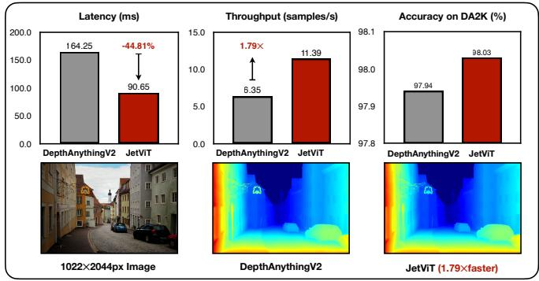
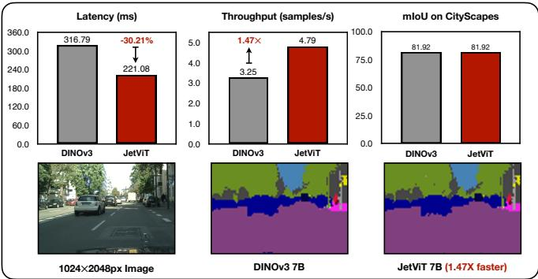
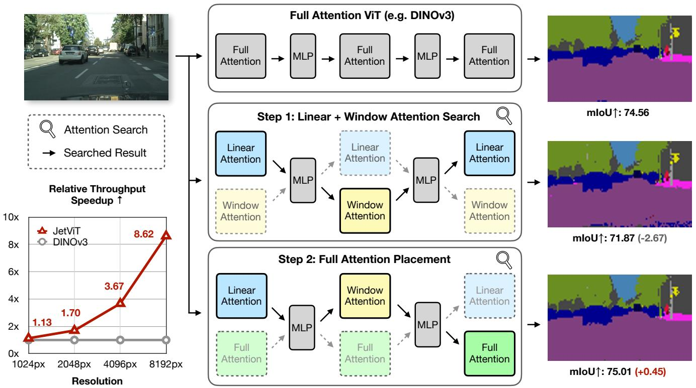
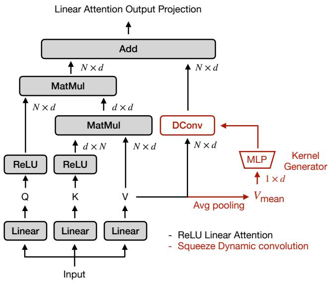
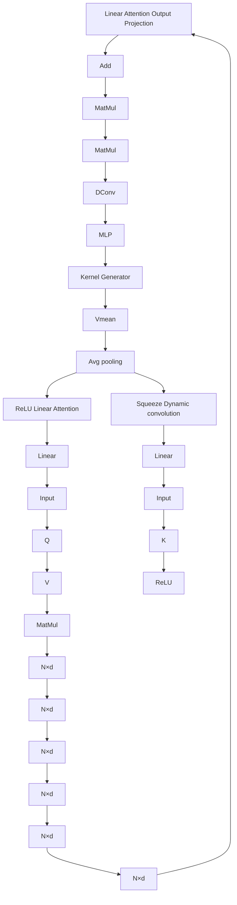
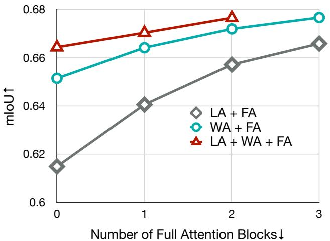
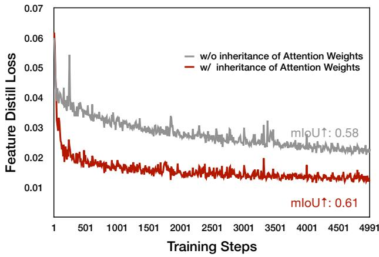
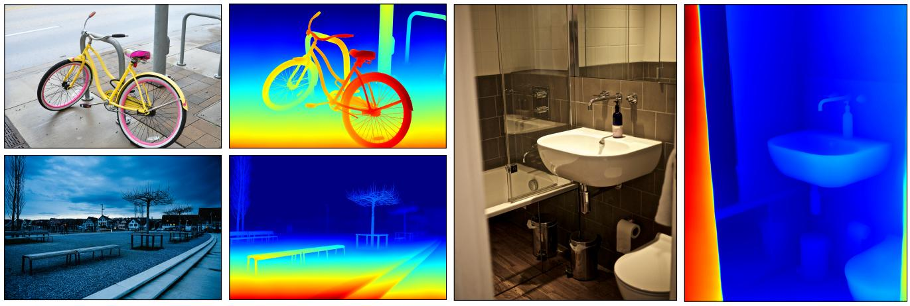
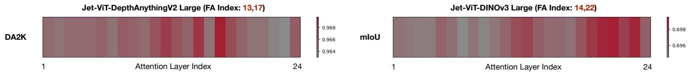

# JetViT: Efficient High-Resolution Vision Transformer with Post-Training Attention Search

Dongyun Zou1,∗ Zhuoyang Zhang1 Junyu Chen3 Wenkun He1 Qinhe Peng2 Hanrong Ye3 Yao Lu4 Hongxu Yin3 Yu Wang3 Song Han1,3 Han Cai3,∗

1MIT 2University of Pennsylvania 3NVIDIA 4Physical Intelligence

bar

| Model          | Latency (ms) | Throughput (samples/s) | Accuracy on DA2K (%) |
| -------------- | ------------ | ---------------------- | -------------------- |
| DepthAnythingV2 | 164.25       | 6.35                   | 97.94                |
| JetViT         | 90.65        | 11.39                  | 98.03                |

  
Figure 1. JetViT- Efficient Hybrid Attention Vision Transformers. We transform state-of-the-art full-attention vision foundation models (e.g., DepthAnything, DINOv3) into efficient hybrid attention models using our cost-effective Post-Training Attention Search. On DepthAnythingV2 models [49], JetViT achieves a 1.79× increase in throughput and a 44.81% reduction in latency without any loss in accuracy. On DINOv3 models [37], JetViT provides a 1.47× throughput speedup and a 30.21% latency reduction while maintaining comparable segmentation performance. All latency and throughput measurements are reported on an NVIDIA H100 GPU.

# Abstract

We introduce JetViT, a novel family of hybrid-architecture Vision Transformer (ViT) models that match the accuracy of state-of-the-art full-attention vision foundation models while achieving substantially higher inference efficiency on high-resolution images. At the core of our approach is Post-Training Attention Search, a post-training acceleration framework that converts pre-trained full-attention ViTs into efficient hybrid-attention variants by identifying and replacing redundant full-attention blocks with linear or window-attention blocks. By inheriting the MLP and attention weights from the base model, Post-Training Attention Search efficiently explores the architectural design space through three key steps: (1) optimizing the linearattention block design; (2) finding the best combination of linear-attention and window-attention blocks; and (3) identifying and preserving critical full-attention blocks. We evaluate JetViT on two representative high-resolution vision foundation models, DINOv3 and DepthAnythingV2. On the NVIDIA H100 GPU, JetViT achieves up to 1.79× higher throughput and up to 44.81% lower latency without sacrificing accuracy. We will release our code and accelerated ViT models soon.

# 1. Introduction

The Vision Transformer (ViT) [15] has rapidly emerged as a dominant paradigm in computer vision, achieving state-of-the-art performance across a wide range of applications. ViTs have proven to be highly effective as versatile backbones [21, 37, 39] and have delivered remarkable results in core vision tasks such as image classification [43, 46], object detection [8, 28], and semantic segmentation [12, 25, 51]. Their capabilities further extend to specialized domains, including depth estimation [48, 49] and generative image synthesis [42, 47].

Despite their impressive performance, the core selfattention mechanism in standard Transformers [15, 41] incurs quadratic computational and memory complexity with respect to the input sequence length. This scaling poses significant challenges for processing high-resolution images 1and deploying models on resource-constrained devices. To address these limitations, extensive research has focused on developing more efficient Transformer variants. Key strategies include hierarchical architectures with windowbased attention mechanisms [30] and various forms of linear-attention that reduce complexity to linear scaling [6, 19, 24, 31]. These approaches aim to preserve the powerful global contextual modeling of Transformers while substantially improving efficiency.

line

| Resolution | JetViT (x) | DINOv3 (x) |
| ---------- | ---------- | ---------- |
| 1024px     | 1.13       | 1.70       |
| 2048px     | 3.67       | 1.70       |
| 4096px     | 8.62       | 1.70       |
| 8192px     | 8.62       | 1.70       |

Figure 2. Post-Training Attention Search Pipeline. Our Post-Training Attention Search begins with a pre-trained full-attention Vision Transformer. We first search for the optimal combination of linear and window-attention blocks, producing an efficient ViT with O(N) complexity while retaining most of the performance of the original full-attention model. To close the gap in accuracy, we then perform a search to reintroduce a minimal number of full-attention blocks. The resulting hybrid ViT combines linear, window, and full-attention blocks, achieving accuracy comparable to the original model while delivering substantial speedups.

However, the evaluation of these efficient architectures is often limited to small-scale benchmarks, such as ImageNet-1K classification [14], and they are rarely tested on largescale vision foundation models that require extensive pretraining on massive, sometimes proprietary, datasets [37]. This gap stems in part from the fact that pre-training a novel efficient architecture from scratch at such scale is computationally prohibitive, and access to high-quality web-scale private datasets is unavailable outside leading industrial AI labs. This raises a critical question: how can we close this gap and develop efficient models that match the accuracy of these leading vision foundation models while delivering significantly improved efficiency through better architectural design?

To address this challenge, we introduce Post-Training Attention Search, a post-training acceleration framework for ViTs. Rather than designing ViTs from scratch, Post-Training Attention Search starts with a pre-trained fullattention ViT and converts it into an efficient hybrid model containing a minimal number of full-attention blocks. The pipeline consists of three key steps: (i) Optimizing the linear-attention design: Inspired by hybrid LLM architectures, we combine a lightweight dynamic convolution with traditional ReLU-based linear attention, achieving better performance while introducing less overhead compared with previous methods. (ii) Finding the best combination of linear-attention and window-attention blocks. (iii) Identifying and preserving critical full-attention blocks.

Using Post-Training Attention Search, we derive JetViT, a new family of hybrid-architecture ViTs created by applying it to pre-trained full-attention vision foundation models. The accelerated JetViT models preserve the accuracy of the base model while retaining only two full-attention blocks, delivering a substantial efficiency boost on high-resolution images. For example, JetViT-DepthAnythingV2 achieves a 1.79× throughput improvement on an NVIDIA H100 GPU while maintaining comparable depth estimation accuracy to DepthAnythingV2. Similarly, JetViT-DINOv3 reduces latency by 30.21% compared with DINOv3, while achieving the same segmentation accuracy on the Cityscapes dataset. We summarize our contributions as follows:

• We propose the JetViT Linear Attention Block, a novel linear-attention design that combines ReLU-based linear attention with lightweight squeeze dynamic convolution. Compared with previous linear-attention blocks, it introduces minimal overhead while delivering improved performance.   
• We propose Post-Training Attention Search, a two-stage distillation and search pipeline that efficiently converts a pre-trained full-attention ViT into a hybrid ViT composed of linear-attention, window-attention, and a small number of critical full-attention blocks.   
• We validate our approach by applying Post-Training Attention Search on two representative high-resolution vision foundation models, DINOv3 and DepthAnythingV2. Our JetViT achieves up to 1.79× higher throughput and up to 44.81% lower latency on an NVIDIA H100 GPU, without sacrificing accuracy.

# 2. Related Work

High-Resolution Vision Foundation Models. Recent advances in vision foundation models have greatly improved the ability to process high-resolution images, enabling more detailed and accurate visual understanding. The DINO series of models [9, 33, 37] represents a key milestone in this domain, with DINOv3 demonstrating exceptional performance in extracting rich, high-dimensional features from high-resolution inputs. Remarkably, DI-NOv3’s versatile feature representations require only a simple linear head to achieve strong results across multiple dense prediction tasks, including semantic segmentation and depth estimation, establishing an efficient paradigm for transfer learning. Building on this foundation, the DepthAnything series [48, 49] adopts DINOv2 as its backbone and integrates a Dense Prediction Transformer (DPT) [35] head to perform per-pixel depth prediction. This design effectively leverages the high-resolution feature extraction capabilities of vision foundation models, setting new benchmarks for monocular depth estimation in complex visual scenes. However, the high training cost of these foundation models prohibits the exploration of efficient structures, which is the challenge we want to solve.

Efficient Vision Transformer Design. Vision Transformers (ViTs) have demonstrated strong capabilities in extracting image features and have been successfully applied to numerous downstream tasks. However, the quadratic computational complexity of the self-attention mechanism limits their ability to directly process high-resolution images. To address this challenge, various approaches have been proposed. One line of work focuses on designing efficient attention mechanisms, such as linear-attention blocks [6, 19, 24, 31, 47, 54] or other variants with computational complexity between O(N) and O(N 2) [20, 26]. Another common strategy is to restrict self-attention to local windows [30]. These approaches primarily target the pretraining stage. In contrast, our work focuses on the posttraining stage [11, 22], which is significantly more costeffective. Recent efforts have also attempted to convert fullattention ViTs into linear-attention variants [29, 42]. However, the architectures in these methods are often highly constrained and, as a result, cannot fully leverage the knowledge from the original full-attention teacher model.

Neural Architecture Search. Neural Architecture Search (NAS) [3–5, 55] is a powerful approach for identifying model structures with optimal performance. Many efforts have focused on designing improved ViT architectures [10, 32, 38]. These methods typically operate at a very fine-grained search granularity, leading to enormous search spaces and high computational costs. In contrast, our work targets the search of attention blocks, dramatically simplifying the search process while enabling effective knowledge transfer from pre-trained full-attention models through weight inheritance.

# 3. Method

# 3.1. Motivation

Training Vision Transformers (ViTs) from scratch incurs prohibitive computational costs, and state-of-the-art fullattention ViTs are often pretrained on massive proprietary datasets that are inaccessible to most researchers. This limitation severely constrains the exploration of novel efficient ViT architectures, with many proposed designs validated only on small-scale benchmarks (e.g., ImageNet-1K classification) rather than the diverse, high-resolution downstream tasks where full-attention ViTs excel. To bridge this gap, we propose Post-Training Attention Search, a posttraining architecture search framework that efficiently converts pretrained full-attention ViTs into optimized hybrid models. Our method inherits all weights from the original ViT, eliminating the need for private datasets or costly repretraining. By leveraging public datasets and a two-stage distillation-and-search process (Fig. 2), Post-Training Attention Search produces highly efficient models that match the performance of their full-attention counterparts.

<table><tr><td>Linear Attention Type</td><td>1024×2048px mIoU↑</td><td>Inference Latency milliseconds</td><td>Inference Throughput samples/s</td><td>Train Step Time seconds</td></tr><tr><td>Baseline: ReLU Linear Attention</td><td>65.17</td><td>5.33</td><td>212.03</td><td>0.198</td></tr><tr><td>+ DWC on V</td><td>71.82</td><td>5.72</td><td>204.49</td><td>0.227</td></tr><tr><td>+ DWC on V + Focusing Factor[19]</td><td>72.48</td><td>6.00</td><td>191.09</td><td>0.312</td></tr><tr><td>+ Token-wise Dynamic DWC</td><td>-</td><td>8.94</td><td>120.77</td><td>-</td></tr><tr><td>+ Squeeze Dynamic DWC on V (Ours)</td><td>73.12</td><td>5.88</td><td>197.57</td><td>0.232</td></tr></table>

Table 1. Performance and Efficiency Comparison of Linear-Attention ViTs on the Cityscapes Dataset. Using the full-attention ViT (DINOv3) as the teacher, we perform distillation training on a pure linear-attention ViT. Inference latency is measured on 1024 × 2048 px images, while training step time is measured using a batch of 1024 images at 256 × 256 px on a server with 8 H100 GPUs. Our linearattention design introduces the least overhead compared with static depth-wise convolution (DWC) while achieving the best performance.

flowchart

Figure 3. JetViT Linear-Attention Block With Squeeze Dynamic Convolution.

# 3.2. Post-Training Attention Search

# 3.2.1. Linear-Attention Block Design

Preliminary. Traditional full-attention introduces O(N 2) complexity when computing pairwise similarity:

$$
\operatorname{Sim} (Q, K) = \exp \left(\frac {Q K ^ {\top}}{\sqrt {d}}\right). \tag {1}
$$

To address this issue, linear attention was introduced. It employs a kernel function ϕ(·) to decompose the similarity computation as:

$$
\operatorname{Sim} (Q, K) = \phi (Q) \phi (K) ^ {\top}. \tag {2}
$$

By reordering the computations, linear attention avoids explicitly constructing the N × N matrix, thereby reducing the complexity to O(N ).

However, using simple kernel functions such as ReLU often leads to a significant drop in model performance. To mitigate this, previous works have proposed two strategies to enhance linear attention [19, 31]:

1. Applying depth-wise convolution (DWC) on the V matrix to capture local information.   
2. Replacing ReLU with carefully designed kernel functions, e.g.,

$$
\phi (x) = \frac {\| x \|}{\| x \| ^ {p}} x ^ {p}, \tag {3}
$$

where p is a focusing factor, to produce a sharper attention map.

With these improvements, linear attention can be formulated as:

$$
O = \phi (Q) \phi (K) ^ {T} V + \mathrm{DWC} (V) \tag {4}
$$

where DWC denotes depth-wise convolution.

JetViT Linear Attention Block. Our ablation studies on enhancements to simple ReLU linear attention reveal that while depth-wise convolution provides a substantial improvement, additional kernel functions offer negligible gains at a significant computational cost (e.g., 37% slower training speed).

To improve linear-attention efficiency while minimizing overhead, we draw inspiration from dynamic convolution mechanisms recently employed in LLM architectures [7, 18, 45]. These approaches typically use an MLP as a kernel generator to produce a 1D convolution kernel for each token. However, our initial attempt to directly replace the depth-wise convolution with such a token-wise dynamic convolution kernel resulted in prohibitive overhead (e.g., a 40% drop in throughput).

Prior work on dynamic convolution in image processing [45] often generates a single dynamic kernel based on global features, which is then shared across all tokens. Inspired by this global-feature-based approach, we propose replacing the depth-wise convolution with a lightweight dynamic convolution, referred to as Squeeze Dynamic Convolution (see Fig. 3). Specifically, we substitute the static weights of the depth-wise convolution with dynamically generated weights derived from the average pooling of the value matrix V . A compact two-layer MLP with SiLU [16] activation functions serves as the kernel generator.

<table><tr><td>Attention Types</td><td>mIoU</td><td>pAcc</td></tr><tr><td>Pure Full Attention</td><td>68.74</td><td>93.81</td></tr><tr><td>Pure Linear Attention</td><td>61.48</td><td>92.67</td></tr><tr><td>Pure Window Attention</td><td>65.14</td><td>93.19</td></tr><tr><td>LA + WA Hybrid with Post-Training Attention Search</td><td>66.43</td><td>93.40</td></tr></table>

Table 2. Comparison of Linear-Probing Segmentation Results on Cityscapes (512 × 512 px). With Post-Training Attention Search, the optimal combination of linear and window attention can recover most of the full-attention model’s performance while outperforming ViTs that use only linear or only window attention.

As shown in Tab. 1, our proposed linear-attention block outperforms traditional counterparts. By retaining the ReLU kernel function, it introduces negligible computational overhead compared to the original static depth-wise convolution variant. It is worth noting that while recent state-space models such as Vision Mamba [54] also provide an efficient alternative for modeling long-range dependencies, their core mechanism requires a bidirectional scan—a forward and backward pass—within each layer to aggregate global information, effectively doubling computational cost compared to our single-pass approach. Moreover, our linear-attention block is designed for direct weight initialization from pre-trained full-attention Vision Transformers, a step shown to be critical for accelerating convergence (Sec. 3.2.4). Vision Mamba’s distinct state-space parameterization prevents this direct weight transfer, limiting its ability to fully leverage the benefits of inheriting pre-trained model knowledge.

# 3.2.2. Linear and Window-Attention Search

Alongside linear attention (LA), window attention (WA) is another widely used efficient attention mechanism. WA works by partitioning the feature map into nonoverlapping windows and computing self-attention independently within each window. Typically, WA is alternated with full attention (FA), with FA responsible for capturing global context. This motivates our investigation into whether LA can effectively replace the computationally expensive FA for global information aggregation, enabling a hybrid architecture composed solely of LA and WA blocks.

We apply Post-Training Attention Search as illustrated in Step 1 of Fig. 2. Starting from a pretrained full-attention ViT (DINOv3 base), we first construct a supernetwork containing two attention blocks per layer. Using the fullattention ViT as the teacher, we perform distillation on the supernetwork. After training, we employ beam search [17] to identify the optimal combination of linear-attention and window-attention blocks. The results are presented in Tab. 2. With careful selection, a ViT composed of linear and window-attention blocks can recover most of the performance of the full-attention ViT while surpassing models that use only linear or only window-attention blocks.

line

| Number of Full Attention Blocks | LA + FA | WA + FA | LA + WA + FA |
| -------------------------------- | ------- | ------- | ------------ |
| 0                                | 0.615   | 0.652   | 0.665        |
| 1                                | 0.640   | 0.665   | 0.670        |
| 2                                | 0.658   | 0.672   | 0.678        |
| 3                                | 0.668   | 0.678   | -            |

Figure 4. Comparison of Segmentation Results on Cityscapes $( 5 1 2 \times 5 1 2 ~ \mathbf { p } \mathbf { x } )$ 1. With the same full-attention budget, combining linear, window, and full-attention blocks achieves the highest mIoU. This highlights the importance of first identifying an efficient attention block combination before determining the placement of full-attention blocks.

# 3.2.3. Full-Attention Placement

However, a performance gap between the searched efficient ViT and the teacher model still remains. Previous studies on hybrid language models [18] indicate that preserving a few full-attention blocks is crucial for improving model accuracy. To close this gap, we continue to leverage our efficient Post-Training Attention Search to identify the optimal placement of full-attention blocks.

As illustrated in Step 2 of Fig. 2, we construct a supernetwork containing two attention blocks per layer: an efficient attention block (searched in Step 1) and a full-attention block. Using the full-attention ViT as the teacher, we perform distillation training and employ beam search to determine the best placement of the full-attention blocks. Remarkably, we find that only two full-attention blocks are sufficient to recover the model’s performance. This finding is further validated by extended experiments presented in Sec. 4.

We also examine whether Step 1 is necessary by conducting an ablation on linear- and window-attention search. Specifically, we directly apply Post-Training Attention Search using two attention types (e.g., linear-attention + full-attention or window-attention + full-attention) and compare the results with those from the two-stage Post-

line

| Training Steps | w/o inheritance of Attention Weights | w/ inheritance of Attention Weights |
| -------------- | ------------------------------------- | ------------------------------------ |
| 1              | ~0.06                                 | ~0.06                                |
| 501            | ~0.035                                | ~0.02                                |
| 1001           | ~0.03                                 | ~0.018                               |
| 1501           | ~0.028                                | ~0.017                               |
| 2001           | ~0.027                                | ~0.016                               |
| 2501           | ~0.026                                | ~0.015                               |
| 3001           | ~0.025                                | ~0.014                               |
| 3501           | ~0.024                                | ~0.013                               |
| 4001           | ~0.023                                | ~0.012                               |
| 4501           | ~0.022                                | ~0.011                               |
| 4991           | ~0.021                                | ~0.01                                |

Figure 5. Training Curve Comparison: Effect of Inheriting Full-Attention Weights. The gray curve inherits only MLP weights, while the red curve inherits all weights from the base model.

Training Attention Search. The results are shown in Fig. 4. We find that combining all three attention types further reduces the number of full-attention blocks needed to recover the hybrid model’s performance, yielding a more efficient model structure.

# 3.2.4. Implementation Details

Inherit Weights from Base Model. Previous studies on converting full-attention Transformers into linear or hybrid models often inherit only the MLP weights, while keeping the Q, K, V , and O matrices in the efficient attention blocks randomly initialized [18, 29]. We show that inheriting all attention weights $( \mathbf { W } _ { \mathrm { Q } } , \mathbf { W } _ { \mathrm { K } } , \mathbf { W } _ { \mathrm { V } } , \mathbf { W } _ { \mathrm { O } } )$ is critical for maintaining performance. Specifically, we train a pure linear-attention ViT using a full-attention ViT as the teacher. The loss curves in Fig. 5 demonstrate that inheriting the full-attention weights (red curve) achieves a +3% mIoU on Cityscapes segmentation with a linear head, compared to inheriting only the MLP weights (gray curve).

Distillation Training. Following [5], we train a supernetwork and perform a search to efficiently identify the optimal attention combination. At each training step, a subnetwork is randomly selected for forward and backward passes. Feature distillation is applied to the features used for the downstream task (e.g., only the last layer when using a linear head for segmentation, or four intermediate layers when using a DPT head to predict a depth map).

Beam Search. We perform beam search using the downstream task’s metric (e.g., mIoU, DA2K) as the direct search objective. The search proceeds in a greedy, stagewise manner, guided by the known efficiency hierarchy of attention types (linear-attention > window-attention > full-attention). In Step 1, we start with an all-linearattention configuration and incrementally replace linearattention blocks with window-attention until performance gains plateau. In Step 2, we take the best architecture from Step 1 and progressively substitute its efficient attention blocks with full-attention blocks, stopping once the model’s performance converges to that of the original full-attention teacher.

# 4. Experiments

# 4.1. Setup

Datasets. To ensure diversity in our training data, we used a mixture of widely used open-source datasets, including SA1B [25], ImageNet21K [36], BDD100K [50], Google Landmarks [44], Places365 [52], Pexels [34], Cityscapes [13], and COCO [27]. We did not balance the dataset ratios but simply concatenated them.

Speed Test Setting. We measure latency and throughput on a server equipped with eight NVIDIA H100 80GB HBM3 GPUs, two Intel Xeon Platinum 8462Y+ CPUs, and 2 TB of RAM. Our environment is based on PyTorch 2.8. For full-attention blocks, we use PyTorch’s native scaled dot product attention. The linear-attention blocks are implemented entirely in PyTorch, without any custom kernel optimizations.

# 4.2. Semantic Segmentation

We validate JetViT ’s ability to extract image features without training on specific downstream tasks. Starting from DINOv3’s base, large, and 7B models, we convert them into efficient hybrid models (referred to as JetViT-DINOv3) using Post-Training Attention Search. Following the DINOv3 protocol, we train a simple linear head on the frozen backbone for semantic segmentation. Linear probing results provide an indicator of the quality of the extracted features, as shown in Tab. 3.

Performance is measured using mean Intersection over Union (mIoU) and pixel Accuracy (pAcc) on the CityScapes [13] and ADE20K [53] datasets. We compare JetViT-DINOv3 with state-of-the-art vision backbones, including DINOv3 [37] and AM-RADIO [23]. The linear head is trained for 5,000 steps using cross-entropy loss. Optimization is performed with the Adam optimizer, a learning rate of $1 \times 1 0 ^ { - 4 }$ , β values of (0.9, 0.999), and a batch size of 1024.

The results demonstrate that JetViT-DINOv3 can extract visual features of comparable quality to the original DI-NOv3 models on both high- and low-resolution images.

# 4.3. Monocular Depth Estimation

We further evaluate JetViT ’s capabilities on a more complex task: monocular depth estimation. We start from the state-of-the-art DepthAnythingV2 model [49], which uses a full-attention Vision Transformer as the backbone and a

<table><tr><td rowspan="2">Model</td><td rowspan="2">Size(Spec)</td><td>Latency</td><td>Throughput</td><td colspan="2">Cityscapes 1024x2048px</td><td colspan="2">ADE20K 512x512px</td></tr><tr><td>ms ↓</td><td>samples/s ↑</td><td>mIoU↑</td><td>pAcc↑</td><td>mIoU↑</td><td>pAcc↑</td></tr><tr><td>AM-RADIO v3[23]</td><td>Base</td><td>12.08</td><td>87.59</td><td>76.43</td><td>95.37</td><td>49.10</td><td>81.87</td></tr><tr><td>DINOv3[37]</td><td>Base</td><td>12.86</td><td>81.52</td><td>74.56</td><td>95.19</td><td>50.32</td><td>82.59</td></tr><tr><td>JetViT-DINOv3</td><td>Base (0 FA)</td><td>7.37</td><td>153.94</td><td>71.87</td><td>94.75</td><td>48.84</td><td>82.16</td></tr><tr><td>JetViT-DINOv3</td><td>Base (1 FA)</td><td>7.69</td><td>145.45</td><td>74.50</td><td>95.20</td><td>49.36</td><td>82.40</td></tr><tr><td>JetViT-DINOv3</td><td>Base (2 FA)</td><td>8.27</td><td>133.68</td><td>75.01</td><td>95.30</td><td>49.85</td><td>82.53</td></tr><tr><td>AM-RADIO v3[23]</td><td>Large</td><td>33.24</td><td>31.15</td><td>78.50</td><td>95.78</td><td>51.20</td><td>82.61</td></tr><tr><td>DINOv3[37]</td><td>Large</td><td>35.07</td><td>29.53</td><td>79.84</td><td>96.07</td><td>52.57</td><td>82.74</td></tr><tr><td>JetViT-DINOv3</td><td>Large (2 FA)</td><td>18.77</td><td>57.90</td><td>79.88</td><td>96.08</td><td>52.31</td><td>82.75</td></tr><tr><td>DINOv3[37]</td><td>7B</td><td>316.79</td><td>3.26</td><td>81.92</td><td>96.44</td><td>54.72</td><td>83.55</td></tr><tr><td>JetViT-DINOv3</td><td>7B (2 FA)</td><td>221.08</td><td>4.80</td><td>81.92</td><td>96.45</td><td>54.86</td><td>83.70</td></tr></table>

Table 3. Semantic Segmentation Results on Cityscapes and ADE20K. (Best results, Second-best results) JetViT-DINOv3 achieves performance comparable to state-of-the-art vision backbone models (DINOv3 [37] and AM-RADIO [23]) while providing a significant speedup.

Dense Prediction Transformer (DPT) [35] to predict pixelwise inverse relative depth maps. DepthAnythingV2 fully leverages the ViT backbone features by extracting four intermediate layers and feeding them into the DPT head.

After performing the two-stage Post-Training Attention Search, we further fine-tune our model following the same training strategy as DepthAnythingV2. We use the largest DepthAnythingV2 model, which was purely trained on synthetic datasets, to generate pseudo depth labels for unlabeled real-image datasets, including SAM, BDD100K, Google Landmarks, Places365, Pexels, and COCO, and train our model solely on these pseudo labels.

The results are shown in Tab. 4. We evaluate using standard metrics, $\delta _ { 1 }$ and absolute relative error (Abs Rel), on three high-resolution datasets: DIODE [40], Sintel [2], and CityScapes [13]. Images are used at their original high resolutions without resizing. Full metric definitions are provided in [48]. Additionally, we measure the DA2K metric, proposed by DepthAnythingV2, which evaluates performance in complex environments (e.g., reflective or transparent objects). For DA2K images, we resize the short edge to 1022 pixels while preserving the aspect ratio.

Compared with state-of-the-art relative depth estimation models, DepthAnythingV2 [49] and MiDaS [1], JetViT-DepthAnythingV2 achieves comparable or superior performance on high-resolution datasets. While MiDaS uses a Swin Transformer backbone and is more efficient than DepthAnythingV2, our JetViT-DepthAnythingV2 employs fewer global full-attention layers than MiDaS, surpassing it in both performance and efficiency.

Qualitative results are presented in Fig. 6. Visualizations of JetViT-DepthAnythingV2 Giant’s predictions demonstrate that, through Post-Training Attention Search, the model successfully inherits DepthAnythingV2’s strengths: (i) capturing fine-grained details, and (ii) maintaining robustness in complex environments.

# 4.4. Analysis on Searched Model Structure

Our analysis of Post-Training Attention Search ’s results shows that the optimal placement of critical full-attention layers depends on how the Vision backbone’s features are utilized. For instance, DepthAnythingV2 extracts features from four intermediate ViT layers and feeds them into a DPT head for depth prediction, whereas DINOv3, for semantic segmentation, directly uses the final backbone layer to train a linear head. As illustrated in Fig. 7, the middle-to-deeper layers are most important for JetViT-DepthAnythingV2, with full-attention placed at layers 13 and 17. In contrast, for JetViT-DINOv3, the final layers are more critical, leading the search to select layers 14 and 22. These observations offer valuable guidance for designing future hybrid ViT architectures.

A further consistent pattern is that the first attention block is always linear-attention, suggesting that linearattention may function analogously to convolutional layers in traditional CNNs, extracting fundamental image features in the shallow layers.

# 4.5. Additional Results

We provide additional experiments in the supplementary material, including: (i) a computational cost analysis showing that Post-Training Attention Search requires only ∼1/68 of the pre-training cost for the DINOv3-7B model; (ii) generalization results on object detection (COCO) and image/video classification (ImageNet, UCF101); and (iii) efficiency benchmarks on edge devices (NVIDIA RTX 3090 and Jetson GB10), where JetViT achieves up to 2.4× speedup at 2K resolution.

<table><tr><td rowspan="2">Model</td><td rowspan="2">Size(Spec)</td><td rowspan="2">Latencyms ↓</td><td rowspan="2">Throughputsamples/s ↑</td><td rowspan="2">DA2KAcc↑</td><td colspan="2">DIODE</td><td colspan="2">Sintel</td><td colspan="2">CityScapes</td></tr><tr><td> $\delta_1 \uparrow$ </td><td>Abs Rel ↓</td><td> $\delta_1 \uparrow$ </td><td>Abs Rel ↓</td><td> $\delta_1 \uparrow$ </td><td>Abs Rel ↓</td></tr><tr><td>MiDaS V3 DPT[1]</td><td>Large(Swin)</td><td>39.28</td><td>27.14</td><td>75.04</td><td>0.696</td><td>0.262</td><td>0.598</td><td>0.342</td><td>0.743</td><td>0.186</td></tr><tr><td>DepthAnythingV2[49]</td><td>Large</td><td>60.76</td><td>14.20</td><td>97.60</td><td>0.749</td><td>0.231</td><td>0.730</td><td>0.222</td><td>0.872</td><td>0.111</td></tr><tr><td>JetViT-DepthAnything</td><td>Large(0 FA)</td><td>29.70</td><td>34.97</td><td>97.74</td><td>0.743</td><td>0.228</td><td>0.722</td><td>0.229</td><td>0.872</td><td>0.110</td></tr><tr><td>JetViT-DepthAnything</td><td>Large(1 FA)</td><td>31.04</td><td>33.72</td><td>97.76</td><td>0.744</td><td>0.229</td><td>0.726</td><td>0.227</td><td>0.871</td><td>0.109</td></tr><tr><td>JetViT-DepthAnything</td><td>Large(2 FA)</td><td>32.63</td><td>32.13</td><td>97.84</td><td>0.749</td><td>0.228</td><td>0.730</td><td>0.226</td><td>0.876</td><td>0.108</td></tr><tr><td>DepthAnythingV2[49]</td><td>Giant</td><td>164.25</td><td>6.35</td><td>97.94</td><td>0.751</td><td>0.234</td><td>0.737</td><td>0.210</td><td>0.876</td><td>0.111</td></tr><tr><td>JetViT-DepthAnything</td><td>Giant(2 FA)</td><td>90.65</td><td>11.39</td><td>98.03</td><td>0.750</td><td>0.231</td><td>0.741</td><td>0.210</td><td>0.879</td><td>0.109</td></tr></table>

Table 4. Zero-Shot Depth Estimation Results. (Best results, Second-best results) DepthAnything employs a full-attention Transformer as its backbone, while MiDaS V3 uses a Swin Transformer [30], which is more efficient but suffers a notable drop in performance. In contrast, JetViT matches the performance of the state-of-the-art DepthAnythingV2 on these high-resolution datasets, while delivering a substantial speedup.   

Figure 6. Qualitative Results of JetViT-DepthAnythingV2. Our model successfully inherits two key strengths from DepthAnythingV2: (i) high precision in capturing fine-grained details, as evidenced by the clearly reconstructed bicycle spokes and distant tree branches in the left scene; and (ii) robustness in handling complex surfaces, such as transparent glass and reflective mirrors in the right scene.   
  
Figure 7. Full-Attention Placement Search Results on a 24-Layer ViT Large. Each grid cell represents the search objective value for replacing the corresponding layer with full-attention. Higher values indicate a greater gain from re-inserting full-attention.

# 5. Conclusion

We introduce JetViT, a new family of hybrid-architecture Vision Transformers that matches the performance of fullattention models while delivering significantly improved efficiency, particularly for high-resolution images. JetViT is enabled by two key innovations: (1) Post-Training Attention Search, an efficient strategy for converting fullattention ViTs into hybrid models through weight inheritance, distillation and beam search. This approach streamlines the exploration of efficient ViT architectures by facilitating the rapid integration of state-of-the-art efficient

attention blocks with well-pretrained full-attention ViTs. (2) A newly designed linear-attention block that combines lightweight dynamic convolution with traditional linearattention, contributing to faster inference in our hybrid models and reducing the number of full-attention blocks needed to recover model performance.

Extensive experiments demonstrate that JetViT achieves substantial speedups without sacrificing accuracy. Moreover, Post-Training Attention Search significantly reduce the cost of efficient architecture exploration. We believe this framework will accelerate innovation by enabling rapid application of newly designed efficient ViT blocks.

# References

[1] Reiner Birkl, Diana Wofk, and Matthias Muller. Midas v3. ¨ 1–a model zoo for robust monocular relative depth estimation. arXiv preprint arXiv:2307.14460, 2023. 7, 8   
[2] D. J. Butler, J. Wulff, G. B. Stanley, and M. J. Black. A naturalistic open source movie for optical flow evaluation. In European Conf. on Computer Vision (ECCV), pages 611– 625. Springer-Verlag, 2012. 7   
[3] Han Cai, Tianyao Chen, Weinan Zhang, Yong Yu, and Jun Wang. Efficient architecture search by network transformation. In Proceedings of the AAAI conference on artificial intelligence, 2018. 3   
[4] Han Cai, Ligeng Zhu, and Song Han. Proxylessnas: Direct neural architecture search on target task and hardware. arXiv preprint arXiv:1812.00332, 2018.   
[5] Han Cai, Chuang Gan, Tianzhe Wang, Zhekai Zhang, and Song Han. Once-for-all: Train one network and specialize it for efficient deployment. arXiv preprint arXiv:1908.09791, 2019. 3, 6   
[6] Han Cai, Junyan Li, Muyan Hu, Chuang Gan, and Song Han. Efficientvit: Multi-scale linear attention for high-resolution dense prediction. arXiv preprint arXiv:2205.14756, 2022. 2, 3   
[7] Han Cai, Muyang Li, Qinsheng Zhang, Ming-Yu Liu, and Song Han. Condition-aware neural network for controlled image generation. In Proceedings of the IEEE/CVF Conference on Computer Vision and Pattern Recognition, pages 7194–7203, 2024. 4   
[8] Nicolas Carion, Francisco Massa, Gabriel Synnaeve, Nicolas Usunier, Alexander Kirillov, and Sergey Zagoruyko. End-toend object detection with transformers. In European conference on computer vision, pages 213–229. Springer, 2020. 1   
[9] Mathilde Caron, Hugo Touvron, Ishan Misra, Herve J ´ egou, ´ Julien Mairal, Piotr Bojanowski, and Armand Joulin. Emerging properties in self-supervised vision transformers. In Proceedings of the IEEE/CVF international conference on computer vision, pages 9650–9660, 2021. 3   
[10] Boyu Chen, Peixia Li, Chuming Li, Baopu Li, Lei Bai, Chen Lin, Ming Sun, Junjie Yan, and Wanli Ouyang. Glit: Neural architecture search for global and local image transformer. In Proceedings of the IEEE/CVF international conference on computer vision, pages 12–21, 2021. 3   
[11] Junyu Chen, Wenkun He, Yuchao Gu, Yuyang Zhao, Jincheng Yu, Junsong Chen, Dongyun Zou, Yujun Lin, Zhekai Zhang, Muyang Li, et al. Dc-videogen: Efficient video generation with deep compression video autoencoder. arXiv preprint arXiv:2509.25182, 2025. 3   
[12] Bowen Cheng, Alex Schwing, and Alexander Kirillov. Perpixel classification is not all you need for semantic segmentation. Advances in neural information processing systems, 34:17864–17875, 2021. 1   
[13] Marius Cordts, Mohamed Omran, Sebastian Ramos, Timo Rehfeld, Markus Enzweiler, Rodrigo Benenson, Uwe Franke, Stefan Roth, and Bernt Schiele. The cityscapes dataset for semantic urban scene understanding. In Proceedings of the IEEE conference on computer vision and pattern recognition, pages 3213–3223, 2016. 6, 7

[14] Jia Deng, Wei Dong, Richard Socher, Li-Jia Li, Kai Li, and Li Fei-Fei. Imagenet: A large-scale hierarchical image database. In 2009 IEEE conference on computer vision and pattern recognition, pages 248–255. Ieee, 2009. 2   
[15] Alexey Dosovitskiy. An image is worth 16x16 words: Transformers for image recognition at scale. arXiv preprint arXiv:2010.11929, 2020. 1   
[16] Stefan Elfwing, Eiji Uchibe, and Kenji Doya. Sigmoidweighted linear units for neural network function approximation in reinforcement learning. Neural networks, 107:3–11, 2018. 5   
[17] Alex Graves. Sequence transduction with recurrent neural networks. arXiv preprint arXiv:1211.3711, 2012. 5   
[18] Yuxian Gu, Qinghao Hu, Shang Yang, Haocheng Xi, Junyu Chen, Song Han, and Han Cai. Jet-nemotron: Efficient language model with post neural architecture search. arXiv preprint arXiv:2508.15884, 2025. 4, 5, 6   
[19] Dongchen Han, Xuran Pan, Yizeng Han, Shiji Song, and Gao Huang. Flatten transformer: Vision transformer using focused linear attention. In Proceedings of the IEEE/CVF international conference on computer vision, pages 5961– 5971, 2023. 2, 3, 4   
[20] Dongchen Han, Tianzhu Ye, Yizeng Han, Zhuofan Xia, Siyuan Pan, Pengfei Wan, Shiji Song, and Gao Huang. Agent attention: On the integration of softmax and linear attention. In European conference on computer vision, pages 124–140. Springer, 2024. 3   
[21] Kaiming He, Xinlei Chen, Saining Xie, Yanghao Li, Piotr Dollar, and Ross Girshick. Masked autoencoders are scalable ´ vision learners. In Proceedings of the IEEE/CVF conference on computer vision and pattern recognition, pages 16000– 16009, 2022. 1   
[22] Wenkun He, Yuchao Gu, Junyu Chen, Dongyun Zou, Yujun Lin, Zhekai Zhang, Haocheng Xi, Muyang Li, Ligeng Zhu, Jincheng Yu, et al. Dc-gen: Post-training diffusion acceleration with deeply compressed latent space. arXiv preprint arXiv:2509.25180, 2025. 3   
[23] Greg Heinrich, Mike Ranzinger, Hongxu, Yin, Yao Lu, Jan Kautz, Andrew Tao, Bryan Catanzaro, and Pavlo Molchanov. Radiov2.5: Improved baselines for agglomerative vision foundation models, 2024. 6, 7   
[24] Angelos Katharopoulos, Apoorv Vyas, Nikolaos Pappas, and Franc¸ois Fleuret. Transformers are rnns: Fast autoregressive transformers with linear attention. In International conference on machine learning, pages 5156–5165. PMLR, 2020. 2, 3   
[25] Alexander Kirillov, Eric Mintun, Nikhila Ravi, Hanzi Mao, Chloe Rolland, Laura Gustafson, Tete Xiao, Spencer Whitehead, Alexander C Berg, Wan-Yen Lo, et al. Segment anything. In Proceedings of the IEEE/CVF international conference on computer vision, pages 4015–4026, 2023. 1, 6   
[26] Xingyang Li, Muyang Li, Tianle Cai, Haocheng Xi, Shuo Yang, Yujun Lin, Lvmin Zhang, Songlin Yang, Jinbo Hu, Kelly Peng, et al. Radial attention: o(nlogn) sparse attention with energy decay for long video generation. arXiv preprint arXiv:2506.19852, 2025. 3   
[27] Tsung-Yi Lin, Michael Maire, Serge Belongie, James Hays, Pietro Perona, Deva Ramanan, Piotr Dollar, and C Lawrence ´

Zitnick. Microsoft coco: Common objects in context. In European conference on computer vision, pages 740–755. Springer, 2014. 6   
[28] Yutong Lin, Yuhui Yuan, Zheng Zhang, Chen Li, Nanning Zheng, and Han Hu. Detr does not need multi-scale or locality design. In Proceedings of the IEEE/CVF International Conference on Computer Vision, pages 6545–6554, 2023. 1   
[29] Songhua Liu, Weihao Yu, Zhenxiong Tan, and Xinchao Wang. Linfusion: 1 gpu, 1 minute, 16k image. arXiv preprint arXiv:2409.02097, 2024. 3, 6   
[30] Ze Liu, Yutong Lin, Yue Cao, Han Hu, Yixuan Wei, Zheng Zhang, Stephen Lin, and Baining Guo. Swin transformer: Hierarchical vision transformer using shifted windows. In Proceedings of the IEEE/CVF international conference on computer vision, pages 10012–10022, 2021. 2, 3, 8   
[31] Weikang Meng, Yadan Luo, Xin Li, Dongmei Jiang, and Zheng Zhang. Polaformer: Polarity-aware linear attention for vision transformers. arXiv preprint arXiv:2501.15061, 2025. 2, 3, 4   
[32] Bolin Ni, Gaofeng Meng, Shiming Xiang, and Chunhong Pan. Nasformer: Neural architecture search for vision transformer. In Asian Conference on Pattern Recognition, pages 47–61. Springer, 2021. 3   
[33] Maxime Oquab, Timothee Darcet, Th ´ eo Moutakanni, Huy ´ Vo, Marc Szafraniec, Vasil Khalidov, Pierre Fernandez, Daniel Haziza, Francisco Massa, Alaaeldin El-Nouby, et al. Dinov2: Learning robust visual features without supervision. arXiv preprint arXiv:2304.07193, 2023. 3   
[34] Pexels. Free stock photos, videos & music, 2025. Accessed: 2025-11-10. 6   
[35] Rene Ranftl, Katrin Lasinger, David Hafner, Konrad´ Schindler, and Vladlen Koltun. Towards robust monocular depth estimation: Mixing datasets for zero-shot cross-dataset transfer. IEEE transactions on pattern analysis and machine intelligence, 44(3):1623–1637, 2020. 3, 7   
[36] Tal Ridnik, Emanuel Ben-Baruch, Asaf Noy, and Lihi Zelnik-Manor. Imagenet-21k pretraining for the masses. arXiv preprint arXiv:2104.10972, 2021. 6   
[37] Oriane Simeoni, Huy V Vo, Maximilian Seitzer, Federico ´ Baldassarre, Maxime Oquab, Cijo Jose, Vasil Khalidov, Marc Szafraniec, Seungeun Yi, Michael Ramamonjisoa, ¨ et al. Dinov3. arXiv preprint arXiv:2508.10104, 2025. 1, 2, 3, 6, 7   
[38] Xiu Su, Shan You, Jiyang Xie, Mingkai Zheng, Fei Wang, Chen Qian, Changshui Zhang, Xiaogang Wang, and Chang Xu. Vitas: Vision transformer architecture search. In European Conference on Computer Vision, pages 139–157. Springer, 2022. 3   
[39] Michael Tschannen, Alexey Gritsenko, Xiao Wang, Muhammad Ferjad Naeem, Ibrahim Alabdulmohsin, Nikhil Parthasarathy, Talfan Evans, Lucas Beyer, Ye Xia, Basil Mustafa, et al. Siglip 2: Multilingual vision-language encoders with improved semantic understanding, localization, and dense features. arXiv preprint arXiv:2502.14786, 2025. 1   
[40] Igor Vasiljevic, Nick Kolkin, Shanyi Zhang, Ruotian Luo, Haochen Wang, Falcon Z Dai, Andrea F Daniele, Mohammadreza Mostajabi, Steven Basart, Matthew R Walter, et al.

Diode: A dense indoor and outdoor depth dataset. arXiv preprint arXiv:1908.00463, 2019. 7   
[41] Ashish Vaswani, Noam Shazeer, Niki Parmar, Jakob Uszkoreit, Llion Jones, Aidan N Gomez, Łukasz Kaiser, and Illia Polosukhin. Attention is all you need. Advances in neural information processing systems, 30, 2017. 1   
[42] Jiahao Wang, Ning Kang, Lewei Yao, Mengzhao Chen, Chengyue Wu, Songyang Zhang, Shuchen Xue, Yong Liu, Taiqiang Wu, Xihui Liu, et al. Lit: Delving into a simplified linear diffusion transformer for image generation. arXiv preprint arXiv:2501.12976, 2025. 1, 3   
[43] Wenhai Wang, Enze Xie, Xiang Li, Deng-Ping Fan, Kaitao Song, Ding Liang, Tong Lu, Ping Luo, and Ling Shao. Pyramid vision transformer: A versatile backbone for dense prediction without convolutions. In Proceedings of the IEEE/CVF international conference on computer vision, pages 568–578, 2021. 1   
[44] Tobias Weyand, Andre Araujo, Bingyi Cao, and Jack Sim. Google landmarks dataset v2-a large-scale benchmark for instance-level recognition and retrieval. In Proceedings of the IEEE/CVF conference on computer vision and pattern recognition, pages 2575–2584, 2020. 6   
[45] Felix Wu, Angela Fan, Alexei Baevski, Yann N Dauphin, and Michael Auli. Pay less attention with lightweight and dynamic convolutions. arXiv preprint arXiv:1901.10430, 2019. 4   
[46] Zhuofan Xia, Xuran Pan, Shiji Song, Li Erran Li, and Gao Huang. Vision transformer with deformable attention. In Proceedings of the IEEE/CVF conference on computer vision and pattern recognition, pages 4794–4803, 2022. 1   
[47] Enze Xie, Junsong Chen, Junyu Chen, Han Cai, Haotian Tang, Yujun Lin, Zhekai Zhang, Muyang Li, Ligeng Zhu, Yao Lu, et al. Sana: Efficient high-resolution image synthesis with linear diffusion transformers. arXiv preprint arXiv:2410.10629, 2024. 1, 3   
[48] Lihe Yang, Bingyi Kang, Zilong Huang, Xiaogang Xu, Jiashi Feng, and Hengshuang Zhao. Depth anything: Unleashing the power of large-scale unlabeled data. In Proceedings of the IEEE/CVF conference on computer vision and pattern recognition, pages 10371–10381, 2024. 1, 3, 7   
[49] Lihe Yang, Bingyi Kang, Zilong Huang, Zhen Zhao, Xiaogang Xu, Jiashi Feng, and Hengshuang Zhao. Depth anything v2. Advances in Neural Information Processing Systems, 37:21875–21911, 2024. 1, 3, 6, 7, 8   
[50] Fisher Yu, Haofeng Chen, Xin Wang, Wenqi Xian, Yingying Chen, Fangchen Liu, Vashisht Madhavan, and Trevor Darrell. Bdd100k: A diverse driving dataset for heterogeneous multitask learning. In Proceedings of the IEEE/CVF conference on computer vision and pattern recognition, pages 2636–2645, 2020. 6   
[51] Zhuoyang Zhang, Han Cai, and Song Han. Efficientvitsam: Accelerated segment anything model without performance loss. In Proceedings of the IEEE/CVF Conference on Computer Vision and Pattern Recognition, pages 7859– 7863, 2024. 1   
[52] Bolei Zhou, Agata Lapedriza, Aditya Khosla, Aude Oliva, and Antonio Torralba. Places: A 10 million image database

for scene recognition. IEEE transactions on pattern analysis and machine intelligence, 40(6):1452–1464, 2017. 6   
[53] Bolei Zhou, Hang Zhao, Xavier Puig, Sanja Fidler, Adela Barriuso, and Antonio Torralba. Scene parsing through ade20k dataset. In Proceedings of the IEEE conference on computer vision and pattern recognition, pages 633–641, 2017. 6   
[54] Lianghui Zhu, Bencheng Liao, Qian Zhang, Xinlong Wang, Wenyu Liu, and Xinggang Wang. Vision mamba: Efficient visual representation learning with bidirectional state space model. arXiv preprint arXiv:2401.09417, 2024. 3, 5   
[55] Barret Zoph and Quoc V Le. Neural architecture search with reinforcement learning. arXiv preprint arXiv:1611.01578, 2016. 3