# SPHERE-JEPA: Spherical Prediction with Homogeneous Embeddings

# Léo Nicollier

Université Paris-Saclay, CNRS, ENS Paris-Saclay, Centre Borelli, Advanced Track and Trace leo.nicollier@gmail.com

# Max Dunitz

Advanced Track and Trace

# Marc Pic

Advanced Track and Trace

# Pablo Musé

Université Paris-Saclay, CNRS, ENS Paris-Saclay, Centre Borelli

# Enric Meinhardt-Llopis

Université Paris-Saclay, CNRS, ENS Paris-Saclay, Centre Borelli

# Gabriele Facciolo

Université Paris-Saclay, CNRS, ENS Paris-Saclay, Centre Borelli

# Abstract

A fundamental open question in self-supervised learning (SSL) is the explicit characterization of the optimal geometry of the learned representations. Recently, LeJEPA identified isotropic Gaussian embeddings as optimal for minimizing downstream prediction risk in Euclidean spaces. However, the corresponding problem for distributions supported on lower-dimensional manifolds, such as the hypersphere, remains unexplored. In this work, we demonstrate that extending this minimax analysis to smooth distributions on Riemannian manifolds fundamentally changes the optimal solution. We show that, under a worst-case formulation, both k-nearest neighbors and kernel ridge regression induce hyperspherical uniformity. More precisely, we show that uniform distributions on manifolds are optimal for k-nearest neighbors, and that the uniform distribution on the sphere is optimal for kernel ridge regression with both the exponential dot-product kernel and the linear kernel. This theoretical insight reveals a fundamental limitation of Gaussian embeddings: their non-uniform density induces anisotropic k-NN neighborhoods, severely biasing the estimator. To correct this, we introduce SPHERE-JEPA, a theoretically grounded SSL framework. We adapt LeJEPA’s Cramér–Wold projection mechanism to enforce hyperspherical uniformity rather than a Gaussian prior. Empirically, SPHERE-JEPA yields significant improvements, boosting texture retrieval mAP by over 6%, while consistently matching or outperforming LeJEPA on standard benchmarks—including a +1.8% linear probing gain on ImageNet-1K (ViT-B/14).

# 1 Introduction

Self-supervised learning (SSL) has emerged as a powerful paradigm for learning visual representations without manual annotations [Chen et al., 2020]. By leveraging invariances across multiple augmented views of the same data, modern SSL methods such as SimCLR [Chen et al., 2020], BYOL [Grill et al., 2020], and DINO [Caron et al., 2021b] have achieved performance comparable to supervised learning across a wide range of tasks.

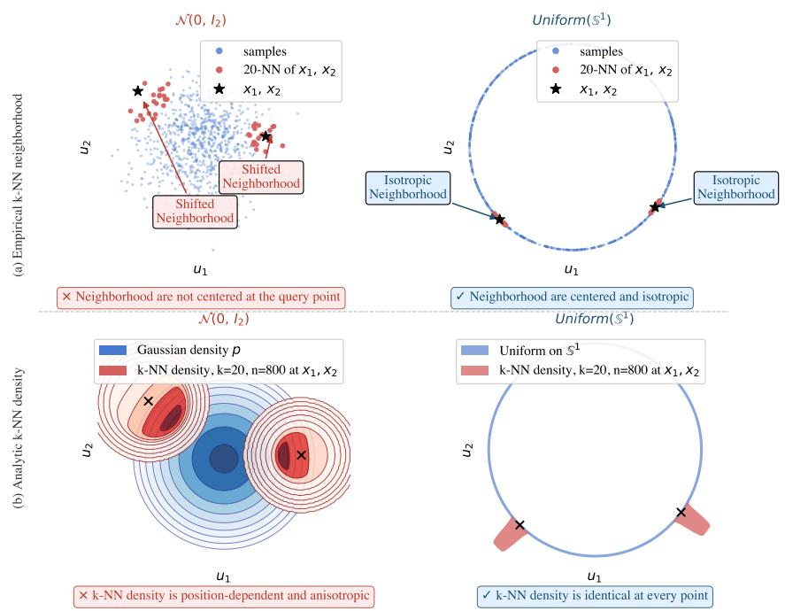

scatter

| Category | Points | Description |
| -------- | ------ | ----------- |
| Samples | Blue dots | Samples |
| 20-NNs of x1, x2 | Red dots | 20-NN of x1, x2 |
| x1, x2 | Black stars | x1, x2 |
| k-NN density quantified | × symbols | k-NN density is position-dependent and anisotropic |
| k-NN density quantified | × symbols | k-NN density is identical at every point |

Figure 1: k-NN neighborhoods are density-biased. (a) Empirical k-NN neighborhoods (k = 20) at two query points x1, x2: under a Gaussian distribution on $\mathbb { R } ^ { \hat { 2 } }$ , neighborhoods are not centered at the query point but are skewed toward regions of higher density, resulting in anisotropic and directionally biased neighborhoods. In contrast, for a uniform distribution on ${ \mathbb S } ^ { \mathbf { 1 } }$ the neighborhoods are centered and isotropic everywhere. (b) Analytic k-NN density: under a Gaussian distribution, the induced densities are position-dependent and anisotropic, whereas the uniform distribution on $S ^ { 1 }$ yields identical densities at every point, reflecting its intrinsic geometric symmetry.

Until recently, most SSL methods relied primarily on heuristic mechanisms to prevent representation collapse and shape the geometry of learned embeddings, without explicitly characterizing what constitutes an optimal representation space. With LeJEPA, Balestriero and LeCun [2025] provided a first step towards such a characterization by showing that an isotropic Gaussian distribution is optimal for linear ridge regression and k-nearest neighbor regression in a worst-case formulation. These two evaluation protocols are commonly used to assess the quality of SSL representation, as they probe, respectively, the linear separability of features and the local geometric structure of the embedding space. However, this analysis is restricted to distributions with densities in $\mathbb { R } ^ { d }$ , and therefore excludes a broad class of natural representations supported on lower-dimensional manifolds, such as the hypersphere.

In this work, we extend this analysis to smooth distributions supported on Riemannian manifolds. Under the same worst-case formulation as LeJEPA, we derive geometric optimality principles for both local and kernel-based learning methods.

First, we show that minimizing the worst-case bias of k-nearest neighbors implies that the representation distribution must be uniform on the underlying manifold. Second, we prove that minimizing the worst-case bias of kernel ridge regression with both the linear kernel and the exponential dot-product kernel $K ( x , y ) = e ^ { \kappa x ^ { \top } y }$ forces the representation distribution to be uniform on the hypersphere.

This result contrasts with Gaussian representations, whose non-uniform density induces anisotropic local neighborhoods, distorting the local geometry and degrading performance for nonparametric methods such as k-NN (see Figure 1). Building on this theoretical insight, we introduce SPHERE-JEPA, a self-supervised learning framework that enforces hyperspherical uniformity. Our approach follows the same design as LeJEPA and relies on the same projection-based regularization mechanism inspired by the Cramér–Wold theorem [Cuesta-Albertos et al., 2007], which enforces a target distribution through random one-dimensional projections. We repurpose this projection-based mechanism to enforce a uniform distribution on the hypersphere rather than a Gaussian distribution in $\mathbb { R } ^ { d }$ , leading to Sketched Uniform Spherical Regularization (SUSReg).

We evaluate our method on ImageNet-100 [Deng et al., 2009] using a ResNet-18, and on ImageNet-1K using a ViT-B/14 [Oquab et al., 2023] backbone. Our results demonstrate that SPHERE-JEPA consistently matches or outperforms Gaussian-based regularization. Notably, on ImageNet-1K, it yields a +1.8% accuracy gain in linear probing and improves average transfer performance across diverse downstream datasets. Furthermore, in a controlled texture retrieval task designed to probe k-NN behavior, our approach yields significant gains, improving mean average precision by over 6% in the learned representation space, without incurring any additional computational cost.

Contributions. Our key contributions are as follows: (i) We extend the theoretical analysis of optimal SSL representations from Euclidean densities to distributions supported on smooth manifolds; $( i i )$ We prove that the uniform distribution on the hypersphere is optimal under a worst-case formulation that combines radial kernel ridge regression and k-NN; (iii) We introduce SUSReg, a projection-based regularizer that promotes hyperspherical uniformity in learned representations; (iv) We demonstrate that SUSReg consistently matches or improves upon Gaussian-based regularization on standard SSL benchmarks, while yielding substantial gains on a dedicated nonparametric retrieval task.

Organization. The remainder of the paper is structured as follows. Section 2 introduces the notation and setup, followed by related work in Section 3. Section 4 develops the theoretical analysis of optimal representation geometries for k-nearest neighbors and kernel ridge regression. In Section 5, we introduce SPHERE-JEPA and the SUSReg regularization. Experiments are reported in Section 6. We conclude in Section 7.

# 2 Notation and Setup

We adopt the same notation as in Balestriero and LeCun [2025]. We consider a dataset composed of N independent samples. Each sample is observed through V views, yielding data points $\bar { x _ { n , v } } \in \mathbb { R } ^ { D }$ $n = 1 , \ldots , N , v = 1 , \ldots , V$ , where D denotes the input dimension (e. $\cdot ^ { \mathrm { g . } }$ , for an image of spatial resolution $H \times W$ with $C$ channels, $D = C \times H \times \hat { W } )$ . The views typically correspond to data augmentations of a given image (e.g., image crops or geometric transformations).

Following standard SSL practice [Caron et al., 2020, 2021b], we distinguish between local and global views [Caron et al., 2021a]. Both are obtained as crops of the input image: local views correspond to smaller crops capturing limited spatial context, while global views are larger crops that preserve most of the image content. We denote by $V _ { g }$ the number of global views, by $\check { V _ { l } }$ the number of local views, and by $V _ { a }$ the total number of views. We index all views $v = 1 , \ldots , V _ { a }$ such that the first $V _ { g }$ indices correspond to global views. We assume that the samples $\{ x _ { n } \} _ { n = 1 } ^ { N }$ } are independent and identically distributed.

Encoder. Let $f _ { \theta } : \mathbb { R } ^ { D }  \mathbb { R } ^ { d }$ denote a parametric encoder (neural network) with parameters $\boldsymbol { \theta } \in \mathbb { R } ^ { P }$ which maps data to a latent space. Its architecture is left unspecified and can be selected to match the inductive biases of the data type (e.g., convolution or self-attention). For each sample and view, the encoder produces an embedding $z _ { n , v } : = f _ { \theta } ( x _ { n , v } ) \in \mathbb { R } ^ { d }$ , constrained to lie on the unit sphere via:

$$
\tilde {z} _ {n, v} := \frac {z _ {n , v}}{\| z _ {n , v} \|} \in \mathbb {S} ^ {d - 1}. \tag {1}
$$

# 3 Related Work

# 3.1 Self-Supervised Learning

Self-supervised learning (SSL) [Chen et al., 2020] aims to learn transferable representations without manual annotations by leveraging the intrinsic structure and invariances of the data. This is typically achieved by enforcing consistency between representations of different augmented views of the same sample, while separating those of distinct samples. A fundamental challenge shared by most SSL objectives [Grill et al., 2020] is to avoid representation collapse, in which all inputs are mapped to a constant embedding. Existing methods address this issue through a variety of architectural and optimization strategies.

Contrastive methods, such as SimCLR [Chen et al., 2020] and MoCo [He et al., 2020], rely on negative samples to enforce discriminative representations. Momentum-based frameworks, such as MoCo or DINO [Caron et al., 2021b], further stabilize the training with an exponential moving average (EMA) teacher. Non-contrastive approaches, including BYOL [Grill et al., 2020] and SimSiam [Chen and He, 2021], eliminate the need for negative samples but introduce explicit asymmetries during training, such as stop-gradient operations or additional predictor networks. Decorrelation-based approaches, such as Barlow Twins [Zbontar et al., 2021] and VICReg [Bardes et al., 2021], prevent collapse by explicitly penalizing correlations across embedding dimensions. Beyond the choice of the objective, DINO shows that architectural design also plays a critical role in training stability. In particular, the use of register tokens in Vision Transformers helps maintain feature diversity and mitigates collapse by allocating dedicated capacity for global information [Oquab et al., 2023, Siméoni et al., 2025].

Although these strategies have demonstrated strong empirical performance, they rely primarily on heuristic mechanisms to prevent collapse. In most cases, the structure of the optimal representation is implicitly defined by training dynamics or data augmentations rather than explicitly characterized. As a result, many SSL objectives enforce invariances that are sufficient for good performance, but whose optimality properties remain only partially understood.

# 3.2 JEPA and LeJEPA

Joint Embedding Predictive Architectures (JEPAs), introduced by LeCun et al. [2022], proposes a representation learning framework based on predictability in the latent space. Rather than relying on pixel-level matching or contrastive objectives, a JEPA learns representations by predicting the latent representation of one view (or future state) from another, thereby emphasizing the structure and dynamics of the representation itself. In this sense, JEPAs can be viewed as a generalization of earlier non-contrastive methods such as BYOL [Grill et al., 2020] and SimSiam [Chen and He, 2021], which also rely on direct prediction in a latent space.

LeJEPA [Balestriero and LeCun, 2025] instantiates the JEPA framework by retaining its core latent prediction objective. Like BYOL or SimSiam, it learns representations by predicting the embedding of one view from another in the latent space. Overall, LeJEPA is composed of two complementary terms: (i) a predictive loss, similar to BYOL/SimSiam, implemented as a mean squared error between representations, which promotes alignment across views; (ii) a distributional regularization term that constrains the geometry of the representation space.

Specifically, this regularization encourages the learned embeddings to match a prescribed isotropic Gaussian distribution.

This constraint is implemented via random one-dimensional projections of the embeddings, leveraging the Cramér–Wold theorem [Cuesta-Albertos et al., 2007]. For each view $v \in \{ 1 , \ldots , V _ { a } \}$ , consider a mini-batch of embeddings $\{ z _ { n , v } \} _ { n = 1 } ^ { N } \subseteq \mathbb { R } ^ { d }$ . At each training step, LeJEPA draws a finite set of directions $\mathcal { A } = \{ a _ { 1 } , \ldots , a _ { | \mathcal { A } | } \}$ with $a \sim \mathrm { U n i f } ( \mathbb { S } ^ { d - 1 } )$ , and forms the sliced variables $t _ { n , v } ^ { a } : =$ $a ^ { \top } z _ { n , v } \in \mathbb { I }$ R. It then enforces, for each view v and each direction $a \in { \mathcal { A } }$ (with A resampled at every mini-batch), that the empirical distribution of $\{ t _ { n , v } ^ { a } \} _ { n = 1 } ^ { N }$ 1 matches a standard normal $\mathcal { N } ( 0 , 1 )$ via the Epps–Pulley test. By the Cramér–Wold theorem, matching the one-dimensional projections to $\mathcal { N } ( 0 , 1 )$ across uniform directions enforces an isotropic Gaussian embedding distribution in $\mathbb { R } ^ { d }$ .

# 3.3 Epps–Pulley test

LeJEPA uses the test by Epps and Pulley [1983] (EP) as a univariate statistical discrepancy based on characteristic functions. Given a scalar random variable X with samples $\{ x _ { j } \} _ { j = 1 } ^ { N }$ and a reference distribution Y with characteristic function $\varphi _ { Y } ( t ) = \mathbb { E } [ e ^ { i t Y } ]$ , the empirical characteristic function of X is φˆX (t) = 1N PNj=1 $\begin{array} { r } { \hat { \varphi } _ { X } ( t ) = \frac { 1 } { N } \sum _ { j = 1 } ^ { N } e ^ { i t x _ { j } } } \end{array}$ . The EP discrepancy is defined as a weighted $L ^ { 2 }$ distance between characteristic functions:

$$
\mathrm{EP} (X, Y) = N \int_ {\mathbb {R}} \left| \hat {\varphi} _ {X} (t) - \varphi_ {Y} (t) \right| ^ {2} w (t) d t, \tag {2}
$$

where $w ( t )$ is a Gaussian weight function. In LeJEPA, this test is applied to the projected scalars $x _ { j } = t _ { j , v } ^ { a } = a ^ { \top } z _ { j , v } ,$ with $Y \sim { \mathcal { N } } ( 0 , 1 )$ , and averaged over a finite set of directions $a \in { \mathcal { A } }$ .

# 3.4 Distributional Regularization of Latent Representations

In addition to LeJEPA, other recent self-supervised learning methods incorporate explicit regularization of the latent space to prevent collapse and shape the geometry of the learned representations [Sablayrolles et al., 2018, Bardes et al., 2021, Caron et al., 2021b]. These regularizers can be grouped according to the target distribution they enforce on the embeddings.

A first group of methods targets an isotropic Gaussian distribution in $\mathbb { R } ^ { d }$ . VICReg [Bardes et al., 2021] enforces this only through low-order statistics: it maintains non-zero variance in each coordinate and decorrelates coordinates across the batch, promoting isotropy at the covariance level. LeJEPA enforces a stronger, distribution-level constraint by matching the embedding distribution to an isotropic Gaussian via random one-dimensional projections and the Epps–Pulley test.

A second group targets uniformity on the unit hypersphere. KoLeo [Sablayrolles et al., 2018], notably employed in DINO, encourages uniform coverage by maximizing the mini-batch estimated differential entropy. However, its reliance on minimum distances and logarithmic operations can induce numerical instability.

The choice of a regularizer poses a fundamental question regarding downstream performance: Do different distributional constraints yield representations that inherently favor specific estimators, such as linear models, kernel methods, or k-nearest neighbors?

# 4 Optimality Criteria for Self-Supervised Representations

A central challenge in self-supervised learning (SSL) is to learn representations that transfer efficiently to a broad range of downstream tasks with minimal supervision [Chen et al., 2020]. Since downstream tasks are unknown at training time, optimizing representations for a single task may lead to poor transferability. Following LeJEPA, we adopt a minimax perspective: we seek a representation that minimizes the worst-case prediction error over a class of downstream targets.

Representation quality is commonly assessed through two classical downstream protocols: linear ridge regression [Schölkopf and Smola, 2002] and k-nearest neighbors (k-NN) [Hastie et al., 2009].

Linear ridge regression. This criterion probes the global structure of the representation space. Given a dataset of representations and targets $\{ ( z _ { i } , y _ { i } ) \} _ { i = 1 } ^ { N }$ , it estimates a linear predictor $g _ { w } ( z ) = \langle w , z \rangle$ by minimizing the regularized empirical risk

$$
\widehat {w} _ {\lambda} = \arg \min _ {w \in \mathbb {R} ^ {d}} \frac {1}{N} \sum_ {i = 1} ^ {N} (y _ {i} - \langle w, z _ {i} \rangle) ^ {2} + \lambda \| w \| ^ {2}, \qquad \lambda > 0.
$$

k-nearest neighbors. Conversely, k-NN is sensitive to the local geometry, as its prediction bias depends heavily on the neighborhood shape and the local sampling density of the data. Together, they capture complementary aspects of representation quality.

Minimax formulation. Let p denote the marginal distribution of the representations $z = f _ { \theta } ( x ) \in \mathbb { R } ^ { d }$ . Given a downstream estimator $\widehat g$ trained on samples drawn from p, we measure its performance bthrough the integrated squared bias (ISB)

$$
\operatorname{ISB} (g, p) = \int \left(\mathbb {E} [ \widehat {g} (z) ] - g (z)\right) ^ {2} p (z) \operatorname{dvol} (z).
$$

Given a class $\mathcal { G }$ of downstream targets, we consider the minimax problem

$$
p ^ {\star} = \arg \min _ {p} \sup _ {g \in \mathcal {G}} \mathrm{ISB} (g, p).
$$

Different downstream protocols induce different geometric constraints on the optimal representation distribution.

Proposition 4.1 (Linear ridge regression, Balestriero and LeCun [2025]). Consider linear ridge regression with downstream target class

$$
\mathcal {G} = \left\{g _ {w} (x) = \langle w, x \rangle : \| w \| \leq 1 \right\}.
$$

Under the constraint $\mathbb { E } [ \lVert X \rVert ^ { 2 } ] = 1$ , minimizing the worst-case ISB is equivalent to minimizing the top eigenvalue of the covariance matrix of p. Consequently, any optimal distribution is isotropic.

Proposition 4.2 (k-NN). Let $p$ be a $\mathcal { C } ^ { 3 }$ density supported on a smooth dimensional Riemannian manifold M. Consider the class of downstream targets

$$
\mathcal {G} _ {c} = \left\{g \in \mathcal {C} ^ {3} (\mathcal {M}): \| \Delta_ {\mathcal {M}} g \| _ {\infty} \leq c \right\}, \quad c > 0.
$$

Then the worst-case ISB of k-NN regression over $\mathcal { G } _ { c }$ is minimized when p is uniform on M.

The previous two criteria are not sufficient to fully constrain the optimal geometry of the representation distribution. We therefore introduce a third minimax criterion based on kernel ridge regression Schölkopf and Smola [2002] (KRR) with the exponential dot-product kernel

$$
K (x, y) = e ^ {\kappa x ^ {\top} y}, \quad \kappa > 0.
$$

Let $T _ { p }$ denote the associated population covariance operator (see Appendix D) and consider the source class

$$
\mathcal {G} _ {p} = \left\{g = T _ {p} f: \| f \| _ {L ^ {2} (p)} \leq 1 \right\}.
$$

Proposition 4.3 (Exponential KRR). For kernel ridge regression with kernel

$$
K (x, y) = e ^ {\kappa x ^ {\top} y},
$$

the worst-case ISB over $\mathcal { G } _ { p }$ is minimized by

$$
p ^ {\star} = \operatorname{Unif} (\mathbb {S} ^ {d - 1}).
$$

Combining the three minimax criteria yields a unique optimal geometry:

Theorem 4.4 (Optimal representation geometry). The uniform distribution on the hypersphere

$$
\operatorname{Unif} (\mathbb {S} ^ {d - 1})
$$

simultaneously minimizes the worst-case ISB for linear ridge regression, k-NN regression, and exponential-kernel ridge regression.

Proposition 4.1 comes from Balestriero and LeCun [2025]. The proof of Proposition 4.2 is given in Appendix F, while the proof of Proposition 4.3 is deferred to Appendix D.

# 5 SPHERE-JEPA: Spherical Prediction with Homogeneous Embeddings

# 5.1 Sketched Uniform Spherical Regularization (SUSReg)

We introduce Sketched Uniform Spherical Regularization (SUSReg), a projection-based regularizer inspired by SIGReg [Balestriero and LeCun, 2025]. Let $\{ \tilde { z } _ { n , v } \} _ { n = 1 } ^ { N } \subseteq \mathbb { S } ^ { d - 1 }$ be a normalized minibatch for view $v ,$ and let $X _ { v } \ ( X _ { \mathbf { \theta } }$ when the context is clear) be uniform over this set. By the Cramér-Wold theorem, $X \sim \mathrm { U n i \bar { f } ( \tilde { S } ^ { d - 1 } ) }$ if and only if every projection $a ^ { \top } X , a \in \mathbb { S } ^ { d - 1 }$ , follows the density

$$
\rho_ {d} (t) = C _ {d} \left(1 - t ^ {2}\right) ^ {\frac {d - 3}{2}}, \quad t \in (- 1, 1), \tag {3}
$$

where $C _ { d }$ is a normalization constant that ensures that $\rho _ { d }$ integrates into one. For large $d , \rho _ { d }$ converges to the density of $\textstyle { \mathcal { N } } ( 0 , { \frac { 1 } { d } } )$ by the central limit theorem [Billingsley, 1995]. We use this Gaussian approximation when $d > 2 5 6$ . This characterization is illustrated in Figures 2–3, which provide an empirical visualization of the Cramér–Wold theorem: a distribution is uniform on the sphere if and only if its one-dimensional projections match $\rho _ { d }$ along all directions. Accordingly, only uniformly distributed representations yield projection distributions consistent with $\rho _ { d } ,$ , while non-uniform distributions lead to systematic, direction-dependent mismatches.

Following SIGReg, SUSReg enforces this condition by penalizing, via the Epps–Pulley test, the mismatch between $a ^ { \top } X$ and $Y \sim \rho _ { d }$ over randomly sampled directions:

$$
\mathcal {L} _ {\mathrm{SUSReg}} := \frac {1}{V _ {a}} \sum_ {v = 1} ^ {V _ {a}} \frac {1}{| \mathcal {A} |} \sum_ {a \in \mathcal {A}} \mathrm{EP} (a ^ {\top} X, Y). \tag {4}
$$

Minimizing this loss enforces that the projected variables $a ^ { \top } X$ match the target distribution $\rho _ { d }$ across random directions, thereby enforcing uniformity on the hypersphere and aligning the representation geometry with the optimal structure characterized in Section 4.

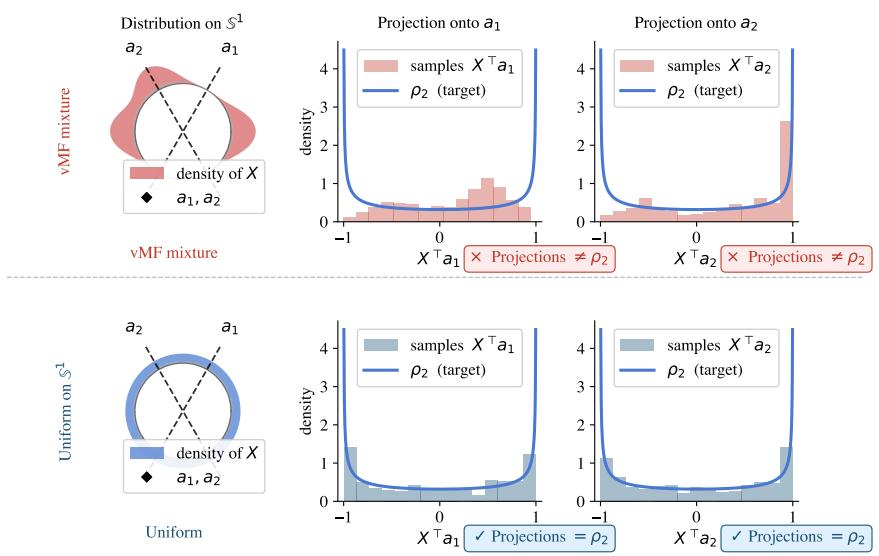  
Figure 2: Illustration of the Cramér–Wold characterization underlying SUSReg on $\mathbb { S } ^ { 1 }$ . Top row: a mixture of von Mises–Fisher (vMF) distributions—the spherical analogue of Gaussian distributions—induces a non-uniform distribution with mass concentrated around a few directions. The resulting projections $X ^ { \top } a _ { 1 }$ and $X ^ { \top } a _ { 2 }$ deviate from the target density $\rho _ { 2 }$ . Bottom row: a uniform distribution on $\mathbb { S } ^ { 1 }$ yields projections that match $\rho _ { 2 }$ across directions. Histograms compare the distributions of $a ^ { \textsf { T } } X$ to the target density $\rho _ { 2 }$ (solid curve). Non-uniform representations (top) produce mismatched projections and are penalized by SUSReg, whereas uniform representations (bottom) satisfy the projection constraint and are therefore not penalized by SUSReg.

# 5.2 Invariant Prediction Loss on the Hypersphere

While SUSReg enforces global uniformity on the hypersphere, it does not guarantee invariance to semantic-preserving transformations. To address this, we introduce an alignment objective. Unlike LeJEPA, which applies a mean squared error (MSE) to unnormalized embeddings in $\mathbb { R } ^ { d }$ , we adapt this principle to normalized representations.

For a sample with multiple views, we define a prototype $\mu _ { n }$ as the average of its global views and align all views to it via the invariance loss $\mathcal { L } _ { \mathrm { i n v } } \mathrm { : }$ L

$$
\mu_ {n} := \frac {1}{V _ {g}} \sum_ {v = 1} ^ {V _ {g}} \tilde {z} _ {n, v}, \quad \mathcal {L} _ {\text { inv }} := \frac {1}{V _ {a}} \sum_ {v = 1} ^ {V _ {a}} \| \mu_ {n} - \tilde {z} _ {n, v} \| _ {2} ^ {2}. \tag {5}
$$

This MSE on normalized embeddings approximates the squared geodesic distance locally, offering more stable and bounded gradients.

# 5.3 SPHERE-JEPA Objective

Following LeJEPA, our final objective combines the invariance loss (for cross-view alignment) and SUSReg (for global hyperspherical geometry) via a balancing weight $\lambda \in [ 0 , 1 ]$ :

$$
\mathcal {L} _ {\mathrm{SPHERE-JEPA}} = (1 - \lambda) \mathcal {L} _ {\mathrm{inv}} + \lambda \mathcal {L} _ {\mathrm{SUSReg}}.
$$

Unlike LeJEPA’s Gaussian prior in $\mathbb { R } ^ { d }$ , this formulation enforces a uniform distribution on the hypersphere, achieving the optimal geometry identified in Section 4.

# 6 Experiments

Architectures. To evaluate across different inductive biases architecture, we use both self-attention and convolutional backbones: a primary Vision Transformer (ViT-B/14) [Oquab et al., 2023], and standard ResNet-18/50 models [He et al., 2016]. Representations are extracted from the ViT class token, and via global average pooling for the ResNets.

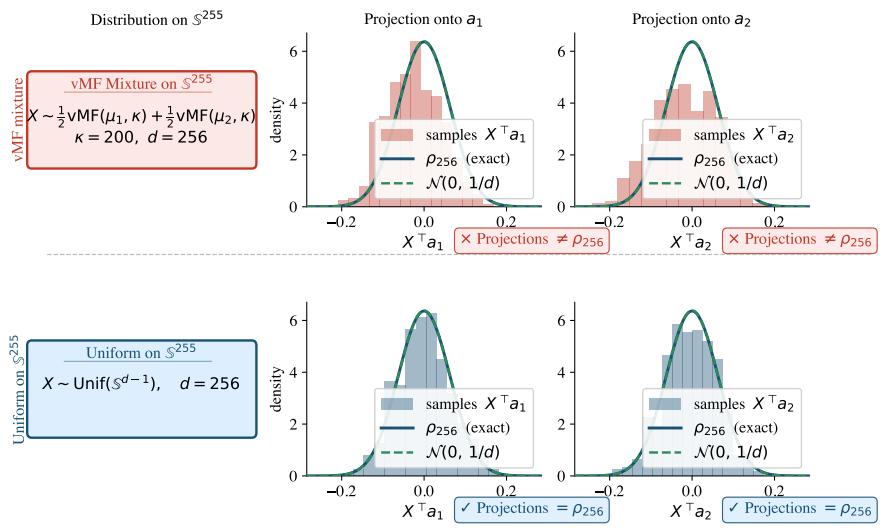  
Figure 3: Illustration of the Cramér–Wold characterization underlying SUSReg on $\mathbb { S } ^ { 2 5 5 } \left( d = 2 5 6 \right)$ . Top row: a mixture of von Mises–Fisher (vMF) distributions induces a non-uniform distribution with mass concentrated around a few directions. The resulting projections $X ^ { \top } a _ { 1 }$ and $X ^ { \top } a _ { 2 }$ induce distributions that deviate from the target density $\rho _ { 2 5 6 }$ . Bottom row: a uniform distribution on $\mathbb { S } ^ { 2 5 5 }$ yields projections consistent with $\rho _ { 2 5 6 }$ across directions. Histograms compare the distributions of $\bar { a } ^ { \top } X$ to $\rho _ { 2 5 6 }$ (solid curve). Non-uniform representations (top) produce mismatched projections and are penalized by SUSReg, whereas uniform representations (bottom) satisfy the projection constraint and are therefore not penalized by SUSReg. The Gaussian approximation $\dot { \mathcal { N } } ( 0 , 1 / d )$ (dashed) closely matches $\rho _ { 2 5 6 }$ , justifying its use in high dimensions.

Embedding Head. The backbone output is processed by a 3-layer MLP projection head with GELU activations and hidden dimensions of [2048, 2048, 256].

Training Data and Views. We evaluate on ImageNet-1K [Deng et al., 2009], ImageNet-100, and Galaxy10 [Leung and Bovy, 2018]. For ViT-B/14 on ImageNet-1K, we use a multi-crop strategy $( V _ { g } = 2$ global, $\bar { V _ { l } } = 6$ local; $V _ { a } = 8$ total views). ResNets use only two global views $( V _ { a } \bar { = } V _ { g } = \bar { 2 ) }$ . We apply standard augmentations: DINO [Caron et al., 2021b] and SimSiam [Chen and He, 2021] for ViT, and BYOL [Grill et al., 2020] for ResNets.

Optimization. Models are trained with AdamW and cosine annealing. On ImageNet-1K, ViT-B/14 is trained for 100 epochs (5-epoch warmup) with batch size 512, learning rate (LR) $5 \times 1 0 ^ { - 4 }$ , and weight decay (WD) $5 \times \mathrm { 1 0 ^ { - 2 } }$ . ResNets are trained for 200 epochs (1-epoch warmup) with LR $5 \times 1 0 ^ { - 2 }$ and $\mathrm { W D ~ 5 ~ } \times 1 0 ^ { - 4 }$ . |A| for SUSReg and SIGReg is fixed to 1024 across all runs.

EMA Teacher. When using an EMA teacher, the target prototype $\mu _ { n }$ (Eq. 5) is generated by a momentum encoder and projection head. While the online network updates via gradient descent, its weights are used to update the EMA teacher with a momentum parameter $\tau = 0 . 9 9 6$ .

# 6.1 Main Results on ImageNet Benchmarks

ImageNet-1K. We evaluate the representations learned by a ViT-B/14 after 100 epochs on ImageNet-1K (Table 3). SPHERE-JEPA matches the k-NN performance of LeJEPA while offering a +1.8% improvement in linear probing. Adding an Exponential Moving Average (EMA) teacher further stabilizes training and boosts representations.

ImageNet-100. To validate consistency across architectures, we evaluate a ResNet-18 trained on ImageNet-100 (Table 4). SPHERE-JEPA performs competitively with LeJEPA. This confirms that explicitly enforcing a strict target distribution (whether uniform or Gaussian) yields more robust convolutional features than relying on relaxed moment matching or proxy entropy estimators.

Table 1: Frozen-backbone linear probing accuracy (%) on downstream datasets using ViT-B/14 backbones pretrained for 100 epochs on ImageNet-1K. Avg denotes the mean across all datasets. 

<table><tr><td>Method</td><td>DTD</td><td>Aircraft</td><td>CIFAR10</td><td>CIFAR100</td><td>Flowers</td><td>Food</td><td>Pets</td><td>Avg</td></tr><tr><td>LeJEPA</td><td>60.5</td><td>09.0</td><td>82.0</td><td>52.1</td><td>45.3</td><td>56.9</td><td>60.8</td><td>52.4</td></tr><tr><td>SPHERE-JEPA</td><td>60.0</td><td>10.0</td><td>82.5</td><td>53.1</td><td>51.1</td><td>60.3</td><td>62.0</td><td>54.1</td></tr><tr><td>LeJEPA (EMA)</td><td>58.5</td><td>10.4</td><td>81.9</td><td>49.2</td><td>59.0</td><td>68.3</td><td>79.6</td><td>58.1</td></tr><tr><td>SPHERE-JEPA (EMA)</td><td>60.4</td><td>10.5</td><td>82.2</td><td>51.8</td><td>52.8</td><td>68.6</td><td>81.8</td><td>58.3</td></tr></table>

Table 2: Nearest-neighbor retrieval performance averaged across four texture datasets. 

<table><tr><td>Method</td><td>Recall@1</td><td>Recall@3</td><td>Recall@5</td><td>mAP</td><td>mAP (emb)</td></tr><tr><td>LeJEPA</td><td>78.2</td><td>91.6</td><td>95.1</td><td>85.6</td><td>85.5</td></tr><tr><td>SPHERE-JEPA</td><td>89.0</td><td>96.3</td><td>97.9</td><td>92.9</td><td>91.8</td></tr></table>

Table 3: ImageNet-1K (ViT-B/14, 100 ep.) evaluation. 

<table><tr><td>Method</td><td>k-NN (%)</td><td>Linear (%)</td></tr><tr><td colspan="3">Without EMA</td></tr><tr><td>LeJEPA</td><td>50.4</td><td>59.2</td></tr><tr><td>SPHERE-JEPA</td><td>50.4</td><td>61.0</td></tr><tr><td colspan="3">With EMA ( $\tau = 0.996$ )</td></tr><tr><td>LeJEPA</td><td>61.7</td><td>68.2</td></tr><tr><td>SPHERE-JEPA</td><td>62.6</td><td>69.3</td></tr></table>

$\mathrm { T a b l e 4 : ~ I m a g e N e t - 1 0 0 ~ ( R e s N e t - 1 8 , 2 0 0 ~ e p . ) . }$ 

<table><tr><td>Method</td><td>k-NN (%)</td><td>Linear (%)</td></tr><tr><td>LeJEPA</td><td>65.8</td><td>70.9</td></tr><tr><td>SPHERE-JEPA</td><td>64.8</td><td>70.8</td></tr></table>

Table 5: Galaxy10 (ResNet-50, 200 ep.). 

<table><tr><td>Method</td><td>k-NN (%)</td><td>Linear (%)</td></tr><tr><td>LeJEPA</td><td>70.1</td><td>74.4</td></tr><tr><td>SPHERE-JEPA</td><td>69.9</td><td>74.4</td></tr></table>

# 6.2 Downstream and Specialized Evaluations

Transfer Learning. We further assess transferability via linear probing on downstream tasks using the ImageNet-1K pretrained ViT-B/14. As shown in Table 1, SPHERE-JEPA consistently improves across most datasets, achieving a higher average accuracy (54.1%) than LeJEPA (52.4%).

Texture Retrieval. While standard benchmarks assess linear separability, our theory suggests hyperspherical representations excel with nonparametric estimators like k-NN. We test this directly on a controlled texture retrieval task (details in Appendix C). As reported in Table 2, SPHERE-JEPA significantly outperforms LeJEPA, improving mean Average Precision by +6.36% directly in the embedding space (0.9184 vs. 0.8548) and +7.34% after the projection head (0.9292 vs. 0.8558).

Galaxy10. To test robustness on non-natural images, we train a ResNet-50 from scratch on Galaxy10 (Table 5). This evaluates whether our hyperspherical priors generalize to scientific domains where rotation invariance is crucial. SPHERE-JEPA matches LeJEPA’s strong performance, confirming the broad applicability of the uniform geometric prior.

# 7 Conclusion

We introduced a minimax perspective on optimal SSL representations, showing that linear ridge regression, k-NN regression, and exponential-kernel ridge regression collectively characterize the uniform distribution on the sphere as an optimal representation geometry. Motivated by this result, we introduced SPHERE-JEPA and its projection-based regularizer, SUSReg. Empirically, spherical uniformity improves linear separability on ImageNet and substantially boosts nonparametric retrieval performance. However, our empirical validation remains limited: our large-scale evaluation relies on a single ViT-B/14 training run without hyperparameter tuning. Validating robustness across multiple seeds, scaling to larger batch sizes and architectures, and assessing dense prediction tasks remain open challenges.

# References

Francis Bach. On the equivalence between kernel quadrature rules and random feature expansions. Journal of machine learning research, 18(21):1–38, 2017.   
Randall Balestriero and Yann LeCun. Lejepa: Provable and scalable self-supervised learning without the heuristics. arXiv preprint arXiv:2511.08544, 2025.   
Adrien Bardes, Jean Ponce, and Yann LeCun. Vicreg: Variance-invariance-covariance regularization for self-supervised learning. arXiv preprint arXiv:2105.04906, 2021.   
Patrick Billingsley. Probability and Measure. John Wiley & Sons, 1995.   
Mathilde Caron, Ishan Misra, Julien Mairal, Priya Goyal, Piotr Bojanowski, and Armand Joulin. Unsupervised learning of visual features by contrasting cluster assignments. Advances in neural information processing systems, 33:9912–9924, 2020.   
Mathilde Caron, Hugo Touvron, Ishan Misra, Hervé Jégou, Julien Mairal, Piotr Bojanowski, and Armand Joulin. Emerging properties in self-supervised vision transformers. In Proceedings of the IEEE/CVF international conference on computer vision, pages 9650–9660, 2021a.   
Mathilde Caron, Hugo Touvron, Ishan Misra, Hervé Jégou, Julien Mairal, Piotr Bojanowski, and Armand Joulin. Emerging properties in self-supervised vision transformers. In Proceedings of the IEEE/CVF international conference on computer vision, pages 9650–9660, 2021b.   
Ting Chen, Simon Kornblith, Mohammad Norouzi, and Geoffrey Hinton. A simple framework for contrastive learning of visual representations. In International conference on machine learning, pages 1597–1607. PmLR, 2020.   
Xinlei Chen and Kaiming He. Exploring simple siamese representation learning. In Proceedings of the IEEE/CVF conference on computer vision and pattern recognition, pages 15750–15758, 2021.   
John B Conway. A course in functional analysis. Springer, 2019.   
J. A. Cuesta-Albertos, R. Fraiman, and T. Ransford. A sharp form of the Cramér–Wold theorem. Journal of Theoretical Probability, 2007.   
Ernesto De Vito, Lorenzo Rosasco, Andrea Caponnetto, Umberto De Giovannini, Francesca Odone, and Peter Bartlett. Learning from examples as an inverse problem. Journal of Machine Learning Research, 6(5), 2005.   
Jia Deng, Wei Dong, Richard Socher, Li-Jia Li, Kai Li, and Li Fei-Fei. Imagenet: A large-scale hierarchical image database. In Proceedings of the IEEE Conference on Computer Vision and Pattern Recognition (CVPR), 2009.   
T. W. Epps and Lawrence B. Pulley. A test for normality based on the empirical characteristic function. Biometrika, 70(3):723–726, 1983. ISSN 00063444. URL http://www.jstor.org/ stable/2336512.   
Alfred Gray. The volume of a small geodesic ball of a riemannian manifold. Michigan Mathematical Journal, 20(4):329–344, 1974.   
Jean-Bastien Grill, Florian Strub, Florent Altché, Corentin Tallec, Pierre Richemond, Elena Buchatskaya, Carl Doersch, Bernardo Avila Pires, Zhaohan Guo, Mohammad Gheshlaghi Azar, et al. Bootstrap your own latent-a new approach to self-supervised learning. Advances in neural information processing systems, 33:21271–21284, 2020.

Trevor Hastie, Robert Tibshirani, and Jerome Friedman. The Elements of Statistical Learning. Springer Series in Statistics. Springer, New York, NY, 2 edition, 2009. ISBN 978-0-387-84857-0. doi: 10.1007/978-0-387-84858-7. URL https://doi.org/10.1007/978-0-387-84858-7.   
Kaiming He, Xiangyu Zhang, Shaoqing Ren, and Jian Sun. Deep residual learning for image recognition. In Proceedings of the IEEE conference on computer vision and pattern recognition, pages 770–778, 2016.   
Kaiming He, Haoqi Fan, Yuxin Wu, Saining Xie, and Ross Girshick. Momentum contrast for unsupervised visual representation learning. In Proceedings of the IEEE/CVF conference on computer vision and pattern recognition, pages 9729–9738, 2020.   
Guillermo Henry, Andrés Muñoz, and Daniela Rodriguez. k-nearest neighbor density estimation on riemannian manifolds, 2011. URL https://arxiv.org/abs/1106.4763.   
Yann LeCun et al. A path towards autonomous machine intelligence version 0.9. 2, 2022-06-27. Open Review, 62(1):1–62, 2022.   
Henry W Leung and Jo Bovy. Deep learning of multi-element abundances from high-resolution spectroscopic data. Monthly Notices of the Royal Astronomical Society, November 2018. ISSN 1365- 2966. doi: 10.1093/mnras/sty3217. URL http://dx.doi.org/10.1093/mnras/sty3217.   
Charles A Micchelli and Grace Wahba. Design problems for optimal surface interpolation. Technical report, 1979.   
Maxime Oquab, Timothée Darcet, Théo Moutakanni, Huy Vo, Marc Szafraniec, Vasil Khalidov, Pierre Fernandez, Daniel Haziza, Francisco Massa, Alaaeldin El-Nouby, et al. Dinov2: Learning robust visual features without supervision. arXiv preprint arXiv:2304.07193, 2023.   
Bruno Pelletier. Kernel density estimation on riemannian manifolds. Statistics & probability letters, 73(3):297–304, 2005.   
P. Petersen. Riemannian geometry. Graduate Texts in Mathematics, 2006.   
Alexandre Sablayrolles, Matthijs Douze, Cordelia Schmid, and Hervé Jégou. Spreading vectors for similarity search. arXiv preprint arXiv:1806.03198, 2018.   
B. Schölkopf and A.J. Smola. Learning with Kernels: Support Vector Machines, Regularization, Optimization, and Beyond. Adaptive computation and machine learning. MIT Press, 2002. ISBN 9780262194754. URL https://books.google.ch/books?id=y8ORL3DWt4sC.   
Oriane Siméoni, Huy V Vo, Maximilian Seitzer, Federico Baldassarre, Maxime Oquab, Cijo Jose, Vasil Khalidov, Marc Szafraniec, Seungeun Yi, Michaël Ramamonjisoa, et al. Dinov3. arXiv preprint arXiv:2508.10104, 2025.   
Roman Vershynin. High-dimensional probability: An introduction with applications in data science, volume 47. Cambridge university press, 2018.   
Jure Zbontar, Li Jing, Ishan Misra, Yann LeCun, and Stéphane Deny. Barlow twins: Self-supervised learning via redundancy reduction. In International conference on machine learning, pages 12310–12320. PMLR, 2021.

# A Computational Resources

This appendix provides the hardware specifications and computational requirements necessary to reproduce the results presented in this work.

Hardware Infrastructure. Our experiments were conducted using the following hardware setups:

• ImageNet-1K Pretraining (ViT-B/14): All runs (with and without EMA) were executed using 4 NVIDIA A100 (80GB) GPUs.   
• Other Models: Pretraining for ResNet-18 on ImageNet-100 and ResNet-50 on Galaxy10, as well as all downstream linear probing evaluations, were performed on a single NVIDIA RTX-6000 GPU.

Training Duration and Efficiency. For the 100-epoch pretraining of a ViT-B/14 on ImageNet-1K, the execution time was approximately 2.5 days (60 hours) per run. It is important to note that SPHERE-JEPA does not incur any additional computational overhead compared to the LeJEPA baseline.

Software Environment. All models were implemented using PyTorch and trained using the AdamW optimizer. We will release the core implementation and training scripts to ensure full reproducibility.

# B Existing Assets and Licenses

The datasets and software libraries used in this work are publicly available and strictly used for academic research purposes, in compliance with their respective licenses. PyTorch is released under the BSD-style license. ImageNet-1K and ImageNet-100 are subject to the ImageNet terms of access for non-commercial research. The Galaxy10 DECals dataset is derived from the DESI Legacy Imaging Surveys and Galaxy Zoo, distributed under the MIT license and CC BY 4.0, respectively.

# C Texture Retrieval Details

# C.1 Problem Setup

We consider a nonparametric retrieval task designed to evaluate the geometry of learned representations. Given a query image, the objective is to retrieve another view of the same texture instance among visually similar samples.

In this setting, each data point is defined as a set of transformed views generated from the same underlying texture. This formulation encourages representations of transformed views to remain close in the embedding space while preserving separation across different textures.

The resulting evaluation protocol depends on the relative distances between nearby samples in the representation space, making it particularly suitable for analyzing how representation regularization affects nearest-neighbor retrieval.

# C.2 Datasets

We instantiate the retrieval protocol using four procedural texture datasets: Disk, Cloud, Flake, and Wood (see Figure 4). Each dataset is generated from a distinct stochastic process, defining a family of textures with shared statistical properties.

Disk and Flake textures are derived from heavy-tailed noise with additional smoothing or structured filtering, respectively. Cloud textures are generated from blurred Brownian motion, yielding smooth and self-similar patterns. Wood textures are obtained from Perlin noise using the noise library1.

Within each dataset, samples are generated from the same underlying stochastic process using different random seeds, yielding images that share similar statistical structure while remaining visually distinct.

For each texture family, we generate 10,000 samples for training, 500 for validation, and 10,000 for testing, using independent random seeds to ensure no overlap between splits.

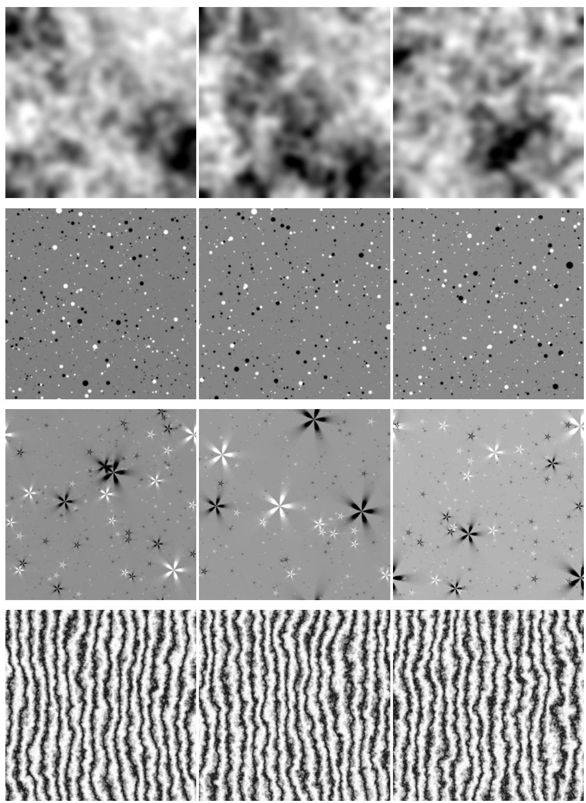  
Figure 4: Examples of procedural textures used for retrieval evaluation. Each row corresponds to a texture family (top to bottom: cloud, disk, flake, wood). Images within a row are generated from the same stochastic process with different random seeds, resulting in strong statistical similarity but distinct visual realizations.

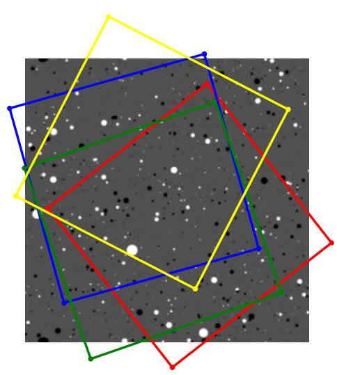

natural_image

Abstract geometric composition with overlapping colored polygons (blue, yellow, red, green) against a speckled background (no text or symbols)

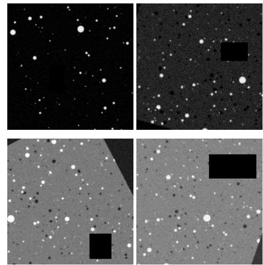

natural_image

Four-panel scientific image showing scattered bright spots on a dark background, with black squares highlighting specific regions (no text or symbols)

Figure 5: Left: effective source regions induced by independently sampled random affine transformations. Right: corresponding augmented views obtained after affine and photometric transformations.

# C.3 Data Augmentation and View Generation

To generate multiple views from each texture image, we apply stochastic spatial and photometric augmentations. These transformations introduce significant variability while preserving the underlying texture statistics across views.

Each view is generated using a random affine transformation implemented with Kornia. The transformation parameters include a rotation angle uniformly sampled in [0, 360] degrees, a translation of up to 20% of the image size along each spatial dimension, an isotropic scaling factor, and a random shear transformation.

The transformed image is obtained using zero padding outside the image boundaries and is resized to a fixed resolution of 224 × 224 pixels. Figure 5 illustrates both the effective source regions induced by independently sampled transformations and the corresponding augmented views.

Each view is further modified through photometric augmentations, including brightness and contrast adjustments, additive noise, and random erasing. All images are converted to grayscale, clamped to valid intensity ranges, and normalized before being fed to the network.

Despite strong spatial and photometric variations, the resulting views preserve consistent texture statistics while exhibiting substantial local variability, as illustrated in Figure 5.

Unless otherwise specified, we use $V _ { g } = 2$ views per image. The same augmentation pipeline is used at test time to ensure consistency between training and evaluation.

# C.4 Retrieval Results

We evaluate retrieval performance using a nearest-neighbor protocol. For each query image, the goal is to retrieve another view of the same texture instance among a set of candidate samples.

Evaluation is performed within mini-batches of size $B = 1 0 0$ . For each query, similarity is computed against the other samples in the batch, and retrieval performance is measured based on the ranking of these candidates.

We report nearest-neighbor retrieval performance using Recall@K and mean Average Precision (mAP), evaluated both on the projection head outputs and directly on backbone embeddings.

Tables 6, 7, 8, 9 report results for each dataset, while Table 2 summarizes the average performance across all four datasets.

These results highlight the importance of representation geometry in nonparametric settings, with hyperspherical regularization leading to improved performance when evaluated directly in the embedding space.

Table 6: Retrieval performance on the Disk texture dataset. 

<table><tr><td>Method</td><td>Recall@1</td><td>Recall@3</td><td>Recall@5</td><td>mAP</td><td>mAP (emb)</td></tr><tr><td>byol</td><td>95.7</td><td>98.7</td><td>99.1</td><td>97.3</td><td>61.2</td></tr><tr><td>spherejepa</td><td>89.1</td><td>95.9</td><td>97.5</td><td>92.8</td><td>90.6</td></tr><tr><td>lejepa</td><td>82.3</td><td>92.4</td><td>95.2</td><td>87.9</td><td>88.0</td></tr><tr><td>vicreg</td><td>67.0</td><td>82.1</td><td>86.9</td><td>75.9</td><td>75.7</td></tr></table>

Table 7: Retrieval performance on the Flake texture dataset. 

<table><tr><td>Method</td><td>Recall@1</td><td>Recall@3</td><td>Recall@5</td><td>mAP</td><td>mAP (emb)</td></tr><tr><td>byol</td><td>88.4</td><td>96.0</td><td>97.9</td><td>92.5</td><td>89.3</td></tr><tr><td>spherejepa</td><td>83.0</td><td>94.6</td><td>97.2</td><td>89.2</td><td>89.0</td></tr><tr><td>lejepa</td><td>79.5</td><td>93.2</td><td>96.3</td><td>86.9</td><td>87.5</td></tr><tr><td>vicreg</td><td>69.7</td><td>86.6</td><td>92.0</td><td>79.3</td><td>80.3</td></tr></table>

Table 8: Retrieval performance on the Cloud texture dataset. 

<table><tr><td>Method</td><td>Recall@1</td><td>Recall@3</td><td>Recall@5</td><td>mAP</td><td>mAP (emb)</td></tr><tr><td>byol</td><td>93.6</td><td>97.3</td><td>98.2</td><td>95.6</td><td>80.4</td></tr><tr><td>spherejepa</td><td>90.1</td><td>95.7</td><td>97.3</td><td>93.3</td><td>91.8</td></tr><tr><td>lejepa</td><td>87.4</td><td>94.8</td><td>96.7</td><td>91.5</td><td>90.6</td></tr><tr><td>vicreg</td><td>81.8</td><td>90.5</td><td>93.3</td><td>86.9</td><td>87.4</td></tr></table>

# D Worst-case integrated squared bias for kernel ridge regression

We briefly recall the population and empirical kernel ridge regression (KRR) formulations.

Let

$$
K (x, y) = \exp (\kappa x ^ {\top} y), \quad \kappa > 0,
$$

let $\mathcal { H } _ { K }$ denote the associated RKHS (see, e.g., Schölkopf and Smola [2002]), and let p be a probability distribution on $\mathcal { M } \subseteq \mathbb { R } ^ { d }$ .

For $g _ { \star } \in \mathcal { H } _ { K }$ , the empirical KRR estimator based on

$$
x _ {1}, \ldots , x _ {B} \stackrel {i. i. d.} {\sim} p
$$

is defined by

$$
\widehat {g} _ {B, \lambda} = \arg \min _ {\hat {g} \in \mathcal {H} _ {K}} \frac {1}{B} \sum_ {i = 1} ^ {B} (\hat {g} (x _ {i}) - g _ {\star} (x _ {i})) ^ {2} + \lambda \| \hat {g} \| _ {\mathcal {H} _ {K}} ^ {2}, \qquad \lambda > 0.
$$

Equivalently, in operator form (see, e.g., Schölkopf and Smola [2002]),

$$
\widehat {g} _ {B, \lambda} = (T _ {B} + \lambda I) ^ {- 1} T _ {B} g _ {\star},
$$

where

$$
T _ {B} g = \frac {1}{B} \sum_ {i = 1} ^ {B} K (x _ {i}, \cdot) g (x _ {i})
$$

denotes the empirical covariance operator.

Table 9: Retrieval performance on the Wood texture dataset. 

<table><tr><td>Method</td><td>Recall@1</td><td>Recall@3</td><td>Recall@5</td><td>mAP</td><td>mAP (emb)</td></tr><tr><td>byol</td><td>98.9</td><td>99.8</td><td>99.9</td><td>99.4</td><td>93.0</td></tr><tr><td>spherejepa</td><td>93.8</td><td>99.0</td><td>99.7</td><td>96.4</td><td>95.9</td></tr><tr><td>lejepa</td><td>63.8</td><td>86.0</td><td>92.3</td><td>76.0</td><td>75.7</td></tr><tr><td>vicreg</td><td>16.3</td><td>39.7</td><td>56.2</td><td>34.6</td><td>35.0</td></tr></table>

The corresponding population covariance operator is

$$
T _ {p} g = \int_ {\mathcal {M}} K (x, \cdot)   g (x)   p (x)   \mathrm{dvol} (x).
$$

Assume that

$$
\int_ {\mathcal {M}} K (x, x) p (x) \mathrm{dvol} (x) <   \infty .
$$

Under this condition, the empirical covariance operator converges almost surely to the population covariance operator as $B  \infty$ De Vito et al. [2005]. Consequently, in the large-sample regime, the integrated squared bias of empirical KRR is asymptotically governed by its population counterpart. Therefore, throughout the remainder of the analysis, we study the population bias functional directly.

The population integrated squared bias associated with $g _ { \star }$ is

$$
\mathrm{ISB} (g _ {\star}, p) = \int_ {\mathcal {M}} \left[ \lambda (T _ {p} + \lambda I) ^ {- 1} g _ {\star} (x) \right] ^ {2} p (x) \mathrm{dvol} (x).
$$

We consider the source class

$$
\mathcal {G} _ {p} = \left\{g _ {\star} = T _ {p} f: \| f \| _ {L ^ {2} (p)} \leq 1 \right\}.
$$

We define the worst-case population integrated squared bias by

$$
\mathcal {E} (p) = \sup _ {g _ {\star} \in \mathcal {G} _ {p}} \mathrm{ISB} _ {p} (g _ {\star}).
$$

Since K is positive definite,

$$
| K (x, y) | ^ {2} \leq K (x, x) K (y, y).
$$

Hence the assumption

$$
\int_ {\mathcal {M}} K (x, x) p (x) \mathrm{dvol} (x) <   \infty
$$

implies

$$
\int_ {\mathcal {M}} \int_ {\mathcal {M}} | K (x, y) | ^ {2} p (x) p (y) \operatorname{dvol} (x) \operatorname{dvol} (y) <   \infty .
$$

Therefore, the population covariance operator $T _ { p }$ is Hilbert–Schmidt, hence compact, on $L ^ { 2 } ( p )$ . Moreover, since $\bar { K }$ is symmetric and positive definite, $T _ { p }$ is self-adjoint and positive.

Consequently, there exist eigenvalues

$$
\mu_ {1} \geq \mu_ {2} \geq \dots \geq 0, \quad \mu_ {j} \rightarrow 0,
$$

and an orthonormal basis

$$
(e _ {j}) _ {j \geq 1}
$$

of $L ^ { 2 } ( p )$ such that

$$
T _ {p} e _ {j} = \mu_ {j} e _ {j}, \qquad j \geq 1.
$$

Lemma D.1 (Spectral form of the population worst-case ISB). Let $( \mu _ { j } , e _ { j } ) _ { j \geq 1 }$ be the eigendecomposition $o f T _ { p } .$ . Then

$$
\mathcal {E} (p) = \max _ {j \geq 1} \left(\frac {\mu_ {j} \lambda}{\mu_ {j} + \lambda}\right) ^ {2}.
$$

Proposition D.1 (Uniform spherical distributions minimize the population worst-case KRR bias). Assume that p is a density on M satisfying

$$
\int_ {\mathcal {M}} \| x \| ^ {2} p (x) \operatorname{dvol} (x) = 1.
$$

Then minimizing the worst-case population bias $\mathcal { E } ( p )$ is equivalent to minimizing the top eigenvalue $\mu _ { 1 }$ of the population covariance operator $T _ { p } ,$ .

Moreover, for the exponential kernel

$$
K (x, y) = e ^ {\kappa x ^ {\top} y},
$$

the minimizer is

$$
p ^ {\star} = \operatorname{Unif} (\mathbb {S} ^ {d - 1}).
$$

# E Proofs: Kernel Ridge Regression

Lemma D.1 (Spectral form of the population worst-case ISB). Let $( \mu _ { j } , e _ { j } ) _ { j \geq 1 }$ 1 be the eigendecomposition of $T _ { p }$ . Then

$$
\mathcal {E} (p) = \max _ {j \geq 1} \left(\frac {\mu_ {j} \lambda}{\mu_ {j} + \lambda}\right) ^ {2}.
$$

Proof. Expand

$$
f = \sum_ {j \geq 1} a _ {j} e _ {j}, \quad \sum_ {j \geq 1} a _ {j} ^ {2} \leq 1.
$$

Since $g _ { \star } = T _ { p } f ,$ we have

$$
g _ {\star} = \sum_ {j \geq 1} \mu_ {j} a _ {j} e _ {j}.
$$

Moreover,

$$
\lambda (T _ {p} + \lambda I) ^ {- 1} g _ {\star} = \sum_ {j \geq 1} \frac {\lambda \mu_ {j}}{\mu_ {j} + \lambda} a _ {j} e _ {j}.
$$

Therefore,

$$
\left\| \lambda (T _ {p} + \lambda I) ^ {- 1} g _ {\star} \right\| _ {L ^ {2} (p)} ^ {2} = \sum_ {j \geq 1} \left(\frac {\lambda \mu_ {j}}{\mu_ {j} + \lambda}\right) ^ {2} a _ {j} ^ {2}.
$$

Taking the supremum over $\textstyle \sum _ { j \geq 1 } a _ { j } ^ { 2 } \leq 1$ , the optimum is attained by concentrating all mass on the eigendirection maximizing $\left( \frac { \lambda \mu _ { j } } { \mu _ { j } + \lambda } \right) ^ { 2 }$

Hence

$$
\mathcal {E} (p) = \max _ {j \geq 1} \left(\frac {\lambda \mu_ {j}}{\mu_ {j} + \lambda}\right) ^ {2}.
$$

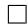

Proposition D.1 (Uniform spherical distributions minimize the population worst-case KRR bias). Assume that p is a density on M satisfying

$$
\int_ {\mathcal {M}} \| x \| ^ {2} p (x) \operatorname{dvol} (x) = 1.
$$

Then minimizing the worst-case population bias $\mathcal { E } ( p )$ is equivalent to minimizing the top eigenvalue µ1 of the population covariance operator $T _ { p } ,$ .

Moreover, for the exponential kernel

$$
K (x, y) = e ^ {\kappa x ^ {\top} y},
$$

the minimizer is

$$
p ^ {\star} = \operatorname{Unif} (\mathbb {S} ^ {d - 1}).
$$

Proof. Define

$$
h _ {\lambda} (\mu) = \left(\frac {\mu \lambda}{\mu + \lambda}\right) ^ {2}.
$$

Since $h _ { \lambda }$ increases strictly on $[ 0 , + \infty )$ , Lemma D.1 implies

$$
\mathcal {E} (p) = h _ {\lambda} (\mu_ {1}).
$$

Therefore minimizing $\mathcal { E } ( p )$ is equivalent to minimizing $\mu _ { 1 }$

Using the expansion

$$
e ^ {\kappa x ^ {\top} y} = \sum_ {m = 0} ^ {\infty} \frac {\kappa \langle x , y \rangle^ {m}}{m !},
$$

the kernel admits a feature representation

$$
K (x, y) = \langle \Phi (x), \Phi (y) \rangle .
$$

By the spectral characterization of compact positive self-adjoint operators (see, e.g., Conway [2019]),

$$
\mu_ {1} = \sup _ {\| a \| = 1} \langle T _ {p} a, a \rangle .
$$

Using the feature representation

$$
K (x, y) = \langle \Phi (x), \Phi (y) \rangle ,
$$

Rewriting the integral that defines $T _ { p }$ as an expectation and thanks to the feature representation, the covariance operator can be written as:

$$
T _ {p} a = \mathbb {E} _ {X \sim p} \big [ \langle a, \Phi (X) \rangle \Phi (X) \big ].
$$

Therefore,

$$
\langle T _ {p} a, a \rangle = \mathbb {E} _ {X \sim p} \left[ \langle a, \Phi (X) \rangle^ {2} \right].
$$

and hence

$$
\mu_ {1} = \sup _ {\| a \| = 1} \mathbb {E} _ {X \sim p} \big [ \langle a, \Phi (X) \rangle^ {2} \big ]. \tag {6}
$$

Thus $\mu _ { 1 }$ corresponds to the largest variance direction in feature space.

Next, the kernel is rotationally invariant:

$$
K (Q x, Q y) = K (x, y), \qquad Q \in O (d).
$$

Let dQ denote the normalized Haar probability measure on the orthogonal group $O ( d )$ . Given any admissible distribution $p ,$ define its rotational symmetrization by

$$
\bar {p} (A) = \int_ {O (d)} Q ^ {*} p (A) d Q,
$$

with $Q ^ { * }$ the pullback of p by $Q ,$ for every measurable set $A \subseteq { \mathcal { M } }$ .

By construction, p¯ is rotationally invariant and remains a probability distribution. Since orthogonal transformations preserve Euclidean norms,

$$
\int_ {\mathcal {M}} \| x \| ^ {2} \bar {p} (x) \mathrm{dvol} (x) = 1.
$$

Moreover, by (6) and the fact that the supremum of linear functionals is convex, $p \mapsto \mu _ { 1 } ( T _ { p } )$ is convex. Therefore,

$$
\mu_ {1} (T _ {\bar {p}}) \leq \int_ {O (d)} \mu_ {1} (T _ {Q ^ {*} p}) d Q,
$$

Since the kernel is rotationally invariant,

$$
\mu_ {1} (T _ {Q ^ {*} p}) = \mu_ {1} (T _ {p}),
$$

and hence

$$
\mu_ {1} (T _ {\bar {p}}) \leq \mu_ {1} (T _ {p}).
$$

Therefore, without loss of generality, we may restrict attention to rotationally invariant distributions $p .$

Let $X \sim p .$ . Since p is rotationally invariant, a standard spherical decomposition (see, e.g., Vershynin [2018]) yields $\boldsymbol { X } \overset { \cdot } { = } \boldsymbol { R } \boldsymbol { U } .$ , where $U \sim \mathrm { U n i f } ( \mathbb { S } ^ { d - 1 } )$ , with $R \geq 0$ , and R independent of U, and satisfying $\mathbb { E } [ R ^ { 2 } ] = 1$ .

Let $Y = S V$ be an independent copy of X, where $V \sim \mathrm { U n i f } ( \mathbb { S } ^ { d - 1 } )$ is independent of S.

Then

$$
X ^ {\top} Y = R S U ^ {\top} V,
$$

and

$$
\mathbb {E} [ e ^ {\kappa X ^ {\top} Y} ] = \mathbb {E} [ g _ {d} (R S) ],
$$

where

$$
g _ {d} (t) = \mathbb {E} _ {U, V} [ e ^ {t \kappa U ^ {\top} V} ].
$$

Since

$$
e ^ {t \kappa U ^ {\top} V} = \sum_ {m = 0} ^ {\infty} \frac {t ^ {m} \kappa^ {m} (U ^ {\top} V) ^ {m}}{m !},
$$

symmetry implies

$$
g _ {d} (t) = \sum_ {m = 0} ^ {\infty} c _ {m} t ^ {2 m}, \qquad c _ {m} \geq 0.
$$

Therefore,

$$
\mathbb {E} [ g _ {d} (R S) ] = \sum_ {m = 0} ^ {\infty} c _ {m} (\mathbb {E} [ R ^ {2 m} ]) ^ {2}.
$$

By Jensen’s inequality,

$$
\mathbb {E} [ R ^ {2 m} ] \geq (\mathbb {E} [ R ^ {2} ]) ^ {m} = 1.
$$

Hence

$$
\mathbb {E} [ g _ {d} (R S) ] \geq \sum_ {m = 0} ^ {\infty} c _ {m} = g _ {d} (1).
$$

Equality holds only if

$$
\mathbb {E} [ R ^ {2 m} ] = 1, \qquad m \geq 1.
$$

By Lemma E.1, this implies

$$
R = 1 \quad \text { a.s. }
$$

Since we already reduced the problem to rotationally invariant distributions, any admissible optimizer must satisfy

$$
X = R U, \qquad U \sim \mathrm{Unif} (\mathbb {S} ^ {d - 1}).
$$

Hence the condition R = 1 almost surely implies

$$
X \sim \mathrm{Unif} (\mathbb {S} ^ {d - 1}).
$$

Therefore,

$$
p ^ {\star} = \operatorname{Unif} (\mathbb {S} ^ {d - 1})
$$

minimizes $\mu _ { 1 }$ , and consequently minimizes $\mathcal { E } ( p )$ .

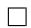

Lemma E.1. Let $R \geq 0$ be a random variable such that

$$
\mathbb {E} [ R ^ {2 m} ] = 1, \qquad m \geq 1.
$$

Then

$$
R = 1 \quad \text {   almost   surely.   }
$$

Proof. The proof follows from standard arguments and is omitted.

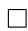

Remark E.2. The normalization

$$
\int_ {\mathcal {M}} \| x \| ^ {2} p (x) \operatorname{dvol} (x) = 1
$$

rules out the trivial collapse $p = \delta _ { 0 }$ , for which $K ( x , y ) \equiv \phi ( 0 )$ . The argument also extends to kernels of the form $K ( x , y ) = \phi ( x ^ { \top } y )$ , where

$$
\phi (t) = \sum_ {m \geq 0} a _ {m} t ^ {m}
$$

is analytic. In fact, it suffices that $a _ { m } > 0$ for arbitrarily large m.

# F Uniform Distributions Minimize k-NN Regression Bias Modified Fisher Information Term

The work of Balestriero and LeCun 2025 makes a theoretical case for isotropic Gaussian embeddings by demonstrating their optimal performance in both linear probing (ordinary least-squares regression) and nonlinear probing (k-NN and Nadaraya-Watson kernel regression). Specifically, they show that isotropic embeddings (not necessarily Gaussian) minimize the Tikhonov-regularized loss of ridge regression models fit to an arbitrary target on the embeddings using the linear kernel. Moreover, they show that isotropic Gaussian embeddings minimize, for a fixed number of training examples, the integrated square bias term of the bias-variance decomposition of the mean-squared error loss of k-NN regression and Nadaraya-Watson kernel regression under certain isotropy constraints (the prior introduced on p. 29 of that work). However, their proofs involve assumptions that rule out common choices of latent representations, such as spherical embeddings. For example, they linearize the integrated square bias term with a Euclidean Taylor expansion that imposes smoothness constraints on the embedding distribution and regression target function over $\mathbb { R } ^ { d }$ that fail for functions defined on the sphere (ibid., Lemmas 4 and 5). Moreover, their optimality results (ibid., Theorems 1 and 7-9) depend on the fact that the leading term of this expansion, the Euclidean Fisher information integral

$$
\int_ {\mathbb {R} ^ {d}} \left| \left| \nabla \log p (x) \right| \right| _ {2} ^ {2} p (x) \mathrm{d} x, \tag {7}
$$

is minimized (for fixed covariance matrix) by the Gaussian distribution (ibid., Lemma 6)–and, with additional scalar constraints on the distribution (ibid., Theorem 9), the isotropic Gaussian. But this integral is not defined when $p$ is, for instance, a uniform probability measure on the sphere $\mathbb { S } ^ { d - 1 }$ in $\mathbb { R } ^ { d }$ . The uniform measure on the sphere is singular with respect to the Lebesgue measure on the ambient Euclidean space Rd and does not have a probability density function with respect to the Lebesgue measure on $\mathbb { R } ^ { d }$ . Moreover, the leading term of the bias of k-NN regression is not proportional to (7) when one accounts for the spatially varying k-NN radius.

The integrated squared bias of k-NN regression and kernel density estimation models on more general Riemannian manifolds can be performed using an expansion in covariant Taylor series, which does not impose these smoothness requirements in the ambient space. Indeed, this approach was used to estimate kernel density estimation and k-NN density estimation–where the regression target is the embedding distribution itself–in [Pelletier, 2005] and [Henry et al., 2011], respectively.

This more general setting tells a different story.

Let $\mathcal { M } \subseteq \mathbb { R } ^ { d }$ be an m-dimensional Riemannian manifold with positive injectivity radius $0 < r _ { \operatorname* { m i n } } \le$ $\operatorname { i n j } _ { \mathcal { M } } ( x )$ at all points $x \in \mathcal { M }$ and volume form dvol(x). Let $p$ be a $\mathcal { C } ^ { 3 }$ -smooth probability density on ${ \mathcal { M } } .$ . For each point $x \in \mathcal { M }$ , let $B _ { r } ( x ) \subseteq { \mathcal { M } }$ be the geodesic ball of radius r.

Given a target function $f \in \mathcal { C } ^ { 3 }$ , define the population k-NN regression estimate $\widehat { f } _ { r }$ of the target $f$ as follows:

$$
\widehat {f} _ {r} (x) = \mathbb {E} _ {y \sim p} \big [ f (y) \mid y \in B _ {r} (x) \big ] = \frac {\int_ {B _ {r} (x)} f (y) p (y) \mathrm{dvol} (y)}{\int_ {B _ {r} (x)} p (y) \mathrm{dvol} (y)},
$$

where the radius r = rk(x), of order β/p(x)1/m, $r = r _ { k } ( x )$ $\left( \beta / p ( x ) \right) ^ { 1 / m }$ governs the radius of a geodesic ball needed to find the kth nearest neighbor among n sample points $\{ x _ { i } \} _ { i = 1 } ^ { n } \subseteq { \mathcal { M } }$ , for fixed ratio $\beta = k / n$ . The

pointwise bias of our estimate is simply

$$
\operatorname{bias} (x; r _ {k} (x)) = \mathbb {E} _ {y \sim p} [ f (y) \mid y \in B _ {r} (x) ] - f (x) = \widehat {f} _ {r} (x) - f (x);
$$

the integrated squared bias,

$$
\mathrm{ISB} (f, p) = \int_ {\mathcal {M}} \text { bias } (x; r _ {k} (x)) ^ {2} p (x)   \mathrm{dvol} (x). \tag {8}
$$

Lemma F.1 (Riemannian analog of Balestriero and LeCun [2025], Lemma 4). We can write the leading term of the bias as follows:

$$
\operatorname{bias} (x; r _ {k} (x)) = \frac {r _ {k} (x) ^ {2}}{2 (m + 2)} \left(\Delta_ {\mathcal {M}} f (x) + 2 \frac {\langle \nabla f (x) , \nabla p (x) \rangle_ {g}}{p (x)}\right).
$$

When f and g are $\mathcal { C } ^ { 3 }$ smooth, this is accurate to $O ( r _ { k } ( x ) ^ { 3 } )$ .

We shall refer to the term $\Delta _ { { \mathcal { M } } } f ( x )$ as the wiggliness bias and $\langle \nabla f ( x ) , \nabla p ( x ) \rangle _ { g } / p ( x )$ as the design bias.

Proposition F.1 (Riemannian analog of Balestriero and LeCun [2025], Theorem 7). The leading term of the integrated squared bias of k-NN regression (8) is

$$
\mathrm{ISB} (f, p; k, n) = A (m, k, n) \int_ {\mathcal {M}} \left(\Delta_ {\mathcal {M}} f (x) + 2 \frac {\langle \nabla f (x) , \nabla p (x) \rangle_ {g}}{p (x)}\right) ^ {2} p (x) ^ {1 - 4 / m} \mathrm{dvol} (x), \tag {9}
$$

where $\begin{array} { r } { A ( m , k , n ) : = \frac { 1 } { 4 ( m + 2 ) ^ { 2 } } \left( \frac { k \Gamma ( 1 + m / 2 ) } { n \pi ^ { m / 2 } } \right) ^ { 4 / m } } \end{array}$

Remark F.1. The term $p ( x ) ^ { - 4 / m }$ does not appear in the result of Balestriero and LeCun [2025]; it arises due to the spatially varying bandwidth of a k-NN regression.

Remark F.2. For any fixed nonuniform sampling density p, an adversary who chooses the target function f after p can make the integrated squared bias (9) arbitrarily large by concentrating wiggliness $\Delta _ { \mathcal { M } } f$ in regions where p is small or rapidly varying.

Using a minimax approach [Micchelli and Wahba, 1979, Bach, 2017], we find that the optimal design for minimizing k-NN regression is a uniform distribution.

Proposition F.2 (Minimax optimality of the uniform design for k-NN). Let M be a smooth Riemannian manifold, and let k, n ∈ N satisfy $1 \leq k < n$ . For $c > 0$ , define

$$
\mathcal {G} _ {c} = \left\{f \in \mathcal {C} ^ {3} (\mathcal {M}): \| \Delta_ {\mathcal {M}} f \| _ {\infty} \leq c \right\}.
$$

Among smooth probability densities p on M, the minimax of the ISB of k-NN regression satisfies

$$
\arg \min _ {p} \sup _ {f \in \mathcal {G} _ {c}} \operatorname{ISB} (f, p; k, n) = \operatorname{Unif} (\mathcal {M}),
$$

where

$$
\operatorname{Unif} (\mathcal {M}) = \frac {1}{\operatorname{vol} (\mathcal {M})} \mathrm{dvol}.
$$

# G Proofs: k-Nearest Neighbors

Lemma F.1 (Riemannian analog of Balestriero and LeCun [2025], Lemma 4). We can write the leading term of the bias as follows:

$$
\operatorname{bias} (x; r _ {k} (x)) = \frac {r _ {k} (x) ^ {2}}{2 (m + 2)} \left(\Delta_ {\mathcal {M}} f (x) + 2 \frac {\langle \nabla f (x) , \nabla p (x) \rangle_ {g}}{p (x)}\right).
$$

When f and g are $\mathcal { C } ^ { 3 }$ smooth, this is accurate to $O ( r _ { k } ( x ) ^ { 3 } )$ .

Proof. For each $x \in { \mathcal { M } }$ , we use the exponential map ex $) _ { x } : T _ { x } { \mathcal { M } } \to { \mathcal { M } }$ to transform the integral over the geodesic ball $B _ { r } ( x )$ to the tangent ball $B _ { r } ^ { m } ( { \bar { 0 } } ) \subseteq { \bar { \mathbb { R } } } ^ { m }$ . In Riemannian normal coordinates at x, the metric $g$ satisfies the following standard2 approximation:

$$
\sqrt {\det g} = 1 - \frac {1}{6} \operatorname{Ric} _ {i j} (x) y ^ {i} y ^ {j} + O (\| y \| ^ {3})
$$

where Ric is the Ricci tensor and $y ^ { i }$ the ith coordinate of a point $y$ in an orthonormal basis of $T _ { x } { \mathcal { M } }$ Thus,

$$
\mathrm{dvol} (y) \approx 1 - \frac {1}{6} \operatorname{Ric} _ {i j} (x) y ^ {i} y ^ {j} \mathrm{d} y + O \left(\left| \left| y \right| \right| ^ {3}\right)
$$

where we use the notation $\mathrm { d } y = \mathrm { d } y ^ { 1 } \wedge . . . \wedge \mathrm { d } y ^ { n }$ .

Let us now obtain the leading terms of the numerator and denominator using Taylor expansions in normal coordinates. Starting with the denominator, we multiply our expansion of $\operatorname { d v o l } ( y )$ with a Taylor expansion of $p ( y )$ 号

$$
p (y) = p (0) + \nabla_ {k} p (0) y ^ {k} + \frac {1}{2} \nabla_ {k} \nabla_ {l} p (0) y ^ {k} y ^ {l} + O (| | y | | ^ {3})
$$

and integrate. We note that by symmetry and linearity, odd terms $\nabla _ { k } p y ^ { k }$ integrate to zero over the ball, and distinct coordinates $y ^ { k } { \overset { \cdot } { y } } { } ^ { l }$ integrate to zero as well, so $\begin{array} { r } { \int _ { B _ { \boldsymbol { \kappa } } ^ { m } ( 0 ) } \ddot { y } ^ { k } y ^ { l } \mathrm { d } y = \delta _ { k l } V _ { m } r ^ { m + 2 } / ( m + 2 ) } \end{array}$ , where $\begin{array} { r } { V _ { m } : = \pi ^ { m / 2 } / \Gamma \left( \frac { m } { 2 } + 1 \right) } \end{array}$  is the volume of the unit ball in $\mathbb { R } ^ { m }$ .

$$
\begin{array}{l} D = \int_ {B _ {r} ^ {m} (0)} p (y) \mathrm{dvol} (y) \\ \approx \int_ {B _ {r} ^ {m} (0)} \left(p (0) + \nabla_ {k} p (0) y ^ {k} + \frac {1}{2} \nabla_ {k} \nabla_ {l} p (0) y ^ {k} y ^ {l}\right) \cdot \left(1 - \frac {1}{6} \operatorname{Ric} _ {i j} (0) y ^ {i} y ^ {j}\right) d y \\ = V _ {m} r _ {k} (x) ^ {m} \bigg [ p (x) + \frac {r _ {k} (x) ^ {2}}{2 (m + 2)} \Delta_ {\mathcal {M}} p (x) - \frac {r _ {k} (x) ^ {2}}{6 (m + 2)} p (x) \operatorname{Scal} (x) + O (r _ {k} (x) ^ {3}) \bigg ], \\ \end{array}
$$

since the symmetry collapses the sum of second-order derivatives into a trace:

$$
\nabla_ {k} \nabla_ {l} p (0) \delta^ {k l} = \Delta_ {\mathcal {M}} p (x) \quad \text { and } \quad \operatorname{Ric} _ {i j} (0) \delta^ {i j} = \operatorname{Scal} (x)
$$

where $\Delta _ { { \scriptscriptstyle M } }$ is the Laplace-Beltrami operator of $p$ at $x ,$ and $\operatorname { S c a l } ( x )$ is the scalar curvature of the manifold at x.

We obtain the numerator $N _ { \ast }$

$$
V _ {m} r ^ {m} \Bigg [ f (x) p (x) + \frac {r _ {k} (x) ^ {2}}{2 (m + 2)} \Delta_ {\mathcal {M}} (f p) (x) - \frac {r _ {k} (x) ^ {2}}{6 (m + 2)} f (x) p (x) \mathrm{Scal} (x) \Bigg ] + O (r ^ {m + 3}),
$$

by identical reasoning using our Taylor expansion of the product between the target and embedding density

$$
f (y) p (y) \asymp \left(f (0) + \nabla_ {k} f (0) y ^ {k} + \frac {1}{2} \nabla_ {k} \nabla_ {l} f (0) y ^ {k} y ^ {l}\right) \cdot \left(p (0) + \nabla_ {k} p (0) y ^ {k} + \frac {1}{2} \nabla_ {k} \nabla_ {l} p (0) y ^ {k} y ^ {l}\right).
$$

We write

$$
\Delta_ {\mathcal {M}} (f p) (x) = f (x) \Delta_ {\mathcal {M}} p (x) + 2 \langle \nabla f (x), \nabla p (x) \rangle_ {g} + p (x) \Delta_ {\mathcal {M}} f (x)
$$

and compute the ratio between the numerator and the denominator:

$$
\begin{array}{l} \widehat {f} _ {r} (x) = \frac {N}{D} \\ = \frac {f (x) p (x) + \frac {r _ {k} (x) ^ {2} \left[ f (x) \Delta_ {\mathcal {M}} p (x) + 2 \langle \nabla f (x) , \nabla p (x) \rangle_ {g} + p (x) \Delta_ {\mathcal {M}} f (x) - \frac {1}{3} f (x) p (x) \operatorname{Scal} (x) \right]}{2 (m + 2)}}{p (x) + \frac {r _ {k} (x) ^ {2}}{2 (m + 2)} \left[ \Delta_ {\mathcal {M}} p (x) - \frac {1}{3} p (x) \operatorname{Scal} (x) \right]} + O (r _ {k} (x) ^ {3}) \\ = f (x) + \frac {r _ {k} (x) ^ {2}}{2 (m + 2)} \left(\Delta_ {\mathcal {M}} f (x) + 2 \frac {\langle \nabla f (x) , \nabla p (x) \rangle_ {g}}{p (x)}\right) + O (r _ {k} (x) ^ {3}), \\ \end{array}
$$

step used the approximation , which follows from the Taylo $\begin{array} { r } { \frac { A + \epsilon B } { C + \epsilon D } = \frac { A + \epsilon B } { C } ( 1 + \epsilon \frac { D } { C } ) ^ { - 1 } \approx \frac { A + \epsilon B } { C } ( 1 - \epsilon \frac { D } { C } ) = } \end{array}$ $\begin{array} { r } { \frac { A } { C } + \epsilon \frac { B C - A D } { C ^ { 2 } } } \end{array}$ $\begin{array} { r } { ( 1 + \epsilon \frac { D } { C } ) ^ { - 1 } \approx 1 - \epsilon \frac { D } { C } + O ( \epsilon ^ { 2 } ) } \end{array}$

Thus, the bias at x is ultimately equal to rk(x)2 $\begin{array} { r } { \frac { r _ { k } ( x ) ^ { 2 } } { 2 ( m + 2 ) } \left( \Delta _ { \mathcal { M } } f ( x ) + 2 \frac { \langle \nabla f ( x ) , \nabla p ( x ) \rangle _ { g } } { p ( x ) } \right) } \end{array}$ ∆Mf (x) + 2 ⟨∇f(x),∇p(x)⟩g :

$$
\begin{array}{l} \operatorname{bias} (x; r _ {k} (x)) = \widehat {f} _ {r} (x) - f (x) \\ = \frac {r _ {k} (x) ^ {2}}{2 (m + 2)} \left(\Delta_ {\mathcal {M}} f (x) + 2 \frac {\langle \nabla f (x) , \nabla p (x) \rangle_ {g}}{p (x)}\right) + O (r _ {k} (x) ^ {3}). \tag {10} \\ \end{array}
$$

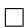

Proposition F.1 (Riemannian analog of Balestriero and LeCun [2025], Theorem 7). The leading term of the integrated squared bias of k-NN regression (8) is

$$
\mathrm{ISB} (f, p; k, n) = A (m, k, n) \int_ {\mathcal {M}} \left(\Delta_ {\mathcal {M}} f (x) + 2 \frac {\langle \nabla f (x) , \nabla p (x) \rangle_ {g}}{p (x)}\right) ^ {2} p (x) ^ {1 - 4 / m} \mathrm{dvol} (x), \tag {9}
$$

where A(m, k, n) := 14(m+2)2  kΓ(1+m/2)nπm/2 4/m . $\begin{array} { r } { w h e r e \ A ( m , k , n ) : = \frac { 1 } { 4 ( m + 2 ) ^ { 2 } } \left( \frac { k \Gamma ( 1 + m / 2 ) } { n \pi ^ { m / 2 } } \right) ^ { 4 / m } . } \end{array}$

Proof. The local k-NN radius $r _ { k } ( x )$ varies with the probability density and geometry of the manifold. The volume of a geodesic ball of radius $r _ { k } ( x )$ around x in our m-dimensional manifold M is, to second order, the volume of the m-dimensional Euclidean ball [Gray, 1974, Theorem 3.1]:

$$
\operatorname{vol} (B _ {r} (x)) = \frac {\pi^ {m / 2}}{\Gamma \left(1 + \frac {m}{2}\right)} r _ {k} (x) ^ {m} \left(1 - \frac {\operatorname{Scal} (x)}{m + 2} r _ {k} (x) ^ {2} + O (r _ {k} (x) ^ {4})\right),
$$

where $\operatorname { S c a l } ( x )$ is the scalar curvature and the term outside the parentheses is the volume $V _ { m } ( r _ { k } ( x ) )$ of the m-dimensional Euclidean ball of radius $r _ { k } ( x )$ .

We compute the probability mass of the geodesic ball by integrating over a Euclidean ball in $T _ { x } { \mathcal { M } }$ using the same metric expansion used in the proof of F.1. In geodesic normal coordinates, this becomes, by the symmetry of the ball,

$$
\begin{array}{l} P (B _ {r _ {k} (x)} (x)) = \int_ {B _ {r} ^ {m} (0)} \left(p (0) + \nabla_ {k} p (0) y ^ {k} + \frac {1}{2} \nabla_ {k} \nabla_ {l} p (0) y ^ {k} y ^ {l}\right) \left(1 - \frac {1}{6} \mathrm{Ric} _ {i j} (0) y ^ {i} y ^ {j}\right) \mathrm{d} y \\ = \frac {\pi^ {\frac {m}{2}} r _ {k} (x) ^ {m}}{\Gamma \left(1 + \frac {m}{2}\right)} \left(p (x) + \frac {r _ {k} (x) ^ {2} \left(\Delta_ {\mathcal {M}} p (x) - \frac {p (x)}{3} \operatorname{Scal} (x)\right)}{2 (m + 2)}\right) + O \left(r _ {k} (x) ^ {m + 4}\right). \tag {11} \\ \end{array}
$$

Thus, the probability mass is equal to that of a uniform density assuming the value $p ( x )$ throughout the ball to order $r _ { k } \dot { ( } x ) ^ { m + 2 } ;$ ; the order $r _ { k } ( x ) ^ { m + 2 }$ correction gives more mass at fixed radius for a subharmonic density at x and negative curvature at x.

We shall now observe that, to leading order, the local k-NN radius $r _ { k } ( x )$ at x depends on the density at x but not the curvature. In a locally flat, constant-density space, we can approximate the probability mass of the geodesic ball $B _ { m } ( r _ { k } ( x ) )$ ) as $p ( x ) V _ { m } ( r _ { k } ( x ) ) + O ( r _ { k } ( x ) ^ { m + 2 } )$ . Thus, by the law of large numbers and definition of the $r _ { k } ( x )$ , the radius must satisfy, for large n,

$$
\frac {k}{n} = p (x) \frac {\pi^ {m / 2}}{\Gamma \left(1 + \frac {m}{2}\right)} r _ {k} (x) ^ {m} + O (r _ {k} (x) ^ {m + 2}) \implies r _ {k} (x) \approx \left(\frac {k}{n p (x)} \cdot \frac {\Gamma \left(1 + \frac {m}{2}\right)}{\pi^ {m / 2}}\right) ^ {1 / m} := r _ {0} (x).
$$

In a locally curved space, with locally nonharmonic density, the radius $r _ { k } ( x )$ for which the population probability mass equals $k / n$ can be computed as a perturbation of $r _ { 0 } \colon r _ { k } ( x ) = r _ { 0 } ( x ) ( 1 + \epsilon )$ . Plugging this regular perturbation into (11), using $( 1 + \epsilon ) ^ { m } \approx 1 + m \epsilon .$ , and dropping higher-order $\epsilon r ^ { 2 } ( x )$ terms, we obtain

$$
\frac {k}{n} \approx \frac {\pi^ {m / 2}}{\Gamma \left(1 + \frac {m}{2}\right)} p (x) r _ {0} (x) ^ {m} (1 + m \epsilon) \left(1 + \frac {r _ {0} (x) ^ {2}}{2 (m + 2)} \left(\frac {\Delta_ {\mathcal {M}} p (x)}{p (x)} - \frac {1}{3} \mathrm{Scal} (x)\right)\right),
$$

from which we can identify

$$
\epsilon \approx - \frac {r _ {0} (x) ^ {2}}{2 m (m + 2)} \left(\frac {\Delta_ {\mathcal {M}} p (x)}{p (x)} - \frac {1}{3} \mathrm{Scal} (x)\right);
$$

thus,

$$
r _ {k} (x) \asymp \left(\frac {k \Gamma \left(1 + \frac {m}{2}\right)}{n p (x) \pi^ {\frac {m}{2}}}\right) ^ {\frac {1}{m}} - \left(\frac {k \Gamma \left(1 + \frac {m}{2}\right)}{n p (x) \pi^ {\frac {m}{2}}}\right) ^ {\frac {2}{m}} \frac {1}{2 m (m + 2)} \left(\frac {\Delta_ {\mathcal {M}} p (x)}{p (x)} - \frac {1}{3} \operatorname{Scal} (x)\right). \tag {12}
$$

When we substitute this refined radius (12) into the pointwise bias (10), only the unrefined population radius $r _ { 0 } ( x )$ is involved in the leading term (in n). In this expression for the bias at a point $x \in \mathcal { M }$ , which incorporates the spatially varying k-NN radius $r _ { k } ( x )$ , the following emerges as the leading term:

$$
\operatorname{bias} (x) \asymp A _ {k, n} p (x) ^ {- 2 / m} \left(\Delta_ {\mathcal {M}} f (x) + 2 \frac {\langle \nabla f (x) , \nabla p (x) \rangle_ {g}}{p (x)}\right), \text {   where   }
$$

$$
A _ {k, n} := \frac {1}{2 (m + 2)} \left(\frac {k \Gamma \left(1 + \frac {m}{2}\right)}{n \pi^ {m / 2}}\right) ^ {2 / m}.
$$

Thus, the leading $\Theta ( ( k / n ) ^ { 4 / m } )$ term of the squared bias is the following:

$$
\operatorname{bias} (x) ^ {2} = A _ {k, n} ^ {2} \cdot p (x) ^ {- 4 / m} \left(\Delta_ {\mathcal {M}} f (x) + 2 \frac {\langle \nabla f (x) , \nabla p (x) \rangle_ {g}}{p (x)}\right) ^ {2} + O \left((k / n) ^ {6 / m}\right). \tag {13}
$$

The leading term of the integrated squared bias, then, is

$$
\begin{array}{l} \operatorname{ISB} (f, p; k, n) \asymp \int_ {\mathcal {M}} \operatorname{bias} (x) ^ {2} p (x) \mathrm{dvol} (x) \\ = A _ {k, n} ^ {2} \int_ {\mathcal {M}} \left(\Delta_ {\mathcal {M}} f (x) + 2 \frac {\langle \nabla f (x) , \nabla p (x) \rangle_ {g}}{p (x)}\right) ^ {2} p (x) ^ {1 - 4 / m} \mathrm{dvol} (x). \\ \end{array}
$$

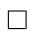

Proposition F.2 (Minimax optimality of the uniform design for k-NN). Let $\mathcal { M }$ be a smooth Riemannian manifold, and let $k , n \in \mathbb { N }$ satisfy $1 \leq k < n$ . For $c > 0 ,$ , define

$$
\mathcal {G} _ {c} = \left\{f \in \mathcal {C} ^ {3} (\mathcal {M}): \| \Delta_ {\mathcal {M}} f \| _ {\infty} \leq c \right\}.
$$

Among smooth probability densities p on $\mathcal { M } ,$ the minimax of the ISB of k-NN regression satisfies

$$
\arg \min _ {p} \sup _ {f \in \mathcal {G} _ {c}} \operatorname{ISB} (f, p; k, n) = \operatorname{Unif} (\mathcal {M}),
$$

where

$$
\operatorname{Unif} (\mathcal {M}) = \frac {1}{\operatorname{vol} (\mathcal {M})} \mathrm{dvol}.
$$

Proof. Let $p _ { 0 } = \mathrm { v o l } ( \mathcal { M } ) ^ { - 1 }$ denote the uniform density. For $p = p _ { 0 }$ , we have $\nabla p _ { 0 } \equiv 0$ . Hence the design-bias term in Proposition F.1 vanishes, and

$$
\mathrm{ISB} (f, p _ {0}; k, n) = A (m, k, n) \int_ {\mathcal {M}} (\Delta_ {\mathcal {M}} f) ^ {2} p _ {0} ^ {1 - 4 / m} d \mathrm{vol.}
$$

Since $f \in \mathcal { G } _ { c } , \| \Delta _ { \mathcal { M } } f \| _ { \infty } \leq c ,$ , and therefore

$$
\sup _ {f \in \mathcal {G} _ {c}} \operatorname{ISB} (f, p _ {0}; k, n) \leq A (m, k, n) c ^ {2} \operatorname{vol} (\mathcal {M}) ^ {4 / m} <   \infty .
$$

Now let $p$ be any non constant smooth density. Then there exists an open set $U \subseteq { \mathcal { M } }$ on which $\nabla p \neq 0$ . On such a set, the first-order part

$$
2 \frac {\langle \nabla f , \nabla p \rangle_ {g}}{p}
$$

can be made arbitrarily large while keeping $\| \Delta _ { \mathcal { M } } f \| _ { \infty } \leq c .$ . Indeed, one may take $f$ locally almost affine in the direction of $\nabla p$ , with arbitrarily large slope; the Laplacian only controls second derivatives and does not prevent such a local amplification. Hence there exists a sequence $( f _ { R } ) _ { R \geq 1 } \subseteq$ $\mathcal { G } _ { c }$ such that

$$
\left| \frac {\langle \nabla f _ {R} , \nabla p \rangle_ {g}}{p} \right| \to \infty
$$

on a subset of $U$ of positive volume. Since p is smooth and positive, the weight $p ^ { 1 - 4 / m }$ is bounded away from zero on this subset. Therefore the corresponding ISB diverges:

$$
\sup _ {f \in \mathcal {G} _ {c}} \operatorname{ISB} (f, p; k, n) = + \infty .
$$

Thus the uniform density has finite worst-case ISB, whereas every nonuniform smooth density has infinite worst-case ISB. Consequently,

$$
\arg \min _ {p} \sup _ {g \in \mathcal {G} _ {c}} \operatorname{ISB} (g, p; k, n) = \operatorname{Unif} (\mathcal {M}).
$$

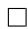

# H Acknowledgements

This work was partially funded by Advanced Track and Trace, and was also partly funded by the Centre Borelli. This work was granted access to the HPC resources of IDRIS (Jean Zay supercomputer) under the allocation 2025-AD011017323 made by GENCI.

# NeurIPS Paper Checklist

# 1. Claims

Question: Do the main claims made in the abstract and introduction accurately reflect the paper’s contributions and scope?

Answer: [Yes]

Justification: The abstract and introduction explicitly state our theoretical contributions regarding hyperspherical optimality (detailed in Section 4) and accurately summarize the supporting empirical results on standard and retrieval benchmarks (detailed in Section 6).

Guidelines:

• The answer [N/A] means that the abstract and introduction do not include the claims made in the paper.   
• The abstract and/or introduction should clearly state the claims made, including the contributions made in the paper and important assumptions and limitations. A [No] or [N/A] answer to this question will not be perceived well by the reviewers.   
• The claims made should match theoretical and experimental results, and reflect how much the results can be expected to generalize to other settings.   
• It is fine to include aspirational goals as motivation as long as it is clear that these goals are not attained by the paper.

# 2. Limitations

Question: Does the paper discuss the limitations of the work performed by the authors?

Answer: [Yes]

Justification: Empirical limitations—specifically our reliance on a single training run without hyperparameter tuning, and the need to scale to larger batch sizes and architectures—are explicitly acknowledged in the Conclusion (Section 7).

Guidelines:

• The answer [N/A] means that the paper has no limitation while the answer [No] means that the paper has limitations, but those are not discussed in the paper.   
• The authors are encouraged to create a separate “Limitations” section in their paper.   
• The paper should point out any strong assumptions and how robust the results are to violations of these assumptions (e.g., independence assumptions, noiseless settings, model well-specification, asymptotic approximations only holding locally). The authors should reflect on how these assumptions might be violated in practice and what the implications would be.   
• The authors should reflect on the scope of the claims made, e.g., if the approach was only tested on a few datasets or with a few runs. In general, empirical results often depend on implicit assumptions, which should be articulated.   
• The authors should reflect on the factors that influence the performance of the approach. For example, a facial recognition algorithm may perform poorly when image resolution is low or images are taken in low lighting. Or a speech-to-text system might not be used reliably to provide closed captions for online lectures because it fails to handle technical jargon.   
• The authors should discuss the computational efficiency of the proposed algorithms and how they scale with dataset size.   
• If applicable, the authors should discuss possible limitations of their approach to address problems of privacy and fairness.   
• While the authors might fear that complete honesty about limitations might be used by reviewers as grounds for rejection, a worse outcome might be that reviewers discover limitations that aren’t acknowledged in the paper. The authors should use their best judgment and recognize that individual actions in favor of transparency play an important role in developing norms that preserve the integrity of the community. Reviewers will be specifically instructed to not penalize honesty concerning limitations.

# 3. Theory assumptions and proofs

Question: For each theoretical result, does the paper provide the full set of assumptions and a complete (and correct) proof?

Answer: [Yes]

Justification: All geometric and topological assumptions are explicitly stated in the main text within the statements of Lemma 1 and Theorem 1 (Section 4). The complete and formal proofs for these results are provided in the supplemental material (Appendix).

# Guidelines:

• The answer [N/A] means that the paper does not include theoretical results.   
• All the theorems, formulas, and proofs in the paper should be numbered and crossreferenced.   
• All assumptions should be clearly stated or referenced in the statement of any theorems.   
• The proofs can either appear in the main paper or the supplemental material, but if they appear in the supplemental material, the authors are encouraged to provide a short proof sketch to provide intuition.   
• Inversely, any informal proof provided in the core of the paper should be complemented by formal proofs provided in appendix or supplemental material.   
• Theorems and Lemmas that the proof relies upon should be properly referenced.

# 4. Experimental result reproducibility

Question: Does the paper fully disclose all the information needed to reproduce the main experimental results of the paper to the extent that it affects the main claims and/or conclusions of the paper (regardless of whether the code and data are provided or not)?

Answer: [Yes]

Justification: The experimental setup, including architectures, augmentations, and hyperparameters, is detailed in Section 6 and the Appendix. Furthermore, we will release a GitHub repository containing the core implementation of SUSReg and the specialized texture retrieval dataset upon publication.

# Guidelines:

• The answer [N/A] means that the paper does not include experiments.   
• If the paper includes experiments, a [No] answer to this question will not be perceived well by the reviewers: Making the paper reproducible is important, regardless of whether the code and data are provided or not.   
• If the contribution is a dataset and/or model, the authors should describe the steps taken to make their results reproducible or verifiable.   
• Depending on the contribution, reproducibility can be accomplished in various ways. For example, if the contribution is a novel architecture, describing the architecture fully might suffice, or if the contribution is a specific model and empirical evaluation, it may be necessary to either make it possible for others to replicate the model with the same dataset, or provide access to the model. In general. releasing code and data is often one good way to accomplish this, but reproducibility can also be provided via detailed instructions for how to replicate the results, access to a hosted model (e.g., in the case of a large language model), releasing of a model checkpoint, or other means that are appropriate to the research performed.

• While NeurIPS does not require releasing code, the conference does require all submissions to provide some reasonable avenue for reproducibility, which may depend on the nature of the contribution. For example

(a) If the contribution is primarily a new algorithm, the paper should make it clear how to reproduce that algorithm.   
(b) If the contribution is primarily a new model architecture, the paper should describe the architecture clearly and fully.   
(c) If the contribution is a new model (e.g., a large language model), then there should either be a way to access this model for reproducing the results or a way to reproduce the model (e.g., with an open-source dataset or instructions for how to construct the dataset).

(d) We recognize that reproducibility may be tricky in some cases, in which case authors are welcome to describe the particular way they provide for reproducibility. In the case of closed-source models, it may be that access to the model is limited in some way (e.g., to registered users), but it should be possible for other researchers to have some path to reproducing or verifying the results.

# 5. Open access to data and code

Question: Does the paper provide open access to the data and code, with sufficient instructions to faithfully reproduce the main experimental results, as described in supplemental material?

Answer: [Yes]

Justification: We provide an anonymized ZIP file in the supplementary material containing the core PyTorch implementation of the SUSReg loss and the custom texture retrieval dataset. The full training pipeline will be open-sourced upon publication.

Guidelines:

• The answer [N/A] means that paper does not include experiments requiring code.   
• Please see the NeurIPS code and data submission guidelines (https://neurips.cc/ public/guides/CodeSubmissionPolicy) for more details.   
• While we encourage the release of code and data, we understand that this might not be possible, so [No] is an acceptable answer. Papers cannot be rejected simply for not including code, unless this is central to the contribution (e.g., for a new open-source benchmark).   
• The instructions should contain the exact command and environment needed to run to reproduce the results. See the NeurIPS code and data submission guidelines (https: //neurips.cc/public/guides/CodeSubmissionPolicy) for more details.   
• The authors should provide instructions on data access and preparation, including how to access the raw data, preprocessed data, intermediate data, and generated data, etc.   
• The authors should provide scripts to reproduce all experimental results for the new proposed method and baselines. If only a subset of experiments are reproducible, they should state which ones are omitted from the script and why.   
• At submission time, to preserve anonymity, the authors should release anonymized versions (if applicable).   
• Providing as much information as possible in supplemental material (appended to the paper) is recommended, but including URLs to data and code is permitted.

# 6. Experimental setting/details

Question: Does the paper specify all the training and test details (e.g., data splits, hyperparameters, how they were chosen, type of optimizer) necessary to understand the results?

Answer: [Yes]

Justification: All critical experimental details, including datasets, model architectures, optimizer choices, data augmentation strategies, and specific hyperparameter values (e.g., learning rates, batch sizes, EMA momentum) are thoroughly described in Section 6.

Guidelines:

• The answer [N/A] means that the paper does not include experiments.   
• The experimental setting should be presented in the core of the paper to a level of detail that is necessary to appreciate the results and make sense of them.   
• The full details can be provided either with the code, in appendix, or as supplemental material.

# 7. Experiment statistical significance

Question: Does the paper report error bars suitably and correctly defined or other appropriate information about the statistical significance of the experiments?

Answer: [No]

Justification: Due to the high computational cost of pretraining large vision backbones (e.g., ViT-B/14) on large-scale datasets (ImageNet-1K), our main results report metrics from a single training run. We explicitly acknowledge the absence of multi-seed robustness evaluation as a limitation in Section 7.

# Guidelines:

• The answer [N/A] means that the paper does not include experiments.   
• The authors should answer [Yes] if the results are accompanied by error bars, confidence intervals, or statistical significance tests, at least for the experiments that support the main claims of the paper.   
• The factors of variability that the error bars are capturing should be clearly stated (for example, train/test split, initialization, random drawing of some parameter, or overall run with given experimental conditions).   
• The method for calculating the error bars should be explained (closed form formula, call to a library function, bootstrap, etc.)   
• The assumptions made should be given (e.g., Normally distributed errors).   
• It should be clear whether the error bar is the standard deviation or the standard error of the mean.   
• It is OK to report 1-sigma error bars, but one should state it. The authors should preferably report a 2-sigma error bar than state that they have a 96% CI, if the hypothesis of Normality of errors is not verified.   
• For asymmetric distributions, the authors should be careful not to show in tables or figures symmetric error bars that would yield results that are out of range (e.g., negative error rates).   
• If error bars are reported in tables or plots, the authors should explain in the text how they were calculated and reference the corresponding figures or tables in the text.

# 8. Experiments compute resources

Question: For each experiment, does the paper provide sufficient information on the computer resources (type of compute workers, memory, time of execution) needed to reproduce the experiments?

Answer: [Yes]

Justification: We provide complete details regarding the hardware specifications (NVIDIA A100 80GB and RTX-6000 GPUs) and training execution times (e.g., 2.5 days for ViT-B/14 on ImageNet-1K) in the Computational Resources section of the Appendix.

Guidelines:

• The answer [N/A] means that the paper does not include experiments.   
• The paper should indicate the type of compute workers CPU or GPU, internal cluster, or cloud provider, including relevant memory and storage.   
• The paper should provide the amount of compute required for each of the individual experimental runs as well as estimate the total compute.   
• The paper should disclose whether the full research project required more compute than the experiments reported in the paper (e.g., preliminary or failed experiments that didn’t make it into the paper).

# 9. Code of ethics

Question: Does the research conducted in the paper conform, in every respect, with the NeurIPS Code of Ethics https://neurips.cc/public/EthicsGuidelines?

Answer: [Yes]

Justification: The research focuses on foundational methodology and theoretical geometry for self-supervised learning. It relies solely on standard, publicly available datasets and does not involve human subjects, sensitive information, or immediately harmful applications.

Guidelines:

• The answer [N/A] means that the authors have not reviewed the NeurIPS Code of Ethics.

• If the authors answer [No], they should explain the special circumstances that require a deviation from the Code of Ethics.   
• The authors should make sure to preserve anonymity (e.g., if there is a special consideration due to laws or regulations in their jurisdiction).

# 10. Broader impacts

Question: Does the paper discuss both potential positive societal impacts and negative societal impacts of the work performed?

Answer: [N/A]

Justification: Our work is strictly foundational and theoretical, focusing on the geometry of optimal representations in self-supervised learning. It does not propose a specific application or deployment, and therefore does not have direct societal impacts to discuss.

Guidelines:

• The answer [N/A] means that there is no societal impact of the work performed.   
• If the authors answer [N/A] or [No], they should explain why their work has no societal impact or why the paper does not address societal impact.   
• Examples of negative societal impacts include potential malicious or unintended uses (e.g., disinformation, generating fake profiles, surveillance), fairness considerations (e.g., deployment of technologies that could make decisions that unfairly impact specific groups), privacy considerations, and security considerations.   
• The conference expects that many papers will be foundational research and not tied to particular applications, let alone deployments. However, if there is a direct path to any negative applications, the authors should point it out. For example, it is legitimate to point out that an improvement in the quality of generative models could be used to generate Deepfakes for disinformation. On the other hand, it is not needed to point out that a generic algorithm for optimizing neural networks could enable people to train models that generate Deepfakes faster.   
• The authors should consider possible harms that could arise when the technology is being used as intended and functioning correctly, harms that could arise when the technology is being used as intended but gives incorrect results, and harms following from (intentional or unintentional) misuse of the technology.   
• If there are negative societal impacts, the authors could also discuss possible mitigation strategies (e.g., gated release of models, providing defenses in addition to attacks, mechanisms for monitoring misuse, mechanisms to monitor how a system learns from feedback over time, improving the efficiency and accessibility of ML).

# 11. Safeguards

Question: Does the paper describe safeguards that have been put in place for responsible release of data or models that have a high risk for misuse (e.g., pre-trained language models, image generators, or scraped datasets)?

Answer: [N/A]

Justification: Our research focuses on foundational vision encoders for representation learning, rather than generative models or large language models. The provided models and the custom texture dataset do not pose a high risk for misuse, such as the generation of unsafe content or deepfakes.

Guidelines:

• The answer [N/A] means that the paper poses no such risks.   
• Released models that have a high risk for misuse or dual-use should be released with necessary safeguards to allow for controlled use of the model, for example by requiring that users adhere to usage guidelines or restrictions to access the model or implementing safety filters.   
• Datasets that have been scraped from the Internet could pose safety risks. The authors should describe how they avoided releasing unsafe images.   
• We recognize that providing effective safeguards is challenging, and many papers do not require this, but we encourage authors to take this into account and make a best faith effort.

# 12. Licenses for existing assets

Question: Are the creators or original owners of assets (e.g., code, data, models), used in the paper, properly credited and are the license and terms of use explicitly mentioned and properly respected?

Answer: [Yes]

Justification: All existing datasets (ImageNet, Galaxy10) and software libraries (PyTorch) used in our work are properly cited in Section 6. A brief discussion of their respective licenses is provided in the Appendix.

Guidelines:

• The answer [N/A] means that the paper does not use existing assets.   
• The authors should cite the original paper that produced the code package or dataset.   
• The authors should state which version of the asset is used and, if possible, include a URL.   
• The name of the license (e.g., CC-BY 4.0) should be included for each asset.   
• For scraped data from a particular source (e.g., website), the copyright and terms of service of that source should be provided.   
• If assets are released, the license, copyright information, and terms of use in the package should be provided. For popular datasets, paperswithcode.com/datasets has curated licenses for some datasets. Their licensing guide can help determine the license of a dataset.   
• For existing datasets that are re-packaged, both the original license and the license of the derived asset (if it has changed) should be provided.   
• If this information is not available online, the authors are encouraged to reach out to the asset’s creators.

# 13. New assets

Question: Are new assets introduced in the paper well documented and is the documentation provided alongside the assets?

Answer: [Yes]

Justification: We introduce a novel custom texture retrieval dataset and the SPHERE-JEPA/SUSReg codebase. Detailed documentation regarding the dataset structure, evaluation protocols, and code usage is provided in the Appendix and alongside the assets in the anonymized supplementary ZIP file.

Guidelines:

• The answer [N/A] means that the paper does not release new assets.   
• Researchers should communicate the details of the dataset/code/model as part of their submissions via structured templates. This includes details about training, license, limitations, etc.   
• The paper should discuss whether and how consent was obtained from people whose asset is used.   
• At submission time, remember to anonymize your assets (if applicable). You can either create an anonymized URL or include an anonymized zip file.

# 14. Crowdsourcing and research with human subjects

Question: For crowdsourcing experiments and research with human subjects, does the paper include the full text of instructions given to participants and screenshots, if applicable, as well as details about compensation (if any)?

Answer: [N/A]

Justification: Our research does not involve crowdsourcing or human subjects.

Guidelines:

• The answer [N/A] means that the paper does not involve crowdsourcing nor research with human subjects.

• Including this information in the supplemental material is fine, but if the main contribution of the paper involves human subjects, then as much detail as possible should be included in the main paper.   
• According to the NeurIPS Code of Ethics, workers involved in data collection, curation, or other labor should be paid at least the minimum wage in the country of the data collector.

# 15. Institutional review board (IRB) approvals or equivalent for research with human subjects

Question: Does the paper describe potential risks incurred by study participants, whether such risks were disclosed to the subjects, and whether Institutional Review Board (IRB) approvals (or an equivalent approval/review based on the requirements of your country or institution) were obtained?

Answer: [N/A]

Justification: Our research is purely computational and theoretical; it does not involve human subjects, and therefore IRB approval is not applicable.

# Guidelines:

• The answer [N/A] means that the paper does not involve crowdsourcing nor research with human subjects.   
• Depending on the country in which research is conducted, IRB approval (or equivalent) may be required for any human subjects research. If you obtained IRB approval, you should clearly state this in the paper.   
• We recognize that the procedures for this may vary significantly between institutions and locations, and we expect authors to adhere to the NeurIPS Code of Ethics and the guidelines for their institution.   
• For initial submissions, do not include any information that would break anonymity (if applicable), such as the institution conducting the review.

# 16. Declaration of LLM usage

Question: Does the paper describe the usage of LLMs if it is an important, original, or non-standard component of the core methods in this research? Note that if the LLM is used only for writing, editing, or formatting purposes and does not impact the core methodology, scientific rigor, or originality of the research, declaration is not required.

Answer: [N/A]

Justification: As LLMs were solely used for writing and editing purposes and are not a component of the core methodology, a formal declaration in the paper is not required according to the guidelines.

# Guidelines:

• The answer [N/A] means that the core method development in this research does not involve LLMs as any important, original, or non-standard components.   
• Please refer to our LLM policy in the NeurIPS handbook for what should or should not be described.