# Pop-Up Distractions Reveal Bag-of-Events Behavior in Video Large Language Models

Oscar Chew∗,1 Serhii Honcharenko∗,1 Qian-Hui Chen2

Patricia Lu3 Dishant Zaveri1 Khoa D. Doan4 Kuan-Hao Huang1

1Texas A&M University 2National Taiwan University

3Stanford University 4VinUniversity

{oscarchew,serhii,khhuang}@tamu.edu

# Abstract

A key capability for video understanding is reliably linking subjects to events across time, yet whether Video Large Language Models (VideoLLMs) actually achieve this remains unclear. In this work, we introduce DISTRAC-TIONBENCH to evaluate whether VideoLLMs can robustly link subjects and events in the presence of unrelated video segments. Through controlled interventions, such as inserting short advertisement clips into longer videos, we show that VideoLLMs frequently hallucinate interactions between entities from different segments, incorrectly attributing actions from injected advertisements to subjects in the main video. We characterize this systematic hallucination as bag-of-events (BoE) behavior, where models process videos as collections of events rather than temporally structured sequences. Evaluating 11 popular VideoLLMs, we find that all models exhibit substantial BoE behavior. Our findings suggest that VideoLLMs lack reliable mechanisms for temporal grounding and motivate the development of models with more robust subject-event association.

# 1 Introduction

While VideoLLMs have recently achieved improving performance on long-video understanding (Wu et al., 2024; Zhou et al., 2025; Fu et al., 2025), it remains unclear whether these models truly understand videos as temporally grounded sequences. That is, models must also determine which subjects participate in which events across time. For example, in Figure 1, if a documentary about Neil deGrasse Tyson contains a McDonald’s advertisement, it is trivial for humans to not infer that Tyson is eating McDonald’s. However, we find current VideoLLMs often make precisely this type of error.

To systematically evaluate this behavior, we introduce DistractionBench, a benchmark for evaluating subject-event association under both synthetic

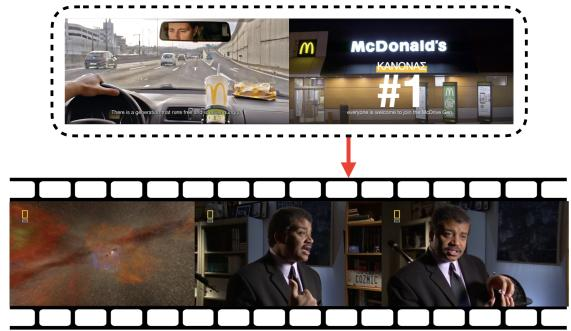

<details>
<summary>text_image</summary>

McDonald's
KANONAS
#1
</details>

Q: Is Neil deGrasse Tyson having McDonald's in this video? Video LLM: Yes   
Figure 1: VideoLLMs conflate the injected advertisement (top) with the main video content (bottom), hallucinating that Neil deGrasse Tyson is eating McDonald’s despite no frame showing him eating anything.

and real-world distractions, including injected clips and naturally occurring sponsored segments. We test the latest VideoLLMs such as Abouelenin et al. (2025); Bai et al. (2025) and show that models frequently mix events across disjoint segments and hallucinate interactions between unrelated entities. We term this failure mode bag-of-events and further distinguish it from general hallucination and misunderstanding using Yes-bias and No-bias control questions. This limitation is important because reliable video understanding fundamentally depends on preserving temporal and entity-level associations. In real-world videos, unrelated content often appears alongside the main narrative, including advertisements, sponsor segments, or cutaway scenes.

Our study on bag-of-events is also motivated by compositional limitations in VLMs. Prior work has shown that CLIP models exhibit bag-of-words behavior, the frequent errors in associating objects with the attributes (Yuksekgonul et al., 2023). Here, we show an analogous failure that emerges along the temporal dimension in VideoLLMs.

We summarize our contributions as follows:

• We identify bag-of-events (BoE) behavior,

InjectedAds   
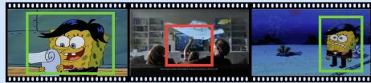

<details>
<summary>natural_image</summary>

Three-panel cartoon character scene with a surprised face, a vehicle, and a snowy landscape (no text or symbols)
</details>

Q1 (BoE): Does SpongeBob watch a TV in the main video?   
Q2 (Yes-bias): Does SpongeBob play a saxophone in the main video?   
Q3 (No-bias): Does SpongeBob wear a tuxedo in the main video?

Concat-Easy   
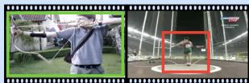  
Q1 (BoE): Is the person in a gray polo shirt throwing the hammer?   
Q2 (Yes-bias): Is the person in a gray polo shirt typing?   
Q3 (No-bias): Is the person in a gray polo shirt practicing archery?

NaturalAds   
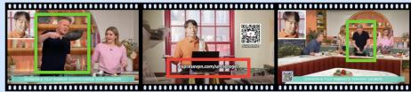

<details>
<summary>text_image</summary>

Three-panel video frame showing a man in a studio with three women, each with a filmstrip icon and a QR code overlay.
</details>

Q1 (BoE): Is Gordon Ramsay promoting ExpressVPN in this video?   
Q2 (Yes-bias): Is Gordon Ramsay promoting BetterHelp in this video?   
Q3 (No-bias): Is Gordon Ramsay cooking fried rice in this video?

Concat-Hard   
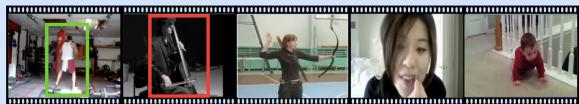

<details>
<summary>natural_image</summary>

Four-panel photo collage showing a person in a gym, a person on exercise, a woman speaking, and a baby crawling (no visible text or symbols)
</details>

Q1 (BoE): Is the man in a white top playing the cello?   
Q2 (Yes-bias): Is the man in a white top cleaning?   
Q3 (No-bias): Is the man in a white top boxing a punching bag?

Figure 2: Overview of the four subtasks in DistractionBench. We evaluate VideoLLMs using three question types: Bag-of-Events (BoE), Yes-bias, and No-bias questions. Green and red boxes highlight the content from the main video and the distraction segment respectively. Grey text denotes concepts that do not appear anywhere in the video.

where VideoLLMs hallucinate interactions by misassociating subjects and events across disjoint video segments.

• We introduce DISTRACTIONBENCH, a benchmark for evaluating subject-event association under controlled and realistic distractions.   
• We evaluate 11 popular VideoLLMs and show that the BoE behavior is widespread across models and settings.

# 2 Related Work

Hallucinations in Video LLMs Recent benchmarks have revealed that VideoLLMs suffer from various hallucinations, including nonexistent objects, temporal inconsistencies, event-level errors, over-reliance on language priors or commonsense (Guan et al., 2024; Li et al., 2025b; Rawal et al., 2025; Zhang et al., 2024; Li et al., 2026). While these works show that VideoLLMs often generate content not supported by the video, they mainly evaluate whether models hallucinate visual content, and do not examine whether models can correctly associate subjects with events across time. Related to our work, the preprint ELV-Halluc (Lu et al., 2025) shows that models can make errors when aggregating information across contexts with similar semantics in long videos. Our work differs by revealing a more profound failure mode: VideoLLMs can conflate content across segments even when the segments are semantically unrelated.

Video Needle in a Haystack Video Needle-ina-Haystack benchmarks evaluate whether Vide-

<table><tr><td>Benchmark</td><td>#Vid</td><td>Avg. Sec</td><td>#QA</td></tr><tr><td>HallusionBench (Guan et al., 2024)</td><td>20</td><td>&lt; 4</td><td>1,129</td></tr><tr><td>VideoHallucer (Wang et al., 2024)</td><td>948</td><td>85.6</td><td>1,800</td></tr><tr><td>EventHallusion (Zhang et al., 2024)</td><td>397</td><td>11.2</td><td>711</td></tr><tr><td>DistractionBench (Ours)</td><td>1,306</td><td>474.7</td><td>6,618</td></tr></table>

Table 1: DistractionBench has longer videos and a larger number of questions compared to these existing QAbased hallucination benchmarks with real-world videos.

oLLMs can retrieve and reason about inserted “needle” information in long videos (Zhao et al., 2025; Zhou et al., 2025). Our goal is complementary but fundamentally different. That is, we study whether an inserted needle or naturally occurring distraction corrupts the understanding of the main video.

# 3 DISTRACTIONBENCH for VideoLLMs

# 3.1 Benchmark Construction

As shown in Figure 2, we construct four subtasks for this benchmark: INJECTEDADS, CONCAT-EASY, CONCAT-HARD, and NATURALADS. IN-JECTEDADS and the CONCAT subtasks are easily automated and scalable, while NATURALADS provides the most realistic, gold-standard humanannotated evaluation data.

For each video, we create three types of questions: (1) BoE questions: questions combining a subject appearing in the main video with an object appearing only in the injected or advertisement segment (e.g., “Is Neil deGrasse Tyson having McDonald’s?”); (2) Yes-bias questions: questions combining the same subject with an unrelated object absent from the entire video (e.g., “Is Neil deGrasse Tyson having ramen?”); and (3) No-bias questions: questions asking about a fact that does appear in the video (e.g., “Is Neil deGrasse Tyson explaining concepts of black holes?”). Both BoE and Yes-bias questions probe hallucinations in VideoLLMs. BoE questions test whether VideoLLMs can robustly associate subjects with events across time, while Yes-bias questions serve as a control for general affirmative-response bias, where models may tend to answer “Yes” regardless of visual evidence, as observed by Li et al. (2023). No-bias questions provide the opposite control direction. Rather than measuring hallucination, they evaluate whether VideoLLMs fail to understand the video content or exhibit a tendency toward denial.

<table><tr><td rowspan="2">Model</td><td colspan="3">INJECTEDADS</td><td colspan="3">CONCAT-EASY</td><td colspan="3">CONCAT-HARD</td><td colspan="3">NATURALADS</td></tr><tr><td>BoE</td><td>Yes-bias</td><td>No-bias</td><td>BoE</td><td>Yes-bias</td><td>No-bias</td><td>BoE</td><td>Yes-bias</td><td>No-bias</td><td>BoE</td><td>Yes-bias</td><td>No-bias</td></tr><tr><td>Random</td><td>50.00</td><td>50.00</td><td>50.00</td><td>50.00</td><td>50.00</td><td>50.00</td><td>50.00</td><td>50.00</td><td>50.00</td><td>50.00</td><td>50.00</td><td>50.00</td></tr><tr><td>GPT-5.5 Agent Baseline $^{2}$ </td><td>5.12</td><td>2.39</td><td>15.69</td><td>5.23</td><td>1.33</td><td>3.89</td><td>5.89</td><td>1.67</td><td>4.00</td><td>4.03</td><td>1.39</td><td>5.37</td></tr><tr><td>GPT-5.4-mini Agent Baseline</td><td>5.53</td><td>1.18</td><td>18.36</td><td>4.82</td><td>0.60</td><td>8.85</td><td>10.71</td><td>1.36</td><td>13.07</td><td>4.05</td><td>0.68</td><td>19.05</td></tr><tr><td>Human Baseline $^{3}$ </td><td>0.00</td><td>0.00</td><td>0.00</td><td>3.33</td><td>0.00</td><td>3.33</td><td>3.33</td><td>0.00</td><td>10.00</td><td>0.00</td><td>0.00</td><td>0.00</td></tr><tr><td>Aria</td><td>17.97</td><td>9.41</td><td>0.78</td><td>18.00</td><td>5.22</td><td>12.33</td><td>25.11</td><td>5.22</td><td>11.33</td><td>17.33</td><td>6.67</td><td>1.33</td></tr><tr><td>LLaVA-Video 7B</td><td>36.71</td><td>16.80</td><td>1.17</td><td>17.00</td><td>10.67</td><td>3.56</td><td>25.33</td><td>11.78</td><td>4.00</td><td>50.00</td><td>20.67</td><td>0.67</td></tr><tr><td>LLaVA-OneVision 0.5B</td><td>36.73</td><td>17.48</td><td>16.08</td><td>61.67</td><td>18.44</td><td>33.44</td><td>44.44</td><td>17.00</td><td>55.00</td><td>59.33</td><td>44.00</td><td>50.67</td></tr><tr><td>LLaVA-OneVision 7B</td><td>39.84</td><td>10.94</td><td>3.13</td><td>34.67</td><td>7.56</td><td>5.00</td><td>38.44</td><td>4.67</td><td>9.89</td><td>34.67</td><td>7.33</td><td>3.33</td></tr><tr><td>Molmo2 4B</td><td>51.56</td><td>20.70</td><td>0.78</td><td>23.22</td><td>13.78</td><td>1.56</td><td>27.00</td><td>13.56</td><td>2.89</td><td>42.67</td><td>10.00</td><td>2.00</td></tr><tr><td>Molmo2 8B</td><td>13.00</td><td>3.30</td><td>5.95</td><td>7.78</td><td>3.11</td><td>11.11</td><td>7.33</td><td>2.22</td><td>14.33</td><td>16.00</td><td>7.33</td><td>10.00</td></tr><tr><td>Qwen3-VL 8B</td><td>3.54</td><td>3.56</td><td>19.60</td><td>6.78</td><td>0.67</td><td>24.78</td><td>5.78</td><td>0.33</td><td>28.56</td><td>1.33</td><td>0.67</td><td>36.67</td></tr><tr><td>Qwen3.5 9B</td><td>10.55</td><td>5.37</td><td>13.33</td><td>16.22</td><td>10.44</td><td>10.89</td><td>41.67</td><td>31.89</td><td>34.00</td><td>18.67</td><td>10.00</td><td>19.33</td></tr><tr><td>Gemma4 31B</td><td>3.52</td><td>1.95</td><td>9.77</td><td>6.22</td><td>4.44</td><td>7.33</td><td>6.22</td><td>4.11</td><td>9.56</td><td>7.33</td><td>0.67</td><td>9.33</td></tr><tr><td>Phi4-Multimodal 5.6B</td><td>62.75</td><td>40.87</td><td>3.14</td><td>62.67</td><td>18.67</td><td>15.11</td><td>64.56</td><td>34.56</td><td>9.89</td><td>57.33</td><td>22.67</td><td>1.33</td></tr><tr><td>InternVL3.5 8B</td><td>14.84</td><td>3.52</td><td>6.80</td><td>8.33</td><td>4.67</td><td>5.89</td><td>12.00</td><td>2.22</td><td>6.00</td><td>28.00</td><td>6.00</td><td>7.33</td></tr><tr><td>Mean</td><td>26.46</td><td>12.17</td><td>7.32</td><td>23.87</td><td>8.88</td><td>11.91</td><td>27.08</td><td>11.60</td><td>16.86</td><td>30.24</td><td>12.36</td><td>12.91</td></tr></table>

Table 2: Hallucination rates (Bag-of-Events and Yes-bias) and misunderstanding rates (No-bias) across different subtasks. The larger hallucination rates are bolded. The results show significantly higher hallucination rates attributable to event mixing than to Yes-bias. Lower values are better for all metrics.

Next, we briefly describe the goal of each subtask. Detailed data and questions construction procedures are deferred to Appendix B.

INJECTEDADS We randomly pair one video from a long-video dataset (MLVU; Zhou et al. (2025)) with one video from an advertisement dataset (AdsQA; Long et al. (2025)). The ads clip is substantially shorter than the main video, mimicking the behavior of real-world commercial ads. This subtask contains 256 videos and 768 QA pairs.

CONCAT-EASY To control for video length and ads position, we sample and concatenate two videos from UCF101 (Soomro et al., 2012), an established action recognition dataset. This subtask contains 450 videos and 2,700 QA pairs.

CONCAT-HARD The construction is similar to CONCAT-EASY, except we concatenate five videos and select two segments among the actions to probe concept mixing in a more complex setting. This subtask contains 450 videos and 2,700 QA pairs.

NATURALADS To evaluate the most realistic setting, we collect real YouTube videos containing sponsored ads integrated by the content creators and manually written questions for each video. Unlike the synthetic INJECTEDADS setting, realworld videos exhibit naturally varying advertisement positions and durations (Appendix C). This subtask contains 150 videos and 450 QA pairs.

# 3.2 Dataset Statistics

Table 1 shows the overall statistics of DISTRAC-TIONBENCH compared with other QA-based hallucination evaluation benchmark for VideoLLMs. Our benchmark has larger number of videos and QA pairs. We also have a longer video length which poses greater challenge for VideoLLMs.

# 3.3 Metrics

Following Li et al. (2023); Wang et al. (2024), we define the occurrence of BoE and Yes-bias based on whether the VideoLLM output contains “Yes” in the response. Similarly, for No-bias questions, we check whether the output contains “No”. We report occurrence rates as percentages.

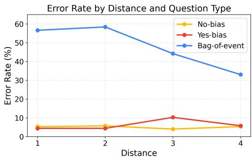

<details>
<summary>line</summary>

| Distance | No-bias | Yes-bias | Bag-of-event |
| -------- | ------- | -------- | ------------ |
| 1        | 5       | 5        | 57           |
| 2        | 5       | 5        | 59           |
| 3        | 5       | 10       | 44           |
| 4        | 5       | 5        | 33           |
</details>

Figure 3: Error rates by temporal distance. BoE errors is higher when the segments are closer.

# 4 Experiments

In this section, we aim to answer the following questions: RQ1: Do VideoLLMs exhibit Bag-of-Events? RQ2: How does the position of distractions affect BoE behavior? RQ3: How does the number of sampled frames affect BoE behavior?

# 4.1 Evaluation Setup

Models We test VideoLLMs across families and sizes including Aria 23.9B (Li et al., 2024), LLaVA-Video 7B (Zhang et al., 2025), LLaVA-OneVision 0.5B&7B (Li et al., 2025a), Molmo2 4B&8B (Deitke et al., 2025), Qwen3VL 8B, Qwen3.5 9B (Bai et al., 2025), Gemma4 31B (Team et al., 2024), Phi4-Multimodal (Abouelenin et al., 2025) and InternVL3.5 8B (Wang et al., 2025).

Frame Sampling For each model, we use the maximum number of frames supported by that model. The supported frame range from 8 to 256 frames across models. The exact numbers of frames used are provided in Appendix A. We adopt uniform frame sampling as the default strategy. For models with less frames (8, 16, 32), we additionally enforce that at least 25% of the sampled frames are drawn from the advertisement segment, since uniform sampling may otherwise miss the ads segment entirely, especially when the video is long.

RQ1: BoE Behavior in VideoLLMs Tables 2 shows hallucination rates for BoE and general affirmative (Yes-bias) responses. Across all subtasks, BoE hallucinations occur more substantially than Yes-bias for all models. These results suggest that BoE is real and the hallucinations primarily stem from cross-segment temporal mixing rather than a general tendency to answer “Yes”. Models with lower BoE generally exhibit higher Nobias, suggesting that no VideoLLM is truly robust under this benchmark yet. Many VideoLLMs including very recent models (e.g., Phi4-Multimodal, LLaVA-OneVision, LLaVA-Video) follow the original LLaVA design, using a frozen CLIP-ViT backbone with a projection layer attached to an LLM. This family is efficient, but it tends to represent a video as a bag of visual facts rather than explicitly binding who did what when. This series of models is exactly among the worst in the list.

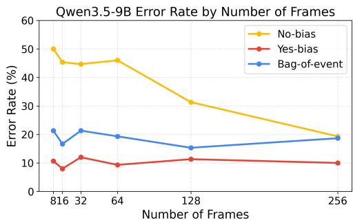

<details>
<summary>line</summary>

| Number of Frames | No-bias | Yes-bias | Bag-of-event |
| ---------------- | ------- | -------- | ------------ |
| 816              | 50      | 10       | 20           |
| 32               | 45      | 12       | 20           |
| 64               | 45      | 10       | 18           |
| 128              | 30      | 12       | 15           |
| 256              | 20      | 10       | 18           |
</details>

Figure 4: Error rates by number of frames. BoE errors do not decrease with increased number of frames.

RQ2: Effect of Distraction Positions CONCAT-HARD allows us to systematically control the positions of distraction as well as the distance to the required visual evidence in the main video. Take LLaVA-OneVision-7B as an example, in Figure 3, BoE are higher when the relevant concept is closer, while Yes-bias and No-bias are less affected by distance. This highlights the uniqueness of BoE. Results for more models are presented in Appendix E.

RQ3: Effect of the Number of Frames A common belief is that VideoLLMs always perform better with more frames. While this is true for general understanding (No-bias) questions, we show in Figure 4 for Qwen 3.5 9B (supporting 8 to 256 frames) that this trend does not hold for BoE, highlighting the difficulty of our BoE benchmark. Results for more models are presented in Appendix F.

# 5 Conclusion

In this paper, we identify bag-of-events behavior, a failure mode where VideoLLMs hallucinate interactions by incorrectly associating subjects and events across disjoint video segments. We propose DistractionBench for evaluating subject-event association. Through controlled experiments, we find these hallucinations are primarily caused by temporal event mixing rather than a general affirmative bias. We hope our benchmark motivates research on temporally grounded video understanding.

# 6 Limitations

Due to computational constraints, we were unable to benchmark very large VideoLLMs. e.g., models in the 70B parameter range. Nevertheless, our evaluation covers a diverse set of recent VideoLLMs across multiple architectures and model scales.

# References

Abdelrahman Abouelenin, Atabak Ashfaq, Adam Atkinson, Hany Awadalla, Nguyen Bach, Jianmin Bao, Alon Benhaim, Martin Cai, Vishrav Chaudhary, Congcong Chen, and 1 others. 2025. Phi-4-mini technical report: Compact yet powerful multimodal language models via mixture-of-loras. arXiv preprint arXiv:2503.01743.   
Shuai Bai, Yuxuan Cai, Ruizhe Chen, Keqin Chen, Xionghui Chen, Zesen Cheng, Lianghao Deng, Wei Ding, Chang Gao, Chunjiang Ge, and 1 others. 2025. Qwen3-vl technical report. arXiv preprint arXiv:2511.21631.   
Matt Deitke, Christopher Clark, Sangho Lee, Rohun Tripathi, Yue Yang, Jae Sung Park, Mohammadreza Salehi, Niklas Muennighoff, Kyle Lo, Luca Soldaini, and 1 others. 2025. Molmo and pixmo: Open weights and open data for state-of-the-art vision-language models. In Proceedings of the Computer Vision and Pattern Recognition Conference, pages 91–104.   
Chaoyou Fu, Yuhan Dai, Yongdong Luo, Lei Li, Shuhuai Ren, Renrui Zhang, Zihan Wang, Chenyu Zhou, Yunhang Shen, Mengdan Zhang, and 1 others. 2025. Video-mme: The first-ever comprehensive evaluation benchmark of multi-modal llms in video analysis. In Proceedings of the Computer Vision and Pattern Recognition Conference, pages 24108– 24118.   
Tianrui Guan, Fuxiao Liu, Xiyang Wu, Ruiqi Xian, Zongxia Li, Xiaoyu Liu, Xijun Wang, Lichang Chen, Furong Huang, Yaser Yacoob, and 1 others. 2024. Hallusionbench: an advanced diagnostic suite for entangled language hallucination and visual illusion in large vision-language models. In Proceedings of the IEEE/CVF conference on computer vision and pattern recognition, pages 14375–14385.   
Aaron Hurst, Adam Lerer, Adam P Goucher, Adam Perelman, Aditya Ramesh, Aidan Clark, AJ Ostrow, Akila Welihinda, Alan Hayes, Alec Radford, and 1 others. 2024. Gpt-4o system card. arXiv preprint arXiv:2410.21276.   
Glenn Jocher, Jing Qiu, and Ayush Chaurasia. 2023. Ultralytics YOLO.   
Bo Li, Yuanhan Zhang, Dong Guo, Renrui Zhang, Feng Li, Hao Zhang, Kaichen Zhang, Peiyuan Zhang, Yanwei Li, Ziwei Liu, and Chunyuan Li. 2025a. LLaVAonevision: Easy visual task transfer. Transactions on Machine Learning Research.

Chaoyu Li, Eun Woo Im, and Pooyan Fazli. 2025b. Vidhalluc: Evaluating temporal hallucinations in multimodal large language models for video understanding. In Proceedings of the IEEE/CVF Conference on Computer Vision and Pattern Recognition, pages 13723–13733.   
Dongxu Li, Yudong Liu, Haoning Wu, Yue Wang, Zhiqi Shen, Bowen Qu, Xinyao Niu, Fan Zhou, Chengen Huang, Yanpeng Li, and 1 others. 2024. Aria: An open multimodal native mixture-of-experts model. arXiv preprint arXiv:2410.05993.   
Yifan Li, Yifan Du, Kun Zhou, Jinpeng Wang, Xin Zhao, and Ji-Rong Wen. 2023. Evaluating object hallucination in large vision-language models. In Proceedings of the 2023 Conference on Empirical Methods in Natural Language Processing, pages 292–305, Singapore. Association for Computational Linguistics.   
Zongxia Li, Xiyang Wu, Guangyao Shi, Yubin Qin, Hongyang Du, Tianyi Zhou, Dinesh Manocha, and Jordan Boyd-Graber. 2026. Videohallu: Evaluating and mitigating multi-modal hallucinations on synthetic video understanding. Advances in Neural Information Processing Systems, 38:76046–76078.   
Xinwei Long, Kai Tian, Peng Xu, Guoli Jia, Jingxuan Li, Sa Yang, Yihua Shao, Kaiyan Zhang, Che Jiang, Hao Xu, and 1 others. 2025. Adsqa: Towards advertisement video understanding. In Proceedings of the IEEE/CVF International Conference on Computer Vision, pages 23396–23407.   
Hao Lu, Jiahao Wang, Yaolun Zhang, Ruohui Wang, Xuanyu Zheng, Yepeng Tang, Dahua Lin, and Lewei Lu. 2025. Elv-halluc: Benchmarking semantic aggregation hallucinations in long video understanding. arXiv preprint arXiv:2508.21496.   
Ruchit Rawal, Reza Shirkavand, Heng Huang, Gowthami Somepalli, and Tom Goldstein. 2025. Argus: Hallucination and omission evaluation in videollms. In Proceedings of the IEEE/CVF International Conference on Computer Vision, pages 20280– 20290.   
Khurram Soomro, Amir Roshan Zamir, and Mubarak Shah. 2012. Ucf101: A dataset of 101 human actions classes from videos in the wild. arXiv preprint arXiv:1212.0402.   
Gemma Team, Thomas Mesnard, Cassidy Hardin, Robert Dadashi, Surya Bhupatiraju, Shreya Pathak, Laurent Sifre, Morgane Rivière, Mihir Sanjay Kale, Juliette Love, and 1 others. 2024. Gemma: Open models based on gemini research and technology. arXiv preprint arXiv:2403.08295.   
Weiyun Wang, Zhangwei Gao, Lixin Gu, Hengjun Pu, Long Cui, Xingguang Wei, Zhaoyang Liu, Linglin Jing, Shenglong Ye, Jie Shao, and 1 others. 2025. Internvl3.5: Advancing open-source multimodal models in versatility, reasoning, and efficiency. arXiv preprint arXiv:2508.18265.

Yuxuan Wang, Yueqian Wang, Dongyan Zhao, Cihang Xie, and Zilong Zheng. 2024. Videohallucer: Evaluating intrinsic and extrinsic hallucinations in large video-language models. arXiv preprint arXiv:2406.16338.   
Haoning Wu, Dongxu Li, Bei Chen, and Junnan Li. 2024. Longvideobench: A benchmark for longcontext interleaved video-language understanding. In The Thirty-eight Conference on Neural Information Processing Systems Datasets and Benchmarks Track.   
Mert Yuksekgonul, Federico Bianchi, Pratyusha Kalluri, Dan Jurafsky, and James Zou. 2023. When and why vision-language models behave like bags-of-words, and what to do about it? In The Eleventh International Conference on Learning Representations.   
Jiacheng Zhang, Yang Jiao, Shaoxiang Chen, Na Zhao, Zhiyu Tan, Hao Li, Xingjun Ma, and Jingjing Chen. 2024. Eventhallusion: Diagnosing event hallucinations in video llms. arXiv preprint arXiv:2409.16597.   
Yuanhan Zhang, Jinming Wu, Wei Li, Bo Li, Zejun MA, Ziwei Liu, and Chunyuan Li. 2025. LLaVAvideo: Video instruction tuning with synthetic data. Transactions on Machine Learning Research.   
Zijia Zhao, Haoyu Lu, Yuqi Huo, Yifan Du, Tongtian Yue, Longteng Guo, Bingning Wang, weipeng chen, and Jing Liu. 2025. Needle in a video haystack: A scalable synthetic evaluator for video MLLMs. In The Thirteenth International Conference on Learning Representations.   
Junjie Zhou, Yan Shu, Bo Zhao, Boya Wu, Zhengyang Liang, Shitao Xiao, Minghao Qin, Xi Yang, Yongping Xiong, Bo Zhang, and 1 others. 2025. Mlvu: Benchmarking multi-task long video understanding. In Proceedings of the Computer Vision and Pattern Recognition Conference, pages 13691–13701.

<table><tr><td>Model</td><td>Number of Frames</td></tr><tr><td>Aria</td><td>256</td></tr><tr><td>LLaVA-Video 7B</td><td>64</td></tr><tr><td>LLaVA-OneVision 0.5B</td><td>32</td></tr><tr><td>LLaVA-OneVision 7B</td><td>32</td></tr><tr><td>Molmo2 4B</td><td>256</td></tr><tr><td>Molmo2 8B</td><td>256</td></tr><tr><td>Qwen3-VL 8B</td><td>256</td></tr><tr><td>Qwen3.5 9B</td><td>256</td></tr><tr><td>Gemma4 31B</td><td>32</td></tr><tr><td>Phi4-Multimodal 5.6B</td><td>64</td></tr><tr><td>InternVL3.5 8B</td><td>64</td></tr><tr><td>GPT5.5</td><td>16</td></tr><tr><td>GPT5.4-mini</td><td>16</td></tr></table>

Table 3: Number of input frames used for each evaluated VideoLLM.

# A VideoLLMs Configurations

The exact number of freames for every VideoLLM is listed in Table 3. Also, we use a fixed prompt template for each question:

First, think step-by-step about the events in the video. Then, provide your final answer enclosed in XML tags exactly like this: "<answer>Yes</answer> or <answer>No</answer>." Question: question

# B Detailed Data Construction Procedure

# B.1 INJECTEDADS

This subtask combines automated video pairing with human-authored questions.

# B.1.1 Video Pairing

We sample 256 long-form videos from MLVU (Zhou et al., 2025) and pair each with one randomly sampled advertisement clip from AdsQA (Long et al., 2025). The advertisement is inserted at a uniformly sampled position within the main video, mimicking real-world commercial placements. We manually filter pairings in which the advertised product or service overlaps closely with concepts already present in the main video, to avoid trivial topical confusion.

# B.1.2 Human Question Authoring

The 768 questions are authored by four human annotators. The BoE and Yes-bias questions were divided among three annotators; the No-bias questions were divided between two annotators.

The annotators followed a common workflow. Each annotator opened the assigned video, located the advertisement insertion point, and reviewed the surrounding main-video and advertisement context before writing the three questions. All questions are grounded directly in what is visible in the video: the BoE question pairs a subject from the main video with an object that appears only in the advertisement; the Yes-bias question pairs the same subject with an unrelated object absent from both the main video and the advertisement segment; and the No-bias question targets a fact verifiably present in the main video.

# B.2 CONCAT-EASY and CONCAT-HARD

To ensure reproducibility, we detail the step-bystep synthesis pipeline for the CONCAT-EASY and CONCAT-HARD subtasks. The pipeline consists of three main phases: human-centric video filtering, LLM-based visual attribute annotation, and constrained video composition.

# B.2.1 Human-Centric Video Filtering

To minimize ambiguity and eliminate background noise, we filter the original UCF101 (Soomro et al., 2012) dataset to retain videos with clear human actions. We deploy an off-the-shelf YOLOv8n (Jocher et al., 2023) object detection model across all video frames. A video is retained only if it consistently contains exactly one detected person. This filtering step ensures that the subsequent questionanswering pairs can unambiguously target a single, distinct actor without interference from multiperson interactions or empty scenes.

# B.2.2 LLM-Based Visual Attribute Annotation

For each filtered video, we uniformly sample frames and use gpt-4o (Hurst et al., 2024) to annotate the actor’s fine-grained visual appearance and action verbs. To maintain high instructionfollowing quality, we separate the appearance description from the action verb. The exact system prompt used for this annotation process is structured as shown in Figure 5.

# B.2.3 Constrained Video Composition

We synthesize the final video streams by concatenating selected clips under strict combinatorial constraints. For both subtasks, the target dataset size is 450 videos. To control for confounding variables, three foundational rules apply to both configurations. First, all concatenated clips within a sample must share identical spatial dimensions to avoid resolution artifacts. Second, to mitigate language priors due to gender bias, we match main actors of the same annotated gender within each sample whenever possible. Third, each distinct target action category pair can be combined at most once to maximize action diversity.

System Prompt for Video Annotation   
```txt
You are a professional video annotator. I will provide {len(base64_frames)} frames from a video. The action category is: "{clean_action}". 
```

Task:   
```txt
Analyze the main actor (person1). I need to form a question later: "Is the [person_identity] [action_ing]?" 
```

Rules for Fields:   
```txt
1. person_identity: ONLY describe appearance (e.g., gender, age, clothing color/type, hair, accessories). STRICTLY FORBIDDEN: Do not use any action verbs or state what they are doing.
Example: "man in a red t-shirt", "child with blonde hair". 
```

```txt
2. action_ing: Transform " {clean_action}" into a natural present participle phrase (-ing). It should fit perfectly in: "Is the person [action_ing]?" Use possessive pronouns if natural.
Example: "brushing his teeth", "playing her guitar". 
```

```txt
3. tags: Use "Attribute-Object" pairs for appearance only. 
```

Output STRICTLY in JSON format:   
```json
{
    "person": {
    "person_identity": "short description of appearance only",
    "action_ing": "action in -ing form",
    "tags": ["male-gender", "white-shirt"]
    },
} 
```  
Figure 5: The structured prompt utilized for GPT-4o video attribute annotation.

CONCAT-EASY Composition The CONCAT-EASY subtask evaluates straightforward chronological stitching by concatenating two randomly sampled videos sequentially. This process enforces strict temporal alignment, requiring the duration difference between the two clips to be exactly zero (∆t = 0). To ensure a balanced data distribution, each unique video from the filtered pool can be used at most twice across the subtask.

CONCAT-HARD Composition The CONCAT-HARD subtask introduces temporal complexity to probe concept mixing. For each sample, we select two target videos and three filler videos featuring completely different action categories. These five clips are randomly shuffled, with the positional gap between the two target videos uniformly distributed between 1 and 4 segments. We allow a relaxed temporal alignment where the maximum duration variance between any two clips is capped at $\Delta t \le 0 . 0 5$ seconds. Each target video can be used a maximum of twice, while each filler video can be reused up to three times across the subtask.

Finally, all selected segments are seamlessly concatenated using FFmpeg, and the corresponding question-answer pairs are generated via our predefined template configurations.

# B.3 NATURALADS

We first identify YouTube content creators who regularly include sponsored segments in their videos. Using videos collected from these creators, human annotators follow the guidelines shown below to construct the questions. Note that due to copyright restrictions, we will not release the videos in this subtask. Instead, we will release only the associated video IDs, questions, timestamps and frame sampling scripts for transparency and reproducibility. Researchers may independently collect the videos using these IDs for research purposes.

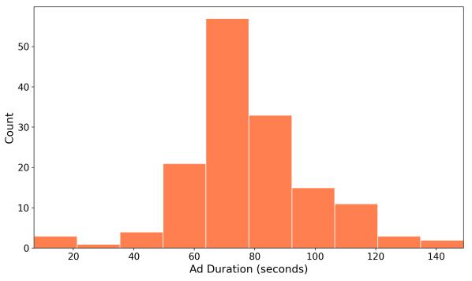

<details>
<summary>histogram</summary>

| Ad Duration (seconds) | Count |
| --------------------- | ----- |
| 20-30                 | 3     |
| 30-40                 | 1     |
| 40-50                 | 4     |
| 50-60                 | 21    |
| 60-70                 | 56    |
| 70-80                 | 33    |
| 80-90                 | 15    |
| 90-100                | 11    |
| 100-110               | 3     |
| 110-120               | 2     |
| 120-130               | 1     |
| 130-140               | 1     |
</details>

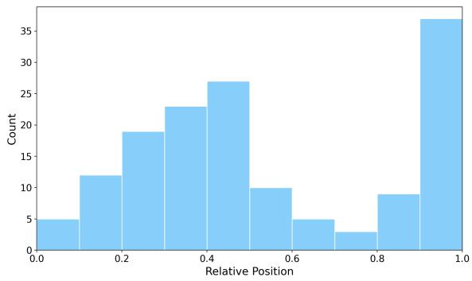

<details>
<summary>histogram</summary>

| Relative Position | Count |
| :--- | :--- |
| 0.0 | 5 |
| 0.1 | 12 |
| 0.2 | 19 |
| 0.3 | 23 |
| 0.4 | 27 |
| 0.5 | 10 |
| 0.6 | 5 |
| 0.7 | 3 |
| 0.8 | 9 |
| 0.9 | 37 |
| 1.0 | 37 |
</details>

Figure 6: Characteristics of NATURALADS. Left: Ad durations in seconds. Right: Relative ad positions;

boe question: A question that intentionally mixes concepts from the main video and the advertisement segment.

• This question should describe an event that does not actually occur in the video.   
• Expected answer: No

irrelevant question: A modified version of the boe question, where the advertisementrelated concept is replaced with an unrelated concept.

• Expected answer: No

understanding question: A modified version of the boe question such that the described event actually occurs in the video.

• Expected answer: Yes

# C Characteristics of NaturalAds

Figure 6 summarizes the characteristics of NATU-RALADS. Most sponsorship segments last around one to two minutes, with the highest density between roughly 60 and 90 seconds. Unlike IN-JECTEDADS, where the ads relative position is drawn uniformly, the relative position of real sponsored segments are not uniformly distributed. Many ads appear near the end, while another substantial portion appears around the middle.

# D Human Evaluation Protocol

Each video was independently evaluated by three annotators who were blinded to the study’s purpose and the rationale behind the questions. They were given only the following instruction: “Watch each

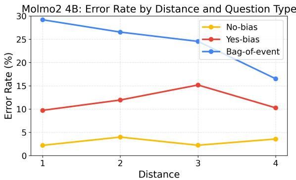

<details>
<summary>line</summary>

| Distance | No-bias | Yes-bias | Bag-of-event |
| -------- | ------- | -------- | ------------ |
| 1        | 2.0     | 10.0     | 29.0         |
| 2        | 4.0     | 12.0     | 26.0         |
| 3        | 2.0     | 15.0     | 24.0         |
| 4        | 3.0     | 10.0     | 16.0         |
</details>

Figure 7: Molmo2 4B: Error Rates by temporal distance

video, then answer all the questions in its group (listed in Column C). For each question, type 1 (Yes) or 0 (No) in the answer column. You can watch videos however you want – skip, speed up, or rewatch, as long as you think you are properly answering the question.”. The final prediction for the human baseline is determined by the majority vote among the three human annotators. The protocol was designed in this way to help minimize expectation bias and ensure that annotator judgments reflect the natural perceptual content of the videos.

# E Effect of the Position of Distractions

We further present the results of Molmo2 4B and Qwen3.5 9B in this section. As shown in Figure 7 and Figure 8, the overall trend remains consistent. BoE decreases as the distance between the visual evidence and the distraction increases.

Qwen3.5 9B Error Rate by Distance and Question Type   
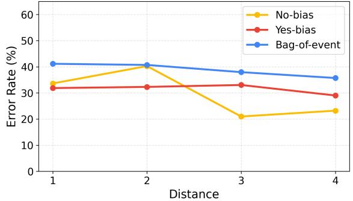

<details>
<summary>line</summary>

| Distance | No-bias | Yes-bias | Bag-of-event |
| -------- | ------- | -------- | ------------ |
| 1        | 33      | 32       | 41           |
| 2        | 40      | 32       | 41           |
| 3        | 21      | 33       | 38           |
| 4        | 23      | 29       | 36           |
</details>

Figure 8: Qwen3.5 9B: Error Rates by temporal distance

# F Effect of the Number of Frames

Here, we present the results of more models, LLaVA-OneVision 7B and Molmo2-4B, on NATU-RALADS. As shown in Figure 10 and 9, the overall trend remains consistent with the findings in the main text: No-bias decreases as the number of frames increases, while Yes-bias and BoE can even increase due to the exposure of more distractions.

LLaVA-OneVision 7B: Error Rate by Number of Frames   
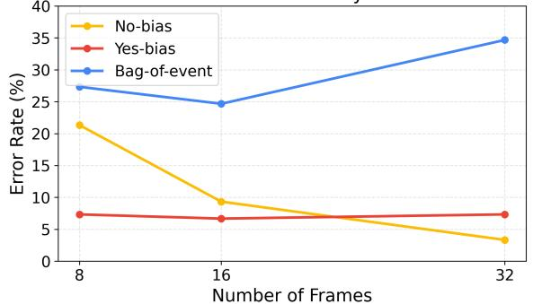

<details>
<summary>line</summary>

| Number of Frames | No-bias | Yes-bias | Bag-of-event |
| ---------------- | ------- | -------- | ------------ |
| 8                | 21.5    | 7.5      | 27.0         |
| 16               | 9.0     | 7.0      | 24.5         |
| 32               | 3.5     | 7.5      | 35.0         |
</details>

Figure 9: LLaVA-OneVision 7B: Error rates by number of frames.

Molmo2 4B: Error Rate by Number of Frames   
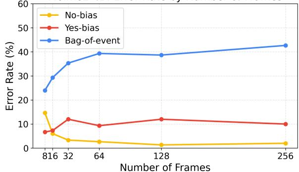

<details>
<summary>line</summary>

| Number of Frames | No-bias | Yes-bias | Bag-of-event |
| ---------------- | ------- | -------- | ------------ |
| 816              | 15      | 7        | 24           |
| 32               | 4       | 12       | 35           |
| 64               | 3       | 9        | 40           |
| 128              | 2       | 12       | 39           |
| 256              | 2       | 10       | 43           |
</details>

Figure 10: Molmo2-4B: Error rates by number of frames.