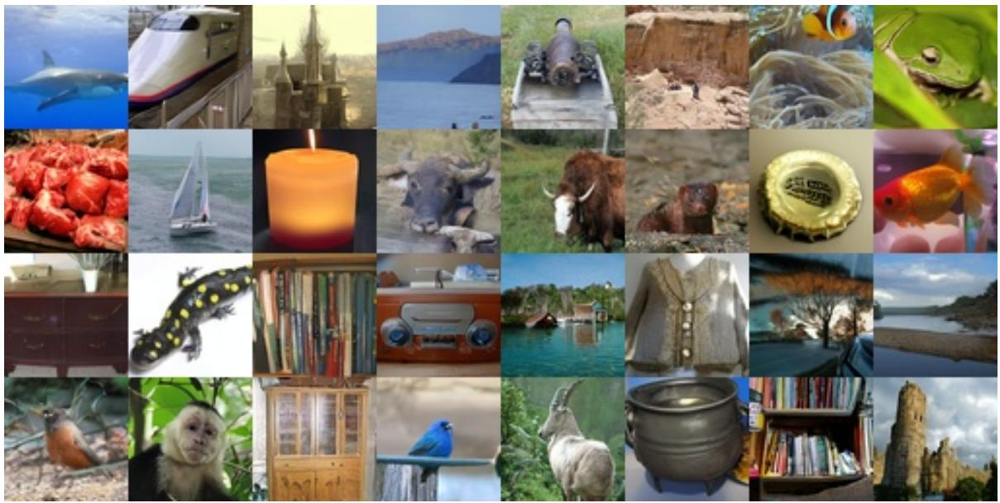
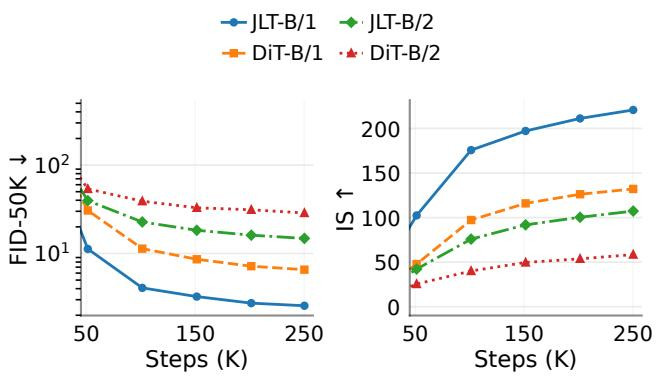

# JLT: Clean-Latent Prediction in Latent Diffusion Transformers

Funing Fu1,∗ Tenghui Wang2,∗ Junyong Cen1 Qichao Zhu3 Guanyu Zhou2

1Independent Researcher 2Wuhan University of Technology 3Hangzhou Jiyi Artificial Intelligence Co., Ltd.

chinoll@chinoll.org 371062@whut.edu.cn

natural_image

Grid of 25 diverse images including high-speed train, sunset, animals, books, and nature scenes (no text or symbols)

Figure 1: ImageNet 256 × 256 samples from JLT-B/1 using 50-step Heun sampling.

# Abstract

Flow matching with clean-data prediction has shown that regressing the clean point can exploit lowdimensional structure more effectively than predicting an ambient noised quantity. We ask whether this principle remains useful after images are mapped into a learned latent space, where compression has already removed much of the raw pixel variability. We instantiate this comparison with JLT, a controlled 130M latent diffusion Transformer over frozen FLUX.2 VAE codes, and compare clean-latent prediction with a matched velocity-prediction DiT under the same representation, backbone, and training settings. Although x, ϵ, and v are linearly convertible for a fixed corruption time, a local Gaussian analysis shows that velocity regression inherits an isotropic targetcovariance floor and amplifies low-variance latent directions, while clean prediction damps them. On ImageNet 256 × 256, JLT-B/1 obtains FID-50K 2.50 with classifier-free guidance, with a large matchedtarget gap over velocity prediction. These results suggest that prediction targets in latent diffusion are representation-dependent geometric choices, rather than interchangeable algebraic parameterizations.

# 1 Introduction

Denoising diffusion models are motivated by reversing a corruption process, yet many successful systems do not ask the neural network to directly reconstruct the clean sample. DDPM popularized ϵ-prediction [7]; progressive distillation and flow-based formulations made velocity regression a standard choice [21, 14, 15]; and EDM emphasized that prediction parameterization, loss weighting, preconditioning, and sampling should be disentangled as a design space [11]. Algebraically, these targets are closely related. Statistically, however, the direct output learned by a finite-capacity network can change the difficulty of the regression problem.

JiT [12] makes this distinction explicit in pixel space. It argues that clean images concentrate near a low-dimensional data manifold, whereas noise and velocity targets contain ambient, off-manifold components. Directly predicting clean data can therefore let a Transformer focus on structured variation rather than reconstructing full-dimensional noise. The question we study is complementary: if the model already operates in a compressed latent space [18], does the direct prediction target still matter?

The latent setting preserves this distinction. We compare clean-latent and velocity targets under a fixed FLUX.2 VAE representation, the same Base-scale Transformer configuration, and our 250K-step (200-epoch) training setting. We name latent models in VAE-grid units: the clean-latent variants are

JLT-B/1 and JLT-B/2, while the matched velocity variants are denoted DiT-B/1 and DiT-B/2; raw-pixel clean-prediction baselines remain JiT-B/16 and JiT-B/32. Under this notation, JLT-B/1 improves FID-50K from 6.56 to 2.56 over DiT-B/1, and JLT-B/2 improves it from 28.71 to 14.81 over DiT-B/2. Because the representation is shared within each pair, this separation is better viewed as a target-geometry effect than as a consequence of latent compression alone.

Our main contribution is a controlled latent target study rather than a new backbone. We instantiate the study with JLT, a Base-scale latent Transformer built to isolate the prediction target in a fixed FLUX.2 VAE latent space. The first core result is empirical: under the same representation, architecture scale, training setup, and evaluation protocol, clean-latent prediction consistently outperforms matched velocity prediction. The second core result is explanatory: a local Gaussian analysis shows that velocity prediction adds an isotropic covariance floor and amplifies low-variance latent directions, whereas clean prediction attenuates those directions. Additional algebraic conversions, proof details, implementation settings, and diagnostic suggestions are deferred to the appendix.

# 2 Related Work

Denoising objectives and prediction targets. The modern diffusion objective inherits the denoising viewpoint of earlier denoising autoencoders, where a model learns a structured signal from a corrupted observation [23, 24]. In generative diffusion, DDPM popularized predicting the Gaussian perturbation added during the forward process [7], and ADM showed that architectural and guidance choices can substantially improve ImageNet synthesis [3, 8]. Subsequent parameterizations changed the direct regression target: progressive distillation uses velocity parameterization to stabilize few-step students [21], while flow matching and rectified flow express generation as learning a transport vector field between noise and data [14, 15]. EDM further clarified that output parameterization, loss weighting, preconditioning, and sampler design are separable choices rather than one inseparable procedure [11].

Parameterization as geometry rather than notation. Although x, ϵ, and v can be mapped to each other algebraically, several recent analyses suggest that the target presented to the network matters under finite capacity and finite data. JiT argues from the manifold assumption that clean images occupy structured low-dimensional subsets of pixel space, whereas noise and velocity contain ambient components that are not supported by the data distribution [12]. Complementary theoretical studies relate target choice to intrinsic dimension, loss weighting, and training dynamics [10, 5]. Our work follows this geometric interpretation but shifts the question from raw pixels to a fixed VAE latent representation: once the space is held fixed, the remaining gap between clean prediction and velocity prediction must come from the induced target distribution.

Latent diffusion and Transformer backbones. Latent Diffusion Models reduce the cost of high-resolution synthesis by training the generative model in an autoencoder latent space and decoding only after sampling [18]. DiT replaces convolutional U-Nets with Vision-Transformer-style blocks over latent patches and shows that model complexity and token count correlate strongly with FID [4, 22, 17]. SiT then studies flow and diffusion variants on the same Transformer backbone, emphasizing controlled comparisons with fixed parameter count and GFLOPs [16]. Other Transformer-based iterative generators also explore adaptive computation and scalable token processing [9]. JLT adopts this controlled-comparison philosophy: the architecture and training scale are kept close to JiT-B, while the central ablation changes the direct target in FLUX.2 VAE latent space.

Representation geometry and alignment. A parallel line of work studies how the representation space itself affects generative learning. REPA aligns diffusion Transformer hidden states with external visual representations and shows large improvements in training efficiency [25]. RiT studies frozen DINOv2 features and argues that representation-space geometry can make x-prediction well conditioned even when intrinsic dimensionality is comparable to pixels [26]. These works vary or augment the representation. By contrast, our main experiment fixes the FLUX.2 VAE latent representation and compares yx = x with yv = x − ϵ inside that same space. This isolates a target-geometry effect that is orthogonal to tokenizer improvements, representation alignment, or larger backbones.

# 3 Method

# 3.1 Formulation and prediction targets

Let $x \in \mathbb { R } ^ { D }$ denote the clean latent produced by a fixed encoder, and let $\epsilon \sim \mathcal { N } ( 0 , I )$ denote Gaussian noise in the same coordinate system. We use the linear corruption path

$$
z _ {t} = t x + (1 - t) \epsilon , \quad t \in [ 0, 1 ]. \tag {1}
$$

The three common direct targets are

$$
y _ {x} = x, \quad y _ {\epsilon} = \epsilon , \quad y _ {v} = x - \epsilon . \tag {2}
$$

For fixed $t , x \mathrm { - } , \epsilon \mathrm { - } ,$ and v-parameterizations are algebraically equivalent: once a model predicts any one target, the other endpoint variables can be recovered by an affine readout from the predicted target and the known mixture $z _ { t }$ . This equivalence is often used to treat target choice as a notation change. However, the network is trained before this readout is applied, and the readout scales prediction errors differently across noise levels. Detailed conversion and error-scaling formulas are given in Appendix A.

The controlled comparison in this paper changes only the direct target. JLT follows the clean-prediction principle emphasized by JiT [12], but applies it to fixed FLUX.2 VAE latents rather than raw pixels; its direct supervision is the clean latent x. The matched DiT baseline receives the same corrupted latent $z _ { t }$ under the same training setting, but its direct supervision is $v = x - \epsilon .$ . The subsequent analysis asks whether this change of direct target reshapes the covariance and conditional ambiguity of the supervised signal.

# 3.2 Target-geometry analysis

This subsection gives the main analytical explanation for why target choice can remain important even after images are mapped into a fixed latent space. The derivation is local: it models the regression problem near a small region of the latent data distribution, rather than claiming a complete theory of generative modeling.

Assume a local linear-Gaussian approximation $\boldsymbol { x } \sim \mathcal { N } ( 0 , \Sigma )$ with independent noise $\epsilon \sim \mathcal { N } ( 0 , I )$ . Around a local data region, the covariance spectrum can be interpreted as separating high-variance tangent directions from low-variance directions weakly supported by the clean latent distribution. The marginal target covariances are

$$
\operatorname{Cov} \left(y _ {x}\right) = \Sigma , \quad \operatorname{Cov} \left(y _ {\epsilon}\right) = I, \quad \operatorname{Cov} \left(y _ {v}\right) = \Sigma + I. \tag {3}
$$

Thus velocity prediction adds the same isotropic unit floor to every clean-latent direction. If Σ is anisotropic, directions with little clean-data variation become unit-variance directions in $y _ { v }$ while clean prediction keeps their target variance small. This is the latent-space analogue of the manifold argument made by JiT in pixel space [12], but here the representation is held fixed.

The same local model also shows a conditional ambiguity gap. Let $\lambda _ { i }$ be an eigenvalue of $\Sigma ,$ , and consider one coordinate

$$
z _ {i} = t x _ {i} + (1 - t) \epsilon_ {i}, \quad x _ {i} \sim \mathcal {N} (0, \lambda_ {i}), \quad \epsilon_ {i} \sim \mathcal {N} (0, 1). \tag {4}
$$

With $D _ { i } = t ^ { 2 } \lambda _ { i } + ( 1 - t ) ^ { 2 }$ , the Bayes residual variances satisfy

$$
\operatorname{Var} (x _ {i} \mid z _ {i}) = \frac {\lambda_ {i} (1 - t) ^ {2}}{D _ {i}}, \quad \operatorname{Var} (v _ {i} \mid z _ {i}) = \frac {\lambda_ {i}}{D _ {i}}. \tag {5}
$$

Consequently,

$$
\operatorname{Var} (v _ {i} \mid z _ {i}) = \frac {1}{(1 - t) ^ {2}} \operatorname{Var} (x _ {i} \mid z _ {i}). \tag {6}
$$

The proof and the corresponding aggregate risk expression are given in Appendix B. The important point for the main paper is that the velocity target can have larger conditional ambiguity than the clean target even though both are affinely related after prediction.

A final view comes from the Bayes estimators:

$$
\mathbb {E} [ x _ {i} \mid z _ {i} ] = \frac {t \lambda_ {i}}{D _ {i}} z _ {i}, \quad \mathbb {E} [ v _ {i} \mid z _ {i} ] = \frac {t \lambda_ {i} - (1 - t)}{D _ {i}} z _ {i}.
$$

When $\lambda _ { i } \to 0$ , the clean-target coefficient tends to 0, while the velocity-target coefficient tends $\mathrm { t o } - 1 / ( 1 - t )$ . Clean prediction therefore attenuates low-variance directions, whereas velocity prediction can amplify them. This offers a concrete mechanism behind the empirical gap: the parameterizations are linearly convertible after prediction, but they induce different supervised regression problems before prediction.

Table 1: Matched latent target ablation on ImageNet $2 5 6 \times 2 5 6 .$ The upper block is the controlled target comparison; the lower block reports the selected final JLT-B/1 evaluation. 

<table><tr><td>Model</td><td>Target</td><td>Guidance</td><td>FID-50K ↓</td><td>IS ↑</td></tr><tr><td colspan="5">Matched ablation</td></tr><tr><td>JLT-B/1</td><td>x</td><td>w/ CFG</td><td>2.56</td><td>220.74</td></tr><tr><td>DiT-B/1</td><td>v</td><td>w/ CFG</td><td>6.56</td><td>132.12</td></tr><tr><td>JLT-B/2</td><td>x</td><td>w/ CFG</td><td>14.81</td><td>107.29</td></tr><tr><td>DiT-B/2</td><td>v</td><td>w/ CFG</td><td>28.71</td><td>58.46</td></tr><tr><td colspan="5">Final JLT-B/1</td></tr><tr><td>JLT-B/1</td><td>x</td><td>w/ CFG</td><td>2.50</td><td>232.51</td></tr><tr><td>JLT-B/1</td><td>x</td><td>w/o CFG</td><td>14.00</td><td>-</td></tr></table>

# 3.3 Architecture and training settings

JLT is a Base-scale latent Transformer. The configuration follows JiT-B/16 for architectural comparability, using 12 Transformer blocks, hidden dimension 768, 12 attention heads, a 128-dimensional bottleneck patch embedding, and the same time-sampling setting [12, 13]. The trainable model contains 130M parameters. The principal departure from JiT is the modeling space: instead of operating on raw image patches, JLT uses a fixed FLUX.2 VAE latent tokenizer [1]. We evaluate the /1 and /2 variants in the VAE latent grid, denoted JLT-B/1 and JLT-B/2 for clean-latent prediction, and train for 250K steps (200 epochs).

The optimization settings follow the JiT-B settings and are kept fixed across the matched target comparison. The main text reports the factors needed to interpret the controlled ablation; full optimizer and batch-size details are listed in Appendix C.

To keep the comparison centered on the prediction target, the implementation excludes two JiT components that could otherwise confound the ablation. Specifically, repeated in-context class-token concatenation is not used, and the auxiliary ImageNet classification loss explored in JiT is omitted. Class conditioning is otherwise standard. For sampling, we report unguided and classifier-free-guided results separately, and all matched rows use the same sampling settings within each guidance setting.

# 4 Experiments

# 4.1 Matched target ablation

We evaluate class-conditional ImageNet 256 × 256 generation using FID-50K and IS [2, 19, 6, 20]. Table 1 is the central ablation. The representation, Transformer scale, training settings, and evaluation settings are fixed; only the direct prediction target changes. Clean-latent prediction dominates velocity prediction at both patch sizes. At VAE-grid patch /1, the FID improves from 6.56 to 2.56. At /2, where tokenization is more aggressive, the same target effect remains visible, improving FID from 28.71 to 14.81. Thus the advantage is not a byproduct of using a particular patch size.

Figure 2 tracks the matched ablation across training. After the first checkpoint, each point corresponds to a 40-epoch evaluation interval. The /1 clean-latent model enters the low-FID regime by roughly 100K steps and keeps a clear margin over the velocity model through the final checkpoint; the /2 pair preserves the same ordering under stronger token aggregation. Qualitative samples from the final JLT-B/1 checkpoint are shown as the first-page teaser in Figure 1.

line

| Steps (K) | FID-50K ↓ (JLT-B/1) | FID-50K ↓ (JLT-B/2) | FID-50K ↓ (DiT-B/1) | FID-50K ↓ (DiT-B/2) | IS ↑ (JLT-B/1) | IS ↑ (JLT-B/2) | IS ↑ (DiT-B/1) | IS ↑ (DiT-B/2) |
| --------- | ------------------- | ------------------- | ------------------- | ------------------- | -------------- | -------------- | -------------- | -------------- |
| 50        | 10                  | 50                  | 50                  | 75                  | 100            | 50             | 50             | 25             |
| 150       | 3                   | 25                  | 10                  | 40                  | 200            | 100            | 125            | 50             |
| 250       | 1                   | 15                  | 5                   | 30                  | 225            | 110            | 135            | 60             |

Figure 2: Training curves for the matched target ablation. Checkpoints after initialization are evaluated every 40 epochs; clean-latent variants keep lower FID and higher Inception Score than velocity counterparts.

Table 2: Guided ImageNet 256 × 256 comparison with representative baselines. Train abbreviates the reported training schedule. 

<table><tr><td>Model</td><td>Space</td><td>Params</td><td>Train</td><td>FID-50K ↓</td><td>IS ↑</td></tr><tr><td>JLT-B/1</td><td>FLUX.2</td><td>130M</td><td>250K/200ep</td><td>2.50</td><td>232.51</td></tr><tr><td>JiT-L/16 [12]</td><td>pixel</td><td>459M</td><td>200ep</td><td>2.79</td><td>-</td></tr><tr><td>LDM [18]</td><td>latent</td><td>-</td><td>-</td><td>3.60</td><td>-</td></tr><tr><td>JiT-B/16 [12]</td><td>pixel</td><td>131M</td><td>200ep</td><td>4.37</td><td>-</td></tr></table>

# 4.2 Comparison with representative baselines

Table 2 reports the final guided JLT result together with representative ImageNet 256 × 256 baselines from closely related diffusion and Transformer families. The comparison contextualizes the magnitude of the result rather than forming an unrestricted leaderboard across architectures, tokenizers, guidance schedules, and model scales. JLT is a 130M latent model trained for 250K steps (200 epochs). Stronger XL-scale or representation-space systems exist, but they usually change multiple factors at once–model size, tokenizer, alignment objective, or sampling settings–and are therefore not used as the main evidence for the target-geometry claim.

# 5 Conclusion and Discussion

We studied clean-state prediction in a fixed VAE latent space using JLT as a controlled implementation. The central result is not a change of backbone, sampler, or auxiliary objective: under a matched B-scale configuration, replacing velocity regression with clean-latent prediction substantially lowers the difficulty of denoising and improves ImageNet synthesis quality. The linear-Gaussian analysis gives a corresponding mechanism, showing that velocity prediction inherits an isotropic covariance floor and high-gain directions that are weakly supported by the latent data distribution. These findings indicate that target parameterization in latent diffusion is a geometric modeling choice, not merely an algebraic rewrite.

Why the result is not explained by latent compression alone. Compression explains why latent diffusion can be more efficient than pixel diffusion, but it does not explain an x-v gap inside the same latent space. In the matched ablation, the representation, Transformer scale, optimizer, batch size, and sampling settings are fixed. The difference is the target geometry induced by the direct output parameterization. This distinction is important because latent models are often compared through tokenizers or backbone changes; here the key comparison is made after those factors have been held constant.

Relation to prior clean-prediction models. JiT demonstrates that raw-pixel clean prediction can succeed with large patches. JLT keeps the Base Transformer configuration close to JiT-B/16, but replaces raw image patches with fixed FLUX.2 VAE latents and trains for 250K steps (200 epochs). To avoid conflating the target ablation with auxiliary conditioning mechanisms, repeated class-token concatenation and auxiliary classification loss are not used; guided and unguided evaluation settings are reported separately. Thus the comparison should be read as a latent-space target study rather than as a claim that raw-pixel and latent models are interchangeable.

What the theory does not claim. The analysis in Section 3.2 is deliberately conservative. It does not prove that clean prediction is globally optimal for every tokenizer, noise schedule, loss weighting, or sampler. It also does not replace empirical evaluation, because real latent distributions are non-Gaussian and their local covariance can change with class and spatial position. The purpose of the derivation is to identify a mechanism that is consistent with the measured target gap: clean prediction attenuates low-variance latent directions, while velocity prediction adds an isotropic target component and larger conditional residuals.

Limitations. The present study focuses on ImageNet 256 × 256 and a 130M-parameter JLT-B/1 configuration. The current results should therefore be interpreted as evidence for a targetgeometry effect in a controlled latent setting, not as a complete characterization of all latent diffusion objectives. Appendix D lists additional geometry diagnostics that would be useful for validating the mechanism across tokenizers and datasets.

# References

[1] Black Forest Labs. FLUX.2 Small Decoder. https : / / huggingface . co / black-forest-labs / FLUX . 2-small-decoder, 2026.

[2] J. Deng, W. Dong, R. Socher, L.-J. Li, K. Li, and L. Fei-Fei. ImageNet: A large-scale hierarchical image database. In CVPR, pages 248–255, 2009.   
[3] P. Dhariwal and A. Q. Nichol. Diffusion models beat GANs on image synthesis. In NeurIPS, 2021.   
[4] A. Dosovitskiy, L. Beyer, A. Kolesnikov, D. Weissenborn, X. Zhai, T. Unterthiner, M. Dehghani, M. Minderer, G. Heigold, S. Gelly, J. Uszkoreit, and N. Houlsby. An image is worth 16x16 words: Transformers for image recognition at scale. In ICLR, 2021.   
[5] A. Gagneux, S. Martin, R. Gribonval, and M. Massias. Training flow matching: The role of weighting and parameterization. In 2nd DeLTa Workshop at ICLR, 2026.   
[6] M. Heusel, H. Ramsauer, T. Unterthiner, B. Nessler, and S. Hochreiter. GANs trained by a two time-scale update rule converge to a local Nash equilibrium. In NeurIPS, 2017.   
[7] J. Ho, A. Jain, and P. Abbeel. Denoising diffusion probabilistic models. In NeurIPS, 2020.   
[8] J. Ho and T. Salimans. Classifier-free diffusion guidance. arXiv preprint arXiv:2207.12598, 2022.   
[9] A. Jabri, D. J. Fleet, and T. Chen. Scalable adaptive computation for iterative generation. In ICML, pages 14569–14589, 2023.   
[10] Q. Jin and C. Wang. Revisiting diffusion model predictions through dimensionality. arXiv preprint arXiv:2601.21419, 2026.   
[11] T. Karras, M. Aittala, T. Aila, and S. Laine. Elucidating the design space of diffusion-based generative models. In NeurIPS, 2022.   
[12] T. Li and K. He. Back to basics: Let denoising generative models denoise. arXiv preprint arXiv:2511.13720, 2025.   
[13] T. Li and K. He. JiT: Just image transformer implementation. https://github.com/LTH14/JiT, 2025.   
[14] Y. Lipman, R. T. Q. Chen, H. Ben-Hamu, M. Nickel, and M. Le. Flow matching for generative modeling. In ICLR, 2023.   
[15] X. Liu, C. Gong, and Q. Liu. Flow straight and fast: Learning to generate and transfer data with rectified flow. In ICLR, 2023.   
[16] N. Ma, M. Goldstein, M. S. Albergo, N. M. Boffi, E. Vanden-Eijnden, and S. Xie. SiT: Exploring flow and diffusion-based generative models with scalable interpolant transformers. In ECCV, 2024.   
[17] W. Peebles and S. Xie. Scalable diffusion models with transformers. In ICCV, 2023.   
[18] R. Rombach, A. Blattmann, D. Lorenz, P. Esser, and B. Ommer. High-resolution image synthesis with latent diffusion models. In CVPR, pages 10684–10695, 2022.   
[19] O. Russakovsky, J. Deng, H. Su, J. Krause, S. Satheesh, S. Ma, Z. Huang, A. Karpathy, A. Khosla, M. Bernstein, A. C. Berg, and L. Fei-Fei. ImageNet large scale visual recognition challenge. International Journal of Computer Vision, 115(3):211–252, 2015.   
[20] T. Salimans, I. Goodfellow, W. Zaremba, V. Cheung, A. Radford, and X. Chen. Improved techniques for training GANs. In NeurIPS, 2016.   
[21] T. Salimans and J. Ho. Progressive distillation for fast sampling of diffusion models. In ICLR, 2022.   
[22] A. Vaswani, N. Shazeer, N. Parmar, J. Uszkoreit, L. Jones, A. N. Gomez, L. Kaiser, and I. Polosukhin. Attention is all you need. In NeurIPS, 2017.

[23] P. Vincent, H. Larochelle, Y. Bengio, and P.-A. Manzagol. Extracting and composing robust features with denoising autoencoders. In ICML, pages 1096–1103, 2008.   
[24] P. Vincent, H. Larochelle, I. Lajoie, Y. Bengio, and P.-A. Manzagol. Stacked denoising autoencoders: Learning useful representations in a deep network with a local denoising criterion. Journal of Machine Learning Research, 11:3371–3408, 2010.   
[25] S. Yu, S. Kwak, H. Jang, J. Jeong, J. Huang, J. Shin, and S. Xie. Representation alignment for generation: Training diffusion transformers is easier than you think. In ICLR, 2025.   
[26] L. Zhang, N. Mang, and A. Agrawal. RiT: Vanilla diffusion transformers suffice in representation space. arXiv preprint arXiv:2605.21981, 2026.

# Appendix

# A Target Conversions and Error Scaling

For fixed t, any one of the targets in Eq. (2) determines the other two endpoint variables by an affine readout from the predicted target and the known mixture $z _ { t }$ . For clean-latent prediction,

$$
\hat {\epsilon} _ {\theta} ^ {(x)} = \frac {z _ {t} - t \hat {x} _ {\theta}}{1 - t}, \quad \hat {v} _ {\theta} ^ {(x)} = \frac {\hat {x} _ {\theta} - z _ {t}}{1 - t}.
$$

For noise prediction,

$$
\hat {x} _ {\theta} ^ {(\epsilon)} = \frac {z _ {t} - (1 - t) \hat {\epsilon} _ {\theta}}{t}, \qquad \hat {v} _ {\theta} ^ {(\epsilon)} = \frac {z _ {t} - \hat {\epsilon} _ {\theta}}{t}.
$$

For velocity prediction,

$$
\hat {x} _ {\theta} ^ {(v)} = z _ {t} + (1 - t) \hat {v} _ {\theta}, \quad \hat {\epsilon} _ {\theta} ^ {(v)} = z _ {t} - t \hat {v} _ {\theta}.
$$

Thus the targets are linearly convertible after prediction, but the direct regression losses are not the same. If

$$
e _ {x} = \hat {x} _ {\theta} - x, \qquad e _ {\epsilon} = \hat {\epsilon} _ {\theta} - \epsilon , \qquad e _ {v} = \hat {v} _ {\theta} - v,
$$

then the induced errors after conversion are

$$
\hat {\epsilon} _ {\theta} ^ {(x)} - \epsilon = - \frac {t}{1 - t} e _ {x}, \qquad \hat {v} _ {\theta} ^ {(x)} - v = \frac {1}{1 - t} e _ {x},
$$

$$
\hat {x} _ {\theta} ^ {(\epsilon)} - x = - \frac {1 - t}{t} e _ {\epsilon}, \quad \hat {v} _ {\theta} ^ {(\epsilon)} - v = - \frac {1}{t} e _ {\epsilon},
$$

$$
\hat {x} _ {\theta} ^ {(v)} - x = (1 - t) e _ {v}, \quad \hat {\epsilon} _ {\theta} ^ {(v)} - \epsilon = - t e _ {v}.
$$

The readout therefore reweights direct prediction errors across noise levels, which is one reason algebraic convertibility does not imply identical finite-model training behavior.

# B Residual-Variance Derivation

For one latent coordinate, write $D _ { i } = t ^ { 2 } \lambda _ { i } + ( 1 - t ) ^ { 2 }$ . Joint Gaussian conditioning gives

$$
\operatorname{Var} (a \mid z) = \operatorname{Var} (a) - \frac {\operatorname{Cov} (a , z) ^ {2}}{\operatorname{Var} (z)}.
$$

Here $\operatorname { V a r } ( z _ { i } ) = D _ { i } , \operatorname { C o v } ( x _ { i } , z _ { i } ) = t \lambda _ { i } , \operatorname { C o v } ( \epsilon _ { i } , z _ { i } ) = 1 - t ,$ and Cov $\left( v _ { i } , z _ { i } \right) = t \lambda _ { i } - \left( 1 - t \right)$ . Substitution yields

$$
\operatorname{Var} (x _ {i} \mid z _ {i}) = \frac {\lambda_ {i} (1 - t) ^ {2}}{D _ {i}},
$$

$$
\mathrm{Var} (\epsilon_ {i} \mid z _ {i}) = \frac {t ^ {2} \lambda_ {i}}{D _ {i}},
$$

$$
\mathrm{Var} (v _ {i} \mid z _ {i}) = \frac {\lambda_ {i}}{D _ {i}}.
$$

Summing over the eigenbasis gives the local squared-error residual risks

$$
\mathcal {R} _ {x} (t) = \sum_ {i} \frac {\lambda_ {i} (1 - t) ^ {2}}{t ^ {2} \lambda_ {i} + (1 - t) ^ {2}},
$$

$$
\mathcal {R} _ {\epsilon} (t) = \sum_ {i} \frac {t ^ {2} \lambda_ {i}}{t ^ {2} \lambda_ {i} + (1 - t) ^ {2}},
$$

$$
\mathcal {R} _ {v} (t) = \sum_ {i} \frac {\lambda_ {i}}{t ^ {2} \lambda_ {i} + (1 - t) ^ {2}}.
$$

For any fixed $t \in [ 0 , 1 ) , \mathcal { R } _ { v } ( t ) = \mathcal { R } _ { x } ( t ) / ( 1 - t ) ^ { 2 }$ . This statement is local, Gaussian, and tied to squared-error regression at a fixed corruption level; it is intended only as a mechanism for the controlled target gap, not as a universal optimality theorem.

# C Implementation Details

The optimizer follows the JiT-B setting. We use AdamW with $\beta _ { 1 } ~ = ~ 0 . 9 , ~ \beta _ { 2 } ~ = ~ 0 . 9 5 , ~ \epsilon ~ = ~ 1 0 ^ { - 8 }$ , no weight decay, base learning rate $5 \times 1 0 ^ { - 5 }$ , actual learning rate $2 \times 1 0 ^ { - 4 }$ after batch-size scaling, and effective batch size 1024. The matched rows use the same representation, Transformer scale, optimizer, batch size, time-sampling setting, and evaluation protocol; only the direct prediction target changes.

# D Additional Geometry Diagnostics

The analysis suggests several empirical checks that are useful but not required for the main claim. First, the effective rank of $y _ { v }$ should exceed that of $y _ { x }$ when the clean latent spectrum is anisotropic. Second, nonparametric local posterior estimates, such as kNN covariance around corrupted latents, should assign larger conditional uncertainty to the velocity target over the effective training range. Third, finite-capacity probes trained on the same corrupted inputs should fit $y _ { x }$ more easily than $y _ { v }$ . These diagnostics are future validation tools rather than evidence used in the main result.