# FoundObj: Self-supervised Foundation Models as Rewards forSem Label-free 3D Object Segmentation

Zihui Zhang \* 1 2 Zhixuan Sun \* 1 2 Yafei Yang 1 2 Jinxi Li 1 2 Jiahao Chen 1 2 Bo Yang 1 2Discovery

# Abstract

We address the challenging task of 3D object segmentation in complex scene point clouds without relying on any scene-level human annotations during training. Existing methods are typically constrained to identifying simple objects, primarily due to insufficient object priors in the learning process. In this paper, we present FoundObj, a novel framework featuring a superpoint-based object discovery agent that incrementally merges suitable neighboring superpoints, guided by our innovative semantic and geometric reward modules. These modules synergistically leverage semantic and geometric priors from self-supervised 2D/3D foundation models, providing complementary feedback to the object discovery agent and enabling robust identification of multi-class objects through reinforcement learning. Extensive experiments on diverse benchmarks demonstrate that our approach consistently outperforms existing baselines. Notably, our method exhibits strong generalization in zero-shot and long-tail scenarios, underscoring its potential for scalable, label-free 3D object segmentation. Code is available at https: //github.com/vLAR-group/FoundObj

# 1. Introduction

Discovering objects in 3D scenes is crucial for enabling machines to interact with the physical world, supporting a wide range of emerging applications such as autonomous driving and embodied AI. Most existing approaches (Kolodiazhnyi et al., 2024; Han et al., 2025) rely heavily on dense or sparse human labels in 3D data, or on paired multi-modal data such

\*Equal contribution 1Shenzhen Research Institute, The Hong Kong Polytechnic University; 2vLAR Group, The Hong Kong Polytechnic University.

. Correspondence to: Bo Yang <bo.yang@polyu.edu.hk>.

Proceedings of the $\it 4 3 ^ { r d }$ International Conference on Machine Learning, Seoul, South Korea. PMLR 306, 2026. Copyright 2026 by the author(s).

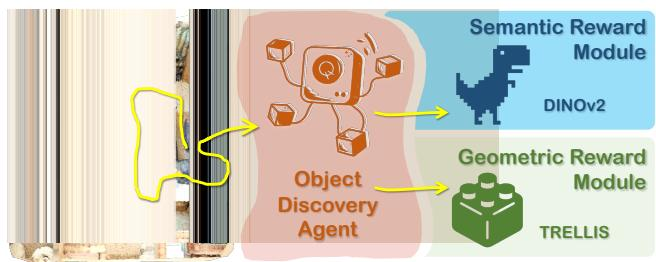

flowchart

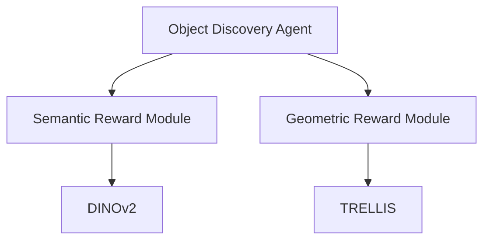

Figure 1. Overview of our method.

as 2D images or text. While achieving impressive progress in closed- and open-vocabulary 3D object segmentation, these methods require substantial annotation effort, making it challenging to scale up.

To eliminate the dependency on manual annotations, one line of recent methods, such as UnScene3D (Rozenberszki et al., 2024) and Part2Object (Shi et al., 2024), leverages self-supervised foundation models like DINO/v2 (Caron et al., 2021; Oquab et al., 2024) to generate high-quality semantic features projected into 3D space for object discovery. While showing encouraging results in point clouds, they often struggle to accurately separate individual 3D objects belonging to the same category, primarily due to the absence of object geometric priors in DINO/v2. Another line of recent methods, such as EFEM (Lei et al., 2023), GrabS (Zhang et al., 2025c), and its variant EvObj (Chen et al., 2026a), utilizes object reconstruction models to provide fine-grained 3D geometric priors for object identification in point clouds. Despite achieving promising performance on chair objects, they fail to discover multi-category objects with rich semantic relationships against their surroundings.

These limitations highlight a fundamental challenge in labelfree 3D object segmentation: defining what constitutes an object. Cognitive science studies (Biederman, 1987; Chiou & Ralph, 2016) suggest that object perception can be understood from two complementary aspects: geometry and semantics. Geometry characterizes object shape and structural properties, while semantics conveys the identity and meaning that distinguish one object from its surroundings. Building on this insight, we propose a new method for 3D object discovery that fully leverages semantic and geometric priors derived from existing self-supervised 2D/3D foundation models which have shown excellent results in various downstream tasks (Gui et al., 2024; Li et al., 2024). As illustrated in Figure 1, our approach comprises three key components: (1) an object discovery agent that incrementally identifies object candidates in a spatially bottom-up manner; (2) a semantic reward module that provides feedback to the agent from existing self-supervised 2D foundation models like DINOv2 (Oquab et al., 2024); and (3) a geometric reward module that supplies feedback from 3D object-centric foundation models like TRELLIS (Xiang et al., 2025).

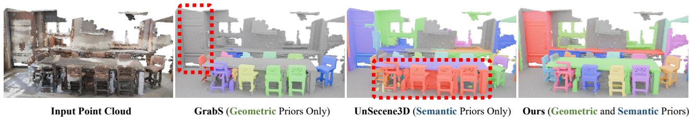  
Figure 2. Given a complex indoor 3D scene, our method can not only distinguish multiple neighboring chairs, but also successfully identify a flat cabinet against the wall, whereas baselines fail in one aspect or another.

For the object discovery agent, given an input 3D scene point cloud, it begins with a seed superpoint and expands its spatial size by selectively merging suitable neighboring superpoints. This continues until the agent is recognized as having identified a valid object candidate, as determined by the two reward modules. Our approach is broadly inspired by the recent agent-based method GrabS (Zhang et al., 2025c), which utilizes a dynamic cylinder as the agent but is limited to discovering single-class objects. In contrast, our method employs a superpoint-based agent that discovers 3D objects in a bottom-up manner, enabling the identification of objects with diverse spatial scales and structures.

The semantic and geometric reward modules are designed to provide complementary feedback to the object discovery agent, returning positive rewards when the merged superpoints are likely to form a valid object according to semantic and geometric priors, and negative rewards otherwise. To achieve this, the semantic reward module employs a new semantic consistency cut approach, ensuring that object candidates, which are exhibiting consistent semantic representations relative to their surroundings, receive positive rewards. Meanwhile, the geometric reward module utilizes a novel geometric center consistency verification mechanism, granting positive rewards to object candidates whose geometric centers demonstrate coherence. These two modules together allow us to discover multi-class 3D objects in complex point clouds through reinforcement learning (RL), without requiring human annotations during training.

Figure 2 shows qualitative results from an indoor 3D scene. By leveraging the semantic and geometric priors from powerful foundation models as rewards, our method, named FoundObj, accurately discovers 3D objects, offering a distinct advantage over approaches that rely solely on semantic or geometric priors. It not only effectively separates similar objects (e.g., chairs) within the same semantic class, but also successfully discovers semantically complex objects (e.g., a cabinet on the wall) that are often overlooked by baseline methods. Our main contributions are:

• We propose a new superpoint-based agent to discover objects by expanding their spatial sizes in a bottom-up manner, enabling the identification of diverse object shapes.   
• We introduce semantic and geometric reward modules that leverage rich priors from powerful foundation models, enabling the agent to be optimized without the need for human annotations in training.   
• We demonstrate state-of-the-art object segmentation performance across multiple 3D scene benchmarks, consistently surpassing all baselines.

# 2. Related Works

3D Object Segmentation with 3D Supervision: Thanks to per-point human annotations in 3D datasets such as Scan-Net (Dai et al., 2017) and S3DIS (Armeni et al., 2017), significant progress has been made in segmenting 3D objects using both bottom-up clustering methods (Wang et al., 2018; Chen et al., 2021; Han et al., 2020; Vu et al., 2022), top-down detection approaches (Yang et al., 2019; Yi et al., 2019; Hou et al., 2019; He et al., 2021; Shin et al., 2024), and Transformer-based methods (Lu et al., 2023a; Lai et al., 2023; Schult et al., 2023; Sun et al., 2023; Kolodiazhnyi et al., 2024). To reduce annotation costs, a range of weakly supervised methods have been developed, enabling the segmentation of 3D objects with various forms of sparse supervision, including 3D bounding boxes (Chibane et al., 2022; Deng et al., 2025; Tang et al., 2022; Yoo et al., 2025) and object centers (Griffiths et al., 2020). Although these methods achieve strong performance on public benchmarks, they rely heavily on expensive human annotations, which limit their scalability in practical 3D applications.

3D Object Segmentation with Multimodal Supervision: With the advancement of multimodal large models such as CLIP (Radford et al., 2021), SAM (Kirillov et al., 2023; Carion et al., 2025), and LLaVA (Liu et al., 2023a), numerous subsequent methods (Ha & Song, 2022; Takmaz et al., 2023; Liu et al., 2023b; Lu et al., 2023b; Guo et al., 2024; Huang et al., 2024; Nguyen et al., 2024; Roh et al., 2024; Yan et al., 2024; Yin et al., 2024; Boudjoghra et al., 2025; Nguyen et al., 2025; Jung et al., 2025; Zhao et al., 2025a; Wang et al., 2025; Lee et al., 2025; Zhou et al., 2025; Liu et al.,

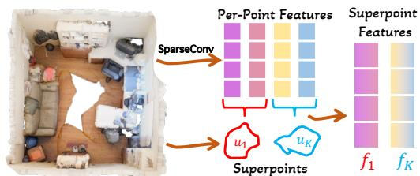

flowchart

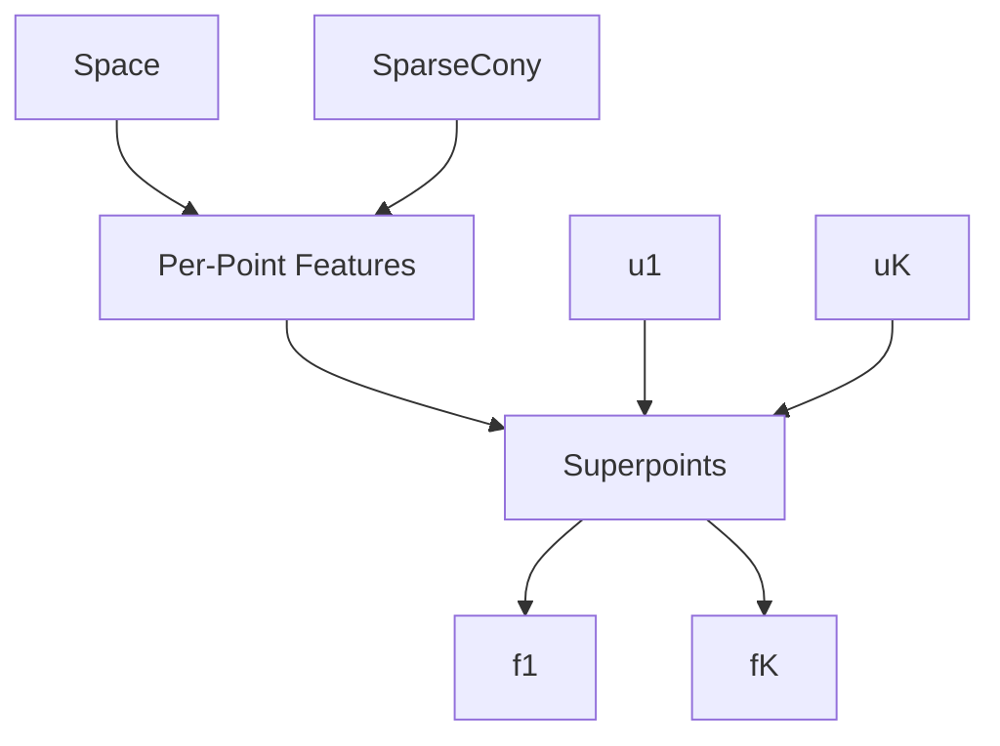

STEP #0: Initial Superpoint Construction   
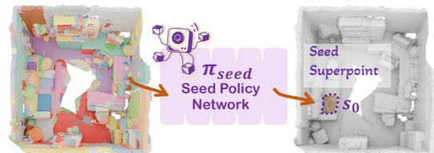

flowchart

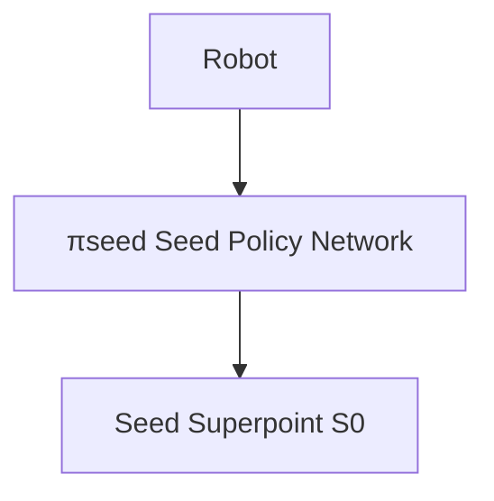

STEP #1: Seed Superpoint Selection

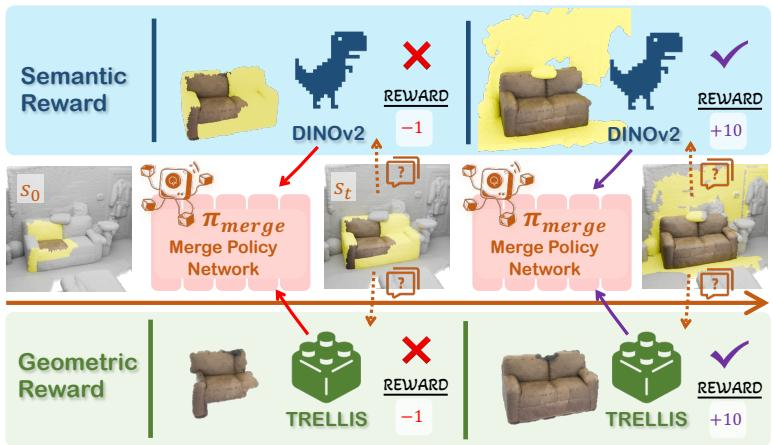

flowchart

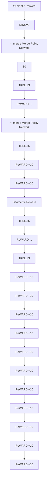

STEP #2: Neighboring Superpoint Merging   
Figure 3. Workflow of our object discovery agent. Given an input 3D scene composed of initial superpoints, our object discovery agent begins by selecting a seed superpoint and then progressively merges neighboring superpoints, guided by feedback from geometric and semantic reward modules based on self-supervised 2D/3D foundation models.

2025; Mei et al., 2025; Huang et al., 2026; Cao et al., 2023) have been introduced to project pretrained 2D visual and/or −vision-language features into 3D space for object discovery, enabling the identification of open-vocabulary objects. While demonstrating impressive cross-modal transfer capabilities and generalization to open-world scenarios, they still rely heavily on extensive human annotations, such as image masks, captions, or aligned image-text pairs. This dependency ultimately limits their applicability in real-world scenarios where human labels are scarce or unavailable.

3D Object Segmentation without Supervision: To eliminate the need for manual annotations of 3D scenes during training, one line of unsupervised methods groups 3D points using various heuristic signals, such as surface normals, colors, or motion patterns (Baur et al., 2021; Song & Yang, 2022; 2024; Zhang et al., 2023a; 2024; Ren et al., 2026). While effective, these approaches are often limited to discovering simple objects, such as cars. Another line of methods (Rozenberszki et al., 2024; Shi et al., 2024; Wang et al., 2023) projects self-supervised 2D features, such as those from DINO/v2, into 3D space, followed by point grouping. Although these methods can discover objects from multiple categories, they often struggle to distinguish between similar objects within the same category due to the inherent lack of objectness in self-supervised 2D features, as also revealed in (Yang et al., 2025). More recently, works such as GrabS (Zhang et al., 2025c) and its variant EvObj(Chen et al., 2026a), and EFEM (Lei et al., 2023) have leveraged geometric priors from object-centric reconstruction or generation models to discover objects in point clouds. While showing promising results, they are typically limited to single-class objects and are unable to identify diverse object shapes in complex environments, primarily due to the absence of semantic priors in their pipelines.

# 3. FoundObj

Our framework consists of a superpoint-based object discovery agent (Section 3.1), together with geometric and semantic reward modules (Sections 3.2&3.3) which derive feedback from existing 2D/3D foundation models. The latter two reward modules provide supervision signals to optimize the agent for discovering object candidates on 3D scene point clouds without needing human labels in training.

# 3.1. Object Discovery Agent

As illustrated by Figure 3, this agent aims to identify suitable regions as object candidates, which will be scored by our two reward modules. Unlike the recent work GrabS (Zhang et al., 2025c) which adopts a dynamic cylinder as the agent and therefore is limited to identifying simple objects, we instead introduce a new dynamic superpoint-based agent which is highly flexible to identify any irregular object shapes. This is achieved through the following steps.

Step #0: Initial Superpoint Construction: Given an input 3D scene point cloud P , we first partition raw points into K initial superpoints, denoted by $\{ { \pmb u } _ { 1 } \cdot \cdot \cdot { \pmb u } _ { k } \cdot \cdot \cdot { \pmb u } _ { K } \}$ via Felzenswalb algorithm (Felzenszwalb & Huttenlocher, 2004). These small-sized superpoints are compact representations of the input 3D scene, enabling object discovery to be performed over K regions rather than raw points, significantly reducing the exploration space for the agent.

In parallel, we feed the raw point cloud P into an existing 3D backbone SparseConv (Graham et al., 2018), denoted by gbone (not pre-trained), extracting per-point features. For the K initial superpoints, we then average out per-point features within each superpoint, obtaining the corresponding K superpoint features, denoted by $\left\{ { \pmb f } _ { 1 } \cdot \cdot \cdot { \pmb f } _ { k } \cdot \cdot \cdot { \pmb f } _ { K } \right\}$ . These initial superpoints will be selected and gradually merged into larger ones via the subsequent Steps #1&#2.

Step #1: Seed Superpoint Selection: To discover object candidates in point cloud P , our agent is designed to firstly select a seed superpoint out of $K$ as the starting point. In particular, we feed all superpoint features into a seed policy network $\pi _ { s e e d } .$ , which consists of self-attention blocks with an MLP layer followed by a softmax function, directly predicting a soft onehot code, denoted by $p _ { s e e d } \in \mathbb { R } ^ { K \times 1 }$ .

$$
\boldsymbol {p} _ {\text { seed }} = \boldsymbol {\pi} _ {\text { seed }} \left(\left[ \boldsymbol {f} _ {1} \cdot \cdot \boldsymbol {f} _ {k} \cdot \cdot \boldsymbol {f} _ {K} \right]\right) \tag {1}
$$

The actual seed superpoint $s _ { 0 }$ is then sampled from pseed, and its feature vector is retrieved and denoted by $f _ { \mathrm { 0 } }$ .

Step #2: Neighboring Superpoint Merging: For the seed superpoint $s _ { 0 } ,$ our agent then learns to select and merge some of its neighboring superpoints, getting a larger and larger superpoint which is expected to be a valid object over time. This is achieved as follows:

• Gathering All Neighboring Superpoints: For the seed superpoint $\mathbf { { s } } _ { 0 } ,$ we gather all its $Q$ neighboring superpoints, denoted by $\bigl \{ \pmb { s } _ { 0 } ^ { 1 } \cdot \cdot \cdot \pmb { s } _ { 0 } ^ { q } \cdot \cdot \cdot \pmb { s } _ { 0 } ^ { Q } \bigr \}$ . For simplicity, we define neighboring superpoints as those within a minimum Euclidean distance of 0.1m. These Q neighboring superpoints are a subset of the remaining $( K - 1 )$ superpoints in point cloud P . Natually, we also retrieve the corresponding neighboring superpoint features, denoted by $\bar { \{ f _ { 0 } ^ { 1 } \cdot \cdot \cdot \bar { f _ { 0 } ^ { q } } \cdot \cdot \cdot \cdot } f _ { 0 } ^ { Q } \}$ .

• Merging Neighboring Superpoints: Now, our agent needs to learn which neighboring superpoints should be merged into the seed superpoint $s _ { 0 }$ , such that the new superpoint is more likely to be an object candidate, $i . e .$ , receiving higher rewards afterwards. To achieve this, we feed the seed and its neighboring superpoint features into a merge policy network $\pi _ { m e r g e }$ , which consists of self-attention blocks with an MLP layer followed by a sigmoid function, predicting the merging probability $\pmb { p } _ { m e r g e } \in \mathbb { R } ^ { Q \times 1 }$ for $Q$ neighbors:

$$
\boldsymbol {p} _ {\text { merge }} = \boldsymbol {\pi} _ {\text { merge }} \left(\boldsymbol {f} _ {0}, \left[ \boldsymbol {f} _ {0} ^ {1} \dots \boldsymbol {f} _ {0} ^ {q} \dots \boldsymbol {f} _ {0} ^ {Q} \right]\right) \tag {2}
$$

We then sample a subset of neighbors according to the learned policy $p _ { m e r g e }$ and merge them into the seed superpoint $s _ { 0 } ,$ obtaining a larger superpoint which is regarded as an object candidate, denoted by $\scriptstyle { \pmb { s } } _ { 1 }$ .

This merging process is repeated for multiple rounds until the agent is terminated by the latter reward modules or reaches a predefined maximum round $T ,$ , generating a sequence of object candidates, denoted by: $\left\{ \pmb { s } _ { 0 } , \pmb { s } _ { 1 } \cdot \cdot \cdot \pmb { s } _ { t } \cdot \cdot \cdot \pmb { s } _ { T } \right\}$ . In each round, the obtained superpoint $( i . e .$ , object candidate) will be fed into our geometric and semantic reward modules discussed below. Details of the backbone ${ \mathbf { } } _ { g _ { b o n e } } ,$ the seed and merging policy networks $\pi _ { s e e d }$ and $\pi _ { m e r g e }$ are in Appendix A.

# 3.2. Geometric Reward Module

For an object candidate $\mathbf { } _ { s _ { t } , }$ , this module aims to verify whether it is geometrically coherent. Thanks to the advancement of object-centric foundation models for 3D object reconstruction and generation, such as TRELLIS (Xiang et al., 2025) and Hunyuan3D (Lai et al., 2025) pretrained on multiple large-scale 3D object datasets like ObjaverseXL (Deitke et al., 2023), high-quality 3D object shape representations are effectively learned via VAE technique. To fully leverage these object geometry priors, we propose a new geometric center consistency verification mechanism to compute a reward for the candidate $\mathbf { \boldsymbol { s } } _ { t }$ as follows.

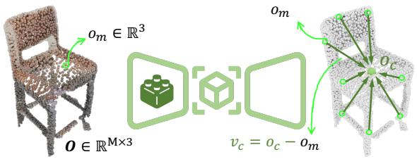

text_image

O m ∈ ℝ³
O ∈ ℝ^M×3
O m
v_c = o_c - o_m
O_c

Figure 4. An illustration of Object Center Field.

Learning an Object Center Field: Since the pretrained 3D object foundation model often consists of an auto-encoder which cannot be directly used for scoring a candidate like $\mathbf { } _ { s _ { t } } .$ , we propose to extend the pretrained foundation encoder by adding an additional object center field as a head, with inspiration from unMORE (Yang et al., 2025).

As illustrated in Figure 4, for a 3D object O with M points, denoted by $\left\{ o _ { 1 } \cdots o _ { m } \cdot \cdot \cdot o _ { M } \right\}$ and each point is represented by xyz coordinates, its object center field is defined to indicate the direction ${ \pmb v } _ { m }$ of each point pointing to the object centroid $\mathbf { \delta } _ { o , \dag }$ mathematically as follows:

$$
\boldsymbol {v} _ {m} = \boldsymbol {o} _ {c} - \boldsymbol {o} _ {m}, \quad \boldsymbol {o} _ {c} = \frac {1}{M} \sum_ {m = 1} ^ {M} \boldsymbol {o} _ {m} \tag {3}
$$

Given the pretrained encoder from TRELLIS, we add a Transformer decoder as a head to regress the defined object center field for any query point o. We train this network, denoted by $\mathbf { \mathscr { g } } _ { c e n t e r : }$ on two object datasets ABO (Collins et al., 2022) and 3D-Future (Fu et al., 2021) with an $\ell _ { 2 }$ loss between the predicted center field and precomputed ground truth. Once well-trained, $\mathbf { \phi } _ { g _ { c e n t e r } }$ is used to verify the geometry quality of any object candidate like $\mathbf { } _  \mathbf { } \mathbf { } \mathbf { } \mathbf { } \mathbf { } \mathbf { } \mathbf { } \mathbf { } \mathbf { } \mathbf { } \mathbf { } \mathbf { } \mathbf { } \mathbf { } \mathbf { } \mathbf { } \mathbf { } \mathbf { } \mathbf { } \mathbf { } \mathbf { } \mathbf { } \mathbf { } \mathbf { } \mathbf { } \mathbf { } \mathbf { } \mathbf { } \mathbf { } \mathbf { } \mathbf { } \mathbf { } \mathbf { } \mathbf { } \mathbf { } \mathbf { } \mathbf { } \mathbf { } \mathbf { } \mathbf { } \mathbf { } \mathbf { } \mathbf { } \mathbf { } \mathbf { } \mathbf { } \mathbf { } \mathbf { } \mathbf { } \mathbf { } \mathbf { } \mathbf { } \mathbf { } \mathbf { } \mathbf { } \mathbf { } \mathbf { } \mathbf { } \mathbf { } \mathbf { } \mathbf { } \mathbf { } \mathbf { } \mathbf { } \mathbf { } \mathbf { } \mathbf { } \mathbf { } \mathbf { } \mathbf { } \mathbf { } \mathbf { } \mathbf { } \mathbf { } \mathbf { } \mathbf { } \mathbf { } \mathbf { } \mathbf { } \mathbf { } \mathbf { } \mathbf { } \mathbf { } \mathbf { } \mathbf { } \mathbf { } \mathbf { } \mathbf { } \mathbf { } \mathbf { } \mathbf { } \mathbf { } \mathbf { } \mathbf { } \mathbf { } \mathbf { } \mathbf { } \mathbf { } \mathbf { } \mathbf { } \mathbf { } \mathbf { } \mathbf { } \mathbf { } \mathbf { } \mathbf { } \mathbf { } \mathbf { } \mathbf { } \mathbf { } \mathbf { } \mathbf { } \mathbf { } \mathbf { } \mathbf { } \mathbf { } \mathbf { } \mathbf { } \mathbf { } \mathbf { } \mathbf { } \mathbf { } \mathbf { } \mathbf { } \mathbf { } \mathbf { } \mathbf { } \mathbf { } \mathbf { } \mathbf { } \mathbf { } \mathbf { } \mathbf { } \mathbf { } \mathbf { } \mathbf { } \mathbf { } \mathbf { } \mathbf { } \mathbf { } \mathbf { } \mathbf \mathbf { } \mathbf { } \mathbf { } \mathbf { } \mathbf \mathbf { } \mathbf { } \mathbf \mathbf { } \mathbf { } \mathbf \mathbf { } \mathbf { } \mathbf \mathbf { } \mathbf \mathbf { } \mathbf { } \mathbf \mathbf { } \mathbf \mathbf { } \mathbf \mathbf { } \mathbf \mathbf { } \mathbf $ .

Verifying Center Consistency: Given a candidate $\mathbf { } _ { s _ { t } , }$ we directly feed it into our pretrained $\begin{array} { r } { g _ { c e n t e r } , } \end{array}$ estimating its corresponding center field, denoted by ${ \mathbf { } } v _ { t }$ . Intuitively, if the candidate $\mathbf { \Delta } _ { \mathbf { \mathcal { S } } _ { t } }$ is a valid object, its center field should point to a single center, meaning that $\left( \boldsymbol { s } _ { t } + \boldsymbol { v } _ { t } \right)$ will collapse to an extremely dense and dominant cluster. Otherwise, $\left( \boldsymbol { s } _ { t } + \boldsymbol { v } _ { t } \right)$ would instead have multiple or sparser clusters.

Leveraging this property, we apply the DBSCAN clustering algorithm (Ester et al., 1996) to $\left( \boldsymbol { s } _ { t } + \boldsymbol { v } _ { t } \right)$ . If DBSCAN identifies a dominant cluster that covers at least $\alpha = 3 0 \%$ of all points in the candidate $\mathbf { } _  \mathbf { } \mathbf { } \mathbf { } \mathbf { } \mathbf { } \mathbf { } \mathbf { } \mathbf { } \mathbf { } \mathbf { } \mathbf { } \mathbf { } \mathbf { } \mathbf { } \mathbf { } \mathbf { } \mathbf { } \mathbf { } \mathbf { } \mathbf { } \mathbf { } \mathbf { } \mathbf { } \mathbf { } \mathbf { } \mathbf { } \mathbf { } \mathbf { } \mathbf { } \mathbf { } \mathbf { } \mathbf { } \mathbf { } \mathbf { } \mathbf { } \mathbf { } \mathbf { } \mathbf { } \mathbf { } \mathbf { } \mathbf { } \mathbf { } \mathbf { } \mathbf { } \mathbf { } \mathbf { } \mathbf { } \mathbf { } \mathbf { } \mathbf { } \mathbf { } \mathbf { } \mathbf { } \mathbf { } \mathbf { } \mathbf { } \mathbf { } \mathbf { } \mathbf { } \mathbf { } \mathbf { } \mathbf { } \mathbf { } \mathbf { } \mathbf { } \mathbf { } \mathbf { } \mathbf { } \mathbf { } \mathbf { } \mathbf { } \mathbf { } \mathbf { } \mathbf { } \mathbf { } \mathbf { } \mathbf { } \mathbf { } \mathbf { } \mathbf { } \mathbf { } \mathbf { } \mathbf { } \mathbf { } \mathbf { } \mathbf { } \mathbf { } \mathbf { } \mathbf { } \mathbf { } \mathbf { } \mathbf { } \mathbf { } \mathbf { } \mathbf { } \mathbf { } \mathbf { } \mathbf { } \mathbf { } \mathbf { } \mathbf { } \mathbf { } \mathbf { } \mathbf { } \mathbf { } \mathbf { } \mathbf { } \mathbf { } \mathbf { } \mathbf { } \mathbf { } \mathbf { } \mathbf { } \mathbf { } \mathbf { } \mathbf { } \mathbf { } \mathbf { } \mathbf { } \mathbf { } \mathbf { } \mathbf { } \mathbf { } \mathbf { } \mathbf { } \mathbf { } \mathbf { } \mathbf { } \mathbf { } \mathbf { } \mathbf { } \mathbf { } \mathbf { } \mathbf { } \mathbf { } \mathbf { } \mathbf { } \mathbf { } \mathbf { } \mathbf { } \mathbf { } \mathbf \mathbf { } \mathbf { } \mathbf { } \mathbf { } \mathbf \mathbf { } \mathbf { } \mathbf \mathbf { } \mathbf { } \mathbf \mathbf { } \mathbf { } \mathbf \mathbf { } \mathbf \mathbf { } \mathbf { } \mathbf \mathbf { } \mathbf \mathbf { } \mathbf \mathbf { } \mathbf \mathbf { } \mathbf $ within a radius of $r = 0 . 0 5$ , we assign a reward of $+ 1 0$ to the object discovery agent.

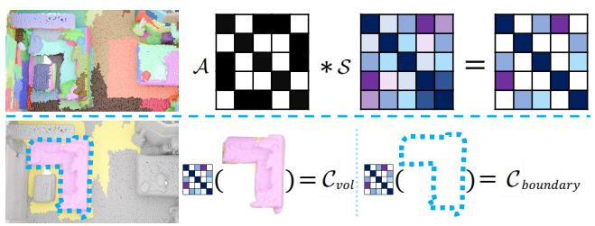  
Figure 5. An illustration of Semantic Consistency Cut.

Otherwise, a negative reward of −1 is given. Details of object center field $\mathbf { g } _ { c e n t e r }$ and training are in Appendix B.

# 3.3. Semantic Reward Module

Geometric cues alone are often insufficient for object identification, especially in the presence of visual occlusions or cluttered backgrounds. In such cases, semantic context becomes crucial for distinguishing objects. For example, a door may be geometrically similar to a wall, but visual contrast can help delineate the boundary between them. Similarly, a chair that is largely occluded by a table may still be identified through its co-occurrence with other pieces of furniture in the scene. With this insight, this module aims to further leverage semantic priors emerging from selfsupervised 2D foundation models to provide feedback for the object candidate $\mathbf { } _  \mathbf { } \mathbf { } \mathbf { } \mathbf { } \mathbf { } \mathbf { } \mathbf { } \mathbf { } \mathbf { } \mathbf { } \mathbf { } \mathbf { } \mathbf { } \mathbf { } \mathbf { } \mathbf { } \mathbf { } \mathbf { } \mathbf { } \mathbf { } \mathbf { } \mathbf { } \mathbf { } \mathbf { } \mathbf { } \mathbf { } \mathbf { } \mathbf { } \mathbf { } \mathbf { } \mathbf { } \mathbf { } \mathbf { } \mathbf { } \mathbf { } \mathbf { } \mathbf { } \mathbf { } \mathbf { } \mathbf { } \mathbf { } \mathbf { } \mathbf { } \mathbf { } \mathbf { } \mathbf { } \mathbf { } \mathbf { } \mathbf { } \mathbf { } \mathbf { } \mathbf { } \mathbf { } \mathbf { } \mathbf { } \mathbf { } \mathbf { } \mathbf { } \mathbf { } \mathbf { } \mathbf { } \mathbf { } \mathbf { } \mathbf { } \mathbf { } \mathbf { } \mathbf { } \mathbf { } \mathbf { } \mathbf { } \mathbf { } \mathbf { } \mathbf { } \mathbf { } \mathbf { } \mathbf { } \mathbf { } \mathbf { } \mathbf { } \mathbf { } \mathbf { } \mathbf { } \mathbf { } \mathbf { } \mathbf { } \mathbf { } \mathbf { } \mathbf { } \mathbf { } \mathbf { } \mathbf { } \mathbf { } \mathbf { } \mathbf { } \mathbf { } \mathbf { } \mathbf { } \mathbf { } \mathbf { } \mathbf { } \mathbf { } \mathbf { } \mathbf { } \mathbf { } \mathbf { } \mathbf { } \mathbf { } \mathbf { } \mathbf { } \mathbf { } \mathbf { } \mathbf { } \mathbf { } \mathbf { } \mathbf { } \mathbf { } \mathbf { } \mathbf { } \mathbf { } \mathbf { } \mathbf { } \mathbf { } \mathbf { } \mathbf { } \mathbf { } \mathbf { } \mathbf { } \mathbf { } \mathbf { } \mathbf { } \mathbf { } \mathbf { } \mathbf { } \mathbf { } \mathbf { } \mathbf { } \mathbf { } \mathbf { } \mathbf { } \mathbf { } \mathbf { } \mathbf \mathbf { } \mathbf { } \mathbf { } \mathbf { } \mathbf \mathbf { } \mathbf { } \mathbf \mathbf { } \mathbf { } \mathbf \mathbf { } \mathbf { } \mathbf \mathbf { } \mathbf \mathbf { } \mathbf { } \mathbf \mathbf { } \mathbf \mathbf { } \mathbf \mathbf { } \mathbf \mathbf { } \mathbf $ .

Given a pretrained DINOv2 model, we utilize the input 3D scene point cloud P along with its associated 2D images, which are commonly available in practice. Following the approach of UnScene3D (Rozenberszki et al., 2024), we project 2D image features into 3D space using depth images. For each point in P , if multiple feature vectors are projected onto it, we simply average them. The resulting point features derived from DINOv2 then serve as semantic features of the 3D scene P . To calculate a reward for the object candidate $s _ { t } ,$ we propose a new semantic consistency cut approach.

Semantic Consistency Cut: As illustrated in Figure 5, we assume the candidate $\mathbf { \boldsymbol { s } } _ { t }$ is formed by merging a total of J initial superpoints over discovery as discussed in Section 3.1, whereas the entire 3D scene point cloud P has K initial superpoints. For each initial superpoint, we first compute its semantic features by averaging the projected per-point DINOv2 features. Then, we construct a pair-wise semantic similarity matrix, denoted by $\mathcal { S } \in \mathbb { R } ^ { K \times K }$ , through calculating the cosine similarity between any two superpoints of the entire scene P . In the meantime, we also construct a binary adjacency matrix, denoted by $\mathcal { A } \in \mathbb { R } ^ { K \times K }$ , where $\mathcal { A } _ { i j } = 1$ represents that the $i ^ { t h }$ and $j ^ { t h }$ initial superpoints are spatially adjacent, also based on a minimum Euclidean distance of 0.1m as used in Section 3.1. Then, the resulting matrix (S ∗ A) represents the joint spatial and semantic similarity of all initial superpoints of the 3D scene P .

To measure the semantic consistency of the object candidate $s _ { t } ,$ which can be represented by a one-hot mask $O _ { t } \in \mathbb { R } ^ { K \times 1 }$ , inspired by NCut (Shi & Malik, 2000), we regard this mask as a cut against the entire 3D scene. We then calculate the cut cost as follows:

$$
\mathcal {C} = \mathcal {C} _ {\text { boundary }} / \mathcal {C} _ {\text { vol }} \tag {4}
$$

where $\mathcal { C } _ { b o u n d a r y }$ denotes the sum of joint spatial and semantic similarity scores along the boundary of $\mathbf { \boldsymbol { s } } _ { t }$ , whereas $\mathcal { C } _ { v o l }$ denotes the sum of joint similarity scores within $\mathbf { } s _ { t } .$ . Intuitively, a higher cost C indicates that the candidate $\mathbf { } _  \mathbf { } \mathbf { } \mathbf { } \mathbf { } \mathbf { } \mathbf { } \mathbf { } \mathbf { } \mathbf { } \mathbf { } \mathbf { } \mathbf { } \mathbf { } \mathbf { } \mathbf { } \mathbf { } \mathbf { } \mathbf { } \mathbf { } \mathbf { } \mathbf { } \mathbf { } \mathbf { } \mathbf { } \mathbf { } \mathbf { } \mathbf { } \mathbf { } \mathbf { } \mathbf { } \mathbf { } \mathbf { } \mathbf { } \mathbf { } \mathbf { } \mathbf { } \mathbf { } \mathbf { } \mathbf { } \mathbf { } \mathbf { } \mathbf { } \mathbf { } \mathbf { } \mathbf { } \mathbf { } \mathbf { } \mathbf { } \mathbf { } \mathbf { } \mathbf { } \mathbf { } \mathbf { } \mathbf { } \mathbf { } \mathbf { } \mathbf { } \mathbf { } \mathbf { } \mathbf { } \mathbf { } \mathbf { } \mathbf { } \mathbf { } \mathbf { } \mathbf { } \mathbf { } \mathbf { } \mathbf { } \mathbf { } \mathbf { } \mathbf { } \mathbf { } \mathbf { } \mathbf { } \mathbf { } \mathbf { } \mathbf { } \mathbf { } \mathbf { } \mathbf { } \mathbf { } \mathbf { } \mathbf { } \mathbf { } \mathbf { } \mathbf { } \mathbf { } \mathbf { } \mathbf { } \mathbf { } \mathbf { } \mathbf { } \mathbf { } \mathbf { } \mathbf { } \mathbf { } \mathbf { } \mathbf { } \mathbf { } \mathbf { } \mathbf { } \mathbf { } \mathbf { } \mathbf { } \mathbf { } \mathbf { } \mathbf { } \mathbf { } \mathbf { } \mathbf { } \mathbf { } \mathbf { } \mathbf { } \mathbf { } \mathbf { } \mathbf { } \mathbf { } \mathbf { } \mathbf { } \mathbf { } \mathbf { } \mathbf { } \mathbf { } \mathbf { } \mathbf { } \mathbf { } \mathbf { } \mathbf { } \mathbf { } \mathbf { } \mathbf { } \mathbf { } \mathbf { } \mathbf { } \mathbf { } \mathbf { } \mathbf { } \mathbf { } \mathbf { } \mathbf { } \mathbf \mathbf { } \mathbf { } \mathbf { } \mathbf { } \mathbf \mathbf { } \mathbf { } \mathbf \mathbf { } \mathbf { } \mathbf \mathbf { } \mathbf { } \mathbf \mathbf { } \mathbf \mathbf { } \mathbf { } \mathbf \mathbf { } \mathbf \mathbf { } \mathbf \mathbf { } \mathbf \mathbf { } \mathbf $ is more similar to its spatial context, suggesting it should receive a lower reward. Otherwise, a lower cost implies that the candidate is more semantically distinct from its background, deserving a higher reward.

In our experiments, instead of choosing a fixed cost threshold, we maintain a cost bank that stores the top 20 lowest costs for each 3D scene during training. A reward of +10 is given to object candidates in the bank, and −1 to others. More details of the cost cut calculation are in Appendix C.

# 3.4. Training and Test

Given an input 3D scene point cloud, the agent continuously generates object candidates during discovery, while two reward modules assign scores based on foundational geometric and semantic priors. To fully leverage both priors, we retain the higher reward from the two modules for each candidate. During each discovery trajectory, once an object candidate receives a reward of +10, the agent terminates, indicating that a valid object has been discovered.

The agent is trained using the standard PPO loss. Exactly following GrabS (Zhang et al., 2025c), we collect discovered object masks that receive positive rewards as pseudo labels. Lastly, we train a separate 3D object segmentation network using the Mask3D (Schult et al., 2023). For efficiency during benchmark testing, we utilize this separately trained segmentation network. More details are in D.

# 4. Experiments

Datasets: We evaluate our method on two real-world indoor benchmarks and one long-tail benchmark. (1) ScanNet (Dai et al., 2017) is a challenging RGB-D reconstructed dataset with heavy occlusions, sensor noise, and incomplete geometry, containing 1,201 scenes for training and 312 scenes for validation. (2) S3DIS (Armeni et al., 2017) is another large-scale indoor dataset with greater spatial variability, consisting of six areas that cover diverse room layouts and scene scales. (3) ScanNet200 (Rozenberszki et al., 2022) shares the same scans as ScanNet but provides a finer-grained label space with 200 categories. According to its official protocol, object categories are grouped into head (66), common (68), and tail (66), enabling a stricter evaluation under long-tailed category distributions.

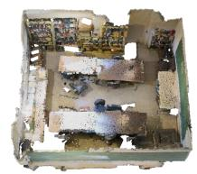

natural_image

Interior view of a damaged industrial building with exposed steel beams and debris (no visible text or symbols)

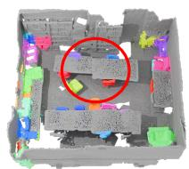

natural_image

3D rendered interior of a room with colorful furniture and a red circle highlighting a specific area (no text or symbols visible)

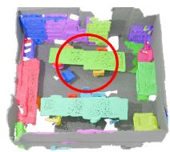

natural_image

3D rendered interior of a room with colorful furniture and a red circle highlighting a specific area (no text or symbols visible)

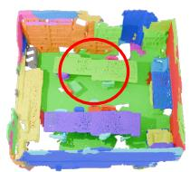

natural_image

Colorful 3D-printed toy blocks arranged in a grid, with one block highlighted by a red circle (no text or symbols visible)

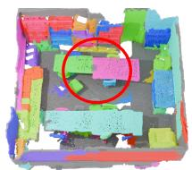

natural_image

3D rendered model of a building interior with colored blocks and a red circle highlighting a specific area (no text or symbols)

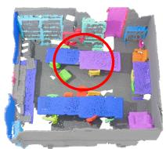

natural_image

3D architectural floor plan with colored blocks and a red circle highlighting a specific area (no text or symbols)

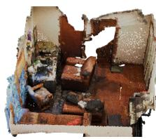

natural_image

Interior view of a damaged room with exposed furniture and debris (no visible text or symbols)

Input Point Cloud

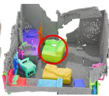

natural_image

3D rendered model of a vehicle or toy interior with colored blocks and a highlighted green box (no text or symbols visible)

GrabS

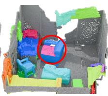

natural_image

3D rendered interior view of a vehicle with colored blocks and a highlighted blue box (no text or symbols visible)

UnScene3D

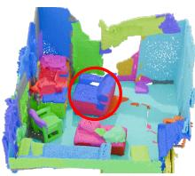

natural_image

Colorful 3D-rendered interior scene with no visible text or symbols, featuring a red circle highlighting a specific area (no text or symbols present)

Part2Object

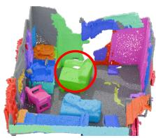

natural_image

3D rendered interior model of a building with colored blocks and a highlighted green space (no text or symbols)

Ours

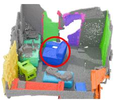

natural_image

3D rendered model of a mechanical assembly with colored blocks and a highlighted blue component (no text or symbols visible)

Ground Truth   
Figure 6. Qualitative results on the ScanNet dataset. Red circles highlight the differences.

Baselines: We compare FoundObj with the following representative unsupervised 3D object segmentation methods that leverage either pretrained 2D priors or 3D object-centric priors. (1) UnScene3D (Rozenberszki et al., 2024) leverages pretrained CSC (Fang et al., 2023) and DINO (Caron et al., 2021) features to generate pseudo masks for training a 3D segmentation network, and we report the results using its official checkpoints of three variants. (2) Part2Object (Shi et al., 2024) projects pixel-level pseudo masks derived from DINOv2 features into 3D to obtain object segments. (3) EFEM (Lei et al., 2023) learns object priors from ShapeNet (Chang et al., 2015) and performs scene-level object segmentation via an EM-style optimization procedure. (4) GrabS (Zhang et al., 2025c) formulates unsupervised 3D object segmentation as a two-stage pipeline with an object prior network and a scene exploration agent, but the original method trains the object-prior network only on chair objects.

Metrics: Following baselines, we also report class-agnostic object segmentation performance using the standard Average Precision (AP) protocol on ScanNet-style benchmarks (Dai et al., 2017). We report AP at IoU thresholds of 25% (AP@25), 50% (AP@50), and the averaged AP over IoU thresholds from 50% to 95% with a step size of 5% (AP).

# 4.1. Evaluation on ScanNet

We train our whole pipeline on the ScanNet training set. Following the benchmarking protocol of ScanNet, all methods are evaluated on the ScanNet validation set against ground truth object masks under the established 18-class setting. The training and validation splits are kept identical for all baselines and our FoundObj, ensuring a fair comparison.

Additionally, recent 3D self-supervised models such as Concerto (Zhang et al., 2025a) have shown strong capability in extracting scene-level semantics. To provide a more comprehensive evaluation, we construct additional baselines by fusing these 3D foundation model features with 2D DINOv2 features and subsequently applying the NCut algorithm as used in the UnScene3D pipeline.

Results & Analysis: Table 1 and Figure 6 present the quantitative and qualitative results, respectively. Our method consistently outperforms all unsupervised baselines by a large margin. In particular, existing methods struggle to adequately segment objects, frequently missing objects or oversegmenting them into fragments. In contrast, our FoundObj produces more coherent and complete object masks, demonstrating the effectiveness of the geometric and semantic prior modules for object discovery in complex indoor scenes.

Compared with self-supervised baselines, our model also surpasses them by a clear margin. Notably, the fusion of TRELLIS and DINOv2 features obtains only 16.4 in AP score, as TRELLIS is trained on isolated object-level 3D data rather than 3D scenes. Therefore, its features are outof-domain when directly applied to scene data. Additional qualitative results are provided in Appendix E.

Table 1. Quantitative results on 18 object categories of our method and baselines on the ScanNet validation set (Dai et al., 2017). 

<table><tr><td>Methods</td><td>AP</td><td>AP@50</td><td>AP@25</td></tr><tr><td colspan="4">Supervised:</td></tr><tr><td>Mask3D (Schult et al., 2023)</td><td>61.2</td><td>83.0</td><td>93.0</td></tr><tr><td colspan="4">Unsupervised:</td></tr><tr><td>EFEM (Lei et al., 2023)</td><td>8.0</td><td>16.7</td><td>22.3</td></tr><tr><td>GrabS (Zhang et al., 2025c)</td><td>14.0</td><td>27.2</td><td>39.4</td></tr><tr><td>UnScene3D-CSC (Rozenberszki et al., 2024)</td><td>16.2</td><td>32.2</td><td>57.6</td></tr><tr><td>UnScene3D-DINO (Rozenberszki et al., 2024)</td><td>17.7</td><td>35.6</td><td>62.2</td></tr><tr><td>UnScene3D (Rozenberszki et al., 2024)</td><td>18.5</td><td>37.8</td><td>63.7</td></tr><tr><td>Part2Object (Shi et al., 2024)</td><td>19.6</td><td>38.4</td><td>64.9</td></tr><tr><td colspan="4">Self-supervised features followed by NCut:</td></tr><tr><td>Concerto</td><td>18.2</td><td>38.4</td><td>71.6</td></tr><tr><td>Concerto+DINOv2</td><td>19.8</td><td>41.2</td><td>72.2</td></tr><tr><td>TRELLIS+DINOv2</td><td>16.4</td><td>36.8</td><td>66.7</td></tr><tr><td>FoundObj (Ours)</td><td>24.2</td><td>46.2</td><td>74.7</td></tr></table>

# 4.2. Evaluation on S3DIS and ScanNet200

Following the existing unsupervised methods Part2Object (Shi et al., 2024) and GrabS (Zhang et al., 2025c), we evaluate our method on S3DIS and ScanNet200 datasets by directly reusing our model well-trained on ScanNet, assessing the cross-dataset generalization ability.

Results on S3DIS: As shown in Tables 2 and 3, and Figure 7, our FoundObj consistently achieves the best performance under both the Area-5 and 6-fold evaluation protocols. These results demonstrate our strong zero-shot object segmentation capabilities, indicating that our learned object patterns generalize well across datasets with novel scene layouts. Most notably, FoundObj achieves performance comparable to Mask3D (Schult et al., 2023), which is trained with human annotations, highlighting the significant potential of unsupervised 3D learning.

Results on ScanNet200: On the more challenging Scan-Net200 benchmark, which features a long-tailed data distribution, our method achieves clear improvements over all unsupervised baselines, as shown in Table 4 and Figure 8. This further demonstrates that FoundObj is able to identify a wider variety of objects and more effectively handle longtailed distribution. Collectively, these cross-dataset results highlight the strong generalization ability of our method in both zero-shot and long-tail settings. More qualitative and quantitative results are provided in Appendix F&G.

Table 2. Quantitative results of our method and baselines on the S3DIS-Area5. 

<table><tr><td>Methods</td><td>AP</td><td>AP@50</td><td>AP@25</td></tr><tr><td colspan="4">Supervised:</td></tr><tr><td>Mask3D (Schult et al., 2023)</td><td>13.0</td><td>22.3</td><td>37.5</td></tr><tr><td colspan="4">Unsupervised:</td></tr><tr><td>GrabS (Zhang et al., 2025c)</td><td>3.7</td><td>6.1</td><td>9.3</td></tr><tr><td>UnScene3D-CSC (Rozenberszki et al., 2024)</td><td>8.0</td><td>14.8</td><td>32.2</td></tr><tr><td>UnScene3D-DINO (Rozenberszki et al., 2024)</td><td>7.0</td><td>13.6</td><td>32.3</td></tr><tr><td>UnScene3D (Rozenberszki et al., 2024)</td><td>8.9</td><td>17.3</td><td>35.9</td></tr><tr><td>Part2Object (Shi et al., 2024)</td><td>10.4</td><td>22.5</td><td>45.4</td></tr><tr><td>FoundObj (Ours)</td><td>12.8</td><td>24.0</td><td>45.4</td></tr></table>

Table 3. Quantitative results of our method and baselines on the S3DIS 6-fold. 

<table><tr><td>Methods</td><td>AP</td><td>AP@50</td><td>AP@25</td></tr><tr><td colspan="4">Supervised:</td></tr><tr><td>Mask3D (Schult et al., 2023)</td><td>11.8</td><td>20.7</td><td>34.8</td></tr><tr><td colspan="4">Unsupervised:</td></tr><tr><td>GrabS (Zhang et al., 2025c)</td><td>3.2</td><td>5.5</td><td>9.4</td></tr><tr><td>UnScene3D-CSC (Rozenberszki et al., 2024)</td><td>7.0</td><td>14.8</td><td>31.8</td></tr><tr><td>UnScene3D-DINO (Rozenberszki et al., 2024)</td><td>6.2</td><td>14.1</td><td>35.5</td></tr><tr><td>UnScene3D (Rozenberszki et al., 2024)</td><td>8.1</td><td>17.4</td><td>37.5</td></tr><tr><td>Part2Object (Shi et al., 2024)</td><td>8.6</td><td>16.5</td><td>45.2</td></tr><tr><td>FoundObj (Ours)</td><td>11.4</td><td>24.0</td><td>45.7</td></tr></table>

# 4.3. Ablation Study

We conduct the following ablation studies on the ScanNet validation set to analyze the effectiveness of each component in FoundObj, with results summarized in Table 5.

\- Effect of Geometric and Semantic Reward Modules: We evaluate the impact of the two reward modules. In particular, we either 1) remove the geometric reward module or 2) remove the semantic reward module to optimize our object discovery agent. We can see that it leads to a substantial performance drop, indicating that both priors are essential for object identification. Notably, removing the semantic reward module results in a larger drop. We hypothesize that DINOv2 features tend to be more discriminative than 3D priors as it is trained on a much larger dataset.

Table 4. Quantitative results of our method and baselines on the ScanNet200 validation set. 

<table><tr><td>Methods</td><td>AP</td><td>AP@50</td><td>AP@25</td></tr><tr><td colspan="4">Supervised:</td></tr><tr><td>Mask3D (Schult et al., 2023)</td><td>26.9</td><td>36.2</td><td>41.4</td></tr><tr><td colspan="4">Unsupervised:</td></tr><tr><td>EFEM (Lei et al., 2023)</td><td>4.6</td><td>9.8</td><td>13.9</td></tr><tr><td>GrabS (Zhang et al., 2025c)</td><td>7.5</td><td>13.2</td><td>25.6</td></tr><tr><td>UnScene3D-CSC (Rozenberszki et al., 2024)</td><td>10.3</td><td>20.9</td><td>42.6</td></tr><tr><td>UnScene3D-DINO (Rozenberszki et al., 2024)</td><td>11.5</td><td>23.9</td><td>47.3</td></tr><tr><td>UnScene3D (Rozenberszki et al., 2024)</td><td>12.8</td><td>25.7</td><td>49.1</td></tr><tr><td>Part2Object (Shi et al., 2024)</td><td>15.2</td><td>31.2</td><td>57.1</td></tr><tr><td>FoundObj (Ours)</td><td>18.1</td><td>35.3</td><td>62.8</td></tr></table>

Table 5. The AP scores of all ablated settings on the validation set of ScanNet based on our full FoundObj. 

<table><tr><td></td><td>AP(%)</td><td>AP@50(%)</td><td>AP@25(%)</td></tr><tr><td colspan="4">Reward Modules:</td></tr><tr><td>(1) Removing Geometric Reward Module</td><td>19.5</td><td>40.2</td><td>72.7</td></tr><tr><td>(2) Removing Semantic Reward Module</td><td>15.3</td><td>37.2</td><td>67.6</td></tr><tr><td colspan="4">DBSCAN Density in Geometric Reward Module:</td></tr><tr><td>(3)  $r = 0.02$ </td><td>21.9</td><td>43.6</td><td>76.8</td></tr><tr><td>(4)  $r = 0.05$ </td><td>24.2</td><td>46.2</td><td>74.7</td></tr><tr><td>(5)  $r = 0.1$ </td><td>22.5</td><td>43.6</td><td>72.5</td></tr><tr><td>(6)  $\alpha = 20\%$ </td><td>22.1</td><td>43.7</td><td>74.2</td></tr><tr><td>(7)  $\alpha = 30\%$ </td><td>24.2</td><td>46.2</td><td>74.7</td></tr><tr><td>(8)  $\alpha = 40\%$ </td><td>21.8</td><td>44.2</td><td>75.4</td></tr><tr><td colspan="4">Threshold for Identifying Neighboring Superpoints:</td></tr><tr><td>(9)  $d = 0.05$ </td><td>23.0</td><td>45.9</td><td>74.8</td></tr><tr><td>(10)  $d = 0.1$ </td><td>24.2</td><td>46.2</td><td>74.7</td></tr><tr><td>(11)  $d = 0.2$ </td><td>21.4</td><td>43.2</td><td>74.9</td></tr><tr><td colspan="4">Mask Bank Storage:</td></tr><tr><td>(12) 10</td><td>20.9</td><td>41.8</td><td>72.1</td></tr><tr><td>(13) 20</td><td>24.2</td><td>46.2</td><td>74.7</td></tr><tr><td>(14) 30</td><td>22.9</td><td>44.7</td><td>73.6</td></tr><tr><td>(15) 40</td><td>21.1</td><td>41.4</td><td>73.3</td></tr><tr><td>FoundObj (The Full Framework)</td><td>24.2</td><td>46.2</td><td>74.7</td></tr></table>

\- Sensitivity to DBSCAN Density: We further study the sensitivity of the geometric reward to the DBSCAN parameters. As shown in Table 5, setting the radius to 0.05 yields the best performance. A smaller radius makes the density threshold overly strict, making the agent less likely to identify valid objects, while a larger radius leads to the detection of many incorrect objects. Similarly, the point ratio α achieves the best performance at 30%, whereas lower or higher values weaken the geometric prior. Overall, our model is robust to variations in density.

\- Spatial Neighboring Threshold: We also ablate the spatial adjacency threshold d used for constructing the neighboring superpoints. As shown, d = 0.1 achieves the best performance. A stricter threshold may incorrectly separate superpoints due to occlusions, while a larger threshold can result in object masks that are not spatially connected.

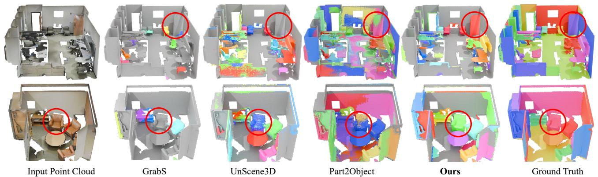

Figure 7. Qualitative results on the S3DIS dataset. Red circles highlight the differences.   
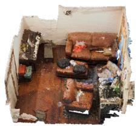

natural_image

Interior view of a cluttered room with scattered furniture and debris (no visible text or symbols)

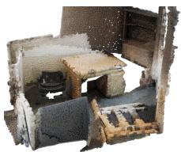

natural_image

Interior view of a dimly lit room with furniture and debris (no visible text or symbols)

Input Point Cloud

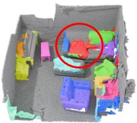

natural_image

3D rendered model of a toy car interior with colorful blocks and a red circle highlighting a specific object (no text or symbols present)

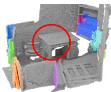

natural_image

3D rendered model of a modular structure with colored blocks and a red circle highlighting a specific section (no text or symbols)

GrabS

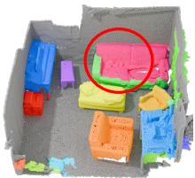

natural_image

3D rendered model of colorful plastic crates arranged in a gray container, with one box highlighted by a red circle (no text or symbols visible)

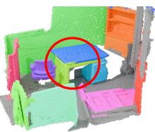

natural_image

Colorful 3D-rendered object with a highlighted square (no text or symbols)

UnScene3D

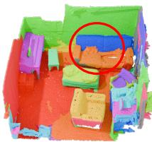

natural_image

Colorful 3D-printed toy blocks arranged in a grid, with one highlighted by a red circle (no text or symbols visible)

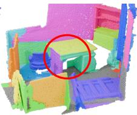

natural_image

Colorful 3D-rendered abstract structure with a red circle highlighting a specific area (no text or symbols)

Part2Object

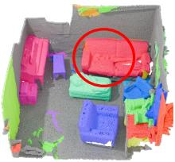

natural_image

3D rendered model of a colorful plastic or plastic container with no visible text or symbols

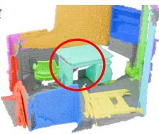

natural_image

3D rendered model of a room with colored walls and a highlighted green space (no text or symbols)

Ours

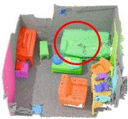

natural_image

3D rendered interior of a modular furniture or storage unit with colored blocks and a highlighted green object (no text or symbols visible)

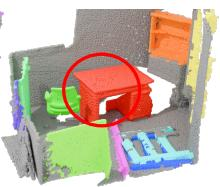

natural_image

3D rendered interior model of a room with colored blocks and a red circle highlighting a specific area (no text or symbols)

Ground Truth   
Figure 8. Qualitative results on the ScanNet200 dataset. Red circles highlight the differences.

Table 6. Controlled comparisons under DINO-only, TRELLISonly, and DINO+TRELLIS settings on the ScanNet validation set. 

<table><tr><td>Methods</td><td>AP</td><td>AP@50</td><td>AP@25</td></tr><tr><td colspan="4">DINO-only:</td></tr><tr><td>UnScene3D (Rozenberszki et al., 2024)</td><td>17.7</td><td>35.6</td><td>65.2</td></tr><tr><td>Part2Object (Shi et al., 2024)</td><td>19.6</td><td>38.4</td><td>64.9</td></tr><tr><td>FoundObj (Ours)</td><td>19.5</td><td>40.2</td><td>72.7</td></tr><tr><td colspan="4">TRELLIS-only:</td></tr><tr><td>UnScene3D (Rozenberszki et al., 2024)</td><td>10.1</td><td>24.5</td><td>56.3</td></tr><tr><td>Part2Object (Shi et al., 2024)</td><td>12.6</td><td>29.5</td><td>65.1</td></tr><tr><td>FoundObj (Ours)</td><td>15.3</td><td>37.2</td><td>67.6</td></tr><tr><td colspan="4">DINO+TRELLIS:</td></tr><tr><td>UnScene3D (Rozenberszki et al., 2024)</td><td>15.3</td><td>33.2</td><td>68.5</td></tr><tr><td>Part2Object (Shi et al., 2024)</td><td>17.7</td><td>37.5</td><td>70.9</td></tr><tr><td>FoundObj (Ours)</td><td>24.2</td><td>46.2</td><td>74.7</td></tr></table>

\- Semantic Cost Bank Size: Lastly, we analyze the effect of semantic cost bank size. Storing the top 20 lowest costs consistently yields the best results. A smaller bank size causes the agent to repeatedly identify only salient objects, limiting exploration diversity, whereas a larger size allows lower-quality candidates to slip in.

# 4.4. Necessity of the RL-based Object Discovery Agent

A key question is whether the improvement of FoundObj comes merely from using additional 3D foundation models compared with baselines e.g., Part2Object (Shi et al.,

2024) and UnScene3D (Rozenberszki et al., 2024), or from the proposed RL-based discovery mechanism that effectively exploits object-level priors. To answer this, we apply the 3D foundation model TRELLIS to scene-level point clouds and evaluate the baselines under three settings: using DINOv1/v2 features exclusively, using TRELLIS features exclusively, and using a concatenation of both.

As shown in Table 6, when only DINO features are used, FoundObj achieves performance comparable to DINObased clustering baselines, indicating that the agent does not merely act as a simple alternative to clustering algorithms. In contrast, under the TRELLIS-only and DINO+TRELLIS settings, FoundObj consistently outperforms the UnScene3D and Part2Object variants, demonstrating that the RL-based agent is essential for effectively leveraging 3D object-level priors.

# 4.5. Pseudo Mask Quality and Error Propagation

Since our segmentation network is trained from pseudo masks discovered by the RL agent, we further analyze the quality of these pseudo-labels and their effect on the final Mask3D training. As shown in Table 7, without any cleaning or filtering, the discovered pseudo masks achieve 13.8 in AP score on the ScanNet training set, indicating that the agent can already discover meaningful object masks before training the final segmentation network.

Table 7. Pseudo-label quality and error propagation on ScanNet. 

<table><tr><td></td><td>AP</td><td>AP@50</td><td>AP@25</td></tr><tr><td>Pseudo masks</td><td>13.8</td><td>28.1</td><td>56.6</td></tr><tr><td>Mask3D w/ pseudo masks</td><td>24.2</td><td>46.2</td><td>74.7</td></tr><tr><td>Mask3D w/ filtered masks</td><td>37.0</td><td>59.7</td><td>83.3</td></tr></table>

Table 8. Open-vocabulary instance segmentation results on the ScanNet validation set. 

<table><tr><td>Methods</td><td>AP</td><td>AP@50</td><td>AP@25</td></tr><tr><td colspan="4">Supervised:</td></tr><tr><td>Mask3D w/ OpenScene (Peng et al., 2023)</td><td>11.7</td><td>15.2</td><td>17.8</td></tr><tr><td>OpenIns3D (Nguyen et al., 2024)</td><td>23.7</td><td>29.4</td><td>32.8</td></tr><tr><td>OpenMask3D (Takmaz et al., 2023)</td><td>15.4</td><td>19.9</td><td>23.1</td></tr><tr><td colspan="4">Unsupervised:</td></tr><tr><td>FoundObj (Ours)</td><td>6.7</td><td>12.7</td><td>16.4</td></tr></table>

To quantify the impact of pseudo mask noise, for each discovered pseudo mask, we compute its IoU with the corresponding ground-truth object mask. If the IoU is higher than 50%, we replace the pseudo mask with the matched groundtruth mask; otherwise, we discard it. We then train Mask3D from scratch using these cleaned labels. As reported in Table 7, the resulting model achieves 37.0 in AP score on ScanNet val set, which is 12.8 points higher than training with our original pseudo masks. This confirms that pseudo mask errors are indeed propagated to the final segmentation network. Nevertheless, despite using noisy pseudo masks without any cleaning, FoundObj still substantially outperforms previous unsupervised methods.

# 4.6. Extended to Open-vocabulary Segmentation

Although FoundObj is designed for class-agnostic object discovery, it can be naturally extended to open-vocabulary 3D object segmentation by assigning the discovered object masks with vision-language features. Specifically, after training, FoundObj predicts object masks for each 3D scene. We then extract OpenSeg (Ghiasi et al., 2022) features for each 3D point and average the point-wise features within each predicted mask. Finally, we compute the cosine similarity between mask features and the text embeddings of candidate class names to assign a semantic label.

We evaluate this extension on the ScanNet validation set. As shown in Table 8, although there remains a gap to fully supervised open-vocabulary methods, it is worth emphasizing that they rely on fully supervised training to obtain object masks, whereas FoundObj generates object masks without any human annotations. These results suggest that FoundObj provides a promising label-free object mask generator for open-vocabulary 3D scene understanding.

# 4.7. Analysis on Object Discovery Agent

In this section, we provide a detailed analysis of the agent’s behavior. Specifically, during training, we evaluate both the number and accuracy of discovered object candidates. A discovered object is considered accurate if its mask achieves an IoU greater than 50% with a matched ground truth object. We further distinguish newly discovered objects, defined as those not identified in any previous epoch, to characterize the agent’s exploration dynamics over time. All evaluations are conducted on the ScanNet training set.

As shown in Table 9, the agent discovers an increasing number of objects throughout training, eventually reaching convergence. The accuracy of discovered object candidates also improves initially and gradually stabilizes at around 40%. Meanwhile, the number of newly discovered objects decreases over time, further indicating convergence. Additionally, the accuracy of newly discovered objects declines in later epochs, suggesting that the most salient objects are identified early, while subsequent exploration targets more challenging cases. Overall, the agent demonstrates a coarse-to-fine, progressive exploration behavior, automatically discovering a diverse range of object shapes over time.

Table 9. The number and accuracy of object candidates discovered by the agent after different training epochs. 

<table><tr><td>Epochs</td><td>50</td><td>100</td><td>150</td><td>200</td><td>250</td><td>300</td></tr><tr><td>Number of Obj</td><td>10408</td><td>11362</td><td>11599</td><td>11750</td><td>11775</td><td>11810</td></tr><tr><td>Accuracy of Obj (%)</td><td>26.6</td><td>30.5</td><td>35.7</td><td>37.8</td><td>40.1</td><td>40.3</td></tr><tr><td>Number of New Obj</td><td>10408</td><td>4342</td><td>2479</td><td>2117</td><td>1147</td><td>1374</td></tr><tr><td>Accuracy of New Obj (%)</td><td>26.6</td><td>16.8</td><td>15.6</td><td>14.0</td><td>12.3</td><td>10.3</td></tr></table>

# 5. Conclusion

In this paper, we present FoundObj, a novel method for effectively discovering a wide variety of 3D objects from complex real-world point clouds, without requiring humanlabeled 3D scenes. Our approach introduces a superpointbased object discovery agent, which learns to select a seed superpoint and then progressively expands its spatial size by merging suitable neighboring superpoints. By leveraging powerful self-supervised 2D/3D foundation models, our agent is guided by complementary reward modules that evaluate the semantic consistency and geometric coherence of each discovered object candidate. Extensive experiments demonstrate that FoundObj achieves state-of-the-art performance and strong generalization in zero-shot and long-tail settings, outperforming existing unsupervised methods. Ablation studies and agent analyses further validate the effectiveness and robustness of each component, highlighting the potential of label-free 3D object segmentation for scalable real-world applications. Future work will explore integrating FoundObj into 3D pipelines like RayletDF (Wei et al., 2025) to enable joint, label-free segmentation and surface reconstruction of point clouds.

Acknowledgments: This work was supported in part by Research Grants Council of Hong Kong under Grants 15219125 & 15225522, and in part by National Natural Science Foundation of China under Grant 62271431.

Impact Statements: This paper presents work whose goal is to advance the field of machine learning. There are many potential societal consequences of our work, none of which we feel must be specifically highlighted here.

# References

Armeni, I., Sax, S., Zamir, A. R., and Savarese, S. Joint 2D-3D-Semantic Data for Indoor Scene Understanding. arXiv:1702.01105, 2017. 2, 5   
Baur, S. A., Emmerichs, D. J., Moosmann, F., Pinggera, P., Ommer, B., and Geiger, A. SLIM: Self-Supervised LiDAR Scene Flow and Motion Segmentation. ICCV, 2021. 3   
Biederman, I. Recognition-by-Components: A Theory of Human Image Understanding. Psychological Review, 1987. 1   
Boudjoghra, M. E. A., Dai, A., Lahoud, J., Cholakkal, H., Anwer, R. M., Khan, S., and Khan, F. S. Open-YOLO 3D: Towards Fast and Accurate Open-Vocabulary 3D Instance Segmentation. ICLR, 2025. 2   
Cao, Y., Yihan, Z., Xu, H., and Xu, D. Coda: Collaborative novel box discovery and cross-modal alignment for openvocabulary 3d object detection. NeurIPS, 2023. 3   
Carion, N., Gustafson, L., Hu, Y.-T., Debnath, S., Hu, R., Suris, D., Ryali, C., Alwala, K. V., Khedr, H., Huang, A., Lei, J., Ma, T., Guo, B., Kalla, A., Marks, M., Greer, J., Wang, M., Sun, P., Radle, R., Afouras, T., Mavroudi, ¨ E., Xu, K., Wu, T.-H., Zhou, Y., Momeni, L., Hazra, R., Ding, S., Vaze, S., Porcher, F., Li, F., Li, S., Kamath, A., Cheng, H. K., Dollar, P., Ravi, N., Saenko, K., Zhang, P., ´ and Feichtenhofer, C. SAM 3: Segment Anything with Concepts. arXiv:2511.16719, 2025. 2   
Caron, M., Touvron, H., Misra, I., Jegou, H., Mairal, J., ´ Bojanowski, P., and Joulin, A. Emerging Properties in Self-Supervised Vision Transformers. ICCV, 2021. 1, 6   
Chang, A. X., Funkhouser, T., Guibas, L., Hanrahan, P., Huang, Q., Li, Z., Savarese, S., Savva, M., Song, S., Su, H., Xiao, J., Yi, L., and Yu, F. ShapeNet: An Information-Rich 3D Model Repository. arXiv:1512.03012, 2015. 6   
Chen, J., Zhang, Z., Yang, Y., Li, J., Wei, S., Sun, Z., and Yang, B. EvObj: Learning Evolving Object-centric Representations for 3D Instance Segmentation without Scene Supervision. CVPR, 2026a. 1, 3

Chen, J., Zhang, Z., Yang, Y., Li, J., Wei, S., Sun, Z., and Yang, B. Evobj: Learning evolving object-centric representations for 3d instance segmentation without scene supervision. CVPR, 2026b. 15

Chen, S., Fang, J., Zhang, Q., Liu, W., and Wang, X. Hierarchical Aggregation for 3D Instance Segmentation. ICCV, 2021. 2

Chibane, J., Engelmann, F., Tran, T. A., and Pons-Moll, G. Box2Mask: Weakly Supervised 3D Semantic Instance Segmentation Using Bounding Boxes. ECCV, 2022. 2

Chiou, R. and Ralph, M. A. L. The anterior temporal cortex is a primary semantic source of top-down influences on object recognition. Cortex, 2016. 1

Collins, J., Goel, S., Luthra, A., Xu, L., Deng, K., Zhang, X., Vicente, T. F. Y., Arora, H., Dideriksen, T., Guillaumin, M., and Malik, J. ABO: Dataset and Benchmarks for Real-World 3D Object Understanding. CVPR, 2022. 4, 14

Contributors, S. Spconv: Spatially sparse convolution library. 2022. 14

Dai, A., Chang, A. X., Savva, M., Halber, M., Funkhouser, T., and Nießner, M. ScanNet: Richly-annotated 3D Reconstructions of Indoor Scenes. CVPR, 2017. 2, 5, 6

Deitke, M., Liu, R., Wallingford, M., Ngo, H., Michel, O., Kusupati, A., Fan, A., Laforte, C., Voleti, V., Gadre, S. Y., VanderBilt, E., Kembhavi, A., Vondrick, C., Gkioxari, G., Ehsani, K., Schmidt, L., and Farhadi, A. Objaverse-XL: A Universe of 10M+ 3D Objects. NeurIPS, 2023. 4

Deng, Q., Hui, L., Xie, J., and Yang, J. Sketchy Boundingbox Supervision for 3D Instance Segmentation. CVPR, 2025. 2

Ester, M., Kriegel, H.-P., Sander, J., and Xu, X. A densitybased algorithm for discovering clusters in large spatial databases with noise. KDD, 1996. 4

Fang, Z., Li, X., Li, X., Buhmann, J. M., Loy, C. C., and Liu, M. Explore In-Context Learning for 3D Point Cloud Understanding. NeurIPS, 2023. 6

Felzenszwalb, P. F. and Huttenlocher, D. P. Efficient Graph-Based Image Segmentation. IJCV, 2004. 3, 15

Fu, H., Jia, R., Gao, L., Gong, M., Zhao, B., Maybank, S., and Tao, D. 3D-FUTURE: 3D Furniture shape with TextURE. IJCV, 2021. 4, 14

Ghiasi, G., Gu, X., Cui, Y., and Lin, T.-Y. Scaling openvocabulary image segmentation with image-level labels. ECCV, 2022. 9

Graham, B., Engelcke, M., and van der Maaten, L. 3D Semantic Segmentation with Submanifold Sparse Convolutional Networks. CVPR, 2018. 3   
Griffiths, D., Boehm, J., and Ritschel, T. Finding Your (3D) Center: 3D Object Detection Using a Learned Loss. ECCV, 2020. 2   
Gui, J., Chen, T., Zhang, J., Cao, Q., Sun, Z., Luo, H., and Tao, D. A Survey on Self-Supervised Learning: Algorithms, Applications, and Future Trends. TPAMI, 2024. 1   
Guo, H., Zhu, H., Peng, S., Wang, Y., Shen, Y., Hu, R., and Zhou, X. SAM-guided Graph Cut for 3D Instance Segmentation. ECCV, 2024. 2   
Ha, H. and Song, S. Semantic Abstraction: Open-World 3D Scene Understanding from 2D Vision-Language Models. CoRL, 2022. 2   
Han, L., Zheng, T., Xu, L., and Fang, L. OccuSeg: Occupancy-aware 3D Instance Segmentation. CVPR, 2020. 2   
Han, Z., Boudjoghra, M. E. A., Dong, J., Wang, J., and Anwer, R. M. All in One: Visual-Description-Guided Unified Point Cloud Segmentation. ICCV, 2025. 1   
He, T., Shen, C., and van den Hengel, A. DyCo3D: Robust Instance Segmentation of 3D Point Clouds through Dynamic Convolution. CVPR, 2021. 2   
Hou, J., Dai, A., and Nießner, M. 3D-SIS: 3D Semantic Instance Segmentation of RGB-D Scans. CVPR, 2019. 2   
Huang, S.-Y., Choe, J., Wang, Y.-C. F., and Sun, C. OpenVoxel: Training-Free Grouping and Captioning Voxels for Open-Vocabulary 3D Scene Understanding. arXiv:2601.09575, 2026. 3   
Huang, Z., Wu, X., Chen, X., Zhao, H., Zhu, L., and Lasenby, J. OpenIns3D: Snap and Lookup for 3D Openvocabulary Instance Segmentation. ECCV, 2024. 2   
Jung, S., Zheng, J., Zhang, K., Qiao, N., Chen, A. Y. C., Xia, L., Liu, C., Sun, Y., Zeng, X., Huang, H.-W., Boots, B., Sun, M., and Kuo, C.-H. Details Matter for Indoor Open-vocabulary 3D Instance Segmentation. ICCV, 2025. 2   
Kirillov, A., Mintun, E., Ravi, N., Mao, H., Rolland, C., Gustafson, L., Xiao, T., Whitehead, S., Berg, A. C., Lo, W.-Y., Dollar, P., and Girshick, R. Segment Anything. ´ ICCV, 2023. 2   
Kolodiazhnyi, M., Vorontsova, A., Konushin, A., and Rukhovich, D. OneFormer3D: One Transformer for Unified Point Cloud Segmentation. CVPR, 2024. 1, 2

Lai, X., Yuan, Y., Chu, R., Chen, Y., Hu, H., and Jia, J. Mask-Attention-Free Transformer for 3D Instance Segmentation. ICCV, 2023. 2   
Lai, Z., Zhao, Y., Liu, H., Zhao, Z., Lin, Q., Shi, H., Yang, X., Yang, M., Yang, S., Feng, Y., Zhang, S., Huang, X., Luo, D., Yang, F., Yang, F., Wang, L., Liu, S., Tang, Y., Cai, Y., He, Z., Liu, T., Liu, Y., Jiang, J., Linus, Huang, J., and Guo, C. Hunyuan3D 2.5: Towards High-Fidelity 3D Assets Generation with Ultimate Details. arXiv:2506.16504, 2025. 4   
Lee, J., Park, C., Choe, J., Wang, Y.-C. F., Kautz, J., Cho, M., and Choy, C. Mosaic3D: Foundation Dataset and Model for Open-Vocabulary 3D Segmentation. CVPR, 2025. 2   
Lei, J., Deng, C., Schmeckpeper, K., Guibas, L., and Daniilidis, K. EFEM: Equivariant Neural Field Expectation Maximization for 3D Object Segmentation Without Scene Supervision. CVPR, 2023. 1, 3, 6, 7   
Li, X., Zhang, Q., Kang, D., Cheng, W., Gao, Y., Zhang, J., Liang, Z., Liao, J., Cao, Y.-P., and Shan, Y. Advances in 3D Generation: A Survey. arXiv:2401.17807, 2024. 1   
Liu, H., Li, C., Wu, Q., and Lee, Y. J. Visual Instruction Tuning. NeurIPS, 2023a. 2   
Liu, T., Wang, Z., Liu, R., Wang, G., and Zhang, D. Towards 3D Objectness Learning in an Open World. NeurIPS, 2025. 2   
Liu, Y., Kong, L., Cen, J., Chen, R., Zhang, W., Pan, L., Chen, K., and Liu, Z. Segment Any Point Cloud Sequences by Distilling Vision Foundation Models. NeurIPS, 2023b. 2   
Lu, J., Deng, J., Wang, C., He, J., and Zhang, T. Query Refinement Transformer for 3D Instance Segmentation. ICCV, 2023a. 2   
Lu, Y., Xu, C., Wei, X., Xie, X., Tomizuka, M., Keutzer, K., and Zhang, S. Open-Vocabulary Point-Cloud Object Detection without 3D Annotation. CVPR, 2023b. 2   
Mei, G., Riz, L., Wang, Y., and Poiesi, F. Vocabulary-Free 3D Instance Segmentation with Vision-Language Assistant. 3DV, 2025. 3   
Nguyen, P., Luu, M., Tran, A., Pham, C., and Nguyen, K. Any3DIS: Class-Agnostic 3D Instance Segmentation by 2D Mask Tracking. CVPR, 2025. 2   
Nguyen, P. D. A., Ngo, T. D., Kalogerakis, E., Gan, C., Tran, A., Pham, C., and Nguyen, K. Open3DIS: Open-Vocabulary 3D Instance Segmentation with 2D Mask Guidance. CVPR, 2024. 2, 9

Oquab, M., Darcet, T., Moutakanni, T., Vo, H. V., Szafraniec, M., Khalidov, V., Fernandez, P., Haziza, D., Massa, F., El-nouby, A., Assran, M., Ballas, N., Galuba, W., Howes, R., Huang, P.-y., Li, S.-w., Misra, I., Rabbat, M., Sharma, V., Synnaeve, G., Xu, H., Jegou, H., and Mairal, J. DINOv2: Learning Robust Visual Features without Supervision. TMLR, 2024. 1, 2   
Peng, S., Genova, K., Jiang, C., Tagliasacchi, A., Pollefeys, M., Funkhouser, T., et al. Openscene: 3d scene understanding with open vocabularies. CVPR, 2023. 9   
Radford, A., Kim, J. W., Hallacy, C., Ramesh, A., Goh, G., Agarwal, S., Sastry, G., Askell, A., Mishkin, P., Clark, J., Krueger, G., and Sutskever, I. Learning Transferable Visual Models From Natural Language Supervision. ICML, 2021. 2   
Ren, S., Zhang, C., Wang, S., Zhu, L., and Zhang, M. UCFSeg: Unsupervised 3D point cloud segmentation via multi-scale contextual feature learning. Digital Signal Processing, 2026. 3   
Roh, W., Jung, H., Nam, G., Yeom, J., Park, H., Ho, S., and Sangpil, Y. Edge-Aware 3D Instance Segmentation Network with Intelligent Semantic Prior. CVPR, 2024. 2   
Rozenberszki, D., Litany, O., and Dai, A. Language-Grounded Indoor 3D Semantic Segmentation in the Wild. ECCV, 2022. 5   
Rozenberszki, D., Litany, O., and Dai, A. UnScene3D: Unsupervised 3D Instance Segmentation for Indoor Scenes. CVPR, 2024. 1, 3, 5, 6, 7, 8, 17, 18   
Schult, J., Engelmann, F., Hermans, A., Litany, O., Tang, S., and Leibe, B. Mask3D: Mask Transformer for 3D Semantic Instance Segmentation. ICRA, 2023. 2, 5, 6, 7, 15, 17, 18   
Shi, C., Zhang, Y., Yang, B., Tang, J., and Yang, S. Part2Object: Hierarchical Unsupervised 3D Instance Segmentation. ECCV, 2024. 1, 3, 6, 7, 8, 17, 18   
Shi, J. and Malik, J. Normalized cuts and image segmentation. TPAMI, 2000. 5, 15   
Shin, S., Zhou, K., Vankadari, M., Markham, A., and Trigoni, N. Spherical Mask: Coarse-to-Fine 3D Point Cloud Instance Segmentation with Spherical Representation. CVPR, 2024. 2   
Song, Z. and Yang, B. OGC: Unsupervised 3D Object Segmentation from Rigid Dynamics of Point Clouds. NeurIPS, 2022. 3   
Song, Z. and Yang, B. Unsupervised 3D Object Segmentation of Point Clouds by Geometry Consistency. TPAMI, 2024. 3

Sun, J., Qing, C., Tan, J., and Xu, X. Superpoint Transformer for 3D Scene Instance Segmentation. AAAI, 2023. 2   
Takmaz, A., Fedele, E., Sumner, R. W., Pollefeys, M., Tombari, F., and Engelmann, F. OpenMask3D: Open-Vocabulary 3D Instance Segmentation. NeurIPS, 2023. 2, 9   
Tang, L., Hui, L., and Xie, J. Learning Inter-Superpoint Affinity for Weakly Supervised 3D Instance Segmentation. ACCV, 2022. 2   
Vu, T., Kim, K., Luu, T. M., Nguyen, X. T., and Yoo, C. D. SoftGroup for 3D Instance Segmentation on Point Clouds. CVPR, 2022. 2   
Wang, W., Yu, R., Huang, Q., and Neumann, U. SGPN: Similarity Group Proposal Network for 3D Point Cloud Instance Segmentation. CVPR, 2018. 2   
Wang, Y., He, X., Peng, S., Lin, H., Bao, H., and Zhou, X. Autorecon: Automated 3d object discovery and reconstruction. CVPR, 2023. 3   
Wang, Y., Jia, B., Zhu, Z., and Huang, S. Masked Point-Entity Contrast for Open-Vocabulary 3D Scene Understanding. CVPR, 2025. 2   
Wei, S., Li, J., Yang, Y., Zhou, S., and Yang, B. RayletDF: Raylet Distance Fields for Generalizable 3D Surface Reconstruction from Point Clouds or Gaussians. ICCV, 2025. 9   
Wu, S., Lin, Y., Zhang, F., Zeng, Y., Xu, J., Torr, P., Cao, X., and Yao, Y. Direct3d: Scalable image-to-3d generation via 3d latent diffusion transformer. NeurIPS, 2024. 16   
Xiang, J., Lv, Z., Xu, S., Deng, Y., Wang, R., Zhang, B., Chen, D., Tong, X., and Yang, J. Structured 3D Latents for Scalable and Versatile 3D Generation. CVPR, 2025. 2, 4, 14, 16   
Yan, M., Zhang, J., Zhu, Y., and Wang, H. MaskClustering: View Consensus based Mask Graph Clustering for Open-Vocabulary 3D Instance Segmentation. CVPR, 2024. 2   
Yang, B., Wang, J., Clark, R., Hu, Q., Wang, S., Markham, A., and Trigoni, N. Learning Object Bounding Boxes for 3D Instance Segmentation on Point Clouds. NeurIPS, 2019. 2   
Yang, Y., Zhang, Z., and Yang, B. unMORE: Unsupervised Multi-Object Segmentation via Center-Boundary Reasoning. ICML, 2025. 3, 4   
Yi, L., Zhao, W., Wang, H., Sung, M., and Guibas, L. GSPN: Generative Shape Proposal Network for 3D Instance Segmentation in Point Cloud. CVPR, 2019. 2

Yin, Y., Liu, Y., Xiao, Y., Cohen-Or, D., Huang, J., and Chen, B. SAI3D: Segment Any Instance in 3D Scenes. CVPR, 2024. 2   
Yoo, Y., Kim, S., and Kim, C. BEEP3D: Box-Supervised End-to-End Pseudo-Mask Generation for 3D Instance Segmentation. arXiv:2510.12182, 2025. 2   
Zhang, L., Yang, A. J., Xiong, Y., Casas, S., Yang, B., Ren, M., and Urtasun, R. Towards Unsupervised Object Detection from LiDAR Point Clouds. CVPR, 2023a. 3   
Zhang, Y., Wu, X., Lao, Y., Wang, C., Tian, Z., Wang, N., and Zhao, H. Concerto: Joint 2d-3d self-supervised learning emerges spatial representations. NeurIPS, 2025a. 6   
Zhang, Z., Yang, B., Wang, B., and Li, B. Growsp: Unsupervised semantic segmentation of 3d point clouds. CVPR, 2023b. 15   
Zhang, Z., Ding, J., Jiang, L., Dai, D., and Xia, G.-S. Free-Point: Unsupervised Point Cloud Instance Segmentation. CVPR, 2024. 3   
Zhang, Z., Dai, W., Wen, H., and Yang, B. Logosp: Localglobal grouping of superpoints for unsupervised semantic segmentation of 3d point clouds. CVPR, 2025b. 15   
Zhang, Z., Yang, Y., Wen, H., and Yang, B. GrabS: Generative Embodied Agent for 3D Object Segmentation without Scene Supervision. ICLR, 2025c. 1, 2, 3, 5, 6, 7, 17, 18   
Zhang, Z., Dai, W., Wang, B., Li, B., and Yang, B. Growsp++: Growing superpoints and primitives for unsupervised 3d semantic segmentation. TPAMI, 2026. 15   
Zhao, J., Zhuo, J., Chen, J., and Ma, H. SAM2Object: Consolidating View Consistency via SAM2 for Zero-Shot 3D Instance Segmentation. CVPR, 2025a. 2   
Zhao, Z., Lai, Z., Lin, Q., Zhao, Y., Liu, H., Yang, S., Feng, Y., Yang, M., Zhang, S., Yang, X., et al. Hunyuan3d 2.0: Scaling diffusion models for high resolution textured 3d assets generation. arXiv preprint arXiv:2501.12202, 2025b. 16   
Zhou, M., He, C., Wang, R., and Chen, X. OV3D-CG: Openvocabulary 3D Instance Segmentation with Contextual Guidance. ICCV, 2025. 2

# A. Details of Object Discovery Agent

Backbone Network. Our framework starts with a 3D scene backbone ${ \mathbf { \pm } } _ { g b o n e }$ to extract per-point features. We adopt the Res16UNet34C architecture from SparseConv as the backbone, which consists of four downsampling and upsampling stages to capture multi-scale geometric information. The backbone implementation is based on the SpConv library (Contributors, 2022).

Policy Networks. Our framework includes two policy networks, namely the seed selection policy $\pi _ { \mathrm { s e e d } }$ and the neighbor merging policy $\pi _ { \mathrm { m e r g e } }$ . While sharing a similar design, the two policies differ in their configurations and outputs.

The seed policy network $\pi _ { \mathrm { s e e d } }$ consists of a self-attention block followed by a feed-forward network (FFN) and a classification head with softmax activation. It takes all superpoint features within a 3D scene as input. After selfattention and FFN updates, the superpoint features are passed through an MLP and a softmax layer to produce a probability distribution over all superpoints, indicating the likelihood of each superpoint being selected as a seed. The hidden dimension is set to 128.

The merge policy network $\pi _ { \mathrm { m e r g e } }$ is composed of three selfattention blocks with FFN layers. It takes as input the features of the current region and its neighboring superpoints. The updated features are then fed into an MLP followed by a sigmoid activation to predict the probability of each neighboring superpoint being merged into the current region.

For both policies, we introduce a learnable value token that is concatenated with the superpoint features and jointly processed through the self-attention layers. The updated value token is finally passed to an MLP head to regress a scalar state-value estimate. Separate value tokens and value heads are used for $\pi _ { \mathrm { s e e d } }$ and πmerge.

Reinforcement Learning Optimization. We adopt the Proximal Policy Optimization (PPO) algorithm to train the agent. For each trajectory, a reward of +10 is assigned if the current region satisfies either the geometric or semantic verification criteria, upon which the trajectory is terminated. Otherwise, a penalty of −1 is assigned. The maximum number of steps per trajectory is set to 5.

Seed Range Sampling Strategy. Seed superpoint selection requires evaluating all superpoints in a scene, which is computationally expensive and may lead the policy to repeatedly select a few dominant superpoints. To alleviate this issue, we randomly crop a spherical region with a radius of 1 m from each scene during training and restrict seed selection to the superpoints within this region. The cropped region is resampled at every training epoch, promoting both efficiency and exploration diversity.

# B. Details of Geometric Reward Module

Network Architecture: The Object Center Field Network comprises an encoder and a decoder with details as follows:

For the encoder, we adopt the 3D shape encoder proposed in the VAE of TRELLIS (Xiang et al., 2025), which consists of 13 layers of 3D convolutional layers. Input point clouds are first voxelized into a resolution of $6 4 ^ { 3 }$ grid, which is then fed into the encoder to generate a resolution of $1 6 ^ { 3 }$ voxel latent representation. Each voxel in this grid is associated with a 512-dimensional feature vector, encoding the 3D shape information. We directly load their well-trained model weights and freeze the encoder parameters.

For the decoder, a self-attention block is first employed to refine the feature representations extracted by TREL-LIS. Subsequently, a cross-attention block takes the refined features as input to output center-offset vectors. Notably, arbitrary query points can be fed into this cross-attention block to obtain their corresponding predicted center-offset vectors. The position embedding for query points adopts the standard Fourier embedding. Both the self-attention and cross-attention blocks are configured with a consistent feature dimension of 512.

Date Preparation: The Object Center Field Network is trained on 3D object datasets: ABO (Collins et al., 2022) and 3D-Future (Fu et al., 2021). We additionally create random non-object fragments during training and enforce zero-vector predictions for their points $( i . e . , \mathrm { \bf ~ \nabla } v _ { m } \mathrm { \bf ~ = ~ } { \bf 0 } ) .$ improving the discriminability and robustness of the Center Field in cluttered 3D scenes. The data preparation pipeline for training samples is detailed as follows:

First, each object mesh from the two datasets undergoes random rotation and normalization to stay within a unit cube. To simulate real-world scenarios, we append a vertical plane mesh (simulating a wall) and a horizontal plane mesh (simulating a floor) to the normalized object. Furthermore, 70% of the training samples are augmented with additional object meshes sampled randomly from the same datasets to construct multi-object scenarios.

After creating the object meshes, we randomly select 12 views to render depth maps. The camera pitch angle for these views ranges from -30^\circ to +30^\circ , and the camera is positioned 2 units away from the origin. From the rendered depth maps, 2–4 views are randomly chosen for reprojection into point clouds, which are then concatenated as partial object point clouds and used as the input to the Object Center Field Network during training. The supervision signal is precomputed as the offset from each point in the input object to the center of the object mesh. For the input non-object points, we simply set their supervision as all-zero vectors.

# C. Details of Semantic Reward Module

Given the per-superpoint DINOv2 features for a 3D scene, we aim to design a criterion to measure whether an arbitrary mask is semantically distinctive. Inspired by NCut (Shi & Malik, 2000), we introduce a graph-cut cost as our semantic reward criterion.

Specifically, we build a weighted spatial graph over K superpoints, where each node corresponds to a superpoint and is associated with a DINOv2 feature. The affinity matrix considers both semantic similarity and spatial connectivity. The semantic similarity matrix $\dot { \boldsymbol { S } } \in \mathbb { R } ^ { \bar { K } \times K }$ is computed using pair-wise cosine similarity between superpoints. The spatial connectivity matrix $\mathcal { A } \in \mathbb { R } ^ { K \times K }$ encodes superpoint adjacency, where $A _ { i j } = 1$ indicates that the $i ^ { t h }$ and $j ^ { t h }$ superpoints are spatially adjacent. The final affinity matrix is computed as

$$
\mathcal {W} = \mathcal {S} * \mathcal {A}. \tag {5}
$$

Given a binary mask $O _ { t } \in \mathbb { R } ^ { K \times 1 }$ , we treat it as a candidate solution of the graph cut problem and partition the superpoints into two disjoint sets $O _ { t }$ and $\bar { O } _ { t }$ . We then compute the semantic cost following NCut (Shi & Malik, 2000):

$$
\mathrm{cost} (O _ {t}) = \frac {\mathrm{cut} (O _ {t} , \bar {O} _ {t})}{\mathrm{vol} (O _ {t})}, \tag {6}
$$

where

$$
\operatorname{cut} (O _ {t}, \bar {O} _ {t}) = \sum_ {i \in O _ {t}} \sum_ {j \in \bar {O} _ {t}} \mathcal {W} _ {i j}, \quad \operatorname{vol} (O _ {t}) = \sum_ {i \in O _ {t}} \sum_ {j} \mathcal {W} _ {i j}. \tag {7}
$$

Here, $\operatorname { c u t } ( O _ { t } , \bar { O } _ { t } )$ , denoted as $\mathcal { C } _ { \mathrm { b o u n d a r y } }$ , measures the semantic similarity of superpoint pairs across the boundary of $O _ { t } .$ , while $\mathrm { v o l } ( O _ { t } )$ , denoted as $\mathcal { C } _ { \mathrm { v o l } }$ , captures the internal semantic consistency within $O _ { t }$ .

In computation, the cut term can be expressed in matrix form using the affinity matrix W and the binary mask $O _ { t }$ :

$$
\operatorname{cut} (O _ {t}, \bar {O} _ {t}) = O _ {t} ^ {\top} \mathcal {W} (1 - O _ {t}), \tag {8}
$$

Similarly, the volume term can be calculated as:

$$
\operatorname{vol} \left(O _ {t}\right) = O _ {t} ^ {\top} \mathcal {W} \mathbf {1}, \tag {9}
$$

where $\mathbf { 1 } \in \mathbb { R } ^ { K \times 1 }$ is an all-one vector.

Intuitively, this cost penalizes separating semantically similar superpoints across the boundary, while favoring regions that are internally consistent and well separated from their surrounding context. Therefore, a lower cost indicates stronger semantic objectness for the candidate region and serves as a semantic prior for object discovery.

# D. Details of Training and Test

For the PPO training of policy networks, we constrain the maximum change ratio between the previous and current policy distributions to 20% to prevent unstable updates. We employ generalized advantage estimation (GAE) instead of vanilla advantage regression, with the GAE parameter $\lambda = 0 . 9$ and the discount factor $\gamma = 0 . 9$ . To encourage exploration, an entropy regularization term is applied to the action distributions. The overall loss consists of the PPO-Clip loss, the value regression loss, and the entropy loss, with corresponding coefficients set to 1, 1, and 0.1, respectively. We use the Adam optimizer with a learning rate of 1e-4 throughout training.

For training the segmentation network Mask3D (Schult et al., 2023), we collect all discovered object candidate masks from agent training as pseudo-labels. The training loss is the same as the vanilla Mask3D, which consists of a binary cross-entropy and dice loss for mask supervision, a cross-entropy loss for mask classification, and another binary cross-entropy for object-background classification, with weights of 2, 5, and 2. The voxel size of SparseConv is 2cm, and shares the same backbone as ${ \mathbf { \pm } } _ { g b o n e }$ . The optimizer is AdamW with a learning rate of 1e-4 in all training epochs.

After training, we directly use the well-trained Mask3D to do inference. The usage of superpoints is also adopted, inspired by a line of 3D unsupervised works (Zhang et al., 2023b; 2025b; 2026; Chen et al., 2026b).

# E. Evaluation on ScanNet

We train our model on the ScanNet training set for 300 epochs with a batch size of 5. We use the superpoints provided by Felzenswalb algorithm (Felzenszwalb & Huttenlocher, 2004). Figure 9 provides additional qualitative comparisons with baseline methods on the ScanNet dataset. The optimizer is AdamW with a learning rate of 1e-4 in all training epochs.

# F. Evaluation on S3DIS

Tabs. 11 to 16 show the results of cross-dataset validation on each area of S3DIS. Figure 10 gives more qualitative comparisons.

# G. Evaluation on ScanNet200

ScanNet200 is a more challenging benchmark; we also resume the well-trained checkpoint on ScanNet to validate the segmentation performances on this long-trial dataset. Figure 11 shows more qualitative results.

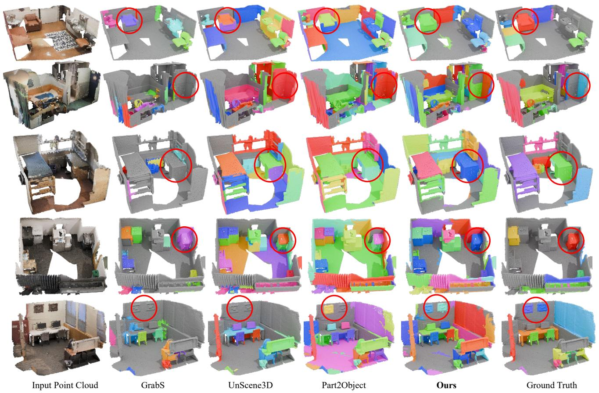  
Figure 9. More qualitative results on ScanNet.

# H. Computational Overhead

We also analyze the computational overhead of FoundObj. Our framework consists of three main components. Training the Geometric Reward Module takes 13 hours and uses 16.4 GB GPU memory. The Semantic Reward Module does not require training, while extracting multi-view DINOv2 features and projecting them onto 3D point clouds takes 7 hours and 6.9 GB GPU memory. Training the object discovery agent together with the Mask3D segmentation network takes 35 hours and 14.9 GB of GPU memory. In total, FoundObj requires 55 hours of training on a single RTX 3090 GPU with an AMD R9 7950X CPU.

For comparison, Part2Object requires 44 hours in total, including feature extraction, pseudo-label construction, and segmentation network training. UnScene3D requires 39 hours in total. Therefore, FoundObj introduces 11 and 16 additional training hours compared with Part2Object and UnScene3D, respectively. However, this extra cost brings clear improvements of 4.6 AP, 7.8 AP@50, and 9.8 AP@25 over the strongest baseline on ScanNet. Moreover, all methods use the same Mask3D architecture at inference time, so FoundObj has the same inference speed as the baselines, averaging 0.092 seconds per ScanNet scene. This shows that the additional computation is limited to training and

Table 10. Segmentation performance on the ScanNet validation set with different 3D foundation models. 

<table><tr><td>3D Foundation Models</td><td>AP</td><td>AP@50</td><td>AP@25</td></tr><tr><td>Hunyuan3D 2.0 (Zhao et al., 2025b)</td><td>24.3</td><td>46.1</td><td>75.6</td></tr><tr><td>Direct3D (Wu et al., 2024)</td><td>22.5</td><td>44.9</td><td>76.0</td></tr><tr><td>TRELLIS (Xiang et al., 2025)</td><td>24.2</td><td>46.2</td><td>74.7</td></tr></table>

does not affect deployment efficiency.

# I. More 3D Object Foundation Models

For the geometric foundation model, we further verify that other mainstream 3D object foundation models, such as Hunyuan3D 2.0 (Zhao et al., 2025b) and Direct3D (Wu et al., 2024), can also be substitutes for TRELLIS. Specifically, we use their encoders to train the Center Field module and then train the object segmentation network. The results in the attached Table 10 show that our framework is not tied to a specific foundation model and generalizes well across different choices.

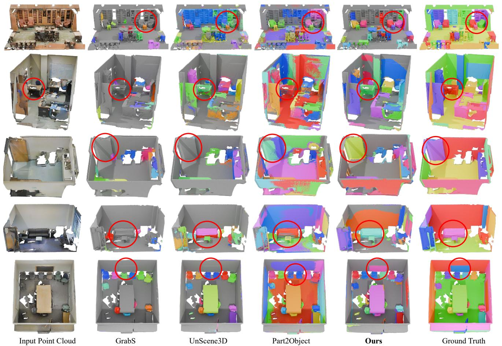

Figure 10. More qualitative results on S3DIS.   
Table 11. Quantitative results of our method and baselines on the S3DIS-Area1. 

<table><tr><td>Methods</td><td>AP</td><td>AP@50</td><td>AP@25</td></tr><tr><td colspan="4">Supervised:</td></tr><tr><td>Mask3D (Schult et al., 2023)</td><td>10.2</td><td>18.6</td><td>33.8</td></tr><tr><td colspan="4">Unsupervised:</td></tr><tr><td>GrabS (Zhang et al., 2025c)</td><td>3.1</td><td>5.6</td><td>10.5</td></tr><tr><td>UnScene3D-CSC (Rozenberszki et al., 2024)</td><td>7.9</td><td>16.2</td><td>36.6</td></tr><tr><td>UnScene3D-DINO (Rozenberszki et al., 2024)</td><td>6.3</td><td>17.6</td><td>37.6</td></tr><tr><td>UnScene3D (Rozenberszki et al., 2024)</td><td>9.0</td><td>19.9</td><td>40.1</td></tr><tr><td>Part2Object (Shi et al., 2024)</td><td>8.3</td><td>20.9</td><td>47.5</td></tr><tr><td>FoundObj (Ours)</td><td>11.9</td><td>25.7</td><td>48.0</td></tr></table>

Table 12. Quantitative results of our method and baselines on the S3DIS-Area2. 

<table><tr><td>Methods</td><td>AP</td><td>AP@50</td><td>AP@25</td></tr><tr><td colspan="4">Supervised:</td></tr><tr><td>Mask3D (Schult et al., 2023)</td><td>6.1</td><td>12.4</td><td>24.1</td></tr><tr><td colspan="4">Unsupervised:</td></tr><tr><td>GrabS (Zhang et al., 2025c)</td><td>0.9</td><td>2.0</td><td>5.7</td></tr><tr><td>UnScene3D-CSC (Rozenberszki et al., 2024)</td><td>2.9</td><td>8.0</td><td>10.7</td></tr><tr><td>UnScene3D-DINO (Rozenberszki et al., 2024)</td><td>1.8</td><td>5.6</td><td>19.9</td></tr><tr><td>UnScene3D (Rozenberszki et al., 2024)</td><td>3.1</td><td>7.8</td><td>23.4</td></tr><tr><td>Part2Object (Shi et al., 2024)</td><td>4.3</td><td>10.6</td><td>28.3</td></tr><tr><td>FoundObj (Ours)</td><td>5.4</td><td>12.9</td><td>30.5</td></tr></table>

Table 13. Quantitative results of our method and baselines on the S3DIS-Area3. 

<table><tr><td>Methods</td><td>AP</td><td>AP@50</td><td>AP@25</td></tr><tr><td colspan="4">Supervised:</td></tr><tr><td>Mask3D (Schult et al., 2023)</td><td>15.2</td><td>24.3</td><td>40.3</td></tr><tr><td colspan="4">Unsupervised:</td></tr><tr><td>GrabS (Zhang et al., 2025c)</td><td>4.8</td><td>7.0</td><td>10.1</td></tr><tr><td>UnScene3D-CSC (Rozenberszki et al., 2024)</td><td>8.5</td><td>17.0</td><td>36.9</td></tr><tr><td>UnScene3D-DINO (Rozenberszki et al., 2024)</td><td>8.0</td><td>16.5</td><td>38.7</td></tr><tr><td>UnScene3D (Rozenberszki et al., 2024)</td><td>9.7</td><td>19.5</td><td>41.9</td></tr><tr><td>Part2Object (Shi et al., 2024)</td><td>10.5</td><td>24.7</td><td>48.8</td></tr><tr><td>FoundObj (Ours)</td><td>12.6</td><td>26.5</td><td>51.6</td></tr></table>

Table 14. Quantitative results of our method and baselines on the S3DIS-Area4. 

<table><tr><td>Methods</td><td>AP</td><td>AP@50</td><td>AP@25</td></tr><tr><td colspan="4">Supervised:</td></tr><tr><td>Mask3D (Schult et al., 2023)</td><td>12.7</td><td>22.7</td><td>38.1</td></tr><tr><td colspan="4">Unsupervised:</td></tr><tr><td>GrabS (Zhang et al., 2025c)</td><td>2.3</td><td>4.5</td><td>8.9</td></tr><tr><td>UnScene3D-CSC (Rozenberszki et al., 2024)</td><td>5.7</td><td>14.0</td><td>36.1</td></tr><tr><td>UnScene3D-DINO (Rozenberszki et al., 2024)</td><td>6.1</td><td>14.2</td><td>35.9</td></tr><tr><td>UnScene3D (Rozenberszki et al., 2024)</td><td>7.8</td><td>17.8</td><td>39.9</td></tr><tr><td>Part2Object (Shi et al., 2024)</td><td>8.2</td><td>21.4</td><td>48.2</td></tr><tr><td>FoundObj (Ours)</td><td>12.2</td><td>27.5</td><td>49.0</td></tr></table>

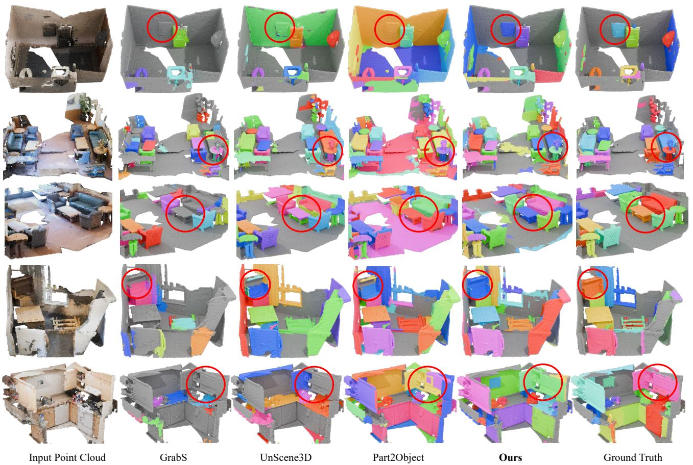

Figure 11. More qualitative results on ScanNet200.   
Table 15. Quantitative results of our method and baselines on the S3DIS-Area5. 

<table><tr><td>Methods</td><td>AP</td><td>AP@50</td><td>AP@25</td></tr><tr><td colspan="4">Supervised:</td></tr><tr><td>Mask3D (Schult et al., 2023)</td><td>13.0</td><td>22.3</td><td>37.5</td></tr><tr><td colspan="4">Unsupervised:</td></tr><tr><td>GrabS (Zhang et al., 2025c)</td><td>3.7</td><td>6.1</td><td>9.3</td></tr><tr><td>UnScene3D-CSC (Rozenberszki et al., 2024)</td><td>8.0</td><td>14.8</td><td>32.2</td></tr><tr><td>UnScene3D-DINO (Rozenberszki et al., 2024)</td><td>7.0</td><td>13.6</td><td>32.3</td></tr><tr><td>UnScene3D (Rozenberszki et al., 2024)</td><td>8.9</td><td>17.3</td><td>35.9</td></tr><tr><td>Part2Object (Shi et al., 2024)</td><td>10.4</td><td>22.5</td><td>45.4</td></tr><tr><td>FoundObj (Ours)</td><td>12.8</td><td>24.0</td><td>45.4</td></tr></table>

Table 16. Quantitative results of our method and baselines on the S3DIS-Area6. 

<table><tr><td>Methods</td><td>AP</td><td>AP@50</td><td>AP@25</td></tr><tr><td colspan="4">Supervised:</td></tr><tr><td>Mask3D (Schult et al., 2023)</td><td>13.6</td><td>23.9</td><td>34.8</td></tr><tr><td colspan="4">Unsupervised:</td></tr><tr><td>GrabS (Zhang et al., 2025c)</td><td>4.3</td><td>7.5</td><td>11.8</td></tr><tr><td>UnScene3D-CSC (Rozenberszki et al., 2024)</td><td>9.0</td><td>18.6</td><td>38.6</td></tr><tr><td>UnScene3D-DINO (Rozenberszki et al., 2024)</td><td>7.8</td><td>16.8</td><td>48.3</td></tr><tr><td>UnScene3D (Rozenberszki et al., 2024)</td><td>10.1</td><td>22.0</td><td>43.7</td></tr><tr><td>Part2Object (Shi et al., 2024)</td><td>9.8</td><td>24.2</td><td>53.0</td></tr><tr><td>FoundObj (Ours)</td><td>13.5</td><td>27.6</td><td>49.6</td></tr></table>