# MRT: Masked Region Transformer for Layered Image Generation and Editing at Scale

Zhicong Tang†\* Zhao Zhang† Jingye Chen Mohan Zhou Yifan Pu Yuchi Liu Yalong Bai Ethan Smith Yuhui Yuan Canva Research

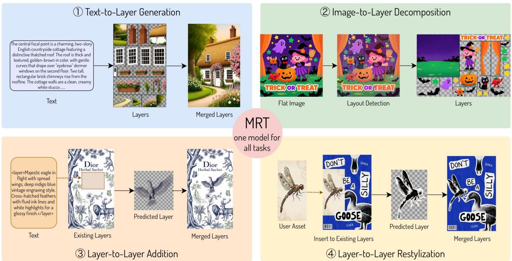  
Thecentralfocalpointisacharmingtwo-story Englishcountrysidecottagefeaturinga distinctivethatchedroof.Therofisthickand textured,golden-brownincolorwithgetle curves thatdrape over"eyebrow"dormer windowson thesecondfloor.Two tall rectangularbrick chimneysrisefromthe rooflineTeoagewallsreeacmy white stucco..   
<layer>Majesticeaglein flightwithspread wings.,deepindigo blue vintageengraving style. Cross-hatchedfeathers with fluid inklinesand whitehighlights fora glossyfinish.c/layer>

Figure 1. Overview of Masked Region Transformer capabilities. Our framework supports four tasks: (1) multilingual text-to-layers generation, (2) image-to-layers decomposition (including natural images), (3) layer addition, and (4) layer restylization for user-provided layers.

# Abstract

Layered image generation and editing is a fundamental capability that enables layer-wise reuse, editing, and composition of generated visual content, analogous to word-level editing in natural language. Despite its importance, this remains an underexplored area at scale. To address this gap, we present MRT, a 20B-parameter masked region diffusion model tailored for multi-layer transparent image generation and editing, trained on over 10M multilingual design samples spanning diverse aspect ratios and textual prompts. To fully leverage this scale, we make two key technical contributions. First, we unify three complementary tasks—textto-layers, image-to-layers, and layers-to-layers—within a shared masked region diffusion framework, where selec-

tive token masking enables flexible layer-wise generation and editing. Second, to enable overflow layer generation, we introduce an overflow-aware canvas layer that handles boundary inconsistencies and supports semi-transparent background synthesis, enabling complete editable layers extending beyond visible canvas boundaries. Additionally, we apply diffusion distillation to achieve 8-step, realtime multi-layer generation with minimal quality degradation. Extensive experiments demonstrate that our framework substantially outperforms prior state-of-the-art approaches, including various commercial systems, across all three tasks, establishing a new benchmark for multi-layer transparent image generation. Notably, our model significantly outperforms the concurrent Qwen-Image-Layered model in image-to-layers quality according to user-study results, while achieving 10∼100× faster inference and saving a 50%∼90% activation GPU memory consumption during

# 1. Introduction

Text-to-image generation has achieved remarkable quality improvements in recent years through various technological advances, including large-scale diffusion transformers [9, 36, 37], distributed training on billions of highquality text-image pairs [13, 14, 43, 55], rectified flow matching [9, 30] that transforms simple prior distributions into complex data distributions via straight paths, distribution matching distillation [12, 33, 34, 41, 60, 61, 65–67] for accelerated inference, and advanced text encoder architectures [14, 31, 32]. In contrast, generative models for layered image generation [5, 17, 21, 22, 28, 38, 48, 62, 63] remain significantly underdeveloped. This gap primarily stems from two factors: the absence of large-scale, highquality datasets comparable to LAION-5B [42], and limited exploitation of prior knowledge from state-of-the-art opensource text-to-image models. These constraints have hindered systematic exploration of critical research directions in layered image synthesis.

We address this fundamental research gap through a comprehensive study on a high-quality, large-scale multilayer dataset comprising over ≥ 10 million samples—an order of magnitude larger than recent work [38]. Our dataset spans diverse resolutions and aspect ratios, encompassing over 43 million unique layers and over 7 million unique oversized visual elements to support overflow layer generation. We employ GPT-5 mini to generate global captions for all graphic designs. For visual text layers, we utilize ground-truth typography attributes, ensuring comprehensive high-quality annotations. To fully leverage this dataset at scale, we build our multi-layer generative model by implementing the masked region transformer on Qwen-Image [55], the largest open-source text-to-image diffusion model with approximately ∼ 20B parameters.

To advance the efficiency of layered image generation and editing during both training and inference, we introduce the following key technical contributions: First, we propose a unified masked region transformer framework that handles three complementary tasks: text-to-layers, image-to-layers, and layers-to-layers generation and editing. The key innovation lies in our adaptive masking mechanism, which determines whether to initialize each layer from clean latents or noise based on the specific task requirements. Second, our masked region transformer operates directly on the fullsize canvas by treating the background as a special transparent foreground layer and encapsulating overflow layers that extend partially beyond the background region. This architecture ensures that all foreground layers maintain full reusability and can be arbitrarily repositioned on the canvas, which is illustrated in Figure 3 and experimental section. Third, we further propose leveraging distribution matching distillation schema to develop a few-step multi-layer generator with minimal quality degradation.

We conduct thorough ablation experiments to study the effects of different components. We empirically demonstrate that scaling both the model and dataset elevates performance to a new level, and that joint multi-task training further enhances performance while improving the user experience. We show that our image-to-layers task generalizes exceptionally well to various out-of-domain design images and natural images. Our layers-to-layers task readily supports multi-image fusion, seamlessly integrating any given user image into an existing design. We hope our masked region transformer advances the understanding of this fundamentally challenging task at an unprecedented scale.

# 2. Related Work

Layered image generation and editing task follows two paradigms: simultaneous generation (Text2Layer [63], LayerDiff [17], ART [38], PrismLayer [5], Qwen-Image-Layered [59]) and sequential generation (LayerDiffuse [62], COLE [22], OpenCOLE [21], LayerD [45]). Related layout generation and control methods fall into two categories: (1) generating layouts from visual elements [2– 4, 6, 7, 10, 11, 15, 18–20, 23–25, 27, 44, 46, 53, 54, 56, 58], and (2) controlling generation via spatial conditioning [1, 4, 10, 26, 29, 40, 47, 51, 52, 57, 64]. Compared to the most closely related work, ART [38] and Qwen-Image-Layered [59], our masked region transformer unifies three tasks: text-to-layers, image-to-layers, and layers-tolayers generation. We further introduce native support for overflow layers and enable few-step multi-layer generation through distillation.

# 3. Approach

# 3.1. Scaling-up Layered Data and Diffusion Model

Scaled Layered Dataset. The scarcity of large-scale, highquality multi-layer transparent images presents a fundamental challenge for advancing multi-layer generative modeling. Rather than relying on noisy, uncurated internet sources, we construct a curated in-house dataset comprising over 10M multi-layer graphic designs from one of the world’s largest graphic design platforms. All designs are created by professional designers and fully licensed for generative model training. Figure 2 illustrates key dataset statistics, showing that our dataset spans diverse aspect ratios and resolutions while supporting multilingual visual text rendering and bilingual text prompts.

Scaled Region Transformer. To incorporate the generation of overflow layers, we follow ART [38] to perform the denoising diffusion process in a regional manner as follows: First, we represent a multi-layer transparent image as $\{ \mathbf { I } _ { \mathrm { c a n v a s } } , \mathbf { I } _ { \mathrm { b g } } , \{ \mathbf { I } _ { \mathrm { f g } } ^ { i } \} _ { i = 1 } ^ { K } \}$ , where $\mathbf { I } _ { \mathrm { c a n v a s } }$ is the composed image on the full-size canvas, $\mathbf { I } _ { \mathrm { b g } }$ is a semi-transparent RGBA background layer, and $\{ \mathbf { I } _ { \mathrm { f g } } ^ { i } \} _ { i = 1 } ^ { \bar { K } }$ are K RGBA foreground layers. Second, we perform the diffusion process on a merged image that integrates the fully transparent canvas as the base layer and overlays $\mathbf { I } _ { \mathrm { b g } }$ and all ${ \bf I } _ { \mathrm { f g } } ^ { i }$ layers according to a predefined layout. Third, we use the WAN-2.1- VAE [50] encoder to extract the regional cropped representations for all foreground layers, the representation of the background layer, and the representation of the composed full design. Last, we implement an anonymous regional diffusion transformer [38] with 20B parameters following Qwen-Image [55] to perform full attention jointly on these regional foreground layer tokens, background layer tokens, and composed full design image tokens.

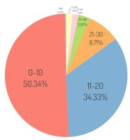  
[a)# of layers

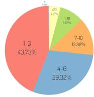  
(b]#of text layers

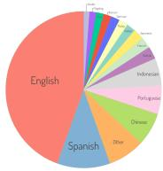  
[c] Languages

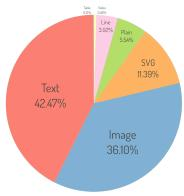  
[d) Layer Types

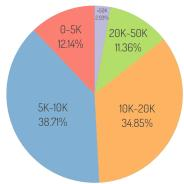  
[e] # of tokens w/o overflow

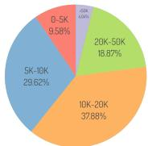  
[f] # of tokens w/ overflow

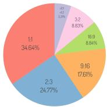  
[g] aspect ratio

Figure 2. Illustrating the dataset statistics. Figures (a) and (b) show the distribution of the number of unique layers per design. Figures (c) and (d) show the distribution of different languages in visual text and the distribution of different layer types, respectively. Figures (e) and (f) show the distribution of total visual token counts for all transparent layers before and after supporting overflow layers. Figure (g) shows the distribution of width-to-height aspect ratios.   
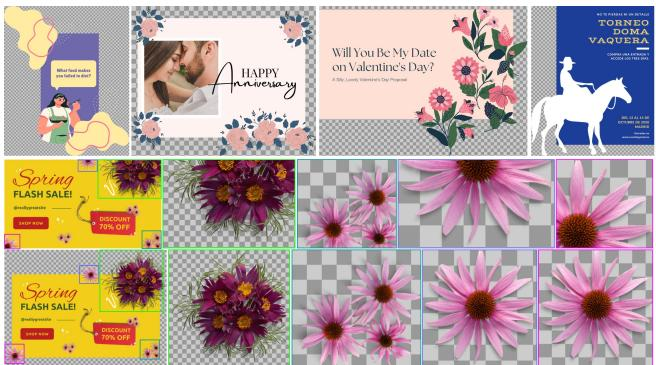

text_image

What I feel like
you felt like to be?
A HAPPY
Anniversary
Will You Be My Date
on Valentine's Day?
A 30-Day, Lovely Valentine's Day Programist
TORNEO
DOMA
VAQUERA
SINCEMBER 2018
DISCOUNT
75% OFF
Spring
FLASH SALE!
DISCOUNT
75% OFF
Spring
FLASH SALE!
DISCOUNT
75% OFF

Figure 3. Illustrating the overflowing layers. The first row visualizes the canvas layer with a fully transparent background, exposing pixels beyond the main background region. Rows 2-3 compare multi-layer generation without overflow support (baseline) and with overflow support (ours). Full-size overflow layer generation is essential for maintaining complete editability and reusability, preventing layer content from being truncated at background boundaries.

Overflow Layer Support. Previous work [5, 38] generates foreground layers only within the visible canvas region, producing incomplete elements that extend beyond background boundaries. This limits layer reusability, as shown in the second row of Figure 3. However, we find that over 60% of samples in our training set contain overflow layers, making this a critical practical concern. To address this, we introduce an additional full-size canvas layer that supports generation of complete semi-transparent backgrounds

and overflowing elements. This is feasible since we have access to ground-truth complete layers for all samples in our dataset. This design is essential for practical editing workflows: without it, layers extending beyond the canvas would be cropped and rendered non-editable, severely limiting their usability in downstream compositional tasks. Figure 3 shows representative overflow layer examples from our dataset (first row) and compares layered samples with and without overflow layer support (second and third rows).

# 3.2. Masked Region Transformer

We illustrate how our masked region diffusion transformer framework addresses three challenging multi-layer generation tasks—Text-to-Layers, Image-to-Layers, and Layersto-Layers—in a unified manner in Figure 4. The key insight is to conditionally mask either the global image tokens or the combination of reference tokens and existing layer tokens within the regional diffusion transformer. Masked latents denote clean tokens encoding pre-existing conditions, with noise injection and diffusion supervision applied exclusively to non-masked tokens. We apply full attention between masked clean tokens and noise tokens, enabling the model to adaptively learn their relationships across different tasks. The detailed masking mechanism for each task is described as follows:

Text-to-Layers. The text-to-layers generation task aims to synthesize a multi-layer transparent design from a text prompt c, comprising a canvas layer $\mathbf { I } _ { \mathrm { c a n v a s } }$ , a semitransparent background layer $\mathbf { I } _ { \mathrm { b g } }$ , and K foreground layers $\{ \mathbf { I } _ { \mathrm { f g } } ^ { i } \} _ { i = 1 } ^ { K }$ 1 that compose into Icomposed with overflow support. The canvas layer defines the full design dimensions to accommodate overflowing elements and is fully transparent by construction. Thus we apply diffusion to the concatenation of latents $[ \mathbf { z } _ { \mathrm { c o m p o s e d } } ; \mathbf { z } _ { \mathrm { b g } } ; \{ \mathbf { z } _ { \mathrm { f g } } ^ { i } \} _ { i = 1 } ^ { K } ]$ , excluding the canvas layer, conditioned on shared text embeddings c. Following [38], we include $\mathbf { z } _ { \mathrm { c o m p o s e d } }$ to ensure layer coherence. Since no pre-existing layers exist, we set masked token $\mathbf { z } _ { \mathrm { m a s k } }$ as ∅. See Figure 4 (panel 1) for details.

Let $\mathbf { z } _ { 0 } = [ \mathbf { z } _ { \mathrm { c o m p o s e d } } ; \mathbf { z } _ { \mathrm { b g } } ; \mathbf { z } _ { \mathrm { f g } } ^ { 1 } ; \ldots ; \mathbf { z } _ { \mathrm { f g } } ^ { K } ]$ denote the concatenation of all non-masked clean latents, and $\epsilon \sim \mathcal { N } ( \mathbf { 0 } , \mathbf { I } )$ denote the noise prior. The flow matching framework learns a vector field that transports samples from the noise distribution to the data distribution through a continuous-time interpolation path. At time-step $t \in [ 0 , 1 ]$ ], the interpolated latent is given by:

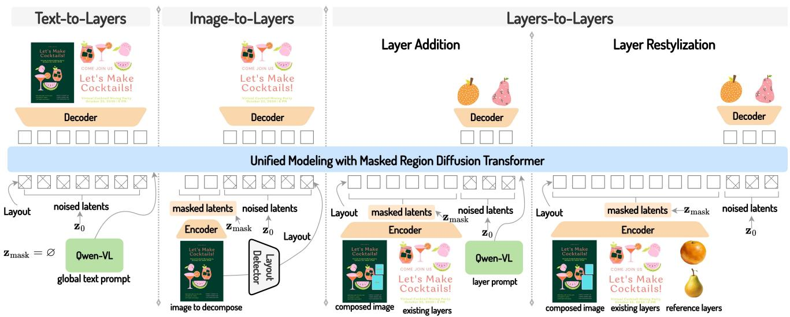

flowchart

```mermaid
graph TD
    A["Text-to-Layers"] --> B["Decoder"]
    C["Image-to-Layers"] --> D["Decoder"]
    E["Layers-to-Layers"] --> F["Decoder"]
    G["Layout Addition"] --> H["Decoder"]
    I["Layer Restylization"] --> J["Decoder"]
    K["Unified Modeling with Masked Region Diffusion Transformer"] --> L["Layout"]
    L --> M["Masked latents z_mask"]
    L --> N["noised latents z_mask"]
    M --> O["Encoder"]
    N --> P["Encoder"]
    Q["Qwen-VL global text prompt"] --> R["Layout Detector"]
    R --> S["image to decompose"]
    T["Layout"] --> U["Masked latents z_mask"]
    T --> V["noised latents z_mask"]
    U --> W["Audiovisual Image"]
    V --> X["Audiovisual Image"]
    Y["Encoder"] --> Z["Layer prompt"]
    AA["Encoder"] --> AB["Layer prompt"]
    AC["Layout"] --> AD["Masked latents z_mask"]
    AC --> AE["noised latents z_mask"]
    AD --> AF["Audiovisual Image"]
    AE --> AG["Audiovisual Image"]
    AH["Qwen-VL layer prompt"] --> AI["Layer prompt"]
    AJ["Qwen-VL"] --> AK["Layer prompt"]
    AL["Qwen-VL"] --> AM["Layer prompt"]
    AN["Qwen-VL"] --> AO["Layer prompt"]
```

Figure 4. Illustrating the Masked Region Transformer framework. We unify three different tasks including text-to-layers, image-to-layers, and layersto-layers with a shared masked regional diffusion transformer. $L e f t { \mathrm { : } }$ Text-to-Layers directly transforms a stack of noise latents into a set of transparent layers and a composed canvas image (panel #1). We add noise to the latents of all transparent layers during training. Middle: Image-to-Layers aims to decompose a raster image into a set of high-quality transparent layers. We set masked latents to the noise-free global image tokens and apply the diffusion process to layer tokens corresponding to spatial regions defined by either automatic layout detector or manual annotation (panel #2). Right: Layers-to-Layers enables two editing capabilities: (i) generating new layers from layer prompt conditioned on existing ones (panel #3), and (ii) transforming reference images into layers with visual style aligned to the existing composition (panel #4). In both layer addition and layer restylization scenarios, we define masked tokens as the noise-free latent representations of the reference content, existing layers, and global composition. Some text layers are omitted for clarity.

$$
\mathbf {z} _ {t} = (1 - t) \mathbf {z} _ {0} + t \epsilon , \tag {1}
$$

We train the diffusion model $f _ { \theta }$ predicts the flow velocity conditioned on the interpolated latent $\mathbf { z } _ { t } ,$ time-step $t ,$ and text prompt t: $\hat { \mathbf { v } } = f _ { \theta } ( \mathbf { z } _ { t } , t , \mathbf { c } )$ . The training objective minimizes the mean squared error between the predicted and ground-truth velocity:

$$
\mathcal {L} _ {\mathrm{flow}} = \mathbb {E} _ {\mathbf {z} _ {0}, \epsilon \sim \mathcal {N} (\mathbf {0}, \mathbf {I}), t} \left[ \| \mathbf {v} _ {t} - f _ {\theta} (\mathbf {z} _ {t}, t, \mathbf {c}) \| ^ {2} \right], (2)
$$

where the ground-truth velocity $\mathbf { v } _ { t }$ along the interpolation path is $( \mathbf { z } _ { 0 } - \epsilon )$ , the expectation is taken over the clean latents $\mathbf { z } _ { 0 } .$ , random noise $\epsilon ,$ and uniformly sampled time-steps t.

Image-to-Layers. The image-to-layers task has emerged as a critical capability in commercial generative systems, with products such as Adobe Firefly’s Layered Image Editing and Lovart’s Edit Elements recently introducing support for this functionality. The image-to-layers task aims to decompose a raster image $\mathbf { I } _ { \mathrm { i n p u t } }$ (or Icomposed) into a multi-layer transparent design comprising a canvas layer Icanvas, a background layer $\mathbf { I } _ { \mathrm { b g } }$ and $K$ foreground layers $\{ \mathbf { I } _ { \mathrm { f g } } ^ { i } \} _ { i = 1 } ^ { K }$ , conditioned on a target layout specifying each layer’s spatial location and an optional text prompt for semantic guidance. This task inherently involves two subtasks: segmentation to identify layer regions with accurate alpha masks and inpainting to complete occluded areas. We either use human annotations or a layout detector to extract the target layout from the input raster image.

The masked clean tokens $\mathbf { z } _ { \mathrm { m a s k } }$ are set to the global composed image representation $\bf { z } _ { \mathrm { c o m p o s e d } } .$ , encoding the conditional image targeted for decomposition. We add noise to the concatenation of the non-masked tokens $\begin{array} { r l } { \mathbf { z } _ { 0 } } & { { } = } \end{array}$ $[ \mathbf { z } _ { \mathrm { b g } } ; \mathbf { z } _ { \mathrm { f g } } ^ { 1 } ; \dots ; \mathbf { z } _ { \mathrm { f g } } ^ { K } ]$ . Through the regional diffusion process, the diffusion model $f _ { \theta }$ is trained to extract all transparent layers conditioned on the given global image and layout. Since requiring users to provide designs with overflow layers is impractical, we instead use the latent encoding of pixels located within the visible canvas. See Figure 4 (panel 2) for details.

We observe that individual layers often exhibit structural ambiguity and can be further decomposed. To address this, we propose layer grouping augmentation, which randomly groups overlapping or adjacent layers during training. This strategy increases structural diversity, improves robustness to ambiguous boundaries, and enhances generalization to out-of-domain images with noisy layouts.

Layers-to-Layers. To enable a flexible, layer-wise interaction experience, we frame the layered image editing task as a layer-to-layer task that covers two key scenarios: (i) layer addition, which generates new coherent layers from text prompts conditioned on existing layers while maintaining spatial and stylistic consistency across the composition;

and (ii) layer restylization, which focuses on transforming any user-provided images or transparent layers into stylistically aligned layers that match the appearance and visual identity of the existing composition.

To model the layers-to-layers task, we retain existing layer latents as masked clean tokens $\mathbf { z } _ { \mathrm { m a s k } }$ and apply diffusion only to: (i) newly added layers conditioned on text prompts, or (ii) designated layers conditioned on visual references for restylization. Given the challenge of constructing training data for these scenarios, we randomly select a subset of layers from each design to serve as conditional existing layers, treating the remaining layers as generation targets. For layer restylization training, we use Image editing model to transfer the style of non-selected layers, creating style-transformed variants as training pairs. See the appendix for details on the dataset construction pipeline.

Formally, in the layer addition task, we aim to synthesize a subset of foreground layers conditioned on the remaining layers and layer-level textual descriptions. We apply diffusion to the latent token sequence $[ \mathbf { z } _ { \mathrm { c o m p o s e d } } ; \mathbf { z } _ { \mathrm { b g } } ; \{ \mathbf { z } _ { \mathrm { f g } } ^ { i } \} _ { i = 1 } ^ { K } ] ,$ where $\mathbf { z } _ { \mathrm { c o m p o s e d } }$ encodes the alpha-composited context formed by the background and all non-target layers. Let $A \subseteq \{ 1 , \dots , K \}$ denote the indices of layers to be generated (an arbitrary subset, not necessarily contiguous). We set the masked clean tokens as $\begin{array} { r l } { \mathbf { z } _ { \mathrm { m a s k } } } & { { } = } \end{array}$ [zcomposed; $\mathbf { z } _ { \mathrm { b g } } \colon \{ \mathbf { z } _ { \mathrm { f g } } ^ { i } \} _ { i \notin A } ]$ , and treat the target slots $\begin{array} { r l } { \mathbf { z } _ { 0 } } & { { } = } \end{array}$ $[ \{ \mathbf { z } _ { \mathrm { f g } } ^ { i } \} _ { i \in A } ]$ as the non-masked tokens to be noised and denoised. The text condition $\mathbf { c } _ { A }$ is derived from a layercaption prompt constructed by concatenating <layer> $c _ { i }$ $< / 1$ ayer> for all $i \in A$ in layer order, where $c _ { i }$ is the caption of layer i. During training, we add noise to $\mathbf { z } _ { 0 }$ and optimize the flow-matching objective conditioned on $\left( \mathbf { z } _ { \mathrm { m a s k } } , \mathbf { c } _ { A } \right)$ ; during inference, we initialize $\mathbf { z } _ { 0 }$ from noise and denoise it under the same conditions, yielding the added layers in their original indices.

In the layer restylization task, we update a user-uploaded layered design by restylizing selected layers under additional appearance conditions while preserving the remaining layers. Given target indices ${ \mathcal { T } } \subseteq \{ 1 , \ldots , K \}$ , we construct $\mathbf { z } _ { \mathrm { c o m p o s e d } }$ by compositing the background with the non-target original layers $\{ \mathbf { z } _ { \mathrm { f g } } ^ { i } \} _ { i \notin \mathbb { Z } }$ , and keep ${ \bf z } _ { \mathrm { m a s k } } =$ $[ \mathbf { z } _ { \mathrm { c o m p o s e d } } ; \mathbf { z } _ { \mathrm { b g } } ; \{ \mathbf { z } _ { \mathrm { f g } } ^ { i } \} _ { i \notin \mathcal { T } } ]$ as masked clean conditions. For each $i \in \mathcal { T } ,$ , we are additionally given a conditional latent $\mathbf { z } _ { \mathrm { c o n d } } ^ { i }$ that specifies the desired appearance of layer i. We append $\{ \mathbf { z } _ { \mathrm { c o n d } } ^ { i } \} _ { i \in \mathcal { I } }$ as extra conditioning tokens and treat them as masked, so they are not prediction targets. To make this role explicit, we add a learnable condition-token embedding to the appended conditional tokens. We further copy the RoPE positional encoding from the corresponding original layer token to its conditional token, ensuring that the two tokens share identical spatial positional cues. Accordingly, we apply diffusion only to the nonmasked original target slots $\mathbf { z } _ { 0 } ~ = ~ [ \{ \mathbf { z } _ { \mathrm { f g } } ^ { i } \} _ { i \in \mathcal { T } } ]$ , conditioned on $[ \mathbf { z } _ { \mathrm { m a s k } } ; \{ \mathbf { z } _ { \mathrm { c o n d } } ^ { i } \} _ { i \in \mathcal { T } } ]$ and a fixed instruction prompt such as Harmonize these layers. During training, noise is added only to $\mathbf { z } _ { 0 }$ and the model is trained to denoise the original target slots under the conditional latents. During inference, we initialize $\mathbf { z } _ { 0 }$ from noise and denoise it under the same conditions, reading the final restylized layers from the original target slots while excluding the appended conditional tokens from the output layer set.

# 3.3. Accelerated Multi-Layer Generator

We adopt the improved distribution matching distillation (DMD) technique [8, 35, 60, 61] to compress our multistep diffusion model (teacher) into a few-step generator (student) while maintaining distributional consistency between the teacher and student models. Let the teacher model $f _ { \boldsymbol { \theta } _ { T } } ( \mathbf { z } _ { t - 1 } | \mathbf { z } _ { t } )$ denote the reverse process of a standard multi-step diffusion model, and let the student model $f _ { { \boldsymbol { \theta } } _ { S } } ( \mathbf { z } _ { t - 1 } | \mathbf { z } _ { t } )$ approximate it using fewer denoising steps. The objective of DMD is to minimize the Kullback–Leibler (KL) divergence between the teacher and student transition distributions:

$$
\mathcal {L} _ {\mathrm{DMD}} = \mathbb {E} _ {\mathbf {z} _ {0} \sim p _ {d a t a}, t \sim \mathcal {U} (1, T)} \left[ D _ {\mathrm{KL}} \big (f _ {\theta_ {T}} (\mathbf {z} _ {t - 1} | \mathbf {z} _ {t}) \parallel f _ {\theta_ {S}} (\mathbf {z} _ {t - 1} | \mathbf {z} _ {t}) \big) \right]. \tag {3}
$$

During inference, the distilled student model performs generation in a reduced number of steps $T _ { S } ~ \ll ~ T _ { T }$ , effectively approximating the teacher’s multi-step trajectory: $\mathbf { z } _ { t - 1 } = f _ { \theta _ { S } } ( \mathbf { z } _ { t } , t )$ , where we set $t = T _ { S } , \dots , 1$ . We show that the distilled model preserves the sample quality of the teacher while substantially reducing the number of sampling steps, resulting in faster and more efficient generation. We also support various techniques, such as CacheDiT and sequence parallelization across multiple GPUs, to further accelerate inference speed.

# 4. Experiment

# 4.1. Implementation Details

We conduct all experiments using Qwen-Image as our base architecture, consisting of 60 layers with a hidden dimension of 3584 and 24 attention heads per layer. We initialize model weights from the open-source pretrained checkpoint available on HuggingFace. Unlike previous approaches [5, 38] that fine-tune only LoRA [16] weights due to resource constraints, we perform full-parameter finetuning with FSDP2 to explore the model’s performance upper bound. This approach is necessary given the significant distribution shift from standard flat image generation and the inherent complexity of multi-layer synthesis.

For ablation experiments, we train on a curated subset of 0.5M layered designs for 4,000 iterations at $5 1 2 \times 5 1 2$ resolution using 8×H200 GPUs with the batch size 16 per GPU and 128 globally. We use the AdamW optimizer with a constant learning rate of $1 \times 1 0 ^ { - 4 }$ . For system-level experiments, we employ two-stage training: ∼70,000 iterations at $5 1 2 \times 5 1 2$ on the full 10M dataset, followed by ∼20,000 iterations at $1 0 2 4 \times 1 0 2 4$ . This progressive strategy allows the model to first establish multi-layer decomposition capabilities before scaling to high resolution. Training uses 64×H200 GPUs with batch size 16 per GPU and 1,024 globally.

# 4.2. Evaluation Protocol

Benchmark. We compare our approach with previous state-of-the-art methods on DESIGN-MULTI-LAYER-BENCH, introduced by ART [38], which is curated from the VistaCreate graphic design platform [49]. However, this evaluation dataset does not include overflow layers. To address this gap, we construct OVERFLOWERFLOW-DESIGN-BENCH to evaluate the model’s ability to generate complete layers from full layouts, which is essential for ensuring overflow layer reusability.

Metrics. We evaluate model performance from multiple perspectives. For merged image quality, we report $\mathrm { P S N R } _ { \mathrm { l a y e r } }$ , $\mathrm { S S I M _ { l a y e r } } ;$ , $\mathrm { P S N R } _ { \mathrm { m e r g e d } }$ , $\mathrm { S S I M } _ { \mathrm { m e r g e d } } .$ , FIDmerged (measuring overall coherence), and FID following [38]. Since our layer is RGBA images with transparency, we only compute on non-transparent pixels as $\mathrm { P S N R } _ { \mathrm { l a y e r } }$ and $\mathrm { S S I M _ { l a y e r } . }$ . For human evaluation, we collect multidimensional user preferences on a subset of DESIGN-MULTI-LAYER-BENCH for the text-to-layers (T2L) task and image-to-layers (I2L) task, reflecting real user experience. The evaluation protocol and interface are described in the supplementary material.

# 4.3. Main Results

# 4.3.1. Text-to-Layers: Comparison with SoTAs

We compare our method with ART [38] on a subset of DESIGN-MULTI-LAYER-BENCH. In our user study illustrated in Fig. 6, participants consistently preferred our results over ART in instruction following, overall aesthetics, and layer quality. These findings indicate stronger alignment between prompts and layered compositions, further illustrated in Fig. 5 by layouts that better preserve spatial intent and stylistic consistency.

Only our method natively supports generating overflow RGBA layers that extend beyond the background boundary on a full-size canvas, preserving editability and reuse; prior systems $( e . g . , \mathrm { A R T } )$ restrict pixels to the background region, leading to cropped or missing content. See Fig. 7 and Fig. 9 for a visual results.

# 4.3.2. Image-to-Layers: Comparison with SoTAs

In a user study comparing the layer decomposition capabilities of the latest work LayerD [45] and commercial systems like RoboNeo and Lovart, participants consistently preferred our method for layer quality, content integrity, and decompose granularity. Since I2L evaluation assumes a layer layout (bounding boxes with Z-order), we evaluate our method with the layout extracted by a z-order-aware detector (details in the supplementary). Qualitative comparisons in Fig. 20 also show that our method produces more complete, reusable RGBA layers with sharper boundaries. We further demonstrate the generalization of our model to natural scenes in Fig. 24.

# 4.3.3. Image-to-Layers: Comparison with con-current Qwen-Image-Layered

Recently, Qwen-Image-Layered [59] has attracted significant interest from the community since its release on Huggingface, due to its strong generalization capability on various design images. We demonstrate the advantages of our approach by conducting rigorous comparisons from three aspects: quality, latency, and memory.

Better Quality. We first construct an out-of-domain test set consisting of 100 creative designs obtained from three sources: images generated by the latest Nano-Banana-Pro (and Ideogram 3.0) image generation model and test images from the official Qwen-Image-Layered repository [39]. We report the quantitative comparison results in Table 1, which shows that our approach achieves significantly higher $\mathrm { S N R } _ { \mathrm { m e r g e d } }$ and $\mathrm { S S I M } _ { \mathrm { m e r g e d } }$ . We calculate the metrics across three groups based on the number of layers, and our MRT consistently performs better across all groups.

Fig. 10, Fig. 11, Fig. 12, Fig. 13, Fig. 14, Fig. 15, Fig. 16, and Fig. 17 provide further qualitative comparison results. We empirically find that our approach performs substantially better when required to decompose flat designs into an increasing number of transparent layers; our approach continues to perform well, while Qwen-Image-Layered struggled to assign meaningful objects to each layer. These visual results not only echo the above findings but also show that significant room for improvement remains, even though our model substantially outperforms Qwen-Image-Layered. We also conduct an apple-to-apple user study on this test set, with results reported in Fig. 8. Our approach achieves win rates of 79.5%, 68.9%, and 82.6% for layer quality, integrity, and granularity, respectively.

Lower Latency. As shown in Fig. 19, due to our regional diffusion transformer architecture, we achieve significant speedup compared to Qwen-Image-Layered, which uses the same number of full-resolution tokens to model each transparent layer regardless of their actual area within the canvas. We achieve similar latency speed-up as the statistics shown in ART [38] and we further applied various advanced cache techniques, model distillation, lower-precision, parallel inference to optimize the latency of our model to within ∼ 3 seconds when running with 4× H100 GPUs and ∼ 6 seconds on a single H100 GPU when required to decompose a single 1K high-resolution image into nearly 20 transparent

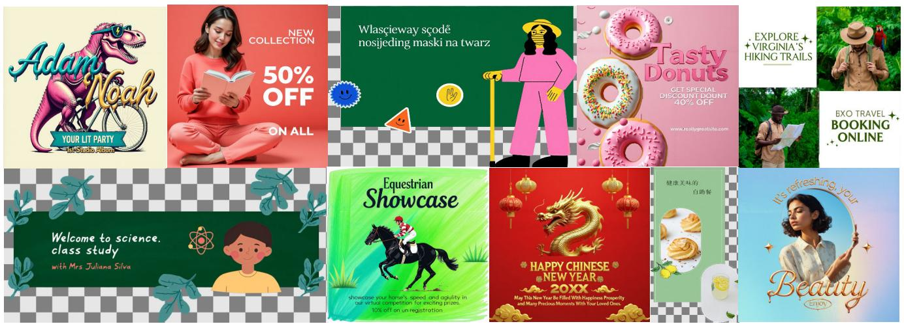

text_image

Adam
Noah
YOUR LIT PARTY
Let Stuck Alum
NEW
COLLECTION
50%
OFF
ON ALL
Wlascieway scódě
nosjeding maski na twarz
EXPLORE +
VIRGINIA'S
HIKING TRAILS
TASTY
Donuts
GET SPECIAL
DISCOUNT DOUNT
40% OFF
www.earlygreatsite.com
EXO TRAVEL +
BOOKING
ONLINE
Welcome to science.
class study
with Mrs Juliana Silva
Equestrian
Showcase
showcase your home's speed, and agility in
our virtual competition for exciting prizes.
10% off on un registration
HAPPY CHINESE
NEW YEAR
20XX
May This New Year Is Filled With Happiness Prosperity
and Many Precious Moments With Your Loved One
健康美味的
自助餐
It's refreshing, your
Beauty
Enjoy

Figure 5. Qualitative results on text-to-layers. See supplementary material for individual layer visualizations.

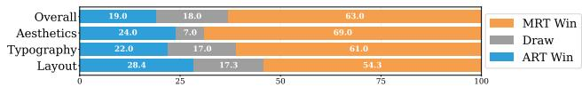

bar_stacked

| Category | MRT Win (%) | Draw (%) | ART Win (%) |
| :--- | :--- | :--- | :--- |
| Overall | 63.0 | 18.0 | 19.0 |
| Aesthetics | 69.0 | 7.0 | 24.0 |
| Typography | 61.0 | 17.0 | 22.0 |
| Layout | 54.3 | 17.3 | 28.4 |

Figure 6. User study comparison with previous SOTA approach on text-to-layers task. Our method significantly outperforms ART across multiple aspects.   
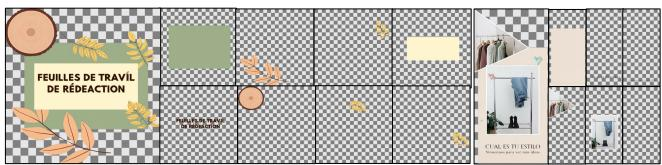

text_image

FEUILLES DE TRAVIL
DE RÉDEACTION

COAL ES DU ESTREO

Figure 7. Qualitative results of layer overflow. Our approach supports generating overflow layers with partially visible pixels extending beyond the background region.   
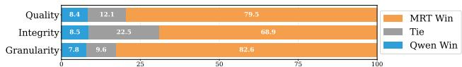

bar_stacked

| Category | MRT Win | Tie | Qwen Win |
| :--- | :--- | :--- | :--- |
| Quality | 79.5 | 12.1 | 8.4 |
| Integrity | 68.9 | 22.5 | 8.5 |
| Granularity | 82.6 | 9.6 | 7.8 |

Figure 8. User study comparison with Qwen-Image-Layered on image-to-layers task.

layers.

Efficient Memory. Unlike Qwen-Image-Layered, which requires K× more visual tokens to extract K× different layers from a flat image, our approach is significantly more memory efficient, requiring far fewer tokens to decompose an image into many transparent layers. Fig. 19 shows latency vs. number of layers, latency vs. number of tokens, and peak memory consumption vs. number of layers. Our method achieves clear advantages in both inference speed and memory usage; for example, generating more then 20 layers with our MRT results in over 100× acceleration.

Challenges. We identify several remaining key challenges in the image-to-layer decomposition task: (i) limited generalization to photorealistic images, where models strug-

<table><tr><td rowspan="2">Layers</td><td colspan="3">PSNRmerged ↑</td><td colspan="3">SSIMmerged ↑</td></tr><tr><td>[4, 8)</td><td>[8, 16)</td><td>[16, 32)</td><td>[4, 8)</td><td>[8, 16)</td><td>[16, 32)</td></tr><tr><td>MRT (Ours)</td><td>27.3440</td><td>25.9068</td><td>25.7229</td><td>0.9034</td><td>0.8762</td><td>0.8485</td></tr><tr><td>Qwen-Image-Layered</td><td>25.8111</td><td>23.0645</td><td>22.1828</td><td>0.8706</td><td>0.8319</td><td>0.8065</td></tr></table>

Table 1. Comparison with Qwen-Image-Layered on the image-to-layers.

gle to maintain fidelity and realism on diverse real-world scenes; (ii) ambiguity in layer granularity, arising from the ill-posed nature of layer definitions and the absence of clear ground-truth separation; (iii) occluded layer completion, which remains difficult when layered occlusions involve semi-transparent or complex blending; and (iv) background inpainting, where reconstructing plausible unseen regions is challenging under severe occlusion. We visualize representative failure cases in Fig. 18. The principal causes of failures in occluded layer completion are twofold: on the one hand, the layout detector may fail to predict accurate amodal bounding regions for occluded layers; on the other hand, the image-to-layer generation model may not faithfully reconstruct complex occluded pixels due to insufficient contextual cues and data diversity. These limitations highlight avenues for future research.

# 4.3.4. Layers-to-Layers: Layered Editing

To the best of our knowledge, no prior work has studied the task of layered image editing. To establish a comparison for this task, we instantiate a baseline using GPT-Image-1, which supports multi-conditional image inputs and transparent RGBA layer outputs. We report results for our approach on two key tasks, detail how GPT-Image-1 is configured as a competitive baseline, and highlight the distinctive properties of our method.

Layer Addition. Layer Addition aims to insert new layers into an existing design conditioned on layer-wise captions. In this comparison, we simulate the user by providing two target bounding boxes on the template together with the

Theimage features a vibrant Haloween theme with dominant colors ofpurple,orange,and black. Key elements include a younggirlinwitchosumetwoglowingghostscaedpumpkinandalagespidertotaingfivemanbectse girlandpumpkinarecentralandprominent,withtheghostsandspiderprovidingbalance.Thebackgroundshowcasesa cityscape with tallbuildings,adding depth and asenseof scale.Thetexture is glossyand vector-like, with smooth gradientandaartoonshstyle.etext'HAHALWEENisd,uppercaseandenteredatthetop,sing serif font in white and orange,creating a playful and festive mood.The compositionis balanced with elements.

text_image

HAPPY
HALLOWEEN

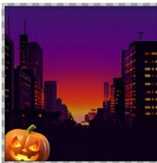

natural_image

Silhouette of a city skyline at sunset with illuminated buildings and a pumpkin in the foreground (no text or symbols)

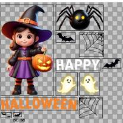

text_image

HAPPY
HALOWEEN

displayingthetextSLANACDADLUZinbolduppercaseseriffont.hebckgroundshowcasesaush,illated coffeeplantationwithglowingyelloworbsamongtheplantsreatingamagicalsereneatmosphere.Thecoffeecupis centrallyplaced,withsteamrising,suggestingwarmthandcomfortTelayoutisbancedwiththecupintheforeground andtheplantationextendingintothedistanceleadingtoafullmooninthesky.Thetextureisamixofvectorand

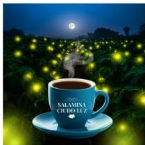

natural_image

Illustration of a blue coffee cup with a steaming cup, set against a glowing field at night (no text or symbols)

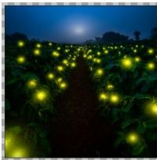

natural_image

Night scene of a flower field illuminated by glowing yellow lights, with no visible text or symbols.

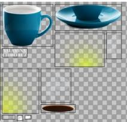

natural_image

Three-panel image showing a blue teacup, a bowl, and a dark container with yellow highlights, all on transparent background (no text or symbols)

headscarfandablackof-shouldertoppairedwithawhiteskit.Thecafésetingincludesawoodentablewitha colorfultableclotandnkwitbuestraTeckgronismurredsigngeadafeelementeating avibrantyetlaedtmospereTeomposiiosanedithewomantrallitionedndheetues predominantlyphotographicwithafocusonnaturallightandsoftshadows.Themoodiscasualandstylish,with novisible

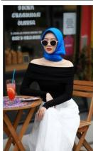

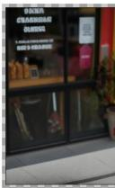

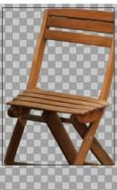

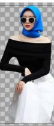

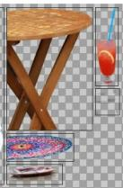

Theimage features adramatic andintense scene withdominant darkand fiery colors,including deepreds,blacks,and oranges.Centraltothecompositionisamuscularmanseatedonathronemadeofswordssuggestingpowerandonflct Thethrone and the man'sarmor havea metalic texture,contrasting withtheflat,cracked ground scatered with red petals.Inegoepaegasi thetitleRUNOFTHWADSHEARTpomnentlysplayedinackederystylenANAVESERie elegantscripteoealltmeseindamaticimodfespasi

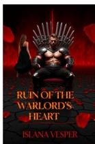

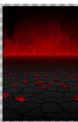

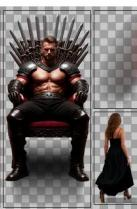

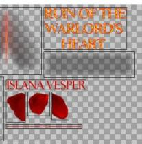

text_image

RUN OF THE
WARLORD'S
HEART

ISLANA VESPER

blueAdidasl layeredoverateniscourtbackgroudwitmultipleennisblinmotinddingasenseoactionteeisa mixofglossyandmatte,withtheshoeappearingmoretexturedanthebackgroundflatTheAdidaslogoisplacedatthe topandthetextaadeindsifisemgdealleoi includesapolaroid-styleimage oftheshoe,ading depthandaplayfulmood.Theoverallthemeis sportyand.

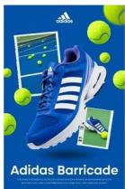

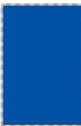

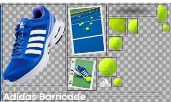

natural_image

Adidas Barricade shoe with various green and white product photos including a tennis court, ball, and accessories (no readable text or symbols)

The image features a cat wearing a chef’s hatand apron, cooking in a kitchen with warm,earthy tones dominating the scene.ThecatisthecentralgurepromientlyosiionedinefoegondstngaredotoeTeien isdetailedwitwoodenabnetsandutensileatingacozymelyatmosphere.Thetexuresareealisticadossy withaphotographicqualitythatenhancesthelifeikeappearanceofthecatandthekitchenseting.Thelightingisoft andnatural,castinggentleshadowsandhighlightingthecalsfurandthesteamrisingfromthepan.Thecompoitionis balanedide

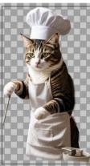

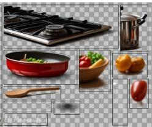

natural_image

Collage of kitchen ingredients including a red frying pan, food bowl, and kitchen utensils (no text or symbols visible)

Dominantcolorsinludesoftgreensandinks,withthecotage'swhitewalsprovidinganeutralbackdrop.Theottage hastwoprominentchimneysand severalwindowsadornedwithflowerboxes.Thepathleadingto thecotageis genty curved,addingasenseofepthndvitingtevieweinohescene.Thetextureissmoothandpinterlyift wgh centrallyplacedandframedbythesurroundingfoliage,creatinga harmoniousand tranquilatmosphere.Novisibletext

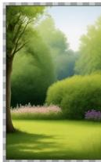

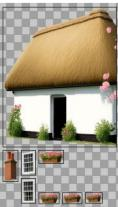

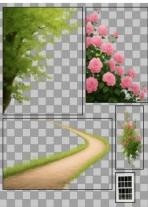

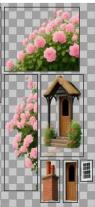

Theimagefeaturesavintage-themed posterwithadominantcolorpaleteof warmbrowns,redsandgoldsaccentedbydeep blues.ThecentralfocusisthegrandarchedfacadeofDALLASUNONSTAONwithitsintricatearchitecturaletals andlargeodseriftypographyeposterdesmulpleumanfguresapproximatelyt5dressedinealy900s atirepositionedinfrontofwosteamlocomotivesreatingasenseofhistoricaldepthTebackgroundshowcasesa cloudyskyngtooalgiodimeicalitthsBand aligned centraly,creatinga balanced composition.The texture isa mix of photographic realismand vector-like..

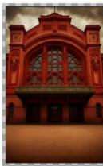

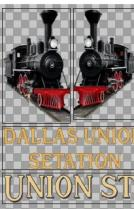

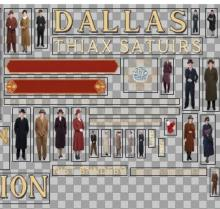

text_image

DALLAS
THIAX SATURS
ION

The poster featuresa playfuland vibrantdesign with dominant colors of green and blue,accented by yellow and white. It includesthreekeyimagesofapersoninaracingjacket,withthelargestimageprominentlyplacedinthecenter.The backgroundisamix ofagrassytextureandaskywithcouds,creatingawhimsicalandcheerfulmood.Thelayoutis dynamicwithoverlappingimagesandplayfuldoodleslikeheartsandstarsscatteredthroughout.Typographyisoldand sans-serifiteetiaeoaeseiet Thecompositioisbancedwitmiofpotogapcandvetorelementsncuingayelowfowrtod..

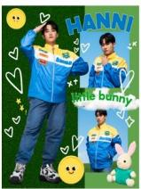

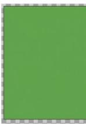

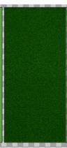

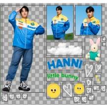

text_image

HANNI
little bunny

hues,creatingawarmandfocusedatmosphere.Theword'EDNG'isdispayedinlarge,bold,whiteuppercaseletersat thetopitteaebeilifevawaeosinLe and'Ps,are floating aroundthelaptop,addinga dynamicand creative touch Thelaptop screen shows a software interfacegispellpaie senseofdepthandlayering.Thebottmleftcornercontainsthetext‘Stillfiguringitout,butmgetingbette..

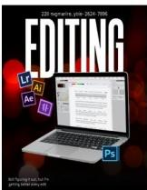

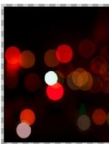

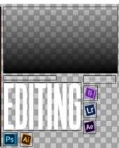

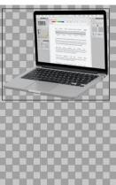  
Figure 9. More Text-to-Layers Results.

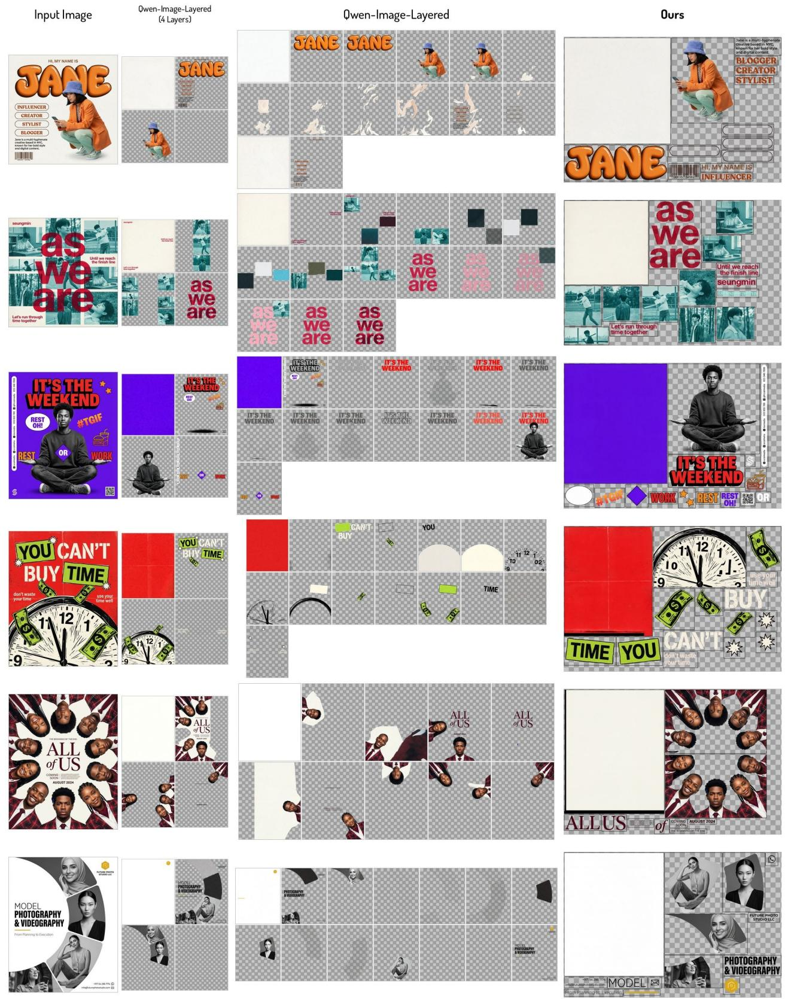  
Figure 10. Image-to-Layers Results on Designs Generated with Nano-Banana-Pro (1/3): Comparison with Qwen-Image-Layered

  
Figure 11. Image-to-Layers Results on Designs Generated with Nano-Banana-Pro (2/2): Comparison with Qwen-Image-Layered

text_image

Input Image
WALLOWS
MODEL
HAPPY
YEJI
DAY
0526
Owen-Image-Layered
(4 Layers)
WALLOWS
MODEL
I
YEJ
DAY
BLOS
SOM
BLOS SOM
BLOS SOM
BLOS SOM
BLOS SOM
BLOS SOM
BLOS SOM
BLOS SOM
BLOS SOM
BLOS SOM
BLOS SOM
BLOS SOM
BLOS SOM
BLOS SOM
BLOS SOM
BLOS SOM
BLOS SOM
BLOS SOM
BLOS SOM
BLOS SOM
BLOS SOM
BLOS SOM
BLOS SOM
BLOS SOM
BLOS SOM
BLOS SOM
BLOS TOMES
DARE OR Drink
MUA 1 TANG 1
CHAI JINRO SOJU
TILL TIPM
77 Ham Right, D. L. HCMC
DOBI DOKI EVERY TUESDAY
DORI
Herbal Sachet
Dior
Dior
Herbal Sachet
Dior
Dior walking plan
小狗 Dog
遛弯计划
ナッシブシリーンク (899)
小狗 遥弯计划 小狗 遥弯计划 小狗 遥弯计划 小狗 遥弯计划 小狗 遥弯计划 小狗 遥弯计划 小狗 遥弯计划 小狗 遥弯计划 小狗 遥弯计划 小狗 遥弯计划 小狗 遥弯计划 小狗 遥弯计划 小狗 遥弯计划 小狗 遥弓形图 (899)
Ours
MODEL WALLOWS
NEW JOHN CHINA GAMES (899)
YEEJI YEEJI DAY (899)
0526 24th (899)
HAPPY
YEEJI YEEJI DAY (899)
DAY (899)
YEJI YEEJI DAY (899)
YEEJI YEEJI DAY (899)
DAY (899)
BLOS SOM BLOS SOM BLOS SOM BLOS SOM BLOS SOM BLOS SOM BLOS SOM BLOS SOM BLOS SOM BLOS SOM BLOS SOM BLOS SOM BLOS SOM BLOS SOM BLOS SOM BLOS SOM BLOS SOM BLOS SOM BLOS SOM BLOS SOM BLOS SOM BLOS SOM BLOS SOM BLOS SOM BLOS SOM BLOS SOM BLOS SOM BLOS SOM BLOS SOM BLOS SOM BLOS SOM BLOS SOM BLOS SOM BLOS SOM BLOSSOM SOM SOM SOM SOM SOM SOM SOM SOM SOM SOM SOM SOM SOM SOM SOM SOM SOM SOM SOM SOM SOM SOM SOM SOM SOM SOM SOM SOM SOM SOM SOM SOM SOM SOM SOM SOM SOM SOM SOM SOM SOM SOM SOM SOM SOM SOM SOM SOM SOM SOM

Figure 12. Image-to-Layers Results on Designs Generated with Nano-Banana-Pro (3/3): Comparison with Qwen-Image-Layered

Input Image   

natural_image

Illustration of a coffee cup with a glowing lotus tree in the background, no text or symbols present.

Layers   

natural_image

Night scene of a glowing fruit lantern in an orchard with a wooden base, no visible text or symbols

natural_image

Illustration of a coffee cup, leafy greens, and a table with a coffee pan, alongside the word 'CIUDAD SALAMÍNA' (no other text or symbols)

text_image

РОНЕТ
МОЛОН
РОНЕТ СОЛЕНТ

text_image

ИПОЛОН СОЛЕТ
РОНЕ

text_image

Tumor
me tritura

text_image

me tritura
Tu amoi

natural_image

Illustration of women relaxing on a sandy beach with industrial factory buildings in the background (no text or symbols)

natural_image

Collage of fashion photos showing a coastal industrial city, a woman reading, and various clothing designs (no text or symbols)

text_image

RUIN
OF THE MARLORD'S HEART
ISLANA VESPER

text_image

OF THE WARLORD'S HEART
ISLANA VESPER
CRUIN

Input Image   

natural_image

Illustration of a house with a thatched roof, surrounded by blooming flowers and trees (no text or symbols)

Layers   

natural_image

Illustration of a rural house with a garden scene, framed by various architectural elements (no text or symbols)

text_image

HOT WHEELS
8/9th
'56 FORCKUP

text_image

56 FORCKUP
† 8/10 †
† †
FOR WHEELS

natural_image

Painting of a banquet scene with a large table, chandelier, and people in historical attire (no text or symbols visible)

natural_image

Collage of various scenes including a dining table, a man in a suit, and a wine bottle, all on transparent background (no text or symbols)

natural_image

Traditional ink painting of a heron by a lakeside with mountains in the background (no text or symbols)

natural_image

Traditional Chinese ink painting depicting mountains, a river, a tree, a heron, and water with seals (no readable text or symbols)

natural_image

Abstract illustration of birds in blue and green tones with colorful circles (no text or symbols)

natural_image

Colorful abstract illustration of stylized birds and fish in a grid layout (no text or symbols)

Figure 13. More Image-to-Layers Results on Designs Generated with Ideogram (1/2).

corresponding layer-wise captions. Our model predicts the requested layers in parallel while maintaining cross-layer consistency. For GPT-Image-1, we adopt an iterative generation procedure. We condition on the current composite image, draw red bounding boxes at the insertion locations, and input the corresponding layer-wise caption to GPT-Image-

1, which outputs a transparent RGBA layer. We then insert the generated layer at the specified position and iterate the process for the remaining layers. By generating multiple layers in single pass and conditioning on all layers, our method better captures inter-layer relationships and produces coherent insertions that preserve global composition and style in Fig. 22 and outperforms GPT-Image-1.

Input Image   

natural_image

Cat wearing chef's hat cooking in a kitchen with cooking utensils (no text or symbols visible)

Layers   

natural_image

Interior scene of a kitchen with a cat holding a spoon, surrounded by food items including a dog, utensils, and cooking utensils (no visible text or symbols)

Input Image   

natural_image

Illustration of a person standing on a rooftop overlooking a city skyline with a glowing 'MAXL' sign (no text or symbols on the figure or background)

Layers   

natural_image

Composite image showing a city night scene with a glowing light, a pink tent, and abstract shapes including a figure in motion (no text or symbols)

natural_image

Futuristic illustration of a smiling woman wearing a coffee cup with a landscape background (no text or symbols)

natural_image

Collage of colorful artistic images including a dragon, moon, face, cup, and landscape (no text or symbols)

text_image

KINGDOM
OF ASH AND
LIGHT.
OWEBNOYSIS OF ORUT LAGIFF

text_image

KINGDOM
LIGHT.
AND
OF
ASH
OWEBNOYS OF ORU LAGBE

natural_image

Woman sitting at an outdoor café table with a blue headscarf, holding a drink (no visible text or signage)

natural_image

Collage of outdoor street scenes including a woman in a blue headscarf, a chair with a straw, and a drink in a glass (no visible text or symbols)

natural_image

Surreal illustration of a glowing orb with a planet inside, surrounded by abstract patterns and glowing elements (no text or symbols)

natural_image

Abstract digital artwork featuring a glowing purple starry background, a human figure with glowing eyes, and colorful abstract patterns on transparent backgrounds (no text or symbols)

text_image

THE DALLAS
UNION STATION
THE EARLY TIME
THIAX SATTUIRS

text_image

DALLAS
UNION STATION
THE NEW SATELLINES

text_image

EL PORTAL
11.11 SE ABRE.
11.11
RED LINE
CHILE

text_image

11.11 EL H'SE ABRE
EL PORTAL
RED LINE

natural_image

Festive birthday cake setup with 13th grade decoration, surrounded by candles and cupcakes (no visible text or symbols)

natural_image

Collage of vintage cake and table decorations including candles, pastries, and decorative items (no text or symbols)

natural_image

Group of people dining outdoors with chicken and food items, no visible text or symbols

natural_image

Collage of food and kitchen scenes: outdoor dining scene with chicken, table with tableware, and interior kitchen setup (no visible text or symbols)

Figure 14. More Image-to-Layers Results on Designs Generated with Ideogram (2/2).

Layer Restylization. For restylizing target layers, the user provides assets to be placed on the canvas; we restylize these assets into layers that harmonize with the overall composition. For GPT-Image-1, we provide multi-image inputs:

the merged image of existing layers annotated with a red bounding box to indicate the insertion location, together with the user-specified asset. After predicting one layer, we insert it at the specified position and iterate for the remaining targets. Our method harmonizes all selected layers in a single pass, whereas GPT-Image-1 requires layer-by-layer

  
Figure 15. More Image-to-Layers Results on Designs Generated with Nano-Banana-Pro (1/2).

  
Figure 16. More Image-to-Layers Results on Designs Generated with Nano-Banana-Pro (2/2).

  
Figure 17. More Image-to-Layers Results on Qwen-Image-Layered test set.

generation, which increases latency and may propagate inconsistencies across multiple edits. Fig. 22 shows that our

edits better preserve geometry while adapting appearance to the target style.

text_image

DARE • Drink
MUA TANG TI
CRAI SHENG 2023
TILL LIPM
FENTY x PUMA XXX
PUMA
XIII Torneio
SUECA
6/12/2025

Figure 18. Illustrating the Challenges of the Image-to-Layers. We show some representative failure cases when handling occluded layer completion. We find that our model fails to generate the occluded parts due to the regional crop design when the bounding boxes are tightly fit around only the visible pixels. We suspect another key reason is that these test cases differ from our training data distribution, and we leave this challenge to future work.

line

| # of Layers | MRT (B200) | MRT (H200) | Qwen-Image-Layered (B200) |
| ----------- | ---------- | ---------- | -------------------------- |
| 7.5         | ~0         | ~0         | 108.5×                     |
| 10.0        | ~0         | ~0         | ~150                       |
| 12.5        | ~0         | ~0         | ~250                       |
| 15.0        | ~0         | ~0         | ~400                       |
| 17.5        | ~0         | ~0         | ~500                       |
| 20.0        | ~0         | ~0         | ~550                       |

[a) Latency Comparison

scatter

| # of Tokens (×10³) | Latency (s) - B200 | Latency (s) - H200 |
| ------------------ | ------------------ | ------------------ |
| 9.5                | 3.5                | 6.5                |
| 10.0               | 4.0                | 7.5                |
| 10.5               | 4.5                | 8.5                |
| 11.0               | 5.0                | 9.5                |
| 11.5               | 5.5                | 10.5               |
| 12.0               | 6.0                | 11.5               |
| 12.5               | 6.5                | 12.5               |
| 13.0               | 7.0                | 13.5               |
| 13.5               | 7.5                | 14.5               |
| 14.0               | 8.0                | 15.5               |
| 14.5               | 8.5                | 16.5               |
| 15.0               | 9.0                | 17.5               |
| 15.5               | 9.5                | 18.5               |
| 16.0               | 10.0               | 19.5               |

[b] MRT Tokens vs. Iference Time

bar_stacked

| # of Layers | MRT (H200 I B200) (GB) | Owen-Image-Layered (B200) (GB) | Static Memory (GB) |
|---|---|---|---|
| 4-8 | 56 | 78 | 54 |
| 8-12 | 56 | 89 | 53 |
| 12-16 | 56 | 100 | 53 |
| 16-20 | 56 | 115 | 53 |
* indicates statistical significance. The stacked bars represent the sum of memory consumption for each layer. Error bars are present on the top of the bars.

[c] Peak Memory Consumption

Figure 19. Inference efficiency comparison between MRT and Qwen-Image-Layered. (a) Latency scaling with number of layers. MRT maintains near-constant latency (∼5s) while Qwen-Image-Layered scales linearly, resulting in up to 108.5× speedup at ∼20 layers. (b) MRT inference time vs. token count on H200 and B200 GPUs, demonstrating linear scaling behavior. (c) Peak GPU memory consumption across varying layer configurations. The shaded region indicates the baseline memory allocated to model weights. MRT reduces memory consumption by $1 0 . 5 \times  2 3 . 6 \times$ , with efficiency gains scaling proportionally with layer numbers. All reported results are conducted over 100 samples on single GPU with identical layer numbers.   

text_image

Input
Ours
Lovart
RoboNeo
LayerD
Qwen-Image-Layered
EASTER SALE
50% OFF
SPECIAL OFFER
SHOP NOW
EASTER SALE
50% OFF
EASTER SALE
50% OFF
EASTER SALE
50% OFF
EASTER SALE
50% OFF
EASTER SALE
50% OFF
EASTER SALE
50% OFF
EASTER SALE
50% OFF
EASTER SALE
50% OFF
EASTER SALE
50% OFF
EASTER SALE
50% OFF
EASTER SALE
50% OFF
EASTER SALE
50% OFF

Figure 20. Image-to-layers comparison. Each panel’s top-left shows the composed image with decomposed layers. Our method outperforms all baselines. Lovart shows poor decomposition quality, RoboNeo exhibits artifacts, LayerD and Qwen-Image-Layered produce overly grouped layers. Top-left: composed image with layers. (Best viewed zoomed in)

# 4.4. Ablation Study and Analaysis

Larger models and dataset improve quality. To demonstrate the importance of model and dataset scaling, we train text-to-layers models using FLUX.1 [dev] (13B) and Qwen-Image (20B) on the same 0.5M-sample dataset. Model scaling alone reduces FID from 17.79 to 16.15. Subsequently scaling the dataset to 10M samples further reduces FID to 15.63 under a limited training budget, with additional gains expected from extended training. These results confirm that both model capacity and dataset scale are essential for highquality generation.

bar_stacked

| Category | MRT Win (%) | Draw (%) | LayerD Win (%) |
| :--- | :--- | :--- | :--- |
| Quality | 60.0 | 37.0 | 5.0 |
| Integrity | 81.0 | 19.0 | 5.0 |
| Granularity | 95.0 | 5.0 | 5.0 |
| Quality | 52.0 | 41.0 | 7.0 |
| Integrity | 41.0 | 57.0 | 7.0 |
| Granularity | 89.0 | 7.0 | 7.0 |
| Quality | 82.5 | 10.0 | 7.5 |
| Integrity | 81.2 | 15.0 | 12.5 |
| Granularity | 75.0 | 12.5 | 12.5 |

Figure 21. Comparison with SOTA and commercial systems on image-to-layers. We conduct a blind user study where participants select the better result from paired samples. Blind user study shows our method significantly outperforms LayerD and commercial systems (Lovart, Robo-Neo). Participants evaluate the results from three aspects including (i) Quality: semantic correctness and transparency, (ii) Integrity: faithful reconstruction of the input, and (iii) Granularity: appropriate decomposition level—avoiding overly grouped layers. Our approach demonstrates significant advantages across all evaluation dimensions according to user study. 

<table><tr><td>Training Data</td><td> $FID_{merged} \downarrow$ </td><td> $PSNR_{merged} \uparrow$ </td><td> $SSIM_{merged} \uparrow$ </td></tr><tr><td>w/o overflow data</td><td>15.68</td><td>21.81</td><td>0.8543</td></tr><tr><td>w/ overflow data</td><td>16.15</td><td>22.75</td><td>0.8711</td></tr></table>

Table 2. Overflow support on text-to-layers (T2L). 

<table><tr><td>method</td><td>task mix ratio</td><td> $FID_{merged} \downarrow$ </td><td> $PSNR_{merged} \uparrow$ </td><td> $SSIM_{merged} \uparrow$ </td></tr><tr><td>T2L</td><td>100% / 0% / 0%</td><td>16.15</td><td>22.75</td><td>0.8711</td></tr><tr><td>T2L+I2L</td><td>80% / 20% / 0%</td><td>15.68</td><td>23.06</td><td>0.8924</td></tr><tr><td>T2L+I2L+L2L</td><td>70% / 15% / 15%</td><td>17.06</td><td>21.97</td><td>0.8606</td></tr></table>

Table 3. Multiple task training. T2L: text-to-layers. I2L: image-tolayers. L2L: layers-to-layers. 

<table><tr><td>method</td><td> $PSNR_{merged} \uparrow$ </td><td> $SSIM_{merged} \uparrow$ </td><td> $PSNR_{layer} \uparrow$ </td><td> $SSIM_{layer} \uparrow$ </td></tr><tr><td>w/o text condition</td><td>21.27</td><td>0.8697</td><td>26.03</td><td>0.9794</td></tr><tr><td>w/ text condition</td><td>21.65</td><td>0.8805</td><td>27.24</td><td>0.9846</td></tr></table>

Table 4. Text condition on image-to-layers (I2L) task. 

<table><tr><td>method</td><td> $PSNR_{merged} \uparrow$ </td><td> $SSIM_{merged} \uparrow$ </td><td> $PSNR_{layer} \uparrow$ </td><td> $SSIM_{layer} \uparrow$ </td></tr><tr><td>w/o merge aug.</td><td>21.65</td><td>0.8805</td><td>27.24</td><td>0.9846</td></tr><tr><td>w/ merge aug.</td><td>21.97</td><td>0.8864</td><td>26.96</td><td>0.9840</td></tr></table>

Table 5. Layer grouping augmentation on image-to-layers (I2L) task. 

<table><tr><td>method</td><td>Denoise steps</td><td> $FID_{merged} \downarrow$ </td></tr><tr><td>Baseline</td><td>50</td><td>16.02</td></tr><tr><td>+ DMD2 Distillation</td><td>16</td><td>16.21</td></tr><tr><td>+ DMD2 Distillation</td><td>8</td><td>18.58</td></tr></table>

Table 6. Multi-layer generator distillation.

Overflow support w/o performance loss. Table 2 evaluates the impact of overflow-aware generation. Over 60% of designs contain overflow layers while previous works all truncate these elements, severely limiting editability and reusability. Training with overflow data enables complete layer generation with minimal performance cost: our model achieves comparable FID, PSNR, and SSIM scores while uniquely preserving overflow elements.

Multi-task training and performance trade-offs Table 3 shows unified multi-task training with random task sampling. Our framework integrates all three tasks without multi-stage fine-tuning while maintaining comparable performance across configurations, demonstrating minimal degradation from unification. We observe that introducing the layers-to-layers task slightly reduces overall performance, which we attribute to layer-to-layer dataset quality issues—a direction we leave for future work.

Textual conditioning is not essential for image-to-layers. An important question is whether global captions are necessary for image-to-layers decomposition. Table 4 ablates caption conditioning and shows modest but consistent improvements across metrics. This reveals a noteworthy finding: while textual guidance aids boundary disambiguation and provides semantic cues for complex overlapping compositions, it is not essential for our framework.

Layer grouping augmentation improves robustness. Table 5 validates layer grouping augmentation. Since our framework requires layout inputs, a distribution gap exists between precise training layout annotations and noisy test-time layouts from users or detectors. We address this by randomly merging layers during training to increase layout diversity. This strategy yields consistent improvements even on DESIGN-MULTI-LAYER-BENCH with highquality layout annotations, with larger gains expected under noisy layout conditions.

Distilled multi-layer generator brings significant acceleration. By incorporating DMD2 distillation [60, 61], we accelerate our multi-layer generation from 50 to 8 denoising steps, achieving a 6× speedup with minimal performance degradation. FID scores remain comparable in Table 6 and visual quality is largely preserved in Fig. 23, demonstrating the effectiveness of distillation for few-step generation in multi-layer image diffusion models.

Additional ablations. We provide additional ablation studies on caption length, multilingual design generation, and fine-tuning with PrismLayers data in the supplementary material.

# 5. Conclusion

In this paper, we have presented the first systematic study examining the performance frontier of multi-layer transparent image generation at scale. We introduced the Masked Region Transformer, a large-scale diffusion framework that unifies text-to-layers, image-to-layers, and layers-tolayers generation within a shared masked region paradigm. Trained on over 10M multilingual design samples, our 20Bparameter model incorporates key technical innovations: an overflow-aware canvas layer for complete boundary handling, and distribution matching distillation for real-time generation. Together, these contributions enable efficient synthesis of high-fidelity, semi-transparent, fully editable visual layers.

text_image

Layer Addition
Existed Layer
SMART TELEVISION
SMART TELEVISION
20% OFF
DISCO-NIGHT
PARTY DANCE
DISCO-NIGHT
Ours
Layer Caption
<layer> Horizontal oval gradient banner (light left → dark right), rounded edges, no text. <layer>
<layer> Bold black sans-serif "20% OFF"—"20%" larger; "OFF" smaller but bold. </layer>
SMART TELEVISION
20% OFF
20% OFF
<layer> Bold dark-blue sans-serif "DicoNight"; D/Nt larger; modern, energetic. </layer>
<layer> Bold black sans-serif "20% OFF"—"20%" larger; "OFF" smaller but bold. </layer>
DISCO-NIGHT
PARTY DANCE
DISCO-NIGHT
Ours
Layer Restylization
Existed Layer
SUMMER FASHION
SUMMER FASHION
JOHN FRUTANG
ADEN
Ours
User Assets
SUMMER FASHION
JOHN FRUTANG
ADEN
ZEAL
ZEAL
Ours
Image-1
Image-1

Figure 22. Qualitative comparison on layers-to-layers. Layer addition (first two rows) and layer restylization (last two rows). For layer addition, our approch also better follow the layer-wise instructions than GPT-Image-1. For layer resylization, our method also outperforms GPT-Image-1 in terms of layer coherence and style consistency. The layers-to-layers task enables flexible user interaction with the generative model through iterative layer-wise editing.

text_image

baseline 50-NFE
CATTLE MARKET
KEEP YOUR BODY HEALTHY AND GROWTH
distilled 16-NFE
CATTLE MARKET
KEEP YOUR BODY HEALTHY AND GROWTH
distilled 8-NFE
CATTLE MARKET
KEEP YOUR BODY HEALTHY AND GROWTH
PIZZERIA NAME
MAYBE PIZZA?
HAPPY HOURS
3PM-5PM.
PIZZERIA NAME
MAYBE PIZZA?
HAPPY HOURS
3PM-5PM.
PIZZERIA NAME
MAYBE PIZZA?
HAPPY HOURS
3PM-5PM.

Figure 23. Comparison between baseline and few-step distilled model.

natural_image

Six-panel image grid showing outdoor equipment including headsets, tools, and a device on grass (no text or symbols)

Figure 24. Qualitative results of image-to-layers on out-of-domain natural images. Despite only trained on poster-style design datasets, our model generalizes to natural scenes.

# References

[1] Omer Bar-Tal, Lior Yariv, Yaron Lipman, and Tali Dekel. MultiDiffusion: Fusing diffusion paths for controlled image generation. In ICML, 2023. 2   
[2] Cameron Braunstein, Hevra Petekkaya, Jan Eric Lenssen, Mariya Toneva, and Eddy Ilg. Slayr: Scene layout generation with rectified flow. arXiv preprint arXiv:2412.05003, 2024. 2   
[3] Shang Chai, Liansheng Zhuang, and Fengying Yan. LayoutDM: Transformer-based diffusion model for layout generation. In CVPR, 2023.   
[4] Jian Chen, Ruiyi Zhang, Yufan Zhou, Jennifer Healey, Jiuxiang Gu, Zhiqiang Xu, and Changyou Chen. TextLap: Customizing language models for text-to-layout planning. In EMNLP Findings, 2024. 2   
[5] Junwen Chen, Heyang Jiang, Yanbin Wang, Keming Wu, Ji Li, Chao Zhang, Keiji Yanai, Dong Chen, and Yuhui Yuan. Prismlayers: Open data for high-quality multilayer transparent image generative models. arXiv preprint arXiv:2505.22523, 2025. 2, 3, 5   
[6] Chin-Yi Cheng, Forrest Huang, Gang Li, and Yang Li. Play: Parametrically conditioned layout generation using latent diffusion. In ICML, 2023. 2   
[7] Yutao Cheng, Zhao Zhang, Maoke Yang, Hui Nie, Chunyuan Li, Xinglong Wu, and Jie Shao. Graphic design with large multimodal model. arXiv:2404.14368, 2024. 2   
[8] Zhuobai Dong, Rui Zhao, Songjie Wu, Junchao Yi, Linjie Li, Zhengyuan Yang, Lijuan Wang, and Alex Jinpeng Wang. Glance: Accelerating diffusion models with 1 sample, 2025. 5

[9] Patrick Esser, Sumith Kulal, Andreas Blattmann, Rahim Entezari, Jonas Muller, Harry Saini, Yam Levi, Dominik ¨ Lorenz, Axel Sauer, Frederic Boesel, et al. Scaling rectified flow transformers for high-resolution image synthesis. In Forty-first international conference on machine learning, 2024. 2   
[10] Weixi Feng, Wanrong Zhu, Tsu-jui Fu, Varun Jampani, Arjun Akula, Xuehai He, Sugato Basu, Xin Eric Wang, and William Yang Wang. LayoutGPT: Compositional visual planning and generation with large language models. In NeurIPS, 2024. 2   
[11] Alessandro Fontanella, Petru-Daniel Tudosiu, Yongxin Yang, Shifeng Zhang, and Sarah Parisot. Generating compositional scenes via text-to-image rgba instance generation. arXiv preprint arXiv:2411.10913, 2024. 2   
[12] Kevin Frans, Danijar Hafner, Sergey Levine, and Pieter Abbeel. One step diffusion via shortcut models. arXiv preprint arXiv:2410.12557, 2024. 2   
[13] Yu Gao, Lixue Gong, Qiushan Guo, Xiaoxia Hou, Zhichao Lai, Fanshi Li, Liang Li, Xiaochen Lian, Chao Liao, Liyang Liu, et al. Seedream 3.0 technical report. arXiv preprint arXiv:2504.11346, 2025. 2   
[14] Lixue Gong, Xiaoxia Hou, Fanshi Li, Liang Li, Xiaochen Lian, Fei Liu, Liyang Liu, Wei Liu, Wei Lu, Yichun Shi, et al. Seedream 2.0: A native chinese-english bilingual image generation foundation model. arXiv preprint arXiv:2503.07703, 2025. 2   
[15] Julian Jorge Andrade Guerreiro, Naoto Inoue, Kento Masui, Mayu Otani, and Hideki Nakayama. LayoutFlow: Flow matching for layout generation. In ECCV, 2024. 2   
[16] Edward J Hu, Yelong Shen, Phillip Wallis, Zeyuan Allen-Zhu, Yuanzhi Li, Shean Wang, Lu Wang, Weizhu Chen, et al. Lora: Low-rank adaptation of large language models. ICLR, 1(2):3, 2022. 5   
[17] Runhui Huang, Kaixin Cai, Jianhua Han, Xiaodan Liang, Renjing Pei, Guansong Lu, Songcen Xu, Wei Zhang, and Hang Xu. LayerDiff: Exploring text-guided multi-layered composable image synthesis via layer-collaborative diffusion model. In ECCV, 2024. 2   
[18] Mude Hui, Zhizheng Zhang, Xiaoyi Zhang, Wenxuan Xie, Yuwang Wang, and Yan Lu. Unifying layout generation with a decoupled diffusion model. In CVPR, 2023. 2   
[19] Naoto Inoue, Kotaro Kikuchi, Edgar Simo-Serra, Mayu Otani, and Kota Yamaguchi. LayoutDM: Discrete diffusion model for controllable layout generation. In CVPR, 2023.   
[20] Naoto Inoue, Kotaro Kikuchi, Edgar Simo-Serra, Mayu Otani, and Kota Yamaguchi. Towards flexible multi-modal document models. In CVPR, 2023. 2   
[21] Naoto Inoue, Kento Masui, Wataru Shimoda, and Kota Yamaguchi. OpenCOLE: Towards reproducible automatic graphic design generation. In CVPR Workshops, 2024. 2   
[22] Peidong Jia, Chenxuan Li, Zeyu Liu, Yichao Shen, Xingru Chen, Yuhui Yuan, Yinglin Zheng, Dong Chen, Ji Li, Xiaodong Xie, et al. COLE: A hierarchical generation framework for graphic design. arXiv preprint arXiv:2311.16974, 2023. 2

[23] Zhaoyun Jiang, Shizhao Sun, Jihua Zhu, Jian-Guang Lou, and Dongmei Zhang. Coarse-to-fine generative modeling for graphic layouts. In AAAI, 2022. 2   
[24] Zhaoyun Jiang, Jiaqi Guo, Shizhao Sun, Huayu Deng, Zhongkai Wu, Vuksan Mijovic, Zijiang James Yang, Jian-Guang Lou, and Dongmei Zhang. LayoutFormer++: Conditional graphic layout generation via constraint serialization and decoding space restriction. In CVPR, 2023.   
[25] Kotaro Kikuchi, Naoto Inoue, Mayu Otani, Edgar Simo-Serra, and Kota Yamaguchi. Multimodal markup document models for graphic design completion. arXiv:2409.19051, 2024. 2   
[26] Yunji Kim, Jiyoung Lee, Jin-Hwa Kim, Jung-Woo Ha, and Jun-Yan Zhu. Dense text-to-image generation with attention modulation. In ICCV, 2023. 2   
[27] Xiang Kong, Lu Jiang, Huiwen Chang, Han Zhang, Yuan Hao, Haifeng Gong, and Irfan Essa. BLT: Bidirectional layout transformer for controllable layout generation. In ECCV, 2022. 2   
[28] Pengzhi Li, Qinxuan Huang, Yikang Ding, and Zhiheng Li. Layerdiffusion: Layered controlled image editing with diffusion models. In SIGGRAPH Asia 2023 Technical Communications, pages 1–4, 2023. 2   
[29] Yuheng Li, Haotian Liu, Qingyang Wu, Fangzhou Mu, Jianwei Yang, Jianfeng Gao, Chunyuan Li, and Yong Jae Lee. GLIGEN: Open-set grounded text-to-image generation. In CVPR, 2023. 2   
[30] Yaron Lipman, Ricky TQ Chen, Heli Ben-Hamu, Maximilian Nickel, and Matt Le. Flow matching for generative modeling. arXiv preprint arXiv:2210.02747, 2022. 2   
[31] Bingchen Liu, Ehsan Akhgari, Alexander Visheratin, Aleks Kamko, Linmiao Xu, Shivam Shrirao, Chase Lambert, Joao Souza, Suhail Doshi, and Daiqing Li. Playground v3: Improving text-to-image alignment with deep-fusion large language models. arXiv preprint arXiv:2409.10695, 2024. 2   
[32] Zeyu Liu, Weicong Liang, Zhanhao Liang, Chong Luo, Ji Li, Gao Huang, and Yuhui Yuan. Glyph-byt5: A customized text encoder for accurate visual text rendering. In European Conference on Computer Vision, pages 361–377. Springer, 2024. 2   
[33] Cheng Lu and Yang Song. Simplifying, stabilizing and scaling continuous-time consistency models. arXiv preprint arXiv:2410.11081, 2024. 2   
[34] Weijian Luo, Zemin Huang, Zhengyang Geng, J Zico Kolter, and Guo-jun Qi. One-step diffusion distillation through score implicit matching. Advances in Neural Information Processing Systems, 37:115377–115408, 2024. 2   
[35] Yihong Luo, Tianyang Hu, Jiacheng Sun, Yujun Cai, and Jing Tang. Learning few-step diffusion models by trajectory distribution matching, 2025. 5   
[36] Nanye Ma, Mark Goldstein, Michael S Albergo, Nicholas M Boffi, Eric Vanden-Eijnden, and Saining Xie. Sit: Exploring flow and diffusion-based generative models with scalable interpolant transformers. In European Conference on Computer Vision, pages 23–40. Springer, 2024. 2   
[37] William Peebles and Saining Xie. Scalable diffusion models with transformers. In Proceedings of the IEEE/CVF inter-

national conference on computer vision, pages 4195–4205, 2023. 2   
[38] Yifan Pu, Yiming Zhao, Zhicong Tang, Ruihong Yin, Haoxing Ye, Yuhui Yuan, Dong Chen, Jianmin Bao, Sirui Zhang, Yanbin Wang, et al. Art: Anonymous region transformer for variable multi-layer transparent image generation. In Proceedings of the Computer Vision and Pattern Recognition Conference, pages 7952–7962, 2025. 2, 3, 5, 6   
[39] Qwen. Qwen-Image-Layered. https : / / github . com/QwenLM/Qwen-Image-Layered/tree/main/ assets/test\_images, 2025. 6   
[40] Vishnu Sarukkai, Linden Li, Arden Ma, Christopher Re, and´ Kayvon Fatahalian. Collage diffusion. In WACV, 2024. 2   
[41] Axel Sauer, Dominik Lorenz, Andreas Blattmann, and Robin Rombach. Adversarial diffusion distillation. In European Conference on Computer Vision, pages 87–103. Springer, 2024. 2   
[42] Christoph Schuhmann, Romain Beaumont, Richard Vencu, Cade Gordon, Ross Wightman, Mehdi Cherti, Theo Coombes, Aarush Katta, Clayton Mullis, Mitchell Wortsman, et al. Laion-5b: An open large-scale dataset for training next generation image-text models. Advances in neural information processing systems, 35:25278–25294, 2022. 2   
[43] Team Seedream, Yunpeng Chen, Yu Gao, Lixue Gong, Meng Guo, Qiushan Guo, Zhiyao Guo, Xiaoxia Hou, Weilin Huang, Yixuan Huang, et al. Seedream 4.0: Toward nextgeneration multimodal image generation. arXiv preprint arXiv:2509.20427, 2025. 2   
[44] Mohammad Amin Shabani, Zhaowen Wang, Difan Liu, Nanxuan Zhao, Jimei Yang, and Yasutaka Furukawa. Visual Layout Composer: Image-vector dual diffusion model for design layout generation. In CVPR, 2024. 2   
[45] Tomoyuki Suzuki, Kang-Jun Liu, Naoto Inoue, and Kota Yamaguchi. Layerd: Decomposing raster graphic designs into layers. In Proceedings of the IEEE/CVF International Conference on Computer Vision, pages 17783–17792, 2025. 2, 6   
[46] Zecheng Tang, Chenfei Wu, Juntao Li, and Nan Duan. LayoutNUWA: Revealing the hidden layout expertise of large language models. In ICLR, 2023. 2   
[47] Omost Team. Omost github page, 2024. 2   
[48] Petru-Daniel Tudosiu, Yongxin Yang, Shifeng Zhang, Fei Chen, Steven McDonagh, Gerasimos Lampouras, Ignacio Iacobacci, and Sarah Parisot. Mulan: A multi layer annotated dataset for controllable text-to-image generation. In Proceedings of the IEEE/CVF Conference on Computer Vision and Pattern Recognition, pages 22413–22422, 2024. 2   
[49] VistaCreate Team. Vistacreate (formerly crello) graphic design platform. https://create.vista.com/, 2025. Accessed: 2025-11-09. 6   
[50] Team Wan, Ang Wang, Baole Ai, Bin Wen, Chaojie Mao, Chen-Wei Xie, Di Chen, Feiwu Yu, Haiming Zhao, Jianxiao Yang, et al. Wan: Open and advanced large-scale video generative models. arXiv preprint arXiv:2503.20314, 2025. 3   
[51] Xudong Wang, Trevor Darrell, Sai Saketh Rambhatla, Rohit Girdhar, and Ishan Misra. InstanceDiffusion: Instance-level control for image generation. In CVPR, 2024. 2

[52] X. Wang, Siming Fu, Qihan Huang, Wanggui He, and Hao Jiang. MS-Diffusion: Multi-subject zero-shot image personalization with layout guidance. arXiv:2406.07209, 2024. 2   
[53] Yilin Wang, Zeyuan Chen, Liangjun Zhong, Zheng Ding, Zhizhou Sha, and Zhuowen Tu. Dolfin: Diffusion layout transformers without autoencoder. In ECCV, 2024. 2   
[54] Haohan Weng, Danqing Huang, Yu Qiao, Zheng Hu, Chin-Yew Lin, Tong Zhang, and CL Chen. Desigen: A pipeline for controllable design template generation. In CVPR, 2024. 2   
[55] Chenfei Wu, Jiahao Li, Jingren Zhou, Junyang Lin, Kaiyuan Gao, Kun Yan, Sheng-ming Yin, Shuai Bai, Xiao Xu, Yilei Chen, et al. Qwen-image technical report. arXiv preprint arXiv:2508.02324, 2025. 2, 3   
[56] Kota Yamaguchi. Canvasvae: Learning to generate vector graphic documents. arXiv preprint arXiv:2108.01249, 2021. 2   
[57] Ling Yang, Zhaochen Yu, Chenlin Meng, Minkai Xu, Stefano Ermon, and Bin Cui. Mastering text-to-image diffusion: Recaptioning, planning, and generating with multimodal LLMs. In ICML, 2024. 2   
[58] Tao Yang, Yingmin Luo, Zhongang Qi, Yang Wu, Ying Shan, and Chang Wen Chen. PosterLLaVa: Constructing a unified multi-modal layout generator with LLM. arXiv:2406.02884, 2024. 2   
[59] Shengming Yin, Zekai Zhang, Zecheng Tang, Kaiyuan Gao, Xiao Xu, Kun Yan, Jiahao Li, Yilei Chen, Yuxiang Chen, Heung-Yeung Shum, Lionel M. Ni, Jingren Zhou, Junyang Lin, and Chenfei Wu. Qwen-image-layered: Towards inherent editability via layer decomposition. 2025. 2, 6   
[60] Tianwei Yin, Michael Gharbi, Taesung Park, Richard Zhang, ¨ Eli Shechtman, Fredo Durand, and Bill Freeman. Improved distribution matching distillation for fast image synthesis. Advances in neural information processing systems, 37:47455–47487, 2024. 2, 5, 18   
[61] Tianwei Yin, Michael Gharbi, Richard Zhang, Eli Shecht- ¨ man, Fredo Durand, William T Freeman, and Taesung Park. One-step diffusion with distribution matching distillation. In Proceedings of the IEEE/CVF conference on computer vision and pattern recognition, pages 6613–6623, 2024. 2, 5, 18   
[62] Lvmin Zhang and Maneesh Agrawala. Transparent image layer diffusion using latent transparency. ACM Transactions on Graphics, 43(4):1–15, 2024. 2   
[63] Xinyang Zhang, Wentian Zhao, Xin Lu, and Jeff Chien. Text2layer: Layered image generation using latent diffusion model. arXiv preprint arXiv:2307.09781, 2023. 2   
[64] Xinchen Zhang, Ling Yang, Guohao Li, Yaqi Cai, Jiake Xie, Yong Tang, Yujiu Yang, Mengdi Wang, and Bin Cui. IterComp: Iterative composition-aware feedback learning from model gallery for text-to-image generation. arXiv:2410.07171, 2024. 2   
[65] Kaiwen Zheng, Yuji Wang, Qianli Ma, Huayu Chen, Jintao Zhang, Yogesh Balaji, Jianfei Chen, Ming-Yu Liu, Jun Zhu, and Qinsheng Zhang. Large scale diffusion distillation via score-regularized continuous-time consistency. arXiv preprint arXiv:2510.08431, 2025. 2

[66] Zhenyu Zhou, Defang Chen, Can Wang, Chun Chen, and Siwei Lyu. Simple and fast distillation of diffusion models. Advances in Neural Information Processing Systems, 37:40831–40860, 2024.   
[67] Yuanzhi Zhu, Xi Wang, Stephane Lathuili ´ ere, and Vicky \` Kalogeiton. Di [m] o: Distilling masked diffusion models into one-step generator. In Proceedings of the IEEE/CVF International Conference on Computer Vision, pages 18606– 18618, 2025. 2

# MRT: Masked Region Transformer for Layered Image Generation and Editing at Scale

Supplementary Material

<table><tr><td rowspan="2">Training Caption Length</td><td colspan="2">FIDmerged ↓</td></tr><tr><td>Short Cap.</td><td>Long Cap.</td></tr><tr><td>Short Cap.</td><td>17.64</td><td>18.56</td></tr><tr><td>Long Cap.</td><td>17.95</td><td>16.15</td></tr><tr><td>Mixed (50% short + 50% long)</td><td>16.13</td><td>15.93</td></tr></table>

Table 1. Effect of caption length during training. We train models with short captions, long captions, or a mixture of both, and evaluate FID on VC5K test set using short and long captions respectively.

<table><tr><td>method</td><td>Denoise steps</td><td>Latency(s)</td><td>Speed up</td><td> $FID_{merged} \downarrow$ </td></tr><tr><td>Baseline</td><td>50</td><td>14.4</td><td>-</td><td>16.02</td></tr><tr><td>+ Distill</td><td>16</td><td>4.5</td><td>3.2x</td><td>16.21</td></tr><tr><td>+ Distill</td><td>8</td><td>2.3</td><td>6.26x</td><td>18.58</td></tr></table>

Table 2. Multi-layer generator distillation with inference time.

<table><tr><td>#layer numbers</td><td>2~7</td><td>8~11</td><td>12~14</td><td>15~50</td></tr><tr><td> $PSNR_{merged} \uparrow$ </td><td>22.51</td><td>21.99</td><td>21.36</td><td>20.65</td></tr><tr><td> $SSIM_{merged} \uparrow$ </td><td>0.8932</td><td>0.8869</td><td>0.8780</td><td>0.8610</td></tr></table>

Table 3. Effect of layer numbers on image-to-layers (I2L) generation quality. We evaluate the model’s performance across different ranges of layer numbers in the generated results.

# 1. Additional ablation experiments

# 1.1. Mixed Training with Variable Caption Length

Table 1 demonstrates the importance of caption diversity during training. Models trained with mixed caption lengths achieve the best generalization, with FID of 16.13 on short captions and 15.93 on long captions. Training exclusively on one caption type creates a domain gap: short-captiononly training degrades to 18.56 FID on long captions, while long-caption-only training achieves 16.15 FID, showing better robustness but still suboptimal on short captions.

# 1.2. Effect of Layer Numbers on Image-to-layer

Table 3 demonstrates our method’s scalability across different layer counts for the image-to-layers task. The model handles compositions ranging from 2 to 50 layers effectively, maintaining stable performance across this wide range. This flexibility enables decomposition of both simple designs and complex multi-element compositions without architectural modifications.

# 1.3. Analysis of Distilled Models

To evaluate the real-world efficiency of our approach, we conducted inference speed benchmarks on a single NVIDIA H200 GPU. We compared the standard baseline method (operating at 50 denoising steps) against our distilled MRT model at reduced inference steps (16 and 8 steps). As shown in Table 2, the baseline model requires 14.4 seconds to complete the generation process. In contrast, applying DMD2 distillation significantly accelerates inference. Specifically, our model achieves a 3.2× speed-up (4.5s) at 16 steps with negligible degradation in generation quality (FID increases only slightly from 16.02 to 16.21). Furthermore, reducing the inference budget to just 8 steps yields a massive 6.26× speed-up (2.3s), showing that our method successfully balances high-fidelity generation with interactive-level latency. We also present the generated samples and compare the original and distilled models in Fig. 1.

# 2. Attention Analysis of Image-to-Layer Model

To validate that our model learns meaningful semantic representations rather than merely memorizing layout priors, we visualize the pixel-wise attention maps generated during the decomposition process. Fig. 2 illustrates the correspondence between the generated transparent layers and their associated attention activations. As observed, the attention mechanism exhibits strong spatial localization capabilities. For each predicted layer, the attention weights (visualized as heatmaps) highly correlate with the semantic boundaries of the target elements. For instance, when reconstructing high-frequency components such as text (e.g., “Bundle of Joy” in the second case, “Love NEVER FELT...” in the third one) or fine-grained graphical elements, the attention is tightly focused on the relevant character strokes and shapes, effectively suppressing background noise. Conversely, for background patterns or larger geometric shapes, the attention acts more broadly to capture the texture and spatial extent of the region. This visualization confirms that the model successfully disentangles the composite image by attending to distinct visual features guided by the layout, ensuring that the resulting RGBA layers possess clean alpha mattes and coherent textures.

# 3. User study details

# 3.1. User Study on Text-to-Layer Task

To evaluate the generation quality of our models on the text-to-layer task, we conducted a user study comparing our method (MRT) with the baseline (ART). We employed a blind, pairwise comparison setup. For each sample, participants were first shown the input text prompt, followed by the corresponding results generated by MRT and ART displayed side-by-side. To eliminate positional bias, the display order (left or right) of these two results was randomized for each evaluation. Participants were asked to cast a three-way forced-choice vote—”Method A is better,” ”Method B is better,” or ”Tie”—across four distinct dimensions: (1) elements (layout), (2) visual appeal (aesthetics), (3) correctness of the text (typography), and (4) coherence and quality of each layer (harmonization).

text_image

baseline 50-NFE
bloods
distilled 16-NFE
bloods
distilled 8-NFE
GIVEAWAY
Free product sample for every purchase of $60
GIVEAWAY
Free product sample for every purchase of $60
Flash sale
Special Offer Sale 50% off
Flash sale
Special Offer Sale 50% off
Flash sale
Special Offer Sale 50% off
New assisted GLASSES COLLECTION
ORDERHOW
GLASSES COLLECTION
ORDERHOW
GLASSES COLLECTION
ORDERHOW
GLASSES COLLECTION
ORDERHOW
GLASSES COLLECTION
ORDERHOW
GLASSES COLLECTION
ORDERHOW
GLASSES COLLECTION
ORDERHOW
GLASSES COLLECTION
ORDERHOW
GLASSES COLLECTION
ORDERHOW
GLASSES COLLECTION
ORDERHOW
GLASSES COLLECTION
ORDERHOW
GLASSES COLLECTION
ORDERHOW
GLASSES COLLECTION
ORDERHOW
GLASSES COLLECTION
ORDERHOW
GLASSES COLLECTION
ORDERHOW
GLASSES SOLUTIONS
ORDERHOW
GLASSES SOLUTIONS
ORDERHOW
GLASSES SOLUTIONS
ORDERHOW
GLASSES SOLUTIONS
ORDERHOW
GLASSES SOLUTIONS
ORDERHOW
GLASSES SOLUTIONS
ORDERHOW
GLASSES SOLUTIONS
ORDERHOW
GLASSES SOLUTIONS
ORDERHOW
GLASSES SOLUTIONS
ORDERHOW
GLASSES SOLUTIONS
ORDERHOW
GLASSES SOLUTIONS
ORDERHOW
GLASSES SOLUTIONS
ORDERHOW
GLASSES SOLUTIONS
ORDERHOW

Figure 1. Generation quality of distilled models. We achieve up to 6x speed up without sacrificing the quality and fidelity of images.

The web-based evaluation interface is shown in Fig. 33, where two generated results are displayed side-by-side with the text caption provided on the right panel.

# 3.2. User Study on Image-to-Layer Task

For the image-to-layers task, we conducted a comprehensive user study by performing three separate pairwise comparisons between our method and three state-of-the-art baselines: (1) Ours vs. LayerD, (2) Ours vs. Lovart, and (3) Ours vs. Roboneo. Each comparison was run as an independent blind test. Participants in each study were presented with a three-image layout: the original input image was displayed as a central reference, while our method’s result and the corresponding baseline’s result were shown side-by-side. To eliminate positional bias, the display order (left or right) of our result and the baseline’s result was fully randomized in every trial. Participants were asked to make a three-way forced-choice vote (”Method A is better,” ”Method B is better,” or ”Tie”) based on three key metrics: (1) granularity, (2) layer integrity, and (3) layer quality.

The evaluation interface is illustrated in Fig. 34, where the reference input image is shown at the center with decomposition results from two methods displayed on both sides.

# 4. Limitations

Although our model demonstrates strong performance in the image-to-layer task, it faces challenges when applied to real-world photographs. Specifically, our method often fails to correctly handle shadows, resulting in segmented object layers that exclude shadow regions and leaving the shadows on the background layer, which leads to visual inconsistency. We attribute this limitation primarily to our training data: our model was trained exclusively on design datasets, which are planar and lack physical effects such as shadows, reflections, and refractions that commonly appear in natural scenes. Despite this domain gap, we were pleasantly surprised to find that our method can still generalize reasonably well to real images, even without any supervision on real-world multi-layer data. As shown in our illustrations, most objects are successfully separated, which we believe stems from the strong visual understanding capability inherited from the Qwen-Image backbone, demonstrating the robustness, adaptability, and scalability of our approach. In future work, we plan to extend our method to real-world image scenarios by collecting and training on datasets that include realistic visual effects such as shadows and reflections. We believe such extensions will further enhance the model’s ability to produce coherent and physically plausible layer decompositions.

# 5. Visualizations and Qualitative Analysis

# 5.1. Diverse Text-to-Layer Generation

We visualize the qualitative results of our Text-to-Layer task in Fig. 3 through Fig. 9. Our Masked Region Transformer demonstrates exceptional versatility in generating highfidelity multi-layer designs solely from textual descriptions. As shown in Fig. 3 through Fig. 8, the model successfully synthesizes coherent compositions ranging from simple layouts to complex designs with over 25 layers and even more, maintaining strict spatial consistency and stylistic harmony. A key advantage of our approach is the native support for diverse typography; Fig. 9 illustrates our unique overflow generation capability. Unlike prior methods that truncate content at the canvas edge, our model generates complete, full-size RGBA layers that extend beyond the visible background boundary, thereby preserving full editability and reusability for downstream compositional tasks. Furthermore, Fig. 10 highlights the model’s capability to render

  
Figure 2. Attention map visualizations of image-to-layers task. We demonstrate the interpretability of our model by visualizing the internal attention weights during the layer generation process. Left: The input composite image and its corresponding layout. Right: The decomposition results. The top row displays the predicted transparent layers, while the bottom row shows the corresponding attention maps overlaid on the input image. Red regions indicate high activation values. The results highlight that the model’s attention is semantically selective, accurately aligning with specific visual elements (e.g., text, foreground objects, background patterns) to generate high-quality, disentangled layers.

accurate visual text across multiple languages, including Chinese, ensuring practical utility for global design applications.

# 5.2. Comparative Analysis of Image-to-Layer

In Fig. 11 through Fig. 18, we provide a comprehensive qualitative comparison between our approach and stateof-the-art baselines, including LayerD, Lovart, and Robo-Neo. The results consistently demonstrate that our method establishes a new standard for layer decomposition quality. While commercial systems like RoboNeo often introduce visual artifacts or fail to produce clean transparency, and academic baselines like LayerD tend to produce overly grouped layers that limit editing flexibility, our Masked Region Transformer achieves a superior balance. Our method excels in generating precise alpha mattes, maintaining semantic integrity, and achieving appropriate decomposition granularity (e.g., separating distinct visual elements rather than merging them). This is particularly evident in complex overlapping regions, where our model successfully disentangles elements that other methods fail to separate.

# 5.3. Scalability on Layer Counts in Image-to-Layer

To evaluate the robustness of our framework, we visualize image-to-layers decomposition results across varying degrees of complexity in Fig. 19 through Fig. 23, ranging from 6 layers up to 16 layers. These visualizations confirm that our architecture scales effectively without performance degradation. The model maintains consistent quality in boundary detection and content preservation in cases of a wide range of layer counts. This stability across diverse layer counts validates the efficacy of our masked attention mechanism, proving that the model can handle the structural complexity of professional-grade graphic designs.

# 5.4. Context-Aware Layer Addition

Fig. 24 demonstrates the capabilities of our layers-to-layers task, specifically focusing on layer addition. Here, we simulate a user editing workflow where new elements—such as text or decorative objects—are inserted into an existing design based on text prompts and specified bounding boxes. The results show that our model does not merely paste isolated objects; instead, it generates new layers that are contextually aware, matching the lighting, perspective, and artistic style of the existing layers. By conditioning on the full composition, the added layers harmonize seamlessly with the original design, preserving the global aesthetic while fulfilling the user’s semantic requirements.

# 5.5. Layer Restylization and Harmonization

In Fig. 25, we showcase the layer restylization capability, where user-provided assets are transformed to align with a target design’s visual identity. Our model effectively transfers style while preserving the geometric structure of the input asset. The visualization demonstrates that our singlepass generation approach ensures cross-layer consistency, successfully adapting the color palette, texture, and artistic rendering of external assets to match the pre-existing composition. This capability is essential for unifying disparate elements into a cohesive graphic design.

# 5.6. Layout Generalization in Text-to-Layer

Fig. 26 and Fig. 27 present an analysis of the interplay between text prompts and spatial controls. In these experiments, the text prompt contains implicit or explicit descriptions of element positions, while we simultaneously provide varying spatial layouts (bounding boxes) that may conflict with these textual descriptions. Remarkably, the results demonstrate that our model exhibits strong adherence to the user-provided layout, effectively overriding the spatial biases present in the text prompt while retaining the semantic content. This confirms that our framework successfully disentangles semantic generation from spatial arrangement, allowing users to enforce arbitrary layouts—such as moving a title from the top to the bottom—without compromising the generated content’s quality or the prompt’s semantic fidelity.

# 5.7. Layout-Guided Image Decomposition

For the Image-to-Layer task, Fig. 28 through Fig. 30 visualize the input raster images alongside their corresponding layout structures (bounding boxes and Z-order) used during inference. These examples illustrate how the model utilizes layout information—whether derived from automatic detectors or manual annotation—as a structural prior to guide the decomposition process. The visualizations show that the model accurately resolves ambiguities in the raster image by leveraging the provided spatial cues, resulting in semantically meaningful layers that strictly conform to the specified boundaries. This highlights the model’s ability to produce controllable and predictable decompositions essential for professional editing workflows.

# 5.8. Generalization to Natural Scenes

Although our model is trained exclusively on graphic design datasets (posters, flyers, etc.), Fig. 31 demonstrates its zeroshot generalization capability to real-world natural images. The model successfully segments objects from photographs into transparent layers, leveraging the strong visual understanding inherited from the Qwen-Image backbone. However, we observe a specific limitation due to the domain gap: unlike flat graphic designs, real-world scenes contain complex physical lighting effects. Consequently, the model often fails to associate cast shadows with their respective objects, leaving shadows on the background layer rather than the object layer. Despite this limitation regarding physical lighting effects, the structural decomposition remains surprisingly robust for out-of-domain data.

# 5.9. Failure Cases

Finally, we analyze representative failure cases in Fig. 32 to provide a balanced view of our method’s current limitations. We observe a common issue across all four tasks: some transparent backgrounds are decoded into gray instead of remaining transparent. This ambiguity arises because our VAE encoder currently uses a 3-channel input, which compresses transparent layers into a gray representation that the decoder sometimes misinterprets. Future work could address this by adopting a 4-channel encoder or alternative encoding schemes. Additionally, we identify task-specific limitations: 1) for text generation, the model sometimes struggles with rendering very small glyphs accurately; and 2) for layer-to-layer tasks, we occasionally observe failures in identity preservation (IP) and instruction following, particularly when complex style transfer or precise object insertion is required. These cases outline critical directions for future research in multi-layer generative modeling.

# Prompt

The image presents a cheerful and vibrant composition that celebrates the arrival of spring. The background is a soft, pastel pink, creating a warm and inviting atmosphere that evokes feelings of renewal and joy This gentle hue serves as a perfect canvas for the other elements, enhancing their visual appeal.At the center of the image, the phrase “Hello Spring"is prominently displayed ina playful and stylish font.The word“Hello"isrenderedinabold,dark pinkcolor,while“Spring is written ina flowing, cursive script that addsa touch of elegance.The text is enclosed within a whimsical, cloud-like shape that features decorative elements such as small droplets and a flower motif, further emphasizing the theme of springtime Along the bottom of the image, a row of fresh pink tulips adds a natural and lively touch. The tulips are in various stages of bloom, showcasing their delicate petals that range from soft pink to a slightly deeper shade. Their green leaves provide a vibrant contrast against the pink background, grounding the composition and adding a sense of freshness. The tulips are arranged in a way that draws the viewers eye across the image, creating a harmonious balance between the text and floral elements. The overall artistic style of the image is modernand graphic, with clean lines and a minimalistic approach that enhances its appeal. The use of soft edges and a cohesive color palette contributes to a light and airy feel, making the image feel uplifting and optimistic.The theme of the image is clearly celebratory, capturing the essence of spring asa time of growth and renewal.The mood conveyed isone of happinessand positivity,making it an ideal visual for various contexts.Thisimage could be effectively used for socialmedia posts,greeting cards, or promotional materials for spring events,floral shops, or seasonal sales.Its engaging design and cheerful message make it a versatile choice for anyonelooking to embrace the spirit of spring.

# Layout

natural_image

Two adjacent squares, one light blue and one orange, on a plain background (no text or symbols)

# Generated

text_image

Hello
Spring

# Layer Images

The image presents a whimsical and playful background that features a variety of celestial motifs, including planets, stars, and swirling designs, all rendered in a soft lavender hue.The background is predominantly white, which enhances the lightness and brightness of the overallcomposition,allowing the purple illustrations to stand out vividly. The celestial elements are scattered across the surface, creating a sense of movement and exploration, reminiscent of a child’s imagination. At the center of the image lies a young girl dressed in a delicate, peach-colored dress that features a bow at the waist. The dress has a soft, tulle-like texture that adds a sense of whimsy and elegance. She is positioned in a relaxed pose, with her arms raised and her hair styled in playful pigtails, contributing to the joyful and carefree atmosphere of the scene. The girl’s shoes are light pink,complementing the color of her dress and enhancing the overall pastel color scheme.Prominently displayed at the bottom of the image is a banner with the text "You're a Star! The text is presented in a bold,playful font that is easy to read and adds to the cheerful tone of the image.The banner hasa soft, brushstroke effect ina light beige color,which contrasts nicely with the white background and ties in with the peach tones of the dress. The artistic style of the image is modern and playful, with a digital illustration quality that appeals to both children and adults. The use of soft edges and light colors creates a dreamy, imaginative feel, making it suitable for a variety of contexts,such as children’sbirthday invitations,motivationalposters,orsocialmediapostscelebratingindividuality and creativity. Overal, the theme of the image is uplifting and celebratory, conveying a message of encouragement and positivity. The combination of celestial imagery and the phrase“You're a Star!" suggests a focus on self-worth and the idea that everyone has their own unique brilliance to shine.

text_image

#1
#2 #3

text_image

You're a Star!

The image features a vibrant and playful background in a deep blue hue, which serves asastrikingcanvasforthecentralelements.Thisrichcolorcreatesasenseof warmthandcoziness,perfectlycomplementing the theme of comfort during cold weather.At the center of the composition is a character depicted in a whimsical, cartoonish style. The character is wrapped in a large, bright red blanket adormed with abstract,leaf-like patterns, which adds a touch of visual interest and texture. Theblanket’sbold color contrasts beautifully with the bluebackground, enhancing the overall warmth of the image. The character is holding a steaming cup, likely of tea, with a stylized design that suggests warmth and comfort. Surrounding the character are playful, handwritten text elements that read,"\*A very hot tea for a cold winter\*."The text is in a white, flowing font that adds a lighthearted and inviting feel to the image.The placement of the text, curving around the character, creates a sense of movement and draws the viewer's eye toward the central theme of warmth and relaxation. The artistic style of the image is modern and illustrative, characterizedby bold colors and simplified forms.The use offlat design techniques, with minimal shading and soft edges, contributes to a cheerful and approachable aesthetic. The overalltheme of the image is cozy and inviting,evoking feelings of comfort and warmth during the winter months. The mood conveyed is one of relaxation andenjoyment,makingitanidealrepresentationofthesimplepleasures of sipping hot tea on a chilly day.This image could be effectively used in various contexts, such as social media posts promoting winter beverages, greeting cards for the holiday season,oraspart ofamarketing campaignforteabrands.Its cheerfulandengaging design makes it suitable for any platform aiming to evoke warmth and comfort.

text_image

#1
#2
#3
#4

text_image

a hot
hole cold
ciano!
tanning
tea too
cold
winter.

The image presents a striking and modern promotional design, characterized by a bold colorscheme anddynamic composition.Thebackground featuresadramatic blackmarble texture, which adds depth and sophistication to the overall aesthetic. This dark backdrop contrasts sharply with the vibrant red and pink hues that form an abstract shape in the center, creating a visually engaging focal point. At the forefront, a figure is depicted in a stylish pose, wearing a black leatherjacket over a white top. The positioning of the figure, slightly off-center,draws the viewer's eye and adds a sense of movement to the composition. The interplay of light and shadow enhances the textures of the clothing, emphasizing the fashionable elements of the image.Prominentlydisplayedatthetopisthe text“NewCollction,"renderedinan elegant,bold font that is colored ina bright red. This choice of typography not only stands out against the background but also conveys a sense of urgency and excitement about the new offerings.Below the figure,the phrase"Special Offers Sale 50%offispresentedinaslightlysmalerfont,maintainingthesamecolorscheme, whichreinforces the promotional message.Additionally, a circular button labeled “Shop Now"is included, designed in a soft peach color that complements the overall palette while inviting immediate action. The artistic style of the image leans towards contemporary graphic design,utilizing clean lines and amix of textures to createa polished look.The combination of the marblebackground with the vibrant colors and modern typography evokes a sense of luxury and trendiness, appealing to a fashion-forward audience. The overall theme of the image is promotional and stylish, aimed at attracting attention to a new fashion collection.The mood conveyed is energetic and inviting, encouraging viewers to engage with the brand and explore the offerings. This image would be well-suited for use in digital marketing campaigns, social media advertisements, or as part of an online store's promotional materials, effectively capturing the essence of modern fashion retail.

text_image

#1
#3
#2
#5
#6
#4

text_image

New Collection
Shop Now
Special Offers Sale 50% off

  
Figure 3. Text-to-layers generation examples. We visualize diverse text-to-layers generation results from our method, showing the input text prompts and corresponding multi-layer outputs. Each example displays individual transparent RGBA layers along with the merged composition. Our approach generates coherent multi-layer designs that maintain spatial consistency, stylistic harmony, and accurate layer boundaries, demonstrating strong alignment between text prompts and layered compositions.

# Prompt

The image presents a vibrant and playful design celebrating the “Festa della Repubblica Italiana,"or Italian Republic Day. The background is a bright turquoise blue, which creates a lively and cheerful atmosphere, evoking feelings of joy and festivity.At the center of the composition is the phrase“FESTA DELLA REPUBBLICA ITALIANA," prominently displayed inbold, white andred typography. The text is large and eye-catching, ensuring that it captures the viewer's attention immediately. The use of red for “TALIANAadds a dynamic contrast against the white, emphasizing the significance of the celebration. Surrounding the central text are various iconic landmarks and symbols associated with Italy, illustrated in a minimalist and cartoonish style.These elements include theColosseum,the Leaning Towerof Pisa the Arc de Triomphe, and the famous gondolas of Venice, among others. Each landmark is outlined in a simple black line,filled with soft colors that maintain a cohesive aesthetic. The landmarks are arranged in a circular pattern, creating a sense of unity and celebration, as if they are coming together to honor the Republic. Additionally,smalldecorativeelements suchas clouds,airplanes,and asunare scatered throughoutthedesign,enhancing thefestive themeandsuggestingasense of movement and travel, which is often associated with national pride and exploration. The overall artistic style is modern and graphic, with clean lines and a playful approach that appeals to a wide audience. The use of bright colors and simple shapes contributes to a lighthearted and celebratory mood,making the image suitable for various contexts, such as social media posts, event promotions, or educational materials related to Italian culture and history. In terms of symbolism, the image encapsulates national pride and unity, celebrating Italy's rich heritage and the significance of the Republic Day. It could be effectively used in promotional materials for events, festivals, or educational campaigns aimed at raising awareness about Italian culture and history.

# Layout

bar_stacked

| Category | Segment 1 | Segment 2 | Segment 3 | Segment 4 | Segment 5 | Segment 6 | Segment 7 |
|---|---|---|---|---|---|---|---|
| #1 | 0 | 0 | 0 | 0 | 0 | 0 | 0 |
| #2 | 0 | 0 | 0 | 0 | 0 | 0 | 0 |
| #3 | 0 | 1 | 0 | 0 | 0 | 0 | 0 |
| #4 | 0 | 0 | 0 | 1 | 0 | 0 | 0 |
| #5 | 0 | 0 | 0 | 0 | 1 | 0 | 0 |
| #6 | 0 | 0 | 0 | 0 | 0 | 1 | 0 |
| #7 | 0 | 0 | 0 | 0 | 0 | 1 | 1 |

# Generated

text_image

FESTA DELLA
REPUBBLICA
ITALIANA

# Layer Images

text_image

Image with a collage of colored panels, including a small illustration of Italian city names and the word 'ITALIANA' in red.

The image presents a vibrant and festive design celebrating the New Year, set against a deep navy blue background that evokes a sense of night and celebration. The color scheme predominantly features shades of blue, ranging from light to dark, which creates a harmonious and cool atmosphere. The background is smooth and uniform, providing a striking contrast to the other elements in the image. At the center of the composition are the bold, oversized numbers "2," \*2," and "4," which represent the year 2024.The first two “2"s are styled in a gradient of light blue to dark blue, while the last number "4" is a solid light blue, giving it a slightly different visual weight. The numbers are arranged vertically, with the "4" positioned to the right, creating a balanced and dynamic layout. Interspersed among the numbers is the phrase “Happy New Year,“ written in anelegant, flowing script.The text is white, which stands out prominently against the dark background, and is positioned vertically between the numbers, enhancing the celebratory message of the image. The font style is playful yet sophisticated, adding to the festive mood.To the right of the numbers, there is a stylized disco ball a classic symbol of celebration and parties.The disco ball is depicted in a light bluehue,surrounded by soft clouds and small stars, which adds a whimsical touch to the design. The reflective squares on the disco ball are illustrated in a way that suggests light and movement, further enhancing the festive atmosphere. The overall artistic style of the image is modern and graphic, with clean lines and a minimalist approach that emphasizes the key elements without overwhelming the viewer. The use of gradients and soft shapes contributes to a sense of depth and dimension, while the playful arrangement of the numbers and text creates a lively and engaging composition. The theme of the image is celebratory and joyful,perfectly capturing the excitement of welcoming a new year. Themood conveyed isone of optimism and festivitymaking it suitable for various contexts,such as social media posts,digital invitations,or promotional materials forNew Year's events.Thecombinationofbold typographyfestiveimagery,anda cohesive color palette makes this image an effective and appealing representation of New Year celebrations.

text_image

#1
#3
#5
#2
#4
#6
#7
#8

text_image

2
Happy New Year.
2
4

text_image

2
2
4

The image presents a visually appealing advertisement for a home furnishings and decor shop, featuring a rich teal background with a textured, painterly effect that adds depth and sophistication. The color scheme is predominantly teal, which evokes a sense of calm and elegance, complemented by the warm tones of the food and decor elementsshowcasedinthepolaroid-styleimages.Attheforefront,twopolaroid framesare prominently displayed. The left frame features abeautifully arranged plate of food, showcasing slices of roasted pumpkin alongside a vibrant red apple and a glass of rosé wine. The plate is set against a backdrop of white dinnerware, with polished silver cutlery elegantly placed beside it.This arrangement suggests acozy inviting dining experience, perfect for gatherings or special occasions. The right frame captures a more elaborate table setting, adomed with a rustic wooden platter that holds an assortment of cheeses, nuts, and a smalloaf of bread. The table is further enhanced by decorative elements such as tal, lit candles and a bouquet of flowers, which add a touch of warmth and charm.The use of soft, neutral tones in the tableware contrasts beautifully with the vibrant colors of the food, creating a harmonious and inviting atmosphere. The text elements are strategically placed to draw attention. The phrase "Order online 24/7" is written in a stylish, modern font that is easy to read, while the larger text “Home furnishings& decora is presented in an elegant script, enhancing the overallaesthetic of the advertisement.The text is white, providing a striking contrast against the teal background, ensuring visibilityand clarity.The artistic style of the imageleans towards a contemporary and lifestyle-oriented aesthetic, with a focus on warmth and comfort. The use of natural light in the food photography creates soft shadows and highlights, adding a realistictouchthatinvites viewers to imagine theexperience ofenjoying themeals and decor The overall theme of the image is centered around home and hospitality, conveying a mood of warmth, comfort, and togetherness. It suggests a lifestyle that values quality dining experiences and beautifully curated home environments. In terms of symbolism, the food and decor elements represent nourishment and the joy of gathering,making theimage suitable for promotingproducts relatedto homedining and entertaining.This advertisement could effectively be used on social media platforms,in online marketing campaigns,or as part of a promotional flyer, appealing to customers looking to enhance their home dining experiences.

text_image

#1
#4
#6
#7
#2
#5
#8
#3

text_image

Order online 24/7
Home furnishings & decor

natural_image

Grid of six panels showing a dark teal background, four black squares, and two small food items on the right (no text or symbols)

The image presents a modem and inviting promotional graphic designed to announce thereopening of astudio store. The background features asoftly blurred interior of a clothing store, showcasing a rack of garments in various colors, including muted tones of blue, beige, and green. This creates a warm and welcoming atmosphere suggesting a casual yet stylish shopping experience. At the forefront, a prominent rectangularoverlay in alight cream color houses the main text.The bold, uppercase phrase “WERE BACK!" is centered within this overlay, rendered in a striking black font that captures immediate attention. Below this, in a smaller font, the message reads, \*Studio store is open now. No appointment necessary," providing essential information in a clear and concise manner. The text is easy to read against the light background, ensuring that the message is communicated effectively. A call-to-action buton,COMEFORAFG,"ispositionedcentrallythintheovrlayauinga rounded black background that contrasts sharply with the lighter text. This design choiceemphasizes the invitation for customers to visit the store, enhancing the overall accessibility of the message. The artistic style of the image leans towards a contemporary digital design,characterized by clean linesand aminimalist aesthetic. The use of soft edges and a subtle drop shadow around the overlay adds depth, making the text and button appearto stand out from the background. The overalltheme of the image is one of rejuvenation and excitement, conveying a sense of welcome and readiness to serve customers again. The mood is upbeat and inviting, encouraging potential shoppers to return to the store after a period of closure. In terms of symbolism, the image reflects themes of community and connection, suggesting that the store is eager to reconnect with its clientele. This graphic could be effectively used across various platforms, such as social media posts,email newsletters,or website banners,to attract attention and drive foot traffic to the store

bar

| Category | Value |
|---|---|
| #2 | 1 |
| #3 | 0 |
| #4 | 0 |
| #5 | 1 |
| #6 | 0 |
| #7 | 1 |
| #8 | 0 |
| #9 | 0 |

text_image

WE'RE BACK!
Studio store is open now.
No appointment necessary
COME FOR A FITTING

text_image

WE'RE BACK
WELCOME
WELCOME
WELCOME

Figure 4. Additional text-to-layers generation examples. More examples demonstrating our method’s capability to generate multi-layer designs from text descriptions. These results showcase the diversity of generated layouts, layer compositions, and visual styles.

#

The image presents a vibrant and enticing advertisement for a seafood restaurant's lunch special. The background is a rich teal color, providing a striking contrast to the other elements in the composition.This deephue is complemented by a lighter green rectangular banner at the top, which reads “Today’s Offer,"creating a clear focal point that draws the viewer's attention. At the center of the image is a beautifully plated dish featuring a whole fish, which is the star of the advertisement.Thefishispresentedwithmeticulousatentiontodetail,showcasing its grilled skin with distinct char marks, and garnished with fresh herbs and colorful edible flowers. The dish is artfully arranged, with a bed of vibrant orange garmishes that add a pop of color and texture, enhancing the overall visual appeal. Prominently displayed in bold, modern typography is the phrase GET YOUR SPECIAL LUNCH MENU," which is positioned just above the fish. The text is in a large, light green font that stands out against the darkerbackground, ensuring readability and impact. Below this, the price “ONLY \$5"is highlighted in a playful red starburst shape,further emphasizing the affordability of the offer and enticing potential customers. The overall artistic style of the image is contemporary and promotional, utilizing clean lines and a well-organized layout that effectively communicates the message. The use of high-quality photography for the food adds a realistic touch, making the dish look appetizing and inviting. The theme of the image is promotional and culinary, aimed at attracting customers to the restaurant for a special lunch deal. The mood conveyed is one of excitement and indulgence, encouraging viewers to take advantage of the offer. In terms of symbolism, the fish represents freshness and quality,key atributes foraseafoodrestaurant.The vibrant colorsand appealing presentation suggest a delightful dining experience.This image could be effectively used in various contexts, such as social media posts, flyers, or website banners, to promote the restaurant’s lunch specials and attract a wider audience.

# Layout

text_image

#1
#2
#5
#6
#7
#9
#8
#4
#3
#10

# Generated

text_image

Today's Offer
ONLY
$5
SCC: 2019A NO SCABRICAL POINT ELECIL
GET YOUR
SPECIAL
LUNCH MENU
www.etcally.greatsite.com

# Layer Images

natural_image

Grid of transparent squares with a small colorful object in the center (no text or symbols)

The image presents a vibrant and engaging advertisement for children's eyewear, set against a playful and colorful background. The overall background features a rich purple hue, which serves as a bold canvas for the promotional elements. This purple is framed by a lively orange border adorned with small polka dots, adding a cheerful and inviting touch to the design.At the top of the image, the text “CHILDREN'S EYEWEAR" is prominently displayed in large, white, bold letters, ensuring that the message is clear and eye-catching. Below this, the phrase "GET 40% OFF"is presented in a smaller font, also in white, which contrasts well against the purple background, drawing attention to the promotional offer. The central part of the image includes a green oval shape that contains additional text and graphic elements. Inside this green area, the phrase “CRAFTED FOR COMFORT, STYLED FOR SMILES"is written in a friendlyandapproachablefont,reinforcingtheproduct'sappealtobothchildrenand parents.The green color of the oval contrasts nicely with the purple background, creating a sense of balance and harmony, Flanking the green oval are two playful graphic elements resembling puzzle pieces,colored in a bright yelow-orange.These elements add a whimsical touch to the composition, enhancing the overall theme of fun andcreativity associated with children’s products.The artistic style of the image is modern and graphic, utilizing bold colors and clear typography to convey its message effectively. The use of contrasting colors and playful shapes contributes to a lively and engaging atmosphere, making it suitable for a target audience of parents looking for stylish and comfortable eyewear for their children. Overall, the image conveys a theme of joy and acoessibility, with a mood that is both inviting and cheerful.It is well-suitedfor use inmarketing materials, social media promotions, or as part of a website dedicated to children's products, effectively capturing the attention of potential customers and encouraging them to take advantage of the discount offer.

text_image

#2
#3
#6
#8
#5
#9
#4
#10
#11
#7

text_image

CHILDREN'S
EYE AWEAR
GET 40% OFF
BEIJING KAT BREAD
ENJERON/EBITDAY
CRAFTED FOR COMFORT, STYLED FOR SMILES

text_image

CHILDREN'S EVEWEAR

The image presents a warm and inviting scene that captures the essence of family camping during the autumn season. The background features a soft, cloudy sky with shades of gray, suggesting a cool, overcast day by the water. This natural setting is framed by the vibrant orange fabric of a tent,which creates a cozy and welcoming atmosphere. The orange hue contrasts beautifully with the cooler tones of the sky and water, adding a touch of warmth to the overall composition. In the foreground, a family of four stands together, facing away from the viewer.They are positioned centrally within the tent’s opening, creating a sense of intimacy and connection. The family members are dressed in autumn-appropriate clothing, with the adults wearing brown and green jackets, while the children are clad in a mix of colors, including a green coat and a gray beanie. This choice of attire not only reflects the season but also emphasizes the theme of outdoor adventure and togetherness.At the bottom of the image,a dark brown banner spans the width, providing a strong visual anchor. The text within the banner reads “FAMILY CAMPING" in bold, white letters, which stand out prominently against the dark background. Above this, in a smaller, golden font, the words“AUTUMN SEASON"and “JOIN OUR FESTIVAL EVENT"invite viewers to participate thefestivities.Acircular badgein the top right cormer states“LIMITED TICKET!"in a playful font, adding a sense of urgency and excitement to the event. The artistic style of the image is modern and clean, with a focus on realism that captures the genuine expressions and postures of the family. The use of soft edges and natural lighting enhances the inviting mood making it feel both relatable and aspirational. The overall theme is one of family bonding and outdoor exploration, evoking feelings of nostalgia and warmth associated with autumn activities. Symbolically, the image represents togetherness,adventure,andthejoyofspendingqualitytimewithloved ones in nature.It could be effectively used for promotionalmaterials related to family camping events, social media posts, or as part of a marketing campaign for outdoor gear and activities. The combination of visual elements and text creates a compelling invitation for families to engage in memorable experiences during the autumn season.

text_image

#1
#2
#3
#4
#5
#6
#7
#8
#9
#10

text_image

AUTUM SEASON
FAMILY CAMPING
JOIN IUR FESTIVAL EVENT

natural_image

Grid of transparent square tiles with a small inset image showing people inside a tunnel (no text or symbols)

The image presents a clean and modern design that emphasizes the theme of contemporary architecture with a focus on sustainability. The background is a soft, muted white, which provides a neutral canvas that allows the main elements to stand out prominently. Surrounding the central design is a thin green border, enhancing the overall aesthetic and framing the content effectively. At the center of the image is a stylized illustration of a modern house, characterized by its triangular roof and wooden exterior. The house features large windows that reflect a contemporary architectural style,anditiscomplementedbyasmalldeckareaadomedwitha railing.To the left of the house, there are two stylized trees, rendered in a vibrant green, which add a touch of nature and reinforce the theme of eco-friendliness. The house is depicted in a simplified, almost cartoonish style, which contributes to a friendly and approachable feel. Prominently displayed above the house is a circular badge that reads “SAVE 1o%"in a playful font, suggesting a promotional offr.Thiselement is designedtocatchtheviewer’sattentionandis colored in a bright green that harmonizes with the overall color scheme. Below the house,the text“MODERNARCHITECTURALDESIGNS"ispresented inbold,uppercase letters, using a darker green that contrasts well with the lighter background. This text is clear and assertive,effectively communicating the primary focus of the image. Further down, a smaller text block provides additional information: "Energy-effcient systems, renewable materials, and passive design strategies." This text is written in a more subdued font, ensuring that it complements the bolder headings without overwhelming them. The overall composition is well-balanced, with the house and trees anchoring the visual elements while the text guides the viewer's eye. The artistic style of the image leans towards a minimalist and modern illustration, utilizing flat design techniques with clean lines and simple shapes. The use of green tones throughout the image not only emphasizes the theme of sustainability but also evokes feelings of growth and harmony with nature. The overalltheme of theimage is promotional and informative,aimedat attracting potential customers interested in modern architectural solutions that prioritize energy eficiencyand sustainability.Themood conveyed is optimisticand forward-thinking, appealing to environmentally conscious individuals or businesses. This image could be effectively used inmarketing materials,such as flyers,social media posts, or website banners,to promote architectural services or products that align with modern, eco-friendly design principles.

text_image

#1
#6
#10
#8
#9
#11
#3
#4
#2
#5

text_image

SAVE
10%
MODERN
ARCHITECTURAL
DESIGNS
Energy-efficient systems, renewable materials,
and passive design strategies.

text_image

MODERN
ARCHITECTURAL
DESIGNS

Figure 5. Additional text-to-layers generation examples.

# Prompt

The image presents a vibrant and engaging design that captures the spirit of adventure.The background features a rich, dark green color that providesa strong contrast to the lighter elements in the foreground. This deep hue evokes a sense of nature and exploration, aligning perfectly with the theme of outdoor adventures. At the center of the image, two individualsare depicted, engaged ina moment of planning their journey. They are holding a map, which serves as a focal point, symbolizing exploration and discovery. The individuals are dressed in casual outdoor attire,suggestingtheyarereadyforanadventure.Thetexturesoftheirclothing, combined with the natural setting behind them, enhance the authenticity of the scene. The top of the image prominently displays the phrase “OUR TIME ADVENTURE" in a bold, playful font. The word "ADvENTURE" is highlighted in a warm, golden yellow, which stands out against the darker background and draws the viewers attention.This choice of color adds a sense of excitement and positivity to the overallmessage. Beneath the main title, there is a motivational tagline:“Embark on your next adventure with peace of mind. Prioritize your body’s safety and health every step of the way." This text is presented in a clean, white font that is easy to read and complements the overall design. The message encourages viewers to embrace adventure while also being mindful of their well-being. The artistic style of the image leans towards a modern, graphic design approach, with a mix of photography and digital elements. The use of dashed lines and a paper airplane graphic adds a whimsical touch,suggestingmovementandtheideaoftravel.Overal,thethemeoftheigeis adventurous and motivational, conveying a sense of excitement and readiness for exploration. The mood is uplifting and encouraging, making it suitable for various contexts,such as travel blogs, social media posts, or promotional materials for outdoor activities. This image effectively inspires viewers to embark on their own adventures while keeping their health and safety in mind.

# Layout

text_image

#10
#3
#4
#2
#6
#5
#9
#7
#8
#11

# Generated

text_image

OUR TIME
ADVENTURE

Asians do your next adventure with respect
of mind. Priorize your body's safety and
health every step of the way

# Layer Images

natural_image

Grid of transparent background tiles with a small dark square icon in the top-left corner (no text or symbols)

The image presents a vibrant promotional design for a comedy event titled "Comedy Night."Thebackgroundfeaturesastagesetingwithsoft,drapedcurtainsthat create a sense of anticipation and excitement. The color scheme is predominantly dark, with shades of gray and black, which contrasts effectively with the bright and playful colors used in the text and graphic elements. At the top of the image, the date and location are prominently displayed: "MARCH 15 | CHICAGO, IL.° This information is set in a clean, sans-serif font that is easy to read, ensuring that the essential details are immediately noticeable. Below this, the main title “COMEDY NIGHT° is rendered in bold, yellow letters with a playful, cartoonish style. The text is outlined inpurple,addingdepthand afun,energetic vibe to the overall design. Beneath the title, there is a tagline that reads “EPIC STANDUP SHOW COMING," which is presented in a smaller, white font. This text is positioned to maintain a balanced composition, drawing the viewer's eye from the title down to the details of the event.Thelower section of the image features three circular portraits of the performers, each enclosed in a purple background that matches the outline of the title.The names of the comedians—Jake Davis, Noah Smith, and Leo Jones—are displayed beneath their respective images in a clean, white font, ensuring clarity and visibility. The use of circular frames for the portraits adds a moderm touch to the design.Theoverallartisticstyle of theimageis contemporaryand engaging, utilizing a mix of bold typography and vibrant colors to convey a sense of fun and entertainment.The mood is light-hearted and inviting,perfectly suited for acomedy show, suggesting an evening filled with laughter and enjoyment. This image could be effectively used for social media promotions,event flyers,or digital advertisements,appealing to audiences looking for anight of entertainment and humor. The combination of visual elements and text creates a cohesive and attractive promotional piece that captures the essence of a lively comedy night.

text_image

#1
#11
#10
#3
#2
#5
#7
#9
#4
#6
#8

text_image

MARCH 15 | CHICAGO, IL
COMEDY NIGHT
EPIC STANDUP SHOW COMING
Jake Davis
Noah Smith
Leo Jones

natural_image

Grid of transparent background with small purple rectangular shapes and a dark screen (no text or symbols)

The image presents a vibrant and engaging promotional graphic for a movie night event. The background is a deep gray providing a modern and sleek canvas that enhances the visibility of the foreground elements. This color choice creates a contrast that draws attention to the text and illustrations.At the top of the image, bold white text reads,“PLEASE JOIN US FOR," which is positioned above the main event title.“MOvIE NIGHT."rendered in large,eve-catching letters,The font is plavful yet clear, suggesting a fun and inviting atmosphere. The use of white against the dark background ensures that the text stands out prominently, The central composition featuresthree stylizedfiguresseatedin plush red cinemachairs,each holding popcorn.The characters are illustrated in a minimalist style, with simplified features and muted colors that convey a casual and relaxed vibe. The woman on the left is depicted withlong,flowing hair and a yellow top, while the manin the middle wears a purple shirt, and the figure on the right is dressed in a light blue shirt.This arrangement creates a sense of camaraderie and enjoyment, typical of a movie night experience.At the bottom of the image, additional details are provided in a clean, sans-serif font. The text includes the date, “SATURDAY, JULY 23|8 PM," and the location. “AT MOvIE CINEMA.all of which are clearly legible and wellorganized.The inclusion of a website link, "www.COMPANYNAME.com," suggests a professional touch, encouraging attendees to seek more information. The overall artistic style is digital and contemporary, characterized by flat colors and simple shapes, which contribute to a friendly and approachable aesthetic. The use of popcorn graphics in the bottom left comer adds a playful element, reinforcing the theme of a movie night. The mood conveyed by the image is festive and inviting, making it suitable for social gatherings and community events.The combination of engaging visuals and clear information makes this image ideal for use in social media promotions,flyers,or event announcements,effectively capturing the excitement ofa movie night.

text_image

#11
#5
#4
#3
#2
#8
#6
#7
#9
#10

text_image

PLEASE JOIN US FOR,
MOVIE
NIGHT

SATURDAY, JULY 23 | 8 PM
AT MOVIE CINEMA
www.COMPARTNAME.com

natural_image

Grid of transparent background with black and red pixelated patterns, no text or symbols present

The image presents a stylish promotional graphic with a modern and elegant aesthetic.The background is a deep, rich green that provides a sophisticated canvas, enhancing the overall visual appeal. This dark backdrop contrasts beautifully with the lighter elements in the foreground, creating a striking visual hierarchy. At the center of the composition is a figure dressed in a fashionable outfit, which consists of a long, flowing dress paired with a stylish jacket and a wide belt that cinches at the waist. The clothing features a muted color palette, primarily in shades of green and gray, which harmonizes with the background while also allowing the figure to stand out. The outfit’s textures and layers suggest a contemporary fashion style, appealing to a modern audience. Surrounding the figure are decorative elements, including a circular shape that frames the model, along with star-like motifs that add a touch of whimsy and sparkle. These elements are rendered in white, which contrasts sharply against the dark background, drawing the viewer’s eye toward the central figure and enhancing the overall composition. Prominently displayed at the top of the image is the text “NEW ARRIVAL" in a bold, uppercase font, conveying a sense of urgency and excitement.Below this,the phrase “FLASH SALE"is presented in a slightly larger font, emphasizing the promotional aspect of the image. The text is rendered in a warm gold color, which adds a luxurious feel and complements the overall color scheme. At the bottom of the image,a banner announces a "50% DISCOUNT,"using a clean,sans-serif font that is easy to read.This call to action is crucial for engaging potential customers and encourages immediate interest in the sale. The website URL,“www.fashionstyle.com," is also included,providing a direct link for viewers to explore further. The overall artistic style of the image is modem and polished,witha focus on fashion and retail.The combination of elegant typography, a cohesive color palete, and stylish imagery createsamood that isboth invitingand aspirational.Thisimage is wellsuitedforuse indigitalmarketing campaigns, social media promotions, or as part of an online store's advertising materials, effectively capturing the essence of contemporary fashion retail.

text_image

#1
#8
#9
#3
#2
#4
#5
#7
#6
#10
#12
#11

text_image

NEW ARRIVAL
FLASH SALE
50% DISCOUNT
www.fashionstyle.com

natural_image

Grid of transparent background with a small dark object in the center (no text or symbols)

Figure 6. Additional text-to-layers generation examples.

# Prompt

The image presents a vibrant and playful composition centered around a delicious pastry, likely a cinnamon roll or a similar baked good.The background features a dynamic pattern of swirling stripes in shades of lavender and white, creating a sense ofmovement and energy that drawsthe viewer'seye.The alternating colorsof the background evoke a lighthearted and whimsical atmosphere, enhancing the overall appeal of the image.At the forefront, the pastry is prominently displayed showcasing its golden-brown, flaky layers that spiral inward. The texture of the pastry is rich and inviting, with a glossy sheen that suggests a fresh-baked quality The intricate details of the roll,including the visible swirls andlayer, highlight thecraftsmanship involved in its creation,making it the focal point of the image. Surrounding the pastry are bold, black letters that spell out “vPnOsS.\* with the letters varving in size and orientation adding to the playful and modern aesthetic. The typography is striking,with a mix of uppercase and lowercaseletters that create a sense of spontaneity. Below the pastry, a rounded black banner contains the text “SHELLYP TIssERIE."rendered inaclean,sans-serif font that complements the overal design.This text serves to identify the brand or establishment associated with the pastry, reinforcing its artisanal quality. The artistic style of the image leans towardsa contemporary graphic design approach, characterized by its use of bold colors,playful typography,and afocus on food aesthetics.The combination of the vibrant background and the detailed pastry creates a visually appealing contrast that is both eye-catching and appetizing. The theme of the image is celebratory and indulgent,evoking feelingsofjoyand satisfactionassociated withenjoyinga sweet treat. The mood conveyed is cheerful and inviting, making it an excellent choice for marketing materials related to a bakery or pastry shop.In terms of symbolism, the pastry represents comfort and indulgence, while the playful typography and background suggest a modorn, trendy approach to food. This image could be effectively used in variouscontexts,suchassocialmediapromotions,advertisements forabakery,or as partofamenudesign,appealingtoayouthfulandvibrantaudiencelooking for delightful culinary experiences.

# Layout

text_image

#1
#4
#5
#6
#7
#3
#
#
#
#
#
#
#
#
#
#
#
#
#
#
#
#
#
#
#
#
#
#
#
#
#
#
#
#
#
#
#
#
#
#
#
#
#
#
#
#
#
#
#
#
#
#
#
#
#
#
#
#
#
#
#
#
#
#
#
#
#
#
#
#
#
#
#
#
#
#
#
#
#
#
#
#
#
#
#
#
#
#
#
#
#
#
#
#
#
#
#
#
#
#
#
#
#
#
#
#
#10
#12
#11
#8

# Generated

text_image

SPLNOSO
SGLUP TOGETHE

# Layer Images

text_image

n
S
y
P
s

The image presents a vibrant and modern design, primarily featuring a bright blue background that conveys a sense of professionalism and creativity. The blue is complemented byacontrastingyellowrectangle at the top,whichcontains the text "We are"in a bold, sans-serif font. This combination of colors creates a visually appealing and energetic atmosphere.At the center of the composition is a figure dressedinacasual yetstylishoutfit,consistingofalightpinkoversizedsweater and yellow shorts. The individual is holding a laptop, which is prominently displayed in Iront of them, suggesting a focus on digital technology and marketing services. Thelaptop screen is blank, whichmay symbolize the potential for creativity and innovation in digital marketing. The text “DIGITAL MARKETING AGENCY"is positioned prominently in white,bold letters, making it the focal point of the image.Below this,asmaller tagline reads,“We are ready to help yourbusinessmarketing," which reinforces the agency's commitment to supporting clients.The font used here is clean and modern, enhancing the professional tone of the image.In the lower section, there isayellowbox with the call-to-action°CALL US“in white text, accompanied by a phone icon and a contact number. This element is designed to encourage immediate engagement from potential clients, making it clear how to reach the agency. The overall artistic style of the image is contemporary and graphic, utilizing flat design techniques that emphasize clarity and directness. The bright color scheme and modemn typography contribute to a mood that is both inviting and professional, ideal for a digital marketing agency aiming to attract new clients. This image could be effectively used in various contexts,such as social media advertisements,website banners,or promotional materials,to convey the agency’s services and encourage potential clients to reach out for assistance.The combination ofengaging visuals and clear messaging makes it a strong representation of a modern marketing agency.

text_image

#1
# =7
#5
#6
#10
#11
#9
#8
#2
# =13

text_image

We are
DIGITAL
MARKETING
AGENCY
We are ready to help
your business
marketing
CALL US
123 456 7990

text_image

Grid-based diagram with blue shipping containers, yellow blocks, and a person reading, likely for a game or interactive interface.

The image presents a modem and stylish promotional design for a clothing item, specifically a hoodie.The background features a soft,creamy beige color that creates a warm and inviting atmosphere,This neutral backdrop is complemented by abstract shapes in darker green tones,adding a touch of sophistication and visual interest without overwhelming the main elements.At the center of the composition is a figure seated on a wooden stool dressed in a trendy outfit that includes a black hoodie with striking green accents.The hoodie is layered over a light-colored top, and the figure is wearing light-colored pants that contribute to a casual yet fashionable look.The choice of footwear, which consists of rugged boots,enhances theoverallstreetwearaesthetic.The figure’sposeisrelaxed,suggesting comfort and confidencein the attire.Text elementsare strategically placed around the figure.The phrase “New Arrivals” is prominently displayed at the top in a playful handwritten font, while the word Hoodie is featured in a bold,modern typeface that commands attention.Below themain title,asmallerline reads.Clotes are the spirit of fashion,“ whichappears to be a typographical error for “Clothes." This text is presented in a more understated font, allowing the main message to stand out. Additionally，there isa call-to-action button that says“Order Now,"designed in a contrasting dark green color that invites immediate engagement.The overall artistic style of the image is contemporary and clean, with a focus on minimalism that highlights the product. The use of soft shadows and subtle textures adds depth to the design,making it visually appealing.Tbe theme of the image revolves around fashion andlifestyle, conveying a mood that is both trendy and approachable.It suggests a sense of modernityand casual elegance,appealing to a youthful audience interested instylish clothing.Intermsofsymbolism,thehoodierepresentscomfort and versatility in fashion, while the overall design promotes a sense of accessibility to new trends.This image could be effectively used in various contexts,such as social mediaadvertisements,online clothing stores, or promotionalmaterials for fashion brands, aiming to attract customers loolking for thelatest in casual wear.

text_image

#1
#15
#3
#4
#5
#6
#7
#14
#8
#9
#2
#10
#13
#11

text_image

New Arrivals
Hoodie
Clothes the spirit of fashion.
Order Now

natural_image

Grid of transparent background with small geometric shapes and no visible text or symbols

The image presents a vibrant and engaging promotional graphic centered around fresh fruit farming.The background features a clean, white grid pattern that addsa moderm and organized feel to the composition, enhancing the overall visual appeal. In the foreground, a wooden crate brimming with fresh apples takes center stage. The apples areamix of redandyellowhues,showcasing theirnatural freshnessand inviting appearance.Some applesarepartiallyobscuredby greenleaves,which addatouchof nature and vitality to the scene. The crate itself is positioned slightly to the right, creating adynamic balance with the text elements on the left.The text\*FRESH FRUITS FARMING" is prominently displayed in bold, green typography at the top of the image. The font is moderm and sans-serif, contributing to a clean and contemporary aesthetic.Below this,a striking“45% OFF"is highlighted inalarge, whitefont against asolid greenbackground, drawingimmediate attentiontothepromotional offer. This textis further emphasized by a playful, starburst-shaped "SALE!"graphic in yellow, which adds a sense of urgency and excitement. Additional text elements includea call-to-action“SHOPNOW”inabold, whitefont onadark greenrectangular button, accompanied by an arrow pointing to the right, guiding the viower's eye towards the next step,Below this, the address “123 Any St, Any City"is presented in asmaller,more understated font,ensuring that the focus remains onthe promotional message. The overall artistic style of the image is modern and graphic, utilizing a combination of bold colors and playful shapes to create an eye-catching advertisement. The use of green tones not only aligns with the theme of freshness and nature but also evolkes feelings of health and vitality. The theme of the image is promotional and inviting, aimed at attracting customers to purchase fresh fruits. The mood conveyed isenergeticand positive,encouraging viewers totakeadvantage of the sale.This image could be effectively used in various marketing contexts, such as social media advertisements, flyers, or website banners,particularly for businesses related to agriculture, grocery stores,or health-focused brands.The combination of appealing visuals and clear messaging makes it a versatile tool for engaging potential customers.

text_image

#2
#3
#8
#15#21#20
#12
#4
#5
#6
#7
#9
#10
#11
#13
#14
#15
#16
#17
#18

text_image

FRESH
FRUITS
FARMING
45%
OFF
SALE!
SHOP NOW —— 310000 Any St, Any City

text_image

FRESH FAIR
FAIRING

Figure 7. Additional text-to-layers generation examples.

# Prompt

The image presents a vibrant and engaging promotional design for a winter bazaar themed around vinyl records. The background is a deep black, which serves to enhance the brightness of the other elements and create a striking contrast. Scattered throughout the background are colorful dots in various sizes, including white, orange, and purple, adding a playful and festive touch to the overall composition. At the center of the image, two stylized hands are depicted in a bold, graphic style, gripping a large pink vinyl record. The hands are illustrated in a deep blue hue, which contrasts effectively with the pink of the record. Surrounding the record are various musical elements, including colorful sound bars and musical notes, which suggest a lively atmosphere and the joy of music. The sound bars are rendered in shades of orange, yellow, and purple, creating a dynamic visual rhythm that complements the theme of the bazaar. Above the central illustration, the event title “Vinyl Lover Winter Bazaar” is prominently displayed in an elegant, cursive font that is white and slightly whimsical, evoking a sense of creativity and fun. Below this title, a tagline reads, “START THE COOLEST SEASON WITH A RECORD," in a simpler sans-serif font, reinforcing the event’s theme and inviting participation. The lower section of the image contains essential event details, including the date \*DEC 10, 20XX,\* the time “4:00 PM," and the location “15TH AVENUE, LONDON." This text is presented in a clean, modern font that is easy to read against the black background, ensuring that the information is accessible. The overallartistic style of the image is modern and playful, with a digital ilustration technique that emphasizes bold colors and graphic shapes. The use of contrasting colors and whimsical elements creates an inviting and energetic mood, perfect for attracting music lovers and potential attendees, In terms of symbolism, the image captures the essence of community and celebration associated with music and vinyI culture, It suggests a gathering of like-minded individuals who share a passion for records, making it an ideal visual for social media promotions, event flyers, or posters aimed at music enthusiasts. The lively design and engaging elements make it suitable for various marketing contexts, particularly in the realms of music, art, and community events.

# Layout

# Generated

text_image

Vinyl Lover
Winter Bazaar
START THE COLOST SEASON WITH A RECORD
DEC 10, 201X X 22XX
X-4 XXX
4:00 PM
15TH AVENUE, LONDON

# Layer Images

natural_image

Grid background with transparent squares and scattered colored dots, no text or symbols present

The image presents a promotional advertisement for a tanning salon, characterized by a clean and modern desigm, The background is a soft beige color, providing a warm and inviting atmosphere that complements the theme of sun-kissed skin. At the center of the composition is the word \*Tanning," rendered in a bold, elegant serif font that commands attention. The letters are predominantly black, creating a striking contrast against the lighter background. Below this, the word “Salon” is displayed in a more delicate, cursive font, adding a touch of sophistication to the overall desigm. Flanking the central text are two geometric shapes in a deep blue hue, which serve as visual anchors. These shapes are adorned with circular motifs that resemble stars, enhancing the theme of beauty and radiance associated with tanning, The use of these shapes adds a moderm flair to the advertisement, while the star motifs suggest a sense of glamour. Prominently featured in the corners of the image are bright yellow starburst shapes that read “50% OFF," effectively drawing the viewer’s eye and emphasizing the promotional aspect of the advertisement. This use of color not only hightights the discounts but also adds a playful element to the design. The overall artistic style is contemporary and graphic, utilizing clean lines and a balanced composition to convey a professional yet approachable image. The mood of the advertisement is upbeat and inviting, aiming to attract potential customers looking to enhance their appearance through tanning services, In terms of symbolism, the elements of the design—such as the stars and the warm color palette—evoke feelings of summer, beauty, and self-care. This image could be effectively used in various marketing contexts, such as social media promotions, flyers, or website banners, to attract clientele to the tanning salon and promote its services.

text_image

#1
#21 #12
#2 #13
#15
#16
#3 #19
#18
#4
#5 #6 #7
#8 #9
#10
#11
#24#5
#24#27

text_image

Upcoming Sale
50%
OFF
50%
OFF
Tanning
Salon

text_image

Tanning

Figure 8. Additional text-to-layers generation examples. Our unified framework handles various design complexities, from simple compositions to intricate multi-element designs with over 25 layers, while maintaining generation quality.

  
A fat. plawfsl Jlstration fesinated 3s yarn relae a sdcmasackgrodsvithbrigt tqeieadrage ccets alapetotbsshetteredca)o stliso,d,e wesiasd ge headineGRCAS”,aaler age ni d-tise ESCIsEME stTIENES DUDAs°, and atuquise con tactiine"HOLAgUNSoGENtALES,，elautotsecon e geometric sapes−a spiralpuschedractaea, rond 1 batingaedbeideis,gnasic,o vector feeL Corspeeition cesters the sotegaper slight y right of enter with icoes lagered arousd the corers :applenegatise spaoe franses te beattinead coeates dearyporapic iecarcly (vryargeeadlerd m call-to-action, smaller cestact), Typograpby appears basd-drss,bedoodeaaps yetlotrvithsbeoiwaesapes,ceatighe ale, thankgeu theceed desigs.   
AdngetWeter capagpotersettateeaysysraes tesSeedCHECTEFOECSTBE ORE YOU Got° anethe sbline\*Staysafe by pmpari tb Opoblethagssobigl elage dometentatlefteeteatacsterofabee atup at rightvthoefodingchair adeeore holding a lettle and cugs, and a srsall late shape tower d the herizon.Shapes are fat, cartoen/vecterwith bol d otins, sisple geotticcesSorthebant archa sd oesed lske, and repeat motis of triangular tree s Dhesettes; textsres ape smeeth flat celors with sabtle horizostal gradiest bands in the sky: Cuegosition pic m the beadline in large, proeninest uppercae chunky di sptaytypeacossett,bodr igh cestrast, whie the senteaoe-case triendly rounded saasaubbead is ooptsr-ciott bepeath z.cmating a cl eer typograghic hierarchy and 3eft-to-rigbt reeding flo w Eleceests are proportiened sethe tents large aod f gresrosod-ielt,sbepersesseatedjsrmsid-ssaedcester:r igtt, dtecgesd tresaleeedespig Jeavesgeoecossegativesikyspaeaoreandlaces belestsitetOe storratiseanttdoeyesdyasdcastiter thanalamist,singpysrodedtypogrtfrthe subbead aod abeid candensed Oecarativedisplayforth e beadlinetocoeseyanoutdoersadetytbetas   
wratedteracettabeckgodandargedegtgr eeochalodfrmedinafwie;secanaryacetsi aclsde pale sage groees, cean, and msted marsen Tae c onposities.cotaimsenelarge rectasgtlarctaldortce ateredgttagigptestdtope ooegeoetricngngpethtalpedpat (right), atamed picture (top-right), x table lamp (b ottom-right), and two bools on a cabinet (bottsm-lett) -several owpeated leaf shages and tvo hangisg pianter motih. Geotatey isarglyactanguar asdaogslar vtt 3 crisp vector outtises and thin dark strokes; the chel Khoand |s tbe3ergest element, occepsingrgeghty halft aecasaaddoistingcacleecateoects ucharuce ecet wth e tectare. Elecaents are lapsred with the chalkbeandi rec msedbebindscreafeaddecotiveobetsign ed alogtbeeasdigmais,atadbyee usnegativespearoadtbecetraltest.Tyeapyi sbeid, ssusded sare-serif, large asd ontered on the c Satbordicapreigtbeibteetigc int. The background is a usifonm warrs terracotta, produ cingscal,veoisigtlyagemodane   
Itbitbecgedwittacetadsaace loful sticloetisinpik,elleadbacke utlines;eroedveeccadstidb ysiteseretea csmserifbrceeedostheftdtl e the rightcard ooxtainssixsmal sed-and-greessemic xblackstyedeassignotstventecar ds asdalacgecveddecstietiteS isperca se back ares above, alletersexts erisp, fat, and gles acing asd centered heriontal aligsment creating a play Sutedacatioealmoodaodstrengtpogrpticearthya gxinst.thesegativetioa.feld.

Figure 9. Text-to-layers with overflow layer generation. Additional examples highlighting our method’s unique capability to generate overflow layers that extend beyond the background boundary. As discussed in Section 3 and shown in Fig. 3, over 60% of designs contain overflow layers. Our approach generates complete full-size RGBA layers on the canvas, preserving editability and reusability that previous methods sacrifice by truncating pixels at background boundaries.   
  
画面采用亮橙色为主色调，搭配明亮黄色和天蓝作为副色与点编，整体为高饱和皮的平面画风格，画面中心曲两个重的简形牌块构成：上方大黄色长方牌属中且偏上，星主视定位，内含黑色租体无衬线文字“第一手吃瓜基地；下方白色长方牌暗向后下叠，中心有蓝色招状长方块，内含白色租体无衬线文字还不旺紧加关注。画面左右及顶部有放射状射线背票复多条射线增强动感，左上角有两只大形卡通与小闪电形装饰，右下角有美色闪电图形与信封图作为点，尺寸与比例上，黄色主牌占面面上平部的大觉比例为主，蓝色按钮的为主牌宽度的四分之三并作为次级信息突出，图标与装饰为小比例点。质感平失量，边明显，使用纯色填充无或田影质感元之间有明监层次与重，上牌通过果色指边与经影通区分前所关系，对齐以中安为主，留自适中使交字易读，字体为粗体无村线风格，文字水平中对齐，级清晰：大标题基、之。整体构图为横向报式对称中置布局，围活泼、随日、具有社交提体呼呼。  
面面以米白为主色调，辅以藏蓝和须船作为副绝与点，中心为一个白色影普深蓝色置转边框四角花，占把画面宽度的70%，上方有一个四花中大，中水 形的助射色章，内置白字“些”，辨面中央以深蓝手平中，面面两和底装饰有3-4处水星风荷花与荷（蓝、灰蓝与粉色），为重复元，形成左右呼应与视度平。整体采用平面无量结合水星于质感，边缩与文字为庆里镜利，花卉为柔和水彩交且有感，元素金现居中对齐的主次层次：大牌为主、章与文本为次，花卉为点并部分与牌通外缘不重，留白充。字体为无线，书法感的体中文手写字，文字居中对齐，版式湿规时的单列网格。背为浅白净色，品部有水云纹装饰，整体构图重主题偏课程/总场类，沉静且路带古典意境  
这是一张以深蓝择为主色调、金置与浅绿为点的中秋节活动海，画面中央为大号白色服体无线题中秋绝月催大费”，占犯宽度的主要视完比别；上方偷中位置以胶小的金黄色与白色文字组合出现“快快出你的”“n“赏月照”，形成图板对比；标题下方中有市圆角边的金色式元素，内含白色文字点告参与活动，为深色的，景有两和下方多处抽象面山丘与植物前纸风图形（重复元素约4-6处小叶子与3个主要丘陵），右上角为大的金策色满目排带象子笛影，整洁采用午量+纹理叠加的平面播画风格，元之问通过上下因中对齐与道留白构建层次，文字多为无线程体与的装体湿排以突出主灰，面结构呈三栏网格中心对齐，图节日强温。  
面面以附色为主色调，辅以浅和果白为副色，点缩色为解粉和红色，整体为向海按布，重复出观的文字约有7处，图形元素包括1个信封播画，2个小爱心1个手写式“lve字样和一个累色外的白色文本气；主要标题文宇省西西中上部的大比到位图，次 绿提示文宇位于下方和底部，比制上主称题约占画面高度的40%-50%，次要元账和装饰合计的点30%。风格为平面失量，文字为组医无大字，制附与粉色下划高光，感、光源、无影质。空间上主标中排列，装饰信封位于左上角盖达，有角对话框状模幅与背景供盘格渐交重，元素留白充足，次通过黑色边和投影分明，版式采用中对齐的重直网格，标题为大号程体无线，文字为中等相，整体围波湿可重且活，主题为爱小技巧的生活爽海报。引用可见文字有：建议收小技 模升温小技巧、高又浪湿、“维又心动”、 “双方限问上头”

Figure 10. Text-to-layers with multilingual support. Examples demonstrating our model’s capability to generate designs with multilingual text layers. Our dataset includes diverse languages (as shown in Fig. 2), enabling generation of visually rendered text in multiple languages including Chinese. This showcases the model’s ability to handle typography across different writing systems while maintaining design quality.

text_image

Bundle
of joy
Input

MRT   

text_image

Bundle
of joy

natural_image

Woman holding a baby in a colorful, abstract background with cloud shapes (no text or symbols)

text_image

Bundle
of joy

natural_image

Woman holding a baby with a thought bubble saying 'Bundle of joy' (no other text or symbols)

  
Figure 11. Qualitative comparison on image-to-layers task. We compare our method with LayerD, Lovart, and RoboNeo on decomposing a graphic design into transparent layers. Each panel shows: the input image (top-left), followed by our result and baseline results with their decomposed layers. Our method produces cleaner layer boundaries, better granularity, and more complete RGBA layers compared to the baselines.

text_image

MRT
Love
NEVER FELT
So Good.
Iovart
Love
NEVER FELT
So Good.
RoboNeo
Love
NEVER FELT
So Good.
LayerD
Love
NEVER FELT
So Good.
Input
Love
NEVER FELT
So Good.
Love
NEVER FELT
So Good.
Love
NEVER FELT
So Good.

Figure 12. Additional qualitative comparison on image-to-layers task. Our method demonstrates superior layer decomposition quality with better semantic correctness and transparency handling. The decomposed layers from our method maintain higher integrity and can faithfully reconstruct the input image, while baselines show issues with layer artifacts, improper grouping, or incomplete decomposition.

qndu   

text_image

Room For All
Best home interiors

MRT   

text_image

Room For All
Best home interiors

text_image

Room For All
Best home interiors

text_image

Room For All
Best home Interiors

text_image

Room For All
Best home Interiors

text_image

Room For All
Best home interiors

  
Figure 13. Additional qualitative comparison on image-to-layers task. This example further demonstrates our method’s advantages in layer quality, integrity, and appropriate granularity. Our approach successfully decomposes complex compositions while avoiding the overly grouped layers produced by LayerD or the artifacts present in commercial system outputs.

ndu   

text_image

Ugly
SWEATER
DAY

text_image

Ugly
SWEATER
DAY

text_image

SWEATER

text_image

DAY
Ugly

natural_image

Three-panel image showing transparent background with red dots, no text or symbols present

text_image

Ugly
SWEATER
DAY

text_image

Ugly DAY
SWEATTER

text_image

Ugly
SWEATER
DAY

natural_image

Four red diamond shapes arranged in a 2x2 grid on transparent background (no text or symbols)

text_image

Ugly
SWEATER
DAY

natural_image

Four-panel grid with red star shapes on transparent background, no text or symbols present

text_image

Ugly
SWEATER
DAY

text_image

Ugly
DAY

natural_image

Completely blank white image with no visible content, text, or symbols.

natural_image

Completely blank white image with no visible content, text, or symbols.

Figure 14. Additional qualitative comparison on image-to-layers task. Our method consistently outperforms baselines across different design styles and complexities. The visualization shows that our approach produces high-quality transparent layers with accurate alpha channels and proper semantic decomposition, essential for downstream editing tasks.

ndu   

text_image

CORPORATE
EVENT PLANNING
Event concept and vendor coordination
for your corporate-event.
15%
OFF
15% OFF

text_image

CORPORATE
EVENT PLANNING
Event conduct and vendor compensation
for your corporate event
15%
OFF
15% OFF

natural_image

Four-panel image showing a brown circle, a gray circle with a crescent shape, and a calendar icon on a transparent background (no text or symbols)

1   

text_image

CORPORATE
EVENT PLANNING
Event proposal and vendor confirmation
for your corporate events.
15% OFF
15% OFF

text_image

CORPORATE
EVENT PLANNING
15%
OFF
15% OFF

text_image

CORPORATE
EVENT PLANNING
Event concept and vendor coordination
for your corporate event
15% OFF

text_image

CORPORATE
EVENT PLANNING
Event concept and vendor coordination
for your corporate event.
15%
OFF
15%
OFF

  
Figure 15. Additional qualitative comparison on image-to-layers task. This case highlights our method’s ability to handle complex multi-element designs. While commercial systems like RoboNeo suffer from severe artifacts and LayerD produces overly grouped layers that compromise fine-grained editing flexibility, our method maintains both quality and appropriate decomposition granularity.

  
Figure 16. Additional qualitative comparison on image-to-layers task. Our method excels at decomposing designs with overlapping elements and complex visual hierarchies. The comparison demonstrates superior performance across all three evaluation dimensions: quality (semantic correctness and transparency), integrity (faithful reconstruction), and granularity (appropriate decomposition level).

text_image

THANK
YOU
MOM

text_image

THANK
YOU
MOM

natural_image

Collage of four panels showing a woman holding flowers, with decorative star patterns in the corner (no text or symbols)

text_image

THANK
YOU
MOM

text_image

THANK
YOU
MOM

natural_image

Collage of four panels showing a star, floral patterns, and a woman holding flowers (no text or symbols)

text_image

THANK
YOU
MOM

  
Figure 17. Additional qualitative comparison on image-to-layers task. This example showcases our method’s robustness across different design categories. Our decomposed layers maintain sharp boundaries, clean transparency, and semantic coherence, enabling practical editing workflows that commercial and academic baselines struggle to support.

text_image

ONLINE
ONLINE
ONLINE
ONLINE
PARTY

MRT   

text_image

ONLINE
ONLINE
ONLINE
ONLINE
PARTY

text_image

ONLINE
PARTY
ONLINE

text_image

ONLINE
ONLINE
ON THE
ONLINE
PARTY

text_image

OLINE

text_image

ORLINE PARTY
ORLINE ONLINE

text_image

ONI
INO
ONE
PARTY

text_image

CMO PAR
CMO PAR

text_image

ONLINE
ONLINE
ONLINE
PARTY

text_image

NI INE
NI INE
ONLINE
ONLN
PARTY
ONI
ONI
I'E

natural_image

Two photos of people in a room, one seated at a table and the other standing with a book (no visible text or symbols)

Figure 18. Additional qualitative comparison on image-to-layers task. Final comparison case demonstrating consistent quality advantages of our method. The decomposition preserves layer reusability and editability while maintaining visual fidelity, confirming the effectiveness of our masked region transformer framework for the image-to-layers task.

  
Figure 19. Image-to-layers visualization with 6 layers. We visualize the layer-by-layer decomposition process showing individual RGBA layers with transparency. Each layer is displayed separately along with its alpha mask, and the merged composition demonstrates faithful reconstruction of the input design. This visualization demonstrates our method’s ability to generate clean, reusable layers with accurate spatial boundaries and alpha channels.

  
Figure 20. Image-to-layers visualization with 8 layers. Decomposition result showing increased layer complexity with 8 distinct transparent layers. Our method successfully handles more complex compositions, maintaining layer quality and proper decomposition granularity across the extended layer hierarchy. Each layer preserves semantic meaning and can be independently edited.

Input   
  
Layout   
Merged and layer images   
Figure 21. Image-to-layers visualization with 10 layers. Further demonstrating scalability to compositions with 10 transparent layers. Our masked region transformer maintains stable performance across different layer counts, producing coherent decompositions without architectural modifications. The visualization shows consistent layer quality from background to foreground elements.

Input   

Lavout   

Merged and layer images   

natural_image

Abstract geometric shapes including a large circle, a small circle with a calendar icon, and scattered brown circles on transparent background (no text or symbols)

text_image

COMEDY TALK
Dairy Beans
COMEDY
TALK
Ameri Cheese

text_image

DENTIST
DENTIST
DENTIST
DENTIST
DENTIST
DENTIST
DENTIST
DENTIST
DENTIST
DENTIST
DENTIST
DENTIST
DENTIST
DENTIST
DENTIST
DENTIST
DENTIST
DENTIST
DENTIST
DENTIST
DENTIST
DENTIST
DENTIST
DENTIST
DENTIST
DENTIST

text_image

CRYPTOCURRENCY TRADING
CYPICALS
1.2000-2005
2.2000-3000
3.2000-4000
4.2000-5000
5.2000-6000
6.2000-7000
7.2000-8000
8.2000-9000
9.2000-10000
10.2000-11000
11.2000-12000
12.2000-13000
13.2000-14000
14.2000-15000
15.2000-16000
16.2000-17000
17.2000-18000
18.2000-19000
19.2000-20000
20.2000-21000
21.2000-22000
22.2000-23000
23.2000-24000
24.2000-25000
25.2000-26000
26.2000-27000
27.2000-28000
28.2000-29000
29.2000-30000
30.2000-31000
31.2000-32000
32.2000-33000
33.2000-34000
34.2000-35000
35.2000-36000
36.2000-37000
37.2000-38000
38.2000-39000
39.2000-4000
40.2

text_image

WATER HOME DECOR
A LUTTER OF
WATER HOME DECOR
A LUTTER OF

text_image

Cleaning Service
MIL 10.50% of the
down Cleaning
MIL 20% of the
down Cleaning
Cleaning Service
MIL 10.50% of the
down Cleaning
MIL 20% of the
down Cleaning

text_image

ARCHITECTURAL
DESIGNS

natural_image

Two-panel image showing a girl taking a selfie with colorful abstract shapes in the background (no text or symbols)

text_image

SUSTAINABLE DESIGN ←
SUSTAINABLE DESIGN ←

Figure 22. Image-to-layers visualization with 12 layers. Decomposition of a complex design into 12 transparent layers, demonstrating our method’s capability to handle high layer counts while maintaining decomposition quality. Each layer retains sharp boundaries and proper alpha masks, essential for professional editing workflows.

  
Figure 23. Image-to-layers visualization with 14 and 16 layers. Two examples showcasing our method’s scalability to very high layer counts (14 and 16 layers respectively). As shown in Table 3, our approach maintains stable performance across a wide range of layer numbers from 2 to 50 layers, demonstrating flexibility in handling both simple and complex multi-element compositions.

# Layer Caption

<layer> “School”. The text is styled in a playful, rounded font with a bold appearance. The color of the text is a bright, light green. </layer> </layer> COLOR YOUR STUDIES! </layer>

<layer> Light pink footed baby pants with elastic waistband. </layer>

</layer> Creamy white abstract flower or cloud shape with five rounded lobes. </layer>

<layer> “School”. The text is styled in a playful, rounded font with a bold appearance. The color of the text is a bright, light green. </layer> </layer> COLOR YOUR STUDIES! </layer>

<layer> Vibrant floral arrangement of pink, white, and red flowers with green leaves.</layer>

</layer> Bright pink horizontal line with arrowheads at both ends. </layer>

<layer> A pastel blue Easter egg decorated with stripes and white dots.</layer>

</layer> Text: Happy. The text is styled in a light blue color </layer>

# Existed Layer

text_image

Back to
t4-<-->
School Supplies
<-->

text_image

love
Baby Shower
The活力
Cafte
June 05, 20XX
3:00 PM
St. Louis Only
1278 94

text_image

HAPPY BIRTH DAY!
ASHLEY MATSON

text_image

JENNY
&
BENNY
SAVE THE DATE
01 JUNE 20XX
GRAND-AMERICAN HOTEL

text_image

Easter SALE
60%
yourname

# Merged result

text_image

Back to School
School Supplies
COLOR YOUR STUDIES!

text_image

love
Baby Shower
The活力
Draft | June 09, 20XX
4:00 PM | St. Louis City
1278 04

text_image

HAPPY BIRTH DAY!
ASHLEY MATSON

text_image

JENNY
&
BENNY
SAVE THE DATE
01 JUNE 20XX
GRAND ADMISSION OF HOTEL

text_image

Happy Easter SALE
60%
yourname

# Added Layer

text_image

School

natural_image

Pink pants with white shorts against a checkered background (no text or symbols)

natural_image

Yellow smiley face emoji with closed eyes and white cheeks, isolated on transparent background (no text or symbols)

natural_image

Decorative floral border with pink, white, and red flowers on a checkered background (no text or symbols)

natural_image

Simple illustration of a light blue egg-shaped object with white dots on a checkered background (no text or symbols)

# Added Layer

text_image

COLOR YOUR STUDIES/

natural_image

Simple illustration of a pink heart inside a white cloud-like shape on a checkered background (no text or symbols)

natural_image

Abstract geometric pattern with a central star-like shape surrounded by four curved arcs on a checkered background (no text or symbols)

natural_image

Simple horizontal arrow pointing left on a checkered background (no text or symbols)

text_image

Happy

Figure 24. Additional examples for layer addition task. We demonstrate the layers-to-layers capability by adding new layers to existing compositions based on text prompts. Our method generates new layers that maintain cross-layer consistency and harmonize with the existing design’s spatial layout and visual style. By generating multiple layers in a single pass and conditioning on all existing layers, our approach better captures inter-layer relationships and produces coherent insertions that preserve global composition.

  
Figure 25. Additional examples for layer restylization task. We visualize the transformation of user-provided assets into stylistically harmonized layers that match the overall composition. Our method performs this restylization in a single pass for all target layers, preserving geometric structure while adapting appearance to align with the existing design’s visual identity. The results demonstrate effective style transfer while maintaining layer coherence and compositional harmony.

# Prompt:

Theimagepresentsasereneandomanticseasidesetingcharacteredbysoftpastelcolorshemedomnatedbyarmpinktoshe backgroundeaturesdientthatrasitiosfroaltpeachathtotoeperoalueartetooigailset atmosphere.Tisetlorpaleteisomplemetedbyeaturaltextusofteeachndteocanichsibletod cutoutthatfrattaItreoddalseeadtdodiet arepostionedstcdoofueacerethusetigoethstialotwateabe issetwithdeeeshaddtoal theromanticaaefteelementsetrateicalyedtftdefteematitleCS presentedinaldodefotlethbtileWGOMACRisihlymalrize thethemefrodsetdedcolocsselogrodi readabilityalltdoai softedgesandledingfctseatoondiimospreThtftaisearlymanticnlebatoingit suitableforoetssntsfoixpereestaeroosaladedef intimacyandathealouleinteateemablomntstoetsiiftoapicit furterreinfosteafspalasggtingtattiseasdnnxpereouldrtargelebatiohn anniversaryooalOallsielapestheemaasidimpelll marketing or promotional materials aimed at couples seeking unique dining experiences.

Layout A   

bar

| Category | Value |
|---|---|
| #1 | 4 |
| #2 | 4 |
| #3 | 3 |
| #4 | 4 |
| #5 | 5 |
| #6 | 7 |
| #7 | 7 |
| #8 | 8 |

Generated A

Layout B   

text_image

#1 #7
#8
#3
#2
#11
#9
#12
#4
#10
#13
#14
#5

Generated B

Layout C   

text_image

#1
#2
#3
#4
#9
#5
#7
#6
#8
#10
#11

Generated C

text_image

SEASIDE
PLACES
WITH A SPECIAL GIFT FOR
A ROMANTICl DINNER

Layer images A

text_image

SEASIDE PLACES
WITH A SPECIAL GIFT FOR A ROMANTIC DINNER
www.reallygreatsite.com

Layer images B

text_image

SEASIDE PLACES
reallygreatsite

WITH A SPECIAL GIFT
FOR A ROMANTIC DINNER
SEASIDE PLACES

Layer images C

natural_image

Abstract graphic with pink gradient, a curved arch, and a small photo of two people at sunset (no text or symbols)

text_image

Grid of transparent squares with partial text labels, likely from a graphic design or layout guide.

natural_image

Grid of six panels showing beach scenes and ocean views, no text or symbols present

Figure 26. Text-to-layers: Merged image vs. layout visualization. Additional example demonstrating our model’s ability to generate well-composed multi-layer designs from text prompts. The side-by-side comparison shows how textual descriptions are translated into visual compositions (left) with structured layer hierarchies (right), highlighting the model’s capability to learn both aesthetic and structural design principles.

# Prompt:

TheimagepresentsaisallngaginpromotiallayoutdsidtoiglighthiindetuesiniiaTheackgrondeatursus grentropicagtiaotploddi densegreenerytatcreateasenseofdvenureandonnectiotonature.Itheupperleftquadranttetext“EXPOEVI'sKG TRLis whimsicaltouchtcthdeuroteloistalltedeomplemtsthrovad organizedappeaanceTeuppritadantshocsesandialeainidebedatitotpecdotheirolderis elementddsfuldooesthdodifspdialsisa earthyoiadoli depictedendtlo greatoutdorsepersneseisiarthletehicataisthesiesthicoftageowrhtdat featuresthetetEXOAVELatoowdbE"inaeroldotetslieeng consistencywittheoverallolorsheme.Thuseoftarsaroudthtextddsaouchofandawsateiotothecalltoactio encouragingvewrsegeitteicehtisticlethasodedeanitocataltsd cohesivecolorlnuiallsoeaeit isbothinviiniaoalcouinsakoiouaouldielydo contextsucalmtidratut lookingtoexploreVirginia'shiking trails.

Layout A   

bar_stacked

| Category | Value 1 | Value 2 | Value 3 | Value 4 | Value 5 | Value 6 | Value 7 | Value 8 |
|---|---|---|---|---|---|---|---|---|
| #2 | 0 | 0 | 0 | 0 | 0 | 0 | 0 | 0 |
| #3 | 0 | 0 | 0 | 0 | 0 | 0 | 0 | 0 |
| #4 | 0 | 0 | 0 | 0 | 0 | 0 | 0 | 0 |
| #5 | 0 | 0 | 0 | 0 | 0 | 0 | 0 | 0 |
| #6 | 0 | 0 | 0 | 0 | 0 | 0 | 0 | 0 |
| #7 | 0 | 0 | 0 | 0 | 0 | 0 | 0 | 0 |
| #8 | 0 | 0 | 0 | 0 | 0 | 0 | 0 | 0 |

Generated A   

text_image

EXPLORE VIRGINIA'S
HIKING TRAILS
EXO TRAVEL
BOOKING ONLINE

Layer images A   

natural_image

Grid of six image thumbnails showing a green forest, two small animal figures, and transparent backgrounds (no text or symbols)

Layout B   

text_image

#1 #7
#8
#10
#13
#3
#2
#11
#14
#9
#12
#4
#5

Generated B   

text_image

EXPLORE
VIRGINIA'S
HIKING TRAILS
EXO TRAVEL
BOOKING ONLINE

Layer images B   

natural_image

Grid of transparent background with small green icons in the top-left corner (no text or symbols)

Layout C   

text_image

#1
#2
#4
#9
#11
#10
#3
#5
#7
#6
#8

Generated C   

text_image

EXPLORE
VIRGINIA'S
HIKING TRAILS
EXO TRAVEL
BOOKING
ONLINE

Layer images C   

natural_image

Grid of transparent tiles containing small images of monkeys and green foliage, no text or symbols present

Figure 27. Text-to-layers: Merged image vs. layout visualization. Another example showing the relationship between the generated merged design and its underlying layer layout structure. The layout visualization reveals how our model organizes multiple layers with appropriate spatial relationships, z-ordering, and compositional balance to create aesthetically pleasing designs from text descriptions.

Input   

text_image

your store
HAPPY
BIRTHDAY
www.yourweb.com

Layout A   

Layout B   

text_image

#1
#4
#13
#11
#16
#7
#5
#
#
#
#
#
#
#
#
#
#
#
#
#
#
#
#
#
#
#
#
#
#
#
#
#
#
#
#
#
#
#
#
#
#
#
#
#
#
#
#
#
#
#
#
#
#
#
#
#
#
#
#
#
#
#
#
#
#
#
#
#
#
#
#
#
#
#
#
#
#
#
#
#
#
#
#
#
#
#
#
#
#
#
#
#
#
#
#
#
#
#
#
#
#
#
#
#
#
#
#
#2
#9
#10
#3
#14
#15
#8
#12

Layout C   

text_image

#1
#7
#6
#3
#4
#5

Layer images A   

text_image

HAPPY
MANNER

Layer images B   

text_image

HAPPY
BIRTHDAY
December 2017

Layer images C   

text_image

HAPPY
BIRTHDAY
Your choice
Happy
BIRTHDAY
You're you
You're your choice

Figure 28. Image-to-layers: Merged image vs. layout visualization. We visualize the input image alongside the extracted layer layout structure for the image-to-layers decomposition task. This demonstrates how our method decomposes raster images into semantically meaningful layers with well-defined spatial boundaries. The layout representation shows bounding boxes and z-order that guide the decomposition process.

  
Figure 29. Image-to-layers: Merged image vs. layout visualization. Another example illustrating the correspondence between input raster images and their layer layouts. Our method leverages layout information (either from automatic detectors or manual annotations) to perform accurate layer decomposition. The layer grouping augmentation strategy helps improve robustness to noisy or ambiguous layout specifications.

Input   

text_image

Vintage Shop
50%
Off
Shop now at yourname

Layout A   

Layout B   

text_image

#1
#2
#12 #5 #3
#13
#7 #10 #9
#4
#6
#11

Layout C   

text_image

#1
#2
#7 #5 #3
#4
#6

Layer images A   

text_image

Vintage Shop
Village Shop
*

Layer images B   

text_image

Vintage Shop
Shop now at yourname
Vintage Shop

Layer images C   

text_image

Vintage Shop
20% Off
Shop now at yourname

Vintage Shop

Shop now at yourname

Figure 30. Image-to-layers: Merged image vs. layout visualization. Final example showing the input-layout relationship in image-to-layers decomposition. This visualization confirms our method’s ability to handle diverse design categories and layout complexities, producing high-quality transparent layers that can be independently edited while maintaining faithful reconstruction of the original composition.

  
Figure 31. Image-to-layers on real-world photographs: Limitation analysis. We demonstrate our method’s generalization to out-of-domain natural images. Despite being trained exclusively on design datasets, our model can decompose real photographs into layers. However, as discussed in the Limitations section, the model faces challenges with physical effects like shadows—often excluding shadow regions from object layers and leaving them on the background. This limitation stems from the domain gap between planar designs and real-world scenes with lighting effects. Nevertheless, the strong visual understanding from the Qwen-Image backbone enables reasonable generalization, with most objects successfully separated.

  
Figure 32. Failure cases and limitations. We present representative failure cases across our tasks. A common issue (top right) is the ”gray background” artifact, where transparent areas are decoded as gray due to the ambiguity of 3-channel VAE encoding. Other limitations include (bottom left) malformed glyphs when generating very small text, and (bottom right) occasional failures in identity preservation and instruction following during layer-to-layer editing.

text_image

S3 User Study
System
Image Group 1 / 20
Image Pair 1: case_0.png
Blind Test Mode
The positions of the
left and right images
have been randomized
to avoid position bias.
Total Image Pairs
20
Rated
0
Unrated
20
Navigation
Jump to image group
1
-
Export Results
Generate and
Download Ratings
Unrated List
First
Previous
Next
Last
Left Image
Right Image
Text Content
Caption
The image presents a vibrant and festive design celebrating the
Christmas season. The background is a rich, dark navy blue, which
serves as a striking canvas for the colorful holiday-themed illustrations
scattered throughout. These illustrations include a variety of
Christmas motifs such as decorated trees, snowflakes, bells, stockings,
and ornaments, all rendered in a playful, cartoonish style. The colors
used in these elements are bright and cheerful, featuring reds, greens,
yellows, and whites, which contribute to the overall festive
atmosphere.
At the center of the image is a bold, rectangular purple banner that
contacts deeply with the dark background. The banner contains the
Please Rate
Elements & Layout
Left is better ○ Tie ○ Right is better
Aesthetics
Left is better ○ Tie ○ Right is better
Typography
Left is better ○ Tie ○ Right is better
Overall Preference
Left is better ○ Tie ○ Right is better

Figure 33. User study interface for text-to-layers evaluation. Two generated results are displayed side-by-side with the text caption shown on the right. Participants vote across four dimensions: elements (layout), aesthetics, typography, and overall preference.

text_image

S3 User Study System
Wind Text Mode
The positions of the left and right images have been randomized to avoid
position bias.
Total Image Plans
20
Rated
0
Unrated
20
Navigation
Jump to Image group
1
Export Results
Generate and Download Ratings
Unrated List
Unrated Image groups: 20
Image Pair 1: case_0.png
Left Image
MERRY
XMAS
Right Image
Path: ...case_0.png
Path: ...use_0.png
Text Content
Caption
The image presents a vibrant and festive design celebrating the Christmas season. The background is a rich, dark navy blue, which serves as a striking canvas for the colorful holiday-themed Illustrations scattered throughout. These Illustrations include a variety of Christmas motifs such as decorated trees, snowflakes, bells, stockings, and ornaments, all rendered in a playful, cartoonish style. The colors used in these elements are bright and cheerful, featuring reds, greens, yellows, and whites, which contribute to the overall festive atmosphere.
At the center of the image is a bold, rectangular purple banner that contrasts sharply with the dark background. The banner contains the text "MERRY XMAS" in large, white, sans-senif letters that are both eye-catching and easy to read. The font is playful and rounded, enhancing the cheerful tone of the design. Above the text, there is a small, hand-drawn heart in white, adding a personal touch and conveying warmth and affection associated with the holiday season.
The artistic style of the image is modern and whimsical, characterized by flat illustrations and a lack of intricate details, which gives it a lighthearted and approachable feel. The use of bright colors and simple shapes creates a sense of joy and celebration, making it suitable for a wide audience.
Please Rate
Elements & Layout
Left is better  Tie  Right is better
Aesthetics
Left is better  Tie  Right is better
Typography
Left is better  Tie  Right is better
Overall Preference
Left is better  Tie  Right is better
First  Previous  Next  Last

Figure 34. User study interface for image-to-layers evaluation. The reference input image is displayed at the center with decomposition results from two methods shown on both sides. Participants evaluate based on three metrics: granularity, layer integrity, and layer quality.