# Can Retrieval Heads See Images? Multimodal Retrieval Heads in Long-Context Vision-Language Models

Aaron Branson Cigres Li1,∗, Zhaowei Wang1,∗, Yu Zhao2, Yiming Du4 Haobo Li1, Xiyu Ren1, Ginny Wong5, Simon See5, Lishu Luo6 Haodong Duan4, Pasquale Minervini2,3, Yangqiu Song1

1HKUST 2University of Edinburgh 3Miniml.AI 4CUHK 5NVAITC, NVIDIA, Santa Clara, USA 6Tsinghua University abcli@connect.ust.hk {zwanggy, yqsong}@cse.ust.hk

# Abstract

Large vision-language models increasingly rely on long-context modeling to reason over documents, hour-level videos, and long-horizon agent trajectories, requiring them to locate relevant evidence across interleaved text and images. Prior work has studied this behavior using retrieval heads in large language models, but its copy-based criterion does not directly apply when evidence appears in images. We introduce a multimodal retrieval head detection method that scores attention from question tokens to textual or visual evidence. With this method, we show that multimodal retrieval heads are sparse, intrinsic, and causally important: only 4.4–10.2% of attention heads account for 50% of the positive retrieval-score mass, and masking the top-5% selected heads drops MMLongBench-Doc from 48.2% to 5.7% and SlideVQA from 71.2% to 8.9%, while random-head masking is far less damaging. Further analysis shows that these heads are partly shared across modalities yet remain dynamic within each modality, with image retrieval heads changing more than text retrieval heads as context length and haystack modality change. Without further training, we find that these heads can also be used directly to rank visually rich documents: on MMDocIR, Qwen3-VL-8B selected-head scoring improves Recall@1 by 7.7/7.4 macro/micro points for page retrieval and 6.3/6.8 points for layout retrieval over the strongest reported baseline.1

# 1 Introduction

Recent long-context vision-language models (LVLMs) extend the context window to interleaved text-image inputs with tens to hundreds of thousands of tokens (Bai et al., 2025b,a; Gemma Team, 2025), enabling applications over long visually rich documents (Wang et al., 2025), hour-level

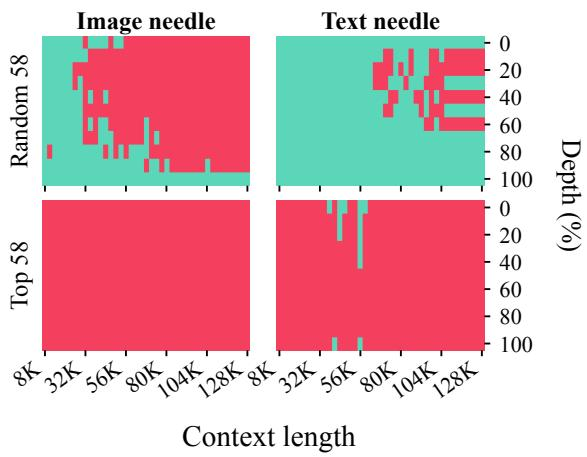

heatmap

| Context length | Image needle Depth (%) | Text needle Depth (%) |
| -------------- | ---------------------- | --------------------- |
| 8K             | 0                      | 0                     |
| 32K            | 0                      | 0                     |
| 56K            | 0                      | 0                     |
| 80K            | 0                      | 0                     |
| 104K           | 0                      | 0                     |
| 128K           | 0                      | 0                     |

Figure 1: Removing multimodal retrieval heads causally disrupts MM-NIAH text- and image-needle retrieval. We evaluate Qwen3-VL-8B (Bai et al., 2025a) on MM-NIAH (Wang et al., 2024b) across multiple context lengths and needle depths.

videos (Fu et al., 2025), and long-horizon agent trajectories (Geng et al., 2025). Effective use of such long multimodal contexts requires locating task-relevant evidence across interleaved text and images. In large language models (LLMs), this evidence-location behavior has been studied through retrieval heads, where Wu et al. (2025b) identifies attention heads that copy answer spans from needle token-by-token during Needle-in-a-Haystack tasks (NIAH, Kamradt, 2023).

However, in multimodal prompts, the evidence may be encoded visually rather than as prompt text, such as in charts, tables, or photos. The LVLMs may therefore use visual evidence to generate the answer without copying any text span from the prompt, so the copy-paste criterion may not directly apply in this setting.

To identify retrieval heads in LVLMs, we introduce multimodal retrieval heads (MMRetHeads), defined as attention heads that have a high average question-to-evidence attention mass. For each head, we compute this score by summing the postsoftmax attention from each question token to all tokens within the annotated needle spans, and then averaging the resulting mass over question tokens (Sec. 3.2). These evidence spans may correspond to text tokens or images mapped to visual tokens. We use the MM-NIAH dataset (Wang et al., 2024b, 2025) to detect multimodal retrieval heads, which comprises four distinct tasks (i.e., text retrieval, image retrieval, rendered-text retrieval, and identicalimage retrieval) with standardized context lengths for controlled experiments (Sec. 3.1). Each example consists of a long interleaved text-image haystack containing many distractor passages or images and a single question-relevant needle, the evidence item needed to answer the question.

We characterize the behavior of retrieval heads in LVLMs and identify the following core properties. Sparsity (Sec. 4): we find that a very small fraction of heads accounts for the vast majority of the retrieval score mass. Causality (Sec. 5): ablating these sparse heads severely degrades multimodal long-context retrieval and downstream reasoning, causing the model to hallucinate evidence or explicitly state that the needed context is missing, while zeroing out random heads has minimal impact. Preservation (Fig. 4): we show that high-scoring multimodal retrieval heads are largely identical to those in their respective base models, suggesting these mechanisms are inherited from pretraining rather than developed during subsequent visionlanguage adaptation. Modality specificity and dynamic adaptation (Sec. 6): we find that text and image modalities share a common set of retrieval heads, while also relying on distinct, modalityspecific ones; this division of labor dynamically adapts to the evidence format, for example, OCRlike evidence in rendered-text retrieval predominantly recruits text-retrieval structures despite the input being visually encoded.

We further demonstrate the causality and utility of our identified multimodal retrieval heads by applying them to solve multimodal document retrieval tasks (Sec. 7). We evaluate both page retrieval, where candidates are document pages and the goal is to rank the page containing the evidence, and layout retrieval, where candidates are finer-grained regions within pages, and the goal is to rank the evidence region. For each candidate page or layout region, we aggregate question-tocandidate attention through the retrieval heads by summing post-softmax attention from question tokens to candidate tokens, averaging over question tokens, and then averaging over heads. Using this score to rank candidates, the retriever outperforms strong reported baselines on both tasks.

# 2 Related Work

Retrieval heads in language models. Prior work shows that attention heads can implement various language-model functions, including in-context completion via induction heads (Olsson et al., 2022) and repeated-token modulation via copysuppression heads (McDougall et al., 2024). Recent work (Wu et al., 2025b) detects retrieval heads using copy-paste behavior (i.e., literal token matching) during answer generation. However, such behavior may not generalize to broader long-context tasks beyond literal matching (Modarressi et al.); other work therefore detects retrieval heads directly from attention scores (Zhang et al., 2025). In this work, we study whether similar attention-scorebased retrieval heads can be detected in LVLMs when the needle is visual.

VLM attention and interpretability. VLM attention has been used to analyze cross-modal alignment, grounding, and hallucination (Aflalo et al., 2022; Huang et al., 2024; Wu et al., 2025a; Kang et al., 2025; Bi et al., 2025), though raw attention is not by itself a causal explanation (Jain and Wallace, 2019; Serrano and Smith, 2019). In this work, we study retrieval heads in LVLMs by examining whether specific attention heads concentrate attention from task-question tokens to annotated multimodal needles.

Multimodal long-context and retrieval. Recent work on long-context vision-language models (Wang et al., 2026) has introduced comprehensive evaluations spanning multimodal document VQA (Wang et al., 2025), multimodal NIAH (Wang et al., 2024b), and long-term memory (Ren et al., 2026), such as MMLong-Bench (Wang et al., 2025). For multimodal document VQA, prior work often uses retrieval modules to score candidate pages or passages (Robertson and Zaragoza, 2009; Karpukhin et al., 2020; Izacard et al., 2022; Khattab and Zaharia, 2020; Ma et al., 2024; Faysse et al., 2025). In contrast, we ask whether an LVLM’s multimodal retrieval heads can directly rank candidate pages or layout units.

# 3 Detecting Multimodal Retrieval Heads

# 3.1 Detection data

MM-NIAH (Wang et al., 2024b) provides a multimodal counterpart to text-only needle-in-

# Multimodal Retrieval Heads

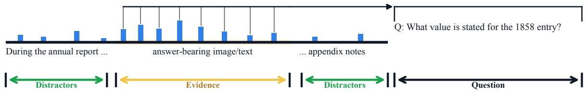

bar

| Period | Distractors | Evidence | Question |
|--------|-------------|----------|----------|
| During the annual report ... | Low | Low | Low |
| Answer-bearing image/text | High | Low | Low |
| ... appendix notes | Low | Low | Low |

Figure 2: Schematic of MMRetHead detection. For each attention head, we score the post-softmax attention from question tokens to annotated task-relevant evidence spans. These evidence spans may correspond to text tokens or visual tokens, allowing the scoring framework to detect retrieval heads across multimodal inputs.

a-haystack tasks (Kamradt, 2023), evaluating whether LVLMs can retrieve needles from long webpage-based haystacks with interleaved text and images. Here, we use the reprocessed version of MM-NIAH from MMLongBench (Wang et al., 2025), which standardizes context lengths for tighter control across the 8K–128K settings. In our setting, the haystack is the full multimodal context, consisting of many distractor texts or images. The needle is the single task-relevant evidence inserted at a controlled depth in that context. An LVLM is then asked a query whose answer requires retrieving this needle. Specifically, we use text and image retrieval from MM-NIAH, covering both textual and visual needles.

In text retrieval, the needle is a short factual text snippet, such as "The beacon over the hill is a lighthouse," hidden among multimodal distractors, and the model must answer the question, such as “What is the beacon over the hill?” In image retrieval, the visual needle is an image embedded inside a larger haystack image, and the model must match it to the correct candidate option image. We further introduce a new rendered-text retrieval task and identical image retrieval variants to separate OCR-like text retrieval and visual presence/absence verification. In rendered-text retrieval, the same text needle used in the text retrieval task is rendered into an image, allowing us to test whether visually encoded text recruits text-like or image-like retrieval heads. In identical image retrieval, the needle image is no longer embedded in another haystack image, and the model must determine whether it appears in the haystack, further covering OCR scenarios and augmenting the image-retrieval setting.

# 3.2 Attention-Based Retrieval Score

We define multimodal retrieval heads (MMRet-Heads) as attention heads with a high average question-to-evidence attention mass.

We write each example as $\ x ~ = ~ ( C , q , G _ { x } )$ , where C is the long interleaved text-image context serving as the haystack, q is the task query, and $G _ { x } = \{ g _ { i } \} _ { i = 1 } ^ { m _ { x } }$ is the set of task-relevant needle spans, with $g _ { i } = ( s _ { i } , e _ { i } )$ denoting a token interval in the tokenized context. As shown in Fig. 2, we define an attention-based retrieval score for each attention head by aggregating attention from question tokens to tokens inside all task-relevant evidence spans:

$$
S _ {h} (x) = \frac {1}{| q |} \sum_ {t _ {q} \in q} \sum_ {g _ {i} \in G _ {x}} \sum_ {t = s _ {i}} ^ {e _ {i}} A _ {t _ {q} \rightarrow t} ^ {h}, \tag {1}
$$

where $A ^ { h }$ denotes the model’s post-softmax attention score for attention head h.

Then, we average the retrieval score for each attention head over all examples. We use this formula following prior work on QRHead (Zhang et al., 2025), but adapt it to multimodal long-context inputs and show that it can identify MMRetHead in subsequent sections.

# 3.3 Null-Question Calibration

In practice, Chen et al. (2025) show that raw attention scores may contain question-independent biases, with certain tokens or input positions receiving high attention scores regardless of the question. Following this work, we also use null-question calibration to measure the change in attention caused by the actual question.

Specifically, we keep the same haystack and evidence spans as the original example, but replace the task question with an uninformative null question $q _ { \emptyset }$ , implemented as the fixed text string $\mathbf { \bar { s } } { \mathbf { \bar { N } } } / { \mathbf { A } } ^ { \prime } { \mathbf { \bar { s } } }$ in the same prompt slot. For $x = ( C , q , g )$ , $S _ { h } ^ { \mathrm { n u l l } } ( x )$ denotes the score computed on $x _ { \emptyset }$ = $( C , q _ { \emptyset } , g )$ . Then, the calibrated score is computed as $S _ { h } ^ { \mathrm { c a l } } ( x ) = S _ { h } ( x ) - S _ { h } ^ { \mathrm { n u l l } } ( x )$ .

# 3.4 Implementation Details

We detect MMRetHeads across six LVLMs: Qwen2.5-VL (7B, 32B) (Bai et al., 2025b), Qwen3- VL (8B, 32B) (Bai et al., 2025a), Gemma3 (12B, 27B) (Gemma Team, 2025). For each model, we run the four MM-NIAH tasks at five context lengths: 8K, 16K, 32K, 64K, and 128K. Each detection condition uses 20 unique question-evidence examples, with each item evaluated at 6 needle-depth positions. We provide full details of the samplesize stability tests in Sec. C. Attention heads are ranked by calibrated retrieval scores, and the top 5% of heads are selected for the following experiments. Selecting the top 5% follows the ratio reported in prior work Wu et al. (2025b). Since Gemma3 models (Gemma Team, 2025) use hybrid attention with sliding-window attention, we consider only global-attention layers that can perform long-range retrieval.

# 4 Basic Properties of MMRetHeads

We first test whether MMRetHeads exhibit three basic properties established in prior retrieval head work: sparsity, intrinsicity, and dynamic activation (Wu et al., 2025b).

Sparsity We define a sparsity metric as the minimum fraction of heads required to explain 50% of the positive calibrated retrieval score mass. Calibrated scores can be negative when the null question attends more to the evidence spans than the task question, so this metric focuses on positive excess question-induced attention. The score-mass sparsity metric is:

$$
\rho_ {0. 5} = \frac {1}{| \mathcal {H} |} \min \left\{k: \sum_ {i = 1} ^ {k} s _ {(i)} \geq 0. 5 \sum_ {h \in \mathcal {H}} s _ {h} \right\},
$$

where H is the full model attention-head set and $s _ { h } = \operatorname* { m a x } ( \bar { s } _ { h } , 0 )$ . s¯h is the calibrated detection-set average, and $s _ { ( 1 ) } \geq \cdot \cdot \cdot \geq s _ { ( | \mathcal { H } | ) }$ are sorted positive score masses.

Fig. 3 confirms that MMRetHeads are sparse: averaged over all context lengths, only 4.4–10.2% of attention heads account for 50% of the positive score mass across tested LVLMs and MM-NIAH tasks.

Intrinsicity Wu et al. (2025b) show that retrieval heads are largely established during pretraining, with later SFT producing only minor changes. Here, we test both Qwen3-VL-8B and Gemma3- 12B to verify whether this claim still holds for LVLMs. For Qwen3, we test whether text retrieval heads are preserved during multimodal adaptation by comparing Qwen3-8B (Yang et al., 2025) with Qwen3-VL-8B (Bai et al., 2025a). For Gemma3, we test intrinsicity more directly by comparing pretrained Gemma3-12B-PT with instruction finetuned Gemma3-12B-IT (Gemma Team, 2025). To support text-only Qwen3-8B, we use 128 examples from Natural Questions (Kwiatkowski et al., 2019) following the QRHead (Zhang et al., 2025).

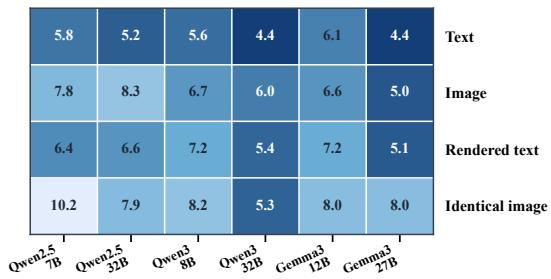

heatmap

| | Qwen2.5 7B | Qwen2.5 32B | Qwen3 8B | Qwen3 32B | Gemma3 12B | Gemma3 27B |
|---|---|---|---|---|---|---|
| Text | 5.8 | 5.2 | 5.6 | 4.4 | 6.1 | 4.4 |
| Image | 7.8 | 8.3 | 6.7 | 6.0 | 6.6 | 5.0 |
| Rendered text | 6.4 | 6.6 | 7.2 | 5.4 | 7.2 | 5.1 |
| Identical image | 10.2 | 7.9 | 8.2 | 5.3 | 8.0 | 8.0 |

Figure 3: Retrieval-score mass concentration. Each cell shows the percentage of heads needed to cover 50% of positive calibrated retrieval mass; darker cells indicate stronger concentration.

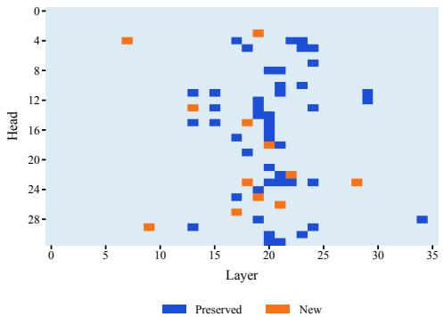  
Figure 4: Top-5% text-retrieval heads in Qwen3-VL-8B. Blue heads are preserved from Qwen3-8B, while orange heads newly enter the top-5% set after vision-language training. We also show the effect of SFT on Gemma3- 12B in Sec. E.

Fig. 4 and Fig. 13 shows that high-scoring text retrieval heads remain concentrated at the same layer/head locations: 46 of 58 Qwen3-VL-8B top-5% heads and 34 of 39 Gemma3-12B-IT top-5% heads are shared with their preceding versions. This high intersection indicates that text retrieval heads are intrinsic, being preserved through visionlanguage adaptation in Qwen3-VL-8B and instruction tuning in Gemma3-12B rather than newly formed during later adaptation.

Dynamic activations Prior work (Wu et al., 2025b) has shown that retrieval heads are dynamically activated, with some heads appearing only in specific contexts and others appearing consistently across contexts. Here, we examine context length as one factor driving this variation in MMRetHeads. Fig. 5 shows a substantial decrease in intersection heads detected in short and long-context settings. At 128K, only 60% of image retrieval heads, 70% of identical-image retrieval heads, 71% of text retrieval heads, and 76% of rendered-text retrieval heads remain shared with the head set detected at the 8K setting. This suggests that retrieval head selection is context-length sensitive, with image retrieval heads showing the largest change across lengths. Furthermore, Fig. 6 shows a clear layerdistribution change between heads detected only at 8K setting and heads detected only at 128K setting of image retrieval. The heads unique to the 8K setting are concentrated more in earlier layers, with a mean layer of 33.1, whereas the heads unique to the 128K setting shift toward later layers, with a mean layer of 52.4. This suggests that shorter-context retrieval can rely more on earlier representations, while longer-context retrieval may require representations that have undergone more layer-wise processing.

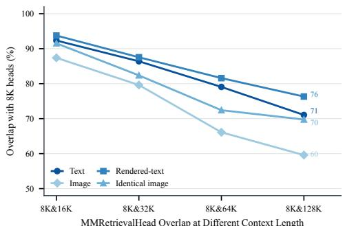

line

| MMRetrievalHead Overlap at Different Context Length | Text  | Rendered-text | Image | Identical image |
| --------------------------------------------------- | ----- | ------------- | ----- | --------------- |
| 8K&16K                                              | 93    | 94            | 88    | 92              |
| 8K&32K                                              | 87    | 88            | 80    | 82              |
| 8K&64K                                              | 81    | 82            | 66    | 73              |
| 8K&128K                                             | 71    | 76            | 60    | 70              |

Figure 5: Context-length sensitivity of retrieval-head selection. Curves show the overlap between top-5% heads selected at 8K and those selected at longer contexts, averaged over six LVLMs. We find that image-retrieval heads are less stable.

# 5 Causal Role in Multimodal NIAH, Long-Context, and Reasoning Tasks

We remove the detected attention heads from LVLMs by applying a zero mask to their postsoftmax attention weights, and evaluate whether retrieval performance degrades. We apply the mask during both prompt prefill and answer decoding because this setting causes much stronger degradation than decode-only masking, indicating that retrieval also occurs while the model processes the haystack and question before generation. We provide more detail of this in Sec. D. We mainly present results on Qwen3-VL-8B. We first intervene in MM-NIAH, where synthetic examples pro-

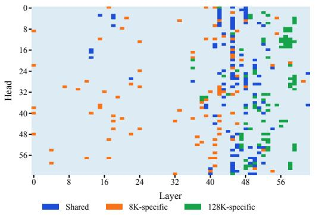

scatter

| Layer | Head | Category       |
|-------|------|----------------|
| 0     | 0    | Shared         |
| 0     | 8    | 8K-specific    |
| 0     | 40   | Shared         |
| 0     | 56   | 8K-specific    |
| 8     | 0    | Shared         |
| 8     | 8    | 8K-specific    |
| 8     | 40   | Shared         |
| 8     | 56   | 8K-specific    |
| 16    | 0    | Shared         |
| 16    | 8    | 8K-specific    |
| 16    | 40   | Shared         |
| 16    | 56   | 8K-specific    |
| 24    | 0    | Shared         |
| 24    | 8    | 8K-specific    |
| 24    | 40   | Shared         |
| 24    | 56   | 8K-specific    |
| 32    | 0    | Shared         |
| 32    | 8    | 8K-specific    |
| 32    | 40   | Shared         |
| 32    | 56   | 8K-specific    |
| 40    | 0    | Shared         |
| 40    | 8    | 8K-specific    |
| 40    | 40   | Shared         |
| 40    | 56   | 8K-specific    |
| 48    | 0    | Shared         |
| 48    | 8    | 8K-specific    |
| 48    | 40   | Shared         |
| 48    | 56   | 8K-specific    |
| 56    | 0    | Shared         |
| 56    | 8    | 8K-specific    |
| 56    | 40   | Shared         |
| 56    | 56   | 8K-specific    |

Figure 6: Layer distribution of Qwen3-VL-32B imageretrieval heads at 8K and 128K. Blue heads are shared; orange and green mark 8K- and 128K-specific heads; context-specific heads show different layer distributions.

vide known evidence spans and controlled context lengths, then test whether the detected heads remain important beyond the detection setting by masking them on Long Document VQA and multimodal reasoning benchmarks.

# 5.1 Head Masking on MM-NIAH

Causal effects on MM-NIAH. Fig. 1 summarizes MM-NIAH causal masking results for Qwen3- VL-8B across context lengths and evidence depths. For each task, we mask the top 5% retrieval heads detected at the 128K context length, which corresponds to 58 heads for Qwen3-VL-8B. As a control, we mask 58 randomly chosen attention heads. In both text and image retrieval settings, masking retrieval heads causes severe retrieval failures across all context-length and needle-depth settings, showing that the detected heads are causally important rather than only correlated with evidence locations.

Cross-length causal transfer. Fig. 5 shows that the retrieval head sets detected at different context lengths only partially intersect. We therefore ask whether this context-length variation weakens their causal role, or whether heads detected at one length remain functionally important at other lengths. Fig. 7 shows that the causal effect transfers in both directions. On the long context tasks, from 100K to 131K, masking either the 8K-detected heads reduces image retrieval accuracy to 0.0%, and reduces text retrieval accuracy to 9.1%. Conversely, on the shorter context tasks (8K to 35K), masking the 128K-detected heads degrades both image and text retrieval accuracy to 0.0%. These results show that, although the selected head sets vary with context length, heads detected at one length can remain causally important at other lengths.

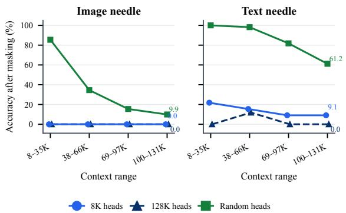

line

| Context range | Image needle - 8K heads (%) | Image needle - 128K heads (%) | Image needle - Random heads (%) | Text needle - 8K heads (%) | Text needle - 128K heads (%) | Text needle - Random heads (%) |
|---|---|---|---|---|---|---|
| 8-35K | 22.0 | 0.0 | 87.0 | 100.0 | 0.0 | 100.0 |
| 38-66K | 14.0 | 0.0 | 35.0 | 98.0 | 12.0 | 98.0 |
| 69-97K | 9.0 | 0.0 | 18.0 | 82.0 | 2.0 | 82.0 |
| 100-131K | 9.1 | 0.0 | 9.9 | 61.2 | 0.0 | 61.2 |

Figure 7: Cross-length causal transfer. Masking heads detected at 8K or 128K degrades MM-NIAH performance across other context lengths, showing that retrieval heads remain causally important beyond their detection length.

# 5.2 Long-Document VQA Masking

We next evaluate Long Document VQA using the 128K context-length MMLongBench-Doc and SlideVQA subsets from MMLongBench (Wang et al., 2025). We mask the union of retrieval heads detected from the four MM-NIAH tasks introduced in Sec. 3.1, using their 128K detection settings. Fig. 8 shows that masking these retrieval heads sharply reduces MMLongBench-Doc score from 48.2% to 5.7% and SlideVQA score from 71.2% to 8.9%. In contrast, masking randomly chosen attention heads is less damaging, leaving scores of 32.2% and 52.6%, respectively. These results show that retrieval heads identified in controlled MM-NIAH tasks remain causally important on Long Document VQA tasks beyond the detection setting.

# 5.3 Reasoning Benchmark Masking

For broader downstream masking, we evaluate Qwen3-VL-8B on MMMU (Yue et al., 2024a), MMMU-Pro (Yue et al., 2024b), MathVision (Wang et al., 2024a), and MathVista (Lu et al., 2024). We mask the union of retrieval heads detected from the four 128K MM-NIAH task settings in Sec. 3.1. We also compare direct-answer prompting with chain-of-thought (CoT) prompting (Wei et al., 2022).

As shown in Fig. 9, masking MMRetHeads causes much larger accuracy drops than masking randomly chosen heads. Across the four benchmarks, direct-answer accuracy drops by an average of 24.3 points, while CoT accuracy drops by an average of 38.8 points, showing that heads detected on controlled MM-NIAH tasks remain causally important for downstream multimodal reasoning. Furthermore, the larger CoT drop suggests that multi-step reasoning relies more heavily on repeated grounding, though it may also reflect longer masked-decoding trajectories. With CoT prompting, the model outputs intermediate reasoning, allowing us to inspect failure modes when retrieval heads are masked. We find several recurring failures. Some failures indicate disrupted access to the relevant evidence. For example, in an MMMU-Pro thermodynamics problem, the masked model states that there is “Not enough information provided” even though the needed diagram is included in the prompt. In other cases, it hallucinates supporting content or extracts the wrong information. Prompt-output examples are provided in Sec. B.

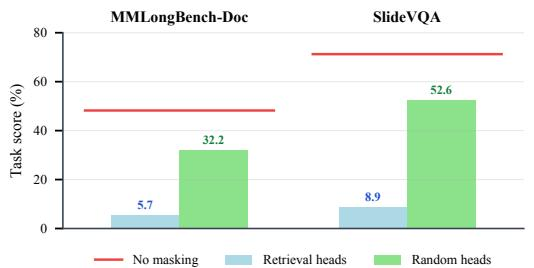

bar

| Dataset | Task score (%) |
| :--- | :--- |
| MMLongBench-Doc - No masking | 48.0 |
| MMLongBench-Doc - Retrieval heads | 5.7 |
| MMLongBench-Doc - Random heads | 32.2 |
| SlideVQA - No masking | 71.0 |
| SlideVQA - Retrieval heads | 8.9 |
| SlideVQA - Random heads | 52.6 |

Figure 8: Causal effect on 128K Long Document VQA category of MMLongBench. Masking retrieval heads detected on 128K MM-NIAH degrades MMLongBench-Doc and SlideVQA far more than random masking.

# 6 Modality-Specific Retrieval Head

We test whether MMRetHeads are shared across retrieval tasks by measuring the intersection between the detected head sets for text and image retrieval, and for text and rendered-text retrieval. For two top-5% head sets $\mathcal { H } _ { A }$ and $\mathcal { H } _ { B }$ of equal size, we report their intersection as $| \mathcal { H } _ { A } \cap \mathcal { H } _ { B } | / | \mathcal { H } _ { A } |$ |, i.e., the fraction of heads in one set that also appear in the other. The ratio is symmetric in A and B, since $\vert \mathcal { H } _ { A } \vert = \vert \mathcal { H } _ { B } \vert$ ,

We then test whether retrieval heads are sensitive to the modality ratio of the haystack. For this analysis, we use the MM-NIAH text retrieval and image retrieval tasks, preserve the answer-bearing needle entries, and vary only haystack. Text are grouped into units of esimated 500 tokens using a characterlength heuristic, where one token is approximated four characters, while each image is treated as one unit. Vision-token counts are model-dependent: Gemma3 uses roughly 256 vision tokens per image, while Qwen3-VL and Qwen2.5-VL use dynamic image tokenization, with averages of about 209 and 270 vision tokens per image in our sampled composition runs, respectively. We then sample 128 units per example and set the target image-unit ratio to

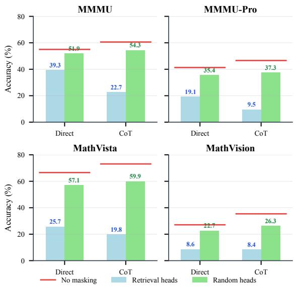  
Figure 9: Qwen3-VL-8B accuracy on multimodal reasoning. We compare no masking, retrieval head masking, and random head masking across direct-answer and CoT prompting. Masking our retrieval heads causes substantially larger accuracy drops.

0, 0.1, 0.2, or 0.4, corresponding to 0, 13, 26, or 51 image units out of 128.

Text and image retrieval use partially distinct heads. Fig. 10 shows that text and image retrieval heads are partially shared but not identical. Across six LVLMs and five context lengths, the intersection between the top-5% text and image retrieval head sets ranges from 0.18 to 0.64, with an average intersection of 0.51. This suggests both modalityagnostic and modality-specific retrieval heads.

Rendered-text retrieval preserves text-retrieval structure. Fig. 10 also shows that rendered-text retrieval is much closer to text retrieval than to ordinary image retrieval. Across six LVLMs and five context lengths, text/rendered-text head intersection ranges from 0.5 to 0.92, with an average intersection of 0.79. This is much higher than the 0.51 average intersection between text and image retrieval. This suggests that retrieval heads are sensitive not only to the raw input channel, but even more to the content being retrieved.

Haystack text-image ratio induces modalityaware head dynamics. Fig. 11 shows that retrieval head selection is sensitive to the text-image ratio of the haystack. As images make up a larger share of the haystack, with the image ratio increasing from 0 to 0.4, the intersection with the head set detected in the all-text haystack decreases for both text and image retrieval. The decrease is much larger for image retrieval. When the image ratio is 0.4, the mean intersection across the three models is 0.87 for text retrieval, and 0.72 for image retrieval. This pattern suggests that the detected heads depend not only on the target evidence modality but also on the haystack’s modality. For image retrieval, the stronger decrease in intersection suggests that the model recruits more modality-specific heads when haystack images create additional visual noise.

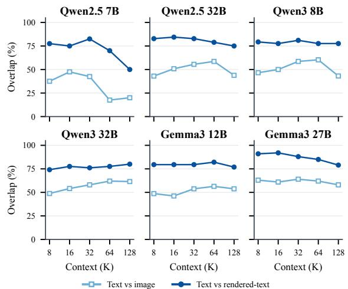

Figure 10: Retrieval-task sensitivity of retrieval-head selection at context lengths from 8K to 128K. Light-blue curves compare text and image retrieval tasks, while dark-blue curves compare text and rendered-text retrieval; we find that rendered-text retrieval consistently overlaps more with text retrieval.   
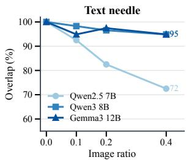

line

| Image ratio | Qwen2.5 7B | Qwen3 8B | Gemma3 12B |
| ----------- | ---------- | -------- | ---------- |
| 0.0         | 100        | 100      | 100        |
| 0.1         | 92         | 98       | 95         |
| 0.2         | 82         | 96       | 96         |
| 0.4         | 72         | 95       | 95         |

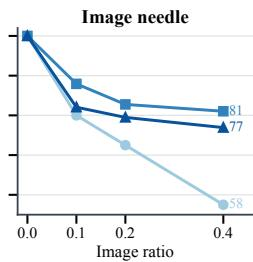

line

| Image ratio | Line 1 | Line 2 | Line 3 |
| ----------- | ------ | ------ | ------ |
| 0.0         | 81     | 81     | 81     |
| 0.1         | 77     | 77     | 77     |
| 0.2         | 77     | 77     | 77     |
| 0.4         | 58     | 58     | 58     |

Figure 11: Sensitivity to the haystack image ratio. Each curve shows the intersection between the top-5% heads detected at a given image ratio and those detected in the all-text haystack setting. Both text and image retrieval heads change as the image ratio increases.

# 7 Multimodal Document Re-Ranking

We apply the selected retrieval heads to multimodal document re-ranking, where the goal is to rank candidate pages or layout regions by whether they contain the evidence needed to answer a question, and find that this method outperforms strong baselines.

Method and Calibration Given a selected retrieval head set $\mathcal { H } _ { \mathrm { s e l } } .$ , a question q, and candidate units $D = \{ d _ { i } \} _ { i = 1 } ^ { n }$ , we compute a retrieval score by aggregating question-to-candidate attention through the selected heads. We define the retrieval head score $R ( d _ { i } \mid q ; \mathcal { H } _ { \mathrm { s e l } } )$ for candidate units $d _ { i }$ as:

$$
R = \frac {1}{| \mathcal {H} _ {\mathrm{sel}} |} \sum_ {h \in \mathcal {H} _ {\mathrm{sel}}} \frac {1}{| q |} \sum_ {t _ {q} \in q} \sum_ {t _ {d} \in d _ {i}} A _ {t _ {q} \rightarrow t _ {d}} ^ {h}. \tag {2}
$$

We also apply the null-question calibration in this experiment. Candidate units are then ranked using the null-calibrated retrieval score as a relevance metric (Chen et al., 2025).

Re-Ranking Performance Multimodal document re-ranking requires retrieving evidence from visually rich documents whose evidence may appear as rendered text, images, or layout-dependent structure. For example, in a manual, answering a question may require interpreting an illustrated step, while in a research report, the relevant evidence may be a reported percentage in a chart.

To construct a retriever, we use the selected retrieval heads in Qwen3-VL-8B and Gemma3-12B, detected at 128K context length. We evaluate our LVLM-based retriever on MMDocIR (Dong et al., 2025) at both the page and layout levels. Page-level retrieval ranks document pages, while layout-level retrieval ranks detected layout elements within pages, such as text blocks, headings, equations, tables, figures, or charts, using bounding-box evidence annotations. To keep inputs within the LVLM context window, we cap page retrieval at 200 pages per forward pass, scoring each 200-page group separately for longer documents; for layout retrieval, we cap each forward pass at 50 images.

As shown in Table 1, the retriever built from Qwen3-VL-8B selected retrieval heads achieves the best MMDocIR performance among the compared methods at both page and layout levels.2 For page retrieval, the retriever reaches 64.7 macro and 64.5 micro Recall@1, improving over the strongest reported baseline, Col-Phi3, by 7.7 and 7.4 percentage points, respectively. For layout retrieval, it reaches 39.0 macro and 39.3 micro Recall@1, improving over the strongest reported baseline, Col-Pali, by 6.3 and 6.8 percentage points. Full Recall@k results are provided in Table 2. These results show that attention from the selected retrieval heads provides a usable relevance signal for realistic multimodal document retrieval.

<table><tr><td>Method</td><td>Macro R@1</td><td>Micro R@1</td><td> $\Delta$  vs. baseline</td></tr><tr><td colspan="4">Page-Level</td></tr><tr><td>DSEwiki-ss</td><td>48.0</td><td>47.5</td><td>-</td></tr><tr><td>DSEdocmatix</td><td>50.2</td><td>50.1</td><td>-</td></tr><tr><td>ColPali</td><td>53.0</td><td>52.7</td><td>-</td></tr><tr><td>DPR-Phi3MMDocIR</td><td>54.1</td><td>53.7</td><td>-</td></tr><tr><td>Col-Phi3MMDocIR</td><td>57.0</td><td>57.1</td><td>-</td></tr><tr><td>All-head</td><td>61.8</td><td>61.2</td><td>+4.8/+4.1</td></tr><tr><td>MMRetHeads (ours)</td><td>64.7</td><td>64.5</td><td>+7.7/+7.4</td></tr><tr><td colspan="4">Layout-Level</td></tr><tr><td>DSEwiki-ss</td><td>28.2</td><td>29.2</td><td>-</td></tr><tr><td>DSEdocmatix</td><td>27.9</td><td>29.1</td><td>-</td></tr><tr><td>ColPali</td><td>32.7</td><td>32.5</td><td>-</td></tr><tr><td>DPR-Phi3MMDocIR</td><td>29.5</td><td>30.2</td><td>-</td></tr><tr><td>Col-Phi3MMDocIR</td><td>31.1</td><td>31.6</td><td>-</td></tr><tr><td>MMRetHeads (ours)</td><td>39.0</td><td>39.3</td><td>+6.3/+6.8</td></tr></table>

Table 1: MMDocIR Recall@1 summary. We evaluate our retriever built on Qwen3-VL-8B and report macro/micro Recall@1 for page- and layout-level retrieval, with deltas against the strongest reported baseline. We compare with thirteen strong baselines in Sec. A. MMRetHeads achieves the best performance in both settings.

Finally, to test whether the gains come from selected retrieval heads rather than generic LVLM attention, we add a baseline where all attention heads are used to compute retrieval scores. For Qwen3-VL-8B, aggregating all attention heads still outperforms the strongest listed page baseline, but selected retrieval heads improve over all-head attention by 2.9 macro Recall@1 points and 3.2 micro Recall@1 points, with smaller gains at Recall@3 and Recall@5.

# 8 Conclusions

This work shows that LVLMs contain multimodal retrieval heads, a compact set of attention heads whose question-to-evidence attention identifies relevant multimodal evidence. These heads are sparse and dependent on context length and modality, and partly shared across text and image retrieval. Masking retrieval heads causally disrupts Long Document VQA and downstream multimodal reasoning. Beyond intervention, we show that those multimodal retrieval heads are also useful for downstream tasks: aggregating selected-head attention provides a strong retriever for ranking visually rich documents. Overall, we hope this work provides a useful lens for studying multimodal long-context and inspires more interpretability study of LVLMs.

# Limitations

Our analysis uses attention scores as a proxy for retrieval-oriented heads. Masking shows strong behavioral effects, but a full circuit-level account would also need to test MLPs, residual-stream pathways, and non-selected heads.

Detected head sets may depend on context length, detection dataset, and language. The MM-NIAH tasks cover only English examples up to 128K context length. They also do not cover all real multimodal retrieval settings, such as dense documents, OCR-heavy pages, charts, diagrams, or multi-image reasoning. The analysis covers two decoder-only LVLM families with vision-token inputs, so the findings may not generalize to crossattention LVLMs, other tokenizers, or different vision encoders.

The retrieval head-based retriever requires access to internal attention weights and can be more expensive than embedding-based retrieval because it runs LVLM forward passes over candidate context. Our evaluation does not fully test latency, memory cost, or index-time/query-time trade-offs. In settings with many repeated queries over a fixed corpus, embedding or late-interaction retrievers are likely to remain preferable. Future work should compare deployment cost and retrieval quality directly.

# Ethical Considerations

This paper utilizes several publicly available datasets, including MM-NIAH (Wang et al., 2024b), MMLongBench (Wang et al., 2025), Natural Questions (Kwiatkowski et al., 2019), MMMU (Yue et al., 2024a), MMMU-Pro (Yue et al., 2024b), MathVision (Wang et al., 2024a), MathVista (Lu et al., 2024), and MMDocIR (Dong et al., 2025), which are accessible to the research community under MIT, MIT, CC BY-SA 3.0, Apache 2.0, Apache 2.0, MIT, CC BY-SA 4.0, and Apache 2.0 licenses, respectively. All data are derived from previously released open-source benchmarks, and we use them solely for non-commercial research evaluation in accordance with their respective terms. The data do not contain personally identifying information beyond what is already public in the source corpora, so our work does not raise additional privacy concerns regarding specific entities.

Our experiments involve the use of Qwen2.5-VL (Bai et al., 2025b), Qwen3-VL (Bai et al., 2025a), and Gemma3 (Gemma Team, 2025), released under the Apache 2.0, Apache 2.0, and Gemma Terms of Use, respectively, so the same risks from LVLM research are also applicable to this work.

# Acknowledgements

The authors of this paper were supported by the National Key Research and Development Program of China (2025YFE0200500), the ITSP Platform Research Project (ITS/189/23FP) from ITC of Hong Kong, SAR, China, and the AoE (AoE/E-601/24- N), the RIF (R6021-20) and the GRF (16205322) from RGC of Hong Kong, SAR, China. We also thank the NVIDIA AI Technology Center (NVAITC) for the support and additional funding.

# References

Estelle Aflalo, Meng Du, Shao-Yen Tseng, Yongfei Liu, Chenfei Wu, Nan Duan, and Vasudev Lal. 2022. VL-InterpreT: An Interactive Visualization Tool for Interpreting Vision-Language Transformers. In Proceedings of the IEEE/CVF Conference on Computer Vision and Pattern Recognition, pages 21406–21415.   
Shuai Bai, Yuxuan Cai, Ruizhe Chen, Keqin Chen, Xionghui Chen, Zesen Cheng, Lianghao Deng, Wei Ding, Chang Gao, Chunjiang Ge, Wenbin Ge, Zhifang Guo, Qidong Huang, Jie Huang, Fei Huang, Binyuan Hui, Shutong Jiang, Zhaohai Li, Mingsheng Li, and 45 others. 2025a. Qwen3-VL Technical Report. Preprint, arXiv:2511.21631.   
Shuai Bai, Keqin Chen, Xuejing Liu, Jialin Wang, Wenbin Ge, Sibo Song, Kai Dang, Peng Wang, Shijie Wang, Jun Tang, Humen Zhong, Yuanzhi Zhu, Mingkun Yang, Zhaohai Li, Jianqiang Wan, Pengfei Wang, Wei Ding, Zheren Fu, Yiheng Xu, and 9 others. 2025b. Qwen2.5-VL Technical Report. Preprint, arXiv:2502.13923.   
Jing Bi, Junjia Guo, Yunlong Tang, Lianggong Bruce Wen, Zhang Liu, Bingjie Wang, and Chenliang Xu. 2025. Unveiling Visual Perception in Language Models: An Attention Head Analysis Approach. In Proceedings of the IEEE/CVF Conference on Computer Vision and Pattern Recognition, pages 4135–4144.   
Shijie Chen, Bernal Jiménez Gutiérrez, and Yu Su. 2025. Attention in Large Language Models Yields Efficient Zero-Shot Re-Rankers. In International Conference on Learning Representations.   
Kuicai Dong, Yujing Chang, Derrick Goh Xin Deik, Dexun Li, Ruiming Tang, and Yong Liu. 2025. MMDocIR: Benchmarking Multimodal Retrieval for Long Documents. In Proceedings of the 2025 Conference on Empirical Methods in Natural Language Processing, pages 30971–31005, Suzhou, China. Association for Computational Linguistics.

Manuel Faysse, Hugues Sibille, Tony Wu, Bilel Omrani, Gautier Viaud, Celine Hudelot, and Pierre Colombo. 2025. ColPali: Efficient Document Retrieval with Vision Language Models. In International Conference on Learning Representations.   
Chaoyou Fu, Yuhan Dai, Yongdong Luo, Lei Li, Shuhuai Ren, Renrui Zhang, Zihan Wang, Chenyu Zhou, Yunhang Shen, Mengdan Zhang, and 1 others. 2025. Video-mme: The first-ever comprehensive evaluation benchmark of multi-modal llms in video analysis. In Proceedings of the IEEE/CVF conference on computer vision and pattern recognition, pages 24108–24118.   
Gemma Team. 2025. Gemma 3 Technical Report. Preprint, arXiv:2503.19786.   
Xinyu Geng, Peng Xia, Zhen Zhang, Xinyu Wang, Qiuchen Wang, Ruixue Ding, Chenxi Wang, Jialong Wu, Yida Zhao, Kuan Li, and 1 others. 2025. Webwatcher: Breaking new frontier of vision-language deep research agent. arXiv preprint arXiv:2508.05748.   
Qidong Huang, Xiaoyi Dong, Pan Zhang, Bin Wang, Conghui He, Jiaqi Wang, Dahua Lin, Weiming Zhang, and Nenghai Yu. 2024. OPERA: Alleviating Hallucination in Multi-Modal Large Language Models via Over-Trust Penalty and Retrospection-Allocation. In Proceedings of the IEEE/CVF Conference on Computer Vision and Pattern Recognition, pages 13418–13427.   
Gautier Izacard, Mathilde Caron, Lucas Hosseini, Sebastian Riedel, Piotr Bojanowski, Armand Joulin, and Edouard Grave. 2022. Unsupervised Dense Information Retrieval with Contrastive Learning. Transactions on Machine Learning Research.   
Sarthak Jain and Byron C. Wallace. 2019. Attention is not Explanation. In Proceedings of the 2019 Conference of the North American Chapter of the Association for Computational Linguistics: Human Language Technologies, pages 3543–3556. Association for Computational Linguistics.   
Greg Kamradt. 2023. Needle In A Haystack – Pressure Testing LLMs. GitHub repository.   
Seil Kang, Jinyeong Kim, Junhyeok Kim, and Seong Jae Hwang. 2025. Your Large Vision-Language Model Only Needs A Few Attention Heads For Visual Grounding. In Proceedings of the IEEE/CVF Conference on Computer Vision and Pattern Recognition, pages 9339–9350.   
Vladimir Karpukhin, Barlas Oguz, Sewon Min, Patrick Lewis, Ledell Wu, Sergey Edunov, Danqi Chen, and Wen-tau Yih. 2020. Dense Passage Retrieval for Open-Domain Question Answering. In Proceedings of the 2020 Conference on Empirical Methods in Natural Language Processing, pages 6769–6781. Association for Computational Linguistics.

Omar Khattab and Matei Zaharia. 2020. ColBERT: Efficient and Effective Passage Search via Contextualized Late Interaction over BERT. In Proceedings of the 43rd International ACM SIGIR Conference on Research and Development in Information Retrieval, pages 39–48. ACM.   
Tom Kwiatkowski, Jennimaria Palomaki, Olivia Redfield, Michael Collins, Ankur Parikh, Chris Alberti, Danielle Epstein, Illia Polosukhin, Jacob Devlin, Kenton Lee, Kristina Toutanova, Llion Jones, Matthew Kelcey, Ming-Wei Chang, Andrew M. Dai, Jakob Uszkoreit, Quoc Le, and Slav Petrov. 2019. Natural Questions: A Benchmark for Question Answering Research. Transactions of the Association for Computational Linguistics, 7:452–466.   
Pan Lu, Hritik Bansal, Tony Xia, Jiacheng Liu, Chunyuan Li, Hannaneh Hajishirzi, Hao Cheng, Kai-Wei Chang, Michel Galley, and Jianfeng Gao. 2024. MathVista: Evaluating Mathematical Reasoning of Foundation Models in Visual Contexts. In International Conference on Learning Representations.   
Xueguang Ma, Sheng-Chieh Lin, Minghan Li, Wenhu Chen, and Jimmy Lin. 2024. Unifying Multimodal Retrieval via Document Screenshot Embedding. In Proceedings of the 2024 Conference on Empirical Methods in Natural Language Processing, pages 6492–6505, Miami, Florida, USA. Association for Computational Linguistics.   
Callum Stuart McDougall, Arthur Conmy, Cody Rushing, Thomas McGrath, and Neel Nanda. 2024. Copy Suppression: Comprehensively Understanding a Motif in Language Model Attention Heads. In Proceedings of the 7th BlackboxNLP Workshop: Analyzing and Interpreting Neural Networks for NLP, pages 337–363, Miami, Florida, US. Association for Computational Linguistics.   
Ali Modarressi, Hanieh Deilamsalehy, Franck Dernoncourt, Trung Bui, Ryan A Rossi, Seunghyun Yoon, and Hinrich Schuetze. Nolima: Long-context evaluation beyond literal matching. In Forty-second International Conference on Machine Learning.   
Catherine Olsson, Nelson Elhage, Neel Nanda, Nicholas Joseph, Nova DasSarma, Tom Henighan, Ben Mann, Amanda Askell, Yuntao Bai, Anna Chen, Tom Conerly, Dawn Drain, Deep Ganguli, Zac Hatfield-Dodds, Danny Hernandez, Scott Johnston, Andy Jones, Jackson Kernion, Liane Lovitt, and 7 others. 2022. Incontext Learning and Induction Heads. Transformer Circuits Thread.   
Xiyu Ren, Zhaowei Wang, Yiming Du, Zhongwei Xie, Chi Liu, Xinlin Yang, Haoyue Feng, Wenjun Pan, Tianshi Zheng, Baixuan Xu, and 1 others. 2026. Memlens: Benchmarking multimodal longterm memory in large vision-language models. arXiv preprint arXiv:2605.14906.   
Stephen Robertson and Hugo Zaragoza. 2009. The Probabilistic Relevance Framework: BM25 and Be-

yond. Foundations and Trends in Information Retrieval, 3(4):333–389.   
Sofia Serrano and Noah A. Smith. 2019. Is Attention Interpretable? In Proceedings of the 57th Annual Meeting of the Association for Computational Linguistics, pages 2931–2951. Association for Computational Linguistics.   
Ke Wang, Junting Pan, Weikang Shi, Zimu Lu, Houxing Ren, Aojun Zhou, Mingjie Zhan, and Hongsheng Li. 2024a. Measuring Multimodal Mathematical Reasoning with MATH-Vision Dataset. In Advances in Neural Information Processing Systems. Datasets and Benchmarks Track.   
Weiyun Wang, Shuibo Zhang, Yiming Ren, Yuchen Duan, Tiantong Li, Shuo Liu, Mengkang Hu, Zhe Chen, Kaipeng Zhang, Lewei Lu, Xizhou Zhu, Ping Luo, Yu Qiao, Jifeng Dai, Wenqi Shao, and Wenhai Wang. 2024b. Needle In A Multimodal Haystack. In Advances in Neural Information Processing Systems. Datasets and Benchmarks Track.   
Zhaowei Wang, Lishu Luo, Haodong Duan, Weiwei Liu, Sijin Wu, Ji Luo, Shen Yan, Shuai Peng, Sihang Yuan, Chaoyi Huang, and 1 others. 2026. Training long-context vision-language models effectively with generalization beyond 128k context. arXiv preprint arXiv:2605.13831.   
Zhaowei Wang, Wenhao Yu, Xiyu Ren, Jipeng Zhang, Yu Zhao, Rohit Saxena, Liang Cheng, Ginny Wong, Simon See, Pasquale Minervini, Yangqiu Song, and Mark Steedman. 2025. MMLongBench: Benchmarking Long-Context Vision-Language Models Effectively and Thoroughly. In Advances in Neural Information Processing Systems. Spotlight.   
Jason Wei, Xuezhi Wang, Dale Schuurmans, Maarten Bosma, Brian Ichter, Fei Xia, Ed Chi, Quoc V. Le, and Denny Zhou. 2022. Chain-of-Thought Prompting Elicits Reasoning in Large Language Models. In Advances in Neural Information Processing Systems, volume 35, pages 24824–24837.   
Size Wu, Sheng Jin, Wenwei Zhang, Lumin Xu, Wentao Liu, Wei Li, and Chen Change Loy. 2025a. F-LMM: Grounding Frozen Large Multimodal Models. In Proceedings of the IEEE/CVF Conference on Computer Vision and Pattern Recognition, pages 24710–24721.   
Wenhao Wu, Yizhong Wang, Guangxuan Xiao, Hao Peng, and Yao Fu. 2025b. Retrieval Head Mechanistically Explains Long-Context Factuality. In International Conference on Learning Representations.   
An Yang, Anfeng Li, Baosong Yang, Beichen Zhang, Binyuan Hui, Bo Zheng, Bowen Yu, Chang Gao, Chengen Huang, Chenxu Lv, Chujie Zheng, Dayiheng Liu, Fan Zhou, Fei Huang, Feng Hu, Hao Ge, Haoran Wei, Huan Lin, Jialong Tang, and 41 others. 2025. Qwen3 Technical Report. Preprint, arXiv:2505.09388.

Xiang Yue, Yuansheng Ni, Kai Zhang, Tianyu Zheng, Ruoqi Liu, Ge Zhang, Samuel Stevens, Dongfu Jiang, Weiming Ren, Yuxuan Sun, Cong Wei, Botao Yu, Ruibin Yuan, Renliang Sun, Ming Yin, Boyuan Zheng, Zhenzhu Yang, Yibo Liu, Wenhao Huang, and 3 others. 2024a. MMMU: A Massive Multidiscipline Multimodal Understanding and Reasoning Benchmark for Expert AGI. In Proceedings of the IEEE/CVF Conference on Computer Vision and Pattern Recognition, pages 9556–9567.

Xiang Yue, Tianyu Zheng, Yuansheng Ni, Yubo Wang, Kai Zhang, Shengbang Tong, Yuxuan Sun, Botao Yu, Ge Zhang, Huan Sun, Yu Su, Wenhu Chen, and Graham Neubig. 2024b. MMMU-Pro: A More Robust Multi-discipline Multimodal Understanding Benchmark. Preprint, arXiv:2409.02813.

Wuwei Zhang, Fangcong Yin, Howard Yen, Danqi Chen, and Xi Ye. 2025. Query-Focused Retrieval Heads Improve Long-Context Reasoning and Re-Ranking. In Proceedings of the 2025 Conference on Empirical Methods in Natural Language Processing, pages 23791–23805, Suzhou, China. Association for Computational Linguistics.

# A MMDocIR Detailed Retrieval Results

# A.1 Full Recall@k results

We provide the full MMDocIR page- and layoutlevel Recall@k results in Table 2.

# A.2 Domain Breakdown

We provide the MMDocIR domain-level Recall@1 results in Table 3.

# B Downstream Failure Case Prompts and Outputs

We provide representative prompt-output examples for downstream failure cases. Image payloads are represented as <image>. Outputs are excerpts from Qwen3-VL-8B CoT generations under masking of the selected multimodal retrieval heads; bracketed notes mark author truncation.

# B.1 Reporting Lack of Information

MMMU-Pro: validation\_Energy\_and\_Power\_25

# Prompt.

A gas-turbine power plant operates on the simple Brayton cycle between the pressure limits of 100 and 1600 kPa. The working fluid is air, which enters the compressor at 40°C at a rate of 850 m^3/min and leaves the turbine at 650°C. Using variable specific heats for air and assuming a compressor isentropic efficiency of 85 percent and a turbine isentropic efficiency of 88 percent, determine (1) the net power output and (2) the back work ratio.<image>

# Options:

A. (1) 6200 kW, (2) 0.516 B. (1) 6100 kW, (2) 0.526   
C. (1) 6081 kW, (2) 0.536   
D. (1) 6150 kW, (2) 0.556   
E. (1) 5900 kW, (2) 0.456   
F. (1) 6001 kW, (2) 0.436   
G. (1) 6000 kW, (2) 0.546   
H. (1) 6050 kW, (2) 0.446   
I. (1) 6181 kW, (2) 0.536

# Output.

The question appears to be asking for a step-by-step solution to a thermodynamics problem involving a Brayton cycle with variable specific heats and efficiencies. However, the provided text does not contain enough information to determine the exact answer without additional context or clarification.

The problem involves calculating the net power output of a gas turbine engine, which requires knowing the specific heat capacities, the temperature difference between the inlet and outlet, and the efficiency of the turbine. Without more information, it is not possible to determine the exact value of the net power output.

Therefore, the answer is: Not enough information provided.

Final Answer: Not enough information to determine the exact value of the net power output.

The masked model treats visually supplied problem data as missing, producing an abstention-style answer despite the diagram being part of the prompt.

# B.2 Rejecting the Provided Options

# MMMU: validation\_Pharmacy\_27 Prompt.

The manufacture of compound F requires five separate chemical reactions. The initial reactant, compound A, is converted to compound B, compound B is converted to compound C, and so on. The diagram below summarizes the steps in the manufacture of compound F, including the percent yield for each step. Provide the missing quantities or missing percent yields. Assume that the reactant and product in each step react in a one-to-one mole ratio. <image>

# Options:

A. 20.0%,0.50 mol,0.05 mol,20.0%   
B. 30.0%,0.50 mol,0.05 mol,20.0%   
C. 40.0%,0.50 mol,0.05 mol,20.0%   
D. 50.0%,0.50 mol,0.05 mol,20.0%

# Output.

None of the options provided are correct. The question is asking for the percent yield of a reaction, which is not directly related to the given information. The percent yield is calculated by dividing the actual yield by the theoretical yield and multiplying by 100. In this case, the actual yield is 0.50 mol, and the theoretical yield is 1.00 mol. Therefore, the percent yield is 50%. The correct answer is 50%.

Final Answer: 50%

The masked model extracts a partial calculation but loses the option-grounded structure of the visual reaction chain.

# B.3 Wrong Information Extraction

# MathVista: testmini\_494

# Prompt.

Hint: Please answer the question requiring an integer answer and provide the final value, e.g., 1, 2, 3, at the end. Question: Move the ruler to measure the length of the line to the nearest centimeter. The line is about (\_) centimeters long. <image>

# Output.

The question seems to be asking for a measurement based on a ruler or scale, but the provided text does not contain enough information to determine the length of the line segment. The line is too short to be measured accurately, and the ruler is not long enough to measure the entire length of the line. Therefore, the answer is 0 cm.

Final Answer: 0 cm

The masked model fails to ground the measurement request in the image and invents a textual reason for returning zero.

# B.4 Hallucinated Evidence

# MathVision: test\_1656

# Prompt.

James wrote a different integer from 1 to 9 in each cell of a table. He then calculated the sum of the integers in each of the rows and in each of the columns of the table. Five of his answers were 12, 13, 15, 16 and 17, in some order. What was his sixth answer? <image>

# Output.

<table><tr><td rowspan="2">Page method</td><td rowspan="2">Scoring</td><td colspan="3">Macro</td><td colspan="3">Micro</td></tr><tr><td>R@1</td><td>R@3</td><td>R@5</td><td>R@1</td><td>R@3</td><td>R@5</td></tr><tr><td>DPR</td><td>VLM-text</td><td>27.2</td><td>46.3</td><td>57.8</td><td>26.9</td><td>46.2</td><td>57.8</td></tr><tr><td>ColBERT</td><td>VLM-text</td><td>45.8</td><td>64.9</td><td>72.3</td><td>44.9</td><td>64.8</td><td>72.3</td></tr><tr><td>BGE</td><td>VLM-text</td><td>40.6</td><td>59.7</td><td>68.4</td><td>39.6</td><td>59.6</td><td>68.5</td></tr><tr><td>E5</td><td>VLM-text</td><td>40.8</td><td>60.3</td><td>69.1</td><td>39.5</td><td>59.3</td><td>67.9</td></tr><tr><td>Contriever</td><td>VLM-text</td><td>40.9</td><td>60.6</td><td>69.2</td><td>39.7</td><td>59.7</td><td>68.3</td></tr><tr><td>GTE</td><td>VLM-text</td><td>38.9</td><td>58.7</td><td>67.6</td><td>37.9</td><td>58.3</td><td>67.2</td></tr><tr><td> $DSE_{wiki-ss}$ </td><td>Image</td><td>48.0</td><td>70.6</td><td>78.5</td><td>47.5</td><td>71.4</td><td>79.2</td></tr><tr><td> $DSE_{docmatix}$ </td><td>Image</td><td>50.2</td><td>71.4</td><td>79.5</td><td>50.1</td><td>71.8</td><td>80.1</td></tr><tr><td>ColPali</td><td>Image</td><td>53.0</td><td>74.7</td><td>80.8</td><td>52.7</td><td>75.0</td><td>81.0</td></tr><tr><td>DPR-Phi3MMDocIR</td><td>Image</td><td>54.1</td><td>73.5</td><td>81.1</td><td>53.7</td><td>74.3</td><td>81.8</td></tr><tr><td>Col-Phi3MMDocIR</td><td>Image</td><td>57.0</td><td>76.3</td><td>82.2</td><td>57.1</td><td>76.8</td><td>83.0</td></tr><tr><td>Qwen3-VL-8B all-head attention</td><td>LVLM attn.</td><td>61.8</td><td>81.2</td><td>87.5</td><td>61.2</td><td>81.2</td><td>87.7</td></tr><tr><td>Gemma3-12B all-global attention</td><td>LVLM attn.</td><td>49.4</td><td>71.0</td><td>78.6</td><td>50.0</td><td>70.8</td><td>78.9</td></tr><tr><td>Qwen3-VL-8B selected heads</td><td>LVLM attn.</td><td>64.7</td><td>83.8</td><td>88.9</td><td>64.5</td><td>83.6</td><td>88.9</td></tr><tr><td>Gemma3-12B selected heads</td><td>LVLM attn.</td><td>51.8</td><td>73.4</td><td>80.2</td><td>52.4</td><td>73.4</td><td>80.7</td></tr><tr><td rowspan="2">Layout method</td><td rowspan="2">Scoring</td><td colspan="3">Macro</td><td colspan="3">Micro</td></tr><tr><td>R@1</td><td>R@5</td><td>R@10</td><td>R@1</td><td>R@5</td><td>R@10</td></tr><tr><td>DPR</td><td>VLM-text</td><td>19.3</td><td>39.8</td><td>49.5</td><td>19.2</td><td>40.4</td><td>50.5</td></tr><tr><td>ColBERT</td><td>VLM-text</td><td>31.3</td><td>54.4</td><td>61.9</td><td>31.4</td><td>56.0</td><td>63.7</td></tr><tr><td>BGE</td><td>VLM-text</td><td>28.3</td><td>51.8</td><td>60.3</td><td>29.0</td><td>53.2</td><td>62.4</td></tr><tr><td>E5</td><td>VLM-text</td><td>26.7</td><td>51.1</td><td>60.4</td><td>26.4</td><td>51.8</td><td>61.2</td></tr><tr><td>Contriever</td><td>VLM-text</td><td>28.3</td><td>51.7</td><td>60.4</td><td>28.9</td><td>53.0</td><td>62.2</td></tr><tr><td>GTE</td><td>VLM-text</td><td>26.1</td><td>51.3</td><td>60.7</td><td>27.1</td><td>52.3</td><td>62.2</td></tr><tr><td> $DSE_{wiki-ss}$ </td><td>Image</td><td>28.2</td><td>50.2</td><td>58.5</td><td>29.2</td><td>52.1</td><td>61.1</td></tr><tr><td> $DSE_{docmatix}$ </td><td>Image</td><td>27.9</td><td>49.8</td><td>57.5</td><td>29.1</td><td>51.9</td><td>59.9</td></tr><tr><td>ColPali</td><td>Image</td><td>32.7</td><td>54.0</td><td>62.0</td><td>32.5</td><td>54.3</td><td>63.2</td></tr><tr><td>DPR-Phi3MMDocIR</td><td>Image</td><td>29.5</td><td>51.6</td><td>60.2</td><td>30.2</td><td>53.9</td><td>62.8</td></tr><tr><td>Col-Phi3MMDocIR</td><td>Image</td><td>31.1</td><td>52.3</td><td>61.1</td><td>31.6</td><td>54.5</td><td>63.3</td></tr><tr><td>Qwen3-VL-8B selected heads</td><td>LVLM attn.</td><td>39.0</td><td>64.9</td><td>74.2</td><td>39.3</td><td>67.1</td><td>76.6</td></tr><tr><td>Gemma3-12B selected heads</td><td>LVLM attn.</td><td>28.2</td><td>55.2</td><td>64.7</td><td>27.6</td><td>55.2</td><td>66.1</td></tr></table>

Table 2: Full MMDocIR page and layout Recall@k results under macro domain averaging and micro query averaging. Baseline rows are reported numbers from the MMDocIR benchmark paper; selected-head and all-head rows are our runs. Bold marks the best direct retrieval or attention row.

We are told that James wrote down the numbers 1 through 9 in a 3x3 grid, and then computed the sum of the numbers in each row, column, and diagonal. The problem asks for the sum of the numbers in the diagonals.

Let’s denote the grid as follows:

Row 1: 1, 2, 3, 4, 5, 6, 7, 8, 9

Row 2: 10, 11, 12, 13, 14, 15, 16, 17, 18

Row 3: 19, 20, 21, 22, 23, 24, 25, 26, 27

[Output continues by hallucinating many additional rows and values not present in the prompt.]

The masked model fails to stay grounded to the visual table, expanding a 1–9 grid into invented rows and values.

# B.5 Declaring Inconsistencies

# MathVision: test\_2714

# Prompt.

Two congruent squares, \$ABCD\$ and \$PQRS\$, have side length \$15\$. They overlap to form the \$15\$ by \$25\$ rectangle \$AQRD\$ shown. What percent of the area of rectangle \$AQRD\$ is shaded?

<image>

# Output.

The problem as stated contains inconsistencies and lacks clarity. Let’s break this down carefully.

We are told that two congruent rectangles, each of area 100, are placed side by side, and their total area is 200. The question is asking for the area of the shaded region, which is the union of the two rectangles.

But wait — this is not possible. The shaded region is the union of the two rectangles, and the total area is 100. So the shaded area is 100.

But that’s not right. Let’s go back.

Actually, the problem is asking for the area of the shaded region, which is the area of the rectangle minus the area of the unshaded region.

[Output continues with repeated restarts and inconsistent inferred quantities.]

The masked model loses the geometric constraints from the figure and repeatedly reinterprets the shapes and areas.

<table><tr><td>Domain</td><td>Page best baseline</td><td>Page Qwen3-VL-8B</td><td>Layout best baseline</td><td>Layout Qwen3-VL-8B</td></tr><tr><td>Research report</td><td>58.9</td><td>61.5</td><td>23.4</td><td>36.4</td></tr><tr><td>Admin/industry</td><td>51.8</td><td>60.3</td><td>22.1</td><td>32.2</td></tr><tr><td>Tutorial/workshop</td><td>58.6</td><td>65.1</td><td>37.5</td><td>40.9</td></tr><tr><td>Academic paper</td><td>61.3</td><td>70.3</td><td>35.2</td><td>42.0</td></tr><tr><td>Brochure</td><td>57.3</td><td>63.6</td><td>28.9</td><td>29.3</td></tr><tr><td>Financial report</td><td>50.7</td><td>56.3</td><td>32.1</td><td>34.3</td></tr><tr><td>Guidebook</td><td>63.8</td><td>68.8</td><td>24.1</td><td>33.0</td></tr><tr><td>Government</td><td>61.3</td><td>71.7</td><td>52.6</td><td>49.4</td></tr><tr><td>Laws</td><td>64.4</td><td>72.3</td><td>54.5</td><td>52.3</td></tr><tr><td>News</td><td>54.0</td><td>56.9</td><td>44.5</td><td>40.1</td></tr></table>

Table 3: MMDocIR domain-level Recall@1. “Best baseline” is the strongest non-selected-head baseline among the MMDocIR rows; “Qwen3-VL-8B” is the selected-head retriever.

# B.6 Asking for More Information

# MathVision: test\_1989

# Prompt.

Lancelot has drawn a closed path on a cuboid and unfolded it into a net. Which of the nets shown could not be the net of Lancelot's cuboid? <image>

Options:

A. A   
B. B   
  
D. D   
E. E

# Output.

None of the provided options match the description. The question seems to be asking for a net of a cube or rectangular prism, but the options are not clearly defined. Please provide more context or clarify the question.

The masked model behaves as if the option images were unavailable, asking for clarification rather than selecting among the visual candidates.

# C Detection stability of 20-sample subsets

We report detection-stability results across independent 20-sample subsets in Table 4.

<table><tr><td>Task</td><td>Qwen3-VL-8B</td><td>Gemma3-12B</td></tr><tr><td>Text</td><td>94.83%</td><td>92.31%</td></tr><tr><td>Image</td><td>85.06%</td><td>96.58%</td></tr><tr><td>Rendered-text</td><td>94.83%</td><td>98.29%</td></tr><tr><td>Identical image</td><td>94.83%</td><td>95.73%</td></tr></table>

Table 4: Detection stability across independent 20- sample subsets. For each task and model, we select top-5% heads from three disjoint detection subsets, compute the three pairwise selected-head intersections, and report the mean shared-head count.

# D Decode-only and Prefill-Plus-Decode Masking Comparison

We compare decode-only and prefill-plus-decoding masking in Fig. 12.

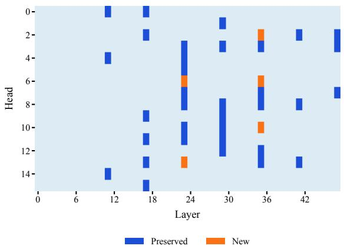

bar_stacked

| Layer | Preserved | New |
|-------|-----------|-----|
| 12    | 4         | 0   |
| 18    | 7         | 0   |
| 24    | 5         | 1   |
| 30    | 8         | 0   |
| 36    | 5         | 1   |
| 42    | 8         | 0   |

Figure 13: Top-5% text-retrieval heads in Gemma3- 12B-IT. Blue heads are preserved from Gemma3-12B-PT, while orange heads newly enter the top-5% set after vision-language training.   
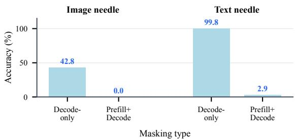

bar

| Masking type | Image needle Accuracy (%) | Text needle Accuracy (%) |
|---|---|---|
| Decode-only | 42.8 | |
| Prefill+ Decode | 0.0 | |
| Decode-only | 99.8 | |
| Prefill+ Decode | 2.9 | |

Figure 12: Decode-only versus prefill-plus-decoding masking on controlled MM-NIAH. Bars show mean accuracy under top-58 retrieval head masking, averaged across the same context-length and needle-depth grid used in Fig. 1. The stronger degradation under prefillplus-decoding masking indicates that retrieval heads are important while the model processes the prompt, not only during answer generation.

# E Additional Results on the Intrinsic Properties of Retrieval Heads

We show the intrinsic property of the multimodal retrieval heads of Gemma3-12B in Fig. 13.

# F Computational Resources and Model

We use Qwen2.5-VL (7B, 32B) (Bai et al., 2025b), Qwen3-VL (8B, 32B) (Bai et al., 2025a), Gemma3 (12B, 27B) (Gemma Team, 2025). All experiments were conducted on NVIDIA A100 GPUs.

# G Implementation Details

We use the Hugging Face Transformers library to load all evaluated LVLM checkpoints and to access per-head post-softmax attention weights, which form the basis of our retrieval-score computation, head masking, and re-ranking pipelines. Model weights, tokenizers, and preprocessing follow each checkpoint’s default Hugging Face configuration; no additional fine-tuning or training is performed.

# H Declaration of LLM Usage

We used LLMs as writing assistants for paper polishing and routine refactoring of plotting scripts: (i) prose passes for clarity and concision; (ii) LaTeX formatting suggestions; and (iii) minor refactoring of plotting scripts. LLMs were not used to design experiments, derive theoretical results, or generate numerical results.