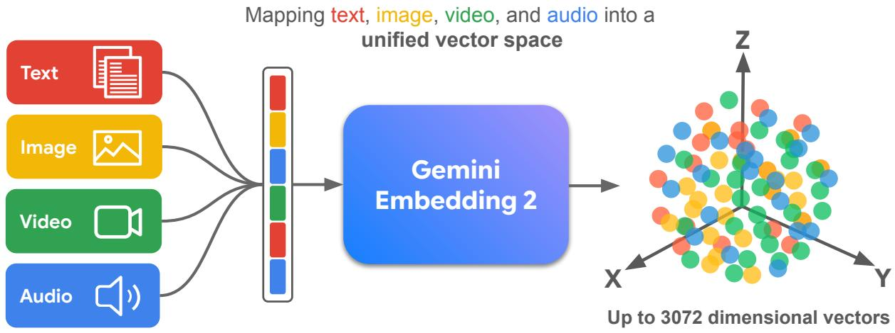
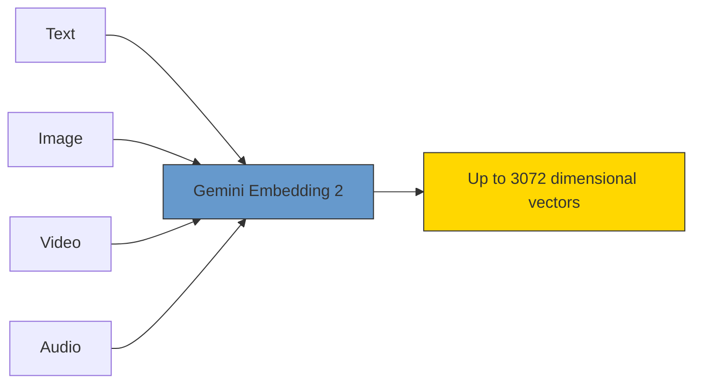
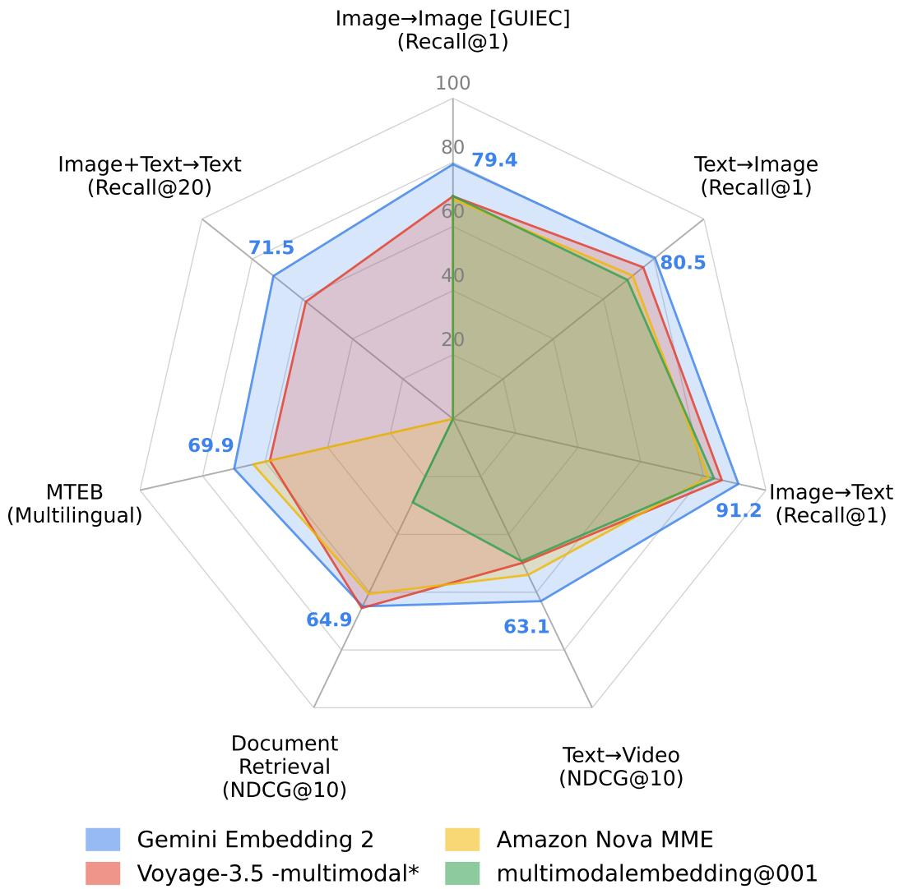
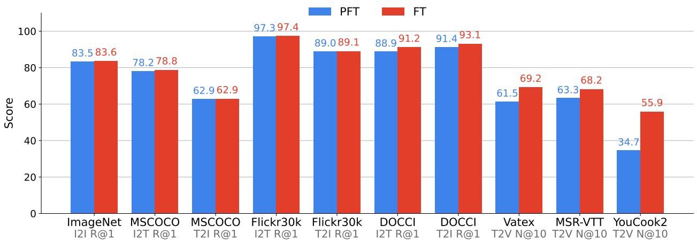

# Gemini Embedding 2: A Native Multimodal Embedding Model from Gemini

Madhuri Shanbhogue\*, Zhe Li\*, Shanfeng Zhang\*, Gustavo Hernández Ábrego\*, Shih-Cheng Huang\*, Aashi Jain\*, Daniel Salz, Sonam Goenka, Chaitra Hegde, Ji Ma, Feiyang Chen, Jiaxing Wu, Tanmaya Dabral, Babak Samari, Kevin Poulet, Daniel Cer, Kaifeng Chen, Paul Suganathan, Hui Hui, Jovan Andonov, Philippe Schlattner, Jay Han, Iftekhar Naim, Wing Lowe, Vladimir Pchelin, Albert Yang, Yi-Ting Chen, Zhongli Ding, Grace Zhang, Georg Heigold, Yichang Chen, Antoine Reveillon, Brendan Mccloskey, Wenlei Zhou, Dahun Kim, Rui Meng, Emma Wang, Jack Zheng, Halley Fede, Zhen Yang, Keegan Mosley, Brian Potetz, Sahil Dua, Henrique Schechter Vera, Shen Gao, Hesen Zhang, Andreas Hess, Hengxuan Ying, Alberto Montes, Karan Gill, Min Choi, Sebastian Russo, Anja Hauth, Jinhyuk Lee, Michael Boratko, Megan Barnes, Vikram Rao, Claudiu Musat, Cyril Allauzen, Ehsan Variani, Shankar Kumar, Tom Bagby, Junyi Jiao, Yang Gu, Tengxin Li, Ayush Agrawal, Roberto Santana, Dev Nath, Stephen Karukas, Shuoxuan Han, Lucia Loher, Alice Twu, Nidhi Vyas, Siddharth Bhai, Frank Palma Gomez, Wangyuan Zhang, Chaoren Liu, Jizheng Yang, Steve Qiu, Shijie Zhang, Sujay Kulkarni, Sascha Rothe, Sean Nakamoto, Raphael Hoffmann, Zach Gleicher, Yunhsuan Sung, Qin Yin, Tom Duerig and Mojtaba Seyedhosseini

Gemini Embedding Team, Google1

We introduce Gemini Embedding 2, a native multimodal embedding model that allows embedding video, audio, image, and text modalities in a unified representation space. We leverage the multimodal capabilities of Gemini to produce embeddings for arbitrary combinations of interleaved inputs across all these modalities that generalize well across a wide variety of tasks. Applying large-scale contrastive learning in a multi-task multi-stage training setup, we achieve state-of-the-art performance on key embedding benchmarks including unimodal, cross-modal, and multimodal retrieval spanning a diverse set of tasks. We show that our embedding model demonstrates strong performance (with a score of 62.9 R@1 on MSCOCO, 68.8 NDCG@10 on Vatex, 69.9 on MTEB multilingual and 84.0 on MTEB Code) across a variety of tasks surpassing the performance of specialized models. These unified capabilities make Gemini Embedding 2 a promising candidate for downstream use cases such as RAG, recommendation and search. Furthermore, its robust zero-shot performance across distinct fields – from astronomy and bioscience to fine arts and the culinary arts – establishes it as a highly reliable, out-of-the-box representation even for specialized domains.

# 1. Introduction

Embedding models provide dense vector representations capturing semantic information that is crucial for adaptation in a wide range of downstream tasks. With foundational models being natively multimodal and powered with exceptionally growing capabilities, it is important to ensure embedding models capture semantic information within and across all modalities in a coherent manner. Such general-purpose embedding models will also enhance the performance across a broad spectrum of applications like video recommendations and document search which are rich in information across different modalities but since the contained modalities are not inherently homogenous, they can benefit from having rich semantic information from across all modalities.

Existing multimodal embedding models like CLIP [1], ALIGN [2], SigLIP 2 [3], CoCa [4] embed heterogenous modalities by using paired cross-modal data and training modality-specific encoders to encode them into a unified vector space. This late-fusion approach results in good unimodal

# Gemini Embedding 2

flowchart

Figure 1 | Conceptual overview of the Gemini Embedding 2 workflow. The model natively processes heterogeneous inputs—text, images, video, audio, documents, and their combinations—mapping them into a single, unified high-dimensional vector space where cross-modal semantic relationships are preserved.

and cross-modal capabilities but has a key limitation in handling mixed-modality inputs and lacks richness since it does not utilize interactions between modalities. With advances in Multimodal Large Language Models (MLLMs), it is now possible to achieve semantically richer embeddings enabled by the deep fusion of cross-modal interactions.

In this work, we introduce a generalizable multimodal embedding model that embeds video, audio, image, text modalities, and any arbitrary combination thereof into a single representation space. The multimodal Gemini Embedding 2 is trained by leveraging Gemini’s [5] capabilities and utilizing multi-task training with a diverse set of tasks resulting in a model that captures various interactions between modalities. Figure 1 shows a high-level representation of how multimodal Gemini Embedding 2 maps the heterogenous sources into a unified vector space. The curated set of tasks help the model generalize across a wide variety of enterprise use cases like document retrieval, video recommendation, audio-based search, and RAG applications [6]. Crucially, enabling the model to handle interleaved sequences of images, text, and video facilitates complex, novel retrieval paradigms—such as zeroing in on specific temporal events in a video using combined visual and textual prompts. Using Gemini’s capabilities we also show that native audio understanding and native multimodal understanding outperforms text-based alternatives like ASR or captioning.

We evaluate comprehensively on a wide variety of benchmarks, both academic-focused and enterprise-focused. As shown in Figure 2, our model achieves state-of-the-art performance compared to other models. For evaluating the text embedding capabilities, we rely on the Massive Multilingual Text Embedding Benchmark (MMTEB) [7] which consists of multi-lingual tasks spanning key downstream embedding use cases like retrieval, clustering, classification, etc. Gemini Embedding 2 achieves state-of-the-art performance on multilingual and code surpassing existing models on the leaderboard. We demonstrate strong numbers on a broad range of cross-modal retrieval benchmarks like MSCOCO [8], Flickr30k [9], and MSR-VTT [10]. We also demonstrate the model’s ability to generalize to most multimodal retrieval tasks in general as well as specialized domains.

radar

| Task | Gemini Embedding 2 | Amazon Nova MME | Voyage-3.5 -multimodal* | multimodalembedding@001 |
| --- | --- | --- | --- | --- |
| Image→Image [GUIEC] (Recall@1) | 79.4 | 80.5 | 80.5 | 80.5 |
| Text→Image (Recall@1) | 80.5 | 80.5 | 80.5 | 80.5 |
| Image→Text (Recall@1) | 91.2 | 91.2 | 91.2 | 91.2 |
| Text→Video (NDCG@10) | 63.1 | 63.1 | 63.1 | 63.1 |
| Document Retrieval (NDCG@10) | 64.9 | 64.9 | 64.9 | 64.9 |
| MTEB (Multilingual) | 69.9 | 69.9 | 69.9 | 69.9 |
| Image+Text→Text (Recall@20) | 71.5 | 71.5 | 71.5 | 71.5 |

Figure 2 | Gemini Embedding 2 shows strong performance across multimodal retrieval tasks spanning image, text, video, and document modalities.   
∗MTEB number is reported for Voyage-3.5 since Voyage-3.5-multimodal does not report MTEB.

# 2. Related Work

Large Language Models as Text Embedders The paradigm of text embedding models has matured from relying on purely encoder-only architectures (e.g., BERT [11], RoBERTa [12]) to utilizing decoder-only or massive LLM backbones. Models such as the BGE [13] series and E5 [14] established instruction-tuned representations, effectively unifying downstream tasks—like semantic search, clustering, and classification—into a single model via task-specific prefixes. Recognizing the rich semantic understanding capabilities of LLMs, recent research has focused heavily on LLM-augmented training and distillation. The Gecko model [15] demonstrated that lightweight, highly-efficient retrievers can be trained through a two-step distillation pipeline that leverages the vast knowledge of massive LLM teachers. Concurrently, NV-Embed [16] achieved strong performance on the MMTEB leaderboard [17] by transforming decoder-only LLMs into generalist embedders using instructiontuned contrastive learning and the aggressive integration of synthetic, non-retrieval data. Gemini Embedding [18] demonstrated state-of-the-art performance on the MMTEB leaderboard due to utilizing synthetic data and excellent generalization to multilingual tasks through the powerful

pre-training of Gemini.

Evolution of Multimodal Embedders Early multimodal embedding paradigms, exemplified by dual-tower models like CLIP [1] and ALIGN [2], were limited by their reliance on narrow contrastive learning objectives over simple image–text pairs. Today, the field is gravitating towards multimodal architectures capable of mapping text, code, images, structured documents, audio, and video into a single, unified, continuous semantic space. Embedding models are trained by extending existing MLLMs for retrieval via multi-stage contrastive training thereby enabling excellent cross-modal retrieval capabilities. SAIL-Embedding [19] further illustrates this shift by employing a content-aware progressive training methodology mapping multimodal representations seamlessly into industrial recommendation environments (e.g., sequence-to-item prediction). Similarly, Amazon Nova MME [20] and SigLIP 2 [3] have demonstrated strong performance in unifying disparate modalities for cross-modal retrieval workflows.

Architectural Adaptations for Bidirectional Attention While causal (autoregressive) LLMs excel in generative tasks, their inherently unidirectional attention mechanism imposes unnecessary limits when generating dense, context-aware embeddings. Several innovative frameworks have emerged to circumvent this limitation. MoCa [21] directly addresses this by introducing modality-aware continual pre-training, utilizing a joint reconstruction objective that denoises interleaved text and image inputs to force bidirectional context-aware reasoning on top of a causal backbone. Similarly, MM-Embed [22] tackles the problem of modality bias through modality-aware hard negative mining, ensuring that embedding models do not disproportionally favor text-to-text resonance at the expense of cross-modal relevance.

Adaptation to Enterprise Use Cases With enterprise and agentic needs scaling to massive contexts and increasingly focused on documents, modern embedders are required to ingest vast informational payloads efficiently. Models utilize specialized visual-document processing (such as tiled mixtures of vision encoders) to embed complex PDFs, charts, and tables which causes the RAG system’s quality to be dependent on various parts of the processing pipeline like chunking strategies etc.

While these preceding architectures have successfully pushed the boundaries of multi-stage distillation, LLM backbone adaptation, and applications to enterprise use cases, they predominantly address these axes in isolation. Gemini Embedding 2 unifies these capabilities into a single model that spans a breadth of use cases across which the model can be used out-of-the-box.

# 3. Multimodal Gemini Embedding

In this section we provide technical details of the Multimodal Gemini Embedding 2 in terms of the model architecture, the objective function, and the training recipe.

# 3.1. Model Architecture

The Gemini Embedding 2 model is built to create holistic representations of inputs of different modalities and of inputs that combine such modalities. These representations can be used in diverse downstream tasks including retrieval, clustering, classification, and ranking. Gemini Embedding 2 leverages the multimodal and cross-modal power of Gemini to build such representations. The embedding model is initialized from Gemini and further fine-tuned with task-specific, modalityspecific, and cross-modality training. This allows Gemini Embedding 2 to build representations on top of the vast knowledge already present in the Gemini parameters. In this sense, initializing Gemini Embedding 2 from Gemini can be understood as the “pre-training" stage of the embedding model.

Gemini Embedding 2 constructs representations in a manner similar to our previous Gemini Embedding model [18], but with the important difference that different modalities require different steps to convert the raw format into a sequence of tokens. In Gemini Embedding 2 we leverage Gemini to do these types of data and format conversions. In this way, the model can take as input raw images, video or audio in the formats natively supported by Gemini.

After tokenization, an input sequence T of ?? tokens is processed by M, a transformer with bidirectional attention initialized from Gemini, producing a sequence of token embeddings $\mathbf { T } _ { \mathrm { e m b e d } } =$ $\boldsymbol { \mathcal { M } } ( \mathbf { T } ) \in \mathbb { R } ^ { L \times d _ { M } }$ , where $d _ { M }$ is the transformer model dimension. To generate a single embedding representing all the information in the input, a pooler $\mathcal { P }$ is applied, $\mathbf { P } _ { \mathrm { e m b e d } } = \mathcal { P } ( \mathbf { T } _ { \mathrm { e m b e d } } ) \in \mathbb { R } ^ { d _ { M } }$ . Prior research [23] demonstrated that simple pooling strategies can be effective in model adaptation. Therefore we choose mean pooling, and simply average the token embeddings along the sequence axis. Finally, a randomly initialized linear projection f is applied to scale the embedding to the target dimension, $\mathbf { E } = f ( \mathbf { P } _ { \mathrm { e m b e d } } ) \in \mathbb { R } ^ { d }$ , where ?? is the output embedding dimension.

# 3.2. Training Objective

The multimodal nature of Gemini Embedding 2 requires a multi-task and multi-stage type of training. This way different modalities can be trained in separate tasks. We used a multitude of single-modality tasks, multimodal tasks, as well as cross-modal tasks.

Similar to our previous version [18], the multimodal Gemini Embedding 2 model was trained with a noise-contrastive estimation (NCE) loss with in-batch negatives [24]. The exact loss differs slightly depending on the task being trained. In general, a training example includes a query ????, a positive target $p _ { i } ^ { + }$ and (optionally) a hard negative target $\mathring { P _ { i } { } } ^ { - }$ . In text-only training tasks, each example also has a prescribed task string ??, for example "question answering" or "fact checking", describing the nature of the task. During training, we randomly drop off the task string ?? to augment the robustness of the model to different modality inputs where the task strings are not used. The query and passages are embedded as vectors in ℝ??:

$$
\mathbf {q} _ {i} = f (\text { mean\_pool } (\mathcal {M} (t \oplus q _ {i}))), \quad \mathbf {p} _ {i} ^ {\pm} = f (\text { mean\_pool } (\mathcal {M} (p _ {i} ^ {\pm}))). \tag {1}
$$

Given a batch of size ?? the loss applied to these embeddings is as follows:

$$
\mathcal {L} = \frac {1}{B} \sum_ {i = 1} ^ {B} \left[ - \log \frac {e ^ {\operatorname{sim} \left(\mathbf {q} _ {i} , \mathbf {p} _ {i} ^ {+}\right) / \tau}}{e ^ {\operatorname{sim} \left(\mathbf {q} _ {i} , \mathbf {p} _ {i} ^ {+}\right) / \tau} + e ^ {\operatorname{sim} \left(\mathbf {q} _ {i} , \mathbf {p} _ {i} ^ {-}\right) / \tau} + \sum_ {j = 1} ^ {B} \operatorname{mask} (i , j) e ^ {\operatorname{sim} \left(\mathbf {q} _ {i} , \mathbf {p} _ {j} ^ {+}\right) / \tau}} \right] \tag {2}
$$

where sim $( \mathbf { x } , \mathbf { y } ) = \mathbf { x } ^ { \top } \mathbf { y } / \lVert \mathbf { x } \rVert \lVert \mathbf { y } \rVert$ is cosine similarity, and

$$
\operatorname{mask} (i, j) = \left\{ \begin{array}{l l} 0 & \text {   if   } q _ {i} = q _ {j} \text {   or   } p _ {i} ^ {+} = p _ {j} ^ {+}, \\ 1 & \text {   otherwise.   } \end{array} \right. \tag {3}
$$

This masking term is particularly relevant for classification tasks, where the number of targets (labels) is small. It should be noted that the second term in the denominator is omitted if no hard negatives are provided.

In order to support different dimensions of embeddings with a single model, we adapt the above loss using MRL [25] into ?? separate losses across ?? overlapping sub-dimensions of the embedding dimensions (e.g. multi-loss training with one loss for the first 768 embedding dimensions, another for the first 1,536 dimensions, and so on). Gemini Embedding 2 provides $d = 3 { , } 0 7 2$ dimensional embeddings, with the MRL support optimized for 768 and 1,536 dimensions.

# 3.3. Recipe

We heavily lean on the multi-task nature of our training setup to let the model learn from each of the different tasks that, as mentioned in section §3.2, contribute in different ways to build the unified embedding space across the different modalities. We adopt the multi-stage training from previous models like Gecko [15] and Gemini Embedding [18] as described below.

Pre-Fine-Tuning (PFT) To adapt the parameters in the model from auto-regressive generation to encoding, this stage uses as training a large number of potentially noisy query–target pairs in a multi-task setup. Further, in this stage we find it beneficial to use large batch sizes which provide more stable gradients, mitigating the impact of the noisy inputs. During this stage, only image, text and code tasks are used in our multi-task setup. The examples from each different task are sampled at pre-specified sampling rates to build training batches of a single task.

Fine-Tuning (FT) The fine-tuning stage for this model is based on training with a large number of text, code, document, image, audio, and video tasks. Many, but not all, of the tasks in this fine-tuning include examples that contain query, target, and hard negative target triplets. For this training stage we found it beneficial to tune batch sizes for each task to improve quality on corresponding evaluations. In this stage we also sample examples from one single task to build the training batches. The alignment between modalities is based on training multiple single-modality batches as well as cross-modality ones. As in the previous stage, training with all the different tasks and modalities require a multi-task training setup and the sampling rates of each of the different tasks are defined empirically. Empirically, we found that balancing overall performance across all modalities was sensitive to hyper-parameters like sampling rates and batch sizes in the multi-task setup.

Model Soup To systematize the combination of different checkpoints and obtain additional generalization performance across the different modalities, we average the parameters obtained from individual fine-tuning runs. We experimented with different combinations of parameters, including averaging checkpoints from the same training run [26], from different training runs [27], as well as various weighted averages.

# 4. Evaluation

We rigorously evaluate Gemini Embedding 2 across a comprehensive suite of multimodal and unimodal benchmarks, demonstrating its state-of-the-art capabilities in text, image, video, and audio understanding. Unlike competing models that often rely on brittle, task-specific instructions, Gemini Embedding 2 provides a robust, unified latent space that delivers high performance in zero-shot settings without the need for manual prompt engineering.

# 4.1. Multimodal Retrieval

We evaluate Gemini Embedding 2 against other multimodal embedding models — Voyage-3.5- multimodal [36], Amazon Nova MME [20], and Google’s legacy model multimodalembedding@001 [37] — across a diverse suite of unimodal, cross-modal and multimodal retrieval benchmarks spanning image, text, and video modalities (see Table 1). For unimodal image evaluation, we utilize the Google Universal Embedding Challenge (GUIEC) [38] which requires instance-level retrieval over a large-sized index consisting of 200,000 images. We also evaluate cross-modal retrieval quality on image-to-text and text-to-image benchmarks including MSCOCO [8], Flickr30K [9], DOCCI [30] and TextCaps [31]. These tasks range from challenging the models on basic image captioning to long captions including spatial reasoning and scene text understanding. We embed the images and texts separately using Gemini Embedding 2 and then retrieve using cosine similarity between queries and documents over the whole test set. We also evaluate on multimodal embedding capabilities by embedding images and texts together. We do visual question answering as a retrieval evaluation using EncyclopedicVQA [34] where we embed the image along with the question to retrieve the correct answer. For text-to-video retrieval, we evaluate on Vatex [32], MSR-VTT [39], and YouCook2 [33] where the video is embedded at 1 FPS up to 32 frames.

<table><tr><td colspan="2"></td><td>GEMINI EMBEDDING 2</td><td>AMAZON NOVA‡ MME</td><td>VOYAGE-3.5-‡ MULTIMODAL</td><td>MULTIMODAL‡ EMBEDDING@001 Legacy Google model</td></tr><tr><td rowspan="2">Image → Image(Recall@1)</td><td>GUIEC [28]</td><td>79.4</td><td>68.6</td><td>69.4</td><td>69.5</td></tr><tr><td>ImageNet [29]</td><td>83.6</td><td>-</td><td>-</td><td>71.8</td></tr><tr><td rowspan="5">Text → Image(Recall@1)</td><td>Mean†</td><td>80.5</td><td>71.6</td><td>75.8</td><td>69.5</td></tr><tr><td>MSCOCO [8]</td><td>62.9</td><td>57.2</td><td>58.1</td><td>53.1</td></tr><tr><td>Flickr30k [9]</td><td>89.1</td><td>81.6</td><td>89.9</td><td>81.4</td></tr><tr><td>DOCCI [30]</td><td>93.4</td><td>84.0</td><td>83.8</td><td>-</td></tr><tr><td>TextCaps [31]</td><td>89.6</td><td>76.0</td><td>79.4</td><td>74.0</td></tr><tr><td rowspan="5">Image → Text(Recall@1)</td><td>Mean†</td><td>91.2</td><td>81.6</td><td>85.9</td><td>83.4</td></tr><tr><td>MSCOCO [8]</td><td>78.8</td><td>68.3</td><td>74.5</td><td>68.2</td></tr><tr><td>Flickr30k [9]</td><td>97.4</td><td>87.5</td><td>94.5</td><td>94.0</td></tr><tr><td>DOCCI [30]</td><td>91.3</td><td>76.5</td><td>77.4</td><td>-</td></tr><tr><td>TextCaps [31]</td><td>97.4</td><td>88.9</td><td>88.6</td><td>88.1</td></tr><tr><td rowspan="4">Text → Video(NDCG@10)</td><td>Mean</td><td>63.1</td><td>54.0</td><td>49.9</td><td>49.2</td></tr><tr><td>Vatex [32]</td><td>68.8</td><td>60.3</td><td>55.2</td><td>54.9</td></tr><tr><td>MSR-VTT [10]</td><td>68.0</td><td>67.0</td><td>63.0</td><td>57.9</td></tr><tr><td>YouCook2 [33]</td><td>52.5</td><td>34.7</td><td>31.4</td><td>34.9</td></tr><tr><td>Image+Text → Text(Recall@20)</td><td>EncyclopedicVQA [34]</td><td>71.5</td><td>-</td><td>58.6</td><td>-</td></tr><tr><td>Document Retrieval(NDCG@10)</td><td>ViDoRe V2 [35]</td><td>64.9</td><td>60.6</td><td>65.5</td><td>28.9</td></tr><tr><td colspan="2">Overall Performance†</td><td>77.2</td><td>68.2</td><td>70.0</td><td>64.1</td></tr><tr><td colspan="2">Modality</td><td>V/A/I/T</td><td>V/A/I/T</td><td>V/I/T</td><td>I/T</td></tr></table>

Table 1 | Comparison of embedding models on retrieval benchmarks. Our model shows strong performance across a variety of unimodal, cross-modal, and multimodal retrieval tasks. †: Average over intersection of tasks where the metrics are available for all models. Modality abbreviations: V=Video, A=Audio, I=Image, T=Text. ‡: Reported by accessing available APIs unless self-reported.

Gemini Embedding 2 achieves the highest global mean score and leads decisively on unimodal image retrieval, text-to-image, image-to-text, and text-to-video tasks, with particularly strong results on long-caption benchmarks such as DOCCI and TextCaps. The training mixture shows very good capabilities to generalize to third-party evaluation tasks like Vatex, MSR-VTT, and YouCook2 despite not including any specific in-domain training splits of those datasets.

On the ViDoRe Benchmark V2 [35] document retrieval benchmark, as presented in Table 1 Gemini Embedding 2 achieves a score of 64.9, delivering competitive performance in a task that demands understanding of page-level visual structure, layout, and embedded text. This places Gemini Embedding 2 ahead of Amazon Nova MME (60.6) and within close range of Voyage-3.5-multimodal (65.5). Gemini Embedding 2 also stands out as one of only two models in this comparison to support the full Video/Audio/Image/Text modality set (alongside Amazon Nova MME), making its document retrieval performance particularly noteworthy given the breadth of tasks it is simultaneously optimized for.

<table><tr><td colspan="2"></td><td>GEMINI EMBEDDING 2</td><td>AMAZON NOVA* MME</td><td>GEMINI EMBEDDING</td><td>VOYAGE-3.5/† VOYAGE-CODE-3</td></tr><tr><td rowspan="11">MTEB(Multilingual) [7]</td><td>Mean (Task)</td><td>69.9</td><td>63.8</td><td>68.4</td><td>58.5</td></tr><tr><td>Mean (Type)</td><td>61.2</td><td></td><td>59.6</td><td>51.9</td></tr><tr><td>- Bitext Mining</td><td>85.4</td><td></td><td>79.3</td><td>60.5</td></tr><tr><td>- Classification</td><td>73.1</td><td></td><td>71.8</td><td>58.5</td></tr><tr><td>- Clustering</td><td>55.3</td><td></td><td>54.6</td><td>45.9</td></tr><tr><td>- Inst. Retrieval</td><td>2.9</td><td></td><td>5.2</td><td>6.5</td></tr><tr><td>- Multilabel Class.</td><td>32.2</td><td></td><td>29.2</td><td>21.7</td></tr><tr><td>- Pair Class.</td><td>83.2</td><td></td><td>83.6</td><td>76.0</td></tr><tr><td>- Reranking</td><td>69.0</td><td></td><td>65.7</td><td>64.2</td></tr><tr><td>- Retrieval</td><td>70.0</td><td></td><td>67.7</td><td>64.0</td></tr><tr><td>- STS</td><td>79.4</td><td></td><td>79.4</td><td>70.0</td></tr><tr><td>MTEB(Code) [7]</td><td>Mean</td><td>84.0</td><td>‡-</td><td>76.0</td><td>‡-</td></tr><tr><td>CoIR [40]</td><td>Mean</td><td>82.3</td><td>‡-</td><td>73.9</td><td>78.5</td></tr><tr><td>Modality</td><td></td><td>V/A/I/T</td><td>V/A/I/T</td><td>T</td><td>T</td></tr></table>

Table 2 | Comparison of multimodal and text-only embedding models on the Massive Text Embedding Benchmark, MTEB(Multilingual), MTEB Code v1, and CoIR benchmarks. Modality abbreviations: V=Video, A=Audio, I=Image, T=Text. ∗: only self-reported the aggregated MTEB(Multilingual) mean score. †: voyage-3.5 for MTEB(Multilingual) and voyage-code-3 in CoIR. ‡: Results were not reported.

# 4.2. MMTEB

The multilingual benchmark MMTEB [7] consists of a large collection of individual evaluation tasks covering 250+ languages and 10 task types: Bitext Mining, Classification, Clustering, Instruction Retrieval, Multilabel Classification, Pair Classification, Reranking, Retrieval, STS, and Summarization. Gemini Embedding 2 overall performance, along with the performance of other multimodal models, is presented in Table 2 where we also include the modalities supported by each model.

The MMTEB results demonstrate that Gemini Embedding 2 outperforms other multimodal models on this text-only benchmark, indicating that its expanded multimodal capabilities do not compromise its performance on purely textual tasks. Relative to our previous text-only Gemini Embedding model, the new multimodal Gemini Embedding 2 shows stronger performance surpassing the Mean (by task) of 68.32 of our previous model with an equivalent of 69.9. Moreover, our multimodal Gemini Embedding 2 sets a new state-of-the-art performance level in task-specific evaluations such as MTEB Code v1 [7], which consists of 12 code retrieval tasks in 15 coding languages, and the Code Information Retrieval benchmark, CoIR [40], which includes 10 of coding retrieval tasks in 9 coding languages. Table 2 also shows that our new Gemini Embedding 2 model achieves performance that is considerably better in these benchmarks than our previous Gemini Embedding text-only model. Notably, Gemini Embedding 2 is also considerably better relative to other text-only models and also better than domain-specific models such as voyage-code-3.

# 4.3. MSEB

To rigorously evaluate the auditory capabilities of Gemini Embedding 2, we benchmark the model on the Massive Sound Embedding Benchmark (MSEB) [41]. We focus our evaluation on the retrieval split of MSEB. The model is given a spoken query and the task is to find the most relevant information for the query in a large corpus of text documents.

# 4.3.1. Experimental Setup

A persistent challenge in multimodal retrieval is the bottleneck introduced by standard pipelined approaches, where audio is typically transcribed to text before producing the embeddings. To isolate the impact of our unified multimodal architecture, we juxtapose two distinct input modalities:

1. Gemini Embedding 2 with ASR: A cascaded baseline where the raw audio signal is first transcribed into text via an Automatic Speech Recognition (ASR) system, and the resulting text is subsequently encoded.   
2. Gemini Embedding 2 with audio: Our proposed approach, which directly processes raw audio inputs without intermediate textual transcription.

We utilize Mean Reciprocal Rank at 10 (mrr@10) as our principal evaluation metric. The retrieval setup is further stratified into two key partitions to assess generalization: PassageInLang (intra-lingual retrieval within the same language) and PassageCrossLang (cross-lingual retrieval).

# 4.3.2. Results

As shown in Table 3, the results demonstrate that utilizing native audio processing significantly enhances retrieval performance over the ASR baseline. As shown, Gemini Embedding 2 with native audio achieves an average retrieval mrr@10 of 73.99, yielding a substantial improvement over the ASR-based approach (70.40).

Breaking down the task partitions, we observe consistent gains across varying degrees of linguistic complexity:

PassageInLang: Direct audio modeling improves same-language retrieval by +2.0 points (75.58 vs. 73.58). The performance gap between the cascade baseline and Gemini Embedding 2 highlights a structural flaw in pipeline architectures. The cascade system (ASR → Retrieval) in this experiment—suffers heavily from error propagation. If the ASR system misinterprets an ambiguous audio snippet and commits to an incorrect text output, the downstream retrieval system faces a fundamentally altered query, leading to poor search results. Gemini Embedding 2 overcomes this bottleneck by natively encoding the raw audio directly. Instead of forcing a "hard" textual decision (e.g., "recognize speech" vs. "wreck a nice beach"), the resulting embedding preserves the inherent ambiguity of the original acoustic signal. This robust, continuous representation gives the system a significantly better chance of surfacing the correct retrieval results by preserving rich acoustic cues (e.g., prosody, intonation, and emphasis).

<table><tr><td rowspan="2">Model Setup</td><td rowspan="2">Average</td><td colspan="2">Retrieval Split (mrr@10)</td></tr><tr><td>Passage In-Lang</td><td>Passage Cross-Lang</td></tr><tr><td>Gemini Embedding 2 w/ ASR</td><td>70.40</td><td>73.58</td><td>67.55</td></tr><tr><td>Gemini Embedding 2 w/ Native Audio</td><td>73.99</td><td>75.58</td><td>72.56</td></tr></table>

Table 3 | Results on the passage retrieval split of the MSEB benchmark. Utilizing native audio input consistently enhances retrieval performance over the ASR baseline, yielding robust gains in both intra-lingual and cross-lingual generalization setups.

<table><tr><td rowspan="2">Model</td><td rowspan="2">Variant</td><td rowspan="2">MicroVQA [42]</td><td rowspan="2">ArtCap [43]</td><td rowspan="2">AstroLLaVA [44]</td><td colspan="2">Recipe1M [45]</td></tr><tr><td>Ingredients</td><td>Instructions</td></tr><tr><td rowspan="3">CLIP [1]</td><td>Base Patch32</td><td>34.1</td><td>34.1</td><td>21.2</td><td>64.6</td><td>61.1</td></tr><tr><td>Large Patch14</td><td>44.4</td><td>49.4</td><td>28.8</td><td>76.5</td><td>74.6</td></tr><tr><td>Large Patch14-336</td><td>46.7</td><td>52.2</td><td>31.6</td><td>76.0</td><td>75.6</td></tr><tr><td>ALIGN [2]</td><td>Base</td><td>48.1</td><td>49.2</td><td>18.4</td><td>70.3</td><td>70.8</td></tr><tr><td rowspan="3">SigLIP 2 [3]</td><td>Base Patch16-256</td><td>23.0</td><td>16.3</td><td>6.3</td><td>69.8</td><td>70.7</td></tr><tr><td>Large Patch16-384</td><td>27.4</td><td>7.3</td><td>11.0</td><td>78.7</td><td>78.3</td></tr><tr><td>Giant Patch16-384</td><td>33.3</td><td>8.4</td><td>13.2</td><td>81.2</td><td>80.4</td></tr><tr><td rowspan="3">TIPS [46]</td><td>Base Patch14</td><td>14.8</td><td>59.3</td><td>6.9</td><td>60.7</td><td>59.3</td></tr><tr><td>Large Patch14</td><td>21.5</td><td>59.9</td><td>8.9</td><td>61.3</td><td>63.0</td></tr><tr><td>Giant Patch14</td><td>20.0</td><td>65.2</td><td>10.1</td><td>66.0</td><td>65.6</td></tr><tr><td>Voyage-3.5-multimodal</td><td>-</td><td>53.3</td><td>48.7</td><td>30.3</td><td>-</td><td>-</td></tr><tr><td>Gemini Embedding 2</td><td>-</td><td>79.3</td><td>67.7</td><td>64.4</td><td>90.2</td><td>92.1</td></tr></table>

Table 4 | Image-to-Text Retrieval (R@5) performance across various Specialized Domains.

PassageCrossLang: Notably, the performance delta widens in cross-lingual setups. Native audio embeddings yield a striking +5.01 point enhancement (72.56 vs. 67.55). The dramatic jump in PassageCrossLang validates that the modality-agnostic latent space of Gemini Embedding 2 deeply aligns semantic features regardless of the source audio’s spoken language, generalizing robustly beyond the strict phonetic bounds parameterized by an intermediate ASR transcriber.

In aggregate, the MSEB benchmark corroborates that Gemini Embedding 2 successfully models contiguous raw audio, effectively consolidating a holistic representation that significantly outperforms transcription-reliant bottlenecks.

# 5. Ablation Study

To better understand how Gemini Embedding 2 achieves great performance across many different tasks and languages, we provide a systematic analysis of our training recipe.

# 5.1. Generalization to specialized domains

To rigorously assess the versatility and multimodal alignment of Gemini Embedding 2 in specialized contexts, we evaluated its zero-shot image-to-text retrieval capabilities across a diverse suite of domain-specific datasets. To ensure a comprehensive evaluation, we selected datasets corresponding to distinct real-world applications: microscopy and bioscience (MicroVQA [42]), fine art (ArtCap [43]), astronomy (AstroLLaVA [44]), and culinary arts (Recipe1M [45]). Formulated as a standard Recall@5 (R@5) benchmark, we compared our model against an array of open-source and proprietary visionlanguage models (see Table 4).

Our findings demonstrate that Gemini Embedding 2 achieves state-of-the-art performance across all evaluated domains, frequently establishing substantial margins of improvement over existing baselines. For instance, in astronomy (AstroLLaVA) and microscopy (MicroVQA), Gemini Embedding 2 achieves a R@5 of 64.4 and 79.3, respectively, effectively doubling the performance of these baselines in astronomy, and outperforming them by over 48% in microscopy. On the Recipe1M dataset, it breaks the 90.0 barrier for retrieving both ingredients (90.2) and instructions (92.1), decisively outperforming the next-best model, SigLIP2-Giant (81.2 and 80.4).

<table><tr><td></td><td>Average</td><td>CodeFeedbackMT</td><td>CodeFeedbackST</td><td>SyntheticText2SQL</td></tr><tr><td>Gemini Embedding</td><td>70.5</td><td>56.3</td><td>85.3</td><td>70.0</td></tr><tr><td>Gemini Embedding 2 w/o Synthetic</td><td>73.0</td><td>57.9</td><td>85.5</td><td>75.7</td></tr><tr><td>Gemini Embedding 2 w/ Synthetic</td><td>86.3 (+15.8)</td><td>92.3</td><td>88.6</td><td>78.1</td></tr></table>

Table 5 | Results on selected MTEB Code v1 tasks using synthetic datasets. Ablation models exclude souping.

Beyond absolute performance margins, our evaluation highlights a notable difference in crossdomain consistency. While the performance of existing model families often fluctuates significantly depending on the target domain, Gemini Embedding 2 maintains a robust, general-purpose alignment. As shown in Table 4, many baseline architectures exhibit incidental performance peaks and valleys across different specialized domains. For instance, the TIPS [46] model family demonstrates strong alignment in the fine art domain, with TIPS-G14 achieving a R@5 of 65.2 on ArtCap. Yet its performance is comparatively much lower on microscopic biological imagery (20.0 on MicroVQA). Similarly, while the SigLIP2 lineage excels at the Recipe1M dataset (scoring up to 81.2), it struggles to capture the visual semantics of ArtCap (dropping to 8.4). Conversely, Gemini Embedding 2 does not exhibit these sharp, domain-dependent fluctuations. Instead, it offers a consistently reliable multimodal embedding space that generalizes predictably across a diverse array of highly specialized tasks.

Ultimately, these results underscore the unprecedented robustness of Gemini Embedding 2’s representations out-of-the-box. Users—ranging from bench biologists and astrophysicists to culinary platforms and digital humanities researchers—can readily integrate Gemini Embedding 2 into their diverse workflows to power highly-accurate, domain-aware, multimodal retrieval systems.

# 5.2. Impact of synthetic data

The text-only Gemini Embedding model [18] showed the effectiveness of the Gemini model to improve the quality of the text data used to train the Gemini Embedding model. In this new Gemini Embedding 2 model, we also used the power of Gemini to improve the quality of the data used to train the model. We illustrate this with some of the MTEB Code tasks as example of the impact of Gemini when it is used to synthesize high-quality training data. The results are shown in Table 5. Considering the results of the text-only Gemini Embedding model as baseline, the equivalent results of the multimodal Gemini Embedding 2 model show some improvement, even before adding any synthetic data. This is remarkable because, as it has been observed in other text-only evaluations, the new multimodal model surpasses the performance of our previous text-only version (refer to Table 2 for an MMTEB comparison). Adding synthetic data generated with Gemini, results in very noticeable improvements in the three MTEB Code tasks subject of this analysis, especially in the CodeFeedbackMT [47] task and also in the SyntheticText2SQL and CodeFeedbackST [40] ones. Overall, the use of synthetic data gives a remarkable improvement of +15.81 points in average over our previous Gemini Embedding model in these challenging code retrieval tasks.

bar

| Dataset | PFT Score | FT Score |
| :--- | :--- | :--- |
| ImageNet I2I R@1 | 83.5 | 83.6 |
| MSCOCO I2T R@1 | 78.2 | 78.8 |
| MSCOCO T2I R@1 | 62.9 | 62.9 |
| Flickr30k I2T R@1 | 97.3 | 97.4 |
| Flickr30k T2I R@1 | 89.0 | 89.1 |
| DOCCI I2T R@1 | 88.9 | 91.2 |
| DOCCI T2I R@1 | 91.4 | 93.1 |
| Vatex T2V N@10 | 61.5 | 69.2 |
| MSR-VTT T2V N@10 | 63.3 | 68.2 |
| YouCook2 T2V N@10 | 34.7 | 55.9 |

Figure 3 | Comparing Pre-Fine-Tuning (PFT) and Fine-Tuning (FT) checkpoints on multimodal evals. 

<table><tr><td rowspan="2">Model Configuration</td><td colspan="2">MSR-VTT</td><td colspan="2">YouCook2</td><td colspan="2">Vatex</td></tr><tr><td>nDCG@10</td><td>Δ</td><td>nDCG@10</td><td>Δ</td><td>nDCG@10</td><td>Δ</td></tr><tr><td>Baseline</td><td></td><td></td><td></td><td></td><td></td><td></td></tr><tr><td>Gemini Embedding 2</td><td>68.2</td><td>-</td><td>55.9</td><td>-</td><td>69.2</td><td>-</td></tr><tr><td>Fine-Tuned (FTmix) Models</td><td></td><td></td><td></td><td></td><td></td><td></td></tr><tr><td>+ MSR-VTT data (FTmix-m)</td><td>75.0</td><td>+6.8</td><td>56.1</td><td>+0.2</td><td>71.7</td><td>+2.5</td></tr><tr><td>+ MSR-VTT &amp; Vatex data (FTmix-mv)</td><td>76.1</td><td>+7.9</td><td>55.3</td><td>-0.6</td><td>79.5</td><td>+10.3</td></tr><tr><td>Model Soups (Gemini Embedding 2 : FTmix-mv)</td><td></td><td></td><td></td><td></td><td></td><td></td></tr><tr><td>Ratio 2:1 ( $w_{base} = 2, w_{ft} = 1$ )</td><td>71.7</td><td>+3.5</td><td>56.1</td><td>+0.2</td><td>74.5</td><td>+5.3</td></tr><tr><td>Ratio 1:1 ( $w_{base} = 1, w_{ft} = 1$ )</td><td>73.7</td><td>+5.5</td><td>56.8</td><td>+0.9</td><td>76.8</td><td>+7.6</td></tr></table>

Table 6 | Summary of video metrics (NDCG@10 in %) for fine-tuned and souped models. The Δ columns indicate absolute percentage point differences relative to the Gemini Embedding 2 baseline. Adding targeted data improves in-domain performance but can slightly degrade out-of-domain tasks (e.g., YouCook2 dipping by 0.6%), whereas model souping effectively balances these task-specific gains with the original model’s robustness.

# 5.3. Impact of Fine-Tuning and Pre-Fine-Tuning

We compare the performance of the Pre-Fine-Tuning (PFT) checkpoint and the final Fine-Tuning (FT) checkpoint across various image and video understanding tasks. As shown in Figure 3, FT improves performance over PFT across almost all evaluated benchmarks. The improvements on image tasks, while consistent, are relatively modest. The most significant improvements are concentrated in the video evaluations due to the additional video training data in FT.

# 5.4. Impact of In-Domain Video Data

Comparing the fine-tuned models built on top of Gemini Embedding 2, Table 6 shows that the evaluation metrics are highly sensitive to the addition of targeted, in-domain data. Note that we add the in-domain data into the finetuning mixture and train one epoch of the added data. With only a few thousand steps of training and modest O(k) data quantities , we can drive significant improvements in targeted tasks (e.g., adding MSR-VTT and Vatex’s training splits pushes MSR-VTT to 76.1% and Vatex to 79.5%). However, this narrow focus can lead to slight degradations in out-of-domain tasks (such as YouCook2 dipping to 55.3%). Interestingly, the newly fine-tuned weights remain highly compatible with the original base model through model souping. Simple interpolation of the souping weights (such as the 2 × Gemini Embedding 2 + 1 × fine-tuned or 1 × Gemini Embedding 2 + 1 × fine-tuned mixtures) effectively brings back the video performance gains, in several cases yielding better results across the board than the baseline by balancing task-specific knowledge with the robustness of the original model.

# 6. Future Work

The vast native multimodal capabilities of Gemini Embedding 2 unlocks the potential for numerous enterprise use cases like agentic RAG, video recommendation, interleaved multimodal retrieval, etc. without the need for conversion to intermediate modalities. With LLM backbones being highly capable, we believe including other signals from search systems like ranking can be hugely beneficial to improving the retrieval capabilities of embeddings. Agentic RAG use cases also point towards potential future directions of training end-to-end RAG use cases with embeddings being fine-tuned for these enterprise use cases. As the scope of interleaved multimodal applications continues to expand, we invite the broader academic community to contribute novel evaluation frameworks to help benchmark these emerging capabilities.

# 7. Conclusion

Gemini Embedding 2 represents a transformative step forward in general-purpose representation, delivering a state-of-the-art multimodal successor to our text-only Gemini Embedding model. Gemini Embedding 2 generalizes well across a wide variety of tasks by seamlessly producing embeddings for arbitrary combinations of interleaved inputs across all modalities including text, image, audio, and video. By leveraging Gemini’s core multimodal, multilingual and code-centric foundations, the Gemini Embedding 2 model achieves landmark performance on well-known embedding benchmarks like MSCOCO, Vatex and MMTEB with a particularly significant leap in code retrieval. Our findings highlight its remarkable versatility, showing that it excels not only in general tasks but also across specialized domains such as microscopy, astronomy, and the culinary arts. Furthermore, by demonstrating that native audio input outperforms traditional ASR in retrieval tasks and removing the need for costly task-specific instructions, Gemini Embedding 2 offers a highly efficient architecture. This unified approach to embedding facilitates a sophisticated cross-data retrieval setup, providing the essential infrastructure for building next-generation agentic systems in tandem with Gemini.

# References

[1] Alec Radford, Jong Wook Kim, Chris Hallacy, Aditya Ramesh, Gabriel Goh, Sandhini Agarwal, Girish Sastry, Amanda Askell, Pamela Mishkin, Jack Clark, et al. Learning transferable visual models from natural language supervision. In International conference on machine learning, pages 8748–8763. PmLR, 2021.   
[2] Chao Jia, Yinfei Yang, Ye Xia, Yi-Ting Chen, Zarana Parekh, Hieu Pham, Quoc Le, Yun-Hsuan Sung, Zhen Li, and Tom Duerig. Scaling up visual and vision-language representation learning with noisy text supervision. In International conference on machine learning, pages 4904–4916. PMLR, 2021.   
[3] Michael Tschannen, Alexey Gritsenko, Xiao Wang, Muhammad Ferjad Naeem, Ibrahim Alabdulmohsin, Nikhil Parthasarathy, Talfan Evans, Lucas Beyer, Ye Xia, Basil Mustafa, et al. Siglip 2: Multilingual vision-language encoders with improved semantic understanding. Localization, and Dense Features, 6, 2025.

[4] Jiahui Yu, Zirui Wang, Vijay Vasudevan, Legg Yeung, Mojtaba Seyedhosseini, and Yonghui Wu. Coca: Contrastive captioners are image-text foundation models, 2022. URL https: //arxiv.org/abs/2205.01917.   
[5] Gheorghe Comanici, Eric Bieber, Mike Schaekermann, Ice Pasupat, Noveen Sachdeva, Inderjit Dhillon, Marcel Blistein, Ori Ram, Dan Zhang, Evan Rosen, et al. Gemini 2.5: Pushing the frontier with advanced reasoning, multimodality, long context, and next generation agentic capabilities. arXiv preprint arXiv:2507.06261, 2025.   
[6] Patrick Lewis, Ethan Perez, Aleksandra Piktus, Fabio Petroni, Vladimir Karpukhin, Naman Goyal, Heinrich Küttler, Mike Lewis, Wen-tau Yih, Tim Rocktäschel, et al. Retrieval-augmented generation for knowledge-intensive nlp tasks. Advances in neural information processing systems, 33:9459–9474, 2020.   
[7] Kenneth Enevoldsen, Isaac Chung, Imene Kerboua, Márton Kardos, Ashwin Mathur, David Stap, Jay Gala, Wissam Siblini, Dominik Krzemiński, Genta Indra Winata, et al. Mmteb: Massive multilingual text embedding benchmark. arXiv preprint arXiv:2502.13595, 2025.   
[8] Xinlei Chen, Hao Fang, Tsung-Yi Lin, Ramakrishna Vedantam, Saurabh Gupta, Piotr Dollar, and C. Lawrence Zitnick. Microsoft coco captions: Data collection and evaluation server, 2015. URL https://arxiv.org/abs/1504.00325.   
[9] Bryan A. Plummer, Liwei Wang, Chris M. Cervantes, Juan C. Caicedo, Julia Hockenmaier, and Svetlana Lazebnik. Flickr30k entities: Collecting region-to-phrase correspondences for richer image-to-sentence models, 2016. URL https://arxiv.org/abs/1505.04870.   
[10] Jun Xu, Tao Mei, Ting Yao, and Yong Rui. Msr-vtt: A large video description dataset for bridging video and language. 2016 IEEE Conference on Computer Vision and Pattern Recognition (CVPR), pages 5288–5296, 2016. URL https://api.semanticscholar.org/CorpusID: 206594535.   
[11] Jacob Devlin, Ming-Wei Chang, Kenton Lee, and Kristina Toutanova. BERT: pre-training of deep bidirectional transformers for language understanding. In Jill Burstein, Christy Doran, and Thamar Solorio, editors, Proceedings of the 2019 Conference of the North American Chapter of the Association for Computational Linguistics: Human Language Technologies, NAACL-HLT 2019, Minneapolis, MN, USA, June 2-7, 2019, Volume 1 (Long and Short Papers), pages 4171–4186. Association for Computational Linguistics, 2019.   
[12] Yinhan Liu, Myle Ott, Naman Goyal, Jingfei Du, Mandar Joshi, Danqi Chen, Omer Levy, Mike Lewis, Luke Zettlemoyer, and Veselin Stoyanov. Roberta: A robustly optimized bert pretraining approach, 2019. URL https://arxiv.org/abs/1907.11692.   
[13] Jianlv Chen, Shitao Xiao, Peitian Zhang, Kun Luo, Defu Lian, and Zheng Liu. M3-embedding: Multi-linguality, multi-functionality, multi-granularity text embeddings through self-knowledge distillation, 2025. URL https://arxiv.org/abs/2402.03216.   
[14] Liang Wang, Nan Yang, Xiaolong Huang, Binxing Jiao, Linjun Yang, Daxin Jiang, Rangan Majumder, and Furu Wei. Text embeddings by weakly-supervised contrastive pre-training, 2024. URL https://arxiv.org/abs/2212.03533.   
[15] Jinhyuk Lee, Zhuyun Dai, Xiaoqi Ren, Blair Chen, Daniel Cer, Jeremy R. Cole, Kai Hui, Michael Boratko, Rajvi Kapadia, Wen Ding, Yi Luan, Sai Meher Karthik Duddu, Gustavo Hernández

Ábrego, Weiqiang Shi, Nithi Gupta, Aditya Kusupati, Prateek Jain, Siddhartha Reddy Jonnalagadda, Ming-Wei Chang, and Iftekhar Naim. Gecko: Versatile text embeddings distilled from large language models, 2024. URL https://arxiv.org/abs/2403.20327.   
[16] Chankyu Lee, Rajarshi Roy, Mengyao Xu, Jonathan Raiman, Mohammad Shoeybi, Bryan Catanzaro, and Wei Ping. Nv-embed: Improved techniques for training llms as generalist embedding models. ArXiv, 2025. URL https://arxiv.org/abs/2405.17428.   
[17] Niklas Muennighoff, Nouamane Tazi, Loic Magne, and Nils Reimers. Mteb: Massive text embedding benchmark. In Proceedings of the 17th Conference of the European Chapter of the Association for Computational Linguistics, pages 2006–2029, 2023.   
[18] Jinhyuk Lee, Feiyang Chen, Sahil Dua, Daniel Cer, Madhuri Shanbhogue, Iftekhar Naim, Gustavo Hernández Ábrego, Zhe Li, Kaifeng Chen, Henrique Schechter Vera, Xiaoqi Ren, Shanfeng Zhang, Daniel Salz, Michael Boratko, Jay Han, Blair Chen, Shuo Huang, Vikram Rao, Paul Suganthan, Feng Han, Andreas Doumanoglou, Nithi Gupta, Fedor Moiseev, Cathy Yip, Aashi Jain, Simon Baumgartner, Shahrokh Shahi, Frank Palma Gomez, Sandeep Mariserla, Min Choi, Parashar Shah, Sonam Goenka, Ke Chen, Ye Xia, Koert Chen, Sai Meher Karthik Duddu, Yichang Chen, Trevor Walker, Wenlei Zhou, Rakesh Ghiya, Zach Gleicher, Karan Gill, Zhe Dong, Mojtaba Seyedhosseini, Yunhsuan Sung, Raphael Hoffmann, and Tom Duerig. Gemini embedding: Generalizable embeddings from gemini, 2025. URL https://arxiv.org/abs/2503.07891.   
[19] Lin Lin, Jiefeng Long, Zhihe Wan, Yuchi Wang, Dingkang Yang, Shuang Yang, Yueyang Yao, Xu Chen, Zirui Guo, Shengqiang Li, Weiran Li, Hanyu Li, Yaling Mou, Yan Qiu, Haiyang Yu, Xiao Liang, Hongsheng Li, and Chao Feng. Sail-embedding technical report: Omni-modal embedding foundation model, 2025. URL https://arxiv.org/abs/2510.12709.   
[20] Danilo Poccia. Amazon nova multimodal embeddings: State-of-the-art embedding model for agentic rag and semantic search. https://aws.amazon.com/blogs/aws/ amazon-nova-multimodal-embeddings-now-available-in-amazon-bedrock/, 2025.   
[21] Haonan Chen, Hong Liu, Yuping Luo, Liang Wang, Nan Yang, Furu Wei, and Zhicheng Dou. Moca: Modality-aware continual pre-training makes better bidirectional multimodal embeddings, 2025. URL https://arxiv.org/abs/2506.23115.   
[22] Sheng-Chieh Lin, Chankyu Lee, Mohammad Shoeybi, Jimmy Lin, Bryan Catanzaro, and Wei Ping. Mm-embed: Universal multimodal retrieval with multimodal llms, 2025. URL https: //arxiv.org/abs/2411.02571.   
[23] Paul Suganthan, Fedor Moiseev, Le Yan, Junru Wu, Jianmo Ni, Jay Han, Imed Zitouni, Enrique Alfonseca, Xuanhui Wang, and Zhe Dong. Adapting decoder-based language models for diverse encoder downstream tasks, 2025. URL https://arxiv.org/abs/2503.02656.   
[24] Aaron van den Oord, Yazhe Li, and Oriol Vinyals. Representation learning with contrastive predictive coding. arXiv preprint arXiv:1807.03748, 2018.   
[25] Aditya Kusupati, Gantavya Bhatt, Aniket Rege, Matthew Wallingford, Aditya Sinha, Vivek Ramanujan, William Howard-Snyder, Kaifeng Chen, Sham Kakade, Prateek Jain, et al. Matryoshka representation learning. Advances in Neural Information Processing Systems, 35:30233–30249, 2022.

[26] Pavel Izmailov, Dmitrii Podoprikhin, Timur Garipov, Dmitry Vetrov, and Andrew Gordon Wilson. Averaging weights leads to wider optima and better generalization. arXiv preprint arXiv:1803.05407, 2018.   
[27] Mitchell Wortsman, Gabriel Ilharco, Samir Ya Gadre, Rebecca Roelofs, Raphael Gontijo-Lopes, Ari S Morcos, Hongseok Namkoong, Ali Farhadi, Yair Carmon, Simon Kornblith, et al. Model soups: averaging weights of multiple fine-tuned models improves accuracy without increasing inference time. In International conference on machine learning, pages 23965–23998. PMLR, 2022.   
[28] Zhen Qin, Rolf Jagerman, Kai Hui, Honglei Zhuang, Junru Wu, Jiaming Shen, Tianqi Liu, Jialu Liu, Donald Metzler, Xuanhui Wang, et al. Introducing the google universal image embedding challenge. 2022. URL https://research.google/blog/ introducing-the-google-universal-image-embedding-challenge/.   
[29] Jia Deng, Wei Dong, Richard Socher, Li-Jia Li, Kai Li, and Li Fei-Fei. ImageNet: A largescale hierarchical image database . In 2009 IEEE Computer Society Conference on Computer Vision and Pattern Recognition Workshops (CVPR Workshops), pages 248–255, Los Alamitos, CA, USA, June 2009. IEEE Computer Society. doi: 10.1109/CVPR.2009.5206848. URL https: //doi.ieeecomputersociety.org/10.1109/CVPR.2009.5206848.   
[30] Yasumasa Onoe, Sunayana Rane, Zachary Berger, Yonatan Bitton, Jaemin Cho, Roopal Garg, Alexander Ku, Zarana Parekh, Jordi Pont-Tuset, Garrett Tanzer, Su Wang, and Jason Baldridge. Docci: Descriptions of connected and contrasting images, 2024. URL https://arxiv.org/ abs/2404.19753.   
[31] Oleksii Sidorov, Ronghang Hu, Marcus Rohrbach, and Amanpreet Singh. Textcaps: A dataset for image captioning with reading comprehension. In Computer Vision – ECCV 2020: 16th European Conference, Glasgow, UK, August 23–28, 2020, Proceedings, Part II, page 742–758, Berlin, Heidelberg, 2020. Springer-Verlag. ISBN 978-3-030-58535-8. doi: 10.1007/978-3-030-58536-5\_44. URL https://doi.org/10.1007/978-3-030-58536-5\_44.   
[32] Xin Wang, Jiawei Wu, Junkun Chen, Lei Li, Yuan-Fang Wang, and William Yang Wang. Vatex: A large-scale, high-quality multilingual dataset for video-and-language research, 2020. URL https://arxiv.org/abs/1904.03493.   
[33] Luowei Zhou, Chenliang Xu, and Jason J. Corso. Towards automatic learning of procedures from web instructional videos, 2017. URL https://arxiv.org/abs/1703.09788.   
[34] Thomas Mensink, Jasper Uijlings, Lluis Castrejon, Arushi Goel, Felipe Cadar, Howard Zhou, Fei Sha, André Araujo, and Vittorio Ferrari. Encyclopedic vqa: Visual questions about detailed properties of fine-grained categories. In Proceedings of the IEEE/CVF International Conference on Computer Vision (ICCV), pages 3113–3124, October 2023.   
[35] Quentin Macé, António Loison, and Manuel Faysse. Vidore benchmark v2: Raising the bar for visual retrieval, 2025. URL https://arxiv.org/abs/2505.17166.   
[36] Voyage AI. Voyage multimodal 3.5. https://blog.voyageai.com/2026/01/15/ voyage-multimodal-3-5/, January 2026.   
[37] Google Cloud. Multimodal embeddings API. https://cloud.google.com/vertex-ai/ generative-ai/docs/model-reference/multimodal-embeddings-api.

[38] Andre Araujo, Bingyi Cao, boris (bbl), Francis Chen, Maggie, Mário Lipovský, Mojtaba Seyedhosseini, Pelin Dogan, Sohier Dane, and Will Cukierski. Google universal image embedding. https://kaggle.com/competitions/google-universal-image-embedding, 2022.   
[39] Jun Xu, Tao Mei, Ting Yao, and Yong Rui. Msr-vtt: A large video description dataset for bridging video and language. In Proceedings of the IEEE Conference on Computer Vision and Pattern Recognition (CVPR), June 2016.   
[40] Xiangyang Li, Kuicai Dong, Yi Quan Lee, Wei Xia, Yichun Yin, Hao Zhang, Yong Liu, Yasheng Wang, and Ruiming Tang. Coir: A comprehensive benchmark for code information retrieval models, 2024. URL https://arxiv.org/abs/2407.02883.   
[41] Georg Heigold, Ehsan Variani, Tom Bagby, Cyril Allauzen, Ji Ma, Shankar Kumar, and Michael Riley. Massive sound embedding benchmark (mseb), 2026. URL https://arxiv.org/abs/ 2602.07143.   
[42] James Burgess, Jeffrey J Nirschl, Laura Bravo-Sánchez, Alejandro Lozano, Sanket Rajan Gupte, Jesus G Galaz-Montoya, Yuhui Zhang, Yuchang Su, Disha Bhowmik, Zachary Coman, et al. Microvqa: A multimodal reasoning benchmark for microscopy-based scientific research. In Proceedings of the IEEE/CVF Conference on Computer Vision and Pattern Recognition, pages 19552–19564, 2025.   
[43] Yue Lu, Chao Guo, Xingyuan Dai, and Fei-Yue Wang. Artcap: A dataset for image captioning of fine art paintings. IEEE Transactions on Computational Social Systems, 11(1):576–587, 2022.   
[44] Sharaf Zaman, Michael J Smith, Pranav Khetarpal, Rishabh Chakrabarty, Michele Ginolfi, Marc Huertas-Company, Maja Jabłońska, Sandor Kruk, Matthieu Le Lain, Sergio José Rodríguez Méndez, et al. Astrollava: towards the unification of astronomical data and natural language. arXiv preprint arXiv:2504.08583, 2025.   
[45] Javier Marın, Aritro Biswas, Ferda Ofli, Nicholas Hynes, Amaia Salvador, Yusuf Aytar, Ingmar Weber, and Antonio Torralba. Recipe1m+: A dataset for learning cross-modal embeddings for cooking recipes and food images. IEEE Transactions on Pattern Analysis and Machine Intelligence, 43(1):187–203, 2021.   
[46] Kevis-Kokitsi Maninis, Kaifeng Chen, Soham Ghosh, Arjun Karpur, Koert Chen, Ye Xia, Bingyi Cao, Daniel Salz, Guangxing Han, Jan Dlabal, Dan Gnanapragasam, Mojtaba Seyedhosseini, Howard Zhou, and Andre Araujo. Tips: Text-image pretraining with spatial awareness, 2025. URL https://arxiv.org/abs/2410.16512.   
[47] Tianyu Zheng, Ge Zhang, Tianhao Shen, Xueling Liu, Bill Yuchen Lin, Jie Fu, Wenhu Chen, and Xiang Yue. Opencodeinterpreter: Integrating code generation with execution and refinement, 2024. URL https://arxiv.org/abs/2402.14658.

8. Full Results 

<table><tr><td>Task Name</td><td>Performance</td><td>Task Name</td><td>Performance</td></tr><tr><td>AILAStatutes</td><td>49.50</td><td>NollySentiBitextMining</td><td>76.46</td></tr><tr><td>AfriSentiClassification</td><td>59.38</td><td>NordicLangClassification</td><td>90.34</td></tr><tr><td>AlloProfClusteringS2S.v2</td><td>61.75</td><td>NorwegianCourtsBitextMining</td><td>95.39</td></tr><tr><td>AlloprofReranking</td><td>84.16</td><td>NusaParagraphEmotionClassification</td><td>62.17</td></tr><tr><td>AmazonCounterfactualClassification</td><td>86.99</td><td>NusaTranslationBitextMining</td><td>84.47</td></tr><tr><td>ArXivHierarchicalClusteringP2P</td><td>63.86</td><td>NusaX-senti</td><td>85.26</td></tr><tr><td>ArXivHierarchicalClusteringS2S</td><td>64.54</td><td>NusaXBitextMining</td><td>93.04</td></tr><tr><td>ArguAna</td><td>83.60</td><td>OdiaNewsClassification</td><td>95.78</td></tr><tr><td>ArmenianParaphrasePC</td><td>97.56</td><td>OpusparcusPC</td><td>97.11</td></tr><tr><td>BUCC.v2</td><td>99.09</td><td>PAC</td><td>70.75</td></tr><tr><td>BelebeleRetrieval</td><td>93.81</td><td>PawsXPairClassification</td><td>61.22</td></tr><tr><td>BibleNLPBitextMining</td><td>34.09</td><td>PlscClusteringP2P.v2</td><td>75.65</td></tr><tr><td>BigPatentClustering.v2</td><td>41.59</td><td>PoemSentimentClassification</td><td>57.27</td></tr><tr><td>BiorxivClusteringP2P.v2</td><td>53.10</td><td>PolEmo2.0-OUT</td><td>77.00</td></tr><tr><td>BornholmBitextMining</td><td>64.14</td><td>PpcPC</td><td>95.40</td></tr><tr><td>BrazilianToxicTweetsClassification</td><td>33.21</td><td>PunjabiNewsClassification</td><td>83.12</td></tr><tr><td>BulgarianStoreReviewSentimentClassification</td><td>81.32</td><td>RTE3</td><td>89.79</td></tr><tr><td>CEDRClassification</td><td>57.13</td><td>Robust04InstructionRetrieval</td><td>-0.44</td></tr><tr><td>CLSClusteringP2P.v2</td><td>43.56</td><td>RomaniBibleClustering</td><td>47.88</td></tr><tr><td>CSFDSKMovieReviewSentimentClassification</td><td>54.92</td><td>RuBQReranking</td><td>77.98</td></tr><tr><td>CTKFactorsNLI</td><td>87.20</td><td>SCIDOCS</td><td>25.68</td></tr><tr><td>CataloniaTweetClassification</td><td>58.76</td><td>SIB200ClusteringS2S</td><td>43.33</td></tr><tr><td>Core17InstructionRetrieval</td><td>6.44</td><td>SICK-R</td><td>83.59</td></tr><tr><td>CovidRetrieval</td><td>80.14</td><td>SNLHierarchicalClusteringP2P</td><td>59.59</td></tr><tr><td>CyrillicTurkicLangClassification</td><td>95.16</td><td>STS12</td><td>81.07</td></tr><tr><td>CzechProductReviewSentimentClassification</td><td>68.47</td><td>STS13</td><td>89.69</td></tr><tr><td>DBpediaClassification</td><td>93.83</td><td>STS14</td><td>85.48</td></tr><tr><td>DalajClassification</td><td>51.26</td><td>STS15</td><td>90.67</td></tr><tr><td>DiaBlaBitextMining</td><td>89.00</td><td>STS17</td><td>88.96</td></tr><tr><td>EstonianValenceClassification</td><td>54.47</td><td>STS22.v2</td><td>70.80</td></tr><tr><td>FaroeseSTS</td><td>88.83</td><td>STSB</td><td>85.02</td></tr><tr><td>FilipinoShopeeReviewsClassification</td><td>50.11</td><td>STSBenchmark</td><td>88.68</td></tr><tr><td>FinParaSTS</td><td>32.37</td><td>STSES</td><td>76.66</td></tr><tr><td>FinancialPhrasebankClassification</td><td>87.16</td><td>ScalaClassification</td><td>54.30</td></tr><tr><td>FloresBitextMining</td><td>90.43</td><td>SemRel24STS</td><td>74.87</td></tr><tr><td>GermanSTSBenchmark</td><td>87.90</td><td>SentimentAnalysisHindi</td><td>74.48</td></tr><tr><td>GreekLegalCodeClassification</td><td>51.65</td><td>SinhalaNewsClassification</td><td>82.82</td></tr><tr><td>GujaratiNewsClassification</td><td>92.19</td><td>SiswatiNewsClassification</td><td>57.63</td></tr><tr><td>HALClusteringS2S.v2</td><td>32.30</td><td>SlovakMovieReviewSentimentClassification</td><td>93.57</td></tr><tr><td>HagridRetrieval</td><td>99.19</td><td>SpartQA</td><td>8.74</td></tr><tr><td>IN22GenBitextMining</td><td>98.43</td><td>SprintDuplicateQuestions</td><td>96.61</td></tr><tr><td>IndicCrosslingualSTS</td><td>61.36</td><td>StackExchangeClustering.v2</td><td>92.18</td></tr><tr><td>IndicGenBenchFloresBitextMining</td><td>99.22</td><td>StackOverflowQA</td><td>97.76</td></tr><tr><td>IndicLangClassification</td><td>83.39</td><td>StatcanDialogueDatasetRetrieRetrieval</td><td>63.11</td></tr><tr><td>IndonesianIdClickbaitClassification</td><td>64.95</td><td>SwahiliNewsClassification</td><td>65.71</td></tr><tr><td>IsiZuluNewsClassification</td><td>46.16</td><td>SwednClusteringP2P</td><td>45.96</td></tr><tr><td>ItaCaseholdClassification</td><td>69.68</td><td>SwissJudgementClassification</td><td>61.77</td></tr><tr><td>JSICK</td><td>84.85</td><td>T2Reranking</td><td>67.72</td></tr><tr><td>KorHateSpeechMLClassification</td><td>26.39</td><td>TERRa</td><td>64.52</td></tr><tr><td>KorSarcasmClassification</td><td>64.39</td><td>TRECCOVID</td><td>77.57</td></tr><tr><td>KurdishSentimentClassification</td><td>87.90</td><td>Tatoeba</td><td>89.35</td></tr><tr><td>LEMBPasskeyRetrieval</td><td>62.25</td><td>TempReasonL1</td><td>7.77</td></tr><tr><td>LegalBenchCorporateLobbying</td><td>96.37</td><td>ToxicConversationsClassification</td><td>85.85</td></tr><tr><td>MIRACLRetrievalHardNegatives</td><td>71.15</td><td>TswanaNewsClassification</td><td>53.92</td></tr><tr><td>MLQARetrieval</td><td>84.51</td><td>TweetTopicSingleClassification</td><td>73.15</td></tr><tr><td>MacedonianTweetSentimentClassification</td><td>73.13</td><td>TwitterHjerneRetrieval</td><td>94.54</td></tr><tr><td>MalteseNewsClassification</td><td>39.76</td><td>TwitterURLCorpus</td><td>88.07</td></tr><tr><td>MasakhaNEWSClassification</td><td>82.63</td><td>VoyageMMMarcoReranking</td><td>71.89</td></tr><tr><td>MasakhaNEWSClusteringS2S</td><td>60.44</td><td>WebLINXCandidatesReranking</td><td>19.01</td></tr><tr><td>MassiveIntentClassification</td><td>80.86</td><td>WikiCitiesClustering</td><td>79.46</td></tr><tr><td>MedrxivClusteringP2P.v2</td><td>46.53</td><td>WikiClusteringP2P.v2</td><td>28.51</td></tr><tr><td>MultiEURLEXMultilabelClassification</td><td>4.70</td><td>WikipediaRerankingMultilingual</td><td>93.25</td></tr><tr><td>MultiHateClassification</td><td>79.31</td><td>WikipediaRetrievalMultilingual</td><td>94.82</td></tr><tr><td>NTREXBitextMining</td><td>96.48</td><td>WinoGrande</td><td>69.57</td></tr><tr><td>NepaliNewsClassification</td><td>97.98</td><td>XNLI</td><td>78.95</td></tr><tr><td>News21InstructionRetrieval</td><td>2.64</td><td>indonli</td><td>59.21</td></tr></table>

Table 7 | Full results of Gemini Embedding 2 on MTEB (Multilingual).

<table><tr><td>Task Name</td><td>Performance</td></tr><tr><td>AppsRetrieval</td><td>98.60</td></tr><tr><td>COIRCodeSearchNetRetrieval</td><td>91.90</td></tr><tr><td>CodeEditSearchRetrieval</td><td>91.94</td></tr><tr><td>CodeFeedbackMT</td><td>92.30</td></tr><tr><td>CodeFeedbackST</td><td>88.59</td></tr><tr><td>CodeSearchNetCCRetrieval</td><td>96.25</td></tr><tr><td>CodeSearchNetRetrieval</td><td>92.96</td></tr><tr><td>CodeTransOceanContest</td><td>93.19</td></tr><tr><td>CodeTransOceanDL</td><td>33.72</td></tr><tr><td>CosQA</td><td>52.05</td></tr><tr><td>StackOverflowQA</td><td>97.89</td></tr><tr><td>SyntheticText2SQL</td><td>78.11</td></tr></table>

Table 8 | Full results of Gemini Embedding 2 on MTEB(Code).

# 9. Contributions and Acknowledgments

Core Contributors (∗: equal contributions)

Madhuri Shanbhogue∗

Zhe Li∗

Shanfeng Zhang∗

Gustavo Hernández Ábrego∗

Shih-Cheng Huang∗

Aashi Jain∗

Daniel Salz

Sonam Goenka

Chaitra Hegde

Ji Ma

Feiyang Chen

Jiaxing Wu

Tanmaya Dabral

Babak Samari

Kevin Poulet

Daniel Cer

Kaifeng Chen

Paul Suganathan

Hui Hui

Jovan Andonov

Philippe Schlattner

Jay Han

Iftekhar Naim

Wing Lowe

Vladimir Pchelin

Albert Yang

Yi-Ting Chen

Zhongli Ding

Grace Zhang

Georg Heigold

Yichang Chen

Antoine Reveillon

Brendan Mccloskey

Wenlei Zhou

Dahun Kim

Rui Meng

Emma Wang

Jack Zheng

Halley Fede

Zhen Yang

Keegan Mosley

Brian Potetz

Sahil Dua

Henrique Schechter Vera

Shen Gao

Hesen Zhang

Andreas Hess

Hengxuan Ying

Alberto Montes

Karan Gill

Min Choi

Sebastian Russo

Anja Hauth

Jinhyuk Lee

Michael Boratko

Megan Barnes

Vikram Rao

Claudiu Musat

Cyril Allauzen

Ehsan Variani

Shankar Kumar

Tom Bagby

Junyi Jiao

Yang Gu

Tengxin Li

Ayush Agrawal

Roberto Santana

Dev Nath

Stephen Karukas

Shuoxuan Han

Lucia Loher

Alice Twu

Nidhi Vyas

Siddharth Bhai

Frank Palma Gomez

Wangyuan Zhang

Chaoren Liu

Jizheng Yang

Steve Qiu

Shijie Zhang

Sujay Kulkarni

Sascha Rothe

Sean Nakamoto

# Leadership

Raphael Hoffmann

Zach Gleicher

Yunhsuan Sung

Qin Yin

Tom Duerig

Mojtaba Seyedhosseini

# Acknowledgement

James Gan, Jon Matthews, Luciano Martins, Patrick Löber, Anna Kelly, Kristen Quan, Roxanne Daniel, Ryan Trostle, Tania Bedrax-Weiss, Srinivasan (Cheenu) Venkatachary, Howard Zhou, Tomas Izo.