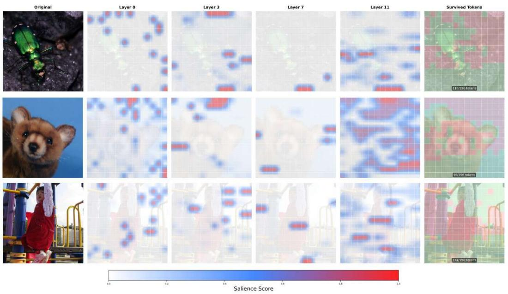
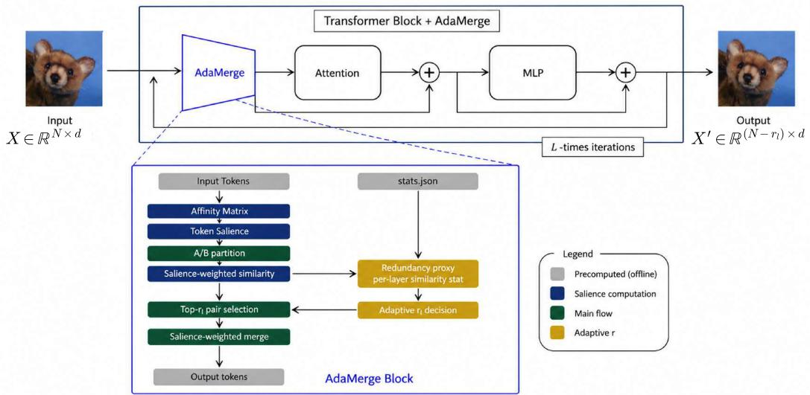
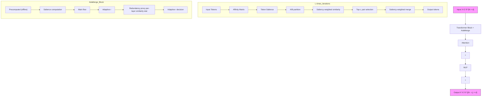
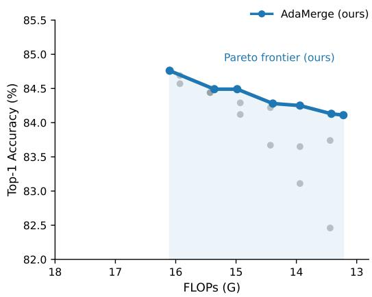
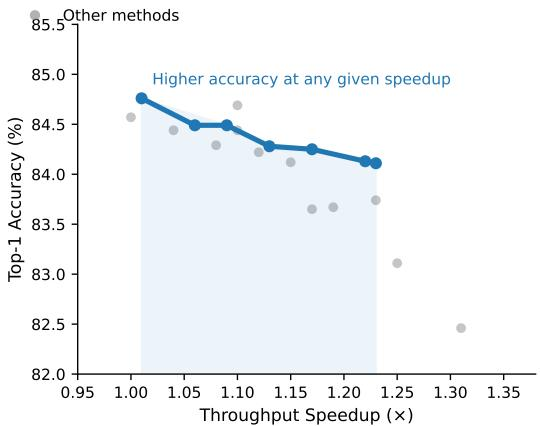

# AdaMerge: Salience-Aware Adaptive Token Merging for Training-Free Acceleration of Vision Transformers

# Semi Lee

Electronic Engineering

Soongsil University

Seoul, South Korea

semi2223@soongsil.ac.kr

# Hyejin Go

Electronic Engineering

Soongsil University

Seoul, South Korea

hyejin1612@soongsil.ac.kr

# Hyesong Choi†

Electronic Engineering

Soongsil University

Seoul, South Korea

hyesong@ssu.ac.kr

# Abstract

The quadratic cost of self-attention in Vision Transformers (ViTs) constitutes a fundamental bottleneck for practical deployment, motivating a vibrant line of research on token reduction. Among existing approaches, token merging (TOME) has emerged as an elegant training-free solution; yet its design rests on an unspoken premise—token equality—which contravenes the well-documented non-uniformity of self-attention and leads to information loss in high-salience tokens under aggressive compression. We address this limitation with ADAMERGE, a token-merging framework based on two complementary mechanisms. First, salience-weighted similarity leverages column-wise feature-affinity centrality as a token-importance proxy and incorporates the resulting salience scores into the bipartite matching score, ensuring that informationally pivotal tokens contribute more strongly to the merged representation. Second, adaptive merging intensity uses pre-computed layer-wise similarity statistics (µl, σl) to dynamically modulate the per-layer reduction count rl in accordance with input-specific redundancy. On ImageNet-1k validation with ViT-B/16, ADAMERGE consistently outperforms TOME, PiToMe, and DSM across all FLOPs-matched regimes. The accuracy gap widens monotonically with compression intensity: at the extreme ∼13.4G FLOPs operating point, ADAMERGE sustains a Top-1 accuracy degradation of only −1.06%, compared to −1.45% for PiToMe and −4.62% for DSM — indicating that fixed merging schedules can degrade substantially under aggressive compression. This monotonic widening is consistent with the hypothesis that uniform and schedule-rigid merging can incur increasing information loss as compression grows. To our knowledge, ADAMERGE is the first to combine salience-weighted similarity and adaptive per-layer reduction into a single training-free token merging framework, advancing the accuracy–FLOPs Pareto frontier of ViT acceleration. Code is available in the Supplementary Material.

# 1 Introduction

Vision Transformers [6] have outperformed convolutional architectures on image-recognition benchmarks, yet their $\mathcal { O } ( N ^ { 2 } \bar { d } )$ self-attention complexity poses a formidable obstacle to real-time deployment. Within this context, token reduction has crystallized as a primary acceleration paradigm. The literature largely bifurcates into token pruning methods [17, 21], which discard tokens outright at the cost of irrevocable information loss, and token merging approaches, exemplified by TOME [1]. TOME consolidates similar tokens, attenuating information loss while affording the singular practical virtue of operating in a training-free regime.

Despite TOME’s empirical success, its design embodies a consequential implicit premise: token equality. Its bipartite soft-matching procedure selects pairs solely based on cosine similarity and aggregates them via uniform averaging. This assumption stands in marked tension with the welldocumented non-uniform character of ViT attention [2, 3]—certain tokens shoulder a disproportionate share of discriminative reasoning, while others represent background redundancy. We contend that treating all tokens equally causes an asymmetric erosion of high-salience information, a penalty that compounds nonlinearly under aggressive compression.

To confront this, we introduce ADAMERGE, a framework that reconceives token merging along two orthogonal axes: which tokens to merge and how aggressively to merge them.

Salience-Weighted Similarity. We modulate the matching score using a feature-affinity-based salience proxy. Through a salience-proportional aggregation rule, we ensure that high-salience features contribute more strongly to the merged representation.

Adaptive r via Layer-wise Statistics. Moving beyond rigid reduction schedules, we dynamically modulate the per-layer reduction count rl based on pre-computed layer-wise similarity statistics and input-specific redundancy. This affords dual adaptivity—both input-level and layer-level—not achieved in prior training-free methods.

Our contributions are threefold.

• (C1) Salience-aware merging under a feature-reconstruction objective. We recast TOME as the special case of uniform salience and formally show that salience-weighted matching yields a non-negative reduction in reconstruction error relative to uniform averaging.   
• (C2) Dual-adaptive merging-intensity mechanism. To our knowledge, the first trainingfree token-reduction scheme that jointly achieves importance-aware matching and inputand layer-adaptive compression intensity, supported by an iterative statistics-refinement protocol.   
• (C3) Pareto Frontier Extension. On ImageNet-1k with ViT-B/16, ADAMERGE consistently outperforms TOME, PiToMe, and DSM at matched FLOPs. The accuracy gap widens monotonically with compression intensity, sustaining only −1.06% degradation at the extreme ∼13.4G FLOPs tier versus −4.62% for DSM, supporting the value of adaptive merging over rigid schedules.

# 2 Related Works

# 2.1 Token Pruning

Token pruning reduces computation by selecting and discarding less informative tokens. DynamicViT [17] introduces a learned prediction module to emit per-token retention probabilities, while A-ViT [21] utilizes Adaptive Computation Time for token-level early exits. EViT [12] leverages [CLS]-token attention as an importance prior. Subsequent works explore interpretability-aware redundancy reduction, adaptive token sampling, patch slimming, and explicit ViT pruning [14, 7, 18, 22]. Although effective, these methods share two primary limitations: (i) discarded tokens incur permanent information loss, and (ii) many require costly fine-tuning or auxiliary training.

# 2.2 Token Merging and Pooling

Token merging preserves more information than pruning by consolidating tokens rather than discarding them. TOME [1] pioneered a selective bipartite soft-matching scheme that operates without retraining, providing a foundation for plug-and-play acceleration. Subsequent training-free refinements include ToFu [10], which explores hybrid pruning-merging strategies, DSM [9], which defers merging to deeper layers to preserve local features, and PiToMe [19], which utilizes an energy-based metric to protect informative tokens from being merged. Input-adaptive vision methods such as AdaViT [13], Evo-ViT [20], and SPViT [11] perform importance-aware token selection but require additional training. In contrast, ADAMERGE jointly addresses which tokens to merge and how many in a strictly training-free regime—combining an importance-aware matching signal with input- and layer-adaptive compression intensity.

  
Figure 1: Layer-wise salience maps and survived tokens from $\mathrm { A D A M E R G E } ( r _ { \mathrm { m a x } } { = } 1 8 )$ on three ImageNet-1k images. Warmer colors indicate higher salience (column-wise sum of the rownormalized affinity matrix). Salience consistently localizes to discriminative regions and sharpens with depth, corroborating the token-importance non-uniformity motivating our design. In the rightmost column, green denotes survived tokens and red denotes merged tokens; object-centric patches are preferentially preserved. Crucially, the varying proportion of merged tokens across different images demonstrates how ADAMERGE content-adaptively allocates its merging budget to preserve semantic integrity.

# 3 Motivation: Why Salience Matters

# 3.1 Observation 1: Tokens Are Not Informationally Equal

The non-uniform character of self-attention is by now well established. DINO [2] elucidated that the [CLS] token attends preferentially to object regions, intimating an informational hierarchy among patch tokens. Subsequent interpretability analyses [3, 16, 15] corroborate that a small subset of tokens commands a disproportionate share of information flow, while the majority encode redundant background content—a pattern that manifests as attention artifacts in low-informative regions [5]. Were patches genuinely interchangeable, attention maps would approach uniformity; in practice, salience concentrates sharply on semantically discriminative regions.

Figure 1 provides direct empirical corroboration. The per-token salience scores consistently localize to semantically meaningful regions rather than background patches, and this localization sharpens progressively with depth. Crucially, the rightmost column demonstrates that ADAMERGE’s salienceguided merging preserves object-centric tokens (green) while absorbing redundant background tokens (red), suggesting that our salience measure provides a useful proxy for token importance.

# 3.2 Observation 2: Layer-wise Redundancy Is Heterogeneous

A second axis of non-uniformity manifests across network depth. Shallow layers process local texture and exhibit substantial redundancy among neighbouring patches; merging here carries little semantic risk. Deeper layers, by contrast, perform semantic abstraction where token representations diverge substantially, each encoding a distinct aspect of the global scene. A fixed merging count r applied uniformly across all layers is therefore a poor fit: it over-merges in semantically rich deep layers and under-merges in redundant shallow ones. Capturing this heterogeneity quantitatively motivates our layer-wise statistics $( \mu _ { l } , \sigma _ { l } )$ .

# 3.3 The Failure of Existing Token Merging Methods

These two observations expose critical failure modes shared by uniform merging methods like TOME [1].

Merge-Without-Priority. When a high-salience token and a background token are consolidated via uniform averaging, the salient information is immediately halved. High-salience features are asymmetrically eroded. Furthermore, uniform matching procedures are oblivious to salience, leaving high-salience tokens equally vulnerable to absorption into less informative counterparts. While PiToMe [19] explores energy-based partitioning, its reliance on uniform averaging still dilutes critical features upon merging.

One-Size-Fits-All. TOME, PiToMe, and DSM [9] enforce fixed reduction counts regardless of input complexity or layer-wise redundancy. Complex images with high token diversity are over-compressed, incurring semantic blurring, while simple images waste capacity on unnecessary merges. DSM’s delay\_layer heuristic, while deferring early merges, remains agnostic to per-image redundancy and collapses under extreme compression.

Failure amplifies with compression. As r increases, the pool of candidate merging pairs inevitably expands to include progressively more dissimilar, semantically heterogeneous tokens. When r is small, the damage of uniform averaging remains contained. As r grows, the asymmetric erosion of salient tokens compounds super-linearly. This yields a concrete prediction: the accuracy advantage of salience-aware merging over uniform merging should widen monotonically as compression intensifies—a prediction our experiments support (§5.1).

# 3.4 Design Principles

The preceding observations crystallize into two design principles for ADAMERGE.

• (P1) Survivor selection should be salience-biased. The token that endures merging ought to inherit the richer informational content, ensuring that high-salience features contribute more strongly to the merged representation.   
• (P2) Merging intensity should be input- and layer-adaptive. Compression should be aggressive where redundancy is high and conservative where token diversity prevails, adapting to both the input image and the current layer’s semantic density.

# 4 Method: ADAMERGE

# 4.1 Preliminaries and Notation

Let $\mathbf { X } = [ x _ { 1 } , \dots , x _ { N } ] \in \mathbb { R } ^ { N \times d }$ denote the patch-token sequence within a ViT block (N = 196 for ViT-B/16). The CLS token is excluded from all merging operations and reattached to the reduced patch-token sequence after each merge step. We partition X into two equal-sized sets by sequential index split: $\mathcal { A } = \mathbf { X } _ { [ : N / 2 ] }$ and $\begin{array} { r } { \boldsymbol { B } = \mathbf { X } _ { [ N / 2 : ] } } \end{array}$ . Unlike TOME [1], which uses index-parity partitioning, this sequential split simplifies vectorized implementation and avoids spatial interleaving artifacts. The affinity matrix, normalized row-wise via softmax, is defined as:

$$
A _ {i j} = x _ {i} ^ {\top} x _ {j}, \quad \hat {\mathbf {A}} = \operatorname{softmax} (\mathbf {A}). \tag {1}
$$

# 4.2 Salience-Weighted Similarity

Token Salience. Following the feature-affinity salience formulation of SBAM [4], we quantify token importance as feature-affinity centrality, defined as the column-wise sum of the row-normalized affinity matrix:

$$
s _ {i} = \sum_ {j = 1} ^ {N} \hat {A} _ {j i}, \quad \mathbf {s} = \hat {\mathbf {A}} ^ {\top} \mathbf {1}. \tag {2}
$$

flowchart

Figure 2: Top: ADAMERGE is integrated before each Transformer block to reduce the sequence length from N to $N - r _ { l }$ prior to self-attention. Bottom: Internal pipeline. Salience computation and adaptive $r _ { l }$ decision run in parallel, followed by salience-proportional aggregation. Layer-wise statistics $( \mu _ { l } , \sigma _ { l } )$ are precomputed offline and loaded from stats.json.

To ensure stability across layers, scores are min-max normalized to $[ 0 , 1 ]$ , yielding $\hat { s } _ { i }$ . This formulation requires no auxiliary pass—the affinity matrix Aˆ is already computed during merging—and furnishes a per-layer signal that adapts to the evolving token distribution across depth.

Weighted Similarity Score. Let $\mathbf { s } ^ { \mathcal { A } }$ be the salience restricted to A. We define the salience-weighted similarity as:

$$
\tilde {S} _ {i j} ^ {\mathcal {A B}} = s _ {i} ^ {\mathcal {A}} \cdot \cos (x _ {i} ^ {\mathcal {A}}, x _ {j} ^ {\mathcal {B}}), \quad i \in \mathcal {A}, j \in \mathcal {B}. \tag {3}
$$

The matching procedure identifies best\_match $\mathbf { \Psi } _ { . } ( i ) ~ = ~ \arg \operatorname* { m a x } _ { j } \tilde { S } _ { i j } ^ { A B }$ , prioritizing high-salience tokens for merging.

# 4.3 Adaptive r via Layer-wise Similarity Statistics

To capture heterogeneity across layers, we define a redundancy proxy $\bar { S } _ { l }$ as the mean of the maximum weighted similarities at layer l. We precompute $( \mu _ { l } , \sigma _ { l } )$ using a 1% subset of ImageNet-1k. To ensure self-consistency, we employ an iterative refinement protocol, which typically converges within three iterations.

At inference, the merging count $r _ { l }$ for an input is determined by its layer-wise z-score, modulating compression intensity per layer in the spirit of input-adaptive computation [8]:

$$
z _ {l} = \frac {\bar {S} _ {l} - \mu_ {l}}{\sigma_ {l}}, \quad r _ {l} = \left\lfloor r _ {\max} \cdot \sigma (\alpha \cdot z _ {l}) \right\rfloor . \tag {4}
$$

The sigmoid temperature T (default $T { = } 1 . 0 )$ controls merging sharpness via $z _ { l } \gets z _ { l } / T ; T \mathrm { = } 0 . 5$ yields higher accuracy at the cost of a sharper boundary.

# 4.4 Bipartite Merge with Salience Aggregation

For each selected pair $( i , j ) \in \mathcal { M }$ , we aggregate features via salience-proportional weighting to ensure informational integrity:

$$
\tilde {x} = \frac {s _ {i} ^ {\mathcal {A}} \cdot x _ {i} ^ {\mathcal {A}} + s _ {j} ^ {\mathcal {B}} \cdot x _ {j} ^ {\mathcal {B}}}{s _ {i} ^ {\mathcal {A}} + s _ {j} ^ {\mathcal {B}}}. \tag {5}
$$

The salience of the merged token is set to preserve the stronger signal:

$$
\hat {s} _ {\tilde {x}} = \max \left(s _ {i} ^ {\mathcal {A}}, s _ {j} ^ {\mathcal {B}}\right). \tag {6}
$$

This ensures that high-salience features have greater weight in the resulting sequence.

Proposition 1 (Salience-Weighted Aggregation Reduces Reconstruction Error). Under the noise model $( \eta _ { i } \sim \mathcal { N } ( 0 , \tau ^ { 2 } I ) ) ,$ for any matched pair $( i , j )$ with saliences $s _ { i } , s _ { j } \ > \ 0 ,$ , the salienceproportional aggregation $\tilde { x } = ( s _ { i } x _ { i } + s _ { j } x _ { j } ) / ( s _ { i } + s _ { j } )$ satisfies

$$
\ell_ {\mathrm{uniform}} (i, j) - \ell_ {\mathrm{AdaMerge}} (i, j) = \frac {(s _ {i} - s _ {j}) ^ {2}}{2 (s _ {i} + s _ {j}) ^ {2}} \| x _ {i} - x _ {j} \| ^ {2} + \mathcal {O} \big ((s _ {i} - s _ {j}) ^ {3} \big) \geq 0, \tag {7}
$$

with equality if and only $i f s _ { i } = s _ { j }$ . Summed over r merge pairs, the cumulative gap is non-negative and grows with r as progressively more salience-asymmetric pairs enter the merge set.

# 4.5 Computational Complexity

The salience computation requires forming the affinity matrix $\mathbf { A } = \mathbf { X } \mathbf { X } ^ { \top }$ , which costs $\mathcal { O } ( N ^ { 2 } d )$ —the same order as self-attention. However, this cost is incurred once per layer prior to merging and is immediately amortized: by reducing the sequence length from N to $N - r _ { l }$ , the subsequent self-attention cost drops from $\mathcal { O } ( N ^ { 2 } d )$ to $\mathcal { O } ( ( N ^ { \cdot } - r _ { l } ) ^ { 2 } d )$ , yielding a net reduction that grows with rl. ADAMERGE thus maintains the plug-and-play efficiency of TOME with bounded overhead, as analyzed empirically in §5.2.

# 5 Experiments

# 5.1 Main Results

To evaluate the efficacy of ADAMERGE, we conduct FLOPs-matched comparisons against three representative training-free baselines: (i) TOME [1] as the pioneering framework; (ii) DSM [9], representing depth-wise heuristic schedules; and (iii) PiToMe [19], a recent energy-based importanceaware method. As reported in Table 1, ADAMERGE consistently outperforms all baselines across all six operating points, extending the observed accuracy–FLOPs Pareto frontier.

Monotonic gap widening. The accuracy advantage of ADAMERGE over TOME widens monotonically as compression intensifies (Table 2). This trend is consistent with Proposition 1: salienceasymmetric token pairs incur higher reconstruction error under uniform averaging, and this gap grows as larger r forces progressively more dissimilar pairs into the merge set.

DSM failure mode. DSM’s rigid, delayed merging schedule incurs a substantial −4.62%p degradation at ∼13.4G in aggressive regimes. In contrast, ADAMERGE’s adaptive intensity limits the degradation to −1.06%, highlighting the benefit of input- and layer-adaptive reduction counts.

Remark 1 (Strong Empirical Performance). ADAMERGE outperforms all baselines at matched FLOPs in the aggressive-compression regime, extending the accuracy–FLOPs Pareto frontier precisely where existing methods degrade most sharply.

# 5.2 Throughput–Accuracy Trade-off

Figure 3 presents the FLOPs–accuracy and speedup–accuracy trade-off curves for all methods. The two panels reveal complementary strengths.

FLOPs–Accuracy (Figure 3 Left). ADAMERGE consistently occupies the upper envelope of the FLOPs–accuracy frontier across all operating points. At 23% FLOPs reduction, TOME’s accuracy floor is 82.46%, while ADAMERGE sustains 84.13%—a gap of 1.67%p. This gap widens monotonically with compression, suggesting that ADAMERGE provides a more favorable accuracy–FLOPs trade-off in high-compression regimes.

Speedup–Accuracy (Figure 3 Right). The throughput picture is deliberately honest: ADAMERGE and TOME occupy complementary regions of the speedup–accuracy frontier. At every speedup level achievable by TOME, ADAMERGE offers a higher-accuracy alternative at slightly reduced throughput (5–9%). Conversely, if throughput is the primary constraint, TOME achieves up to 1.31× speedup at the cost of substantially lower accuracy. The choice between methods is therefore applicationdependent: latency-critical deployments may prefer TOME’s tighter speedup, while accuracy-critical deployments (e.g., medical imaging, ADAS) benefit from ADAMERGE’s preservation of discriminative information.

Table 1: Comprehensive FLOPs-matched comparison across six tiers. ADAMERGE results are mean ± std over 5 runs.∗ Bold denotes the best accuracy at each tier. For DSM, d denotes delay\_layer. 

<table><tr><td>FLOPs Tier</td><td>Method</td><td>Top-1 Acc</td><td>Δ Acc</td><td>FLOPs (G)</td><td>FLOPs ↓</td><td>Speedup</td></tr><tr><td rowspan="4">~15.9G</td><td>ADAMERGE ( $r_{\text{max}}=9$ )</td><td>84.70±0.01%</td><td>-0.49%</td><td>15.91</td><td>8.8%</td><td>1.01×</td></tr><tr><td>TOME (r=3)</td><td>84.69%</td><td>-0.50%</td><td>15.93</td><td>8.7%</td><td>1.10×</td></tr><tr><td>PiToMe (r=3)</td><td>84.57%</td><td>-0.62%</td><td>15.93</td><td>8.7%</td><td>1.04×</td></tr><tr><td>DSM (r=12, d=6)</td><td>84.42%</td><td>-0.77%</td><td>15.95</td><td>8.6%</td><td>1.06×</td></tr><tr><td rowspan="4">~15.5G</td><td>ADAMERGE ( $r_{\text{max}}=11$ )</td><td>84.62±0.00%</td><td>-0.57%</td><td>15.54</td><td>10.9%</td><td>1.05×</td></tr><tr><td>TOME (r=4)</td><td>84.44%</td><td>-0.75%</td><td>15.43</td><td>11.6%</td><td>1.10×</td></tr><tr><td>PiToMe (r=4)</td><td>84.44%</td><td>-0.75%</td><td>15.43</td><td>11.6%</td><td>1.04×</td></tr><tr><td>DSM (r=18, d=6)</td><td>83.68%</td><td>-1.51%</td><td>15.48</td><td>11.3%</td><td>1.09×</td></tr><tr><td rowspan="4">~14.9G</td><td>ADAMERGE ( $r_{\text{max}}=14$ )</td><td>84.49±0.03%</td><td>-0.70%</td><td>14.98</td><td>14.1%</td><td>1.09×</td></tr><tr><td>TOME (r=5)</td><td>84.12%</td><td>-1.07%</td><td>14.93</td><td>14.4%</td><td>1.15×</td></tr><tr><td>PiToMe (r=5)</td><td>84.29%</td><td>-0.90%</td><td>14.93</td><td>14.4%</td><td>1.08×</td></tr><tr><td>DSM (r=16, d=5)</td><td>83.35%</td><td>-1.84%</td><td>14.90</td><td>14.6%</td><td>1.12×</td></tr><tr><td rowspan="4">~14.4G</td><td>ADAMERGE ( $r_{\text{max}}=17$ )</td><td>84.28±0.02%</td><td>-0.91%</td><td>14.39</td><td>17.5%</td><td>1.13×</td></tr><tr><td>TOME (r=6)</td><td>83.67%</td><td>-1.52%</td><td>14.43</td><td>17.3%</td><td>1.19×</td></tr><tr><td>PiToMe (r=6)</td><td>84.22%</td><td>-0.97%</td><td>14.43</td><td>17.3%</td><td>1.12×</td></tr><tr><td>DSM (r=14, d=4)</td><td>82.51%</td><td>-2.68%</td><td>14.37</td><td>17.6%</td><td>1.21×</td></tr><tr><td rowspan="4">~13.9G</td><td>ADAMERGE ( $r_{\text{max}}=20$ )</td><td>84.25±0.03%</td><td>-0.94%</td><td>13.94</td><td>20.1%</td><td>1.17×</td></tr><tr><td>TOME (r=7)</td><td>83.11%</td><td>-2.08%</td><td>13.94</td><td>20.1%</td><td>1.25×</td></tr><tr><td>PiToMe (r=7)</td><td>83.65%</td><td>-1.54%</td><td>13.94</td><td>20.1%</td><td>1.17×</td></tr><tr><td>DSM (r=17, d=4)</td><td>81.05%</td><td>-4.14%</td><td>13.90</td><td>20.3%</td><td>1.26×</td></tr><tr><td rowspan="4">~13.4G</td><td>ADAMERGE ( $r_{\text{max}}=23$ )</td><td>84.13±0.02%</td><td>-1.06%</td><td>13.42</td><td>23.1%</td><td>1.22×</td></tr><tr><td>TOME (r=8)</td><td>82.46%</td><td>-2.73%</td><td>13.44</td><td>23.0%</td><td>1.31×</td></tr><tr><td>PiToMe (r=8)</td><td>83.74%</td><td>-1.45%</td><td>13.44</td><td>23.0%</td><td>1.23×</td></tr><tr><td>DSM (r=20, d=4)</td><td>80.57%</td><td>-4.62%</td><td>13.47</td><td>22.8%</td><td>1.28×</td></tr></table>

∗ The ImageNet-1k validation set is fully deterministic; randomness arises solely from the inference computation. Specifically, standard deviation reflects variance from (i) stochastic tie-breaking in the adaptive-r decision when similarity scores are equal, and (ii) non-deterministic CUDA floating-point operations during the forward pass.

Table 2: Accuracy gap (ADAMERGE − TOME) at matched FLOPs tiers. 

<table><tr><td>FLOPs Tier</td><td> $\sim 15.9G$ </td><td> $\sim 15.5G$ </td><td> $\sim 14.9G$ </td><td> $\sim 14.4G$ </td><td> $\sim 13.9G$ </td><td> $\sim 13.4G$ </td></tr><tr><td>Gap (ADAMERGE – ToME)</td><td>+0.01%p</td><td>+0.18%p</td><td>+0.37%p</td><td>+0.61%p</td><td>+1.14%p</td><td>+1.67%p</td></tr></table>

# 5.3 Layer-wise Merging Distribution

ADAMERGE’s emergent merging distribution exhibits three qualitatively distinct regimes depending on rmax.

Regime 1 (mild compression, $r _ { \operatorname* { m a x } } \leq 1 1 )$ . The final block receives the largest merging allocation $( \mathbb { E } [ \bar { r } _ { 1 1 } ] = 5 . 1 8 \mathrm { a t } r _ { \mathrm { m a x } } \mathrm { = } 9 )$ , while shallow layers merge conservatively. This suggests that, under a limited budget, the adaptive mechanism tends to assign more merges to deeper layers, where token representations may contain higher redundancy after repeated self-attention operations.

Regime 2 (moderate compression, $r _ { \operatorname* { m a x } } \in \{ 1 4 , 1 7 \} )$ . The distribution inverts: blocks 0–1 become the most active $( \mathbb { E } [ r _ { 1 } ] = 4 . 7 1 \ – 5 . 8 7 )$ and block 11 contracts sharply $( \mathbb { E } [ r _ { 1 1 } ] = 3 . 1 2 \ – 0 . 8 4 )$ , consistent with the inductive bias that shallow layers possess high spatial redundancy.

line

| FLOPs (G) | Top-1 Accuracy (%) |
| --------- | ------------------ |
| 16        | 84.7               |
| 15        | 84.5               |
| 14        | 84.3               |
| 13        | 84.1               |

line

| Throughput Speedup (x) | Top-1 Accuracy (%) |
| ---------------------- | ------------------ |
| 1.00                   | 84.8               |
| 1.05                   | 84.5               |
| 1.10                   | 84.5               |
| 1.15                   | 84.3               |
| 1.20                   | 84.2               |
| 1.25                   | 84.1               |
| 1.30                   | 82.5               |

Figure 3: FLOPs–Accuracy and Speedup–Accuracy trade-off curves. Left: ADAMERGE consistently extends the FLOPs–accuracy Pareto frontier above all baselines. Right: ADAMERGE and TOME occupy complementary regions of the speedup–accuracy frontier. ADAMERGE offers higher accuracy at any given speedup level; TOME achieves higher speedup at the cost of accuracy.

Regime 3 (aggressive compression, $r _ { \mathrm { m a x } } \ge 2 0 )$ . Layers $l \geq 1 0$ become completely inactive $( \mathbb { E } [ { \bar { r } } _ { l } ] = 0 ) \colon$ : aggressive shallow merging exhausts the token budget before reaching the deepest blocks.

Cross-regime invariant. Block $l = 2$ records the lowest $\mathbb { E } [ r _ { l } ]$ among active layers across all six settings, indicating that layer 2 consistently produces the most diverse intermediate representations regardless of compression level.

Remark 2 (Interpretation). The three-regime structure is an emergent property of the sigmoid-based adaptive-r schedule interacting with the model’s layer-wise redundancy profile—no manual perlayer budget was specified. This self-organizing behaviour provides finer-grained allocation than hand-tuned schedules (e.g., DSM’s fixed delay\_layer) and aligns with known patterns of attention sparsification in deep models [2]. This input-adaptive behaviour is further corroborated qualitatively: ADAMERGE compresses up to 72.4% of tokens for a uniform polar-bear image while retaining dense structure in complex multi-object scenes.

# 6 Ablation Studies

# 6.1 Component-Wise Decomposition

We isolate the contributions of salience weighting (SW) and adaptive r (Adp) via a component ablation at FLOPs ≈15.0G (Table 3). Salience weighting alone provides matching guidance but no compression budget control; adaptive r alone provides budget control but lacks informationpreserving aggregation. The combination is essential not because the components are additive, but because adaptive r without salience guidance allocates the merge budget to suboptimal pairs (−0.48%p vs. TOME), while salience without adaptive r cannot exploit the per-image redundancy structure (−0.15%p vs. TOME).

Mechanistic coupling. The Adp-only underperformance $( - 0 . 4 8 \% )$ reflects a coherence requirement: the redundancy proxy $\bar { S } _ { l }$ is a reliable signal only when the underlying similarities reflect information content rather than raw feature proximity. Without salience weighting, cosine similarity conflates similar-but-informative pairs with similar-and-redundant ones, causing adaptive-r to over-merge salience-asymmetric layers. The two components are therefore coupled by construction: salience weighting supplies the signal quality that adaptive-r needs to allocate its budget meaningfully, and adaptive-r supplies the per-image schedule that salience weighting needs to avoid uniform over-compression.

To rule out the hypothesis that ADAMERGE’s gain stems merely from merging fewer tokens, we compare at comparable merge counts: Full ADAMERGE at $r _ { \operatorname* { m a x } } { = } 2 4$ (70.7 tokens merged, 84.13%)

Table 3: Component ablation $( r _ { \operatorname* { m a x } } { = } 1 4 .$ , TOME r=5, FLOPs ≈15.0G). Bold denotes the best accuracy. ‡Adaptive-r variants merge a variable number of tokens; Full ADAMERGE at $r _ { \operatorname* { m a x } } { = } 2 4$ is added to match the average merge count of Adaptive r only (≈69 tokens), isolating the effect of merging quality from merging quantity. 

<table><tr><td>Configuration</td><td>SW</td><td>Adp</td><td>Top-1 Acc</td><td> $\Delta$  vs. TOME</td><td>Avg. Merges</td></tr><tr><td>TOME ( $r=5$ )</td><td>✗</td><td>✗</td><td>84.10%</td><td>–</td><td>60.0</td></tr><tr><td>+ Salience only ( $r=5$ )</td><td>√</td><td>✗</td><td>83.95%</td><td>-0.15%p</td><td>60.0</td></tr><tr><td>+ Adaptive  $r$  only $^{\ddagger}$ </td><td>✗</td><td>√</td><td>83.62%</td><td>-0.48%p</td><td>68.8</td></tr><tr><td>Full ADAMERGE ( $r_{\text{max}}=14$ ) $^{\ddagger}$ </td><td>√</td><td>√</td><td>84.43%</td><td>+0.33%p</td><td>47.2</td></tr><tr><td>Full ADAMERGE ( $r_{\text{max}}=24$ ) $^{\ddagger}$ </td><td>√</td><td>√</td><td>84.13%</td><td>+0.03%p</td><td>70.7</td></tr></table>

‡ At comparable merge counts, Full ADAMERGE $( r _ { \operatorname* { m a x } } { = } 2 4$ , 70.7 tokens merged, 84.13%) outperforms Adaptive r only (68.8 tokens merged, 83.62%) by +0.51%p, even while merging more tokens, confirming that the accuracy gain stems from the quality of merging decisions rather than from a reduced merge count.

outperforms Adaptive r only (68.8 tokens merged, 83.62%) by +0.51%p despite merging more tokens, confirming that the advantage arises from merging quality rather than reduced count.

# 6.2 Persistence under Fine-Tuning

Fine-tuning the backbone jointly with the merging module (30 epochs, AdamW, $\mathrm { L R } = 5 \times 1 0 ^ { - 6 }$ , cosine decay) confirms that ADAMERGE’s advantage is structural, not an artefact of the trainingfree regime. The accuracy gap over TOME widens monotonically with compression intensity $( + 0 . 4 \bar { 2 } \to + 0 . 5 7 \to + 0 . 7 \bar { 2 } \bar { \% } )$ at ∼15.4G, ∼15.0G, ∼14.4G respectively), mirroring the trainingfree pattern.

# 6.3 Efficiency and Stability of the Refinement Protocol

The iterative refinement protocol enforces self-consistency between precomputed statistics and the actual inference-time token distribution. Two passes from the default initialisation are sufficient: the first pass establishes a coarse estimate of the layer-wise redundancy distribution, and the second pass converges to a stable fixed point. A third pass overshoots the fixed point and induces oscillation (∼ 1%p accuracy drop), so two passes is the recommended protocol. A 1% calibration subset is sufficient: varying the subset from 0.5% to 5% changes Top-1 accuracy by at most 0.09%p (84.21– 84.30%) and produces nearly identical per-layer statistics $( \Delta \mu _ { l } < 0 . 0 0 1$ across all layers), confirming robustness to sampling variance. Shallow-layer statistics remain stable across $r _ { \mathrm { m a x } }$ settings while deep-layer statistics self-calibrate to the compression regime.

# 7 Conclusion

We introduced ADAMERGE, a training-free token-merging framework that addresses two primary limitations of prior merging methods: their insensitivity to token importance and their reliance on fixed compression schedules. By weighting the bipartite matching score with feature-affinity salience and dynamically modulating the per-layer merge count via pre-computed redundancy statistics, ADAMERGE preserves high-salience information while adapting compression to both the input image and the current layer’s semantic density. We further provide a theoretical grounding: under an isotropic noise model, salience-proportional aggregation yields a non-negative reduction in featurereconstruction error relative to uniform averaging, with the gap growing as compression intensifies (Proposition 1).

On ImageNet-1k with ViT-B/16, ADAMERGE consistently extends the accuracy–FLOPs Pareto frontier over TOME, PiToMe, and DSM across all evaluated operating points. The advantage widens monotonically with compression: at the ∼13.4G FLOPs tier, ADAMERGE sustains a Top-1 degradation of only −1.06%, compared to −2.73% for TOME and −4.62% for DSM. This monotonic widening—reproduced under both training-free and fine-tuned settings—is consistent with the hypothesis that the benefit arises from the structural coupling of salience-aware matching and adaptive-r allocation, rather than from incidental reduction in merge count.

More broadly, these results suggest that the token-equality assumption embedded in current merging pipelines is a source of accuracy loss that becomes increasingly costly as compression grows. ADAMERGE demonstrates that relaxing this assumption in a strictly training-free regime is practically feasible under a theoretically motivated framework, offering a drop-in replacement for existing merging schedules without requiring retraining or architectural modification.

The current evaluation focuses on ImageNet-1k classification with ViT-B/16; while the salience formulation and adaptive-r mechanism are architecture-agnostic by construction, their behaviour on larger backbones (ViT-L), self-supervised checkpoints (DINOv2, MAE), and dense prediction tasks (segmentation, detection) remains to be empirically verified. Key open problems include reducing the 5–9% throughput overhead relative to TOME—which stems from salience computation and perlayer adaptive branching and could be mitigated through fused-kernel implementations or learnable layer-wise $r _ { \mathrm { m a x } }$ schedules—extending ADAMERGE to video and multi-modal Transformers where token redundancy structure differs substantially from the spatial-only setting, and jointly optimizing the per-layer $r _ { \mathrm { m a x } }$ schedule through fine-tuning to more fully exploit the reduced-token regime.

# References

[1] Daniel Bolya, Cheng-Yang Fu, Xiaoliang Dai, Peizhao Zhang, Christoph Feichtenhofer, and Judy Hoffman. Token merging: Your ViT but faster. In International Conference on Learning Representations (ICLR), 2023.   
[2] Mathilde Caron, Hugo Touvron, Ishan Misra, Hervé Jégou, Julien Mairal, Piotr Bojanowski, and Armand Joulin. Emerging properties in self-supervised vision transformers. In International Conference on Computer Vision (ICCV), 2021.   
[3] Hila Chefer, Shir Gur, and Lior Wolf. Transformer interpretability beyond attention visualization. In Conference on Computer Vision and Pattern Recognition (CVPR), 2021.   
[4] Hyesong Choi, Hyejin Park, Kwang Moo Yi, Sungmin Cha, and Dongbo Min. Salience-based adaptive masking: Revisiting token dynamics for enhanced pre-training. In Proceedings of the European Conference on Computer Vision (ECCV), 2024.   
[5] Timothée Darcet, Maxime Oquab, Julien Mairal, and Piotr Bojanowski. Vision transformers need registers. In International Conference on Learning Representations (ICLR), 2024.   
[6] Alexey Dosovitskiy, Lucas Beyer, Alexander Kolesnikov, Dirk Weissenborn, Xiaohua Zhai, Thomas Unterthiner, Mostafa Dehghani, Matthias Minderer, Georg Heigold, Sylvain Gelly, Jakob Uszkoreit, and Neil Houlsby. An image is worth 16x16 words: Transformers for image recognition at scale. In International Conference on Learning Representations (ICLR), 2021.   
[7] Mohsen Fayyaz, Soroush Abbasi Kouhpayegani, Farnoush Rezaei Jafari, Eric Sommerlade, Hamid Reza Vaezi Joze, Hamed Pirsiavash, and Juergen Gall. Adaptive token sampling for efficient vision transformers. In European Conference on Computer Vision (ECCV), 2022.   
[8] Alex Graves. Adaptive computation time for recurrent neural networks. arXiv preprint arXiv:1603.08983, 2016.   
[9] Jung Hwan Heo, Seyedarmin Azizi, Arash Fayyazi, and Massoud Pedram. Training-free acceleration of ViTs with delayed spatial merging. In ICML Workshop on Efficient Systems for Foundation Models (ES-FoMo), 2024.   
[10] Minchul Kim, Shangqian Gao, Yen-Chang Hsu, Yilin Shen, and Hongxia Jin. ToFu: A hybrid of token pruning and token merging. In Winter Conference on Applications of Computer Vision (WACV), 2024.   
[11] Zhenglun Kong, Peiyan Dong, Xiaolong Ma, Xin Meng, Wei Niu, Mengshu Sun, Xuan Shen, Geng Yuan, Bin Hu, Hai Jin, Chen Tang, and Yanzhi Wang. Spvit: Enabling faster vision transformers via soft token pruning. In Proceedings of the European Conference on Computer Vision (ECCV), 2022.   
[12] Youwei Liang, Chongjian Ge, Zhan Tong, Yibing Song, Jue Wang, and Pengtao Xie. Not all patches are what you need: Expediting vision transformers via token reorganizations. In International Conference on Learning Representations (ICLR), 2022.   
[13] Lingchen Meng, Hengduo Li, Bor-Chun Chen, Shiyi Lan, Zuxuan Wu, Yu-Gang Jiang, and Ser-Nam Lim. AdaViT: Adaptive vision transformers for efficient image recognition. In Conference on Computer Vision and Pattern Recognition (CVPR), 2022.

[14] Bowen Pan, Rameswar Panda, Yifan Jiang, Zhangyang Wang, Rogerio Feris, and Aude Oliva. IA-RED2: Interpretability-aware redundancy reduction for vision transformers. In Advances in Neural Information Processing Systems (NeurIPS), 2021.   
[15] Namuk Park and Songkuk Kim. How do vision transformers work? In International Conference on Learning Representations (ICLR), 2022.   
[16] Maithra Raghu, Thomas Unterthiner, Simon Kornblith, Chiyuan Zhang, and Alexey Dosovitskiy. Do vision transformers see like convolutional neural networks? In Advances in Neural Information Processing Systems (NeurIPS), 2021.   
[17] Yongming Rao, Wenliang Zhao, Benlin Liu, Jiwen Lu, Jie Zhou, and Cho-Jui Hsieh. DynamicViT: Efficient vision transformers with dynamic token sparsification. In Advances in Neural Information Processing Systems (NeurIPS), 2021.   
[18] Yehui Tang, Kai Han, Yunhe Wang, Chang Xu, Jianyuan Guo, Chao Xu, and Dacheng Tao. Patch slimming for efficient vision transformers. In Conference on Computer Vision and Pattern Recognition (CVPR), 2022.   
[19] Hoai-Chau Tran, Duy M. H. Nguyen, Duy M. Nguyen, TrungTin Nguyen, Ngan Le, Pengtao Xie, Daniel Sonntag, James Zou, Binh T. Nguyen, and Mathias Niepert. Accelerating transformers with spectrumpreserving token merging. In Advances in Neural Information Processing Systems (NeurIPS), 2024.   
[20] Yifan Xu, Zhijie Zhang, Mengdan Zhang, Kekai Sheng, Ke Li, Weiming Dong, Liqing Zhang, Changsheng Xu, and Xing Sun. Evo-vit: Slow-fast token evolution for dynamic vision transformer. In Proceedings of the AAAI Conference on Artificial Intelligence, 2022.   
[21] Hongxu Yin, Arash Vahdat, Jose Alvarez, Arun Mallya, Jan Kautz, and Pavlo Molchanov. A-ViT: Adaptive tokens for efficient vision transformer. In Conference on Computer Vision and Pattern Recognition (CVPR), 2022.   
[22] Mingjian Zhu, Yehui Tang, and Kai Han. Vision transformer pruning. In KDD Workshop on Model Compression for Efficient Machine Learning, 2021.