# ROVER: Routing Object-Centric Visual Evidence for Grounded Multi-Image Reasoning

Guannan Lv, Ren Nie, Hongjian Dou, Tingting Gao

Kuaishou Technology

{lvguannan, nieren, douhongjian}@kuaishou.com

# Abstract

Multimodal Large Language Models (MLLMs) have increasingly localized and interleaved visual evidence for deliberative reasoning. Grounding-based approaches typically focus on regions of interest (RoIs) by injecting cropped image patches or RoI-specific features into the reasoning context. However, such designs can weaken holistic scene understanding and inter-object relations, while incurring decoding costs that scale with the number and size of RoIs. Alternatively, adaptive visual feature selection often requires fine-grained supervision or complex heuristics. To address these limitations, we propose ROVER (Routing Object-centric Visual Evidence for grounded multi-image Reasoning), a lightweight, learnable plugin for efficient global visual evidence routing. Upon each object grounding prediction, ROVER injects a step-specific token triplet to synergistically: (i) aggregate the ongoing reasoning context, (ii) distill intra-image cues into a visual working space via object-centric differential attention, and (iii) route and integrate history-aware evidence across objects and images within this space for subsequent reasoning. We integrate ROVER into Qwen2.5-VL-7B and develop an interleaved SFT-to-GRPO training pipeline. Strictly adhering to the original datasets and evaluation protocols, our method achieves the best performance on MM-GCoT (+4.8% answer accuracy, +14.6% grounding accuracy) and VideoEspresso (+8.6% answer accuracy). The VideoEspresso-trained model demonstrates strong transferability, outperforming the base model by +4.7% on average across diverse benchmarks.

# 1 Introduction

Multimodal Large Language Models (MLLMs) have rapidly advanced in both vision–language understanding and generation, narrowing the long-standing divide between visual perception and language-driven reasoning [15, 37, 59]. Recent research has increasingly equipped MLLMs with language-centric reasoning mechanisms, among which Chain-of-Thought (CoT) has emerged as a dominant paradigm. These strategies have consistently yielded substantial gains across a broad spectrum of multimodal tasks [61, 27, 52, 74, 40].

In vision–language reasoning, a widely adopted paradigm encodes images once and performs textonly CoT reasoning over fixed visual features [74, 21, 50, 52]. While effective for many tasks, this approach often falls short when fine-grained perception is required [51, 53, 54], as it prevents the model from explicitly revisiting and reorganizing visual evidence along the evolving reasoning trajectory. Motivated by this limitation, recent work shifts from thinking about images to thinking with images [44, 52], treating visual representations as revisitable intermediate states during generation. A representative advancement in this direction is visual interleaving, which dynamically injects targeted visual evidence into the reasoning stream [60, 41, 10, 22].

Despite their effectiveness, most interleaving designs remain region-centric. They explicitly target regions of interest (RoIs) by injecting cropped image patches or RoI-specific visual features into the decoding stream [60, 48, 22, 68, 58, 41]. Such mechanisms face two structural limitations. First, focusing on isolated regions neglects the broader scene context and inter-object relations. Lacking sufficient holistic understanding, MLLMs tend to fall back on language priors and potentially induce hallucinations [8]. Moreover, ignoring inter-object relations can lead to biased conclusions, particularly in human-in-the-loop scenarios where coarse and sparse user-provided region prompts often omit critical contextual cues [65, 75]. Second, the decoding cost scales significantly with the spatial size of RoIs, making it expensive to process high-resolution and multi-object scenes.

Beyond RoI-based revisitation, adaptive visual feature selection or pruning typically aims to retain and interleave step-relevant visual features [10, 14, 78]. However, existing approaches are largely confined to single-image scenarios and necessitate expensive fine-grained annotations or intricate heuristics, hindering scalable multi-image reasoning. Another line of work augments MLLMs with external tools or executable programs to iteratively acquire and manipulate evidence [5, 18, 22, 77, 33, 45, 57]. While promising, tool-augmented frameworks often incur high latency and complexity, with potential execution brittleness complicating seamless integration.

These limitations call for a decoding-efficient mechanism that transcends isolated regions to facilitate holistic scene understanding and the modeling of inter-object relations. In this work, we propose ROVER (Routing Object-centric Visual Evidence for grounded multi-image Reasoning), which extends RoI-based revisitation into a structured visual evidence routing process co-evolving with language reasoning. This synergistic architecture conceptually aligns with the dual-process cognitive framework [26]. As an intuitive frontend, ROVER rapidly aggregates object-centric visual context for the MLLM backend’s deliberate reasoning. In multi-hop scenarios, the MLLM can dynamically initiate further grounding steps to accumulate supplementary visual evidence.

To operationalize this intuitive frontend, the routing process draws inspiration from human visual cognition—specifically selective attention [28], working memory [43], and return fixations [70, 42]. Upon each object grounding prediction, the reasoning context is first absorbed into a compact representation. Serving as an active routing node, each grounded object then distills contextual cues while suppressing distractors to incorporate broader scene context, and archives this information into the history-aware Visual Working Space (VWS). Attending to the VWS resembles return fixations and iteratively integrates historical evidence across objects and images. In practice, ROVER encodes this mechanism into a constant-length token triplet, bridging local details and global reasoning while bypassing the overhead of injecting variable-length RoI features.

We integrate ROVER into Qwen2.5-VL-7B [4] and develop a unified interleaved SFT-to-GRPO [49] training pipeline. Under strictly controlled settings relying solely on the original datasets, our method achieves the best performance on MM-GCoT [63] (+4.8% answer accuracy, +14.6% grounding accuracy), and improves answer accuracy by +8.6% over the previous best on VideoEspresso [19]. Notably, despite being fine-tuned exclusively on VideoEspresso, the resulting model demonstrates robust transferability, outperforming the base model by +4.7% on average across diverse benchmarks (e.g., +2.2% on Mantis [25], +4.8% on V-Star [62], and +5.9% on TreeBench [56]).

Our main contributions are summarized as follows:

• We propose ROVER (Routing Object-centric Visual Evidence for grounded multi-image Reasoning), a lightweight learnable plugin that implements global object-centric visual evidence routing during chain-of-thought generation by appending a constant-length token triplet after each grounding prediction.   
• We devise an object-centric differential attention mechanism to distill complementary cues while suppressing visual distractors, alongside a Visual Working Space (VWS) as a structured routing substrate. This architecture consolidates object-centric cues and enables history-aware routing of visual evidence across objects and images during decoding.   
• We integrate ROVER into Qwen2.5-VL-7B and develop a unified interleaved SFT-to-GRPO training pipeline, yielding consistent gains on both single-image and multi-image grounded reasoning tasks in controlled settings, and superior generalization to diverse benchmarks.

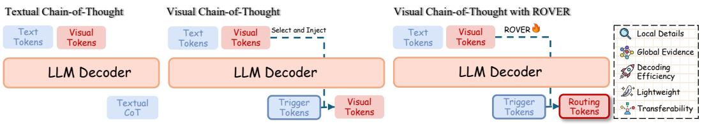

<details>
<summary>flowchart</summary>

```mermaid
graph TD
    subgraph_Textual_Chain-of-Thought["Textual Chain-of-Thought"]
        A1["Text Tokens"] --> B1["Visual Tokens"]
        B1 --> C1["LLM Decoder"]
        C1 --> D1["Text Text Tokens"]
        C1 --> E1["Visual Tokens"]
        E1 --> F1["Select and Inject"]
        F1 --> G1["LLM Decoder"]
        G1 --> H1["Trigger Tokens"]
        H1 --> I1["Visual Tokens"]
        I1 --> J1["LLM Decoder"]
        J1 --> K1["Trigger Tokens"]
        K1 --> L1["Routing Tokens"]
        L1 --> M1["Local Details"]
        L1 --> N1["Global Evidence"]
        L1 --> O1["Decoding Efficiency"]
        L1 --> P1["Lightweight"]
        L1 --> Q1["Transferability"]
    end

    subgraph_Visual_Chain-of-Thought["Visual Chain-of-Thought"]
        A2["Text Tokens"] --> B2["Visual Tokens"]
        B2 --> C2["Select and Inject"]
        C2 --> F2["LLM Decoder"]
        F2 --> G2["Trigger Tokens"]
        G2 --> H2["Visual Tokens"]
        H2 --> I2["LLM Decoder"]
        I2 --> J2["Trigger Tokens"]
        J2 --> K2["Routing Tokens"]
        K2 --> L2["Local Details"]
        K2 --> N2["Global Evidence"]
        K2 --> O2["Decoding Efficiency"]
        K2 --> P2["Lightweight"]
        K2 --> Q2["Transferability"]
    end

    subgraph_Visual_Chain-of-Thought_with_ROVER["Visual Chain-of-Thought with ROVER"]
        A3["Text Tokens"] --> B3["Visual Tokens"]
        B3 --> C3["ROVER"]
        C3 --> D3["Local Details"]
        C3 --> E3["Global Evidence"]
        C3 --> F3["Decoding Efficiency"]
        C3 --> G3["Lightweight"]
        C3 --> H3["Transferability"]
    end
```
</details>

Figure 1: Comparison between our method and prior paradigms. Compared to textual CoT and existing visual CoT approaches, ROVER preserves local object details while seamlessly routing evidence across objects and images. It is learnable, lightweight, and decoding-efficient by injecting a constant-length token triplet per grounding step, and exhibits strong transferability.


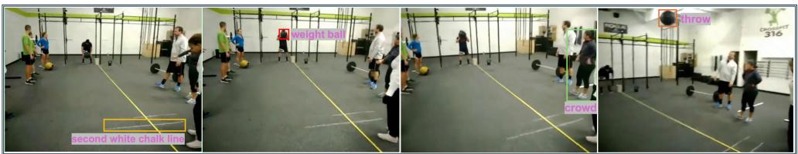

<details>
<summary>text_image</summary>

weight ball
throw
second white chalk line
crowd
316
</details>

  
Question: What indicates the success of the man's throw in the images?

  
Evidence: The <obj>weight ball in image 2</obj><box>[253, 79, 278, 104]</box>[LSW] hitting the <obj>second white chalk line in image 1</obj><box>[323, 373, 584, 407]</box> [LSW] indicates the success of the man’s <obj>throw in image 4</obj><box>[200, 6, 255, 57]</box>[LSW]. The checks by the woman to measure the distance, along with the watching and measuring by the surrounding <obj>crowd in image 3</obj><box>[548, 70, 639, 303]</box>[LSW] further confirm his success.

  
Answer: The success of the man’s throw is indicated when the ball hits the second white chalk line. The checks by the woman to measure the distance confirm it, while the crowd watches and measures the distance of his throw.   
Figure 2: Qualitative example with ROVER token insertions. Given a multi-image query from VideoEspresso [19], the model grounds key entities across images (ball in image 2, chalk line in image 1, throw in image 4, and crowd in image 3) and composes evidence to support the final answer. We mark the insertion positions of the Link/Sift/Weave triplet with [LSW] in the evidence. Bounding boxes are reported in absolute pixel coordinates as [xmin, ymin, xmax, ymax].

# 2 Related work

Reasoning with LLMs. Chain-of-thought (CoT) prompting improves LLM reasoning by eliciting explicit intermediate steps that guide the model toward the final solution [61]. Expanding upon this foundation, follow-up work has developed a variety of CoT-related paradigms, such as zeroshot CoT prompting [27] and automated CoT synthesis [73]. Beyond prompting, recent studies leverage reinforcement learning to directly optimize outcome-driven objectives along CoT-style solution trajectories [47, 36, 49], leading to strong gains on difficult text-only benchmarks, including STEM problem solving and code generation [24, 46]. Nevertheless, relying solely on textual CoT often proves fundamentally inadequate for complex vision-centric or vision–language tasks [13, 53], thereby necessitating multimodal approaches that can actively revisit visual evidence to substantiate intermediate reasoning steps.

Reasoning with MLLMs. Multimodal Large Language Models (MLLMs) have revolutionized open-ended visual understanding and complex reasoning tasks [37]. This rapid progress is propelled by innovations in visual instruction tuning, robust vision–language alignment, high-resolution perception mechanisms, and the curation of reasoning-intensive multimodal datasets [3, 41, 59, 29]. These foundational advancements also underpin the emergence of increasingly capable proprietary systems that demonstrate sophisticated reasoning in real-world scenarios [1, 15, 2].

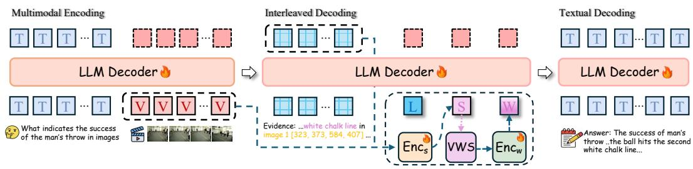

<details>
<summary>flowchart</summary>

```mermaid
graph LR
    A["Multimodal Encoding"] --> B["LLM Decoder"]
    B --> C["Interleaved Decoding"]
    C --> D["LLLM Decoder"]
    D --> E["Textual Decoding"]
    
    subgraph Multimodal Encoding
        T1["T"] & T2["T"] & ...T1
        L1["Image 1"] & V1["V"] & V2["V"] & ...V2
    end
    
    subgraph Interleaved Decoding
        L1 --> L2["White Chalk Line"]
        L2 --> L3["Image 1 [323, 373, 584, 407"] ...]
    end
    
    subgraph Textual Decoding
        T3["T"] & T4["T"] & ...T4
        L4["White Chalk Line"] --> L5["Encs"]
        L5 --> L6["VWS"]
        L6 --> L7["Encw"]
        L7 --> L8["..."]
        L8 --> L9["..."]
        L9 --> L10["..."]
        L10 --> L11["..."]
        L11 --> L12["..."]
        L12 --> L13["..."]
        L13 --> L14["..."]
        L14 --> L15["..."]
        L15 --> L16["..."]
        L16 --> L17["..."]
        L17 --> L18["..."]
        L18 --> L19["..."]
        L19 --> L20["..."]
    end
    
    subgraph Textual Decoding
        T5["T"] & T6["T"] & ...T6
        L6 --> L7
        L7 --> L8
        L8 --> L9
        L9 --> L10
        L10 --> L11
        L11 --> L12
        L12 --> L13
        L13 --> L14
        L14 --> L15
        L15 --> L16
        L16 --> L17
        L17 --> L18
        L18 --> L19
        L19 --> L20
    end
    
    M["What indicates the success of the man's throw in images"] --> N["Image 1: white chalk line in image 1 [323, 373, 584, 407"] ...]
    N --> O["Evidence: ...white chalk line in image 1 [323, 373, 584, 407"] ...]
```
</details>

(a) ROVER Pipeline

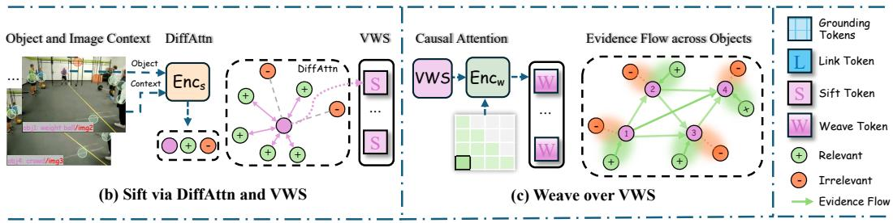

<details>
<summary>flowchart</summary>


</details>

Figure 3: Overview of ROVER. (a) ROVER Pipeline. Triggered by each object grounding, ROVER injects a Link/Sift/Weave token triplet to route visual evidence through the VWS. The MLLM then autoregressively interleaves reasoning and subsequent grounding steps, concluding with a pure-text answer. (b) Sift via DiffAttn and VWS. Leveraging object-centric differential attention, Sift distills complementary visual context while suppressing irrelevant regions to populate the VWS with compact object-centric cues. (c) Weave over VWS. Via history-aware attention, Weave routes and integrates relevant evidence from previously grounded objects into the current reasoning state.

Visual Chain-of-Thought. As MLLMs mature, visual chain-of-thought (visual CoT) has emerged to ground intermediate reasoning in visual evidence. This body of research encompasses RoI-centric revisitation, tool-augmented visual reasoning, and adaptive visual feature selection. For example, Argus [41] revisits RoI-specific visual signals during reasoning, while Visual Sketchpad [22] augments reasoning with tool-generated intermediate visual artifacts (e.g., drawing auxiliary lines) to support visual problem solving. Existing adaptive methods, whether heuristic (e.g., ICoT [14]) or learned (e.g., MINT-CoT [10]), primarily target single-image reasoning. This focus, coupled with reliance on sensitive hyperparameters or expensive annotations, limits their extension to multi-image reasoning scenarios. Collectively, these trade-offs motivate context-preserving revisitation with global, objectcentric visual evidence routing for multi-image reasoning.

# 3 Method

We propose ROVER, a mechanism that equips autoregressive multimodal generation with an explicit, object-level pathway for global visual evidence routing. In Section 3.1, we detail the proposed framework (depicted in Figure 3 and compared to prior paradigms in Figure 1). It comprises four key components: (i) a trigger-and-insert interface that determines when to initiate routing, (ii) the Link/Sift/Weave token triplet serving as routing primitives, (iii) object-centric differential crossattention for evidence routing within each image, and (iv) the Visual Working Space (VWS) that enables history-aware visual evidence routing across objects and images. Finally, we present our training recipe in Section 3.2, combining tailored interleaved SFT and GRPO.

# 3.1 ROVER

Triggering. ROVER initiates visual evidence routing upon detecting a valid event $o _ { k }$ . Formally, $o _ { k }$ encapsulates an object phrase (any visually localizable concept, from tangible items to specific actions and visual states), its image index, and spatial localization (typically a bounding box). Triggers can originate from diverse sources, including intrinsic model-emitted grounding patterns [41], userprovided region prompts (e.g., clicks or boxes) [75], and external detector proposals [38].

In this work, we primarily focus on the model-emitted grounding trigger: the routing event is activated upon the generation of a valid grounding pattern—e.g., <obj>the man in image 1</obj> <box>[xmin, ymin, xmax, ymax]</box> (see Figure 2). Here, [xmin, ymin] and $[ x _ { \mathrm { m a x } } , y _ { \mathrm { m a x } } ]$ denote the top-left and bottom-right corners of the predicted bounding box in image coordinates.

Routing Primitives. After each routing event, ROVER appends an explicit object-level routing interface formatted as a constant-length token triplet—Link, Sift, and Weave. This is represented as $\mathbf { T } _ { k } \in \mathbb { R } ^ { 3 \times d }$ , where d is the hidden size:

$$
\mathbf {T} _ {k} = \left[ \mathbf {t} _ {k} ^ {\text { Link }}; \mathbf {t} _ {k} ^ {\text { Sift }}; \mathbf {t} _ {k} ^ {\text { Weave }} \right]. \tag {1}
$$

As depicted in Figure 3, the learnable Link embedding absorbs the evolving decoding context, compactly encapsulating the current reasoning state [14]. Sift populates the VWS by distilling object-anchored intra-image context. For instance, when grounding a braking car on the street, it can attend to co-occurrent traffic lights or crosswalks to gather candidate visual cues and facilitate holistic scene understanding for subsequent reasoning. Weave then leverages the VWS to integrate historical evidence across objects and images. This design imposes a constant three-token overhead per grounded object, independent of its spatial size.

Routing Modules. Both Sift and Weave routing modules are instantiated as lightweight singlelayer Transformer blocks [55] comprising cross-attention and feed-forward networks (FFNs). Let Enc(X; S, M) denote a generic block where the query X attends to the source S (serving as both key and value, i.e., K = V = S) under mask M. Sharing this architectural backbone, EncSift adopts differential attention, whereas Enc $\mathrm { W e a v e }$ relies on standard attention.

Sift with DiffAttn. Given an input image $\mathcal { I } _ { m }$ , the vision encoder yields a sequence of patch tokens $\mathbf { V } _ { m } \in \mathbb { R } ^ { N _ { m } \times d }$ . For the k-th valid object bounding box $\mathbf { b } _ { k }$ in image ${ \mathcal { T } } _ { m ( k ) }$ , let $\Omega ( \mathbf { b } _ { k } )$ denote the indices of patches overlapping the box, and $\bar { \Omega } ( { \mathbf b } _ { k } )$ denote the remaining non-RoI patch indices. Following [17, 34], we first compute a compact RoI query $\mathbf { q } _ { k }$ via average pooling:

$$
\mathbf {q} _ {k} = \operatorname{AvgPool} \left(\mathbf {V} _ {m (k)} [ \Omega (\mathbf {b} _ {k}) ]\right) \in \mathbb {R} ^ {d}. \tag {2}
$$

As illustrated in Figure 3, Sift is designed to extract complementary context while suppressing irrelevant distractors. We adopt differential attention [67] as the core operator in EncSift. Formally, given query Q, key K, and value V , the operator computes:

$$
\operatorname{DiffAttn} (Q, K, V) = \left(\operatorname{softmax} \left(\frac {Q _ {1} K _ {1} ^ {\top}}{\sqrt {d _ {h}}}\right) - \lambda \cdot \operatorname{softmax} \left(\frac {Q _ {2} K _ {2} ^ {\top}}{\sqrt {d _ {h}}}\right)\right) V, \tag {3}
$$

where query/key projections are split into two heads $[ Q _ { 1 } ; Q _ { 2 } ] = Q W _ { Q } , [ K _ { 1 } ; K _ { 2 } ] = K W _ { K }$ , and λ is a learnable parameter initialized as in [67]. Sift executes object-centric differential attention to generate $\mathbf { t } _ { k } ^ { \mathrm { S i f t } }$ , querying the complementary context $\mathbf { V } _ { m ( k ) } [ \bar { \Omega } ( \mathbf { b } _ { k } ) ]$ ] with the object query qk:

$$
\mathbf {t} _ {k} ^ {\text { Sift }} = \operatorname{Enc} _ {\text { Sift }} \left(\mathbf {q} _ {k}; \mathbf {V} _ {m (k)} [ \bar {\Omega} (\mathbf {b} _ {k}) ], \mathbf {M} _ {k} ^ {\text { Sift }}\right). \tag {4}
$$

With the residual connection [20] inherently retaining the object query $\mathbf { q } _ { k }$ , the attention mechanism is exclusively dedicated to routing complementary context from non-RoI regions (e.g., scene background or surrounding entities). In the rare edge case where $| \bar { \Omega } ( { \mathbf b } _ { k } ) | = 0$ (e.g., full-image box), differential comparison becomes inapplicable, and we default to $\mathbf { t } _ { k } ^ { \mathrm { S i f t } } = \mathbf { q } _ { k }$ = q k .

Weave over VWS. We maintain the VWS as a unified, history-ordered routing substrate:

$$
\mathcal {W} _ {k} = \left[ \mathcal {W} _ {k - 1}; \mathbf {t} _ {k} ^ {\text { Sift }} \right] \in \mathbb {R} ^ {k \times d}, \quad \mathcal {W} _ {0} = \varnothing . \tag {5}
$$

Importantly, as shown in Figure 3, this workspace is shared across all routing events irrespective of the source image index, thus allowing $\mathcal { W } _ { k }$ to form a global memory of grounded objects across multiple images. We compute $\mathbf { t } _ { k } ^ { \mathrm { W e a v e } }$ with a single-layer encoder that routes and integrates visual evidence through the VWS, where $\mathbf { t } _ { k } ^ { \mathrm { S i f t } }$ attends to $\mathcal { W } _ { k }$ under an autoregressive mask:

$$
\mathbf {t} _ {k} ^ {\text {Weave}} = \operatorname{Enc} _ {\text {Weave}} \left(\mathbf {t} _ {k} ^ {\text {Sift}}; \mathcal {W} _ {k}, \mathbf {M} _ {k} ^ {\text {Weave}}\right). \tag {6}
$$

Decoding. After the k-th routing event, we append $\mathbf { T } _ { k }$ to the input embedding sequence, allowing the backbone LLM to perform a forward pass and then autoregressively interleave textual reasoning with further grounding steps. For a trajectory with K routing events, ROVER introduces exactly 3K additional tokens (i.e., ${ L _ { K } } = L _ { 0 } + 3 K )$ ), independent of the spatial size of RoIs.

# 3.2 Training

Overview. Featuring the interleaving of text tokens and ROVER triplets, our training pipeline proceeds in two stages: (i) interleaved supervised fine-tuning (SFT), which empowers the model to emit accurate grounding patterns and task-specific responses, and (ii) interleaved Group Relative Policy Optimization (GRPO) [49] to optimize trajectory rewards for better answer accuracy.

Interleaved SFT. Given a dataset of multimodal instruction-response pairs, we construct training sequences that alternate natural language tokens with closed grounding patterns (see Figure 2). During teacher forcing, whenever a closed and valid grounding pattern is completed, we trigger a routing event and insert the Link/Sift/Weave token triplet $\mathbf { T } _ { k }$ into the input embedding sequence. We minimize the masked negative log-likelihood:

$$
\mathcal {L} _ {\mathrm{SFT}} = \mathbb {E} _ {t | m _ {t} = 1} \left[ - \log p _ {\theta} \left(y _ {t} \mid y _ {<   t}, \mathcal {I}\right) \right]. \tag {7}
$$

Here, the target tokens $y _ { t }$ comprise both textual and grounding outputs, conditioned on the preceding context $y _ { < t }$ and the visual input I. We set $m _ { t } = 1$ for these targets and $m _ { t } = 0$ for the inserted token triplets. Although these inserted tokens are not directly supervised, they affect the hidden states used to predict subsequent target tokens, and are thus optimized end-to-end via backpropagation driven by the language modeling objective.

Interleaved GRPO. Building upon the SFT checkpoint, we tailor GRPO [49] to the interleaved multimodal setting to further optimize performance. For each prompt, we sample a group of G trajectories $\{ \tau _ { i } \} _ { i = 1 } ^ { G }$ from the old policy $p _ { \theta _ { \mathrm { o l d } } }$ and compute task-specific rewards $r ( \tau _ { i } )$ . The rewards are then normalized to obtain advantages:

$$
\hat {A} (\tau_ {i}) = \frac {r (\tau_ {i}) - \mu_ {r}}{\sigma_ {r} + \epsilon}, \tag {8}
$$

where $\mu _ { r }$ and $\sigma _ { r }$ are the group-wise mean and standard deviation of $\{ r ( \tau _ { i } ) \} _ { i = 1 } ^ { G }$ . We use the following KL-regularized GRPO loss:

$$
\mathcal {L} _ {\mathrm{GRPO}} = \mathbb {E} _ {\tau_ {i} \sim p _ {\theta_ {\mathrm{old}}}, t \mid m _ {t} = 1} \left[ - \frac {p _ {\theta} \left(y _ {t} \mid y _ {<   t}\right)}{p _ {\theta_ {\mathrm{old}}} \left(y _ {t} \mid y _ {<   t}\right)} \hat {A} \left(\tau_ {i}\right) + \beta \mathrm{D} _ {\mathrm{KL}} \left(p _ {\theta} \| p _ {\text {ref}}\right) \right]. \tag {9}
$$

Here, $\mathrm { D } _ { \mathrm { K L } } ( p _ { \theta } \| p _ { \mathrm { r e f } } )$ denotes the token-level KL divergence between the current policy $p _ { \theta }$ and the reference policy $p _ { \mathrm { r e f } }$ (initialized from the SFT model), weighted by a coefficient $\beta .$ Note that the ROVER triplet consists of deterministically inserted tokens; hence, we exclude them from the loss calculation by setting $m _ { t } = 0$ .

# 4 Experiments

This section evaluates ROVER across diverse grounded reasoning scenarios. We begin by detailing the implementation specifics and evaluation protocols in Section 4.1. Next, we present comparative results on (i) multi-image grounded reasoning with VideoEspresso (Section 4.2) and (ii) single-image grounded reasoning on MM-GCoT (Section 4.3), benchmarking against standard text-only grounded chain-of-thought (GCoT) approaches and additional vision-centric RoI-based revisitation strategies. Finally, in Section 4.4, we assess backbone compatibility and robust zero-shot transfer capabilities across various held-out benchmarks.

# 4.1 Experimental setup

Implementation Details. We build ROVER upon Qwen2.5-VL-7B [4], adhering to the official protocols of VideoEspresso [19] and MM-GCoT [63]. These benchmarks pose complementary challenges. VideoEspresso requires long-form, multi-step grounded reasoning across multiple images (e.g., video keyframes). MM-GCoT, in contrast, emphasizes GCoT generation from a single image, requiring precise inter-object reasoning. For VideoEspresso, we use only interleaved SFT, since its open-ended nature precludes reliable RL rewards. For MM-GCoT, we apply the full SFT-to-GRPO pipeline under a controlled setting: we split the original training set between the SFT and RL stages, strictly avoiding any external data. During training, we fine-tune all parameters except the frozen vision encoder. Further details are provided in Appendix A.1.

Table 1: Main results on VideoEspresso. We report the official VideoEspresso baseline [19] and our ROVER-LSW in a controlled setting. ∗: full video inputs (otherwise core frames); †: LLM-as-ajudge verification after similarity retrieval. Best and second-best results are highlighted. 

<table><tr><td>Method</td><td>Params</td><td>Narra.</td><td>Event</td><td>Ingre.</td><td>Causal</td><td>Theme</td><td>Conte.</td><td>Influ.</td><td>Role</td><td>Inter.</td><td>Behav.</td><td>Emoti.</td><td>Cook.</td><td>Traff.</td><td>Situa.</td><td>Avg.</td></tr><tr><td colspan="17">Closed-source MLLMs*</td></tr><tr><td>GPT-4o [23]</td><td>-</td><td>32.3</td><td>16.7</td><td>25.5</td><td>22.8</td><td>32.8</td><td>27.5</td><td>37.5</td><td>28.6</td><td>24.2</td><td>19.3</td><td>30.8</td><td>30.2</td><td>20.0</td><td>22.0</td><td>26.4</td></tr><tr><td>Qwen-VL-Max [3]</td><td>-</td><td>33.9</td><td>22.4</td><td>23.5</td><td>21.4</td><td>26.2</td><td>30.3</td><td>41.7</td><td>30.2</td><td>27.4</td><td>26.3</td><td>20.0</td><td>20.8</td><td>16.7</td><td>24.0</td><td>26.0</td></tr><tr><td colspan="17">Opened-source MLLMs*</td></tr><tr><td>LLaVA-1.5 [37]</td><td>6.8B</td><td>32.3</td><td>21.3</td><td>19.4</td><td>17.1</td><td>26.2</td><td>20.2</td><td>36.1</td><td>33.3</td><td>21.0</td><td>21.1</td><td>20.0</td><td>35.8</td><td>16.7</td><td>18.0</td><td>24.2</td></tr><tr><td>InternVL2 [12]</td><td>8.1B</td><td>33.9</td><td>24.1</td><td>27.6</td><td>24.4</td><td>42.6</td><td>33.0</td><td>45.8</td><td>28.6</td><td>19.4</td><td>22.8</td><td>21.5</td><td>34.0</td><td>20.0</td><td>24.0</td><td>28.7</td></tr><tr><td>LLaVA-N-Inter [31]</td><td>8.1B</td><td>24.2</td><td>23.6</td><td>26.5</td><td>19.2</td><td>31.1</td><td>32.1</td><td>31.9</td><td>17.5</td><td>24.2</td><td>21.1</td><td>26.2</td><td>30.2</td><td>13.3</td><td>20.0</td><td>24.4</td></tr><tr><td>Qwen2-VL [59]</td><td>8.3B</td><td>27.4</td><td>23.0</td><td>24.5</td><td>23.5</td><td>29.5</td><td>31.2</td><td>47.2</td><td>31.7</td><td>22.6</td><td>28.1</td><td>40.0</td><td>22.6</td><td>30.0</td><td>18.0</td><td>28.5</td></tr><tr><td>LongVA-DPO [71]</td><td>7.9B</td><td>35.5</td><td>14.9</td><td>16.3</td><td>19.0</td><td>34.4</td><td>22.0</td><td>37.5</td><td>23.8</td><td>29.0</td><td>22.8</td><td>20.0</td><td>37.7</td><td>16.7</td><td>12.0</td><td>24.4</td></tr><tr><td>mPLUG-Owl3 [66]</td><td>8.1B</td><td>30.6</td><td>23.6</td><td>20.4</td><td>22.3</td><td>37.7</td><td>29.4</td><td>48.6</td><td>34.9</td><td>30.6</td><td>24.6</td><td>27.7</td><td>24.5</td><td>13.3</td><td>24.0</td><td>28.0</td></tr><tr><td>LLaVA-N-Video [72]</td><td>7.1B</td><td>31.2</td><td>20.2</td><td>16.2</td><td>17.6</td><td>36.5</td><td>32.7</td><td>30.6</td><td>24.5</td><td>26.4</td><td>24.5</td><td>34.7</td><td>20.8</td><td>20.3</td><td>17.0</td><td>25.2</td></tr><tr><td colspan="17">Baseline</td></tr><tr><td>VideoEspresso [19]</td><td>8.5B</td><td>45.2</td><td>27.0</td><td>33.7</td><td>26.1</td><td>39.3</td><td>36.7</td><td>55.6</td><td>41.3</td><td>30.6</td><td>29.8</td><td>30.8</td><td>35.8</td><td>20.0</td><td>26.0</td><td>34.1</td></tr><tr><td colspan="17">Main results on Qwen2.5-VL-7B</td></tr><tr><td>+ ROVER-LSW</td><td>8.5B</td><td>50.6</td><td>45.9</td><td>42.9</td><td>33.8</td><td>45.9</td><td>43.1</td><td>37.5</td><td>42.9</td><td>41.9</td><td>26.3</td><td>36.9</td><td>49.1</td><td>56.6</td><td>44.0</td><td>42.7</td></tr><tr><td>+ ROVER-LSW $^{\dagger}$ </td><td>8.5B</td><td>49.4</td><td>45.2</td><td>41.8</td><td>33.6</td><td>44.3</td><td>41.3</td><td>36.1</td><td>41.3</td><td>40.3</td><td>24.6</td><td>35.4</td><td>47.2</td><td>53.3</td><td>40.0</td><td>41.0</td></tr></table>

Evaluation Protocols. In accordance with the official VideoEspresso protocol, we report categorywise scores and the overall average, supplemented by an LLM-as-a-judge evaluation for open-ended responses (see details in Section 4.2). For MM-GCoT, we report answer accuracy (A-Acc), grounding accuracy (G-Acc), and answer–grounding consistency (Consist.). Additional evaluation metrics and prompt template details are provided in Appendix A.2.

Baselines and Variants. We structure our comparisons across two paradigms: (1) Text-only GCoT: representative baselines on each dataset relying on static visual features. (2) Visual CoT: vision-centric RoI-based revisitation strategies compared against our routing mechanism, following the taxonomy in Argus [41]: (i) RoI-reencoding, which re-encodes cropped image patches (e.g., Visual CoT [48] and the agentic cropping in DeepEyes [77]); and (ii) RoI-resampling, which extracts RoI-aligned visual features directly from the feature map for re-injection (e.g., VGR [58]).

We then analyze ROVER’s components via progressive variants: (i) ROVER-Sifts (using standard attention); (ii) ROVER-Siftd (using differential attention); (iii) ROVER-SW (adding Weave and VWS); and (iv) the full ROVER-LSW (Link+Sift+Weave). Finally, on MM-GCoT, we report ROVER-LSW-GRPO to isolate the gains from reinforcement learning.

# 4.2 Multi-Image Reasoning on VideoEspresso

Main Results. Table 1 reports the main results on VideoEspresso. Overall, ROVER-LSW achieves the best average in our controlled setting, outperforming the previous best baseline by +8.6%. For evaluation, we adhere to the benchmark’s official similarity-based option-matching protocol. Furthermore, we apply an LLM-as-a-judge verification using OpenAI o3 [44] to assess response– option agreement across logical consistency, factuality, accuracy, and conciseness, complementing the benchmark’s subjective evaluation [19]. This verification typically lowers absolute scores but yields a more reproducible estimate of reasoning correctness.

Ablations and Analysis. Table 2 dissects the contribution of each component to multi-image reasoning, reporting performance alongside parameter growth (∆Params) and the average generated token count (evidence + answer) as a proxy for decoding efficiency. Comparing the two Sift variants (both +0.1B params), the standard attention model (36.6%) trails the RoI-resampling baseline (38.1%).

Table 2: Ablations on VideoEspresso. Comparison against RoI-reencoding/resampling methods and component ablation under identical configurations. 

<table><tr><td>Method</td><td> $\Delta$ Params</td><td>Gen. Toks</td><td>Narra.</td><td>Event</td><td>Ingre.</td><td>Causal</td><td>Theme</td><td>Conte.</td><td>Influ.</td><td>Role</td><td>Inter.</td><td>Behav.</td><td>Emoti.</td><td>Cook.</td><td>Traff.</td><td>Situa.</td><td>Avg.</td></tr><tr><td colspan="18">Baseline</td></tr><tr><td>VideoEspresso [19]</td><td>+0.4B</td><td>448.4</td><td>45.2</td><td>27.0</td><td>33.7</td><td>26.1</td><td>39.3</td><td>36.7</td><td>55.6</td><td>41.3</td><td>30.6</td><td>29.8</td><td>30.8</td><td>35.8</td><td>20.0</td><td>26.0</td><td>34.1</td></tr><tr><td colspan="18">Ablations on Qwen2.5-VL-7B</td></tr><tr><td>+ RoI-reencoding [41]</td><td>+0.0B</td><td>686.7</td><td>41.8</td><td>42.0</td><td>39.8</td><td>32.4</td><td>41.0</td><td>39.4</td><td>34.7</td><td>39.7</td><td>38.7</td><td>22.8</td><td>32.3</td><td>39.6</td><td>46.7</td><td>36.0</td><td>37.6</td></tr><tr><td>+ RoI-resampling [41]</td><td>+0.0B</td><td>732.1</td><td>44.3</td><td>40.8</td><td>41.8</td><td>33.1</td><td>42.6</td><td>43.1</td><td>31.9</td><td>42.9</td><td>30.6</td><td>24.6</td><td>35.4</td><td>39.6</td><td>43.3</td><td>40.0</td><td>38.1</td></tr><tr><td>+ ROVER-Sift $_{s}$ </td><td>+0.1B</td><td>318.5</td><td>46.8</td><td>38.9</td><td>33.7</td><td>31.0</td><td>36.1</td><td>41.3</td><td>34.7</td><td>42.9</td><td>25.8</td><td>19.3</td><td>32.3</td><td>43.4</td><td>46.7</td><td>40.0</td><td>36.6</td></tr><tr><td>+ ROVER-Sift $_{d}$ </td><td>+0.1B</td><td>324.8</td><td>48.1</td><td>42.0</td><td>40.8</td><td>32.4</td><td>45.9</td><td>42.2</td><td>40.3</td><td>39.7</td><td>33.9</td><td>26.3</td><td>33.8</td><td>45.3</td><td>50.0</td><td>42.0</td><td>40.2</td></tr><tr><td>+ ROVER-SW</td><td>+0.2B</td><td>303.4</td><td>49.4</td><td>45.2</td><td>43.9</td><td>33.8</td><td>47.5</td><td>42.2</td><td>36.1</td><td>41.3</td><td>43.5</td><td>24.6</td><td>35.4</td><td>47.2</td><td>53.3</td><td>44.0</td><td>42.0</td></tr><tr><td>+ ROVER-LSW</td><td>+0.2B</td><td>308.0</td><td>50.6</td><td>45.9</td><td>42.9</td><td>33.8</td><td>45.9</td><td>43.1</td><td>37.5</td><td>42.9</td><td>41.9</td><td>26.3</td><td>36.9</td><td>49.1</td><td>56.6</td><td>44.0</td><td>42.7</td></tr></table>

Table 3: Main results on MM-GCoT. Comparison with GCoT baselines and GRPO effects. “AF” and $\mathbf { \tilde { G F } } ^ { \prime \prime }$ denote answer-first and grounding-first prompting, respectively [63]. 

<table><tr><td rowspan="2">Method</td><td rowspan="2">Params</td><td rowspan="2">Prompt Setting</td><td colspan="3">Attribute</td><td colspan="3">Judgement</td><td colspan="3">Object</td><td colspan="3">Average</td></tr><tr><td>A-Acc.</td><td>G-Acc.</td><td>Consist.</td><td>A-Acc.</td><td>G-Acc.</td><td>Consist.</td><td>A-Acc.</td><td>G-Acc.</td><td>Consist.</td><td>A-Acc.</td><td>G-Acc.</td><td>Consist.</td></tr><tr><td colspan="15">Opened-source MLLMs with prompting</td></tr><tr><td>InternVL2.5-8B [11]</td><td>8.1B</td><td>AF</td><td>61.9</td><td>51.9</td><td>42.6</td><td>89.3</td><td>36.4</td><td>31.5</td><td>48.3</td><td>43.2</td><td>39.4</td><td>66.5</td><td>43.8</td><td>37.8</td></tr><tr><td>InternVL2.5-8B [11]</td><td>8.1B</td><td>GF</td><td>54.5</td><td>43.1</td><td>40.7</td><td>76.9</td><td>31.9</td><td>26.1</td><td>37.1</td><td>46.2</td><td>31.1</td><td>56.2</td><td>40.4</td><td>32.6</td></tr><tr><td>LLaVA-7B [37]</td><td>6.8B</td><td>AF</td><td>68.6</td><td>9.2</td><td>8.8</td><td>83.0</td><td>11.2</td><td>11.5</td><td>58.4</td><td>9.1</td><td>9.9</td><td>70.0</td><td>9.8</td><td>10.1</td></tr><tr><td>LLaVA-7B [37]</td><td>6.8B</td><td>GF</td><td>59.7</td><td>6.3</td><td>5.6</td><td>82.5</td><td>0.5</td><td>0.6</td><td>35.9</td><td>5.5</td><td>9.7</td><td>59.4</td><td>4.1</td><td>5.3</td></tr><tr><td>LLaVA-13B [37]</td><td>13.1B</td><td>AF</td><td>69.7</td><td>12.0</td><td>9.6</td><td>83.5</td><td>14.6</td><td>15.4</td><td>58.7</td><td>11.6</td><td>14.4</td><td>70.6</td><td>12.7</td><td>13.1</td></tr><tr><td>LLaVA-13B [37]</td><td>13.1B</td><td>GF</td><td>69.7</td><td>11.5</td><td>11.7</td><td>83.3</td><td>6.1</td><td>6.6</td><td>51.9</td><td>14.6</td><td>17.2</td><td>68.3</td><td>10.8</td><td>11.8</td></tr><tr><td colspan="15">Baseline</td></tr><tr><td>LLaVA-7B GCoT [63]</td><td>6.8B</td><td>GCoT</td><td>72.8</td><td>66.7</td><td>56.1</td><td>88.3</td><td>61.7</td><td>56.9</td><td>62.3</td><td>61.7</td><td>61.3</td><td>74.5</td><td>63.3</td><td>58.1</td></tr><tr><td>LLaVA-13B GCoT [63]</td><td>13.1B</td><td>GCoT</td><td>74.7</td><td>67.8</td><td>58.0</td><td>90.3</td><td>72.8</td><td>68.0</td><td>64.1</td><td>60.8</td><td>59.3</td><td>76.4</td><td>67.1</td><td>61.8</td></tr><tr><td colspan="15">Main results on Qwen2.5-VL-7B</td></tr><tr><td>+ ROVER-LSW</td><td>8.5B</td><td>GCoT</td><td>75.6</td><td>78.0</td><td>66.7</td><td>90.8</td><td>90.3</td><td>81.1</td><td>63.8</td><td>71.4</td><td>64.8</td><td>76.7</td><td>79.9</td><td>70.8</td></tr><tr><td>+ ROVER-LSW-GRPO</td><td>8.5B</td><td>GCoT</td><td>76.7</td><td>81.0</td><td>68.0</td><td>95.6</td><td>90.3</td><td>85.9</td><td>71.4</td><td>73.9</td><td>68.9</td><td>81.2</td><td>81.7</td><td>74.3</td></tr></table>

Table 4: Ablations on MM-GCoT. Comparison against RoI-reencoding/resampling methods and component ablation under identical configurations. 

<table><tr><td rowspan="2">Method</td><td rowspan="2">Params</td><td rowspan="2">Prompt Setting</td><td colspan="3">Attribute</td><td colspan="3">Judgement</td><td colspan="3">Object</td><td colspan="3">Average</td></tr><tr><td>A-Acc.</td><td>G-Acc.</td><td>Consist.</td><td>A-Acc.</td><td>G-Acc.</td><td>Consist.</td><td>A-Acc.</td><td>G-Acc.</td><td>Consist.</td><td>A-Acc.</td><td>G-Acc.</td><td>Consist.</td></tr><tr><td colspan="15">Baseline</td></tr><tr><td>LLaVA-13B GCoT [63]</td><td>13.1B</td><td>GCoT</td><td>74.7</td><td>67.8</td><td>58.0</td><td>90.3</td><td>72.8</td><td>68.0</td><td>64.1</td><td>60.8</td><td>59.3</td><td>76.4</td><td>67.1</td><td>61.8</td></tr><tr><td colspan="15">Ablations on Qwen2.5-VL-7B</td></tr><tr><td>+ RoI-reencoding [41]</td><td>8.3B</td><td>GCoT</td><td>75.4</td><td>63.8</td><td>55.5</td><td>90.3</td><td>69.9</td><td>65.0</td><td>58.4</td><td>60.2</td><td>56.6</td><td>74.7</td><td>64.6</td><td>59.0</td></tr><tr><td>+ RoI-resampling [41]</td><td>8.3B</td><td>GCoT</td><td>76.7</td><td>64.7</td><td>56.8</td><td>90.3</td><td>70.4</td><td>65.5</td><td>57.4</td><td>60.5</td><td>56.5</td><td>74.8</td><td>65.2</td><td>59.6</td></tr><tr><td>+ ROVER-Sift $_s$ </td><td>8.4B</td><td>GCoT</td><td>74.1</td><td>59.7</td><td>53.9</td><td>88.8</td><td>71.8</td><td>65.5</td><td>60.5</td><td>58.7</td><td>56.2</td><td>74.5</td><td>63.4</td><td>58.5</td></tr><tr><td>+ ROVER-Sift $_d$ </td><td>8.4B</td><td>GCoT</td><td>75.4</td><td>76.3</td><td>65.3</td><td>90.7</td><td>87.9</td><td>79.5</td><td>60.8</td><td>71.1</td><td>61.3</td><td>75.6</td><td>78.4</td><td>68.7</td></tr><tr><td>+ ROVER-SW</td><td>8.5B</td><td>GCoT</td><td>75.4</td><td>78.0</td><td>66.4</td><td>90.8</td><td>90.3</td><td>81.1</td><td>63.2</td><td>71.4</td><td>64.1</td><td>76.5</td><td>79.9</td><td>70.5</td></tr><tr><td>+ ROVER-LSW</td><td>8.5B</td><td>GCoT</td><td>75.6</td><td>78.0</td><td>66.7</td><td>90.8</td><td>90.3</td><td>81.1</td><td>63.8</td><td>71.4</td><td>64.8</td><td>76.7</td><td>79.9</td><td>70.8</td></tr></table>

In contrast, differential attention yields a distinct improvement to 40.2%, underscoring the necessity of distractor suppression during evidence routing. Incorporating history-aware aggregation via Weave and VWS further lifts the average to 42.0% (+0.2B), with the full Link+Sift+Weave model achieving the best overall performance of 42.7%. Notably, ROVER-LSW reduces total output tokens (both generated and inserted) by 57.9% and 31.3% compared to RoI-resampling and the text-only baseline, respectively, indicating that our object-centric evidence routing mechanism effectively enhances both reasoning quality and decoding efficiency.

# 4.3 Single-Image Reasoning on MM-GCoT

Main Results. Following official protocols [63], Table 3 shows that ROVER-LSW surpasses the strongest baseline (LLaVA-13B GCoT) by +12.8% in grounding accuracy and +9.0% in consistency, indicating tighter evidence–reasoning alignment. Furthermore, incorporating GRPO yields additional gains, effectively lifting the overall answer accuracy (+4.8%) while extending the lead in grounding metrics (+14.6% G-Acc, +12.5% Consist.) over the baseline.

Ablations and Analysis. Table 4 breaks down the impact of each component on MM-GCoT. Relative to the RoI-resampling baseline, introducing Sift with differential attention improves overall G-Acc by +13.2%, and Consist. by +9.1%. Finally, integrating Weave/VWS and Link contributes to sustained improvements, culminating in the best overall performance across all metrics.

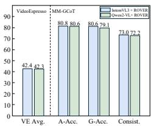

<details>
<summary>bar</summary>

| Category | Intern+VL1 + ROV/RE | Q=2+VL1 + ROV/RE |
| :--- | :--- | :--- |
| VE Avg. | 42.4 | 42.3 |
| MM-GCo | 80.8 | 80.6 |
| A-Acc. | 80.6 | 79.1 |
| G-Acc. | 73.0 | 72.2 |
| Consist. | 73.0 | 72.2 |
</details>

(a) Backbone Compatibility

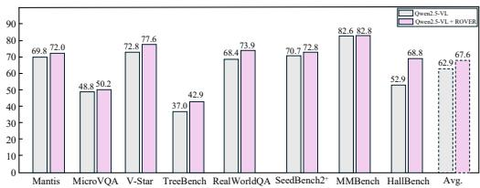

<details>
<summary>bar</summary>

| Category | Overload 2.5VL | Overload 2.5VL + ROVER |
| :--- | :--- | :--- |
| Mantis | 69.8 | 72.0 |
| MicroVQA | 48.8 | 50.2 |
| V-Star | 72.8 | 77.6 |
| TreeBench | 37.0 | 42.9 |
| RealWorldQA | 68.4 | 73.9 |
| SeedBench² | 70.7 | 72.8 |
| MMBench | 82.6 | 82.8 |
| HallBench | 52.9 | 68.8 |
| Avg. | 62.9 | 67.6 |
</details>

(b) Zero-shot Transfer

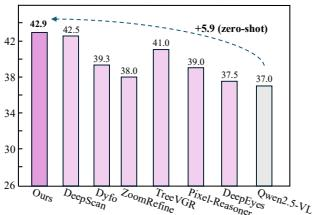

<details>
<summary>bar</summary>

| Method         | Value |
| -------------- | ----- |
| Ours           | 42.9  |
| DeepScan       | 42.5  |
| Dyfo           | 39.3  |
| ZoomRefine     | 38.0  |
| TreeVOR        | 41.0  |
| Pixel-Reasoner | 39.0  |
| DeepEyes       | 37.5  |
| Qwen2.5.VI    | 37.0  |
</details>

(c) Zero-shot Transfer on TreeBench   
Figure 4: Backbone compatibility and transferability. (a): Backbone compatibility. VideoEspresso (Avg.) evaluated via similarity matching and MM-GCoT (A-Acc./G-Acc./Consist.). (b): Zero-shot transfer of ROVER-enhanced Qwen2.5-VL-7B to held-out benchmarks. (c): Comparison with state-of-the-art alternatives on TreeBench [56], with scores taken from DeepScan [33].

# 4.4 Backbone Compatibility and Transferability

As summarized in Figure 4, we evaluate the versatility of ROVER along two dimensions: (i) backbone compatibility, where we extend ROVER to diverse architectures including InternVL3-8B [79] and Qwen2-VL-7B [59]; and (ii) zero-shot transfer, applying the ROVER-enhanced Qwen2.5-VL-7B (trained on VideoEspresso) to a range of public benchmarks, evaluating generalization to diverse multimodal domains held out during training.

Detailed analysis reveals that ROVER’s explicit object-centric routing effectively mitigates hallucinations and enhances spatial understanding, yielding significant gains on RealWorldQA [64] (+5.5%) and HallBench [16] (+15.9%). Moreover, sustained improvements on Mantis [25] (+2.2%) and MicroVQA [6] (+1.4%) confirm robust transferability across multi-image reasoning tasks. Finally, gains on V-Star [62] (+4.8%), SEED-Bench-2-Plus [30] (+2.1%), and TreeBench [56] (+5.9%, achieving the best zero-shot result among all compared methods [33, 32, 69, 56, 57, 77]) demonstrate that intraimage routing successfully preserves fine-grained visual details and spatial hierarchies to facilitate robust higher-order reasoning. Collectively, these consistent results confirm that ROVER acquires a highly generalized strategy for object-centric visual evidence routing across diverse domains (see Appendix A.3 for additional qualitative examples).

# 5 Conclusion and Discussion

We presented ROVER, a lightweight learnable plugin that equips autoregressive multimodal generation with a global object-centric pathway for visual evidence routing. Operating via a constant-length Link/Sift/Weave token triplet, ROVER anchors localized objects, extracts complementary context via differential attention while suppressing distractors, and consolidates history-aware evidence across images through a shared Visual Working Space. Trained via an interleaved SFT-to-GRPO pipeline, ROVER achieves consistent gains and establishes new state-of-the-art results on both single-image and multi-image grounded reasoning benchmarks.

Discussion 1: Implicit structured representation. Compressing visual regions into constantlength representations with differential attention potentially acts as an information bottleneck that filters noise and captures underlying scene structure (e.g., semantic correlations and spatial layouts). Conceptually, ROVER mirrors dynamic graph reasoning, where objects act as nodes and the VWS enables implicit message passing, though formal alignment requires future validation.

Discussion 2: Adaptive token allocation strategy. While the constant-length triplet balances efficiency and accuracy, it might constrain information capacity for regions with extreme visual complexity (e.g., dense text). Exploring adaptive routing token allocation conditioned on semantic density could further enhance fine-grained perception. This introduces inevitable trade-offs among representational capacity, latency, and background noise, warranting future investigation.

Discussion 3: Parameter footprint optimization. ROVER guarantees a constant three-token decoding overhead per grounded object with approximately 0.2B additional parameters. Although this footprint is marginal relative to the 7B backbone, exploring even more lightweight architectural designs remains a promising direction for future work.

# References

[1] Josh Achiam, Steven Adler, Sandhini Agarwal, Lama Ahmad, Ilge Akkaya, Florencia Leoni Aleman, Diogo Almeida, Janko Altenschmidt, Sam Altman, Shyamal Anadkat, et al. Gpt-4 technical report. arXiv preprint arXiv:2303.08774, 2023.   
[2] Sonnet Anthropic. Model card addendum: Claude 3.5 haiku and upgraded claude 3.5 sonnet. In Claude 3.5 Sonnet, 2024.   
[3] Jinze Bai, Shuai Bai, Shusheng Yang, Shijie Wang, Sinan Tan, Peng Wang, Junyang Lin, Chang Zhou, and Jingren Zhou. Qwen-vl: A frontier large vision-language model with versatile abilities. ArXiv, abs/2308.12966, 2023.   
[4] Shuai Bai, Keqin Chen, Xuejing Liu, Jialin Wang, Wenbin Ge, Sibo Song, Kai Dang, Peng Wang, Shijie Wang, Jun Tang, Humen Zhong, Yuanzhi Zhu, Mingkun Yang, Zhaohai Li, Jianqiang Wan, Pengfei Wang, Wei Ding, Zheren Fu, Yiheng Xu, Jiabo Ye, Xi Zhang, Tianbao Xie, Zesen Cheng, Hang Zhang, Zhibo Yang, Haiyang Xu, and Junyang Lin. Qwen2.5-vl technical report, 2025.   
[5] Tianyi Bai, Zengjie Hu, Fupeng Sun, Jiantao Qiu, Yizhen Jiang, Guangxin He, Bohan Zeng, Conghui He, Binhang Yuan, and Wentao Zhang. Multi-step visual reasoning with visual tokens scaling and verification. arXiv preprint arXiv:2506.07235, 2025.   
[6] James Burgess, Jeffrey J Nirschl, Laura Bravo-Sánchez, Alejandro Lozano, Sanket Rajan Gupte, Jesus G Galaz-Montoya, Yuhui Zhang, Yuchang Su, Disha Bhowmik, Zachary Coman, et al. Microvqa: A multimodal reasoning benchmark for microscopy-based scientific research. In Proceedings of the IEEE/CVF Conference on Computer Vision and Pattern Recognition, pages 19552–19564, 2025.   
[7] Jianlyu Chen, Shitao Xiao, Peitian Zhang, Kun Luo, Defu Lian, and Zheng Liu. M3-embedding: Multi-linguality, multi-functionality, multi-granularity text embeddings through self-knowledge distillation. In Findings of the Association for Computational Linguistics: ACL 2024, pages 2318–2335, Bangkok, Thailand, August 2024. Association for Computational Linguistics.   
[8] Junzhe Chen, Tianshu Zhang, Shiyu Huang, Yuwei Niu, Linfeng Zhang, Lijie Wen, and Xuming Hu. Ict: Image-object cross-level trusted intervention for mitigating object hallucination in large vision-language models. In Proceedings of the Computer Vision and Pattern Recognition Conference, pages 4209–4221, 2025.   
[9] Liang Chen, Lei Li, Haozhe Zhao, Yifan Song, and Vinci. R1-v: Reinforcing super generalization ability in vision-language models with less than \$3. https://github.com/Deep-Agent /R1-V, 2025. Accessed: 2025-02-02.   
[10] Xinyan Chen, Renrui Zhang, Dongzhi Jiang, Aojun Zhou, Shilin Yan, Weifeng Lin, and Hongsheng Li. Mint-cot: Enabling interleaved visual tokens in mathematical chain-of-thought reasoning. arXiv preprint arXiv:2506.05331, 2025.   
[11] Zhe Chen, Weiyun Wang, Yue Cao, Yangzhou Liu, Zhangwei Gao, Erfei Cui, Jinguo Zhu, Shenglong Ye, Hao Tian, Zhaoyang Liu, et al. Expanding performance boundaries of open-source multimodal models with model, data, and test-time scaling. arXiv preprint arXiv:2412.05271, 2024.   
[12] Zhe Chen, Jiannan Wu, Wenhai Wang, Weijie Su, Guo Chen, Sen Xing, Muyan Zhong, Qinglong Zhang, Xizhou Zhu, Lewei Lu, et al. Internvl: Scaling up vision foundation models and aligning for generic visual-linguistic tasks. In Proceedings of the IEEE/CVF Conference on Computer Vision and Pattern Recognition, pages 24185–24198, 2024.   
[13] Xingyu Fu, Yushi Hu, Bangzheng Li, Yu Feng, Haoyu Wang, Xudong Lin, Dan Roth, Noah A Smith, Wei-Chiu Ma, and Ranjay Krishna. Blink: Multimodal large language models can see but not perceive. In European Conference on Computer Vision, pages 148–166. Springer, 2024.   
[14] Jun Gao, Yongqi Li, Ziqiang Cao, and Wenjie Li. Interleaved-modal chain-of-thought. In 2025 IEEE/CVF Conference on Computer Vision and Pattern Recognition (CVPR), pages 19520–19529. IEEE, 2025.

[15] Google Gemini Team. Gemini: a family of highly capable multimodal models. arXiv preprint arXiv:2312.11805, 2023.   
[16] Tianrui Guan, Fuxiao Liu, Xiyang Wu, Ruiqi Xian, Zongxia Li, Xiaoyu Liu, Xijun Wang, Lichang Chen, Furong Huang, Yaser Yacoob, Dinesh Manocha, and Tianyi Zhou. Hallusionbench: An advanced diagnostic suite for entangled language hallucination and visual illusion in large vision-language models. In Proceedings of the IEEE/CVF Conference on Computer Vision and Pattern Recognition (CVPR), pages 14375–14385, June 2024.   
[17] Qiushan Guo, Shalini De Mello, Hongxu Yin, Wonmin Byeon, Ka Chun Cheung, Yizhou Yu, Ping Luo, and Sifei Liu. Regiongpt: Towards region understanding vision language model. In Proceedings of the IEEE/CVF Conference on Computer Vision and Pattern Recognition, pages 13796–13806, 2024.   
[18] Tanmay Gupta and Aniruddha Kembhavi. Visual programming: Compositional visual reasoning without training. In Proceedings of the IEEE/CVF conference on computer vision and pattern recognition, pages 14953–14962, 2023.   
[19] Songhao Han, Wei Huang, Hairong Shi, Le Zhuo, Xiu Su, Shifeng Zhang, Xu Zhou, Xiaojuan Qi, Yue Liao, and Si Liu. Videoespresso: A large-scale chain-of-thought dataset for fine-grained video reasoning via core frame selection. In Proceedings of the Computer Vision and Pattern Recognition Conference (CVPR), pages 26181–26191, June 2025.   
[20] Kaiming He, Xiangyu Zhang, Shaoqing Ren, and Jian Sun. Deep residual learning for image recognition. In Proceedings of the IEEE conference on computer vision and pattern recognition, pages 770–778, 2016.   
[21] Zhitao He, Sandeep Polisetty, Zhiyuan Fan, Yuchen Huang, Shujin Wu, and Yi R. Fung. MMBoundary: Advancing MLLM knowledge boundary awareness through reasoning step confidence calibration. In Proceedings of the 63rd Annual Meeting of the Association for Computational Linguistics (Volume 1: Long Papers), pages 16427–16444, Vienna, Austria, July 2025. Association for Computational Linguistics.   
[22] Yushi Hu, Weijia Shi, Xingyu Fu, Dan Roth, Mari Ostendorf, Luke Zettlemoyer, Noah A Smith, and Ranjay Krishna. Visual sketchpad: Sketching as a visual chain of thought for multimodal language models. arXiv preprint arXiv:2406.09403, 2024.   
[23] Aaron Hurst, Adam Lerer, Adam P Goucher, Adam Perelman, Aditya Ramesh, Aidan Clark, AJ Ostrow, Akila Welihinda, Alan Hayes, Alec Radford, et al. Gpt-4o system card. arXiv preprint arXiv:2410.21276, 2024.   
[24] Naman Jain, King Han, Alex Gu, Wen-Ding Li, Fanjia Yan, Tianjun Zhang, Sida Wang, Armando Solar-Lezama, Koushik Sen, and Ion Stoica. Livecodebench: Holistic and contamination free evaluation of large language models for code. arXiv preprint arXiv:2403.07974, 2024.   
[25] Dongfu Jiang, Xuan He, Huaye Zeng, Cong Wei, Max Ku, Qian Liu, and Wenhu Chen. Mantis: Interleaved multi-image instruction tuning. arXiv preprint arXiv:2405.01483, 2024.   
[26] Daniel Kahneman. Thinking, fast and slow. Farrar, Straus and Giroux, 2011.   
[27] Takeshi Kojima, Shixiang Shane Gu, Machel Reid, Yutaka Matsuo, and Yusuke Iwasawa. Large language models are zero-shot reasoners. Advances in neural information processing systems, 35:22199–22213, 2022.   
[28] Jarrod A Lewis-Peacock, Yoav Kessler, and Klaus Oberauer. The removal of information from working memory. Annals of the New York Academy of Sciences, 1424(1):33–44, 2018.   
[29] Bo Li, Yuanhan Zhang, Dong Guo, Renrui Zhang, Feng Li, Hao Zhang, Kaichen Zhang, Yanwei Li, Ziwei Liu, and Chunyuan Li. Llava-onevision: Easy visual task transfer. arXiv preprint arXiv:2408.03326, 2024.   
[30] Bohao Li, Yuying Ge, Yi Chen, Yixiao Ge, Ruimao Zhang, and Ying Shan. Seed-bench-2-plus: Benchmarking multimodal large language models with text-rich visual comprehension, 2024.

[31] Feng Li, Renrui Zhang, Hao Zhang, Yuanhan Zhang, Bo Li, Wei Li, Zejun Ma, and Chunyuan Li. Llava-next-interleave: Tackling multi-image, video, and 3d in large multimodal models. arXiv preprint arXiv:2407.07895, 2024.   
[32] Geng Li, Jinglin Xu, Yunzhen Zhao, and Yuxin Peng. Dyfo: A training-free dynamic focus visual search for enhancing lmms in fine-grained visual understanding. In Proceedings of the Computer Vision and Pattern Recognition Conference, pages 9098–9108, 2025.   
[33] Yangfu Li, Hongjian Zhan, Jiawei Chen, Yuning Gong, Qi Liu, and Yue Lu. Deepscan: A training-free framework for visually grounded reasoning in large vision-language models. arXiv preprint arXiv:2603.03857, 2026.   
[34] Yanwei Li, Chengyao Wang, and Jiaya Jia. Llama-vid: An image is worth 2 tokens in large language models. In European Conference on Computer Vision, pages 323–340. Springer, 2024.   
[35] You Li, Heyu Huang, Chi Chen, Kaiyu Huang, Chao Huang, Zonghao Guo, Zhiyuan Liu, Jinan Xu, Yuhua Li, Ruixuan Li, et al. Migician: Revealing the magic of free-form multiimage grounding in multimodal large language models. In Findings of the Association for Computational Linguistics: ACL 2025, pages 9845–9867, 2025.   
[36] Hunter Lightman, Vineet Kosaraju, Yuri Burda, Harrison Edwards, Bowen Baker, Teddy Lee, Jan Leike, John Schulman, Ilya Sutskever, and Karl Cobbe. Let’s verify step by step. In The Twelfth International Conference on Learning Representations, 2023.   
[37] Haotian Liu, Chunyuan Li, Qingyang Wu, and Yong Jae Lee. Visual instruction tuning. Advances in neural information processing systems, 36:34892–34916, 2023.   
[38] Shilong Liu, Zhaoyang Zeng, Tianhe Ren, Feng Li, Hao Zhang, Jie Yang, Qing Jiang, Chunyuan Li, Jianwei Yang, Hang Su, et al. Grounding dino: Marrying dino with grounded pre-training for open-set object detection. In European conference on computer vision, pages 38–55. Springer, 2024.   
[39] Ilya Loshchilov and Frank Hutter. Decoupled weight decay regularization. arXiv preprint arXiv:1711.05101, 2017.   
[40] Pan Lu, Hritik Bansal, Tony Xia, Jiacheng Liu, Chunyuan Li, Hannaneh Hajishirzi, Hao Cheng, Kai-Wei Chang, Michel Galley, and Jianfeng Gao. Mathvista: Evaluating mathematical reasoning of foundation models in visual contexts. arXiv preprint arXiv:2310.02255, 2023.   
[41] Yunze Man, De-An Huang, Guilin Liu, Shiwei Sheng, Shilong Liu, Liang-Yan Gui, Jan Kautz, Yu-Xiong Wang, and Zhiding Yu. Argus: Vision-centric reasoning with grounded chain-ofthought. In Proceedings of the Computer Vision and Pattern Recognition Conference, pages 14268–14280, 2025.   
[42] Andrey R Nikolaev, Radha Nila Meghanathan, and Cees van Leeuwen. Refixation behavior in naturalistic viewing: Methods, mechanisms, and neural correlates. Attention, Perception, & Psychophysics, 87(1):25–49, 2025.   
[43] Klaus Oberauer. Working memory and attention–a conceptual analysis and review. Journal of cognition, 2(1):36, 2019.   
[44] OpenAI. Openai o3. https://openai.com/index/introducing-o3-and-o4-mini, 2025.   
[45] Runqi Qiao, Qiuna Tan, Minghan Yang, Guanting Dong, Peiqing Yang, Shiqiang Lang, Enhui Wan, Xiaowan Wang, Yida Xu, Lan Yang, et al. V-thinker: Interactive thinking with images. arXiv preprint arXiv:2511.04460, 2025.   
[46] David Rein, Betty Li Hou, Asa Cooper Stickland, Jackson Petty, Richard Yuanzhe Pang, Julien Dirani, Julian Michael, and Samuel R Bowman. Gpqa: A graduate-level google-proof q&a benchmark. In First Conference on Language Modeling, 2024.   
[47] John Schulman, Filip Wolski, Prafulla Dhariwal, Alec Radford, and Oleg Klimov. Proximal policy optimization algorithms. arXiv preprint arXiv:1707.06347, 2017.

[48] Hao Shao, Shengju Qian, Han Xiao, Guanglu Song, Zhuofan Zong, Letian Wang, Yu Liu, and Hongsheng Li. Visual cot: Advancing multi-modal language models with a comprehensive dataset and benchmark for chain-of-thought reasoning. Advances in Neural Information Processing Systems, 37:8612–8642, 2024.   
[49] Zhihong Shao, Peiyi Wang, Qihao Zhu, Runxin Xu, Junxiao Song, Xiao Bi, Haowei Zhang, Mingchuan Zhang, YK Li, Yang Wu, et al. Deepseekmath: Pushing the limits of mathematical reasoning in open language models. arXiv preprint arXiv:2402.03300, 2024.   
[50] Chuming Shen, Wei Wei, Xiaoye Qu, and Yu Cheng. Satori-r1: Incentivizing multimodal reasoning with spatial grounding and verifiable rewards. arXiv preprint arXiv:2505.19094, 2025.   
[51] Min Shi, Fuxiao Liu, Shihao Wang, Shijia Liao, Subhashree Radhakrishnan, Yilin Zhao, De-An Huang, Hongxu Yin, Karan Sapra, Yaser Yacoob, et al. Eagle: Exploring the design space for multimodal llms with mixture of encoders. arXiv preprint arXiv:2408.15998, 2024.   
[52] Zhaochen Su, Peng Xia, Hangyu Guo, Zhenhua Liu, Yan Ma, Xiaoye Qu, Jiaqi Liu, Yanshu Li, Kaide Zeng, Zhengyuan Yang, et al. Thinking with images for multimodal reasoning: Foundations, methods, and future frontiers. arXiv preprint arXiv:2506.23918, 2025.   
[53] Peter Tong, Ellis Brown, Penghao Wu, Sanghyun Woo, Adithya Jairam Vedagiri IYER, Sai Charitha Akula, Shusheng Yang, Jihan Yang, Manoj Middepogu, Ziteng Wang, et al. Cambrian-1: A fully open, vision-centric exploration of multimodal llms. Advances in Neural Information Processing Systems, 37:87310–87356, 2024.   
[54] Shengbang Tong, Zhuang Liu, Yuexiang Zhai, Yi Ma, Yann LeCun, and Saining Xie. Eyes wide shut? exploring the visual shortcomings of multimodal llms. In Proceedings of the IEEE/CVF Conference on Computer Vision and Pattern Recognition, pages 9568–9578, 2024.   
[55] Ashish Vaswani, Noam Shazeer, Niki Parmar, Jakob Uszkoreit, Llion Jones, Aidan N Gomez, Łukasz Kaiser, and Illia Polosukhin. Attention is all you need. Advances in neural information processing systems, 30, 2017.   
[56] Haochen Wang, Xiangtai Li, Zilong Huang, Anran Wang, Jiacong Wang, Tao Zhang, Jiani Zheng, Sule Bai, Zijian Kang, Jiashi Feng, et al. Traceable evidence enhanced visual grounded reasoning: Evaluation and methodology. arXiv preprint arXiv:2507.07999, 2025.   
[57] Haozhe Wang, Alex Su, Weiming Ren, Fangzhen Lin, and Wenhu Chen. Pixel reasoner: Incentivizing pixel-space reasoning with curiosity-driven reinforcement learning. arXiv preprint arXiv:2505.15966, 2025.   
[58] Jiacong Wang, Zijian Kang, Haochen Wang, Haiyong Jiang, Jiawen Li, Bohong Wu, Ya Wang, Jiao Ran, Xiao Liang, Chao Feng, et al. Vgr: Visual grounded reasoning. arXiv preprint arXiv:2506.11991, 2025.   
[59] Peng Wang, Shuai Bai, Sinan Tan, Shijie Wang, Zhihao Fan, Jinze Bai, Keqin Chen, Xuejing Liu, Jialin Wang, Wenbin Ge, et al. Qwen2-vl: Enhancing vision-language model’s perception of the world at any resolution. arXiv preprint arXiv:2409.12191, 2024.   
[60] Ye Wang, Qianglong Chen, Zejun Li, Siyuan Wang, Shijie Guo, Zhirui Zhang, and Zhongyu Wei. Simple o3: Towards interleaved vision-language reasoning. arXiv preprint arXiv:2508.12109, 2025.   
[61] Jason Wei, Xuezhi Wang, Dale Schuurmans, Maarten Bosma, Fei Xia, Ed Chi, Quoc V Le, Denny Zhou, et al. Chain-of-thought prompting elicits reasoning in large language models. Advances in neural information processing systems, 35:24824–24837, 2022.   
[62] Penghao Wu and Saining Xie. V\*: Guided visual search as a core mechanism in multimodal llms. In 2024 IEEE/CVF Conference on Computer Vision and Pattern Recognition (CVPR), pages 13084–13094. IEEE, 2024.

[63] Qiong Wu, Xiangcong Yang, Yiyi Zhou, Chenxin Fang, Baiyang Song, Xiaoshuai Sun, and Rongrong Ji. Grounded chain-of-thought for multimodal large language models. arXiv preprint arXiv:2503.12799, 2025.   
[64] xAI. Realworldqa: A benchmark for evaluating spatial understanding and physical reasoning in the real world, 2024. Benchmark release.   
[65] Zhengyuan Yang, Linjie Li, Jianfeng Wang, Kevin Lin, Ehsan Azarnasab, Faisal Ahmed, Zicheng Liu, Ce Liu, Michael Zeng, and Lijuan Wang. Mm-react: Prompting chatgpt for multimodal reasoning and action. arXiv preprint arXiv:2303.11381, 2023.   
[66] Jiabo Ye, Haiyang Xu, Haowei Liu, Anwen Hu, Ming Yan, Qi Qian, Ji Zhang, Fei Huang, and Jingren Zhou. mplug-owl3: Towards long image-sequence understanding in multi-modal large language models. arXiv preprint arXiv:2408.04840, 2024.   
[67] Tianzhu Ye, Li Dong, Yuqing Xia, Yutao Sun, Yi Zhu, Gao Huang, and Furu Wei. Differential transformer. arXiv preprint arXiv:2410.05258, 2024.   
[68] Runpeng Yu, Xinyin Ma, and Xinchao Wang. Introducing visual perception token into multimodal large language model. arXiv preprint arXiv:2502.17425, 2025.   
[69] Xuan Yu, Dayan Guan, and Yanfeng Gu. Zoom-refine: Boosting high-resolution multimodal understanding via localized zoom and self-refinement, 2025.   
[70] Mengmi Zhang, Marcelo Armendariz, Will Xiao, Olivia Rose, Katarina Bendtz, Margaret Livingstone, Carlos Ponce, and Gabriel Kreiman. Look twice: A generalist computational model predicts return fixations across tasks and species. PLoS computational biology, 18(11):e1010654, 2022.   
[71] Peiyuan Zhang, Kaichen Zhang, Bo Li, Guangtao Zeng, Jingkang Yang, Yuanhan Zhang, Ziyue Wang, Haoran Tan, Chunyuan Li, and Ziwei Liu. Long context transfer from language to vision. arXiv preprint arXiv:2406.16852, 2024.   
[72] Yuanhan Zhang, Bo Li, haotian Liu, Yong jae Lee, Liangke Gui, Di Fu, Jiashi Feng, Ziwei Liu, and Chunyuan Li. Llava-next: A strong zero-shot video understanding model, April 2024.   
[73] Zhuosheng Zhang, Aston Zhang, Mu Li, and Alex Smola. Automatic chain of thought prompting in large language models. arXiv preprint arXiv:2210.03493, 2022.   
[74] Zhuosheng Zhang, Aston Zhang, Mu Li, Hai Zhao, George Karypis, and Alex Smola. Multimodal chain-of-thought reasoning in language models. arXiv preprint arXiv:2302.00923, 2023.   
[75] Liang Zhao, En Yu, Zheng Ge, Jinrong Yang, Haoran Wei, Hongyu Zhou, Jianjian Sun, Yuang Peng, Runpei Dong, Chunrui Han, et al. Chatspot: bootstrapping multimodal llms via precise referring instruction tuning. In Proceedings of the Thirty-Third International Joint Conference on Artificial Intelligence, pages 1743–1752, 2024.   
[76] Yaowei Zheng, Richong Zhang, Junhao Zhang, Yanhan Ye, Zheyan Luo, Zhangchi Feng, and Yongqiang Ma. Llamafactory: Unified efficient fine-tuning of 100+ language models. In Proceedings of the 62nd Annual Meeting of the Association for Computational Linguistics (Volume 3: System Demonstrations), Bangkok, Thailand, 2024. Association for Computational Linguistics.   
[77] Ziwei Zheng, Michael Yang, Jack Hong, Chenxiao Zhao, Guohai Xu, Le Yang, Chao Shen, and Xing Yu. Deepeyes: Incentivizing" thinking with images" via reinforcement learning. arXiv preprint arXiv:2505.14362, 2025.   
[78] Liangyu Zhong, Fabio Rosenthal, Joachim Sicking, Fabian Hüger, Thorsten Bagdonat, Hanno Gottschalk, and Leo Schwinn. Focus: Internal mllm representations for efficient fine-grained visual question answering. arXiv preprint arXiv:2506.21710, 2025.   
[79] Jinguo Zhu, Weiyun Wang, Zhe Chen, Zhaoyang Liu, Shenglong Ye, Lixin Gu, Hao Tian, Yuchen Duan, Weijie Su, Jie Shao, et al. Internvl3: Exploring advanced training and test-time recipes for open-source multimodal models. arXiv preprint arXiv:2504.10479, 2025.

# A Appendix

# A.1 Additional Implementation Details

Training Details. All SFT and GRPO experiments are conducted on eight NVIDIA A800 (80GB) GPUs. We implement SFT using LLaMA-Factory [76] and GRPO using R1-V [9]. We employ the AdamW optimizer [39] across all stages. For interleaved SFT on VideoEspresso, we train for 1 epoch with a cosine scheduler, a peak learning rate of $1 \times 1 0 ^ { - 5 }$ , a warmup ratio of 0.1, and an effective global batch size of 64. MM-GCoT SFT uses the same setting except for a higher peak learning rate of $2 \times 1 0 ^ { - 5 }$ . Subsequently, for MM-GCoT GRPO, we train on a disjoint 14K split for 2 epochs with a linearly decayed learning rate (starting from $3 \times 1 0 ^ { - 6 } )$ , an effective global batch size of 64, and $G = 4$ sampled generations per prompt. The reward is set to 1 only if the generated output is parsable and the final answer is correct (otherwise 0). The KL coefficient $\beta$ is set to 0.04.

We formally present our core operational procedures via pseudocode. We detail the object-centric evidence injection in our decoding pipeline (Algorithm 1) and summarize the trajectory-level optimization in the interleaved GRPO loop (Algorithm 2).

Algorithm 1 ROVER Decoding Pipeline   
Require: Images $I = \{I_m\}_{m=1}^M$ , Instruction prompt $X_{prompt}$ , Vision Encoder, LLM
Ensure: Generated multimodal response Y

1: Extract image tokens $\{V_m\}$ 2: Initialize $W_0 \leftarrow \varnothing$ , $k \leftarrow 0$ , $s \leftarrow X_{prompt}$ 3: while generation is not finished do

4: $y_t \leftarrow LLM.GenerateNextToken(s, \{V_m\})$ 5: Append $y_t$ to s

6: if $y_t$ completes a valid grounding pattern $o_k$ with bounding box $b_k$ then

7: $k \leftarrow k + 1$ 8: $q_k \leftarrow AvgPool(V_{m(k)}[\Omega(b_k)])$ $\triangleright$ Extract RoI summary

9: $C_k \leftarrow V_{m(k)}[\bar{\Omega}(b_k)]$ $\triangleright$ Obtain non-RoI context

10: $t_k^{Sift} \leftarrow q_k if |C_k| = 0 else Enc_{Sift}(q_k; C_k, M_k^{Sift})$ $\triangleright$ DiffAttn with fallback

11: $W_k \leftarrow [W_{k-1}; t_k^{Sift}]$ $\triangleright$ Update VWS memory

12: $t_k^{Weave} \leftarrow Enc_{Weave}(t_k^{Sift}; W_k, M_k^{Weave})$ $\triangleright$ Route inter-object history

13: $T_k \leftarrow [t_k^{Link}; t_k^{Sift}; t_k^{Weave}]$ $\triangleright$ Form constant-length triplet

14: Append $T_k$ to s $\triangleright$ Inject triplet into sequence

15: end if

16: end while

17: return Y $\leftarrow s$

Algorithm 2 Interleaved GRPO for ROVER   
Require: Initial policy $p_{\theta}$ , Reference policy $p_{ref}$ , Dataset D, Group size G, KL coef. $\beta$ Ensure: Optimized policy $p_{\theta}$ 1: while training is not converged do
2:    Sample a batch of prompts from D
3:    Synchronize old policy $p_{\theta_{old}} \leftarrow p_{\theta}$ 4:    for each prompt do
5:    Sample G interleaved trajectories $\{\tau_{i}\}_{i=1}^{G} \sim p_{\theta_{old}}$ 6:    Compute binary rewards $\{r(\tau_{i})\}_{i=1}^{G}$ and normalized advantages $\hat{A}(\tau_{i})$ 7:    for each token $y_{t} \in \tau_{i}$ do
8: $m_{t} \leftarrow 0$ if $y_{t} \in \{Link, Sift, Weave\}$ , else $m_{t} \leftarrow 1$ 9:    end for
10:    Compute masked loss $L_{GRPO}$ with $m_{t}, \hat{A}(\tau_{i}), \beta$ , and policies $(p_{\theta}, p_{\theta_{old}}, p_{\text{ref}})$ 11:    end for
12:    Update parameters $\theta$ by optimizing $L_{GRPO}$ 13: end while
14: return $p_{\theta}$

VideoEspresso Data Preprocessing. To optimize interleaving efficiency, we address instances where a single object mention maps to multiple candidate bounding boxes by retaining only the largest box as the representative anchor. This representative box serves as the grounding pattern trigger (Section 3.1), thereby minimizing token redundancy in crowded scenes. Notably, complementary information from unselected boxes can be implicitly retrieved via differential attention.

During SFT, we employ diverse instruction templates [25, 35] to prevent format overfitting and enhance instruction-following adaptability, ensuring the learned routing capabilities transfer robustly to broader open-ended scenarios. As shown in Figure 2, the output is structured into an initial reasoning sequence (integrating visual evidence text, grounding tokens, and ROVER triplets) followed by a pure-text final answer.

# A.2 Additional Evaluation Details

For VideoEspresso, we report two evaluation variants. (i) LLM-as-a-judge verification: we follow the official similarity-based matching with bge-m3 [7] to retrieve the closest option, and then verify response–option agreement using OpenAI o3 [44] in terms of logical consistency, factuality, accuracy, and conciseness [19] (see the full prompt in Figure 5). (ii) Multiple-choice evaluation: we additionally report direct multiple-choice QA on the test split (Table 5). The ROVER-enhanced model outperforms the Qwen2.5-VL-7B by +4.3%, indicating our gains are robust to the evaluation protocol.

<table><tr><td>RoleYou are a professional text relevance evaluator with expertise in semantic analysis and content comparison. Your task is to objectively assess whether two texts are semantically equivalent, considering logic consistency, factuality, accuracy, and conciseness.</td></tr><tr><td>TaskDetermine whether the two texts are semantically equivalent. Return YES only if they convey essentially the same meaning, such as sharing the same core characters, objects, actions, scenes, and overall intent; otherwise return NO (unrelated, only weakly related, partially overlapping, or inconsistent). You should first briefly explain your reasoning, and then provide the final result.</td></tr><tr><td>Texts to compare(1). {text_1}(2). {text_2}</td></tr><tr><td>Output format[Reason]: Briefly explain the basis for your judgment, focusing on whether the two texts share the same topic, entities, actions, or overall meaning.</td></tr><tr><td>[Result]: Yes / No</td></tr></table>

Figure 5: LLM-as-a-judge prompt used for OpenAI o3 verification.

Table 5: MCQ evaluation on VideoEspresso. We compare the VideoEspresso-trained ROVERenhanced model with the Qwen2.5-VL-7B baseline. Best results are highlighted. 

<table><tr><td>Method</td><td>Narra.</td><td>Event</td><td>Ingre.</td><td>Causal</td><td>Theme</td><td>Conte.</td><td>Influ.</td><td>Role</td><td>Inter.</td><td>Behav.</td><td>Emoti.</td><td>Cook.</td><td>Traff.</td><td>Situa.</td><td>Avg.</td></tr><tr><td colspan="16">Results on Qwen2.5-VL-7B</td></tr><tr><td rowspan="2">Qwen2.5-VL+ ROVER</td><td>39.2</td><td>40.8</td><td>49.0</td><td>38.7</td><td>47.5</td><td>50.5</td><td>48.6</td><td>35.0</td><td>38.7</td><td>31.6</td><td>41.5</td><td>45.3</td><td>43.3</td><td>58.0</td><td>43.4</td></tr><tr><td>51.9</td><td>43.9</td><td>59.2</td><td>39.4</td><td>50.8</td><td>54.1</td><td>47.2</td><td>47.6</td><td>43.5</td><td>29.8</td><td>44.6</td><td>47.2</td><td>56.7</td><td>52.0</td><td>47.7</td></tr></table>

# A.3 Additional Qualitative Examples

To further illustrate the effectiveness and generalizability of our approach, we provide additional qualitative examples on both in-domain test sets (VideoEspresso: Figure 6 and Figure 7; MM-GCoT: Figure 8) and diverse transfer benchmarks (Mantis: Figure 9; V-Star: Figure 10). For brevity, ROVER triplets following grounding predictions are omitted from the presented textual outputs. Moreover, to offer deeper insights into the model’s inner workings, we include visualizations of both the differential cross-attention (Figure 11) and the VWS cross-attention (Figure 12).


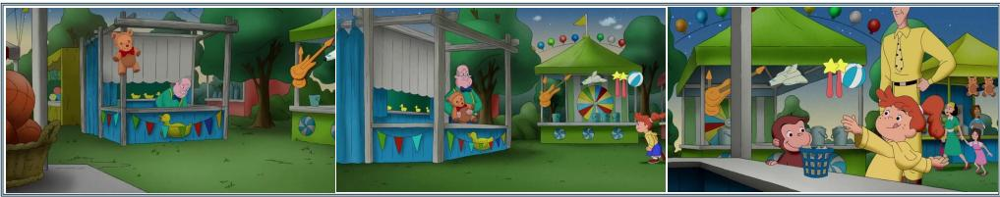

<details>
<summary>natural_image</summary>

Three-panel cartoon illustration of children playing in colorful activities: a park, a playground with colorful swings, and a girl in a yellow jacket (no text or symbols)
</details>


Question: How do the activities with the stalls, booths, and toys relate to the fairground setting ?


Answer-A: The activities at stalls and booths are an essential part of the lively fairground setting. After seeing toys such as teddy bears and rubber ducks, George and his friend decide to purchase these items. Visitors also typically take part in games or contests, such as throwing balls into buckets, which adds to the interactive and playful nature of the scene.


Answer-B: The stalls and booths are directly related to typical fairground events. Initially, a wooden stall featuring toy ducks and a teddy bear, along with a gazebo displaying various prizes, establishes a festive atmosphere. Later, George and a red-haired child are seen at a booth playing a carnival game by tossing objects toward a target. Overall, these scenes show that the fairground is a lively place filled with diverse games and interactive activities.

(a) Example 1.   


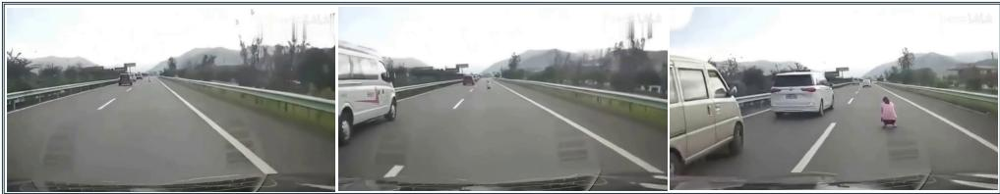

<details>
<summary>natural_image</summary>

Three-panel photo sequence showing a driving vehicle on a highway with mountains in the background (no visible text or symbols)
</details>

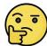

Question: How does the weather potentially impact the visibility and safety on the highway?


Answer-A: The overcast and misty weather in the images suggests reduced visibility, making it difficult for drivers to notice the child crossing the road, as shown in the second image. This situation requires drivers to exercise greater caution and also highlights the importance of safety measures such as guardrails and barriers, as seen in the third image.


Answer-B: The overcast skies in the first two images suggest reduced visibility, which could make it challenging for drivers to see other vehicles and pedestrians clearly.

(b) Example 2.   


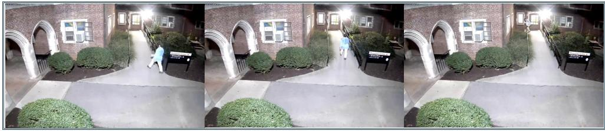

<details>
<summary>natural_image</summary>

Three-panel black-and-white photo sequence showing a person walking on a paved path near a brick building, surrounded by green shrubs and arched windows (no text or symbols visible)
</details>


Question: Describe the visual features of the Humanities Center and the movement of people.


Answer-A: The primary visual features of the Humanities Center include a brick building with arched doorways and greenery such as bushes and shrubs. The movement of people at the venue includes a person in a light blue jacket walking towards the building and another person in a white jacket running towards the camera.


Answer-B: The Humanities Center has a brick facade with arched doorways and multiple windows, a sidewalk in front of the building, the well-maintained bushes and plants, and a sign that reads "Humanities Center". At the entrance, a person in a blue jacket and white pants is seen walking away from the camera towards the building and climbing up a ramp. The setting appears to be well-lit, likely at night, as indicated by the artificial lighting.

(c) Example 3.

Figure 6: Qualitative comparison on the VideoEspresso test set. Compared to the RoI-resampling baseline (Answer-A), ROVER (Answer-B) demonstrates superior holistic scene understanding and precise reasoning of key inter-object relations, thereby yielding more accurate predictions.


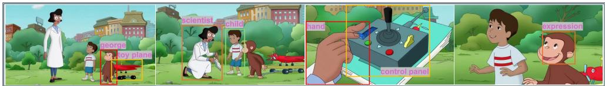

<details>
<summary>text_image</summary>

georgetown
boy plane
scientist
child
hand
control panel
expressor
</details>


Question: Evaluate how George’s expression and involvement change and infer the reasons.


Evidence: Initially, <obj>George in image 1</obj><box>[543, 276, 632, 479]</box> stands beside the <obj>toy plane in image 1</obj><box>[612, 329, 776, 450]</box> with a neutral expression, suggesting anticipation; later, the <obj>child in image 2</obj><box>[400, 145, 500, 433]</box> seems confused while the <obj>scientist in image 2</obj><box>[151, 122, 372, 445]</box> explains something; then, when the <obj>hand in image 3</obj><box>[0, 100, 352, 478]</box>operates a <obj>control panel in image 3</obj><box>[238, 13, 677, 427]</box>, George’s overall mood and <obj>expression in image 4</obj><box>[499, 167, 691, 358]</box> brighten, showing his interest in the new activity; finally, both George and the child stand smiling amidst the greenery, suggesting they have successfully engaged with the project.


Answer: Initially, George attentively stands beside a toy plane, looking up at the scientist with a neutral expression, indicating curiosity or anticipation. Later, the child next to George looks confused while a scientist explains something, suggesting an attempt to engage with a complex idea. After that, when the hand operates a control panel, George’s expression brightens, showing increased interest. Finally, both George and the child stand smiling amidst greenery, showing that they have engaged successfully with the demonstrated activity was being explained or demonstrated by the scientist. The change in George’s expression reflects a progression from curiosity and uncertainty to excitement and satisfaction as they interacted with the toy plane and the control panel.

(a) Example 1.   


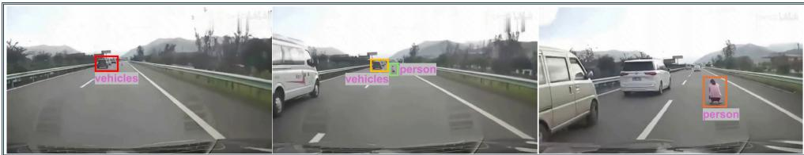

<details>
<summary>text_image</summary>

vehicles
vehicles person
person
</details>


Question: How does the weather potentially impact the visibility and safety on the highway?


Evidence: The overcast skies in the first two images suggest reduced visibility, which could make it challenging for drivers to see <obj>vehicles in image 1</obj><box> [287, 168, 358, 207]</box> and <obj>vehicles in image 2</obj><box>[318, 176, 370, 207]</box>. Drivers should watch for the <obj>person in image 3</obj><box>[547, 234, 597, 315]</box> on the road, who also appears as the <obj>person in image 2</obj><box>[384, 190, 402, 219]</box>.


Answer: The overcast skies in the first two images suggest reduced visibility, which could make it challenging for drivers to see other vehicles and pedestrians clearly.

(b) Example 2.

Figure 7: Additional qualitative examples on the VideoEspresso test set. Model-predicted grounded evidence with bounding boxes across core frames, followed by the final answer.

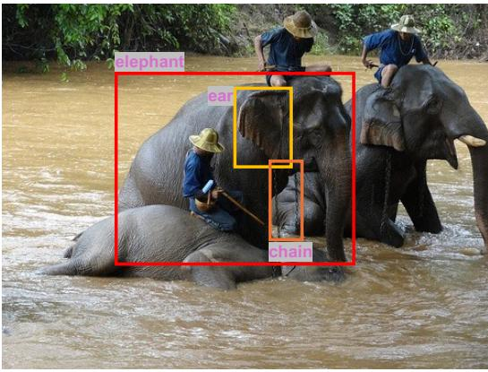

<details>
<summary>text_image</summary>

elephant
ear
chain
</details>

What is draping over the middle grey and brown elephant that shows its ear? Step 1: The middle grey and brown elephant is at <box>[116, 72, 361, 260]</box> Step 2: The ear of the elephant is at <box>[239, 85, 300, 166]</box> Step 3: The chain draped over the elephant is at <box>[277, 158, 306, 246]</box> Final Answer: Chain

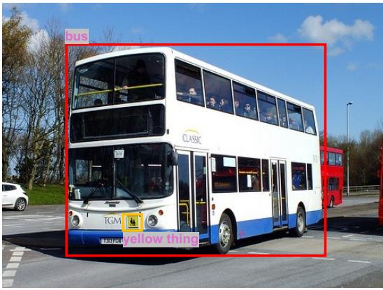

<details>
<summary>text_image</summary>

bus
CLASSIC
TGM
yellow thing
</details>

What is the yellow thing in front of the blue and white double-decker bus? Step 1: The blue and white double-decker bus is at <box>[80, 59, 418, 330]</box> Step 2: The yellow thing in front of the bus is at <box>[163, 278, 181, 298]</box> Final Answer: Sign

Figure 8: Additional qualitative example on the MM-GCoT test set. Model-predicted grounded evidence with bounding boxes, followed by the final answer.   
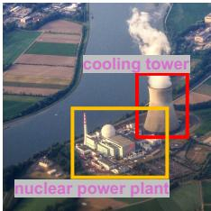

<details>
<summary>text_image</summary>

cooling tower
nuclear power plant
</details>

Question: In terms of energy production, how does <|image|> compare to <|image|>?

(A) Image 1 generates more air pollution

(B) image 2 is more efficient

(C) Image 1 is cleaner in terms of carbon emissions

(D) image 2 has lower operational risks

Evidence: The <obj>cooling tower in image 1</obj><box>[733, 408, 927, 685]

</box> and the <obj>nuclear power plant in image 1</obj><box>[352, 572, 838,

897]</box>, compared with the <obj>smokestacks in image 2</obj><box>[680,

309, 714, 661]</box> originating from the <obj>coal-fired power plant in

image 2</obj><box>[264, 494, 776, 665]</box>, suggest that the nuclear facility produces lower carbon emissions and air pollutants.

Answer: (C) Image 1 is cleaner in terms of carbon emissions

  
Question: Do both <image\_1> and < image\_2> show a place in Osaka?   
(A) Image 1 does but Image 2 not   
(B) Image 2 does but Image   
(C) Both images do   
Evidence: The <obj>signboard in image 1</obj><box>[95, 193, 720,   
354]</box> reads “for Shin Osaka Hakata”. In the second image,   
we can find the illuminated <obj>storefront in image 2</obj><box>   
[198, 122, 1388, 1040]</box> with the <obj>Japanese characters in   
image 2</obj><box>[400, 204, 1316, 500]</box> which mention   
Osaka. These elements indicate that scenes are set in Osaka.   
Answer: (C) Both images do

Figure 9: Transfer example on Mantis after training on VideoEspresso. Model-predicted multiimage reasoning that integrates cues from multiple objects and images to support the final answer.   
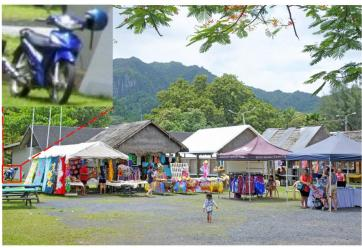

<details>
<summary>natural_image</summary>

Scenic outdoor market scene with vendor stalls, tents, and people under a backdrop of green hills (no visible text or symbols)
</details>

Question: Is the color of the motorcycle red or blue? (A) red (B) blue   
Evidence: There’s a <obj> motorcycle in image 1</obj> <box> [0, 1005, 100, 1106 ]</box> in front of a tent, and it’s blue.   
Answer: (B) blue

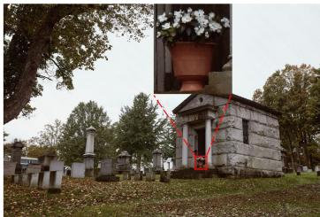

<details>
<summary>natural_image</summary>

Exterior view of a stone tomb with crenellations and a potted plant in the background (no signage or text visible)
</details>

Question: What is the color of the flower? (A) pink (B) yellow (C) red (D) white   
Evidence: The image depicts an old, historic cemetery   
with a grave and the <obj>flower in image 1</obj><box>   
[1355, 1072, 1428, 1155]</box>, which is white.   
Answer: (D) white

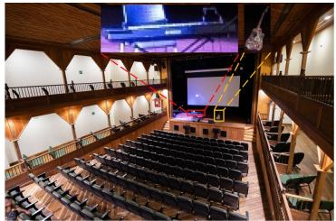

<details>
<summary>natural_image</summary>

Interior view of a large auditorium with tiered seating and a large projection screen (no visible text or symbols)
</details>

Question: Is the keyboard on the left or right side of the guitar? (A) left (B) right   
Evidence: The <obj>keyboard in image 1</obj><box>[1262,   
746, 1353, 770]</box> is on the left side of the <obj>   
guitar in image 1</obj><box>[1446, 731, 1488, 807]</box>.   
Answer: (A) left

Figure 10: Transfer example on V-Star after training on VideoEspresso. Model-predicted highresolution grounding and fine-grained recognition in a single-image setting.

(d)   
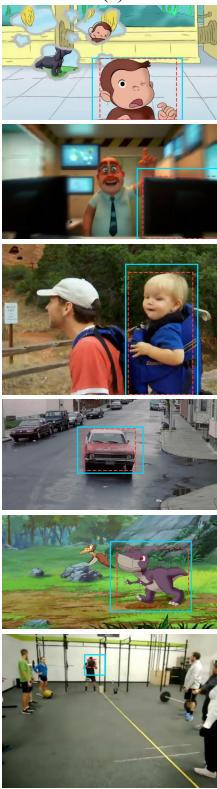

<details>
<summary>natural_image</summary>

Collage of cartoon character scenes including a monkey, a child in a park, a car, and outdoor basketball court (no visible text or symbols)
</details>

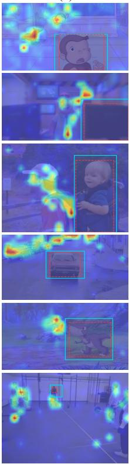

<details>
<summary>natural_image</summary>

Four-panel illustration showing a child in a room with heatmaps and bounding boxes, no text or symbols present.
</details>

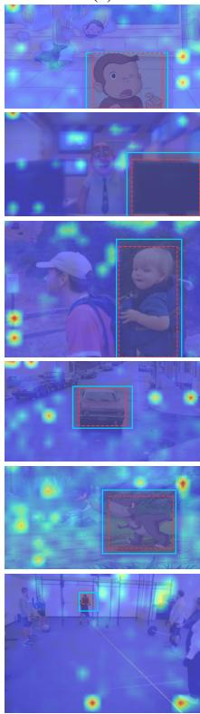

<details>
<summary>natural_image</summary>

Four-panel collage showing a child in a classroom setting, with inset photos of the child and students (no visible text or symbols)
</details>

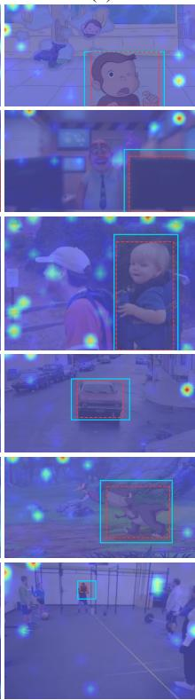

<details>
<summary>natural_image</summary>

Four-panel collage showing a child in a classroom setting, with bounding boxes highlighting the scene (no visible text or symbols)
</details>

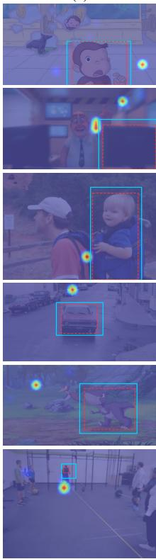

<details>
<summary>natural_image</summary>

Sequence of four-panel photo collage showing a man in a suit, a baby in a shirt, a basketball court, and a soccer ball, with bounding boxes highlighting the scenes (no readable text or symbols)
</details>

Figure 11: Differential cross-attention visualization within Sift. (a) Input image. (b–c) Positive and negative attention maps in DiffAttn, respectively. (d) Standard cross-attention replacing DiffAttn in Sift. (e) Cross-attention directly on raw ViT patch features. In (b–e), the shared query is the average-pooled feature over cyan-outlined patches overlapping the predicted box (red dashed). For clarity, each map is normalized to [0, 1] by its maximum value.

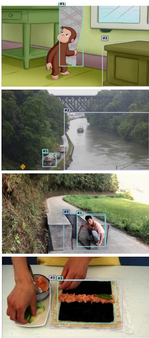

<details>
<summary>natural_image</summary>

Collage of four-panel image showing a monkey in a room, a river scene with boats, a rural path, and hands preparing food (no text or symbols)
</details>

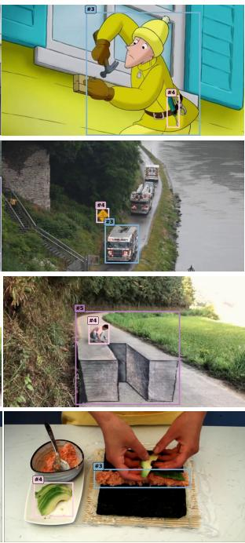

<details>
<summary>natural_image</summary>

Four-panel illustration showing a cartoon character in a yellow hat, a scenic river scene with boats and a bridge, a rural path with stone blocks, and a food preparation setup with vegetables (no text or symbols)
</details>

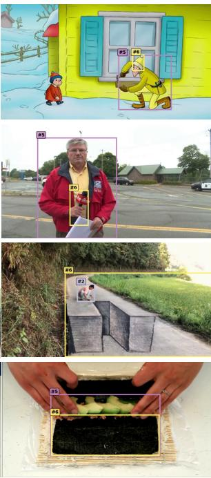

<details>
<summary>natural_image</summary>

Four-panel image showing a cartoon girl in winter clothing, a man holding a tablet, a street scene with boxes, and hands handling food containers (no visible text or symbols)
</details>

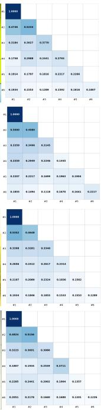  
Figure 12: VWS cross-attention visualization. We demonstrate Weave retrieving and aggregating relevant cues from previously routed objects into the current reasoning step.