# From Pixels to Words – Towards Native One-Vision Models at Scale

Haiwen Diao1,2\*, Jiahao Wang2, Penghao Wu1,2, Yuhao Dong1 Yuwei Niu2, Yue Zhu2, Zhongang Cai2, Weichen Fan1,2, Linjun Dai2 Silei Wu2, Xuanyu Zheng2, Mingxuan Li2, Yuanhan Zhang1, Bo Li1, Hanming Deng2 Huchuan Lu3, Quan Wang2, Lei Yang2, Lewei Lu2, Dahua Lin2, Ziwei Liu1† 1S-Lab, NTU 2SenseTime Research 3DLUT

Website: https://github.com/EvolvingLMMs-Lab/NEO

# Abstract

Current vision–language models (VLMs) typically stitch together separate image encoders and language decoders via multi-stage alignment, a modular framework that inevitably fragments pixel-level signals across frames and scatters early pixel–word interactions. In parallel, native VLMs, despite impressive performance on single images, remain largely unexplored in multi-image, video understanding, and spatial intelligence. Hence, we introduce NEO-ov, a native foundation model that learns cross-frame and pixel-word correspondence end-to-end, without any external encoders, auxiliary adapters, or post-hoc fusion. By eliminating module boundaries entirely, NEO-ov enables fine-grained and unified spatiotemporal modeling to emerge natively inside the model. Notably, NEO-ov largely narrows the gap to modular counterparts while excelling at finegrained visual perception, validating that native “one-vision” architectures are not only feasible but competitive at scale. Beyond empirical performance, we unveil systematic architectural analyses and detailed training recipes to facilitate subsequent native multimodal modeling.

# 1 Introduction

Recently, vision–language models (VLMs) have evolved from basic image perception towards advanced understanding of multi-image analysis, video understanding, and spatial intelligence. Existing models typically adopt an encoder–decoder architecture, where pretrained image (Radford et al., 2021; Zhai et al., 2023) or video (Li et al., 2025d; Zhang et al., 2025b) encoders produce visual representations that are subsequently processed by a projector (Liu et al., 2024a; Meng et al., 2024; Dai et al., 2023; Liao et al., 2025) and a large language model (LLM) (Touvron et al., 2023; Yang et al., 2025a) for visual understanding and reasoning.

Despite strong performance, this modular design imposes inherent constraints on 1) Flexibility: vision encoders are expected to process heterogeneous inputs, from single images to image sets or videos. Yet existing designs force a false dichotomy: image encoders favor static, framelevel representations and lack spatiotemporal reasoning, while video encoders overemphasize temporal dynamics and generalize poorly to singleimage or interleaved inputs. Besides, both struggle in early pixel–word interaction and unified visual understanding scenarios. 2) Efficiency: decoupling vision and language modules fragments training and incurs substantial post-alignment overhead. Furthermore, extending visual encoders to long-duration or high-resolution inputs remains prohibitively expensive for streaming and proactive video understanding, as KV caching is not applicable. 3) Scalability: modularity entangles scaling, optimization, and deployment by requiring delicate capacity balancing between VEs and LLMs. These frictions fundamentally preclude structural simplicity and deep vision–language integration, motivating a unified, monolithic backbone.

To address them, native VLMs have recently emerged as a compelling alternative. Early exemplars, e.g., Fuyu (Bavishi et al., 2023) and EVE (Diao et al., 2024) demonstrate that visual and textual inputs can be jointly modeled within one single and monolithic framework without explicit vision encoders. Building on this paradigm, subsequent efforts learn visual representations from scratch while mitigating vision–linguistic interference through visual feature distillation (Diao et al., 2024; Li et al., 2025e; Wang et al., 2025b), modality-agnostic embeddings (Diao et al., 2025a; Tao et al., 2025; Yan et al., 2025) and modalityspecific decomposition (Diao et al., 2025b; Luo et al., 2024, 2025). Notably, recent studies (Yi et al., 2025; Li et al., 2025c) extend native VLMs to video domains, enabling end-to-end modeling of fine-grained video–language interactions and temporal dependencies. However, these approaches remain constrained by distillation from static visual encoders, inheriting strong inductive biases rooted in pretrained image semantics. More importantly, unifying single-image, multiple-image, video understanding, and spatial intelligence simultaneously remains an open frontier for native VLMs toward truly unified one-vision foundation models across diverse multimodal applications.

Hence, we introduce NEO-ov, a native visionlanguage foundation model that eliminates pretrained encoders and unifies spatial and temporal modeling within a single monolithic backbone. Built on multiple native primitives, NEO-ov jointly learns visual perception, temporal dynamics, and cross-modal alignment directly from raw inputs through end-to-end training. Despite being fully encoder-free, NEO-ov surpasses existing native VLMs and approaches encoder-based competitors of the same LLMs across diverse benchmarks. Notably, it exhibits strong spatial intelligence across both low-level geometric perception and high-level spatiotemporal reasoning, enabling robust understanding of structure, motion, and long-range visual dependencies in a unified representation space. Together, these results suggest that multimodal intelligence may emerge not only from specialized components, but from architectures that are native, unified, and intrinsically multimodal.

# 2 Related Work

# 2.1 Modular Vision-Language Models

Existing vision-language models (VLMs) largely follow a modular design that connects external visual encoders to large language models (LLMs) through lightweight adapters (Alayrac et al., 2022; Dai et al., 2023). Notably, LLaVA (Liu et al., 2023a; Li et al., 2024a) standardizes this paradigm via the simple Encoder-MLP-LLM pipeline and visual instruction tuning, which is subsequently adopted by models such as InternVL series (Chen et al., 2024b; Zhu et al., 2025; Wang et al., 2025e), Qwen-VL series (Wang et al., 2024a; Bai et al., 2025b,a), and etc. They further extend this paradigm to unified visual understanding across single-image, multi-image, and video tasks.

Despite empirical success, they remain fundamentally constrained by the encode-then-project paradigm, where visual signals are compressed before reasoning begins. Pretrained vision encoders such as CLIP (Radford et al., 2021) or SigLIP (Zhai et al., 2023; Tschannen et al., 2025) are optimized primarily for image–text alignment, emphasizing high-level semantics while discarding texture, local geometry, and fine spatial structure. Consequently, language models reason over semantically filtered representations rather than native visual signals, limiting fine-grained perception and precise geometric reasoning. This limitation becomes particularly pronounced in spatial intelligence settings, where cross-view and cross-frame interactions are mediated through compressed semantic features instead of native spatial correspondences, hindering the modeling of positional relations, local motion, and pixel-level consistency across space and time.

# 2.2 Native Vision-Language Models

Native multimodal models move beyond modular pipelines by learning directly from pixels and words within a unified backbone. Early works such as Fuyu (Bavishi et al., 2023) and EVE (Diao et al., 2024, 2025b) demonstrate that image patches can be integrated directly into decoder-only Transformers without separate visual encoders, establishing the feasibility of fully native multimodal modeling. Subsequent efforts further improve this paradigm through visual encoder distillation (Diao et al., 2024; Li et al., 2025e; Wang et al., 2025b), modality-specific parameterization (Diao et al., 2025b; Luo et al., 2024, 2025), and shared multimodal representations (Diao et al., 2025a; Tao et al., 2025; Yan et al., 2025). Notably, NEO (Diao et al., 2025a) further formalizes native multimodal learning and substantially narrows the gap to strong modular VLMs through shared pixel–word representations and unified cross-modal reasoning.

Building on this direction, recent studies (Yi et al., 2025; Li et al., 2025c) extend native VLMs to the video domain, enabling end-to-end modeling of fine-grained video–language interactions and temporal dynamics. However, these efforts remain primarily focused on video understanding, without addressing broader multimodal settings involving single-image understanding, multi-image reasoning, spatial intelligence, and other unified perception tasks. In contrast, NEO-ov further advances this direction by extending native modeling from predominantly single-image settings to a unified framework spanning single-image, multi-image, and video inputs, moving native VLMs closer to a general one-vision foundation architecture.

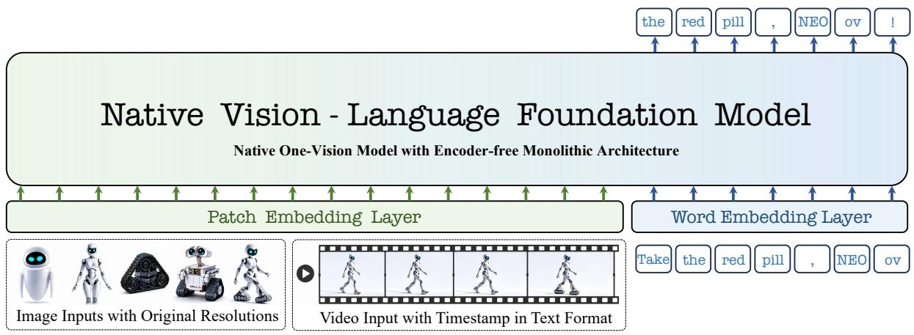

flowchart

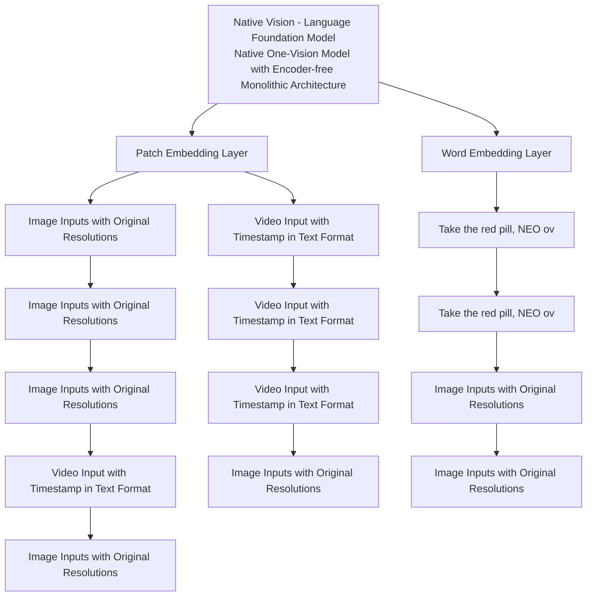

Figure 1: Overview of the NEO-ov model. Image or video inputs and text are encoded into token sequences via lightweight patch and word embeddings, then processed within a single decoder-only backbone composed of stacked native primitives, enabling efficient pixel–word and pixel–pixel alignment as well as spatial-temporal reasoning.

# 3 NEO-ov: Native One-Vision Modeling

NEO-ov is a native vision-language model that extends unified autoregressive modeling from singleimage understanding to multi-image understanding, video understanding, and spatial intelligence. By organizing images, frames, regions, and text into a unified sequence, NEO-ov naturally supports crossimage reasoning, temporal understanding, and spatial localization. To scale from single-image inputs to ordered visual sequences, we introduce a unified serialization scheme together with spatiotemporal attention mechanisms, enabling both high-level semantic reasoning and fine-grained spatial-temporal representation within one native backbone.

# 3.1 Revisiting Native Modeling

Following NEO (Diao et al., 2025a), NEO-ov adopts a unified native vision-language backbone. In Figure 1, we encode the image I into visual tokens by a lightweight embedding layer using two convolutional layers with a GELU activation:

$$
\boldsymbol {x} _ {v} = \operatorname{Conv} _ {2} (\operatorname{GELU} (\operatorname{Conv} _ {1} (\boldsymbol {I})) + \mathbf {P E}), \tag {1}
$$

$$
\pmb {x} _ {t} = \mathrm{Tokenizer} (\pmb {T}),
$$

where xv ∈ Rnv×d, $\pmb { x } _ { v } \in \mathbb { R } ^ { n _ { v } \times d } , \pmb { x } _ { t } \in \mathbb { R } ^ { n _ { t } \times d } .$ x ∈ Rnt×d, and PE denote visual, textual, and 2D RoPE embeddings (Su et al., 2024), respectively. The text input T is tokenized using original LLM tokenizer. Besides, Conv1 extracts patches with stride 16, while Conv2 aggregates local features with stride 2, producing one visual token for each 32 × 32 image region. The visual tokens are wrapped with  and </img>, concatenated with the text tokens, and jointly processed by one unified backbone. We initialize the Pre-Buffer and Post-LLM layers from NEO (Diao et al., 2025a) and Qwen3 (Yang et al., 2025a).

For attention heads, NEO-ov still adopts an explicit T HW -decoupled design that preserves the original LLM’s head dimension as the temporal component T , while introducing extra head dimensions for the spatial components H and W . This retains the temporal modeling capability inherited from the LLM while augmenting it with dedicated spatial modeling capacity. For tokens i and $j ,$ , the Query (Q) and Key (K) features are defined as:

$$
\mathbf {q} _ {i} = \left[ \mathbf {q} _ {i} ^ {T}; \mathbf {q} _ {i} ^ {H}; \mathbf {q} _ {i} ^ {W} \right], \quad \mathbf {k} _ {j} = \left[ \mathbf {k} _ {j} ^ {T}; \mathbf {k} _ {j} ^ {H}; \mathbf {k} _ {j} ^ {W} \right]. \tag {2}
$$

Their correlation is then defined as:

$$
s _ {i j} = \left\langle \mathbf {q} _ {i} ^ {T}, \mathbf {k} _ {j} ^ {T} \right\rangle + \left\langle \mathbf {q} _ {i} ^ {H}, \mathbf {k} _ {j} ^ {H} \right\rangle + \left\langle \mathbf {q} _ {i} ^ {W}, \mathbf {k} _ {j} ^ {W} \right\rangle . \tag {3}
$$

The T branch models textual order, cross-image relations, and cross-frame dependencies, while the H and W branches capture 2D spatial structure.

For rotary positional embedding (RoPE), we continue to implement Native-RoPE with separate temporal and spatial index modeling in Figure 2 (1):

$$
\mathrm{idx} _ {i} = \left[ t _ {i}, h _ {i}, w _ {i} \right], \tag {4}
$$

where $t _ { i }$ denotes the temporal or sequential positions, and $h _ { i } , w _ { i }$ denote the spatial coordinates. Text tokens retain only the temporal index, with $h _ { i }$ $= w _ { i } = 0$ , whereas image tokens share the same temporal index within each image and use $h _ { i }$ and $w _ { i }$ to encode spatial positions. Temporal indices remain continuous across modalities, while spatial indices are independently defined within each image.

(1) Native Rotary Position Embedding (Native RoPE)   
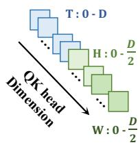

flowchart

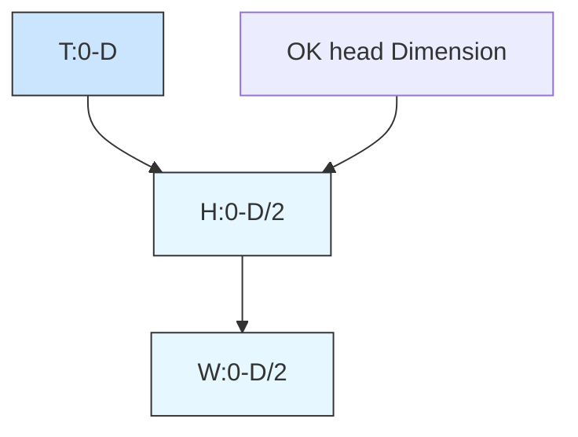

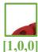

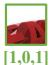

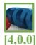

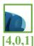

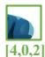

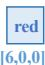

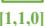

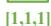

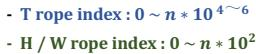

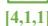

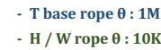

(2) Native Attention   
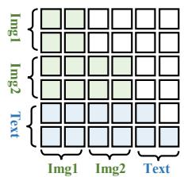

text_image

Img1
Img2
Text
Img1
Img2
Text

Figure 2: Overview of native rotary position embeddings and spatial-temporal attention. It unifies bidirectional spatial interactions within images with causal dependencies across text and video frames via T HW -aware frequency, channel, and index allocation, enabling unified modeling across single-image, multi-image, and video understanding.

# 3.2 Unified Visual Serialization

For one single image, the model inserts one visual segment at the corresponding  position. For multi-image inputs, each  token in the prompt is replaced by an independent visual segment, following the textual order in which it appears. As a result, multiple images are represented as distinct visual units in the same sequence:

$$
\mathbf {X} _ {\text {multi}} = \left[ \boldsymbol {x} _ {t _ {1}}, <   \mathrm{img} > \boldsymbol {x} _ {v _ {1}} <   / \mathrm{img} >, \dots , \right. \tag {5}
$$

$$
\left. \boldsymbol {x} _ {t _ {m}}, <   \mathrm{img} > \boldsymbol {x} _ {v _ {m}} <   / \mathrm{img} >, \mathbf {q} \right].
$$

Here, $\scriptstyle { \pmb x } _ { v _ { k } }$ denotes the visual segment of the k-th image. Each image is independently encoded at arbitrary resolution, so that the number of visual tokens adapts to its spatial size rather than being constrained to a fixed token budget. This allows different images to preserve visual details at different granularities, which is beneficial for fine-grained comparison and spatially sensitive tasks.

For video inputs, NEO-ov represents the video as a temporally ordered sequence of sampled frames rather than a single global embedding. Specifically, we sample $f$ frames from the raw video and serialize each frame as an image unit associated with a timestamp. Here we further prepend temporal cues to facilitate temporal localization and cross-frame reasoning. Given sampled frames with timestamps $\tau _ { 1 } , \ldots , \tau _ { f }$ , the video input is written as

$$
\mathbf {X} _ {\text {video}} = \left[ \mathbf {p} _ {\text {global}}, \left[ \tau_ {1} \right]: <   \mathrm{img} > \mathbf {x} _ {v _ {1}} <   / \mathrm{img} >, \dots , \right. \tag {6}
$$

$$
\left[ \tau_ {f} \right]: <   \mathrm{img} > \mathbf {x} _ {v _ {f}} <   / \mathrm{img} >, \mathbf {q} ].
$$

Here, $\mathbf { p } _ { \mathrm { g l o b a l } }$ denotes a global prefix encoding the video duration, the number of sampled frames, and the sampling rate when available. Temporal information is conveyed jointly with explicit timestamps and frame order within the unified sequence, allowing video understanding to emerge naturally within the same framework as multi-image understanding.

# 3.3 Unified Spatial-Temporal Attention

Compared with single-image modeling, the central challenge in multi-image and video understanding lies not merely in handling longer sequences, but in enabling coherent interactions across multiple visual units within a unified backbone. To address this, we extend native mixed attention from a single visual unit to multiple images and temporally ordered video frames, allowing spatial and temporal dependencies to emerge jointly within the same end-to-end autoregressive framework.

In Figure 2 (2), we treat each image or sampled frame as an independent visual unit. Tokens within the same visual unit attend bidirectionally, while interactions across different visual units remain autoregressive. Let $u _ { i }$ denote the visual unit index of token $i ,$ where $u _ { i } = 0$ indicates a text token and $u _ { i } > 0$ denotes a visual token from an image or video frame. The attention mask is defined as

$$
\mathcal {M} _ {i j} = 1 \iff (j \leq i) \vee (u _ {i} = u _ {j} > 0). \tag {7}
$$

This design yields two important properties. First, tokens within the same visual unit attend bidirectionally, enabling dense spatial interactions inside each image or frame and allowing rich intraimage structure to be modeled directly. Second, interactions across different visual units remain causal, such that each unit can attend to all preceding text and visual tokens. Unlike modular VLMs, where cross-image or cross-frame reasoning operates on representations already compressed by an external visual encoder, our design allows interactions to emerge directly from patch-level tokens at the earliest layers of the backbone and evolve progressively throughout the network. Consequently, cross-image comparison and temporal reasoning are refined jointly from shallow to deep layers, enabling more precise modeling of fine-grained visual differences and subtle temporal dynamics.

Stage 1:		Pre-Training   
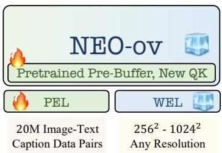

text_image

NEO-ov
Pretrained Pre-Buffer, New QK
PEL
20M Image-Text
Caption Data Pairs
WEL
256² - 1024²
Any Resolution

Stage 2:		Mid-Training   
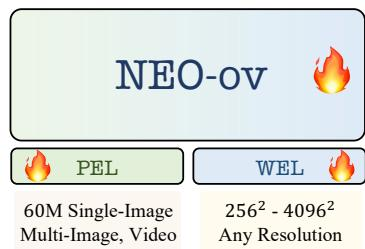

text_image

NEO-ov
PEL
60M Single-Image
Multi-Image, Video
WEL
256² - 4096²
Any Resolution

Stage 3:	 Supervised	Fine-Tuning   
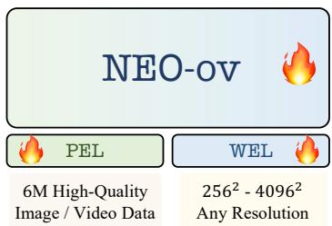

text_image

NEO-ov
PEL
WEL
6M High-Quality
Image / Video Data
256² - 4096²
Any Resolution

Figure 3: Overview of three-stage training recipe. NEO-ov first aligns the Pre-Buffer with the post-LLM using large-scale image-text data while preserving the language abilities of the pretrained LLM. After that, it is optimized with diverse image and video training data to improve spatial-temporal reasoning. Finally, high-quality instruction tuning data further enhances general multimodal understanding, fine-grained perception, and temporal dynamics.

# 3.4 Training Procedure

Our training covers three progressive stages: pretraining, mid-training, and supervised fine-tuning.

Pre-Training Stage. At this stage, the model develops foundational visual perception while progressively aligning visual representations with the semantic space of the pretrained language backbone. Training is conducted on approximately 20M large-scale image–text pairs collected from diverse web sources, spanning both descriptive captions and OCR-intensive content. To preserve the linguistic priors of the pretrained LLM and ensure stable multimodal adaptation, optimization is restricted to the patch embedding layers, pre-buffer layers, and newly introduced QK-related parameters. An autoregressive next-token objective aligns visual tokens with the LLM representation space, while pretrained buffer initialization and expanded QK capacity allow visual specialization to emerge without compromising language performance.

Mid-Training Stage. This stage focuses on scaling spatial-temporal reasoning and enhancing perception over high-resolution visual content. Training continues on nearly 60M multimodal samples, covering resolutions from $2 5 6 ^ { 2 }$ to $4 0 9 6 ^ { 2 }$ and videos of up to 128 frames. At this stage, all model layers are jointly optimized to strengthen crossmodal interaction and contextual coherence across both pixel-world and pixel-pixel relations. The context length is progressively extended from 16K to 36K tokens, enabling more effective modeling of high-resolution inputs and long video sequences. To support diverse application scenarios, we adopt a unified mixture of text-only, image-text, multiimage, and video-text data with an approximate ratio of 2:4:1:1, improving optimization stability and generalization across heterogeneous tasks.

Supervised Fine-Tuning Stage. In this stage, the model is refined using high-quality instructiontuning data, including approximately 4M singleimage, 1M multi-image, and 1M video samples, to enhance multimodal understanding and crossframe reasoning. The training corpus covers visual question answering, OCR understanding, finegrained perception, temporal reasoning, mathematical analysis, and complex dialogue. The entire model is optimized end-to-end under next-token prediction objectives, further strengthening finegrained perception, long-context reasoning, and temporal dynamics modeling. Combined with multi-resolution training up to $4 0 9 6 ^ { 2 }$ and videos of up to 128 frames, this stage equips the model with strong generalization across a wide range of real-world multimodal visual understanding tasks.

# 4 Experiment

# 4.1 Implementation Details

The NEO-ov model is trained on sixteen 8-GPU nodes, each equipped with 80 GB GPUs. Here we use the AdamW optimizer (Loshchilov and Hutter, 2019) with cosine learning-rate decay and a warmup ratio of 0.01. The peak learning rates for the three training stages are set to $2 \times 1 0 ^ { - 4 } , 5 \times 1 0 ^ { - 5 }$ , and $5 \times 1 0 ^ { - 5 }$ , respectively. We use Qwen3-1.7B and Qwen3-8B (Yang et al., 2025a) as the language backbones. The pre-buffer module consists of 12 layers for NEO-ov (2B) and 6 layers for NEO-ov (9B). The native RoPE base frequencies, $\theta _ { T } , \theta _ { H }$ , and $\theta _ { W }$ , are fixed at $1 \times 1 0 ^ { 6 } , 1 \times 1 0 ^ { 4 }$ , and $1 \times 1 0 ^ { 4 }$ .

# 4.2 Main Results

We evaluate NEO-ov using VLMEvalKit (Duan et al., 2024) on three domains: image understanding, video understanding, and spatial intelligence.

<table><tr><td rowspan="2">Model</td><td colspan="6">General VQA Understanding</td><td colspan="5">OCR Recognition</td></tr><tr><td>MMMU</td><td>MMB</td><td>RWQA</td><td>MMStar</td><td>SEED-I</td><td>HallB</td><td>AI2D</td><td>DocVQA</td><td>ChartQA</td><td>TextVQA</td><td>OCRBench</td></tr><tr><td colspan="12">▼ Modular Vision-Language Models (Instruct-2B)</td></tr><tr><td>Qwen2-VL</td><td>41.1</td><td>74.9</td><td>62.6</td><td>48.0</td><td>-</td><td>41.7</td><td>74.7</td><td>90.1</td><td>73.5</td><td>79.7</td><td>80.9</td></tr><tr><td>InternVL3</td><td>48.6</td><td>81.1</td><td>64.3</td><td>60.7</td><td>-</td><td>42.5</td><td>78.7</td><td>88.3</td><td>80.2</td><td>77.0</td><td>83.5</td></tr><tr><td>InternVL3.5</td><td>53.0</td><td>78.2</td><td>62.0</td><td>62.7</td><td>75.3</td><td>48.6</td><td>78.8</td><td>89.4</td><td>80.7</td><td>76.5</td><td>83.6</td></tr><tr><td>Qwen3-VL</td><td>53.4</td><td>78.4</td><td>63.9</td><td>58.3</td><td>-</td><td>51.4</td><td>76.9</td><td>93.3</td><td>79.1</td><td>-</td><td>85.8</td></tr><tr><td colspan="12">▼ Native Vision-Language Models (Instruct-2B)</td></tr><tr><td>Mono-VL</td><td>33.7</td><td>65.5</td><td>-</td><td>-</td><td>67.4</td><td>34.8</td><td>68.6</td><td>80.0</td><td>73.7</td><td>72.6</td><td>76.7</td></tr><tr><td>Mono-VL1.5</td><td>39.1</td><td>64.0</td><td>-</td><td>-</td><td>66.9</td><td>32.5</td><td>67.4</td><td>81.7</td><td>72.2</td><td>73.7</td><td>80.1</td></tr><tr><td>HoVLE</td><td>32.2</td><td>73.3</td><td>-</td><td>-</td><td>70.9</td><td>38.4</td><td>73.0</td><td>86.1</td><td>78.6</td><td>70.9</td><td>74.0</td></tr><tr><td>OneCAT</td><td>39.0</td><td>72.4</td><td>-</td><td>-</td><td>70.9</td><td>-</td><td>72.4</td><td>87.1</td><td>76.2</td><td>67.0</td><td>-</td></tr><tr><td>NEO</td><td>48.6</td><td>76.0</td><td>63.1</td><td>54.2</td><td>74.2</td><td>43.1</td><td>80.1</td><td>89.9</td><td>81.2</td><td>74.0</td><td>77.1</td></tr><tr><td>NEO-ov</td><td>54.7</td><td>80.0</td><td>64.4</td><td>58.6</td><td>76.2</td><td>54.5</td><td>81.4</td><td>91.2</td><td>83.1</td><td>77.3</td><td>81.2</td></tr><tr><td colspan="12">▼ Modular Vision-Language Models (Instruct-8B)</td></tr><tr><td>Qwen2.5-VL</td><td>55.0</td><td>83.5</td><td>68.5</td><td>63.9</td><td>-</td><td>52.9</td><td>83.9</td><td>95.7</td><td>87.3</td><td>84.9</td><td>86.4</td></tr><tr><td>InternVL3</td><td>62.7</td><td>83.4</td><td>70.8</td><td>68.2</td><td>-</td><td>49.9</td><td>85.2</td><td>92.7</td><td>86.6</td><td>80.2</td><td>88.0</td></tr><tr><td>InternVL3.5</td><td>68.1</td><td>82.7</td><td>67.5</td><td>69.3</td><td>77.1</td><td>54.5</td><td>84.0</td><td>92.3</td><td>86.7</td><td>78.2</td><td>84.0</td></tr><tr><td>Qwen3-VL</td><td>69.6</td><td>84.5</td><td>71.5</td><td>70.9</td><td>-</td><td>61.1</td><td>85.7</td><td>96.1</td><td>89.6</td><td>-</td><td>89.6</td></tr><tr><td colspan="12">▼ Native Vision-Language Models (Instruct-8B)</td></tr><tr><td>Fuyu</td><td>27.9</td><td>10.7</td><td>43.7</td><td>-</td><td>59.3</td><td>-</td><td>64.5</td><td>-</td><td>-</td><td>-</td><td>36.6</td></tr><tr><td>EVE</td><td>32.6</td><td>52.3</td><td>-</td><td>-</td><td>64.6</td><td>26.4</td><td>61.0</td><td>53.0</td><td>59.1</td><td>56.8</td><td>39.8</td></tr><tr><td>SOLO</td><td>-</td><td>67.7</td><td>44.7</td><td>-</td><td>64.4</td><td>-</td><td>61.4</td><td>-</td><td>-</td><td>-</td><td>12.6</td></tr><tr><td>EVEv2</td><td>39.3</td><td>66.3</td><td>62.4</td><td>-</td><td>71.4</td><td>-</td><td>74.8</td><td>-</td><td>73.9</td><td>71.1</td><td>70.2</td></tr><tr><td>BREEN</td><td>42.7</td><td>71.4</td><td>-</td><td>51.2</td><td>-</td><td>37.0</td><td>76.4</td><td>-</td><td>-</td><td>65.7</td><td>-</td></tr><tr><td>VoRA</td><td>32.0</td><td>61.3</td><td>60.1</td><td>-</td><td>68.9</td><td>-</td><td>61.1</td><td>-</td><td>-</td><td>58.7</td><td>-</td></tr><tr><td>SAIL</td><td>-</td><td>70.1</td><td>63.9</td><td>53.1</td><td>72.9</td><td>54.2</td><td>76.7</td><td>-</td><td>-</td><td>77.1</td><td>78.3</td></tr><tr><td>NEO</td><td>54.6</td><td>82.1</td><td>67.3</td><td>62.4</td><td>76.3</td><td>46.4</td><td>83.1</td><td>88.6</td><td>82.1</td><td>75.0</td><td>77.7</td></tr><tr><td>NEO-ov</td><td>68.1</td><td>85.1</td><td>67.8</td><td>67.3</td><td>76.6</td><td>59.8</td><td>85.4</td><td>91.9</td><td>86.2</td><td>78.5</td><td>81.6</td></tr></table>

Table 1: Comparison with existing popular VLMs on general VQA and OCR benchmarks.

Image Understanding. We test NEO-ov on general visual perception and reasoning benchmarks such as MMMU (Yue et al., 2024), MMBench-EN (MMB) (Liu et al., 2024b), RealWorldQA (RWQA) (xAI, 2024), MMStar (Chen et al., 2024a), and SEEDBench-IMG (SEED-I) (Li et al., 2023); document, diagram, chart, and text understanding benchmarks including AI2D (Kembhavi et al., 2016), DocVQA (Clark and Gardner, 2018), ChartQA (Masry et al., 2022), InfoVQA (Mathew et al., 2022), TextVQA (Singh et al., 2019), and OCRBench (Liu et al., 2023b); hallucination task on HallusionBench (HallB) (Guan et al., 2024).

Comparison with Native VLMs. As shown in Table 1, NEO-ov establishes a new performance frontier for native VLMs at both 2B and 8B scales, consistently surpassing prior native architectures including NEO (Diao et al., 2025a), EVE series (Diao et al., 2024, 2025b), Mono-InternVL series (Luo et al., 2024, 2025), OneCAT (Li et al., 2025b), Emu3 (Wang et al., 2024b), and SAIL (Lei et al., 2025). The gains are particularly pronounced on reasoning-intensive and hallucination-sensitive benchmarks such as MMMU, HallB, and InfoVQA, demonstrating that native end-to-end modeling can unlock strong visual reasoning and representation learning even without external visual encoders. It further underscores the scalability and emerging competitiveness of the native one-vision paradigm.

Comparison with Modular VLMs. Beyond native models, NEO-ov also demonstrates strong competitiveness against leading modular VLMs such as InternVL3.5 (Wang et al., 2025e) and Qwen3- VL (Bai et al., 2025a). Despite operating without pretrained visual encoders, NEO-ov matches or surpasses its modular counterpart (Wang et al., 2025e) on several reasoning and perception benchmarks, particularly in complex reasoning and hallucination suppression. While OCR-intensive tasks remain challenging, native architectures are rapidly closing the gap with modular systems across diverse image understanding benchmarks. Overall, these findings further validate the competitiveness and scalability of fully native multimodal modeling.

<table><tr><td rowspan="2">Model</td><td colspan="2">Multi-Image</td><td colspan="6">Video Understanding</td></tr><tr><td>BLINK</td><td>MUIRBENCH</td><td>VideoMME</td><td>MVBench</td><td>LVBench</td><td>MLVU</td><td>LongVideoBench</td><td>VideoMMMU</td></tr><tr><td colspan="9">▼ Modular Vision-Language Models (Instruct-2B)</td></tr><tr><td>VideoLLaMA3</td><td>44.2</td><td>-</td><td>59.6</td><td>65.5</td><td>41.6</td><td>65.4</td><td>57.1</td><td>-</td></tr><tr><td>InternVL3.5</td><td>51.3</td><td>44.0</td><td>58.4</td><td>65.9</td><td>37.6</td><td>64.4</td><td>57.4</td><td>42.7</td></tr><tr><td>Qwen3-VL</td><td>53.8</td><td>47.4</td><td>61.9</td><td>61.7</td><td>47.4</td><td>68.3</td><td>55.6</td><td>41.9</td></tr><tr><td colspan="9">▼ Native Vision-Language Models (Instruct-2B)</td></tr><tr><td>ELVA</td><td>-</td><td>-</td><td>41.8</td><td>43.5</td><td>-</td><td>47.6</td><td>-</td><td>-</td></tr><tr><td>NEO-ov</td><td>53.9</td><td>56.8</td><td>60.4</td><td>65.7</td><td>43.3</td><td>64.8</td><td>56.8</td><td>42.3</td></tr><tr><td colspan="9">▼ Modular Vision-Language Models (Instruct-8B)</td></tr><tr><td>LLaVA-Video</td><td>-</td><td>-</td><td>63.3</td><td>58.6</td><td>44.2</td><td>70.8</td><td>58.2</td><td>-</td></tr><tr><td>VideoLLaMA3</td><td>56.7</td><td>-</td><td>66.2</td><td>69.7</td><td>45.3</td><td>73.0</td><td>59.8</td><td>-</td></tr><tr><td>InternVL3.5</td><td>59.5</td><td>55.8</td><td>66.0</td><td>72.1</td><td>45.9</td><td>70.2</td><td>62.1</td><td>54.9</td></tr><tr><td>Qwen3-VL</td><td>69.1</td><td>64.4</td><td>71.4</td><td>68.7</td><td>58.0</td><td>78.1</td><td>63.6</td><td>65.3</td></tr><tr><td colspan="9">▼ Native Vision-Language Models (Instruct-8B)</td></tr><tr><td>Fuyu</td><td>-</td><td>-</td><td>28.7</td><td>31.6</td><td>-</td><td>31.1</td><td>-</td><td>-</td></tr><tr><td>EVE</td><td>-</td><td>-</td><td>29.3</td><td>34.9</td><td>-</td><td>36.8</td><td>-</td><td>-</td></tr><tr><td>ELVA</td><td>-</td><td>-</td><td>47.1</td><td>51.2</td><td>-</td><td>51.8</td><td>-</td><td>-</td></tr><tr><td>NEO-ov</td><td>62.8</td><td>58.2</td><td>67.4</td><td>70.7</td><td>46.4</td><td>69.3</td><td>63.5</td><td>51.6</td></tr></table>

Table 2: Comparison with existing popular VLMs on multi-image and video benchmarks. 

<table><tr><td>Model</td><td>VSI-Bench</td><td>MMSI</td><td>Mindcube</td><td>ViewSpatial</td><td>SITE</td><td>3DSR</td><td>EmbSpatial</td><td>SPAR</td><td>Omni-Spatial</td></tr><tr><td colspan="10">▼ Spatial-specialist Models (Instruct-2B)</td></tr><tr><td>Cambrian-S (3B)</td><td>56.1</td><td>27.0</td><td>38.4</td><td>41.0</td><td>31.0</td><td>41.4</td><td>63.5</td><td>33.0</td><td>41.9</td></tr><tr><td>Sensenova-SI</td><td>63.7</td><td>34.2</td><td>41.8</td><td>52.7</td><td>36.8</td><td>50.5</td><td>62.8</td><td>38.0</td><td>26.4</td></tr><tr><td colspan="10">▼ General-purpose Models (Instruct-2B)</td></tr><tr><td>InternVL3.5</td><td>53.8</td><td>25.6</td><td>42.1</td><td>37.9</td><td>34.8</td><td>31.4</td><td>61.5</td><td>32.4</td><td>44.4</td></tr><tr><td>Qwen3-VL</td><td>53.9</td><td>27.8</td><td>34.2</td><td>36.7</td><td>35.8</td><td>47.6</td><td>69.2</td><td>34.1</td><td>36.3</td></tr><tr><td>NEO-ov</td><td>58.4</td><td>33.6</td><td>77.2</td><td>52.8</td><td>38.4</td><td>52.9</td><td>63.8</td><td>41.2</td><td>43.1</td></tr><tr><td colspan="10">▼ Spatial-specialist Models (Instruct-8B)</td></tr><tr><td>Cambrian-S</td><td>67.5</td><td>25.8</td><td>39.6</td><td>40.9</td><td>33.0</td><td>45.0</td><td>72.8</td><td>37.9</td><td>41.9</td></tr><tr><td>Sensenova-SI</td><td>68.8</td><td>43.3</td><td>85.7</td><td>54.7</td><td>47.7</td><td>55.5</td><td>72.0</td><td>45.8</td><td>33.0</td></tr><tr><td>GeoThinker</td><td>72.6</td><td>30.9</td><td>83.0</td><td>45.9</td><td>55.9</td><td>51.9</td><td>78.8</td><td>68.2</td><td>40.1</td></tr><tr><td colspan="10">▼ General-purpose Models (Instruct-8B)</td></tr><tr><td>InternVL3.5</td><td>56.3</td><td>29.1</td><td>40.4</td><td>40.0</td><td>54.4</td><td>35.3</td><td>75.7</td><td>38.2</td><td>47.8</td></tr><tr><td>Qwen3-VL</td><td>59.4</td><td>31.2</td><td>29.6</td><td>41.9</td><td>45.4</td><td>52.9</td><td>77.8</td><td>40.3</td><td>47.0</td></tr><tr><td>NEO-ov</td><td>64.8</td><td>41.3</td><td>90.0</td><td>55.2</td><td>54.3</td><td>61.7</td><td>78.8</td><td>48.8</td><td>45.0</td></tr></table>

Table 3: Comparison with existing popular VLMs on spatial intelligence benchmarks.

Multi-Image and Video Understanding. Compared with prior native VLMs such as Fuyu (Bavishi et al., 2023), EVE (Diao et al., 2024), and ELVA (Li et al., 2025c) in Table 2, NEO-ov achieves substantial gains on VideoMME (Fu et al., 2025), MVBench (Li et al., 2024b), and MLVU (Zhou et al., 2025), highlighting its strong temporal reasoning and long-context visual understanding capabilities at both 2B and 8B scales. It also remains highly competitive with several modular VLMs, including VideoLLaMA3 (Zhang et al., 2025a) and InternVL3.5 (Wang et al., 2025e) on

BLINK (Fu et al., 2024), MUIRBENCH (Wang et al., 2025a), LVBench (Wang et al., 2025d), LongVideoBench (Wu et al., 2024), and VideoM-MMU (Hu et al., 2025). These results indicate that a unified native backbone can naturally support cross-image reasoning and temporal association within a single autoregressive framework.

Spatial Intelligence. In Table 3, NEO-ov displays strong spatial intelligence across geometric reasoning, spatial perception, and embodied understanding benchmarks. Compared with spatialspecialist models such as Cambrian-S (Yang et al.,

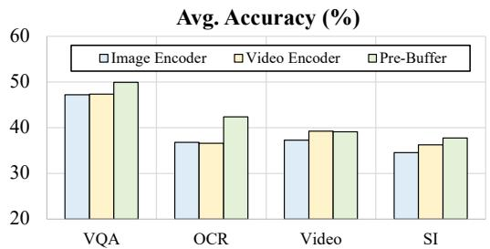

bar

Avg. Accuracy (%)
| Category | Image Encoder (%) | Video Encoder (%) | Pre-Buffer (%) |
| :--- | :--- | :--- | :--- |
| VQA | 47 | 47 | 50 |
| OCR | 36 | 36 | 42 |
| Video | 37 | 39 | 39 |
| SI | 34 | 36 | 38 |

Figure 4: Pre-Buffer vs. VEs on diverse tasks.

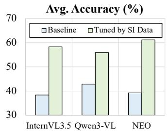

bar

Avg. Accuracy (%)
| Model | Baseline (%) | Tuned by SI Data (%) |
|---|---|---|
| InternVL3.5 | 38 | 58 |
| Qwen3-VL | 43 | 56 |
| NEO | 39 | 61 |

Figure 5: Finetuned on SI data.

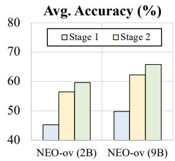

bar

Avg. Accuracy (%)
| Category | Stage 1 (%) | Stage 2 (%) |
|---|---|---|
| NEO-ov (2B) | 45 | 56 |
| NEO-ov (9B) | 50 | 62 |
| Average Accuracy (%) | | |

Figure 6: Three stages.

2025c), Sensenova-SI (Cai et al., 2025), and Geo-Thinker (Li et al., 2026), NEO-ov, as a generalpurpose native VLM, achieves comparable or even better performance at both 2B and 8B scales. In particular, NEO-ov shows clear advantages over other general VLMs on VSI-Bench (Yang et al., 2025b), MMSI (Yang et al., 2025d), Mindcube-tiny (Mindcube) (Wang et al., 2025c), ViewSpatial (Li et al., 2025a), SITE (Wang et al., 2025f), 3DSR (Ma et al., 2025), EmbSpatial (Du et al., 2024), SPAR (Zhang et al., 2026), and Omni-Spatial (manual CoT) (Jia et al., 2025), highlighting its ability to capture finegrained spatial and geometric representations.

# 4.3 Ablation Studies

Native Attention vs. Encoder-based Attention. Figure 4 compares the Pre-Buffer mechanism with conventional visual encoders across diverse tasks, including general VQA, OCR, video understanding (Video), and spatial intelligence (SI). Both architectures are randomly initialized for fair comparison. In image encoders, attention is restricted to bidirectional interactions among visual tokens within the same image, while video encoders further extend such interactions across frames. We can observe that Pre-Buffer consistently achieves competitive or superior performance across all benchmarks, especially on OCR and SI tasks, where fine-grained visual structure and long-range spatial dependencies are especially critical. These gains suggest that preserving richer intermediate visual context through native pixel-pixel and pixel-word interactions is more effective than relying solely on compressed image- or video-level representations. Moreover, the consistent performance across VQA, OCR, Video, and SI benchmarks highlights the strong generalization capability of native architectures under diverse multimodal scenarios.

Deep Interactions Benefit Spatial Intelligence. Figure 5 highlights a clear advantage of native architectures on spatial intelligence tasks. Although all models benefit from additional SI supervision, NEO shows substantially larger gains than encoderbased models such as InternVL3.5 and Qwen3-VL. We attribute this to the native interaction pattern of NEO, where pixel-pixel and pixel-word interactions emerge directly in shallow layers of the unified backbone, enabling richer spatial and crossmodal representations from the early fusion.

Performance Improvements across Stages. Figure 6 illustrates performance evolution across all single-image, multi-image, video, and spatial intelligence benchmarks. Performance improves consistently from Stage 1 to Stage 2 for both the 2B and 9B variants of NEO-ov, with especially pronounced gains at smaller scales. These results suggest that progressive training effectively strengthens general visual understanding and leads to more robust multimodal capabilities across diverse tasks.

# 5 Conclusion

In this paper, we launch NEO-ov, a fully native vision–language foundation model that unifies singleimage understanding, multi-image reasoning, video comprehension, and spatial intelligence within a single monolithic backbone. Unlike conventional modular VLMs, NEO-ov learns visual perception, temporal dynamics, and cross-modal correspondence directly from raw inputs through end-toend training, without relying on external visual encoders. Extensive experiments demonstrate that NEO-ov achieves competitive performance against strong encoder-based counterparts while showing clear advantages in fine-grained perception and spatial reasoning. Beyond empirical results, our findings suggest that unified native architectures provide a promising path toward scalable and generalpurpose one-vision foundation models.

# 6 Limitations

Despite the strong empirical performance of NEOov, several challenges remain open for future exploration. First, although NEO-ov substantially advances native vision-language modeling, a gap still exists between NEO-ov and top-tier modular systems such as Qwen3-VL on certain single-image and video understanding benchmarks. We believe this gap is largely attributable to the current scale and quality of multimodal training data, particularly for complex reasoning, temporal perception, and fine-grained visual-text alignment.

Second, OCR-intensive and document-centric tasks remain relatively underexplored for native architectures. Unlike modular VLMs that benefit from specialized visual encoders and extensive OCR-oriented pretraining, NEO-ov currently lacks sufficiently diverse and high-quality supervision for documents, charts, and dense text perception. We expect that improving OCR-related data scales and quality will further strengthen them.

Finally, while NEO-ov already shows promising capabilities in multi-image reasoning, video understanding, and spatial intelligence, the broader potential of native multimodal modeling remains far from fully explored. Further scaling in model capacity, multimodal data diversity, and long-context training may unlock substantially stronger multimodal reasoning and perception capabilities.

# 7 Ethical Considerations

All resources are drawn from open-access datasets with explicitly defined usage policies. Our work seeks to advance multimodal learning capabilities without introducing ethical or safety concerns beyond those already associated with existing models. Nevertheless, risks such as dataset biases and potential misuse cannot be entirely ruled out. We emphasize the importance of careful data curation, responsible deployment, and transparent reporting as essential practices to mitigate these challenges.

During manuscript preparation, large language models were used solely as writing assistants. They helped to check grammar, refine sentence structure, and provide style alternatives. All content related to methodology, experiments, and conclusions was developed entirely by the authors. LLM outputs were reviewed critically, and only human-verified edits were incorporated into the final text.

# References

Jean-Baptiste Alayrac, Jeff Donahue, Pauline Luc, Antoine Miech, Iain Barr, Yana Hasson, Karel Lenc, Arthur Mensch, Katherine Millican, Malcolm Reynolds, Roman Ring, Eliza Rutherford, Serkan Cabi, Tengda Han, Zhitao Gong, Sina Samangooei, Marianne Monteiro, Jacob L. Menick, Sebastian Borgeaud, and 8 others. 2022. Flamingo: a visual language model for few-shot learning. In Advances of Neural Information Processing Systems, New Orleans, LA, USA.   
Shuai Bai, Yuxuan Cai, Ruizhe Chen, Keqin Chen, Xionghui Chen, Zesen Cheng, Lianghao Deng, Wei Ding, Chang Gao, Chunjiang Ge, Wenbin Ge, Zhifang Guo, Qidong Huang, Jie Huang, Fei Huang, Binyuan Hui, Shutong Jiang, Zhaohai Li, Mingsheng Li, and 45 others. 2025a. Qwen3-vl technical report. CoRR, abs/2511.21631.   
Shuai Bai, Keqin Chen, Xuejing Liu, Jialin Wang, Wenbin Ge, Sibo Song, Kai Dang, Peng Wang, Shijie Wang, Jun Tang, Humen Zhong, Yuanzhi Zhu, Ming-Hsuan Yang, Zhaohai Li, Jianqiang Wan, Pengfei Wang, Wei Ding, Zheren Fu, Yiheng Xu, and 8 others. 2025b. Qwen2.5-vl technical report. CoRR, abs/2502.13923.   
Rohan Bavishi, Erich Elsen, Curtis Hawthorne, Maxwell Nye, Augustus Odena, Arushi Somani, and Sagnak Ta¸sırlar. 2023.˘ Introducing our multimodal models.   
Zhongang Cai, Ruisi Wang, Chenyang Gu, Fanyi Pu, Junxiang Xu, Yubo Wang, Wanqi Yin, Zhitao Yang, Chen Wei, Qingping Sun, and 1 others. 2025. Scaling spatial intelligence with multimodal foundation models. arXiv preprint arXiv:2511.13719.   
Lin Chen, Jinsong Li, Xiaoyi Dong, Pan Zhang, Yuhang Zang, Zehui Chen, Haodong Duan, Jiaqi Wang, Yu Qiao, Dahua Lin, and Feng Zhao. 2024a. Are we on the right way for evaluating large vision-language models? In Advances of Neural Information Processing Systems, Vancouver, BC, Canada.   
Zhe Chen, Weiyun Wang, Yue Cao, Yangzhou Liu, Zhangwei Gao, Erfei Cui, Jinguo Zhu, Shenglong Ye, Hao Tian, Zhaoyang Liu, Lixin Gu, Xuehui Wang, Qingyun Li, Yimin Ren, Zixuan Chen, Jiapeng Luo, Jiahao Wang, Tan Jiang, Bo Wang, and 21 others. 2024b. Expanding performance boundaries of opensource multimodal models with model, data, and test-time scaling. CoRR, abs/2412.05271.   
Christopher Clark and Matt Gardner. 2018. Simple and effective multi-paragraph reading comprehension. In Annual Meeting of the Association for Computational Linguistics, pages 845–855, Melbourne, Australia.   
Wenliang Dai, Junnan Li, Dongxu Li, Anthony Meng Huat Tiong, Junqi Zhao, Weisheng Wang, Boyang Li, Pascale Fung, and Steven C. H. Hoi.

2023. Instructblip: towards general-purpose visionlanguage models with instruction tuning. In Advances of Neural Information Processing Systems, New Orleans, LA, USA.   
Haiwen Diao, Yufeng Cui, Xiaotong Li, Yueze Wang, Huchuan Lu, and Xinlong Wang. 2024. Unveiling encoder-free vision-language models. CoRR, abs/2406.11832.   
Haiwen Diao, Mingxuan Li, Silei Wu, Linjun Dai, Xiaohua Wang, Hanming Deng, Lewei Lu, Dahua Lin, and Ziwei Liu. 2025a. From pixels to words–towards native vision-language primitives at scale. CoRR, abs/2510.14979.   
Haiwen Diao, Xiaotong Li, Yufeng Cui, Yueze Wang, Haoge Deng, Ting Pan, Wenxuan Wang, Huchuan Lu, and Xinlong Wang. 2025b. Evev2: Improved baselines for encoder-free vision-language models. CoRR, abs/2502.06788.   
Mengfei Du, Binhao Wu, Zejun Li, Xuan-Jing Huang, and Zhongyu Wei. 2024. Embspatial-bench: Benchmarking spatial understanding for embodied tasks with large vision-language models. In Proceedings of the 62nd Annual Meeting of the Association for Computational Linguistics (Volume 2: Short Papers), pages 346–355.   
Haodong Duan, Junming Yang, Yuxuan Qiao, Xinyu Fang, Lin Chen, Yuan Liu, Xiaoyi Dong, Yuhang Zang, Pan Zhang, Jiaqi Wang, Dahua Lin, and Kai Chen. 2024. Vlmevalkit: An open-source toolkit for evaluating large multi-modality models. In ACM International Conference on Multimedia, pages 11198– 11201, Melbourne, VIC, Australia.   
Chaoyou Fu, Yuhan Dai, Yongdong Luo, Lei Li, Shuhuai Ren, Renrui Zhang, Zihan Wang, Chenyu Zhou, Yunhang Shen, Mengdan Zhang, and 1 others. 2025. Video-mme: The first-ever comprehensive evaluation benchmark of multi-modal llms in video analysis. In Proceedings of the IEEE/CVF conference on computer vision and pattern recognition, pages 24108–24118.   
Xingyu Fu, Yushi Hu, Bangzheng Li, Yu Feng, Haoyu Wang, Xudong Lin, Dan Roth, Noah A Smith, Wei-Chiu Ma, and Ranjay Krishna. 2024. Blink: Multimodal large language models can see but not perceive. In European Conference on Computer Vision, pages 148–166.   
Tianrui Guan, Fuxiao Liu, Xiyang Wu, Ruiqi Xian, Zongxia Li, Xiaoyu Liu, Xijun Wang, Lichang Chen, Furong Huang, Yaser Yacoob, Dinesh Manocha, and Tianyi Zhou. 2024. Hallusionbench: an advanced diagnostic suite for entangled language hallucination and visual illusion in large vision-language models. In IEEE Conference on Computer Vision and Pattern Recognition, pages 14375–14385, Seattle, WA, USA.   
Kairui Hu, Penghao Wu, Fanyi Pu, Wang Xiao, Yuanhan Zhang, Xiang Yue, Bo Li, and Ziwei Liu. 2025. Video-mmmu: Evaluating knowledge acquisition

from multi-discipline professional videos. arXiv preprint arXiv:2501.13826.   
Mengdi Jia, Zekun Qi, Shaochen Zhang, Wenyao Zhang, Xinqiang Yu, Jiawei He, He Wang, and Li Yi. 2025. Omnispatial: Towards comprehensive spatial reasoning benchmark for vision language models. arXiv preprint arXiv:2506.03135.   
Aniruddha Kembhavi, Mike Salvato, Eric Kolve, Min Joon Seo, Hannaneh Hajishirzi, and Ali Farhadi. 2016. A diagram is worth a dozen images. In European Conference on Computer Vision, volume 9908, pages 235–251, Amsterdam, The Netherlands.   
Weixian Lei, Jiacong Wang, Haochen Wang, Xiangtai Li, Jun Hao Liew, Jiashi Feng, and Zilong Huang. 2025. The scalability of simplicity: Empirical analysis of vision-language learning with a single transformer. CoRR, abs/2504.10462.   
Bo Li, Kaichen Zhang, Hao Zhang, Dong Guo, Renrui Zhang, Feng Li, Yuanhan Zhang, Ziwei Liu, and Chunyuan Li. 2024a. Llava-next: stronger llms supercharge multimodal capabilities in the wild.   
Bohao Li, Rui Wang, Guangzhi Wang, Yuying Ge, Yixiao Ge, and Ying Shan. 2023. Seed-bench: benchmarking multimodal llms with generative comprehension. CoRR, abs/2307.16125.   
Dingming Li, Hongxing Li, Zixuan Wang, Yuchen Yan, Hang Zhang, Siqi Chen, Guiyang Hou, Shengpei Jiang, Wenqi Zhang, Yongliang Shen, and 1 others. 2025a. Viewspatial-bench: Evaluating multiperspective spatial localization in vision-language models. arXiv preprint arXiv:2505.21500.   
Han Li, Xinyu Peng, Yaoming Wang, Zelin Peng, Xin Chen, Rongxiang Weng, Jingang Wang, Xunliang Cai, Wenrui Dai, and Hongkai Xiong. 2025b. Onecat: Decoder-only auto-regressive model for unified understanding and generation. CoRR, abs/2509.03498.   
Handong Li, Yiyuan Zhang, Longteng Guo, Xiangyu Yue, and Jing Liu. 2025c. Breaking the encoder barrier for seamless video-language understanding. arXiv preprint arXiv:2503.18422.   
Haoyuan Li, Qihang Cao, Tao Tang, Kun Xiang, Zihan Guo, Jianhua Han, Hang Xu, JiaWang Bian, and Xiaodan Liang. 2026. Thinking with geometry: Active geometry integration for spatial reasoning. arXiv preprint arXiv:2602.06037.   
KunChang Li, Yinan He, Yi Wang, Yizhuo Li, Wenhai Wang, Ping Luo, Yali Wang, Limin Wang, and Yu Qiao. 2025d. Videochat: Chat-centric video understanding. Science China Information Sciences, 68(10):200102.   
Kunchang Li, Yali Wang, Yinan He, Yizhuo Li, Yi Wang, Yi Liu, Zun Wang, Jilan Xu, Guo Chen, Ping Luo, and 1 others. 2024b. Mvbench: A comprehensive multi-modal video understanding benchmark. In Proceedings of the IEEE/CVF Conference

on Computer Vision and Pattern Recognition, pages 22195–22206.   
Tianle Li, Yongming Rao, Winston Hu, and Yu Cheng. 2025e. BREEN: bridge data-efficient encoder-free multimodal learning with learnable queries. CoRR, abs/2503.12446.   
Jiaqi Liao, Yuwei Niu, Fanqing Meng, Hao Li, Changyao Tian, Yinuo Du, Yuwen Xiong, Dianqi Li, Xizhou Zhu, Li Yuan, and 1 others. 2025. Langbridge: Interpreting image as a combination of language embeddings. arXiv preprint arXiv:2503.19404.   
Haotian Liu, Chunyuan Li, Yuheng Li, and Yong Jae Lee. 2024a. Improved baselines with visual instruction tuning. In IEEE Conference on Computer Vision and Pattern Recognition, pages 26286–26296, Seattle, WA, USA.   
Haotian Liu, Chunyuan Li, Qingyang Wu, and Yong Jae Lee. 2023a. Visual instruction tuning. In Advances of Neural Information Processing Systems, New Orleans, LA, USA.   
Yuan Liu, Haodong Duan, Yuanhan Zhang, Bo Li, Songyang Zhang, Wangbo Zhao, Yike Yuan, Jiaqi Wang, Conghui He, Ziwei Liu, Kai Chen, and Dahua Lin. 2024b. Mmbench: is your multi-modal model an all-around player? In European Conference on Computer Vision, volume 15064, pages 216–233, Milan, Italy.   
Yuliang Liu, Zhang Li, Hongliang Li, Wenwen Yu, Mingxin Huang, Dezhi Peng, Mingyu Liu, Mingrui Chen, Chunyuan Li, Lianwen Jin, and Xiang Bai. 2023b. On the hidden mystery of ocr in large multimodal models. CoRR, abs/2305.07895.   
Ilya Loshchilov and Frank Hutter. 2019. Decoupled weight decay regularization. In International Conference on Learning Representations, New Orleans, LA, USA.   
Gen Luo, Wenhan Dou, Wenhao Li, Zhaokai Wang, Xue Yang, Changyao Tian, Hao Li, Weiyun Wang, Wenhai Wang, Xizhou Zhu, Yu Qiao, and Jifeng Dai. 2025. Mono-internvl-1.5: Towards cheaper and faster monolithic multimodal large language models. CoRR, abs/2507.12566.   
Gen Luo, Xue Yang, Wenhan Dou, Zhaokai Wang, Jifeng Dai, Yu Qiao, and Xizhou Zhu. 2024. Monointernvl: pushing the boundaries of monolithic multimodal large language models with endogenous visual pre-training. CoRR, abs/2410.08202.   
Wufei Ma, Haoyu Chen, Guofeng Zhang, Yu-Cheng Chou, Jieneng Chen, Celso de Melo, and Alan Yuille. 2025. 3dsrbench: A comprehensive 3d spatial reasoning benchmark. In Proceedings of the IEEE/CVF International Conference on Computer Vision, pages 6924–6934.

Ahmed Masry, Do Xuan Long, Jia Qing Tan, Shafiq R. Joty, and Enamul Hoque. 2022. Chartqa: a benchmark for question answering about charts with visual and logical reasoning. In Annual Meeting of the Association for Computational Linguistics, pages 2263–2279, Dublin, Ireland.   
Minesh Mathew, Viraj Bagal, Rubèn Tito, Dimosthenis Karatzas, Ernest Valveny, and C. V. Jawahar. 2022. Infographicvqa. In IEEE Winter Conference on Applications of Computer Vision, pages 2582–2591, Waikoloa, HI, USA.   
Lingchen Meng, Jianwei Yang, Rui Tian, Xiyang Dai, Zuxuan Wu, Jianfeng Gao, and Yu-Gang Jiang. 2024. Deepstack: Deeply stacking visual tokens is surprisingly simple and effective for lmms. Advances of Neural Information Processing Systems, 37:23464– 23487.   
Alec Radford, Jong Wook Kim, Chris Hallacy, Aditya Ramesh, Gabriel Goh, Sandhini Agarwal, Girish Sastry, Amanda Askell, Pamela Mishkin, Jack Clark, Gretchen Krueger, and Ilya Sutskever. 2021. Learning transferable visual models from natural language supervision. In International Conference on Machine Learning, volume 139, pages 8748–8763, virtual.   
Amanpreet Singh, Vivek Natarajan, Meet Shah, Yu Jiang, Xinlei Chen, Dhruv Batra, Devi Parikh, and Marcus Rohrbach. 2019. Towards vqa models that can read. In IEEE Conference on Computer Vision and Pattern Recognition, pages 8317–8326, Long Beach, CA, USA.   
Jianlin Su, Murtadha Ahmed, Yu Lu, Shengfeng Pan, Wen Bo, and Yunfeng Liu. 2024. Roformer: Enhanced transformer with rotary position embedding. Neurocomputing, 568:127063.   
Chenxin Tao, Shiqian Su, Xizhou Zhu, Chenyu Zhang, Zhe Chen, Jiawen Liu, Wenhai Wang, Lewei Lu, Gao Huang, Yu Qiao, and Jifeng Dai. 2025. Hovle: Unleashing the power of monolithic vision-language models with holistic vision-language embedding. In IEEE Conference on Computer Vision and Pattern Recognition, pages 14559–14569, Nashville, TN, USA.   
Hugo Touvron, Louis Martin, Kevin Stone, Peter Albert, Amjad Almahairi, Yasmine Babaei, Nikolay Bashlykov, Soumya Batra, Prajjwal Bhargava, Shruti Bhosale, Dan Bikel, Lukas Blecher, Cristian Canton-Ferrer, Moya Chen, Guillem Cucurull, David Esiobu, Jude Fernandes, Jeremy Fu, Wenyin Fu, and 49 others. 2023. Llama 2: open foundation and fine-tuned chat models. CoRR, abs/2307.09288.   
Michael Tschannen, Alexey A. Gritsenko, Xiao Wang, Muhammad Ferjad Naeem, Ibrahim Alabdulmohsin, Nikhil Parthasarathy, Talfan Evans, Lucas Beyer, Ye Xia, Basil Mustafa, Olivier J. Hénaff, Jeremiah Harmsen, Andreas Steiner, and Xiaohua Zhai. 2025. Siglip 2: Multilingual vision-language encoders with improved semantic understanding, localization, and dense features. CoRR, abs/2502.14786.

Fei Wang, Xingyu Fu, James Y Huang, Zekun Li, Qin Liu, Xiaogeng Liu, Mingyu Derek Ma, Nan Xu, Wenxuan Zhou, Kai Zhang, and 1 others. 2025a. Muirbench: A comprehensive benchmark for robust multi-image understanding. In International Conference on Learning Representations, volume 2025, pages 62624–62650.   
Han Wang, Yongjie Ye, Bingru Li, Yuxiang Nie, Jinghui Lu, Jingqun Tang, Yanjie Wang, and Can Huang. 2025b. Vision as lora. CoRR, abs/2503.20680.   
Peng Wang, Shuai Bai, Sinan Tan, Shijie Wang, Zhihao Fan, Jinze Bai, Keqin Chen, Xuejing Liu, Jialin Wang, Wenbin Ge, Yang Fan, Kai Dang, Mengfei Du, Xuancheng Ren, Rui Men, Dayiheng Liu, Chang Zhou, Jingren Zhou, and Junyang Lin. 2024a. Qwen2-vl: enhancing vision-language model’s perception of the world at any resolution. CoRR, abs/2409.12191.   
Qineng Wang, Baiqiao Yin, Pingyue Zhang, Jianshu Zhang, Kangrui Wang, Zihan Wang, Jieyu Zhang, Keshigeyan Chandrasegaran, Han Liu, Ranjay Krishna, and 1 others. 2025c. Mindcube: Spatial mental modeling from limited views. arXiv e-prints, pages arXiv–2506.   
Weihan Wang, Zehai He, Wenyi Hong, Yean Cheng, Xiaohan Zhang, Ji Qi, Ming Ding, Xiaotao Gu, Shiyu Huang, Bin Xu, and 1 others. 2025d. Lvbench: An extreme long video understanding benchmark. In Proceedings of the IEEE/CVF International Conference on Computer Vision, pages 22958–22967.   
Weiyun Wang, Zhangwei Gao, Lixin Gu, Hengjun Pu, Long Cui, Xingguang Wei, Zhaoyang Liu, Linglin Jing, Shenglong Ye, Jie Shao, and 1 others. 2025e. Internvl3.5: Advancing open-source multimodal models in versatility, reasoning, and efficiency. CoRR, abs/2508.18265.   
Wenqi Wang, Reuben Tan, Pengyue Zhu, Jianwei Yang, Zhengyuan Yang, Lijuan Wang, Andrey Kolobov, Jianfeng Gao, and Boqing Gong. 2025f. Site: towards spatial intelligence thorough evaluation. In Proceedings of the IEEE/CVF International Conference on Computer Vision, pages 9058–9069.   
Xinlong Wang, Xiaosong Zhang, Zhengxiong Luo, Quan Sun, Yufeng Cui, Jinsheng Wang, Fan Zhang, Yueze Wang, Zhen Li, Qiying Yu, Yingli Zhao, Yulong Ao, Xuebin Min, Tao Li, Boya Wu, Bo Zhao, Bowen Zhang, Liangdong Wang, Guang Liu, and 6 others. 2024b. Emu3: next-token prediction is all you need. CoRR, abs/2409.18869.   
Haoning Wu, Dongxu Li, Bei Chen, and Junnan Li. 2024. Longvideobench: A benchmark for longcontext interleaved video-language understanding. Advances in Neural Information Processing Systems, 37:28828–28857.   
xAI. 2024. Grok-1.5 vision preview.

Rui Yan, Lin Song, Yicheng Xiao, Runhui Huang, Yixiao Ge, Ying Shan, and Hengshuang Zhao. 2025. Haplovl: A single-transformer baseline for multimodal understanding. CoRR, abs/2503.14694.   
An Yang, Anfeng Li, Baosong Yang, Beichen Zhang, Binyuan Hui, Bo Zheng, Bowen Yu, Chang Gao, Chengen Huang, Chenxu Lv, Chujie Zheng, Dayiheng Liu, Fan Zhou, Fei Huang, Feng Hu, Hao Ge, Haoran Wei, Huan Lin, Jialong Tang, and 40 others. 2025a. Qwen3 technical report. CoRR, abs/2505.09388.   
Jihan Yang, Shusheng Yang, Anjali W Gupta, Rilyn Han, Li Fei-Fei, and Saining Xie. 2025b. Thinking in space: How multimodal large language models see, remember, and recall spaces. In Proceedings of the Computer Vision and Pattern Recognition Conference, pages 10632–10643.   
Shusheng Yang, Jihan Yang, Pinzhi Huang, Ellis L Brown II, Zihao Yang, Yue Yu, Shengbang Tong, Zihan Zheng, Yifan Xu, Muhan Wang, and 1 others. 2025c. Cambrian-s: Towards spatial supersensing in video. In The Fourteenth International Conference on Learning Representations.   
Sihan Yang, Runsen Xu, Yiman Xie, Sizhe Yang, Mo Li, Jingli Lin, Chenming Zhu, Xiaochen Chen, Haodong Duan, Xiangyu Yue, and 1 others. 2025d. Mmsibench: A benchmark for multi-image spatial intelligence. arXiv preprint arXiv:2505.23764.   
Jinhui Yi, Syed Talal Wasim, Yanan Luo, Muzammal Naseer, and Juergen Gall. 2025. Video-panda: Parameter-efficient alignment for encoder-free videolanguage models. In IEEE Conference on Computer Vision and Pattern Recognition, pages 24119–24128.   
Xiang Yue, Yuansheng Ni, Tianyu Zheng, Kai Zhang, Ruoqi Liu, Ge Zhang, Samuel Stevens, Dongfu Jiang, Weiming Ren, Yuxuan Sun, Cong Wei, Botao Yu, Ruibin Yuan, Renliang Sun, Ming Yin, Boyuan Zheng, Zhenzhu Yang, Yibo Liu, Wenhao Huang, and 3 others. 2024. MMMU: a massive multi-discipline multimodal understanding and reasoning benchmark for expert agi. In IEEE Conference on Computer Vision and Pattern Recognition, pages 9556–9567, Seattle, WA, USA.   
Xiaohua Zhai, Basil Mustafa, Alexander Kolesnikov, and Lucas Beyer. 2023. Sigmoid loss for language image pre-training. In IEEE International Conference on Computer Vision, pages 11941–11952, Paris, France.   
Boqiang Zhang, Kehan Li, Zesen Cheng, Zhiqiang Hu, Yuqian Yuan, Guanzheng Chen, Sicong Leng, Yuming Jiang, Hang Zhang, Xin Li, Peng Jin, Wenqi Zhang, Fan Wang, Lidong Bing, and Deli Zhao. 2025a. Videollama 3: Frontier multimodal foundation models for image and video understanding. CoRR, abs/2501.13106.   
Jiahui Zhang, Yurui Chen, Yueming Xu, Ze Huang, Jilin Mei, Chunhui Chen, Yanpeng Zhou, Yu-Jie Yuan,

Xinyue Cai, Guowei Huang, and 1 others. 2026. From flatland to space: Teaching vision-language models to perceive and reason in 3d. Advances in Neural Information Processing Systems, 38.   
Yiyuan Zhang, Handong Li, Jing Liu, and Xiangyu Yue. 2025b. Learning beyond still frames: Scaling vision-language models with video. In IEEE International Conference on Computer Vision, pages 22425–22435.   
Junjie Zhou, Yan Shu, Bo Zhao, Boya Wu, Zhengyang Liang, Shitao Xiao, Minghao Qin, Xi Yang, Yongping Xiong, Bo Zhang, and 1 others. 2025. Mlvu: Benchmarking multi-task long video understanding. In Proceedings of the IEEE/CVF Conference on Computer Vision and Pattern Recognition, pages 13691– 13701.   
Jinguo Zhu, Weiyun Wang, Zhe Chen, Zhaoyang Liu, Shenglong Ye, Lixin Gu, Hao Tian, Yuchen Duan, Weijie Su, Jie Shao, Zhangwei Gao, Erfei Cui, Xuehui Wang, Yue Cao, Yangzhou Liu, Xingguang Wei, Hongjie Zhang, Haomin Wang, Weiye Xu, and 32 others. 2025. Internvl3: Exploring advanced training and test-time recipes for open-source multimodal models. CoRR, abs/2504.10479.