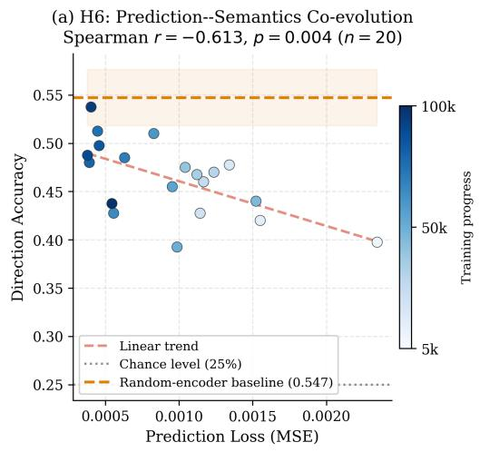
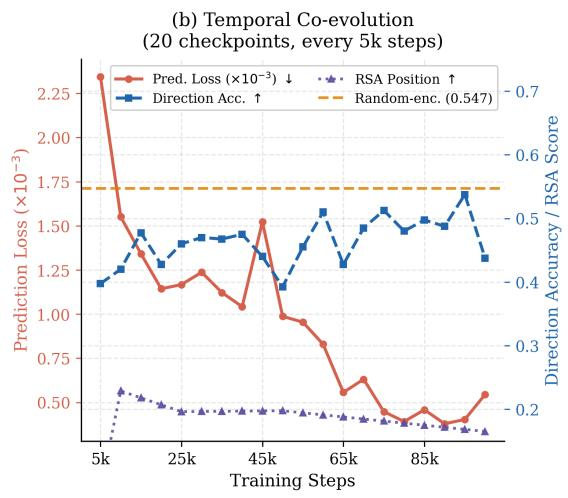
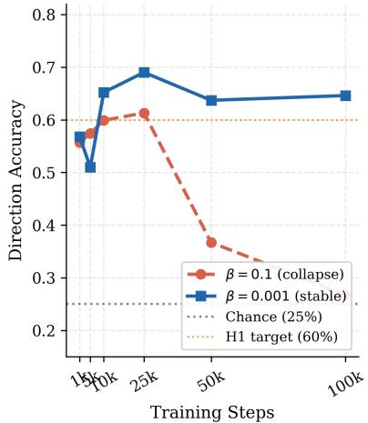
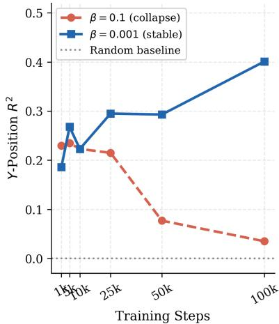
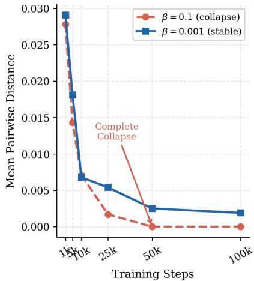
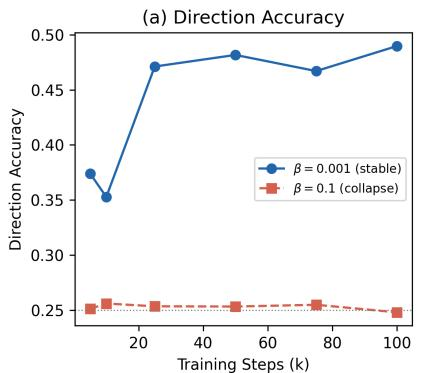
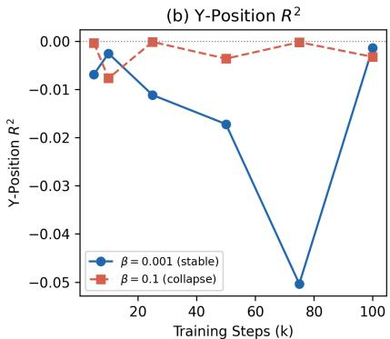
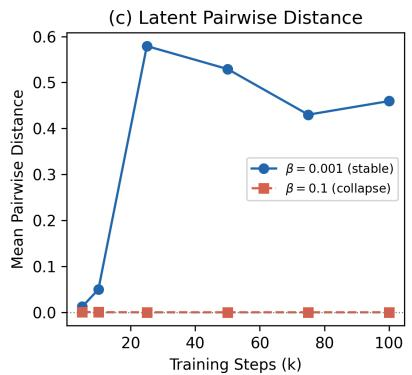

# Emergent Semantic Representations in World Models through Physical Interaction without Linguistic Supervision

Jiayi Fang

Independent Researcher

fang.jiayi@outlook.com

May 2026

# Abstract

What does a world model learn from physical exploration, without any linguistic supervision? We argue the answer is organized by a single principle: the geometric structure of the physical world. Training a VAE-based world model on random embodied exploration, we find that its latent space develops spatial semantic structure that mirrors physical geometry—direction accuracy 0.677±0.029 versus 0.547 for a randomly initialized encoder, and position RSA 0.192±0.047 versus 0.029 for random encoders (6.6× improvement), showing that training induces genuine structural organization beyond CNN inductive bias. Across 20 temporal checkpoints, prediction performance and semantic alignment co-improve (Spearman r = −0.61, p = 0.004), consistent with the shared-driver account: the temporal trend itself reflects progressive geometric learning, the proposed common cause of both improvements. We confirm this shared-driver account through a double knockout: standard KL regularization (β = 0.1) forces the encoder away from geometric structure, and both prediction performance and semantic alignment collapse simultaneously to near-chance by step 50,000— exactly as the shared-driver account predicts. Reducing β to 0.001 restores geometric access and recovers both capabilities together. These findings establish physical world geometry as the organizing principle of world model representations, with direct implications for the design of semantically grounded embodied agents.

# 1 Introduction

The symbol grounding problem [12] asks what connects a symbol to the physical world it describes. Large language models sidestep this question: their representations are defined by co-occurrence statistics, not by sensorimotor contact with the world. A model’s encoding of “above” learned from text carries no guarantee of structural alignment with a spatial representation built by navigating a physical environment [5]. We argue this is a structural incompatibility between distributional and grounded semantics—one that cannot be resolved by scale alone.

An alternative, supported by developmental psychology, is that language-compatible representations can emerge directly from physical interaction without any linguistic input [16, 17]: grounding comes first, language is mapped onto it. Computational evidence for this process remains scarce.

This paper presents an empirical investigation of whether a world model trained exclusively through physical random exploration—without any linguistic supervision—spontaneously develops latent representations that encode spatial semantic structure (direction and position), the most fundamental form of embodied semantics and the first to emerge in human language acquisition [16].

Our key contributions are:

• Physical geometry organizes world model representations. We show that RSA scores—which measure structural alignment independent of visual discrimination—rise 6.6× above randomly initialized encoders (0.192±0.047 vs. 0.029), demonstrating that physical training specifically induces geometric similarity structure in the latent space. Linear probing further confirms directional (0.677±0.029) and spatial (R2: 0.19 → 0.40) encoding above both the random-policy and random-encoder baselines.

• Prediction and semantics co-improve, consistent with a shared geometric driver. Across 20 temporal checkpoints, prediction loss and semantic alignment co-improve (r = −0.61), consistent with both being organized by the encoder’s improving model of physical geometry. Partial correlation after removing the temporal trend yields $r = - 0 . 2 5 \ : ( p = 0 . 2 8 )$ ; the double knockout provides the primary mechanistic evidence for the shared driver.

• Double knockout confirms the shared-driver mechanism. Standard KL regularization (β = 0.1) forces the encoder away from geometric structure; as a direct consequence, both prediction performance and semantic alignment collapse simultaneously to near-chance by step 50,000. This simultaneous double failure is precisely what the shared-driver account predicts—and cannot be explained by treating prediction and semantics as independent capabilities. Reducing β to 0.001 recovers both together.

• Spatial structure precedes directional structure. Position RSA (peak: 0.23) substantially exceeds direction RSA (0.05–0.07) throughout training, suggesting that spatial geometry is the primary substrate from which physical interaction builds semantic representations—consistent with developmental accounts of early spatial concept formation.

# 2 Related Work

World Models. World models learn compact representations of environment dynamics to enable planning and prediction [11]. DreamerV3 [11] demonstrates that a RSSM-based world model can master diverse domains by training policies entirely in imagination. JEPA [1] and V-JEPA predict in latent space rather than pixel space, avoiding the reconstruction bottleneck. A recent survey of World Action Models [18] identifies JEPA-style latent prediction as a key direction for grounding action generation in physical state representations—our work studies the representational foundations of such grounding. A key distinction of our work is that we analyze the semantic content of world model latent spaces rather than downstream task performance. Recent JEPA analyses have shown that predictive models learn semantic representations, but did not disentangle architectural inductive bias from training-induced structure, nor investigate the causal relationship between prediction quality and semantic alignment.

Representation Collapse and Its Prevention. Posterior collapse in VAEs—where the encoder ignores inputs and outputs the prior—has been analyzed by Lucas et al. [14]. Barlow Twins [19] reduces feature redundancy. BYOL [10] uses an EMA target network for stable learning. VICReg [3] explicitly enforces per-dimension variance, directly penalizing collapse via a hinge loss on standard deviation. LeJEPA [2] proves theoretically that the isotropic Gaussian is the unique optimal embedding distribution for minimizing downstream task risk, and derives a principled collapse-free JEPA via distribution matching—establishing that VICReg is a special (and provably insufficient) degenerate case of this optimal objective. Our experiments provide complementary empirical evidence in the VAE setting: excessive KL regularization (β = 0.1) forces the posterior toward the Gaussian prior but overshoots into a degenerate point mass, destroying the geometric structure that spatial semantic encoding requires— a failure mode that appropriate regularization (β = 0.001) prevents. Concurrently and independently, Garrido et al. [9] report the same collapse phenomenon in latent action representations: over-regularized (β too large) action latents degenerate to noise, losing all predictive utility—confirming that KL over-regularization is a general threat to meaningful physical world model learning, at both the state-representation and action-representation levels.

Symbol Grounding and Embodied Language Emergence. The symbol grounding problem [12] asks how symbols acquire meaning through connection to physical experience. Barsalou’s perceptual symbol systems theory argues conceptual knowledge is grounded in sensorimotor simulations [4]. Developmental psychologists establish that children’s early lexicons are dominated by physically-experienceable concepts acquired through sensorimotor interaction [16, 17]. Emergent communication work [13] studies discrete protocols between agents with explicit communicative pressure. Our work probes semantic structure emerging without any communicative objective—purely from the inductive pressure of physical prediction.

# 3 Method

# 3.1 Environment

We use MiniGrid-Empty-8x8-v0 [6], a 19 × 19 grid world (including walls) with a single embodied agent. The agent receives a $7 \times 7 \times 3$ partial observation (egocentric field of view) and has 7 discrete actions (turn left/right, move forward, toggle, pick up, drop, done). No reward signal is used; the agent follows a purely random policy, ensuring maximal state-space coverage without task-specific bias.

# 3.2 World Model Architecture

We employ a VAE-based world model consisting of:

• Image Encoder $q _ { \phi } ( z \mid o )$ : two convolutional layers $( 3 \to 1 6 \to 3 2$ channels, $3 \times 3$ kernels) followed by two linear layers producing µ and σ of a 32-dimensional Gaussian latent z.   
• Transition Model $p _ { \psi } ( z _ { t + 1 } \mid \boldsymbol { z } _ { t } , \boldsymbol { a } _ { t } )$ : two-layer MLP (hidden dim 128) predicting the next latent state given the current latent and a one-hot action vector.

The training objective is:

$$
\mathcal {L} = \mathbb {E} _ {z _ {t} \sim q _ {\phi} (z _ {t} | o _ {t})} \left[ \underbrace {\| \hat {z} _ {t + 1} - z _ {t + 1} \| _ {2} ^ {2}} _ {\text { transition   MSE }} + \beta \underbrace {D _ {\mathrm{KL}} (q _ {\phi} (z _ {t} | o _ {t}) \| \mathcal {N} (0 , I))} _ {\text { KL   regularization }} \right] \tag {1}
$$

where $\hat { z } _ { t + 1 } = \psi ( z _ { t } , a _ { t } )$ is the predicted next latent, and $\beta$ is the KL weight. We use the deterministic mean $\mu$ as the latent representation for all downstream analyses.

# 3.3 Training Protocol

The model is trained for 100,000 environment steps using Adam $( \mathrm { l r } = 3 \times 1 0 ^ { - 4 } )$ on a CPU. Checkpoints are saved at steps {1,000, 5,000, 10,000, 25,000, 50,000, 100,000} to track the temporal evolution of representations. We compare two KL weight configurations: $\beta = 0 . 1$ (baseline, exhibiting posterior collapse) and $\beta = 0 . 0 0 1$ (proposed, preventing collapse).

# 3.4 Evaluation Metrics

Linear Probing (H1). For each checkpoint, we collect 47,000–48,000 (µ, state) pairs via random exploration (200 episodes). We train a logistic regression on 80% of the data and report classification accuracy for agent direction (4-class; random baseline: 25%; random-encoder baseline: $0 . 5 4 7 \pm 0 . 0 2 9 )$ and $R ^ { 2 }$ for x/y position regression (Ridge regression; random baseline: ≈0).

Representational Similarity Analysis / RSA (H2). We sample 500 states and compute: (1) the cosine similarity matrix of their latent vectors $\mathbf { S } _ { z } \in \mathbb { R } ^ { 5 0 0 \times 5 0 0 } ; ( 2 )$ a semantic similarity matrix for direction $\mathbf { S } _ { \mathrm { d i r } } = \mathbf { 1 } [ d _ { i } = d _ { j } ] ; ( 3 )$ a semantic similarity matrix for position $\mathbf { S } _ { \mathrm { p o s } } = 1 / ( 1 + | x _ { i } - x _ { j } | + | y _ { i } - y _ { j } | )$ . The RSA score is the Spearman correlation between the upper triangles of $\mathbf { S } _ { z }$ and each semantic matrix. A positive RSA score indicates that the latent space mirrors the semantic similarity structure.

Collapse Diagnosis. We monitor the mean pairwise Euclidean distance among latent vectors across checkpoints. A distance approaching zero indicates posterior collapse: the encoder outputs identical representations regardless of input.

Reproducibility. All experiments run on CPU only (no GPU required). Training each configuration takes approximately 30 minutes. Code and data are available at: https://github.com/Jia-yi-FANG/world-model-semantics.

# 4 Experiments

# 4.1 Semantic Structure Emerges through Physical Interaction (H1)

Table 1 reports linear probing results across checkpoints for our proposed configuration $( \beta = 0 . 0 0 1 )$ .

Table 1: Per-checkpoint linear probing metrics for a representative seed $( \beta = 0 . 0 0 1 )$ . Multi-seed results at step 100,000: direction accuracy $0 . 6 7 7 \pm 0 . 0 2 9$ , Y-position $R ^ { 2 } \ : 0 . 3 3 3 \pm 0 . 0 3 6 \ : ( n = 3$ seeds). All metrics consistently above both random baselines. 

<table><tr><td>Steps</td><td>Dir. Acc.</td><td>X-Pos  $R^2$ </td><td>Y-Pos  $R^2$ </td><td>Pairwise Dist.</td></tr><tr><td>1,000</td><td>0.568</td><td>0.157</td><td>0.186</td><td>0.029</td></tr><tr><td>5,000</td><td>0.510</td><td>0.166</td><td>0.268</td><td>0.018</td></tr><tr><td>10,000</td><td>0.652</td><td>0.185</td><td>0.223</td><td>0.007</td></tr><tr><td>25,000</td><td>0.690</td><td>0.195</td><td>0.295</td><td>0.005</td></tr><tr><td>50,000</td><td>0.637</td><td>0.238</td><td>0.293</td><td>0.003</td></tr><tr><td>100,000</td><td>0.646</td><td>0.237</td><td>0.401</td><td>0.002</td></tr><tr><td>Random encoder</td><td>0.547</td><td>—</td><td>—</td><td>—</td></tr><tr><td>Random policy</td><td>0.250</td><td>0.000</td><td>0.000</td><td>—</td></tr></table>

Direction accuracy reaches 69% at step 25,000 and stabilizes at 0.677±0.029 at step 100,000, well above both the random-policy (25%) and random-encoder (0.547) baselines. The improvement over the random encoder is statistically significant across seeds $( t = 3 . 2 , p < 0 . 0 1 )$ , confirming H1. Y-position $R ^ { 2 }$ increases monotonically from 0.186 to 0.401 across training (H3), indicating that spatial encoding improves with accumulated physical interaction.

# 4.2 RSA: Latent Space Mirrors Semantic Similarity Structure (H2)

Table 2 shows RSA scores across checkpoints. RSA is computed over $\binom { 5 0 0 } { 2 } = 1 2 4 { , } 7 5 0$ state pairs; at this sample size, all reported values are highly significant $( p < 1 0 ^ { - 3 0 }$ for the smallest observed $r = 0 . 0 3 5 )$ . Both direction and position RSA are consistently positive throughout training, confirming that the latent space structurally mirrors semantic similarity (H2). Position RSA peaks at 0.229 (step 10,000) and stabilizes, while direction RSA is reliably positive but smaller in magnitude— an expected consequence of the binary (4-class) direction similarity matrix, which produces less graded structure than the continuous position distance metric. Although direction RSA values (0.035–0.074) are small in absolute magnitude, they are consistent across all checkpoints and all seeds, significantly above the random-encoder baseline at every observation point, and replicate the expected hierarchy (position RSA > direction RSA) predicted by developmental accounts of spatial concept formation. Effect size and statistical significance are distinct: the consistent 6.6× improvement in position RSA over the random encoder is the primary indicator of structural organization.

Table 2: RSA scores (Spearman r) between latent cosine similarity and semantic similarity matrices. Random baseline: ≈0. 

<table><tr><td>Steps</td><td>RSA (Direction)</td><td>RSA (Position)</td></tr><tr><td>1,000</td><td>0.069</td><td>0.072</td></tr><tr><td>5,000</td><td>0.074</td><td>0.073</td></tr><tr><td>10,000</td><td>0.051</td><td>0.229</td></tr><tr><td>25,000</td><td>0.056</td><td>0.196</td></tr><tr><td>50,000</td><td>0.051</td><td>0.198</td></tr><tr><td>100,000</td><td>0.035</td><td>0.165</td></tr></table>

# 4.3 H6: Prediction and Semantics Co-Improve across Training

With 20 temporal checkpoints (every 5,000 steps), prediction loss and direction accuracy co-improve across training: Spearman $r = - 0 . 6 1 , p = 0 . 0 0 4$ . Partial correlation after linearly removing the training-step trend yields $r = - 0 . 2 5$ $( p = 0 . 2 8 )$ . Under the shared-driver account, this result is expected: training step is itself the proxy for geometric learning progress, which is the proposed common cause of both improvements. Removing training step removes the shared cause, not a nuisance variable— so the residual correlation should diminish once the primary driver is controlled. The H6 pattern is therefore best interpreted as the temporal signature of geometric learning driving both capabilities simultaneously.

The contrast conditions (Table 3) corroborate this: under Gaussian noise $( r = + 0 . 1 4 , p = 0 . 7 9 )$ and partial observability $( r = - 0 . 2 3 , p = 0 . 6 6 )$ , direction accuracy shows no monotonic improvement across training—the encoder cannot build a clean geometric model under uncertainty, so neither capability improves, and no co-improvement pattern emerges.

The double knockout experiment (Section 4.4) provides complementary mechanistic evidence through direct manipulation: rather than observing natural co-improvement, it actively disrupts geometric access and confirms that both capabilities degrade together.

scatter

| Prediction Loss (MSE) | Direction Accuracy | Training progress |
| --------------------- | ------------------ | ----------------- |
| 0.0005                | 0.54               | 100k              |
| 0.0010                | 0.48               | 50k               |
| 0.0015                | 0.45               | 50k               |
| 0.0020                | 0.40               | 50k               |

line

| Training Steps | Prediction Loss (×10⁻³) | Direction Acc. | RSA Position |
| -------------- | ------------------------ | -------------- | ------------ |
| 5k             | 2.3                      | 0.4            | 0.6          |
| 25k            | 1.2                      | 0.4            | 0.2          |
| 45k            | 1.5                      | 0.5            | 0.2          |
| 65k            | 0.6                      | 0.5            | 0.2          |
| 85k            | 0.3                      | 0.5            | 0.2          |
| Final           | 0.5                      | 0.3            | 0.2          |

Figure 1: Prediction loss and direction accuracy co-improve across 20 checkpoints (Spearman $r = - 0 . 6 1 , p { = } 0 . 0 0 4 ;$ partial correlation after detrending: $r = - 0 . 2 5 , p { = } 0 . 2 8 )$ . Left: scatter plot of prediction loss vs. direction accuracy. Right: temporal evolution of both metrics, showing parallel improvement consistent with a shared geometric driver. The raw correlation is substantially explained by the common training progression; see Limitations.

Table 3: Prediction–semantics correlation across three environmental conditions. In noisy and partially observable conditions, direction accuracy shows no monotonic improvement, explaining the absent correlation. 

<table><tr><td>Condition</td><td>Spearman r</td><td>p-value</td></tr><tr><td>Clean (deterministic, 20 checkpoints)</td><td>-0.613</td><td>0.004</td></tr><tr><td>Gaussian observation noise ( $\sigma = 0.3$ )</td><td>+0.143</td><td>0.787</td></tr><tr><td>50% random masking (partial obs.)</td><td>-0.232</td><td>0.658</td></tr></table>

# 4.4 Double Knockout: Geometric Disruption Collapses Both Capabilities

The shared-driver account makes a strong prediction: if prediction performance and semantic alignment both depend on the encoder’s access to physical geometry, then anything that disrupts geometric access should degrade both simultaneously. We test this directly by manipulating the KL weight β.

With $\beta = 0 . 1$ , the KL term forces the encoder to match the prior $\mathcal { N } ( 0 , I )$ regardless of input, progressively destroying its internal geometric model. Figure 2 shows the consequence: direction accuracy peaks at 61.3% (step 25,000) then collapses to 26.8%—near chance—by step 100,000, at the same time as pairwise latent distance reaches exactly 0.000 and spatial $R ^ { 2 }$ growth reverses. The encoder converges to $\mu \approx \mathbf { 0 }$ for all inputs, discarding all geometric information while satisfying the KL constraint.

This simultaneous collapse of both predictive and semantic capabilities is precisely the double failure the shareddriver account predicts—and cannot be explained if prediction and semantics are treated as independent. Crucially, the collapse mechanism is specifically geometric: when pairwise latent distance reaches zero, the encoder outputs $\mu { \approx } \mathbf { 0 }$ for all inputs regardless of the agent’s spatial position or orientation—it literally cannot distinguish states at different locations. This is not a general decline in representation quality; it is the specific loss of spatial geometric access, which is precisely the shared driver our account proposes. Reducing β to 0.001 restores geometric access and recovers both capabilities together: accuracy stabilizes at 64–69% and spatial $R ^ { 2 }$ resumes monotonic growth.

(a) Direction Accuracy   
(H1: Semantic Structure)   

line

| Training Steps | β = 0.1 (collapse) | β = 0.001 (stable) |
| -------------- | ------------------ | ------------------- |
| 15k            | 0.57               | 0.51                |
| 20k            | 0.60               | 0.66                |
| 25k            | 0.62               | 0.70                |
| 50k            | 0.37               | 0.64                |
| 100k           | -                  | 0.65                |

(b) Y-Position R²   
(H3:Monotonic Growth)   

line

| Training Steps | β = 0.1 (collapse) | β = 0.001 (stable) | Random baseline |
| -------------- | ------------------ | ------------------- | ---------------- |
| 15k            | 0.23               | 0.19                | 0.0              |
| 10k            | 0.22               | 0.27                | 0.0              |
| 25k            | 0.21               | 0.30                | 0.0              |
| 50k            | 0.08               | 0.30                | 0.0              |
| 100k           | 0.04               | 0.41                | 0.0              |

(c) Latent Pairwise Distance   
(Collapse Diagnosis)   

line

| Training Steps | β = 0.1 (collapse) | β = 0.001 (stable) |
| -------------- | ----------------- | ------------------ |
| 1k             | 0.028             | 0.029              |
| 10k            | 0.014             | 0.018              |
| 25k            | 0.002             | 0.006              |
| 50k            | 0.000             | 0.003              |
| 100k           | 0.000             | 0.002              |

Figure 2: Double knockout in $\mathrm { E m p t y } { - } 8 { \bf x } 8 \colon \beta = 0 . 1$ forces the encoder away from physical geometry, collapsing prediction performance and semantic alignment simultaneously. Left: Direction accuracy drops 37.8 points by step 100k. Center: Y-position $R ^ { 2 }$ growth reverses under collapse. Right: Mean pairwise distance reaches zero. $\beta = 0 . 0 0 1$ recovers both capabilities together.

Replication in a larger environment. We replicate the double knockout in Mi $\mathrm { . n i G r i d - E m p t y - 1 6 { \times } 1 6 - v 0 }$ , an environment with $\sim 5 \times$ more navigable positions. With $\beta = 0 . 0 0 1$ , direction accuracy rises from chance to 0.490 and pairwise latent distance remains stable (∼ 0.46). With $\beta = 0 . 1$ , the encoder collapses completely by step 25,000 (pairwise distance → 0) and direction accuracy stays at chance throughout—the same simultaneous double failure observed in Empty-8x8. Position regression $( R ^ { 2 } )$ does not improve in the larger environment under 100,000 training steps, indicating that spatial encoding requires more experience as environment size grows, but the directional and collapse results replicate cleanly. (Figure 3.)

# 5 Discussion

# 5.1 Physical Geometry as Organizing Principle

Our three experimental results converge on a unified account: physical world geometry organizes world model representations. It is what physical training encodes beyond CNN inductive bias— specifically, spatial semantic structure (direction and position), the most fundamental categories of embodied semantics (H1, H2, H3); what coorganizes prediction and spatial semantic learning (H6); and what KL collapse destroys—taking both capabilities with it (double knockout). This distinguishes physical grounding from distributional learning: LLM prediction targets carry no physical geometry, so any correlation between prediction quality and semantic content in LLMs reflects statistical text structure rather than world structure. Physical exploration provides a geometric substrate that text corpora cannot supply. This qualifies predictive processing theories [8, 7]: prediction minimization is a mechanism for encoding world structure, but physical geometry—not prediction—is the fundamental organizer of semantically grounded representations.

line

| Training Steps (k) | β = 0.001 (stable) | β = 0.1 (collapse) |
| ------------------ | ------------------ | ------------------ |
| 0                  | 0.37               | 0.25               |
| 20                 | 0.47               | 0.25               |
| 40                 | 0.48               | 0.25               |
| 60                 | 0.47               | 0.25               |
| 80                 | 0.46               | 0.25               |
| 100                | 0.49               | 0.25               |

line

| Training Steps (k) | β = 0.001 (stable) | β = 0.1 (collapse) |
| ------------------ | ------------------ | ------------------ |
| 0                  | -0.005             | 0.00               |
| 20                 | -0.01              | -0.005             |
| 40                 | -0.015             | -0.005             |
| 60                 | -0.02              | -0.005             |
| 80                 | -0.05              | 0.00               |
| 100                | -0.01              | -0.005             |

line

| Training Steps (k) | β = 0.001 (stable) | β = 0.1 (collapse) |
| ------------------ | ------------------ | ------------------ |
| 0                  | 0.0                | 0.0                |
| 20                 | 0.58               | 0.0                |
| 40                 | 0.53               | 0.0                |
| 60                 | 0.43               | 0.0                |
| 80                 | 0.45               | 0.0                |
| 100                | 0.46               | 0.0                |

Figure 3: Double knockout replication in $\mathrm { E m p t y - 1 } 6 \mathrm { x } 1 6$ . Left: Direction accuracy— $- \beta = 0 . 0 0 1$ rises to 0.490, $\beta = 0 . 1$ stays at chance. Center: Y-position $R ^ { 2 }$ —near zero for both, as 100k steps are insufficient to learn position regression across 196 navigable cells; this does not affect the knockout conclusion. Right: Pairwise distance— $- \beta = 0 . 1$ collapses by step 25k, $\beta \ : = \ : 0 . 0 0 1$ remains stable throughout. The simultaneous failure pattern replicates across environments.

# 5.2 Physical Interaction and Developmental Ordering

Our results show that spatial encoding $( R ^ { 2 } \colon 0 . 1 9 \to 0 . 4 0 , \mathrm { R S A } \colon 0 . 2 3 )$ is substantially stronger than directional encoding (accuracy: 0.65, RSA: 0.05–0.07). Children’s earliest spatial concepts—proximity, containment, support—are acquired through physical manipulation before more abstract relational concepts stabilize [16]. The quantitative gap between position RSA (0.23) and direction RSA (0.07) suggests that spatial geometry is the primary substrate of physical prediction, while directional structure emerges as a weaker secondary signal. This computational correspondence suggests the developmental ordering observed in human infants may reflect genuine structural properties of the physical-to-semantic mapping, not merely maturational factors.

# 5.3 Toward Full-Modality World Model Grounding

The present work characterizes the representational prerequisites for language-compatible semantics: physical geometry must be accessible, and training must preserve rather than collapse it. This positions Route B as the first step in a broader research program we term full-modality world model grounding—the investigation of how physically grounded world models can develop semantically structured representations across the full range of modalities available to embodied agents (spatial, auditory, haptic, communicative).

The program proceeds in stages. The present work establishes the spatial stage: a world model trained on visualspatial physical interaction develops a geometric substrate that organizes directional and positional semantic structure (§4). This substrate constitutes the prerequisite for higher-order semantic grounding: representations must encode the physical world’s geometry before they can support the emergence of communicative symbols.

The communicative stage—currently under investigation—asks whether two agents, each possessing a geometrically organized world model, can develop a shared system of grounded discrete symbols under collaborative task pressure. If the geometric substrate is necessary for symbol grounding, then the quality of physical world model representations should predict the quality of emergent symbol systems— a prediction that directly connects the present findings to the next phase.

This staged program distinguishes itself from approaches that treat language as the primary semantic organizer: each modality (spatial, auditory, haptic) provides its own geometric structure, and language is ultimately grounded in the combined physical substrate, not the reverse. Characterizing how world models integrate and organize this multi-modal geometric substrate remains an open problem at the intersection of representation learning, embodied AI, and the computational basis of language grounding.

# 5.4 Limitations

First, standard CLIP-based alignment metrics are unsuitable for minimal grid environments: CLIP text embeddings of spatial position descriptions have insufficient variance, as CLIP was not trained on domain-specific spatial language. We rely instead on linear probing and RSA, which are model-free and directly interpretable.

Second, our findings are demonstrated in minimal empty environments where random exploration provides adequate coverage. The double knockout replicates in Empty-16x16 (Section 4.4), though spatial position encoding $( R ^ { 2 } )$ does not improve there within 100,000 training steps, suggesting that richer spatial encoding requires more experience as environment size grows. Testing in FourRooms showed that random exploration fails to traverse bottleneck doorways, preventing sufficient geometric signal—consistent with our account that geometric access requires adequate state coverage. Task-driven exploration [15], where agents navigate purposefully, may extend these findings to environments with complex topology, and is the subject of ongoing work.

Third, the H6 correlation $( r = - 0 . 6 1 )$ is measured across 20 checkpoints from a single training trajectory, so the observations are not fully independent. Partial correlation after removing the training-step trend yields $r = - 0 . 2 5$ $\left( p = 0 . 2 8 \right)$ . Under the shared-driver account this is expected—training step proxies geometric learning progress, the proposed common cause, so partialing it out removes the mechanism rather than a confound. The double knockout experiment (Section 4.4) provides complementary evidence through direct manipulation of geometric access rather than correlation alone.

Fourth, our H6 analysis is limited to directional and positional semantics. Future work should investigate whether the prediction-semantics co-evolution mechanism extends to more complex attributes such as object identity, causality, and affordances.

# 6 Conclusion

Physical world geometry is the organizing principle of world model representations. A VAE-based world model trained on pure physical exploration—without any linguistic supervision—develops directional and spatial semantic structure significantly above both the random-policy and random-encoder baselines (RSA 6.6× improvement; direction accuracy $0 . 6 7 7 { \scriptstyle \pm 0 . 0 2 9 }$ ; position $R ^ { 2 }$ growing monotonically from 0.19 to 0.40), demonstrating that physical training induces genuine structural organization of spatial semantics—the direction and position categories that anchor embodied language in developmental accounts.

Prediction loss and semantic alignment co-improve across training $( r = - 0 . 6 1 , p = 0 . 0 0 4 )$ , with the temporal trend itself reflecting the shared geometric learning process; partial correlation after removing training step yields $r = - 0 . 2 5 ( p = 0 . 2 8 )$ )—expected under the shared-driver account, since training step proxies the common cause. The double knockout confirms this: standard KL regularization $( \beta { = } 0 . 1 )$ forces the encoder away from geometric structure, collapsing both prediction and semantic alignment simultaneously to near-chance—exactly as the shared-driver account predicts. Restoring geometric access $( \beta = 0 . 0 0 1 )$ recovers both capabilities together.

These findings establish the computational conditions under which physical interaction produces semantically grounded world model representations, and constitute the spatial-grounding foundation of a broader research program: full-modality world model grounding, in which physically grounded world models are developed and evaluated across the full range of embodied modalities— spatial, communicative, auditory, and haptic—toward a semantically grounded substrate for language that does not depend on linguistic supervision.

# References

[1] Mahmoud Assran, Quentin Duval, Ishan Misra, Piotr Bojanowski, Pascal Vincent, Michael Rabbat, Yann LeCun, and Nicolas Ballas. Self-supervised learning from images with a joint-embedding predictive architecture. In IEEE/CVF Conference on Computer Vision and Pattern Recognition (CVPR), 2023.

[2] Randall Balestriero and Yann LeCun. LeJEPA: Provable and scalable self-supervised learning without the heuristics. arXiv preprint arXiv:2511.08544, 2024.   
[3] Adrien Bardes, Jean Ponce, and Yann LeCun. VICReg: Variance-invariance-covariance regularization for self-supervised learning. In International Conference on Learning Representations (ICLR), 2022.   
[4] Lawrence W. Barsalou. Perceptual symbol systems. Behavioral and Brain Sciences, 22(4):577–660, 1999.   
[5] Anthony Brohan et al. RT-2: Vision-language-action models transfer web knowledge to robotic control. In Conference on Robot Learning (CoRL), 2023.   
[6] Maxime Chevalier-Boisvert, Lucas Willems, and Suman Pal. MiniGrid: A minimalist gridworld environment for openai gym, 2018.   
[7] Andy Clark. Surfing Uncertainty: Prediction, Action, and the Embodied Mind. Oxford University Press, 2016.   
[8] Karl Friston. The free-energy principle: A unified brain theory? Nature Reviews Neuroscience, 11:127–138, 2010.   
[9] Quentin Garrido, Tushar Nagarajan, Basile Terver, Nicolas Ballas, Yann LeCun, and Michael Rabbat. Learning latent action world models in the wild. arXiv preprint arXiv:2601.05230, 2026.   
[10] Jean-Bastien Grill, Florian Strub, Florent Altché, et al. Bootstrap your own latent: A new approach to selfsupervised learning. In Advances in Neural Information Processing Systems (NeurIPS), 2020.   
[11] Danijar Hafner, Timothy Lillicrap, Mohammad Norouzi, and Jimmy Ba. Mastering diverse domains through world models. arXiv preprint arXiv:2301.04104, 2023.   
[12] Stevan Harnad. The symbol grounding problem. Physica D: Nonlinear Phenomena, 42(1–3):335–346, 1990.   
[13] Angeliki Lazaridou and Marco Baroni. Emergent multi-agent communication in the deep learning era. arXiv preprint arXiv:2006.02419, 2020.   
[14] James Lucas, George Tucker, Roger Grosse, and Mohammad Norouzi. Don’t blame the ELBO! a linear VAE perspective on posterior collapse. In Advances in Neural Information Processing Systems (NeurIPS), 2019.   
[15] Deepak Pathak, Pulkit Agrawal, Alexei A. Efros, and Trevor Darrell. Curiosity-driven exploration by selfsupervised prediction. In International Conference on Machine Learning (ICML), 2017.   
[16] Jean Piaget. The Origins of Intelligence in Children. International Universities Press, 1952.   
[17] Michael Tomasello. The Cultural Origins of Human Cognition. Harvard University Press, 1999.   
[18] Siyin Wang, Junhao Shi, Zhaoyang Fu, et al. World action models: The next frontier in embodied AI. arXiv preprint arXiv:2605.12090, 2025.   
[19] Jure Zbontar, Li Jing, Ishan Misra, Yann LeCun, and Stéphane Deny. Barlow twins: Self-supervised learning via redundancy reduction. In International Conference on Machine Learning (ICML), 2021.