# Deep Psychovisual Image Representations

# Wendi Ma

School of EECS

The University of Queensland wendi.ma@uq.edu.au

# Wei Dai

School of EECS

The University of Queensland wei.da@uq.edu.au

# Aryaman Sharma

School of EECS The University of Queensland aryaman.sharma@uq.edu.au

# Shekhar S. Chandra

School of EECS The University of Queensland shekhar.chandra@uq.edu.au

# Abstract

Psychovisual models suggest human vision decouples low-level feature extraction from higher cognition by first forming intermediate abstractions. In contrast, deep learning-based vision models routinely extract and aggregate features using homogeneous stacks of spatial layers, rendering their decision-making processes opaque. In this paper, we propose Deep Visual Coding (DVC), a learned frequency-domain representation inspired by 1990s image codes that quantised perceptually salient frequencies, which together with complex-valued image representations produces psychovisual-style abstractions. This approach enables the first psychovisualbased deep learning framework, utilizing data-driven spectral filters that learn to encode task-relevant semantic structures within distinct frequency sub-bands. Salience analyses reveal that our psychovisual models extract highly interpretable object parts compared to the amorphous regions produced by regular Convolutional Neural Networks (CNNs). Furthermore, we find that our models are less depth dependent than CNNs for model scaling, since our complex-valued representations and learned abstractions subsume the role of deep spatial layers. Together, these findings demonstrate that psychovisual coding provides a promising path toward more efficient and transparent vision models.

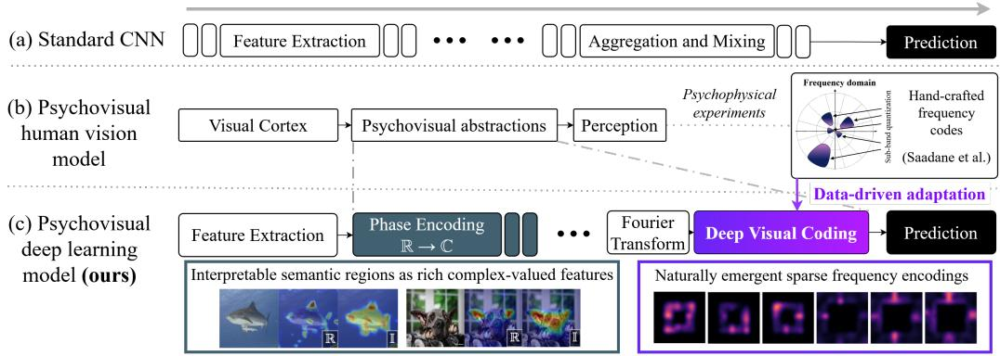

flowchart

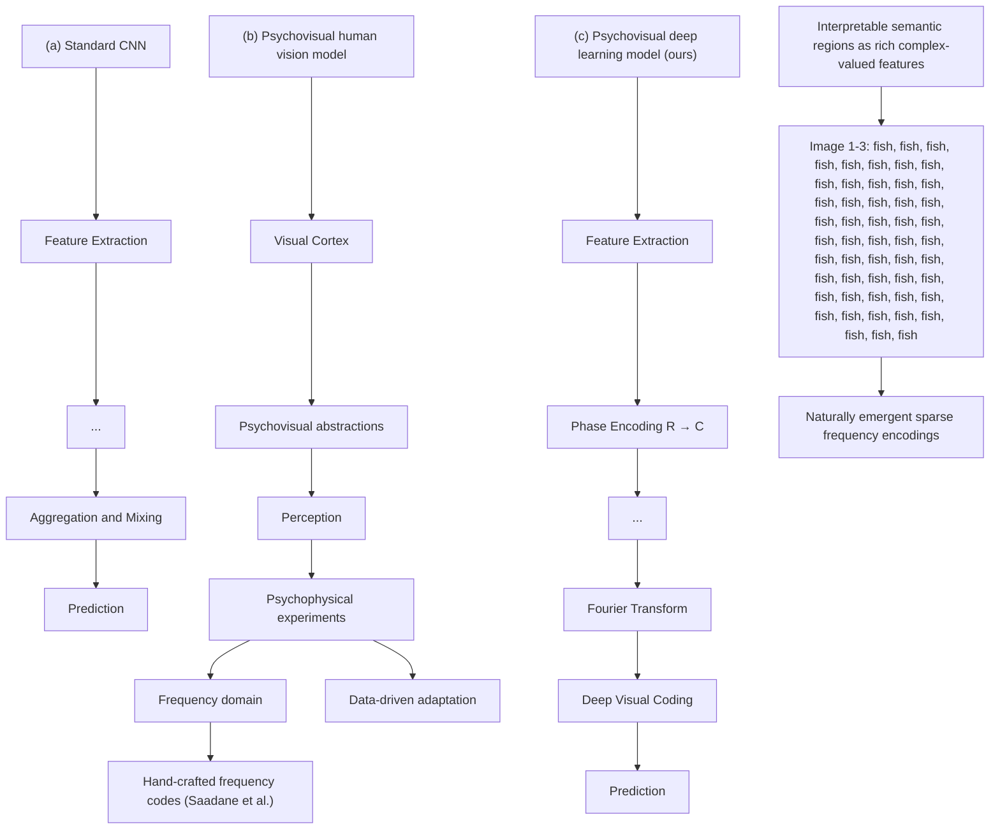

Figure 1: (a) Standard CNNs use deep stacks of homogeneous spatial layers. (b) Psychovisual models suggest human vision uses explicit intermediate abstractions. (c) Our psychovisual deep learning framework first produces rich complex-valued representations of interpretable semantic regions. They are then encoded in the frequency domain by Deep Visual Coding (DVC), a data-driven adaptation of hand-crafted psychovisual coding schemes, to introduce psychovisual-like abstractions into deep learning models.

# 1 Introduction

Ever since the ImageNet challenge popularised deep learning for computer vision [1, 2], architectural advances have focused on the design of spatial domain feature extractors, from convolution layers [3–6] to more recent token mixers based on attention mechanisms [7–10]. These models refine and aggregate image features through deep, homogeneous stacks of spatial layers, where feature processing emerges implicitly through training (Figure 1 (a)). As a result, intermediate representations are typically produced ad hoc with little explicit structure or organisation. Psychovisual processing (Figure 1 (b)), the way human vision encodes and interprets visual information, separates feature extraction from higher cognition using intermediate abstractions, such as objects, relations, and categories, providing a natural basis for reasoning [11–14]. In the 1990s, psychovisual coding schemes were developed that targeted the perceptually salient frequencies found by human vision studies [15–17] (see Appendix B.1 for a brief introduction). We hypothesize that these perceptually salient frequency selections may implicitly capture the high-level semantic abstractions utilized by human cognition.

In this work, we develop a data-driven adaptation of psychovisual coding that introduces abstractionlike representations into deep learning frameworks (Figure 1 (c)). To the best of our knowledge, our work represents the first data-driven exploration of the frequency domain for high-level representation learning in vision, whereas previous studies primarily focused on lower-level feature learning or parameterizing spatial models [18–20]. Furthermore, our approach processes feature abstractions almost entirely in the frequency domain without the need for repeated spatial-to-spectral transformations. To summarise, the key contributions of this work are:

• We propose Deep Visual Coding (DVC), a first-of-its-kind data-driven adaptation of psychovisual coding schemes designed to introduce human-vision-like abstractions into deep learning models. It employs learnable, band-limited frequency filters that learn representations of high-level semantic image information, emerging as sparse selections of coronal frequency sub-bands in the Discrete Fourier Transform (DFT) (see Appendix B.2 for a brief introduction).   
• We introduce Phasor Block which has the ability to learn complex-valued features as phase information from real-valued coloured signals to build complex-valued image features that are well suited to the Fourier domain and the proposed DVC.   
• We assemble DVC and Phasor Blocks into a cohesive psychovisual deep learning framework. We demonstrate that this pipeline enables interpretable psychovisual-like processing, maintaining or improving performance across multiple classification benchmarks.

• We provide salience analysis that demonstrate evidence of semantic decision making that reveal intermediate spatial layers consistently focus on meaningful object parts. These features are then encoded by DVC and used for final output prediction, mirroring the use of abstractions to support reasoning in a psychovisual model of human vision.

# 2 Background

Biologically-inspired Vision. Biologically inspired approaches in computer vision predominantly focus on modelling early vision stages. In particular, much attention has been given to Receptive Fields (RFs) - regions of visual stimuli that elicit strong neural responses in the visual cortex. Mammalian RFs are known to act as directional differential operators, closely resembling traditional image processing functions like wavelets and Gabor filters [21–23]. These parallels motivated their use in approximating low-level human vision, serving as effective feature extractors for basic visual structures like edges and shapes. In deep learning, these functions have been used to build neural networks that mimic cortical pathways [24], and early-layer Convolutional Neural Network (CNN) kernels also perform similar directional operations [1, 19]. However, networks that directly incorporate these functions, for example as fixed filter banks or bases for convolution kernels, have generally been restricted to small-scale problems and do not scale well to modern vision tasks [25]. Beyond RFs, human vision has also been studied from a frequency domain perspective in previous image coding literature. In particular, our work draws upon psychovisual coding, introduced further below, as the basis for modelling abstractions used in higher vision stages and supports models which do scale to modern tasks.

Frequency Domain Learning. Deep learning computer vision models have largely focused on processing in the spatial domain, which expresses localized relationships through contiguous pixel neighborhoods. The frequency (Fourier) domain, conversely, projects signals onto orthogonal basis functions, inherently capturing global representations (a review of the frequency domain and Fourier Transforms is presented in Appendix B.2). Formulated in this space, traditional image processing functions like ridgelets [26], curvelets [27] and contourlets [28] have appealing sparse representations. In fact, they bear strong resemblances to psychovisual codes since they target specific selections of sub-bands, corresponding to features from different spatial scales.

In deep learning, the frequency domain has primarily been used to exploit the Convolution Theorem [29], whereby spatial circular convolution becomes simple element-wise multiplication in the frequency domain. Many works leveraging this property are performance-driven: [30, 18, 31] use frequency domain filters to accelerate CNNs and incorporate global context, while [10, 32, 33] employ global frequency filters as lightweight and effective token mixers for transformer-style models. Other studies use frequency domain re-parameterizations of CNNs to analyse model properties and behaviours [19, 34, 35], such as optimal kernel structures. However, while there is extensive work exploiting the frequency domain for computational efficiency and model analysis, it has remained largely unexplored as an explicit representation space in its own right, particularly for high-level semantic features.

Psychovisual Coding. Research conducted in the 1990s by Dominique Barba and colleagues used psychophysical experiments to characterise the frequency sensitivities of the human visual cortex [15, 36, 17]. These findings informed psychovisual coding, an image quantization and compression scheme designed to be perceptually lossless. This approach exploits the human visual system’s varying sensitivity to spatial frequencies by decomposing the frequency domain into a series of coronal sub-bands (Figure 2 (left)), each assigned quantization thresholds based on measured sensitivities. This process enables frequencies corresponding to perceptually salient image features to be preserved in full, while others are removed or heavily compressed without affecting perceived image quality. An extended review of psychovisual coding literature is presented in Appendix B.1.

While psychovisual coding was primarily developed for image compression, we speculate that its quantization process may implicitly capture the underlying abstractions used by human vision. Specifically, by isolating those frequency sub-bands whose information is used to construct the high-level abstraction used by the brain for image understanding, the resulting spectral selections may effectively encode the abstractions themselves. Thus, without directly modelling any neural mechanisms, psychovisual coding could serve as a functional proxy for introducing psychovisual-like abstraction into vision models. To the best of our knowledge, this connection has not yet been explored in deep learning, unlike RFs.

# 3 Method

Deep Visual Coding (DVC) , shown in Figure 2 (right), is a learnable frequency filtering module modelled after the coronal sub-band design of psychovisual coding, intended to realise the psychovisual abstraction step at the core of our approach.

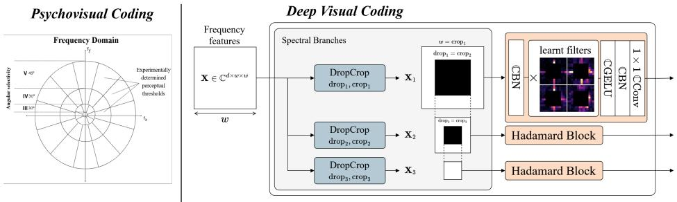

flowchart

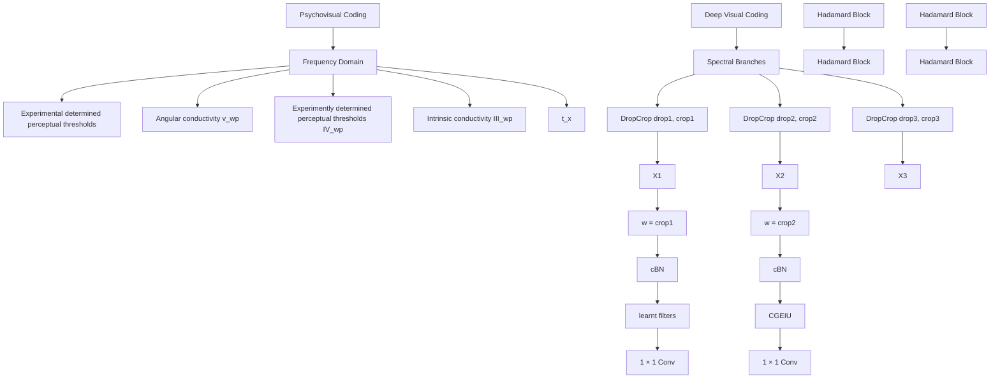

Figure 2: (Left) Hand-crafted psychovisual coding from Saadane et al. [17], which quantizes perceptually salient radial frequencies determined by human vision experiments. (Right) Our DVC module, a data-driven adaptation of psychovisual coding. It uses (1) Spectral Branches for radial spectral decomposition (2) Hadamard Blocks to apply learnt element-wise filters and channel mixing. CConv/BN/GELU denote complex-valued convolution, batch norm and GELU operations - see Appendix D.2

Let $\pmb { x } \in \mathbb { C } ^ { d \times w \times w }$ be a spatial feature map produced by a neural network, where d is the number of channels and w × w the spatial size. Its frequency spectrum $\boldsymbol { X } \in \mathbb { C } ^ { \dot { d } \times w \times w }$ can be obtained via applying the 2D DFT [37] on the last two dimensions - a review of the frequency domain and Fourier Transforms is provided in Appendix B.2. The Spectral Branches module replicates the radial frequency partitioning in psychovisual codes, decomposing X into disjoint rectangular sub-bands $X _ { 1 } , X _ { 2 } , \dots$ . Each sub-band is produced via applying DropCrop blocks, which set a lower frequency boundary (dropi) by zeroing central frequencies and an upper boundary (cropi) by cropping X to size $d \times \mathrm { c r o p } _ { i } \times \mathrm { c r o p } _ { i }$ . For each sub-band $X _ { i }$ , we then apply a set of learnable filters $W _ { i } \in \mathbb { C } ^ { d \times \mathrm { c r o p } _ { i } \times \mathrm { c r o p } _ { i } }$ via:

$$
X _ {i \text {   filtered   }} = \text { Softmax } \left(X _ {i} \odot \boldsymbol {W} _ {i}\right) \tag {1}
$$

where $\odot$ denotes the Hadamard (element-wise) product. Channel-wise softmax is applied here to amplify important frequency selections and suppress unimportant ones - emulating the quantization step of psychovisual coding. This filtering step is encapsulated in a Hadamard Block which additionally applies normalization and channel-mixing via a 1 × 1 convolution layer.

Phasor Blocks. To prepare spatial features for DVC, we also introduce Phasor Blocks (Figure 3 (top)) to first convert real-valued image features into rich complex-valued representations. As demonstrated in our experiments (Section 4.1), this transformation produces activations that target interpretable semantic regions, such as characteristic object parts, which provide the part-level features that DVC subsequently encodes into psychovisual abstractions. An additional practical motivation for this design is to avoid conjugate symmetry. Real-valued features, such as natural images, incur the conjugate symmetry of the Fourier Transform (FT), which renders half of the frequency domain redundant and limit learnt filtering from fully exploiting complex representations. By generating complementary imaginary components, Phasor Blocks break conjugate symmetry and improve the specificity of learned sub-bands.

In practice, imaginary components are generated from existing real features using lightweight depthwise convolution based blocks which decouple spatial and channel mixing to encourage crosschannel interaction without altering spatial structure. In natural complex signals, real and imaginary components convey complementary information at the same spatial location [29, 38], making it important that the generated imaginary features do not introduce substantial new spatial information.

Two Phasor Block configurations are used in this work: Phasor (I) performs the initial real-tocomplex conversion, while Phasor (C) further refines complex-valued features (Figure 3 (top)). Full architectural diagrams and design details are presented in Appendix D.3.

Psychovisual Framework To experimentally evaluate DVC and Phasor Blocks in Section 4, we combine them into a cohesive deep learning framework designed to explicitly mimic psychovisual processing. We emphasize that this framework is not intended as a definitive architecture for achieving state-of-the-art performance, but rather as a proof-of-concept for psychovisually-grounded deep learning. We refer to models utilising this pipeline collectively as PsychoNet.

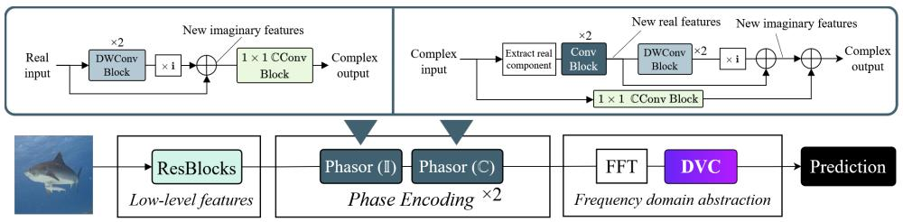

flowchart

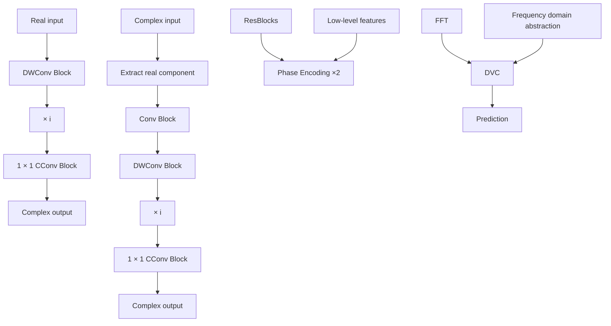

Figure 3: Overall design of the PsychoNet framework (bottom) and Phasor Block architectures (top). ResNet-style Residual Blocks (ResBlocks) first extract low-level features, then are converted into complex-valued representations by Phasor Blocks and encoded in the frequency domain by DVC.

As illustrated in Figure 3, PsychoNet operates as a coherent dual-domain pipeline comprising the following stages:

1. Standard ResNet-style Residual Blocks (ResBlocks) perform initial spatial feature extraction.   
2. Phasor Blocks convert real-valued spatial features into complex-valued representations.   
3. 2D Fast Fourier Transform (FFT) is applied to convert the features from the spatial to the frequency domain. As the magnitude of the DC (zero frequency) and low-frequency components typically dominate visual data, a simple companding operation is also applied to balance the spectrum (see Appendix D).   
4. DVC is applied, and its outputs from each frequency band aggregated. For classification, these are further pooled spatially and used for output prediction directly in the frequency domain using a complex-valued linear layer.

Mirroring psychovisual processing, stages 1–2 roughly parallel early cortical feature extraction, while stages 3–4 realise the abstraction step that decouples those features from the high-level representations used for decision-making.

# 4 Experiments

We evaluate our proposed psychovisual framework using natural image classification as a straightforward, scalable, and well-understood testbed to investigate whether it learns the abstraction-like representations our framing predicts. In the following subsections, we first present visualisations exploring the representations learnt by the core components of PsychoNet. We then use various classification benchmarks to explore its scaling properties and demonstrate it achieves reasonable practical performance, before finally discussing ablation studies.

Implementation details Our PsychoNet models retain the first two spatial stages of a standard ResNet backbone and replace the remaining deeper stages with our Phasor Blocks and DVC module. We evaluate these models across small to large-scale datasets, ranging from the low-resolution CIFAR-10/100 [39] (∼50K images) to the moderate-sized ImageNet-100 (∼130K images) and the standard large-scale ImageNet-1K (∼1.2 million images) [2]. We trained both our own and comparison models from scratch using identical recipes; on ImageNet-1K we train for 90 epochs, use an AdamW optimizer with a cosine scheduler and standard augmentations. Full details for all datasets, training, hardware, and model configurations are provided in Appendices C and D.

# 4.1 Representation analysis

In this section, we analyse the internal representations learned by the primary components of our framework. We first investigate what our DVC module and Phasor Blocks learn individually, followed by an exploration of their interaction to reveal how DVC encodes spatial features extracted by Phasor Blocks. For all visualisations, unless stated otherwise, we utilize a model based on Psycho-B. This model retains the first two ResBlock stages of a ResNet backbone but replaces the remaining stages with Phasor Blocks and an DVC module that match the original depth and parameter count.

DVC filter learning. Figure 4 visualises filters learnt by DVC, showing the top spatial principal components as an approximation of the most important frequency features. Remarkably we find that with sufficient training corpora and the full PsychoNet framework, DVC learns structured and sparse selections of frequencies that are highly reminiscent of the original hand-crafted psychovisual coding scheme. We further investigated how the amount of training data and architectural components affect the quality of these learnt patterns, finding that sparsity requires sufficiently large training corpora: ImageNet-100-trained filters are noticeably noisier than those for ImageNet-1K, and filters trained on CIFAR-10/100 (Figure A.3) are noisier still. Additionally, we also find that both Spectral Branches (providing sub-band decomposition) and Phasor Blocks (providing complex-valued features) are important; removing either significantly reduces filter sparsity and expressiveness. Together, these results suggest a naturally emergent psychovisual-style abstraction in the frequency domain, given sufficient data and complex-valued sub-bands. Our further analysis below of their interaction with Phasor Blocks reveals these sparse patterns correspond to structured encodings of meaningful object parts.

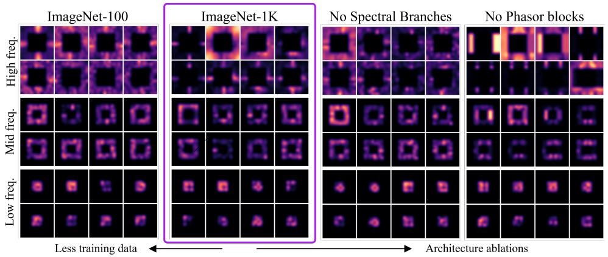

text_image

ImageNet-100
High freq.
ImageNet-1K
No Spectral Branches
No Phasor blocks
High freq.
Mid freq.
Low freq.
Less training data
Architecture ablations

Figure 4: DVC filters learnt by Psycho-B trained on ImageNet-100 and ImageNet-1K, as well as for two ablation models on ImageNet-1K. Bilinear smoothing has been applied. ‘High/mid/low freq.’ refer to the [14, 8], [8, 4] and [4, 1] frequency sub-bands created by Spectral Branches. ‘No Spectral Branches’ removes Spectral Branches and uses a single Hadamard Block with global filters - we extract sub-bands only for the visualisation. ‘No Phasor Blocks’ replaces all Phasor Blocks with ResBlocks.

Phasor Block salience. We employ KPCA-CAM [40] for salience mapping to visualise the features extracted by Phasor Blocks. Figure 5 shows that Phasor Blocks particularly specialise towards localising characteristic morphological object parts of different classes, such as dog ears, elephant tusks and car wheels. Since KPCA-CAM only uses activations of the visualised layer and is uninfluenced by model predictions (e.g. via backpropagation in gradient-based CAMs), these results indicate that Phasor Blocks specialise to extract meaningful semantic object parts. This organisation is likely shaped by the presence of DVC downstream, which we show below encodes these parts into higher-level abstractions that support interpretable semantic reasoning. Additionally, it appears that the imaginary components of Phasor Block activations capture more global features than the real components (e.g. a dog’s face vs. its ears), suggesting a structured and rich utilisation of the complex domain. An initial clustering visualisation of Phasor Block activations is also presented in Figure A.7, which finds that observable clustering emerges in both components and becomes increasingly pronounced at deeper layers. These findings further demonstrate that this complex-valued representation is iteratively refined through each block.

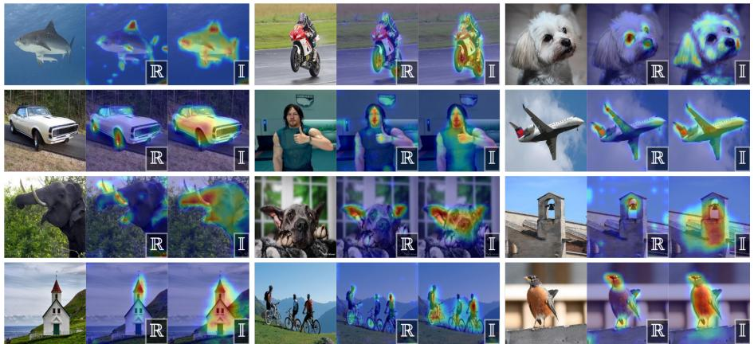  
Figure 5: Assorted activation maps (via KPCA-CAM) for mid-level Phasor Blocks of Psycho-B. Real and imaginary components are denoted by R and I.

DVC and Phasor Block interaction. We use a modified version of HiResCAM [41] to explore how DVC uses the semantic features produced by Phasor Blocks. Normal HiResCAM produces salience maps by element-wise multiplying layer activations with gradients backpropogated from model predictions, so the salience regions have a high contribution to the final classification prediction. We extend this approach to isolate regions used by specific branches and filters of DVC by selectively masking (setting to zero) gradient contributions from the other components. First, we examine each of the three sub-bands created by PsychoNet’s Spectral Branches. After masking gradients of Hadamard Blocks for all but one sub-band, Phasor Blocks’ salience regions reveal that DVC distributes object parts by scale. Figure 6 (a) shows that the low-frequency sub-band focuses on subjects broadly, while mid-high frequencies isolate more specific parts of different sizes. This aligns with frequency domain theory, in which low frequencies capture coarse spatial structure and higher frequencies finer detail and edges, supporting the view that DVC performs structured filtering in the frequency domain. We also isolate activations from individual Hadamard Block channels, showing that within each band, channels specialise to distinct object parts and correspond to distinct sparse frequency selections (Figure 6 (b)).

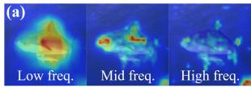

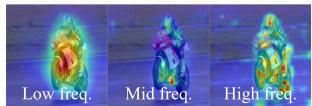

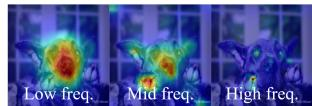

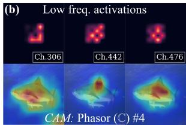

text_image

(b) Low freq. activations
Ch.306	Ch.442	Ch.476
CAM: Phasor (C) #4

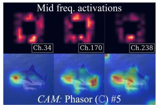

text_image

Mid freq. activations
Ch.34	Ch.170	Ch.238
CAM: Phasor (C) #5

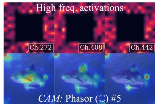

text_image

High freq. activations
Ch.272	Ch.408	Ch.442
CAM: Phasor (C) #5

Figure 6: Psycho-B Phasor Block salience maps (via HiResCAM) conditioned on gradients (a) from individual Spectral Branch sub-bands and (b) from individual frequency domain feature channels.

Overall, these result suggest that DVC learns a semantic intermediate representation that encodes selections of object parts. Given that DVC is placed immediately before the decision making (classification) layers of PsychoNet, it is likely selecting those most relevant to the task. In doing so, DVC functions as an abstraction bridging part extraction in Phasor Blocks and higher-level semantic reasoning, mirroring the role of abstractions used in psychovisual processing.

# 4.2 Quantitative evaluation

Unlike ResNet architectures which rely on increasing depth to scale representational capacity [3], we hypothesize that because PsychoNet’s high-level processing is handled by frequency domain modules, it should remain relatively depth-independent. To test this, we designed Psycho-S/B/L/H to match four ResNet parameter sizes while sharing the same early spatial layers; however, rather than adding depth, we scale representational capacity by increasing the channel width of existing Phasor Blocks and DVC filters. As the base PsychoNet models only downsample features to 14 × 14 resolution at the smallest in order to maintain spectral fidelity for DVC, they use higher FLOPs than ResNet which downsamples further to $7 \times 7 .$ . As such, we also created three efficient PsychoNet variants, Psycho-Eff-S/B/L, which do downsample to $7 \times 7$ and extract frequency features in the 7 to 14 sub-band from an earlier layer. These have similar FLOPs with ResNet at the cost of a small performance compromise compared to the normal PsychoNet models. Table 1 summarises the results from all classification experiments.

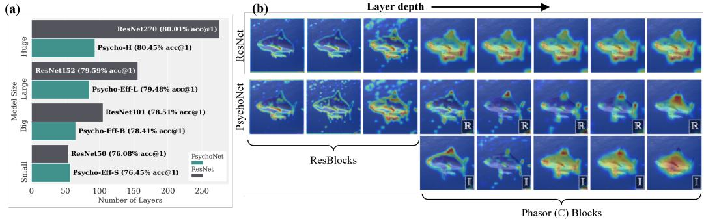

bar

| Model | Number of Layers | Layer depth | ResBlock |
|---|---|---|---|
| ResNet270 | 80.01% acc@1 | ResBlocks | I |
| Psycho-H | 80.45% acc@1 | ResBlocks | R |
| ResNet152 | 79.59% acc@1 | ResBlocks | R |
| Psycho-Eff-L | 79.48% acc@1 | ResBlocks | R |
| ResNet101 | 78.51% acc@1 | ResBlocks | R |
| Psycho-Eff-B | 78.41% acc@1 | ResBlocks | R |
| ResNet50 | 76.08% acc@1 | Phasor (C) Blocks | I |
| Psycho-Eff-S | 76.45% acc@1 | Phasor (C) Blocks | I |

Figure 7: (a) Comparison of layer depth between different ResNet models and our shallowest PsychoNet model of comparable size. (b) Comparison between activation maps (via KPCA-CAM) of Psycho-B and ResNet101 for a range of layer depths. Real and imaginary components are denoted by R and I.

Table 1: Summary of classification results (% top-1 accuracies) on CIFAR-10, CIFAR-100, ImageNet-100 (IN100) and ImageNet-1K (IN1K). Each pair of rows (separated by horizontal lines) compares a baseline CNN to PsychoNet model(s) of comparable size. 

<table><tr><td>Model</td><td>Param. (M)</td><td>Layers</td><td>GFLOPs</td><td>CIFAR-10</td><td>CIFAR-100</td><td>IN100</td><td>IN1K</td></tr><tr><td>ResNet50</td><td>25.56</td><td>54</td><td>8.18</td><td>94.14</td><td>78.10</td><td>80.90</td><td>76.04</td></tr><tr><td>Psycho-S</td><td>25.35</td><td>65</td><td>12.31</td><td>95.08</td><td>78.97</td><td>82.50</td><td>76.86</td></tr><tr><td>Eff-S</td><td>26.27</td><td>57</td><td>8.01</td><td>94.86</td><td>78.15</td><td>83.20</td><td>76.45</td></tr><tr><td>ResNet101</td><td>44.55</td><td>105</td><td>15.60</td><td>93.64</td><td>79.13</td><td>81.90</td><td>78.43</td></tr><tr><td>Psycho-B</td><td>42.01</td><td>93</td><td>30.13</td><td>94.99</td><td>79.49</td><td>83.60</td><td>78.85</td></tr><tr><td>Eff-B</td><td>45.82</td><td>65</td><td>15.80</td><td>94.98</td><td>78.22</td><td>83.92</td><td>78.41</td></tr><tr><td>ResNet152</td><td>60.10</td><td>156</td><td>23.03</td><td>93.17</td><td>77.51</td><td>83.60</td><td>79.59</td></tr><tr><td>Psycho-L</td><td>61.28</td><td>93</td><td>54.47</td><td>94.95</td><td>79.64</td><td>84.82</td><td>79.85</td></tr><tr><td>Eff-L</td><td>62.03</td><td>85</td><td>23.06</td><td>94.95</td><td>78.18</td><td>84.98</td><td>79.48</td></tr><tr><td>ResNet270</td><td>89.60</td><td>276</td><td>40.50</td><td>76.51</td><td>50.87</td><td>83.80</td><td>80.01</td></tr><tr><td>Psycho-H</td><td>88.61</td><td>93</td><td>64.12</td><td>94.68</td><td>79.89</td><td>85.00</td><td>80.45</td></tr><tr><td>ConvNeXt-S</td><td>50.22</td><td>113</td><td>17.36</td><td>94.09</td><td>76.96</td><td>86.98</td><td>80.78</td></tr><tr><td>PsychoDW</td><td>49.51</td><td>106</td><td>27.42</td><td>95.46</td><td>79.67</td><td>86.76</td><td>80.59</td></tr></table>

Overall, PsychoNet demonstrates significantly less dependence on depth for scaling than traditional ResNet architectures, as illustrated in Figure 7(a). This is evidenced by Eff-B and Eff-L, which use 38% and 45.5% fewer layers than ResNet-101 and ResNet-152 while closely matching their parameters, FLOP counts, and performance. Similarly, Psycho-L and Psycho-H utilize ∼1.7× and ∼3× fewer layers than ResNet-152 and ResNet-270 respectively, while achieving improved accuracy across every dataset. This demonstrates that DVC is able to subsume the role of a significant portion of deep spatial layers, showing it is an effective high-level processing module. This aligns with the psychovisual framing that motivated our design: DVC operates on globally-focused frequencydomain abstractions, whereas spatial features are sparse and locally structured, requiring significant depth to progressively aggregate them. Furthermore, PsychoDW achieves performance comparable to ConvNeXt-S, demonstrating that PsychoNet can also extend to match more modern architectures. Figure 7(b) provides complementary qualitative evidence for this: unlike ResNet, which produces diffuse, unstructured activations throughout its depth, PsychoNet’s spatial layers consistently localise distinct morphological object parts, suggesting that Phasor Blocks and DVC together successfully take over the high-level processing otherwise requiring many additional spatial layers.

# 4.3 Ablation studies

We conduct two ablation studies to quantify the contribution of PsychoNet’s key components: (1) minimal CIFAR-10 models (∼3M parameters) examining the isolated effects of DVC and Phasor Blocks (Table 2), and (2) Psycho-L on ImageNet-1K, targeting the components that our qualitative results suggested are particularly important at scale — Spectral Branching, which visibly improved DVC filter sparsity and expressivity, and full Phasor Blocks, which produced compelling interpretable salience maps on large-scale data (Table 3).

Table 2: Barebones architecture ablation on CIFAR-10. 

<table><tr><td>Model</td><td>DVC</td><td>Phasor Blocks</td><td>Top-1 Acc. (%)</td></tr><tr><td>I</td><td>√</td><td>√</td><td>94.03</td></tr><tr><td>II</td><td>✗</td><td>√</td><td>92.86</td></tr><tr><td>III</td><td>√</td><td>✗</td><td>94.20</td></tr><tr><td>IV</td><td>✗</td><td>✗</td><td>93.33</td></tr></table>

Table 3: ImageNet-1K ablation on Psycho-L (Model A) and variants. 

<table><tr><td>Model</td><td>Spectral Branch</td><td>Phasor Blocks</td><td>Top-1 Acc. (%)</td></tr><tr><td>A</td><td>√</td><td>√</td><td>79.85</td></tr><tr><td>B</td><td>✗</td><td>√</td><td>79.27</td></tr><tr><td>C</td><td>√</td><td>✗</td><td>79.60</td></tr><tr><td>D</td><td>✗</td><td>✗</td><td>79.12</td></tr></table>

For the minimal CIFAR-10 ablation, models removing DVC pass the frequency domain features after Fast Fourier Transform (FFT) directly into the classification layers, while models removing Phasor Blocks replace them with basic Conv. Blocks (see Appendix E), maintaining approximate parameter count and model depth. Table 2 shows that removing DVC drops performance by 1.17% (Model I vs. II) and 0.87% (Model III vs. IV), highlighting its contribution to the framework. However, at this small scale, substituting Phasor Blocks for Conv. Blocks actually slightly improves classification accuracy, perhaps as Phasor Blocks are overly complex relative to the task.

For the ImageNet-1K ablation, we evaluate variations of the Psycho-L architecture (Table 3). Models without Spectral Branches replace the multiple branches in DVC with a single global filter lacking DropCrop operations. Models without Phasor Blocks replace all but one final Phasor (I) block with ResBlocks while maintaining parameter size. We observe that removing Spectral Branches leads to notable accuracy drops of 0.58% (A vs. B) and 0.47% (C vs. D), showing that this spectral decomposition not only improves filter sparsity but also makes a meaningful impact on performance. The removal of Phasor Blocks results in smaller drops of 0.25% (A vs. C) and 0.14% (B vs. D). However, consistent with our earlier qualitative findings, the value of Phasor Blocks lies not in classification accuracy but in representational quality: as shown in Figure 8, Model A produces activation maps capturing meaningful object parts, whereas Model C yields comparatively diffuse activations lacking clear structure. Together, these ablations confirm distinct roles within the psychovisual pipeline: Spectral Branches structure DVC’s abstractions, while Phasor Blocks preserve the part-level features feeding them.

# 5 Conclusion

In this work, we proposed Deep Visual Coding, a data-driven adaptation of psychovisual coding. Integrated into our PsychoNet framework, DVC naturally learns sparse coronal frequency patterns that closely resemble classical hand-crafted codes, suggesting these are a natural representation scheme for psychovisual abstraction. Unlike conventional CNNs, PsychoNet enforces a clear structural separation of stages: Phasor Blocks isolate semantically meaningful object parts, which DVC then organizes into interpretable, frequency domain representations for decision-making. Our results further show that DVC subsumes the high-level processing role of deep spatial layers, matching or exceeding ResNet baselines with significantly fewer layers. Together, these findings provide strong evidence that psychovisual coding is a principled and viable basis for interpretable representation learning, with promising implications for building models whose internal reasoning is transparent by design.

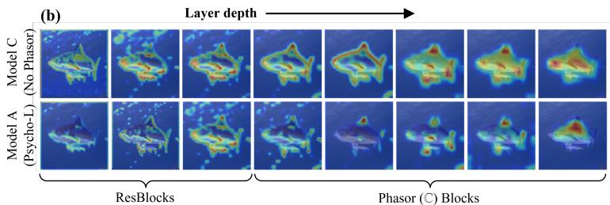

text_image

(b)
Layer depth
Model C
(No Phasor)
Model A
(Psycho-L)
ResBlocks
Phasor (C) Blocks

Figure 8: Comparison between activation maps of Ablation Model A and C.

Limitations and Future Work. While we were able to show DVC organises and encodes selections of meaningful object parts, further work is still required to determine how the deeper semantic meaning of these abstractions should be interpreted in relation to broader notions of reasoning, such as those studied in neuroscience [11, 12]. We also aim to apply PsychoNet beyond classification, particularly to dense prediction tasks which may allow DVC to utilise wider frequency ranges. Finally, it is also known that aliasing can afflict standard CNN architectures [42]; future work should assess its impact on our frequency domain representations and whether mitigation can improve results.

# References

[1] Alex Krizhevsky, Ilya Sutskever, and Geoffrey E. Hinton. ImageNet classification with deep convolutional neural networks. Communications of The ACM, 60(6):84–90, May 2017. doi: 10.1145/3065386.   
[2] Jia Deng, Wei Dong, Richard Socher, Li-Jia Li, Kai Li, and Fei-Fei Li. ImageNet: A large-scale hierarchical image database. In 2009 IEEE Conference on Computer Vision and Pattern Recognition, pages 248–255, June 2009. doi: 10.1109/cvpr.2009.5206848.   
[3] Kaiming He, Xiangyu Zhang, Shaoqing Ren, and Jian Sun. Deep Residual Learning for Image Recognition. In 2016 IEEE Conference on Computer Vision and Pattern Recognition (CVPR), pages 770–778, 2016. doi: 10.1109/CVPR.2016.90.   
[4] Saining Xie, Ross Girshick, Piotr Dollár, Zhuowen Tu, and Kaiming He. Aggregated residual transformations for deep neural networks. In 2017 IEEE Conference on Computer Vision and Pattern Recognition (CVPR), pages 5987–5995, 2017. doi: 10.1109/CVPR.2017.634.   
[5] Gao Huang, Zhuang Liu, Laurens van der Maaten, and Kilian Q Weinberger. Densely connected convolutional networks. In Proceedings of the IEEE Conference on Computer Vision and Pattern Recognition, 2017.   
[6] Zhuang Liu, Hanzi Mao, Chao-Yuan Wu, Christoph Feichtenhofer, Trevor Darrell, and Saining Xie. A convnet for the 2020s. In 2022 IEEE/CVF Conference on Computer Vision and Pattern Recognition (CVPR), pages 11966–11976, 2022. doi: 10.1109/CVPR52688.2022.01167.   
[7] Alexey Dosovitskiy, Lucas Beyer, Alexander Kolesnikov, Dirk Weissenborn, Xiaohua Zhai, Thomas Unterthiner, Mostafa Dehghani, Matthias Minderer, Georg Heigold, Sylvain Gelly, Jakob Uszkoreit, and Neil Houlsby. An image is worth 16x16 words: Transformers for image recognition at scale. In 9th International Conference on Learning Representations, ICLR 2021, Virtual Event, Austria, May 3-7, 2021. OpenReview.net, 2021. URL https://openreview.net/forum?id=YicbFdNTTy.   
[8] I. Tolstikhin, N. Houlsby, Alexander Kolesnikov, Lucas Beyer, Xiaohua Zhai, Thomas Unterthiner, Jessica Yung, Daniel Keysers, Jakob Uszkoreit, Mario Lucic, and Alexey Dosovitskiy. MLP-Mixer: An all-MLP Architecture for Vision. In Neural Information Processing Systems, 2021.   
[9] Peng Gao, Jiasen Lu, Hongsheng Li, Roozbeh Mottaghi, and Aniruddha Kembhavi Kembhavi. Container: Context Aggregation Network. Neural Information Processing Systems, 2021.   
[10] Yongming Rao, Wenliang Zhao, Zheng Zhu, Jie Zhou, and Jiwen Lu. Gfnet: Global filter networks for visual recognition. IEEE Transactions on Pattern Analysis and Machine Intelligence, 45(9):10960–10973, 2023. doi: 10.1109/TPAMI.2023.3263824.   
[11] Rodrigo Quian Quiroga, Leila Reddy, Gabriel Kreiman, Christof Koch, and Itzhak Fried. Invariant visual representation by single neurons in the human brain. Nature, 2005. doi: 10.1038/nature03687.   
[12] Nikolaus Kriegeskorte, Marieke Mur, Douglas A. Ruff, Roozbeh Kiani, Jerzy Bodurka, Hossein Esteky, Keiji Tanaka, and Peter A. Bandettini. Matching categorical object representations in inferior temporal cortex of man and monkey. Neuron, 2008. doi: 10.1016/j.neuron.2008.10.043.   
[13] Rodrigo Quian Quiroga. Concept cells: the building blocks of declarative memory functions. Nature Reviews Neuroscience, 2012. doi: 10.1038/nrn3251.   
[14] Lynn Le, Paolo Papale, K. Seeliger, Antonio Lozano, Thirza Dado, Feng Wang, Pieter R. Roelfsema, M. van Gerven, Yagmur Güçlütürk, and Umut Güçlü. Monkeysee: Space-time-resolved reconstructions of ˘ natural images from macaque multi-unit activity. Neural Information Processing Systems, 2024.   
[15] Abdelhakim Saadane, Hakim Senane, and Dominique Barba. Design of psychovisual quantizers for a visual subband image coding. In Visual Communications and Image Processing ’94, volume 2308, pages 1446–1453. SPIE, September 1994. doi: 10.1117/12.185903.   
[16] Jeanpierre V. Guedon, Dominique Barba, and Nicole Burger. Psychovisual image coding via an exact discrete Radon transform. In Proceedings Volume 2501, Visual Communications and Image Processing 1995, volume 2501, pages 562–572, 1995. doi: 10.1117/12.206765.   
[17] A. Saadane, H. Sénane, and D. Barba. Visual Coding: Design of Psychovisual Quantizers. Journal of Visual Communication and Image Representation, 9(4):381–391, December 1998. ISSN 1047-3203. doi: 10.1006/jvci.1998.0393.

[18] Lu Chi, Borui Jiang, and Yadong Mu. Fast Fourier Convolution. In Advances in Neural Information Processing Systems, volume 33, pages 4479–4488. Curran Associates, Inc., 2020. URL https://papers.nips. cc/paper\_files/paper/2020/hash/2fd5d41ec6cfab47e32164d5624269b1-Abstract.html.   
[19] Oren Rippel, Jasper Snoek, and Ryan P. Adams. Spectral Representations for Convolutional Neural Networks. In Proceedings of the 28th International Conference on Neural Information Processing Systems - Volume 2, NIPS’15, pages 2449–2457, Cambridge, MA, USA, 2015. MIT Press.   
[20] Saurabh Yadav and Koteswar Rao Jerripothula. FCCNs: Fully Complex-valued Convolutional Networks using Complex-valued Color Model and Loss Function. In 2023 IEEE/CVF International Conference on Computer Vision (ICCV), pages 10655–10664, October 2023. doi: 10.1109/ICCV51070.2023.00981. URL https://ieeexplore.ieee.org/document/10377516. ISSN: 2380-7504.   
[21] Bruno A. Olshausen and David J. Field. Emergence of simple-cell receptive field properties by learning a sparse code for natural images. Nature, 381(6583):607, June 1996. ISSN 1476-4687. doi: 10.1038/ 381607a0. URL https://www.nature.com/articles/381607a0.   
[22] D. H. Hubel and T. N. Wiesel. Receptive fields, binocular interaction and functional architecture in the cat’s visual cortex. The Journal of Physiology, 160(1):106–154.2, January 1962. ISSN 0022-3751. URL https://www.ncbi.nlm.nih.gov/pmc/articles/PMC1359523/.   
[23] Dario L. Ringach. Spatial structure and symmetry of simple-cell receptive fields in macaque primary visual cortex. Journal of Neurophysiology, 88(1):455–463, July 2002. doi: 10.1152/jn.2002.88.1.455.   
[24] Mengkun Liu, Licheng Jiao, Xu Liu, Lingling Li, Fang Liu, Shuyuan Yang, and Xiangrong Zhang. Bio-Inspired Multi-scale Contourlet Attention Networks. IEEE transactions on multimedia, pages 1–16, January 2023. doi: 10.1109/tmm.2023.3304448.   
[25] Mengkun Liu, Licheng Jiao, Xu Liu, Lingling Li, Fang Liu, and Shuyuan Yang. C-CNN: Contourlet Convolutional Neural Networks. IEEE Transactions on Neural Networks and Learning Systems, 32(6):2636– 2649, June 2021. ISSN 2162-2388. doi: 10.1109/TNNLS.2020.3007412. URL https://ieeexplore. ieee.org/document/9145825. Conference Name: IEEE Transactions on Neural Networks and Learning Systems.   
[26] E. J. Candés and D. L. Donoho. Ridgelets: a key to higher-dimensional intermittency? Philosophical Transactions of the Royal Society A: Mathematical, Physical and Engineering Sciences, 357(1760): 2495–2509, 1999. doi: 10.1098/rsta.1999.0444.   
[27] Jean-Luc Starck, E.J. Candes, and D.L. Donoho. The curvelet transform for image denoising. IEEE Transactions on Image Processing, 11(6):670–684, June 2002. ISSN 1941-0042. doi: 10.1109/TIP.2002. 1014998. Conference Name: IEEE Transactions on Image Processing.   
[28] M.N. Do and M. Vetterli. The contourlet transform: an efficient directional multiresolution image representation. IEEE Transactions on Image Processing, 14(12):2091–2106, December 2005. ISSN 1941- 0042. doi: 10.1109/TIP.2005.859376. URL https://ieeexplore.ieee.org/document/1532309.   
[29] Rafael C. Gonzalez and Richard E. Woods. Digital Image Processing 3rd Edition. Prentice Hall, January 2014.   
[30] Shaohua Li, Kaiping Xue, Bin Zhu, Chenkai Ding, Xindi Gao, David Wei, and Tao Wan. Falcon: A fourier transform based approach for fast and secure convolutional neural network predictions. In 2020 IEEE/CVF Conference on Computer Vision and Pattern Recognition (CVPR), pages 8702–8711, 2020. doi: 10.1109/CVPR42600.2020.00873.   
[31] Bochen Guan, Jinnian Zhang, William A. Sethares, Richard Kijowski, and Fang Liu. Spectral Domain Convolutional Neural Network. In ICASSP 2021 - 2021 IEEE International Conference on Acoustics, Speech and Signal Processing (ICASSP), pages 2795–2799, June 2021. doi: 10.1109/ICASSP39728.2021. 9413409. ISSN: 2379-190X.   
[32] J. Lee-Thorp, J. Ainslie, Ilya Eckstein, and Santiago Ontañón. FNet: Mixing Tokens with Fourier Transforms. North American Chapter of the Association for Computational Linguistics, 2021. doi: 10.18653/v1/2022.naacl-main.319.   
[33] Zhipeng Huang, Zhizheng Zhang, Cuiling Lan, Zheng-Jun Zha, Yan Lu, and Baining Guo. Adaptive frequency filters as efficient global token mixers. In 2023 IEEE/CVF International Conference on Computer Vision (ICCV), pages 6026–6036, 2023. doi: 10.1109/ICCV51070.2023.00556.

[34] Julia Grabinski, Janis Keuper, and Margret Keuper. As large as it gets: Learning infinitely large filters via neural implicit functions in the fourier domain. ArXiv, abs/2307.10001, 2023. URL https://api. semanticscholar.org/CorpusID:259982481.   
[35] Samira Kabri, Tim Roith, Daniel Tenbrinck, and Martin Burger. Resolution-invariant image classification based on fourier neural operators. In Scale Space and Variational Methods in Computer Vision: 9th International Conference, SSVM 2023, Santa Margherita Di Pula, Italy, May 21–25, 2023, Proceedings, page 236–249, Berlin, Heidelberg, 2023. Springer-Verlag. ISBN 978-3-031-31974-7. doi: 10.1007/ 978-3-031-31975-4\_18. URL https://doi.org/10.1007/978-3-031-31975-4\_18.   
[36] H. Senane, A. Saadane, and D. Barba. Image coding in the context of a psychovisual image representation with vector quantization. In Proceedings., International Conference on Image Processing, volume 1, pages 97–100 vol.1, October 1995. doi: 10.1109/ICIP.1995.529048.   
[37] J. W Cooley, P. Lewis, and P. Welch. The finite Fourier transform. Audio and Electroacoustics, IEEE Transactions on, 17(2):77–85, June 1969. ISSN 0018-9278.   
[38] ChiYan Lee, Hideyuki Hasegawa, and Shangce Gao. Complex-Valued Neural Networks: A Comprehensive Survey. IEEE/CAA Journal of Automatica Sinica, 9(8):1406–1426, August 2022. doi: 10.1109/jas.2022. 105743.   
[39] Alex Krizhevsky. Learning multiple layers of features from tiny images. 2009. URL https://api. semanticscholar.org/CorpusID:18268744.   
[40] Sachin Karmani, Thanushon Sivakaran, Gaurav Prasad, Mehmet Ali, Wenbo Yang, and Sheyang Tang. KPCA-CAM: Visual Explainability of Deep Computer Vision Models Using Kernel PCA. IEEE International Workshop on Multimedia Signal Processing, 2024. doi: 10.1109/mmsp61759.2024.10743968.   
[41] Rachel Lea Draelos and Lawrence Carin. Use HiResCAM instead of Grad-CAM for faithful explanations of convolutional neural networks. arXiv preprint arXiv:2011.08891, November 2020. URL https: //arxiv.org/abs/2011.08891.   
[42] Julia Grabinski, Steffen Jung, Janis Keuper, and Margret Keuper. Frequencylowcut pooling - plug and play against catastrophic overfitting. In Computer Vision – ECCV 2022: 17th European Conference, Tel Aviv, Israel, October 23–27, 2022, Proceedings, Part XIV, page 36–57, Berlin, Heidelberg, 2022. Springer-Verlag. ISBN 978-3-031-19780-2. doi: 10.1007/978-3-031-19781-9\_3. URL https://doi. org/10.1007/978-3-031-19781-9\_3.   
[43] Jose Hanen and Dominique Barba. High-quality subband image coding of TV signals at 5 Mbit/s with motion compensation interpolation and visually optimized scalar quantization. In Visual Communications and Image Processing ’93, volume 2094, pages 1477–1485. SPIE, October 1993. doi: 10.1117/12.157907.   
[44] Patrick Le Callet, Abdelhakim Saadane, and Dominique Barba. Interactions of chromatic components in the perceptual quantization of the achromatic component. In Human Vision and Electronic Imaging IV, volume 3644, pages 121–128. SPIE, May 1999. doi: 10.1117/12.348432.   
[45] Abdelhakim Saadane, Nachida Bekkat, and Dominique Barba. On the masking effects in a perceptually based image quality metric. In Imaging and vision systems: theory, assessment and applications, pages 161–177. Nova Science Publishers, Inc., USA, January 2001. ISBN 978-1-59033-033-3.   
[46] Nicolas Normand, Jean-Pierre Guédon, O. Philippe, and D. Barba. Controlled redundancy for image coding and high-speed transmission. Proc. of the SPIE - The International Society for Optical Engineering, 2727:1070–1081, 1996. ISSN 0277-786X.   
[47] Andrew Kingston and Imants Svalbe. Generalised finite radon transform for N×N images. Image and Vision Computing, 25(10):1620–1630, October 2007. ISSN 0262-8856. doi: 10.1016/j.imavis.2006.03.002.   
[48] S. S. Chandra, N. Normand, A. Kingston, J. Guédon, and I. Svalbe. Robust Digital Image Reconstruction via the Discrete Fourier Slice Theorem. Signal Processing Letters, IEEE, 21(6):682–686, June 2014. ISSN 1070-9908. doi: 10.1109/LSP.2014.2313341.   
[49] Jean-Pierre V. Guédon, Nicolas Normand, Pierre Verbert, Benoit Parrein, and Florent Autrusseau. Loadbalancing and scalable multimedia distribution using the Mojette transform. Internet Multimedia Management Systems II, 4519(1):226–234, 2001.   
[50] Wen Hou and Cishen Zhang. Parallel-Beam CT Reconstruction Based on Mojette Transform and Compressed Sensing. International Journal of Computer and Electrical Engineering, pages 83–87, 2013. ISSN 17938163. doi: 10.7763/IJCEE.2013.V5.669.

[51] Benoit Parrein, Pierre Verbert, Nicolas Normand, and Jean-Pierre V. Guédon. Scalable multiple descriptions on packets networks via the n-dimensional Mojette transform. Quality of Service over Next-Generation Data Networks, 4524(1):243–252, 2001.   
[52] Pierre Verbert, Jean-Pierre V. Guédon, and Benoit Parrein. Distributed and compressed multimedia transmission using a discrete backprojection operator. Internet Multimedia Management Systems III, 4862 (1):315–325, 2002. doi: 10.1117/12.473047.   
[53] Jeanpierre Guédon. The Mojette Transform: Theory and Applications. John Wiley & Sons, March 2013. ISBN 9781118622933.   
[54] Simone Scardapane, Steven Van Vaerenbergh, Amir Hussain, and Aurelio Uncini. Complex-valued Neural Networks with Non-parametric Activation Functions, February 2018. URL http://arxiv.org/abs/ 1802.08026. arXiv:1802.08026 [cs].   
[55] Chiheb Trabelsi, Olexa Bilaniuk, Ying Zhang, Dmitriy Serdyuk, Sandeep Subramanian, Joao Felipe Santos, Soroush Mehri, Negar Rostamzadeh, Yoshua Bengio, and Christopher J. Pal. Deep Complex Networks. In International Conference on Learning Representations, February 2018. URL https: //openreview.net/forum?id=H1T2hmZAb.   
[56] Wenhan Li, Wenqing Xie, and Zhifang Wang. Complex-valued densely connected convolutional networks. In Jianchao Zeng, Weipeng Jing, Xianhua Song, and Zeguang Lu, editors, Data Science, pages 299–309, Singapore, 2020. Springer Singapore. ISBN 978-981-15-7981-3.   
[57] Muneer Dedmari, Sailesh Conjeti, Santiago Estrada, Phillip Ehses, Tony Stocker, and Martin Reuter. Complex fully convolutional neural networks for mr image reconstruction. In Machine Learning for Medical Image Reconstruction : first International Workshop, MLMIR 2018, volume 1. Springer, 2018.   
[58] Bhavya Vasudeva, Puneesh Deora, Saumik Bhattacharya, and Pyari Mohan Pradhan. Compressed sensing mri reconstruction with co-vegan: Complex-valued generative adversarial network. In 2022 IEEE/CVF Winter Conference on Applications of Computer Vision (WACV), pages 1779–1788, 2022. doi: 10.1109/ WACV51458.2022.00184.   
[59] Elizabeth Cole, Joseph Cheng, John Pauly, and Shreyas Vasanawala. Analysis of deep complexvalued convolutional neural networks for mri reconstruction and phase-focused applications. Magnetic Resonance in Medicine, 86(2):1093–1109, 2021. doi: https://doi.org/10.1002/mrm.28733. URL https://onlinelibrary.wiley.com/doi/abs/10.1002/mrm.28733.   
[60] Adam Paszke, Sam Gross, Soumith Chintala, Gregory Chanan, Edward Yang, Zachary DeVito, Zeming Lin, Alban Desmaison, Luca Antiga, and Adam Lerer. Automatic differentiation in pytorch. In NIPS-W, 2017.   
[61] Irwan Bello, W. Fedus, Xianzhi Du, E. D. Cubuk, A. Srinivas, Tsung-Yi Lin, Jonathon Shlens, and Barret Zoph. Revisiting ResNets: Improved Training and Scaling Strategies. Neural Information Processing Systems, 2021.

# Appendices

In the following we present appendices to our work, structured as follows: Appendix A lists the abbreviations used throughout our work. Appendix B presents additional background material. Appendix C presents dataset details and training recipes for our classification experiments. Appendix D provides detailed information about the architectural configurations of all models used in our main classification experiments. Appendix E provides architecture and training details for our ablation studies.

# A Abbreviations

DVC Deep Visual Coding . . . . 2

CNN Convolutional Neural Network . . . 3

FT Fourier Transform . . . 4

DFT Discrete Fourier Transform . . 2

IDFT Inverse Discrete Fourier Transform . 16

FFT Fast Fourier Transform 9

MRI Magnetic Resonance Imaging . . . . 17

RF Receptive Field 3

PC Principle Component . . . 18

# B Background

In this section we present additional background and details about psychovisual coding, the Fourier Transform and complex-valued networks.

# B.1 Psychovisual Coding

Our work is inspired by groundbreaking research conducted in the 1990s by French researchers led by Dominique Barba in understanding the human aspect of mammalian vision, i.e. the psychovisual capability of the human brain for visual perception arising from the need for early television signal compression [43]. At the time, statistical approaches based on Shannon’s information theory and rectilinear methods such as discrete (Haar) wavelets were popular, and they argued that these approaches were sub-optimal because they treated all errors equally. They would propose psychovisual quantizers as an efficient form of image coding that would retain the important image information pertaining to its interpretation by the human vision system and quantization matched the detection thresholds of the visual cortex [36]. These quantizers were proposed to be the coronas of the 2D Fourier space, where the model of the vision system assumes Fourier space is analyzed using radial symmetric functions [15, 17] (see Figure A.1), which they showed can also be mapped to colors in human vision [44]. The premise is that visual recognition and feature extraction could be performed by selecting coronal sectors of Fourier space directly through the quantisation of adjacent frequencies, thereby providing directional band limited filtering within the scene. Their psychophysical experiments were also used to select the optimal sub-bands that allowed image compression that was difficult for humans to distinguish [45]. Our DVC is a data-driven adaptation of this approach, using band-limited frequency filters to learn sparse frequency selections using supervisory signals from classification and segmentation tasks.

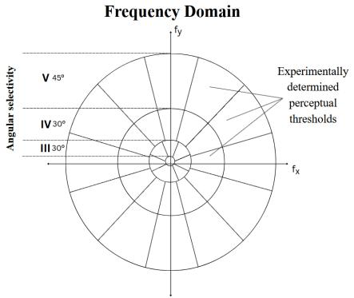

radar

| Angular selectivity | Frequency Domain |
| ------------------- | ---------------- |
| V 45°               | Experimental determined perceptual thresholds |
| IV 30°              | Experimental determined perceptual thresholds |
| III 30°             | Experimental determined perceptual thresholds |
| f_x                 | Experimental determined perceptual thresholds |

Figure A.1: Coronal frequency sub-bands used in psychovisual coding from Saadane et al. [17].

This work on visual codes over the course of a decade would result in among the first uses of vector quantization for image coding [36], a perceptually based image quality metric [45] and one of the foundations of discrete projection theory, where a central slice theorem is established for discrete Fourier space based as exact 1D forms of these psychovisual radial functions as slices and therefore projections in image space [16]. This work would even pioneer the use of the wavelet transform to projection data before it would be formalized as ridgelets by Candes and Donoho [26]. The Mojette transform would itself form the basis of an entire area of discrete tomography that creates discrete projections of images [46] in diverse areas such as image reconstruction [47, 48] and compression [49], computed tomography [50] and network transmission [51, 52]. Although the number of publications is too numerous to list here, a summary of these works and areas can be found in the Mojette transform book [53].

# B.2 The Frequency Domain

Intuitively, Discrete Fourier Transform (DFT) is the projection of any (finite) signal on the set of (harmonic) orthonormal basis functions created via the unit circle as the nth root of unity $e ^ { 2 \pi i / N } = 1$ with $N \in \mathbb { Z }$ and $i ^ { 2 } = - 1 [ 3 7 ]$ , i.e., the cyclotomy or division of a unit circle into equal parts. This projection results in weights for each of these harmonics known as the Fourier coefficients required to represent the signal and comprise in its frequency domain representation. Formally, the DFT $\hat { I } ( u , v )$ of an $N \times N$ image $I ( j , k )$ is defined as

$$
\hat {I} (u, v) = \sum_ {j = 0} ^ {N - 1} \sum_ {k = 0} ^ {N - 1} I (j, k) e ^ {- 2 \pi i u j / N} e ^ {- 2 \pi i v k / N}. \tag {2}
$$

The Inverse Discrete Fourier Transform (IDFT) is defined as

$$
I (j, k) = \frac {1}{N ^ {2}} \sum_ {u = 0} ^ {N - 1} \sum_ {v = 0} ^ {N - 1} \hat {I} (u, v) e ^ {2 \pi i u j / N} e ^ {2 \pi i v k / N}. \tag {3}
$$

Both the DFT and IDFT are row/column separable.

This DFT space has many useful properties, the main being the transformation of convolution operations into element-wise multiplication (i.e. the Hadamard product) known as the circular convolution property. Let $x [ j , k ] , y [ j , k ] , j , k \in { 0 , . . . , N - 1 }$ be two discrete $\mathbf { \hat { \boldsymbol { N } } } \times \mathbf { \boldsymbol { N } }$ spatial signals. The circular convolution of these two signals is defined as

$$
x [ j, k ] * y [ j, k ] = \frac {1}{N ^ {2}} \sum_ {m = 0} ^ {N - 1} \sum_ {n = 0} ^ {N - 1} x [ m, n ] y [ \langle (j - m) \rangle_ {N}, \langle (k - n) \rangle_ {N} ], \tag {4}
$$

where $\langle \cdot \rangle _ { N }$ denotes modulo N. The Convolution Theorem [29] then states that:

$$
\mathcal {F} [ x * y ] = \mathcal {F} [ x ] \odot \mathcal {F} [ y ] \text {or equivalently} x * y = \mathcal {F} ^ {- 1} [ \mathcal {F} [ x ] \odot \mathcal {F} [ y ] ] \tag {5}
$$

where $\mathcal { F } [ . ]$ and $\mathcal { F } ^ { - 1 } [ . ]$ denote the DFT and IDFT, and ⊙ the Hadamard product. Hence, circular convolution in the spatial domain is equivalent to applying the Hadamard product in the frequency domain. As such, the frequency domain is highly conducive to global representations, since each element of an image’s frequency spectra presents a unique global view of the image, analogous to convolving it with a directional striped kernel. In practice, the DFT and IDFT are computed using the Fast Fourier Transform and Inverse Fast Fourier Transform respectively [37].

# B.3 Complex-valued Neural Networks

Most work for complex-valued neural networks involve developing components of these networks to work in the complex domain, such as activation functions [54]. Most complex-valued CNNs use the network blocks introduced by Trabelsi et al. [55]. The distributive property of convolution allows convolution between a complex input $\pmb { h } = \pmb { a } + i \pmb { b }$ and a complex kernel $W = W _ { R } + i W _ { I }$ to be decomposed into four real-valued component wise convolutions:

$$
\boldsymbol {W} * \boldsymbol {h} = \left(\boldsymbol {W} _ {\boldsymbol {R}} * \boldsymbol {a} - \boldsymbol {W} _ {\boldsymbol {I}} * \boldsymbol {b}\right) + i \left(\boldsymbol {W} _ {\boldsymbol {I}} * \boldsymbol {a} + \boldsymbol {W} _ {\boldsymbol {R}} * \boldsymbol {b}\right) \tag {6}
$$

Consequently, complex-valued convolution layers are usually more computationally and memory intensive (additionally stores imaginary features) than real-valued ones. Trabelsi et al. [55] also developed complex normalization methods and activation functions. Complex-valued modules in PsychoNet use the complex-valued convolution (CConv) and batch-normalization (CBN) layers from Trabelsi et al. [55], and a naïve adaptation of the GELU activation function (CGELU) which just applies the original function to real and imaginary channels separately.

When applying complex-valued networks to real-valued images, most works use a small initial module to convert the input into complex-valued features. However, such approaches have yielded only minor improvements in the past over directly using real-valued networks [55, 56]. Accordingly, recent complex-valued networks predominantly focus on domains with naturally complex data, such as Magnetic Resonance Imaging (MRI), radar and audio signal processing [57–59, 38, 55]. To try bridge this gap, a complex-valued colour space by reinterpreting the cylindrical coordinates of the HSV colour model as 2D magnitude and phase was developed [20]. They applied this to standard complex-valued CNNs, improving results on common image classification tasks, but retained the high complexity of complex-valued networks. On the other hand, PsychoNet primarily uses real-valued modules (Phasor Blocks) that learn to generate complementary complex-valued features to given real features, as described in Section 3.

# C Experiment setup

In this section we present complete dataset details, training recipes and some additional results for the classification experiments conducted.

# C.1 ImageNet-1K

We use the standard large ImageNet-1K subset from [2] containing ∼1.2 million training and ∼50000 images for validation/testing. Table A.1 presents the training recipe used for ImageNet experiments.

Table A.1: ImageNet training recipe 

<table><tr><td>Setting</td><td>Value</td></tr><tr><td>Image size</td><td> $224 \times 224$ </td></tr><tr><td>Epochs</td><td>90</td></tr><tr><td>Batch size(overall, not per GPU)</td><td>1024</td></tr><tr><td>Loss</td><td>Cross entropy</td></tr><tr><td>Optimizer</td><td>AdamW ( $\beta_1 = 0.9$ ,  $\beta_2 = 0.999$ )</td></tr><tr><td>Scheduler</td><td>cosine</td></tr><tr><td>Initial learning rate (LR)</td><td> $5 \cdot 10^{-4}$ </td></tr><tr><td>Warmup</td><td>warmup LR =  $10^{-6}$ , 5 epochs</td></tr><tr><td>Learning rate decay</td><td>min. LR =  $10^{-5}$ , 12 epochs</td></tr><tr><td>Augmentation</td><td>resize, crop, interpolate, horizontal flip, RandAugment,MixUp, CutMix, label smoothing</td></tr><tr><td>GPU</td><td> $2 \times$  NVIDIA H100: Psycho-B, ResNet101,all ‘Big’ sized ablation models $2 \times$  AMD MI300X: Psycho-S, ResNet50 $4 \times$  AMD MI300X: All other models</td></tr></table>

Table A.1 presents all ImageNet-1K experiment results. PsychoNet moderately improves top-1 accuracy for all ResNet baselines (↑ 0.82%, 0.41%, 0.26% and 0.44% vs. ResNet50 to 270), and incurs a small decrease for ConvNeXt-S (↓ 0.19). Figure A.2 compares DVC filters learnt by different ResNet-based PsychoNet sizes, showing that with larger model size, the filters become increasingly structured and sparser, with clearer frequency selectivity and reduced noise. Figure A.3 compares DVC filters learnt by Psycho-B on ImageNet-1K to the smaller resolution/size datasets in Appendix C.2. It is evident that increasing image resolution and dataset size both yield much sparser filters. These results suggest that the sparse patterns correspond to a data-driven representation naturally emergent from visual information.

# C.1.1 PsychoDW representation analysis

Figures A.4 through A.6 present qualitative visualisations and analysis for PsychoDW identical to those applied to Psycho-B we presented in Section 4. Overall, these show similar results:

• Figure A.4 (a) shows that PsychoDW’s DVC filters also learn sparse selections of frequencies across each sub-band.   
• Figure A.4 (b) shows that similar to the Psycho-B vs. ResNet-101 comparison in Figure 7 (b), salience maps of PsychoDW’s low-mid level Phasor Blocks clearly emphasis specific object parts, while those of ConvNeXt-S are much more general and diffuse. Further examples of the former are shown in Figure A.5.

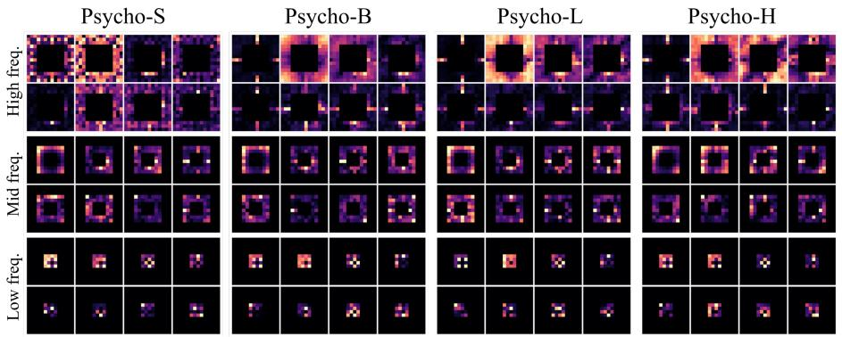

text_image

Psycho-S
Psycho-B
Psycho-L
Psycho-H
High freq.
Mid freq.
Low freq.

Figure A.2: Top Principle Components (PCs) of DVC filters learnt by different sized ResNet-based PsychoNet models on ImageNet-1K. ‘High/mid/low freq.’ refer to the [14, 8], [8, 4] and [4, 1] frequency sub-bands created by Spectral Branches.

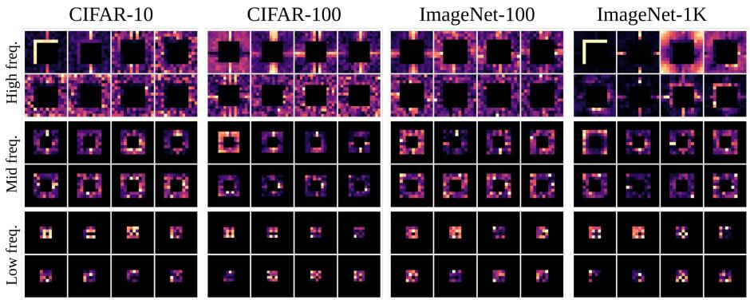

text_image

CIFAR-10
CIFAR-100
ImageNet-100
ImageNet-1K
High freq.
Mid freq.
Low freq.

Figure A.3: Top PCs of DVC filters learnt by Psycho-B on different resolution and size datasets. ‘High/mid/low freq.’ refer to the [14, 8], [8, 4] and [4, 1] frequency sub-bands created by Spectral Branches.

• Figure A.6 shows that similar to for Psycho-B in Figure 6, PsychoDW’s DVC appears to distribute object parts by scale between the three sub-bands, and individual filters within each sub-band target distinct selections of object parts.

Overall, these results are highly consistent with those for Psycho-B, showing that DVC abstractions and object-part-centric Phasor Block representations also translate to ConvNeXt-S.

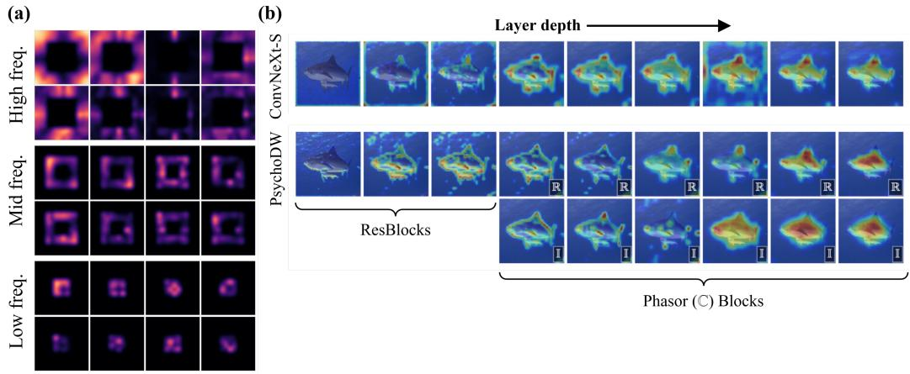

text_image

(a)
High freq.
(b)
ConvNeXt-S
Layer depth →
PsychoDW
ResBlocks
R R R R R
I I I I I
Phasor (©) Blocks

Figure A.4: (a) Top spatial principal components of DVC filters learnt by PsychoDW trained on ImageNet-1K. Bilinear smoothing has been applied. (b) Comparison between activation maps (via KPCA-CAM) of PsychoDW and ConvNeXt-S for a range of layer depths. Real and imaginary components are denoted by R and I.

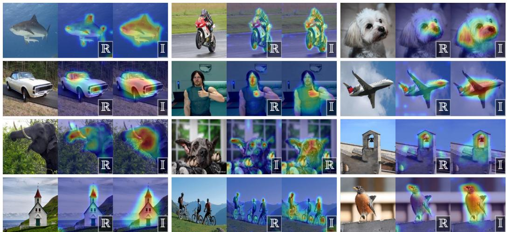

natural_image

Grid of 20 grayscale images showing various scenes including animals, vehicles, and human figures with thermal or perception overlays (no text or symbols)

Figure A.5: Assorted activation maps (via KPCA-CAM) for mid-level Phasor Blocks of PsychoDW. Real and imaginary components are denoted by R and I.

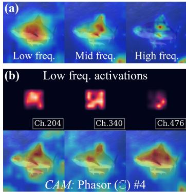

text_image

(a)
Low freq. Mid freq. High freq.
(b) Low freq. activations
Ch.204 Ch.340 Ch.476
CAM: Phasor (C) #4

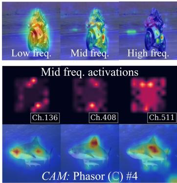

text_image

Low freq. Mid freq. High freq.
Mid freq. activations
Ch.136 Ch.408 Ch.511
CAM: Phasor (C) #4

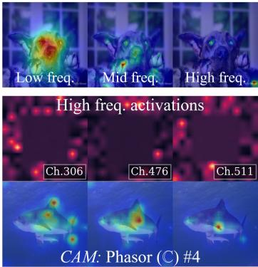

text_image

Low freq. Mid freq. High freq.
High freq. activations
Ch.306 Ch.476 Ch.511
CAM: Phasor (C) #4

Figure A.6: PsychoDW Phasor Block salience maps (via HiResCAM) conditioned on gradients (a) from individual Spectral Branch sub-bands and (b) from individual frequency domain feature channels.

# C.2 Smaller classification datasets

CIFAR-10 is a small scale dataset comprising 50000 natural images for training and 10000 images for testing across 10 classes, at a resolution of 32 × 32 [39]. For compatibility with this lower resolution (the ImageNet models have 224 × 224 input resolution), we reduce initial downsampling steps from our models. For ResNet and ResNet-based PsychoNet models, we removed the first maxpooling layer and set stride=1 for the first two ResBlocks that originally had stride=2. For ConvNeXt-S and PsychoDW, we replace the initial 4 × 4 patch embedding layer with a standard 3 × 3 Conv2D layer, and set stride=1 for the second downsampling layer. Table A.2 presents the training recipe for the CIFAR-10 experiments.

Table A.2: CIFAR-10 training recipe 

<table><tr><td>Setting</td><td>Value</td></tr><tr><td>Image size</td><td>32 × 32</td></tr><tr><td>Epochs</td><td>35</td></tr><tr><td>Batch size</td><td>64</td></tr><tr><td>Loss</td><td>Cross entropy</td></tr><tr><td>Optimizer</td><td>AdamW ( $\beta_1 = 0.9, \beta_2 = 0.999$ )</td></tr><tr><td>Scheduler</td><td>OneCycle</td></tr><tr><td>Learning rate (LR)</td><td> $10^{-3}$ </td></tr><tr><td>Augmentation</td><td>crop, horizontal flip</td></tr><tr><td>GPU</td><td>1× NVIDIA A100: Psycho-S/B, Psycho-Eff-S/B, ResNet50/1011× NVIDIA H100: All other models</td></tr></table>

CIFAR-100 contains the same images and train-test split as CIFAR-10, but with labels reorganised into 100 classes instead of 10. We use the same model configurations and training recipe as CIFAR-10, but increase the number of epochs to 90 since the greater number of classes results in a harder classification problem. Table A.2 presents the training recipe for the CIFAR-10 experiments. Overall, all of our PsychoNet models outperformed their respective CNN baselines.

ImageNet-100 is a subset of the ImageNet dataset [2] that contains examples for 100 classes. It contains 130100 images for training and 5100 images for testing, at the original resolution of $2 2 4 \times 2 2 4$ . The model architectures remain the same as the ImageNet experiments, but with the output linear layer modified to predict 100 logits. We use the same training recipe as ImageNet-1K (Table A.1), but reduce the batch size to 128. Psycho-S/B, Psycho-Eff-S/B and ResNet50/101 were trained on 1× NVIDIA A100, while all over models used 1× AMD MI300X. Overall, the ResNet-based PsychoNet models outperformed their respective baselines, but PsychoDW fell slightly short of ConvNeXt-S.

# C.3 Clustering visualisation

Figure A.7 presents an initial visualisation of clustering characteristics of Phasor Block activations and DVC for Psycho-B. These show 2D PCA projections of features computed on samples from 10 randomly-selected classes from ImageNet-1K. Observable clustering emerges across both the real and imaginary/magnitude-phase feature components, and becomes increasingly pronounced at deeper layers.

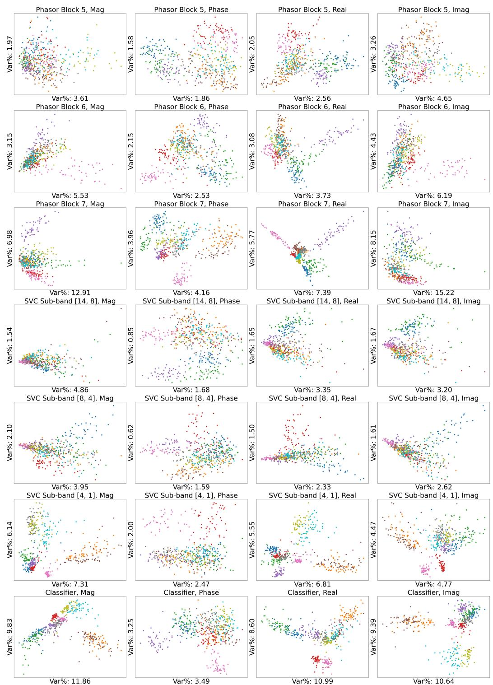  
Figure A.7: Psycho-B clustering visualisation.

# D Model configurations

Here we provide full details of the architectural configurations of all of our models. For all tables, we use the ResNet approach of counting the number of model layers as the number of convolutional and linear layers; each element-wise filter block in Hadamard Blocks are also counted as one layer.

# D.1 CNN baselines

The ResNet50, 101 and 152 models we use are from He et al. [3] and are implemented in most common deep learning frameworks (we use the one from PyTorch [60]). For ResNet270, we follow the block configurations in Bello et al. [61], but do not implement any of the newer blocks/layers they also introduce, so it purely just adds more residual bottleneck blocks (ResBlocks) to ResNet152 for fair scaling. Table A.3 compares the sizes of the four ResNet models as well as their block configurations, grouped by feature resolution (which are 56 × 56, 28 × 28, 14 × 14 and $7 \times 7 )$ ).

Table A.3: ResNet block configurations. 

<table><tr><td>Model</td><td>Parameters (M)</td><td># Layers</td><td># Blocks</td></tr><tr><td>ResNet50</td><td>25.56</td><td>54</td><td>[3-4-6-3]</td></tr><tr><td>ResNet101</td><td>44.55</td><td>105</td><td>[3-4-23-3]</td></tr><tr><td>ResNet152</td><td>60.19</td><td>156</td><td>[3-8-36-3]</td></tr><tr><td>ResNet270</td><td>89.60</td><td>276</td><td>[4-29-53-3]</td></tr></table>

For ConvNeXt-S, we follow the original implemention in Liu et al. [6].

# D.2 PsychoNet

Table A.4 summarises the key configuration details of each base PsychoNet variant, namely the feature resolution and channel width at each Phasor Block and the number of filters used in the DVC module. Further architectural details for each model are reported in Tables A.5 through A.9. For Phasor Blocks, we list each layer using the ‘resolution: layer configuration’ format. The ResNet-based PsychoNet models use the same initial input embedding layer as ResNet (7 × 7 Conv2D and maxpooling) is used, while PsychoDW uses the same 4 × 4 patch embeddings as ConvNeXt-S. Interestingly, we found that using the initial layers of ResNet50, instead of ConvNeXt-S, in our ConvNeXt-S based PsychoDW actually yielded better results (approx. ↑ 0.5% top-1 accuracy on ImageNet-1K), so we chose to use it for the model. However, we do change all ConvBlocks in Phasor (C) (see Figure A.8) to depthwise convolution blocks to maintain general faithfulness to the ConvNeXt model.

Finally, the companding operation we apply after taking the 2D FFT (in Figure 3) simply zeros the DC component and applies the element-wise function:

$$
x \in \mathbb {C}, \quad \text { Compand }: x \rightarrow | x | ^ {\frac {1}{1 . 2 5}} \cdot \exp (i \angle x) \tag {7}
$$

where |x| denotes the magnitude of x and $\angle x$ its phase. Since the exponent applied to the magnitude is $\in ( 0 , 1 )$ , this function compresses frequencies of large magnitude (i.e. frequencies very close to the DC component), and expands the magnitude of those further from it.

Table A.4: Configuration summary of different PsychoNet variants. For Phasor Blocks, we display resolution: [#channels per block], and $^ { \star } ( \mathbb { I } ) ^ { \star }$ denotes a Phasor Block (I)). #Filters denotes the number of channels of element-wise filters per sub-band of DVC. #Layers show overall layers / complex convolution layer counts. 

<table><tr><td>Model</td><td>Phasor Blocks</td><td>#Filters</td><td>#Layers</td><td>Params (M)</td></tr><tr><td>Psycho-S</td><td> $14 \times 14: [256 (II), 256, 384, 512, 512]$ </td><td>512</td><td>65 / 9</td><td>25.35</td></tr><tr><td>Psycho-B</td><td> $28 \times 28: [256 (II), 256, 256, 384]$  $14 \times 14: [384, 384, 512, 512, 512]$ </td><td>512</td><td>93 / 13</td><td>42.01</td></tr><tr><td>Psycho-L</td><td> $28 \times 28: [256 (II), 512, 512, 512]$  $14 \times 14: [512, 512, 512, 512, 512]$ </td><td>512</td><td>93 / 13</td><td>61.28</td></tr><tr><td>Psycho-H</td><td> $28 \times 28: [256 (II), 512, 512, 512]$  $14 \times 14: [512, 512, 512, 640, 1024]$ </td><td>1024</td><td>93 / 13</td><td>88.61</td></tr><tr><td>Psycho-DW</td><td> $28 \times 28: [256 (II), 256, 256, 512]$  $14 \times 14: [512, 1024, 1024, 1024, 1024]$ </td><td>2048</td><td>109 / 13</td><td>49.512</td></tr></table>

Table A.5: Detailed architecture of Psycho-S. 

<table><tr><td colspan="2">Psycho-S - comparable size to ResNet50</td></tr><tr><td>Parameters (M)</td><td>25.35</td></tr><tr><td># Layers (overall)</td><td>65</td></tr><tr><td># Layers (complex)</td><td>9</td></tr><tr><td colspan="2">Blocks</td></tr><tr><td>Input layer</td><td>Conv2D(7 × 7,  $d_{\text{in}}$ =3,  $d_{\text{out}}$ =64, stride=2), MaxPool(3 × 3, stride=2)</td></tr><tr><td>Initial CNN layers</td><td>First 7 ResBlocks from ResNet50 (first two resolution stages).</td></tr><tr><td>Phasor Blocks</td><td>14 × 14: (I) [ $d_{\text{in}}$ =128,  $d_{\text{out}}$ =256, stride=2]14 × 14: (C) [ $d_{\text{in}}$ =256,  $d_{\text{out}}$ =256]14 × 14: (C) [ $d_{\text{in}}$ =256,  $d_{\text{out}}$ =384]14 × 14: (C) [ $d_{\text{in}}$ =384,  $d_{\text{out}}$ =512]14 × 14: (C) [ $d_{\text{in}}$ =512,  $d_{\text{out}}$ =512]</td></tr><tr><td>Spectral filters</td><td>Sub-bands ([crop, drop]): [14, 8], [8, 4], [4, 1], d_filter = 512</td></tr><tr><td>Output layer</td><td>Average pool, ComplexLinear( $d_{\text{in}}$ =1536,  $d_{\text{out}}$ =1000), Softmax</td></tr></table>

Table A.6: Detailed architecture of Psycho-B. 

<table><tr><td colspan="2">Psycho-B architecture - comparable size to ResNet101</td></tr><tr><td>Parameters (M)</td><td>42.01</td></tr><tr><td># Layers (overall)</td><td>93</td></tr><tr><td># Layers (complex)</td><td>13</td></tr><tr><td colspan="2">Blocks</td></tr><tr><td>Input layer</td><td>Conv2D(7 × 7,  $d_{in}=3$ ,  $d_{out}=64$ , stride=2), MaxPool(3 × 3, stride=2)</td></tr><tr><td>Initial CNN layers</td><td>First 7 ResBlocks from ResNet101 (first two resolution stages).</td></tr><tr><td>Phasor Blocks</td><td> $\mathbf{28} \times \mathbf{28}$ : ( $\mathbb{I}$ ) [ $d_{in}=128$ ,  $d_{out}=256$ ] $\mathbf{28} \times \mathbf{28}$ : ( $\mathbb{C}$ ) [ $d_{in}=256$ ,  $d_{out}=256$ ] $\mathbf{28} \times \mathbf{28}$ : ( $\mathbb{C}$ ) [ $d_{in}=256$ ,  $d_{out}=256$ ] $\mathbf{28} \times \mathbf{28}$ : ( $\mathbb{C}$ ) [ $d_{in}=258$ ,  $d_{out}=384$ ] $\mathbf{14} \times \mathbf{14}$ : ( $\mathbb{C}$ ) [ $d_{in}=384$ ,  $d_{out}=384$ , stride=2] $\mathbf{14} \times \mathbf{14}$ : ( $\mathbb{C}$ ) [ $d_{in}=384$ ,  $d_{out}=384$ ] $\mathbf{14} \times \mathbf{14}$ : ( $\mathbb{C}$ ) [ $d_{in}=384$ ,  $d_{out}=512$ ] $\mathbf{14} \times \mathbf{14}$ : ( $\mathbb{C}$ ) [ $d_{in}=512$ ,  $d_{out}=512$ ] $\mathbf{14} \times \mathbf{14}$ : ( $\mathbb{C}$ ) [ $d_{in}=512$ ,  $d_{out}=512$ ]</td></tr><tr><td>Spectral filters</td><td>Sub-bands ([crop, drop]): [14, 8], [8, 4], [4, 1], d_filter = 512</td></tr><tr><td>Output layer</td><td>Average pool, ComplexLinear( $d_{in}=1536$ ,  $d_{out}=1000$ ), Softmax</td></tr></table>

Table A.7: Detailed architecture of Psycho-L. 

<table><tr><td colspan="2">Psycho-L architecture - comparable size to ResNet152</td></tr><tr><td>Parameters (M)</td><td>61.28</td></tr><tr><td># Layers (overall)</td><td>93</td></tr><tr><td># Layers (complex)</td><td>13</td></tr><tr><td colspan="2">Blocks</td></tr><tr><td>Input layer</td><td>Conv2D(7 × 7,  $d_{in}$ =3,  $d_{out}$ =64, stride=2), MaxPool(3 × 3, stride=2)</td></tr><tr><td>Initial CNN layers</td><td>First 7 ResBlocks from ResNet152.</td></tr><tr><td rowspan="2">Phasor Blocks</td><td> $\mathbf{28} \times \mathbf{28}$ : ( $\mathbb{I}$ ) [ $d_{in}$ =128,  $d_{out}$ =256] $\mathbf{28} \times \mathbf{28}$ : ( $\mathbb{C}$ ) [ $d_{in}$ =256,  $d_{out}$ =512] $\mathbf{28} \times \mathbf{28}$ : ( $\mathbb{C}$ ) [ $d_{in}$ =512,  $d_{out}$ =512] $\mathbf{28} \times \mathbf{28}$ : ( $\mathbb{C}$ ) [ $d_{in}$ =512,  $d_{out}$ =512]</td></tr><tr><td> $\mathbf{14} \times \mathbf{14}$ : ( $\mathbb{C}$ ) [ $d_{in}$ =512,  $d_{out}$ =512, stride=2] $\mathbf{14} \times \mathbf{14}$ : ( $\mathbb{C}$ ) [ $d_{in}$ =512,  $d_{out}$ =512] $\mathbf{14} \times \mathbf{14}$ : ( $\mathbb{C}$ ) [ $d_{in}$ =512,  $d_{out}$ =512] $\mathbf{14} \times \mathbf{14}$ : ( $\mathbb{C}$ ) [ $d_{in}$ =512,  $d_{out}=512$ ]</td></tr><tr><td>Spectral filters</td><td>Sub-bands ([crop, drop]): [14, 8], [8, 4], [4, 1], d_filter = 512</td></tr><tr><td>Output layer</td><td>Average pool, ComplexLinear( $d_{in}$ =1536,  $d_{out}$ =1000), Softmax</td></tr></table>

Table A.8: Detailed architecture of Psycho-H. 

<table><tr><td colspan="2">Psycho-H architecture - comparable size to ResNet270</td></tr><tr><td>Parameters (M)</td><td>88.61</td></tr><tr><td># Layers (overall)</td><td>93</td></tr><tr><td># Layers (complex)</td><td>13</td></tr><tr><td colspan="2">Blocks</td></tr><tr><td>Input layer</td><td>Conv2D(7 × 7,  $d_{in}$ =3,  $d_{out}$ =64, stride=2), MaxPool(3 × 3, stride=2)</td></tr><tr><td>Initial CNN layers</td><td>First 7 ResBlocks from ResNet270.</td></tr><tr><td rowspan="2">Phasor Blocks</td><td> $\mathbf{28} \times \mathbf{28}$ : ( $\mathbb{I}$ ) [ $d_{in}$ =128,  $d_{out}$ =256] $\mathbf{28} \times \mathbf{28}$ : ( $\mathbb{C}$ ) [ $d_{in}$ =256,  $d_{out}$ =512] $\mathbf{28} \times \mathbf{28}$ : ( $\mathbb{C}$ ) [ $d_{in}$ =512,  $d_{out}$ =512] $\mathbf{28} \times \mathbf{28}$ : ( $\mathbb{C}$ ) [ $d_{in}$ =512,  $d_{out}$ =512]</td></tr><tr><td> $\mathbf{14} \times \mathbf{14}$ : ( $\mathbb{C}$ ) [ $d_{in}$ =512,  $d_{out}$ =512, stride=2] $\mathbf{14} \times \mathbf{14}$ : ( $\mathbb{C}$ ) [ $d_{in}$ =512,  $d_{out}$ =512] $\mathbf{14} \times \mathbf{14}$ : ( $\mathbb{C}$ ) [ $d_{in}$ =512,  $d_{out}$ =512] $\mathbf{14} \times \mathbf{14}$ : ( $\mathbb{C}$ ) [ $d_{in}$ =512,  $d_{out}=640$ ] $\mathbf{14} \times \mathbf{14}$ : ( $\mathbb{C}$ ) [ $d_{in}$ =640,  $d_{out}$ =1024]</td></tr><tr><td>Spectral filters</td><td>Sub-bands ([crop, drop]): [14, 8], [8, 4], [4, 1], d_filter = 1024</td></tr><tr><td>Output layer</td><td>Average pool, ComplexLinear( $d_{in}$ =3072,  $d_{out}$ =1000), Softmax</td></tr></table>

Table A.9: Detailed architecture of PsychoDW. 

<table><tr><td colspan="2">PsychoDW architecture - comparable size to ConvNeXt-S</td></tr><tr><td>Parameters (M)</td><td>49.512</td></tr><tr><td># Layers (overall)</td><td>109</td></tr><tr><td># Layers (complex)</td><td>13</td></tr><tr><td colspan="2">Blocks</td></tr><tr><td>Input layer</td><td>Conv2D(7 × 7,  $d_{in}$ =3,  $d_{out}$ =64, stride=2), MaxPool(3 × 3, stride=2)</td></tr><tr><td>Initial CNN layers</td><td>First 7 ResBlocks from ResNet50.</td></tr><tr><td>Phasor Blocks</td><td> $\mathbf{28} \times \mathbf{28}$ : ( $\mathbb{I}$ ) [ $d_{in}$ =128,  $d_{out}$ =256] $\mathbf{28} \times \mathbf{28}$ : ( $\mathbb{C}$ ) [ $d_{in}$ =256,  $d_{out}$ =256] $\mathbf{28} \times \mathbf{28}$ : ( $\mathbb{C}$ ) [ $d_{in}$ =256,  $d_{out}$ =256] $\mathbf{28} \times \mathbf{28}$ : ( $\mathbb{C}$ ) [ $d_{in} = 256, d_{out} = 512$ ] $\mathbf{14} \times \mathbf{14}$ : ( $\mathbb{C}$ ) [ $d_{in}$ =512,  $d_{out}$ =512, stride=2] $\mathbf{14} \times \mathbf{14}$ : ( $\mathbb{C}$ ) [ $d_{in}$ =512,  $d_{out}$ =1024] $\mathbf{14} \times \mathbf{14}$ : ( $\mathbb{C}$ ) [ $d_{in}$ =1024,  $d_{out}$ =1024] $\mathbf{14} \times \mathbf{14}$ : ( $\mathbb{C}$ ) [ $d_{in}$ =1024,  $d_{out}$ =1024] $\mathbf{14} \times \mathbf{14}$ : ( $\mathbb{C}$ ) [ $d _{in}$ =1024,  $d _{out}$ =1024]</td></tr><tr><td>Spectral filters</td><td>Sub-bands ([crop, drop]): [14, 8], [8, 4], [4, 1], d_filter = 1024</td></tr><tr><td>Output layer</td><td>Average pool, ComplexLinear( $d_{in}$ =3072,  $d_{out}$ =1000), Softmax</td></tr></table>

# D.3 Phasor Block architecture

Figure A.8 provides detailed architectural diagrams of Phasor Blocks, with key design choices discussed below.

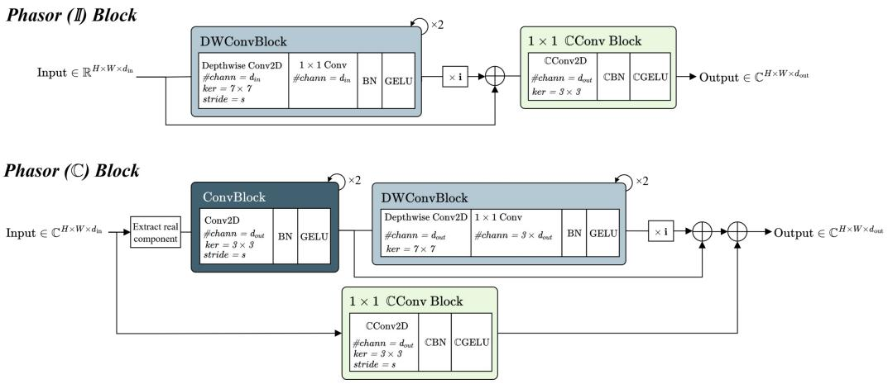

flowchart

```mermaid
graph TD
    A["Input ∈ ℝ^H×W×d_in"] --> B["DWConvBlock"]
    B --> C["×2"]
    C --> D["1 × 1 CCov Block"]
    D --> E["Output ∈ ℃^H×W×d_out"]
    
    F["Input ∈ ℃^H×W×d_in"] --> G["Extract real component"]
    G --> H["ConvBlock"]
    H --> I["×2"]
    I --> J["DWConvBlock"]
    J --> K["×2"]
    K --> L["Output ∈ ℃^H×W×d_out"]
    
    M["Input ∈ ℃^H×W×d_in"] --> N["Extract real component"]
    N --> O["ConvBlock"]
    O --> P["×2"]
    P --> Q["DWConvBlock"]
    Q --> R["×2"]
    R --> S["Output ∈ ℃^H×W×d_out"]
    
    T["Input ∈ ℃^H×W×d_in"] --> U["Extract real component"]
    U --> V["ConvBlock"]
    V --> W["×2"]
    W --> X["DWConvBlock"]
    X --> Y["×2"]
    Y --> Z["Output ∈ ℃^H×W×d_out"]
    
    AA["Input ∈ ℃^H×W×d_in"] --> AB["Extract real component"]
    AB --> AC["ConvBlock"]
    AC --> AD["×2"]
    AD --> AE["DWConvBlock"]
    AE --> AF["×2"]
    AF --> AG["Output ∈ ℃^H×W×d_out"]
    
    AH["Input ∈ ℃^H×W×d_in"] --> AI["Extract real component"]
    AI --> AJ["ConvBlock"]
    AJ --> AK["×2"]
    AK --> AL["DWConvBlock"]
    AL --> AM["×2"]
    AM --> AN["Output ∈ ℃^H×W×d_out"]
    
    AO["Input ∈ ℃^H×W×d_in"] --> AP["Extract real component"]
    AP --> AQ["ConvBlock"]
    AQ --> AR["×2"]
    AR --> AS["DWConvBlock"]
    AS --> AT["×2"]
    AT --> AU["Output ∈ ℃^H×W×d_out"]
    
    AV["Input ∈ ℃^H×W×d_in"] --> AW["Extract real component"]
    AW --> AX["ConvBlock"]
    AX --> AY["×2"]
    AY --> AZ["DWConvBlock"]
    AZ --> BA["×2"]
    BA --> BB["Output ∈ ℃^H×W×d_out"]
    
    BC["Input ∈ ℃^H×W×d_in"] --> BD["Extract real component"]
    BD --> BE["ConvBlock"]
    BE --> BF["×2"]
    BF --> BG["DWConvBlock"]
    BG --> BH["×2"]
    BH --> BI["Output ∈ ℃^H×W×d_out"]
    
    BJ["Input ∈ ℃^H×W×d_in"] --> BK["Extract real component"]
    BK --> BL["ConvBlock"]
        BL --> BM["×2"]
        BM --> BN["CBN"]
        BN --> BO["CGLU"]
    
    BP["Input ∈ ℃^H×W×d_in"] --> BQ["Extract real component"]
    BQ --> BR["CBN"]
    BR --> BS["CGLU"]
    
    BT["Input ∈ ℃^H×W×d_in"] --> BU["Extract real component"]
    BU --> BV["CBN"]
    BV --> BW["CGLU"]
    
    BX["Input ∈ ℃^H×W×d_in"] --> BY["Extract real component"]
    BY --> BZ["CBN"]
    BZ --> CA["CGLU"]
    
    CB["Input ∈ ℃^H×W×d_in"] --> CC["Extract real component"]
    CC --> DD["CBN"]
    DD --> DP["CGLU"]
    
    EQ["Input ∈ ℃^H×W×d_in"] --> BFQ["Extract real component"]
    BFQ --> BQ
    BQ --> BR
    BR --> BS
    BS --> BT
```

Figure A.8: Further architecture details for the Phasor Blocks presented in Figure 3. For ConvNeXtbased PsychoNet, we replace the two ConvBlocks at the start of Phasor (C) blocks with two DWConvBlocks with the same number of channels. CConv/BN/GELU denote complex-valued convolution, batch norm and GELU operations - see Appendix B.3. The following PsychoNet architecture tables specify the values of $d _ { \mathrm { i n } } , d _ { \mathrm { o u t } }$ and stride (s) for all of their Phasor Blocks.

Phasor (I) blocks generate an initial set of imaginary components using depthwise convolution (‘DWConv’) blocks, comprising pairs of depthwise and 1 × 1 convolution layers. This configuration decouples spatial and channel mixing, which is intended to encourage cross-channel interactions without interfering with spatial relationships. In natural complex signals, the real and imaginary components carry complementary information for the same spatial location [29, 38], so it is likely important that our generated imaginary features do not significantly introduce new spatial information. $\mathbf { A } 1 \times 1$ complex convolution block then mixes the real and imaginary features. Subsequently, Phasor (C) blocks further refine the complex representations. The top branch generates new real and imaginary features, while the bottom channel-mixes the original features and combines them with the new ones. For ConvNeXt-based PsychoNet, we replace Phasor (C) ’s regular convolution (‘Conv’) blocks with further DWConv blocks with $7 \times 7$ kernel size, matching ConvNeXt’s main computational block.

# D.4 Efficient PsychoNet

The base PsychoNet models have considerably higher FLOP count compared to ResNet primarily because they only downsample spatial resolution to 14 × 14 at smallest, whereas ResNet (and many other standard CNNs) typically downsample further to $7 \times 7 .$ . To address this, we introduced the FLOP-efficient PsychoNet variants Psycho-Eff-S/B/L, which incorporate two main architectural changes to improve computational efficiency. First, we add an additional downsampling stage to the Phasor Blocks to reduce the feature resolution to $7 \times 7 .$ . In these models, the [14, 7] sub-band is extracted from the last 14 × 14 Phasor Block, while the remaining sub-bands are extracted from the final $7 \times 7$ block. The specific Phasor Blocks from which these sub-bands are extracted for DVC are explicitly labelled in the architecture tables below. Second, within the Phasor (C) blocks, we streamline the architecture by using only one Conv Block and one DWConv block respectively, whereas the base PsychoNet models utilize two of each (as shown in Figure 3). Table A.10 summarises the key configuration details of each efficient PsychoNet variant, namely the feature resolution and channel width at each Phasor Block and the number of filters used in the DVC module. Further architectural details for each model are reported in Tables A.11 through A.13.

Table A.10: Configuration summary of different efficient PsychoNet variants. For Phasor Blocks, we display resolution: [#channels per block], and $^ { \bullet } ( \mathbb { I } ) ^ { \bullet }$ denotes a Phasor Block (I)). #Filters denotes the number of channels of element-wise filters per sub-band of DVC. #Layers show overall layers / complex convolution layer counts. 

<table><tr><td>Model</td><td>Phasor Blocks</td><td>#Filters</td><td>#Layers</td><td>Params (M)</td></tr><tr><td>Psycho-Eff-S</td><td>14 × 14: [256 (II), 256, 512]7 × 7: [512, 512, 768]</td><td>768</td><td>57 / 9</td><td>25.35</td></tr><tr><td>Psycho-Eff-B</td><td>28 × 28: [256 (II)]14 × 14: [512, 512, 512, 512]7 × 7: [768, 768, 768]</td><td>768</td><td>65 / 11</td><td>45.82</td></tr><tr><td>Psycho-Eff-L</td><td>28 × 28: [256 (II)]14 × 14: [512, 512, 512, 512, 512, 512]7 × 7: [1024, 1024]</td><td>1024</td><td>85 / 13</td><td>62.03</td></tr></table>

Table A.11: Detailed architecture of Psycho-Eff-S. 

<table><tr><td colspan="2">Psycho-Eff-S</td></tr><tr><td>Parameters (M)</td><td>25.35</td></tr><tr><td># Layers (overall)</td><td>57</td></tr><tr><td># Layers (complex)</td><td>9</td></tr><tr><td colspan="2">Blocks</td></tr><tr><td>Input layer</td><td>Conv2D(7 × 7,  $d_{\text{in}}$ =3,  $d_{\text{out}}$ =64, stride=2), MaxPool(3 × 3, stride=2)</td></tr><tr><td>Initial CNN layers</td><td>First 7 ResBlocks from ResNet50.</td></tr><tr><td>Phasor Blocks</td><td>14 × 14: (I) [ $d_{\text{in}}$ =128,  $d_{\text{out}}$ =256, stride=2]14 × 14: (C) [ $d_{\text{in}}$ =256,  $d_{\text{out}}$ =256]14 × 14: (C) [ $d_{\text{in}}$ =256,  $d_{\text{out}}$ =512] → extract [14, 7] sub-band7 × 7: (C) [ $d_{\text{in}}$ =512,  $d_{\text{out}}$ =512, stride=2]7 × 7: (C) [ $d_{\text{in}}$ =512,  $d_{\text{out}}$ =512]7 × 7: (C) [ $d_{\text{in}}$ =512,  $d_{\text{out}}$ =768] → extract [7, 4], [4, 1] sub-bands</td></tr><tr><td>Spectral filters</td><td>Sub-bands ([crop, drop]): [14, 7], [7, 4], [4, 1]</td></tr><tr><td>Output layer</td><td>Average pool, ComplexLinear( $d_{\text{in}}$ =2304,  $d_{\text{out}}$ =1000), Softmax</td></tr></table>

# E Ablation studies

CIFAR-10 Below we present architecture details for the barebones ablation architectures used for the experiments in Table 2. Table A.14 presents the architecture of Model I; Model II just removes the DVC entirely, directly feeding the features from the Phasor Blocks into the output layer after applying FFT. Table A.15 presents the architecture of Model III, which replaces the Phasor Blocks of Model I with simple Conv. blocks, matching the overall parameter size and layer depth of Model I. Each simple Conv. block contains two stacks of 3 × 3 Conv2D → BatchNorm2D → GeLU. Model IV removes DVC from Model III in the same manner as Model I → Model II.

ImageNet-1K ablations Below we present architecture details for the ablation experiments presented in Table 3.

Model A is identical to Psycho-L (Table A.7). Model B just removes Spectral Branches from Model A, replacing it with a single Hadamard Block with full band 14 × 14 filters and no prior DropCrop operations. Model C removes all Phasor (C) Blocks and makes up for the resultant layer and parameter deficit by adding additional ResBlocks; its architecture is presented in Table A.16. Model D removes Spectral Branches from Model C in the same manner as Model A → Model B.

Table A.12: Detailed architecture of Psycho-Eff-B. 

<table><tr><td></td><td>Psycho-Eff-B - efficient variant of Psycho-B</td></tr><tr><td>Parameters (M)</td><td>45.82</td></tr><tr><td># Layers (overall)</td><td>65</td></tr><tr><td># Layers (complex)</td><td>11</td></tr><tr><td colspan="2">Blocks</td></tr><tr><td>Input layer</td><td>Conv2D(7 × 7,  $d_{in}$ =3,  $d_{out}$ =64, stride=2), MaxPool(3 × 3, stride=2)</td></tr><tr><td>Initial CNN layers</td><td>First 7 ResBlocks from ResNet101.</td></tr><tr><td>Phasor Blocks</td><td> $\mathbf{28} \times \mathbf{28}$ : ( $\mathbb{I}$ ) [ $d_{in}$ =128,  $d_{out}$ =256] $\mathbf{14} \times \mathbf{14}$ : ( $\mathbb{C}$ ) [ $d_{in}$ =256,  $d_{out}$ =512, stride=2] $\mathbf{14} \times \mathbf{14}$ : ( $\mathbb{C}$ ) [ $d_{in}$ =512,  $d_{out}$ =512] $\mathbf{14} \times \mathbf{14}$ : ( $\mathbb{C}$ ) [ $d_{in}$ =512,  $d_{out}$ =512] $\mathbf{14} \times \mathbf{14}$ : ( $\mathbb{C}$ ) [ $d_{in}$ =512,  $d_{out}=512$ ] → extract [14, 7] sub-band $\mathbf{7} \times \mathbf{7}$ : ( $\mathbb{C}$ ) [ $d_{in}$ =512,  $d_{out}=768$ , stride=2] $\mathbf{7} \times \mathbf{7}$ : ( $\mathbb{C}$ ) [ $d_{in}$ =768,  $d_{out}=768$ ] $\mathbf{7} \times \mathbf{7}$ : ( $\mathbb{C}$ ) [ $d_{in}$ =768,  $d_{out}=768$ ] → extract [7, 4], [4, 1] sub-bands</td></tr><tr><td>Spectral filters</td><td>Sub-bands ([crop, drop]): [14, 7], [7, 4], [4, 1]</td></tr><tr><td>Output layer</td><td>Average pool, ComplexLinear( $d_{in}$ =2304,  $d_{out}$ =1000), Softmax</td></tr></table>

Table A.13: Detailed architecture of Psycho-Eff-L. 

<table><tr><td></td><td>Psycho-Eff-L - efficient variant of Psycho-L</td></tr><tr><td>Parameters (M)</td><td>62.03</td></tr><tr><td># Layers (overall)</td><td>85</td></tr><tr><td># Layers (complex)</td><td>13</td></tr><tr><td colspan="2">Blocks</td></tr><tr><td>Input layer</td><td>Conv2D(7 × 7,  $d_{\text{in}}$ =3,  $d_{\text{out}}$ =64, stride=2), MaxPool(3 × 3, stride=2)</td></tr><tr><td>Initial CNN layers</td><td>First 11 ResBlocks from ResNet152.</td></tr><tr><td>Phasor Blocks</td><td> $\mathbf{28} \times \mathbf{28}$ : ( $\mathbb{I}$ ) [ $d_{\text{in}}$ =128,  $d_{\text{out}}$ =256] $\mathbf{14} \times \mathbf{14}$ : ( $\mathbb{C}$ ) [ $d_{\text{in}}$ =256,  $d_{\text{out}}$ =512, stride=2] $\mathbf{14} \times \mathbf{14}$ : ( $\mathbb{C}$ ) [ $d_{\text{in}}$ =512,  $d_{\text{out}}$ =512] $\mathbf{14} \times \mathbf{14}$ : ( $\mathbb{C}$ ) [ $d_{\text{in}}$ =512,  $d_{\text{out}}$ =512] $\mathbf{14} \times \mathbf{14}$ : ( $\mathbb{C}$ ) [ $d_{\text{in}}$  =512,  $d_{\text{out}}$ =512] $\mathbf{14} \times \mathbf{14}$ : ( $\mathbb{C}$ ) [ $d_{\text{in}}$ =512,  $d_{\text{out}}$ =512] $\mathbf{14} \times \mathbf{14}$ : ( $\mathbf{C}$ ) [ $d_{\text{in}}$ =512,  $d_{\text{out}}$ =512] → extract [14, 7] sub-band $\mathbf{7} \times \mathbf{7}$ : ( $\mathbb{C}$ ) [ $d_{\text{in}}$ =512,  $d_{\text{out}}$ =1024, stride=2] $\mathbf{7} \times \mathbf{7}$ : ( $\mathbb{C}$ ) [ $d_{\text{in}}$ =1024,  $d_{\text{out}}$ =1024] → extract [7, 4], [4, 1] sub-bands</td></tr><tr><td>Spectral filters</td><td>Sub-bands ([crop, drop]): [14, 7], [7, 4], [4, 1]</td></tr><tr><td>Output layer</td><td>Average pool, ComplexLinear( $d_{\text{in}}$ =3072,  $d_{\text{out}}$ =1000), Softmax</td></tr></table>

Table A.14: Detailed architecture of Ablation Model I. 

<table><tr><td colspan="2">Ablation Model I</td></tr><tr><td>Parameters (M)</td><td>2.366</td></tr><tr><td># Layers (overall)</td><td>16</td></tr><tr><td># Layers (complex)</td><td>5</td></tr><tr><td colspan="2">Blocks</td></tr><tr><td>Input layer</td><td>Conv2D(3 × 3,  $d_{in}$ =3,  $d_{out}$ =64, stride=1), No MaxPool</td></tr><tr><td>Phasor Blocks</td><td> $(\mathbb{I})$  [ $d_{in}$ =64,  $d_{out}$ =256, stride=2] $(\mathbb{C})$  [ $d_{in}$ =256,  $d_{out}$ =256]</td></tr><tr><td>Spectral filters</td><td>Sub-bands ([crop, drop]): [8, 4], [4, 1], d_filter = 256</td></tr><tr><td>Output layer</td><td>Average pool, ComplexLinear( $d_{in}$ =512,  $d_{out}$ =10), Softmax</td></tr></table>

Table A.15: Detailed architecture of Ablation Model III. 

<table><tr><td colspan="2">Ablation Model III</td></tr><tr><td>Parameters (M)</td><td>2.360</td></tr><tr><td># Layers (overall)</td><td>17</td></tr><tr><td># Layers (complex)</td><td>1</td></tr><tr><td colspan="2">Blocks</td></tr><tr><td>Input layer</td><td>Conv2D( $3 \times 3$ ,  $d_{\text{in}}=3$ ,  $d_{\text{out}}=64$ , stride=1), No MaxPool</td></tr><tr><td>Simple Conv. blocks</td><td> $[d_{\text{in}}=64, d_{\text{out}}=64]$  $[d_{\text{in}}=64, d_{\text{out}}=64]$  $[d_{\text{in}}=64, d_{\text{out}}=128, \text{stride}=2]$  $[d_{\text{in}}=128, d_{\text{out}}=192]$  $[d_{\text{in}}=192, d_{\text{out}}=256]$ </td></tr><tr><td>Phasor Blocks</td><td>None</td></tr><tr><td>Spectral filters</td><td>Sub-bands ([crop, drop]): [8, 4], [4, 1], d_filter = 256</td></tr><tr><td>Output layer</td><td>Average pool, ComplexLinear( $d_{\text{in}}=512$ ,  $d_{\text{out}}=10$ ), Softmax</td></tr></table>

Table A.16: Detailed architecture of the Model C ablation model. 

<table><tr><td colspan="2">Ablation Model C architecture</td></tr><tr><td>Parameters (M)</td><td>60.42</td></tr><tr><td># Layers (overall)</td><td>90</td></tr><tr><td># Layers (complex)</td><td>2</td></tr><tr><td colspan="2">Blocks</td></tr><tr><td>Input layer</td><td>Conv2D(7 × 7,  $d_{in}=3$ ,  $d_{out}=64$ , stride=2), MaxPool(3 × 3, stride=2)</td></tr><tr><td>ResBlocks</td><td>56 × 56: [ $d_{in}$ =64,  $d_{bot}$ =256,  $d_{out}$ =256]56 × 56: [ $d_{in}$ =256,  $d_{bot}$ =64,  $d_{out}$ =256] × 228 × 28: [ $d_{in}$ =256,  $d_{bot}$ =128,  $d_{out}$ =512, stride=2]28 × 28: [ $d_{in}$ =512,  $d_{bot}$ =128,  $d_{out}$ =512] × 528 × 28: [ $d_{in}$ =512,  $d_{bot}$ =256,  $d_{out}$ =1024]28 × 28: [ $d_{in}$ =1024,  $d_{bot}$ =256,  $d_{out}$ =1024] × 614 × 14: [ $d_{in}$ =1024,  $d_{bot}$ =512,  $d_{out}$ =2048, stride=2]14 × 14: [ $d_{in}$ =2048,  $d_{bot}$ =512,  $d_{out}$ =2048] × 714 × 14: [ $d_{in}$ =2048,  $d_{bot}$ =128,  $d_{out}$ =512]</td></tr><tr><td>Phasor Blocks</td><td>14 × 14: (I) [ $d_{in}$ =512,  $d_{out}$ =512, stride=1]</td></tr><tr><td>DVC filters</td><td>Sub-bands ([crop, drop]): [14, 8], [8, 4], [4, 1],  $d_{filter}$  512</td></tr><tr><td>Output layer</td><td>Average pool, ComplexLinear( $d_{in}$ =1536,  $d_{out}$ =1000), Softmax</td></tr></table>

# NeurIPS Paper Checklist

# 1. Claims

Question: Do the main claims made in the abstract and introduction accurately reflect the paper’s contributions and scope?

Answer: [Yes]

Justification: We believe so. The introduction clearly describes the scope of the work and summarises our contributions at the end of it.

Guidelines:

• The answer [N/A] means that the abstract and introduction do not include the claims made in the paper.   
• The abstract and/or introduction should clearly state the claims made, including the contributions made in the paper and important assumptions and limitations. A [No] or [N/A] answer to this question will not be perceived well by the reviewers.   
• The claims made should match theoretical and experimental results, and reflect how much the results can be expected to generalize to other settings.   
• It is fine to include aspirational goals as motivation as long as it is clear that these goals are not attained by the paper.

# 2. Limitations

Question: Does the paper discuss the limitations of the work performed by the authors?

Answer: [Yes]

Justification: Yes, we directly discuss limitations and direction for future work in the paper.

Guidelines:

• The answer [N/A] means that the paper has no limitation while the answer [No] means that the paper has limitations, but those are not discussed in the paper.   
• The authors are encouraged to create a separate “Limitations” section in their paper.   
• The paper should point out any strong assumptions and how robust the results are to violations of these assumptions (e.g., independence assumptions, noiseless settings, model well-specification, asymptotic approximations only holding locally). The authors should reflect on how these assumptions might be violated in practice and what the implications would be.   
• The authors should reflect on the scope of the claims made, e.g., if the approach was only tested on a few datasets or with a few runs. In general, empirical results often depend on implicit assumptions, which should be articulated.   
• The authors should reflect on the factors that influence the performance of the approach. For example, a facial recognition algorithm may perform poorly when image resolution is low or images are taken in low lighting. Or a speech-to-text system might not be used reliably to provide closed captions for online lectures because it fails to handle technical jargon.   
• The authors should discuss the computational efficiency of the proposed algorithms and how they scale with dataset size.   
• If applicable, the authors should discuss possible limitations of their approach to address problems of privacy and fairness.   
• While the authors might fear that complete honesty about limitations might be used by reviewers as grounds for rejection, a worse outcome might be that reviewers discover limitations that aren’t acknowledged in the paper. The authors should use their best judgment and recognize that individual actions in favor of transparency play an important role in developing norms that preserve the integrity of the community. Reviewers will be specifically instructed to not penalize honesty concerning limitations.

# 3. Theory assumptions and proofs

Question: For each theoretical result, does the paper provide the full set of assumptions and a complete (and correct) proof?

Answer: [N/A]

Justification: We do not present any theoretical results in this work.

Guidelines:

• The answer [N/A] means that the paper does not include theoretical results.   
• All the theorems, formulas, and proofs in the paper should be numbered and cross-referenced.   
• All assumptions should be clearly stated or referenced in the statement of any theorems.

• The proofs can either appear in the main paper or the supplemental material, but if they appear in the supplemental material, the authors are encouraged to provide a short proof sketch to provide intuition.   
• Inversely, any informal proof provided in the core of the paper should be complemented by formal proofs provided in appendix or supplemental material.   
• Theorems and Lemmas that the proof relies upon should be properly referenced.

# 4. Experimental result reproducibility

Question: Does the paper fully disclose all the information needed to reproduce the main experimental results of the paper to the extent that it affects the main claims and/or conclusions of the paper (regardless of whether the code and data are provided or not)?

Answer: [Yes]

Justification: We provide complete model, training and experiment configuration details across the paper and appendices, and will release a public code repository implementing our models.

Guidelines:

• The answer [N/A] means that the paper does not include experiments.   
• If the paper includes experiments, a [No] answer to this question will not be perceived well by the reviewers: Making the paper reproducible is important, regardless of whether the code and data are provided or not.   
• If the contribution is a dataset and/or model, the authors should describe the steps taken to make their results reproducible or verifiable.   
• Depending on the contribution, reproducibility can be accomplished in various ways. For example, if the contribution is a novel architecture, describing the architecture fully might suffice, or if the contribution is a specific model and empirical evaluation, it may be necessary to either make it possible for others to replicate the model with the same dataset, or provide access to the model. In general. releasing code and data is often one good way to accomplish this, but reproducibility can also be provided via detailed instructions for how to replicate the results, access to a hosted model (e.g., in the case of a large language model), releasing of a model checkpoint, or other means that are appropriate to the research performed.   
• While NeurIPS does not require releasing code, the conference does require all submissions to provide some reasonable avenue for reproducibility, which may depend on the nature of the contribution. For example   
(a) If the contribution is primarily a new algorithm, the paper should make it clear how to reproduce that algorithm.   
(b) If the contribution is primarily a new model architecture, the paper should describe the architecture clearly and fully.   
(c) If the contribution is a new model (e.g., a large language model), then there should either be a way to access this model for reproducing the results or a way to reproduce the model (e.g., with an open-source dataset or instructions for how to construct the dataset).   
(d) We recognize that reproducibility may be tricky in some cases, in which case authors are welcome to describe the particular way they provide for reproducibility. In the case of closed-source models, it may be that access to the model is limited in some way (e.g., to registered users), but it should be possible for other researchers to have some path to reproducing or verifying the results.

# 5. Open access to data and code

Question: Does the paper provide open access to the data and code, with sufficient instructions to faithfully reproduce the main experimental results, as described in supplemental material?

Answer: [Yes]

Justification: We only use open datasets (CIFAR and ImageNet) in this work, and will release a public code repository implementing our models and experiments.

Guidelines:

• The answer [N/A] means that paper does not include experiments requiring code.   
• Please see the NeurIPS code and data submission guidelines (https://neurips.cc/public/ guides/CodeSubmissionPolicy) for more details.   
• While we encourage the release of code and data, we understand that this might not be possible, so [No] is an acceptable answer. Papers cannot be rejected simply for not including code, unless this is central to the contribution (e.g., for a new open-source benchmark).   
• The instructions should contain the exact command and environment needed to run to reproduce the results. See the NeurIPS code and data submission guidelines (https://neurips.cc/ public/guides/CodeSubmissionPolicy) for more details.

• The authors should provide instructions on data access and preparation, including how to access the raw data, preprocessed data, intermediate data, and generated data, etc.   
• The authors should provide scripts to reproduce all experimental results for the new proposed method and baselines. If only a subset of experiments are reproducible, they should state which ones are omitted from the script and why.   
• At submission time, to preserve anonymity, the authors should release anonymized versions (if applicable).   
• Providing as much information as possible in supplemental material (appended to the paper) is recommended, but including URLs to data and code is permitted.

# 6. Experimental setting/details

Question: Does the paper specify all the training and test details (e.g., data splits, hyperparameters, how they were chosen, type of optimizer) necessary to understand the results?

Answer: [Yes]

Justification: We provide complete training and experiment configuration details across the paper/appendices.

Guidelines:

• The answer [N/A] means that the paper does not include experiments.   
• The experimental setting should be presented in the core of the paper to a level of detail that is necessary to appreciate the results and make sense of them.   
• The full details can be provided either with the code, in appendix, or as supplemental material.

# 7. Experiment statistical significance

Question: Does the paper report error bars suitably and correctly defined or other appropriate information about the statistical significance of the experiments?

Answer: [No]

Justification: We do not report error bars as it would be too time and computationally expensive to run the multiple trials required for each experiment.

Guidelines:

• The answer [N/A] means that the paper does not include experiments.   
• The authors should answer [Yes] if the results are accompanied by error bars, confidence intervals, or statistical significance tests, at least for the experiments that support the main claims of the paper.   
• The factors of variability that the error bars are capturing should be clearly stated (for example, train/test split, initialization, random drawing of some parameter, or overall run with given experimental conditions).   
• The method for calculating the error bars should be explained (closed form formula, call to a library function, bootstrap, etc.)   
• The assumptions made should be given (e.g., Normally distributed errors).   
• It should be clear whether the error bar is the standard deviation or the standard error of the mean.   
• It is OK to report 1-sigma error bars, but one should state it. The authors should preferably report a 2-sigma error bar than state that they have a 96% CI, if the hypothesis of Normality of errors is not verified.   
• For asymmetric distributions, the authors should be careful not to show in tables or figures symmetric error bars that would yield results that are out of range (e.g., negative error rates).   
• If error bars are reported in tables or plots, the authors should explain in the text how they were calculated and reference the corresponding figures or tables in the text.

# 8. Experiments compute resources

Question: For each experiment, does the paper provide sufficient information on the computer resources (type of compute workers, memory, time of execution) needed to reproduce the experiments?

Answer: [Yes]

Justification: Detailed information about the compute resources used to perform each experiment is included in the appendices.

Guidelines:

• The answer [N/A] means that the paper does not include experiments.

• The paper should indicate the type of compute workers CPU or GPU, internal cluster, or cloud provider, including relevant memory and storage.   
• The paper should provide the amount of compute required for each of the individual experimental runs as well as estimate the total compute.   
• The paper should disclose whether the full research project required more compute than the experiments reported in the paper (e.g., preliminary or failed experiments that didn’t make it into the paper).

# 9. Code of ethics

Question: Does the research conducted in the paper conform, in every respect, with the NeurIPS Code of Ethics https://neurips.cc/public/EthicsGuidelines?

Answer: [Yes]

Justification: All authors have reviewed the NeurIPS code of ethics and verified to the best of our knowledge that the work in our paper conforms with it.

Guidelines:

• The answer [N/A] means that the authors have not reviewed the NeurIPS Code of Ethics.   
• If the authors answer [No], they should explain the special circumstances that require a deviation from the Code of Ethics.   
• The authors should make sure to preserve anonymity (e.g., if there is a special consideration due to laws or regulations in their jurisdiction).

# 10. Broader impacts

Question: Does the paper discuss both potential positive societal impacts and negative societal impacts of the work performed?

Answer: [N/A]

Justification: This work introduces a new fundamental vision/deep learning framework, so it does not have direct potential societal impacts.

Guidelines:

• The answer [N/A] means that there is no societal impact of the work performed.   
• If the authors answer [N/A] or [No], they should explain why their work has no societal impact or why the paper does not address societal impact.   
• Examples of negative societal impacts include potential malicious or unintended uses (e.g., disinformation, generating fake profiles, surveillance), fairness considerations (e.g., deployment of technologies that could make decisions that unfairly impact specific groups), privacy considerations, and security considerations.   
• The conference expects that many papers will be foundational research and not tied to particular applications, let alone deployments. However, if there is a direct path to any negative applications, the authors should point it out. For example, it is legitimate to point out that an improvement in the quality of generative models could be used to generate Deepfakes for disinformation. On the other hand, it is not needed to point out that a generic algorithm for optimizing neural networks could enable people to train models that generate Deepfakes faster.   
• The authors should consider possible harms that could arise when the technology is being used as intended and functioning correctly, harms that could arise when the technology is being used as intended but gives incorrect results, and harms following from (intentional or unintentional) misuse of the technology.   
• If there are negative societal impacts, the authors could also discuss possible mitigation strategies (e.g., gated release of models, providing defenses in addition to attacks, mechanisms for monitoring misuse, mechanisms to monitor how a system learns from feedback over time, improving the efficiency and accessibility of ML).

# 11. Safeguards

Question: Does the paper describe safeguards that have been put in place for responsible release of data or models that have a high risk for misuse (e.g., pre-trained language models, image generators, or scraped datasets)?

Answer: [N/A]

Justification: We do not believe our models have a high risk for misuse.

Guidelines:

• The answer [N/A] means that the paper poses no such risks.

• Released models that have a high risk for misuse or dual-use should be released with necessary safeguards to allow for controlled use of the model, for example by requiring that users adhere to usage guidelines or restrictions to access the model or implementing safety filters.   
• Datasets that have been scraped from the Internet could pose safety risks. The authors should describe how they avoided releasing unsafe images.   
• We recognize that providing effective safeguards is challenging, and many papers do not require this, but we encourage authors to take this into account and make a best faith effort.

# 12. Licenses for existing assets

Question: Are the creators or original owners of assets (e.g., code, data, models), used in the paper, properly credited and are the license and terms of use explicitly mentioned and properly respected?

Answer: [Yes]

Justification: All graphic assets (figures) are our own work, and we cite the original paper of data and code libraries used (i.e. for the ImageNet dataset and PyTorch)

Guidelines:

• The answer [N/A] means that the paper does not use existing assets.   
• The authors should cite the original paper that produced the code package or dataset.   
• The authors should state which version of the asset is used and, if possible, include a URL.   
• The name of the license (e.g., CC-BY 4.0) should be included for each asset.   
• For scraped data from a particular source (e.g., website), the copyright and terms of service of that source should be provided.   
• If assets are released, the license, copyright information, and terms of use in the package should be provided. For popular datasets, paperswithcode.com/datasets has curated licenses for some datasets. Their licensing guide can help determine the license of a dataset.   
• For existing datasets that are re-packaged, both the original license and the license of the derived asset (if it has changed) should be provided.   
• If this information is not available online, the authors are encouraged to reach out to the asset’s creators.

# 13. New assets

Question: Are new assets introduced in the paper well documented and is the documentation provided alongside the assets?

Answer: [Yes]

Justification: We include in-depth documentation about these details with our code repository.

Guidelines:

• The answer [N/A] means that the paper does not release new assets.   
• Researchers should communicate the details of the dataset/code/model as part of their submissions via structured templates. This includes details about training, license, limitations, etc.   
• The paper should discuss whether and how consent was obtained from people whose asset is used.   
• At submission time, remember to anonymize your assets (if applicable). You can either create an anonymized URL or include an anonymized zip file.

# 14. Crowdsourcing and research with human subjects

Question: For crowdsourcing experiments and research with human subjects, does the paper include the full text of instructions given to participants and screenshots, if applicable, as well as details about compensation (if any)?

Answer: [N/A]

Justification: We do not use crowdsourced experiments or research with human subjects in this work.

Guidelines:

• The answer [N/A] means that the paper does not involve crowdsourcing nor research with human subjects.   
• Including this information in the supplemental material is fine, but if the main contribution of the paper involves human subjects, then as much detail as possible should be included in the main paper.   
• According to the NeurIPS Code of Ethics, workers involved in data collection, curation, or other labor should be paid at least the minimum wage in the country of the data collector.

# 15. Institutional review board (IRB) approvals or equivalent for research with human subjects

Question: Does the paper describe potential risks incurred by study participants, whether such risks were disclosed to the subjects, and whether Institutional Review Board (IRB) approvals (or an equivalent approval/review based on the requirements of your country or institution) were obtained?

Answer: [N/A]

Justification: We do not use human subjects in this work.

# Guidelines:

• The answer [N/A] means that the paper does not involve crowdsourcing nor research with human subjects.   
• Depending on the country in which research is conducted, IRB approval (or equivalent) may be required for any human subjects research. If you obtained IRB approval, you should clearly state this in the paper.   
• We recognize that the procedures for this may vary significantly between institutions and locations, and we expect authors to adhere to the NeurIPS Code of Ethics and the guidelines for their institution.   
• For initial submissions, do not include any information that would break anonymity (if applicable), such as the institution conducting the review.

# 16. Declaration of LLM usage

Question: Does the paper describe the usage of LLMs if it is an important, original, or non-standard component of the core methods in this research? Note that if the LLM is used only for writing, editing, or formatting purposes and does not impact the core methodology, scientific rigor, or originality of the research, declaration is not required.

Answer: [N/A]

Justification: We do not use LLMs in this work.

# Guidelines:

• The answer [N/A] means that the core method development in this research does not involve LLMs as any important, original, or non-standard components.   
• Please refer to our LLM policy in the NeurIPS handbook for what should or should not be described.