# Unsupervised Semantic Segmentation Facilitates Model Understanding

Xiaoyan Yu1,2,3, Lisa Mais1,2,5, Jannik Franzen1,2,4,5, Peter Hirsch1,2, Nick Lechtenbörger5, Andreas Mardt1,2, and Dagmar Kainmüller1,2,5

1 Max-Delbruck-Center (MDC), Berlin, Germany {firstname.lastname}@mdc-berlin.de 2 Helmholtz Imaging, Berlin, Germany

3 Humboldt-Universität zu Berlin, Berlin, Germany

4 Charité Universitätsmedizin, Berlin, Germany 5 University of Potsdam, Potsdam, Germany

Abstract. Self-supervised learning (SSL) has produced a diverse landscape of vision transformers (ViTs) whose pretrained representations support a wide range of downstream tasks. Towards a better understanding of these models, a body of works have assessed the mechanics of their selfattention as well as which types of information they capture across their representations, revealing, e.g., stark differences between models trained with contrastive learning (CL) vs. masked image modeling (MIM). However, the total of these advances on model understanding has to date not yet fully permeated a larger community, where, e.g., insights that are specific to CL models are still at times generalized to MIM models. To make model understanding straightforward and intuitive for a broad community, we propose a simple and easily interpretable visualization protocol. Our protocol is based on visualizing unsupervised semantic segmentation results – yet by no means do we focus on top segmentation performance. Instead, our protocol allows us to easily convey model behavior that consistently emerges across images. Benchmarked on a diverse set of SSL models across layers and representations, our protocol allows us to gain novel insights into distinct positional biases and scaling behaviors, including, e.g., strong boundary artifacts in DINOv3-Large model tokens. These novel insights come on top of more easily conveying a range of previous findings. Our protocol further allows us to clearly visually convey and distinguish between positional effects and the closely related yet distinct locality bias, the latter being much more extensively studied in the literature so far. Our protocol is available on github6, which we believe will serve to catalyze further model understanding for a broad community.

Keywords: SSL · positional effect · locality bias · scaling behavior

# 1 Introduction

Advances in self-supervised learning (SSL) have led to a diverse range of vision transformers (ViTs) that capture rich visual semantics without relying on human-annotated labels. These pretrained models have been widely and successfully adopted across a broad spectrum of downstream vision tasks, ranging from image-level tasks such as image classification to dense pixel-level tasks such as object detection and segmentation [13,18,27,28]. To generalize effectively across such tasks, these models must encode semantic information at both the global image level and the local patch level. Here, semantic information refers to highlevel, meaning-related aspects of an image. This includes instance- and class-level information about foreground and background objects, their constituent parts, and the relationships between them, as well as broader scene properties such as spatial arrangement, orientation, and conceptual similarity across images.

Many works have investigated the mechanisms how ViTs are able to achieve this. A particular focus has been on dissecting short-range vs. long-range attention [21, 26, 31], where short-range (local) attention has been termed locality bias. Locality bias constitutes relative positional information – i.e., an encoding of what is close to a particular location within an individual image. It has been found to be strong in MIM as opposed to CL7 (while both model types feature long-range semantically meaningful attention), serving to explain MIM’s improved performance in some downstream tasks [21]. Related yet distinct from locality bias, positional effect, as formally defined and studied in [11], refers to positional information that is absolute in the sense that it appears consistently across images. Findings on the benefits of locality bias over positional effect have e.g. prompted a pivot from traditional (absolute) positional embeddings to rotary (relative) ones [24, 25]. While locality bias has been conveyed in an easily interpretable form by means of attention map- and attention matrix visualizations (as e.g., in [3]), positional effect is lacking an established distinct and intuitive visualization to date, hindering straightforward insights into model behavior.

Besides positional information and respective attention mechanisms, the scaling behavior of SSL models has also been scrutinized, as somewhat counterintuitively large models tend to underperform their base model siblings on dense prediction tasks. This has been attributed to increased patch inconsistency observed in some large models (i.e., an actual downside of some large models) [24], and, orthogonally, to more fine-grained semantic structure captured by large models that is not reflected by existing benchmarks (i.e., a positive scaling effect not properly reflected by standard quantitative evaluation). However underperformance of large-scale models compared to their base variants has so far not been studied under a hypothesis of potentially detrimental positional effects.

Despite the manifold advances on model understanding discussed above, the community at times still attributes the widely known findings of [1] to general SSL models albeit they mainly apply to CL, e.g. implying that key embeddings capture strong semantic information in general [35] while this only holds for CL, or that positional information degrades in later ViT layers in general while, again, this mainly holds for CL [17].

Towards making model understanding easy and intuitive for a broad community, we propose a simple and straightforward visualization protocol. Based on unsupervised semantic segmentation by scalable k-means clustering, our protocol reveals behaviors that emerge consistently across images, thus allowing to not just convey classical semantic information, but also positional effect. The protocol itself is not new – in fact it has been used by standard in the unsupervised segmentation community [13,14,22] – albeit with an exclusive focus on downstream segmentation performance. Instead, we borrow this protocol for the purpose of mechanistic model understanding, applying it across ViT layers and embeddings, across pretraining paradigms and model sizes. Previous visualization techniques for model understanding either do not establish correspondences across images (e.g., [5] as well as all kinds of attention map- and matrix visualizations), or the few that do (e.g., [11]) are not designed to facilitate comparisons across models, or are hard to interpret in this regard. Our protocol for the first time clearly conveys positional effect as opposed to locality bias.

We benchmark our protocol on a range of models, for their keys, queries, values and tokens across all layers. Our benchmark includes eight SSL models (MAE [15], MoCov3 [7], Mugs [34], iBOT [33], DINO [5], DINOv2 [20], DI-NOv2+reg [9], DINOv3 [24]) and two baselines (a supervised ViT [12] and CLIP [16]). Our results convey many interesting findings from related work in a coherent, easily interpretable and intuitive form, including (i) optimal semantic structure typically emerging in intermediate layers rather than the final layer [3, 24], (ii) block artifacts in CLIP and DINOv2 tokens [32], (iii) a progressive loss of fine-grained semantic detail in deeper layers of supervised and CLIP models [26], (iv) detrimental scaling behavior due to a loss of patch consistency [24], and (v) pretext-task-specific locality biases and attention mechanisms [1, 21, 26, 31]. For the latter, we newly find that strong positional effect dominates keys and queries in MIM (cf. Fig. 1), which constitutes an "upstream" cause for the respective known locality bias. Beyond conveying and refining previous findings, our results yield novel insights into detrimental scaling behavior, suggesting that strong positional effects specific to DINOv3-Large tokens cause underperformance as compared to the respective Base model (cf. Fig. 5).

In summary, we contribute a simple and straightforward visualization protocol for qualitative assessment of ViT representations, complemented by contextual quantitative measures. A broad benchmark shows its power to facilitate model understanding and catalyze respective novel insights. Our protocol is available to the community as an easy-to-use library.

# 2 Proposed protocol for model understanding

Our goal is to facilitate and extend our understanding of how both semantic and positional information are encoded across different components of Vision

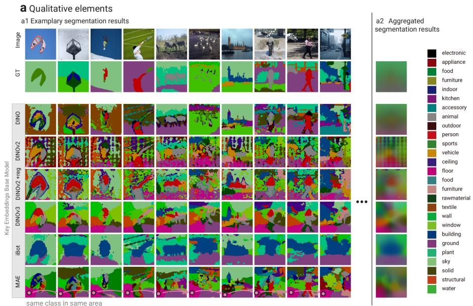

heatmap

| Model       | Image | GT   | DINO | DINOv2 | DINOv2 + reg | DINOv3 | iBot | MAE |
|-------------|-------|------|------|--------|--------------|--------|------|-----|
| a1          | 1     | 0    | 1    | 1      | 1            | 1      | 1    | 1   |
| a2          | 1     | 0    | 1    | 1      | 1            | 1      | 1    | 1   |

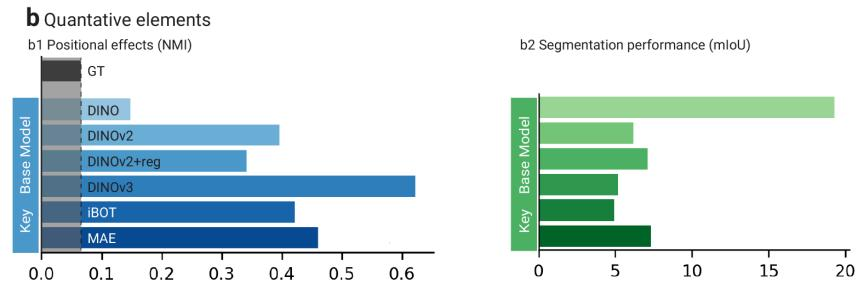

bar

b Quantitative elements
| Model | b1 Positional effects (NMI) | b2 Segmentation performance (mIoU) |
|---|---|---|
| GT | 0.05 | 6.0 |
| DINO | 0.15 | 7.0 |
| DINOv2 | 0.40 | 6.0 |
| DINOv2+reg | 0.35 | 5.0 |
| DINOv3 | 0.60 | 19.0 |
| iBOT | 0.42 | 5.0 |
| MAE | 0.48 | 7.0 |

Fig. 1: Overview of our protocol. We here introduce the individual elements of the protocol, and at the same time showcase exemplary insights it facilitates. Tho this end, across rows, we vary the SSL training paradigm at fixed ViT-B architecture and fixed ViT layer selection strategy by best mIoU. a) Qualitative elements: (a1) Joint visualization of unsupervised semantic segmentation results on exemplary sets of images alongside respective ground truth label maps – This reveals strong positional effects in key embeddings of MIM-based models, including DINOv2, $\mathrm { D I N O v 2 + r e g } ,$ DINOv3, iBOT and MAE. E.g., MAE key embeddings (bottom row) in the bottom-left corner of each individual image consistently cluster into a single class. In contrast, DINO, a CL model, exhibits substantially less positional effect in favor of more semantically meaningful structure. (a2) Aggregated visualization of unsupervised segmentation results as well as ground truth labels – This serves to confirm that the behavior observed in a1 extends across the whole dataset. b) Quantitative elements: (b1) Aggregate positional effect – This serves to quantitatively compare the positional effects as visually observed through the qualitative elements of the protocol, including the ground truth reference effect. (b2) Aggregate segmentation performance – This serves to quantitatively compare semantic structure as visually conveyed through the qualitative elements. For further insights, see Sec. 3 and Figs. 4 and 5.

Transformer (ViT) [12] backbones, and how various SSL paradigms influence this structure. Our protocol to facilitate respective model understanding comprises the following core elements:

1. Unsupervised semantic segmentation by across-image cluster-based probing of embeddings (cf. Sec. 2.1), and   
2. Joint visualization of segmentation results on exemplary sets of images alongside ground truth labels (cf. Sec. 2.2).

Putting visualizations of unsupervised segmentation results on a set of (random) exemplary images next to each other, highlighting where embeddings from same clusters localize across images, we can clearly and intuitively visualize dominant positional effects while simultaneously enabling standard qualitative assessment of semantic segmentation performance, see Fig. 1(a1). To further also capture a global view on dataset-wide behaviors on top of a (necessarily small) set of examples, we complement the above with:

3. aggregate visualization of results on full dataset (cf. Sec. 2.2),   
4. aggregate quantitative measure of positional effect (cf. Sec. 2.3), and   
5. aggregate quantitative measure of segmentation quality (cf. Sec. 2.3),

see Fig. 1(a2) and 1(b). Importantly, all elements of the protocol (except the aggregate quantitative measure of segmentation quality) are also displayed for the ground truth labels, serving as a reference to gauge dataset-inherent spatial bias.

This protocol can be applied to any kind of embedding, including queries, keys, values and tokens from any layer of a ViT (cf. Fig. 2). We can straightforwardly also apply the protocol multiple times / to different embeddings, varying one dimension of interest while keeping others fixed, and putting respective results next to each other to facilitate specific insights; Sec. 2.4 describes respective canonical axes of variation.

Fig. 2: Canonical embeddings produced by a Vision Transformer: keys, queries, and values of the Multi-Head Attention (MHA) blocks, and tokens, defined as the feedforward network (FFN) outputs for patch tokens. Each of these types of embeddings is at hand at each layer of the ViT. Regarding the aggregation of per-head embeddings stemming from the MHA block: For any given layer, we concatenate per-head embeddings of the same type along the attention dimension. We then run cluster-based probing independently for each type of embedding and at each layer of the ViT.   
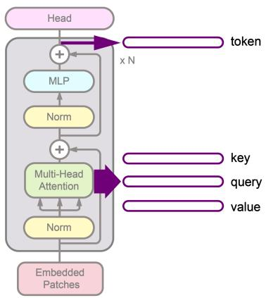

flowchart

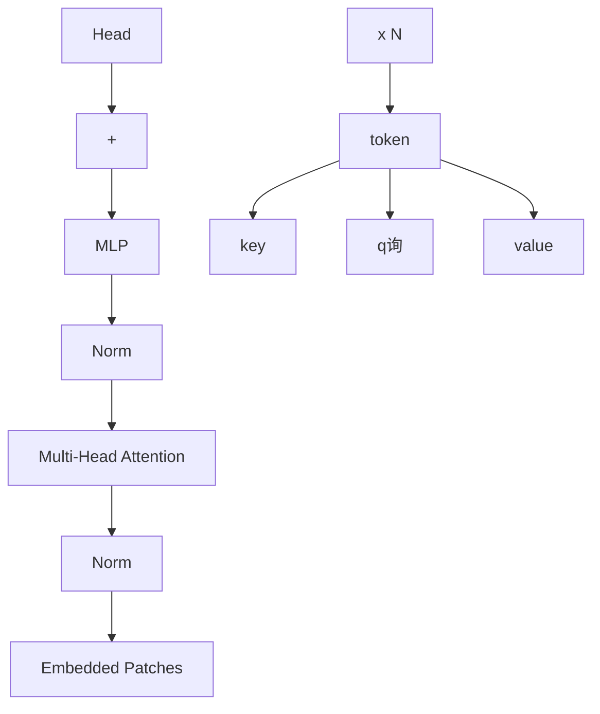

# 2.1 Unsupervised semantic segmentation

We propose to leverage unsupervised semantic segmentation as a tool to probe the embedding spaces shaped by different SSL training paradigms. We argue that any fine-tuning regime would distort the original embedding space – hence adapting representations toward a specific downstream task and dataset distribution prevents a principled analysis by obscuring how SSL pretraining decisions govern the structure of learned embeddings. To stay clear of such effects and to isolate the intrinsic properties of the embedding space, we deliberately opt for a bare-bones unsupervised clustering-based segmentation approach over complex pipelines tuned for SOTA segmentation performance [14, 22, 28, 29]. While the latter do attain stronger quantitative results, they introduce extensive empirical design choices and hyperparameter spaces that inject numerous confounding factors into the analysis. Our method of choice is cluster-based probing by means of across-image k-means clustering, as detailed below. Despite its simplicity, it forms the core mechanism underlying several SOTA approaches [13, 14]. It provides a clean, interpretable signal about the geometric structure and semantic content of the embedding space, making it a suitable instrument for the controlled comparative study we pursue.

Clustering-based probing: To directly probe the structure of pretrained embeddings, we adopt the batch-wise clustering strategy used in [13,14]. Given a batch of images $\{ { \bf x } _ { i } \} _ { i = 1 } ^ { B }$ , we extract patch-level embeddings from a frozen SSL backbone, yielding feature embeddings $\mathbf { F } _ { i } ^ { ( l ) } \in \mathbb { R } ^ { N \times d }$ , where $N = H _ { p } \times W _ { p }$ is the number of patches, d is the embedding dimension, and l denotes the selected layer. We fit a codebook of K cluster centroids $\mathcal { C } = \{ \mathbf { c } _ { k } \} _ { k = 1 } ^ { K } \subset \mathbb { R } ^ { d }$ to all patch embeddings across the batch via online k-means. Each embedding is assigned to its nearest centroid under cosine similarity, and the centroids are updated iteratively across batches, enabling the clustering to capture cross-image semantic structure. Centroids are initialized via PCA, where the first K principal components of the set of patch embeddings from the first few training batches serve as a starting point that covers most variance in the data. Details on batch size, learning rate, optimizer, and PCA initialization are provided in Appendix A.2.

To produce pixel-wise semantic segmentation predictions, the patch-level embeddings F(l)i $\mathbf { F } _ { i } ^ { ( l ) } \in \mathbb { R } ^ { N \times d }$ are bilinearly upsampled to the original image resolution, yielding dense feature maps $\hat { \mathbf { F } } _ { i } \in \mathbb { R } ^ { H \times W \times d }$ . Each pixel is then assigned a semantic label via nearest-centroid lookup under cosine similarity:

$$
\hat {y} _ {h w} = \arg \max _ {k \in \{1, \dots , K \}} \frac {\hat {\mathbf {f}} _ {i} ^ {(h w)} \cdot \mathbf {c} _ {k}}{\left\| \hat {\mathbf {f}} _ {i} ^ {(h w)} \right\| _ {2} \| \mathbf {c} _ {k} \| _ {2}}, \tag {1}
$$

where $\hat { \mathbf { f } } _ { i } ^ { ( h w ) } \in \mathbb { R } ^ { d }$ denotes the feature vector at spatial location $( h , w )$

Taken together this approach provides a simple, interpretable, and semantically meaningful segmentation of images without introducing any learned decoder, complex post-processing, or iterative self-training.

# 2.2 Visualization of Results

Sets of Exemplary Images: We operate a standard unsupervised semantic segmentation setting, applying Hungarian matching globally over the entire test set to align predicted clusters with ground-truth semantic categories, and consistently colorizing the mapped predictions respectively, using the standard dataset color palette. See Fig. 1(a1) for examples.

Aggregate View: We construct an aggregated map from the class probability map $\mathbf { W } \in \mathbb { R } ^ { K \times H \times W }$ , where ${ \bf W } _ { k , i , j }$ represents the average predicted probability of class k at pixel $( i , j )$ over the entire test set. The per-pixel average probabilities are first normalized as $\begin{array} { r } { \tilde { \mathbf { W } } _ { k , i , j } = \mathbf { W } _ { k , i , j } / \sum _ { k ^ { \prime } } \mathbf { W } _ { k ^ { \prime } , i , j } } \end{array}$ , and the aggregated map $\mathbf { A } \in \mathbb { R } ^ { H \times W \times 3 }$ is then computed as a weighted blend of the standard class colors $\mathbf { v } _ { k }$ of this dataset:

$$
\mathbf {A} _ {i, j} = \sum_ {k = 1} ^ {K} \tilde {\mathbf {W}} _ {k, i, j} \cdot \mathbf {v} _ {k} \tag {2}
$$

See Fig. 1(a2) for examples.

# 2.3 Quantitative Measures

Positional Effect: To quantify positional effect in segmentation maps, we compute the class-wise mutual information (MI) $I _ { c } ( P ; C )$ as follows:

$$
I _ {c} (P; c) = \sum_ {p} \mathbb {P} (p, c) \log \frac {\mathbb {P} (p , c)}{\mathbb {P} (p) \mathbb {P} (c)} \tag {3}
$$

where P denotes the discrete spatial position random variable with realization $p ,$ and c denotes a specific predicted class instance, and the empirical joint distribution $\mathbb { P } ( p , c )$ is estimated from binarized pixel counts over all samples. The global MI and its normalized variant, normalized mutual information (NMI) are then defined as $\begin{array} { r } { I ( P , C ) = \sum _ { c } I _ { c } ( P ; c ) } \end{array}$ and $\begin{array} { r } { I ^ { \prime } ( P , C ) = \frac { I ( P ; C ) } { H ( C ) } } \end{array}$ , respectively where $\begin{array} { r } { H ( C ) = - \sum _ { c } \mathbb { P } ( c ) \log ( \mathbb { P } ( c ) ) } \end{array}$ is the entropy of the predicted class distribution. The global NMI summarizes positional bias across all predicted classes and at the same time enables comparability across embedding types and model families. See Fig. 1(b1) for examples. Optionally, the class-wise MI, visualized for the highest-scoring classes for any given model and embedding type, may convey further insightful context. See Fig. 5(b3) for examples.

Segmentation Quality: Segmentation quality is measured using standard mean Intersection-over-Union (mIoU), computed under optimal label permutation between predicted clusters and ground-truth labels via Hungarian matching, again following standard practice for unsupervised semantic segmentation evaluation. See Fig. 1(b2) for examples.

# 2.4 Scenarios of Interest

Our protocol enables straightforward and easily interpretable qualitative analysis: By jointly looking at sets of images, we can clearly identify both positional effect and semantic structure. Beyond insights into individual embedding spaces, applying our protocol multiple times, e.g., to different models or at different layers of a model, and putting results next to each other, we can gain a range of comparative insights, including the following scenarios of interest:

– To observe differences across training paradigms: Pick one architecture, embedding type, and layer selection strategy – vary the training paradigm;   
– To observe how model behavior evolves across ViT layers: Pick one model and embedding type – vary the layer;   
– To observe differences across model sizes: Pick one training paradigm, embedding type, and layer selection strategy – vary the model size.

Regarding layer selection strategies, we can straightforwardly pick identical layers given a fixed architecture. Alternatively, we can pick layers with corresponding properties, like e.g. for any given model and embedding type, pick the layer that achieves best unsupervised semantic segmentation performance in terms of mIoU. The latter serves the specific purpose of gaining insights inhowfar for any given model, its embedding space with best emerging semantic structure is confounded by positional effect; Furthermore, it has the additional advantage that it is applicable for fixed as well as varying model architecture.

# 3 Results and Discussion

# 3.1 Experimental setup

Datasets. A dataset ideally suited for model understanding by means of our protocol would have no inherent spatial bias, as dataset-inherent spatial bias acts as a confounder by entangling true semantic structure with positional effect. Furthermore, a suitable dataset necessarily needs to allow for meaningful unsupervised semantic segmentation benchmarking of SSL ViTs.

We use COCO-Stuff [4] as the main dataset for our experiments because it has least dataset-inherent spatial bias among common unsupervised segmentation benchmarks. In particular, COCO-Stuff exhibits diverse scene layouts and respective weaker spatial-semantic correlations than a number of other, more object-centric benchmarks. COCO-Stuff further features diverse background class labels, allowing to assess a model’s ability to distinguish semantic background content (e.g., sky, grass, ceiling), not just foreground objects (e.g., people, animals). Following [13, 14, 22], we chose a 27-class subset of COCO-stuff.

That said, to ensure that our study does not merely reveal COCO-Stuffinherent behaviors or hidden biases, we additionally evaluated on Cityscapes [8] and the PascalPart [6] animals subset. These are also established for unsupervised semantic segmentation benchmarking, yet have considerably more inherent spatial bias than COCO-Stuff (See Appendix Sec. A.6).

SSL models. All models in our study share a Vision Transformer (ViT) backbone [12], enabling architecture-aligned comparisons. We evaluate eight representative SSL frameworks – MAE [15], MoCov3 [7], Mugs [34], iBOT [33], DINO [5], DINOv2 [20], including its register-token variant [9], and DINOv3 [24] – and two supervised baselines: a standard ImageNet-supervised ViT [12] and CLIP [16]. ViT-Base serves as the primary architecture, with ViT-Large included to assess scaling effects. Key characteristics of each model are listed in Appendix Sec. A.1.

Experiments. We run the following setups of our protocol:

– We vary the model training paradigm, at fixed ViT-B architecture and fixed layer selection policy based on best segmentation performance.   
– We vary the layer (from first to last), for some fixed ViT-B models.   
– We vary model size at fixed training paradigm and fixed layer selection policy based on best segmentation performance.

Results are presented in Sec. 3.2.

# 3.2 Results

We here present main results from our experiments. Unless otherwise specified, results are for ViT-B models on COCO-Stuff. Corresponding results for ViT-L architectures as well as additional models omitted here for clarity, are provided in Appendices A.4 and A.5. Results for PascalParts and CityScapes are provided in Appendix Sec. A.6. Regarding layer selection by best segmentation performance, Figure 3 summarizes the best-performing layer for each embedding type across all evaluated models.

Note, for token embeddings extracted from last layers, we use the features after the final LayerNorm operation; An ablation study comparing performance before and after the final LayerNorm is presented in Appendix Sec. A.11.

Behavior across Varying Training Paradigms: Figure 1 shows results for the key embeddings from the best-performing (in terms of segmentation mIoU) layer of each of several MIM-based models, alongside DINO as a contrastive baseline. For MIM-based models, as opposed to CL, embeddings cluster consistently across images according to their global location, indicating strongly dominant positional effect. This observed behavior is related yet distinct from previous findings regarding locality bias in MIM vs. CL models [1,3,24]. We will explore the relation between positional effect and locality bias in further detail, also quantitatively, in Sec. 3.3.

At the same time, MIM-based models exhibit considerably inferior segmentation performance (mIoU) as compared to CL, see also the quantitative results for peak-performing layers across all models and embedding types in Fig. 3. Here, MIM keys and queries form a notable subset (highlighted by the blue rectangle) that exhibits notably lower performance compared to other models and embedding types. This gives rise to the hypothesis that pronounced positional effect causes degraded segmentation performance. We will explore the relation between positional effect and segmentation performance in more detail, also quantitatively, in Sec. 3.3.

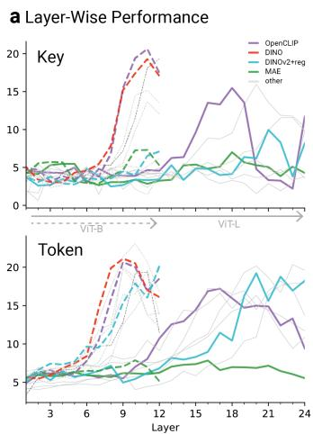

line

| Layer | OpenCLIP | DINO | DINOv2+reg | MAE | other |
|-------|----------|------|------------|-----|-------|
| 3     | 5        | 5    | 5          | 5   | 5     |
| 6     | 5        | 5    | 5          | 5   | 5     |
| 9     | 15       | 15   | 15         | 15  | 15    |
| 12    | 20       | 20   | 20         | 20  | 20    |
| 15    | 15       | 15   | 15         | 15  | 15    |
| 18    | 10       | 10   | 10         | 10  | 10    |
| 21    | 5        | 5    | 5          | 5   | 5     |
| 24    | 10       | 10   | 10         | 10  | 10    |

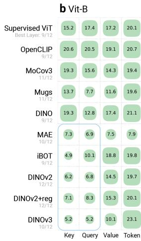

heatmap

b Vit-B
| Model | Key | Query | Value | Token |
|---|---|---|---|---|
| Supervised ViT | 15.2 | 17.4 | 17.2 | 20.1 |
| OpenCLIP 9/12 | 20.6 | 20.5 | 19.1 | 20.7 |
| MoCov3 11/12 | 19.3 | 15.6 | 14.3 | 19.4 |
| Mugs 11/12 | 13.7 | 7.7 | 11.6 | 19.6 |
| DINO 9/12 | 19.3 | 12.8 | 17.4 | 21.1 |
| MAE 10/12 | 7.3 | 6.9 | 7.5 | 7.9 |
| iBOT 9/12 | 4.9 | 10.1 | 18.8 | 19.8 |
| DINOv2 12/12 | 6.2 | 6.8 | 14.5 | 19.7 |
| DINOv2+reg 12/12 | 7.1 | 8.3 | 15.3 | 20.1 |
| DINOv3 10/12 | 5.2 | 5.2 | 10.1 | 23.1 |

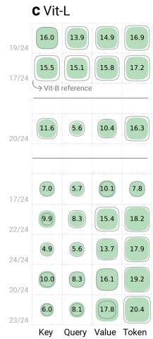

heatmap

C Vit-L
| | Key | Query | Value | Token |
|---|---|---|---|---|
| 19/24 | 16.0 | 13.9 | 14.9 | 16.9 |
| 17/24 | 15.5 | 15.1 | 15.8 | 17.2 |
| 20/24 | 11.6 | 5.6 | 10.4 | 16.3 |
| 17/24 | 7.0 | 5.7 | 10.1 | 7.8 |
| 22/24 | 9.9 | 8.3 | 15.4 | 18.2 |
| 24/24 | 4.9 | 5.6 | 13.7 | 17.9 |
| 20/24 | 10.0 | 8.3 | 16.1 | 19.2 |
| 23/24 | 6.0 | 8.1 | 17.8 | 20.4 |

Fig. 3: Performance of key, query, value, and token embeddings on the unsupervised semantic segmentation task across SSL models and model sizes. a) displays the layer-wise clustering performance based on key and token embeddings for four selected models. b) shows the overall performance across all models using their respective best-performing layer. Models highlighted in blue exhibit notably low segmentation performance when using query and key embeddings.

Deserving of mention is the fact that observable positional effect is already inherent in the ground-truth (GT) semantic labels themselves, arising from characteristic spatial regularities in natural image statistics. E.g., humans are disproportionately concentrated near the image center, the sky occupies the upper region, and the ground predominantly appears in the lower half. Nevertheless, the positional effect present in key embeddings of MIM-based models substantially exacerbates this tendency, as clearly revealed by respective aggregate visualization and quantitative positional effect (cf. Fig. 1(a2) and (b1)): We observe consistently elevated global NMI across all model embeddings relative to GT.

As a side note, block-structured artifacts are clearly visible in DINOv2 results, which have been reported and attributed to positional embeddings in [32]. See Appendix Sec. A.4 for further respective results, also including CLIP.

Behavior across Layers: Figure 4 provides results across layers for DINO, MAE and DINOv3. Examining the layer-wise behavior of key embeddings (see Fig. 4, top), DINO exhibits positional effect in its early layers (layers 2 and 3), which diminishes progressively in deeper layers. In contrast, MAE shows strong positional effects only in later layers (layer 5), while DINOv3 is dominated by

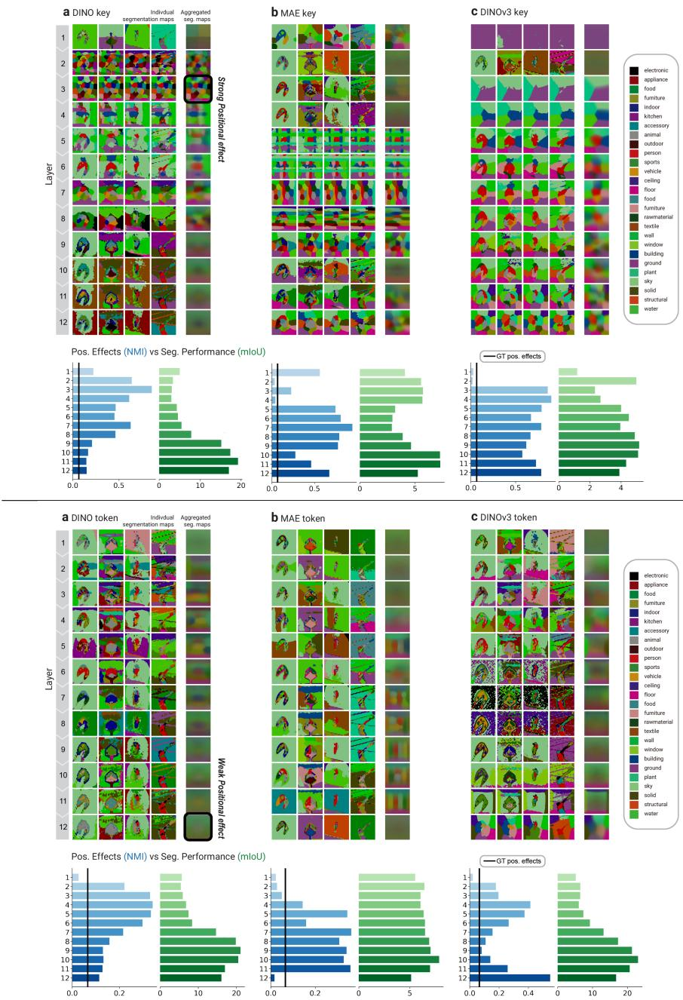  
Fig. 4: Model behavior across layers: Unsupervised semantic segmentation results for three exemplary models: a) DINO, b) MAE, and c) DINOv3. Top: Key embeddings: The three models exhibit distinct patterns of positional effect: it is confined to earlier layers in DINO, strongly emerges in intermediate layers in MAE, and persists strongly across all layers in DINOv3. Bottom: Token embeddings: Positional effect is largely reduced compared to key embeddings across models. Notably, however, DI-NOv3 remains an exception, with its last layer still exhibiting strong positional effect.

positional effect consistently across all layers. Turning to the layer-wise behavior of token embeddings (see Fig. 4, bottom), positional effect is substantially reduced compared to key embeddings across all models; DINOv3 remains a notable exception, as its last layers exhibit a sharp onset of strong positional effect.

DINOv3’s comparatively strong positional effects across embeddings and layers is surprising as its use of RoPE makes positional embeddings relative as opposed to absolute – thus we would expect them to manifest as locality bias rather than positional effect, or at least expect diminished positional effects compared to models not using RoPE – yet we observe the opposite.

Scaling Behavior: Figure 5 provides results across scales, namely ViT-B vs. ViT-L, for DINOv3, iBOT, DINOv2 and DINOv2+reg token embeddings. We highlight a particularly notable finding concerning the positional effect in the DINOv3-Large variant: The individual and aggregated segmentation maps of DINOv3-Large token embeddings reveal that the upper and lower regions of images are heavily affected by positional effect, forming spurious clusters systematically mis-assigned as ceiling and floor irrespective of ground-truth class. This positional effect is also partially visible along vertical boundaries, where affected regions are incorrectly segmented as a single solid class. In comparison, the DINOv3-Base variant, while also affected, exhibits less pronounced positional effect, only in the lower boundary region. Accordingly, DINOv3-Large shows disproportionately high class-wise MI values (cf. Fig. 5(b3)) for semantically spurious classes such as floor, ceiling, solid, as well as by the global NMI, both of which are substantially elevated for DINOv3-Large relative to its Base counterpart. We hypothesize that this pronounced and spatially widespread positional effect in the Large variant is a key contributor to DINOv3’s degraded scaling behavior, as we will discuss in more depth in Sec. 3.3.

Beyond DINOv3, varying model size between Base and Large for further model types reveals orthogonal model-specific patterns that become more pronounced with scale, see Fig. 5. DINOv2-Large displays a similarly strong positional effect as DINOv3, manifesting as consistent cluster assignments tied to fixed spatial regions across images (purple and pink in the lower left corner, bright green in the lower right, dark purple in the upper right and brown in the upper left corner). In contrast, DINOv2+reg largely mitigates this effect. However, it produces noticeably noisier segmentations, though boundary localization itself does not appear to degrade. This increased noise aligns with patch inconsistencies reported in [24] for larger models.

Regarding iBOT, both the Base and Large variant exhibit a pronounced positional effect in their clustering outputs. A particularly illustrative example is the recurring appearance of a "vehicle-like" segment in the lower central region of images, irrespective of the semantic content occupying that spatial location. Nevertheless, despite this strong positional influence, cluster boundaries still tend to respect the underlying semantic structure of the images. Besides positional effect, we also notice iBOT exhibits more fine-grained and semantically consistent clustering as model size increases. In the Large variant, body parts such as heads, legs, and arms are more consistently grouped across humans and various animal species compared to the Base model (see also Fig. 6). Increasing the number of clusters further reveals more fine-grained, position-aware partitions of these body parts (see Appendix Sec. A.5); Similar alignment effects are also observed for inanimate objects, such as bicycles.

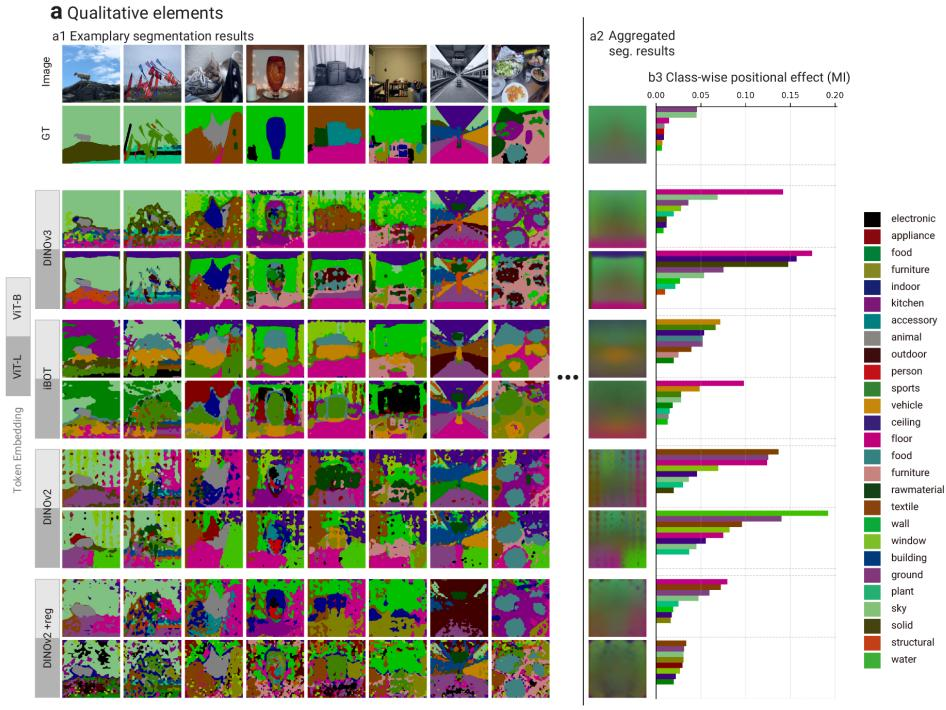

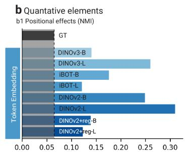

bar

b Quantitative elements
| Token Embedding | NMI |
|---|---|
| GT | 0.05 |
| DINOv3-B | 0.15 |
| DINOv3-L | 0.25 |
| iBOT-B | 0.17 |
| iBOT-L | 0.12 |
| DINOv2-B | 0.24 |
| DINOv2-L | 0.30 |
| DINOv2+reg-B | 0.14 |
| DINOv2+reg-L | 0.14 |

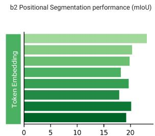

bar

| Token Embedding | mIoU |
| --------------- | ---- |
| Top             | 22   |
| Middle          | 20   |
| Bottom          | 18   |
| Fourth          | 19   |
| Fifth           | 17   |

Fig. 5: Behavior across scales: Clustering results for token embeddings from the best-performing layer of the Base and Large variants of DINOv3, iBOT, DINOv2 and DINOv2+reg. We observe a notably increased positional effect in DINOv3-L compared to its -B counterpart alongside inferior segmentation performance in terms of mIoU. DINOv2 exhibits a similar pattern. For iBOT, we observe notable positional effects across sizes, yet to a lesser extent and along with a shift in clusters in the -L variant, as further studied in Fig. 6. For DINOv2 with registers, increasing model size leads to a larger number of small, fragmented clusters. This behavior is consistent with the patch-level inconsistency reported for larger models in [24].

Grouping of body parts across humans andanimals   
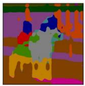

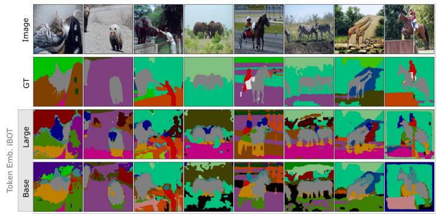

text_image

Image
GT
Large
Base

Fig. 6: Positive scaling effect in iBOT: Unsupervised segmentation results for token embeddings from the best-performing layer of the Base and Large variants of iBOT focusing on animal images. We observe more fine-grained clustering of object parts for the larger model. For example, in the Large model, head regions of humans and different animals are assigned to more similar embeddings compared to the Base variant.

In summary, as observed in our quantitative analysis in Fig. 3, increasing model size does not necessarily translate into improved performance on the semantic segmentation downstream task. In many cases, Large models underperform their Base counterparts, consistent with observations in [3, 24]. Note, this is in contrast to zero-shot semantic keypoint correspondence, where we observe favorable scaling behavior (cf. Appendix Sec. A.7), similar to reports for depth estimation [10]. While [2,24] attribute inverse scaling to a misalignment between pretext- and downstream tasks and loss of patch consistency, respectively, we observe increased positional effect as an additional, previously unreported contributor, in particular for DINOv3.

# 3.3 Extended Insights and Discussion

Positional effect causes known locality bias in MIM: Our protocol serves to intuitively study both layer progression- and pre-text task dependent positional effects. As opposed to positional effects, previous works have repeatedly shown the existence or diminishing of locality bias [1,3,24], also revealing respective distinct behaviors of MIM vs. CL. We here replicate and expand upon these previous findings (see Fig. 7), identifying positional effects in keys and queries as an upstream cause for known locality biases.

In more detail, it has been shown that the vertical stripes in attention matrices (see Fig. 7a) reflect two phenomena: If the stripe corresponds to a background position, this indicates the use of background locations to store global information [9]. If the stripe corresponds to a foreground position, this has been termed query collapse and indicates even most background queries attend to the foreground object [21]. The diagonals, on the other hand, reflect locality bias – i.e., independent of position, queries attend to nearby positions [3].

Without a suited quantification these effects are however hard to compare across models and layers. We use Mutual Information [23] for this purpose, namely the mutual information $\begin{array} { r } { I ( K , Q ) = \sum _ { k } \sum _ { q } \mathbb { P } ( k , \dot { q } ) \log \frac { \mathbb { P } ( k , q ) } { \mathbb { P } ( k ) \mathbb { P } ( q ) } } \end{array}$ for each attention matrix $M ( k , q )$ between keys $k \in K$ and queries $q \in Q .$ , where $\mathbb { P } ( k , q )$ is derived from the normalized attention weights. The stronger the diagonal pattern and thus the locality bias is, the higher the mutual information between keys and queries. We can thus quantitatively confirm that the locality bias decreases for CL models in deeper layers. For MAE it emerges around the middle layers and consists partly until the end (see Fig. 7d). DINOv2+reg shows both the strongest and the most consistent locality bias whereas DINOv3 has a similarly consistent bias but at a lower level.

As expected, we find strong correlation between key/query positional effect and locality bias in terms of $I ( K , Q ) \ ( \rho = 0 . 7 0$ , see Fig. 8 (right)). We deem consistent positional effects in keys and queries causal for downstream locality bias because the attention values that serve to quantify locality bias are directly computed as (normalized) dot products of their upstream keys and queries. In other words, having observed that both keys and queries exhibit consistent positional effects for any given model and layer, respective downstream locality bias directly follows.

Positional effect correlates negatively with segmentation performance: We quantified the correlation between positional effect and segmentation mIoU, finding significant negative correlation $( \rho = - 0 . 5 9$ , see Fig. 8 (left)). Regarding respective causality: Any delta positional effect over the ground truth labels’ effect constitutes segmentation error; However, not all segmentation error is due to (adverse) positional effect. We hypothesize that the observed inverse scaling behavior of DINOv3 can be attributed to the measured increased positional effect because our visualization suggests notable impact; Yet there are confounders we cannot cleanly disentangle, e.g., potentially shifting (mis-)alignment of modelencoded clusters and GT labels (as discussed in Sec. 3.2).

Tokens yield highest segmentation performance: Our quantitative evaluation of segmentation performance in Fig. 3 shows that token embeddings consistently achieve the highest performance across models (the only exception being MAE-Large). The same trend is observed for the keypoint correspondence task (see Appendix Sec. A.8). This finding contrasts with the results of [1], who report superior performance of key embeddings in keypoint matching. We attribute this discrepancy primarily to the limited model scope of [1], which evaluates exclusively on DINO, a model where the performance gap between key and token embeddings is relatively small, and on only 360 sampled image pairs. Similarly, prior works on unsupervised segmentation pipelines (e.g., TokenCut and Cut-LER [28, 29]) report that key embeddings from DINO can outperform token embeddings. However, these methods address per-image object discovery rather

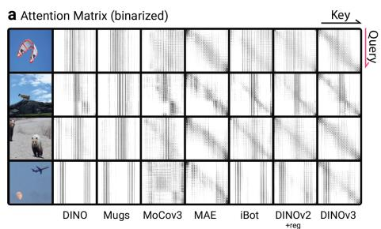

text_image

a Attention Matrix (binarized)
Key
Query
DINO Mugs MoCov3 MAE iBot DINOv2 +reg DINOv3

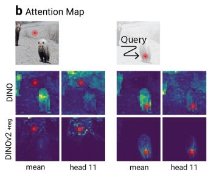

text_image

b Attention Map
Query
DINO
DINOv2-reg
mean head 11
mean head 11

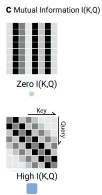

text_image

C Mutual Information I(K,Q)
Zero I(K,Q)
Key
Query
High I(K,Q)

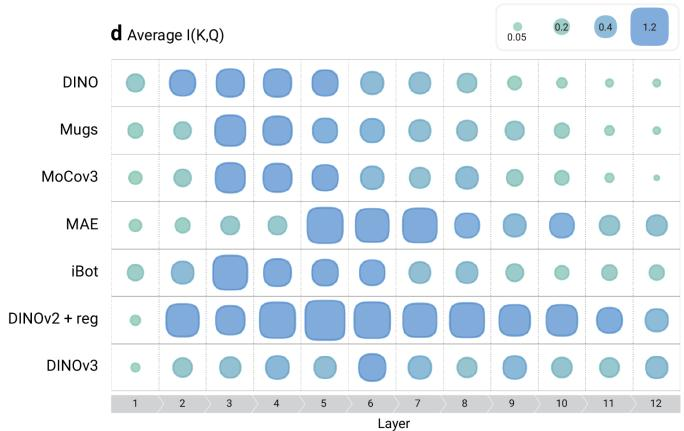

heatmap

d Average I(K,Q)
| Layer | 1 | 2 | 3 | 4 | 5 | 6 | 7 | 8 | 9 | 10 | 11 | 12 |
|---|---|---|---|---|---|---|---|---|---|---|---|---|
| DINO | 0.05 | 0.2 | 0.4 | 1.2 | 0.05 | 0.2 | 0.4 | 0.05 | 0.2 | 0.4 | 0.05 | 0.2 |
| Mugs | 0.05 | 0.2 | 0.4 | 0.05 | 0.2 | 0.4 | 0.05 | 0.2 | 0.4 | 0.05 | 0.2 | 0.2 |
| MoCov3 | 0.05 | 0.2 | 0.4 | 0.05 | 0.2 | 0.4 | 0.05 | 0.2 | 0.4 | 0.05 | 0.2 | 0.2 |
| MAE | 0.05 | 0.2 | 0.4 | 0.05 | 0.2 | 0.4 | 0.05 | 0.2 | 0.4 | 0.05 | 0.2 | 0.2 |
| iBot | 0.05 | 0.2 | 0.4 | 0.05 | 0.2 | 0.4 | 0.05 | 0.2 | 0.4 | 0.05 | 0.2 | 0.2 |
| DINOv2 + reg | 0.05 | 0.2 | 0.4 | 0.05 | 0.2 | 0.4 | 0.05 | 0.2 | 0.4 | 0.05 | 0.2 | 0.2 |
| DINOv3 | 0.05 | 0.2 | 0.4 | 0.05 | 0.2 | 0.4 | 0.05 | 0.2 | 0.4 | 0.05 | 0.2 | 0.2 |

Fig. 7: Locality Biases observable in Attention Matrices. a) Attention matrices for multiple models, averaged over attention heads. For improved visualization, maps were binarized w.r.t. their 95th percentile. b) Exemplary attention maps for two different queries, illustrating the stronger locality of attention in DINOv2+reg compared to DINO. c) Vertically “barcoded” attention patterns indicate zero mutual information I(K, Q) between respective keys and queries, whereas diagonal structures correspond to high I(K, Q). d) Averaged I(K, Q) over the whole test dataset, per model and layer. Notably, CL models (DINO, Mugs, MoCov3) exhibit a pronounced decrease in I(K, Q) towards deeper layers, while MIM models maintain a higher mean.

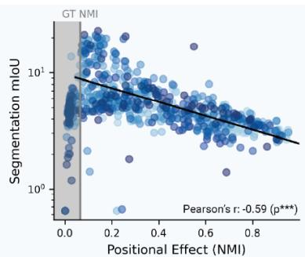

scatter

| Positional Effect (NMI) | Segmentation mIoU |
| ----------------------- | ----------------- |
| 0.0                     | ~10^1             |
| 0.2                     | ~10^0             |
| 0.4                     | ~10^-1            |
| 0.6                     | ~10^-2            |
| 0.8                     | ~10^-3            |

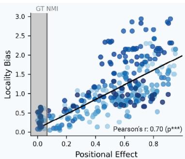

scatter

| Positional Effect | Locality Bias |
| ----------------- | ------------- |
| 0.0               | 0.0           |
| 0.2               | 0.5           |
| 0.4               | 1.0           |
| 0.6               | 1.5           |
| 0.8               | 2.0           |
| 1.0               | 2.5           |

Fig. 8: Left: Correlation between positional effect and segmentation performance (in log-scale) for all models and layers, across Keys, Queries, Values, and Tokens. Right: Correlation between positional effect and locality bias in Key and Query Embeddings.

than dataset-level semantic segmentation: Their graph-based clustering is performed independently to each image; Hence their conclusions apply to objector region boundaries, yet they do not necessarily also apply to across-image semantic classes.

At the same time, our layer-wise analysis of unsupervised semantic segmentation in Fig. 3 and Appendix Fig. 10 (also see Fig. 14 for results for a semantic correspondence task) confirms previous findings that, across model families, optimal segmentation performance most often emerges in intermediate layers and declines in the final layers [3, 24].

# 4 Conclusion

This work proposes a simple and straightforward visualization protocol for intuitive understanding of ViT representations. We employ it in a systematic benchmark of modern self-supervised vision models, across layers, and embedding types. By evaluating eight representative SSL models together with supervised and CLIP baselines, we provide a unified and architecture-controlled analysis of how different pretraining objectives shape ViT representations.

Our benchmark yields several previously unreported insights on top of intuitively and consistently visualizing a broad range of previously reported findings. Regarding novel insights, first, we find that dominant positional effect in keys and queries causes locality bias previously observed for Masked Image Modeling. Second, inverse scaling of DINOv3 appears to stem from strong boundary positional effect, calling for a thorough reassessment of its training paradigm (including distillation) as well as its use of RoPE.

We release all code, evaluation protocols, and visualizations to facilitate further inquiry into the internal mechanics of self-supervised vision models. We hope our visualization protocol and benchmark serve as a foundation for ease of understanding where and how semantic information and positional effect emerge in large-scale visual pretraining, thus facilitating respective model understanding and advancement.

# References

1. Amir, S., Gandelsman, Y., Bagon, S., Dekel, T.: Deep vit features as dense visual descriptors. arXiv preprint arXiv:2112.05814 2(3), 4 (2021)   
2. Balestriero, R., LeCun, Y.: Lejepa: Provable and scalable self-supervised learning without the heuristics (2025), https://arxiv.org/abs/2511.08544   
3. Bolya, D., Huang, P.Y., Sun, P., Cho, J.H., Madotto, A., Wei, C., Ma, T., Zhi, J., Rajasegaran, J., Rasheed, H., et al.: Perception encoder: The best visual embeddings are not at the output of the network. arXiv preprint arXiv:2504.13181 (2025)   
4. Caesar, H., Uijlings, J., Ferrari, V.: Coco-stuff: Thing and stuff classes in context. In: Proceedings of the IEEE conference on computer vision and pattern recognition. pp. 1209–1218 (2018)

5. Caron, M., Touvron, H., Misra, I., Jégou, H., Mairal, J., Bojanowski, P., Joulin, A.: Emerging properties in self-supervised vision transformers. In: Proceedings of the IEEE/CVF international conference on computer vision. pp. 9650–9660 (2021)   
6. Chen, X., Mottaghi, R., Liu, X., Fidler, S., Urtasun, R., Yuille, A.: Detect what you can: Detecting and representing objects using holistic models and body parts. In: Proceedings of the IEEE conference on computer vision and pattern recognition. pp. 1971–1978 (2014)   
7. Chen, X., Xie, S., He, K.: An empirical study of training self-supervised vision transformers. In: Proceedings of the IEEE/CVF international conference on computer vision. pp. 9640–9649 (2021)   
8. Cordts, M., Omran, M., Ramos, S., Rehfeld, T., Enzweiler, M., Benenson, R., Franke, U., Roth, S., Schiele, B.: The cityscapes dataset for semantic urban scene understanding. In: Proceedings of the IEEE conference on computer vision and pattern recognition. pp. 3213–3223 (2016)   
9. Darcet, T., Oquab, M., Mairal, J., Bojanowski, P.: Vision transformers need registers. arXiv preprint arXiv:2309.16588 (2023)   
10. Dehghani, M., Djolonga, J., Mustafa, B., Padlewski, P., Heek, J., Gilmer, J., Steiner, A., Caron, M., Geirhos, R., Alabdulmohsin, I., Jenatton, R., Beyer, L., Tschannen, M., Arnab, A., Wang, X., Riquelme, C., Minderer, M., Puigcerver, J., Evci, U., Kumar, M., van Steenkiste, S., Elsayed, G.F., Mahendran, A., Yu, F., Oliver, A., Huot, F., Bastings, J., Collier, M.P., Gritsenko, A., Birodkar, V., Vasconcelos, C., Tay, Y., Mensink, T., Kolesnikov, A., Pavetić, F., Tran, D., Kipf, T., Lučić, M., Zhai, X., Keysers, D., Harmsen, J., Houlsby, N.: Scaling vision transformers to 22 billion parameters (2023), https://arxiv.org/abs/2302.05442   
11. Doshi, F.R., Fel, T., Konkle, T., Alvarez, G.: Bi-orthogonal factor decomposition for vision transformers (2026), https://arxiv.org/abs/2601.05328   
12. Dosovitskiy, A., Beyer, L., Kolesnikov, A., Weissenborn, D., Zhai, X., Unterthiner, T., Dehghani, M., Minderer, M., Heigold, G., Gelly, S., et al.: An image is worth 16x16 words: Transformers for image recognition at scale. arXiv preprint arXiv:2010.11929 (2020)   
13. Hahn, O., Araslanov, N., Schaub-Meyer, S., Roth, S.: Boosting unsupervised semantic segmentation with principal mask proposals. arXiv preprint arXiv:2404.16818 (2024)   
14. Hamilton, M., Zhang, Z., Hariharan, B., Snavely, N., Freeman, W.T.: Unsupervised semantic segmentation by distilling feature correspondences. arXiv preprint arXiv:2203.08414 (2022)   
15. He, K., Chen, X., Xie, S., Li, Y., Dollár, P., Girshick, R.: Masked autoencoders are scalable vision learners. In: Proceedings of the IEEE/CVF conference on computer vision and pattern recognition. pp. 16000–16009 (2022)   
16. Ilharco, G., Wortsman, M., Wightman, R., Gordon, C., Carlini, N., Taori, R., Dave, A., Shankar, V., Namkoong, H., Miller, J., et al.: Openclip (2021)   
17. Li, Y., Salehi, S., Ungar, L., Kording, K.P.: Does object binding naturally emerge in large pretrained vision transformers? (2026), https://arxiv.org/abs/2510.24709   
18. Liu, Z., Lin, Y., Cao, Y., Hu, H., Wei, Y., Zhang, Z., Lin, S., Guo, B.: Swin transformer: Hierarchical vision transformer using shifted windows. In: Proceedings of the IEEE/CVF international conference on computer vision. pp. 10012–10022 (2021)   
19. McQueen, J.B.: Some methods of classification and analysis of multivariate observations. In: Proc. of 5th Berkeley Symposium on Math. Stat. and Prob. pp. 281–297 (1967)

20. Oquab, M., Darcet, T., Moutakanni, T., Vo, H., Szafraniec, M., Khalidov, V., Fernandez, P., Haziza, D., Massa, F., El-Nouby, A., et al.: Dinov2: Learning robust visual features without supervision. arXiv preprint arXiv:2304.07193 (2023)   
21. Park, N., Kim, W., Heo, B., Kim, T., Yun, S.: What do self-supervised vision transformers learn? (2023), https://arxiv.org/abs/2305.00729   
22. Seong, H.S., Moon, W., Lee, S., Heo, J.P.: Leveraging hidden positives for unsupervised semantic segmentation. In: Proceedings of the IEEE/CVF conference on computer vision and pattern recognition. pp. 19540–19549 (2023)   
23. Shannon, C.E.: A mathematical theory of communication. The Bell System Technical Journal 27, 379–423 (1948), http://plan9.bell-labs.com/cm/ms/what/ shannonday/shannon1948.pdf   
24. Siméoni, O., Vo, H.V., Seitzer, M., Baldassarre, F., Oquab, M., Jose, C., Khalidov, V., Szafraniec, M., Yi, S., Ramamonjisoa, M., et al.: Dinov3. arXiv preprint arXiv:2508.10104 (2025)   
25. Su, J., Ahmed, M., Lu, Y., Pan, S., Bo, W., Liu, Y.: Roformer: Enhanced transformer with rotary position embedding. Neurocomputing 568, 127063 (2024)   
26. Walmer, M., Suri, S., Gupta, K., Shrivastava, A.: Teaching matters: Investigating the role of supervision in vision transformers (2023), https://arxiv.org/abs/ 2212.03862   
27. Wang, W., Xie, E., Li, X., Fan, D.P., Song, K., Liang, D., Lu, T., Luo, P., Shao, L.: Pyramid vision transformer: A versatile backbone for dense prediction without convolutions. In: Proceedings of the IEEE/CVF international conference on computer vision. pp. 568–578 (2021)   
28. Wang, X., Girdhar, R., Yu, S.X., Misra, I.: Cut and learn for unsupervised object detection and instance segmentation. In: Proceedings of the IEEE/CVF conference on computer vision and pattern recognition. pp. 3124–3134 (2023)   
29. Wang, Y., Shen, X., Yuan, Y., Du, Y., Li, M., Hu, S.X., Crowley, J.L., Vaufreydaz, D.: Tokencut: Segmenting objects in images and videos with self-supervised transformer and normalized cut. IEEE transactions on pattern analysis and machine intelligence 45(12), 15790–15801 (2023)   
30. Wu, Z., Zhang, J., Pai, D., Wang, X., Singh, C., Yang, J., Gao, J., Ma, Y.: Simplifying dino via coding rate regularization. arXiv preprint arXiv:2502.10385 (2025)   
31. Xie, Z., Geng, Z., Hu, J., Zhang, Z., Hu, H., Cao, Y.: Revealing the dark secrets of masked image modeling. In: 2023 IEEE/CVF Conference on Computer Vision and Pattern Recognition (CVPR). pp. 14475–14485 (2023). https://doi.org/10. 1109/CVPR52729.2023.01391   
32. Yang, J., Luo, K.Z., Li, J., Deng, C., Guibas, L., Krishnan, D., Weinberger, K.Q., Tian, Y., Wang, Y.: Denoising vision transformers. In: European Conference on Computer Vision. pp. 453–469. Springer (2024)   
33. Zhou, J., Wei, C., Wang, H., Shen, W., Xie, C., Yuille, A., Kong, T.: ibot: Image bert pre-training with online tokenizer. arXiv preprint arXiv:2111.07832 (2021)   
34. Zhou, P., Zhou, Y., Si, C., Yu, W., Ng, T.K., Yan, S.: Mugs: A multi-granular self-supervised learning framework. arXiv preprint arXiv:2203.14415 (2022)   
35. Zhou, T., Xia, W., Zhang, F., Chang, B., Wang, W., Yuan, Y., Konukoglu, E., Cremers, D.: Image segmentation in foundation model era: A survey. arXiv preprint arXiv:2408.12957 (2024)

# A Supplement

# A.1 Properties of models included in the benchmark

<table><tr><td>SSL framework</td><td>Size</td><td>Dataset</td><td>Pos. Emb.</td><td>Category</td></tr><tr><td>Supervised ViT [12]</td><td>B,L</td><td>ImageNet-21K</td><td>Learned abs</td><td>Supervised</td></tr><tr><td>OpenCLIP [16]</td><td>B,L,H,G</td><td>LAION-2B</td><td>Learned abs</td><td>Supervised</td></tr><tr><td>MaskAutoEncoder [15]</td><td>B,L,H</td><td>ImageNet-1K</td><td>Sin-Cos</td><td>MIM</td></tr><tr><td>MoCov3 [7]</td><td>B</td><td>ImageNet-1K</td><td>Sin-Cos</td><td>CL</td></tr><tr><td>Mugs [34]</td><td>B,L</td><td>ImageNet-1K</td><td>Learned abs</td><td>CL</td></tr><tr><td>iBOT [33]</td><td>B,L</td><td>ImageNet-1K</td><td>Learned abs</td><td>MIM</td></tr><tr><td>DINO [5]</td><td>B</td><td>ImageNet-1K</td><td>Learned abs</td><td>CL</td></tr><tr><td>DINOv2 [20]</td><td>B,L,G</td><td>LVD-142M</td><td>Learned abs</td><td>MIM</td></tr><tr><td>DINOv2+reg [9]</td><td>B,L,G</td><td>LVD-142M</td><td>Learned abs</td><td>MIM</td></tr><tr><td>DINOv3 [24]</td><td>B,L,H,7B</td><td>LVD-1689M</td><td>Axial RoPE</td><td>MIM</td></tr></table>

Table 1: Summary of selected self-supervised and supervised learning models with their basic information such as available model sizes, pre-training dataset, positional embedding types and training paradigm category.

<table><tr><td>SSL framework</td><td>Unique property</td></tr><tr><td>Supervised ViT [12]</td><td>Supervised classification training</td></tr><tr><td>OpenCLIP [16]</td><td>Joint image-text representation learning on large-scale image-text pairs</td></tr><tr><td>MAE [15]</td><td>Reconstruct missing parts of an image from masked input patches</td></tr><tr><td>MoCov3 [7]</td><td>Contrast different augmented views of the image in a batch using momentum-updated encoder</td></tr><tr><td>Mugs [34]</td><td>Explicitly learn multi-granular visual features through complementary supervision</td></tr><tr><td>iBOT [33]</td><td>Uses masked image modeling and self-distillation to learn strong visual representations without labels</td></tr><tr><td>DINO [5]</td><td>Self-distillation with no labels using a teacher-student setup and contrastive learning</td></tr><tr><td>DINOv2 [20]</td><td>Scales up DINO with larger curated data and adds masked image modeling for better general-purpose features</td></tr><tr><td>DINOv2+reg [9]</td><td>Extends DINOv2 by introducing learnable register tokens to eliminate attention map artifacts and capture global context</td></tr><tr><td>DINOv3 [24]</td><td>Improves upon DINOv2 by scaling up the model and dataset and introducing “Gram anchoring” to get smoother features</td></tr></table>

Table 2: Selected self-supervised and supervised learning models and their distinctive properties.

# A.2 Unsupervised semantic segmentation training setup and sensitivity analysis

We minimize the batch-wise K-means loss [19] using cosine similarity as the distance metric, training for a fixed 5,000 steps with the Adam optimizer (learning rate $5 \times 1 0 ^ { - 3 }$ , batch size 24).

To initialize the cluster centroids, we adopt a PCA-based strategy tailored to our unsupervised semantic segmentation experiments on COCO-Stuff-27. Specifically, PCA is performed on patch embeddings sampled from the training set, and the top $K = 2 7$ principal components are used as the initial centroids. By default, patches are drawn from the first 96 batches, corresponding to approximately 2,300 images.

To assess the robustness of the initialization, we jointly vary the number of sampled batches and the sampling interval while keeping the total number of patches used for PCA initialization constant. Specifically, we evaluate configurations with 2× and 4× more batches, paired with sampling intervals of 2 and 4, respectively. Furthermore, we additionally experiment with batch sizes of 32 and 48, compared to the default batch size of 24 to evaluate sensitivity to batch size. We report the final training performance only for the DINOv3 Base model across these configurations in order to quantify the variance of final segmentation performance attributable to these hyperparameters in Fig. 9.

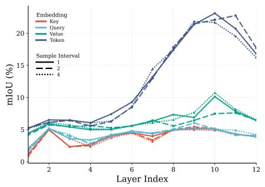

line

| Layer Index | Embedding | Query | Value | Token |
| ----------- | --------- | ----- | ----- | ----- |
| 1           | 5.0       | 5.0   | 5.0   | 5.0   |
| 2           | 4.0       | 4.0   | 6.0   | 6.0   |
| 3           | 3.0       | 3.0   | 6.0   | 6.0   |
| 4           | 2.0       | 2.0   | 6.0   | 6.0   |
| 5           | 3.0       | 3.0   | 7.0   | 7.0   |
| 6           | 4.0       | 4.0   | 8.0   | 8.0   |
| 7           | 5.0       | 5.0   | 9.0   | 9.0   |
| 8           | 6.0       | 6.0   | 10.0  | 10.0  |
| 9           | 7.0       | 7.0   | 11.0  | 11.0  |
| 10          | 8.0       | 8.0   | 12.0  | 12.0  |
| 11          | 9.0       | 9.0   | 13.0  | 13.0  |
| 12          | 10.0      | 10.0  | 14.0  | 14.0  |

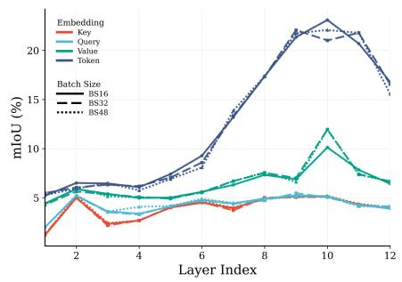

line

| Layer Index | Key   | Query | Value | Token |
| ----------- | ----- | ----- | ----- | ----- |
| 1           | 5.0   | 5.0   | 5.0   | 5.0   |
| 2           | 5.0   | 5.0   | 5.0   | 5.0   |
| 3           | 3.0   | 4.0   | 5.0   | 5.0   |
| 4           | 3.0   | 4.0   | 5.0   | 5.0   |
| 5           | 3.0   | 4.0   | 5.0   | 5.0   |
| 6           | 3.0   | 4.0   | 5.0   | 5.0   |
| 7           | 3.0   | 4.0   | 5.0   | 5.0   |
| 8           | 3.0   | 4.0   | 5.0   | 5.0   |
| 9           | 3.0   | 4.0   | 5.0   | 5.0   |
| 10          | 3.0   | 4.0   | 5.0   | 5.0   |
| 11          | 3.0   | 4.0   | 5.0   | 5.0   |
| 12          | 3.0   | 4.0   | 5.0   | 5.0   |

Fig. 9: Left: Impact of PCA-based centroid initialization on final inference performance for DINOv3 Base model. Results are reported across three different subsets of training patches used for PCA initialization. Right: Impact of batch size on final inference performance for DINOv3 Base model.

# A.3 Unsupervised semantic segmentation layer-wise performance

Figure 10 presents the layer-wise performance on unsupervised semantic segmentation for both base and large models across all four embedding types.

# A.4 Unsupervised segmentation results for further models

We extract key embeddings from the Large model variants of MAE, DINOv2, DINOv2+reg, DINOv3, and Mugs to perform unsupervised semantic segmentation (see Fig. 11a). Positional bias remains pronounced across all reconstructionbased/MIM models, while Mugs, a purely discriminative SSL model, serves as a reference baseline exhibiting comparatively little positional bias. Figure 11b presents token embeddings from Base model variants, where segmentation artifacts are visible in both CLIP and DINOv2 results, consistent with findings reported in prior work [32]. Finally, Figure 11c provides the remaining SSL models that also lack a clear scaling benefit for unsupervised semantic segmentation, complementing the examples already shown in the main paper. Note that for MAE, the comparison is based on value embeddings from the Base and Large variants, whereas for Mugs, token embeddings from the Base and Large variants are used.

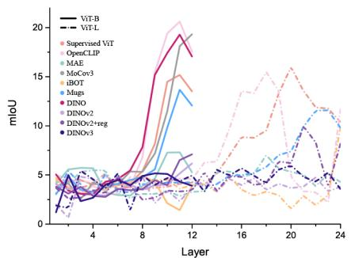

line

| Layer | ViT-B | ViT-L | Supervised ViT | OpenCLIP | MAE | MoCov3 | iBOT | Mags | DINO | DINOv2 | DINOv2+reg | DINOv3 |
|-------|-------|-------|----------------|----------|-----|--------|------|------|------|--------|------------|--------|
| 4     | ~3    | ~3    | ~3             | ~3       | ~3  | ~3     | ~3   | ~3   | ~3   | ~3     | ~3         | ~3     |
| 8     | ~5    | ~5    | ~5             | ~5       | ~5  | ~5     | ~5   | ~5   | ~5   | ~5     | ~5         | ~5     |
| 12    | ~10   | ~10   | ~10            | ~10      | ~10 | ~10    | ~10  | ~10  | ~10  | ~10    | ~10        | ~10    |
| 16    | ~15   | ~15   | ~15            | ~15      | ~15 | ~15    | ~15  | ~15  | ~15  | ~15    | ~15        | ~15    |
| 20    | ~20   | ~20   | ~20            | ~20      | ~20 | ~20    | ~20  | ~20  | ~20  | ~20    | ~20        | ~20    |
| 24    | ~20   | ~20   | ~20            | ~20      | ~20 | ~20    | ~20  | ~20  | ~20  | ~20    | ~20        | ~20    |

(a) key embedding

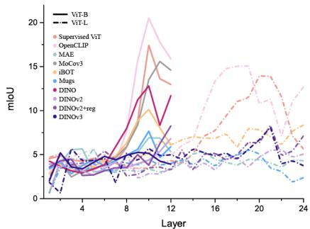

line

| Layer | ViT-B | ViT-L | Supervised ViT | OpenCLIP | MAE | MoCov3 | iBOT | Mugs | DINO | DINOv2 | DINOv2+reg | DINOv3 |
|-------|-------|-------|----------------|----------|-----|--------|------|------|------|--------|------------|--------|
| 4     | ~3    | ~3    | ~3             | ~3       | ~3  | ~3     | ~3   | ~3   | ~3   | ~3     | ~3         | ~3     |
| 8     | ~5    | ~5    | ~5             | ~5       | ~5  | ~5     | ~5   | ~5   | ~5   | ~5     | ~5         | ~5     |
| 12    | ~7    | ~7    | ~10            | ~10      | ~10 | ~10    | ~10  | ~10  | ~10  | ~10    | ~10        | ~10    |
| 16    | ~5    | ~5    | ~15            | ~15      | ~15 | ~15    | ~15  | ~15  | ~15  | ~15    | ~15        | ~15    |
| 20    | ~3    | ~3    | ~10            | ~10      | ~10 | ~10    | ~10  | ~10  | ~10  | ~10    | ~10        | ~10    |
| 24    | ~2    | ~2    | ~5             | ~5       | ~5  | ~5     | ~5   | ~5   | ~5   | ~5     | ~5         | ~5     |

(b) query embedding

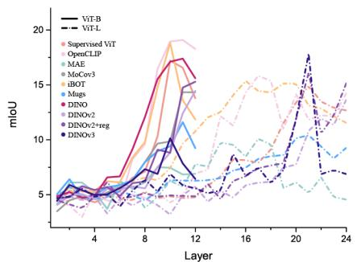

line

| Layer | ViT-B | ViT-L | Supervised ViT | OpenCLIP | MAE | MoCov3 | iBOT | Mugs | DINO | DINOv2 | DINOv2+reg | DINOv3 |
|-------|-------|-------|----------------|----------|-----|--------|------|------|------|--------|------------|--------|
| 4     | 5.0   | 5.0   | 5.0            | 5.0      | 5.0 | 5.0    | 5.0  | 5.0  | 5.0  | 5.0    | 5.0        | 5.0    |
| 8     | 10.0  | 10.0  | 10.0           | 10.0     | 10.0| 10.0   | 10.0 | 10.0 | 10.0 | 10.0   | 10.0       | 10.0   |
| 12    | 15.0  | 15.0  | 15.0           | 15.0     | 15.0| 15.0   | 15.0 | 15.0 | 15.0 | 15.0   | 15.0       | 15.0   |
| 16    | 17.0  | 17.0  | 17.0           | 17.0     | 17.0| 17.0   | 17.0 | 17.0 | 17.0 | 17.0   | 17.0       | 17.0   |
| 20    | 18.0  | 18.0  | 18.0           | 18.0     | 18.0| 18.0   | 18.0 | 18.0 | 18.0 | 18.0   | 18.0       | 18.0   |
| 24    | 20.0  | 20.0  | 20.0           | 20.0     | 20.0| 20.0   | 20.0 | 20.0 | 20.0 | 20.0   | 20.0       | 20.0   |

(c) value embedding

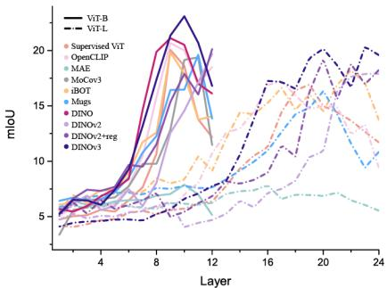

line

| Layer | ViT-B | ViT-L | Supervised ViT | OpenCLIP | MAE | MoCov3 | IBOT | Mugs | DINO | DINOV2 | DINOV2+reg | DINOV3 |
|-------|-------|-------|----------------|----------|-----|--------|------|------|------|--------|------------|--------|
| 4     | 5.0   | 5.0   | 5.0            | 5.0      | 5.0 | 5.0    | 5.0  | 5.0  | 5.0  | 5.0    | 5.0        | 5.0    |
| 8     | 15.0  | 15.0  | 15.0           | 15.0     | 15.0| 15.0   | 15.0 | 15.0 | 15.0 | 15.0   | 15.0       | 15.0   |
| 12    | 20.0  | 20.0  | 20.0           | 20.0     | 20.0| 20.0   | 20.0 | 20.0 | 20.0 | 20.0   | 20.0       | 20.0   |
| 16    | 15.0  | 15.0  | 15.0           | 15.0     | 15.0| 15.0   | 15.0 | 15.0 | 15.0 | 15.0   | 15.0       | 15.0   |
| 20    | 10.0  | 10.0  | 10.0           | 10.0     | 10.0| 10.0   | 10.0 | 10.0 | 10.0 | 10.0   | 10.0       | 10.0   |
| 24    | 5.0   | 5.0   | 5.0            | 5.0      | 5.0 | 5.0    | 5.0  | 5.0  | 5.0  | 5.0    | 5.0        | 5.0    |

(d) token embedding   
Fig. 10: Performance of key, query, value and token embeddings on unsupervised semantic segmentation task across layers and model sizes.

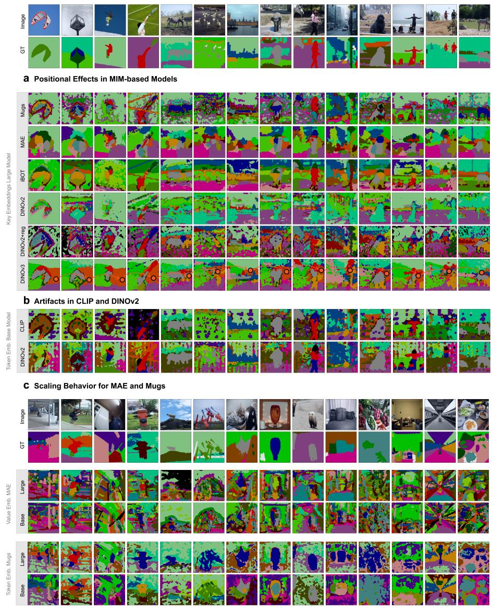  
Fig. 11: Additional examples of unsupervised semantic segmentation across images. a) Reproduction of Fig. 1 using key features from the Large models. b) Positional bias in CLIP and DINOv2, with segmentation results obtained from token embeddings of the Base models. c) Scaling behavior for the remaining self-supervised models (MAE and Mugs). These models are included here for completeness; all other SSL models’ scaling behaviors are presented in the main paper.

# A.5 Unsupervised oversegmentation / -clustering results

We increase the number of clusters by 70, resulting in a total of 97 clusters, in order to induce an overclustering regime on the dataset. This analysis is conducted using the best-layer token embeddings from both the Base and Large variants of Mugs, iBOT, DINOv2, DINOv2+reg, and DINOv3.

We find that the Large variants of iBOT and DINOv2+reg exhibit a stronger tendency to delineate fine-grained part-level semantics. For instance, iBOT large model separates regions corresponding to eyes, nose, ears, and neck, while the large model of DINOv2+reg isolates facial and neck regions. Such part-level specialization is substantially less pronounced in the corresponding Base variants.

Furthermore, we observe a qualitative difference in the clustering hierarchy for DINOv2+reg across model scales. The Base variant tends to organize embeddings primarily according to object category, forming clusters that separate animals such as cats, bears, elephants, and horses. In contrast, the Large variant prioritizes part-level semantics, grouping similar anatomical regions (e.g., faces, necks, and legs) across different animal categories, thereby assigning faces from multiple species to the same cluster.

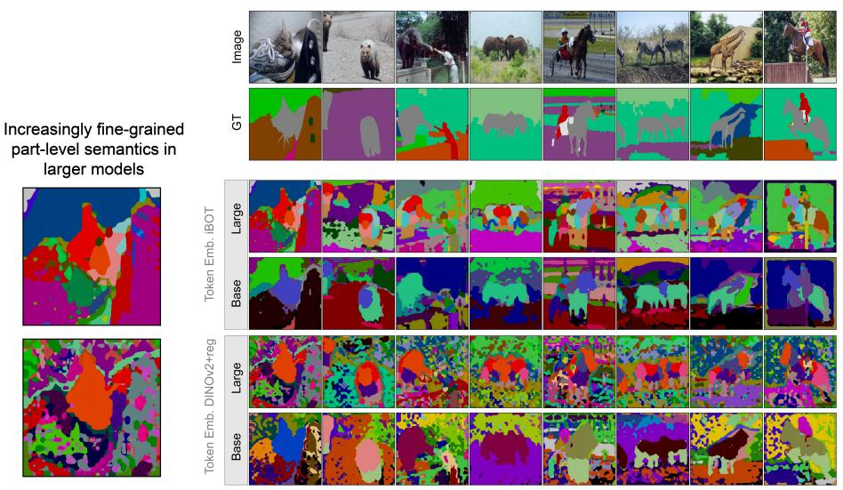

text_image

Increasingly fine-grained
part-level semantics in
larger models
Image
GT
Token Emb. iBOT
Large
Base
Token Emb. DINOv2+reg
Large
Base

Fig. 12: Overclustering of dataset semantics into 97 clusters. Large variants of iBOT and DINOv2+reg exhibit finer-grained part-level clustering, separating regions such as eyes, ears, neck and trunk. In contrast, increasing the number of clusters does not lead to comparable part-level delineation in the Base variants.

# A.6 Unsupervised semantic segmentation on further datasets

Figure 13 replicates the cross-model comparison of key embeddings on the PascalPart $( K = 6 )$ and Cityscapes(K = 27) datasets. For both datasets, we adopt the same unsupervised segmentation training settings, as described in Sec. A.2. For PascalPart, we use only the animal subsets, resulting in approximately 1,077 training images and 1,094 test images.

a Qualitative elements (Key embedding ViT-B)   
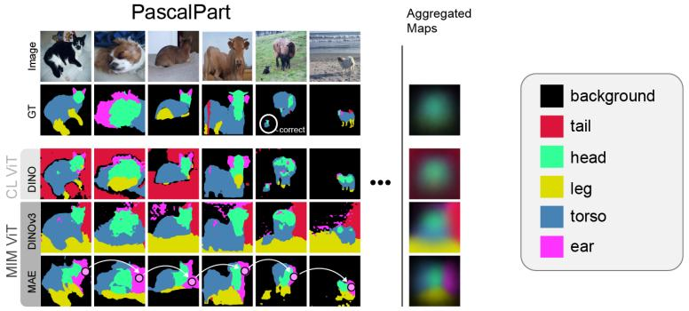

text_image

PascalPart
Image
GT
CL VIT
DINO
DINO3
MAE
... Aggregated Maps
background
tail
head
leg
torso
ear

b Quantative elements

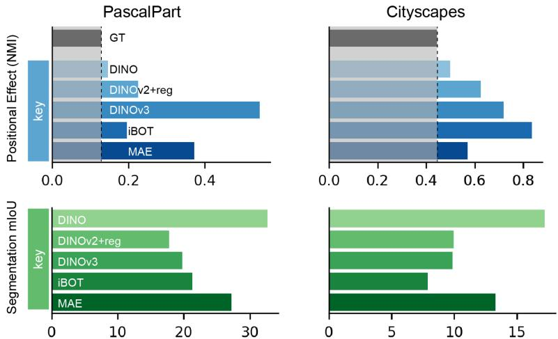

bar

| Dataset     | Model       | NMI   | Score |
|-------------|-------------|-------|-------|
| PascalPart  | GT          | -     | 0.4   |
| PascalPart  | DINO        | -     | 0.5   |
| PascalPart  | DINOV2+reg  | -     | 0.6   |
| PascalPart  | DINOV3      | -     | 0.7   |
| PascalPart  | iBOT        | -     | 0.8   |
| PascalPart  | MAE         | -     | 0.6   |
| Cityscapes  | -           | -     | 0.4   |
| Cityscapes  | -           | -     | 0.5   |
| Cityscapes  | -           | -     | 0.6   |
| Cityscapes  | -           | -     | 0.7   |
| Cityscapes  | -           | -     | 0.8   |
| Cityscapes  | -           | -     | 0.9   |
| Cityscapes  | -           | -     | 1.0   |
| Cityscapes  | -           | -     | 1.1   |
| Cityscapes  | -           | -     | 1.2   |
| Cityscapes  | -           | -     | 1.3   |
| Cityscapes  | -           | -     | 1.4   |
| Cityscapes  | -           | -     | 1.5   |
| Cityscapes  | -           | -     | 1.6   |
| Cityscapes  | -           | -     | 1.7   |
| Cityscapes  | -           | -     | 1.8   |
| Cityscapes  | -           | -     | 1.9   |
| Cityscapes  | -           | -     | 2.0   |
| Cityscapes  | -           | -     | 2.1   |
| Cityscapes  | -           | -     | 2.2   |
| Cityscapes  | -           | -     | 2.3   |
| Cityscapes  | -           | -     | 2.4   |
| Cityscapes  | -           | -     | 2.5   |
| Cityscapes  | -           | -     | 2.6   |
| Cityscapes  | -           | -     | 2.7   |
| Cityscapes  | -           | -     | 2.8   |
| Cityscapes  | -           | -     | 2.9   |
| Cityscapes  | -           | -     | 3.0   |
| Cityscapes  | -           | -     | 3.1   |
| Cityscapes  | -           | -     | 3.2   |
| Cityscapes  | -           | -     | 3.3   |
| Cityscapes  | -           | -     | 3.4   |
| Cityscapes  | -           | -     | 3.5   |
| Cityscapes  | -           | -     | 3.6   |
| Cityscapes  | -           | -     | 3.7   |
| Cityscapes  | -           | -     | 3.8   |
| Cityscapes  | -           | -     | 3.9   |
| Cityscapes  | -           | -     | 4.0   |
| Cityscapes  | -           | -     | 4.1   |
| Cityscapes  | -           | -     | 4.2   |
| Cityscapes  | -           | -     | 4.3   |
| Cityscapes  | -           | -     | 4.4   |
| Cityscapes  | -           | -     | 4.5   |
| Cityscapes  | -           | -     | 4.6   |
| Cityscapes  | -           | -     | 4.7   |
| Cityscapes  | -           | -     | 4.8   |
| Cityscapes  | -           | -     | 4.9   |
| Cityscapes  | -           | -     | 5.0   |
| Cityscapes  | -           | -     | 5.1   |
| Cityscapes  | -           | -     | 5.2   |
| Cityscapes  | -           | -     | 5.3   |
| Cityscapes  | -           | -     | 5.4   |
| Cityscapes  | -           | -     | 5.5   |
| Cityscapes  | -           | -     | 5.6   |
| Cityscapes  | -           | -     | 5.7   |
| Cityscapes  | -           | -     | 5.8   |
| Cityscapes  | -           | -     | 5.9   |
| Cityscapes  | -           | -     | 6.0   |
| Cityscapes  | -           | -     | 6.1   |
| Cityscapes  | -           | -     | 6.2   |
| Cityscapes  | -           | -     | 6.3   |
| Cityscapes  | -           | -     | 6.4   |
| Cityscapes  | -           | -     | 6.5   |
| Cityscapes  | -           | -     | 6.6   |
| Cityscapes  | -           | -     | 6.7   |
| Cityscapes  | -           | -     | 6.8   |
| Cityscapes  | -           | -     | 6.9   |
| Cityscapes  | -           | -     | 7.0   |
| Cityscapes  | -           | -     | 7.1   |
| Cityscapes  | -           | -     | 7.2   |
| Cityscapes  | -           | -     | 7.3   |
| Cityscapes  | -           | -     | 7.4   |
| Cityscapes  | -           | -     | 7.5   |
| Cityscapes  | -           | -     | 7.6   |
| Cityscapes  | -           | -     | 7.7   |
| Cityscapes  | -           | -     | 7.8   |
| Cityscapes  | -           | -     | 7.9   |
| Cityscapes  | -           | -     | 8.0   |
| Cityscapes  | -           | -     | 8.1   |
| Cityscapes  | -           | -     | 8.2   |
| Cityscapes  | -           | -     | 8.3   |
| Cityscapes  | -           | -     | 8.4   |
| Cityscapes  | -           | -     | 8.5   |
| Cityscapes  | -           | -     | 8.6   |
| Cityscapes  | -           | -     | 8.7   |
| Cityscapes  | -           | -     | 8.8   |
| Cityscapes  | -           | -     | 8.9   |
| Cityscapes  | -           | -     | 9.0   |
| Cityscapes  | -           | -     | 9.1   |
| Cityscapes  | -           | -     | 9.2   |
| Cityscapes  | -           | -     | 9.3   |
| Cityscapes  | -           | -     | 9.4   |
| Cityscapes  | -           | -     | 9.5   |
| Cityscapes  | -           | -     | 9.6   |
| Cityscapes  | -           | -     | 9.7   |
| Cityscapes  | -           | -     | 9.8   |
| Cityscapes  | -           | -     | 9.9   |
| Cityscapes  | -           | -     | 10.0                  |
| Segmentation mIoU: DINO        DINOv2+reg    DINOv3       iBOT        MAE            MAE            MAE            MAE            MAE            MAE            MAE            MAE            MAE            MAE            MAE            MAE            MAE            MAE            MAE            MAE            MAE            MAE            MAE            MAE            MAE            MAE            MAE            MAE            MAE            MAE            MAE            MAE            MAE            MAE            MAE            MAE            MAE            MAE            PAE            PAE            PAE            PAE            PAE            PAE            PAE            PAE            PAE            PAE            PAE            PAE            PAE            PAE            PAE            PAE            PAE            PAE            PAE            PAE            PAE            PAE            PAE            PAE            PAE            PAE            PAE            PAE            PAE            PAE            PAE            PAE            PAE            PAF          PAE            PAE            PAE            PAE            PAE            PAE            PAE            PAE            PAE            PAE            PAE            PAE            PAE            PAE            PAE            PAE            PAE            PAE            PAE            PAE            PAE            PAE            PAE            PAE            PAE            PAE            PAE            PAE            PAE            PAE            PAE            PAE            PAE             PAE            PAE            PAE            PAE            PAE            PAE            PAE            PAE            PAE            PAE            PAE            PAE            PAE            PAE            PAE            PAE            PAE            PAE            PAE            PAE            PAE            PAE            PAE            PAE             PAe          PAe          PAe          PAe          PAe          PAe          PAe          PAe          PAe          PAe          PAe          PAe          PAe          PAe          PAe          PAe          PAe          PAe          PAe          PAe          PAe          PAe          PAe          PAe          PAe          PAe          PAe          PAe          PAe          PAe          PAe          PEA          PEA          PEA          PEA          PEA          PEA          PEA          PEA          PEA          PEA          PEA          PEA          PEA          PEA          PEA          PEA          PEA          PEA          PEA          PEA          PEA          PEA          PEA          PEA          PEA          PEA          PEA          PEA          PEA          PEA          PEA          PEA          PEA          PEA         PEA          PEA         PEA          PEA         PEA          PEA         PEA          PEA         PEA          PEA         PEA          PEA         PEA          PEA         PEA          PEA         PEA          PEA         PEA          PEA         PEA          PEA         PEA          PEA         PEA          PEA         PEA          PEA         PEA          PEA         PEA          PEA         PEA          S
    Segmentation mIoU: DINO        DINOv2+reg        DINOv3              iBOT        iBOT        MAE                MAE                MAE                MAE                MAE                MAE                MAE                MAE                MAE                MAE                MAE                MAE                MAE                MAE                MAE                MAE                MAE                MEA             MEA             MEA             MEA             MEA             MEA             MEA             MEA             MEA             MEA             MEA             MEA             MEA             MEA             MEA             MEA             MEA             MEA             MEA             MEA             MEA             MEA             MEA             MEA             MEA             MEA             MEA             MEA             MEA             MEA             MEA             MEA             MEA             MEA             S
    Segmentation mIoU: DINO        DINOv2+reg        DINOv3              iBOT        iBOT        iBOT        iBOT        iBOT        iBOT        iBOT        iBOT        iBOT        iBOT        iBOT        iBOT        iBOT        iBOT        iBOT        iBOT        iBOT        iBOT        iBOT        iBOT        iBOT        iBOT        iBOT        iBOT        iBOT        iBOT        iBOT        iBOT        iBOT        iBOT        iBOT        iBOT        iBOT        iBOT        l
    Segmentation mIoU: DINO        DINOv2+reg        DINOv3              iBOT        iBOT        iBOT        iBOT        iBOT        iBOT        iBOT        iBOT        iBOT        iBOT        iBOT        iBOT        iBOT        iBOT        iBOT        iBOT        iBOT        iBOT        iBOT        iBOT        l
    Segmentation mIoU: DINO        DINOv2+reg        DINOv3              iBOT        iBOT        iBOT        iBOT        iBOT        j
    Segmentation mIoU: DINO        DINOv2+reg        DINOv3              iBOT        iBOT        iBOT        j
    Segmentation mIoU: DINO        DINOv2+reg       d
    Segmentation mIoU: DINOv3              d
    Segmentation mIoU: d
    Segmentation mIoU: d
    Segmentation mIoU: d
    Segmentation mIoU: d
    Segmentation mIoU: d
    Segmentation mIoU: d
    Segmentation mIoU: d
    Segmentation mIoU: d
    Segmentation mIoU: d
    Segmentation mIoU: d
    Segmentation mIoU: d
    Segmentation mIoU: n
    Segmentation mIoU: n
    Segmentation mIoU: n
    Segmentation mIoU: n
    Segmentation mIoU: n
    Segmentation mIoU: n
    Segmentation mIoU: n
    Segmentation mIoU: n
    Segmentation mIoU: n
    Segmentation mIoU: n
    Segmentation mIoU: n
    Segmentation mIoU: n

Fig. 13: a) Qualitative examples from the PascalPart dataset with aggregated maps. b) Quantitative results, including positional effects (NMI) and segmentation performance evaluated using mIoU for key embeddings extracted from the best-performing layer of several models on the PascalPart and Cityscapes datasets. Notably, the positional effects of the ground-truth segmentation masks from both PascalParts and Cityscapes indicate a strong spatial bias as compared to COCO-Stuff, making them less suitable than COCO-Stuff for model understanding under our protocol.

<table><tr><td rowspan="2">Model Size</td><td rowspan="2">Method</td><td colspan="4">Facet Category</td><td rowspan="2">Best layer</td></tr><tr><td>Key</td><td>Query</td><td>Value</td><td>Token</td></tr><tr><td rowspan="10">ViT-B</td><td>Supervised ViT [12]</td><td>27.62</td><td>27.75</td><td>27.36</td><td>31.03</td><td>9/12</td></tr><tr><td>OpenCLIP [16]</td><td>33.05</td><td>32.34</td><td>34.46</td><td>35.57</td><td>8/12</td></tr><tr><td>MaskAutoEncoder [15]</td><td>26.60</td><td>27.73</td><td>32.16</td><td>19.48</td><td>12/12</td></tr><tr><td>MoCov3 [7]</td><td>31.85</td><td>28.82</td><td>30.05</td><td>34.22</td><td>10/12</td></tr><tr><td>Mugs [34]</td><td>36.63</td><td>34.81</td><td>34.01</td><td>38.61</td><td>10/12</td></tr><tr><td>DINO [5]</td><td>34.89</td><td>32.64</td><td>32.54</td><td>35.54</td><td>9/12</td></tr><tr><td>iBOT [33]</td><td>34.52</td><td>33.76</td><td>41.03</td><td>43.50</td><td>12/12</td></tr><tr><td>DINOv2 [20]</td><td>44.63</td><td>42.99</td><td>56.92</td><td>57.28</td><td>11/12</td></tr><tr><td>DINOv2+reg [9]</td><td>45.14</td><td>43.90</td><td>53.28</td><td>56.52</td><td>10/12</td></tr><tr><td>DINOv3 [24]</td><td>39.16</td><td>39.71</td><td>57.34</td><td>57.87</td><td>11/12</td></tr><tr><td rowspan="8">ViT-L</td><td>Supervised ViT [12]</td><td>36.12 (+8.50)</td><td>34.30 (+6.55)</td><td>35.66 (+8.30)</td><td>38.84 (+7.81)</td><td>17/24</td></tr><tr><td>OpenCLIP [16]</td><td>36.48 (+3.43)</td><td>34.76 (+2.42)</td><td>36.96 (+2.50)</td><td>38.55 (+2.98)</td><td>15/24</td></tr><tr><td>MaskAutoEncoder [15]</td><td>36.83 (+10.23)</td><td>40.23 (+12.50)</td><td>49.41 (+17.25)</td><td>24.45 (+4.97)</td><td>17/24</td></tr><tr><td>Mugs [34]</td><td>39.30 (+2.67)</td><td>36.73 (+1.92)</td><td>36.19 (+2.18)</td><td>40.46 (+1.85)</td><td>20/24</td></tr><tr><td>iBOT [33]</td><td>43.26 (+8.74)</td><td>42.08 (+8.32)</td><td>46.27 (+5.24)</td><td>48.99 (+5.49)</td><td>24/24</td></tr><tr><td>DINOv2 [20]</td><td>48.55 (+3.92)</td><td>47.51 (+4.52)</td><td>57.76 (+0.84)</td><td>58.28 (+1.00)</td><td>21/24</td></tr><tr><td>DINOv2+reg [9]</td><td>53.01 (+7.87)</td><td>50.23 (+6.33)</td><td>57.47 (+4.19)</td><td>59.09 (+2.57)</td><td>20/24</td></tr><tr><td>DINOv3 [24]</td><td>50.76 (+11.60)</td><td>52.74 (+13.03)</td><td>61.95 (+4.61)</td><td>60.28 (+2.41)</td><td>22/24</td></tr></table>

Table 3: $\mathrm { P C K } ( \alpha _ { b b o x } = 0 . 1 )$ per point on SPair-71k. We report, for each model, the maximum PCK obtained across layers for each embedding type. Best layer denotes the depth at which the model achieves its overall best matching performance on its best performing embedding. For $\operatorname { V i T - L } , \delta$ indicates the performance gain compared to the corresponding ViT-B model (same method).

# A.7 Zero-shot semantic correspondence setup

Beyond employing unsupervised semantic clustering as a probe for evaluating the embeddings produced by different models, a task whose performance hinges on the inter-class separability of those embeddings, we take a further step and evaluate on zero-shot semantic correspondence. Unlike clustering, which assesses whether embeddings belonging to distinct object categories are globally separable, semantic correspondence requires the model to establish precise, fine-grained spatial matches between semantically related regions across different object instances. This task therefore provides a complementary perspective on embedding quality that reveals whether the learned representations capture not only category-level discriminability but also locally consistent geometric and semantic structure.

For each pixel $p _ { r }$ in the reference image, we identify the most similar pixel $p _ { t }$ in the target image using cosine similarity. To obtain pixel-level representations, patch-wise embeddings of both the reference and target images are bilinearly upsampled to pixel resolution. The corresponding pixel $p _ { t }$ is predicted as

$$
\operatorname{match} \left(p _ {r}\right) = \arg \max _ {p _ {t}} \frac {\hat {\mathbf {f}} _ {i} ^ {\left(p _ {r}\right)} \cdot \hat {\mathbf {f}} _ {j} ^ {\left(p _ {t}\right)}}{\left\| \hat {\mathbf {f}} _ {i} ^ {\left(p _ {r}\right)} \right\| \left\| \hat {\mathbf {f}} _ {j} ^ {\left(p _ {t}\right)} \right\|} \tag {4}
$$

where $( i , j )$ denotes a reference-target image pair and $\hat { \bf f } _ { i } ^ { ( p _ { r } ) } \in \mathbb { R } ^ { d }$ denotes the feature vector at pixel $p _ { r }$ . Layer-wise performance of all models is shown in Fig. 14 in Sec. A.8. We summarize the best-layer performance for each type of embedding in Tab. 3. Clear scaling behavior can be observed, which was not reflected in our unsupervised semantic segmentation task (see Fig. 3). Visual comparisons of semantic correspondence predictions between the Base and Large variants are provided in Sec. A.10.

# A.8 Zero-shot semantic correspondence layer-wise performance

Figure 14 presents the layer-wise performance on zero-shot semantic correspondence for both base and large models across all four embedding types.

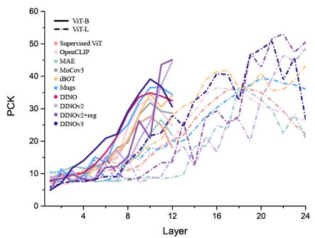

line

| Layer | ViT-B | ViT-L | Supervised ViT | OpenCLIP | MAE | MoCov3 | iBOT | Mugs | DINO | DINOv2 | DINOv2+reg | DINOv3 |
|-------|-------|-------|----------------|----------|-----|--------|------|------|------|--------|------------|--------|
| 4     | 5     | 5     | 5              | 5        | 5   | 5      | 5    | 5    | 5    | 5      | 5          | 5      |
| 8     | 15    | 15    | 15             | 15       | 15  | 15     | 15   | 15   | 15   | 15     | 15         | 15     |
| 12    | 30    | 30    | 30             | 30       | 30  | 30     | 30   | 30   | 30   | 30     | 30         | 30     |
| 16    | 40    | 40    | 40             | 40       | 40  | 40     | 40   | 40   | 40   | 40     | 40         | 40     |
| 20    | 50    | 50    | 50             | 50       | 50  | 50     | 50   | 50   | 50   | 50     | 50         | 50     |
| 24    | 40    | 40    | 40             | 40       | 40  | 40     | 40   | 40   | 40   | 40     | 40         | 40     |

(a) key embedding

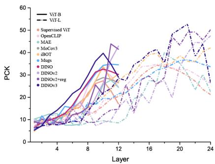

line

| Layer | ViT-B | ViT-L | Supervised ViT | OpenCLIP | MAE | MoCov3 | iBOT | Mugs | DINO | DINOv2 | DINOv2+reg | DINOv3 |
|-------|-------|-------|----------------|----------|-----|--------|------|------|------|--------|------------|--------|
| 0     | 5     | 5     | 5              | 5        | 5   | 5      | 5    | 5    | 5    | 5      | 5          | 5      |
| 4     | 10    | 10    | 10             | 10       | 10  | 10     | 10   | 10   | 10   | 10     | 10         | 10     |
| 8     | 20    | 20    | 20             | 20       | 20  | 20     | 20   | 20   | 20   | 20     | 20         | 20     |
| 12    | 30    | 30    | 30             | 30       | 30  | 30     | 30   | 30   | 30   | 30     | 30         | 30     |
| 16    | 40    | 40    | 40             | 40       | 40  | 40     | 40   | 40   | 40   | 40     | 40         | 40     |
| 20    | 50    | 50    | 50             | 50       | 50  | 50     | 50   | 50   | 50   | 50     | 50         | 50     |
| 24    | 40    | 40    | 40             | 40       | 40  | 40     | 40   | 40   | 40   | 40     | 40         | 40     |

(b) query embedding

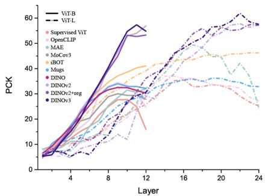

line

| Layer | ViT-B | ViT-L | Supervised ViT | OpenCLIP | MAE | MoCov3 | iBOT | Mags | DINO | DINOv2 | DINOv2+reg | DINOv3 |
|-------|-------|-------|----------------|----------|-----|--------|------|------|------|--------|------------|--------|
| 0     | 5     | 5     | 5              | 5        | 5   | 5      | 5    | 5    | 5    | 5      | 5          | 5      |
| 4     | 10    | 10    | 10             | 10       | 10  | 10     | 10   | 10   | 10   | 10     | 10         | 10     |
| 8     | 20    | 20    | 20             | 20       | 20  | 20     | 20   | 20   | 20   | 20     | 20         | 20     |
| 12    | 30    | 30    | 30             | 30       | 30  | 30     | 30   | 30   | 30   | 30     | 30         | 30     |
| 16    | 40    | 40    | 40             | 40       | 40  | 40     | 40   | 40   | 40   | 40     | 40         | 40     |
| 20    | 50    | 50    | 50             | 50       | 50  | 50     | 50   | 50   | 50   | 50     | 50         | 50     |
| 24    | 60    | 60    | 60             | 60       | 60  | 60     | 60   | 60   | 60   | 60     | 60         | 60     |

(c) value embedding

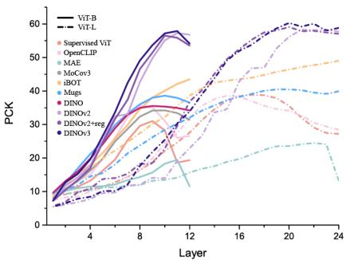

line

| Layer | ViT-B | ViT-L | Supervised ViT | OpenCLIP | MAE | MoCov3 | iBOT | Mugs | DINO | DINOV2 | DINOV2+reg | DINOV3 |
|-------|-------|-------|----------------|----------|-----|--------|------|------|------|--------|------------|--------|
| 0     | 5     | 5     | 5              | 5        | 5   | 5      | 5    | 5    | 5    | 5      | 5          | 5      |
| 4     | 15    | 15    | 15             | 15       | 15  | 15     | 15   | 15   | 15   | 15     | 15         | 15     |
| 8     | 30    | 30    | 30             | 30       | 30  | 30     | 30   | 30   | 30   | 30     | 30         | 30     |
| 12    | 45    | 45    | 45             | 45       | 45  | 45     | 45   | 45   | 45   | 45     | 45         | 45     |
| 16    | 55    | 55    | 55             | 55       | 55  | 55     | 55   | 55   | 55   | 55     | 55         | 55     |
| 20    | 60    | 60    | 60             | 60       | 60  | 60     | 60   | 60   | 60   | 60     | 60         | 60     |
| 24    | 60    | 60    | 60             | 60       | 60  | 60     | 60   | 60   | 60   | 60     | 60         | 60     |

(d) token embedding   
Fig. 14: Performance of key, query,value and token embeddings on zero-shot semantic correspondence task across layers and model sizes.

# A.9 Final-layer degradation in zero-shot semantic correspondence: Supervised vs. SSL Models

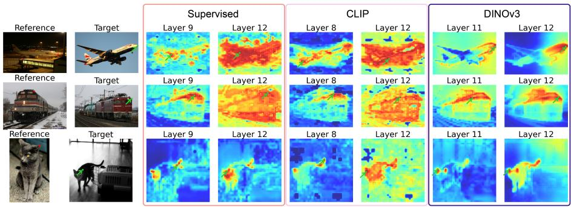

text_image

Reference
Target
Supervised
CLIP
DINOv3
Layer 9
Layer 12
Layer 8
Layer 12
Layer 11
Layer 12
Reference
Target
Layer 9
Layer 12
Layer 8
Layer 12
Layer 11
Layer 12
Reference
Target
Layer 9
Layer 12
Layer 8
Layer 12
Layer 11
Layer 12

Fig. 15: Semantic correspondence qualitative results of token embeddings from three representative SSL ViT base models. We present three example image pairs to compare the qualitative performance of the best-performing layer and the final layer embeddings from (a) Supervised ViT, (b) CLIP, and (c) DINOv3. Heatmaps visualize the cosine similarity between a selected keypoint in the reference image (red dot) and all spatial locations in the target image. The ground-truth matching point in the target image and the highest-reacted points in heatmaps are marked in green.

As summarized in Tab. 3, token embeddings achieve the best performance across all embedding types in the vast majority of models, with the exception of MAE and DINOv2-Large. Consistent with the findings in Fig. 3, the bestperforming layer for zero-shot semantic correspondence rarely coincides with the final layer. Nevertheless, most SSL models exhibit only a mild performance decline after the peak—with iBOT even continuing to improve. In contrast, supervised ViT and CLIP suffer a more substantial drop beyond their optimal layers.

To better understand this divergence, we conduct a qualitative analysis using three image pairs, visualizing activation heatmaps from the best-performing and final layers (Fig. 15). We include the top-performing model, DINOv3, together with the two models exhibiting the strongest degradation: supervised ViT and CLIP. Our analysis reveals that DINOv3 embeddings maintain relatively finegrained, part-aware representations from the intermediate best layer to the final layer. In contrast, supervised ViT and CLIP produce final-layer token embeddings that are often over-activated across spatial locations, including irrelevant background regions.

Given that supervised ViT is trained with image-class labels and CLIP with an image–text contrastive objective, we hypothesize that their final-layer embeddings—being closer to the output head—tend to encode high-level semantic summaries, frequently at the expense of fine-grained spatial and part-level detail. This is likely a consequence of optimizing for global image–text/label alignment rather than for local patch-augmentation invariance, as in discriminative SSL objective.

# A.10 Zero-shot semantic correspondence scaling behavior

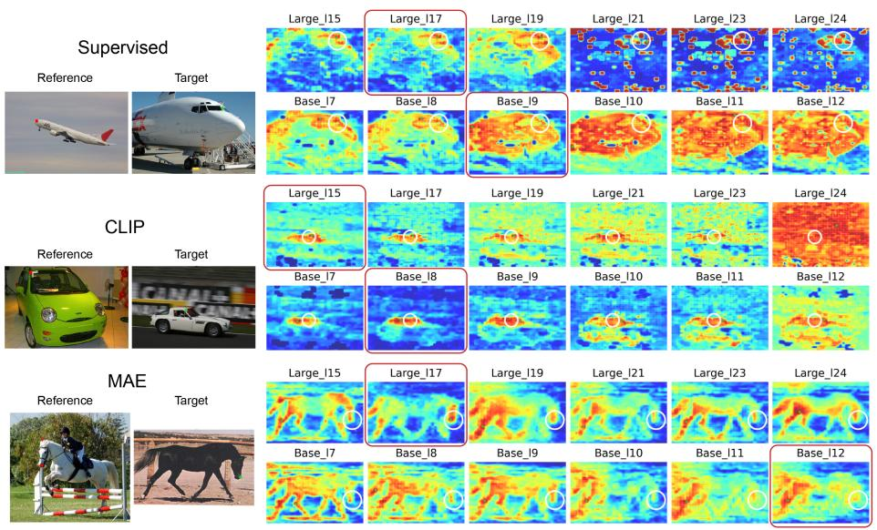  
Fig. 16: Semantic correspondence results using supervised ViT (token), CLIP (token), and MAE (value) features. green marks the ground-truth correspondence in the target image and the highest-response locations in the heatmaps. White circles indicate regions counted as true positives under the PCK metric. The best-performing layer is highlighted with a red rectangle. In the Large variants, supervised ViT feature correspondence heatmaps in layers 21, 23, and 24 exhibit multiple highly activated block-like regions that are semantically irrelevant, while the CLIP-Large heatmap in the final layer shows overactivation across the entire image region. In contrast, their Base variants produce more robust and meaningful responses, selectively highlighting the main objects and semantically relevant regions across the last several layers.

In this section, we analyze cases where the Large variants outperform the corresponding Base variants when using their best-performing feature layers for the zero-shot semantic correspondence task. For supervised models (Supervised ViT and CLIP), although the Large variants achieve higher performance, primarily due to more localized high-response correspondence points, we observe that the last several layers of the large models exhibit substantially stronger artifacts. These artifacts often manifest as over-activation across the entire image or as randomly distributed high-response regions, as shown in Fig. 16.

In contrast, as shown in Fig. 17, the iBOT Large variant produces more localized and accurate responses. This suggests that the model captures finer structural details, which is consistent with our observations from the unsupervised segmentation and overclustering analyses.

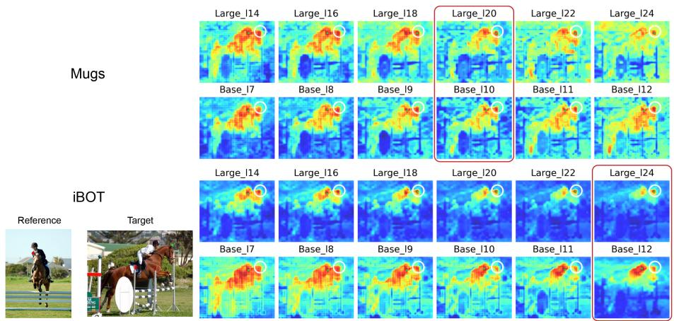

text_image

Mugs
Base_I7
Base_I8
Base_I9
Base_I10
Base_I11
Base_I12
iBOT
Reference
Target
Large_I14
Large_I16
Large_I18
Large_I20
Large_I22
Large_I24
Base_I7
Base_I8
Base_I9
Base_I10
Base_I11
Base_I12

Fig. 17: Semantic correspondence results using Mugs (token) and iBOT (token) features. The iBOT large model captures finer semantic structures compared to the base model. Same notation as Fig. 16

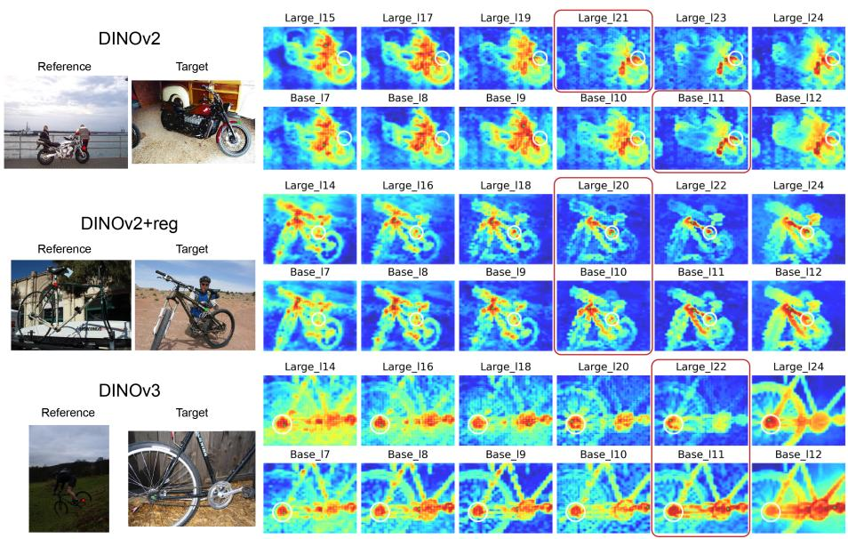

text_image

DINOv2
Reference Target
Large_I15 Large_I17 Large_I19 Large_I21 Large_I23 Large_I24
Base_I7 Base_I8 Base_I9 Base_I10 Base_I11 Base_I12
DINOv2+reg
Reference Target
Large_I14 Large_I16 Large_I18 Large_I20 Large_I22 Large_I24
Base_I7 Base_I8 Base_I9 Base_I10 Base_I11 Base_I12
DINOv3
Reference Target
Large_I14 Large_I16 Large_I18 Large_I20 Large_I22 Large_I24
Base_I7 Base_I8 Base_I9 Base_I10 Base_I11 Base_I12

Fig. 18: Semantic correspondence results using DINOv2 (token), DINOv2+reg (token) and DINOv3 (token) features. Same notation as Fig. 16

It is also worth noting that Fig. 17 illustrates a representative failure case. The reference point lies within a patch containing both human and horse ear semantics. When inferring the corresponding location in the target image, incorrect predictions frequently produce high responses in regions such as the human chest or shoulder rather than the horse ear. This error is partially attributable to patch-based tokenization in Vision Transformers. Because each patch is encoded as a single embedding, patches containing multiple semantic regions produce mixed representations. Although bilinear upsampling can produce dense feature maps, it does not restore the original semantic resolution. Features at a given pixel may still reflect information aggregated from the entire patch. As a result, correspondence predictions become ambiguous when reference points lie within semantically mixed patches.

# A.11 Effect of Layer Normalization on final ViT token embeddings

In this subsection, we analyze the effect of the final Layer Normalization (LayerNorm) on the output token embeddings of Vision Transformers (ViTs) across two tasks: unsupervised semantic segmentation (see Tab. 4) and zero-shot semantic correspondence (see Tab. 5). Specifically, we compare feature representations extracted from the final transformer block before and after the LayerNorm operation.

Our results show that LayerNorm has a pronounced impact on unsupervised semantic segmentation performance, most notably for DINOv3. In contrast, its effect on zero-shot semantic correspondence is comparatively modest. We leave a deeper investigation into the underlying mechanism and in particular why DINOv3 exhibits such sensitivity as an avenue for future work.

<table><tr><td rowspan="2"></td><td colspan="2">Supervised</td><td colspan="2">CLIP</td><td colspan="2">MAE</td><td>MoCov3</td><td colspan="2">iBOT</td><td colspan="2">Mugs</td><td>DINO</td><td colspan="2">DINOv2</td><td colspan="2">DINOv2+reg</td><td colspan="2">DINOv3</td></tr><tr><td>Base</td><td>Large</td><td>Base</td><td>Large</td><td>Base</td><td>Large</td><td>Base</td><td>Base</td><td>Large</td><td>Base</td><td>Large</td><td>Base</td><td>Base</td><td>Large</td><td>Base</td><td>Large</td><td>Base</td><td>Large</td></tr><tr><td>Before</td><td>9.09</td><td>9.95</td><td>15.04</td><td>10.78</td><td>2.59</td><td>0.85</td><td>17.84</td><td>16.42</td><td>15.89</td><td>12.77</td><td>4.99</td><td>15.04</td><td>21.02</td><td>18.94</td><td>18.11</td><td>15.8</td><td>1.45</td><td>3.84</td></tr><tr><td>After</td><td>12.16</td><td>11.7</td><td>18.52</td><td>9.41</td><td>5.14</td><td>5.54</td><td>11.46</td><td>14.05</td><td>13.73</td><td>13.84</td><td>10.85</td><td>16.11</td><td>19.71</td><td>17.9</td><td>20.15</td><td>18.24</td><td>16.79</td><td>19.59</td></tr><tr><td>Diff.</td><td>+3.07</td><td>+1.75</td><td>+3.48</td><td>-1.37</td><td>+2.55</td><td>+4.69</td><td>-6.38</td><td>-2.37</td><td>-2.16</td><td>+1.07</td><td>+5.86</td><td>+1.07</td><td>-1.31</td><td>-1.04</td><td>+2.04</td><td>+2.44</td><td>+15.34</td><td>+15.75</td></tr></table>

Table 4: Effect of Layer Normalization on final ViT token embeddings for unsupervised semantic segmentation

<table><tr><td rowspan="2"></td><td colspan="2">Supervised</td><td colspan="2">CLIP</td><td colspan="2">MAE</td><td>MoCov3</td><td colspan="2">iBOT</td><td colspan="2">Mugs</td><td>DINO</td><td colspan="2">DINOv2</td><td colspan="2">DINOv2+reg</td><td colspan="2">DINOv3</td></tr><tr><td>Base</td><td>Large</td><td>Base</td><td>Large</td><td>Base</td><td>Large</td><td>Base</td><td>Base</td><td>Large</td><td>Base</td><td>Large</td><td>Base</td><td>Base</td><td>Large</td><td>Base</td><td>Large</td><td>Base</td><td>Large</td></tr><tr><td>Before</td><td>17.39</td><td>26.27</td><td>25.18</td><td>28.81</td><td>18.78</td><td>17.82</td><td>32.34</td><td>42.65</td><td>48.79</td><td>35.47</td><td>38.01</td><td>34.66</td><td>56.94</td><td>57.11</td><td>53.55</td><td>55.08</td><td>57.01</td><td>56.66</td></tr><tr><td>After</td><td>19.34</td><td>27.19</td><td>26.57</td><td>28.46</td><td>11.5</td><td>13.22</td><td>31.42</td><td>43.5</td><td>48.99</td><td>36.52</td><td>39.92</td><td>34.19</td><td>56.8</td><td>57.74</td><td>53.55</td><td>57.08</td><td>54.12</td><td>58.84</td></tr><tr><td>Diff.</td><td>+1.95</td><td>+0.92</td><td>+1.39</td><td>-0.35</td><td>-7.28</td><td>-4.60</td><td>-0.92</td><td>+0.85</td><td>+0.20</td><td>+1.05</td><td>+1.91</td><td>-0.47</td><td>-0.14</td><td>+0.63</td><td>0.00</td><td>+2.00</td><td>-2.89</td><td>+2.18</td></tr></table>

Table 5: Effect of Layer Normalization on final ViT token embeddings for zero-shot semantic correspondence