# Geometry Matters: 3D Foundation Priors for Learning Semantic Correspondence

Artur Jesslen1 Olaf Dünkel2 Adam Kortylewski3

1University of Freiburg, Germany

2Max Planck Institute for Informatics, Saarland Informatics Campus, Germany

3CISPA Helmholtz Center for Information Security, Germany

# Abstract

Foundation features from self-supervised vision models and text-to-image diffusion models have proven effective for semantic correspondence estimation. However, because these features are learned primarily from 2D image objectives, they lack explicit 3D awareness and often confuse symmetric object sides, repeated parts, and visually similar structures that are distinct in 3D. We introduce a 3D-aware post-training framework that goes beyond available 2D foundation features by incorporating priors from 3D foundation models. Given an image, our method uses SAM3D to estimate object geometry and pose, and refines the pose through render-and-compare optimization. Subsequently, we render PartField descriptors from the reconstructed geometry into the image plane based on the estimated object pose. The resulting geometry-aware feature maps complement DINO and Stable Diffusion features, while geodesic distances on the reconstructed shapes enable reliable filtering of candidate correspondences. We use the filtered matches as supervision to train a lightweight adapter on top of DINO and Stable Diffusion for semantic correspondence. In contrast to prior post-training approaches that require pose annotations and rely on coarse spherical geometry, our method automatically obtains instance-specific 3D structure and uses it to guide correspondence learning. Experiments show that our approach improves semantic correspondence over the prior methods while reducing manual geometric supervision. Code and model can be found at §/GenIntel/3D-SC.

# 1 Introduction

Semantic correspondence aims to establish matches between semantically equivalent object parts across different images and is a fundamental problem in visual recognition, with many applications like in vision [38] or robotics [46]. Unlike low-level image matching, semantic correspondence requires robustness to changes in appearance, viewpoint, articulation, intra-class shape variation, and background clutter. As a result, it remains challenging to match object parts that are visually different but semantically equivalent, or visually similar but semantically distinct.

Recent progress has been driven by foundation features, with self-supervised vision transformers (DINOv2) and text-to-image diffusion models (Stable Diffusion) producing representations that transfer surprisingly well to dense semantic matching [4, 2, 28, 30, 36]. Their fusion has become a strong zero-shot baseline on benchmarks such as SPair-71k, PF-PASCAL, and TSS [26, 11, 35, 43], with noisy DINOv2 features complemented by the smoother spatial cues of diffusion models. However, these features are learned from 2D objectives and lack explicit 3D awareness, leading to systematic failure modes [24, 8]. For symmetric objects, such as cars, buses, and animals, 2D features may confuse left and right object sides [44]. For objects with repeated parts, such as wheels, legs, windows, or chair legs, visually similar regions may collapse to nearly identical feature representations despite corresponding to different object parts (see the nearest-neighbor visualization in Figure 1a). More generally, 2D features cannot reliably distinguish structures that are visually similar yet geometrically distinct.

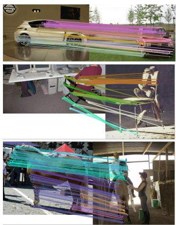

<details>
<summary>natural_image</summary>

Three-panel image showing a car interior, a colorful 3D model of a person handling a large wireframe structure, and a worker in a workshop (no visible text or symbols)
</details>

(a) SD+DINO.

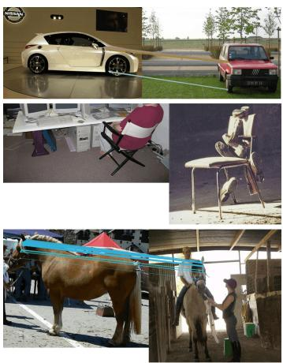

<details>
<summary>natural_image</summary>

Collage of outdoor scenes including a car, a beach chair, a person in a white chair, and a horse with feeding in a barn (no visible text or symbols)
</details>

(b) SD+DINO + Geodesic Filtering.

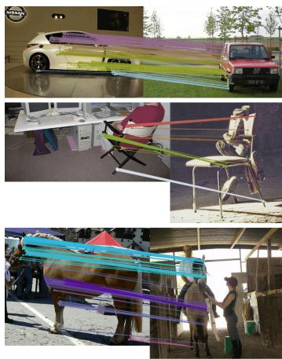

<details>
<summary>natural_image</summary>

Collage of three outdoor scenes: a car with light purple light beams, a red car parked in a row, and a person handling a colorful canopy cover near a structure (no visible text or symbols)
</details>

(c) SD+DINO+Partfield + Geodesic Filtering.   
Figure 1: 3D foundation priors improve both candidate generation and filtering of semantic correspondences. Existing zero-shot pipelines based on SD+DINO (a) suffer from left–right and repeated-part confusion, producing many incorrect matches. Adding our geodesic filter (b) removes wrong matches but is bottlenecked by feature quality, often leaving few surviving correspondences. Adding PartField features (c) yields dense and accurate correspondences even with large pose changes.

Several recent methods address these ambiguities by injecting a weak 3D prior to guide feature learning and correspondence filtering [24, 8]. While effective, both approaches require human pose annotations and approximate object geometry with a coarse spherical proxy, which cannot represent the geometric structure of an actual instance. Therefore, some finer distinctions between symmetric or articulated parts are not captured. The reliance on manual pose annotations also limits scalability, as extending to new object categories requires additional labeling effort.

In this paper, we propose a 3D-aware post-training framework that incorporates priors from 3D foundation models without requiring manual pose annotations. Given an image, we use SAM3D to estimate object geometry and pose [31], then refine the pose via a render-and-compare optimization that aligns rendered geometry with the observed object. These refined predictions allow us to run PartField [21] on the reconstructed shape and render geometry-aware descriptors back into the image plane, complementing DINOv2 and Stable Diffusion features in two ways. First, rendered PartField descriptors disambiguate symmetric structures and repeated parts (e.g., front vs. rear wheels) that 2D features alone cannot separate. Second, geodesic distances on the 3D reconstructed shape enable more reliable filtering of candidate correspondences than coarse canonical-sphere proxies, yielding higher-quality pseudo-labels for a lightweight adapter trained on top of DINOv2 and Stable Diffusion features. Experiments on standard benchmarks show consistent improvements over prior approaches with less manual supervision. In summary, we make the following contributions:

(i) a 3D-aware post-training framework for semantic correspondence that incorporates priors from 3D foundation models without human pose annotations;   
(ii) a render-and-compare pose refinement that allows rendering PartField features into the image plane, yielding geometry-aware features complementing DINOv2 and Stable Diffusion features;   
(iii) a pseudo-label filtering scheme based on geodesic distances on the estimated 3D shapes, providing higher-quality supervision than coarse spherical geometry; and   
(iv) geometry-aware refined features that achieve state-of-the-art semantic correspondence over prior methods with reduced manual supervision.

# 2 Related Work

Semantic correspondence with foundation features. Semantic correspondence aims to match semantically equivalent parts across object instances, which is substantially harder than low-level image matching because appearance, shape, pose, articulation, and visibility all vary. Early approaches relied on hand-crafted descriptors and learned matching networks [22, 20, 11, 41], and because dense annotations are costly, later work explored weak supervision, cycle-consistency losses, and pseudolabel expansion from sparse labels [45, 16, 18, 14]. Recent progress has shifted to foundation features: self-supervised vision transformers such as DINO and DINOv2 encode transferable semantic concepts [4, 2, 28], while text-to-image diffusion features provide complementary spatial and semantic cues [30, 13, 34, 23, 19]. Their fusion has become a strong zero-shot baseline [43], and distillation or adapter-based refinement further improves them when supervision is available [44, 10, 40]. However, since these features are learned from images, they remain prone to geometry-sensitive failures such as left-right confusion, front-back ambiguity, and repeated parts [44, 24, 8, 25]. Our work follows the weakly supervised, foundation-feature direction, but uses reconstructed 3D geometry to generate and filter dense pseudo-labels rather than relying on manual keypoint annotations.

Geometric priors and 3D-aware features. A complementary line of work introduces geometric structure to disambiguate the failures of purely image-based correspondence. CAD-based cycle consistency and canonical surface mappings link image pixels to a shared object surface [45, 17, 27], while category-level templates, atlases, and learned 3D representations capture correspondences via a shared geometric frame [15, 32, 33, 37, 5]. These methods show the value of 3D structure but typically require mesh templates, precise pose, or category-level reconstruction pipelines. Closer to our setting, Spherical Maps inject a weak 3D prior by mapping image features to a category-conditioned sphere with viewpoint supervision [24], and DIY-SC produces pseudo-labels from DINOv2 and Stable Diffusion features, then filters them against a spherical 3D prototype before training a lightweight adapter [8]. In parallel, 3D foundation models make instance-level geometry practical from a single image: SAM3D reconstructs object-centric 3D shape [31], orientation models help resolve canonicalframe ambiguities [39], and 3D feature fields or functional-map methods provide geometry-aware descriptors on surfaces [21, 29, 7, 9, 46, 38]. In contrast to spherical-prior approaches, we combine instance-specific SAM3D meshes with PartField descriptors to both generate and filter pseudo-labels using faithful, per-instance 3D structure – removing the need for manual pose annotations and coarse geometric proxies.

# 3 Method

We estimate semantic correspondences by combining 2D foundation features with 3D geometric priors obtained from reconstructed object meshes. Our pipeline has three stages: (i) we first reconstruct and canonicalize an object-centric 3D mesh for each instance; (ii) we then render 3D-aware PartField descriptors into the image plane and use them together with DINOv2 and Stable Diffusion features to propose semantic correspondences; (iii) finally, we reject geometrically inconsistent matches using geodesic consistency on the reconstructed meshes and train a lightweight correspondence adapter on the retained pseudo-labels.

# 3.1 Canonicalized 3D Object Reconstruction

Our correspondence pipeline relies on a 3D mesh for each object instance, expressed in a canonical frame that is consistent across instances of the same category. We obtain such meshes from a single image without manual pose annotation by combining recent foundation models for segmentation and single-image 3D reconstruction with two refinement stages. While these foundation models provide a strong geometric prior, their outputs exhibit two systematic issues: the predicted scale and translation can be inaccurate, causing the rendered mesh to misalign with the image, and the canonical orientation is ambiguous up to discrete yaw rotations across instances. We address the first issue with a render-and-compare optimization that aligns the rendered silhouette to the observed mask, and the second with a yaw canonicalization step based on multi-view orientation estimation. The full process is illustrated in Figure 2.

2D Mask and 3D Mesh Initialization. We extract a 2D instance mask $\mathbf { M } \in \{ 0 , 1 \} ^ { H \times W }$ with SAM3 [3], using the image together with the dataset-provided category label. Given this mask, SAM3D [31] reconstructs an object-centric mesh from the masked image in a feed-forward manner and additionally predicts the camera parameters used for rendering. In the following, we show how we refine and canonicalize this initial reconstruction.

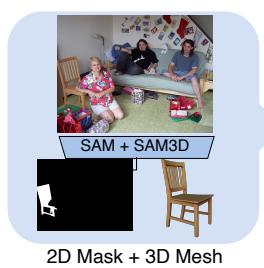

<details>
<summary>text_image</summary>

SAM + SAM3D
2D Mask + 3D Mesh
</details>

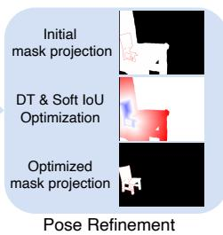

<details>
<summary>text_image</summary>

Initial
mask projection
DT & Soft IoU
Optimization
Optimized
mask projection
Pose Refinement
</details>

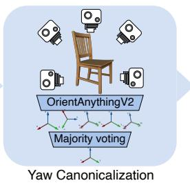

<details>
<summary>flowchart</summary>

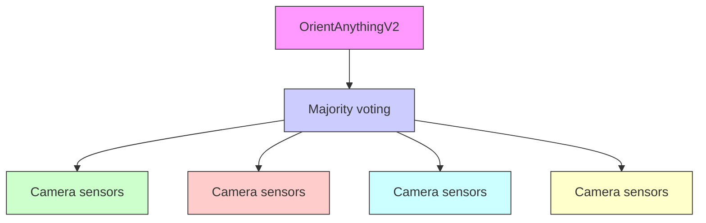
</details>

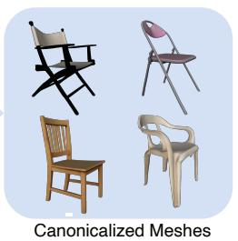

<details>
<summary>natural_image</summary>

Illustration of four different wooden furniture chairs with different styles and colors, labeled 'Canonicalized Meshes' below (no text on chairs or background)
</details>

Figure 2: Canonicalized 3D object reconstruction pipeline. Given an image, we obtain an instance mask and a mesh from foundation models. We then refine the mesh pose via a two-phase render-andcompare optimization based on a distance-transform (DT) and a soft-IoU phase. Finally, we resolve the residual four-fold yaw ambiguity by rendering the mesh at eight known orientations and applying OrientAnything V2 with majority voting to select the canonical yaw correction $\Delta \psi ^ { * }$ .

Render-and-Compare Pose Refinement. To correct the residual scale and translation error in the SAM3D reconstruction, we apply a render-and-compare optimization on top of the predicted camera. Concretely, we optimize a scale factor $s = e ^ { \ell } \in \bar { \mathbb { R } _ { > 0 } }$ (parameterized in log-space to remain strictly positive) and a translation $\mathbf { t } \in \mathbb { R } ^ { 3 }$ applied to the mesh, by minimizing the discrepancy between the rendered soft silhouette $\hat { \mathbf { M } } ( s , \mathbf { t } ) \in [ 0 , 1 ] ^ { H \times W }$ and the observed mask M. Since the soft IoU between Mˆ and M has no gradient when the two are disjoint, we proceed in two sequential phases: a distance-transform (DT) phase that provides a global gradient signal regardless of initial alignment, followed by a soft-IoU phase that sharpens the fit.

Distance-transform attraction. We first dilate M by r to obtain $\tilde { \mathbf { M } } ,$ , providing tolerance for coarse mesh boundaries, and compute two squared distance fields normalized by the image diagonal d:

$$
\mathcal {D} _ {\text { out }} (p) = \frac {1}{d} \min _ {p ^ {\prime}: \tilde {\mathbf {M}} (p ^ {\prime}) = 1} \| p - p ^ {\prime} \| _ {2} ^ {2}, \quad \mathcal {D} _ {\text { in }} (p) = \frac {1}{d} \min _ {p ^ {\prime}: \tilde {\mathbf {M}} (p ^ {\prime}) = 0} \| p - p ^ {\prime} \| _ {2} ^ {2}. \tag {1}
$$

$\mathcal { D } _ { \mathrm { o u t } }$ is zero inside $\tilde { \textbf { M } }$ and grows with distance to the mask; $\mathcal { D } _ { \mathrm { i n } }$ is zero outside $\tilde { \textbf { M } }$ and grows with depth into its interior. The DT loss combines these into a mask-alignment objective:

$$
\mathcal {L} _ {\mathrm{DT}} = \frac {1}{H W} \sum_ {p} \left[ \hat {\mathbf {M}} _ {p} \mathcal {D} _ {\text { out }} (p) + \mathcal {D} _ {\text { in }} (p) \big (1 - \lambda \hat {\mathbf {M}} _ {p} \big) \right]. \tag {2}
$$

The first term pulls rendered mass that falls outside the mask back toward it, weighted by how far outside it is. The second term simultaneously penalizes uncovered mask interior and, through the coefficient $\lambda > 1$ , rewards rendered coverage of the interior. Without this reward, the optimization tends to under-cover the mask under partial occlusion — the rendered silhouette settles on a small fully-contained region rather than extending to the occluded extent of the object.

Soft-IoU refinement. Once the rendered and observed masks overlap, the soft IoU has a usable gradient and we switch to a differentiable soft-IoU loss:

$$
\mathcal {L} _ {\mathrm{IoU}} = 1 - \frac {\sum_ {p} \hat {\mathbf {M}} _ {p} \mathbf {M} _ {p}}{\sum_ {p} \left(\hat {\mathbf {M}} _ {p} + \mathbf {M} _ {p} - \hat {\mathbf {M}} _ {p} \mathbf {M} _ {p}\right)}. \tag {3}
$$

This phase tightens the alignment that the previous phase has approximately established.

Yaw Canonicalization. Even after pose refinement, SAM3D meshes do not necessarily share a consistent canonical orientation across instances of the same category. We find that roughly 6% of meshes are misaligned by a multiple of $9 0 °$ around the vertical axis — a four-fold yaw ambiguity that is most common for symmetric or elongated objects such as buses, boats, and trains. To resolve this without manual annotation, we use OrientAnything V2 [39] as an external orientation estimator. For each mesh, we render eight views at known yaw angles $\bar { \psi _ { \mathrm { k n o w n } } } \in \{ 0 ^ { \circ } , 4 5 ^ { \circ } , \ldots , 3 1 5 ^ { \circ } \}$ and we estimate the apparent orientation $\psi _ { \mathrm { e s t } }$ of each rendering. If the mesh is correctly canonicalized, $\psi _ { \mathrm { e s t } }$ should match $\psi _ { \mathrm { k n o w n } }$ up to estimator noise; otherwise, the two differ by a multiple of $9 0 °$ . For each rendered view we therefore pick the discrete correction that best closes this gap,

$$
\Delta \psi^ {*} = \underset {\Delta \psi \in \{0 ^ {\circ}, 9 0 ^ {\circ}, 1 8 0 ^ {\circ}, 2 7 0 ^ {\circ} \}} {\arg \min} \left| \psi_ {\text {est}} + \Delta \psi - \psi_ {\text {known}} \right|, \tag {4}
$$

and aggregate the eight candidates into a single one by majority vote, which makes the procedure robust to occasional orientation estimation errors. Each mesh is then rotated by the selected $\Delta \psi ^ { * }$ , yielding a set of consistently canonicalized meshes that serve as the geometric backbone for what follows.

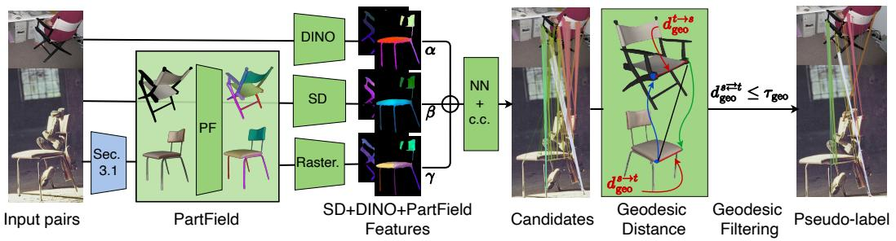

<details>
<summary>flowchart</summary>

```mermaid
graph LR
    A["Input pairs"] --> B["PartField"]
    B --> C["DINO"]
    B --> D["SD"]
    B --> E["Raster."]
    C --> F["SD+DINO+PartField Features"]
    D --> F
    E --> F
    F --> G["Candidates"]
    G --> H["Geodesic Distance"]
    H --> I["Geodesic Filtering"]
    I --> J["Pseudo-label"]
    
    subgraph Inputs
        A
        B
        C
        D
        E
    end
    
    subgraph Methods
        F -->|α| G
        F -->|β| H
        F -->|γ| I
        G -->|d_t→s_{geo}| H
        H -->|d_s→t_{geo}| I
        I -->|d_s→t_{geo}| J
    
    end
```
</details>

Figure 3: Pseudo-label correspondences pipeline. Given two images, we fuse DINO, SD, and PartField features (rasterized from the meshes of Section 3.1) and propose candidate matches via nearest-neighbor (NN) search with relaxed cyclic consistency (c.c). Each candidate is then geometrically verified by lifting the matched pixels onto the reconstructed meshes and computing the geodesic error $d _ { \mathrm { g e o } } ^ { s  t }$ ; candidates exceeding threshold $\tau _ { \mathrm { g e o } }$ are rejected. The retained pseudo-labels P are used to train a lightweight correspondence adapter on top of frozen DINO+SD features.

# 3.2 Pseudo-Label Semantic Correspondences

Given a pair of images of the same object category, we generate correspondence pseudo-labels in two stages. First, we fuse 2D foundation features (DINO+SD) with 3D-aware PartField features rasterized from the canonicalized meshes, and apply relaxed cyclic consistency to discard obvious mismatches. Second, each surviving candidate is verified geometrically: matched points are lifted onto their respective meshes and rejected if their geodesic distance exceeds a threshold. The two stages are complementary — cyclic consistency is a cheap image-space filter, while geodesic verification is a geometry-grounded confidence measure that exploits the 3D shapes from Section 3.1.

Notation. We use the superscripts $\sqsubset ^ { s }$ and □t to denote quantities associated with the source and target, respectively. We denote p as a point in image space while v denotes a point in the 3D space.

PartField Features. PartField [21] (PF) predicts a continuous per-vertex feature field encoding geometric and part-level structure directly from the 3D shape S. These descriptors naturally distinguish parts that are visually similar but geometrically distinct (e.g., front vs. rear wheels, left vs. right legs), exactly the cases where 2D foundation features tend to collapse. To use PartField in image space, we rasterize the per-vertex descriptors into the input image using the SAM3D camera together with the refined pose from Section 3.1. Vertices outside the camera frustum or outside the foreground mask are discarded, and foreground pixels with no projected descriptor are filled by nearest-neighbor propagation. The result is an image-space PartField map aligned with the RGB image, which can be combined with 2D image features for semantic correspondence estimation. PCA visualizations and rasterization details are deferred to Supp. Section B.1.

Candidate Generation. Given the fused image-space DINO+SD+PF features, we propose candidate matches via nearest-neighbor search, retaining only those that pass a cyclic consistency check.

Feature fusion. Following Zhang et al. [43], we fuse our three feature sources by independently L2- normalizing each and concatenating them with category-agnostic weights. We denote the normalized feature vectors as $\begin{array} { r } { \widehat { \mathcal { F } } _ { s } = \frac { \mathcal { F } _ { s } } { \vert \vert \mathcal { F } _ { s } \vert \vert _ { 2 } } } \end{array}$ . The fused representation is then defined as

$$
\mathcal {F} _ {\text { fused }} = \left(\sqrt {\alpha} \widehat {\mathcal {F}} _ {\mathrm{SD}}, \sqrt {\beta} \widehat {\mathcal {F}} _ {\mathrm{DINO}}, \sqrt {\gamma} \widehat {\mathcal {F}} _ {\mathrm{PF}}\right), \quad \text { with } \gamma = 1 - \alpha - \beta . \tag {5}
$$

We use the weights $\alpha = 1 / 2 , \beta = 1 / 3$ , and $\gamma = 1 / 6$ , which we found offers a good balance between the three features in practice; a weight sweep is provided in Supp. Section B.2. Candidate matches are then proposed by nearest-neighbor search in the fused space.

Relaxed cyclic consistency. While the 3D-aware PartField features significantly enhance the matching quality, some candidates remain wrongly matched. To filter these mismatches, we apply a relaxed cyclic consistency check inspired by Aberman et al. [1]. As observed in Dünkel et al. [8], strict cyclic consistency rejects a large fraction of correct matches due to sub-pixel noise; we therefore relax the criterion to require only that the backward match lies within a small spatial tolerance of the source. A candidate $( p ^ { s } , \bar { p } ^ { t } )$ with $\hat { p } ^ { t } = \mathrm { N N } _ { \mathrm { f u s e d } } ^ { s  t } ( p ^ { s } )$ is retained if

$$
\left\| \mathrm{NN} _ {\text { fused }} ^ {t \rightarrow s} (\hat {p} ^ {t}) - p ^ {s} \right\| _ {2} <   \tau_ {c c} \cdot \max (h, w), \tag {6}
$$

where $\mathrm { N N } _ { \mathrm { f u s e d } }$ denotes nearest-neighbor search in the fused feature space, h and w are the object’s bounding dimensions, and $\tau _ { c c }$ is a tolerance ratio.

Candidate Verification via Geodesic Filtering. Our fused descriptor uses a fixed mixing strategy, and these fused features inevitably produce some wrong matches since objects greatly vary across instances. Cyclic consistency removes some of them but operates purely in feature space, ignoring 3D geometry. We therefore add a geodesic consistency stage: matched locations lifted onto canonically posed meshes must land in nearby surface regions.

Lifting matches to 3D. Given a candidate match $( p ^ { s } , p ^ { t } )$ , we cast a ray from each camera through the corresponding pixel and intersect it with the respective mesh, obtaining the unprojected points $\mathbf { v } ^ { s }$ and $\mathbf { v } ^ { \overline { { t } } }$ together with their containing triangles and barycentric coordinates. Because geodesic distances are computed between mesh vertices, we snap each unprojected point to the dominant vertex of its triangle (the vertex with the largest barycentric weight), giving $\bar { \mathbf { v } } ^ { s }$ and $\bar { \mathbf { v } } ^ { t }$ .

Cross-mesh correspondence via PartField. The previous step places each candidate match onto the source and target meshes individually. However, the meshes share only a canonical orientation but not vertex correspondence. To compare the lifted source and target points, we therefore estimate a 3D correspondence between the meshes themselves. Hence, we use PartField nearest-neighbor as the cross-mesh correspondence: we interpolate the PartField descriptor at $\mathbf { v } ^ { s }$ on the source mesh and search for its nearest neighbor among the PartField descriptors on the target mesh, $\hat { \mathbf { v } } ^ { t } = \mathrm { N N } _ { \mathrm { P F } } ^ { s  t } ( \mathbf { v } ^ { s } )$ , yielding a target vertex $\hat { \mathbf { v } } ^ { t }$ that represents the cross-mesh counterpart of $\mathbf { v } ^ { s }$ . A candidate is then geometrically consistent if this PartField-predicted target $\hat { \mathbf { v } } ^ { t }$ is geodesically close to the target obtained from the image-space match, $\hat { \mathbf { v } } _ { } ^ { t }$ .

Bicyclic geodesic error. We measure the disagreement between the two target predictions as a bicyclic geodesic distance, combining a forward and a backward geodesic error on the source and target meshes. The forward error measures, on the target mesh, the geodesic distance between the cross-mesh prediction $\hat { \mathbf { v } } ^ { t }$ and the target $\hat { \mathbf { v } } ^ { t }$ obtained from the image-space match:

$$
d _ {\text { geo }} ^ {s \rightarrow t} = d _ {\mathcal {M} _ {t}} \left(\hat {\mathbf {v}} ^ {t}, \bar {\mathbf {v}} ^ {t}\right). \tag {7}
$$

A symmetric computation in the reverse direction yields a backward error $d _ { \mathrm { g e o } } ^ { t  s } = d _ { \mathcal { M } _ { s } } ( \hat { \mathbf { v } } ^ { s } , \bar { \mathbf { v } } ^ { s } )$ where $\hat { \mathbf { v } } ^ { s } = \mathbb { N } \mathbf { N } _ { \mathrm { P F } } ^ { t  s } ( \mathbf { v } ^ { t } )$ . We average the two and normalize by the mesh bounding-box diagonals so that the score is comparable across instances and categories of varying scale:

$$
d _ {\text { geo }} ^ {s \rightleftarrows t} = \frac {1}{2} \left(\frac {d _ {\text { geo }} ^ {s \rightarrow t}}{\operatorname{diag} (\mathcal {M} _ {t})} + \frac {d _ {\text { geo }} ^ {t \rightarrow s}}{\operatorname{diag} (\mathcal {M} _ {s})}\right). \tag {8}
$$

Intuitively, $d _ { \mathrm { g e o } } ^ { s  t }$ is small when the image-space candidate and the PartField cross-mesh correspondence agree on the same surface location, and large when they disagree.

Rejection of wrong pseudo-labels. We use the bicyclic geodesic error as a per-candidate quality score and threshold it to reject inconsistent pseudo-labels. A candidate $( p ^ { s } , p ^ { t } )$ is retained if and only if its error falls below a threshold $\tau _ { \mathrm { g e o } } \mathrm { . }$

$$
\mathcal {P} = \left\{\left(p ^ {s}, p ^ {t}\right) \mid d _ {\text { geo }} ^ {s \rightleftharpoons t} \leq \tau_ {\text { geo }} \}. \tag {9}
$$

Because $d _ { \mathrm { g e o } } ^ { s  t }$ is normalized by the mesh bounding-box diagonals, a single value of $\tau _ { \mathrm { g e o } }$ applies across object instances and categories of varying scale. Crucially, we do not require correspondences to cover every object part: obtaining fewer but geometrically reliable pseudo-labels is preferable to dense but noisy supervision, since the adapter only benefits from matches it can trust.

# Supervised Training with Pseudo-Labels.

We use the pseudo-labels $\mathcal { P }$ to train a lightweight adapter $f _ { p } ( \cdot )$ on top of frozen DINOv2 and Stable Diffusion features, following Dünkel et al. [8]. The adapter has been shown to outperform zero-shot feature concatenation [43, 44] and weighted feature combinations with weak geometric regularization [24], while keeping the underlying foundation features unchanged. We denote the adapted features by ${ \mathcal { F } } ^ { s }$ and $\mathcal { F } ^ { t }$ for the source and target images, respectively. We supervise $f _ { p } ( \cdot )$ with two complementary losses. A sparse contrastive loss [23] acts on the labeled pseudo-correspondences, maximizing similarity between matched points and minimizing it against non-matching points:

$$
\mathcal {L} _ {\text { sparse }} = \mathrm{CL} \big (\mathcal {F} ^ {s} (\mathcal {P} ^ {s}), \mathcal {F} ^ {t} (\mathcal {P} ^ {t}) \big). \tag {10}
$$

Table 1: Evaluation on standard benchmarks. Per-image PCK (%, ↑) at multiple thresholds on SPair-71k (test and Geo-Aware subset), AP-10K and SpairU. ‘–’ indicates missing numbers. Best per method type is shown in bold. Full Table including Supervised methods can be found in Table C1. 

<table><tr><td rowspan="2" colspan="2">Method</td><td colspan="3">SPair-71k</td><td colspan="3">SPair-Geo-Aware</td><td colspan="3">AP-10K (0.10)</td><td colspan="3">SpairU</td></tr><tr><td>0.01</td><td>0.05</td><td>0.10</td><td>0.01</td><td>0.05</td><td>0.10</td><td>I.S.</td><td>C.S.</td><td>C.F.</td><td>0.01</td><td>0.05</td><td>0.10</td></tr><tr><td colspan="14">Unsupervised</td></tr><tr><td>DINOv2+NN</td><td>Zhang et al. [43]</td><td>6.3</td><td>38.4</td><td>53.9</td><td>3.4</td><td>28.2</td><td>42.0</td><td>60.9</td><td>57.3</td><td>47.4</td><td>-</td><td>-</td><td>54.9</td></tr><tr><td>DIFT</td><td>Tang et al. [34]</td><td>7.2</td><td>39.7</td><td>52.9</td><td>3.4</td><td>28.2</td><td>42.5</td><td>50.3</td><td>46.0</td><td>35.0</td><td>-</td><td>-</td><td>47.4</td></tr><tr><td colspan="14">Weakly supervised with human annotations</td></tr><tr><td>Spherical Map.</td><td>Mariotti et al. [24]</td><td>8.4</td><td>48.2</td><td>64.4</td><td>-</td><td>-</td><td>-</td><td>65.4</td><td>63.1</td><td>51.0</td><td>-</td><td>-</td><td>61.0</td></tr><tr><td>DIY-SC</td><td>Dünkel et al. [8]</td><td>10.1</td><td>53.8</td><td>71.6</td><td>7.7</td><td>47.7</td><td>67.5</td><td>70.6</td><td>69.8</td><td>57.8</td><td>5.4</td><td>44.0</td><td>67.9</td></tr><tr><td colspan="14">Weakly supervised without human annotations</td></tr><tr><td>SD+DINOv2</td><td>Zhang et al. [43]</td><td>7.9</td><td>44.7</td><td>59.9</td><td>5.3</td><td>34.5</td><td>49.3</td><td>62.9</td><td>59.3</td><td>48.3</td><td>-</td><td>-</td><td>59.4</td></tr><tr><td>DIY-SC+OriAny</td><td>Dünkel et al. [8]</td><td>9.5</td><td>51.2</td><td>69.6</td><td>6.9</td><td>45.7</td><td>65.8</td><td>69.3</td><td>66.8</td><td>54.0</td><td>5.2</td><td>43.1</td><td>66.3</td></tr><tr><td>3D-SC (Ours)</td><td></td><td>10.2</td><td>54.8</td><td>73.0</td><td>7.8</td><td>50.1</td><td>70.8</td><td>69.6</td><td>68.5</td><td>56.9</td><td>5.6</td><td>43.5</td><td>67.3</td></tr></table>

A dense regression loss [44] additionally propagates gradients to image regions without explicit labels by predicting the target location with a window soft-argmax over the feature similarity map and penalizing its deviation from the labeled target:

$$
\mathcal {L} _ {\text { dense }} = \sum_ {(p ^ {s}, p ^ {t}) \in \mathcal {P}} \left\| \hat {p} ^ {t} - (p ^ {t} + \epsilon) \right\| _ {2}, \quad \hat {p} ^ {t} = \text { WINDOWSOFTARGMAX } \left(\mathcal {F} ^ {s} (p ^ {s}) ^ {\top} \mathcal {F} ^ {t}\right), \tag {11}
$$

where ϵ is small Gaussian noise that regularizes the predicted location at sub-pixel scale. The adapter is trained with the sum $\mathcal { L } = \mathcal { L } _ { \mathrm { s p a r s e } } + \bar { \mathcal { L } } _ { \mathrm { d e n s e } }$ .

# 4 Experiments

In this section, we evaluate on four semantic correspondence benchmarks against unsupervised and weakly supervised baselines, and ablate the key components of our pipeline.

# 4.1 Implementation Details

We report the values for the method parameters introduced in Section 3. For the distance-transform objective in Equation (2), we set the interior-coverage reward to $\lambda = 4 .$ . During pose refinement, we optimize log-scale and translation with Adam using separate learning rates $\mathbf { l r _ { \mathrm { s c a l e } } = 0 . 0 5 }$ and $\mathrm { l r } _ { \mathrm { t r a n s } } = 0 . 0 2$ . Similarly to Zhang et al. [43], we extract SD and DINO features from images resized to $9 6 0 ^ { 2 }$ (SD, DINOv3) and $8 4 0 ^ { 2 }$ (DINOv2). PartField descriptors are rasterized at the shared correspondence-map resolution of $6 0 ^ { 2 }$ . For the relaxed cyclic consistency, we set the tolerance to $\tau _ { c c } = 0 . 0 5$ of the object’s bounding box, with a lower bound of one feature-map patch. For geometric verification, we use $\tau _ { \mathrm { g e o } } = 0 . 0 5$ . Following prior work [44, 8], we use a four-layer, 5M-parameter adapter. We train it with AdamW with $\mathrm { l r } = 5 { \cdot } 1 0 ^ { - 3 }$ , weight decay of $1 0 ^ { - 3 }$ , and a one-cycle schedule for 200k iterations. Each image pair has ∼1600 pseudo-annotations; we sample 50 per iteration to prevent denser pairs from dominating training. More details in Supp. Section C.1.

Benchmarks and Metrics. We evaluate on four standard semantic correspondence benchmarks. SPair-71k [26] contains 71k image pairs across 18 categories, with up to 20 keypoints per image and up to 900 images per category. Following Zhang et al. [44], we additionally report results on SPair-Geo-Aware, a subset of SPair-71k that emphasizes challenging correspondences involving symmetric or repeated parts and therefore better tests whether a method correctly captures object orientation and geometry. SPair-U [25] extends SPair-71k with ∼ 4 additional unseen keypoints per category, providing an interesting evaluation of keypoint-level generalization. AP-10K [42] is an animal pose dataset with 17 keypoints shared across 54 species spanning intra-species, cross-species, and cross-family matching. Following prior work [43], we use the Percentage of Correct Keypoints (PCK@α) as metric, for which a prediction is considered correct if it lies within a distance of α · max(h, w) from the ground-truth keypoint with $h ,$ w the object’s bounding-box dimensions. We only report the most common metric: per-image PCK averaged over the test set.

Baselines. We compare our performances with recent works which we categorize into 4 different categories: Unsupervised, Weakly Supervised with Human Annotations required, and Weakly Supervised without Human Annotations (3D-SC’s category). Our focus will remain on the Unsupervised and Weakly supervised approaches. DIFT [23], and SD + DINOv2 [43] extract features from foundation models and perform nearest-neighbor matching in feature space. Spherical mapper [24] and DIY-SC [8] both leverage pose annotations as weak supervision during training.

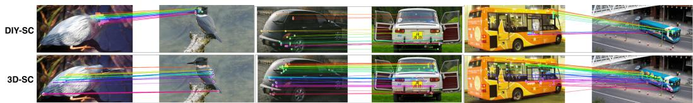

<details>
<summary>text_image</summary>

DIY-SC
3D-SC
</details>

Figure 4: Qualitative pseudo-annotations. We visualize pseudo-ground-truth annotations from 3D-SC and DIY-SC. 3D-SC produces denser and more geometrically consistent pseudo-annotations.

# 4.2 Experimental Results

Evaluation on SPair-71k. As shown in Table 1, 3D-SC establishes the strongest results among weakly supervised methods on SPair-71k, reaching 73.0 PCK@0.1. In particular, it improves over the strongest baseline in the same supervision regime, DIY-SC+OriAny, by 3.4 points. Per-category results in Table C2 show that the gains are concentrated in rigid categories with strong geometric symmetry, such as bus (+10.8), tv monitor (+9.8), car (+6.9), and motorcycle (+5.1), while nonrigid categories such as animals show no gain or can slightly regress. The gains are even more pronounced on SPair-Geo-Aware, where our method reaches 70.8 PCK@0.1, clearly surpassing all existing weakly supervised approaches. This behavior is consistent with our central hypothesis: because our pseudo-labels are grounded in reconstructed 3D geometry, they are especially effective on correspondences that require disambiguating symmetric or repeated parts, and viewpoint changes.

Evaluation on SPairU. On SPairU, 3D-SC obtains 67.3 PCK@0.1. This is the best result among methods without human annotations and is only 0.6 points below DIY-SC, which leverages human annotations. The smaller margin compared with SPair-Geo-Aware subset is expected: SPairU mainly probes generalization to previously unseen keypoints which are usually located at the middle of the limbs/parts. Our PartField features, trained on part contrastive learning, are not explicitly designed to differentiate keypoints within the same part. Hence we do not expect a large gain from PartField features on this benchmark, explaining the modest improvement over DIY-SC+OriAny (1 point). Nevertheless, the result shows that the representation learned from our pseudo-labels transfers also to these keypoint definitions.

Evaluation on AP-10K. Our method also transfers well to the more articulated and shape-diverse setting of AP-10K. 3D-SC achieves 69.6/68.5/56.9 PCK@0.1 on the intra-species, cross-species, and cross-family splits, outperforming the strongest baseline without human annotations on all three splits. These improvements are particularly meaningful on the harder cross-species and cross-family evaluations, where appearance cues alone are often insufficient. Although PartField descriptors can be less reliable for animals in unusual poses during the pseudo-annotation procedure, the overall results show that our 3D-aware pseudo-label generation and filtering pipeline remains effective well beyond the rigid object categories of SPair-71k.

Qualitative results. As shown in Figure 4 (additional visualizations in Figure C1), 3D-SC produces well-distributed pseudo-annotations that cover the commonly visible parts of each object. The matches are geometrically consistent and free from left-right ambiguities, a direct consequence of anchoring correspondence in instance-specific 3D geometry.

# 4.3 Ablations

PartField Features. Table 2 reports the effect of adding PartField to the feature fusion. Compared to SD+DINO alone, SD+DINO+PartField simultaneously lowers the False Positive Rate (FPR) of unfiltered candidates and increases the average number of candidates retained per pair. These two effects together indicate that integrating PartField not only suppresses incorrect matches but also surfaces additional correct ones that SD+DINO misses, consistent with its ability to distinguish geometrically distinct but visually similar regions such as front and rear wheels or left and right parts. The downstream impact is confirmed in Table 3: adding PartField improves PCK@0.1 on SPair-71k by 0.6 points over the SD+DINO baseline.

Filtering. We validate the geodesic filtering stage on the SPair-71k validation set. For each annotated keypoint we compute its nearest neighbor in the fused feature space and check whether the prediction is correct under PCK@0.1. A wrong prediction that survives filtering counts as a false positive; the FPR is therefore the fraction of unfiltered predictions that are incorrect. As shown in Table 2, our bicyclic geodesic filter achieves the lowest FPR of 1.78% among the filtering strategies we compared. The benefit also carries over to the trained adapter: Table 3 shows a gain of 3.3 PCK@0.1 points when geodesic filtering is applied versus using all cyclic-consistency candidates without further rejection. Finally, capping the number of pseudo-labels sampled per pair during training improves PCK@0.1 by 0.6 points; without this cap, pairs with denser pseudo-label sets dominate the gradient and reduce the effective diversity of training signal.

Table 2: Filtering evaluation on validation set. FPR refers to False Positive Rate, i.e., unfiltered wrong prediction. #Candidates refers to the average total number of filtered correspondences per pair. 

<table><tr><td>Filter</td><td>FPR</td><td>#Candidates</td></tr><tr><td colspan="3">Features: SD+DINO</td></tr><tr><td>Spherical mapper</td><td>10.95</td><td>1856</td></tr><tr><td>Triplane</td><td>13.15</td><td>1948</td></tr><tr><td>PF Feature similarity</td><td>2.81</td><td>1608</td></tr><tr><td>Geodesic</td><td>1.82</td><td>1543</td></tr><tr><td colspan="3">Features: SD+DINO+PartField</td></tr><tr><td>Spherical mapper</td><td>10.75</td><td>2001</td></tr><tr><td>Triplane</td><td>13.07</td><td>2090</td></tr><tr><td>PF Feature similarity</td><td>2.47</td><td>1694</td></tr><tr><td>Geodesic</td><td>1.78</td><td>1634</td></tr></table>

Table 3: Ablations on SPair-71k. All introduced components bring a significant improvement. The baseline is evaluated using the SD+DINO zero-shot approach with window soft argmax. ‘c.c.’ = cyclic consistency. 

<table><tr><td>pseudo</td><td>PF</td><td>c.c.</td><td>filter.</td><td>sampl.</td><td>DINO</td><td>PCK@.1</td></tr><tr><td></td><td></td><td></td><td></td><td>√</td><td>v2</td><td>64.9</td></tr><tr><td>√</td><td></td><td></td><td></td><td>√</td><td>v2</td><td>67.0</td></tr><tr><td>√</td><td></td><td>√</td><td></td><td>√</td><td>v2</td><td>67.6</td></tr><tr><td>√</td><td></td><td>√</td><td>√</td><td>√</td><td>v2</td><td>71.6</td></tr><tr><td>√</td><td></td><td>√</td><td>√</td><td>√</td><td>v3</td><td>72.4</td></tr><tr><td>√</td><td>√</td><td></td><td></td><td>√</td><td>v2</td><td>66.9</td></tr><tr><td>√</td><td>√</td><td>√</td><td></td><td>√</td><td>v2</td><td>68.8</td></tr><tr><td>√</td><td>√</td><td>√</td><td>√</td><td>√</td><td>v2</td><td>72.1</td></tr><tr><td>√</td><td>√</td><td>√</td><td>√</td><td></td><td>v3</td><td>72.4</td></tr><tr><td>√</td><td>√</td><td>√</td><td>√</td><td>√</td><td>v3</td><td>73.0</td></tr><tr><td colspan="5">DIY-SC</td><td>v3</td><td>72.1</td></tr><tr><td colspan="5">DIY-SC+OriAny</td><td>v3</td><td>70.4</td></tr></table>

Backbone. Replacing DINOv2 with DINOv3 as the vision backbone yields an improvement of 0.9 PCK@0.1. To disentangle this gain from other design choices, we applied the same substitution to both DIY-SC variants and observe a similarly sized increase, confirming that a slight improvement (0.5-0.9) is attributable to the stronger backbone in general. Importantly, our method outperforms both DIY-SC variants in either backbone setting.

# 5 Limitations and Future Work

Our pipeline depends on SAM3D’s pose and shape estimates; errors propagate through the 2D–3D reprojection and can degrade geodesic consistency, although our filtering removes most resulting false positives. PartField’s part-level contrastive training provides coarse regional cues rather than precise within-part localization, which motivates its relatively low fusion weight; this limitation is reflected in our SPairU results, where keypoints often lie in the middle of parts and PartField contributes less signal. A stronger 3D feature, ideally one tailored to deformable categories such as animals, would likely warrant a higher weight. Finally, our cross-mesh correspondence uses nearest-neighbor matching in PartField space; replacing it with denser registration via optimal transport or functional maps [29] is a natural next step, trading additional compute for finer alignment.

# 6 Conclusion

We presented a 3D-aware post-training framework for semantic correspondence that leverages priors from 3D foundation models without requiring human pose annotations. By combining SAM3D-based geometry and pose estimation with a render-and-compare refinement step, we obtain instance-specific 3D structure that drives both feature construction and pseudo-label filtering: PartField descriptors rendered into the image plane provide geometry-aware cues that complement DINO and Stable Diffusion features, while geodesic distances on the reconstructed shapes enable principled filtering of inconsistent matches. The filtered correspondences supervise a lightweight adapter that yields consistent improvements over prior methods on standard benchmarks. Our results suggest that instance-specific 3D structure can be a more reliable geometric prior than the coarse spherical proxies used by prior post-training approaches, and that it can be obtained automatically from off-the-shelf 3D foundation models. We see this as an early step toward a new class of self-supervised pipelines where 3D foundation models act as geometric teachers for 2D tasks, a direction that becomes more powerful as 3D reconstruction quality continues to improve.

# Acknowledgments and Disclosure of Funding

AK acknowledges support via his Emmy Noether Research Group funded by the German Research Foundation (DFG) under grant number 468670075. This research was funded by the Deutsche Forschungsgemeinschaft (DFG, German Research Foundation) under grant number 539134284, through EFRE (FEIH\_2698644) and the state of Baden-Württemberg.

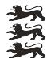

Baden-Wurttemberg


Co-funded by the European Union

# References

[1] K. Aberman, J. Liao, M. Shi, D. Lischinski, B. Chen, and D. Cohen-Or. Neural best-buddies: Sparse cross-domain correspondence. ACM Transactions on Graphics (TOG), 2018.   
[2] S. Amir, Y. Gandelsman, S. Bagon, and T. Dekel. Deep ViT features as dense visual descriptors. In European Conference on Computer Vision Workshop (ECCVW), 2022.   
[3] N. Carion, L. Gustafson, Y.-T. Hu, S. Debnath, R. Hu, D. Suris, C. Ryali, K. V. Alwala, H. Khedr, A. Huang, J. Lei, T. Ma, B. Guo, A. Kalla, M. Marks, J. Greer, M. Wang, P. Sun, R. Rädle, T. Afouras, E. Mavroudi, K. Xu, T.-H. Wu, Y. Zhou, L. Momeni, R. Hazra, S. Ding, S. Vaze, F. Porcher, F. Li, S. Li, A. Kamath, H. K. Cheng, P. Dollár, N. Ravi, K. Saenko, P. Zhang, and C. Feichtenhofer. SAM 3: Segment anything with concepts, 2025. URL https://arxiv.org/abs/2511.16719.   
[4] M. Caron, H. Touvron, I. Misra, H. Jégou, J. Mairal, P. Bojanowski, and A. Joulin. Emerging properties in self-supervised vision transformers. In Proceedings of the IEEE/CVF International Conference on Computer Vision (ICCV), pages 9650–9660, 2021.   
[5] Y. Chi, L. Sommer, O. Dünkel, D. Muhle, D. Cremers, C. Theobalt, and A. Kortylewski. C3po: Canonicalization of 3d pose from partial views with generalizable correspondence features. In International Conference on 3D Vision (3DV), 2026.   
[6] C. Cuttano, G. Trivigno, C. Masone, and S. Roth. MARCO: Navigating the unseen space of semantic correspondence. In Proceedings of the IEEE Conference on Computer Vision and Pattern Recognition (CVPR), 2026.   
[7] N. Donati, A. Sharma, and M. Ovsjanikov. Deep geometric functional maps: Robust feature learning for shape correspondence. In Proceedings of the IEEE Conference on Computer Vision and Pattern Recognition (CVPR), pages 8592–8601, 2020.   
[8] O. Dünkel, T. Wimmer, C. Theobalt, C. Rupprecht, and A. Kortylewski. Do it yourself: Learning semantic correspondence from pseudo-labels. In Proceedings of the IEEE/CVF International Conference on Computer Vision (ICCV), 2025.   
[9] N. S. Dutt, S. Muralikrishnan, and N. J. Mitra. Diffusion 3d features (diff3f): Decorating untextured shapes with distilled semantic features. In Proceedings of the IEEE Conference on Computer Vision and Pattern Recognition (CVPR), pages 4494–4504, 2024.   
[10] F. Fundel, J. Schusterbauer, V. T. Hu, and B. Ommer. Distillation of diffusion features for semantic correspondence. In Proceedings of the Winter Conference on Applications of Computer Vision (WACV), 2025.   
[11] B. Ham, M. Cho, C. Schmid, and J. Ponce. Proposal flow: Semantic correspondences from object proposals. IEEE Transactions on Pattern Analysis and Machine Intelligence (PAMI), 40 (7):1711–1725, 2017.   
[12] R. Hartwig, D. Muhle, R. Marin, and D. Cremers. Geco: Geometrically consistent embedding with lightspeed inference. In Proceedings of the IEEE/CVF International Conference on Computer Vision (ICCV), pages 9309–9319, 2025.

[13] E. Hedlin, G. Sharma, S. Mahajan, H. Isack, A. Kar, A. Tagliasacchi, and K. M. Yi. Unsupervised semantic correspondence using stable diffusion. In Conference on Neural Information Processing Systems (NeurIPS), 2023.   
[14] Y. Huang, Y. Sun, C. Lai, Q. Xu, X. Wang, X. Shen, and W. Ge. Weakly supervised learning of semantic correspondence through cascaded online correspondence refinement. In Proceedings of the IEEE/CVF International Conference on Computer Vision (ICCV), 2023.   
[15] A. Jesslen, G. Zhang, A. Wang, W. Ma, A. Yuille, and A. Kortylewski. Novum: Neural object volumes for robust object classification. In European Conference on Computer Vision (ECCV), 2024.   
[16] J. Kim, K. Ryoo, J. Seo, G. Lee, D. Kim, H. Cho, and S. Kim. Semi-supervised learning of semantic correspondence with pseudo-labels. In Proceedings of the IEEE Conference on Computer Vision and Pattern Recognition (CVPR), 2022.   
[17] N. Kulkarni, S. Tulsiani, and A. Gupta. Canonical surface mapping via geometric cycle consistency. In Proceedings of the IEEE/CVF International Conference on Computer Vision (ICCV), pages 2202–2211, 2019. doi: 10.1109/ICCV.2019.00229.   
[18] X. Li, D.-P. Fan, F. Yang, A. Luo, H. Cheng, and Z. Liu. Probabilistic model distillation for semantic correspondence. In Proceedings of the IEEE Conference on Computer Vision and Pattern Recognition (CVPR), 2021.   
[19] X. Li, J. Lu, K. Han, and V. A. Prisacariu. SD4Match: Learning to prompt Stable Diffusion model for semantic matching. In Proceedings of the IEEE Conference on Computer Vision and Pattern Recognition (CVPR), pages 27558–27568, 2024.   
[20] C. Liu, J. Yuen, and A. Torralba. Sift flow: Dense correspondence across scenes and its applications. IEEE Transactions on Pattern Analysis and Machine Intelligence (PAMI), 33(5): 978–994, 2011.   
[21] M. Liu, M. A. Uy, D. Xiang, H. Su, S. Fidler, N. Sharp, and J. Gao. PartField: Learning 3D feature fields for part segmentation and beyond. arXiv preprint arXiv:2504.11451, 2025.   
[22] D. G. Lowe. Distinctive image features from scale-invariant keypoints. International Journal of Computer Vision (IJCV), 60(2):91–110, 2004.   
[23] G. Luo, L. Dunlap, D. H. Park, A. Holynski, and T. Darrell. Diffusion hyperfeatures: Searching through time and space for semantic correspondence. In Conference on Neural Information Processing Systems (NeurIPS), 2023.   
[24] O. Mariotti, O. Mac Aodha, and H. Bilen. Improving semantic correspondence with viewpointguided spherical maps. In Proceedings of the IEEE Conference on Computer Vision and Pattern Recognition (CVPR), 2024.   
[25] O. Mariotti, Z. Du, Y. Bhalgat, O. Mac Aodha, and H. Bilen. Jamais Vu: Exposing the generalization gap in supervised semantic correspondence. In Conference on Neural Information Processing Systems (NeurIPS), volume 38, 2025.   
[26] J. Min, J. Lee, J. Ponce, and M. Cho. Spair-71k: A large-scale benchmark for semantic correspondence, 2019. URL https://arxiv.org/abs/1908.10543.   
[27] N. Neverova, D. Novotny, V. Khalidov, M. Szafraniec, P. Labatut, and A. Vedaldi. Continuous surface embeddings for deformable shape correspondence. Conference on Neural Information Processing Systems (NeurIPS), 2020.   
[28] M. Oquab, T. Darcet, T. Moutakanni, H. Vo, M. Szafraniec, V. Khalidov, P. Fernandez, D. Haziza, F. Massa, A. El-Nouby, et al. DINOv2: Learning robust visual features without supervision. arXiv preprint arXiv:2304.07193, 2023.   
[29] M. Ovsjanikov, M. Ben-Chen, J. Solomon, A. Butscher, and L. Guibas. Functional maps: a flexible representation of maps between shapes. ACM Transactions on Graphics (TOG), 31(4): 1–11, 2012.

[30] R. Rombach, A. Blattmann, D. Lorenz, P. Esser, and B. Ommer. High-resolution image synthesis with latent diffusion models. In Proceedings of the IEEE Conference on Computer Vision and Pattern Recognition (CVPR), pages 10684–10695, 2022.   
[31] SAM 3D Team, X. Chen, F.-J. Chu, P. Gleize, K. J. Liang, A. Sax, H. Tang, W. Wang, M. Guo, T. Hardin, X. Li, A. Lin, J. Liu, Z. Ma, A. Sagar, B. Song, X. Wang, J. Yang, B. Zhang, P. Dollár, G. Gkioxari, M. Feiszli, and J. Malik. SAM 3D: 3Dfy anything in images, 2025. URL https://arxiv.org/abs/2511.16624.   
[32] A. Shtedritski, C. Rupprecht, and A. Vedaldi. Shic: Shape-image correspondences with no keypoint supervision. In European Conference on Computer Vision (ECCV), 2024.   
[33] L. Sommer, O. Dünkel, C. Theobalt, and A. Kortylewski. Common3d: Self-supervised learning of 3d morphable models for common objects in neural feature space. In Proceedings of the IEEE Conference on Computer Vision and Pattern Recognition (CVPR), pages 6468–6479, June 2025.   
[34] L. Tang, M. Jia, Q. Wang, C. P. Phoo, and B. Hariharan. Emergent correspondence from image diffusion. In Conference on Neural Information Processing Systems (NeurIPS), 2023.   
[35] T. Taniai, S. N. Sinha, and Y. Sato. Joint recovery of dense correspondence and cosegmentation in two images. In Proceedings of the IEEE Conference on Computer Vision and Pattern Recognition (CVPR), pages 4246–4255, 2016.   
[36] N. Tumanyan, M. Geyer, S. Bagon, and T. Dekel. Plug-and-play diffusion features for textdriven image-to-image translation. In Proceedings of the IEEE Conference on Computer Vision and Pattern Recognition (CVPR), pages 1921–1930, 2023.   
[37] K. Wandel and H. Wang. Semalign3d: Semantic correspondence between rgb-images through aligning 3d object-class representations. In Proceedings of the IEEE Conference on Computer Vision and Pattern Recognition (CVPR), pages 1138–1147, 2025. doi: 10.1109/CVPR52734. 2025.00114.   
[38] P. Wang, T. Ikeda, R. Lee, and K. Nishiwaki. Gs-pose: Category-level object pose estimation via geometric and semantic correspondence. In European Conference on Computer Vision (ECCV), pages 108–126. Springer, 2024.   
[39] Z. Wang, Z. Zhang, J. Xu, J. Wang, T. Pang, C. Du, H. Zhao, and Z. Zhao. Orient anything v2: Unifying orientation and rotation understanding. In Conference on Neural Information Processing Systems (NeurIPS), 2025.   
[40] F. Xue, S. Elflein, L. Leal-Taixe, and Q. Zhou. MATCHA: Towards matching anything. arXiv preprint arXiv:2501.14945, 2025.   
[41] L. Yi, V. G. Kim, D. Ceylan, W. Shen, M. Yan, H. Su, C. Lu, Q. Huang, A. Sheffer, and L. Guibas. A scalable active framework for region annotation in 3d shape collections. In ACM Trans. Graphics (Proc. SIGGRAPH Asia), 2016.   
[42] H. Yu, Y. Xu, J. Zhang, W. Zhao, Z. Guan, and D. Tao. AP-10k: A benchmark for animal pose estimation in the wild. In Conference on Neural Information Processing Systems (NeurIPS), 2021.   
[43] J. Zhang, C. Herrmann, J. Hur, L. F. Polanía, V. Jampani, D. Sun, and M.-H. Yang. A tale of two features: Stable diffusion complements DINO for zero-shot semantic correspondence. In Conference on Neural Information Processing Systems (NeurIPS), 2023.   
[44] J. Zhang, C. Herrmann, J. Hur, E. Chen, V. Jampani, D. Sun, and M.-H. Yang. Telling left from right: Identifying geometry-aware semantic correspondence. In Proceedings of the IEEE Conference on Computer Vision and Pattern Recognition (CVPR), pages 3076–3085, 2024.   
[45] T. Zhou, P. Krahenbuhl, M. Aubry, Q. Huang, and A. A. Efros. Learning dense correspondence via 3d-guided cycle consistency. In Proceedings of the IEEE Conference on Computer Vision and Pattern Recognition (CVPR), 2016.

[46] J. Zhu, Y. Ju, J. Zhang, M. Wang, Z. Yuan, K. Hu, and H. Xu. Densematcher: Learning 3d semantic correspondence for category-level manipulation from a single demo. International Conference on Learning Representations (ICLR), 2025.

# Geometry Matters: 3D Foundation Priors for Learning Semantic Correspondence

Supplementary Material

This supplement is organized as follows. Section A provides implementation details for the 3D reconstruction and pose canonicalization pipeline. Section B gives additional details on feature fusion, pseudo-label generation, and geodesic filtering. Section C reports per-category results and additional qualitative visualizations. Section D discusses reproducibility and the use of LLM assistance in writing this paper.

(A) Pseudo-groundtruth via foundation models 15   
(B) Correspondence pseudo-annotations . . 16   
(C) Additional results and visualizations 18   
(D) Reproducibility and LLM assistance . 21

# A Pseudo-groundtruth via foundation models

This section provides additional details on the 3D reconstruction and canonicalization pipeline summarized in Section 3.1. The full pipeline is illustrated in Figure 2. Starting from a single image, we (i) extract a 2D instance mask and reconstruct an object-centric mesh using foundation models, (ii) refine the mesh pose via a two-phase render-and-compare optimization, and (iii) resolve any residual yaw ambiguity by comparing rendered views against estimated orientations.

2D Mask and 3D Mesh Initialization. To extract instance masks with SAM3 [3], we prompt the model with the category label provided by SPair-71k. These prompts improve mask quality and reduce failure cases, but are not strictly required: masks can be obtained without them, at the cost of additional noise in the downstream pipeline. We validate this choice empirically: a simple baseline using DINOv2 CLS token embeddings with kNN classification achieves ∼ 99% accuracy on the category classification task. Failure cases occur primarily when multiple objects occupy a single image (affecting <1% of instances), representing a negligible impact on overall performance. We consider this a reasonable choice since neither the bounding box nor the category label constitutes additional human annotation beyond what the dataset already provides, and both can be obtained automatically with off-the-shelf object detectors if needed.

Render-and-compare pose refinement. The interior-coverage reward $( \lambda > 1$ in Equation (2)) is critical in cases of strong occlusion. Without it, we found that the optimization sometimes escapes the distance-transform penalty by pushing the rendered silhouette entirely outside the image — avoiding the loss rather than solving it $( e . g .$ , the partially occluded chair in Figure 2). The interior-coverage term counteracts this by rewarding rendered mass that lands inside the observed mask, preventing the degenerate solution. We additionally apply a strong penalty whenever more than 25% of the rendered silhouette falls outside the image boundary.

We set $\lambda = 4$ and dilate the observed mask by $r = 4$ pixels before computing the distance-transform fields (see Equation (1)), providing tolerance for coarse mesh boundaries. We optimize log-scale and translation jointly with Adam, using separate learning rates $\mathbf { l r } _ { \mathrm { s c a l e } } = 0 . 0 5$ and $\mathrm { l r } _ { \mathrm { t r a n s } } = 0 . 0 2$ . The higher learning rate for scale biases the optimization toward correcting the dominant error (scale mismatch) rather than compensating with depth drift, which is harmless for 2D reprojection quality but can destabilize the geometry. We run the distance-transform phase for 100 gradient steps, then switch to soft-IoU refinement for a further 50 steps to tighten the final alignment.

Yaw Canonicalization statistics. Following the canonicalization verification procedure described in Section 3.1, we applied discrete orientation corrections to a small subset of the refined meshes. Excluding meshes marked as wrong, 79 out of 1,319 instances required a non-zero rotation, corresponding to 5.99% of the dataset. These corrections indicate cases where the estimated orientation differed from the target canonical pose by one of the allowed discrete rotations.

All corrections were rotations around the y-axis: 34 meshes required a $2 7 0 ^ { \circ }$ rotation, 24 required ${ \mathfrak { a } } 9 0 ^ { \circ }$ rotation, and 15 required a $1 8 0 ^ { \circ }$ rotation. The corrections were distributed across both splits, with 59 rotated meshes in the training set and 20 in the validation set. The most frequently affected classes were bus, boat, train, and cow, with 23, 15, 8, and 7 corrected meshes, respectively.

# B Correspondence pseudo-annotations

This section provides additional details on the correspondence pseudo-annotation pipeline described in Section 3.2. We first give further analysis of the PartField features used in our feature fusion, including PCA visualizations and rasterization details (Section B.1). We then detail the feature fusion weight search and justify the square-root weighting scheme (Section B.2).

# B.1 PartField Features

We visualize PartField features [21] using PCA projections (Figure B1) and query-based similarity heatmaps (Figure B2). These visualizations show that PartField features are spatially coherent within semantic parts while remaining discriminative across repeated or symmetric structures.

Rasterization details. To rasterize PartField vertex features into the image plane, we first render the reconstructed 3D mesh into the image using the estimated pose, obtaining a mapping from each pixel to its corresponding 3D point on the mesh. We then assign to each pixel the PartField feature of its corresponding 3D point, effectively projecting the 3D-aware features into the 2D image space. This process allows us to leverage the geometric context captured by PartField features while maintaining alignment with the original image, enabling more accurate correspondence estimation.

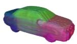

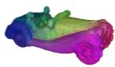  
(a) PCA projection across two car instances.

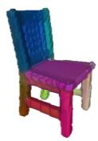

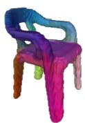  
(b) PCA projection across two chair instances.   
Figure B1: PCA visualizations of PartField features. We project PartField features to RGB using PCA and visualize them on pairs of object instances. Consistent colors within individual parts indicate that the features are spatially coherent, while similar colors across instances suggest that corresponding geometric parts, such as chair legs or car body regions, are mapped to nearby feature representations.

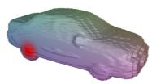

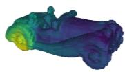  
(a) Highest similarity is correctly localized to the queried right-rear wheel.

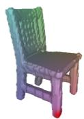

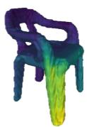  
(b) Highest similarity is correctly localized to the queried right-front chair leg.   
Figure B2: PartField features reduce repeated-part and symmetry ambiguities. For each example, the left mesh shows the query point in red, and the right mesh shows the cosine-similarity heatmap induced by the queried PartField feature. In the car example, similarity concentrates on the queried wheel rather than activating all repeated wheels. In the chair example, the response remains localized to the corresponding leg, avoiding front/back and left/right confusion. This suggests that PartField similarities are anchored in geometric context rather than only in semantic part identity.

# B.2 Feature fusion

We select the fusion weights $\alpha , \beta ,$ and $\gamma$ from Equation (5) via a grid search on the SPair-71k validation set, sweeping α and $\beta$ in increments of $1 / \dot { 6 }$ with $\gamma = 1 - \alpha - \beta _ { { \mathrm { {  } } } }$ , and measuring PCK@0.1 of unfiltered predicted correspondences. As shown in Figure B3, several weight combinations reach similar peak performance, confirming that the method is not too sensitive to the exact weighting and all features provide some contributions. Among these, we select $\alpha = 1 / 2 , \beta = 1 / 3$ , and $\gamma = 1 / 6 \mathrm { : }$ configurations that upweight PartField (γ) tend to yield better downstream performance after adapter training, consistent with PartField resolving the geometrically ambiguous correspondences that provide the most informative supervision signal.

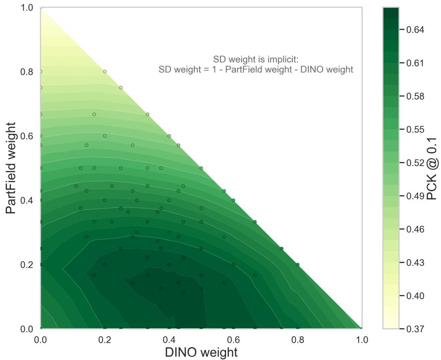

<details>
<summary>heatmap</summary>

| DINO weight | PartField weight | PCK @ 0.1 |
| ----------- | ---------------- | --------- |
| 0.0         | 1.0              | 0.37      |
| 0.2         | 0.8              | 0.49      |
| 0.4         | 0.6              | 0.58      |
| 0.6         | 0.4              | 0.61      |
| 0.8         | 0.2              | 0.64      |
| 1.0         | 0.0              | 0.64      |
</details>

Figure B3: Feature fusion weight search. PCK@0.10 of pseudo-correspondences before filtering on the SPair-71k validation set, as a function of the SD weight α and DINOv2 weight β (the PartField weight $\gamma = 1 - \alpha - \beta$ is determined by the other two). Multiple combinations achieve similar peak performance; we use $\alpha = 1 / 2 , \beta = 1 / \dot { 3 } , \gamma = 1 / 6$ as our default.

Square-root fusion weights. Let $\widehat { \mathcal { F } } _ { \mathrm { S D } } , \widehat { \mathcal { F } } _ { \mathrm { D I N O } }$ , and $\widehat { \mathcal { F } } _ { \mathrm { P F } }$ denote the independently L2-normalized feature vectors of any two candidate points. The dot product between their fused features is

$$
\mathcal {F} _ {\text { fused }} ^ {\top} \mathcal {F} _ {\text { fused }} ^ {\prime} = \sqrt {\alpha} \widehat {\mathcal {F}} _ {\mathrm{SD}} ^ {\top} \sqrt {\alpha} \widehat {\mathcal {F}} _ {\mathrm{SD}} ^ {\prime} + \sqrt {\beta} \widehat {\mathcal {F}} _ {\mathrm{DINO}} ^ {\top} \sqrt {\beta} \widehat {\mathcal {F}} _ {\mathrm{DINO}} ^ {\prime} + \sqrt {\gamma} \widehat {\mathcal {F}} _ {\mathrm{PF}} ^ {\top} \sqrt {\gamma} \widehat {\mathcal {F}} _ {\mathrm{PF}} ^ {\prime} \tag {B.1}
$$

$$
= \alpha \widehat {\mathcal {F}} _ {\mathrm{SD}} ^ {\top} \widehat {\mathcal {F}} _ {\mathrm{SD}} ^ {\prime} + \beta \widehat {\mathcal {F}} _ {\mathrm{DINO}} ^ {\top} \widehat {\mathcal {F}} _ {\mathrm{DINO}} ^ {\prime} + \gamma \widehat {\mathcal {F}} _ {\mathrm{PF}} ^ {\top} \widehat {\mathcal {F}} _ {\mathrm{PF}} ^ {\prime}. \tag {B.2}
$$

Since each feature source is L2-normalized independently, each dot product is exactly the cosine similarity within that feature space. Therefore, the cosine similarity in the concatenated fused space is equivalent to a weighted average of the cosine similarities computed independently for each feature source. The square roots appear because the weights are applied to both vectors before taking the dot√ √ product, e.g. ${ \sqrt { \alpha } } { \sqrt { \alpha } } = \alpha$ .

Table C1: Evaluation on standard benchmarks. Per-image PCK (%, ↑) at multiple thresholds on SPair-71k (test set and Geo-Aware subset), AP-10K and SpairU. † Results obtained from the official checkpoint. ‘–’ indicates missing numbers. Best per method type is shown in bold. 

<table><tr><td rowspan="2" colspan="2">Method</td><td colspan="3">SPair-71k</td><td colspan="3">SPair-Geo-Aware</td><td colspan="3">AP-10K (0.10)</td><td colspan="3">SpairU</td></tr><tr><td>0.01</td><td>0.05</td><td>0.10</td><td>0.01</td><td>0.05</td><td>0.10</td><td>I.S.</td><td>C.S.</td><td>C.F.</td><td>0.01</td><td>0.05</td><td>0.10</td></tr><tr><td colspan="14">Supervised</td></tr><tr><td>DHF</td><td>Luo et al. [23]</td><td>8.7</td><td>50.2</td><td>64.9</td><td>8.0</td><td>45.8</td><td>62.7</td><td>62.7</td><td>60.0</td><td>47.8</td><td>-</td><td>-</td><td>-</td></tr><tr><td>SD+DINOv2</td><td>Zhang et al. [43]</td><td>9.6</td><td>57.7</td><td>74.6</td><td>9.9</td><td>57.0</td><td>77.0</td><td>77.0</td><td>74.0</td><td>65.8</td><td>-</td><td>-</td><td>-</td></tr><tr><td>GECO</td><td>Hartwig et al. [12]</td><td>14.2</td><td>59.6</td><td>73.6</td><td>-</td><td>-</td><td>-</td><td>82.5</td><td>81.2</td><td>76.6</td><td>-</td><td>-</td><td>55.2</td></tr><tr><td>Jamais Vu</td><td>Mariotti et al. [25]</td><td>20.5</td><td>71.9</td><td>82.5</td><td>-</td><td>-</td><td>-</td><td>-</td><td>-</td><td>-</td><td>-</td><td>-</td><td>62.4</td></tr><tr><td>Geo-SC</td><td>Zhang et al. [44]</td><td>21.7</td><td>72.8</td><td>83.2</td><td>-</td><td>-</td><td>-</td><td>87.7</td><td>85.9</td><td>78.5</td><td>-</td><td>-</td><td>56.9</td></tr><tr><td>SemAlign3D</td><td>Wandel and Wang [37]</td><td>15.8</td><td>77.5</td><td>88.9</td><td>-</td><td>-</td><td>-</td><td>-</td><td>-</td><td>-</td><td>-</td><td>-</td><td>-</td></tr><tr><td>MARCO</td><td>Cuttano et al. [6]</td><td>27.0</td><td>77.6</td><td>87.2</td><td> $22.8^†$ </td><td> $76.8^†$ </td><td> $87.5^†$ </td><td>89.1</td><td>88.3</td><td>83.4</td><td> $5.0^†$ </td><td> $42.7^†$ </td><td>67.5</td></tr><tr><td colspan="14">Unsupervised</td></tr><tr><td>DINOv2+NN</td><td>Zhang et al. [43]</td><td>6.3</td><td>38.4</td><td>53.9</td><td>3.4</td><td>28.2</td><td>42.0</td><td>60.9</td><td>57.3</td><td>47.4</td><td>-</td><td>-</td><td>54.9</td></tr><tr><td>DIFT</td><td>Tang et al. [34]</td><td>7.2</td><td>39.7</td><td>52.9</td><td>3.4</td><td>28.2</td><td>42.5</td><td>50.3</td><td>46.0</td><td>35.0</td><td>-</td><td>-</td><td>47.4</td></tr><tr><td colspan="14">Weakly Supervised with human annotations</td></tr><tr><td>Spherical Map.</td><td>Mariotti et al. [24]</td><td>8.4</td><td>48.2</td><td>64.4</td><td>-</td><td>-</td><td>-</td><td>65.4</td><td>63.1</td><td>51.0</td><td>-</td><td>-</td><td>61.0</td></tr><tr><td>DIY-SC</td><td>Dünkel et al. [8]</td><td>10.1</td><td>53.8</td><td>71.6</td><td>7.7</td><td>47.7</td><td>67.5</td><td>70.6</td><td>69.8</td><td>57.8</td><td>5.4</td><td>44.0</td><td>67.9</td></tr><tr><td colspan="14">Weakly Supervised without human annotations</td></tr><tr><td>SD+DINOv2</td><td>Zhang et al. [43]</td><td>7.9</td><td>44.7</td><td>59.9</td><td>5.3</td><td>34.5</td><td>49.3</td><td>62.9</td><td>59.3</td><td>48.3</td><td>-</td><td>-</td><td>59.4</td></tr><tr><td>DIY-SC+OriAny</td><td>Dünkel et al. [8]</td><td>9.5</td><td>51.2</td><td>69.6</td><td>6.9</td><td>45.7</td><td>65.8</td><td>69.3</td><td>66.8</td><td>54.0</td><td>5.2</td><td>43.1</td><td>66.3</td></tr><tr><td>3D-SC (Ours)</td><td></td><td>10.2</td><td>54.8</td><td>73.0</td><td>7.8</td><td>50.1</td><td>70.8</td><td>69.6</td><td>68.5</td><td>56.9</td><td>5.6</td><td>43.5</td><td>67.3</td></tr></table>

# C Additional results and visualizations

# C.1 Additional implementation details

Compute. Unless stated otherwise, all reported runtimes are measured on a single NVIDIA L40 GPU with 40 GB of memory; our pipeline is also compatible with smaller memory budgets. The canonicalized 3D object reconstruction takes 12.42 s per object on average. Computing the pseudolabels for the full SPair-71k training set (∼53k pairs) takes roughly 18 h end-to-end, including SD, DINO, and PartField feature extraction, rasterization of PartField descriptors, cyclic consistency, and geodesic filtering for each image pair. Note that this pipeline could benefit from further optimization and parallelization to reduce runtime with minimal work. Training the adapter for 200k iterations takes about 4 h on a single GPU.

# C.2 Additional results

We provide additional results complementing those in the main paper. In particular, we extend the benchmark tables to include Supervised methods in Table C1, which were omitted from the main paper for space, and report per-category PCK results on SPair-71k in Table C2. We exclude the weakly supervised without human annotations variant of Telling Left from Right (Geo-SC) [44] from the main paper, as it reports PCK normalized per keypoint rather than per image, making direct comparison unreliable. For completeness, per-category results for Geo-SC are included in Table C2.

Per-category results are reported in Table C2 (per-keypoint PCK@0.1). The pattern of gains is consistent with our central hypothesis: the largest improvements over DIY-SC+OriAny (and even DIY-SC which was trained with human supervision) occur in rigid, man-made categories with strong geometric symmetry — bus (+10.8), tv/monitor (+9.8), bottle (+8.8), car (+6.9), train (+6.2), motorcycle (+5.1), and chair (+4.0). These are precisely the categories where 2D features tend to confuse symmetric sides or visually similar parts, and where PartField descriptors provide the strongest disambiguating signal. By contrast, non-rigid animal categories such as sheep (−2.7), cat (−1.5), and cow (−1.7) show slight regressions, which is expected: PartField is trained with a part-level contrastive objective on rigid objects and generalizes less reliably to deformable shapes. Potted plant similarly shows a marginal decrease (−0.6), likely because SAM3D reconstructs the pot and plant as a single merged shape, whereas evaluation keypoints typically land on the pot alone.

Table C2: Per-category PCK@0.1 scores (per-keypoint) on SPair-71k. Gains are largest for rigid, man-made categories with strong geometric symmetry (bus, tv/monitor, car, motorcycle), where PartField features resolve left–right and repeated-part ambiguities. Non-rigid categories such as animals show little to no improvement. 

<table><tr><td></td><td>→</td><td>bicycle</td><td>air</td><td>diamond</td><td>◇</td><td>◇</td><td>◇</td><td>◇</td><td>◇</td><td>◇</td><td>◇</td><td>◇</td><td>◇</td><td>◇</td><td>◇</td><td>◇</td><td>avg</td></tr><tr><td colspan="18">Supervised</td></tr><tr><td>MARCO</td><td>93.7</td><td>79.8</td><td>96.9</td><td>74.7</td><td>75.4</td><td>95.2</td><td>91.9</td><td>94.8</td><td>87.5</td><td>96.5</td><td>91.2</td><td>90.3</td><td>87.6</td><td>63.x</td><td>29.x</td><td>63.x</td><td>51.x</td></tr><tr><td colspan="18">Unsupervised</td></tr><tr><td>DINOv2+NN</td><td>72.7</td><td>62.0</td><td>85.2</td><td>41.3</td><td>40.4</td><td>52.3</td><td>51.5</td><td>71.1</td><td>36.2</td><td>67.1</td><td>64.6</td><td>67.6</td><td>61.0</td><td>68.2</td><td>30.7</td><td>62.0</td><td>54.3</td></tr><tr><td>DIFT</td><td>63.5</td><td>54.5</td><td>80.8</td><td>34.5</td><td>46.2</td><td>52.7</td><td>48.3</td><td>77.7</td><td>39.0</td><td>76.0</td><td>54.9</td><td>61.3</td><td>53.3</td><td>46.0</td><td>57.8</td><td>57.1</td><td>71.1</td></tr><tr><td colspan="18">Weakly Supervised with human annotations</td></tr><tr><td>Spherical Mapper</td><td>75.3</td><td>63.8</td><td>87.7</td><td>48.2</td><td>50.9</td><td>74.9</td><td>71.1</td><td>81.7</td><td>47.3</td><td>81.6</td><td>66.9</td><td>73.1</td><td>65.4</td><td>61.8</td><td>55.5</td><td>70.2</td><td>75.0</td></tr><tr><td>DIY-SC</td><td>77.2</td><td>69.1</td><td>90.8</td><td>54.2</td><td>57.9</td><td>83.7</td><td>77.5</td><td>86.5</td><td>53.1</td><td>86.7</td><td>73.1</td><td>78.5</td><td>72.5</td><td>74.0</td><td>73.5</td><td>76.0</td><td>77.2</td></tr><tr><td colspan="18">Weakly Supervised without human annotations</td></tr><tr><td>SD+DINOv2</td><td>73.0</td><td>64.1</td><td>86.4</td><td>40.7</td><td>52.9</td><td>55.0</td><td>53.8</td><td>78.6</td><td>45.5</td><td>77.3</td><td>64.7</td><td>69.7</td><td>63.3</td><td>69.2</td><td>58.4</td><td>67.6</td><td>66.2</td></tr><tr><td>Geo-SC</td><td>78.0</td><td>66.4</td><td>90.2</td><td>44.5</td><td>60.1</td><td>66.6</td><td>60.8</td><td>82.7</td><td>53.2</td><td>82.3</td><td>69.5</td><td>75.1</td><td>66.1</td><td>71.7</td><td>58.9</td><td>71.6</td><td>83.8</td></tr><tr><td>DIY-SC+OriAny</td><td>76.1</td><td>65.9</td><td>90.4</td><td>52.2</td><td>57.3</td><td>75.7</td><td>75.3</td><td>85.0</td><td>52.8</td><td>86.3</td><td>71.4</td><td>78.3</td><td>69.9</td><td>73.5</td><td>69.2</td><td>75.0</td><td>76.7</td></tr><tr><td>3D-SC (Ours)</td><td>77.6</td><td>70.3</td><td>90.4</td><td>54.8</td><td>66.1</td><td>86.5</td><td>82.2</td><td>83.5</td><td>56.8</td><td>84.6</td><td>72.6</td><td>77.8</td><td>75.0</td><td>72.5</td><td>68.6</td><td>72.3</td><td>82.9</td></tr></table>

# C.3 Comparison of pseudo-annotations

Figure C1 extends the qualitative comparison from the main paper with additional examples. Across object categories, 3D-SC consistently produces denser pseudo-annotations that cover a larger fraction of the object surface, while remaining geometrically consistent and free from left-right ambiguities. By contrast, DIY-SC pseudo-labels are sparser and more prone to symmetric confusions, as its spherical geometric prior cannot resolve instance-level structure. These qualitative differences are directly reflected in the quantitative gains on SPair-Geo-Aware, which specifically targets symmetric and repeated-part correspondences.

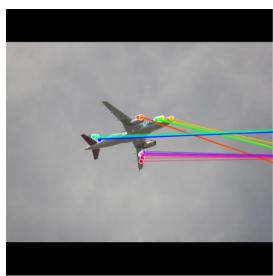

<details>
<summary>natural_image</summary>

Aircraft in flight with colored trajectory lines against a cloudy sky (no text or symbols visible)
</details>

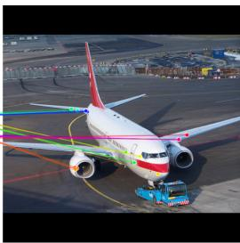

<details>
<summary>natural_image</summary>

Airplane on tarmac with ground crew and airport gate in background (no visible text or symbols)
</details>

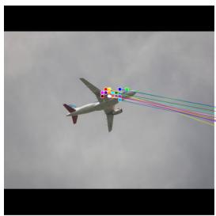

<details>
<summary>natural_image</summary>

Airplane in flight with colorful smoke trails against a cloudy sky (no visible text or symbols)
</details>

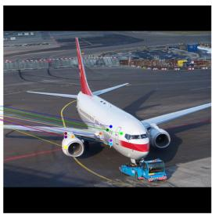

<details>
<summary>natural_image</summary>

Airplane on tarmac with ground crew and airport gate in background (no visible text or symbols)
</details>

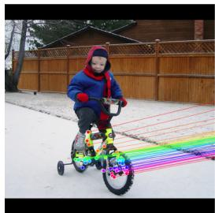

<details>
<summary>natural_image</summary>

Child riding a tricycle on a snowy field with wooden fence in background (no text or symbols visible)
</details>

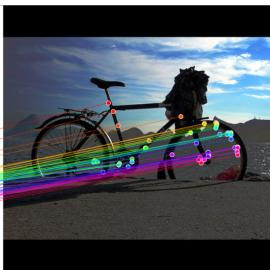

<details>
<summary>natural_image</summary>

Silhouette of a bicycle on a dirt road with colorful overlay lines against a desert sky (no text or symbols)
</details>

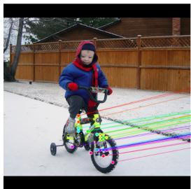

<details>
<summary>natural_image</summary>

Child riding a tricycle outdoors with colorful lane markings, no visible text or symbols
</details>

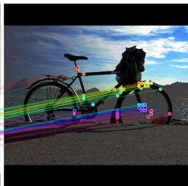

<details>
<summary>natural_image</summary>

Silhouette of a bicycle on a desert road with colored trajectory lines overlaying it (no text or symbols)
</details>

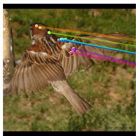

<details>
<summary>natural_image</summary>

Bird in flight with colorful tail feathers and green dots on wings (no text or symbols)
</details>

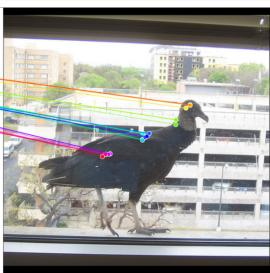

<details>
<summary>natural_image</summary>

Black bird with yellow beak standing in front of a window, overlooking a cityscape (no visible text or symbols)
</details>

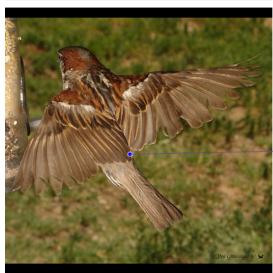

<details>
<summary>natural_image</summary>

Bird in flight with wings spread, no visible text or symbols
</details>

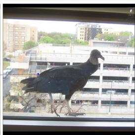

<details>
<summary>natural_image</summary>

Black bird standing on a balcony overlooking a multi-story building with greenery (no visible text or symbols)
</details>

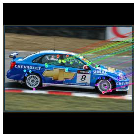

<details>
<summary>text_image</summary>

CHEVROLET
GMAC
8
</details>

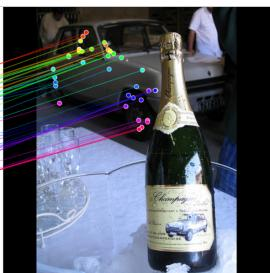

<details>
<summary>natural_image</summary>

Vintage wine bottle with a decorative label, displayed on a table with blurred background figures (no readable text or symbols)
</details>

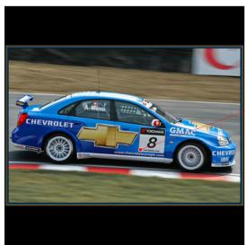

<details>
<summary>natural_image</summary>

Blue Chevrolet sports car racing on track with visible race markings and license plate (no readable text or symbols)
</details>

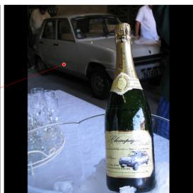

<details>
<summary>natural_image</summary>

Vintage wine bottle with label, displayed on table with glassware and a red arrow pointing to it (no readable text or symbols)
</details>

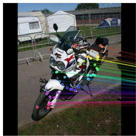

<details>
<summary>natural_image</summary>

Motorcyclist on a grassy field with colored trajectory lines and a white background (no visible text or symbols)
</details>

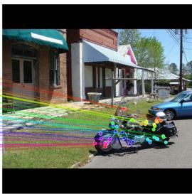

<details>
<summary>natural_image</summary>

Exterior view of a residential building with parked cars and a colorful motorcycle on a grassy path (no visible text or symbols)
</details>

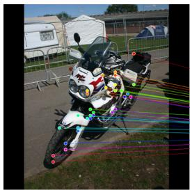

<details>
<summary>natural_image</summary>

Motorcyclist on a stationary platform with colored trajectory lines, parked near a tent and fence (no visible text or symbols)
</details>

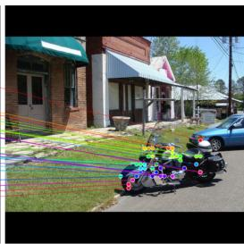

<details>
<summary>natural_image</summary>

Exterior view of a residential building with parked cars and a parked motorcycle in front (no visible text or symbols)
</details>

(a) 3D-SC.   
(b) DIY-SC.   
Figure C1: Qualitative pseudo-annotations. We visualize pseudo-ground-truth annotations from 3D-SC and DIY-SC. 3D-SC produces denser and more geometrically consistent pseudo-annotations.

# D Reproducibility and LLM assistance

To ensure full reproducibility of our work, we will release all code and data used in this paper. The complete processing pipeline, including scripts for dataset preparation will be made publicly available on §/GenIntel/3D-SC. Our training and inference code for the proposed model is provided in the same repository, together with configuration files and instructions for reproducing all experiments reported in the paper.

We used large language models (LLMs) in a limited capacity to assist with the writing of this paper and the design of parts of the code. Specifically, LLMs were employed only to (i) improve sentence clarity and conciseness, (ii) condense overly lengthy paragraphs, and (iii) provide coding assistance for implementation design. All technical contributions — including the method design, experimental setup, results, analyses, and final implementation decisions — are entirely our own work.