# PARCEL: Pool-Anchored Resampling with Conditioned Elastic Queries for Efficient Vision-Language Understanding

Selim Kuzucu2, †, Alessio Tonioni1, Vasile Lup1, Bernt Schiele1, Federico Tombari1, 3 and Muhammad Ferjad Naeem1

1Google, 2Max Planck Institute for Informatics, SIC, 3Technical University of Munich, †Work done while interning at Google.

Large Vision-Language Models (LVLMs) map visual inputs into dense token sequences, imposing a quadratic computational bottleneck for inference. Elastic visual-token compression addresses this by training a single model that can run at multiple visual-token budgets. However, existing approaches struggle under aggressive compression. Spatial-only compression, as in nested pooling, behaves as an imperfect low-pass filter and induces spectral aliasing that obscures fine-grained detail. Queryonly compression, as in nested query resampling, replaces explicit grid-aligned tokens with non-local summaries and substantially degrades spatial grounding. To resolve this representational conflict, we introduce PARCEL (Pool-Anchored Resampling with Conditioned ELastic Queries for Efficient Vision-Language Understanding), a visual tokenization architecture that dynamically partitions the labor of feature extraction. PARCEL establishes spatial pool tokens as low-frequency layout anchors and conditions elastic query tokens on these anchors through Pool-Conditioned Query Resampling. This encourages query tokens to focus on complementary visual features rather than redundant spatial mapping. Extensive evaluations across 27 benchmarks show that PARCEL improves the performanceefficiency Pareto frontier, consistently outperforming existing matryoshka baselines across visual-token budgets while preserving the “train once, deploy anywhere” paradigm.

# 1. Introduction

Large Vision-Language Models (LVLMs) (9, 12, 29, 84, 88, 111, 116) have achieved remarkable success across a wide range of multimodal tasks, spanning video understanding, dense recognition, and generic visual question answering. Despite this success, LVLMs face an input-side bottleneck: images or videos are often represented with hundreds or thousands of visual tokens before being processed by the language decoder. This directly increases the sequence length of the Transformer (89), whose self-attention cost scales quadratically with the number of tokens. Prior LVLMs (4, 60, 84) show that increasing the visual-token budget often improves visual representation quality and downstream performance, but this comes at a steep compute and memory cost, hindering ubiquitous deployment.

To mitigate this computational burden, prior works explore static visual token compression techniques, including dropping (3, 5, 23, 39, 61, 100, 112), merging (75, 78), and projection (19, 51, 62, 65). While effective at reducing inference costs, these approaches typically produce fixed-length visual representations, forcing practitioners to choose a single operating point before deployment. This creates a strict trade-off: an efficiency-optimized model permanently sacrifices fine-grained visual detail, whereas a highresolution model remains computationally prohibitive for lightweight and latency-sensitive applications. In practice, available resources vary across devices and latency targets, especially when accommodating diverse input domains from images to videos. Elastic inference, a “train once, deploy anywhere” approach that supports multiple budgets after a single stage of training, has therefore emerged as a valuable and practical deployment goal (17, 38, 48, 49, 52, 105, 115).

To achieve this elasticity, recent advances adapt Matryoshka-style representation learning (49) to LVLM visual tokenization. These efforts primarily branch into two distinct architectural paradigms:

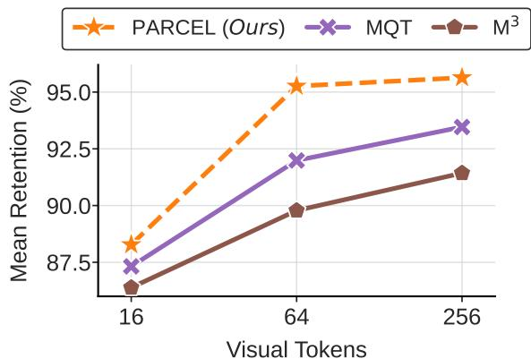

line

| Visual Tokens | PARCEL (Ours) | MQT  | M³   |
| ------------- | ------------- | ---- | ---- |
| 16            | 88.5          | 87.5 | 86.5 |
| 64            | 95.0          | 92.0 | 89.5 |
| 256           | 95.5          | 93.5 | 91.5 |

<table><tr><td>Budget</td><td>Image TFLOPs</td><td>Video TFLOPs</td><td>Image KV</td><td>Video KV</td></tr><tr><td>16</td><td>1.0T</td><td>4.9T</td><td>15MB</td><td>33MB</td></tr><tr><td>64</td><td>1.2T</td><td>8.2T</td><td>20MB</td><td>111MB</td></tr><tr><td>256</td><td>2.0T</td><td>24.3T</td><td>39MB</td><td>423MB</td></tr></table>

Figure 1 | Aggregate retention–efficiency trade-off. $L e f t$ : mean retention relative to Vanilla PG2 over 27 benchmarks and 3 seeds. Right: theoretical PARCEL prefill FLOPs and LLM KV-cache costs by visual-token budget. KV-cache is identical across methods at matched budgets; FLOP differences are small since shared ViT/LLM terms dominate and only connector overhead differs by a small margin. PARCEL outperforms MQT and $\mathbb { M } ^ { 3 }$ at matched budgets; lower visual-token budgets reduce compute and KV-cache costs versus uncompressed PG2 for image and 16-frame video.

rigid spatial downsampling (17) and non-local query resampling (38). Matryoshka Multimodal Models $( \mathbb { M } ^ { 3 } )$ (17) represent the former, constructing a nested token structure through successive multi-scale spatial average pooling. Conversely, the Matryoshka Query Transformer (MQT) (38) achieves elasticity using a query transformer paired with a nested dropout strategy (76, 83). While both successfully establish an elastic inference paradigm, they introduce opposing representational bottlenecks at highly constrained token budgets. As we formally analyze in Section 3, the rigid spatial downsampling in $\mathrm { ~ M } ^ { 3 }$ acts as an imperfect low-pass filter. This induces spectral aliasing that blurs the high-frequency semantic details required for resolution-sensitive tasks, such as chart reasoning and text-centric visual-question answering. In contrast, query resampling employed by MQT sacrifices explicit spatial relationships in favor of non-local learned summaries, reducing spatial grounding and dense localization capabilities.

To resolve these representational conflicts, we propose PARCEL (Pool-Anchored Resampling with Conditioned ELastic Queries for Efficient Vision-Language Understanding) , a visual tokenization architecture that dynamically partitions the labor of feature extraction as shown in Figure 2. PARCEL encourages a division of labor between spatial anchors directly coming from the vision transformer and learnable query tokens. The spatial pool tokens anchor the low-frequency geometric layout. We then introduce a supporting set of nested-dropout query tokens that are explicitly conditioned on these spatial anchors. Operating as dedicated “semantic explorers,” these pool-aware queries recover the complementary visual signal that standard pooling discards. Our contributions are as follows:

• Analysis of Spectral Bottlenecks: We formalize and empirically demonstrate the opposing representational bottlenecks present in current elastic LVLMs. Specifically, we show that rigid spatial average pooling in $ { \mathbf { M } } ^ { 3 }$ exhibits spectral signatures akin to aliasing, while nonlocal query-based resampling in MQT substantially degrades dense spatial understanding under compression.   
• The PARCEL Architecture: To resolve the above bottlenecks, we introduce a hybrid visual connector that dynamically partitions the labor of feature extraction. By means of our Pool-Conditioned Query Resampling mechanism, we combine the geometric stability of rigid spatial anchors with the high-frequency expressivity of dedicated semantic explorer queries.   
• Budget-Aware Routing and Pareto Efficiency: We design a dynamic routing strategy

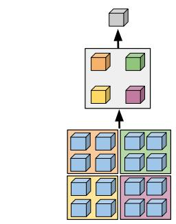

flowchart

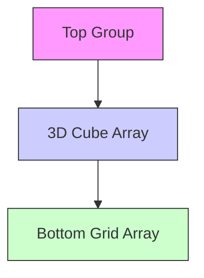

(a) $\mathrm { M } ^ { 3 } \ ( 1 7 )$

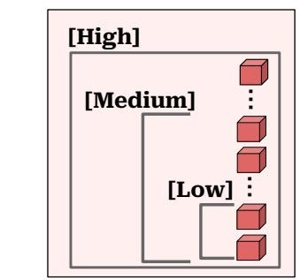

flowchart

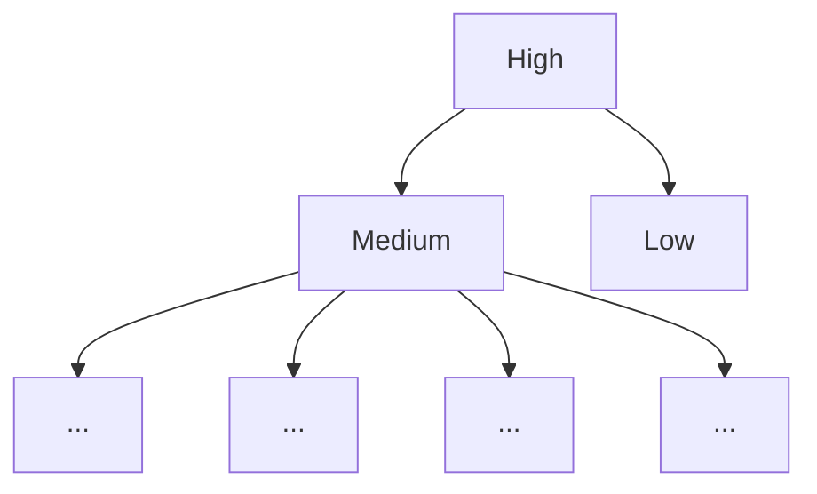

(b) MQT (38)

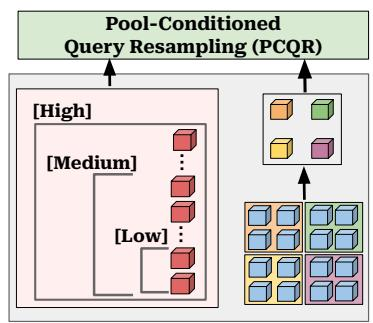

flowchart

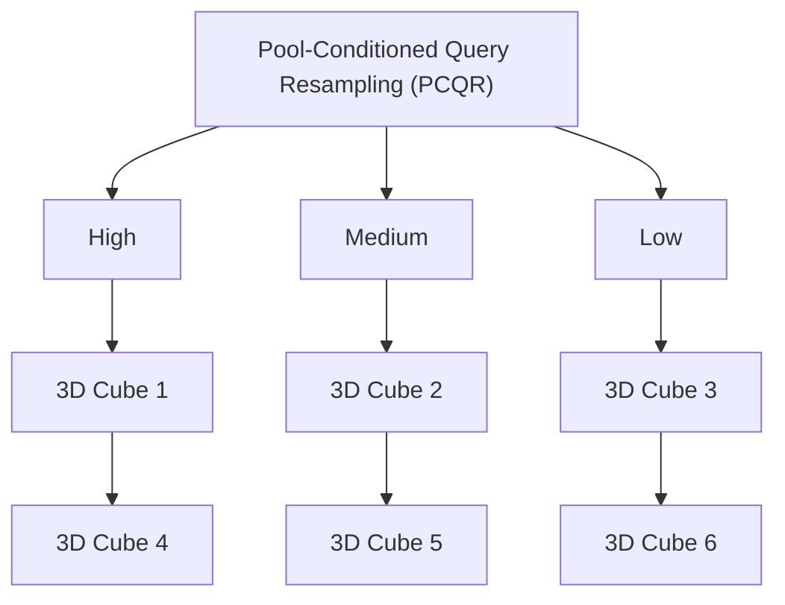

(c) PARCEL (Ours)   
[Med.] … Figure 2 | High-Level Overview of MQT, ${ \bf { M } } ^ { 3 }$ [Med.] … and PARCEL (Ours). $\mathbb { M } ^ { 3 }$ compresses visual features through rigid spatial pooling, MQT uses elastic query tokens, and PARCEL combines spatial anchor [Low] …  [Low] … tokens with pool-conditioned query resampling, allowing it to compress more effectively.

… … that enables a single model to seamlessly oper-… ate across varying inference budgets (from 16 to 256 tokens). This approach improves the performance-efficiency Pareto frontier across 27 diverse vision-language benchmarks, spanning video understanding, dense recognition, and VQA.

# Q, K, V 2. Background and Related Work

Visual Token Compression in LVLMs. The quadratic complexity of attention has driven re-…&search into reducing LVLM visual tokens via drop-Budget-Aware  … … Budget-Aware  Q, K, Vping (3, 5, 23, 36, 39, 61, 97, 99, 100, 112), Q(2x2 / 4x4)  (2x2 / 4x4)merging (75, 78), spatial reshaping and reso-C lution adaptation (22, 29, 57, 116), projecting ……(19, 51, 62, 65, 110), and query-based resampling (9, 50). As highlighted by recent surveys on efficient multimodal learning (92), optimizing these architectural bottlenecks remains an active SigLIP Visual  SigLIP Visual research frontier. While several recent methods Encoder  Encoder (8, 30, 40, 54, 96, 98, 107) address positional biases and spatial distortions caused by aggressive dropping, they mostly remain training-free, post-hoc optimizations rather than jointly trained elastic connectors. However, as Kong et al. (46) note, the lack of gradient-aligned learning often limits post-hoc compression methods under dynamic efficiency-performance trade-offs. Further recent advances explore hybrid and distillationbased compression, e.g., using visual bottleneck or summary tokens (16, 34, 106, 113). Unlike our approach, these methods operate predominantly inside the LLM. Because they bottleneck … … text-to-visual attention or rely on static quantiza-… tion rather than elastic connector-level tokenization, they do not provide native inference-time elasticity within a unified visual connector.

Matryoshka Representation Learning. To achieve inherent deployment elasticity without retraining, Matryoshka Representation Learning (MRL) (49) encodes information at multi-…ple granularities within a single nested structure. This “train once, deploy anywhere” paradigm spans diverse architectures, including nested …  … transformers (48) and Mixture-of-Experts routing K & V  K &(18, 55, 94). Within the generative and broader …  … representation learning domains, hierarchical tory -> ViT Query -> ViT… Budget-Aware Avg. Pooling kenizers (7, 95) and adaptive autoencoders like ss-Attn.  Cross-Attn. (2x2 / 4x4) ElasticTok (104) utilize nested dropout to resam-… ple 2D images into variable-length 1D token sequences, demonstrating that sequence truncation can naturally align with coarse-to-fine generation.

Adaptive and Elastic Visual Tokenization. SigLIP Visual Following the matryoshka learning paradigm, recent works aim to equip visual-token compression with the ability to perform inference at multiple visual-token budgets after a single stage of training. Recent methods (52, 105, 115) introduce adaptive inference via dynamic, input-dependent token pruning. Other works realize this flexibility by allowing the user to specify the token count, such as Mask-LLaVA (42). Among these budget-aware architectures, Matryoshka Multimodal Models $( \mathbb { M } ^ { 3 } )$ (17) and the Matryoshka Query Transformer (MQT) (38) stand out as representative paradigms that achieve structural elasticity via two distinct mechanisms. $\mathrm { ~ M } ^ { 3 }$ utilizes multi-scale successive spatial average pooling to obtain elasticity across multiple visual token budgets. Conversely, MQT employs nesteddropout query resampling (76, 83), where the latent query sequence is truncated to randomly sampled lengths during training for elasticity.

While both successfully establish elastic inference, they expose opposing bottlenecks under compression. The rigid pooling in $\mathbb { M } ^ { 3 }$ behaves like a spatial downsampling operator and is prone to spectral aliasing that weakens fine-grained detail. In contrast, MQT relies on non-local query resampling, which is suboptimal for spatial understanding. By explicitly dividing the labor of feature extraction, PARCEL utilizes spatial anchors to retain the geometric layout, allowing the poolconditioned query tokens to capture complementary high-frequency visual features. Furthermore, standard VQA tasks widely used in prior work often saturate, offering limited insight into the effects of visual-token compression (56). Consequently, we validate PARCEL across a wide range of resolution-sensitive, dense reasoning and video understanding tasks.

# 3. PARCEL: Pool-Anchored Resampling with Conditioned Elastic Queries

While existing matryoshka visual token compression techniques successfully reduce the quadratic cost of visual tokens in LVLMs, relying strictly on either successive spatial average pooling (17) or non-local query resampling (38) degrades the visual representation in complementary ways under aggressive compression. Rigid spatial downsampling induces spectral leakage that blurs finegrained visual details, whereas query-only resampling replaces explicit grid-aligned tokens with non-local summaries, weakening the gridto-token correspondence needed for dense spatial grounding. To address this representational conflict, we introduce PARCEL, an architecture designed to dynamically partition the labor of feature extraction. First, spatial pool tokens serve as 2D anchors for the low-frequency geometric layout. Second, Pool-Conditioned Query Resampling provides a complementary pathway, where learnable query tokens are explicitly conditioned on the spatial anchors before interacting with the raw visual features. The core intuition is a dynamic “division of labor”: spatial anchors preserve crucial spatial relations and low-frequency features, while query tokens focus on complementary source-grid details required for video understanding, resolution-sensitive reasoning, and dense recognition.

# 3.1. Spectral Bottlenecks and Spatial Aliasing in Token Compression

To understand how elastic visual-token compression changes the information carried by visual features, we analyze the compressed representations in the spatial-frequency domain. This provides a natural lens for separating coarse layout from fine-grained detail: lower spatial frequencies capture slowly varying global structure, whereas higher spatial frequencies correspond to localized changes and detail-sensitive visual features. We therefore use radial power spectral diagnostics to test how different frequency bands are suppressed, preserved, or emphasized by both our baselines and PARCEL. The detailed mathematical protocol for the analysis provided below is in Appendix A.

We first analyze the bottleneck induced by average pooling by evaluating the cumulative spectral concentration of the post-compression spatial grid. This diagnostic avoids the scale ambiguity of raw input-output spectral transfer ratios, testing whether the compressed grid concentrates its spectral mass in the low-frequency baseband. As shown in Figure 3a, PARCEL accumulates spectral power more rapidly at low spatial frequencies than $\mathbb { M } ^ { 3 }$ . This indicates stronger low-frequency concentration within the spatial pool tokens of PARCEL. Conversely, the broader accumulation in $M ^ { 3 }$ reflects less selective low-pass behavior under spatial compression. Because spatial decimation lowers the representable Nyquist range, this broad post-compression spectrum is consistent with spectral leakage or aliasing under aggressive downsampling (6, 31, 73, 114).

Query-only compression suffers from a complementary weakness. MQT replaces explicit, grid-aligned spatial tokens with non-local learned summaries, and a nested dropout strategy enforces elasticity over this query sequence (76). While this elastic representation is highly flexible, it forces the queries to encode both the lowfrequency layout and fine-grained semantic details without an underlying spatial anchor. As demonstrated in Figure 3b, MQT does not exhibit the same clear separation between low-frequency anchoring and higher-frequency features. This structural weakness is empirically reflected in dense spatial grounding tasks: across the Ref-COCO suite (Table 2), PARCEL consistently outperforms MQT across all token budgets, achieving up to a +6.1 point retention advantage at 64 tokens.

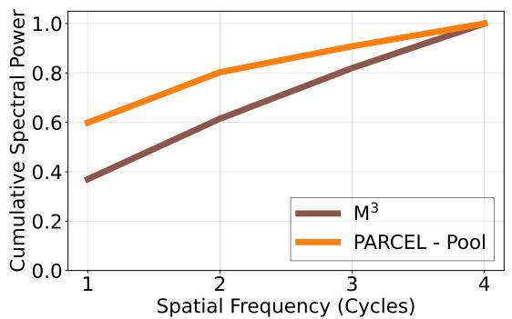

line

| Spatial Frequency (Cycles) | M³    | PARCEL - Pool |
| -------------------------- | ----- | ------------- |
| 1                          | 0.38  | 0.60          |
| 2                          | 0.62  | 0.80          |
| 3                          | 0.85  | 0.92          |
| 4                          | 1.00  | 1.00          |

(a) Baseband Concentration (64 Tokens)

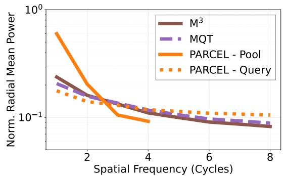

line

| Spatial Frequency (Cycles) | M³     | MQT    | PARCEL - Pool | PARCEL - Query |
| -------------------------- | ------ | ------ | ------------ | -------------- |
| 0                          | 0.3    | 0.25   | 0.7          | 0.2            |
| 2                          | 0.15   | 0.12   | 0.2          | 0.1            |
| 4                          | 0.1    | 0.08   | 0.08         | 0.08           |
| 6                          | 0.08   | 0.07   | 0.07         | 0.07           |
| 8                          | 0.07   | 0.06   | 0.06         | 0.06           |

(b) Spectral Disentanglement (256 Tokens)   
Figure 3 | Spectral decoupling on ChartQA. (a) Cumulative spectral power shows that PARCEL concentrates compressed spatial tokens at low frequencies faster than $M ^ { 3 }$ , indicating a cleaner baseband for spatial anchoring. (b) Normalized radial mean power shows complementary token roles: pool tokens focus on low-frequency layout, while query-attended ViT feature footprints retain higher-frequency detail beyond the pooled grid. This separation aligns with ChartQA gains of +4.7 and +3.4 points over $\mathbb { M } ^ { 3 }$ at 64 and 256 tokens, respectively.

To mitigate these complementary bottlenecks, PARCEL adopts a dynamic division-of-labor strategy. The spatial pool tokens provide an explicit low-frequency spatial anchor, while the poolconditioned query pathway is encouraged to emphasize complementary visual information. This design reduces the burden on query tokens to model the entire visual spectrum alone, while preserving an explicit spatial representation for layout-sensitive visual reasoning.

# 3.2. Pool-Conditioned Query Resampling

To realize this spectral disentanglement, PARCEL couples low-frequency spatial anchoring with a complementary query pathway to explore a richer set of visual features. As outlined in Figure 4, this is achieved through an efficient, sequential attention mechanism we term Pool-Conditioned Query Resampling (PCQR).

Formally, let $X _ { \nu } ~ \in ~ \mathbb { R } ^ { N _ { \nu } \times D }$ denote the uncompressed visual features extracted by the visual encoder. Depending on the selected computational budget, PCQR applies budget-aware average pooling (e.g., 2 × 2 or 4 × 4) to extract a grid-aligned spatial anchor representation. We define these “2D Anchor” Pool Tokens as $P \in \mathbb { R } ^ { N _ { p } \times D }$ .

In parallel, a base set of unconditioned, learnable query tokens $Q _ { I N }$ undergoes nested dropout to support elastic query budgets. With nested dropout, we sample a budget ??, keep only the first $N _ { q } = B - N _ { p }$ query tokens after allocating anchors, and drop the rest. Since earlier queries are active across more budgets, they learn a nested prefix structure that enables query truncation at inference without retraining. To fuse the structural layout with the query pathway, we concatenate these sequences along the token dimension and process the joint representation through a unifying Query ↔ Pool Self-Attention block. From the output of this block, we isolate the updated query sequence to obtain the Pool-Aware Query Tokens, denoted as $Q _ { P A }$ . This step explicitly conditions the query tokens on the pooled spatial Encoder anchors prior to dense visual feature extraction, encouraging the query pathway to focus on complementary details absent from the spatial anchors.

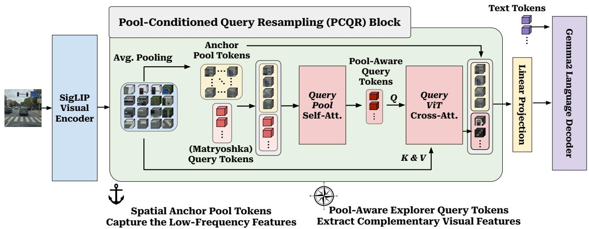

flowchart

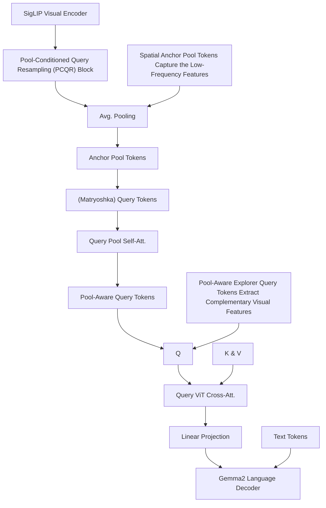

Figure 4 | High-Level Overview of the PARCEL Architecture. PARCEL dynamically divides the labor of visual feature extraction into a unified pipeline. Uncompressed visual encoder features are first spatially pooled to create deterministic 2D Anchors that secure the low-frequency geometric layout. A supporting set of query tokens then undergoes Pool-Conditioned Query Resampling (PCQR). After interacting with the spatial anchors through PCQR, these queries act as Semantic Explorers …K & V that extract complementary information from the raw visual features. The final concatenated repre-Budget-Aware  …  … sentation provides an effective budget-aware context to the language decoder.

After this conditioning step, the queries have access to the coarse spatial layout encoded by the anchors. We then let them cross-attend to the full-resolution ViT features so that they can retrieve complementary visual information not represented in the pooled anchor grid. Here, $Q _ { P A }$ serves as the queries (??), while the raw, uncompressed features $X _ { \nu }$ act as the keys and values (??, ??):

$$
Q _ {S E} = \text { CrossAttn. } (Q = Q _ {P A}, K = X _ {\upsilon}, V = X _ {\upsilon}). \tag {1}
$$

The resulting outputs are “Semantic Explorer” Query Tokens $( Q _ { S E } )$ , which capture complementary visual features. Finally, the structural 2D anchors (??), the targeted semantic explorers $( Q _ { S E } )$ , and the text tokens are concatenated and fed to the language decoder.

# 3.3. Budget-Aware Piecewise Routing and Nested Dropout

To effectively realize PARCEL across variable inference constraints, we further introduce a budgetaware piecewise routing strategy. Let ?? denote the total allocated visual token budget for a given image or video fragment. To balance spatial anchoring and semantic exploration, the routing mechanism dynamically determines the resolution of the spatial anchor ?? and the number of complementary query tokens $N _ { q }$ based on ??.

Specifically, we define two distinct routing regimes:

• Low Budgets $( 1 6 \leq B < 6 4 )$ : The uncompressed visual features are pooled into $\mathtt { a 4 } \times 4$ spatial grid, yielding an anchor sequence of $N _ { p } = 1 6$ tokens. The remainder of the budget is filled by allocating $N _ { q } = B - 1 6$ query tokens.   
• Medium-to-High Budgets $( 6 4 \leq B \leq 2 5 6 )$ : The model scales the spatial anchor to an $8 \times 8$ grid, yielding $N _ { p } = 6 4$ structural tokens. The complementary query allocation becomes $N _ { q } =$ $B - 6 4$ .

These two anchor sizes match the evaluated budget range: $4 \times 4$ preserves a minimal layout under extreme compression, while $8 \times 8$ provides a richer spatial base at higher budgets without exhausting the token budget. This allocation preserves an explicit spatial anchor at every budget while assigning the remaining tokens to the complementary query pathway. At anchor-size budgets, this routing naturally reduces to a spatialanchor representation; as the budget grows, additional query tokens provide source-grid detail.

# 4. Results and Discussions

We now discuss the experimental evaluation of PARCEL and the baselines $( \mathbb { M } ^ { 3 }$ and MQT) on the PaliGemma-2 evaluation suite spanning video understanding, dense recognition and vision-centric multimodal understanding tasks. We evaluate PARCEL along three axes. First, we measure aggregate performance retention across the benchmark suite to test whether PARCEL improves the global performance–token trade-off. Second, we isolate benchmarks that aim for stressing the two bottlenecks identified in Section 3.1: spatial grounding, resolution-sensitive reasoning, and video understanding tasks. Finally, we ablate the routing and attention design to verify that the gains arise from the proposed division of labor rather than from additional connector capacity alone.

# 4.1. Experimental Setup and Baselines

We evaluate PARCEL along three axes: aggregate retention across 27 benchmarks, targeted analysis on compression-sensitive task groups, and ablations isolating the role of budget routing and Pool-Conditioned Query Resampling. This lets us test both the global accuracy–efficiency trade-off and the two bottlenecks identified in Section 3.1: spatial grounding under query-only compression and fine-detail loss under rigid spatial pooling. We implement PARCEL and all baselines using the PaliGemma-2 (PG2) 3B (84), consisting of a 2B Gemma-2 language decoder (86) and a SigLIP-SO-400M vision encoder (111). We choose PaliGemma-2 because it provides a compact yet capable open LVLM backbone with established support across the diverse task families needed for our study, including generic $\mathrm { { V Q A } , }$ dense localization, resolution-sensitive document/chart reasoning, and video understanding. The uncompressed model is denoted as Vanilla PG2 and serves as the reference for retention calculations. We compare PARCEL against two elastic matryoshka compression paradigms: rigid spatial downsampling $\mathbf { \bar { \mathbf { \rho } } } ( \mathbf { M } ^ { 3 }$ (17)) and non-local query resampling (MQT (38)). For $\mathbb { M } ^ { 3 }$ , we use the one-forward-pass-per-batch variant (17) to match training compute budgets. For efficiency metrics, we follow prior works (23, 100), with PaliGemma-2-specific adjustments detailed in $\mathsf { A p } \cdot$ - pendix C. We emphasize that PARCEL introduces negligible training and inference overhead compared to MQT and $\mathbf { \dot { M } } ^ { 3 }$ since the PCQR block is very lightweight, especially compared to the ViT/LLM components.

Benchmarks. We evaluate on 27 visioncentric benchmarks spanning video understanding, dense spatial grounding, resolution-sensitive reasoning, and general multimodal comprehension. Video tasks include ActivityNet-Cap (47), ActivityNet-QA (109), MSRVTT-Cap (102), MSRVTT-QA (101), and MSVD-QA (21, 101). Dense spatial grounding is evaluated on RefCOCO, RefCOCO+, and RefCOCOg (43, 67, 108). Following the PaliGemma evaluation protocol (12), we evaluate fine-grained visual reasoning using nine resolution-sensitive splits, including ChartQA human/augmented splits (69), DocVQA (70), InfoVQA (71), SciCap (37), ST-VQA (13), TextCaps (81), TextVQA (82), and WidgetCap (53). To increase benchmark diversity, we additionally include GQA/xGQA (41, 74), NLVR2/MARVL5 (59, 85), and OCR-VQA (72). We also report the results on the remaining PaliGemma benchmarks in Appendix B.1 and the high-resolution results on a subset of these benchmarks in Appendix B.2. We adhere to the training settings of PaliGemma-2 (84) whenever applicable. Comprehensive dataset descriptions, evaluation metrics, and training hyperparameters are provided in Appendix D and Appendix E.

Table 1 | Overall Mean Performance. Image represents an aggregation of the RefCOCO, Resolution-Sensitive, and General benchmarks. Video represents an aggregation of the video benchmarks included in the main evaluation. We report absolute macro-average raw scores alongside mean retention rates (%) evaluated across 3 random seeds. Aggregated retention rates are calculated by taking the mean of individual benchmark retention rates. Best results per budget are bolded, and second-best are underlined. 

<table><tr><td>Modality</td><td>Visual Budget</td><td> $M^3$ </td><td>MQT</td><td>PARCEL (Ours)</td></tr><tr><td rowspan="3">Image</td><td>256 Tokens</td><td>67.6 (91.1%)</td><td>69.1 (93.3%)</td><td>70.4 (95.1%)</td></tr><tr><td>64 Tokens</td><td>66.5 (89.2%)</td><td>68.1 (91.6%)</td><td>70.1 (94.7%)</td></tr><tr><td>16 Tokens</td><td>63.9 (85.2%)</td><td>64.3 (85.8%)</td><td>64.8 (86.8%)</td></tr><tr><td rowspan="3">Video</td><td>256 Tokens</td><td>50.6 (92.9%)</td><td>51.4 (94.4%)</td><td>53.1 (98.0%)</td></tr><tr><td>64 Tokens</td><td>50.3 (92.5%)</td><td>50.9 (93.5%)</td><td>53.1 (97.9%)</td></tr><tr><td>16 Tokens</td><td>49.8 (91.6%)</td><td>51.2 (94.0%)</td><td>51.6 (95.0%)</td></tr></table>

# 4.2. Evaluation Protocol and Design Choices

We report absolute raw scores and retention relative to Vanilla PG2. For method ?? at budget $^ { b , }$ , retention is computed as $1 0 0 \times s _ { m , b } / s _ { \mathrm { P G 2 } }$ , where $s _ { m , b }$ is the benchmark score and ??PG2 is the corresponding Vanilla PG2 score. All table values are averaged over three random seeds, and ${ \tt a g - }$ - gregate retention is computed as the mean of perbenchmark retention rates. For Table 2, we report the top-3 compression-sensitive splits within the Video and Resolution-Sensitive groups, selected by the largest retention drop at the 16-token budget. This focuses the analysis on settings where visual-token compression is most stressful. For the remaining benchmarks, we refer to Appendix B.1.

# 4.3. Global Efficiency and Pareto Trade-offs

Figure 1 summarizes the aggregate accuracy– efficiency trade-off across all 27 benchmarks. Across all visual-token budgets, PARCEL achieves the highest mean retention among compressed models, improving over both MQT and $\mathbf { \bar { M } } ^ { 3 }$ . Table 1 shows that this advantage holds across both image and video domains. In image benchmarks, PARCEL preserves 95.1% and 94.7% retention at 256 and 64 tokens, respectively, and remains best at 16 tokens with 86.8%. In video benchmarks, PARCEL preserves 98.0% and 97.9% retention at 256 and 64 tokens, and 95.0% under the 16-token constraint. Since visual-token count controls decoder prefill and KV-cache cost, these gains translate into a stronger accuracy–efficiency trade-off relative to Vanilla PG2.

# 4.4. Detailed Benchmark Analysis

Next, we examine task groups that directly probe the bottlenecks identified in Section 3.1. Ref-COCO evaluates whether explicit spatial anchors improve dense localization, DocVQA and ChartQA stress fine-grained visual evidence, and video tasks test whether compression preserves actionrelevant temporal information.

Video Understanding. The video block of Table 2 shows that the same pattern extends to multi-frame inputs. Averaging the top-3 compression-sensitive video tasks, PARCEL retains 92.8% of Vanilla PG2 performance at 16 tokens, outperforming MQT (91.1%) and $\mathbb { M } ^ { 3 }$ (88.8%). These results further highlight the role of separating spatial anchoring from complementary feature extraction while compressing temporal visual evidence.

Image Segmentation. The RefCOCO block of Table 2 directly tests the spatial grounding weakness of query-only compression. Across the full RefCOCO suite, MQT drops to 79.0% mean retention at 16 tokens, whereas PARCEL retains explicit spatial anchors and achieves 80.5%. At 256 tokens, the gap becomes larger: PARCEL reaches 90.6% mean retention, outperforming MQT by +4.2 points and $\mathrm { ~ M } ^ { 3 }$ by +8.9 points.

Table 2 | Detailed Performance on Video, Image Segmentation, and Resolution-Sensitive Benchmarks. Raw scores are means over three seeds, with standard deviation shown in gray. Video and Resolution-Sensitive blocks show the top-3 compression-sensitive splits, selected by the largest 16- token retention drop and RefCOCO rows aggregate over splits. Mean Retention rows summarize each block, with RefCOCO computed over all RefCOCO splits. Vanilla PG2 is shaded as the uncompressed reference. Best are bolded, second-best are underlined. 

<table><tr><td rowspan="2">Benchmark</td><td rowspan="2">PG2</td><td colspan="3">256 Visual Tokens</td><td colspan="3">64 Visual Tokens</td><td colspan="3">16 Visual Tokens</td></tr><tr><td> $M^3$ </td><td>MQT</td><td>PARCEL (Ours)</td><td> $M^3$ </td><td>MQT</td><td>PARCEL (Ours)</td><td> $M^3$ </td><td>MQT</td><td>PARCEL (Ours)</td></tr><tr><td colspan="11">Video Understanding Benchmarks (Top 3 Most Compression-Sensitive)</td></tr><tr><td>ActivityNet-CAP</td><td>43.7</td><td>36.1 ±1.6</td><td>37.2 ±1.0</td><td>41.5 ±0.9</td><td>36.5 ±0.2</td><td>37.1 ±1.3</td><td>40.5 ±1.5</td><td>36.5 ±1.0</td><td>37.4 ±0.9</td><td>38.9 ±0.4</td></tr><tr><td>ActivityNet-QA</td><td>53.3</td><td>51.5 ±0.3</td><td>50.0 ±0.8</td><td>52.4 ±0.7</td><td>51.2 ±0.1</td><td>49.8 ±0.8</td><td>52.7 ±0.5</td><td>50.4 ±0.3</td><td>50.4 ±0.9</td><td>50.6 ±0.1</td></tr><tr><td>MSRVTT-Cap</td><td>70.6</td><td>64.2 ±0.9</td><td>66.8 ±2.0</td><td>68.6 ±1.6</td><td>63.4 ±2.7</td><td>64.5 ±2.2</td><td>68.9 ±1.8</td><td>62.4 ±1.1</td><td>65.7 ±1.8</td><td>66.7 ±0.8</td></tr><tr><td>Mean Retention</td><td>-</td><td>90.1%</td><td>91.2%</td><td>96.8%</td><td>89.7%</td><td>89.9%</td><td>96.3%</td><td>88.8%</td><td>91.1%</td><td>92.8%</td></tr><tr><td colspan="11">Image Segmentation (RefCOCO)</td></tr><tr><td>RefCOCO (Avg.)</td><td>68.0</td><td>57.8 ±0.3</td><td>61.0 ±0.3</td><td>63.4 ±0.2</td><td>56.5 ±0.3</td><td>60.3 ±0.3</td><td>63.6 ±0.3</td><td>53.0 ±0.2</td><td>56.2 ±0.4</td><td>56.7 ±0.1</td></tr><tr><td>RefCOCO+ (Avg.)</td><td>65.4</td><td>52.6 ±0.5</td><td>55.5 ±0.3</td><td>58.4 ±0.2</td><td>51.0 ±0.4</td><td>54.2 ±0.2</td><td>58.4 ±0.2</td><td>47.3 ±0.3</td><td>50.0 ±0.3</td><td>51.3 ±0.3</td></tr><tr><td>RefCOCO-g (Avg.)</td><td>65.2</td><td>51.2 ±0.4</td><td>54.6 ±0.2</td><td>57.7 ±0.1</td><td>49.9 ±0.5</td><td>53.5 ±0.3</td><td>57.8 ±0.2</td><td>46.6 ±0.2</td><td>50.2 ±0.1</td><td>51.5 ±0.1</td></tr><tr><td>Mean Retention</td><td>-</td><td>81.7%</td><td>86.4%</td><td>90.6%</td><td>79.6%</td><td>84.9%</td><td>90.8%</td><td>74.2%</td><td>79.0%</td><td>80.5%</td></tr><tr><td colspan="11">Resolution-Sensitive Tasks (Top 3 Most Compression-Sensitive)</td></tr><tr><td>DocVQA (val)</td><td>36.6</td><td>30.5 ±0.3</td><td>33.4 ±0.1</td><td>32.8 ±0.3</td><td>28.7 ±0.1</td><td>31.2 ±0.5</td><td>32.1 ±0.4</td><td>25.9 ±0.2</td><td>24.4 ±0.1</td><td>26.1 ±0.1</td></tr><tr><td>ChartQA (human)</td><td>40.7</td><td>33.8 ±0.3</td><td>35.6 ±0.8</td><td>37.2 ±0.6</td><td>32.3 ±1.0</td><td>34.1 ±0.9</td><td>37.0 ±0.3</td><td>29.7 ±0.7</td><td>30.7 ±0.3</td><td>32.0 ±1.0</td></tr><tr><td>ChartQA (aug)</td><td>72.5</td><td>64.1 ±0.6</td><td>66.0 ±0.5</td><td>66.2 ±0.8</td><td>63.0 ±1.3</td><td>64.8 ±0.2</td><td>66.3 ±0.2</td><td>59.9 ±0.8</td><td>58.2 ±0.9</td><td>58.8 ±0.9</td></tr><tr><td>Mean Retention</td><td>-</td><td>84.9%</td><td>90.0%</td><td>90.8%</td><td>81.6%</td><td>86.2%</td><td>90.0%</td><td>75.5%</td><td>74.2%</td><td>77.1%</td></tr></table>

Resolution-Sensitive Benchmarks. The resolution-sensitive block of Table 2 stresses finegrained visual evidence through DocVQA and ChartQA. Averaging the top-3 resolution-sensitive tasks at 16 tokens, M3 reaches 75.5% mean retention and MQT drops to 74.2%, while PAR-CEL achieves the best retention at 77.1%. At this boundary budget, PARCEL operates through its spatial-anchor representation, showing that the anchor branch itself provides a stronger compressed visual base. At larger budgets, PARCEL reaches 90.0% retention at 64 tokens from the expanded spatial base and 90.8% at 256 tokens once the queries become active.

# 4.5. Ablations on Design Choices

In this section, we quantify the effects of the critical building blocks of our method: (i) the budget-aware piecewise routing strategy from Section 3.3, (ii) the Pool-Conditioned Query Resampling (PCQR) mechanism from Section 3.2, and (iii) enhanced baseline configurations to isolate the impact of our “division of labor” strategy. All models are evaluated by mean retention across 27 benchmarks.

Impact of Budget-Aware Routing. We hypothesize that spatial anchors must scale relative to the overall token budget. The Budget Routing block of Table 3 validates this necessity. Relying solely on spatial anchors without query tokens, as in the Average Pooling baselines, severely caps performance, achieving only 83.1% and 92.8% retention at 16 and 64 tokens, respectively. Conversely, fixing the spatial anchor size regardless of the total budget restricts the model performance. For instance, maintaining a highly compressed 16-token anchor (Fixed 4 × 4 Routing) across all budgets causes performance to stagnate at 90.2%, even given a generous 256-token allowance. In this regime, the query tokens are forced to bear the majority of the representational burden, attempting to reconstruct mid-frequency structural details that a larger anchor would have naturally preserved. Similarly, the Average Pooling (2 × 2) baseline improves upon this retention but cannot accommodate inference budgets below 64 tokens, as the number of pooling tokens dictates the minimum token count. By implementing dynamic routing where the model scales to a 64-token anchor at higher budgets while falling back to 16 tokens under severe constraints, PARCEL optimally balances spatial anchors and semantic exploration. This achieves peak retention across all constraints (95.6% at 256 tokens, 95.3% at 64 tokens, and 88.3% at 16 tokens).

Table 3 | Ablation Studies on Architecture and Routing. Overall Mean Retention Rate (%) across the 27-benchmark main evaluation suite. The first row is the full PARCEL configuration, whereas subsequent blocks isolate budget routing, attention design, and baseline-capacity controls. Unsupported budgets are marked as N/A. Best or tied-best displayed values per budget are bolded. 

<table><tr><td>Ablation</td><td>Model Configuration</td><td>256</td><td>64</td><td>16</td></tr><tr><td>Full</td><td>PARCEL (Ours)</td><td>95.6%</td><td>95.3%</td><td>88.3%</td></tr><tr><td rowspan="4">BudgetRouting</td><td>Average Pooling (4 × 4)</td><td>N/A</td><td>N/A</td><td>83.1%</td></tr><tr><td>Average Pooling (2 × 2)</td><td>N/A</td><td>92.8%</td><td>N/A</td></tr><tr><td>PARCEL w/ Fixed 4 × 4 Routing</td><td>90.2%</td><td>89.6%</td><td>88.3%</td></tr><tr><td>PARCEL w/ Fixed 2 × 2 Routing</td><td>95.6%</td><td>95.2%</td><td>N/A</td></tr><tr><td rowspan="2">AttentionDesign</td><td>ViT-Only Cross-Attention</td><td>95.2%</td><td>95.3%</td><td>87.9%</td></tr><tr><td>Dual Cross-Attention (ViT + Pool)</td><td>95.4%</td><td>95.2%</td><td>88.0%</td></tr><tr><td rowspan="2">BaselineFairness</td><td>MQT w/ Self-Attention</td><td>93.3%</td><td>92.5%</td><td>87.8%</td></tr><tr><td> $M^3$ w/ Self-Attention</td><td>92.2%</td><td>90.4%</td><td>86.8%</td></tr></table>

Efficacy of Pool-Conditioned Query Resampling. The Attention Design block of Table 3 studies the architectural flow of information between the pool tokens, query tokens, and raw visual features. We compare our sequential PCQR module against two alternatives: a “ViT-Only” mechanism where queries cross-attend to the raw visual features without attending to spatial anchors, and a “Dual Cross-Attention” mechanism where queries first cross-attend to the pool tokens and then the ViT features. Our final design first performs a full self-attention between the query tokens and the spatial anchors. This allows the tokens to become structurally aware of one another, enabling the model to better allocate feature sampling based on the anchor’s coverage. These poolaware query tokens then cross-attend to the raw visual features to sample the missing, complementary details not captured by the spatial anchors. Consequently, our sequential design (Pool Self-Attn → ViT Cross-Attn) achieves the best or tied-best retention across budgets. At the 256- token budget, PCQR reaches 95.6% retention, compared to 95.2% for ViT-only cross-attention and 95.4% for dual cross-attention. The performance delta supports our design choice: for the division of labor to effectively work, the queries must be pool-aware. By conditioning the queries on the spatial anchors prior to visual feature extraction, the model guides them away from redundant low-frequency features, reserving their capacity for complementary visual information, as also reflected in Figure 3.

Isolating the Division of Labor (Baseline Fairness). A natural concern is whether the observed gains arise from added learnable parameters, i.e., the extra attention blocks, rather than the structural design itself. To ensure baseline fairness, we upgrade both MQT and M3 by adding comparable self-attention blocks, matching the parameter count and depth of PARCEL. As shown in the Baseline Fairness block of Table 3, merely scaling capacity does not resolve the foundational bottlenecks of the baselines. Upgraded MQT reaches 93.3% at 256 tokens, but still falls short of PAR-CEL (95.6%) because it inherently lacks spatial anchors. Similarly, upgraded $ { \mathbf { M } } ^ { 3 }$ reaches 92.2% at 256 tokens and remains below PARCEL across all budgets, indicating that added self-attention does not overcome the bottlenecks caused by rigid spatial downsampling. These results support that the gains of PARCEL are not a product of added complexity alone, but rather from PARCEL’s dynamic division of labor.

# 5. Conclusion

Large Vision-Language Models face severe computational bottlenecks during inference, and existing elastic compression paradigms force a stark trade-off between spectral aliasing and degraded spatial grounding. To resolve this, we introduced PARCEL, a novel architecture that dynamically partitions the labor of visual feature extraction. By coupling spatial anchors with pool-conditioned semantic queries, PAR-CEL disentangles low-frequency geometric layouts from high-frequency visual details. Extensive evaluations across 27 vision-centric benchmarks demonstrate that this spectral partitioning establishes a new performance-efficiency Pareto frontier. Through budget-aware routing, PARCEL sustains robust dense recognition, temporal reasoning, and resolution-sensitive performance even under significant 16-token constraints. PARCEL preserves the highly desirable “train once, deploy anywhere” paradigm without sacrificing performance, providing a highly efficient foundation for ubiquitous LVLM deployment.

Acknowledgements. The authors would like to thank (in alphabetic order of first name) Diego Martin Arroyo, Luca Zanella, Theo Uscidda, Yannick Strümpler for helpful comments, feedback and support throughout the project.

# References

[1] M. Acharya, K. Kafle, and C. Kanan. Tallyqa: Answering complex counting questions. In Proceedings of the AAAI conference

on artificial intelligence, volume 33, pages 8076–8084, 2019.   
[2] H. Agrawal, K. Desai, Y. Wang, X. Chen, R. Jain, M. Johnson, D. Batra, D. Parikh, S. Lee, and P. Anderson. Nocaps: Novel object captioning at scale. In Proceedings of the IEEE/CVF international conference on computer vision, pages 8948–8957, 2019.   
[3] S. R. Alvar, G. Singh, M. Akbari, and Y. Zhang. Divprune: Diversity-based visual token pruning for large multimodal models. In Proceedings of the IEEE/CVF Conference on Computer Vision and Pattern Recognition (CVPR), pages 9392–9401, June 2025.   
[4] X. An, Y. Xie, K. Yang, W. Zhang, X. Zhao, Z. Cheng, Y. Wang, S. Xu, C. Chen, D. Zhu, C. Wu, H. Tan, C. Li, J. Yang, J. Yu, X. Wang, B. Qin, Y. Wang, Z. Yan, Z. Feng, Z. Liu, B. Li, and J. Deng. Llava-onevision-1.5: Fully open framework for democratized multimodal training, 2025. URL https: //arxiv.org/abs/2509.23661.   
[5] K. H. I. Arif, J. Yoon, D. S. Nikolopoulos, H. Vandierendonck, D. John, and B. Ji. Hired: Attention-guided token dropping for efficient inference of highresolution vision-language models. Proceedings of the AAAI Conference on Artificial Intelligence, 39(2):1773–1781, Apr. 2025. doi: 10.1609/aaai.v39i2.32171. URL https://ojs.aaai.org/index. php/AAAI/article/view/32171.   
[6] A. Azulay and Y. Weiss. Why do deep convolutional networks generalize so poorly to small image transformations? Journal of Machine Learning Research, 20(184):1– 25, 2019.   
[7] R. Bachmann, J. Allardice, D. Mizrahi, E. Fini, O. F. Kar, E. Amirloo, A. El-Nouby, A. Zamir, and A. Dehghan. Flextok: Resampling images into 1d token sequences of flexible length. In Forty-second International Conference on Machine Learning, 2025. URL https://openreview.net/ forum?id=DgdOkUUBzf.

[8] C. Baek, J. Song, S. Kim, and K. Kong. An empirical study of attention and diversity for adaptive visual token pruning in multimodal reasoning models. In NeurIPS 2025 Workshop on Efficient Reasoning, 2025. URL https://openreview.net/ forum?id=j2NkINd3pw.   
[9] J. Bai, S. Bai, Y. Chu, Z. Cui, K. Dang, X. Deng, Y. Fan, W. Ge, Y. Han, F. Huang, B. Hui, L. Ji, M. Li, J. Lin, R. Lin, D. Liu, G. Liu, C. Lu, K. Lu, J. Ma, R. Men, X. Ren, X. Ren, C. Tan, S. Tan, J. Tu, P. Wang, S. Wang, W. Wang, S. Wu, B. Xu, J. Xu, A. Yang, H. Yang, J. Yang, S. Yang, Y. Yao, B. Yu, H. Yuan, Z. Yuan, J. Zhang, X. Zhang, Y. Zhang, Z. Zhang, C. Zhou, J. Zhou, X. Zhou, and T. Zhu. Qwen technical report, 2023. URL https://arxiv. org/abs/2309.16609.   
[10] I. Bello, H. Pham, Q. V. Le, M. Norouzi, and S. Bengio. Neural combinatorial optimization with reinforcement learning. arXiv preprint arXiv:1611.09940, 2016.   
[11] L. Beyer, X. Zhai, and A. Kolesnikov. Better plain vit baselines for imagenet-1k. arXiv preprint arXiv:2205.01580, 2022.   
[12] L. Beyer, A. Steiner, A. S. Pinto, A. Kolesnikov, X. Wang, D. Salz, M. Neumann, I. Alabdulmohsin, M. Tschannen, E. Bugliarello, et al. Paligemma: A versatile 3b vlm for transfer. arXiv preprint arXiv:2407.07726, 2024.   
[13] A. F. Biten, R. Tito, A. Mafla, L. Gomez, M. Rusinol, E. Valveny, C. Jawahar, and D. Karatzas. Scene text visual question answering. In Proceedings of the IEEE/CVF international conference on computer vision, pages 4291–4301, 2019.   
[14] R. N. Bracewell. The fourier transform. Scientific American, 260(6):86–95, 1989.   
[15] J. Bradbury, R. Frostig, P. Hawkins, M. J. Johnson, Y. Katariya, C. Leary, D. Maclaurin, G. Necula, A. Paszke, J. VanderPlas, S. Wanderman-Milne, and

Q. Zhang. JAX: composable transformations of Python+NumPy programs, 2018. URL http://github.com/ jax-ml/jax.   
[16] A. Bulat, Y. Ouali, and G. Tzimiropoulos. Fwd2bot: Lvlm visual token compression with double forward bottleneck, 2025. URL https://arxiv.org/abs/ 2503.21757.   
[17] M. Cai, J. Yang, J. Gao, and Y. J. Lee. Matryoshka multimodal models. In The Thirteenth International Conference on Learning Representations, 2025. URL https://openreview.net/ forum?id=Uhj5OxAz7I.   
[18] U. Cappellazzo, M. Kim, P. Ma, H. Chen, X. Liu, S. Petridis, and M. Pantic. Mome: Mixture of matryoshka experts for audio-visual speech recognition, 2025. URL https://arxiv.org/abs/2510. 04136.   
[19] J. Cha, W. Kang, J. Mun, and B. Roh. Honeybee: Locality-enhanced projector for multimodal llm. In Proceedings of the IEEE/CVF Conference on Computer Vision and Pattern Recognition (CVPR), pages 13817–13827, June 2024.   
[20] S. Changpinyo, D. Kukliansy, I. Szpektor, X. Chen, N. Ding, and R. Soricut. All you may need for vqa are image captions. In Proceedings of the 2022 conference of the north american chapter of the association for computational linguistics: human language technologies, pages 1947–1963, 2022.   
[21] D. Chen and W. B. Dolan. Collecting highly parallel data for paraphrase evaluation. In Proceedings of the 49th annual meeting of the association for computational linguistics: human language technologies, pages 190–200, 2011.   
[22] J. Chen, L. Ye, J. He, Z.-Y. Wang, D. Khashabi, and A. Yuille. Efficient large multi-modal models via visual context compression. In A. Globerson, L. Mackey,

D. Belgrave, A. Fan, U. Paquet, J. Tomczak, and C. Zhang, editors, Advances in Neural Information Processing Systems, volume 37, pages 73986–74007. Curran Associates, Inc., 2024. doi: 10.52202/079017-2353.   
[23] L. Chen, H. Zhao, T. Liu, S. Bai, J. Lin, C. Zhou, and B. Chang. An image is worth 1/2 tokens after layer 2: Plug-andplay inference acceleration for large visionlanguage models. In European Conference on Computer Vision, pages 19–35. Springer, 2024.   
[24] T. Chen, S. Saxena, L. Li, D. J. Fleet, and G. Hinton. Pix2seq: A language modeling framework for object detection. arXiv preprint arXiv:2109.10852, 2021.   
[25] X. Chen, H. Fang, T.-Y. Lin, R. Vedantam, S. Gupta, P. Dollár, and C. L. Zitnick. Microsoft coco captions: Data collection and evaluation server. arXiv preprint arXiv:1504.00325, 2015.   
[26] X. Chen, X. Wang, S. Changpinyo, A. J. Piergiovanni, P. Padlewski, D. Salz, S. Goodman, A. Grycner, B. Mustafa, L. Beyer, et al. Pali: A jointly-scaled multilingual language-image model. arXiv preprint arXiv:2209.06794, 2022.   
[27] X. Chen, J. Djolonga, P. Padlewski, B. Mustafa, S. Changpinyo, J. Wu, C. R. Ruiz, S. Goodman, X. Wang, Y. Tay, et al. Pali-x: On scaling up a multilingual vision and language model. arXiv preprint arXiv:2305.18565, 2023.   
[28] X. Chen, X. Wang, L. Beyer, A. Kolesnikov, J. Wu, P. Voigtlaender, B. Mustafa, S. Goodman, I. Alabdulmohsin, P. Padlewski, et al. Pali-3 vision language models: Smaller, faster, stronger. arXiv preprint arXiv:2310.09199, 2023.   
[29] Z. Chen, W. Wang, Y. Cao, Y. Liu, Z. Gao, E. Cui, J. Zhu, S. Ye, H. Tian, Z. Liu, L. Gu, X. Wang, Q. Li, Y. Ren, Z. Chen, J. Luo, J. Wang, T. Jiang, B. Wang, C. He, B. Shi, X. Zhang, H. Lv, Y. Wang, W. Shao, P. Chu, Z. Tu, T. He, Z. Wu, H. Deng, J. Ge,

K. Chen, K. Zhang, L. Wang, M. Dou, L. Lu, X. Zhu, T. Lu, D. Lin, Y. Qiao, J. Dai, and W. Wang. Expanding performance boundaries of open-source multimodal models with model, data, and test-time scaling, 2025. URL https://arxiv.org/abs/ 2412.05271.   
[30] M. Endo, X. Wang, and S. Yeung-Levy. Feather the throttle: Revisiting visual token pruning for vision-language model acceleration. In Proceedings of the IEEE/CVF International Conference on Computer Vision, pages 22826–22835, 2025.   
[31] R. C. Gonzalez and R. E. Woods. Digital Image Processing. Addison-Wesley, 1992.   
[32] Google Cloud. Introduction to cloud tpu. https://cloud.google.com/ tpu/docs/intro-to-tpu, 2026. Accessed: 2026-05-06.   
[33] Y. Goyal, T. Khot, D. Summers-Stay, D. Batra, and D. Parikh. Making the v in vqa matter: Elevating the role of image understanding in visual question answering. In Proceedings of the IEEE conference on computer vision and pattern recognition, pages 6904–6913, 2017.   
[34] X. Guo, J. Zhang, and K. Wang. Adaptivevoco: Complexity-aware visual token compression for vision-language models. In ICASSP 2026 - 2026 IEEE International Conference on Acoustics, Speech and Signal Processing (ICASSP), pages 2396–2400, 2026. doi: 10.1109/ICASSP55912.2026. 11465113.   
[35] D. Gurari, Q. Li, A. J. Stangl, A. Guo, C. Lin, K. Grauman, J. Luo, and J. P. Bigham. Vizwiz grand challenge: Answering visual questions from blind people. In Proceedings of the IEEE conference on computer vision and pattern recognition, pages 3608– 3617, 2018.   
[36] J. He and H. Chen. Energy-driven adaptive visual token pruning for efficient visionlanguage models, 2026. URL https:// arxiv.org/abs/2603.05950.

[37] T.-Y. Hsu, C. L. Giles, and T.-H. Huang. Scicap: Generating captions for scientific figures. In Findings of the Association for Computational Linguistics: EMNLP 2021, pages 3258–3264, 2021.   
[38] W. Hu, Z.-Y. Dou, L. H. Li, A. Kamath, N. Peng, and K.-W. Chang. Matryoshka query transformer for large vision-language models. Advances in Neural Information Processing Systems, 37: 50168–50188, 2024.   
[39] X. Huang, H. Zhou, and K. Han. PruneVid: Visual token pruning for efficient video large language models. In W. Che, J. Nabende, E. Shutova, and M. T. Pilehvar, editors, Findings of the Association for Computational Linguistics: ACL 2025, pages 19959–19973, Vienna, Austria, July 2025. Association for Computational Linguistics. ISBN 979-8-89176-256- 5. doi: 10.18653/v1/2025.findings-acl. 1024. URL https://aclanthology. org/2025.findings-acl.1024/.   
[40] Y. Huang, F. Ma, Y. Shao, J. Guo, Z. YU, L. Cui, and Q. Tian. Nüwa: Mending the spatial integrity torn by VLM token pruning. In The Fourteenth International Conference on Learning Representations, 2026. URL https://openreview.net/ forum?id=C9yclwdquU.   
[41] D. A. Hudson and C. D. Manning. Gqa: A new dataset for real-world visual reasoning and compositional question answering. In Proceedings of the IEEE/CVF conference on computer vision and pattern recognition, pages 6700–6709, 2019.   
[42] S. Jahagirdar, W. Bousselham, A. Kukleva, and H. Kuehne. When llava meets objects: Token composition for vision-languagemodels. arXiv preprint arXiv:2602.04864, 2026.   
[43] S. Kazemzadeh, V. Ordonez, M. Matten, and T. Berg. Referitgame: Referring to objects in photographs of natural scenes. In Proceedings of the 2014 conference on

empirical methods in natural language processing (EMNLP), pages 787–798, 2014.   
[44] A. Kembhavi, M. Salvato, E. Kolve, M. Seo, H. Hajishirzi, and A. Farhadi. A diagram is worth a dozen images. In European conference on computer vision, pages 235–251. Springer, 2016.   
[45] D. P. Kingma and J. Ba. Adam: A method for stochastic optimization. arXiv preprint arXiv:1412.6980, 2014.   
[46] Z. Kong, Y. Li, F. Zeng, L. Xin, S. Messica, X. Lin, P. Zhao, M. Kellis, H. Tang, and M. Zitnik. Token reduction should go beyond efficiency in generative models – from vision, language to multimodality, 2026. URL https://arxiv.org/abs/ 2505.18227.   
[47] R. Krishna, K. Hata, F. Ren, L. Fei-Fei, and J. Carlos Niebles. Dense-captioning events in videos. In Proceedings of the IEEE international conference on computer vision, pages 706–715, 2017.   
[48] S. Kudugunta, A. Kusupati, T. Dettmers, K. Chen, I. Dhillon, Y. Tsvetkov, H. Hajishirzi, S. Kakade, A. Farhadi, and P. Jain. Matformer: Nested transformer for elastic inference. Advances in Neural Information Processing Systems, 37:140535–140564, 2024.   
[49] A. Kusupati, G. Bhatt, A. Rege, M. Wallingford, A. Sinha, V. Ramanujan, W. Howard-Snyder, K. Chen, S. Kakade, P. Jain, et al. Matryoshka representation learning. Advances in Neural Information Processing Systems, 35:30233–30249, 2022.   
[50] K. Li, S. Goyal, J. D. Semedo, and J. Z. Kolter. Inference optimal VLMs need fewer visual tokens and more parameters. In The Thirteenth International Conference on Learning Representations, 2025. URL https://openreview.net/ forum?id=6VhDQP7WGX.   
[51] W. Li, Y. Yuan, J. Liu, D. Tang, S. Wang, J. Qin, J. Zhu, and L. Zhang. Tokenpacker:

Efficient visual projector for multimodal llm, 2024. URL https://arxiv.org/ abs/2407.02392.   
[52] X. li and X. Song. Efficient visionlanguage reasoning via adaptive token pruning. In 1st Workshop on VLM4RWD @ NeurIPS 2025, 2025. URL https://openreview.net/forum? id=Vbqemx4YCC.   
[53] Y. Li, G. Li, L. He, J. Zheng, H. Li, and Z. Guan. Widget captioning: Generating natural language description for mobile user interface elements. In Proceedings of the 2020 conference on empirical methods in natural language processing (EMNLP), pages 5495–5510, 2020.   
[54] Y. Li, F. Wang, Y. Li, M. Chen, M. Zhao, and L. Lan. Semantic-geometric dual compression: Training-free visual token reduction for ultra-high-resolution remote sensing understanding, 2026. URL https: //arxiv.org/abs/2604.11122.   
[55] Z. Li, Y. Li, F. Fang, R. Takezoe, Z.-H. Bo, C. Qian, M. Guang, G. Zhang, and K. Long. Qmop: Query guided mixture-ofprojector for efficient visual token compression, 2026. URL https://arxiv. org/abs/2603.21232.   
[56] C. Liao, W. Wang, Z. Wen, X. Zheng, Y. Wang, H. He, Y. Lyu, L. Jiang, X. Zou, Y. Fu, B. Ren, L. Zhang, and X. Hu. Are we using the right benchmark: An evaluation framework for visual token compression methods. arXiv preprint arXiv:2510.07143, 2026.   
[57] H. Liao, Z. Jiang, Y. Hao, Y. Tan, S. He, B. Wang, J. Zhao, K. Xu, and K. Liu. Resadapt: Adaptive resolution for efficient multimodal reasoning, 2026. URL https: //arxiv.org/abs/2603.28610.   
[58] T.-Y. Lin, M. Maire, S. Belongie, J. Hays, P. Perona, D. Ramanan, P. Dollár, and C. L. Zitnick. Microsoft coco: Common objects in context. In European conference on computer vision, pages 740–755. Springer, 2014.

[59] F. Liu, E. Bugliarello, E. M. Ponti, S. Reddy, N. Collier, and D. Elliott. Visually grounded reasoning across languages and cultures. In Proceedings of the 2021 Conference on Empirical Methods in Natural Language Processing, pages 10467–10485, 2021.   
[60] H. Liu, C. Li, Y. Li, and Y. J. Lee. Improved baselines with visual instruction tuning. In Proceedings of the IEEE/CVF Conference on Computer Vision and Pattern Recognition (CVPR), pages 26296–26306, June 2024.   
[61] T. Liu, L. Shi, R. Hong, Y. Hu, Q. Yin, and L. Zhang. Multi-stage vision token dropping: Towards efficient multimodal large language model. arXiv preprint arXiv:2411.10803, 2024.   
[62] Z. Liu, L. Zhu, B. Shi, Z. Zhang, Y. Lou, S. Yang, H. Xi, S. Cao, Y. Gu, D. Li, X. Li, H. Tang, Y. Fang, Y. Chen, C.-Y. Hsieh, D.-A. Huang, A.-C. Cheng, J. Hu, S. Liu, R. Krishna, P. Molchanov, J. Kautz, H. Yin, S. Han, and Y. Lu. Nvila: Efficient frontier visual language models. In Proceedings of the IEEE/CVF Conference on Computer Vision and Pattern Recognition (CVPR), pages 4122–4134, June 2025.   
[63] S. Lobry, D. Marcos, J. Murray, and D. Tuia. Rsvqa: Visual question answering for remote sensing data. IEEE Transactions on Geoscience and Remote Sensing, 58(12): 8555–8566, 2020.   
[64] I. Loshchilov and F. Hutter. Decoupled weight decay regularization. arXiv preprint arXiv:1711.05101, 2017.   
[65] H. Lou, C. Fan, Z. Liu, Y. Wu, and X. Wang. Llava-sp: Enhancing visual representation with visual spatial tokens for mllms. In Proceedings of the IEEE/CVF International Conference on Computer Vision (ICCV), pages 22014–22024, October 2025.   
[66] P. Lu, S. Mishra, T. Xia, L. Qiu, K.-W. Chang, S.-C. Zhu, O. Tafjord, P. Clark, and A. Kalyan. Learn to explain: Multimodal reasoning via thought chains for science

question answering. Advances in neural information processing systems, 35:2507– 2521, 2022.   
[67] J. Mao, J. Huang, A. Toshev, O. Camburu, A. L. Yuille, and K. Murphy. Generation and comprehension of unambiguous object descriptions. In Proceedings of the IEEE conference on computer vision and pattern recognition, pages 11–20, 2016.   
[68] K. Marino, M. Rastegari, A. Farhadi, and R. Mottaghi. Ok-vqa: A visual question answering benchmark requiring external knowledge. In Proceedings of the IEEE/cvf conference on computer vision and pattern recognition, pages 3195–3204, 2019.   
[69] A. Masry, X. L. Do, J. Q. Tan, S. Joty, and E. Hoque. Chartqa: A benchmark for question answering about charts with visual and logical reasoning. In Findings of the association for computational linguistics: ACL 2022, pages 2263–2279, 2022.   
[70] M. Mathew, D. Karatzas, and C. Jawahar. Docvqa: A dataset for vqa on document images. In Proceedings of the IEEE/CVF winter conference on applications of computer vision, pages 2200–2209, 2021.   
[71] M. Mathew, V. Bagal, R. Tito, D. Karatzas, E. Valveny, and C. Jawahar. Infographicvqa. In Proceedings of the IEEE/CVF Winter Conference on Applications of Computer Vision, pages 1697–1706, 2022.   
[72] A. Mishra, S. Shekhar, A. K. Singh, and A. Chakraborty. Ocr-vqa: Visual question answering by reading text in images. In 2019 international conference on document analysis and recognition (ICDAR), pages 947–952. IEEE, 2019.   
[73] A. V. Oppenheim, R. W. Schafer, and J. R. Buck. Discrete-Time Signal Processing. Prentice-Hall, 2nd edition, 1999.   
[74] J. Pfeiffer, G. Geigle, A. Kamath, J.-M. O. Steitz, S. Roth, I. Vulić, and I. Gurevych. xgqa: Cross-lingual visual question answering. In Findings of the association for

computational linguistics: ACL 2022, pages 2497–2511, 2022.   
[75] V. Pippi, M. Guillaumin, S. Cascianelli, R. Cucchiara, M. Jaritz, and L. Bazzani. Tofu: Visual tokens reduction via fusion for multi-modal, multi-patch, multi-image task, 2025. URL https://arxiv.org/ abs/2503.04444.   
[76] O. Rippel, M. Gelbart, and R. Adams. Learning ordered representations with nested dropout. In E. P. Xing and T. Jebara, editors, Proceedings of the 31st International Conference on Machine Learning, volume 32 of Proceedings of Machine Learning Research, pages 1746– 1754, Bejing, China, 22–24 Jun 2014. PMLR. URL https://proceedings. mlr.press/v32/rippel14.html.   
[77] D. Schwenk, A. Khandelwal, C. Clark, K. Marino, and R. Mottaghi. A-okvqa: A benchmark for visual question answering using world knowledge. In European conference on computer vision, pages 146–162. Springer, 2022.   
[78] Y. Shang, M. Cai, B. Xu, Y. J. Lee, and Y. Yan. Llava-prumerge: Adaptive token reduction for efficient large multimodal models. In Proceedings of the IEEE/CVF International Conference on Computer Vision, pages 22857–22867, 2025.   
[79] C. E. Shannon. Communication in the presence of noise. Proceedings of the IRE, 37 (1):10–21, 1949. doi: 10.1109/JRPROC. 1949.232969.   
[80] P. Sharma, N. Ding, S. Goodman, and R. Soricut. Conceptual captions: A cleaned, hypernymed, image alt-text dataset for automatic image captioning. In Proceedings of the 56th Annual Meeting of the Association for Computational Linguistics (Volume 1: Long Papers), pages 2556–2565, 2018.   
[81] O. Sidorov, R. Hu, M. Rohrbach, and A. Singh. Textcaps: a dataset for image captioning with reading comprehension.

In European conference on computer vision, pages 742–758. Springer, 2020.   
[82] A. Singh, V. Natarajan, M. Shah, Y. Jiang, X. Chen, D. Batra, D. Parikh, and M. Rohrbach. Towards vqa models that can read. In Proceedings of the IEEE/CVF conference on computer vision and pattern recognition, pages 8317–8326, 2019.   
[83] N. Srivastava, G. Hinton, A. Krizhevsky, I. Sutskever, and R. Salakhutdinov. Dropout: A simple way to prevent neural networks from overfitting. Journal of Machine Learning Research, 15(56):1929– 1958, 2014. URL http://jmlr.org/ papers/v15/srivastava14a.html.   
[84] A. Steiner, A. S. Pinto, M. Tschannen, D. Keysers, X. Wang, Y. Bitton, A. Gritsenko, M. Minderer, A. Sherbondy, S. Long, et al. Paligemma 2: A family of versatile vlms for transfer. arXiv preprint arXiv:2412.03555, 2024.   
[85] A. Suhr, S. Zhou, A. Zhang, I. Zhang, H. Bai, and Y. Artzi. A corpus for reasoning about natural language grounded in photographs. In Proceedings of the 57th annual meeting of the association for computational linguistics, pages 6418–6428, 2019.   
[86] G. Team, M. Riviere, S. Pathak, P. G. Sessa, C. Hardin, S. Bhupatiraju, L. Hussenot, T. Mesnard, B. Shahriari, A. Ramé, et al. Gemma 2: Improving open language models at a practical size. arXiv preprint arXiv:2408.00118, 2024.   
[87] A. V. Thapliyal, J. P. Tuset, X. Chen, and R. Soricut. Crossmodal-3600: A massively multilingual multimodal evaluation dataset. In Proceedings of the 2022 Conference on Empirical Methods in Natural Language Processing, pages 715–729, 2022.   
[88] M. Tschannen, A. Gritsenko, X. Wang, M. F. Naeem, I. Alabdulmohsin, N. Parthasarathy, T. Evans, L. Beyer, Y. Xia, B. Mustafa, O. Hénaff, J. Harmsen, A. Steiner, and X. Zhai. Siglip

2: Multilingual vision-language encoders with improved semantic understanding, localization, and dense features, 2025. URL https: //arxiv.org/abs/2502.14786.   
[89] A. Vaswani, N. Shazeer, N. Parmar, J. Uszkoreit, L. Jones, A. N. Gomez, L. u. Kaiser, and I. Polosukhin. Attention is all you need. In I. Guyon, U. V. Luxburg, S. Bengio, H. Wallach, R. Fergus, S. Vishwanathan, and R. Garnett, editors, Advances in Neural Information Processing Systems, volume 30. Curran Associates, Inc., 2017.   
[90] B. Wan, M. Tschannen, Y. Xian, F. Pavetic, I. Alabdulmohsin, X. Wang, A. S. Pinto, A. Steiner, L. Beyer, and X. Zhai. Locca: Visual pretraining with location-aware captioners. Advances in Neural Information Processing Systems, 37:116355–116387, 2024.   
[91] B. Wang, G. Li, X. Zhou, Z. Chen, T. Grossman, and Y. Li. Screen2words: Automatic mobile ui summarization with multimodal learning. In The 34th Annual ACM Symposium on User Interface Software and Technology, pages 498–510, 2021.   
[92] P. Wang, S. Song, H. Ji, S. Cao, H. Yu, Z. Liu, H. Yang, Y. C. Lin, B. Chen, M. Bansal, X. Liu, P. Zhou, M.-H. Yang, T. Chen, and J. Hu. From models to systems: A comprehensive survey of efficient multimodal learning. Authorea Preprints, 2025.   
[93] X. Wang, J. Wu, J. Chen, L. Li, Y.-F. Wang, and W. Y. Wang. Vatex: A large-scale, highquality multilingual dataset for video-andlanguage research. In Proceedings of the IEEE/CVF international conference on computer vision, pages 4581–4591, 2019.   
[94] Y. Wang, Q. Hu, Y. Ding, R. Wang, Y. Gong, J. Jiao, Y. Shen, P. Cheng, and J. Su. Training matryoshka mixture-of-experts for elastic inference-time expert utilization, 2025. URL https://arxiv.org/ abs/2509.26520.

[95] X. Wen, B. Zhao, I. Elezi, J. Deng, and X. Qi. ”principal components” enable a new language of images. In Proceedings of the IEEE/CVF International Conference on Computer Vision (ICCV), pages 16641– 16651, October 2025.   
[96] Z. Wen, Y. Gao, W. Li, C. He, and L. Zhang. Token pruning in multimodal large language models: Are we solving the right problem? In W. Che, J. Nabende, E. Shutova, and M. T. Pilehvar, editors, Findings of the Association for Computational Linguistics: ACL 2025, pages 15537–15549, Vienna, Austria, July 2025. Association for Computational Linguistics. ISBN 979-8-89176-256- 5. doi: 10.18653/v1/2025.findings-acl. 802. URL https://aclanthology. org/2025.findings-acl.802/.   
[97] G. Wu, Z. Zhang, H. Li, Y. He, Y. Jiang, Z. Kang, W. Zhou, and H. Zhang. Vision meets language: Adaptive joint pruning for efficient multimodal models. In ICASSP 2026 - 2026 IEEE International Conference on Acoustics, Speech and Signal Processing (ICASSP), pages 19727–19731, 2026. doi: 10.1109/ICASSP55912.2026.11461792.   
[98] H. Wu, K. Lu, X. Zhu, Y. Li, J. Xue, and Y. Liu. Laprune: Layout-aware pruning for efficient multimodal large language models. In ICASSP 2026 - 2026 IEEE International Conference on Acoustics, Speech and Signal Processing (ICASSP), pages 12922– 12926, 2026. doi: 10.1109/ICASSP55912. 2026.11464292.   
[99] Z. Wu, X. Ma, Z. Ni, D. Zhang, H. Shu, X. Jiang, and X. Chen. Vlm-pruner: Buffering for spatial sparsity in an efficient vlm centrifugal token pruning paradigm, 2026. URL https://arxiv.org/abs/ 2512.02700.   
[100] L. Xing, Q. Huang, X. Dong, J. Lu, P. Zhang, Y. Zang, Y. Cao, C. He, J. Wang, F. Wu, et al. Pyramiddrop: Accelerating your large vision-language models via pyramid visual redundancy reduction. arXiv preprint arXiv:2410.17247, 2024.

[101] D. Xu, Z. Zhao, J. Xiao, F. Wu, H. Zhang, X. He, and Y. Zhuang. Video question answering via gradually refined attention over appearance and motion. In Proceedings of the 25th ACM international conference on Multimedia, pages 1645–1653, 2017.   
[102] J. Xu, T. Mei, T. Yao, and Y. Rui. Msr-vtt: A large video description dataset for bridging video and language. In Proceedings of the IEEE conference on computer vision and pattern recognition, pages 5288–5296, 2016.   
[103] Y. Xu, H. Lee, D. Chen, B. Hechtman, Y. Huang, R. Joshi, M. Krikun, D. Lepikhin, A. Ly, M. Maggioni, et al. Gspmd: general and scalable parallelization for ml computation graphs. arXiv preprint arXiv:2105.04663, 2021.   
[104] W. Yan, V. Mnih, A. Faust, M. Zaharia, P. Abbeel, and H. Liu. Elastictok: Adaptive tokenization for image and video. In The Thirteenth International Conference on Learning Representations, 2025. URL https://openreview.net/ forum?id=tFV5GrWOGm.   
[105] X. Ye, Y. Gan, Y. Ge, X.-P. Zhang, and Y. Tang. Atp-llava: Adaptive token pruning for large vision language models. In Proceedings of the IEEE/CVF Conference on Computer Vision and Pattern Recognition (CVPR), pages 24972–24982, June 2025.   
[106] X. Ye, Y. Gan, X. Huang, Y. Ge, and Y. Tang. Voco-llama: Towards vision compression with large language models. In Proceedings of the IEEE/CVF Conference on Computer Vision and Pattern Recognition (CVPR), pages 29836–29846, June 2025.   
[107] S. Yin, S. Zhao, H. Wang, B. Jia, X. Wang, C. Fu, and E. Chen. Tango: Taming visual signals for efficient video large language models, 2026. URL https://arxiv. org/abs/2604.09547.   
[108] L. Yu, P. Poirson, S. Yang, A. C. Berg, and T. L. Berg. Modeling context in referring

expressions. In European conference on computer vision, pages 69–85. Springer, 2016.   
[109] Z. Yu, D. Xu, J. Yu, T. Yu, Z. Zhao, Y. Zhuang, and D. Tao. Activitynet-qa: A dataset for understanding complex web videos via question answering. In Proceedings of the AAAI conference on artificial intelligence, volume 33, pages 9127–9134, 2019.   
[110] M. Zamini and D. Shukla. Delta-llava: Base-then-specialize alignment for tokenefficient vision-language models. In Proceedings of the IEEE/CVF Winter Conference on Applications of Computer Vision (WACV), pages 3648–3657, March 2026.   
[111] X. Zhai, B. Mustafa, A. Kolesnikov, and L. Beyer. Sigmoid loss for language image pre-training. In Proceedings of the IEEE/CVF international conference on computer vision, pages 11975–11986, 2023.   
[112] C. Zhang, K. Ma, T. Fang, W. Yu, H. Zhang, Z. Zhang, H. Mi, and D. Yu. VScan: Rethinking visual token reduction for efficient large visionlanguage models. Transactions on Machine Learning Research, 2026. ISSN 2835- 8856. URL https://openreview.net/ forum?id=KZYhyilFnt.   
[113] J. Zhang, X. Guo, K. Cai, Q. Lv, Y. Fan, W. Chai, J. Wang, and K. Wang. Hybridtoken-vlm: Hybrid token compression for vision-language models, 2025. URL https://arxiv.org/abs/2512. 08240.   
[114] R. Zhang. Making convolutional networks shift-invariant again. In International Conference on Machine Learning, pages 7324– 7334. PMLR, 2019.   
[115] Y. Zhong, Z. Liu, Y. Li, and L. Wang. Aim: Adaptive inference of multi-modal llms via token merging and pruning. In Proceedings of the IEEE/CVF International Conference on Computer Vision, pages 20180–20192, 2025.

[116] J. Zhu, W. Wang, Z. Chen, Z. Liu, S. Ye, L. Gu, H. Tian, Y. Duan, W. Su, J. Shao, Z. Gao, E. Cui, X. Wang, Y. Cao, Y. Liu, X. Wei, H. Zhang, H. Wang, W. Xu, H. Li, J. Wang, N. Deng, S. Li, Y. He, T. Jiang, J. Luo, Y. Wang, C. He, B. Shi, X. Zhang, W. Shao, J. He, Y. Xiong, W. Qu, P. Sun, P. Jiao, H. Lv, L. Wu, K. Zhang, H. Deng, J. Ge, K. Chen, L. Wang, M. Dou, L. Lu, X. Zhu, T. Lu, D. Lin, Y. Qiao, J. Dai, and W. Wang. Internvl3: Exploring advanced training and test-time recipes for open-source multimodal models, 2025. URL https://arxiv.org/ abs/2504.10479.

# Contents

1 Introduction 1   
2 Background and Related Work 3   
3 PARCEL: Pool-Anchored Resampling with Conditioned Elastic Queries 4

3.1 Spectral Bottlenecks and Spatial Aliasing in Token Compression 4   
3.2 Pool-Conditioned Query Resampling 5   
3.3 Budget-Aware Piecewise Routing and Nested Dropout 6

4 Results and Discussions 7

4.1 Experimental Setup and Baselines 7   
4.2 Evaluation Protocol and Design Choices 8   
4.3 Global Efficiency and Pareto Tradeoffs 8   
4.4 Detailed Benchmark Analysis . . 8   
4.5 Ablations on Design Choices . . . 9

5 Conclusion 11

A Spectral Analysis Protocol 20   
B Additional Experimental Results and Discussions 22

B.1 Detailed Results Across All PaliGemma-2 Benchmarks . . 23   
B.2 Detailed Results for Benchmarks at High Resolution 23

C FLOP and KV-Cache Calculations 24   
D Benchmark Details 28   
E Implementation Details 29   
F Limitations and Social Impact 31

# A. Spectral Analysis Protocol

We use spectral diagnostics to analyze how different visual-token compression mechanisms allocate spatial-frequency power. Spatial pooling can be viewed as a downsampling operation: reducing a feature grid from ?? ×?? to $H ^ { \prime } { \times } W ^ { \prime }$ lowers the maximum representable spatial frequency, and components above the reduced Nyquist limit may fold or leak into lower frequencies if they are not attenuated before decimation (73, 79, 114). Our goal is not to reconstruct the original feature map, but to characterize the extent to which compressed spatial tokens capture low-frequency features and query tokens emphasize higherfrequency source-grid detail beyond the spatial anchor pool tokens.

Feature grids. Let $\mathbf { M } \in \mathbb { R } ^ { H _ { M } \times W _ { M } \times C }$ denote a visual feature grid, where $H _ { M } \times W _ { M }$ is the native spatial resolution and ?? is the channel dimension. All spectra are computed on native feature grids before projection into the language-model embedding space. Pooled grids are not upsampled before Fourier analysis.

We first remove the spatially constant component of each channel:

$$
\tilde {\mathbf {M}} _ {h, w, c} = \mathbf {M} _ {h, w, c} - \frac {1}{H _ {M} W _ {M}} \sum_ {h ^ {\prime} = 0} ^ {H _ {M} - 1} \sum_ {w ^ {\prime} = 0} ^ {W _ {M} - 1} \mathbf {M} _ {h ^ {\prime}, w ^ {\prime}, c}. \tag {2}
$$

We then compute the forward normalized 2D Discrete Fourier Transform. For notational brevity, we first define the complex exponential basis term $\mathcal { E } _ { h , w } ( u , \upsilon )$ as:

$$
\mathcal {E} _ {h, w} (u, \nu) = \exp \left[ - 2 \pi i \left(\frac {u h}{H _ {M}} + \frac {\nu w}{W _ {M}}\right) \right]. \tag {3}
$$

The transform is then compactly given by:

$$
\widehat {\mathbf {M}} _ {c} (u, v) = \frac {1}{H _ {M} W _ {M}} \sum_ {h = 0} ^ {H _ {M} - 1} \sum_ {w = 0} ^ {W _ {M} - 1} \tilde {\mathbf {M}} _ {h, w, c} \mathcal {E} _ {h, w} (u, v). \tag {4}
$$

This normalization prevents larger spatial grids from producing larger Fourier magnitudes solely because they contain more samples. Under this convention, Parseval’s relation gives:

$$
\sum_ {u, v} \left| \widehat {\mathbf {M}} _ {c} (u, v) \right| ^ {2} = \frac {1}{H _ {M} W _ {M}} \sum_ {h, w} \left| \tilde {\mathbf {M}} _ {h, w, c} \right| ^ {2}, \tag {5}
$$

so the summed spectral power corresponds to the average spatial AC energy per feature location. This makes spectra scale-consistent across grids of different spatial resolutions (14, 31, 73).

Finally, we compute the channel-averaged power spectrum, which yields power spectral density (PSD):

$$
S _ {\mathbf {M}} (u, \nu) = \frac {1}{C} \sum_ {c = 1} ^ {C} \left| \widehat {\mathbf {M}} _ {c} (u, \nu) \right| ^ {2}. \tag {6}
$$

Radial mean power. To obtain onedimensional frequency profiles for our visualizations, we collapse the 2D Fourier spectrum into a radial profile. After applying the standard FFT shift, the DC component is placed at the frequency origin, and each Fourier coefficient can be indexed by zero-centered spatial-frequency coordinates:

$$
u \in \left\{- \left\lfloor \frac {H _ {M}}{2} \right\rfloor , \dots , \left\lceil \frac {H _ {M}}{2} \right\rceil - 1 \right\}, \tag {7}
$$

$$
\upsilon \in \left\{- \left\lfloor \frac {W _ {M}}{2} \right\rfloor , \dots , \left\lceil \frac {W _ {M}}{2} \right\rceil - 1 \right\}.
$$

The radial frequency of a coefficient is its Euclidean distance from the origin in this frequency plane:

$$
\rho (u, v) = \sqrt {u ^ {2} + v ^ {2}}. \tag {8}
$$

Radial averaging is reliable only for frequency rings that are fully represented inside the finite 2D Fourier grid. We therefore restrict comparisons to the largest centered circle that fits inside this grid, i.e., the inscribed Nyquist radius:

$$
r _ {\max} (\mathbf {M}) = \frac {1}{2} \min (H _ {M}, W _ {M}). \tag {9}
$$

This native-grid cutoff is the reason for different x-axis ranges in Figure 3. To exemplify, a $1 6 \times 1 6$ source grid has an inscribed radial Nyquist limit of $r _ { \operatorname* { m a x } } = 8 ,$ , whereas an 8 × 8 pooled grid has $r _ { \operatorname* { m a x } } =$ 4. Since pooled tokens are analyzed on their native compressed grid without upsampling, their radial profiles terminate at the pooled-grid limit. Query-attention weighted ViT features (denoted by PARCEL–Query and MQT) are computed on the original source grid and therefore retain the higher source-grid frequency support up to the source-grid Nyquist limit.

To form discrete radial bins, we group Fourier coefficients into unit-width rings around the origin. The radial bin at frequency radius ?? is given by:

$$
\mathcal {R} _ {r} = \left\{(u, v): \begin{array}{c} r - \frac {1}{2} \leq \rho (u, v) <   r + \frac {1}{2}, \\ \rho (u, v) \leq r _ {\max} (\mathbf {M}) \end{array} \right\}. \tag {10}
$$

The radial mean power is then the average PSD value within each ring:

$$
P _ {\mathbf {M}} (r) = \frac {1}{| \mathcal {R} _ {r} |} \sum_ {(u, v) \in \mathcal {R} _ {r}} S _ {\mathbf {M}} (u, v). \tag {11}
$$

This measures the average spectral power per Fourier coefficient at radius ??. Unlike annular energy, it does not give extra weight to highfrequency rings merely because they contain more Fourier coefficients.

For dataset-level curves, we compute ??M(??) per sample and then average the resulting radial profiles:

$$
\bar {P} _ {\mathbf {M}} (r) = \mathbb {E} _ {x \sim \mathcal {D}} \left[ P _ {\mathbf {M} (x)} (r) \right]. \tag {12}
$$

Cumulative spectral concentration. Figure 3(a) analyzes the extent to which the compressed spatial tokens capture the lowfrequency baseband. For a compressed spatial grid Y ∈ ℝ??out×??out×??, we first normalize its dataset-averaged radial mean-power profile:

$$
\hat {P} _ {\mathbf {Y}} (r) = \frac {\bar {P} _ {\mathbf {Y}} (r)}{\sum_ {k = 1} ^ {r _ {\max} (\mathbf {Y})} \bar {P} _ {\mathbf {Y}} (k) + \epsilon}, \tag {13}
$$

where $\epsilon = 1 0 ^ { - 1 5 }$ is used for numerical stability. We then define the cumulative spectral concentration as:

$$
C _ {\mathbf {Y}} (r) = \sum_ {k = 1} ^ {r} \hat {P} _ {\mathbf {Y}} (k). \tag {14}
$$

A steeply rising $C _ { \mathbf { Y } } ( r )$ indicates that most normalized spectral power is concentrated in low spatial frequencies, implying a heavier focus on capturing low-frequency visual features. On the other hand, a slower-rising curve indicates that spectral power is distributed more broadly over the available frequency range, implying that the compressed tokens capture a more spread-out band of feature frequencies.

Normalized radial mean power. Figure 3(b) visualizes the normalized radial mean-power directly:

$$
\hat {P} _ {\mathbf {M}} (r) = \frac {\bar {P} _ {\mathbf {M}} (r)}{\sum_ {k = 1} ^ {r _ {\max} (\mathbf {M})} \bar {P} _ {\mathbf {M}} (k) + \epsilon}. \tag {15}
$$

This profile measures relative per-mode frequency concentration independent of total feature magnitude. When the target feature map is the pooled spatial grid, we set M = Y in the definition above and obtain ${ \hat { P } } _ { \mathbf { Y } } ( r )$ . For spatial pool tokens, $\hat { P } _ { \mathbf { Y } } ( r )$ is evaluated only up to the pooled-grid Nyquist radius. For query-based compressors such as MQT (38) and PARCEL, query tokens do not possess a native 2D structure because they are learned non-spatial sequence tokens where nested dropout enforces elasticity over this query sequence (76). We therefore analyze their attention-weighted footprint on the ViT output features.

Let $\mathbf { A } \in \mathbb { R } ^ { N _ { q } \times H W }$ denote the post-softmax queryto-visual attention matrix from $N _ { q }$ query tokens to the ViT output tokens, averaged over attention heads. For query $q ,$ the vector $\mathbf { A } _ { q , : } \in \mathbb { R } ^ { H W }$ contains its attention weights over all spatial ViT tokens. We reshape this vector into a 2D attention map $\mathbf { A } _ { q } \in \mathbb { R } ^ { H \times \bar { W } }$ and rescale it to unit spatial mean:

$$
\tilde {\mathbf {A}} _ {q, h, w} = \frac {\mathbf {A} _ {q , h , w}}{\frac {1}{H W} \sum_ {h ^ {\prime} = 0} ^ {H - 1} \sum_ {w ^ {\prime} = 0} ^ {W - 1} \mathbf {A} _ {q , h ^ {\prime} , w ^ {\prime}} + \epsilon}. \tag {16}
$$

The query-attended source feature map is then:

$$
\mathbf {Z} _ {h, w, c} ^ {(q)} = \mathbf {X} _ {h, w, c} \tilde {\mathbf {A}} _ {q, h, w}, \tag {17}
$$

where $\mathbf { X } \in \mathbb { R } ^ { H \times W \times C }$ is the source visual grid. We compute the PSD of each $\mathbf { Z } ^ { \left( q \right) }$ and average across queries:

$$
S _ {\mathbf {Z}} (u, \nu) = \frac {1}{N _ {q}} \sum_ {q = 1} ^ {N _ {q}} S _ {\mathbf {Z} ^ {(q)}} (u, \nu). \tag {18}
$$

We then apply the same radial mean-power computation defined above to $S _ { \mathbf { Z } } ( u , \upsilon )$ , followed by the same normalization, to obtain $\hat { P } _ { \mathbf { Z } } ( r )$ . The resulting $\hat { P } _ { \mathbf { Z } } ( r )$ is interpreted as the normalized radial mean-power profile of the ViT output feature regions weighted by query-token attention, rather than as a direct Fourier transform of the query-token sequence.

Together, these two diagnostics test the spectral role of each token family across both our baselines, $\mathbb { M } ^ { 3 }$ and MQT, and our proposed method, PARCEL. The cumulative curve in Figure 3(a) measures how quickly compressed spatial tokens concentrate their power into low frequencies. The normalized profiles in Figure 3(b) compare pool tokens and query-attended ViT output tokens, allowing us to assess whether spatial tokens serve as low-frequency anchors while query tokens retain access to higher-frequency features.

# B. Additional Experimental Results and Discussions

This section provides the benchmark-level breakdown supporting the aggregate results in the main paper. In Appendix B.2, we further evaluate the compressed models after high-resolution $4 4 8 \times 4 4 8$ pretraining, corresponding to the Stage-2 high-resolution setting of PaliGemma variants (12, 84). In Appendix B.2, we further evaluate the compressed models after highresolution 448 × 448 pretraining (corresponds to the Stage 2 pretraining of PaliGemma variants (12, 84)), providing an additional stress test for settings where visual detail is especially important. Together, these results offer a more complete view of where PARCEL provides the largest gains and where different compression strategies behave similarly.

# B.1. Detailed Results Across All PaliGemma-2 Benchmarks

Tables 4–7 provide the 224 × 224 PaliGemma-2 evaluation results across video understanding, image segmentation, resolution-sensitive, and general vision-language benchmarks. All scores are reported as the mean over three random seeds, with standard deviations shown in gray. To keep the tables readable, per-benchmark retention values are omitted, while aggregate retention relative to Vanilla PG2 is reported in the final row of each table.

Overall, PARCEL provides the strongest aggregate retention on the task groups most affected by visual-token compression. On video understanding benchmarks, PARCEL achieves the highest mean retention at all token budgets, reaching 98.0%, 97.9%, and 95.0% retention at 256, 64, and 16 tokens, respectively. This indicates that the proposed hybrid connector preserves temporal visual evidence more effectively than both $\mathbf { \bar { M } } ^ { 3 }$ and MQT under compression.

The advantage is even more pronounced on image segmentation benchmarks. Across the RefCOCO suite, PARCEL consistently outperforms both baselines at every budget, achieving 90.6% retention at 256 tokens and 90.8% at 64 tokens, compared to 86.4% and 84.9% for MQT. Even at the highly constrained 16-token setting, PARCEL remains the strongest model with 80.5% retention. These results support the role of explicit 2D spatial anchors in preserving layout-sensitive information.

On resolution-sensitive benchmarks, PARCEL achieves the strongest aggregate retention at 256 and 64 tokens. At 256 tokens, PARCEL reaches 96.7% mean retention, improving over MQT (96.3%) and $\mathbb { M } ^ { 3 }$ (94.8%). At 64 tokens, the gap becomes larger, with PARCEL retaining 95.7%, compared to 94.1% for MQT and 92.3% for M3. At the extreme 16-token budget, $\mathbb { M } ^ { 3 }$ obtains the highest aggregate retention on this group, while PARCEL remains competitive and outperforms MQT.

For general vision-language benchmarks, all compressed models retain a large fraction of Vanilla PG2 performance, suggesting that many of these tasks are less sensitive to aggressive visual-token compression. Even in this saturated regime, PARCEL achieves the best aggregate retention at 256 and 64 tokens, reaching 99.4% and 99.2%, respectively. At 16 tokens, $\mathtt { M } ^ { \breve { 3 } }$ obtains the highest aggregate retention, while PARCEL remains competitive. Together, these detailed results show that the gains of PARCEL are concentrated where compression is most challenging, video understanding, spatial grounding, and resolution-sensitive reasoning, while remaining competitive on broader multimodal benchmarks.

VATEX validation results. Finally, we also evaluate VATEX (93), but exclude it from aggregate summaries because we observe very high variance on the validation split across all methods and the official test set is not publicly available. For completeness, at 256 tokens, $\mathrm { ~ M } ^ { 3 }$ , MQT, and PARCEL obtain $7 8 . 7 _ { \pm 1 . 1 } , \ 7 7 . 9 _ { \pm 3 . 6 } ,$ , and $7 8 . 4 _ { \pm 1 . 8 }$ , respectively, compared to the Vanilla PG2 reference of 80.5. At 64 tokens, the corresponding scores are $7 8 . 8 _ { \pm 1 . 5 } , 7 9 . 6 _ { \pm 1 . 9 } ,$ , and $7 9 . 5 _ { \pm 2 . 6 }$ , while at 16 tokens they are $7 9 . 6 _ { \pm 1 . 9 } , 7 7 . 2 _ { \pm 1 . 1 }$ , and $7 7 . 8 _ { \pm 2 . 7 }$ . Because the observed method differences are comparable to the seed-level variation on this validationonly benchmark, we report these numbers for transparency but exclude VATEX from aggregate retention calculations.

# B.2. Detailed Results for Benchmarks at High Resolution

In this section, we present additional results after pretraining PARCEL and the baselines (17, 38) with the PaliGemma-2 high-resolution Stage-2 recipe at 448×448 resolution (12, 84). Due to the substantially higher cost of high-resolution pretraining and evaluation, these results are reported from a single seed and exclude video benchmarks.

Table 4 | Detailed Performance on Video Understanding Benchmarks. Raw scores are reported as the mean over three random seeds, with standard deviation shown in gray. Per-benchmark retention values are omitted for readability and aggregate retention relative to Vanilla PG2 is reported in the final row. Vanilla PG2 is shaded in grey and serves as the uncompressed reference. Best results per budget are bolded, and second-best are underlined. 

<table><tr><td rowspan="2">Benchmark</td><td rowspan="2">PG2</td><td colspan="3">256 Visual Tokens</td><td colspan="3">64 Visual Tokens</td><td colspan="3">16 Visual Tokens</td></tr><tr><td> $M^3$ </td><td>MQT</td><td>PARCEL (Ours)</td><td> $M^3$ </td><td>MQT</td><td>PARCEL (Ours)</td><td> $M^3$ </td><td>MQT</td><td>PARCEL (Ours)</td></tr><tr><td>ActivityNet-CAP</td><td>43.7</td><td>36.1 ±1.6</td><td>37.2 ±1.0</td><td>41.5 ±0.9</td><td>36.5 ±0.2</td><td>37.1 ±1.3</td><td>40.5 ±1.5</td><td>36.5 ±1.0</td><td>37.4 ±0.9</td><td>38.9 ±0.4</td></tr><tr><td>ActivityNet-QA</td><td>53.3</td><td>51.5 ±0.3</td><td>50.0 ±0.8</td><td>52.4 ±0.7</td><td>51.2 ±0.1</td><td>49.8 ±0.8</td><td>52.7 ±0.5</td><td>50.4 ±0.3</td><td>50.4 ±0.9</td><td>50.6 ±0.1</td></tr><tr><td>MSRVTT-Cap</td><td>70.6</td><td>64.2 ±0.9</td><td>66.8 ±2.0</td><td>68.6 ±1.6</td><td>63.4 ±2.7</td><td>64.5 ±2.2</td><td>68.9 ±1.8</td><td>62.4 ±1.1</td><td>65.7 ±1.8</td><td>66.7 ±0.8</td></tr><tr><td>MSRVTT-QA</td><td>41.5</td><td>40.2 ±0.1</td><td>41.5 ±0.6</td><td>42.8 ±0.6</td><td>39.9 ±0.2</td><td>40.9 ±0.4</td><td>43.0 ±0.6</td><td>39.5 ±0.1</td><td>40.1 ±0.6</td><td>41.9 ±0.1</td></tr><tr><td>MSVD-QA</td><td>62.7</td><td>60.8 ±1.2</td><td>61.4 ±1.0</td><td>60.5 ±1.8</td><td>60.7 ±1.2</td><td>62.2 ±0.8</td><td>60.6 ±1.6</td><td>60.4 ±0.3</td><td>62.6 ±0.7</td><td>59.8 ±0.3</td></tr><tr><td>Mean Retention</td><td>-</td><td>92.9%</td><td>94.4%</td><td>98.0%</td><td>92.5%</td><td>93.5%</td><td>97.9%</td><td>91.6%</td><td>94.0%</td><td>95.0%</td></tr></table>

High-Resolution Evaluation. Table 8 reports detailed results for high-resolution 448 × 448 PaliGemma-2 evaluations across 1024 (full budget), 256, and 64 visual-token budgets. We therefore use this analysis as a high-resolution stress test of compression behavior rather than as a replacement for the three-seed default-resolution evaluation.

Overall, PARCEL retains the strongest aggregate performance across all high-resolution token budgets. At 1024 visual tokens, PARCEL reaches 98.2% mean retention relative to the 448 × 448 Vanilla PG2 reference, compared to 96.0% for M3 and 95.4% for MQT. At 256 tokens, PARCEL again achieves 98.2% mean retention, outperforming MQT (95.8%) and M3 (95.4%). Even under the more constrained 64-token budget, PARCEL remains the strongest compressed model with 95.4% mean retention, compared to 93.5% for MQT and 93.4% for M3.

The detailed breakdown shows that the advantage of PARCEL is most pronounced on the task families targeted by our design. On image segmentation benchmarks, PARCEL consistently improves over both baselines across RefCOCO, RefCOCO+, and RefCOCO-g splits, supporting the role of explicit spatial anchors for preserving layout-sensitive evidence. On resolution-sensitive tasks such as ChartQA, DocVQA, InfoVQA, and TextCaps, PARCEL also achieves strong retention, indicating that the hybrid decomposition remains effective when visual inputs are processed at higher spatial resolution. For general multimodal benchmarks, the gaps are smaller because many tasks already saturate near the Vanilla PG2 reference, but PARCEL still provides the best aggregate trade-off. These results suggest that the benefits of spectral partitioning and pool-conditioned query resampling are not limited to the defaultresolution setting, but continue to hold under high-resolution visual encoding.

# C. FLOP and KV-Cache Calculations

This section details the theoretical FLOP and KVcache calculations used for the efficiency analysis in Figure 1. We estimate inference-time compute for the visual encoder, visual connector, crossmodal projection, language decoder, and output head. Following standard transformer FLOP accounting, one multiply-add is counted as two FLOPs. Lower-order operations such as normalization, activation functions, positional operations, and softmax normalization are omitted. Finally, our calculations below also take the text prefix tokens into account instead of omitting them for a realistic estimation of the true operating costs of both the baseline PaliGemma-2 and PARCEL.

Table 5 | Detailed Performance on Image Segmentation (RefCOCO) Benchmarks. Raw scores are reported as the mean over three random seeds, with standard deviation shown in gray. Per-benchmark retention values are omitted for readability and aggregate retention relative to Vanilla PG2 is reported in the final row. Vanilla PG2 is shaded in grey and serves as the uncompressed reference. Best results per budget are bolded, and second-best are underlined. 

<table><tr><td rowspan="2">Benchmark</td><td rowspan="2">PG2</td><td colspan="3">256 Visual Tokens</td><td colspan="3">64 Visual Tokens</td><td colspan="3">16 Visual Tokens</td></tr><tr><td> $M^3$ </td><td>MQT</td><td>PARCEL (Ours)</td><td> $M^3$ </td><td>MQT</td><td>PARCEL (Ours)</td><td> $M^3$ </td><td>MQT</td><td>PARCEL (Ours)</td></tr><tr><td>RefCOCO (testA)</td><td>71.8</td><td>59.6 ±0.4</td><td>63.4 ±0.2</td><td>65.2 ±0.2</td><td>58.2 ±0.3</td><td>62.6 ±0.2</td><td>65.4 ±0.2</td><td>54.5 ±0.2</td><td>57.7 ±0.4</td><td>57.6 ±0.1</td></tr><tr><td>RefCOCO (testB)</td><td>65.2</td><td>56.1 ±0.2</td><td>58.6 ±0.4</td><td>61.7 ±0.4</td><td>55.0 ±0.4</td><td>58.1 ±0.5</td><td>61.9 ±0.4</td><td>51.9 ±0.2</td><td>55.0 ±0.5</td><td>56.1 ±0.1</td></tr><tr><td>RefCOCO (val)</td><td>67.2</td><td>57.7 ±0.4</td><td>61.0 ±0.2</td><td>63.3 ±0.1</td><td>56.4 ±0.3</td><td>60.2 ±0.2</td><td>63.5 ±0.3</td><td>52.7 ±0.3</td><td>56.1 ±0.4</td><td>56.3 ±0.1</td></tr><tr><td>RefCOCO+ (testA)</td><td>69.5</td><td>55.7 ±0.5</td><td>59.2 ±0.2</td><td>61.9 ±0.3</td><td>54.3 ±0.3</td><td>58.0 ±0.3</td><td>61.9 ±0.3</td><td>50.0 ±0.1</td><td>52.6 ±0.5</td><td>53.6 ±0.3</td></tr><tr><td>RefCOCO+ (testB)</td><td>61.4</td><td>49.3 ±0.6</td><td>51.5 ±0.5</td><td>54.7 ±0.1</td><td>47.4 ±0.6</td><td>50.1 ±0.4</td><td>54.8 ±0.2</td><td>44.4 ±0.5</td><td>47.2 ±0.0</td><td>49.0 ±0.4</td></tr><tr><td>RefCOCO+ (val)</td><td>65.3</td><td>52.8 ±0.4</td><td>55.9 ±0.2</td><td>58.7 ±0.3</td><td>51.3 ±0.3</td><td>54.5 ±0.1</td><td>58.7 ±0.3</td><td>47.4 ±0.2</td><td>50.3 ±0.4</td><td>51.5 ±0.1</td></tr><tr><td>RefCOCO-g (test)</td><td>65.4</td><td>51.3 ±0.3</td><td>55.0 ±0.1</td><td>57.8 ±0.1</td><td>50.1 ±0.4</td><td>53.7 ±0.3</td><td>57.9 ±0.1</td><td>46.8 ±0.2</td><td>50.4 ±0.0</td><td>51.5 ±0.1</td></tr><tr><td>RefCOCO-g (val)</td><td>64.9</td><td>51.1 ±0.6</td><td>54.3 ±0.3</td><td>57.6 ±0.1</td><td>49.8 ±0.5</td><td>53.3 ±0.4</td><td>57.7 ±0.3</td><td>46.4 ±0.1</td><td>49.9 ±0.2</td><td>51.4 ±0.1</td></tr><tr><td>Mean Retention</td><td>-</td><td>81.7%</td><td>86.4%</td><td>90.6%</td><td>79.6%</td><td>84.9%</td><td>90.8%</td><td>74.2%</td><td>79.0%</td><td>80.5%</td></tr></table>

Architectural constants. We use the PaliGemma-2 3B configuration, which consists of a SigLIP-So400M vision encoder and a Gemma-2 2B language decoder. We note that the vision encoder has $L _ { \nu } = 2 7$ transformer layers, hidden dimension $\begin{array} { r c l } { D _ { \nu } } & { = } & { 1 1 5 2 } \end{array}$ , and MLP dimension $M _ { \nu } = 4 3 0 4$ . Furthermore, the language decoder has $L _ { l } ~ = ~ 2 6$ layers, hidden dimension $D _ { l } = 2 3 0 4$ , MLP dimension $M _ { l } = 9 2 1 6 _ { \mathrm { \small { ~ \alpha ~ } } }$ , query heads $H _ { q } \ = \ 8$ , key-value heads $H _ { k \nu } = 4$ , head dimension $d _ { h } = 2 5 6$ , and vocabulary size $V = 2 5 7 1 5 2$ .

Token-count notation. For a single image, $T =$ 1 and for the video setting, ?? = 16. At the default 224×224 resolution, the SigLIP encoder produces $N _ { \nu } = 2 5 6$ visual tokens per frame. Let ?? denote the compressed visual-token budget per frame. For PARCEL, the budget is decomposed into $N _ { p }$ spatial anchor tokens and $N _ { q }$ query tokens:

$$
B = N _ {\mathrm{vis}} = N _ {p} + N _ {q}. \tag {19}
$$

The routing rule as defined in Section 3.3 is:

$$
\left(N _ {p}, N _ {q}\right) = \left\{ \begin{array}{l l} (1 6, B - 1 6), & 1 6 \leq B <   6 4, \\ (6 4, B - 6 4), & 6 4 \leq B \leq 2 5 6. \end{array} \right. \tag {20}
$$

Then, for ?? frames, the number of compressed visual tokens entering the language decoder is:

$$
N _ {\mathrm{img}} = T B. \tag {21}
$$

Furthermore, let $N _ { t }$ denote the number of textprefix tokens. These then result in the following full prefill sequence length:

$$
N _ {\mathrm{tot}} = N _ {\mathrm{img}} + N _ {t}. \tag {22}
$$

For the values reported in Figure 1, we use $N _ { t } = 1 2 8 + 1$ for image inputs and $N _ { t } = 6 4 + 1$ for 16-frame video inputs, following the official PaliGemma parameters for the image and video evals (12, 84).

Vision encoder FLOPs. Each frame is independently encoded by the SigLIP vision encoder. For one ViT layer, the $Q , K , V$ projections and output projection cost $8 N _ { \nu } D _ { \nu } ^ { 2 } .$ , the attention matrix products cost $4 N _ { \nu } ^ { 2 } D _ { \nu } ,$ , and the two-layer MLP costs $4 N _ { \nu } D _ { \nu } M _ { \nu }$ . Accordingly, the per-frame visionencoder cost is:

Table 6 | Detailed Performance on Resolution-Sensitive Benchmarks. Raw scores are reported as the mean over three random seeds, with standard deviation shown in gray. Per-benchmark retention values are omitted for readability and aggregate retention relative to Vanilla PG2 is reported in the final row. Vanilla PG2 is shaded in grey and serves as the uncompressed reference. Best results per budget are bolded, and second-best are underlined. 

<table><tr><td rowspan="2">Benchmark</td><td rowspan="2">PG2</td><td colspan="3">256 Visual Tokens</td><td colspan="3">64 Visual Tokens</td><td colspan="3">16 Visual Tokens</td></tr><tr><td> $M^3$ </td><td>MQT</td><td>PARCEL (Ours)</td><td> $M^3$ </td><td>MQT</td><td>PARCEL (Ours)</td><td> $M^3$ </td><td>MQT</td><td>PARCEL (Ours)</td></tr><tr><td>ChartQA (aug)</td><td>72.5</td><td>64.1 ±0.6</td><td>66.0 ±0.5</td><td>66.2 ±0.8</td><td>63.0 ±1.3</td><td>64.8 ±0.2</td><td>66.3 ±0.2</td><td>59.9 ±0.8</td><td>58.2 ±0.9</td><td>58.8 ±0.9</td></tr><tr><td>ChartQA (human)</td><td>40.7</td><td>33.8 ±0.3</td><td>35.6 ±0.8</td><td>37.2 ±0.6</td><td>32.3 ±1.0</td><td>34.1 ±0.9</td><td>37.0 ±0.3</td><td>29.7 ±0.7</td><td>30.7 ±0.3</td><td>32.0 ±1.0</td></tr><tr><td>DocVQA (val)</td><td>36.6</td><td>30.5 ±0.3</td><td>33.4 ±0.1</td><td>32.8 ±0.3</td><td>28.7 ±0.1</td><td>31.2 ±0.5</td><td>32.1 ±0.4</td><td>25.9 ±0.2</td><td>24.4 ±0.1</td><td>26.1 ±0.1</td></tr><tr><td>InfoVQA (val)</td><td>24.8</td><td>25.0 ±0.2</td><td>24.2 ±0.3</td><td>24.4 ±0.3</td><td>23.4 ±0.3</td><td>23.6 ±0.2</td><td>23.9 ±0.5</td><td>22.9 ±0.2</td><td>22.3 ±0.3</td><td>22.2 ±0.2</td></tr><tr><td>SciCap</td><td>163.5</td><td>159.6 ±0.7</td><td>163.8 ±0.5</td><td>164.4 ±2.0</td><td>159.9 ±0.7</td><td>164.2 ±0.2</td><td>163.6 ±2.7</td><td>159.1 ±0.1</td><td>160.4 ±0.5</td><td>159.7 ±2.8</td></tr><tr><td>ST-VQA (val)</td><td>59.9</td><td>60.4 ±0.2</td><td>59.7 ±0.3</td><td>59.1 ±0.1</td><td>59.3 ±0.1</td><td>58.1 ±0.5</td><td>58.9 ±0.1</td><td>56.8 ±0.3</td><td>54.9 ±0.1</td><td>54.5 ±0.4</td></tr><tr><td>TextCaps</td><td>124.6</td><td>123.2 ±1.0</td><td>125.0 ±0.2</td><td>125.8 ±0.9</td><td>121.9 ±0.5</td><td>123.4 ±0.8</td><td>123.8 ±0.5</td><td>115.8 ±0.5</td><td>114.1 ±0.3</td><td>113.0 ±0.7</td></tr><tr><td>TextVQA (val)</td><td>57.7</td><td>57.9 ±0.2</td><td>57.5 ±0.1</td><td>57.2 ±0.2</td><td>56.6 ±0.1</td><td>56.5 ±0.3</td><td>56.6 ±0.1</td><td>54.3 ±0.5</td><td>52.8 ±0.3</td><td>52.1 ±0.2</td></tr><tr><td>WidgetCap</td><td>133.8</td><td>133.9 ±0.2</td><td>133.5 ±1.1</td><td>134.4 ±0.9</td><td>132.9 ±0.2</td><td>131.9 ±0.6</td><td>133.4 ±1.1</td><td>130.9 ±1.1</td><td>129.4 ±0.4</td><td>128.1 ±1.3</td></tr><tr><td>Mean Retention</td><td>-</td><td>94.8%</td><td>96.3%</td><td>96.7%</td><td>92.3%</td><td>94.1%</td><td>95.7%</td><td>88.4%</td><td>86.8%</td><td>87.3%</td></tr></table>

$$
C _ {\mathrm{ViT}} ^ {\mathrm{frame}} = L _ {v} \left(8 N _ {v} D _ {v} ^ {2} + 4 N _ {v} ^ {2} D _ {v} + 4 N _ {v} D _ {v} M _ {v}\right), (2 3)
$$

Thus, the total vision-encoder cost is given by:

$$
C _ {\mathrm{ViT}} = T C _ {\mathrm{ViT}} ^ {\text {frame}}. \tag {24}
$$

Visual connector FLOPs. For the compact efficiency table, we report the PARCEL connector cost. At matched visual-token budgets, $M ^ { 3 }$ , MQT, and PARCEL share the same dominant ViT and LLM costs; their FLOPs differ only in the relatively small connector terms. For PARCEL, the connector consists of Query ↔ Pool self-attention followed by Query → ViT cross-attention whenever $N _ { q } > 0$ . When $N _ { q } = 0 .$ , the routing naturally reduces to a spatial-anchor-only representation and the query pathway is inactive.

For $N _ { q } > 0 ;$ , the Query ↔ Pool self-attention over ?? compressed tokens costs:

$$
C _ {\mathrm{QP}} = 8 B D _ {\nu} ^ {2} + 4 B ^ {2} D _ {\nu}. \tag {25}
$$

The Query → ViT cross-attention uses $N _ { q }$ query tokens to attend to the $N _ { \nu }$ original ViT tokens:

$$
C _ {\mathrm{Q} \rightarrow \mathrm{V}} = 4 (N _ {q} + N _ {\nu}) D _ {\nu} ^ {2} + 4 N _ {q} N _ {\nu} D _ {\nu}. \tag {26}
$$

Furthermore, query-token MLP cost is given by:

$$
C _ {\mathrm{Q-MLP}} = 4 N _ {q} D _ {\nu} M _ {\nu}. \tag {27}
$$

Following from these, the total connector cost is thus given by:

$$
C _ {\text {conn}} = T \cdot \mathbb {1} \left[ N _ {q} > 0 \right]\left(C _ {\mathrm{QP}} + C _ {\mathrm{Q} \rightarrow \mathrm{V}} + C _ {\mathrm{Q-MLP}}\right), \tag {28}
$$

where $1 [ N _ { q } > 0 ]$ indicates that the query pathway is active only when query tokens are allocated.

Cross-modal projection FLOPs. After compression, the ?? visual tokens per frame are projected from the vision dimension $D _ { \nu }$ to the language dimension $D _ { l }$ :

$$
C _ {\mathrm{proj}} = 2 T B D _ {v} D _ {l}. \tag {29}
$$

Table 7 | Detailed Performance on General Vision-Language Benchmarks. Raw scores are reported as the mean over three random seeds, with standard deviation shown in gray. Per-benchmark retention values are omitted for readability and aggregate retention relative to Vanilla PG2 is reported in the final row. Vanilla PG2 is shaded in grey and serves as the uncompressed reference. Best results per budget are bolded, and second-best are underlined. 

<table><tr><td rowspan="2">Benchmark</td><td rowspan="2">PG2</td><td colspan="3">256 Visual Tokens</td><td colspan="3">64 Visual Tokens</td><td colspan="3">16 Visual Tokens</td></tr><tr><td> $M^3$ </td><td>MQT</td><td>PARCEL (Ours)</td><td> $M^3$ </td><td>MQT</td><td>PARCEL (Ours)</td><td> $M^3$ </td><td>MQT</td><td>PARCEL (Ours)</td></tr><tr><td>AI2D</td><td>74.4</td><td>71.6 ±0.5</td><td>72.9 ±0.8</td><td>74.2 ±0.4</td><td>71.0 ±0.5</td><td>72.3 ±0.6</td><td>74.1 ±0.2</td><td>69.7 ±0.3</td><td>69.8 ±0.6</td><td>71.4 ±0.7</td></tr><tr><td>AOKVQA-DA (val)</td><td>62.4</td><td>61.6 ±0.5</td><td>62.6 ±0.3</td><td>61.7 ±0.7</td><td>61.7 ±0.4</td><td>61.7 ±0.7</td><td>61.2 ±0.3</td><td>60.3 ±0.4</td><td>60.3 ±0.4</td><td>60.3 ±0.4</td></tr><tr><td>AOKVQA-MC (val)</td><td>79.7</td><td>77.6 ±0.6</td><td>78.6 ±0.6</td><td>78.2 ±0.1</td><td>77.4 ±0.7</td><td>77.6 ±0.3</td><td>75.0 ±1.9</td><td>74.9 ±0.7</td><td>74.9 ±0.7</td><td>74.9 ±0.7</td></tr><tr><td>COCO-35L (en)</td><td>138.1</td><td>138.6 ±0.3</td><td>139.0 ±0.5</td><td>138.8 ±0.5</td><td>138.4 ±0.3</td><td>138.2 ±0.5</td><td>138.1 ±0.5</td><td>134.9 ±0.2</td><td>134.9 ±0.2</td><td>134.9 ±0.2</td></tr><tr><td>COCO-Captions</td><td>141.1</td><td>140.2 ±0.1</td><td>140.5 ±0.7</td><td>140.5 ±0.2</td><td>139.6 ±0.4</td><td>140.5 ±0.3</td><td>138.2 ±0.3</td><td>135.9 ±0.4</td><td>135.9 ±0.4</td><td>135.9 ±0.4</td></tr><tr><td>CountBenchQA</td><td>80.2</td><td>81.0 ±1.1</td><td>79.7 ±2.4</td><td>80.1 ±0.7</td><td>80.3 ±1.2</td><td>80.5 ±0.9</td><td>77.6 ±0.6</td><td>78.9 ±1.7</td><td>78.9 ±1.7</td><td>78.9 ±1.7</td></tr><tr><td>GQA</td><td>65.6</td><td>65.1 ±0.1</td><td>64.7 ±0.3</td><td>65.0 ±0.1</td><td>64.7 ±0.4</td><td>64.3 ±0.5</td><td>64.7 ±0.1</td><td>63.5 ±0.4</td><td>62.2 ±0.4</td><td>62.6 ±0.1</td></tr><tr><td>NLVR2</td><td>90.8</td><td>89.9 ±0.2</td><td>89.2 ±0.4</td><td>90.1 ±0.3</td><td>89.8 ±0.1</td><td>88.9 ±0.3</td><td>90.3 ±0.5</td><td>88.7 ±0.0</td><td>86.8 ±0.2</td><td>88.8 ±0.3</td></tr><tr><td>NoCaps</td><td>122.2</td><td>121.9 ±0.3</td><td>121.2 ±0.2</td><td>122.0 ±0.3</td><td>120.8 ±0.3</td><td>120.9 ±0.2</td><td>121.6 ±0.6</td><td>119.0 ±0.3</td><td>118.7 ±0.2</td><td>117.6 ±0.7</td></tr><tr><td>OCR-VQA</td><td>72.2</td><td>72.1 ±0.0</td><td>72.1 ±0.0</td><td>72.0 ±0.1</td><td>71.6 ±0.0</td><td>71.5 ±0.0</td><td>71.7 ±0.0</td><td>69.5 ±0.0</td><td>67.7 ±0.1</td><td>67.3 ±0.1</td></tr><tr><td>OKVQA</td><td>63.4</td><td>61.6 ±0.5</td><td>62.6 ±0.3</td><td>61.7 ±0.7</td><td>61.7 ±0.4</td><td>61.7 ±0.7</td><td>61.2 ±0.3</td><td>60.3 ±0.4</td><td>60.3 ±0.4</td><td>60.3 ±0.4</td></tr><tr><td>RSVQA-hr (test)</td><td>92.6</td><td>92.7 ±0.1</td><td>92.7 ±0.0</td><td>92.7 ±0.1</td><td>92.7 ±0.1</td><td>92.7 ±0.1</td><td>92.7 ±0.1</td><td>92.6 ±0.0</td><td>92.6 ±0.0</td><td>92.6 ±0.0</td></tr><tr><td>RSVQA-hr (test2)</td><td>90.6</td><td>90.8 ±0.2</td><td>90.5 ±0.1</td><td>90.7 ±0.0</td><td>90.8 ±0.2</td><td>90.5 ±0.2</td><td>90.8 ±0.1</td><td>90.7 ±0.1</td><td>90.4 ±0.1</td><td>90.5 ±0.1</td></tr><tr><td>RSVQA-lr</td><td>92.7</td><td>92.8 ±1.0</td><td>92.5 ±0.3</td><td>93.0 ±0.5</td><td>93.2 ±0.9</td><td>93.3 ±0.2</td><td>93.4 ±0.9</td><td>92.6 ±0.5</td><td>92.6 ±0.5</td><td>92.6 ±0.5</td></tr><tr><td>Screen2Words</td><td>113.5</td><td>112.3 ±1.4</td><td>112.5 ±1.1</td><td>113.2 ±0.7</td><td>112.2 ±1.5</td><td>111.6 ±0.5</td><td>112.8 ±1.0</td><td>111.6 ±0.7</td><td>109.7 ±0.5</td><td>111.4 ±0.8</td></tr><tr><td>TallyQA (complex)</td><td>69.9</td><td>68.5 ±0.0</td><td>67.5 ±0.1</td><td>68.1 ±0.2</td><td>67.4 ±0.3</td><td>66.0 ±0.3</td><td>67.9 ±0.4</td><td>65.7 ±0.4</td><td>64.5 ±0.6</td><td>65.0 ±0.3</td></tr><tr><td>TallyQA (simple)</td><td>81.0</td><td>80.5 ±0.1</td><td>80.0 ±0.2</td><td>80.4 ±0.0</td><td>80.0 ±0.0</td><td>79.6 ±0.1</td><td>80.4 ±0.1</td><td>79.3 ±0.0</td><td>78.2 ±0.1</td><td>78.7 ±0.2</td></tr><tr><td>ScienceQA</td><td>96.5</td><td>94.7 ±1.1</td><td>95.7 ±0.6</td><td>95.7 ±0.3</td><td>94.3 ±1.3</td><td>95.7 ±0.2</td><td>94.2 ±1.3</td><td>94.3 ±0.4</td><td>94.3 ±0.4</td><td>94.3 ±0.4</td></tr><tr><td>VQAv2 (minival)</td><td>82.6</td><td>81.8 ±0.2</td><td>81.7 ±0.2</td><td>81.6 ±0.3</td><td>81.1 ±0.1</td><td>81.2 ±0.1</td><td>81.5 ±0.2</td><td>79.8 ±0.1</td><td>79.2 ±0.1</td><td>78.6 ±0.1</td></tr><tr><td>VizWizVQA (val)</td><td>75.9</td><td>76.0 ±0.2</td><td>75.6 ±0.7</td><td>76.0 ±0.1</td><td>75.6 ±0.4</td><td>75.5 ±0.4</td><td>75.7 ±0.2</td><td>75.1 ±0.3</td><td>74.6 ±0.3</td><td>74.3 ±0.3</td></tr><tr><td>XM3600 (en)</td><td>80.3</td><td>79.6 ±0.2</td><td>80.1 ±0.3</td><td>78.5 ±0.4</td><td>79.7 ±0.3</td><td>79.3 ±0.5</td><td>78.6 ±0.3</td><td>79.4 ±1.0</td><td>77.7 ±0.2</td><td>77.5 ±0.1</td></tr><tr><td>Mean Retention</td><td>-</td><td>99.2%</td><td>99.2%</td><td>99.4%</td><td>98.8%</td><td>98.6%</td><td>99.2%</td><td>97.6%</td><td>96.9%</td><td>96.8%</td></tr></table>

Language decoder FLOPs. The visual tokens and text prefix are processed by the Gemma-2 language decoder during prefill. We use the full prefix-attention cost:

$$
A _ {\text {prefill}} = N _ {\text {tot}} ^ {2}. \tag {30}
$$

For one Gemma-2 decoder layer with groupedquery attention, the projection cost is:

$$
C _ {\mathrm{GQA-proj}} = 4 N _ {\mathrm{tot}} D _ {l} d _ {h} (H _ {q} + H _ {k \nu}), \tag {31}
$$

and the attention matrix cost is:

$$
C _ {\mathrm{GQA-attn}} = 4 A _ {\text {prefill}} H _ {q} d _ {h}. \tag {32}
$$

The gated feed-forward network cost is:

$$
C _ {\mathrm{FFN}} = 6 N _ {\mathrm{tot}} D _ {l} M _ {l}. \tag {33}
$$

The total language-decoder cost is:

$$
C _ {\mathrm{LLM}} = L _ {l} \left(C _ {\mathrm{GQA-proj}} + C _ {\mathrm{GQA-attn}} + C _ {\mathrm{FFN}}\right). \tag {34}
$$

Output head FLOPs. For the reported FLOP values, we evaluate vocabulary logits over the text-prefix positions. Thus, with $N _ { \mathrm { l o g i t } } = N _ { t }$ , the output projection cost is:

$$
C _ {\text { head }} = 2 N _ {t} D _ {l} V. \tag {35}
$$

Total theoretical FLOPs. The total theoretical prefill compute is:

$$
C _ {\mathrm{total}} = C _ {\mathrm{ViT}} + C _ {\mathrm{conn}} + C _ {\mathrm{proj}} + C _ {\mathrm{LLM}} + C _ {\mathrm{head}}. \tag {36}
$$

Substituting the constants above and rounding to one decimal place gives the TFLOP values reported in Figure 1.

KV-cache memory. We compute KV-cache memory for the language decoder, which is the dominant autoregressive memory term during generation. Gemma-2 uses grouped-query attention with $H _ { k \nu } = 4$ key-value heads. Assuming bfloat16 cache storage, each scalar requires 2 bytes. The number of bytes required to store the key and value cache for one token across all decoder layers is:

$$
B _ {\mathrm{token}} = 2 \times 2 \times L _ {l} \times H _ {k v} \times d _ {h}, \tag {37}
$$

where the first factor of 2 is the number of bytes per bfloat16 scalar and the second factor of 2 accounts for keys and values. Substituting the Gemma-2 constants gives:

$$
B _ {\text { token }} = 2 \times 2 \times 2 6 \times 4 \times 2 5 6 = 1 0 6, 4 9 6 \text { bytes }. \tag {38}
$$

Thus, the prefill KV-cache memory in MB is:

$$
M _ {\mathrm{KV}} = \frac {N _ {\mathrm{tot}} B _ {\mathrm{token}}}{1 0 2 4 ^ {2}}. \tag {39}
$$

For image inputs, $N _ { \mathrm { t o t } } = B + 1 2 9$ and for 16- frame video inputs, $N _ { { \mathrm { t o t } } } = 1 6 B + 6 5$ . Rounding to the nearest MB gives the KV-cache values reported in Figure 1.

# D. Benchmark Details

We follow the broad transfer-evaluation protocol used in PaliGemma and PaliGemma-2 (12, 84), covering video understanding, dense spatial grounding, resolution-sensitive reasoning, captioning, and general multimodal comprehension. Below, we briefly describe the role of each benchmark in our evaluation suite.

Video understanding. ActivityNet-CAP (47) evaluates dense video captioning, requiring the model to summarize human activities and events from short video clips. ActivityNet-QA (109) evaluates question answering over video content, stressing temporal understanding and actionlevel reasoning. MSRVTT-CAP (102) measures video captioning on diverse web videos, testing whether compressed visual tokens preserve enough temporal and semantic context for generation. MSRVTT-QA (101) evaluates open-ended question answering on MSRVTT videos. MSVD-QA (21, 101) similarly targets video question answering, with a focus on short clips and object/action recognition. VATEX (93) is a multilingual video captioning benchmark built around human-annotated video descriptions. Since the official test set is not publicly available and we observe high validation-set variance, we report VATEX only in Section B. Overall, for the video benchmarks, there were slight changes in data splits with respect to the official PaliGemma works (12, 84) due to data wipeouts associated with these datasets.

Dense spatial grounding and segmentation. The RefCOCO suite evaluates referring expression segmentation, where the model must localize the image region described by a natural-language expression. RefCOCO and RefCOCO+ (43, 108) differ in the style of referring expressions, with RefCOCO+ reducing reliance on absolute location words and therefore requiring stronger visual grounding. RefCOCO-g (67) contains longer and more descriptive referring expressions, making it a stronger test of language-conditioned dense localization. Together, these splits directly probe whether visual-token compression preserves explicit spatial layout and fine-grained object boundaries.

Resolution-sensitive document, chart, OCR, and screen tasks. ChartQA (69) evaluates question answering over charts, with separate augmented and human-written splits. DocVQA (70) evaluates visual question answering over document images, stressing text recognition, layout understanding, and fine-grained evidence retrieval. InfoVQA (71) extends document VQA to infographic-style inputs, where information is often distributed across text, icons, tables, and visual layouts. ST-VQA (13) and TextVQA (82) evaluate scene-text understanding, requiring the model to read and reason over text embedded in natural images. OCR-VQA (72) focuses on recognizing and reasoning over text in images. TextCaps (81) evaluates caption generation that must incorporate scene text, testing whether the model can preserve text-sensitive visual evidence under compression. WidgetCap (53) requires captioning a specific user-interface element, making it sensitive to localized UI structure and finegrained visual details. Screen2Words (91) evaluates mobile-screen summarization, requiring the model to produce a concise natural-language description of an interface screen. SciCap (37) evaluates scientific figure captioning, where the model must describe structured visual content such as plots, diagrams, and scientific imagery.

General visual question answering and reasoning. VQAv2 (33) is a broad visual question answering benchmark over natural images and serves as a general-purpose VQA test. GQA (41) evaluates compositional visual reasoning over scene graphs, stressing object relations and structured reasoning. xGQA (74) extends GQA to multilingual settings, testing whether visual reasoning transfers across languages. OKVQA (68) requires outside knowledge in addition to visual understanding. AOKVQA (77) further targets knowledge-intensive visual question answering and we evaluate both direct-answer (AOKVQA-DA) and multiple-choice (AOKVQA-MC) variants. AI2D (44) evaluates diagram understanding on science-style illustrations, requiring the model to interpret arrows, labels, and spatial relations. ScienceQA (66) evaluates multimodal science question answering, combining visual interpretation with textual and commonsense reasoning. TallyQA (1) targets counting-based visual question answering, with simple and complex splits that differ in the difficulty of counting and relational reasoning. CountBenchQA (12) similarly stresses counting and quantity-sensitive reasoning, though with improved and corrected annotations over TallyQA as described in PaliGemma (12). NLVR2 (85) evaluates reasoning over paired images and a natural-language statement, requiring the model to jointly inspect multiple visual inputs. MARVL-5 (59) extends this style of multiimage reasoning to multilingual and culturally diverse settings. VizWizVQA (35) evaluates VQA on images captured by blind or low-vision users, which often contain blur, occlusion, unusual framing, or low visual quality. RSVQA (63) evaluates visual question answering over remote-sensing imagery, with low-resolution and high-resolution subsets that stress geospatial interpretation at different image scales.

Captioning and multilingual image understanding. COCO-CAP (25, 58) evaluates standard image captioning on MSCOCO-style natural images. NoCaps (2) evaluates captioning on images containing novel objects beyond the standard COCO object categories, testing openvocabulary generalization. COCO-35L (87) evaluates multilingual image captioning using COCO captions translated across multiple languages, including an English split and multilingual averages. XM3600 (87) evaluates cross-lingual image captioning over a diverse multilingual captioning set, further testing whether compressed visual representations remain useful across language settings.

# E. Implementation Details

Budget sampling and routing. For PARCEL and all baselines, we follow the architectural choices and budget-sampling strategies of the corresponding elastic compression methods as closely as possible. For MQT, the visual-token budget is entirely allocated to query tokens. During training, we sample an even query-token budget from $\{ 2 , 4 , \dots , 2 5 6 \}$ for the default $2 2 4 \times 2 2 4$ setting. For PARCEL, the sampled visual-token budget is decomposed into spatial anchor tokens and query tokens according to the routing strategy in Section 3.3. At 224×224, the SigLIP visual grid contains $1 6 \times 1 6 = 2 5 6$ tokens. We use two spatial anchor resolutions: a 4 × 4 anchor grid with $N _ { p } = 1 6$ tokens, obtained by 4 × 4 average pooling, and an $8 \times 8$ anchor grid with $N _ { p } = 6 4$ tokens, obtained by $2 \times 2$ average pooling. We sample an even total budget $B \in \{ 1 6 , 1 8 , \ldots , 2 5 6 \}$ . If $1 6 \leq B < 6 4$ , we use the $N _ { p } ~ = ~ 1 6$ anchor grid and allocate $N _ { q } = B - 1 6$ query tokens. If $6 4 \leq B \leq 2 5 6$ , we use the $N _ { p } = 6 4$ anchor grid and allocate $N _ { q } = B { - } 6 4$ query tokens. Thus, query tokens are used only to fill the remaining budget not explicitly covered by the spatial anchor grid. For $\mathbb { M } ^ { \bar { 3 } }$ , we follow the square-only spatial pooling strategy of the original method (17). This gives supported token budgets {4, 16, 64, 256} in the 224×224 setting. In the main experiments, we report the budgets shared with the other methods, namely 16, 64, and 256 visual tokens.

Connector architecture. For MQT, we use a single query-to-visual cross-attention block following the official MQT design (38). For PARCEL, we use exactly one Query ↔ Pool self-attention block followed by one Query → ViT cross-attention block. No connector attention block is repeated. All connector attention blocks operate at the visual hidden width $D _ { \nu } = 1 1 5 2$ and use 12 attention heads. The query tokens form a single ordered query bank shared across routing regimes. For example, the first 48 query embeddings are shared between the low-budget regime that fills budgets above the 16-token anchor and the higher-budget regime that starts from the 64-token anchor and adds query tokens. This shared prefix structure is the mechanism that allows nested dropout to support elastic query truncation across budgets.

Pretraining setup. For PaliGemma-2, the base initialization follows the unimodal pretraining of its constituent modules, including contrastive vision-language pretraining for SigLIP (111) and autoregressive text-only pretraining for Gemma 2 (86). Starting from these unimodal components, we train the Vanilla PaliGemma-2 model for 100M samples using the Stage-1 pretraining recipe described in PaliGemma-2 (84). We use 100M samples because the PaliGemma and PaliGemma-2 studies show that many transfer benchmarks begin to saturate at this scale (12, 84), and because 1B-sample pretraining is computationally prohibitive for our comparison across multiple compression methods. For this Stage-1 pretraining, we follow the PaliGemma-2 configuration without modifying the learning-rate multipliers, data mixture, pretraining task mixture, or Gemma 2 logit soft-capping (10, 86). The pretraining mixture includes captioning, grounded captioning (90), OCR, VQA (20), detection, and instance segmentation tasks (24, 28), with data drawn from sources such as WebLI (26, 27) and CC3M (80). For full details on the pretraining data, task definitions, and splits, we refer the reader to the PaliGemma (12) and PaliGemma-2 (84) works.

Training infrastructure and optimizer. All models are trained in the open-source big\_vision codebase (11) following the PaliGemma training setup (12, 84), but using Cloud TPUv4 accelerators (32). During pretraining, data, model parameters, and optimizer state are sharded across devices using the JAX/GSPMD (15, 103) fully-sharded data-parallel strategy adopted by PaliGemma. We use 256 TPUv4 chips, a global batch size of 8192 and no gradient accumulation for pretraining. Following PaliGemma-2 (84), we use Adam (45, 64) with default hyperparameters. For Stage-1 and Stage-2 pretraining of the PaliGemma-2 3B backbone, we use the default PaliGemma learning rate of $2 \times 1 0 ^ { - 5 }$ multiplied by 0.5, following the PaliGemma-2 scaling rule. We also follow PaliGemma-2 in applying Gemma-2 logit soft-capping (10, 86) during Stage-1 and Stage-2 pretraining, but not during transfer tuning.

Intermediary pretraining of compressed models. After Stage-1 pretraining, we integrate the method-specific connector components for MQT, $\mathbb { M } ^ { 3 }$ , PARCEL, and the ablations. Weights shared with PaliGemma-2, including the vision encoder, language decoder, and cross-modal projection, are initialized from the Stage-1 model, while newly introduced method-specific connector parameters are randomly initialized. During intermediary pretraining, the SigLIP vision encoder, Gemma-2 language decoder, cross-modal projection, and connector parameters are all trainable, following the fully trainable PaliGemma-2 setup. The learning-rate schedule for newly introduced connector parameters follows the schedule used for the PaliGemma cross-modal projection. We then perform an additional 100M-sample intermediary pretraining stage for each compressed model with the full method-specific architecture active. During this stage, nested dropout is enabled for both MQT and PARCEL. Because the newly added connector components must be learned from scratch, we restart the learningrate schedule rather than resuming the Stage-1 schedule. For a fair comparison against the uncompressed reference, we also continue Vanilla PaliGemma-2 training for an additional 100M samples.

Transfer tuning and evaluation. After pretraining, we perform transfer tuning on the benchmarks described in Appendix D. Budget sampling remains active during transfer tuning for all elastic compression methods, using the same budget ranges and random sampling strategy as in pretraining. For video transfer tasks, visual-token budgets are applied per frame, and frame sampling follows the PaliGemma/PaliGemma-2 evaluation setup (12, 84). We do not perform additional hyperparameter tuning for the proposed method or baselines. For model selection, we follow the PaliGemma and PaliGemma-2 transfer protocols and rely on the corresponding evaluation or validation splits whenever available. The exact transfer-tuning hyperparameters are benchmark-dependent, so we follow the corresponding PaliGemma and PaliGemma-2 transfer recipes. All three-seed experiments use the same set of randomly sampled seeds across methods, sampled from the range [10,000, 100,000].

High-resolution 448 × 448 setting. For the high-resolution experiments, we follow the Stage-2 high-resolution pretraining strategy of PaliGemma-2 (84). This stage uses 448 × 448 image inputs and is run for 10M samples. At this resolution, the SigLIP visual grid contains $3 2 \times 3 2 ~ = ~ 1 0 2 4$ visual tokens. For MQT, we expand the query bank so that budgets up to 1024 visual tokens can be sampled. For $\mathbb { M } ^ { 3 }$ , square-only spatial pooling gives supported budgets {4, 16, 64, 256, 1024}.

For PARCEL, we extend the default-resolution routing by introducing a third spatial anchor scale. Specifically, we use anchor sizes $N _ { p } \in$ {16, 64, 256}, corresponding to 4 × 4, 8 × 8, and 16 × 16 anchor grids on the $3 2 \times 3 2$ source grid. Equivalently, these are obtained by $8 \times 8 , 4 \times 4$ , and $2 \times 2$ average pooling, respectively. Given a sampled high-resolution budget ??, we allocate query tokens to fill the gap above the selected anchor size:

$$
(N _ {p}, N _ {q}) = \left\{ \begin{array}{l l} (1 6, B - 1 6), & 1 6 \leq B <   6 4, \\ (6 4, B - 6 4), & 6 4 \leq B <   2 5 6, \\ (2 5 6, B - 2 5 6), & 2 5 6 \leq B \leq 1 0 2 4. \end{array} \right.
$$

After the 10M-sample high-resolution pretraining stage, we perform high-resolution transfer tuning and evaluation using the PaliGemma-2 high-resolution protocol. Due to the substantially higher computational cost of 448 × 448 pretraining and evaluation, high-resolution benchmark results are reported from a single seed.

# F. Limitations and Social Impact

Limitations. While PARCEL improves the accuracy–efficiency trade-off for visual-token compression, several limitations remain. First, our method inherits the limitations of the underlying PaliGemma-2 backbone and its pretraining data. As with other large vision-language models, the model may reflect biases present in web-scale image-text data, including demographic, cultural, geographic, and linguistic data imbalance. Second, although token compression reduces inference cost, training and evaluating large multimodal models still requires substantial compute. This limits accessibility and motivates future work on more compute-efficient training recipes, lightweight ablations, and better low-cost evaluation protocols.

Our method also uses a list of budgets that is specified by the practitioner rather than predicted from the input. Accordingly, developing an inputadaptive budget predictor that allocates visual tokens dynamically is therefore an important direction for future work.

Social impact. The primary goal of this work is to make vision-language models more efficient by reducing the number of visual tokens processed by the language decoder. Improved visual-token efficiency can lower inference cost, reduce memory usage, and make multimodal systems more accessible in resource-constrained environments. This may be especially useful for applications involving long videos, high-resolution documents, or multi-image inputs, where uncompressed visual tokens can become prohibitively expensive.

At the same time, efficiency improvements can also make powerful multimodal systems easier to deploy at scale. As a result, the same concerns that apply to large vision-language models also apply here, including biased predictions, hallucinated visual interpretations, privacy risks in image or video analysis, and potential misuse in automated decision-making. Our method does not introduce new data sources or novel domainspecific capabilities beyond the underlying model, but it may reduce the computational barrier to using such models.

Overall, we view efficient visual-token compression as a positive step toward more practical and sustainable multimodal models. By improving the performance retained under strict token budgets, PARCEL can help reduce compute and memory requirements while preserving strong visual understanding. Future work on adaptive budget prediction, broader backbone validation, and biasaware evaluation could further improve both the efficiency and responsible deployment of efficient LVLMs.

Table 8 | Detailed Performance on High-Resolution 448×448 Benchmarks. Raw scores are reported for single-seed high-resolution fine-tuning runs due to computational cost. Per-benchmark retention values are omitted for readability and aggregate retention relative to the 448 × 448 Vanilla PG2 reference is reported in the final row. Vanilla PG2 is shaded in grey and serves as the uncompressed reference. Best results per budget are bolded, and second-best are underlined. 

<table><tr><td rowspan="2">Benchmark</td><td rowspan="2">PG2</td><td colspan="3">1024 Visual Tokens</td><td colspan="3">256 Visual Tokens</td><td colspan="3">64 Visual Tokens</td></tr><tr><td> $M^3$ </td><td>MQT</td><td>PARCEL</td><td> $M^3$ </td><td>MQT</td><td>PARCEL</td><td> $M^3$ </td><td>MQT</td><td>PARCEL</td></tr><tr><td colspan="11">Resolution-Sensitive Benchmarks</td></tr><tr><td>ChartQA (aug)</td><td>88.3</td><td>85.0</td><td>83.5</td><td>85.8</td><td>83.4</td><td>84.3</td><td>85.6</td><td>82.3</td><td>81.8</td><td>82.7</td></tr><tr><td>ChartQA (human)</td><td>53.2</td><td>48.2</td><td>48.1</td><td>50.4</td><td>48.2</td><td>48.7</td><td>50.2</td><td>45.6</td><td>46.2</td><td>47.5</td></tr><tr><td>DocVQA (val)</td><td>69.8</td><td>62.9</td><td>61.8</td><td>63.7</td><td>57.8</td><td>60.4</td><td>63.7</td><td>50.3</td><td>49.4</td><td>52.5</td></tr><tr><td>InfoVQA (val)</td><td>35.3</td><td>35.1</td><td>31.8</td><td>34.0</td><td>33.2</td><td>30.9</td><td>34.2</td><td>29.5</td><td>27.5</td><td>29.5</td></tr><tr><td>SciCap</td><td>182.3</td><td>177.9</td><td>179.6</td><td>183.5</td><td>177.2</td><td>181.1</td><td>183.4</td><td>177.2</td><td>181.2</td><td>181.8</td></tr><tr><td>ST-VQA</td><td>78.6</td><td>79.9</td><td>77.0</td><td>78.8</td><td>78.9</td><td>77.9</td><td>78.9</td><td>76.7</td><td>75.7</td><td>76.9</td></tr><tr><td>TextCaps</td><td>146.2</td><td>145.7</td><td>146.2</td><td>149.1</td><td>146.1</td><td>146.7</td><td>149.2</td><td>144.1</td><td>142.1</td><td>145.7</td></tr><tr><td>TextVQA</td><td>72.8</td><td>73.2</td><td>72.0</td><td>72.6</td><td>72.9</td><td>71.9</td><td>72.7</td><td>71.0</td><td>70.0</td><td>69.9</td></tr><tr><td>WidgetCap</td><td>148.8</td><td>147.1</td><td>146.1</td><td>147.9</td><td>146.1</td><td>147.4</td><td>148.1</td><td>144.2</td><td>145.6</td><td>145.1</td></tr><tr><td colspan="11">Image Segmentation (RefCOCO)</td></tr><tr><td>RefCOCO (testA)</td><td>76.4</td><td>67.1</td><td>67.8</td><td>72.7</td><td>66.8</td><td>68.6</td><td>72.8</td><td>64.8</td><td>67.2</td><td>69.2</td></tr><tr><td>RefCOCO (testB)</td><td>71.5</td><td>62.1</td><td>63.4</td><td>67.4</td><td>62.1</td><td>64.3</td><td>67.6</td><td>60.6</td><td>63.4</td><td>64.7</td></tr><tr><td>RefCOCO (val)</td><td>69.6</td><td>64.9</td><td>65.7</td><td>69.9</td><td>64.6</td><td>66.5</td><td>69.9</td><td>62.9</td><td>64.9</td><td>66.8</td></tr><tr><td>RefCOCO+ (testA)</td><td>74.0</td><td>64.2</td><td>64.1</td><td>69.8</td><td>63.3</td><td>65.3</td><td>69.5</td><td>60.7</td><td>62.8</td><td>65.5</td></tr><tr><td>RefCOCO+ (testB)</td><td>65.0</td><td>56.0</td><td>56.2</td><td>61.1</td><td>55.3</td><td>56.4</td><td>61.0</td><td>53.8</td><td>54.4</td><td>58.0</td></tr><tr><td>RefCOCO+ (val)</td><td>69.8</td><td>60.4</td><td>59.9</td><td>65.6</td><td>59.7</td><td>60.9</td><td>65.8</td><td>58.0</td><td>58.7</td><td>62.4</td></tr><tr><td>RefCOCO-g (test)</td><td>70.0</td><td>59.1</td><td>60.1</td><td>64.8</td><td>58.6</td><td>61.1</td><td>64.7</td><td>56.7</td><td>59.1</td><td>61.7</td></tr><tr><td>RefCOCO-g (val)</td><td>69.6</td><td>59.1</td><td>59.3</td><td>64.7</td><td>58.6</td><td>60.0</td><td>64.4</td><td>56.5</td><td>58.0</td><td>61.1</td></tr><tr><td colspan="11">General Vision-Language Understanding</td></tr><tr><td>AI2D</td><td>75.1</td><td>74.9</td><td>73.7</td><td>75.5</td><td>75.5</td><td>74.1</td><td>75.8</td><td>75.0</td><td>73.0</td><td>74.6</td></tr><tr><td>AOKVQA-DA</td><td>65.2</td><td>64.6</td><td>64.7</td><td>65.5</td><td>64.9</td><td>65.0</td><td>65.5</td><td>63.3</td><td>63.5</td><td>64.7</td></tr><tr><td>AOKVQA-MC</td><td>80.8</td><td>80.1</td><td>80.8</td><td>81.7</td><td>80.2</td><td>81.3</td><td>81.2</td><td>79.5</td><td>79.9</td><td>81.0</td></tr><tr><td>COCO-35L</td><td>140.4</td><td>141.4</td><td>140.2</td><td>141.1</td><td>141.9</td><td>140.8</td><td>141.0</td><td>141.2</td><td>139.3</td><td>141.3</td></tr><tr><td>COCO-Captions</td><td>142.1</td><td>142.2</td><td>142.3</td><td>143.5</td><td>142.1</td><td>142.1</td><td>142.9</td><td>141.9</td><td>141.4</td><td>142.0</td></tr><tr><td>GQA</td><td>67.7</td><td>67.3</td><td>66.0</td><td>67.4</td><td>67.3</td><td>65.9</td><td>67.0</td><td>66.4</td><td>65.6</td><td>66.2</td></tr><tr><td>NLVR2</td><td>91.1</td><td>89.8</td><td>88.4</td><td>89.8</td><td>90.0</td><td>89.2</td><td>89.8</td><td>89.8</td><td>88.5</td><td>89.3</td></tr><tr><td>NoCaps</td><td>123.5</td><td>121.8</td><td>121.1</td><td>121.5</td><td>122.4</td><td>122.5</td><td>121.7</td><td>121.1</td><td>121.6</td><td>121.5</td></tr><tr><td>OCR-VQA</td><td>74.9</td><td>74.7</td><td>74.4</td><td>74.9</td><td>74.7</td><td>74.7</td><td>74.8</td><td>74.2</td><td>73.8</td><td>74.0</td></tr><tr><td>OKVQA</td><td>63.7</td><td>63.0</td><td>62.0</td><td>63.0</td><td>62.6</td><td>62.1</td><td>63.0</td><td>61.5</td><td>61.7</td><td>62.5</td></tr><tr><td>RSVQA-hr</td><td>92.9</td><td>92.8</td><td>92.8</td><td>92.8</td><td>92.9</td><td>92.8</td><td>92.9</td><td>92.9</td><td>92.8</td><td>92.8</td></tr><tr><td>RSVQA-hr (test2)</td><td>90.8</td><td>90.7</td><td>90.8</td><td>90.6</td><td>90.7</td><td>90.8</td><td>90.6</td><td>90.8</td><td>90.8</td><td>90.6</td></tr><tr><td>ScienceQA</td><td>96.0</td><td>95.7</td><td>95.5</td><td>95.6</td><td>95.8</td><td>95.5</td><td>95.7</td><td>95.4</td><td>94.8</td><td>95.2</td></tr><tr><td>Screen2Words</td><td>114.2</td><td>115.1</td><td>113.1</td><td>115.7</td><td>115.6</td><td>114.5</td><td>116.7</td><td>115.1</td><td>113.8</td><td>116.1</td></tr><tr><td>VQAv2 (val)</td><td>84.2</td><td>83.4</td><td>82.9</td><td>84.0</td><td>83.3</td><td>82.9</td><td>84.0</td><td>82.7</td><td>82.4</td><td>83.4</td></tr><tr><td>VizWizVQA</td><td>77.1</td><td>76.2</td><td>76.8</td><td>77.0</td><td>76.8</td><td>76.5</td><td>77.2</td><td>76.6</td><td>76.0</td><td>76.7</td></tr><tr><td>XM3600</td><td>80.0</td><td>81.0</td><td>80.1</td><td>81.0</td><td>80.7</td><td>79.8</td><td>81.2</td><td>79.6</td><td>78.2</td><td>80.8</td></tr><tr><td>Mean Retention</td><td>-</td><td>96.0%</td><td>95.4%</td><td>98.2%</td><td>95.4%</td><td>95.8%</td><td>98.2%</td><td>93.4%</td><td>93.5%</td><td>95.4%</td></tr></table>