# minWM: A Full-Stack Open-Source Framework for Real-Time Interactive Video World Models

Min Zhao1,2 ¶∗, Hongzhou Zhu1,2 ∗, Bokai Yan1,3∗, Zihan Zhou1,3 ∗, Yimin Chen1 ‡∗, Wenqiang Sun4, Kaiwen Zheng1,2, Guande He5, Xiao Yang2, Chongxuan Li3, Fan Bao1 †, Jun Zhu1,2 † 1ShengShu 2THU 3RUC 4HKUST 5UT-Austin ∗ Equal contribution. ¶ Project lead. ‡ Infra lead. † Advisor. gracezhao1997@gmail.com; dcszj@tsinghua.edu.cn

# Abstract

Recent video diffusion foundation models have achieved remarkable progress in high-quality video generation, yet turning them into real-time interactive video world models remains challenging. Interactive world models require controllable, causal, and low-latency rollout, which in practice demands a full pipeline spanning data construction, controllable fine-tuning, autoregressive training, few-step distillation, and streaming inference. In this work, we present minWM, a full-stack open-source framework for building real-time interactive video world models. minWM provides an end-to-end pipeline that converts existing bidirectional T2V/TI2V video foundation models into camera-controllable fewstep autoregressive world models. Specifically, minWM first fine-tunes a bidirectional video diffusion model with camera control, and then applies the Causal Forcing / Causal Forcing++ pipeline, including AR diffusion training, causal ODE or causal consistency distillation, and asymmetric DMD, to distill it into a few-step autoregressive generator for low-latency rollout. The framework is modular and architecture-extensible: we instantiate it on representative open backbones, including Wan2.1- T2V-1.3B and HY1.5-TI2V-8B, covering both cross-attention-based condition injection and MMDiT-style architectures. minWM also supports adapting existing video world models, such as HY-WorldPlay, to new data distributions, training recipes, and latency targets. Beyond releasing runnable scripts, checkpoints, documentation, and inference code, we provide practical ablations on camera trajectory quality, controllability training steps, and minimal batch-size requirements. We hope minWM serves as a reproducible and extensible recipe for building and adapting real-time interactive video world models. Project Page: https://github.com/shengshu-ai/minWM.

# 1. Introduction

Recent advances in diffusion-based video generation have produced powerful text-to-video (T2V) and textand-image-to-video (TI2V) foundation models capable of synthesizing high-quality and temporally coherent videos [1, 2, 3, 4, 5, 6, 7]. These models provide strong generative priors for visual appearance, motion, and scene evolution, and therefore offer a promising starting point for building video world models. However, a high-quality offline video generator is not yet an interactive world model. An interactive video world model should support causal rollout, respond to user actions such as camera trajectories, and generate future frames with sufficiently low latency for real-time interaction [8, 9, 10, 11, 12, 13, 14, 15, 16, 17, 18, 19].

Although recent works have explored autoregressive (AR) diffusion distillation to convert existing video foundation models into real-time interactive world models [20, 21, 22, 23, 24, 25], these techniques remain scattered across separate pipelines. As a result, building an interactive video world model still requires substantial effort in data construction, controllable fine-tuning, AR training, few-step distillation, post-training alignment, and inference. A unified, reproducible, and extensible framework for this full pipeline is still missing.

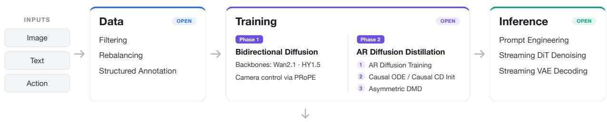

flowchart

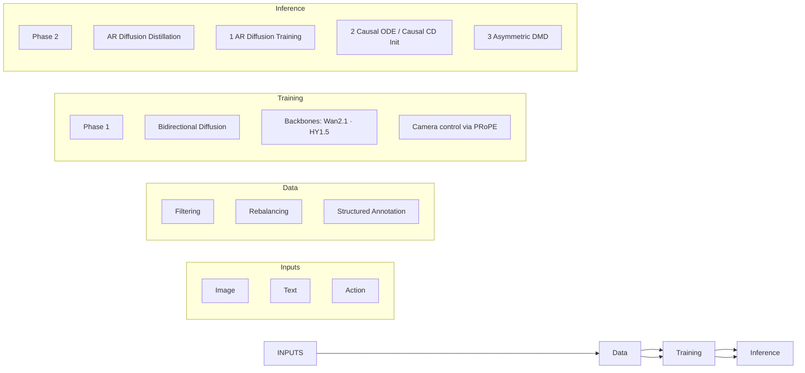

Output — Real-Time Interactive   
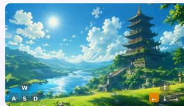

natural_image

Landscape painting of a traditional Chinese pagoda by a lake under a bright sun (no text or symbols)

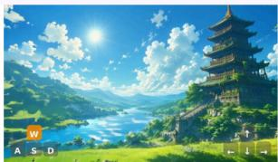

natural_image

Scenic landscape painting featuring a traditional Chinese pagoda on a riverbank, surrounded by mountains and green fields under a bright sun (no text or symbols)

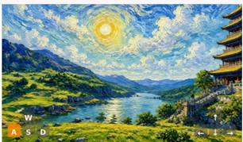

natural_image

Landscape painting of a river valley with traditional Chinese architecture and a dramatic sunlit sky (no text or symbols)

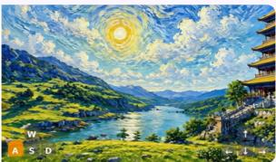

natural_image

Landscape painting of a serene river with mountains, sun, and traditional Chinese architecture (no text or symbols)

Figure 1: Overview of minWM. minWM is a full-stack pipeline that converts T2V/TI2V foundation models into camera-controllable few-step autoregressive world models, covering data construction, controllable finetuning, AR training, distillation, and low-latency inference.

To this end, we present minWM, a full-stack open-source framework for building real-time interactive video world models. Instead of releasing a single trained checkpoint, minWM provides a reproducible end-to-end pipeline that converts existing T2V or TI2V video foundation models into camera-controllable few-step autoregressive video world models. The framework covers the complete workflow, including data construction, camera-controllable fine-tuning, autoregressive diffusion training, few-step distillation, and low-latency inference. Its modular design allows researchers to plug in different video backbones, control signals, training recipes, and inference configurations, making minWM easy to reproduce, adapt, and extend.

Concretely, minWM follows a two-phase recipe. First, it fine-tunes a bidirectional video diffusion backbone on camera-annotated or camera-generated video data, enabling the model to follow prescribed camera trajectories while preserving the visual quality of the original foundation model [26]. Second, it applies Causal Forcing [23] or Causal Forcing++ [24] to transform the camera-controllable multi-step bidirectional model into a few-step autoregressive generator. This stage consists of teacher-forcing AR diffusion training [27], causal ODE [23] or causal consistency distillation [24] initialization, and asymmetric DMD [20, 28, 29, 30] post-training with self-rollout [22]. The resulting model supports camera-controllable autoregressive video generation with few-step inference, making it suitable for low-latency interactive applications.

We instantiate minWM on representative open video backbones, including Wan2.1-T2V-1.3B [6] and HY1.5-TI2V-8B [7]. These instantiations demonstrate two practical usages of the framework. First, minWM provides a complete conversion pipeline that starts from a bidirectional T2V or TI2V foundation model and progressively turns it into a real-time, camera-controllable autoregressive video world model. By releasing intermediate checkpoints for each training stage, minWM allows researchers to resume, modify, or extend the pipeline from any stage. Second, minWM supports adapting existing video world models, such as HY-WorldPlay [8], to new data distributions, training recipes, or latency targets through fine-tuning and distillation. Beyond final generation results, we further report practical ablations on camera trajectory quality of the dataset, controllability training steps, and minimal batch-size requirements, providing actionable guidance for reproducible interactive world-model training. The overall pipeline is illustrated in Fig. 1.

Our contributions are summarized as follows:

• We release minWM, a fully open-source end-to-end pipeline for building real-time interactive video world models. The pipeline covers camera-conditioned data construction, controllable fine-tuning of bidirectional video diffusion models, and Causal Forcing / Causal Forcing++ distillation, including

AR diffusion training, causal ODE or causal consistency distillation initialization, asymmetric DMD post-training, and low-latency inference.

• We show that minWM is architecture-general and can convert multiple types of video foundation models into camera-controllable few-step autoregressive world models. We instantiate the framework on representative open backbones, including Wan2.1-T2V-1.3B with cross-attention-based condition injection and HY1.5-TI2V-8B with an MMDiT-style architecture [31].   
• We further support the adaptation of existing video world models, such as HY-WorldPlay, to new data distributions, training recipes, and latency targets. Together with practical ablations on camera trajectory quality, controllability training steps, and minimal batch-size requirements, minWM provides a reproducible and extensible recipe for building and adapting interactive video world models.

# 2. Method

In this section, we present how to convert a text-to-video (T2V) or text-and-image-to-video (TI2V) multistep bidirectional diffusion model into a camera-controllable few-step autoregressive (AR) video generator.The pipeline consists of two major phases: first, Camera Control Training for Bidirectional Diffusion Models (Sec. 2.1), which equips the multi-step bidirectional diffusion model with camera controllability; and second, AR Diffusion Distillation for Real-Time Interactive Models (Sec. 2.2) via Causal Forcing [23] or Causal Forcing++ [24], which transforms the model into a real-time interactive AR model.

# 2.1. Camera-Controllable Training for Bidirectional Diffusion Models

In this section, we fine-tune the T2V or TI2V bidirectional diffusion model into a camera-controllable bidirectional diffusion model. We adopt PRoPE [26] as the injection method for camera parameters.

Specifically, given a video clip with camera parameters $\{ ( K _ { i } , T _ { i } ^ { c w } ) \} _ { i = 1 } ^ { N }$ 1, where $K _ { i }$ denotes the intrinsic matrix and $T _ { i } ^ { c w } \in S E ( 3 )$ denotes the world-to-camera extrinsic transformation of frame $i ,$ PRoPE represents each camera by its lifted projective matrix

$$
\widetilde {P} _ {i} = \left[ \begin{array}{c} [ K _ {i} 0 ] T _ {i} ^ {c w} \\ e _ {4} ^ {\top} \end{array} \right] \in \mathbb {R} ^ {4 \times 4}, \qquad e _ {4} = (0, 0, 0, 1) ^ {\top}.
$$

For a token t belonging to frame $i ( t )$ with spatial coordinate $( x _ { t } , y _ { t } )$ , PRoPE constructs a block-diagonal transformation

$$
D _ {t} ^ {\mathrm{PROPE}} = \left[ \begin{array}{c c} I _ {d / 8} \otimes \widetilde {P} _ {i (t)} & 0 \\ 0 & \left[ \begin{array}{c c} \mathrm{RoPE} _ {d / 4} (x _ {t}) & 0 \\ 0 & \mathrm{RoPE} _ {d / 4} (y _ {t}) \end{array} \right] \end{array} \right].
$$

This transformation is injected into self-attention in the GTA form:

$$
\mathrm{Attn} _ {\mathrm{PRoPE}} (Q, K, V) = D ^ {\mathrm{PRoPE}} \odot \mathrm{Attn} \big ((D ^ {\mathrm{PRoPE}}) ^ {\top} \odot Q, (D ^ {\mathrm{PRoPE}}) ^ {- 1} \odot K, (D ^ {\mathrm{PRoPE}}) ^ {- 1} \odot V \big).
$$

Consequently, the attention interaction between tokens $t _ { 1 }$ and $t _ { 2 }$ explicitly depends on the relative projective transformation

$$
\widetilde {P} _ {i (t _ {1})} \widetilde {P} _ {i (t _ {2})} ^ {- 1} = \left[ \begin{array}{c c} K _ {i (t _ {1})} & 0 \\ 0 & 1 \end{array} \right] T _ {i (t _ {1})} ^ {c w} \big (T _ {i (t _ {2})} ^ {c w} \big) ^ {- 1} \left[ \begin{array}{c c} K _ {i (t _ {2})} ^ {- 1} & 0 \\ 0 & 1 \end{array} \right],
$$

thereby jointly encoding relative camera intrinsics and camera poses. This allows the bidirectional diffusion backbone to condition on camera trajectories while preserving the original self-attention generative structure.

# 2.2. AR Diffusion Distillation for Real-Time Interactive Video World Models

In this section, we can either adopt Causal Forcing [23] or Causal Forcing++ [24] to transform the cameracontrollable multi-step bidirectional diffusion model obtained in Sec. 2.1 into a camera-controllable few-step AR model. This distillation pipeline consists of three stages: (1) Stage 1: AR diffusion training; (2) Stage 2: causal ODE initialization or causal CD initialization; and (3) Stage 3: asymmetric DMD.

Stage 1: AR diffusion training. Starting from a multi-step bidirectional diffusion model, Causal Forcing [23] first fine-tunes it into an AR diffusion model via teacher forcing [27]. This is achieved by concatenating the clean video with its noisy counterpart and training the model under a causal attention mask. The resulting model already possesses autoregressive generation capability, but still suffers from two limitations: (1) it requires multi-step generation, leading to high latency; and (2) due to exposure bias induced by autoregression [20], its quality remains inferior to that of bidirectional diffusion models. These limitations motivate the subsequent distillation strategy.

Stage 2 (option a): causal ODE initialization. Causal Forcing [23] points out that using an AR diffusion model to supervise an AR few-step model, as the subsequent DMD initialization, helps improve generation quality. This AR diffusion model generates a large number of intermediate denoising trajectories, namely PF-ODE trajectories [32]. Then, over a predefined few-step timestep set S, a timestep t is randomly sampled, and the few-step model $G _ { \theta }$ is trained by regressing from the noisy intermediate frame $\mathbf { \Delta } \mathbf { x } _ { t } ^ { i }$ to the clean frame $\mathbf { \Delta } \mathbf { x } _ { 0 } ^ { i }$ :

$$
\theta^ {*} = \arg \min _ {\theta} \mathbb {E} _ {\boldsymbol {x} _ {\mathrm{gt}} ^ {<   i}, t, i, \boldsymbol {x} _ {t} ^ {i}} \left[ \| G _ {\theta} (\boldsymbol {x} _ {t} ^ {i}, \boldsymbol {x} _ {\mathrm{gt}} ^ {<   i}, t) - \boldsymbol {x} _ {0} ^ {i} \| ^ {2} \right], \tag {1}
$$

where $\pmb { x } _ { \mathrm { g t } } ^ { < i }$ denotes the historical prefix formed by real data. The model trained in this way can already perform few-step autoregressive generation, but its quality is constrained by the AR diffusion model and remains inferior to that of the bidirectional model, thus motivating the need for asymmetric DMD (i.e., Stage 3).

Stage 2 (option b): causal CD initialization. ODE distillation requires generating offline ODE data, which is both time-consuming and storage-intensive. To eliminate this data curation time and the storage overhead of ODE trajectories, Causal Forcing++ [24] further replaces this stage with the theoretically equivalent causal consistency distillation [33], namely causal CD:

$$
\theta^ {*} = \arg \min _ {\theta} \mathbb {E} _ {\boldsymbol {x} _ {\mathrm{gt}}, \epsilon , t, i} \left[ w (t) d \left(G _ {\theta} \left(\boldsymbol {x} _ {t} ^ {i}, \boldsymbol {x} _ {\mathrm{gt}} ^ {<   i}, t\right), G _ {\theta^ {-}} \left(\hat {\boldsymbol {x}} _ {t - \Delta t} ^ {i}, \boldsymbol {x} _ {\mathrm{gt}} ^ {<   i}, t - \Delta t\right)\right) \right], \tag {2}
$$

where $\hat { \pmb x } _ { t - \Delta t } ^ { i }$ is obtained by a single ODE step from $\mathbf { \Delta } \mathbf { x } _ { t } ^ { i }$ using the AR teacher conditioned on $x _ { \mathrm { g t } } ^ { < i } , \theta ^ { - }$ is the EMA of θ with stop-gradient, w(·) is a timestep-dependent weight, and $d ( \cdot , \cdot )$ is a distance under a pre-defined norm. A model trained in this way is equivalent to one obtained via causal ODE distillation [23].

Stage 3: asymmetric DMD. The resulting few-step AR model is already capable of real-time generation, but since the AR teacher has limited generation quality, it inherits this limitation. Therefore, a final asymmetric DMD stage is applied using the bidirectional diffusion model, aligning the few-step AR model with the high-quality distribution of the bidirectional teacher [20, 22]: the student model is initialized from the above few-step AR model, self-rolls out to generate a full video sequence ${ \tilde { \mathbf { x } } } ,$ and is then optimized with the standard DMD gradient as follows [28, 30]:

$$
\nabla_ {\theta} \mathbb {E} _ {t} [ D _ {\mathrm{KL}} (p _ {\theta , t} (\tilde {\boldsymbol {x}} _ {t}) | | p _ {\mathrm{data}, t} (\tilde {\boldsymbol {x}} _ {t})) ] = - \mathbb {E} _ {\tilde {\boldsymbol {x}}, t, \tilde {\boldsymbol {x}} _ {t}} [ (s _ {\mathrm{real}} (\tilde {\boldsymbol {x}} _ {t}, t) - s _ {\mathrm{fake}} (\tilde {\boldsymbol {x}} _ {t}, t)) \frac {\partial \tilde {\boldsymbol {x}}}{\partial \theta} ]. \tag {3}
$$

Here, x˜ is perturbed into $\tilde { \mathbf { x } } _ { t } \sim p _ { \theta } ( \tilde { \mathbf { x } } )$ through the forward diffusion process, thereby inducing the marginal distribution $p _ { \theta , t } ( \tilde { \pmb { x } } _ { t } )$ . The score of $\tilde { \mathbf { x } } _ { t }$ in the data distribution is estimated by a frozen diffusion model $s _ { \mathrm { r e a l } }$ whereas the score of $\tilde { \mathbf { x } } _ { t }$ in $p _ { \theta } ( \tilde { \pmb x } )$ is estimated by an online-trained diffusion model $S f a k \epsilon$ .

Camera-controllable distillation. For camera-controllable video world models, we only need to instantiate the Causal Forcing series from the camera-controllable multi-step bidirectional diffusion model. Specifically, in Stage 1, the AR diffusion model is initialized from the camera-controllable multi-step bidirectional diffusion model obtained in Sec. 2.1 and is still trained on camera-controllable data. In Stage 2, when collecting causal ODE data, the AR diffusion model also takes the camera condition as input to solve the

Table 1: First-frame latency of different HY1.5 and Wan2.1 models. We report the first-frame latency on a single A800 GPU. VAE-related time is excluded. 

<table><tr><td>Base model</td><td>Model type</td><td>First-frame latency (s)</td><td>Speedup over multi-step bidirectional</td></tr><tr><td>HY1.5 [7]</td><td>Multi-step bidirectional</td><td>771.041</td><td>1.00×</td></tr><tr><td>HY1.5</td><td>Multi-step AR</td><td>81.014</td><td>9.52×</td></tr><tr><td>HY1.5</td><td>Few-step AR</td><td>3.446</td><td>223.75×</td></tr><tr><td>Wan2.1</td><td>Multi-step bidirectional</td><td>269.055</td><td>1.00×</td></tr><tr><td>Wan2.1 [6]</td><td>Multi-step AR</td><td>28.651</td><td>9.39×</td></tr><tr><td>Wan2.1</td><td>Few-step AR</td><td>1.137</td><td>236.64×</td></tr></table>

PF-ODE; similarly, causal CD is trained on camera-controllable data. In Stage 3, the student model takes not only the text condition but also the camera condition for self-rollout, and the same camera condition is also fed into $s _ { \mathrm { r e a l } }$ and $s _ { \mathrm { f a k e } } ,$ , which are initialized from the camera-controllable multi-step bidirectional diffusion model obtained in Sec. 2.1. In summary, all involved models are camera-controllable.

# 3. Experiments

In this section, we present the detailed experimental setup, generation results, and ablation studies on key training factors.

# 3.1. Setup

We train two models, Wan2.1-T2V-1.3B [6] and HY1.5-TI2V-8B [7], to generate videos of resolution 480×832 with 77 frames. The autoregressive chunk size is set to 4 latent frames. For few-step distillation, we use 4 steps following Causal Forcing [23]. Roughly speaking, unless otherwise specified, for the HY1.5-based training, we use a batch size of 32 and a learning rate of $1 \times 1 0 ^ { - 5 } ;$ the bidirectional model is trained for 8K steps, followed\* by 4K steps for Causal Forcing Stage 1, 1.5K steps for Stage 2, and 500 steps for Stage 3. For the Wan2.1-based training, we use a batch size of 32 and a learning rate of $2 \times 1 0 ^ { - 6 }$ ; the bidirectional model is trained for 5K steps, followed by 4K steps for Causal Forcing Stage 1, 2K steps for Stage 2, and 200 steps for Stage 3. For details on the data, please refer to Sec. 3.3.

# 3.2. Results

In this section, we present the final results of applying the minWM framework to Wan2.1 and HY1.5. We first report the first-frame latency on the single A800 GPU excluding the VAE-related time, and then show several generated video samples.

Few-step AR models substantially reduce the first-frame latency. As shown in Tab. 1, minWM substantially reduces the first-frame latency of both base models. In particular, the final few-step AR model achieves a 223.75× first-frame latency reduction over the multi-step bidirectional HY1.5 baseline, and a 236.64× firstframe latency reduction over the multi-step bidirectional Wan2.1 baseline. Notably, since the bidirectional model generates the entire sequence at once, its first-frame latency is naturally much higher than that of the AR model, which generates the first frame first and then continues to generate subsequent frames. In practical deployment scenarios, the low first-frame latency of the AR model allows users to start watching while generation is still ongoing, thereby reducing perceived waiting time.

Few-step AR models preserve camera-controllable generation capability. As shown in Fig. 2, the model is capable of camera-controllable generation and supports changing the camera action, demonstrating the effectiveness of the distillation algorithm in preserving the model’s controllability.

# 3.3. Ablation Studies

In this section, we examine key factors encountered during training and present the corresponding ablation studies.

Training data. We first attempted to train on SpatialVid [34] data. Under our current training setup, however, models trained in this way, including both HY1.5 [7] and Wan2.1 [6], did not yet achieve reliable camera-controllable generation, as illustrated in Fig. 3(a). Even with additional data filtering, the model still struggled to perform accurate camera control in our experiments. We hypothesize that this may be related to the use of perception-estimated camera poses, which can introduce pose noise or trajectory inconsistency compared with ground-truth trajectories. This result should be interpreted as a limitation of our current SpatialVid-based training attempt rather than a conclusion that SpatialVid is unsuitable for this task. We leave improved filtering, pose refinement, and more systematic SpatialVid-based training to future work.

Based on this observation, we argue that ground-truth camera poses are crucial. We therefore adopt a 3D reconstruction and re-rendering strategy: we reconstruct scenes from the DL3DV [35] dataset and then render videos along prescribed camera trajectories. With this data, the model successfully learns camera controllability, as illustrated in Fig. 3(b).

For the open-source version, we adopt another dataset construction strategy: we sample images from OpenVid [36] and other sources, and use WorldPlay [8] to generate videos following specified camera trajectories. This also provides effective ground-truth trajectories, and the model can likewise learn camera controllability, as illustrated in Fig. 3(c).

Training steps. Taking HY1.5 as an example, we further report the number of training steps required for the bidirectional diffusion model to acquire camera controllability. We find that after only one to two thousand training steps, the model remains completely uncontrollable, as illustrated in Fig. 4(a). After around five thousand steps, the model begins to exhibit camera controllability, as illustrated in Fig. 4(b). After eight thousand steps, the model achieves strong controllability, as illustrated in Fig. 4(c).

Minimal batch size. Taking Wan2.1 as an example, we investigate the minimum batch size required for learning camera controllability, aiming to facilitate research under limited computational budgets. We find that when the batch size is smaller than 4, the model often fails to learn camera controllability, as illustrated in Fig. 5(a). With a batch size of 8, the model’s controllability improves substantially, but remains somewhat unstable, as illustrated in Fig. 5(b). With a batch size of 16, the full training pipeline can be successfully completed with high controllability, as illustrated in Fig. 5(c).

# 4. Conclusion and the Future Work

We propose minWM, a full-stack open-source framework for video world models. It supports fine-tuning bidirectional T2V or TI2V models for camera-controllable generation, as well as distilling them into realtime interactive AR models. minWM currently supports HY1.5 [7] and Wan2.1 [6]. In the future, we plan to support additional control conditions beyond camera control, such as pose, and to extend the framework to more models.

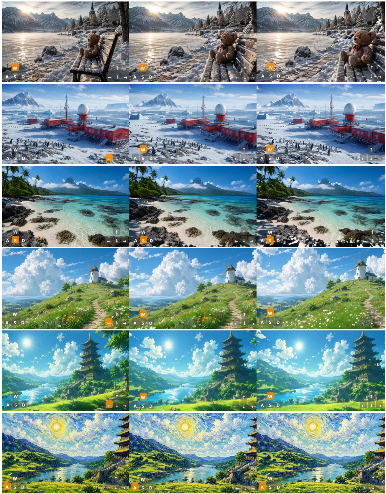  
Figure 2: Camera-controllable generation with the distilled few-step AR model. The model supports generation under different camera actions, showing that the distillation algorithm effectively preserves the camera controllability of the base model.

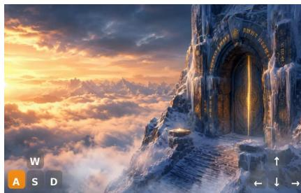

natural_image

Desert landscape with a glowing stone archway leading to clouds at sunset, no text or symbols visible

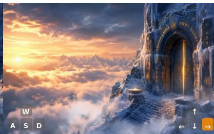

natural_image

Fantasy landscape with a glowing stone archway leading to clouds at sunset, no visible text or symbols

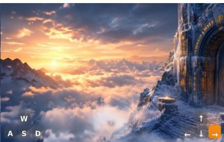

natural_image

Desert landscape at sunset with mountain peaks and a stone archway, no visible text or symbols

(a) Training with estimated camera poses. In our experiments, models trained directly on SpatialVid [34] data did not achieve reliable camera-controllable generation under our current setup, even after additional data filtering. We hypothesize that this may be related to the use of perception-estimated camera poses, which motivates our exploration of datasets with effectively ground-truth trajectories.   

natural_image

Desert landscape with glowing stone archway leading to clouds at sunset, no text or symbols visible

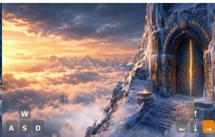

natural_image

Fantasy landscape with a glowing stone archway leading to a mountain peak at sunset, no text or symbols visible.

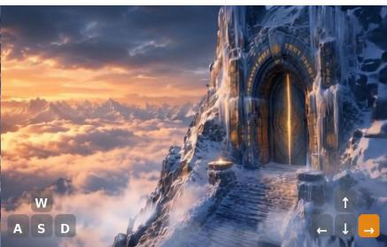

natural_image

Fantasy landscape with a glowing stone archway winding through clouds at sunset, no text or symbols visible.

(b) Training with reconstructed scenes and rendered trajectories. By reconstructing scenes from DL3DV [35] and rendering videos along prescribed camera trajectories, the model successfully learns camera-controllable generation, indicating the importance of accurate camera trajectories.   
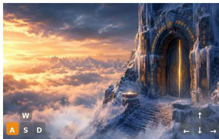

natural_image

Fantasy landscape with a glowing stone archway leading to clouds at sunset, no visible text or symbols

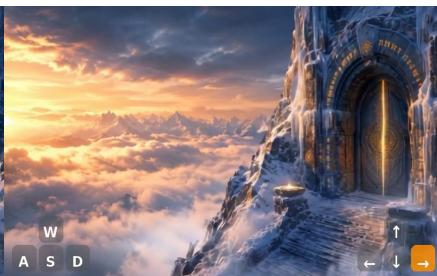

natural_image

Fantasy landscape with a glowing stone archway leading to a snow-covered cliff, above clouds at sunset (no text or symbols)

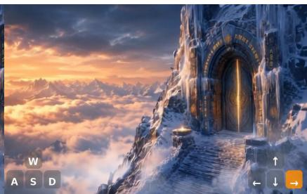

natural_image

Fantasy landscape with a glowing stone arch leading to a snowy mountain peak at sunset, no text or symbols visible.

(c) Training with WorldPlay-generated trajectories. For the open-source setting, we construct videos from OpenVid [36] and other image sources using WorldPlay [8] with specified camera trajectories, which likewise enables the model to learn camera controllability.   
Figure 3: Effect of training data on camera-controllable generation. Under our current setup, directly training with SpatialVid did not yet yield reliable camera-controllable generation. We therefore construct datasets with effectively ground-truth camera trajectories, either through 3D reconstruction and re-rendering or WorldPlay-based generation, which enable the model to learn camera controllability.

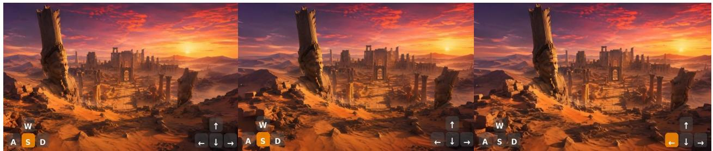

natural_image

Panoramic view of a desert canyon at sunset with ancient stone structures and glowing sky (no text or symbols)

(a) Early-stage training. After only one to two thousand training steps, the HY1.5-based bidirectional model has not yet acquired effective camera controllability.

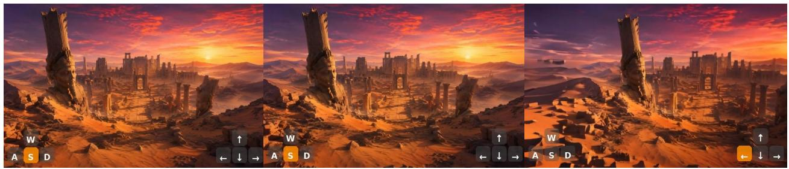

natural_image

Four-panel image sequence showing a desert cityscape at sunset, with UI controls labeled W, A, S, D (no text or symbols in the scene itself)

(b) Emerging controllability. After around five thousand training steps, the model begins to respond to camera-control signals, but the controllability is still unstable.

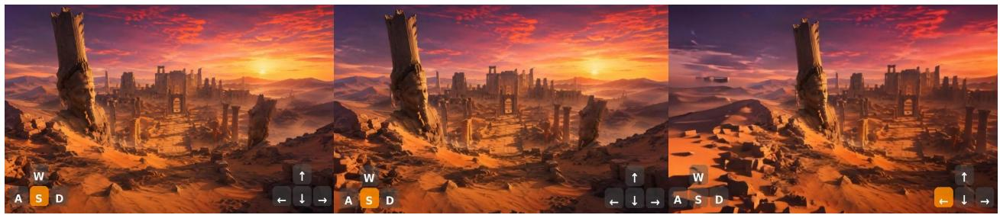

natural_image

Three-panel image sequence showing a desert landscape at sunset with ancient city ruins and a stone structure, each with directional control buttons (no text or symbols on the scene itself)

(c) Strong controllability. After eight thousand training steps, the model achieves substantially stronger and more reliable camera-controllable generation.   
Figure 4: Effect of training steps on camera-controllable generation. Using HY1.5 as an example, we observe that camera controllability emerges progressively during training: the model is largely uncontrollable at one to two thousand steps, starts to acquire controllability around five thousand steps, and reaches strong controllability after eight thousand steps.

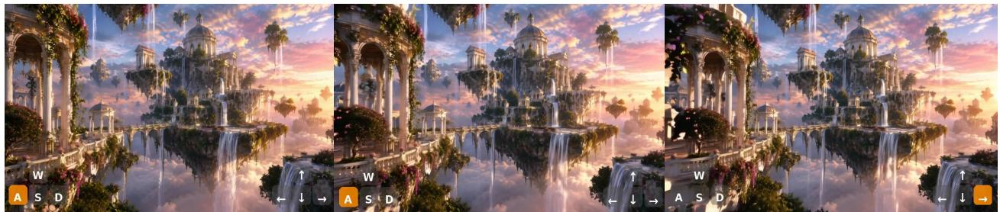

natural_image

Futuristic landscape with a waterfall, domed architecture, and cloud reflections under a sunset sky (no text or symbols)

(a) Training with very small batch sizes. When the batch size is smaller than 4, the Wan2.1-based model often fails to learn camera-controllable generation.

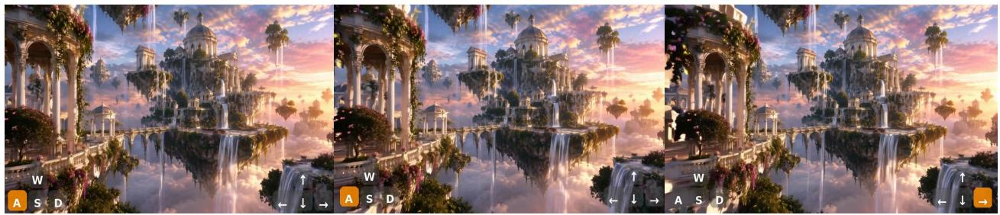

natural_image

Four-panel fantasy landscape photo showing a surreal island with waterfalls, domes, and palm trees under a sunset sky (no text or symbols)

(b) Training with batch size 8. With a batch size of 8, the model’s controllability improves substantially, but remains somewhat unstable.

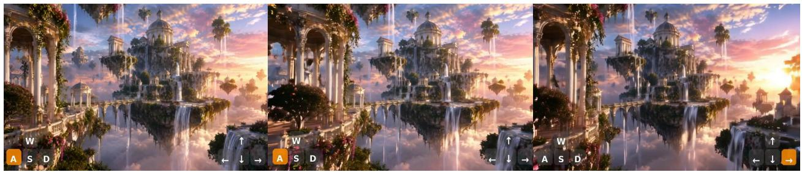

natural_image

Four-panel fantasy landscape photo showing a domed palace on a waterfall, surrounded by clouds and palm trees, with no visible text or symbols.

(c) Training with batch size 16. With a batch size of 16, the full training pipeline can be successfully completed with high controllability.   
Figure 5: Effect of batch size on camera-controllable generation. Using Wan2.1 as an example, we find that batch size critically affects camera-control training: batch sizes below 4 often fail to learn controllability, batch size 8 substantially improves controllability but remains unstable, while batch size 16 enables successful training with high controllability.

# References

[1] Tim Brooks, Bill Peebles, Connor Holmes, Will DePue, Yufei Guo, Li Jing, David Schnurr, Joe Taylor, Troy Luhman, Eric Luhman, Clarence Ng, Ricky Wang, and Aditya Ramesh. Video generation models as world simulators. 2024.   
[2] Fan Bao, Chendong Xiang, Gang Yue, Guande He, Hongzhou Zhu, Kaiwen Zheng, Min Zhao, Shilong Liu, Yaole Wang, and Jun Zhu. Vidu: a highly consistent, dynamic and skilled text-to-video generator with diffusion models. arXiv preprint arXiv:2405.04233, 2024.   
[3] Zhuoyi Yang, Jiayan Teng, Wendi Zheng, Ming Ding, Shiyu Huang, Jiazheng Xu, Yuanming Yang, Wenyi Hong, Xiaohan Zhang, Guanyu Feng, et al. Cogvideox: Text-to-video diffusion models with an expert transformer. arXiv preprint arXiv:2408.06072, 2024.   
[4] Bin Lin, Yunyang Ge, Xinhua Cheng, Zongjian Li, Bin Zhu, Shaodong Wang, Xianyi He, Yang Ye, Shenghai Yuan, Liuhan Chen, et al. Open-sora plan: Open-source large video generation model. arXiv preprint arXiv:2412.00131, 2024.   
[5] Zangwei Zheng, Xiangyu Peng, Tianji Yang, Chenhui Shen, Shenggui Li, Hongxin Liu, Yukun Zhou, Tianyi Li, and Yang You. Open-sora: Democratizing efficient video production for all. arXiv preprint arXiv:2412.20404, 2024.   
[6] Team Wan, Ang Wang, Baole Ai, Bin Wen, Chaojie Mao, Chen-Wei Xie, Di Chen, Feiwu Yu, Haiming Zhao, Jianxiao Yang, et al. Wan: Open and advanced large-scale video generative models. arXiv preprint arXiv:2503.20314, 2025.   
[7] Weijie Kong, Qi Tian, Zijian Zhang, Rox Min, Zuozhuo Dai, Jin Zhou, Jiangfeng Xiong, Xin Li, Bo Wu, Jianwei Zhang, et al. Hunyuanvideo: A systematic framework for large video generative models. arXiv preprint arXiv:2412.03603, 2024.   
[8] Wenqiang Sun, Haiyu Zhang, Haoyuan Wang, Junta Wu, Zehan Wang, Zhenwei Wang, Yunhong Wang, Jun Zhang, Tengfei Wang, and Chunchao Guo. Worldplay: Towards long-term geometric consistency for real-time interactive world modeling. arXiv preprint arXiv:2512.14614, 2025.   
[9] Philip J. Ball, Jakob Bauer, Frank Belletti, Bethanie Brownfield, Ariel Ephrat, Shlomi Fruchter, Agrim Gupta, Kristian Holsheimer, Aleksander Holynski, Jiri Hron, Christos Kaplanis, Marjorie Limont, Matt McGill, Yanko Oliveira, Jack Parker-Holder, Frank Perbet, Guy Scully, Jeremy Shar, Stephen Spencer, Omer Tov, Ruben Villegas, Emma Wang, Jessica Yung, Cip Baetu, Jordi Berbel, David Bridson, Jake Bruce, Gavin Buttimore, Sarah Chakera, Bilva Chandra, Paul Collins, Alex Cullum, Bogdan Damoc, Vibha Dasagi, Maxime Gazeau, Charles Gbadamosi, Woohyun Han, Ed Hirst, Ashyana Kachra, Lucie Kerley, Kristian Kjems, Eva Knoepfel, Vika Koriakin, Jessica Lo, Cong Lu, Zeb Mehring, Alex Moufarek, Henna Nandwani, Valeria Oliveira, Fabio Pardo, Jane Park, Andrew Pierson, Ben Poole, Helen Ran, Tim Salimans, Manuel Sanchez, Igor Saprykin, Amy Shen, Sailesh Sidhwani, Duncan Smith, Joe Stanton, Hamish Tomlinson, Dimple Vijaykumar, Luyu Wang, Piers Wingfield, Nat Wong, Keyang Xu, Christopher Yew, Nick Young, Vadim Zubov, Douglas Eck, Dumitru Erhan, Koray Kavukcuoglu, Demis Hassabis, Zoubin Gharamani, Raia Hadsell, Aäron van den Oord, Inbar Mosseri, Adrian Bolton, Satinder Singh, and Tim Rocktäschel. Genie 3: A new frontier for world models. 2025.   
[10] Junshu Tang, Jiacheng Liu, Jiaqi Li, Longhuang Wu, Haoyu Yang, Penghao Zhao, Siruis Gong, Xiang Yuan, Shuai Shao, and Qinglin Lu. Hunyuan-gamecraft-2: Instruction-following interactive game world model. arXiv preprint arXiv:2511.23429, 2025.   
[11] Xiaofeng Mao, Zhen Li, Chuanhao Li, Xiaojie Xu, Kaining Ying, Tong He, Jiangmiao Pang, Yu Qiao, and Kaipeng Zhang. Yume-1.5: A text-controlled interactive world generation model. arXiv preprint arXiv:2512.22096, 2025.   
[12] Yao Feng, Chendong Xiang, Xinyi Mao, Hengkai Tan, Zuyue Zhang, Shuhe Huang, Kaiwen Zheng, Haitian Liu, Hang Su, and Jun Zhu. Vidarc: Embodied video diffusion model for closed-loop control. arXiv preprint arXiv:2512.17661, 2025.   
[13] Yubo Huang, Hailong Guo, Fangtai Wu, Shifeng Zhang, Shijie Huang, Qijun Gan, Lin Liu, Sirui Zhao, Enhong Chen, Jiaming Liu, et al. Live avatar: Streaming real-time audio-driven avatar generation with infinite length. arXiv preprint arXiv:2512.04677, 2025.   
[14] Zhiyao Sun, Ziqiao Peng, Yifeng Ma, Yi Chen, Zhengguang Zhou, Zixiang Zhou, Guozhen Zhang, Youliang Zhang, Yuan Zhou, Qinglin Lu, et al. Streamavatar: Streaming diffusion models for real-time interactive human avatars. arXiv preprint arXiv:2512.22065, 2025.

[15] Yicong Hong, Yiqun Mei, Chongjian Ge, Yiran Xu, Yang Zhou, Sai Bi, Yannick Hold-Geoffroy, Mike Roberts, Matthew Fisher, Eli Shechtman, et al. Relic: Interactive video world model with long-horizon memory. arXiv preprint arXiv:2512.04040, 2025.   
[16] Deheng Ye, Fangyun Zhou, Jiacheng Lv, Jianqi Ma, Jun Zhang, Junyan Lv, Junyou Li, Minwen Deng, Mingyu Yang, Qiang Fu, et al. Yan: Foundational interactive video generation. arXiv preprint arXiv:2508.08601, 2025.   
[17] Jiannan Xiang, Yi Gu, Zihan Liu, Zeyu Feng, Qiyue Gao, Yiyan Hu, Benhao Huang, Guangyi Liu, Yichi Yang, Kun Zhou, et al. Pan: A world model for general, interactable, and long-horizon world simulation. arXiv preprint arXiv:2511.09057, 2025.   
[18] Xianglong He, Chunli Peng, Zexiang Liu, Boyang Wang, Yifan Zhang, Qi Cui, Fei Kang, Biao Jiang, Mengyin An, Yangyang Ren, et al. Matrix-game 2.0: An open-source real-time and streaming interactive world model. arXiv preprint arXiv:2508.13009, 2025.   
[19] Joonghyuk Shin, Zhengqi Li, Richard Zhang, Jun-Yan Zhu, Jaesik Park, Eli Shechtman, and Xun Huang. Motionstream: Real-time video generation with interactive motion controls. arXiv preprint arXiv:2511.01266, 2025.   
[20] Tianwei Yin, Qiang Zhang, Richard Zhang, William T Freeman, Fredo Durand, Eli Shechtman, and Xun Huang. From slow bidirectional to fast autoregressive video diffusion models. In Proceedings of the Computer Vision and Pattern Recognition Conference, pages 22963–22974, 2025.   
[21] Shanchuan Lin, Xin Xia, Yuxi Ren, Ceyuan Yang, Xuefeng Xiao, and Lu Jiang. Diffusion adversarial post-training for one-step video generation. arXiv preprint arXiv:2501.08316, 2025.   
[22] Xun Huang, Zhengqi Li, Guande He, Mingyuan Zhou, and Eli Shechtman. Self forcing: Bridging the train-test gap in autoregressive video diffusion. arXiv preprint arXiv:2506.08009, 2025.   
[23] Hongzhou Zhu, Min Zhao, Guande He, Hang Su, Chongxuan Li, and Jun Zhu. Causal forcing: Autoregressive diffusion distillation done right for high-quality real-time interactive video generation. arXiv preprint arXiv:2602.02214, 2026.   
[24] Min Zhao, Hongzhou Zhu, Kaiwen Zheng, Zihan Zhou, Bokai Yan, Xinyuan Li, Xiao Yang, Chongxuan Li, and Jun Zhu. Causal forcing++: Scalable few-step autoregressive diffusion distillation for real-time interactive video generation. arXiv preprint arXiv:2605.15141, 2026.   
[25] Yongqi Yang, Huayang Huang, Xu Peng, Xiaobin Hu, Donghao Luo, Jiangning Zhang, Chengjie Wang, and Yu Wu. Towards one-step causal video generation via adversarial self-distillation. arXiv preprint arXiv:2511.01419, 2025.   
[26] Ruilong Li, Brent Yi, Junchen Liu, Hang Gao, Yi Ma, and Angjoo Kanazawa. Cameras as relative positional encoding. In D. Belgrave, C. Zhang, H. Lin, R. Pascanu, P. Koniusz, M. Ghassemi, and N. Chen, editors, Advances in Neural Information Processing Systems, volume 38, pages 15984–16009. Curran Associates, Inc., 2025.   
[27] Hansi Teng, Hongyu Jia, Lei Sun, Lingzhi Li, Maolin Li, Mingqiu Tang, Shuai Han, Tianning Zhang, WQ Zhang, Weifeng Luo, et al. Magi-1: Autoregressive video generation at scale. arXiv preprint arXiv:2505.13211, 2025.   
[28] Zhengyi Wang, Cheng Lu, Yikai Wang, Fan Bao, Chongxuan Li, Hang Su, and Jun Zhu. Prolificdreamer: Highfidelity and diverse text-to-3d generation with variational score distillation. Advances in neural information processing systems, 36:8406–8441, 2023.   
[29] Weijian Luo, Tianyang Hu, Shifeng Zhang, Jiacheng Sun, Zhenguo Li, and Zhihua Zhang. Diff-instruct: A universal approach for transferring knowledge from pre-trained diffusion models. Advances in Neural Information Processing Systems, 36:76525–76546, 2023.   
[30] Tianwei Yin, Michaël Gharbi, Richard Zhang, Eli Shechtman, Fredo Durand, William T Freeman, and Taesung Park. One-step diffusion with distribution matching distillation. In Proceedings of the IEEE/CVF conference on computer vision and pattern recognition, pages 6613–6623, 2024.   
[31] Patrick Esser, Sumith Kulal, Andreas Blattmann, Rahim Entezari, Jonas Müller, Harry Saini, Yam Levi, Dominik Lorenz, Axel Sauer, Frederic Boesel, et al. Scaling rectified flow transformers for high-resolution image synthesis. In Forty-first international conference on machine learning, 2024.   
[32] Yang Song, Jascha Sohl-Dickstein, Diederik P Kingma, Abhishek Kumar, Stefano Ermon, and Ben Poole. Score-based generative modeling through stochastic differential equations. arXiv preprint arXiv:2011.13456, 2020.

[33] Yang Song, Prafulla Dhariwal, Mark Chen, and Ilya Sutskever. Consistency models. 2023.   
[34] Jiahao Wang, Yufeng Yuan, Rujie Zheng, Youtian Lin, Jian Gao, Lin-Zhuo Chen, Yajie Bao, Yi Zhang, Chang Zeng, Yanxi Zhou, et al. Spatialvid: A large-scale video dataset with spatial annotations. arXiv preprint arXiv:2509.09676, 2025.   
[35] Lu Ling, Yichen Sheng, Zhi Tu, Wentian Zhao, Cheng Xin, Kun Wan, Lantao Yu, Qianyu Guo, Zixun Yu, Yawen Lu, et al. Dl3dv-10k: A large-scale scene dataset for deep learning-based 3d vision. In Proceedings of the IEEE/CVF Conference on Computer Vision and Pattern Recognition, pages 22160–22169, 2024.   
[36] Kepan Nan, Rui Xie, Penghao Zhou, Tiehan Fan, Zhenheng Yang, Zhijie Chen, Xiang Li, Jian Yang, and Ying Tai. Openvid-1m: A large-scale high-quality dataset for text-to-video generation. arXiv preprint arXiv:2407.02371, 2024.