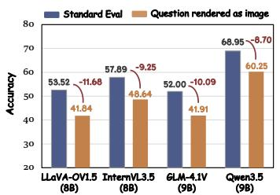
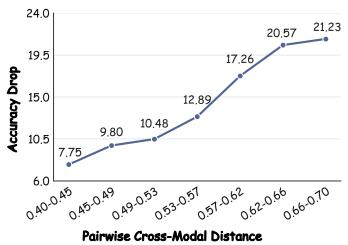
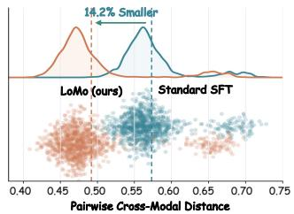
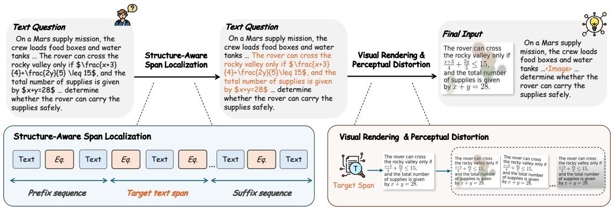
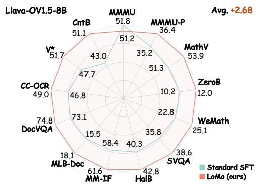
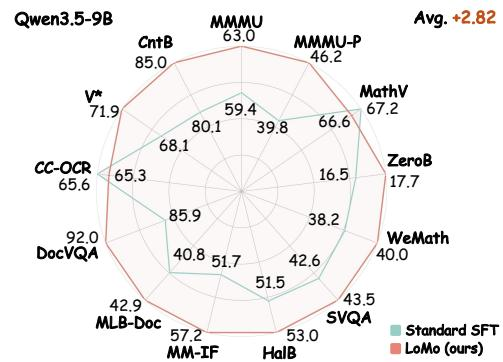
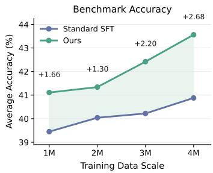
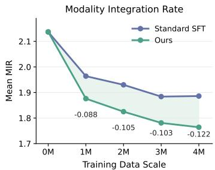
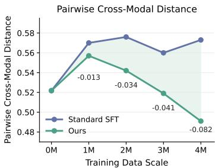

# LoMo: Local Modality Substitution for Deeper Vision-Language Fusion

Feng Han1,2 Zhixiong Zhang2,3 Zheming Liang2,4 Yibin Wang1,2 Jiaqi Wang2,5,∗

1Fudan University 2Shanghai Innovation Institute 3Shanghai Jiao Tong University 4University of Science and Technology of China 5JD.COM

https://maplebb.github.io/LoMo

# Abstract

Vision-Language Models (VLMs) have achieved substantial progress across a wide range of understanding and reasoning tasks, driven by large-scale image-text training aimed at multimodal fusion. Ideally, replacing a textual question with its rendered-image counterpart should leave model performance essentially unaffected. In practice, however, such modality substitution induces dramatic performance degradation. We attribute this “carrier sensitivity” issue to an inherent bias in current training corpora. Across prevalent datasets such as image captioning, VQA, OCR, and web-sourced interleaved data, text and images are typically organized into distinct and asymmetric roles, with text serving as linguistic queries and images as visual references. Such data bias leads VLMs to exhibit distinct preferences for information acquisition across different modalities. Consequently, VLMs fail to align representations of semantically equivalent content across textual and visual carriers, making model reasoning fragile under modality substitution. To address this, we propose Local Modality Substitution (LoMo), a lightweight, architectureagnostic data curation paradigm designed to provide supervision for cross-modal representational invariance between semantically equivalent text and image carriers. LoMo achieves this by reformulating single-modality prompts into seamlessly interleaved multimodal sequences. It dynamically selects target text spans and recasts them as rendered images, thereby preserving the same semantics across “text, visual, text” carriers. Extensive experiments across 13 diverse multimodal benchmarks demonstrate that LoMo significantly improves overall multimodal reasoning and yields deeper cross-modal fusion. Specifically, it delivers consistent gains across foundational models, improving over standard SFT by 2.67 points on LLaVA-OneVision-1.5-8B and 2.82 points on Qwen3.5-9B.

# 1 Introduction

Vision-Language Models (VLMs) have demonstrated strong generalization across diverse visuallanguage understanding tasks. Driven by rich image-text corpora and large-scale training aimed at multimodal fusion, state-of-the-art VLMs [1, 2, 11, 36, 24] exhibit powerful capabilities in tasks such as visual question answering, image captioning, document understanding, and visual grounding [23, 18, 27]. Ideally, replacing the text of a multimodal query with its rendered-image counterpart should keep model performance largely stable. In practice, however, such modality substitution causes mainstream VLMs to suffer consistent and significant performance drops across multiple benchmarks, as shown in Figure 1(a). This exposes a severe carrier sensitivity problem.



<details>
<summary>bar</summary>

| Model | Standard Eval | Question rendered as image |
| :--- | :--- | :--- |
| LLaVA-OVL5 (88) | 53.52 | -11.68 |
| InternVL3.5 (88) | 57.89 | -9.25 |
| GLM-4.1V (98) | 52.00 | -10.09 |
| Qwen3.5 (98) | 68.95 | -8.70 |
| Question rendered as image | 60.25 | |
</details>

(a) Carrier sensitivity across VLMs.



<details>
<summary>line</summary>

| Pairwise Cross-Modal Distance | Accuracy Drop |
| ----------------------------- | ------------- |
| 0.40-0.45                     | 7.75          |
| 0.45-0.49                     | 9.80          |
| 0.49-0.53                     | 10.48         |
| 0.53-0.57                     | 12.89         |
| 0.57-0.62                     | 17.26         |
| 0.62-0.66                     | 20.57         |
| 0.66-0.70                     | 21.23         |
</details>

(b) Larger modality gap, larger accuracy drop.



<details>
<summary>line</summary>

| Method       | Pairwise Cross-Modal Distance |
| ------------ | ------------------------------ |
| LoMo (ours)  | 0.52                           |
| Standard SFT | 0.60                           |
</details>

(c) LoMo enhances cross-modal alignment.   
Figure 1: Current Vision-Language Models exhibit carrier sensitivity driven by an underlying modality gap. (a) Carrier sensitivity across VLMs. Simply shifting identical semantic content from a text format to a visual format (rendering standard questions as images) causes consistent and significant accuracy drops across state-of-the-art models. (b) The physical manifestation of the modality gap. By measuring the pairwise cross-modal distance between the original text and its rendered-image counterpart, we observe a strict monotonic trend, where greater representational distance between the two carriers corresponds to more severe accuracy degradation. (c) LoMo enhances cross-modal alignment. Our method shifts the cross-modal distance distribution markedly toward smaller values, reducing the average distance by 14.2% compared to Standard SFT and yielding tighter cross-carrier alignment.

Although current VLMs process images and text jointly, their reasoning remains highly dependent on the modality carrier through which semantic content is presented. Merely switching identical semantics from a text carrier to a visual carrier can markedly degrade performance.

To trace this degradation to its source, we extract the hidden states of text inputs and their renderedimage counterparts, and measure their pairwise cosine distances. Grouping samples by this distance reveals a strict monotonic trend, where the average accuracy drop grows from 7.75% in the closest bin to 21.23% in the farthest (Figure 1(b)). This result indicates that the performance degradation is closely associated with a cross-carrier modality gap between semantically equivalent textual and visual inputs. We attribute this gap to an inherent bias in current multimodal training corpora. Across prevalent datasets such as image captioning, VQA, OCR, and web-sourced interleaved data, text and images are typically organized into distinct and asymmetric roles. Text often serves as linguistic instructions or queries, while images mainly provide visual references or evidence. Such data bias leads VLMs to exhibit distinct preferences for information acquisition across different modalities. Consequently, VLMs fail to align representations of semantically equivalent content across textual and visual carriers.

Motivated by this, we propose LoMo, a lightweight and architecture-agnostic data curation paradigm designed to provide supervision for cross-modal representational invariance through local modality substitution, as shown in Figure 2. LoMo reformulates single-modality prompts into seamlessly interleaved multimodal sequences while preserving the original supervision target. In this way, the standard Supervised Fine-Tuning (SFT) objective is transformed into an implicit cross-carrier alignment signal that encourages the model to associate interleaved image-text inputs with their pure-text semantic counterparts. Specifically, LoMo consists of three sequential stages. (1) Structure-Aware Span Localization segments a text-only instance based on its semantic structure to identify target content for visualization. (2) Visual Rendering recasts the selected span into a rendered visual carrier and embeds it between the surrounding text tokens, forming a “text → visual → text” sequence that promotes context-level fusion across modalities. (3) Perceptual Distortion applies real-world degradations to the visual carrier, ensuring that the learned fusion remains robust under perceptually challenging conditions. Crucially, LoMo is compatible with any multimodal training pipeline, requires no architectural modifications, introduces zero inference overhead, and demands no additional annotations.

Comprehensive experiments show that LoMo strengthens cross-modal fusion and delivers consistent gains across a wide spectrum of multimodal tasks. At the feature level, LoMo reduces the pairwise cross-modal distance by 14.2% compared to the standard SFT model, indicating tighter cross-carrier alignment, as shown in Figure 1(c). Moreover, on 13 benchmarks spanning mathematical reasoning, VQA, OCR, document understanding, and visual perception, LoMo improves over the standard multimodal SFT baseline by 2.67 points on LLaVA-OneVision-1.5-8B and 2.82 points on Qwen3.5- 9B, yielding stable improvements across backbones, as shown in Figure 3. We further evaluate our method across data scales, where LoMo yields improvements in both downstream accuracy and representation-alignment metrics. Complementary analyses on the Modality Integration Rate [12] further confirm that LoMo substantially enhances cross-modal fusion.



<details>
<summary>flowchart</summary>

```mermaid
graph TD
    A["Text Question\nOn a Mars supply mission, the crew loads food boxes and water tanks ... The rover can cross the rocky valley only if \(f\frac{x+3}{4}+\frac{2y}{5}\) \(\)\(\)\(\)\(\)\(\)\(\)\(\)\(\)\(\)\(\)\(\)\(\)\(\)\(\)\(\)\(\)\(\)\(\)\(\)\(\)\(\)\(\)\(\)\(\)\(\)\(\)\(\)\(\)\(\)\(\)\(\)\(\)\(\)\(\)\(\)\(\)\(\)\(\)\(\)\(\)\(\)\(\)\(\)\(\)\(\)\(\)\(\)\(\)\(\)\(\)\(\)"]
    B["Structure-Aware Span Localization"] --> C["Text"]
    B --> D["Eq."]
    B --> E["Text"]
    B --> F["Eq."]
    B --> G["Text"]
    B --> H["Eq."]
    B --> I["..."]
    B --> J["Text"]
    B --> K["Eq."]
    B --> L["Text"]
    M["Text Question\nOn a Mars supply mission, the crew loads food boxes and water tanks ... The rover can cross the rocky valley only if \(f\frac{x+3}{4}+\frac{2y}{5}\) \(\)\)\(\)\(\)\(\)\(\)\(\)\(\)\(\)\(\)\(\)\(\)\(\)\(\)\(\)\(\)\(\)\(\)\(\)\(\)\(\)\(\)\(\)\(\)\(\)\(\)\(\)\(\)\(\)\(\)\(\)\(\)\(\)\(\)\(\)\(\)\(\)\(\)\(\)\(\)\(\)\(\)\(\)\(\)\(\)\(\)\(\)\(\)\(\)"]
    N["Text Question\nOn a Mars supply mission, the crew loads food boxes and water tanks ... The rover can cross the rocky valley only if \(f\frac{x+3}{4}+\frac{2y}{5}\) \(\)\)\(\)\(\)\(\)\(\)\(\)\(\)\(\)\(\)\(\)\(\)\(\)\(\)\(\)\(\)\(\)\(\)\(\)\(\)\(\)\(\)\(\)\(\)\(\)\(\)\($\)\($\))\((\text{def:}\\x+y=28\text{; def:}\\y=y=28\text{; def:}\\y=y=28\text{; def:}\\y=y=28\text{; def:}\\y=y=28\text{; def:}\\y=y=28\text{; def:}\\y=y=28\text{; def:}\\y=y=28\text{; def:}\\y=y=28\text{; def:}\\y=y=28\) ..."]
    O["Visual Rendering & Perceptual Distortion"] --> P["Final Input\nThe rover can cross the rocky valley only if \(f\frac{x+3}{4}+\frac{2y}{5}\leq15\), and the total number of supplies is given by \(x+y=28\)."]
    Q[Text Question\nOn a Mars supply mission, the crew loads food boxes and water tanks ...<Image> ... determine whether the rover can carry the supplies safely.\nOn a Mars supply mission, the crew loads food boxes and water tanks ...<Image> ... determine whether the rover can carry the supplies safely.\nOn a Mars supply mission, the crew loads food boxes and water tanks ...<Image> ... determine whether the rover can carry the supplies safely.\nOn a Mars supply mission, the crew loads food boxes and water tanks ...<Image> ... determine whether the rover can carry the supplies safely.\nOn a Mars supply mission, the crew loads Food Boxes and Water Tanks ...<Image> ... determine whether the rover can carry the supplies safely.\nOn a Mars supply mission, the crew loads Food Boxes and Water Tanks ...<Image> ... determine whether the rover can carry the supplies safely.\nOn a Mars supply mission, the crew loads Food Boxes and Water Tanks ...<Image> ... determine whether the rover can carry the supplies safely.\nOn a Mars supply mission, the crew loads Food Boxes and Water Tanks ...<Image> ... determine whether the rover cannot carry the supplies safely.\nOn a Mars supply mission, the crew loads Food Boxes and Water Tanks ...<Image> ... determine whether the rover cannot carry the supplies safely.\nOn a Mars supply mission, the crew loads Food Boxes and Water Tanks ...<Image> ... determine whether the rover cannot carry the supplies safely.\nOn a Mars supply mission, the crew loads Food Boxes and Water Tanks ...<Image> ... determine whether the rover cannot carry the supplies safely.\nOn a Mars Supply Chain\nText Sequence\nTarget Text Span\nSuffix Sequence\nVisual Rendering & Perceptual Distortion\nTarget Span\nThe rover can cross the rocky valley only if \(f\frac{x+3}{4}+\frac{2y}{5}\leq15\), and the total number of supplies is given by \(x+y=28\).<nl>
```
</details>

Figure 2: Overview of LoMo. LoMo reformulates a text-only instance into a text–image interleaved sequence through three stages. Structure-Aware Span Localization chunks the input in a formulaaware manner and selects a semantically coherent middle span as the target for visualization. Visual Rendering converts the target span into an image via content-aware routing between LaTeX and standard text renderers. The image is then perturbed by Perceptual Distortion and substituted back into the original position, forming a “text → visual carrier → text” instance.

Our contributions are three-fold. 1) We systematically diagnose the carrier sensitivity problem in VLMs, revealing that it is closely associated with a cross-carrier modality gap induced by the distinct and asymmetric roles of text and images in standard training corpora. 2) We propose LoMo, a data-centric paradigm that performs local modality substitution to provide supervision for crossmodal representational invariance without architectural modifications or inference overhead. 3) We extensively validate LoMo on 13 multimodal benchmarks, demonstrating consistent accuracy improvements alongside improved cross-carrier representational consistency, with average gains of 2.67 and 2.82 on LLaVA-OneVision-1.5-8B and Qwen3.5-9B, respectively.

# 2 Related Work

Vision-Language Models. Vision-language models (VLMs) extend LLMs to jointly process visual and textual inputs, typically by aligning a pretrained vision encoder with an LLM backbone. Architecturally, LLaVA [22, 21] established the simple ViT–MLP–LLM template, which has been scaled by InternVL [4] and refined through systematic exploration of vision encoders and connectors [33, 34]. On the training side, recent open-source families have improved data curation and post-training: LLaVA-OneVision-1.5 [1] restructures the SFT corpus, Mantis [14] reformats interleaved multiimage instructions, and Insight-V [9] introduces long-chain visual reasoning data. Qwen3-VL [2], InternVL3.5 [36], and GLM-4.1V-Thinking [11] further push performance via larger backbones and reinforcement learning. Despite their architectural and training-side advances, these recipes consistently treat text and images as modality-specific inputs, with text serving as instructions and images as visual scenes.

Text-as-Pixels Modeling. In parallel, another line of work [40, 35, 15, 5, 38] has explored modeling text in pixel form rather than as discrete tokens. Early efforts in OCR-free document understanding, such as Pix2Struct [16], learn to parse rendered text through screenshot pretraining. Latent Compression Learning [41] pushes this further by training vision encoders directly on web-scale image–text documents through a compression objective. More recently, Glyph [5] renders long documents into compact images to extend the effective context window of VLMs, and DeepSeek-OCR [38] formalizes this idea as contexts optical compression, achieving high decoding accuracy at 10× token compression. A recent study [19] further shows that even off-the-shelf VLMs can read rendered text inputs with roughly half the decoder tokens at little accuracy cost. These methods treat text-as-pixels as an efficiency-driven substitute for text-as-tokens, aiming at OCR-style decoding or context compression. In contrast, our method treats text-as-pixels as a complement to text-as-tokens within a single training instance, inducing an implicit cross-modal alignment supervision between the two carriers.

Modality Gap and Cross-Modal Alignment. Aligning visual and textual representations remains a long-standing challenge for multimodal models. The modality gap [20] was first identified in CLIP-style models, where image and text embeddings occupy disjoint regions of the shared space. Subsequent analysis [31] traces this phenomenon to information imbalance between images and captions, and shows that closing the gap can improve downstream performance. Within decoderbased VLMs, the visual embedding space inherited from CLIP has been shown to carry systematic blind spots that propagate into MLLMs [34], and the Modality Integration Rate (MIR) [12] reveals that a measurable text–vision distribution gap persists in the shallow LLM layers even after largescale instruction tuning. The same misalignment also drives multimodal hallucinations, motivating decoding-time fixes such as VCD [17] and preference-optimization methods such as HA-DPO [32]. These remedies operate at the decoding, or objective level. In contrast, our method addresses the same gap from the data side, reformulating text-only instances into text→visual→text interleaved sequences so that cross-carrier alignment becomes a task-level requirement during standard SFT, with no architectural change and no inference overhead.

# 3 Methodology

# 3.1 Overview and Formulation

Overview. As discussed in Section 1, current multimodal training paradigms lack explicit supervision for cross-modal representational invariance, leaving VLMs vulnerable to carrier sensitivity. To address this limitation, we propose LoMo, a data curation paradigm that provides an implicit crossmodal alignment supervision signal through local modality substitution. As illustrated in Figure 2, LoMo dynamically recasts a selected text span into a visual carrier through three successive stages. In Structure-Aware Span Localization, the input text is segmented into three parts, with the middle span identified as the target content. In Visual Rendering, the selected span is converted into images through a content-aware rendering pipeline. Finally, Perceptual Distortion applies semanticspreserving degradations to the rendered image, which is then substituted back into the position of the selected span, yielding a text–image interleaved instance. This reformulation is architectureagnostic and compatible with any multimodal training pipeline, requiring no architectural changes, no additional annotations, and no inference overheads.

Formulation. Let (x, a) denote an original text-only instance, where x is the question and a is the ground-truth answer. LoMo transforms x through three successive operators, Structure-Aware Span Localization $\boldsymbol { \mathcal { S } } ( \cdot )$ , Visual Rendering $\mathcal { R } ( \cdot )$ , and Perceptual Distortion $\mathcal { A } ( \cdot )$ . Formally,

$$
\left(x _ {\text { pre }}, x _ {\text { mid }}, x _ {\text { suf }}\right) = \mathcal {S} (x), \quad I ^ {\prime} = \mathcal {A} \big (\mathcal {R} (x _ {\text { mid }}) \big), \tag {1}
$$

which together produce the final mapping

$$
\mathcal {T} (x) \triangleq \left(x _ {\text { pre }}, I ^ {\prime}, x _ {\text { suf }}\right), \quad (x, a) \longrightarrow \left(\left(x _ {\text { pre }}, I ^ {\prime}, x _ {\text { suf }}\right), a\right) \tag {2}
$$

The resulting instance forms a “text → visual → text” skeleton, requiring the model to jointly comprehend the surrounding textual context and the embedded visual carrier in order to recover the full semantics and predict a.

# 3.2 Implementation of LoMo

The carrier-substitution operator $\tau ( \cdot )$ is realized through three successive stages, jointly transforming a text-only instance $( x , a )$ into a text-image interleaved instance $( \mathcal { T } ( x ) , a )$ while preserving the supervision target.

Structure-Aware Span Localization (S) identifies a semantically coherent target span $x _ { \mathrm { m i d } }$ for substitution. We first estimate the input length by sentence count. Short instances are taken entirely as $x _ { \mathrm { m i d } }$ to fully preserve their semantic context, while long instances undergo a lightweight formulaaware chunking step that treats explicit mathematical expressions and common LaTeX commands as atomic, indivisible units. After chunking, the text x is represented as an interleaved sequence of text and formula blocks,

$$
x \mapsto ((t _ {1}, l _ {1}), (m _ {1}, l _ {2}), \dots , (t _ {n}, l _ {2 n - 1})), \tag {3}
$$

where t and m denote text and formula blocks respectively, and l records the length of each block in characters. Guided by this representation, we extract the middle one-third of the sequence at block-level granularity as $x _ { \mathrm { m i d } } .$ , ensuring that truncation boundaries never fall within an equation. The surrounding text $x _ { \mathrm { p r e } }$ and $x _ { \mathrm { s u f } }$ are retained, forming $\mathrm { a } \ \overset {  } { \mathrm { t e x t } } \to$ visual → text” skeleton that compels the model to fuse both carriers in order to recover the full semantics and predict a.



<details>
<summary>radar</summary>

| Model        | Standard SFT | LoMo (ours) |
| ------------ | ------------ | ----------- |
| Llava-OV1.5-8B | 51.8         | 51.8        |
| CntB         | 51.1         | 51.1        |
| V*           | 51.7         | 51.7        |
| CC-OCR       | 49.0         | 49.0        |
| DocVQA       | 74.8         | 74.8        |
| MLB-Doc      | 18.1         | 18.1        |
| MM-IF        | 61.6         | 61.6        |
| HalB         | 42.8         | 42.8        |
| SVQA         | 38.6         | 38.6        |
| WeMath       | 25.1         | 25.1        |
| ZeroB        | 12.0         | 12.0        |
| MathV        | 53.9         | 53.9        |
| MMMU-P       | 36.4         | 36.4        |
| MMMU         | 51.2         | 51.2        |
| MMMU-M       | 35.2         | 35.2        |
| CntB         | 43.0         | 43.0        |
</details>

(a) Performance on LLaVA-OV1.5-8B



<details>
<summary>radar</summary>

| Method     | Standard SFT | LoMo (ours) |
| ---------- | ------------ | ----------- |
| MMMU       | 59.4         | 63.0        |
| MMMU-P     | 66.6         | 46.2        |
| MathV      | 67.2         | 66.6        |
| ZeroB      | 17.7         | 16.5        |
| WeMath     | 40.0         | 38.2        |
| SVQA       | 43.5         | 42.6        |
| HalB       | 53.0         | 51.5        |
| MM-IF      | 57.2         | 51.7        |
| MLB-Doc    | 42.9         | 40.8        |
| DocVQA     | 92.0         | 85.9        |
| CC-OCR     | 65.6         | 68.1        |
| V*         | 71.9         | 80.1        |
| CntB       | 85.0         | 59.4        |
</details>

(b) Performance on Qwen3.5-9B   
Figure 3: LoMo yields consistent improvements over Standard SFT across two backbones ((a) +2.68 on LLaVA-OV1.5-8B; (b) +2.82 on Qwen3.5-9B over 13 benchmarks).

Visual Rendering (R) converts $x _ { \mathrm { m i d } }$ into a rendered image through a content-aware routing pipeline that adapts to the properties of each span. Spans containing mathematical expressions are routed to a LaTeX-based renderer, which yields substantially more reliable formula typesetting than generalpurpose text rendering, while spans without mathematical content are routed to a standard textrendering pipeline. To safeguard throughput at scale, the renderer is wrapped in a fallback mechanism that automatically re-routes any LaTeX failure to the text renderer rather than discarding the instance. A mild margin-trimming step further removes large empty regions while preserving all rendered content, keeping image sizes bounded without altering their semantics.

Perceptual Distortion (A) further perturbs each rendered image with semantics-preserving degradations, simulating the distortions document images commonly undergo during real-world capture and ensuring that the learned cross-carrier alignment is anchored to the underlying semantics. We define four sets of operations that jointly cover the range of perceptual noise observed in practical scenarios. Rotate applies a large-angle or small-angle rotation to simulate orientation variations and slight tilt during capture. Blur applies Gaussian, box, or motion blur to simulate camera shake. Shadow-or-stain overlays edge shadows or surface stains to replicate uneven illumination and physical contamination, and Wave induces local geometric deformations typical of folded paper or scanning artifacts. The final augmented image $\hat { I ^ { \prime } }$ is obtained by sampling one operation or by leaving the image unchanged.

# 3.3 Implicit Cross-Modal Alignment Supervision of LoMo

We further examine how the local modality substitution of LoMo in Section 3.1 reshapes the supervision signal of standard SFT. Standard SFT optimizes $f _ { \theta }$ on each text-only instance $( x , a )$ through the negative log-likelihood

$$
\mathcal {L} _ {\mathrm{SFT}} (\theta ; x, a) = - \log p _ {\theta} (a \mid x), \tag {4}
$$

which constrains $f _ { \theta }$ on the textual carrier x. LoMo augments this objective with an implicit crossmodal alignment signal through modality substitution, as we derive below.

$$
\mathcal {L} _ {\mathrm{LoMo}} (\theta ; x, a) = - \log p _ {\theta} (a \mid \mathcal {T} (x)) = \underbrace {- \log p _ {\theta} (a \mid x)} _ {\text { standard   SFT   supervision }} + \underbrace {\log \frac {p _ {\theta} (a \mid x)}{p _ {\theta} (a \mid \mathcal {T} (x))}} _ {\text { cross - carrier   alignment }}. \tag {5}
$$

The first term recovers the standard SFT supervision in Eq. 4. To characterize the second term, we take the expectation of Eq. 5 over $a \sim p _ { \theta } ( \cdot \mid x )$ , under which the log-ratio reduces to a Kullback–Leibler divergence by definition, yielding

$$
\begin{array}{l} \mathbb {E} _ {a \sim p _ {\theta} (\cdot | x)} \bigl [ - \log p _ {\theta} \bigl (a \mid \mathcal {T} (x) \bigr) \bigr ] = \mathbb {E} _ {a \sim p _ {\theta} (\cdot | x)} [ - \log p _ {\theta} (a \mid x) ] + \mathbb {E} _ {a \sim p _ {\theta} (\cdot | x)} \biggl [ \log \frac {p _ {\theta} (a \mid x)}{p _ {\theta} (a \mid \mathcal {T} (x))} \biggr ] \\ = \mathbb {E} _ {a \sim p _ {\theta} (\cdot | x)} [ - \log p _ {\theta} (a \mid x) ] + \mathrm{KL} \left(p _ {\theta} (\cdot \mid x) \| p _ {\theta} (\cdot \mid \mathcal {T} (x))\right). \tag {6} \\ \end{array}
$$

Optimizing $f _ { \theta }$ on the carrier-substituted interleaved sequence is therefore equivalent to introducing an implicit cross-modal alignment term into the standard objective, driving the model’s predictive distributions on semantically equivalent textual and visual carriers toward agreement. This directly addresses the absence of cross-carrier representational invariance in current training paradigms.

# 4 Experiments

# 4.1 Experimental Setup

Models and training data. We examine LoMo on two open-source VLM backbones with substantially different architectures: LLaVA-OneVision1.5-8B-Base [1] and Qwen3.5-9B-Base [2]. The training data is randomly sampled from the official LLaVA-OneVision1.5 SFT corpus [1], comprising two million multimodal instruction examples and two million text-only instruction examples. The Standard SFT baseline directly fine-tunes on this pool. LoMo shares the same data pool, optimizer, learning-rate schedule, and number of training steps. The only difference is that a fraction of the text-only examples is reformatted into interleaved text-visual sequences. By construction, the two methods are matched in data scale, compute, and hyperparameters. Training hyperparameters and other implementation details of LoMo are provided in the Appendix B.

Evaluation benchmarks. We report results on 13 multimodal benchmarks spanning six categories. On general reasoning, we evaluate MMMU [43] and MMMU-Pro [44]. Math reasoning is covered by MathVista [25], ZeroBench [30], and WeMath [29]. We assess factuality with SimpleVQA [6] and HallusionBench [10], and measure instruction following with MM-IFEval [8]. Document and OCR understanding is probed via MMLongBench-Doc [26], DocVQA [27], and CC-OCR [42]. Finally, V∗ [39] and CountBench [28] target visual perception. All evaluations are conducted with EvalScope under identical prompting and decoding configurations.

Evaluation protocols. We evaluate every benchmark under two protocols. Standard Evaluation feeds the original (image, text question) pair to the model, matching standard practice. Rendered Evaluation renders the entire text question as a single image, which replaces the original text and is fed to the model together with the original image. The linguistic content is identical across the two protocols and only the input modality differs.

Cross-modal alignment metrics. Beyond accuracy, we adopt two intrinsic metrics to probe the model’s internal cross-modal alignment. (i) Modality Integration Rate (MIR) [12] quantifies the distributional gap between visual and textual tokens inside the VLM. Specifically, at each decoder layer the hidden states of visual and textual tokens are extracted and viewed as samples from two high-dimensional distributions, whose discrepancy is measured by the Fréchet Distance (FID). The per-layer FID computation follows the original paper. Since different backbones differ in the number of decoder layers, we report the layer-wise mean of FID as MIR. A lower MIR indicates a smaller distributional gap between textual and visual representations, reflecting tighter cross-modal integration. (ii) Pairwise Cross-Modal Distance is a sample-level alignment metric. For each evaluation sample, we compute the mean hidden states of its text tokens and the corresponding rendered-image tokens at the output of the first VLM self-attention layer, denoted $\bar { h } _ { \mathrm { t e x t } }$ and $\bar { h } _ { \mathrm { i m g } }$ , and define their cosine distance as:

$$
d = 1 - \cos (\bar {h} _ {\text { text }}, \bar {h} _ {\text { img }}). \tag {7}
$$

We average d over the evaluation set; a lower value indicates that paired text and rendered image lie closer in representation space.

# 4.2 Main Results

Table 1 reports performance under both evaluation protocols across all 13 benchmarks.

Standard Evaluation. The upper block of Table 1 reports Standard results on both backbones. LoMo consistently outperforms Standard SFT, with average gains of +2.68 on LLaVA-OneVision-8B and +2.82 on Qwen3.5-9B. The improvements are most pronounced on instruction following (MM-IFEval: +3.21 / +5.49) and visual perception (CountBench: +8.15 / +4.93; V∗: +3.99 / +3.73), with consistent gains on factuality (SimpleVQA: +3.11 / +0.94; HallusionBench: $+ 2 . 4 7 / + 1 . 4 6 )$ , document & OCR (DocVQA: +1.72 / +6.10; MMLongBench-Doc: +2.57 / +2.11), and math reasoning (WeMath: +2.38 / +1.81). Overall, LoMo improves performance in 23 out of 26 comparisons, with only three marginal regressions, demonstrating its robust effectiveness across evaluation categories.

Table 1: Main results across 13 multimodal benchmarks under two evaluation protocols. Standard Evaluation feeds the original multimodal inputs (image + text question) to the model. Rendered Evaluation renders the entire text question as a single image. ∆ denotes the absolute change of LoMo over Standard SFT; ↑ and ↓ indicate gains and drops. Benchmark abbreviations: MMMU-P: MMMU-Pro, MathV: MathVista, ZeroB: ZeroBench, SVQA: SimpleVQA, HalB: HallusionBench, MM-IF: MM-IFEval, MLB-Doc: MMLongBench-Doc, CntB: CountBench. 

<table><tr><td rowspan="2">Model</td><td rowspan="2">Setting</td><td colspan="2">Reasoning</td><td colspan="3">Math</td><td colspan="2">Factuality</td><td>Instruct.</td><td colspan="3">Document &amp; OCR</td><td colspan="2">Visual Percept.</td><td rowspan="2">Avg.</td></tr><tr><td>MMMU</td><td>MMMU-P</td><td>MathV</td><td>ZeroB</td><td>WeMath</td><td>SVQA</td><td>HalB</td><td>MM-IF</td><td>MLB-Doc</td><td>DocVQA</td><td>CC-OCR</td><td>V*</td><td>CntB</td></tr><tr><td colspan="16">Standard Evaluation</td></tr><tr><td rowspan="3">LLaVA-OV1.5-8B</td><td>Standard SFT</td><td>51.78</td><td>35.24</td><td>51.30</td><td>10.18</td><td>22.76</td><td>35.51</td><td>40.35</td><td>58.40</td><td>15.49</td><td>73.05</td><td>46.76</td><td>47.71</td><td>42.97</td><td>40.88</td></tr><tr><td>+ LoMo</td><td>51.22</td><td>36.36</td><td>53.90</td><td>11.98</td><td>25.14</td><td>38.62</td><td>42.82</td><td>61.61</td><td>18.06</td><td>74.77</td><td>48.97</td><td>51.70</td><td>51.12</td><td>43.56</td></tr><tr><td>Δ</td><td>↓0.56</td><td>↑1.12</td><td>↑2.60</td><td>↑1.80</td><td>↑2.38</td><td>↑3.11</td><td>↑2.47</td><td>↑3.21</td><td>↑2.57</td><td>↑1.72</td><td>↑2.21</td><td>↑3.99</td><td>↑8.15</td><td>↑2.68</td></tr><tr><td rowspan="3">Qwen3.5-9B</td><td>Standard SFT</td><td>59.44</td><td>39.83</td><td>67.20</td><td>16.54</td><td>38.19</td><td>42.57</td><td>51.53</td><td>51.74</td><td>40.79</td><td>85.89</td><td>65.61</td><td>68.13</td><td>80.08</td><td>54.43</td></tr><tr><td>+ LoMo</td><td>63.00</td><td>46.18</td><td>66.60</td><td>17.66</td><td>40.00</td><td>43.51</td><td>52.99</td><td>57.23</td><td>42.90</td><td>91.99</td><td>65.31</td><td>71.86</td><td>85.01</td><td>57.25</td></tr><tr><td>Δ</td><td>↑3.56</td><td>↑6.35</td><td>↓0.60</td><td>↑1.12</td><td>↑1.81</td><td>↑0.94</td><td>↑1.46</td><td>↑5.49</td><td>↑2.11</td><td>↑6.10</td><td>↓0.30</td><td>↑3.73</td><td>↑4.93</td><td>↑2.82</td></tr><tr><td colspan="16">Rendered Evaluation</td></tr><tr><td rowspan="3">LLaVA-OV1.5-8B</td><td>Standard SFT</td><td>21.22</td><td>16.01</td><td>18.10</td><td>3.59</td><td>0.95</td><td>22.42</td><td>41.36</td><td>28.83</td><td>3.94</td><td>15.38</td><td>14.49</td><td>8.12</td><td>3.67</td><td>15.24</td></tr><tr><td>+ LoMo</td><td>35.56</td><td>27.59</td><td>39.50</td><td>7.63</td><td>11.33</td><td>31.06</td><td>61.65</td><td>48.83</td><td>6.69</td><td>58.89</td><td>39.89</td><td>36.13</td><td>38.49</td><td>34.10</td></tr><tr><td>Δ</td><td>↑14.34</td><td>↑11.58</td><td>↑21.40</td><td>↑4.04</td><td>↑10.38</td><td>↑8.64</td><td>↑20.29</td><td>↑20.00</td><td>↑2.75</td><td>↑43.51</td><td>↑25.40</td><td>↑28.01</td><td>↑34.82</td><td>↑18.86</td></tr><tr><td rowspan="3">Qwen3.5-9B</td><td>Standard SFT</td><td>49.52</td><td>33.06</td><td>56.90</td><td>15.94</td><td>23.43</td><td>39.95</td><td>43.37</td><td>41.25</td><td>28.87</td><td>47.24</td><td>49.60</td><td>61.58</td><td>71.66</td><td>43.26</td></tr><tr><td>+ LoMo</td><td>62.48</td><td>45.29</td><td>65.50</td><td>16.62</td><td>39.72</td><td>43.26</td><td>47.05</td><td>54.32</td><td>36.57</td><td>91.73</td><td>66.14</td><td>64.73</td><td>83.98</td><td>55.18</td></tr><tr><td>Δ</td><td>↑12.96</td><td>↑12.23</td><td>↑8.60</td><td>↑0.68</td><td>↑16.29</td><td>↑3.31</td><td>↑3.68</td><td>↑13.07</td><td>↑7.70</td><td>↑44.49</td><td>↑16.54</td><td>↑3.15</td><td>↑12.32</td><td>↑11.92</td></tr></table>

Table 2: Component ablation of LoMo on LLaVA-OV1.5-8B. Full-Text Rendering renders the entire input as images without our Structure-Aware Span Localization or Perceptual Distortion. PD: Perceptual Distortion. Benchmark abbreviations follow Table 1. Best average is bold. 

<table><tr><td rowspan="2">Method</td><td colspan="2">Reasoning</td><td colspan="3">Math</td><td colspan="2">Factuality</td><td>Instruct.</td><td colspan="3">Document &amp; OCR</td><td colspan="2">Visual Percept.</td><td rowspan="2">Avg.</td></tr><tr><td>MMMU</td><td>MMMU-P</td><td>MathV</td><td>ZeroB</td><td>WeMath</td><td>SVQA</td><td>HalB</td><td>MM-IF</td><td>MLB-Doc</td><td>DocVQA</td><td>CC-OCR</td><td>V*</td><td>CntB</td></tr><tr><td>Standard SFT</td><td>51.78</td><td>35.24</td><td>51.30</td><td>10.18</td><td>22.76</td><td>35.51</td><td>40.35</td><td>58.40</td><td>15.49</td><td>73.05</td><td>46.76</td><td>47.71</td><td>42.97</td><td>40.88</td></tr><tr><td>+ Full-Text Rendering</td><td>50.56</td><td>35.53</td><td>55.90</td><td>11.68</td><td>22.76</td><td>35.60</td><td>39.45</td><td>59.51</td><td>16.87</td><td>71.80</td><td>47.35</td><td>47.32</td><td>52.55</td><td>42.07</td></tr><tr><td>+ LoMo w/o PD</td><td>51.00</td><td>35.38</td><td>55.40</td><td>11.98</td><td>25.33</td><td>36.59</td><td>45.17</td><td>60.00</td><td>16.59</td><td>73.77</td><td>48.15</td><td>50.65</td><td>50.31</td><td>43.10</td></tr><tr><td>+ LoMo</td><td>51.22</td><td>36.36</td><td>53.90</td><td>11.98</td><td>25.14</td><td>38.62</td><td>42.82</td><td>61.61</td><td>18.06</td><td>74.77</td><td>48.97</td><td>51.70</td><td>51.12</td><td>43.56</td></tr></table>

Rendered Evaluation. The lower block of Table 1 shows that the gap between LoMo and Standard SFT widens substantially when text is delivered through pixels. Average gains rise to +18.86 on LLaVA-OneVision-8B and +11.92 on Qwen3.5-9B, which is roughly 7× and 4× the corresponding Standard gains. The most dramatic improvements appear on document & OCR (DocVQA: +43.51 / +44.49; CC-OCR: +25.40 / +16.54) and visual perception (CountBench: +34.82 / +12.32; V∗: +28.01 / +3.15). On Qwen3.5-9B, the Standard→Rendered drop is compressed from 11.17 points under Standard SFT to just 2.07 under LoMo. In other words, models trained with Standard SFT collapse when the same linguistic content is delivered as pixels, whereas LoMo-trained models retain near-Standard performance.

We attribute the consistent gains under both protocols to LoMo’s interleaved training format. By embedding rendered images between textual prefix and suffix, the model is repeatedly required to bridge text and pixels within a single sample. This fine-grained cross-modal fusion manifests as stronger visual perception and instruction following under Standard Evaluation, while also enabling more robust comprehension of pixel-rendered text under Rendered Evaluation. The key reason is that LoMo explicitly establishes correspondence between text-as-tokens and text-as-pixels, encouraging their representations to become more aligned. In contrast, Standard SFT largely preserves the functional separation between the two carriers, making the model sensitive to carrier substitution.

Cross-modal Representation Analysis. We further evaluate cross-modal representation alignment using two complementary metrics: MIR captures set-level alignment between the visual and textual token populations, while Paired Cross-Modal Distance captures pair-level alignment. Both metrics start at the same values at initialization, but diverge sharply after training. At the 4M scale (Fig. 4), LoMo reduces MIR by an additional 0.122 over Standard SFT, indicating a stronger global distributional alignment. The pair-level result is more striking: Standard SFT increases the paired distance from 0.52 to 0.57, suggesting that conventional SFT pushes paired text and rendered-image representations apart at the sample level, whereas LoMo reduces it to 0.49.

This divergence highlights the distinction between set-level and pair-level alignment. In Standard SFT, text and images usually play complementary roles: text specifies the query, while images provide visual content. Thus, the model can optimize the training objective without explicitly aligning semantically equivalent text and rendered-image inputs. LoMo changes this training signal by splitting the required semantic cues between textual context and the rendered span. As a result, predicting the answer requires cross-carrier integration between text-as-tokens and text-as-pixels, turning alignment into a task-level requirement. This explains why LoMo improves both global distributional alignment and paired-sample alignment.

Table 3: Quantitative results of different rewrite ratios on LLaVA-OV1.5-8B. The rewrite ratio controls the fraction of text-only training samples reformatted into text–image interleaved sequences with LoMo. ∆ denotes the average improvement over the Standard SFT baseline. Best average is bold. 

<table><tr><td rowspan="2">Setting</td><td rowspan="2">Rewrite Ratio</td><td colspan="2">Reasoning</td><td colspan="3">Math</td><td colspan="2">Factuality</td><td>Instruct.</td><td colspan="3">Document &amp; OCR</td><td colspan="2">Visual Percept.</td><td rowspan="2">Avg.</td><td rowspan="2">Δ</td></tr><tr><td>MMMU</td><td>MMMU-P</td><td>MathV</td><td>ZeroB</td><td>WeMath</td><td>SVQA</td><td>HalB</td><td>MM-IF</td><td>MLB-Doc</td><td>DocVQA</td><td>CC-OCR</td><td>V*</td><td>CntB</td></tr><tr><td>Standard SFT</td><td>0%</td><td>51.78</td><td>35.24</td><td>51.30</td><td>10.18</td><td>22.76</td><td>35.51</td><td>40.35</td><td>58.40</td><td>15.49</td><td>73.05</td><td>46.76</td><td>47.71</td><td>42.97</td><td>40.88</td><td>-</td></tr><tr><td>LoMo</td><td>25%</td><td>50.44</td><td>37.19</td><td>51.60</td><td>12.13</td><td>24.67</td><td>37.33</td><td>42.84</td><td>62.58</td><td>17.14</td><td>74.52</td><td>49.84</td><td>51.18</td><td>46.24</td><td>42.90</td><td>+2.02</td></tr><tr><td>LoMo</td><td>50% (ours)</td><td>51.22</td><td>36.36</td><td>53.90</td><td>11.98</td><td>25.14</td><td>38.62</td><td>42.82</td><td>61.61</td><td>18.06</td><td>74.77</td><td>48.97</td><td>51.70</td><td>51.12</td><td>43.56</td><td>+2.68</td></tr><tr><td>LoMo</td><td>75%</td><td>50.56</td><td>36.13</td><td>52.40</td><td>13.62</td><td>27.14</td><td>37.23</td><td>44.25</td><td>61.22</td><td>17.51</td><td>74.74</td><td>49.19</td><td>49.08</td><td>49.03</td><td>43.24</td><td>+2.36</td></tr><tr><td>LoMo</td><td>100%</td><td>50.67</td><td>36.32</td><td>53.80</td><td>11.23</td><td>26.38</td><td>37.63</td><td>41.37</td><td>61.07</td><td>17.14</td><td>74.77</td><td>48.23</td><td>50.07</td><td>46.18</td><td>42.68</td><td>+1.80</td></tr></table>



<details>
<summary>line</summary>

| Training Data Scale | Standard SFT | Ours   |
| ------------------- | ------------ | ------ |
| 1M                  | 39.5         | 41.0   |
| 2M                  | 40.0         | 41.5   |
| 3M                  | 40.5         | 42.5   |
| 4M                  | 41.0         | 43.5   |
</details>



<details>
<summary>line</summary>

| Training Data Scale | Standard SFT | Ours    |
| ------------------- | ------------ | ------- |
| 0M                  | 2.1          | 2.1     |
| 1M                  | 1.95         | 1.85    |
| 2M                  | 1.92         | 1.82    |
| 3M                  | 1.88         | 1.78    |
| 4M                  | 1.88         | 1.75    |
</details>



<details>
<summary>line</summary>

| Training Data Scale | Standard SFT | Ours    |
| ------------------- | ------------ | ------- |
| 0M                  | 0.52         | 0.52    |
| 1M                  | 0.57         | 0.56    |
| 2M                  | 0.58         | 0.54    |
| 3M                  | 0.56         | 0.52    |
| 4M                  | 0.57         | 0.49    |
</details>

Figure 4: LoMo consistently outperforms standard SFT across data scales on three metrics. (a) Average accuracy on 13 multimodal benchmarks (higher is better). (b) Mean MIR [12], measuring text-visual representation alignment (lower is better). (c) Pairwise cross-modal distance, defined as $1 - \cos ( \bar { h } _ { \mathrm { t e x t } } \bar { h } _ { \mathrm { i m g } } )$ between hidden states of text and its rendered image (lower is better).

# 4.3 Ablations

Component Ablation. Table 2 compares three variants against Standard SFT: Full-Text Rendering, which renders the entire question as images without Structure-Aware Span Localization or Perceptual Distortion; LoMo without Perceptual Distortion (LoMo w/o PD), which retains Structure-Aware Span Localization but skips Perceptual Distortion; and LoMo, which denotes the full pipeline. Naively rendering the full question yields only a +1.19 average gain, indicating that simple exposure to rendered text is insufficient when the rendered image is treated as an isolated visual input. In contrast, LoMo w/o PD already improves the average score by +2.22 over Standard SFT, showing that the Structure-Aware Span Localization is the dominant contributor. Meanwhile, adding Perceptual Distortion further raises the gain to +2.68, with the largest improvements appearing on visual perception and document understanding tasks, confirming the benefit of exposing the model to realistic visual carrier variations.

Data Scale Ablation. To examine whether LoMo’s advantage holds across data scales, we conduct experiments at four training scales (1M, 2M, 3M, 4M) and track three quantities along the same axis: average accuracy (Fig. 4a), set-level alignment measured by MIR (Fig. 4b), and pair-level alignment measured by Paired Cross-Modal Distance (Fig. 4c). LoMo’s accuracy gain over Standard SFT widens from +1.66 at 1M to +2.68 at 4M, and is accompanied by progressively stronger alignment on both metrics: at 4M, LoMo’s MIR is 0.122 lower than Standard SFT, and its paired distance drops to 0.49, whereas Standard SFT’s paired distance instead increases from 0.52 to 0.57 over training. Across all four scales, LoMo improves both accuracy and cross-modal alignment over Standard SFT, indicating that its benefits are not specific to a particular training budget.

Ablation on Rewrite Ratio. Quantitative comparisons are conducted on five rewrite ratios (0%, 25%, 50%, 75%, 100%) on LLaVA-OV1.5-8B with other configurations fixed. Table 3 reports results across the 13 multimodal benchmarks. All non-zero rewrite ratios yield substantial improvements over Standard SFT, confirming that LoMo consistently benefits multimodal fusion. Besides, the average accuracy first rises with the rewrite ratio, reaches 43.56 at 50%, and then declines to 42.68 at 100%. This trend suggests that the gain from cross-carrier supervision saturates at a moderate ratio, after which further rewriting yields diminishing returns.

Table 4: Quantitative results of different rendering positions on LLaVA-OV1.5-8B. The position controls where the rendered image is inserted into the original text sequence. Prefix renders the first one-third of the prompt, yielding an image–text structure. Middle (ours) renders the central one-third, yielding a text–image–text structure. Suffix renders the last one-third. Multi-Span renders two short spans, yielding a text–image–text–image–text structure. ∆ denotes the average improvement over the Standard SFT baseline. Best average is bold. 

<table><tr><td rowspan="2">Setting</td><td rowspan="2">Position</td><td colspan="2">Reasoning</td><td colspan="3">Math</td><td colspan="2">Factuality</td><td>Instruct.</td><td colspan="3">Document &amp; OCR</td><td colspan="2">Visual Percept.</td><td rowspan="2">Avg.</td><td rowspan="2">Δ</td></tr><tr><td>MMMU</td><td>MMMU-P</td><td>MathV</td><td>ZeroB</td><td>WeMath</td><td>SVQA</td><td>HalB</td><td>MM-IF</td><td>MLB-Doc</td><td>DocVQA</td><td>CC-OCR</td><td>V*</td><td>CntB</td></tr><tr><td>Standard SFT</td><td>-</td><td>51.78</td><td>35.24</td><td>51.30</td><td>10.18</td><td>22.76</td><td>35.51</td><td>40.35</td><td>58.40</td><td>15.49</td><td>73.05</td><td>46.76</td><td>47.71</td><td>42.97</td><td>40.88</td><td>-</td></tr><tr><td>LoMo</td><td>Prefix</td><td>52.89</td><td>36.49</td><td>53.50</td><td>11.83</td><td>24.00</td><td>35.85</td><td>40.75</td><td>59.06</td><td>15.77</td><td>74.60</td><td>47.98</td><td>51.70</td><td>47.21</td><td>42.44</td><td>+1.56</td></tr><tr><td>LoMo</td><td>Middle (ours)</td><td>51.22</td><td>36.36</td><td>53.90</td><td>11.98</td><td>25.14</td><td>38.62</td><td>42.82</td><td>61.61</td><td>18.06</td><td>74.77</td><td>48.97</td><td>51.70</td><td>51.12</td><td>43.56</td><td>+2.68</td></tr><tr><td>LoMo</td><td>Suffix</td><td>50.78</td><td>36.71</td><td>52.10</td><td>10.63</td><td>26.10</td><td>37.58</td><td>40.20</td><td>60.64</td><td>15.12</td><td>75.58</td><td>49.59</td><td>49.93</td><td>45.29</td><td>42.33</td><td>+1.45</td></tr><tr><td>LoMo</td><td>Multi-Span</td><td>50.89</td><td>37.22</td><td>55.00</td><td>10.48</td><td>24.57</td><td>37.48</td><td>41.49</td><td>62.01</td><td>16.32</td><td>75.30</td><td>49.72</td><td>50.52</td><td>43.29</td><td>42.64</td><td>+1.76</td></tr></table>

Table 5: Controlled comparison of LoMo under different image-bearing to text-only sample ratios on LLaVA-OV1.5-8B. The original setting uses LoMo’s natural 3:1 ratio after rewriting, while the matched setting controls the effective ratio back to 1:1 to match Standard SFT for a fair comparison. ∆ denotes the average improvement over Standard SFT. Best average is bold. 

<table><tr><td rowspan="2">Setting</td><td rowspan="2">Image:Text Ratio</td><td colspan="2">Reasoning</td><td colspan="3">Math</td><td colspan="2">Factuality</td><td>Instruct.</td><td colspan="3">Document &amp; OCR</td><td colspan="2">Visual Percept.</td><td rowspan="2">Avg.</td><td rowspan="2">Δ</td></tr><tr><td>MMMU</td><td>MMMU-P</td><td>MathV</td><td>ZeroB</td><td>WeMath</td><td>SVQA</td><td>HalB</td><td>MM-IF</td><td>MLB-Doc</td><td>DocVQA</td><td>CC-OCR</td><td>V*</td><td>CntB</td></tr><tr><td>Standard SFT</td><td>1:1</td><td>51.78</td><td>35.24</td><td>51.30</td><td>10.18</td><td>22.76</td><td>35.51</td><td>40.35</td><td>58.40</td><td>15.49</td><td>73.05</td><td>46.76</td><td>47.71</td><td>42.97</td><td>40.88</td><td>-</td></tr><tr><td>LoMo</td><td>3:1 (Original)</td><td>51.22</td><td>36.36</td><td>53.90</td><td>11.98</td><td>25.14</td><td>38.62</td><td>42.82</td><td>61.61</td><td>18.06</td><td>74.77</td><td>48.97</td><td>51.70</td><td>51.12</td><td>43.56</td><td>+2.68</td></tr><tr><td>LoMo</td><td>1:1 (Matched)</td><td>51.44</td><td>36.24</td><td>51.40</td><td>12.57</td><td>24.86</td><td>38.27</td><td>43.70</td><td>62.10</td><td>18.88</td><td>74.02</td><td>48.37</td><td>51.57</td><td>49.97</td><td>43.33</td><td>+2.45</td></tr></table>

Ablation on Rendering Position. We compare four rendering positions on LLaVA-OV1.5-8B with all other configurations held fixed. Prefix and Suffix render the first or last one-third of the prompt, producing a single-image structure with text on one side. Middle renders the central one-third, producing a text–image–text structure that places the rendered span between two textual contexts. Multi-Span divides the prompt into multiple short segments and renders alternating segments, producing a text–image–text–image–text structure with multiple interleaving boundaries. Table 4 reports results across the 13 multimodal benchmarks. Among these positions, Middle attains the highest average accuracy of 43.56. The advantage of Middle over Prefix and Suffix indicates that placing the rendered image between two textual segments enforces stronger cross-carrier integration. Meanwhile, the result that Middle outperforms Multi-Span suggests that a single rendered span provides a more focused cross-carrier supervision signal than distributing renderings across multiple positions in the prompt.

Controlled Comparison: Beyond More Image-Bearing Samples. LoMo converts a subset of originally text-only samples into image-bearing samples by rendering selected text spans, thereby increasing the effective number of image-bearing samples for training. To examine whether LoMo’s gains simply come from this increased multimodal exposure, we resample the training data pool so that Standard SFT and LoMo share the same 1:1 ratio of image-bearing to text-only samples. Table 5 shows that LoMo still outperforms Standard SFT by 2.45 points on average under this matched setting. This indicates that LoMo’s gains are driven by its interleaved cross-carrier formulation rather than by simply exposing the model to more image-bearing samples.

# 5 Conclusion

In this work, we identify a carrier sensitivity phenomenon in current VLMs, where rendering identical textual content as a visual input causes consistent and substantial performance drops, with the magnitude tightly correlated to the cross-modal representational distance between the two carriers. We attribute this gap to the asymmetric roles of text and images in standard training corpora, and propose LoMo, a lightweight data curation paradigm that augments standard SFT with implicit cross-modal alignment supervision through local modality substitution. We hope LoMo offers a simple data-side recipe for bridging the modality gap and inspires further exploration of treating text and visuals as truly interchangeable semantic carriers.

# References

[1] Xiang An, Yin Xie, Kaicheng Yang, Wenkang Zhang, Xiuwei Zhao, Zheng Cheng, Yirui Wang, Songcen Xu, Changrui Chen, Didi Zhu, et al. Llava-onevision-1.5: Fully open framework for democratized multimodal training. arXiv preprint arXiv:2509.23661, 2025.   
[2] Shuai Bai, Yuxuan Cai, Ruizhe Chen, Keqin Chen, Xionghui Chen, Zesen Cheng, Lianghao Deng, Wei Ding, Chang Gao, Chunjiang Ge, et al. Qwen3-vl technical report. arXiv preprint arXiv:2511.21631, 2025.   
[3] Mark Chen, Jerry Tworek, Heewoo Jun, Qiming Yuan, Henrique Ponde de Oliveira Pinto, Jared Kaplan, Harri Edwards, Yuri Burda, Nicholas Joseph, Greg Brockman, Alex Ray, Raul Puri, Gretchen Krueger, Michael Petrov, Heidy Khlaaf, Girish Sastry, Pamela Mishkin, Brooke Chan, Scott Gray, Nick Ryder, Mikhail Pavlov, Alethea Power, Lukasz Kaiser, Mohammad Bavarian, Clemens Winter, Philippe Tillet, Felipe Petroski Such, Dave Cummings, Matthias Plappert, Fotios Chantzis, Elizabeth Barnes, Ariel Herbert-Voss, William Hebgen Guss, Alex Nichol, Alex Paino, Nikolas Tezak, Jie Tang, Igor Babuschkin, Suchir Balaji, Shantanu Jain, William Saunders, Christopher Hesse, Andrew N. Carr, Jan Leike, Josh Achiam, Vedant Misra, Evan Morikawa, Alec Radford, Matthew Knight, Miles Brundage, Mira Murati, Katie Mayer, Peter Welinder, Bob McGrew, Dario Amodei, Sam McCandlish, Ilya Sutskever, and Wojciech Zaremba. Evaluating large language models trained on code. 2021.   
[4] Zhe Chen, Jiannan Wu, Wenhai Wang, Weijie Su, Guo Chen, Sen Xing, Muyan Zhong, Qinglong Zhang, Xizhou Zhu, Lewei Lu, et al. Internvl: Scaling up vision foundation models and aligning for generic visual-linguistic tasks. In Proceedings of the IEEE/CVF conference on computer vision and pattern recognition, pages 24185–24198, 2024.   
[5] Jiale Cheng, Yusen Liu, Xinyu Zhang, Yulin Fei, Wenyi Hong, Ruiliang Lyu, Weihan Wang, Zhe Su, Xiaotao Gu, Xiao Liu, et al. Glyph: Scaling context windows via visual-text compression. arXiv preprint arXiv:2510.17800, 2025.   
[6] Xianfu Cheng, Wei Zhang, Shiwei Zhang, Jian Yang, Xiangyuan Guan, Xianjie Wu, Xiang Li, Ge Zhang, Jiaheng Liu, Yuying Mai, et al. Simplevqa: Multimodal factuality evaluation for multimodal large language models. In Proceedings of the IEEE/CVF International Conference on Computer Vision, pages 4637–4646, 2025.   
[7] Karl Cobbe, Vineet Kosaraju, Mohammad Bavarian, Mark Chen, Heewoo Jun, Lukasz Kaiser, Matthias Plappert, Jerry Tworek, Jacob Hilton, Reiichiro Nakano, Christopher Hesse, and John Schulman. Training verifiers to solve math word problems. arXiv preprint arXiv:2110.14168, 2021.   
[8] Shengyuan Ding, Shenxi Wu, Xiangyu Zhao, Yuhang Zang, Haodong Duan, Xiaoyi Dong, Pan Zhang, Yuhang Cao, Dahua Lin, and Jiaqi Wang. Mm-ifengine: Towards multimodal instruction following. In Proceedings of the IEEE/CVF International Conference on Computer Vision, pages 1099–1109, 2025.   
[9] Yuhao Dong, Zuyan Liu, Hai-Long Sun, Jingkang Yang, Winston Hu, Yongming Rao, and Ziwei Liu. Insight-v: Exploring long-chain visual reasoning with multimodal large language models. In Proceedings of the Computer Vision and Pattern Recognition Conference, pages 9062–9072, 2025.   
[10] Tianrui Guan, Fuxiao Liu, Xiyang Wu, Ruiqi Xian, Zongxia Li, Xiaoyu Liu, Xijun Wang, Lichang Chen, Furong Huang, Yaser Yacoob, et al. Hallusionbench: an advanced diagnostic suite for entangled language hallucination and visual illusion in large vision-language models. In Proceedings of the IEEE/CVF conference on computer vision and pattern recognition, pages 14375–14385, 2024.   
[11] Wenyi Hong, Wenmeng Yu, Xiaotao Gu, Guo Wang, Guobing Gan, Haomiao Tang, Jiale Cheng, Ji Qi, Junhui Ji, Lihang Pan, et al. Glm-4.5 v and glm-4.1 v-thinking: Towards versatile multimodal reasoning with scalable reinforcement learning. arXiv preprint arXiv:2507.01006, 2025.

[12] Qidong Huang, Xiaoyi Dong, Pan Zhang, Yuhang Zang, Yuhang Cao, Jiaqi Wang, Dahua Lin, Weiming Zhang, and Nenghai Yu. Deciphering cross-modal alignment in large vision-language models with modality integration rate. arXiv preprint arXiv:2410.07167, 2024.   
[13] Naman Jain, Alex Gu, Wen-Ding Li, Fanjia Yan, Tianjun Zhang, Sida Wang, Armando Solar-Lezama, Koushik Sen, and Ion Stoica. Livecodebench: Holistic and contamination free evaluation of large language models for code. In International Conference on Learning Representations, volume 2025, pages 58791–58831, 2025.   
[14] Dongfu Jiang, Xuan He, Huaye Zeng, Cong Wei, Max Ku, Qian Liu, and Wenhu Chen. Mantis: Interleaved multi-image instruction tuning. arXiv preprint arXiv:2405.01483, 2024.   
[15] Ilker Kesen, Jonas F Lotz, Ingo Ziegler, Phillip Rust, and Desmond Elliott. Multilingual pretraining for pixel language models. In Proceedings of the 2025 Conference on Empirical Methods in Natural Language Processing, pages 29582–29599, 2025.   
[16] Kenton Lee, Mandar Joshi, Iulia Raluca Turc, Hexiang Hu, Fangyu Liu, Julian Martin Eisenschlos, Urvashi Khandelwal, Peter Shaw, Ming-Wei Chang, and Kristina Toutanova. Pix2struct: Screenshot parsing as pretraining for visual language understanding. In International Conference on Machine Learning, pages 18893–18912. PMLR, 2023.   
[17] Sicong Leng, Hang Zhang, Guanzheng Chen, Xin Li, Shijian Lu, Chunyan Miao, and Lidong Bing. Mitigating object hallucinations in large vision-language models through visual contrastive decoding. In Proceedings of the IEEE/CVF Conference on Computer Vision and Pattern Recognition, pages 13872–13882, 2024.   
[18] Bohao Li, Rui Wang, Guangzhi Wang, Yuying Ge, Yixiao Ge, and Ying Shan. Seedbench: Benchmarking multimodal llms with generative comprehension. arXiv preprint arXiv:2307.16125, 2023.   
[19] Yanhong Li, Zixuan Lan, and Jiawei Zhou. Text or pixels? it takes half: On the token efficiency of visual text inputs in multimodal llms. arXiv preprint arXiv:2510.18279, 2025.   
[20] Victor Weixin Liang, Yuhui Zhang, Yongchan Kwon, Serena Yeung, and James Y Zou. Mind the gap: Understanding the modality gap in multi-modal contrastive representation learning. Advances in Neural Information Processing Systems, 35:17612–17625, 2022.   
[21] Haotian Liu, Chunyuan Li, Yuheng Li, and Yong Jae Lee. Improved baselines with visual instruction tuning. In Proceedings of the IEEE/CVF conference on computer vision and pattern recognition, pages 26296–26306, 2024.   
[22] Haotian Liu, Chunyuan Li, Qingyang Wu, and Yong Jae Lee. Visual instruction tuning. Advances in neural information processing systems, 36:34892–34916, 2023.   
[23] Yuan Liu, Haodong Duan, Yuanhan Zhang, Bo Li, Songyang Zhang, Wangbo Zhao, Yike Yuan, Jiaqi Wang, Conghui He, Ziwei Liu, et al. Mmbench: Is your multi-modal model an all-around player? In European conference on computer vision, pages 216–233. Springer, 2024.   
[24] Haoyu Lu, Wen Liu, Bo Zhang, Bingxuan Wang, Kai Dong, Bo Liu, Jingxiang Sun, Tongzheng Ren, Zhuoshu Li, Hao Yang, et al. Deepseek-vl: towards real-world vision-language understanding. arXiv preprint arXiv:2403.05525, 2024.   
[25] Pan Lu, Hritik Bansal, Tony Xia, Jiacheng Liu, Chunyuan Li, Hannaneh Hajishirzi, Hao Cheng, Kai-Wei Chang, Michel Galley, and Jianfeng Gao. Mathvista: Evaluating mathematical reasoning of foundation models in visual contexts. arXiv preprint arXiv:2310.02255, 2023.   
[26] Yubo Ma, Yuhang Zang, Liangyu Chen, Meiqi Chen, Yizhu Jiao, Xinze Li, Xinyuan Lu, Ziyu Liu, Yan Ma, Xiaoyi Dong, et al. Mmlongbench-doc: Benchmarking long-context document understanding with visualizations. Advances in Neural Information Processing Systems, 37:95963–96010, 2024.   
[27] Minesh Mathew, Dimosthenis Karatzas, and CV Jawahar. Docvqa: A dataset for vqa on document images. In Proceedings of the IEEE/CVF winter conference on applications of computer vision, pages 2200–2209, 2021.

[28] Roni Paiss, Ariel Ephrat, Omer Tov, Shiran Zada, Inbar Mosseri, Michal Irani, and Tali Dekel. Teaching clip to count to ten. In Proceedings of the IEEE/CVF international conference on computer vision, pages 3170–3180, 2023.   
[29] Runqi Qiao, Qiuna Tan, Guanting Dong, MinhuiWu MinhuiWu, Chong Sun, Xiaoshuai Song, Jiapeng Wang, Zhuoma Gongque, Shanglin Lei, Yifan Zhang, et al. We-math: Does your large multimodal model achieve human-like mathematical reasoning? In Proceedings of the 63rd Annual Meeting of the Association for Computational Linguistics (Volume 1: Long Papers), pages 20023–20070, 2025.   
[30] Jonathan Roberts, Mohammad Reza Taesiri, Ansh Sharma, Akash Gupta, Samuel Roberts, Ioana Croitoru, Simion-Vlad Bogolin, Jialu Tang, Florian Langer, Vyas Raina, et al. Zerobench: An impossible visual benchmark for contemporary large multimodal models. arXiv preprint arXiv:2502.09696, 2025.   
[31] Simon Schrodi, David T Hoffmann, Max Argus, Volker Fischer, and Thomas Brox. Two effects, one trigger: On the modality gap, object bias, and information imbalance in contrastive vision-language models. arXiv preprint arXiv:2404.07983, 2024.   
[32] Zhiqing Sun, Sheng Shen, Shengcao Cao, Haotian Liu, Chunyuan Li, Yikang Shen, Chuang Gan, Liangyan Gui, Yu-Xiong Wang, Yiming Yang, et al. Aligning large multimodal models with factually augmented rlhf. In Findings of the Association for Computational Linguistics: ACL 2024, pages 13088–13110, 2024.   
[33] Shengbang Tong, Ellis Brown, Penghao Wu, Sanghyun Woo, Manoj Middepogu, Sai C Akula, Jihan Yang, Shusheng Yang, Adithya Iyer, Xichen Pan, et al. Cambrian-1: A fully open, vision-centric exploration of multimodal llms. Advances in Neural Information Processing Systems, 37:87310–87356, 2024.   
[34] Shengbang Tong, Zhuang Liu, Yuexiang Zhai, Yi Ma, Yann LeCun, and Saining Xie. Eyes wide shut? exploring the visual shortcomings of multimodal llms. In Proceedings of the IEEE/CVF conference on computer vision and pattern recognition, pages 9568–9578, 2024.   
[35] Alex Jinpeng Wang, Linjie Li, Yiqi Lin, Min Li, Lijuan Wang, and Mike Zheng Shou. Leveraging visual tokens for extended text contexts in multi-modal learning. Advances in Neural Information Processing Systems, 37:14325–14348, 2024.   
[36] Weiyun Wang, Zhangwei Gao, Lixin Gu, Hengjun Pu, Long Cui, Xingguang Wei, Zhaoyang Liu, Linglin Jing, Shenglong Ye, Jie Shao, et al. Internvl3. 5: Advancing open-source multimodal models in versatility, reasoning, and efficiency. arXiv preprint arXiv:2508.18265, 2025.   
[37] Yubo Wang, Xueguang Ma, Ge Zhang, Yuansheng Ni, Abhranil Chandra, Shiguang Guo, Weiming Ren, Aaran Arulraj, Xuan He, Ziyan Jiang, et al. Mmlu-pro: A more robust and challenging multi-task language understanding benchmark. arXiv preprint arXiv:2406.01574, 2024.   
[38] Haoran Wei, Yaofeng Sun, and Yukun Li. Deepseek-ocr: Contexts optical compression. arXiv preprint arXiv:2510.18234, 2025.   
[39] Penghao Wu and Saining Xie. V?: Guided visual search as a core mechanism in multimodal llms. In Proceedings of the IEEE/CVF Conference on Computer Vision and Pattern Recognition, pages 13084–13094, 2024.   
[40] Ling Xing, Alex Jinpeng Wang, Rui Yan, Xiangbo Shu, and Jinhui Tang. Vision-centric token compression in large language model. arXiv preprint arXiv:2502.00791, 2025.   
[41] Chenyu Yang, Xizhou Zhu, Jinguo Zhu, Weijie Su, Junjie Wang, Xuan Dong, Wenhai Wang, Lewei Lu, Bin Li, Jie Zhou, et al. Vision model pre-training on interleaved image-text data via latent compression learning. Advances in Neural Information Processing Systems, 37:23912– 23938, 2024.

[42] Zhibo Yang, Jun Tang, Zhaohai Li, Pengfei Wang, Jianqiang Wan, Humen Zhong, Xuejing Liu, Mingkun Yang, Peng Wang, Shuai Bai, et al. Cc-ocr: A comprehensive and challenging ocr benchmark for evaluating large multimodal models in literacy. In Proceedings of the IEEE/CVF International Conference on Computer Vision, pages 21744–21754, 2025.   
[43] Xiang Yue, Yuansheng Ni, Kai Zhang, Tianyu Zheng, Ruoqi Liu, Ge Zhang, Samuel Stevens, Dongfu Jiang, Weiming Ren, Yuxuan Sun, et al. Mmmu: A massive multi-discipline multimodal understanding and reasoning benchmark for expert agi. In Proceedings of the IEEE/CVF conference on computer vision and pattern recognition, pages 9556–9567, 2024.   
[44] Xiang Yue, Tianyu Zheng, Yuansheng Ni, Yubo Wang, Kai Zhang, Shengbang Tong, Yuxuan Sun, Botao Yu, Ge Zhang, Huan Sun, et al. Mmmu-pro: A more robust multi-discipline multimodal understanding benchmark. In Proceedings of the 63rd Annual Meeting of the Association for Computational Linguistics (Volume 1: Long Papers), pages 15134–15186, 2025.   
[45] Jeffrey Zhou, Tianjian Lu, Swaroop Mishra, Siddhartha Brahma, Sujoy Basu, Yi Luan, Denny Zhou, and Le Hou. Instruction-following evaluation for large language models, 2023.

# A Pure-Text Capability Analysis

To verify the effect of LoMo on pure-text capabilities, we evaluate Standard SFT and LoMo on five pure-text benchmarks: MMLU-Pro [37], GSM8K [7], HumanEval [3], LiveCodeBench V6 [13], and IFEval [45]. As shown in Table 6, LoMo matches or slightly exceeds Standard SFT on every benchmark, with average gains of +0.28 and +0.58 on the two backbones. On Qwen3.5-9B, the pure-text IFEval gain (+2.59) is in the same direction as the multimodal MM-IFEval gain (+5.49, Table 1). These results show that LoMo improves multimodal performance without compromising pure-text capabilities, achieving small average gains on both backbones.

Table 6: Pure-text capability sanity check on LLaVA-OV1.5-8B and Qwen3.5-9B. We evaluate both Standard SFT and LoMo on five widely used pure-text benchmarks covering general knowledge, mathematical reasoning, code generation, and instruction following. ∆ denotes the absolute change of LoMo over Standard SFT; ↑ and ↓ indicate gains and drops. Benchmark abbreviations: MMLU-P: MMLU-Pro, LCB-V6: LiveCodeBench V6.

<table><tr><td rowspan="2">Model</td><td rowspan="2">Setting</td><td rowspan="2">Reasoning MMLU-P</td><td colspan="2">Coding</td><td rowspan="2">Math GSM8K</td><td rowspan="2">Instruct. IFEval</td><td rowspan="2">Avg.</td></tr><tr><td>HumanEval</td><td>LCB-V6</td></tr><tr><td rowspan="3">LLaVA-OV1.5-8B</td><td>Standard SFT</td><td>62.58</td><td>82.62</td><td>29.19</td><td>92.87</td><td>75.42</td><td>68.54</td></tr><tr><td>+ LoMo</td><td>62.27</td><td>82.93</td><td>29.91</td><td>93.40</td><td>75.60</td><td>68.82</td></tr><tr><td>Δ</td><td>↓0.31</td><td>↑0.31</td><td>↑0.72</td><td>↑0.53</td><td>↑0.18</td><td>↑0.28</td></tr><tr><td rowspan="3">Qwen3.5-9B</td><td>Standard SFT</td><td>70.74</td><td>71.34</td><td>33.29</td><td>95.38</td><td>72.27</td><td>68.60</td></tr><tr><td>+ LoMo</td><td>71.16</td><td>71.95</td><td>33.43</td><td>94.54</td><td>74.86</td><td>69.19</td></tr><tr><td>Δ</td><td>↑0.42</td><td>↑0.61</td><td>↑0.14</td><td>↓0.84</td><td>↑2.59</td><td>↑0.58</td></tr></table>

Algorithm 1: The pipeline of LoMo.   
Input: Text-only instance (x, a)
Output: Interleaved instance (U, a)
// Stage 1: Span localization
if SentenceCount(x) ≤ 3 then
    | (x $_{pre}$ , x $_{mid}$ , x $_{suf}$ ) ← (∅, x, ∅)
else
    | C ← FormulaAwareChunk(x)
    | (x $_{pre}$ , x $_{mid}$ , x $_{suf}$ ) ← ExtractMiddle(C)
// Stage 2: Visual rendering
if ContainsMath(x $_{mid}$ ) then
    | I ← LaTeXRender(x $_{mid}$ )
    if I = None then I ← TextRender(x $_{mid}$ )
else
    | I ← TextRender(x $_{mid}$ )
I ← TrimMargin(I)
// Stage 3: Perceptual distortion
O ← {Clean, Rotate, Blur, ShadowOrStain, Wave}
I' ← SubOps(o)(I), where o ~ Categorical(O)
return ((x $_{pre}$ , I', x $_{suf}$ ), a)

# B Implementation Details

# B.1 Compute Resources

Image rendering for the LoMo data construction pipeline was performed on two CPU servers with 128 cores each, taking approximately 20 hours in total. All model training and evaluation experiments were conducted on a single node equipped with 8 NVIDIA H200 GPUs.

# B.2 Training Data Construction

Our training corpus combines the original LLaVA-OneVision 1.5 instruct data with our LoMoaugmented rendered-text data. Specifically, we sample 2M multimodal and 2M text-only instances, with 50% of the latter rendered via LoMo. For a fair comparison, the standard SFT baseline is trained on the same 4M instances without any LoMo rendering. The rendered-text data is constructed by rendering text question prompts from the pure-text corpus into images. Rendering is performed with the Python-based text renderer with LaTeX support enabled. The plain text uses font size 20 with line height 22, while mathematical expressions are typeset in common Latin Modern Math at size 26. Rendered images are retained at their native resolution based on the length of text. The resulting rendered images are inserted back into multimodal SFT examples in place of the corresponding text spans.

# B.3 Training Setup

We fine-tune LLaVA-OneVision-1.5-8B-Base and Qwen3.5-9B-Base using LLaMA-Factory under a standard supervised fine-tuning regime. We adopt a maximum sequence length of 32,768 tokens, and a maximum image resolution of 2,560,000 pixels. Training employs FlashAttention 2, bf16 precision and DeepSpeed ZeRO Stage 1, with liger kernels and sequence packing for throughput. The learning rate follows a cosine schedule from 4e−5 to 1e−6 with a warmup ratio of 0.002. We use a per-device batch size of 1 with 4 gradient accumulation steps. The language model and the multimodal projector are updated, while the vision tower remains frozen throughout training. We optimize with AdamW $( \beta _ { 1 } { = } 0 . 9 , \beta _ { 2 } { = } 0 . 9 9$ , weight decay 0.01) for one epoch.

# B.4 Standard Evaluation Protocol

We evaluate all models with EvalScope under its standard protocol. The process of model prediction is deterministic with temperature 0 and a maximum context length of 32K tokens.

# B.5 Rendered Evaluation Protocol

Under the rendered evaluation protocol, each textual question is rendered into an image using a python-based renderer and font configuration with font size 20 and line height 22, and is then used in place of the original text question. All other settings remain identical to the standard evaluation protocol.

# C Limitations

While LoMo delivers consistent improvements, several aspects remain beyond the scope of this work. We apply LoMo only during the SFT stage, leaving its integration with pre-training or RL-based post-training to future exploration. Our span localization adopts a block-level middle-span heuristic; exploring more fine-grained strategies such as difficulty-aware or curriculum-style selection may yield further gains. Finally, due to compute constraints, we validate LoMo on two backbones at the 8B–9B scale, and verifying its behavior on substantially larger models is left to future work.

# D Broader Impacts

LoMo strengthens cross-modal alignment in Vision-Language Models without modifying model architectures or introducing inference overhead. By treating text and images as semantically interchangeable carriers, it improves model robustness in real-world scenarios where information appears in mixed visual-textual forms, benefiting applications such as document understanding, assistive reading tools, and educational platforms that integrate handwritten or printed materials. As LoMo builds on pre-trained VLMs, it inherits the biases and failure modes of these foundation models, and we encourage practitioners to follow established VLM safety practices when deploying LoMo-trained models in high-stakes domains.