# GPIC: A Giant Permissive Image Corpus for Visual Generation

Keshigeyan Chandrasegaran ∗1 Kyle Sargent ∗1 Suchir Agarwal 1 Michael Jang 1 Michael Poli 1,2 Juan Carlos Niebles 1,4 Justin Johnson 3 Jiajun Wu 1 Li Fei-Fei 1

1 Stanford University 2 Radical Numerics 3 University of Michigan 4 Salesforce Research gpic.stanford.edu

# Abstract

Studying scalable methods for visual generative modeling requires large, accessible, and stable datasets. We introduce GPIC, a Giant Permissive Image Corpus of approximately 28 trillion pixels. GPIC comprises diverse internet images captioned by a state-of-the-art vision-language model, including 100M training, 200K validation, and 1M test examples. Moreover, all GPIC images are permissively licensed for both research and commercial use. GPIC is safety-filtered, deduplicated, and centrally hosted on Hugging Face. We provide a benchmarking protocol for generative modeling on GPIC. Finally, we provide a reference baseline for pixelspace flow matching on GPIC. Our dataset, benchmark, and models are available on Hugging Face. Evaluation toolkit and code are available at gpic.stanford.edu.

# 1 Introduction

As the capabilities of modern generative models for images and videos have rapidly advanced, so has their appetite for data. Although the training details of frontier visual generative models are seldom made public, state-of-the-art open-weight models are trained on image and video corpora containing hundreds of millions to billions of examples [1–4]. Proprietary models presumably operate at comparable or greater data scales [5, 6]. In addition, visual generation has shifted away from class-conditioning signals toward dense conditioning signals such as rich text captions [3, 5].

The class-conditional ImageNet-1K benchmark has driven substantial progress in visual generation research, serving as a testbed for methods such as BigGAN [7], VQVAE [8], VQGAN [9], and DiT [10]. However, after more than a decade of focus on the same visual generation benchmark, two critical issues have become apparent. First, modern visual generative models rely on much larger and more diverse training corpora together with rich conditioning signals such as free-form text. As a result, the ImageNet-1K benchmark has increasingly drifted away from contemporary visual generative modeling practice, with conclusions less likely to transfer to modern practical settings. Second, over a decade of hillclimbing on ImageNet-1K has saturated FID scores and driven “Goodharting” of the metric 1. Notably, several recent methods achieve lower FID scores on the ImageNet-1K benchmark than held-out real images [11–14].

On the other hand, many industrial labs report results on text-conditioned generation of images and video, but use proprietary or unstable datasets, hindering reproducibility and open scientific comparisons. This motivates rethinking benchmark datasets for visual generative modeling research. Concretely, we identify four key properties of a modern benchmark dataset for visual generation.

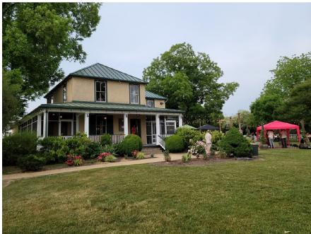

natural_image

Exterior view of a two-story house surrounded by green lawns and trees, with people gathered nearby under a red tent (no signage or text visible)

L O N G A two-story house with a beige exterior and a dark green metal roof stands at the center of the scene, featuring white trim around its windows and porch. A wide front porch with white railings extends across the lower level, and a set of stairs leads up to the entrance. To the right of the house, a bright pink pop-up canopy is set up on a grassy lawn, with a few people standing nearby under it. The house is surrounded by lush green trees and manicured bushes, with some flowering plants in red and pink near the walkway. A paved path curves from the left side toward the house’s front steps, and a trash can sits near the bushes. In the background, more trees and a faint string of lights are visible, suggesting an outdoor gathering or event.

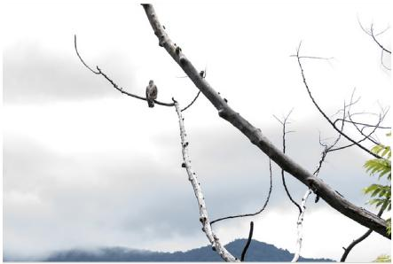

natural_image

Bird perched on a tree branch against a cloudy sky with distant mountains (no text or symbols visible)

S H O RT A bird perches on a bare tree branch against a cloudy sky. Distant mountains are visible in the background.

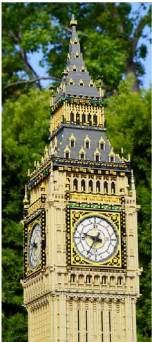

natural_image

Exterior view of a historic clock tower with multiple yellow and gold mounds, surrounded by green foliage (no signage or text visible)

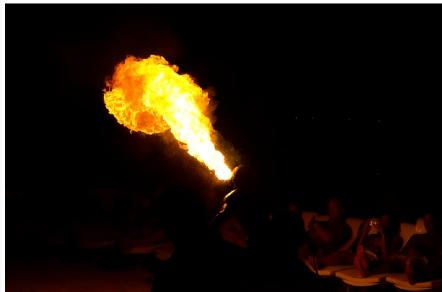

natural_image

A bright, flame-dense object emitting from a dark, illuminated surface, possibly a torch or fire, with silhouettes of people in the background (no visible text or symbols).

S H O RT A person blows a large flame into the dark night while others watch from lounge chairs.

M E D I U M A large LEGO model of Big Ben stands outdoors, surrounded by green trees. Its clock face is detailed with black hands and Roman numerals, set against a yellow and black patterned background. The structure is built with beige and dark gray bricks, featuring a pointed spire at the top.

natural_image

Four ornate bronze beer crowns hanging on marble walls, mounted on wooden grilles (no visible text or symbols)

S H O RT Five ornate beer taps line a marble wall, with one labeled "Lager öl," above a metal drainage tray.

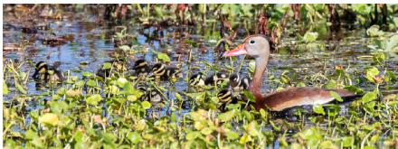

natural_image

A bird standing in a wetland with aquatic plants and greenery (no visible text or symbols)

M E D I U M A mother duck with a brown body and orange beak swims through green vegetation in shallow water. Several small ducklings with black-and-yellow stripes follow closely behind her. The scene is set in a calm, plant-filled pond during daylight.

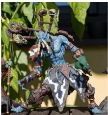

natural_image

Illustration of a fantasy character with dynamic poses and multiple limbs, set against a green leafy background (no text or symbols)

MEDIUM A blueskinned fantasy figure with horns and a skull-adorned staff stands on a wooden surface. Green leaves are visible in the background, suggesting an outdoor setting. The figure wears tribal-style armor and holds a weapon in one hand.

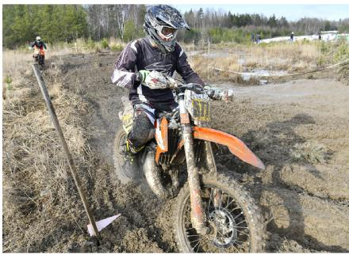

natural_image

Motorcyclist riding an orange dirt bike on a muddy field, with a shovel and another rider nearby (no visible text or symbols)

M E D I U M A motocross rider in full gear rides an orange dirt bike through muddy terrain. Another rider is visible in the background on a similar trail, with trees and open field surrounding the track.

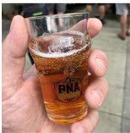

natural_image

Hand holding a glass of amber-colored beer with bubbles, no visible text or symbols on the glass itself.

S H O RT A hand holds a small glass of orange beer with bubbles and a label that reads "BNA Thirteen Portland Oregon."

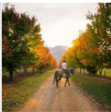

natural_image

Person riding a horse on a dirt path lined with autumn trees and golden sunlight (no text or symbols visible)

S H O RT Two people ride horses down a dirt path lined with autumn trees, with mountains in the distance.

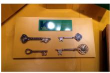

S H O RT Four decorative keys are displayed on a wooden board under a green sign that reads "KEYS TO CITIES."

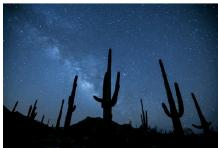

TA G starry sky, cactus, desert, night, silhouettes

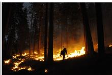

TA G fire, forest, firefighter, smoke, trees

Figure 1: Example image-caption pairs from GPIC. Additional samples are shown in Figure A.1.

<table><tr><td>Property</td><td>ImageNet-1K [21]</td><td>YFCC100M [16]</td><td>OpenImages [22]</td><td>DataComp [15]</td><td>GPIC</td></tr><tr><td>Permissive</td><td></td><td></td><td>√</td><td></td><td>√</td></tr><tr><td>Stable</td><td>√</td><td>√</td><td></td><td></td><td>√</td></tr><tr><td>Large</td><td></td><td>√</td><td></td><td>√</td><td>√</td></tr><tr><td>Accessible</td><td>√</td><td></td><td>√</td><td></td><td>√</td></tr></table>

Table 1: Existing image benchmark datasets fail to satisfy all four criteria. GPIC satisfies all four criteria.

• Permissive: Every image in the dataset should have a known license permitting both research and commercial use, without imposing restrictions on derived artifacts. Moreover, the dataset itself, including metadata and annotations, should be released under a permissive license.   
• Stable: To ensure valid scientific comparisons, the benchmark dataset cannot change over time. Many modern image datasets are distributed as URL indices, which makes comparisons difficult due to link rot [15, 16].   
• Large: The benchmark dataset should be large enough, with rich text captions, to train and evaluate modern visual generative models.   
• Accessible: The dataset must be easily downloadable in a sharded format without requiring crawling infrastructure [17, 15, 18] or memory-intensive resharding [16].

We introduce GPIC, a Giant Permissive Image Corpus designed to satisfy all four criteria for benchmarking visual generative models (Table 1). GPIC comprises 27.97 trillion pixels across 100M training, 200K validation, and 1M test examples captioned with Qwen3-VL-4B [19]. GPIC is centrally hosted on Hugging Face as 8,000 shards, providing stable and accessible infrastructure for large-scale training. To construct GPIC, we develop pipelines for licensed image crawling, large-scale captioning, safety and quality filtering, and deduplication (Section 2). We also revisit the ImageNet-1K evaluation protocol (Figure 9), providing a new benchmarking protocol based on FD-DINOv2 [20] against a held-out set of one million GPIC images. Finally, we provide a reference pixel-space flow matching baseline on GPIC (Section 4). We hope GPIC enables open, accessible, and reproducible research in visual generative modeling.

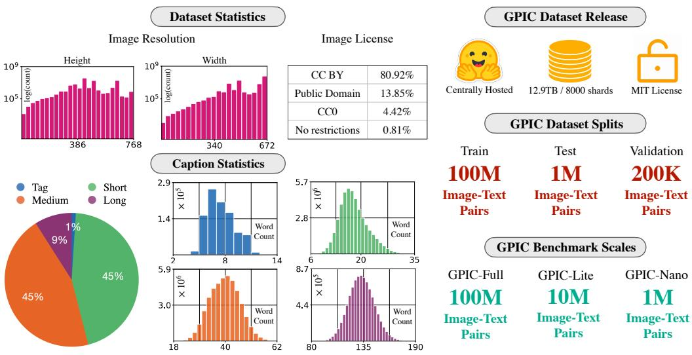  
Figure 2: GPIC dataset statistics. The figure shows GPIC’s image height and width distributions, license composition, caption statistics, release format, dataset splits, and benchmark scales. GPIC images have an average height of 479 pixels and an average width of 587 pixels. GPIC is centrally hosted on Hugging Face as 8,000 shards totaling 12.9TB and released under the MIT license. GPIC-Lite (10M) and GPIC-Nano (1M) provide smaller subsets for development. Best viewed in color.

# 2 Dataset Construction

In this section, we provide an overview of the GPIC construction pipeline (Figure 3).

flowchart

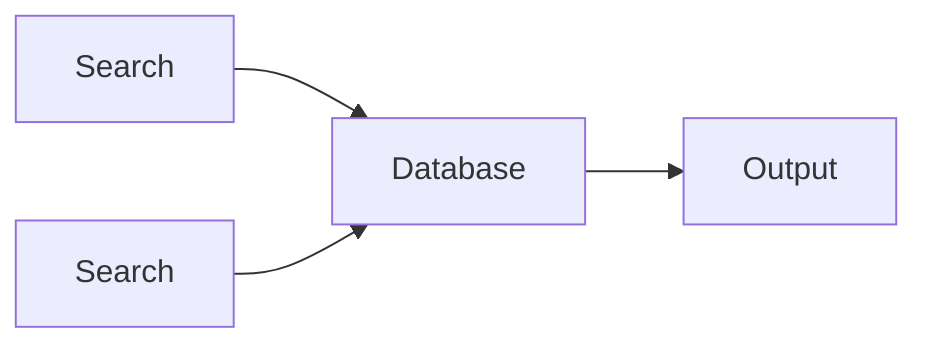

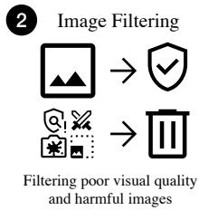

flowchart

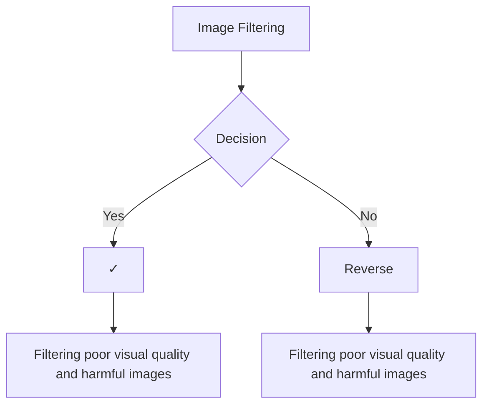

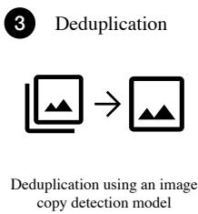

flowchart

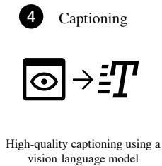

text_image

4 Captioning
High-quality captioning using a vision-language model

Figure 3: Our dataset construction pipeline. We develop a four-stage pipeline to create GPIC. We source permissive images from Flickr and Wikimedia (Stage 1), filter low-quality and harmful images (Stage 2), deduplicate images using similarity scores derived from SSCD [23] copy detection features (Stage 3), and caption into one of tag, short, medium, or long (Stage 4). Qwen-3-VL-4B-Instruct [19] is used for filtering and captioning.

# 2.1 Source Pool and Licensing

We construct GPIC by collecting images under permissive licenses that allow redistribution and commercial use. We source images from Flickr and Wikimedia, restricting the source pool to CC BY, CC0, Public Domain, and No-Known-Restrictions categories. This licensing criterion ensures that GPIC can be used by both academic and industrial researchers without restricting the release or downstream use of derived artifacts. For each retrieved image, we retain provenance and attribution metadata, including a dataset-generated key, image height and width, retrieval timestamp, license name, license URL, and attribution string. The final dataset excludes retrieved image URLs, avoiding release of a large-scale URL index while preserving attribution and license information. The initial source pool contains 110,569,761 images, with 87.7% sourced from Flickr and 12.3% from Wikimedia.

# 2.2 Image Filtering

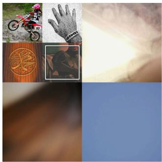

natural_image

Collage of four nature and symbolic images: motorcycle, hand, wood carving, and textured fabric (no text or symbols)

Figure 4: Example images that are filtered due to low resolution and poor visual quality.

We apply a sequence of image-level filters to remove images unsuitable for training or benchmarking. First, we remove images with extreme resolutions or aspect ratios. Together, these filters remove approximately 0.01% of the source pool. We also discard images whose longest side is smaller than 256 pixels. Next, we apply VLM-based quality filtering using Qwen3-VL-4B. This filter removes images with poor visual quality or limited semantic content, including near-blank images, severe blur, underexposure, and overexposure. This stage removes approximately 0.3% of the source pool. We show examples in Figures 4 and C.1. Finally, we apply a conservative safety filter using Qwen3-VL-4B to remove images flagged as unsafe. This stage removes approximately 0.35% of the source pool.

# 2.3 Deduplication

GPIC is built from Flickr and Wikimedia, where duplicated visual content naturally arises from burst photography, reposts, and edited variants of memes and viral images. Since permissively licensed images are costly to obtain at scale, we adapt conservative duplicate removal: removing clear duplicates and near-duplicates while retaining visually related but distinct images. Many duplicates are not pixel-identical, so we perform deduplication using copy-detection features. Specifically, we extract SSCD features [23] for all images and use FAISS for approximate nearest-neighbor search. We first manually inspect nearest-neighbor pairs across SSCD similarity ranges to calibrate removal thresholds. This inspection shows that similarity above 0.90 often indicates substantial shared visual content, but still includes distinct images with changes in pose, viewpoint, or scene composition. Even pairs between 0.95 and 0.9625 can remain visually distinct, so we avoid removing images from individual pairs unless their similarity exceeds a more conservative threshold (Figure 5).

[0.75, 0.85)   
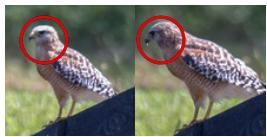

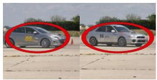  
[0.9, 0.95)

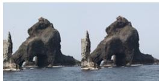

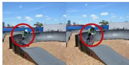  
[0.9625, 0.999)

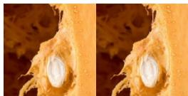

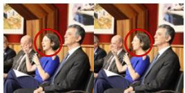

[0.85, 0.9)   
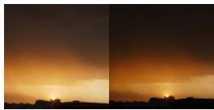

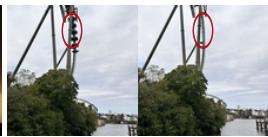  
[0.95, 0.9625)

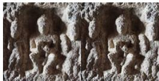

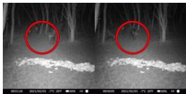  
[0.999, 1]

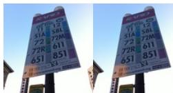

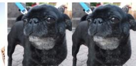  
Figure 5: Qualitative examples of similar image pairs across SSCD similarity ranges. Each group shows nearest-neighbor image pairs within the indicated SSCD similarity interval. At lower thresholds, similar pairs often contain visually related but distinct images, including changes in pose, viewpoint, or object identity. At higher thresholds, pairs increasingly correspond to near-duplicates, but visible differences can still remain (highlighted in red). Together with the high cost of obtaining permissively licensed images at scale, these examples motivate conservative duplicate removal rather than aggressive thresholding. Best viewed in color.

Image collision models. Full-corpus deduplication at 110M-image scale is expensive, and threshold

choice strongly affects how many images are removed. We therefore build predictive collision models on smaller subsets before running the final full-corpus pass. We run SSCDbased deduplication on six subsets ranging from 108K to 3.4M images, across thresholds $\theta \in \mathsf { \Gamma }$ $\{ 0 . 7 5 , 0 . 8 0 , 0 . 8 5 , 0 . \bar { 9 0 } , 0 . 9 5 \}$ . For each threshold, we connect nearest-neighbor pairs whose SSCD cosine similarity exceeds $\theta ,$ , count the number of images that would be removed by retaining the highest-resolution image in each connected component, and fit a power law $D ( N ) = A N ^ { \beta }$ to predict removals at full scale. The resulting curves are shown in Figure 6. These models show that lower thresholds would remove too many images at full scale, while $\theta = 0 . 9 5$ provides a conservative operating point. $\mathrm { { A t } \ \theta = 0 . 9 5 }$ , the model estimates $9 . 6 2 \times \bar { 1 0 } ^ { 6 }$ removed images, leaving approximately $1 . 0 1 \times 1 0 ^ { 8 }$ images for the final release pipeline.

Full-corpus deduplication. Rather than applying a single threshold of 0.95 to remove images from all similar pairs, we use a more conservative two-tier

rule calibrated by manual inspection. We first construct a candidate similarity graph by connecting image pairs with SSCD similarity above 0.90. Within this graph, we apply two removal rules. First, for pairs with similarity above 0.9625, we remove the lower-resolution image, targeting high-confidence duplicate pairs. Second, for connected components containing at least five images, we keep only the highest-resolution image in the component, targeting repeated near-copy clusters. This rule prioritizes avoiding false removals of distinct images while still removing high-confidence duplicates and large repeated clusters. After deduplication, 101.3M images remain. We show examples in Figure D.1. We also verify that no exact duplicates remain by computing SHA-256 hashes over image file bytes.

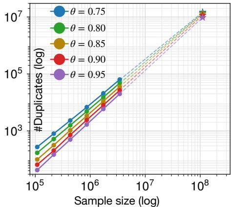

line

| Sample size (log) | θ = 0.75 | θ = 0.80 | θ = 0.85 | θ = 0.90 | θ = 0.95 |
| ----------------- | -------- | -------- | -------- | -------- | -------- |
| 10^5              | ~500     | ~400     | ~300     | ~200     | ~100     |
| 10^6              | ~1000    | ~800     | ~600     | ~400     | ~200     |
| 10^7              | ~10000   | ~8000    | ~6000    | ~4000    | ~2000    |
| 10^8              | ~1000000 | ~80000   | ~60000   | ~40000   | ~20000   |

Figure 6: Image collision models. SSCDbased duplicate removals follow a power-law trend across subset sizes and similarity thresholds. Extrapolating to the 110M-image source pool shows that $\bar { \theta \ : } = \ : 0 . 9 5$ is estimated to remove $9 . 6 2 \times 1 0 ^ { 6 }$ images, leaving approximately $1 . 0 1 \times 1 0 ^ { 8 }$ images.

# 2.4 Captioning GPIC

GPIC uses high-quality synthetic captions generated by a vision-language model rather than source metadata or alt text, which are often unavailable, noisy, or weakly aligned with image content.

Caption formats. There are many valid ways to describe an image in words, ranging from unordered keywords to detailed scene descriptions. To capture this variation, GPIC uses four caption formats: tag, short, medium, and long. Tag captions are unordered keyword lists, while short, medium, and long captions provide increasingly detailed natural-language descriptions of an image. Examples are shown in Figure 2. In the final corpus, caption types are assigned with proportions 1% tag, 45% short, 45% medium, and 9% long.

Captioning model selection. Captioning 100M images requires a model that is accurate, fast, and practical to run at scale. Closed-source VLMs are prohibitively expensive for full-corpus captioning, so we focus on open-source models. We consider Qwen3-VL models [19] because they are among the strongest open-source models for image understanding, are available at multiple scales, and support efficient inference through standard serving frameworks such as vLLM [24] and SGLang [25]. Existing VLM benchmarks do not directly measure the captioning capability required for GPIC, where captions must be generated at multiple levels of detail. We therefore construct a microbenchmark of 1,520 GPIC images, covering 720 short, 640 medium, and 160 long captions. For each image, human annotators refine initial VLM-generated captions to produce reference captions.

We evaluate Qwen3-VL-Instruct models at 2B, 4B, 8B, and 30B-A3B (sparse MoE) on this benchmark. All captions are generated from the full image without cropping. We score captions along five axes: overall summary quality, counting accuracy, spatial understanding, attribute binding, and OCR. Each axis is scored on a 0–2 scale using an LLM-as-a-judge pipeline, and we also measure captioning throughput. As shown in Figure 7, Qwen3-VL-4B-Instruct provides the best quality-throughput tradeoff: • strong overall summary quality compared to the largest model (1.68 vs. 1.73 for 30B-A3B); • best spatial understanding and attribute binding scores (1.60 and 1.55); • high short- and medium-caption throughput (56.10 and 49.31 images/sec). Since short and medium captions make up 90% of GPIC, throughput on these caption types is critical for full-corpus captioning. Using Qwen3-VL-4B-Instruct, captioning the full corpus required approximately 1,500 H100 GPU-hours.

Prompts and microbenchmark details. For reproducibility, we provide the tag, short, medium, and long captioning prompts in Figures F.1, F.2, F.3, and F.4, respectively. We provide the LLM-as-a-judge prompts in Figure F.5 and additional microbenchmark details in Appendix E.

# 2.5 Split Construction and Release

Dataset splits. We partition GPIC into 100M training images, 200K validation images, and 1M test images. Each split preserves the source distribution between Flickr and Wikimedia and the global caption-type distribution of 1% tag, 45% short, 45% medium, and 9% long. This keeps the validation and test splits compositionally aligned with the training split.

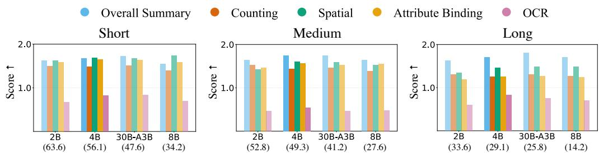  
Figure 7: Captioning model selection. We evaluate Qwen3-VL-Instruct models on the GPIC captioning microbenchmark across five caption-quality criteria and throughput. Throughput in images per second (1xH100) is shown in parentheses below each model. Qwen3-VL-4B-Instruct provides the best quality-throughput tradeoff: it matches or approaches the best quality scores across short, medium, and long captions while maintaining higher throughput than larger models.

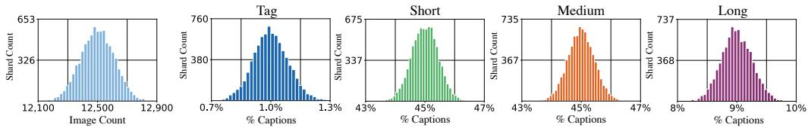  
Figure 8: GPIC shard statistics. We show the per-shard distribution of image counts and captiontype percentages for GPIC-Full. GPIC-Full is shuffled into 8000 approximately balanced shards, each containing ≈ 12,500 images and preserving the target caption mixture of 1% tag, 45% short, 45% medium, and 9% long captions.

Benchmark scales. We divide the GPIC train set into three nested tiers: GPIC-Nano with 1M images, GPIC-Lite with 10M images, and GPIC-Full with 100M images. Nano and Lite are intended for faster iteration and smaller-scale development. All three tiers preserve the source and caption-type distributions of GPIC-Full. The first 80, 800, and 8000 shards correspond to GPIC-Nano, GPIC-Lite, and GPIC-Full, respectively, so switching between tiers only requires selecting the corresponding shard range.

Packaging and release. We package GPIC as tar shards containing images, captions, and metadata, and release the dataset on Hugging Face with documentation. To support large-scale streaming training, GPIC-Full is shuffled and organized into 8,000 balanced shards, each containing approximately 12,500 images. As shown in Figure 8, the shards are balanced in both image count and caption-type composition. Each shard contains approximately 12,500 images and closely follows the target caption mixture of 1% tag, 45% short, 45% medium, and 9% long captions. This makes each shard compositionally representative of the full corpus and avoids shard-level bias during training.

# 3 Benchmarking Protocol

Rigorous evaluation protocols are imperative to drive progress in visual generation. A good evaluator should distinguish real and generated images while remaining aligned with human perception. GPIC is designed to provide a more human-aligned and less saturated evaluation setting for modern visual generative models.

Metrics. On GPIC, we evaluate generated images using metrics computed over DINOv2 features. Our primary metric is FD-DINOv2 [20], which uses the same Fréchet Distance formula as FID [26] but replaces Inception features [27] with DINOv2 features. We also report Precision and Density, which measure fidelity, and Recall and Coverage, which measure diversity [28–30]. We recommend DINOv2 features because ImageNet-1K FID is saturated, while FD-DINOv2 remains informative for current models. Figure 9 illustrates this difference. Prior work also shows that FD-DINOv2 correlates better with human judgments than FID [20].

Evaluation protocol. To evaluate a model on GPIC, users generate 50K images using the fixed set of 50K test captions that we provide, sampled randomly from the 1M GPIC test set. The generated samples are compared against reference statistics computed from the 1M GPIC test set. We release these precomputed test statistics on Hugging Face. We also provide gpic-eval, a PyTorch evaluation suite that computes FD-DINOv2, Precision, Recall, Density, Coverage, and Maximum Mean Discrepancy as a non-parametric alternative to FD. Additional details are provided in Appendix B.

Held-out test statistics. GPIC also differs from standard ImageNet-1K evaluation in how reference statistics are computed. Standard ImageNet-1K FID compares generated samples against training-set statistics. GPIC instead compares generated samples against statistics from a held-out 1M-image test set. This is better scientific practice because comparing against train-set statistics can fail to detect memorization or overfitting.

Oracle References. To provide reference points for interpreting generative model performance on GPIC, we report real-vs-real distances between GPIC subsets and the 1M GPIC test set. We compute metrics for Test-50K, GPIC-Val, GPIC-Nano, GPIC-Lite, and GPIC-Full against Test-1M in Table 2. These oracle references quantify the distance between real GPIC subsets under the GPIC evaluation protocol. In particular, Test-50K vs. Test-1M provides a reference point for monitoring benchmark saturation as models trained on GPIC improve.

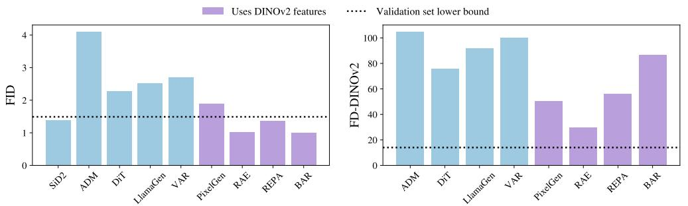  
Figure 9: Comparison of FID and FD-DINOv2 on ImageNet-1K. ImageNet-1K FID is saturated: several models achieve lower FID than the distance between 50K held-out real ImageNet-1K images and the ImageNet-1K training set. By contrast, FD-DINOv2 remains unsaturated: all evaluated models have higher FD-DINOv2 than the corresponding held-out real-image distance, including models trained with DINOv2 features. Dotted lines indicate the distance between 50K held-out real images and the ImageNet-1K training set. SiD2 [12] is omitted from the FD-DINOv2 comparison because checkpoints or generated samples are not available.

GPIC Evaluation Protocol compliance. Use of DINOv2 features, FD-DINOv2 related loss functions, or other objectives that explicitly optimize the primary GPIC evaluation representation is strongly discouraged and must be disclosed. Such use constitutes a material deviation from the standard GPIC protocol, since:

• DINOv2 may have been trained on images overlapping with the GPIC test set.   
• DINOv2-based objectives directly train models to match the same representation space used by the primary GPIC metric.

Therefore, improvements in FD-DINOv2 under this setting are difficult to interpret as improvements in generative modeling capability rather than metric-specific optimization. Results that use DINOv2 or FD-DINOv2 aligned training objectives should be treated as non-standard GPIC results.

We also strongly encourage transparent reporting on the use of auxiliary networks trained on other datasets, especially larger foundation models trained on significantly more data, such as DINOv3 [31] or SigLIP [32]. Using large auxiliary models, which see considerably more data and training FLOPs, is an unfair advantage versus models trained exclusively on the GPIC benchmark dataset, and apples-to-apples comparisons are preferred whenever possible.

Other deviations from the protocol should also be reported to support interpretability and comparison across methods. These include, but are not limited to, prompt upsampling or rewriting of the provided 50K evaluation captions, and use of different captioning models or text embedding models.

<table><tr><td>GPIC Subset</td><td>FD ↓</td><td>Precision ↑</td><td>Recall ↑</td><td>Density ↑</td><td>Coverage ↑</td></tr><tr><td>Full</td><td>1.19</td><td>0.947</td><td>0.950</td><td>1.000</td><td>0.972</td></tr><tr><td>Lite</td><td>1.25</td><td>0.951</td><td>0.947</td><td>1.010</td><td>0.973</td></tr><tr><td>Nano</td><td>1.60</td><td>0.946</td><td>0.946</td><td>1.002</td><td>0.968</td></tr><tr><td>Val</td><td>2.37</td><td>0.948</td><td>0.949</td><td>0.993</td><td>0.966</td></tr><tr><td>Test-50K</td><td>7.44</td><td>0.949</td><td>0.953</td><td>0.997</td><td>0.967</td></tr></table>

Table 2: Oracle reference metrics over DINOv2 features for GPIC subsets evaluated against 1M GPIC Test set. These real-vs-real values provide reference points for interpreting generative model performance on GPIC. Metrics over Inception-v3 representations are provided in Table B.1. Density is not upper bounded by 1.0, so values above 1.0 are valid.

# 4 Experiments

We train a simple reference baseline on GPIC-Full to provide a point of comparison for future work. Our goal is not to optimize model performance, but to establish a reproducible baseline for training and evaluation on GPIC. We use JiT [33], a pixel-space flow matching model with a Transformer backbone. JiT is a natural baseline because it uses single-stage training, does not require tokenizer pretraining, and does not rely on auxiliary losses. We use the JiT-T2I (PixGen-XXL/16 1.1B) architecture proposed by Ma et al. [34], which uses Qwen3-1.7B [35] for text conditioning.

Experiment Setup. We train JiT-T2I on GPIC-Full for one epoch at 256 × 256 resolution. The global batch size is 256. We use AdamW with learning rate 10−4, betas 0.9 and 0.95, and no weight decay. We use a constant learning-rate schedule with 0.1% warmup. During training, images are randomly cropped by sampling a crop scale between 0.8 and 1.0 of the original image, followed by a random square crop resized to 256 × 256. The maximum text length is 300 tokens. Training took approximately 40 hours on a single 8×H100 node2. For evaluation, we follow the GPIC benchmarking protocol and generate images for the released 50K test captions. We sample with Euler sampling using 50 steps and evaluate classifier-free guidance (CFG) scales 1.75, 4.0, and 6.25.

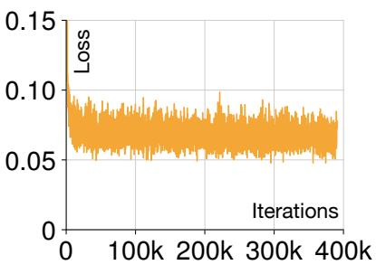

line

| Iterations | Loss  |
| ---------- | ----- |
| 0          | 0.10  |
| 100k       | 0.07  |
| 200k       | 0.08  |
| 300k       | 0.07  |
| 400k       | 0.06  |

Figure 10: Pretraining loss for the JiT-T2I reference baseline [34] on GPIC-Full. We show training loss vs. iterations. The model is trained for one epoch on GPIC-Full (100M text-image pairs).

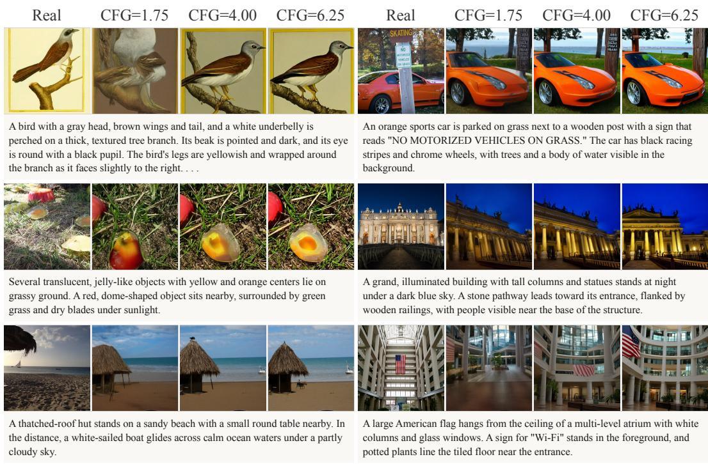  
A bird with a gray head, brown wings and tail, and a white underbelly is perched on a thick, textured tree branch. Its beak is pointed and dark, and its eye is round with a black pupil. The bird's legs are yellowish and wrapped around the branch as it faces slightly to the right. . . .   
An orange sports car is parked on grass next to a wooden post with a sign that reads "NO MOTORIZED VEHICLES ON GRASS." The car has black racing stripes and chrome wheels, with trees and a body of water visible in the background.   
Several translucent, jelly-like objects with yellow and orange centers lie on grassy ground. A red, dome-shaped object sits nearby, surrounded by green grass and dry blades under sunlight.   
A grand, illuminated building with tall columns and statues stands at night under a dark blue sky. A stone pathway leads toward its entrance, flanked by wooden railings, with people visible near the base of the structure.   
A thatched-roof hut stands on a sandy beach with a small round table nearby. In the distance, a white-sailed boat glides across calm ocean waters under a partly cloudy sky.   
A large American flag hangs from the ceiling of a multi-level atrium with white columns and glass windows. A sign for "Wi-Fi" stands in the foreground, and potted plants line the tiled floor near the entrance.

Figure 11: JiT-T2I samples after training on GPIC-Full for one epoch. We show generated images for prompts in the held-out Test-50K subset. Each group contains a real test image, the corresponding text prompt, and JiT-T2I generations sampled with classifier-free guidance scales $\mathrm { C F G } \stackrel { - } { = } 1 . 7 5 , 4 . 0 0$ , and 6.25, respectively. The examples span diverse object-centric and scenelevel prompts, including animals, vehicles, natural scenes, architecture, and indoor environments. Quantitative results for each CFG scale are reported in Table 3.

Results. We report quantitative results in Table 3, the pretraining loss curve in Figure 10, and qualitative samples in Figure 11. The baseline achieves its best FD of 76.25 at CFG 6.25. Increasing CFG improves FD, recall, and coverage in this baseline. The best CFG value under FD-DINOv2 on GPIC is higher than values commonly used for class-conditional ImageNet-1K evaluation with FID. We release the model as a reference baseline for future comparisons on GPIC.

<table><tr><td>CFG</td><td>FD ↓</td><td>Precision ↑</td><td>Recall ↑</td><td>Density ↑</td><td>Coverage ↑</td></tr><tr><td>1.75</td><td>204.01</td><td>0.917</td><td>0.530</td><td>1.034</td><td>0.806</td></tr><tr><td>4.00</td><td>87.80</td><td>0.933</td><td>0.765</td><td>1.012</td><td>0.906</td></tr><tr><td>6.25</td><td>76.25</td><td>0.942</td><td>0.792</td><td>1.014</td><td>0.908</td></tr></table>

Table 3: JiT-T2I baseline results on GPIC-Full after training for one epoch. We report FD, Precision, Recall, Density, and Coverage for three classifier-free guidance scales. We use 50-step Euler sampling for all generations. All metrics are computed against the 1M GPIC test set.

# 5 Conclusion

GPIC (Giant Permissive Image Corpus) is a large, permissive benchmark dataset for visual generative modeling. In this paper, we described the design choices needed to make GPIC permissive, stable, large, and accessible, including its construction pipeline, release format, evaluation protocol, compliance guidelines, and reference baseline. As visual generative models continue to evolve, benchmark datasets and metrics must evolve with them. Beyond text-to-image generation, GPIC provides a large-scale, high-quality image-text resource for broader multimodal research. We hope GPIC supports open, accessible, and reproducible research on large-scale visual generative modeling. GPIC is available at Hugging Face, and the evaluation toolkit and PyTorch code are available at gpic.stanford.edu.

Broader Impact and Limitations. GPIC is a fully permissive 100M-image dataset for visual generative modeling, supporting transparent and legally verifiable benchmarking and model training. At the same time, GPIC carries societal risks shared with prior large-scale image corpora [16, 17, 15], including potential misuse for harmful generation, memorization of training content, and amplification of source-platform biases. We take several steps to mitigate these risks. Every image in GPIC has a clear legal basis for redistribution and use, and license names, license URLs, and attribution strings are retained as metadata for every sample. Captions are generated by Qwen3-VL-4B [19] rather than scraped from alt text, avoiding direct release of source text that may contain toxic or personally identifying language. We also release GPIC as frozen tar shards rather than a URL index, eliminating silent dataset drift, exposure to URL-level data poisoning, and the need to re-scrape source images outside our filtering pipeline. Finally, despite our deduplication efforts, some near-duplicates may remain in GPIC, although their prevalence is estimated to be small.

# Acknowledgments

We thank Radical Numerics and World Labs for providing compute for this project. We thank Willie Neiswanger, Yue Zhao, Armin W. Thomas, Garyk Brixi, Manling Li, Tristan Thrush, Bailey Trang, and Aryaman Arora for their feedback on the manuscript. We thank Agrim Gupta for valuable discussions. We thank members of the Stanford Vision Lab and the CogAI group for their feedback.

# References

[1] Team Wan, Ang Wang, Baole Ai, Bin Wen, Chaojie Mao, Chen-Wei Xie, Di Chen, Feiwu Yu, Haiming Zhao, Jianxiao Yang, et al. Wan: Open and advanced large-scale video generative models. arXiv preprint arXiv:2503.20314, 2025. 1   
[2] Robin Rombach, Andreas Blattmann, Dominik Lorenz, Patrick Esser, and Björn Ommer. Highresolution image synthesis with latent diffusion models. In Proceedings of the IEEE/CVF conference on computer vision and pattern recognition, pages 10684–10695, 2022.   
[3] Chitwan Saharia, William Chan, Saurabh Saxena, Lala Li, Jay Whang, Emily L Denton, Kamyar Ghasemipour, Raphael Gontijo Lopes, Burcu Karagol Ayan, Tim Salimans, et al. Photorealistic text-to-image diffusion models with deep language understanding. Advances in neural information processing systems, 35:36479–36494, 2022. 1   
[4] Zekai Zhang, Deqing Li, Kuan Cao, Yujia Wu, Chenfei Wu, Yu Wu, Liang Peng, Hao Meng, Jiahao Li, Jie Zhang, et al. Qwen-image-vae-2.0 technical report. arXiv preprint arXiv:2605.13565, 2026. 1   
[5] Tim Brooks, Bill Peebles, Connor Holmes, Will DePue, Yufei Guo, Li Jing, David Schnurr, Joe Taylor, Troy Luhman, Eric Luhman, Clarence Ng, Ricky Wang, and Aditya Ramesh. Video generation models as world simulators. 2024. URL https://openai.com/research/ video-generation-models-as-world-simulators. 1   
[6] Google. Nano banana 2: Google’s latest ai image generation model. https://blog.google/ innovation-and-ai/technology/ai/nano-banana-2/, February 2026. Accessed: 2026- 05-24. 1   
[7] Andrew Brock, Jeff Donahue, and Karen Simonyan. Large scale GAN training for high fidelity natural image synthesis. CoRR, abs/1809.11096, 2018. URL http://arxiv.org/abs/1809. 11096. 1   
[8] Aäron van den Oord, Oriol Vinyals, and Koray Kavukcuoglu. Neural discrete representation learning. CoRR, abs/1711.00937, 2017. URL http://arxiv.org/abs/1711.00937. 1   
[9] Patrick Esser, Robin Rombach, and Björn Ommer. Taming transformers for high-resolution image synthesis, 2021. URL https://arxiv.org/abs/2012.09841. 1   
[10] William Peebles and Saining Xie. Scalable diffusion models with transformers, 2023. URL https://arxiv.org/abs/2212.09748. 1   
[11] Boyang Zheng, Nanye Ma, Shengbang Tong, and Saining Xie. Diffusion transformers with representation autoencoders, 2025. 1   
[12] Emiel Hoogeboom, Thomas Mensink, Jonathan Heek, Kay Lamerigts, Ruiqi Gao, and Tim Salimans. Simpler diffusion (sid2): 1.5 fid on imagenet512 with pixel-space diffusion, 2025. URL https://arxiv.org/abs/2410.19324. 8   
[13] Jingfeng Yao, Bin Yang, and Xinggang Wang. Reconstruction vs. generation: Taming optimization dilemma in latent diffusion models, 2025. URL https://arxiv.org/abs/2501.01423.   
[14] Keyu Tian, Yi Jiang, Zehuan Yuan, Bingyue Peng, and Liwei Wang. Visual autoregressive modeling: Scalable image generation via next-scale prediction, 2024. URL https://arxiv. org/abs/2404.02905. 1   
[15] Samir Yitzhak Gadre, Gabriel Ilharco, Alex Fang, Jonathan Hayase, Georgios Smyrnis, Thao Nguyen, Ryan Marten, Mitchell Wortsman, Dhruba Ghosh, Jieyu Zhang, Eyal Orgad, Rahim Entezari, Giannis Daras, Sarah Pratt, Vivek Ramanujan, Yonatan Bitton, Kalyani Marathe, Stephen Mussmann, Richard Vencu, Mehdi Cherti, Ranjay Krishna, Pang Wei Koh, Olga Saukh, Alexander Ratner, Shuran Song, Hannaneh Hajishirzi, Ali Farhadi, Romain Beaumont, Sewoong Oh, Alex Dimakis, Jenia Jitsev, Yair Carmon, Vaishaal Shankar, and Ludwig Schmidt. Datacomp: In search of the next generation of multimodal datasets, 2023. URL https: //arxiv.org/abs/2304.14108. 3, 10

[16] Bart Thomee, David A. Shamma, Gerald Friedland, Benjamin Elizalde, Karl Ni, Douglas Poland, Damian Borth, and Li-Jia Li. Yfcc100m: the new data in multimedia research. Communications of the ACM, 59(2):64–73, January 2016. ISSN 1557-7317. doi: 10.1145/2812802. URL http://dx.doi.org/10.1145/2812802. 3, 10   
[17] Christoph Schuhmann, Romain Beaumont, Richard Vencu, Cade Gordon, Ross Wightman, Mehdi Cherti, Theo Coombes, Aarush Katta, Clayton Mullis, Mitchell Wortsman, Patrick Schramowski, Srivatsa Kundurthy, Katherine Crowson, Ludwig Schmidt, Robert Kaczmarczyk, and Jenia Jitsev. Laion-5b: an open large-scale dataset for training next generation image-text models. In Proceedings of the 36th International Conference on Neural Information Processing Systems, NIPS ’22, Red Hook, NY, USA, 2022. Curran Associates Inc. ISBN 9781713871088. 3, 10   
[18] Romain Beaumont. img2dataset: Easily turn large sets of image urls to an image dataset. https://github.com/rom1504/img2dataset, 2021. 3   
[19] Shuai Bai, Yuxuan Cai, Ruizhe Chen, Keqin Chen, Xionghui Chen, Zesen Cheng, Lianghao Deng, Wei Ding, Chang Gao, Chunjiang Ge, Wenbin Ge, Zhifang Guo, Qidong Huang, Jie Huang, Fei Huang, Binyuan Hui, Shutong Jiang, Zhaohai Li, Mingsheng Li, Mei Li, Kaixin Li, Zicheng Lin, Junyang Lin, Xuejing Liu, Jiawei Liu, Chenglong Liu, Yang Liu, Dayiheng Liu, Shixuan Liu, Dunjie Lu, Ruilin Luo, Chenxu Lv, Rui Men, Lingchen Meng, Xuancheng Ren, Xingzhang Ren, Sibo Song, Yuchong Sun, Jun Tang, Jianhong Tu, Jianqiang Wan, Peng Wang, Pengfei Wang, Qiuyue Wang, Yuxuan Wang, Tianbao Xie, Yiheng Xu, Haiyang Xu, Jin Xu, Zhibo Yang, Mingkun Yang, Jianxin Yang, An Yang, Bowen Yu, Fei Zhang, Hang Zhang, Xi Zhang, Bo Zheng, Humen Zhong, Jingren Zhou, Fan Zhou, Jing Zhou, Yuanzhi Zhu, and Ke Zhu. Qwen3-vl technical report. arXiv preprint arXiv:2511.21631, 2025. doi: 10.48550/arXiv.2511.21631. URL https://arxiv.org/abs/2511.21631. 3, 4, 6, 10   
[20] George Stein, Jesse Cresswell, Rasa Hosseinzadeh, Yi Sui, Brendan Ross, Valentin Villecroze, Zhaoyan Liu, Anthony L Caterini, Eric Taylor, and Gabriel Loaiza-Ganem. Exposing flaws of generative model evaluation metrics and their unfair treatment of diffusion models. In Advances in Neural Information Processing Systems, volume 36, 2023. 3, 7, 16, 17   
[21] Jia Deng, Wei Dong, Richard Socher, Li-Jia Li, Kai Li, and Li Fei-Fei. Imagenet: A largescale hierarchical image database. In 2009 IEEE conference on computer vision and pattern recognition, pages 248–255. IEEE, 2009. 3   
[22] Alina Kuznetsova, Hassan Rom, Neil Alldrin, Jasper Uijlings, Ivan Krasin, Jordi Pont-Tuset, Shahab Kamali, Stefan Popov, Matteo Malloci, Alexander Kolesnikov, Tom Duerig, and Vittorio Ferrari. The open images dataset v4: Unified image classification, object detection, and visual relationship detection at scale. International Journal of Computer Vision, 128 (7):1956–1981, March 2020. ISSN 1573-1405. doi: 10.1007/s11263-020-01316-z. URL http://dx.doi.org/10.1007/s11263-020-01316-z. 3   
[23] Ed Pizzi, Sreya Dutta Roy, Sugosh Nagavara Ravindra, Priya Goyal, and Matthijs Douze. A selfsupervised descriptor for image copy detection. In Proceedings of the IEEE/CVF Conference on Computer Vision and Pattern Recognition, pages 14532–14542, 2022. 4   
[24] Woosuk Kwon, Zhuohan Li, Siyuan Zhuang, Ying Sheng, Lianmin Zheng, Cody Hao Yu, Joseph Gonzalez, Hao Zhang, and Ion Stoica. Efficient memory management for large language model serving with pagedattention. In Proceedings of the 29th symposium on operating systems principles, pages 611–626, 2023. 6   
[25] Lianmin Zheng, Liangsheng Yin, Zhiqiang Xie, Chuyue Sun, Jeff Huang, Cody H Yu, Shiyi Cao, Christos Kozyrakis, Ion Stoica, Joseph E Gonzalez, et al. Sglang: Efficient execution of structured language model programs. Advances in neural information processing systems, 37: 62557–62583, 2024. 6   
[26] Martin Heusel, Hubert Ramsauer, Thomas Unterthiner, Bernhard Nessler, and Sepp Hochreiter. Gans trained by a two time-scale update rule converge to a local nash equilibrium, 2018. URL https://arxiv.org/abs/1706.08500. 7

[27] Christian Szegedy, Wei Liu, Yangqing Jia, Pierre Sermanet, Scott Reed, Dragomir Anguelov, Dumitru Erhan, Vincent Vanhoucke, and Andrew Rabinovich. Going deeper with convolutions. In Proceedings of the IEEE Conference on Computer Vision and Pattern Recognition (CVPR), pages 1–9, 2015. URL https://arxiv.org/abs/1409.4842. 7   
[28] Tuomas Kynkäänniemi, Tero Karras, Samuli Laine, Jaakko Lehtinen, and Timo Aila. Improved precision and recall metric for assessing generative models. In Neural Information Processing Systems, 2019. URL https://api.semanticscholar.org/CorpusID:118648975. 7   
[29] Mehdi S. M. Sajjadi, Olivier Bachem, Mario Luciˇ c, Olivier Bousquet, and Sylvain Gelly. ´ Assessing generative models via precision and recall. arXiv, abs/1806.00035, 2018. URL https://api.semanticscholar.org/CorpusID:44104089.   
[30] Muhammad Ferjad Naeem, Seong Joon Oh, Youngjung Uh, Yunjey Choi, and Jaejun Yoo. Reliable fidelity and diversity metrics for generative models. In International Conference on Machine Learning, 2020. URL https://api.semanticscholar.org/CorpusID:211259260. 7   
[31] Oriane Siméoni, Huy V. Vo, Maximilian Seitzer, Federico Baldassarre, Maxime Oquab, Cijo Jose, Vasil Khalidov, Marc Szafraniec, Seungeun Yi, Michaël Ramamonjisoa, Francisco Massa, Daniel Haziza, Luca Wehrstedt, Jianyuan Wang, Timothée Darcet, Théo Moutakanni, Leonel Sentana, Claire Roberts, Andrea Vedaldi, Jamie Tolan, John Brandt, Camille Couprie, Julien Mairal, Hervé Jégou, Patrick Labatut, and Piotr Bojanowski. Dinov3, 2025. URL https: //arxiv.org/abs/2508.10104. 8   
[32] Xiaohua Zhai, Basil Mustafa, Alexander Kolesnikov, and Lucas Beyer. Sigmoid loss for language image pre-training, 2023. URL https://arxiv.org/abs/2303.15343. 8   
[33] Tianhong Li and Kaiming He. Back to basics: Let denoising generative models denoise. arXiv preprint arXiv:2511.13720, 2025. 9   
[34] Zehong Ma, Ruihan Xu, and Shiliang Zhang. Pixelgen: Pixel diffusion beats latent diffusion with perceptual loss. arXiv preprint arXiv:2602.02493, 2026. 9   
[35] An Yang, Anfeng Li, Baosong Yang, Beichen Zhang, Binyuan Hui, Bo Zheng, Bowen Yu, Chang Gao, Chengen Huang, Chenxu Lv, et al. Qwen3 technical report, 2025. URL https: //arxiv.org/abs/2505.09388. 9   
[36] Alex Clark. Pillow (pil fork) documentation, 2015. URL https://buildmedia. readthedocs.org/media/pdf/pillow/latest/pillow.pdf. 16   
[37] Gaurav Parmar, Richard Zhang, and Jun-Yan Zhu. On aliased resizing and surprising subtleties in GAN evaluation. In Proceedings of the Conference on Computer Vision and Pattern Recognition (CVPR). IEEE, 2022. 16

# Appendix

# Contents

A Additional Image-Text examples from GPIC 14   
B Evaluation 16

B.1 Construction of Imagenet-256 and GPIC-256 16   
B.2 Additional Oracle Reference Metrics 16   
B.3 Effect of DINOv2 Backbone Size and Register Tokens on FD . 16

C Image Filtering 18   
D Deduplication 18   
E Microbenchmark 19   
F Prompts 20

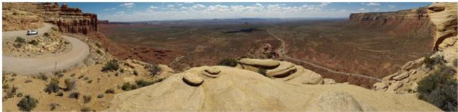

natural_image

Panoramic view of a desert canyon landscape with rock formations and sparse vegetation under a partly cloudy sky (no text or symbols visible)

L ONG A winding road cuts through a vast desert landscape with reddish-brown rock formations and sparse green shrubs under a bright blue sky with scattered white clouds. On the left side of the road, a white vehicle is parked near the edge of a steep cli . The road curves downward into the distance, where another section of the road can be seen winding along the base of the canyon walls. In the foreground, large, smooth, tan-colored rock slabs are prominent, with some small bushes growing around them. The background features expansive at terrain stretching toward distant mesas and cli s under a wide horizon. A few faint clouds oat in the upper portion of the sky, and the sunlight casts soft shadows across the rocky surface.

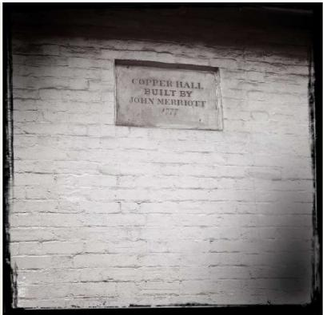

text_image

COPPER HALL
BUILT BY
JOHN NERRIGET
177

APR82

SHO RT A plaque on a white brick wall reads "COPPER HALL BUILT BY JOHN MERRIOTT 1777." The photo is dated APR 82.

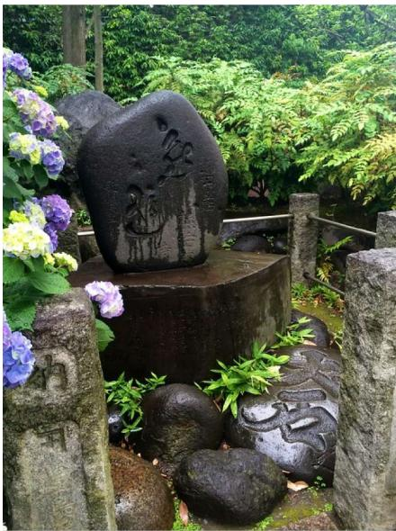

natural_image

Garden scene with a large stone sculpture, hydrangea flowers, and stone statues (no visible text or symbols)

ME D IUM A dark stone marker with carved characters sits on a pedestal surrounded by moss and small rocks. Purple and white hydrangeas bloom nearby, with lush green foliage and trees in the background. A low stone fence borders the area, suggesting a garden or shrine setting.

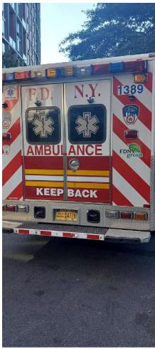

text_image

F.D.
N.Y.
1389
AMBULANCE
KEEP BACK

ME D IUM The back of a red and white FDNY ambulance is parked on a street. It has “KEEP BACK” written in bold letters and emergency lights along the top, with trees and a building visible in the background.

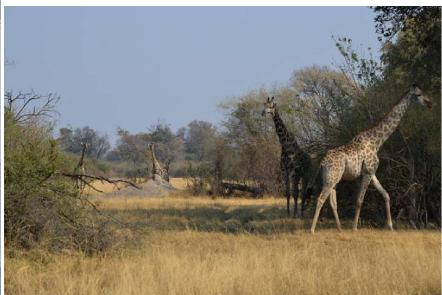

natural_image

A giraffe standing in a dry savanna with tall trees and golden grass (no text or symbols visible)

ME D IUM Several gira es stand in a dry, grassy savanna with scattered trees. One gira e in the foreground walks toward the right, while others are visible further back near bushes and fallen branches. The sky is clear and blue above the open landscape.

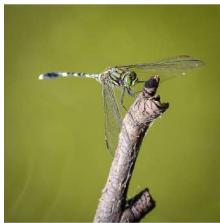

natural_image

Close-up of a dragonfly perched on a plant stem against a green background (no text or symbols visible)

SHO RT A dragon y with green and black markings rests on a dry twig. The background is a soft green blur.

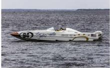

SHO RT A white speedboat with the number 94 sails on choppy water. The boat has "Visit Jacksonville" written on its side.

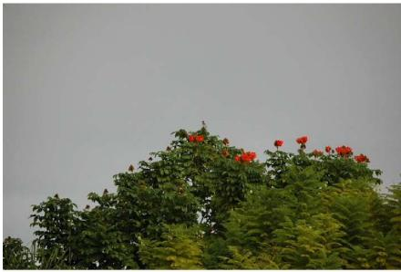

natural_image

Dense green tree with red flowers against a cloudy sky (no text or symbols visible)

SHO RT A bird perches atop a tree with bright red owers against a gray sky.

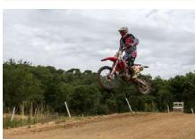

SHO RT A motocross rider in a red and gray suit jumps on a dirt bike over a dirt track. Trees and a cloudy sky are in the background.

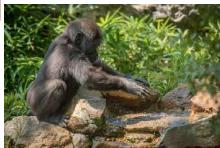

TAG gorilla, rocky stream, green foliage, wet stones

SHO RT Two ghter jets are on display in a museum hangar. One is blue and the other is gray with missiles under its wings.

Figure A.1: Additional example image-caption pairs from GPIC.

# B Evaluation

# B.1 Construction of Imagenet-256 and GPIC-256

We adopt the following protocol:

1. Center crop along the longer edge to form a square image.   
2. Bicubic downsampling to $2 5 6 \times 2 5 6$ from the Pillow library [36].

We note that popular Python image libraries use different bicubic interpolation kernels. Our choice of Pillow is consistent with prior work [20, 37].

# B.2 Additional Oracle Reference Metrics

<table><tr><td>GPIC Subset</td><td>FD ↓</td><td>Precision ↑</td><td>Recall ↑</td><td>Density ↑</td><td>Coverage ↑</td></tr><tr><td>Full</td><td>0.07</td><td>0.757</td><td>0.762</td><td>0.973</td><td>0.966</td></tr><tr><td>Lite</td><td>0.07</td><td>0.762</td><td>0.768</td><td>1.041</td><td>0.973</td></tr><tr><td>Nano</td><td>0.11</td><td>0.756</td><td>0.769</td><td>1.000</td><td>0.973</td></tr><tr><td>Val</td><td>0.21</td><td>0.760</td><td>0.758</td><td>1.007</td><td>0.971</td></tr><tr><td>Test-50K</td><td>0.68</td><td>0.7688</td><td>0.763</td><td>0.979</td><td>0.964</td></tr></table>

Table B.1: Generative quality metrics over Inception-v3 representations across GPIC subsets against GPIC-Test-1M. We omit MMD as each subset scores ≈ 0.

<table><tr><td rowspan="2">GPIC Subset</td><td colspan="2">DINOv2</td><td colspan="2">Inception-v3</td></tr><tr><td> $FD_{\mu}\downarrow$ </td><td> $FD_{\Sigma}\downarrow$ </td><td> $FD_{\mu}\downarrow$ </td><td> $FD_{\Sigma}\downarrow$ </td></tr><tr><td>Full</td><td>0.051</td><td>1.140</td><td>0.005</td><td>0.065</td></tr><tr><td>Lite</td><td>0.052</td><td>1.197</td><td>0.005</td><td>0.069</td></tr><tr><td>Nano</td><td>0.053</td><td>1.547</td><td>0.005</td><td>0.100</td></tr><tr><td>Val</td><td>0.012</td><td>2.353</td><td>0.001</td><td>0.208</td></tr><tr><td>Test-50K</td><td>0.040</td><td>7.404</td><td>0.004</td><td>0.678</td></tr></table>

Table B.2: $\mathrm { F D } _ { \mu }$ and $\mathrm { F D } _ { \Sigma }$ across GPIC subsets against GPIC-Test-1M.

# B.3 Effect of DINOv2 Backbone Size and Register Tokens on FD

A practical question when using FD-DINOv2 is how to interpret its numerical scale. Unlike pixelspace distances, FD-DINOv2 depends on feature values produced by a learned neural network. In particular, these feature values can change with the DINOv2 backbone size and whether the model uses registers. We therefore ablate variants with and without registers across four DINOv2 backbone sizes: ViT-S/14, ViT-B/14, ViT-L/14, and ViT-g/14.

Registers in vision transformers were introduced to reduce high-norm artifacts in DINOv2 feature maps. Since FD-DINOv2 is computed directly in DINOv2 feature space, changes to the feature distribution can affect both the absolute metric value and comparisons between generative models.

Results are shown in Figure B.1. For the small, base, and large backbones, variants with registers consistently produce lower FD-DINOv2 scores than the corresponding variants without registers. At the giant scale, the variants with and without registers are much closer.

The feature-value histograms in Figure B.2 help explain this pattern. For the small, base, and large backbones, variants with registers produce feature values over a much smaller range than the corresponding variants without registers. Since Fréchet distance depends on both feature means and covariances, changes in the range and variance of feature values directly affect the scale of FD-DINOv2. In contrast, the ViT-g/14 distributions with and without registers nearly overlap, matching the smaller FD-DINOv2 difference at the giant scale.

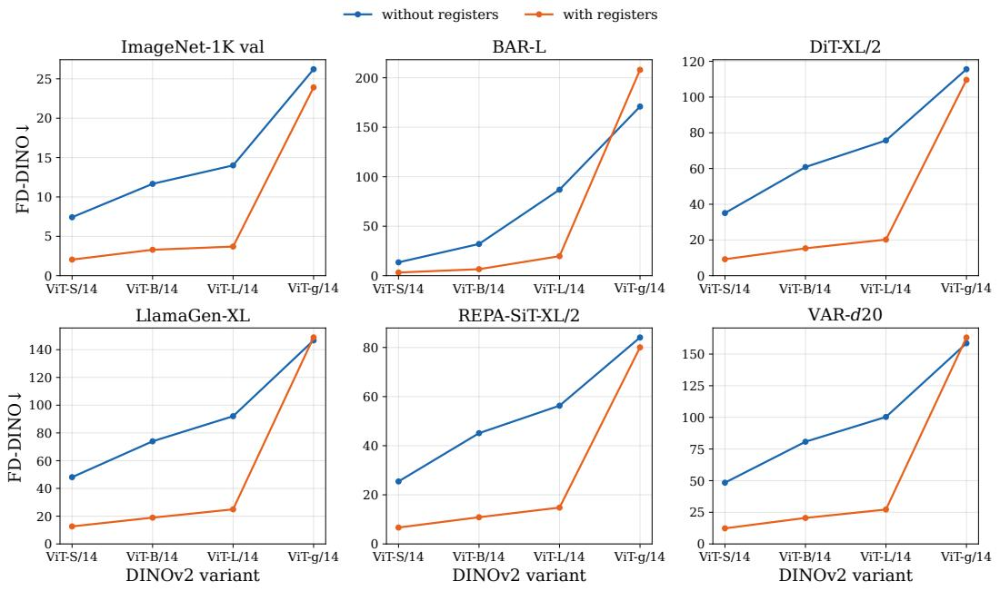  
without registers with registers

Figure B.1: FD-DINOv2 across DINOv2 model sizes and variants with and without registers.   
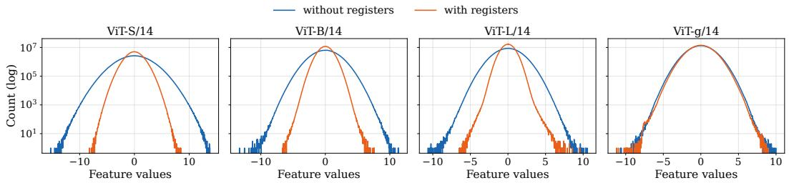  
Figure B.2: Distribution of DINOv2 feature values on ImageNet-1K train images.

Despite these differences in absolute metric scale, the variants remain broadly consistent as evaluators. Across the eight DINOv2 configurations, the mean pairwise Pearson correlation over the five models and ImageNet-1K validation set is 0.847, and Kendall’s coefficient of concordance over the five models is 0.795. These values indicate strong agreement in the relative ordering of models. Following prior generative model evaluation work that uses DINOv2 ViT-L/14 features [20], we use the non-register ViT-L/14 backbone as the default FD-DINOv2 configuration. We leave a dedicated human-alignment study of variants with registers to future work.

# C Image Filtering

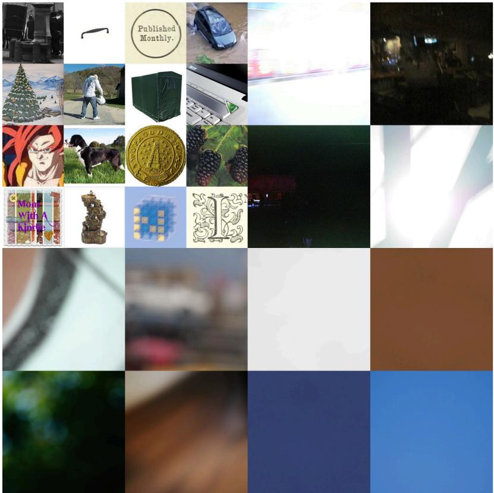

natural_image

Grid of 24 grayscale and white photos including landscapes, a person walking, a globe, a clock, and a castle (no text or symbols)

Figure C.1: Additional low resolution and poor visual quality image examples.

# D Deduplication

text_image

Cluster Size
2
4
5
Exact Similarity Score
[0.9625, 1]
YARLE CLAVE
EXTRAPE
YARLE CLAVE
EXTRAPE
YARLE CLAVE
EXTRAPE
YARLE CLAVE
EXTRAPE
YARLE CLAVE
EXTRAPE
YARLE CLAVE
EXTRAPE
YARLE CLAVE
EXTRAPE
YARLE CLAVE
EXTRAPE
YARLE CLAVE
EXTRAPE
YARLE CLAVE
EXTRAPE
YARLE CLAVE
EXTRAPE

Figure D.1: Qualitative examples of deduplication over similarity score tiers and cluster sizes. All clusters with exact similarity score $\geq 0$ .9625 are removed, and only clusters of size $\geq 5$ are removed for similarity scores in [0.9, 0.9625).

# E Microbenchmark

We sampled 1,520 images from the initial source pooling stage of our dataset construction for our microbenchmark to evaluate the captioning quality of Qwen3-VL-Instruct models. From the initial VLM captions, human annotators examined and relabelled the captions, fixing any errors and hallucinations. Common errors included counting and spatial relations. Examples of VLM-labeled and human-labeled caption pairs are shown in Fig. E. The final human-labeled captions were used as ground truth labels for our LLM-as-a-judge pipeline to evaluate the captioning quality of the Qwen3-VL-Instruct models.

natural_image

Person standing on a grass field with white lines and shadow, wearing athletic shoes (no text or symbols visible)

Short   

natural_image

Interior view of a modern kitchen or office space with people working on a wall; no visible text or symbols.

Medium   

natural_image

Baseball game in progress on a grass field with spectators watching from the sidelines (no visible text or signage)

natural_image

Volleyball match action shot showing players at the net and a referee during the game (no visible text or symbols)

#

Model: tennis court, athletic shoes, grass, shadow, player.

Human: tennis court, athletic shoes, grass, shadow, lower body.

# Short:

Model: A group of people looks at papers on a wall in an office.

Human: A group of people pins papers and sticky notes to an office wall.

# Medium:

Model: A baseball batter in a gray uniform stands at home plate after swinging, with the ball traveling across the field to the right. A catcher in red gear and an umpire crouch behind him, while another player stands near the first-base line and fans fill the stadium seats in the background.

Human: A baseball batter in a gray uniform stands at home plate after swinging, with the ball traveling across the field to the right. A catcher in red gear and an umpire crouch behind him, while another player stands near the third-base line and fans fill the stadium seats in the background.

# Long:

Model: Five female volleyball players are positioned on a red and teal court, engaged in a match. Three players in red and blue uniforms are on the left side of the net, with two raising their arms to block a yellow volleyball that is mid-air near the net. One player in a yellow jersey with the number 16 is in a low crouch, facing the net, and another player in a yellow jersey is standing to the right, near the sideline with arms extended. A fifth player in a black and yellow uniform is positioned further right, standing with her feet apart and looking toward the ball. The net is stretched across the center of the court, and a blue vertical post with the words “Olympic Games” visible is on the right side of the net. In the background, spectators are seated on benches along the sidelines, and a blue umpire’s chair is visible on the far left. The court surface is marked with white lines, and the net has a white top band with vertical markings.

Human: Seven female volleyball players are positioned on a red and teal court, engaged in a match. Four players in red and blue uniforms are on the left side of the net, with two raising their arms to block a yellow volleyball that is mid-air near the net. One player in a yellow jersey with the number 16 is in a low crouch, facing the net, and another player in a yellow jersey is standing to the right. A fifth player in a black and yellow uniform is positioned further right, standing with her feet apart and looking toward the ball. The net is stretched across the center of the court, and a blue vertical post with “London 2012” visible is on the right side of the net. In the background, spectators are seated on benches along the sidelines, and a blue umpire’s chair is visible on the far left. The court surface is marked with white lines, and the net has a white top band with vertical markings.

Figure E.1: Full caption comparison between VLM-generated and human-labeled annotations. Red highlights VLM captioning model outputs and blue highlights human annotations. Underlined text indicates the specific differences in counting, spatial relations, and fine-grained visual details.

# F Prompts

We include the exact prompts used for the following tasks:

• Tag-style GPIC image captioning (Fig. F.1).   
• Short-form GPIC image captioning (Fig. F.2).   
• Medium-length GPIC image captioning (Fig. F.3).   
• Long-form GPIC image captioning (Fig. F.4).   
• Evaluating VLM-generated captions against ground-truth captions in our microbenchmark (Fig. F.5).

# VLM Captioning: Tag

# MAIN INSTRUCTIONS (STRICT):

Your goal is to write a compressed keyword-style caption (unordered tags) for a given image.

You will be given ONE image.

The output must be a short, unordered list of tags describing the main visible content.

Use ONLY what is clearly visible. Do NOT guess or add extra details.

# FORMAT (STRICT):

- Output a single line of tags separated by commas.   
- Use between 3 and 8 tags total.   
- Each tag must be 1–3 words.   
- Do NOT write full sentences.

# UNORDERED TAG STYLE (VERY IMPORTANT):

- Tags must NOT form a sentence or phrase when read left to right.   
- The order should feel arbitrary, not structured.   
- Do NOT group tags into a logical sentence flow.   
- Avoid patterns like:   
- subject → action → object → setting   
- Instead, mix subjects, attributes, and setting freely.

Example of GOOD ordering:

\- "snowy road, forest, winter, bare trees, cloudy"

Example of BAD ordering:

\- "snowy road in a forest with bare trees on a cloudy day"

# STYLE RULES (STRICT):

- Use short noun phrases, nouns, or simple adjectives.   
- Prefer noun phrases like "snowy road", "bare trees".   
- Avoid connecting words (e.g., "with", "on", "in", "and").   
- Avoid explicit relationships between objects.   
- Do NOT use articles ("a", "the").

# CONTENT RULES:

1) MAIN SUBJECTS:   
- Include the 1–3 most important people, animals, objects, or landmarks.

2) ATTRIBUTES:

\- Include visible attributes (color, texture, condition) (example: "red car", "snowy road", "bare trees").

3) SETTING:

\- Include 1–2 coarse environment tags (example: "forest", "street", "kitchen").

4) ACTION (RARE):

\- Only include if extremely obvious and short (e.g., "running", "sitting"). - Prefer nouns over verbs.

# COMPRESSION RULE:

- Do NOT try to describe everything.   
- Include only key visual elements.   
- Missing details are acceptable.

# COUNTING:

- Avoid exact numbers unless extremely obvious.   
- Prefer plural forms (e.g., "trees").

# TEXT IN IMAGE:

\- Do NOT include text from the image.

# EDGE CASES:

\- If the image is blank or content is not visible, output exactly: "NOT VISIBLE."

# OUTPUT RULES (STRICT):

1) Output ONLY the tag list.   
2) No sentences, no explanations.   
3) No punctuation except commas.   
4) All lowercase.

# EXAMPLES (style reference only):

- "snowy road, forest, bare trees, winter, cloudy"   
- "white cat, sunlight, cozy"   
- "city street, night, race car, neon lights"

# USER MESSAGE

Write a keyword-style caption (tag-style) for the image shown.

Figure F.1: Prompt used to generate tag-styled captions for GPIC images.

# VLM Captioning: Short

# MAIN INSTRUCTIONS (STRICT):

Your goal is to write a short caption (1–2 sentences) that describes a given image in simple language that a middle school student can understand.

You will be given ONE image.

The caption must be enough to identify the main subject and the basic setting/action.

Use ONLY what is clearly visible. Do NOT guess or add extra details.

# SENTENCE RULE (STRICT):

- Output ONE sentence by default.   
- Use TWO sentences ONLY when absolutely required to identify the scene clearly.

# WHAT YOU ARE ALLOWED TO INCLUDE (ONLY these):

1) MAIN SUBJECTS:   
- Mention the 1–3 most important people/animals/objects/landmarks.   
2) SIMPLE DETAILS:

\- Add 1–3 simple visible details that help identify them

(example: "red tie", "blue bottle", "white car").   
3) SETTING:

- Add ONE short setting word (example: "street", "park", "kitchen").   
4) MAIN ACTION (ONLY if clearly visible):

\- Use a simple verb (example: "walking", "sitting", "holding hands").

\- If the action is not clearly visible, DO NOT include action(s).

# COUNTING (STRICT):

- Use an exact number ONLY if it is very easy and unambiguous to count.   
- If an exact number is unclear, do NOT guess.   
- You may use "several" or "a group of" only when clearly correct.

# TEXT (WORDS THAT APPEAR IN THE IMAGE):

- Do NOT write any text from the image.   
- Exception: include visible text ONLY if it is large, clearly readable, and necessary to identify the main subject or scene

(example: "A person stands next to a large 'NOW BOARDING' airport sign.").

# EDGE CASES:

\- If the image is blank OR the main content is not visible/understandable (for example, all black/white, too blurry, too dark, overexposed, or corrupted), output exactly: "NOT VISIBLE."

# OUTPUT RULES (STRICT):

1) Output 1–2 sentences (max 2).   
2) Start immediately with the main subjects (no meta phrases).   
3) Do NOT use bullet points, lists, headings, or JSON.   
4) Do NOT mention the words "photo", "image" or "picture".   
5) Use neutral, literal language.

# LENGTH (STRICT):

- Aim for \~12–25 words total.   
- Keep sentences short and easy to read.

# EXAMPLES (style reference only):

- "Two cyclists ride on a paved road."   
- "A white cat lies on a bed near a window."   
- "A bowl of noodles sits on a table with chopsticks."

# USER MESSAGE

Write a short caption (1–2 sentences) for the image shown.

Figure F.2: Prompt used to generate short-length captions for GPIC images.

# VLM Captioning: Medium

# MAIN INSTRUCTIONS (STRICT):

Your goal is to write a medium-length caption (2–3 sentences) that describes a given image in simple language that a middle school student can understand.

You will be given ONE image.

The caption must be enough to identify the main subject and the basic setting/action.

Use ONLY what is clearly visible. Do NOT guess or add extra details.

# CAPTION CONTENT RULES (STRICT):

1) Start immediately with the main visible entity/entities (no meta phrases).

Example starts: "Two cyclists ...", "Close-up of ...", "Passengers ...", "A street ..."

2) Include the following (when clearly visible): - main objects/entities

(people/animals/vehicles/objects/structures) - key visible attributes

(color/material/clothing/object type)

\- scene context (indoor/outdoor + setting such as street/room/park/store/stadium)

\- grounded spatial layout (foreground/background/left/right/next to/in front of)

3) Count entities ONLY when clearly countable. If an exact number is unclear, do NOT guess.

You may use "several" or "a group of" only when clearly correct.

4) Describe actions/poses ONLY when directly supported visually. Otherwise describe a static configuration.

5) Do NOT write any text from the image.

Exception: include visible text ONLY if it is large, clearly readable, and necessary to identify the main subject or scene.

# EDGE CASES:

\- If the image is blank OR the main content is not visible/understandable (for example, all black/white, too blurry, too dark, overexposed, or corrupted), output exactly: "NOT VISIBLE."

# OUTPUT RULES (STRICT):

1) Output TWO sentences by default.   
2) Use THREE sentences ONLY when absolutely required to identify the scene clearly.   
3) Aim for \~25–60 words total.   
4) Do NOT use bullet points, lists, headings, or JSON.   
5) Do NOT include disclaimers or meta commentary.   
6) Do NOT mention the words "image", "photo", or "picture".   
7) Use neutral, literal language.   
8) Be informative but do NOT attempt exhaustive object listing.

# EXAMPLES (style reference only):

\- "Two cyclists ride on a paved road with dashed lane markings. An orange barrier lines the left side, with several people standing behind it on the sidewalk. Trees and buildings appear in the background."

\- "Close-up of a white cat lying on a bed near a window. Soft daylight falls across the blanket, and a curtain is visible along the edge of the frame."

\- "Passengers stand in an airport terminal facing a large electronic departure board. The board shows multiple rows of flight information, with people and luggage visible in the foreground."

# USER MESSAGE

Please write a 2–3 sentence caption for the image shown.

Figure F.3: Prompt used to generate medium-length captions for GPIC images.

# VLM Captioning: Long

# MAIN INSTRUCTIONS (STRICT):

Your goal is to write a long, highly detailed caption (5–7 sentences) that describes a given image in simple language that a middle school student can understand.

You will be given ONE image.

Assume you are describing the scene to someone over the phone. The caption should include enough detail for them to understand what appears in the foreground and background and picture how the scene is arranged.

Use ONLY what is clearly visible. Do NOT guess or add extra details.

# CAPTIONING PROTOCOL (STRICTLY follow this order):

1) OBJECTS / ENTITIES (nodes)

1.1) Identify the main visible entities in the scene (people, animals, vehicles, objects, structures).

1.2) Cover important secondary elements, but do NOT attempt to list every small background object.

1.3) Prefer describing entities in a grounded order such as foreground → background when possible.

1.4) If multiple similar entities appear, give the count ONLY when clearly visible.

1.5) If exact counting is not reliable due to occlusion, distance, or blur, DO NOT guess a number.

2) ATTRIBUTES (visible-only)

2.1) Describe visible attributes only when clearly observable: color, size, shape, material, texture, patterns.

2.2) Do NOT guess precise brands, logos, or fine details unless the text/marking is clearly readable.

3) POSE + ACTIONS (confidence-gated)

3.1) Describe poses (standing, sitting, leaning, arms extended, head direction) and actions (riding, walking, holding)

ONLY when directly supported by clearly visible body position and/or physical contact with an object.

3.2) If a pose or action is not clearly verifiable, do NOT infer it. Instead describe what the body looks like (for example: arms raised, leaning forward, head turned to the side).

4) RELATIONS / LAYOUT

4.1) Describe spatial layout using grounded relationships such as: left, right, top, bottom.

4.2) Do NOT overstate alignment or formation (e.g., do not say “side-by-side” unless clearly true).

# TEXT (OCR) REQUIREMENT:

1) If any text is visible anywhere (signs, labels, screens, posters, documents, packaging, subtitles, watermarks, UI elements, logos with words, etc.), you MUST try to transcribe it.

2) Reproduce visible text exactly as written, preserving casing, punctuation, numbers, symbols, and spelling.

3) Only transcribe text that is clearly legible.

4) If text is present but not fully readable, do NOT guess; simply say that text is present.

5) When including OCR text, place it naturally into the caption (prefer Sentences 3–5), so the caption remains coherent and readable.

# EDGE CASES:

\- If the image is blank OR the main content is not visible/understandable (for example, all black/white, too blurry, too dark, overexposed, or corrupted), output exactly: "NOT VISIBLE."

# OUTPUT RULES (STRICT):

1) Produce exactly 5–7 sentences.

2) Use this sentence structure (STRICT):

\- Sentences 1–3: main subjects + key attributes + main actions + core setting

\- Sentences 4–6: layout + secondary elements + background context (include OCR here when possible)

\- Sentence 7 (optional): extra fine details that help reconstruction

3) The sentences must be information-dense rather than brief.

4) Do NOT use bullet points, lists, headings, or JSON.

5) Do NOT include disclaimers or meta commentary.

6) Do NOT mention the words "image", "photo", "picture" or "foreground".

7) Start immediately with the main visible entities (no meta phrases).

8) Use neutral, literal language suitable for high-quality dataset annotation.

# QUALITY CHECK:

\- A strong caption should allow a reader to mentally picture the scene and understand the main subjects and spatial layout with minimal ambiguity.

\- Do NOT start the caption with meta phrases such as: "The image shows", "The image displays", "This image contains", "In this image", "The photo shows", "The picture shows", "This photo contains".

# EXAMPLE OF A GOOD CAPTION IS SHOWN BELOW (style + detail reference only):

"Two cyclists on road bikes are riding on a paved street, both wearing white helmets and fitted cycling clothing. The cyclist on the right side leans forward over the handlebars of a bike with a dark frame, while the second cyclist rides farther back on the left side in a similar posture. White dashed lane markings run along the road surface, and both cyclists cast shadows onto the asphalt. An orange metal crowd-control barrier lines the left edge of the road, separating the cyclists from a sidewalk area with several people standing behind it. In the background there are trees and buildings, along with a red car visible behind the barrier. A vertical white column stands near the barrier with small text near the top. The road surface appears smooth and gray, and the scene is lit by bright daylight."

# USER MESSAGE

Please write a caption (5–7 sentences) for the image shown.

Figure F.4: Prompt used to generate long-sized captions for GPIC images.

# LLM-as-a-Judge: Microbenchmark Evaluation

You are an expert evaluator comparing a VLM-generated caption against a human-written ground truth caption.

Captions may be natural-language descriptions or unordered tag-style captions.

Your task is to assess how well the VLM caption matches the human caption across multiple criteria.

HUMAN CAPTION (Ground Truth):

{human\_caption}

VLM CAPTION (To Evaluate):

{vlm\_caption}

EVALUATION CRITERIA:

Evaluate the VLM caption on the following 5 criteria using a 0-1-2 scale:

\- 0 = Wrong/Incorrect (major errors, contradictions, or missing critical information)

\- 1 = Partially Correct (captures main idea but has some mistakes or omissions)

\- 2 = Correct/Perfect Match (accurate and aligns well with human caption)

1. OVERALL\_SUMMARY (Required)

Does the VLM caption capture the overall scene and main content described in the human caption?

Scoring:

\- 0: Describes a fundamentally different scene, misses main subjects, or has major contradictions

\- 1: Captures the general scene but misses some important elements or has minor errors

\- 2: Accurately captures the overall scene and main elements described in the human caption

2. COUNTING\_ACCURACY (Score N/A if no counts in the human caption)

If the human caption mentions specific counts/quantities (e.g., "two cyclists", "three cars"),

does the VLM caption report the same counts?

Scoring:

\- N/A: Human caption mentions no specific counts or quantities

\- 0: VLM caption has wrong counts (e.g., human says "two people" but VLM says "one person" or "three people")

\- 1: VLM caption partially correct (e.g., mentions some but not all counts, or uses vague terms like "several")

\- 2: All counts in VLM caption match the human caption exactly

Note: Only evaluate counts that appear in the human caption. Ignore if VLM adds counts not in human caption.

3. SPATIAL\_UNDERSTANDING (Score N/A if no spatial descriptions in human caption)

Does the VLM caption correctly describe spatial relationships mentioned in the human caption?

(e.g., left/right, foreground/background, near/far, above/below, beside) Scoring:

\- N/A: Human caption contains no spatial relationship descriptions

\- 0: VLM caption contradicts spatial relationships (e.g., human says "left" but VLM says "right")

\- 1: VLM caption captures some spatial relationships correctly but misses or errors on others

\- 2: All spatial relationships in VLM caption align with human caption

Note: Only evaluate spatial relationships mentioned in the human caption.

4. ATTRIBUTE\_BINDING (Score N/A if no attributes in human caption)

Does the VLM caption correctly bind attributes to objects as described in the human caption?

(e.g., colors, shapes, sizes, materials, patterns like "blue car", "circular table", "metal barrier")

Scoring:

\- N/A: Human caption contains no object attributes

\- 0: VLM caption has wrong attribute bindings (e.g., human says "red car" but VLM says "blue car")

\- 1: VLM caption gets some attributes correct but misses or errors on others

\- 2: All attribute bindings in VLM caption match the human caption

Note: Only evaluate attributes mentioned in the human caption. Ignore additional attributes VLM adds.

5. OCR\_TEXT\_ACCURACY (Score N/A if no text mentioned in human caption)

If the human caption mentions visible text (signs, labels, subtitles, watermarks, etc.),

does the VLM caption transcribe the same text correctly?

Scoring:

\- N/A: Human caption mentions no visible text or OCR content

\- 0: VLM caption transcribes text incorrectly, misses mentioned text entirely, or fabricates text not in human caption

\- 1: VLM caption transcribes some text correctly but has errors, omissions, or partial matches

\- 2: All text mentioned in human caption is accurately transcribed in VLM caption

Note: Only evaluate text mentioned in the human caption. Case, punctuation, and spelling must match.

# EVALUATION INSTRUCTIONS:

1. Compare the VLM caption to the human caption criterion by criterion.

2. For each criterion, if it does not apply (N/A case), use "N/A" as the score.

3. Be strict but fair: minor wording differences are acceptable if the meaning is preserved.

4. Focus on factual accuracy, not writing style or caption length.

5. If the human caption mentions something and VLM caption omits it entirely, penalize appropriately.

6. If the VLM caption adds extra (correct) information not in human caption, do NOT penalize.

7. Captions may be written either as natural-language descriptions or as unordered tag-style captions.

If a caption is tag-style, treat each comma-separated tag or short phrase as a semantic assertion.

Do not penalize lack of grammar, sentence structure, or ordering.

Evaluate only whether the semantic content matches the human caption.

# OUTPUT FORMAT:

Respond with ONLY a valid JSON object in this exact format (no extra text, no markdown):

"overall\_summary": <0, 1, or 2>,

"counting\_accuracy": <0, 1, 2, or "N/A">,

"spatial\_understanding": <0, 1, 2, or "N/A">,

"attribute\_binding": <0, 1, 2, or "N/A">,

"ocr\_text\_accuracy": <0, 1, 2, or "N/A">,

"explanation": "<brief explanation of your scoring decisions>"

}}

CRITICAL: Respond with ONLY the JSON object. Do not include any preamble, markdown formatting, or additional commentary.

Figure F.5: Prompt used to evaluate VLM-generated captions against ground-truth captions in our microbenchmark.