# YoCausal: How Far is Video Generation from World Model? A Causality Perspective

You-Zhe Xie1,2,∗, Yu-Hsuan Li1,∗, Jie-Ying Lee1, Kaipeng Zhang2, Yu-Lun Liu1,†, Zhixiang Wang2,†

1National Yang Ming Chiao Tung University 2Shanda AI Research Tokyo

∗Equal contribution, †Corresponding authors

As video diffusion models (VDMs) advance toward world models, a key question arises: do they truly understand causality, or merely overfit to statistical temporal patterns? Existing benchmarks mostly rely on synthetic data, limiting real-world generalization due to the sim-to-real gap. We present YoCausal, a two-level benchmark inspired by the Violation of Expectation (VoE) paradigm from cognitive science. By temporally reversing real-world videos at zero cost as natural counterfactual samples, YoCausal establishes an arbitrarily extensible evaluation protocol. Level 1 introduces the Reverse Surprise Index (RSI), quantifying arrow-of-time perception via denoising loss. Level 2 introduces the Causality Cognition Index (CCI), which leverages a VLM to stratify datasets into causal and non-causal subsets, disentangling genuine causal reasoning from temporal bias. Evaluation of 13 state-of-the-art VDMs reveals that perceiving the arrow of time does not imply understanding causality, and a significant gap persists relative to human-level causal cognition.

Date: May 29, 2026

Project page: https://www.youzhexie.me/papers/YoCausal/index.html

Correspondence: yulunliu@cs.nycu.edu.tw, wangzx1994@gmail.com

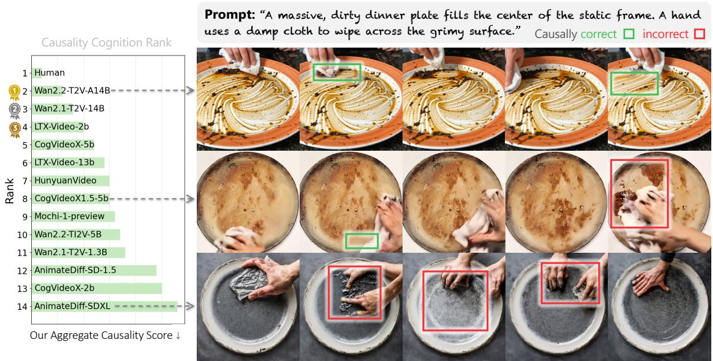

bar

| Rank | Causality Score |
| ---- | --------------- |
| 1    | Human           |
| 2    | Wan2.2-T2V-A14B  |
| 3    | Wan2.1-T2V-14B   |
| 4    | LTX-Video-2b    |
| 5    | CogVideoX-5b    |
| 6    | LTX-Video-13b   |
| 7    | HunyuanVideo    |
| 8    | CogVideoX1.5-5b  |
| 9    | Mochi-1-preview  |
| 10   | Wan2.2-TI2V-5B   |
| 11   | Wan2.1-T2V-1.3B  |
| 12   | AnimateDiff-SD-1.5|
| 13   | CogVideoX-2b    |
| 14   | AnimateDiff-SDXL |

Figure 1 Validation of the YoCausal benchmark. (Left) We evaluate and rank 13 state-of-the-art Video Diffusion Models alongside a human baseline based on our Causality Score (lower is better). (Right) Visualizations of a causal event (“wiping a dirty plate”) strongly align with our quantitative rankings. The top-ranked VDM, Wan2.2-A14B [114], successfully captures the cause-and-effect relationship by progressively removing the dirt (green boxes). In contrast, mid- to low-ranked models like CogVideoX1.5-5B [48, 124] and AnimateDiff-SDXL [38] struggle to understand the underlying causal logic. They show severe causal errors, such as dirt reappearing or smearing in an illogical way (red boxes). This shows that our benchmark effectively disentangles genuine causal reasoning from simple visual generation ability.

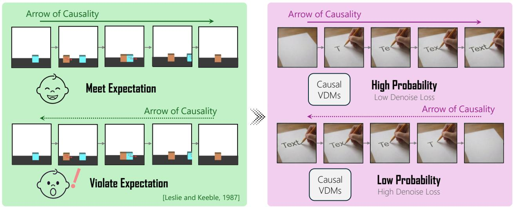

flowchart

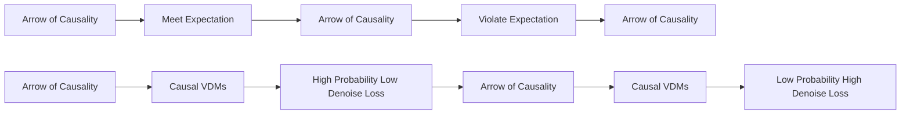

Figure 2 Conceptual overview of YoCausal benchmark. We draw inspiration from the Violation of Expectation (VoE) paradigm in cognitive science. (Left) Infants show surprise when seeing videos played in reverse (bottom), violating their intuitive causal cognition [65] (99K). (Right) We transfer this paradigm to generative models: treating the learned data distribution as the model’s cognition, a causally-aware VDM should assign lower probability (higher denoising loss) to counterfactual reversed videos than to forward ones. This elegant analogy allows us to benchmark causal understanding using arbitrarily scalable real-world videos.

# 1 Introduction

“Welcome to the exploration of causal video generation.”

—YoCausal, Derived from Yokoso ¯ (“welcome” in Japanese).

A long-standing aspiration of AI is to build machines that truly model the world [64, 40, 79, 49, 17, 74]. One important ability of such world models is to capture causality1: recognizing that dragging a pencil across paper leaves traces, or that striking a match produces a flame.

Among the avenues explored toward world models, video generation models have emerged as promising candidates [77, 31, 94, 68, 134]. Trained on vast real-world data, they learn rich spatio-temporal representations and produce highly realistic video, leading many to regard video generation as a direct path to world modeling. However, a fundamental question remains: do current video generation models actually understand causality?

Previous research on “world knowledge” of generative models has focused on adherence to physical laws [95, 15, 128, 85, 118, 12, 55, 7, 8, 81]. However, a genuine world model must go beyond physics to comprehend broader causality. Moreover, existing physics benchmarks face a practical limitation: to isolate specific physical variables, they rely on synthetic data or small collections of controlled laboratory recordings, creating a sim-to-real gap that limits assessment of real-world generalization.

To bridge this gap, we draw on the Violation of Expectation (VoE) paradigm from cognitive science [65, 78]. In a seminal study (Fig. 2), Leslie and Keeble [65] assessed whether infants perceive causality by showing temporally reversed videos: if an observer is truly causally cognitive, counterfactual reversed causality should elicit surprise. We adapt this to VDMs: under a generative model, “surprise” corresponds to low probability, so a causally aware VDM should assign lower likelihood to reversed video xr than to forward one x f .

Building on this, we propose YoCausal, a two-level benchmark for evaluating causal cognition in VDMs. At Level 1, the Reverse Surprise Index (RSI) measures the proportion of videos for which the model assigns lower likelihood to the reversed than the forward version via the denoising loss. However, RSI alone cannot isolate causal cognition, as VDMs may merely perceive the arrow of time, which is the inherent directionality of time. To disentangle these factors, Level 2 therefore introduces the Causality Cognition Index (CCI): the dataset is partitioned into a causal subset Dc and a non-causal subset ${ \mathcal { D } } _ { n c } ,$ and CCI is defined as $\mathrm { R S I } ( \mathcal { D } _ { c } ) - \mathrm { R S I } ( \mathcal { D } _ { n c } )$ . A model with genuine causal perception should be more surprised by reversed causal videos than non-causal ones.

A key advantage is our arbitrarily extensible dataset design. Any real-world video can be temporally reversed at zero cost to produce a counterfactual sample, freeing the benchmark from the fixed synthetic scenes or controlled recordings of prior work. This bridges the sim-to-real gap and responds to a core demand: an ideal world model should learn causal relationships across diverse dimensions. We further provide a human upper bound by having annotators judge 1,200 videos as a reference for model performance.

Comprehensive evaluation across 13 state-of-the-art VDMs reveals four key insights: (1) while advanced models perceive the arrow of time and some exhibit preliminary causality cognition, a significant humanmodel gap remains; (2) perceiving the arrow of time is not equivalent to understanding causality; (3) causal cognition correlates partially with intuitive physics but not with aesthetic quality, validating our benchmark’s unique focus; and (4) scaling parameters and advancing architectures (e.g. UNet to DiT) improve causal cognition, indicating that scaling laws[127, 73, 56] extend to this higher-order reasoning.

In summary, our contributions are as follows:

• The first causality benchmark for VDMs, built on a scalable real-world dataset free from sim-to-real gaps.   
• A cognitive-science-grounded two-level framework that disentangles arrow-of-time perception from causal cognition.   
• Evidence that current open-source VDMs lack causal understanding, revealing a critical gap toward world models and providing guidance.

# 2 Related Work

Video Diffusion Models. Video synthesis has progressed from UNet-based diffusion architectures [47, 115, 38, 13, 14, 98] to Diffusion Transformer (DiT) [89] designs generating long, coherent sequences [124, 61, 114, 41, 133, 90, 60, 126], with commercial systems further raising quality [16, 93, 9, 37, 39]. This trajectory increases interest in treating VDMs as world models [64, 40], with recent work targeting interactive simulation [17, 123, 113, 2, 43, 42]. Whether current VDMs actually acquire such world knowledge remains open [55, 85, 4]. We probe this question from the perspective of causal cognition: not whether models render the world correctly, but whether they understand why events unfold as they do.

Video Generation Evaluation. Video generation evaluation has evolved from distribution metrics [112, 36] to multi-dimensional suites [50, 132, 51], temporal benchmarks [76, 18, 129], and assessing physical commonsense [7, 81, 85, 131], counterfactual and compositional reasoning [33, 70, 88, 19, 21, 72] via VLMjudge templates [7, 81] or pixel-level comparisons [85, 131]. In contrast, our evaluation is appearance-agnostic, relying on denoising likelihoods rather than VLM judges or pixel comparisons to uniquely isolate causal understanding.

Intuitive Physics and Violation-of-Expectation Paradigm. Rooted in perceptual causality [82] and developmental studies of infant core knowledge [6, 103, 119, 105, 104, 110, 5, 111], the violation-of-expectation (VoE) paradigm[78] measures cognition via surprise to counterfactuals. Lake et al. [62] argue that human-like intelligence requires causal world models[28] grounded in such intuitive theories, motivating VoE as a diagnostic for AI. it has been applied to discriminative AI models with synthetic benchmarks [96, 15, 26, 99, 10, 34, 97, 35, 92, 11], and recently to generative VDMs by LikePhys [128] using denoising loss as likelihood proxy[20, 66, 23, 102, 101, 59]. Our work differ in two key aspects: (1) all prior physics VoE benchmarks rely on synthetic content because physically-counterfactual samples do not exist in the real world; in our work, temporal reversal provides unlimited counterfactual pairs at zero cost, eliminating the sim-to-real gap. (2) YoCausal further explores causal cognition of video generation models, which no prior benchmark addresses.

Table 1 Comparison with existing physics-law evaluation benchmarks. Prior benchmarks rely on synthetic data or controlled recordings, limiting scene diversity despite large video counts (e.g. 3M videos from only 70 scenes in PhyWorld). YoCausal incorporates any real-world video at zero cost and is extensible, achieving the highest scene diversity among all listed benchmarks. ↑ indicates that video count and scene coverage grow continuously as new subsets are added. (2D): simulation in two-dimensional. (Controlled): videos recorded under controlled laboratory setups. 

<table><tr><td></td><td>Video type</td><td># Video</td><td># Video scene</td></tr><tr><td>PhyWorld [55]</td><td>Synthetic (2D)</td><td>3M</td><td>70</td></tr><tr><td>LikePhys [128]</td><td>Synthetic</td><td>120</td><td>12</td></tr><tr><td>Physion [12]</td><td>Synthetic</td><td>10400</td><td>260</td></tr><tr><td>IntPhys2 [15]</td><td>Synthetic</td><td>1416</td><td>344</td></tr><tr><td>Phys101 [118]</td><td>Real-World (Controlled)</td><td>2500</td><td>101</td></tr><tr><td>Physics IQ [85]</td><td>Real-World (Controlled)</td><td>396</td><td>132</td></tr><tr><td>Ours</td><td>Real-World</td><td>1232↑</td><td>1232↑</td></tr></table>

Arrow of Time and Causality in Video Understanding. Temporal directionality [63] has been used as a selfsupervised signal [83, 117, 91] and remains hard for multimodal models [121, 24, 71]. Causal reasoning [75] has been evaluated via synthetic [125, 3] and real-world [69, 120, 32, 21, 22, 116] video QA, and language counterfactual benchmarks [130, 58, 53, 54]—all discriminative. Crucially, all these efforts target discriminative tasks, measuring whether a model can reason about causality given context. We ask a fundamentally different question: whether a generative VDM has internalized causal structure as part of its learned prior, probing knowledge encoded implicitly during pretraining without any question-answering interface.

# 3 Method

Fig. 3 overviews our framework. We describe the extensible dataset construction ( Sec. 3.1), formalize the link between a diffusion model’s “surprise” and its denoising loss ( Sec. 3.2), then introduce the Reverse Surprise Index (RSI) for arrow-of-time perception ( Sec. 3.3) and the Causality Cognition Index (CCI) for disentangling genuine causal understanding ( Sec. 3.4).

# 3.1 Dataset Construction

As mentioned in Sec. 1, we use reversed video to validate models’ causal cognition ability. Our benchmark can utilize any real-world video at zero cost. This enables building a benchmark of arbitrary scale and scene diversity without synthetic rendering or controlled setups.

As shown in Fig. 3(a), we construct a dataset $\mathcal { D } = \{ \mathcal { D } _ { 1 } , \mathcal { D } _ { 2 } , \ldots , \mathcal { D } _ { i } , \ldots \}$ of thematic subsets. Unlike closed-form benchmarks, our design is arbitrarily extensible: new subsets can be seamlessly added. In this paper, we use four representative subsets of everyday scenes: General $\mathcal { D } _ { G e n e r a l }$ (unconstrained daily-life events), Physics $\mathcal { D } _ { P h y s i c s }$ (mechanics, optics, thermodynamics, etc.), Human Action $\mathcal { D } _ { H u m a n }$ (diverse human activities), and Animal Action $\mathcal { D } _ { A n i m a l }$ (various animal behaviors), sourced from existing datasets: Moment in Time [84], Physics IQ[85], Kinetics[57] and Animal Kingdom [87] (details are provided in Appendix A.1). Performance breakdowns across subsets reveal each model’s domain-specific strengths and weaknesses. Notably, future researchers can integrate additional domains (e.g., tool use) to keep the benchmark evolving alongside model capabilities.

As summarized in Tab. 1, prior physics benchmarks rely on synthetic data or small-scale controlled recordings, whereas our method incorporates any real-world videos at zero cost. Consequently, YoCausal achieves significant breakthroughs in scale and real-world scene coverage.

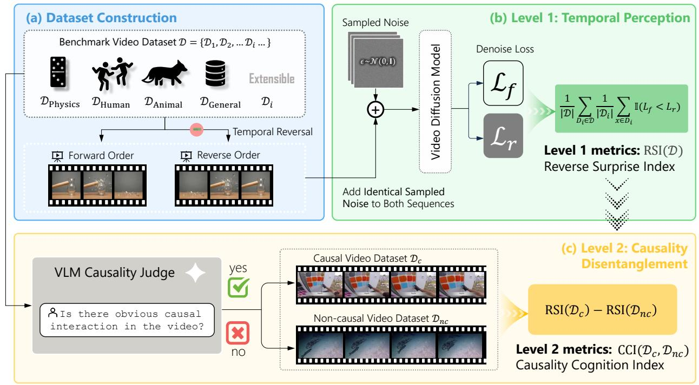

flowchart

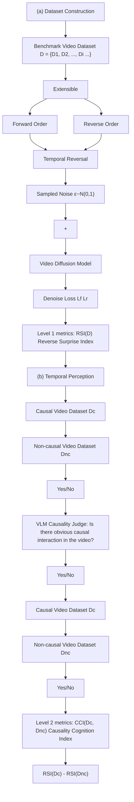

Figure 3 Overview of the YoCausal evaluation framework. (a) Dataset Construction: We construct an infinitely extensible benchmark by using real-world videos from different domains. By applying zero-cost temporal reversal, we generate natural counterfactual pairs (forward $x ^ { f }$ and reverse $x ^ { r } )$ . (b) Level 1 Temporal Perception: Identical sampled noise ϵ is added to both sequences and compute their denoising losses. Reverse Surprise Index (RSI), quantifies the model’s perception of the arrow of time by measuring the proportion of instances where the reversed video has a higher loss $( \mathcal { L } _ { r } > \mathcal { L } _ { f } )$ . (c) Level 2 Causality Disentanglement: To disentangle genuine causal cognition from statistical temporal biases, a Vision-Language Model (VLM) divides the dataset into causal $( \mathcal { D } _ { c } )$ and non-causal $( { \mathcal { D } } _ { n c } )$ subsets. The Level-2 metric, Causality Cognition Index (CCI), is computed as the difference in RSI between these subsets, isolating the model’s genuine causal cognition ability.

# 3.2 Formulating Surprise via Denoising Loss

We adopt the Violation of Expectation (VoE) paradigm from cognitive science [65, 78], where counterfactual stimuli that violate an observer’s expectations elicit surprise response whose magnitude reveals whether a corresponding cognitive model has been formed. We transfer this principle to VDMs by treating the learned distribution as the model’s expectation: lower assigned probability means greater surprise. This framing allows us to probe a VDM’s cognitive priors including causal understanding. Concretely, a VDM learns the data distribution $p ( x )$ of videos by training a neural network $\epsilon _ { \theta }$ to denoise noisy inputs $x _ { t } .$ . Its denoising loss is formulated as equation (1):

$$
\mathcal {L} _ {\text { denoise }} (\theta ; x _ {t}) = \mathbb {E} _ {t \sim \mathcal {U} (1, T), \epsilon \sim \mathcal {N} (0, \mathbf {I})} \left[ \| \epsilon - \epsilon_ {\theta} (x _ {t}, t) \| _ {2} ^ {2} \right] \gtrsim \mathbb {E} _ {x _ {0}} [ - \log p _ {\theta} (x _ {0}) ]. \tag {1}
$$

By variational inference theory [45, 100], this loss upper-bounds the negative log-likelihood (NLL). This means that the denoising loss can serve as an empirical proxy for the NLL of the video sequence x0 within the model’s learned distribution. Specifically, a higher denoising loss thus indicates lower modelassigned probability, letting us translate “degree of surprise” into magnitude of denoising loss as a quantifiable metric. The validity of denoising loss as a likelihood proxy has been established from prior work [66, 23, 128, 102, 101, 59].

# 3.3 Level 1: Measuring Arrow-of-Time Perception via RSI

Our design is inspired by the seminal work of Leslie and Keeble [65] in cognitive science: temporally reversing a video introduces anomalous causal inversions, so the difference in an infant’s surprise between forward and reversed videos serves as an indicator of causal perception. We transfer this insight to VDMs:

a model that has internalized causal cognition should assign higher likelihood to a forward video $x ^ { f }$ than to its reversed counterpart $x _ { } ^ { r } ,$ , meaning the VDM should be more “surprised” by the reversed clip. Using the quantifiable surprise metric defined in Sec. 3.2, we can express $p _ { \theta } ( x ^ { f } ) > p _ { \theta } ( x ^ { r } )$ equivalently as:

$$
\mathcal {L} _ {\text { denoise }} (\theta ; x ^ {r}) > \mathcal {L} _ {\text { denoise }} (\theta ; x ^ {f}). \tag {2}
$$

# 3.3.1 Reversal Surprise Index.

We propose the Reversal Surprise Index (RSI equation (3)) as our Level-1 metric. For each video $x _ { i , j } \in \mathcal { D } _ { i } ,$ , let $x _ { i , j } ^ { f }$ and $x _ { i , j } ^ { r }$ denote its forward and reversed sequences, respectively. We uniformly sample K=10 timesteps from the diffusion process and apply identical Gaussian noise ϵ to both sequences at each timestep (Fig. 3(b)), then average the resulting losses. Fixing the timesteps and noise ensures identical denoising difficulty. More details are provided in Appendix A.4. Concretely, RSI measures the proportion of videos for which the model correctly assigns a lower denoising loss to the forward sequence. For a dataset D composed of sub-datasets $\{ \mathcal { D } _ { i } \}$ , we compute the average across subset:

$$
\operatorname{RSI} (\mathcal {D}) = \frac {1}{| \mathcal {D} |} \sum_ {\mathcal {D} _ {i} \in \mathcal {D}} \frac {1}{| \mathcal {D} _ {i} |} \sum_ {x _ {i, j} \in \mathcal {D} _ {i}} \mathbb {1} \left[ \mathcal {L} _ {\text { denoise }} \left(\theta ; x _ {i, j} ^ {r}\right) > \mathcal {L} _ {\text { denoise }} \left(\theta ; x _ {i, j} ^ {f}\right) \right], \tag {3}
$$

where 1[·] is the indicator function and RSI ∈ [0, 1]; higher values indicate stronger perception of the arrow of time and causality. Crucially, because RSI compares losses from the same model on two versions of a single video, differences in visual appearance and denoising properties across architectures cancel out, making the metric directly comparable across videos and models.

Blind spot of RSI. RSI alone, however, is insufficient to probe causal cognition. As Leslie and Keeble [65] noted, a model’s surprise at reversed videos may stem from two entangled sources: reversed causality and reversed arrow of time (Fig. 4). Their original solution is hand-crafting causal and non-causal synthetic video. Nevertheless, this method is incompatible with our goal of real-world, scalable evaluation, motivating the design of our Level-2 metric.

# 3.4 Level 2: Disentangling Causality via CCI

Real-world videos naturally vary in causal salience (Fig. 4): breaking glass exhibit a clear causal chain, while a car cruising on a highway does not. Therefore, there is no need to craft synthetic videos, and we directly partition D into a causal subset $\mathcal { D } _ { c }$ and a non-causal subset $\mathcal { D } _ { n c }$ based on whether obvious cause-effect interactions are present.

# 3.4.1 Causality Cognition Index.

As illustrated in Fig. 4, the partition is the key to disentangling causality and the arrow of time. Reversing a causal video introduces two anomaly sources: reversed temporal direction and reversed causality, whereas a non-causal video introduces only the first. A causally aware model should show higher RSI on $\mathcal { D } _ { c }$ than on $\mathcal { D } _ { n c }$ . We propose the Causality Cognition Index (CCI) as equation (4). A higher CCI indicates a model captures reversed causality cues beyond statistical temporal patterns.

$$
\operatorname{CCI} (\mathcal {D}) = \operatorname{RSI} (\mathcal {D} _ {c}) - \operatorname{RSI} (\mathcal {D} _ {n c}). \tag {4}
$$

As shown in Fig. 3(c), since constructing CCI only requires detecting whether causality exists which is easier than judging its correctness, we automate dataset splitting with an advanced Vision-Language Model (VLM) using a carefully designed prompt (see Appendix A.5) to ensure scalability. We validate the reliability of VLM from multiple perspectives; here we highlight two: (1) VLM-stratified model rankings correlate strongly with human-stratified ones, and the confusion matrix shows close agreement between VLM and human annotations (Fig. 5b); (2) optical flow analysis reveals negligible motion-magnitude difference between $\mathcal { D } _ { c }$ and ${ \mathcal { D } } _ { n c } \left( { \mathrm { F i g . ~ } } 5 { \mathrm { a } } \right)$ , confirming that the VLM reasons semantically rather than exploiting lowlevel motion cues, indicating CCI further disentangle motion statistics from causality. Additional analyses including VLM sensitivity analysis and a discussion of implicit causality are provided in Appendix $\mathrm { A . 7 }$ .

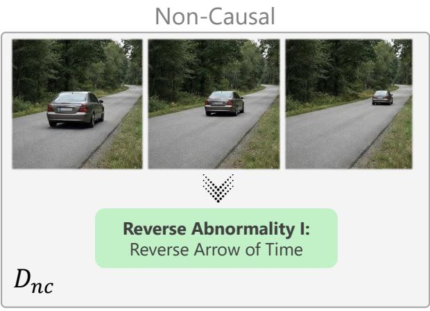

text_image

Non-Causal
Reverse Abnormality I:
Reverse Arrow of Time
Dnc

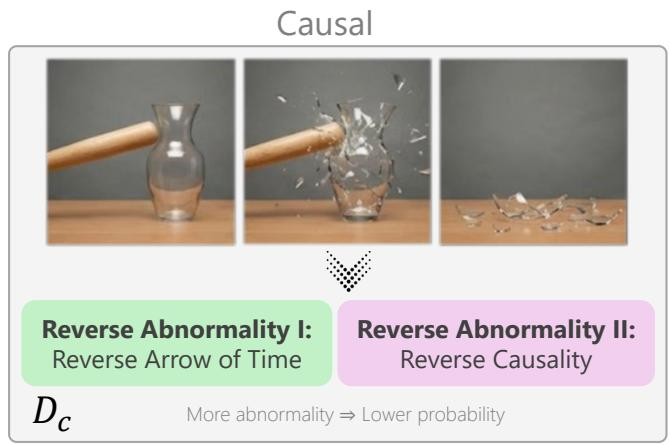

text_image

Causal
Reverse Abnormality I:
Reverse Arrow of Time
Reverse Abnormality II:
Reverse Causality
Dc
More abnormality ⇒ Lower probability

flowchart

Figure 4 Key idea behind CCI. Reversing a non-causal video (e.g. a car cruising) introduces only one source of abnormality: reversed arrow of time. While, a causal video $( e . g .$ a hammer shattering a vase) introduces an additional source: reversed causality. A causally aware model should perceive more abnormality in the reversed causal video, exhibiting greater surprise (higher RSI). The gap $\mathrm { C C I } = \mathrm { R S I } ( \bar { \mathcal { D } } _ { c } ) - \mathrm { R S I } ( \mathcal { D } _ { n c } )$ thus disentangles the model’s sensitivity to causality from its sensitivity to statistical temporal patterns.

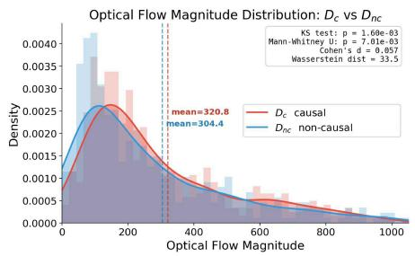

line

| Optical Flow Magnitude | Dc causal Density | Dnc non-causal Density |
| ---------------------- | ------------------ | ----------------------- |
| 0                      | 0.0010             | 0.0010                  |
| 100                    | 0.0025             | 0.0025                  |
| 200                    | 0.0028             | 0.0028                  |
| 300                    | 0.0025             | 0.0025                  |
| 400                    | 0.0020             | 0.0020                  |
| 500                    | 0.0015             | 0.0015                  |
| 600                    | 0.0012             | 0.0012                  |
| 700                    | 0.0010             | 0.0010                  |
| 800                    | 0.0008             | 0.0008                  |
| 900                    | 0.0006             | 0.0006                  |
| 1000                   | 0.0005             | 0.0005                  |

(a) Optical flow magnitude distributions of $\mathcal { D } _ { c }$ and $\mathcal { D } _ { n c }$ (computed with RAFT [109]).

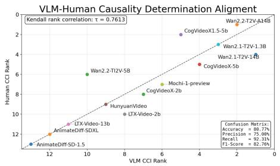  
(b) VLM-human Alignment.   
Figure 5 Validating VLM-based causal/non-causal partitioning. (a) The effect size between two optical flow distribution is negligible (Cohen’s $d { = } 0 . 0 5 7 { < } 0 . 2 )$ , confirming the VLM infers causality from high-level semantics rather than low-level motion cues. (b) Comparing CCI rankings and the confusion matrix from a VLM partition over the full dataset against human annotators (30 clearly causal, 30 clearly non-causal videos), the high Kendall correlation (τ=0.7613) and F1-score (82.76%) confirm VLM-based labeling as a reliable proxy for human judgment.

Finally, we must emphasize that CCI is a relative index and must be jointly interpreted with RSI: high RSI but low CCI suggests the model only perceives the statistical arrow of time; high CCI but low RSI renders the CCI unreliable due to poor temporal grounding. We introduce an aggregate ranking combining both metrics in Sec. 4.3.

# 4 Experiment

We employ YoCausal to evaluate the causal cognition of current open-source video diffusion models, presenting Level 1 RSI results (Sec. 4.1), Level 2 CCI results (Sec. 4.2), an aggregate ranking (Sec. 4.3) that jointly considers both metrics, cross-metric analysis (Sec. 4.4) and entropy-controlled analysis (Sec. 4.5).

Settings. We evaluate 13 state-of-the-art open-source text-to-video diffusion models spanning diverse architectures and scales [38, 48, 124, 106, 61, 114, 41] (details in Appendix A.2). To ensure each model operates at its best, all inference configurations strictly follow official recommendations, including FPS, resolutions and so on. Videos are preprocessed through reasonable resizing and temporal adjustments to match each model’s specifications. Detailed per-model settings and preprocessing procedures are provided in Appendices A.2 and A.3.

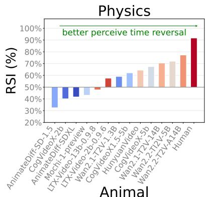

bar

| Animal              | RSI (%) |
| ------------------- | ------- |
| AnimateDiff-SD-1.5   | 35      |
| CogVideoX-2b        | 48      |
| AnimateDiff-SDXL     | 45      |
| Mochi-1-preview      | 47      |
| LTX-Video-13b-0.9.6 | 48      |
| LTX-Video-2b-0.9.6  | 50      |
| Wan2.1-TZV-1.3B      | 55      |
| CogVideoX1.5-5b      | 58      |
| HunnyanVideo        | 60      |
| CogVideoX-5b        | 62      |
| Wan2.1-TZV-14B       | 65      |
| Wan2.2-TZV-14B       | 70      |
| Wan2.2-TZV-A14B     | 72      |
| Human               | 90      |

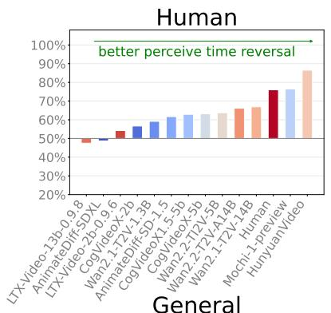

bar

| Model | Value |
| --- | --- |
| LTX-Video-13b-0.9.8 | 50% |
| AnimateDiff-SDXL | 50% |
| LTX-Video-2b-0.9.6 | 55% |
| CogVideoX-2b | 60% |
| Wan2.1-T2V-1.3B | 60% |
| AnimateDiff-SD-1.5 | 60% |
| CogVideoX-15-5b | 60% |
| CogVideoX-5b | 60% |
| Wan2.2-T2V-5B | 60% |
| Wan2.2-T2V-A14B | 60% |
| Wan2.1-T2V-14B | 65% |
| Human | 75% |
| Mochi 1-preview | 75% |
| HunyuanVideo | 85% |

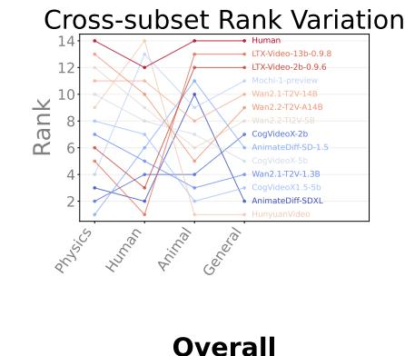

line

| Category   | Human | LTX-Video-13b-0.9.8 | LTX-Video-2b-0.9.6 | Mochi-1-preview | Wan2.1-T2V-14B | Wan2.2-T2V-A14B | Wan2.2-T12V-SB | CogVideoX-2b | AnimateDiff-SDL-1.5 | CogVideoX-5b | Wan2.1-T2V-1.3B | CogVideoX1.5-5b | AnimateDiff-SDXL | HunyuanVideo |
| ---------- | ----- | ------------------- | ------------------ | --------------- | -------------- | --------------- | -------------- | ------------ | -------------------- | ------------ | --------------- | --------------- | ---------------- | ------------ |
| Physics    | 14    | 13                  | 12                 | 10              | 8              | 6               | 4              | 6            | 7                    | 5            | 3             | 2               | 1                | 5            |
| Human      | 12    | 11                  | 10                 | 8               | 6              | 4               | 2              | 4            | 5                    | 3            | 2             | 1               | 0                | 3            |
| Animal     | 14    | 13                  | 12                 | 10              | 8              | 6               | 4              | 6            | 7                    | 5            | 3             | 2               | 0                | 5            |
| General    | 14    | 13                  | 12                 | 10              | 8              | 6               | 4              | 6            | 7                    | 5            | 3             | 2               | 0                | 5            |

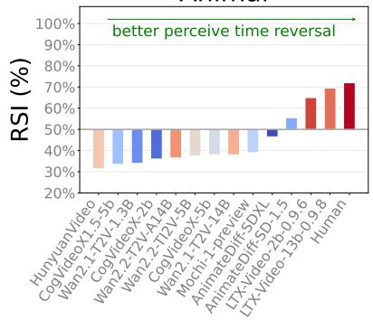

bar

| Video Sequence | RSI (%) |
| --- | --- |
| HunyuanVideo | 40 |
| CogVideoX-1.5b | 40 |
| Wan2.1-T2V-1.3B | 40 |
| CogVideoX-2b | 40 |
| Wan2.2-T2V-A14B | 40 |
| Wan2.2-T2V-5b | 40 |
| CogVideoX-5b | 40 |
| Wan2.1-T2V-14B | 40 |
| Mochi-1-preview | 40 |
| AnimateDiff-SDXL | 40 |
| AnimateDiff-5D-1.5 | 50 |
| LTX-video-2b-0.9.6 | 65 |
| LTX-video-13b-0.9.8 | 70 |
| Human | 75 |

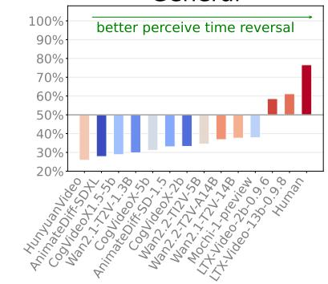

bar

| Model | Value |
| --- | --- |
| HunyuanVideo | 45% |
| AnimateDiff-SDL | 28% |
| CogVideoX1.5.5b | 48% |
| Wan2.1T2V-1.3B | 47% |
| CogVideoX-5b | 46% |
| AnimateDiff-SD-1.5 | 45% |
| Wan2.2T2V-5B | 44% |
| Wan2.1T2V-A14B | 43% |
| Mochi-1-preview | 42% |
| LTX-Video-2b-0.9.6 | 40% |
| LTX-Video-13b-0.9.8 | 58% |
| Human | 75% |

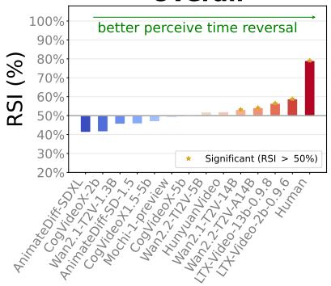

bar

| Category              | RSI (%) |
| --------------------- | ------- |
| AnimateDiff-SDXL      | 45%     |
| CogVideoX-2b          | 45%     |
| Wan2.1-T2V-1.3B       | 45%     |
| AnimateDiff-SD-1.5    | 45%     |
| CogVideoX-1.5.5b      | 45%     |
| Mochi-1-preview       | 45%     |
| CogVideoX-5b          | 45%     |
| Wan2.2-T2V-5B         | 45%     |
| HunyuanVideo         | 45%     |
| Wan2.1-T2V-14B        | 45%     |
| Wan2.2-T2V-A14B       | 45%     |
| LTX-Video-13b-0.9.8   | 45%     |
| LTX-Video-2b-0.9.6    | 45%     |
| Human                 | 80%     |

Figure 6 Level-1 RSI results. RSI scores of 13 VDMs and human annotators across four subsets and the full dataset. Several models surpass the 50% random-guess baseline with 90% confidence (bootstrap test) but still lag considerably behind human performance. Cross-subset variations highlight the necessity of evaluating across diverse domains.

# 4.1 RSI Results

In Fig. 6, we evaluate all 13 models on Level 1 RSI, with human annotators judging 1,200 videos’ temporal directions as an upper bound [44] (details in Appendix A.10). Humans achieve the highest RSI across all subsets except Human Action. Several models surpass the 50% random-guess baseline with 90% confidence (bootstrap test), yet a significant gap remains relative to human performance. Higher-fidelity models (e.g. LTX-Video-13B, Wan2.1/2.2-14B) tend to score higher, whereas lower-fidelity models (e.g. AnimateDiff-SDv1.5/SDXL) exhibit weaker temporal perception.

Per-subset results reveal cross-domain variation due to (1) differing cue strength across subsets: for example, videos in $D _ { P h y s i c s }$ contain unambiguous anomalies when reversed, and (2) domain-specific biases from training data: for instance, most models perform well on $D _ { H u m a n }$ given the abundance of human activity videos online. These highlight the value of evaluating across diverse subsets.

Notably, some models score below the 50% baseline, suggesting their learned distributions capture local visual smoothness without internalizing the arrow of time and yield no preference, or even a slight inverse preference for forward sequences. A similar observation is reported in LikePhys [128].

# 4.2 CCI Results

We further analyze Level 2 CCI in Fig. 7. Humans achieve the highest CCI, though the margin over models is modest since humans already saturate both subsets. Several models attain positive CCI with 90% confidence (bootstrap), demonstrating preliminary causal perception; the top performers concentrate in the Wan and CogVideo families, hinting that shared training data and architectural choices may give rise to emergent causal understanding. Crucially, models ranking high on RSI—LTX-Video-2B/13B and Hunyuan-

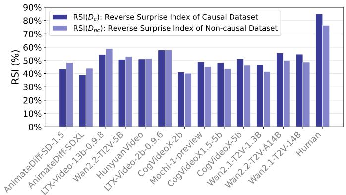

bar

| Dataset | RSI(Dc): Reverse Surprise Index of Causal Dataset (%) | RSI(Dnc): Reverse Surprise Index of Non-causal Dataset (%) |
| :--- | :--- | :--- |
| AnimateDiff-SD-1.5 | 43 | 48 |
| AnimateDiff-SDXL | 38 | 44 |
| LTX-Video-13b-0.9.8 | 54 | 59 |
| Wan2.2-T2V-5B | 50 | 53 |
| HunyuanVideo | 50 | 51 |
| LTX-Video-2b-0.9.6 | 58 | 58 |
| CogVideoX-2b | 41 | 40 |
| Mochi-1-preview | 49 | 45 |
| CogVideoX1.5-5b | 49 | 44 |
| CogVideoX-5b | 51 | 46 |
| Wan2.1-T2V-1.3B | 47 | 41 |
| Wan2.2-T2V-A14B | 56 | 50 |
| Wan2.1-T2V-14B | 55 | 49 |
| Human | 85 | 76 |

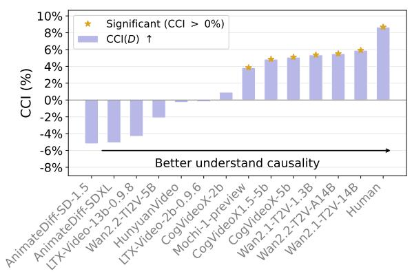

bar

| Category              | CCI(%) |
| --------------------- | ------ |
| AnimateDiff-SD-1.5     | -6%    |
| AnimateDiff-SDXL      | -4%    |
| LTX-Video-13b-0.9.8   | -2%    |
| Wan2.2-TI2V-5B        | -1%    |
| HunyuanVideo         | 0%     |
| LTX-Video-2b-0.9.6    | 1%     |
| CogVideoX-2b          | 4%     |
| CogVideoX1.5-5b       | 5%     |
| CogVideoX-5b          | 5%     |
| Wan2.1-TZV-1.3B       | 5%     |
| Wan2.2-TZV-A14B       | 6%     |
| Wan2.1-TZV-14B        | 7%     |
| Human                 | 9%     |

Figure 7 Level-2 CCI results. Left: RSI scores of 13 VDMs and human annotators on the causal subset $\mathcal { D } _ { c }$ (dark blue) and non-causal subset $\mathcal { D } _ { n c }$ (light blue). Right: the resulting CCI.   
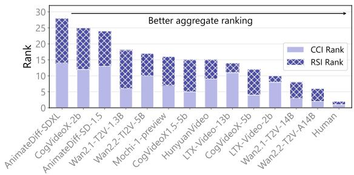

bar_stacked

| Category | CCI Rank | RSI Rank |
|---|---|---|
| AnimateDiff-SDXL | 14 | 16 |
| CogVideoX-2b | 12 | 13 |
| AnimateDiff-SD-1.5 | 13 | 10 |
| Wan2.1-T2V-1.3B | 6 | 13 |
| Wan2.2-T12V-5B | 9 | 8 |
| Mochi-1-preview | 7 | 7 |
| CogVideoX1.5-5b | 5 | 7 |
| HunyuanVideo | 9 | 6 |
| LTX-Video-13b | 11 | 5 |
| CogVideoX-5b | 3 | 6 |
| LTX-Video-2b | 7 | 4 |
| Wan2.1-T2V-14B | 8 | 3 |
| Wan2.2-T2V-A14B | 0 | 6 |
| Human | 0 | 1 |
Better aggregate ranking

Figure 8 Aggregate ranking of causal cognition. We sum each model’s RSI and CCI ranks to obtain an aggregate causality score (lower is better). Ties are broken by RSI rank.

Video—score poorly on CCI, confirming that our two-level framework disentangles causal cognition from mere arrow-of-time perception.

Negative CCI in some models reflects the same distributional deficiency noted in Sec. 4.1: lacking an internalized causality, they treat reversed causal and non-causal sequences as equally anomalous.

# 4.3 Aggregating Arrow of Time and Causality Cognition

As discussed in Sec. 3.4, RSI and CCI should not be interpreted in isolation, and robust causal understanding requires strong performance on both metrics. To provide a single, intuitive measure of overall causal cognition, we combine the two indices with direct arithmetic combination. We propose a heuristic aggregate rank by suming each model’s ranks on RSI and CCI as aggregate causality score and sort the totals. Since RSI serves as the prerequisite foundation for causal cognition, ties are broken in favor of the model with the higher RSI rank.

As shown in Fig. 8, this aggregate ranking provides a holistic view of each model’s causal cognition capability and will serve as the quantitative basis for the cross-metric analyses (Sec. 4.4).

# 4.4 Cross-Metric Analysis

To validate our benchmark and explore the interplay between causality and other model capabilities, we compute Kendall’s rank correlation coefficient τ[1] between our aggregate rank and model rankings on several external metrics and model properties, as summarized in Tab. 2.

Human Causality Preference. To verify that our benchmark captures causal understanding, we conduct a user study in which models generate videos from causally rich prompts and human evaluators rank them by causality plausibility (details in Appendix A.11). As shown in Tab. 2, our benchmark exhibits a moderate correlation (τ = 0.3333) with human preference, confirming its ability to assess causal understanding. Because annotators tend to conflate visual quality with causal correctness yet our cross-metric analysis shows zero correlation with AestheticQuality, the correlation is pushed toward zero by such bias. Therefore, there is an underestimate of our benchmark’s true alignment with human causal preference.

Table 2 Cross-metric analysis. Kendall’s τ between our aggregate causal cognition ranking and external benchmarks/model features. Moderate correlation with human preference validates our benchmark; positive correlation with [128] indicates causal cognition relates to but is not reducible to physical understanding; zero correlation with aesthetic quality rules out visual-appeal confounding; strong correlation with release date and parameters supports scaling laws and architectural evolution. 

<table><tr><td rowspan="2"></td><td rowspan="2">Human Preference</td><td rowspan="2">LikePhys [128]</td><td colspan="5">VBench [50]</td><td rowspan="2">Release Date</td><td rowspan="2"># of Parameters</td></tr><tr><td>Aesthetic Quality</td><td>Subject Consistency</td><td>Background Consistency</td><td>Motion Smoothness</td><td>Temporal Flickering</td></tr><tr><td>Kendall&#x27;s τ</td><td>0.3333</td><td>0.5111</td><td>0.0000</td><td>0.3333</td><td>0.0256</td><td>0.2821</td><td>0.2564</td><td>0.5958</td><td>0.6880</td></tr><tr><td>p-value</td><td>0.4694</td><td>0.0466</td><td>1.0000</td><td>0.1289</td><td>0.9524</td><td>0.2044</td><td>0.2519</td><td>0.0316</td><td>0.0093</td></tr></table>

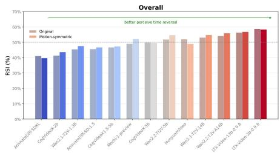

bar

Overall
| Category | Original (%) | Motion-symmetric (%) |
|---|---|---|
| Annotated/0.5/0.5L | 40 | 42 |
| Copyright-1.2B | 42 | 44 |
| WiR-2.1/2.1-1.3B | 46 | 48 |
| Annotated/0.5/0.5L | 48 | 49 |
| Copyright-1.5.5.5B | 47 | 49 |
| Ancho's Systview | 49 | 50 |
| Copyright-1.5B | 52 | 53 |
| WiR-2.1/2.1/2.5B | 50 | 52 |
| HummingVideo | 52 | 50 |
| WiR-2.1/2.1-1.8B | 54 | 55 |
| WiR-2.1/2.1-2.4.5B | 56 | 57 |
| DTS-Video-1.2B-0.8 | 57 | 58 |
| DTS-Video-1.2B-1.6 | 59 | 60 |
Better perceive time reversal

Figure 9 Motion-magnitude-symmetric subset RSI results. Original reports each model’s RSI on the full dataset; Motion-symmetric reports RSI on the 30% of videos with the most symmetric optical-flow magnitude trajectories. The close agreement indicates that RSI reflects event-level temporal structure rather than low-level entropy dynamics.

Intuitive Physics Correlation. Clarifying the relationship between causal cognition and intuitive physics will provide important guidance for future model improvement. We compute the rank correlation with LikePhys [128], a benchmark for intuitive physics in VDMs. Tab. 2 reveals positive correlation (τ = 0.5111), implying that physical laws constrain object interactions and thereby influence causality. However, the moderate magnitude shows causal cognition is not reducible to physical intuition alone, meaning that separately assessing causal capabilities remains essential, highlighting the unique contribution of our benchmark.

VBench Correlation. In addition, we examine the relationship between causality and visual generation quality by computing correlations with five VBench metrics [50]. As shown in Tab. 2, causality shows zero correlation with aesthetic quality (τ = 0.0000), confirming that our benchmark is not confounded by visual appeal. The consistency index show mild correlations: Unconsistency violates causal expectations. The modest magnitudes indicate a gap between consistency and causality.

Scaling Law and Generation Evolution. As shown in Tab. 2, both release date (τ=0.596) and model parameters (τ=0.688) correlate significantly with the aggregate ranking, indicating scaling laws [127, 73, 56] and architectural evolution extend to causal cognition (Appendix A.13).

# 4.5 Entropy-Controlled Subset Analysis

A concern is that models may exploit low-level entropy dynamics rather than perceiving the arrow of time, confounding RSI. To address this, we identify videos with similar entropy trajectories under forward and reversed orderings, and verify that (i) models still achieve RSI > 50% and (ii) RSI values do not deviate substantially from the full dataset. We use motion magnitude as an entropy proxy, since larger frame-toframe dynamics indicate higher disorder. For each forward video, we compute its per-frame RAFT [109] optical-flow magnitude sequence $M _ { f }$ and define an asymmetry score $a = \mathsf { \bar { \Pi } } \mathsf { I } | M _ { f } - \mathsf { r e v e r s e } ( M _ { f } ) | | _ { 2 } / | | M _ { f } | | _ { 2 }$ . Retaining the lowest-30% asymmetry videos yields a entropy-trajectory-symmetric subset on which we recompute RSI.

As shown in Fig. 9, RSI scores on this subset closely track those on the full dataset, and most models surpassing the 50% baseline continue to do so after entropy matching. This indicates that RSI captures statistical temporal structure rather than low-level entropy dynamics. Since CCI is defined via RSI, this entropy-invariance propagates: the causal cognition measured by YoCausal is likewise not confounded by low-level entropy cues, supporting the validity of our evaluation.

# 5 Conclusion and Limitation

This paper presents YoCausal, the first benchmark for evaluating causal cognition in VDMs. Inspired by the VoE paradigm from cognitive science, we leverage temporally reversed real-world videos as natural counterfactual samples, establishing an arbitrarily extensible evaluation protocol free from synthetic data or controlled settings. Experiments across 13 open-source VDMs reveal that: (1) perceiving the arrow of time is not equivalent to understanding causality; (2) even the best models exhibit a substantial gap relative to the human upper bound; (3) causal cognition is related to yet not reducible to intuitive physics and shows no correlation with aesthetic quality, confirming YoCausal captures a unique evaluation dimension, and (4) both parameter scaling and architectural evolution improve causal understanding. While physical understanding and scaling up models may partially improve causal perception [67], we hope YoCausal motivates the community [25] to treat causal cognition as a distinct objective and advance this capability in the future.

Limitation. Our method struggles with temporally symmetric events (e.g. Newton’s cradle), where forward and reversed sequences are visually near-identical, rendering RSI ineffective. Moreover, computing denoising losses requires access to model weights, limiting external evaluation of closed-source models, though developers can still apply YoCausal internally to diagnose and improve causal cognition. Addressing these limitations remains future work.

# Appendix

# Appendix Overview

This appendix provides additional details and complete numerical results to complement the main manuscript. First, we describe the dataset construction protocol in Appendix A.1. Then, we detail the inference configurations and specifications of all 13 evaluated models in Appendix A.2, followed by the unified video preprocessing pipeline in Appendix A.3. Next, we formalize the Reverse Surprise Index (RSI) and Causality Cognition Index (CCI) algorithms in Appendix A.4 and Appendix A.5, respectively. We further discuss the potential prompt bias and how our two-level metric design addresses it in Appendix A.6. Also, we explore the reliability of VLM for splitting the dataset in Appendix A.7. Finally, we present the human annotation procedure and human preference study design in Appendix A.10 and Appendix A.11, and provide the complete numerical tabular results for all metrics in Appendix A.12. In addition, we provide an interactive HTML interface to show our video results.

# A.1 Details on Dataset Construction

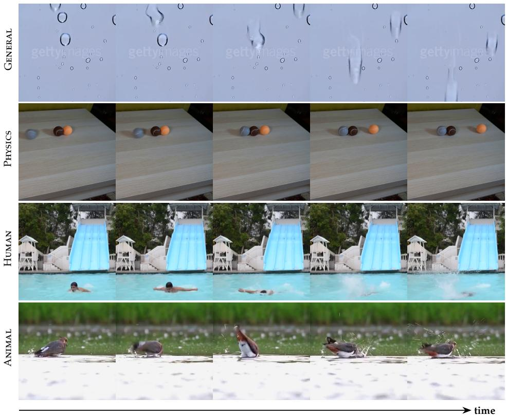

text_image

GENERAL
PHYSICS
HUMAN
ANIMAL
time

Figure A.1 Qualitative results of our four diverse causal domains. Each row illustrates the featured video in the subsets. Our benchmark dataset D comprises four thematic subsets, each sourced from a well-established real-world video collection. We describe the construction protocol for each subset below, followed by a discussion of the dataset’s overall scale and extensibility.

General Subset $( \mathcal { D } _ { \mathsf { G e n e r a l } } )$ . We randomly sample 500 videos from the Moments in Time dataset [84], retaining each clip at its original duration of 3 seconds. Moments in Time [84] is a large-scale collection of approximately one million 3-second clips curated by MIT, covering 339 action and event categories that span human activities, animal behaviors, natural phenomena, and object state changes. Its broad semantic diversity makes it well-suited for evaluating general everyday causality without domain-specific bias.

Physics Subset $\rho _ { \mathsf { P h y s i c s } } )$ . We source 132 videos from the Physics IQ dataset [85], selecting one camera viewpoint per scene from the dataset’s 132 physical scenarios and trimming each clip to the first 5 seconds following the official evaluation protocol. Physics IQ is specifically designed to assess intuitive physical understanding in video generative models, covering phenomena such as gravity, fluid motion, and collision dynamics. Each clip presents an unambiguous physical event, making this subset particularly rich in temporally asymmetric causal cues.

Human Action Subset $\left( \mathcal { D } _ { \mathsf { H u m a n } } \right)$ . We randomly sample one video per action class from Kinetics-400 [57], yielding 400 clips in total, each trimmed to the first 3 seconds. Kinetics-400 is a canonical human action recognition benchmark curated by DeepMind, comprising approximately 300K YouTube clips across 400 action categories such as swimming, playing guitar, and handshaking. The abundance of diverse humancentric activities provides strong coverage of goal-directed, agent-caused interactions where the causal arrow is tied to purposeful body motion.

Animal Action Subset $\left( \mathcal { D } _ { \mathsf { A n i m a l } } \right)$ . We randomly sample 200 videos from the Animal Kingdom dataset [87], trimming each clip to the first 3 seconds. Animal Kingdom is a large-scale dataset annotated with a rich taxonomy of animal behaviors, including foraging, aggression, courtship, and locomotion, across a highly diverse set of species. This subset extends our benchmark beyond anthropocentric scenarios to assess whether causal cognition generalizes to non-human agents and natural world dynamics.

Scale and Extensibility. As discussed in the main paper, our benchmark is inherently extensible, as any real-world video can be incorporated at zero additional cost via temporal reversal. In the current work, we evaluate a total of 1,232 videos across the four subsets described above. This scale was chosen under practical computational constraints: evaluating 13 video diffusion models (several with billions of parameters) requires substantial GPU overhead, and the computational resource we can afford only supports us to evaluate with thousands of videos. Future researchers with access to greater resources, or those benchmarking a single target model, are encouraged to expand the dataset’s scale and diversity by incorporating additional domains (e.g. tool use, cooking, or sports) to keep the benchmark evolving alongside model capabilities.

A summary of the subset composition is provided in Table Tab. A.1.

Table A.1 Composition of the YoCausal benchmark dataset. Each subset is sourced from an existing real-world video collection, with clips uniformly trimmed to the specified duration. 

<table><tr><td>Subset</td><td>Source Dataset</td><td>Clip Duration</td><td># Videos</td></tr><tr><td> $\mathcal{D}_{General}$ </td><td>Moments in Time [84]</td><td>3 s</td><td>500</td></tr><tr><td> $\mathcal{D}_{Physics}$ </td><td>Physics IQ [85]</td><td>5 s (first 5 s)</td><td>132</td></tr><tr><td> $\mathcal{D}_{Human}$ </td><td>Kinetics-400 [57]</td><td>3 s (first 3 s)</td><td>400</td></tr><tr><td> $\mathcal{D}_{Animal}$ </td><td>Animal Kingdom [87]</td><td>3 s (first 3 s)</td><td>200</td></tr><tr><td>Total</td><td>—</td><td>—</td><td>1,232</td></tr></table>

# A.2 Models Setting

We evaluate 13 state-of-the-art open-source text-to-video diffusion models spanning diverse architectures and parameter scales: AnimateDiff-SDv1.5/SDXL [38], CogVideoX-2B/5B [48, 124], CogVideoX1.5-5B [48, 124], Mochi-1-preview [106], HunyuanVideo [61], Wan2.1-T2V-1.3B/14B [114], Wan2.2-TI2V-5B/T2V-A14B [114], and LTX-Video-2B/13B [41].

To ensure each model operates under its optimal conditions, all inference configurations strictly follow the official recommended defaults for each model (Tab. A.2), including output resolution, number of frames, and frames per second (FPS). It is worth noting that classifier-free guidance (CFG) [46] is not applied during evaluation: rather than performing full denoising generation, we directly compute the MSE between the model’s predicted noise ϵˆ and the sampled Gaussian noise ϵ at each timestep. In addition, we report model specifications (e.g. spatial compression ratios) in Tab. A.2 to further investigate the relationship between model features and causal cognition performance.

Table A.2 Comparison of various video generation models based on selected parameters and features, grouped by model series. For each model, we report the parameter count, spatial and temporal compression ratios of the VAE, frame window size, frames per second (FPS), and default output resolution. 

<table><tr><td>Model Name</td><td>Params.</td><td>Spatial Compress</td><td>Temporal Compress</td><td>Frame Window</td><td>FPS</td><td>Default Resolution</td></tr><tr><td colspan="7">Wan</td></tr><tr><td>Wan 2.2 A14B</td><td>14B</td><td>8×</td><td>4×</td><td>81</td><td>16</td><td> $1280 \times 720$ </td></tr><tr><td>Wan 2.2 5B</td><td>5B</td><td>8×</td><td>4×</td><td>121</td><td>24</td><td> $1280 \times 720$ </td></tr><tr><td>Wan 2.1 14B</td><td>14B</td><td>8×</td><td>4×</td><td>81</td><td>16</td><td> $1280 \times 720$ </td></tr><tr><td>Wan 2.1 1.3B</td><td>1.3B</td><td>8×</td><td>4×</td><td>81</td><td>16</td><td> $832 \times 480$ </td></tr><tr><td colspan="7">Hunyuan</td></tr><tr><td>Hunyuan Video</td><td>13B</td><td>8×</td><td>4×</td><td>129</td><td>24</td><td> $1280 \times 720$ </td></tr><tr><td colspan="7">Mochi</td></tr><tr><td>Mochi 1</td><td>10B</td><td>8×</td><td>6×</td><td>163</td><td>30</td><td> $848 \times 480$ </td></tr><tr><td colspan="7">CogVideoX</td></tr><tr><td>CogVideoX-5B</td><td>5B</td><td>8×</td><td>4×</td><td>81</td><td>16</td><td> $720 \times 480$ </td></tr><tr><td>CogVideoX-2B</td><td>2B</td><td>8×</td><td>4×</td><td>81</td><td>16</td><td> $720 \times 480$ </td></tr><tr><td>CogVideoX1.5-5B</td><td>5B</td><td>8×</td><td>4×</td><td>81</td><td>16</td><td> $1360 \times 768$ </td></tr><tr><td colspan="7">AnimateDiff</td></tr><tr><td>AnimateDiff SD 1.5</td><td>1.4B</td><td>8×</td><td>1×</td><td>16</td><td>8</td><td> $512 \times 512$ </td></tr><tr><td>AnimateDiff SDXL</td><td>3.5B</td><td>8×</td><td>1×</td><td>16</td><td>8</td><td> $1024 \times 1024$ </td></tr><tr><td colspan="7">LTXV</td></tr><tr><td>LTXV-13B-0.9.8</td><td>13B</td><td>32×</td><td>8×</td><td>121</td><td>30</td><td> $1216 \times 704$ </td></tr><tr><td>LTXV-2B-0.9.6</td><td>2B</td><td>32×</td><td>8×</td><td>121</td><td>30</td><td> $1216 \times 704$ </td></tr></table>

# A.3 Video Preprocessing

Since each model operates under its officially recommended settings ( Appendix A.2), input specifications inevitably differ across models in spatial resolution, frame rate, and temporal length. To ensure a fair and consistent evaluation, we apply a unified preprocessing pipeline encompassing three stages: resolution adaptation, FPS resampling, and long video handling.

Resolution Adaptation. Since different models require different input resolutions and aspect ratios, we employ two adaptation strategies depending on the model’s design. For models that only support a fixed resolution, we first rescale the input video such that its shorter side matches the target dimension, and then apply a center crop to obtain the model’s officially specified resolution and aspect ratio. For models that support multiple aspect-ratio buckets (e.g. the Wan series and HunyuanVideo), we automatically select the bucket resolution closest to the original video’s aspect ratio.

FPS Resampling. We use FFmpeg to resample all source videos to each model’s prescribed frame rate, ensuring that the temporal sampling rate is consistent with the model’s training configuration.

Long Video Handling. Different models have different maximum frame windows (i.e. the number of frames they can process in a single forward pass). When the total number of frames in a source video exceeds a model’s frame window limit, naively truncating the video would compromise evaluation fairness, as the model would only observe a partial segment. To address this, we partition the video along the temporal axis into consecutive frame-window-sized segments. If the last segment is shorter than a full window, we pad it by prepending the necessary number of frames from the preceding segment as temporal context. Importantly, this context portion is used solely to provide temporal information and is excluded from the denoising loss accumulation. Finally, we sum the denoising losses across all windows for the entire video, and use this aggregated value as the basis for comparing forward and reversed sequences.

# A.4 Details on RSI Algorithm

The Reverse Surprise Index (RSI) quantifies a model’s ability to perceive the arrow of time, serving as our Level-1 metric. The complete procedure is formalized in algorithm 1 (Stage 1 and Stage 2).

Timestep and Noise Sampling. The denoising loss is defined as an expectation over both diffusion timesteps t and sampled noise ϵ. To approximate this expectation, we uniformly sample $K { = } 1 0$ timesteps from [1, T], excluding the boundaries $t { = } 0$ and $t { = } T _ { \mathrm { m a x } }$ (fully clean and fully noised states). For each timestep, we draw $N _ { \epsilon } { = } 1$ noise sample $\epsilon \sim \mathcal { N } ( \mathbf { 0 } , \mathbf { I } )$ and apply it identically to both the forward sequence $x ^ { f }$ and the reversed sequence $x ^ { r }$ , ensuring that the two versions face identical denoising difficulty. For latent diffusion models, the noise is sampled in the latent space; for pixel-space models, it is sampled at the full spatial resolution.

Following LikePhys[128], we condition both the forward and reversed sequences on the same text prompt, $i . e .$ the original caption of the forward video in the dataset. Writing a separate caption for the reversed clip would conflate causal understanding with the ability to follow unrealistic instructions. While a null prompt is also viable, conditioning on the meaningful caption provides a sharper denoising signal at low-SNR timesteps, avoding the randomness of this evaluation method and giving more stable evaluation process. We also empirically validate that RSI and CCI remain significant under null prompts (see Appendix $_ { \mathrm { A } . 6 ) }$ , confirming that our metrics capture genuine temporal-causal structure rather than text-video misalignment artifacts.

We set $K { = } 1 0$ and $N _ { \epsilon } { = } 1$ primarily due to computational constraints: our evaluation spans 13 large-scale models over $^ { 1 , 2 3 2 }$ videos, making exhaustive sampling prohibitive given our limited computational resources. As noted in Appendix A.1, future researchers with sufficient computational resources are encouraged to increase both K and $N _ { \epsilon }$ , yielding estimates closer to the true expected denoising loss.

Decision Criterion. For each video, we average the denoising losses over all K timesteps and $N _ { \epsilon } { = } 1$ noise samples. If $\mathcal { L } ( \theta ; x ^ { f } ) < \mathcal { L } ( \theta ; x ^ { r } )$ , the model is deemed to have correctly identified the temporal direction. RSI is then the proportion of videos satisfying this condition; 50% corresponds to chance level.

# A.5 Details on CCI Algorithm

As discussed in the main paper, in order to isolate the pure causal cognition signal from the overall arrowof-time perception captured by RSI, we propose the Causality Cognition Index (CCI). It is defined as the difference in RSI between the causal and non-causal subsets of the dataset: $\mathrm { C C I } ( \mathcal { D } ) = \mathrm { R S I } { ( \mathcal { D } _ { c } ) } - \mathrm { R S I } { ( \mathcal { D } _ { n c } ) }$ . where $\mathcal { D } _ { c }$ denotes the subset of videos containing salient cause-and-effect interactions, and $\mathcal { D } _ { n c }$ denotes the subset without such interactions. The intuition behind this differential design is as follows: the surprise induced by reversing a non-causal video originates primarily from the reversal of the statistical arrow of time, whereas the surprise from reversing a causal video additionally includes the physical implausibility of inverted causality. By taking the difference, CCI cancels out the shared confounding factor: arrow-of-time sensitivity and isolates the model’s independent sensitivity to causal violations. The complete procedure is formalized in algorithm 1 (Stage 4).

VLM-Based Causal/Non-Causal Partitioning. Computing CCI requires partitioning the dataset D into $\mathcal { D } _ { c }$ and $\mathcal { D } _ { n c }$ . To ensure the scalability of our benchmark, we employ an advanced Vision-Language Model (VLM) to automatically determine whether each video contains obvious causal interactions, rather than relying on manual annotation ( algorithm 1 (Stage 3)). The visualization result is shown in Fig. A.2. The rationale for this automated strategy is that judging whether causality exists in a video is a substantially easier task than judging whether a causal relation is correct, making VLMs well-suited for this binary classification. In the main paper, we validate the reliability of this approach from two complementary perspectives, confirming that VLM-based labeling serves as a reliable proxy for human judgment.

VLM Configuration and Prompt. We use Gemini 3.0 Pro [107] as the VLM judge. Each video is provided as visual input alongside the following prompt:

Algorithm 1 YoCausal: Two-Level Causality Evaluation for Video Diffusion Models   
Require: Video dataset $\mathcal{D} = \{\mathcal{D}_1, \ldots, \mathcal{D}_n\}$ ; pretrained VDM $\epsilon_\theta$ ; $K$ uniformly sampled timesteps; $N_\epsilon$ noise samples per timestep; VLM causality classifier $\mathcal{C}_{\text{vlm}}$ Ensure: RSI( $\mathcal{D}$ ), CCI( $\mathcal{D}$ )

1: // Stage 1: Compute Denoising Losses
2: for each $\mathcal{D}_i \in \mathcal{D}$ , each video $x \in \mathcal{D}_i$ do
3:    Set $x^f \leftarrow x$ ; $x^r \leftarrow \text{TEMPORAL-REVERSE}(x)$ 4:    for each direction $\tilde{x} \in \{x^f, x^r\}$ do
5: $\mathcal{L}(\tilde{x}) \leftarrow 0$ ; sample $\{t_k\}_{k=1}^K$ uniformly from [1, T]
6:    for $k = 1$ to $K$ , $m = 1$ to $N_\epsilon$ do
7:    Sample $\epsilon \sim \mathcal{N}(0, I)$ 8: $\tilde{x}_{t_k} \leftarrow \sqrt{\bar{\alpha}_{t_k}} \tilde{x} + \sqrt{1 - \bar{\alpha}_{t_k}} \epsilon$ 9: $\hat{\epsilon} \leftarrow \epsilon_\theta (\tilde{x}_{t_k}, t_k)$ ; $\mathcal{L}(\tilde{x}) += \| \epsilon - \hat{\epsilon} \|_2^2$ 10:    end for
11: $\mathcal{L}(\tilde{x}) \leftarrow \mathcal{L}(\tilde{x}) / (K \times N_\epsilon)$ 12:    end for
13: end for
14: // Stage 2: Level-1 — Reverse Surprise Index (RSI)
15: for each $\mathcal{D}_i \in \mathcal{D}$ do
16: $S_i \leftarrow \sum_{x \in \mathcal{D}_i} 1[\mathcal{L}(x^r) > \mathcal{L}(x^f)]$ ; RSI( $\mathcal{D}_i$ ) $\leftarrow S_i / |\mathcal{D}_i|$ 17: end for
18: RSI( $\mathcal{D}$ ) $\leftarrow \frac{1}{|\mathcal{D}|} \sum_{\mathcal{D}_i \in \mathcal{D}} \text{RSI}(\mathcal{D}_i)$ 19: // Stage 3: VLM Causality Stratification
20: $\mathcal{D}_c \leftarrow \emptyset$ ; $\mathcal{D}_{nc} \leftarrow \emptyset$ 21: for each $\mathcal{D}_i \in \mathcal{D}$ , each $x \in \mathcal{D}_i$ do
22:    if $\mathcal{C}_{\text{vlm}}(x) = \text{TRUE}$ then
23: $\mathcal{D}_c \leftarrow \mathcal{D}_c \cup \{x\}$ 24:    else
25: $\mathcal{D}_{nc} \leftarrow \mathcal{D}_{nc} \cup \{x\}$ 26:    end if
27: end for
28: // Stage 4: Level-2 — Causality Cognition Index (CCI)
29: Compute RSI( $\mathcal{D}_c$ ) and RSI( $\mathcal{D}_{nc}$ ) as in Stage 2
30: CCI( $\mathcal{D}$ ) $\leftarrow$ RSI( $\mathcal{D}_c$ ) - RSI( $\mathcal{D}_{nc}$ )
31: return RSI( $\mathcal{D}$ ), CCI( $\mathcal{D}$ )

# Prompt

You are an expert in spatio-temporal video analysis. Your task is to analyze the provided video and determine whether it exhibits “Causality.”   
# Definition of Causality In this context, "Causality" is defined strictly as observable cause-and-effect mechanisms within spatio-temporal dynamics.
- It means Event A explicitly and visibly causes Event B.
- It goes beyond strict Newtonian physics (e.g., collisions or gravity) to include complex logical event sequences (e.g., a pencil moving on paper causing text to appear, or a person flipping a switch causing a light to turn on).
# Output Format Provide your final answer in the following JSON format:
{
    "reasoning": "Step-by-step reasoning evaluating if this specific resulting_event is strictly dependent on the initiating_event.",
    "video_has_general_causality": true/false,
    "confidence": 1-5
}

# A.6 Prompt Bias

In our experimental design, both the forward and reversed videos are conditioned on the same text prompt, namely the original caption describing the forward video, avoiding the randomness under low-SNR timesteps with null prompt. A natural concern is whether the elevated denoising loss on reversed videos merely reflects a semantic mismatch between the visual content and the prompt, rather than the model’s sensitivity to causal violations. We address this concern from an empirical ablation under a null-prompt setting.

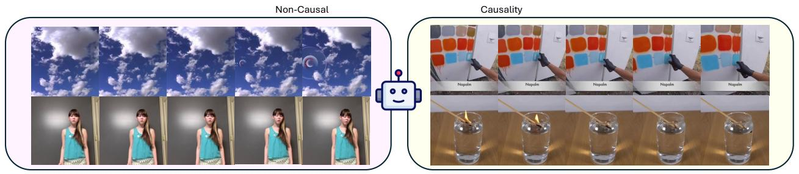

text_image

Non-Causal
Causality
Nopadim
Nopadim
Nopadim
Nopadim
Nopadim

Figure A.2 Examples from the causal and non-causal subsets. Non-causal videos (left) and Causal videos (right) are split by VLMs.

Empirical validation: null-prompt ablation. We design an ablation to empirically validate that our metrics are not driven by text-video misalignment.

Hypothesis. If the elevated denoising loss on reversed videos primarily reflected text-video misalignment, then removing the prompt conditioning should eliminate the bulk of the RSI/CCI signal. Conversely, if the signal genuinely originates from the model’s internalized temporal and causal cognition, then RSI and CCI under null prompts should be close to values under forward video prompt and preserve their discriminative power.

Setup. We re-evaluate three representative models under a null-prompt setting, where both forward and reversed sequences are conditioned on an empty caption.

Table A.3 Null-prompt ablation results. We compare RSI and CCI under the forward prompt setting (used in our main experiments) and the null prompt setting on four representative models from a range of model families and capabilities. Both metrics under null prompts are still close to the values under forward prompt, and the discriminative structure is preserved, supporting our claim that RSI and CCI are not artifacts of text-video misalignment. 

<table><tr><td></td><td>HunyuanVideo</td><td>CogVideoX-5b</td><td>LTX-Video-2b-0.9.6</td></tr><tr><td>RSI w/ forward prompt</td><td>52.05%</td><td>49.92%</td><td>58.86%</td></tr><tr><td>RSI w/ null prompt</td><td>51.17%</td><td>47.55%</td><td>56.92%</td></tr><tr><td>CCI w/ forward prompt</td><td>-0.29%</td><td>5.09%</td><td>0.93%</td></tr><tr><td>CCI w/ null prompt</td><td>-2.95%</td><td>6.17%</td><td>-0.30%</td></tr></table>

Results. As reported in Tab. A.3, removing the prompt produces only negligible changes in RSI and CCI. Crucially, the discriminative structure of both metrics is preserved, meaning the sign remain consistent with the forward-prompt setting.

This invariance directly falsifies the misalignment hypothesis. If text-video misalignment were the dominant source of elevated reversed-video loss, removing the prompt would pull all index to randomness line across all models. The observed pattern is incompatible. The dominant signal originates from the model’s internalized cognition, not from prompt conditioning. This empirically complements our argument: the forward prompt serves as a stable, easily reproducible conditioning choice for the main benchmark, and is not the source of the cognition signal we measure.

We think using our benchmark with null prompt is also a reasonable choice, it may cancel out the slight textmisalignment but introdeuces randomness at low-SNR timesteps. In constrast, using our benchmark with forward prompt will cancel out the randomness at low-SNR timesteps but introduces little text-misalignment. That is a trade-off and in this paper we choose the more stable one (with forward prompt).

# A.7 VLM Reliability

In the main paper ( Sec. 3, Fig. 5), we have already validated the VLM-based causal/non-causal partitioning from two perspectives: (1) the close agreement between VLM and human annotations on a 60-video subset (Kendall’s τ=0.7613, F1-score=82.76%), and (2) the negligible motion-magnitude gap between $\mathcal { D } _ { c }$ and $\mathcal { D } _ { n c }$ (Cohen’s $d { = } 0 . 0 5 7 < 0 . 2 )$ , confirming that the VLM reasons semantically rather than exploiting low-level motion cues.

In this section, we provide two additional analyses: a sensitivity study across different VLMs ( Appendix A.8), and a discussion of the inherent limitation regarding implicit causality ( Appendix A.9).

# A.8 VLM Sensitivity Analysis

A natural concern is whether our CCI results are sensitive to the specific VLM with different abilities and features. To address this, we re-run the dataset partitioning with two additional widely-used VLMs of distinct architectures and scales: GPT-4o [52] and Qwen3.5 9B [108, 122] using the same configure described in Appendix A.5. For each VLM-induced partition, we recompute the CCI score for all 13 evaluated VDMs to obtain a corresponding model aggregate ranking, and then measure the Kendall’s rank correlation τ. Results are summarized in Tab. A.4.

Table A.4 VLM sensitivity of aggregate rankings. Kendall’s τ between aggregate rankings induced by three different VLMs. The consistently high correlations confirm that our benchmark is robust to the choice of VLM judge. 

<table><tr><td>Kendall&#x27;s τ / p-value</td><td>Gemini 3.0 Pro [107]</td><td>GPT-4o [52]</td><td>Qwen 3.5 9B [108, 122]</td></tr><tr><td>Gemini 3.0 Pro</td><td>1.000 / 0.0000</td><td>0.6923 / 0.0005</td><td>0.6666 / 0.0009</td></tr><tr><td>GPT-4o</td><td>0.6923 / 0.0005</td><td>1.000 / 0.0000</td><td>0.6666 / 0.0009</td></tr><tr><td>Qwen 3.5 9B</td><td>0.6666 / 0.0009</td><td>0.6666 / 0.0009</td><td>1.000 / 0.0000</td></tr></table>

As shown in Tab. A.4, the aggregate rankings induced by different VLMs are highly consistent, indicating that our benchmark is largely invariant to the specific choice of VLM judge. We attribute this robustness to the relative simplicity of the partitioning task: deciding whether obvious cause-and-effect interactions in a video is substantially easier than judging whether a given causal relation is correct, and modern VLMs of varying scales can already perform this binary classification reliably. Moreover, as VLM capabilities continue to improve, this stability suggests that CCI will become more reliable over time rather than degrade, allowing future researchers to confidently adopt newer VLMs without compromising comparability across studies.

# A.9 Limitation: Implicit Causality

We further acknowledge an inherent limitation of our VLM-based partitioning: many real-world causal relationships are implicit: either visually subtle (e.g., a slight temperature change inducing condensation) or non-perceptual altogether (e.g., human psychological states). Because YoCausal relies on a VLM to identify causal interactions from videos, such implicit causality is largely beyond the coverage of $\mathcal { D } _ { c }$ and is therefore not captured by our current evaluation.

We argue, however, that this limitation does not substantially diminish the practical value of YoCausal, because the mainstream applications that motivate the development of VDMs as world models fall into three dominant categories, all of which are characterized by visually explicit causality:

• Robotic manipulation simulation [2, 123, 42]: The causally relevant events are physical interactions between an end-effector and objects (e.g., grasping a cup, pushing a block, or pouring liquid) which produce visually salient state changes.   
• Interactive game engines [17, 113]: The causally relevant events are the visual consequences of player actions (e.g., a button press opening a door, or a sword swing knocking down an enemy) which are, by design, observable visual outcomes.

• Autonomous driving simulation [49, 2]: The causally relevant events are vehicle dynamics and inter-agent interactions (e.g., a forward collision, a lane-merge maneuver, or a pedestrian-crossing response) which manifest as large-scale, visually obvious changes in the scene.

In all three regimes, the causal events are the kind of explicit, perceptually salient cause-and-effect relationships that our VLM-based partitioning identifies reliably. Therefore, while extending YoCausal to also probe implicit causality is an important direction for future work, the current benchmark already covers the dominant evaluation regime relevant to the deployment of VDMs as world models.

# A.10 Details on Human Annotating

To establish a human upper bound for the YoCausal benchmark, we recruit human annotators to label the temporal direction of all 1,232 videos. The labeling protocol is designed to maintain methodological parity with the Reverse Surprise Index (RSI) evaluation pipeline applied to models. Below, we describe the annotation procedure and the design of the “Unknown” option.

Annotation Procedure and Decision Protocol. As shown in Fig. A.3, annotators first read the corresponding text prompt, ensuring that human judgments are made under the same semantic constraints as model evaluations. Each annotator then sequentially watches the forward and reverse versions of the same video, presented in randomized order, and after viewing both clips, determines which one is the reversed version.

The rationale behind this sequential design mirrors how VDMs process the two versions: rather than simultaneously comparing both videos side by side, a VDM independently computes the denoising loss for each direction and infers the temporal order by comparing the resulting loss values, which is indirect comparison through its internal learned prior. Our annotation protocol follows the same principle: annotators watch each version independently at different pages and form an internal judgment about the degree of abnormality in each clip. The final decision of which version is reversed is then based on comparing these two independently perceptions of anomaly. The human annotator’s internal sense of abnormality functionally corresponds to the model’s denoising loss.

Furthermore, to direct annotators’ attention toward high-level causal reasoning rather than low-level visual artifacts, we limit viewing to at most three replays for each of the forward and reverse versions.

Design and Modeling of the “Unknown” Option. In the real world, certain events exhibit negligible directional cues (e.g. static scenes, periodic motions), making it inherently difficult to distinguish forward from reversed playback. To deal with such cases, the annotation interface provides an “Unknown” option, preventing annotators from being forced into arbitrary decisions. Across all 1,232 samples, approximately 20% of videos are marked as “Unknown.”

To maintain consistency with model behavior under uncertainty, samples labeled as “Unknown” are assigned an expected win rate of 0.5 (equivalent to the random-guess baseline) when computing the overall RSI score.

We provide a screenshot of the annotation web interface in Fig. A.3:

# A.11 Details on Human Preference

To verify the consistency between YoCausal’s evaluation results and human subjective judgments, we design a Human Causality Preference user study. The study encompasses model selection, prompt curation, evaluation procedure, and scoring, each of which is detailed below.

Model Selection. To keep the study tractable while covering the full spectrum of evaluated architectures, we select one representative model from each model family. The selection criterion is as follows: within each family, we choose the variant with the largest parameter count; if two variants share the same parameter count, we select the one with the higher CCI score. This procedure yields six representative models: Wan2.1-T2V-14B, HunyuanVideo, CogVideoX-5B, AnimateDiff-SDXL, LTX-Video-13B, and Mochi-1-preview.

Prompt Curation. We select 15 prompts with relatively identifiable causal interactions from each of the four subsets $( \mathcal { D } _ { G e n e r a l } , \mathcal { D } _ { P h y s i c s } , \mathcal { D } _ { H u m a n } , \mathcal { \bar { D } } _ { A n i m a l } ) .$ , yielding a total of 60 prompts. Each of the six representative models then generates a video for every prompt, producing $6 \times 6 \bar { 0 } = 3 \bar { 6 } 0$ videos in total.

text_image

AoT Video Direction Labeling
Watch the video and judge the playback direction
@type: Comparison
中文 EN
Labeling Progress: 1233 / 1232 • Step 1/3
Playback Speed: 0.5x 1.25x 1.5x 2x
Watch the first video
Video description: Skipping
0.01/0.03
Pair ID: mit/skipping_vine-Beach-with-baby-Skim-boarding-M6/MQ&A.R9.3 Dataset: mit
Replay Next
AoT Video Direction Labeling
Watch the video and judge the playback direction
@type: Comparison
中文 EN
Labeling Progress: 1233 / 1232 • Step 2/3
Playback Speed: 0.5x 1x 1.25x 1.5x 2x
Watch the second video
Video description: Skipping
0.00/0.03
Pair ID: mit/skipping_vine-Beach-with-baby-Skim-boarding-M6/MQ&A.R9.3 Dataset: mit
Replay Next
AoT Video Direction Labeling
Watch the video and judge the playback direction
@type: Comparison
中文 EN
Labeling Progress: 1233 / 1232
Video description: Skipping
Which one is reversed?
First is reversed Second is reversed Unknown
Submit Next

Figure A.3 Website for human annotation. Annotators are shown a text prompt (top) and sequentially watch two versions of the same video—forward and reversed—presented in randomized order (left and middle panels). After viewing both clips, annotators select which version is reversed, with an “Unknown” option available.

Evaluation Procedure. We deploy an online user-study website for the evaluation. On each page, the website presents six videos generated by the six different models from the same prompt (displayed in randomized order). Participants are asked to rank all six videos according to the plausibility of the causal interactions depicted. Since videos generated by different models may exhibit similar levels of causal plausibility, we allow participants to assign the same rank to multiple videos (e.g. three videos may all be ranked 2nd) to avoid forcing artificial distinctions. We recruit 30 participants in total. Each participant ranks 6 prompt groups, and the assignment is balanced so that every prompt receives exactly 3 independent rankings from different participants.

We provide a screenshot of the human preference ranking web interface in Fig. A.4:

：

# Causality Evaluation

# Welcome!

# Your Task

You willevaluate 6 sets of Al-generated videos.For each set:

1.Watchall6videos generatedfromthe same textprompt   
2.Rank thevideosfrom Bestto Worst based on:

Counter-example: A bowling ball(event A) hits the pins,but the pins do not fall (no event B).   
  
  
  
Visualqualitypurelyhalucinatedobjects (e.g,6fingers)shouldNOTbeusedaspenaltycriteriaforcausalityjudgment.

# Howto Rank

·UsetedagddopaningtefcetoraidTeslodouaeltipleideattheameankiftable

(a)

# ImportantNotes

Videos are labeled anonymously (Video A, Video B,etc.)   
  
  
·Estimated time:5-10 minutes

# Example videos (optional-watch to understand causality)

Causal example (duck swimming causes waves)   

natural_image

A duck swimming in water, captured in mid-flight with visible feather texture and yellow beak (no text or symbols)

XNon-cauleample(allsttllinihutnexe)   
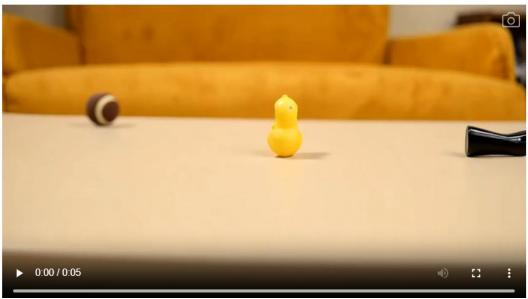

natural_image

Close-up of a yellow duck toy on a white surface with a black clip and orange cushion in the background (no text or symbols visible)

(b)

flowchart

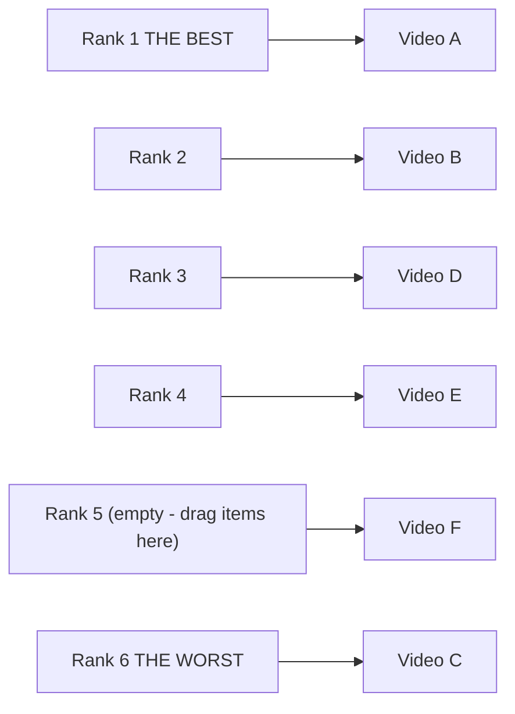

# Video Preview

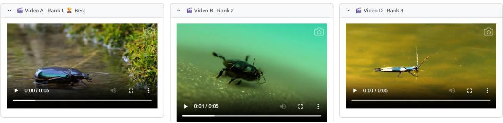

natural_image

Three video frames showing a beetle, an insect, and an insect on water (no text or symbols in the images themselves)

(c)

Figure A.4 Website for human preference ranking. (a) Instructions and important notes for participants. (b) Example videos illustrating causal and non-causal scenarios to help participants understand the evaluation criteria. (c) The ranking interface, where participants drag and drop six model-generated videos into rank positions (ties are permitted), and preview each video before making their judgment.

Scoring and Aggregation. We adopt the Borda Count [30, 29] method to convert each ranking into numerical scores. Specifically, for N = 6 candidate models, a model placed at rank position r receives a Borda score of $N - r \ { \mathrm { ( i . e . } }$ , rank 1st → 5 points, rank 6th → 0 points). When ties occur, we apply the averaged Borda score [30, 29] rule: models sharing the same rank jointly occupy the corresponding consecutive positions, and each receives the average of the Borda scores those positions would have yielded. For example, suppose two models are tied at rank 1st among N = 6 candidates. They jointly occupy rank positions 1 and 2 (which would individually receive 6 − 1 = 5 and 6 − 2 = 4 points, respectively), so each tied model receives $\left( 5 + 4 \right) / 2 = 4 . 5$ points. The next distinct rank then starts at position 3. We average the Borda scores across all rankings to obtain the overall human preference score for each model, from which the final overall rank is derived. The complete ranking results are presented in Tab. A.5:

Table A.5 Overall ranking of human causality preference study. Six representative models are ranked by their overall human preference score (averaged Borda count scores) aggregated across 60 prompts, with each prompt receiving 3 independent rankings from different participants. 

<table><tr><td>Rank</td><td>1</td><td>2</td><td>3</td><td>4</td><td>5</td><td>6</td></tr><tr><td>Model</td><td>HunyuanVideo</td><td>Mochi</td><td>Wan2.1-14B</td><td>LTXV-13B</td><td>CogVideoX-5B</td><td>AnimateDiff-SDXL</td></tr><tr><td>Overall Score</td><td>3.2451</td><td>2.9604</td><td>2.8625</td><td>2.7964</td><td>2.2125</td><td>0.9229</td></tr></table>

# A.12 Detailed Numerical Results

In the main paper, we primarily present the RSI and CCI results in graphical form to facilitate intuitive comparison of performance differences and trends across models. To enable precise numerical lookup and further analysis by the reader, this section provides the complete experimental data in tabular form. Specifically, Tab. A.6 reports the RSI scores of all 13 evaluated models and the human baseline across the four subsets $( \mathcal { D } _ { G e n e r a l } , \ \mathcal { D } _ { P h y s i c s } , \ \mathcal { D } _ { H u m a n } , \ \mathcal { D } _ { A n i m a l } )$ as well as the overall dataset. Tab. A.7 provides the disaggregated RSI scores on the causal subset $\mathrm { R S I } ( \mathcal { D } _ { c } )$ and the non-causal subset $\mathrm { R S I } ( \mathcal { D } _ { n c } )$ , along with the resulting CCI scores. We additionally include the human baseline as a reference for both metrics.

Table A.6 Numerical results of RSI. This table shows RSI scores of all 13 evaluated models and the human baseline across four subsets $( \mathcal { D } _ { G e n e r a l } , \mathcal { D } _ { P h y s i c s } , \mathcal { D } _ { H u m a n } , \mathcal { D } _ { A n i m a l } )$ and the overall average. Models are sorted by average RSI (RSI(D)) in ascending order. Bold values indicate the best-performing model in each column. 

<table><tr><td rowspan="2"></td><td rowspan="2">Release Date</td><td colspan="5">level 1: Reverse Surprise Index (RSI)↑</td></tr><tr><td> $D_{General}$ </td><td> $D_{Physics}$ </td><td> $D_{Human}$ </td><td> $D_{Animal}$ </td><td> $\mathcal{D}$ </td></tr><tr><td>AnimateDiff-SDXL</td><td>04/2024</td><td>27.80%</td><td>41.67%</td><td>48.73%</td><td>46.50%</td><td>41.18%</td></tr><tr><td>CogVideoX-2b</td><td>08/2024</td><td>33.20%</td><td>40.15%</td><td>56.64%</td><td>36.00%</td><td>41.50%</td></tr><tr><td>Wan2.1-T2V-1.3B</td><td>03/2025</td><td>29.80%</td><td>59.09%</td><td>59.15%</td><td>34.00%</td><td>45.51%</td></tr><tr><td>AnimateDiff-SD-1.5</td><td>06/2023</td><td>33.00%</td><td>32.58%</td><td>61.68%</td><td>55.50%</td><td>45.69%</td></tr><tr><td>CogVideoX1.5-5b</td><td>11/2024</td><td>28.80%</td><td>62.12%</td><td>62.91%</td><td>33.50%</td><td>46.83%</td></tr><tr><td>Mochi-1-preview</td><td>10/2024</td><td>37.80%</td><td>43.18%</td><td>76.50%</td><td>39.00%</td><td>49.12%</td></tr><tr><td>CogVideoX-5b</td><td>08/2024</td><td>31.10%</td><td>67.42%</td><td>63.16%</td><td>38.00%</td><td>49.92%</td></tr><tr><td>Wan2.2-TI2V-5B</td><td>07/2025</td><td>34.40%</td><td>71.97%</td><td>63.75%</td><td>37.50%</td><td>51.91%</td></tr><tr><td>HunyuanVideo</td><td>11/2025</td><td>25.80%</td><td>64.39%</td><td>86.50%</td><td>31.50%</td><td>52.05%</td></tr><tr><td>Wan2.1-T2V-14B</td><td>03/2025</td><td>37.60%</td><td>70.45%</td><td>66.92%</td><td>38.00%</td><td>53.24%</td></tr><tr><td>Wan2.2-T2V-A14B</td><td>07/2025</td><td>36.80%</td><td>77.27%</td><td>66.17%</td><td>36.50%</td><td>54.19%</td></tr><tr><td>LTX-Video-13b-0.9.8</td><td>07/2025</td><td>61.20%</td><td>47.73%</td><td>47.50%</td><td>69.50%</td><td>56.48%</td></tr><tr><td>LTX-Video-2b-0.9.6</td><td>04/2025</td><td>58.60%</td><td>57.58%</td><td>54.25%</td><td>65.00%</td><td>58.86%</td></tr><tr><td>Human</td><td></td><td>76.60%</td><td>91.7%</td><td>76.0%</td><td>72.0%</td><td>79.08%</td></tr></table>

# A.13 Scaling Law and Generational Evolution in Causal Cognition

Within the prevailing research trajectory of advancing video generation models toward world models, scaling laws have been regarded as a guiding principle [127, 73, 56]. We therefore investigate whether model size and release date correlate with causal cognition by computing the correlation between these factors and our aggregate rank. As shown in $\mathrm { F i g . } \mathrm { A } . { 5 } ,$ both release date and model parameters exhibit significant correlations with the aggregate ranking $( r = 0 . 5 9 6$ and $r = 0 . 6 8 8$ , respectively). This demonstrates that increasing parameter count does enhance causal understanding to a meaningful degree, validating the effectiveness of scaling laws for this higher-level cognitive capability. Furthermore, models have progressively improved in causal cognition across generations. For instance, the transition from UNet-based architectures to DiT-based architectures has yielded substantial improvements in causal perception for most model families.

Table A.7 Numerical results of CCI. This table shows CCI scores of all 13 evaluated models and the human baseline, along with the disaggregated RSI on the causal subset $\mathrm { R S I } ( \mathcal { D } _ { c } )$ and non-causal subset $\operatorname { R S I } ( \mathcal { D } _ { n c } )$ . Normalized CCI rescales raw CCI values relative to the human baseline. Models are sorted by CCI in ascending order. Bold values indicate the best-performing model in each column. 

<table><tr><td rowspan="2"></td><td rowspan="2">Release Date</td><td colspan="4">level 2: Causality Cognition Index (CCI) ↑</td></tr><tr><td>CCI(D) ↑</td><td>Normalized CCI(D)</td><td>RSI(Dc)</td><td>RSI(Dnc)</td></tr><tr><td>AnimateDiff-SD-1.5</td><td>06/2023</td><td>-5.21%</td><td>-60.09%</td><td>43.40%</td><td>48.61%</td></tr><tr><td>AnimateDiff-SDXL</td><td>04/2024</td><td>-5.07%</td><td>-58.48%</td><td>38.93%</td><td>44.00%</td></tr><tr><td>LTX-Video-13b-0.9.8</td><td>07/2025</td><td>-4.32%</td><td>-49.83%</td><td>54.65%</td><td>58.97%</td></tr><tr><td>Wan2.2-TI2V-5B</td><td>07/2025</td><td>-2.12%</td><td>-24.45%</td><td>50.90%</td><td>53.02%</td></tr><tr><td>HunyuanVideo</td><td>11/2025</td><td>-0.29%</td><td>-3.34%</td><td>51.15%</td><td>51.44%</td></tr><tr><td>LTX-Video-2b-0.9.6</td><td>04/2025</td><td>-0.20%</td><td>-2.31%</td><td>57.95%</td><td>58.15%</td></tr><tr><td>CogVideoX-2b</td><td>08/2024</td><td>0.93%</td><td>10.73%</td><td>41.11%</td><td>40.18%</td></tr><tr><td>Mochi-1-preview</td><td>10/2024</td><td>3.85%</td><td>44.41%</td><td>49.11%</td><td>45.26%</td></tr><tr><td>CogVideoX1.5-5b</td><td>11/2024</td><td>4.85%</td><td>55.94%</td><td>48.46%</td><td>43.61%</td></tr><tr><td>CogVideoX-5b</td><td>08/2024</td><td>5.09%</td><td>58.71%</td><td>51.36%</td><td>46.27%</td></tr><tr><td>Wan2.1-T2V-1.3B</td><td>03/2025</td><td>5.36%</td><td>61.82%</td><td>46.92%</td><td>41.56%</td></tr><tr><td>Wan2.2-T2V-A14B</td><td>07/2025</td><td>5.51%</td><td>63.55%</td><td>55.73%</td><td>50.22%</td></tr><tr><td>Wan2.1-T2V-14B</td><td>03/2025</td><td>5.91%</td><td>68.17%</td><td>54.80%</td><td>48.89%</td></tr><tr><td>Human</td><td></td><td>8.67%</td><td>100.00%</td><td>85.09%</td><td>76.42%</td></tr></table>

# References

[1] H. Abdi et al. The kendall rank correlation coefficient. Encyclopedia of measurement and statistics, 2:508–510, 2007.   
[2] N. Agarwal, A. Ali, M. Bala, Y. Balaji, E. Barker, T. Cai, P. Chattopadhyay, Y. Chen, Y. Cui, Y. Ding, et al. Cosmos world foundation model platform for physical ai. arXiv preprint arXiv:2501.03575, 2025.   
[3] T. Ates, M. Ate¸so ˘glu, Ç. Yi ˘git, I. Kesen, M. Kobas, E. Erdem, A. Erdem, T. Goksun, and D. Yuret. Craft: A benchmark for causal reasoning about forces and interactions. In Findings of the Association for Computational Linguistics: ACL 2022, pages 2602–2627, 2022.   
[4] Z. Bai, H. Ci, and M. Z. Shou. Impossible videos. arXiv preprint arXiv:2503.14378, 2025.   
[5] R. Baillargeon. Infants’ physical world. Current directions in psychological science, 13(3):89–94, 2004.   
[6] R. Baillargeon, E. S. Spelke, and S. Wasserman. Object permanence in five-month-old infants. Cognition, 20(3):191–208, 1985.   
[7] H. Bansal, Z. Lin, T. Xie, Z. Zong, M. Yarom, Y. Bitton, C. Jiang, Y. Sun, K.-W. Chang, and A. Grover. Videophy: Evaluating physical commonsense for video generation. arXiv preprint arXiv:2406.03520, 2024.   
[8] H. Bansal, C. Peng, Y. Bitton, R. Goldenberg, A. Grover, and K.-W. Chang. Videophy-2: A challenging action-centric physical commonsense evaluation in video generation. arXiv preprint arXiv:2503.06800, 2025.   
[9] O. Bar-Tal, H. Chefer, O. Tov, C. Herrmann, R. Paiss, S. Zada, A. Ephrat, J. Hur, G. Liu, A. Raj, et al. Lumiere: A space-time diffusion model for video generation. In SIGGRAPH Asia 2024 Conference Papers, pages 1–11, 2024.   
[10] F. Baradel, N. Neverova, J. Mille, G. Mori, and C. Wolf. Cophy: Counterfactual learning of physical dynamics. arXiv preprint arXiv:1909.12000, 2019.   
[11] P. W. Battaglia, J. B. Hamrick, and J. B. Tenenbaum. Simulation as an engine of physical scene understanding. Proceedings of the national academy of sciences, 110(45):18327–18332, 2013.   
[12] D. M. Bear, E. Wang, D. Mrowca, F. J. Binder, H.-Y. F. Tung, R. Pramod, C. Holdaway, S. Tao, K. Smith, F.-Y. Sun, et al. Physion: Evaluating physical prediction from vision in humans and machines. arXiv preprint arXiv:2106.08261, 2021.   
[13] A. Blattmann, T. Dockhorn, S. Kulal, D. Mendelevitch, M. Kilian, D. Lorenz, Y. Levi, Z. English, V. Voleti, A. Letts, et al. Stable video diffusion: Scaling latent video diffusion models to large datasets.

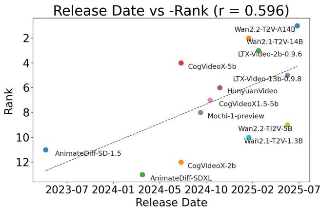

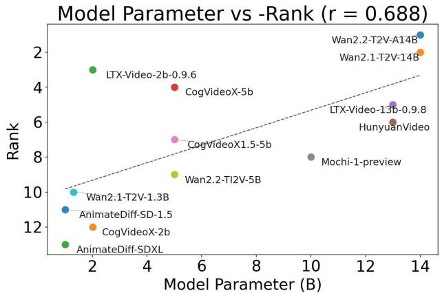

scatter

| Model | Model Parameter (B) | Rank |
| --- | --- | --- |
| LTX-Video-2b-0.9.6 | 2 | 4.5 |
| CogVideoX-5b | 5 | 4.0 |
| CogVideoX1.5-5b | 5 | 5.0 |
| Wan2.2-TI2V-5B | 5 | 7.0 |
| LTX-Video-13b-0.9.8 | 13 | 6.5 |
| HunyuanVideo | 13 | 6.0 |
| Mochi-1-preview | 10 | 8.0 |
| Wani2.1-T2V-14B | 14 | 2.0 |
| Wani2.1-T2V-13B | 14 | 1.5 |
| AnimateDiff-SDXL | 1.5 | 10.0 |
| AnimateDiff-SDXL | 1.5 | 9.0 |
| AnimateDiff-SDXL | 2 | 12.0 |

Figure A.5 Scaling laws and generational trends in causal cognition. Aggregate causal cognition rank correlates positively with both release date (r=0.596) and parameter count (r=0.688), indicating that larger and newer models exhibit stronger causal understanding.

arXiv preprint arXiv:2311.15127, 2023.   
[14] A. Blattmann, R. Rombach, H. Ling, T. Dockhorn, S. W. Kim, S. Fidler, and K. Kreis. Align your latents: High-resolution video synthesis with latent diffusion models. In Proceedings of the IEEE/CVF conference on computer vision and pattern recognition, pages 22563–22575, 2023.   
[15] F. Bordes, Q. Garrido, J. T. Kao, A. Williams, M. Rabbat, and E. Dupoux. Intphys 2: Benchmarking intuitive physics understanding in complex synthetic environments. arXiv preprint arXiv:2506.09849, 2025.   
[16] T. Brooks, B. Peebles, C. Holmes, W. DePue, Y. Guo, L. Jing, D. Schnurr, J. Taylor, T. Luhman, E. Luhman, et al. Video generation models as world simulators. OpenAI Blog, 1(8):1, 2024.   
[17] J. Bruce, M. D. Dennis, A. Edwards, J. Parker-Holder, Y. Shi, E. Hughes, M. Lai, A. Mavalankar, R. Steigerwald, C. Apps, et al. Genie: Generative interactive environments. In Forty-first International Conference on Machine Learning, 2024.   
[18] M. Cai, R. Tan, J. Zhang, B. Zou, K. Zhang, F. Yao, F. Zhu, J. Gu, Y. Zhong, Y. Shang, et al. Temporalbench: Benchmarking fine-grained temporal understanding for multimodal video models. arXiv preprint arXiv:2410.10818, 2024.   
[19] K. Chandrasegaran, A. Gupta, L. M. Hadzic, T. Kota, J. He, C. Eyzaguirre, Z. Durante, M. Li, J. Wu, and L. Fei-Fei. Hourvideo: 1-hour video-language understanding. Advances in Neural Information Processing Systems, 37:53168–53197, 2024.   
[20] C.-H. Chao, W.-F. Sun, B.-W. Cheng, Y.-C. Lo, C.-C. Chang, Y.-L. Liu, Y.-L. Chang, C.-P. Chen, and C.-Y. Lee. Denoising likelihood score matching for conditional score-based data generation. arXiv preprint arXiv:2203.14206, 2022.   
[21] Y. Chen, J. Liu, X. Lin, and R. Tang. Countervqa: Evaluating and improving counterfactual reasoning in vision-language models for video understanding. arXiv preprint arXiv:2511.19923, 2025.   
[22] H. Chi, H. Li, W. Yang, F. Liu, L. Lan, X. Ren, T. Liu, and B. Han. Unveiling causal reasoning in large language models: Reality or mirage? Advances in Neural Information Processing Systems, 37:96640–96670, 2024.   
[23] K. Clark and P. Jaini. Text-to-image diffusion models are zero shot classifiers. Advances in Neural Information Processing Systems, 36:58921–58937, 2023.   
[24] D. Cores, M. Dorkenwald, M. Mucientes, C. G. Snoek, and Y. M. Asano. Tvbench: Redesigning video-language evaluation. 2024.   
[25] F.-A. Croitoru, V. Hondru, R. T. Ionescu, and M. Shah. Diffusion models in vision: A survey. IEEE transactions on pattern analysis and machine intelligence, 45(9):10850–10869, 2023.   
[26] A. Dasgupta, J. Duan, M. H. Ang Jr, and C. Tan. Avoe: a synthetic 3d dataset on understanding violation of expectation for artificial cognition. arXiv preprint arXiv:2110.05836, 2021.   
[27] V. Didelez and I. Pigeot. Causality: models, reasoning, and inference, 2001.   
[28] Y. Du, M. Yang, P. Florence, F. Xia, A. Wahid, B. Ichter, P. Sermanet, T. Yu, P. Abbeel, J. B. Tenenbaum,

et al. Video language planning. arXiv preprint arXiv:2310.10625, 2023.   
[29] M. Dummett. Principles of electoral reform. Oxford University Press, 1997.   
[30] P. Emerson. The original borda count and partial voting. Social Choice and Welfare, 40(2):353–358, 2013.   
[31] P. Esser, J. Chiu, P. Atighehchian, J. Granskog, and A. Germanidis. Structure and content-guided video synthesis with diffusion models. In Proceedings of the IEEE/CVF international conference on computer vision, pages 7346–7356, 2023.   
[32] A. Foss, C. Evans, S. Mitts, K. Sinha, A. Rizvi, and J. T. Kao. Causalvqa: A physically grounded causal reasoning benchmark for video models. arXiv preprint arXiv:2506.09943, 2025.   
[33] C. Fu, Y. Dai, Y. Luo, L. Li, S. Ren, R. Zhang, Z. Wang, C. Zhou, Y. Shen, M. Zhang, et al. Videomme: The first-ever comprehensive evaluation benchmark of multi-modal llms in video analysis. In Proceedings of the IEEE/CVF conference on computer vision and pattern recognition, pages 24108–24118, 2025.   
[34] K. Gandhi, G. Stojnic, B. M. Lake, and M. R. Dillon. Baby intuitions benchmark (bib): Discerning the goals, preferences, and actions of others. Advances in neural information processing systems, 34:9963–9976, 2021.   
[35] Q. Garrido, N. Ballas, M. Assran, A. Bardes, L. Najman, M. Rabbat, E. Dupoux, and Y. LeCun. Intuitive physics understanding emerges from self-supervised pretraining on natural videos. arXiv preprint arXiv:2502.11831, 2025.   
[36] S. Ge, A. Mahapatra, G. Parmar, J.-Y. Zhu, and J.-B. Huang. On the content bias in fréchet video distance. In Proceedings of the IEEE/CVF conference on computer vision and pattern recognition, pages 7277–7288, 2024.   
[37] R. Girdhar, M. Singh, A. Brown, Q. Duval, S. Azadi, S. S. Rambhatla, A. Shah, X. Yin, D. Parikh, and I. Misra. Factorizing text-to-video generation by explicit image conditioning. In European Conference on Computer Vision, pages 205–224. Springer, 2024.   
[38] Y. Guo, C. Yang, A. Rao, Z. Liang, Y. Wang, Y. Qiao, M. Agrawala, D. Lin, and B. Dai. Animatediff: Animate your personalized text-to-image diffusion models without specific tuning. arXiv preprint arXiv:2307.04725, 2023.   
[39] A. Gupta, L. Yu, K. Sohn, X. Gu, M. Hahn, F.-F. Li, I. Essa, L. Jiang, and J. Lezama. Photorealistic video generation with diffusion models. In European Conference on Computer Vision, pages 393–411. Springer, 2024.   
[40] D. Ha and J. Schmidhuber. World models. arXiv preprint arXiv:1803.10122, 2(3):440, 2018.   
[41] Y. HaCohen, N. Chiprut, B. Brazowski, D. Shalem, D. Moshe, E. Richardson, E. Levin, G. Shiran, N. Zabari, O. Gordon, et al. Ltx-video: Realtime video latent diffusion. arXiv preprint arXiv:2501.00103, 2024.   
[42] D. Hafner, T. Lillicrap, I. Fischer, R. Villegas, D. Ha, H. Lee, and J. Davidson. Learning latent dynamics for planning from pixels. In International conference on machine learning, pages 2555–2565. PMLR, 2019.   
[43] D. Hafner, T. Lillicrap, M. Norouzi, and J. Ba. Mastering atari with discrete world models. arXiv preprint arXiv:2010.02193, 2020.   
[44] N. Hanyu, K. Watanabe, and S. Kitazawa. Ready to detect a reversal of time’s arrow: a psychophysical study using short video clips in daily scenes. Royal Society open science, 10(4), 2023.   
[45] J. Ho, A. Jain, and P. Abbeel. Denoising diffusion probabilistic models. Advances in neural information processing systems, 33:6840–6851, 2020.   
[46] J. Ho and T. Salimans. Classifier-free diffusion guidance. arXiv preprint arXiv:2207.12598, 2022.   
[47] J. Ho, T. Salimans, A. Gritsenko, W. Chan, M. Norouzi, and D. J. Fleet. Video diffusion models. Advances in neural information processing systems, 35:8633–8646, 2022.   
[48] W. Hong, M. Ding, W. Zheng, X. Liu, and J. Tang. Cogvideo: Large-scale pretraining for text-to-video generation via transformers. arXiv preprint arXiv:2205.15868, 2022.   
[49] A. Hu, L. Russell, H. Yeo, Z. Murez, G. Fedoseev, A. Kendall, J. Shotton, and G. Corrado. Gaia-1: A generative world model for autonomous driving. arXiv preprint arXiv:2309.17080, 2023.   
[50] Z. Huang, Y. He, J. Yu, F. Zhang, C. Si, Y. Jiang, Y. Zhang, T. Wu, Q. Jin, N. Chanpaisit, et al. Vbench: Comprehensive benchmark suite for video generative models. In Proceedings of the IEEE/CVF Conference on Computer Vision and Pattern Recognition, pages 21807–21818, 2024.   
[51] Z. Huang, F. Zhang, X. Xu, Y. He, J. Yu, Z. Dong, Q. Ma, N. Chanpaisit, C. Si, Y. Jiang, et al. Vbench++: Comprehensive and versatile benchmark suite for video generative models. IEEE Transactions on Pattern Analysis and Machine Intelligence, 2025.

[52] A. Hurst, A. Lerer, A. P. Goucher, A. Perelman, A. Ramesh, A. Clark, A. Ostrow, A. Welihinda, A. Hayes, A. Radford, et al. Gpt-4o system card. arXiv preprint arXiv:2410.21276, 2024.   
[53] Z. Jin, Y. Chen, F. Leeb, L. Gresele, O. Kamal, Z. Lyu, K. Blin, F. Gonzalez Adauto, M. Kleiman-Weiner, M. Sachan, et al. Cladder: Assessing causal reasoning in language models. Advances in Neural Information Processing Systems, 36:31038–31065, 2023.   
[54] Z. Jin, J. Liu, Z. Lyu, S. Poff, M. Sachan, R. Mihalcea, M. Diab, and B. Schölkopf. Can large language models infer causation from correlation? arXiv preprint arXiv:2306.05836, 2023.   
[55] B. Kang, Y. Yue, R. Lu, Z. Lin, Y. Zhao, K. Wang, G. Huang, and J. Feng. How far is video generation from world model: A physical law perspective. arXiv preprint arXiv:2411.02385, 2024.   
[56] J. Kaplan, S. McCandlish, T. Henighan, T. B. Brown, B. Chess, R. Child, S. Gray, A. Radford, J. Wu, and D. Amodei. Scaling laws for neural language models. arXiv preprint arXiv:2001.08361, 2020.   
[57] W. Kay, J. Carreira, K. Simonyan, B. Zhang, C. Hillier, S. Vijayanarasimhan, F. Viola, T. Green, T. Back, P. Natsev, et al. The kinetics human action video dataset. arXiv preprint arXiv:1705.06950, 2017.   
[58] E. Kiciman, R. Ness, A. Sharma, and C. Tan. Causal reasoning and large language models: Opening a new frontier for causality. Transactions on Machine Learning Research, 2023.   
[59] D. Kingma, T. Salimans, B. Poole, and J. Ho. Variational diffusion models. Advances in neural information processing systems, 34:21696–21707, 2021.   
[60] D. Kondratyuk, L. Yu, X. Gu, J. Lezama, J. Huang, G. Schindler, R. Hornung, V. Birodkar, J. Yan, M.-C. Chiu, et al. Videopoet: A large language model for zero-shot video generation. arXiv preprint arXiv:2312.14125, 2023.   
[61] W. Kong, Q. Tian, Z. Zhang, R. Min, Z. Dai, J. Zhou, J. Xiong, X. Li, B. Wu, J. Zhang, et al. Hunyuanvideo: A systematic framework for large video generative models. arXiv preprint arXiv:2412.03603, 2024.   
[62] B. M. Lake, T. D. Ullman, J. B. Tenenbaum, and S. J. Gershman. Building machines that learn and think like people. Behavioral and brain sciences, 40:e253, 2017.   
[63] D. Layzer. The arrow of time. Scientific American, 233(6):56–69, 1975.   
[64] Y. LeCun et al. A path towards autonomous machine intelligence version 0.9. 2, 2022-06-27. Open Review, 62(1):1–62, 2022.   
[65] A. M. Leslie and S. Keeble. Do six-month-old infants perceive causality? Cognition, 25(3):265–288, 1987.   
[66] A. C. Li, M. Prabhudesai, S. Duggal, E. Brown, and D. Pathak. Your diffusion model is secretly a zero-shot classifier. In Proceedings of the IEEE/CVF International Conference on Computer Vision, pages 2206–2217, 2023.   
[67] C. Li, O. Michel, X. Pan, S. Liu, M. Roberts, and S. Xie. Pisa experiments: Exploring physics post-training for video diffusion models by watching stuff drop. arXiv preprint arXiv:2503.09595, 2025.   
[68] D. Li, Y. Fang, Y. Chen, S. Yang, S. Cao, J. Wong, M. Luo, X. Wang, H. Yin, J. E. Gonzalez, et al. Worldmodelbench: Judging video generation models as world models. arXiv preprint arXiv:2502.20694, 2025.   
[69] J. Li, L. Niu, and L. Zhang. From representation to reasoning: Towards both evidence and commonsense reasoning for video question-answering. In Proceedings of the IEEE/CVF conference on computer vision and pattern recognition, pages 21273–21282, 2022.   
[70] K. Li, Y. Wang, Y. He, Y. Li, Y. Wang, Y. Liu, Z. Wang, J. Xu, G. Chen, P. Luo, et al. Mvbench: A comprehensive multi-modal video understanding benchmark. In Proceedings of the IEEE/CVF Conference on Computer Vision and Pattern Recognition, pages 22195–22206, 2024.   
[71] S. Li, L. Li, Y. Liu, S. Ren, Y. Liu, R. Gao, X. Sun, and L. Hou. Vitatecs: A diagnostic dataset for temporal concept understanding of video-language models. In European Conference on Computer Vision, pages 331–348. Springer, 2024.   
[72] Y. Li, W. Tian, Y. Jiao, J. Chen, and Y.-G. Jiang. Eyes can deceive: Benchmarking counterfactual reasoning abilities of multi-modal large language models. arXiv preprint arXiv:2404.12966, 3, 2024.   
[73] Z. Liang, H. He, C. Yang, and B. Dai. Scaling laws for diffusion transformers. arXiv preprint arXiv:2410.08184, 2024.   
[74] J. Lin, Y. Du, O. Watkins, D. Hafner, P. Abbeel, D. Klein, and A. Dragan. Learning to model the world with language. arXiv preprint arXiv:2308.01399, 2023.   
[75] X. Liu, Z. Xu, M. Li, K. Wang, Y. J. Lee, and Y. Shang. Can world simulators reason? gen-vire: A generative visual reasoning benchmark. arXiv preprint arXiv:2511.13853, 2025.

[76] Y. Liu, S. Li, Y. Liu, Y. Wang, S. Ren, L. Li, S. Chen, X. Sun, and L. Hou. Tempcompass: Do video llms really understand videos? In Findings of the Association for Computational Linguistics: ACL 2024, pages 8731–8772, 2024.   
[77] Y. Liu, K. Zhang, Y. Li, Z. Yan, C. Gao, R. Chen, Z. Yuan, Y. Huang, H. Sun, J. Gao, et al. Sora: A review on background, technology, limitations, and opportunities of large vision models. arXiv preprint arXiv:2402.17177, 2024.   
[78] F. Margoni, L. Surian, and R. Baillargeon. The violation-of-expectation paradigm: A conceptual overview. Psychological Review, 131(3):716, 2024.   
[79] Y. Matsuo, Y. LeCun, M. Sahani, D. Precup, D. Silver, M. Sugiyama, E. Uchibe, and J. Morimoto. Deep learning, reinforcement learning, and world models. Neural Networks, 152:267–275, 2022.   
[80] R. P. McDonald. Judea pearl. causality: Models, reasoning, and inference. cambridge: Cambridge university press. 384 pp., 2000, isbn 0521773628. Psychometrika, 67(2):321–322, 2002.   
[81] F. Meng, J. Liao, X. Tan, W. Shao, Q. Lu, K. Zhang, Y. Cheng, D. Li, Y. Qiao, and P. Luo. Towards world simulator: Crafting physical commonsense-based benchmark for video generation. arXiv preprint arXiv:2410.05363, 2024.   
[82] A. Michotte. The perception of causality. Routledge, 2017.   
[83] I. Misra, C. L. Zitnick, and M. Hebert. Shuffle and learn: unsupervised learning using temporal order verification. In European conference on computer vision, pages 527–544. Springer, 2016.   
[84] M. Monfort, A. Andonian, B. Zhou, K. Ramakrishnan, S. A. Bargal, T. Yan, L. Brown, Q. Fan, D. Gutfreund, C. Vondrick, et al. Moments in time dataset: one million videos for event understanding. IEEE transactions on pattern analysis and machine intelligence, 42(2):502–508, 2019.   
[85] S. Motamed, L. Culp, K. Swersky, P. Jaini, and R. Geirhos. Do generative video models understand physical principles? In Proceedings of the IEEE/CVF Winter Conference on Applications of Computer Vision, pages 948–958, 2026.   
[86] L. G. Neuberg. Causality: models, reasoning, and inference, by judea pearl, cambridge university press, 2000. Econometric Theory, 19(4):675–685, 2003.   
[87] X. L. Ng, K. E. Ong, Q. Zheng, Y. Ni, S. Y. Yeo, and J. Liu. Animal kingdom: A large and diverse dataset for animal behavior understanding. In Proceedings of the IEEE/CVF conference on computer vision and pattern recognition, pages 19023–19034, 2022.   
[88] V. Patraucean, L. Smaira, A. Gupta, A. Recasens, L. Markeeva, D. Banarse, S. Koppula, M. Malinowski, Y. Yang, C. Doersch, et al. Perception test: A diagnostic benchmark for multimodal video models. Advances in Neural Information Processing Systems, 36:42748–42761, 2023.   
[89] W. Peebles and S. Xie. Scalable diffusion models with transformers. In Proceedings of the IEEE/CVF international conference on computer vision, pages 4195–4205, 2023.   
[90] X. Peng, Z. Zheng, C. Shen, T. Young, X. Guo, B. Wang, H. Xu, H. Liu, M. Jiang, W. Li, et al. Open-sora 2.0: Training a commercial-level video generation model in \$200 k. arXiv preprint arXiv:2503.09642, 2025.   
[91] L. C. Pickup, Z. Pan, D. Wei, Y. Shih, C. Zhang, A. Zisserman, B. Scholkopf, and W. T. Freeman. Seeing the arrow of time. In Proceedings of the IEEE Conference on Computer Vision and Pattern Recognition, pages 2035–2042, 2014.   
[92] L. S. Piloto, A. Weinstein, P. Battaglia, and M. Botvinick. Intuitive physics learning in a deep-learning model inspired by developmental psychology. Nature human behaviour, 6(9):1257–1267, 2022.   
[93] A. Polyak, A. Zohar, A. Brown, A. Tjandra, A. Sinha, A. Lee, A. Vyas, B. Shi, C.-Y. Ma, C.-Y. Chuang, et al. Movie gen: A cast of media foundation models. arXiv preprint arXiv:2410.13720, 2024.   
[94] Y. Qin, Z. Shi, J. Yu, X. Wang, E. Zhou, L. Li, Z. Yin, X. Liu, L. Sheng, J. Shao, et al. Worldsimbench: Towards video generation models as world simulators. arXiv preprint arXiv:2410.18072, 2024.   
[95] R. Riochet, M. Y. Castro, M. Bernard, A. Lerer, R. Fergus, V. Izard, and E. Dupoux. Intphys: A framework and benchmark for visual intuitive physics reasoning. arXiv preprint arXiv:1803.07616, 2018.   
[96] R. Riochet, M. Y. Castro, M. Bernard, A. Lerer, R. Fergus, V. Izard, and E. Dupoux. Intphys 2019: A benchmark for visual intuitive physics understanding. IEEE Transactions on Pattern Analysis and Machine Intelligence, 44(9):5016–5025, 2021.   
[97] T. Shu, A. Bhandwaldar, C. Gan, K. Smith, S. Liu, D. Gutfreund, E. Spelke, J. Tenenbaum, and T. Ullman. Agent: A benchmark for core psychological reasoning. In International conference on machine learning, pages 9614–9625. PMLR, 2021.

[98] U. Singer, A. Polyak, T. Hayes, X. Yin, J. An, S. Zhang, Q. Hu, H. Yang, O. Ashual, O. Gafni, et al. Make-a-video: Text-to-video generation without text-video data. arXiv preprint arXiv:2209.14792, 2022.   
[99] K. Smith, L. Mei, S. Yao, J. Wu, E. Spelke, J. Tenenbaum, and T. Ullman. Modeling expectation violation in intuitive physics with coarse probabilistic object representations. Advances in neural information processing systems, 32, 2019.   
[100] J. Sohl-Dickstein, E. Weiss, N. Maheswaranathan, and S. Ganguli. Deep unsupervised learning using nonequilibrium thermodynamics. In International conference on machine learning, pages 2256–2265. pmlr, 2015.   
[101] Y. Song, C. Durkan, I. Murray, and S. Ermon. Maximum likelihood training of score-based diffusion models. Advances in neural information processing systems, 34:1415–1428, 2021.   
[102] Y. Song, J. Sohl-Dickstein, D. P. Kingma, A. Kumar, S. Ermon, and B. Poole. Score-based generative modeling through stochastic differential equations. arXiv preprint arXiv:2011.13456, 2020.   
[103] E. S. Spelke, K. Breinlinger, J. Macomber, and K. Jacobson. Origins of knowledge. Psychological review, 99(4):605, 1992.   
[104] E. S. Spelke and K. D. Kinzler. Core knowledge. Developmental science, 10(1):89–96, 2007.   
[105] A. E. Stahl and L. Feigenson. Observing the unexpected enhances infants’ learning and exploration. Science, 348(6230):91–94, 2015.   
[106] G. Team. Mochi 1. https://github.com/genmoai/models, 2024.   
[107] G. Team, R. Anil, S. Borgeaud, J.-B. Alayrac, J. Yu, R. Soricut, J. Schalkwyk, A. M. Dai, A. Hauth, K. Millican, et al. Gemini: a family of highly capable multimodal models. arXiv preprint arXiv:2312.11805, 2023.   
[108] Q. Team. Qwen3. 5-omni technical report. arXiv preprint arXiv:2604.15804, 2026.   
[109] Z. Teed and J. Deng. Raft: Recurrent all-pairs field transforms for optical flow. In European conference on computer vision, pages 402–419. Springer, 2020.   
[110] E. Téglás, E. Vul, V. Girotto, M. Gonzalez, J. B. Tenenbaum, and L. L. Bonatti. Pure reasoning in 12-month-old infants as probabilistic inference. science, 332(6033):1054–1059, 2011.   
[111] T. D. Ullman, E. Spelke, P. Battaglia, and J. B. Tenenbaum. Mind games: Game engines as an architecture for intuitive physics. Trends in cognitive sciences, 21(9):649–665, 2017.   
[112] T. Unterthiner, S. Van Steenkiste, K. Kurach, R. Marinier, M. Michalski, and S. Gelly. Towards accurate generative models of video: A new metric & challenges. arXiv preprint arXiv:1812.01717, 2018.   
[113] D. Valevski, Y. Leviathan, M. Arar, and S. Fruchter. Diffusion models are real-time game engines. arXiv preprint arXiv:2408.14837, 2024.   
[114] T. Wan, A. Wang, B. Ai, B. Wen, C. Mao, C.-W. Xie, D. Chen, F. Yu, H. Zhao, J. Yang, et al. Wan: Open and advanced large-scale video generative models. arXiv preprint arXiv:2503.20314, 2025.   
[115] J. Wang, H. Yuan, D. Chen, Y. Zhang, X. Wang, and S. Zhang. Modelscope text-to-video technical report. arXiv preprint arXiv:2308.06571, 2023.   
[116] Z. Wang, S. Zhang, C. Tang, and K. Wang. Timecausality: Evaluating the causal ability in time dimension for vision language models. arXiv preprint arXiv:2505.15435, 2025.   
[117] D. Wei, J. J. Lim, A. Zisserman, and W. T. Freeman. Learning and using the arrow of time. In Proceedings of the IEEE conference on computer vision and pattern recognition, pages 8052–8060, 2018.   
[118] J. Wu, J. J. Lim, H. Zhang, J. B. Tenenbaum, and W. T. Freeman. Physics 101: Learning physical object properties from unlabeled videos. In BMVC, volume 2, page 7, 2016.   
[119] K. Wynn. Addition and subtraction by human infants. Nature, 358(6389):749–750, 1992.   
[120] J. Xiao, X. Shang, A. Yao, and T.-S. Chua. Next-qa: Next phase of question-answering to explaining temporal actions. In Proceedings of the IEEE/CVF conference on computer vision and pattern recognition, pages 9777–9786, 2021.   
[121] Z. Xue, M. Luo, and K. Grauman. Seeing the arrow of time in large multimodal models. arXiv preprint arXiv:2506.03340, 2025.   
[122] A. Yang, A. Li, B. Yang, B. Zhang, B. Hui, B. Zheng, B. Yu, C. Gao, C. Huang, C. Lv, et al. Qwen3 technical report. arXiv preprint arXiv:2505.09388, 2025.   
[123] M. Yang, Y. Du, K. Ghasemipour, J. Tompson, D. Schuurmans, and P. Abbeel. Learning interactive real-world simulators. arXiv preprint arXiv:2310.06114, 1(2):6, 2023.   
[124] Z. Yang, J. Teng, W. Zheng, M. Ding, S. Huang, J. Xu, Y. Yang, W. Hong, X. Zhang, G. Feng, et al. Cogvideox: Text-to-video diffusion models with an expert transformer. arXiv preprint arXiv:2408.06072, 2024.

[125] K. Yi, C. Gan, Y. Li, P. Kohli, J. Wu, A. Torralba, and J. B. Tenenbaum. Clevrer: Collision events for video representation and reasoning. arXiv preprint arXiv:1910.01442, 2019.   
[126] T. Yin, Q. Zhang, R. Zhang, W. T. Freeman, F. Durand, E. Shechtman, and X. Huang. From slow bidirectional to fast autoregressive video diffusion models. In Proceedings of the IEEE/CVF Conference on Computer Vision and Pattern Recognition, pages 22963–22974, 2025.   
[127] Y. Yin, Y. Zhao, M. Zheng, K. Lin, J. Ou, R. Chen, V. S.-J. Huang, J. Wang, X. Tao, P. Wan, et al. Towards precise scaling laws for video diffusion transformers. In Proceedings of the Computer Vision and Pattern Recognition Conference, pages 18155–18165, 2025.   
[128] J. Yuan, F. Pizzati, F. Pinto, L. Kunze, I. Laptev, P. Newman, P. Torr, and D. De Martini. Likephys: Evaluating intuitive physics understanding in video diffusion models via likelihood preference. arXiv preprint arXiv:2510.11512, 2025.   
[129] S. Yuan, J. Huang, Y. Xu, Y. Liu, S. Zhang, Y. Shi, R.-J. Zhu, X. Cheng, J. Luo, and L. Yuan. Chronomagicbench: A benchmark for metamorphic evaluation of text-to-time-lapse video generation. Advances in Neural Information Processing Systems, 37:21236–21270, 2024.   
[130] M. Zeˇcevi´c, M. Willig, D. S. Dhami, and K. Kersting. Causal parrots: Large language models may talk causality but are not causal. arXiv preprint arXiv:2308.13067, 2023.   
[131] C. Zhang, D. Cherniavskii, A. Tragoudaras, A. Vozikis, T. Nijdam, D. W. Prinzhorn, M. Bodracska, N. Sebe, A. Zadaianchuk, and E. Gavves. Morpheus: Benchmarking physical reasoning of video generative models with real physical experiments. arXiv preprint arXiv:2504.02918, 2025.   
[132] D. Zheng, Z. Huang, H. Liu, K. Zou, Y. He, F. Zhang, L. Gu, Y. Zhang, J. He, W.-S. Zheng, et al. Vbench-2.0: Advancing video generation benchmark suite for intrinsic faithfulness. arXiv preprint arXiv:2503.21755, 2025.   
[133] Z. Zheng, X. Peng, T. Yang, C. Shen, S. Li, H. Liu, Y. Zhou, T. Li, and Y. You. Open-sora: Democratizing efficient video production for all. arXiv preprint arXiv:2412.20404, 2024.   
[134] Z. Zhu, X. Wang, W. Zhao, C. Min, B. Li, N. Deng, M. Dou, Y. Wang, B. Shi, K. Wang, et al. Is sora a world simulator? a comprehensive survey on general world models and beyond. arXiv preprint arXiv:2405.03520, 2024.