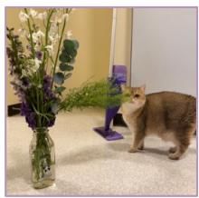
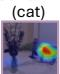
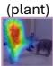
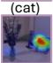
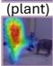
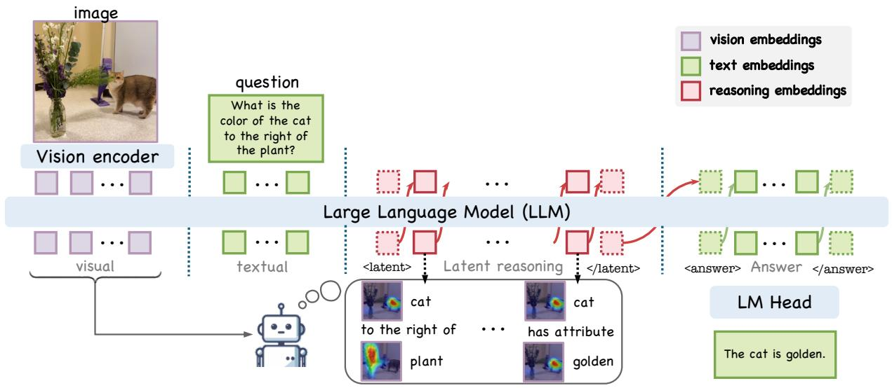
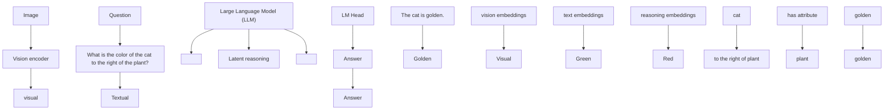
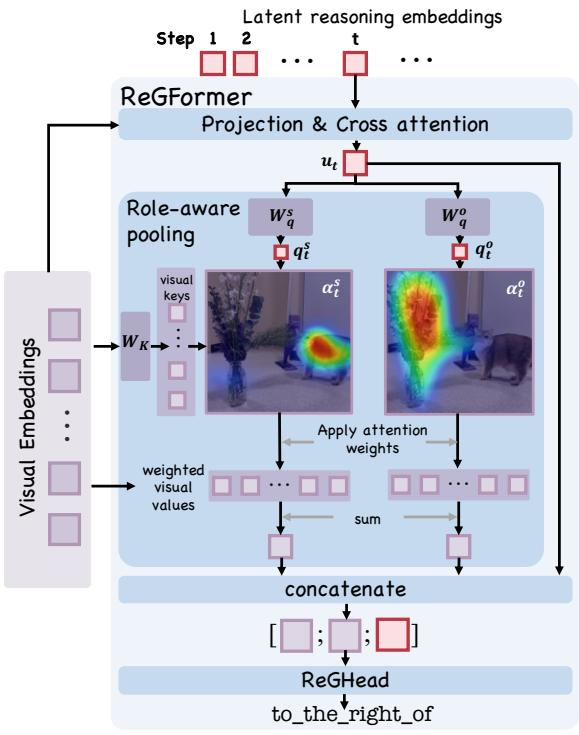
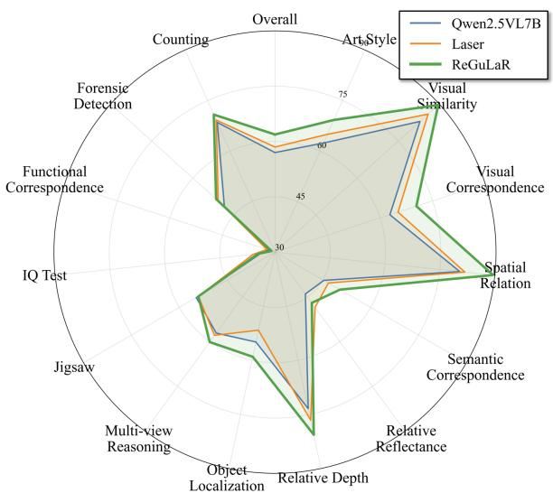
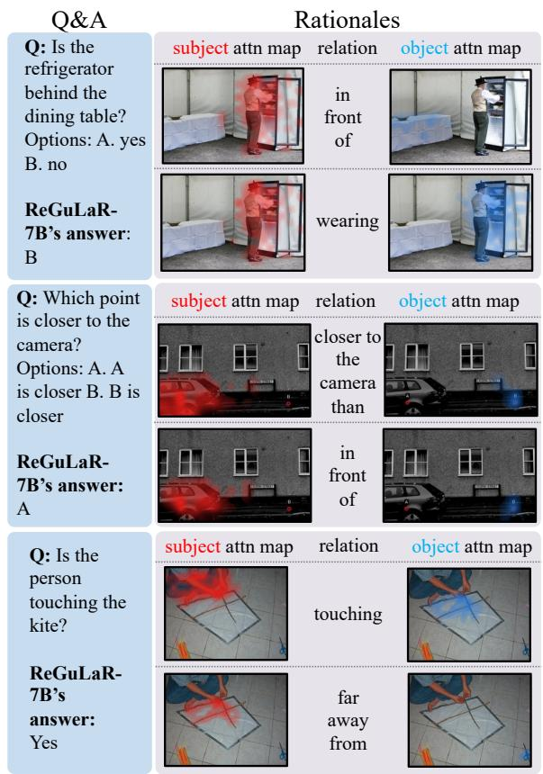

# ReGuLaR: Relation-Grounded Latent Reasoning for Large Vision-Language Models

Zihu Wang1, Karthik Somayaji N.S1, Peng Li1,

1University of California, Santa Barbara,

{zihu\_wang, karthi, lip}@ucsb.edu

# Abstract

Chain-of-thought (CoT) reasoning has significantly improved the reasoning ability of large vision-language models (LVLMs) by verbalizing intermediate reasoning steps in natural language. However, such discrete textual rationales are often insufficient for encoding continuous visual evidence. Recent work addresses this limitation by moving reasoning into continuous latent space. Despite promising progress, existing methods leave latent reasoning insufficiently connected to the compositional and relational structure of visual evidence. To address this gap, we introduce ReGuLaR, a relationgrounded latent reasoning framework that explicitly grounds latent states in these critical yet overlooked visual evidence. ReGuLaR uses a training-time ReGFormer to focus latent reasoning on question-relevant objects and interobject relations, while at inference time the model reasons and generates answers without invoking the ReGFormer. To support training ReGuLaR, we construct RGROUNDING-351K, a real-world vision-language dataset annotated with key object bounding boxes and inter-object relations. Extensive experiments across diverse benchmarks show that ReGuLaR consistently outperforms existing approaches and achieves state-of-the-art performance. We include our code in the submission and will release the code and training data publicly upon acceptance.

# 1 Introduction

Recent large vision-language models (LVLMs) have shown impressive capabilities in jointly understanding visual and textual inputs (Liu et al., 2023b; Bai et al., 2025b,a; Achiam et al., 2023). Inspired by Chain-of-Thought (CoT) reasoning in language models (Wei et al., 2022), many LVLMs generate intermediate natural-language rationales before producing the final answer. However, discrete tokenized textual rationales are a lossy medium for



<details>
<summary>natural_image</summary>

A cat standing next to a glass vase filled with flowers and a person in purple boots nearby (no visible text or symbols)
</details>

Q: Is the cat facing the plant?

# Standard CoT:

The cat is standing very close to the plant, with its body next to the stems and leaves. This suggests that the cat is facing the plant and sniffing it.

Answer: Yes.

# ReGuLaR:

  
-- to the right of --



  
-- facing away --

  
Answer: No.   
Figure 1: Unlike standard CoT, ReGuLaR grounds latent reasoning in question-relevant objects and visual relations, forming a scene graph before generating the final answer.

representing continuous visual evidence, and they often provide only an implicit connection to the visual tokens that support each reasoning step (Wang et al., 2026b; Li et al., 2025a). Recent latent reasoning approaches address this limitation by moving the reasoning process from natural language into continuous latent space. While representing rationales as latent embeddings is promising, existing methods primarily focus on latent attention optimization (Jeon et al., 2026; Ma et al., 2025; Pham and Ngo, 2025), reconstructing visual information (Li et al., 2025a; Tong et al., 2025; Yang et al., 2025), optimizing latent reasoning trajectories (Wang et al., 2026b; Liu et al., 2025; Sun et al., 2025), or interleaved vision-language reasoning (Wang et al., 2025b; Chen et al., 2025; Dong et al., 2025). As a result, they often leave latent reasoning weakly connected to the compositional and relational structure of visual evidence. However, visual reasoning should not be defined only by where computation takes place, but also by the visual evidence around which it is organized. Images are composed of entities, attributes, and relations, and many visual questions require binding these elements into a question-relevant scene structure. Existing latent reasoning methods move reasoning into continuous hidden states, but provide limited control over whether the resulting latent rationales are grounded in this structured visual evidence.



<details>
<summary>flowchart</summary>


</details>

Figure 2: Overview of ReGuLaR. ReGuLaR follows a thinking-then-answering process, where latent-space reasoning precedes final answer generation. At each latent reasoning step, the model focuses on one questionrelevant object pair and their relation, or on one object and its attribute. A training-time ReGFormer (Section 3.2) grounds each reasoning state in these critical visual structures, and is not required during inference.

To address this gap, we propose ReGuLaR: Relation-Grounded Latent Reasoning for Large Vision-Language Models. Instead of exposing scene graphs as prompts or requiring graph generation at inference time, ReGuLaR uses object relation-level supervision to shape questionconditioned latent states, inducing an internal graph-like reasoning process before answer generation. Representing graph-like visual evidences in the sequential model embeddings is challenging. As illustrated in 1, ReGuLaR focus on a question-relevant subject-relation-object relation triplet at each latent reasoning step, gradually forming a scene graph that captures the visual evidence needed to answer the question. Although appealing, encoding such an information-dense triplet into a single latent embedding remains challenging. To this end, we introduce a relation-grounding transformer (ReGFormer), which extracts subject and object visual features and grounds latent embeddings to the corresponding relations. To support the training of ReGuLaR, we construct a high-quality image-text dataset, RGROUNDING-351K, with annotations of object relations and bounding boxes for the corresponding objects. Extensive experiments on diverse benchmarks show that ReGuLaR consistently outperform general purpose LVLMs, text-based CoT reasoning models and existing latent reasoning approaches, confirming ReGuLaR achieves the state-of-the-art performance.

Our contributions are summarized as follows:

• We propose ReGuLaR, a relation-grounded latent reasoning framework that makes LVLMs reason over question-relevant objects and relations in continuous latent space before generating answers.   
• We introduce ReGFormer, a training-time module that grounds latent reasoning states through role-aware subject/object attention and relation-level supervision, while preserving the standard inference interface without external scene graphs or object annotations.

• We construct RGROUNDING-351K, a relation-grounded vision-language dataset of approximately 351K examples, integrating question-answer pairs, scene graphs, and object bounding boxes to support fine-grained latent relation grounding.

• We demonstrate the effectiveness of ReGu-LaR on diverse visual reasoning benchmarks, where it outperforms strong general-purpose, RL-based, and latent reasoning baselines; ablations and visualizations further validate the importance and interpretability of relationgrounded latent supervision.

# 2 Related Work

# 2.1 Structured Visual Evidence for Vision-Language Reasoning

Large Vision-language models (LVLMs) have evolved from task-specific architectures for applications like image captioning (Xu et al., 2015; Vinyals et al., 2015) and visual question answering (Antol et al., 2015; Yang et al., 2016) to large-scale pretrained models that align visual and textual representations (Radford et al., 2021; Li et al., 2020; Alayrac et al., 2022). With visual instruction tuning, recent LVLMs further connect strong vision encoders with large language models, showing strong capabilities in joint reasoning over visual and textual inputs (Liu et al., 2023b, 2024; Bai et al., 2023, 2025b,a; Wang et al., 2025e).

Despite these advances, current LVLMs still struggle with fine-grained reasoning that requires faithful grounding of objects, attributes, spatial relations, and inter-object dependencies (Shiri et al., 2024; Fu et al., 2024). Prior work introduces visual structures, such as localized object regions’ bounding boxes and scene graphs, to provide more structured visual evidence (Chen et al., 2023; Wang et al., 2025a, 2026a; Huang et al., 2024). However, it remains underexplored how to make answer generation follow a human-like process of first reasoning over question-relevant visual structures and then producing the answer. To this end, ReGuLaR uses relation-level grounding to train a question-conditioned latent bottleneck, encouraging the model to organize relevant objects and relations into an implicit graph-like reasoning process before generating the answer.

# 2.2 Latent Space Reasoning

Chain-of-thought (CoT) improves reasoning by externalizing intermediate steps in natural language (Wei et al., 2022), but discrete textual tokens can be verbose and lossy, especially for visual reasoning, where dense perceptual details are difficult to encode in words. Latent space reasoning addresses this limitation by allocating computation to hidden states rather than fully decoded rationales: prior work encodes complex intermediate information in the latent space of LLMs (Goyal et al., 2023; Zelikman et al., 2024; Xu et al., 2025), and more recent studies extend latent reasoning to multimodal models through latent attention optimization (Jeon et al., 2026; Ma et al., 2025; Pham and Ngo, 2025), reconstructing visual information (Li et al., 2025a; Tong et al., 2025; Yang et al., 2025), optimizing latent reasoning trajectories (Wang et al., 2026b; Liu et al., 2025; Sun et al., 2025), or interleaved visionlanguage reasoning (Wang et al., 2025b; Chen et al., 2025; Dong et al., 2025). These methods show that reasoning can be more efficient and perceptually informative when performed in continuous space, but they do not explicitly ground the latent reasoning process in fine-grained object attributes and interobject relations. In contrast, ReGuLaR grounds latent reasoning with question-relevant object relations, encouraging the model to capture essential object attributes and relational dependencies during the reasoning process.

# 3 Method

# 3.1 Overview

As illustrated in Figure 2, ReGuLaR follows a human-like reasoning paradigm: it first performs latent reasoning and then generates the answer. Given an image-question pair, the model first enters the latent reasoning phase, where each reasoning step produces a latent state intended to encode one question-relevant object relation in the form of subject-relation-object. To guide these latent states toward such fine-grained visual information, we introduce a training-time relation-grounding transformer (ReGFormer), detailed in Section 3.2. At inference time, ReGuLaR performs latent reasoning and answer generation without invoking ReGFormer. We describe the training data and optimization objective in Sections 3.3 and 3.4, respectively.

# 3.2 Relation Grounding with ReGFormer

Although scene graphs provide detailed and finegrained visual information about an image, incorporating such graph-structured information into a sequential Chain-of-Thought is challenging. A straightforward approach is to verbalize the scene graph as natural language and include it in the reasoning trace. However, due to the discrete and sequential nature of text, this strategy can be tokenexpensive and lossy. Moreover, textual CoT is typically decoupled from the visual tokens that support each reasoning step, providing only an implicit connection between the rationale and the underlying visual evidence. While moving reasoning into continuous latent space is appealing, encoding complex graph-like visual information in latent states remains non-trivial.



<details>
<summary>flowchart</summary>

```mermaid
graph TD
    A["Step 1"] --> B["Latent reasoning embeddings"]
    C["Step 2"] --> B
    D["Step t"] --> B
    B --> E["Projection & Cross attention"]
    E --> F["u_t"]
    F --> G["Role-aware pooling"]
    G --> H["W_q^s"]
    G --> I["W_q^o"]
    H --> J["q_t^s"]
    I --> K["q_t^o"]
    J --> L["visual keys"]
    K --> M["α_t^s"]
    L --> N["weighted visual values"]
    M --> O["Apply attention weights"]
    N --> P["sum"]
    O --> Q["concatenate"]
    P --> Q
    Q --> R["[; ;;"]]
    R --> S["ReGHead to_the_right_of"]
    T["Visual Embeddings"] --> U["Visual Embeddings"]
    U --> V["..."]
    V --> W["W_K"]
    W --> X["Role-aware pooling"]
```
</details>

Figure 3: Illustration of ReGFormer. For each latent reasoning embedding, ReGFormer attends to visual tokens, performs role-aware pooling to extract subject and object evidence, and predicts the corresponding relation label.

To this end, we introduce ReGFormer, a trainingtime module that grounds latent reasoning states in fine-grained object relations and aligns them with the visual tokens that support each reasoning step. As illustrated in Figure 3, ReGFormer takes as input the latent reasoning state and the visual token embeddings from the backbone LVLM. For the t-th latent reasoning step, let $\mathbf { z } _ { t } \in \mathbb { R } ^ { d }$ denote the hidden state of the current latent reasoning token, and let $\{ \mathbf { v } _ { 1 } , \ldots , \mathbf { v } _ { n } \}$ denote the n visual token embeddings. We first project them into the relationgrounding space:

$$
\mathbf {r} _ {t} = \mathbf {z} _ {t} \mathbf {W} _ {z}, \quad \mathbf {x} _ {i} = \mathbf {v} _ {i} \mathbf {W} _ {v} \tag {1}
$$

where $\mathbf { r } _ { t } , \mathbf { x } _ { i } \ \in \ \mathbb { R } ^ { d _ { r } }$ . The projected reasoning state then attends to all projected visual tokens through a cross-attention layer, producing a visually grounded reasoning state $\mathbf { u } _ { t } \mathbf { : }$

$$
\mathbf {u} _ {t} = \operatorname{CrossAttn} \left(\mathbf {r} _ {t}, \mathbf {X}\right) \tag {2}
$$

Here, $\mathbf { X } = [ \mathbf { x } _ { 1 } ; \ldots ; \mathbf { x } _ { n } ] \in \mathbb { R } ^ { n \times d _ { r } }$ .

Next, ReGFormer applies role-aware pooling to extract subject- and object-specific visual evidence for the current relation. We compute subject and object queries from $\mathbf { u } _ { t }$ and visual keys from the projected visual tokens:

$$
\mathbf {q} _ {t} ^ {s} = \mathbf {u} _ {t} \mathbf {W} _ {q} ^ {s}, \quad \mathbf {q} _ {t} ^ {o} = \mathbf {u} _ {t} \mathbf {W} _ {q} ^ {o}, \quad \mathbf {k} _ {i} ^ {v} = \mathbf {x} _ {i} \mathbf {W} _ {K} \tag {3}
$$

where qst , $\mathbf { q } _ { t } ^ { o } , \mathbf { k } _ { i } ^ { v } \in \mathbb { R } ^ { d _ { r } }$ . We denote all visual keys as $\mathbf { K } ^ { v } = [ \mathbf { k } _ { 1 } ^ { v } ; \ldots ; \mathbf { k } _ { n } ^ { v } ] \in \mathbb { R } ^ { n \times d _ { r } }$ . The subject and object attention distributions are then computed as:

$$
\boldsymbol {\alpha} _ {t} ^ {s} = \operatorname{softmax} \left(\frac {\mathbf {q} _ {t} ^ {s} \left(\mathbf {K} ^ {v}\right) ^ {\top}}{\sqrt {d _ {r}}}\right) \tag {4}
$$

$$
\pmb {\alpha} _ {t} ^ {o} = \mathrm{softmax} \left(\frac {\mathbf {q} _ {t} ^ {o} (\mathbf {K} ^ {v}) ^ {\top}}{\sqrt {d _ {r}}}\right)
$$

Using these role-specific attention distributions, we obtain subject and object visual features by weighted pooling over the projected visual tokens:

$$
\mathbf {c} _ {t} ^ {s} = \sum_ {i = 1} ^ {n} \alpha_ {t, i} ^ {s} \mathbf {x} _ {i}, \quad \mathbf {c} _ {t} ^ {o} = \sum_ {i = 1} ^ {n} \alpha_ {t, i} ^ {o} \mathbf {x} _ {i}. \tag {5}
$$

Finally, we concatenate the subject feature, object feature, and relation-aware latent state:

$$
\mathbf {m} _ {t} = [ \mathbf {c} _ {t} ^ {s}; \mathbf {c} _ {t} ^ {o}; \mathbf {u} _ {t} ] \tag {6}
$$

and feed $\mathbf { m } _ { t }$ into a relation prediction head to produce a distribution over the relation vocabulary. The resulting relation prediction and role-specific attention maps are used to supervise the latent reasoning state during training, while ReGFormer is removed during inference.

# 3.3 Training Data

As described in Section 3.2, training ReGuLaR with ReGFormer requires supervision for both object-level grounding and relation-level prediction. To this end, we construct RGROUNDING-351K, a high-quality image-text dataset with approximately 351K examples. Each example contains an image, a question-answer pair, a scene graph, and bounding boxes for the objects in the scene graph. For each image-question pair, we further derive a set of question-relevant relation targets from the image-level scene graph. Specifically, we identify objects mentioned in the question or answer as anchors using the available question/answer annotations, and select relations whose subject or object is connected to these anchors. Table 1 summarizes the data sources of RGROUNDING-351K, with additional construction details provided in the Appendix.

<table><tr><td>Data Source</td><td>Amount</td></tr><tr><td>GQA (Hudson and Manning, 2019)</td><td>245K</td></tr><tr><td>Openimage (Krasin et al., 2017)</td><td>50K</td></tr><tr><td>CLEVR (Johnson et al., 2017)</td><td>25K</td></tr><tr><td>Visual Genome (Krishna et al., 2017)</td><td>15K</td></tr><tr><td>PSG (Yang et al., 2022)</td><td>6K</td></tr><tr><td>mGrounding (Li et al., 2025b)</td><td>5K</td></tr><tr><td>VSR (Liu et al., 2023a)</td><td>5K</td></tr></table>

Table 1: Data composition of RGROUNDING-351K. We report the source datasets and the number of examples collected from each source.

# 3.4 Training Objective

To train the model to follow the thinking-thenanswering format, we apply supervised fine-tuning (SFT) with our proposed relation-grounding objectives. For each training example, we use the selected question-relevant relation targets described above rather than the full scene graph. For each latent reasoning step t, we sample one subjectrelation-object triplet from these targets, together with the bounding boxes of its subject and object. We convert the bounding boxes into target attention distributions over visual tokens. Specifically, $\beta _ { t } ^ { s } , \beta _ { t } ^ { o } \in \mathbb { R } ^ { n }$ are defined as uniform distributions over the visual tokens whose image patches overlap with the subject and object bounding boxes, respectively, with zero probability assigned to all other tokens. Let $\alpha _ { t } ^ { s }$ and $\pmb { \alpha } _ { t } ^ { o }$ denote the subject and object attention distributions predicted by ReGFormer. We supervise role-aware grounding with:

$$
\mathcal {L} _ {\text {attn}} = \frac {1}{T} \sum_ {t = 1} ^ {T} \left[ D _ {\mathrm{KL}} (\boldsymbol {\beta} _ {t} ^ {s} \parallel \boldsymbol {\alpha} _ {t} ^ {s}) + D _ {\mathrm{KL}} (\boldsymbol {\beta} _ {t} ^ {o} \parallel \boldsymbol {\alpha} _ {t} ^ {o}) \right] \tag {7}
$$

where $D _ { \mathrm { K L } } ( \cdot | | \cdot )$ denotes the Kullback–Leibler (KL) divergence. Intuitively, this loss provides a grounding signal for the role-aware pooling layer in ReGFormer, encouraging its subject and object queries to attend to the corresponding visual evidence.

Given the role-aware representation $\mathbf { m } _ { t }$ from ReGFormer, the relation prediction head produces logits over the relation vocabulary:

$$
\boldsymbol {\ell} _ {t} ^ {\mathrm{rel}} = f _ {\mathrm{rel}} (\mathbf {m} _ {t}), \quad \mathbf {p} _ {t} ^ {\mathrm{rel}} = \operatorname{softmax} \left(\boldsymbol {\ell} _ {t} ^ {\mathrm{rel}}\right) \tag {8}
$$

We supervise relation prediction with the crossentropy loss, encouraging each latent reasoning state to encode the relation between the currently grounded subject-object pair:

$$
\mathcal {L} _ {\mathrm{rel}} = - \frac {1}{T} \sum_ {t = 1} ^ {T} \log \mathbf {p} _ {t, y _ {t}} ^ {\mathrm{rel}} \tag {9}
$$

where $y _ { t }$ is the ground-truth relation label for the t-th subject-object pair, and $\mathbf { p } _ { t , y _ { t } } ^ { \mathrm { r e l } }$ denotes the probability assigned to the correct relation.

After the latent reasoning stage, the model generates the final answer autoregressively. We optimize the answer tokens with the standard next-token prediction loss:

$$
\mathcal {L} _ {\text { ans }} = - \frac {1}{N} \sum_ {j = 1} ^ {N} \log p _ {\theta} \left(a _ {j} \mid I, q, \mathbf {z} _ {1: T}, a _ {<   j}\right) \tag {10}
$$

where I is the input image, $q$ is the question, $\mathbf { z } _ { 1 : T }$ are the latent reasoning states, and $a _ { 1 : N }$ are the answer tokens.

The overall training objective is:

$$
\mathcal {L} = \lambda_ {\mathrm{ans}} \mathcal {L} _ {\mathrm{ans}} + \lambda_ {\mathrm{rel}} \mathcal {L} _ {\mathrm{rel}} + \lambda_ {\mathrm{attn}} \mathcal {L} _ {\mathrm{attn}} \tag {11}
$$

Through these supervision signals, ReGFormer guides the backbone LVLM to organize each latent reasoning step around a question-relevant subject-relation-object triplet before generating the answer. Because the relation prediction and attention grounding losses are computed from the latent states and back-propagated into the backbone LVLM, the model is encouraged to encode question-relevant subjects, objects, and relations in its own latent reasoning trajectory. Once this behavior is learned, ReGFormer is removed. At inference time, ReGuLaR first performs a fixed number of latent reasoning steps and then switches to autoregressive answer generation, requiring only the image and question without external scene graphs, object annotations, or additional grounding modules.

# 4 Experiment

Experiment setup. We use Qwen2.5-VL-7B (Bai et al., 2025b) as the backbone and initialize ReGuLaR from the corresponding pretrained checkpoints. During training, we freeze the vision encoder and the modality-alignment projector. We set the loss weights $\lambda _ { a n s } = 1 . 0 $ $\lambda _ { r e l } = 1 . 0$ , and $\lambda _ { a t t n } = 0 . 1$ for all experiments. All experiments are conducted on 4× NVIDIA A100 GPUs with 80GB memory. Additional implementation details are provided in the Appendix.

<table><tr><td rowspan="2">Models</td><td colspan="3">V*</td><td colspan="3">HRBench</td><td rowspan="2">MMVP</td><td rowspan="2">BLINK</td><td rowspan="2">SEEDBENCH 2PLUS</td><td rowspan="2">Hallusion Bench</td><td rowspan="2">Avg.</td></tr><tr><td>Overall</td><td>Attribute</td><td>Spatial</td><td>Overall</td><td>4k</td><td>8k</td></tr><tr><td colspan="12">General-purpose LVLMs</td></tr><tr><td>GPT-4o</td><td>64.92</td><td>70.43</td><td>56.58</td><td>57.25</td><td>59.00</td><td>55.50</td><td>68.70</td><td>60.02</td><td>-</td><td>-</td><td>-</td></tr><tr><td>LLaVA-OneVision</td><td>72.77</td><td>76.52</td><td>67.11</td><td>59.56</td><td>63.88</td><td>55.25</td><td>73.33</td><td>50.13</td><td>61.22</td><td>51.28</td><td>61.38</td></tr><tr><td>Qwen2.5-VL-7B</td><td>76.44</td><td>79.13</td><td>72.37</td><td>64.88</td><td>68.00</td><td>61.75</td><td>70.33</td><td>57.02</td><td>65.31</td><td>57.04</td><td>65.17</td></tr><tr><td colspan="12">RL-based reasoning LVLMs</td></tr><tr><td>Deepeyes</td><td>78.01</td><td>80.00</td><td>75.00</td><td>65.63</td><td>69.25</td><td>62.00</td><td>71.67</td><td>53.02</td><td>69.08</td><td>61.91</td><td>66.55</td></tr><tr><td>PAPO</td><td>36.13</td><td>25.22</td><td>52.63</td><td>-</td><td>-</td><td>-</td><td>54.33</td><td>52.66</td><td>54.11</td><td>56.07</td><td>-</td></tr><tr><td>Vision-R1</td><td>78.53</td><td>78.25</td><td>78.95</td><td>63.44</td><td>66.63</td><td>60.25</td><td>72.00</td><td>53.23</td><td>68.95</td><td>63.06</td><td>66.53</td></tr><tr><td colspan="12">Latent reasoning LVLMs</td></tr><tr><td>LVR</td><td>79.06</td><td>80.87</td><td>76.32</td><td>50.63</td><td>51.13</td><td>50.13</td><td>70.33</td><td>54.97</td><td>47.39</td><td>65.99</td><td>61.40</td></tr><tr><td>Monet</td><td>79.58</td><td>81.74</td><td>76.32</td><td>64.13</td><td>67.37</td><td>60.88</td><td>72.33</td><td>56.02</td><td>65.88</td><td>54.91</td><td>65.47</td></tr><tr><td>Laser</td><td>80.10</td><td>81.74</td><td>77.63</td><td>65.82</td><td>70.25</td><td>61.38</td><td>73.00</td><td>58.55</td><td>70.05</td><td>67.05</td><td>69.16</td></tr><tr><td>ReGuLaR-7B</td><td>83.25</td><td>85.22</td><td>80.26</td><td>66.19</td><td>70.50</td><td>61.88</td><td>73.67</td><td>61.81</td><td>70.22</td><td>66.08</td><td>70.20</td></tr></table>

Table 2: Main results on V ∗ Bench, HRBench, MMVP, BLINK, SEED-Bench-2-Plus, and HallusionBench, together with the average performance across all benchmarks. All values are reported in accuracy (%). Bold and underlined numbers denote the best and second-best results in each column, respectively.

Evaluation benchmarks. We evaluate the reasoning ability of ReGuLaR on a diverse set of vision-language benchmarks with English questions and answers. V ∗ Bench (Wu and Xie, 2024) evaluates a model’s ability to recognize finegrained visual details and relative spatial relations. MMVP (Tong et al., 2024) evaluates fine-grained visual perception by testing whether LVLMs can distinguish visually similar images and answer questions about details that are often overlooked. HRBench (Wang et al., 2025c) assesses model performance on reasoning over ultra-high-resolution images. BLINK (Fu et al., 2024) is a comprehensive benchmark covering 14 visual perception tasks. SEED-Bench-2-Plus (Li et al., 2024b) evaluates text-rich visual comprehension across diverse real-world scenarios such as charts, maps, and web pages. HallusionBench (Guan et al., 2024) tests whether LVLMs can avoid hallucinations and visual illusions under subtle visual changes.

Baselines. We compare ReGuLaR with models from three categories. (1) General-purpose LVLMs, including LLaVA-OneVision (Li et al., 2024a), GPT-4o (Achiam et al., 2023), and Qwen2.5-VL-7B (Bai et al., 2025b). (2) RL-based reasoning LVLMs, including DeepEyes (Zheng et al., 2025), PAPO (Wang et al., 2025d), and Vision-R1 (Huang et al., 2025). (3) Latent-reasoning LVLMs, including LVR (Li et al., 2025a), MONET (Wang et al., 2025b), and LASER (Wang et al., 2026b).

# 4.1 Main Results

Table 2 reports the main results across six benchmarks. On visual perception and fine-grained reasoning tasks, ReGuLaR shows clear advantages over prior latent reasoning methods. It achieves the best results on V ∗ Bench, MMVP, and BLINK, improving over the strongest latent reasoning baseline by 3.15 points on V ∗ overall, 3.48 points on attribute recognition, 2.63 points on spatial reasoning, and 3.26 points on BLINK. These gains suggest that grounding latent states in questionrelevant objects and relations helps the model better preserve and organize fine-grained visual evidence before answer generation.

ReGuLaR also performs strongly on highresolution benchmarks. It achieves the best overall score on HRBench and the best results on its 4K subset, while remaining highly competitive on the 8K subset, showing that relation-grounded latent reasoning remains effective for high-resolution visual inputs. Beyond perception-centric benchmarks, ReGuLaR obtains the best performance on SEED-Bench-2-Plus, which includes text-rich and diverse visual understanding tasks such as charts, maps, and web pages, and remains strong on HallusionBench. These results indicate that our method improves fine-grained visual reasoning without sacrificing generality across broader multimodal understanding and hallucination-sensitive settings.

BLINK comprises 14 diverse single-image and multi-image visual reasoning tasks. As shown in Figure 4, ReGuLaR outperforms both the base Qwen2.5-VL-7B and the state-of-the-art latent reasoning method Laser in overall performance, achieving the best results on 10 of the 14 tasks. The gains are especially notable on tasks that require precise grounding of object attributes, spatial relations, and cross-image correspondence. This suggests that relation-grounded latent reasoning provides a stronger inductive bias for visual reasoning: by structuring latent computation around question-relevant entities and their relations, ReGuLaR makes more effective use of fine-grained visual evidence across diverse reasoning settings.



<details>
<summary>radar</summary>

| Category               | Qwen2.5VL7B | Laser | ReGuLaR |
| ---------------------- | ----------- | ----- | ------- |
| Overall                | 60          | 60    | 60      |
| ArtStyle               | 60          | 60    | 60      |
| Visual Similarity      | 75          | 75    | 75      |
| Visual Correspondence   | 60          | 60    | 60      |
| Spatial Relation       | 75          | 75    | 75      |
| Semantic Correspondence | 60          | 60    | 60      |
| Relative Reflectance   | 60          | 60    | 60      |
| Relative Depth        | 75          | 75    | 75      |
| Object Localization    | 60          | 60    | 60      |
| Multi-view Reasoning   | 60          | 60    | 60      |
| Jigsaw                 | 60          | 60    | 60      |
| IQ Test                | 30          | 30    | 30      |
| Functional Correspondence | 30          | 30    | 30      |
| Forensic Detection    | 30          | 30    | 30      |
| Counting               | 60          | 60    | 60      |
</details>

Figure 4: Performance comparison across 14 diverse tasks of the BLINK benchmark.

# 4.2 Visualization of Relation-Grounded Latent Rationales

Although ReGFormer is not required at inference time, the trained ReGFormer can still be attached to the latent reasoning states as a diagnostic probe to visualize their semantics. Figure 5 shows representative examples, each including the input question, the answer of ReGuLaR, and two latent reasoning steps. For each step, we visualize the subject attention map in red, the object attention map in blue, and the relation predicted by ReGFormer from the corresponding latent state. These examples show that different latent states can focus on question-relevant entities and recover meaningful relations, suggesting that ReGuLaR performs visually grounded relation reasoning before final answer generation.

# 4.3 Ablation Study

Loss weights. The training objective of ReGu-LaR consists of the answer generation loss and two auxiliary relation-grounding losses: the relation prediction loss weighted by $\lambda _ { \mathrm { { r e l } } }$ and the attention grounding loss weighted by $\lambda _ { \mathrm { a t t n } }$ . We study the sensitivity of ReGuLaR to these two weights while keeping the answer loss weight fixed. When varying $\lambda _ { \mathrm { { r e l } } } ,$ , we fix $\lambda _ { \mathrm { a t t n } } ~ = ~ 0 . 1 ;$ ; when varying $\lambda _ { \mathrm { a t t r a } } .$ , we fix $\lambda _ { \mathrm { r e l } } = 1 . 0$ . Table 3 reports the average performance over $V ^ { * }$ Bench, MMVP, and BLINK. The model performs best with $\lambda _ { \mathrm { r e l } } = 1 . 0$ and $\lambda _ { \mathrm { a t t n } } = 0 . 1$ , which we use for all main experiments. The results also show that excessively weak or strong auxiliary supervision can hurt performance, suggesting that relation grounding is most effective when it guides latent states without overwhelming answer-generation learning.



<details>
<summary>text_image</summary>

Q&A
Q: Is the refrigerator behind the dining table? Options: A. yes B. no
ReGuLaR-7B's answer: B
Rationales
subject attn map relation object attn map
in front of
wearing
Q: Which point is closer to the camera? Options: A. A is closer B. B is closer
ReGuLaR-7B's answer: A
subject attn map relation object attn map
closer to the camera than
in front of
Q: Is the person touching the kite?
ReGuLaR-7B's answer: Yes
subject attn map relation object attn map
touching
far away from
</details>

Figure 5: Visualization of relation-grounded latent rationales produced by ReGuLaR. For each example, we show the input question, the model prediction, and two latent reasoning steps decoded by the trained ReG-Former. In each step, the red heatmap indicates the subject attention, the blue heatmap indicates the object attention, and the middle text shows the relation predicted from the corresponding latent reasoning state.

Effect of Relation-Grounded Latent Supervision. To further demonstrate the effectiveness of our proposed relation-grounded latent reasoning, we introduce two additional models fine-tuned from Qwen2.5-VL-7B on RGROUNDING-351K. Vanilla SFT is trained only with the next-token prediction loss to directly generate the answer without latent reasoning. Text rationale converts the question-relevant scene graph into textual subjectrelation-object triplets and uses them as intermediate rationales before answer generation. As shown in Table 4, ReGuLaR substantially outperforms vanilla SFT, indicating that the improvement does not simply come from fine-tuning on RGROUNDING-351K. Instead, explicitly modeling a thinking-then-answering process helps the model organize the visual evidence needed for reasoning. Moreover, ReGuLaR also outperforms the text-rationale variant, showing that verbalizing visual relations as discrete text is less effective than grounding continuous latent states with visualtoken evidence. This suggests that ReGuLaR benefits from both the compactness of continuous latent reasoning and the fine-grained evidence support provided by ReGFormer over visual tokens.

<table><tr><td>weight</td><td>0.01</td><td>0.1</td><td>0.5</td><td>1.0</td><td>2.0</td></tr><tr><td> $\lambda_{rel}$ </td><td>-</td><td>69.15</td><td>72.38</td><td>72.91</td><td>72.35</td></tr><tr><td> $\lambda_{attn}$ </td><td>71.33</td><td>72.91</td><td>72.65</td><td>72.49</td><td>-</td></tr></table>

Table 3: Effect of relation prediction and attention grounding loss weights. We report the average accuracy (%) over V ∗ Bench, MMVP, and BLINK. When varying one loss weight, the other is fixed to its default value.

<table><tr><td>Method</td><td>V*</td><td>MMVP</td><td>BLINK</td><td>Avg.</td></tr><tr><td>Qwen2.5VL7B</td><td>76.44</td><td>70.33</td><td>57.02</td><td>67.93</td></tr><tr><td>vanilla SFT</td><td>73.82</td><td>71.00</td><td>56.50</td><td>67.11</td></tr><tr><td>text rationales</td><td>74.87</td><td>70.33</td><td>57.12</td><td>67.44</td></tr><tr><td>ReGuLaR</td><td>83.25</td><td>73.67</td><td>61.81</td><td>72.91</td></tr></table>

Table 4: Ablation study on relation-grounded latent supervision. We compare ReGuLaR with the base Qwen2.5-VL-7B, vanilla SFT on the same training data, and a text-rationale variant that verbalizes visual relations in the reasoning trace.

Number of reasoning steps. At inference time, ReGuLaR uses a fixed budget of latent reasoning steps before generating the final answer. We study the effect of this budget by evaluating ReGuLaR with 1, 4, 8, and 16 latent reasoning steps. As shown in Table 5, using only one step leads to relatively lower performance, suggesting that a single latent state is insufficient to capture the multiple objects, attributes, and relations needed for visual reasoning. Increasing the budget to 4 steps substantially improves the average score, while further increasing it to 8 or 16 steps yields only marginal changes. Therefore, we use 4 latent reasoning steps in our main experiments as an efficient and effective inference setting.

<table><tr><td>steps</td><td>V*</td><td>MMVP</td><td>BLINK</td><td>Avg.</td></tr><tr><td>1 step</td><td>81.15</td><td>73.00</td><td>60.07</td><td>71.41</td></tr><tr><td>4 steps</td><td>83.25</td><td>73.67</td><td>61.81</td><td>72.91</td></tr><tr><td>8 steps</td><td>82.72</td><td>73.67</td><td>61.92</td><td>72.56</td></tr><tr><td>16 steps</td><td>83.80</td><td>73.67</td><td>61.49</td><td>72.99</td></tr></table>

Table 5: Effect of the number of latent reasoning steps at inference time. We report accuracy (%) on V ∗ Bench, MMVP, and BLINK, along with their average.

# 5 Discussion

In this work, we present ReGuLaR, a relationgrounded latent reasoning framework for visionlanguage reasoning. Instead of verbalizing intermediate reasoning steps as natural-language CoT or leaving latent thoughts weakly grounded, ReGu-LaR uses question-relevant scene graphs to supervise latent reasoning states during training. With the training-time ReGFormer, each latent state is encouraged to encode the subject, object, and relation information needed for faithful visual reasoning, while inference remains simple and requires no external scene graphs, object annotations, or additional grounding modules. Extensive experiments show that ReGuLaR consistently improves over strong existing approaches across diverse benchmarks. Ablation studies further demonstrate that these gains do not simply come from fine-tuning on RGROUNDING-351K or verbalizing scene-graph triplets as text; instead, directly grounding continuous latent states with visual-token evidence is crucial. Looking forward, relation-grounded latent reasoning may be further extended from static visual inputs, including both single-image and multiimage settings, to dynamic temporal scenarios. In such settings, temporal relations, object interactions, and state changes can provide richer structure for latent reasoning.

# 6 Limitations

One limitation of ReGuLaR is its reliance on relation-level grounding supervision during training, including object bounding boxes and interobject relation annotations. Although these annotations are not needed at inference time, collecting high-quality relation supervision may become expensive when scaling to broader domains. Future work may reduce this requirement through weak supervision, automatic scene-graph construction, or self-training pipelines that produce relation signals at scale.

# References

Josh Achiam, Steven Adler, Sandhini Agarwal, Lama Ahmad, Ilge Akkaya, Florencia Leoni Aleman, Diogo Almeida, Janko Altenschmidt, Sam Altman, Shyamal Anadkat, and 1 others. 2023. Gpt-4 technical report. arXiv preprint arXiv:2303.08774.   
Jean-Baptiste Alayrac, Jeff Donahue, Pauline Luc, Antoine Miech, Iain Barr, Yana Hasson, Karel Lenc, Arthur Mensch, Katherine Millican, Malcolm Reynolds, and 1 others. 2022. Flamingo: a visual language model for few-shot learning. Advances in neural information processing systems, 35:23716– 23736.   
Stanislaw Antol, Aishwarya Agrawal, Jiasen Lu, Margaret Mitchell, Dhruv Batra, C Lawrence Zitnick, and Devi Parikh. 2015. Vqa: Visual question answering. In Proceedings of the IEEE international conference on computer vision, pages 2425–2433.   
Jinze Bai, Shuai Bai, Yunfei Chu, Zeyu Cui, Kai Dang, Xiaodong Deng, Yang Fan, Wenbin Ge, Yu Han, Fei Huang, and 1 others. 2023. Qwen technical report. arXiv preprint arXiv:2309.16609.   
Shuai Bai, Yuxuan Cai, Ruizhe Chen, Keqin Chen, Xionghui Chen, Zesen Cheng, Lianghao Deng, Wei Ding, Chang Gao, Chunjiang Ge, and 1 others. 2025a. Qwen3-vl technical report. arXiv preprint arXiv:2511.21631.   
Shuai Bai, Keqin Chen, Xuejing Liu, Jialin Wang, Wenbin Ge, Sibo Song, Kai Dang, Peng Wang, Shijie Wang, Jun Tang, and 1 others. 2025b. Qwen2. 5-vl technical report. arXiv preprint arXiv:2502.13923.   
Chao Chen, Zhixin Ma, Yongqi Li, Yupeng Hu, Yinwei Wei, Wenjie Li, and Liqiang Nie. 2025. Reasoning in the dark: Interleaved vision-text reasoning in latent space. arXiv preprint arXiv:2510.12603.   
Keqin Chen, Zhao Zhang, Weili Zeng, Richong Zhang, Feng Zhu, and Rui Zhao. 2023. Shikra: Unleashing multimodal llm’s referential dialogue magic. arXiv preprint arXiv:2306.15195.   
Shuai Dong, Siyuan Wang, Xingyu Liu, Chenglin Li, Haowen Hou, and Zhongyu Wei. 2025. Interleaved latent visual reasoning with selective perceptual modeling. arXiv preprint arXiv:2512.05665.

Xingyu Fu, Yushi Hu, Bangzheng Li, Yu Feng, Haoyu Wang, Xudong Lin, Dan Roth, Noah A Smith, Wei-Chiu Ma, and Ranjay Krishna. 2024. Blink: Multimodal large language models can see but not perceive. In European Conference on Computer Vision, pages 148–166. Springer.   
Sachin Goyal, Ziwei Ji, Ankit Singh Rawat, Aditya Krishna Menon, Sanjiv Kumar, and Vaishnavh Nagarajan. 2023. Think before you speak: Training language models with pause tokens. arXiv preprint arXiv:2310.02226.   
Tianrui Guan, Fuxiao Liu, Xiyang Wu, Ruiqi Xian, Zongxia Li, Xiaoyu Liu, Xijun Wang, Lichang Chen, Furong Huang, Yaser Yacoob, and 1 others. 2024. Hallusionbench: an advanced diagnostic suite for entangled language hallucination and visual illusion in large vision-language models. In Proceedings of the IEEE/CVF conference on computer vision and pattern recognition, pages 14375–14385.   
Wenxuan Huang, Bohan Jia, Zijie Zhai, Shaosheng Cao, Zheyu Ye, Fei Zhao, Zhe Xu, Xu Tang, Yao Hu, and Shaohui Lin. 2025. Vision-r1: Incentivizing reasoning capability in multimodal large language models. arXiv preprint arXiv:2503.06749.   
Yufeng Huang, Jiji Tang, Zhuo Chen, Rongsheng Zhang, Xinfeng Zhang, Weijie Chen, Zeng Zhao, Zhou Zhao, Tangjie Lv, Zhipeng Hu, and 1 others. 2024. Structure-clip: Towards scene graph knowledge to enhance multi-modal structured representations. In Proceedings of the AAAI conference on artificial intelligence, volume 38, pages 2417–2425.   
Drew A Hudson and Christopher D Manning. 2019. Gqa: A new dataset for real-world visual reasoning and compositional question answering. Conference on Computer Vision and Pattern Recognition (CVPR).   
Byungwoo Jeon, Yoonwoo Jeong, Hyunseok Lee, Minsu Cho, and Jinwoo Shin. 2026. Vision-aligned latent reasoning for multi-modal large language model. arXiv preprint arXiv:2602.04476.   
Justin Johnson, Bharath Hariharan, Laurens Van Der Maaten, Li Fei-Fei, C Lawrence Zitnick, and Ross Girshick. 2017. Clevr: A diagnostic dataset for compositional language and elementary visual reasoning. In Proceedings of the IEEE conference on computer vision and pattern recognition, pages 2901–2910.   
Ivan Krasin, Tom Duerig, Neil Alldrin, Vittorio Ferrari, Sami Abu-El-Haija, Alina Kuznetsova, Hassan Rom, Jasper Uijlings, Stefan Popov, Shahab Kamali, Matteo Malloci, Jordi Pont-Tuset, Andreas Veit, Serge Belongie, Victor Gomes, Abhinav Gupta, Chen Sun, Gal Chechik, David Cai, and 3 others. 2017. Openimages: A public dataset for large-scale multi-label and multiclass image classification. Dataset available from https://storage.googleapis.com/openimages/web/index.html.

Ranjay Krishna, Yuke Zhu, Oliver Groth, Justin Johnson, Kenji Hata, Joshua Kravitz, Stephanie Chen, Yannis Kalantidis, Li-Jia Li, David A Shamma, and 1 others. 2017. Visual genome: Connecting language and vision using crowdsourced dense image annotations. International journal of computer vision, 123(1):32–73.   
Bangzheng Li, Ximeng Sun, Jiang Liu, Ze Wang, Jialian Wu, Xiaodong Yu, Hao Chen, Emad Barsoum, Muhao Chen, and Zicheng Liu. 2025a. Latent visual reasoning. arXiv preprint arXiv:2509.24251.   
Bo Li, Yuanhan Zhang, Dong Guo, Renrui Zhang, Feng Li, Hao Zhang, Kaichen Zhang, Peiyuan Zhang, Yanwei Li, Ziwei Liu, and 1 others. 2024a. Llavaonevision: Easy visual task transfer. arXiv preprint arXiv:2408.03326.   
Bohao Li, Yuying Ge, Yi Chen, Yixiao Ge, Ruimao Zhang, and Ying Shan. 2024b. Seed-bench-2-plus: Benchmarking multimodal large language models with text-rich visual comprehension. arXiv preprint arXiv:2404.16790.   
Xiujun Li, Xi Yin, Chunyuan Li, Pengchuan Zhang, Xiaowei Hu, Lei Zhang, Lijuan Wang, Houdong Hu, Li Dong, Furu Wei, and 1 others. 2020. Oscar: Object-semantics aligned pre-training for visionlanguage tasks. In European conference on computer vision, pages 121–137. Springer.   
You Li, Heyu Huang, Chi Chen, Kaiyu Huang, Chao Huang, Zonghao Guo, Zhiyuan Liu, Jinan Xu, Yuhua Li, Ruixuan Li, and 1 others. 2025b. Migician: Revealing the magic of free-form multi-image grounding in multimodal large language models. In Findings of the Association for Computational Linguistics: ACL 2025, pages 9845–9867.   
Tsung-Yi Lin, Michael Maire, Serge Belongie, James Hays, Pietro Perona, Deva Ramanan, Piotr Doll’ar, and C Lawrence Zitnick. 2014. Microsoft coco: Common objects in context. In Computer Vision– ECCV 2014: 13th European Conference, Zurich, Switzerland, September 6-12, 2014, Proceedings, Part V 13, pages 740–755. Springer.   
Chengzhi Liu, Yuzhe Yang, Yue Fan, Qingyue Wei, Sheng Liu, and Xin Eric Wang. 2025. Reasoning within the mind: Dynamic multimodal interleaving in latent space. arXiv preprint arXiv:2512.12623.   
Fangyu Liu, Guy Emerson, and Nigel Collier. 2023a. Visual spatial reasoning. Transactions of the Association for Computational Linguistics, 11:635–651.   
Haotian Liu, Chunyuan Li, Yuheng Li, Bo Li, Yuanhan Zhang, Sheng Shen, and Yong Jae Lee. 2024. Llavanext: Improved reasoning, ocr, and world knowledge.   
Haotian Liu, Chunyuan Li, Qingyang Wu, and Yong Jae Lee. 2023b. Visual instruction tuning. Advances in neural information processing systems, 36:34892– 34916.

Jizheng Ma, Xiaofei Zhou, Geyuan Zhang, Yanlong Song, and Han Yan. 2025. Multimodal reasoning via latent refocusing. arXiv preprint arXiv:2511.02360.   
Tan-Hanh Pham and Chris Ngo. 2025. Multimodal chain of continuous thought for latent-space reasoning in vision-language models. arXiv preprint arXiv:2508.12587.   
Alec Radford, Jong Wook Kim, Chris Hallacy, Aditya Ramesh, Gabriel Goh, Sandhini Agarwal, Girish Sastry, Amanda Askell, Pamela Mishkin, Jack Clark, and 1 others. 2021. Learning transferable visual models from natural language supervision. In International conference on machine learning, pages 8748–8763. PmLR.   
Fatemeh Shiri, Xiao-Yu Guo, Mona Golestan Far, Xin Yu, Reza Haf, and Yuan-Fang Li. 2024. An empirical analysis on spatial reasoning capabilities of large multimodal models. In Proceedings of the 2024 Conference on Empirical Methods in Natural Language Processing, pages 21440–21455.   
Guohao Sun, Hang Hua, Jian Wang, Jiebo Luo, Sohail Dianat, Majid Rabbani, Raghuveer Rao, and Zhiqiang Tao. 2025. Latent chain-of-thought for visual reasoning. arXiv preprint arXiv:2510.23925.   
Jintao Tong, Jiaqi Gu, Yujing Lou, Lubin Fan, Yixiong Zou, Yue Wu, Jieping Ye, and Ruixuan Li. 2025. Sketch-in-latents: Eliciting unified reasoning in mllms. arXiv preprint arXiv:2512.16584.   
Shengbang Tong, Zhuang Liu, Yuexiang Zhai, Yi Ma, Yann LeCun, and Saining Xie. 2024. Eyes wide shut? exploring the visual shortcomings of multimodal llms. In Proceedings of the IEEE/CVF conference on computer vision and pattern recognition, pages 9568–9578.   
Oriol Vinyals, Alexander Toshev, Samy Bengio, and Dumitru Erhan. 2015. Show and tell: A neural image caption generator. In Proceedings of the IEEE conference on computer vision and pattern recognition, pages 3156–3164.   
Chuhan Wang, Xintong Li, Jennifer Yuntong Zhang, Junda Wu, Chengkai Huang, Lina Yao, Julian McAuley, and Jingbo Shang. 2026a. Scenealign: Aligning multimodal reasoning to scene graphs in complex visual scenes. arXiv preprint arXiv:2601.05600.   
Jingyi Wang, Jianzhong Ju, Jian Luan, and Zhidong Deng. 2025a. Llava-sg: Leveraging scene graphs as visual semantic expression in vision-language models. In ICASSP 2025-2025 IEEE International Conference on Acoustics, Speech and Signal Processing (ICASSP), pages 1–5. IEEE.   
Qixun Wang, Yang Shi, Yifei Wang, Yuanxing Zhang, Pengfei Wan, Kun Gai, Xianghua Ying, and Yisen Wang. 2025b. Monet: Reasoning in latent visual space beyond images and language. arXiv preprint arXiv:2511.21395.

Wenbin Wang, Liang Ding, Minyan Zeng, Xiabin Zhou, Li Shen, Yong Luo, Wei Yu, and Dacheng Tao. 2025c. Divide, conquer and combine: A training-free framework for high-resolution image perception in multimodal large language models. In Proceedings of the AAAI Conference on Artificial Intelligence, volume 39, pages 7907–7915.   
Yubo Wang, Juntian Zhang, Yichen Wu, Yankai Lin, Nils Lukas, and Yuhan Liu. 2026b. Forest before trees: Latent superposition for efficient visual reasoning. arXiv preprint arXiv:2601.06803.   
Zhenhailong Wang, Xuehang Guo, Sofia Stoica, Haiyang Xu, Hongru Wang, Hyeonjeong Ha, Xiusi Chen, Yangyi Chen, Ming Yan, Fei Huang, and 1 others. 2025d. Perception-aware policy optimization for multimodal reasoning. arXiv preprint arXiv:2507.06448.   
Zihu Wang, Boxun Xu, Yuxuan Xia, and Peng Li. 2025e. Vegas: Mitigating hallucinations in large visionlanguage models via vision-encoder attention guided adaptive steering. arXiv preprint arXiv:2512.12089.   
Jason Wei, Xuezhi Wang, Dale Schuurmans, Maarten Bosma, Fei Xia, Ed Chi, Quoc V Le, Denny Zhou, and 1 others. 2022. Chain-of-thought prompting elicits reasoning in large language models. Advances in neural information processing systems, 35:24824– 24837.   
Penghao Wu and Saining Xie. 2024. V?: Guided visual search as a core mechanism in multimodal llms. In Proceedings of the IEEE/CVF Conference on Computer Vision and Pattern Recognition, pages 13084– 13094.   
Kelvin Xu, Jimmy Ba, Ryan Kiros, Kyunghyun Cho, Aaron Courville, Ruslan Salakhudinov, Rich Zemel, and Yoshua Bengio. 2015. Show, attend and tell: Neural image caption generation with visual attention. In International conference on machine learning, pages 2048–2057. PMLR.   
Yige Xu, Xu Guo, Zhiwei Zeng, and Chunyan Miao. 2025. Softcot: Soft chain-of-thought for efficient reasoning with llms. In Proceedings of the 63rd Annual Meeting of the Association for Computational Linguistics (Volume 1: Long Papers), pages 23336– 23351.   
Jingkang Yang, Yi Zhe Ang, Zujin Guo, Kaiyang Zhou, Wayne Zhang, and Ziwei Liu. 2022. Panoptic scene graph generation. In European conference on computer vision, pages 178–196. Springer.   
Zeyuan Yang, Xueyang Yu, Delin Chen, Maohao Shen, and Chuang Gan. 2025. Machine mental imagery: Empower multimodal reasoning with latent visual tokens. arXiv preprint arXiv:2506.17218.   
Zichao Yang, Xiaodong He, Jianfeng Gao, Li Deng, and Alex Smola. 2016. Stacked attention networks for image question answering. In Proceedings of the IEEE conference on computer vision and pattern recognition, pages 21–29.

Eric Zelikman, Georges Harik, Yijia Shao, Varuna Jayasiri, Nick Haber, and Noah D Goodman. 2024. Quiet-star: Language models can teach themselves to think before speaking. arXiv preprint arXiv:2403.09629.

Ziwei Zheng, Michael Yang, Jack Hong, Chenxiao Zhao, Guohai Xu, Le Yang, Chao Shen, and Xing Yu. 2025. Deepeyes: Incentivizing" thinking with images" via reinforcement learning. arXiv preprint arXiv:2505.14362.

# A Implementation Details

# A.1 Training setup

We initialize ReGuLaR from the pretrained Qwen2.5-VL-7B checkpoint. The vision encoder and the modality-alignment projector are frozen during training, while the language model and the relation-grounded latent reasoning components are updated. The model is trained on RGROUNDING-351K with supervised fine-tuning and the proposed relation-grounding objectives.

We train ReGuLaR for 3000 optimization steps on 4× NVIDIA A100 GPUs with 80GB memory. We use a per-device batch size of 1 and gradient accumulation of 16, resulting in a global batch size of 64. The base learning rate is $1 \times 1 0 ^ { - 5 }$ with a cosine learning-rate schedule and a warmup ratio of 0.03. We use AdamW with $\epsilon = 1 0 ^ { - 8 }$ and weight decay of 0.1. Training is performed in bfloat16 with gradient checkpointing and DeepSpeed ZeRO-3. For the training objective, we set $\lambda _ { \mathrm { a n s } } = 1 . 0$ , $\lambda _ { \mathrm { r e l } } = 1 . 0$ , and $\lambda _ { \mathrm { a t t n } } = 0 . 1$ . The training process takes approximately 70 hours to complete. During inference, ReGFormer is removed, and the model performs a fixed number of latent reasoning steps before generating the final answer.

Unless otherwise specified, all results are obtained from a single training run and evaluated with deterministic decoding, following the practice of recent latent reasoning work (Li et al., 2025a; Wang et al., 2026b, 2025b). The Avg. column reports the arithmetic mean of benchmark-level overall accuracies.

We use dynamic image resolution. Each image is constrained to 128 to 8,192 visual tokens, corresponding to an image-size budget from $1 2 8 \times 2 8 \times$ 28 to $8 1 9 2 \times 2 8 \times 2 8$ pixels.

# A.2 ReGFormer Architecture

ReGFormer is a lightweight training-time module built on top of Qwen2.5-VL-7B. The backbone hidden size is $d = 3 5 8 4$ , and both latent reasoning states and visual token states are projected into a relation-grounding space of dimension $d _ { r } = 1 0 2 4$ We use two linear projections for this mapping, one for latent reasoning states and one for visual token states.

The projected states are passed through a 2- layer cross-attention transformer with 8 attention heads. In each layer, latent reasoning states serve as queries, while visual token states serve as keys and values. Each layer contains LayerNorm, multihead cross-attention, a residual connection, and a feed-forward network with hidden dimension 4dr = 4096 and GELU activation. The dropout rate is set to 0.0. The transformed reasoning state is combined with the original projected reasoning state through a learnable residual gate initialized to $1 0 ^ { - 3 }$ .

For role-aware pooling, ReGFormer uses separate 1024 × 1024 linear projections to generate subject queries, object queries, and visual keys. The subject and object queries attend to all visual tokens separately, producing role-specific attention maps and visual features. The subject feature, object feature, and relation-aware latent state are concatenated into a 3072-dimensional vector, normalized with LayerNorm, and passed to a two-layer relation head. The relation head maps 3072 dimensions to 1024 with GELU activation, and then outputs logits over the final relation vocabulary of 2,111 labels. ReGFormer is used only during training and removed during inference.

# A.3 Ablation Baseline Training Details

In the ablation study, we compare ReGuLaR with two baselines: Vanilla SFT and Text Rationales. Both baselines are initialized from the same Qwen2.5-VL-7B checkpoint and trained on RGROUNDING-351K. To ensure a fair comparison, we keep the main training setup consistent with ReGuLaR, including the frozen vision encoder and modality-alignment projector, optimizer, learningrate schedule, batch size, number of training steps, and image resolution budget.

Vanilla SFT. The vanilla SFT baseline is trained to directly generate the final answer without latent reasoning. It uses the same image-question-answer examples from RGROUNDING-351K, but removes the latent reasoning tokens, scene-graph triplet supervision, and ReGFormer objectives. The model is optimized only with the standard next-token prediction loss over the answer tokens.

Text Rationales. The text-rationale baseline keeps the thinking-then-answering format but represents intermediate reasoning as natural language. Specifically, we convert the question-relevant scene-graph annotations into textual subject-relation-object triplets and insert them before the final answer as explicit rationales. For example, the textual rationale is formatted as a sequence of triplets such as refrigerator-in\_front\_of-dining table;

person-wearing-shirt, followed by the final answer. The model is trained with next-token prediction over both the textual triplet rationales and the final answer. This baseline uses the same data and training recipe as ReGuLaR, but replaces relation-grounded latent supervision with explicit text-based rationale supervision.

# B Dataset Construction

RGROUNDING-351K contains 351,139 samples in total. Table 1 summarizes its data sources.

As described in Section 3.3, each sample contains an image, a question-answer pair, a scene graph, and bounding boxes for the objects involved in the scene graph or object relations. Most source datasets provide images, scene graphs, and object bounding boxes directly. VSR (Liu et al., 2023a) does not include bounding boxes, but it is built on COCO (Lin et al., 2014), which provides object bounding box annotations for the corresponding images.

Many source datasets, however, do not contain question-answer pairs targeting the annotated relations. To construct such supervision, we use GPT-5.4 to generate relation-focused question-answer pairs from the scene graph annotations. We use the system prompt provided in Figure 6. The authors manually inspect 2,000 random samples from all data with AI-generated question-answer pair to verify that the generated questions are unambiguous and that the answers are faithful to the underlying scene graphs and visual evidence. We ensure a strict separation between training and evaluation data: none of the official evaluation examples are used for training.

# C Baseline Details

LLaVA-OneVision (Li et al., 2024a). We include LLaVA-OneVision as a broadly trained open LVLM baseline. Unlike methods designed specifically for reasoning, LLaVA-OneVision is optimized for general visual instruction following across images, multi-image inputs, and videos. Its performance therefore reflects the capability of a strong general-purpose multimodal model.

Qwen2.5-VL-7B (Bai et al., 2025b). Qwen2.5- VL-7B serves two roles in our experiments: it is both a strong open-source LVLM baseline and the initialization of ReGuLaR. The model uses dynamic-resolution visual processing and has strong performance in visual tasks. Comparing with Qwen2.5-VL-7B directly measures the effect of adding our relation-grounded latent reasoning training.

DeepEyes (Zheng et al., 2025). DeepEyes represents a line of work that improves reasoning by changing how the model interacts with visual evidence. Instead of relying only on the original visual input, it trains the model with reinforcement learning to perform image-in-the-loop reasoning, such as inspecting useful regions more carefully. This makes it a relevant comparison for methods that strengthen visual reasoning through additional perceptual actions.

PAPO (Wang et al., 2025d). PAPO addresses the observation that multimodal RL can improve language-side reasoning while still leaving visual perception errors unresolved. It introduces perception-aware optimization so that policy learning is guided not only by answer correctness but also by whether the model preserves useful visual information. We compare with PAPO to evaluate against methods that explicitly target perception during reasoning.

Vision-R1 (Huang et al., 2025). Vision-R1 brings R1-style post-training into multimodal reasoning. It first uses multimodal reasoning data for cold-start training and then applies reinforcement learning to elicit more deliberate reasoning behavior. It is included as a strong RL-enhanced LVLM baseline, complementary to our approach which improves reasoning through latent relation grounding rather than reward-based post-training.

LVR (Li et al., 2025a). LVR is one of the closest baselines to our work because it also moves part of the reasoning process out of natural language. It trains autoregressive latent states to recover question-relevant visual tokens, allowing the model to reason in visual embedding space before generating the final answer. The key distinction is that LVR grounds latent states through visual reconstruction, while ReGuLaR grounds them through question-relevant object relations.

MONET (Wang et al., 2025b). MONET treats intermediate reasoning as continuous visual thoughts rather than decoded textual rationales. It uses staged training and latent-space policy optimization to make these continuous states useful for multimodal reasoning. We include MONET to compare with another recent framework that optimizes latent visual reasoning.

Laser (Wang et al., 2026b). Laser improves latent visual reasoning through latent superposition, where a latent state is encouraged to carry information about a broader future reasoning window rather than a single immediate step. This design improves efficiency and preserves richer visual semantics during latent reasoning.

# D Use of AI Assistants

We used AI assistants to support writing, coding, and data annotation. For writing, AI assistants were used to improve grammar and clarity, while all final text was reviewed by the authors. For coding, AI assistants helped with debugging and inspecting implementation details, with all code changes manually verified before use. AI assistants were also used in the data annotation pipeline; details of the annotation process and quality control are provided in Appendix B.

# E Potential Risks

ReGuLaR is designed for research on visionlanguage reasoning and should not be used as a standalone system for high-stakes decision making. Like other LVLMs, it may produce incorrect or overconfident answers. RGROUNDING-351K is derived from existing public vision-language datasets and model-assisted annotation. It may therefore inherit biases, noise, or potentially sensitive visual content from the original data sources. We follow the licenses and terms of use of the source datasets, do not add personal metadata or identity labels, and manually inspect sampled generated annotations to reduce ambiguous or inappropriate question-answer pairs.

# F Artifact Licenses

RGROUNDING-351K is constructed from existing public vision-language datasets. We use these source datasets only for research purposes and follow their original licenses and terms of use. The derived dataset will be released subject to the licenses and redistribution constraints of the original data sources. The backbone and baseline models are used under their respective model licenses or terms of use. Our code will be released upon acceptance with a license specified in the release repository.

# G Personally Identifying Information and Offensive Content.

Our training data is derived from existing public vision-language datasets and does not introduce new personally identifying information beyond the source datasets. Since some source images may contain people, faces, scene text, or other potentially identifying visual content, we follow the access and redistribution terms of the original datasets. We do not collect additional personal information. We also manually inspect generated annotations to reduce ambiguous, offensive, or inappropriate question-answer pairs.

# System Prompt for Training Data Construction

You are a careful vision-language dataset annotator. Your task is to generate high-quality question-answer pairs from an image and its structured annotations.

# Input:

You will receive:

1. image: the image to be annotated;

2. objects: a list of objects in the image. Each object contains:

- object\_id: a unique identifier;   
- name: the object category or noun phrase;   
- attributes: optional visual attributes;   
- bbox: [x\_min, y\_min, x\_max, y\_max];

3. relations: a list of scene-graph relations. Each relation contains:

\- subject\_id;

\- subject\_name;

\- relation;

\- object\_id;

\- object\_name;

4. target\_relation\_candidates: an optional subset of relations selected as candidate targets.

# Task:

Generate one question-answer pair grounded in one or more scene-graph relations. If target\_relation\_candidates is provided and non-empty, select the target relation(s) only from this subset. Otherwise, select the target relation(s) from the full relations list.

# Generation Requirements:

1. The question must be answerable from the image and the provided annotations.

2. The question must be grounded in explicit relation(s) from the scene graph, such as subject-relation-object, or in a directly annotated visual attribute of an object.

3. The answer must be short, accurate, and uniquely determined by the selected target relation(s) or attribute(s).

4. The target subject and object must be grounded by valid bounding boxes.

5. If multiple objects have the same name or category, the question must distinguish the intended object using visible attributes, spatial context, or relations to other objects.

6. The question should be natural and concise, but clarity and unambiguity are more important than linguistic variety.

7. Do not use external knowledge. Do not infer information that is not supported by the image and annotations.

8. Do not ask questions that require subjective judgment, uncertain visibility, fine-grained identity recognition, or private/sensitive attributes such as race, ethnicity, nationality, religion, gender identity, age, disability, health status, or socioeconomic status.

9. Do not generate unsafe, offensive, discriminatory, or inappropriate content.

10. Prefer rejecting the example over generating a question that is ambiguous, underspecified, weakly supported, or likely to have more than one valid answer.

# Validation Before Output:

Before returning the result, verify that:

1. every target relation appears exactly in the provided relation list;   
2. every supporting object appears in the provided object list and has a valid bounding box;   
3. the question can be answered without using any information outside the image and annotations;   
4. the answer is consistent with the selected target relation(s);   
5. no other object or relation in the annotations would make a different answer equally valid;

# Output Format:

Return only a JSON object. Do not include any additional text.

If a valid question-answer pair can be generated, return:

```json
{
    "status": "ok",
    "question": "…",
    "answer": "…",
    "target_relations": [
    {
    "subject_id": "…",
    "subject_name": "…",
    "relation": "…",
    "object_id": "…",
    "object_name": "…”
    }
    ],
    "supporting_objects": [
    {
    "object_id": "…",
    "name": "…",
    "bbox": [x_min, y_min, x_max, y_max]
    }
    ],
    "rationale": "Briefly explain why the answer follows from the selected relation(s)."
}

If no safe, unambiguous, and well-grounded question can be generated, return:
{
    "status": "reject",
    "reason": "Briefly explain why the example is rejected."
} 
```  
Figure 6: System prompt used for constructing relation-grounded question-answer pairs.