# Variational Adapter for Cross-modal Similarity Representation

WenZhang Wei 1 Zhipeng Gui 1 Dehua Peng 1 Tiandi Ye 2 Huayi Wu 3

# Abstract

The core of vision-language models lies in measuring cross-modal similarity within a unified representation space. However, most imagetext matching or multi-class image classification datasets lack fine-grained cross-modal matching annotations, forcing the continuous similarity space into binary classification boundaries. This compression induces false negative samples and significantly impairs the generalization performance of cross-modal tasks. While prior research has attempted to mitigate this by modeling intramodal ambiguity, it often overlooks inherent annotation flaws, leading to suboptimal uncertainty allocation. To address these challenges, we propose a Variational Adapter for Cross-modal Similarity Representation (VACSR). This approach reformulates image-text matching with fine-grained semantic scarcity as a variational inference problem. It constructs a latent space for cross-modal similarity and uses regularization techniques to mitigate overfitting to binary annotations. Experiments on image-text retrieval, domain generalization, and base-to-novel generalization demonstrate the proposed method’s effectiveness and robust generalization ability.

# 1. Introduction

Unlike traditional visual recognition methods that depend on discrete labels and predefined visual concepts, visionlanguage models such as Contrastive Language-Image Pretraining (CLIP) (Radford et al., 2021; Zhai et al., 2023) directly align images and raw text within a shared repre-

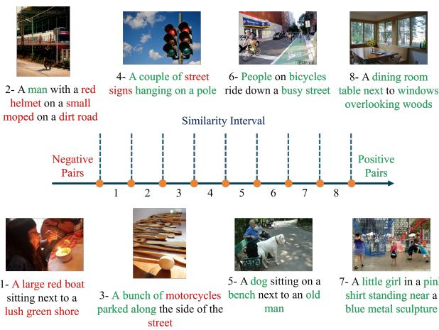  
Figure 1. Image-text pairs with varying levels of similarity. We computed the similarity of 40,000 sample pairs from the COCO Caption dataset and divided them into eight intervals in ascending order. From each interval, we randomly selected one image-text pair for visual presentation.

sentation space, thereby achieving impressive semantic understanding capabilities. These models have been applied to various downstream tasks, including zero-shot classification, cross-modal retrieval, and open-vocabulary detection (Pourpanah et al., 2022; Zhou et al., 2022b; Faghri et al., 2017; Chen et al., 2021; Lee et al., 2018; Wei et al., 2025; Wu et al., 2024). However, multi-modal paired datasets like MS-COCO (Chen et al., 2015), typically use a binary sparse annotation that labels image-text pairs as either “matched” or “mismatched.” This labeling approach forces the model to strictly differentiate between all unannotated image-text pairs, potentially overlooking semantic relationships between samples. This issue is particularly evident in finetuning scenarios with limited samples, which can significantly compromise the model’s generalization performance (Chun et al., 2022; Chun, 2024; Gao et al., 2024).

The matching relationship between image-text pairs (typically measured by similarity) is inherently complex. Consider an image of the Mona Lisa paired with the text “The mysterious smile of the Mona Lisa”: from an object cooccurrence perspective, they can be considered matched (the painting contains a smile), but the term “mysterious” represents a subjective perception, making it challenging for models to assign an accurate similarity along this dimension.

Furthermore, this relationship usually varies with similarity in a continuous and gradual pattern. As shown in Figure 1, during the transition from samples annotated as negative to positive, the correspondence between images and texts becomes increasingly evident. For instance, although the third image does not fully match the text “motorcycles”, the objects within it are similarly “parked along” the ground in “a bunch”. However, the binary sparse annotation lacks the necessary granularity to accurately measure the similarity of image-text pairs. This limitation results in the emergence of false negative sample pairs—i.e., pairs with a certain degree of semantic similarity that are incorrectly regarded as mismatched (Li et al., 2023b). Previous studies have shown that FNs disrupt the semantic consistency of the representation space and limit the model’s ability to capture complex matching relationships (Chun et al., 2021).

To mitigate the issues, existing work has proposed probabilistic embedding methods to model intra-modal ambiguity (Chun et al., 2022; Chun, 2024; Li et al., 2023a; 2022; Wang et al., 2022; Upadhyay et al., 2023; Ji et al., 2023; Wei et al., 2025). By mapping image and text data into random variables (instead of deterministic vector), these methods expand the potential set of matching results and construct a semantically rich retrieval space. However, such approaches still rely on binary sparse annotations when computing the cross-modal loss, implying that they address the false-negative pairs solely from the perspective of the data itself while overlooking annotation errors. As a result, the model would explain mislabeled false-negative pairs by inflating the uncertainty of individual samples, even when their semantic information is unambiguous. Although such uncertainty modeling can improve retrieval diversity, assigning excessive uncertainty to these samples could degrade retrieval precision.

To address the aforementioned problems, we propose a Variational Adapter for Cross-modal Similarity Representation (VACSR), which models cross-modal similarity in a latent probabilistic space. Instead of directly fitting sparse binary annotations as deterministic targets, VACSR regularizes the similarity representation to recover continuous and smooth matching relationships. In this framework, uncertainty characterizes ambiguity in image-text matching rather than semantic ambiguity in individual samples. As a result, false-negative pairs (FNs) can be assigned higher uncertainty to reduce the effect of erroneous gradients induced by binary annotations, while positive pairs and informative hard-negative pairs are assigned lower uncertainty to strengthen the model’s discriminative capability. A more detailed comparison between VACSR and probabilistic embedding methods is provided in Appendix A.

Experimental results demonstrate that VACSR achieves significant performance gains across various tasks, including image-text retrieval, noisy correspondence, domain generalization, and base-to-novel generalization. These findings indicate that VACSR exhibits strong robustness to noise while effectively improving model generalization and practical applicability in real-world settings.

# 2. Preliminary

For an image-text paired dataset $D = ( X , Y )$ , the conventional cross-modal alignment strategy employs separate feature encoders $\Phi ( \cdot , \theta _ { \nu } )$ and $\Psi ( \cdot , \theta _ { \mathcal { T } } )$ to map paired data $( X _ { i } , Y _ { j } )$ into a d-dimensional space, obtaining their vector representations $\pmb { v } _ { i } = \Phi ( X _ { i } , \theta _ { \mathcal { V } } ) , \pmb { t } _ { j } = \Psi ( Y _ { j } , \theta _ { \mathcal { T } } )$ , where ${ \pmb v } _ { i } , { \pmb t } _ { j } \in \mathbb { R } ^ { d }$ . A pairwise loss is then typically applied to maximize the similarity of positive pairs while minimizing that of negative pairs, and the cross-modal similarity is measured using cosine similarity. This process is regarded as supervised learning and employs binary annotations to optimize the loss. (Hereafter, we make no distinction between the terms “sample” and “sample pair”.)

As mentioned earlier, the binary annotation forcibly separates the continuous similarity space, which can lead to the emergence of FNs. We begin by evaluating how widely used pairwise loss functions (contrastive loss and sigmoid loss (Zhai et al., 2023)) are affected by FNs. We compute the gradient of the pairwise loss $\mathcal { L } ( \mathbf { S } )$ with respect to the output $B \times B$ similarity matrix S at the t-th iteration:

$$
\frac {\partial \mathcal {L} (\boldsymbol {S})}{\partial S _ {i , j}} = \sum_ {i = 1} ^ {B} \left[ \left(\sum_ {j \neq i, (i, j) \in c} ^ {B} \frac {\partial \mathcal {L} (\boldsymbol {S})}{\partial S _ {i , j}} + \sum_ {j = i} ^ {B} \frac {\partial \mathcal {L} (\boldsymbol {S})}{\partial S _ {i , j}}\right) \right. \tag {1}
$$

$$
+ \sum_ {j \neq i, (i, j) \notin c} ^ {B} \frac {\partial \mathcal {L} (\boldsymbol {S})}{\partial S _ {i , j}} ]
$$

where $S _ { i , j } \in \textit { c }$ denotes that the image text pair $( X _ { i } , Y _ { j } )$ belongs to the set of FNs. In practice, FNs exhibit potential semantic relations to positive samples yet provide gradients in the opposite direction. Following the definition of the relative penalty on negative samples in (Wang & Liu, 2021), we further extend this notion to quantify the gradient difference between positive and FNs as $r _ { i } =$ $\big | \sum _ { j = i } ^ { B } \frac { \partial \mathcal { L } ( S ) } { \partial S _ { i , j } } \big | - \big | \sum _ { j \neq i , ( i , j ) \in c } ^ { B } \frac { \partial \mathcal { L } ( S ) } { \partial S _ { i , j } } \big | ,$ − , which reflects the tolerance of the loss function to FNs. A smaller $r _ { i }$ indicates greater difficulty for the model in learning semantically consistent representations. Meanwhile, the gradient of positive samples is also suppressed. When $r _ { i } < 0$ the positive samples can no longer constrain the optimization direction of FNs, and semantically similar samples are forcibly separated, thereby disrupting the underlying semantic structure.

When the pair-based loss adopts contrastive loss $\begin{array} { r } { \mathrm { { \mathcal { L } } } _ { c o n t r a s t } ~ = ~ - \log \frac { e x p ( S _ { i , i } / \tau ) } { \sum _ { j \neq i } ^ { m } e x p ( S _ { i , j } / \tau ) + e x p ( S _ { i , i } / \tau ) } } \end{array}$ , where τ represents the temperature coefficient, the corresponding $r _ { i }$ can be computed as follows:

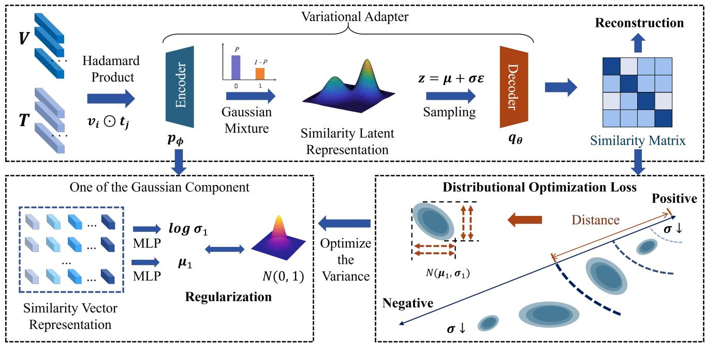

flowchart

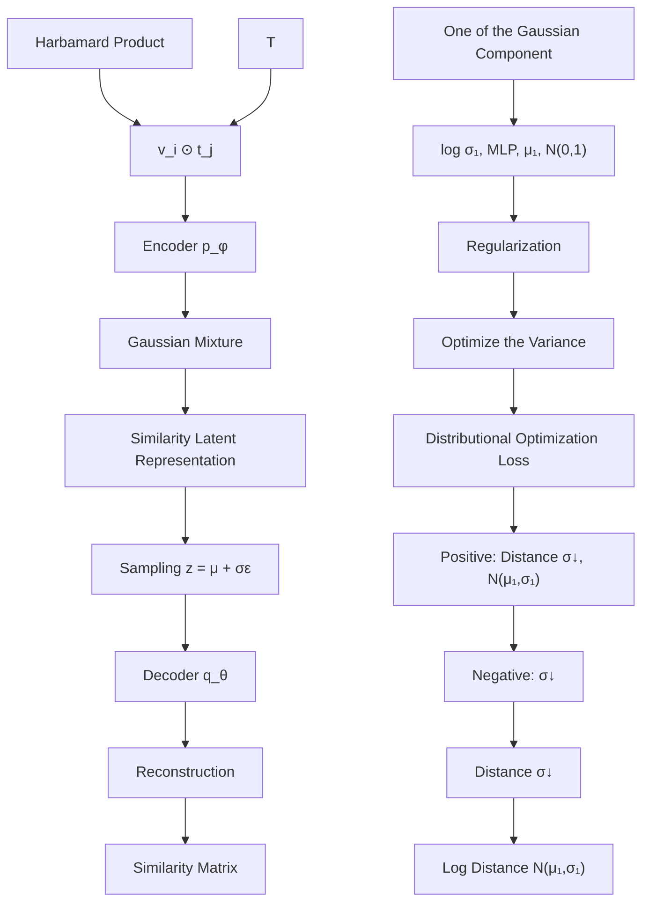

Figure 2. Overview of our proposed model: Image and text features first interact through the Hadamard product to generate similarity vector representations, which are then input into a variational adapter composed of an encoder and a decoder. The encoder predicts the mean (µ) and log-variance $( \log \sigma ^ { 2 } )$ for each similarity vector, mapping the input to a Gaussian mixture latent distribution, where each Gaussian component is regularized to a standard normal distribution. Using the reparameterization trick, latent variables are sampled and subsequently reconstructed into a similarity matrix by the decoder. The model is optimized by minimizing the reconstruction loss $( \mathcal { L } _ { r e c o n } )$ between the predicted similarities and the binary labels, while a distributional optimization loss $( \mathcal { L } _ { \sigma } )$ is introduced to adaptively calibrate the uncertainty of the latent representations.

$$
r _ {i} = \frac {1}{\tau} \frac {\sum_ {j \neq i , (i , j) \notin c} e x p (S _ {i , j} / \tau)}{\sum_ {j \neq i} ^ {n} e x p (S _ {i , j} / \tau) + e x p (S _ {i , i} / \tau)} \tag {2}
$$

From Equation 2, we draw the following conclusions: (1) Since $r _ { i }$ is always greater than 0, $\mathcal { L } _ { c o n t r a s t }$ does not completely disrupt the semantic consistency of representations; (2) The magnitude of $r _ { i }$ equals the sum of all softmaxnormalized negative samples multiplied by the reciprocal of τ . Here, τ controls the smoothness of the distribution, a smaller τ causes an rapid reduction in the contribution of negative samples (Wang & Liu, 2021), thereby increasing the disruption to semantic consistency; a larger τ increases $r _ { i }$ but can hinder the learning of separable features (Wang & Liu, 2021). Thus, $\mathcal { L } _ { c o n t r a s t }$ must balance $r _ { i }$ and τ .

When the pair-based loss adopts sigmoid loss: $\mathcal { L } _ { s i g m o i d } =$ $\begin{array} { r } { - \log \frac { 1 } { 1 + e x p ( z _ { i , j } ( - a S _ { i , j } + b ) ) } } \end{array}$ , where $z _ { i , j } ~ = ~ 1$ for positive samples and $z _ { i , j } = - 1$ otherwise. The corresponding $r _ { i }$ can be computed as follows:

$$
r _ {i} = | a | [ (1 - P _ {i, i}) - \sum_ {S _ {i, j} \in c} P _ {i, j} ] \tag {3}
$$

where $P _ { i , j } = { s i g m o i d ( - a S _ { i , j } + b ) }$ . In this case, the $r _ { i }$ can be less than $0 , \mathcal { L } _ { s i g m o i d }$ carries the risk of losing semantic information. Thus, it is necessary to employ suitable scaling parameters a and b, which aligns with the empirical observations in SigLIP (Zhai et al., 2023). In Appendix $\mathrm { F , }$ we compare the sensitivity of the contrastive loss and sigmoid loss to temperature coefficients and scaling parameters, further elucidating the impact of binary annotations on retrieval performance.

The foregoing analysis indicates that within the binary sparse annotation framework—whether using contrastive loss or sigmoid loss—the model struggles to fully mitigate semantic information loss due to FNs without resorting to additional hyperparameter tuning. To address this limitation, we design a lightweight VAE-based probabilistic adapter that fine-tunes VLMs by explicitly modeling cross-modal similarity in a latent space. Owing to the variational autoencoder formulation, the adapter naturally introduces an MSE-based reconstruction loss under a Gaussian likelihood assumption. This loss function enables uncertainty-aware adaptive weighting of different image-text pairs, thereby reducing the gradient difference $r _ { i }$ .

# 3. Methodology

The overall architecture of VACSR is illustrated in Figure 2. We will detail the cross-modal similarity representation structure in Section 3.1, and elaborate on how to optimize the latent variable distribution for better modeling of FNs in Section 3.2.

# 3.1. Similarity Representation

We propose a variational adapter to model the representation of cross-modal similarity, uncovering rich matching relationships that be overlooked by binary annotations. As shown in Figure 2, a batch of image-text pairs are first encoded by a CLIP encoder to obtain their respective feature representations $V ~ = ~ [ { \pmb v } _ { 1 } , { \pmb v } _ { 2 } , . . . { \pmb v } _ { B } ] ~ \in ~ \mathbb { R } ^ { B \times d }$ and $\pmb { T } = [ \pmb { t } _ { 1 } , \pmb { t } _ { 2 } , . . . \pmb { t } _ { B } ] \in \mathbb { R } ^ { B \times d }$ . Feature interaction is then achieved through the Hadamard product $s _ { i , j } = \pmb { v } _ { i } \odot \pmb { t } _ { j }$ , resulting in $\pmb { S } \in \bar { \mathbb { R } } ^ { B \times B \times d }$ . where $\mathbf { \boldsymbol { s } } _ { i , j } \in S$ can be regarded as a vector representation of similarity. Unlike the direct use of cosine similarity, the Hadamard product performs elementwise multiplication, which preserves the dimensionality of the interactive feature, thereby supporting subsequent encoding procedures. Subsequently, the latent representation $\mathbf { z } _ { i , j }$ of $s _ { i , j }$ is constructed via the variational adapter. The design of this variational adapter references the variational autoencoder (VAE) (Kingma & Welling, 2013), and we optimize the model by maximizing the Evidence Lower Bound (ELBO).

$$
\mathrm{ELBO} = \mathbb {E} _ {p _ {\phi} (\mathbf {z} _ {i, j} | \mathbf {s} _ {i, j})} \left[ \log q _ {\theta} (\hat {S} _ {i, j} \mid \mathbf {z} _ {i, j}) \right] \tag {4}
$$

$$
- \mathrm{KL} \left[ p _ {\phi} (\mathbf {z} _ {i, j} \mid \mathbf {s} _ {i, j}) \parallel q (\mathbf {z} _ {i, j}) \right]
$$

where $\hat { S } _ { i , j }$ denotes the true similarity containing finegrained information, which we temporarily replace with the binary label $\hat { y } _ { i , j }$ . We will introduce how to correct $\hat { y } _ { i , j }$ in Section 3.2. Prior $q ( \mathbf { z } _ { i , j } )$ is set to the standard normal distribution. $p _ { \phi }$ and $q _ { \theta }$ denote the parameterized similarity representation encoder and decoder composed of multilayer perceptrons (MLPs), respectively. To prevent the unimodal nature of a Gaussian distribution from restricting the model’s capacity to learn complex semantic representations (Bai et al., 2022; Ye et al., 2025), we approximate $p _ { \phi } ( \mathbf { z } _ { i , j } | \boldsymbol { s } _ { i , j } )$ as a two-component Gaussian mixture:

$$
p _ {\phi} \left(\mathbf {z} _ {i, j} \mid \boldsymbol {s} _ {i, j}\right) = \sum_ {k = 1} ^ {2} \alpha_ {k} \mathcal {N} \left(\mathbf {z} _ {i, j} \mid \mu_ {k} \left(\boldsymbol {s} _ {i, j}\right), \operatorname{diag} \left(\sigma_ {k} ^ {2} \left(\boldsymbol {s} _ {i, j}\right)\right)\right), \tag {5}
$$

where $\mu _ { k } , \sigma _ { k } \in \mathbb { R } ^ { d }$ are derived from the $\mu$ and log $\sigma ^ { 2 }$ heads corresponding to different Gaussian components in $p _ { \phi }$ , and α is learnable mixing coefficient with the constraint that $\alpha _ { k } \geq 0$ and $\textstyle \sum _ { k = 1 } ^ { 2 } { \bar { \alpha } } _ { k } \ = \ 1$ . The exact KL divergence between a Gaussian mixture posterior and the standard normal prior generally has no closed-form expression. Therefore, instead of computing the exact KL, we use a tractable variational upper bound derived from the convexity of KL divergence:

$$
\mathrm{KL} \left[ \sum_ {k = 1} ^ {2} \alpha_ {k} p _ {\phi} ^ {k} \left(\mathbf {z} _ {i, j} \mid \boldsymbol {s} _ {i, j}\right) \| q \left(\mathbf {z} _ {i, j}\right) \right] \tag {6}
$$

$$
\leq \sum_ {k = 1} ^ {2} \alpha_ {k} \mathrm{KL} \left[ p _ {\phi} ^ {k} (\mathbf {z} _ {i, j} | \boldsymbol {s} _ {i, j}) \right\| q (\mathbf {z} _ {i, j}) ]
$$

Thus, the KL regularization term is implemented as the following conservative surrogate(A complete derivation is provided in Appendix B.2.):

$$
\begin{array}{l} \mathcal {L} _ {K L} = \alpha_ {1} \mathrm{KL} \left[ \mathcal {N} (\mu_ {1} (\boldsymbol {s} _ {i, j}), \mathrm{diag} (\sigma_ {1} ^ {2} (\boldsymbol {s} _ {i, j}))) \parallel \mathcal {N} (\mathbf {0}, \mathbf {I}) \right] \\ + \alpha_ {2} \mathrm{KL} \left[ \mathcal {N} (\mu_ {2} (\boldsymbol {s} _ {i, j}), \mathrm{diag} (\sigma_ {2} ^ {2} (\boldsymbol {s} _ {i, j}))) \| \mathcal {N} (\mathbf {0}, \mathbf {I}) \right]. \tag {7} \\ \end{array}
$$

The VAE approximates the generative model $q _ { \theta } ( \hat { S } _ { i , j } | \mathbf { z } _ { i , j } )$ as a Gaussian distribution, and the reconstruction term $\mathcal { L } _ { r e c o n } = \mathbb { E } _ { p _ { \phi } ( \mathbf { z } _ { i , j } \mid s _ { i , j } ) } [ \log q _ { \theta } ( \hat { S } _ { i , j } \mid \mathbf { z } _ { i , j } ) ]$ is formulated as the negative log-likelihood under this Gaussian assumption, where:

$$
\begin{array}{l} \log q _ {\theta} (\hat {S} _ {i, j} | \mathbf {z} _ {i, j}) \\ = \log (\frac {1}{\sqrt {2 \pi \sigma^ {2} (\mathbf {z} _ {i , j})}} \exp (- \frac {(\hat {y} _ {i , j} - \mu (\mathbf {z} _ {i , j})) ^ {2}}{2 \sigma^ {2} (\mathbf {z} _ {i , j})})) \\ = \frac {1}{2 \sigma^ {2} \left(\mathbf {z} _ {i , j}\right)} \left\| \hat {y} _ {i, j} - \mu \left(\mathbf {z} _ {i, j}\right) \right\| ^ {2} + \log \sigma \left(\mathbf {z} _ {i, j}\right) + \frac {1}{2} \log 2 \pi \tag {8} \\ \end{array}
$$

Ignoring the constant term, this loss is equivalent to the mean squared error (MSE) loss. Here, $\boldsymbol { \mu } ( \mathbf { z } _ { i , j } ) \in \mathbb { R } ^ { 1 }$ is obtained from the decoder $q _ { \theta } ,$ normalized by a sigmoid function, and regarded as the final similarity score. The variance $\sigma ^ { 2 } ( \mathbf { z } _ { i , j } )$ is typically fixed to 1. For the latent variable $\mathbf { z } _ { i , j }$ we first use the Gumbel-Softmax trick to reparameterize the binary Gaussian component selection process, obtaining a differentiable approximate one-hot vector. We then apply the standard Gaussian reparameterization trick to sample from each Gaussian component. The final sampling point is obtained through a one-hot vector weighted sum of the sampling results using the one-hot vector.

# 3.2. Optimization of Uncertainty in Latent Variables

As mentioned in Section 1, the binary annotation yˆ lacks sufficient fine-grained semantic information. Consequently, directly substituting $\hat { S } _ { i , j }$ with $\hat { y }$ can result in incorrect gradients for FNs. We address this issue by managing the uncertainty of the latent variable. Given that $\mathbf { z } _ { i , j }$ is sampled from $p _ { \phi } ( \mathbf { z } _ { i , j } | \boldsymbol { s } _ { i , j } )$ , we expand the reconstruction term $\mathcal { L } _ { r e c o n }$ with reparameterization trick as follows:

$$
\frac {1}{2} \mathbb {E} _ {p _ {\phi} (\mathbf {z} _ {i, j} | \boldsymbol {s} _ {i, j})} [ | | \hat {y} - \mu (\mathbf {z} _ {i, j}) | | ^ {2} ] \tag {9}
$$

$$
= \frac {1}{2} | | \hat {y} - \mu [ \hat {\mu} (\pmb {s} _ {i, j}) + \varepsilon \cdot \hat {\sigma} (\pmb {s} _ {i, j}) ] | | ^ {2}
$$

Table 1. The performance comparison between our model and other approaches on the COCO dataset. We present the Recall@K and RSUM metric results, including both the 1K test setting (averaged over 5-fold test datasets) and the 5K test setting. The best results are highlighted in bold. 

<table><tr><td rowspan="3">Method</td><td colspan="6">1K Test Images</td><td colspan="6">5K Test Images</td></tr><tr><td colspan="3">Image-to-Text</td><td colspan="3">Text-to-Image</td><td colspan="3">Image-to-Text</td><td colspan="3">Text-to-Image</td></tr><tr><td>R@1</td><td>R@5</td><td>R@10</td><td>R@1</td><td>R@5</td><td>R@10</td><td>R@1</td><td>R@5</td><td>R@10</td><td>R@1</td><td>R@5</td><td>R@10</td></tr><tr><td colspan="13">CLIP ViT-B/32</td></tr><tr><td>P2RM</td><td>78.6</td><td>96.1</td><td>98.6</td><td>67.5</td><td>92.3</td><td>96.8</td><td>56.6</td><td>83.5</td><td>90.9</td><td>46.3</td><td>74.9</td><td>84.4</td></tr><tr><td>DAA</td><td>79.8</td><td>96.5</td><td>98.9</td><td>67.4</td><td>91.9</td><td>96.5</td><td>59.8</td><td>85.0</td><td>92.0</td><td>46.1</td><td>74.7</td><td>84.2</td></tr><tr><td>PCME</td><td>80.1</td><td>96.6</td><td>98.7</td><td>67.6</td><td>92.1</td><td>96.9</td><td>59.9</td><td>85.8</td><td>92.3</td><td>46.1</td><td>75.0</td><td>84.6</td></tr><tr><td>PCME++</td><td>81.6</td><td>97.0</td><td>99.0</td><td>69.2</td><td>92.8</td><td>97.1</td><td>62.1</td><td>87.0</td><td>93.0</td><td>48.1</td><td>76.5</td><td>85.4</td></tr><tr><td>VACSR</td><td>84.2</td><td>97.2</td><td>99.0</td><td>70.3</td><td>93.3</td><td>97.4</td><td>66.5</td><td>88.3</td><td>93.9</td><td>49.8</td><td>77.7</td><td>86.3</td></tr><tr><td colspan="13">CLIP ViT-B/16</td></tr><tr><td>P2RM</td><td>78.3</td><td>96.2</td><td>98.7</td><td>69.2</td><td>93.0</td><td>97.2</td><td>56.8</td><td>84.3</td><td>91.5</td><td>48.1</td><td>76.6</td><td>85.7</td></tr><tr><td>DAA</td><td>46.1</td><td>76.8</td><td>87.6</td><td>41.3</td><td>73.4</td><td>85.1</td><td>24.3</td><td>49.9</td><td>62.7</td><td>22.4</td><td>47.1</td><td>59.1</td></tr><tr><td>PCME</td><td>83.6</td><td>97.7</td><td>99.3</td><td>72.0</td><td>93.9</td><td>97.7</td><td>65.3</td><td>89.2</td><td>94.5</td><td>51.2</td><td>79.1</td><td>87.5</td></tr><tr><td>PCME++</td><td>85.3</td><td>97.9</td><td>99.3</td><td>73.4</td><td>94.4</td><td>97.8</td><td>68.7</td><td>90.1</td><td>95.0</td><td>53.4</td><td>80.3</td><td>88.3</td></tr><tr><td>VACSR</td><td>87.4</td><td>98.2</td><td>99.4</td><td>74.3</td><td>94.6</td><td>97.9</td><td>72.2</td><td>91.1</td><td>95.4</td><td>54.5</td><td>81.1</td><td>88.7</td></tr></table>

Table 2. The performance comparison between our model and other approaches on the EC and CxC datasets. We present the Recall@K, R-P and mAP@R metric results, the best results are highlighted in bold. 

<table><tr><td rowspan="3">Method</td><td colspan="6">ECCV Caption</td><td colspan="6">CxC</td></tr><tr><td colspan="3">Image-to-Text</td><td colspan="3">Text-to-Image</td><td colspan="3">Image-to-Text</td><td colspan="3">Text-to-Image</td></tr><tr><td>R@1</td><td>R-P</td><td>mAP@R</td><td>R@1</td><td>R-P</td><td>mAP@R</td><td>R@1</td><td>R@5</td><td>R@10</td><td>R@1</td><td>R@5</td><td>R@10</td></tr><tr><td colspan="13">CLIP ViT-B/32</td></tr><tr><td>P2RM</td><td>72.2</td><td>41.7</td><td>30.2</td><td>89.5</td><td>55.5</td><td>47.6</td><td>58.1</td><td>85.5</td><td>92.2</td><td>48.4</td><td>77.2</td><td>86.2</td></tr><tr><td>DAA</td><td>75.9</td><td>42.3</td><td>31.2</td><td>88.1</td><td>55.7</td><td>47.3</td><td>61.5</td><td>86.8</td><td>93.3</td><td>48.2</td><td>76.9</td><td>86.1</td></tr><tr><td>PCME</td><td>74.9</td><td>42.3</td><td>31.2</td><td>88.0</td><td>55.5</td><td>47.1</td><td>61.5</td><td>87.5</td><td>93.5</td><td>48.0</td><td>77.3</td><td>86.4</td></tr><tr><td>PCME++</td><td>76.6</td><td>43.4</td><td>32.3</td><td>89.5</td><td>55.9</td><td>47.8</td><td>63.5</td><td>88.4</td><td>94.0</td><td>50.1</td><td>78.5</td><td>87.1</td></tr><tr><td>VACSR</td><td>80.6</td><td>43.8</td><td>33.2</td><td>90.4</td><td>56.3</td><td>48.1</td><td>67.8</td><td>89.6</td><td>94.9</td><td>51.6</td><td>79.7</td><td>88.0</td></tr><tr><td colspan="13">CLIP ViT-B/16</td></tr><tr><td>P2RM</td><td>72.9</td><td>42.2</td><td>30.6</td><td>88.5</td><td>56.8</td><td>48.8</td><td>58.5</td><td>86.0</td><td>92.7</td><td>50.0</td><td>78.7</td><td>87.3</td></tr><tr><td>DAA</td><td>40.3</td><td>22.4</td><td>12.4</td><td>60.0</td><td>38.9</td><td>29.0</td><td>26.4</td><td>53.9</td><td>67.1</td><td>24.3</td><td>50.3</td><td>62.5</td></tr><tr><td>PCME</td><td>79.1</td><td>44.0</td><td>33.2</td><td>89.5</td><td>56.5</td><td>48.7</td><td>66.8</td><td>90.5</td><td>95.4</td><td>53.1</td><td>80.9</td><td>88.9</td></tr><tr><td>PCME++</td><td>81.6</td><td>45.1</td><td>34.5</td><td>91.4</td><td>57.2</td><td>49.7</td><td>69.9</td><td>91.3</td><td>95.7</td><td>55.2</td><td>82.0</td><td>89.7</td></tr><tr><td>VACSR</td><td>84.9</td><td>45.5</td><td>35.4</td><td>92.2</td><td>57.5</td><td>49.7</td><td>73.3</td><td>92.0</td><td>96.2</td><td>56.3</td><td>82.8</td><td>90.1</td></tr></table>

here $\hat { \mu } ( s _ { i , j } ) , \hat { \sigma } ( s _ { i , j } )$ are derived from the currently sampled Gaussian components of $p _ { \phi }$ , and sampling is performed only once. ε is Gaussian random noise. Let us consider two extreme cases: when $\hat { \sigma } ( s _ { i , j } )  0 , \mathcal { L } _ { r e c o n }$ optimizes $\hat { \mu } ( s _ { i , j } )$ towards binary results. Conversely, when $\hat { \sigma } ( s _ { i , j } )  \infty$ , $\hat { \mu } ( s _ { i , j } )$ becomes negligible, and $\mu [ \hat { \mu } ( s _ { i , j } ) + \boldsymbol { \varepsilon } \cdot \hat { \boldsymbol { \sigma } } ( s _ { i , j } ) ]$ ] turns into Gaussian random noise. In this case, $\mathcal { L } _ { r e c o n }$ no longer influences the gradient of $\hat { \mu } ( s _ { i , j } )$ . Thus, we can control the optimization strength of the binary annotations by adjusting $\hat { \sigma } ( s _ { i , j } )$ and only decode the $\hat { \mu } ( s _ { i , j } )$ from the $\mu$ head in $p _ { \phi }$ as the final similarity output.

Based on this analysis, in the t iteration, we should assign lower uncertainty to positive samples and informative negative samples (typically hard negative samples (Wang & Liu, 2021)) to enhance prediction accuracy, while assigning higher uncertainty to FNs to mitigate the interference caused by erroneous annotations. Accordingly, we introduce an additional distributional optimization loss for the variance $\hat { \sigma } ( s _ { i , j } )$ :

$$
\mathcal {L} _ {\sigma} = \frac {1}{2 \hat {\sigma} (\boldsymbol {s} _ {i , j})} | | \hat {y} - \mu (\boldsymbol {z} _ {i, j}) | | ^ {2} + \log \hat {\sigma} (\boldsymbol {s} _ {i, j}) \tag {10}
$$

We truncate the gradient of the term $| | \hat { y } - \mu ( \mathbf z _ { i , j } ) | | ^ { 2 }$ and use it solely as a weighting coefficient to optimize the variance term. By differentiating $\mathcal { L } _ { \sigma }$ and setting the derivative to zero, we obtain:

$$
\begin{array}{l} \frac {\partial \mathcal {L} _ {\sigma}}{\partial \hat {\sigma} (\boldsymbol {s} _ {i , j})} = - \frac {1}{\hat {\sigma} ^ {3} (\boldsymbol {s} _ {i , j})} | | \hat {y} - \mu (\mathbf {z} _ {i, j}) | | ^ {2} + \frac {1}{\hat {\sigma} (\boldsymbol {s} _ {i , j})} = 0 \\ \hat {\sigma} ^ {2} \left(\boldsymbol {s} _ {i, j}\right) = \left| \left| \hat {y} - \mu \left(\mathbf {z} _ {i, j}\right) \right| \right| ^ {2} \tag {11} \\ \end{array}
$$

This indicates that the optimized variance equals the squared distance between the model’s output similarity and the true label. Samples closer to the label exhibit smaller variance, while those farther away have larger variance, thus achieving our goal of assigning different levels of uncertainty to different samples. Furthermore, since the loss only constrains the variance within the [0, 1] interval, we additionally apply a sigmoid function to normalize the output log $\sigma ^ { 2 }$ from $p _ { \phi }$ . This approach extends the domain of variance to [0, +∞] while preserving its range. Then, we compute the loss for positive samples and hard negative samples separately:

Table 3. Noisy correspondence results using the ViT-B/32 backbone are shown. All reported metrics represent the average performance over both image-to-text and text-to-image retrieval directions. 

<table><tr><td rowspan="2">Noise Ratio</td><td rowspan="2">Method</td><td colspan="3">ECCV Caption</td><td>CxC</td><td colspan="3">COCO</td></tr><tr><td>mAP@R</td><td>R-P</td><td>R@1</td><td>R@1</td><td>1K R@1</td><td>5K R@1</td><td>RSUM</td></tr><tr><td rowspan="8">20%</td><td>VSE∞</td><td>37.0</td><td>46.3</td><td>79.7</td><td>53.6</td><td>72.0</td><td>51.8</td><td>518.6</td></tr><tr><td>DAA</td><td>6.7</td><td>12.5</td><td>18.5</td><td>7.0</td><td>15.3</td><td>6.0</td><td>212.8</td></tr><tr><td>PCME</td><td>37.6</td><td>47.6</td><td>79.2</td><td>50.6</td><td>70.3</td><td>48.7</td><td>520.7</td></tr><tr><td>NCR</td><td>35.9</td><td>46.0</td><td>78.0</td><td>50.6</td><td>70.1</td><td>48.8</td><td>518.6</td></tr><tr><td>BiCro</td><td>-</td><td>-</td><td>-</td><td>-</td><td>71.3</td><td>-</td><td>523.2</td></tr><tr><td>PCME++</td><td>37.7</td><td>47.6</td><td>80.0</td><td>52.2</td><td>71.6</td><td>50.4</td><td>524.6</td></tr><tr><td>NPC</td><td>-</td><td>-</td><td>-</td><td>-</td><td>73.1</td><td>53.8</td><td>529.8</td></tr><tr><td>VACSR</td><td>40.1</td><td>49.6</td><td>83.9</td><td>58.7</td><td>76.4</td><td>57.1</td><td>539.0</td></tr><tr><td rowspan="7">50%</td><td>VSE∞</td><td>18.0</td><td>28.5</td><td>43.7</td><td>20.7</td><td>39.2</td><td>19.1</td><td>394.1</td></tr><tr><td>DAA</td><td>0.3</td><td>0.8</td><td>1.0</td><td>0.3</td><td>0.8</td><td>0.2</td><td>20.9</td></tr><tr><td>PCME</td><td>35.2</td><td>45.5</td><td>75.7</td><td>46.3</td><td>66.6</td><td>44.4</td><td>508.0</td></tr><tr><td>NCR</td><td>34.0</td><td>44.3</td><td>75.1</td><td>47.3</td><td>66.8</td><td>45.5</td><td>508.5</td></tr><tr><td>PCME++</td><td>35.7</td><td>45.8</td><td>76.3</td><td>47.4</td><td>67.6</td><td>45.5</td><td>511.0</td></tr><tr><td>NPC</td><td>-</td><td>-</td><td>-</td><td>-</td><td>71.3</td><td>51.9</td><td>523.4</td></tr><tr><td>VACSR</td><td>39.5</td><td>49.1</td><td>82.8</td><td>57.2</td><td>75.1</td><td>55.6</td><td>534.2</td></tr></table>

$$
\mathcal {L} _ {\sigma} ^ {P} = \frac {1}{2 \hat {\sigma} ^ {2} (\mathbf {s} _ {i , i})} | | 1 - \mu (\mathbf {z} _ {i, i}) | | ^ {2} + \log \hat {\sigma} (\mathbf {s} _ {i, i}) \tag {12}
$$

$$
\mathcal {L} _ {\sigma} ^ {N} = \max _ {j, j \neq i} [ \frac {1}{2 \hat {\sigma} ^ {2} (\mathbf {s} _ {i , j})} | | 1 - \mu (\mathbf {z} _ {i, j}) | | ^ {2} + \log \hat {\sigma} (\mathbf {s} _ {i, j}) ]
$$

Here, we still set $\hat { y } = 1$ for hard negative samples. In fact, cross-modal alignment relies on hard negative samples to better distinguish between positive and negative pairs (Faghri et al., 2017). If $\hat { y } = 0$ were used, hard negative samples with similarity close to 1 would be assigned high uncertainty, which is detrimental to model’s optimization. A sensitivity analysis on the number of selected hard negatives is provided in Appendix E.3.

Objective function: The final objective function is defined by optimizing a weighted sum of multiple losses, with hyperparameters $\alpha , \beta$ and γ serving as weighting coefficients. In all experiments, the hyperparameters are uniformly set to $\alpha = 0 . 0 0 0 5 , \beta = \gamma = 1$ :

$$
\mathcal {L} = \alpha \mathcal {L} _ {K L} + \beta [ \mathcal {L} _ {\text { recon }} + \gamma (\mathcal {L} _ {\sigma} ^ {P} + \mathcal {L} _ {\sigma} ^ {N}) ] \tag {13}
$$

Meanwhile, we adopt a straight-through estimator (STE) (Jacob et al., 2018) to address the gradient anomaly arising from the application of the MSE loss in classification tasks. Details can be found in Appendix B.1.

# 4. Experiment

# 4.1. Experimental Setup

We assess the generalization performance of the VACSR model on two downstream tasks: image-text retrieval and out-of-distribution generalization. Specifically, for the image-text retrieval task, we additionally introduce a noisy correspondence setting. For out-of-distribution scenarios, we consider two types: base-to-novel generalization and domain generalization. Detailed experimental settings are provided in Appendix C.1 and C.2.

# 4.2. Main Results

Image-Text Retrieval: Tables 1 and 2 present the performance comparison between VACSR and other methods on the image-text retrieval task. We select representative baselines including P2RM (MM) (Wang et al., 2022), DAA (NeurIPS) (Li et al., 2022), PCME (CVPR) (Chun et al., 2021), and PCME++ (ICLR) (Chun, 2024), all of which mitigate the FNs by modeling intra-modal ambiguity. Notably, our method employs a simple two-layer MLP structure instead of the Transformer-based uncertainty prediction used in PCME++, reducing the total parameter count to only 48.5%of PCME++ (A detailed analysis of computational efficiency, including memory usage, throughput, and chunk-based inference strategy, is provided in Appendix D). Experimental results demonstrate that VACSR achieves the best performance across all evaluation metrics under different backbone networks. Specifically, compared to PCME++, VACSR exhibits superior performance on the mAP@R and R@1 metrics of the EC dataset, validating its capability to understand diverse semantic information. Furthermore, VACSR achieves significant improvements in R@1 across all evaluated datasets. Taking ViT-B/32 as an example, it achieves improvements of 3.2%, 7.1%, 5.2%, and 6.8% on the respective datasets in the image-to-text retrieval direction. This indicates that VACSR can assign appropriate uncertainty to different types of samples, thereby ensuring retrieval accuracy. Moreover, when scaling the backbone network from ViT-B/32 to ViT-B/16, VACSR maintains performance improvements without any adjustments to the variational adapter. This demonstrates that our model can effectively model the semantic distribution of FNs, unaffected by the complexity of the backbone.

Table 4. Performance comparison of different methods on ImageNet and its variants. We employ Clip ViT-B/16 as the encoder backbone. The best results are highlighted in bold. 

<table><tr><td rowspan="2">METHOD</td><td rowspan="2">IN-DISTRIBUTION IMAGENET</td><td colspan="5">OUT-OF-DISTRIBUTION</td></tr><tr><td>V2</td><td>S</td><td>A</td><td>R</td><td>AVG.</td></tr><tr><td>ZERO-SHOT</td><td>66.7</td><td>60.8</td><td>46.1</td><td>47.8</td><td>74.0</td><td>57.2</td></tr><tr><td>COCOOP</td><td>71.0</td><td>64.1</td><td>48.8</td><td>50.6</td><td>76.2</td><td>59.9</td></tr><tr><td>CLIPOOD</td><td>71.6</td><td>64.9</td><td>49.3</td><td>50.4</td><td>77.2</td><td>60.4</td></tr><tr><td>MaPLe</td><td>70.7</td><td>64.1</td><td>49.2</td><td>50.9</td><td>77.0</td><td>60.3</td></tr><tr><td>CoPrompt</td><td>70.8</td><td>64.3</td><td>49.4</td><td>50.5</td><td>77.5</td><td>60.4</td></tr><tr><td>MMA</td><td>71.0</td><td>64.3</td><td>49.1</td><td>51.1</td><td>77.3</td><td>60.5</td></tr><tr><td>MMRL</td><td>72.0</td><td>64.5</td><td>49.2</td><td>51.2</td><td>77.5</td><td>60.6</td></tr><tr><td>VACSR</td><td>74.3</td><td>65.7</td><td>49.7</td><td>52.4</td><td>78.4</td><td>61.6</td></tr></table>

Noisy Correspondence: As shown in Table 3, by injecting varying proportions of Noisy Correspondence into the training data, we systematically assess the model’s adaptability and stability under noisy conditions (Huang et al., 2021). Additionally, we include three representative Noisy Correspondence learning methods—NCR (Huang et al., 2021), BiCro (Yang et al., 2023), and NPC (Zhang et al., 2024). Experimental results demonstrate that the proposed VACSR method exhibits superior noise robustness across various noise levels. Under a 20% noise ratio, VACSR outperforms the next-best method PCME++ by 6.3%, 4.2%, and 4.9% in mAP@R, R-P, and R@1 of the ECCV Caption dataset, respectively; achieves a 12.5% improvement in R@1 on the CxC dataset; and delivers 4.5%, 6.1%, and 1.7% gains over NPC in 1K R@1, 5K R@1, and RSUM on the COCO dataset. At a high noise ratio of 50%, VACSR maintains leading performance, while other methods drop sharply. It achieves improvements of 10.6%, 7.2%, 8.5%, 20.7%, 5.3%, 7.1%, and 2.1% over the next-best methods across datasets. In summary, VACSR effectively mitigates the impact of noisy annotations and demonstrates strong robustness.

Domain Generalization: CLIP extends its semantic understanding capability to classification tasks by computing the similarity between handcrafted text prompts (e.g., “a photo of a <class>”) and different visual categories . However, classification datasets like ImageNet typically employ fixed annotations for visual categories, overlooking the potential fine-grained semantic relationships between different visual concepts and text. Therefore, we further conducted domain generalization experiments to evaluate the crosstask generalization capability of VACSR and the application potential of its similarity representation. We compared our method with prompt-based learning approaches (e.g., COCOOP (CVPR) (Zhou et al., 2022a), MaPLe (CVPR) (Khattak et al., 2023), CoPrompt (ICLR) (Roy & Etemad, 2023)), adapter-based and fine-tuning methods (e.g., MMA (CVPR) (Yang et al., 2024), CLIPOOD (ICML) (Shu et al., 2023)), and methods that also model shared representation spaces (e.g., MMRL (CVPR) (Guo & Gu, 2025)). As shown in Table 4, VACSR achieved the best performance across all datasets, demonstrating its generalization capability and robustness to domain shifts. This result underscores that classification tasks also necessitate modeling a more continuous latent representation space to capture the inherent semantic of visual concepts effectively.

Table 5. Performance comparison of various methods on base-tonovel generalization across 11 datasets, using CLIP ViT-B/16 as the encoder backbone. Results are averaged over all 11 datasets. 

<table><tr><td></td><td>BASE</td><td>NEW</td><td>H</td></tr><tr><td>ZERO-SHOT</td><td>69.34</td><td>74.22</td><td>71.70</td></tr><tr><td>CoCoOp</td><td>80.47</td><td>71.69</td><td>75.83</td></tr><tr><td>CLIPOOD</td><td>83.9</td><td>74.5</td><td>78.9</td></tr><tr><td>MaPLe</td><td>82.28</td><td>75.14</td><td>78.55</td></tr><tr><td>CoPrompt</td><td>84.00</td><td>77.23</td><td>80.48</td></tr><tr><td>MMA</td><td>83.20</td><td>76.80</td><td>79.87</td></tr><tr><td>MMRL</td><td>85.68</td><td>77.16</td><td>81.20</td></tr><tr><td>VACSR</td><td>85.74</td><td>76.08</td><td>80.37</td></tr></table>

Base-to-Novel Generalization: The lack of semantic information in binary sparse annotations may also limit the model’s generalization ability to unseen categories. Therefore, we further conduct base-to-novel generalization experiments to evaluate whether similarity-based representations can learn more generalizable semantic features. As shown in Table 5, VACSR achieves a harmonic mean (H) score of 80.37, outperforming most baseline methods (e.g., CoCoOp at 75.83 and MaPLe at 78.55), indicating strong overall performance. Notably, VACSR attains the best performance on base class recognition with a score of 85.74, demonstrating its advantage in retaining discriminative ability on seen categories. By modeling cross-modal semantic distributions through variational inference, VACSR can partially overcome reliance on specific category labels, thus enabling generalization to semantically related unseen classes. Although there remains room for improvement compared to methods specifically designed for out-of-distribution generalization, these findings offer valuable insight into the relationship between similarity modeling and generalization ability. Please refer to Appendix G for detailed results.

# 4.3. Ablation Study

Effectiveness of Each Component Table 6 demonstrates the effectiveness of $\mathcal { L } _ { K L } , \mathcal { L } _ { \sigma }$ , the sigmoid function used in $\mathcal { L } _ { \sigma }$ , and the adoption of a Gaussian Mixture Model (GMM) prior. The baseline uses a Generalized Pooling Operator (GPO) and sigmoid loss to fine-tune CLIP directly. Experimental results show that the GMM prior has the most significant impact on overall performance, particularly in the EC dataset. This suggests that the unimodal nature of a single Gaussian prior is inadequate for fully modeling the latent space of similarity, further supporting the presence of complex semantic information in similarity representations. Compared to $\mathcal { L } _ { K L } , \mathcal { L } _ { \sigma }$ has a more pronounced effect on the EC datasets, indicating that $\mathcal { L } _ { \sigma }$ effectively reduces the influence of binary annotations. Removing the sigmoid function leads to a decrease of 1.5% in mAP@R and 1.4% in R-P on the EC dataset. This phenomenon indicates that constraining the variance within a limited range weakens the model’s ability to express the degree of uncertainty.

Table 6. Ablation study on the EC, CXC and COCO datasets. All reported metrics represent the average performance over both image-to-text and text-to-image retrieval directions. 

<table><tr><td rowspan="2">Configuration</td><td colspan="3">ECCV Caption</td><td>CxC</td><td colspan="3">COCO</td></tr><tr><td>mAP@R</td><td>R-P</td><td>R@1</td><td>R@1</td><td>1K R@1</td><td>5K R@1</td><td>RSUM</td></tr><tr><td>w/ All Components</td><td>40.7</td><td>50.1</td><td>85.5</td><td>59.7</td><td>77.2</td><td>58.1</td><td>541.4</td></tr><tr><td>w/o  $\mathcal{L}_{KL}$ </td><td>40.1</td><td>49.4</td><td>85.3</td><td>60.4</td><td>77.3</td><td>58.8</td><td>541.5</td></tr><tr><td>w/o sigmoid</td><td>40.1</td><td>49.4</td><td>85.5</td><td>60.4</td><td>77.2</td><td>58.8</td><td>541.1</td></tr><tr><td>w/o  $\mathcal{L}_{\sigma}$ </td><td>39.8</td><td>49.1</td><td>84.9</td><td>60.7</td><td>77.3</td><td>59.1</td><td>541.1</td></tr><tr><td>w/o GMM</td><td>39.6</td><td>49.0</td><td>84.1</td><td>59.8</td><td>77.0</td><td>58.1</td><td>540.7</td></tr><tr><td>w/o All Components (Baseline)</td><td>39.3</td><td>48.7</td><td>83.1</td><td>57.3</td><td>75.5</td><td>55.6</td><td>537.0</td></tr></table>

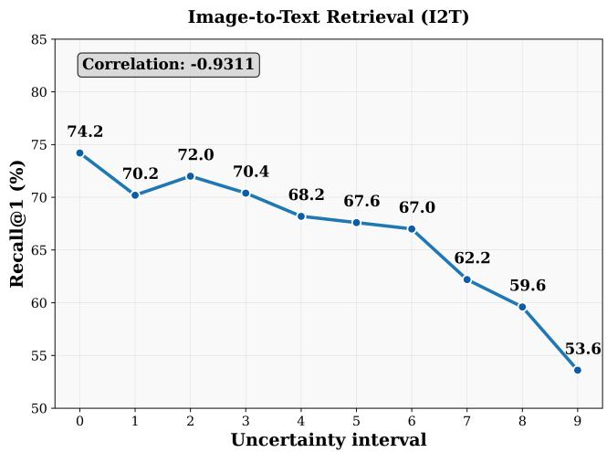

line

| Uncertainty interval | Recall@1 (%) |
| -------------------- | ------------ |
| 0                    | 74.2         |
| 1                    | 70.2         |
| 2                    | 72.0         |
| 3                    | 70.4         |
| 4                    | 68.2         |
| 5                    | 67.6         |
| 6                    | 67.0         |
| 7                    | 62.2         |
| 8                    | 59.6         |
| 9                    | 53.6         |

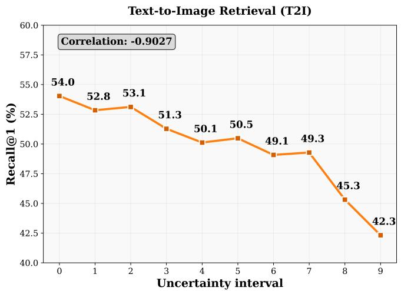

line

| Uncertainty interval | Recall@1 (%) |
| -------------------- | ------------ |
| 0                    | 54.0         |
| 1                    | 52.8         |
| 2                    | 53.1         |
| 3                    | 51.3         |
| 4                    | 50.1         |
| 5                    | 50.5         |
| 6                    | 49.1         |
| 7                    | 49.3         |
| 8                    | 45.3         |
| 9                    | 42.3         |

Figure 3. Visualization of relationship between uncertainty and R@1 metric.

Metric Sensitivity under Uncertainty Modeling: Moreover, we observe that removing either $\mathcal { L } _ { K L }$ or $\mathcal { L } _ { \sigma }$ slightly increases R@1 on COCO and CxC. This result should be interpreted together with the different metric sensitivities. R@1 only considers the single highest-ranked ground-truth item and is highly sensitive to binary labels, whereas mAP@R and R-P evaluate ranking quality across all relevant items and are more robust to FNs. The two losses are designed to model similarity uncertainty and mitigate overfitting to binary labels. As a result, some FNs receive higher predicted similarity and may rank at the top, which slightly lowers R@1 on COCO and CxC under the official binary protocol. On the cleaner and more densely annotated EC dataset, removing these two losses has little effect on R@1 but clearly degrades mAP@R and R-P, suggesting that they could improve ranking quality when the evaluation annotations better capture semantic relevance. This observation is consistent with prior findings that Recall@K can be sensitive to FNs (Chun, 2024). Importantly, this does not imply that R@1 is unreliable. Under the standard evaluation protocol in Table 1 and Table 2, R@1 remains a valid measure of retrieving verified positives.

# 4.4. Qualitative Analysis

Uncertainty and Accuracy Figure 3 illustrates the correlation between uncertainty partitioning and retrieval accuracy. For the image-to-text retrieval task, we first compute the uncertainty $\hat { \sigma } ( s _ { i , j } )$ between each image and its most similar text as a confidence measure for that retrieval. Subsequently, all 5000 image retrieval results in COCO test datasets are divided into 10 equal-width intervals based on their confidence scores, and the R@1 accuracy within each interval is calculated. Each interval corresponds to a specific uncertainty range and its associated retrieval accuracy performance. A similar processing approach is applied to the text-to-image retrieval direction. As observed from the figure, both retrieval directions exhibit a significant negative correlation between uncertainty and R@1 (with correlation coefficients of -0.931 and -0.903, respectively). This result indicates that VACSR can assign reasonable uncertainty estimates to retrieval results: when uncertainty is high, the model exhibits lower confidence in its predictions, resulting in correspondingly lower retrieval accuracy; conversely, when uncertainty is low, model confidence is high, and retrieval accuracy improves significantly. Therefore, uncertainty can serve as an effective indicator of the reliability of retrieval results. This observation also underscores VACSR’s strong interpretability. For more quantitative analyses, including ranking-level uncertainty evaluation, please refer to Appendix H, I and J.

# 5. Conclusion

This work focuses on addressing the false negative sample problem caused by binary annotations. Unlike previous methods that focus on the inherent ambiguity of data, VACSR directly learning the probabilistic representation of cross-modal similarity to capture fine-grained semantic information by variational inference. Experimental results indicates the broad potential of probabilistic similarity representation in various multimodal downstream tasks.

# Acknowledgements

This work is supported by the National Natural Science Foundation of China (No. 42571496, 42501573), Postdoctoral Fellowship Program and China Postdoctoral Science Foundation (No. BX20250084), China Postdoctoral Science Foundation (No. 2025M770345). We also thank Yuhan Huang for his helpful assistance with supplementary experiments and manuscript revision.

# Impact Statement

By enhancing the robustness of similarity measurement under imperfect supervision, this work contributes to the development of more trustworthy and cost-effective AI applications, particularly in scenarios with sparse annotations. However, modeling pairwise cross-modal similarity representations may introduce additional computational overhead, which should be considered in large-scale deployment.

# References

Bai, J., Kong, S., and Gomes, C. P. Gaussian mixture variational autoencoder with contrastive learning for multi-

label classification. In international conference on machine learning, pp. 1383–1398. PMLR, 2022.   
Bossard, L., Guillaumin, M., and Van Gool, L. Food-101– mining discriminative components with random forests. In European conference on computer vision, pp. 446–461. Springer, 2014.   
Chen, J., Hu, H., Wu, H., Jiang, Y., and Wang, C. Learning the best pooling strategy for visual semantic embedding. In Proceedings of the IEEE/CVF conference on computer vision and pattern recognition, pp. 15789–15798, 2021.   
Chen, X., Fang, H., Lin, T.-Y., Vedantam, R., Gupta, S., Dollar, P., and Zitnick, C. L. Microsoft coco captions: ´ Data collection and evaluation server. arXiv preprint arXiv:1504.00325, 2015.   
Chun, S. Improved probabilistic image-text representations. In ICLR, 2024.   
Chun, S., Oh, S. J., De Rezende, R. S., Kalantidis, Y., and Larlus, D. Probabilistic embeddings for cross-modal retrieval. In Proceedings of the IEEE/CVF conference on computer vision and pattern recognition, pp. 8415–8424, 2021.   
Chun, S., Kim, W., Park, S., Chang, M., and Oh, S. J. Eccv caption: Correcting false negatives by collecting machine-and-human-verified image-caption associations for ms-coco. In European conference on computer vision, pp. 1–19. Springer, 2022.   
Cimpoi, M., Maji, S., Kokkinos, I., Mohamed, S., and Vedaldi, A. Describing textures in the wild. In Proceedings of the IEEE conference on computer vision and pattern recognition, pp. 3606–3613, 2014.   
Deng, J., Dong, W., Socher, R., Li, L.-J., Li, K., and Fei-Fei, L. Imagenet: A large-scale hierarchical image database. In 2009 IEEE conference on computer vision and pattern recognition, pp. 248–255. Ieee, 2009.   
Faghri, F., Fleet, D. J., Kiros, J. R., and Fidler, S. Vse++: Improving visual-semantic embeddings with hard negatives. arXiv preprint arXiv:1707.05612, 2017.   
Fei-Fei, L., Fergus, R., and Perona, P. Learning generative visual models from few training examples: An incremental bayesian approach tested on 101 object categories. In 2004 conference on computer vision and pattern recognition workshop, pp. 178–178. IEEE, 2004.   
Gao, P., Geng, S., Zhang, R., Ma, T., Fang, R., Zhang, Y., Li, H., and Qiao, Y. Clip-adapter: Better vision-language models with feature adapters. International Journal of Computer Vision, 132(2):581–595, 2024.

Guo, Y. and Gu, X. Mmrl: Multi-modal representation learning for vision-language models. In Proceedings of the Computer Vision and Pattern Recognition Conference, pp. 25015–25025, 2025.   
Helber, P., Bischke, B., Dengel, A., and Borth, D. Eurosat: A novel dataset and deep learning benchmark for land use and land cover classification. IEEE Journal of Selected Topics in Applied Earth Observations and Remote Sensing, 12(7):2217–2226, 2019.   
Hendrycks, D., Basart, S., Mu, N., Kadavath, S., Wang, F., Dorundo, E., Desai, R., Zhu, T., Parajuli, S., Guo, M., et al. The many faces of robustness: A critical analysis of out-of-distribution generalization. In Proceedings of the IEEE/CVF international conference on computer vision, pp. 8340–8349, 2021a.   
Hendrycks, D., Zhao, K., Basart, S., Steinhardt, J., and Song, D. Natural adversarial examples. In Proceedings of the IEEE/CVF conference on computer vision and pattern recognition, pp. 15262–15271, 2021b.   
Huang, Z., Niu, G., Liu, X., Ding, W., Xiao, X., Wu, H., and Peng, X. Learning with noisy correspondence for cross-modal matching. Advances in Neural Information Processing Systems, 34:29406–29419, 2021.   
Jacob, B., Kligys, S., Chen, B., Zhu, M., Tang, M., Howard, A., Adam, H., and Kalenichenko, D. Quantization and training of neural networks for efficient integerarithmetic-only inference. In Proceedings of the IEEE conference on computer vision and pattern recognition, pp. 2704–2713, 2018.   
Ji, Y., Wang, J., Gong, Y., Zhang, L., Zhu, Y., Wang, H., Zhang, J., Sakai, T., and Yang, Y. Map: Multimodal uncertainty-aware vision-language pre-training model. In Proceedings of the IEEE/CVF conference on computer vision and pattern recognition, pp. 23262–23271, 2023.   
Khattak, M. U., Rasheed, H., Maaz, M., Khan, S., and Khan, F. S. Maple: Multi-modal prompt learning. In Proceedings of the IEEE/CVF conference on computer vision and pattern recognition, pp. 19113–19122, 2023.   
Kingma, D. P. and Welling, M. Auto-encoding variational bayes. arXiv preprint arXiv:1312.6114, 2013.   
Krause, J., Stark, M., Deng, J., and Fei-Fei, L. 3d object representations for fine-grained categorization. In Proceedings of the IEEE international conference on computer vision workshops, pp. 554–561, 2013.   
Lee, K.-H., Chen, X., Hua, G., Hu, H., and He, X. Stacked cross attention for image-text matching. In Proceedings of the European conference on computer vision (ECCV), pp. 201–216, 2018.

Li, H., Song, J., Gao, L., Zeng, P., Zhang, H., and Li, G. A differentiable semantic metric approximation in probabilistic embedding for cross-modal retrieval. Advances in Neural Information Processing Systems, 35:11934– 11946, 2022.   
Li, H., Song, J., Gao, L., Zhu, X., and Shen, H. Prototypebased aleatoric uncertainty quantification for cross-modal retrieval. Advances in Neural Information Processing Systems, 36:24564–24585, 2023a.   
Li, Z., Guo, C., Feng, Z., Hwang, J.-N., and Du, Z. Integrating language guidance into image-text matching for correcting false negatives. IEEE Transactions on Multimedia, 26:103–116, 2023b.   
Lin, K., Xu, X., Gao, L., Wang, Z., and Shen, H. T. Learning cross-aligned latent embeddings for zero-shot crossmodal retrieval. In Proceedings of the AAAI conference on artificial intelligence, volume 34, pp. 11515–11522, 2020.   
Maji, S., Rahtu, E., Kannala, J., Blaschko, M., and Vedaldi, A. Fine-grained visual classification of aircraft. arXiv preprint arXiv:1306.5151, 2013.   
Nilsback, M.-E. and Zisserman, A. Automated flower classification over a large number of classes. In 2008 Sixth Indian conference on computer vision, graphics & image processing, pp. 722–729. IEEE, 2008.   
Parekh, Z., Baldridge, J., Cer, D., Waters, A., and Yang, Y. Crisscrossed captions: Extended intramodal and intermodal semantic similarity judgments for ms-coco. arXiv preprint arXiv:2004.15020, 2020.   
Parkhi, O. M., Vedaldi, A., Zisserman, A., and Jawahar, C. Cats and dogs. In 2012 IEEE conference on computer vision and pattern recognition, pp. 3498–3505. IEEE, 2012.   
Pourpanah, F., Abdar, M., Luo, Y., Zhou, X., Wang, R., Lim, C. P., Wang, X.-Z., and Wu, Q. J. A review of generalized zero-shot learning methods. IEEE transactions on pattern analysis and machine intelligence, 45(4):4051–4070, 2022.   
Radford, A., Kim, J. W., Hallacy, C., Ramesh, A., Goh, G., Agarwal, S., Sastry, G., Askell, A., Mishkin, P., Clark, J., et al. Learning transferable visual models from natural language supervision. In International conference on machine learning, pp. 8748–8763. PmLR, 2021.   
Recht, B., Roelofs, R., Schmidt, L., and Shankar, V. Do imagenet classifiers generalize to imagenet? In International conference on machine learning, pp. 5389–5400. PMLR, 2019.

Roy, S. and Etemad, A. Consistency-guided prompt learning for vision-language models. arXiv preprint arXiv:2306.01195, 2023.   
Schonfeld, E., Ebrahimi, S., Sinha, S., Darrell, T., and Akata, Z. Generalized zero-and few-shot learning via aligned variational autoencoders. In Proceedings of the IEEE/CVF conference on computer vision and pattern recognition, pp. 8247–8255, 2019.   
Shu, Y., Guo, X., Wu, J., Wang, X., Wang, J., and Long, M. Clipood: Generalizing clip to out-of-distributions. In International conference on machine learning, pp. 31716– 31731. PMLR, 2023.   
Soomro, K., Zamir, A. R., and Shah, M. Ucf101: A dataset of 101 human actions classes from videos in the wild. arXiv preprint arXiv:1212.0402, 2012.   
Upadhyay, U., Karthik, S., Mancini, M., and Akata, Z. Probvlm: Probabilistic adapter for frozen vison-language models. In Proceedings of the IEEE/CVF International Conference on Computer Vision, pp. 1899–1910, 2023.   
Wang, F. and Liu, H. Understanding the behaviour of contrastive loss. In Proceedings of the IEEE/CVF conference on computer vision and pattern recognition, pp. 2495– 2504, 2021.   
Wang, H., Ge, S., Lipton, Z., and Xing, E. P. Learning robust global representations by penalizing local predictive power. Advances in neural information processing systems, 32, 2019.   
Wang, Z., Gao, Z., Xu, X., Luo, Y., Yang, Y., and Shen, H. T. Point to rectangle matching for image text retrieval. In Proceedings of the 30th ACM International Conference on Multimedia, pp. 4977–4986, 2022.   
Wei, W., Gui, Z., Wu, C., Zhao, A., Peng, D., and Wu, H. Dynamic visual semantic sub-embeddings and fast re-ranking for image-text retrieval. IEEE Transactions on Multimedia, 2025.   
Wu, J., Li, X., Xu, S., Yuan, H., Ding, H., Yang, Y., Li, X., Zhang, J., Tong, Y., Jiang, X., et al. Towards open vocabulary learning: A survey. IEEE Transactions on Pattern Analysis and Machine Intelligence, 46(7):5092– 5113, 2024.   
Xiao, J., Hays, J., Ehinger, K. A., Oliva, A., and Torralba, A. Sun database: Large-scale scene recognition from abbey to zoo. In 2010 IEEE computer society conference on computer vision and pattern recognition, pp. 3485–3492. IEEE, 2010.

Yang, L., Zhang, R.-Y., Wang, Y., and Xie, X. MMA: Multi-modal adapter for vision-language models. In Proceedings of the IEEE/CVF conference on computer vision and pattern recognition, pp. 23826–23837, 2024.   
Yang, S., Xu, Z., Wang, K., You, Y., Yao, H., Liu, T., and Xu, M. Bicro: Noisy correspondence rectification for multimodality data via bi-directional cross-modal similarity consistency. In Proceedings of the IEEE/CVF Conference on Computer Vision and Pattern Recognition, pp. 19883– 19892, 2023.   
Ye, T., Liu, W., Yao, K., Li, L., Su, S., Chen, C., Li, X., Yin, S., and Gao, M. Towards instance-wise personalized federated learning via semi-implicit bayesian prompt tuning. arXiv preprint arXiv:2508.19621, 2025.   
Yi, J., Zhu, Y., Xie, J., and Chen, Z. Cross-modal variational auto-encoder for content-based micro-video background music recommendation. IEEE Transactions on Multimedia, 25:515–528, 2021.   
Zhai, X., Mustafa, B., Kolesnikov, A., and Beyer, L. Sigmoid loss for language image pre-training. In Proceedings of the IEEE/CVF international conference on computer vision, pp. 11975–11986, 2023.   
Zhang, X., Li, H., and Ye, M. Negative pre-aware for noisy cross-modal matching. In Proceedings of the AAAI Conference on Artificial Intelligence, volume 38, pp. 7341– 7349, 2024.   
Zhou, K., Yang, J., Loy, C. C., and Liu, Z. Conditional prompt learning for vision-language models. In Proceedings of the IEEE/CVF conference on computer vision and pattern recognition, pp. 16816–16825, 2022a.   
Zhou, K., Yang, J., Loy, C. C., and Liu, Z. Learning to prompt for vision-language models. International Journal of Computer Vision, 130(9):2337–2348, 2022b.

# Appendix Contents

A. Related Work . 12   
B. Method Details . 12   
C. Experimental Details . 14   
D. Computational Efficiency Analysis 15   
E. Sensitivity Analysis 15   
F. Tolerance of Loss Functions . 17   
G. Base-to-Novel Generalization . 17   
H. Ranking-level Uncertainty Analysis . 19   
I. Similarity Distribution . .19   
J. Visualization Analysis of Retrieval Results . 20

# A. Related Work

Latent variable models(Kingma & Welling, 2013; Schonfeld et al., 2019; Lin et al., 2020; Yi et al., 2021) represent sparse one-to-one correspondences as probabilistic distributions in the latent space, providing explicit physical interpretations for different variables. This approach extends the range of semantic expression and captures semantic ambiguity.

In cross-modal tasks, the sparsity of binary annotations often fails to accurately capture semantic relationships, leading to a large number of FNs. To address this, researchers have attempted to learn latent variable distributions by optimizing the probabilistic likelihood of contrastive objectives, in order to model the semantic ambiguity present in the data. The underlying assumption is that, if latent variables follow a certain distribution, data can be mapped to a high-dimensional distributional space via an encoder or decoder, thereby enhancing the expressive power of embedding semantics—resulting in so-called “probabilistic embeddings.” For example, Chun et al.(Chun et al., 2021) construct a richer embedding space to implicitly capture one-to-many correspondences, where uncertainty estimation can further assist model decision-making. Subsequent work(Chun, 2024) improves the measurement of probability distributions, refines the construction of probabilistic spaces for image-text retrieval, and applies these methods to uncertainty-based zero-shot classification prompt tuning or pretraining task (Ji et al., 2023). Upadhyay et al.(Upadhyay et al., 2023) estimate the embedding distribution of pretrained vision-language models via posterior estimation, avoiding the overhead of retraining large models. Wang et al.(Wang et al., 2022) introduce a geometric representation from point to rectangle, retrieving more relevant points within rectangular regions to enhance semantic recall. Li et al.(Li et al., 2022) directly optimize diversity metrics through differentiable approximation functions, addressing the challenge of non-differentiable objective optimization. Collectively, these approaches expand the set of potential results, constructing a richer semantic retrieval space.

However, existing probabilistic embedding methods typically model images and texts as separate probability distributions. The underlying intuition is that the ambiguity in image-text matching relationships is equivalent to the inherent uncertainty of the image and text data themselves. This implies that even when the data semantic are deterministic, incorrect annotations can still lead to erroneous uncertainty predictions. The core innovation of VACSR lies in directly representing the matching relationship between image and text data—that is, the cross-modal similarity—as a probability distribution, rather than modeling the distributions of the image or text modalities themselves. On this basis, we propose a distributional optimization loss that replaces the discrete similarity distribution implied by original binary annotations with a continuous, hypothesized probabilistic similarity distribution, thereby avoiding the interference of binary labels.

# B. Method Details

# B.1. Straight-Through Estimation for MSE Loss

As described in Section 3.1, we adopt the mean squared error (MSE) loss as the optimization objective. This loss models the generative process as a Gaussian distribution, which simplifies the computation and ensures the continuity and structure of the latent space. However, since the annotations are binary, we need to apply sigmoid normalization to the decoder output $\mu ( \mathbf { z } _ { i , j } )$ . In this case, the derivative of Equation 8 with respect to $\mu ( \mathbf { z } _ { i , j } )$ is:

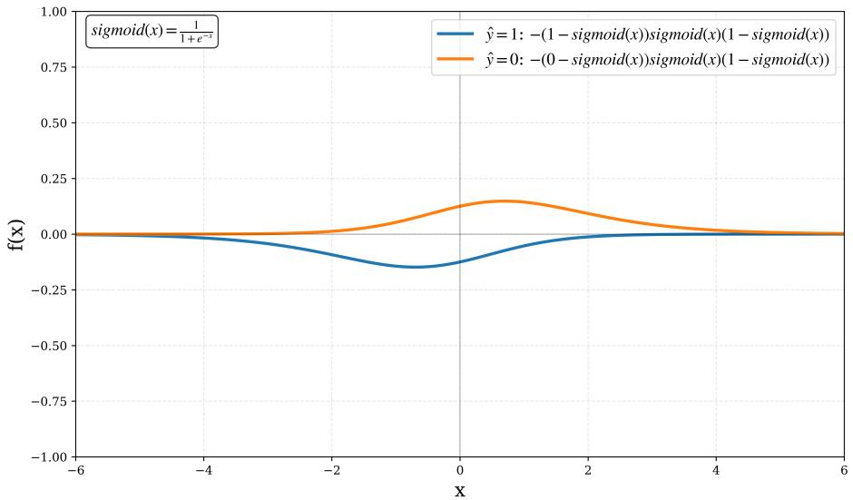

line

| x    | ŷ=1: -(1-sigmoid(x))sigmoid(x)(1-sigmoid(x)) | ŷ=0: -(0-sigmoid(x))sigmoid(x)(1-sigmoid(x)) |
| ---- | --------------------------------------------- | ---------------------------------------------- |
| -6   | 0.00                                          | 0.00                                           |
| -4   | ~0.00                                         | ~0.00                                          |
| -2   | ~-0.10                                        | ~0.05                                          |
| 0    | ~-0.20                                        | ~0.15                                          |
| 2    | ~-0.10                                        | ~0.10                                          |
| 4    | ~0.00                                         | ~0.05                                          |
| 6    | 0.00                                          | 0.00                                           |

Figure 4. Visualization of MSE loss in classification task.

$$
\frac {\partial | | \hat {y} - \operatorname{sigmoid} (\mu (\mathbf {z} _ {i , j})) | | ^ {2}}{2 \partial \mu (\mathbf {z} _ {i , j})} = - | | \hat {y} - \operatorname{sigmoid} (\mu (\mathbf {z} _ {i, j})) | | \operatorname{sigmoid} (\mu (\mathbf {z} _ {i, j})) (1 - \operatorname{sigmoid} (\mu (\mathbf {z} _ {i, j}))) \tag {14}
$$

The behavior of this gradient function is illustrated in Figure 4: regardless of the sample’s positive or negative nature, the gradient approaches zero when the similarity value is near 0 or 1, thereby hindering effective classification. To address this issue, we employ the Straight-Through Estimator (STE) to approximate the gradient, bypassing the differentiation of the sigmoid function by directly treating the output derivative as the input derivative. Thus, Equation 14 becomes:

$$
\frac {\partial | | \hat {y} - \operatorname{sigmoid} (\mu (\mathbf {z} _ {i , j})) | | ^ {2}}{2 \partial \mu (\mathbf {z} _ {i , j})} = - | | \hat {y} - \operatorname{sigmoid} (\mu (\mathbf {z} _ {i, j})) | | \tag {15}
$$

This formulation is equivalent to the gradient of the sigmoid loss, thereby ensuring stable gradient propagation throughout the learning process.

# B.2. Derivation of the KL Upper Bound for the Gaussian Mixture Posterior

In this section, we justify the KL regularization used for the two-component Gaussian mixture posterior. Let

$$
p (\mathbf {z}) = \sum_ {k = 1} ^ {K} \alpha_ {k} p _ {k} (\mathbf {z}), \quad \alpha_ {k} \geq 0, \quad \sum_ {k = 1} ^ {K} \alpha_ {k} = 1 \tag {16}
$$

where each component is a diagonal Gaussian

$$
p _ {k} (\mathbf {z}) = \mathcal {N} \left(\mathbf {z} \mid \mu_ {k}, \operatorname{diag} \left(\sigma_ {k} ^ {2}\right)\right) \tag {17}
$$

and the prior is the standard normal distribution

$$
q (\mathbf {z}) = \mathcal {N} (\mathbf {0}, \mathbf {I}) \tag {18}
$$

The exact KL divergence between the mixture posterior and the prior is

$$
\mathrm{KL} (p (\mathbf {z}) \| q (\mathbf {z})) = \int \left(\sum_ {k = 1} ^ {K} \alpha_ {k} p _ {k} (\mathbf {z})\right) \log \frac {\sum_ {k = 1} ^ {K} \alpha_ {k} p _ {k} (\mathbf {z})}{q (\mathbf {z})} d \mathbf {z} \tag {19}
$$

This quantity generally has no closed-form expression because the entropy term

$$
- \int p (\mathbf {z}) \log p (\mathbf {z}) d \mathbf {z} = - \sum_ {k = 1} ^ {K} \alpha_ {k} \int \mathcal {N} \left(\mathbf {z} \mid \mu_ {k}, \operatorname{diag} \left(\sigma_ {k} ^ {2}\right)\right) \log \left(\sum_ {j = 1} ^ {K} \alpha_ {j} \mathcal {N} \left(\mathbf {z} \mid \mu_ {j}, \operatorname{diag} \left(\sigma_ {j} ^ {2}\right)\right)\right) d \mathbf {z} \tag {20}
$$

contains the logarithm of a mixture density. However, the KL divergence is convex in its first argument. Therefore, for any set of distributions $\{ p _ { k } \} _ { k = 1 } ^ { K }$ and non-negative mixture weights $\{ \alpha _ { k } \} _ { k = 1 } ^ { K }$ satisfying $\textstyle \sum _ { k = 1 } ^ { K } \alpha _ { k } = 1$ , we have

$$
\mathrm{KL} \left(\sum_ {k = 1} ^ {K} \alpha_ {k} p _ {k} (\mathbf {z}) \| q (\mathbf {z})\right) \leq \sum_ {k = 1} ^ {K} \alpha_ {k} \mathrm{KL} (p _ {k} (\mathbf {z}) \| q (\mathbf {z})) \tag {21}
$$

For completeness, we provide the proof below. Starting from the log-sum inequality, for non-negative functions $a _ { k } ( { \mathbf { z } } )$ and $b _ { k } ( \mathbf { z } )$ ,

$$
\left(\sum_ {k = 1} ^ {K} a _ {k} (\mathbf {z})\right) \log \frac {\sum_ {k = 1} ^ {K} a _ {k} (\mathbf {z})}{\sum_ {k = 1} ^ {K} b _ {k} (\mathbf {z})} \leq \sum_ {k = 1} ^ {K} a _ {k} (\mathbf {z}) \log \frac {a _ {k} (\mathbf {z})}{b _ {k} (\mathbf {z})} \tag {22}
$$

Setting

$$
a _ {k} (\mathbf {z}) = \alpha_ {k} p _ {k} (\mathbf {z}), \quad b _ {k} (\mathbf {z}) = \alpha_ {k} q (\mathbf {z}) \tag {23}
$$

we obtain

$$
\left(\sum_ {k = 1} ^ {K} \alpha_ {k} p _ {k} (\mathbf {z})\right) \log \frac {\sum_ {k = 1} ^ {K} \alpha_ {k} p _ {k} (\mathbf {z})}{\sum_ {k = 1} ^ {K} \alpha_ {k} q (\mathbf {z})} \leq \sum_ {k = 1} ^ {K} \alpha_ {k} p _ {k} (\mathbf {z}) \log \frac {\alpha_ {k} p _ {k} (\mathbf {z})}{\alpha_ {k} q (\mathbf {z})} \tag {24}
$$

Since $\begin{array} { r } { \sum _ { k = 1 } ^ { K } \alpha _ { k } q ( \mathbf { z } ) = q ( \mathbf { z } ) } \end{array}$ and the factors $\alpha _ { k }$ cancel inside the logarithm on the right-hand side, this becomes

$$
p (\mathbf {z}) \log \frac {p (\mathbf {z})}{q (\mathbf {z})} \leq \sum_ {k = 1} ^ {K} \alpha_ {k} p _ {k} (\mathbf {z}) \log \frac {p _ {k} (\mathbf {z})}{q (\mathbf {z})} \tag {25}
$$

Integrating both sides over z gives

$$
\mathrm{KL} (p (\mathbf {z}) \| q (\mathbf {z})) \leq \sum_ {k = 1} ^ {K} \alpha_ {k} \mathrm{KL} (p _ {k} (\mathbf {z}) \| q (\mathbf {z})) \tag {26}
$$

Thus, replacing the exact mixture KL with the weighted sum of component-wise KL terms gives a tractable and conservative regularization term. Since the replacement upper-bounds the true KL, the resulting objective is a conservative lower-bound surrogate of the original ELBO and does not overestimate the variational objective.

# C. Experimental Details

# C.1. Tasks and Datasets

Image-Text Retrieval: Following (Chun, 2024), we employ COCO Caption (COCO) (Chen et al., 2015) along with two extended benchmarks—ECCV Caption (EC) (Chun et al., 2022) and CxC (Parekh et al., 2020) as the evaluation datasets. EC and CxC are built upon COCO with additional human annotations, significantly mitigating the FNs and providing a more reliable assessment of model generalization. Notably, EC corrects the largest number of FNs. We report Recall@K (R@K) for all benchmarks. For EC, we additionally report mAP@R and R-Precision (R-P) to provide a comprehensive evaluation of retrieval diversity and to more reliably reflect the model’s true generalization capability.

Domain Generalization: Following (Zhou et al., 2022a), we trained VACSR on ImageNet (Deng et al., 2009) and evaluated on four variant datasets that introduce different domain shifts: ImageNet-V2 (Recht et al., 2019), ImageNet-Sketch (Wang et al., 2019), ImageNet-A (Hendrycks et al., 2021b), and ImageNet-R (Hendrycks et al., 2021a). We employ a 16-shot setting and use the template ”a photo of $\mathbf { a } < \mathbf { c a t e g o r y } { > } ^ { { \mathsf { * } } }$ for the word embeddings. This setup is used to assess the model’s generalization and robustness to out-of-distribution data.

Base-to-Novel Generalization: This evaluation follows widely adopted protocols (Zhou et al., 2022a; Khattak et al., 2023), aiming to assess the model’s ability to recognize unseen categories after training on only a subset of classes. We conduct experiments on 11 image classification datasets spanning diverse recognition tasks, including general object recognition (ImageNet (Deng et al., 2009), Caltech101 (Fei-Fei et al., 2004)), fine-grained recognition (OxfordPets (Parkhi et al., 2012), StanfordCars (Krause et al., 2013), Flowers102 (Nilsback & Zisserman, 2008), Food101 (Bossard et al., 2014), FGVCAircraft (Maji et al., 2013)), scene understanding (SUN397 (Xiao et al., 2010)), texture classification (DTD (Cimpoi et al., 2014)), satellite image recognition (EuroSAT (Helber et al., 2019)), and action classification (UCF101 (Soomro et al., 2012)). For each dataset, categories are evenly split into base and novel classes. The model is trained on the base classes using only 16 labeled samples per class in a few-shot setting, and subsequently evaluated on both base and novel test sets. This setup effectively measures the model’s adaptation on seen categories as well as its zero-shot generalization ability to unseen novel classes.

Table 7. Computational efficiency comparison between VACSR and the baseline PCME++. 

<table><tr><td>Metric</td><td>VACSR</td><td>PCME++</td><td>Overhead</td></tr><tr><td>Total Parameters</td><td>158.56M</td><td>327.07M</td><td>-51.5%</td></tr><tr><td>Extra Module Parameters</td><td>5.26M</td><td>0M</td><td>+5.26M</td></tr><tr><td>Wall-clock Time per Step</td><td>134.89 ms</td><td>133.52 ms</td><td>+1.0%</td></tr><tr><td>Throughput (img/s)</td><td>949.0</td><td>958.7</td><td>-1.0%</td></tr><tr><td>Peak GPU Memory</td><td>1.737 GB</td><td>1.630 GB</td><td>+6.6%</td></tr></table>

# C.2. Implementation Details

The core of our method lies in constructing probabilistic representations of cross-modal similarity rather than feature extraction itself; therefore, we adopt task-specific backbone networks for different tasks. For image-text retrieval, we follow the PCME++ framework (Chun, 2024), utilizing a pre-trained CLIP as the backbone and employing the Generalized Pooling Operator (GPO) (Chen et al., 2021) for feature aggregation. To improve efficiency, we replace the original variance prediction Transformer module with a two-layer MLP-based variational adapter. Experiments are conducted with two visual encoders, ViT-B/32 and ViT-B/16, using the AdamP optimizer for 25 epochs, with an initial learning rate of 0.0005 decayed to 10% at epoch 15.

For out-of-distribution generalization tasks, we follow the experimental setup of (Yang et al., 2024), using the full CLIP model as the backbone and omitting structures such as GPO. In domain generalization, to prevent overfitting caused by the over-parameterization of CLIP and limited training samples, we fine-tune only the first two layers of the image encoder and the first three layers of the text encoder, training for 5 epochs with cosine annealing learning rate scheduling. For base-to-novel generalization, we conduct hyperparameter search on the number of frozen Transformer layers and training epochs, and adjust the batch size individually for datasets with extreme class distributions (128 for SUN397 and 5 for EuroSAT) to ensure training stability.

# D. Computational Efficiency Analysis

VACSR represents each image-text pair $( i , j )$ with a d-dimensional similarity vector, resulting in a tensor of size $B \times B \times d$ for a mini-batch of size B. While this design provides richer similarity modeling than scalar similarity scores, it may appear to introduce additional memory overhead. Nevertheless, the computational cost remains manageable, as the final objective is a pairwise MSE loss without global normalization. This allows each similarity vector $s _ { i , j }$ to be processed independently by the MLP encoder, enabling chunk-based computation in our implementation. During inference, where the test set contains 5,000 images and 25,000 captions, we split the computation into 128 × 128 chunks along both dimensions. Each chunk requires a tensor of size 128 × 128 × 1024, resulting in approximately 34 MB memory consumption, which is comparable to the training-time overhead. We further compare the inference efficiency of VACSR with the baseline PCME++ under the same hardware and batch size setting. All results are averaged over 100 runs. As shown in Table 7, VACSR delivers consistent performance gains with substantially fewer parameters (48.5%) and virtually no additional runtime cost.

# E. Sensitivity Analysis

As shown in Figure 5, we systematically analyze the impact of key parameters on model accuracy, including: (1) the loss function weighting coefficients $\alpha , \beta ,$ and γ in Eq. 13; (2) the number of components K in the Gaussian Mixture Model (GMM) described in Section 3.1; and (3) the number of selected hard negatives $N _ { h }$ . To isolate the effect of each variable, all experiments fix non-target parameters to their baseline values and vary only the parameter of interest. It is worth noting that the magnitude of α is significantly smaller than that of the other parameters, such as $\beta$ and $\gamma ;$ therefore, a logarithmic scale is used for the search space of α to ensure its effect is properly evaluated.

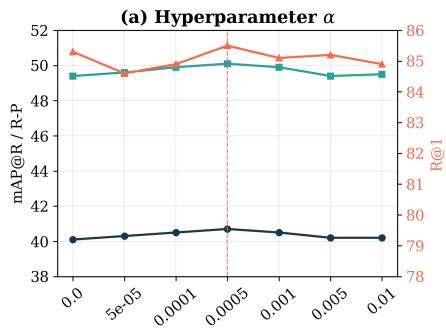

line

| x_value | mAP@R/R-P | R@1 |
| ------- | --------- | --- |
| 0.0     | 40.0      | 85.0 |
| 5e-05   | 40.2      | 84.5 |
| 0.0001  | 40.5      | 85.0 |
| 0.0005  | 40.8      | 86.0 |
| 0.001   | 40.7      | 85.5 |
| 0.005   | 40.3      | 85.2 |
| 0.01    | 40.2      | 85.0 |

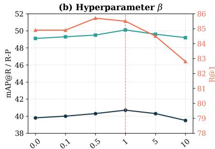

line

| β    | mAP@R / R-P | R@1  |
| ---- | ----------- | ---- |
| 0.0  | 49.5        | 85.0 |
| 0.1  | 49.6        | 85.0 |
| 0.5  | 49.7        | 85.5 |
| 1    | 50.0        | 86.0 |
| 5    | 49.8        | 84.5 |
| 10   | 49.5        | 83.0 |

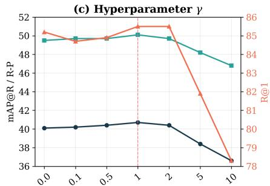

line

| γ    | mAP@R / R-P | R@I  |
| ---- | ----------- | ---- |
| 0.0  | 40.0        | 85.0 |
| 0.1  | 40.0        | 85.0 |
| 0.5  | 40.0        | 85.0 |
| 1    | 40.5        | 85.5 |
| 2    | 40.5        | 85.5 |
| 5    | 38.5        | 83.5 |
| 10   | 36.5        | 78.0 |

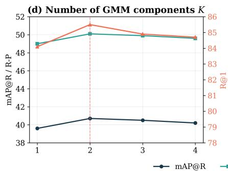

line

| Number of GMM components K | mAP@R / R-P | R@I |
| -------------------------- | ----------- | --- |
| 1                          | 39.5        | 84.5 |
| 2                          | 40.5        | 85.5 |
| 3                          | 40.3        | 85.0 |
| 4                          | 40.0        | 84.8 |

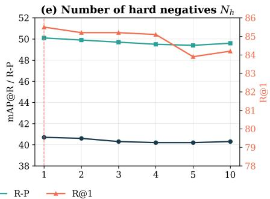

line

| x | mAP@R / R-P | R@1 |
| --- | --- | --- |
| 1 | 50.0 | 85.5 |
| 2 | 50.0 | 85.0 |
| 3 | 50.0 | 85.0 |
| 4 | 49.5 | 84.5 |
| 5 | 49.5 | 84.0 |
| 10 | 49.5 | 84.5 |

Figure 5. Sensitivity analysis on the EC dataset using the CLIP ViT-B/32 backbone. We evaluate the impact of the loss weighting coefficients α, $\beta ,$ and $\gamma ,$ the number of Gaussian components K, and the number of selected hard negatives $N _ { h }$ . All reported metrics are averaged over both image-to-text and text-to-image retrieval directions. The vertical dashed line in each subfigure indicates the hyperparameter value selected for our final model configuration.

Table 8. The impact of false-negative samples on the two types of losses. Here, $L _ { s i g m o i d }$ and $L _ { c o n t r a s t }$ treat the scaling parameter and temperature coefficient as learnable parameters, initialized as $a = 1 0 , b = - 1 0 , \tau = 1$ . In contrast, $L _ { s i g m o i d } ^ { * }$ and $L _ { c o n t r a s t } ^ { * }$ fix these parameters to $a = 1 , b = 0 , \tau = 1$ 

<table><tr><td rowspan="2">Loss</td><td colspan="3">ECCV Caption</td><td>CxC</td><td colspan="3">COCO</td></tr><tr><td>mAP@R</td><td>R-P</td><td>R@1</td><td>R@1</td><td>1K R@1</td><td>5K R@1</td><td>RSUM</td></tr><tr><td>VACSR</td><td>40.7</td><td>50.1</td><td>85.5</td><td>59.7</td><td>77.2</td><td>58.1</td><td>541.4</td></tr><tr><td> $L_{sigmoid}$ </td><td>39.3</td><td>48.7</td><td>83.1</td><td>57.3</td><td>75.5</td><td>55.6</td><td>537.0</td></tr><tr><td> $L^{*}_{sigmoid}$ </td><td>0.2</td><td>0.3</td><td>0.1</td><td>0.3</td><td>0.2</td><td>0.1</td><td>1.2</td></tr><tr><td> $L_{contrast}$ </td><td>39.0</td><td>48.7</td><td>81.7</td><td>54.9</td><td>74.0</td><td>53.0</td><td>532.6</td></tr><tr><td> $L^{*}_{contrast}$ </td><td>15.7</td><td>25.5</td><td>37.5</td><td>16.4</td><td>32.1</td><td>14.8</td><td>343.2</td></tr></table>

# E.1. The loss function weighting coefficients

Hyperparameter α: Analysis of the regularization weight α shows a clear performance peak around $\alpha { = } 0 . 0 0 0 5$ . In addition, both excessively small $( \mathrm { e . g . , } \alpha \mathrm { = } 0 . 0 0 0 0 5 )$ and large $( \mathrm { e . g . , } \alpha \mathrm { = } 0 . 0 1 )$ values of α lead to declines in all metrics. This indicates that appropriate regularization can improve retrieval performance, while overly strong regularization suppresses the model’s learning capacity. Notably, when regularization is completely removed $( \alpha = 0 . 0 )$ , the decrease in R@1 is relatively small (85.3), but mAP@R and R-Precision drop to 40.1 and 49.4, respectively, suggesting that regularization constrains the overall quality of retrieval results rather than merely improving Top-1 accuracy.

Hyperparameter β: Setting the weight $\beta$ of the distributional optimization loss to 1.0 yields the best trade-off among all metrics. When $\beta$ is too large $( \mathrm { e } . \mathrm { g } . , 1 0 )$ , the excessive emphasis on distributional optimization interferes with the primary learning objective, resulting in a significant drop in R@1 to 82.8. Conversely, when $\beta$ is too small $( \mathrm { e . g . , 0 . 1 } )$ , the variance optimization is insufficient, and mAP@R decreases to 40.0. Additionally, at $\beta { = } 0 . 5 ,$ , R@1 reaches a local optimum of

85.7, but both mAP@R and R-Precision decline, indicating that while the model emphasizes Top-1 accuracy, it may fail to maintain retrieval diversity.

Hyperparameter γ: The model achieves overall optimal performance when the weight γ is set to 1.0, while an excessively large γ (e.g., 10) leads to catastrophic performance degradation (mAP@R drops to just 36.6). This indicates that overpenalizing negative samples severely harms model performance. In fact, variance optimization for negative samples still uses positive labels, which preserves the model’s ability to learn from hard negatives but fails to capture precise uncertainty. This highlights the importance of appropriately weighting negative samples to enhance the model’s discriminative power.

In summary, analysis of the three parameters shows that the combination of α=0.0005, β=1.0, and $\gamma { = } 1 . 0$ achieves the best retrieval performance on the EC dataset (mAP@R 40.7, R-Precision 50.1, R@1 85.5). This configuration ensures sufficient regularization, balanced optimization of positive and negative samples, and avoids the negative effects of excessive penalization.

# E.2. The number of Gaussian components

Sensitivity analysis of the component number K demonstrates that this parameter critically affects the model’s ability to capture the intrinsic modal structure of the data. When K = 2, the model achieves optimal performance on the EC dataset (mAP@R: 40.7, R-P: 50.1, R@1: 85.5), indicating that two Gaussian components effectively represent the similarity distribution patterns. When $K = 1$ , all metrics degrade significantly (e.g., mAP@R: 39.6) due to limited expressive capacity, suggesting that a single Gaussian is insufficient to model the data’s complex characteristics. Conversely, when $K \geq 3 .$ , performance declines (with mAP@R at 40.2 when K = 4), likely because the increased model complexity introduces redundant parameters, leading to overfitting on noisy training data and reduced generalization. As a result, $K = 2$ is identified as the optimal choice, balancing sufficient expressiveness with the avoidance of over-parameterization risks.

# E.3. The number of selected hard negatives

Sensitivity analysis of the number of selected hard negatives $N _ { h }$ shows that the model achieves the best performance when only the single hardest negative is used, with mAP@R, R-P, and R@1 reaching 40.7, 50.1, and 85.5, respectively. As $N _ { h }$ increases, the performance decreases slightly and then remains stable, with mAP@R staying around 40.2–40.3 when $N _ { h } \ge 4$ . This suggests that the method is not highly sensitive to the exact number of hard negatives, while introducing more negatives may include less FNs and slightly weaken the effectiveness of hard-negative optimization. Therefore, we set $N _ { h } = 1$ as the default configuration.

# F. Tolerance of Loss Functions

Table 8 presents a comparative experiment between the sigmoid loss and the contrastive loss. For the sigmoid loss, $r _ { i }$ does not require softmax normalization. When the similarity of positive samples is fixed, the tolerance of $\mathcal { L } _ { s i g m o i d }$ depends solely on the FNs themselves. We observe that the sigmoid loss consistently outperforms the contrastive loss across all evaluation metrics, particularly in terms of R@K, indicating that its independence from softmax normalization during optimization contributes to higher retrieval accuracy. However, with fixed scaling parameters and temperature coefficients, the contrastive loss retains a baseline level of performance, while the sigmoid loss fails to converge, which further underscores the advantage of the contrastive loss in terms of robustness to binary annotations.

# G. Base-to-Novel Generalization

This section provides a detailed analysis of the base-to-novel generalization results across 11 datasets, as shown in Table 9, to further investigate the characteristics of VACSR on various recognition tasks.

Generic Object Recognition Datasets (ImageNet, Caltech101): On ImageNet, VACSR achieves the highest base class accuracy (78.64) as well as the best harmonic mean (74.52), indicating strong fundamental performance for large-scale generic category recognition. On Caltech101, which contains a greater number of categories, VACSR ranks first in both novel class accuracy (95.09) and harmonic mean (96.89), demonstrating robust generalization to diverse object categories.

Fine-grained Recognition Datasets (OxfordPets, StanfordCars, Flowers102, Food101, FGVCAircraft): For finegrained tasks, different methods demonstrate varying strengths. VACSR achieves the highest base class accuracy on OxfordPets (96.28) and leads in novel class accuracy on Flowers102 (77.45). MMRL attains the best performance across base, novel, and harmonic mean metrics on StanfordCars, while CoPrompt slightly outperforms others in harmonic mean on Food101. On the highly challenging FGVCAircraft dataset, VACSR achieves the highest base class accuracy (47.96) and harmonic mean (41.55), indicating its advantage in learning representations for highly specialized categories.

Table 9. Performance comparison of different methods on base-to-novel generalization across 11 datasets. We employ Clip ViT-B/16 as the encoder backbone. The best results are highlighted in bold. 

<table><tr><td rowspan="2">Method</td><td colspan="3">Average</td><td colspan="3">ImageNet</td><td colspan="3">Caltech101</td><td colspan="3">OxfordPets</td></tr><tr><td>Base</td><td>Novel</td><td>HM</td><td>Base</td><td>Novel</td><td>HM</td><td>Base</td><td>Novel</td><td>HM</td><td>Base</td><td>Novel</td><td>HM</td></tr><tr><td>ZERO-SHOT</td><td>69.34</td><td>74.22</td><td>71.70</td><td>72.43</td><td>68.14</td><td>70.22</td><td>96.84</td><td>94.00</td><td>95.40</td><td>91.17</td><td>97.26</td><td>94.12</td></tr><tr><td>CoCoOp</td><td>80.47</td><td>71.69</td><td>75.83</td><td>75.98</td><td>70.43</td><td>73.10</td><td>97.96</td><td>93.81</td><td>95.84</td><td>95.20</td><td>97.69</td><td>96.43</td></tr><tr><td>CLIPOOD</td><td>83.9</td><td>74.5</td><td>78.9</td><td>77.5</td><td>70.3</td><td>73.7</td><td>98.7</td><td>94.6</td><td>96.6</td><td>95.7</td><td>96.4</td><td>96.0</td></tr><tr><td>MaPLe</td><td>82.28</td><td>75.14</td><td>78.55</td><td>76.66</td><td>70.54</td><td>73.47</td><td>97.74</td><td>94.36</td><td>96.02</td><td>95.43</td><td>97.76</td><td>96.58</td></tr><tr><td>CoPrompt</td><td>84.00</td><td>77.23</td><td>80.48</td><td>77.67</td><td>71.27</td><td>74.33</td><td>98.27</td><td>94.90</td><td>96.55</td><td>95.67</td><td>98.10</td><td>96.87</td></tr><tr><td>MMA</td><td>83.20</td><td>76.80</td><td>79.87</td><td>77.31</td><td>71.00</td><td>74.02</td><td>98.40</td><td>94.00</td><td>96.15</td><td>95.40</td><td>98.07</td><td>96.72</td></tr><tr><td>MMRL</td><td>85.68</td><td>77.16</td><td>81.20</td><td>77.90</td><td>71.30</td><td>74.45</td><td>98.97</td><td>94.50</td><td>96.68</td><td>95.90</td><td>97.60</td><td>96.74</td></tr><tr><td>VACSR</td><td>85.74</td><td>76.08</td><td>80.37</td><td>78.64</td><td>70.8</td><td>74.52</td><td>98.77</td><td>95.09</td><td>96.89</td><td>96.28</td><td>97.37</td><td>96.82</td></tr><tr><td rowspan="2">Method</td><td colspan="3">StanfordCars</td><td colspan="3">Flowers102</td><td colspan="3">Food101</td><td colspan="3">FGVCAircraft</td></tr><tr><td>Base</td><td>Novel</td><td>HM</td><td>Base</td><td>Novel</td><td>HM</td><td>Base</td><td>Novel</td><td>HM</td><td>Base</td><td>Novel</td><td>HM</td></tr><tr><td>ZERO-SHOT</td><td>63.37</td><td>74.89</td><td>68.65</td><td>72.08</td><td>77.80</td><td>74.83</td><td>90.10</td><td>91.22</td><td>90.66</td><td>27.19</td><td>36.29</td><td>31.09</td></tr><tr><td>CoCoOp</td><td>70.49</td><td>73.59</td><td>72.01</td><td>94.87</td><td>71.75</td><td>81.71</td><td>90.70</td><td>91.29</td><td>90.99</td><td>33.41</td><td>23.71</td><td>27.74</td></tr><tr><td>CLIPOOD</td><td>78.6</td><td>73.5</td><td>75.9</td><td>93.5</td><td>74.5</td><td>82.9</td><td>90.7</td><td>91.7</td><td>91.2</td><td>43.3</td><td>37.2</td><td>40.0</td></tr><tr><td>MaPLe</td><td>72.94</td><td>74.00</td><td>73.47</td><td>95.92</td><td>72.46</td><td>82.56</td><td>90.71</td><td>92.05</td><td>91.38</td><td>37.44</td><td>35.61</td><td>36.50</td></tr><tr><td>CoPrompt</td><td>76.97</td><td>74.40</td><td>75.66</td><td>97.27</td><td>76.60</td><td>85.71</td><td>90.73</td><td>92.07</td><td>91.4</td><td>40.20</td><td>39.33</td><td>39.76</td></tr><tr><td>MMA</td><td>78.50</td><td>73.10</td><td>75.70</td><td>97.77</td><td>75.93</td><td>85.48</td><td>90.13</td><td>91.30</td><td>90.71</td><td>40.57</td><td>36.33</td><td>38.33</td></tr><tr><td>MMRL</td><td>81.30</td><td>75.07</td><td>78.06</td><td>98.97</td><td>77.27</td><td>86.78</td><td>90.57</td><td>91.50</td><td>91.03</td><td>46.30</td><td>37.03</td><td>41.15</td></tr><tr><td>VACSR</td><td>79.74</td><td>73.33</td><td>76.40</td><td>98.39</td><td>77.45</td><td>86.67</td><td>90.58</td><td>91.73</td><td>91.15</td><td>47.96</td><td>36.65</td><td>41.55</td></tr><tr><td rowspan="2">Method</td><td colspan="3">SUN397</td><td colspan="3">DTD</td><td colspan="3">EuroSAT</td><td colspan="3">UCF101</td></tr><tr><td>Base</td><td>Novel</td><td>HM</td><td>Base</td><td>Novel</td><td>HM</td><td>Base</td><td>Novel</td><td>HM</td><td>Base</td><td>Novel</td><td>HM</td></tr><tr><td>ZERO-SHOT</td><td>69.36</td><td>75.35</td><td>72.23</td><td>53.24</td><td>59.90</td><td>56.37</td><td>56.48</td><td>64.05</td><td>60.03</td><td>70.53</td><td>77.50</td><td>73.85</td></tr><tr><td>CoCoOp</td><td>79.74</td><td>76.86</td><td>78.27</td><td>77.01</td><td>56.00</td><td>64.85</td><td>87.49</td><td>60.04</td><td>71.21</td><td>82.33</td><td>73.45</td><td>77.64</td></tr><tr><td>CLIPOOD</td><td>81.0</td><td>79.3</td><td>80.2</td><td>80.8</td><td>58.6</td><td>67.9</td><td>97.5</td><td>64.1</td><td>77.3</td><td>85.7</td><td>79.3</td><td>82.4</td></tr><tr><td>MaPLe</td><td>80.82</td><td>78.70</td><td>79.75</td><td>80.36</td><td>59.18</td><td>68.16</td><td>94.07</td><td>73.23</td><td>82.35</td><td>83.00</td><td>78.66</td><td>80.77</td></tr><tr><td>CoPrompt</td><td>82.63</td><td>80.03</td><td>81.31</td><td>83.13</td><td>64.73</td><td>72.79</td><td>94.60</td><td>78.57</td><td>85.84</td><td>86.90</td><td>79.57</td><td>83.07</td></tr><tr><td>MMA</td><td>82.27</td><td>78.57</td><td>80.38</td><td>83.20</td><td>65.63</td><td>73.38</td><td>85.46</td><td>82.34</td><td>83.87</td><td>86.23</td><td>80.03</td><td>82.20</td></tr><tr><td>MM-RL</td><td>83.20</td><td>79.30</td><td>81.20</td><td>85.67</td><td>65.00</td><td>73.82</td><td>95.60</td><td>80.17</td><td>87.21</td><td>88.10</td><td>80.07</td><td>83.89</td></tr><tr><td>VACSR</td><td>83.23</td><td>78.57</td><td>80.83</td><td>84.56</td><td>64.79</td><td>73.36</td><td>95.93</td><td>70.74</td><td>81.43</td><td>89.04</td><td>80.31</td><td>84.45</td></tr></table>

Scene, Texture, and Satellite Image Recognition (SUN397, DTD, EuroSAT): On the scene dataset SUN397, VACSR achieves the highest base class accuracy (83.23), while CoPrompt leads in novel class accuracy. For the texture dataset DTD, MMRL attains the best performance across multiple metrics. It is worth noting that on the EuroSAT satellite image dataset, the novel class accuracy of all methods is significantly lower than that of the base class. This is primarily due to the extremely limited textual category descriptions in this dataset (only five), which also severely constrains the effectiveness of approaches that rely on probabilistic representations (insufficient sampling) and results in a generalization bottleneck.

Action Recognition Dataset (UCF101): On the UCF101 action recognition dataset, VACSR demonstrates a clear advantage, achieving the highest base class accuracy (89.04), novel class accuracy (80.31), and harmonic mean (84.45). This indicates its exceptional transfer capability in modeling dynamic semantic content.

Overall, VACSR shows robust base class recognition across most datasets and leads in comprehensive performance on datasets such as Caltech101, FGVCAircraft, and UCF101. Although its novel class generalization occasionally lags behind methods specifically designed for this purpose, its consistently strong and balanced performance validates the high generalizability of similarity representations learned via variational inference.

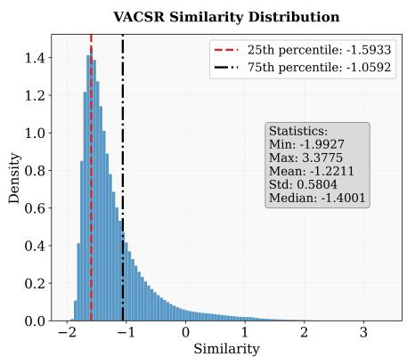

histogram

| Statistic         | Value   |
| ----------------- | ------- |
| Min               | -1.9927 |
| Max               | 3.3775  |
| Mean              | -1.2211 |
| Std               | 0.5804  |
| Median            | -1.4001 |

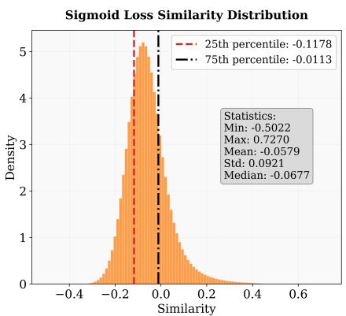

histogram

| Statistic         | Value   |
| ----------------- | ------- |
| Min               | -0.5022 |
| Max               | 0.7270  |
| Mean              | -0.0579 |
| Std               | 0.0921  |
| Median            | -0.0677 |

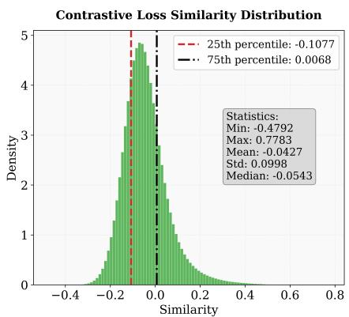

histogram

| Statistic         | Value   |
| ----------------- | ------- |
| Min               | -0.4792 |
| Max               | 0.7783  |
| Mean              | -0.0427 |
| Std               | 0.0998  |
| Median            | -0.0543 |

Figure 6. Visualization of similarity distribution.

Table 10. Pearson correlation between the average top-K uncertainty $\bar { \sigma } _ { K }$ and mAP@R on the EC dataset. 

<table><tr><td>K</td><td>1</td><td>2</td><td>3</td><td>4</td><td>5</td><td>6</td><td>7</td><td>8</td><td>9</td><td>10</td></tr><tr><td>I-T</td><td>-0.939</td><td>-0.903</td><td>-0.903</td><td>-0.842</td><td>-0.689</td><td>-0.035</td><td>0.491</td><td>0.666</td><td>0.728</td><td>0.789</td></tr><tr><td>T-I</td><td>-0.879</td><td>0.783</td><td>0.807</td><td>0.813</td><td>0.805</td><td>0.795</td><td>0.790</td><td>0.780</td><td>0.759</td><td>0.746</td></tr></table>

# H. Ranking-level Uncertainty Analysis

In the main paper, we analyze the relationship between uncertainty and retrieval accuracy using the uncertainty of the top-1 retrieved pair. Since image-text retrieval is inherently a list-level ranking problem, we further evaluate whether uncertainty reflects ranking quality beyond a single retrieved pair. Specifically, for each query, we compute the average uncertainty over its top-K retrieved candidates:

$$
\bar {\sigma} _ {K} = \frac {1}{K} \sum_ {r = 1} ^ {K} \hat {\sigma} (\boldsymbol {s} _ {i, r}), \tag {27}
$$

where $\hat { \sigma } ( s _ { i , r } )$ denotes the predicted uncertainty of the r-th retrieved candidate for query i. We then report the Pearson correlation between $\bar { \sigma } _ { K }$ and mAP@R on the EC dataset, where mAP@R is used as a ranking-sensitive metric.

These results in Table 10 yield several important insights.

• Firstly, strong negative correlations persist for small values of K (top-5 in I2T and top-1 in T2I), confirming that a lower average uncertainty strongly predicts ranking quality precisely where it matters most.   
• Secondly, as K increases, the correlation weakens and eventually becomes positive. This transition is expected: tail candidates naturally exhibit higher uncertainty, as they predominantly consist of FNs.

In our training data, the ratio of images to text is 1:5. Therefore, samples ranked before this ratio are considered positive; the lower their uncertainty, the higher the model’s confidence in the current retrieval result. In contrast, samples ranked after this ratio are generally treated as negative. In this case, the magnitude of uncertainty reflects the model’s confidence that “the sample may not actually be a negative sample” (i.e., whether it is a FN). The greater the uncertainty, the stronger the model’s belief that FNs exist (i.e. the better mAP@R). This trend is opposite to the direction of uncertainty change observed in positive samples. Meanwhile, because tail candidates inherently carry higher uncertainty, they dominate the average $\bar { \sigma } _ { K }$ at large K. These results further support the effectiveness of our uncertainty modeling. The predicted uncertainty serves as a reliable confidence indicator for highly ranked retrieval results, while also capturing ambiguity among lower-ranked candidates.

# I. Similarity Distribution

Figure 6 presents the similarity distributions obtained by VACSR and by fine-tuning CLIP directly using the sigmoid loss $( \mathcal { L } _ { s i g m o i d } )$ and the contrastive loss $( \mathcal { L } _ { c o n t r a s t } )$ . We take the COCO test set as an example, which contains $1 . 2 5 \times 1 0 ^ { 8 }$

natural_image

Interior view of a train station with multiple tracks and a train car, no visible text or signage

# Top-5 Retrieved captions from VACSR

1.An empty station with atrainpulled into it   
2.A large grey train inside ofa train station   
3.A train station with a blue trainat the station   
4.a commuter train stopped inside the train station

# Top-5 Retrieved captions from PCME++

1.A train passing into a station,in a welldesigned station   
2.An empty station with a train pulled into it   
3.A train station with a blue train at the station.   
4.Alarge grey train inside of a train station   
5.The two trains are inside of the station

natural_image

Surfer mid-air over ocean waves with a distant pier and building in background (no text or symbols)

# Top-5 Retrieved captions from VACSR

1.a surfer riding a waveunder a pier   
2.A person surfing near a dock in the ocean   
3.animageofabirdflying over the water   
4.A surfer hanging on the ocean waves .   
5.A person who is wearing a black wet suit is   
riding a wave with their surf board

natural_image

Outdoor scene with two thatched animals in a wooded area, no visible text or symbols

# Top-5 Retrieved captions from PCME++

1.Alarge waterbirdflyingover theocean   
2.A bird is flying nexttoaship in the ocean.   
3.A white birdfly'sin the air above the blue water   
4.an image ofabird flying over the water   
5.A bunch of birds flying around a couple of waves near the ocean.

# Top-5 Retrieved captions from VACSR

1.Several girafes leaningoverafence towardssomepeople.   
2.Four giraffes linger just outside the shade in their enclosure   
3.Acouple of giraffes being feed by peopleat the zoo   
  
  
5.Some giraffesare standing in the middleofthe zoo exhibit .

# Top-5 Retrieved captions from PCME++

1.Acontained area with rock wallsand formations built along with fencing and several elephants together in the area.   
2.Several elephants in zoo enclosure with onlookers watching.   
3.People are watching four elephants in a zoo   
4.Several people riding some horses in an enclosure   
5.Several giraffes and other animals ina fenced enclosure

# Query caption

A group of people are standing next to an elephant emerging from the water.

Top-5 Retrieved images from VACSR   

Top-5 Retrieved images from PCME++   

# Query caption

Two ducks swim together in a pond at sunrise

Top-5 Retrieved images from VACSR   

Top-5 Retrieved images from PCME++   

  
Figure 7. Visualization of retrieval results under a 50% noise ratio. We show the top 5 results retrieved from each image or text query, with the positive samples labeled in the dataset boxed in green.

image-text pairs with a positive-to-negative sample ratio (including FNs) of 1 : 5000. Figure 6 shows the similarity distributions derived from $\mathcal { L } _ { s i g m o i d }$ and $\mathcal { L } _ { c o n t r a s t }$ approximate a normal distribution (mean = -0.0579, -0.0427, std = 0.0921, 0.0998), indicating that the similarities of a large number of samples are concentrated in an intermediate range. As discussed in Section 2, FNs are subjected to gradients in opposite directions and are thus pushed toward uncertain values rather than receiving confident judgments based on their true semantics. This result makes it difficult to distinguish FNs. In contrast, VACSR produces a markedly left-skewed distribution (mean = -1.2211, std = 0.5804). This distribution exhibits a lower central tendency (Median = -1.4001) and greater dispersion, demonstrating that VACSR can more fully span the similarities within the [0,1] interval, thereby effectively modeling the distribution of FNs. Furthermore, given the extremely small number of positive samples, the left-skewed distribution aligns more closely with our expectations regarding sample uncertainty. Specifically, the model can now assign lower similarity scores to the majority of negative samples with higher confidence, while reserving higher similarity values for the small number of positive samples. Consequently, VACSR alleviates the FNs caused by the binary annotations as a whole and achieves more fine-grained similarity modeling.

# J. Visualization Analysis of Retrieval Results

The visualization analysis of retrieval results under a 50% noise ratio clearly demonstrates the robustness advantage of the VACSR method in real-world noisy environments. In the image-to-text retrieval task, VACSR is able to more accurately capture the core semantics of the query image. As shown in Figure 7, for Query Image 1, all top-5 results retrievaled by VACSR closely align with the theme “A train is shown on the inside of a station,” whereas the results from PCME++ include semantic deviations such as “The two trains.” Similarly, in the cases of “surfer” and “giraffes,” VACSR’s results better maintain consistency with the main subject and scene of the query image, while PCME++ returns unrelated entities such as “birds,” “elephants,” and “people riding some horses.” This indicates that PCME++ is more susceptible to noise in the data

and more likely to exhibit semantic drift.

In the text-to-image retrieval task, VACSR demonstrates a more precise grasp of the details in the query descriptions. For the text “A group of people are standing next to an elephant emerging from the water,” VACSR successfully retrieves multiple images containing the key element “water,” whereas most results from PCME++ overlook this detail. Similarly, for “Two ducks swim together in a pond at sunrise,” VACSR accurately matches the number of ducks, while PCME++ makes errors in this aspect. These examples indicate that by learning a distributional representation of similarity, VACSR is better able to distinguish key semantic features from noisy associations, thereby improving retrieval accuracy.

Notably, in both sets of experiments, many retrieved results were not labeled as “matched” but were highly semantically relevant to the queries. This phenomenon confirms the presence of numerous FNs in the original dataset.