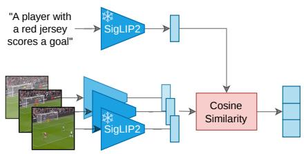
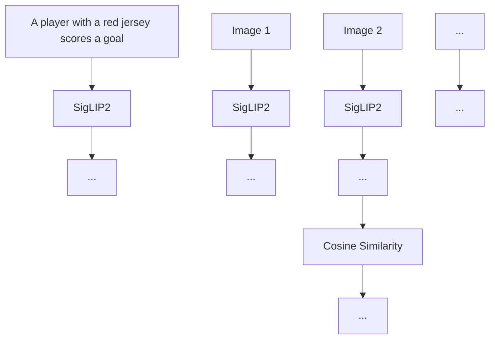
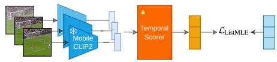
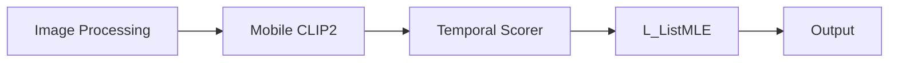
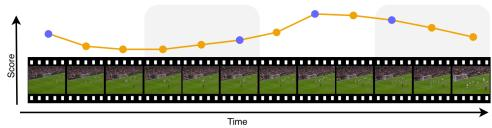
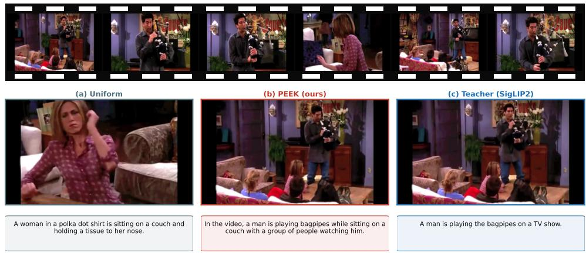
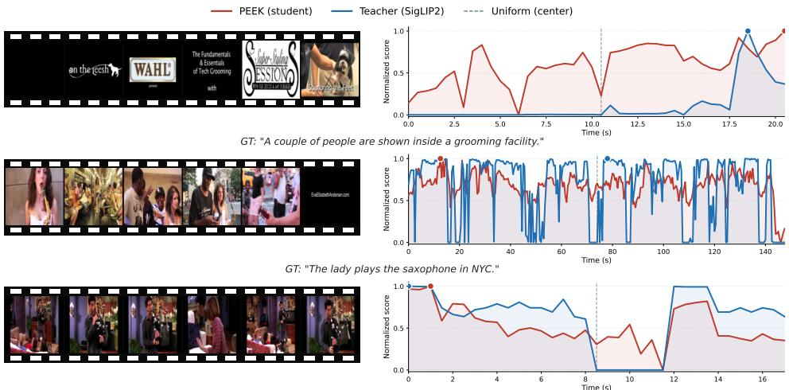

# PEEK: Picking Essential frames via Efficient Knowledge distillation

Killian Steunou1,2

killian.steunou@ip-paris.fr

Anas Filali Razzouki1,2

2 anas@momentslab.com

0Khalil Guetari2

2khalil.guetari@momentslab.com

yMounîm A. El-Yacoubi1

mounim.el\_yacoubi@telecom-sudparis.eu

Yannis Tevissen2

9yannis.tevissen@momentslab.com

1 Télécom SudParis — SAMOVAR Institut Polytechnique de Paris Palaiseau, France

2 Moments Lab 69 Avenue Pierre Grenier Boulogne-Billancourt, France

# Abstract

Video-language models can process only a limited number of frames, making frame selection a key bottleneck for efficient video captioning. Most captioning pipelines still rely on uniform sampling, which is computationally cheap but agnostic to visual content. Adaptive frame sampling has recently emerged as a promising approach for selecting the most informative frames from a video; however, existing methods remain computationally expensive. We introduce PEEK, an efficient dynamic frame sampling method that distills caption-conditioned frame relevance rankings from a stronger teacher model into a lightweight temporal model that operates only on visual content. We find that, overall, on ActivityNet Captions and MSR-VTT, our method outperforms state-of-theart methods across all evaluated downstream vision language models, especially when only one or two frames are selected for captioning, obtaining the best CIDEr for most frame budgets. On ActivityNet Captions, PEEK is particularly strong, winning 14 out of 16 configurations. Zero-shot evaluation on MSR-VTT shows that our model transfers best at low frame budgets, while results at four and eight frames are more mixed as temporal coverage and visual diversity become increasingly competitive. Compared with recent adaptive baselines, PEEK is both more accurate in the low-budget regime and more efficient: it adds only 5.2% to the captioning time, compared with 65.4% for CSTA and 211.9% for MaxInfo. We release our code and pre-trained checkpoint at https://github.com/momentslab/peek.

# 1 Introduction

Modern vision–language models (VLMs) have made strong progress on image-language tasks, but video understanding remains expensive because videos are long, redundant, and often require sparse relevant cues to be extracted from a frame sequence [26, 30]. To process a video, a VLM usually receives only a limited number of frames: enough to give a glimpse of the video, but not enough to guarantee that the decisive visual cue is present. In practice, even for state-of-the-art models, the default strategy is uniform sampling: partition the video into equal temporal segments and keep one frame from each [1, 2, 17, 36]. Uniform sampling is deterministic, model-free, and often produces good results [10, 11, 33], outperforming adaptive strategies on some benchmarks [4]. This makes uniform sampling a good baseline rather than a naive approach. However, it is still fundamentally content-blind: a short clip where the key event happens in a single instant and a clip where useful evidence is spread across the whole duration are treated identically [10, 11]. Other works use a strong textconditioned retriever, such as CLIP [21] or SigLIP [34] to score every frame by image–text similarity and keep the most relevant frames [23]. This scheme is query-dependent, however, which makes it impossible to consider at inference time for video captioning. Nonetheless, such a selector may be used to select visually relevant frames and diagnose how much they can improve captioning. To address this, we propose a caption-conditioned Oracle as a diagnostic for frame relevance: it scores candidate frames against the ground-truth caption and ranks them according to their semantic alignment with the target description. This Oracle cannot be used at inference time, since the target caption is unknown. However, its rankings provide a useful supervisory signal, indicating which frames are visually salient or semantically aligned with the caption, and may indirectly reveal temporally distinctive moments within the segment. Our hypothesis is that part of this caption-conditioned relevance can be distilled into a lightweight visual model that never sees text at inference time.

flowchart

(a) Stage 1 — Oracle teacher scoring

flowchart

(b) Stage 2 — query-free temporal scorer

line

| Time | Score |
| ---- | ----- |
| 0    | 1     |
| 1    | 0.8   |
| 2    | 0.7   |
| 3    | 0.65  |
| 4    | 0.7   |
| 5    | 0.8   |
| 6    | 1     |
| 7    | 0.9   |
| 8    | 0.85  |
| 9    | 0.8   |
| 10   | 0.75  |
| 11   | 0.7   |
| 12   | 0.65  |
| 13   | 0.6   |
| 14   | 0.55  |
| 15   | 0.5   |
| 16   | 0.45  |
| 17   | 0.4   |
| 18   | 0.35  |
| 19   | 0.3   |
| 20   | 0.25  |
| 21   | 0.2   |
| 22   | 0.15  |
| 23   | 0.1   |
| 24   | 0.05  |
| 25   | 0.0   |

(c) Stratified argmax inference with k = 4   
Figure 1: Overview of PEEK. (a) A frozen SigLIP 2 dual encoder acts as an Oracle teacher, producing per-frame relevance targets from ground-truth captions. (b) A small Transformer distills the teacher’s ranking into a query-free selector operating on MobileCLIP2 visual embeddings alone. (c) At inference, the segment is split into k equal temporal windows and the highest-scoring frame within each (blue dot) is kept.

Concretely, we propose PEEK, a two-stage distillation framework for efficient frame selection in video captioning. In the first stage, a frozen vision-language teacher scores candidate frames against the ground-truth caption, producing dense caption-conditioned relevance rankings used only for supervision. In the second stage, a lightweight temporal Transformer learns to predict these rankings from visual embeddings alone. At inference time, PEEK ❄️ ❄️ requires neither captions nor a text encoder: it scores the video visually and selects frames from the predicted relevance scores. Unlike query-aware or captioner-coupled frame selectors, PEEK uses text-conditioned relevance only as an offline supervision signal. The deployed selector is query-free, caption-agnostic, and independent of the downstream captioning model.

We make the following contributions:

• We introduce PEEK, a query-free frame selector that distills SigLIP 2 [28] captionconditioned rankings into a lightweight temporal scorer operating only on visual features.   
• We propose caption-conditioned frame scoring as an Oracle diagnostic to quantify the value of semantic frame relevance for video captioning.   
• We evaluate PEEK on ActivityNet Captions [12] and MSR-VTT [32] with four downstream VLMs, showing consistent gains in the low-frame regime and a much lower selection cost than recent content-aware baselines.

The paper is organized as follows. Section 2 reviews prior work on frame selection. Section 3 presents PEEK, Section 4 describes the datasets, experimental protocol, and results. Finally, we discuss the limitations of our approach and conclude the paper.

# 2 Related Work

VLMs usually operate under a fixed visual-token or frame budget, which makes temporal sampling a central design choice rather than a neutral preprocessing step. Uniform sampling remains widely used because it is deterministic, model-free, and cheap. It is also a strong baseline: Brkic et al. [4] have recently shown, in a controlled benchmark for small VLMs, that frame-sampling choices can substantially affect video question-answering results, and that uniform sampling is the strongest strategy on VideoMME [9] across the evaluated models. This reinforces the need to compare adaptive selectors against uniform sampling carefully, rather than treating it as a weak baseline. Nevertheless, uniform sampling ignores the large variation in information density across videos.

Training-free frame selection. Recent work replaces uniform sampling with adaptive keyframe selection. Training-free methods often optimize a combination of informativeness, diversity, and temporal coverage. MaxInfo selects representative frames by maximizing the geometric volume spanned by frame embeddings, reducing redundancy while preserving visual diversity [13]. Other adaptive samplers combine text relevance with visual coverage [11, 24, 25, 35], which makes them query-dependent. These methods show that the choice of frames matters, but they are computationally expensive to run, as they require running a large visual encoder over densely sampled frames.

Learned frame selectors. Several works train explicit selectors rather than relying only on hand-designed sampling objectives. Frame-Voyager learns to select informative frame combinations by using a pretrained Video-LLM to rank candidate combinations according to their prediction losses [33]. M-LLM-based frame selection trains a lightweight multimodal selector from pseudo-labels obtained with M-LLM and LLM supervision, including single-frame importance and multi-frame temporal signals [10]. VideoBrain considers sampling as an adaptive acquisition process, where a VLM can invoke complementary agents for semantic retrieval or local dense sampling depending on information sufficiency [37]. Video summarization methods such as CSTA also learn frame-importance scores, although their objective is summarization rather than captioning [22]. These recent methods highlight that frame selection is increasingly treated as a learnable decision process, but they are often tied to the downstream model or input query.

Frame selection for video captioning. Video captioning is a particularly constrained case for adaptive sampling because only the visual signal is available at selection time. This makes text-aware selectors difficult to apply directly, unless the task is changed or a caption is generated before selection. Earlier work such as PickNet learns to select compact frame subsets for video captioning using reinforcement learning and task-specific rewards [7]. More recently, LFS proposes a learnable frame selector for detailed video captioning that balances event relevance and temporal diversity, and learns from caption feedback produced by frozen video-LLMs [6]. These works are close in motivation because they aim to reduce the number of frames while preserving caption quality, but they differ in how frame importance is supervised. Although it has relatively few learnable parameters, LFS still relies on an expensive vision-language backbone.

Text-conditioned frame scoring. Dual-encoder vision-language models such as CLIP [21] and SigLIP [34] make it natural to score individual frames against a caption or question through image-text similarity. This kind of text-conditioned scoring has been used for video retrieval, keyframe selection, and video data management. KeyVideoLLM, for example, uses text-video frame similarity for large-scale keyframe selection and VideoLLM data compression [14]. More generally, text-conditioned retrieval provides a strong estimate of which frames are semantically aligned with a given sentence, but it requires the text to be known before selection and often involves a dense encoder pass over many candidate frames. Ranking-based learning objectives are a natural fit for this setting, since only the relative order of candidate frames determines which visual evidence is eventually forwarded to the downstream model [20, 31].

When does frame selection matter? Another line of work questions whether current video benchmarks always require precise temporal selection. TempCore introduces Frame Selection Sensitivity and reports that many video question answering examples are largely frame-agnostic, while only a subset is genuinely sensitive to which frames are shown [18]. This perspective is important for evaluating frame selection methods: gains should not be expected uniformly across all datasets, budgets, and downstream models. In practice, learned selection is most likely to help when the visual budget is tight or when the relevant evidence is sparse, while uniform temporal coverage becomes a strong baseline as more frames are allowed.

Positioning of PEEK. PEEK is closest in motivation to learnable frame selectors for video captioning, especially PickNet and LFS, because it also aims to reduce the number of frames while preserving caption quality. However, it differs in its source of supervision and in its deployment cost. Rather than learning frame importance from captioner feedback or using a large vision-language model during selection, PEEK distills caption-frame relevance rankings produced by an Oracle teacher into a small visual temporal scorer. The text-conditioned model is used only to generate supervision. PEEK is also different from training-free diversity-based methods such as MaxInfo: it does not optimize visual diversity directly, but learns a caption-oriented relevance prior.

# 3 Method

We propose a two-stage framework for learning query-free temporal frame selectors. In Stage 1, a strong text-conditioned vision-language teacher scores every candidate frame of a video segment against its ground-truth caption, producing per-frame relevance signals. In Stage 2, a lightweight temporal scorer is trained to imitate the induced ranking without access to the caption. At inference time it can score each frame from an unseen video to select high-scoring frames before caption generation. Figure 1 summarizes our method.

# 3.1 Stage 1: Oracle Scoring

Given an annotated temporal segment $\left( \nu , [ t _ { s } , t _ { e } ] , c \right)$ , where v is the source video, $[ t _ { s } , t _ { e } ]$ is the temporal window, and c is the associated caption, we subsample candidate frames from this window, resulting in a set of T frames denoted $\mathcal { F } = \{ f _ { 1 } , \ldots , f _ { T } \}$ . The reason is that video segments are long and redundant and it is typical in the state-of-the-art to subsample the video before applying a frame selection algorithm. For each training segment we compute a per-frame relevance score using a frozen text-conditioned vision-language teacher. We use SigLIP 2 as the teacher: frames are processed by its vision encoder, while the caption is processed by its text encoder. Finally, each frame is assigned a relevance score based on the cosine similarity between its visual embedding and the caption textual embedding. Embeddings are L2-normalized prior to cosine similarity computation.

Let $\psi _ { \nu }$ denote the teacher vision encoder and $\psi _ { t }$ the teacher text encoder. Given teacher frame embeddings $\mathbf { z } _ { t } = \psi _ { \nu } ( f _ { t } ) \in \mathbb { R } ^ { d _ { S } }$ and the caption embedding $\mathbf { u } = \psi _ { t } ( c ) \in \mathbb { R } ^ { d _ { S } }$ with $d _ { S }$ being the embedding dimension of SigLIP 2, the raw teacher score for frame t is the cosine similarity

$$
s _ {t} = \frac {\left\langle \mathbf {z} _ {t} , \mathbf {u} \right\rangle}{\left\| \mathbf {z} _ {t} \right\| \left\| \mathbf {u} \right\|}. \tag {1}
$$

Only the resulting scalar scores are retained as supervision for the student. The caption embedding and teacher visual embeddings are not used as Stage 2 inputs. The vector ${ \bf s } =$ $\left( s _ { 1 } , \ldots , s _ { T } \right)$ is transformed into a training target. We min–max rescale each $s _ { t }$ to obtain the final score $y = ( y _ { 1 } , \dots , y _ { T } )$ which bounds targets to [0, 1] while preserving the teacher’s internal ordering.

# 3.2 Stage 2: Caption-Agnostic Temporal Scorer

The student model is trained on embeddings obtained from a frozen lightweight Mobile-CLIP2 [8], while SigLIP 2 is used only to produce the supervision targets. Let $\varphi _ { \nu }$ be the frozen vision encoder and let

$$
\mathbf {x} _ {t} = \varphi_ {v} (f _ {t}) \in \mathbb {R} ^ {5 1 2}, \quad t = 1, \dots , T, \tag {2}
$$

be the visual embedding of frame $f _ { t }$ . Given the sequence $\mathbf { X } = \left( \mathbf { x } _ { 1 } , \ldots , \mathbf { x } _ { T } \right)$ , we compute

$$
\mathbf {H} ^ {(0)} = [ \mathbf {h} _ {1} ^ {(0)}, \ldots , \mathbf {h} _ {T} ^ {(0)} ] ^ {\top}, \quad \mathbf {h} _ {t} ^ {(0)} = W _ {\text { in }} \text { LN } (\mathbf {x} _ {t}) + \mathbf {p} _ {t} + \mathbf {b} _ {\text { in }},, \tag {3}
$$

$$
\mathbf {H} ^ {(\ell)} = \text { TransformerLayer } ^ {(\ell)} \left(\mathbf {H} ^ {(\ell - 1)}\right), \qquad \ell = 1, \ldots , L, \tag {4}
$$

$$
\hat {y} = \left[ \hat {y} _ {1}, \dots , \hat {y} _ {T} \right], \quad \hat {y} _ {t} = \mathbf {w} ^ {\top} \mathbf {h} _ {t} ^ {(L)} + b. \tag {5}
$$

Here, h is the hidden dimension, $W _ { \mathrm { i n } } \in \mathbb { R } ^ { h \times 5 1 2 } , { \mathbf { b } } _ { \mathrm { i n } } \in \mathbb { R } ^ { h }$ , LN denotes layer normalization, $\mathbf { p } _ { t } \in \mathbb { R } ^ { h }$ is a fixed sinusoidal positional encoding, ${ \bf H } ^ { ( \ell ) } \in \mathbb { R } ^ { T \times h } , { \bf w } \in \mathbb { R } ^ { h }$ , and $b \in \mathbb { R }$ . The scalar $\hat { y } _ { t }$ is an unconstrained relevance logit for frame t. The model has L encoder layers with multihead self-attention, ReLU-activated feed-forward blocks, and dropout. Our model has about 1.7M trainable parameters, excluding the frozen MobileCLIP2-S0 encoder. In total, it has only 13.1M parameters.

Pointwise regression on $( y _ { t } , \hat { y } _ { t } )$ pairs ignores the fact that frame selection is fundamentally a ranking problem: only the order among candidate frames affects downstream selection. We therefore use the ListMLE listwise objective of Xia et al. [31]. Let $\pi ^ { * }$ be the permutation of frame indices sorted by decreasing teacher target, such that $\pi ^ { * } ( r )$ is the index of the frame at rank r, and

$$
y _ {\pi^ {*} (1)} \geq y _ {\pi^ {*} (2)} \geq \dots \geq y _ {\pi^ {*} (T)}. \tag {6}
$$

Viewing the model outputs $\hat { \mathbf { y } }$ as Plackett–Luce utilities [20], the negative log-likelihood of observing $\pi ^ { * }$ under the model is

$$
\mathcal {L} _ {\text { ListMLE }} = - \sum_ {t = 1} ^ {T} \log \frac {\exp \left(\hat {y} _ {\pi^ {*} (t)}\right)}{\sum_ {\tau = t} ^ {T} \exp \left(\hat {y} _ {\pi^ {*} (\tau)}\right)}. \tag {7}
$$

Unlike pointwise MSE or pairwise hinge losses, this objective optimizes the probability of the teacher-induced ranking, aligning the training signal with the selection problem.

# 3.3 Inference-Time Frame Selection

At test time we score all candidate frames of an unseen segment at once, and select a budget of k frames. Motivated by empirical measurements, we use a simple stratified argmax rule to select frames. We partition the segment into k non-overlapping temporal sub-segments and select the highest-scoring frame inside each sub-segment:

$$
\mathcal {B} _ {j} = \left\{\left\lfloor \frac {(j - 1) T}{k} \right\rfloor + 1, \dots , \left\lfloor \frac {j T}{k} \right\rfloor \right\}, \quad j = 1, \dots , k, \tag {8}
$$

$$
t _ {j} ^ {*} = \arg \max _ {t \in \mathcal {B} _ {j}} \hat {y} _ {t}, \quad \mathcal {S} _ {k} = (t _ {1} ^ {*}, \dots , t _ {k} ^ {*}). \tag {9}
$$

This policy combines two priors: the scorer chooses content-rich frames locally, while the sub-segments preserve temporal coverage. For k = 1, stratified argmax reduces to selecting the single highest-scoring frame in the video. The selected frames are sorted in temporal order before being forwarded to the downstream captioning model.

# 3.4 Implementation Details

PEEK is trained on ActivityNet Captions (ANC) train segments only. SigLIP 2

(so400m-patch14-384) is used to precompute teacher targets, while MobileCLIP2-S0 is used to precompute the frozen 512-dimensional student inputs. The temporal scorer uses hidden size h = 256, L = 2 encoder layers, 4 attention heads, feed-forward dimension 1024, and dropout 0.15. We train with ListMLE, AdamW [16] with learning rate $2 \times 1 0 ^ { - 4 }$ and a cosine annealing schedule, weight decay 0.03, batch size 1024, 25 epochs, 2 warmup epochs, and gradient clipping at $\| g \| _ { 2 } = 1 . 0 .$ . Training uses light temporal augmentation: random frame drop in [0.05,0.25] and random crop with minimum fraction 0.7. For efficient training, sequences are capped at 32 frames per segment, with at least 6 frames retained after augmentation.

# 4 Experiments

  
GT: A man plays the bagpipes in front of a group of people who are watching and looking apprehensive in reaction to the playing.

Figure 2: Top frames selected on an ActivityNet Captions test segment in which a man plays the bagpipes in front of an audience. From left to right: (a) the uniform (center) frame, (b) the top-ranked frame from PEEK, and (c) the top-ranked frame from the SigLIP2 teacher. The one sentence caption below each frame is generated by Qwen2.5-VL-3B; the ground-truth caption is shown at the bottom. Both PEEK and the teacher find the instrument, while the central frame misses it.

# 4.1 Data

We train our model on ActivityNet Captions [12], using the official splits and report all metrics on the test set. We also evaluate on the MSR-VTT [32] test split to assess zeroshot transfer to clip-level captioning. Table 1 summarizes the splits used for training and evaluation.

ActivityNet Captions. ANC consists of untrimmed YouTube videos drawn from the ActivityNet dataset [5], each densely annotated with multiple temporally-localized naturallanguage descriptions. A single video contains, on average, between 3 and 4 overlapping or sequential events, with a typical total duration of about two minutes. Every annotated event is described by a free-form English sentence.

<table><tr><td>Dataset</td><td>Split</td><td>#Videos</td><td>#Segments</td><td>Avg. segment duration (s)</td><td>Avg. video duration (s)</td><td>Avg. words / caption</td></tr><tr><td rowspan="3">ANC</td><td>train</td><td>10,009</td><td>37,421</td><td>35.5</td><td>117.3</td><td>13.5</td></tr><tr><td>val</td><td>4,917</td><td>17,031</td><td>37.7</td><td>118.2</td><td>13.6</td></tr><tr><td>test</td><td>4,885</td><td>17,505</td><td>40.2</td><td>118.2</td><td>12.0</td></tr><tr><td>MSR-VTT</td><td>test</td><td>2,990</td><td>2,990</td><td>15.2</td><td>15.2</td><td> $9.3^†$ </td></tr></table>

†Averaged over all 20 reference captions per video (59,800 captions in total).

Table 1: Statistics of the splits used for training and evaluation.

MSR-VTT. MSR-VTT contains short web video clips paired with 20 crowd-sourced English captions per clip. Unlike ANC, captions describe the entire clip rather than localized events, so each test video contributes a single “segment” whose temporal extent coincides with the clip itself. We use MSR-VTT exclusively for evaluation, in order to probe whether our model trained on ANC videos generalizes zero-shot to clips with a different caption distribution.

# 4.2 Training and Evaluation

We train PEEK on the ANC dataset [12], which provides videos with temporally grounded natural-language descriptions. Each annotated segment is treated as an independent training clip, decoded at a fixed frame rate of 2 fps. During training, long sequences are capped and shorter sequences are zero-padded with an attention mask to allow batch training. No caption text, sentence boundaries, or external metadata are ever exposed to the Stage 2 model: the scorer sees only visual features and temporal positions.

We evaluate our trained selector on video captioning, on both ANC and MSR-VTT test sets, selecting $k \in \{ 1 , 2 , 4 , 8 \}$ frames that are fed to a downstream VLM. We compare PEEK against five training-free frame selection methods:

• Oracle is the teacher model which has access to ground-truth captions. Although it cannot be used at inference time, we evaluate it to estimate an approximate upper bound on the sampler’s achievable performance.   
• Uniform splits the (densely) sampled frames into k equal temporal sub-segments and select the center frame of each.   
• Random uses the same temporal sub-segments as Uniform and samples one frame at random from each sub-segment, using a fixed seed shared across all VLMs.   
• MaxInfo [13] selects a diverse, high-information subset by applying a maximumvolume criterion to CLIP image embeddings; we use its fixed-cardinality mode with exactly k selected frames.   
• CSTA [22] is originally a video summarization method that predicts frame-importance scores and selects a summary under a length budget. Since our evaluation requires a fixed number of frames, we adapt only its scoring stage: frames are scored with CSTA, then one highest-scoring frame is selected from each of the k temporal sub-segments.

• PEEK is our student model trained on ANC with stratified argmax selection.

We fix the parameters and seed for all evaluated downstream VLMs for fair comparison, and use the same candidate frames for all methods. We do not include PickNet [7] or LFS [6] in the quantitative comparison, as we could not find official public implementations or pretrained checkpoints at the time of submission.

For each selected frame budget, we generate captions conditioned only on the k chosen frames, in temporal order, and a short captioning prompt. Concretely, we pass the k selected frames as a single multi-image input to the downstream VLM, followed by a one-sentence prompt; we do not use frame grids, timestamps, or explicit delimiters. We evaluate four downstream VLMs of various sizes: SmolVLM2-2.2B-Instruct [17], Qwen2.5-VL-3B [2], Qwen3.5-4B [27] and Qwen2.5-VL-7B [2]. Prompt templates and model-specific generation settings are provided in the supplementary material. We report CIDEr [29], BLEU-4 [19], METEOR [3], and ROUGE-L [15], with all metrics shown on the same ×100 scale. CIDEr remains the primary metric for discussion because it is the most commonly reported metric for video captioning.

# 4.3 Results

# 4.3.1 ActivityNet Captions

Table 2 reports the results on ActivityNet Captions. The results show that PEEK is the strongest query-free selector on this benchmark, obtaining the best CIDEr in 14 out of 16 model/budget settings. The gains are most pronounced at k=1, where PEEK improves over the strongest query-free baseline by +1.74 CIDEr points for SmolVLM2-2.2B, +2.34 for Qwen2.5-VL-3B, +2.18 for Qwen3.5-4B, and +3.00 for Qwen2.5-VL-7B. The same conclusion holds at k=2, where PEEK is again best for all four VLMs, with gains ranging from +0.61 to +1.75 CIDEr points.

Compared with the adaptive baselines, PEEK is consistently stronger in the low-budget regime. Random is close to Uniform but rarely improves substantially, suggesting that the gains are not explained by simply perturbing the center frame within each temporal subsegment. CSTA is generally below Uniform and PEEK, indicating that frame-importance scores learned for summarization do not directly transfer to caption-oriented frame selection. MaxInfo is the weakest method at k=1 and remains inconsistent at larger budgets, which suggests that visual diversity alone is not equivalent to caption relevance.

At larger budgets, the advantage of PEEK becomes smaller but remains strong on ANC. PEEK is best in three out of four CIDEr settings at k=4, losing only for Qwen2.5-VL-7B, where MaxInfo is higher. At k=8, PEEK is also best in three out of four settings, losing only for Qwen3.5-4B, where Uniform is higher by 0.11 CIDEr points. These small reversals show that PEEK is not universally better than temporal coverage, but it is the most reliable query-free selector on ANC, especially when the frame budget is tight.

# 4.3.2 Zero-shot on MSR-VTT

Table 3 evaluates the same ActivityNet-trained selector on MSR-VTT, without retraining. This setting tests whether PEEK learns a transferable visual relevance prior rather than ANCspecific domain distribution. The strongest transfer result is again obtained at k=1. PEEK is the best query-free method for all four downstream VLMs and all reported metrics in the oneframe setting. In CIDEr, it improves over the strongest query-free baseline by +2.68 points for SmolVLM2-2.2B, +1.46 for Qwen2.5-VL-3B, +2.26 for Qwen3.5-4B, and +1.25 for Qwen2.5-VL-7B. This confirms that PEEK transfers particularly well when the selector must identify a single representative frame.

<table><tr><td rowspan="2">VLM</td><td rowspan="2">Selector</td><td colspan="4">CIDEr</td><td colspan="4">BLEU-4</td><td colspan="4">METEOR</td><td colspan="4">ROUGE-L</td></tr><tr><td>k=1</td><td>2</td><td>4</td><td>8</td><td>k=1</td><td>2</td><td>4</td><td>8</td><td>k=1</td><td>2</td><td>4</td><td>8</td><td>k=1</td><td>2</td><td>4</td><td>8</td></tr><tr><td rowspan="6">SmolVLM2-2.2B</td><td>Oracle</td><td>37.36</td><td>38.19</td><td>39.41</td><td>39.05</td><td>2.65</td><td>2.66</td><td>2.87</td><td>3.31</td><td>9.00</td><td>9.14</td><td>9.33</td><td>9.54</td><td>20.32</td><td>20.50</td><td>20.79</td><td>20.63</td></tr><tr><td>Uniform</td><td>29.79</td><td>31.23</td><td>32.76</td><td>33.85</td><td>2.10</td><td>2.19</td><td>2.43</td><td>2.94</td><td>8.08</td><td>8.31</td><td>8.59</td><td>8.95</td><td>18.55</td><td>19.00</td><td>19.39</td><td>19.52</td></tr><tr><td>Random</td><td>28.40</td><td>31.06</td><td>32.35</td><td>33.47</td><td>2.03</td><td>2.17</td><td>2.40</td><td>2.91</td><td>7.85</td><td>8.25</td><td>8.58</td><td>8.90</td><td>18.18</td><td>18.88</td><td>19.38</td><td>19.49</td></tr><tr><td>CSTA [☐]</td><td>28.37</td><td>30.38</td><td>32.62</td><td>33.69</td><td>1.99</td><td>2.13</td><td>2.41</td><td>2.88</td><td>7.85</td><td>8.17</td><td>8.58</td><td>8.92</td><td>18.20</td><td>18.72</td><td>19.39</td><td>19.50</td></tr><tr><td>MaxInfo [☐]</td><td>27.07</td><td>29.49</td><td>31.91</td><td>33.06</td><td>1.92</td><td>2.07</td><td>2.32</td><td>2.79</td><td>7.47</td><td>8.05</td><td>8.47</td><td>8.81</td><td>17.55</td><td>18.60</td><td>19.23</td><td>19.31</td></tr><tr><td>PEEK (ours)</td><td>31.53</td><td>32.98</td><td>33.45</td><td>34.33</td><td>2.23</td><td>2.32</td><td>2.48</td><td>2.96</td><td>8.37</td><td>8.54</td><td>8.72</td><td>9.02</td><td>19.12</td><td>19.39</td><td>19.62</td><td>19.70</td></tr><tr><td rowspan="6">Qwen2.5-VL-3B</td><td>Oracle</td><td>37.31</td><td>41.67</td><td>45.23</td><td>46.58</td><td>4.04</td><td>4.34</td><td>4.51</td><td>4.54</td><td>10.84</td><td>11.25</td><td>11.53</td><td>11.64</td><td>21.25</td><td>22.05</td><td>22.67</td><td>22.95</td></tr><tr><td>Uniform</td><td>30.05</td><td>35.36</td><td>39.51</td><td>42.33</td><td>3.19</td><td>3.73</td><td>4.00</td><td>4.12</td><td>9.72</td><td>10.47</td><td>10.88</td><td>11.12</td><td>19.58</td><td>20.81</td><td>21.60</td><td>22.11</td></tr><tr><td>Random</td><td>29.03</td><td>34.99</td><td>39.54</td><td>41.91</td><td>3.17</td><td>3.67</td><td>3.96</td><td>4.11</td><td>9.54</td><td>10.39</td><td>10.84</td><td>11.07</td><td>19.35</td><td>20.71</td><td>21.59</td><td>22.05</td></tr><tr><td>CSTA [☐]</td><td>28.56</td><td>34.53</td><td>39.16</td><td>42.06</td><td>3.09</td><td>3.60</td><td>3.88</td><td>4.09</td><td>9.48</td><td>10.29</td><td>10.79</td><td>11.07</td><td>19.21</td><td>20.60</td><td>21.46</td><td>22.02</td></tr><tr><td>MaxInfo [☐]</td><td>26.47</td><td>35.10</td><td>39.47</td><td>41.91</td><td>2.82</td><td>3.65</td><td>3.93</td><td>4.09</td><td>9.05</td><td>10.41</td><td>10.89</td><td>11.08</td><td>18.46</td><td>20.71</td><td>21.59</td><td>22.08</td></tr><tr><td>PEEK (ours)</td><td>32.39</td><td>37.02</td><td>40.55</td><td>42.42</td><td>3.45</td><td>3.80</td><td>4.06</td><td>4.18</td><td>10.13</td><td>10.61</td><td>10.93</td><td>11.13</td><td>20.21</td><td>21.06</td><td>21.77</td><td>22.12</td></tr><tr><td rowspan="6">Qwen3.5-4B</td><td>Oracle</td><td>38.44</td><td>40.64</td><td>40.19</td><td>40.30</td><td>2.56</td><td>3.08</td><td>3.12</td><td>3.26</td><td>9.07</td><td>9.76</td><td>9.96</td><td>10.07</td><td>19.35</td><td>20.35</td><td>20.30</td><td>20.37</td></tr><tr><td>Uniform</td><td>29.55</td><td>33.35</td><td>34.66</td><td>35.42</td><td>1.93</td><td>2.55</td><td>2.63</td><td>2.76</td><td>7.85</td><td>8.72</td><td>9.12</td><td>9.37</td><td>17.28</td><td>18.67</td><td>19.08</td><td>19.30</td></tr><tr><td>Random</td><td>28.94</td><td>32.93</td><td>34.72</td><td>34.93</td><td>1.94</td><td>2.50</td><td>2.64</td><td>2.69</td><td>7.69</td><td>8.70</td><td>9.14</td><td>9.30</td><td>17.06</td><td>18.67</td><td>19.09</td><td>19.25</td></tr><tr><td>CSTA [☐]</td><td>28.51</td><td>33.47</td><td>34.54</td><td>35.39</td><td>1.90</td><td>2.50</td><td>2.66</td><td>2.74</td><td>7.63</td><td>8.69</td><td>9.10</td><td>9.33</td><td>16.95</td><td>18.59</td><td>19.02</td><td>19.26</td></tr><tr><td>MaxInfo [☐]</td><td>27.01</td><td>32.97</td><td>34.44</td><td>35.22</td><td>1.80</td><td>2.50</td><td>2.60</td><td>2.68</td><td>7.36</td><td>8.70</td><td>9.08</td><td>9.26</td><td>16.56</td><td>18.66</td><td>18.97</td><td>19.21</td></tr><tr><td>PEEK (ours)</td><td>31.73</td><td>34.51</td><td>34.93</td><td>35.31</td><td>2.04</td><td>2.61</td><td>2.73</td><td>2.80</td><td>8.13</td><td>8.84</td><td>9.20</td><td>9.37</td><td>17.71</td><td>18.94</td><td>19.22</td><td>19.29</td></tr><tr><td rowspan="6">Qwen2.5-VL-7B</td><td>Oracle</td><td>36.60</td><td>40.10</td><td>38.05</td><td>33.88</td><td>2.60</td><td>2.64</td><td>2.27</td><td>1.92</td><td>9.24</td><td>9.64</td><td>9.18</td><td>8.58</td><td>19.59</td><td>21.12</td><td>20.84</td><td>19.69</td></tr><tr><td>Uniform</td><td>28.54</td><td>34.43</td><td>33.54</td><td>29.40</td><td>2.00</td><td>2.33</td><td>2.06</td><td>1.71</td><td>8.18</td><td>8.91</td><td>8.70</td><td>8.01</td><td>17.88</td><td>19.84</td><td>19.96</td><td>18.70</td></tr><tr><td>Random</td><td>28.44</td><td>33.68</td><td>33.55</td><td>29.58</td><td>2.06</td><td>2.20</td><td>2.07</td><td>1.68</td><td>8.08</td><td>8.80</td><td>8.69</td><td>8.01</td><td>17.79</td><td>19.67</td><td>20.01</td><td>18.72</td></tr><tr><td>CSTA [☐]</td><td>28.02</td><td>33.63</td><td>33.02</td><td>29.77</td><td>2.02</td><td>2.25</td><td>2.03</td><td>1.69</td><td>8.03</td><td>8.78</td><td>8.62</td><td>7.99</td><td>17.71</td><td>19.63</td><td>19.89</td><td>18.75</td></tr><tr><td>MaxInfo [☐]</td><td>26.44</td><td>33.56</td><td>33.92</td><td>29.43</td><td>1.99</td><td>2.23</td><td>2.12</td><td>1.67</td><td>7.76</td><td>8.88</td><td>8.73</td><td>7.97</td><td>17.20</td><td>19.73</td><td>20.11</td><td>18.72</td></tr><tr><td>PEEK (ours)</td><td>31.54</td><td>35.04</td><td>33.15</td><td>30.01</td><td>2.26</td><td>2.31</td><td>2.03</td><td>1.71</td><td>8.58</td><td>9.05</td><td>8.67</td><td>8.06</td><td>18.54</td><td>20.06</td><td>19.92</td><td>18.75</td></tr></table>

Table 2: ActivityNet Captions test captioning metrics with different downstream VLMs and frame budgets. PEEK uses the same ActivityNet-trained checkpoint for all downstream VLMs. Oracle scores frames against the ground-truth caption. Bold marks the best queryfree method for each VLM, metric, and frame budget. Underline is second-best.

At k=2, PEEK remains the best query-free method for three out of four VLMs in CIDEr. The only exception is Qwen2.5-VL-3B, where Random is higher by 0.19 CIDEr points. Across the remaining metrics, however, PEEK remains highly competitive and is often the best method. These results show that the learned relevance signal is not limited to singleframe selection, but also improves small multi-frame captioning budgets.

At k=4 and k=8, the comparison becomes more mixed. At k=4, PEEK is close to the best query-free method for all VLMs but does not win CIDEr: Uniform is best for SmolVLM2-2.2B, Qwen2.5-VL-3B, and Qwen2.5-VL-7B, while MaxInfo is best for Qwen3.5- 4B. At k=8, PEEK is best for SmolVLM2-2.2B and Qwen2.5-VL-7B, while Random and MaxInfo are slightly better for Qwen2.5-VL-3B and Qwen3.5-4B, respectively. This behavior suggests that, on short out-of-domain clips, temporal coverage and diversity become increasingly competitive once several frames are available.

The adaptive baselines are therefore not uniformly stronger than Uniform. MaxInfo performs poorly at k=1, despite explicitly optimizing diversity in CLIP feature space, and only becomes competitive at larger budgets. This supports the idea that diversity is useful when several frames can be selected, but is not a substitute for semantic relevance when only one frame is available. CSTA is generally weaker than PEEK and often below Uniform, suggesting that generic summarization importance does not align perfectly with captioning relevance. Overall, MSR-VTT supports the main conclusion from ANC while making it more precise: PEEK transfers best in the low-budget regime, whereas larger frame budgets reduce the advantage of learned caption-relevance selection.

<table><tr><td rowspan="2">VLM</td><td rowspan="2">Selector</td><td colspan="4">CIDEr</td><td colspan="4">BLEU-4</td><td colspan="4">METEOR</td><td colspan="4">ROUGE-L</td></tr><tr><td>k=1</td><td>2</td><td>4</td><td>8</td><td>k=1</td><td>2</td><td>4</td><td>8</td><td>k=1</td><td>2</td><td>4</td><td>8</td><td>k=1</td><td>2</td><td>4</td><td>8</td></tr><tr><td rowspan="6">SmolVLM2-2.2B</td><td>Oracle</td><td>48.33</td><td>49.35</td><td>48.99</td><td>33.99</td><td>37.19</td><td>37.44</td><td>37.66</td><td>27.52</td><td>27.65</td><td>27.81</td><td>27.90</td><td>26.04</td><td>59.47</td><td>59.58</td><td>59.74</td><td>53.44</td></tr><tr><td>Uniform</td><td>42.15</td><td>43.87</td><td>46.76</td><td>31.42</td><td>32.26</td><td>34.06</td><td>35.79</td><td>27.27</td><td>25.53</td><td>26.02</td><td>27.01</td><td>25.59</td><td>56.01</td><td>57.11</td><td>58.68</td><td>53.12</td></tr><tr><td>Random</td><td>41.77</td><td>44.53</td><td>46.18</td><td>32.52</td><td>31.93</td><td>34.30</td><td>35.50</td><td>26.65</td><td>25.22</td><td>26.11</td><td>26.92</td><td>25.51</td><td>55.85</td><td>57.17</td><td>58.20</td><td>52.80</td></tr><tr><td>CSTA [☐]</td><td>39.99</td><td>43.47</td><td>45.49</td><td>32.99</td><td>31.24</td><td>33.91</td><td>35.43</td><td>27.21</td><td>24.75</td><td>26.02</td><td>26.78</td><td>25.72</td><td>54.99</td><td>57.06</td><td>58.29</td><td>52.90</td></tr><tr><td>MaxInfo [☐]</td><td>34.36</td><td>43.01</td><td>44.96</td><td>31.49</td><td>27.11</td><td>33.78</td><td>34.89</td><td>26.82</td><td>22.67</td><td>25.82</td><td>26.57</td><td>25.42</td><td>52.54</td><td>56.57</td><td>57.81</td><td>53.01</td></tr><tr><td>PEEK (ours)</td><td>44.83</td><td>46.28</td><td>46.67</td><td>33.71</td><td>34.64</td><td>35.65</td><td>36.05</td><td>26.91</td><td>26.59</td><td>27.03</td><td>27.22</td><td>25.87</td><td>57.69</td><td>58.28</td><td>58.73</td><td>53.14</td></tr><tr><td rowspan="6">Qwen2.5-VL-3B</td><td>Oracle</td><td>33.67</td><td>38.10</td><td>42.45</td><td>44.75</td><td>23.90</td><td>27.04</td><td>30.33</td><td>31.67</td><td>26.36</td><td>27.77</td><td>28.82</td><td>29.28</td><td>50.77</td><td>52.96</td><td>54.99</td><td>55.92</td></tr><tr><td>Uniform</td><td>29.18</td><td>34.57</td><td>40.79</td><td>42.68</td><td>21.74</td><td>24.92</td><td>29.23</td><td>30.43</td><td>24.50</td><td>26.55</td><td>28.12</td><td>28.79</td><td>48.30</td><td>51.17</td><td>54.16</td><td>55.29</td></tr><tr><td>Random</td><td>28.34</td><td>35.04</td><td>39.42</td><td>43.37</td><td>20.86</td><td>24.64</td><td>28.13</td><td>31.07</td><td>24.13</td><td>26.32</td><td>27.91</td><td>28.94</td><td>47.72</td><td>51.01</td><td>53.87</td><td>55.51</td></tr><tr><td>CSTA [☐]</td><td>28.20</td><td>34.19</td><td>40.34</td><td>43.09</td><td>20.73</td><td>24.71</td><td>28.60</td><td>30.62</td><td>23.97</td><td>26.41</td><td>27.90</td><td>28.90</td><td>47.51</td><td>50.80</td><td>53.89</td><td>55.24</td></tr><tr><td>MaxInfo [☐]</td><td>21.82</td><td>33.76</td><td>39.56</td><td>43.18</td><td>16.88</td><td>24.18</td><td>28.37</td><td>30.79</td><td>21.85</td><td>26.28</td><td>27.98</td><td>28.93</td><td>44.45</td><td>50.91</td><td>53.83</td><td>55.43</td></tr><tr><td>PEEK (ours)</td><td>30.64</td><td>34.85</td><td>40.36</td><td>42.94</td><td>22.60</td><td>25.28</td><td>28.97</td><td>31.08</td><td>25.56</td><td>27.00</td><td>28.28</td><td>28.99</td><td>49.53</td><td>51.65</td><td>54.08</td><td>55.51</td></tr><tr><td rowspan="6">Qwen3.5-4B</td><td>Oracle</td><td>38.80</td><td>36.67</td><td>35.62</td><td>34.26</td><td>23.70</td><td>23.66</td><td>22.79</td><td>21.68</td><td>24.57</td><td>25.48</td><td>25.71</td><td>25.73</td><td>48.94</td><td>50.35</td><td>49.80</td><td>49.38</td></tr><tr><td>Uniform</td><td>32.63</td><td>33.32</td><td>33.62</td><td>32.77</td><td>20.74</td><td>21.58</td><td>21.32</td><td>20.88</td><td>22.40</td><td>24.29</td><td>25.27</td><td>25.36</td><td>45.96</td><td>48.40</td><td>49.00</td><td>48.65</td></tr><tr><td>Random</td><td>32.21</td><td>32.75</td><td>33.84</td><td>32.88</td><td>20.15</td><td>21.18</td><td>21.41</td><td>21.11</td><td>22.25</td><td>23.96</td><td>25.05</td><td>25.19</td><td>45.77</td><td>48.28</td><td>48.88</td><td>48.54</td></tr><tr><td>CSTA [☐]</td><td>31.23</td><td>32.65</td><td>33.63</td><td>32.79</td><td>19.92</td><td>21.63</td><td>21.62</td><td>20.64</td><td>21.97</td><td>24.23</td><td>24.92</td><td>25.20</td><td>45.26</td><td>48.41</td><td>48.66</td><td>48.39</td></tr><tr><td>MaxInfo [☐]</td><td>26.10</td><td>33.30</td><td>33.90</td><td>33.03</td><td>16.30</td><td>21.73</td><td>21.56</td><td>20.82</td><td>19.83</td><td>24.27</td><td>24.94</td><td>25.26</td><td>42.78</td><td>48.82</td><td>48.89</td><td>48.49</td></tr><tr><td>PEEK (ours)</td><td>34.89</td><td>33.92</td><td>33.84</td><td>32.89</td><td>21.62</td><td>22.37</td><td>21.62</td><td>21.04</td><td>23.18</td><td>24.80</td><td>25.09</td><td>25.37</td><td>46.89</td><td>49.24</td><td>48.82</td><td>48.65</td></tr><tr><td rowspan="6">Qwen2.5-VL-7B</td><td>Oracle</td><td>36.63</td><td>52.42</td><td>53.46</td><td>47.08</td><td>25.30</td><td>37.98</td><td>39.63</td><td>36.17</td><td>25.88</td><td>28.55</td><td>28.53</td><td>26.81</td><td>51.54</td><td>59.43</td><td>59.84</td><td>56.90</td></tr><tr><td>Uniform</td><td>31.08</td><td>48.57</td><td>51.42</td><td>45.04</td><td>22.38</td><td>35.48</td><td>39.10</td><td>34.45</td><td>23.84</td><td>27.11</td><td>28.16</td><td>26.13</td><td>48.55</td><td>57.46</td><td>59.34</td><td>56.00</td></tr><tr><td>Random</td><td>31.91</td><td>47.13</td><td>48.95</td><td>42.10</td><td>22.90</td><td>34.30</td><td>37.02</td><td>32.62</td><td>23.36</td><td>27.02</td><td>27.42</td><td>25.40</td><td>49.01</td><td>57.00</td><td>58.47</td><td>54.82</td></tr><tr><td>CSTA [☐]</td><td>31.54</td><td>46.85</td><td>49.12</td><td>41.71</td><td>22.38</td><td>34.61</td><td>37.31</td><td>32.53</td><td>23.18</td><td>26.79</td><td>27.41</td><td>25.23</td><td>48.61</td><td>56.96</td><td>58.43</td><td>54.48</td></tr><tr><td>MaxInfo [☐]</td><td>25.60</td><td>46.53</td><td>49.01</td><td>42.30</td><td>19.18</td><td>34.26</td><td>37.09</td><td>33.32</td><td>21.19</td><td>26.96</td><td>27.39</td><td>25.44</td><td>46.19</td><td>56.98</td><td>58.47</td><td>54.96</td></tr><tr><td>PEEK (ours)</td><td>33.16</td><td>48.69</td><td>50.99</td><td>45.29</td><td>23.55</td><td>36.00</td><td>38.33</td><td>35.08</td><td>24.82</td><td>27.56</td><td>27.94</td><td>26.34</td><td>50.01</td><td>58.02</td><td>59.08</td><td>56.24</td></tr></table>

Table 3: Zero-shot MSR-VTT test captioning metrics with different downstream VLMs and frame budgets. PEEK uses the same query-free ActivityNet-trained selector for all downstream VLMs. Oracle scores frames against the ground-truth caption. Bold marks the best query-free method for each VLM, metric, and frame budget. Underline is second-best.

Several captioners also exhibit non-monotonic behavior as the number of frames increases. For Qwen2.5-VL-7B, CIDEr peaks at k=4 and drops at k=8 for all selectors, including the Oracle, whose CIDEr decreases from 53.46 to 47.08 despite using the reference caption for selection. SmolVLM2-2.2B shows an even sharper degradation at k=8. These drops are therefore not specific to PEEK. They suggest that, for some captioners and benchmarks, additional visual context can interact unfavorably with captioning metrics. This cautions against treating more frames as automatically better.

# 4.4 Efficiency

Table 4 reports the selection and end-to-end captioning time on the full ANC evaluation split. Uniform and Random sampling have negligible selection cost, while all content-aware methods require an additional scoring pass over the candidate frames. On the ANC evaluation split, PEEK scores all 17,505 segments in 1h44m of GPU time, corresponding to 0.36s per segment. By contrast, CSTA requires 21h58m of GPU time, or 4.52s per segment, while MaxInfo requires 71h04m of GPU time, or 14.62s per segment. The Oracle is also more expensive than PEEK, requiring 9h52m of GPU time, or 2.03s per segment, and is not deployable because it uses the ground-truth caption.

When frame scores are reused for the full $k \in \{ 1 , 2 , 4 , 8 \}$ captioning pipeline, PEEK increases total GPU time by only 5.2% over Uniform. In comparison, CSTA increases the total time by 65.4%, MaxInfo by 211.9%, and the Oracle by 29.4%. Thus, PEEK is not free, but it is a lot cheaper than the other content-aware selectors evaluated here. This efficiency is central to its practical value: PEEK recovers part of the Oracle’s caption-relevance signal while remaining query-free and lightweight enough to be used as a practical preprocessing stage.

<table><tr><td>Selector</td><td>Text at inference</td><td>Selector time</td><td>Per segment</td><td>Full pipeline</td></tr><tr><td>Uniform/Random</td><td>No</td><td>negligible</td><td>-</td><td>33h35m</td></tr><tr><td>PEEK (ours)</td><td>No</td><td>1h44m (26m)</td><td>0.36s</td><td>35h20m (+5.2%)</td></tr><tr><td>CSTA [☐]</td><td>No</td><td>21h58m (5h31m)</td><td>4.52s</td><td>55h33m (+65.4%)</td></tr><tr><td>MaxInfo [☐]</td><td>No</td><td>71h04m (17h49m)</td><td>14.62s</td><td>104h44m (+211.9%)</td></tr><tr><td>Oracle</td><td>Yes</td><td>9h52m (2h28m)</td><td>2.03s</td><td>43h27m (+29.4%)</td></tr></table>

Table 4: Selection and end-to-end captioning time on the full ActivityNet Captions evaluation split with 17,505 segments, with SmolVLM2-2.2B-Instruct. Timings are measured on 4×NVIDIA A10G GPUs. We report total GPU time, with 4-GPU wall-clock estimates in parentheses. The full pipeline evaluates k ∈ {1,2,4,8}.

<table><tr><td rowspan="2">Selection strategy</td><td colspan="3">CIDEr</td><td colspan="3">BLEU-4</td><td colspan="3">METEOR</td><td colspan="3">ROUGE-L</td></tr><tr><td>k=2</td><td>4</td><td>8</td><td>k=2</td><td>4</td><td>8</td><td>k=2</td><td>4</td><td>8</td><td>k=2</td><td>4</td><td>8</td></tr><tr><td>Raw top-k</td><td>32.79</td><td>36.52</td><td>39.47</td><td>24.09</td><td>26.88</td><td>28.96</td><td>26.44</td><td>27.38</td><td>28.26</td><td>50.51</td><td>52.51</td><td>54.02</td></tr><tr><td>Stratified argmax</td><td>34.85</td><td>40.36</td><td>42.94</td><td>25.28</td><td>28.97</td><td>31.08</td><td>27.00</td><td>28.28</td><td>28.99</td><td>51.65</td><td>54.08</td><td>55.51</td></tr></table>

Table 5: MSR-VTT metrics with Qwen2.5-VL-3B when converting PEEK scores into selected frames using raw top-k or stratified argmax.

# 4.5 Qualitative analysis

To complement the quantitative results, Figure 3 compares PEEK and SigLIP2 scores on ANC test segments. The two methods agree on global salient regions but often differ locally, with PEEK producing smoother temporal profiles than the frame-wise Oracle. Figure 2 shows one such case: both PEEK and the Oracle identify the bagpipes, while the uniform center frame misses the instrument. Additional examples are provided in the supplementary material.

# 4.6 Ablations

We ablate two design choices of PEEK on MSR-VTT with Qwen2.5-VL-3B: the inferencetime conversion of frame scores into a fixed-size frame set, and the training loss used to distill the teacher ranking.

First, we compare raw top-k selection, which takes the k highest-scoring frames globally, with stratified argmax, which selects the highest-scoring frame within each of k equal temporal bins. Table 5 shows that stratified argmax consistently improves over raw top-k across all metrics and budgets. This confirms that learned relevance scores alone are not sufficient: temporal coverage remains important to avoid selecting near-duplicate frames around the same high-score region.

Second, we compare the ListMLE loss with a pointwise MSE loss combined with a pairwise ranking loss. As shown in Table 6, ListMLE improves all metrics at both k=1 and k=2, with the largest CIDEr gain at k=1. This motivates our use of a listwise objective. Implementation details can be found in the supplementary material.

Time (s) GT: "A man plays the bagpipes in front of a group of people who are watching and looking apprehensive in reaction to the playing."   
Figure 3: Per-frame relevance scores on three ActivityNet Captions test segments. Curves are min–max normalized per video and markers indicate the argmax frame for each method. PEEK (red) and SigLIP2 (blue) agree on the global temporal structure but disagree locally, and their top-frame choices differ. 

<table><tr><td rowspan="2">Loss</td><td colspan="2">CIDEr</td><td colspan="2">BLEU-4</td><td colspan="2">METEOR</td><td colspan="2">ROUGE-L</td></tr><tr><td>k=1</td><td>2</td><td>k=1</td><td>2</td><td>k=1</td><td>2</td><td>k=1</td><td>2</td></tr><tr><td>MSE + pairwise</td><td>29.46</td><td>34.49</td><td>21.79</td><td>25.06</td><td>25.14</td><td>26.73</td><td>48.93</td><td>51.54</td></tr><tr><td>ListMLE</td><td>30.64</td><td>34.85</td><td>22.60</td><td>25.28</td><td>25.56</td><td>27.00</td><td>49.53</td><td>51.65</td></tr></table>

Table 6: MSR-VTT metrics with Qwen2.5-VL-3B for PEEK trained with ListMLE or with an MSE + pairwise loss.

# 5 Discussion and limitations

The results indicate that learned frame selection is most useful when the visual budget is tight. Across both benchmarks, PEEK is the best query-free selector in all one-frame CIDEr settings and in most two-frame settings. This supports the central hypothesis of the paper: part of the caption-conditioned relevance signal produced by an Oracle teacher can be recovered from visual evidence alone. The comparison with CSTA and MaxInfo shows that our method is different from generic video summarization, or visual diversity alone. Instead, PEEK learns a caption-oriented notion of visual relevance that is particularly useful when only one or two frames can be passed to the captioner.

At the same time, the results should not be interpreted as showing that learned frame selection is universally preferable to uniform sampling. Uniform remains a strong baseline, especially when several frames can be forwarded to the captioner. This is particularly visible on MSR-VTT at k=4, where Uniform often obtains the best CIDEr. The likely reason is the evaluation setting: ANC segments and MSR-VTT clips are relatively short, so a few uniformly spaced frames often cover the main event. As the frame budget increases, the value of selecting the single most relevant frame decreases, while temporal coverage and diversity become more important.

Another limitation is that the teacher signal is derived from ground-truth captions. This makes it useful as Oracle supervision, but it also ties the learned notion of relevance to reference-caption alignment rather than to all visually meaningful events in the video. A frame that supports a correct but non-reference caption may receive a weak teacher score. This limitation is also related to the use of reference-based captioning metrics, which can penalize correct captions that differ from the reference and can behave non-monotonically as more visual context is added. Extending this analysis to longer videos, adaptive frame budgets, and human or model-based factuality judgments would give a more complete picture of when learned frame selection is preferable.

A final limitation is that our evaluation is restricted to short-caption generation. Both ANC segments and MSR-VTT clips are associated with relatively compact descriptions, while long-form video captioning may require preserving multiple events, fine-grained temporal order, and details that are not all captured by a single caption-conditioned relevance ranking. In such settings, selecting only the most caption-aligned frames could overemphasize the dominant event and discard secondary but still important visual cues. Moreover, although PEEK is query-free by design, other video understanding tasks such as video question answering or retrieval may benefit from task- or query-specific frame selection. Our method could still be useful as a lightweight first-stage selector or as a transferable initialization, but evaluating this requires dedicated experiments. Extending the distillation framework to longer descriptions, adaptive frame budgets, and query-conditioned supervision is therefore an important direction for future work.

# 6 Conclusion

We introduced PEEK, a query-free frame selector for video captioning trained by distilling caption-conditioned relevance rankings from an Oracle teacher into a lightweight temporal model. The Oracle provides a diagnostic estimate of what caption-aware selection can recover, while PEEK makes part of this signal usable for caption generation at inference time, when the target caption is unavailable. Across ActivityNet Captions and MSR-VTT, PEEK is the strongest query-free selector compared to the selection methods we evaluate. It obtains the best CIDEr in all one-frame settings, in seven out of eight two-frame settings, and in 23 out of 32 CIDEr comparisons across both benchmarks and all evaluated VLMs.

The gains are clearest when the frame budget is tight. On ANC, PEEK remains strong even at larger budgets, winning 14 out of 16 CIDEr settings. On MSR-VTT, transfer is strongest at k=1 and k=2, while its impact for k=4 and k=8 is more mixed, with Uniform, Random, or MaxInfo occasionally performing slightly better. These results show that caption-relevance distillation is not a universal replacement for temporal coverage or diversity, but a particularly effective strategy when only a few frames can be used.

PEEK also provides a favorable efficiency trade-off. It is much faster than CSTA [22] and MaxInfo [13], while consistently outperforming them in the low-frame regime. This makes it a practical selector for efficient video captioning and a natural candidate for related applications such as thumbnail or preview-frame selection.

# 7 Acknowledgments

This work was granted access to the HPC resources of IDRIS under the allocation 20XX-[AD011017404] made by GENCI.

# References

[1] Shuai Bai, Yuxuan Cai, Ruizhe Chen, Keqin Chen, Xionghui Chen, Zesen Cheng, Lianghao Deng, Wei Ding, Chang Gao, Chunjiang Ge, Wenbin Ge, Zhifang Guo, Qidong Huang, Jie Huang, Fei Huang, Binyuan Hui, Shutong Jiang, Zhaohai Li, Mingsheng Li, Mei Li, Kaixin Li, Zicheng Lin, Junyang Lin, Xuejing Liu, Jiawei Liu, Chenglong Liu, Yang Liu, Dayiheng Liu, Shixuan Liu, Dunjie Lu, Ruilin Luo, Chenxu Lv, Rui Men, Lingchen Meng, Xuancheng Ren, Xingzhang Ren, Sibo Song, Yuchong Sun, Jun Tang, Jianhong Tu, Jianqiang Wan, Peng Wang, Pengfei Wang, Qiuyue Wang, Yuxuan Wang, Tianbao Xie, Yiheng Xu, Haiyang Xu, Jin Xu, Zhibo Yang, Mingkun Yang, Jianxin Yang, An Yang, Bowen Yu, Fei Zhang, Hang Zhang, Xi Zhang, Bo Zheng, Humen Zhong, Jingren Zhou, Fan Zhou, Jing Zhou, Yuanzhi Zhu, and Ke Zhu. Qwen3-VL Technical Report, November 2025. URL http: //arxiv.org/abs/2511.21631. arXiv:2511.21631 [cs.CV].   
[2] Shuai Bai, Keqin Chen, Xuejing Liu, Jialin Wang, Wenbin Ge, Sibo Song, Kai Dang, Peng Wang, Shijie Wang, Jun Tang, Humen Zhong, Yuanzhi Zhu, Mingkun Yang, Zhaohai Li, Jianqiang Wan, Pengfei Wang, Wei Ding, Zheren Fu, Yiheng Xu, Jiabo Ye, Xi Zhang, Tianbao Xie, Zesen Cheng, Hang Zhang, Zhibo Yang, Haiyang Xu, and Junyang Lin. Qwen2.5-VL Technical Report, February 2025. URL http://arxiv. org/abs/2502.13923. arXiv:2502.13923 [cs].   
[3] Satanjeev Banerjee and Alon Lavie. METEOR: An Automatic Metric for MT Evaluation with Improved Correlation with Human Judgments. In Jade Goldstein, Alon Lavie, Chin-Yew Lin, and Clare Voss, editors, Proceedings of the ACL Workshop on Intrinsic and Extrinsic Evaluation Measures for Machine Translation and/or Summarization, pages 65–72, Ann Arbor, Michigan, June 2005. Association for Computational Linguistics. URL https://aclanthology.org/W05-0909/.   
[4] Marija Brkic, Anas Filali Razzouki, Yannis Tevissen, Khalil Guetari, and Mounim A. El Yacoubi. Frame Sampling Strategies Matter: A Benchmark for small vision language models, September 2025. URL http://arxiv.org/abs/2509.14769. arXiv:2509.14769 [cs].   
[5] Fabian Caba Heilbron, Victor Escorcia, Bernard Ghanem, and Juan Carlos Niebles. ActivityNet: A Large-Scale Video Benchmark for Human Activity Understanding. pages 961–970, 2015. URL https://www.cv-foundation.org/ openaccess/content\_cvpr\_2015/html/Heilbron\_ActivityNet\_A\_ Large-Scale\_2015\_CVPR\_paper.html.   
[6] Lianying Chao, Linfeng Yin, Peiyu Ren, Yifan Jiang, Qiaoyu Ren, Dingcheng Shan, Jing-cheng Pang, Sijie Wu, Xubin Li, and Kai Zhang. LFS: Learnable Frame Selector for Event-Aware and Temporally Diverse Video Captioning, January 2026. URL http://arxiv.org/abs/2601.14594.

[7] Yangyu Chen, Shuhui Wang, Weigang Zhang, and Qingming Huang. Less Is More: Picking Informative Frames for Video Captioning, March 2018. URL http:// arxiv.org/abs/1803.01457. arXiv:1803.01457 [cs.CV].   
[8] Fartash Faghri, Pavan Kumar Anasosalu Vasu, Cem Koc, Vaishaal Shankar, Alexander Toshev, Oncel Tuzel, and Hadi Pouransari. MobileCLIP2: Improving Multi-Modal Reinforced Training, August 2025. URL http://arxiv.org/abs/2508.20691. arXiv:2508.20691 [cs.CV].   
[9] Chaoyou Fu, Yuhan Dai, Yongdong Luo, Lei Li, Shuhuai Ren, Renrui Zhang, Zihan Wang, Chenyu Zhou, Yunhang Shen, Mengdan Zhang, Peixian Chen, Yanwei Li, Shaohui Lin, Sirui Zhao, Ke Li, Tong Xu, Xiawu Zheng, Enhong Chen, Caifeng Shan, Ran He, and Xing Sun. Video-MME: The First-Ever Comprehensive Evaluation Benchmark of Multi-modal LLMs in Video Analysis, May 2025. URL http: //arxiv.org/abs/2405.21075. arXiv:2405.21075 [cs].   
[10] Kai Hu, Feng Gao, Xiaohan Nie, Peng Zhou, Son Tran, Tal Neiman, Lingyun Wang, Mubarak Shah, Raffay Hamid, Bing Yin, and Trishul Chilimbi. M-LLM Based Video Frame Selection for Efficient Video Understanding, March 2025. URL http: //arxiv.org/abs/2502.19680.   
[11] Yuning Huang and Fengqing Zhu. Adaptive Greedy Frame Selection for Long Video Understanding, March 2026. URL http://arxiv.org/abs/2603.20180.   
[12] Ranjay Krishna, Kenji Hata, Frederic Ren, Li Fei-Fei, and Juan Carlos Niebles. Dense-Captioning Events in Videos, May 2017. URL http://arxiv.org/abs/1705. 00754.   
[13] Pengyi Li, Irina Abdullaeva, Alexander Gambashidze, Andrey Kuznetsov, and Ivan Oseledets. MaxInfo: A Training-Free Key-Frame Selection Method Using Maximum Volume for Enhanced Video Understanding, December 2025. URL http://arxiv. org/abs/2502.03183.   
[14] Hao Liang, Jiapeng Li, Tianyi Bai, Xijie Huang, Linzhuang Sun, Zhengren Wang, Conghui He, Bin Cui, Chong Chen, and Wentao Zhang. KeyVideoLLM: Towards Large-scale Video Keyframe Selection, August 2024. URL http://arxiv.org/ abs/2407.03104.   
[15] Chin-Yew Lin. ROUGE: A Package for Automatic Evaluation of Summaries. In Text Summarization Branches Out, pages 74–81, Barcelona, Spain, July 2004. Association for Computational Linguistics. URL https://aclanthology.org/ W04-1013/.   
[16] Ilya Loshchilov and Frank Hutter. Decoupled weight decay regularization. In International conference on learning representations, 2019. URL https://openreview. net/forum?id=Bkg6RiCqY7.   
[17] Andrés Marafioti, Orr Zohar, Miquel Farré, Merve Noyan, Elie Bakouch, Pedro Cuenca, Cyril Zakka, Loubna Ben Allal, Anton Lozhkov, Nouamane Tazi, Vaibhav Srivastav, Joshua Lochner, Hugo Larcher, Mathieu Morlon, Lewis Tunstall, Leandro von Werra, and Thomas Wolf. SmolVLM: Redefining small and efficient multimodal models, April 2025. URL https://arxiv.org/abs/2504.05299v1.

[18] Hyunjong Ok and Jaeho Lee. TempCore: Are Video QA Benchmarks Temporally Grounded? A Frame Selection Sensitivity Analysis and Benchmark, March 2026. URL http://arxiv.org/abs/2509.01167.   
[19] Kishore Papineni, Salim Roukos, Todd Ward, and Wei-Jing Zhu. Bleu: a Method for Automatic Evaluation of Machine Translation. In Pierre Isabelle, Eugene Charniak, and Dekang Lin, editors, Proceedings of the 40th Annual Meeting of the Association for Computational Linguistics, pages 311–318, Philadelphia, Pennsylvania, USA, July 2002. Association for Computational Linguistics. doi: 10.3115/1073083.1073135. URL https://aclanthology.org/P02-1040/.   
[20] R. L. Plackett. The Analysis of Permutations. Applied Statistics, 24(2):193, 1975. ISSN 00359254. doi: 10.2307/2346567. URL https://www.jstor.org/stable/ 2346567?origin=crossref.   
[21] Alec Radford, Jong Wook Kim, Chris Hallacy, Aditya Ramesh, Gabriel Goh, Sandhini Agarwal, Girish Sastry, Amanda Askell, Pamela Mishkin, Jack Clark, Gretchen Krueger, and Ilya Sutskever. Learning Transferable Visual Models From Natural Language Supervision, February 2021. URL http://arxiv.org/abs/2103. 00020.   
[22] Jaewon Son, Jaehun Park, and Kwangsu Kim. CSTA: CNN-based Spatiotemporal Attention for Video Summarization, May 2024. URL http://arxiv.org/abs/ 2405.11905. arXiv:2405.11905 [cs.CV].   
[23] Guangyu Sun, Archit Singhal, Burak Uzkent, Mubarak Shah, Chen Chen, and Garin Kessler. From Frames to Clips: Training-free Adaptive Key Clip Selection for Long-Form Video Understanding, December 2025. URL http://arxiv.org/abs/ 2510.02262. arXiv:2510.02262 [cs].   
[24] Wenhui Tan, Ruihua Song, Jiaze Li, Jianzhong Ju, and Zhenbo Luo. Think-Clip-Sample: Slow-Fast Frame Selection for Video Understanding, January 2026. URL http://arxiv.org/abs/2601.11359.   
[25] Xi Tang, Jihao Qiu, Lingxi Xie, Yunjie Tian, Jianbin Jiao, and Qixiang Ye. Adaptive Keyframe Sampling for Long Video Understanding, February 2025. URL http:// arxiv.org/abs/2502.21271.   
[26] Yolo Yunlong Tang, Jing Bi, Siting Xu, Luchuan Song, Susan Liang, Teng Wang, Daoan Zhang, Jie An, Jingyang Lin, Rongyi Zhu, Ali Vosoughi, Chao Huang, Zeliang Zhang, Pinxin Liu, Mingqian Feng, Feng Zheng, Jianguo Zhang, Ping Luo, Jiebo Luo, and Chenliang Xu. Video Understanding with Large Language Models: A Survey, December 2023. URL https://arxiv.org/abs/2312.17432v7.   
[27] Qwen Team. Qwen3.5: Accelerating productivity with native multimodal agents, February 2026. URL https://qwen.ai/blog?id=qwen3.5.   
[28] Michael Tschannen, Alexey Gritsenko, Xiao Wang, Muhammad Ferjad Naeem, Ibrahim Alabdulmohsin, Nikhil Parthasarathy, Talfan Evans, Lucas Beyer, Ye Xia, Basil Mustafa, Olivier Hénaff, Jeremiah Harmsen, Andreas Steiner, and Xiaohua

Zhai. SigLIP 2: Multilingual Vision-Language Encoders with Improved Semantic Understanding, Localization, and Dense Features, February 2025. URL http: //arxiv.org/abs/2502.14786.   
[29] Ramakrishna Vedantam, C. Lawrence Zitnick, and Devi Parikh. CIDEr: Consensusbased Image Description Evaluation, November 2014. URL https://arxiv. org/abs/1411.5726v2.   
[30] Haoning Wu, Dongxu Li, Bei Chen, and Junnan Li. LongVideoBench: A Benchmark for Long-context Interleaved Video-Language Understanding, July 2024. URL https://arxiv.org/abs/2407.15754v1.   
[31] Fen Xia, Tie-Yan Liu, Jue Wang, Wensheng Zhang, and Hang Li. Listwise approach to learning to rank: Theory and algorithm. In Proceedings of the 25th International Conference on Machine Learning - ICML ’08, pages 1192–1199, Helsinki, Finland, 2008. ACM Press. ISBN 978-1-60558-205-4. doi: 10.1145/1390156.1390306. URL http://portal.acm.org/citation.cfm?doid=1390156.1390306.   
[32] Jun Xu, Tao Mei, Ting Yao, and Yong Rui. MSR-VTT: A Large Video Description Dataset for Bridging Video and Language. In 2016 IEEE Conference on Computer Vision and Pattern Recognition (CVPR), pages 5288–5296, Las Vegas, NV, USA, June 2016. IEEE. ISBN 978-1-4673-8851-1. doi: 10.1109/CVPR.2016.571. URL http: //ieeexplore.ieee.org/document/7780940/.   
[33] Sicheng Yu, Chengkai Jin, Huanyu Wang, Zhenghao Chen, Sheng Jin, Zhongrong Zuo, Xiaolei Xu, Zhenbang Sun, Bingni Zhang, Jiawei Wu, Hao Zhang, and Qianru Sun. Frame-Voyager: Learning to Query Frames for Video Large Language Models, March 2025. URL http://arxiv.org/abs/2410.03226.   
[34] Xiaohua Zhai, Basil Mustafa, Alexander Kolesnikov, and Lucas Beyer. Sigmoid Loss for Language Image Pre-Training, September 2023. URL http://arxiv.org/ abs/2303.15343. arXiv:2303.15343 [cs].   
[35] Shaojie Zhang, Jiahui Yang, Jianqin Yin, Zhenbo Luo, and Jian Luan. Q-Frame: Queryaware Frame Selection and Multi-Resolution Adaptation for Video-LLMs, July 2025. URL http://arxiv.org/abs/2506.22139.   
[36] Orr Zohar, Xiaohan Wang, Yann Dubois, Nikhil Mehta, Tong Xiao, Philippe Hansen-Estruch, Licheng Yu, Xiaofang Wang, Felix Juefei-Xu, Ning Zhang, Serena Yeung-Levy, and Xide Xia. Apollo: An Exploration of Video Understanding in Large Multimodal Models, December 2024. URL http://arxiv.org/abs/2412.10360. arXiv:2412.10360 [cs].   
[37] Junbo Zou, Ziheng Huang, Shengjie Zhang, Liwen Zhang, and Weining Shen. Video-Brain: Learning Adaptive Frame Sampling for Long Video Understanding, February 2026. URL http://arxiv.org/abs/2602.04094.