# RayDer: Scalable Self-Supervised Novel View Synthesis from Real-World Video

Ulrich Prestel∗, Stefan Andreas Baumann∗, Nick Stracke, Björn Ommer

CompVis @ LMU Munich, Munich Center for Machine Learning (MCML)

Self-supervised novel view synthesis (NVS) remains challenging to scale, despite the abundance of video data, largely due to the brittleness of training on realistic videos and the hard-to-predict scaling behavior of multi-network system designs. We introduce RayDer, a unified, feed-forward transformer that consolidates camera estimation, scene reconstruction, and rendering into a single backbone, turning self-supervised NVS into a well-posed single-model scaling problem. A minimal dynamic state, treated as a nuisance factor, absorbs time-varying content and enables stable training on unconstrained real-world video. Importantly, RayDer keeps static-scene NVS as its target task: dynamic content is leveraged purely as scalable supervision, not reconstructed as in dynamic-scene (4D) NVS. Across multiple model sizes and orders of magnitude in data, RayDer exhibits clean power-law scaling with data and compute, and outperforms static-scene data mixtures. On a large number of benchmarks, RayDer achieves strong zero-shot open-set performance competitive with state-of-the-art supervised approaches.

Project Page: https://compvis.github.io/rayder

Code: https://github.com/compvis/rayder

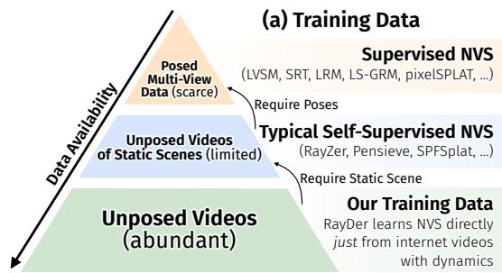

flowchart

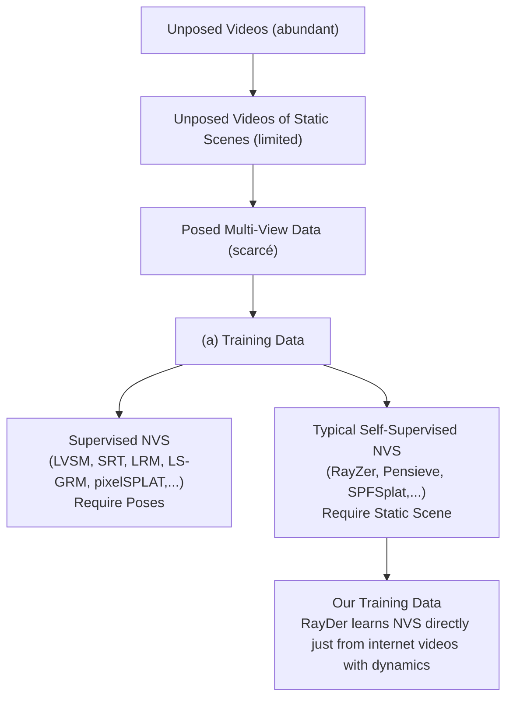
```mermaid
graph TD
    A["Unposed Videos (abundant)"] --> B["Unposed Videos of Static Scenes (limited)"]
    B --> C["Posed Multi-View Data (scarcé)"]
    C --> D["(a) Training Data"]
    D --> E["Supervised NVS\n(LVSM, SRT, LRM, LS-GRM, pixelSPLAT,...)\nRequire Poses"]
    D --> F["Typical Self-Supervised NVS\n(RayZer, Pensieve, SPFSplat,...)\nRequire Static Scene"]
    F --> G["Our Training Data\nRayDer learns NVS directly just from internet videos with dynamics"]
```

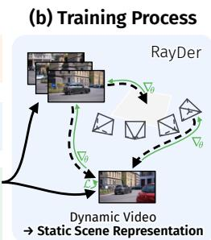

flowchart

```mermaid
graph TD
    A["Image 1"] --> B["RayDer"]
    B --> C["Dynamic Video"]
    C --> D["Static Scene Representation"]
    D --> E["Image 2"]
    E --> F["RayDer"]
    F --> G["Dynamic Video"]
    G --> H["Static Scene Representation"]
    H --> I["Image 3"]
    I --> J["RayDer"]
    J --> K["Dynamic Video"]
    K --> L["Static Scene Representation"]
    L --> M["Image 4"]
    M --> N["RayDer"]
    N --> O["Dynamic Video"]
    O --> P["Static Scene Representation"]
    P --> Q["Image 5"]
    Q --> R["RayDer"]
    R --> S["Dynamic Video"]
    S --> T["Static Scene Representation"]
    T --> U["Image 6"]
    U --> V["RayDer"]
    V --> W["Dynamic Video"]
    W --> X["Static Scene Representation"]
    X --> Y["Image 7"]
    Y --> Z["RayDer"]
    Z --> AA["Dynamic Video"]
    AA --> AB["Static Scene Representation"]
    AB --> AC["Image 8"]
    AC --> AD["RayDer"]
    AD --> AE["Dynamic Video"]
    AE --> AF["Static Scene Representation"]
```

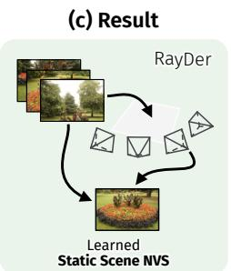

flowchart

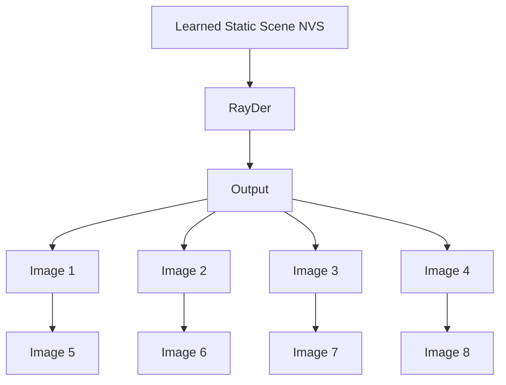
```mermaid
graph TD
    A["Learned Static Scene NVS"] --> B["RayDer"]
    B --> C["Output"]
    C --> D["Image 1"]
    C --> E["Image 2"]
    C --> F["Image 3"]
    C --> G["Image 4"]
    D --> H["Image 5"]
    E --> I["Image 6"]
    F --> J["Image 7"]
    G --> K["Image 8"]
```

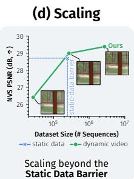

line

| Dataset Size (# Sequences) | static data | dynamic video |
| -------------------------- | ----------- | ------------- |
| 10^3                       | 26.5        | 27.0          |
| 10^4                       | 28.5        | 29.0          |
| 10^5                       | 28.5        | 29.5          |
| 10^6                       | 28.5        | 29.5          |
| 10^7                       | 28.5        | 29.5          |

Figure 1: Training Static-scene Novel View Synthesis from Abundant Video. Existing approaches rely on scarce data sources: supervised NVS requires posed multi-view images, while prior self-supervised methods require unposed videos/image collections of static scenes. Our method instead trains from generic unposed videos that may contain dynamic objects, enabling learning from the dominant form of visual data. This removes the static-scene data bottleneck and unlocks improved scaling with dataset size.

# 1 Introduction

Novel view synthesis (NVS) should, in principle, be a highly scalable learning problem: given a set of posed views of a (static) scene, learn to predict other views. However, posed multi-view data is extremely scarce. Self-supervised NVS removes this pose requirement by learning camera geometry jointly with view synthesis, with recent methods even rivaling pose-supervised ones under real-world conditions [28]. Here, view synthesis is itself the target task, not a pretext task for learning transferable features: camera-pose labels are noisy and expensive to obtain on real video at scale, so removing them is precisely what makes abundant, unlabeled video usable for training the synthesis model itself. Despite this, and large amounts of video being available on the internet [cf. 1], these methods rely on restrictive assumptions – most notably, static scenes from curated datasets – that prevent reliable training at scale. We argue that the main obstacle to scalable self-supervised NVS is not data availability, but rather how current systems are designed to use that data.

Most existing approaches to self-supervised NVS [24, 25, 28, 46, 68, 73] are built as multi-network pipelines, with separate components for camera estimation, scene representation, and rendering. While effective at small scales, such designs make scaling difficult in practice: capacity has to be allocated across multiple interacting networks whose behavior is hard to predict and prohibitively expensive to sweep as models grow. As a result, even when more data or compute is available, scaling remains brittle and inconsistent.

A related challenge is robustness to the videos that are available at scale: unconstrained videos often contain dynamic scene content, which exposes instabilities in existing methods and prevents direct training on such scalable data sources. Importantly, our goal is not dynamic-scene (4D) NVS, but static-scene NVS learned from dynamic video: dynamic content is never reconstructed, only absorbed as a nuisance factor during training. Stable learning under these conditions is the prerequisite for accessing the data regime where scaling can be meaningfully studied.

We introduce RayDer, a unified, feed-forward transformer that enables scalable self-supervised novel view synthesis. Building on the RayZer [28] lineage, we develop a method that unifies camera estimation, scene reconstruction, and rendering in a single backbone, to enable scaling of self-supervised NVS. This simplification is not merely architectural: at fixed parameter counts, unification improves both pose estimation and novel view synthesis quality significantly, and enables straightforward, predictable scaling.

To ensure stable training on general video, RayDer uses a minimal explicit dynamic state variable that absorbs timevarying scene content during training. This variable is treated as a nuisance factor rather than a semantic representation and is not used at inference time – its role is solely to prevent scene dynamics information from corrupting camera pose representations, enabling stable training on unconstrained videos without changing the static-scene NVS task.

Across three orders of magnitude of training data and four model sizes, RayDer exhibits clean scaling in both data and compute simultaneously. Over the explored regimes, compute-optimal performance is well described by a single simple power-law fit. The insight here is not the unsurprising observation that “more data helps”. Rather, it is that self-supervised NVS from unconstrained video becomes a well-behaved scaling problem once two obstacles are removed: the brittle optimization of multi-network pipelines, and the corruption of camera representations by dynamic content. Once training is unified and dynamics are treated as a nuisance factor, self-supervised NVS scales like a standard single-model learning problem – cleanly and predictably in data, model size, and compute. We further show that aggregating existing static-scene datasets does not reproduce our scaled model’s performance: the gains arise from both increased data availability and a system design that allows scaling to manifest.

Our main contributions are as follows:

• A unified single-network architecture for self-supervised NVS, replacing multi-network pipelines and enabling predictable scaling in model size and compute.   
• A training formulation that remains stable on unconstrained video of dynamic scenes, treating scene dynamics as a nuisance factor to enable training on large-scale data.   
• An empirical analysis of scaling behavior across data, model size, and compute, including compute-optimal scaling trends.

# 2 Related Work

Feed-Forward Novel View Synthesis. Per-scene optimization via NeRFs [45] or 3D Gaussian Splatting [33] produces high-quality views but requires dense pose captures and per-scene fitting at test time. Feed-forward models amortize this cost by predicting radiance fields [22], Gaussian primitives [4, 6, 7, 82, 86], or latent renderings [11, 29, 41, 47, 53–55, 55, 77, 78, 80, 84, 91] from posed images, but remain dependent on external pose pipelines [58, 70] at training and often at test time. Some methods reduce this dependency by leveraging flow, correspondence, or depth cues [5, 14, 21, 62], but retain partial geometric supervision. Generative approaches for camera-controlled synthesis [11, 41, 77, 78, 80, 84, 87, 91] often adapt pretrained (video) diffusion models for camera-controllable synthesis [41, 84, 91] and can hallucinate content beyond observed regions, but still require posed data for NVS training and take cameras as input rather than learning them. RayDer removes pose supervision entirely and learns camera representations jointly with view synthesis from raw video.

Self-supervised and Pose-Free NVS. Foundational work toward removing pose dependence in NVS includes Up-SRT [56], which encodes unposed images into a latent scene representation, decoded using query rays that specify a relative target pose, and the Video Autoencoder [36], which learns to disentangle 3D structure and camera pose from video without pose supervision. RUST [57] removes train-time pose dependency by learning a latent pose code, but requires partial target views, limiting transferability [46]; DyST [59] handles dynamics but needs multi-view, multi-dynamics data that is difficult to obtain at scale. A second line learns explicit camera representations from monocular video. RayZer [28] trains three separate ViTs end-ot-end on unposed static-scene video with only a photometric loss; Pensieve [73] adds Gaussian splatting and depth losses; Less3Depend [68] extends this to sparse images; E-RayZer [89] repurposes the same formulation for self-supervised 3D pretraining. These methods yield strong results, but are restricted to curated static-scene data whose combined scale [40, 42, 52, 92] is orders of magnitude smaller than available web video (Sec. 3.2), and employ multi-network pipelines that complicate scaling [16]. XFactor [46] further shows that many such systems learn pose shortcuts that fail to transfer across scenes. Pose-free Gaussian splatting methods [24, 25, 30, 38, 83] address a complementary setting – sparse unposed images –, but several bootstrap from geometric backbones [37, 74] pretrained with 3D supervision. RayDer addresses all three recurring limitations: static-data ceilings, multi-network complexity, and reliance on pretrained geometric priors.

Large 3D Vision Models. A growing line of “large 3D vision models” learns general 3D understanding by unifying multiple geometry tasks in a single transformer backbone, trading hand-engineered pipelines for scale and data breadth. Systems like VGGT [70] build upon the success of VGG-SfM [69] but remove most inductive biases, making everything into a single transformer backbone trained for multiple tasks simultaneously. They achieve (near-)state-of-the-art results across many tasks by just training on multiple supervised tasks across a large number of datasets. This has been further improved by works such as MapAnything [32], which further extended the set of tasks, π3 [75], which removed the dependency on a specific canonical view, and others [9, 12, 13, 60]. Approaches like CUT3R [72] pursue similar problems from different perspectives, enabling incremental updates and improved efficiency. RayDer takes inspiration from this direction: just as replacing the individual components of VGG-SfM [69] with a single transformer in VGGT [70] led to improved scalability and thus improved performance, we aim to make self-supervised NVS scalable using, among other aspects, unification into a single transformer backbone.

# 3 Scaling Self-Supervised Novel View Synthesis

Our goal is to make self-supervised novel view synthesis (NVS) scalable in data, model size, and compute, without introducing task-specific supervision or brittle system design. Starting from a modern feed-forward baseline (§3.1), we identify three bottlenecks that prevent scaling:

§3.2 Data: existing methods assume static scenes for training, severely limiting training data.   
§3.3 System: multi-network pipelines complicate scaling and optimization.   
§3.4 Quality: pose shortcuts and coarse patches limit reconstruction quality.

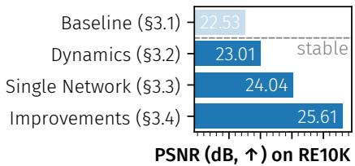

bar

| Method | PSNR (dB, ↑) on RE10K |
| :--- | :--- |
| Baseline ($3.1) | 22.53 |
| Dynamics ($3.2) | 23.01 |
| Single Network ($3.3) | 24.04 |
| Improvements ($3.4) | 25.61 |

Figure 2: NVS performance across sections, training on general video (here, SA-B).

We address these with a sequence of targeted modifications, each validated by controlled ablations (see Tab. 1).

# 3.1 Preliminaries and Baseline

We start our exploration with RayZer [28], a feed-forward NVS method trained in a self-supervised manner on unposed, uncalibrated videos of static scenes with camera motion. Extending upon LVSM [29], RayZer consists of three distinct ViT [10] subnetworks (Fig. 3): a camera estimator $\mathcal { E } _ { \mathrm { c a m } } : \{ \mathbf { I } _ { i } \} \mapsto \{ \mathbf { p } _ { i } \}$ maps views {Ii} to poses $\{ \mathbf { p } _ { i } \} \in S E ( 3 )$ (and camera intrinsics). Then, the scene reconstructor $\mathcal { E } _ { \mathrm { s c e n e } } : \{ ( \mathbf { I } _ { i } , \mathbf { p } _ { i } ) \} \ \mapsto \ \mathbf { z }$ predicts a latent scene representation z from input views ${ \cal { Z } } _ { \mathrm { \small { i n p u t } } } \ = \ \{ ( { \bf I } _ { i } , { \bf p } _ { i } ) \}$ }. Finally, a rendering decoder ${ \mathcal { D } } _ { \mathrm { r e n d e r } } : \mathbf { z } , \mathbf { p } _ { \mathrm { t a r g e t } } \mapsto { \hat { \mathbf { I } } } _ { \mathrm { t a r g e t } }$ predicts target views. All three networks are trained jointly end-to-end to optimize image-space reconstruction on target views $\mathcal { T } _ { \mathrm { t a r g e t } }$ held out for the Scene Reconstructor, using poses jointly predicted for all views. Poses are passed as Plücker maps [50], where pixels encode ray origin and direction.

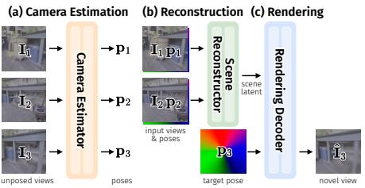

flowchart

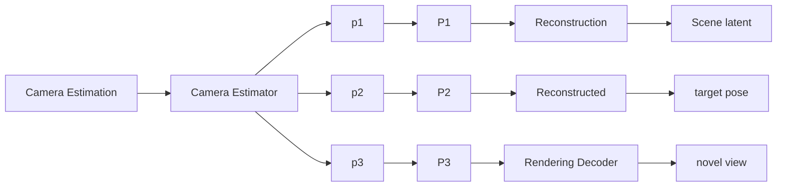
```mermaid
graph LR
    A["Camera Estimation"] --> B["Camera Estimator"]
    B --> C["p1"]
    B --> D["p2"]
    B --> E["p3"]
    C --> F["P1"]
    D --> G["P2"]
    E --> H["P3"]
    F --> I["Reconstruction"]
    G --> J["Reconstructed"]
    H --> K["Rendering Decoder"]
    I --> L["Scene latent"]
    J --> M["target pose"]
    K --> N["novel view"]
```

Figure 3: Preliminaries: RayZer [28]. RayZer uses three models responsible for different tasks: a) Camera Estimation, b) Reconstruction, c) Rendering.

Table 1: Ablation Summary. We progressively address instability (§3.2), architectural scalability (§3.3), and synthesis quality (§3.4). NVS is zero-shot on RE10K [92], camera estimation via transferability [46] on DL3DV-10k [40]. Full table in Tab. A.1. 

<table><tr><td rowspan="3">Configuration</td><td rowspan="3">Stable Training</td><td colspan="4">Trained on SA-V [51]</td><td colspan="4">Trained on SV-HQ [71]</td></tr><tr><td colspan="2">NVS PSNR↑</td><td colspan="2">Camera Est.</td><td colspan="2">NVS PSNR↑</td><td colspan="2">Camera Est.</td></tr><tr><td>W/O STATE</td><td>W/ STATE</td><td>R@10°↑</td><td>T@0.1↑</td><td>W/O STATE</td><td>W/ STATE</td><td>R@10°↑</td><td>T@0.1↑</td></tr><tr><td colspan="10">§3.2: Stable Training on Dynamic Video</td></tr><tr><td>A RayZer-like [28] Baseline</td><td>~</td><td>22.53*</td><td>-</td><td>59.8*</td><td>6.5*</td><td>22.69*</td><td>-</td><td>66.0*</td><td>7.7*</td></tr><tr><td>B + Dynamic State Prediction</td><td>√</td><td>13.42†</td><td>24.01</td><td>56.1</td><td>7.0</td><td>13.48†</td><td>24.67</td><td>54.4</td><td>6.0</td></tr><tr><td>C + State Dropout</td><td>√</td><td>23.01</td><td>23.76</td><td>62.4</td><td>8.1</td><td>23.02</td><td>24.10</td><td>69.2</td><td>8.2</td></tr><tr><td colspan="10">§3.3: Scalability through Consolidation</td></tr><tr><td>D + Single-network Consolidation</td><td>√</td><td>24.93</td><td>25.33</td><td>68.8</td><td>16.3</td><td>26.98</td><td>27.49</td><td>74.1</td><td>19.7</td></tr><tr><td>E + Parallel-target Attention</td><td>√</td><td>24.04</td><td>25.12</td><td>70.1</td><td>15.6</td><td>25.91</td><td>26.21</td><td>70.9</td><td>18.2</td></tr><tr><td colspan="10">§3.4: Improving Synthesis Quality</td></tr><tr><td>F + Autoregression over Views (ordered)</td><td>√</td><td>23.08‡</td><td>24.49‡</td><td>73.6</td><td>24.9</td><td>23.53‡</td><td>25.78‡</td><td>76.5</td><td>25.2</td></tr><tr><td>G + Random-order Autoregression</td><td>√</td><td>25.45</td><td>26.28</td><td>84.4</td><td>37.2</td><td>27.27</td><td>29.57</td><td>86.0</td><td>39.1</td></tr><tr><td>H + Local High-resolution Layers</td><td>√</td><td>25.61</td><td>26.87</td><td>85.0</td><td>40.2</td><td>27.78</td><td>30.23</td><td>88.7</td><td>42.4</td></tr></table>

∗Results for A are from selected runs that did not diverge. †Dynamic state modeling without dropout creates inference-timedependency on state. ‡Ordered AR does not generalize to standard NVS test settings.

Baseline (Config A). We use a scale-reduced RayZer-like model (∼140M params) for our baseline (CONFIG A) and train on two complementary datasets: i) Segment Anything-Video [SA-V, 51], a diverse open-world video dataset with significant scene dynamics, and ii) SpatialVid-HQ [SV-HQ, 71], a curated, partially dynamic-scene dataset. Evaluation is zero-shot – models are evaluated on unseen benchmarks. We measure NVS quality on RealEstate-10K [RE10K, 92] in the standard pixelSplat [4] setting, and camera estimation via transferability [46] on DL3DV-10k [40]. The main results are reported in Tab. 1; significantly extended results with more NVS metrics and full camera estimation results covering both transferability [46] and camera token probe results [28] are in Tab. A.1.

# 3.2 Robust Learning from Dynamic Videos

Scaling self-supervised NVS faces an immediate data bottleneck: truly staticscene videos, as required by current methods [28, 46, 68, 73], are a tiny subset of what is available at scale. However, training RayZer directly on dynamic video leads to gradient spikes and instabilities: the original RayZer [28] diverges consistently when trained on SpatialVid [71] or SA-V [51] (cf. Fig. $4 ;$ see Sec. C.3 for a detailed analysis). We frame this as a representation problem rather than an optimization problem. In dynamic video, a target view $j$ is explained from an input view i by two factors: the camera pose change $\mathbf { p } _ { i } $ $\mathbf { p } _ { j }$ and the dynamic state change ${ \bf s } _ { i }  { \bf s } _ { j }$ . Exposing only camera pose as conditioning forces the model to “hide” dynamic-state information inside the camera representation, causing representation drift and instabilities. Importantly,

even when training on dynamic video, our target task remains static-scene NVS: the dynamic state is what lets us learn this static-scene task from dynamic data without modeling scene motion at inference, making training scalable rather than attempting dynamic-scene reconstruction.

Dynamic State Prediction and Dropout (Config B, C). We address this by predicting a per-view dynamic state embedding $\mathbf { s } _ { i }$ alongside the camera pose:

$$
\mathcal {E} _ {\text { cam }, \text { state }}: \left\{\mathbf {I} _ {i} \right\} \mapsto \left\{\left(\mathbf {p} _ {i}, \mathbf {s} _ {i}\right) \right\}, \quad \mathcal {D} _ {\text { render }, \text { state }}: \mathbf {z}, \left(\mathbf {p} _ {\text { target }}, \mathbf {s} _ {\text { target }}\right) \mapsto \hat {\mathbf {I}} _ {\text { target }}, \tag {1}
$$

where $\mathbf { s } _ { i } \in \mathbb { R } ^ { d _ { \mathrm { s t a t e } } }$ lets the model capture time-varying content without needing to interfere with the pose $\mathbf { p } _ { i }$ , and is provided to the renderer as an additional token. This intentionally minimal change – no motion fields, temporal losses, or disentanglement – eliminates training instabilities entirely: across all our experiments, not a single run that includes this change (CONFIG B) has diverged. Since the target state $\mathbf { s } _ { \mathrm { t a r g e t } }$ is unknown at inference, we randomly replace it with a zero vector during training [19], forcing the model to synthesize plausible views both with and without state conditioning (CONFIG C). This retains the stability gains, while resolving the inference dependency on ground truth state and additionally improving camera estimation (Tab. 1, A→C), consistent with the dynamic state reducing pressure on the pose representation to encode dynamic information. We stress that the state is deliberately not a disentangled 4D representation: it is a nuisance variable whose only role is to keep time-varying content out of the camera tokens. We probe what it captures in Sec. C.1, where transplanting states across frames shows that it primarily absorbs moving/timevarying scene content while the camera tokens carry pose; at inference on scenes with dynamic content, this manifests as the static scene being rendered from the correct novel pose while moving regions degrade to a temporal average (Sec. C.1 and limitations in Sec. 4).

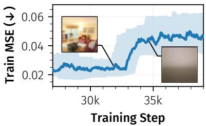

line

| Training Step | Train MSE |
| ------------- | --------- |
| 30k           | 0.02      |
| 35k           | 0.04      |

Figure $\pmb { 4 } ;$ Training RayZer directly on dynamic videos leads to instabilities and stalled training.

# 3.3 Scalability through Network Consolidation

With stable training on general video, the next bottleneck is architectural: scaling multi-network systems – which current self-supervised NVS methods [24, 25, 28, 46, 68, 73] rely on – is highly complex [16], as capacity must be distributed across interacting components whose scaling behavior is hard to predict.

Single-Network Consolidation (Config D). To reduce scaling decisions to a single network, which can allocate capacity between tasks as needed, and improve performance by sharing features, we unify all three components – camera/dynamic state estimation, scene reconstruction, and rendering (see Fig. 5) – in a single model M. Besides scaling simplicity, this is motivated by the idea that pose estimation and view synthesis are not separate problems [70]: they can share features, and training signals can become cleaner when the clear separation between networks is removed. Our unified model M operates in two modes (where ✁· denotes abscence of an input/output):

(a) Multi-Network   
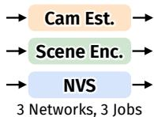

(b) Single Network   
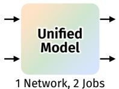  
Figure 5: Consolidation. We combine RayZer’s three networks (a) into one (b).

$$
\mathcal {M}: \left\{ \begin{array}{l l} \{\left(\mathbf {I} _ {i}, \mathbf {p} ^ {\prime}, \mathbf {s} ^ {\prime}\right) \} & \mapsto \{\left(\mathbf {p} _ {i}, \mathbf {s} _ {i}\right) \} \\ \underbrace {\left\{\left(\mathbf {I} _ {i} , \mathbf {p} _ {i} , \mathbf {s} ^ {\prime}\right) \right\}} _ {\text { input   views }} \cup \underbrace {\left(\mathbf {I} ^ {\prime} , \mathbf {p} _ {j} , \mathrm{s} _ {j}\right)} _ {\text { target   pose }} & \mapsto \underbrace {\hat {\mathbf {I}} _ {j}} _ {\text { target   view }} \end{array} \quad \begin{array}{l l} \triangleright \text { Camera   Estimation } \\ \triangleright \text { Novel   View   Synthesis } \end{array} \right. \tag {2}
$$

All heavy computation lies in a single shared backbone, conditioned on token role via adaptive norms [26, 47]. In addition to significantly simplifying scaling decisions, empirically, this unification at fixed parameter count leads to significant gains in both NVS and camera estimation performance (Tab. 1, C→D).

Parallel-target Attention (Config E). Naively treating the consolidated model as decoder-only [29] reprocesses input views for each target view, which is prohibitively expensive. We factorize attention such that input tokens only attend to each other, while target tokens attend to themselves and input tokens (see Fig. 6). This enables KV caching during inference and parallel target prediction during training, reducing per-target compute by ∼ 7× at a minor quality trade-off (Tab. 1, D→E).

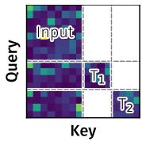  
Figure 6: Our attention mask.

# 3.4 Improving Synthesis Quality

With stable training and a single scalable backbone, the remaining issues are quality-related: pose representations can learn shortcuts in video, and large patch sizes sacrifice local details.

Autoregressive Pose Learning (Config F, G). When training on video frames, many input views make pose prediction easy to solve by using frame-order shortcuts rather than actual geometry (Fig. 7a). We find that in practice, this results in predicted poses primarily encoding time rather than the true viewpoint. In contrast, single- or few-view NVS requires the full pose to be encoded geometrically (Fig. 7b). We implement that by training autoregressively over views: given a subset of views, predict another, then condition on the expanded set. This forces the model to learn to predict poses that are useful for NVS in both sparse and dense settings. Extending upon our factorized attention pattern (Sec. 3.3), we make attention causal over input views and train next-view NVS for $| \mathcal { T } _ { \mathrm { i n p u t } } | = 1 , 2 , . . . , | \mathcal { T } _ { \mathrm { t o t a l } } | - 1$ input views. Ordered autoregression (CONFIG F) consequently improves camera estimation quality significantly (Tab. 1, E→F), but creates a train-test gap, since standard NVS settings do not condition on and generate frames in temporal order. Randomizing the autoregression order instead (CONFIG G) closes this gap and further improves both camera estimation and NVS quality (Tab. 1, E→G).

(a) Many Input Views   
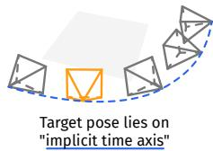

text_image

Target pose lies on
"implicit time axis"

(b) Single Input View   
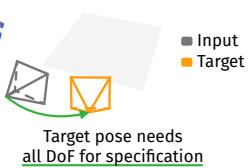

text_image

Input
Target
Target pose needs
all DoF for specification

Figure 7: Many input views (a) allow encoding camera poses via an implicit “time” axis; sparse views (b) require true relative camera poses.

(a) Camera Estimation same model (b) Novel View Synthesis   
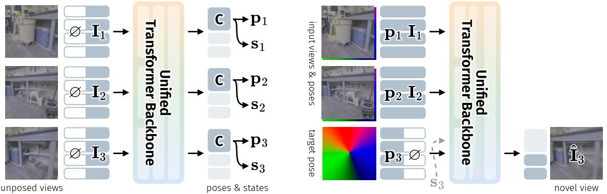

flowchart

```mermaid
graph LR
    A["Input Images: I1-I2-I3"] --> B["Unified Transformer Backbone"]
    C["Input Images: I1-I2-I3"] --> B
    D["Input Images: I1-I2-I3"] --> B
    E["Input Images: I1-I2-I3"] --> B
    F["Input Images: I1-I2-I3"] --> B
    G["Input Images: I1-I2-I3"] --> B
    H["Input Images: I1-I2-I3"] --> B
    I["Input Images: I1-I2-I3"] --> B
    J["Input Images: I1-I2-I3"] --> B
    K["Input Images: I1-I2-I3"] --> B
    L["Input Images: I1-I2-I3"] --> B
    M["Input Images: I1-I2-I3"] --> B
    N["Input Images: I1-I2-I3"] --> B
    O["Input Images: I1-I2-I3"] --> B
    P["Input Images: I1-I2-I3"] --> B
    Q["Input Images: I1-I2-I3"] --> B
    R["Input Images: I1-I2-I3"] --> B
    S["Input Images: I1-I2-I3"] --> B
    T["Input Images: I1-I2-I3"] --> B
    U["Input Images: I1-I2-I3"] --> B
    V["Input Images: I1-I2-I3"] --> B
    W["Input Images: I1-I2-I3"] --> B
    X["Input Images: I1-I2-I3"] --> B
    Y["Input Images: I1-I2-I3"] --> B
    Z["Input Images: I1-I2-I3"] --> B
    AA["Input Images: I1-I2-I3"] --> B
    AB["Input Images: I1-I2-I3"] --> B
    AC["Input Images: I1-I2-I3"] --> B
    AD["Input Images: I1-I2-I3"] --> B
    AE["Input Images: I1-I2-I3"] --> B
    AF["Input Images: I1-I2-I3"] --> B
    AG["Input Images: I1-I2-I3"] --> B
    AH["Input Images: I1-I2-I3"] --> B
    AI["Input Images: I1-I2-I3"] --> B
    AJ["Input Images: I1-I2-I3"] --> B
    AK["Input Images: I1-I2-I3"] --> B
    AL["Input Images: I1-I2-I3"] --> B
    AM["Input Images: I1-I2-I3"] --> B
    AN["Input Images: I1-I2-I3"] --> B
    AO["Input Images: I1-I2-I3"] --> B
    AP["Input Images: I1-I2-I3"] --> B
    AQ["Input Images: I1-I2-I3"] --> B
    AR["Input Images: I1-I2-I3"] --> B
    AS["Input Images: I1-I2-I3"] --> B
    AT["Input Images: I1-I2-I3"] --> B
    AU["Input Images: I1-I2-I3"] --> B
    AV["Input Images: I1-I2-I3"] --> B
    AW["Input Images: I1-I2-I3"] --> B
    AX["Input Images: I1-I2-I3"] --> B
    AY["Unposed Views"]
    AZ["Unposed Views & poses"]
    BA["target Pose"]
    BB["p1 - p3 - s1 - s2 - s3"]
    BC["p1 - p3 - s1 - s2 - s2 - s3"]
    BD["p1 - p3 - s1 - s2 - s2 - s3"]
    BE["p1 - p3 - s1 - s2 - s2 - s3"]
    BF["p1 - p3 - s1 - s2 - s2 - s3"]
    BG["p1 - p3 - s1 - s2 - s2 - s3"]
    BH["p1 - p3 - s1 - s2 - s2 - s3"]
    BI["p1 - p3 - s1 - s2 - s2 - s3"]
    BJ["p1 - p3 - s1 - s2 - s2 - s3"]
    BK["p1 - p3 - s1 - s2 - s2 - s3"]
    BL["p1 - p3 - s1 - s2 - s2 - s3"]
    BM["p1 - p3 - s1 - s2 - s2 - s3"]
    BN["p1 - p3 - s1 - s2 - s2 - s3"]
    BO["p1 - p3 - s1 - s2 - s2 - s3"]
    BP["p1 - p3 - s1 - s2 - s2 - s3"]
    BQ["p1 - p3 - s1 - s2 - s2 - s3"]
    BR["p1 - p3 - s1 - s2 - s2 - s3"]
    BS["p1 - p3 - s1 - s2 - s2 - s3"]
    BT["p1 - p3 - s1 - s2 - s2 - s3"]
    BU["p1 - p3 - s1 - s2 - s2 - s3"]
    BV["p1 - p3 - s1 - s2 - s2 - s3"]
    BW["p1 - p3 - s1 - s2 - s2 - s3"]
    BX["p1 - p3 - s1 - s2 - s2 - s3"]
    BY["p1 - p3 - s1 - s2 - s2 - s3"]
    CA["p1 - p3 - s1 - s2 - s2 - s3"]
    CB["p1 - p3 - s1 - s2 - s2 - s3"]
    CC["p1 - p3 - s1 - s2 - s2 - s3"]
    DD["p1 - p3 - s1 - s2 - s2 - s3"]
    EE["p1 - p3 - s1 - s2 - s2 - s3"]
```

Figure 8: Final Architecture Overview. RayDer unifies camera estimation (a) and novel view synthesis (b) in a single transformer backbone. Lightweight local intra-frame encoder and decoder layers handle high-resolution processing.

Local High-resolution Layers (Config H). Large patch sizes hurt synthesis quality [29, 48, 66], but reducing the patch size $p$ scales cost as $\mathcal { O } ( p ^ { 4 } )$ , making it prohibitively expensive. Following Crowson et al. [8], we add shallow high-resolution local layers (using neighborhood attention [17]) around the main backbone. These layers operate intra-frame and provide extra high-frequency capacity at minimal cost (Tab. 1, G→H).

# 3.5 Final Architecture

CONFIG H is the final RayDer architecture, which we train at four different model scales (Tab. 2): a single transformer that i) predicts per-frame pose and state tokens $\left\{ \left( \mathbf { p } _ { i } , \mathbf { s } _ { i } \right) \right\}$ from a set of images $\{ \mathbf { I } _ { i } \}$ , ii) synthesizes target views via randomorder autoregression with parallel-target attention, and iii) trains stably on general video. RayDer-S has the same scale (depth, width) as our ablation models (CONFIG A-H), but is trained longer on more data; RayDer-B is scale-matched vs. RayZer [28]. An architecture overview is shown in Fig. 8.

Table 2: Model Scales. We jointly scale depth, width, and head count. 

<table><tr><td>Model</td><td>Layers N</td><td>Hidden Size d</td><td>Heads</td><td>Parameters</td></tr><tr><td>RayDer-XS</td><td>12</td><td>384</td><td>6</td><td>59M</td></tr><tr><td>RayDer-S</td><td>18</td><td>512</td><td>8</td><td>145M</td></tr><tr><td>RayDer-B</td><td>24</td><td>768</td><td>12</td><td>422M</td></tr><tr><td>RayDer-L</td><td>24</td><td>1024</td><td>16</td><td>743M</td></tr></table>

# 4 Experiments

Our experiments address four major questions:

§4.1 Does RayDer exhibit predictable scaling behavior in data, model size, and compute?   
§4.2 Do existing static-scene datasets support the same scaling regime, or is learning from general video essential?   
§4.3 Does the learned camera geometry encode genuine 3D structure, and does it scale alongside synthesis quality?   
§4.4,4.5 How does open-set self-supervised NVS compare to prior work with supervision & large-scale pretraining?

Implementation Details. We train all models on SpatialVid [71] (∼2.7M videos), extracting 8 views per clip with ∼0.5s spacing (randomly chosen per epoch), using AdamW [43] at batch size 256 and a resolution of $2 5 6 ^ { 2 }$ . We measure PSNR, LPIPS [88], and SSIM [76] on synthesized novel views for our evaluations, generally in zero-shot settings on unseen datasets and using $2 5 6 ^ { 2 }$ resolution unless noted otherwise. For further details, see Secs. A and B.

Train-Test Leakage. To ensure that our results, especially gains with increased train data scale, stem from improved generalization rather than leakage, we also check for leakage between our train and test sets, in addition to performing all our main evaluations in zero-shot settings. Specifically, we check each test view from every dataset we evaluate on against the videos used for training our main models & models used for scaling evaluations (i.e., our copy of SpatialVid [71]), in two stages: first, we compute pHash and dHash perceptual hashes [3, 34] for all frames and flagged any train-test pair with Hamming distance < 8 bits as a candidate – yielding 16,381 candidate pairs. Second, to discard hash collisions on visually unrelated content, we keep only pairs with DINOv3-L [61] CLS cosine similarity ≥ 0.2, narrowing the set to 191 candidates. Manual inspection of all 191 remaining pairs (candidate train view vs. full test scene) revealed zero matches – therefore, our evaluations should be free of the influence of train-test leakage and instead represent genuine generalization.

(a) Sparse-view NVS   
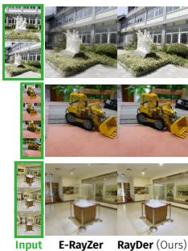

natural_image

Composite image showing three scenes: a modern building with greenery, a yellow bulldozer in a room, and an indoor display with E-RayZer and RayDer (Ours) views.

(b) Extreme View Interpolation   
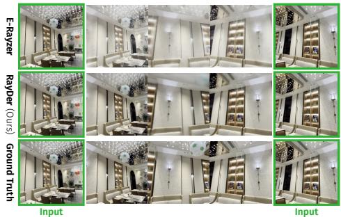

natural_image

Interior view of a modern lounge or lounge with labeled sections (E-Rayzer, RayDER, Ground Truth) and multiple furniture pieces on walls (no readable text or symbols)

(c) Open-Set NVS (from Tab. 5 benchmarks)   
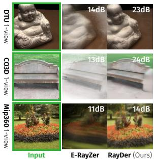

text_image

DTU-1-view
CO3-1-view
Mip360-1-view
Input
14dB
23dB
13dB
24dB
11dB
14dB
E-RayZer
RayDer (Ours)

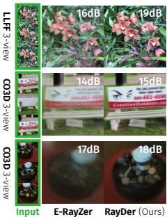

text_image

LLF 3-view
16dB
19dB
CO3D 3-view
14dB
15dB
CreativityConcentration
CreativityConcentration
CO3D 3-view
17dB
18dB
Input
E-RayZer
RayDer (Ours)

Figure 9: Zero-shot qualitative samples of RayDer compared with E-RayZer [89] in (a) typical (non-dense view) NVS settings, (b) an extreme setting with ∼zero context view overlap, and (c) settings evaluated in Tab. 5. Our RayDer model, trained on large-scale non-static-constrained video data, outperforms E-RayZer – a prior model trained on a multi static dataset mixture – by a wide margin.

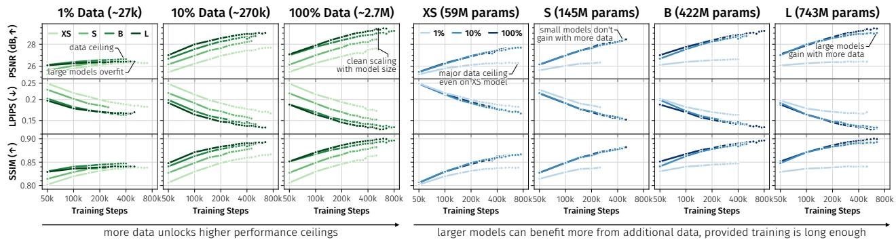  
Figure 10: Scaling Across Data and Model Size. We evaluate models trained on SpatialVid (2.7M total samples) at different model scales (visualized as shades of green) and dataset fractions (shades of blue), on RE-10k [92]. Left: Increasing data scale consistently improves performance, as long as model scale is not a limit. At small data scales, large models tend to overfit, resulting in worse performance than smaller ones. Right: Increasing model scale also consistently improves performance. However, insufficient dataset scale imposes an upper ceiling on achievable test performance.

# 4.1 Scaling Behavior across Data, Model Size, and Compute

Prior self-supervised NVS methods are fundamentally data-limited: trained on small, curated static-scene datasets that saturate quickly, they cannot meaningfully scale model capacity. By enabling stable training directly on dynamic video, RayDer allows scaling across multiple orders of magnitude.

Setup. We train RayDer at four scales (XS/S/B/L; Tab. 2) on three dataset fractions of SpatialVid: 1% (∼27k videos), 10% (∼270k, matching the combined size of common static-scene NVS datasets [40, 42, 52, 92]), and 100% (∼2.7M).

Figure 10 shows that both data and model scaling consistently lead to improvements, provided neither is a bottleneck. Increasing data consistently improves performance when model capacity and training are sufficient, while small models saturate early. Large models overfit on small data, even underperforming against smaller models. These results highlight scaling neither compute nor data alone is sufficient – scaling requires both. All models at 1% data scale converge to a common ceiling, confirming data as the dominant bottleneck at small scale. Benefits continue beyond 10%, which matches the combined size of common static-scene NVS datasets, highlighting the need for more scalable data sources.

Compute-optimal Scaling. Building on LLM scaling analysis [18, 20, 31], we find that RayDer’s compute-optimal Pareto frontier of NVS performance on unseen test sets across training compute C (in GFLOP) and dataset size D (in

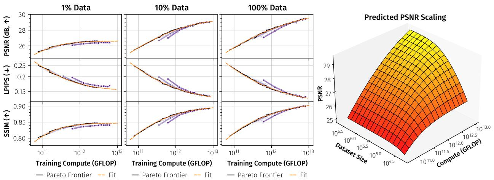

Figure 11: Compute-Optimal Scaling Analysis. RayDer’s compute-optimal performance (i.e., the compute-quality Pareto frontier) on unseen datasets (here, RE10K [92]) across both compute and train dataset size is well-approximated by a single power law.   
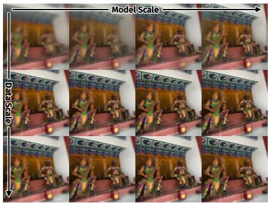

natural_image

Grid of 16 identical images showing a character in a room with a large 'Data Scale' arrow, no text or symbols present.

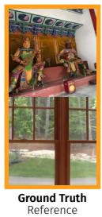

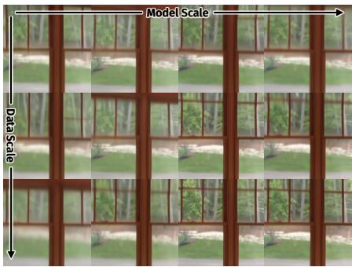

text_image

Model Scale
Data Scale

Figure 12: Qualitative Scaling. RayDer’s qualitative behavior follows the trends seen in quantitative evals (Fig. 10): more data & compute jointly improve NVS quality.

number of videos) can be modeled as [cf. 31, Eq. 1.5]:

$$
\underbrace {L (C , D)} _ {\text { test   metric }} = \underbrace {L _ {\infty}} _ {\text { irreducible   part   [18] }} + \left(\underbrace {A C ^ {- \alpha}} _ {\text { compute   term }} + \underbrace {B D ^ {- \beta}} _ {\text { data   term }}\right) ^ {\gamma}, \tag {3}
$$

with $L \in \{ \mathrm { M S E , L P I P S , 1 - S S I M } \}$ (MSE corresponds to PSNR and is computed on image data scaled $\mathrm { t o } [ - 1 , 1 ] )$ . The compute and data terms each capture the error that can only be removed by scaling that aspect. Fitting this power law to our compute-optimal Pareto frontier of models we trained across model and dataset scale (see Fig. 11), we obtain an accurate $( R ^ { 2 } > 0 . 9 9 )$ description of RayDer’s behavior over both compute and data scale, confirming that its scaling is well-behaved:

$$
\operatorname{MSE} (C, D) \approx 0. 0 0 3 3 + \left(2 0 0 \cdot C ^ {- 0. 4 0} + 2. 6 \cdot D ^ {- 0. 6 0}\right) ^ {2. 8 2} \quad \triangleright R ^ {2} = 0. 9 9 7 \tag {4}
$$

$$
\operatorname{LPIPS} (C, D) \approx 0. 1 1 + \left(7 0 0 0 \cdot C ^ {- 0. 4 3} + 1 4 \cdot D ^ {- 0. 5 8}\right) ^ {1. 8 2} \quad \triangleright R ^ {2} = 0. 9 9 7 \tag {5}
$$

$$
1 - \operatorname{SSIM} (C, D) \approx 0. 0 7 6 + \left(7 0 0 \cdot C ^ {- 0. 3 5} + 1 0 \cdot D ^ {- 0. 4 7}\right) ^ {3. 3 4} \quad \triangleright R ^ {2} = 0. 9 9 7 \tag {6}
$$

All metrics exhibit non-zero irreducible error terms $L _ { \infty } > 0 .$ , reflecting fundamental limits of the setting $( \mathrm { e . g . }$ occluded regions). Both compute and data terms contribute meaningfully, with the latter formalizing an important empirical insight: increasing compute yields diminishing returns unless sufficient training data is available, and scaling training data beyond curated static-scene datasets requires methods that can train directly on general video. Refitting the same power law on additional, harder zero-shot benchmarks (WildRGBD [81], CO3D [52]) remains similarly accurate (Sec. B.2.1), indicating the trend is not an artifact of fitting a single test set.

Table 3: Training Data Comparison. We train models at scale on three different dataset combinations: Static Mix: a combination of multiple public static-scene NVS datasets (RE10K [92], DL3DV-10K [40], uCO3D [42]; ∼247k videos total), General: SpatialVid [71] (∼2.7M videos total), and a combination of the two. During evaluation on unseen datasets, combining even multiple public static-scene datasets underperforms substantially compared to training on general video. Combining both leads to minor additional gains. 

<table><tr><td rowspan="2">Model</td><td rowspan="2">Steps</td><td rowspan="2">Training Data</td><td rowspan="2">Scene Dynamics</td><td colspan="3">RE10K NVS</td></tr><tr><td>PSNR↑</td><td>LPIPS↓</td><td>SSIM↑</td></tr><tr><td rowspan="3">RayDer-L</td><td rowspan="3">500k</td><td>Static Mix only (~250k)</td><td>static</td><td>28.68</td><td>0.158</td><td>0.888</td></tr><tr><td>SpatialVid only (~2.7M)</td><td>including dynamic</td><td>29.38</td><td>0.135</td><td>0.899</td></tr><tr><td>Static Mix + SpatialVid†</td><td>including dynamic</td><td>29.42</td><td>0.136</td><td>0.901</td></tr></table>

†batch composition during training is equally distributed between static mix and SpatialVid.

# 4.2 Static-Scene Data Does Not Enable the Same Scaling Regime

The scaling analysis in Sec. 4.1 establishes that data scale is a dominant factor for continued improvement. But can existing static-scene datasets, which offer domain-aligned training signals for standard NVS benchmarks, supply sufficient data to sustain this scaling regime? If so, the added complexity of training on dynamic video would be unnecessary. To test this, we train two additional RayDer-L models: a static-only model trained on a mixture of multiple large-scale static-scene NVS datasets (RE10K [92], DL3DV-10K [40], uCO3D [42]; ∼247k videos total; denoted as static mix), and a mixed model trained on both SpatialVid [71] (mixed with dynamic content, ∼2.7M videos) plus the static mix, with equal sampling between both during training.

Table 3 shows that the static-only model significantly underperforms despite using static-scene data closely aligned with the (static-scene) test setting. The static mix reflects the combined scale of commonly used static-scene NVS datasets and roughly matches the 10% data fraction in Sec. 4.1, where our scaling analysis already predicts that larger models cannot fully benefit due to limited data. Despite the domain alignment advantage, the scale deficit dominates: training on more (partially dynamic) video empirically outweighs the benefit of a cleaner training distribution. Adding static data to the larger video dataset at the same training horizon yields only marginal gains, suggesting the static datasets are largely subsumed by the larger corpus. These results validate our core thesis: the bottleneck for self-supervised NVS scaling is not the quality of static-scene curation but the quantity of data, which requires moving beyond curated static-scene corpora.

# 4.3 Learned Camera Geometry: Transferability and Scaling

A key concern for self-supervised NVS is whether the learned camera representations encode genuine 3D geometry or merely exploit dataset-specific shortcuts [46]. We study the learned poses from two complementary angles: i) how accurate and transferable they are relative to prior work, and ii) whether their accuracy improves predictably as we scale data, model size, and compute – mirroring the NVS scaling behavior of Sec. 4.1. We read out the predicted poses in two ways: a per-scene probe that regresses ground-truth poses from frozen camera tokens (following RayZer [28]; see Sec. B.2.3), and a cross-scene transfer protocol that applies a trajectory estimated on one scene to render another (following XFactor [46]). Both are evaluated zero-shot on DL3DV-10K [40] and summarized in the tables as rotation/translation accuracies thresholded at $\alpha \in \{ 1 0 ^ { \circ } , 2 0 ^ { \circ } , 3 0 ^ { \circ } \}$ (R@α) and α ∈ {0.1, 0.2, 0.3} (t@α).

Pose Transferability. We first establish that RayDer’s learned poses are genuinely transferable at our final model (Tab. 4), following Mitchel et al. [46]. Despite a simpler setup, RayDer matches the specialized XFactor [46], which introduces explicit transferability supervision and requires multi-stage training for multi-view NVS, and substantially improves over RayZer [28], whose poses were shown to lack transferability [46]. This suggests that our architectural choices – particularly autoregressive pose learning – resolve the transferability limitations of earlier systems without dedicated transferability objectives.

Pose Accuracy Scales with Data, Model Size, and Compute. Beyond matching prior work at our final scale, the quality of the learned geometry scales as orderly as NVS quality (Fig. 13): the continuous rotation and translation errors (the continuous quantities that the thresholded accuracies in Tabs. A.1 and 4 discretize) decrease monotonically and predictably with more data and larger models, with too little data again imposing a ceiling that larger models cannot overcome, exactly as for the NVS metrics in Sec. 4.1.

Table 4: Pose Transferability. Evaluation of TPS metric from XFactor [46] on DL3DV10k [40]. We follow their protocol and measure the accuracy of the transferred trajectory. We find that RayDer, like XFactor, significantly improves pose transferability compared to RayZer, without the need for explicit transferability training. 

<table><tr><td>Model</td><td>R@10°↑</td><td>R@20°↑</td><td>R@30°↑</td><td>T@10°↑</td><td>T@20°↑</td><td>T@30°↑</td></tr><tr><td>RayZer [28]</td><td>0.48</td><td>0.61</td><td>0.88</td><td>0.12</td><td>0.32</td><td>0.44</td></tr><tr><td>XFactor [46]</td><td>0.93</td><td>0.97</td><td>0.99</td><td>0.55</td><td>0.83</td><td>0.90</td></tr><tr><td>RayDer-L (Ours)</td><td>0.92</td><td>0.98</td><td>0.99</td><td>0.44</td><td>0.83</td><td>0.90</td></tr></table>

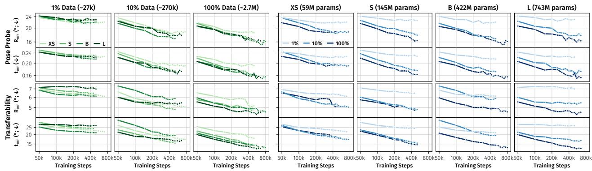  
Figure 13: Learned Camera Geometry Scales with Data, Model Size, and Compute. We track the four continuous camera pose errors – rotation and translation, each read out both via a probe on the camera tokens (RayZer [28] protocol; top rows) and via cross-scene transfer (XFactor [46] protocol; bottom rows) – as a function of training compute, evaluated zero-shot on DL3DV-10K [40]. Left: all errors decrease consistently with training data scale. Right: all errors decrease with model scale, with insufficient data again imposing a strong ceiling. Notably, there is no significant saturation at scale, indicating that further scaling will likely be beneficial.

A natural worry is that scaling merely sharpens (dataset-specific) shortcuts rather than improving genuine geometry [46]. The per-scene probe and cross-scene transfer errors, however, improve simultaneously at every scale (Fig. 13). Were scaling solely improving shortcut behavior, transfer would not track the probe – their tight coupling indicates that scaling improves learning of genuine, transferable 3D geometry.

# 4.4 Open-set Novel View Synthesis

Most prior self-supervised NVS methods [cf., 28, 46, 68] focus on closed-domain evaluation, training and testing on the same datasets. We train a single RayDer model on generic data and evaluate it zero-shot across a wide range of datasets (LLFF [44], DTU [27], CO3D [42], WildRGBD [81], Mip-NeRF 360 [2], and Tanks & Temples [35]), camera baselines, and numbers of input views, extending the extensive evaluation by Zhou et al. [91] in Table 5. This setting better reflects real-world deployments and avoids dataset-specific tuning. We note that, unlike the supervised baselines, RayDer uses its own predicted camera poses at inference, not the dataset’s ground truth annotations, making this a strictly harder setting.

Despite being trained fully self-supervised, from scratch in a single stage, RayDer achieves state-of-the-art or near-state-of-the-art performance across the majority of settings at more than an order of magnitude less training compute. It is competitive with much larger models such as SEVA and Kaleido, which rely on large-scale video diffusion pretraining. RayDer achievse this while requiring neither pose supervision at train or test time nor pretrained foundation model weights – a substantially more constrained and scalable setup. This is unlike E-RayZer [90], which requires static-scene videos for training and, while combining a large number of static-scene datasets, is still significantly limited in the amount of training data it can use, limiting scaling (see also Sec. 4.2).

On lab datasests such as DTU, just like E-RayZer [90], RayDer underperforms supervised methods. We find this is primarily due to unreliable pose estimation in regimes (perfectly clean backgrounds with no structure) not present in typical general video training data: RayDer is trained exclusively on unconstrained real-world video. We view this as an expected limitation of the training data distribution rather than a failure of the approach.

Qualitative Results. Figure 9 compares RayDer against E-RayZer [89] across three challenging regimes – sparse-view NVS, extreme wide-baseline interpolation, and some settings from Tab. 5 – where RayDer produces markedly sharper and more consistent novel views. Further samples are in Sec. E.

Table 5: Open-set Novel View Synthesis (PSNR↑). We extend the evaluation by Zhou et al. [91] and compute PSNR across a large variety of settings (columns). Despite being trained fully self-supervised and without large-scale video diffusion pretraining, RayDer is (near-)state-of-the-art across the majority of datasets and evaluation settings. 

<table><tr><td rowspan="3">Model</td><td rowspan="3">Params</td><td colspan="2">Dataset→ LLFF</td><td colspan="2">DTU</td><td colspan="2">CO3D</td><td colspan="2">WRGBD</td><td>M360</td><td>T&amp;T</td><td>CO3D</td><td colspan="2">WRGBD</td><td colspan="2">M360</td><td colspan="2">T&amp;T</td></tr><tr><td rowspan="2">Split→ Split- sup.</td><td rowspan="2">R</td><td rowspan="2">1</td><td rowspan="2">3</td><td>V</td><td>R</td><td> $S_e$ </td><td> $S_h$ </td><td>R</td><td>V</td><td>R</td><td colspan="2"> $S_h$ </td><td colspan="2">R</td><td colspan="2">S</td></tr><tr><td>1</td><td>3</td><td>3</td><td>6</td><td>6</td><td>1</td><td>1</td><td>1</td><td>3</td><td>1</td><td>3</td><td>3</td><td>6</td></tr><tr><td>MVSplat [6]</td><td>12M</td><td>✗</td><td>11.23</td><td>12.50</td><td>13.87</td><td>15.52</td><td>12.52</td><td>13.52</td><td>14.56</td><td>12.54</td><td>13.56</td><td>13.22</td><td>-</td><td>-</td><td>-</td><td>-</td><td>-</td><td>-</td></tr><tr><td>DepthSplat [82]</td><td>354M</td><td>✗</td><td>12.07</td><td>12.62</td><td>14.15</td><td>16.24</td><td>13.23</td><td>13.77</td><td>15.93</td><td>14.23</td><td>14.01</td><td>14.35</td><td>10.42</td><td>9.35</td><td>13.53</td><td>10.49</td><td>12.54</td><td>9.78</td></tr><tr><td>ViewCrafter $^{\dagger}$ [84]</td><td>1.4B</td><td>✗</td><td>10.53</td><td>13.52</td><td>12.66</td><td>16.40</td><td>18.96</td><td>14.72</td><td>16.42</td><td>12.66</td><td>14.59</td><td>18.07</td><td>10.11</td><td>9.12</td><td>13.45</td><td>9.79</td><td>10.34</td><td>9.88</td></tr><tr><td>SEVA $^{\dagger}$ [91]</td><td>1.3B</td><td>✗</td><td>14.03</td><td>19.48</td><td>14.47</td><td>20.82</td><td>18.40</td><td>19.25</td><td>19.75</td><td>18.91</td><td>16.70</td><td>15.16</td><td>15.30</td><td>14.37</td><td>17.28</td><td>12.93</td><td>15.78</td><td>12.65</td></tr><tr><td>Kaleido $^{\dagger\ddagger}$ [41]</td><td>3.1B</td><td>✗</td><td>15.34</td><td>20.71</td><td>-</td><td>-</td><td>-</td><td>-</td><td>-</td><td>-</td><td>18.03</td><td>-</td><td>-</td><td>-</td><td>-</td><td>13.74</td><td>16.78</td><td>13.20</td></tr><tr><td>E-RayZer* [89]</td><td>246M</td><td>√</td><td>10.44</td><td>18.01</td><td>10.31</td><td>16.97</td><td>12.94</td><td>17.76</td><td>17.72</td><td>16.18</td><td>15.86</td><td>10.36</td><td>12.94</td><td>10.53</td><td>14.47</td><td>9.78</td><td>15.17</td><td>12.88</td></tr><tr><td>RayDer-L-576 $^{2}$ (Ours)</td><td>743M</td><td>√</td><td>17.11</td><td>21.38</td><td>16.01</td><td>17.92</td><td>21.10</td><td>19.09</td><td>20.07</td><td>17.23</td><td>16.25</td><td>18.74</td><td>16.84</td><td>14.55</td><td>15.97</td><td>14.96</td><td>15.85</td><td>13.59</td></tr></table>

Split abbreviations: R: ReconFusion [79]; V: ViewCrafter [84]; S{e,h}: SEVA [91], easy (e) and hard (h) variants. Dataset references: LLFF [44], DTU [27], CO3D [42], WRGBD [81], M360 [2], T&T [35]   
‡Kaleido evaluates at 5122  instead of 5762 †Diffusion-based models. ∗Multi-dataset Ckpt

Table 6: Static-Dataset Comparison. We extend the evaluation by Jiang et al. [28], training and evaluating on dense-view DL3DV. We train our model with the same settings (transformer size, view count, training steps) as the baselines. Despite the various adaptations to enable training on general video, our model is competitive also in this setting. 

<table><tr><td rowspan="2">Model</td><td colspan="2">Training Data</td><td colspan="3">DL3DV (Even [28])</td></tr><tr><td>DATASET</td><td>GT POSE</td><td>PSNR↑</td><td>LPIPS↓</td><td>SSIM↑</td></tr><tr><td>GS-LRM [86]</td><td>DL3DV [40]</td><td>√</td><td>23.49</td><td>0.252</td><td>0.712</td></tr><tr><td>LVSM [29]</td><td>DL3DV [40]</td><td>√</td><td>23.69</td><td>0.242</td><td>0.723</td></tr><tr><td>RayZer [28]</td><td>DL3DV [40]</td><td>✕</td><td>24.36</td><td>0.209</td><td>0.757</td></tr><tr><td>RayDer-B (Ours)</td><td>DL3DV [40]</td><td>✕</td><td>24.51</td><td>0.142</td><td>0.758</td></tr></table>

Table 7: Supervised Dynamic-Dataset Comparison. Comparing our RayDer model with LVSM trained on dynamic videos with MegaSaM [39] camera poses at matched settings (transformer size, view count, training steps) results in a major performance gain, despite not using any pose supervision. We also note that obtaining these pseudo-GT camera poses costs an order of magnitude more compute than training either model. 

<table><tr><td rowspan="2">Model</td><td colspan="2">Training Data</td><td colspan="3">RE10K NVS</td></tr><tr><td>DATASET</td><td>GT POSE</td><td>PSNR↑</td><td>LPIPS↓</td><td>SSIM↑</td></tr><tr><td>LVSM [29]</td><td>SpatialVid [71]</td><td>√</td><td>25.44</td><td>0.184</td><td>0.729</td></tr><tr><td>RayDer-B (Ours)</td><td>SpatialVid [71]</td><td>✗</td><td>28.35</td><td>0.151</td><td>0.879</td></tr></table>

# 4.5 Closed-Set Static & Supervised Comparison

We further compare to previous methods in closed-set settings on small-scale static datasets. In the dense 24-view DL3DV-10K [40] setting introduced by RayZer [28] (Tab. 6), RayDer is competitive with the state-of-the-art, despite being neither intended nor optimized for this setting – our other experiments use one to three orders of magnitude more training data. This demonstrates that our adaptations for large-scale dynamic-scene training do not sacrifice small-scale static-scene capability.

Can Supervision replace Self-Supervision when training on Dynamic Data? An important question is whether supervised mthods could simply use off-the-shelf pose estimators to train on the same large-scale video data. We test this by training LVSM [29] on SpatialVid [71] using pseudo-ground truth camera poses from MegaSaM [39]. Our self-supervised RayDer outperforms the supervised LVSM by a wide margin (Tab. 7, +2.9dB PSNR), demonstrating that self-supervised pose learning can be substantially more effective than relying on pseudo-ground truth annotations in this data regime. This result is practically significant: obtaining pseudo-GT poses via MegaSaM for SpatialVid cost ∼69k GPU-h [71], more than an order of magnitude above the ∼1,2k GPU-h required to train the RayDer-B model in this comparison (Tab. B.3), making the supervised path both less effective and less efficient.

# 4.6 Limitations

Unobserved Regions. Content not visible in any context view is rendered as a blurry, low-frequency “mean estimate” rather than plausible but hallucinated detail (Fig. 14a; see also Fig. C.3), a known consequence of the regression objective also shared by (E-)RayZer [28, 89], GS-LRM [86], LVSM [29], and others. The model provides no explicit signal that it is uncertain in these regions. A generative or uncertainty-aware decoder, compatible with our unified backbone, is a natural direction for future work.

Mixed Static/Dynamic Scenes. On real video containing both static structure and moving content, RayDer reconstructs the static geometry and renders it from the correct viewpoint, but dynamic content is not rendered faithfully, degrading to a mixture of blur and loose interpolation (Fig. 14b). This follows from treating the dynamic state as a nuisance factor (Sec. 3.2) rather than an explicit scene representation; we analyze the resulting entanglement of state and pose in Sec. C.1. An explicit, disentangled treatment [cf., 59] would require multi-view videos of dynamic scenes, reintroducing exactly the dependence on scarce, curated data that our method is designed to avoid. Extending to full dynamic (4D) NVS while retaining the ability to train on abundant generic video is left to future work.

(a) Unobserved Regions   
content unseen in any input view → blurry mean estimate   
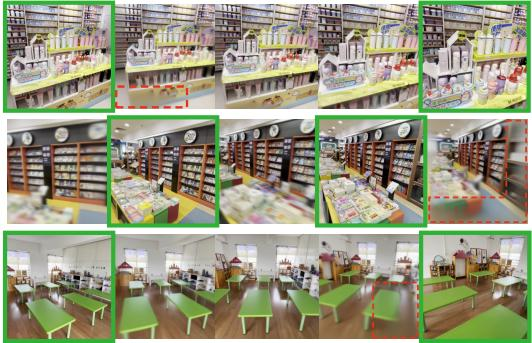

natural_image

Interior view of a modern bookstore with bookshelves, reading tables, and green furniture (no visible text or signage)

(b) Mixed Static/Dynamic Scenes   
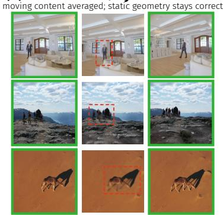

natural_image

Grid of nine images showing a modern living room with people, a rocky hillside, and a desert landscape; no text or symbols present.

Figure 14: Limitations. Both main failure modes arise from the regression objective collapsing under-constrained content to a low-frequency average, dashed boxes mark affected regions. (a) content unseen in any input view is rendered as a blurry mean estimate. (b) in presence of dynamic content, the static scene is rendered correctly from the novel pose; moving content is averaged.

# 5 Conclusion

Self-supervised novel view synthesis (NVS) has long promised scalability through videos by not requiring ground-truth camera pose annotations, yet existing approaches remained constrained by hard-to-scale multi-network pipelines and restrictive static-scene assumptions. In this work, we introduced RayDer, a unified feed-forward transformer that consolidates camera estimation, scene reconstruction, and rendering into a single scalable backbone, enabling stable training on unconstrained real-world video while preserving the static-scene NVS objective. Through explicit dynamic state handling via a nuisance variable, architectural unification, and autoregressive pose learning, RayDer makes scaling of self-supervised NVS clean across data, model size, and compute. Empirically, this yields clean power-law scaling behavior, strong zero-shot open-set performance competitive with supervised and video diffusion-based systems, and transferable camera pose representations learned entirely without pose supervision.

Beyond the specific architecture, our results suggest a broader perspective: one major limitation of many prior selfsupervised NVS methods was not the absence of supervision, but the inability to use scalable data regimes. By enabling stable learning from scratch on generic video and demonstrating clean scaling, RayDer positions self-supervised NVS within the same scaling-driven paradigm that has shaped progress in language and some vision foundation models.

Looking forward, RayDer opens up several directions for future work, including integration with partial supervision and generative modeling, extension toward 4D NVS, and continued scaling toward 3D world foundation models.

# Acknowledgments

This project has been supported by the Horizon Europe project ELLIOT (GA No. 101214398), the project “GeniusRobot” (01IS24083) funded by the Federal Ministry of Research, Technology and Space (BMFTR), the BMWE ZIM-project (No. KK5785001LO4) “conIDitional LoRA”, the German Federal Ministry for Economic Affairs and Energy within the project “NXT GEN AI METHODS - Generative Methoden für Perzeption, Prädiktion und Planung”, and the bidt project KLIMA-MEMES. The authors gratefully acknowledge the Gauss Center for Supercomputing for providing compute through the NIC on JUWELS/JUPITER at JSC and the HPC resources supplied by the NHR@FAU Erlangen. We thank Olga Grebenkova, Kosta Derpanis, and Tommaso Martorella for feedback, proofreading, and helpful discussions, and Owen Vincent for technical support.

# References

[1] YouTube for Press — blog.youtube. https://blog.youtube/press/. [Accessed 09-11-2025].   
[2] Jonathan T Barron, Ben Mildenhall, Dor Verbin, Pratul P Srinivasan, and Peter Hedman. Mip-nerf 360: Unbounded antialiased neural radiance fields. In Proceedings of the IEEE/CVF conference on computer vision and pattern recognition, pages 5470–5479, 2022.   
[3] Johannes Buchner. ImageHash: A python perceptual image hashing module — github.com. https://github.com/ JohannesBuchner/imagehash, 2025.   
[4] David Charatan, Sizhe Lester Li, Andrea Tagliasacchi, and Vincent Sitzmann. pixelsplat: 3d gaussian splats from image pairs for scalable generalizable 3d reconstruction. In Proceedings of the IEEE/CVF conference on computer vision and pattern recognition, pages 19457–19467, 2024.   
[5] Yu Chen and Gim Hee Lee. Dbarf: Deep bundle-adjusting generalizable neural radiance fields. In Proceedings of the IEEE/CVF Conference on Computer Vision and Pattern Recognition, pages 24–34, 2023.   
[6] Yuedong Chen, Haofei Xu, Chuanxia Zheng, Bohan Zhuang, Marc Pollefeys, Andreas Geiger, Tat-Jen Cham, and Jianfei Cai. Mvsplat: Efficient 3d gaussian splatting from sparse multi-view images. In European Conference on Computer Vision, pages 370–386. Springer, 2024.   
[7] Yuedong Chen, Chuanxia Zheng, Haofei Xu, Bohan Zhuang, Andrea Vedaldi, Tat-Jen Cham, and Jianfei Cai. Mvsplat360: Feed-forward 360 scene synthesis from sparse views. Advances in Neural Information Processing Systems, 37:107064–107086, 2024.   
[8] Katherine Crowson, Stefan Andreas Baumann, Alex Birch, Tanishq Mathew Abraham, Daniel Z Kaplan, and Enrico Shippole. Scalable high-resolution pixel-space image synthesis with hourglass diffusion transformers. In Proceedings of the 41st International Conference on Machine Learning, pages 9550–9575. PMLR, 2024.   
[9] Kai Deng, Zexin Ti, Jiawei Xu, Jian Yang, and Jin Xie. Vggt-long: Chunk it, loop it, align it–pushing vggt’s limits on kilometer-scale long rgb sequences. arXiv preprint arXiv:2507.16443, 2025.   
[10] Alexey Dosovitskiy, Lucas Beyer, Alexander Kolesnikov, Dirk Weissenborn, Xiaohua Zhai, Thomas Unterthiner, Mostafa Dehghani, Matthias Minderer, Georg Heigold, Sylvain Gelly, Jakob Uszkoreit, and Neil Houlsby. An image is worth 16x16 words: Transformers for image recognition at scale. In International Conference on Learning Representations, 2021.   
[11] Noam Elata, Bahjat Kawar, Yaron Ostrovsky-Berman, Miriam Farber, and Ron Sokolovsky. Novel view synthesis with pixel-space diffusion models. In Proceedings of the Computer Vision and Pattern Recognition Conference, pages 26756–26766, 2025.   
[12] Keyu Fang, Changchun Zhou, Yuzhe Fu, Hai Helen Li, and Yiran Chen. IncVGGT: Incremental VGGT for memory-bounded long-range 3d reconstruction. In The Fourteenth International Conference on Learning Representations, 2026.   
[13] Weilun Feng, Haotong Qin, Mingqiang Wu, Chuanguang Yang, Yuqi Li, Xiangqi Li, Zhulin An, Libo Huang, Yulun Zhang, Michele Magno, et al. Quantized visual geometry grounded transformer. arXiv preprint arXiv:2509.21302, 2025.   
[14] Yang Fu, Sifei Liu, Amey Kulkarni, Jan Kautz, Alexei A Efros, and Xiaolong Wang. Colmap-free 3d gaussian splatting. In Proceedings of the IEEE/CVF Conference on Computer Vision and Pattern Recognition, pages 20796–20805, 2024.   
[15] Hang Gao, Ruilong Li, Shubham Tulsiani, Bryan Russell, and Angjoo Kanazawa. Monocular dynamic view synthesis: A reality check. In NeurIPS, 2022.   
[16] Behrooz Ghorbani, Orhan Firat, Markus Freitag, Ankur Bapna, Maxim Krikun, Xavier Garcia, Ciprian Chelba, and Colin Cherry. Scaling laws for neural machine translation. In International Conference on Learning Representations, 2022.   
[17] Ali Hassani, Steven Walton, Jiachen Li, Shen Li, and Humphrey Shi. Neighborhood attention transformer. In Proceedings of the IEEE/CVF conference on computer vision and pattern recognition, pages 6185–6194, 2023.   
[18] Tom Henighan, Jared Kaplan, Mor Katz, Mark Chen, Christopher Hesse, Jacob Jackson, Heewoo Jun, Tom B Brown, Prafulla Dhariwal, Scott Gray, et al. Scaling laws for autoregressive generative modeling. arXiv preprint arXiv:2010.14701, 2020.   
[19] Geoffrey E Hinton, Nitish Srivastava, Alex Krizhevsky, Ilya Sutskever, and Ruslan R Salakhutdinov. Improving neural networks by preventing co-adaptation of feature detectors. arXiv preprint arXiv:1207.0580, 2012.

[20] Jordan Hoffmann, Sebastian Borgeaud, Arthur Mensch, Elena Buchatskaya, Trevor Cai, Eliza Rutherford, Diego de las Casas, Lisa Anne Hendricks, Johannes Welbl, Aidan Clark, Tom Hennigan, Eric Noland, Katherine Millican, George van den Driessche, Bogdan Damoc, Aurelia Guy, Simon Osindero, Karen Simonyan, Erich Elsen, Oriol Vinyals, Jack William Rae, and Laurent Sifre. An empirical analysis of compute-optimal large language model training. In Advances in Neural Information Processing Systems, 2022.   
[21] Sunghwan Hong, Jaewoo Jung, Heeseong Shin, Jisang Han, Jiaolong Yang, Chong Luo, and Seungryong Kim. Pf3plat: Pose-free feed-forward 3d gaussian splatting. arXiv preprint arXiv:2410.22128, 2024.   
[22] Yicong Hong, Kai Zhang, Jiuxiang Gu, Sai Bi, Yang Zhou, Difan Liu, Feng Liu, Kalyan Sunkavalli, Trung Bui, and Hao Tan. Lrm: Large reconstruction model for single image to 3d. arXiv preprint arXiv:2311.04400, 2023.   
[23] Shengding Hu, Yuge Tu, Xu Han, Chaoqun He, Ganqu Cui, Xiang Long, Zhi Zheng, Yewei Fang, Yuxiang Huang, Weilin Zhao, et al. Minicpm: Unveiling the potential of small language models with scalable training strategies. arXiv preprint arXiv:2404.06395, 2024.   
[24] Ranran Huang and Krystian Mikolajczyk. No pose at all: Self-supervised pose-free 3d gaussian splatting from sparse views. arXiv preprint arXiv:2508.01171, 2025.   
[25] Ranran Huang and Krystian Mikolajczyk. Spfsplatv2: Efficient self-supervised pose-free 3d gaussian splatting from sparse views. arXiv preprint arXiv:2509.17246, 2025.   
[26] Xun Huang and Serge Belongie. Arbitrary style transfer in real-time with adaptive instance normalization. In Proceedings of the IEEE international conference on computer vision, pages 1501–1510, 2017.   
[27] Rasmus Jensen, Anders Dahl, George Vogiatzis, Engil Tola, and Henrik Aanæs. Large scale multi-view stereopsis evaluation. In 2014 IEEE Conference on Computer Vision and Pattern Recognition, pages 406–413. IEEE, 2014.   
[28] Hanwen Jiang, Hao Tan, Peng Wang, Haian Jin, Yue Zhao, Sai Bi, Kai Zhang, Fujun Luan, Kalyan Sunkavalli, Qixing Huang, and Georgios Pavlakos. Rayzer: A self-supervised large view synthesis model. 2025.   
[29] Haian Jin, Hanwen Jiang, Hao Tan, Kai Zhang, Sai Bi, Tianyuan Zhang, Fujun Luan, Noah Snavely, and Zexiang Xu. Lvsm: A large view synthesis model with minimal 3d inductive bias. In The Thirteenth International Conference on Learning Representations, 2025.   
[30] Gyeongjin Kang, Jisang Yoo, Jihyeon Park, Seungtae Nam, Hyeonsoo Im, Sangheon Shin, Sangpil Kim, and Eunbyung Park. Selfsplat: Pose-free and 3d prior-free generalizable 3d gaussian splatting. In Proceedings of the Computer Vision and Pattern Recognition Conference, pages 22012–22022, 2025.   
[31] Jared Kaplan, Sam McCandlish, Tom Henighan, Tom B Brown, Benjamin Chess, Rewon Child, Scott Gray, Alec Radford, Jeffrey Wu, and Dario Amodei. Scaling laws for neural language models. arXiv preprint arXiv:2001.08361, 2020.   
[32] Nikhil Keetha, Norman Müller, Johannes Schönberger, Lorenzo Porzi, Yuchen Zhang, Tobias Fischer, Arno Knapitsch, Duncan Zauss, Ethan Weber, Nelson Antunes, et al. Mapanything: Universal feed-forward metric 3d reconstruction. arXiv preprint arXiv:2509.13414, 2025.   
[33] Bernhard Kerbl, Georgios Kopanas, Thomas Leimkühler, and George Drettakis. 3d gaussian splatting for real-time radiance field rendering. ACM Trans. Graph., 42(4):139–1, 2023.   
[34] Evan Klinger and David Starkweather. pHash: The open source perceptual hash library. https://www.phash.org/, 2010.   
[35] Arno Knapitsch, Jaesik Park, Qian-Yi Zhou, and Vladlen Koltun. Tanks and temples: Benchmarking large-scale scene reconstruction. ACM Transactions on Graphics, 36(4), 2017.   
[36] Zihang Lai, Sifei Liu, Alexei A Efros, and Xiaolong Wang. Video autoencoder: self-supervised disentanglement of static 3d structure and motion. In Proceedings of the IEEE/CVF International Conference on Computer Vision, pages 9730–9740, 2021.   
[37] Vincent Leroy, Yohann Cabon, and Jérôme Revaud. Grounding image matching in 3d with mast3r. In European Conference on Computer Vision, pages 71–91. Springer, 2024.   
[38] Zhiqi Li, Chengrui Dong, Yiming Chen, Zhangchi Huang, and Peidong Liu. Vicasplat: A single run is all you need for 3d gaussian splatting and camera estimation from unposed video frames. arXiv preprint arXiv:2503.10286, 2025.   
[39] Zhengqi Li, Richard Tucker, Forrester Cole, Qianqian Wang, Linyi Jin, Vickie Ye, Angjoo Kanazawa, Aleksander Holynski, and Noah Snavely. Megasam: Accurate, fast and robust structure and motion from casual dynamic videos. In Proceedings of the Computer Vision and Pattern Recognition Conference, pages 10486–10496, 2025.

[40] Lu Ling, Yichen Sheng, Zhi Tu, Wentian Zhao, Cheng Xin, Kun Wan, Lantao Yu, Qianyu Guo, Zixun Yu, Yawen Lu, et al. Dl3dv-10k: A large-scale scene dataset for deep learning-based 3d vision. In Proceedings of the IEEE/CVF Conference on Computer Vision and Pattern Recognition, pages 22160–22169, 2024.   
[41] Shikun Liu, Kam Woh Ng, Wonbong Jang, Jiadong Guo, Junlin Han, Haozhe Liu, Yiannis Douratsos, Juan C Pérez, Zijian Zhou, Chi Phung, et al. Scaling sequence-to-sequence generative neural rendering. arXiv preprint arXiv:2510.04236, 2025.   
[42] Xingchen Liu, Piyush Tayal, Jianyuan Wang, Jesus Zarzar, Tom Monnier, Konstantinos Tertikas, Jiali Duan, Antoine Toisoul, Jason Y. Zhang, Natalia Neverova, Andrea Vedaldi, Roman Shapovalov, and David Novotny. Uncommon objects in 3d. In arXiv, 2024.   
[43] Ilya Loshchilov and Frank Hutter. Decoupled weight decay regularization. In International Conference on Learning Representations, 2019.   
[44] Ben Mildenhall, Pratul P. Srinivasan, Rodrigo Ortiz-Cayon, Nima Khademi Kalantari, Ravi Ramamoorthi, Ren Ng, and Abhishek Kar. Local light field fusion: Practical view synthesis with prescriptive sampling guidelines. ACM Transactions on Graphics (TOG), 2019.   
[45] Ben Mildenhall, Pratul P Srinivasan, Matthew Tancik, Jonathan T Barron, Ravi Ramamoorthi, and Ren Ng. Nerf: Representing scenes as neural radiance fields for view synthesis. In European Conference on Computer Vision, pages 405–421. Springer, 2020.   
[46] Thomas W Mitchel, Hyunwoo Ryu, and Vincent Sitzmann. True self-supervised novel view synthesis is transferable. arXiv preprint arXiv:2510.13063, 2025.   
[47] Nithin Gopalakrishnan Nair, Srinivas Kaza, Xuan Luo, Vishal M Patel, Stephen Lombardi, and Jungyeon Park. Scaling transformer-based novel view synthesis with models token disentanglement and synthetic data. In Proceedings of the IEEE/CVF International Conference on Computer Vision, pages 28567–28576, 2025.   
[48] William Peebles and Saining Xie. Scalable diffusion models with transformers. In Proceedings of the IEEE/CVF international conference on computer vision, pages 4195–4205, 2023.   
[49] Federico Perazzi, Jordi Pont-Tuset, Brian McWilliams, Luc Van Gool, Markus Gross, and Alexander Sorkine-Hornung. A benchmark dataset and evaluation methodology for video object segmentation. In Proceedings of the IEEE conference on computer vision and pattern recognition, pages 724–732, 2016.   
[50] Julius Plucker. Xvii. on a new geometry of space. Philosophical Transactions of the Royal Society of London, (155):725–791, 1865.   
[51] Nikhila Ravi, Valentin Gabeur, Yuan-Ting Hu, Ronghang Hu, Chaitanya Ryali, Tengyu Ma, Haitham Khedr, Roman Rädle, Chloe Rolland, Laura Gustafson, et al. Sam 2: Segment anything in images and videos. arXiv preprint arXiv:2408.00714, 2024.   
[52] Jeremy Reizenstein, Roman Shapovalov, Philipp Henzler, Luca Sbordone, Patrick Labatut, and David Novotny. Common objects in 3d: Large-scale learning and evaluation of real-life 3d category reconstruction. In International Conference on Computer Vision, 2021.   
[53] Robin Rombach, Patrick Esser, and Björn Ommer. Geometry-free view synthesis: Transformers and no 3d priors. In Proceedings of the IEEE/CVF International Conference on Computer Vision, pages 14356–14366, 2021.   
[54] Aleksandr Safin, Daniel Duckworth, and Mehdi S. M. Sajjadi. Repast: Relative pose attention scene representation transformer. 2023.   
[55] Mehdi SM Sajjadi, Daniel Duckworth, Aravindh Mahendran, Sjoerd Van Steenkiste, Filip Pavetic, Mario Lucic, Leonidas J Guibas, Klaus Greff, and Thomas Kipf. Object scene representation transformer. Advances in neural information processing systems, 35:9512–9524, 2022.   
[56] Mehdi SM Sajjadi, Henning Meyer, Etienne Pot, Urs Bergmann, Klaus Greff, Noha Radwan, Suhani Vora, Mario Luciˇ c, Daniel ´ Duckworth, Alexey Dosovitskiy, et al. Scene representation transformer: Geometry-free novel view synthesis through set-latent scene representations. In Proceedings of the IEEE/CVF Conference on Computer Vision and Pattern Recognition, pages 6229–6238, 2022.   
[57] Mehdi SM Sajjadi, Aravindh Mahendran, Thomas Kipf, Etienne Pot, Daniel Duckworth, Mario Luciˇ c, and Klaus Greff. Rust: ´ Latent neural scene representations from unposed imagery. In Proceedings of the IEEE/CVF Conference on Computer Vision and Pattern Recognition, pages 17297–17306, 2023.

[58] Johannes Lutz Schönberger and Jan-Michael Frahm. Structure-from-motion revisited. In Conference on Computer Vision and Pattern Recognition (CVPR), 2016.   
[59] Maximilian Seitzer, Sjoerd van Steenkiste, Thomas Kipf, Klaus Greff, and Mehdi S. M. Sajjadi. DyST: Towards dynamic neural scene representations on real-world videos. In The Twelfth International Conference on Learning Representations, 2024.   
[60] You Shen, Zhipeng Zhang, Yansong Qu, and Liujuan Cao. Fastvggt: Training-free acceleration of visual geometry transformer. arXiv preprint arXiv:2509.02560, 2025.   
[61] Oriane Siméoni, Huy V. Vo, Maximilian Seitzer, Federico Baldassarre, Maxime Oquab, Cijo Jose, Vasil Khalidov, Marc Szafraniec, Seungeun Yi, Michaël Ramamonjisoa, Francisco Massa, Daniel Haziza, Luca Wehrstedt, Jianyuan Wang, Timothée Darcet, Théo Moutakanni, Leonel Sentana, Claire Roberts, Andrea Vedaldi, Jamie Tolan, John Brandt, Camille Couprie, Julien Mairal, Hervé Jégou, Patrick Labatut, and Piotr Bojanowski. DINOv3, 2025.   
[62] Cameron Smith, Yilun Du, Ayush Tewari, and Vincent Sitzmann. Flowcam: Training generalizable 3d radiance fields without camera poses via pixel-aligned scene flow. arXiv preprint arXiv:2306.00180, 2023.   
[63] Jianlin Su, Yu Lu, Shengfeng Pan, Bo Wen, and Yunfeng Liu. Roformer: enhanced transformer with rotary position embedding. corr abs/2104.09864 (2021). arXiv preprint arXiv:2104.09864, 2021.   
[64] Hugo Touvron, Louis Martin, Kevin Stone, Peter Albert, Amjad Almahairi, Yasmine Babaei, Nikolay Bashlykov, Soumya Batra, Prajjwal Bhargava, Shruti Bhosale, Dan Bikel, Lukas Blecher, Cristian Canton Ferrer, Moya Chen, Guillem Cucurull, David Esiobu, Jude Fernandes, Jeremy Fu, Wenyin Fu, Brian Fuller, Cynthia Gao, Vedanuj Goswami, Naman Goyal, Anthony Hartshorn, Saghar Hosseini, Rui Hou, Hakan Inan, Marcin Kardas, Viktor Kerkez, Madian Khabsa, Isabel Kloumann, Artem Korenev, Punit Singh Koura, Marie-Anne Lachaux, Thibaut Lavril, Jenya Lee, Diana Liskovich, Yinghai Lu, Yuning Mao, Xavier Martinet, Todor Mihaylov, Pushkar Mishra, Igor Molybog, Yixin Nie, Andrew Poulton, Jeremy Reizenstein, Rashi Rungta, Kalyan Saladi, Alan Schelten, Ruan Silva, Eric Michael Smith, Ranjan Subramanian, Xiaoqing Ellen Tan, Binh Tang, Ross Taylor, Adina Williams, Jian Xiang Kuan, Puxin Xu, Zheng Yan, Iliyan Zarov, Yuchen Zhang, Angela Fan, Melanie Kambadur, Sharan Narang, Aurelien Rodriguez, Robert Stojnic, Sergey Edunov, and Thomas Scialom. Llama 2: Open foundation and fine-tuned chat models, 2023.   
[65] Vladyslav Usenko, Nikolaus Demmel, and Daniel Cremers. The double sphere camera model. In 2018 International Conference on 3D Vision (3DV), pages 552–560. IEEE, 2018.   
[66] Feng Wang, Yaodong Yu, Guoyizhe Wei, Wei Shao, Yuyin Zhou, Alan Yuille, and Cihang Xie. Scaling laws in patchification: An image is worth 50,176 tokens and more. arXiv preprint arXiv:2502.03738, 2025.   
[67] Haoru Wang. Open-Rayzer: a open-source Self-Reimplemented Version of the paper "RayZer: A Self-supervised Large View Synthesis Model" — github.com. https://github.com/ou524u/Open-Rayzer, 2025.   
[68] Haoru Wang, Kai Ye, Yangyan Li, Wenzheng Chen, and Baoquan Chen. The less you depend, the more you learn: Synthesizing novel views from sparse, unposed images without any 3d knowledge. arXiv preprint arXiv:2506.09885, 2025.   
[69] Jianyuan Wang, Nikita Karaev, Christian Rupprecht, and David Novotny. Vggsfm: Visual geometry grounded deep structure from motion. 2023.   
[70] Jianyuan Wang, Minghao Chen, Nikita Karaev, Andrea Vedaldi, Christian Rupprecht, and David Novotny. Vggt: Visual geometry grounded transformer. In Proceedings of the Computer Vision and Pattern Recognition Conference, pages 5294–5306, 2025.   
[71] Jiahao Wang, Yufeng Yuan, Rujie Zheng, Youtian Lin, Jian Gao, Lin-Zhuo Chen, Yajie Bao, Yi Zhang, Chang Zeng, Yanxi Zhou, et al. Spatialvid: A large-scale video dataset with spatial annotations. arXiv preprint arXiv:2509.09676, 2025.   
[72] Qianqian Wang, Yifei Zhang, Aleksander Holynski, Alexei A Efros, and Angjoo Kanazawa. Continuous 3d perception model with persistent state. In Proceedings of the Computer Vision and Pattern Recognition Conference, pages 10510–10522, 2025.   
[73] Ruoyu Wang, Yi Ma, and Shenghua Gao. Recollection from pensieve: Novel view synthesis via learning from uncalibrated videos. arXiv preprint arXiv:2505.13440, 2025.   
[74] Shuzhe Wang, Vincent Leroy, Yohann Cabon, Boris Chidlovskii, and Jerome Revaud. Dust3r: Geometric 3d vision made easy. In Proceedings of the IEEE/CVF Conference on Computer Vision and Pattern Recognition, pages 20697–20709, 2024.   
[75] Yifan Wang, Jianjun Zhou, Haoyi Zhu, Wenzheng Chang, Yang Zhou, Zizun Li, Junyi Chen, Jiangmiao Pang, Chunhua Shen, and Tong He. π3: Scalable permutation-equivariant visual geometry learning. arXiv preprint arXiv:2507.13347, 2025.

[76] Zhou Wang, Alan C Bovik, Hamid R Sheikh, and Eero P Simoncelli. Image quality assessment: from error visibility to structural similarity. IEEE transactions on image processing, 13(4):600–612, 2004.   
[77] Daniel Watson, William Chan, Ricardo Martin-Brualla, Jonathan Ho, Andrea Tagliasacchi, and Mohammad Norouzi. Novel view synthesis with diffusion models. arXiv preprint arXiv:2210.04628, 2022.   
[78] Daniel Watson, Saurabh Saxena, Lala Li, Andrea Tagliasacchi, and David J Fleet. Controlling space and time with diffusion models. arXiv preprint arXiv:2407.07860, 2024.   
[79] Rundi Wu, Ben Mildenhall, Philipp Henzler, Keunhong Park, Ruiqi Gao, Daniel Watson, Pratul P Srinivasan, Dor Verbin, Jonathan T Barron, Ben Poole, et al. Reconfusion: 3d reconstruction with diffusion priors. In Proceedings of the IEEE/CVF conference on computer vision and pattern recognition, pages 21551–21561, 2024.   
[80] Rundi Wu, Ruiqi Gao, Ben Poole, Alex Trevithick, Changxi Zheng, Jonathan T Barron, and Aleksander Holynski. Cat4d: Create anything in 4d with multi-view video diffusion models. In Proceedings of the Computer Vision and Pattern Recognition Conference, pages 26057–26068, 2025.   
[81] Hongchi Xia, Yang Fu, Sifei Liu, and Xiaolong Wang. Rgbd objects in the wild: Scaling real-world 3d object learning from rgb-d videos. In Proceedings of the IEEE/CVF Conference on Computer Vision and Pattern Recognition, pages 22378–22389, 2024.   
[82] Haofei Xu, Songyou Peng, Fangjinhua Wang, Hermann Blum, Daniel Barath, Andreas Geiger, and Marc Pollefeys. Depthsplat: Connecting gaussian splatting and depth. In Proceedings of the Computer Vision and Pattern Recognition Conference, pages 16453–16463, 2025.   
[83] Botao Ye, Sifei Liu, Haofei Xu, Xueting Li, Marc Pollefeys, Ming-Hsuan Yang, and Songyou Peng. No pose, no problem: Surprisingly simple 3d gaussian splats from sparse unposed images. arXiv preprint arXiv:2410.24207, 2024.   
[84] Wangbo Yu, Jinbo Xing, Li Yuan, Wenbo Hu, Xiaoyu Li, Zhipeng Huang, Xiangjun Gao, Tien-Tsin Wong, Ying Shan, and Yonghong Tian. Viewcrafter: Taming video diffusion models for high-fidelity novel view synthesis, 2024.   
[85] Biao Zhang and Rico Sennrich. Root mean square layer normalization. Advances in Neural Information Processing Systems, 32, 2019.   
[86] Kai Zhang, Sai Bi, Hao Tan, Yuanbo Xiangli, Nanxuan Zhao, Kalyan Sunkavalli, and Zexiang Xu. Gs-lrm: Large reconstruction model for 3d gaussian splatting. In European Conference on Computer Vision, pages 1–19. Springer, 2024.   
[87] Qihang Zhang, Shuangfei Zhai, Miguel Angel Bautista Martin, Kevin Miao, Alexander Toshev, Joshua Susskind, and Jiatao Gu. World-consistent video diffusion with explicit 3d modeling. In Proceedings of the Computer Vision and Pattern Recognition Conference, pages 21685–21695, 2025.   
[88] Richard Zhang, Phillip Isola, Alexei A Efros, Eli Shechtman, and Oliver Wang. The unreasonable effectiveness of deep features as a perceptual metric. In Proceedings of the IEEE conference on computer vision and pattern recognition, pages 586–595, 2018.   
[89] Qitao Zhao, Hao Tan, Qianqian Wang, Sai Bi, Kai Zhang, Kalyan Sunkavalli, Shubham Tulsiani, and Hanwen Jiang. E-rayzer: Self-supervised 3d reconstruction as spatial visual pre-training, 2025.   
[90] Qitao Zhao, Hao Tan, Qianqian Wang, Sai Bi, Kai Zhang, Kalyan Sunkavalli, Shubham Tulsiani, and Hanwen Jiang. E-rayzer: Self-supervised 3d reconstruction as spatial visual pre-training. In CVPR, 2026.   
[91] Jensen Jinghao Zhou, Hang Gao, Vikram Voleti, Aaryaman Vasishta, Chun-Han Yao, Mark Boss, Philip Torr, Christian Rupprecht, and Varun Jampani. Stable virtual camera: Generative view synthesis with diffusion models. arXiv preprint arXiv:2503.14489, 2025.   
[92] Tinghui Zhou, Richard Tucker, John Flynn, Graham Fyffe, and Noah Snavely. Stereo magnification: Learning view synthesis using multiplane images. arXiv preprint arXiv:1805.09817, 2018.   
[93] Yi Zhou, Connelly Barnes, Jingwan Lu, Jimei Yang, and Hao Li. On the continuity of rotation representations in neural networks. In Proceedings of the IEEE/CVF conference on computer vision and pattern recognition, pages 5745–5753, 2019.

# A Extended Exploration Details

We show a full overview of our main exploration’s results from Sec. 3 with extended metrics in Tab. A.1. For config A, we repeated the training with different seeds until we got a run that did not diverge. We attempted to train RayZer models in our setting (view count, training data), but those trainings consistently diverged, even after multiple attempts.

Training Details. Models are trained on 8 frames (6 in, 2 out) at a resolution of 2562 extracted from the respective source videos at 2 fps. We perform our exploration on two datasets in parallel: i) Segment Anything-Video [SA-V, 51]: a publicly available, highly diverse dataset that includes both dynamic cameras and highly dynamic scene content. ii) SpatialVid-HQ [SV-HQ, 71]: a high-quality, curated dataset, which contains a mixture of dynamic and (mostly) static scenes. This ensures that our findings generalize across different settings – both truly open-set, highly dynamic videos, and more curated, yet not fully static-scene videos. Notably, SA-V also contains a significant fraction of videos with (almost) static cameras, which likely makes training more challenging.

We train these models for 200k steps at batch size 256 on 32 Nvidia H200 using AdamW [43] with a learning rate of $1 0 ^ { - 4 } , ( \beta _ { 1 } , \beta _ { 2 } ) = ( 0 . 9 , 0 . 9 5 )$ ), and weight decay 0.01, with a linear warmup over 1k steps and a constant learning rate after. Unlike RayZer [28], we do not use any curricula (e.g., RayZer uses dataset-specific frame intervals that are scaled according to a predefined schedule throughout training). This is an important step to reduce the scaling complexity, as proper scaling for such curricula with data complexity, data scale, training time, and model size is unclear.

Unlike previous works, we focus on zero-shot evaluation on unseen datasets, reflecting real-world deployments. We evaluate NVS performance on RealEstate-10k [RE10K, 92] in the pixelSplat [4] setting, following standard feedforward NVS parameters. Camera poses are predicted by the model itself following standard practice for self-supervised NVS. The accuracy of the predicted camera poses is evaluated using pointwise probes applied to camera tokens on DL3DV-10k [40], following Jiang et al. [28]. Details of our probing setup are presented in Section B.2.3.

Table A.1: Main Exploration Overview. We show a full overview over all ablations conducted as a part of Sec. 3 with full evaluation results. Novel view synthesis performance is measured on RealEstate-10k [92] in the standard pixelSplat [4] setting. For camera estimation, we follow RayZer and evaluate (zero-shot) on DL3DV-10k [40]. Neither dataset is a part of the training distribution, thus, all evaluations are zero-shot. We measure camera estimation performance using both probes on camera tokens following RayZer [28] and transferability following X-Factor [46]. We show ablation results for models trained on both Segment Anything-Video [SA-V, 51] (high dynamics) in (a) and for models trained on the curated, medium-dynamics dataset SpatialVid-HQ [71] in (b). We provide additional baselines using the official RayZer [28] and LVSM [29] codebases with default hyperparameters (resulting in significantly larger models) trained in the same setting.   
(a) Trained on SA-V [51] (no camera annotations) 

<table><tr><td rowspan="2" colspan="2">Configuration</td><td colspan="3">NVS w/o State</td><td colspan="3">NVS w/ State</td><td colspan="6">Camera Estimation (Probe; ↑)</td><td colspan="6">Camera Estimation (Transfer; ↑)</td></tr><tr><td>PSNR↑</td><td>LPIPS↓</td><td>SSIM↑</td><td>PSNR↑</td><td>LPIPS↓</td><td>SSIM↑</td><td colspan="6">R@10°R@20°R@30°T@0.1 T@0.2 T@0.3</td><td colspan="6">R@10°R@20°R@30°T@0.1 T@0.2 T@0.3</td></tr><tr><td>LVSM [29]</td><td>(cannot train w/o poses)</td><td>-</td><td>-</td><td>-</td><td>-</td><td>-</td><td>-</td><td>-</td><td>-</td><td>-</td><td>-</td><td>-</td><td>-</td><td>-</td><td>-</td><td>-</td><td>-</td><td>-</td><td>-</td></tr><tr><td>RayZer [28]</td><td>(depth 3 × 8, width 768)</td><td colspan="3">diverges consistently</td><td>-</td><td>-</td><td>-</td><td>-</td><td>-</td><td>-</td><td>-</td><td>-</td><td>-</td><td>-</td><td>-</td><td>-</td><td>-</td><td>-</td><td>-</td></tr><tr><td>A RayZer-like [28] baseline</td><td>(depth 3 × 6, width 512)</td><td>22.53*</td><td>0.353*</td><td>0.708*</td><td>-</td><td>-</td><td>-</td><td>39.0*</td><td>54.7*</td><td>72.8*</td><td>15.3*</td><td>37.3*</td><td>56.5*</td><td>59.8*</td><td>84.5*</td><td>90.1*</td><td>06.5*</td><td>21.9*</td><td>33.9*</td></tr><tr><td>S.3.2B + Dynamic State Prediction</td><td></td><td>13.42</td><td>0.632</td><td>0.509</td><td>24.01</td><td>0.347</td><td>0.746</td><td>14.2</td><td>16.0</td><td>28.3</td><td>12.1</td><td>14.7</td><td>31.5</td><td>56.1</td><td>78.1</td><td>89.9</td><td>07.0</td><td>19.2</td><td>32.7</td></tr><tr><td>S.3.3C + Dynamic State Dropout</td><td></td><td>23.01</td><td>0.324</td><td>0.720</td><td>23.76</td><td>0.337</td><td>0.719</td><td>42.5</td><td>61.0</td><td>80.1</td><td>19.0</td><td>33.9</td><td>59.2</td><td>62.4</td><td>76.5</td><td>93.5</td><td>08.1</td><td>23.9</td><td>31.4</td></tr><tr><td>S.3.3D + Single Network</td><td>(depth 18, width 512)</td><td>24.93</td><td>0.226</td><td>0.793</td><td>25.33</td><td>0.285</td><td>0.833</td><td>60.3</td><td>78.8</td><td>92.7</td><td>34.3</td><td>49.4</td><td>79.0</td><td>68.8</td><td>79.1</td><td>92.0</td><td>16.3</td><td>23.5</td><td>38.3</td></tr><tr><td>S.3.3E + Parallel Targets</td><td>(-81% FLOPS/novel view)</td><td>24.04</td><td>0.299</td><td>0.788</td><td>25.12</td><td>0.288</td><td>0.815</td><td>60.1</td><td>77.9</td><td>93.1</td><td>34.7</td><td>50.1</td><td>78.8</td><td>70.1</td><td>84.4</td><td>88.6</td><td>15.6</td><td>27.2</td><td>38.9</td></tr><tr><td>Sec.3.4F + Autoregression over Views</td><td></td><td>23.08</td><td>0.326</td><td>0.719</td><td>24.49</td><td>0.305</td><td>0.772</td><td>59.1</td><td>85.3</td><td>96.6</td><td>44.8</td><td>51.5</td><td>76.4</td><td>73.6</td><td>84.8</td><td>88.2</td><td>24.9</td><td>47.6</td><td>69.2</td></tr><tr><td>G + Random-order Autoregression</td><td></td><td>25.45</td><td>0.237</td><td>0.817</td><td>26.28</td><td>0.217</td><td>0.871</td><td>62.6</td><td>83.2</td><td>97.9</td><td>32.7</td><td>57.3</td><td>78.2</td><td>84.4</td><td>93.4</td><td>94.8</td><td>37.2</td><td>70.4</td><td>83.1</td></tr><tr><td>H + Local High-resolution Layers</td><td></td><td>25.61</td><td>0.226</td><td>0.823</td><td>26.87</td><td>0.209</td><td>0.867</td><td>61.9</td><td>87.8</td><td>97.2</td><td>38.0</td><td>58.8</td><td>79.0</td><td>85.0</td><td>94.5</td><td>96.8</td><td>40.2</td><td>72.4</td><td>86.3</td></tr></table>

∗Results for A are from selected runs that did not diverge.

(b) Trained on SpatialVid-HQ [71] (mixed low & high dynamics; includes MegaSaM [39] camera annotations used for supervising LVSM training) 

<table><tr><td rowspan="2" colspan="3">Configuration</td><td colspan="3">NVS w/o State</td><td colspan="3">NVS w/ State</td><td colspan="6">Camera Estimation (Probe; ↑)</td><td colspan="6">Camera Estimation (Transfer; ↑)</td></tr><tr><td>PSNR↑</td><td>LPIPS↓</td><td>SSIM↑</td><td>PSNR↑</td><td>LPIPS↓</td><td>SSIM↑</td><td colspan="6">R@10°R@20°R@30°T@0.1 T@0.2 T@0.3</td><td colspan="6">R@10°R@20°R@30°T@0.1 T@0.2 T@0.3</td></tr><tr><td>LVSM [29]</td><td colspan="2">(depth 24, width 768)</td><td>24.21</td><td>0.217</td><td>0.787</td><td>-</td><td>-</td><td>-</td><td>-</td><td>-</td><td>-</td><td>-</td><td>-</td><td>-</td><td>-</td><td>-</td><td>-</td><td>-</td><td>-</td><td>-</td></tr><tr><td>RayZer [28]</td><td colspan="2">(depth 3 × 8, width 768)</td><td colspan="3">diverges consistently</td><td>-</td><td>-</td><td>-</td><td>-</td><td>-</td><td>-</td><td>-</td><td>-</td><td>-</td><td>-</td><td>-</td><td>-</td><td>-</td><td>-</td><td>-</td></tr><tr><td>A RayZer-like [28] baseline</td><td colspan="2">(depth 3 × 6, width 512)</td><td>22.69*</td><td>0.362*</td><td>0.711*</td><td>-</td><td>-</td><td>-</td><td>42.1*</td><td>59.9*</td><td>79.4*</td><td>16.5*</td><td>36.6*</td><td>57.2*</td><td>66.0*</td><td>84.3*</td><td>92.8*</td><td>07.7*</td><td>20.5*</td><td>34.1*</td></tr><tr><td>S.3.2B + Dynamic State Prediction</td><td colspan="2"></td><td>13.48</td><td>0.624</td><td>0.512</td><td>24.67</td><td>0.313</td><td>0.762</td><td>14.4</td><td>19.2</td><td>24.4</td><td>10.1</td><td>19.3</td><td>33.1</td><td>54.4</td><td>79.0</td><td>88.4</td><td>06.0</td><td>19.0</td><td>32.5</td></tr><tr><td>S.3.3C + Dynamic State Dropout</td><td colspan="2"></td><td>23.02</td><td>0.349</td><td>0.724</td><td>24.10</td><td>0.328</td><td>0.745</td><td>43.5</td><td>64.0</td><td>82.8</td><td>19.7</td><td>37.1</td><td>57.5</td><td>69.2</td><td>83.9</td><td>93.7</td><td>08.6</td><td>24.2</td><td>33.1</td></tr><tr><td>S.3.3D + Single Network</td><td colspan="2">(depth 18, width 512)</td><td>26.98</td><td>0.195</td><td>0.849</td><td>27.49</td><td>0.189</td><td>0.854</td><td>66.7</td><td>87.6</td><td>96.5</td><td>32.0</td><td>56.2</td><td>71.8</td><td>74.1</td><td>86.2</td><td>92.6</td><td>19.7</td><td>22.7</td><td>39.9</td></tr><tr><td>S.3.3E + Parallel Targets</td><td colspan="2">(-81% FLOPS/novel view)</td><td>25.91</td><td>0.225</td><td>0.824</td><td>26.21</td><td>0.213</td><td>0.828</td><td>62.8</td><td>85.9</td><td>97.0</td><td>30.1</td><td>59.5</td><td>70.7</td><td>70.9</td><td>84.7</td><td>88.3</td><td>18.2</td><td>24.4</td><td>34.7</td></tr><tr><td>Sec.3.4F + Autoregression over Views</td><td colspan="2"></td><td>23.53</td><td>0.301</td><td>0.752</td><td>25.78</td><td>0.267</td><td>0.790</td><td>64.6</td><td>92.9</td><td>98.1</td><td>41.2</td><td>55.7</td><td>75.5</td><td>76.5</td><td>86.1</td><td>89.4</td><td>25.2</td><td>49.6</td><td>67.1</td></tr><tr><td>G + Random-order Autoregression</td><td colspan="2"></td><td>27.27</td><td>0.189</td><td>0.855</td><td>29.57</td><td>0.148</td><td>0.892</td><td>67.5</td><td>90.1</td><td>97.9</td><td>39.3</td><td>62.2</td><td>77.0</td><td>86.0</td><td>94.2</td><td>97.1</td><td>39.1</td><td>71.7</td><td>82.6</td></tr><tr><td>H + Local High-resolution Layers</td><td colspan="2"></td><td>27.78</td><td>0.168</td><td>0.868</td><td>30.23</td><td>0.142</td><td>0.897</td><td>68.1</td><td>90.9</td><td>97.0</td><td>38.0</td><td>62.5</td><td>77.6</td><td>88.7</td><td>96.9</td><td>98.4</td><td>42.4</td><td>76.2</td><td>87.4</td></tr></table>

∗Results for A are from selected runs that did not diverge.

# B Implementation Details

Hyperparameters. We show relevant hyperparameters for all trained model variations in Tables B.2 and B.3.

Table B.2: Main Exploration Hyperparameters. Details for our models presented in Section 3. Hyperparameters are identical between variants trained on SA-V [51] and SV-HQ [71]. 

<table><tr><td>Variant</td><td>CONFIG A</td><td>CONFIG B</td><td>CONFIG C</td><td>CONFIG D</td><td>CONFIG E</td><td>CONFIG F</td><td>CONFIG G</td><td>CONFIG H</td></tr><tr><td>Trainable Parameters</td><td>134M</td><td>134M</td><td>134M</td><td>139M</td><td>139M</td><td>139M</td><td>139M</td><td>145M</td></tr><tr><td>Resolution</td><td> $256^2$ </td><td> $256^2$ </td><td> $256^2$ </td><td> $256^2$ </td><td> $256^2$ </td><td> $256^2$ </td><td> $256^2$ </td><td> $256^2$ </td></tr><tr><td>Training Steps</td><td>200k</td><td>200k</td><td>200k</td><td>200k</td><td>200k</td><td>200k</td><td>200k</td><td>200k</td></tr><tr><td>Batch Size</td><td>256</td><td>256</td><td>256</td><td>256</td><td>256</td><td>256</td><td>256</td><td>256</td></tr><tr><td>Precision</td><td>bf16 MP</td><td>bf16 MP</td><td>bf16 MP</td><td>bf16 MP</td><td>bf16 MP</td><td>bf16 MP</td><td>bf16 MP</td><td>bf16 MP</td></tr><tr><td>Training Hardware</td><td>32 H200</td><td>32 H200</td><td>32 H200</td><td>32 H200</td><td>32 H200</td><td>32 H200</td><td>32 H200</td><td>32 H200</td></tr><tr><td>Width</td><td>512</td><td>512</td><td>512</td><td>512</td><td>512</td><td>512</td><td>512</td><td>512</td></tr><tr><td>Depth ( $[\mathcal{E}_{\text{cam}}, \mathcal{E}_{\text{scene}}, \mathcal{D}_{\text{render}}]$  or  $\mathcal{M}$ )</td><td>[6, 6, 6]</td><td>[6, 6, 6]</td><td>[6, 6, 6]</td><td>18</td><td>18</td><td>18</td><td>18</td><td>18</td></tr><tr><td>Local Layers</td><td>-</td><td>-</td><td>-</td><td>-</td><td>-</td><td>-</td><td>-</td><td>[2, 2] · 2</td></tr><tr><td>Local Layer Width</td><td>-</td><td>-</td><td>-</td><td>-</td><td>-</td><td>-</td><td>-</td><td>[128, 256] · 2</td></tr><tr><td>Attention Head Dim</td><td>64</td><td>64</td><td>64</td><td>64</td><td>64</td><td>64</td><td>64</td><td>64</td></tr><tr><td>Neighborhood [17] Kernel Size</td><td>-</td><td>-</td><td>-</td><td>-</td><td>-</td><td>-</td><td>-</td><td> $7^2$ </td></tr><tr><td>Patch Size</td><td> $16^2$ </td><td> $16^2$ </td><td> $16^2$ </td><td> $16^2$ </td><td> $16^2$ </td><td> $16^2$ </td><td> $16^2$ </td><td> $4^2$ </td></tr><tr><td>Positional Encoding</td><td>RoPE [63]</td><td>RoPE [63]</td><td>RoPE [63]</td><td>RoPE [63]</td><td>RoPE [63]</td><td>RoPE [63]</td><td>RoPE [63]</td><td>RoPE [63]</td></tr><tr><td>Dynamic State Dim</td><td>-</td><td>256</td><td>256</td><td>256</td><td>256</td><td>256</td><td>256</td><td>256</td></tr><tr><td>Dynamic State Dropout Rate</td><td>-</td><td>0</td><td>0.5</td><td>0.5</td><td>0.5</td><td>0.5</td><td>0.5</td><td>0.5</td></tr><tr><td>Train Dataset</td><td>SA-V/SV-HQ</td><td>SA-V/SV-HQ</td><td>SA-V/SV-HQ</td><td>SA-V/SV-HQ</td><td>SA-V/SV-HQ</td><td>SA-V/SV-HQ</td><td>SA-V/SV-HQ</td><td>SA-V/SV-HQ</td></tr><tr><td>Avg. Frame Extraction Rate</td><td>2fps</td><td>2fps</td><td>2fps</td><td>2fps</td><td>2fps</td><td>2fps</td><td>2fps</td><td>2fps</td></tr><tr><td>Input Views</td><td>6</td><td>6</td><td>6</td><td>6</td><td>6</td><td>1..7</td><td>1..7</td><td>1..7</td></tr><tr><td>Output Views</td><td>2</td><td>2</td><td>2</td><td>2</td><td>2</td><td>7</td><td>7</td><td>7</td></tr><tr><td>Frame Order</td><td>-</td><td>-</td><td>-</td><td>-</td><td>-</td><td>ordered</td><td>random</td><td>random</td></tr><tr><td> $\lambda_{\text{perc}}$ </td><td>0</td><td>0</td><td>0</td><td>0</td><td>0</td><td>0</td><td>0</td><td>0</td></tr><tr><td>Optimizer</td><td>AdamW [43]</td><td>AdamW [43]</td><td>AdamW [43]</td><td>AdamW [43]</td><td>AdamW [43]</td><td>AdamW [43]</td><td>AdamW [43]</td><td>AdamW [43]</td></tr><tr><td>Learning Rate</td><td> $10^{-4}$ </td><td> $10^{-4}$ </td><td> $10^{-4}$ </td><td> $10^{-4}$ </td><td> $10^{-4}$ </td><td> $10^{-4}$ </td><td> $10^{-4}$ </td><td> $10^{-4}$ </td></tr><tr><td>Learning Rate Warmup</td><td>1k</td><td>1k</td><td>1k</td><td>1k</td><td>1k</td><td>1k</td><td>1k</td><td>1k</td></tr><tr><td>Learning Rate Schedule</td><td>constant</td><td>constant</td><td>constant</td><td>constant</td><td>constant</td><td>constant</td><td>constant</td><td>constant</td></tr><tr><td>Betas ( $\beta_1, \beta_2$ )</td><td>(0.9, 0.95)</td><td>(0.9, 0.95)</td><td>(0.9, 0.95)</td><td>(0.9, 0.95)</td><td>(0.9, 0.95)</td><td>(0.9, 0.95)</td><td>(0.9, 0.95)</td><td>(0.9, 0.95)</td></tr><tr><td>Weight Decay</td><td>0.01</td><td>0.01</td><td>0.01</td><td>0.01</td><td>0.01</td><td>0.01</td><td>0.01</td><td>0.01</td></tr></table>

Table B.3: Main Training Hyperparameters. Details for our models presented in Sec. 4. SCALING-S is derived from CONFIG H and has identical hyperparameters except for the training dataset. The “RayZer setting” model has the same depth, width, and overall view count as the models by Jiang et al. [28] and is only trained on DL3DV [40] to match their setting. 

<table><tr><td></td><td colspan="4">Scaling</td><td>RayZer Setting (Tab. 6)</td><td>Final Models</td></tr><tr><td>Variant</td><td>SCALING-XS</td><td>SCALING-S</td><td>SCALING-B</td><td>SCALING-L</td><td>RAYDER-B-DL3DV</td><td>RAYDER-L-5762</td></tr><tr><td>Trainable Parameters</td><td>59M</td><td>145M</td><td>422M</td><td>743M</td><td>422M</td><td>743M</td></tr><tr><td>Resolution</td><td> $256^2$ </td><td> $256^2$ </td><td> $256^2$ </td><td> $256^2$ </td><td> $256^2$ </td><td> $576^2$ </td></tr><tr><td>Training Steps</td><td>various</td><td>various</td><td>various</td><td>various</td><td>50k</td><td> $\underbrace{500k + 100k}_{\text{SCALING-L}} + \underbrace{50k}_{\text{SCALING-L}}$ decay</td></tr><tr><td>Batch Size</td><td>256</td><td>256</td><td>256</td><td>256</td><td>256</td><td>256</td></tr><tr><td>Precision</td><td>bf16 MP</td><td>bf16 MP</td><td>bf16 MP</td><td>bf16 MP</td><td>bf16 MP</td><td>bf16 MP</td></tr><tr><td>Training Hardware</td><td>32 (G)H200</td><td>32 (G)H200</td><td>64 (G)H200</td><td>128 (G)H200</td><td>64 (G)H200</td><td>128 (G)H200</td></tr><tr><td>Step Time (incl. comm.)</td><td>0.23s*</td><td>0.31s*</td><td>0.34s*</td><td>0.32s*</td><td>1.22s*</td><td>1.98s*</td></tr><tr><td>TFLOP/step (BS 1)</td><td>5.93</td><td>11.56</td><td>27.79</td><td>48.37</td><td>101.79</td><td>304.08</td></tr><tr><td>Width</td><td>384</td><td>512</td><td>768</td><td>1024</td><td>768</td><td>1024</td></tr><tr><td>Depth</td><td>12</td><td>18</td><td>24</td><td>24</td><td>24</td><td>24</td></tr><tr><td>Local Layers</td><td>[2, 2] · 2</td><td>[2, 2] · 2</td><td>[2, 2] · 2</td><td>[2, 2] · 2</td><td>[2, 2] · 2</td><td>[2, 2] · 2</td></tr><tr><td>Local Layer Width</td><td>[128, 256] · 2</td><td>[128, 256] · 2</td><td>[128, 256] · 2</td><td>[128, 256] · 2</td><td>[128, 256] · 2</td><td>[128, 256] · 2</td></tr><tr><td>Attention Head Dim</td><td>64</td><td>64</td><td>64</td><td>64</td><td>64</td><td>64</td></tr><tr><td>Neighborhood [17] Kernel Size</td><td> $7^2$ </td><td> $7^2$ </td><td> $7^2$ </td><td> $7^2$ </td><td> $7^2$ </td><td> $7^2$ </td></tr><tr><td>Patch Size</td><td> $4^2$ </td><td> $4^2$ </td><td> $4^2$ </td><td> $4^2$ </td><td> $4^2$ </td><td> $4^2$ </td></tr><tr><td>Positional Encoding</td><td>RoPE [63]</td><td>RoPE [63]</td><td>RoPE [63]</td><td>RoPE [63]</td><td>RoPE [63]</td><td>RoPE [63]</td></tr><tr><td>Dynamic State Dim</td><td>256</td><td>256</td><td>256</td><td>256</td><td>256</td><td>256</td></tr><tr><td>Dynamic State Dropout Rate</td><td>0.5</td><td>0.5</td><td>0.5</td><td>0.5</td><td>0.5</td><td>0.5</td></tr><tr><td>Train Dataset</td><td>SV [71]</td><td>SV [71]</td><td>SV [71]</td><td>SV [71]</td><td>DL3DV-10K [40]</td><td>SV [71]</td></tr><tr><td>Avg. Frame Extraction Rate</td><td>2fps</td><td>2fps</td><td>2fps</td><td>2fps</td><td>1.5fps</td><td>2fps</td></tr><tr><td>Input Views</td><td>1..7</td><td>1..7</td><td>1..7</td><td>1..7</td><td>1..23</td><td>1..7</td></tr><tr><td>Output Views</td><td>7</td><td>7</td><td>7</td><td>7</td><td>23</td><td>7</td></tr><tr><td>Frame Order</td><td>random</td><td>random</td><td>random</td><td>random</td><td>random</td><td>random</td></tr><tr><td> $λ_{perc}$ </td><td>0</td><td>0</td><td>0</td><td>0</td><td>0.2</td><td>0</td></tr><tr><td>Optimizer</td><td>AdamW [43]</td><td>AdamW [43]</td><td>AdamW [43]</td><td>AdamW [43]</td><td>AdamW [43]</td><td>AdamW [43]</td></tr><tr><td>Weight Decay</td><td>0.01</td><td>0.01</td><td>0.01</td><td>0.01</td><td>0.01</td><td>0.01</td></tr><tr><td>Betas ( $β_1$ ,  $β_2$ )</td><td>(0.9, 0.95)</td><td>(0.9, 0.95)</td><td>(0.9, 0.95)</td><td>(0.9, 0.95)</td><td>(0.9, 0.95)</td><td>(0.9, 0.95)</td></tr><tr><td>Learning Rate</td><td> $10^{-4}$ </td><td> $10^{-4}$ </td><td> $10^{-4}$ </td><td> $10^{-4}$ </td><td> $10^{-4}$ </td><td> $10^{-4}$ </td></tr><tr><td>Learning Rate Warmup</td><td>1k</td><td>1k</td><td>1k</td><td>1k</td><td>1k</td><td>1k</td></tr><tr><td>Learning Rate Schedule</td><td>constant</td><td>constant</td><td>constant</td><td>constant</td><td>cosine decay</td><td>WSD [23]</td></tr></table>

∗ training speed measured on 4× Nvidia H200 nodes with GPUs power-limited to 500W and NDR200 interconnect; other H200 setups can be faster

# B.1 Architecture Details

Transformer Block Setup. We adopt the general Llama 2-style [64] transformer block setup from HDiT [8], but incorporate a VGGT-style [70] intra-frame and global attention factorization (inspired by Open-RayZer [67]).

Choice of Canonical View. Unlike RayZer [28], we do not rely on a canonical view. Instead, camera poses are predicted pointwise – i.e., not with a relative MLP head that predicts based on two camera tokens, but a head that directly predicts an absolute pose from a single token, similar to $\pi ^ { \bar { 3 } }$ [75]. We found during early explorations that this leads to slightly more stable training behavior without any evident drawbacks. The same setup has independently been adopted by Open-RayZer [67].

Output Heads. We simplify RayZer’s multi-layer MLP output heads to an RMSNorm [85] followed by a single linear layer. Separate heads are used for camera pose prediction, intrinsics prediction, and dynamic state prediction. We observed no degradation in performance from this simplification in early explorations.

Attention between Views. Inspired by Open-RayZer [67], we adopt a VGGT-style [70] attention setup where each transformer layer has two attention layers – one for intra-view attention, one for global attention. We use axial RoPE [8, 63] for intra-view attention and no positional encoding for global attention. Our final attention masking across views during novel view synthesis is defined as follows: Let $\{ t _ { i , j } \} _ { j }$ be the set of tokens corresponding to view $I _ { i } ,$ which, in turn is either an input view $( I _ { i } \in \mathbb { Z } _ { \mathrm { i n p u t } }$ , with $\mathcal { T } _ { \mathrm { i n p u t } }$ being an ordered set) or a target view $( I _ { i } \in \mathcal { T } _ { \mathrm { t a r g e t } } )$ . For a token $t _ { i , j }$ , whether it can attend to another token $t _ { i ^ { \prime } , k }$ is decided by the following rule at inference time:

$$
\left\{ \begin{array}{l l} \text { yes }, & i = i ^ {\prime} \\ \text { yes }, & i ^ {\prime} <   i \wedge (I _ {i} \in \mathcal {I} _ {\text { input }} \wedge I _ {i ^ {\prime}} \in \mathcal {I} _ {\text { input }}) \\ \text { yes }, & I _ {i} \in \mathcal {I} _ {\text { target }} \wedge I _ {i ^ {\prime}} \in \mathcal {I} _ {\text { input }} \\ \text { no }, & \text { otherwise. } \end{array} \right. \quad \triangleright \text { same   view } \quad \triangleright \text { both   input   view   \&   causal } \quad \triangleright \text { target   view   attends   to   all   inputs } \tag {B.1}
$$

At train time, $\mathcal { T } _ { \mathrm { i n p u t } }$ and $\mathcal { T } _ { \mathrm { t a r g e t } }$ have significant overlap. Specifically, for the (randomly) ordered set of all views $\mathcal { T } = \left\{ I _ { 1 } , I _ { 2 } , \ldots , \bar { I } _ { K } \right\}$ , we use $\mathsf { \bar { Z } } _ { \mathrm { i n p u t } } = \mathsf { \bar { Z } } \setminus \{ I _ { K } \} , \mathsf { \bar { Z } } _ { \mathrm { t a r g e t } } = \mathsf { \bar { Z } } \setminus \{ I _ { 1 } \}$ . Importantly, views that are both input and target views will be present as tokens twice in the sequence. Here, we will abuse notation somewhat for simplicity: when comparing view indices $i , i ^ { \prime } ,$ , we will be referring to the set of all views I, regardless of whether the tokens belong to an input or target view; when comparing set containment (e.g., $I _ { i } \in \mathbb { Z } _ { \mathrm { i n p u t } } )$ , the indices are “role-aware”. For a token $t _ { i , j }$ , whether it can attend to another token $t _ { i ^ { \prime } , k }$ is then decided by the following train-time rule (differences to inference-time emphasized):

$$
\left\{ \begin{array}{l l} \text { yes }, & i = i ^ {\prime} \wedge ((I _ {i} \in \mathcal {I} _ {\text { input }}) = (I _ {i ^ {\prime}} \in \mathcal {I} _ {\text { input }})) \\ \text { yes }, & i ^ {\prime} <   i \wedge (I _ {i} \in \mathcal {I} _ {\text { input }} \wedge I _ {i ^ {\prime}} \in \mathcal {I} _ {\text { input }}) \\ \text { yes }, & I _ {i} \in \mathcal {I} _ {\text { target }} \wedge I _ {i ^ {\prime}} \in \mathcal {I} _ {\text { input }} \wedge i ^ {\prime} <   i \\ \text { no }, & \text { otherwise. } \end{array} \right. \quad \triangleright \text { same   view,   same   role } \quad \triangleright \text { both   input   view   \&   causal } \quad \triangleright \text { target   view   attends   to   all   inputs   before   it } \tag {B.2}
$$

This ensures that training is fully autoregressive/causal, with target views completely independent during both training and inference. During training, some target views see only a subset of input views ot obtain a better training signal (Sec. 3.4); during inference time, every target view sees all input views to maximize NVS quality.

Local High-resolution Layers. We follow HDiT [8] and add low-width, shallow transformer blocks with neighborhood attention [17] to the outside of the main transformer, with skips around the backbone. In our setup, neighborhood attention is performed exclusively intra-frame, as neighborhoods are not well-defined for general multi-view setups. During camera estimation, only the encoder side, alongside the main block, is used, whereas all blocks are utilized during novel view synthesis. In preliminary explorations, we found that scaling these additional layers alongside the main block is not necessary – neither in width nor in depth. This is consistent with Crowson et al. [8] consistently using two layers per resolution in the local layers across all configurations.

Conditioning on Token Roles. Following Nair et al. [47], we condition the transformer on the role of each token. We extend their setup from differentiating between input and output view tokens to differentiating between roles across two axes:

$$
\{\text { Camera   Estimation }, \text { NVS } \} \times \{\text { View   Token }, \text { Camera   Token }, \text { State   Token } \}.
$$

Conditioning is done via RMSNorms [85] with adaptive Huang and Belongie [26] scale on the input of each block; we do not use post-modulation. This adds a substantial number of trainable parameters to the backbone, but only results in negligible increases in computational cost.

Training Supervision. Following RayZer [28], we train RayDer end-to-end with a pixel-space reconstruction loss. Given a set of input views

$$
\mathcal {I} = \{I _ {i} \in \mathbb {R} ^ {H \times W \times 3} \mid i = 1, \dots , K \}, \tag {B.3}
$$

we randomly partition I into two disjoint subsets1, a context set $\mathcal { T } _ { A }$ and a target set $\mathcal { T } _ { B }$ , such that

$$
\mathcal {I} _ {\mathcal {A}} \cup \mathcal {I} _ {\mathcal {B}} = \mathcal {I}, \quad \mathcal {I} _ {\mathcal {A}} \cap \mathcal {I} _ {\mathcal {B}} = \emptyset . \tag {B.4}
$$

Conditioned on the context set $\mathcal { T } _ { \mathcal { A } } .$ , the model predicts the corresponding held-out target views

$$
\hat {\mathcal {I}} _ {\mathcal {B}} = \left\{\hat {I} _ {j} \mid I _ {j} \in \mathcal {I} _ {\mathcal {B}} \right\} \tag {B.5}
$$

The full training objective is then given by loss over the target set $\mathcal { T } _ { B }$ and the corresponding predictions $\hat { \mathcal { T } } _ { B }$

$$
\mathcal {L} = \frac {1}{| \mathcal {I} _ {\mathcal {B}} |} \sum_ {I _ {j} \in \mathcal {I} _ {\mathcal {B}}} \left[ \mathrm{MSE} (I _ {j}, \hat {I} _ {j}) + \lambda_ {\text { perc }} \operatorname{Percep} (I _ {j}, \hat {I} _ {j}) \right]. \tag {B.6}
$$

Here, $\mathrm { M S E } ( \cdot , \cdot )$ denotes the pixel-wise mean squared error, Percep(·, ·) denotes the optional perceptual loss [88], and $\lambda _ { \mathrm { p e r c } } \geq 0$ is the corresponding weighting factor. The partition $( \mathbb { Z } _ { A } , \mathbb { Z } _ { B } )$ is randomly resampled during training.

Ray Encoding. We follow RayZer and use Plücker [50] ray maps that we concatenate to the input alongside RGB pixels (if provided).

Learning Rate Scheduling. Unlike RayZer [28], which uses a cosine decay schedule, we follow the Warmup Stable Decay (WSD) schedule proposed by Hu et al. [23]. Notably, this schedule, which consists of three stages – a linear warmup, a constant stage, and exponential decay – does not need to commit to a fixed training length ahead of time, which is crucial for our scaling experiments. For those, we omit the decay stage, as this enables very significant compute savings, and as we found that decaying leads to similar gains on our benchmarks across similar training horizons – i.e., according to our early explorations, comparisons for our models for the purposes of our main exploration and scaling experiments are fair even without decay.

For the exponential decay stage, we experimented with halving the learning rate every {1k, 5k, 10k} steps. We found that 5k and 10k performed similarly, while 1k performed significantly worse, and chose 10k to err on the safe side.

Extrinsics Parametrization. We parameterize the camera extrinsics as a 6D twist $\xi = ( \omega , v ) \in \mathbb { R } ^ { 6 }$ and map it to a rigid transform $( R , t ) \in S E ( 3 )$ via the exponential map: $R = \exp ( \hat { \omega } )$ using Rodrigues’ formula (with small-angle Taylor fallbacks for numerical stability), and $t = J ( \omega )$ v where $J ( \omega )$ is the $S O ( 3 )$ left Jacobian (also using a Taylor series near $\| \omega \| \approx 0$ for improved stability). This yields an unconstrained, fully differentiable parameterization with a minimal number of parameters that guarantees valid rotations, unlike the $S O ( 3 ) \times \mathbb { R } ^ { 3 }$ parametrization [93] used by RayZer [28], which has singularities. In experiments using their choice of extrinsics parametrization, we have not observed any instabilities that were directly attributable to the choice of parametrization. We adopted our choice of parametrization since it is more compact and less $l i k e l y$ to exhibit instabilities in this use case, not out of necessity. Importantly, this does not apply to the $S O ( 3 )$ regression setting that the parametrization by Zhou et al. [93] was originally developed for: there, the singularities are not a major concern, and instead, the periodicity of our 6D twist parametrization choice would become problematic (ambiguous targets). Since the poses are passed to a renderer, which itself is perfectly invariant to these ambiguities (all periodic values map to the same $S E ( 3 )$ pose and thus to the same Plücker ray maps).

Intrinsics Parametrization. For pinhole camera models, we parametrize the focal length f as

$$
f _ {x} = f _ {y} = f = \exp (\theta_ {f}) + \epsilon_ {f}, \tag {B.7}
$$

where $\theta _ { f }$ is a parameter predicted by the model, and $\epsilon _ { f } = 1 0 ^ { - 6 }$ ensures that the focal length can not go to 0. The focal length is defined with respect to a normalized camera coordinate system $( u , v ) \tilde { \in } [ - 1 , 1 ] ^ { 2 }$ , where we scale by the image’s height to ensure it always falls in [−1, 1], scaling the coordinate system consistently. We enable a learnable bias for the prediction of $\theta _ { f }$ and initialize both it and the weight matrix of the layer predicting it to zeros, resulting in initial predicted focal lengths $f = 1$ , close to the typical mean value of approximately 2 that we observe the model learns to predict on our training data.

Unlike RayZer, we predict per-view intrinsics as we noticed during inspection that a fraction of the training data includes zooming over the course of the video. However, this did not have any noticeable impact on training stability, and typical NVS benchmarks do not include such variations.

In some cases, we observe divergence of the model’s predicted intrinsics during training, where the predicted focal length becomes either approximately zero $( < 1 0 ^ { - 5 } ) $ ) or very large $( \gg 1 0 ^ { 1 0 } )$ . Specifically, we observe these divergences to be more likely to happen when training at low global batch sizes $\left( \mathbf { e . g . , 1 6 } \right)$ . Adding a sufficiently long learning rate warmup period seems to address this problem. We specifically find a linear warmup from 0 to the peak learning rate over 1000 steps to suffice for preventing this divergence in our test cases. Notably, while this reduces NVS quality somewhat, this does not cause the model to collapse. Intuitively, we attribute this to NVS still being relatively well-defined even without intrinsics prediction in the majority of cases, since intrinsics can be approximately inferred from the reference views provided during rendering, as they are often consistent across views. RayZer [28] similarly uses a warmup, albeit

longer at 3k steps.

# B.2 Further Details

# B.2.1 Scaling Power Laws

We also explore fitting power laws to capture our model’s scaling behavior, fitting on eval metrics on unseen datasets (typically RE10K [92] after training on SpatialVid [71]). We generally first determine the pareto frontier (per training dataset size D) of the target metric over training compute C (quantified in GFLOP, with data points starting at 50k steps of training), and then fit the target function to the pareto frontier.

What Metric to Fit. NVS performance is typically quantified using PSNR, LPIPS, and SSIM. Power laws are typically fit on metrics where lower = better, and which are not already log-scaled. We therefore fit the scaling laws not necessarily on the target metrics directly, but on:

• $\mathrm { P S N R } \to \mathrm { M S E }$   
• $\mathrm { L P I P S } \to \mathrm { L P I P S }$   
• $\mathrm { S S I M } \to 1 - \mathrm { S S I M }$

We find that fitting standard power laws to these generally works well for our models. When visualizing fitted functions, we transform the predicted values back to the original metric.

What Function to Fit. When fitting for one specific amount of data over compute C, we find the following standard power law to consistently lead to good fits:

$$
L (C) = L _ {\infty} + A C ^ {- \alpha}, \tag {B.8}
$$

where L is the target metric, $L _ { \infty }$ is the irreducible part [18], and A, α are the coefficients. We also explored fitting $L = L _ { \infty } + A ( C + C _ { 0 } ) ^ { - \alpha }$ , but found this to be unnecessary, with $C _ { 0 } \approx 0$ consistently across all three metrics. This is valuable,

When fitting one shared function also across dataset size D, we found the following formulation inspired by Eq. 1.5 by Kaplan et al. [31] leads to good fits:

$$
L (C, D) = L _ {\infty} + \left(A C ^ {- \alpha} + B D ^ {- \beta}\right) ^ {\gamma}. \tag {B.9}
$$

As in the setting where we only fit to a single training dataset scale, we also evaluate a more complex version

$$
L (C, D) = L _ {\infty} + \left(A (C + C _ {0}) ^ {- \alpha} + B (D + D _ {0}) ^ {- \beta}\right) ^ {\gamma},
$$

but find that the constants $C _ { 0 } , D _ { 0 }$ are unnecessary to achieve a good fit (and tend toward zero even when optimized), so we omit them.

Fitting this power law to our compute-optimal Pareto frontier of models we trained across model and dataset scale (see Fig. 11, left), we get (rounded to two significant digits):

$$
\operatorname{MSE} (C, D) \approx 0. 0 0 3 3 + \left(2 0 0 \cdot C ^ {- 0. 4 0} + 2. 6 \cdot D ^ {- 0. 6 0}\right) ^ {2. 8 2} \quad \triangleright R ^ {2} = 0. 9 9 7 \tag {B.10}
$$

$$
\operatorname{LPIPS} (C, D) \approx 0. 1 1 + \left(7 0 0 0 \cdot C ^ {- 0. 4 3} + 1 4 \cdot D ^ {- 0. 5 8}\right) ^ {1. 8 2} \quad \triangleright R ^ {2} = 0. 9 9 7 \tag {B.11}
$$

$$
1 - \operatorname{SSIM} (C, D) \approx 0. 0 7 6 + \left(7 0 0 \cdot C ^ {- 0. 3 5} + 1 0 \cdot D ^ {- 0. 4 7}\right) ^ {3. 3 4} \quad \triangleright R ^ {2} = 0. 9 9 7 \tag {B.12}
$$

We also explored the following other options:

$$
L (C, D) = L _ {\infty} + A (C + C _ {0}) ^ {- \alpha} + B (D + D _ {0}) ^ {- \beta}, \tag {B.13}
$$

$$
L (C, D) = L _ {\infty} + A (C + C _ {0}) ^ {- \alpha} + B (D + D _ {0}) ^ {- \beta} + \underbrace {E (C + C _ {0}) ^ {- \alpha_ {2}} (D + D _ {0}) ^ {- \beta_ {2}}} _ {\text { multiplicative   cross   term }}, \tag {B.14}
$$

$$
L (C, D) = L _ {\infty} + B (D + D _ {0}) ^ {- \beta} + \underbrace {A (C + C _ {0}) ^ {- \alpha} (D + D _ {0}) ^ {- \delta}} _ {\text { dataset - modulated   compute   term }}, \tag {B.15}
$$

which led to bad fits (except Equation (B.13) for LPIPS specifically, while still getting a bad fit for the other metrics), and

$$
L (C, D) = L _ {\infty} + B D ^ {- \beta} + \underbrace {A C ^ {- \alpha} \left(\frac {D}{D + D _ {1}}\right) ^ {\kappa}} _ {\text { dataset - gated   compute   term }}, \tag {B.16}
$$

which led to decent but less optimal fits. It also predicted decreases in performance with additional data for very low-compute training, which we were unable to reproduce.

Scaling-Fit Robustness across Benchmarks. To verify that the compute-data power law of equation (3) captures a property of the model and data rather than a benchmark-specific fitting artifact, we refit it – with identical functional form – on additional, deliberately harder and noisier zero-shot evaluation sets beyond RE10K. Table B.4 reports the resulting goodness of fit. The fit remains accurate across all benchmarks and metrics, supporting that the observed scaling trend is not specific to a single test distribution.

Table B.4: Scaling Law Fit on Additional Datasets. Despite being significantly smaller compard to RE10K, goodness-of-fit is also high for other eval sets. Split abbreviations refer to the ones from Tab. 5. 

<table><tr><td>Eval. Dataset</td><td>Split</td><td> $R^{2}$  (PSNR)</td><td> $R^{2}$  (LPIPS)</td><td> $R^{2}$  (SSIM)</td></tr><tr><td>RE10K [92]</td><td>pixelSplat, 2-view</td><td>0.997</td><td>0.997</td><td>0.997</td></tr><tr><td>LLFF [44]</td><td>R, 3-view</td><td>0.985</td><td>0.986</td><td>0.988</td></tr><tr><td>Co3Dv2 [52]</td><td>R, 3-view</td><td>0.971</td><td>0.970</td><td>0.962</td></tr><tr><td>WildRGBD [81]</td><td>Se, 3-view</td><td>0.993</td><td>0.992</td><td>0.994</td></tr><tr><td>WildRGBD [81]</td><td>Sh, 3-view</td><td>0.948</td><td>0.993</td><td>0.971</td></tr></table>

# B.2.2 Training Data Details

Datasets. We directly use the original videos of SpatialVid [71] and its HQ subset, and SA-V [51], with the only further preprocessing being (randomized) sharding and the preprocessing detailed the following preprocessing paragraph. We specifically chose SA-V due to it being deliberately recorded (with a focus on diversity of content), undergoing a review process, and having a clearly defined license. This makes it a good candidate for explorations on truly open-set data that is also likely to enable direct fair comparisons in the future.

For the 1% and 10% subsets of SpatialVid in our data scaling analysis, we define a specific randomly chosen subset of our training shards that is identical across all runs. The ratio of HQ shards vs. non-HQ shards reflects that of the full SpatialVid dataset. The 1% subset is chosen such that it is a subset of the 10% subset (which in turn is a subset of the 100% subset).

Preprocessing. Before training, we unify codecs and slightly reduce the frame rate, converting to high-bitrate H.264 at 6 fps. While minimally reducing the amount of available training data variation due to the reduced frame rate, we found this to be crucial to enable efficient training without being bottlenecked by data loading, as the common approach of extracting the whole training dataset into individual frame images to enable fast data loading chosen by many previous NVS methods is not tractable at the data quantities explored in this work.

Video Frame Sampling. During training, we sample frames with an average fps of 2, for which we randomly select chunks from source videos. To increase data variation, we randomly perturb the exact sampling times, choosing a random time uniformly in a local range. Let the frame interval be denoted as ∆t and the uniform location of the i-th frame be denoted as $t _ { i } ,$ , Then, the perturbed frame location is drawn from $\begin{array} { r } { t _ { i } ^ { \prime } \sim \mathcal { U } ( t _ { i } - \frac { 1 } { 2 } \Delta t , t _ { i } + \frac { 1 } { 2 } \Delta t ) } \end{array}$ . If a video snippet is too short even for our 2fps 8 frame setting (i.e., shorter than 4s), we discard it during training.

# B.2.3 Pose Probe

Similar to RayZer [67] and XFactor [46], we train a probe from froze camera-estimator features to poses, in order to assess the quality of the predicted camera poses. We take a frame-distance of 1 and 24 frames (i.e. 24 consecutive frames from DL3dV10k). We choose 24 frames since RayZer was trained on this number of views, and distance 1 to ensure that the pose-estimation does not fail due to a too large baseline. For evaluation we use the middle frame to align the trajectories. We follow the evaluation protocol from XFactor, but instead of fitting a 3-layer MLP, we use a 2-layer MLP with hidden dimension 128 in order not to saturate the metrics too quickly as in XFactor. Similarly, we train the probe for 10000 iterations with AdamW with a learning rate of $1 e - 4$ . We align the poses at the midpoint, i.e. $t _ { i } = t _ { i } - t _ { m i d }$ and $R _ { i } = R _ { i } R _ { m i d } ^ { T }$ . We normalize the camera poses to range $[ - 1 , 1 ] \colon t _ { i } = t _ { i } / ( \operatorname* { m a x } ( \| t _ { i } \| ) + \varepsilon )$ In order to measure performance, we follow XFactor and RayZer, where we measure rotation- and translation-accuracy $\mathrm { t @ } \alpha$ , $\mathbf R \ @ \alpha$ where $\alpha \in \{ 1 0 , 2 0 , 3 0 \}$ degrees. Per frame i, we are learning a mapping which learns the relative transforms to obtain the GT trajectory. For the given camera-to-world transform $[ R _ { i } | t _ { i } ] , R _ { i } \in S O ( 3 )$ we define the relative transform $R _ { i j } = R _ { j } R _ { i } ^ { \top } , t _ { i j } = t _ { i } - t _ { j }$ . We learn $f _ { \theta } : f _ { i } \mapsto \xi _ { i } = ( \omega _ { i } , v _ { i } ) \in \mathbb { R } ^ { 6 }$ for camera-estimator features $f _ { i } .$ . We map these to $S E ( 3 )$ using Rodrigues’ formula. For the training we use a geodesic loss.

# B.3 Other Things we Tried

In this section, we briefly discuss some things we tried but ultimately did not include in the main paper. These explorations were mostly performed in early stages of the project before the final version of the model was fixed, and are included in hopes of being useful to other people considering exploring related aspects in the future.

Pose Scene Normalisation. We briefly explored normalizing the scene such that camera poses can not collapse to singular points or expand significantly. However, we observed no significant gains from this in our setup, with already unstable configurations collapsing anyway and stable configurations generally having non-divergent poses.

Alternative Intrinsics Parametrizations. We explored various parametrizations for intrinsics, including:

• Pinhole with $f _ { x } = f _ { y } = f , c =$ image center   
• Pinhole with $f _ { x } , f _ { y } , c =$ image center   
• Pinhole with $f _ { x } , f _ { y } , c _ { x } , x _ { y }$ (used for RayZer [28])   
• Double-Sphere [65] camera model

For the Double-Sphere [65] model, we parametrize the additional parameters $\xi ,$ , α as

$$
\xi = \tanh (\theta_ {\xi}), \quad \alpha = \sigma (\theta_ {\alpha} - \epsilon_ {\alpha}). \tag {B.17}
$$

This ensures that the ranges $\xi \in [ - 1 , 1 ]$ and $\alpha \in [ 0 , 1 ]$ are enforced. $\xi = 0 , \alpha = 0$ recovers a pinhole camera, so we ensure that a zero init leads to $\xi = 0$ and $\alpha \approx 0$ by choosing an $\epsilon _ { \alpha } > 1$ .

We found no significant performance differences between these variants, so ultimately chose the simplest parametrization, which has the added benefit of the fewest degrees of freedom for the camera pose prediction.

Alternative Extrinsics Parametrizations. Similarly, we explored different parametrizations for extrinsics, including the Zhou 6D parametrization Zhou et al. [93] used by RayZer [28], the SVD parametrization used by $\pi ^ { 3 }$ Wang et al. [75] (and later adopted by Open-RayZer [67]), and the $\mathfrak { s e } ( 3 )$ parametrization we ultimately chose. We found no significant performance differences between them, so we simply chose the most compact $\mathfrak { s e } ( 3 )$ parametrization. It is worth noting that this is different from common observations in pose regression with direct supervision: the cyclical nature of the $\mathfrak { s e } ( 3 )$ parametrization becomes a problem there due to ambiguous targets. However, in end-to-end optimization supervised by a downstream loss, this is not a problem.

# C Further Explorations

# C.1 Effect of ‘‘Nuisance’’ Dynamic State during NVS

We visualize the effect of our dynamic state s modeling in a standard dynamic video setting. Crucially, this does not represent our general inference setting – we intend for this state to only be used during training (to obtain stable training behavior on general video) and subsequently discarded during inference. Here, we analyze what happens when the state is used during inference, in two different settings: i) dynamic camera, dynamic scene; and ii) static camera, dynamic scene.

Starting from a video, we use RayDer-L to extract a set of poses and dynamic states $\left\{ \left( \mathbf { p } _ { i } , \mathbf { s } _ { i } \right) \right\}$ i and then render views for each combination $( \mathbf { p } _ { i } , \mathbf { s } _ { j } )$ , using the views $\{ 1 , \ldots , N \} \setminus \{ i \}$ as context. We show the results of all combinations in Figure C.1. The left side shows this setup starting from a video with a moving camera from DyCheck [15]. As expected, the diagonal, where both state and pose match, is typically the sharpest frame reconstruction. When poses vary greatly between the view from which the state was extracted and with which the state is being rendered, the state seems to mostly supersede the pose in practice. This shows that, as expected, given the fact that we do not require access to multi-view video training data to explicitly disentangle the dynamic state w.r.t. pixel-space image content and dynamic content, s models not a pure dynamic state. Instead, it serves to fulfill its primary role of stabilizing training in the presence of dynamics in the training videos.

As expected, matching camera pose and state embedding produces the most accurate reconstruction. In the case of a static camera and dynamic scene, poses, as expected, do not play a relevant role, and effectively the same video is reconstructable from all poses by just iterating through the state embeddings. In the mismatched case, we observe more complex behavior: the state embedding seems to partially compete with the pose, resulting in blurry synthesized frames with mismatched geometry. We interpret the qualitative results as the “state” embedding encoding information that helps obtain better reconstructions, but which are not disentangled (unlike embeddings from methods like DyST [59], which explicitly disentangle them by using multi-view video during training) and rather just encode the residual in the original image space. We therefore consider this additional variable not an true representation of the scene’s state itself but rather a nuisance variable whose sole role is improving training stability, and refer to it a such in the main paper.

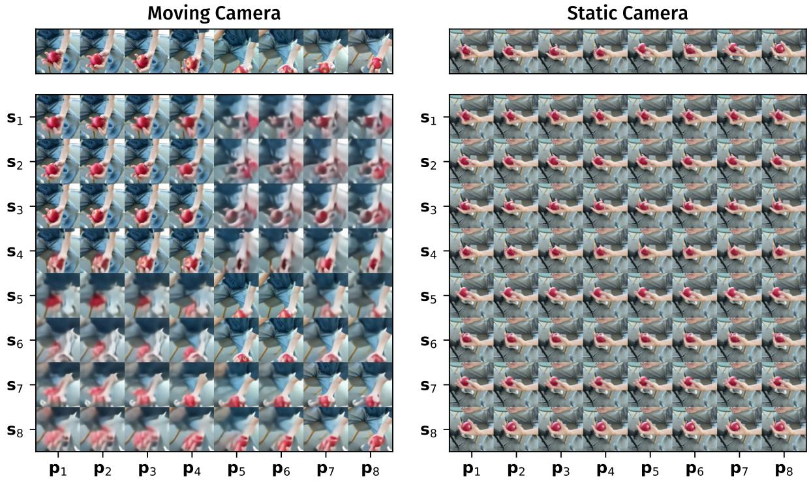  
Figure C.1: Dynamic State Transplantation Across Time. Starting from a video of 8 frames (top), we predict frame-wise poses and dynamic states, and then render views for each combination of state and pose.

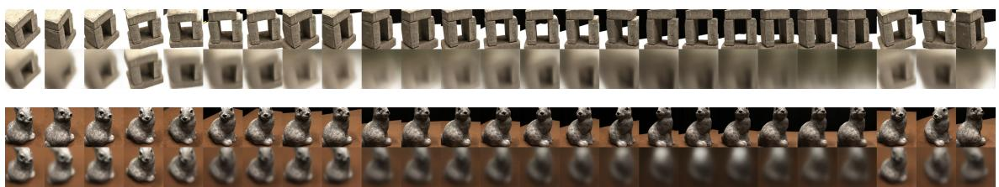

natural_image

Sequence of 3D-rendered objects on a wooden surface, showing progressive shading and texture changes (no text or symbols)

Figure C.2: Failure cases in DTU. RayDer trained on SpatialVid often fails on DTU due to the evaluation setting differing too greatly from the training setting. We can observe that the camera estimation stage fails particularly for larger transforms between views.

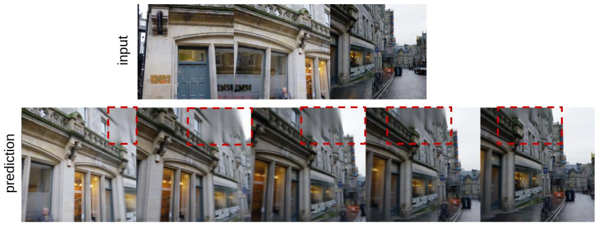

natural_image

Street view of a historic European-style building with visible windows and a 'input' section, alongside its prediction overlay (no text or symbols on the buildings themselves)

Figure C.3: Unobserved Regions. RayDer predicts blurry “averaged” patches in regions unobserved in any of the context views.

# C.2 Further Failure Cases/Limitations

We have found that RayDer fails to produce good predictions on DTU in the setting of SEVA [91], as shown in Sec. C.2 and in Tab. 5. The cause may be that the model is trained on open-set data of real world scenes, while the scenes in DTU are object centric with black and white backgrounds, placing them out of the training distribution. This explanation is consistent with the other experiments in Tab. 5, where the rest of the eval settings are closer to the training setting.

Furthermore, we have observed that RayDer produces blurred artifacts for parts of novel views which are not observed in any of the given views, which is a result of the regression objective. This effect can be observed in Fig. C.3. Note that there is a clearly observable boundary which separates the observed and unobserved parts of the scene. This failure case has also been described in RayZer [28], as well as GS-LRM [86] and LVSM [29], all of which are trained with the same objective. Additionally, just like RayZer, we have blurryness for fine details and objects close to the camera.

# C.3 Stability of RayZer trained on Dynamic Videos

In our attempts to train RayZer [28] models on video datasets such as SpatialVid [71] or SA-V [51] using the official code, we found training to be very unstable. Specifically, models seem to converge during (very) early training and then diverge or stall abruptly. When this happens seems to be highly influenced by the choice of batch size and view distance, although we were unable to find stable configurations that enable learning true NVS. Generally, we train multiple variants of RayZer on SpatialVid and SA-V, with minimal changes compared to the official default configuration for DL3DV-10k. We train for 200k iterations, where the learning rate schedule and view selection schedule are adjusted accordingly. We explore two main variations:

1. First, we explore a variation with 2 input views and 3 target views for later evaluation in the PixelSplat [4] setting on RealEstate10k. We adapt the default config used in the original RayZer for DL3DV-10k, adjust the view selection and learning rate schedule accordingly, and train for 200k iterations. More precisely, we scale the view selection such that the mean time passed between frames is the same in DL3DV-10k and the video datasets. This training recipe has worked the best for our experiments, and slight deviations from this recipe lead to even more degraded performance.

2. Secondly, we explore a variant in the setting described in our main exploration, namely: 6 input views and 2 output views, and sampling at 2 fps. Note that these are the exact settings we train RayDer on.

We train all models using the official implementation2. The official trainer already uses gradient clipping and training step skipping when the gradient norm is too large, to improve stability during training.3 In both settings described above, alongside a multitude of variations we explored, we observe divergences and stalled training at some point in the training process. Divergences are typically characterized by a sudden spike in the gradient norm and a subsequent sharp drop in training PSNR, marking a drop in the learned representation. A representative visualization is shown in Fig. 4. The resulting predictions resemble the mean of the input images. Stalled training, on the other hand, refers to the vast majority of training steps being skipped entirely once gradient norms exceed a set amount, for which we follow the original RayZer configuration, resulting in training progress stopping. Note that we have found disabling the skipping mechanism, while preventing the stalling, also leads to degeneracies during training, including divergences.

In additional runs using the first setting, trained on SpatialVid, we further vary the batch size and view distance. We observe that the learned camera space converges to a degenerate solution during training, where SE(3) interpolation between views results in a rotation of the camera between views. Generally, smaller batch sizes during training lead to faster divergences.

In our main table, we use the runs with the highest evaluatiuon PSNR we were able to obtain before stalling/divergence.

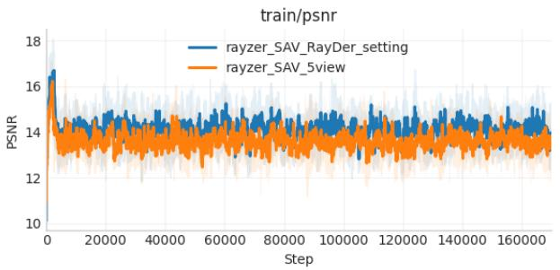

line

| Step   | rayzer_SAV_RayDer_setting | rayzer_SAV_5view |
| ------ | ------------------------- | ----------------- |
| 0      | 17.0                      | 14.0              |
| 20000  | 14.5                      | 13.5              |
| 40000  | 14.8                      | 13.8              |
| 60000  | 14.6                      | 13.7              |
| 80000  | 14.9                      | 13.9              |
| 100000 | 14.7                      | 13.6              |
| 120000 | 14.8                      | 13.8              |
| 140000 | 14.6                      | 13.7              |
| 160000 | 14.5                      | 13.6              |

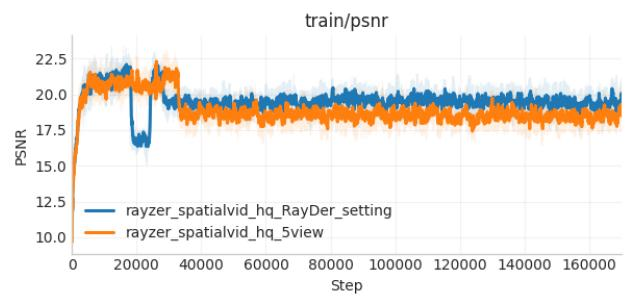

line

| Step   | rayzer_spatialvid_hq_RayDer_setting | rayzer_spatialvid_hq_5view |
| ------ | ----------------------------------- | -------------------------- |
| 0      | 20.0                                | 20.0                       |
| 20000  | 22.5                                | 22.0                       |
| 40000  | 19.0                                | 18.5                       |
| 60000  | 19.5                                | 18.0                       |
| 80000  | 19.5                                | 18.0                       |
| 100000 | 19.5                                | 18.0                       |
| 120000 | 19.5                                | 18.0                       |
| 140000 | 19.5                                | 18.0                       |
| 160000 | 19.5                                | 18.0                       |

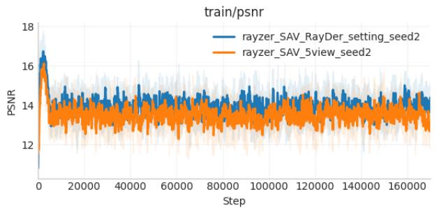

line

| Step   | rayzer_SAV_RayDer_setting_seed2 | rayzer_SAV_5view_seed2 |
| ------ | ------------------------------- | ---------------------- |
| 0      | 17.0                            | 16.5                   |
| 20000  | 14.5                            | 13.8                   |
| 40000  | 14.8                            | 13.9                   |
| 60000  | 14.6                            | 13.7                   |
| 80000  | 14.7                            | 13.8                   |
| 100000 | 14.5                            | 13.9                   |
| 120000 | 14.6                            | 13.8                   |
| 140000 | 14.7                            | 13.9                   |
| 160000 | 14.5                            | 13.8                   |

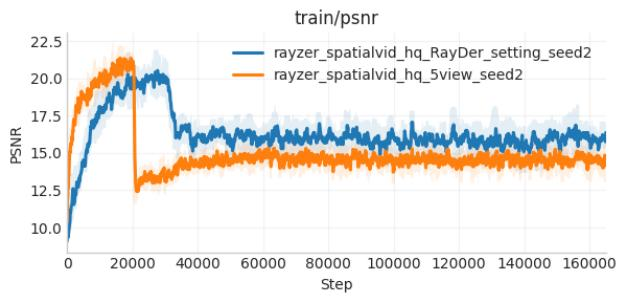

line

| Step   | rayzer_spatialvid_hq_RayDer_setting_seed2 | rayzer_spatialvid_hq_5view_seed2 |
| ------ | ------------------------------------------ | ---------------------------------- |
| 0      | 10.0                                       | 10.0                               |
| 20000  | 21.0                                       | 21.5                               |
| 40000  | 16.5                                       | 15.0                               |
| 60000  | 16.0                                       | 14.5                               |
| 80000  | 16.5                                       | 14.5                               |
| 100000 | 16.5                                       | 14.5                               |
| 120000 | 16.5                                       | 14.5                               |
| 140000 | 16.5                                       | 14.5                               |
| 160000 | 16.5                                       | 14.5                               |

Figure C.4: Training runs (PSNR) of RayZer on video datasets. At some point during training, RayZer’s PSNR drops sharply. This behaviour is representative across seeds.

# D Additional Evaluations

We provide additional SSIM and LPIPS results for the open-set novel view synthesis evaluation in Tab. 5. Importantly, RayDer-L-5762 is trained using only the MSE reconstruction loss and does not use perceptual supervision, i.e., $\lambda _ { \mathrm { p e r c } } = 0$ in equation (B.6). The results are reported in Tab. D.6 and Tab. D.5. Despite this purely reconstruction-based objective, RayDer achieves near state-of-the-art SSIM across several datasets. The LPIPS results are correspondingly weaker, which is consistent with the absence of perceptual loss during training.

Table D.5: Open-set Novel View Synthesis (LPIPS↓). We extend the evaluation by Zhou et al. [91] and compute LPIPS across a large variety of settings (columns). Note that the RayDer model evaluated here was not trained with any perceptual loss. 

<table><tr><td rowspan="3">Model</td><td rowspan="3">Params</td><td colspan="2">Dataset→</td><td colspan="2">LLFF</td><td colspan="2">DTU</td><td colspan="2">CO3D</td><td colspan="2">WRGBD</td><td>M360</td><td>T&amp;T</td><td colspan="6">Large-viewpoint</td></tr><tr><td colspan="2">Split→</td><td colspan="2">R</td><td colspan="2">R</td><td>V</td><td>R</td><td>Se</td><td>Sh</td><td>R</td><td>V</td><td>CO3D</td><td colspan="2">WRGBD</td><td colspan="2">M360</td><td>T&amp;T</td></tr><tr><td>Self-sup.</td><td>|Zin|→1</td><td>3</td><td>1</td><td>3</td><td>1</td><td>3</td><td>3</td><td>6</td><td>6</td><td>1</td><td>1</td><td>1</td><td>3</td><td>1</td><td>3</td><td>3</td><td>6</td></tr><tr><td>MVSplat [6]</td><td>12M</td><td>X</td><td>0.542</td><td>0.497</td><td>0.386</td><td>0.310</td><td>0.634</td><td>0.614</td><td>0.504</td><td>0.643</td><td>0.556</td><td>0.519</td><td>-</td><td>-</td><td>-</td><td>-</td><td>-</td><td>-</td><td>-</td></tr><tr><td>DepthSplat [82]</td><td>354M</td><td>X</td><td>0.530</td><td>0.465</td><td>0.369</td><td>0.304</td><td>0.618</td><td>0.603</td><td>0.499</td><td>0.530</td><td>0.534</td><td>0.462</td><td>0.756</td><td>0.732</td><td>0.588</td><td>0.691</td><td>0.491</td><td>0.706</td><td>0.611</td></tr><tr><td>ViewCrafter†[84]</td><td>1.4B</td><td>X</td><td>0.620</td><td>0.435</td><td>0.485</td><td>0.272</td><td>0.324</td><td>0.513</td><td>0.324</td><td>0.639</td><td>0.464</td><td>0.283</td><td>0.789</td><td>0.775</td><td>0.603</td><td>0.723</td><td>0.540</td><td>0.671</td><td>0.604</td></tr><tr><td>SEVA†[91]</td><td>1.3B</td><td>X</td><td>0.389</td><td>0.181</td><td>0.316</td><td>0.158</td><td>0.318</td><td>0.278</td><td>0.215</td><td>0.237</td><td>0.319</td><td>0.354</td><td>0.445</td><td>0.423</td><td>0.289</td><td>0.573</td><td>0.364</td><td>0.463</td><td>0.387</td></tr><tr><td>Kaleido†‡[41]</td><td>3.1B</td><td>X</td><td>0.301</td><td>0.123</td><td>-</td><td>-</td><td>-</td><td>-</td><td>-</td><td>-</td><td>0.286</td><td>-</td><td>-</td><td>-</td><td>-</td><td>0.530</td><td>0.344</td><td>0.465</td><td>0.363</td></tr><tr><td>E-RayZer* [89]</td><td>246M</td><td>√</td><td>0.505</td><td>0.438</td><td>0.540</td><td>0.393</td><td>0.528</td><td>0.529</td><td>0.439</td><td>0.528</td><td>0.678</td><td>0.585</td><td>0.626</td><td>0.653</td><td>0.588</td><td>0.738</td><td>0.699</td><td>0.688</td><td>0.678</td></tr><tr><td>RayDer-L-5762 (Ours)</td><td>743M</td><td>√</td><td>0.586</td><td>0.352</td><td>0.508</td><td>0.461</td><td>0.494</td><td>0.565</td><td>0.468</td><td>0.588</td><td>0.743</td><td>0.528</td><td>0.623</td><td>0.647</td><td>0.625</td><td>0.766</td><td>0.752</td><td>0.746</td><td>0.732</td></tr></table>

Split abbreviations: R: ReconFusion [79]; V: ViewCrafter [84]; S{e,h}: SEVA [91], easy (e) and hard (h) variants.   
Dataset references: LLFF [44], DTU [27], CO3D [42], WRGBD [81], M360 [2], T&T [35]   
‡Kaleido evaluates at 5122  instead of 5762   
†Diffusion-based models. ∗Multi-dataset Ckpt

Table D.6: Open-set Novel View Synthesis (SSIM↑). We extend the evaluation by Zhou et al. [91] and compute SSIM across a large variety of settings (columns). Despite being trained fully self-supervised and without large-scale video diffusion pretraining, RayDer is (near-)state-of-the-art across the majority of datasets and evaluation settings. 

<table><tr><td rowspan="3">Model</td><td rowspan="3">Params</td><td colspan="2">Dataset→</td><td colspan="2">LLFF</td><td colspan="2">DTU</td><td colspan="2">CO3D</td><td colspan="2">WRGBD</td><td>M360</td><td>T&amp;T</td><td colspan="7">Large-viewpoint</td></tr><tr><td colspan="2">Split→</td><td colspan="2">R</td><td colspan="2">R</td><td>V</td><td>R</td><td>Se</td><td>Sh</td><td>R</td><td>V</td><td>CO3D</td><td colspan="2">WRGBD</td><td colspan="2">M360</td><td colspan="2">T&amp;T</td></tr><tr><td>Self-sup.</td><td>|Iin|→1</td><td>3</td><td>1</td><td>3</td><td>1</td><td>3</td><td>3</td><td>6</td><td>6</td><td>1</td><td>1</td><td>1</td><td>3</td><td>1</td><td>3</td><td>3</td><td>6</td><td></td></tr><tr><td>MVSplat [6]</td><td>12M</td><td>X</td><td>0.283</td><td>0.358</td><td>0.576</td><td>0.624</td><td>0.403</td><td>0.370</td><td>0.405</td><td>0.368</td><td>0.312</td><td>0.394</td><td>-</td><td>-</td><td>-</td><td>-</td><td>-</td><td>-</td><td>-</td><td>-</td></tr><tr><td>DepthSplat [82]</td><td>354M</td><td>X</td><td>0.299</td><td>0.396</td><td>0.601</td><td>0.638</td><td>0.429</td><td>0.402</td><td>0.436</td><td>0.417</td><td>0.324</td><td>0.413</td><td>0.385</td><td>0.234</td><td>0.335</td><td>0.206</td><td>0.291</td><td>0.315</td><td>0.326</td><td></td></tr><tr><td>ViewCrafter†[84]</td><td>1.4B</td><td>X</td><td>0.146</td><td>0.454</td><td>0.542</td><td>0.671</td><td>0.641</td><td>0.483</td><td>0.465</td><td>0.376</td><td>0.354</td><td>0.563</td><td>0.277</td><td>0.225</td><td>0.321</td><td>0.199</td><td>0.264</td><td>0.328</td><td>0.337</td><td></td></tr><tr><td>SEVA†[91]</td><td>1.3B</td><td>X</td><td>0.384</td><td>0.602</td><td>0.585</td><td>0.647</td><td>0.585</td><td>0.647</td><td>0.670</td><td>0.646</td><td>0.395</td><td>0.437</td><td>0.536</td><td>0.505</td><td>0.603</td><td>0.282</td><td>0.377</td><td>0.385</td><td>0.427</td><td></td></tr><tr><td>Kaleido†‡[41]</td><td>3.1B</td><td>X</td><td>0.375</td><td>0.659</td><td>-</td><td>-</td><td>-</td><td>-</td><td>-</td><td>-</td><td>0.433</td><td>-</td><td>-</td><td>-</td><td>-</td><td>0.248</td><td>0.361</td><td>0.368</td><td>0.429</td><td></td></tr><tr><td>E-RayZer* [89]</td><td>246M</td><td>√</td><td>0.287</td><td>0.519</td><td>0.492</td><td>0.669</td><td>0.569</td><td>0.629</td><td>0.648</td><td>0.572</td><td>0.347</td><td>0.431</td><td>0.560</td><td>0.508</td><td>0.542</td><td>0.273</td><td>0.336</td><td>0.423</td><td>0.433</td><td></td></tr><tr><td>RayDer-L-5762 (Ours)</td><td>743M</td><td>√</td><td>0.469</td><td>0.650</td><td>0.654</td><td>0.702</td><td>0.668</td><td>0.657</td><td>0.672</td><td>0.601</td><td>0.339</td><td>0.578</td><td>0.625</td><td>0.558</td><td>0.577</td><td>0.339</td><td>0.353</td><td>0.447</td><td>0.450</td><td></td></tr></table>

Split abbreviations: R: ReconFusion [79]; V: ViewCrafter [84]; S{e,h}: SEVA [91], easy (e) and hard (h) variants.   
Dataset references: LLFF [44], DTU [27], CO3D [42], WRGBD [81], M360 [2], T&T [35]   
‡Kaleido evaluates at 5122  instead of 5762   
†Diffusion-based models. ∗Multi-dataset Ckpt

# E Additional Samples

We show additional qualitative examples in Figs. E.5, E.6 and E.8 to E.11. We also provide video visualizations of interpolated fly-throughs through various scenes from the DL3DV-10K [40] Eval set as videos in the supplementary material, including comparisons with E-RayZer [89] – the primary prior self-supervised NVS method trained on a mixture of static-scene datasets.

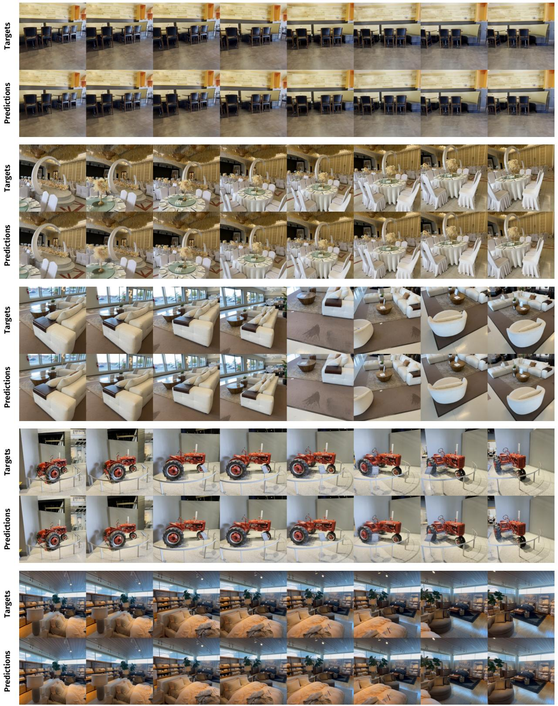  
Figure E.5: RayDer trained on static data. Novel View Samples from RayDer-B trained for 50k iterations on DL3DV-10k [40]. The ground-truth images are at the top, generated novel views are at the bottom. The input-images follow the official RayZer [67] even indices for DL3DV-10k Benchmark.

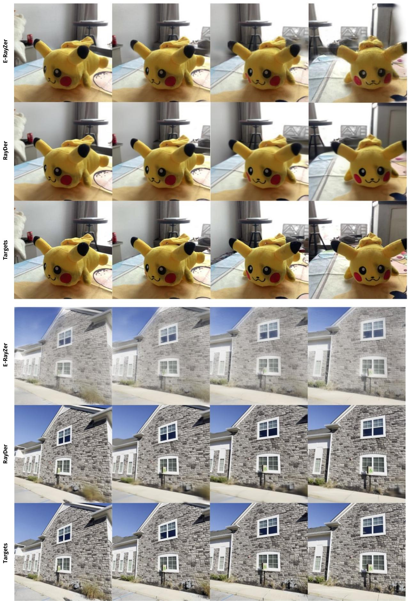

Figure E.6: Zero-shot Open-set samples on WildRGBD and DL3DV-10k evaluation using RayDer-L-576 with a sparse number of input views.

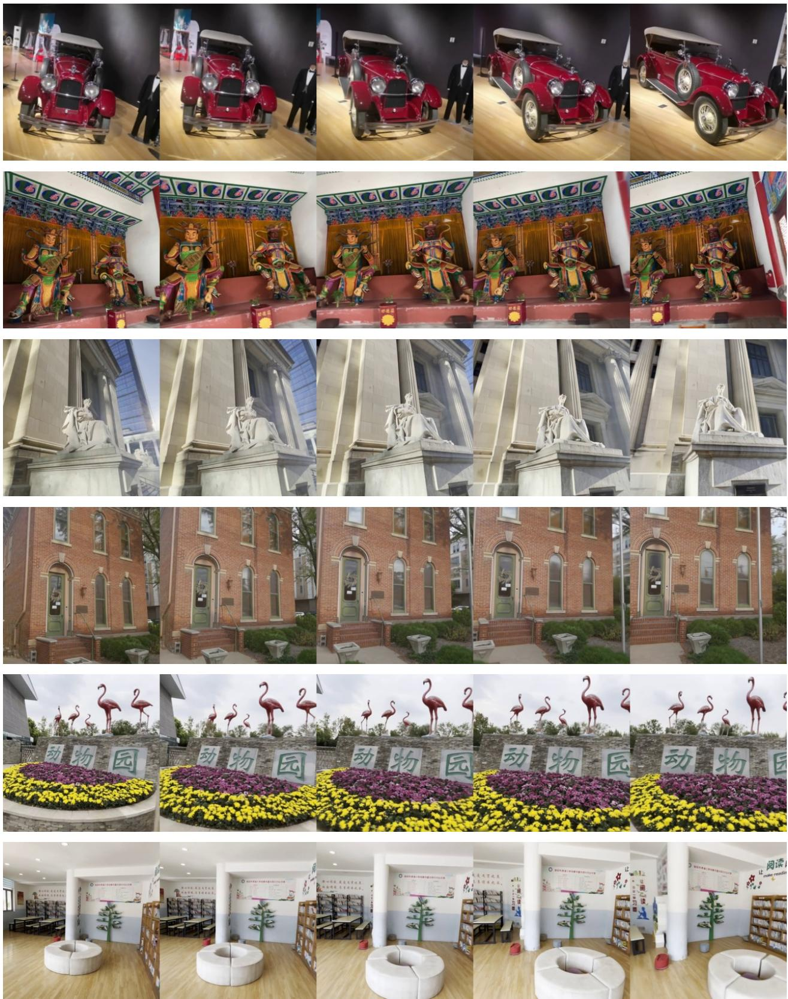  
Figure E.7: Zero-shot view interpolation on DL3DV-10k. Given a sparse set of context images, our model synthesizes smooth, intermediate novel views by interpolating between the predicted camera poses.

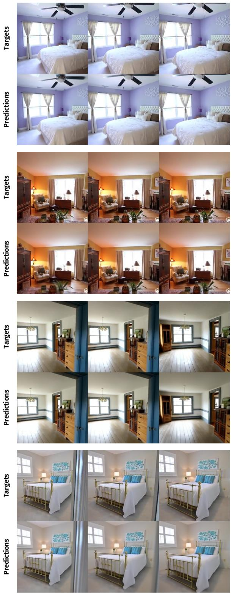

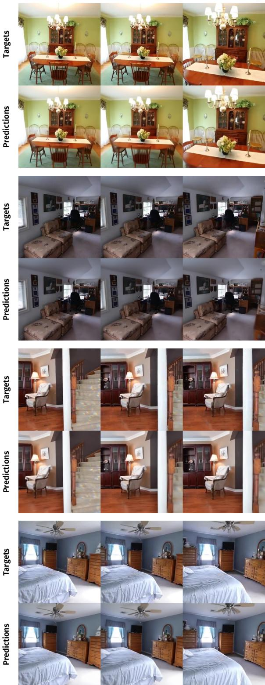  
Figure E.8: RayDer trained on dynamic data, Zero-shot on static data Novel View Synthesis samples from RayDer-L on RealEstate10k using the official PixelSplat [4] input-indices with two input images.

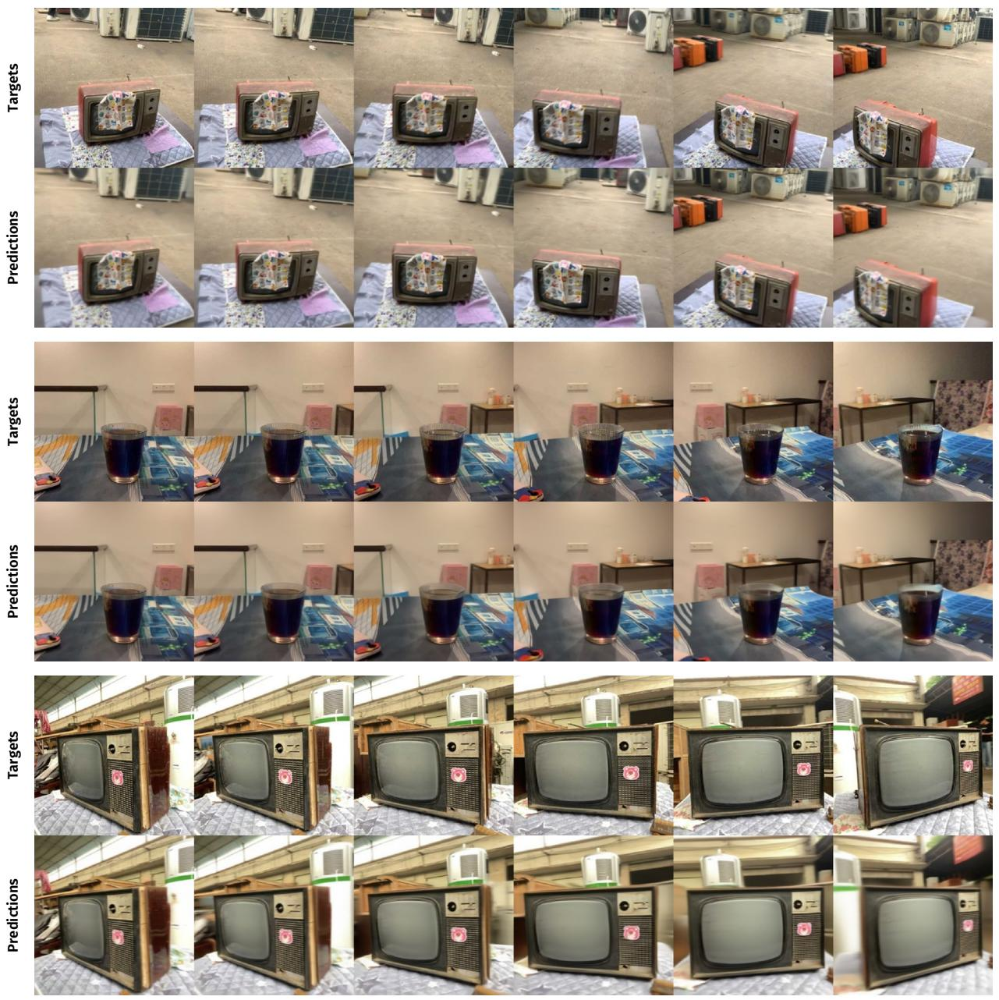  
Figure E.9: RayDer trained on dynamic data, Zero-shot on static data Novel View Synthesis samples from RayDer-L on WildRGBD

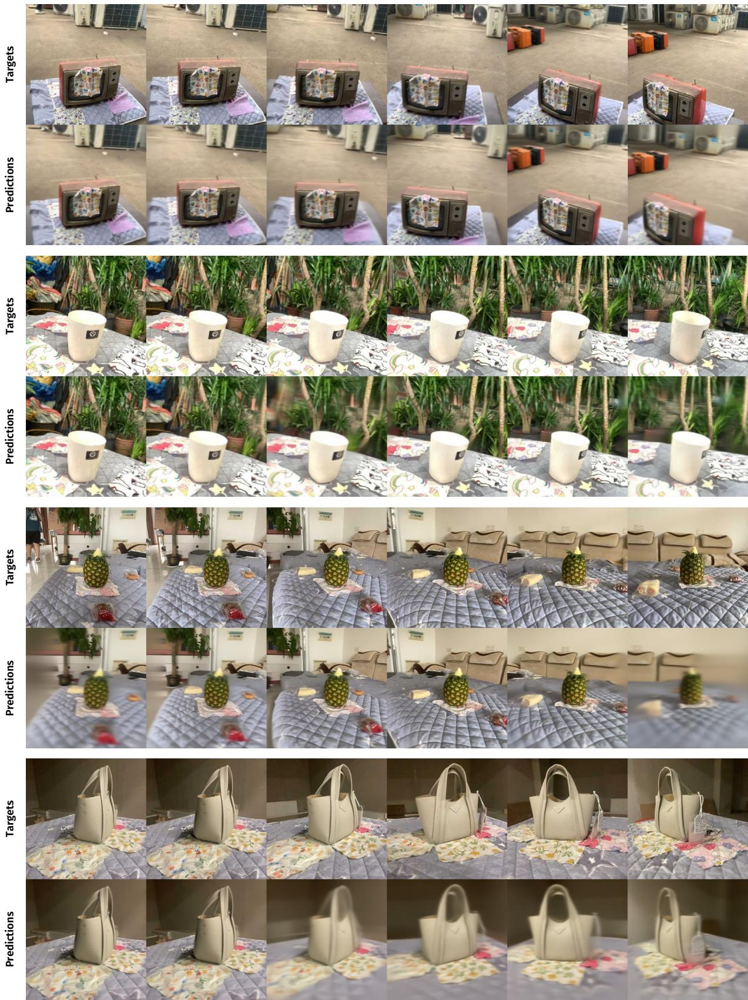  
Figure E.10: RayDer trained on dynamic data, Zero-shot on static data, sparse view setting Novel View Synthesis samples from RayDer-L on WildRGBD with 2 input views.

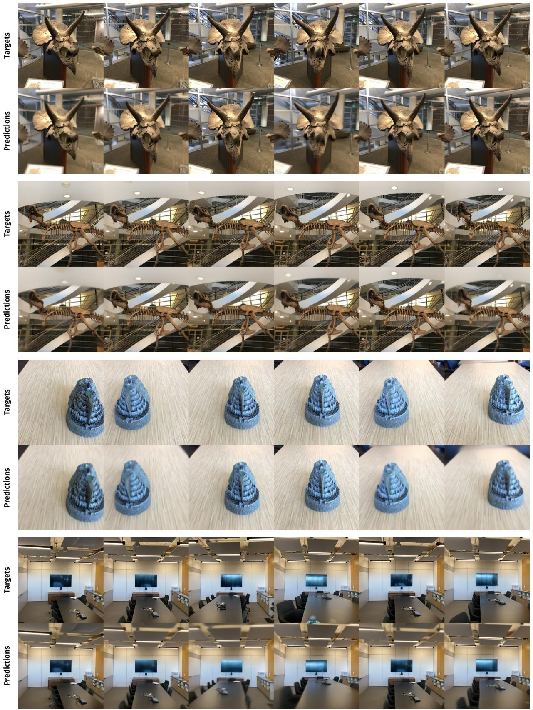  
Figure E.11: RayDer trained on dynamic data, Zero-shot on static data Novel View Synthesis samples from RayDer-L on LLFF dataset with 3 input views.

# F Language Model Usage

We employed large language models (Claude Opus 4.6, OpenAI GPT-5.2, Google Gemini 3 Pro) for text refinement purposes, including improving grammar and as inspiration for rephrasing sections. They were also employed to provide feedback on early drafts and propose initial implementations for auxiliary utility functions not directly related to the paper’s contributions (e.g., implementations of alternative camera intrinsics models), subsequently verified and reworked by the authors. No scientific content, experimental results, or novel ideas were generated by LLMs – all technical contributions were conceived, implemented, and verified by the authors.

# G Author Contributions

UP and SB co-led the project and developed the core method. Beyond the core method, SB was primarily responsible for project coordination, implementation, and writing; UP was responsible for related work and all evaluations incl. baselines. NS contributed to the method concept, infrastructure development, and writing; BO advised the project.

# H Copyright

The style used for this paper is adapted from the arXiv preprint Discrete Flow Matching (Gat et al., 2024), licensed under CC BY 4.0. Throughout the paper and figures/plots, we use Fira Sans (licensed under the OFL v1.1) for bold text.

Dataset Licenses. Datasets used in this work are available under the following licenses:

• Segment Anything-Video [51]: CC BY 4.0.   
• SpatialVid [71]: CC BY NC SA 4.0.   
• DL3DV-10K [40]: DL3DV-10K Terms of use, and CC BY-NC 4.0.   
• RE10k [92]: CC BY 4.0.   
• uCO3D [42]: CC BY 4.0.   
• LLFF [44]: GPL-3.0 on repository, but no explicit statement that this also applies to the data (only used for evaluation).   
• DTU MVS [27]: “freely available” (only used for evaluation).   
• CO3D [42]: CC BY-NC 4.0.   
• WildRGBD [81]: MIT on repository, but no explicit statement that this also applies to the data (only used for evaluation).   
• MipNeRF-360 [2]: unknown (only used for evaluation).   
• Tanks & Temples [35]: CC BY 4.0.   
• DAVIS [49]: BSD 3-Clause.   
• DyCheck [15]: Apache 2.0.