# SOCO: Benchmarking Semantic Object Correspondence in Vision Foundation Models

Olaf Dünkel1⋆, Basavaraj Sunagad2⋆, Haoran Wang1, David T. Hoffmann3, Christian Theobalt1, and Adam Kortylewski2

1 Max Planck Institute for Informatics, Saarland Informatics Campus 2 CISPA Helmholtz Center for Information Security 3 University of Freiburg

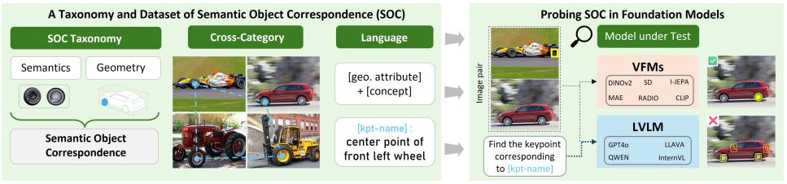

flowchart

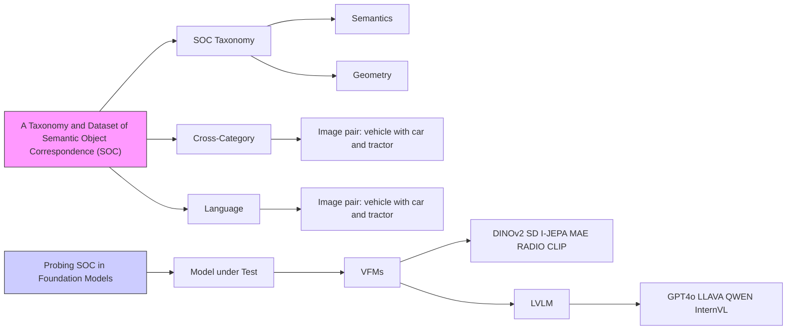

Fig. 1: SOCO provides the first taxonomy-driven, language-grounded formulation of Semantic Object Correspondence (SOC), enabling structured, semantically coherent, and cross-category part annotations across 100 diverse categories, which allows evaluating semantic and structured object understanding in vision foundation models (VFMs) and large vision language models (LVLMs).

Abstract. Measuring structured object understanding in vision foundation models remains challenging due to inconsistent evaluation protocols and limited part-level supervision. Semantic correspondence (SC) evaluates this capability by testing whether object parts can be matched across instances and categories under large variations in appearance, viewpoint, and geometry. To enable a systematic SC evaluation, we introduce SOCO, a new benchmark for Semantic Object Correspondence that introduces a taxonomy of correspondence types and provides consistent, functionally meaningful keypoint annotations across 100 categories and over 1M correspondence pairs. In addition, SOCO includes keypoint language descriptions, enabling the evaluation of large vision–language models (LVLMs) and their fine-grained part-level understanding. Comprehensive experiments reveal that (i) vision foundation backbones encode strong semantic structure but transfer correspondences poorly across related categories and only partially capture objectpart position, (ii) LVLMs are stronger at text-prompted part localization than at visual-reference cross-image matching, exposing a gap between language-grounded localization and fine-grained visual correspondence, and (iii) correspondence performance predicts dense downstream tasks— segmentation, tracking, 3D pose estimation, and 3D detection—more strongly than ImageNet classification. Together, these findings position

SOCO as a benchmark for structured, part-level representation quality in vision and multimodal foundation models. Dataset and code are available at https://genintel.github.io/SOCO/.

Keywords: Semantic Correspondence · Representation Learning · Benchmarking

# 1 Introduction

Visual representations form the foundation of visual intelligence. Evaluating their quality has long been central to progress in computer vision. Existing benchmarks probe distinct aspects of visual understanding, ranging from categorylevel recognition benchmarks such as ImageNet [16] to spatial localization tasks including detection, segmentation, and pose estimation [2,15,35]. However, they provide limited insight into whether a representation captures structured object understanding, i.e., the ability to relate semantically corresponding parts across different object instances and categories.

Recently, semantic correspondence (SC) has become increasingly important for evaluating self-supervised and foundation models [24, 50, 59, 66], as it measures a model’s ability to establish correspondences between object parts across different instances of a category—a capability that requires consistently capturing object structure under substantial variation in appearance, viewpoint, and geometry. The ability to establish such correspondences is crucial for transferring knowledge across related objects, for example when adapting affordances, recognition, pose estimation, or reconstruction to unseen categories, which is important for embodied and robotic systems [23, 68].

However, despite this growing adoption, progress in SC research has been constrained by the lack of a clear task definition and by the limitations of existing datasets [44, 62]. Current benchmarks conflate two distinct abilities in a single within-category score—recognizing the same local concept (e.g. a wheel center) and identifying its correct repeated instance within an object (front-left vs. rearright wheel)—and do not evaluate transfer across related categories (a wheel center on a car, bus, or tractor) at all. This ambiguity limits current evaluations of modern foundation models.

We therefore propose Semantic Object Correspondence (SOC), a taxonomy-driven formulation of semantic correspondence that disentangles these three abilities. SOC explicitly models the relationship between object part semantics and the overall object structure, providing a clearer separation between local concept recognition, object-relative identity, and cross-category transfer. Concretely, the taxonomy distinguishes concept correspondence (CC, matching the same local concept), semantic object correspondence (SOC, matching the same concept with the same object-relative identity), and cross-category SOC (matching object-relative keypoints across related categories through shared taxonomy concepts). This decomposition reduces annotation ambiguity, standardizes what constitutes a valid correspondence across object categories and viewpoints, and makes distinct model failure modes separately measurable.

Building on this definition, we present SOCO, a Semantic Object COrrespondence dataset that measures SOC with taxonomy-driven keypoint annotations across 100 object categories organized into four super-classes. Unlike prior datasets, SOCO emphasizes semantic consistency and crosscategory matching, enabling structured evaluation of correspondence across varying geometry and appearance for a diverse range of man-made object and animal categories. Across a broad family of vision foundation models— including self-supervised and vision–language models such as DINO [13, 46, 59], CLIP [47], Stable Diffusion [52], and I-JEPA [3]—the decomposed evaluation reveals distinct failure modes: strong VFMs recognize local concepts but exhibit large CC→SOC drops (repeated-part confusion) and further SOC→Cross-SOC drops (limited category-level abstraction). Moreover, SOC is a practical zeroshot diagnostic of representation quality: it correlates with dense downstream tasks—segmentation, tracking, 3D pose, and 3D detection—more strongly than ImageNet classification accuracy.

As connecting vision and language modalities becomes increasingly important, benchmarks for structured object understanding should not only evaluate visual representations but also large vision–language models (LVLMs). To support this, we extend SOCO with language descriptions of correspondence keypoints, creating a comprehensive benchmark for studying the interplay between visual correspondences and natural language in multimodal foundation models. LVLM evaluations reveal a complementary failure mode: current LVLMs are substantially stronger at text-prompted part localization within a single image than at visual-reference correspondence across images, exposing a gap between language-grounded localization and fine-grained visual matching. Together, the results position SOCO as a unified benchmark for analyzing fine-grained visual reasoning and multimodal representation quality in the era of large foundation models.

# In summary, our main contributions are:

– Task formulation. We introduce Semantic Object Correspondence (SOC) as a taxonomy-driven decomposition of semantic correspondence into concept correspondence, structured object understanding, and crosscategory transfer.   
– Dataset. We present SOCO, a large-scale benchmark built on this taxonomy, featuring 100 diverse categories, semantically grounded keypoint annotations, and over 1M correspondence pairs, with provided language descriptions that enable joint study of visual correspondence and language understanding in multimodal models.   
– Vision-model analysis. Across a broad family of vision foundation models, the SOC decomposition exposes repeated-part confusion and limited crosscategory abstraction even in strong dense self-supervised backbones.   
– LVLM analysis. On the same taxonomy, current LVLMs are stronger at text-prompted part localization than at visual-reference cross-image matching, revealing a gap between language-grounded localization and fine-grained visual correspondence.

Table 1: Comparison of semantic correspondence benchmarks. SOCO uniquely combines a hierarchical keypoint taxonomy, language descriptions, and crosscategory correspondence pairs while covering a large and diverse set of categories, compared to other SC datasets that include man-made objects. 

<table><tr><td>Dataset</td><td>#Cats.</td><td>#Pairs</td><td>Keyp.</td><td>Taxonomy</td><td>Sep.geo.</td><td>Cross-cat.</td><td>Language</td></tr><tr><td>PF-WILLOW</td><td>5</td><td>900</td><td>10</td><td>✗</td><td>✗</td><td>✗</td><td>✗</td></tr><tr><td>PF-PASCAL</td><td>20</td><td>1.3k</td><td>4–17</td><td>✗</td><td>✗</td><td>✗</td><td>✗</td></tr><tr><td>SPair-71k</td><td>18</td><td>71k</td><td>3–30</td><td>✗</td><td>✗</td><td>✗</td><td>✗</td></tr><tr><td>DISCOBOX</td><td>12</td><td>36k</td><td>1–12</td><td>✗</td><td>✗</td><td>√</td><td>✗</td></tr><tr><td>MISC210K</td><td>34</td><td>218k</td><td>5–52</td><td>✗</td><td>✗</td><td>✗</td><td>✗</td></tr><tr><td>SOCO</td><td>100</td><td>1M</td><td>6–32</td><td>√</td><td>√</td><td>√</td><td>√</td></tr></table>

– SOC as a representation diagnostic. We conduct extensive experiments across a broad family of vision models, demonstrating that SOC correlates more strongly than ImageNet kNN with dense downstream tasks, positioning SOC as a practical zero-shot diagnostic of representation quality.

# 2 Related work

Semantic Correspondence Benchmarks. Finding correspondences is a fundamental task in computer vision, ranging from geometric [36, 51] and stereo matching [43, 54] to optical flow [11] and tracking [71], which are typically constrained to the same instance or scene. In contrast, semantic correspondence aims to establish correspondences between object parts across different instances of the same category. Early datasets such as PF-PASCAL and PF-WILLOW [26], TSS [64], and Freiburg-Cars [55] defined keypoint correspondences but they were limited in scale and category diversity. Zhang et al. [79] propose a semantic correspondence benchmark based on animal keypoints from AP-10K [77]. However, it does not include man-made objects, which have more diverse keypoint types and are equally important for probing general object-level understanding. SPair-71k [44] became the de-facto standard benchmark by providing 71k image pairs across 1,800 images from 10 rigid categories of PASCAL 3D+ [73] and 8 non-rigid categories of PASCAL VOC 2012 [21], out of which 481 images are used for testing. Due to the imbalanced class selection, quadruped animals and vehicles are favored. MISC210K [62] focuses on multi-instance correspondence and increases dataset scale, but its keypoints are defined by geometric heuristics rather than a hierarchical taxonomy of semantic concepts, which—as in SPair-71k—prevents cross-category evaluation. Additionally, current SC benchmarks do not provide keypoint descriptions, preventing systematic evaluation of LVLMs. SOCO addresses these limitations by introducing the concept of Semantic Object Correspondence, a taxonomy-driven formulation that specifically separates geometric from non-geometric semantic correspondences and standardizes what constitutes a valid correspondence across object categories. Based on this, we create a dataset of diverse categories with taxonomy-driven SC keypoints and textual descriptions, forming the basis for a more comprehensive benchmark.

Semantic Correspondence in the Era of Foundation Models. Selfsupervised and multimodal foundation models have renewed interest in semantic correspondence as a probe for representation quality [20, 59, 66], after various studies have shown that features obtained from such models can be utilized for identifying semantic correspondences in a zero-shot manner [13, 25, 39, 46, 61, 63, 80], even though they do not encode the 3D part composition particularly well [14, 19, 41, 42, 60, 67, 79]. Evaluating semantic correspondence (SC) performance provides a complementary diagnostic to conventional tasks such as classification [16, 18, 22] or segmentation [15, 81]: by measuring how well models align object parts under appearance and pose variation, it reveals whether representations encode fine-grained part-level and 3D-aware structure rather than local appearance details or global category cues.

In parallel to advances in SSL, vision–language models (VLMs) such as CLIP [47], BLIP [33], and Flamingo [1] were developed to align visual and textual modalities, but their evaluation focuses mainly on retrieval and captioning [47, 56] rather than fine-grained spatial understanding. Moreover, modern large vision-language models (LVLMs) such as LLava [37], Qwen-VL [5], GPT-4V [45], and Gemini [65], extend this paradigm toward multimodal visual reasoning, yet their evaluation remains dominated by high-level tasks like VQA [38, 78] and high-level spatial reasoning [75]. BLINK [24] contains a limited number of questions targeting semantic correspondence. However, since it is built on SPair-71k and does not contain language annotations, this benchmark does not provide a comprehensive evaluation of diverse fine-grained object understanding. Our work addresses this gap by introducing a benchmark that enables a systematic evaluation of LVLMs in terms of their visual correspondence and natural language alignment, allowing analysis of how linguistic cues influence fine-grained correspondence-level understanding.

# 3 A Taxonomy for Semantic Correspondence

Semantic correspondence (SC) is commonly understood as the task of matching points with similar semantics across different instances of an object category. However, the definition of “semantic” correspondence has remained vague and dataset-dependent. We detail this in Sec. 3.1. To address this gap, we propose a taxonomy for the SC task, providing a principled foundation for systematic annotation and evaluation. The proposed taxonomy forms the conceptual basis for Semantic Object Correspondence (SOC), a formulation that explicitly separates the local semantics and geometric position of an object part. We introduce SOC in the following section (Sec. 3.2) and show how it resolves the inconsistencies observed in existing benchmarks.

# 3.1 Limitations of Current SC Keypoint Annotations

Existing SC object datasets (e.g., PF-PASCAL [26], MISC210K [62], Freiburg Cars [55], SPair-71k [44]) lack a systematic, hierarchical keypoint annotation strategy that scales across categories. Their annotations are often defined geometrically (e.g., midpoints on TV or boat contours) rather than as self-contained semantic concepts, are ambiguous for categories with large intra-class variability (boats) or symmetry (bottles, potted plants), are defined on 2D projections and thus break under viewpoint change, and are sometimes internally inconsistent (e.g., the “end” of a train). Crucially, current benchmarks evaluate object correspondence only within categories, ignoring relationships between semantically related objects (cars/trucks/buses) and thereby preventing assessment of crosscategory semantic transfer. We illustrate concrete cases of annotation limitations in Fig. r3 in the supplementary.

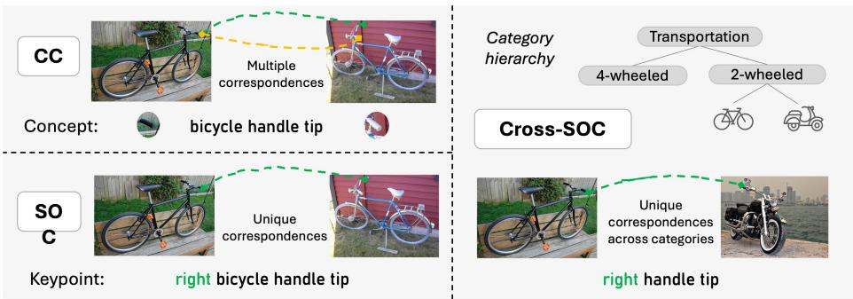

text_image

CC
Multiple correspondences
Concept:
bicycle handle tip
Category hierarchy
Transportation
4-wheeled
2-wheeled
Cross-SOC
SO C
Unique correspondences
Keypoint:
right bicycle handle tip
Unique correspondences across categories
right handle tip

Fig. 2: Illustration of concept correspondence (CC), semantic object correspondence (SOC), and cross-category semantic object correspondence (Cross-SOC). SOCO differentiates CC and SOC, which define unique correspondences by disambiguating multiple instances of the same concept via geometric attributes, such as right. Cross-category matches (Cross-SOC) are derived from the accompanying category hierarchy.

These limitations are not merely annotation artifacts but stem from the absence of a structured representation of object parts. A principled formulation requires three properties: keypoints grounded in local semantics (unambiguous identification); identity attributes that distinguish repeated parts (front-left vs. rear-right wheel); and an explicit hierarchical organization of semantic concepts that can be reused across categories rather than redefined per class.

# 3.2 A Taxonomy of Semantic Object Correspondence

To introduce a more principled formulation of semantic correspondence, we define the term Semantic Object Correspondence (SOC). SOC explicitly separates two complementary aspects: the local semantics of an object part and its spatial configuration within the overall object structure. This allows probing whether a model is able to match semantic concepts and semantic object keypoints that include a positional attribute.

A semantic concept is defined as a uniquely identifiable location (e.g., a corner point) within an object part that is typically shared across instances of the same category. Concepts capture the local semantics of a location on an object and its immediate functional context—for instance, the door handle of a car, irrespective of whether it belongs to the left or right door. In contrast, semantic object keypoints are concrete, instance-specific realizations of a semantic concept. Each semantic object keypoint inherits from a concept but is further disambiguated by additional positional attributes that describe its placement within the object or component, such as left, right, bottom, or rear, which are consistently defined in the object-centric coordinate system. Concepts therefore describe what object part is being matched, whereas semantic object keypoints specify which instance of that part within an object is considered. This makes finding correspondences among semantic object keypoints inherently more challenging than concept-level matching, as a model must capture or reason about both semantic identity and geometric placement within the object context to correctly identify correspondences. While matching concepts across two instances (concept correspondence, CC ) can yield non-unique matches across keypoints, keypoint matching (semantic object correspondence, SOC ) always has a unique solution. Formally, a Semantic Object Correspondence is defined as a match between two keypoints that share the same semantic concept and identical object-relative identity attributes, ensuring both semantic and geometric matching.

Importantly, semantic concepts are not restricted to a single category (crosscategory SOC or Cross-SOC ). For example, a wheel concept may appear in a passenger car and in a school bus or tractor. To capture this hierarchical and cross-category structure, we propose to organize all semantic concepts within a taxonomy that spans categories, super-categories, and shared concepts among objects. This hierarchy enables correspondence evaluation both within categories and across related object classes. Fig. 2 illustrates CC, SOC, and Cross-SOC.

Together, this formulation establishes a coherent and extensible annotation framework for semantic correspondence, which forms the conceptual foundation for the SOCO dataset introduced next.

# 4 The SOCO dataset

Building on the taxonomy introduced in Sec. 3.2, we construct SOCO: a largescale, taxonomy-driven dataset for evaluating Semantic Object Correspondence (SOC). SOCO is designed to address key limitations of prior correspondence benchmarks by providing (1) a standardized, semantically grounded keypoint schema, (2) cross-category and hierarchical image-keypoint pairs, (3) and a substantially broader and more balanced set of object categories. Additionally, SOCO introduces language descriptions for all keypoints, enabling unified evaluation of both vision and vision–language correspondence models.

# 4.1 Dataset Creation

In the following, we describe the steps of the dataset creation: Image collection, category distribution, keypoint annotation, and language descriptions.

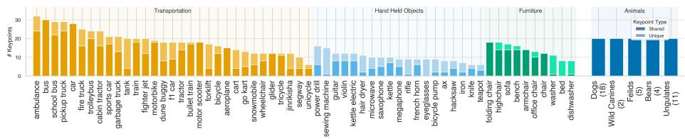

bar

| Category | Key Kepoints |
|---|---|
| ambulance | 30 |
| bus | 28 |
| school bus | 27 |
| pickup truck | 26 |
| car | 25 |
| fire truck | 24 |
| tricycle bus | 23 |
| cabin tractor | 22 |
| sports car | 21 |
| garbage truck | 20 |
| tank | 19 |
| train | 18 |
| fighter jet | 17 |
| motorbike | 16 |
| dune doggy | 15 |
| truck | 14 |
| tractor | 13 |
| bullet train | 12 |
| motor scooter | 11 |
| forklift | 10 |
| bicycle | 9 |
| aeroplane | 8 |
| cart | 7 |
| go kurt | 6 |
| snowmobile | 5 |
| wheelchair | 4 |
| glider | 3 |
| tricycle | 2 |
| jinkisaha | 1 |
| segway | 0 |
| unicycle | -1 |
| power drill | -2 |
| sewing machine | -3 |
| guitar | -4 |
| volan | -5 |
| kettle electric | -6 |
| hair dryer | -7 |
| microwave | -8 |
| saxophone | -9 |
| kettle | -10 |
| megaphone | -11 |
| rifle | -12 |
| french horn | -13 |
| eyeglasses | -14 |
| bicycle pump | -15 |
| hammer | -16 |
| hacksaw | -17 |
| iron | -18 |
| knife | -19 |
| teapot | -20 |
| folding chair | -21 |
| highchair | -22 |
| sofa | -23 |
| bench | -24 |
| armchair | -25 |
| offboard chair | -26 |
| washer | -27 |
| bed | -28 |
| dishwasher | -29 |
| Dogs (18) | 30 |
| Wild Canines (2) | 30 |
| Felis (5) | 30 |
| Bears (4) | 30 |
| Ungulates (1) | 30 |

| Transportation: Shared Unique
Keypoint Type
Legend:
Legend: Shared Unique
Legend: Shared Unique

Fig. 3: Statistics of labeled keypoints. Keypoints in SOCO are annotated for a diverse set of categories from four super-categories. Each category is labeled with a subset of keypoints that are shared across multiple categories. The animal keypoints are shared across all animal categories.

Image collection. All images are samples from ImageNet. We rely on 2D and 3D annotations from ImageNet3D [40] for man-made objects and on keypoint annotations from the Animal3D dataset [74] for the animal categories. We only retain images that (1) contain valid pose metadata, (2) depict a single salient object, and (3) have a sufficiently large object size.

Category distribution. SOCO comprises 100 categories organized into four high-level super-categories: Transportation (31 classes), Hand-held Objects (20 classes), Furniture (9 classes), and Animals (40 classes).

Keypoint annotation. All keypoints follow the introduced taxonomy. While annotations for animal categories can be acquired from animal keypoint datasets, annotations of man-made objects that follow the taxonomy do not exist and, therefore, need to be collected. For this purpose, initial annotations are acquired via Amazon Mechanical Turk and refined through a manual verification stage. A user-friendly UI with integrated keypoint reference cards was developed to enable high-quality annotations. Three qualified annotators independently complete each image annotation, and the annotations are median-aggregated after removing outliers. Every keypoint annotation is verified manually to ensure consistency and accuracy. The median per-keypoint standard deviation across annotators is 0.85% (normalized by the maximum image dimension), indicating strong agreement. During manual verification, 65.4% of annotations required only minor refinements within PCK@0.05 tolerance, while 6.8% required larger corrections, e.g., due to confused conventions (e.g. left vs. right).

Language Descriptions. Each annotated keypoint includes a humanspecified language description that combines its categorical, conceptual, and geometric attributes. Descriptions are generated programmatically using the tuple (category, concept, keypoint position within the object part, object part position within the whole object), e.g., “Center point of the front left wheel of a bus”.

# 4.2 Dataset Statistics

Figure 3 presents the per-category keypoint distribution, including how many keypoints are shared with other categories. For each object category, 40 images are annotated, ensuring diverse viewpoints, shapes, and instance-level variations, resulting in a total of 4000 images. We construct Semantic Object Correspondence (SOC) pairs by matching images within the same category, requiring at least three shared semantic keypoints. This yields around 62k SOC pairs with a total of around 480k keypoint correspondences. Concept correspondences (CC) are generated using the same pairs.

Table 2: Model performances on SOCO. We report PCK@0.1 across concept correspondence (CC), semantic object correspondence (SOC), and its cross-category variant (Cross-SOC), as well as supercategory results. As more geometric awareness is required for SOC and more semantic abstraction for Cross-SOC, model performance drops for all models. Additional evaluations are provided in the supplementary. 

<table><tr><td rowspan="2">Model</td><td colspan="4">Accuracies by Tasks</td><td colspan="4">SOC by Supercategories</td></tr><tr><td>CC</td><td>SOC</td><td>Cross-SOC</td><td>Avg</td><td>Trans.</td><td>Hand</td><td>Furn.</td><td>Animals</td></tr><tr><td>DINOv1</td><td>43.8</td><td> $30.6 \downarrow 13.2$ </td><td> $23.9 \downarrow 19.8$ </td><td>32.8</td><td>29.1</td><td>32.9</td><td>27.4</td><td>31.4</td></tr><tr><td>DINOv2</td><td>78.9</td><td> $60.4 \downarrow 18.5$ </td><td> $55.0 \downarrow 23.9$ </td><td>64.8</td><td>56.9</td><td>61.6</td><td>45.5</td><td>66.3</td></tr><tr><td>DINOv3</td><td>69.7</td><td> $55.5 \downarrow 14.2$ </td><td> $49.4 \downarrow 20.3$ </td><td>58.2</td><td>51.6</td><td>57.4</td><td>59.9</td><td>56.6</td></tr><tr><td>iBOT</td><td>55.2</td><td> $39.6 \downarrow 15.5$ </td><td> $34.1 \downarrow 21.1$ </td><td>43.0</td><td>36.1</td><td>40.1</td><td>32.8</td><td>43.9</td></tr><tr><td>I-JEPA</td><td>60.5</td><td> $46.3 \downarrow 14.2$ </td><td> $38.4 \downarrow 22.1$ </td><td>48.4</td><td>41.5</td><td>51.0</td><td>46.7</td><td>47.7</td></tr><tr><td>C-RADIOv3</td><td>69.0</td><td> $51.1 \downarrow 18.0$ </td><td> $46.3 \downarrow 22.7$ </td><td>55.5</td><td>51.7</td><td>48.1</td><td>39.7</td><td>54.8</td></tr><tr><td>DUNE</td><td>60.1</td><td> $45.7 \downarrow 14.4$ </td><td> $38.5 \downarrow 21.6$ </td><td>48.1</td><td>40.0</td><td>50.5</td><td>51.0</td><td>46.6</td></tr><tr><td>SD 2.1</td><td>56.0</td><td> $44.8 \downarrow 11.2$ </td><td> $38.3 \downarrow 17.7$ </td><td>46.4</td><td>42.4</td><td>45.3</td><td>47.7</td><td>45.6</td></tr><tr><td>CroCov2</td><td>15.2</td><td> $10.2 \downarrow 5.0$ </td><td> $7.8 \downarrow 7.3$ </td><td>11.1</td><td>11.6</td><td>12.3</td><td>10.2</td><td>8.1</td></tr><tr><td>MAE</td><td>14.4</td><td> $9.4 \downarrow 5.0$ </td><td> $7.2 \downarrow 7.2$ </td><td>10.3</td><td>10.0</td><td>11.9</td><td>11.7</td><td>7.1</td></tr><tr><td>PIXIO</td><td>49.5</td><td> $37.5 \downarrow 11.9$ </td><td> $32.9 \downarrow 16.5$ </td><td>40.0</td><td>37.3</td><td>40.2</td><td>46.7</td><td>34.2</td></tr><tr><td>CLIP</td><td>24.9</td><td> $16.1 \downarrow 8.9$ </td><td> $11.2 \downarrow 13.7$ </td><td>17.4</td><td>17.5</td><td>14.2</td><td>11.6</td><td>16.9</td></tr><tr><td>PE-Spatial</td><td>60.6</td><td> $43.8 \downarrow 16.8$ </td><td> $38.8 \downarrow 21.9$ </td><td>47.7</td><td>45.1</td><td>40.7</td><td>37.6</td><td>45.9</td></tr><tr><td>QWEN-L</td><td>27.2</td><td> $19.4 \downarrow 7.9$ </td><td> $16.2 \downarrow 11.0$ </td><td>20.9</td><td>21.7</td><td>24.1</td><td>22.6</td><td>14.5</td></tr></table>

We also form cross-category (Cross-SOC) pairs, using a minimum of three shared semantic keypoints. Due to the large combinatorial space of crosscategory pairings, Cross-SOC generation results in around 940k cross-category correspondence pairs. These complementary pairing regimes (CC, SOC, and Cross-SOC) provide progressively more challenging correspondences that support evaluation across concepts, keypoints, and different categories.

# 5 Experiments

In this section, we benchmark several foundation models on semantic object correspondence. We first report results for vision encoders (Sec. 5.1) and LVLMs (Sec. 5.2). Then, we analyze how SOC relates to other vision tasks (Sec. 5.3).

# 5.1 Vision Foundation Model Evaluation on SOCO

Evaluation Setup. In the following, we evaluate common foundation models on SOCO and compare their performance on three subtasks: First, concept correspondence (CC) evaluates whether semantic concepts can be localized correctly. Second, semantic object correspondence (SOC) evaluates whether a model also encodes the geometric position of such a semantic concept relative to the whole object. Third, the most challenging cross-category setting Cross-SOC probes whether representations robustly encode the evaluated concepts across different object categories. We evaluate on three fixed random SOCO subsets, which are released together with the full dataset. For each task (CC, SOC, Cross-SOC), we use 20k pairs with a uniform number of image pairs per category, ensuring high category and image diversity while keeping a manageable evaluation cost.

We select a representative set of current representation learning approaches: Self-supervised models like the DINO family [13, 46, 59], iBOT [82], I-JEPA [3], MAE [27], and PIXIO [76], vision models trained with text supervision [7, 9, 47] and with a multi-view reconstruction objective [70], a generative image diffusion model [52, 63], and distilled models [28, 49, 53].

Following common practice in previous work [20, 59, 80], we evaluate SOC in a zero-shot manner: Given a source image $I ^ { s } ,$ , a target image $I ^ { t } ,$ , and a query point $p _ { i } ^ { s } \in \mathbb { R } ^ { 2 }$ in the source image, the corresponding target point $p _ { i } ^ { t } \in \mathbb { R } ^ { 2 }$ is computed by selecting the nearest feature vector in the target image through the argmax cosine similarity between the feature vector $f _ { i } ^ { s }$ at the query point and the feature map ${ \mathcal { F } } ^ { \mathrm { t } }$ of the target image:

$$
p _ {i} ^ {t} = \arg \max _ {q _ {i} ^ {t} \in I ^ {t}} \mathrm{sim} \big (f _ {i} ^ {s}, \mathcal {F} ^ {t} (q _ {i} ^ {t}) \big). \tag {1}
$$

For model evaluation, we follow common practice [44, 79] and evaluate the matching performance via the Percentage of Correct Keypoints (PCK). It is defined by the ratio of correctly predicted keypoints that are within a radius of $R = { \boldsymbol { \alpha } } \cdot \operatorname* { m a x } ( h , w )$ around the correct ground truth keypoint, where h and w refer to the height and width of the bounding box of the considered object, respectively. In the main paper, we report PCK at $\alpha = 0 . 1$ , averaged over all image pairs of the dataset (per-img). Additional results are reported in the supplementary.

Experimental Results. Model evaluation results are presented in Tab. 2 and we summarize the findings below.

Strong semantic representations in vision foundation models do not imply geometric part awareness.

This finding is indicated by the consistent and substantial performance drops from CC to SOC for all evaluated models. Notably, the magnitude of this drop scales with overall model performance, suggesting that stronger semantic representations do not close the gap to geometric part awareness. This effect persists even for the best models (e.g., DINOv2): they capture semantic concepts well but struggle to disambiguate repeated object parts, as their representations do not reliably encode object-level geometry. Performance drops further in the cross-category setting Cross-SOC, as the appearance across labeled object parts changes even more strongly.

The per-supercategory columns in Tab. 2 indicate substantially different performance across categories. Further, the CC→SOC gap varies: it is largest for Furniture (DINOv2: SOC 45.5 vs CC 77.5) and Transportation, where repeated symmetric parts, such as chair/table legs and the front/rear, left/right wheels of vehicles—dominate, and smaller for the more articulated but less repetitive Animals and the heterogeneous Hand-held super-categories. Interestingly, model rankings change with object structure: DINOv3 outperforms DINOv2 on Furniture (59.9 vs 45.5) despite being weaker on average, and SD 2.1 and DUNE also become comparatively stronger when repeated parts dominate. We present results for an evaluation that disentangles the geometry factor specifically (SOCgeo) in Sec. A.3, showing further ranking changes, where SD outperforms DINO models. A single average score therefore hides which capability a model is missing—exactly the diagnostic value our taxonomy is designed to expose.

Dense self-supervised learning objectives lead to stronger semantic correspondence representations than global alignment objectives.

Representations from the DINO model family perform particularly well for concept correspondence (CC), indicating that their self-supervised objectives learn robust local semantic features. DINOv2 shows clear gains over DINOv1, whereas DINOv3 performs slightly worse across all correspondence settings. Models such as C-RADIOv3 and DUNE, which are distilled from strong dense feature encoders including DINOv2, inherit these properties and achieve competitive performance. In contrast, models trained with global alignment objectives, such as CLIP [47], perform substantially worse, reflecting the limited spatial precision of their representations. Compared with CLIP, the larger-scale PerceptionEncoder [9] improves correspondence performance in its spatial variant, consistent with the SOCO evaluation results. Interestingly, the vision encoder of Qwen2.5- VL [7] performs similarly poorly to CLIP on this task.

Finally, reconstruction-based models such as MAE and CroCoV2 perform poorly, as their objectives primarily encourage instance-specific appearance reconstruction rather than semantic feature alignment. However, PIXIO demonstrates that scaling reconstruction-based objectives can substantially improve dense correspondence representations. I-JEPA achieves comparatively strong performance despite being trained only on ImageNet-1k.

# 5.2 LVLM evaluation on SOC

In this section, we analyze several representative LVLMs on SOC and compare their performance in settings with and without access to textual descriptions.

Experimental Setup. Following the BLINK benchmark [24], we formulate semantic correspondence as a multiple-choice VQA task. We adopt the CircularEval protocol [38], where each question is presented to the LVLM four times with different permutations of the answer choices (ABCD) to enforce a consistent prediction. An answer is considered correct only if the model predicts the correct option in all four permutations, and we report accuracy under this strict criterion.

In all three settings, the target image with candidate markers $\mathrm { A } / \mathrm { B } / \mathrm { C } / \mathrm { D }$ is shown to the LVLM; the settings differ only in how the query keypoint is specified (cf . the inset of Tab. 3): (1) Vis. provides a marked source image as the query. (2) Vis.+Desc. additionally provides a textual description of the query keypoint. (3) Desc. replaces the source image with the textual description; the target image and its $\mathrm { A } / \mathrm { B } / \mathrm { C } / \mathrm { D }$ markers remain visible. Because $\mathrm { A } / \mathrm { B } / \mathrm { C } / \mathrm { D }$ are visual markers rather than text tokens, a no-vision LLM cannot ground any setting and reduces to chance under CircularEval; this is matched empirically by our Random++ baseline (25%). The gap between Random++ and Vis. therefore quantifies cross-image visual matching, while Desc. measures text-prompted keypoint localization in the target image. Full prompts and additional illustrations are provided in the supplementary. We evaluate the LVLMs on a smaller subset of SOCO with 20 image pairs per category, and adapt DINOv2 to the same 4-choice protocol by selecting the candidate patch with the highest cosine similarity to the query feature. The quantitative results on SOCO are summarized in Tab. 3. As the evaluation follows a circular protocol, the Random++ baseline returns a random answer that is consistent across the four permuted questions of the same evaluation.

Table 3: SOCO evaluation results for LVLMs. All settings show the target image with candidate keypoints; only the query differs. Vis. uses a marked source image, Vis.+Desc. additionally provides the keypoint description, and Desc. uses only the keypoint description as query. Gray values denote the absolute difference to Vis.. 

<table><tr><td>Method</td><td>Vis.</td><td>Vis.+Desc.</td><td>Desc.</td></tr><tr><td colspan="4">Baselines</td></tr><tr><td>Random</td><td>0.4</td><td> $0.4+0.0$ </td><td> $0.4+0.0$ </td></tr><tr><td>Random++</td><td>25.0</td><td> $25.0+0.0$ </td><td> $25.0+0.0$ </td></tr><tr><td colspan="4">LVLMs</td></tr><tr><td>LLaVA-OV-7B [32]</td><td>2.9</td><td> $14.1+11.2$ </td><td> $24.3+21.4$ </td></tr><tr><td>InternVL3.5-8B [69]</td><td>24.9</td><td> $38.5+13.6$ </td><td> $39.6+14.7$ </td></tr><tr><td>Qwen2.5-VL-3B [7]</td><td>5.2</td><td> $17.4+12.2$ </td><td> $29.9+24.7$ </td></tr><tr><td>Qwen2.5-VL-7B [7]</td><td>19.4</td><td> $30.8+11.4$ </td><td> $39.1+19.7$ </td></tr><tr><td>Qwen3-VL-4B [6]</td><td>8.6</td><td> $18.0+9.4$ </td><td> $44.4+35.8$ </td></tr><tr><td>Qwen3-VL-8B [6]</td><td>34.2</td><td> $30.8-3.4$ </td><td> $54.0+19.8$ </td></tr><tr><td>GPT4o [29]</td><td>30.2</td><td> $30.9+0.7$ </td><td> $37.6+7.4$ </td></tr></table>

LVLM evaluation settings. 

<table><tr><td>Eval</td><td>Query</td><td>Target</td></tr><tr><td>Vis.</td><td>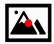</td><td></td></tr><tr><td>Vis+Desc.</td><td></td><td>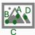</td></tr><tr><td>Des.</td><td></td><td></td></tr></table>

Experimental Results. LVLM evaluation results are presented in Tab. 3, and findings are discussed below.

LVLMs are stronger at text-prompted keypoint localization than at visualreference cross-image matching, exposing a gap between language-grounded localization and fine-grained visual correspondence.

A consistent trend across LVLMs is that providing an explicit keypoint description (Vis.+Desc. and Desc.) improves performance compared to a purely visual query (Vis.). Notably, all models achieve higher accuracy in the description-only setting (Desc.) than in the visual-reference setting (Vis.). This indicates that LVLMs are more effective at localizing a textually described part within a single image than at transferring a marker from a source image to the target image.

Overall, recent models show clear improvements in both visual and language understanding. For example, the Qwen family shows consistent gains from smaller to larger models, and the Qwen3-VL-8B model outperforms its Qwen2.5-VL-7B predecessor, indicating that scaling and improved training pipelines translate into stronger semantic correspondence capabilities.

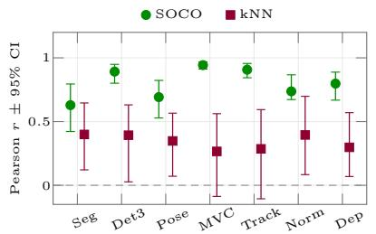

bar

|        | SOCO  | kNN   |
| ------ | ----- | ----- |
| Seg    | 0.65  | 0.40  |
| Det3   | 0.85  | 0.40  |
| Pose   | 0.70  | 0.35  |
| MVC    | 0.90  | 0.25  |
| Track  | 0.85  | 0.25  |
| Norm   | 0.75  | 0.40  |
| Dep    | 0.80  | 0.30  |

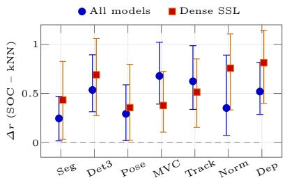

bar

|        | All models | Dense SSL |
| ------ | ---------- | --------- |
| Seg    | 0.25       | 0.4       |
| Det3   | 0.55       | 0.7       |
| Pose   | 0.3        | 0.35      |
| MVC    | 0.7        | 0.4       |
| Track  | 0.6        | 0.5       |
| Norm   | 0.35       | 0.75      |
| Dep    | 0.5        | 0.8       |

Fig. 4: Per-task Pearson r across 37 vision models, with 95% bootstrap CIs. Left: SOC correlates with every downstream task more strongly than ImageNet kNN. Right: the SOC advantage $\varDelta r = r _ { \mathrm { S O C } } - r _ { \mathrm { k } }$ NN stays positive on all tasks and is preserved on a 17 subset only including models trained with dense SSL objectives.

However, the performance is substantially lower compared to the performance of vision models evaluated previously. This suggests that current LVLMs rely heavily on textual guidance but remain limited in their ability to align visual and textual modalities for fine-grained, cross-image correspondences. Therefore, despite recent progress, semantic correspondence on SOCO remains a challenging task for current LVLMs.

# 5.3 Relation to Other Vision Downstream Tasks

The previous sections evaluated SOC across a diverse set of models. In contrast, vision foundation models are typically assessed on various downstream tasks [9, 46, 49, 59, 66], spanning global objectives (e.g., image classification) and dense prediction tasks (e.g., tracking and semantic segmentation). These tasks require different evaluation protocols, such as linear probing for ImageNet [46], task-specific fine-tuning, or DPT-based training [48,59], and their outcomes can depend strongly on hyperparameter choices.

Currently, ImageNet still remains the gold standard task for measuring representation quality [3, 46, 59], as it correlates well to other tasks [31]. However, Bolya et al. [9] have shown that capturing global representations is not necessarily aligned with strong dense semantic features.

As SOC probes dense semantic and geometric features, it is more indicative of structured visual understanding than classification-based metrics such as ImageNet kNN, while remaining practical through a simple zero-shot protocol without hyperparameter tuning. We therefore study its relation to other semantic and geometric vision tasks to assess whether it can serve as a representative diagnostic of representation quality.

Experimental Setup. We evaluate the representational quality of modern vision and vision–language backbones on a representative set of tasks using a unified experimental protocol that builds directly on Probe3D [20]. We extend Probe3D with additional probes, including semantic object correspondence on SOCO, semantic segmentation [81], tracking [17], 3D pose estimation [40], and 3D object detection using an adapted version of the Omni3D [10] pipeline. Furthermore, we integrate a diverse set of vision foundation models, enabling performance evaluation at large scale. This unified design allows us to evaluate both fine-grained and object-level 3D understanding under identical backbone, decoding, and optimization conditions. We evaluate depth estimation and surface normal prediction on NYU [58], geometric multi-view correspondence on NAVI [30], k-nearest neighbor kNN classification on ImageNet [16], 3D pose regression on ImageNet3D [40], semantic segmentation on ADE-20k [81], and zeroshot tracking on TAP-Vid [17], covering a wide spectrum of monocular singleand multi-view spatial reasoning requiring semantic and/or geometric understanding. We largely follow the hyperparameters used by El Banani et al. [20] and discuss implementation details in the supplementary.

Experimental Results. We compute the Pearson correlation between SOC performance and the downstream metrics across 37 vision models, with 95% bootstrap CIs (10k resamples) and leave-one-out checks. The results are summarized in Fig. 4.

SOC has a stronger correlation to various dense geometric and semantic tasks than kNN ImageNet classification.

SOC dominates kNN on every evaluated downstream task (Fig. 4), with CIs that exclude zero for the six conclusive metrics. The advantage of SOC over kNN persists after restricting the pool to 17 dense-SSL models, ruling out a dense-vs-global confound. Leave-one-out resampling agrees with the full-pool results on every metric. Overall, this suggests that SOC is a practical zero-shot diagnostic that is more aligned with dense vision tasks than ImageNet kNN.

# 6 Conclusion

We introduced Semantic Object Correspondence (SOC), a principled formulation of semantic correspondence that explicitly models the relationship between object parts and the overall object structure, providing a clearer separation between geometric matching and semantic object-level understanding. Building on this formulation, we developed SOCO, a large-scale benchmark that provides hierarchical part annotations, cross-category correspondences, and accompanying language descriptions, thus addressing the core limitations of existing datasets.

Through extensive evaluation of vision and multimodal foundation models, we demonstrated that SOCO exposes differences in their ability to capture fine-grained, object-centric structure. The taxonomy makes three failure modes separately measurable: the CC→SOC gap isolates repeated-part disambiguation, the SOC→Cross-SOC gap isolates category-specific concept encoding, and the Vis. vs. Desc. gap in LVLMs separates cross-image visual matching from language-grounded part localization. Our results show that: (1) models reliably match semantic concepts but struggle with object-level geometry; (2) cross-category correspondence remains challenging even for the strongest vision backbones; (3) large vision–language models are stronger at text-prompted keypoint localization than at visual-reference correspondence, revealing a gap between language-grounded localization and fine-grained visual matching; and (4)

SOC performance correlates with dense vision tasks more strongly than ImageNet kNN, making SOC a powerful zero-shot diagnostic for representation quality.

SOCO provides a unified testbed for analyzing structured part-level visual and multimodal understanding in modern foundation models. We hope it serves as a stepping stone toward models that not only recognize objects but also understand their parts and structural relationships in a way that generalizes across categories and modalities.

# Acknowledgments

AK acknowledges support via his Emmy Noether Research Group funded by the German Research Foundation (DFG) under grant number 468670075. This research was funded by the Deutsche Forschungsgemeinschaft (DFG, German Research Foundation) under grant number 539134284, through EFRE (FEIH\_2698644) and the state of Baden-Württemberg. We thank Matthis Heimberg for early analyses and experiments.

# SOCO: Benchmarking Semantic Object Correspondence in Vision Foundation Models

Supplementary Material

To complement the main paper, this supplementary material provides more experimental results and implementation details.

# Outline of Supplementary Material

A More Quantitative Results on SOCO

A.1 Evaluation on Supercategories   
A.2 Complementary Evaluation Protocols . . . 2   
A.3 Evaluation of Geometric Awareness (SOC-geo) 2   
A.4 Evaluation for Varying PCK Thresholds 2   
A.5 Analysis of Viewpoint Variation 3   
A.6 Evaluation of More VFMs 3   
A.7 Category-Specific Results . . 4

B Example Annotations 8

B.1 Limitations of Existing SC Annotations 8

C Evaluation Results for Other Tasks . . 10

C.1 Previous SC datasets 10

C.2 Other Downstream Tasks . . 10

D More Details on the Performed Evaluations 11

D.1 Details on SOC Evaluation . . 11   
D.2 Details on Evaluated Models . . . . 11   
D.3 Details on Other Downstream Tasks . 12   
D.4 More Details of LVLM Evaluation . 15

E More Details about Annotation Pipeline . . . 16

F Limitations . 16

G Ethical Concerns . 17

# A More Quantitative Results on SOCO

This section will present additional results on the SOCO dataset: Section A.1 and Section A.4 present model evaluations on various subsets and PCK levels. Section A.6 includes an evaluation of further models in addition to the results presented in the main paper. Section A.7 reports per-category results.

# A.1 Evaluation on Supercategories

Complementing the per-supercategory SOC results in the main paper (Tab. 2), Tab. r1 reports both SOC and CC for each of the four super-categories transportation, hand-held, furniture, and animals, so the CC→SOC gap per supercategory can be read off directly. Interestingly, models perform worst for the furniture super-category for SOC but CC performance is even better than for the other super-categories. These larger drops might be attributed to the fact that furniture objects have more object parts that have locally similar semantics, such as the legs of a chair. Similarly, drops are large as well for transportation categories, as they contain repeated object parts, e.g., wheels. For the SOC setting of the furniture categories, DINOv3 clearly outperforms DINOv2, indicating that DINOv3 captures geometric position better. This trend is similar for the transportation category where drops from CC to SOC are smaller for DINOv3 than for DINOv2.

# A.2 Complementary Evaluation Protocols

To supplement the nearest neighbor strategy as reported in the main paper, we present more additional evaluation strategies in Tab. r2.

1) First, we perform an evaluation based on window softargmax [79, 80] (softeval ). This consistently improves results but not by a large margin.   
2) Second, we train a linear probe (shared across all patches) supervised and evaluated, each on 100 pairs of disjunct images (SOC linear ). The performance improves substantially across all models. This shows that selecting a subspace of the dense features results in a learned manner leads to better matching performance, as information is discarded that changes across instances and a positional bias is added. While the best models consistently remain the best, some model rankings substantially change. For example, SD clearly improves.

# A.3 Evaluation of Geometric Awareness (SOC-geo)

Relying on the explicit separation of geometric attributes and semantic concept, we further evaluate SOC-geo: This evaluates specifically whether a models is capable of differentiating the geometric positions of keypoints of the same concept. Given one source keypoint, the argmax is computed over all instances of the same concept for a target image of the same category. We only select image pairs where there are at least two pairs to match, which results in around 100k evaluated keypoint pairs. The random performance is 41.24% for this setting: The number of evaluated keypoints varies across categories and images. E.g., a car wheel might appear two or three times on an image but for a chair all four legs are often visible. We present the results in Tab. r2 Here, the model rankings change clearly: For example, DINOv3 outperforms DINOv2 and SD is performing best, indicating that it encodes object part position more effectively. This is in line with the analysis of the gap between SOC and CC for various supercategories.

# A.4 Evaluation for Varying PCK Thresholds

Table r3 presents results for various PCK thresholds with pair averaging (perimg). The performances substantially drop for smaller thresholds. Interestingly, results drop less for SD than for other models.

Table r1: Model performances on SOCO across supercategories. The results are presented in the format (SOC | CC) for the four supercategories of SOCO. The model performances heavily vary for different categories and the gaps between SOC and CC change across categories and models. 

<table><tr><td>Model</td><td colspan="2">Transportation</td><td colspan="2">Hand-held</td><td colspan="2">Furniture</td><td colspan="2">Animals</td></tr><tr><td>DINOv1</td><td>29.09</td><td>43.00</td><td>32.92</td><td>43.16</td><td>27.41</td><td>49.47</td><td>31.45</td><td>43.30</td></tr><tr><td>DINOv2</td><td>56.94</td><td>76.38</td><td>61.63</td><td>74.90</td><td>45.53</td><td>77.54</td><td>66.29</td><td>83.10</td></tr><tr><td>DINOv3</td><td>51.61</td><td>66.14</td><td>57.39</td><td>66.28</td><td>59.86</td><td>76.24</td><td>56.57</td><td>72.49</td></tr><tr><td>iBOT</td><td>36.10</td><td>52.30</td><td>40.12</td><td>51.42</td><td>32.81</td><td>59.75</td><td>43.85</td><td>58.00</td></tr><tr><td>I-JEPA</td><td>41.48</td><td>57.13</td><td>50.96</td><td>58.21</td><td>46.71</td><td>71.71</td><td>47.74</td><td>61.40</td></tr><tr><td>C-RADIOv3</td><td>51.73</td><td>69.87</td><td>48.13</td><td>62.91</td><td>39.70</td><td>68.54</td><td>54.77</td><td>71.37</td></tr><tr><td>DUNE</td><td>39.99</td><td>55.64</td><td>50.53</td><td>59.29</td><td>51.02</td><td>71.97</td><td>46.55</td><td>61.04</td></tr><tr><td>SD 2.1</td><td>42.40</td><td>56.08</td><td>45.32</td><td>53.07</td><td>47.70</td><td>62.39</td><td>45.62</td><td>55.71</td></tr><tr><td>CroCov2</td><td>11.61</td><td>17.50</td><td>12.31</td><td>18.04</td><td>10.18</td><td>18.18</td><td>8.10</td><td>11.20</td></tr><tr><td>MAE</td><td>10.00</td><td>15.87</td><td>11.86</td><td>17.45</td><td>11.72</td><td>20.56</td><td>7.11</td><td>10.26</td></tr><tr><td>PIXIO</td><td>37.26</td><td>50.39</td><td>40.21</td><td>48.61</td><td>46.68</td><td>65.31</td><td>34.16</td><td>45.21</td></tr><tr><td>CLIP</td><td>17.53</td><td>27.25</td><td>14.24</td><td>22.38</td><td>11.65</td><td>25.97</td><td>16.88</td><td>24.09</td></tr><tr><td>PE-Spatial</td><td>45.12</td><td>62.92</td><td>40.74</td><td>53.16</td><td>37.63</td><td>61.87</td><td>45.87</td><td>62.04</td></tr><tr><td>QWEN-L</td><td>21.74</td><td>30.16</td><td>24.07</td><td>30.80</td><td>22.64</td><td>34.38</td><td>14.47</td><td>21.51</td></tr></table>

# A.5 Analysis of Viewpoint Variation

Figure r1 presents the performance variation for varying viewpoint differences between the two matched objects. We exemplarily report the results for DINOv2, here. For this, we extract the labeled 3D pose as given by [40], compute the difference between the azimuth angles, and bin those differences. Subsequently, we compute the average performance of all matches within the considered bin. The SOC performance is lowest for a $\pi / 2$ viewpoint difference, as this is the most challenging scenario, as objects are rotated by $9 0 °$ and object parts are harder to disambiguate. For larger viewpoint changes, there are fewer ambiguous keypoints, increasing the performance again. For example, when two cars are observed from the left and the right side, there are not co-visible wheels that are to be matched. At the same time, CC performance remains comparably constant, indicating the pure semantic matching is still effective but geometric differentiation is limited when objects are not in the same pose.

# A.6 Evaluation of More VFMs

In addition to the models presented in the main paper, we evaluate additional models on the SOCO dataset and we present the results in Table r5. We find that larger models typically outperform the base models that are evaluated in the main paper, e.g., the large variants of DINOv2, DINOv3, or C-RADIO v4. DINOv2, DINOv3, and C-RADIOv4 reach comparable performance on SOC. Additional results including the current SOTA-models on SPair-71k are presented in Table r4, following the implementation of CleanDIFT [61] and GeoAware-SC [79]. Here, we also evaluate SOC for weakly-supervised models: DIY-SC [19] and SD+DINO [79] with CLIP embeddings fine-tuned on panoptic segmentation. Furthermore, we also evaluate the supervised variant of [79] relying on SD+DINO features and only relying on DINO features. We train both from scratch on SPair-71k. While weak supervision specifically used to improve semantic correspondence improves performance on this dataset as well, the performance of the models trained supervised on SPair-71k clearly drops compared to the SPair-71k test dataset performance that is substantially larger than 80%. This indicates that SOCO captures new categories that are different to the SPair-71k categories. Particularly, while animal, transportation, and furniture categories clearly improve compared to the zero-shot approach with SD+DINO features, the matching performance drops by 8.61 points for hand-held objects.

Table r2: SOCO results with various evaluation protocols. We report evaluation with window soft argmax (soft-eval), trained with a linear probe, and when only evaluating the capability of capturing the correct geometric attribute for keypoints of the same semantic concept (SOC-geo). 

<table><tr><td>Model</td><td>SOC soft-eval</td><td>SOC linear</td><td>SOC-geo</td></tr><tr><td>DINOv1</td><td>32.29</td><td>34.95</td><td>56.46</td></tr><tr><td>DINOv2</td><td>62.71</td><td>63.26</td><td>60.97</td></tr><tr><td>DINOv3</td><td>55.75</td><td>60.76</td><td>66.36</td></tr><tr><td>iBOT</td><td>41.40</td><td>43.12</td><td>58.39</td></tr><tr><td>I-JEPA</td><td>47.73</td><td>44.00</td><td>61.09</td></tr><tr><td>C-RADIOv3</td><td>52.40</td><td>54.74</td><td>57.32</td></tr><tr><td>DUNE</td><td>47.11</td><td>52.62</td><td>62.48</td></tr><tr><td>SD 2.1</td><td>38.47</td><td>46.07</td><td>66.96</td></tr><tr><td>CroCov2</td><td>10.15</td><td>19.68</td><td>54.96</td></tr><tr><td>MAE</td><td>9.09</td><td>22.24</td><td>54.04</td></tr><tr><td>PIXIO</td><td>35.67</td><td>53.67</td><td>61.06</td></tr><tr><td>CLIP</td><td>16.84</td><td>27.61</td><td>51.45</td></tr><tr><td>PE-Spatial</td><td>45.76</td><td>46.61</td><td>56.72</td></tr><tr><td>QWEN-L</td><td>19.82</td><td>18.48</td><td>55.34</td></tr></table>

# A.7 Category-Specific Results

Table r6 presents per-category results for DINOv2-B at varying PCK thresholds. The gaps between SOC and CC largely depend on the considered category. Similarly, reducing the threshold for the PCK calculation has a varying effect on different categories.

Table r3: Model performances on SOCO across multiple thresholds. The results are presented in the format (SOC | CC) for both pair averaging and per-keypoint reduction. 

<table><tr><td rowspan="2">Model</td><td colspan="6">Pair Averaging</td><td colspan="5">Per Keypoint</td></tr><tr><td colspan="2">PCK@0.10</td><td colspan="2">PCK@0.05</td><td colspan="2">PCK@0.02</td><td colspan="2">PCK@0.10</td><td colspan="2">PCK@0.05</td><td>PCK@0.02</td></tr><tr><td>DINOv1</td><td>30.59</td><td>43.79</td><td>15.97</td><td>23.99</td><td>4.65</td><td>6.99</td><td>32.07</td><td>44.82</td><td>16.89</td><td>24.77</td><td>4.93 | 7.25</td></tr><tr><td>DINOv2</td><td>60.43</td><td>78.90</td><td>41.64</td><td>57.22</td><td>15.44</td><td>21.52</td><td>61.72</td><td>79.62</td><td>43.02</td><td>58.24</td><td>16.15 | 22.03</td></tr><tr><td>DINOv3</td><td>55.52</td><td>69.72</td><td>36.32</td><td>47.16</td><td>12.19</td><td>15.72</td><td>57.79</td><td>70.42</td><td>38.28</td><td>48.02</td><td>12.98 | 16.08</td></tr><tr><td>iBOT</td><td>39.64</td><td>55.16</td><td>21.03</td><td>30.87</td><td>5.84</td><td>8.59</td><td>41.39</td><td>56.32</td><td>22.19</td><td>31.78</td><td>6.22 | 8.89</td></tr><tr><td>I-JEPA</td><td>46.31</td><td>60.50</td><td>31.52</td><td>42.84</td><td>11.00</td><td>15.12</td><td colspan="2">—</td><td colspan="2">—</td><td>—</td></tr><tr><td>C-RADIOv3</td><td>51.06</td><td>69.01</td><td>31.37</td><td>44.55</td><td>9.78</td><td>13.93</td><td>52.37</td><td>70.01</td><td>32.57</td><td>45.62</td><td>10.24 | 14.33</td></tr><tr><td>DUNE</td><td>45.72</td><td>60.12</td><td>30.19</td><td>41.36</td><td>11.09</td><td>15.20</td><td>48.02</td><td>61.05</td><td>32.03</td><td>42.26</td><td>11.89 | 15.66</td></tr><tr><td>SD 2.1</td><td>44.77</td><td>55.99</td><td>32.16</td><td>40.71</td><td>12.30</td><td>15.35</td><td>47.42</td><td>56.79</td><td>34.47</td><td>41.51</td><td>13.36 | 15.74</td></tr><tr><td>CroCov2</td><td>10.20</td><td>15.15</td><td>4.81</td><td>7.25</td><td>1.40</td><td>2.03</td><td>10.88</td><td>15.39</td><td>5.19</td><td>7.42</td><td>1.52 | 2.10</td></tr><tr><td>MAE</td><td>9.37</td><td>14.40</td><td>3.91</td><td>6.04</td><td>1.03</td><td>1.50</td><td>10.01</td><td>14.70</td><td>4.25</td><td>6.22</td><td>1.13 | 1.56</td></tr><tr><td>PIXIO</td><td>37.53</td><td>49.47</td><td>20.50</td><td>28.23</td><td>5.99</td><td>8.27</td><td>39.85</td><td>50.46</td><td>21.98</td><td>28.89</td><td>6.48 | 8.49</td></tr><tr><td>CLIP</td><td>16.06</td><td>24.93</td><td>7.08</td><td>11.49</td><td>1.76</td><td>2.81</td><td>16.85</td><td>25.68</td><td>7.51</td><td>11.92</td><td>1.90 | 2.95</td></tr><tr><td>PE-Spatial</td><td>43.84</td><td>60.61</td><td>28.16</td><td>41.00</td><td>9.52</td><td>13.97</td><td>45.09</td><td>61.49</td><td>29.28</td><td>41.87</td><td>9.99 | 14.28</td></tr><tr><td>QWEN-L</td><td>19.36</td><td>27.24</td><td>9.15</td><td>13.26</td><td>1.83</td><td>2.68</td><td>20.88</td><td>27.90</td><td>9.94</td><td>13.65</td><td>2.01 | 2.77</td></tr></table>

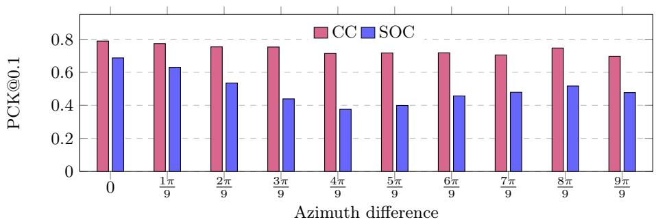

bar

| Azimuth difference | CC | SOC |
|---|---|---|
| 0 | 0.8 | 0.7 |
| 1π/9 | 0.78 | 0.63 |
| 2π/9 | 0.76 | 0.54 |
| 3π/9 | 0.76 | 0.44 |
| 4π/9 | 0.72 | 0.38 |
| 5π/9 | 0.72 | 0.4 |
| 6π/9 | 0.72 | 0.46 |
| 7π/9 | 0.71 | 0.48 |
| 8π/9 | 0.75 | 0.52 |
| 9π/9 | 0.71 | 0.48 |

Fig. r1: PCK of DINOv2/b for increasing azimuth variation between two images, averaged over all categories. While the concept correspondence (CC) remains stable for larger viewpoint changes, SOC performance drops with a minimum for a relative orientation of objects of $\pi / 2$ .

Table r4: Evaluation of additional models on SOCO following the implementation of GeoAware-SC and CleanDIFT [19,42,61,79]. Results are reported for PCK@0.1 (per-img). 

<table><tr><td>Model</td><td>SOC</td></tr><tr><td>SD (ft. for pan. seg., Geo-SC)</td><td>47.7</td></tr><tr><td>SD + DINO (SD ft pan. seg., Geo-SC)</td><td>62.9</td></tr><tr><td>CleanDIFT + DINO</td><td>63.4</td></tr><tr><td>DIY-SC (weakl. sup.)</td><td>69.2</td></tr><tr><td>TLR (w SD+DINO) (sup. SPair-71k)</td><td>72.9</td></tr><tr><td>TLR (w DINO) (sup. SPair-71k)</td><td>72.7</td></tr></table>

Table r5: Model performances on SOCO across concept correspondence (CC), semantic object correspondence (SOC) and its cross-category variants (Cross-SOC). This table extends the table presented in the main paper with additional models. 

<table><tr><td>Model</td><td>CC</td><td>SOC</td><td>Cross-SOC</td></tr><tr><td>c_radio_3_b</td><td>69.01</td><td>51.06</td><td>46.33</td></tr><tr><td>clip_b16</td><td>24.93</td><td>16.06</td><td>11.22</td></tr><tr><td>clip_b16_laion</td><td>24.91</td><td>15.69</td><td>11.04</td></tr><tr><td>clip_l14</td><td>37.37</td><td>25.23</td><td>18.24</td></tr><tr><td>croco</td><td>15.15</td><td>10.20</td><td>7.82</td></tr><tr><td>dift</td><td>55.99</td><td>44.77</td><td>38.29</td></tr><tr><td>dino_b16</td><td>43.79</td><td>30.59</td><td>23.95</td></tr><tr><td>dino_s16</td><td>43.13</td><td>29.97</td><td>23.16</td></tr><tr><td>dinov2_b14</td><td>78.90</td><td>60.43</td><td>54.98</td></tr><tr><td>dinov2_b14_reg</td><td>76.31</td><td>58.03</td><td>50.87</td></tr><tr><td>dinov2_l14</td><td>80.68</td><td>62.40</td><td>56.94</td></tr><tr><td>dinov2_s14</td><td>73.99</td><td>56.67</td><td>50.25</td></tr><tr><td>dinov3_vitb16</td><td>69.72</td><td>55.52</td><td>49.43</td></tr><tr><td>dinov3_vitl16</td><td>76.56</td><td>61.36</td><td>56.15</td></tr><tr><td>dinov3_vits16plus</td><td>69.28</td><td>55.20</td><td>49.37</td></tr><tr><td>dune_vitb14</td><td>60.12</td><td>45.72</td><td>38.53</td></tr><tr><td>dune_vits14</td><td>50.71</td><td>38.15</td><td>31.56</td></tr><tr><td>ibot_b16</td><td>55.16</td><td>39.64</td><td>34.09</td></tr><tr><td>ibot_b16_in22k</td><td>53.07</td><td>38.39</td><td>32.87</td></tr><tr><td>ibot_l16</td><td>64.14</td><td>47.43</td><td>42.75</td></tr><tr><td>ibot_l16_in22k</td><td>66.55</td><td>49.39</td><td>44.77</td></tr><tr><td>ibot_s16</td><td>48.24</td><td>33.75</td><td>27.93</td></tr><tr><td>ijepa</td><td>60.50</td><td>46.31</td><td>38.36</td></tr><tr><td>mae_b16</td><td>14.40</td><td>9.37</td><td>7.15</td></tr><tr><td>metaclip2_vitb16</td><td>30.41</td><td>19.63</td><td>14.72</td></tr><tr><td>metaclip2_vitl14</td><td>38.54</td><td>25.88</td><td>18.57</td></tr><tr><td>metaclip2_vits16</td><td>23.26</td><td>14.81</td><td>11.32</td></tr><tr><td>openclip_vitb16_datacomp</td><td>34.05</td><td>22.49</td><td>16.11</td></tr><tr><td>openclip_vitl14_datacomp</td><td>46.02</td><td>31.79</td><td>24.52</td></tr><tr><td>openclip_vitl14_laion2b</td><td>33.44</td><td>22.32</td><td>15.87</td></tr><tr><td>perception</td><td>60.61</td><td>43.84</td><td>38.76</td></tr><tr><td>pixio_vitb16</td><td>49.47</td><td>37.53</td><td>32.93</td></tr><tr><td>pixio_vitl16</td><td>51.26</td><td>38.59</td><td>32.86</td></tr><tr><td>qwen_vl</td><td>27.24</td><td>19.36</td><td>16.25</td></tr><tr><td>radio</td><td>72.53</td><td>55.54</td><td>51.32</td></tr><tr><td>sam_base</td><td>35.21</td><td>25.52</td><td>20.40</td></tr><tr><td>siglip_b16</td><td>14.10</td><td>8.83</td><td>7.00</td></tr><tr><td>siglip_l16</td><td>14.53</td><td>9.60</td><td>7.47</td></tr><tr><td>vjepa2_1_base</td><td>60.37</td><td>44.46</td><td>38.56</td></tr><tr><td>vjepa2_1_large</td><td>69.69</td><td>53.21</td><td>48.10</td></tr></table>

Table r6: SOCO per-category results evaluated with DINOv2-B across multiple thresholds (pair averaging). 

<table><tr><td rowspan="2">Category</td><td colspan="2">PCK@0.10</td><td colspan="2">PCK@0.05</td><td colspan="2">PCK@0.02</td></tr><tr><td>CC</td><td>SOC</td><td>CC</td><td>SOC</td><td>CC</td><td>SOC</td></tr><tr><td>aeroplane</td><td>83.4</td><td>72.9</td><td>69.7</td><td>59.1</td><td>34.2</td><td>28.4</td></tr><tr><td>ambulance</td><td>87.7</td><td>54.1</td><td>74.0</td><td>43.6</td><td>36.4</td><td>20.8</td></tr><tr><td>american black bear</td><td>72.7</td><td>54.1</td><td>44.2</td><td>32.3</td><td>12.7</td><td>8.8</td></tr><tr><td>arctic fox</td><td>81.9</td><td>65.4</td><td>56.8</td><td>44.0</td><td>17.3</td><td>13.1</td></tr><tr><td>armchair</td><td>79.2</td><td>48.7</td><td>57.7</td><td>36.0</td><td>21.0</td><td>13.1</td></tr><tr><td>ax</td><td>81.2</td><td>55.5</td><td>60.7</td><td>35.4</td><td>27.1</td><td>16.5</td></tr><tr><td>bed</td><td>74.8</td><td>40.4</td><td>63.7</td><td>34.5</td><td>32.4</td><td>17.6</td></tr><tr><td>bench</td><td>79.1</td><td>37.0</td><td>59.0</td><td>27.5</td><td>22.5</td><td>9.5</td></tr><tr><td>bicycle</td><td>85.7</td><td>83.8</td><td>65.7</td><td>64.7</td><td>26.1</td><td>25.6</td></tr><tr><td>bicycle pump</td><td>89.7</td><td>69.1</td><td>80.9</td><td>57.1</td><td>43.0</td><td>28.5</td></tr><tr><td>bighorn</td><td>85.1</td><td>67.6</td><td>55.6</td><td>40.7</td><td>15.4</td><td>12.5</td></tr><tr><td>boston bull</td><td>87.8</td><td>59.5</td><td>62.9</td><td>40.5</td><td>19.9</td><td>13.0</td></tr><tr><td>brittany spaniel</td><td>89.4</td><td>74.3</td><td>62.1</td><td>50.1</td><td>21.2</td><td>17.2</td></tr><tr><td>brown bear</td><td>75.7</td><td>61.2</td><td>47.1</td><td>36.5</td><td>14.6</td><td>11.2</td></tr><tr><td>bullet train</td><td>62.4</td><td>48.7</td><td>38.3</td><td>28.8</td><td>11.6</td><td>8.5</td></tr><tr><td>bus</td><td>82.6</td><td>54.4</td><td>68.0</td><td>43.9</td><td>29.8</td><td>18.4</td></tr><tr><td>cabin tractor</td><td>72.8</td><td>54.9</td><td>48.4</td><td>34.7</td><td>11.5</td><td>8.1</td></tr><tr><td>cairn</td><td>78.6</td><td>62.5</td><td>55.7</td><td>40.4</td><td>20.1</td><td>13.7</td></tr><tr><td>car</td><td>90.1</td><td>62.1</td><td>78.5</td><td>54.2</td><td>36.0</td><td>26.2</td></tr><tr><td>cart</td><td>53.8</td><td>40.8</td><td>36.6</td><td>26.6</td><td>14.0</td><td>9.4</td></tr><tr><td>chair</td><td>85.0</td><td>42.0</td><td>69.5</td><td>33.3</td><td>31.9</td><td>14.7</td></tr><tr><td>cheetah</td><td>89.5</td><td>78.0</td><td>70.6</td><td>59.5</td><td>27.8</td><td>24.5</td></tr><tr><td>chow</td><td>90.1</td><td>64.1</td><td>65.7</td><td>45.1</td><td>23.7</td><td>16.5</td></tr><tr><td>cougar</td><td>85.6</td><td>64.1</td><td>60.8</td><td>42.2</td><td>21.3</td><td>15.4</td></tr><tr><td>dishwasher</td><td>68.4</td><td>43.0</td><td>48.3</td><td>29.1</td><td>17.1</td><td>10.3</td></tr><tr><td>dune buggy</td><td>64.6</td><td>45.4</td><td>50.2</td><td>33.9</td><td>22.7</td><td>14.5</td></tr><tr><td>egyptian cat</td><td>71.8</td><td>53.1</td><td>44.8</td><td>32.0</td><td>11.4</td><td>8.4</td></tr><tr><td>english springer</td><td>75.1</td><td>62.2</td><td>48.0</td><td>38.9</td><td>12.5</td><td>9.5</td></tr><tr><td>eskimo dog</td><td>90.7</td><td>67.3</td><td>66.6</td><td>45.0</td><td>22.4</td><td>15.7</td></tr><tr><td>eyeglasses</td><td>74.5</td><td>55.1</td><td>59.4</td><td>43.1</td><td>28.1</td><td>19.5</td></tr><tr><td>fl car</td><td>77.4</td><td>54.3</td><td>58.0</td><td>37.7</td><td>22.8</td><td>14.4</td></tr><tr><td>fighter jet</td><td>67.8</td><td>55.0</td><td>54.1</td><td>44.8</td><td>21.6</td><td>18.4</td></tr><tr><td>fire truck</td><td>80.3</td><td>54.5</td><td>55.5</td><td>37.7</td><td>20.4</td><td>12.6</td></tr><tr><td>folding chair</td><td>85.3</td><td>44.6</td><td>71.7</td><td>37.9</td><td>35.4</td><td>19.1</td></tr><tr><td>forklift</td><td>79.5</td><td>48.2</td><td>62.0</td><td>34.8</td><td>26.4</td><td>13.9</td></tr><tr><td>french horn</td><td>62.8</td><td>34.9</td><td>40.5</td><td>19.0</td><td>7.9</td><td>3.7</td></tr><tr><td>garbage truck</td><td>82.0</td><td>65.0</td><td>66.4</td><td>48.6</td><td>28.8</td><td>20.5</td></tr><tr><td>gazelle</td><td>90.7</td><td>78.4</td><td>65.9</td><td>50.7</td><td>19.4</td><td>14.9</td></tr><tr><td>glider</td><td>78.4</td><td>66.6</td><td>64.6</td><td>54.5</td><td>31.4</td><td>27.0</td></tr><tr><td>go kart</td><td>77.0</td><td>58.0</td><td>52.8</td><td>40.5</td><td>18.6</td><td>12.0</td></tr><tr><td>golden retriever</td><td>81.9</td><td>63.4</td><td>56.5</td><td>42.3</td><td>21.2</td><td>16.1</td></tr><tr><td>gordon setter</td><td>82.6</td><td>68.9</td><td>57.6</td><td>44.4</td><td>17.3</td><td>13.5</td></tr><tr><td>guitar</td><td>91.2</td><td>79.8</td><td>79.3</td><td>49.5</td><td>35.6</td><td>18.1</td></tr><tr><td>hacksaw</td><td>69.3</td><td>56.5</td><td>53.6</td><td>43.3</td><td>19.8</td><td>16.3</td></tr><tr><td>hair dryer</td><td>67.1</td><td>55.4</td><td>47.8</td><td>37.8</td><td>16.0</td><td>12.6</td></tr><tr><td>hartebeest</td><td>85.1</td><td>77.0</td><td>60.9</td><td>50.6</td><td>16.4</td><td>12.1</td></tr><tr><td>highchair</td><td>74.7</td><td>41.5</td><td>51.4</td><td>27.2</td><td>16.5</td><td>7.9</td></tr><tr><td>ibex</td><td>84.9</td><td>70.6</td><td>54.8</td><td>42.2</td><td>15.7</td><td>12.0</td></tr><tr><td>ice bear</td><td>82.9</td><td>66.9</td><td>59.1</td><td>42.8</td><td>21.2</td><td>15.3</td></tr><tr><td>impala</td><td>89.9</td><td>69.1</td><td>63.8</td><td>46.7</td><td>21.4</td><td>15.1</td></tr><tr><td>irish water spaniel</td><td>83.6</td><td>71.0</td><td>56.7</td><td>49.3</td><td>18.0</td><td>17.3</td></tr><tr><td>iron</td><td>60.0</td><td>53.2</td><td>44.9</td><td>40.4</td><td>17.8</td><td>15.9</td></tr><tr><td>japanese spaniel</td><td>78.4</td><td>59.3</td><td>47.5</td><td>36.4</td><td>15.1</td><td>11.9</td></tr><tr><td>jinrikisha</td><td>72.2</td><td>44.4</td><td>54.6</td><td>31.8</td><td>22.2</td><td>12.6</td></tr><tr><td>kettle</td><td>68.6</td><td>49.5</td><td>38.7</td><td>27.8</td><td>9.8</td><td>7.3</td></tr><tr><td>kettle electric</td><td>71.9</td><td>67.5</td><td>46.4</td><td>41.9</td><td>15.9</td><td>14.1</td></tr><tr><td>knife</td><td>87.7</td><td>83.4</td><td>68.0</td><td>54.0</td><td>33.8</td><td>27.7</td></tr><tr><td>leopard</td><td>86.2</td><td>73.1</td><td>64.7</td><td>50.8</td><td>23.2</td><td>17.8</td></tr><tr><td>megaphone</td><td>81.5</td><td>71.0</td><td>59.5</td><td>49.5</td><td>20.1</td><td>16.7</td></tr><tr><td>microwave</td><td>67.1</td><td>49.5</td><td>47.2</td><td>35.1</td><td>17.9</td><td>13.9</td></tr><tr><td>motor scooter</td><td>72.1</td><td>65.6</td><td>51.9</td><td>47.0</td><td>22.7</td><td>20.1</td></tr><tr><td>motorbike</td><td>72.9</td><td>74.2</td><td>56.7</td><td>59.2</td><td>26.7</td><td>28.3</td></tr><tr><td>office chair</td><td>77.0</td><td>44.8</td><td>55.5</td><td>33.3</td><td>20.0</td><td>12.1</td></tr><tr><td>ox</td><td>78.1</td><td>62.4</td><td>47.5</td><td>35.1</td><td>12.7</td><td>8.8</td></tr><tr><td>pickup truck</td><td>87.0</td><td>47.8</td><td>74.1</td><td>39.7</td><td>37.0</td><td>20.2</td></tr><tr><td>power drill</td><td>75.9</td><td>66.0</td><td>47.6</td><td>41.4</td><td>13.6</td><td>12.7</td></tr><tr><td>ram</td><td>82.0</td><td>65.0</td><td>50.1</td><td>36.2</td><td>15.2</td><td>10.0</td></tr><tr><td>redbone</td><td>90.2</td><td>70.4</td><td>71.9</td><td>53.4</td><td>26.1</td><td>19.3</td></tr><tr><td>rifle</td><td>75.2</td><td>70.9</td><td>64.4</td><td>59.6</td><td>32.4</td><td>30.3</td></tr><tr><td>saint bernard</td><td>89.5</td><td>72.7</td><td>61.7</td><td>46.7</td><td>18.0</td><td>13.8</td></tr><tr><td>saluki</td><td>85.4</td><td>76.1</td><td>67.5</td><td>54.7</td><td>25.6</td><td>20.4</td></tr><tr><td>saxophone</td><td>72.9</td><td>63.2</td><td>50.3</td><td>39.3</td><td>19.2</td><td>14.4</td></tr></table>

Continued on next page

<table><tr><td rowspan="2">Category</td><td colspan="2">PCK@0.10</td><td colspan="2">PCK@0.05</td><td colspan="2">PCK@0.02</td></tr><tr><td>CC</td><td>SOC</td><td>CC</td><td>SOC</td><td>CC</td><td>SOC</td></tr><tr><td>school bus</td><td>85.7</td><td>53.5</td><td>72.7</td><td>43.8</td><td>36.5</td><td>21.1</td></tr><tr><td>segway</td><td>67.2</td><td>46.3</td><td>38.8</td><td>26.1</td><td>12.6</td><td>7.8</td></tr><tr><td>sewing machine</td><td>76.3</td><td>71.1</td><td>59.5</td><td>55.0</td><td>25.7</td><td>24.3</td></tr><tr><td>sloth bear</td><td>69.3</td><td>52.0</td><td>37.0</td><td>26.9</td><td>8.5</td><td>6.3</td></tr><tr><td>snowmobile</td><td>74.7</td><td>64.4</td><td>54.6</td><td>45.4</td><td>22.9</td><td>18.1</td></tr><tr><td>sofa</td><td>76.9</td><td>52.8</td><td>56.6</td><td>39.7</td><td>22.2</td><td>16.4</td></tr><tr><td>soft coated wheaten terrier</td><td>79.0</td><td>60.5</td><td>41.9</td><td>31.5</td><td>12.2</td><td>9.9</td></tr><tr><td>sorrel</td><td>75.6</td><td>55.8</td><td>44.6</td><td>30.1</td><td>9.9</td><td>6.5</td></tr><tr><td>sports car</td><td>90.6</td><td>64.7</td><td>73.4</td><td>47.0</td><td>28.9</td><td>18.4</td></tr><tr><td>tank</td><td>67.5</td><td>56.8</td><td>51.4</td><td>43.5</td><td>19.7</td><td>16.0</td></tr><tr><td>teapot</td><td>74.8</td><td>69.0</td><td>47.6</td><td>45.0</td><td>18.6</td><td>18.0</td></tr><tr><td>tibetan terrier</td><td>68.4</td><td>57.6</td><td>40.9</td><td>33.9</td><td>10.6</td><td>8.7</td></tr><tr><td>tiger</td><td>88.8</td><td>69.9</td><td>68.2</td><td>51.4</td><td>25.0</td><td>19.5</td></tr><tr><td>timber wolf</td><td>88.4</td><td>72.6</td><td>62.2</td><td>48.9</td><td>20.6</td><td>16.2</td></tr><tr><td>tractor</td><td>86.7</td><td>61.3</td><td>64.7</td><td>43.4</td><td>23.0</td><td>16.3</td></tr><tr><td>train</td><td>75.8</td><td>51.2</td><td>52.6</td><td>35.2</td><td>21.0</td><td>13.5</td></tr><tr><td>tricycle</td><td>71.3</td><td>54.2</td><td>48.8</td><td>36.2</td><td>17.9</td><td>13.2</td></tr><tr><td>trolleybus</td><td>82.6</td><td>60.6</td><td>71.4</td><td>46.2</td><td>37.3</td><td>22.0</td></tr><tr><td>unicycle</td><td>57.7</td><td>58.3</td><td>29.1</td><td>29.6</td><td>7.4</td><td>8.0</td></tr><tr><td>violin</td><td>75.2</td><td>50.3</td><td>52.3</td><td>26.7</td><td>19.0</td><td>9.1</td></tr><tr><td>vizsla</td><td>89.1</td><td>72.4</td><td>73.9</td><td>58.3</td><td>30.0</td><td>23.5</td></tr><tr><td>walker hound</td><td>89.1</td><td>71.8</td><td>69.8</td><td>52.7</td><td>27.2</td><td>21.0</td></tr><tr><td>warthog</td><td>77.6</td><td>61.3</td><td>45.2</td><td>34.1</td><td>12.8</td><td>9.5</td></tr><tr><td>washer</td><td>75.0</td><td>60.6</td><td>61.0</td><td>48.1</td><td>25.9</td><td>19.5</td></tr><tr><td>water buffalo</td><td>73.2</td><td>54.8</td><td>37.8</td><td>27.0</td><td>8.8</td><td>6.3</td></tr><tr><td>weimaraner</td><td>88.6</td><td>69.7</td><td>65.6</td><td>49.9</td><td>23.2</td><td>18.3</td></tr><tr><td>wheelchair</td><td>78.4</td><td>43.1</td><td>61.3</td><td>33.6</td><td>24.5</td><td>13.4</td></tr><tr><td>zebra</td><td>91.3</td><td>75.1</td><td>66.0</td><td>47.2</td><td>17.9</td><td>13.1</td></tr></table>

# B Example Annotations

We show example annotations in Fig. r2, illustrating the diversity of the selected categories. Further, it illustrates keypoints that are unique (red color) and keypoints that are shared across categories or correspond to the same semantic concept.

# B.1 Limitations of Existing SC Annotations

Figure r3 shows concrete failure cases of keypoint annotations in existing SC benchmarks, illustrating the limitations summarized in Sec. 3.1 of the main paper: lack of semantic grounding, intra-class ambiguity, symmetry-induced nonuniqueness, and inconsistent definitions across instances.

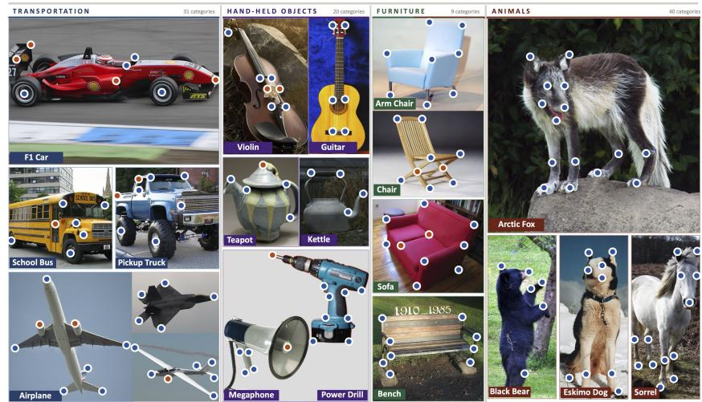

Fig. r2: Example SOCO annotations. We visualize example SOCO annotations where a red corresponds to a unique keypoint and blue to a shared keypoint.   
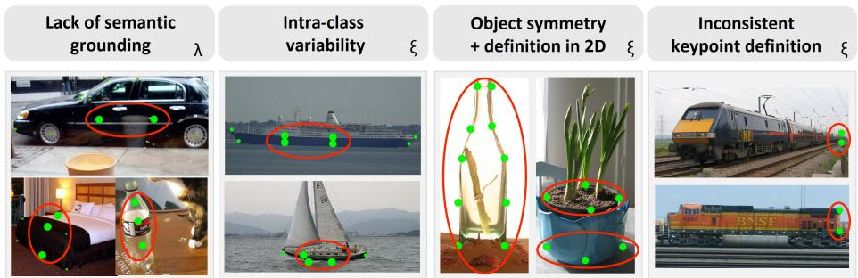  
Fig. r3: Limitations of SC keypoint annotations. Current SC datasets include keypoints that lack semantic grounding and are mainly defined geometrically. This results in particularly ambiguous keypoint definitions for categories with large intra-class variability, e.g., boats. Uniqueness is not satisfied for symmetric objects where the keypoints are defined via a 2D projection (e.g., for potted plant and bottle). Furthermore, some keypoint definitions are inconsistent, for example for trains. Example images are sourced from MISC210K (λ) and SPair-71k (ξ).

# C Evaluation Results for Other Tasks

# C.1 Previous SC datasets

We report evaluation results for other SC datasets in Tab. r7. While the rankings for the best models and the worse models remain largely consistent and DINOv2 remains the best-performing model across all datasets, some model rankings change. For example, I-JEPA is ranked better for SOCO than for MISC or SPair. One potential explanation for this could be that I-JEPA is trained on ImageNet and SOCO images are also sourced from ImageNet. On the other hand, PE-Spatial’s relative performance drops on SOCO compared to, e.g., SPair. It is relevant to note that rankings for AP-10K and the SOCO animal subset are largely consistent, as both capture animal keypoint datasets. However, rankings change for the whole SOCO dataset, as man-made objects are added.

Table r7: Evaluation on other SC benchmarks. We report model PCK@0.1 performance with our standard evaluation protocol for MISC210K, SPair-71k, and, AP-10K. MISC\* indicates that we only evaluate the single-instance correspondences, as this is the comparable setting. While DINOv2 remains the best model, other model rankings vary. 

<table><tr><td>Model</td><td>MISC*</td><td>SPair</td><td>AP-10K</td></tr><tr><td>DINOv1</td><td>40.05</td><td>27.01</td><td>31.87</td></tr><tr><td>DINOv2</td><td>74.86</td><td>58.42</td><td>61.30</td></tr><tr><td>DINOv3</td><td>69.71</td><td>53.44</td><td>58.57</td></tr><tr><td>iBOT</td><td>50.63</td><td>34.95</td><td>44.14</td></tr><tr><td>I-JEPA</td><td>47.77</td><td>41.01</td><td>47.71</td></tr><tr><td>C-RADIOv3</td><td>70.56</td><td>49.05</td><td>51.45</td></tr><tr><td>DUNE</td><td>57.51</td><td>42.34</td><td>47.11</td></tr><tr><td>SD 2.1</td><td>60.15</td><td>45.95</td><td>45.33</td></tr><tr><td>CroCov2</td><td>16.01</td><td>8.41</td><td>10.00</td></tr><tr><td>MAE</td><td>13.46</td><td>6.62</td><td>10.08</td></tr><tr><td>PIXIO</td><td>52.39</td><td>37.50</td><td>39.28</td></tr><tr><td>CLIP</td><td>28.30</td><td>15.44</td><td>19.58</td></tr><tr><td>PE-Spatial</td><td>64.52</td><td>46.12</td><td>42.31</td></tr><tr><td>QWEN-L</td><td>34.69</td><td>16.40</td><td>16.74</td></tr></table>

# C.2 Other Downstream Tasks

We report the correlation coefficients and confidence intervals of ImageNet kNN classification / SOC and other tasks in Tab. r9. Further, we report all results of selected models and datasets in Table r8 and visualize them in Fig. r4.

Table r8: Performance on various downstream tasks. We present the results for various tasks and models, as presented in the main paper. 

<table><tr><td>model</td><td>ImageNet kNN top-1 ↑</td><td>SemSeg ADE20K mIoU ↑</td><td>3D Det. ARKit AP3D ↑</td><td>3D-Pose ImageNet3D err &lt; π/6 ↑</td><td>MV Corr. NAVI PCK θ6030 ↑</td><td>Tracking TAP-Vid-D. AJ ↑</td><td>Normals NYUv2 RMSE ↓</td><td>Depth NYUv2 RMSE ↓</td></tr><tr><td>DINOv1</td><td>74.87</td><td>0.23</td><td>28.97</td><td>0.42</td><td>56.15</td><td>19.48</td><td>30.24</td><td>0.43</td></tr><tr><td>DINOv2</td><td>81.59</td><td>0.44</td><td>45.37</td><td>0.53</td><td>70.68</td><td>22.86</td><td>23.31</td><td>0.26</td></tr><tr><td>DINOv3</td><td>82.43</td><td>0.34</td><td>46.70</td><td>0.53</td><td>76.80</td><td>22.07</td><td>24.09</td><td>0.27</td></tr><tr><td>iBOT</td><td>76.47</td><td>0.28</td><td>32.96</td><td>0.41</td><td>58.40</td><td>19.71</td><td>29.33</td><td>0.40</td></tr><tr><td>I-JEPA</td><td>60.62</td><td>0.16</td><td>41.45</td><td>0.53</td><td>55.74</td><td>17.55</td><td>24.67</td><td>0.27</td></tr><tr><td>C-RADIOv3</td><td>76.98</td><td>0.47</td><td>46.70</td><td>0.45</td><td>67.69</td><td>19.41</td><td>24.57</td><td>0.28</td></tr><tr><td>DUNE</td><td>56.21</td><td>0.32</td><td>43.10</td><td>0.42</td><td>65.74</td><td>24.75</td><td>23.65</td><td>0.27</td></tr><tr><td>SD 2.1</td><td>10.37</td><td>0.27</td><td>30.27</td><td>0.37</td><td>63.32</td><td>18.94</td><td>25.88</td><td>0.34</td></tr><tr><td>CroCov2</td><td>18.03</td><td>0.13</td><td>26.53</td><td>0.39</td><td>44.36</td><td>14.29</td><td>29.13</td><td>0.41</td></tr><tr><td>MAE</td><td>46.75</td><td>0.14</td><td>20.60</td><td>0.42</td><td>40.05</td><td>13.36</td><td>51.93</td><td>0.55</td></tr><tr><td>PIXIO</td><td>58.18</td><td>0.39</td><td>39.63</td><td>0.55</td><td>64.18</td><td>17.72</td><td>24.68</td><td>0.23</td></tr><tr><td>CLIP</td><td>71.44</td><td>0.18</td><td>27.93</td><td>0.36</td><td>36.29</td><td>12.51</td><td>31.00</td><td>0.40</td></tr><tr><td>PE-Spatial</td><td>51.11</td><td>0.42</td><td>40.63</td><td>0.37</td><td>60.99</td><td>20.24</td><td>28.22</td><td>0.32</td></tr></table>

Table r9: Correlation coefficients for downstream tasks. Pearson correlation coefficients with 95% confidence intervals between downstream-task performance and SOCO / ImageNet kNN. The results correspond to the bar plot in the main paper. 

<table><tr><td rowspan="2">Task</td><td colspan="2">SOCO</td><td colspan="2">kNN</td></tr><tr><td>r</td><td>95% CI</td><td>r</td><td>95% CI</td></tr><tr><td>Seg.</td><td>0.629</td><td>[0.422, 0.795]</td><td>0.399</td><td>[0.121, 0.646]</td></tr><tr><td>Det3</td><td>0.892</td><td>[0.801, 0.949]</td><td>0.393</td><td>[0.027, 0.631]</td></tr><tr><td>Pose</td><td>0.692</td><td>[0.528, 0.823]</td><td>0.348</td><td>[0.071, 0.566]</td></tr><tr><td>MV Corr.</td><td>0.943</td><td>[0.912, 0.969]</td><td>0.266</td><td>[-0.087, 0.562]</td></tr><tr><td>Tracking</td><td>0.907</td><td>[0.844, 0.956]</td><td>0.286</td><td>[-0.106, 0.594]</td></tr><tr><td>Normals</td><td>-0.737</td><td>[-0.867, -0.673]</td><td>-0.395</td><td>[-0.698, -0.084]</td></tr><tr><td>Depth</td><td>-0.798</td><td>[-0.888, -0.668]</td><td>-0.298</td><td>[-0.570, -0.069]</td></tr></table>

# D More Details on the Performed Evaluations

# D.1 Details on SOC Evaluation

We follow the evaluation protocol in Probe3D [20] for all semantic correspondence evaluations. Specifically, we compute PCK@0.1 with bounding box normalization and the per-category PCK using the per-keypoint convention, as also applied in other recent works, e.g., [79]. The final result is computed using the average over categories and we keep a fixed image resolution of 800 pixels.

# D.2 Details on Evaluated Models

We evaluate a diverse set of visual backbones spanning self-supervised, vision–language, generative, and 3D-aware training regimes, as summarized in Table r10. All backbones are kept frozen throughout our experiments. Zero-shot settings operate directly on the backbone features without any learnable components, while probed settings attach lightweight task-specific heads (e.g., linear or DPT-style decoders) trained on top of the fixed representations. This design ensures that downstream performance reflects differences in representation quality rather than task-specific fine-tuning capacity.

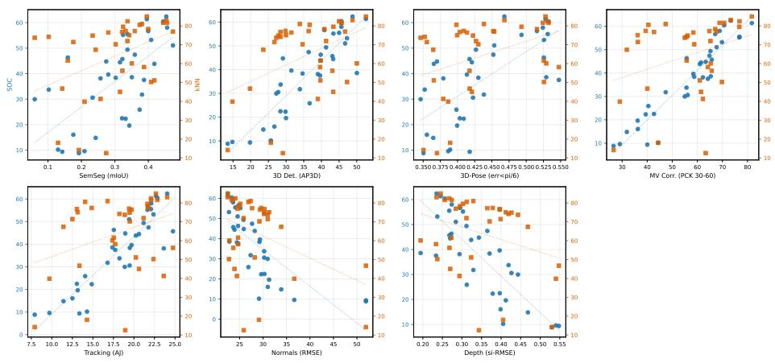  
Fig. r4: SOC and kNN performance vs. downstream task performance. We plot the model performances for the compared models (as reported in Tab. r8).

# D.3 Details on Other Downstream Tasks

We extend Probe3D [20], a 3D-awareness evaluation framework into a broader, unified evaluation suite spanning monocular geometry, multi-view correspondence, semantic segmentation, tracking, classification, and 3D detection. This section details the tasks, datasets, probe architectures, and evaluation protocols used, as well as the backbone families we evaluate.

The extended suite covers the following task families:

Correspondence (zero-shot). We evaluate correspondence in two regimes: semantic matching and multiview geometric matching. For SPair-71k [44], we follow Probe3D [20] and extract feature vectors at annotated keypoints, predicting matches via nearest-neighbor similarity and reporting PCK@0.1. For NAVI [30], we extract feature maps for both views and establish correspondences using nearest-neighbor matching in feature space, followed by Lowe’s ratio test to retain reliable matches. Candidate correspondences are triangulated using ground-truth camera calibration, and accuracy is measured as the fraction of matches whose 3D error is below 2 cm. Following the Probe3D protocol, we stratify the 2 cm recall by relative camera rotation and report performance in the hardest bin, corresponding to pairs with viewpoint change in the [90◦, 120◦) range.

ImageNet classification (kNN). We perform ImageNet classification using knearest neighbors. For this embeddings are extracted on the ImageNet training set and evaluated on the validation set. We select the k-value that results in the best classification accuracy. Following common practice, classification is performed using the CLS token if available. Otherwise, dense tokens are averaged into one vector.

Table r10: Evaluated visual models. We list architecture, supervision type, and pre-training data for the evaluated backbones presented in the main paper. Whenever possible, we use publicly released checkpoints of comparable scale. 

<table><tr><td>Model</td><td>Architecture</td><td>Supervision</td><td>Pre-train data</td></tr><tr><td>DINOv1 [13]</td><td>ViT-B/16</td><td>SSL</td><td>ImageNet-1K</td></tr><tr><td>DINOv2 [46]</td><td>ViT-B/14</td><td>SSL</td><td>LVD-142M</td></tr><tr><td>DINOv3 [59]</td><td>ViT-B/16</td><td>SSL</td><td>LVD-1689M</td></tr><tr><td>iBOT [82]</td><td>ViT-B/16</td><td>SSL</td><td>ImageNet-1K</td></tr><tr><td>I-JEPA [3]</td><td>ViT-H/16</td><td>SSL (JEPA)</td><td>ImageNet-1K</td></tr><tr><td>C-RADIOv3 [28]</td><td>ViT-H/16</td><td>Distill.</td><td>NV-CC-T2I-Dataset 700M</td></tr><tr><td>DUNE [53]</td><td>ViT-B/14</td><td>Distill.</td><td>DUNE-20.7M</td></tr><tr><td>SD 2.1 [52]</td><td>U-Net</td><td>T2I gen.</td><td>LAION-5B</td></tr><tr><td>CroCov2 [70]</td><td>ViT-B/16</td><td>MV SSL</td><td>HM3D, ScanNet, etc.</td></tr><tr><td>MAE [27]</td><td>ViT-B/16</td><td>SSL (MIM)</td><td>ImageNet-1K</td></tr><tr><td>PIXIO [76]</td><td>ViT-B/16</td><td>SSL (MIM)</td><td>Curated MetaCLIP-2B</td></tr><tr><td>CLIP [47]</td><td>ViT-B/16</td><td>Contrastive</td><td>~400M image-text pairs</td></tr><tr><td>PE-Spatial [9]</td><td>ViT-G/14</td><td>Contrastive</td><td>Curated 5.4B MetaCLIP pairs</td></tr><tr><td>Qwen2.5-VL [7]</td><td>ViT-H</td><td>VLM</td><td>4T token multimodal data</td></tr></table>

Semantic segmentation (probed). Dense semantic understanding is assessed on ADE20K [81] using a minimal segmentation probe. We train a lightweight linear segmentation head consisting of a single 1×1 convolution applied to dense frozen backbone features on ADE20K. The probe is trained for 25 epochs using SGD, and we report mean IoU on the validation set.

Tracking (zero-shot). We assess spatio-temporal consistency via zero-shot point tracking on TAP-Vid-DAVIS [17]. Dense feature maps are extracted for each frame, and query points are embedded by bilinear sampling in feature space at their first visible location. For each subsequent frame, we compute the cosine similarities between the query descriptor and the dense feature map, and obtain correspondences via argmax operation. Evaluation follows the TAP-Vid queriedfirst protocol, and we report Average Jaccard (AJ) [4], which jointly captures occlusion consistency and point localization accuracy.

Monocular geometry (probed). We evaluate single-image geometric prediction on NYUv2 [58] using two tasks: depth estimation and surface normal prediction. Following the Probe3D [20] setup, we attach a lightweight DPT-style multiscale decoder to frozen backbone features extracted from several intermediate blocks. For depth estimation, we use metric depth on NYUv2 and evaluate performance using the root mean squared error (RMSE) between predicted and ground-truth depth maps. For surface normals, the decoder predicts per-pixel normal directions, and accuracy is assessed using the RMSE of angular errors between predicted and ground-truth normals, providing a direct measure of local geometric fidelity.

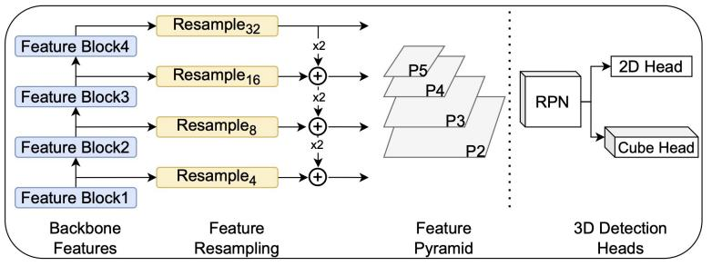

flowchart

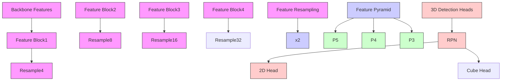

Fig. r5: Overview of the detection probe. The probe receives four intermediate feature maps from a pretrained frozen backbone, merges and upsamples them to produce a Detectron2-style feature pyramid $\{ p _ { 2 } , p _ { 3 } , p _ { 4 } , p _ { 5 } \}$ used by the 3D detection head.

3D pose estimation (probed). We evaluate object-level 3D awareness on ImageNet3D [40] by linearly probing frozen backbone features for 3D viewpoint prediction. Following the ImageNet3D protocol, three independent linear probes are trained to predict azimuth, elevation, and in-plane rotation from pooled backbone features. The predicted angle distributions are converted to continuous rotation matrices, and performance is measured using the geodesic rotation error [40], defined as the angle of the matrix logarithm of $R _ { \mathrm { p r e d } } ^ { \top } R _ { \mathrm { g t } }$ R⊤predRgt. We report pose accuracy as the percentage of samples whose rotation error is below a threshold of $\pi / 6$ .

3D detection (probed). Our experiments build on the Omni3D [10] detection pipeline, which extends Detectron2 [72] with Cube R-CNN style 3D cuboid prediction. While the original setup optimizes a CNN backbone, we repurpose it as a 3D detection head on top of frozen, pretrained visual encoders (eg., DINO/v2/v3, CLIP, SD etc.). To bridge the gap between pre-trained backbones and 3D detection heads, we introduce a lightweight DPT [48] probe, and the resulting features are reassembled to form a feature pyramid (see Figure r5). Given a pretrained backbone, we select four feature blocks at increasing depth and reshape their patch tokens into dense spatial feature maps. These maps all share the same spatial resolution (the patch grid) but capture progressively higher-level semantics. The four features are fed into the probe, which first unifies channel dimensions with 1×1 convolutions, then constructs a top-down FPN [34] style decoder. Through resampling and lateral fusion, the probe produces a Detectron2- compatible feature pyramid.

We attach the probe and detection heads to frozen backbone features and train on a subset of indoor RGB-D scenes with 3D bounding box annotations. We report average precision (AP3D) for ARKitScenes [8] subset of Omni3D in Table r8.

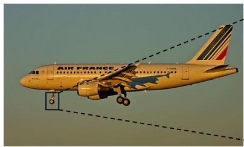

natural_image

Air France 3D-500 aircraft in flight with landing gear deployed, no visible text or symbols on the aircraft body

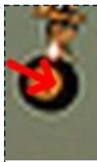  
Arrow

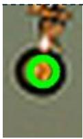  
Circle

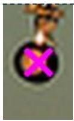  
Cross

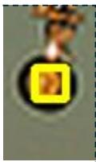  
Square   
Fig. r6: Examples of visual markers to indicate keypoints for LVLM evaluation.

Table r11: Evaluation of visual prompts.Average performance of Qwen2.5-VL-7B-Instruct given different visual prompts. 

<table><tr><td>Marker shape</td><td>Mean</td></tr><tr><td>Arrow</td><td>30.0</td></tr><tr><td>Circle</td><td>29.8</td></tr><tr><td>Cross</td><td>28.0</td></tr><tr><td>Square</td><td>26.6</td></tr></table>

<table><tr><td>Marker color</td><td>Mean</td></tr><tr><td>Red</td><td>30.0</td></tr><tr><td>Blue</td><td>29.3</td></tr><tr><td>Yellow</td><td>28.9</td></tr><tr><td>Purple</td><td>28.2</td></tr><tr><td>Green</td><td>27.4</td></tr></table>

# D.4 More Details of LVLM Evaluation

Implementation details. We use the VLMEvalKit [38] framework to perform standardized evaluation across different LVLMs. For the evaluation, we pursue a similar setup as [24]. GPT-4o is employed as a judge to verify whether an LVLM’s output matches the ground-truth answer. From the annotated SOCO data, we construct 2,000 multiple-choice questions. For each question, we provide the human-annotated semantically matched keypoint as the ground-truth answer and use other randomly sampled annotated keypoints in the target image as distractor options.

Prompts: We illustrate the evaluation setting and present prompt examples for the LVLM evaluation under different settings in Fig. r7a, Fig. r7c, and Fig. r7b. For the Vis. setting, we provide BLINK-style questions with the red arrow marker in the source image. For Vis.+Desc., we additionally include a templated keypoint description alongside the visual marker. For the Desc. setting, the source image is omitted and the query keypoint is specified only through its textual description; the target image with candidate markers remains visible.

Choices of visual markers: The BLINK benchmark uses a red circle to mark keypoints for LVLMs to attend to. Previous work [12,57] has shown that different visual markers can affect VLM performance. Here, we investigate alternative visual markers for keypoints to study their impact. We experiment with different colors and shapes of visual markers, with examples shown in Figure r6.

To assess how robust LVLMs are to different visual markers, we follow the BLINK benchmark and build a smaller benchmark of SPair-71k to search for markers that yield the highest accuracy. Following the BLINK protocol, we construct 233 questions and we present results using Qwen2.5-VL-7B-Instruct across all settings. Table r11 reports the average performance of the LVLM under different marker shapes and colors. We observe that the arrow shape and red color achieve the best performance among the tested options respectively. Consequently, we assume this setting also generalizes to the SOCO dataset and we adopt red arrow as the default visual marker in all LVLM experiments.

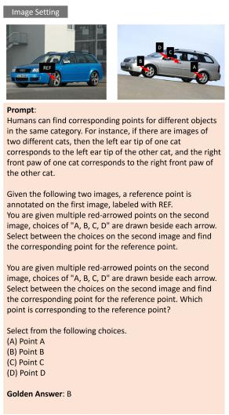

# Prompt

Humans canfind corresponding points for different objects in the same category, For instance, if there are images of two different cats,then the left ear tip of one cat corresponds tothelefteartipoftheothercat,andtheright front paw ofonecat corresponds totherightfront paw of the other cat.

Giventhefollowingtwoimages,areferenceointis annotated on the first image,labeled with REF. Youare given multiplered-arrowedpointsonthesecond image,cocesof"A,B，C，Daredabsideechow. Selectbetweethcsoesededind thecorresponding point for the reference point.

You aregivenmultiplered-arrowed points onthe second image,coicesof"A,B,C,Daredanbsideeachrow. Selectbetweenthechoicesonthesecondimageand find thecorresponding point for the reference point.Which pointiscorresponding tothereferencepoint?

Select from the following choices.

(A)Point A

(C) Point C (D) Point D

Golden Answer: B

(a) Vis. setting.

Image+Text Setting   
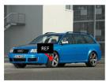

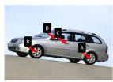

# Prompt:

Humans can find corresponding points for different objects inthe same category.For instance,if thereare images of two different cats,then the left ear tip of one cat corresponds tothelefteartipoftheothercat,andtheright frontpawofonecatcorrespondstotherightfrontpawof the other cat.

Given the following two carimages,a referencepoint is annotated on the first image, labeled with REF. The labeled reference point isa keypoint ona car. It is definedyloso centricoordinatesystem(frotheratuers perspectiveoftheobject/device)： centerpoint of the front left wheel

You are given multiple red-arrowed points on the second image,choicesof“A,B，C，Daredawnbesideeachrrow. Selectbetweenthechoicesonthesecondimageandfind thecorrespondingpointforthereferencepoint.Which point iscorresponding to the reference point?

Selectfrom the following choices.

(A) Point A

(DL PointD

Golden Answer: B

(b) Vis.+Desc. setting.

Text Setting   
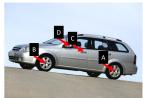

# Prompt:

The target reference point isa keypoint ona car.It is definedbythefollowingdescription,written inanobect centric coordinate system (from the operator/user's perspective of the object/device): centerpoint of thefront left wheel

In the provided car image,severalred arrow markers are shown, each labeled with a letter (A, B, C, or D). Selectbetween thechoicesonthecarimage andfindthe corresponding point to the target keypoint described above.

Selectfrom the following choices:

(A) Point A

(B) Point B

(C) Point C (D) PointD

(D) Polnt L

Golden Answer: B

(c) Desc. setting.

Fig. r7: Example prompts for LVLM evaluation in the three settings image, image+text, and text.

# E More Details about Annotation Pipeline

Figure r8 presents an example GUI that was shown to the AMT workers that were hired for labeling the keypoints. Reference annotations were given on representative images for each keypoint. Every AMT worker had to pass a qualification test before annotating and continuous monitoring ensured sufficient labeling quality.

# F Limitations

Sparse keypoint annotations. SOCO provides characteristic part correspondences via sparse keypoint labels rather than dense semantic matching. This is sufficient for diagnosing structured part-level understanding, but it does not support evaluating dense pixel-wise correspondence per-se.

Image-source bias. Images are sourced from ImageNet3D [40] and Animal3D [74], which enables inherited 3D pose metadata and in-distribution evaluation of ImageNet-trained models but biases the dataset toward salient, curated object views and limits the evaluation of out-of-distribution scenarios.

Prompted LVLM setting. Keypoint descriptions are template-based. More detailed natural language descriptions could improve the LVLM performance further.

Zero-shot nearest-neighbor matching. SOC is mainly designed as a zero-shot diagnostic. Therefore, the default vision-model evaluation uses nearestneighbor feature matching, which is intentionally simple and forms a lower bound on what a given representation can support with supervised adaptation.

Cross-category taxonomy scope. Cross-category correspondences are defined within the proposed concept hierarchy. Broader functional analogies that fall outside this hierarchy (e.g. tool affordance transfer across distant categories) remain future work.

# G Ethical Concerns

The SOCO dataset includes a small number of images depicting military equipment (specifically the categories tank, rifle, and fighter jet), but these objects are shown in non-violent contexts and do not directly capture physical harm. All images were sourced from public datasets [16, 40]. The purpose of the dataset is exclusively methodological: to study semantic correspondence and representation learning for diverse categories. Nonetheless, we acknowledge that models could be evaluated on data containing weapons in principle and could be potentially applied in harmful downstream applications.

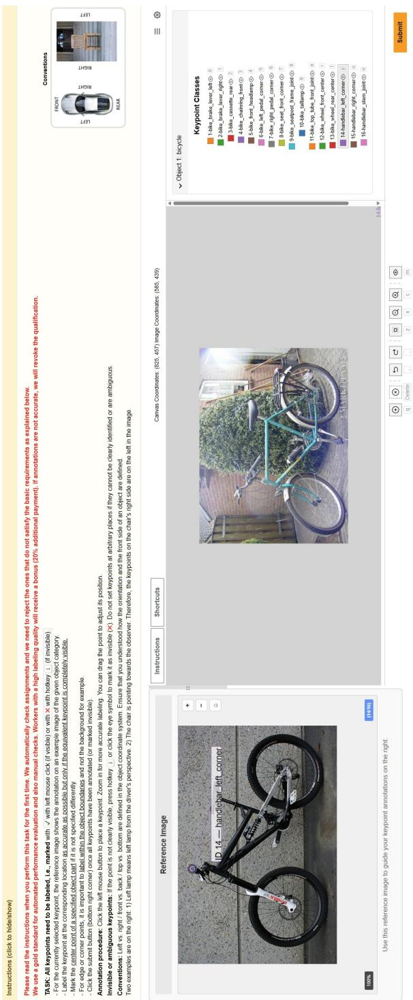

text_image

Please read the instructions when you perform this task for the first time. We automatically check assignments and we need to reject the ones that do not satisfy the basic requirements as explained below.
We use a gold standard for automated performance evaluation and also manual checks. Workers with a high labeling quality will receive a bonus (20% additional payment). If annotations are not accurate, we will revoke the qualification.

TASK: All keypoints need to be labeled, i.e., marked with √ with left mouse click (if visible) or with ✗ with hotkey √ (if invisible).

- For the currently selected keypoint, the reference image shows the annotation on an example image of the given object category.

- Label the keypoint at the corresponding location as accurate as possible but only if the equivalent keypoint is completely visible.

- Mark the center point of a specified object part if it is not specified differently.

- For edge or corner points, it is important to label within the object boundaries and not the background for example.

- Click the submit button (bottom right corner) once all keypoints have been annotated (or marked invisible).

Annotation procedure: Click the left mouse button to place a keypoint. Zoom in for more accurate labeling. You can drag the point to adjust its position.

Invisible or ambiguous keypoints: If the point is not clearly visible, press hotkey √ or click the eye symbol to mark it as invisible (✗). Do not set keypoints at arbitrary places if they cannot be clearly identified or are ambiguous.

Conventions: Left vs. right / front vs. back / top vs. bottom are defined in the object coordinate system. Ensure that you understood how the orientation and the front side of an object are defined.

Two examples are on the right: 1) Left lamp means left lamp from the driver's perspective. 2) The chair is pointing towards the observer. Therefore, the keypoints on the chair's right side are on the left in the image.

Reference Image

ID 14 — handlebar_left_corner

100%

Use this reference image to guide your keypoint annotations on the right.

Instructions
Shortcuts
Canvas Coordinates: (825, 457) Image Coordinates: (565, 439)

Object 1. bicycle

Keypoint Classes
1-bike_brake_lever_left○ 8
2-bike_brake_lever_right○ 1
3-bike_cassette_rear○ 2
4-bike_chainring_front○ 3
5-bike_front_headlamp○ 4
6-bike_left_pedal_corner○ 5
7-bike_right_pedal_corner○ 6
8-bike_seat_front_corner○ 7
9-bike_sealpost_frame_joint○ 8
10-bike_taillamp○ 9
11-bike_top_tube_front_joint○ e
12-bike_wheel_front_center○ f
13-bike_wheel_rear_center○ i
14-handlebar_left_corner○ v
15-handlebar_right_corner○ w
16-handlebar_stem_joint○ o

q
Delete
a
x
c
m
Submit

Fig. r8: Example AMT labeling GUI. This GUI was presented to Amazon Mechanical Turk workers for keypoint labeling.

# References

1. Alayrac, J.B., Donahue, J., Luc, P., Miech, A., Barr, I., Hasson, Y., Lenc, K., Mensch, A., Millicah, K., Reynolds, M., Ring, R., Rutherford, E., Cabi, S., Han, T., Gong, Z., Samangooei, S., Monteiro, M., Menick, J., Borgeaud, S., Brock, A., Nematzadeh, A., Sharifzadeh, S., Binkowski, M., Barreira, R., Vinyals, O., Zisserman, A., Simonyan, K.: Flamingo: a visual language model for few-shot learning. In: Proceedings of the 36th International Conference on Neural Information Processing Systems. NIPS ’22, Curran Associates Inc., Red Hook, NY, USA (2022)   
2. Andriluka, M., Pishchulin, L., Gehler, P., Schiele, B.: 2d human pose estimation: New benchmark and state of the art analysis. In: Proceedings of the IEEE Conference on computer Vision and Pattern Recognition. pp. 3686–3693 (2014)   
3. Assran, M., Duval, Q., Misra, I., Bojanowski, P., Vincent, P., Rabbat, M., LeCun, Y., Ballas, N.: Self-supervised learning from images with a joint-embedding predictive architecture. In: Proceedings of the IEEE/CVF Conference on Computer Vision and Pattern Recognition. pp. 15619–15629 (2023)   
4. Aydemir, G., Xie, W., Güney, F.: Can visual foundation models achieve long-term point tracking? (2024), https://arxiv.org/abs/2408.13575   
5. Bai, J., Bai, S., Yang, S., Wang, S., Tan, S., Wang, P., Lin, J., Zhou, C., Zhou, J.: Qwen-vl: A versatile vision-language model for understanding, localization, text reading, and beyond. arXiv preprint arXiv:2308.12966 (2023)   
6. Bai, S., Cai, Y., Chen, R., Chen, K., Chen, X., Cheng, Z., Deng, L., Ding, W., Gao, C., Ge, C., et al.: Qwen3-vl technical report. arXiv preprint arXiv:2511.21631 (2025)   
7. Bai, S., Chen, K., Liu, X., Wang, J., Ge, W., Song, S., Dang, K., Wang, P., Wang, S., Tang, J., Zhong, H., Zhu, Y., Yang, M., Li, Z., Wan, J., Wang, P., Ding, W., Fu, Z., Xu, Y., Ye, J., Zhang, X., Xie, T., Cheng, Z., Zhang, H., Yang, Z., Xu, H., Lin, J.: Qwen2.5-vl technical report. arXiv preprint arXiv:2502.13923 (2025)   
8. Baruch, G., Chen, Z., Dehghan, A., Dimry, T., Feigin, Y., Fu, P., Gebauer, T., Joffe, B., Kurz, D., Schwartz, A., Shulman, E.: Arkitscenes: A diverse real-world dataset for 3d indoor scene understanding using mobile rgb-d data (2022), https: //arxiv.org/abs/2111.08897   
9. Bolya, D., Huang, P.Y., Sun, P., Cho, J.H., Madotto, A., Wei, C., Ma, T., Zhi, J., Rajasegaran, J., Rasheed, H., et al.: Perception encoder: The best visual embeddings are not at the output of the network. arXiv preprint arXiv:2504.13181 (2025)   
10. Brazil, G., Kumar, A., Straub, J., Ravi, N., Johnson, J., Gkioxari, G.: Omni3D: A large benchmark and model for 3D object detection in the wild. In: CVPR. IEEE, Vancouver, Canada (June 2023)   
11. Butler, D.J., Wulff, J., Stanley, G.B., Black, M.J.: A naturalistic open source movie for optical flow evaluation. In: European conference on computer vision. pp. 611– 625. Springer (2012)   
12. Cai, Z., Yeh, C.F., Xu, H., Liu, Z., Meyer, G., Lei, X., Zhao, C., Li, S.W., Chandra, V., Shi, Y.: Depthlm: Metric depth from vision language models (2025), https: //arxiv.org/abs/2509.25413   
13. Caron, M., Touvron, H., Misra, I., Jégou, H., Mairal, J., Bojanowski, P., Joulin, A.: Emerging properties in self-supervised vision transformers. In: Proceedings of the International Conference on Computer Vision (ICCV) (2021)   
14. Chi, Y., Sommer, L., Dünkel, O., Muhle, D., Cremers, D., Theobalt, C., Kortylewski, A.: C3po: Canonicalization of 3d pose from partial views with gener-

alizable correspondence features. In: International Conference on 3D Vision (3DV) (2026)   
15. Cordts, M., Omran, M., Ramos, S., Rehfeld, T., Enzweiler, M., Benenson, R., Franke, U., Roth, S., Schiele, B.: The cityscapes dataset for semantic urban scene understanding. In: Proceedings of the IEEE conference on computer vision and pattern recognition. pp. 3213–3223 (2016)   
16. Deng, J., Dong, W., Socher, R., Li, L.J., Li, K., Fei-Fei, L.: Imagenet: A largescale hierarchical image database. In: 2009 IEEE conference on computer vision and pattern recognition. pp. 248–255. Ieee (2009)   
17. Doersch, C., Gupta, A., Markeeva, L., Recasens, A., Smaira, L., Aytar, Y., Carreira, J., Zisserman, A., Yang, Y.: Tap-vid: A benchmark for tracking any point in a video. Advances in Neural Information Processing Systems 35, 13610–13626 (2022)   
18. Dünkel, O., Jesslen, A., Xie, J., Theobalt, C., Rupprecht, C., Kortylewski, A.: Cnsbench: Benchmarking image classifier robustness under continuous nuisance shifts. In: Proceedings of the IEEE/CVF International Conference on Computer Vision (ICCV) (2025)   
19. Dünkel, O., Wimmer, T., Theobalt, C., Rupprecht, C., Kortylewski, A.: Do it yourself: Learning semantic correspondence from pseudo-labels. arXiv preprint arXiv:2506.05312 (2025)   
20. El Banani, M., Raj, A., Maninis, K.K., Kar, A., Li, Y., Rubinstein, M., Sun, D., Guibas, L., Johnson, J., Jampani, V.: Probing the 3d awareness of visual foundation models. In: Proceedings of the IEEE/CVF Conference on Computer Vision and Pattern Recognition. pp. 21795–21806 (2024)   
21. Everingham, M., Eslami, S.A., Van Gool, L., Williams, C.K., Winn, J., Zisserman, A.: The pascal visual object classes challenge: A retrospective. International journal of computer vision 111(1), 98–136 (2015)   
22. Everingham, M., Van Gool, L., Williams, C.K., Winn, J., Zisserman, A.: The pascal visual object classes (voc) challenge. International journal of computer vision 88(2), 303–338 (2010)   
23. Florence, P.R., Manuelli, L., Tedrake, R.: Dense object nets: Learning dense visual object descriptors by and for robotic manipulation. arXiv preprint arXiv:1806.08756 (2018)   
24. Fu, X., Hu, Y., Li, B., Feng, Y., Wang, H., Lin, X., Roth, D., Smith, N.A., Ma, W.C., Krishna, R.: Blink: Multimodal large language models can see but not perceive. arXiv preprint arXiv:2404.12390 (2024)   
25. Gan, C., Tu, Y., Chen, X., Chen, T., Li, Y., Harandi, M., Lin, W.: Unleashing diffusion transformers for visual correspondence by modulating massive activations. Advances in Neural Information Processing Systems 38, 114432–114462 (2026)   
26. Ham, B., Cho, M., Schmid, C., Ponce, J.: Proposal flow. In: Proceedings of the IEEE Conference on Computer Vision and Pattern Recognition. pp. 3475–3484 (2016)   
27. He, K., Chen, X., Xie, S., Li, Y., Dollár, P., Girshick, R.: Masked autoencoders are scalable vision learners. In: Proceedings of the IEEE/CVF conference on computer vision and pattern recognition. pp. 16000–16009 (2022)   
28. Heinrich, G., Ranzinger, M., Hongxu, Yin, Lu, Y., Kautz, J., Tao, A., Catanzaro, B., Molchanov, P.: Radiov2.5: Improved baselines for agglomerative vision foundation models (2024), https://arxiv.org/abs/2412.07679   
29. Hurst, A., Lerer, A., Goucher, A.P., Perelman, A., Ramesh, A., Clark, A., Ostrow, A., Welihinda, A., Hayes, A., Radford, A., et al.: Gpt-4o system card. arXiv preprint arXiv:2410.21276 (2024)

30. Jampani, V., Maninis, K.K., Engelhardt, A., Karpur, A., Truong, K., Sargent, K., Popov, S., Araujo, A., Martin-Brualla, R., Patel, K., Vlasic, D., Ferrari, V., Makadia, A., Liu, C., Li, Y., Zhou, H.: NAVI: Category-agnostic image collections with high-quality 3d shape and pose annotations. In: NeurIPS (2023), https: //navidataset.github.io/   
31. Kornblith, S., Shlens, J., Le, Q.V.: Do better imagenet models transfer better? In: Proceedings of the IEEE/CVF conference on computer vision and pattern recognition. pp. 2661–2671 (2019)   
32. Li, B., Zhang, Y., Guo, D., Zhang, R., Li, F., Zhang, H., Zhang, K., Zhang, P., Li, Y., Liu, Z., Li, C.: Llava-onevision: Easy visual task transfer. Transactions on Machine Learning Research (2024)   
33. Li, J., Li, D., Xiong, C., Hoi, S.: Blip: Bootstrapping language-image pre-training for unified vision-language understanding and generation. In: ICML (2022)   
34. Lin, T.Y., Dollár, P., Girshick, R., He, K., Hariharan, B., Belongie, S.: Feature pyramid networks for object detection (2017), https://arxiv.org/abs/1612. 03144   
35. Lin, T.Y., Maire, M., Belongie, S., Hays, J., Perona, P., Ramanan, D., Dollár, P., Zitnick, C.L.: Microsoft coco: Common objects in context. In: European conference on computer vision. pp. 740–755. Springer (2014)   
36. Liu, C., Yuen, J., Torralba, A., Sivic, J., Freeman, W.T.: Sift flow: Dense correspondence across different scenes. In: European conference on computer vision. pp. 28–42. Springer (2008)   
37. Liu, H., Li, C., Wu, Q., Lee, Y.J.: Visual instruction tuning (2023)   
38. Liu, Y., Duan, H., Zhang, Y., Li, B., Zhang, S., Zhao, W., Yuan, Y., Wang, J., He, C., Liu, Z., et al.: Mmbench: Is your multi-modal model an all-around player? In: European conference on computer vision. pp. 216–233. Springer (2024)   
39. Luo, G., Dunlap, L., Park, D.H., Holynski, A., Darrell, T.: Diffusion hyperfeatures: Searching through time and space for semantic correspondence. In: Advances in Neural Information Processing Systems (NeurIPS) (2023)   
40. Ma, W., Zhang, G., Liu, Q., Zeng, G., Kortylewski, A., Liu, Y., Yuille, A.: Imagenet3d: Towards general-purpose object-level 3d understanding. Advances in Neural Information Processing Systems 37, 96127–96149 (2024)   
41. Mariotti, O., Du, Z., Bhalgat, Y., Mac Aodha, O., Bilen, H.: Jamais vu: Exposing the generalization gap in supervised semantic correspondence. arXiv preprint arXiv:2506.08220 (2025)   
42. Mariotti, O., Mac Aodha, O., Bilen, H.: Improving semantic correspondence with viewpoint-guided spherical maps. In: Proceedings of the IEEE/CVF Conference on Computer Vision and Pattern Recognition. pp. 19521–19530 (2024)   
43. Mayer, N., Ilg, E., Hausser, P., Fischer, P., Cremers, D., Dosovitskiy, A., Brox, T.: A large dataset to train convolutional networks for disparity, optical flow, and scene flow estimation. In: Proceedings of the IEEE conference on computer vision and pattern recognition. pp. 4040–4048 (2016)   
44. Min, J., Lee, J., Ponce, J., Cho, M.: Spair-71k: A large-scale benchmark for semantic correspondence. arXiv preprint arXiv:1908.10543 (2019)   
45. openai, Applin, S., Adesso, G., Ashfaq, R., Bai, M., Brammer, M., Fecht, E., Goodman, A., Grossman, S., Groh, M., Kirk, H.R., Gunitsky, S., Huang, Y., Kahn, L., Kumar, S., Madrid-Morales, D., Motoki, F., Ovadya, A., Peters, U., Robinson, M., Röttger, P., Wasserman, H., Wehsener, A., Walker, L., Vidgen, B., Zhu, J.: GPT-4V(ision) System Card (1 2023). https://doi.org/10.26181/25479208.v1

46. Oquab, M., Darcet, T., Moutakanni, T., Vo, H.V., Szafraniec, M., Khalidov, V., Fernandez, P., Haziza, D., Massa, F., El-Nouby, A., Howes, R., Huang, P.Y., Xu, H., Sharma, V., Li, S.W., Galuba, W., Rabbat, M., Assran, M., Ballas, N., Synnaeve, G., Misra, I., Jegou, H., Mairal, J., Labatut, P., Joulin, A., Bojanowski, P.: Dinov2: Learning robust visual features without supervision (2023)   
47. Radford, A., Kim, J.W., Hallacy, C., Ramesh, A., Goh, G., Agarwal, S., Sastry, G., Askell, A., Mishkin, P., Clark, J., et al.: Learning transferable visual models from natural language supervision. In: International conference on machine learning. pp. 8748–8763. PmLR (2021)   
48. Ranftl, R., Bochkovskiy, A., Koltun, V.: Vision transformers for dense prediction. In: Proceedings of the IEEE/CVF international conference on computer vision. pp. 12179–12188 (2021)   
49. Ranzinger, M., Heinrich, G., Kautz, J., Molchanov, P.: Am-radio: Agglomerative vision foundation model reduce all domains into one. In: Proceedings of the IEEE/CVF Conference on Computer Vision and Pattern Recognition. pp. 12490– 12500 (June 2024)   
50. Ranzinger, M., Heinrich, G., McCarthy, C., Kautz, J., Tao, A., Catanzaro, B., Molchanov, P.: C-radiov4 (tech report). arXiv preprint arXiv:2601.17237 (2026)   
51. Rocco, I., Arandjelovic, R., Sivic, J.: Convolutional neural network architecture for geometric matching. In: Proceedings of the IEEE conference on computer vision and pattern recognition. pp. 6148–6157 (2017)   
52. Rombach, R., Blattmann, A., Lorenz, D., Esser, P., Ommer, B.: High-resolution image synthesis with latent diffusion models. In: Proceedings of the IEEE/CVF conference on computer vision and pattern recognition. pp. 10684–10695 (2022)   
53. Sarıyıldız, M.B., Weinzaepfel, P., Lucas, T., De Jorge, P., Larlus, D., Kalantidis, Y.: Dune: Distilling a universal encoder from heterogeneous 2d and 3d teachers. In: Proceedings of the Computer Vision and Pattern Recognition Conference. pp. 30084–30094 (2025)   
54. Scharstein, D., Szeliski, R.: A taxonomy and evaluation of dense two-frame stereo correspondence algorithms. International journal of computer vision 47(1), 7–42 (2002)   
55. Sedaghat, N., Brox, T.: Unsupervised generation of a viewpoint annotated car dataset from videos. In: IEEE International Conference on Computer Vision (ICCV) (2015), http://lmb.informatik.uni- freiburg.de//Publications/ 2015/SB15   
56. Shen, S., Li, L.H., Tan, H., Bansal, M., Rohrbach, A., Chang, K.W., Yao, Z., Keutz, K.: How much can clip benefit vision-and-language tasks? In: ICLR (2022)   
57. Shtedritski, A., Rupprecht, C., Vedaldi, A.: What does clip know about a red circle? visual prompt engineering for vlms. arXiv preprint arXiv:2304.06712 (2023)   
58. Silberman, N., Hoiem, D., Kohli, P., Fergus, R.: Indoor segmentation and support inference from rgbd images. In: ECCV (2012)   
59. Siméoni, O., Vo, H.V., Seitzer, M., Baldassarre, F., Oquab, M., Jose, C., Khalidov, V., Szafraniec, M., Yi, S., Ramamonjisoa, M., Massa, F., Haziza, D., Wehrstedt, L., Wang, J., Darcet, T., Moutakanni, T., Sentana, L., Roberts, C., Vedaldi, A., Tolan, J., Brandt, J., Couprie, C., Mairal, J., Jégou, H., Labatut, P., Bojanowski, P.: DINOv3 (2025), https://arxiv.org/abs/2508.10104   
60. Sommer, L., Dünkel, O., Theobalt, C., Kortylewski, A.: Common3d: Selfsupervised learning of 3d morphable models for common objects in neural feature space. In: Proceedings of the Computer Vision and Pattern Recognition Conference (CVPR). pp. 6468–6479 (2025)

61. Stracke, N., Baumann, S.A., Bauer, K., Fundel, F., Ommer, B.: Cleandift: Diffusion features without noise. In: Proceedings of the Computer Vision and Pattern Recognition Conference. pp. 117–127 (2025)   
62. Sun, Y., Huang, Y., Guo, H., Zhao, Y., Wu, R., Yu, Y., Ge, W., Zhang, W.: Misc210k: A large-scale dataset for multi-instance semantic correspondence. In: 2023 IEEE/CVF Conference on Computer Vision and Pattern Recognition (CVPR). pp. 7121–7130 (2023). https://doi.org/10.1109/CVPR52729.2023. 00688   
63. Tang, L., Jia, M., Wang, Q., Phoo, C.P., Hariharan, B.: Emergent correspondence from image diffusion. Advances in Neural Information Processing Systems 36, 1363–1389 (2023)   
64. Taniai, T., Sinha, S.N., Sato, Y.: Joint recovery of dense correspondence and cosegmentation in two images. In: Proceedings of the IEEE conference on computer vision and pattern recognition. pp. 4246–4255 (2016)   
65. Team, G.: Gemini: A family of highly capable multimodal models (2025), https: //arxiv.org/abs/2312.11805   
66. Venkataramanan, S., Pariza, V., Salehi, M., Knobel, L., Gidaris, S., Ramzi, E., Bursuc, A., Asano, Y.M.: Franca: Nested matryoshka clustering for scalable visual representation learning. arXiv preprint arXiv:2507.14137 (2025)   
67. Wandel, K., Wang, H.: Semalign3d: Semantic correspondence between rgb-images through aligning 3d object-class representations. In: Proceedings of the IEEE/CVF Conference on Computer Vision and Pattern Recognition (CVPR) (2025), poster   
68. Wang, H., Sridhar, S., Huang, J., Valentin, J., Song, S., Guibas, L.J.: Normalized object coordinate space for category-level 6d object pose and size estimation. In: Proceedings of the IEEE/CVF conference on computer vision and pattern recognition. pp. 2642–2651 (2019)   
69. Wang, W., Gao, Z., Gu, L., Pu, H., Cui, L., Wei, X., Liu, Z., Jing, L., Ye, S., Shao, J., et al.: Internvl3.5: Advancing open-source multimodal models in versatility, reasoning, and efficiency. arXiv preprint arXiv:2508.18265 (2025)   
70. Weinzaepfel, P., Lucas, T., Leroy, V., Cabon, Y., Arora, V., Brégier, R., Csurka, G., Antsfeld, L., Chidlovskii, B., Revaud, J.: CroCo v2: Improved Cross-view Completion Pre-training for Stereo Matching and Optical Flow. In: ICCV (2023)   
71. Wu, Y., Lim, J., Yang, M.H.: Online object tracking: A benchmark. In: Proceedings of the IEEE conference on computer vision and pattern recognition. pp. 2411–2418 (2013)   
72. Wu, Y., Kirillov, A., Massa, F., Lo, W.Y., Girshick, R.: Detectron2. https:// github.com/facebookresearch/detectron2 (2019)   
73. Xiang, Y., Mottaghi, R., Savarese, S.: Beyond pascal: A benchmark for 3d object detection in the wild. In: IEEE winter conference on applications of computer vision. pp. 75–82. IEEE (2014)   
74. Xu, J., Zhang, Y., Peng, J., Ma, W., Jesslen, A., Ji, P., Hu, Q., Zhang, J., Liu, Q., Wang, J., et al.: Animal3d: A comprehensive dataset of 3d animal pose and shape. In: Proceedings of the IEEE/CVF International Conference on Computer Vision. pp. 9099–9109 (2023)   
75. Yang, J., Yang, S., Gupta, A.W., Han, R., Fei-Fei, L., Xie, S.: Thinking in Space: How Multimodal Large Language Models See, Remember and Recall Spaces. arXiv preprint arXiv:2412.14171 (2024)   
76. Yang, L., Li, S.W., Li, Y., Lei, X., Wang, D., Mohamed, A., Zhao, H., Xu, H.: In pursuit of pixel supervision for visual pre-training. arXiv preprint arXiv:2512.15715 (2025)

77. Yu, H., Xu, Y., Zhang, J., Zhao, W., Guan, Z., Tao, D.: Ap-10k: A benchmark for animal pose estimation in the wild. arXiv preprint arXiv:2108.12617 (2021)   
78. Yue, X., Ni, Y., Zhang, K., Zheng, T., Liu, R., Zhang, G., Stevens, S., Jiang, D., Ren, W., Sun, Y., Wei, C., Yu, B., Yuan, R., Sun, R., Yin, M., Zheng, B., Yang, Z., Liu, Y., Huang, W., Sun, H., Su, Y., Chen, W.: Mmmu: A massive multidiscipline multimodal understanding and reasoning benchmark for expert agi. In: Proceedings of CVPR (2024)   
79. Zhang, J., Herrmann, C., Hur, J., Chen, E., Jampani, V., Sun, D., Yang, M.H.: Telling left from right: Identifying geometry-aware semantic correspondence. In: Proceedings of the IEEE/CVF Conference on Computer Vision and Pattern Recognition. pp. 3076–3085 (2024)   
80. Zhang, J., Herrmann, C., Hur, J., Polania Cabrera, L., Jampani, V., Sun, D., Yang, M.H.: A tale of two features: Stable diffusion complements dino for zero-shot semantic correspondence. Advances in Neural Information Processing Systems 36, 45533–45547 (2023)   
81. Zhou, B., Zhao, H., Puig, X., Fidler, S., Barriuso, A., Torralba, A.: Scene parsing through ade20k dataset. In: Proceedings of the IEEE conference on computer vision and pattern recognition. pp. 633–641 (2017)   
82. Zhou, J., Wei, C., Wang, H., Shen, W., Xie, C., Yuille, A., Kong, T.: ibot: Image bert pre-training with online tokenizer. arXiv preprint arXiv:2111.07832 (2021)