# T-CLIP: Enabling Thermal Perception for Contrastive Language-Image Pretraining

Tayeba Qazi

Indian Institute of Technology Delhi, India

bsz218186@iitd.ac.in

Ayush Maheshwari

NVIDIA AI Technology Center, India

aymaheshwari@nvidia.com

Prerana Mukherjee

Jawaharlal Nehru University, India

prerana@jnu.ac.in

Brejesh Lall

Indian Institute of Technology Delhi, India

brejesh@ee.iitd.ac.in

# Abstract

Thermal imaging offers a powerful alternative to visible-spectrum vision under challenging conditions such as low illumination and adverse weather, yet foundational vision-language models like CLIP fail to align thermal images with textual descriptions due to a fundamental thermal perception gap. We identify three major challenges: the lack of captioned thermal datasets, the inability of standard LLMs to reason about thermal phenomena, and a key representational challenge in thermal imaging where global scene context and object-level heat signatures conflict when learned together in a single embedding space. To address these, we introduce IR-Cap, the first physics-aware thermal captioning pipeline and dataset providing complementary global and fine-grained thermal descriptions across three public benchmarks, and T-CLIP, a decoupled dual-LoRA framework that independently adapts CLIP for scene-level and object-level thermal understanding. T-CLIP achieves consistent improvements over all baselines across three thermal benchmarks in cross-modal retrieval, and we provide an exploratory demonstration of its applicability to text-conditioned thermal image generation.

# 1 Introduction

Deep learning has revolutionized computer vision, yet the field remains constrained by its heavy reliance on visible-spectrum data. This dependency on RGB imagery becomes a failure point in challenging conditions such as low-light environments, fog, smoke, or other visual obstructions. Thermal imaging, which captures infrared radiation emitted by objects, offers a powerful alternative (Vollmer & Möllmann, 2018). By visualizing heat signatures rather than reflected light, thermal cameras operate effectively in total darkness and penetrate various obscurants, making them indispensable for applications like 24/7 autonomous navigation, search-and-rescue operations, medical diagnostics, and surveillance systems (Farooq et al., 2023; Wilson et al., 2023; He et al., 2021; Gade & Moeslund, 2014; Nguyen et al., 2021; Hirsh et al., 2012). Despite these advantages, the full potential of thermal imaging remains largely untapped, as vision models lack the capability to interpret thermal data.

This limitation is particularly evident in Vision-Language Models (VLMs) such as CLIP Radford et al. (2021). We identify a significant thermal perception gap in CLIP’s understanding, likely stemming from its exclusive training on RGB image-text pairs. Unlike conventional visible-spectrum imagery, where appearance is determined by color and texture, thermal representations are governed by physical properties such as temperature, emissivity, and radiative balance that are largely absent in CLIP’s pretraining distribution.

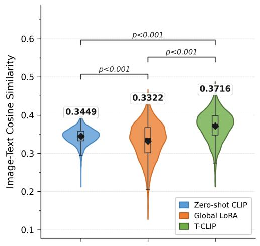

<details>
<summary>violin</summary>

| Method          | Image-Text Cosine Similarity |
| --------------- | ---------------------------- |
| Zero-shot CLIP  | 0.3449                       |
| Global LoRA     | 0.3322                       |
| T-CLIP          | 0.3716                       |
</details>

Image-text cosine similarity between matched thermal imagecaption pairs measures how well each model aligns a thermal image with its correct description in embedding space. Zero-shot CLIP (cosine similarity = 0.3449) shows insufficient thermal image-text alignment, resulting in negligible retrieval performance (R@1 = 0.003). Standard LoRA fine-tuning of CLIP on thermal data (Global LoRA) shows a marginal drop in cosine similarity (0.3449 → 0.3322) compared to zero-shot CLIP, reflecting instability when adapting a model trained on RGB data to the thermal domain, using only generic scene descriptions without explicit thermal supervision. T-CLIP, through decoupled dual-context alignment on physics-aware captions, achieves the strongest alignment (0.3716), corresponding to a 26× improvement in R@1 (0.003 → 0.078; Table 1). All pairwise differences are statistically significant $( p \ll 0 . 0 0 1$ , Welch t-test, n = 2252); p-values are unchanged after Benjamini-Hochberg correction (FDR = 0.05), confirming robustness to multiple comparison adjustment (appendix section A.1).   
Figure 1: Mean image-text cosine similarity of matched thermal image-caption pairs on the KAIST test set (Hwang et al., 2015) (n = 2252), reflecting the thermal perception gap in standard CLIP (Radford et al., 2021) and T-CLIP’s improvement.

Our analysis reveals that this discrepancy extends beyond a superficial domain shift, manifesting as specific representational limitations. For instance, when guiding generative models like SDXL Rombach et al. (2022); Podell et al. (2023b) with prompts such as “an infrared thermal image of a road with lane markings,", the outputs often resemble pseudo-colored RGB images, lacking the characteristic thermal signatures expected in infrared images. This occurs because the CLIP text encoder relies on optical descriptors like “white” and “yellow” for lane markings, failing to account for the fact that these features are visible in thermal images due to material emissivity rather than reflected light. Similarly, while CLIP vision encoder can recognize objects via shape contours, it is often insensitive to the underlying heat signatures, which is the primary discriminative signal in the thermal domain. Consequently, the model struggles to differentiate between physically different thermal states, such as a “warm, running engine” versus a “cool, parked car.”

We quantify this thermal perception gap by measuring the mean image-text cosine similarity between matched thermal image-caption pairs. As shown in Figure 1, zero-shot CLIP achieves a cosine similarity of merely 0.3449 on the KAIST (Hwang et al., 2015) test set (2252 image-text pairs), confirming that thermal images and their descriptions are poorly aligned in CLIP’s embedding space. This directly translates to negligible retrieval performance (R@1 = 0.003, Table 1), indicating that CLIP’s limitations on thermal data go beyond a simple domain shift, pointing to a deeper cross-modal representation gap in the thermal domain. All pairwise cosine similarity differences are statistically significant $( p \ll 0 . 0 0 1$ , Welch t-test, n = 2252, BH-corrected; appendix section A.1).

Bridging this thermal perception gap requires addressing three key challenges. First, the thermal vision community lacks large-scale captioned datasets; existing datasets are primarily designed for detection or segmentation and lack descriptive textual annotations. Even the IR-500 (Ran et al., 2025) dataset assigns a generic caption—“An infrared thermal image”, to all samples, omitting the rich thermal physics underlying the imagery. Second, standard LLMs fail to generate thermally informative descriptions as they default to RGB-style priors. This bias causes them to hallucinate color and texture attributes while overlooking essential thermal features such as heat signatures, material emissivity, and temperature relationships. Third, our experiments reveal an important insight into the nature of thermal representations. Thermal images carry two distinct levels of information—global-level scene content and object-level heat signatures, that cannot be effectively mapped within a single CLIP embedding space. We demonstrate that simultaneous optimization leads to representational interference, while sequential adaptation results in catastrophic forgetting (Tables 4 and 5).

To address these challenges, we propose T-CLIP, a simple yet effective framework that bridges the thermal perception gap through two primary technical contributions. First, we develop IR-Cap, a physics-aware thermal captioning pipeline that leverages paired RGB images as semantic anchors, enabling Qwen2.5-VL-72B-Instruct (Wu et al., 2025) to reason about the underlying thermal properties of a scene that cannot be directly inferred from thermal images by standard LLMs. Using specialized dual prompts, we guide the model to generate two complementary caption types: one capturing the global scene context and the other focusing on object-level thermal attributes such as material emissivity, heat retention, and active heat signatures. This approach circumvents the inherent inability of standard LLMs to interpret thermal phenomena, producing descriptions that are both semantically rich and thermally relevant. Second, to address the representational challenges specific to thermal data, we propose a decoupled dual LoRA framework that independently trains two specialized branches, one dedicated to scene-level thermal context and another to object-level heat signature understanding, on their respective caption types, and fuses their complementary representations at inference via a weighted ensemble. This decoupled design consistently outperforms single-branch variants across retrieval metrics and datasets, demonstrating that scene-level and object-level thermal representations capture complementary information that benefits from specialized rather than joint optimization.

Our contributions can be summarized as follows:

• We introduce IR-Cap, the first thermal caption dataset providing physics-aware descriptions beyond generic modality labels. Using paired RGB images as semantic anchors, we develop a dual-prompt captioning pipeline that generates two complementary caption types: Global Thermal Captions capturing scene-level context, and Fine-Grained Thermal Captions encoding object-level heat signatures. The pipeline applies to any paired RGB-thermal dataset; in this work we annotate KAIST, FLIR, and FMB, releasing both annotations and pipeline publicly.

• We present T-CLIP, a decoupled dual-LoRA framework for thermal CLIP adaptation. Through controlled ablations and feature space analysis, we show that scene-level thermal context and objectlevel heat signatures are geometrically divergent and interfere under joint optimization, motivating a decoupled design that leverages IR-Cap’s complementary dual captions.

• T-CLIP achieves consistent improvements over all baselines across three thermal benchmarks in image-to-text and text-to-image retrieval. Beyond retrieval, we provide an exploratory demonstration showing that the thermally adapted text encoder can be integrated into SDXL for textconditioned thermal image generation, motivating future systematic study.

# 2 Related Works

CLIP. Contrastive Language-Image Pre-training (CLIP) (Radford et al., 2021) has established itself as a foundational Vision-Language Model, learning a unified embedding space from extensive RGB imagetext pairs. Its zero-shot capabilities have enabled widespread adoption in detection (Gu et al., 2022; Li et al., 2021), segmentation (Xu et al., 2022; Li et al., 2022a), and generative modeling (Ramesh et al., 2022; Frans et al., 2022). To avoid the cost of full retraining, lightweight adaptation methods have emerged: CoOp (Yao et al., 2023) optimizes soft prompt tokens for classification, while CLIP-Adapter (Gao et al., 2024) introduces bottleneck layers for efficient domain transfer. Despite these advances, CLIP’s representations remain intrinsically tied to RGB-based visual semantics, lacking the physical grounding required for nonvisible modalities. While specialized adaptations exist for domains such as medical imaging (Lai et al., 2023), the specific challenge of bridging the thermal perception gap remains unaddressed, leaving foundational VLMs insensitive to the underlying physics of thermal images.

Vision-Language Datasets. The progress in multimodal learning has been fueled by large-scale, captioned datasets in the visible spectrum, such as COCO Lin et al. (2014), Visual Genome Krishna et al. (2017), and LAION Schuhmann et al. (2022). In stark contrast, the thermal imaging community suffers from a severe scarcity of analogous resources. Existing thermal datasets are primarily designed for tasks like classification and object detection, offering only categorical labels (e.g., "person," "car") (Hwang et al., 2015;

FLIR Systems, 2025; Liu et al., 2023). Datasets that do include text often provide only generic, modalityfocused descriptions, such as "an infrared image" (e.g., IR-500 (Ran et al., 2025)), which fail to capture the rich, physics-based attributes like heat signatures and material emissivity. This absence of a large-scale, physics-aware thermal caption dataset is a primary bottleneck for developing thermal VLMs, which IR-Cap addresses.

Thermal Image Generation. Most literature on thermal image synthesis formulates the task as an image-to-image translation problem, converting RGB frames to infrared equivalents (Iwashita et al., 2023; Kniaz et al., 2017; Qazi et al., 2025). Text-conditioned generation remains largely unexplored; while DiffV2IR (Ran et al., 2025) provides a notable exception, it relies on generic captions and auxiliary spatial conditioning (RGB and segmentation maps) at inference. This necessitates intensive end-to-end training and limits the model’s ability to reason about thermal physics from text alone. In contrast, T-CLIP offers a proof-of-concept for a thermal generation approach only from text prompts without any additional spatial priors.

# 3 IR-Cap Dataset

While conventional RGB images can be described through direct visual attributes such as color and texture, thermal appearances are governed by physical properties such as temperature, emissivity, and environmental context, which are not directly observable in the visible spectrum. This semantic-physical gap has limited the development of effective thermal-visual reasoning systems. To address this, we introduce IR-Cap (Figure 2), the first thermal caption dataset providing physics-aware descriptions paired with thermal images across three public benchmarks.

Motivation and Captioning Strategy. Since standard LLMs cannot reliably interpret infrared imagery, we exploit the paired visible-spectrum images available in existing multispectral datasets as semantic context. Rather than presenting the thermal image directly to the model, we condition Qwen2.5-VL-72B-Instruct (Wu et al., 2025) on its RGB counterpart, allowing it to anchor scene semantics, like object identities, spatial layout, and environmental context, while our specialized dual prompts redirect its reasoning toward the thermal implications of the observed scene, rather than its visible-spectrum appearance.

We interpret thermal imagery as comprising two complementary semantic levels: (i) global scene-level understanding and (ii) localized object-centric thermal signatures. We observe that scene-level attributes, including environmental context, weather conditions, and coarse activity semantics, can often be inferred from aligned RGB imagery and described reliably by modern vision-language models trained predominantly on visible-spectrum data. In contrast, fine-grained thermal phenomena, such as heat intensity, emissivity variations, engine activity, and relative temperature distributions, are not directly observable from RGB appearance alone. Consequently, standard vision-language models lack the intrinsic thermal priors required to accurately characterize such infrared-specific properties. To address this limitation, we design specialized prompts that encourage the model to reason about plausible thermal behavior at the object level, enabling the generation of thermally descriptive annotations, such as distinguishing between the hot engine region of a moving vehicle and the comparatively cooler engine of a parked vehicle. These complementary descriptions collectively serve as physics-aware semantic priors that bridge the gap between visible-spectrum vision-language models and the thermal domain. This perspective inspires our dual prompting strategy, described below.

Dual Prompting Strategy. We design two distinct instruction prompts, each targeting a different level of thermal understanding:

Instruction Prompt 1 (Global Thermal Captions, $c _ { g } )$ : This prompt instructs the model to describe the scene from a macro-level thermal perspective, focusing on environmental factors that govern the overall heat distribution. Specifically, it asks the model to reason about illumination conditions, time of day, weather patterns, and material composition comprising of factors that collectively determine the thermal landscape of the scene. For example, a night scene with wet roads would prompt descriptions of reduced ambient heat and increased thermal contrast between warm objects and cool surfaces.

IR-Cap Captioning Pipeline   
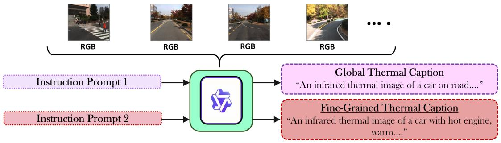

<details>
<summary>flowchart</summary>

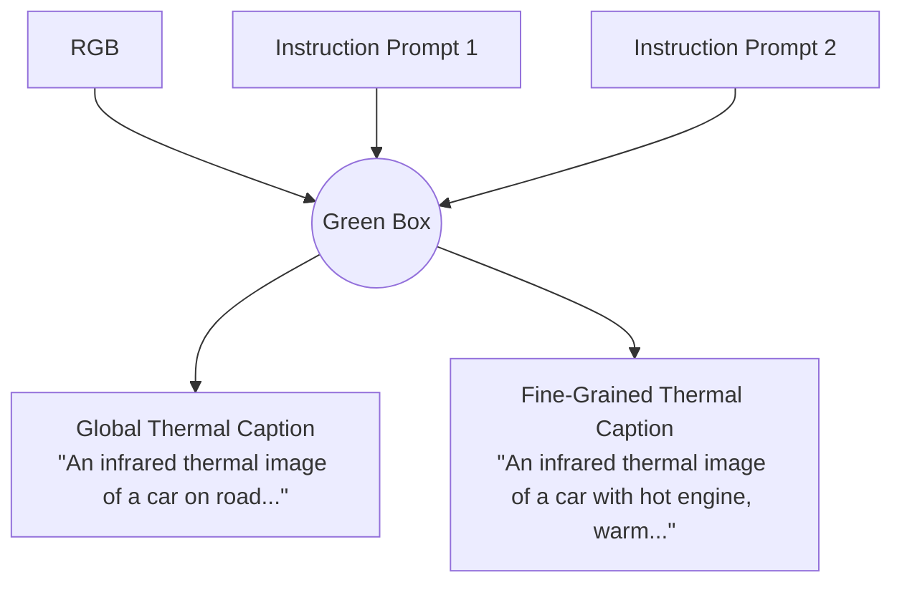
</details>

# IR-Cap Dataset

# Global Thermal Caption

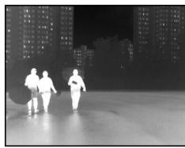

<details>
<summary>natural_image</summary>

Two people walking on a rooftop at night with high-rise buildings in the background (no visible text or symbols)
</details>

Thermal Image

"An infrared thermal image of three individuals are walking on a wet road during what appears to be early evening or late afternoon,as indicated by the dim lighting. The person on the left is holding a closed umbrella, while the one in the middle is carrying an open umbrella. The individual on the right is also holding an open umbrella and a book. They are dressed in casual atire. In the background,there are tall residential buildings with iluminated windows，suggesting it might be dusk. Trees line the road,and the sky is overcast, indicating cloudy weather conditions. The road has white lane markings,and the overall scene is calm and quiet."

# Fine-Grained Thermal Caption

11 Thermal infrared image depicts pedestrians walking outdoors. Scene shows body heat emissions from individuals, with pavement retaining heat. Vegetation appears cooler due to evaporative cooling effects. Buildings exhibit heat leakage,while sky acts as a cold thermal sink influencing radiative balance."

Figure 2: IR-Cap captioning pipeline and dataset. (Top): The IR-Cap captioning pipeline leverages paired RGB images as semantic anchors to generate complementary physics-aware captions for thermal images. Since standard vision-language models are trained on RGB data and exhibit limited understanding of infrared thermal characteristics, we condition Qwen2.5-VL-72B-Instruct on the RGB counterpart of each thermal image and use two specialized instruction prompts to steer the model toward reasoning about thermal attributes. Instruction Prompt 1 elicits a global thermal caption capturing scene-level environmental context, while Instruction Prompt 2 elicits a fine-grained thermal caption encoding object-level heat signatures and thermal phenomena. (Bottom): A representative IR-Cap dataset sample showing a thermal image alongside its two complementary physics-aware captions generated by the pipeline.

Instruction Prompt 2 (Fine-Grained Thermal Captions, $c _ { f g } )$ : This prompt directs the model toward object-level thermal reasoning, focusing on heat signatures, material emissivity differences, and temperature relationships between specific objects. For example, for the same night scene, this prompt elicits descriptions of individual objects’ thermal behavior. For example, “moving vehicles exhibit hot engines and warm tires, while pedestrians emit body heat” , capturing the discriminative thermal attributes not present in the global descriptions.

Both prompts include the keywords “infrared” and “thermal” in the caption prefix to provide a modalityspecific tag, ensuring the generated descriptions are framed within the thermal domain rather than defaulting to RGB-style language. The full prompt templates are provided in the appendix section A.2.

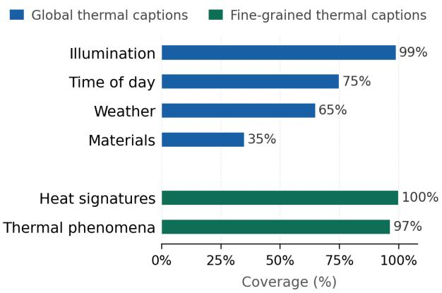

<details>
<summary>bar</summary>

| Category             | Global thermal captions | Fine-grained thermal captions |
| -------------------- | ----------------------- | ----------------------------- |
| Illumination         | 99%                     | 0%                            |
| Time of day          | 75%                     | 0%                            |
| Weather              | 65%                     | 0%                            |
| Materials            | 35%                     | 0%                            |
| Heat signatures      | 0%                      | 100%                          |
| Thermal phenomena    | 0%                      | 97%                           |
</details>

Figure 3: Attribute coverage of IR-Cap captions. Values indicate the percentage of captions within each type that mention the corresponding attribute.

Dataset Statistics Using this pipeline, we annotate three public thermal benchmarks, KAIST (Hwang et al., 2015), FLIR (FLIR Systems, 2025), and FMB (Liu et al., 2023), augmenting each with paired $( c _ { g } , c _ { f g } )$ physics-aware captions. To quantify attribute coverage, we perform keyword-based analysis over the full caption corpus, checking for the presence of predefined attribute categories (illumination, time of day, weather, materials for Global captions; heat signatures and thermal phenomena for Fine-Grained captions) and reporting the fraction of captions that mention each attribute. As illustrated in Figure 3, this analysis confirms the broad and complementary coverage of our dual-prompting strategy. Global Thermal Captions provide necessary context regarding ambient environmental conditions, with near-universal coverage of illumination (99%) and significant inclusion of temporal and meteorological context (time of day: 75%, weather: 65%). In contrast, Fine-Grained Thermal Captions capture intrinsic thermal properties exclusively: 100% of these captions identify heat signatures, while 97% articulate complex phenomena such as emissivity variations and radiative balance. Annotating thermal images with such physics-aware metadata provides rich thermal priors that enable comprehensive scene-level contextual understanding and fine-grained object-level reasoning, thereby serving as an essential supervisory signal for mitigating the thermal perception gap identified in section 4.1.

# 4 Method

We begin in section 4.1 by characterizing two fundamental challenges in thermal vision-language alignment: the thermal perception gap in CLIP (Figure 1), and the empirically revealed geometric divergence between global and fine-grained thermal feature spaces (Figure 4), which together motivate our design. Section 4.2 formalizes the problem, after which section 4.3 presents our decoupled dual-LoRA training strategy, illustrated in Figure 5. Finally, Figure 4.4 describes the weighted feature fusion at inference (Figure 6).

# 4.1 Challenges in Thermal Vision-Language Alignment

Thermal Perception Gap. Standard CLIP, pre-trained on RGB-centric web data, exhibits a significant semantic gap when applied to thermal imagery. As shown in Figure 1, zero-shot CLIP achieves a mean image-text cosine similarity of only 0.3449 on the KAIST (Hwang et al., 2015) thermal dataset, despite being paired with carefully curated thermal captions. This is not merely a distributional shift; thermal images encode physically unique signals (emissivity, heat flux, material conductivity) that are entirely absent from CLIP’s training distribution. Strikingly, single-LoRA adaptation on global captions (Global LoRA, mean 0.3322) degrades alignment relative to zero-shot CLIP, and all pairwise differences are statistically significant $( p \ll 0 . 0 0 1$ , Welch t-test, BH-corrected; appendix section A.1), confirming that naïve fine-tuning strategies are insufficient. Effective thermal alignment requires a purpose-built representation strategy.

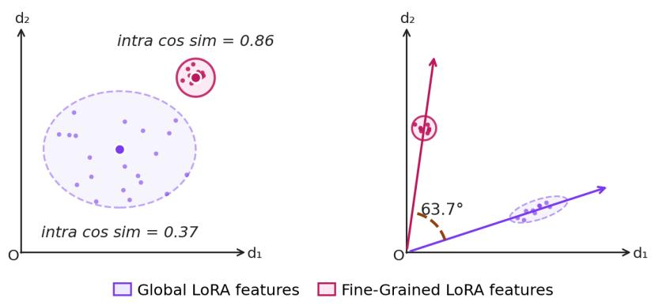  
Figure 4: Feature geometry of independently trained global and fine-grained LoRA branches on KAIST (Hwang et al., 2015). (Left) Global LoRA features exhibit low intra-class cohesion (intra cosine similarity = 0.37), while fine-grained LoRA features form tight compact clusters (= 0.86). (Right) Mean feature vectors subtend 63.7◦, confirming geometric divergence between the two representation spaces and motivating the decoupled dual-LoRA design (see section 4.1).

Complementary yet Divergent Thermal Semantics. Thermal imagery encodes information at two conceptually distinct semantic levels: global scene characteristics, encompassing environmental conditions, time of day, spatial layout, and material composition, which partially overlap with visible-spectrum cues, and object-level thermal physics, including emissivity variations, localized heat signatures, and thermal conductivity differences, which are exclusively observable in the thermal domain and demand physics-aware representation. We empirically reveal these two levels to be not only semantically complementary but geometrically divergent in feature space, by training two LoRA branches independently — one exclusively on global scene captions and the other exclusively on fine-grained thermal captions and probing their respective feature distributions as visualized in Figure 4, global LoRA features exhibit low intra-class cohesion (mean intra cosine similarity = 0.37), reflecting the inherent diversity of scene-level thermal contexts, while finegrained LoRA features form tight, compact clusters (mean intra cosine similarity = 0.86), consistent with the physically constrained nature of object-level heat signatures. Furthermore, the mean feature vectors of the two branches subtend an angle of $6 3 . 7 ^ { \circ }$ , confirming that global and fine-grained thermal representations occupy significantly different regions of the embedding space. Joint optimization of a single LoRA on mixed captions conflates these divergent objectives, producing gradient interference that degrades both, as shown in Table 4. Sequential training partially mitigates interference but leaves the second-stage LoRA without awareness of the first-stage objectives, leading to suboptimal joint representations, as confirmed by Table 5. These findings motivate a fully decoupled strategy with independent parameter spaces, which we describe next.

# 4.2 Problem Formulation

Given a thermal image $I _ { \mathrm { t h } } \in \mathbb { R } ^ { H \times W \times 1 }$ and two paired captions — a global thermal caption $c _ { g }$ describing environmental context and a fine-grained caption $c _ { f g }$ encoding object-specific heat signatures, we aim to learn, over paired-caption dataset D, complementary representation spaces that capture both semantic levels without interference. We introduce two independent Low-Rank Adapter (LoRA) modules $\theta _ { g }$ and $\theta _ { f }$ , each applied to both the vision and text encoders of a frozen CLIP (Radford et al., 2021) backbone, and optimize them separately:

$$
\theta_ {g} ^ {*} = \underset {\theta_ {g}} {\arg \min} \mathbb {E} _ {(I _ {\mathrm{th}}, c _ {g}) \sim \mathcal {D}} \left[ \mathcal {L} _ {\text { global }} \big (F _ {\theta_ {g}} (I _ {\mathrm{th}}), G _ {\theta_ {g}} (c _ {g}) \big) \right] \tag {1}
$$

$$
\theta_ {f} ^ {*} = \underset {\theta_ {f}} {\arg \min} \mathbb {E} _ {(I _ {\mathrm{th}}, c _ {f g}) \sim \mathcal {D}} \left[ \mathcal {L} _ {\mathrm{fg}} \big (F _ {\theta_ {f}} (I _ {\mathrm{th}}), G _ {\theta_ {f}} (c _ {f g}) \big) \right] \tag {2}
$$

where $F _ { \theta _ { g } } ( \cdot ) = F _ { \mathrm { f r o z e n } } ( \cdot ) + \Delta F _ { \theta _ { a } ^ { v } } ( \cdot )$ and $G _ { \theta _ { g } } ( \cdot ) = G _ { \mathrm { f r o z e n } } ( \cdot ) + \Delta G _ { \theta _ { a } ^ { t } } ( \cdot )$ denote the base encoders augmented with their respective LoRA adaptations, and analogously for $\begin{array} { r } { \dot { \theta } _ { f } . } \end{array}$ Since the two modules are optimized independently over disjoint supervisory signals, with the shared CLIP backbone kept frozen throughout, there is zero gradient interference between the two representation spaces.

Beyond the geometric motivation established in section 4.1, LoRA adaptation is particularly suited to the thermal domain, where large-scale paired datasets are scarce; full fine-tuning of CLIP would therefore risk catastrophic forgetting of its rich visual-semantic priors given the limited thermal training data, whereas LoRA confines adaptation to a small set of low-rank parameters while preserving the frozen backbone’s generalizable representations.

To our knowledge, T-CLIP is the first framework to explicitly decompose thermal image understanding into global scene context and object-level heat signature physics, empirically reveal their geometric divergence in feature space (Figure 4), and leverage this finding as an architectural prior instantiated through independent LoRA parameter spaces on a shared frozen CLIP backbone, with ablations confirming the necessity of this decoupling (Tables 4 and 5).

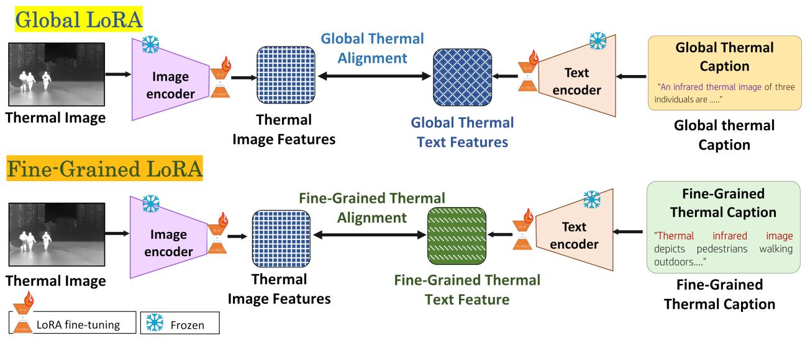

<details>
<summary>flowchart</summary>

```mermaid
graph LR
    subgraph_Global_LoRA["Global LoRA"]
        A1["Thermal Image"] --> B1["Image encoder"]
        B1 --> C1["Thermal Image Features"]
        C1 --> D1["Global Thermal Alignment"]
        D1 --> E1["Global Thermal Text Features"]
        E1 --> F1["Text encoder"]
        F1 --> G1["Global Thermal Caption: &quot;An infrared thermal image of three individuals are .....&quot;"]
        G1 --> H1["Global thermal Caption"]
    end

    subgraph_Fine_Grained_LoRA["Fine-Grained LoRA"]
        I1["Thermal Image"] --> J1["Image encoder"]
        J1 --> K1["Thermal Image Features"]
        K1 --> L1["Fine-Grained Thermal Alignment"]
        L1 --> M1["Fine-Grained Thermal Text Feature"]
        M1 --> N1["Text encoder"]
        N1 --> O1["Fine-Grained Thermal Caption: &quot;Thermal infrared image depicts pedestrians walking outdoors....&quot;"]
        O1 --> P1["Final caption"]
    end
```
</details>

Figure 5: T-CLIP dual LoRA training pipeline. Two independent LoRA modules on a frozen CLIP backbone are optimized on semantically distinct caption types, preventing gradient interference while enabling complementary thermal representation learning.

# 4.3 Dual LoRA Training for Decoupled Thermal Representation

The overall training pipeline is illustrated in Figure 5, with the corresponding pseudocode provided in section A.6.3 of the appendix. Each LoRA branch is trained independently with a standard InfoNCE contrastive objective (Radford et al., 2021), operating on the same set of thermal images but with semantically distinct caption types.

Global Thermal LoRA. $\theta _ { g }$ is trained exclusively on global captions $c _ { g }$ describing scene content, illumination, weather, material composition, and temporal context:

$$
\mathcal {L} _ {\mathrm{global}} (\theta_ {g}) = - \log \frac {\exp \bigl (\mathrm{sim} (F _ {\theta_ {g}} (I _ {\mathrm{th}}) , G _ {\theta_ {g}} (c _ {g})) / \tau \bigr)}{\sum_ {k = 1} ^ {B} \exp \bigl (\mathrm{sim} (F _ {\theta_ {g}} (I _ {\mathrm{th}}) , G _ {\theta_ {g}} (c _ {g} ^ {k})) / \tau \bigr)} \tag {3}
$$

where sim(·, ·) denotes cosine similarity, τ is a learned temperature parameter, B is the batch size, and $c _ { g } ^ { k }$ denotes the k-th global caption in the batch serving as a negative sample. The same notation applies to $c _ { f g } ^ { k } ,$ (the k-th fine-grained caption) in ${ \mathcal { L } } _ { \mathrm { f g } }$ (Equation 4). This enforces $\theta _ { g }$ to encode the macroscopic thermal landscape — spatial heat flow, environmental gradients, and scene-level structure, without contamination from object-level supervisory signal.

Fine-Grained Thermal LoRA. $\theta _ { f }$ is trained exclusively on $c _ { f g } ,$ captions describing localized thermal phenomena such as emissivity contrasts, heat source attribution, and object-specific temperature anomalies (e.g., “hot engine block,” “warm pedestrian torso”):

$$
\mathcal {L} _ {\mathrm{fg}} (\theta_ {f}) = - \log \frac {\exp \left(\text { sim } (F _ {\theta_ {f}} (I _ {\mathrm{th}}) , G _ {\theta_ {f}} (c _ {f g})) / \tau\right)}{\sum_ {k = 1} ^ {B} \exp \left(\text { sim } (F _ {\theta_ {f}} (I _ {\mathrm{th}}) , G _ {\theta_ {f}} (c _ {f g} ^ {k})) / \tau\right)} \tag {4}
$$

The decoupled weight spaces preserve the geometric divergence observed in Figure 4 rather than collapsing it, and gradients from neither branch interfere with the other throughout training.

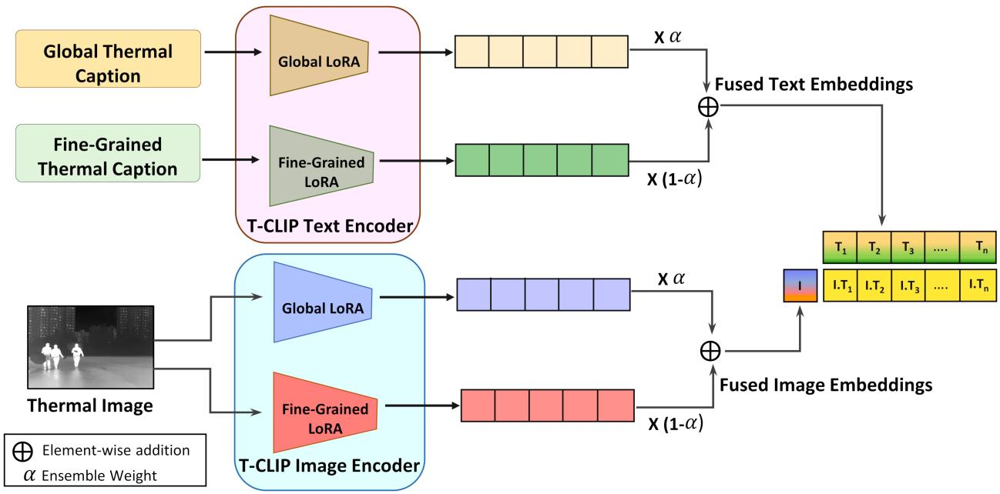

<details>
<summary>flowchart</summary>

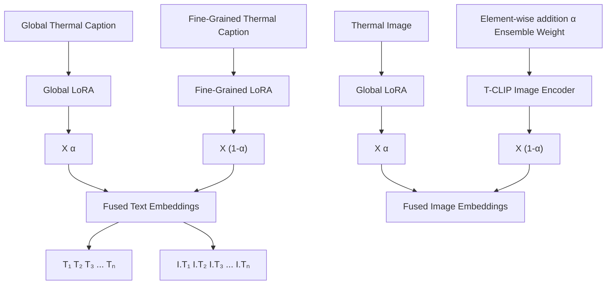
</details>

Figure 6: T-CLIP inference. Features from the global and fine-grained LoRA branches are combined via a scalar hyperparameter α, enabling flexible control over scene-level versus object-level emphasis at retrieval time.

# 4.4 Inference via Weighted Feature Fusion

Figure 6 illustrates the inference pipeline. At test time, both LoRA branches independently process a thermal image and their outputs are fused via a scalar hyperparameter α:

$$
v _ {\text { fused }} = \alpha \cdot F _ {\theta_ {g}} (I _ {\text { th }}) + (1 - \alpha) \cdot F _ {\theta_ {f}} (I _ {\text { th }}) \tag {5}
$$

For text-side fusion during text-to-image retrieval, captions from both branches are combined symmetrically:

$$
w _ {\text { fused }} = \alpha \cdot G _ {\theta_ {g}} (c _ {g}) + (1 - \alpha) \cdot G _ {\theta_ {f}} (c _ {f g}) \tag {6}
$$

$\alpha \in [ 0 , 1 ]$ controls the relative contribution of each branch; we set $\alpha = 0 . 8$ by default, a value determined empirically (Figure 7), reflecting that global thermal context provides the dominant discriminative signal while fine-grained features supply complementary specificity. This fusion requires only a weighted sum of two forward passes, adding negligible computational overhead at inference relative to standard CLIP (Radford et al., 2021).

# 5 Experiments

We evaluate T-CLIP on thermal image-text retrieval (section 5.2) as our primary task and further explore its thermal image generation capability (section 5.7).

# 5.1 Experimental Settings

Evaluation Datasets. We evaluate on three publically available thermal imaging benchmarks. KAIST (Hwang et al., 2015) is a large-scale multispectral pedestrian dataset from which we use 50,000 unique thermal images spanning diverse outdoor and urban driving scenarios across both day and night conditions. FLIR (FLIR Systems, 2025) is a driving-focused thermal dataset; following (Zhang et al., 2020), we use the aligned version with 4,128 training and 1,013 validation pairs. FMB (Liu et al., 2023) is a multimodal benchmark augmented with 12,200 thermal images following the procedure of (Mayr et al., 2024). All results are reported on standard test splits to ensure fair comparison across methods.

For each dataset, global thermal captions and fine-grained thermal captions were generated using our proposed IR-Cap captioning pipeline (described in section 3), which produces paired global scene-level and object-level thermal descriptions for every image.

Evaluation Settings. We report Recall@K (R@K) for $K \in \{ 1 , 5 , 1 0 , 2 5 , 5 0 , 1 0 0 \}$ , measuring the percentage of queries for which the correct match appears within the top-K retrieved results. We evaluate in both image-to-text (I2T) and text-to-image (T2I) directions across all three datasets. All evaluation protocols are held constant across methods and datasets. For each method and dataset, we report the mean and standard deviation of R@K over three independent training runs with different random seeds (0, 42, 123).

Training Settings. T-CLIP is fine-tuned for 10,000 steps with a batch size of 64 on a single NVIDIA A6000 GPU, requiring approximately 1.5 hours of training, highlighting the practical viability of our lightweight LoRA-based approach. The two LoRA branches $( \theta _ { g }$ and $\theta _ { f } )$ are trained independently on their respective caption types, with all hyperparameters held constant across both training runs. Detailed configurations, including learning rate, LoRA rank, and optimizer settings, are listed in appendix section A.6.

# 5.2 Comparing with Baselines

We compare T-CLIP against the following baselines, all evaluated on captions generated by our IR-Cap pipeline to ensure a fair and controlled comparison.

Zero-shot CLIP. We evaluate the off-the-shelf CLIP (Radford et al., 2021) model without any thermal adaptation, serving as a domain-agnostic lower bound. Since IR-Cap generates two caption types, we report two zero-shot CLIP variants: CLIP (Global), evaluated on global scene captions, and CLIP (F-G), evaluated on fine-grained thermal captions.

CLIP-Adapter. We include two CLIP-Adapter (Gao et al., 2024) variants: CLIP-Adapter (Global), trained and evaluated on global thermal captions, and CLIP-Adapter (F-G), trained and evaluated on finegrained thermal captions. Both learn a lightweight residual feature adapter on top of frozen CLIP features without modifying the encoder weights, serving as an alternative parameter-efficient adaptation baseline.

DeCLIP. Full fine-tuning of CLIP on small thermal datasets risks catastrophic forgetting of pretrained visual-semantic representations. As a representative full-parameter baseline, we therefore include DeCLIP (Li et al., 2022b), a data-efficient extension that trains all CLIP parameters using image–image and text–text nearest-neighbour consistency via a momentum encoder. We report two variants: DeCLIP (Global), trained on global thermal captions, and DeCLIP (F-G), trained on fine-grained thermal captions.

Single LoRA Baselines. We fine-tune two independent single-branch LoRA models on the IR-Cap dataset: Global LoRA, fine-tuned and evaluated exclusively on global scene captions, and Fine-Grained

LoRA, fine-tuned and evaluated exclusively on fine-grained thermal captions. These isolate the contribution of each caption type and directly motivate our dual-branch design.

T-CLIP Variants. We report three inference variants of T-CLIP, all using the fused dual-LoRA representation with α = 0.8. In T-CLIP (Global), a single global caption is passed through both LoRA branches at inference, with the resulting branch features fused to produce the final representation. T-CLIP (F-G) follows the same protocol, substituting the global caption with a fine-grained thermal caption; and in T-CLIP (Dual), our proposed model, the Global LoRA branch independently processes the global caption while the Fine-Grained LoRA branch processes the fine-grained caption, with both fused to obtain the final embedding. In scenarios where only a single caption type is available, T-CLIP (Global) and T-CLIP (F-G) serve as natural fallbacks; the available caption is routed through both branches without any architectural modification, preserving the dual-branch fusion mechanism and ensuring applicability across standard image-text retrieval settings where paired captions are not provided a priori.

Results are reported in Tables 1, 2, and 3; detailed mean ± std across all recall thresholds are provided in section A.4 of the appendix.

Across all three datasets, zero-shot CLIP (Radford et al., 2021) yields consistently poor retrieval performance, confirming that standard RGB-trained representations are fundamentally inadequate for thermal image-text alignment irrespective of whether global or fine-grained captions are used as queries.

Parameter-efficient adaptation substantially improves over zero-shot CLIP, with CLIP-Adapter (Gao et al., 2024), DeCLIP (Li et al., 2022b), and single-branch LoRA baselines all showing clear gains. DeCLIP achieves intermediate performance, generally surpassing CLIP-Adapter but falling short of LoRA-based methods across datasets. Global LoRA consistently and significantly outperforms both CLIP-Adapter and DeCLIP across all metrics and datasets, indicating that for thermal domain alignment, encoder weight modification via LoRA is more effective than residual feature adaptation or data-efficient self-supervision. Among single-branch methods, Global LoRA outperforms Fine-Grained LoRA across all datasets, suggesting that scene-level context provides a stronger retrieval signal in isolation, consistent with the feature geometry analysis in Figure 4.

T-CLIP (Dual) outperforms all baselines across the majority of metrics and datasets, demonstrating that the complementary thermal semantics captured by the two decoupled LoRA branches are mutually beneficial at retrieval time. On KAIST (Table 1), T-CLIP (Dual) achieves relative R@1 gains of +10.5% (I2T) and +21.9% (T2I) over Global LoRA, the strongest single-branch baseline, with consistent improvements on FLIR (Table 2) (+17.1% I2T, +10.4% T2I). Importantly, comparing T-CLIP (Global) and T-CLIP (F-G) against their single-branch LoRA counterparts reveals that the dual-LoRA representation enriches the visual embedding beyond what either caption type achieves independently. This confirms that training on complementary thermal semantics improves the quality of the learned representation space itself, not merely the inference-time fusion.

On FMB (Table 3), T-CLIP (Global) marginally outperforms T-CLIP (Dual) at lower I2T recall thresholds (R@1–R@10), though both variants consistently surpass Global LoRA baseline in this range. T-CLIP (Dual) recovers the lead at R@25 and above for I2T and dominates across all T2I metrics, consistent with the trend observed on KAIST and FLIR.

# 5.3 Ablation Study

Effect of Caption Type. Table 4 ablates the effect of caption type on retrieval performance on KAIST. Global LoRA substantially outperforms Fine-Grained LoRA, confirming that scene-level thermal context is more discriminative than object-level heat signatures in isolation, consistent with the feature geometry analysis in Figure 4. Training a single LoRA on an equal mixture of global and fine-grained captions (Mixed 50:50) reveals that it degrades performance on global captions relative to specialized Global LoRA, yet surpasses specialized F-G LoRA when evaluated on fine-grained captions. This suggests that exposure to global captions during training enriches the representation for fine-grained retrieval, but the inclusion of fine-grained captions simultaneously dilutes the global discriminability. This trade-off demonstrates that the two caption types impose conflicting supervision signals under shared training, motivating our decoupled design in T-CLIP where both caption types are optimized independently rather than under joint supervision.

Table 1: Text-image retrieval recall@K on the KAIST (Hwang et al., 2015) test set. R@1 reported as mean ± std across three independent training runs; all other R@K are means. Bold: best result. Underline: second best. F-G = fine-grained. ∆: relative R@K gain of T-CLIP (Dual) over the strongest baseline (Global LoRA). 

<table><tr><td rowspan="2">METHOD</td><td rowspan="2">R@1</td><td colspan="5">IMAGE-TO-TEXT RETRIEVAL</td><td rowspan="2">R@1</td><td colspan="5">TEXT-TO-IMAGE RETRIEVAL</td></tr><tr><td>R@5</td><td>R@10</td><td>R@25</td><td>R@50</td><td>R@100</td><td>R@5</td><td>R@10</td><td>R@25</td><td>R@50</td><td>R@100</td></tr><tr><td>CLIP (Global)</td><td>0.003</td><td>0.016</td><td>0.034</td><td>0.068</td><td>0.110</td><td>0.179</td><td>0.002</td><td>0.013</td><td>0.027</td><td>0.048</td><td>0.080</td><td>0.135</td></tr><tr><td>CLIP (F-G)</td><td>0.001</td><td>0.004</td><td>0.008</td><td>0.029</td><td>0.057</td><td>0.096</td><td>0.001</td><td>0.007</td><td>0.014</td><td>0.030</td><td>0.048</td><td>0.088</td></tr><tr><td>CLIP-Adapter (Global)</td><td> $0.018 \pm 0.001$ </td><td>0.072</td><td>0.123</td><td>0.229</td><td>0.357</td><td>0.521</td><td> $0.020 \pm 0.002$ </td><td>0.070</td><td>0.119</td><td>0.234</td><td>0.360</td><td>0.538</td></tr><tr><td>CLIP-Adapter (F-G)</td><td> $0.009 \pm 0.002$ </td><td>0.041</td><td>0.081</td><td>0.167</td><td>0.283</td><td>0.436</td><td> $0.010 \pm 0.000$ </td><td>0.046</td><td>0.082</td><td>0.166</td><td>0.281</td><td>0.445</td></tr><tr><td>DeCLIP (Global)</td><td> $0.038 \pm 0.002$ </td><td>0.129</td><td>0.206</td><td>0.349</td><td>0.497</td><td>0.644</td><td> $0.041 \pm 0.000$ </td><td>0.133</td><td>0.209</td><td>0.357</td><td>0.496</td><td>0.650</td></tr><tr><td>DeCLIP (F-G)</td><td> $0.013 \pm 0.000$ </td><td>0.048</td><td>0.088</td><td>0.169</td><td>0.273</td><td>0.433</td><td> $0.014 \pm 0.000$ </td><td>0.056</td><td>0.094</td><td>0.175</td><td>0.285</td><td>0.439</td></tr><tr><td>Global LoRA</td><td> $0.070 \pm 0.002$ </td><td>0.224</td><td>0.332</td><td>0.520</td><td>0.685</td><td>0.825</td><td> $0.069 \pm 0.005$ </td><td>0.221</td><td>0.331</td><td>0.521</td><td>0.679</td><td>0.822</td></tr><tr><td>F-G LoRA</td><td> $0.021 \pm 0.002$ </td><td>0.073</td><td>0.125</td><td>0.248</td><td>0.381</td><td>0.571</td><td> $0.019 \pm 0.002$ </td><td>0.079</td><td>0.139</td><td>0.260</td><td>0.400</td><td>0.582</td></tr><tr><td>T-CLIP (Global)</td><td> $0.071 \pm 0.003$ </td><td>0.233</td><td>0.349</td><td>0.541</td><td>0.695</td><td>0.837</td><td> $0.078 \pm 0.002$ </td><td>0.242</td><td>0.359</td><td>0.554</td><td>0.710</td><td>0.843</td></tr><tr><td>T-CLIP (F-G)</td><td> $0.016 \pm 0.002$ </td><td>0.064</td><td>0.101</td><td>0.194</td><td>0.311</td><td>0.473</td><td> $0.012 \pm 0.002$ </td><td>0.048</td><td>0.084</td><td>0.157</td><td>0.255</td><td>0.394</td></tr><tr><td>T-CLIP (Dual)</td><td> $0.078 \pm 0.004$ </td><td>0.252</td><td>0.374</td><td>0.571</td><td>0.729</td><td>0.862</td><td> $0.084 \pm 0.002$ </td><td>0.264</td><td>0.386</td><td>0.580</td><td>0.740</td><td>0.870</td></tr><tr><td>Δ vs. Global LoRA</td><td>+10.5%</td><td>+12.4%</td><td>+12.7%</td><td>+9.7%</td><td>+6.3%</td><td>+4.5%</td><td>+21.9%</td><td>+19.4%</td><td>+16.8%</td><td>+11.3%</td><td>+9.1%</td><td>+5.8%</td></tr></table>

Table 2: Text-image retrieval recall@K on the FLIR (FLIR Systems, 2025) test set. Bold: best result. Underline: second best. F-G = fine-grained. ∆: relative R@K gain of T-CLIP (Dual) over the strongest baseline (Global LoRA). R@1 reported as mean ± std across three independent training runs. 

<table><tr><td rowspan="2">METHOD</td><td rowspan="2">R@1</td><td colspan="5">IMAGE-TO-TEXT RETRIEVAL</td><td rowspan="2">R@1</td><td colspan="5">TEXT-TO-IMAGE RETRIEVAL</td></tr><tr><td>R@5</td><td>R@10</td><td>R@25</td><td>R@50</td><td>R@100</td><td>R@5</td><td>R@10</td><td>R@25</td><td>R@50</td><td>R@100</td></tr><tr><td>CLIP (Global)</td><td>0.014</td><td>0.070</td><td>0.115</td><td>0.242</td><td>0.360</td><td>0.513</td><td>0.014</td><td>0.062</td><td>0.106</td><td>0.229</td><td>0.319</td><td>0.467</td></tr><tr><td>CLIP (F-G)</td><td>0.006</td><td>0.022</td><td>0.039</td><td>0.110</td><td>0.220</td><td>0.332</td><td>0.005</td><td>0.019</td><td>0.032</td><td>0.093</td><td>0.158</td><td>0.253</td></tr><tr><td>CLIP-Adapter (Global)</td><td> $0.045 \pm 0.006$ </td><td>0.153</td><td>0.247</td><td>0.411</td><td>0.545</td><td>0.700</td><td> $0.031 \pm 0.003$ </td><td>0.130</td><td>0.217</td><td>0.381</td><td>0.529</td><td>0.706</td></tr><tr><td>CLIP-Adapter (F-G)</td><td> $0.027 \pm 0.003$ </td><td>0.081</td><td>0.134</td><td>0.250</td><td>0.402</td><td>0.582</td><td> $0.019 \pm 0.001$ </td><td>0.075</td><td>0.133</td><td>0.244</td><td>0.367</td><td>0.555</td></tr><tr><td>DeCLIP (Global)</td><td> $0.049 \pm 0.002$ </td><td>0.154</td><td>0.228</td><td>0.376</td><td>0.507</td><td>0.642</td><td> $0.045 \pm 0.002$ </td><td>0.158</td><td>0.232</td><td>0.367</td><td>0.510</td><td>0.641</td></tr><tr><td>DeCLIP (F-G)</td><td> $0.012 \pm 0.001$ </td><td>0.056</td><td>0.104</td><td>0.197</td><td>0.312</td><td>0.474</td><td> $0.015 \pm 0.001$ </td><td>0.073</td><td>0.114</td><td>0.218</td><td>0.324</td><td>0.474</td></tr><tr><td>Global LoRA</td><td> $0.105 \pm 0.003$ </td><td>0.329</td><td>0.487</td><td>0.678</td><td>0.816</td><td>0.914</td><td> $0.106 \pm 0.003$ </td><td>0.321</td><td>0.459</td><td>0.673</td><td>0.812</td><td>0.907</td></tr><tr><td>F-G LoRA</td><td> $0.027 \pm 0.004$ </td><td>0.089</td><td>0.150</td><td>0.290</td><td>0.453</td><td>0.642</td><td> $0.035 \pm 0.003$ </td><td>0.127</td><td>0.206</td><td>0.369</td><td>0.528</td><td>0.702</td></tr><tr><td>T-CLIP (Global)</td><td> $0.119 \pm 0.004$ </td><td>0.353</td><td>0.504</td><td>0.707</td><td>0.833</td><td>0.923</td><td> $0.105 \pm 0.007$ </td><td>0.348</td><td>0.492</td><td>0.712</td><td>0.839</td><td>0.925</td></tr><tr><td>T-CLIP (F-G)</td><td> $0.025 \pm 0.005$ </td><td>0.107</td><td>0.182</td><td>0.316</td><td>0.473</td><td>0.649</td><td> $0.020 \pm 0.004$ </td><td>0.069</td><td>0.130</td><td>0.239</td><td>0.361</td><td>0.523</td></tr><tr><td>T-CLIP (Dual)</td><td> $0.123 \pm 0.010$ </td><td>0.357</td><td>0.517</td><td>0.727</td><td>0.851</td><td>0.931</td><td> $0.117 \pm 0.003$ </td><td>0.364</td><td>0.511</td><td>0.728</td><td>0.851</td><td>0.932</td></tr><tr><td>Δ vs. Global LoRA</td><td>+17.1%</td><td>+8.5%</td><td>+6.2%</td><td>+7.2%</td><td>+4.3%</td><td>+1.9%</td><td>+10.4%</td><td>+13.4%</td><td>+11.3%</td><td>+8.2%</td><td>+4.8%</td><td>+2.8%</td></tr></table>

Single vs. Cross-Initialized vs. Dual LoRA. Table 5 compares single-branch LoRA, cross-initialized LoRA variants, and our decoupled Dual LoRA across different caption evaluation settings. Dual LoRA with dual-caption evaluation achieves the best performance across all metrics, outperforming all single-branch and initialized variants. Notably, initializing Fine-Grained LoRA from Global LoRA weights leads to performance collapse, suggesting that fine-grained thermal representations cannot be reliably obtained by adapting from global ones and that the two optimization trajectories are incompatible. That Global LoRA also fails when initialized from Fine-Grained LoRA validates the geometric incompatibility of the two representation spaces, reflecting the significant divergence reported in Figure 4. Furthermore, Dual LoRA evaluated on global captions (R@1: 0.071) performs comparably to single-branch Global LoRA (R@1: 0.070) while supporting fine-grained retrieval. This capability is entirely absent in any single-branch model, thereby confirming that the dual-branch design retains specialization in each caption domain without requiring separate inferencetime models.

Vision vs. Text Encoder Adaptation. Table 5.3 ablates whether LoRA parameters are applied to the vision encoder only, text encoder only, or both. Adapting a single encoder falls significantly short of adapting both jointly, confirming that effective thermal alignment requires simultaneous adaptation of both modalities.

Table 3: Text-image retrieval recall@K on the FMB (Liu et al., 2023) test set. R@1 reported as mean ± std across three independent training runs; all other R@K are means. Bold: best result. Underline: second best. F-G = fine-grained. ∆: relative R@K gain of the best T-CLIP variant per metric over Global LoRA. 

<table><tr><td rowspan="2">METHOD</td><td rowspan="2">R@1</td><td colspan="5">IMAGE-TO-TEXT RETRIEVAL</td><td rowspan="2">R@100</td><td colspan="5">TEXT-TO-IMAGE RETRIEVAL</td></tr><tr><td>R@5</td><td>R@10</td><td>R@25</td><td>R@50</td><td>R@100</td><td>R@5</td><td>R@10</td><td>R@25</td><td>R@50</td><td>R@100</td></tr><tr><td>CLIP (Global)</td><td>0.043</td><td>0.118</td><td>0.175</td><td>0.318</td><td>0.443</td><td>0.632</td><td>0.018</td><td>0.071</td><td>0.143</td><td>0.243</td><td>0.418</td><td>0.618</td></tr><tr><td>CLIP (F-G)</td><td>0.011</td><td>0.082</td><td>0.143</td><td>0.225</td><td>0.279</td><td>0.532</td><td>0.004</td><td>0.032</td><td>0.068</td><td>0.157</td><td>0.289</td><td>0.479</td></tr><tr><td>CLIP-Adapter (Global)</td><td> $0.075 \pm 0.007$ </td><td>0.266</td><td>0.409</td><td>0.605</td><td>0.768</td><td>0.905</td><td> $0.063 \pm 0.002$ </td><td>0.259</td><td>0.402</td><td>0.613</td><td>0.775</td><td>0.927</td></tr><tr><td>CLIP-Adapter (F-G)</td><td> $0.029 \pm 0.004$ </td><td>0.157</td><td>0.277</td><td>0.455</td><td>0.677</td><td>0.880</td><td> $0.039 \pm 0.004$ </td><td>0.148</td><td>0.243</td><td>0.438</td><td>0.611</td><td>0.863</td></tr><tr><td>DeCLIP (Global)</td><td> $0.095 \pm 0.013$ </td><td>0.268</td><td>0.400</td><td>0.573</td><td>0.704</td><td>0.834</td><td> $0.077 \pm 0.005$ </td><td>0.277</td><td>0.370</td><td>0.586</td><td>0.700</td><td>0.843</td></tr><tr><td>DeCLIP (F-G)</td><td> $0.041 \pm 0.009$ </td><td>0.145</td><td>0.238</td><td>0.402</td><td>0.561</td><td>0.743</td><td> $0.038 \pm 0.013$ </td><td>0.136</td><td>0.239</td><td>0.400</td><td>0.566</td><td>0.754</td></tr><tr><td>Global LoRA</td><td> $0.104 \pm 0.015$ </td><td>0.342</td><td>0.496</td><td>0.731</td><td>0.866</td><td>0.956</td><td> $0.100 \pm 0.012$ </td><td>0.350</td><td>0.510</td><td>0.737</td><td>0.882</td><td>0.960</td></tr><tr><td>F-G LoRA</td><td> $0.037 \pm 0.002$ </td><td>0.133</td><td>0.248</td><td>0.479</td><td>0.658</td><td>0.842</td><td> $0.048 \pm 0.002$ </td><td>0.185</td><td>0.282</td><td>0.489</td><td>0.666</td><td>0.848</td></tr><tr><td>T-CLIP (Global)</td><td> $0.105 \pm 0.012$ </td><td>0.362</td><td>0.539</td><td>0.762</td><td>0.871</td><td>0.958</td><td> $0.101 \pm 0.006$ </td><td>0.385</td><td>0.556</td><td>0.787</td><td>0.901</td><td>0.970</td></tr><tr><td>T-CLIP (F-G)</td><td> $0.042 \pm 0.002$ </td><td>0.151</td><td>0.245</td><td>0.413</td><td>0.580</td><td>0.788</td><td> $0.039 \pm 0.006$ </td><td>0.144</td><td>0.219</td><td>0.346</td><td>0.526</td><td>0.708</td></tr><tr><td>T-CLIP (Dual)</td><td> $0.098 \pm 0.017$ </td><td>0.342</td><td>0.537</td><td>0.771</td><td>0.895</td><td>0.973</td><td> $0.104 \pm 0.015$ </td><td>0.395</td><td>0.587</td><td>0.818</td><td>0.914</td><td>0.979</td></tr><tr><td>Δ vs. Global LoRA</td><td>+1.0%</td><td>+5.8%</td><td>+8.7%</td><td>+5.5%</td><td>+3.3%</td><td>+1.8%</td><td>+4.0%</td><td>+12.9%</td><td>+15.1%</td><td>+11.0%</td><td>+3.6%</td><td>+2.0%</td></tr></table>

Table 4: Ablation of caption types on KAIST (Hwang et al., 2015). Global LoRA and fine-grained (F-G) LoRA are trained and evaluated on their respective caption types. Mixed (50:50) trains a single LoRA on an equal mixture of global and fine-grained captions as a representative mixed training baseline; (Global) and (F-G) denote the evaluation caption type. 

<table><tr><td rowspan="2">CAPTION TYPE</td><td colspan="3">IMAGE-TO-TEXT RETRIEVAL</td><td colspan="3">TEXT-TO-IMAGE RETRIEVAL</td></tr><tr><td>R@1</td><td>R@10</td><td>R@25</td><td>R@1</td><td>R@10</td><td>R@25</td></tr><tr><td>Global LoRA</td><td>0.070</td><td>0.332</td><td>0.520</td><td>0.069</td><td>0.331</td><td>0.521</td></tr><tr><td>F-G LoRA</td><td>0.021</td><td>0.125</td><td>0.248</td><td>0.019</td><td>0.139</td><td>0.260</td></tr><tr><td>Mixed (50:50) (Global)</td><td>0.054</td><td>0.318</td><td>0.496</td><td>0.054</td><td>0.287</td><td>0.476</td></tr><tr><td>Mixed (50:50) (F-G)</td><td>0.027</td><td>0.160</td><td>0.297</td><td>0.021</td><td>0.152</td><td>0.283</td></tr></table>

Sensitivity of Retrieval Performance to α. Figure 7 shows retrieval performance across $\alpha \in$ $\{ 0 . 0 , 0 . 5 , 0 . 6 , 0 . 7 , 0 . 8 , 0 . 9 , 1 . 0 \}$ on KAIST. Performance peaks at $\alpha = 0 . 8$ and degrades at both extremes, with the higher performance at $\alpha = 1 . 0$ relative to $\alpha = 0 . 0$ underscoring that global thermal context is the dominant retrieval signal. Nevertheless, the sharp drop at both extremes validates that both caption types are essential; fine-grained thermal captions contribute meaningfully beyond global context alone, and the model benefits from their complementary fusion. We empirically verify that $\alpha = 0 . 8$ is optimal across all three datasets (KAIST (Hwang et al., 2015), FLIR (FLIR Systems, 2025), and FMB (Liu et al., 2023)), and set it as the default for all reported results.

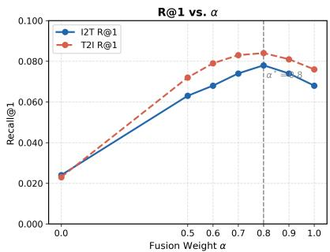

<details>
<summary>line</summary>

| Fusion Weight α | I2T R@1 | T2I R@1 |
| --------------- | ------- | ------- |
| 0.0             | 0.023   | 0.023   |
| 0.5             | 0.063   | 0.073   |
| 0.6             | 0.068   | 0.079   |
| 0.7             | 0.074   | 0.083   |
| 0.8             | 0.078   | 0.084   |
| 0.9             | 0.076   | 0.081   |
| 1.0             | 0.068   | 0.077   |
</details>

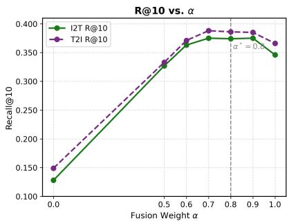

<details>
<summary>line</summary>

| Fusion Weight α | I2T R@10 | T2I R@10 |
| --------------- | -------- | -------- |
| 0.0             | 0.13     | 0.15     |
| 0.5             | 0.33     | 0.34     |
| 0.6             | 0.37     | 0.37     |
| 0.7             | 0.38     | 0.39     |
| 0.8             | 0.38     | 0.38     |
| 0.9             | 0.38     | 0.38     |
| 1.0             | 0.35     | 0.37     |
</details>

Figure 7: Fusion weight α ablation (KAIST (Hwang et al., 2015)). Peak performance at $\alpha = 0 . 8$ confirms the complementary contribution of global and fine-grained branches, with steeper degradation toward $\alpha = 0 . 0$ reflecting the dominance of global thermal context.

Table 5: Ablation of LoRA module designs on KAIST (Hwang et al., 2015). For dual LoRA, the caption type used for evaluation is indicated. A|B denotes that model B is initialized from the weights of model A. 

<table><tr><td rowspan="2">MODEL</td><td colspan="2">IMAGE-TO-TEXT</td><td>RETRIEVAL</td><td colspan="2">TEXT-TO-IMAGE</td><td>RETRIEVAL</td></tr><tr><td>R@1</td><td>R@10</td><td>R@25</td><td>R@1</td><td>R@10</td><td>R@25</td></tr><tr><td colspan="7">Single LoRA</td></tr><tr><td>Global LoRA</td><td>0.070</td><td>0.332</td><td>0.520</td><td>0.069</td><td>0.331</td><td>0.521</td></tr><tr><td>F-G LoRA</td><td>0.021</td><td>0.125</td><td>0.248</td><td>0.019</td><td>0.139</td><td>0.260</td></tr><tr><td colspan="7">Initialized</td></tr><tr><td>F-G LoRA|Global LoRA</td><td>0.002</td><td>0.013</td><td>0.028</td><td>0.003</td><td>0.021</td><td>0.041</td></tr><tr><td>Global LoRA|F-G LoRA</td><td>0.008</td><td>0.044</td><td>0.087</td><td>0.014</td><td>0.076</td><td>0.140</td></tr><tr><td colspan="7">Dual LoRA</td></tr><tr><td>Global Captions</td><td>0.071</td><td>0.349</td><td>0.541</td><td>0.078</td><td>0.359</td><td>0.554</td></tr><tr><td>F-G Captions</td><td>0.016</td><td>0.101</td><td>0.194</td><td>0.012</td><td>0.084</td><td>0.157</td></tr><tr><td>Dual Captions</td><td>0.078</td><td>0.374</td><td>0.571</td><td>0.084</td><td>0.386</td><td>0.580</td></tr></table>

Table 6: Ablation of LoRA fine-tuning scope across encoder configurations on KAIST (Hwang et al., 2015). All variants use dual captions during evaluation, with $\alpha = 0 . 8$ . 

<table><tr><td rowspan="2">FINE-TUNING SCOPE</td><td colspan="3">IMAGE-TO-TEXT RETRIEVAL</td><td colspan="3">TEXT-TO-IMAGE RETRIEVAL</td></tr><tr><td>R@1</td><td>R@10</td><td>R@25</td><td>R@1</td><td>R@10</td><td>R@25</td></tr><tr><td>Vision Encoder Only</td><td>0.028</td><td>0.183</td><td>0.328</td><td>0.028</td><td>0.185</td><td>0.318</td></tr><tr><td>Text Encoder Only</td><td>0.016</td><td>0.131</td><td>0.237</td><td>0.017</td><td>0.131</td><td>0.257</td></tr><tr><td>Both Encoders (T-CLIP Dual)</td><td>0.078</td><td>0.374</td><td>0.571</td><td>0.084</td><td>0.386</td><td>0.580</td></tr></table>

# 5.4 Parameter and Training Efficiency

As shown in Table 7, T-CLIP (Dual) achieves the best retrieval performance with two independent 737M LoRA branches which are identical in size to a single Global LoRA. Since the two branches are fully independent, their training is parallelizable, reducing the wall-clock training time to ∼1 hr when run simultaneously on two GPUs, which is equivalent to a single Global LoRA training run. The performance gain is therefore attributable entirely to the decoupled dual-caption design of T-CLIP (Dual) rather than increased model capacity, which is a favorable trade-off between architectural complexity and retrieval performance.

# 5.5 Cross-Dataset Generalization

Table 8 evaluates T-CLIP (Dual) on the FMB test set when trained on other thermal datasets. Despite the sensor and scene distribution shift, cross-dataset models retain meaningful retrieval capability, with KAISTand FLIR-trained models recovering 75–85% of FMB-trained performance at R@1. This demonstrates that T-CLIP learns thermal representations that transfer across sensors and environmental conditions, which is a noteworthy result given the high sensor-dependence of thermal imagery. Training on the combined set further improves performance across all metrics, indicating that diversity of thermal scenes and sensor types is beneficial alongside dataset-specific fine-tuning.

# 5.6 IR-Cap Caption Quality Evaluation

We evaluate IR-Cap caption quality through a human study with five domain-expert annotators assessing 150 stratified image-caption pairs per caption type (300 pairs total), sampled uniformly across dataset origin (KAIST (Hwang et al., 2015), FLIR (FLIR Systems, 2025), FMB (Liu et al., 2023)), time of day, and scene type. Annotators rated each caption on four dimensions for Global captions and five for Fine-Grained captions: Thermal Accuracy (D1), Semantic Correctness (D2), RGB Hallucination (D3, binary), Specificity (D4), and Emissivity Reasoning (D5, Fine-Grained only). A caption is approved if it meets minimum thresholds on all applicable dimensions simultaneously. Full protocol details, annotator assignment design, rubric anchors, and failure case analysis are provided in section A.3 of the appendix.

Table 7: Efficiency comparison of all methods. Trainable parameters and wall-clock training time are reported for a single training run on KAIST on a single NVIDIA A6000 GPU with batch size 128. ×2 denotes two independent training runs for T-CLIP (Dual), which can be parallelized to ∼1 hr on two GPUs. R@1 results on KAIST (Hwang et al., 2015) test set. 

<table><tr><td>METHOD</td><td>TRAINABLE PARAM.</td><td>WALL-CLOCK TIME</td><td>I2T R@1</td><td>T2I R@1</td></tr><tr><td>Zero-shot CLIP</td><td>0</td><td>0</td><td>0.003</td><td>0.002</td></tr><tr><td>CLIP-Adapter</td><td>131M</td><td>~40 min</td><td>0.018</td><td>0.020</td></tr><tr><td>LoRA (Text Only)</td><td>294M</td><td>~1 hr</td><td>0.016</td><td>0.017</td></tr><tr><td>LoRA (Vision Only)</td><td>442M</td><td>~1 hr</td><td>0.028</td><td>0.028</td></tr><tr><td>Global LoRA</td><td>737M</td><td>~1 hr</td><td>0.070</td><td>0.069</td></tr><tr><td>T-CLIP (Dual)</td><td> $737M \times 2$ </td><td>~1 hr × 2</td><td>0.078</td><td>0.084</td></tr></table>

Table 8: Cross-dataset generalization on the FMB (Liu et al., 2023) test set. Each row denotes the dataset used for training. Combined set denotes training on all three datasets, KAIST (Hwang et al., 2015), FLIR (FLIR Systems, 2025), and FMB (Liu et al., 2023), evaluated on FMB. 

<table><tr><td rowspan="2">TRAINED ON</td><td colspan="3">IMAGE-TO-TEXT RETRIEVAL</td><td colspan="3">TEXT-TO-IMAGE RETRIEVAL</td></tr><tr><td>R@1</td><td>R@10</td><td>R@25</td><td>R@1</td><td>R@10</td><td>R@25</td></tr><tr><td>FMB</td><td>0.098</td><td>0.537</td><td>0.771</td><td>0.104</td><td>0.587</td><td>0.818</td></tr><tr><td>KAIST</td><td>0.079</td><td>0.421</td><td>0.671</td><td>0.082</td><td>0.496</td><td>0.668</td></tr><tr><td>FLIR</td><td>0.075</td><td>0.375</td><td>0.561</td><td>0.111</td><td>0.439</td><td>0.604</td></tr><tr><td>Combined Set</td><td>0.132</td><td>0.654</td><td>0.850</td><td>0.125</td><td>0.650</td><td>0.864</td></tr></table>

Table 9 presents the results. Global Thermal Captions achieve an overall approval rate of 97.3% [94.1, 99.0], while Fine-Grained Thermal Captions achieve 84.0% [77.8, 89.0] (95% CI). All dimensions achieve Krippendorff’s $\alpha > 0 . 6 0$ (substantial agreement), with RGB Hallucination reaching $\alpha > 0 . 8 0$ , consistent with its binary and objective nature. Global captions score significantly higher on Thermal Accuracy (D1: 3.58 vs. 3.21, paired t-test $p { < } 0 . 0 0 1 \rangle$ , indicating that scene-level thermal properties are more reliably inferred from RGB anchors than object-level heat signatures. The primary limiting factor for Fine-Grained captions is Emissivity Reasoning (D5: 89.3% pass rate), reflecting object-level thermal physics are not completely estimated from visible-spectrum appearance, a limitation of the RGB-anchoring strategy. Failure case analysis is provided in appendix section A.3.4.

# 5.7 Applying T-CLIP to Thermal Image Generation

CLIP is widely used in many downstream tasks, including segmentation, detection, and text-to-image generation models like Stable Diffusion. However, standard CLIP struggles with thermal domain understanding because it was trained exclusively on RGB images. We explore whether T-CLIP can serve as a plug-and-play replacement for the text encoder in SDXL (Podell et al., 2023a). Specifically, we replace the original CLIP $\mathrm { V i T - L } / 1 4$ text encoder in SDXL with our T-CLIP text encoder. Because SDXL’s UNet was trained only on RGB images and cannot directly generate thermal outputs, we fine-tune the UNet on KAIST thermal image–caption pairs to adapt its decoding capabilities to the thermal domain.

Table 9: IR-Cap human evaluation results (n=150 per caption type, stratified across KAIST (Hwang et al., 2015), FLIR (FLIR Systems, 2025), and FMB (Liu et al., 2023)). Scores are mean ± std on the 1–4 Likert scale (higher is better); D3 is hallucination-free percentage. Appr.% denotes the percentage of captions meeting the per-dimension pass threshold. Overall approval requires passing all applicable dimensions simultaneously; 95% CIs via Wilson score interval. †Fine-grained only. 2 

<table><tr><td rowspan="2">DIMENSION</td><td colspan="2">GLOBAL</td><td colspan="2">FINE-GRAINED</td></tr><tr><td>SCORE</td><td>APPR.%</td><td>SCORE</td><td>APPR.%</td></tr><tr><td>D1: Thermal Accuracy</td><td> $3.58 \pm 0.52$ </td><td>98.7%</td><td> $3.21 \pm 0.68$ </td><td>91.3%</td></tr><tr><td>D2: Semantic Correctness</td><td> $3.74 \pm 0.48$ </td><td>99.3%</td><td> $3.48 \pm 0.59$ </td><td>96.0%</td></tr><tr><td>D3: RGB Hallucination-free</td><td>98.0%</td><td>—</td><td>93.3%</td><td>—</td></tr><tr><td>D4: Specificity</td><td> $3.42 \pm 0.61$ </td><td>99.3%</td><td> $3.35 \pm 0.64$ </td><td>97.3%</td></tr><tr><td>D5: Emissivity $^{\dagger}$ </td><td>—</td><td>—</td><td> $2.98 \pm 0.74$ </td><td>89.3%</td></tr><tr><td>Overall Approval</td><td colspan="2">97.3% [94.1, 99.0]</td><td colspan="2">84.0% [77.8, 89.0]</td></tr></table>

Table 10: User study results for thermal image generation (30 pairs, 5 annotators, 150 ratings per dimension). SDXL: zero-shot Stable Diffusion XL (Podell et al., 2023b) with standard CLIP text encoder. T-CLIP: our thermally adapted text encoder replacing the standard CLIP encoder in SDXL. ∆ = T-CLIP score − SDXL score (mean difference across 150 ratings). †Sign test used because SDXL variance = 0 (unanimous score of 1 on D1 and D2 precludes Wilcoxon). ‡n.s. = not significant $( p > 0 . 0 5$ after Benjamini-Hochberg correction across three comparisons, $\mathrm { F D R } = 0 . 0 5 )$ .4 

<table><tr><td>DIMENSION</td><td>SDXL</td><td>T-CLIP</td><td> $\Delta$ </td><td>SIG.</td></tr><tr><td>D1: Thermal plausibility</td><td> $1.00 \pm 0.00$ </td><td> $3.98 \pm 0.14$ </td><td>+2.98</td><td> $p \ll 0.001^{\dagger}$ </td></tr><tr><td>D2: Physics correctness</td><td> $1.00 \pm 0.00$ </td><td> $3.0 \pm 0.5$ </td><td>+2.0</td><td> $p \ll 0.001^{\dagger}$ </td></tr><tr><td>D3: Prompt faithfulness</td><td> $2.9 \pm 0.4$ </td><td> $3.0 \pm 0.5$ </td><td>+0.1</td><td>n.s. $^{\ddagger}$ </td></tr><tr><td>Preference</td><td colspan="4">100% T-CLIP preferred ( $n = 150, p \ll 0.001$ )</td></tr></table>

Qualitatively, as shown in Figure 8, T-CLIP generates physically plausible thermal phenomena — vehicle heat emissions, pedestrian body heat, and atmospheric scattering, under challenging conditions including night scenes and foggy environments. Additional generated samples across different illumination and weather conditions are presented in section A.5 of the appendix.

To evaluate thermal generation quality, we conducted a user study with five annotators with domain expertise on 30 prompt pairs spanning five scene categories (full protocol and other calculations are detailed in appendix section A.5). Annotators rated each generated image on Thermal Plausibility (D1), Physics Correctness (D2 – a binary checklist based on thermal imaging principles, e.g.: warm → brighter; cool → darker), and Prompt Faithfulness (D3), each on a 1–4 scale.

As shown in Table 10, T-CLIP + SDXL achieves excellent ratings in terms of Thermal Plausibility (3.98±0.14) and substantially improved Physics Correctness (3.0 ± 0.5), with zero-shot SDXL receiving a score of 1 on both D1 and D2, suggesting that all generated images are pseudo-coloured RGB with no visible thermal characteristics. Prompt Faithfulness is equivalent across both models $( \Delta = + 0 . 1 , p > 0 . 0 5 , \mathrm { n . s . } )$ , suggesting that T-CLIP adds thermal quality without altering scene content generation. T-CLIP+SDXL was preferred across all 150 pairwise comparisons $( 1 0 0 \% , p \ll 0 . 0 0 1 )$ ). Our user study demonstrates that T-CLIP’s thermal representations transfer meaningful thermal reasoning capabilities to existing generation frameworks without requiring architectural changes.

# Captions

Fine-Grained Thermal Caption: "Thermal infrared image depicts an urban night scene. Moving vehicles exhibit hot engines and warm tires, while pedestrians emit body heat. Pavement retains heat slowly; buildings show heat leakage.Sky acts as a cold thermal sink influencing radiative balance."

# CLIP

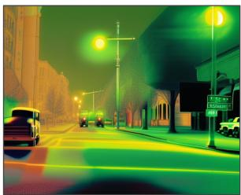

<details>
<summary>natural_image</summary>

Night street scene with illuminated streetlights and vehicles (no visible text or symbols)
</details>

# T -CLIP

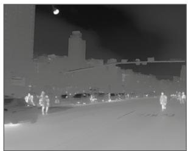

<details>
<summary>natural_image</summary>

Nighttime cityscape with illuminated buildings and people walking along a road (no visible text or symbols)
</details>

Night Scene

Fine-Grained Thermal Caption: "Thermal infrared image depicts a foggy urban scene with buildings and a grassy area. Activity-based heat signatures Suggest no moving vehicles or pedestrians. Material thermal propertiesindicatevegetationlikelyexhibits evaporative cooling effects, while buildings may show heat leakage. The sky acts as a cold thermal sink influencing radiative balance."

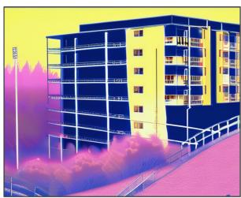

<details>
<summary>natural_image</summary>

Exterior view of a modern multi-story building with purple smoke plumes rising from its windows (no signage or text visible)
</details>

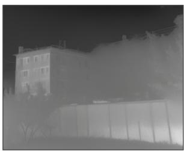

<details>
<summary>natural_image</summary>

Exterior view of a multi-story building at night with visible windows and trees (no signage or text)
</details>

Foggy Scene   
Figure 8: T-CLIP as a plug-and-play replacement for the text encoder in SDXL for thermal image generation. SDXL equipped with the standard CLIP encoder produces pseudo-coloured RGB-like outputs lacking meaningful thermal characteristics. In contrast, replacing the CLIP encoder with T-CLIP enables SDXL to generate physically plausible thermal images that capture pedestrian body heat, vehicle heat emissions in nighttime scenes, and building heat leakage under foggy conditions.

# 6 Conclusion, Limitations, and Future Work

We introduced IR-Cap, the first physics-aware thermal captioning pipeline and dataset providing complementary global and fine-grained thermal descriptions across three public benchmarks, and T-CLIP, a decoupled dual-LoRA framework for thermal CLIP adaptation. The central insight of this work is that global scene-level thermal context and object-level heat signatures are geometrically incompatible and cannot be meaningfully optimized within a shared embedding space. This finding, validated through feature geometry analysis and controlled ablations, directly motivates our decoupled design: two independent specialized branches trained separately on IR-Cap’s global and fine-grained captions, then fused at inference. T-CLIP achieves consistent improvements across three thermal benchmarks on cross-modal retrieval and offers preliminary evidence of its transferability to text-conditioned thermal image generation. We release IR-Cap and our captioning pipeline to facilitate future progress in this area.

Limitations and Future Work. IR-Cap relies on paired RGB images as semantic anchors for generating thermal captions, which limits the modelling of fine-grained thermal phenomena not directly observable in the visible spectrum. This motivates future work on richer thermal metadata annotation strategies to enable more precise characterization of object-level heat signatures. While T-CLIP can be used for text-conditioned thermal image generation as a plug-and-play text encoder replacement, a systematic study of thermal image generation constitutes a substantial independent research direction beyond the scope of this work.

# References

Muhammad Ali Farooq, Waseem Shariff, David O’callaghan, Arcangelo Merla, and Peter Corcoran. On the role of thermal imaging in automotive applications: A critical review. IEEE Access, 2023.

FLIR Systems. FLIR ADAS Dataset. https://oem.flir.com/en-in/solutions/automotive/ adas-dataset-form/, 2025. Accessed: 2026-02-20.   
Kevin Frans, Lisa B. Soros, and Olaf Witkowski. Clipdraw: Exploring text-to-drawing synthesis through language-image encoders. In NeurIPS, 2022.   
Rikke Gade and Thomas B Moeslund. Thermal cameras and applications: a survey. Machine vision and applications, 25:245–262, 2014.   
Peng Gao, Shijie Geng, Renrui Zhang, Teli Ma, Rongyao Fang, Yongfeng Zhang, Hongsheng Li, and Yu Qiao. Clip-adapter: Better vision-language models with feature adapters. International journal of computer vision, 132(2):581–595, 2024.   
Xiuye Gu, Tsung-Yi Lin, Weicheng Kuo, and Yin Cui. Open-vocabulary object detection via vision and language knowledge distillation. In ICLR. OpenReview.net, 2022.   
Yunze He, Baoyuan Deng, Hongjin Wang, Liang Cheng, Ke Zhou, Siyuan Cai, and Francesco Ciampa. Infrared machine vision and infrared thermography with deep learning: A review. Infrared physics & technology, 116:103754, 2021.   
I Hirsh, L Shkedy, D Chen, N Fishler, Y Hagbi, A Koifman, Y Openhaim, I Vaserman, M Singer, and I Shtrichman. Hybrid dual-color mwir detector for airborne missile warning systems. In Infrared Technology and Applications XXXVIII, volume 8353, pp. 189–200. SPIE, 2012.   
Soonmin Hwang, Jaesik Park, Namil Kim, Yukyung Choi, and In So Kweon. Multispectral pedestrian detection: Benchmark dataset and baseline. In Proceedings of the IEEE conference on computer vision and pattern recognition, pp. 1037–1045, 2015.   
Y. Iwashita, K. Nakashima, S. Rafol, A. Stoica, and R. Kurazume. Mu-net: Deep learning-based thermal ir image estimation from rgb image. In Unpublished, 2023.   
VV Kniaz, VS Gorbatsevich, and VA Mizginov. Thermalnet: a deep convolutional network for synthetic thermal image generation. The International Archives of the Photogrammetry, Remote Sensing and Spatial Information Sciences, 42:41–45, 2017.   
Ranjay Krishna, Yuke Zhu, Oliver Groth, Justin Johnson, Kenji Hata, Joshua Kravitz, Stephanie Chen, Yannis Kalantidis, Li-Jia Li, David A. Shamma, Michael S. Bernstein, and Li Fei-Fei. Visual genome: Connecting language and vision using crowdsourced dense image annotations. Int. J. Comput. Vis., 123 (1):32–73, 2017.   
Zhengfeng Lai, Zhuoheng Li, Luca Cerny Oliveira, Joohi Chauhan, Brittany N Dugger, and Chen-Nee Chuah. Clipath: Fine-tune clip with visual feature fusion for pathology image analysis towards minimizing data collection efforts. In Proceedings of the IEEE/CVF International Conference on Computer Vision, pp. 2374–2380, 2023.   
Boyi Li, Kilian Q. Weinberger, Serge J. Belongie, Vladlen Koltun, and René Ranftl. Language-driven semantic segmentation. In ICLR. OpenReview.net, 2022a.   
Liunian Harold Li, Pengchuan Zhang, Haotian Zhang, Jianwei Yang, Chunyuan Li, Yiwu Zhong, Lijuan Wang, Lu Yuan, Lei Zhang, Jenq-Neng Hwang, Kai-Wei Chang, and Jianfeng Gao. Grounded languageimage pre-training. CoRR, abs/2112.03857, 2021.   
Yangguang Li, Feng Liang, Lichen Zhao, Yufeng Cui, Wanli Ouyang, Jing Shao, Fengwei Yu, and Junjie Yan. Supervision exists everywhere: A data efficient contrastive language-image pre-training paradigm. In ICLR. OpenReview.net, 2022b.   
Tsung-Yi Lin, Michael Maire, Serge J. Belongie, James Hays, Pietro Perona, Deva Ramanan, Piotr Dollár, and C. Lawrence Zitnick. Microsoft COCO: common objects in context. In ECCV, volume 8693 of Lecture Notes in Computer Science, pp. 740–755. Springer, 2014.

Jinyuan Liu, Zhu Liu, Guanyao Wu, Long Ma, Risheng Liu, Wei Zhong, Zhongxuan Luo, and Xin Fan. Multiinteractive feature learning and a full-time multi-modality benchmark for image fusion and segmentation. In Proceedings of the IEEE/CVF international conference on computer vision, pp. 8115–8124, 2023.   
Christian Mayr, Christian Kubler, Norbert Haala, and Michael Teutsch. Narrowing the synthetic-to-real gap for thermal infrared semantic image segmentation using diffusion-based conditional image synthesis. In Proceedings of the IEEE/CVF Conference on Computer Vision and Pattern Recognition, pp. 3131–3141, 2024.   
Tran Xuan Bach Nguyen, Kent Rosser, and Javaan Chahl. A review of modern thermal imaging sensor technology and applications for autonomous aerial navigation. Journal of Imaging, 7(10):217, 2021.   
Dustin Podell, Zion English, Kyle Lacey, Andreas Blattmann, Tim Dockhorn, Jonas Müller, Joe Penna, and Robin Rombach. SDXL: improving latent diffusion models for high-resolution image synthesis. CoRR, abs/2307.01952, 2023a.   
Dustin Podell, Zion English, Kyle Lacey, Andreas Blattmann, Tim Dockhorn, Jonas Müller, Joe Penna, and Robin Rombach. Sdxl: Improving latent diffusion models for high-resolution image synthesis. arXiv preprint arXiv:2307.01952, 2023b.   
Tayeba Qazi, Brejesh Lall, and Prerana Mukherjee. Thermaldiff: A diffusion architecture for thermal image synthesis. Journal of Visual Communication and Image Representation, 111:104524, 2025.   
Alec Radford, Jong Wook Kim, Chris Hallacy, Aditya Ramesh, Gabriel Goh, Sandhini Agarwal, Girish Sastry, Amanda Askell, Pamela Mishkin, Jack Clark, Gretchen Krueger, and Ilya Sutskever. Learning transferable visual models from natural language supervision. In ICML, volume 139 of Proceedings of Machine Learning Research, pp. 8748–8763. PMLR, 2021.   
Aditya Ramesh, Prafulla Dhariwal, Alex Nichol, Casey Chu, and Mark Chen. Hierarchical text-conditional image generation with CLIP latents. CoRR, abs/2204.06125, 2022.   
Lingyan Ran, Lidong Wang, Guangcong Wang, Peng Wang, and Yanning Zhang. Diffv2ir: visible-to-infrared diffusion model via vision-language understanding. arXiv preprint arXiv:2503.19012, 2025.   
Robin Rombach, Andreas Blattmann, Dominik Lorenz, Patrick Esser, and Björn Ommer. High-resolution image synthesis with latent diffusion models. In Proceedings of the IEEE/CVF conference on computer vision and pattern recognition, pp. 10684–10695, 2022.   
Christoph Schuhmann, Romain Beaumont, Richard Vencu, Cade Gordon, Ross Wightman, Mehdi Cherti, Theo Coombes, Aarush Katta, Clayton Mullis, Mitchell Wortsman, Patrick Schramowski, Srivatsa Kundurthy, Katherine Crowson, Ludwig Schmidt, Robert Kaczmarczyk, and Jenia Jitsev. LAION-5B: an open large-scale dataset for training next generation image-text models. In NeurIPS, 2022.   
Michael Vollmer and Klaus-Peter Möllmann. Infrared thermal imaging: fundamentals, research and applications. John Wiley & Sons, 2018.   
AN Wilson, Khushi Gupta, Balu Harshavardan Koduru, Abhinav Kumar, Ajit Jha, and Linga Reddy Cenkeramaddi. Recent advances in thermal imaging and its applications using machine learning: A review. IEEE Sensors Journal, 2023.   
Chenfei Wu, Jiahao Li, Jingren Zhou, Junyang Lin, Kaiyuan Gao, Kun Yan, Sheng-ming Yin, Shuai Bai, Xiao Xu, Yilei Chen, et al. Qwen-image technical report. arXiv preprint arXiv:2508.02324, 2025.   
Jiarui Xu, Shalini De Mello, Sifei Liu, Wonmin Byeon, Thomas M. Breuel, Jan Kautz, and Xiaolong Wang. Groupvit: Semantic segmentation emerges from text supervision. In CVPR, pp. 18113–18123. IEEE, 2022.   
Hantao Yao, Rui Zhang, and Changsheng Xu. Visual-language prompt tuning with knowledge-guided context optimization. In Proceedings of the IEEE/CVF conference on computer vision and pattern recognition, pp. 6757–6767, 2023.

Table 11: Pairwise Welch’s t-test results for Figure 1 (main manuscript) image-text cosine similarity distributions on the KAIST (Hwang et al., 2015) test set. Benjamini-Hochberg (BH) correction applied across all three comparisons (FDR = 0.05). n=2,252 image-caption pairs per method. p-values are unchanged in practical terms after correction, confirming the negligible effect of adjustment given effect sizes of this magnitude.6 

<table><tr><td>COMPARISON</td><td>MEAN A</td><td>MEAN B</td><td> $\Delta$ </td><td>t-STAT</td><td> $p_{\text{RAW}}$ </td><td> $p_{\text{BH}}$ </td></tr><tr><td>Zero-shot CLIP vs Global LoRA</td><td>0.3449</td><td>0.3322</td><td>-0.0127</td><td>11.559</td><td> $2.83 \times 10^{-30}$ </td><td> $2.83 \times 10^{-30}$ </td></tr><tr><td>Global LoRA vs T-CLIP</td><td>0.3322</td><td>0.3716</td><td>+0.0394</td><td>-30.350</td><td> $1.86 \times 10^{-183}$ </td><td> $5.58 \times 10^{-183}$ </td></tr><tr><td>Zero-shot CLIP vs T-CLIP</td><td>0.3449</td><td>0.3716</td><td>+0.0267</td><td>-29.132</td><td> $7.61 \times 10^{-167}$ </td><td> $1.14 \times 10^{-166}$ </td></tr></table>

Heng Zhang, Elisa Fromont, Sébastien Lefevre, and Bruno Avignon. Multispectral fusion for object detection with cyclic fuse-and-refine blocks. In 2020 IEEE International conference on image processing (ICIP), pp. 276–280. IEEE, 2020.

# A Appendix

# A.1 Quantifying the Thermal Perception Gap

Table 11 reports the full pairwise Welch’s t-test results for the image-text cosine similarity distributions shown in sections 1 and 4.1, including BH-corrected p-values. All three pairwise differences are statistically significant with $p \ll 0 . 0 0 1$ before and after correction, confirming the robustness of the reported cosine similarity comparisons.

# A.2 IR-Cap Dataset — Instruction Prompts

As discussed in section 3 we employed a dual prompting strategy with Qwen2.5-VL-72B-Instruct, using the visible-spectrum images as semantic context for generating captions for corresponding thermal images. Figure 9 shows the two instruction prompts used for Global and Fine-Grained caption generation respectively.

# A.3 IR-Cap Human Evaluation

This section provides complete protocol details for the human evaluation of the IR-Cap dataset, supporting section 5.6. It includes the full rubric, stratified sampling design, annotator assignment matrix, failure case analysis, and inter-annotator agreement.

# A.3.1 Full Rubric Anchor Descriptions

Table 12 provide complete anchor descriptions and examples for all rating dimensions. Annotators were provided this table as a printed reference sheet. D3 is binary (0/1); D5 applies to Fine-Grained captions only. Pass thresholds: D1, D2 ≥ 3; D3 = 0; D4, D5 ≥ 2.

Approval rate computation. The per-dimension approval rate $( \mathrm { A p p r . \% } )$ for dimension $D _ { i }$ is:

$$
\operatorname{Appr.} _ {D _ {i}} = \frac {\left| \left\{c : s _ {D _ {i}} (c) \geq \tau_ {i} \right\} \right|}{n}, \tag {7}
$$

where $s _ { D _ { i } } ( c )$ is the mean annotator score for caption c, τi is the pass threshold, and n=150. Overall Approval requires passing all applicable dimensions simultaneously:

$$
\text { Overall   Appr. } = \frac {\left| \left\{c : \forall i \in \mathcal {D} (c) , s _ {D _ {i}} (c) \geq \tau_ {i} \right\} \right|}{n}, \tag {8}
$$

# Instruction Prompt 1:

""" Provide a caption for the image using a maximum of 77 tokens. Describe the scene in a broad and objective manner，explicitly mentioning all visible objects,activities,lighting，weather conditions and time of day. Avoid using emotional or subjective terms. ==

# Instruction Prompt 2:

""Analyze RGB images to predict thermal infrared characteristics. For each image, generate exactly one caption that:

1. Begins with "Thermal infrared image"   
2. Briefly describes the scene content   
3. Analyzes thermal properties based on:   
- Time of day， weather conditions，and environmental factors   
- ACTIVITY-BASED HEAT SIGNATURES:   
- Moving vehicles: Hot engines, warm tires, exhaust patterns   
- Parked vehicles: Cooling engines， ambient temperature alignment   
- Pedestrians: Body heat emissions， movement-generated warmth   
- Recent activity: Warm brakes，recently parked vehicles   
- MATERIAL THERMAL PROPERTIES:  
- Metals: Rapid temperature changes (engines，exhaust)   
- Pavement: Heat retention， slow temperature changes   
- Vegetation: Evaporative cooling，typically cooler   
- Buildings: Heat leakage through windows/walls   
- Sky: Cold thermal sink affecting radiative balance

4. Uses objective，scientific language without colors or emotional terms

5. Strictly stick to caption length of 77-token CLIP models. I ==

Figure 9: Instruction prompts for IR-Cap caption generation pipeline. Instruction Prompt 1 generates Global Thermal Captions describing scene-level environmental context. Instruction Prompt 2 generates Fine-Grained Thermal Captions encoding object-level heat signatures and thermal phenomena.

where D(c) denotes the applicable dimensions for caption c (D1–D4 for Global; D1–D5 for Fine-Grained). Overall Approval is at most the minimum per-dimension approval rate and is not the average of per-dimension rates.

# A.3.2 Stratified Sampling Design

Samples were drawn uniformly across dataset origin, time of day, and scene type; Table 13 details the breakdown.

# A.3.3 Annotator Assignment Matrix

Each annotator evaluates 63 items per caption type (126 total), comprising 20 shared overlap items and approximately 43 unique items per batch, yielding an average of 3.3 ratings per item. For items where annotator scores differed by more than one point on any dimension, a sixth expert adjudicator provided a tie-breaking score (7 items, 2.3% of overlap items).

# A.3.4 Failure Case Analysis

Table 15 summarises the three systematic failure categories identified in the 24 Fine-Grained captions failing overall approval, all arising from thermal phenomena not directly observable in the RGB semantic anchor.

# A.3.5 Pairwise Annotator Agreement

All five annotators achieved substantial pairwise agreement (Krippendorff’s α>0.60) across all dimensions on the 20 overlap items, consistent with the overall α values reported in the main paper. D3 (RGB Hallucination) consistently achieved the highest pairwise agreement (α>0.80), reflecting both its binary scale and the straightforward nature of the judgment: annotators simply check whether the caption contains explicit colour or texture terms (e.g., “white”, “yellow”, “dark”) that are meaningless in the thermal infrared domain.

Data Availability. All caption pairs and images used for the human evaluation of the IR-Cap dataset are available at https://drive.google.com/drive/folders/10Xt5lVwSrkiSvJdmFRFMBZtg0SRUvhhS? usp=drive\_link.

# A.4 Retrieval Results with Multi-Seed Statistics

Tables 16, 17 and 18 report the full Recall@K retrieval results across all three benchmarks. R@K is reported as mean ± std across three independent training runs (seeds 0, 42, 123). Zero-shot CLIP results are deterministic and reported as point estimates only.

# A.5 Thermal Image Generation: User Study, Quantitative Metrics, and Additional Samples

This appendix provides complete protocol details supporting the user study of generated thermal images presented in Figure 8, 11 and 12. section A.5.1 describes the user study protocol, Table 19 gives the full D2 Physics Correctness checklist, section A.5.3 gives statistical analysis notes, Figure 10 reports FID and CLIP Score of the generated thermal images for reference, and Figures 11 and 12 present additional generated samples.

# A.5.1 Study Protocol

Method identity was concealed throughout: annotators saw only “Image $\mathrm { A } ^ { \prime \prime }$ and “Image $\mathrm { B } ^ { \ast }$ , with $\mathrm { A } / \mathrm { B }$ labels randomised independently per annotator per pair using a fixed per-annotator seed to prevent position bias. The full text prompts were displayed above both images for each pair. Three practice pairs (excluded from analysis) preceded tpair; post-hoc, each $\mathrm { A } / \mathrm { B }$ ain study. A private mapping file recorded the response was converted to a method-level sco $\mathrm { A } / \mathrm { B }$ $s _ { a , p , d } ^ { \mathrm { t c l i p } } = r _ { a , p , d } ^ { A }$ r annotator perif Image A was T-CLIP, else $r _ { a , p , d } ^ { B } ,$ yielding $n { = } 1 5 0$ paired scores per dimension (5 annotators × 30 pairs).

# A.5.2 D2 Physics Correctness Checklist

Scoring formula. For each image i and annotator a, let $c _ { a , i , j } \in \{ 0 , 1 , \mathrm { N / A } \}$ denote the response to checklist item j. The per-image D2 score is:

$$
s _ {a, i} ^ {D 2} = \left\lfloor \frac {\sum_ {j : c _ {a , i , j} \neq \mathrm{N/A}} c _ {a , i , j}}{| \{j : c _ {a , i , j} \neq \mathrm{N/A} \} |} \times 3 \right] + 1, \tag {9}
$$

clamped to [1, 4], where ⌊·⌉ denotes rounding to the nearest integer. N/A items are excluded from both numerator and denominator. If all items are $\mathrm { N } / \mathrm { A }$ the pair is excluded from D2 analysis.

Refer to Table 19 for the detailed checklist for physics correctness.

# A.5.3 Statistical Analysis

Statistical tests. D1 (Thermal Plausibility) and D2 (Physics Correctness) are assessed via the sign test rather than the Wilcoxon signed-rank test, because zero-shot SDXL received a unanimous score of 1 on both dimensions across all 150 ratings, yielding zero variance; the sign test does not require non-zero differences $( p \approx 4 . 9 \times 1 0 ^ { - 4 6 }$ for both). D3 (Prompt Faithfulness) is assessed via the Wilcoxon signed-rank test; the difference was not significant (p>0.05), consistent with both models generating correct scene content from the prompt. Benjamini-Hochberg correction (FDR = 0.05) is applied across all three pairwise comparisons to control the false discovery rate. Annotator preference (T-CLIP + SDXL vs. zero-shot SDXL) is assessed via a one-sided binomial test $( H _ { 0 } { \mathrm { : } }$ preference probability = 0.5); all 150 decisive comparisons favoured T-CLIP + SDXL, yielding $p { \approx } 4 . 9 { \times } 1 0 ^ { - 4 6 }$ , as reported in Table 10. of ,aim manuscript.

Score aggregation. For D1 and D3, each annotator assigns a Likert score $s _ { a , p , d } \in \{ 1 , 2 , 3 , 4 \}$ per pair. For D2, scores are derived from a per-image checklist via equation 9. In all cases, the reported mean and standard deviation are computed over all n=150 paired scores (5 annotators × 30 pairs) as follows:

$$
\mu_ {d} = \frac {1}{1 5 0} \sum_ {a, p} s _ {a, p, d}, \quad \sigma_ {d} = \operatorname{std} \left(\left\{s _ {a, p, d} \right\} _ {a, p}\right), \tag {10}
$$

on dimension d is where $s _ { a , p , d }$ is the score assigned by annotator a to pair p on dimension d. The method-level mean difference $\Delta = \mu _ { d } ^ { \mathrm { T - C L I P } } - \bar { \mu } _ { d } ^ { \mathrm { S D X L } }$ P − µ SDX Ld .

# A.5.4 FID and CLIP Score

Figure 10 reports FID and CLIP Score for completeness, providing additional quantitative evaluation of the generated thermal images beyond the user study. Both metrics rely on RGB-trained features and are fundamentally misaligned with the thermal domain; the user study (Section 5.6 of the main manuscript) provides the primary evaluation. The consistent FID improvements (+14% to +55%) and CLIP Score improvements (+6% to +19%) across all three datasets are nonetheless directionally supportive.

Data Availability. All 30 prompts and corresponding generated image pairs used for the user study of thermal image generation are available at https://drive.google.com/drive/folders/ 1mxPTpRJgI54XvG5Je8LTEci9PlslPYSK?usp=drive\_link.

# A.5.5 Additional Generated Samples

We provide additional qualitative examples of thermal images generated using T-CLIP with SDXL using a variety of text prompts in Figures 11 and 12.

# A.6 Implementation, Training, and Hyperparameter Details

All methods use CLIP (Radford et al., 2021) ViT-Base-Patch16 as the backbone and are trained on thermal image–caption pairs generated by the IR-Cap pipeline. Table 20 lists hyperparameters shared across all methods; Table 21 lists method-specific configurations. The T-CLIP training and inference pseudocode is shown in Figure 13.

# A.6.1 Shared Training Configuration

Table 20 lists the implementation details and shared training configurations used across all experiments. All experiments were performed on a single NVIDIA RTX A6000 GPU with 48 GB of memory.

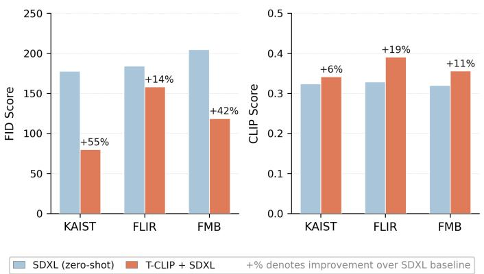  
Figure 10: FID (lower is better) and CLIP Score (higher is better) for zero-shot SDXL vs T-CLIP + SDXL across KAIST (Hwang et al., 2015), FLIR (FLIR Systems, 2025), and FMB (Liu et al., 2023).

# A.6.2 Method-Specific Configuration

Table 21 summarises the configuration parameters unique to each method. LoRA (Global) and LoRA (F-G) share identical hyperparameters, differing only in the caption type used for training. CLIP-Adapter uses a residual bottleneck adapter on top of frozen CLIP features, controlled by the blend ratio $\alpha _ { \mathrm { a d p } } .$ . DeCLIP fine-tunes all CLIP parameters with an additional image–image and text–text nearest-neighbour consistency loss computed against a momentum encoder (EMA update), using a lower learning rate. All methods are trained for an identical number of optimization steps (10,000) to ensure a fair comparison.

# A.6.3 T-CLIP Training and Inference Pseudocode

Figure 13 illustrates the T-CLIP training and inference procedure. The Global LoRA $\left( \theta _ { g } \right)$ and Fine-Grained LoRA $\left( \theta _ { f } \right)$ branches are optimised independently on their respective caption types with no shared gradient flow, and fused at inference via ensemble weight α=0.8.

Table 12: Full anchor descriptions for D1 (thermal accuracy), D2 (semantic correctness), D3 (RGB hallucination), D4 (specificity), and D5 (emissivity reasoning). Pass thresholds: D1, ${ \mathrm { D 2 } } \geq 3 ; { \mathrm { D 3 } } = 0 ;$ D4, D5 $\geq 2 .$ . D5 applies to fine-grained captions only. Overall approval requires passing all applicable dimensions simultaneously. 

<table><tr><td>DIM.</td><td>SCORE</td><td>DESCRIPTION</td><td>EXAMPLE</td></tr><tr><td colspan="4">D1: Thermal accuracy (1-4, pass ≥ 3)</td></tr><tr><td rowspan="4">D1</td><td>1</td><td>Physically impossible thermal claims</td><td>“The sky radiates heat downward, warming the wet pavement”</td></tr><tr><td>2</td><td>Thermally neutral; no physics reasoning</td><td>“People and cars are visible on a road at night”</td></tr><tr><td>3</td><td>Correct thermal reasoning; incomplete</td><td>“Scene shows warm objects against cool background at night”</td></tr><tr><td>4</td><td>Full correct thermal reasoning</td><td>“Night scene: reduced ambient temperature; wet pavement retains residual heat; overcast sky acts as cold thermal sink”</td></tr><tr><td colspan="4">D2: Semantic correctness (1-4, pass ≥ 3)</td></tr><tr><td rowspan="4">D2</td><td>1</td><td>Wrong scene described entirely</td><td>Caption describes indoor scene; image is outdoor road</td></tr><tr><td>2</td><td>Correct environment; wrong objects</td><td>“Cars on highway” but image shows pedestrians</td></tr><tr><td>3</td><td>Correct objects; minor attribute errors</td><td>“Two pedestrians” but image shows three</td></tr><tr><td>4</td><td>All objects and scene correctly identified</td><td>—</td></tr><tr><td colspan="4">D3: RGB hallucination (binary 0/1, pass = 0)</td></tr><tr><td rowspan="2">D3</td><td>0</td><td>No RGB-style colour or texture language used</td><td>—</td></tr><tr><td>1</td><td>RGB hallucination detected</td><td>“White lane markings”; “Yellow streetlights”; “Dark coloured car”</td></tr><tr><td colspan="4">D4: Specificity (1-4, pass ≥ 2)</td></tr><tr><td rowspan="4">D4</td><td>1</td><td>Completely generic</td><td>“An infrared thermal image”</td></tr><tr><td>2</td><td>Scene identified; no thermal detail</td><td>“People walking on a road at night”</td></tr><tr><td>3</td><td>Some thermal context present</td><td>“Night scene with warm pedestrians and cooler background”</td></tr><tr><td>4</td><td>Rich environmental thermal detail</td><td>“Late evening urban scene; ambient temperature low; wet road retains residual heat; buildings show heat leakage”</td></tr><tr><td colspan="4">D5: Emissivity reasoning (1-4, pass ≥ 2) — fine-grained only</td></tr><tr><td rowspan="4">D5</td><td>1</td><td>No object-level thermal reasoning</td><td>“Thermal image of people and cars”</td></tr><tr><td>2</td><td>Generic warm/cool labels only</td><td>“People are warm, cars are cool”</td></tr><tr><td>3</td><td>Material-specific reasoning; incomplete</td><td>“Moving vehicles show warm engines; pedestrians emit body heat from torso”</td></tr><tr><td>4</td><td>Full emissivity and physics reasoning</td><td>“Moving vehicles exhibit hot engine blocks and warm tires from friction; pedestrians emit body heat at torso; vegetation appears cool due to evaporative cooling”</td></tr></table>

Table 13: Stratified sampling design across KAIST (Hwang et al., 2015), FLIR (FLIR Systems, 2025), and FMB (Liu et al., 2023), time of day, and scene type. 

<table><tr><td>CAPTION TYPE</td><td>DATASET</td><td>DAY</td><td>NIGHT</td><td>OTHER</td><td>TOTAL</td></tr><tr><td rowspan="4">Global (150)</td><td>KAIST</td><td>17</td><td>17</td><td>16</td><td>50</td></tr><tr><td>FLIR</td><td>17</td><td>17</td><td>16</td><td>50</td></tr><tr><td>FMB</td><td>17</td><td>17</td><td>16</td><td>50</td></tr><tr><td>Total</td><td>51</td><td>51</td><td>48</td><td>150</td></tr><tr><td rowspan="4">Fine-grained (150)</td><td>KAIST</td><td>17</td><td>17</td><td>16</td><td>50</td></tr><tr><td>FLIR</td><td>17</td><td>17</td><td>16</td><td>50</td></tr><tr><td>FMB</td><td>17</td><td>17</td><td>16</td><td>50</td></tr><tr><td>Total</td><td>51</td><td>51</td><td>48</td><td>150</td></tr><tr><td>Grand total</td><td></td><td>102</td><td>102</td><td>96</td><td>300</td></tr></table>

Table 14: Annotator assignment matrix, applied independently to both global and fine-grained sets. ✓ = assigned; — = not assigned. 

<table><tr><td>ITEM SET</td><td>ANN. 1</td><td>ANN. 2</td><td>ANN. 3</td><td>ANN. 4</td><td>ANN. 5</td><td>ITEMS</td></tr><tr><td>Overlap (items 1–20)</td><td>√</td><td>√</td><td>√</td><td>√</td><td>√</td><td>20</td></tr><tr><td>Batch A (items 21–63)</td><td>√</td><td>√</td><td>√</td><td>—</td><td>—</td><td>43</td></tr><tr><td>Batch B (items 64–107)</td><td>—</td><td>√</td><td>√</td><td>√</td><td>—</td><td>44</td></tr><tr><td>Batch C (items 108–150)</td><td>—</td><td>—</td><td>√</td><td>√</td><td>√</td><td>43</td></tr><tr><td>Per annotator</td><td>63</td><td>63</td><td>63</td><td>63</td><td>63</td><td></td></tr></table>

Table 15: Representative limitation cases in fine-grained IR-Cap captions arising from the RGB-anchoring strategy. Percentage of failures (24 total) per category shown in parentheses. 

<table><tr><td>CATEGORY (SHARE)</td><td>GENERATED CAP-TION</td><td>IDEAL CAPTION</td><td>ROOT CAUSE</td></tr><tr><td>State ambiguity (54%)</td><td>“Vehicles exhibit warm engines and hot tires from friction”</td><td>“Moving vehicles exhibit hot engine blocks; stationary vehicles show cooling engines with reduced heat signatures”</td><td>Motion state not inferable from RGB; VLMs cannot map motion to thermal signatures</td></tr><tr><td>Intra-object distribution (29%)</td><td>“Pedestrians emit body heat”</td><td>“Torso and head show strong heat emission; extremities cooler; clothing acts as partial thermal insulation”</td><td>Within-object thermal gradients not inferable in RGB</td></tr><tr><td>Emissivity mechanism (17%)</td><td>“Wet road retains heat from daytime solar radiation”</td><td>“Wet surface shows elevated emissivity ( $\approx 0.97$  vs. dry  $\approx 0.92$ ), appearing thermally brighter independent of actual temperature”</td><td>Emissivity physics concept absent from VLM training distribution</td></tr></table>

Table 16: Text-image retrieval recall@K on the KAIST (Hwang et al., 2015) test set. All values reported as mean ± std across three independent training runs. Bold: best result. Underline: second best. F-G = fine-grained. ∆: relative R@K gain of T-CLIP (Dual) over the strongest baseline (Global LoRA). 

<table><tr><td colspan="7">IMAGE-TO-TEXT RETRIEVAL</td></tr><tr><td>METHOD</td><td>R@1</td><td>R@5</td><td>R@10</td><td>R@25</td><td>R@50</td><td>R@100</td></tr><tr><td>CLIP (Global)</td><td>0.003</td><td>0.016</td><td>0.034</td><td>0.068</td><td>0.110</td><td>0.179</td></tr><tr><td>CLIP (F-G)</td><td>0.001</td><td>0.004</td><td>0.008</td><td>0.029</td><td>0.057</td><td>0.096</td></tr><tr><td>CLIP-Adapter (Global)</td><td> $0.018 \pm 0.001$ </td><td> $0.072 \pm 0.004$ </td><td> $0.123 \pm 0.002$ </td><td> $0.229 \pm 0.003$ </td><td> $0.357 \pm 0.003$ </td><td> $0.521 \pm 0.002$ </td></tr><tr><td>CLIP-Adapter (F-G)</td><td> $0.009 \pm 0.002$ </td><td> $0.041 \pm 0.002$ </td><td> $0.081 \pm 0.005$ </td><td> $0.167 \pm 0.006$ </td><td> $0.283 \pm 0.005$ </td><td> $0.436 \pm 0.006$ </td></tr><tr><td>DeCLIP (Global)</td><td> $0.038 \pm 0.002$ </td><td> $0.129 \pm 0.001$ </td><td> $0.206 \pm 0.009$ </td><td> $0.349 \pm 0.005$ </td><td> $0.497 \pm 0.008$ </td><td> $0.644 \pm 0.004$ </td></tr><tr><td>DeCLIP (F-G)</td><td> $0.013 \pm 0.000$ </td><td> $0.048 \pm 0.002$ </td><td> $0.088 \pm 0.002$ </td><td> $0.169 \pm 0.002$ </td><td> $0.273 \pm 0.008$ </td><td> $0.433 \pm 0.013$ </td></tr><tr><td>Global LoRA</td><td> $0.070 \pm 0.002$ </td><td> $0.224 \pm 0.004$ </td><td> $0.332 \pm 0.013$ </td><td> $0.520 \pm 0.007$ </td><td> $0.685 \pm 0.015$ </td><td> $0.825 \pm 0.013$ </td></tr><tr><td>F-G LoRA</td><td> $0.021 \pm 0.002$ </td><td> $0.073 \pm 0.007$ </td><td> $0.125 \pm 0.005$ </td><td> $0.248 \pm 0.010$ </td><td> $0.381 \pm 0.006$ </td><td> $0.571 \pm 0.003$ </td></tr><tr><td>T-CLIP (Global)</td><td> $0.071 \pm 0.003$ </td><td> $0.233 \pm 0.002$ </td><td> $0.349 \pm 0.003$ </td><td> $0.541 \pm 0.004$ </td><td> $0.695 \pm 0.006$ </td><td> $0.837 \pm 0.011$ </td></tr><tr><td>T-CLIP (F-G)</td><td> $0.016 \pm 0.002$ </td><td> $0.064 \pm 0.003$ </td><td> $0.101 \pm 0.007$ </td><td> $0.194 \pm 0.007$ </td><td> $0.311 \pm 0.010$ </td><td> $0.473 \pm 0.015$ </td></tr><tr><td>T-CLIP (Dual)</td><td> $0.078 \pm 0.004$ </td><td> $0.252 \pm 0.003$ </td><td> $0.374 \pm 0.004$ </td><td> $0.571 \pm 0.008$ </td><td> $0.729 \pm 0.013$ </td><td> $0.862 \pm 0.009$ </td></tr><tr><td>Δ vs. Global LoRA</td><td>+10.5%</td><td>+12.4%</td><td>+12.7%</td><td>+9.7%</td><td>+6.3%</td><td>+4.5%</td></tr></table>

<table><tr><td colspan="7">TEXT-TO-IMAGE RETRIEVAL</td></tr><tr><td>METHOD</td><td>R@1</td><td>R@5</td><td>R@10</td><td>R@25</td><td>R@50</td><td>R@100</td></tr><tr><td>CLIP (Global)</td><td>0.002</td><td>0.013</td><td>0.027</td><td>0.048</td><td>0.080</td><td>0.135</td></tr><tr><td>CLIP (F-G)</td><td>0.001</td><td>0.007</td><td>0.014</td><td>0.030</td><td>0.048</td><td>0.088</td></tr><tr><td>CLIP-Adapter (Global)</td><td> $0.020 \pm 0.002$ </td><td> $0.070 \pm 0.002$ </td><td> $0.119 \pm 0.003$ </td><td> $0.234 \pm 0.006$ </td><td> $0.360 \pm 0.001$ </td><td> $0.538 \pm 0.003$ </td></tr><tr><td>CLIP-Adapter (F-G)</td><td> $0.010 \pm 0.000$ </td><td> $0.046 \pm 0.000$ </td><td> $0.082 \pm 0.003$ </td><td> $0.166 \pm 0.004$ </td><td> $0.281 \pm 0.008$ </td><td> $0.445 \pm 0.004$ </td></tr><tr><td>DeCLIP (Global)</td><td> $0.041 \pm 0.000$ </td><td> $0.133 \pm 0.004$ </td><td> $0.209 \pm 0.002$ </td><td> $0.357 \pm 0.005$ </td><td> $0.496 \pm 0.014$ </td><td> $0.650 \pm 0.005$ </td></tr><tr><td>DeCLIP (F-G)</td><td> $0.014 \pm 0.000$ </td><td> $0.056 \pm 0.002$ </td><td> $0.094 \pm 0.001$ </td><td> $0.175 \pm 0.006$ </td><td> $0.285 \pm 0.013$ </td><td> $0.439 \pm 0.010$ </td></tr><tr><td>Global LoRA</td><td> $0.069 \pm 0.005$ </td><td> $0.221 \pm 0.008$ </td><td> $0.331 \pm 0.010$ </td><td> $0.521 \pm 0.013$ </td><td> $0.679 \pm 0.012$ </td><td> $0.822 \pm 0.010$ </td></tr><tr><td>F-G LoRA</td><td> $0.019 \pm 0.002$ </td><td> $0.079 \pm 0.010$ </td><td> $0.139 \pm 0.008$ </td><td> $0.260 \pm 0.002$ </td><td> $0.400 \pm 0.007$ </td><td> $0.582 \pm 0.012$ </td></tr><tr><td>T-CLIP (Global)</td><td> $0.078 \pm 0.002$ </td><td> $0.242 \pm 0.004$ </td><td> $0.359 \pm 0.009$ </td><td> $0.554 \pm 0.008$ </td><td> $0.710 \pm 0.010$ </td><td> $0.843 \pm 0.009$ </td></tr><tr><td>T-CLIP (F-G)</td><td> $0.012 \pm 0.002$ </td><td> $0.048 \pm 0.004$ </td><td> $0.084 \pm 0.006$ </td><td> $0.157 \pm 0.010$ </td><td> $0.255 \pm 0.012$ </td><td> $0.394 \pm 0.018$ </td></tr><tr><td>T-CLIP (Dual)</td><td> $0.084 \pm 0.002$ </td><td> $0.264 \pm 0.005$ </td><td> $0.386 \pm 0.010$ </td><td> $0.580 \pm 0.008$ </td><td> $0.740 \pm 0.007$ </td><td> $0.870 \pm 0.011$ </td></tr><tr><td>Δ vs. Global LoRA</td><td>+21.9%</td><td>+19.4%</td><td>+16.8%</td><td>+11.3%</td><td>+9.1%</td><td>+5.8%</td></tr></table>

Table 17: Text-image retrieval recall@K on the FLIR (FLIR Systems, 2025) test set. All values reported as mean ± std across three independent training runs. Bold: best result. Underline: second best. F-G = fine-grained. ∆: relative R@K gain of T-CLIP (Dual) over the strongest baseline (Global LoRA). 

<table><tr><td colspan="7">IMAGE-TO-TEXT RETRIEVAL</td></tr><tr><td>METHOD</td><td>R@1</td><td>R@5</td><td>R@10</td><td>R@25</td><td>R@50</td><td>R@100</td></tr><tr><td>CLIP (Global)</td><td>0.014</td><td>0.070</td><td>0.115</td><td>0.242</td><td>0.360</td><td>0.513</td></tr><tr><td>CLIP (F-G)</td><td>0.006</td><td>0.022</td><td>0.039</td><td>0.110</td><td>0.220</td><td>0.332</td></tr><tr><td>CLIP-Adapter (Global)</td><td> $0.045 \pm 0.006$ </td><td> $0.153 \pm 0.005$ </td><td> $0.247 \pm 0.010$ </td><td> $0.411 \pm 0.016$ </td><td> $0.545 \pm 0.014$ </td><td> $0.700 \pm 0.014$ </td></tr><tr><td>CLIP-Adapter (F-G)</td><td> $0.027 \pm 0.003$ </td><td> $0.081 \pm 0.001$ </td><td> $0.134 \pm 0.003$ </td><td> $0.250 \pm 0.005$ </td><td> $0.402 \pm 0.012$ </td><td> $0.582 \pm 0.005$ </td></tr><tr><td>DeCLIP (Global)</td><td> $0.049 \pm 0.002$ </td><td> $0.154 \pm 0.002$ </td><td> $0.228 \pm 0.005$ </td><td> $0.376 \pm 0.005$ </td><td> $0.507 \pm 0.002$ </td><td> $0.642 \pm 0.004$ </td></tr><tr><td>DeCLIP (F-G)</td><td> $0.012 \pm 0.001$ </td><td> $0.056 \pm 0.003$ </td><td> $0.104 \pm 0.008$ </td><td> $0.197 \pm 0.002$ </td><td> $0.312 \pm 0.001$ </td><td> $0.474 \pm 0.010$ </td></tr><tr><td>Global LoRA</td><td> $0.105 \pm 0.003$ </td><td> $0.329 \pm 0.011$ </td><td> $0.487 \pm 0.008$ </td><td> $0.678 \pm 0.003$ </td><td> $0.816 \pm 0.004$ </td><td> $0.914 \pm 0.002$ </td></tr><tr><td>F-G LoRA</td><td> $0.027 \pm 0.004$ </td><td> $0.089 \pm 0.007$ </td><td> $0.150 \pm 0.008$ </td><td> $0.290 \pm 0.016$ </td><td> $0.453 \pm 0.016$ </td><td> $0.642 \pm 0.014$ </td></tr><tr><td>T-CLIP (Global)</td><td> $0.119 \pm 0.004$ </td><td> $0.353 \pm 0.007$ </td><td> $0.504 \pm 0.013$ </td><td> $0.707 \pm 0.007$ </td><td> $0.833 \pm 0.007$ </td><td> $0.923 \pm 0.003$ </td></tr><tr><td>T-CLIP (F-G)</td><td> $0.025 \pm 0.005$ </td><td> $0.107 \pm 0.006$ </td><td> $0.182 \pm 0.004$ </td><td> $0.316 \pm 0.009$ </td><td> $0.473 \pm 0.032$ </td><td> $0.649 \pm 0.014$ </td></tr><tr><td>T-CLIP (Dual)</td><td> $0.123 \pm 0.010$ </td><td> $0.357 \pm 0.006$ </td><td> $0.517 \pm 0.015$ </td><td> $0.727 \pm 0.005$ </td><td> $0.851 \pm 0.005$ </td><td> $0.931 \pm 0.008$ </td></tr><tr><td>Δ vs. Global LoRA</td><td>+17.1%</td><td>+8.5%</td><td>+6.2%</td><td>+7.2%</td><td>+4.3%</td><td>+1.9%</td></tr></table>

<table><tr><td colspan="7">TEXT-TO-IMAGE RETRIEVAL</td></tr><tr><td>METHOD</td><td>R@1</td><td>R@5</td><td>R@10</td><td>R@25</td><td>R@50</td><td>R@100</td></tr><tr><td>CLIP (Global)</td><td>0.014</td><td>0.062</td><td>0.106</td><td>0.229</td><td>0.319</td><td>0.467</td></tr><tr><td>CLIP (F-G)</td><td>0.005</td><td>0.019</td><td>0.032</td><td>0.093</td><td>0.158</td><td>0.253</td></tr><tr><td>CLIP-Adapter (Global)</td><td> $0.031 \pm 0.003$ </td><td> $0.130 \pm 0.007$ </td><td> $0.217 \pm 0.009$ </td><td> $0.381 \pm 0.024$ </td><td> $0.529 \pm 0.024$ </td><td> $0.706 \pm 0.017$ </td></tr><tr><td>CLIP-Adapter (F-G)</td><td> $0.019 \pm 0.001$ </td><td> $0.075 \pm 0.006$ </td><td> $0.133 \pm 0.011$ </td><td> $0.244 \pm 0.005$ </td><td> $0.367 \pm 0.009$ </td><td> $0.555 \pm 0.009$ </td></tr><tr><td>DeCLIP (Global)</td><td> $0.045 \pm 0.002$ </td><td> $0.158 \pm 0.011$ </td><td> $0.232 \pm 0.001$ </td><td> $0.367 \pm 0.001$ </td><td> $0.510 \pm 0.008$ </td><td> $0.641 \pm 0.005$ </td></tr><tr><td>DeCLIP (F-G)</td><td> $0.015 \pm 0.001$ </td><td> $0.073 \pm 0.003$ </td><td> $0.114 \pm 0.008$ </td><td> $0.218 \pm 0.012$ </td><td> $0.324 \pm 0.010$ </td><td> $0.474 \pm 0.001$ </td></tr><tr><td>Global LoRA</td><td> $0.106 \pm 0.003$ </td><td> $0.321 \pm 0.007$ </td><td> $0.459 \pm 0.006$ </td><td> $0.673 \pm 0.006$ </td><td> $0.812 \pm 0.007$ </td><td> $0.907 \pm 0.006$ </td></tr><tr><td>F-G LoRA</td><td> $0.035 \pm 0.003$ </td><td> $0.127 \pm 0.005$ </td><td> $0.206 \pm 0.003$ </td><td> $0.369 \pm 0.013$ </td><td> $0.528 \pm 0.024$ </td><td> $0.702 \pm 0.015$ </td></tr><tr><td>T-CLIP (Global)</td><td> $0.105 \pm 0.007$ </td><td> $0.348 \pm 0.002$ </td><td> $0.492 \pm 0.005$ </td><td> $0.712 \pm 0.001$ </td><td> $0.839 \pm 0.008$ </td><td> $0.925 \pm 0.004$ </td></tr><tr><td>T-CLIP (F-G)</td><td> $0.020 \pm 0.004$ </td><td> $0.069 \pm 0.004$ </td><td> $0.130 \pm 0.009$ </td><td> $0.239 \pm 0.012$ </td><td> $0.361 \pm 0.013$ </td><td> $0.523 \pm 0.025$ </td></tr><tr><td>T-CLIP (Dual)</td><td> $0.117 \pm 0.003$ </td><td> $0.364 \pm 0.008$ </td><td> $0.511 \pm 0.005$ </td><td> $0.728 \pm 0.005$ </td><td> $0.851 \pm 0.006$ </td><td> $0.932 \pm 0.005$ </td></tr><tr><td>Δ vs. Global LoRA</td><td>+10.4%</td><td>+13.4%</td><td>+11.3%</td><td>+8.2%</td><td>+4.8%</td><td>+2.8%</td></tr></table>

Table 18: Text-image retrieval recall@K on the FMB (Liu et al., 2023) test set. All values reported as mean ± std across three independent training runs. Bold: best result. Underline: second best. F-G = fine-grained. ∆: relative R@K gain of the best T-CLIP variant per metric over Global LoRA. 

<table><tr><td colspan="7">IMAGE-TO-TEXT RETRIEVAL</td></tr><tr><td>METHOD</td><td>R@1</td><td>R@5</td><td>R@10</td><td>R@25</td><td>R@50</td><td>R@100</td></tr><tr><td>CLIP (Global)</td><td>0.043</td><td>0.118</td><td>0.175</td><td>0.318</td><td>0.443</td><td>0.632</td></tr><tr><td>CLIP (F-G)</td><td>0.011</td><td>0.082</td><td>0.143</td><td>0.225</td><td>0.279</td><td>0.532</td></tr><tr><td>CLIP-Adapter (Global)</td><td> $0.075 \pm 0.007$ </td><td> $0.266 \pm 0.005$ </td><td> $0.409 \pm 0.009$ </td><td> $0.605 \pm 0.002$ </td><td> $0.768 \pm 0.000$ </td><td> $0.905 \pm 0.002$ </td></tr><tr><td>CLIP-Adapter (F-G)</td><td> $0.029 \pm 0.004$ </td><td> $0.157 \pm 0.011$ </td><td> $0.277 \pm 0.005$ </td><td> $0.455 \pm 0.016$ </td><td> $0.677 \pm 0.002$ </td><td> $0.880 \pm 0.009$ </td></tr><tr><td>DeCLIP (Global)</td><td> $0.095 \pm 0.013$ </td><td> $0.268 \pm 0.004$ </td><td> $0.400 \pm 0.007$ </td><td> $0.573 \pm 0.002$ </td><td> $0.704 \pm 0.004$ </td><td> $0.834 \pm 0.009$ </td></tr><tr><td>DeCLIP (F-G)</td><td> $0.041 \pm 0.009$ </td><td> $0.145 \pm 0.009$ </td><td> $0.238 \pm 0.002$ </td><td> $0.402 \pm 0.005$ </td><td> $0.561 \pm 0.007$ </td><td> $0.743 \pm 0.018$ </td></tr><tr><td>Global LoRA</td><td> $0.104 \pm 0.015$ </td><td> $0.342 \pm 0.012$ </td><td> $0.496 \pm 0.016$ </td><td> $0.731 \pm 0.019$ </td><td> $0.866 \pm 0.012$ </td><td> $0.956 \pm 0.010$ </td></tr><tr><td>F-G LoRA</td><td> $0.037 \pm 0.002$ </td><td> $0.133 \pm 0.014$ </td><td> $0.248 \pm 0.015$ </td><td> $0.479 \pm 0.038$ </td><td> $0.658 \pm 0.032$ </td><td> $0.842 \pm 0.015$ </td></tr><tr><td>T-CLIP (Global)</td><td> $0.105 \pm 0.012$ </td><td> $0.362 \pm 0.007$ </td><td> $0.539 \pm 0.018$ </td><td> $0.762 \pm 0.005$ </td><td> $0.871 \pm 0.013$ </td><td> $0.958 \pm 0.002$ </td></tr><tr><td>T-CLIP (F-G)</td><td> $0.042 \pm 0.002$ </td><td> $0.151 \pm 0.014$ </td><td> $0.245 \pm 0.002$ </td><td> $0.413 \pm 0.009$ </td><td> $0.580 \pm 0.016$ </td><td> $0.788 \pm 0.012$ </td></tr><tr><td>T-CLIP (Dual)</td><td> $0.098 \pm 0.017$ </td><td> $0.342 \pm 0.012$ </td><td> $0.537 \pm 0.014$ </td><td> $0.771 \pm 0.008$ </td><td> $0.895 \pm 0.007$ </td><td> $0.973 \pm 0.005$ </td></tr><tr><td>Δ vs. Global LoRA</td><td>+1.0%</td><td>+5.8%</td><td>+8.7%</td><td>+5.5%</td><td>+3.3%</td><td>+1.8%</td></tr></table>

<table><tr><td colspan="7">TEXT-TO-IMAGE RETRIEVAL</td></tr><tr><td>METHOD</td><td>R@1</td><td>R@5</td><td>R@10</td><td>R@25</td><td>R@50</td><td>R@100</td></tr><tr><td>CLIP (Global)</td><td>0.018</td><td>0.071</td><td>0.143</td><td>0.243</td><td>0.418</td><td>0.618</td></tr><tr><td>CLIP (F-G)</td><td>0.004</td><td>0.032</td><td>0.068</td><td>0.157</td><td>0.289</td><td>0.479</td></tr><tr><td>CLIP-Adapter (Global)</td><td> $0.063 \pm 0.002$ </td><td> $0.259 \pm 0.009$ </td><td> $0.402 \pm 0.009$ </td><td> $0.613 \pm 0.009$ </td><td> $0.775 \pm 0.018$ </td><td> $0.927 \pm 0.013$ </td></tr><tr><td>CLIP-Adapter (F-G)</td><td> $0.039 \pm 0.004$ </td><td> $0.148 \pm 0.009$ </td><td> $0.243 \pm 0.004$ </td><td> $0.438 \pm 0.013$ </td><td> $0.611 \pm 0.014$ </td><td> $0.863 \pm 0.016$ </td></tr><tr><td>DeCLIP (Global)</td><td> $0.077 \pm 0.005$ </td><td> $0.277 \pm 0.002$ </td><td> $0.370 \pm 0.016$ </td><td> $0.586 \pm 0.004$ </td><td> $0.700 \pm 0.014$ </td><td> $0.843 \pm 0.011$ </td></tr><tr><td>DeCLIP (F-G)</td><td> $0.038 \pm 0.013$ </td><td> $0.136 \pm 0.014$ </td><td> $0.239 \pm 0.004$ </td><td> $0.400 \pm 0.007$ </td><td> $0.566 \pm 0.020$ </td><td> $0.754 \pm 0.011$ </td></tr><tr><td>Global LoRA</td><td> $0.100 \pm 0.012$ </td><td> $0.350 \pm 0.024$ </td><td> $0.510 \pm 0.020$ </td><td> $0.737 \pm 0.016$ </td><td> $0.882 \pm 0.018$ </td><td> $0.960 \pm 0.010$ </td></tr><tr><td>F-G LoRA</td><td> $0.048 \pm 0.002$ </td><td> $0.185 \pm 0.018$ </td><td> $0.282 \pm 0.008$ </td><td> $0.489 \pm 0.005$ </td><td> $0.666 \pm 0.019$ </td><td> $0.848 \pm 0.036$ </td></tr><tr><td>T-CLIP (Global)</td><td> $0.101 \pm 0.006$ </td><td> $0.385 \pm 0.012$ </td><td> $0.556 \pm 0.016$ </td><td> $0.787 \pm 0.014$ </td><td> $0.901 \pm 0.005$ </td><td> $0.970 \pm 0.006$ </td></tr><tr><td>T-CLIP (F-G)</td><td> $0.039 \pm 0.006$ </td><td> $0.144 \pm 0.002$ </td><td> $0.219 \pm 0.013$ </td><td> $0.346 \pm 0.020$ </td><td> $0.526 \pm 0.022$ </td><td> $0.708 \pm 0.006$ </td></tr><tr><td>T-CLIP (Dual)</td><td> $0.104 \pm 0.015$ </td><td> $0.395 \pm 0.034$ </td><td> $0.587 \pm 0.009$ </td><td> $0.818 \pm 0.016$ </td><td> $0.914 \pm 0.003$ </td><td> $0.979 \pm 0.008$ </td></tr><tr><td>Δ vs. Global LoRA</td><td>+4.0%</td><td>+12.9%</td><td>+15.1%</td><td>+11.0%</td><td>+3.6%</td><td>+2.0%</td></tr></table>

Table 19: Full D2 physics correctness checklist (18 items, 7 scene-content groups). Fundamental rule: warm → brighter; cool → darker. Score = proportion YES among applicable items, mapped to 1–4 via Eq. 9. Typical applicable items per image: 6–9. 

<table><tr><td>ITEM</td><td>NAME</td><td>WHAT TO CHECK</td><td>YES / NO CRITERION</td></tr><tr><td colspan="4">Group A — Always applicable (no N/A)</td></tr><tr><td>A1</td><td>Warm→brighter; Cool→darker</td><td>Both directions hold: warm bright AND cool dark</td><td>YES: bidirectional contrastNO: uniform or inverted</td></tr><tr><td>A2</td><td>Sky as cold thermal sink</td><td>Open sky one of darkest regions</td><td>YES: sky dark NO: sky warm</td></tr><tr><td>A3</td><td>Three-level hierarchy</td><td>Sky &lt; Road &lt; People/Vehicles</td><td>YES: three distinct levelsNO: road = sky or road = people</td></tr><tr><td colspan="4">Group B — People present (N/A if no people)</td></tr><tr><td>B1</td><td>Body heat distribution</td><td>Torso/head brightest; extremities darker</td><td>YES: upper body brighter than limbsNO: uniform glow</td></tr><tr><td>B2</td><td>Clothing insulation</td><td>Clothed areas slightly darker than bare skin</td><td>YES: clothed areas dimmerNO: uniform regardless of clothing</td></tr><tr><td>B3</td><td>Umbrella as cold shield</td><td>Umbrella dome dark — blocks body heat</td><td>YES: umbrella darker than personN/A: no umbrella</td></tr><tr><td colspan="4">Group C — Vehicles present (N/A if no vehicles)</td></tr><tr><td>C1</td><td>Engine/exhaust heat</td><td>Engine warm → brighter than body panels</td><td>YES: engine brighter NO: uniform</td></tr><tr><td>C2</td><td>Tyre heat</td><td>Tyres warm from friction → brighter than road</td><td>YES: tyres brighter than road</td></tr><tr><td>C3</td><td>Moving vs stationary</td><td>Moving warmer → brighter</td><td>YES: moving clearly brighterN/A: only one type present</td></tr><tr><td>C4</td><td>Headlights as bright spots</td><td>Headlights → brightest concentrated spots</td><td>YES: headlights brightestN/A: no night scene</td></tr><tr><td colspan="4">Group D — Road visible (N/A if road not visible)</td></tr><tr><td>D1</td><td>Road thermal state</td><td>Day: warm → bright; Night: intermediate</td><td>YES: correct for time of dayNO: road as dark as sky</td></tr><tr><td>D2</td><td>Wet surface emissivity</td><td>Wet ( $\varepsilon \approx 0.97$ ) brighter than dry ( $\varepsilon \approx 0.90$ )</td><td>YES: wet areas brighter N/A: no wet surfaces</td></tr><tr><td colspan="4">Group E — Adverse weather (N/A if clear)</td></tr><tr><td>E1</td><td>Weather reduces contrast</td><td>Fog/rain → reduced warm/cool differentiation</td><td>YES: reduced contrast N/A: clear weather</td></tr><tr><td>E2</td><td>Overcast sky still dark</td><td>Overcast: sky dark but less extreme than clear night</td><td>YES: sky dark but not fully blackN/A: not overcast</td></tr><tr><td colspan="4">Group F — Vegetation present (N/A if no vegetation)</td></tr><tr><td>F1</td><td>Vegetation cooling</td><td>Evapotranspiration → vegetation darker than buildings</td><td>YES: vegetation clearly darkerNO: same as warm objects</td></tr><tr><td colspan="4">Group G — Buildings present (N/A if no buildings)</td></tr><tr><td>G1</td><td>Window-wall differential</td><td>Windows warm → brighter; walls cooler → darker</td><td>YES: windows brighter than wallNO: building uniformly bright</td></tr><tr><td>G2</td><td>Rooftop cooler than facade</td><td>Rooftop → darker than facade below</td><td>YES: rooftop darker N/A: rooftop not visible</td></tr></table>

Score mapping: 0–25% YES → 1; 26–50% → 2; 51–75% → 3; 76–100% → 4. If all N/A: exclude from D2 analysis.

Table 20: Shared training configuration across all methods. 

<table><tr><td>PARAMETER</td><td>VALUE</td></tr><tr><td>Base model</td><td>CLIP ViT-Base-Patch16</td></tr><tr><td>Input data</td><td>Thermal image-caption pairs (IR-Cap)</td></tr><tr><td>Optimizer</td><td>AdamW</td></tr><tr><td> $\beta_1, \beta_2$ </td><td>0.9, 0.999</td></tr><tr><td> $\epsilon$ </td><td> $1.0 \times 10^{-8}$ </td></tr><tr><td>LR scheduler</td><td>Cosine with 100 warmup steps</td></tr><tr><td>Weight decay</td><td> $1.0 \times 10^{-3}$ </td></tr><tr><td>Max gradient norm</td><td>1.0</td></tr><tr><td>Train batch size</td><td>128</td></tr><tr><td>Gradient accumulation</td><td>1</td></tr><tr><td>Precision</td><td>FP16</td></tr><tr><td>Data workers</td><td>16</td></tr><tr><td>GPU</td><td>NVIDIA A6000 (48 GB)</td></tr></table>

# Captions

Global Thermal Caption :"An infrared thermal image of a pedestrian crossing with several individuals walking across. A person in an orange jacket is carrying a white object. In the background, there is a large building with a dark facade and multiple windows. Several bicycles are parked near the building.Trees and shrubs are visible around the area. The sky appears clear， suggesting daytime with good visibility. The lighting indicates it might be midday. There are no signs of adverse weather conditions. The road isasphalt,and the crosswalk linesare clearly marked."

Fine-Grained Thermal Caption: "Thermal infrared image depicts a pedestrian crossing near a building. Activitybased signatures show pedestrians emitting body heat. Metal bicycles exhibit rapid cooling. Pavement retains heat slowly. Vegetation appears cooler due to evaporative effects. Building walls show minor heat leakage. Sky acts as a cold thermal sink influencing radiative balance."

# CLIP

# T -CLIP

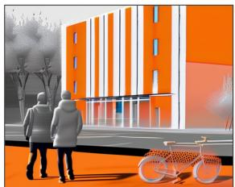

<details>
<summary>natural_image</summary>

Illustration of two people walking past a modern building with orange and white facade, accompanied by a bicycle (no text or symbols)
</details>

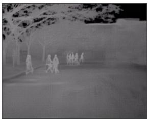

<details>
<summary>natural_image</summary>

Black-and-white photo of people walking outdoors near trees and buildings (no visible text or symbols)
</details>

KAIST Dataset

Global Thermal Caption : "An infrared thermal image of three individuals walking on a wet road during overcast weather， likely early evening.Two people carry black umbrellas, while one holds a white object. The road is marked with white lines,and there is greenery along the side.In the background， tall residential buildingswithilluminated windows are visible. Streetlights and traffic signs are also present.The overallighting is dim due to the cloudy sky."

Fine-Grained Thermal Caption: "Thermal infrared image depicts three pedestrians walking on a wet road near buildings. At dusk, body heat emissions from individuals contrast with cooler pavement.Vegetation shows evaporative cooling effects. No moving vehicles indicate absent engine heat signatures. Building facades exhibit minor heat leakage. The sky acts as a cold thermal sink influencing radiative balance."

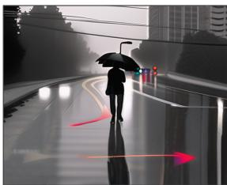

<details>
<summary>natural_image</summary>

Silhouette of a person walking on a curved road with a red arrow indicating direction, city skyline in background (no text or symbols)
</details>

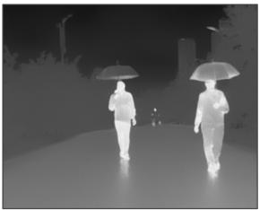

<details>
<summary>natural_image</summary>

Two people walking on a wet street under umbrellas, no visible text or symbols
</details>

FMB Dataset

Global Thermal Caption: "An infrared thermal image of a nightime urban street scene withartificial lighting fromstreet lamps and building lights.Two individuals are crossing the road at a pedestrian crossing. A white SUV is stopped near the crosswalk. Palm trees and multi-story buildings line the street. Theweatherappearsclear，and the overall visibility is moderate due to the streetlights.The time of day is night,as indicated by the darkness and illuminated streetlights."

Fine-Grained Thermal Caption: Thermal infrared image depicts a nighttime urban street scene. Moving vehicle exhibits hot engine, warm tires,and exhaust. Pedestrians emit body heat. Pavement retains heat slowly; vegetation appears cooler due to evaporation. Buildings show heat leakage. Sky acts as cold thermal sink."

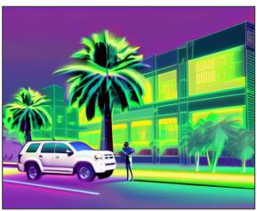

<details>
<summary>natural_image</summary>

Thermal illustration of a modern building with palm trees and a parked SUV (no text or symbols)
</details>

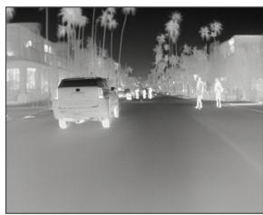

<details>
<summary>natural_image</summary>

Night street scene with a pickup truck and several people in the background, palm trees lining the road (no visible text or symbols)
</details>

FLIR Dataset   
Figure 11: Generated thermal image samples using captions from KAIST (Hwang et al., 2015), FLIR (FLIR Systems, 2025), and FMB (Liu et al., 2023). For each prompt, left: zero-shot SDXL (standard CLIP text encoder); right: T-CLIP + SDXL. The T-CLIP + SDXL model captures both global scene context and fine-grained object-level heat signatures.

# Captions

Fine-Grained Thermal Caption: "Thermal infrared image depicts an urban road scene at dusk. Moving vehicles exhibit hot engines and warm tires,while parked cars show cooling engines. Pedestrians emit body heat. Metals in engines and exhausts show rapid temperature changes. Pavement retains heat slowly, vegetation appears cooler due to evaporative cooling. Buildings display heat leakage,and the sky acts as a cold thermal sink."

# CLIP


<details>
<summary>text_image</summary>

Prestarosef S. del
cau Iluree = en
cnailimnctos
</details>

# T -CLIP

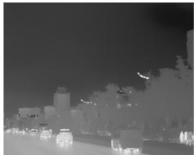

<details>
<summary>natural_image</summary>

Nighttime cityscape with illuminated buildings and a cloudy sky (no visible text or symbols)
</details>

Evening Scene

Fine-Grained Thermal Caption: "Thermal infrared image depicts a road scene with vehicles and pedestrians. Moving vehicles exhibit hot engines and warm tires,while parked cars show cooling engines. Pedestrians emit body heat. Metals in engines show rapid temperature changes; pavement retains heat slowly.Vegetation appears cooler due to evaporative cooling. Buildings may display heat leakage. The sky acts as a cold thermal sink influencing radiative balance."

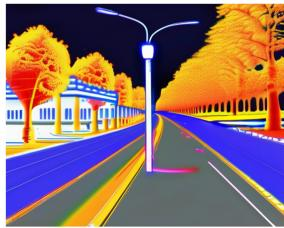

<details>
<summary>natural_image</summary>

Night street scene with colorful trees and a street lamp, no visible text or symbols
</details>

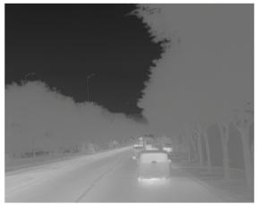

<details>
<summary>natural_image</summary>

Nighttime street scene with a car driving on a multi-lane road, surrounded by trees (no visible text or symbols)
</details>

Overcast Scene

Fine-Grained Thermal Caption: "Thermal infrared image depicts three pedestrians walking on a wet road near buildings. At dusk，body heat emissions from individuals contrast with cooler pavement. Vegetation shows evaporative cooling effects. No moving vehicles indicate absent engine heat signatures. Building facades exhibit minor heat leakage. The sky acts as a cold thermal sink influencing radiative balance."

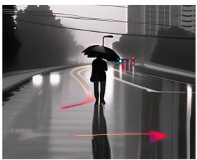

<details>
<summary>natural_image</summary>

Silhouette of a person walking on a city street with an umbrella and red directional arrows (no text or symbols)
</details>

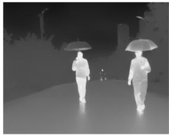

<details>
<summary>natural_image</summary>

Two people walking on a wet street under umbrellas, no visible text or symbols
</details>

Rainy Scene

Fine-Grained Thermal Caption: "Thermal infrared image depicts an urban street scene. Moving vehicles exhibit hot engines and warm tires, while pedestrians emit body heat. Pavement retains heat slowly; vegetation appears cooler due to evaporative effects. Buildings show heat leakage,and the skyactsasacold thermal sink influencing radiative balance."

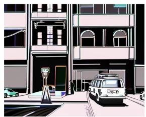

<details>
<summary>natural_image</summary>

Illustration of a street scene with a parked car and two buildings (no visible text or symbols)
</details>

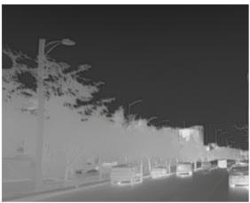

<details>
<summary>natural_image</summary>

Night street scene with cars and trees, no visible text or symbols
</details>

Sunny Scene

Fine-Grained Thermal Caption: "Thermal infrared image depicts an urban night scene. Vehicles exhibit hot engines and warm tires, indicating recent activity. Pedestrians emit body heat. Metal structures show rapid temperature changes，while pavement retains heat slowly. Vegetation appears cooler due to evaporative cooling. Buildings display heat leakage，and the sky acts as a cold thermal sink influencing radiative balance."

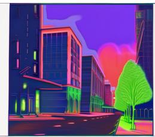

<details>
<summary>natural_image</summary>

Stylized illustration of a city street at night with buildings, trees, and a heart-shaped tree (no text or symbols)
</details>

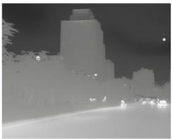

<details>
<summary>natural_image</summary>

Nighttime cityscape with illuminated skyscrapers and streetlights (no visible text or signage)
</details>

Tyndall Effect   
Figure 12: T-CLIP + SDXL performance under challenging conditions from FMB (Liu et al., 2023) dataset. For each pair, left: zero-shot SDXL (standard CLIP text encoder); right: T-CLIP + SDXL. T-CLIP + SDXL demonstrates thermal understanding in scenarios where conventional RGB-based approaches fail.

```txt
# V_g, V_f - Global / Fine-Grained LoRA Vision Encoder
# E_g, E_f - Global / Fine-Grained LoRA Text Encoder
# I - minibatch of thermal images
# C_g - minibatch of global thermal captions
# C_fg - minibatch of fine-grained thermal captions
# alpha - ensemble weight (default: 0.8) 
```  
Training

```python
# Global LoRA branch
img_g = V_g(I)
txt_g = E_g(C_g)
loss_g = clip_loss(img_g, txt_g, tau)
# Fine-Grained LoRA branch
img_f = V_f(I)
txt_f = E_f(C_fg)
loss_f = clip_loss(img_f, txt_f, tau)
# Branches updated independently - no gradient interference
loss_g.backward() # updates theta_g only
loss_f.backward() # updates theta_f only 
```  
Inference

```python
# Step 1: Independent branch encoding
9 img_g = L2_norm( V_g( I ) )
10 txt_g = L2_norm( E_g( C_g ) )
11 img_f = L2_norm( V_f( I ) )
12 txt_f = L2_norm( E_f( C_fg ) )
# Step 2: Weighted fusion in embedding space
13 img_fused = alpha * img_g + (1-alpha) * img_f
14 txt_fused = alpha * txt_g + (1-alpha) * txt_f
# Step 3: L2 normalize after fusion
15 img_fused = L2_norm( img_fused )
16 txt_fused = L2_norm( txt_fused )
# Step 4: Retrieval similarity
17 s = dot( img_fused, txt_fused.T ) 
```  
Figure 13: T-CLIP training and inference pseudocode. The global LoRA $\left( \theta _ { g } \right)$ and fine-grained LoRA $\left( \theta _ { f } \right)$ branches are optimised independently on semantically distinct caption types with no shared gradient flow, preventing representational interference. During inference, L2-normalised features from both branches are fused via the ensemble weight α=0.8 before final similarity computation (see section 4.4).

Table 21: Method-specific hyperparameters. LoRA (Global) and LoRA (F-G) share identical settings, trained on global and fine-grained captions respectively. DeCLIP uses a lower learning rate. “—” denotes not applicable. 

<table><tr><td>PARAMETER</td><td>LORA (GLOBAL / F-G)</td><td>CLIP-ADAPTER (Gao et al., 2024)</td><td>DECLIP (Li et al., 2022b)</td></tr><tr><td>Trainable parameters</td><td>LoRA adapters only</td><td>Bottleneck MLP only</td><td>All CLIP parameters</td></tr><tr><td>Frozen backbone</td><td>√</td><td>√</td><td>✗</td></tr><tr><td>LoRA rank r</td><td>8</td><td>—</td><td>—</td></tr><tr><td>LoRA α</td><td>1</td><td>—</td><td>—</td></tr><tr><td>LoRA dropout</td><td>0</td><td>—</td><td>—</td></tr><tr><td>Target modules</td><td>q,k,v_proj</td><td>—</td><td>—</td></tr><tr><td>Adapter blend ratio</td><td>—</td><td>0.2</td><td>—</td></tr><tr><td>Adapter bottleneck</td><td>—</td><td>512→128→512</td><td>—</td></tr><tr><td>Learning rate</td><td> $2.0 \times 10^{-3}$ </td><td> $1.0 \times 10^{-3}$ </td><td> $1.0 \times 10^{-5}$ </td></tr><tr><td>Max steps</td><td>10,000</td><td>10,000</td><td>10,000</td></tr><tr><td>Training time</td><td>≈1.5 hrs</td><td>≈40 min</td><td>≈2 hrs</td></tr><tr><td> $\lambda_{ii}$  (image-image weight)</td><td>—</td><td>—</td><td>0.5</td></tr><tr><td> $\lambda_{tt}$  (text-text weight)</td><td>—</td><td>—</td><td>0.5</td></tr><tr><td>NN temperature  $\tau$ </td><td>—</td><td>—</td><td>0.1</td></tr><tr><td>Top-k NNs</td><td>—</td><td>—</td><td>1</td></tr><tr><td>Momentum m (EMA)</td><td>—</td><td>—</td><td>0.995</td></tr><tr><td>Memory bank size</td><td>—</td><td>—</td><td>4,096</td></tr></table>

LoRA target modules: q\_proj, k\_proj, v\_proj in both vision and text encoders. CLIP-Adapter blend: output = 0.2×adapter(x) + 0.8×x. DeCLIP memory bank stores the last 4,096 momentum encoder features in a FIFO queue; NNs searched over the combined bank and current batch for stable target computation.