# Low-Frequency Shortcuts in Texture-Driven Visual Learning

Utku ¸Sirin

Harvard University

Cathy Hou

Harvard University

David Alvarez-Melis

Harvard University

Kempner Institute

Stratos Idreos

Harvard University

# Abstract

Neural networks suffer from shortcut learning, where learned features generalize well to the training set but not to in-distribution (ID) or out-of-distribution (OOD) test sets. Existing studies are all based on a few standard benchmarks, which are shape-driven. Numerous application domains, however, are texture-driven. In this work, we present shortcut learning analysis for texture-driven domains, and compare it with that of a standard benchmark. We show that texture-driven domains suffer from low-frequency shortcuts. They make the majority of their decisions based on a few low-frequency components (LFCs) with a skewed spectral behavior, despite that their classification information is in higher-frequency, finegrained details. Pruning LFCs from training and test sets eliminates the shortcut and provides a more balanced spectral behavior, improving the ID accuracy by up to 8%. We show that low-frequency shortcuts make the models highly vulnerable to OOD corruptions, leading up to 70% accuracy drop compared to the ID accuracy. Pruning LFCs significantly improves robustness to low-frequency corruptions, by up to 40%, and introduces a trade-off for high-frequency corruptions; the balanced spectral behavior provides a better generalization performance, whereas the increased dependence on high-frequency features reduces it. OOD accuracy depends on the interaction between these two factors.

# 1 Introduction

Simplicity bias & shortcut learning. Neural networks are biased towards learning simple functions that solve the optimization problem fast, rather than complex functions that are faithful to the semantics of the problem [18; 28; 46; 52; 55; 60; 77; 79; 86]. This results in shortcut learning, where learned features are strong predictors in the training set, but do not generalize well into in-distribution (ID) or out-of-distribution (OOD) test sets1. For example, neural networks might learn decision rules based on superficial cues, such as the source tag in horse images in the Pascal VOC dataset [13], and hence suffer from low generalization performance and unreliable predictions.

Frequency analysis for shortcut learning. Simplicity bias might occur due to visible [13; 14] or invisible superficial cues [77; 79]. While visible features are easy to detect via visual inspection, invisible features are deeply embedded in the data and require formal tools to analyze [12; 17; 50; 56; 71; 77; 79; 93]. One such useful tool is Fourier analysis [38; 75; 77]. Fourier analysis transforms the data from its original domain, e.g., the spatial domain for images, into the frequency domain. Frequency representation provides a structured view of the data and enables principled analysis of learning dynamics by leveraging the data’s frequency structure.

Existing studies are limited to shape semantics. Existing frequency analysis studies are mostly based on a few standard benchmarks, such as CIFAR-10 and ImageNet [38; 75; 77]. Standard benchmarks consist of natural images of everyday objects, where classification information is centered around specific objects with well-known global shapes. Therefore, known shortcuts, such as spectral bias [55], texture bias [27], or shape sensitivity [15], are all relative to object-centric representations, which assume that shape is the dominant cue and analyze how frequency components interfere with or support the shape semantics.

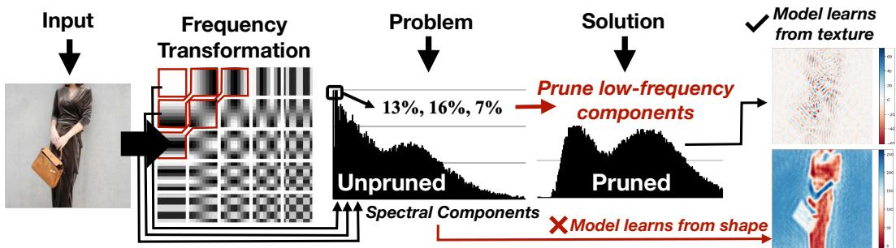

flowchart

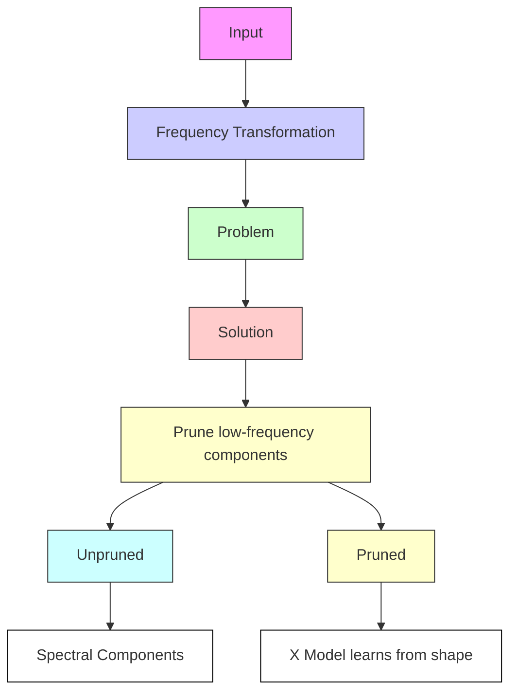
```mermaid
graph TD
    A["Input"] --> B["Frequency Transformation"]
    B --> C["Problem"]
    C --> D["Solution"]
    D --> E["Prune low-frequency components"]
    E --> F["Unpruned"]
    E --> G["Pruned"]
    F --> H["Spectral Components"]
    G --> I["X Model learns from shape"]
    style A fill:#f9f,stroke:#333
    style B fill:#ccf,stroke:#333
    style C fill:#cfc,stroke:#333
    style D fill:#fcc,stroke:#333
    style E fill:#ffc,stroke:#333
    style F fill:#cff,stroke:#333
    style G fill:#ffc,stroke:#333
    style H fill:#fff,stroke:#000
    style I fill:#fff,stroke:#000
```

Figure 1: We show that texture-driven domains make majority of their decisions based on a few low-frequency components (LFCs), despite that their classification information is in higher-frequency features with fine-grained, repetitive patterns. We call this phenomenon as low-frequency shortcuts. Pruning LFCs mitigates the shortcut and provide a more balanced spectral behavior, which in turn provides up to 8% higher ID accuracy. We show that skewed spectral behavior further makes the models highly vulnerable to OOD corruptions, causing up to 70% reduced accuracy compared to ID performance. Pruning LFCs significantly improves the robustness to low-frequency corruptions, and introduces a trade-off for high-frequency corruptions; the balanced spectral behavior improves the generalization performance, whereas the increased dependence on the higher-frequency ranges decreases it. OOD accuracy depends on the interaction between these two factors.

Numerous application domains are texture-driven. Computer vision applications, however, span a wide range of domains that are texture-driven, such as histopathology [47], textile classification [95], and ground terrain recognition [88]. These domains include images, such as microscopic tissue scans or textile samples, where the notion of “shape” is ill-defined or irrelevant (see Figure 3). Classification information is distributed across the image, with repetitive fine-grained patterns rather than being centered on well-defined objects. Spectral cues that drive model predictions shift from global shape structures to fine-grained spatial patterns. As a result, whether known or new shortcuts exist in texture-driven domains, and, if so, how they affect model predictions and robustness, is unclear.

Shortcut learning for texture-driven domains. We study shortcut learning in texture-driven domains and compare it to a standard benchmark using frequency analysis tools. We consider histopathology, textile classification, ground terrain recognition, morphological classification of galaxies, and land use/cover classification, analyzing one image classification task per domain. As a standard benchmark, we use CIFAR-10 [39] due to its widespread adoption in frequency-based studies [7; 38; 75]. We perform a comprehensive frequency-spectrum analysis covering low, mid, and high frequencies, using different model architectures, sizes, and hyperparameters, as well as pretrained vision foundation/language models, based on in-distribution (ID) and out-of-distribution (OOD) performance. In summary, our contributions are as follows.

• We show that texture-driven domains make majority of their decisions based on a few low-frequency components, despite that their classification information is primarily in higher frequencies. We call this phenomenon as low-frequency shortcuts. We show that low-frequency shortcuts are persistent across different model architectures, sizes, hyperparameters, and optimizers, including pretrained vision foundation/language models.   
• We identify low-frequency shortcuts as a pathological spectral behavior, where accuracycontributions of individual frequency components are highly skewed towards low frequencies. Pruning LFCs from training and test sets mitigates the shortcut and provide a more balanced spectral behavior over higher frequency features, which in turn provides up to 8% higher ID accuracy.

• We show that low-frequency shortcuts make the models highly vulnerable to OOD corruptions, leading up to 70% accuracy drop compared to the ID accuracy. Pruning LFCs significantly improves robustness to low-frequency corruptions, by up to 40%, and introduces a trade-off for high-frequency corruptions; the improved spectral behavior provides a better generalization performance, whereas the increased dependence on higher-frequency features reduces it. OOD accuracy depends on the interaction between these two factors.

# 2 Diagnostic Framework: Frequency Pruning & Spectral Behavior

Frequency transformations provide a structured view of data [38]. We adopt a pruning-based analysis pipeline (Figure 2, top), where RGB images are transformed to the frequency domain, selectively pruned by zeroing frequency components according to a chosen strategy, and inverse-transformed back to RGB for training and/or evaluation. We use the discrete cosine transform (DCT) [8], as commonly employed in image compression [63; 83], applying it to the full image as a single block. Each color channel is transformed independently and pruned identically.

When pruning, we remove frequency components diagonally from the top-left to the bottom-right of the image (or vice versa), since oscillation rates and spatial complexity increase along this direction. Each such diagonal is referred to as a frequency component; the terms diagonal, frequency component, and component are used interchangeably. Pruning is used for sensitivity analysis and for accuracy contributions.

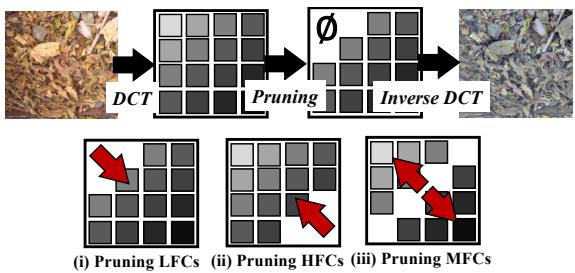

flowchart

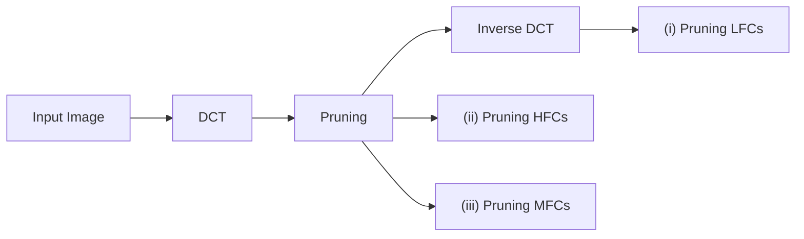
```mermaid
graph LR
    A["Input Image"] --> B["DCT"]
    B --> C["Pruning"]
    C --> D["Inverse DCT"]
    D --> E["(i) Pruning LFCs"]
    C --> F["(ii) Pruning HFCs"]
    C --> G["(iii) Pruning MFCs"]
```

Figure 2: Frequency analysis methodology.

Sensitivity Analysis. We evaluate three pruning strategies (Figure 2, bottom): (i) pruning low-frequency components (LFCs), (ii) high-frequency components (HFCs), and (iii) mid-frequency components (MFCs). Each strategy removes an increasing number of frequency components (diagonals) in a prescribed order. Both training and test sets are pruned, and models are trained from scratch for every level of pruning, revealing which frequency types are most informative across different strategies.

Diagonal-wise Analysis. Existing studies either group frequency coefficients in broader units rather than diagonals [7; 38], or perform an analysis one one coefficient at a time [77]. Using broad units limits the findings, whereas performing an analysis for each coefficient is too costly for repeated trainings. Diagonal-wise grouping of coefficients provides a middle ground between the two.

Spectral Behavior via Accuracy Contributions. We fix the training set to either unpruned or pruned for a specified number of frequency components, and prune test images one component at a time, attributing the resulting accuracy drop to the removed component as its accuracy contribution. The resulting distribution of accuracy contributions across components provide the spectral behavior. Distribution shifts induced by training-time interventions reflect changes in learning dynamics rather than post-hoc sensitivity.

Low-Frequency Shortcuts. We define a low-frequency shortcut as a feature subset where the trained model’s accuracy contributions are concentrated on a small number of LFCs. [77; 79] have defined frequency shortcuts as successful predictions of test images reconstructed via a few frequency coefficients. Our definition of low-frequency shortcuts is a special case of general frequency shortcuts following a similar logic: a few LFCs have an exponentially more impact on ID than other frequency components. [28] define shortcuts as the generalization gap between ID and OOD distributions, i.e., poor OOD performance compared to the ID performance; we define low-frequency shortcuts as a broader term, including poor ID and OOD performance. This is because simplicity bias can hurt not only OOD, but also ID performance, as also shown by [60] and [26]2.

# 3 Application Domains

Histopathology. Histopathology analyzes microscopic tissue images for diagnosis and prognosis of diseases such as cancer [36; 47; 65; 81]. Classification relies on morphological structures capturing cellular organization (see the 1st image in Figure 3).

Textile Classification. Driven by fashion e-commerce [72], textile classification supports applications ranging from virtual try-ons [30] to recycling [40; 45]. The task requires recognizing repetitive, fine-grained patterns distributed across the image (2nd image in Figure 3).

Ground Terrain Recognition. Ground terrain recognition supports applications such as autonomous driving [61; 89] and robot navigation [29; 96]. Terrains correspond to surface types (e.g., leaves, grass) and are classified using spatial cues that characterize surface material and texture (3rd image in Figure 3).

Galaxy Morphologies. Morphological structures of galaxies are used for various purposes such as star formation. While morphologies themselves are shapedriven, the pixels creating the morphology, i.e., the stars are texture-driven [73] (4th image in Figure 3).

Land Use/Cover Classification. Land use/cover classification using satellite images have numerous applications such as agriculture and urban development [11; 90]. It includes both texture-driven, e.g.,

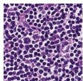

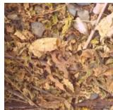

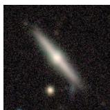

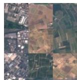  
Figure 3: Sample images for the texturedriven domains we study.

herbaceous vegetation, and shape-driven categories, e.g., high-way [32; 33] (5th image in Figure 3).

# 4 Analysis Setup

Datasets. We evaluate on six datasets: SPIDER Colorectal (SP-Colorectal) histopathology (77K samples, 14 classes) [35; 47]; TextileNet (fabric subset; 350K samples, 27 classes) [62; 95]; GTOS ground terrain recognition (30K samples, 40 classes) [88]; Galaxy MNIST (10K samples, 4 classes) [2]; EuroSAT (27K sampels, 10 classes) [1]; and CIFAR-10 (60K samples, 10 classes) [39]. All experiments use 70%-10%-20% train/val/test splits. Validation accuracies are reported. Split details are in Appendix A; test accuracies (Appendix B) follow validation results.

Models. We use ResNet-50 (25.6M params) [31], MobileNet-V3 (2.5M params) [37], ViT-Small (22M params), and ViT-Tiny (5.7M params) [22] as the classifiers. All models are trained from scratch with PyTorch’s default initialization and no pre-training, except DinoV2 and CLIP [53]. We use DinoV2 [3] and CLIP [54] as the vision foundation and language models. We train a linear layer (768 and 512 units, respectively) on top of their frozen backbones. We use ViT-B/14-Reg (86M params) and ViT-B/32 backbones (151M params) for DinoV2 and CLIP, respectively.

Training. We follow the standard CIFAR-10 training protocol for convolutional networks [7; 38; 75; 77; 79]; ViT & DeiT for ViTs [22; 68]3; and, linear-probing protocols for DinoV2 and CLIP [4; 5]. Images are resized to 224×224, except EuroSAT (64×64) and CIFAR-10 (32×32) are in their native resolutions. Experiments are repeated with three seeds and reported as mean ± standard deviation. We use models trained with the seed value of 42 for reporting the accuracy contributions and defer other seeds to Appendix C. Complete training details are provided in Appendix A.

# 5 Evidence of Low-Frequency Shortcuts in Texture-Driven Domains

Figure 4 shows ID accuracy for LFC (dark), MFC (light orange), and HFC (red) pruning for the four classification tasks trained with ResNet-50. The x-axis reports the number of pruned coefficients (unscaled to capture fine-grained per-diagonal effects), and the y-axis shows ID accuracy. As can be seen, pruning HFCs and MFCs do not significantly impact the ID accuracy, as they constitute a small portion of the overall energy in images [63; 83; 82].On the other hand, pruning LFCs improves the accuracy for all the texture-driven domains.

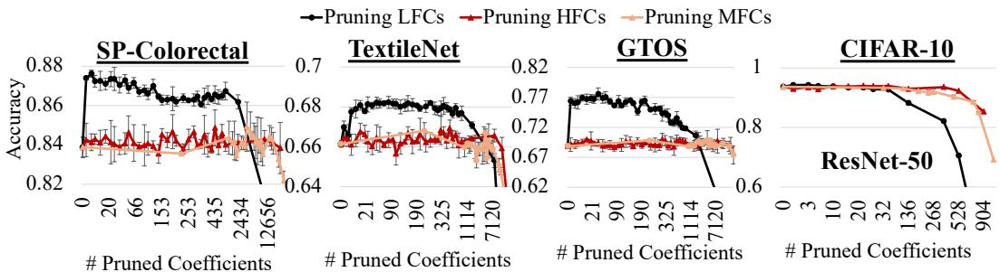  
Figure 4: ID accuracy results for pruning LFCs (dark line), MFCs (light orange line), and HFCs (red line). Pruning LFCs eliminates the shortcut and improves accuracy for texture-driven tasks.

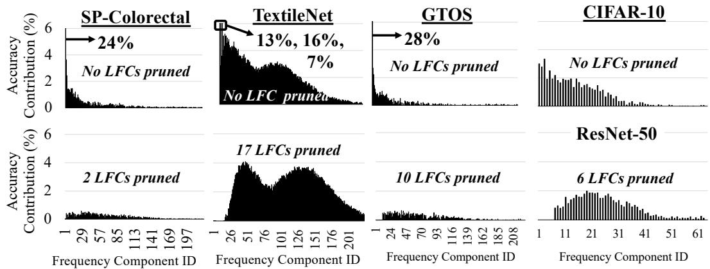

bar

| Model       | Pruned Type         | Percentage |
|-------------|---------------------|----------|
| SP-Colorectal | No LFCs pruned     | 24%      |
| TextileNet  | No LFCs pruned     | 13%, 16%, 7% |
| GTOS        | No LFCs pruned     | 28%      |
| CIFAR-10    | No LFCs pruned     | —        |
| ResNet-50   | No LFCs pruned     | 2%       |
| ResNet-50   | No LFCs pruned     | 17%      |
| ResNet-50   | No LFCs pruned     | 10%      |
| ResNet-50   | No LFCs pruned     | 6%       |

Figure 5: Accuracy contributions with unpruned (top) and pruned (bottom) training and test images.

Figure 5 presents the spectral behavior of ResNet-50 trained on unpruned images (top). Frequency component IDs increase diagonally from the top-left to the bottom-right, with accuracy contributions shown on the y-axis. As shown, accuracy contributions are highly skewed toward LFCs for all texture-driven domains. In contrast, CIFAR-10 exhibits a more balanced distribution. FigureCifar10 5414.png – airplane / 7164.png – dog / 44880.png -- ship 5 presents the spectral behavior for pruned training images (bottom). For each task, we prune the number of LFCs that maximizes ID accuracy in Figure 4. As can be seen, contributions shift towardTop 10 FCs based on individual accuracy contributions – higher frequencies with a more balanced and unbiased distribution across all domain-specific tasks.latest one

These results indicate that texture-driven domains suffer from low-frequency shortcuts. While texturedriven domains have their classification information primarily in higher frequencies, neural networks rely exponentially more on LFCs than they do on HFCs. Pruning LFCs mitigates the shortcut by shifting the spectral behavior towards higher frequencies, which in turn provides up to 8% higher ID performance.

LFCs are background features, such as shading or camera effects. These features constitute a small set of simple features that neural networks can fall into shortcut. HFCs, on the other hand, are large number of fine-grained features, and hence harder to learn from.

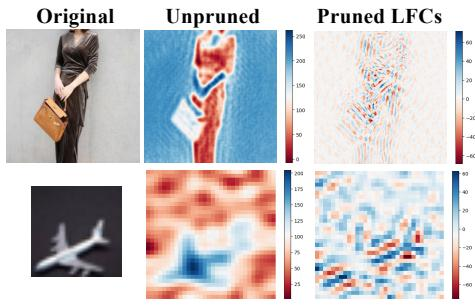

text_image

Original
Unpruned
Pruned LFCs

Figure 6: Sample images from TextileNet (top) and CIFAR-10 (bottom).

Prior Theoretical Work. Simple features has been

shown to have faster and stronger growing gradients than complex features based on a simple onelayer neural network and a toy dataset [52; 60; 91]. Our results on real-life datasets and neural networks corroborate with the theoretical studies and reveal a novel shortcut for under-studied domains. We provide a detailed analysis of existing theoretical work in Appendix D.

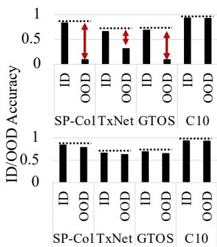

bar

| Model | ID | OOD |
|---|---|---|
| SP-Col | 0.8 | 0.05 |
| TxNet | 0.6 | 0.2 |
| GTOS | 0.6 | 0.05 |
| C10 | 0.9 | 0.9 |

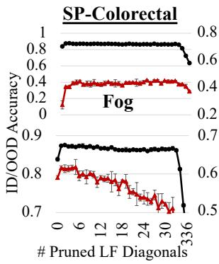

line

| # Pruned LF Diagonals | SP-Colorectal ID/OOD Accuracy | Fog ID/OOD Accuracy |
| --------------------- | ----------------------------- | ------------------- |
| 0                     | 0.8                           | 0.2                 |
| 6                     | 0.8                           | 0.4                 |
| 12                    | 0.8                           | 0.4                 |
| 18                    | 0.8                           | 0.4                 |
| 24                    | 0.8                           | 0.4                 |
| 30                    | 0.8                           | 0.4                 |
| 336                   | 0.6                           | 0.5                 |

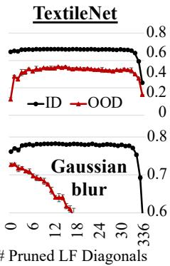

line

| # Pruned LF Diagonals | TextileNet ID | TextileNet OOD | Gaussian blur ID | Gaussian blur OOD |
| --------------------- | ------------- | -------------- | ---------------- | ----------------- |
| 0                     | 0.6           | 0.4            | 0.7              | 0.6               |
| 336                   | 0.2           | 0.2            | 0.7              | 0.6               |

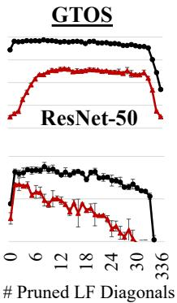

line

| # Pruned LF Diagonals | GTOS | ResNet-50 |
| --------------------- | ---- | --------- |
| 0                     | 1.0  | 1.0       |
| 6                     | 1.2  | 0.9       |
| 12                    | 1.3  | 0.8       |
| 18                    | 1.4  | 0.7       |
| 24                    | 1.5  | 0.6       |
| 30                    | 1.6  | 0.5       |
| 336                   | 1.7  | 0.4       |

Figure 7: OOD results for fog (top) and Gaussian blur (bottom) corruptions for ResNet-50.

Visuals. Figure 6 presents a sample image from TextileNet, using unpruned and pruned (17 LFCs) trainings with ResNet-50 (top). Unpruned training learns from background information and the shape structures, whereas pruned training learns from fine-grained. Further visuals are in Appendix E.

CIFAR-10. CIFAR-10 obtains most of its accuracy from the lower end of the frequency spectrum (Figure 5, right-hand side, top & bottom). Figure 6 presents a sample image, using unpruned and pruned (6 LFCs) trainings (bottom). Unpruned training learns from smooth, low-frequency features, whereas pruned training learns from irregular structures, resulting in a reduced ID performance.

Summary. Texture-driven domains exhibit a skewed spectral behavior towards low-frequency components (LFCs), a phenomenon we call low-frequency shortcuts. Pruning LFCs shifts the accuracy contributions towards higher frequencies with a more balanced and unbiased distribution, resulting in up to 8% improved ID accuracy.

# 6 Evidence of Low-Frequency Shortcuts for Visual Transformers

SP-Colorectal, GTOS, and CIFAR-10 have a similar behavior to ResNet-50 and ViT-Small (see Appendix F), showing that low-frequency shortcuts persist across different architectures. Tex-ResNet-50 & ViT-Small tileNet have a significantly different behavior when trained with ViT-Small: pruning LFCs

significantly decreases its ID accuracy, by up to 10% at 10 LFCs. In Figure 8, we compare spectral behavior of ResNet-50 (top) and ViT-Small (bottom) when trained on TextileNet for an increasing number of pruned LFCs. Pruning even a single LFC shifts ResNet-50’s spectral behavior toward HFCs. ViT-Small, however, keeps most of the volume in the lower frequencies. This shows that ViTs have a stronger bias toward low-frequency features [9; 49; 51]. Furthermore, TextileNet images contain a more severe low-frequency noise than SP-Colorectal and GTOS, e.g., the white background and body shape (top row of Figure 6). As a result, ViT-Small suffers more severely from low-frequency shortcuts for TextileNet than for SP-Colorectal and GTOS.

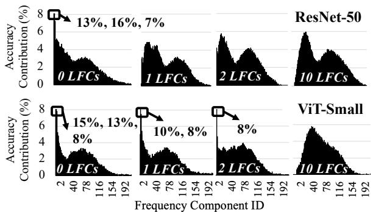

histogram

| Model      | LFC Count | Accuracy Contribution (%) |
|------------|-----------|----------------------------|
| ResNet-50  | 0         | 13%, 16%, 7%                |
| ResNet-50  | 1         | 15%, 13%, 8%                |
| ResNet-50  | 2         | 10%, 8%, 8%                 |
| ViT-Small  | 0         | 15%, 13%, 8%                |
| ViT-Small  | 1         | 10%, 8%, 8%                 |
| ViT-Small  | 2         | 8%, 8%                     |

Figure 8: Spectral behavior of TextileNet.

# 7 Low-Frequency Shortcuts under OOD Corruptions

We use ImageNet-C corruptions [34; 92]. We observe three main categories: (i) low-frequency, (ii) high-frequency, and (iii) mixed corruptions 4. We select one corruption per category: fog, Gaussian blur, and elastic transform. We evaluate severities 1 to 3. We observe similar results, and report severity 1 and defer others to Appendix G. We observe similar results for all models, and report ResNet-50 and defer others to Appendix H.

We consider two pipelines: (i) corrupt-then-prune and (ii) prune-corrupt-prune. Both yield similar conclusions; we report results for (i) and defer (ii) to Appendix I. Pruning test images alone filters out parts of the corruption but does not improve robustness and can substantially reduce accuracy, as observed even on uncorrupted images in accuracy contribution analyses. Pruning both training and test images instead induces a shift in the model’s spectral behavior (Figure 5). Our goal is to characterize how this spectral shift affects OOD generalization.

1. Low-Frequency Corruption: Fog. The left graph at top of Figure 7 presents ID and OOD accuracies when models are trained with unpruned images. As shown, OOD accuracy of domainspecific tasks heavily drops, as high as 70%, compared to their ID accuracy. This is due to the low-frequency shortcuts, which the fog corruption heavily modifies. The right three graphs at top of Figure 7 present ID (dark line) and OOD (red line) accuracies, as we prune LFCs. As shown, pruning LFCs substantially improves the OOD performance, by up to 40%, thanks to eliminatingSkewed behavior. 3 datasets using resne the low-frequency shortcuts. CIFAR-10’s OOD accuracy follows nearly the same curve as its ID accuracy (see Figure 4). This is because CIFAR-10 has a more balanced spectral behavior, and hence is more robust. We defer CIFAR-10’s OOD results to Appendix J.

2. High-Frequency Corruption: Gaussian Blur. The left graph at bottom of Figure 7 presents ID and OOD accuracies when models are trained with unpruned images. As shown, ID and OOD accuracies are significantly closer to each other than they are for fog. This is because domain-specific tasks heavily rely on LFCs when trained on unpruned images. As a result, corrupting HFCs has a smaller impact on models’ decisions than corrupting LFCs. The right three graphs at bottom of Figure 7 present ID and OOD accuracies, as we prune LFCs. As shown, OOD accuracies exhibit both increasing and decreasing trends. On the one hand, generalization performance improves as HFCs better

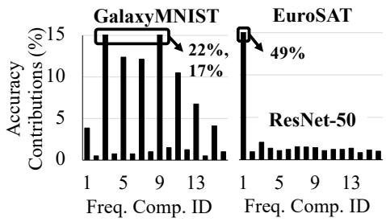

bar

| Freq. Comp. ID | Accuracy Contributions (%) |
| -------------- | --------------------------- |
| 1              | 4                           |
| 5              | 13                          |
| 9              | 12                          |
| 13             | 10                          |
| 1              | 6                           |
| 5              | 4                           |
| 9              | 2                           |
| 13             | 1                           |

Figure 9: Low-frequency shortcuts persist across mixed-semantics tasks.

represent application semantics. On the other hand, generalization performance decreases if the corruption corrupts the HFCs that the model has started to rely on. Final accuracy depends on which factor has a greater impact.

3. Mixed Corruption: Elastic Transform. Elastic transform corrupts both low- and high-frequency components, each at lower magnitudes than fog and Gaussian blur. Its behavior is somewhere inbetween fog and Gaussian blur. It benefits from LFC-pruning less than fog, but more than Gaussian blur, with a stable and slowly decreasing OOD curve. We defer the results to Appendix H.

OOD Summary. Low-frequency shortcuts make models highly vulnerable to OOD corruptions, causing up to 70% accuracy drop compared to ID performance. Pruning LFCs significantly improves robustness to low-frequency corruptions, up to 40%, and introduces a trade-off for highfrequency corruptions; the improved spectral behavior provides a better generalization, whereas the increased dependence on higher-frequency features reduces it. OOD accuracy depends on these two factors.

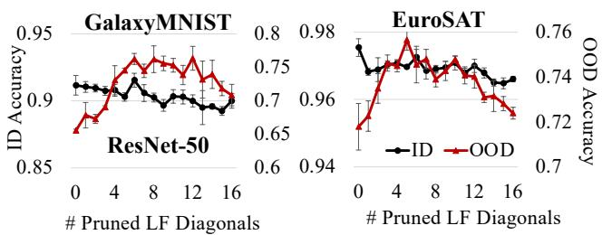

line

| # Pruned LF Diagonals | ResNet-50 ID Accuracy | ResNet-50 OOD Accuracy | EuroSAT ID Accuracy | EuroSAT OOD Accuracy |
| --------------------- | --------------------- | ---------------------- | ------------------- | --------------------- |
| 0                     | 0.92                  | 0.67                   | 0.78                | 0.72                  |
| 4                     | 0.93                  | 0.75                   | 0.76                | 0.78                  |
| 8                     | 0.91                  | 0.76                   | 0.75                | 0.76                  |
| 12                    | 0.92                  | 0.74                   | 0.74                | 0.73                  |
| 16                    | 0.90                  | 0.72                   | 0.73                | 0.71                  |

Figure 10: Pruning LFCs improves OOD accuracy.

# 8 Low-frequency Shortcuts in Mixed Texture-Shape Domains

Figure 9 presents the spectral behavior for GalaxyMNIST and EuroSAT. We show the lowest 16 components for brevity. Both tasks severely suffer from low-frequency shortcuts. Galaxy images could incorporate low and high-frequency features, which it fails so due to the hardship of learning from texture-driven features. EuroSAT has a class-consistent low-frequency noise (the lowest frequency component, i.e., average pixel intensity), which dominates other shape-driven, low-frequency features, once again showing the severity of simplicity bias and low-frequency shortcuts. Figure 10 presents ID (left y-axis, dark line) and OOD (right y-axis, red line) accuracy as we prune LFCs (x-axis) from training and test sets. We report average OOD accuracy over the three corruptions and the same corruption pipeline used in Section 7. As shown, ID accuracy drops ∼1%, whereas OOD accuracy is improved by up to 3 to 7%. Reduced ID accuracy is due to that learning from a large number of high-frequency features is harder than learning from a few simple low-frequency features. Improved OOD is due to a more balanced spectral behavior with less dependency on skewed low-frequency components, as also explained in Section 7.

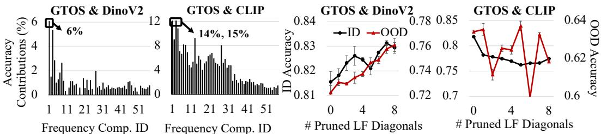  
Figure 11: Low-frequency shortcuts for a VFM (DinoV2) and VLM (CLIP) using GTOS dataset.

# 9 Impact of Large-Scale Pretraining on Low-Frequency Shortcuts

Left two graphs in Figure 11 present the spectral behavior for GTOS for DinoV2 and CLIP. As can be seen, both models suffer from a skewed behavior towards LFCs. This shows that heavy pretraining and complex data augmentations are not enough to mitigate the low-frequency shortcuts. Right two graphs in Figure 11 presents the ID (left y-axis, dark line) and the average OOD (right y-axis, red line) accuracy results for DinoV2 and CLIP, having an increasing number of pruned LFCs on the x-axis. As can be seen, DinoV2’s both ID and OOD accuracy significantly improves, by up to 1.5% and 4%, respectively, showing the benefit of eliminating the shortcut. CLIP’s ID accuracy significantly decreases. This shows that pruning LFCs reduces the information content that CLIP cannot recover, indicating that CLIP has a heavier low-frequency bias than DinoV2. Unlike DinoV2, CLIP is not trained with complex data augmentations. Furthermore, training with text-image pairs rather than purely visual data is likely to amplify the simplicity bias. Accordingly, left two graphs in Figure 11 show that CLIP’s spectral behavior is significantly more skewed than DinoV2.

# 10 Impact of Model Size on Low-Frequency Shortcuts

We analyze MobileNet-V3 (2.5M params) and ViT-Tiny (5.7M params) and observe similar results to ResNet-50 and ViT-Small. They exhibit a skewed spectral behavior for texture-driven tasks. Pruning LFCs improves the ID and OOD accuracy (except TextileNet with ViT-Tiny) by regularizing the spectral behavior. We defer the ID and spectral behavior results to Appendix F, and OOD results to Appendix H.

# 11 Tuning Hyperparameters for Low-Frequency Shortcuts

For GTOS and SP-Colorectal, we trained ResNet-50 and ViT-Small with different optimizers and hyperparameters such as learning rate, momentum, weight decay, and scheduler. We observe that low-frequency shortcuts are persistent across different optimizers and hyperparameters. We defer the hyperparameter results to Appendix K.

# 12 Discussion & Limitations

Regularization & Data Augmentation. Pruning LFCs can be viewed as a form of regularization, where we reduce the spectral content of the input rather than constraining model parameters or capacity. [92] have shown that data augmentation induces a similar regularization effect. Regularization using both pruning and data augmentation is a promising future research direction.

Hybrid Architectures. We used a convolution-only or transformer-only architectures, similar to existing studies [7; 38; 75; 77; 79; 92]. We aim to understand learning dynamics of texture-driven tasks in basic architectural primitives, which provides the necessary foundation for more complex hybrid architectures such as MaxViT [69] or CoAtNet [19].

Task Generalization. We used image classification, similar to existing studies [7; 38; 75; 77; 79; 92]. We expect our results hold true across different vision tasks, as shortcut learning is due to the simplicity bias of neural networks, which is common across different tasks. To illustrate, existing studies have shown that simplicity bias holds true for regression tasks [55; 86].

Open Questions. Pruning is a data compression method. Our analysis shows that it can also be used for improving generalization performance. This raises a number of interesting questions. First, what is the optimal compression algorithm for a given classification task? What are the impacts of other compression primitives, such as quantization and subsampling? How do the results change when resources are scarce? What are the ID/OOD accuracy-cost trade-offs? These are exciting research questions for future avenues of research.

# 13 Related Work

Prior work primarily studies standard, shape-driven benchmarks; we focus on texture-driven domains.

Spectral Bias. Theoretical work shows that neural networks learn low-frequency functions first due to gradient-descent’s simplicity bias and ReLU smoothness [16; 24; 42; 52; 55; 58; 60; 67; 84; 85; 91]. Empirical studies report that HFCs can be more informative than LFCs for CIFAR-10 using broad group of HFCs [7; 38; 75], or both frequency ranges might matter for ImageNet [77; 79]. We show that, within the lower half of the spectrum, both low and high frequencies contribute to CIFAR-10. A detailed comparison with prior work is provided in Appendix L.

Shape-Sensitivity & Texture-Bias. Recently, [15] have shown that ImageNet-trained models are more sensitive to shape perturbations than texture perturbations, challenging the long-standing texture-bias hypothesis [10; 26; 27; 28; 66; 70]. Our results support the shape-sensitivity arguments. CIFAR-10 benefits more from smooth features than fine-grained details. Texture-driven domains have their classification signal in the texture. Even then, neural nets tend to learn from low frequencies, indicating their heavy bias toward LFCs for real-life images.

Shortcut Learning. To mitigate the shortcuts, existing approaches [78] include feature-space control [41; 48; 52; 94], data augmentation [27; 44; 46; 87; 92], layer-wise penalization [14; 74]. We instead use a simple yet effective technique, pruning, to mitigate the shortcuts. Recent work further defines frequency shortcuts via test-time interventions as successful predictions based on a small set of frequency coefficients [77; 79]. Similarly, we define low-frequency shortcuts as a skewed accuracy contributions toward a few LFCs. We further study them via training-time interventions using both ID and OOD performance.

# 14 Conclusion

We show that texture-driven domains suffer from low-frequency shortcuts, where a small number of low-frequency components (LFCs) dominate the model’s decisions with a skewed spectral behavior. Pruning LFCs eliminates the skew and provides a balanced spectral behavior, which in turn improves the ID accuracy by up to 8%. We show that low-frequency shortcuts make the models highly vulnerable to OOD corruptions, causing up to 70% drop in ID performance. Pruning LFCs significantly improves robustness to low-frequency corruptions, up to 40%, while introducing a trade-off for high-frequency corruptions: balanced spectral behavior improves the generalization performance, whereas magnified dependence on higher frequencies decreases it. OOD behavior depends on the interaction between these two factors.

Acknowledgments. DAM acknowledges support from the Kempner Institute, FAS Dean’s Competitive Fund for Promising Scholarship, Aramont Fellowship Fund, and the NSF AI-SDM Institute (Grant No. IIS-2229881).

Table 1: Datasets. 

<table><tr><td>Dataset</td><td>#Classes</td><td>Train / Val / Test</td><td>Input Size</td></tr><tr><td>CIFAR-10</td><td>10</td><td>45K / 5K / 10K</td><td>32 × 32</td></tr><tr><td>SP-Colorectal</td><td>14</td><td>56K / 8K / 13K</td><td>224 × 224</td></tr><tr><td>TextileNet</td><td>27</td><td>245K / 35K / 70K</td><td>224 × 224</td></tr><tr><td>GTOS</td><td>40</td><td>24K / 2K / 4K</td><td>224 × 224</td></tr><tr><td>GalaxyMNIST</td><td>4</td><td>8K / 1K / 1K</td><td>224 × 224</td></tr><tr><td>EuroSAT</td><td>10</td><td>19K / 2.7K / 5.4K</td><td>64 × 64</td></tr></table>

# A Additional Experimental Details

Datasets. We use one image classification dataset for each domain we described in Section 3. Table 1 presents the summary of each dataset. For histopathology, we use the recently proposed multi-organ SPIDER dataset [47]. We use the colorectal organ type, due to its widespread adoption [35]. It is a large-scale dataset with ∼77K images and 14 classes. We use only the central patches. We use the original training-test set split with 80%-20% ratio. We split the training set further into 70% training and 30% validation. We name this dataset as SP-Colorectal in our figures. For the textile classification dataset, we use the recently proposed TextileNet dataset [95]. We use its fabric subset, which contains 27 classes and ∼350K samples [62]. We use the proposed 70%-10%-20% training-validation-test set splits [95]. For ground terrain recognition, we use the recent ground terrain dataset for outdoor scenes, GTOS [88]. It is a large-scale dataset with ∼30K images and 40 classes. We use the first of its five original 70%-30% training-test splits. We further split the test set into validation and test sets by 10%-20%. We use the basic Galaxy MNIST dataset with 10K samples, 4 classes [2] among others [6; 21] due to its convenience. We use the original train/test split, and further split the training set into train/val split by 90-10%. We use EuroSAT dataset for satellite images with 27K samples and 10 classes covering shape- and texture-driven categories [1]. We randomly split the dataset into 70-10-20% train/val/test splits, as there is no original train/val/test splits. As the standard benchmark, we use CIFAR-10 [39] due to its widespread adoption in frequency characterization studies [7; 38; 75]. It has 50K training and 10K test images over 10 classes. We split the training set into 45K-5K training-validation sets.

Training. We train with SGD (momentum 0.9, weight decay $5 \times 1 0 ^ { - 4 } )$ , a cosine annealing schedule with initial learning rate 0.1, and batch size 128 for 200 epochs, selecting the checkpoint with highest validation accuracy for ResNet-50 and MobileNet-V3. Following [22; 68], we use AdamW (weight decay=0.3) with initial learning rate 3e-3, 300 epochs of training, 3.4×(number of batches) warmup steps, using linear scheduler for the warmup (start factor 1e-8, end factor 1.0), and cosine scheduler for the post-warmup training, batch size of 512. We train a linear head on top of a frozen DinoV2 and CLIP backbones (768 & 512 units, respectively) for 100 epochs with a batch size of 32. We use $\scriptstyle 1 \ r = 1 0 ^ { - 4 }$ , weight $\mathrm { d e c a y = } 1 0 ^ { - 4 }$ for DinoV2, and $\mathrm { l r ~ i 0 ^ { - 3 } }$ and weight decay $1 0 ^ { - 4 }$ for CLIP. We use random-resized-crop and horizontal-flip augmentations for DinoV2, and no data augmentation for CLIP, following the original code bases for linear probing [5; 4] We use seed values of 42, 123, and 999. We make sure we achieve, for each benchmark, an accuracy almost as high as in their original papers. This is 89% for SP-Colorectal, 66% for TextileNet, 77% for GTOS, and 94% for CIFAR-10. We use training-validation-test splits, as explained earlier in this section, and report test-set accuracies in Appendix B. Validation-test set splits, and their accordance are important to keep relevance to image compression studies, which need to perform validation set analysis to decide how many images should be compressed at test time [63; 83]. We normalize each image using the mean and standard deviation of its training set, separately for each pruned version of the training set.

Hardware. We use a cluster of Nvidia A100, H100, and H200 GPUs. We submit jobs as batches and use GPUs as they are available. Each training takes 1-6 hours with a single GPU. Obtaining the spectral behavior requires an absence-test per diagonal, for each diagonal of coefficients. Each such experiment requires one pass over the validation set, which is usually a few minutes on a single GPU. OOD tests are similar to spectral behavior tests, as they also require one pass over the corrupted validation images.

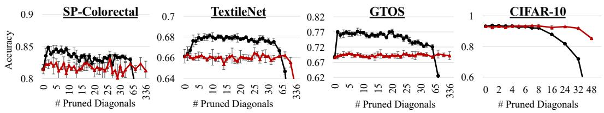

Figure 12: Test set ID accuracy results for pruning LFCs (dark line) and HFCs (red line). Test-set and validation set results are similar. Pruning LFCs improves accuracy for texture-driven tasks by improving representation and reducing frequency shortcuts. LFCs are crucial for CIFAR-10, as it is shape-driven and depends on smooth, high-level structures. Pruning HFCs minimally impacts accuracy, especially for SP-Colorectal and GTOS. TextileNet and CIFAR-10 are more dependent on the higher frequencies at the lower half of the spectrum. Hence, they suffer from observable accuracy losses near the end of HFC pruning.   
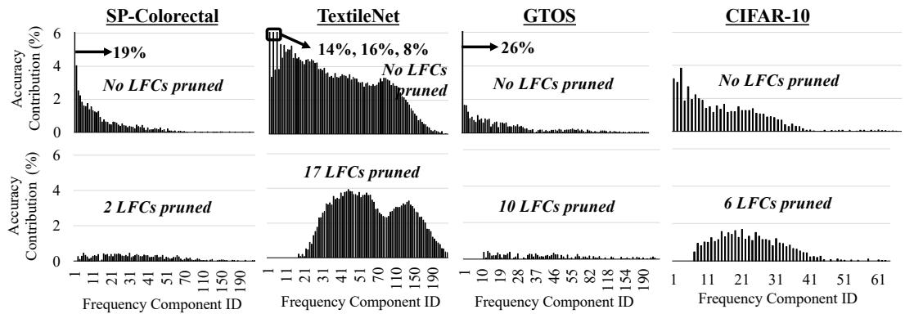

bar

| Dataset     | Pruned LFCs | Frequency Component ID | Accuracy Contribution (%) |
|-------------|-------------|--------------------------|----------------------------|
| SP-Colorectal | No LFCs    | 1                        | 19%                        |
| TextileNet  | No LFCs    | 1                        | 14%, 16%, 8%              |
| GTOS        | No LFCs    | 1                        | 26%                        |
| CIFAR-10    | No LFCs    | 1                        | 6 LFCs                                     |
| SP-Colorectal | No LFCs    | 2                        | 2 LFCs                                     |
| TextileNet  | No LFCs    | 2                        | 17 LFCs                                    |
| GTOS        | No LFCs    | 2                        | 10 LFCs                                    |
| CIFAR-10    | No LFCs    | 2                        | 6 LFCs                                     |

Figure 13: Accuracy contributions based on test-set images. Top: Accuracy contributions when models are trained with unpruned images. Bottom: Accuracy contributions when models are trained with LFC-pruned images. Results follow similar patterns to the validation-set results. Unpruned training causes a skewed behavior for texture-driven tasks, indicating a low-frequency shortcut. LFCpruned training eliminates the shortcut and improves representation capacity. CIFAR-10 benefits from a range of components from the lower end of the frequency spectrum.

# B Test-Set Results

This section presents test set results for ID performance, accuracy contributions, and OOD performance. Figure 12 presents test set results for ID performance. As can be seen, results follow similar trends to the validation set accuracies. Texture-driven tasks, SP-Colorectal, TextileNet, and GTOS suffer from low-frequency shortcuts. Pruning LFCs eliminates the shortcut and improves ID generalization performance. CIFAR-10 is shape-driven. As a result, LFCs, defining smooth local structures, are more important than HFCs. HFCs are promising candidates for image compression, as pruning up to 87.5% of them results in no loss of accuracy.

Figure 13 presents accuracy contributions based on test set images. As shown, the results are similar to those of the validation set. All texture-driven domains suffer from low-frequency shortcuts (top row), with a skewed distribution towards LFCs (top row). When models are trained on pruned images (bottom row), the spectral behavior of the texture-driven tasks shifts towards higher frequencies, with a more balanced distribution. CIFAR-10 has a significantly more balanced distribution than texture-driven tasks. CIFAR-10’s distribution also shifts toward higher frequencies, although largely remaining within the lower half of the spectrum.

Figure 14 presents test set results for OOD corruptions. The results closely follow the validationset results. Low-frequency corruptions (fog) heavily impact texture-driven domains, due to the low-frequency shortcuts. Pruning LFCs eliminates the shortcut, resulting in significantly higher OOD accuracy against fog corruption. Nevertheless, the maximum OOD accuracy is significantly lower than the maximum ID accuracy, due to the magnified corruption at HFCs. Fog, despite being low-frequency-heavy, also corrupts HFCs. When models are trained with LFC-pruned images, they rely more on HFCs and LFCs. As a result, they become more sensitive to high-frequency corruptions, and fog’s corruptions at the HFCs are magnified. As a result, final OOD accuracy is significantly lower than the ID accuracy.

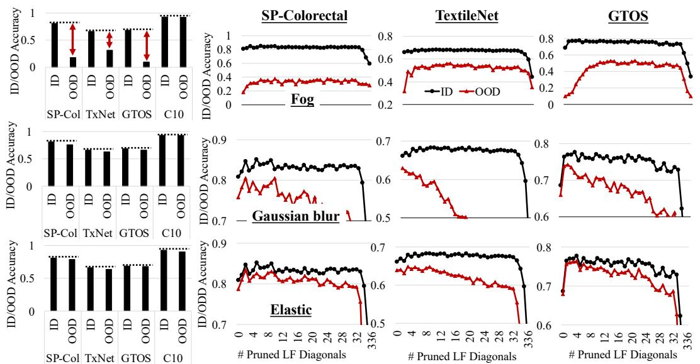  
Figure 14: OOD corruption results based on test-set images. Top: Low-frequency corruption (fog) results. Middle: High-frequency corruption (Gaussian blur) results. Bottom: Mixed-frequency corruption (elastic transform) results. Results are similar to those of validation-set images. Fog heavily impacts texture-driven tasks due to the low-frequency shortcuts. Pruning LFCs significantly improves OOD accuracy for fog corruption. Pruning LFCs introduces a trade-off under Gaussian blur and elastic transform corruptions: OOD accuracy improves due to HFCs’ improved representation, but decreases due to magnified corruptions at the HFCs. Final accuracy depends on which factor has a greater impact.

Gaussian blur and elastic transform minimally affect ID accuracy, as their corruption at the LFCs is not significant. As LFCs are pruned, models latch onto higher frequencies that better represent application semantics, while becoming increasingly vulnerable to high-frequency corruptions. Hence, OOD accuracy increases, stays stable, or decreases depending on whether the improved representation or magnified corruption is more significant.

# C Spectral Behavior Across Different Seeds

We report spectral behavior, i.e., the accuracy contributions for ResNet-50 when trained with unpruned images for SP-Colorectal, TextileNet, GTOS, and CIFAR-10 in Figure 15. As can be seen, similar trends are observed across different seeds. Similarly, Figure 16 presents the spectral behavior for pruned images, where we prune as many LFCs as each model achieves its maximum ID accuracy. Once again, the figure shows that the trends holds true across different repetitions. This shows that low-frequency shortcuts are persistent across different seeds and repetitions.

# D Theoretical Discussion

Our results closely follow the theoretical results presented by Shah et al. 2020 [60], Pezeshki et al. 2021 [52], and Chiang et al. 2023 [91].

Shah et al. show that neural networks are provably biased towards learning simpler decision boundaries (see their Figure 1, green line) than complex decision boundaries (see their Figure 1, orange line). The authors prove that the gradients for the simpler decision boundary are consistently larger than those for the complex decision boundary (see Section 4.1, Theorem 1). The proof stems from the closed-form gradient expressions for the simple and complex decision boundaries given by Lemmas 4 and 5 in Appendix F.2, respectively.

Figure 15: Spectral behavior for ResNet-50 across different seeds when using unpruned images. As can be seen, similar trends are observed across different seeds.   
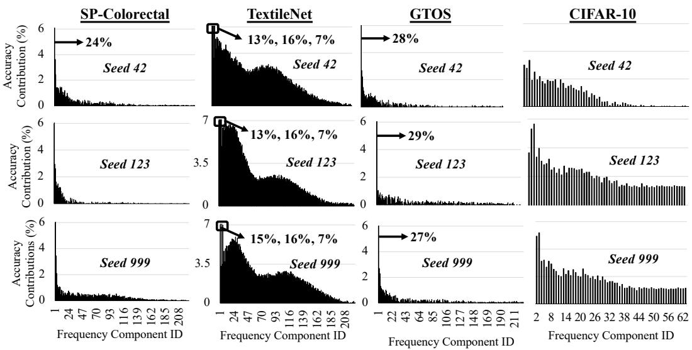  
Figure 16: Spectral behavior for ResNet-50 across different seeds when using pruned images. As can be seen, similar trends are observed across different seeds.

The first lines of the proof of each lemma have the $y _ { j } x _ { 1 j }$ and $y _ { j } x _ { 2 j }$ terms in them, which is the reason that the two gradients have different final expressions. y stands for the label, $x _ { 1 j }$ stands for the feature value providing a simple decision boundary for sample $j ,$ and $x _ { 2 j }$ stands for the feature value providing a complex decision boundary for sample $j . \ y _ { j } x _ { 1 j }$ always produces the same result for all the samples (1 in the specific scenario), whereas $y _ { j } x _ { 2 j }$ produces different results depending on the feature and label values (1, -1, or 0 in the specific scenario). This results in constant increases in the gradients of the parameters for the simple feature $( \nabla _ { w _ { 1 i } }$ , where i is the neuron index), whereas gradients of the parameters for the complex feature $( \nabla _ { w _ { 2 j } }$ fluctuate (in a one-layer neural network). As a result, parameter values of the simple feature (Linear Coordinate in Theorem 1) are constantly bigger than the parameter values for the complex feature (3-Slab Coordinate in Theorem 1). The neural network then relies on the feature that can be used with a simpler decision boundary to make most of its decisions. The authors show that simple features are chosen over complex features, even when simple features have a less predictive power, indicating the severity of the simplicity bias (see their Section 5).

Pezeshki et al. introduce the concept of Gradient Starvation that supports the findings of Shah et al. The authors use a simplified Neural Tangent Kernel regime, where the output of the network can be approximated as a linear function. The authors use SVD to decompose the label-feature matrix $( Y \Phi _ { 0 } )$ into its principal components and define the strength of a feature by its corresponding eigenvalue. Features that are highly aligned with the labels (e.g., the horizontal feature in their Figure 1) have large eigenvalues, and vice versa.

The authors show that if a feature has a high strength, i.e., is highly correlated with the label, i.e., the other feature (see Theorem 2, Eq. 16 simple in Shah et al.’s definition, the strength of the feature decreases the response of the network to $( \frac { d z _ { 2 } ^ { * } } { d s _ { 1 } ^ { 2 } } < 0 )$ where $z _ { 2 } ^ { * }$ is the optimal response of the network to feature 2, and $s _ { 1 } ^ { 2 }$ is the square of the strength of feature 1), which the authors define as the Gradient Starvation (although they do not explicitly show that gradients diminish over the iterations).

Finally, Chiang et al. observe that simple solutions are favored by non-gradient-based optimizers as well and attribute this to the volume hypothesis, where simple solutions occupy orders of magnitude more volume in the loss landscape than complex solutions. The authors show that the simple solution has a volume that is 6 orders of magnitude larger than the complex solution for the same example Shah et al. uses (see Chiang et al.’s Section 6 & Figure 3).

These theoretical results explain what we empirically observe at scale: neural networks learn from a few LFCs rather than a large number of HFCs in texture-driven domains, despite the fact that HFCs have greater predictive power. We observe that neural networks either (i) learn from a few LFCs or (ii) a large number of HFCs. It is never that the network learns from a small number of HFCs. This shows that LFCs provide a simple set of features that are highly correlated with the labels, similar to the simple features that Shah et al. studied in their examples. Once the network starts learning fromlane / 7164.png – dog / 44880.png -- ship a few LFCs, the gradients of the LFCs starve the gradients of the HFCs, and eventually, the LFCs dominate the learning process. When we prune the LFCs from the training set, the network can learn individual accuracy contributions – from a complex set of HFCs, as there is no other competitor now. latest one

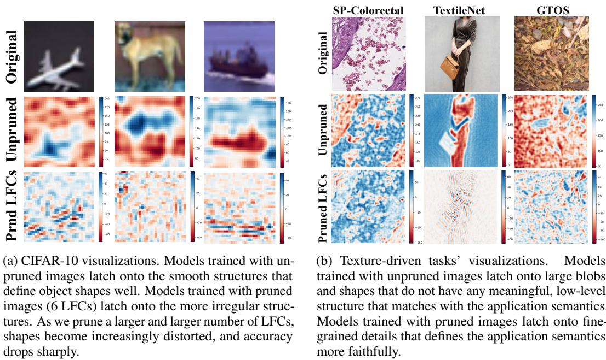  
Figure 17: Sample images from CIFAR-10 (left) and texture-driven tasks (right). Top: Original images. Middle: Reconstructed images based on unpruned training. Bottom: Reconstructed images based on pruned training.

# E Additional Visualizations

This section presents additional visualizations for CIFAR-10 and the texture-driven domains we studied. Figure 17a presents sample images for CIFAR-10. Images are reconstructed by using the top 10 frequency components in terms of their accuracy contributions in Figure 5. The top row presents the original images from the airline, dog, and ship classes, the middle row presents the reconstructed images from unpruned training, and the bottom row presents the reconstructed images from 6-LFC-pruned training. Our goal is to visualize the data characteristics that neural networks learn from when they are trained with unpruned versus pruned images. We use colormaps because we want to focus on the strength of the signal components and their characteristics.

As can be seen, models trained on unpruned images (middle row) latch onto structures with smooth patterns that define the overall shape of the object, which are largely LFCs, as shown in the accuracy contributions in Figure 5. When models are trained on LFC-pruned images, they latch onto higher frequencies that still include a significant amount of information, but are much more irregular and significantly distort the overall shape of the object. This explains both how accuracy is preserved when LFCs are pruned and how it starts to drop significantly after pruning 6 LFCs. Up to 6 LFCs; while patterns start breaking, they still contain sufficient information to perform classification. As we prune an increasing number of LFCs, the patterns become increasingly distorted, resulting in a significant loss of accuracy.

Figure 17b presents sample images reconstructed from frequency components with the top 50 frequency components in terms of their accuracy contributions shown in Figure 5, for the texturedriven tasks. The top row presents original images; the middle row, images reconstructed from models trained on unpruned images; and the bottom row, images reconstructed from models trained on pruned images. When pruning, we prune as many LFCs as needed to achieve the highest ID accuracy.

As can be seen, models trained on unpruned images (middle row) latch onto low-frequency information that largely defines broad shapes and blobs, with minimal fine-grained structure. On the other hand, models trained on LFC-pruned images (bottom row) latch onto fine-grained, high-frequency structures that are better aligned with the characteristics of the classification tasks. This allows learning from a range of higher-frequency components with a more balanced, unbiased distribution, resulting in better generalization performance.

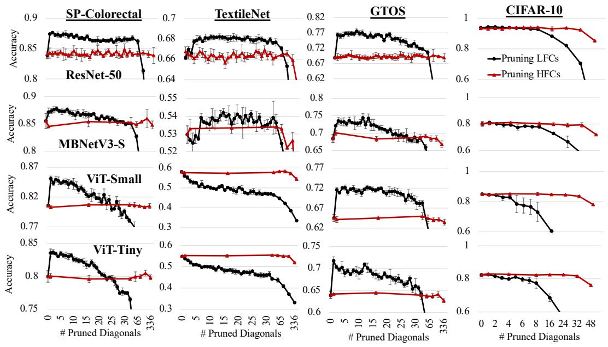

line

| Dataset       | # Pruned Diagonals | Pruning LFCs Accuracy | Pruning HFCs Accuracy |
| ------------- | ------------------ | --------------------- | --------------------- |
| SP-Colorectal | 0                  | 0.87                  | 0.85                  |
| SP-Colorectal | 336                | 0.84                  | 0.85                  |
| TextileNet    | 0                  | 0.86                  | 0.85                  |
| TextileNet    | 336                | 0.84                  | 0.85                  |
| GTOS          | 0                  | 0.77                  | 0.72                  |
| GTOS          | 336                | 0.76                  | 0.72                  |
| CIFAR-10      | 0                  | 0.98                  | 0.98                  |
| CIFAR-10      | 336                | 0.95                  | 0.92                  |
| ResNet-50     | 0                  | 0.85                  | 0.85                  |
| ResNet-50     | 336                | 0.84                  | 0.85                  |
| MBNetV3-S     | 0                  | 0.86                  | 0.85                  |
| MBNetV3-S     | 336                | 0.84                  | 0.85                  |
| ViT-Small     | 0                  | 0.87                  | 0.85                  |
| ViT-Small     | 336                | 0.84                  | 0.85                  |
| ViT-Tiny      | 0                  | 0.85                  | 0.85                  |
| ViT-Tiny      | 336                | 0.84                  | 0.85                  |

Figure 18: ID Results for ResNet-50, MobileNet-V3, ViT-Small, and ViT-Tony.

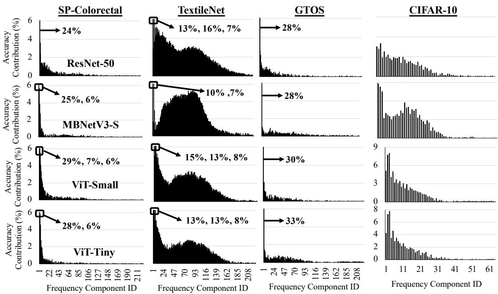

Figure 19: Spectral Behavior for ResNet-50, MobileNet-V3, ViT-Small, and ViT-Tony when trained with unpruned images.   
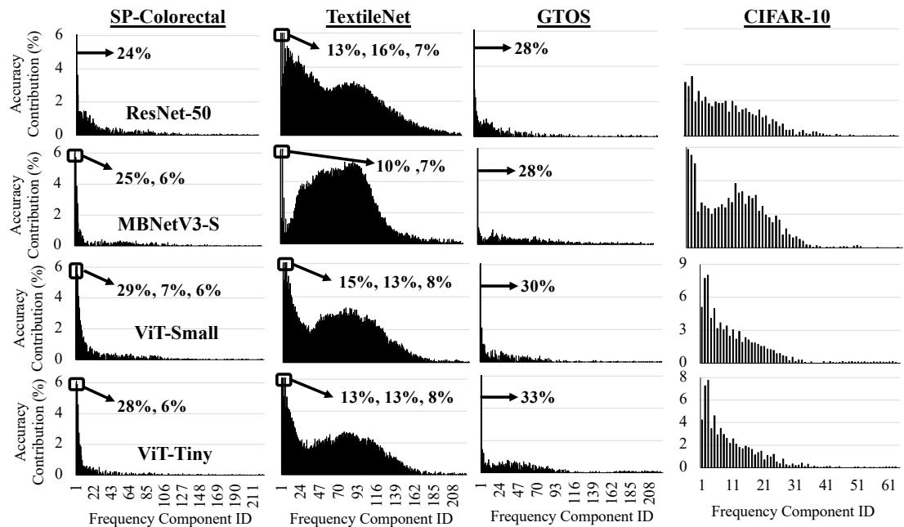  
Figure 20: Spectral Behavior for ResNet-50, MobileNet-V3, ViT-Small, and ViT-Tony when trained with pruned images.

# F Impact of Model Size and Architecture on ID Results

Figure 18 presents ID accuracy results for pruning LFCs and HFCs for all the four neural architectures we analyzed: ResNet-50, MobileNet-V3, ViT-Small, and ViT-Tiny. Figure 19 and 20 show the spectral behavior for the four models we use. As can be seen, the results are consistent across different neural architectures; pruning HFCs do not significantly impact the ID accuracy, whereas pruning LFCs improves it for all texture-driven tasks, except TextileNet with ViT-Small and ViT-Tiny. Nevertheless, all the models and datasets have a skewed behavior towards the lowest-frequency coefficients.

Decreasing ID results for TextileNet with ViTs is due to two reasons: (i) ViTs have a stronger bias towards LFCs than CNNs, and (ii) TextileNet has a stronger low-frequency noise than SP-Colorectal and GTOS.

Figure 8 presents accuracy contributions for TextileNet with ResNet-50 (top) and ViT-Small (bottom) for an increasing number of pruned LFCs. As shown, pruning LFCs does not immediately eliminate the skewed distribution, i.e., the low-frequency shortcut; whereas, for ResNet-50, where pruning even a single LFC immediately eliminates the skewed distribution and shifts the distribution towards HFCs. CNNs use fine-grained strided convolutions over the whole image, which allow them to more easily extract fine-grained, high-frequency information than ViTs, which use disjoint image patches and hence have a stronger bias towards low-frequency noises. There is a recent line of work reporting similar results on ViTs versus CNNs [9; 49; 51; 57; 76; 80].

Secondly, TextileNet images are fashion models wearing garments made from different fabrics (see Figure 3 of our submission). These images contain more severe low-frequency noise, compared to SP-Colorectal and GTOS, e.g., in the photographic background and the body shape. SP-Colorectal and GTOS, on the other hand, have squared images of tissue scans and ground terrains. As a result, ViTs suffer more severely from low-frequency shortcuts for TextileNet than they do for SP-Colorectal and GTOS.

Therefore, low-frequency shortcuts are universal phenomena across different model sizes and architectures for texture-driven tasks. Pruning, however, is not a universally successful method to eliminate the low-frequency shortcut. In particular, when the model architecture has a strong bias towards low-frequency information, such as ViTs, and also the domain includes heavy low-frequency noise, e.g., TextileNet, pruning falls short on eliminating the shortcut. Nevertheless, in 10 of 12 casesFOG + Gaussian blur + elastic – ID vs OOD. -- SEVERITY of 1, 2, 3 (4 models & 3 datasets), pruning LFCs improves the ID performance.

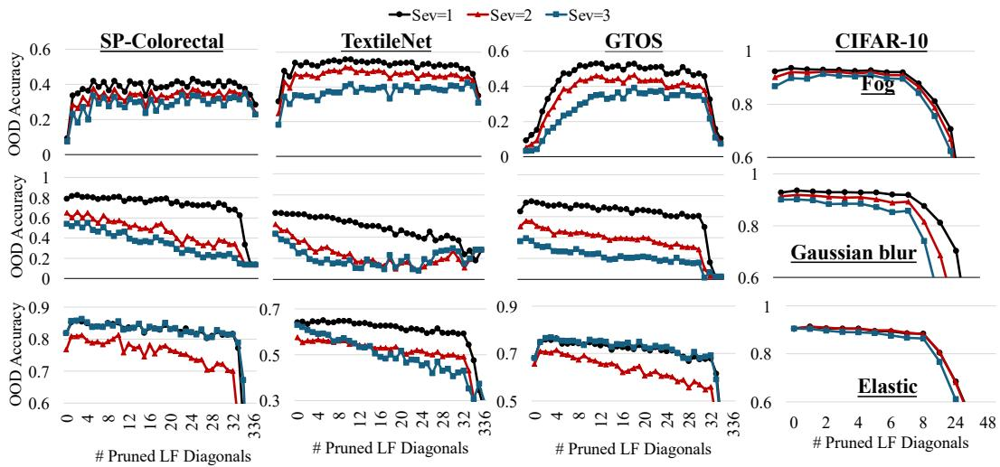

line

| Dataset       | Pruned LF Diagonals | Sev=1 | Sev=2 | Sev=3 |
| ------------- | ------------------- | ----- | ----- | ----- |
| SP-Colorectal | 0                   | 0.4   | 0.3   | 0.2   |
| SP-Colorectal | 336                 | 0.45  | 0.35  | 0.25  |
| SP-Colorectal | 336                 | 0.5   | 0.4   | 0.3   |
| TextileNet    | 0                   | 0.5   | 0.45  | 0.35  |
| TextileNet    | 336                 | 0.55  | 0.5   | 0.4   |
| TextileNet    | 336                 | 0.6   | 0.55  | 0.45  |
| GTOS          | 0                   | 0.6   | 0.55  | 0.45  |
| GTOS          | 336                 | 0.65  | 0.6   | 0.5   |
| GTOS          | 336                 | 0.7   | 0.65  | 0.55  |
| CIFAR-10      | 0                   | 0.7   | 0.65  | 0.55  |
| CIFAR-10      | 336                 | 0.75  | 0.7   | 0.6   |
| CIFAR-10      | 336                 | 0.8   | 0.75  | 0.65  |
| Gaussian blur | 0                   | 0.8   | 0.75  | 0.65  |
| Gaussian blur | 336                 | 0.85  | 0.8   | 0.7   |
| Gaussian blur | 336                 | 0.9   | 0.85  | 0.75  |
| Elastic       | 0                   | 0.85  | 0.8   | 0.7   |
| Elastic       | 336                 | 0.9   | 0.85  | 0.75  |
| Elastic       | 336                 | 0.95  | 0.9   | 0.8   |
| Other        | -                   | -     | -     | -     |

Figure 21: OOD performance under different severity levels. X-axis: number of pruned LFCs. Y-axis: OOD accuracy. Overall patterns remain similar across different severity levels. Fog’s OOD accuracy improves as the low-frequency shortcut is eliminated. Gaussian blur and elastic face a trade-off between the improved representation and magnified corruptions at the HFCs.

# G Results Across OOD Severity Levels

Figure 21 presents OOD results for the four tasks we study across three severity levels: 1, 2, and 3. The x-axis shows the number of pruned LF diagonals, whereas the y-axis shows the OOD accuracy. As can be seen, the main patterns remain the same across the severity levels. Texture-driven tasks have improved accuracy for fog corruption, as fog is low-frequency-heavy, and texture-driven tasks suffer from low-frequency shortcuts. Gaussian blur and elastic transform can increase, stabilize, or decrease accuracy, depending on the trade-off between improved representation and magnified high-frequency corruption. CIFAR-10 has a small accuracy drop at the severity of 1, whereas a more visible accuracy degradation at the severity of 2 and 3.

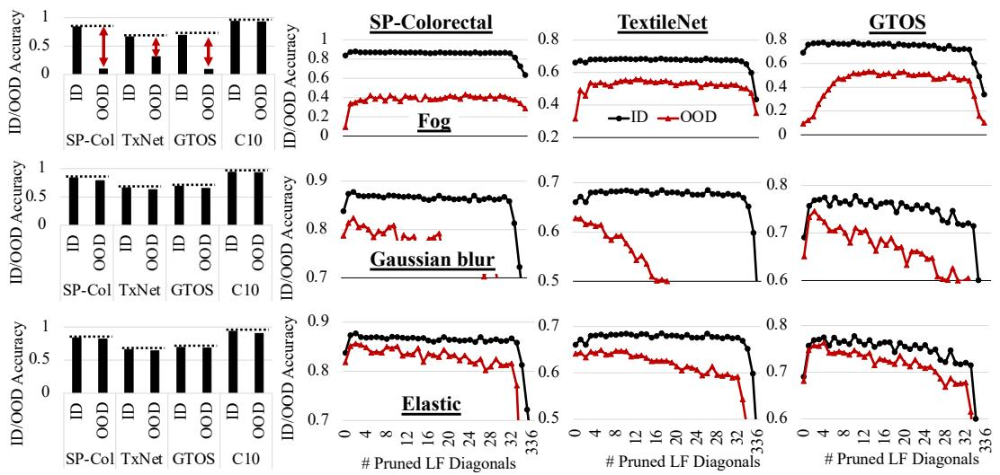

Figure 22: OOD Results for ResNet50.   
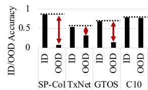

bar

| Model   | ID   | OOD  |
|---------|------|------|
| SP-Col  | 0.9  | 0.0  |
| TxNet   | 0.5  | 0.3  |
| GTOS    | 0.7  | 0.1  |
| C10     | 0.8  | 0.7  |

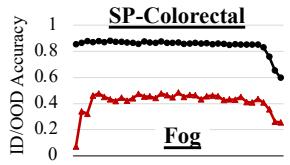

line

| Step | SP-Colorectal | Fog |
| ---- | ------------- | --- |
| 0    | 0.9           | 0.0 |
| 100  | 0.9           | 0.4 |
| 200  | 0.9           | 0.4 |
| 300  | 0.9           | 0.4 |
| 400  | 0.9           | 0.4 |
| 500  | 0.9           | 0.4 |
| 600  | 0.9           | 0.4 |
| 700  | 0.9           | 0.4 |
| 800  | 0.9           | 0.4 |
| 900  | 0.9           | 0.4 |
| 1000 | 0.6           | 0.2 |

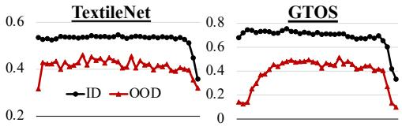

line

| Dataset    | ID   | OOD  |
| ---------- | ---- | ---- |
| TextileNet | 0.6  | 0.4  |
| GTOS       | 0.8  | 0.2  |

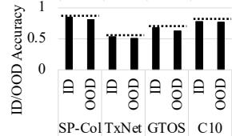

bar

| Model   | ID   | OOD  |
|---------|------|------|
| SP-Col  | 1.0  | 0.9  |
| TxNet   | 0.5  | 0.4  |
| GTOS    | 0.7  | 0.6  |
| C10     | 0.8  | 0.7  |

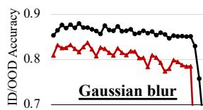

line

| Gaussian blur | ID/OOD Accuracy |
| ------------- | --------------- |
| 0             | 0.85            |
| 100           | 0.83            |
| 200           | 0.81            |
| 300           | 0.79            |
| 400           | 0.77            |
| 500           | 0.75            |
| 600           | 0.73            |
| 700           | 0.71            |
| 800           | 0.70            |
| 900           | 0.70            |
| 1000          | 0.70            |

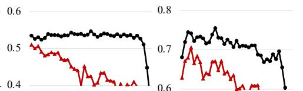

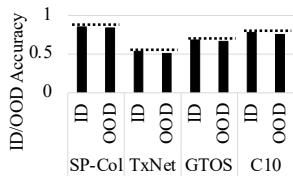

bar

| Method | ID   | OOD  |
|--------|------|------|
| SP-Col | 0.9  | 0.85 |
| TxNet  | 0.55 | 0.5  |
| GTOS   | 0.7  | 0.65 |
| C10    | 0.85 | 0.8  |

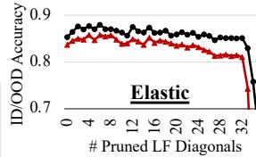

line

| # Pruned LF Diagonals | ID/OOD Accuracy |
| --------------------- | --------------- |
| 0                     | 0.85            |
| 4                     | 0.86            |
| 8                     | 0.87            |
| 12                    | 0.88            |
| 16                    | 0.89            |
| 20                    | 0.90            |
| 24                    | 0.91            |
| 28                    | 0.92            |
| 32                    | 0.93            |
| 36                    | 0.94            |

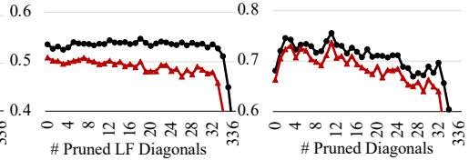

line

| # Pruned Diagonals | Black Line Value | Red Line Value |
| ------------------ | ---------------- | -------------- |
| 0                  | 0.5              | 0.5            |
| 336                | 0.6              | 0.6            |

Figure 23: OOD Results for MobileNet-V3.

# H Impact of Model Size and Architecture on OOD Results

Figure 22 to Figure 25 presents the OOD results for ResNet-50, MobileNet-V3, ViT-Small, and ViT-Tiny for the three corruption types we analyze, fog (low-frequency corruption), Gaussian blur (high-frequency corruption), and mixed low-and-high-frequeny corruption (elastic transform). As can be seen, trends are similar across different model sizes and architectures. For each model, we report the results for a single training with seed 42. Earlier in the appendix, we have shown that different seeds produce similar OOD results (see Appendix C).

# I OOD Corruption Pipelines

Figure 26 presents the OOD results for the two corruption pipelines we tested: (i) corrupt-prune (CP), and (ii) prune-corrupt-prune (PCP). In Section 7, we covered the first pipeline. In this section, we present the results for both pipelines. The x-axis presents the number of pruned LFCs, and the y-axis presents the ID/OOD accuracy. While the red line shows the CP pipeline that we also present in Section 7, the blue line shows the PCP pipeline. Dark line presents the ID values for reference. As can be seen, blue and red lines are often close to each other and follow similar patterns. For the GTOS task and fog corruption, the PCP pipeline has a higher accuracy than the CP pipeline. In fact, the PCP pipeline largely recovers from the corruptions, closely approximating the ID accuracy. This is because applying corruption after pruning reduces the impact of corruption, as corruption uses some of the pruned components. As a result, the final OOD accuracy is higher for PCP than for CP.

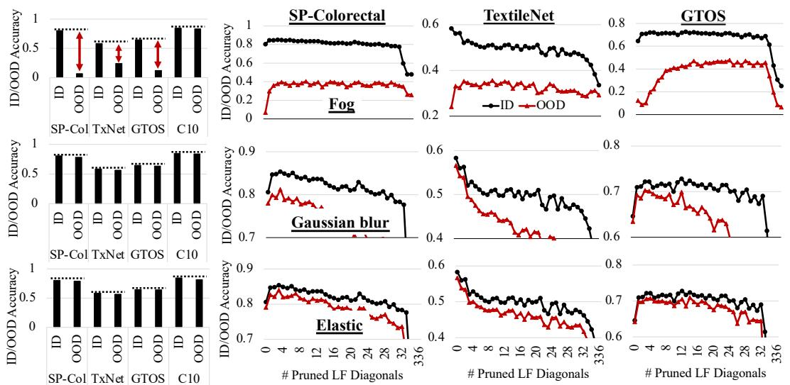

Figure 24: OOD Results for ViT-Small.   
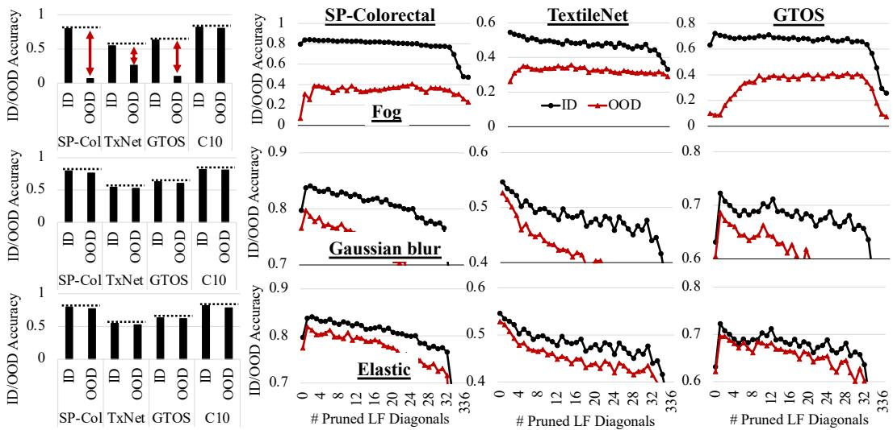  
Figure 25: OOD Results for ViT-Tiny.

For elastic corruption, however, CP achieves higher accuracy than PCP. This is because applying corruption after pruning increases its impact. Elastic transform spreads local pixels to their neighbors, which worsens its effect in the absence of LFCs. Which pipeline causes more harm depends on the exact formula the corruption uses and the dataset’s characteristics.

Nevertheless, OOD accuracy follows similar trends compared to the ID accuracy for both pipelines. While LFC-pruning significantly helps recover from fog corruption, it introduces a trade-off for Gaussian blur and elastic transform corruptions. On the one hand, pruning LFCs improves representation, as HFCs better reflect the application semantics. On the other hand, the model’s focus shifts to HFCs once LFCs are pruned. Hence, corruption at the HFCs is magnified. OOD accuracy increases/decreases/remains stable, depending on this trade-off.

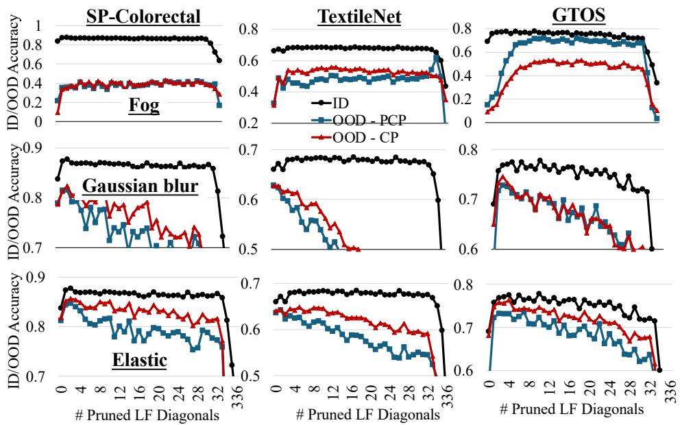

Figure 26: OOD corruption pipelines. PCP: prune-corrupt-prune. CP: corrupt-prune. Top: Lowfrequency corruption (fog) results. Middle: High-frequency corruption (Gaussian blur) results. Bottom: Mixed-frequency corruption (elastic transform) results. PCP and CP follow similar trends across the tasks and corruption types.   
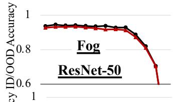

line

| Accuracy | ID/OOD Accuracy |
| -------- | --------------- |
| 1.0      | 1.0             |
| 0.9      | 0.95            |
| 0.8      | 0.9             |
| 0.7      | 0.8             |
| 0.6      | 0.6             |

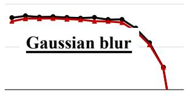

text_image

Gaussian blur

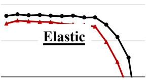

line

| X | Black Line | Red Line |
| --- | --- | --- |
| 0 | 100 | 100 |
| 1 | 98 | 95 |
| 2 | 96 | 90 |
| 3 | 94 | 85 |
| 4 | 92 | 80 |
| 5 | 90 | 75 |
| 6 | 88 | 70 |
| 7 | 86 | 65 |
| 8 | 84 | 60 |
| 9 | 82 | 55 |
| 10 | 80 | 50 |
| 11 | 78 | 45 |
| 12 | 76 | 40 |
| 13 | 74 | 35 |
| 14 | 72 | 30 |
| 15 | 70 | 25 |
| 16 | 68 | 20 |
| 17 | 66 | 15 |
| 18 | 64 | 10 |
| 19 | 62 | 5 |
| 20 | 60 | 0 |

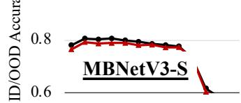

line

| ID/OOD Accuracy | MBNetV3-S |
| --------------- | --------- |
| 0.8             | 0.75      |
| 0.75            | 0.78      |
| 0.7             | 0.80      |
| 0.65            | 0.79      |
| 0.6             | 0.60      |

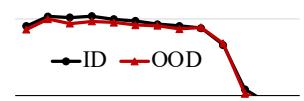

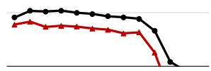

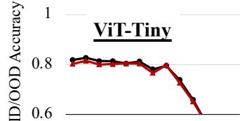

line

| Step | ID/OOD Accuracy |
| ---- | --------------- |
| 0    | 0.8             |
| 1    | 0.8             |
| 2    | 0.8             |
| 3    | 0.8             |
| 4    | 0.8             |
| 5    | 0.8             |
| 6    | 0.8             |
| 7    | 0.8             |
| 8    | 0.8             |
| 9    | 0.8             |
| 10   | 0.8             |
| 11   | 0.8             |
| 12   | 0.8             |
| 13   | 0.8             |
| 14   | 0.8             |
| 15   | 0.8             |
| 16   | 0.8             |
| 17   | 0.8             |
| 18   | 0.8             |
| 19   | 0.8             |
| 20   | 0.8             |
| 21   | 0.8             |
| 22   | 0.8             |
| 23   | 0.8             |
| 24   | 0.8             |
| 25   | 0.8             |
| 26   | 0.8             |
| 27   | 0.8             |
| 28   | 0.8             |
| 29   | 0.8             |
| 30   | 0.8             |
| 31   | 0.8             |
| 32   | 0.8             |
| 33   | 0.8             |
| 34   | 0.8             |
| 35   | 0.8             |
| 36   | 0.8             |
| 37   | 0.8             |
| 38   | 0.8             |
| 39   | 0.8             |
| 40   | 0.8             |
| 41   | 0.8             |
| 42   | 0.8             |
| 43   | 0.8             |
| 44   | 0.8             |
| 45   | 0.8             |
| 46   | 0.8             |
| 47   | 0.8             |
| 48   | 0.8             |
| 49   | 0.8             |
| 50   | 0.8             |
| 51   | 0.8             |
| 52   | 0.8             |
| 53   | 0.8             |
| 54   | 0.8             |
| 55   | 0.8             |
| 56   | 0.8             |
| 57   | 0.8             |
| 58   | 0.8             |
| 59   | 0.8             |
| 60   | 0.8             |
| 61   | 0.8             |
| 62   | 0.8             |
| 63   | 0.8             |
| 64   | 0.8             |
| 65   | 0.8             |
| 66   | 0.8             |
| 67   | 0.8             |
| 68   | 0.8             |
| 69   | 0.8             |
| 70   | 0.8             |
| 71   | 0.8             |
| 72   | 0.8             |
| 73   | 0.8             |
| 74   | 0.8             |
| 75   | 0.8             |
| 76   | 0.8             |
| 77   | 0.8             |
| 78   | 0.8             |
| 79   | 0.8             |
| 80   | 0.8             |
| 81   | 0.8             |
| 82   | 0.8             |
| 83   | 0.8             |
| 84   | 0.8             |
| 85   | 0.8             |
| 86   | 0.8             |
| 87   | 0.8             |
| 88   | 0.8             |
| 89   | 0.8             |
| 90   | 0.8             |
| 91   | 0.8             |
| 92   | 0.8             |
| 93   | 0.8             |
| 94   | 0.8             |
| 95   | 0.8             |
| 96   | 0.8             |
| 97   | 0.8             |
| 98   | 0.8             |
| 99   | 0.8             |
| 100+ | ~0.6            |

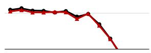

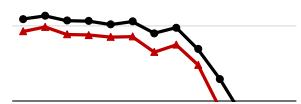

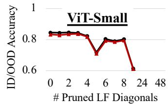

line

| # Pruned LF Diagonals | ID/OOD Accuracy |
| ---------------------- | --------------- |
| 0                      | 0.85            |
| 2                      | 0.84            |
| 4                      | 0.83            |
| 6                      | 0.72            |
| 8                      | 0.80            |
| 12                     | 0.60            |

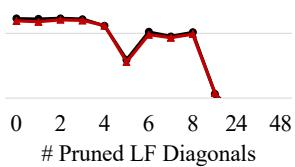

line

| # Pruned LF Diagonals | Value |
| --------------------- | ----- |
| 0                     | 1.0   |
| 2                     | 1.0   |
| 4                     | 1.0   |
| 6                     | 0.5   |
| 8                     | 1.0   |
| 24                    | 0.0   |

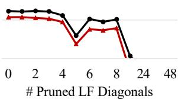

line

| # Pruned LF Diagonals | Series 1 | Series 2 |
| --------------------- | -------- | -------- |
| 0                     | 0.9      | 0.85     |
| 2                     | 0.85     | 0.8      |
| 4                     | 0.8      | 0.75     |
| 6                     | 0.7      | 0.6      |
| 8                     | 0.6      | 0.5      |
| 24                    | 0.3      | 0.1      |

Figure 27: CIFAR-10’s OOD performance closely approximates its ID performance. It suffers an observable drop in elastic corruption due to the elastic transform’s broad coverage of corruption across low and high frequencies.

Table 2: Hyperparameter search space for ResNet-50. 

<table><tr><td>HID</td><td>Optimizer</td><td>Learning rate</td><td>Momentum</td><td>Weight decay</td><td>Scheduler</td><td>Epochs</td></tr><tr><td>0</td><td>SGD</td><td> $3 \times 10^{-2}$ </td><td>0.9</td><td> $5 \times 10^{-4}$ </td><td>Cosine</td><td>200</td></tr><tr><td>1</td><td>SGD</td><td> $1 \times 10^{-1}$ </td><td>0.9</td><td> $5 \times 10^{-4}$ </td><td>Cosine</td><td>200</td></tr><tr><td>2</td><td>SGD</td><td> $2 \times 10^{-1}$ </td><td>0.9</td><td> $5 \times 10^{-4}$ </td><td>Cosine</td><td>200</td></tr><tr><td>3</td><td>SGD</td><td> $1 \times 10^{-1}$ </td><td>0.9</td><td> $1 \times 10^{-4}$ </td><td>Cosine</td><td>200</td></tr><tr><td>4</td><td>SGD</td><td> $1 \times 10^{-1}$ </td><td>0.9</td><td> $1 \times 10^{-3}$ </td><td>Cosine</td><td>200</td></tr><tr><td>5</td><td>SGD</td><td> $1 \times 10^{-1}$ </td><td>0.9</td><td> $5 \times 10^{-4}$ </td><td>Multistep</td><td>200</td></tr><tr><td>0</td><td>Adam</td><td> $1 \times 10^{-4}$ </td><td>-</td><td> $1 \times 10^{-4}$ </td><td>Cosine</td><td>200</td></tr><tr><td>1</td><td>Adam</td><td> $3 \times 10^{-4}$ </td><td>-</td><td> $1 \times 10^{-4}$ </td><td>Cosine</td><td>200</td></tr><tr><td>2</td><td>Adam</td><td> $1 \times 10^{-3}$ </td><td>-</td><td> $1 \times 10^{-4}$ </td><td>Cosine</td><td>200</td></tr><tr><td>3</td><td>Adam</td><td> $3 \times 10^{-4}$ </td><td>-</td><td>0</td><td>Cosine</td><td>200</td></tr><tr><td>4</td><td>Adam</td><td> $3 \times 10^{-4}$ </td><td>-</td><td> $5 \times 10^{-4}$ </td><td>Cosine</td><td>200</td></tr><tr><td>5</td><td>Adam</td><td> $3 \times 10^{-4}$ </td><td>-</td><td> $1 \times 10^{-4}$ </td><td>Multistep</td><td>200</td></tr></table>

# J OOD Results on CIFAR-10

CIFAR-10’s OOD values closely approximate its ID values, thanks to its balanced spectral behavior shown in Figure 5. Figure 27 presents ID and OOD values for CIFAR-10 for the three corruptions we analyze. As shown, OOD values (red line) closely approximate the ID values (dark line). For elastic corruption, OOD values are observed to be lower. This is because elastic modifies a wide range of frequency components, including both low and high frequencies, which reduces the models’ tolerance capacity.

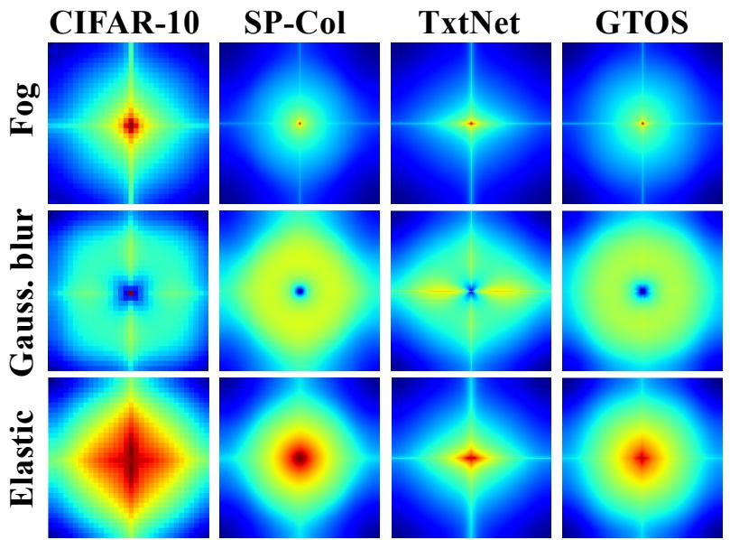

heatmap

| Model    | Fog   | Gauss. blur | Elastic |
| -------- | ----- | ----------- | ------- |
| CIFAR-10 | High  | Low         | High    |
| SP-Col   | Low   | Medium      | Medium  |
| TxtNet   | Low   | Low         | Low     |
| GTOS     | Low   | Medium      | Medium  |

Figure 28: Frequency characteristics of the corruptions we use, across the four tasks we analyze. We use a log10-scale, unlike [92] in their Figure 2. This way, we can observe fog’s high-frequency corruptions, which would otherwise go unnoticed. Each image represents the Fourier characteristics of the average difference between the original and corrupted image. We shift the lowest frequency coefficient to the center for compatibility with [92].

# K Tuning Hyperparameters for Low-Frequency Shortcuts

We test GTOS and SP-Colorectal across different optimizers, SGD and Adam, using six different hyperparameters for ResNet-50 and ViT-Small. We list the hyperparameter search space for ResNet-50 in Table 2 and for ViT-Small in 3. Table 4 presents the ID results for ResNet-50 hyperparameter search space. As can be seen, pruning LFCs increases the ID accuracy for all the hyperparameters for both optimizers. Table 5 presents the ID results for ViT-Small hyperparameters. Once again, we observe that pruning LFCs improves the ID accuracy for all the hyperparameters for both SP-Colorectal and GTOS datasets. This shows that low-frequency shortcuts are persistent across different hyperparameters.

Table 3: Hyperparameter search space for ViT-Small. No scheduler or momentum used. 

<table><tr><td>HID</td><td>Optimizer</td><td>Learning rate</td><td>Weight decay</td><td>Warmup epochs</td><td>Epochs</td></tr><tr><td>0</td><td>AdamW</td><td> $1 \times 10^{-3}$ </td><td>0.05</td><td>3.4</td><td>300</td></tr><tr><td>1</td><td>AdamW</td><td> $3 \times 10^{-3}$ </td><td>0.05</td><td>3.4</td><td>300</td></tr><tr><td>2</td><td>AdamW</td><td> $5 \times 10^{-3}$ </td><td>0.05</td><td>3.4</td><td>300</td></tr><tr><td>3</td><td>AdamW</td><td> $3 \times 10^{-3}$ </td><td>0.10</td><td>3.4</td><td>300</td></tr><tr><td>4</td><td>AdamW</td><td> $3 \times 10^{-3}$ </td><td>0.30</td><td>3.4</td><td>300</td></tr><tr><td>5</td><td>AdamW</td><td> $3 \times 10^{-3}$ </td><td>2.50</td><td>3.4</td><td>300</td></tr></table>

Table 4: GTOS ID performance with ResNet-50 using SGD and Adam across six hyperparameters each, as we prune increasing number of LFCs. As can be seen, pruning LFCs increases ID accuracy for both optimizers and all hyperparameters. 

<table><tr><td rowspan="2"></td><td colspan="6">GTOS w/ ResNet-50 &amp; SGD</td><td colspan="6">GTOS w/ ResNet-50 &amp; Adam</td><td colspan="2"></td></tr><tr><td>hid=0</td><td>hid=1</td><td>hid=2</td><td>hid=3</td><td>hid=4</td><td>hid=5</td><td>hid=6</td><td>hid=7</td><td>hid=8</td><td>hid=9</td><td>hid=10</td><td>hid=11</td><td>avg. SGD</td><td>avg. Adam</td></tr><tr><td>0-LFC</td><td>0.706557</td><td>0.693443</td><td>0.698033</td><td>0.665574</td><td>0.699016</td><td>0.680328</td><td>0.674426</td><td>0.712787</td><td>0.680984</td><td>0.698689</td><td>0.705574</td><td>0.710820</td><td>0.690492</td><td>0.697213</td></tr><tr><td>1-LFC</td><td>0.775410</td><td>0.765574</td><td>0.760656</td><td>0.738033</td><td>0.759016</td><td>0.763934</td><td>0.746557</td><td>0.780000</td><td>0.762295</td><td>0.747213</td><td>0.755738</td><td>0.771475</td><td>0.760437</td><td>0.760546</td></tr><tr><td>2-LFC</td><td>0.761311</td><td>0.755738</td><td>0.746230</td><td>0.735410</td><td>0.761311</td><td>0.764262</td><td>0.745574</td><td>0.763934</td><td>0.758689</td><td>0.752787</td><td>0.767213</td><td>0.767213</td><td>0.754044</td><td>0.759235</td></tr><tr><td>3-LFC</td><td>0.775410</td><td>0.770164</td><td>0.765902</td><td>0.729180</td><td>0.778033</td><td>0.748852</td><td>0.752459</td><td>0.777377</td><td>0.760328</td><td>0.766885</td><td>0.761967</td><td>0.771475</td><td>0.761257</td><td>0.765082</td></tr><tr><td>4-LFC</td><td>0.789180</td><td>0.773115</td><td>0.765246</td><td>0.742295</td><td>0.767541</td><td>0.769836</td><td>0.748852</td><td>0.767869</td><td>0.761311</td><td>0.757705</td><td>0.777049</td><td>0.770492</td><td>0.767869</td><td>0.763880</td></tr><tr><td>5-LFC</td><td>0.780656</td><td>0.769508</td><td>0.768197</td><td>0.726557</td><td>0.760000</td><td>0.757049</td><td>0.744262</td><td>0.771475</td><td>0.748525</td><td>0.754426</td><td>0.760656</td><td>0.769508</td><td>0.760328</td><td>0.758142</td></tr><tr><td>6-LFC</td><td>0.766230</td><td>0.769180</td><td>0.774754</td><td>0.724590</td><td>0.767213</td><td>0.765574</td><td>0.743607</td><td>0.763934</td><td>0.744918</td><td>0.745902</td><td>0.773115</td><td>0.776393</td><td>0.761257</td><td>0.757978</td></tr><tr><td>7-LFC</td><td>0.761967</td><td>0.760984</td><td>0.760328</td><td>0.729836</td><td>0.783279</td><td>0.760000</td><td>0.738689</td><td>0.779016</td><td>0.749836</td><td>0.768197</td><td>0.770164</td><td>0.758033</td><td>0.759399</td><td>0.760656</td></tr><tr><td>8-LFC</td><td>0.774754</td><td>0.768525</td><td>0.762951</td><td>0.720328</td><td>0.768525</td><td>0.757705</td><td>0.740984</td><td>0.757377</td><td>0.751148</td><td>0.747213</td><td>0.769836</td><td>0.753115</td><td>0.758798</td><td>0.753279</td></tr></table>

# L Additional Comparison to Related Work

Existing CIFAR-10 Studies. There are three main frequency characterization studies on CIFAR-10. [38] performs test set characterization on unpruned training images and concludes that high frequencies are important for CIFAR-10 classification. They prune all HFCs with an above radial frequency of 4.25 from test set images and observe up to 24% accuracy drop in test set accuracy5. Our results corroborate this, as the radial frequency of 4.25 corresponds to the top-left 8 LFCs in our setup. Pruning everything beyond 8 LFCs can indeed cause a significant accuracy drop, as our accuracy contributions graph also shows in 5. [7] also performs test set characterization with a fixed unpruned training set of images, and show that pruning the highest end of the frequency spectrum causes the least accuracy loss6, as we also have shown in our experiments. They further show that pruning higher frequencies in the lower half of the spectrum can cause a larger drop in accuracy than pruning lower frequencies. Our results corroborate this, as we have shown that the lowest 22 components in the lower half of the spectrum contribute roughly equally to test set accuracy. [75] performs training and test set characterization with a small number of configurations and shows that keeping LFCs contributes significantly more than HFCs to the test accuracy7, which corroborates our results.

Existing ImageNet Studies. Our CIFAR-10 results on LFC and HFC pruning from training and test sets corroborate with numerous existing ImageNet [20] results. Task-specific image compression studies by [63] and [83] show that pruning HFCs is much more advantageous than LFCs for a subset and full ImageNet8. Similarly, [92] shows that accuracy drops much faster when training and test set images are high-pass filtered, as opposed to low-pass filtered9. Lastly, [7] shows a similar trend to ours for a subset of ImageNet, as they prune high frequencies10. These studies, however, did not conduct as fine-grained an analysis as we have. Their unit of analysis is more than a single diagonal. Hence, their results might be incomplete. Further analysis of ImageNet and similar datasets is in our future work.

Table 5: SP-Colorectal and GTOS ID performance with ViT-Small using Adam across six hyperparameters each, as we prune increasing number of LFCs. As can be seen, pruning LFCs increases ID accuracy for both datasets and all hyperparameters. 

<table><tr><td rowspan="2"></td><td colspan="7">SP-Colorectal w/ ViT-Small &amp; Adam</td><td colspan="7">GTOS w/ ViT-Small &amp; Adam</td></tr><tr><td>hid=0</td><td>hid=1</td><td>hid=2</td><td>hid=3</td><td>hid=4</td><td>hid=5</td><td>avg.</td><td>hid=0</td><td>hid=1</td><td>hid=2</td><td>hid=3</td><td>hid=4</td><td>hid=5</td><td>avg.</td></tr><tr><td>0-LFC</td><td>0.791008</td><td>0.783392</td><td>0.786028</td><td>0.802871</td><td>0.803017</td><td>0.743117</td><td>0.784906</td><td>0.624918</td><td>0.345574</td><td>0.596721</td><td>0.602623</td><td>0.643607</td><td>0.634426</td><td>0.574645</td></tr><tr><td>1-LFC</td><td>0.826889</td><td>0.830258</td><td>0.819127</td><td>0.838459</td><td>0.842267</td><td>0.769479</td><td>0.821080</td><td>0.705574</td><td>0.367541</td><td>0.537705</td><td>0.651475</td><td>0.718033</td><td>0.659344</td><td>0.606612</td></tr><tr><td>2-LFC</td><td>0.825425</td><td>0.829379</td><td>0.827914</td><td>0.846514</td><td>0.842414</td><td>0.755419</td><td>0.821178</td><td>0.699344</td><td>0.423934</td><td>0.455410</td><td>0.661639</td><td>0.700984</td><td>0.670492</td><td>0.601967</td></tr><tr><td>3-LFC</td><td>0.830844</td><td>0.833333</td><td>0.835970</td><td>0.847832</td><td>0.839192</td><td>0.742824</td><td>0.821666</td><td>0.698361</td><td>0.474426</td><td>0.347213</td><td>0.681967</td><td>0.718361</td><td>0.635738</td><td>0.592678</td></tr><tr><td>4-LFC</td><td>0.828500</td><td>0.827182</td><td>0.829233</td><td>0.837141</td><td>0.845489</td><td>0.758055</td><td>0.820933</td><td>0.693115</td><td>0.400656</td><td>0.530820</td><td>0.675738</td><td>0.733115</td><td>0.631475</td><td>0.610820</td></tr><tr><td>5-LFC</td><td>0.836262</td><td>0.832162</td><td>0.839484</td><td>0.849151</td><td>0.842999</td><td>0.753661</td><td>0.825620</td><td>0.709180</td><td>0.363934</td><td>0.583934</td><td>0.685574</td><td>0.718033</td><td>0.617377</td><td>0.613005</td></tr><tr><td>6-LFC</td><td>0.832601</td><td>0.825864</td><td>0.833919</td><td>0.839777</td><td>0.848858</td><td>0.749268</td><td>0.821715</td><td>0.695410</td><td>0.413443</td><td>0.517049</td><td>0.682951</td><td>0.722951</td><td>0.623607</td><td>0.609235</td></tr><tr><td>7-LFC</td><td>0.839484</td><td>0.832748</td><td>0.842560</td><td>0.841681</td><td>0.846661</td><td>0.756444</td><td>0.826596</td><td>0.700000</td><td>0.393443</td><td>0.624918</td><td>0.684918</td><td>0.708525</td><td>0.614754</td><td>0.621093</td></tr><tr><td>8-LFC</td><td>0.832601</td><td>0.832748</td><td>0.838899</td><td>0.838606</td><td>0.846514</td><td>0.740920</td><td>0.821715</td><td>0.693443</td><td>0.368197</td><td>0.613443</td><td>0.689836</td><td>0.719672</td><td>0.616066</td><td>0.616776</td></tr></table>

Existing studies either group frequency coefficients in broader units than diagonals [7; 38], or perform an analysis one by one for each frequency coefficient separately [77]. Using broad units limits the findings of the existing studies. Performing an analysis for each coefficient is feasible for a test set characterization, but it is too costly for a training set characterization, as it requires too many training sessions. Diagonal-wise grouping of coefficients provides a middle ground between the two: it captures a fine-grained behavior along increasing frequencies, and is also feasible in terms of experimental time. Recent studies on task-specific image compression have shown that diagonal-wise pruning provides successful results [63; 64; 83; 82].

Task-specific Image Compression. Furthermore, there has been a growing interest in task-specific image compression, where images are compressed for a specific computer vision task [63; 64; 23; 25; 43; 59; 83; 82]. This requires learning in the compressed domain. Studies have shown that training and test images can be significantly compressed without significant loss of accuracy. This allows reducing training storage, training time, and inference time, providing a resource-efficient computer vision system. Existing task-specific image compression studies are all based on a few standard benchmarks, similar to existing frequency characterization studies. Our characterization of the training and test sets sheds light on task-specific image compression across numerous application domains.

Simplicity Bias. Simplicity bias might occur due to visible [13; 14] or invisible superficial cues [77; 79]. While visible features are easy to detect via visual inspection, invisible features are deeply embedded in the data and require formal tools to analyze [50; 56; 12; 17; 93; 77; 79]. One such useful tool is Fourier analysis [77; 79]. Fourier analysis transforms data from its original domain, e.g., the spatial domain for images, into the frequency domain, enabling a principled analysis of shortcut behavior by leveraging the frequency structure embedded in the data. Analysis using other tools, such as geometric transformations or information-theoretic methods, is an interesting avenue for future work.

# M Frequency Characteristics of OOD Corruptions

Figure 28 presents frequency characteristics of the used corruptions: fog, Gaussian blur, and elastic transform. We follow the same methodology as [92] when obtaining their Figure 2, with one exception. We use a log10 scale instead of using raw numbers. We use torch.log10(). This way, we can see fog’s corruption at higher frequencies more easily, which would otherwise be invisible in Figure 2 of [92]. Other than this difference, we use the exact same methodology. Each image in Figure 28 shows the Fourier spectrum of the average difference between the original and corrupted images in the validation sets, for each dataset. The lowest-frequency coefficient is shifted to the center of each graph for compatibility with [92]. We use torch.fft.fft2(), and torch.fft.fftshift().

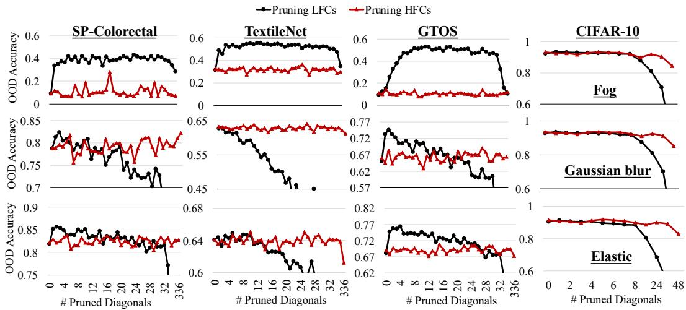

line

| Dataset       | # Pruned Diagonals | Pruning LFCs OOD Accuracy | Pruning HFCs OOD Accuracy |
| ------------- | ------------------ | ------------------------- | ------------------------- |
| SP-Colorectal | 336                | ~0.4                      | ~0.1                      |
| TextileNet    | 336                | ~0.5                      | ~0.3                      |
| GTOS          | 336                | ~0.5                      | ~0.3                      |
| CIFAR-10      | 336                | ~0.4                      | ~0.8                      |
| Gaussian blur | 336                | ~0.77                     | ~0.9                      |
| Elastic       | 336                | ~0.6                      | ~0.8                      |

Figure 29: Impact of pruning HFCs on OOD performance (red line). We present pruning HFCs, along with the results for pruning LFCs, to provide a more complete picture. Similar to the ID performance, pruning HFCs has a minimal impact on OOD performance. For TextileNet and CIFAR-10, the impact is higher, as these two tasks depend more on higher frequencies at the lower end of the spectrum.

# N Impact of HFCs on OOD Generalization

Figure 29 presents the impact of pruning LFCs (dark line) and HFCs (red line) on OOD generalization for the four tasks we analyze. As shown, pruning HFCs minimally impacts accuracy across all tasks and corruptions. This, once again, shows the efficiency of high-frequency compression. For CIFAR-10 and TextileNet, there is a slight drop at the end, similar to their ID accuracies. CIFAR-10 and TextileNet depend on higher frequencies, as their accuracy contribution graphs show in Figure 5 (top row). Hence, pruning more than 224/32 diagonals from the bottom-right corner to the top-left corner reduces their accuracy.

# References

[1] EuroSAT GitHub Repo. https://github.com/phelber/EuroSAT, 2019.   
[2] Galaxy MNIST GitHub Repo. https://github.com/mwalmsley/galaxy\_mnist, 2022.   
[3] DINOv2: Learning Robust Visual Features without Supervision, 2023.   
[4] CLIP GitHub Repo. https://github.com/openai/CLIP, 2025.   
[5] DinoV2 GitHub Repo. https://github.com/facebookresearch/dinov2, 2025.   
[6] Galaxy Zoo. https://github.com/mwalmsley/galaxy-datasets, 2025.   
[7] Antonio A. Abello, Roberto Hirata, and Zhangyang Wang. Dissecting the High-Frequency Bias in Convolutional Neural Networks. In CVPRW, pages 863–871, 2021.   
[8] N. Ahmed, T. Natarajan, and K.R. Rao. Discrete Cosine Transform. IEEE Transactions on Computers, C-23(1):90–93, 1974.   
[9] Jiawang Bai, Li Yuan, Shu-Tao Xia, Shuicheng Yan, Zhifeng Li, and Wei Liu. Improving Vision Transformers by Revisiting High-Frequency Components. In ECCV, page 1–18, 2022.   
[10] Nicholas Baker, Hongjing Lu, Gennady Erlikhman, and Philip J. Kellman. Deep Convolutional Networks do not Classify based on Global Object Shape. PLOS Computational Biology, 14 (12):1–43, 2018.   
[11] Saikat Basu, Sangram Ganguly, Supratik Mukhopadhyay, Robert DiBiano, Manohar Karki, and Ramakrishna Nemani. DeepSat: A Learning Framework for Satellite Imagery. In SIGSPATIAL, 2015.   
[12] David Bau, Bolei Zhou, Aditya Khosla, Aude Oliva, and Antonio Torralba. Network Dissection: Quantifying Interpretability of Deep Visual Representations. In CVPR, 2017.   
[13] Sara Beery, Grant Van Horn, and Pietro Perona. Recognition in Terra Incognita. In ECCV, 2018.   
[14] Christopher Boland, Keith A Goatman, Sotirios A. Tsaftaris, and Sonia Dahdouh. There Are No Shortcuts to Anywhere Worth Going: Identifying Shortcuts in Deep Learning Models for Medical Image Analysis. In International Conference on Medical Imaging with Deep Learning, volume 250, pages 131–150, 2024.   
[15] Tom Burgert, Oliver Stoll, Paolo Rota, and Begüm Demir. ImageNet-trained CNNs are not Biased Towards Texture: Revisiting Feature Reliance Through Controlled Suppression. In NeurIPS, 2025.   
[16] Yuan Cao, Zhiying Fang, Yue Wu, Ding-Xuan Zhou, and Quanquan Gu. Towards Understanding the Spectral Bias of Deep Learning. In IJCAI, pages 2205–2211, 8 2021.   
[17] Jaouad Dabounou and Amine Baazzouz. Enhancing Neural Network Interpretability Through Conductance-Based Information Plane Analysis, 2024.   
[18] Nikolay Dagaev, Brett D. Roads, Xiaoliang Luo, Daniel N. Barry, Kaustubh R. Patil, and Bradley C. Love. A Too-Good-to-Be-True Prior to Reduce Shortcut Reliance. Pattern Recognition Letters, 166:164–171, 2023.   
[19] Zihang Dai, Hanxiao Liu, Quoc V. Le, and Mingxing Tan. CoAtNet: Marrying Convolution and Attention for All Data Sizes. In NeurIPS, 2021.   
[20] Jia Deng, Wei Dong, Richard Socher, Li-Jia Li, Kai Li, and Li Fei-Fei. ImageNet: A Large-scale Hierarchical Image Database. In CVPR, pages 248–255, 2009.   
[21] Tuan Do, Bernie Boscoe, Evan Jones, Yun Qi Li, and Kevin Alfaro. GalaxiesML: A Dataset of Galaxy Images, Photometry, Redshifts, and Structural Parameters for Machine Learning. 2024.

[22] Alexey Dosovitskiy, Lucas Beyer, Alexander Kolesnikov, Dirk Weissenborn, Xiaohua Zhai, Thomas Unterthiner, Mostafa Dehghani, Matthias Minderer, Georg Heigold, Sylvain Gelly, Jakob Uszkoreit, and Neil Houlsby. An Image is Worth 16x16 Words: Transformers for Image Recognition at Scale. In ICLR, 2021.   
[23] Lingyu Du and Guohao Lan. FreeGaze: Resource-efficient Gaze Estimation via Frequency Domain Contrastive Learning. CoRR, abs/2209.06692, 2022.   
[24] Adam Dziedzic, John Paparrizos, Sanjay Krishnan, Aaron Elmore, and Michael Franklin. Bandlimited Training and Inference for Convolutional Neural Networks. In ICML, pages 1745–1754, 2019.   
[25] Dan Fu and Gabriel Guimaraes. Using Compression to Speed Up Image Classification in Artificial Neural Networks. 2016. URL https://www.danfu.org/files/ CompressionImageClassification.pdf.   
[26] Paul Gavrikov and Janis Keuper. Can Biases in ImageNet Models Explain Generalization? In CVPR, pages 22184–22194, 2024.   
[27] Robert Geirhos, Patricia Rubisch, Claudio Michaelis, Matthias Bethge, Felix A. Wichmann, and Wieland Brendel. ImageNet-trained CNNs are Biased Towards Texture; Increasing Shape Bias Improves Accuracy and Robustness. In ICLR, 2019.   
[28] Robert Geirhos, Jörn-Henrik Jacobsen, Claudio Michaelis, Richard Zemel, Wieland Brendel, Matthias Bethge, and Felix A. Wichmann. Shortcut Learning in Deep Neural Networks. Nature Machine Intelligence, 2:665–673, 2020.   
[29] Tianrui Guan, Divya Kothandaraman, Rohan Chandra, Adarsh Jagan Sathyamoorthy, Kasun Weerakoon, and Dinesh Manocha. GA-Nav: Efficient Terrain Segmentation for Robot Navigation in Unstructured Outdoor Environments. IEEE Robotics and Automation Letters, 7(3): 8138–8145, 2022.   
[30] Xintong Han, Zuxuan Wu, Zhe Wu, Ruichi Yu, and Larry S. Davis. VITON: An Image-Based Virtual Try-On Network. In CVPR, pages 7543–7552, 2018.   
[31] Kaiming He, Xiangyu Zhang, Shaoqing Ren, and Jian Sun. Deep Residual Learning for Image Recognition. In CVPR, pages 770–778, 2016.   
[32] Patrick Helber, Benjamin Bischke, Andreas Dengel, and Damian Borth. Introducing eurosat: A novel dataset and deep learning benchmark for land use and land cover classification. In IGARSS 2018-2018 IEEE International Geoscience and Remote Sensing Symposium, pages 204–207. IEEE, 2018.   
[33] Patrick Helber, Benjamin Bischke, Andreas Dengel, and Damian Borth. Eurosat: A novel dataset and deep learning benchmark for land use and land cover classification. IEEE Journal of Selected Topics in Applied Earth Observations and Remote Sensing, 2019.   
[34] Dan Hendrycks and Thomas G. Dietterich. Benchmarking Neural Network Robustness to Common Corruptions and Perturbations. In ICLR, 2019.   
[35] HistAI. SPIDER-colorectal dataset. https://huggingface.co/datasets/histai/ SPIDER-colorectal, 2025. Accessed: 2026-01-07.   
[36] HMB302. Inflammation. https://hmb302.ca/chapters/inflammation/, 2023. Online histology and pathology educational resource. Accessed: 2026-01-07.   
[37] Andrew Howard, Ruoming Pang, Hartwig Adam, Quoc V. Le, Mark Sandler, Bo Chen, Weijun Wang, Liang-Chieh Chen, Mingxing Tan, Grace Chu, Vijay Vasudevan, and Yukun Zhu. Searching for MobileNetV3. In ICCV, pages 1314–1324, 2019.   
[38] Jason Jo and Yoshua Bengio. Measuring the Tendency of CNNs to Learn Surface Statistical Regularities, 2017.   
[39] Alex Krizhevsky. Learning Multiple Layers of Features from Tiny Images. Technical report, 2009.

[40] Kirsi Laitala and Casper Boks. Sustainable Clothing Design: Use Matters. Journal of Design Research, 10(1–2):121–139, 2012.   
[41] Sebastian Lapuschkin, Stephan Wäldchen, Alexander Binder, Grégoire Montavon, Wojciech Samek, and Klaus-Robert Müller. Unmasking Clever Hans Predictors and Assessing What Machines Really Learn. Nature Communications, 10(1), 2019.   
[42] Zhiyu Lin, Yifei Gao, and Jitao Sang. Investigating and Explaining the Frequency Bias in Image Classification. In IJCAI, pages 717–723, 2022.   
[43] Shao-Yuan Lo and Hsueh-Ming Hang. Exploring Semantic Segmentation on the DCT Representation. In 1st ACM International Conference on Multimedia in Asia (MMASIA), pages 1–6, 2019.   
[44] Matthias Minderer, Olivier Bachem, Neil Houlsby, and Michael Tschannen. Automatic Shortcut Removal for Self-supervised Representation Learning. In ICML, 2020.   
[45] Subramanian Senthilkannan Muthu. Circular Economy in Textiles and Apparel: Processing, Manufacturing, and Design. Woodhead Publishing, 2018.   
[46] Meike Nauta, Robert Walsh, Andrew Dubowski, and Christin Seifert. Uncovering and Correcting Shortcut Learning in Machine Learning Models for Skin Cancer Diagnosis. Diagnostics, 12 (1), 2022.   
[47] Dmitry Nechaev, Alexey Pchelnikov, and Ekaterina Ivanova. SPIDER: A Comprehensive Multi-Organ Supervised Pathology Dataset and Baseline Models, 2025.   
[48] Hongjing Niu, Hanting Li, Feng Zhao, and Bin Li. Roadblocks for Temporarily Disabling Shortcuts and Learning New Knowledge. In NeurIPS, pages 29064–29075, 2022.   
[49] Zizheng Pan, Jianfei Cai, and Bohan Zhuang. Fast Vision Transformers with HiLo Attention. In NeurIPS, pages 14541–14554, 2022.   
[50] Nicolas Papernot and Patrick McDaniel. Deep k-Nearest Neighbors: Towards Confident, Interpretable and Robust Deep Learning, 2018.   
[51] Namuk Park and Songkuk Kim. How Do Vision Transformers Work? In ICLR, 2022.   
[52] Mohammad Pezeshki, Oumar Kaba, Yoshua Bengio, Aaron C Courville, Doina Precup, and Guillaume Lajoie. Gradient Starvation: A Learning Proclivity in Neural Networks. In NeurIPS, volume 34, pages 1256–1272, 2021.   
[53] PyTorch. PyTorch — ResNet-50 Model Documentation, 2025. URL https://docs.pytorch. org/vision/main/models/generated/torchvision.models.resnet50.html. Accessed: 2026-01-07.   
[54] Alec Radford, Jong Wook Kim, Chris Hallacy, Aditya Ramesh, Gabriel Goh, Sandhini Agarwal, Girish Sastry, Amanda Askell, Pamela Mishkin, Jack Clark, Gretchen Krueger, and Ilya Sutskever. Learning Transferable Visual Models From Natural Language Supervision. In ICML, pages 8748–8763, 2021.   
[55] Nasim Rahaman, Aristide Baratin, Devansh Arpit, Felix Draxler, Min Lin, Fred Hamprecht, Yoshua Bengio, and Aaron Courville. On the Spectral Bias of Neural Networks. In Kamalika Chaudhuri and Ruslan Salakhutdinov, editors, PMLR, volume 97, pages 5301–5310, 2019.   
[56] Vikram V. Ramaswamy, Sunnie S. Y. Kim, Ruth Fong, and Olga Russakovsky. Overlooked Factors in Concept-Based Explanations: Dataset Choice, Concept Learnability, and Human Capability. In CVPR, pages 10932–10941, 2023.   
[57] Yongming Rao, Wenliang Zhao, Zheng Zhu, Jiwen Lu, and Jie Zhou. Global Filter Networks for Image Classification. In NeurIPS, pages 980–993, 2021.   
[58] Basri Ronen, David Jacobs, Yoni Kasten, and Shira Kritchman. The Convergence Rate of Neural Networks for Learned Functions of Different Frequencies. In NeurIPS, volume 32, 2019.

[59] Samuel Felipe dos Santos, Nicu Sebe, and Jurandy Almeida. The Good, The Bad, and The Ugly: Neural Networks Straight From JPEG. In 27th IEEE International Conference on Image Processing (ICIP), pages 1896–1900, 2020.   
[60] Harshay Shah, Kaustav Tamuly, Aditi Raghunathan, Prateek Jain, and Praneeth Netrapalli. The Pitfalls of Simplicity Bias in Neural Networks. In NeurIPS, 2020.   
[61] Runwu Shi, Shichun Yang, Yuyi Chen, Rui Wang, Jiayi Lu, Zhaowen Pang, and Yaoguang Cao. Road Recognition for Autonomous Vehicles Based on Intelligent Tire and SE-CNN. In Intelligent Systems and Pattern Recognition, volume 1589, pages 291–305. 2022.   
[62] Shu Zhong. TextileNet: Material taxonomy-based fashion textile dataset. https://github. com/hahashu/TextileNet, 2023. Accessed: 2026-01-07.   
[63] Utku Sirin and Stratos Idreos. The Image Calculator: 10x Faster Image-AI Inference by Replacing JPEG with Self-designing Storage Format. Proc. ACM Manag. Data, 2(1), 2024.   
[64] Utku Sirin, Victoria Kauffman, Aadit Saluja, Florian Klein, Jeremy Hsu, and Stratos Idreos. Frequency-Store: Scaling Image AI by A Column-Store for Images. In CIDR, 2025.   
[65] Chetan L. Srinidhi, Ozan Ciga, and Anne L. Martel. Deep neural network models for computational histopathology: A survey. Medical Image Analysis, 67, 2021.   
[66] Ajay Subramanian, Elena Sizikova, Najib J. Majaj, and Denis G. Pelli. Spatial-frequency Channels, Shape Bias, and Adversarial Robustness. In NeurIPS, 2023.   
[67] Damien Teney, Armand Mihai Nicolicioiu, Valentin Hartmann, and Ehsan Abbasnejad. Neural Redshift: Random Networks Are Not Random Functions. In CVPR, pages 4786–4796, 2024.   
[68] Hugo Touvron, Matthieu Cord, Matthijs Douze, Francisco Massa, Alexandre Sablayrolles, and Herve Jegou. Training Data-Efficient Image Transformers & Distillation Through Attention. In ICML, pages 10347–10357, 2021.   
[69] Zhengzhong Tu, Hossein Talebi, Han Zhang, Feng Yang, Peyman Milanfar, Alan Bovik, and Yinxiao Li. MaxViT: Multi-axis Vision Transformer. In ECCV, page 459–479, 2022.   
[70] Shikhar Tuli, Ishita Dasgupta, Erin Grant, and Thomas L. Griffiths. Are Convolutional Neural Networks or Transformers More Like Human Vision? In Proceedings of the 43rd Annual Meeting of the Cognitive Science Society, pages 1844–1850, 2021.   
[71] Haiming Tuo, Zuqiang Meng, Zihao Shi, and Daosheng Zhang. Interpretable Neural Network Classification Model Using First-order Logic Rules. Neurocomputing, 614(1):128–840, 2025.   
[72] Koen van Gelder. E-commerce Worldwide—Statistics & Facts. https://www.statista. com/topics/871/online-shopping/, 2025. Accessed: 2026-01-07.   
[73] Mike Walmsley, Chris Lintott, Tobias Géron, Sandor Kruk, Coleman Krawczyk, Kyle W Willett, Steven Bamford, Lee S Kelvin, Lucy Fortson, Yarin Gal, William Keel, Karen L Masters, Vihang Mehta, Brooke D Simmons, Rebecca Smethurst, Lewis Smith, Elisabeth M Baeten, and Christine Macmillan. Galaxy Zoo DECaLS: Detailed Visual Morphology Measurements from Volunteers and Deep Learning for 314000 Galaxies. Monthly Notices of the Royal Astronomical Society, 509(3):3966–3988, 2022.   
[74] Haohan Wang, Songwei Ge, Zachary C. Lipton, and Eric P. Xing. Learning Robust Global Representations by Penalizing Local Predictive Power. In NeurIPS, pages 10506–10518, 2019.   
[75] Haohan Wang, Xindi Wu, Zeyi Huang, and Eric P. Xing. High-Frequency Component Helps Explain the Generalization of Convolutional Neural Networks. In CVPR, pages 8681–8691, 2020.   
[76] Peihao Wang, Wenqing Zheng, Tianlong Chen, and Zhangyang Wang. Anti-Oversmoothing in Deep Vision Transformers via the Fourier Domain Analysis: From Theory to Practice. In ICLR, 2022.

[77] Shunxin Wang, Raymond Veldhuis, Christoph Brune, and Nicola Strisciuglio. What Do Neural Networks Learn in Image Classification? A Frequency Shortcut Perspective. In ICCV, pages 1433–1442, 2023.   
[78] Shunxin Wang, Raymond Veldhuis, Christoph Brune, and Nicola Strisciuglio. A Survey on the Robustness of Computer Vision Models against Common Corruptions, 2024.   
[79] Shunxin Wang, Raymond Veldhuis, and Nicola Strisciuglio. Do ImageNet-trained Models Learn Shortcuts? The Impact of Frequency Shortcuts on Generalization. In CVPR, pages 25198–25207, 2025.   
[80] Zhenyu Wang, Hao Luo, Pichao WANG, Feng Ding, Fan Wang, and Hao Li. VTC-LFC: Vision Transformer Compression with Low-Frequency Components. In NeurIPS, pages 13974–13988, 2022.   
[81] Hongming Xu, Qi Xu, Fengyu Cong, Jeonghyun Kang, Chu Han, Zaiyi Liu, Anant Madabhushi, and Cheng Lu. Vision Transformers for Computational Histopathology. IEEE Reviews in Biomedical Engineering, 17:63–79, 2024.   
[82] Kai Xu. Learning in Compressed Domains. PhD thesis, Arizona State University, 2021.   
[83] Kai Xu, Minghai Qin, Fei Sun, Yuhao Wang, Yen-Kuang Chen, and Fengbo Ren. Learning in the Frequency Domain. In CVPR, pages 1740–1749, 2020.   
[84] Zhi-Qin John Xu. Frequency Principle: Fourier Analysis Sheds Light on Deep Neural Networks. Communications in Computational Physics, 28(5):1746–1767, 2020.   
[85] Zhiqin John Xu and Hanxu Zhou. Deep Frequency Principle Towards Understanding Why Deeper Learning Is Faster. In AAAI, volume 35, pages 10541–10550, 2021.   
[86] Zhiqin John Xu and Hanxu Zhou. Deep Frequency Principle Towards Understanding Why Deeper Learning Is Faster. AAAI, 35(12):10541–10550, 2021.   
[87] Zhuo Xu, Xiang Xiang, and Yifan Liang. Overcoming Shortcut Problem in VLM for Robust Out-of-Distribution Detection. In CVPR, 2025.   
[88] Jia Xue, Hang Zhang, Kristin Dana, and Ko Nishino. Differential Angular Imaging for Material Recognition. In CVPR, pages 764–773, 2017.   
[89] Dongsheng Yang, Dongmin Zhang, Yi Yuan, Zhaoyu Lei, Binlei Ding, and Bo Lei. Road Terrain Recognition Based on Tire Noise for Autonomous Vehicle. Scientific Reports, 14(1), 2024.   
[90] Yi Yang and Shawn Newsam. Bag-of-Visual-Words and Spatial Extensions for Land-Use Classification. In SIGSPATIAL, GIS, page 270–279, 2010.   
[91] Ping yeh Chiang, Renkun Ni, David Yu Miller, Arpit Bansal, Jonas Geiping, Micah Goldblum, and Tom Goldstein. Loss Landscapes are All You Need: Neural Network Generalization Can Be Explained Without the Implicit Bias of Gradient Descent. In ICLR, 2023.   
[92] Dong Yin, Raphael Gontijo Lopes, Jonathon Shlens, Ekin D. Cubuk, and Justin Gilmer. A Fourier Perspective on Model Robustness in Computer Vision. In NeurIPS, 2019.   
[93] Chenxiao Zhao, P. Thomas Fletcher, Mixue Yu, Yaxin Peng, Guixu Zhang, and Chaomin Shen. The Adversarial Attack and Detection under the Fisher Information Metric. AAAI, 33(1): 5869–5876, 2019.   
[94] Jiayun Zheng and Maggie Makar. Causally Motivated Multishortcut Identification and Removal. In NeurIPS, pages 12800–12812, 2022.   
[95] Shu Zhong, Miriam Ribul, Youngjun Cho, and Marianna Obrist. TextileNet: A Material Taxonomy-based Fashion Textile Dataset, 2023.   
[96] Jannik Zürn, Wolfram Burgard, and Abhinav Valada. Self-Supervised Visual Terrain Classification from Unsupervised Acoustic Feature Learning. IEEE Transactions on Robotics (T-RO), 37 (2):466–481, 2021.